# 【Linux／RHCE／RHCSA】零基础入门Linux／红帽认证！Linux运维工程师的升职加薪宝典！RHCSA+RHCE／49-Ansible软件安装 - P1 - GLAB郭主任 - BV1uj411E7d4

接下来有五个练习题，每个练习题都是我们前面上课的内容呃，我接下来的三个方法是，我把每一个题的需求先贴出来，然后给大家5分钟时间翻一下前面的笔记，当然我相信肯定很多人是不记得的，可以翻笔记的啊，翻笔记。

然后告诉我每一个题的大概该怎么做，大概该怎么做的话包含两个内容，一个告诉我要用到哪些模块，INSPORT模块啊啊你不要告诉我怎么用，你只要告诉我要用到哪些模块就可以了，第二个告诉我。

如果要涉及到流程控制的话，请告诉我用的是什么样的流程控制的方法，就这两个听明白好，我们来先来看第一个，我们来看第一个啊。

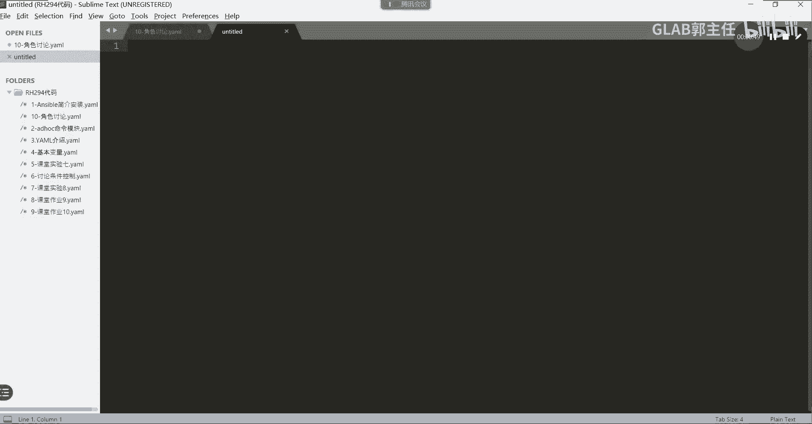

第一个我们讲到的是，管理软件我们先来看管理软件啊。

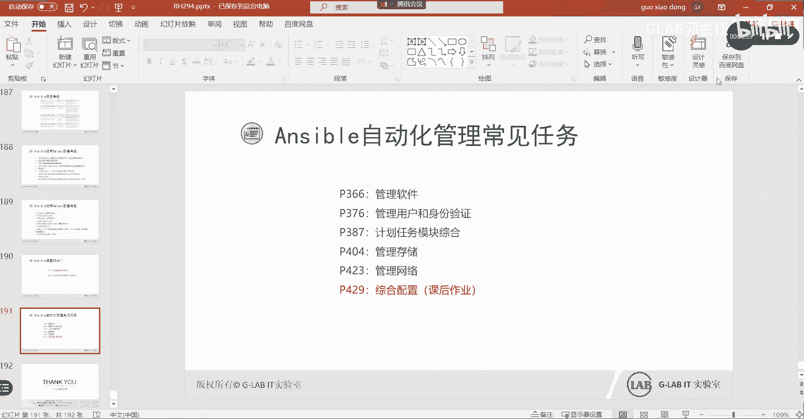

然后再说一下第一个啊，软件管理，软件管理实验需求，现在看啊，二五，这个比较方法，需求在这里好不好，大家先来看，然后给大家5分钟时间，大家告诉我用到哪些模块，用到哪些流程控制方法。

我先把这个需求给你念一遍啊，用y report stream模块来配置样本仓库，这就是我们考题啊，考题就是用它来做的，用这个模块来管理密钥对吧，要么仓库是有密钥的，然后用这个模块来获取。

主机上安装的软件信息包，是不是已经告诉大家要用哪些模块了，好我们来看看他们的需求，第一个获取package的四时变量，并且显示已经安装的软件包的版本，第一个需求配置数控节点的样本仓库，肯定是用这个模块。

然后还要去指定受控节点上啊，去判断受控节点上存在有没有指定的公钥对吧，要判断他的密钥其实在做密钥管理，用的是这个模块，第四个安装指定的软件包，再次获取这个包的事实变量。

显示已经安装指定的安装的安装包的信息，OK所以这些需求读下来，其实他在让我们做一个什么事情啊，再让我们做什么事情，在做一件事情，在安装软件包之前，先获取有没有这个软件包的信息，如果没有，那么就去安装。

并且还要控制一下它的密钥对吧，那么如果没有的话，他是不是要安装软件包，安装软件包，安装完了以后再去获取一下他的信息，先获取信息啊，然后再安装一下，然后管理一下这个密钥，然后啊配置仓库，第二步是配置仓库。

不好意思，先去获取一下软件包没有，然后配仓库配密钥，然后安装，然后再获取一次，清楚了吗，好好大家思考一下啊，我们要用到哪些模块和逻辑，看看需要用到那些模块，有没有漏掉的，预达到这个问题啊。

我们首先写play book，那就带大家写一遍吧，后面几个如果不够长的话，我就带大家写一遍，好吧，来看一下啊，好我们把这几个东西啊，我们先在我们的这个这个叫SUBLINE里面写一下。

把几个功能先梳理一下啊，首先对吧，杠杠name起一个名字了，它的名字就叫什么，我们就给他一个叫test1吧，假设啊这只是一个名字是大的playbook的名字，好house针对什么。

假设就针对所有机器来好，在整个的过程里头，它需要处理的是一个安装的数据包，所以我们给这个数据包啊做一个变量，这个变量的名字叫CUSTOM，叫customer p k g，这只是一个变量，那么这个变量。

你可以直接通过这个方式给它赋值，这个变量名字叫EXAMPLE叫it example，点MOTD，这就是你要去处理的这个软件包的包名字，这就是你处理软件包的包名字。

为什么要用customer package来定义它，用变量来定义它，因为后面要调用这个包的时候，我们只需要调用customer package变量就可以了，这能听明白吗，各位好。

接下来到了我们的task t i s k s，到了我们的任务了，好任务，我们可以先把所有的任务先写出来，第一个任务，第一个人我们要做什么，叫叫GA。

叫获取我们的这个包的customer package的，这个这个也可以获取这个包的适时变量，对吧，叫FACTS获取我们这个包的实时变量，这是第一个任务啊，因为要展现出来，第二个任务我们先把任务都写出来。

第二个任务要做什么，第一个需求就是获取实时包的，这个包的实时变量，并显示出来了，对不对，好，第一个功能获取了之后，是不是第二个任务要把它秀出来秀啊，通过debug对吧。

这个模块来把这个信息message秀出来吧，这个能看懂吗，这是不是我们第二个任务，Show package，事实变量，for the customer package好，第三个第三个要做什么。

是不是要是不是要不没有到判断啊，没有的判断，我们只是把它的事实变量，这个事实变量获取出来，就看到这个包啊，他的状态如果没有的话，他就获取不到理解吧，就会触不到，所以根据我们的要求，第三点就是安装。

就是我们这个需求的第二点，因为前面两个其实在做第一个需求嘛，要配置药物仓库了吧对吧，OK叫CEFG，要么对吧，Report list，好我们要判断要要要要创建样本仓库，第四个需求。

要么仓库创建的同时还要做什么，是不是钥匙啊，诶稍等项目仓库做完了，接下来要做什么，这是不是密钥啊，rpm的密钥对不对，叫insure ensure r p m key是吧，It is all。

就确定一下这个key有没有被引到，是不是第三个需求啊，好接下来呢还要做什么，这个这个功能做完了，接下来是不是就是不是it all package，是不是it all customer package。

这能听明白，OK好，install完了，是不是要再一次去gather一个，你再一次去获取这个报的信息，安装完了应该就能够获取到这个包的信息，只要再一次去gather的话，是不是就还要再用什么秀啊。

秀对吧，用的是debug信息去获取show debug message续，这能看懂吗啊，这两个其实是把这个事实变量获取，并且秀出来同一个需求吧，嗯所以这个就这么多，需要大家完成的就这么多任务。

那接下来大家往这个任务里面去填东西，好大家开始来写啦，第一个获取实时变量，我们要定义要定义一个这用的是什么模块。

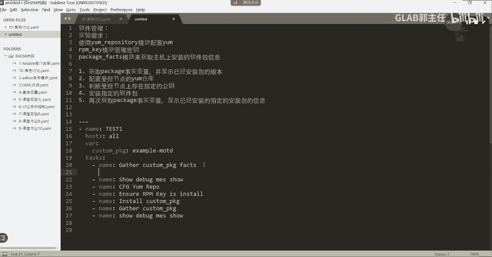

用的叫package fs，我们在这里看一下，用的是叫ab doc的package。

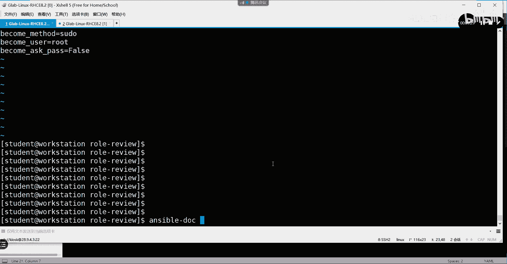

怎么写的，那你这要怎么用啊。

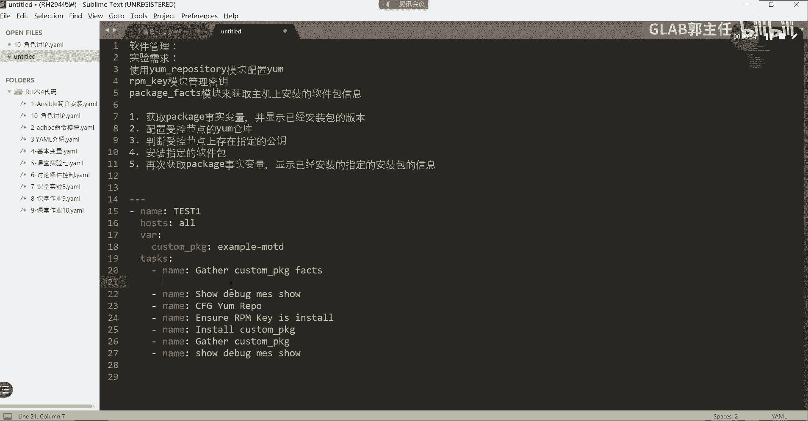

叫PACKPACKAGE向横杠FACTS，现在是这个，这是一个模块啊，这个模块主要是用来获取软件安装包的，就这么写，就这么写就可以了，你可以把它复制过来。

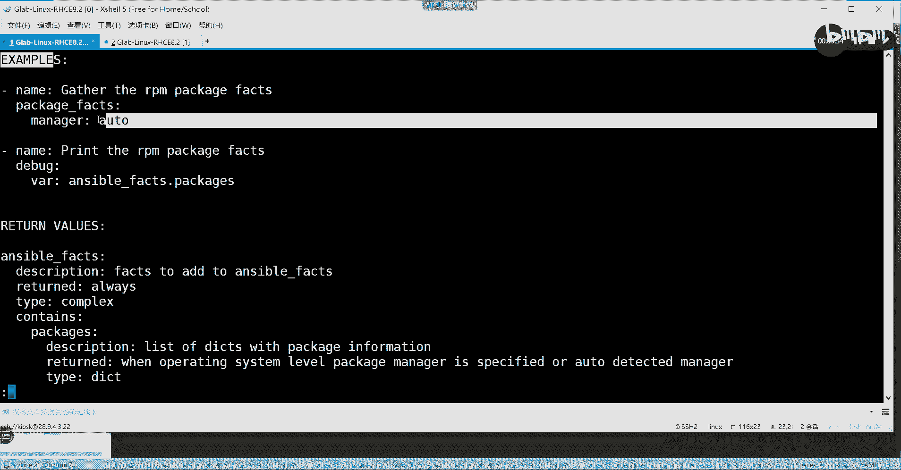

其实就这么写，我来复制一下，就可以了，这样能听明白吗，缩进啊，做好缩进好模块啊，把模块确定安装包确定，接下来第一个就写完了，第二个会用吗，第二个用的是什么模块。

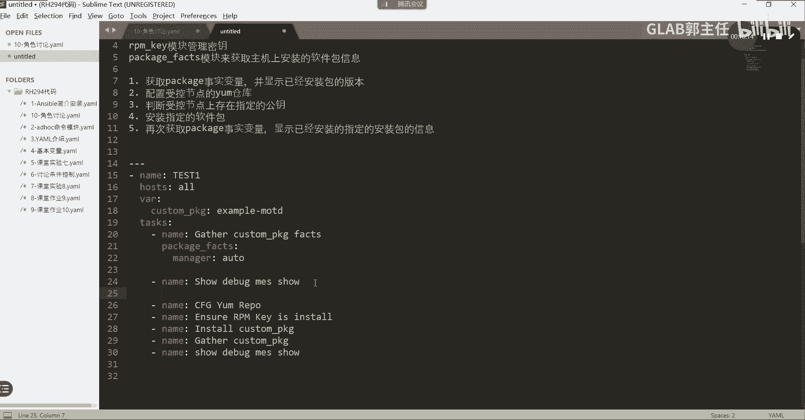

是不是debug模块，debug模块，那你就用这个去写debug，去找debug模块啊，DEBUG嘛，然后搜索EXMPLE，我现在给你演示的方法，大家在考试当中就应该这样做，看着代码那么多。

你把所有的组组的任务都记好，用到了模块，机组下面的模块下边的参数记不住，没关系，用asser doc去复制，听得懂吗，明白好，debug我们用到的应该是什么，用的是这个吧，当匹配什么条件的时候。

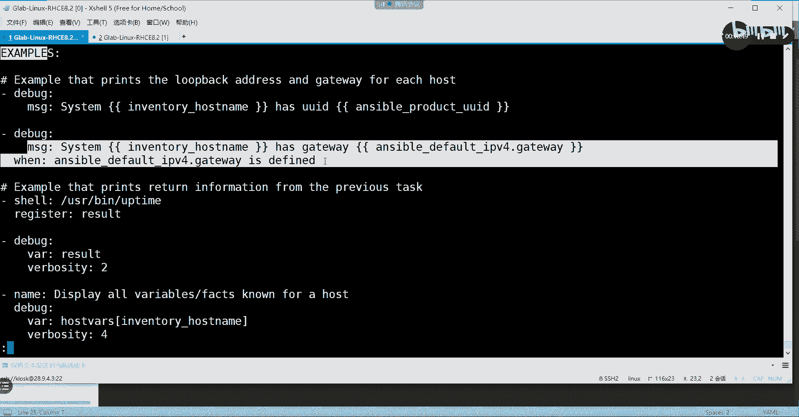

然后我们输出什么样的信息都买了，那时候别说话啊，是这样的吧，对不对，debug呃，我们要还有个debug，好意思，Debug message，这不是message，它要输出我的变量。

我们这儿这were我们要输出变量好，那么输出什么样类型的变量呢，应该是调用我们的这个刚才需要用到的，需要use package package的，就这个他获取到的实时变量，这个事实变量该怎么写呢。

应该这样写啊，嗯在我的这个里面没有，所以你需要写ESPORTS，它叫EBFACT对吧，F a c t s，然后点c k a g e package对吧，用的是点package packages啊。

然后中括号把我们的customer package调用过来，这个其实代表的是一个包啊，这代表的是获取的实时变量，获取这个安装包的详细信息，然后加一个win win来判断判断的是什么，叫当我的。

看我的customer package在哪里，在EBBETS点packages就这样写，这句话什么意思，听得懂吗，好当我要查的包啊，在我的这个事实变量里面的时候，我就输出这个软件包的事实变量。

如果不在他就不输出，所以第一步，第一个需求应该是两个模块来完成的，就说在第二个模块要安装，什么叫要么report，叫要么点，不是这样，不下横杠叫hie p o这个怎么拼的。

R e p o s i t r y s i t o r y，我们要查的是这个模块，这个模块怎么做啊。

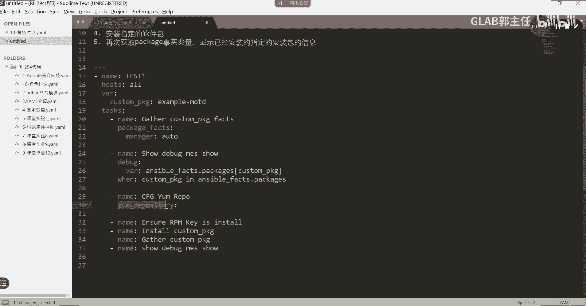

记不得没关系，复制一下，用export dock去查找回车，在网络上，OK好，我们来复制好这里用到的，你肯定是要用这里复制的名字，要不要要的吧，描述要不要要的吧，然后fire对吧，你要你要装哪个模块。

要的吧，base ui2要不要要什么GPP要不要的吧。

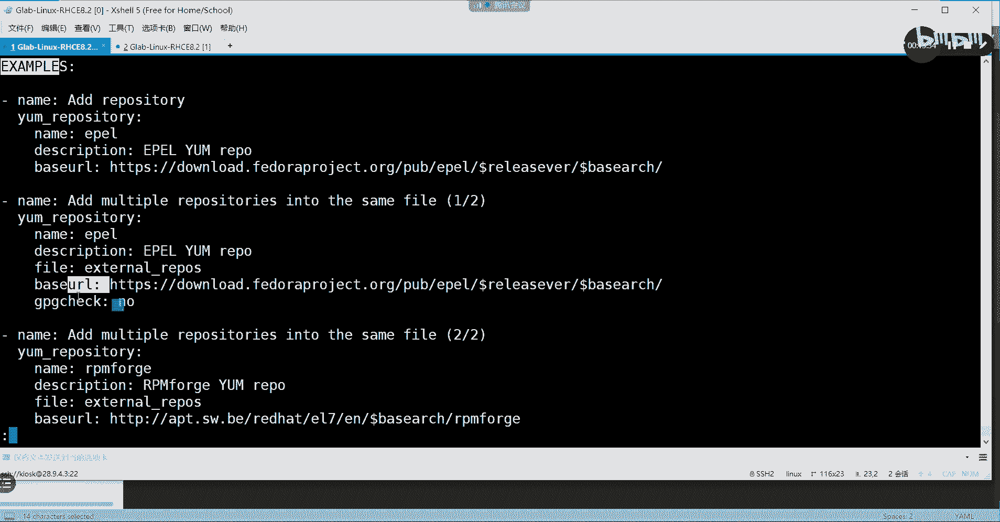

就这些复制过来，这，把对齐格式做好，要大家记吗，是不是不要啊，对不对，好名字是什么，改一改叫examine ma，名字叫这只是一个名字啊，其实就是我们那个亚目仓库的名字叫example。

Internal，这不是包的名字啊，description无所谓，叫什么无所谓，你写什么都行，然后fire的名字要写的这个叫example，Me，叫example对吧，就叫it example好。

然后best ul一定要写对哦，这个best ul就是你写的那个仓库的名字了对吧，那我们把best ul复制过来，BAU2复制过来，GBGCK要不要因为一会要调用密钥的，要确定你这个密钥在不在。

所以我们GBGJP，GCHECK要不要去校验，要带好第三个模块就这么写，写完了，听懂了吗，Ok，再说一遍，这个是要么仓库的名字，这个是我要安装的那个软件包，这个是base u l2是一定要的。

这个是要不要用2PM的key来进行验证，我们一般写的时候，这边都是NO吧，但这次题目要求说要用密钥验证好，既然用钥匙，你得确认对方有没有公钥吧，确定对方有没有公钥，用的是模块。

是rpm下横杠key用的是这个模块怎么用啊，不会明白。

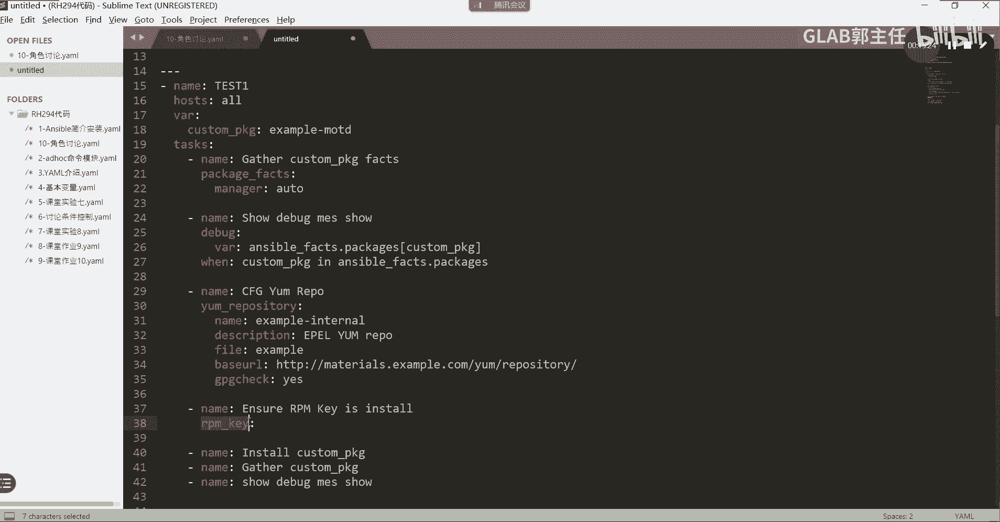

没关系，复制，复制，贴过来，rpm k不会用，没关系，Example，他就这点用法，就这就这两句话，是不是key在哪啊，状态是什么呀，就这俩复制过来。

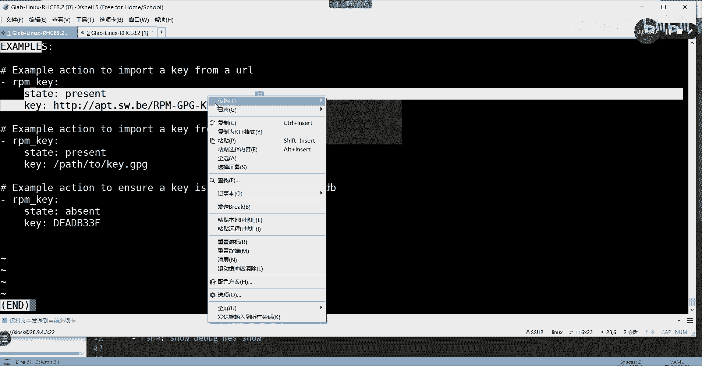

把它对齐，对好好，这个present，就是就是要把这个就是要要导入这个这个密钥，然后密钥在什么地方，你这个链接它会给你的，那我们题目当中有给到说链接是这个东西，那如果有三对吧，链接是这个地方。

那么我们把它复制过来，这就是我们要用到的key的位置好，这就代表要把这个key啊送到目标节点上去，明白好，最后安装用什么模块啊，是不是要模块，这个模块是我们最熟悉的，我们要安装，我们就不复制了。

直接在这里写安装调用，我的变量用的是customer package，是不是这样调用，我把这个包要安装好，STATE是吧，S t a t e p r e s e n t，这就是安装没问题吧。

好再一次获取实时变量，这个再一次去获取，我们是不是用上面的就可以了，复制一下，复制一下OK吗，好最后显显示是不是还用debug，再复制一下借口，记者和各位能听能听懂吗。

这个后边两个就直接照抄上面的就可以了，这就是我们一个完整的这一题所对应的playbook，所以大家写也应该是这样子的，先把所有的任务都给我写出来，先把task下面的每一个任务，因为他们是属于同一级别的。

全部给我写出来，写出来了之后，再一个一个的往里贴模块，模块不会用，没关系，去用assable doc去查，能明白我意思吗，可以啊可以啊，OK那么我们把这个导进去吧，好吧。

我们把这个就把我们现在写的这个导进去，保存一下，放在不在这在在这，我们叫地软件管理吧，12软件管理，11了，第11个叫，好E十三十三K软件管理，那么我们把这个送到我们的环境里面去。

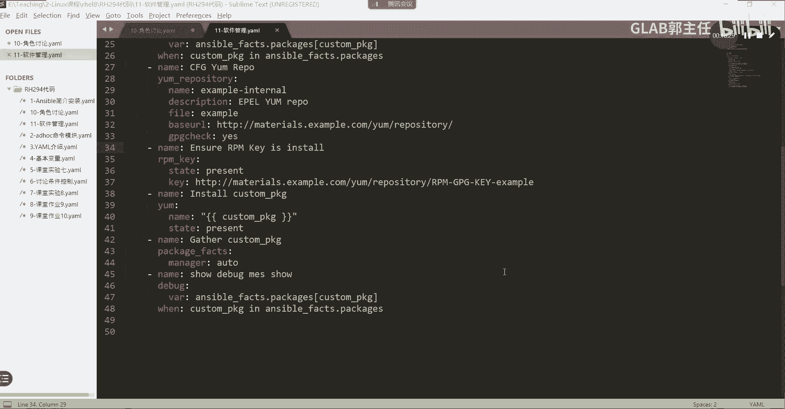

嗯28。9。4。3送到环境里面去，Kiosk，Reit it it，我们找一下啊，Tech，在11软件管理我送到哪儿去呢，我来看看啊，不是在这个里面，有没有酷的没有是吧，不过没有的话，那就没有。

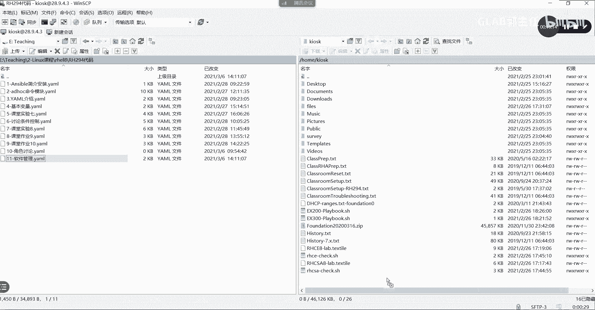

那就放进来吧，好吧好，放进来了以后，我们打开退出来，我们应该在不是在这儿，我在这儿有吗，太多了，我们建一个叫MAITDIR，我们建一个code好吧，然后我们把这个十吧，十一十一软件管理送到哪里去。

送到code里面去啊，没有了CD code，然后在这里就有了，我们接下来把所有东西都送到这个code里面来。

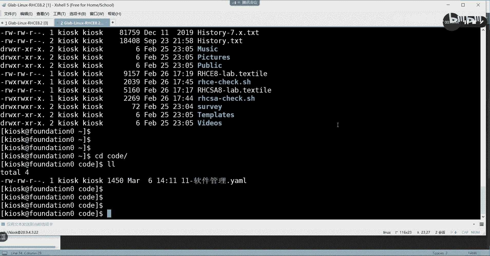

就没有那么多了，我来看有没有code啊，有了啊，有了软件管理。

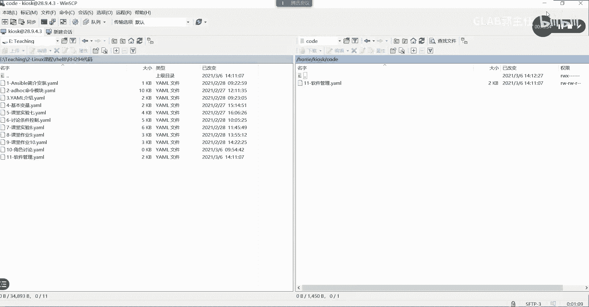

OK然后接下来我们把这个软件管理送到哪去呢，我们要送到student，在这啊，在这儿我退出来，前面那个还没有还没有结束掉，叫lab road review，Finish，不影响，为了把不影响。

我把前面那个时间给finish掉，嗯这么卡，好了好了之后呢，我们可以通过lab把环境打开，这个环境名字应该叫什么来着，叫system soft，叫system soft，System soft。

好就多了一个system soft CD system soft，好啦，然后我们把那个这个copy过来，送到student，用户真的still workstation下面的将目录下面的。

将目录下面的谁呀，就这里了，加目录下面的这个用户，这个目录这个目录对吧，来吧，我们把这个目录贴进来送过去，然后在这就看到了好，然后我们把名字改一下，简介的方式来改。

它的名字叫report r e p o下横杠box，点Y没有好不好，然后我们来编辑一下这个叫report这个目录，那13好删掉了，那么这就是我们刚刚写的脚本，就是我们刚才写的。

保存一下我们ansport gun playbook，去检查一下SYNTAX杠CHECK，看看有没有语法的错误，没有是吧，那么我们开始执行一下诶，有错误，哪儿不对啊，诶没保存没删掉，刚刚不是删掉了吗。

哦没保存删掉啊，现在好了，你看啊，它上面有中文，它检他都检测不到，明白吗，刚刚上面是不是有中文啊，我用这个杠杠SYNTX杠CHECK，他都检测不到语法错误，现在就检测到了，对不对，这说明什么。

说明上面就是它只要它上面读不到的，他就认为是没有错的，他读不出来，他认为是没错的，上面文字它读不出来啊，这个时候上面没有文字，他就读出来了，有问题吗，他说哪有问题啊，我没有看出来，Kit。

It host name nn m，哪儿哪儿不对啊，哦少了个什么排数，扫了个啥啊，少了个啥S，是不是死了，感觉死了，这语法就不对了，那为什么这个这个语法这个是不对的，语法它不是它格式的问题错误，23。

我可以，我不要网络，是不是啊，那个包安装好了，customer的包是什么样的类型的，这就跑成功了，明白不好，这就是我们第一个，第一个给大家讲的软件安装包的一个在哪来着。

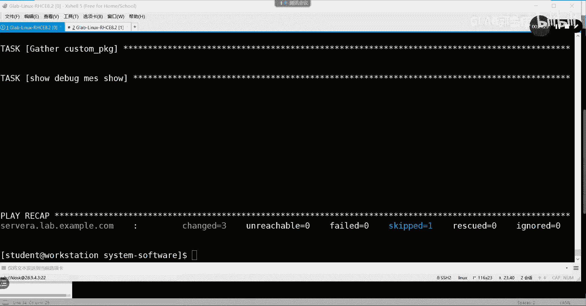

在这就这啊，这个这个实验一会大家做的好吧，就像我这样去写好，这是第一个软件包的安装。

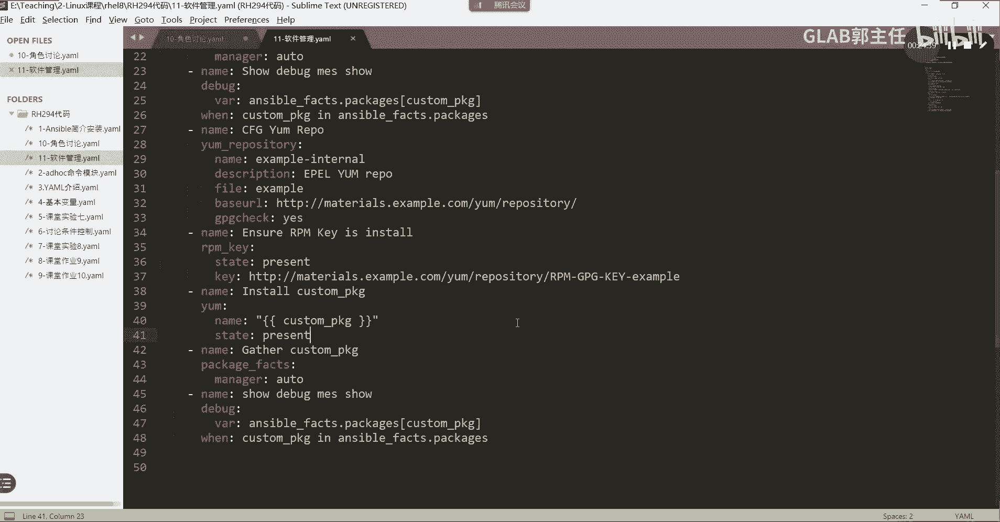