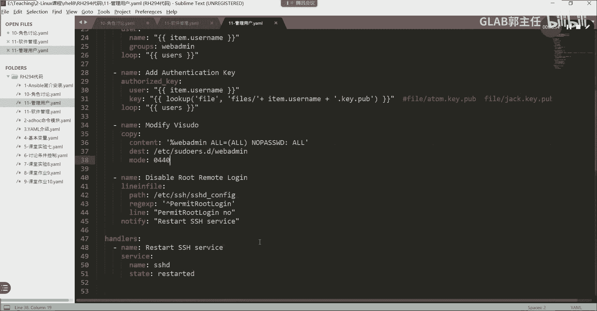

# 【Linux／RHCE／RHCSA】零基础入门Linux／红帽认证！Linux运维工程师的升职加薪宝典！RHCSA+RHCE／50-Ansible创建用户 - P1 - GLAB郭主任 - BV1XH4y1i7BD

好大家来看第二个，第二个时间，我们要通过之前学的，来实现用户的管理和身份验证，我们在考题当中有一题14题，记得吧，就是要求大家来创建用户，就是这个题的原型，就这个题的原型好，大家看怎么做。

超级用户先看需求，他说用什么模块，这上面是我整理的主要需求，在下面创建一个组，需要创建用户，然后被定义在变量当中，然后playbook直接调用，意思就是用户是要被变量来调用的，第二个。

把file中的每一个用户对应的公钥，推送到远程主机，创建用户的时候，还需要给这个特定的用户推推送，特定基于这个用户的公钥，大家知道公钥是干嘛用的吗，是不是给这个用户来做SSH证书验证用的对吧。

有时候创建用户只是第一步，第二步还要给他推公钥，因为我要通过这个用户登到这个机器上来啊，所以这就是自己提的要求，把公钥顺便创建完了也推过去，第三个修改数控主机上的这个文件。

来使得这个组的用户可以免密登录，是不是在做免密登录啊，用export playbook脚本来写免密登录啊，是第四个安全优化，建议关闭root，直接使用S登录，这是我们在写在在做这个SSH登录的时候。

给大家的一个建议，最好关闭root，直接通过SSH登录，这样的话是不是把最后的路都给切断了，就是安全的最后一道防线就是root吧，那么root不能远程S，就有人说哎怎么管理这台机器啊，我本地管理啊。

听得懂吗，对不对，你把root的远程的S权限切掉了，就不可能存在，黑客通过远程攻击只存在于物理攻击，就是本地攻击，理解吗，OK这是安全考虑啊，所以建议大家把root的SH给关掉好，关于这么一个需求。

我们该怎么写，老规矩，还是来讨论，我们每一个playbook要实现相应的一些功能，先把它写出来，好不好好，我们来把上面的写出来啊，杠杠杠杠name对吧，起一个名字了，这个名字叫创建用户。

Great users，好吧好，Host，我们针对哪个主机组，他要求你针对你就针对哪个，你可以写200，它叫web servers，那就叫web service吧，好接下来我们要用到user的变量。

所以说我们要定义verse，是不是要定义一个变量，好定义变量的文件用的叫verse啊，files而不是were理解吗，OK这个是到前面都讲过的，然后变量在哪里呢，他要求在vs下面的UD下横杠。

这个变量文件会给你的，这个变量文件会给你的，你就照着写就行了，然后呢，接下来我们开始写，开始写脚本好，那这个脚本我们要涉及到几个内容，大家来讲一下，第一个name，第一个要干嘛，是不是要创建组啊。

A d d group，这是他第一个需求对吧，第二步，第二步，Create users，因为你的变量文件都有了呀，组也有了对吧，接下来就可以创建用户了，OK然后第三步是不是要验证啊。

所以去增加用来调AUT，AUTHE叫authentication aut h e n t对吧，增加验证的key，OK好这第三步要增加要把公钥啊，每一个用户的公钥都弄过去吧，OK好呃增加这个key。

然后呢呃增加验证啊，这叫增加验证，第四步才是把我们的key送过去，才是把我们的key送过去，还是不叫送过去吧，key送过去应该在第三部了，第四部还要改他的提前是不是要改他的。

v we should do这个文件这个文件的权限对吧，改这个速度的这个权限的权限，这个权限怎么写啊，应该这样写，Modify，modify修改这个文件对吧，修改这个文件好，接下来这个文件修改完了。

他就提全了，最后要干嘛，最后一个需求是什么，是不是disable root logging，Remote log，这是不是我们所有的需求能听明白吗啊，是不是就这五个。

是不是最后要disable掉这个权限，我们就这五个，是不是各位也能听明白吗，好啊，就这五个就是五个好，那么其实应该还有一个，你现在在改改的这堆东西，都是跟SSH有关系吧，创建用户设定SH。

最后其实应该还有一个要干嘛，Restar s h，你是不是在相当于在改这个服务的文件，对不对，改了这个服务的文件，是不是要重启一下这个服务，SSH这个服务不需要你装所有操作系统，装完它就自带了SH服务。

只不过你每一次的修改，都需要都需要去重启一下这个服务，是不是就这六个好一个往里加东西，增加一个group，我们用的是什么模块来着，是不是用的group模块。

对不对，好group模块怎么用的呢，怎么用的呢，我们把这个我们把这个把这个把这个把这个，把这个环境给它停掉吧，叫system soft finish，来我们看啊。

我们用ansible dog在这里也可以查的，group怎么用的呢，example是不是很简单，就两句话，对不对啊，你要创建的名字是什么，主是什么，就这两句话复制过来。

复制过来复制在哪，在这，对齐啊对好，然后组的名字叫什么，他给你的组的名字应该叫WEBM，这个环境当中啊，环境当中的好，第一个就做完了，第二个创建用户呢用的什么模块。

是不是user啊啊啊user user模块啊，好user模块怎么用啊。

不会没关系，user好，Example，user呢它可控性比较大，他能做的东西比较多，那么根据我们的要求，他只只需要创建用户，然后给他加一个组就可以了。

所以他只需要这两个就可以了，但是不要忘了，users是要放在要去找这个user的文件，去读这个变量文件的对吧，说明是要用到循环的，对不对，所以该怎么写，我们那我们就手写不复制了，他就两个。

他就两个选项好，首先我想把这个name写在这，接下来还有吗，好名字是什么，groups是什么，对不对好，还有他用一定要用到这里的循环，这是知道吗，好那么循环里面要调用我的什么这个文件，对不对，好。

这个文件怎么写啊，要去循环users，文件里面有一个，肯定有一个叫users的这个这一列，然后他就循环这一列，然后把这一列的名字都循环到送到哪里来，送到username，取它的叫items，还记得吗。

item不叫items，Item，啊里边有一个叫username的那一列，放在我的name里面，那他们的group都被做成admin，叫web min，这就是我创建用户的功能。

调用文件里头有一个叫users，到user里面去找items，username来创建用户名给他group，这就是第二个lab，搞清楚了，第三个是不是要去增加这个验证密钥啊，OK好，这是一个新的模块。

增加验证密钥用到的叫awesome，A a u t h o r i z e d key，用的是这个模块，这个模块是专门用来配置SSH的密钥的，这是我们新增的一个模块，好这个模块不会用，怎么怎么办。

查，来查，ansport dog authorized key都能查到好，怎么用，在这里它其实也比较简单，这个这个也就三个吧，最多多的是五个，但是我们用到的应该应该就这个这个增加，每他的需求很简单。

就是给每一个用户去把他的公钥送到对面，送到这个受控节点上去，所以我们一定涉及到用户吧，对不对，然后涉及到这个用户所对应的密钥吧，对不对，所以我们应该涉及到就俩，一个是用户，一个是用户所对应的密钥。

他说的是每个用户啊，所以说这里还涉及到什么循环吧。

各位能明白我意思吗，好所以我们在这里手手写啊，首先他一定涉及到是基于某一个用户的对吧好，叫user user啊，不叫users，然后对于这个用户的密钥对吧好，接下来每一个用户他说的是。

所以还涉及到刚才讲的循环，听得懂吗，好那么这个用户应该写什么呢，是不是跟上面一样啊，跟创建用户的用户一样啊，对不对，然后每个用户对应自己的一个密钥，这个密钥应该怎么写呢，这个用户用这个密钥应该怎么写呢。

好这个他已经明确告诉你，这个密钥公钥已经生成好了，然后需要你送过去，所以我是这样写的，大家看这段能不能看懂，主要是这一段啊，前面上下都好懂，下面是循环，上面是用户，这个是密钥。

看能不能看懂是不是调用了一个变量对吧，好，Look up，去找找什么fire，file斜杠items item点user点key public，说明这个key应该是一个路径吧，听懂吗。

好大家能帮我写写这个路径长什么样子吗，是不是先要去找一个叫fire的目录啊，然后在file目录上面去对应的是一个用户吗，不是吧，他要到循环里头去找item username，比如说第一个用户叫tom。

那它搜索的应该就是atom吧，atom加什么点key点PUB，看懂吗，如果是第二个用户，那就是去搜索file下面的jack点key点PUB，是不是这样子，循环走到哪，他就去找哪个用户所对应的。

这是什么药啊，是不是公钥啊，理解吗，各位啊，所以根据不同的用户，是不是就把公钥送到对方去了，所以这个就是这个模块要实现的功能，根据不同的用户，把对应的公钥通过循环的方式送到对面去，好明白，记住了啊。

接下来我们需要去修改vs i速度。

还记得我们在提权的时候，这个题我们之前提全都是这样干的呀，是直接蹲到，是不是直接登到这个SSH的root server a，直接登到server a里面去，vs i速度直接去改。

其实就是在改这个地方的配置吧。

听得懂吗，各位所以我想问你，现在我要去提权，也是去改这个文件，我应该用什么模块去改，用什么模块啊，对文件当中的某一行进行修改，lin fire是不是可以是吧，还有吗，拉一份可以做。

还有copy也可以做吧，copy它除了把一个文件copy过去之外，他是不是还有一个叫content的一个参数啊，它可以指定一行一段话作为你copy的圆，然后送到目标文件里头去，能听明白吗。

各位当然也可以啊，如果是在这里，我为什么要用copy。

那是因为我可以在直接去改一下，我现在改的这个文件啊，我现在改的这个文件在在哪里，在etc下的SUDOER，叫sodas，就这个问题我想改，就这个问题理解为什么，然后我还可以在etc下修。

doors点D里面去新建一个叫什么test点什么，是吧，我可以在这那比如说我这里DEVS，etc下的SODERS，这个SODERS点D下面有一个DEVS，你你可以新建一个单独的文件。

然后在这个文件里面写一行，这一样能达到这个效果，能听明白我意思吗，所以如果你用的是lying fire，那应该改的就是那个大文件，把那个大文件下面加一行理解吗。

如果你用的是copy，那就应该是我用的第二种方法，是不是在那个叫什么。

这个这个刚刚创建的这个目录，就这个目录就这个目录下面新建一个新的，基于用户的或者基于一个组的文件。

听得懂吗，一样的两种方法都是可以做到提权的，在前面我们讲过啊，所以在这里我们用更简单的方法用copy copy copy。

有一个参数copy不会用参数不低的，没关系对吧，这还不简单，我们通过这个命令，大家在考试要经常用，不要死记下面的参数，我们用的是content，在哪啊，找不到，在这是不是这个啊。

复制过来叫content content目标。

OK复制过来content好，content里边的内容写什么呢，这就是我们要在文件里面写的内容，怎么写，该怎么写，怎么写，百分号我们是不是有组啊，所以你基于主来写是最方便的，叫web的MOR等于括号哦。

是不是这样写的，还有一句话叫NO password吧，No p s w d password，冒号号是不是这样写的，同志们，是的吧，好这样写完了以后，我送到哪里去，这个要写对，这个要写对。

是哪个目录啊，刚才是不是有看到PWD不是PWDPH，是不是这个目录啊，在这个目录下面新建一个新的文件。

叫web的MIA，但是130701，是不是这个目录so doors后面建一个叫web的MIA，是不是就可以了，这段话就在这个文件里头了，所以这里用copy没有问题吧，听懂吗。

然后这个文件我要指定一下它的权限。

大家看一下我们的这个divers的权限是什么，LS杠杠呃，不用LS吧，用st s t a，STATETC下的叫苏苏，Door，叫SUDOORS，点D下面有一个when a叫DEVS。

我们看一下它的STATE是吧，STANSTA就这个它是多少，他的这个权限是0644是吧，0644，这叫6644呃，是不是需求当中有改，让改这个权限，大家到时候看一下需求吧。

如果没有需求，这里应该不用改，他在我们的练习题当中，可能还要做一个额外的改动，要修改一下它的权限，权限改成了04400440，就是权限变小了，你懂我意思吧，我们DIOS做的这个是0644644。

权限蛮大的，没有需求，不改也没关系啊，听得明白我意思吧，好，所以关于这个改它的这个这个soda vs v i v i，soda的这个文件，我们有两种改法，一种这里改lin fire。

我相信大家应该会改copy，就用这种方式来做好下面两个好，接下来用到什么，用到什么模块了，用到什么模块啊，关闭关闭root remote的这个，首先要知道这个如果不用写。

我们应该在哪写啊，Able root remote login，这个功能在哪关，在哪个目录下，是不是etc下的SSH下面的SSHDCONFIG，里面有一句有一句叫有一句叫什么来着。

叫我搜索一下PRPPER就这个看到没，现在是不是允许root，用SSH登录，是不是允许的，我们要把它改成NO，所以需求现在告诉你，就是现在用USB脚本实现，对这个文件的这一行进行修改。

把这边的yes改成NO。

请问用什么模块来一块，那LIN范对不对，这肯定是用LINFLINLINF，所以上面为什么不用lin fire，因为下面会用的line in fire，明白怎么改。

不会用，这太简单了，我们要用到什么，要用到的是要改的，一定要有一个目标，是不是呃呃不是目标，就是对我们要改改什么东西，然后正则匹配一下，然后呢嗯也不叫目标，叫pass，应该这样子，应该这样才对。

理解我为什么，是不是在哪个路径下，然后匹配什么内容，然后我们用这个内容去替换它，记住啊，这样匹配的是把这个里边，line里面的内容是去替换掉，你匹配的内行是覆盖，不是增加明白不覆盖掉啊，覆盖掉。

所以我们应该用的是这三句话，我们只用这三句话就可以了。

不止好，好这怎么写啊，目标目标刚刚那个目标在上面是哪一叫什么。

是不是这个路径啊，是不是要改这个文件目标。

其实是在问你要改的文件名，文件的名字啊，是不是它好匹配什么呢。

匹配我们是不是只需要匹配这个打头的这一行。

就可以了，所以在这里我们匹配的是尖括号，不要去掉尖括号代表是什么开头，明白吗啊，OK然后把它改成什么呢。

改成什么，把自己整行复制过来，复制改成什么。

把它改成，NO要加引号引起来，因为中间是有空格的，听懂了吗，匹配锚定啊这一行，然后用这一行去替换，明白了吗，各位嗯好，这个就是我们的第倒数第二个需求，Disabroad remote log，好。

最后一个呢最后重启SSH服务，我们要做的更精细一点，我们这个服务应该跟一般重启服务，跟什么有关系啊，是不是跟修改文件了以后就要重启服务，你不能说文件没有修改，每次运行playbook他都去重启服务。

那是不是不优化呀，所以重启服务一般发生在什么时候，修改配置文件，请问上面哪一个任务是在修改配置文件，是不是他呀，理解吗，各位，所以只要他改变了，我就充几步，用什么流程控制啊，用什么呀。

notify是不是用notify呀，只要他改了，我就触发restart这个服务，所以下边这一段应该不是跟我不是在task里面，应该在哪啊，是不是在HLE里面啊，各位听得懂吗，憨豆应该跟谁对齐啊。

我是handle，应该跟task是齐平的，所以大家要看清楚，我们不能写错啊，task task在哪，前面有几个两个是吧，好这个应该是，handles应该在这，我们应该要写handles，OK好。

那么这个handles里面就应该restart，Restart，用什么模块，是不是用service模块name好，把什么重启啊，SSHD对不对，that是不是restart啊，他不叫restart。

不能写错啊，state叫哦，叫restart，不要写错，叫restart，不叫restart，听懂了吗，各位这个一定要记住，这是跟上面对齐的，那一二没了是吧，好我看看检查一下对齐啊。

对了这就对了对了之后我们来把代码导进去，还是11吧，还是11叫这叫什么，这叫管理用户，OK管理用户。

管理用户导进去了，我们来这里看一眼。

不在这儿，我在这儿啊，我们在这里退出来，导进去管理用户，我们把这个，嗯这个烦死了，复制管理用户送到哪里去呢，送到这里，我们用的是lab，要开一个文件啊，这个环境叫system user star。

System user star，好然后CD到system的user好，然后呢刚才用的那些东西这里都有啊，包括用户的文件在哪里也都在，这都在这都有好，然后我们把他送过去，再叫system，user是吧。

U 1s ok，没有吗，没有啊，哦小东西，点要不好，这里头应该有了，好切一下MV，11到他的名字叫users，点yo好，然后编辑一下users点，要么嗯诶这么多东西啊，前面啊。

好这里头应该就是我们刚刚写的内容了吧，好来我们检查一下语法，Playbook user，杠杠SYNTIS杠CHECK，好有报错，我考这么多。

快来帮我来帮我看看哪里有问题，vs想看files vs想看files。

看这个vs下个files，这哪有问题。

对的吧哎，哎我这里复制过来的时候有问题吗，不对吗，到这里发生了什么变化。

这里不对了是吧，但是我复制的我这边过去是对的呀对吧。

可能是按的tab键，不要用tab键，一二啊，应该这样子我都不对，这个是不是也也不对啊，这什么情况，group这个这个这个就对了，那我们再对一下对一下棋，这个对了，group对了，Loop。

咋回事咋回事啊，这有什么好的，关不关没，啊这个又对了，我也不清楚，这是中间这一段打咋回事，现在对了，再看一下还有三部，这是哪里的问题，咱们现在是哪，group是吧，V i m user，注意一下啊。

Task name，Task name，Task name，Group name，State，Group name，State，tasks诶，哦groups对三个S，不不不。

这个地方是group group模块还是group，没问题，这个是对的，group还是group啊，那这是哪儿不对呀，我都说进啊，是不是这里写错了，特斯应该可以养这样子，这样子问题不大，看看格式。

Username gps，这个是groups，没问题，Username growth lope，看看他报什么错啊，给娃娃被发短信，他说有一个tab键，他说有个tab键，tab键是不被允许的。

我刚刚在哪里按tab键了，给个精灵好一点，哦这个是tab键，有tab键不行，这个没有tab键，这也有tab键，我服气的，特别电，从哪来的，这也是特别点，可能是刚敲的时候不小心，再试一下这个没有tab键。

tab键tab键是不被允许的，这也是tab键，这个没有，这个没有这个没有，这个也没有，这个也没有，这个也没有诶，这个也没有，这个也没有，这个也没有，再确认一下，这个没有，这个没有这个啊，好了是吧。

但是没有任何语法错误，只不过是在编写的时候里面有tab键，我也是服气的，tab键大家一定要控制好，好了，那这个写完来我们去操作一下，看看有没有什么问，好看胖也听到了，其实是有五个用户是吧。

然后把每个用户的key也都送过去了，好了吧，对不对好，然后我们可以通过ANSPORTINSPORT的AD hook，去检查一下，怎么去看呢，我们通过SP杠A带哪个机器啊，我们S2呗，找一台机器。

我也不知道我的inventory文件是什么，看一下就叫web service是吧，USB就是or吧，杠A我们去看一下对方有没有id user1有啊，对不对，明白吗，然后你也可以去检查一下。

是不是我们刚才的那个目录有被改对吧，密码就是root用户的远程登录，我们可以去这个cut一下，要加一个参数叫or杠，我们用用share，然后杠A去指定一下，去cut一下那个叫etc下的SSHD。

下载SSH那个目录叫什么来着，SSH的嗯，叫什么来着，我看看啊，叫叫叫叫叫不叫SHD叫SH，想让SH要是再去嗯，讲SHD下横杠CONFIG，然后我们要过滤一下rap一下，rap一下叫PP什么P夹可以吧。

看看有没有PV了，有漏了吗，是不是漏了啊，刚yes改过来了吧，对所以可以去检查一下，没什么问题好吧。

还有这这个是这一题大家也要做的内容，虽然有点多啊。

