# 【Linux／RHCE／RHCSA】零基础入门Linux／红帽认证！Linux运维工程师的升职加薪宝典！RHCSA+RHCE／51-Ansible存储管理 - P1 - GLAB郭主任 - BV1LC4y1m7kS

我们来看存储的需求，存储的这个需求，大家看看会不会对设备进行分区对吧，对服务器的数据库进行劝阻，要做卷组，创建两个逻辑卷，定义了文件系统是XFS，然后逻辑卷按照要求挂载到对应的目录上。

第一个需求就是既要分区，又要实现逻辑卷，又要实现挂载，这种这个复杂程度跟我们考试差不多了对吧，他只是没有判断考试还要加一些判断，考试多了一个多了一个什么，就是他先创建1500兆的。

创建不成功再去创建800兆的，对不对，作为一个条件判断，这里头没有逻辑上的条件判断，但是要比考的要要复杂，除了逻辑判断之外，其他的要复杂，来看这个任务做完了以后，看第二步要新增一个分区，新增一个分区。

然后要增加到物理卷里面去，还要扩容现有的逻辑卷，其实从本质上来看，他的任务其实简单，要你创建分区，然后划分逻辑卷对吧，然后后边过了一段时间，他说哎又加了一个盘进来了，你要把这个盘物理的盘新增一个分区。

然后把新增的分区丢到逻辑圈里面去，然后在逻辑卷里面还要扩容原来的逻辑卷大小，就做这个事情，听明白了吗，OK好，明白啊，那么这里要用到的模块，我觉得挺多的，理论上理论上我是要写的，但是我不想写了，好吧。

我把逻辑关系给大家理一下啊，这个这个题大家一定要做一做，非常有意思，0046021，贴在这儿来，我们来看看这个代码，之前你发现没有一大堆变量啊，都在调用变量，说明这个脚脚本，这个脚本其实它是一个模子。

我们把这个环境调出来。

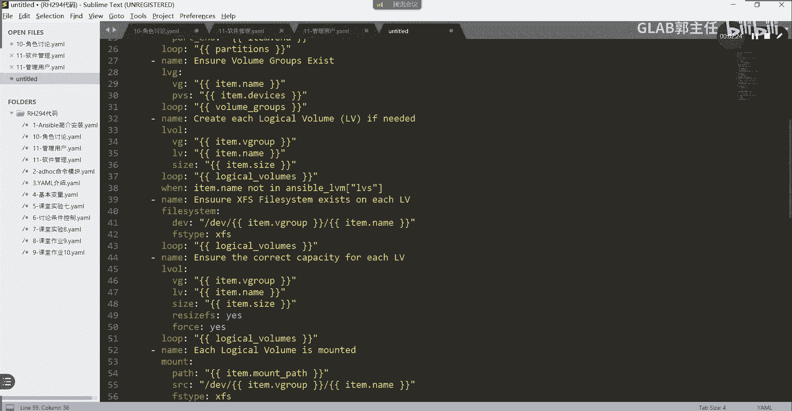

你会发现会用起来非常的爽啊，你只要改改那个变量文件就可以了，叫library system user finished，System stories star。

好他叫lb system system storage st好，CD到system storage，star storage啊，在这里大家看啊，上面两个文件大家都熟，ESPORT全局配置文件和文件对吧。

主要看下面两个，下面一个vs和vm storage storage vs，看这个变量，这个变量大家能读懂吗，Partition 1star size size，这是不是分区要用到的很重要的参数啊。

分区你分第几个区，就是看这个吧，你分的分区有多大，是不是从start到end，就是你分区的大小，这是这说明什么，看到这么多，这是我变量文件里的变量，文件里面的核心的分区要用到的参数吧。

一会儿在playbook里面，就会从这个文件里来调用这些参数，因为它分区的时候一定要知道分成几块，分的空间大小吧，再看第二个，第二个叫volume groups，这个是在这个是一个名字吧，这是VG吧。

VG的名字，然后把每一块分区放到VG里面去吧，听懂吗，OK第三个叫LV吧，LOV涉及到的是这个size代表的是P的大小吧，这个代表的是从哪儿去分这个LV吧，LV1是在VG上VG的基础之上分出来的吧。

所以要指定危机吧，LV最终要挂载到每一个那一个挂载点，是不是在这里叫mt pass吧，又来了一个LV，大家看清楚这个文件是不是我最终要实现的，结果，写在这个变量文件里面听得懂吗，各位好。

这个文件大家读明白了，记住了，记住这个文件里面有顺序啊，逻辑卷啊，VGLV啊，这些相关的信息啊，那么接下来我们来看playbook，它有一个playbook吧，有一个叫叫storage Emo，好。

这里头他大部分已经帮我们写好了，我们不看它，我们看已经写好了，也就是说这个实验需求大部分是写好的。

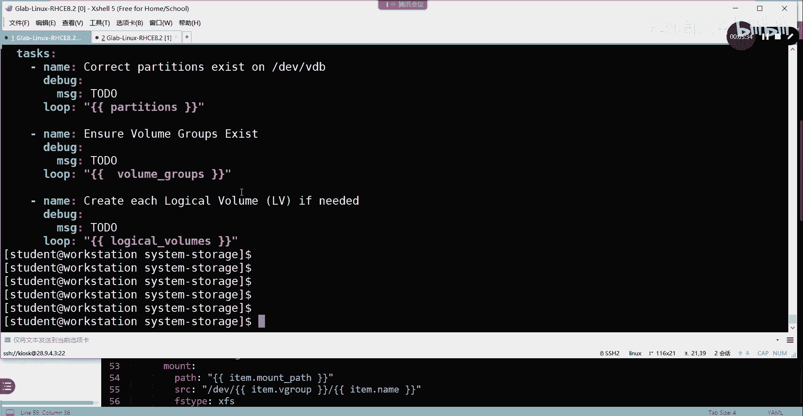

我们只需要往里加东西就可以了，干前面那些都不看，有一个变量文件要调用的，是不是刚才看到的storage的变量文件，接下来看有哪些任务啊，第一个是不是创建分区，创建分区用的什么模块，是用party模块。

party的模块怎么用呢，大家自己用export doge看一下，然后呢指定物理的磁盘，这是我物理的磁盘子弟，是不是要分区，precedent就是分区吧，我要分这个状态是要分opposite。

就是把这个分区删掉啊，这个前面有讲过好，接下来都是在调用变量，我的number我要分第几块。

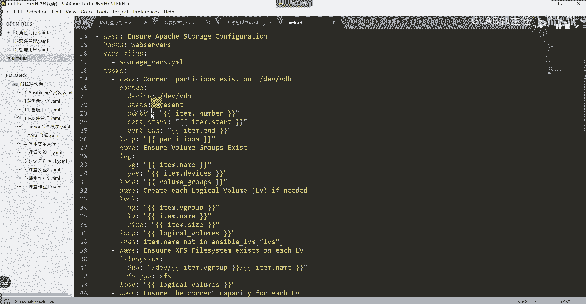

是不是调到这个里面去找items，items number在哪，items number是谁，是不是他嗯，items number就是他你看到哪去loop。

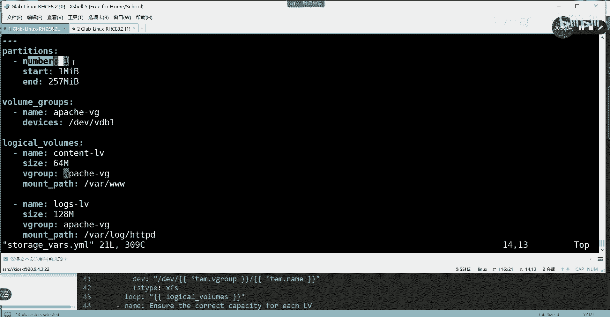

是不是到PEDITION去loop pedition在哪，是它好，TITION去loop什么number，是不是第一块，然后分区的第一开始从哪里开始，是不是去loop star。

items star就是它好从哪结束啊，是不是items and到他结束。

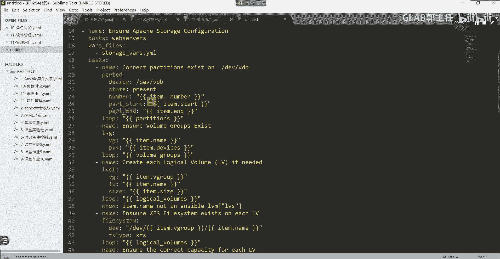

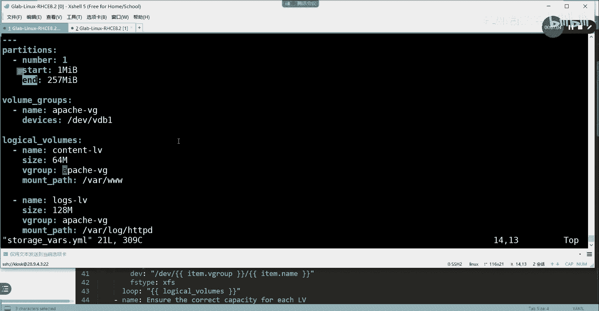

看懂吗，好OK这个这个就分区就做完了对吧，OK接下来去创建VG喽，好VG用的是LVLVG好，指定VG的nine name好，他也要去循环了。

他这时候循环的就不是上面的那个pattern partition，这个是group。

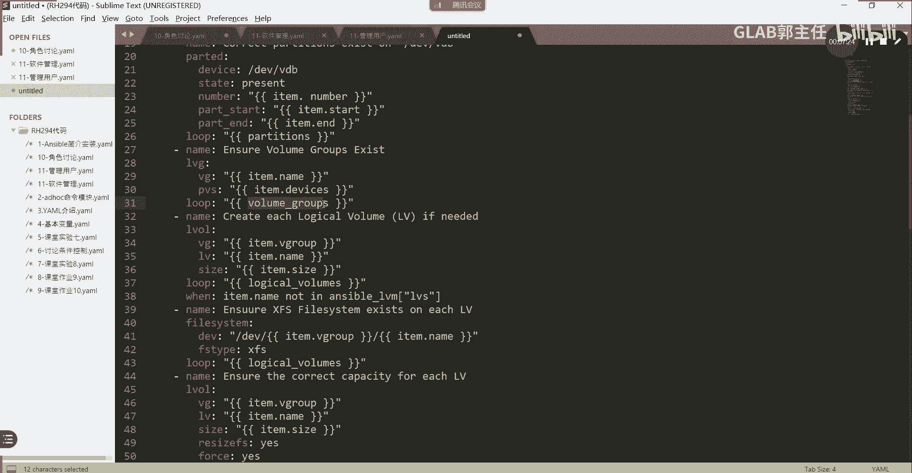

他就是这个列表理解吗，循环这个列表啊，这个这叫字典吧，这个字典好，到这个字典当中去找item name。

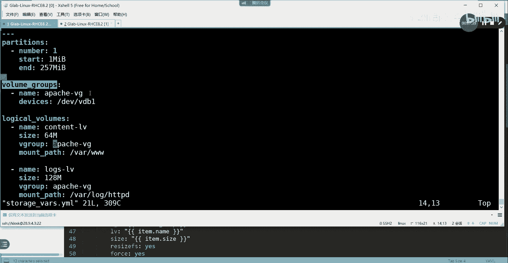

item name就它了对吧，所以创建的VG的名字。

创建的VG的设备用的哪一块分区，就这个这块饭圈。

接下来要创VG了，呃，LV咯，第一个他创建两个LV，LV用的叫用的是LVOL这个模块好，首先指定我是哪个VG，他这个时候循环的叫logical values。

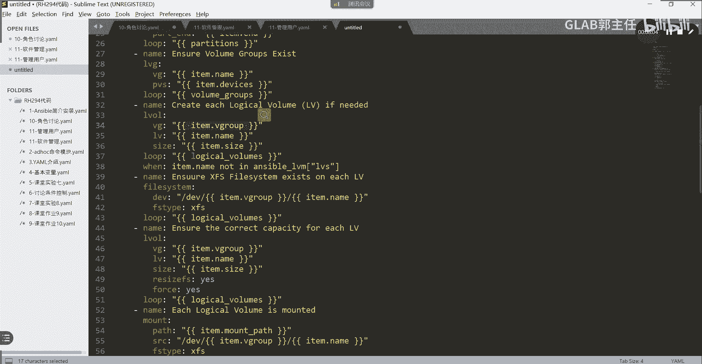

logical values就是循环它了呗。

创建的名字就他了呗，对不对，OK那么创建的这个VG是谁，LV的名字是什么，size是多少。

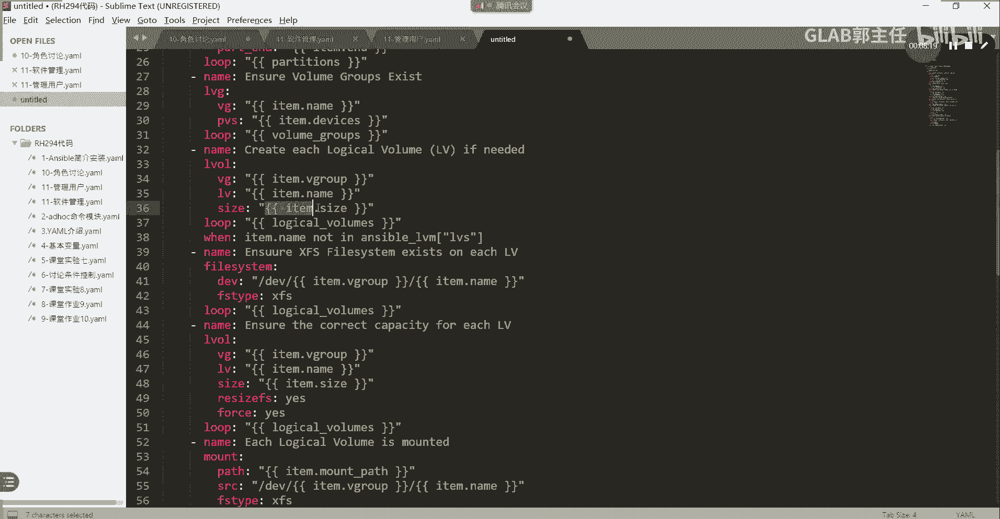

刚刚说错了，不好意思，这个size不是P的大小，就是VG的总就是LV的总大小，LV的总断啊，就是我创建了一个64道的逻辑卷，第二块我创建了一个128兆的逻辑卷，听懂了吗。

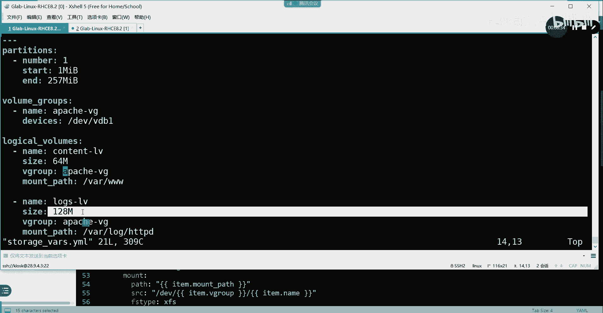

这个比较小啊，这都比较小，同样的道理好这里啊，这个就是正常创建啊，然后去循环变量，最后加了一个条件，说当这个名字不在这个里面的时候创建，如果你创建的这个LV的名字，就items names。

LV的名字在目标的受控节点主机上已经存在了，它就不会再创建，就是被这个条件控制的，听懂了吗，OK同样的道理下面啊，创建完了之后要挂载，挂载用的是不叫挂载，叫叫格式化，格式化。

这个逻辑卷用的是fire system，刚刚创建的这个VG和LV的这个路径，进行XFS的文件格式系统格式化，听懂了吗，嗯啊对，这两个应该是两个都是用它来一起创建的，创建完了之后格式化格式化。

格式化完了以后就好了呀，其实第一个需求做到这就好了，到这就结束了，到这就结束了，看得懂吗，其实还有一个挂载，挂载也可以把它放上来，中间这一段大家不用看挂载，再看挂载这一段，挂载这一段应该是。

紧接着在格式化文件系统结束后就挂载了，挂载用的是什么mt，把什么挂载到什么对吧，这叫挂载点，这个是我的逻辑卷，是这样写的吧，然后文件系统，然后有没有参数没有对吧，没有参数状态是不是挂载挂载。

然后把我创建的两个逻辑卷，依次的通过循环都挂上去，听懂了吗，都挂上去，所以这一题逻辑关系并不复杂。

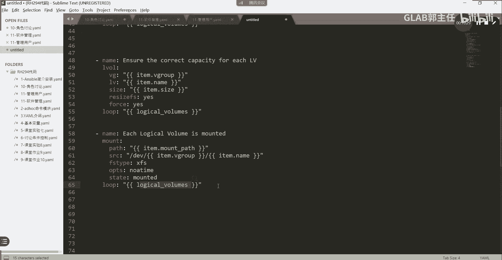

主要考验大家的就是这个变量文件好，大家想一个问题，其实我的脚本这样写完了以后。

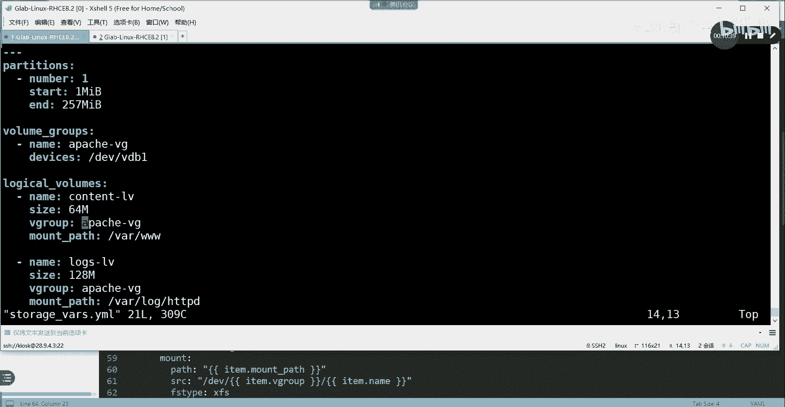

他要维护的后期维护的这个概率大吗，不大，为什么这个脚本写完以后，后期维护的概率不大，为什么它在功能上实现了，我们要分区画逻辑卷这样的一些功能，对不对。

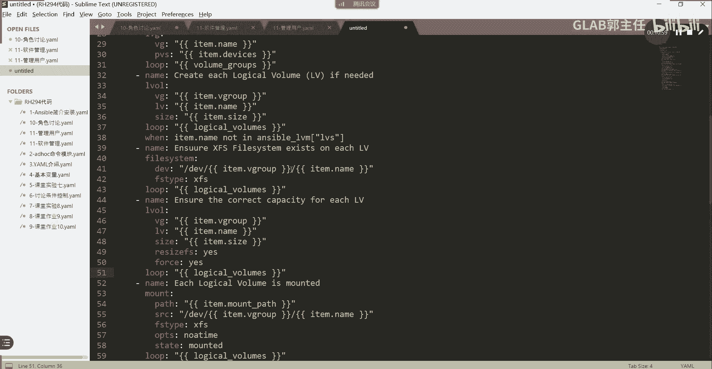

那真正核心的要维护的是不是这张表啊，你分几个分区，是不是在这边改一改，他过来循环就可以了，我把逻辑卷分多大，是不是只要把这边改改不就可以了吗，听懂吗，所以第二个需求看见没。

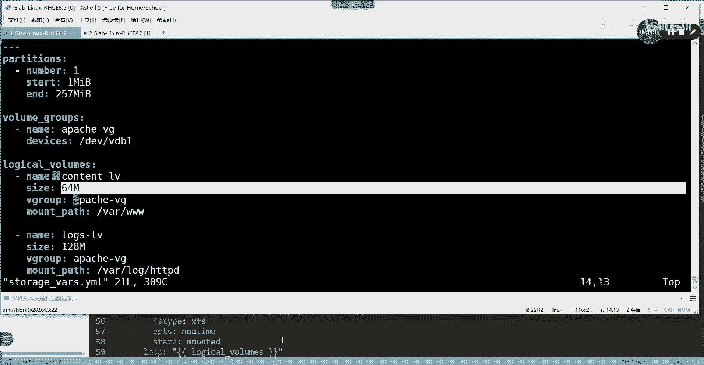

第二个需求增加分区，增加逻辑卷，增加这个大小，扩容卷改的并不是这个文件。

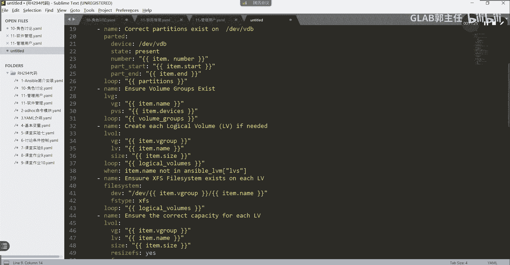

不是playbook文件，而是这个文件，你把比如说他要扩容，我要把第一块逻辑卷从64扩到128，我是不是把这改成128就可以了，第一块逻辑卷把它改成128，第二块改成256，改这不就可以了吗。

改好了以后，我去playbook脚本里头，只需要加一段代码就可以加哪一段，还记得我们在不用playbook脚本跑的时候，增加扩容的时候，是不是要resize啊，把你增加的部分重新格式化一下。

听懂了吗，所以我们在playbook脚本里，不需要做任何过多的改变，我们只需要写一段代码，这一段代码就是用来就是用来做看见没，就是用来做reset的，听得明白吗，对不对，你的如果空间改大了。

你原来的盘是不是叫RESI，是不是要把多出来的部分重新格式化，所以就会多出来，仅仅只是多出来这一段代码来实现扩容的，其他都不要变。

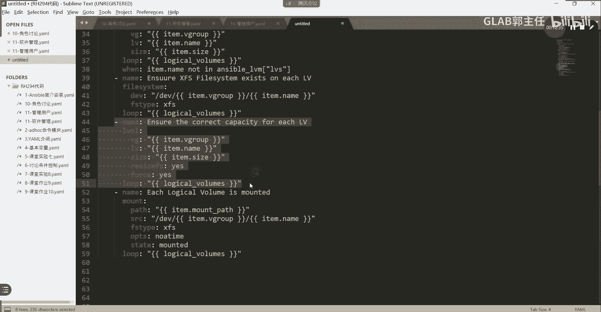

比如现在我要新加一个盘，我要再增加一个分区怎么办，是不是在petition下面再加一个number2嘛，对不对，number2嘛，然后呢把这个大小也写一下不就好了吗，理解吗，OK如果再增加一个逻辑卷。

我是不是再加一段，在这里再加一段就可以了，让他来循环不就好了吗，其实主要维护的是这个文件。

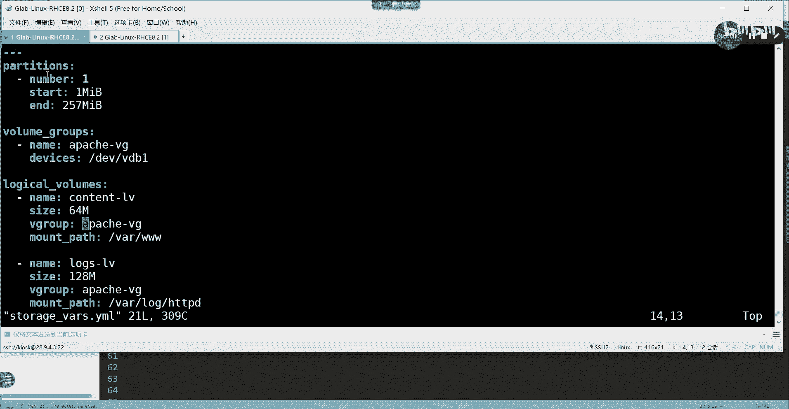

其他的playbook脚本功能上实现了就不用管了，就可以了。

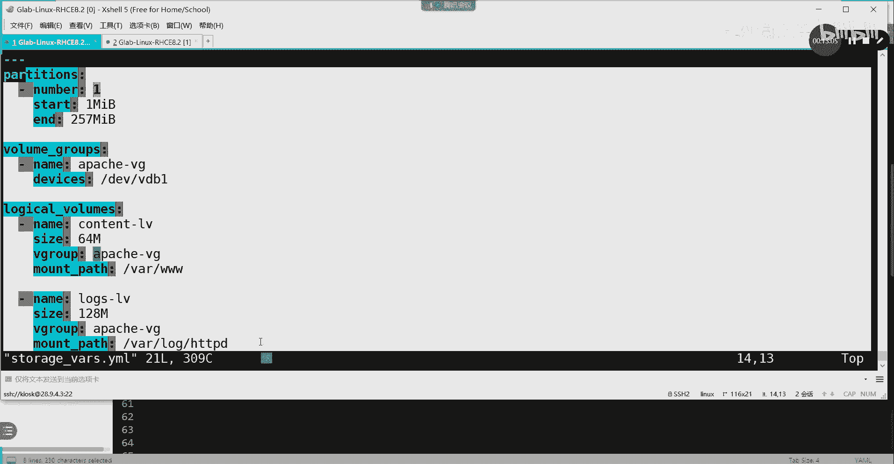

各位能听明白吗，OK这就是这一题，为什么大家一定要做的原因。

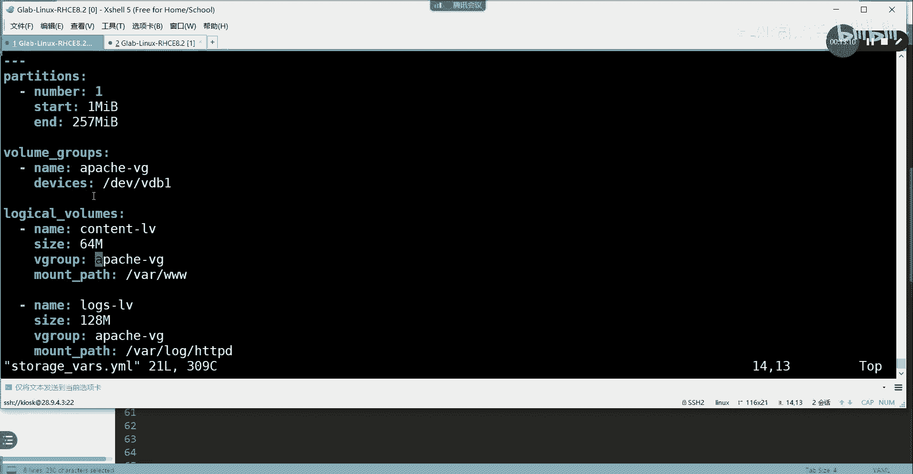

真正维护的只是这个变量文件，你把变量文件维护好啊。

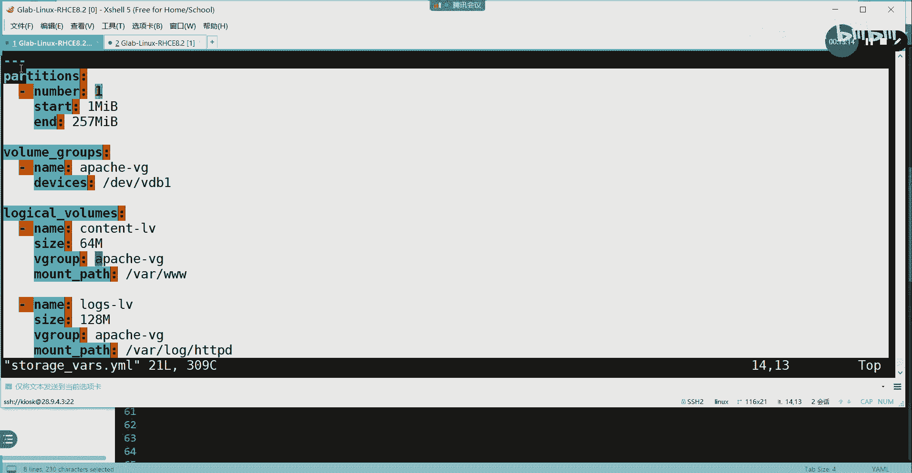

要增加要减小，要干嘛，脚本它已经在功能上帮你实现了很多东西，他只需要调用前面的变量文件就可以了，我说明白了吧啊好，所以，所以我们来看啊，我们先来跑第一个任务，第一个任务差不多就这么多吧。

差一个差不多就这么多好不好，我们先保第一个任务，同志们控制啥情况啊，我马上给你钱呀，我想要看一下这个文件，12吧，叫磁盘管理，好磁盘管理。

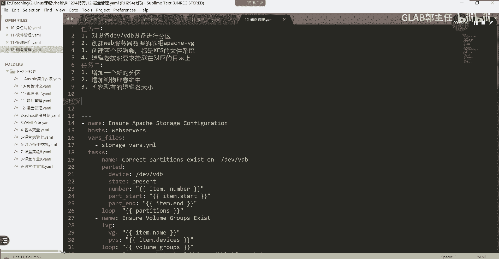

我把磁盘管理丢进去。

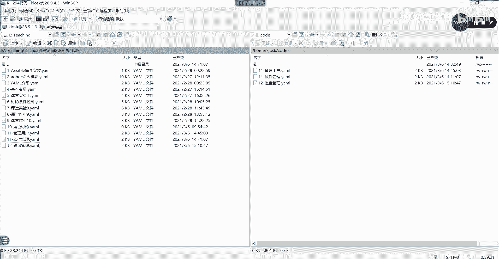

然后在这里我们来看一眼，资产管理有了，我们来看啊，12tab键好，然后送到哪里去呢，它叫system to好，送你来，然后呢继续来这里是不是有了，然后MV我们直接切到，直接把它剪切到storage点。

yo好，这个时候我们来编辑一下storage点，要么前面的删掉啊，好这个是我们刚刚写的这几个脚本好，写完了这变量也都OK了，我来playbook，这个叫什么叫什么来着，叫叫叫叫嗯storage点。

要么杠杠SYNTX杠c h e c k check一下，有没有语法错误，没有来跑一下，好在没有跑之前，我们还是先来看一下，就是他现在是要做分区逻辑卷挂载，对不对，我们来看一下目标主机SSH诶。

他的目标是谁，手手手贱了就跑了，没关系，就这样吧，我准备没跑之前让大家看一下，其实没有任何东西的是吧，那跑完之后再看也行啊，所以说你们自己该做什么好，跑完了跑完了之后，我们要看一下他的这些逻辑卷。

有没有像按照我们的要求去挂，我们通过SB用AD hook去看就可以了，对吧，杠A看什么命令，DF杠TH，有没有啊，这是不是我赚钱的，是不是啊，是的吧，64和128看上去相对小吗。

那如果你不用不用这个命令，还有一个命令可以查，叫lv skin考，要考的啊，这几个简单命令，也是要大家平时练的时候要敲的，是不是有两个64和128，看到了吗，好接下来做第二个需求。

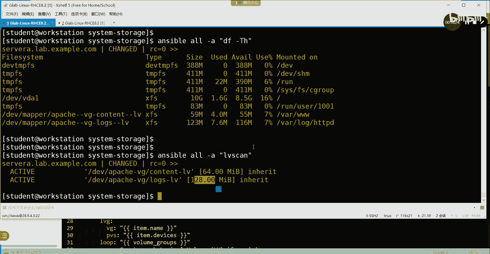

第二个需求他说的是增加一块分区，然后呢要增加到物理卷当中去，还要扩容现有的逻辑卷，另一个，嗯改什么文件，告诉我，是不是改这个storage的变量文件，是不是改变量文件改成什么，改成这个样子。

加一块分区空间，从第257号开始给他分到了513，是不是做了第二块分区，加这一段是加的吧，好这一段要不要加，要因为你做了一个第二块分区，就做了一个VDB2吧，所以你要把VDB2也要放进这个叫PV里面。

我们叫PV能听懂吗，放到这个卷轴里面来，好卷组放完了以后，逻辑卷就可以扩容了，我们对这两块逻辑卷从64变到128，第二块从128变成256，看懂了吗，嗯我们把这个文件做一个简单的修改。

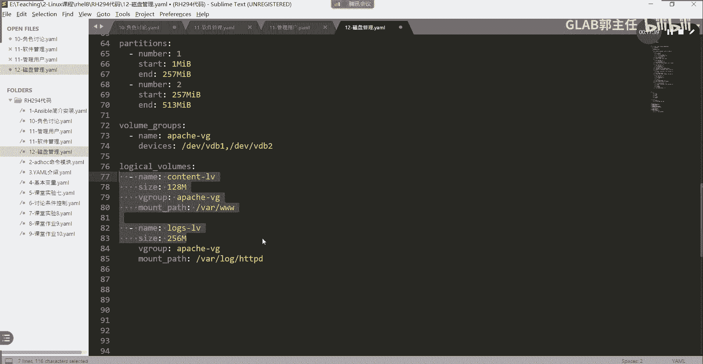

来我们给他做一个简单的修改，我们去变量storage vs里面，我们把它修改一下，在哪里呢，前面两个都不变，新增一个，在这新增一个，我们把这两行复制过来，接过来简单的调整一下。

他们没有任何的这个缩进关系啊，都是都是一个级别的，然后接下来在这个后面还要加一个加一个什么，用逗号隔开，逗号隔开啊，然后加DEV杠叫VDB2，没错吧，好然后逻辑卷的大小要改的，这个改成128。

这个改成256，就你把它扩容成多少就写多少，其他所有的东西都不变。

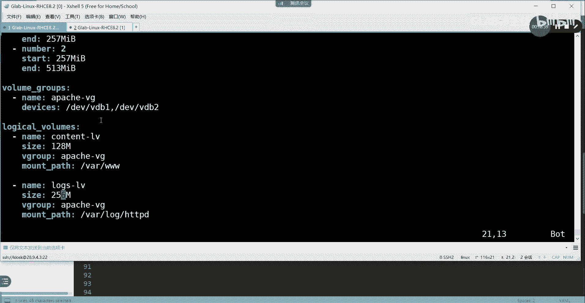

听明白了吗，各位这个文件改完了以后，我们可以再继续去铺去跑一下。

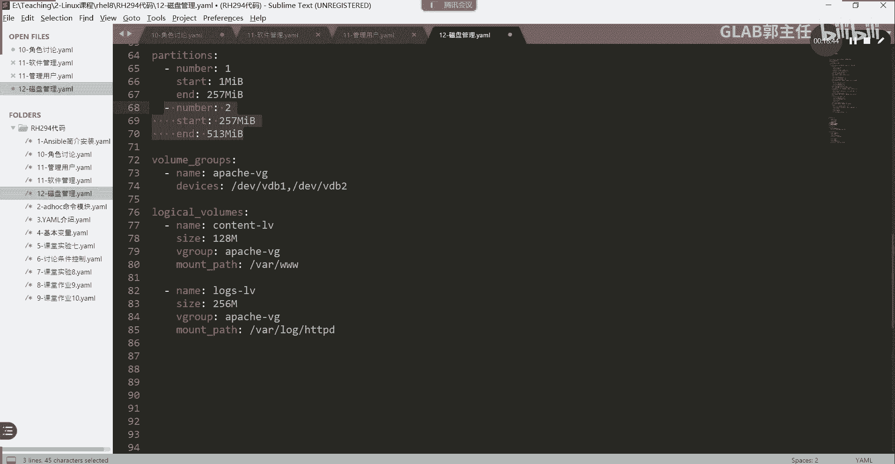

再继续去跑一下来吧，再继续跑一下来再跑一下，然后，是，不是创建了一个第二个，跑完了吧，再看一下，大小有没有变，128256变了吧，变了没有变了啊，然后DF杠TH，这个看不出来第二块分区是吧。

但是我们可以从空另外一个命令来看看，第二块分区LSBLK吗，有没有第二块分区，是不是有啊，VDB2是分出来的，VDB1是刚刚分出来的，能听懂吗，并且这两块分区都用来做逻辑卷，你这个都能看出来。

VDB一下面有这俩逻辑卷，VDB2下面也有，就说明这两块盘都在卷组当中，都在我们圈子当中，听明白了吗，各位所以这一题主要的脚本写完就好了。

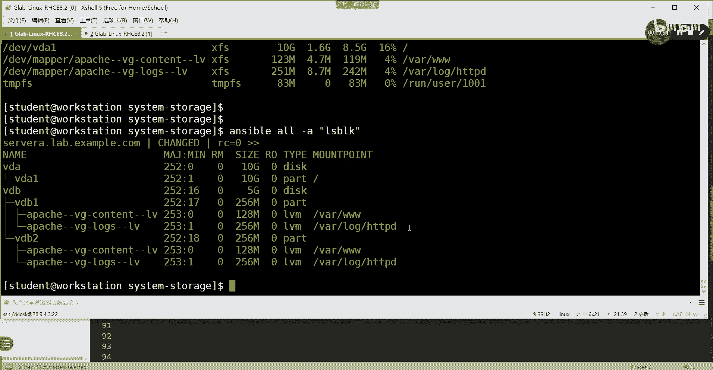

你要理解里面的逻辑关系，然后真正要控制，要管理的其实就是一个变量文件，后边你拿到这个变量文件随便怎么改，脚本一刷，你要你的要求都搞定了，创建几个分区，创建几个逻辑卷，大小都可以听懂了吗，很简单啊。

一台100台都能实现好，这就是我们的磁盘管理，这是要考试的内容啊，这是要考的，这个是要考的。

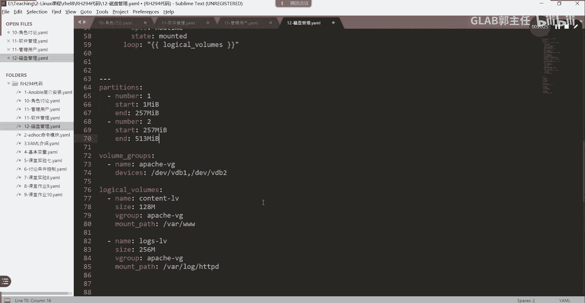