# 【Linux／RHCE／RHCSA】零基础入门Linux／红帽认证！Linux运维工程师的升职加薪宝典！RHCSA+RHCE／52-Ansible网络配置 - P1 - GLAB郭主任 - BV1EN411u7hR

接下来我们来看剩下的两个，一个是网络，一个是网络好，可以吧，一个是网络，还有一个是定时任务，我们先看网络，网络的话，我们经常配网络的话配置是怎么配的。

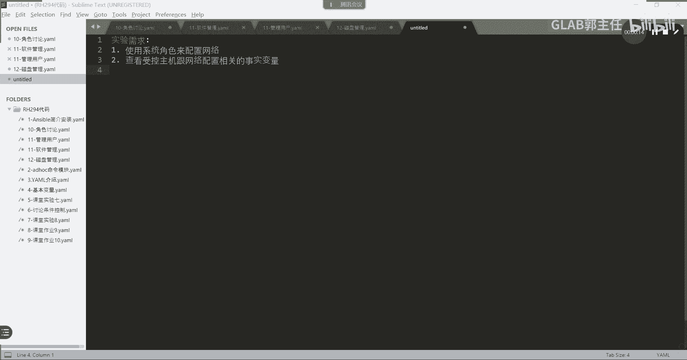

我把这个先关掉，找lib system的storage，The finish，我们配网络，是不是这次的CSA考试第一个题，是不是让大家配网络啊，讲了两种方法，一种叫NMTY，还有一种叫NMCLI。

是不是啊，先看这个第一个叫NMTINM退啊。

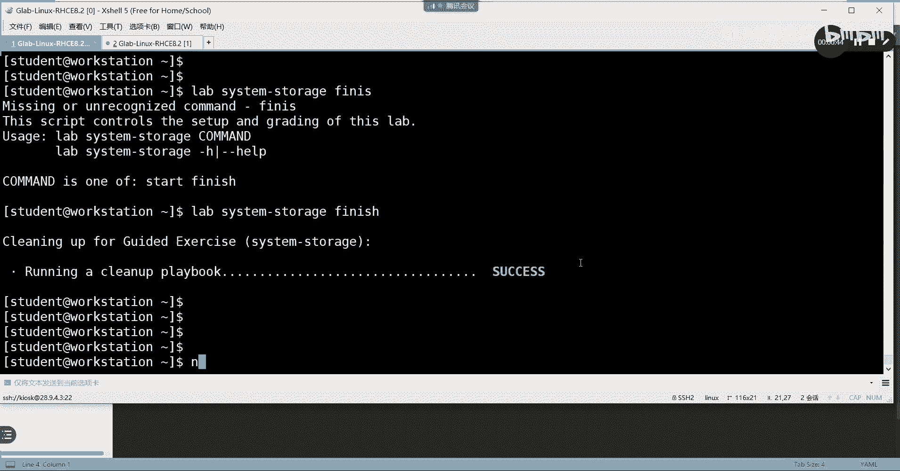

这个命令这个命令在任何环境下都能用，它不能够，它不需要你去装任何的图形化界面工具，这个图形化是系统自带的，不需要有任何的图形化的软件支撑，听懂了吗，所以大家记住这个图形化的配置方法，网络搞不通。

你后边啥都搞不定，所以先把网络搞定，如果觉得图形化比较low的同学。

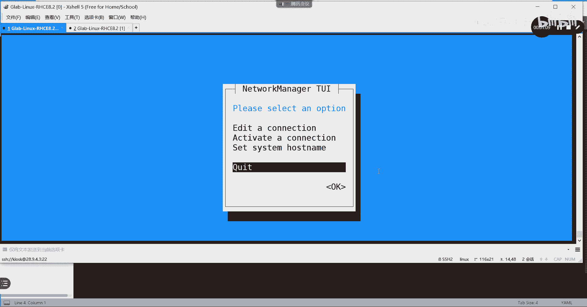

你可以用命令行叫NMCOI，这是一个完整的命令行，那么这个命令有些人也记不住对吧，那么你可以去问一下，他有一个妹妹名叫may nm c r i，EXAMPLEGA叫may examples吧。

对叫这个叫examples，你可以去卖一下NMCLI的example好，然后在这里去搜ex m p l e example8又打错了，不管了，就这个example，ex m p l e没有杠空格八。

搜一下它叫EXMPLE空格八好，这里头就是我们要用到的命就比较长啊，这个命令比较长，我不建议初学者上来就用MCI，它会增加你的出错概率，干脆老老实实的考试就不要别给我瞎搞，好不好。

考试求稳NMTYUNMTY好不好。

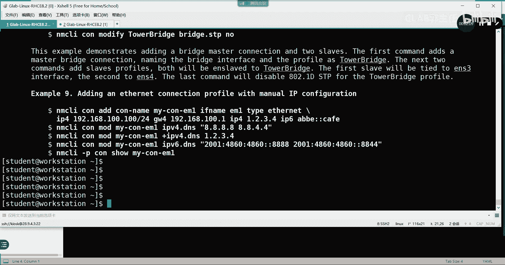

所有人都用MTY，然后呢编辑一下，编辑一下，在这里去改，这不得多爽啊对吧，全是图形化界面的，要不要点错，很多人容易搞错，这里配IP地址的时候，后边还要加一些码，很多人漏掉野马搞不通，到时听懂了吗。

D啊这些东西都做完，做完了啊，下边还有呢，OKOKOK好吧，取消好，然后退出退出好。

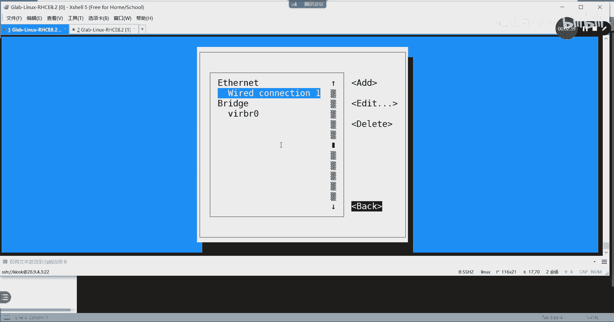

然后做完了之后，你用IPR就能看到密码，看到这个IP地址了，看到IP地址那就对了，各位明白好，我们是用这种方式来改它的IP的，那么我们用playbook脚本的话，应该用什么方式呢。

在这里讲到的叫系统角色。

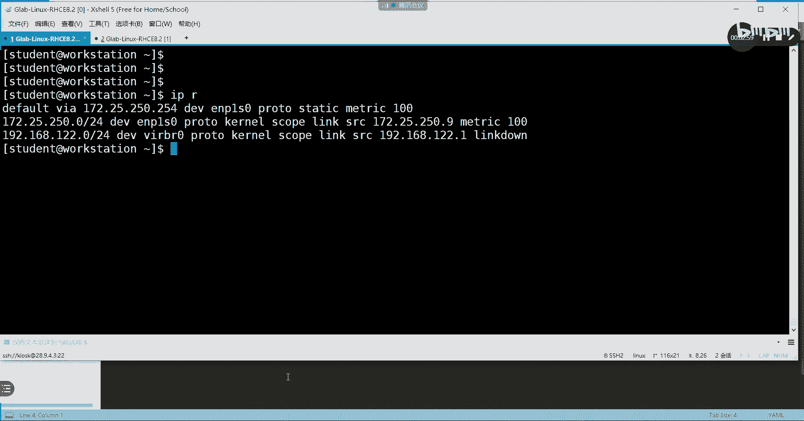

我们用系统角色来改它的这个东西，我给大家演示一下啊。

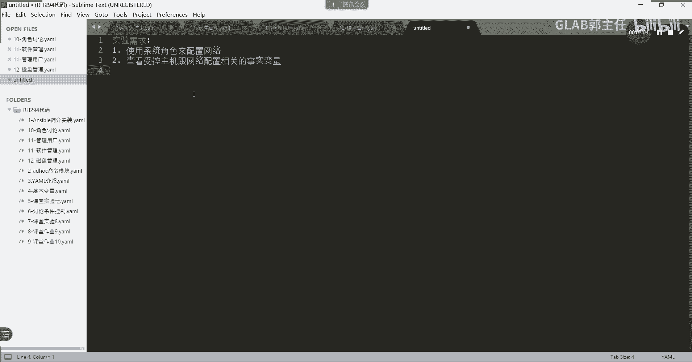

这个用系统角色就简单多了，不需要大家去写任何角色，就用系统的角色就可以了，lib system叫network，再说一遍，这个内容可能没有考，但是可能平时当中用的还比较多，用它来比较来改改。

这个IP会比较多一些，CD到system network好里边，这两个文件都有啊，我们其实不需要去做任何事情，那么我们要用到是系统的角色，系统角色怎么看呢。

and sport galaxy的list列出来我能用到的角色有哪些，这些是不是我的系统角色，看到没用，ansport galaxy列出来我是可以用的系统角色啊，好这怎么用呢，咋用不会用不会用，首先啊。

系统角色一定要先创建一个跟角色相关的内容，所以我们要make dr创建一个rose，一个呃，创建一个创建一个rose，我需不需要创建一个rose，我想想啊，好像不需要，他没有说放到rose里面。

不好意思，RM rf先删掉，这里头系统角色不需要单独创建rose，如果是普通角色的话，是需要创建创建在rose这个角色里面的，我看一下SPCFG看看哦，那没有写任何，没有任何去指定，没关系。

而且他是没有去指定的嗯，我们S杠杠杠杠VERSION2。8，2。8VO指定系统角色的路径，他没有指定，是吧，他没有指定rose pass，没有指定系统角色的路径是吧，不管我们先来试试看。

vim inventory叫web servers，没问题好，我们先来做一下这个怎么来用它的系统角色啊，怎么来用系统角色啊，不能用嗯，我们，先创建一个，变量，group verse对吧。

然后叫web web server，创建一个变量目录，叫group vs，叫group vs，然后呢我们创建来定义这个角色的变量，我们在这个变量文件里头啊。

嗯去创建一个嗯这个变量里头GRAP叫group vs，在web server里面建一个定义变量的文件，network network点样貌好吧好，这个里面定义变量的文件怎么写呢，这个就需要去参考角色。

就系统角色里面的一些一些内容了，好怎么去参考呢，我们来看看SSH到STUDENT这边再开一个，workstation角色安装完以后，他有一些帮助的手册，还有一些帮助的手册，这个帮助的手册在哪里。

在在USR的这个角色叫ESPANSPORT的角色，下面在这在这里啊，ANSPORTUS2passport的角色下面有多少东西啊，好RHEL的，我们主要关心的是network。

network下面有一大堆东西，有一个叫red mmd md md md，不是mod啊，记住这个路径很长，就是系统角色安装完是不是会在这看到啊，在看到之后。

每一个系统角色下面都有一个read me点MDMD格式，大家应该有了解，开发的人应该知道的是吧，这个格式读起来会比较方便，来看啊，我看这个文件，这个文件里头我们主要关心的是有一个变量。

就是它定义变量的various的一个example，就这个叫example of various，还在下面，还有一个更具体的例子，我要找一下在哪在哪在哪。

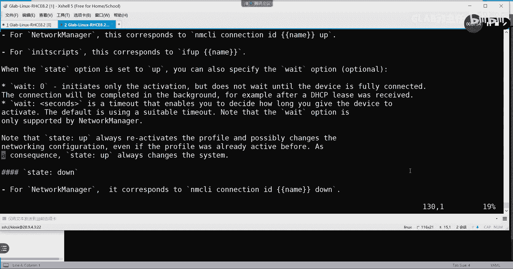

就这些不要记，我们可以翻得到的。

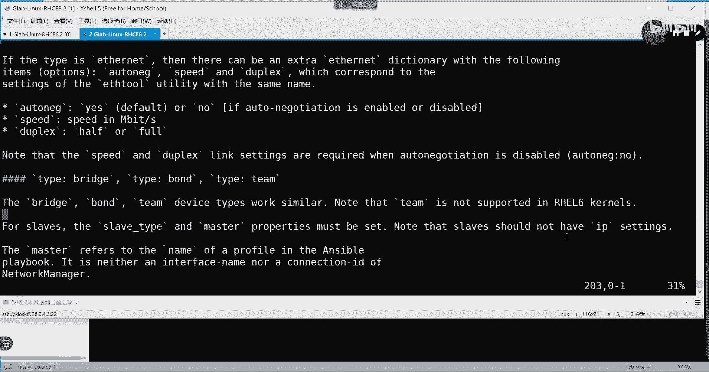

稍等一下，我忘记搜什么了。

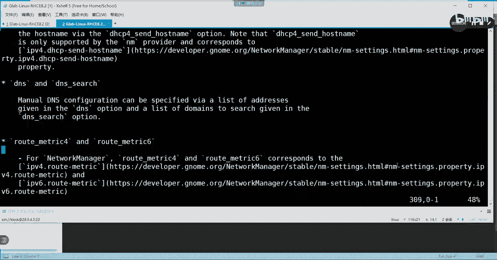

好在哪，Example，Example of options。

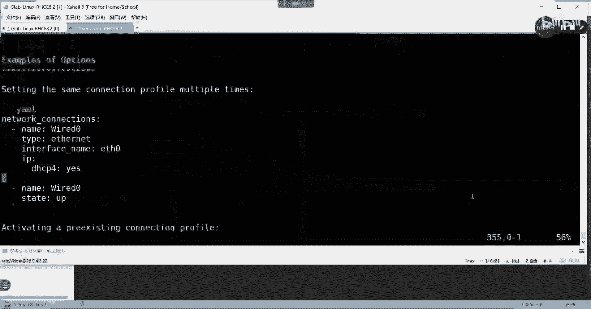

不是他应该是一个颜色哦，在这在这就这个就这个example options。

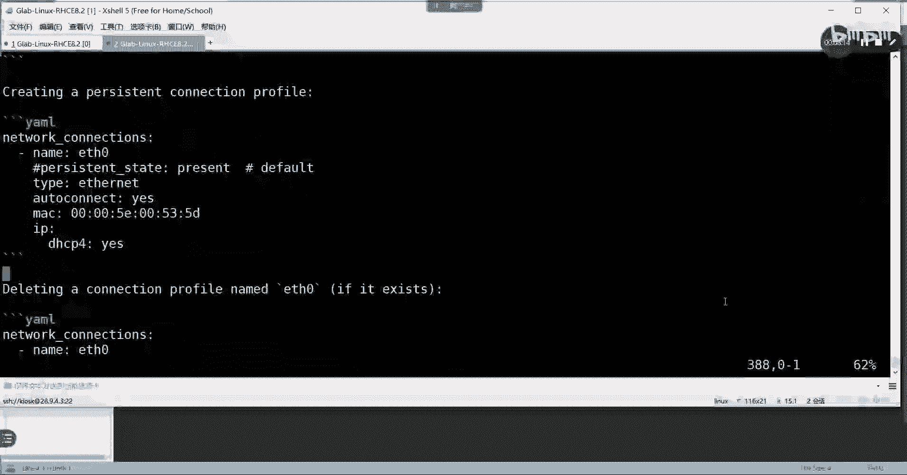

看啊，这是IPV4DHCP，我们有IP地址，通过IP address配他的，通过手动配置的方式，在这就这个，嗯叫setting the IP configuration有吗。

neo connection configure啊，这是configure，微软configure Mark，在这啊，settings IP找这个settings IP configuration。

找到了吧，在这里，这个就是系统角色里边所定义的变量的框架，我们把它复制过来，我们复制从这开始复制叫type IP对吧，我们主要配的就是IP地址，IP嗯address这是DHCP，应该还在下面。

下面应该还有哦，在这都在这都在这都可以，也就是跟IP相关的都有，上面肯定是这么多了，肯定是这个，我们把这个复制过来，这个是肯定要的是它的标准的框架类型，看啊叫这也是一个标准的，要么格式。

Name type ip，然后上面的这个也不要忘了，杠杠杠标准的playbook的写法，从三个杠开始吧对吧，好，IP下来了以后，我们不要忘了啊，还要IP，下面这些所有的东西都是IP列表上面。

所有评级的啊，这些都是平级的，我可以配root magic DNS啊，什么gateway都可以，但是我们最关心的应该是什么地址吧，我们把地址复制过来，对不对，OK好地址可以配很多个。

如果我们这里给他配一个地址，那就是写这个172。25。250。3，零杠24，如果要被gateway，这里再把gateway复制过来，gateway是谁，Gateway，Gateway，Gateway。

gateway是不是他给自gateway6，我们的gateway4在哪里呢，Root root gateway6，这是gateway6，Rt 6d gateway，是不是这个如果被GEWAY。

你再把它复制过来，因为下面所有的东西都要可以，按照你的要求来用，看懂吗，啊啊对吧，比如172。25。25，0。254，听得明白好DD那就D了好，这里再写D是什么，8。8。8。8。

那我这里只是给你举个例子，能看明白吗，所以你可以通过这种模板往里不停的加东西，就是在改ETH0，我们这里叫ETH0吗，不叫ETH，我们把这个这个名字叫改改一下，叫ENP，叫ENP2S零。

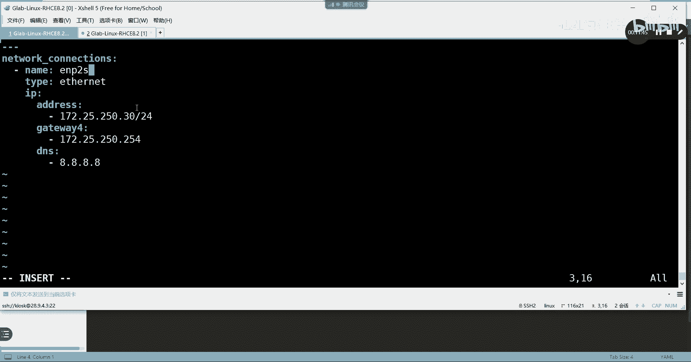

是这个就是你的IP地址的那个名字。

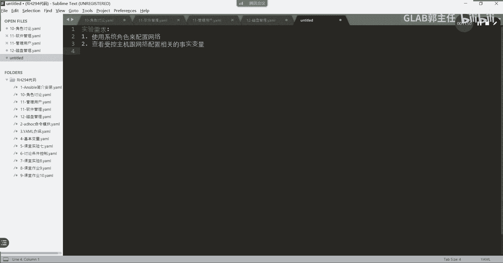

就是这个名字，就是你的IP link就是这个名字一定要写对，就这个名字能听懂我意思吗，啊这就是你的物理接口的名字啊，我们在刚开始讲网LINUX系统的时候，有讲过这个命名是个什么意思啊，有提到过对吧好。

那么在这里我们的D和gateway都不要删掉，删掉删掉删掉，我们只需要去配它的IP地址，写这么多就可以了，记住这是什么，这是变量文件，是在group vs下的变量文件，明天听明白了吗，各位听懂了好。

那么变量文件写完了以后，我们嗯，我们去去用这个playbook，我们的playbook看看咋写的，他写的我们要在我们要在这里去运行，去编辑一个playbook点，要么是吧，然后在这里杠杠杠好。

我们杠name就随便起个什么名字不重要，好house or好吧，然后呢我们要用到的是什么角色，是不是要用到角色啊，角色用到的是谁呀，是那个变量呗，嗯CD到system的network下面。

我们通过airport galaxy list去找到我们的这个network的变量名，就这个就是这个我们在这里调用这样子，这个能看懂吗，OK然后我们通过esport playbook去执行一下。

我这个PLAYBO，好这个改完了，我们去看一下ITR，诶去改成哪个接口啊，叫哦2S0是吧，ENPRS0有吗，不是这是这是student，我们应该要退出来，SH到root下面的server。

我们IP link有没有rs0，有的吧，IPR改了没改了吧，就是改的这个接口，明白吗，E n p240，然后在这里改的就是EMP240，改成了三零吧，三菱是不是三零，听懂了吗，各位啊。

再看一遍我们怎么用的啊，其实很简单啊，他在他在这里建了一个group，Group vs group vs，其实就是它默认约定俗成的，这样的一个组的变量文件，还有一个还有一个名字叫host wars。

你只要照着这个键就可以了，不要建其他名字的，就叫group vs l s gl，在group rs上面，ELS在group VR上面有一个web service，上面有一个network。

有一个这个文件，那么这个文件里边我们去把角色系统。

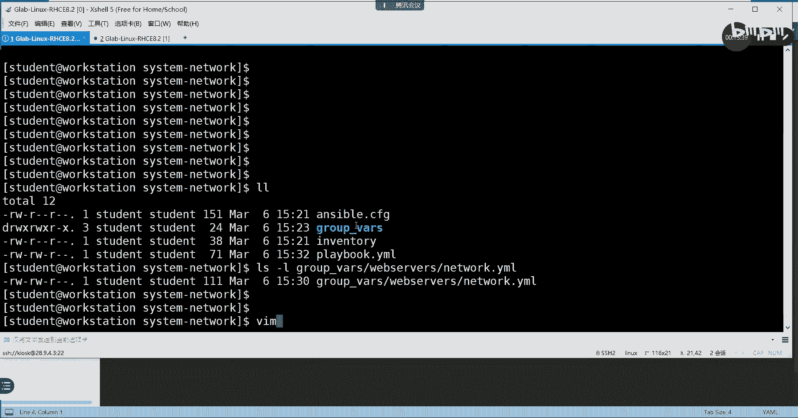

角色的变量给它重新定义，因为它变量都写好了，你只要在这个文件里把这个你要改的对象。

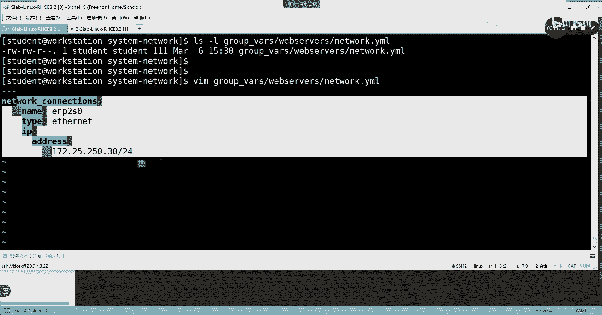

IP地址要改成什么都写好，然后呢在外围在你的这个在你的这个外面，就是在这我们新建一个playbook，在这个playbook里面直接调用系统角色，他就把你这个内容啊配置到受控节点上去了，清楚了吗。

这个很简单，角色就是这样用的，network是这样用时间同步，也是这样用的，所以大家在做C1的考题的时候，C1考题考的是时间同步啊，也是一样的，你去改相应的变量，直接在playbook里面调用这个系统。

同时间同步的角色，它就能自动帮你去同步，实现了，就这个系统觉得直接用就可以了，把变量修改一下，都是这样做的，都是这样做的，OK所以会方便一些啊，这个系统角色会方便一些，那命令不记记不住啊。

就是不知道在哪个变量里面改，大家要知道怎么去做，你要去知道怎么去查，知道我没去查在哪，那个那个叫叫叫在哪，那个很长的那段不是在这里查的吗，再给大家看一眼在哪里啊。

在CD到USR下面share下面的下面的rose，下面的在这里，然后CD到r h e r network下面，它有一个叫有一个MD的v i m read，对他就这这个文件对吧。

MD就这个问题路径我给大家看一下，PWD在这这是一个很长的路径，在默认角色里面，默认角色路径里面对应角色下面有都有，每个角色下面都有这样一个这样一个文件，这个文件会很清楚地记录到该如何去修改变量。

说清楚了吗。

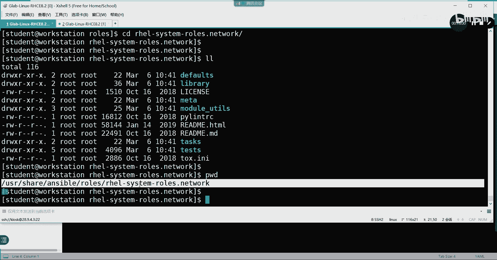