# 【Linux／RHCE／RHCSA】零基础入门Linux／红帽认证！Linux运维工程师的升职加薪宝典！RHCSA+RHCE／53-Ansible计划任务 - P1 - GLAB郭主任 - BV1Dg4y1Q7T5

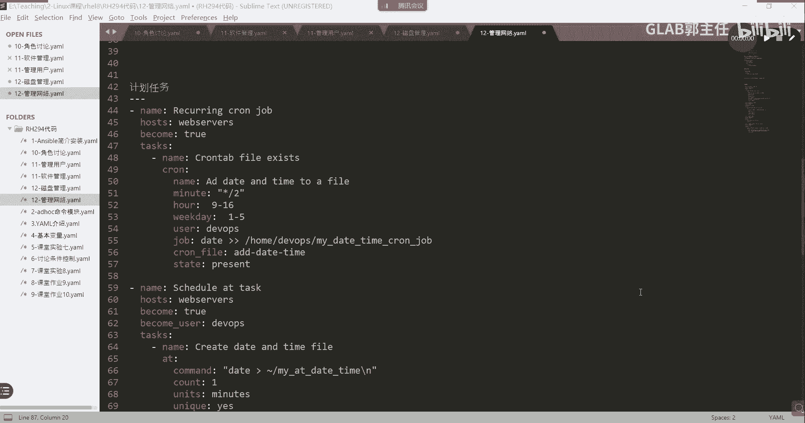

最后一个计划任务比较简单，主要是这个模块的熟悉。

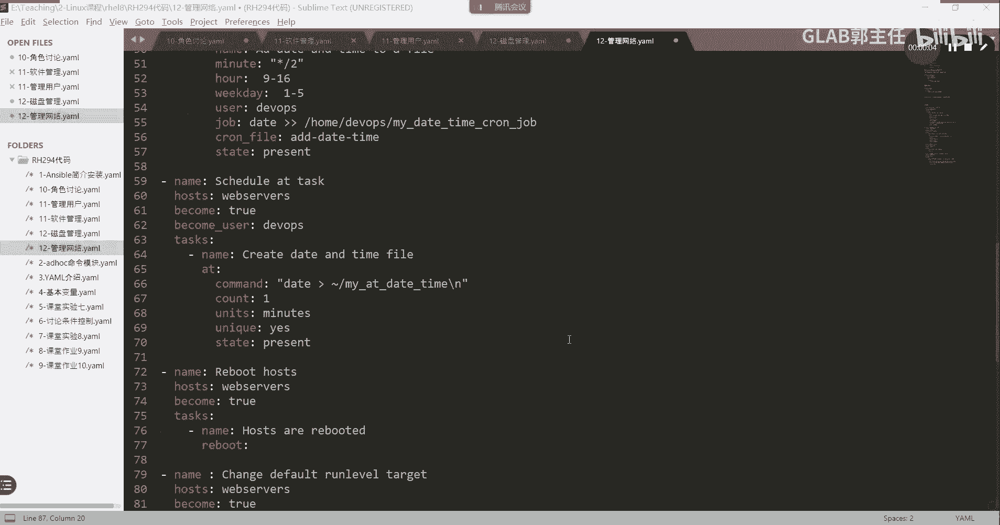

大家来看看这个模块，首先呢我们如果想要去修改，就是之前所做的这个chrome table嘛，我们用的就是chrome模块CREO模块起一个名字啊，那么分时这个星期是吧，然后这几个这几个标志就五个星啊。

他都可以在这里去标志，然后是哪个用户对它进行操作，用什么方式来做啊对吧，然后这个文件保存在哪里呀，是不是要做这个计划任务啊，所以这个chrome模块就是用来做定时计划任务的。

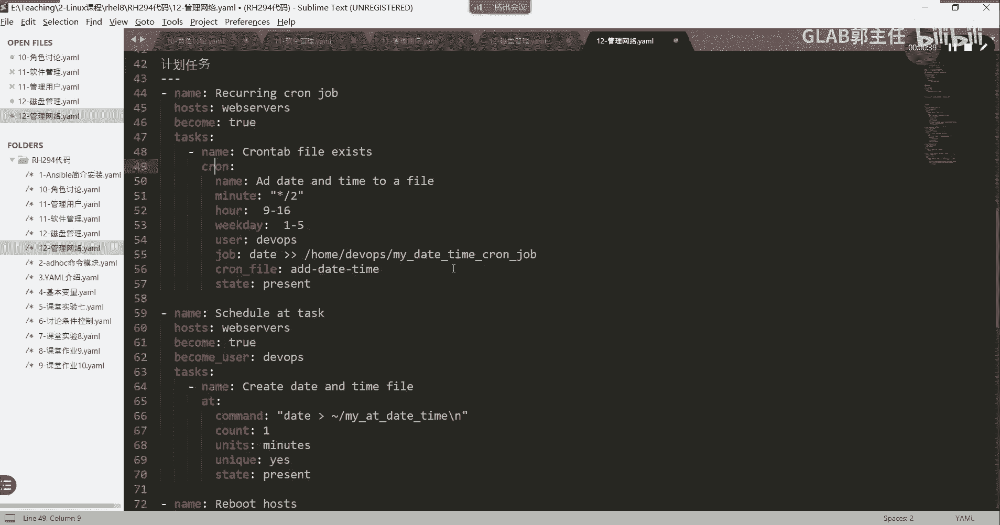

大家不会用，用assable dog去查就可以了，这就是常用的方式，一点都不难，我认为这个没有任何难度，前面会你这个肯定会OK，只是换了一种方式去实现而已。

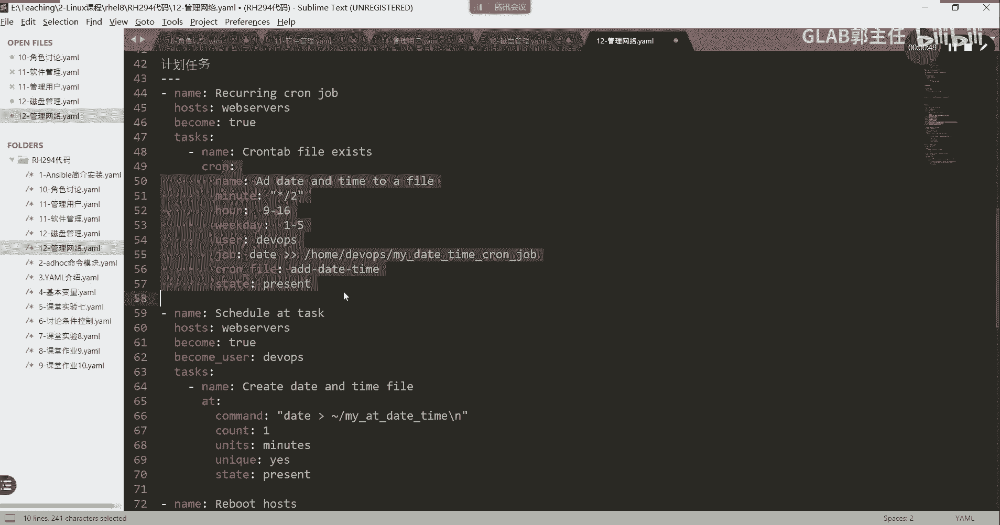

第二个我们去做这个还记得以除了计划任务。

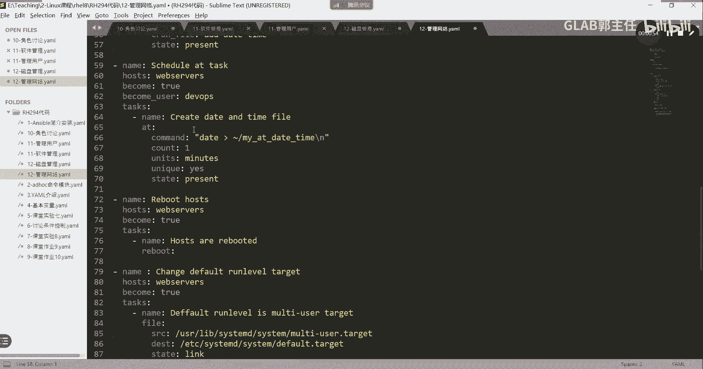

还有什么叫延迟任务对吧，我们用艾特的方式去做延迟任务，就是说在后边的哪个时间节点，我要做一件什么事情，将来的某一个时间节点要做什么事情，但是这个事情不是周期性做的。

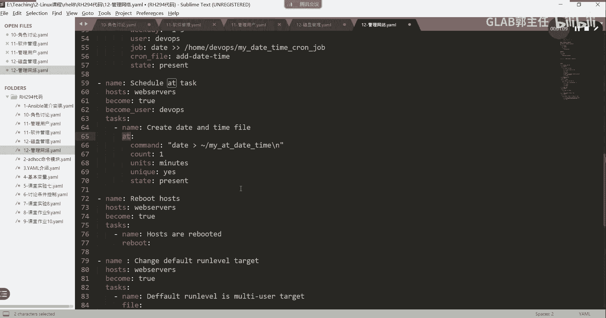

所以叫延迟任务，上面这个要周期性做的叫一叫计划任务。

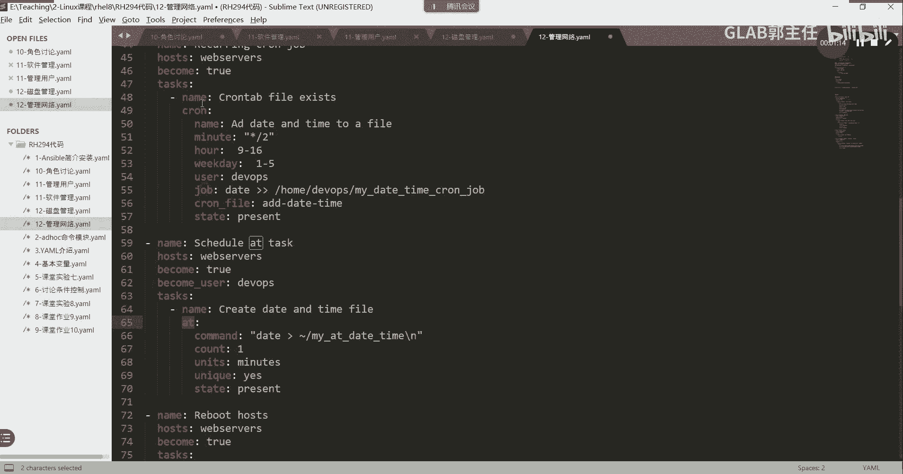

听懂了吗，OK那么at原来怎么做，你现在也怎么做，那举个例子啊。

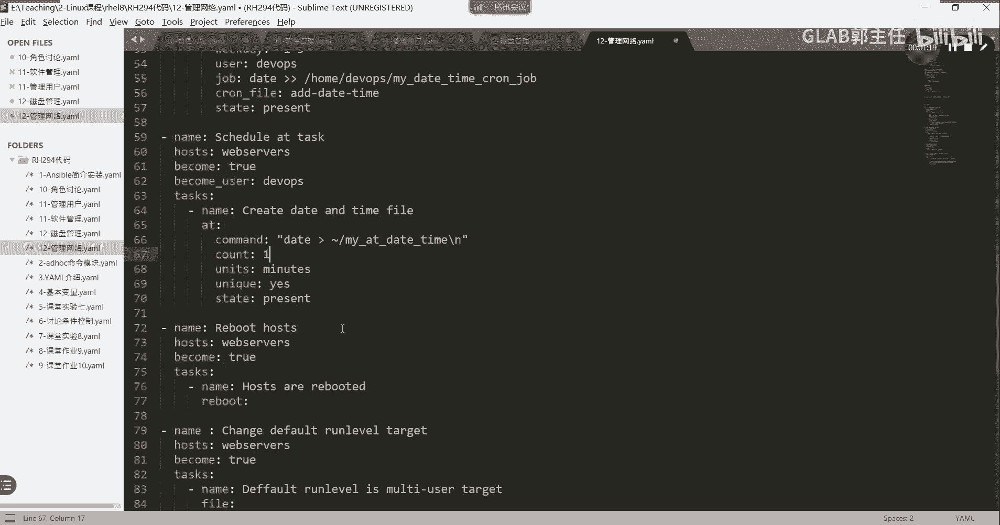

我在接下来一代表的是我接下来的一分钟以后，我要执行什么样的操作，我要执行这个操作，明白了吗，OK那一分钟啊，我统计的单位如果像一个小时，你就把这改成小时，而不是分钟了，听懂了啊啊。

OK那如果进程当中有有有进程在执行的话，那么他就不执行这个叫防止冲突的，叫unique好state，就是要去做这件事情，所以这个叫延迟任务。

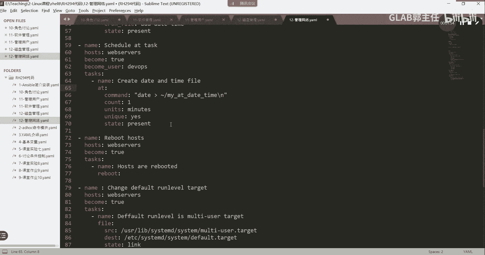

跟之前也是一模一样的，第二第三个就是reboot，Reboot，其实前面有讲过是不是重启啊，刚才在讲哪个实验的，我忘记了，是不是有哦，SLINUX的时候在讲S1LINUX的那个要改，要重启。

要判断的时候也讲到reboot模块，就是用reboot来重启设备。

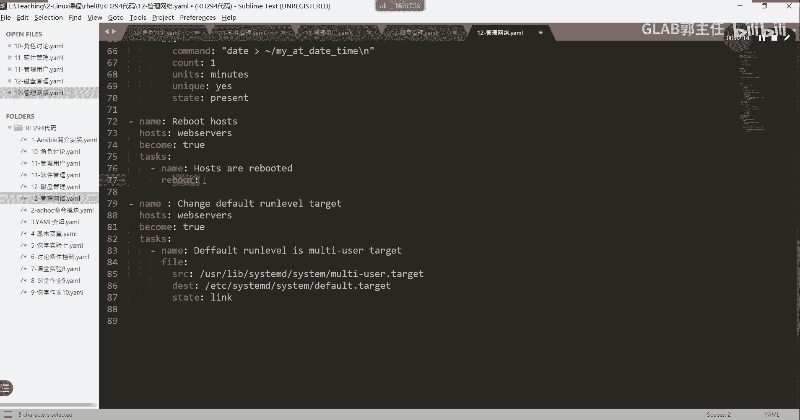

OK好，然后files模块这个不用讲了，就是把哪个文件送到哪个文件上去做一个，这是这是做什么呀啊FI模块在实现什么，A文件复制，二文件内容的修改，三软链接四硬链接在做什么啊，软链接看到了吗。

state是link啊，fire这个目录的state有各种各样的，有directory是在创建目录，对不对，hard在做硬链接，link在做软链接理解吗，opposite在删除这些，这些都要去看。

前面讲模块的时候都有在第一天讲各种模块，id hook在讲的时候，给他介绍了一堆模块，听得懂吗，笔记也都给大家了，这个我就不赘述了。

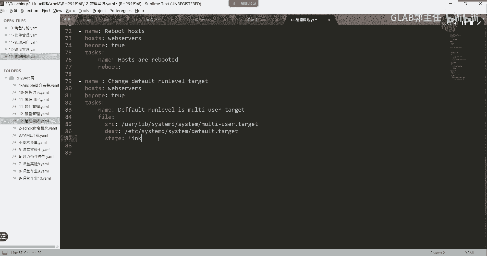

好不好，所以关于这个里边的话，file模块讲过了，给大家补充三个模块。

一个叫reboot，一个叫at，一个叫。

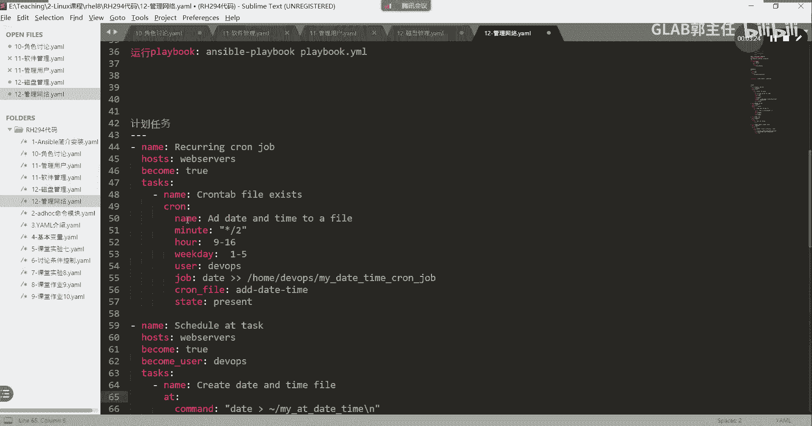

都是前面讲的内容，这个所以这块没什么好讲的。

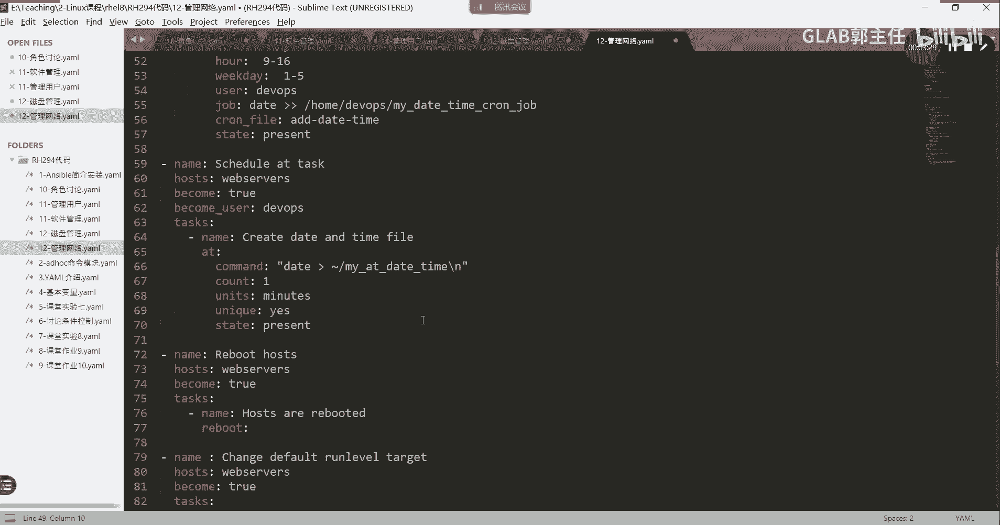

也不要去不要去测试，不要去运行。