# 【Linux／RHCE／RHCSA】零基础入门Linux／红帽认证！Linux运维工程师的升职加薪宝典！RHCSA+RHCE／54-容器介绍 - P1 - GLAB郭主任 - BV18C4y1m7GN

好那我们我们开始今天的内容是容器部分，那么容器部分的话是CSA新加的东西啊，然后呢我们来给大家简单的介绍一下容器，我们在CAC大家做过题，应该知道最后一题考的就是容器啊，考的容器，那么我们讲的东西。

肯定要比考的东西要稍微多一些，容器应该在最后，嗯嗯对，就是这个，134，好我们来看容器这块。

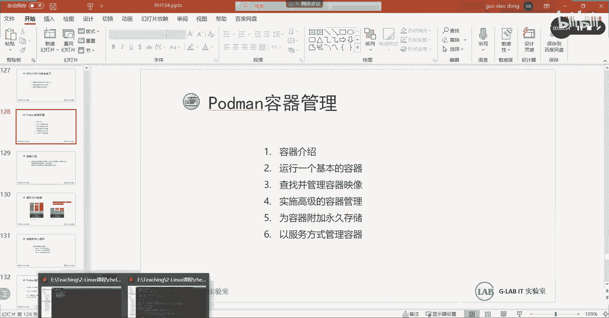

我们大概今天要讲五个内容啊，先第一个内容会讲基本的一个容器如何该运行，对它进行简单的管理，第二个给大家讲一下镜像仓库管理，这个镜像仓库呢我们主要讲的是私有的仓库，我们考试也是自己搭建的私有仓库对吧。

然后呢也有一些公有的仓库，也会给大家简单介绍一下，会有一些容器的公有仓库，公用仓库呢主要是要系统要能上网，他才能连到公用仓库，这个不管私有还是公有啊，它其实就是一个镜像的下载源源在哪里。

如果源在这个局域网里面，那就叫私有的计量仓库，你需要自己去搭建，如果云在公网上，那就是公网的私有经销商，公网的仓库啊，所以说需要上网，那么第三个会给大家讲到，如何将端口映射到容器呃，这个应该能理解的。

容器相当于在系统里面起了一个虚拟机吧，一会儿我们会讲容器和虚拟机之间的关系，其实就是在系统里面建了一个小的虚拟机，那么你要把虚拟机里边的服务映射出去的话，一定要涉及到跟你自己的这个物理机。

或者本机之间有一个端口映射关系，明白，最终还是你本机的防火墙，放行端口才能访问到里面的防火墙啊，啊里面的容器啊，对不对，所以这个时候我们在做端口映射，其实就其实就是在放行容器，对外提供服务的端口理解吧。

第四个我们考的内容，最后两个是我们考试内容，将容器配置成永久的存储，容器呢，它是它跟虚拟机还是有区别的，它只要一关闭容器里边所有的数据全部删掉了，所有的数据全部删掉了，所以你会发现容器是更清晰。

更倾向于服务的，它会叫叫便捷性的，敏捷化的提供服务，对吧，你有需要容器服务容器立马起来，服务立马开起来，你如果这个需要没有了，那么容器直接关闭，整个所有的东西也全部关闭了，它不会占用任何其他资源。

有需要他才会起来，没有需要的时候它就关闭了，那么所有的数据随着容器的关闭就全部消失了，但是有些服务的数据我们是要保存的，所以需要在本机上做一个目录，映射到容器里边的目录。

这样的话容器所保存的数据都保存在本地了，实现容器数据的永久存储，这是我们第第第四个内容，最后一个内容是将服务，将容器做成服务服务，大家都知道在建立我们LINUX上，像我们的FIREWORD服务啊。

HTTPD服务SSHD的服务，它是一个系统的服务，就系统本身自带的服务对吧，你可以像启动服务一样去启动容器，这样的话会更方便更容易一些，所以第五个内容我们讲容器如何做成服务，它是可以做成服务的。

但是有区别，我们刚刚讲的那些服务属于系统级别的服务，而把容器做成的服务属于用户级别的服务，属于用户级别的服务，OK好，这个是我们五个内容，我们一个来看内容，这部分内容准确来讲不是太难，不是太难，我觉得。

我们先来看第一个。

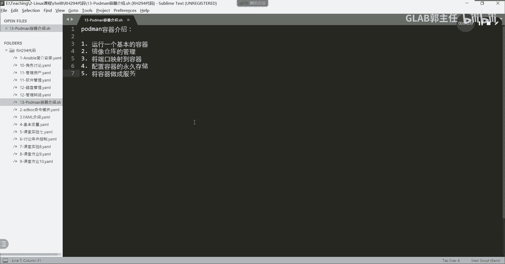

先来看看基础吧，先介绍一些简单的容器，这是我们这个容器容器的介绍，首先容器是什么，容器，似于系统的其他部分隔离的，一个或者多个进程的集合，是不是太复杂了是吧，其实通俗点讲，其实就是容器是一个应用。

一个应用不止一个进程吧，可能有多个进程嘛，对不对，其实容器它就是其实可以理解为就是一个应用，它装在一个盒子里对吧，装在一个盒子里，它这个叫做容器，它其实就是偏应用化的。

OK那么容器的内容与其他容器的内容是隔离的，并且不会相互影响，这个是容器的比较重要的一个特点，如果你一台系统上创建了100多个容器，它们之间互相影响，那就没有必要，容器就没有存在的意义了，对不对。

所以他们必须要有一个相互隔离的机制，接下来我们会讲容器是如何隔离的，他是怎么做到容器和容器之间是相互隔离，并且不会影响的，好不好，第二个容器是打包应用程序与简化部署的方法，就我刚刚讲的。

其实就是说容器就是服务，能听懂吗，好那容器和虚拟化之间的关系是什么，虚拟化懂吗，大家懂的，虚拟化的常见套路是我们现在说主流的虚拟化，就是WM或者说LINUX的KVM，这都属于主流的虚拟化。

那么这种虚拟化都是怎么做的呢，都是在底层的物理硬件上先装一个虚拟化层，我们把它叫虚拟化成像，如果是VR这边装的就是呃底层的虚，底层的硬件啊，底层的硬件上装help weather hwa是什么意思啊。

就是虚拟化层WM叫ex对吧，就是ex，然后在EXI上再去装我的guest os，再去装一个个独立的操作系统，这个叫操作系统吗，每一个虚拟化上的操作系统都是独立的，完整的完整而且独立的，听懂了吗。

然后在操作系统上再去跑应用，所以你会发现它会多了一层，多了一层操作系统层，对不对，而容器不是容器，直接是在底层的这个系统上，这个叫operation system，在容器在LINUX里面。

它是基于LINUX内核的，它是基于LINUX的内核层去安装了一个docker的引擎，我们把它叫做容器的引擎，装上装了这样的一个引擎，在这个引擎上可以跑很多的应用，没有任何的操作系统，明白我意思吗。

都是跑在docker引擎上的，所以根据你的需要去创建属于容器的，对应的应用就可以了，它不是不是很冗长的方式去部署应用的，你想下边部署了这么些层，最重要的不还是提供上层的应用吗，对不对，你中间的层数越多。

消耗的硬件资源就会越大吧，所以容器它会更容易更方便的去提供应用，注重应用实现，注重应用的实现，这个思路大家一定要清楚，未来我们其实一直做基础架构的人，应该慢慢的思维要转变，我们以前觉得技术架构啊。

只要设计的完整和完善，冗余性更好对吧，我们不考虑应用，现在我们要考虑应用了，因为技术架构还是要对上层提供服务的呀，对不对，没有哪家公司讲你路由交换路由都搭好了，上层不好应用是吧。

老板天天坐在电脑前看路由表啊，对不对，都是为应用提供服务的，我们基础架构的要慢慢的去思考，上层应用该如何更高效地实现和部署，对吧，我们也要考虑应用了，所以呢这个就是发展的一个方向。

我们更注重应用的如何实现，简化中间的流程，所以才有容器的实现，所以今天总结两句话，容器是什么呢，没有内核的虚拟机，它是没有灵魂的，而虚拟机虚拟化，虚拟化，每一个虚拟化的虚拟机都是有完整的操作系统。

对不对，都是有完整的操作系统，所以它是有灵魂的内核，可以理解为是操作系统的灵魂对吧，然后呢容器是没有内核的，直接是跑题应用，没有任何完整的操作系统来支撑上层的应用，直接在docker引擎上直接跑应用。

直接跑应用，听懂了吗，OK所以容器是没有灵魂的虚拟机，这句话记住啊，容器是没有灵魂的，虚拟机是一个轻量级的虚拟化，轻量级的啊，好容器的三个组件，轻量化的隔离技术，包括c group。

还有name space s linux，这三个东西，在后面我们都会讲到，是如何实现容器的隔离的啊，我们会给大家看具体的看一看，这三个组件都关联着相应的这个这个技术，然后呢我们都会给大家看一看啊，好吧。

三个组件好，然后呢容器的运行原理这个要知道的，首先我们在LINUX上跑的这个容器的管理方式，不是docker了，以前是docker啊，以前是docker，现在是POTMANPORTMAN。

这两者有啥区别，区别区别其实就是用来不管是PMC还是docker，它都是用来管理容器的，管理容器引擎的一个工具理解吧，管理容器引擎的一个命令端的工具好吧，然后呢我们要对容器进行创建删除。

管理部署都是用的前端的docker或者PDMAN，这是第一点，我说清楚了，第二点，PORTMAN向docker兼容，就是原先你用docker用的很熟练的，不用担心。

你只要把原先的docker换成PDMAN就可以了，就命令上是完全兼容的，你只要把docker换成PMIN一样跑一样去运行，明白意思吗，OK好这是第二点，然后第三点为什么要换成TM把docker踢出局。

因为docker是一个厂商级别的，就是一个某一个某一个公司的，而pm它是遵循OCI架构的，这是一个开源的，叫开放的容器定义，所以它是跟它是一个开放的标准，一旦是开放的标准，就可以支持很多的。

很多的不同的技术和不同的协议吧，明白我意思吗，它是一个开放的标准，也就是说现在强调的一个词叫原生云，大家听过吗，叫原生的云，野生的云对吧，原生的云，K原生云必须要遵循一个开放源的标准。

就是OCI架构的标准，所有基于原生云的开发，都必须遵循工业标准架构，所以慢慢慢慢的把docker踢出局，然后用用了PORTMAN，能听懂吗，用了PORTMAN，所以大家啊在LINUX的操作系统上。

现在用的不是docker，用的是PORTMAN，前端的容器管理工具，用的是PORTMAN，第三点，因为它遵循了它遵循了开放的容器的一个标准，OCI架构啊，这个OCI架构。

包括现在比较火的cooper nice对吧，这个是做更复杂的容器编排云的，他也是遵循OCI架构的，也是遵循CI架构的对吧，所以更更容易去管，包括现在我我们我我在搞虚拟化，我在搞这个威斯菲尔7。07。

0的虚拟化，新加了原生云的支持，他也是支持的是OCI架构的，全部是支持OCI架构的，它也叫pm，他也叫PDM，明白我意思吗，所以这是一个标准，大家慢慢要向PORTMAN去进行学习啊。

不过好在现在他像docker兼容docker原来怎么用的，PDMAN现在还怎么用就可以了，docker是一家公司啊，好那么这个图是它的整个的运行原理，整个运行原理大家可以看一下，简单的看一下嗯。

简单的看一下从哪边开始，看看最下面用五个要素，赶紧这是linux kernel是吧，Linux kernel，然后呢它是通过容器的镜像生成了一个容器，应该是这样的，它是通过上，这是一个完整的架构吧。

就是上面应该从上往下看啊，应该从上往下看嗯，首先它所有的这个这个容器CRI杠O，这也是它的一个标准，通过它去运行我们的RC，RC是我们的容器的一个核心进程，算是一个核心的一个进程吧。

然后这个WRC呢它会调用内核，你看这个箭头啊下来了，调用LINUX内核，然后产生嗯容器对吧，那么这个容器也可以通过这个library这些东西，直接调用我的镜像，然后产生容器，明白意思吧。

OK所以一般情况下我们是通过RC内核产生容器，这是它是基于内核的，然后镜像镜像是它的依赖，然后呢运营成运行成是它的容器，这是它的容器啊，这是它的容器，所以这边这边一层啊，这边是有有一些库文件。

有些库文件，然后呢放在这容器的镜像，通过容器的镜像产生的这个运运行成，我们叫运行成，OK然后所有的控制都是被RC通过内核来控制的，RC通过内核抱一下。

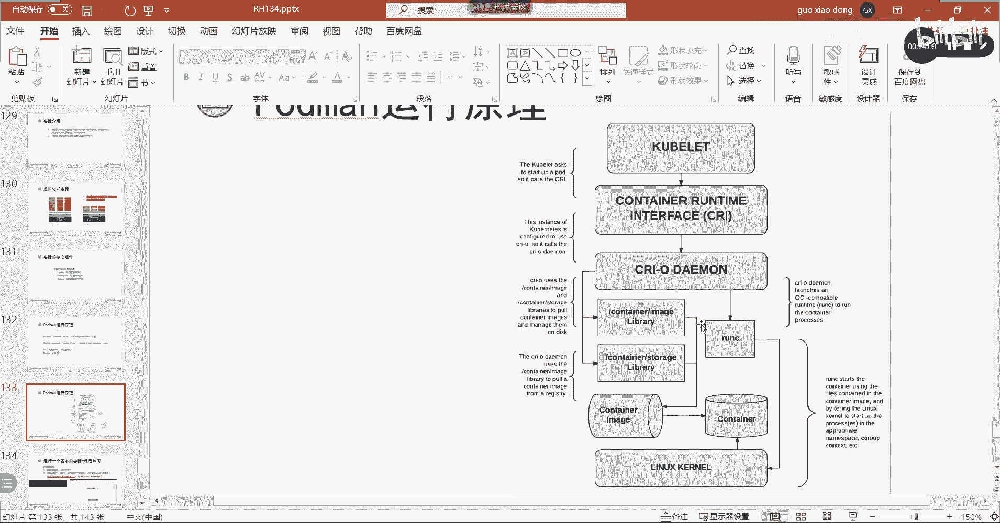

换一下上面的。

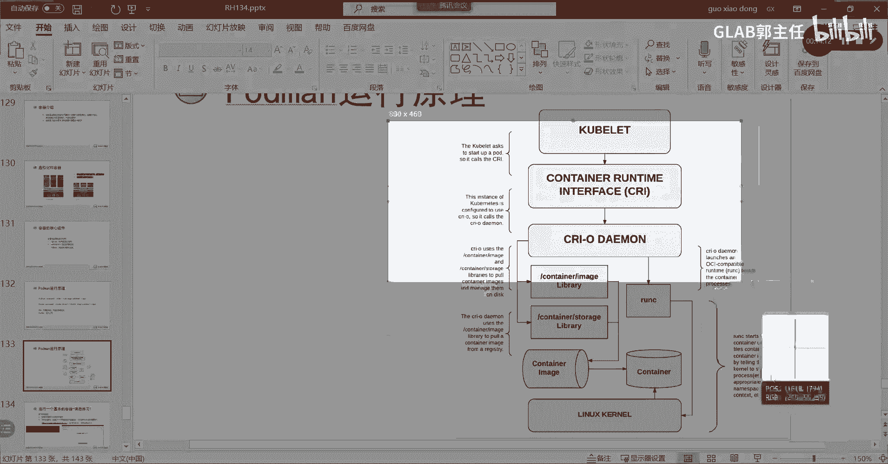

不管啊，我们主要看下面要理解他的这个当然原理，哪去了，换一下啊，看啊是这样子的，它分两个方向，第一个方向看我们从这里，这第一个方向它是通过一些库文件对吧，最终生成了一个叫容器的镜像。

然后在容器的镜像上跑跑了一个容器，这个容器叫运行成，能听懂吗，好这里只是跑了这个容器里面，你可以理解为有100个容器，100个容器都是基于前面同一个镜像，所以我们只需要下镜像下一次。

然后可以在一个镜像上跑100个运行层，跑100个容器，理解我意思吗，OK好这个明白啊，但是这个跑程的容器是由谁来管理和控制的，是由另外一条线是由系统的RC操控，我的LINUX内核，最终对容器来进行管理。

对容器的运行层来进行管理，你有没有发现kernel其实没有管理我的image吧，对不对，他只是对产生的容器层来进行管理的理解，我意思吗，所以容器是由库文件组成的image镜像，然后通过容器的引擎。

最终产生了容器的运营层，那么管理这个容器的实际运行是由RC调度LINUX，Kerne，调度LINUX的内核来对容器的运行层进行管理，明白我意思吗，就这两个方向，就这两个方向，就这个这个简单的说一下。

这个包括这是它的原理好，然后呢接下来我们来看一下原理，说清楚了，接下来我们要说我们平时练习应该怎么练，为什么要给大家把实验环境升级到8。2。

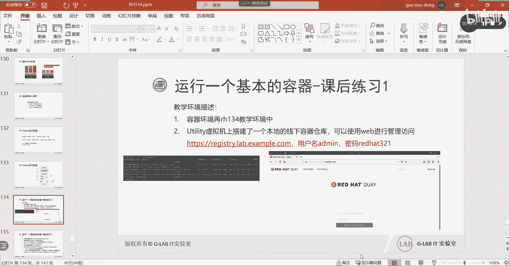

我们以前给大家考的是8。0的，现在是说这个系统是8。2的，我给你的练习环境就包含了我们的上课的环境。

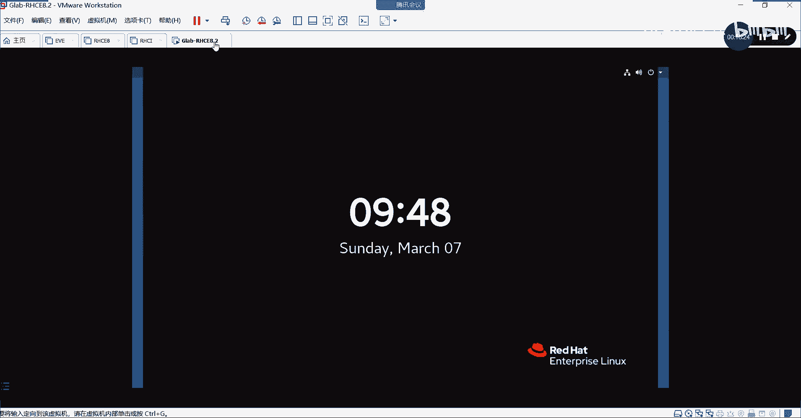

明白吗，呃他三科的环境用的是8。2，8。2，把容器的内容加进来了。

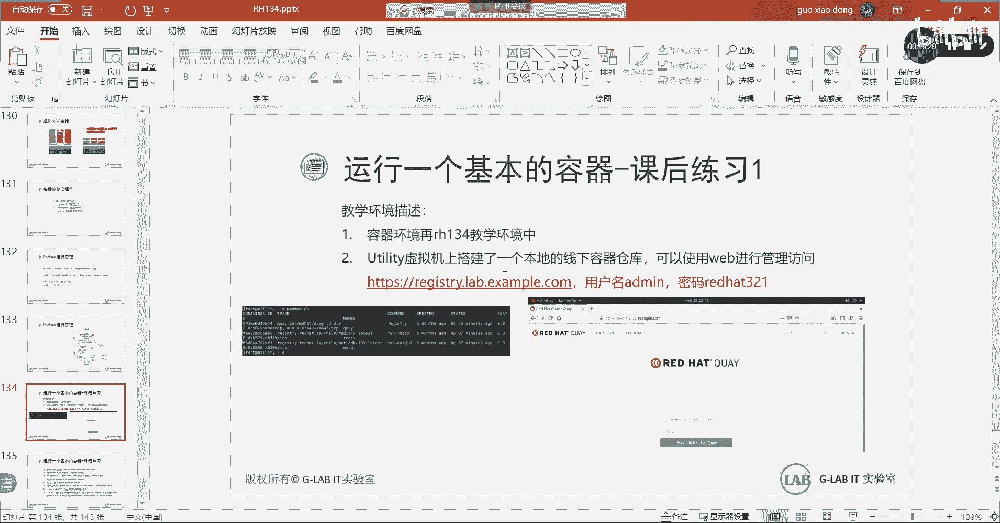

所以拿着我给你们的环境，直接把134ht e DC下的r HT，把134的环境打开，你就可以做我接下来的容器的实验，明白吗，这个也是今天要大家做的容器的实验，大家把我的那个打开自己做啊，教材上没有啊。

你们拿当时拿的这个教材还没有更新到，8。2的容器，这部分现在新的教材都有了，没关系啊，不重要没关系好吧，我们都会讲。

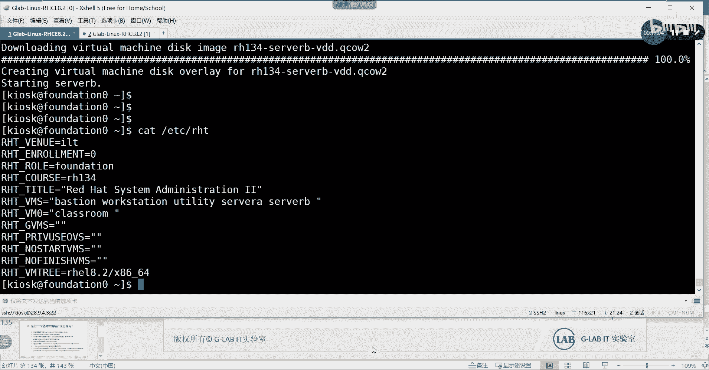

好那么接下来要说明一下，在我们新的134容器的环境当中。

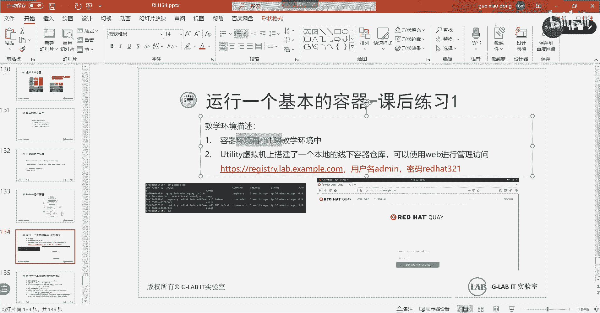

它有几台虚拟机，他有我给他看一下。

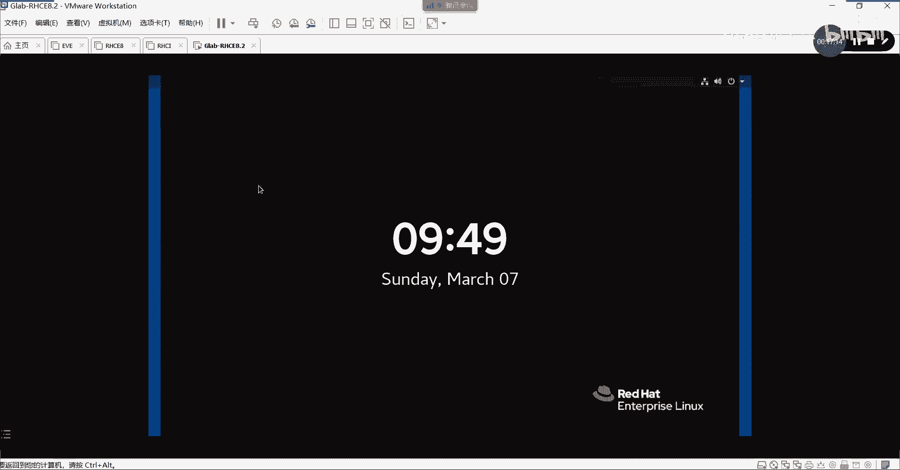

有几条，如果已经开好了，那么点这个他有这么多台虚拟机，然后在虚拟机上搭建了一个私有的容器仓库，搭建了一个私有的容器仓库，我们所有的镜像都是到这个仓库里面去找的，考试也是的。

考试他也是自己搭了一台私有的仓库镜像，包括大家练习也是的，练习就是用134环境改过来的，他的私有镜像仓库也是在这明白，他会给你的考试，他会给你一个完整的私有镜像仓库的链接好。

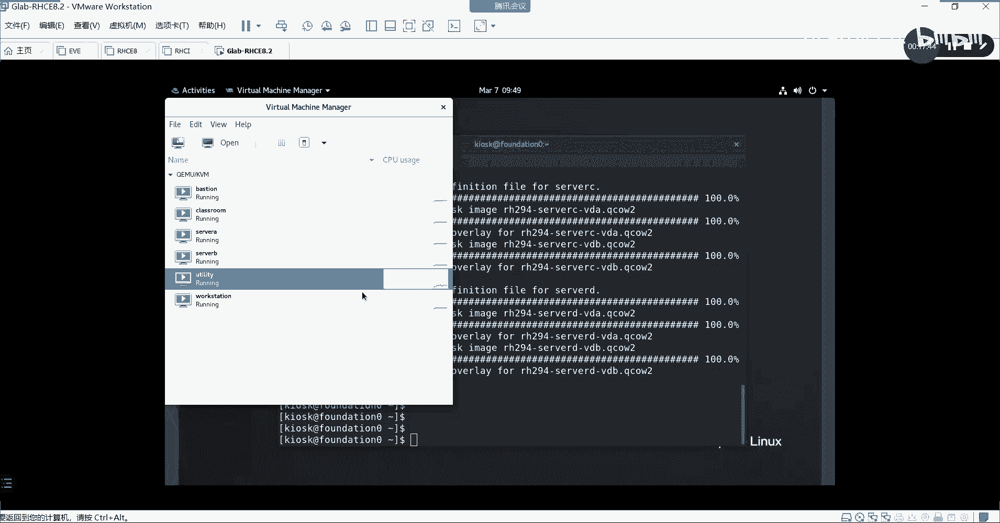

然后呢，我们的练习的用户名设的密密码是red hat，321，这个我在视频讲解当中有提过吧，大家应该都会的啊，好接下来我们来简单的给大家演示一下。

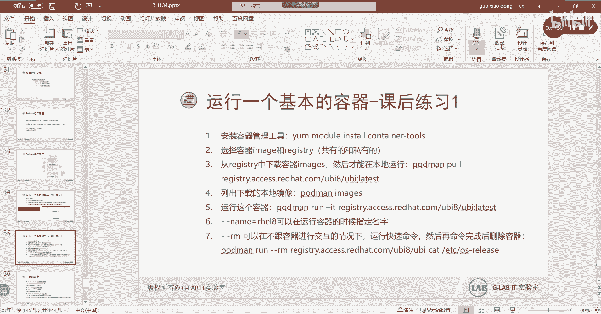

我们来简单的演示一下好吧，嗯我们把环境开好开好了，然后我们再到SERA上去，SSH思维归根的嘉宾呢，它的特点还是最有最高可以对应的。

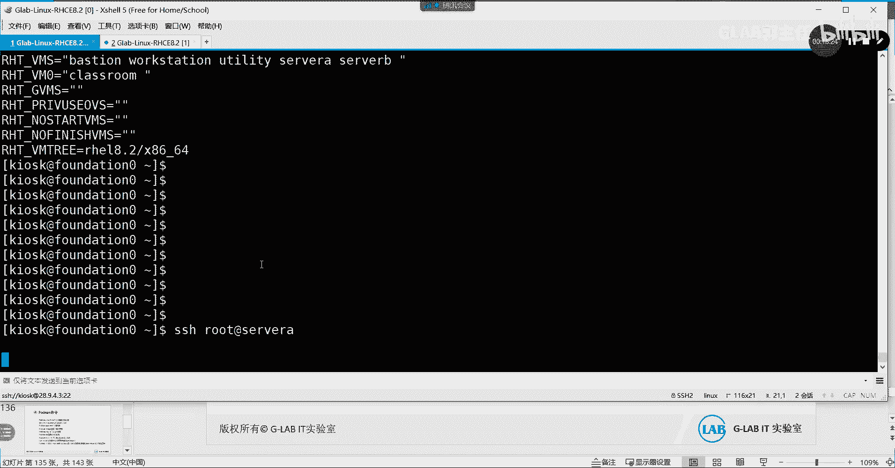

什么意思啊，没起来，然后呢问题就在于。

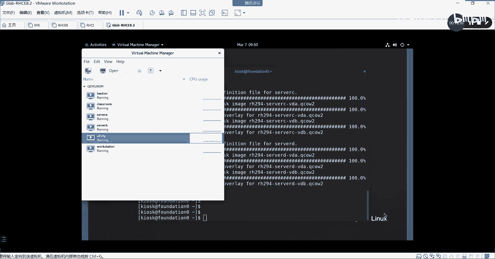

起来了。

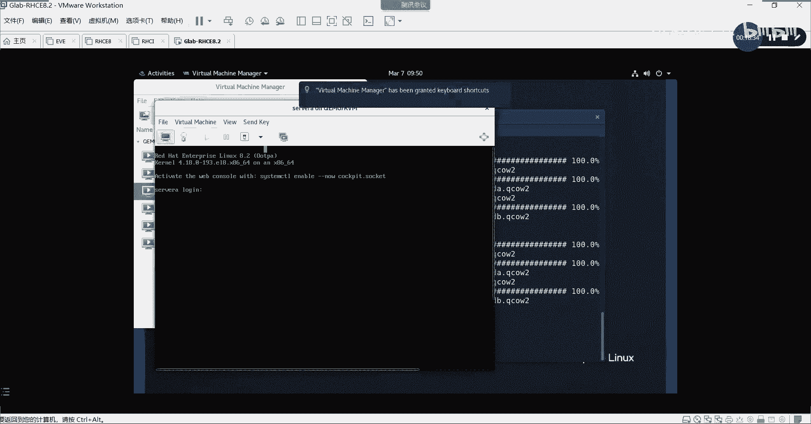

嗯嗯好了，有点慢，好到server a上之后，我们现在是用server a作为这个安装容器的主机，然后呢，私有金融仓库是叫unity那台主机，那个已经都做好了，好我们要跑容器，第一步。

我们要先安装容器的管理工具啊，容器的管理工具安装完了，他才敲才能敲pom，你们现在是敲不了pm是吧，要安装容器的管理工具叫YM，Ym install，我们把叫content c o n t。

看能不能补全诶，可以，Continut gun tool s tooth，诶哪里没写对啊，Seven t i n e r tooth，他说什么，No matugo，没有这个啊，没有这个安装软件。

怎么会没有呢，I am repolice，看看，可以啊，Young search，C o n c o n t a，C o n t a i t r i n g r s，没有啊，我看看是不是说的是没有啊。

诶不应该啊，应该有啊，看看啊。

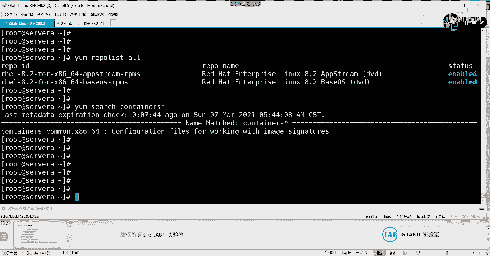

这不就是两个对付家里，诶应该可以有啊，等会儿啊。

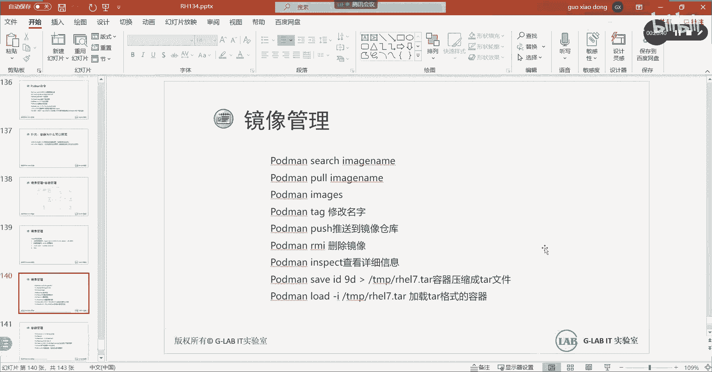

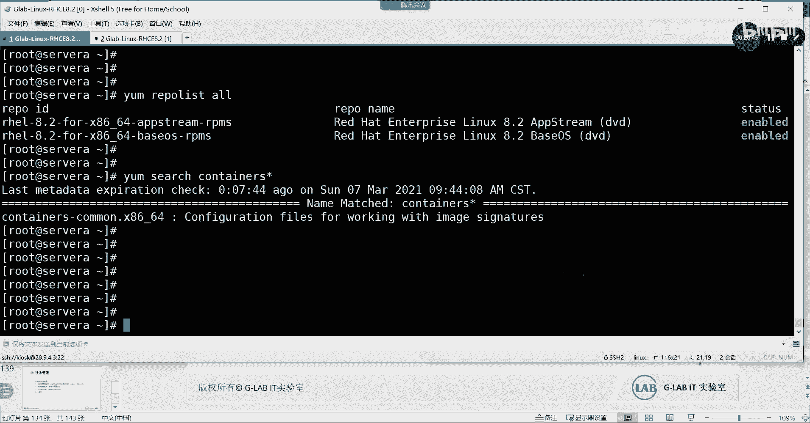

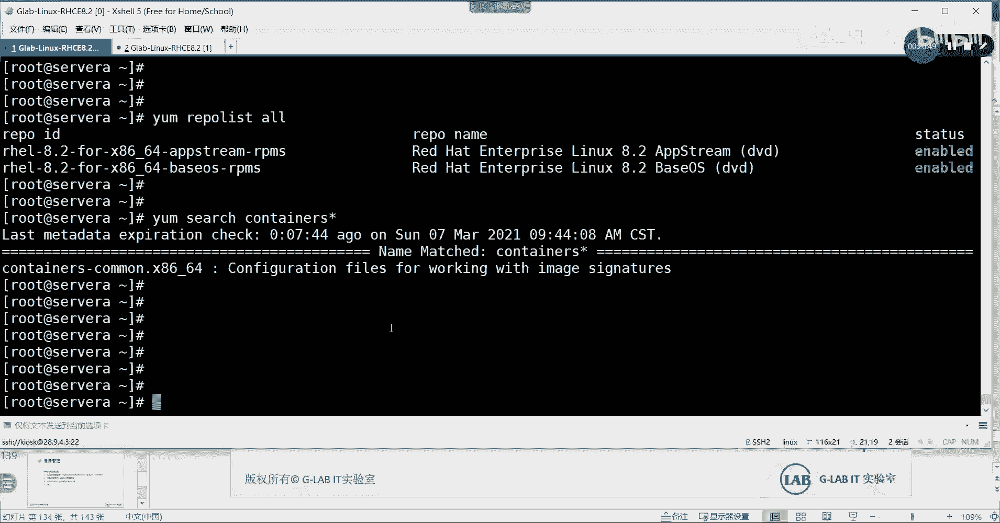

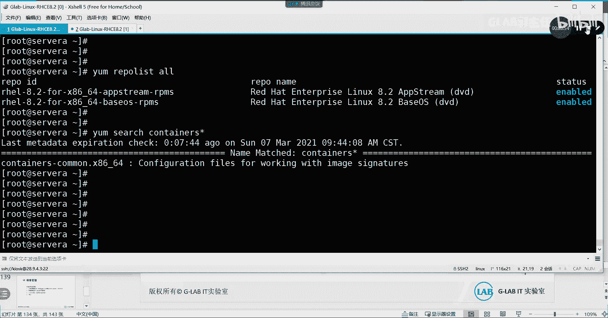