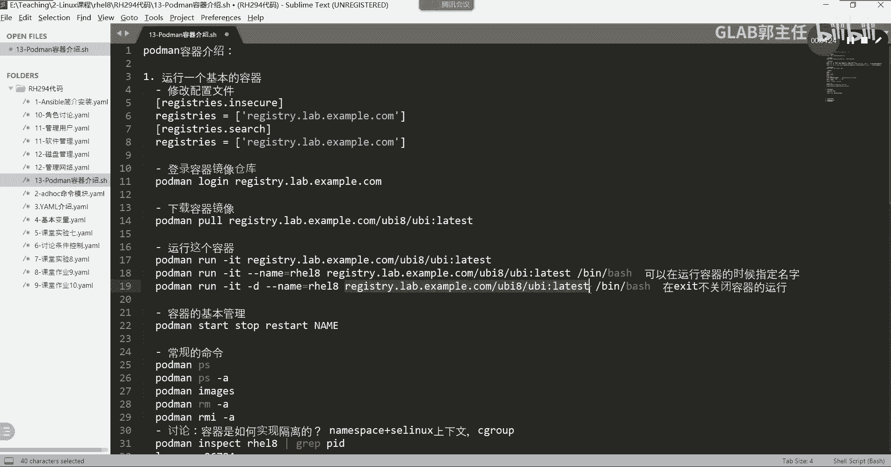

# 【Linux／RHCE／RHCSA】零基础入门Linux／红帽认证！Linux运维工程师的升职加薪宝典！RHCSA+RHCE／56-镜像仓库管理 - P1 - GLAB郭主任 - BV1wb4y137yi

好来我们继续来第二个，第二个就简单了，镜像仓库的管理，其实我们刚才已经跟大家这个说的差不多了，镜像仓库的管理的话就几个内容。

我们来简单的说一下嗯，就是我们这个镜像仓库默认放在哪，放在etc下的这个containers上面，有一个叫registered in configure啊，在这里镜像仓库有三块内容嘛。

第一块内容和第二块内容已经讲过了，就是它默认到到什么地方去去找这个仓库是吧，就是这个这个第一个，第二个呢，就是哪些的仓库不需要经过SSL证书的验证，就要把它写在这，这个默认是空的，所以要把它写进来。

第三个在这黑名单就是你要把哪些镜像仓库啊，对吧，让他不要去搜索放在黑名单里面。

就这点对吧，就这个把这俩那上面两个我就不写在这儿了，大家自己看，补充了一个加入黑名单的这样的一个操作，要是吧好吧，加入黑名单啊这样的一个操作，然后呢我们还可以通过PORTMAN。

就是这个register文件，就这三个内容，其他没有了，我们可以通过portman info去看一下，我们对应的这叫portman in info吧，portman info可以看到。

可以看到我里面的一些基本的pm，相关的一些信息，就register到哪去，Register，那安全是这个到哪去搜索，就你做的那些东西在这能看到明白吗，通过bottom info可以去看。

所以在这里给大家补充一个命令，Hot man，Hot man，好吧，这叫portman info，查看PORTMAN的详细信息，写一下，查看PDM的详细信息，OK好，然后呢嗯再补充在上面的一个补充吧。

作为再补充两个命令，第一个命令就是我们可以经过port man，通过pm去去run啊，run一个镜像的时候，run一个镜像的时候加一个参数叫杠杠RM，杠杠RM，然后呢去运行一个镜像。

我们把刚才那个镜像给他，现在有镜像在运行吗，hot map s有的是吧，hot mar m hot man RM rh128好，要先stop RM RM嗯，STOP先stop rh128。

然后呢嗯我们再把镜像给删掉，hot main RM杠A好，没有东西了啊，好我们可以通过port maimages，他没有pm images，Hot may rmi。

这个镜像杠a cannot remove嗯，正在运行吗，没有删除吗，哦hot map杠A有的是吧，然后我们可以通过后，Hold me，这个嗯叫什么，port ma p杠A。

我们把所有的都删掉，刚才是哪个命令来的，不用忘记了。

嗯删掉了是吧，然后呢再用这个RMIGA，然后就没有了吧，为了之后我们重新用hot main run，它有一个命令叫杠杠RM，然后我们把刚才的那个镜像给他贴过来。

镜像就这个了。

That is，大家猜一下这个命令的作用是什么，然后后边还要再加一个，比如说叫BB下面的B啊，这个写完不走是吧，啊这个是大概能猜到吗，或者我们换一个叫cc tc下的，我们换一个命令更直观一些。

cat etc下载有个叫OS杠release，什么意思啊，先去download对不对，double了下来之后开始运行，对不对，运行之后去cut一下etc下的relax是吧，然后呢2M点，对吧。

就这个容器我只想让他干这一件事情，然后跑完以后我直接就给他关掉了，所以加一个杠杠RM，看到了吗，看到了看到了ETCLOS的这一堆东西之后，我们去HOTMAP看一下是不是没有啊，容器没有运行吧对吧。

是这个意思啊，但是port main image应该是有的，image是有的对吧，PORTMANP杠A应该也是有的吧，PO也删掉了，他会把这个杠A里面也都删掉了，就是运行和它运行历史都没有。

只是镜像存在，听懂了吗，OK好那这个是普通的第一个命令，还有一个，这个啊大家知道。

第二个第二个第二个命令。

它有一个叫杠L的选项，举个例子，我们把它去掉，绕杠杠绕杠T杠D，让它后台运行呗，没到会馆那里好，这个时候PMP应该有了吧，然后我们可以用port main，他有一个叫GUL的选项啊。

我来给大家看一下GL的选项呢，用的不是太多，比如说它不叫干扰，它叫EXEC，我们可以通过EXEC在这个容器里边，杠IT叫RHEL，我们有RHEL8吗，通过RHER8去执行PS杠EF，哦名字不对是吧。

名字叫这个，我们可以叫3160，我们看能不能做3E60，3亿六零吧，还不对，诶哪里不对嗯，Not found，它叫pdman ex e c，嗯嗯嗯诶在跑吗，再跑是吧，再跑再跑嗯，Hold me。

Hold me in rm rm，杠不行，要先关掉，What may stop gui，诶卡住了，好这个有点慢，然后pr m guy好，重新来，我们把run run起来，run起来的时候。

这个刚才写错了是吧，然后我们给他指定一个名字，杠杠name r h e l8，这样的好，然后呢，PDM我们可以不禁的不禁不呃，不用进到容器里面，直接通过EXEC去执行杠IT，跟它有一个交互吧。

然后我们进入RHEL8这个名字的，进行一个PS杠EF，E x e c fire，诶让我想想啊，还是不买了，还是，container这个东西，star liner process ue c e c嗯。

You are not found，我看一下EXEC啊，晚安你小花给妈妈说，要出去背对的啊，EXEC的EXEC，是不是EXEC的，EXEC嗯，嗯ESEC执行一下名字，然后呢，我们加一个PS杠，EF嗯。

要加个什么东西来着，不用加吧，我记得，是不是要加杠A啊，诶不对对对对对，换一个啊，换一个刚才的那个命令叫cat，可能这个系统没有etc下的OS杠，relax啊，有了就那个PS在我现在这个容器里头没有。

明白吗，就我这个容器啊，他没有不支持PS杠EF的命令，所以呢我们可以通过EX这个东西啊，可以通过它去执行，在容器里执行这个命令，去执行这个命令，明白意思吧，嗯好，然后呢嗯这是我这个容器的问题啊。

容器里面没有这个服务，然后呢我可以把这个改成GL，我们可以把它改成杠杠L，是不是没有指定容器啊，能不能执行也可以，所以杠L代表的是，就是调用最近一次使用使用的容器，不需要去指定容器。

直接调用最近一次的这个可能用的不多，但是我觉得我会经常用懒。

因为一直在操作这个容器的话，我不想记住这个容器的名字，我就用杠铃二不是更快一些嘛，对不对，好，这也是啊，GUL表示的是调用最近一次使用的容器对吧，直接通过GL来调用它就可以了吧。

好这个就补充一下这个镜像仓库，就补充这么多内容，这是我们第二个第二个内容啊，这是我第二个内容，其他的没有了，现在没有了。

