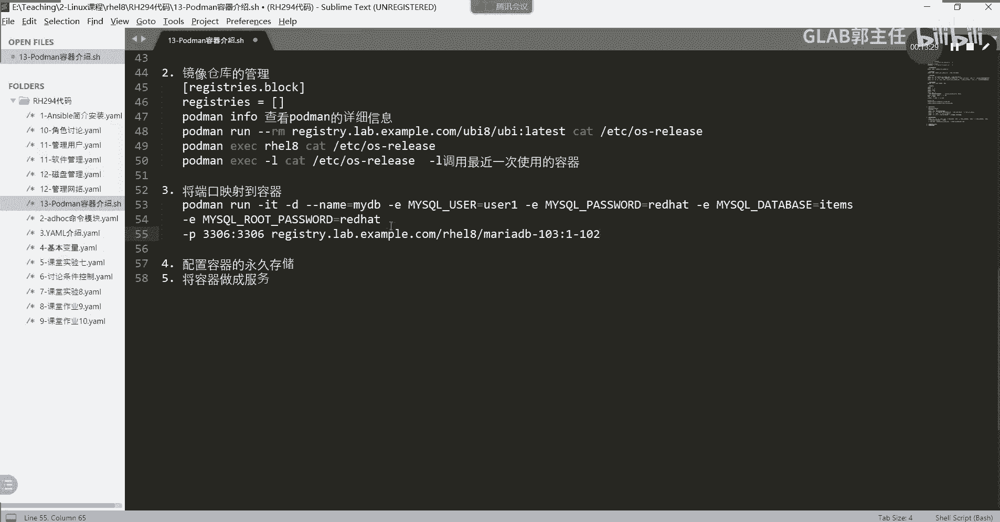

# 【Linux／RHCE／RHCSA】零基础入门Linux／红帽认证！Linux运维工程师的升职加薪宝典！RHCSA+RHCE／57-容器配置端口映射 - P1 - GLAB郭主任 - BV1xv411c7my

拿下第三个，第三个内容就开始要用到实验环境，实验环境就要用到134，用134就可以了，那么叫将端口映射到容器啊，将端口映射到容器来。

我们简单的来做一下这个题，在我的这个里边，在这里我们应该通过SSHSH操作方式，跟之前还是一样的，student door workstation上，在这里我们打开容器。

通过lab打开叫containers，Containers，这个题主要用到叫advance吧，把容器打开，把这个实验环境打开，实验环境打开，接下来我想描述一下我们要做什么。

在这里呢我们会下载一个阿帕奇的，去下一个阿帕奇的这个镜像，然后在镜像上去跑一个，那不叫发起下一个迈瑞dB的啊，然后这个容器的跑起来，它就自动运行了MDB这个服务好，然后我要做到的是。

把容器里边的ma dB的应用映射出去，要给它映射出去，也就是让外部的人能够直接访问到M2db，穿透我的主机，访问到我的容器吗，对吧，那这个时候我需要在主机上做一个端口，就是主机的端口到容器。

对外提供服务的端口的一个一对一的映射，然后外部来访问的这个端口，先经过我的主机访问到主机之后，其实就是个net，可以理解吗，就是从一个端口映射到另外一个端口，我的外部的主机就当当做一台映射机器一样。

本来访问我，我给你映射到内部的容器嘛，就这样一个操作，这一步有点慢，因为他要装container toos开服务，大家用我给你们的134环境，直接把这个环境打开就可以了，没有教材。

照着我的事时间做就行好吧，我就说我现在不能吃的完吗，等一下有点慢，好这个这个结束啊，这个开完了以后，接下来我们要不是用root用户，因为我们这里做的是一个无根的容器。

这里要讲一下无根容器和有根容器，应该在前面给大家介绍的，但是很简单，概念很简单啊，一个叫无根的，无根容器你就笔记就记在后面也是一样的，我只是看起来清楚一点，我把它写在最前面。

无功容器是叫不是不是以root用户创建的容器，大家想root用户创建的容器，它权限是不是很高啊，对不对，所以不太建议大家创建无个容器，说白了就是普通用户创建的容器嘛，对吧，就是用普通用户创建的容器。

它的权限，它的各方面对吧，只是跟普通用户相关，它不会影响其他用户，更不可能去说升级到root用户吧，然后叫根容器，根容器就相反了，更容器就是使用root用户创建的容器对吧。

创建的容器那么安全系数安全系数较低对吧，很容易被攻击，他攻击了之后就拿到你root权限对吧，这个就不要以root来创建我们的容器了，这叫无根容器，我们现在我们现在主要考试，包括平时用的都是用的无根容器。

也就用的是普通用户来形成的容器，所以啊在这里我们通过这里啊。

我们等它骑起来以后，我们应该不是通过root登进来，应该记住啊，一定要通过SH直接登，不是在不是在root登进去之后，通过SU切换，SU切换那个再产生容器，尤其是把容器做成服务的时候，它会报错的对吧。

大家上次敲实验应该知道的，故意在最后一集挖了个坑，然后大家就直接用SU切换了之后，我还提示了用SSH登进去是吧，可能没有注意，一定要出来退出来。

通过SSH这个叫container c o n t s e c吧，通过这个用户，这个用户是不是这个用户，通过这个用户我先确认一下啊，是不是这个用户啊，诶等等稍等啊，这个服务是这个用户啊。

在我们这个现在的这一题是s student通用户，但是不管怎样，是一个普通用户，student at server不能用root用户登进来了，好吧，在这一题用的是student这个普通用户。

那么student登进来之后，我们还是老规矩，先要跟仓库仓库啊，镜像仓库进行连接是吧，通过PLOG叫region，他那个比较长，REGISTY是吧。

r EG i s t r y r e gt r y点lab，点ex m p l e点com，登进去看能不能登，Adm，Really hit，321好，成功了对吧好，接下来我们要先下载镜像。

下载镜像通过hot may por是吧，我们通过poor啊，刚才这个我复制一下，太长了，下载一下这个仓库里头用到的是RHEL8，这个目录下面有一个叫MARIDB，杠103，这是他的大版本号。

冒号一杠102是他的小版本号，就照这个下，这时候他就把MDB下下来了，MDB下下来了，稍等，下载完之后，它会自动生成一串很长的数字，那个就是容器的代号，我们可以通过inspect看一下这个容器代号。

最下面稍等，是不是11A4是吧，我们可以通过pd mainspect11A四去看，这个也能看到是吧，就是这个我们通过rap过滤一下pad，诶，还没有运行，就是只是看一下这个容器啊，这只是个镜像。

这不是容器，这只是个镜像，那么接下来要运行了，我们pm run一下不就好了吗，对吧，put run i t杠D后台运行杠杠name等于麦，我们叫麦叫my dB，起个名字叫my dB，好吧好。

接下来重要了，接下来重要了，要讲一个参数叫杠E杠一的参数，我先把这个杠一的参数给大家贴过来，因为太长了，不想打杠一的参数，我先给大家贴过来，好看一下，好猜一下，现在我在起这个容器的时候。

通过杠一的参数做了一个什么样的功能，通过杠也就杠一实现了什么什么，猜一下，大家回顾一下and sport的时候，取的时候有一个全局变量，变量有好几个地方对吧，全局变量是在运行EXPLAYBOOK的时候。

最外面是不是有一个也有一个杠一的选项，那个是在传递变量嘛，刚刚不是说了嘛，对不对，那叫全局变量，在asp执行的时候，通过杠E传递参数，传递我们的变量参数，所以这里杠一也是传递变量，传递环境变量E嘛。

environment对吧，杠E传递我们的环境变量，这个是往哪里传，怎么这么一串，是不是往里边merry dB要实现的这个应用，像数据库里面传这个环境变量，告诉这个数据库啊。

你的这个变量要赋值负user1嘛，然后密码要付red hitman，对不对，然后这个什么database要附一个items嘛，然后这个mysql root password要fred hat，听懂了吗。

就一个环境变量就要加一个杠一，在这里我们加了很多个干一样，这个一系列的操作就是在向容器所提供的mo dB，这个服务负环境变量，听明白了吗，去赋值环境变量啊，好接下来这第一个第二个杠P。

是不是要做端口运算了，好在运行容器的时候，我直接指定我的外部的3306端口，映射到容器内部的3306端口，这个端口你可以随便写明白吗，只不过我们这时候用的是ml ml dB的默认端口号，杠P。

通过杠P选项来指定端口的映射，3306~3306，理解吗，各位啊，好清楚啊，好还没结束还没结束，接下来我们把这个merry dB的这个这个这个这个，刚才的那一堆东西啊，把它复制过来。

就这个刚才写的就是这些了，好这个代表这一串代表什么意思，大家再再过一遍，有几个参数啊，大家再过一遍，前面这些不讲啦对吧，名字通过杠E传递环境变量，传到MDB，通过GP来写这个端口映射，然后开启这个容器。

好这个容器就开启了，开启了HDMP，开起来了吧，名字叫my dB，你能看懂吗，好接下来我们怎么测呢，我怎么测真的要注意啊，我们怎么测，我们可以直接通过server a能不能测。

其实就是访问的内部的容器对吧，我还可以通过server b去测，也就通过网络上的另外一台机器去测，但是一定要注意网络上的另外一台机器去测，在server a上一定要放行。

通过five or cmd杠杠list or，什么feel哦，对他没有权限，他的这个这个防火墙是不是要放行啊，是不是要放行3306啊，因为外部进来一定要先进到防火墙，才能进到系统嘛。

进到系统才能进到容器吧，所以外部访问一定要记得墙要放这里头，我们不是通过外部测的，我们通过server a自己测，怎么测呢，我们可以通过MYSQLMYSQ2。

通过通过MYSQL杠U指定我们刚才传进去的user1吧，对吧，杠PGP密码叫red hat，记住啊，杠P到密码中间没有空格，在访问数据库的时候是这样测的啊，然后杠杠host等于好访问我内部的访问。

我自己是吧，1722520点，10172。25。250。10，访问自己的这个标准的3306端口，他就帮你跳到内部容器的MARIDP了，对不对，我们可以修，Show database。

要加S加个分号里面是不是有几个是items，是传进去的，item的时候传进去的，OK能看懂吗，好退出来，点击T好，OK了，His tree，所以啊端口映射很简单，就一句话。

就这一句话，没有什么好难的，就一句话，我把这个写成两行好吧，这是一行啊，这是一行，记清楚这两行是一行，为了看的更清楚一些，我把杠一杠一也太长了，把这个也录下来啊，这三行是一行。

所以最重要的映射端口就一个杠P啊，这个端口号映射到这个端口号啊，各位能明白这意思吗，啊啊啊好来，这是第一个需求，我们还有需求。

下面还有一个需求，在教材上有的那个PMP应该在运行了，叫MDB，已经OK了是吧，那么接下来我们把MDB停掉，Pd may stop，叫my dB啊，停下好，停掉了，停掉之后我们来开启这个新的容器。

叫my web，我们不用下载在运行的方式，我们直接运行是不是也可以啊，好pd may run，杠T杠D后台直接运行，杠杠name起一个名字，我们可以写等号，也可以不写，直接在空格写my web。

这也可以的，刚才我做的是用等号在写的吧，叫名字叫my my web，什么my web名字叫什么，写错了叫my s e c叫second wb，第一个叫my web，把这个贴过来，把他踢过来好冒号在哪呢。

在啊没有冒号，在叫RRHEL8，下面目录下面有一个HTTP，有一个HTTPD杠主版本号是24的，然后小版本号是呃，小版本号是是什么，我看看一杠一杠105，这是我的小伙伴们，好好吧好，然后呢。

这个容器在运行的时候，我后面直接指定要进到B下面的办事，下载下载了一个HTTP，也就是阿帕奇的东西，做好了，就包括说我有些内容，对啊差一点可能还需要有信号，注意点就行了，我好这个阿帕奇的容器。

它叫什么2DF0是吧，好这个阿帕奇的容器，我就可以通过前面讲的pod mae x e c，在不进入这个容器的情况下，直接去T去执行叫RDF0，2DF0直接指定这个容器啊。

然后通过PS杠EF这个就是可以的，这个看到了说明这个容器是自带PS杠DF，然后u name杠R啊，S r cos r，这个是看我的内核看到吧，然后还可以看一下这个up叫叫叫up up。

Up t i m e uptime，就是我开了多久，我运行了多长时间，明白意思吧，好这都是基本操作啊，看这个容器不进入这个容器的方式，通过EXEC来看好，接下来我再用相同的镜像再开一个容器。

再开一个容器，继续啊，我们通过pm对吧，通过put me in run杠T杠D嗯，再开一个啊，叫叫杠，再起一个名字叫杠杠，name叫m s e c o n d second web。

这个是第二个叫my second web，好加上我刚才的那个这个名字，这个还是还是还是这个镜像，还是镜像吧，还是这个镜像，OK那么还是这个镜像的话，我就不运行这个BBS了，我就直接开启这个容器。

直接开启这个容器是吧，二零对吧，直接开始这东西好，你又发现没有下载吧，直接运行了吧，所以镜像是用的同一个PMP，是不是有两个容器，一个叫my web，一个叫my second web，可以看到吗。

OK好，然后呢嗯我们在运行一个快速的容器，用之前的命令来访问啊，叫pod ma，怎么去运行一个快速重击，man run减T减减RM，是不是用这个杠杠name起一个名字。

叫q u i c k web快速的一个web，就来quick web，好然后呢在运行这个容器的时候，我给让他去cut一下我的etc下的redhat gun release，呃。

RELESERERERELEASE好，这个镜像为什么叫快速的容器，就是它运行完了以后帮你读到了，他这个容器就删掉了，刚才是不是讲过啊，这是不是容器没有运行啊，就是只要执行完，他直接把容器删掉。

包括历史的也没有的，是不是没有吧，应该有的话，应该是四个，现在是三个吧，所以这个叫快速的，这个叫快速的，你每次运行它，它只要运行结果出来，他就把它删掉了，这前面讲过啊对吧。

所以在这里我们既要讲了三个运行了三个容器，最后一个叫快速的容器啊，前面两个这些所有的容器都基于，这是同一个镜像，听懂了吗，基于的是同一个镜像啊，好然后呢。

我们可以把pd min s t o p杠A把所有的都停掉，三个都停掉了，然后pod mar m杠A所有的镜像都删掉，或者may rmi杠A所有的所有的容器层都删掉，所有的这个镜像都删掉，全部没了。

hold map没了，hold main images没了，这就是这个这个练习，大家要大家做的事情，上面是一个需求，是在做ma DB，主要是在做端口到端口的意思，下边给大家演示了，其实所有的运行程。

都是基于同一个镜像来运行的对吧，我可以基于一个镜像做各种各样的容器的运行，快速的呀对吧，然后运行的时候加加加这个命令的呀，我可以把它运行的时候不加命令的呀，都可以理解吗，就是这个这个去这个练习啊。

这是我们第三个练习，如何去添加端口映射。

太简单了对吧。