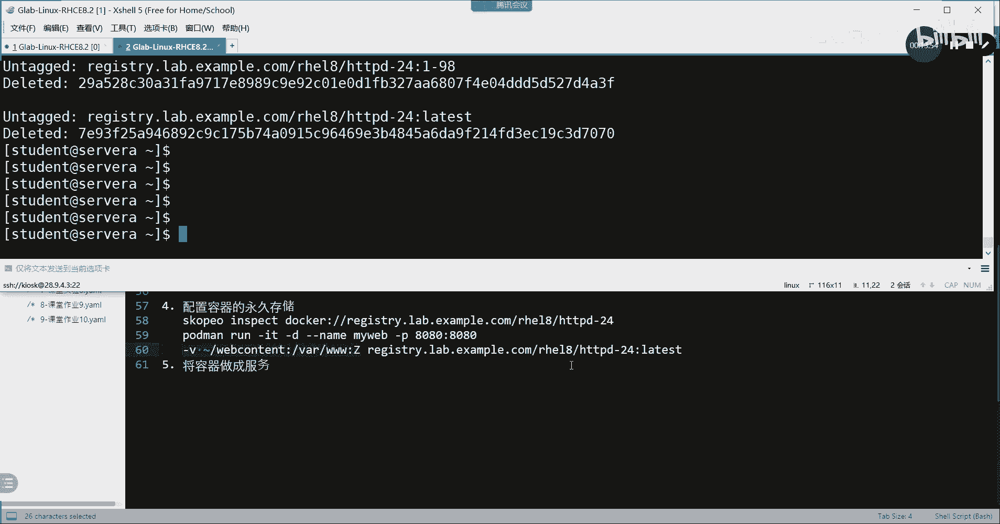

# 【Linux／RHCE／RHCSA】零基础入门Linux／红帽认证！Linux运维工程师的升职加薪宝典！RHCSA+RHCE／58-容器配置永久性存储 - P1 - GLAB郭主任 - BV1nM411Z7gj

好了，来我们看接下来第四个，如何配置容器的永久存储，先说明它的这个呃应用吧，就是刚刚其实也一直一直在提了，就是我们在用容器的时候，容器关掉它，所有的内容都关掉了对吧，所以接下来我们想要保存ma DB。

尤其像数据库这种，ma DB在对外提供服务的时候，会产生一些数据，新的数据吧，所以我们要对这些数据进行永久保存，那么我们就一定要做一个映射，就是把本机的某个目录映射到容器的某个目录。

让容器产生的内容都丢在这个目录里面，那么容器挂了关掉了，那么这个数据不是还在吗，就是要做这件事情好，来我们看还是打开实验环境。

退出来把前面的那个不影响，不影响我们把它finish，finish恢复，中二到8号啊，第四个第四个实验叫container storage star，左边这个是最难的，最难的是这个孩子。

啊啊保安就怎么样，你就是要手套有点慢，好大家在开环境的时候，我简单跟大家说一下，接下来我们要做什么事情来验证，我们这个这个永久存储，是这样，我们环环境打开以后啊，我们还是用普通用户登进去。

创建的是无根容器对吧，然后还是要登录到镜像仓库，去下载相应的对象对吧，叫storage的扫好，然后呢登到镜像仓库下载相应的镜像，这时候我们还是用的那个HTTP的镜像，那么我们先下的是一个HTTP镜像。

相对较早的一个版本，我们不是用的1105版本，我们用的是一杠98版本的，下载下来之后呢，我们开始做这个容器，跟外部机器的目录的一个映射，不对吧，然后这个时候我会在外边。

外边的这个目录里面写HTTPD要用到的index文件，就是首页文件理解吧，就用到了首页文件，然后我再把首页文件是用来给内部的这个容器，提供向外提供网页内容的好，这个时候如果我把容器关掉。

我刚刚那个首页文件是不是还在还在吧，因为我坐在外面吗，听懂了吗，但是它也能对里边的容器进行进行，提供服务的话，那就说明这两个目录是对应起来的吧，然后我把原来HTTPD的这个服务的。

HTTD的服务我要升级，我把这个容器干掉，重新下载一个更新的，就是latest httt的1105版本的，然后呢把这个容器开起来，因为映射做好，那么其实他只要开起来，是不是就有首页文件。

首页文件因为在外边嘛理解吗，所以就会做这样的一件事情，好吧，我们这个这个任务是这样来实现好，然后呢这个时候我们还是退出来，通过student用户登到server，这个前面都不变。

然后呢通过pd min login register，等到这个register，这个这个这个这个镜像仓库里面。

这个也是不变的。

Admin hat，3211定要登录一下好接下来这些都不变啊，这些都不变，然后呢，我们开始创建本地的目录，因为要映射到里边吧，我们通过GP创建本地的目录，叫web content。

web c o n t n t对吧，C o n t n t web content，下面有一个HTML吧，好创建了一个目录，杠P知道什么什么意思吧，不用解释吧，就是把这个目录连续创建。

这两个目录都没有嘛，OK然后我们手动去创建一个，Hello world，手动创建一个内容，这个内容内容就是给我的web content下面的HTML，下面的index就是外边的这个index文件。

一会儿要给里边的容器用理解吧，这样就做到一个映射关系了，cut一下web对吧，是不是hello world，就这个了，好接下来要做的事情就下载容器了，我们直接port main run，杠T杠D啊。

杠杠name用的叫my web，好，接下来他两个容器容器除了映射目录之外，要对外提供访问，是不是要用到上面的端口映射，所以上面的杠P来了，如果来访问自己的8080，帮你映射到内部的8080，听懂了吗。

就是前面讲的啊，接下来到了现在要讲的目录映射，通过杠v we叫volume volumes一个简写嘛，OK好，然后呢把家目录下的web把它复制过来，就刚刚创建的这个家目录下的web的HTML。

或者就不管了，就直接是映射一个，也可以看我怎么写，把家目录下的叫web content，这个大的目录，包括它下面的子目录都映射到哪里去，用冒号分隔开，映射到一般我们阿帕奇对外提供服务的主页。

文件放在VR上面的哪里啊，war下面的3W吧，还记得吗，是不是war下面的3WHTML，所以3W下就已经到HTML了，所以你就把前面的这个web content，映射到word3W就可以了吧，对不对。

这样这样的话他们都目录就统一了外边的HTML，这里边的HTML了吧，OK好，这里还有一个要注意的是要加一个杠大C，大家知道为什么吗，大Z冒号加一个刚大Z，大Z。

我们知道是用来看我们目录的s linux type类型吗，s linux tape是用杠大Z去看的吧，这里加大Z的意思就是，我会把外边的这个目录的s linux tape。

射程跟容器里面的HTML的这个目录的tab射程一致，知道为什么要设成一致吗，不一致是不是不能访问啊，同志们，HTTP的服务，如果tag类型不一致，你做只做好了映射，没有用的，他不能访问，识别不了。

这就是它的安全隔离机制，所以加一个杠大Z，它会自动帮你把这两个映射的目录的，SA的linux tape做成一样的，听懂了吗，所以这个一定要加不加，你通不了啊，然后把我们来下一个相对相对低一点的版本。

叫这个，这是105。

105是比较高的，我们下98版本的，把105改成98，这是后台的一个版本号啊，好下下来，并且运行，其实我刚刚吃完，下下来继续运行啊，好如果这一切一切都做成功的话，那我们应该怎么测呢。

大家想想是不是在本地去访问，本地去访问自己，就自己去访问自己的8080，是不是就能够看到hello world，记住文件是本地提供的，但是服务不是本地提供的，服务是本地里边的容器提供的吧，听懂吗。

所以我们应该在本地去访问自己，能够成功打开这个网页，好，怎么去访问，通过CURL对吧，HTTP冒号双斜杠访问自己写什么呀，是不是写local host呀，这个在host文件里面有的呀。

local host就自己的127，你这里也可以写1270。0。1啊，理解吗，好冒号是不是要加端口号啊，是不是要访问8080，是不是有hello world，这个能成功访问，取决于容器能正常运行啊。

容器提供最根本的服务啊，听得懂吗，好这个就做好了端口映射目录的映射，理解吗，各位PMP，现在容器是不是开启的，已经能看到端口号的意思了，对不对，OK好，那么这时候我们要把这个容器要升级。

因为这个容器太老了，我们先把它升级对吧，升级，然后呢，主页文件可能不想改变，那么主页在肯定改变不了，因为在外面已经有映射了，他用的是外边的目录好，那么接下来我们对这个容器进行升级，我们可能要怎么做呢。

首先我们要看镜像仓库有哪些软件，也就是说HTTPD阿帕奇有哪些版本可供我去升级，我们要用到另外一个命令叫scoping，叫scopy inspect，Docker，冒号双斜杠，我们去看一下镜像仓库。

这个命令没讲过是吧，scope属于PDMAN的一个里边的一个组件，算是算是一个一个内容吧，那么它是用来看我镜像仓库上有有哪些软件，就是这个HTTPD杠24大版本号，有哪些可供升级的小版本号。

看啊他的输出还比较多，你看这就是我的可控升级的小伙伴哈，理解吧，latest就是105吧，应该是就这个命令，这个命令它用来查看。

自己去写啊，用来查看镜像仓库上可供阿帕奇，大版本是24的，有哪些小白问号可以升级对吧，就这个好，那么确定好了之后，这只是看啊，其实也没有去做任何进一步的操作是吧，好接下来我们要升级了。

这个升级咋做呢，首先codm stop先把这个镜像仓库给stop，对不对，stop叫MVIP镜像啊，把这个容器切stop掉，然后pod main RM RM对吧，把my web给它移除掉。

这个移除的是镜像啊啊移除的是容器啊，好不好，然后我们再去看一下容器已经没有了，里边的内容还在吗，我们cat一下web是不是还在啊，这就说明容器永久性的内容永久保存了，这个只是给大家演示的是外部改的文件。

映射给容器，这些文件在容器挂掉的时候还在，对不对，那反过来也是一样合理的，就是容器产生的数据也放在这个目录下的时候，容器挂掉了，外部是不是还能看得到啊，所以正着反着都是OK的，明白吗O好。

那么这个没什么问题啊，这个没什么问题好，接下来我们要对容器进行升级，升级的话我们可能需要下载下载，我们可能去下载看，我们也可以直接去运行，我们也可以直接去运行。

就是直接把刚才的那个bot main就是很长的，这段话，我们把它改成latest是吧，其他都不变，各位其他都不变啊，其他都不变，然后把它改成latest，然后他会去下105的吧。

然后并且把这个容器给它运行起来，然后呢嗯但是这里面就加点营养，是关注对的对的，嗯他会去下105，然后并且把容器开起来，那么容器只要开起来，文件永久性存在外部，那我直接去访问index网页。

是不是还是hello world，对对吧，他跟你说，你现在在这里看见的信号，好那么我们这我们再去访问一下，是不是还是一样的，各位一样的啊。

没什么问题了，所以啊，这个就叫通过一个升级的方式，来演示它的永久性存储杠V啊。

就这些了好不好，容器的永久性存储主要是这个杠V。

主要是这个看V其他没有了，来我们把容器删掉，三调的话用的是pm r m杠A，这时候它会报错，说正在运行是吧对吧，但是我可以加一个杠F杠A刚才一直没加，就不需要再单独去stop杠F强制stop掉。

然后把这个容器去删掉，Pmi mi ga，镜像三角，没有了啊，那就没有了，这就是这一题，这一题给大家演示了这个目录的映射，大家一定要注意目录的映射啊。

