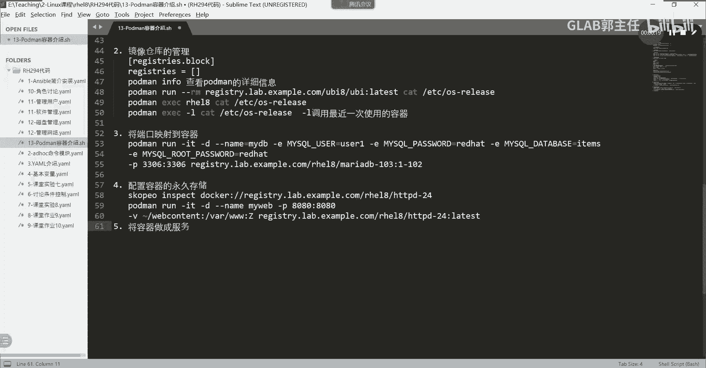
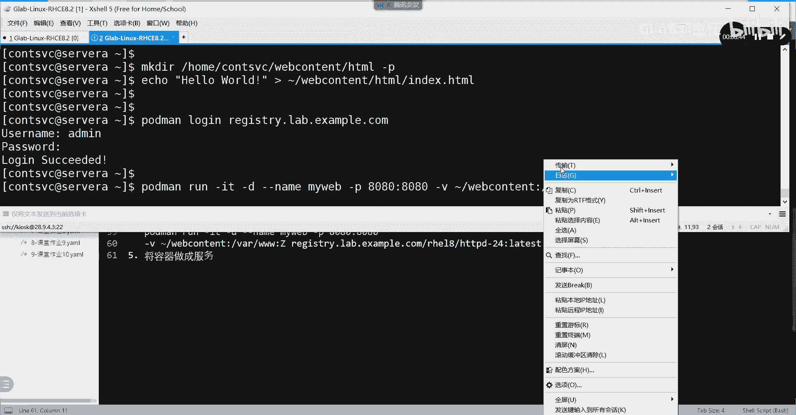
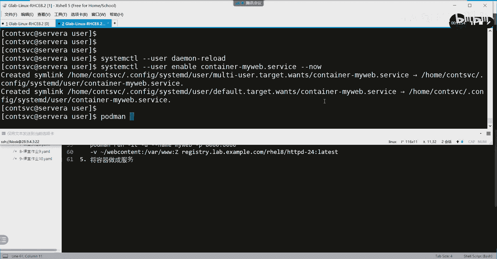
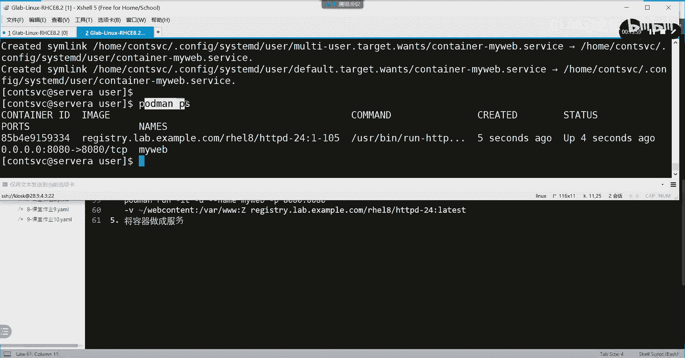
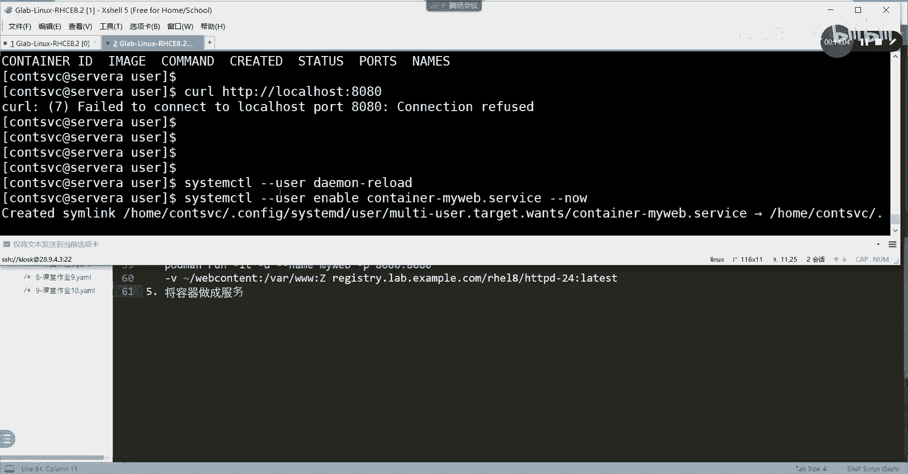
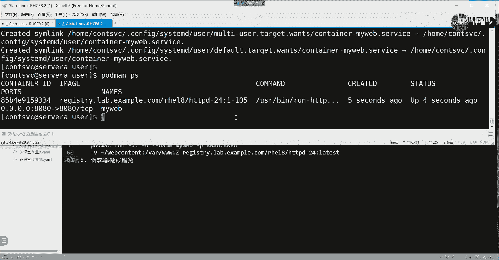
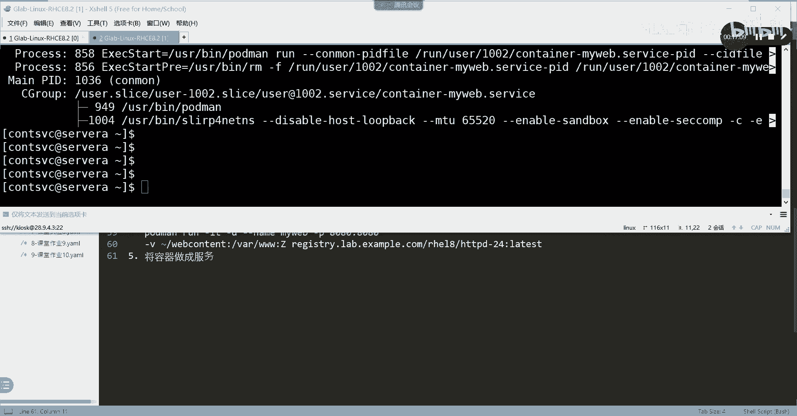
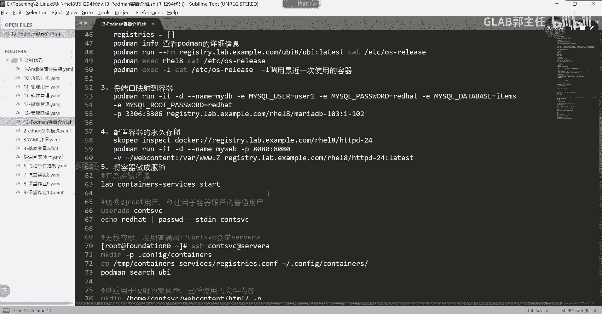

# 【Linux／RHCE／RHCSA】零基础入门Linux／红帽认证！Linux运维工程师的升职加薪宝典！RHCSA+RHCE／59-容器做成服务 - P1 - GLAB郭主任 - BV1mu4y1b7Ut

OK最后一个内容啊，其实考题是把四和5结合在一起考的。最后一个内容是把容器做成服务。好，这个它的应用场景就不用我解释了，就把容器做当成服务一样，就存在在系统上，明白不？好，你给他家演示一下。

容器如何来做成服务？

我们还是要开环境啊。开环境开环境开环境，这个先退出来。先把它 finish掉。Yeah。🤧哎呀。😊，🤧稍等啊。呃，容器做成服务的命令相对会多一些。大家超过CSA应该会发现是吧？应该稍微会多一些。

他就考这个。他就考这个啊，我们。等一下，还要再开一下环境啊。那我先大概说一下我们要做什么事情。容器做成服务。我们应该用普通用户去创建一个无钢的容器，对吧？然后呢，把这个容器做成了服务以后，把容器删掉。

叫lab serviceserv。把容器做成了服务之后，把容器删掉，以服务的形式存在在系统上，然后把这个服务做成开机启动。那么我把容器的运行成镜像，所有东西都删掉。对吧然后把这个系统重启。

只要重启了以后，我没有去手动去po拉载什么镜像呀，去runport面去run什么镜像，它会自动看到一个容器起来了，能听懂我你的意思吗？呃，不需要做任何额外的操作，容易记不起来了。

OK它是以服务的形式起来的，一定要搞清楚，以服务的形式开启的容器，它的本质上是服务还是容器？啊，理解这句话，以服务的形式开启的容器，它的本质上是容器还是服务？容器还是容器，明白吗？

也就是说你最后看到的还是起来的是一个容器啊，只是以服务的方式在运行。服务有什么特点啊？服务可以做成开机启动啊，对不对？服务之间的依赖啊，对吧？嗯，然后呢主要就是开机启动了，你这个东西方便你啊。

不用上来就上去就叫portmail是吧？要去运行，下载镜像运行进运行容器，这个太烦了。业务服务不更好吗？嗯。好，开完了开完了以后，我们来做一下。在这里用的就不是tudent的用户了。

我们要通过CNTSVC艾。s为从开始就用哎，没有吗？てない。service哦，要自己创建。哎。这个用户没有，我们要自己创建啊，就是就是这个这个练习题也是这样的，要自己创建。

但是我们考试这个用户应该创建好了。我帮大家都创建好了啊。嗯，先通过SSHroot。创建用户用root管理员用户啊。userADD创建一个叫CONCONT啊，是CON。

CNTSVCSVC这是一个用来管理容专门用来管理容器的用户，给他创建一个密码叫red hat。杠杠STDIN嗯，用户叫compSVC好，然后退出来再用这个去创建啊，进来了吧。啊。

这就是用我们指定的专门用来管理容器的用户去创建我们的。来进来，我们去创建游器，好吧，这是第一步。第二步。我们要做的事情是第二步，我们因为要启动我们自己的一个容器，并且要在容器里头创建服务。

所以我们要创建目录，创建一个。核心的目录这个目录是隐藏的CNFIGCNFIG杠CON。TAINERSconer是吧CONTIII不要打错啊ERS。好，创建一个隐藏目录叫config。

里边有一个conttainers目录，不要问为什么它就是规范，要用隐藏目录来做。嗯，对，是的，因为你要做成服务嘛，服务有很多规范性的东西，你不要瞎瞎创建目录，明白，它要做成service的服务。

所以要在本地创建一个目录，创建一个这个目录。好，然后呢，这个目录里头要把我们刚才一直在关心的全局的rejust confi文件把它copy过来。所以大家能理解为什么在这里。要去把temp下面的。

这个是他给你的containers有一个叫service下面的reg，有一个可fi的文件。要把这个文件，这个文件是不是我们刚才一直在配的容器全局的一个配置文件？对吧为什么是在t目录下？

是因为环境已经帮你做好了这个rejust confi，你直接把它copy过来就好了。copy到哪里？copy到家目录下的。confi下的containers就是你刚才创建的那个目录里面去听懂了吗？

你有兴趣可以自己去看一下个直EC下的那个container不是我们默认呢是在ETC下面的container下面的明吗？现在为什要从这py是因为环境这个文件做好了就放在这个下面你这copy过来就了。

然你也可以ET下面那个文件过照着改，其实没必要都帮你做好了，听懂了吗？你可以去看一下这个文件这个文件就是我们在那个里边看到的文件是不是不多，啊什么re直接都你了，你直接弄就了，就不用管好吧，好。

copy过来了以后，接下来我们要做的事情是把那个创建啊，我们要创建。呃，我们这个容器还是跟上面的功能很像，还是要创建一个。HTTP的阿帕洗特服务，然后好用来做测试，对吧？所以把上面的那部分东西再做一遍。

MKDR创建一个在home下面的containers下面创建一个叫web。TENT叫web container，上面有一个叫HTML刚之前是这样创建的吧，加一个杠P吧，就帮你都创建好了。

然后呢写一个东西在里面。嗯，Hello world。是吧好，然后从定向到从定向到刚才加目录下面的webcon的HTML的DX点HTML写一个index文件。这个这个清楚吧。好，接下来一些常规操作。

要login到我们的这个这个镜像。这个金小明。复制一下。就这个了。对吧。捞印进去那等 me。red h321。好，然后loging好了以后，接下来我们要run了。先运行一个容器。

port manron杠IT杠D。杠杠name这个用的是my web，名字还叫my web。好，杠P呢访问我的8080映射到容器的8080，这前面都讲过是吧？杠V把加目录下面的web。

contact下面的HTML，不用就就映射到这就可以了。映射到哪里，映射到V里面容器V下面的3W，不要忘了大Z。就是我们前面讲的。然后把刚才复制的复制的那套东西给它复制过来。这个名字啊。

后有一个叫RHEL8，我就手打了，不复制了。HTTPD大版本号是24的，小版本号是1-105的。

当然你这里也可以写latetist，可以吧？好。里面没有印射端口啊。不需要吗？对，考题的不需要，他没有说他也没说什么服务，他只是让你把那个。对吧只是让你做一个永久存储和做成服务启动。其他没有。

因为这个是新出来的题，新题，大家考场上灵活应变，好不好，我也不清楚有没有改成什么样子，只有这一题是是可能会有一些小变动的。所以容器我花点时间给大家讲讲考场上它考的范围不可能超过我们讲的这些内容。

就在我们这几个题当中。啊，但是你一定要仔细读，好吧，仔细要读一下，回来给我反馈。好吧，我们分两天考嘛。第一天考完的人回来把信息带给我啊。然后会把题做一些简单的更新。应该问题不大应该问题不大啊。好吧，好。

接下来运行完了以后，CURLH。TDP。嗯。Local。horst冒号8080是不是啊hello world搞定了。好，这个是容器啊，已经都OK了。接下来我们我们是不是要做成服务啊？好，搞清楚。

现在我们要做的就是把它做成服务了。把它做成服务，我们要创建。创建一个目录杠P啊，创建在点confi下面的创建一个专门用来存放服务的目录。systemDSYTND啊，然后创建一个叫Uer。

因为这是一个用户级别的服务。听清楚了？然后CD到点confire container。就是stem D下面user上面到user上面来。好，接下来是最重要的一个命令。通过portband。

叫generate产生。Sysスタデ。嗯，杠杠name叫my web这样一个服务。杠杠。File。杠杠6。这句话写了这么多，其实就是用现有的这个叫myweb的容器产生一个服务啊，现在就产生。

而且要生成文件是不是啊？哎，哪尼一个杠是吧，是。好，眼瞎，不好意思，6。好嗯。是不是这个时候就有了，这个就是我们服务最终要启动的一个依赖的服务的文件，能听懂吗？

然后你可以ca一下这个containers，对吧？当然我相信你也不一定看得懂。这就是一个服务核心的一个一个文件。你看他的服务里面写了一些东西啊，对吧？就是其实你去访问这些东西的时候。

它会自动调用的一些东西。这就是为什么直接做成服务，它可以正常自己开机自动启动。对不对？呃，开机的时候自去自动执行这些角这些命令，然后就自动帮你转成了这些命令。什么stop run，看得懂吗？嗯。

差不多就这样一个概念啊，所以。这个服务的文件就产生好了。接下来我们要做的事情就是现在隆器还在呢。我们把容器删掉吧。好，然第三调。Pod man。RM。杠F杠A。都删掉吧。好，没了。

put mayPS没了。然后你通过刚才没了，通过这个URL去访问，肯定也访问不了吧。啊，说明是是容器发挥的作用啊，明白。好，那么接下来我们开始要做成服务，然后让它起起来了。好，我们有几个命令。

system CTL一定要基于user杠放user，说明你是做的是。用户级别的服务这句话一定要打上啊，重新加载一下。第二句话，杠杠user。Enable。Container。

service杠杠NOW这句话两个一定要连起来打，不要分开打。我上次第一次给大家录视频的时候，我是分开打的。后来重启之后发现起不来，我估计就这个问题。

大家这一句在考的时候一定要连起来打Ennble加杠杠动一定要连起来打。好吧，不要分两句打。好，那么这个时候服务应该就起来了，服务起来了，它的容器是不是就起来了？

容器上port man是不是起来了？我没有用port man run任何的动作啊。

我是只是把这个服务起起来了，能听懂这意思吗？各位。

所以这个服务已经能成功提起来了。那么我们还可以再用刚才的这个CUR去访问一下，是不是又能访问了。

是不是成功了？对不对？OK我们还可以通过命令去看一下，现在都只是看啊。杠杠有点。STAT status看一下这个服务。是不是active running了？各位OK吧，这些都在看啊这些都在看都是在判断。

好，然后嗯。然后我们开始。设定它开机自动启动的一个关键命令叫login。CT2。enable linger这句话一定要打，这句话是用来设置这个用容器做成的服务，开机自动启动的核心命令就是用的这个命令。

其他都不要看什么修 user的，肯定的都不用看了，这这就是核心命令。下边那个sose看。明白意思吗？不用看。OK好，这些都做完了以后，接下来我们要重启重启机器来测这个。服务是不是开机自动启动的？

怎么做啊，重启啊。啊，这里这里rebot。这里笔步子不行。对吧所以我们要退到root下面去个过。rootot设备。Rebot。好，那接下来就等。等它等它提起来以后，请不要通过root上去查看。

因为它是做的是无根的容器。一定要用对应的用户，就是这个普通用户要登到servVA上去查看他是不是启动了。你登录就上去看不到的，明白吗？啊，只有普通的用户才能够看到普通用户对应的服务啊。稍微等一下。好。

上来了是吧？上来了，我们首先看。是不是有容器吧？portPS看到了吗？各位，然后再通过sstem。CTR杠杠user。tatuscontainer service是不是active running啊？

要这样看到才对哦，明白，重启之后要发现OK的那就对了。明白不？OK这就是将我们的服务做成加容器做成服务，将容器做成服务要用到的命令，我来给大家。这说那。

就这么多吧。然后我把这个几个作业。我把几个作业给大家。哎，容器阶段我们已经保存了吗？好，OK就这样吧嗯。呃，这就是这个这个这个总共有几个啊，我们从三个吧，应该是三个作业是吧？从这个映端口映射到文件映射。

再到做车服务吧。第三个三个啊三个任务。3个一。2和3。然后我把这个贴在我把这个东西贴在群里，大家照着做。好吧，虽然没有教材，但是我不都给你整理好了。

