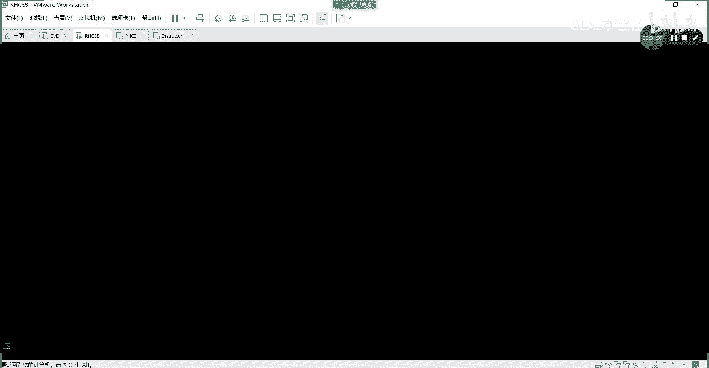
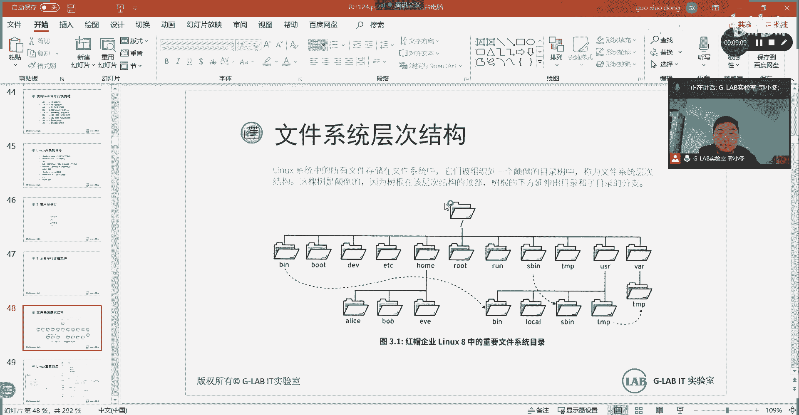
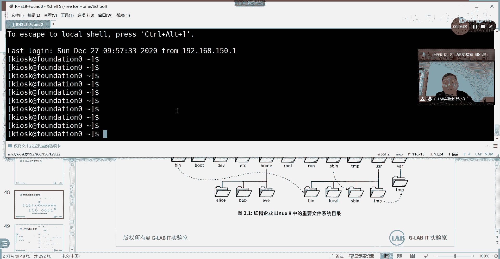

# 【Linux／RHCE／RHCSA】零基础入门Linux／红帽认证！Linux运维工程师的升职加薪宝典！RHCSA+RHCE／6-文件目录 - P1 - GLAB郭主任 - BV1oQ4y187dJ

好啊，那我们开始，那个我们第一天讲的内容其实比较少，按按照我们计划的话，第一天要讲很多内容。

那么没关系，我们第二天，然后呢第一天的视频刚好录到一半的时候，这个没有声音了，那么我们把第一天呃，一些开开环境的相应的命令，我再给大家讲一遍，好吧，呃然后呢我们给大家的所有的练习。

现在啊都是要么用自己的电脑也是这种方式，要么用用我这边的电脑也是这种方式，用虚拟机的方式啊，这种方式，但这种方式跟最后我们模拟的环境不一样，没关系，这到后面再给大家讲好吧，嗯拿打开这个虚拟机。

拿着我们电脑之后，桌面上应该也有一个workstation，可以大家打开这个workstation环境。

我都帮大家测过了，应该都是可以的，在里边有一个RHEL8，大家打开，打开。

然后呢我们上次给大家布置了预习，预习的任务啊，我们今天会给大家讲到，会给大家讲到这个讲到这个访问命令行，到这个创建用户，到这创建用户，访问命令行到创建用户，然后呢剩下的时间如果说大家掌握的比较快。

剩下的时间如果多的话，大家在这里要把我们书上的练习都要敲一遍啊，每天上课一定要留时间给大家做，做这个教材上的实验，尤其是开放性的实验都要做啊，这个就是我们平时工作当中，其实用的比较多的一些命令。

他帮你总结在总结成这个这个这个题目的方式，让大家来练，所以呢一定要练啊，一定要练好。

看看有没有起来，开起来以后你只能通过普通用户登进来啊，Kiosk cospy，这个是我们的这个环境的，普通用户密码是red hat，好那么开起来以后，大家把鼠标放在左上角，LINUX的桌面。

从八以后他桌面没有任何东西。

然后呢，我们所有的东西都在左边的这个activities，在这里在这里点开。

点开之后有一个terminal terminal，如果字体觉得小的话，你按住Ctrl shift加号，按两下，Ctrl shift加号，没有声音，纳尼啊，不好意思，静音了，不好意思不好意思，刚刚静音了。

听了个寂寞是吧，现在有声音了吗，有了啊，好的好好，那么字体放大放大了之后，那么我们开始来开这个环境，首先我们可以先看一下，我们这个环境当中有哪几门课，上次给大家讲有RH124，2H134和RH294。

总共三门课程啊，我们现在给大家讲的环境，要用到第一个2H124明白，然后呢到了后边之后啊，大家如果想上去做实验，不确定我开了哪个课程，你可以通过cat etc下的r HT可以去看一下，好。

目前就是RH124的，就看一下这个文件啊，这个文件会告诉你，当前你开启的课程是哪个课程，听明白了好，如果说你不想看啊，没那么没那么复杂，我只想做124的环境当中的实验，那很简单。

就rh clear cos0，那就把所有的东西都清掉了，这是我们刚之前给大家讲，要去做啊，环境的第一个命令，Rh clear cos0，看清楚的啊，一定要看清楚这个命令在哪做的。

我们所有的开课程的环境都是在foundation里面做的，就是在最外面的那个机器，因为我这里有很多虚拟机，有什么workstation server a server b，请你不要敲错地方，敲错地方。

这个打上去是没有用的，在foundation里面啊，这第一句话，第二句话，r HT set cos啊，cos有三个RH1242H134和RH294，你按tab键的时候，它其实是补不全的。

那你要手动挡RH124啊，小写RH124回车，这个时候他就帮你把你的课程设置成RH，124了，OK这个这个过程有点慢，稍微等一下RH124，这是第二句话，这个有点慢啊，好那么好了之后大家看到设置成功了。

会看到cos set to r h，21看看到这个应该是设置好了，对吧好，第三句话要开启我们的教学环境了，它叫RHRHT杠VMCTL，这边不要打错，叫VMCT2star开启，先把classroom打开。

classroom教室，先把教室的环境打开，好然后呢再按上下键把这个命令调出来，然后把所有的机器都打开，再把or这个不能不能先打二再打classroom，会有会有报错，大家应该先开classroom。

然后再把所有的环境打开，所以这是总共四句话，明白了吗，后边两个是开机器用的，前面两个是设环境用的，设教学环境用的好，在这个都起了以后呢，我们就可以放在这，记住这四句话都在FDITION里面做的啊。

都在这做的，听明白了吗，OK那么我们现在，好我们现在呢嗯等它开机的环境过程当中，我们来回忆一下我们上周讲的内容啊，上周讲的前面第一部分内容给大家讲了，我们这个LINUX操作系统的这个核心的底层的原理。

对吧，什么是系统，系统干什么用的，这个需要大家理解的，一定要去理解，不能学系统都不清楚系统是干啥的，这个要去仔细看一看好吧，然后呢，第二个部分我们给大家讲到了我们的这个练习，一些简单的命令啊。

一些简单的命令啊。

有笔记吗，大家自己有记笔记吗，我看有没有笔记，我这里有大家，我给大家总结的这种笔记，基本上都不是命令的，命令的笔记需要大家自己去总结好吧，到最后的话给大家做了一个实验啊。

一个简单的实验在我们的教材上是有的嗯，希望大家没有做的，回去再做一遍，那么我们接着今天的内容往后讲好吧，今天的第一个内容，这些命令啊，我这里有，我这里都有，嗯嗯讲了find是吧，BH开关机好。

然后做了一个命令好，接下来今天的第一个内容给大家讲文件，LINUX的文件系统，这个要给大家总结一下，当然PPT上有啊，来看在LINUX当中，它的文件系统跟我们windows的文件系统不太一样。

首先来区别第一个文件系统不一样的地方，我们打开自己的windows电脑，打开自己的windows电脑，大家能看到我们的文件系统，一般是按照磁盘来分的，比如说C盘，D盘，E盘和F盘，对不对对吧。

这是windows大家最常见，最常用的一种磁盘的一个一个方式啊，但是在LINUX当中大家是看不到的，大家是看不到我们这个这个这个这个磁盘的，比如说它它是没有C盘D盘的。

我们登进来啊，我是从我的电脑登进去的，我蹲到就是这个foundation。

就相当于在里面这种方式，很多人也想像我这样登录啊，我教大家怎么做啊，我们的虚拟机里边，它里边的这种通讯是内部的，我需要再额外加一块网卡，大家可以在虚拟机右击设置，咳咳上次也有同学跟我讨论这个问题是吧。

他觉得在里边去配命令特别烦。

加一块网卡，你去添加啊，添加一块网卡添加什么呢，网络适配器，然后完成这里我已经加了，加完之后它的适配器应该是第二块，大家看第二块，第二块的时候选择这两个勾都打上，然后把它自定义成net8。

然后net模式也可以的，vm net8把它勾上，确定也加一块网卡，把它调节到我本机的vm net8，这个操作应该大家都会啊，都图形化的好吧，右击设置，加一块网络适配器，点网络适配器二，把这两个勾打上。

然后把这个自定义桥接到vm net8net模式好了，这个确定了以后呢，点确定点确定，确定完了以后。

接下来我们在虚拟机里头，也就在反对性里头应该就会多一块网卡，那么就能够它有DHCP的，就能够动态拿到地址，我们可以通过IPR看一下i pr，可以看到这个地址是1500129。

这是我家的这一块1256的IP地，IP地址和网卡就会多一张网卡。

那么这张网卡是跟你内部的，是跟你自己的这台电脑的vm net8通讯的。

我们可以点本机的网络连接来看一下，你刚刚桥接的vm net8，其实桥接的就是这块网卡，这块网卡就是你电脑的vm net8，这个v m net8是150网段的吧。

刚才我的装加的那块网卡，获得的地址是150。129，看到了吗，我桥接的那个地址是150点腰。

所以他们在同一个网段，那么关于这个vm net8是怎么有的，大家应该知道吧，装workstation啊，不管你装什么版本的workstation，只要装完，它都会自动帮你生成两块网卡。

这个是虚拟网卡是自动生成的啊，就是用来给你主机通讯的，一个是vm net，一个是vim net8，OK所以在这里呢我们把桥接到vm net8，然后又有DHCP，就相当于在外面通过这个网卡。

连接到foundation虚拟机里面去了，所以这样的话我就可以不需要每次这么切换，我直接在外围。

我直接在我的外面啊，直接在这通过SSH，我退出来啊，在这儿通过SSH啊，然后呢登到那个名字叫KIOSK是吧，KK然后艾登到我刚才的那个地址，192。168。150。129，明白我意思吗，就就登上去了。

明白好，在这里我是做了一个快捷连接方式，我不需要这样登，我直接通过打开的方式，因为我这个做好了，19216815029密码，什么东西都保存好了，我直接连接就可以了，呃看得到吗，各位。

所以你们也可以像我这样子去做一个桥接，要做一个网卡的新增，然后从外边连进去，到了后面USB的时候是需要大家从外边连进去的，因为你要你要有几个文件需要导进去，这样连接配置也会比较方便好吧，这个听懂了吗。

各位现场的没听懂的，举个手不举手，都听懂了，没听懂没听懂啊，都没听懂一个，还有啥是谁好，再说一遍好吗。

现在考虑到的虚拟机，大家的练习环境是一台虚拟机，在RH128虚拟机里面，这个虚拟机名字叫foundation对吧，在虚拟机里面，我们会新增很多很多其他的虚拟机。

所以它的通讯是从foundation网里边的，所有虚拟机的内部网络的通讯对吧，那么现在呢我们觉得每次在虚拟机里面，这样点进去配置特别的麻烦啊。

我想在外边，我想在我的机器上能不能直接通过一个terminal。

就是终端的方式登到这个虚拟机里面去，直接登到这个虚拟机里面去，听懂这意思吗，但是呢虚拟机它目前现有的一块网卡，他不是对外的，他不是对外的，他是对内的，他现有的一块网卡，就这块网卡。

就这块它自带的这个模式叫仅主机模式，看到了吗，进主机模式它是不对外的，也就是不跟外部通讯，它只跟机器内部通讯，所以我们想从外面连进去，靠这块网卡是不行的，所以我们新增一块网络适配器，新加会的吧。

添加一块，就相当于在你的物理服务器上加了一块网卡吧，对不对，加了之后就会多出一个网络适配器二，网络适配器二之后，接下来你要把这个网络网卡，跟我的外部的机器进行桥接。

桥接的方法就是自定义桥接到我外部机器的，Vm net8，Vb net8，就是我本机装完workstation生成的一块虚拟网卡，所以我把它调节到我的虚拟网卡上，就相当于跟外部机器是不是连了个线。

明白意思吗，就相当于连了根线，而且他是有DHCP的。

所以你只要加网卡调节好了以后，在内部就能够看到它自动获取了一个地址，这个地址不需要大家手动固定，因为基本上他第一次拿了以后，后边基本上就是用这个地址的，他会不停的去续约续约续约。

所以一般都会是地址是不变的，不用去手动固定，听懂我意思吗，OK那么嗯拿到地址了，桥接也桥接完了。

然后呢我就可以从外部，从外部找一个CRT或者插线这种呃登录的，登录TMO的终端，那这是我用的插线，大家也可以用CRT，因为还可以用put it都可以，都可以让我们连接，连接的方式。

就是我刚刚给大家讲的SSH加用户名kiosk，因为登到虚拟机的默认普通用户，用户名就是KIOSK，然后呢，后边加你这个机器刚才新增网卡获取的IP地址，这个地址是1920168。150。129。

我这边是129啊，大家不一定跟我拿到地址是一样的，各位记住吗，OK好这样的话就回车，回车之后他就问你密码，密码就是red hat呗，是不是也登到防具线连上去了，O只不过在这里我做了一个快捷的连接方式。

因为我把它做成快捷连接方式，每次都要登的，所以我直接登，没有看到输密码，这下懂了吗，各位还有不懂的吗，没有了吧，OK好，这样连接的方式。

其实跟在里面配置的方法是一样的，各位一样的，都是防地形连，好不好好。

那么这时候我们虚拟机就可以缩小放在这了，然后呢我们就可以通过它来给大家讲好，在这里呢我们可以看到用刚才的命令，cat etc下的RHT，去看一下我现在的课程是不是要20是吧，是124吧。

好124环境当中我们主要关心三台虚拟机，一台是workstation，一台server a，一台server b吧，OK所以现在我可以复制，我在这个外面可以复制两个foundation。

第一个foundation我通过SSHSTUDENT，我们所有灯到里边机器啊去配置去操作，都是用的student这个用户，Student at，这边有人说要问了，为什么前面我知道是用户名，普通用户。

后边你刚才登进来的时候是IP地址，这里为什么又可以用域名呢，这叫短域名，因为它整个教学环境都配了DNS，他你就算登workstation，它自动帮你去解析这个workstation的IP地址。

各位能听懂我意思吗，所以这个这个是已经做好的环境当中，已经帮你都部署好的，如果你的环境没有DNS，那你就老老实实的把这个workstation换成IP地址，OK好回车回到这个时候，大家会看到啊。

我登workstation，其实他就是帮我解析到这个地址的，1722520。9啊，你也可以直接登这个地址啊，只是教学环境DNS是做好的啊，好另外一台机器呢，我从这就不需要登workstation。

我可以登我的server a或者server b，s h server a也是通过student去登的，at server a这里也是用的是短域名的方式，不是用的IP地址。

这时候看到我登到server i上了吗，对不对，那么如果说你觉得太烦，你也可以再复制一个啊，再通过s h s t u d e n t student，at server b是不是跟我们相关的。

就三台机器啊，RG124大家操作的最多的就是workstation啊，这是workstation，然后server a server a和server b，所以你在外边可以同时复制三个SSH渠道。

然后把他们都登上去，他让我在哪做，我就在哪做，听明白了吗，OK这个是基本环境，大家需要像我一样去熟练，然后接下来要知道登上去啊，不要搞错，大家在做实验，我最怕看到就是环境都搞不清楚。

再上去就啪啪啪敲实验，不知道在敲啥好不好，先搞清楚，因为它里头的机器比较多，虚拟机比较多，OK有外边的，有里边的，大家先搞清楚对象好不好，那么接下来我们来说现在的内容。

现在我们要说的是LINUX的文件系统，这个文件系统啊，它有别于windows，它是没有磁盘的，我给大家看一下，它是一个现在啊，它是一个树状的结构，这个树状的结构我在之前有给大家讲过。

最顶层的叫根目录对吧，他最顶层我们所有的通过用户登进来之后，这个波浪线大家还记得是什么吗，波浪线是不是加目录啊，对不对，所以所有的用户啊登进来的时候，他默认进到的是这个用户的家目录。

我们可以通过PWD这个命令，去看我当前的目录路径在哪里，PWD这个简单吧，好所有用户登进来，其实是将目录，它不是顶层目录啊，好那么我们往上退，还记得CD点点吗，退到上级目录，对不对，好，再来CD点点。

上级目录在CD点点，上级目录CD点点，上级目录直到退到不能退为止，是不是已经到最顶层目录了，这个道理听得懂吗，所以你只要看到CD点点没有任何变化，就说明已经到顶了，OK那么到顶的话。

我们通过PWD去看一下最顶层的目录，其实就是一个斜杠，能听懂吗，各位好，最顶层的目录就是一个斜杠好，那么我们来看顶层目录，斜杠当中有哪些目录，有哪些东西呢，LS杠L这个命令记得吧。

LS杠2LS叫list简写杠杠，要是列出这个目录下所有文件的详细信息好。

这个时候你会看到里边有一大堆的目录啊，好在这里有目录。

有东西有什么很多东西对吧，好在这里要重点要给大家说的是，大家要看里面的文件到底是什么类型的，我们可以看这个详细信息的第一个字母，第一个字母如果是D的话，那它就是目录听懂第一个字母，如果是杠。

我们看到的就是一个中横杠，那它就是一个文件，第一个字母如果是L的话，那它就是link，就是链接文件，就像跟我们windows里边的快捷方式是一样的，听明白了吗，所以暂时我们先了解这三种类型的文件啊。

在这里我们看到都是目录吧，是不是都是目录啊，都是目录啊，然后有一些链接文件。

还有一些链接文件啊，OK好现在我们看到的图其实就是这个图，就这个图在我们教材当中有这张图对吧，到时候大家回去复习的时候，可以看一下它的顶层目录是根目录，根目录下面有一大堆的目录。

这个目录我们把它叫做二级目录，这些二级目录是干什么用的，分别用来放什么文件，是需要大家在这一节重点掌握的，能听明白我意思吗，需要大家重点掌握这些文件里面是干啥的好，然后二级目录当中又有一些三级目录。

这个我们其实倒无所谓，其次啊，这个掌握点要放在后面，我们重点掌握二级目录好，我们来看二级目录当中有一个叫boot，大家可以自己去看一下是不是有boot文件。

就BOT诶，在这在这boot文件，boot文件我们可以LS斜杠，boot杠L我们来看boot文件里面。

这些文件有大家认识的吗，如果有，那最好如果没有，那我告诉你，boot文件里面存放的都是我们跟系统启动相关的，比如说他放了内核，还有我们企及一个非常重要的文件叫grab to，所以看名字就知道。

bot其实跟我们操作系统及相关的文件。

都放在boot里面，各位能理解我意思吗，bot里面啊，你的内核文件在bot里面。

我们现在用到的内核是4。818的，4。18的内核文件，OK好，那么这些跟起机相关的都放在boot里面。

再看DEV，DEV这个文件在这DEVDEV，看名字就知道是device对吗，OK我们来看看里面有什么东西啊，CDDEV杠L呃，不ls4DEV杠L啊，它里边有一大堆的东西啊，一大堆东西。

TTY我们找几个认识的啊，这个这个有有C呃，CPU有FD，还有那个这个disk磁盘是吧，然后呢还有memory，有呃这些TTY好，有这些东西，找几个认识的，V d a。

VDA就是我们在里边的一个分区磁盘啊，他算是磁盘，然后呢大部分放的应该是我们机器所有的设备，所有的设备都放在这，你看连CPU内存都在这里，他认为你的操作系统，所有的硬件的设备都会放在DEV里面。

包括这个设备，包括存储设备，计算设备和内存，这样的这个这个计算的存储的设备。

明白意思吗，所以DEV主要放的是我们的设备文件是吧，所以如果说你加了一个USB，插了一个USB，你想找到这块USB对应的文件，你应该去哪找，是不是第一位里面找啊对吧，OK如果你加了一块硬盘。

也是在第一位里面找，加了一块内存，也到第一位里面找，能听懂我意思吗，各位啊，这个叫设备文件好，接下来说到重点了，etc etc是我们接触到最多的文件目录，这个目录呢是配置文件。

大多数都是以纯文本格式形式存在的。

好etc这个目录是我们接触的比较多的啊，A24杠L我们看etc就这个文件，这个文件大家也能发现，其实这个文件比较大，它里面有很多东西，很多的配置文件在里面，比如说哪些配置文件呢，这个配置文件啊。

可以理解为我们软件相应的配置文件，比如说我们的亚目源，就是这个操作系统要装软件啊，我必须要链接到公有的样本源，或私有的样本源里面去，那样本源对应的配置文件就在etc下面，比如说叫VIM。

我们去看一下这个etc啊，在CD etc下面有一个要点report，点D在这里，在这里的二级目录下面有两个配置文件，这两个配置文件就是用来配置项目源的，我们可以通过cat去读一下RHER。

RHEL的第一位report。

就这这就是它配置文件，这个配置文件决定了，我能不能通过公网的或者私网的样本仓库，来进行软件的安装对吧。

OK好，这是一个呃配置文件的举例，另外再举一个例子，如果我们安装了NTP的软件，我们的NTP是要对要配置它来进行网络的，NTP时间同步的，对不对，只要安装完了以后，那你的NTP的配置在哪里。

也是在etc下面好，他在etc下面，我们CD点点，他在etc下面有一个叫哦，这个应该没有装，装了以后应该才有c h r o n i c configure，就这个文件，OK只要应该所有的软件装完以后。

接下来在所有的配置都会在etc下面给大家去写，OK所以这个文件很重要，包括我们后边要讲的auto fs，Auto fs，这是一个网络的挂载，按需挂载的一个一个软件，这个软件装完以后。

我们所有的配置也是在etc下做。

所以etc的文件应该是我们比较重要的一个，配置文件，这个文件的重要程度超过上面两个，大家需要了解的。

OK大部分都在T下，再举一个常见的例子，我们配置网络啊，呃我们刚才是不是加了两块网卡，对不对，那你的网卡加上去自动获取地址，它也有对应的文件，这个文件放在哪里，也放在etc下面，他这个就比较深了啊。

他在他在etc下面的xy s csc fire net networks呃，script l s杠L在这里有看到没，是不是有网卡信息呀，我们可以去cat一下，cat一下好，这就是我们整个网卡的信息。

OKOK都是我们整个网卡网卡的IP地址的信息，都是放在这个配置文件里面好，所以说到这我们整个系统DEV跟设备相关的。

会放在一个目录下面，以文件的形式存放，我们的配置文件放在etc下面，也是以文件的形式存放的，这就说明我们的LINUX，LINUX里面的所有的这个呃配置的信息，也就是所有的东西。

其实都是以文件的形式存放的，这一点大家能清楚吗，OK所有的信息都是以文件的形式存放，所以有一句话啊，有一句话叫一切皆文件啊对吧，一切皆文件，在LINUX里面，一切皆是文件，所有的东西。

你的所有看到的都是以文件的形式，在某一个目录当中体现的，OK好接下来我们看home。

我们到CD啊，直接到这里来啊，home下面home home这个应该能看到是家目录，对不对，那我们LS斜杠后杠L好，看到有这个home的家目录诶，那这时候有人会问加目录，看到的应该是有几个用户。

应该就有几个家目录吧，能听懂我意思吗，有几个用户应该就有几个家目录，但是操作系统在没有建普通用户的时候，应该它有一个超级管理员，用户是什么root，对不对，但是我为什么在这里没有看到root的加目录。

加目录呢，为什么没有看到root项目咯，好这就说明我们的权限问题是不够的，对不对，所以只有root可以看到所有用户的家目录，但是普通用户仅仅只能看到自己的家目录，看不到其他的普通用户。

包括超级管理员的家目录，能听懂吗，OK所以如果我现在提前哦，我现在退出来，我现在退出来，在我现在workstation上，这里也看加目录吧，这里应该也只看到自己的，也是自己的吧，对不对，好我把它退出来。

我把它用户改成管理员，用户改成root，用管理员用户的not a好，那么这个时候我再去IOS斜杠后杠L看诶，这个是root吗，呃PWD好，Root，将目录不在这，不好意思，说错了。

超级管理员的用户不是在home目录下面，他在哪，在在这儿在这儿啊，它有一个专门的目录，专门的管理员的目录，它叫root，明白吧，OK好，我们可以通过root新建一个用户，用户叫user ADD。

我们来给大家演示一下，假设叫叫GLB1，假设叫GLB1，那这个时候我们再去看一下，再看一下home是不是看到多了一个加目录啊，对不对，但是如果我们现在切换到student用户去。

ELS斜杠后杠L诶不好意思，他也能看到是吧，我想一下啊，CD到CD到嗯，他有权限的，这个应该是做了权限的，CD到，没关系，我把我用GLB1的用户登进去啊，呃配个密码，给GLA1配个密码杠杠。

Std int dn，Gla1，好然后呢，我们退出来用，用用用什么用，一个用GLA1，好IOS斜杠后杠L也能看到，CD到home下面的student好，这个是看是能看到，但是进不去是吧，更正一下。

我刚刚说法看似能看到，但是进不去啊，进不去它是没有权限的，好我们再通过student来试一下啊，Student surve，然后呢LS斜杠后杠L看还是能看到的，但是我们想CD到home下面的GLB1好。

是没有权限的，普通用户是没有任何权限的，这里更正一下啊，跟着我刚刚说法是home下面的普通用户，其实普通用户大家都能看到啊，这也能理解，就是你家和我家都能看到，但是我只能进我的家，但我不能进你家是吧啊。

应该这样理解，不能连看都看不到啊，所以应该是可以看到普通用户的家目录，但是没办法进去，OK好。

这个是home，所以大家会发现home的家目录，home的家目录里面放的，应该都是我们所有的用户啊，所有的用户，普通用户，普通用户的家目录，每建一个用户在这里就会新增一个目录，OK新增一个目录好。

那么我们cad到home下面的student，我这个普通用户下面去，我们去看里面有哪些东西呢，默认情况下里面会有这里，这里是因为我的环境里面都删掉了，没有东西，大家重装一个新的LINUX系统里边。

自己的家目录下面应该是有东西的啊，什么桌面呀，下载呀对吧，有很多东西都在这好。

所以这个叫home，第二个root管理员自己的家目录，它是单独的一个目录，这个刚刚已经看到过了，好接下来有一个LIB的文件目录。

这个目录也是比较重要的，cool文件，我们把它叫做库文件，我们把这个库文件啊，LS杠，L斜杠LB它分LIBLIB64好吧。

我们来看看LIB或者LIB64，或者LIBLIB或者AB的64，它主要是放我们的静态库或者动态库，这个库的话是什么概念，在回忆第一天讲讲的操作系统，操作系统最底层是跟内核，内核是内核。

是调用我们的硬件的，对不对，然后呢需要被上层的软件调用，需要一些接口，这些接口呢需要标准化，那么比如说呃，很多的应用需要调用我们的这个库文件，才能调用底层的内核，那么这种标准化的东西。

就会放在LIB这种库文件里面，所以大家看到的系统调用啊，怎么优化的调用啊对吧，然后呢内存的调用模块的调用啊，包括启动的防火墙的调用啊，这些都是标准化的库文件，这个库文件放在我们之前讲的那个哪部分。

这部分之前在讲操作系统的时候，这部分叫库文件A，在这就是这这部分内容能听懂吗，OK那内核请问放在哪，刚才放在boot里面，对不对，在系统启机的时候会到bot里面加载内核，然后去加载，去调用硬件。

然后APID系统调用，这个就是我们放在LIB当中，用来标准化库的，这叫库文件，好听明白了好，然后呢继续。

好media media这个叫什么挂载点或者叫挂载移动设备，我们l s media杠AL现在是没有东西的，什么叫挂载点，这叫临时挂载点呃，也就是说如果我现在可以media，这个文件不是太重要啊。

就是相当于我想把这个某一个存储挂上来，那么我可以放在media当中进行挂载，好说到这的话。

我必须要解释一下LINUX当中的文件存储，这个是比较重要的，好大家看一下啊，简单解释一下吧，OK现在我们讲的这个叫目录，对不对，它的目录是一个以根啊为最顶层目录，然后一级一级一级一级往下延伸的。

这样的一个树状的目录结构，这叫目录对吗，OK那么目录结构很清晰呀，那么目录里面要放东西，比如说我在顶层目录下面的第四级目录，我要放一个东西，请问我要放的这个东西最终存放在什么地方，存放在哪磁盘，对不对。

反正是一个空间上，存储空间一定是一个存储空间上，对不对，那对于我们操作系统，对于我们的主机来讲，它应该会放在我的硬盘上，明白这意思吗，OK他一定会放在我的硬盘上，那也就意味着我们的目录和硬盘之间。

一定要有一个关联，一定要有一个关联，一定要有个关系，这个能听懂吗，要不然你在目光有目录，没有说对应的存储空间，你在目录里也放不下东西啊，因为它你只有目录的概念，没有存储的概念，听懂我意思吗。

OK好这个就跟windows区别不一样，windows不是这样的，windows是先分磁盘才有里边的目录的，各位能听懂我意思吗，windows你必须要先分盘，C盘D盘E盘，对不对。

分完以后我在里面新建各种目录，然后在里面放东西，能听懂吗啊，它的磁盘和目录是一体的，都在里面，但是在我们的LINUX当中，他的目录的概念是目录的概念，我们到现在为止一直在说重要的目录。

没有说目录对应的存储地方吧，对不对，OK所以才会有我们的挂载的概念，它才有挂载的概念，什么叫挂载，就是它可以从磁盘当中分出一部分的空间，比如说是一个G啊，分出一个G的空间出来。

这一个G的空间我可以根据我的需要随机的，你想挂哪就挂在哪，挂，挂在某一个目录上，他是把存储空间挂在目录上，这样目录存放的地方就有了吧，各位能听懂吗，那也就意味着我可以在存储磁盘当中划分十个。

根据我的需要，把一个G挂在home上，把一个G挂在bot上，把一个G挂在lb上，能听懂吗，嗯它可以按需的随机的去去挂载你的存储好，这是我自己的一个操作方式，那默认不做的话，他是怎么做的呢。

默认不去做的话，我们在装LINUX操作系统的时候，大家有装过吧，装过的时候有一个它会让你选存储磁盘，然后下边有一个自动帮你去挂载这个存储空间，到目录，你只要点自动，所以你就不用关心他的这个挂载的问题。

听懂我意思吗，它自动帮你搞，还有你把那个自动的那个勾去掉，它就要让你手动去设定那些核心的目录，应该挂载在哪个磁盘上，各位能听懂吗，好它自动怎么做的呢，自动就是它会把你的你分给他，比如说我这里是256G。

我把256G都挂给根，那么所有的目录是不是都在根上面啊，你直接在跟挂给了根，你下面所有的不都有地方放了吗，能听懂我意思吗，各位但是它是可以调整的，这个你一定要知道windows是不能调整的。

C盘划分了里面的东西就不能变了，对不对，那么LINUX是可以调整的，你可以增加某一个目录的大小，或者更换某一个目录的存储，这个能听懂吗，可以对对对，可以他是可以的，这很正常，为什么非要分到下面去了。

我全方根不是也挺好，对方便是方便，但是不太适用不太适用啊，我后面会给大家讲实际的案例，比如说有些地方啊，这些目录大家先了解它的作用啊，了解到作用之后，你就会发现有些地方有些的操作系统。

它比较关注的是记录他的日志，他的日志一般会放在比较重要的，比如下边的哪个目录里面，会告诉你日志的日志的存放，一定一般会放在下面的这个腕腕上面，可能会有，然后呢然后这个OPT下面也会有。

然后呢就这几个目录他不停的在增加，他的日志不是在不停增加吗，对不对，所以你应该要给这些目录多一些空间，而不是直接在顶层甩给他50个G，100个G，明白我意思吗，在顶层甩给他的话。

可能它的分配就他也是自动分的，他也会帮你去挂载其他目录，这个分多少，那个分多少K所以你最好按照你的需求，哪些目录比较重要，那你就把哪些目录挂的多一点，这个利用会更合理一些，明白吗，各位，然后呢。

有些事要处理性能比较高一点，也就是要处理不同进程的，那么它的进程目录可能就要大一点，进程目录可能就要大一点明白，然后呢有些可能是这个临时文件会多一些，那你就给临时文件去做一些，去去去给他大一些明白。

所以就按照不同的需求，要给不同的目录区分不同的空间，这才是我们实际工作当中应用的一个方向啊，不是直接甩给他好继续，LRB说完了，media其实就是挂载点的意思，就是我想想现在测试。

我现在挂上来的硬盘是不是有用，我可以临时把它挂载到media里面去，然后我在media里面试着读取访问测试，如果没有问题了，再把它卸载挂到我相应的目录上去，所以这个media是临时挂载点。

听懂我意思吗，各位这是一个临时挂载点，临时挂载点测试，然后mount也是的，mt也是临时挂载点，所以这两个差不多啊，差不多OPT呢，这个是第三方的一个一个一个配置文件，这个用了也是可以的。

也就安装第三方程序，比如说安装阿帕奇，你可能会在OPT里面会看到一些文件啊，第三方的比较重要的大的软件会有，然后这个process process，这个叫伪文件系统，这个是映射内核的。

也就是系统在起机的时候会看到这个pros，那么一般调优的话会在process这个文件里面，它跟进程跟系统调用相关是有关系的，然后呢SYS这也是的，跟我们的这个系统里面体积内核调优有用到。

所以这两个一般我们在前面的初级和中级阶段，接触不到，我们在上rh ca的时候，会涉及到系统的调优啊，系统调优其实其实说白了，他是在解决什么问题啊，系统调优在解决系统运行的提高啊。

为了目标就是解决系统运行的执行效率，就是原来通过1%的资源，能干10%的事情，现在我要通过1%的资源，能干20%的事情，能听懂我意思吗，OK这就是调优的调优的概念，所以一定是在系统启机运行。

并且处理的时候来进行系统的调优，就一般是这两个文件，然后探访这个应该能看到是临时文件啊，临时文件的话一般会存放，我们临时下载的一些东西啊，或者临时的临时的这个大的文件呀，这些都在临时文件里面。

type目录跟其他目录是有区别的，就是这个目录临时文件目录，它过一段时间它会自动清理的，所以很多有时候我们只用一次的文件，比如说下载的软件，安装完了以后啊，你可能忘记删掉了，但是他过段时间就帮你清掉。

听懂了吗，其实这个只有这个目录可以过段时间定期清理，其他目录是不会的，所以这叫临时文件，好玩的话，这个叫基于word的话，在写开发的人应该知道这是变量对吧，various是吧。

那么这个东西是放我们的这个可变化的文件，bin bin文件也比较重要，bk是可执行文件包，包括用户命令bin这个文件，还记得我们在第一天的时候有给大家讲过，CDB杠LA哦，这个普通用户还没有权限。

看这个不是不是不是看错了，看LSB下面的杠杆好，这里边看到的文件都是绿色的，绿色的文件都是带可执行的，能听懂吗，OK所以这里面的一般都是放我们C2里面，能用到的命令，包括LS自己能执行。

他都应该在bean里面都会有自己对应的文件，看到没IOS，就这个LS这个命令怎么能执行呢，那就是因为在bin这个文件里头，有一个可执行的LS的配置文件，这个命令有，所以我才能通过LS去执行。

所以很多执行命令也都是放在bean里面，这个能听懂吗，OK很多可执行的命令啊都是放在bean里面的，所以这个文件也比较重要，SB也是的，SB和B看到都知道，SB还是B都是放一些执行命令的，U s2。

US2是全局只读的共享，US2里面也会用到叫共享呢。

read类的一些库的一些东西啊，所以这个大家留意一下，我给大家总结一下哪些比较重要，第一个etc肯定是最比较重要的，然后呢BSB比较重要，好LIB也是比较重要的，home大家了解一下。

这个只是将目录home和root家目录，然后系统在运行会产生的一些文件，叫pros和cs s s，这个是用来做系统调优的，然后有一个碳板用来做临时，用来存放临时文件的，因为它可以定期清理US2。

用来放一些全局只读的一些共享文件，U s r u s2 k，所以这个应该是我们比较常见的一个目录。

大家需要了解的，114杠二，我们来看还有哪些没讲啊，所以二级目录才是我们重点要掌握的，DEV是放设备的，Etc，放配置文件，home放用户的家目录的LIB和LIB64啊，他都链接到USR下面去了。

所以说这种链接方式就代表是同一个地方，明白吗，就这个地方和这个地方是指同一块地方好，然后media是临时挂载点和mt属于临时挂载点，OPT呢这个是呃第三方程序的安装的东西。

pros和cs cs应该也在这，pros和cs这个是系统生成，就开机运行的时候产生的一些文件，用来做调优的，run也是的啊，run也是的，然后SB和B用来放我们的文件，SRV和SRSRV这里没有提是吧。

SRV呢我们可以进去看一下LS杠，SRV杠L也是空的，这个应该也是呃，一般也是用不到这个文件，我们先不用管US2的话，应该跟这里的ban应该相对来说现在是一样了，所以说也是相同等重要啊。

usr were是用来存放可变的一些文件玩啊，用来存放一些可变的文件，Tap tap，你看tap这个目录跟其他目录都不一样是吧，它是绿地的，说明它是可以定期清理的，它是一个临时的存放的堆放的地方。

大家可以把一些可能要定期清掉的东西，放在tap里面，他会帮你定期清理啊。

好所以这个是我们的目录结构，清楚了吗，清楚了吗。

好这里就总结完了啊，好那么这是它系统默认的一些目录。

那么这些目录都有它各自的作用，而且都有它这个默认存放的文件，我们可以去创建属于自己的目录。

创建目录用什么。

创建目录我们可以通过mad2去创建，对不对，OK那么我们来看创建目录，先说创建目录之前。

我们要考虑一下创建目录应该具备哪些具备，哪些要要满足哪些条件，创建目录的名字规范，这个需要大家知道的，第一个也就目录名字啊，一定要有一些要求，不是随便创建的，大家还记得我在创建的时候之前遇到个问题吗。

我用的是斜杠对吗，所以在创建目录的时候里边千万不能用斜杠，这是第一条好吧，不能在目录名字当中啊，不能在目录名字中对吧，带有斜杠，带有斜杠，因为斜杠在LINUX里头它代表的是顶级目录，它代表的是根。

听得懂吗，OK好，第二点长度有限制啊，不能你不能无限长呀，长度不能超过255个字符，这个要知道明白不能太长，这个我相信大家应该不会因为创建目录啊，都不希望这个名字太长，看起来太费劲了，好第三点是什么。

严格区分大小写，LINUX里头是严格区分大小写的，大家做到后面会发现你中间加一个空格，加一个点，大写小写不一样，你要排错，要排很久，所以请大家从现在就开始注意到，我们给大家写的大写就是大写。

小写就是小写，严格区分空格，标点符号，这点什么东西，这些都是严格区分的，这一点要注意，各位明白我意思吗，好那么接下来呢嗯我们就可以来看一下，这没它的创建目录的方式。

通过Mac dr，我来简单给大家创建一个mic dr啊，我们在这里mic mic dr，我们假设创建一个GLB1，哦这个是什么，它不能创建，不能在不能在这创建是吧，退出来吧，我们用server a来做。

这边也来做吧，好LS杠幺里边没有有两个东西啊，我们来创建MAD r，我们创建一个test123LS杠L啊，有一个test123出现了，对不对，然后呢我们要创建，大家来看啊，Mc d r r。

如果我想创建一个test1234，test1234里边再创建一个GLB123，这个时候他会报错，请问为什么，刚才我创建test123没有问题，对不对，现在我想创建test1234下面的GLB123。

那是因为你在创建的时候，这个是不是目录还没有啊，顶上级目录还没有，你想创建下级目录是不可能的，对不对，所以在这里我们有几种方法来实现这个需求，我们可以怎么做，先先杠刚才一样一级一级的建，对不对啊。

比如说我现在在test123里面再去创建make dr2，test123里面我创建一个GLB123，这就可以，因为test123已经存在，能听懂吗，就这样就可以好一级一级上这第一种方法。

第二种方法呢加一个参数，我们我们test1234是没有的，在里边加一个参数，加一个杠，P是吧，杠P啊，OK好，然后LS杠l test1234有了吧，对不对。

然后呢我们L4test1234下面有没有GLB，123，是不是也有了这第二种方法，还有第三种方法吗，还有没有第三种方法，第三种方法大家应该也会的，第二种方法，加个杠。

P杠P的意思就是他会按照你写的这个路径，按顺序帮你把这些目录一个一个一个都创建好，所以这个参数应该是比较常用的，能听懂我意思吗，各位OK，这个参数应该比较常用，第三种方法，断了吗，断线了吗，没有吧。

没有吧，好第三种方法来，我想创建test1和GLB1，test12和GLB12，我想创建mic dr2test，一二下面的GLA12，这肯定不行，对不对，好用，第三种方法怎么做，大家应该会的。

我们先创建Mac dr test12，然后呢，空格还记得上次两个命令一起就是按顺序来做，中间加个啥封号，是不是是不是分号，Make dr，是不是也可以啊啊能看懂吗，各位test1212。

s test12下面的有没有任何东西，test12上面诶嗯，跳到哪里去了，CD叉叉叉，ELS杠二诶，没东西来，我刚刚没创成功，对是创造创造这一个目录里头去了是吧，好的，那应该怎么创建。

我就是想在这里创建一个JB，用一句话把路径打开，怎么做Mac dr2这个已经有了是吧，已经有了，我们再来一次啊，我们把我们把这些都删掉吧，好来讲一下删掉，我们再讲最后这个方法怎么做。

删掉他创建叫Mac dr，然后删除呢，RM dr对不对，RM是remove的意思啊，remove的简写，Remove dr，来我们一个三，我们先把一二删掉，哎呀在这边啊。

r m d r test1R删掉了吧，LS杠二啊，好再来RM dn2，我们把GLB12删掉，再把GLB123删掉，test123删掉，这里就报错了，报了啥，他说这个里边还有东西，对不对对吧。

所以在三的时候也要注意啊，你的目标的目录里边是不是还有其他的内容，如果有其他内容，他会报这个错，但是我不管里面有没有什么内容，我想全部删掉，后边还得加一个杠，不是杠R对不对，R好。

这时候他会问你诶R不是架在这RMDR杠R，写错了，Rmdr2，哎杠R是test123是吧，哦对斜杠不好意思，呃问一下RMDRRMDR有没有这个参数啊，杠P啊，杠PRMDR是杠p rm4杠R这个参数啊。

大家不记得没关系，我有时候也经常忘RMD2杠P是吧，把test123老删掉，Taste123，大批啊还是，我们再看一下0。2嗯，这个P是remove director and的，意思是里面的东西杠P啊。

对要一起三是吧，我知道了是这样子的啊，是这样子啊，RM杠P它里边还有东西吗，有的不是大P小P没了吧，这个这种算法跟创建的方法是一样的对吧，明白意思不就是就是你你你这个一一溜下来，所有的他都帮你删掉。

豆瓣先帮你删这个，再帮你删这个就一起删掉了，这是RMG啊，参数跟Mac dr2用的是一样的杠P啊，明白意思不，124杠二啊，好还剩一个了，对不对，好test1234里边我记得应该也是有东西的。

test1234里面也有东西是吧，好在这里我们也可以通过RM d r杠P1个删掉，我们接下来讲另外一个命令叫RM RM RM，RM和RMDR的区别，大家一眼就能看出来少了个DR是吧，对不对。

RMDR是专门用来删directory，就是专门用来删目录的，RM是既可以删目录，也可以删文件，能明白吗，刚刚那个就是杠二的时候，你不是test123，下面只有一个吉他的123文件夹的。

如果在123上面有两个文件夹，再用RNDR杠P跑的时候，为什么要就就就要一个一个删，对，把test123那个目录以及它的下级目录，几个123就一个命令就一起删掉了，如果说他这11月份下面有两个目标的话。

是不是只会嗯不会不会，你看啊，我在这里，make dr在test里面再新建一个啊，你是说这个意思是吧，然后通过RM dr去三这个杠P是吧，杠p test123，杠P，哦在这啊，test123S降三是吧。

有两个，这里面有两个对，给大家看一下啊，l s test123杠，L是不是两个啊，啊对吧，你的意思是r m d r test1234，删掉S加个杠P对不对，他说还不是空的，test1234还不是空的。

所以这里我们一般是这样子加一个新号对吧，里边我不管明白是啥，L4杠二就没了，明白吗，RMDR是吧，来好mk dr Mac dr2，我们重新创建一个test1，现在里边干净了啊，里面没啥。

然后我们再通过之前创建文件的方法，通过touch touch a呃，touch test1里面创建一个AA，这样的话L24杠二啊，test1里面有一个文件是A记住是一个文件，不是目录。

test1杠二是这样的对吗，再再再再创建空目录，就是他的下级文件，再有MKDR在test1里面，我们再创建一个一啊，创建一个目录吗，LS杠L在test1里面嗯，在，L4test1杠一是这样子是吗。

一一下边还要再有文件吗，不需要是吧，然后通过2MD2去删除是吧，杠P要加杠p test1，然后把一删掉，是这个意思吗，哦你说加个星号是吧，这种方式啊，可不可以不可以，他说的是不对，因为他不能删文件。

能看到吗，他不能删文件，它只能删目录，所以这个命令很鸡肋，没错是的，所以一般会用RM，所以RM呢基本上是既可以删目录，也可以删文件，但它的参数跟RM dr又不一样啊，RM里面现在有东西。

test1里面有东西，我们可以try一下啊，用tree来看可能更清楚一点啊，test1里面哎一被删掉了是吧，刚刚那个一被删掉了，就是他会把你把一删掉，但是test1删不掉，是因为test1里面有三个A。

三个A的文件，对不对，对不对，所以这个看到了啊，它是可以删以下的，最外最里边那个目录的，但是如果里面有文件，它最外层的目录是删不掉的，听明白了吗，好来吧，我们来看啊，嗯嗯我们还是再创建一个吧。

Make a d r make dr，我们创建一个test1里面创建还创建一个一，这个时候我们再去一下，这时候就有了是吧，所以1test1里面有个一个3A，那这个时候我们通过RM去删掉test1说。

看到说他是一个它是一个，它是一个目录是吧对吧，所以我们要加参数RMR，然后把test1删掉，他说要不要三是的，他说里面有三个A，要不要三的taste1要不要三是的，US杠二没了吧，对不对。

所以再看一下命令，Rm，RM杠R，就是他会帮你把里面所有的东西都会删掉对吧，都会删掉都会删掉，但是不加一个参数，不加F的话，他会一个一个帮你去问，说这个要不要删，那个要不要删。

RM刚RF就是F就是不要问force强制删除，不要问我能理解吧，所以这个命令要慎用啊，RM杠2F就是不问你也不提醒你啊，你就是把所有的东西都删掉了，所以如果是RM rf这种的话，那就崩溃了，对不对。

RM杠IF这种嗯，这种太爽了，这个是三，当前目录还没有这个狠是吧，这是根目录全删掉了好不好，所以这个不能搞这个这个要慎用，所以在这里三目录我们给大家讲了RM啊，还有RM RM dr。

然后参数呢还不太一样，RM用的是gr和F，然后呢RM dr和MCDR用的是杠P没问题吧，各位好，那这个应该问题不大。

那么接下来我们来看一个，我们来看一个练习，我们来看一个练习嗯，应该在49页吧，应该是，电子档我也给大家了啊，大家如果没有教材的，可以看电子档，嗯嗯一电子档我是放在那个练习环境网盘里头。

对大家自己网盘里下，这里到时候也可以考49来看啊，这个是对文件的一个层次结构的概念，第一题，哪一个目录包含永久系统特定的配置数据啊，etc是吧，第二题，哪一个目录位于文件系统层次最顶顶层的B啊。

斜杠是吧，哪一个目录包含用户的主目录啊，就加目录home没问题，哪一个目录包含临时文件t mp是吧，第五哪一个目录包含数据库和网站等动态的，主要看动态的YY是吧是啊。

第六个哪一个目录是超级管理员的主目录root啊，第七个哪一个目录包含普通命令和使用程序，普通命令和使用程序user user bean是吧，第八个哪一个目录包含非永久性进程的，运行的数据。

非永久性进程的run对，就是临时的，就是系统只要启动啊，它会保存进程相关的一些数据放在run里面，然后哪一个目录包含已经安装的软件，程序和库啊，哪一个包含已经安装的程序和库，UUS2吗，对吧。

US2K大家可以自己对照一下啊，好接下来我们来看一下这个呃，关于目录的绝对路径和相对路径，我讲过吧，上面有写关于绝对路径和相对路径，也是目录当中比较重要的一个东西啊，关于绝对路径和相对路径。

我就我就不讲了，好不好好，那么接下来我们来给大家简单的去去练习啊，去练习一个诶，还有一个在58页，58页也有一个问答题，关于绝对路径和相对路径的，我找同学说啊，大家准备好58页，58页。

还没怎么认识大家，第一题，假设当前用户的，假设当前用户的当前工作目录为temp，主目录为home user是吧，然后呢，哪一个命令用于返回到其主目录，哪一个用到返回基础目录中。

万金ACDCD是直接到主目录的，没问题吧，各位好，第二题，哪个命令可以显示当前位置的绝对路径名，哪一个路径会显示当前路径的绝对路径名，陈晓梅BPWD好，第三题，哪一个命令会始终返回到。

在进入当前公路目录前的这个工作目录嗯，周佩佩好像是D，好像是D，好像是D吗，A是吧，A吗，哈ARKCCD斜杠是进到返回到上上级目录，就是这个需求啊，第四题，哪一个命令会始终将工作目录。

从当前的位置上移两个级别，这个最简单了，11凡，哪一个命令会始终将工作目录从当前的位置，上移两个级别，C吗，哦上次没来是吧，哦知道了，还有谁啊，我看看朱东昌，cc4C4上一两个级别吗，点点上一层。

这不是先点点的话，先CD点点不是两层了吗，啊返回上一级目录，哎呀我去，不好意思，我短路了，好的，OK第五题，哪一个命令使用长格式输出当前位置的文件，并包含隐藏文件，长格式也就是详细信息，D对吧。

A是显示隐藏文件啊，第六个，哪一个命令会始终将工作目录切换到ban，始终将工作目录切换到bin，顾清勇，哪一个命令会始终将工作目录切换到斜杠，BB是吧，第七个，哪一个命令会始终将工作目录。

切换到当前位置的副目录，当前位置的form录，B是吧，好没问题，B啊，两个点是上级目录是吧，第八个，如果当前工作目录为home student，哪一个命令会将工作目录切换到。

当前工作目录是home student，也就自己的家目录了，哪一个命令会将工作目录切换到tap，哪一个啊好这个刘云翔是刚来的吗，今天是你吗，在哪在哪啊，哦不好意思哈哈，哪一个C是吧，嗯C啊。

对当前目录是这个，那你就要想到我们刚才讲的目录结构啊，那我们在home下的student，然后temp是在哪里啊，tap是不是在根目录下面，所以你要往上退退，一直退到根，然后再进到碳板。

所以这个题应该是C明白了吧，好像是C啊，啥打CD高斜杠看着不行，直接打啊，对CD斜杠他们可以，但是这里没有这个答案吧，对不对，CD斜杠TP是最最最快的，所以CD斜杠TP和这里的C答案。

这就是区别相对路径和绝对路径明白，所以我们再回忆一下绝对路径，意思就是你的路径一定是以斜杠开头的，所以斜杠开头那就是绝对路径，如果不是以斜杠开头，像这些都是相对路径，对相对路径，第八题好清楚了。

这是第五第八题好，那么接下来我们来给大家讲这个这两个问答题，做完了啊，我们对路径的结构应该有一些了解了，那个U1和U2是干啥的。

CDCDU1是吧，CD横线U1啊啊。

没有这个命令，没有这个命令，但是那个我也看一下，他这个我也看到了，来看一下啊，这个是吧，CD横线U1，CD横线U2不是对，这个是没有这个命令啊，他就是他就是对，这是一个错误答案，OK没有他啊。

好继续。

好吧，那么我们来继续啊，继续来来讨论这个命令，我们讲了Mac dr好，我们讲了RM dr，然后我们讲了RM对吧，那么他们的一些opp参数就不说了，那接下来我们来讲文件的复制用的是CP对吧。

然后文件的剪切用的是MV，然后文件的剪切和复制，这个我们要重点给大家来说一下，先看复制，复制我们要讨论的问题点是复制大家都知道了，对不对，但是我们要复制的是要知道的是一个文件。

一个文件能复制到一个文件是吧，这个不难吧，一个文件能复制到一个文件，这个没问题，然后一个文件能复制到一个目录吗，一个文件能够复制到一个目录吗，有一个文件送到一个目录里面去，可以是吧，这个肯定可以啊。

然后多个文件能复制到一个目录吗，这个也没有问题吧，对不对，那么多个文件能复制到一个文件吗，多个文件能复制一个文件吗，想想也不可能，对不对，你把多个文件复制到一个文件能OK。

所以大家要知道一个文件到一个文件没问题啊，还有啊，还有一个叫多个一个目录，一个目录能复制到一个目录吗，可以是吧，那么一个目录能复制到一个文件吗，行不行不行，是不是好，所以不行呢，我这边都打了问号啊。

上面这个是行的是吧，一个目录一个目录可以复制到多个目录，这个是可以的，下面两个是不行的啊，那个D和F是不行的，一个目录不能复制一个文件。

这个能听懂啊，好来我们来简单的做个演示啊，我们来创建A4杠二，我们在这里创建创建三个文件给大家演示一下，我们先创建三个目录吧，呃这三个目录分别是嗯，分别是RHC1RHCRRHC3，我要创建三个目录。

用一句话来创建，我们可以怎么创建，创建一个目录，肯定通过Mac dr嘛，对不对，OK我后面要创建三个目录，在同一集下面，我中间加分号，是不是可以压对吧，我们还有更简单的方法，再讲一种方法。

RHCE它叫123对吗，我们在这里用花括号括起来一点点三，OK我来试一下LS杠LRH123，好了没，OK好用这种方法我们还可以创更复杂的，比如说我想看创建啊，创建那个四个叫1A1B2A2B。

Make dr，我想创建2h ca1A1B，2A2B是不是可以这样写啊，一点点二，AAA逗号B，这里可以大家简单看一下，这里一点点二也可以写一逗号二，因为我只有一二嘛。

点点大家应该能总结出来它是一个range吧，就是一个range，一个连续的range，明白吗，OK如果我只有两个，我可以写下一逗号二就可以了，如果像123中间写点点是可以理解的，这里这两种写法都可以。

US杠二，是吧，1A1B2A2B看到了吗，OK所以这就是我们的一个这种创建方法叫什么，叫这叫通配符，我们用这种快捷的方式，可以创建我们想要的目录，好明白好，这些东西诶，我已经创建好了是吧好，然后呢。

我想把这些用一句话全部删掉，太烦了，我不要这么多，我只要一点点就行了，用刚才的命令RM RM RM直接用RM吧，RM dr其实挺鸡肋的，我们一般用它RM杠RF啊，不要问我了，对不对，然后呢。

我把当前目录下面的所有以二打头的，全部给干掉，这样写能看懂吗，IOS杠幺哎我删掉了，没了吧，少个斜杠啊，这个能看到吗，不加斜杠和加斜杠区别加，首先加斜杠是最好懂的，对不对，加斜杠是最好懂的。

就是点代表当前目录嘛，当前目录要以斜杠开始嘛，所以把当前目录下所有以R打头的，所有的都删掉，所以这些都没了吧，对不对，这些都没了，但是刚才这个是什么意思啊，这个点就是点对不对，这个点就是点对。

后缀是点R打头的后缀都删掉，发现没有，是不是没有，所以他就没有任何变化，OK明白，所以这个区别要要要看明白啊，好都删掉了，我们来做两个目录吧，一个是RHCE和RHCER啊。

你做了做了个简单的MKDRRHCE1，RHCERLS杠L啊，有了，然后我们来创建几个文件，我们在一里面创建RHCA啊，RHCA1和二，在C2当CE2当中创建2HCA和RHC，不行，怎么这么复杂的。

在一里面创建一二，在二里面创建ab好不好，简单一点，touch r h c e e里面创建一个文件叫A，再创建一个文件叫B好，然后在二里面创建一个文件，叫这个创建一个，我们创建一个特殊的字符。

看看行不行，at再创建一个dollar好，我们去一下RHCER可以的是吧，这种字符是可以的，除了斜杠，刚才我们总结我们这个文件的名字啊，除了斜杠是不可以的，其他应该基本上都可以吧，除了型号。

我记得好像是啊，型号是肯定不行的，好那么接下来我们来复制文件好吗，我们来复制文件好，先讲CP好，我们把呃RHCE1，下面的这个A复制到RHCE2，不要复制H12就复制到这吧。

CPRHC一下面的A复制到当前目录好，我们先复制，先演示第一个文件到文件CPR去，C1下面的A到这里的A可不可以，这是一个文件到文件A是不是文件，然后到了这里写啊，这里是圆，看到了吧，这是圆。

这个是目标，各位能听懂吗，所以从一个文件复制到一个文件，这个肯定是可以的，1S杠L是不是有一个A这是文件到文件，明白好，再演示一个嗯，我把它删掉，我把这个删掉啊，我把A删掉。

RM rf rf a l s杠A没有吧，没有吧，好继续，再来CP，从RHC一下面的A复制到目录当前目录，这是不是一个文件到目录啊，可不可以，文件到目录L4杠二是不是也有啊啊一样的，可以吗。

明白OK那有时候后边这个是可以不加的，就是你直接不加，就默认代表就到当前目录，能听懂吗，OK所以第二个演示的是文件到目录，OK好继续，如果我现在再到文件到目录的时候，我这边写AA3个A可不可以。

也就是文件到文件的时候，我的名字不用跟原来的文件一样，从一个文件A到另外一个文件，三个A两个A吧，可以吗，可以就是把文件复制过来的时候，我给他重新改了个名字而已，内容还是这个A的内容能听懂吗。

就这还属于文件到文件的内容，这还属于文件到文件的内容，听得懂啊，各位OK好继续，现在啊，我想把这里的A和两个A送到RH，C12当中去，我们把多个文件到一个目录好，怎么写呢，CPAAA到RHC2。

可不可以，肯定可以呀，对不对，然后我们吹一下RHCER，是不是里面有A和A，这就是一个典型的从多个文件到一个目录，没有问题吧，各位好，继续多个文件，多个文件我到一个文件可不可以啊，不对不行吧对吧。

这肯定不行，就是我们刚刚总结的，多个文件到一个文件是肯定不行的，一个文件到一个文件是可以的，多个文件到一个目录是可以的，各位明白好继续，接下来我们到目录了好，首先做简单的CP，我们要把目录里边的东西。

比如说现在我把RH，CEE这个目录到另外一个目录到哪去呢，我们把它送到tap下面去，是不是临时目录，这是一个目录到目录吗，你在复制目录到目录的时候啊，要加个东西啊，对不对，复制目录到目录的时候。

目录里边如果有东西，你一定要加一个参数，否则复制不过去的，各位能明白，所以这里要加一个参数，这个参数叫杠大R递归复制过去了，过去之后呢，我们去tap下面看LS斜杠，tap下面看看有没有我想要的RHCE。

是不是有了，看到吗，所以这里讲到目录到目录的时候，会用到一个参数叫递归目录的复制叫杠大R，这个大家自己记啊，杠大R这个叫我来写吧。

option选项啊，第一个杠大R这个意思叫递归复制目录。

叫DV复制目录没问题没问题吧，好继续继续啊，继续好，那么嗯我们现在来看，在这里用了一个大R，大R其实用的比较多啊，大R用的比较多好，那他还有什么选项呢，我们有一个杠F，大家猜是什么。

杠F跟刚才RM杠F是一个道理，这force是强制复制，有时候我们这个文件可能正在用啊，比如说一些进程文件或或者日志文件正在用，但是你确实想要复制它，不影响这个文件复制是不影响的吧。

所以你就用杠F强制复制过来，可以的，这个没有任何问题。

所以记住第二个参数杠F，小F啊强制复制。

强制复制好，没问题啊，继续好，现在呢我们来看一眼啊，IOS杠二，看一下里边东西啊，好这里头这里边的东西都有啊，都都做了都做了嗯，好吧，那么这个其实还有一些属性，大家可能需要了解一下嗯。

可能需要需要了解一下啊，就是比如说，我们刚才在那个普通用户里面创建一个用户，创建一个账号啊，退出来，我们通过普通用户登进来，然后在普通用户自己交目录里面创建一个文件，叫BBBCCCC吧。

LS杠二创建了一个C，然后我再通过管理员账户登进来，好管理员账户登进来之后，我现在如果CD到home下面的student，管理员是可以去到其他的家目录的，我们能够看到其他家目录的账号是呃，建建的文件。

建了个C，对不对，好，我们现在呢CD到管理员的交目录，我们想把这个C复制到我这里来，这个可以吧，这个简单，通过cp home下面的student，下面的C不加任何东西哎，不加任何东西呃，点斜杠过来啊。

要加的，不好意思，这个是不加不行，好像现在不是当前默认目录要加一个啊，这个是圆，这个是目目标啊，这个是这个是目标，当前目录，这个时候我们来看一眼主要有什么变化，大家看啊，好有什么变化，看到了吗。

原先我创建的这个C啊，文件还是这个文件，但是这个地方是不是发生了变化，C原来是student用户创建的，所以这个地方都写student，没有任何问题，这个地方一会儿要讲，然后现在我复制过来之后。

你会发现它变成了我的root吧啊，所以这叫文件的属性。

我们在复制的时候还要考虑文件的属性，就是复制的时候啊，需要一定要需要考虑，文件的属性对吧，要考虑文件的属性的，有些时候就谁在复制这个属性就会变成谁了，这不行，对不对，有时候我们要保留文件的原有属性对吧。

好比如说像这里。

我来给大家演示一下，我想把C复制过来的时候，还要保留这个文件的原来的属性怎么做，叫后面加一个加一个东西，我们在这里加一个杠P，Gp，然后看一下他说要不要覆盖，是不是好，在这里我先不覆盖，退出来。

LS杠二没有变对吧，然后我在这里加一个杠杠F，诶哦要不要覆盖，他不是跟GF有关系的，他有的就会问你要不要覆盖，强制复制过来，1S杠有没有变化对吧。

所以在这里要加一个杠P它叫保留原有属性，保留原有属性，没问题吧，保留所有的所有的属性啊，保留所有属性，OK在复制的时候啊，保留原有的属性，K保留原有的属性好差不多，CPU给大家先讲这么多，好吧好。

接下来CP说完了，我们来讲这个MVMV是是移动吧，move m v1的简写，那么这个就简单了，还是那几句话，第一句话啊，移动文件，就一个文件到一个文件可以吧，可以吧对吧，一个目录到一个目录。

可以好一个目录到一个文件，一个目录到一个文件不行对吧，多个文件到一个目录，可以是吧好那这个就太简单了。

我们来演示一下，好吧，来我们把，来我们来剪切啊，把这里的AAA把这里的A和AA，那我们用C用这里吧，CER里面有两个特殊的符号嘛，我们用RHCE2下面的，有一个特殊的字符叫at，我把它切过来。

切到当前目录，没问题吧，对不对，1S杠二来了吧对吧，好，一个文件到一个文件好，然后呢我们把一个目录到一个目录，我们把MVRHCER上面的这个，这里面的东西切到当前目录，它里边现在还有东西吧，对不对。

这是一个目录到一个目录吧，切过来哦，他说有这个文件好，我改个名字吧，HCER2可以吧，可以是可以的啊，就是这里要演示，就是这个目录里面虽然有东西，它不会提示你说这里边有东西，它跟复制不一样，能听懂吗。

复制它会说里面有东西啊，你要加一个递归，加一个杠大R，他帮你把所有的递归复制过来，MV不一，不是的，MV直接切，但是呢在这里刚才报错的原因是，因为我是把RHCER切到RHC2。

它有一个名字叫1RHCR重复了，所以我要重新这样做，这也是一个目录到一个目录，只是给这个目录改名对，就是给这个目录改了个名字，变成了HR，明白了吗，OK一个目录到一个目录。

一个目录到一个文件肯定是不行的，看看2~1个文件，当前目录的当前的一个DVD的文件，哦这算是改名字了对吧，这算是改名字了，这算是改名字了，一个目录到一个文件肯定是不行的。

我们把它到到当前目录的AAA诶不对，AA啊对吧，这个就不行啊，刚才那个代表的是目录，这个代表的是文件，所以一个目录到一个文件肯定是不行的，他说一定要到一个目录好，没问题吧，好关于MV没什么好讲的。

就讲一个参数，就是杠F，什么意思啊，cf强制复制吧，强制复制，其他就没有了，OK其他就没有了吧，好吧好，那么接下来我们来看一下这几个命令，我们其实都说完了，说完了，我们来给大家给大家一点时间来做一下。

这个实验，是在第68页，第68页好，我给你演示一下，大家大家需要做的应该是这个我们的，第68页，68页啊，77页，这两个我都给你演示一下，然后呢，87页的文件是要需要大家中午做的好不好。

先看68页开放性实验，大家需要在中午的时间做啊，然后呢68页这个我们需要用到的就是在foundation。

在workstation这边好，通过lab fire files management star好，然后他要求在哪里做，就是在server a上做，那么我们退出来。

server a要求大家用student用户登进来，S t u d n t student at sorry，好，来我们看一下他的需求啊，他的需求说请你创建三个目录啊。

一个是music picture和video，这个MKDR我们来创建一下呗，Mk d d2，MKDR创建MUMUSIC，M u s i c p i c t r e v i d u s，好了好。

这个时候我们去看一眼，是不是创建了我们的这三个好，连续创建三个目录啊，是在同一个级别，同一个目录下面啊，好然后呢我们需要创建三个这一堆文件，好用我刚才教单的方法来创建，就在这里创建，一起来看一下。

上1~6都是mp3格式的，SONG1到六一点点六格式，mp31杠二有了吧，同样的方法touch snp snp也是一点点六，这个是一个JPGJPGJPG格式的好吧。

这个也有再创建touch f i l f i l m一点点六，这是一个AVIAVILS杠L好都有了，这个就自己去看啊，用我们的方法来创建更快一点啊，好然后呢接下来根据他的要求来移动了。

他说把123456移到music，然后呢把P图片移到picture啊，这个这个这个按照我们的条件来剪切了吧，剪切啊，我们可以用，能不能用快捷方式啊，可以啊，当然可以啊，我们把这个MVMV把它复制一下。

粘贴过来，把它挪到哪去啊，挪到music里面去，l s l music看到吗，也就是在创建的时候，你可以这样创建，在移动的时候也可以用这种通配符移动，这是一样的，明白不要按它这个一个敲太烦了。

好再用相同的方法，我们MV我们把这个这个移过来，到移到picture里面去，然后呢MV再把另外一个这个，移到我们的video里面去，好LS杠L都没了，应该都在里边了，好这个是移动啊，移动没什么参数的。

就是一个杠，就是一个杠F是不是好，那么接下来按照他的要求再创建三个目录，叫friend family和work mk dr。

创建f i r f i r e n d e d friend f a m l i y，MILYKWRKL4杠二好，创建了三个啊，然后呢我们看接下来他要求的是CCD到friend。

CD到friend里面去，把这个呃呃把music下面的1212copy过来，然后把picture上面的12copy过来，把V6下面的12copy过来，就是分别把上面两个目录。

三个目录下的一和2copy过来，怎么做啊，copy cp就看怎么写了，那他是这样写的，家目录下面的什么music是不是啊，然后呢some这里可以写一逗号二吧，点mp3这样写，这是一个文件，这个能看到吗。

好这是一个文件，这是一部分，还没完呢，还要还要再复制，还是波浪线下面的picture，上面的SNPSNAP是吧，SSNAP花括号一逗号二，这个是点JPG对吗，好再来一遍空格下面的video。

这个是叫FFILM花括号一逗号二，我跟他写的不一样啊，然后那个AVI好，这些是不是都是文件送到哪去啊，送到他让送到哪去啊，点当前目录是吗，当前目录啊，当前目录OKIOS杠二。

过来了，别忘了别看了，后面还有个点啊，这个点就是你的目标啊。

OK好这个方法搞定，然后呢还是按照相同的套路，我们再复制一下，我们CD到我这样写CD点点斜杠fly，这是不是退到上级目录，再进到fly目录下面去啊，然后再把刚才那个再改一改嘛，这个是三四，三四。

三四还是到点IOS杠，幺对吧，好三四过来了，CD点点斜杠就到了walk了吧，OK他的要求，这应该是五六了吧，五六应该是这样的吧，五六，五六好，到点LS杠L看到了吗，MK34诶，断了吗，没断吧。

3456啊，都进来了，好，那么接下来我们要求他都到哪里到家目录呗，CDCD到家目录，把family和friend都删掉，RM dr family删掉，friend的family好都删掉，他报个错。

这个报错原因是什么，因为里面有文件，是不是要加东西，加一个什么，他说里面是非空的，那么我们要把这个文件都删掉删掉，如果要非要这样删的话，用RMDR能删吗，不能RMDR只能删目录，对不对。

我里边有一堆文件呢，所以在这里它的删除不是用RMDR，而且用的是RM RM杠R吧，不要问了是吧，RM杠RF好，不要问我里面有一大堆东西，但是问一下会比较好啊，RM杠RF。

我们把family和friend都删掉，a family fari哪里写的不对啊，哦我搞错地方了是吧，LS杠L有啊，F r f r f i r，我去写反了啊，我friend写错了啊。

所以按tab键没有补齐RM rf，好ELS杠二，它没有提示任何东西删掉了，所以在这里告诉大家啊，如果目录里面有文件，一定要用rm3，不能用RMDR，三，听懂了吧，好CD到沃克下面去。

LS杠L里边有LS杠L里边有些东西，现在我们要做一些东西，就是把这几个东西删掉，565656，就是把这些五和六都删掉，那有没有什么快捷方式啊，RM rf信号我不想打这些文件，我直接打信号可以吗。

1S等于没了吧，好OK不是这样删的，我是打星号的方式删的啊，好那么CD到CD啊，CD到家目录，然后我们RMDR，然后把我删掉，这时候就可以删了吧，所以刚才最终啊最终他要删掉work的方式。

他用的是比较繁琐的方法，就到work里把文件先删掉，然后再退出来，用RMDR把work删掉，各位听明白了吗，OK然后做到这之后，我们退出来退出CTRLD就退出来了，然后把我们这里一定要finish。

因为不影响其他的后边的环境分析起点结束了，所以这个实验就属于比较简单的。

大家会发现把我们前面的命令都演示过了，CPMVRMDRRM是吧，Mac dr就这些参数，这些命令就是反复在练这些创建文件，删除文件好不好，那这是我们的这一部分，那接下来这一部分啊，这这这这部分。

那么接下来我们要给大家要说的是链接文件。

刚刚我们在主目录下看到有链接文件吧，看LS杠L在这里这种方式这个就叫链接文件。

看到没好，那么我们来讨论在LINUX当中的链接文件，链接文件的话我们分为两种类型的，一种叫软链接，一种叫硬链接，一种叫软链接，一种叫硬链接，软链接是大家最能理解的，可以理解为是我们的快捷方式。

可以理解windows的快捷方式，这个能理解吧，LINUX的快捷方式，就相当于我们桌面创建的快捷方式，那我请问软链接在底层的存储上有几份文件，一份文件对不对，是不是一份文件。

就其他地方也只是一个链接链接过来，访问的是同一块文件吗，对不对，忘了同一款文件，OK硬链接啊，文件的链接和软链接，我来看看啊，怎么来说这个事情，啊这个比较简单啊。

来我来给大家创建一个，比如说现在在，LS杠L好，这里面有一个C啊，我想给它创建一个链接文件，我们通过LN去创建链接文件，LN杠S代表创建的是软链接，明白意思吧，好LN创建杠S是软链接，软链接。

那么我想把它创建到哪呢，我想把它创建到啊根目录下面，我重新创建一个根目录，下面叫软链接点TXT好L24杠L好，看到了吗，OK我在这，我在根目录下面，我在这里创建了一个软链接哦，没有没有创建好，不好意思。

这个明显有错误，看到了吧，他是一直在跳卡了吗，现在好了吗，能看到吗，好了是吧，好这里刚才我创建了一个软链接，你看这就是创建软链接的方法，这个软件链接的方法创建完了之后，这是有错误的，好为什么会有错呢。

为什么会有错呢，我来给你，而不是在这创建的，应该在，应该在，touch在，复制一下，他没有权限，哎我还必须得用这种创建软件，必须得用管理员权限啊，管理员管理员权限啊，所以touch到这个根目录下面。

复制一下，好这个时候我们去CD到home下面的student，刚才在student下面创建的这个软链接杠，要看一下，好这个时候就不闪了，看到了吧，这时候就不闪了。

好，在这里给大家简单的解释一下，软链接的这个语法规范，首先LN是它的一个关键字，杠S代表创建的是软链接，然后呢接下来这一部分呃，这个叫软链接的链接，前面叫链接好，后面是链接的文件，这个看到卡住了吗。

其他人都卡了吗，转圈不至于啊，我这边网络是OK的，我这个node node的这个输入法问题啊，大写就是这个地方都是小写啊，都是小写好，链接文件是什么意思呢，就是呃我把我点这个链接。

最终到这个文件能听懂我意思吗。

我等这个链接到这个文件，在解释刚才为什么一直在跳的这个原因啊，刚才这个一直在跳对吧，所以呃我点这个链接，最终到这个文件对吗，最终到这个文件，这个可能看的不是太清楚，我重新来做啊。

我在我在root下面通过LN杠S我点哪个链接呀，我在哪里点哪个链接，我就在这里点链接，等我看一下S杠1CD中横杠。

