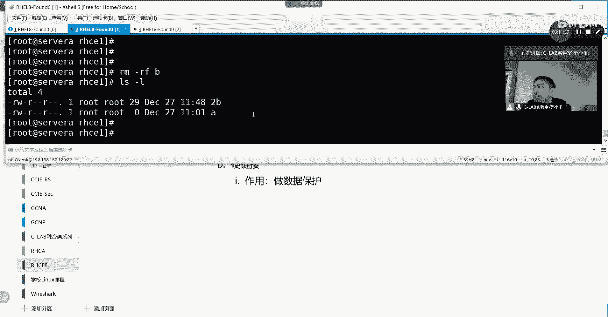
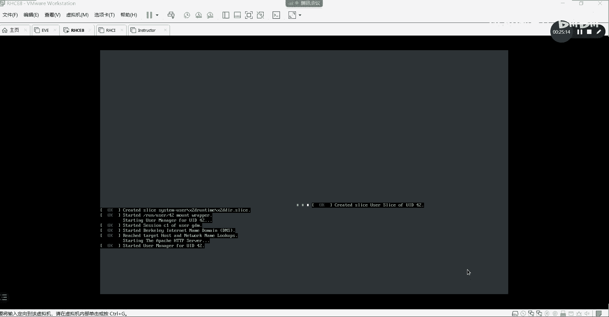
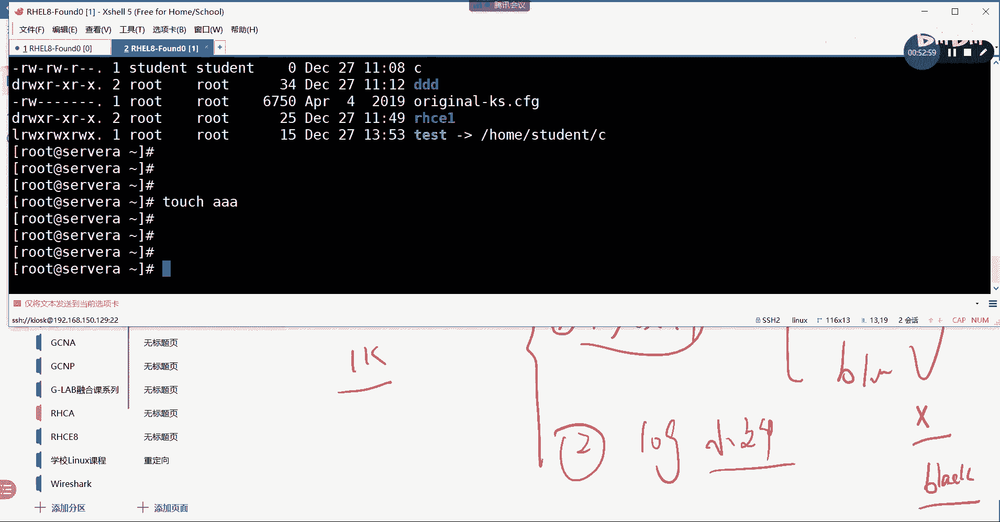
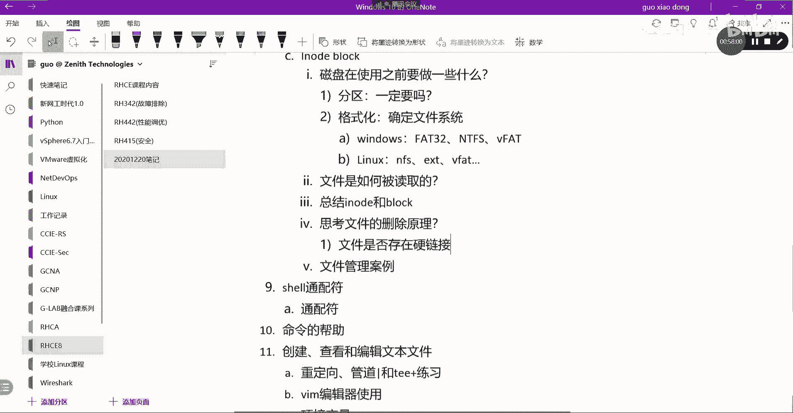

# 【Linux／RHCE／RHCSA】零基础入门Linux／红帽认证！Linux运维工程师的升职加薪宝典！RHCSA+RHCE／7-文件硬链接和软链接 - P1 - GLAB郭主任 - BV1Cc411X7rk

好了，接下来我们来聊这个概念，相对来说应该比较重要啊，这个跟存储有关系的，这个概念叫软链接和硬链接。

先聊的是软链接，软链接这一块嗯，我先告诉大家怎么做。

其实这个做起来特别简单，没有什么难度，那么唯一要理解的就是硬链接和软链接之间，跟底层存储之间的关系，这个是个是比较重要的一些概念，但是到后面还会讲存储前面的这些东西，帮助大家理解后面的东西啊。

先来看软链接怎么做，刚才已经做过了啊，首先我们通过AN杠S去指定这是一个软链接，对不对，然后我要把哪个地方的文件，这个就是链接文件，比如说我这里写一个链接文件，这是一个test。

这只是一个链接的名字而已，然后链接到哪呢，我想把它链接到啊，刚才我们home下面是不是有student，有一个C啊，Fail to create link home c，他说已经存在，不好意思。

那就是写反了，各位home student c test。

稍等一下哦，这个就对了，哎呀对不起，不好意思，老师写反，这个是链接的文件，然后呢这个是链接。

这是链接，就是链接，OK所以这样就看的很清楚了，来看LS杠L我有一个test，这是链接啊，这是链接本身对不对，然后最终链接到哪个文件是home c下面去，然后我现在写点东西写到C里面。

home student or touch c啊，就是写点东西进去说this is a链接文件好，写C是啥啊，我C这个目录尴尬了，CD home student l s杠2C不是个目录啊。

哦不是touch，哎呀，我去激动了，不好意思，echo送到这个文件里面去加一个定向符，这是我们之前讲的内容吧，对我要向那个文件里写点东西，写点东西，然后我们去cat一下呃。

用快捷键ESC点是不是就调用出来了，上一个命令最后一个参数，这时候就看这个文件里是有这么一个东西吧，好做了链接以后，我们去cut一下test，我的test文件在哪里啊，cat在这里。

是不是也是这个内容啊，所以我想告诉大家，其实链接文件最终其实它只有一份文件，它是只有一份文件，这个文件的话啊，它都是链接到同一个这个文件里头去的，内容都是一模一样，你访问test和访问这个文件本身。

看到的东西是一样的，能理解我为什么，各位OK好，那么这就是软链接啊。

这就是软链接啊，这个顺序不要搞反顺序不要搞反，然后接下来我们来看硬链接，在说硬链接的时候，我们必须要讨论看我的这个PPT，这里面有很多重要的概念，首先这边写的是文件的硬链接和软链接。

这第一个啊说有硬链接，然后有软链接，硬链接是指向文件系统上的数据，多个硬链接指向同一个数据的不同名称。

好现在说到的是硬链接，我在这里给大家创建一个硬链接，我们还是到就在这吧，在这里在这里我们CD到RHCE里面去，rs杠L好，里边有个东西是吧，我们ECHO我们随便给它起一个什么东西，送到哪里去。

然后cat一下B这个时候B啊里边有东西啊，都是S那我们来创建一个硬链接，LALNLNB对吧，不加杠S代表就是创建的硬链接，然后2B114杠L，这时候有有有一个B有一个2B是吗，然后它跟软链接不一样。

软链接它在后边有一个箭头指向的，最终的实际文件，对不对好，这时候我们去cat一下2B也是也有全是S吧，再看一下B也是全是S吧，对不对，其实看到这儿，很多人会认为硬链接的话，它的最底层存储文件存了几份啊。

存了几份两份对吧，存了两份啊，这两份一模一样是吧，除了两份一模一样的，对不对，那怎么会它它是存了两份，那怎么去看它是一份还是两份呢，我把东西比如说如果存了两份的话，如果存了两份嗯，我再写一点东西进去。

我再写追加到B，这个时候我追加到B2B的文件，有没有受到影响，会是不是会那它中间是两份文件，怎么我改B的话，2B怎么也会有影响的，来看一下啊，我说我把B追加到B，我们cut一下B，改了吧。

再开启一下2B是不是也改了，对不对，那如果是两份文件，我改一个，为什么它另外一个也变化呢，好我再改一下二笔，我把echo，好最近的时候我最佳的是2B，然后我们去cat一下B变化了吧。

cat一下2B变化了吧，所以这么看看上去好像是一份文件，对不对对吧，看上去是一份文件，那接下来它就是一份文件，硬链接也是一份文件，明白吗，那接下来我们要讨论硬链接它的作用是什么，硬链接它的作用是什么。

好硬链接它的作用是啥呢，比如说在这里我有B有2B对不对啊，我刚刚做的硬链接是这样做的，我把我把我把我把B硬链接成了2B，我是不是把B应链硬链接成了2B啊，在这对不对好，那这个时候如果我把B删掉呢。

我把B这个文件删掉，RM杠RF，我把B删掉，对2B有影响吗，那回忆一下软链接，软链接，我把最终的链接文件删掉了，也就是链接没有删掉，我把最后的链接那个本质的C那个文件删掉了，刚才是不是看到红色一直在闪。

明白意思吗，那同样的思维方式来理解硬链接，我把D删掉，2B是不是也是没用啦，我们来看一下，首先2B没有闪，2B2B还是那个2B对吧，然后我们来看一下2B对，他还是那个2B他有没有闪。

但是软链接你把原文件删掉，它就删掉了，所以有没有区别出来，硬链接和软链接的不一样点在哪里啊，至少存在一个OK所以我给他画个图。

大家知道硬链接时和软链接的区别，好先说软链接，软链接它有个原始文件，它就是C对不对，然后他创建了软链接的时候，其实是又创建了一个链接文件，这也是一个链接文件，这个链接文件它有一个链接的关系。

也就是指向了C能能听懂，是不是，其实这是两个文件，明白吗，其实本质上啊，最后啊最最本质的那个文件是一份没有问题，但是整个的软链接它是用到两个文件，一个是最后的这个数据文件，C还有链接文件本身。

这叫链接文件本身，这个文件不不是内容啊，它只是一个链接，明白吗，只是一个链接，就比如说我要你来访问我，有人来访问我，我我会在这个文件里面写，请你去访问etc下的什么什么什么什么，明白吗。

所以其实是两个文件，一个是本质文件，一个是链接文件，所以如果你在某一天把本质的文件删掉了，然后来访问这个链接文件的时候，是不是找不到最终的本质文件，是不是就会红色一直在闪好，然后呢这是软链接，硬链接。

硬链接不是这样的，硬链接它是比如说刚才的那个文件啊，音链接这个文件，这个文件叫B它里面有一堆内容，他一边要一堆内容，OK然后如果你创建了硬链接的话，它其实就是在你的文件里面开了个后门。

原来你就把它理解为是一个超市，大型的超市原来入口只有一个BB入口，现在我创建了一个硬链接之后，他在后边开了个RB入口，2B入口，也就是你从任何一个入口进去，它都是在同一个超市吧，然后你关掉一个门。

它还能从另外一个门进去，也就不影响另外一个门去访问这个数据，所以从本质上来讲，硬链接它的文件只有一个，就是就是文件本身能听懂我意思吧，这就是硬链接和软链接的区别，区别搞清楚了。

那么我们要知道各自的作用是什么，作用是啥，请问硬链接的作用是啥，软链接的作用，软链接它就是一个快捷方式啊，不写的很清楚吗，对不对，他就是一个快捷方式啊，用来做硬链接快快捷方式啊。

用来访问快速访问到这个文件的快捷方式，你往test里面写的文件写不到C里面的，你只是test那个文件本身能听懂吗，就是两个文件啊，你写你把equal test写的，更改的是这个文件是链接文件本身。

而不是最终C那个文件，明白OK所以这个要注意，所以它只是一个快捷方式，而硬链接呢它的作用是做，做数据的保护，啊有些重要的文件，我们一般要给他多做一些硬链接，就是偶尔你不小心删掉了一些。

删掉了这个文件之后，其实他还没有丢，因为还有一个一还有一个门，明白我意思吗，我们会对一些重要的文件做硬链接的数据保护。

比如说这个B文件比较重要，我给他做了2B3B，然后如果说你在不小心的时候把B删掉了，其实不影响这个文件本身明白，在后端也看也是没有占用额外的数据存储，也起到数据保护的作用了。

大概一连接就是干这种事情的啊，做数据上的保护啊，然后引用同一个文件的硬链接，将有相同的链接数，什么访问，也就是说硬链接访问的是同一个文件，它所有访问的内容都是一模一样的，OK然后删除原始文件呢。

只要在只要存在硬链接，那么这个文件内容就依然是可用的，硬链接的局限性是什么呢，是只能用于常规文件，不适用于目录或者特殊的文件，并且必须在同一个文件系统上，这个必须要记一下，就硬链接它起到保护作用。

它也是有限制的，它是有限制的，他是第一个限制啊，就是常规文件，常规文件才能做硬链接的保护啊，然后呢，它不能是一些不能用于目录或者特殊的文件，常规文件啊，不能是目录啊，你就当你不能对目录本身来保护。

不能不能是目录啊，也不能是一些特殊的文件，什么叫特殊文件呢，这个所谓的常规文件，就是我刚刚讲的就是文件前面在看的时候，是不是有他的这个标识。

就这个嘛，明白吗，如果是D那就是目录，如果是L那就是链接S就socket什么B就是快，明白我意思就这一块，也就是这种能够保护的文件，前面一定是杠杠，就是我们所谓的常规文件，除了杠以外，其他都是特殊文件。

理解为什么这就叫普通文件啊。

常规文件我这边给大家写一个杠，就是杠，他的标识是杠好，第二个限制就是必须在同一个文件系统，必须在同一个文件系统好，这个是啥意思啊，这个我就给大家讲过吧，就是这个刚才我们讲过，其实在目录结构和存储系统。

它是分开的，LINUX里边存储是存储，目录是目录，对不对啊，如果，看来做个例子，如果你现在创建了一个目录叫test，你把这个目录挂载给一个存储空间，存储是一个G好明白。

然后呢你又创建了一个test1的另外一个目录，然后它里边又挂了另外一个存储空间是一个G，这两个是相互独立的，不一样的文件系统，明白是独立开来的，我们说过了，目录是可以挂你想要的任何的存储空间吧。

我把两个目录分别过两个不一样的存储空间，这个没有任何问题吧，所以这个时候你想把test1里面的一个文件，X要做硬链接，硬链接到test1里面的2X，就是把这个文件硬链接到这来，这个不行。

这个叫属于不同的文件系统，听懂了吗，就你只能把X做做2X的硬链接，硬链接自己的一个G的文件系统上，我这个说清楚了吗，明白吗，对不对，就是它不能跨跨的跨，你这个文件系统去做硬链接啊，这个就不行，明白吗。

你必须要在同一个嗯文件系统，你现在可以把它理解成就是一块磁盘，或者就是一个空间，就是我这边写了一个G嘛对吧，其实就是一个G的空间，然后这个是另外的一个G的空间，跨跨这个相对独立的空间是没有办法做应链的。

做音乐就会报错，所以这就，不行，你是说文件系统一模一样吗，文件系统一模一样，应该也不行，我这这对也不行，一定要是一块就是一块，就是这个分区就是他的，因为对对对对，只能坐在他这个磁盘里面。

硬件只能坐在他磁盘里面对吧，如果跨磁盘的话，它就起到更好的保护作用了，就这块盘挂了，我还有另外一块盘里面的东西，其实这样也做不到，因为它就是一份文件嘛，它就是一份文件，明白它不是两份文件。

两份文件就可以理解就是跨磁盘了对吧，他就一块，OK所以这是它的限制啊，硬连接的限制好，那么这个是硬链接和软链接的区别，其实还有后边更重要的东西啊，嗯这个是硬链接和软链接该怎么操作啊，这个没什么问题。

已经说过了，然后这个是做做的方法，这个也做了啊，然后呢这个嗯，我们可以看到好，接下来给大家讲两个这个这个这个都讲过了，硬链接和软链接，杠S啊，好接下来讲两个比较重要的概念，时间不够啊，先吃饭还是先听课。

果断选择先吃饭，还有还有我把这个问题写在这啊，就硬链接的操作方法已经给大家讲过了，已经给大家讲过了，硬软链接和硬链接都给大家讲过了，所以接下来大家在中午的时候，可以把这个我给大家先布置做做的东西啊。

先把那个第87页教材，87页，87页开放性的研究实验，这个是需要大家做的，中午吃完饭回来把这个实验做一下好吧，87页前面做的那个我做的那个实验，68页的那个实验，其实大家可以做，可以不做都可以对吧。

我带大家做一遍，心里应该有底了，在后边开放性实验当中也都包含了啊，87页一定要做的是你们必须要做的，有问题吗啊，都不用睡觉，可以抽点时间嘛，好不抽点时间可以都要做，都要做，没有代表没有课代表。

嗯好那就先吃饭，我到时候再来接着录好吧，接下来我们来给大家说一下这个i know和block，i note和block，那么i note和block这个是什么概念，我们要弄清楚这几个东西。

首先在讲i note和block这两个概念之前，我们先来想一个问题，就磁盘在使用之前，我们应该做点什么，就大家在公司啊买回来一块硬盘，你插上你的服务器就能用了吗，就不说工资吧，你自己电脑买了一块硬盘。

插上去就能用吗，不能要做点什么格式化，格式化好，然后呢，除了格式化，还要做点什么，我们要做一些事情，做哪些事情，好首先叫格式化是吧，不叫格式化，叫呃，一般情况下我们可能要先做的是分区啊。

先分区分几个区域是吧，分完区之后，我们再对于每个分区来进行格式化对吧，来进行格式化，OK先分区再格式化，这是我们要对一个硬盘使用之前要做的事情，那么分区的概念就是其实有人说能不能不分区，分区一定要吗。

一定要吗，不分区的话就都在一个区域，对不对，都在一个区，大家都能用啊，不分区其实它也是有区的，就是一个区一块硬盘500G那不用分，那就是都是500G对不对，好分区不是一定要的，那么不分区也是可以的。

那么为什么我们要考虑要分区呢，在自己用无所谓啊，在服务器上我们建议大家分区，分区的话是不是更好做到数据的隔离和保护啊，对不对，我们一般会做一个分区，然后格式化，为什么要格式化。

为什么要格式化一个文件硬盘才可以用好，格式化，它的本质就是规定文件系统，或者叫确定文件系统，这个文件系统问题，就刚刚上午有人问到说什么是文件系统，什么是文件系统，文件系统大致分为根据不同的操作系统。

它有不同的文件系统，比如说我们常用的windows windows，常见的文件系统有，对FAT32对吧，还有吗，NTFS对吧，还有还有WIFI，就现在有了叫VFAT。

WIFI也是windows也是可以用的啊，OK所以这些都属于我们的文件系统，标准的文件格式系统，OK那么如果是LINUX呢，LINUX常见的文件系统有NFS，EXT411234都有叫ext。

我就写ext了，明白了是吧，还有很多它也有WIFFAT，它也可以用WIFI，它也可以用WIFI等等等等等等，很多很多很多这些都属于文件系统，那么还有一些类似虚拟化平台的文件系统，基于VMWR的文件系统。

它也有自己的文件系统，大家可以去看一下自己虚拟化平台里面的，你的硬盘格式化成虚拟化的文件格式叫VMF，叫VMFS对吧，叫VNVM的文件系统，那属于那个操作系统当中的文件系统O。

那么这种所谓的这些格式都属于文件系统，那么我们在放数据之前，一定要确定好这块硬盘的文件系统，其实就是在说存储数据的文件格式吧，对不对，所以一定要确定这两步你的硬盘才能用啊，才能用，明白这意思吗。

这就跟家里买房子一样的一个道理啊，你家里买了房子，就相当于你直接买了块硬盘回来，买了房子你就能用住吗，刚买回来的房子，尤其是买的毛坯房，你能住吗，不能对不对，要干嘛呢，先把房间规整规整是吧，哪边是主卧。

哪边是次卧，客厅厨房先分个区，有人说不分区行不行，当然行啦，一家老小全租在通间里面是吧，就一家全睡里边也不是不行，OK所以封了尖之后有更好的私密性对吧，更安全，OK所以我们会考虑先隔间，隔完肩之后。

接下来干嘛就能住了吗，不是还要装修对吧，装修的概念就可以去理解这里的格式化，我们要给房间进行装修，什么日式风格，欧美风格是中国风，这各自各自各自的喜欢，对不对，根据不同的风格装完了以后。

大家才能住在里边，能明白意思吧，硬盘也是干这种事情的，OK那这个清楚了之后呢，我们来聊第二个问题，我们现在考虑硬盘跟我们这里的阿诺和布洛克，到底有什么关系呢，我们来看第二个问题，文件是如何被读取的。

也就是你的硬盘已经做了分区，已经做了格式化，放了数据之后，你是怎么读取这个文件的，我们来画图，比如说比如说啊这是一块硬盘，这个硬盘当中我已经分区分了四个区，对不对对吧，123我分了四个区。

那么每一块区域都可以放数据，也格式化了，那么我把某一个数据放在硬盘的这个位置，OK那么我上传某一个app的应用，我现在要访问硬盘上的这块数据，其实就是在问你是如何访问的，就不说app吧。

现在我就用LINUX里面的cut这个命令，去读取这个文件，假设这个文件叫test，我去读取这个文件。

请问它是怎么实现的，其实就是在问你，我这个没开机啊。

我把它开一下，就是在问你如何实现这个读取的，cat怎么读取这个文件的，大家想想怎么做到的，他读就读了呗，这有什么好想的，他就是读到了怎么读到的，他怎么读到硬盘上的那个内容的。

当我们启动起来啊，大家先在脑子里想想。

现在脑子里想啥，它是如何被读取的。

好他在开机啊。

我们等着过程当中，我们先自己思考一下，他在读取的过程当中，首先啊我们要读这个文件，对不对，我们cut这个test，我们首先要读到硬盘上的一块存储区域，我们首先应该读到的是什么，是直接就读到这个。

这个这个区域里边的内容了吗，那这个数据手上的，如果是直接就直接读到这个存储的地方的话，那么还存在我们接下来要讲的权限问题吗，我们后面会讲权限权限的概念，也就是不是所有的文件，所有人都能读的明白我意思吗。

OK也就是说啊，我们在这个文件上面其实是有一个控制权限的，一些策略的，这个策略的内容是文件本身的内容吗，不是吧，文件本身是一个小电影，但是你这个是策略策略跟电影是两个文件，听懂了吗。

OK所以其实在脑子里应该有一个想法，就是其实在读文件之前，应该不是直接就是读文件的，而是要先读一个类似于写了一堆策略的，这样的一个东西，能听懂吗，先读的是这个，读到这个我才知道这个文件我有没有访问权限。

就对吧，我的访问权限大概是有多大的，能理解为什么，各位OK，所以其实在中间在这个中间中间隔了一个东西，这个东西是要叫叫策略的东西，好这个策略的东西我们把它叫做i know，I know，I know。

I know，是我们的在读取文件当中优先先读到的东西，I know，它叫i know，I know，当中大家现在猜一下i note当中包含哪些东西啊，是不是你读的这个文件的所有权对吧，其实就是权限嘛。

还包含这个文件的所有的属性，这个属性包含这个文件什么时候创建的对吧，什么时候被修改的，什么时候被移动的，是谁创建的，这都属于它的属性，明白吗，这个文件是属于什么样类型的文件，是D的还是杠的，还是L的。

就是文件类型嘛，普通文件还是一个目录，还是一个链接文件，还是一个socket文件，还是什么什么什么快文件，听懂了吗，这些都属于这个文件的属性啊，一大堆的属性都在里面，还有一个东西，还有一个id。

这个id就是你放在磁盘上的这一块扇区，所对应的唯一id，比如说这个id32768，这个id就是我硬盘上对应的这一块block，就是对应的实际存放数据，这块存储单元的唯一的。

所以只要读到i know的同时读到了属性，也读到了硬盘上存放的VID，他是不是很快就到这个硬盘上找这个id，就找到了这个数据，能理解吗，明白吗，OK好这个，所以这个东西很重要，i know很重要。

这个就叫i know，然后最终存放数据的地方，我们就把它叫做block，block我们把它叫做快存储，明白我意思吗，就是实际存放数据的存储单元，我们把它叫做快存储，好这两个概念我描述清楚了。

大家来想一个问题啊，来想一个问题啊，好请问i know，是不是应该也是一个存储，I know，是不是应该也是一个存储，也是硬盘上的某一块空间吗，对不对，好，这肯定是的，因为他要放很多东西，一旦要放数据。

那一定是涉及到是一个存储空间对吧，Ok i know，其实也是一个存储，其实也是一个存放的单元单元好，这是第一点，第二点，i know的存放的东西比较少，他跟我的block相比的话。

它的空间应该比block小很多，明白我意思吗，第二点应该没问题吧，我的数据可能这个电影可能有两个G，他都会放在block上面对吧，但是我这个电影的属性可能只有几K1到二K。

这所有的属性的内容放在idol里面，所以IO的空间应该比block空间要小，没问题没问题啊，OK好，所以这应该是我们这两个i note和block之间的。

简单的一个对应，来我们看看有没有提起来。

所以我们再回到这里来，来思考我们这个问题的本质，cat这个test的时候，请问他他要经历哪些东西，就怎么才能读到它。

再想一想啊，我连一下。

好我们来看一下啊，嗯r HT杠VMCT2，V m c t2 start，我把环境重新起一下哦，Already running，那就or呢，然后呢我们SSH我们就在这吧，cat p s杠。

我在这里cut这个files cut，Test cut，可以的是吧，好我就问你cat这个文件它的整个过程是什么。

用这个实际例子来看好，根据我们刚才分析，他应该是先读i new的，对不对，那请问我们i node在哪呢，L s gl，我们LS杠L看到的这个文件的这一堆东西，它属于i know的，还是属于block。

看到了这一堆东西，这是什么，这是不是文件本身的属性啊，这个文件是谁创建的，什么时间创建的，这个文件名是什么，这个文件的权限是什么，这一堆东西这一堆东西就属于文件的属性懂吗。

所以这一堆东西应该被放在i know里面，所以我们其实在cat这个history点TXT的时候，他首先读到的是这一堆信息，能听懂吗，读到这一堆信息并没有读到本质的block上好。

读到这个信息之后发现诶我是有权限读它的，好，这个时候它就会通过啊，在这里其实有一个东西你是没有看到的，就是这个文件所对应的i know，跟i note跟存储的一个id号吧。

刚才我写的那个id号是不是好id号怎么看呢，杠L加一个I，然后呢我们单独只看这一个文件，LSLI你就会发现是不是前面多了个东西，多了一个I这个I就是i know。

所以这个东西就是我们放在i note里边的内容，包括一个对应后端block的id，读完以后就找这个id，找到这个id之后就找到了快存储，找到快存储就知道history里面是什么东西了，各位能听懂吗。

就这就这么实现的，我们文件的读取就这么实现的，先读i note再读block，明白好，再回顾一下这个问题，搞清楚之后，接下来我们来想想我们前面讲的，结合前面讲的东西啊，前面不是讲了软链接和硬链接吗。

对不对，刚讲了软链接和硬链接，那么请问硬链接，我给这个文件做一个硬链接，假设我给他做一个硬链接，请问他的i note发生变化了吗，我给这个文件做一个硬链接，我来现在就做啊。

看能不能做history点TXT，我再做一个这个history2点TXT做了是吧，来LS杠AI我我我我我看他的IO的，请问他这两个IO的一样吗，名字鬼，i know是不一样的。

我说的是前面这个i know，这个id是不一样的，是不是一样的，为什么不一样，为啥不一样，还是没搞清楚，仔细想，这个过程首先一样吗，不是应该还有一个，这是二是吧，222在哪，最下面是这个是一样吗。

一样的吧，对不对，这个是一模一样的，因为我们说过了，它其实是一份文件，对应到最后的后端存储的本质点，它那个block没有发生变化吧，block还是那个block啊，明白吗，block还是那个block。

那为什么我删掉一个之后，它的文件还在呢，我删掉的是什么，我删掉的没有改，他的i note，我删掉的只是这个门所对应的，所所对这个名字啊，这个名字就相当于这个门，这个门所对应的这一堆属性。

我参加的是这些东西啊，他并没有把最短的block删掉啊，明白我意思吗，你删掉的只是这一个，这一个i note里面所有的东西，但是你没有把原来这个i know，里面所有的东西删掉。

而且后端的block也都没有删掉啊，明白我意思吗，各位嗯，所以这个要注意，所以他块存块存储的空间id还是那个地方，还是那个地方，内容还是那些内容，OK明白好，那么软链接呢，好我们来看一下啊。

我看看我的这个SHSTUDNTWORK，Student or station，我们这我们最好在这里做，不要在foundation里面做，foundation是外边的机器不见得有权限啊。

好最好大家还要在server server上做，因为server随便你怎么搞，他都可以reset的FDITION搞，搞坏了，你要恢复快照的FDITION被如果被大家搞坏了啊。

就最外面那个就是这个FDITION被大家搞坏了。

大家记得自己恢复快照，右击它有个快照管理，直接恢复到快照一明白啊，这个是最外面的一个快照。

然后里边的快照呢就是你的server，我现在都在server a上做server，我现在所有的操作都在这，我把这个server都搞挂，随便怎么改都没有问题，因为我可以在workstation上打一句话。

RHT杠VMT2嗯，这这这不是我不在我身上，在对线上啊，我再复制一个，在这，你可以在这RHT杠VMCTL，它有一个reset surve，看懂了吗，就是里面虚拟机随便怎么搞，配置随便你怎么弄。

只要reset它后面所有的配置全部被重置了，就没有任何问题了，好不好，这个我就擦掉了啊，命令命令命令还记得吧，RHT杠v m c t a receipt server，不是在这啊。

我只是把命令给你演示一下，刚刚有人没记好，没记住的好吧，记一下，通过这个命令去恢复里边的server，好了吧好那么我们来在server上做啊，我在server上，比如说我们现在做一个软链接。

这个软链接其实我们已经做了，你看到没，我们做了对吧，那么这个时候我把我把我把这个test删掉，或者我把C删掉，对它有影响吗，肯定是有影响的嘛，对嘛肯定是有影响的，大家想想这个过程有什么，我把它删掉。

它就它就就没了，比如说我把后端的这个C删掉，其实你删掉的是这个文件block上的内容吧，对不对，直接把block的内容删掉了，RM我直接删掉，直接删掉就删掉了，他就没有了，链接就失效了，然后呢。

如果我把test删掉呢，RM rf test u s杠幺就没了，这个链接就没了，对不对，但是C还在不在，在的cut home下面的student上面的cc是不是还在呀，啊为什么我把test删掉了。

C还在，这就是软链接，因为你软链接删掉的其实是这个test自己本身，因为这是两个文件，明白吗，而且啊大家看啊，test的这个id，我再创建一个test l n杠S先创建的是什么。

我老是记不住先是什么，先是文件还是链接，先是先是链接文件啊。

先是文件再次链接对吧好，这个文件在哪呢，在home student c，然后链接是test对吧，OK那么这两个东西啊它一样吗，这两个的i know一样吗，不一样的L4杠LI嗯。

我们先看home student下面的C对吧，然后再看当前目录下面的test一样吗，这两个UNO的不一样，明白不，这两个安卓的不一样，所以你把test删掉，其实是把这个文件删掉了，并没有把C删掉。

理解不OKOK所以不一样啊，所以不一样，OK所以这是有问题的。

test呃，这是软链接和硬链接，包括i note它们之间的一个区别。

那么接下来我们来看一下一些结论啊，我们来看结论，首先看阿诺的结论，就是前面讲的东西，大家总结一下，再回顾一下啊，磁盘要分区格式化啊，确定文件系统才能够去用，那么在确定文件系统的之后啊。

其实就已经确定了两部分内容，一部分就是i know的有多少个，第二部分就是block有多少个，所以i note和block是在格式化之后产生的，听懂了吗，格式化之后产生的一个对应关系啊。

有几个i note就有几个block，OK好，block是用来存储实际数据的，例如照片视频，普通文件等，i note是用来存储这些数据的属性的对吧，也就是LS杠L看到的一大堆的属性，那是属性啊。

那不是具体的文件，对不对好，唯独不包含文件名，文件名是不在里边的，文件名是不在属性里面的，这个要区别一下，这个也不太重要，忽略也可以可以对block的实际数据进行检索，类似于我们一本书的目录，然后呢。

i note和block之间它是有个D的对应关系对吧，可以通过直接对应关系找到block，I know，通过id找到block好，这叫i note，清楚吧，这三点没问题吧，好然后呢这是查找的一个过程。

我们在这是链接的一个过程啊，硬链接的一个过程，其实大家在做硬链接的时候，链接的其实都是这个文件本身对吧，链接都是这个硬链接的文件本身，然后他删掉的时候只是删掉这个文件，硬链接的一个链接数。

硬链接数它没有删掉文件，再看这个是看它的i node，就是查看一个文件或者目录的i note，通过LS杠I这个参数来看，刚才我们看过了，因为i know的需要存放的是属性信息。

所以i know的大小是有的，但是它不是很大，它最大啊，默认一般128，256字节就够了，也就是说i know的大小应该不会太大，明白的意思吗，i know的大小在文件系统格式化之后，就无法更改了。

这一点要确定，你确定了文件格式其实就已经确定了，i know的大小，i know的个数，还有block的大小和block的个数就很难再去改，那要再改怎么办，重新格式化文件系统，原来里面文件就要丢掉了。

听明白吗，查看如何查看一个EXT文件格式的，i note和大小数量，这个怎么看，查看它有多少个i note。

有多少个block，可以通过DFGI去看来看一眼，Df gi，这个是看我有多少个i note用了多少个，还有多少个free，这个不是大小啊，这个是个数，明白吗，各位OK，也就是说我这块盘里面格式化完了。

才能放数据啊，只要格式化，我就确定了多少个i know的多少个block，这是这是IISIO的，对不对，然后看block的，杠杠什么杠P是吧，没有DF，直接DF就可以了，你看这就是我的block数。

看得懂吗，有多少不加任何参数，看到的其实就是你的大小，其实我们更多的时候看的是大小吧，我们很少去看它多少个有多少个IO的数，说的数就是说有多少个M了是吧，对这个数字是怎么算出来，它格式化的时候。

它会自动帮你根据默认的大小这个数字是吧，数字是根据它整个的硬盘大概有多大，它你的文件系统不一样，IO的数量也是不一样，它是一个规范的，默认是128，大小大小是128，呃这个还不是这么算的。

还要看文件系统的格式大，大概的方向是你这么说的对，大概方向肯定是总的除以一个一个IO的大小，就得到i know的数量对吗，但是它整个的空间不仅仅只是分i know的呀，他还要分block呀，对不对。

所以它会自己帮你自动生成爱豆的数量的，那个爱豆的查查诺的数量好有意义，非常有意义。

所以说到这儿就接着你的问题来解释啊，我们明白了，存放数据一定要有i know的，要有block，对不对，那再存也就存放数据，如果没有了，I know，光有block有用吗，如果一个一个硬盘，一个硬盘。

它没有，i know了，没有了，i know是零，block还有很多block，还有100，请问这时候我要向你写数据可以吗，不可以肯定不可以，为啥呢，你的文件一定要对应你文件的属性啊，对不对。

对应不了文件属性，那你要去读这个文件的时候，没有东西可以读，你怎么可能去读到这个文件内容呢，对不对，所以i note和block是一定都要存在的情况下，我才能在向里面写东西啊，好继续往后讨论。

如果一个文件系统，它只有IO的，没有block可以吗，只有i note，没有block可以吗，只写了文件的属性，没有具体的把这个电影写进去，就没地方可写也不行，对不对，就是就只看到了电影名字哇。

很很带劲，但发现没有看不到里面的内容很带劲，不要啊，不要强调这一强调就失去了它原本的意义，所以光有i know，没有block也是不行的，明白这意思吗，OK所以这才是问题点，后边我其实有例子的。

那么既然说到了，那么我们就把例子先拿出来，跟大家先讨论，就这个例子看第一个例子，如果像磁盘写数据的时候啊，提示如下错误，但是呢通过DF杠H能够看到磁盘空间，发现没有满，请问原因是什么。

其实说白了就是你在通过DH看他空间，发现还有一堆空间，还有100个G，但是就是像里面写不进去数据了，明白，所以你应该通过DFGI去看，i note是不是应该满了，肯定满了，对不对，i note数不够了。

明白吗，所以光有空间，有时候你会发现LINUX系统空间是有的，但是就写不进去了，i know的不够，明白好，第二个，企业管理员，如果发现这个磁盘空间上面使用98%，经过查看。

发现是某个log文件占用太大，所以管理员决定把这个log文件删掉，执行这个之后，发现空间还是占用98%没有释放，请问什么原因，怎么解决这个问题，一会儿再解释，这是删除文件的原理。

要搞清楚才知道这个原因好吧，还没有讲删除文件的原理啊，那么我们再回到我们这里来，所以我们在格式化文件系统的时候，要遵循什么规律啊，在格式化文件系统的时候，再考虑i note和block的数量应该怎么做。

其实有些时候一个i note对应一个block吗，就是我有一个文件它很大，它有两个G，I know，需要几个，一个block，需要几个，至少一个这个block也是有大具体的大小的。

它这个大小不可能两个G，他肯定是四分的，明白我意思吧，它所以说可以可能对个可能对应多个block，所以任何一个文件，它的在存储的这个硬盘上，所对应的关系是一定是一个block啊。

一定是至少是一个block，一个IO的对应一个block，至少我说的至少明白吗，所以至少是一个block，i know的对应一个block，可能是一个IO的对应多个block，听懂了吗。

所以这才会出现你的这个如果如果啊，如果如果我们来讨论情况，分情况讨论，如果说我现在的架构是是放这种大文件的，我放的都是大文件，我放的都是大文件，所以可能会出现可能会出现什么问题。

可能会出现i know的，还有很多block不够了，对不对，这是有可能的吧，好第二种情况就是我不是放大文件，我是放像log这种小文件的，log这种小文件，log这种小文件，他的i know的不够了。

block是有的，有人就觉得很奇怪了，为啥呢，是因为如果放小文件的时候，比如说这个log文件就只有1K对吧，然后呢我一个block可能有差不多有，比如说是两兆吧，我们举的大1。10兆。

一个block有十兆，然后呢一个i know的可能有2K，那这个时候如果来的2K i note肯定是够了，对不对，那么在放1K的log文件的时候，我的十兆绝对够了吧，对不对。

但是你要记清楚block没有满，也就是这个block剩下的空间，它不能给其他的block再继续用，听懂了吗，也就是给他分的是十兆的话，但他只用了1K，剩下那么多空间都不能给其他的i know去用。

只能给自己的这个i know的去用，所以你会发现空间还有大大的对吧，Free，但是就是不能再写了，因为没有i know了，IPHONE都用完了，但是空间还是有的，我是不是这就是说你不够空间很大。

那个单位的通话十兆十兆是这个是吧，这block我们可以自己确定block大小嗯，所以这个给了我们很多自由的时候，那个大小我们不是没有TJTCH的文件。

touch啊，啥意思啊，就这个啊，创建一个文件，你说的是这个啊，这个文件的大小是多少啊，这个文件的大小是文件本身的大小，要看你文件里面写哪些东西啊，放哪些东西啊，它占多少就多少啊。

你touch了一个文件以后，这个文件至少消耗一个i note，和至少消耗一个block吧，对不对，都都不能用，对对touch的时候，我会不会已经生成了那个我们打个比方，那个十兆啊，不你你说的是两个概念。

两个概念对你这个是文件的大小，明白吗，文件大小是在那个block的，对不对，然后block的大小是我们在格式化的时候，它就已经产生了，它就已经规定好了，明白如果我touch的这个文件是两个G。

他就要去从block当中去去去找啊，能够填满这两个G文件的block数量，他就自己去去要了，明白吗，如果你插旗这个文件一个block就够了，那么它在后台硬盘上只占一个block。

那么站的这一个block没有占满的部分，其他的i note是不能用的，清楚了吗，就这两个概念跟我自己创文件没有关系啊，我自己创文件多大就占多少个block，很简单对吧，只是在格式化的时候。

大家一定要注意，你的文件系统到底是用来放大文件，还是放小文件的，那么这个时候你要去规范，规定好IO的大空间大小和block空间大小，明白吗，所以这个是是我们在做的事情，我们在运维的时候。

这就是也算是系统运维当中，在使用初期要考虑的一个点吧，对你很多人在硬盘用完之后发现利用率太低了，就是因为他刚开始没考虑到这个格式化的时候，这种大小，i note和block的大小，听明白了吗。

这个就是案例啊，这是案例，然后后边总结的东西会多一点，大家看得快一点好不好啊，在这里磁盘分区格式化的时候，一定会有一定数量的IO和block，至于这个数量是多少，是系统自动帮你去算的。

i know是索引节点，是作用是存放文件的属性，以及作为文件的索引，指向文件的实体的block对吧，这个文件系统的block存放是实际文件的内容，这个说过吧，i note4其实是一块磁盘存储空间。

默认的如果不指定啊，大家在格式化很少去指定它的大小，它都有默认大小，默认大小一般是128或256，OK然后呢，block的大小一般为1K2K4K这几种啊，引导分区1K其他普通的为4K。

这个是刚刚我举的十兆，只是举个例子啊，它的block大小也其实也没那么大，如果太大的话更加不划算了，对不对，一般的话他都会有这么几种，所以自己大家自己根据自己的要求去选，i note是一串数字。

不同的文件，对应的i know的值文件系统是唯一的，不同的文件对应的i know的值，在文件系统里是唯一的啊，说的其实就是i note id的唯一性啊，也就你不可能在你的硬盘架构当中。

找到两个一模一样的id，对应的是不同的文件，o i know号相同的文件相互为印链接啊，这个是它规范好的一个文件被创建之后，至少占用一个i note和一个block，这是我刚才讲的嘛，对不对。

他至少会占用，如果一个文件很大，可能会占用多个block，这很正常嘛，对不对好，如果文件很小，也至少占用一个block，并且剩余的空间不能被其他文件所使用，是我说的吧，可以使用在这个命令来进行格式化。

那我们常见的格式化用的是Mac f s e x t，后面直接跟文件系统，很少去指定它的IO的大小和block大小，我们可以通过杠B去指定block的大小，杠I去指定i know的大小，记住啊。

这个不是数量，这个是大小，懂了吧，数量你是没法指定的，因为根据你的文件系统空间大小，还有文件格式，它数量是不一样的，这里你能指定的就只有它的块大小，字节256字节，明白这个就是i know的总结。

再看block总结，磁盘读取数据是按照block为单位来进行读取的，一个文件，可能占用多个block，每读取一个block就会消耗一次磁盘的IO，这个听得懂吧，多了磁盘的IO。

其实我们其实在读取磁盘的一个II是I是，还有什么啊，一个进进进出嘛对吧，读写啊，就IO就是对磁盘的读写，所以我们在读一个block的时候，其实就占用一次IO，所以这个啊如果要加增加你的IO的这个数据。

也要设计好你的block大小，如果要提升磁盘的IO的性能，那么就尽可能的一次性读取尽量的多嘛，这个理解吧O1个block只能存放一个文件内容，无论这个文件有多小。

如果文件是1K block为4K那么就有3K的浪费，刚才前面也提到过，block其实并不是越大越好，因为block大太大，对于小文件存储就会浪费磁盘空间，是不是听懂了吗。

好所以一般会根据文件大小来设置block的大小，还是要根据你的应用来设置这个block的大小，OK好这个就不说了，EXT文件系统一般设置为4K啊，这是他一个推荐设计好，这个是硬件啊。

好接下来我们来看文件删除的原理，既然懂了这个文件是怎么存放的啊，怎么读取的，那么来讨论一下文件是如何删除的呢，文件怎么读取，到了总结说了思考文件删除原文件怎么删除的，如果要删除一个文件。

我们必须要解决哪些问题，才能把这个文件删掉，就拿刚才讲啊，我们刚才history txt，我们要删除这个文件，至少要把文件的，应该怎么算，如果一个文件它有十个硬链接，你删除删除其中一个文件有用吗，没用。

所以第一个要考虑的是文件是否有硬链接，对不对，看文件是否有硬链接，OK那么我们怎么看这个文件是不是有硬链接呢。

L 4l，在这在这个地方的数字，代表着我这个文件的硬链接数，就这个数字这个数字history，我这边是不是有history这个明白，还有人说奇怪，这两个肯定是一样的。

因为这两个对应的block是同一个吧，i do的都一样，所以它的音量接数量应该写的都是三，为什么是三呢，不是两个呢，还有一个没有了，来我在这给大家创建那个地方不太好弄，我这儿给大家创建一个硬链接。

好不好，我把现在现在我给他创建，它现在是不是一个，他现在是不是一个，然后NAA2，哦两个A和A2是吧，哎这边为什么是三个，这边是为什么是啊，难道是真的有三个，我看看啊，这个是的是吧，这个是的这个是的。

好，那么如何找到这个硬链接的，I know，你拿到这个i know的id号，能不能找到这个文件系统当中，i know的都是这个的，所有文件肯定有有有嗯，肯定有，用什么找我们前面学过的，用find是吧。

You find，find在哪里找，在所有文件系统上找，然后呢，他有没有I我找找看啊，May，F i n d find，然后我斜杠搜索一下i NO，哎呦，这是什么命令啊，下一个，I know，诶。

是这个吗，不是再找一下。

等一下啊，好百分号I试一下吧，find在这里所有的情况下，我们先把IO的那个找出来，杠LI就是这个吧，A和A2这个，4318268，4318268，都是他，都是他来试着找找看，放在当前目录吧。

我们就是测试一下命令啊，然后呢是呃呃呃百分号I是吧，杠百分号是I是吧，我忘记了，叫coi o t e i node，试一下吧，后边应该也有。

等一下等一下，后面应该有，这就叫i number，它不叫i node啊。

杠I，会。

这一下不是杠INUM在这里找到了，是这样的，然后我们用同样的方法去找这边三个是哪三个，不就行了吗，f i n d find在当前目录下面去找，GI是是这个69这个吧，69这个粘贴一下。

找一下三个top里面有一个好了，不管了，OK好，那是三个四三个找出来了，那么这个时候呢我们看啊，是刚才告诉大家LS杠LI看我们硬链接数量，其实看的是这个位置有几个就有几个。

所以再回到我们这里来删除文件，是否文件是否有硬链接数量，要知道怎么查找相同硬链接的所有文件，对不对，用的是find找你的目录，然后杠I然后加你的得得得得把文件都找出来，全部删掉，OK还有吗。

这个都山寨了，还有删除文件，还有什么，我说的是要完全删除一个文件啊，要完全删除一个文件，还有一种情况就是我们有些时候文件，可能你现在删掉这个文件是塞在哪个地方的，是不是上的block对吧。

有些时候文件的内容除了存放在block，还可能存在哪，内存不是I，你读读文件，是不是有可能会在内存当中有文件内容啊，所以我们要完全删除谁呀，好了吗，好内存啊，内存当中的东西。

有时候我们加载文件的时候加载在内存，所以我们要考虑内存中的数据如何删除，这个文件刚好在被进程读取，进程读取文件一定加载到内存中去了，对不对，所以如果你把这个文件只是从硬盘上删掉。

不太可能是达不到完全删除文件的目的，明白还要删除内存中的数据，在内存当中会有以临时，临时文件的隐藏文件出现，它是以临时文件的隐藏文件出现，所以我们会考虑如何去删除它呢，在这个地方就这样吧好吧。

来看看一下啊，文件的硬链接数量，还有文件被进程使用的数量，那叫一个叫i know i link，一个叫i can't icon，就是被文件处理在文件内存加载的时候，所用到的。

那么我们只i link就是硬链接数量了，其实就是文件被删除的条件，就是它的i link数量要都是零，i count数量也要都是零，就是没有被进程读取的，听懂这意思吗，OK那就这么玩的好。

那我们来看一下，怎么去判断一个文件是被占用的，我们在A当中创建一个，ATOM吧，这个文件里头我写点东西，OK好，然后呢，我们在这个地方，也是SSH root server l s刚要是不是有一个诶。

没有tom是吧，好没关系，我保存一下ESCWQ保存LS杠L，有一个tom出现了，这边应该也有一个tom l s杠L好吧，有一个tom，那么这个时候呢我们在这边我们把文件打开，A t o m。

我们在里头进入编辑状态，然后在这里呢我们把它删掉，RM杠rf tom a s l有没有没了吧，那这里呢保存保存WQIOS杠幺又又有了，是不是，是不是因为其实是有的对吗，你可以理解为。

刚刚才VRM在编辑这个文件的时候，可以理解为一个进程正在用这个tom这个文件啊，对不对，其实这个内容已经被加载到内存里了，就算你把block删掉，我在这个进程读完了这个文件，它还是会有的。

能明白我的意思吧。

所以啊我们要确保文件，它的icon icon怎么保证它为零，自己要去判断有没有应用程序在用它好不好，怎么去查，i can't我们这里有有有有有，就是这个是这个命令，是看我们进程是32656。

这个进程id所用到的所有文件是什么，大家可以自己去试一下，所以关于文件的删除，大家一定要注意这两点啊，不是简单的把硬盘删掉就可以了，听得懂吗，OK好，那么我们来看刚才所用到的最后一个例子。

就这个例子大家看一下，案例二，企业管理员，发现这个硬盘上的空间是98%，经过查找，发现某一个log文件占用太大了，所以管理员决定把这个log文件删掉，执行删掉之后发现空间占用还是98%，并没有释放。

请问是什么原因，说明这个log一直在被进程占用嘛对吧，你把它删掉跟我刚才是不是一样的，所以要注意啊，考虑到删除文件的本质，OK好，硬链接说过了，软链接也说过了啊，这些特点硬链接和软链接的数量啊。

啊硬链接和软链接的总结就不说了，好文件类型需要给大家普及一下文件类型，文件类型其实我有说过的，LINUX当中的文件类型和windows不一样，它的点后缀是什么，不重要对吧，OK好文件类型啊。

我没讲到点后缀也叫文件类型啊，普通类型啊，D是D目录，快是快文件，C是字符ELS链接，S是套接字，这些大家都知道的这个类型在哪儿呢。

刚才我有给大家看是不是在这儿啊，对嗯嗯，刚刚我们在讲那个被占用的那个有一个情况，我想问一下，我打个比方，刚刚那个我们AA这个文件正在编辑，然后我在RM的时候，我删除的是他的父辈文件夹，父辈文件夹。

你是说文件夹是吧，文件夹帮他删掉了，完了以后还有还有冒号，还有还有文件夹，文件夹不会，文件夹文件夹是吧，那他跑哪应该删不了，你的文件夹里面的文件正在被占用的时候，可能删不了，这个文件应该删不了。

我来试一下，我记得应该是删不了的，直接删删目录是吧，三目录嗯，我记得好像不能删吧，DDD我看看啊，CDDDDLS杠L好，我在这个地方ATOM1，在这随便写个啥WQ好，然后呢。

我也到DDDCDDDDLS杠L有了是吧，然后呢，你的意思是在这边直接RM rf这个DDD是吧，你那边先打开吗，我知道这边要打开，等一下你全部先删掉是吧，嗯然后VIMAUTM一个先打开，然后这个地方删掉。

删掉还在DDD还在CDDDD1杠二没东西，就DDD还在啊，我把dd里面的东西删掉了，呃没有把DDD删掉，你是把目录要全部删掉，把DDD也删掉，OK好CD点点来，我把DDD删掉，RMDR我可以用这个吧。

D d d，好要加一个诶，我看一下，他说没关系，我也用RM rf强制删掉，删掉了DDD没有了，但是atom atom出来，我保存一下，好报了个错，他说没有地方存这个东西了，对对对，没有目录了。

没有目录了，所以这个文件也没办法保存了对吧，那就只能退出来，这种退出USACD一点点，啊就没有了就没有了，没有东西啊，所以如果把目录一下子删掉，它里边的东西就没办法存了是吧。

没保存，大家记一下这个特殊的情况啊，然后文件就说这么多，然后呢他的文件类型也讲过了，文件扩展名啊，这个再说一遍，扩展屏在LINUX系统当中没有没有实际意义啊，没有实际意义好吧，没有实际意义，OK好。

那么第77页的练习，我们简单看一下吧。

制作链接文件啊，就这个了呃这个应该应该不难的，我们看啊，啊就主要就这个LS杠L已经给大家演示过了，啊，就完了，杠杠S代表是创建的是什么链接，原链接不加杠S就是硬链接，明白吧，就这个我就不给大家演示了。

这个应该比较简单，OK好77页的这个我就不给大家演示了，然后87页是需要大家做的好吧，87页一会给大家时间。

