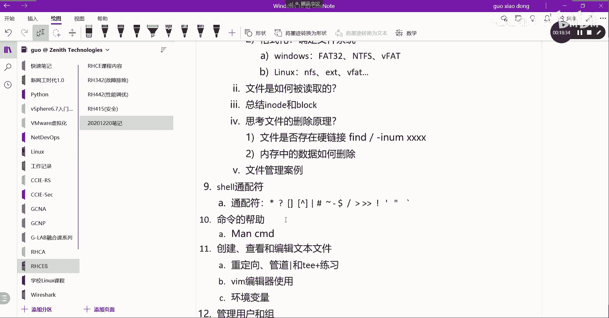
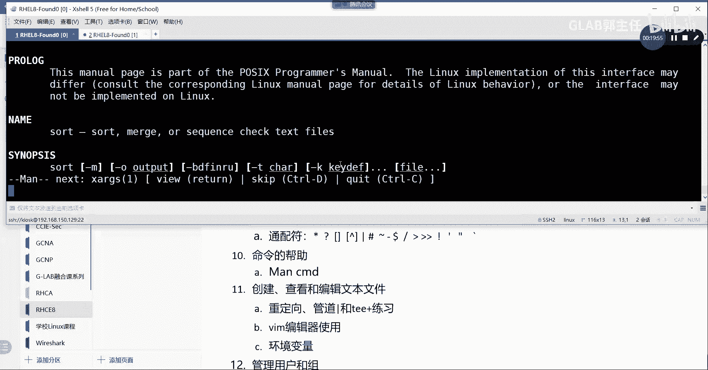
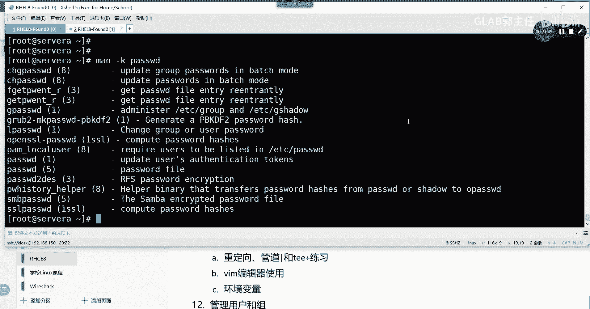
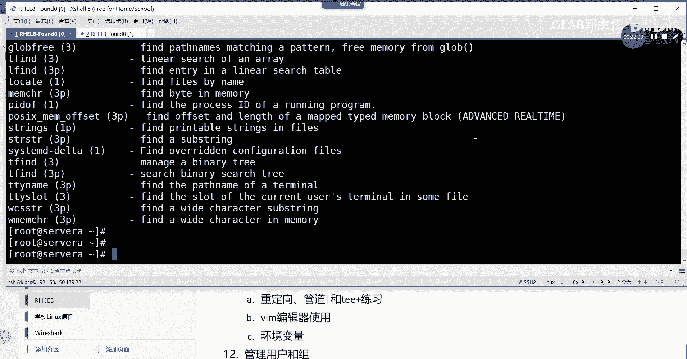
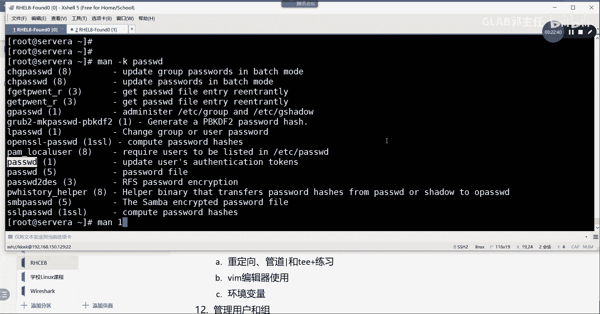
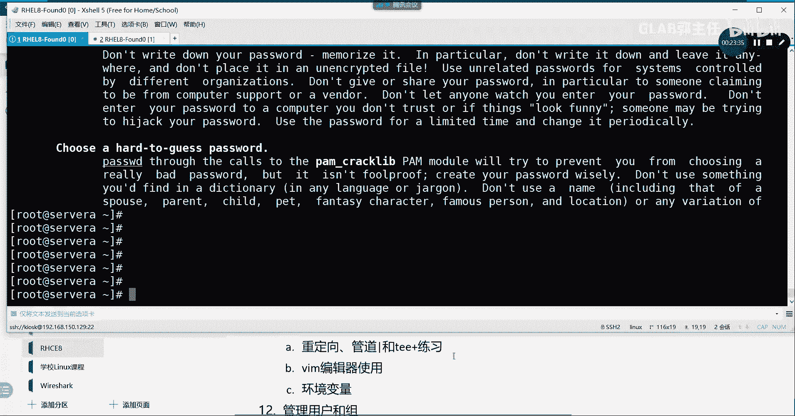

# 【Linux／RHCE／RHCSA】零基础入门Linux／红帽认证！Linux运维工程师的升职加薪宝典！RHCSA+RHCE／8-通配符和帮助 - P1 - GLAB郭主任 - BV1ZG411Q7AB

好接下来呢给大家聊两个两个这个比较简单的，或者说需要普及的一个技术，一个叫通配符，一个叫帮助命令，这两个可以一起说啊，第一个通配符我们在上次就跟大家提到过，在系统里面啊，像这种特殊的符号。

比如说ls4，什么点星号这种，对不对啊，这种这种在系统里面有两种类型的分类，一种叫通配符，一种叫正则表达式对吧，正则表达式其实很复杂的，我们到后边给大家讲，三剑客，重点讲到就是正则表达式。

现在来跟大家聊聊通配符好，那么比如说啊我们创建什么叫通配符啊，第一个通配符我们给大家讲的是星号，星号代表的是什么，ELS如果说ls新号的话，他给你列出来什么LS信号所有，所以星号代表的是任意。

明白意思吗，K星号代表的是任意，第二个给大家讲的比较比较常见的问号，问号是什么意思啊，LS问号问号好列出了什么，星号和问号是明显有区别的吧，好来再来一个问号，两个问号出来了吧，所以问号是啥意思啊。

代表的是任意一个字符。

星号代表的是所有问号，代表的是任意一个字符。

这个大家自己记啊，明白我意思吗，OK好继续好，没问题啊，继续好，那么我们再来看中括号，比如说啊IOS中括号A到Z，他给你输出的是什么AZ是吧，L啊好再来A到ZA到Z大A到大Z，好也是这样的。

然后我们看A到Z0到九，也是这样的，所以你会发现这个是一个range，是一个范围，它会匹配你当前这个目录当中，所有能够匹配到A到D当中的任何一个，是不是就可以，对不对。

所以这个是从这个代表的是A到Z之间，单个只要有一个匹配就可以，这是一个range，明白吗，然后我刚才写法，大家要注意A到Z这样写代表的是小A到小Z，大A到大Z，明白吗，小A到小Z，大A到大Z。

然后再写0~9，这个代表的是包括0~9的数字，可以一起写，明白吗啊OK好，但是只选一个啊，只是选一个只选一个，所以你匹配到的是AC，看到吗啊也就是说这个里面选一个，或者这个里面选一个。

或者这个里面选一个，这是中括号好继续再来一个嗯，再来一个LS我们在中括号前面加一个尖括号，尖括号0~9，这什么意思啊，这个代表的是非明白吗，你看0~9匹配的，它没有任何东西啊，0~9匹配的是零或者九。

对不对，然后呢如果前面加一个尖括号代表的是非，也就是除了0~9之外的，其他都能匹配，你看我这里的特殊的表达式是不是就有了对吧，这里就有了啊，然后呢，我们来说其他的比较常见的。

这几个我都给他算了，给大家总结一下吧，也不是很多，我们把常见的给大家举个例子，通配符通配符啊，第一个我们说到的是星号对吧，第二个说到的是问号，然后第三个收到的是中括号。

第四个说到的是中括号里边加一个尖括号，这个是非是吧，这是谁好，第五个我们给大家说管道符，管道符也是通配符啊，我们之前是不是学到过管道符，管道符的特点是把前面的命令的输出，作为后边命令的输入来处理。

明白了吗，所以管道符也算好，还有一个叫井号，井号代表什么，井号横竖都是二，井号代表的是注释，我们接下来要写bash脚本的时候，你会发现前面加一个井号代表这一行，整个一行就被注释掉了，所以在脚本也好。

在命令也好，里边井号代表的都是注释，都是注释，OK好继续，还有一个我们前面讲到一个波浪线是什么，波浪线夹目录吧，对不对，夹目录，所以说波浪线其实也是通配符，它代表的是一个家目录，OK好，那既然这样的话。

纵横杠代表什么，上返回上一级目录对吧，返回返回上一级的那个目录，对返回上一次访问的目录，其实就是返回再来一个dollar是什么意思啊，dollar是美元，不是美元，dollar是变量前需要加的符号。

也就是调用变量，我们一般用多了要自己记啊，dollar是代表的是调用变量，调用变量，OK好，还有什么斜杠代表什么意思，根对不对，它代表两个意思，第一如果说在最外边代表的是根目录。

如果在中间代表的是目录的分隔符对吧，它是代表的是目录的分隔符，OK反正跟目录有关系啊，反正跟目录有关系，OK继续，还有呢这个什么意思啊，大于号重定向是吧，重定向啊，大于号代表重定向好，两个大于号。

两个重定向不是一个大于号代表重定向，两个大于号代表追加重定向对吧，一个就加了个追加和不加追加有区别啊，从第一个大于号代表的是重定向，也就是你他会把所有的内容，全部覆盖到你的定向的对象文件里面去。

第二个两个大括号代表，它仅仅只是把你的这个内容，追加到对象文件的下面，听得懂吗，一个是追加，一个是覆盖，所以这两个都是跟我们的重定向相关的，当然有左边的大于号，就有小于号了对吧。

小于号不在这里给大家整理了，我们把常见的给大家整理出来，好吧好，继续叹号呢，是逻辑运算的，非谁，好然后呢这个就不给大家说了，我们再给大家说一些常见的啊，好说常见的单引号什么意思啊，就是引号呗，对不对。

好双引号呢好这里我给大家举个例子。

单引号和双引号的区别好吧，我来我来把前面的这几个总结。

我们应该来给大家做个练习呀，啊就这几个常见的我们来给大家做一次练习，首先我们来touch一个文件啊，Touch touch，Touch，Touch，Touch glb，花括号知道了吧，一点点七六吧。

再创建一个TXT，创建了一堆东西，对我们LS星号点TXT，这个时候会出现所有以TXT结尾的文件吧，这个没问题，所以新代表任意没问题吧，这是第一个没问题啊，第二个LS，点TXT，有吗没有，那就两个也没有。

那就四个也没有，五个有了吧，OK所以问号代表的是单个字符也会匹配吧，OK好继续嗯，我们touch花括号A逗号BCABC点log，这个是刚才创建的LS杠L星号点log啊，是不是log文件三个是吧。

A b c，OK这个没问题，好再来我们touch花括号四六点TXT，这个创建的应该是LSL好，我只想看数字的TXT怎么做，是不是0~9啊，点TXT，0~9 new s，0~9好，我们来看一下啊。

L24杠二好，没有匹配到，看到了吧，所以这个是啥意思，看得懂吧，4~6我们在花括号里面不是这么表示的吧，四点点六吧，不是四杠六，明白，所以如果一旦没有按照通配符的要求去创建它。

就会把整个作为这个文件的名字存在存在里边，明白不OK所以这样写是不对的，所以你应该是通过touch像刚才一样四，或者我们创建一个6。9对吧，点点TXT这才对，然后用上面的这个方式点TXT去查。

是不是就有了明白，所以中间这个range用的是点点，不是用的纵横杠啊，明白好，接下来我们来讨论这个单引号和双引号。

还有反引号的三个引号的区别，总共有三个引号啊，这里单引号，双引号，还有一个引号在这儿在哪儿，在tab键上面，整个键盘上就这几个引号，就这几个号，单引号。

双引号和反引号，明白好，我们来看一下这三个区别是什么，首先我们来解释一下单引号和双引号，好来先看，大家知道了吧，输出时间对吧，然后我们通过equal data呢，它输出的是data还是这个时间。

echo我们上次讲过是把标准输入作为标准输出，打印在屏幕上，让大家看到嘛对吧，比如说我echo g2本，他打出来就G2本，那么我equal d是date还是时间，OK这个没问题，OK好，然后呢。

如果我现在echo双引号D，这个时候打印的是什么，还是data好，equal单引号data，是什么，总归能打时间的，但是一直没出来是吧，总归是有人翻译号应该就对了吧，是不是还是that吗，对不对。

所以这是啥意思啊，一口后边的单引号和双引号，至少现在是看不出来它的区别，对不对，它引出来的内容就是应该被打印出来的内容，所以你用单的，用双的其实都结果都一样，但是反引号不一样。

反引号它作为这个EQ后边的一个对象的时候，它是要先执行的，反引号其实是要里边的，这个这个命令是先执行的，也就是说他必须先执行data，然后再把执行的结果被echo输出来。

那么先执行代替的结果不就是时间吗，然后执行的结果被EO出来，不就是equal的这个东西吗，是吗，各位能明白这意思吗，所以这句话的意思一定要记住，反引号其实是要先执行的，翻译号要先执行，听懂了吗。

好这个是反引号，这些这些字符串大家知道，大家知道，那么单引号和双引号的区别又在哪呢，单引号和双引号，好其实是有区别的，我说一个最最常见的区别啊，比如说我要说出一句话说。

My my wife say his dog，啊her不是语法实在太烂了是吧，Her dog dog's name，dog's name is kiki对吧，所以这时候我想把这一段话给他引起来的时候。

我用单引号就不太合适，是不是对吧，所以当你有这种单引号双引号区别开来的时候，你就应该这时候用双引号，对吧，这样做再看得很清楚，明白吗，OK好这是第一，这是它的一个区别，另外还有区别啊，这只是第一个区别。

还有区别，那么还有区别再说还有区别，之前我们得说一下，变量在我们系统当中是有变量的，好变量的话，我们要给变量进行定义，变量赋值，大家应该都会吧，我觉得做搞it的变量赋值应该不难吧。

比如说我定义一个A这个变量的赋值，赋给GRAB，这就是我把GLB作为一个值赋给了变量A，明白吗，先不要去讨论，这个变量到底是字符串整形还是什么什么类型，这个不用去讨论好，这个时候我们去EQ一下A。

请问这个时候输出的是A还是GB，这个没有任何问题，跟data是一样的吧，OK好，那么如果我现在echo，我要调用这个变量，刚才有讲通配符用的是什么多了吧，我通过dollar去调用刚才的变量。

然后我先不加引号，它输出什么了，它不是调用变量嘛，对不对，所以调用变量应该是先要读到变量的内容，然后再被ECO输出来，所以这个时候他应该是GRIP，明白吗，OK好，如果我加引号呢，到了这个时候是jab。

如果我加单引号，总归要有个哆来A的，是不是就死盯着一个一直往下塞，总归是那种重的是对，OK所以大家看到这个区别了吗，看啊单引号调用到了它就是刀了对吧，双引号调用到了A它是gr ab不加任何引号。

直接调用到了，那还是G2AB所以这个跟这个是一样的吧，对不对，其实这个总结下来是什么呢，大家记住一句话，双引号它调用的时候是可以引用变量的，单引号调用的就是你的字符串，或者就是你引号里面的内容。

它不带任何变量的特性，看懂了吧啊你看这里其实已经有调用变量，但是我用单引号的时候，它就不具备调用变量的这个特点，但是双引号是具备调用变量的特点，看得懂吗，OK所以这个是单引和双引的第二个区别。

就是不同点要用的地方，在这里大家自己记一下，双引号是具备调用变量的特点，双单引号是不具备的，所以后续如果大家写代码或者写写脚本，写什么东西要调用变量的话，大家尽量要用双引号，不要用单引号，Ok。

没问题吧，OK所以这个就是通配符，哎好吧，这叫通配符，通配符就这些吧，大家记住常用的，其实我给大家列出来，这些东西已经算是平时用的比较多的了，常见的一种用法好，那么这个是通配符。

接下来我们再花10分钟时间给大家讲讲。

如何去去去去做这个命令帮助，什么叫命令帮助啊，就当我不知道，其实我们学习LINUX门槛挺高的，我觉得比网络要高，因为上来就是一个黑框，那么然后里边打开命令行，在里面输命令对吧，不输命令，你啥都不会啊。

这里边好像跟windows的使用方式完全不太一样，对吧，然后上来就是命令好像其实挺难的，我觉得学习曲线很陡，但是一旦熟悉了方法，后边就很快啊，所以我们刚开始在学操作系统的时候。

我们有很多东西的命令不会怎么办，去找帮助命令，OK帮助命令里头会告诉大家怎么去用，那么常见的帮助，我重点给大家讲这个may，这个平时也是我们经常用的，其他的我就不讲了，主要就叫man好man。

这个帮助命令手册就是man加你的command，对吧，加command，command怎么怎么拼的，CMD去写cmd o main将你要查找的命令，他会给你列出来一大堆的使用方法。

给大家举个例子，比如说我不知道find怎么用，我may find我们find就出来了吧，一大堆，然后出来一大堆之后，大家要学会用查找点一个反斜线，反斜线啊，斜点一个斜线在里头查找，你要对吧。

杠F啊，然后他会帮你找相应的杠F，这个是找到杠F之后，你要一个一个往下查，按那个N按键盘上的按键，他会一个个帮你往下查找，退出来，按Q明白了，这是常用的技巧，所以may啊，但是may怎么用。

我不会怎么办呢，还有妹妹嘛也是可以的，就是你不知道may怎么用啊，这也是可以的好，但这个妹妹当中的话，我们有一个常见的一个一个一个一个东西，需要给大家说的。

就是嗯我不知道这个password有哪些东西存在，比如说通过main杠大K去找PASSWD，这时候他会告诉你大K大K。

小K不是大K小K。

哎吐不出来。

他内容太多了，K四一个个去看不了。

好CTRLZ啊，大家中断强制中断。

按CTRLZ强制中断，按CTRLZOK好，反正CTRLZ实在记不得，你从CTRL一直按到CTRLZ自己试一下嘛，OK然后呢，我们这个不是大K是小K啊，最好用小K小K是查什么。

大家看一眼AMAK小K问一下K，P a s s w d，PASSWD哪里啊，他说nothing，没有好没有的话应该怎么办呢，我们MADB一下，这是啥意思，就刷新一下数据库，有时候我们在检索man的时候。

他他是要去查找本地的数据库的，那么人很多很多的情况下，数据库是没有被刷新的，也就没有放在开始里面，所以我们把main dB打一遍，他会把这个数据库帮你刷新一下，刷新完了你再通过检索的方式去检索会更快。

出来了吧，好大家看这个是查什么大k password，因为我也不知道这个password是啥，反正我只记得这个关键字，跟password这个命令相关的这个帮助文档有哪些。

比如说change password对吧，然后呢，嗯这些所有的东西根据你的要求自己去看啊，这个password，所以如果你遇到一个命令。

不会不用担心，不怕没关系，嗯我我不知道它它有哪些文档可以去查，那我就查他的关键字，Find，他会告诉你有这么多好LS不会用啊。

那你去查LS有这么多，它只是只是匹配LS啊。

能看到吗，所以这个用的比较多，may杠小K告诉大家，去检索这个命令相关的文档有哪些，查到这些文档之后，我怎么去看这些文档，直接去找这个文档就可以了，好吧，也就找这个文档叫。

比如说啊may杠k password。

我们找到一个password，这个啊这个是干嘛的呢，update user验证的token，那么我们直接去查这个文档，这个文档是在哪里，我们可以通过main1password wd就来了。

看到吗啊这样子你要先找这个妹一在哪里啊。

就是那个就是你看到的这个这个明白吧啊。

等你你看这些文档。

哪些文档是你关心的，你找到这个文档之后，直接通过may加这个文档的这个章节号，然后直接跟这个命令跟这个后面的这个命令。

OK叫PASSWD就可以了，这就可以去查了他的相关的一些参数。

没问题吧，好所以这个这个是比较常用的查找的方式，然后编辑技巧也是这样的啊，然后在里头查找退出Q就这么简单，其他我觉得没什么好讲的，其他我觉得没什么好讲的，那嗯还有一个图形化界面的，这个我不想给大家说了。

没什么好说的，好吧好，这个是我们这一章节的两个内容。

一个叫通配服务。