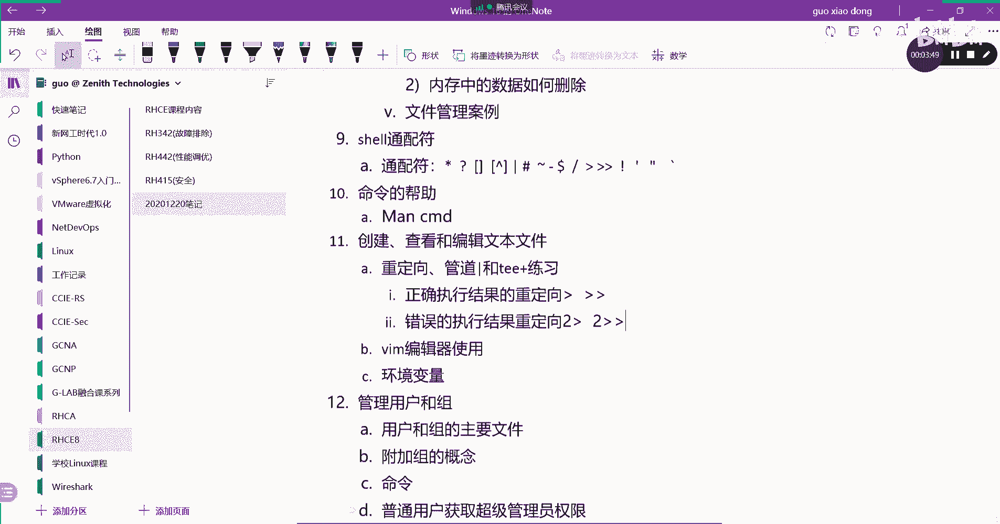

# 【Linux／RHCE／RHCSA】零基础入门Linux／红帽认证！Linux运维工程师的升职加薪宝典！RHCSA+RHCE／9-vim编辑器 - P1 - GLAB郭主任 - BV1NC4y1S7rf

好，那么接下来我们来看创建查看和编辑文件，这一块的东西呢，我们首先来回忆一下重定向。

重定向这个东西我们其实在之前有讲过，比如说现在我想把一个文件从对向过来啊。

比如说我想把LS看到的这些所有文件的属性。

这个是不是有输出啊，我把这一堆输出送到重定向到一个文件里面去。

怎么做啊，我把里面的文件删删掉吧，太多了，RM rf新号，都删掉了，LS杠L没啥东西了对吧，现在我想把LS斜杠杠L，这个是看的就是根目录下面所有的东西，我把这个内容要重定向到一个文件里头。

怎么看重定向到当前目录，这个当前目录我们给它起一个名字叫test file，点TXT后缀是什么，不重要，这个能看懂吗，嗯好这个时候我们要是看是不是有test file出现了。

我们cat一下test fire，这个test fire的内容。

是不是我刚才ls s根目录下的所有的东西啊，就过来了。

所以这个就叫重定向，明白吗，这个就叫重定向，就这个OK好。

那么这个重定向我们之前有讲过啊，那么有时候我们去执行的时候，比如说LS的时候，我们写的是LS，这个时候他会给你提示一个错误的信息吧，明白我意思吗，好那么这种执行错误的信息的话，我来给他重定向。

它会重定向过去吗，从逆向到当前目录的AA，会不会，会不会，有东西吗，空的吧，对不对，说明重定向它只接收的是我现在的这种重定向，它只接收的是正确执行命令的结果吧，明白这意思，不正确执行命令的结果啊。

所以他是把我们的正确的，就是执行的标准输出作为标准输入，送到文件里头，从定向过去的好不好，那么像这种错误的我们应该怎么办呢，他叫二大于号来再看一下，没有报错了没有。

报错了之后我们LS杠L看一下AAA是有的，我们开启一下A有吗，有了吧，所以在这里要记清楚，重定向它又分两种类型的重定向，就作为一个补充吧。

之前只是在说重定向，没有提到重定向，其实它是有两种，一种叫正确，正确执行结果的重定向，OK正确执行结果的重定向，我们用的是大于二或者追加，这都算吧，还有一个就是错误的结果，或者叫错误的输出。

错误的执行结果，错误的执行结果重定向，如果用上面的话就不行了，对不对，那这时候他用的就是二大于号，这个错误或者二追加一样的道理吧，二大于号就是直接覆盖二追加，就是把错误的信息不停的在往文件里面追加。

OK好，所以这个这两个啊大家要注意，大家要注意好，那么嗯首先这个二跑的时候如果是正确的，也能交正确的，正确的不能加二错误的对。

他只是加错误的错误有啊。

就是后面讲的正确和错误都会醉驾啊，正确的和错误的都会追加的，正确正确和错误都会啊，重定向我们会用到这个呃，这个会用到两种写法，叫看看啊，嗯是这样子，他他是这样写的，叫大于号，大于号file。

这就是正确的到到这里了对吧，然后呢二大于号，然后有一个特殊的字符是这个一这样写的，OK他是这样写的。

我来试一下。

我来试一下啊，好现在嗯啊，我们把这个文件清掉，我们一口空格，直接把它从定向到AA对吧，AA里面应该没东西了，cut没东西吧，OK那么现在我们来执行看LS杠，A斜杠，然后加一个分号LS两个吧。

把他们的结果重定向到AAA里面去，这是把正确的重定向对吧，然后错误的也重定向二大于号一，好然后我们cut一下A诶哦它是覆盖了，这样写是覆盖吧，对不对，我应该我应该怎样写啊，我应该怎样写。

我应该这边写追加，这样的话错误的是不是也在里面，前面那个呃，我看看，U s，这个后面这个诶cat a还是不对，但不应该这样写，我们看啊，没关系，不不连起来写也可以，对吧嗯，看看怎么写，ALS斜杠杠L。

这个是没问题的，然后呢LSS这个也是没问题的，我们看一下A看到了吧，都在里面，在前面的对吧，然后后来就这样子，就是他其实是这样子的啊，他是说看你执行你前面执行的，如果是正确的，我帮你也定向过去。

我错误的也帮你记录，这样的话这就是正确和错误都追加。

就是把它这也可以写大于号嘛，也可以多覆盖，再复制一遍，是不是这样子的，这两个是不一样的，前面的前面的和后面的都是一样的啊，都是一样的好吧，所以说不管他你你可以写这么写，就是不管这个执行结果正确还是错误。

他都帮你放到这个文件里面去，这样的话你不管你是执行的结果是啥，就不用去区分了，你在执行之前，就不用去判断他到底会正确执行还是错误，执行都有结果吧，都会在这个文件里面明白了吗，OK好就这样的啊。

正确和错误都在里面啊，正确和错误，这，就是标准写法，这个是它的标准格式，就像find后面为什么要加个反斜封号一样，二数字后面跟两个大于号对，数字后面要跟两个大于号追加，这些都是追加的，跟两个啊。

然后覆盖就是跟一个，就说这个错误不会覆盖到，会把标准是中间的内容覆盖上了，就是有点理解理解不了，就是一个大于号他就覆盖了，就说按理说应该是标准错误覆盖了标准输出，但是你这个结果里面。

就是说标准错误和标准都都会剪的出来。

这个有点不太好理解，啥意思，我不是很明白，我把这个接口先清掉啊，第一个，第一个例子就是就是标准输出和标准错误，都输入到一个文件当中，我就说他后面那个就是说他的二，后面那个数字是对一个大于号。

他女朋友一个大于号是，是这样子的，他这个结果比如说现在LS斜杠杠L对吧，这个肯定是能正确执行，对不对，然后我的我把它，因为我不清楚这个这个命令能不能正确执行，所以说我可以这样写。

我把它重定向到我的AA里面去，但是也有可能有错误的执行状态对吧，所以说我再给再写一个二大于号，然后把它到一里面这样子来写的。

这样来写，我们去看成A他肯定是正确执行的，所以说一定能看到正确结果对吧。

然后呢如果你在哪哪一天就写错了啊，我也不知道随便写了个啥，是错误执行的，对不对，那这个时候他也能放到文件里面去，这个时候你去看看文件，它是就变成我们错误执行的结果了，他就把以前覆盖了，他就把字形覆盖了。

所以正常的情况下，我们一般会用两个大括号的方式，也就不管这个文件是之前是什么状态，我都只是在后面追加，这样的话你的执行你前面的命令，执行这个命令的正确或错误，在文件都能看到，明明白这个意思吧。

正常情况下，我们把正确的输出和错误的输出都放到文件里，记录的时候，并不是用在我这里的命令执行的场合，是用在我们在自动化运行脚本，或者某些软件自动执行的时候产生的结果，明白这意思吗。

而它它在这个系统里面自动执行，自动执行的时候，因为有时候你执行对了，那就是正确的输出嘛，如果执行不对，那就是错误的报错嘛，对不对，所以我们会用它来记录正确的弹窗或者输出，或者错误的报错。

我就是刚才举的那个例子，二后面不是跟两个大于号，就刚好就是这个不对呀，所以不行，它必须是这样子啊，但是他语法有错误，明白吗，你不能说前面正确的覆盖，错误的追加都是这样子的，明白吗，这里改大括号。

这里也得改大括号，这才可以写，对啊啊，后面只能一个我看看哦。

错了，不好意思不好意思，后面只能一个，这个是吧。

后边只能一个，我看看啊，后面只能一个，后边只能一个一个对，后边只能一个啊啊你说的是这个意思，好的好吧，嗯对对对，后边这个只能一个啊，这个我后边准备一个，Ok，再来一遍，后面只能一个这样子的。

是这样子的啊，那如果是执行正确，这个时候我们去看一下它是覆盖了是吧，哎没有覆盖，没有覆盖，cut a没有覆盖，你看没有覆盖啊对吧，没有覆盖，它是没有覆盖的，没有把这个直接覆盖掉。

所以这样就应该我是追加过来的，没有覆盖的，如果不是追加的，就是覆盖了，是的就这样子的，没有追加。

那就覆盖了，对的好吧，就这样子啊，这个就是从从对象错误输出没问题吧，好那接下来我们来说一下呃，这个从定向到文件，给大家说一下管道服和T吧，啊我把那个去掉，这是重定向，然后呢管道符这个也作为一个补充。

和T1对对对管道和TEK，那么这两个我们先说管道符，管道符的作用是什么，前面的输出作为，后面的输入是吧，OK前面的输出作为后面的输入，那么我们来做一个例子。

比如说比如说现在我们通过IOSLS，LS输出了一堆东西是吧，我把这个重定向到我们的tap上面，起一个名字，Save gout output，好，从定向到临时文件夹里面，创建了一个文件。

然后我再把它列出来，类似这个命令，我们前面有讲过，就是跟more一样，就是读这个文件，读这个文件，看到了就是结束了，head吧，看一下输出。

他直接就结束了，有东西吗，哦有没有东西啊，没有是吧，跳过了，没关系，我们去cat一下tap下面的save，有的是吧，有这么这两个东西，但是这个时候你会发现有一个问题啊，在这啊。

我把我把这个这个这个东西读出来的时候，我把这个东西重定向到这个文件了以后，再通过管道符去读的时候，有个问题，什么问题读不出来是吧，想一想啊，他前面的输入作为后边的输出，好把前面的输出作为后面的输入。

那我们单独的去用less去读一下这个文件，看看给大家看是什么感觉，我less对吧，tap下面的save是不是有内容啊，类似就是这个样子，跟cat是一样的，跟cat是一样的。

OK所以嗯你会发现这样做是没办法读的，这个文件被重定向到我们的文件里面去的时候，再用less去读，就读不出来，就读不到，就读不到，好我们来看它是一个什么样的原理呀。

这个为什么就读不到呢，啊啊啊嗯，这个是一个我们去less要去读的一个进程，这是我们要读的一个命令，好这个命令本身要读的时候，他们要叫STDOUT，也就是out out，然后呢我不画了，在这儿啊。

我们图当中有，在这儿看一下，中间的管道符，这就是中间的管道符，这就是中间的管道符，这就是管道前面的输出作为后面的输入，都卡了吗，我用手机好像不卡了，几个距离吗啊你为什么你也是，但是我手机现在可以看。

OK行吧，你你看他的其他人呢不卡吧，它是前面的输出，作为后面的输入，那么这个是前面的输出，就是我命令的执行结果，这个是我下一个命令，这里的下一个命令就是这里less，对不对好，那是这样子的。

当我把某一个文件从左边，就是我从定向到文件里头去的时候，其实它并没有输出。

是不是我从第一项进去之后，他是没有输出的，你看啊，这个属于重定向，直接进到文件里头去了，那么管道符前面是有内容吗，是不是没有内容啊，没有out啊，对不对，所以没有out，你再去less的时候。

是不是什么都less不到啊，看不到，明白不，所以管道符在如果重定向加上管道符的时候，就会出现这个问题，那这样的问题怎么解决呢，我们可能会用到我们这里的T就是这里啊，我们可能要通到T啊，通过它来，哎不对。

通过T比如说啊，嗯我们现在通过T来解释这个问题，就是LS杠L我们通过管道服送到T啊，然后放到tap上面的save out对吧，然后再通过less去读，这时候就读到了，这为什么读到，啊怎么这是为什么。

T啊T代表代替的重定向。

也就是说在看这个图，它会用T的话就不一样了，就是你把前面的内容送到文件里的时候，它还会在屏幕上帮你打印，只要在屏幕上打印，其实就有了TTIN送到下一个process，而T就多了这个做了这一部分。

多了这一部分，这一部分出来了，如果没有T的话，那就只有只有只有上面这一个管道，这个管道的话重定向只是定向到文件，他在标准输出当中就没有，没有的话就没办法被下一个命令所执行，如果用了T。

那么它就会被下一个命令用了T它就多了，下面这个出口就多了这么一个出口，多了这么一个出口的，直接表现就是在屏幕上就会有了，有了之后就会直接就打到STDI，下一个命令就能执行了，所以这个是T的作用。

能明白意思不，OK所以呢如果我们要用到像像这种。

如果我们想把结果送到这个文件去，并且还要被下一个命令所执行的时候，这里就不能用重定向了，用TEOK用TE好。

不光写进去之后还会被下一个命令处理，所以这是T的作用，算是一个补充管道符和TTE怎么写呢，他在执行命令的结果被打印啊，或者叫被输出，在这个输出在这个叫什么叫文件或者屏幕上，在。

文件或者STDIN上对标准输出上，那么才能够被后面的命令所读取，才能够被后面的命令所读取，所以如果是要有多个命令加管道接在一起，所以请不要用重定向，用T1，好吧好，那么我们来做一下管道符的练习。

我们来做一个管道，负责练习126页，还把，教材翻到126，这是一个问答题，我们来看一下，看清楚啊，我早上回答问题，不能连再重新连一次，开始第一个哪一个答案向终端显示输出，并忽略所有的错误。

先第一个先不找人，先一起回答一下，看看选什么向终端显示输出并忽略所有的错误，几呀，C是吧，是不是C2大于号，D e v nn，很多人不明白后边这个是啥，DEVNN啊，这是一个黑洞，就是它也不是一个文件。

它啥都不是，你把东西只要往里丢，反正都看不见，他就是个黑洞是吧，它不会生成文件啊，忽略所有的错误，是不是把错误输入进去就好了，OK好C第二个哪一个答案将输出发送文件，并将错误地发送到另一个文件。

把对的发送到一个文件，错误地发送到另外一个文件，几啊，拖拉机，A嗯A啊A啊K，第三个哪一个答案将输出和错误都发送到文件，创建文件还是覆盖其他覆盖其内容，创建文件还要覆盖其内容，超级难度，来杨杨同学。

你属哪一个D是不是D啊，第一个没见过吗，第一个TT就是重定向吗，它是用T来做重定向，重定向过去，先看看题干，创建文件要还是创创建文件，还是覆盖其内容，这是个问题呢，前面前面能看得懂吗。

输出和错误都发送到一个文件啊，就当它覆盖吧，他这里没有两个大于号，一定不是追加，对不对，所以一定是覆盖，他在问能真的，OK那选啥呀，D好像跟我们讲的嗯，这个是补充了一个是吧。

他是把错误和正确直接全部从对象，有一个有一个语法，我们刚刚不是是二大于N1嘛，对对对对对对对对对，是的是的是的嗯，这题答案选什么，二大于N1选A啊，答案选什么，标准答案选什么，看一下第三题，这什么啊。

DD啊，调出来D啊，第四个第四个啊，and大于号file是错误的和正确的都放进去来吧。

试一下，应该是的，and and大于号是吧，是这个吧，好A4嗯，呃els and大于号A是这是这个意思吗，嗯然后LA是的吧，嗯对的，按着大于号，不管正确的错误的都可以，这算是一个简写。

所以好这个啊，第四个，哪一个答案输出和错误发送到同一个文件，以确保现有文件的内容就是追加吗，第几个，第三个是吧，第三个OK没有问题，第三个第五个哪一个答案会丢弃啊，通常发送到终端的所有信息丢弃。

发送到终端的所有信息丢弃，发送到终端的所有信息，丢弃发送到终端的所有信息B是吧，就把这个东西丢到黑洞里面是吧，就可以了，所有所有性代表正确的和错误的，所以说这应该是所有是吧。

对第三个错误的会送到fire里面去，所以C不对，选B，第六题，哪一个答案将输出输出同时发送到屏幕和文件，C肯定是C刚刚讲T1吧，OK第七个哪一个答案将输出保存到文件，并丢弃错误消息，并丢弃错误消息。

dd是吧，D啊D将将输出保存到文件，并丢弃错误消息，OK是的，错误消息发送到第一频道，然后把这些信息啊送到这个文件里面去，好没问题吧，好那么这个是管道的练习，先说到这儿，然后接下来我们来说一下编辑文本。

就是v m vim该怎么讲。

Vim，我来看VM呃，vim首先它是一个编辑器，叫文本编辑器，是一款LINUX当中的LINUX中的文本，文本编辑器，OK好，这个文本编辑器就是用来编辑文本的。

那这个文本编辑器跟我们在windows上用的用的word呀，什么WPS啊，一样吗，一个道理吗，不是一样的吗，不一样啊，我们在windows上用的win a word这些东西，它不叫编辑器。

它更像一个是基于这种啊，呃叫什么，对算是一种渲染器，它能调颜色，调字体，调大小，VIM它是不能的，明白吗，VM是一个纯文本编辑器，它只是一个纯文本的一个编辑器，而word是可以改这个文件的各种字体格式。

样式的理解吧，OK所以大家要记住，这是一款LINUX中的文本编辑器，而且是纯文本编辑器，这是一个纯的文本编辑器，好，那么它有两种软件，一种叫VI，还有一种叫vim啊，这不叫两款软件，M只是VI的加强版。

VIM4VI的加强版，VIM是vi的加强版，好我们在考试的时候，大家很多人尤其不懂LINUX上去敲，我们平时练的都是VM上去敲vim报错，说没有这个没有这个工具，加强版是要装的，是要装额外的软件的。

vi呢是所有的LINUX系统自带的，所有LINUX系统自带的，基本上80%以上，所有的LINUX都自带vi这个编辑器，而VIM是需要安装的，它是因为它是加强版，明白我意思吧，加强在哪呢。

就加强了它能体现不同的颜色，它能帮你让你看到什么文件，什么颜色对吧，里面有各种对应的一些脚本的语法的对应关系，所以这个是加强了好，所以考试不会没有VM用V是一样的，它的编辑步骤方式套路都是一样的。

对这个能听明白，OK好，那么这个要说一下啊，其他没什么，接下来我们来说一下它的用法，它的用法太多了，先说一下，我们先来看一下它的这个编辑编辑的步骤。

我来给大家截个图看一下，现在教材上其实有的。

看啊，其实我们之前也一直在用，对不对，它有几个模式，一个叫这个insert，就是编辑模式吧，我们刚开始建造的这个模式呢，其实只是看的，然后从看的模式进到编辑模式，要按一个小I看到了吧。

还有一个小爱进到编辑模式，然后呢如果按ESC就退出编辑模式，然后在这里要保存这个文件，按冒号就进到这个嗯要去保存的这个模式，然后呢在这个模式下按enter，直接就可以进到这个普通模式，就这样的，明白吗。

右边我们用的不常见，但但是也是用的比较多的，它是可以帮助大家按列按行去选择删除的，我们后面有个练习，就是让大家去做这个事情，一会儿在练习当中给大家讲。

来，我给大家演示一下啊，现在比如说我们现在要去VMA，编辑一下这个文件，看到了吗，这个模式是最进去之后啊，最普通的一个模式，如果要编辑，它按小爱下面变成insert了，对不对，然后呢开始按回车编辑。

你要编辑的内容没问题吧，好要退出来按ESC好，到这个模式下，要保存这个文件的时候，我们按冒号shift加一个那个冒号冒号，然后WQ就保存了，就是我们常用的吧，好接下来给大家讲一些高级的快捷键啊。

高级的快捷键好不好，那这个高级的快捷键呢，嗯我们常见的是比如说啊，比如说呃VIVIM可以直接加一个number，比如说第二行，然后呢，诶这个时候你打开发现光标直接落在了第二行，看到了吗。

所以这是给大家讲的，第一个，我们可以用这个命令VIM后边加一个number，直接光标定位到某一个文件的某一行，明白好，如果不加任何number，直接是一个加号，加一个他在哪呢，直接处于文件的最后一行。

不是顶上啊，最后一行OK没问题啊，最后一行这是这两个可以一起来记啊，好另外VIM我加一个加一个斜杠，加一个斜杠，我我我我我写一个啥来着，刚才是不是写了个什么文件里有啥东西啊，我叫vs k吧。

我就VSK叫VSK，诶诶啥东西不对啊，是这样写的啊，是是是是是嗯，打开呃嗯嗯我想想啊，不是家，没有东西啊，Can't，不是这样的啊，是VM加上一个斜杠，斜杠是不是没有啊，就A吧，然后A好来了。

刚才没有匹配吗，这说明是啥，ZLNNN是啥意思啊，搜索就是你直接打开你要查找的关键字，也就打开文件跟查找关键字直接就匹配，匹配到直接打开，你看光标会落在第一个匹配的字符串吧。

字符或者字符串vs k好像没有看到有人，VVVSK这个是吧，还要加东西，等会儿啊，我来看看哦，前面没加加号，前面加过加号的是吧，这个要加一个，是不是要加一个引号，哦我知道了，要加个东西，应该不是双引号。

应该是要这样子对吧，应该是这样子啊，就是你把你的这一串字符串，把它用斜杠给它框起来，然后他就帮你去找找这个VSK没问题吧，你看这样子好，那这个是打开文件的三个技巧，记下了吗。

好接下来我们来看编辑文件的快速的关闭，我们VIA，我想编辑完了以后，我想快速的去退出，按CTRLZ保存退出，CTRLZ啊对吧，不要不要不要再去按这种像什么玩意诶，swap already啊。

CTRLZ最怕的就是这个烂东西，Wq already exceed，RM rf点AA的swap v m a刚才什么原因呢，CTRLZ保存退出，好是好，快是快，但是你比内存还快，对对对，内存还没有处理完。

你已经退出来，就是这个原因明白吗，所以你会发现发现发现他这个操作不了，不管了好吧，还是按照套路来吧啊，还有一些快捷方式来给大家看一下啊，嗯比较常用的，比较常用的，比如说，我们来编辑这个这个这个文件啊。

好那么如果我想删除这一行，我们会怎么办，我们删除单个命令，我们用X呃，单个吧，对不对，然后呢，删除光标向后的几个字符，我们可以用井号啊，我们可以用井号二，哎呦，我靠到哪了，看X这X是一个一个三。

看到了吗，X是一个一个3K，那么如果我想删除这一个单词怎么办，我想想删除一个单词，单词是什么，word是吧对吧好，那么删除我们来看啊，呃删除一个单词叫DW删掉了吧，明白意思吗。

按一个DD是delete w是word，它就会删除DW就一个单词，一个单词的三不是同时先按D再按W，明白我意思吧，好然后我按错了，我想撤回怎么办，UU是不是在撤回啊，小U啊，按一个小U就可以了。

明白再UU修改这个字符，我想打D和打修改这个字符，打字对哦，你想现在正在删除啊，现在删除，然后我想删删除这一行怎么办，dd看到没按两次D就删除了，明白我意思不好，按U再回复啊，按U就切换就回来了。

好大家看清楚，我现在所有的操作是在哪个模式下，是不是VIM进去的那个最普通的模式啊，对不对，也不是insert模式啊，不在excel模式下面啊，OK那么我想复制这一行怎么办，复制复制Y对不对，是Y嘛。

好YPPPPPPP，看到没好，我想复，这是复制一行，我想复制两行怎么办，不想复制两行怎么办好，那就是从这往下的两行，那就是2Y然后P诶叫嗯怎么复制这两行，怎么复制这两行，应该是应该是应该是呃。

RYYPPPP哎对了吗，再来在这里，我们放这来啊，P，我要复制这两行，那应该是RYY，然后呢P看不出来啊，来P，好四两好吧，看清楚啊，怎么来，是再按一次P好，来我们再来看一下，从这开始往下。

我要复制三行，嗯我在这边再加一些东西进来吧，不然的话看的很不清楚，都一样，1234567，这就清楚了吧，好然后来复制，从这开始我们复制两行，那就是2YY2YY，然后再按一次P，我把这个复制到哪呢。

复制到这P是不是一二，对不对，然后再到这来再一次P是不是一二好，所以复制几行在前面加一个数字二，然后按两次YY，然后再按P就好了，明白这意思不嗯OK这个叫复制几行啊，复制粘贴按P粘贴是按P啊。

这一行一个Y对，复制一行只要按一个Y就可以了，三行就3YY不3YY3YY多行都是用YY好不单行，用一个Y好，清楚了吧，OK好，那么我们来看继续往上看，这些都属于常规操作，常规操作好，现在我退出来。

我们来做一个操作，就是现在呢我想把我的cut EG c下的password啊，这一堆内容我把它从对象到AI里面去，把AA原来的文件都覆盖掉，这个时候我们去cat一下AA呃，这对应该都有了吧。

好来给大家讲视图模式，视图模式其实也很好用啊，我们在VIMA的时候到这个界面，我们按一下大V，大V下面是不是变成了什么什么什么v line呀，看到了吗，好大V的话就是按整行来处理的。

你把光标往上移往上移，往上移，往上移，往下移，往下移往下移，这是一整行来处理的，能看懂我的意思吗，OK好比如说我想删除这一行，选完了以后D删掉了吧，好再按一下大V好多行多多行一起删一起选。

选完了以后再按D都删掉了，能看到吗，这是大V，大V是整个行来删除，我们来看小V，按一下小V好，小V的话就变成这种模式了，小V的话你会发现是不是可以按照列来删呀，呃小V我看看啊，按字符来选取。

就不是按行来选取的了，按字符来选取，退出来吧，我想删除这个列怎么办，这是shift v是大V，Ctrl v，CTRLV啊，对CTRLV啊。

是CTRLVKCTRLV就可以选择按照列来那123好，是不是按照列来三明白，根据你选的字符串，按照列来delete掉，CTRLBOK好来。

关于因为这个vim的这个用法比较多，刚才给大家总结的东西，我都会给大家贴给大家，因为我这里有，我都会贴给你好吧，大家先看这些用法。

还是需要大家手动去自己去操作一下。

好那么这个是呃打开删除复制行啊，单个字符回退啊，然后呢替换我们来看一下替换怎么做，VIMA呃，比如说我想把这个所有的，我想把这个Y换成大S，把S换成大S，替换单个字符，然后换成大S换了吧，换成大Y换了。

他原来不需要你删掉，直接就换大N大C怎么做的啊，再看一下，在这种模式下，我们先一个大R，它替换成最下面变成replace模式吧，然后在这个replace模式下直接输SYNC，看到了没。

OK所以在这里替换用的是大R啊，直接是一个单词，一个单词的替换，如果是一个字符，一个字符的替换啊，一个字符一个字符的替换，OK好，差不多就这些吧，VIM的编辑器的命令，差不多就这些。

好差不多就这些了啊，这些完了以后呢，我们就用法，我就这里给大家省略掉了，因为我这个P上都有给大家整理，在这都有给大家整理，给大家看一下，这里刚才我说的都在这，回头我给大家截个屏，给大家。

让大家自己看一下，对照的先敲一遍。

