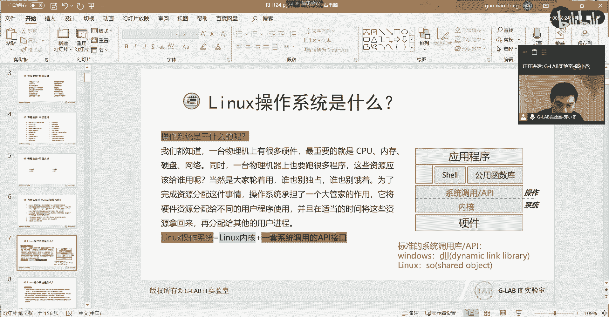
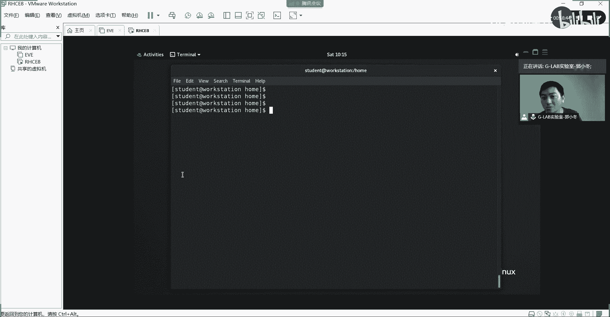
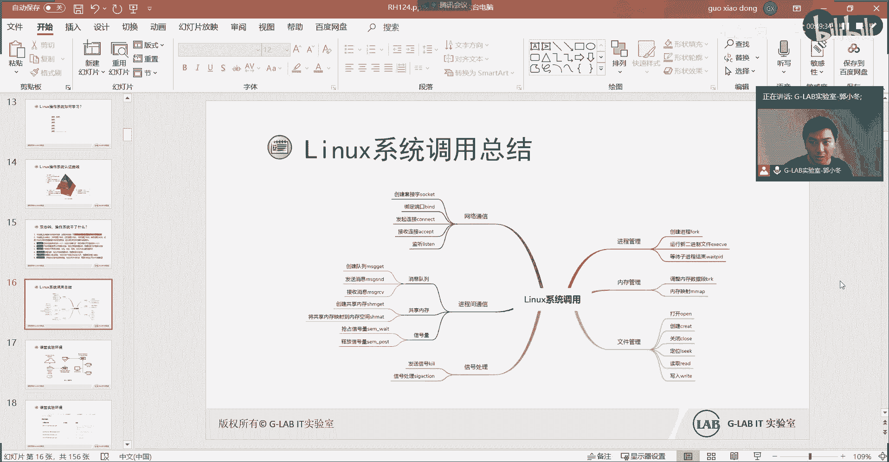

# 【Linux／RHCE／RHCSA】零基础入门Linux／红帽认证！Linux运维工程师的升职加薪宝典！RHCSA+RHCE／入门1-Linux操作系统是什么？ - P1 - GLAB郭主任 - BV1Gc411R7Yr

那我们开始啊，那么在开始之前，我们还是要花一点点时间来跟大家讨论这个啊，LINUX操作系统到底是什么，这一部分的内容比较理论化，我希望大家听个大概就是能够听懂我在讲什么。

然后能明白之前不明白的一点就可以了，因为这个这个东西太抽象了，我们来讨论什么操作系统，OK那么在讨论之前呢，我们先要讨论学习LINUX操作系统，我们为什么要学，当然很多种原因是吧，这也列了很多。

首先它是开源的啊，这套系统啊谁都能用，那么你可以在上面做自己想要的任何的这个，软件，或者自己想要把这个操作系统包装成什么样子，都可以，所以这是一个开源生态，那么它的好处就是。

很多人都会在上面去做自己的开发对吧，去做自己的包装，然后都贡献出来，大家一起在对这个开源社区提供这个力量，全世界的这种，所有的人都在对开源社区提供力量，那么就会有很多的这个嗯新的技术也好。

还有这个新的这种嗯高效的一些性能的运作，或者说在系统上的一些方式也好，都会比windows或者比Mac os会进步的更快，也更容易被大众去去使用对吧，因为它是开源的。

然后第二个呢有很多的这个领域也都用到，这个LINUX操作系统，有这些领域啊，MYSQL是吧，这些都大家应该了解的人应该都知道，多少会知道一些KVM，open switch coopernet是吧。

docker这些都是现在比较火的技术，都是基于LINUX嗯，然后呢LINUX系统是一款优秀的操作系统，它是有类UNIX的程序界面啊，UNIX和LINUX不是同一个系统，至于他们之间的呃发展关系。

爱恨情仇我不在这里讲，大家有兴趣可以去网上扒一扒对吧，整个发展历史非常的精彩，UNIX呢是很早以前的，然后LINUX是在发展的，要比UNIX要晚一些好，最终还是LINUX1统江湖啊，中间发生了什么。

大家可以去了解一下，然后第四个企业级的这个环境都会用到LINUX，那么大企业一般都会用到LINUX，现在啊据统计，这个呃，全球这个500前前500台高性能的服务器当中。

至少有90%用的都是LINUX操作系统，90%啊，OK所以呢，它的这个覆盖率和占有率还是比较高的，那个人使用环境，我们现在去餐馆吃饭，看到的手持的PDA，还有很多，大家不知道家里有没有布这个智能家具。

很多智能的家具的，这个对于底层的家具的硬件上去装的操作系统，都是LINUX内核的，基于LINUX内核的，很多的这个智能家居，底层账面装的系统都是LINUX的，而不是其他的对吧。

然后呢这个云端也都会用到LINUX，总之来总的来讲普及越来越大啊，应用越来越广，所以大家要学就这么简单好吧，然后呢这个这是第一个内容，第二个好，那么我们来讨论LINUX操作系统到底是什么。

操作系统到底是什么，操作系统到底解决了什么问题，那么大家想一下，操作系统它应该是装在底层的硬件上对吗，对不对，那么我们能不能不装操作系统，考虑一下这个问题，我们能不能不装操作系统。

操作系统如果不装操作系统也可以，那么我们要操作系统干什么，比如说啊我现在需要实现一个嗯，我现在一堆底层的硬件，这是我底层的硬件啊，有什么CPU，什么内存一大堆的东西对吧，那么我们最终装操作系统的目的。

是要实现上层的应用对吧，你在系统上装应用，然后对外提供服务对吗，对不对，所以我们如果不装操作系统，我们直接通过应用，比如说我上次装了一个app，这个app就是QQ吧，假设啊我要装个QQ。

那么没有操作系统的话，我直接把app的这个应用装在底层的硬件上，可不可以可不可以，当然是可以的，为什么不行，腾讯的那帮工程师，他是肯定能帮你搞定，说写这个写个app直接装在底层硬件上。

就是代码的这个层级可能不太一样，原先装在操作系统上的QQ，可能是用高级语言写的，现在他可能要把QQ重新编译，要编译成基于底层硬件架构的，能够直接调用底层硬件的这套代码，所以也是可以的，明白我意思吗。

好那现在如果我现在除了要跑QQ，我还要跑微信，我还要打游戏怎么办，不止一个app，我们的操作系统可能有很多个app，那这个时候所有的人都要去调用硬件，这不就乱套了吗，对不对，你说这些app。

所有的APP这些厂商，他们不能够直接去写在基于硬件的这个软件吗，都能写明白吗，谁都能写谁都能写，不是只说只有腾讯可以写呃，我撸啊撸也可以写，基于底层，我所有的音乐与音乐播放器都可以写，基于底层。

但是这个时候就出现了一个问题，所有人都是写基于底层的硬件调用，大家都要去调用硬件资源对吗，那么这个硬件资源到底给谁用，是不是就乱了，明白我意思吗，OK那么你也要我也要那怎么办。

所以这个时候在中间加了一层，这就是操作系统的作用，我们在中间加了一层，这一层叫operate system，叫这个操作系统，那么所以操作系统的中间层，这个时候他发挥了它该有的作用，什么作用。

协调嘛很简单，就是协调明白，举一个实际的例子啊，如果你去银行取钱，如果没有银行的前台柜台嗯，大家取钱都直接直奔银行后台，那不乱套了，对不对，所有人直接把自己抱怨或者打开自己，把自己的钱存进去啊。

可能会出现各种暴力事件是吧，发现你的柜子的钱比我多，我把你给抢了，这都有可能，对不对，所以同样的道理，所以我们在银行设立柜台，那个柜台的作用就可以理解为，是我们这里操作系统的作用。

他要做到的事情要做资源的统一的协调，明白他要做资源的统一的协调对吧，主要是最重要的就是协调和调度，这两个事情最重要的是协调和调度，这两个事情大家听明白了吗，OK这就是操作系统的本质。

他就是做资源的调度和协调，所有人协调调度的事，让他来改，对不对，那么嗯那大家再想一个比较核心的问题，我们的CPU和内存这种硬件，我们的内存很多电脑只有八个G，但是呢我们在电脑上要跑几十个G的数据。

很多的app应用加起来，内存的处理数据可能远远大于八个G，对不对，那么它怎么实现的呢，也就是硬件对我们上层应用数据的处理，最终的本质是什么，硬件对上层数据应用的处理，能够实现的本质是什么。

大家学过计算机应该都知道是什么，是时间和空间的复用，这个这个能听懂吗，啊我们的硬件能够对上层各种数据集中的处理，最终的本质就是在对时间和空间的复用，你的CPU内存总共就八个G。

那怎么能能处理800个G的数据呢，那就是通过错开每一时间，他不停的在通过时间差，时间和空间的复用，来对所有的数据来进行集中处理，就比这个复用的速度是快的，就是频率，就是我们经常买CPU看到的主频。

这就是频率的概念，能听懂吗，OK所以这一点大家应该要先明白，所以我们就可以通过操作系统来，对整个的硬件资源进行这个时间和空间的复用，来调度和协调，最终来实现操作系统上各种app的正常的运行。

这能听明白了，OK所以这个说明白，我们再来看操作系统的一张图，这是操作系统的一张核心的图，大家看底层的硬件，上面没有直接装上层的应用程序，这个应用程序就是我刚刚写的APP啊。

K没有直接装APP这个应用程序，原因是呃，需要通过一个中间集中做资源调度的一层啊，中间层，那么这一层是由谁来做，用操作系统来做的，这能听懂吗，由操作系统来做，OK那么操作系统它也不是一个呃独立的整体。

它也要分的，你看我这里分成两块，操作系统的最下边叫内核，最上面叫系统调用或者API，这个怎么去理解呢，这怎么去理解，在理解这个之前，我们先要明白啊，大家下软件的时候嗯。

或者是装操作系统的时候都下过操作系统，很多人应该都下过操作性，我给大家看一下，你干啥，下过操作系统的同学都知道，比如说这是一个红帽7。0的，IIIS的操作系统，它的名字里面就有一个叫什么X86。

看到了吗，对不对，OK这个是什么概念，这是底层的硬件架构，也就是说不同的物理的硬件架构，它的上层的操作系统的内核的编译是不一样的，能理解吗，所以我们的不同的硬件平台啊。

硬件平台要能够被被上层的软件用起来，它就一定要基于底层硬件架构而开发出来的，这个硬件调用的内容，理解我意思吗，好比如说另外一种平台，现在主流的移动平台叫a arm平台，不是X86平台。

那这种平台上面所用到的LINUX内核，跟X86硬件上用到的LINUX内核就不一样，理解我意思吗，就不一样啊，就不一样，所以大家明白操作系统的底层，它有一个能够直接调用底层硬件。

基于底层硬件架构而开发出来，直接对硬件进行调用的东西，这个东西叫内核，明白这个内核基于硬件平台的不同而不同，你不能拿着X86的内核去装，在ARM的平台上都装不上去的，它会报错的，明白我意思吗。

OK所以这个内核的核心作用就是调用底层硬件，调用底层硬件，明白我意思吗，调用底层硬件，OK好，那么再往上走，硬件啊，已经能够被内核调用了啊，已经OK了，那么最终的操作系统装完。

是要对上层的APP能够提供一个环境，然后对外提供服务，对不对好，所以接下来要讨论的是上传一大堆的APP，这些APPQQ啊，微信啊，撸啊撸啊，这些上层的APP最终要跑在操作系统上，对不对。

那么操作系统上要跑这么多app，最终的本质就是app，他要去找操作系统，要资源资源啊，操作系统会给app分配资源，对不对，所以这个时候应用程序，它会跟我们的操作系统去申请资源。

那么这个中间一定要有一个接口，算是一个接口的概念，那么它不能，它为什么不能直接去跟内核去申请资源，也就是说中间这个这一层为什么为什么要存在，可没有啊，因为你已经有一套东西能够调用硬件了，对不对。

然后呢APP也有了，你直接通过app通过内核不直接可以调用硬件吗，对不对，这样不更好吗，为什么中间还要加一层好，这个就从安全角度考虑，你想啊最底层直接调用硬件的内核，都能够被各种app直接去调用。

那么这个操作系统还有什么安全性可言，我作为一个app开发商，我可以直接调用底层的内核，真的太危险了，明白吗，我既然能调用内核，就能调用底层硬件，那我就可以通过我的app调用内核，去影响底层硬件。

从而去影响其他的app，明白我意思吗，啊，我还能把所有的数据拉到我的app里头进行分析，所以这个太危险了，懂我懂我意思吗，所以不能够直接把最核心的调用部位，直接暴露给你所有的app，这样太危险。

所以我们做了一个什么操作，我们在内核上面封装了一套统一的接口，就这套统一的接口，是所有的上层应用程序都能够来对接的，但是它不能直接去对接我身后的内核，它D它只能调用我这个对外统一的接口，明白吗。

OK然后在中间的这一层统一的API接口，我们叫统一的系统调用和叫API接口，这套接口里头做了隔离之后，内核就相对安全了，内核就在身后做了一个非常安全的一个呃，一个保护，明白吗，这个就跟银行一样。

刚才我举的例子是一模一样的，银行的保险柜直接放在银行的金条啊，什么美金啊，人民币啊，保险柜可以理解为就是内行，他直接存放现金的，直接存放这些资产的，明白我意思吗，然后呢前台就可以理解为是各种啊。

八个窗口就可以理解为是bug api8个系统调用，所有的人来都要拿号，拿完号之后，统一的到相应的柜台去找对应的接口，比如说123号是存钱，15号是取钱对吧，67号是VIP，所以这都是不同的API接口。

不同的调用能听懂吗，所以我们一定要保护内核的安全，保护底层的安全，所以才会有操作系统，最外层的叫系统调用或者叫API，能听懂吗，啊明白了吗，好这套东西定义出来也有好处，有很大的好处，什么好处呢。

它能够规范很多API，很多上层应用程序的调用的统一接口，也就是说这套东西大家可以去学过，开发的应该都知道，统一我们大概的了解一下现场有做开发的吗，有没有复制中的，应该有做开发的。

做测试的是做开发的同学应该知道的，他们在写代码的时候，一定要调用底层的这个，操作系统的一些标准库嘛，对不对，那么系统调用它就是统一了标准的，这种库，然后让上层不管什么app应用的开发。

都是拿着这套库来进行开发代码，这样就省了很多事情，能理解吧，就很清晰了，我每个不管哪个开发，你写也是调用这个接口，我写也是调用这个接口，不管是谁，写完了。

直接可以丢在LINUX操作系统上直接运行就可以了，简化了所有的开发流程理解吧，要不然的话还得去查，就每个每个标准接口可能都不太一样，可能还要去查，对不对，所以这样就更更好一点，理解吧。

好那么我们从底层说到内核，再说到系统调用，我们再往上走，再往上走，再往上走，我们终于要看到这个叫希儿的东西，这个叫share share，中文叫叫什么，叫壳叫壳，OK好。

那么这个share到底是什么东西呢，叫壳想一想啊，现在底层硬件有了，调用硬件的内核有了，然后呢AAPI也被统一了，现在还没有应用去装在上面吗，对现在你想要把应用装到，装到这个已经装了操作系统的硬件上。

你是怎么装的，你是怎么把应用往上装的，也就像现在的问题，你是如何装微信的或者装QQ的，装在自己电脑上就不局限说LINUX还是windows，我们就拿自己的windows来看，其实原理是一样的。

怎么怎么装呢，是不是通过这个桌面，我们每个人电脑都有这种操作系统的桌面，明白吗，通过桌面去打开浏览器，然后去下QQ，下下来之后双击下一步，下一步下一步下一步是不是装好了，明白吗。

那我请问你安装所接触到的这个桌面，Desktop，接触到的这个桌面，到底是我刚才讲到的系统调用内核还是什么，我刚刚讲了硬件内核和系统调用，对不对对吧，那么我请问我们去装这个QQ。

你所接触到的desktop，到底是我刚刚讲到哪个部分，是我刚才讲到的系统调用吗，S内核S硬件都不是，对不对，所以底层的环境架构都搭好了，所有的所有的一切的准备都已经OK了，read了。

那么接下来要开始搞了，搞了怎么办，你必须要有一个人机交互的接口啊，你的desktop就是人和机器进行交互的一个接口，那么这个桌面你看到了这种啊，桌面的方式，我们就把它叫做希尔。

只不过它是GUI格式的希尔，理解我意思吗，它是一个图形化界面的窗口，这个窗口是帮助我们人和底层的机器进行，直接交互的，能听懂我意思吗，没有这个窗口，你不可能去装这个QQ啊，当然也可以，那是比较牛逼的。

一些人可以直接编译在底层去编译，去安装理解我意思吗，但是大部分人是做不了的，能听懂吗，所以就需要一个标准的标准的shell，的这样的一个壳，在系统外围套了一个壳，那所以请问希儿的本质也是一个软件对吗。

就是你看到的这个桌面，它本质也是一个软件对吗，它是随着操作系统安装的时候，它是自动帮你装上去的一个壳的一个软件，理解吗，OK这也是个软件，所以大家装过LINUX应该知道的，LINUX安装的时候。

它有一个最小安装，可以有一个基于JY的安装，最小安装它就没有这个GUI的界面，也就是没有这个desktop的界面，对吧好，他进去的直接是一个什么命令行，明白吗好。

那么命令行它是不是我们这里所讲的shell，我们直接经过LINUX的时候进去输入一个命令行。

假设就这种命令啊，就这种我们进去之后，假设就是当然这个不是直接进去的命令啊，这个是在JY界面打开的一个terminal，明白我意思吧，这个跟我刚才讲的不一样，很多做做最小安装的时候，进去的时候。

他是没有GUI界面。

直接是命令行，对不对，那么直接是命令行的时候，他是不是一个希尔呢，也是的，所以对于这个share它分两部分，有两种类型的需要，一种是基于GUI的啊，图形化操作的接口，还有一种是基于命令行的写，能理解吧。

不管是什么类型的写，他都是帮助我们和机器之间建立一个接口，然后帮助你去安装，去运维，去维护，去卸载，去启用，去做各种各样对系统进行app操作的一些东西，包括对系统底层操作的一些东西，能理解吗。

OK所以这个线说明白了啊，对线说明白了，OK明白好，还有一些什么公共的函数库，还有一些什么应用程序，你看有些应用程序是不需要经过我们，GUI界面，直接可以去装在操作系统上的。

就这一条线左边下来也是可以的吧，大部分是通过应用程序经过shell，然后装到操作系统上，然后去调用底层硬件进行工作的理解吗，然后还有一些公共的函数库，也是可以被应用程序调用。

然后最终在操作系统上去调用的，所以这个图是我们理解操作系统，最好的一张图啊，如果这个图你不能说明白，那肯定是你没有上过操作系统的课，就算上了也是白上明白，后边那一大堆命令我觉得都不重要。

很多的东西命令你都可以查手册对吧，但是很多核心的原理的东西，是需要大家一定要去理解，OK好，那么这个就是我们这个前面讲了一堆东西，我们来把这个PPT让我再念一遍，大家再理解一下操作系统到底是什么呢。

一台物理机上有很多的硬件，最重要，CPU内存，硬盘和网络，同时一台物理经常要跑很多的程序，这些程序的资源到底给谁用呢，当然是大家轮着用啊，谁也别占是吧，谁也不要饿着，为了完成资源的分配这件事情。

就有一个操作系统出现了，承担了一个大管家的作用，那它将硬件资源的分配给不同的用户程序使用，那么并且在适当的时间将这些资源拿回来，所以这里提到一个概念叫用户进程操作系统。

它是一个多用户的多用户的这样的一个系统啊，不是这个系统只有只能让一个用户去用明白吗，OK我们有十个用户，你可以通过十个用户在里面，跑十个不一样的进程，明白好，这叫多用户多进程。

所以呢我们就需要要去考虑后面讲用户进程，就是这个原因，因为它是一个多用户多进程的系统好，那么LINUX操作系统它是等于什么，LINUX的内核加上一套系统调用的API接口，就这样明白。

所以不要认为操作系统就是一个简单的内核，不是啊，它光有内核不行，还得一套，还得有一套标准化的系统调用和统一的API，这才叫操作系统，明白吗，当然这套东西不是应用啊，不是app啊，只是只是啊。

能够对外开放了一大堆的系统调用的接口和，对内已经对硬件进行调用和编译了，听得懂吗，OK好我们继续，所以我们得出几个结论，大家来看看这几个结论，对不对啊，是不是我们平时这么理解的，第一个操作系统的内核。

是直接参考硬件规格写的，这是我刚才说的吧，X86的内核和arm的内核是不一样的，主流的架构就是A8，X86的架构，和主要用于手机和平板设备的arm架构，这两套的内核都不一样，理解吗。

好第二个操作系统只是管理整个硬件资源，包括CPU内存和输出输入设备，如果没有其他的应用程序辅助，那么操作系统仅仅只是让电脑加电raid而已，并没有其他的功能，第二点说的什么意思。

如果一台电脑上什么app都没有装，只是装了操作系统，对于我们来讲，这台电脑是没有用的，所以所有的操作系统，它的本质都是为了上层的应用而服务的理解吗，呃如果这个硬件只是装了操作系统，没有装任何app。

它最多就是家电家电的一台铁皮盒子，其他什么都不是理解吧，什么都不懂，所以大家一定要记住，所以这也是现在主流对操作系统定义的，一个最全的概念是什么，现在我们认为的操作系统，不是我刚才这里写的这个。

现在我们认为的操作系统是底层的，底层的硬件加内核加系统调用对吧，然后再加上层的API app加上上层的各种应用嘛，所以装了应用的一堆的东西，然后再加上底层内核加系统调用这一套东西。

我们才把它叫做一个完整的操作系统，能听懂吗，没有app，那不叫操作系统，第三个，应用程序的开发都是参照系统调用提供的API，所以应用程序只能在该操作系统上面运行，不能在其他操作系统上面运行。

这就是为什么大家在下载软件的时候，会让你选择平台好，这个说清楚了吗，说的是这不同的操作系统，它定义出来的系统调用和API应该是不一样的，比如说windows windows。

它的系统调用和API跟LINUX就完全不一样，所以你上传的app是不是也有区别啊，APP最终是要调用底层的这个系统，调用接口来，从而调用底层硬件嘛，对不对。

所以基于windows操作系统的开发出来的app，它能够装在LINUX的平台上吗，不能为什么，因为APP在写的时候，它的系统调用的接口不一样吧，明白吗，系统这样的接口不一样啊，明白为什么不一样。

一定要记清楚为什么不一样，这系统的内核都不一样了，对啊，系统调用不是内核，说错了，不好意思，应该是系统调用本身就不一样，OK所以基于不同的系统调用的接口，开发出来上传的app它肯定是不一样的。

所以你在下载软件的时候，他会问你说你到底是基于Mac os的s windows的LINUX的，对不对，好，这就是第三个结论，大家终于明白为什么要向不同的平台的软件去，安装好后继续这个说明白了啊。

这几个结论听明白了，那么接下来给大家讨论，LINUX操作系统的各种发行版，这个也比较有意思啊，什么叫发行版，有很多发行版，所以这个在大家学LINUX也是头非常大的一件事情。

就是但你会发现这个同学装的是乌班图，那个同学装的是CENTOS，然后我们今天又学的是red hat，对不对，还有什么FEDI，牛逼一点FDI，还有SUI啊啊，还有地板是吧。

这些都算是各种各样的LINUX，那大家就问我到底应该选哪个呀，好今天我会告诉你这些都属于LINUX的发行版，什么叫发行版，好举个例举个例子啊，它是是这么来说明这个发行版的概念，在这个很早以前。

我们还拿这个图来说啊，在早前我们要用LINUX操作系统啊，我们是怎么做的呢，我们需要去拿一套硬件回来，然后把LINUX的操作系统要装到硬件上，有人说装上去不是很简单的事情吗，没这么简单，为什么。

因为你要把内核做编译，编译完了以后才能够做去装在硬件上，也就是说啊操作系统本身是有了，硬件也是有的，但是你要把操作系统安装到硬件上，这不是一件简单的事情，能听懂吗，它难在哪，难在虽然是内核。

是基于硬件架构写的，但是你需要通过一些编译的手段，让你写的这些代码，能够集中地安装在你的硬件上，并且把你的一些硬件都调动起来，能听懂我意思吗，所以这个过程不是普通人能干的。

在很早以前是计算机科学家和一些黑客，他们才才能做这些事情，普通人是做不了这些事情，能理解吗，好那这个时候就会有很多的呃，引力组织和或者叫非营利组织开始出现了，他们怎么做呢，既然普通人不会编译。

那么他们就把这一套东西帮你编译好，然后打包打包，然后发给你，然后你只需要通过CDDVD的光驱或者通过U盘，通过ISO镜像，我们下的就是那个ISO的镜像版，打包过后就是ISO镜像，你把这个东西下下来。

按照步骤一步一步，下一步就可以安装到硬件上去了，能听懂吗，所以这些营利组织或者非营利组织所干的事情，就是对编译，整个对硬件底层的编译进行集中打包，它有没有改内核，没有有没有改系统调用也没有明白吗。

所以大家不管是哪种发行发行版，哪个发行厂商，他要干的事情就是一个大包对吧，把编译好的东西打包不一样就不一样，在哪不一样，在他这个打包好了，上面不是有很多app吗。

上面的app它可以帮你这个装的app可能不一样，理解了上面的应用可能不一样，比如说乌班图的桌面上面的app包括什么，包括这个希尔，希尔也是上次的一个，对不对，这也算上了。

你就会发现各种各样的发行版安装过后，桌面都不一样，是不是啊，这样不代表它底层不一样的，底层是一模一样的，内核用的都是同一个内核，理解我意思吗，OK所以这就是发行版，为什么会有很多的。

各种各样的发行厂商出现的原因，普通人干不了这个事，所以总会有一些人类组织或非营利组织，他们帮你做好打包，然后发给你，让你去找明白吗，然后在这些组织里头最好的啊，做的最好的大概可以分这几个。

第一个分两大家族，根据它的软件的安装方法分为两大家族，一大家族是基于rpm安装，一大家族家族是基于DPKG装的好，那么第一大家族的主要牛逼的，就是我们的red hat红帽啊。

red hat红帽这个属于商业的，也就是说啊他不是一个非营利组织，它是盈利组织，还要靠它赚钱的，明白大家想想红帽是靠什么赚钱啊，刚才不是说了，LINUX是一个它是一个开源的这样的一个生态吗。

也就是说开源生态的概念，就是不管哪个营利组织或非盈利组织，你要改了，我给你的内核，你必须要把你改的东西也要无偿的贡献出来，这就叫开源的一个特点，理解吧，就你拿我的用没问题。

你改完之后也得共享出来给大家用就完了，所以红帽真正赚钱的手段，不是靠卖它的操作系统，你会发现到哪都能下LINUXRHER8，出来之后就可以下了，免费的理解吧，他不是靠这个授权。

不像windows windows叫my license对吗，好红包不需要你直接下载下来，直接用直接玩都可以，他是靠他的服务赚钱的对吧，如果你用他的这个红帽的包装好，它打包好的这套发行版出了问题。

那么你就买它的服务，它会有专业的团队来给你做定制，给你做服务对吧，他是靠他的服务赚钱的，所以你想想老外赚钱脑子多灵活啊，这一套东西不是我的，空手套白狼是吧，这玩意儿不是我的，我只给你打包打包。

然后再给你用，然后你出了问题，我给你支持，你给我钱就完了，对红包又不呃，这个LINUX又不是红帽写的，他拿的是李纳斯的内核是吧，写写LINUX内核的那个人李纳斯嘛是吧，OK是拿着那个人的东西再卖。

然后靠他赚钱，OK那么类似于这样的公司，还有苏醒，还有乌班图对吧，这些都属于商业公司啊，然后呢还有这个FDAFDI，这个应该也是红帽，也是红帽的桌面版，属于红包公司啊，虽然它是一个开源的啊。

虽然它是一个免费的，就是你可以下FDA，他这个FDI系统主要是干嘛的，就红包很多高级特性，就是很多的最新的一些应用啊，它都是先在PDA上跑，然后去测试，测试的差不多了，通过了，然后再加到我的商业版本。

我们这次讲的reheat里面再去商商业化理解吗，包括现在我给大家讲的asp，asp就是他原来在store上跑的一个项目，然后跑了差不多都正常了，OK了，没什么问题了。

然后再拿到这个reheat里面再去商业化的好，所以这个应该是用红帽，专门用来测试高级特性的，一个桌面版的操作系统，大家可以去下这个操作系统很炫，非常好看啊，它是一个桌面版。

然后渗透威四大家是不是听的比较多啊，圣透视是红帽的社区版，他也是红包的，它也是红包的，所以前面三个都是红包的，只不过FDA和圣诞OS是不商业化的，也就是你用圣诞OS出了问题，红包不支持理解吧。

一定要用他的reheat商业版红包才支持，这三个都是他的，这三个都是他的，所以用哪个都一样，都是它的对吧，哪个都一样，而且命令差别也不大，然后呢SUSIESUSIE是他的商业版，是一个商业版。

然后下边的地板和乌班图，还有dB two对吧啊，叫叫b to b to d啊，b to d这个用的不多，还有一个叫gentle，Gentle，这些都属于不同的发行版。

你要数它的发行版加起来大大小小100多种，发行版多了去了太多了，主流的主流的就100多种，你想想啊，但是你自己也可以做一个发行版，就是你会编译的话，你把底层的编译打包，你在上面装你要想装的东西。

然后打包好，然后共享出来给大家用，我们有很多的牛逼的人，他们都自己做发行版的，当然这个发行版有多少人下就不一定了，对不对，所以我就想告诉你，其实发行版这种东西没有什么神奇的，就是对它的编译进行打包。

然后把一大堆东西做好，然后构建出来打一个，你要想打什么logo都可以呀，对吧，你想怎么去定义这个这个发行版的名字，都可以啊，只要遵循一个标准，就是用它的改好了，构建出来就完了，至于你怎么改，不关心明白。

OK所以OK他就是这样的一个一个说明好，那么这些主流的就是比较成熟的，比较成熟的发行商啊，红帽比较成熟的一些发行商好，那么我们再来看为什么会有一些众多的发行版，我来念一下啊。

内核将各种软件产生一个完整的操作系统，这是我们现在对操作系统的一个定义是吧，但是你自己要把内核啊完成编译，安装在硬件上，那么并且在上面安装软件，这还是非常困难的，也就是往下安装困难。

其实网上安装软件也很困难啊，OK然后因为早期都是由黑客，还有计算机科学家去做这件事情的，所以普通用户并没有考虑到一般用户的能力，OK那么为了让更多的用户能够接触到，去使用这么一个非常牛逼的操作系统。

很多的商业的公司或者叫非盈利的团队，去做这部分编译的工作，并且我们可以通过做好编译之后，可以通过CD或DVD的光驱，那么直接在硬件上去安装LINUX操作系统，那么这个由这个内核啊，各种软件呀，加工具呀。

加编译完成好的这一套东西，我们就把它叫做LINUX的distribution发行版，明白吗，这就叫发行版，发行版包含这么多东西啊，保存这么多东西啊，所以选哪个都无所谓，因为内核都是同一个，对不对啊。

都一样，也是底子都一样，所以大家不用去在意这个事情，听懂了吗，OK好，然后呢还有一个说不要去纠结到底选哪个的，原因就在这，也就是虽然你可以随便去改这个发行版，但是它有一些标准你必须要遵循的。

比如说内核一定要用它的，然后呢啊很多的知名软件的支持，一定要一定要做到很好的支持，比如说阿巴奇，很多阿帕奇你可以在各种发行版上用法都一样，而且阿帕奇是适应所有的这个发行版的，明白我意思吧。

OK所以你用哪个都是装阿帕奇，都是这么用，明白吧，所以不去不要去纠结这个事情，第三个就是你在制定发行版的时候，要遵循两个不标准，一个叫LSBBOSB，就是它有一个叫standard的标准。

比如说该怎么去定义逻辑架构，该怎么去去发行这个发行版，它都有规范的，后边有一个叫FHS，就是你在里边不能把文件目录都改掉，就改掉，我想改掉什么样的这个目录，我把名字也改掉不行，这样的话它是不允许的。

所以所有的目录结构，还有目录的功能，都必须按照他的这个标准，那这样看起来是不是在每个里头都一样啊，外外边虽然不一样，有些命运可能是不一样，但是你会看到它底层的目录结构都是一样的，都是根目录。

下面有home etc啊，VR啊是吧，看看这些都一样，就是因为他要遵循这个标准，19OK好，那么我们该怎么去选择我们的发行版呢，建议啊学习的时候，我们是要以主流的发行版，主流的就是红帽的啊。

叫红帽的发行版叫RHEL，叫RHER，然后CENTOS啊，Storia sushi，因为这些用户比较多，出了问题的话，能够第一时间解决这个问题，那么如果你已经接触过LINUX。

想要探讨更加严谨的LINUX版本，你可以考虑基本地面也是比较严谨的，LINUX如果考虑性能的话，就要用到刚才的gentle对吧，那么企业环境部署建议要么考虑reheat，要么考虑SUSY。

reheat和苏醒都可以，因为出了问题，有人给你顶啊对吧，降低企业风险，OK然后呢嗯如果是个人的学习，考虑reheat或者渗透OS都可以，教学环境和服务器就用这个，然后个人自己想玩的酷炫一点。

可以用FDI或者五本图，刚才说了FDI红帽比较酷炫的桌面版个人版啊，那里面有很多高级高级功能，它还在不停的更新，不停的更新，才会有很多新功能加进来啊，OK那么这个叫就是给大家的一个建议，给大家一个建议。

那么操作该如何学习，大家会发现做了这么多，我们明白了什么操作系统，其实我们学的是什么内核，不需要你们学，你们写好了，我们学到最后一定要去读懂内核的源码，对啊，这个是高级阶段了，大家不用去关心系统调用。

这个是开发要关心的，开发需要关心的，因为他写代码，他要去去去做底层的系统调用，那有人说，那我们学啥呀，我靠这个不学去学硬件吗，硬件不用啊，硬件那是网管做的，我们是高级网管，所以我们不修硬件。

所以这也不学，那我们学啥，就这还有去这前面第一阶段的学习，就是在人机交互的命令行接口里头，我们要能够去安装，我们想安装上层的应用软件，理解了啊，要去安装应用软件，要去创建多用户，要去监控系统的运行。

要去创建存储，这就是我们前面初级运维要干的一些事情，明白吗，OK我们没有收到，上来就开始搞内核，我靠那太复杂了，对不对，然后到了中级之后，大家才会发现慢慢接触到操作系统，要求做操作系统的优化，还记得吗。

高效的去对这个应用程序进行运维，并且还要对底层进行优化，那么还要去运维底层的安全，比如说SLINUX对吧，然后底层的优化操作，操作系统的优化，该怎么让他更高效的做资源协调，这个到中级才会有这个。

然后中级里头的asp其实说白了也是在学一个asp，其实是一个语言的，他其实是一个语言，跟Python长得很像，和Python他就是Python写的或者Python的一个项目，明白吗，所以到了后边。

然后到了高级，如果大家有兴趣学LHCA，那么RGCA里头就会学习更高级的性能调优，然后会涉及到内核对吧，各种系统调用好，那么我们来看啊，所以学习操作系统，我们应该是多练一定要多练，一定要多练。

所以在我的课上，我会等大家把这个练习文件都都下下来之后，我每讲一部分内容都会有对应的练习，明白都会有对应的练习，大家一定要多练，再简单也要把这个练习打开，自己练啊，这种东西跟开发一样。

你不写永远学不会对吧好，那么在最后给大家简单的介绍一下，这个操作系统的认证曲线呃，这个还是金字塔型的对吧，每一个城市为什么很多人他们也会问我，他说为什么嗯要要去考这种证书啊，为什么要去考这种证书。

我告诉大家考证书呃，最核心的原因是什么，是因为如果你想学习一门技术的话，你们有一个清晰的学习的路线，你是自己很难去很快的掌握一门技术，能听懂吗，那么认证职业人呢，尤其像职业类的认证，小红帽啊。

思科华为啊，像oracle啊，他们都有自己专业专业的职业认证，他也不是为了赚你这个钱，他是不是他的目的看得很远，就是让所有人都在学习他的认证的话，接下来去到公司都肯定会只会用他的产品吧。

所以厂商不是靠认证赚钱的，同志们，他们是是在做一个长线，明白他不是靠培训赚钱，他就是让很多人都学会了他的技术，然后不管哪个人在哪个岗位，都有可能用自己熟悉的东西吧，所以才会用它的产品啊，这个意思。

那对于我们学习来讲，一条清晰的靠谱的这个职业认证的发展线路，对我们学习来讲是非常有用的，我们就根据他的这个这个这个知识的分层，然后根据他的职业认证的路线去学习，那么你这套东西就学会了，这就是职业认证。

对我们学习来讲最大的一个好处，明白直接跟着学就行了，学完初级二级CAC，就是最基本的企业的低端的运维中级，那么可能会涉及到自动化啊，性能调优SP高级更高级的底层的一些东西，高级的东西分很多的。

这个课程有很多啊，高级有五个课程，一个课程，现在云计算2G ca，就像它叫云计算方向的HC有五门课，第一门课是叫第一门课就是cooper nice，现在比较用的比较多的，K8S就基于容器编排的对吧。

然后第二个课程叫KBM虚拟化，第三个是safe c e，这是专门讲存储的对吧，第四个课程是这个stack，Ok，第四个工程是OPENSTACK，第五个课程是asp asport高级，但是我告你。

所以这些云计算方向的五门的课，都是非常实在的，而且嗯学完就能用，而且是高级的，用在在在在更高的这个架构里面去用到，所以你会你会很清晰的看到自己要学哪些东西，对吧，这些职业认证对于我们的学习来讲。

就是这么一个优势啊，我不管他未来是布布市场还是怎么搞，但对于我们前期来讲，要更快的掌握技术，就只有参加职业认证学习对吧，思科也是的，OK所以这个简单给大家说一下，OK好，那么最后给大家留两个题。

这就是考虑一下我们的刚才解释的操作系统，考虑一下我们在双击QQ，然后打开QQ的聊天窗口，开始聊天的这个过程，操作系统干了什么东西，干了什么东西，或者之前干了什么东西，操作系统盖了什么东西。

啊这个过程我们可以简单的梳理一下，我们在我们在这个GUI界面的希尔双击了QQ，然后操作系统底层干了什么，好这里要简单的说一下，就是我们通过鼠标左边动一下，右边动一下，大家看到左右晃动，对不对。

那么这个具体是怎么实现的呢，鼠标能够左右晃动是怎么实现的，鼠标鼠标鼠标是一个硬件，看见没，鼠标是个硬件，这个硬件这个硬件不在我电脑里面，这是外设外边的一个硬件对吗，他不在我的操作系统里头。

奇怪这个很奇怪啊，我鼠标在外面，我这个鼠标里头没有装操作系统，鼠标这个硬件上没有装操作系统有吗，没有，是不是，那怎么用的，怎么用的，左右晃怎么用到的好，这里要讲一个概念叫驱动程序，听过吧。

不管什么样的外设硬件，只要接到操作系统里面来，这个硬件要能被操作系统调用，都要装一个驱动对吗，好驱动还有一个特点，就是你的你的不同品牌，我买的是逻辑的，如果是逻辑的，你就应该要去罗技官网。

或者说你买硬件的时候，它就会自带给你一个小光盘，光盘里头它会自带这个硬件的驱动吗，能听懂吗，我想说的意思就是祛痘为什么不通用，驱动为什么不通用，为什么我买逻辑的和买其他品牌的，拿到的驱动程序不是同一个。

为什么硬件不一样，对跟刚才说的这个内核的原理是一样的吧，不同硬件它上层的内核都不一样，更何况不同的这个物理硬件的这种鼠标嘛，对不对，硬件制造商它所制造出来的所有的硬件，它的底层是怎么实现的。

只有他自己知道，所以只有他自己才能够写，基于自己底层硬件的驱动吧，明白我意思吗，所以我们在所有人下驱动都是基于这种嗯，这个他们自己的驱动来下载，然后去安装理解吗，OK所以这就这个意思听懂了吗。

好那么这个过程搞明白了，我们就知道啊，鼠标左右能晃动，能够点击QQ，那个应该是由于我们的鼠标上面装了，基于这个厂商硬件，鼠标厂商的驱动之后，才能够被操作系统管理起来，管理起来之后。

我才能够去在操作系统里左右晃动，然后左右晃动不同的位置，这个由操作系统来做的，鼠标里面当然也做了一部分驱动，也是也是要实现这个东西的驱动，不但能够驱动硬件，它还能够呃帮助你左右这种移动啊，发生位移。

能听懂吗，这是软件层面实现的，都可以实现好好，所以驱动程序驱动鼠标实现双击这个功能好，双击了以后呢，双击QQ以后呢，双击QQ以后，这里有两个概念又出现了，第一个概念叫程序，第二个概念叫进程，能理解吗。

什么叫程序，你要双击它能够让他工作，你必须要把这个程序下下来对吗，要安装到我们的操作系统里面明白，所以程序其实是什么，程序其实就是实现某一个特定功能的一堆代码，是不是。

程序就是实现某一个特定功能的一堆代码，这个能理解吗，不同的程序下下来它的功能不一样，它的写代码的方式可能也不一样，有可能用java，有可能用C，有可能用Python都有可能明白，那么程序只是一堆代码。

OK那么进程，好就要考虑了双击QQ的这一瞬间，他会把你安装在我硬盘里面的程序，转换成零一的二进制代码，送到内存和CPU里面去处理，那么一旦被CPU和内存处理的进程到处理的程序。

这个时候它就变成了进程理解吗，所以通俗点讲，进程求其实就是在执行中的程序理解吗，在执行中的程序叫做进程，听得懂吗，就在CPU和内存里面，执行中的程序，这个叫内存啊，叫叫进程听懂OK，所以这个主要。

我想这个PPT主要要引出驱动和这两个概念，所以驱动程序驱动鼠标双击了QQ之后，然后只要双击了它，那我就可以把我装在电脑上的程序，然后用二进制代码送到内存去处理，从而变成进程。

然后才会实现这个程序的一些功能，然后最终在屏幕上显示这个对话框，对不对，然后开始进行各种系统调用，接下来会经过各种操作系统的调用啊，内存给你分多少啊，CPU给你分多少，这个时候有没有其他进程在占用。

该怎么去协调，该什么时候中断，什么时候把资源收回，能听懂吗，这一系列所有你的聊天的这个过程，伴随着操作系统各种调用，各种系统调用，各种系统调用，理解吧，各种系统调用，这个是一个复杂的过程。

但是你一定要知道它发生了，对不对，OK这种发生的本质其实就是对底层硬件，时间和空间的复用好，所以这个过程帮助大家思考，引出这两个概念好，最后给大家总结关于LINUX系统调用大概有哪些。

这些都是我们学到后边一定要了解的东西啊，进程管理，内存管理，文件管理，网络通讯，进程间的通讯和信号处理啊，这都属于系统调用要关心的东西啊，好吧好，那么我们就前面的操作系统的东西。

