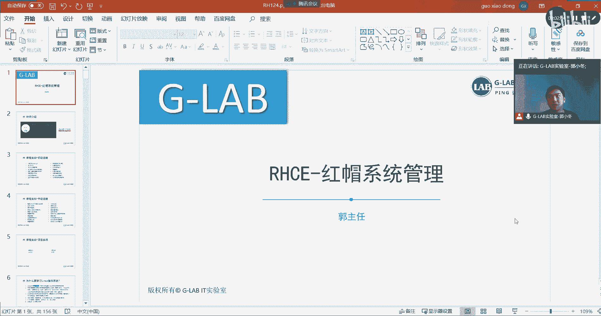
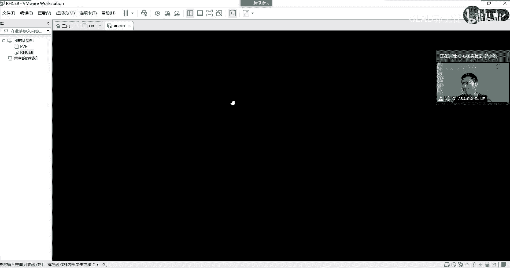
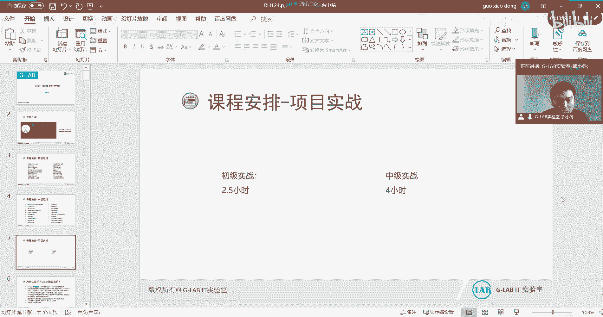

# 【Linux／RHCE／RHCSA】零基础入门Linux／红帽认证！Linux运维工程师的升职加薪宝典！RHCSA+RHCE／入门到精通／0-红帽课程 - P1 - GLAB郭主任 - BV1vj411h74Q

好OK那我们开始这门课，在课之前我们要简单的做个课程介绍，然后把这个大概的课程体系跟大家说一下，那么呃红帽的R7CE8的课程，是今年的7月31号，7月底应该是正式的改版到红帽八。

那么红魔八现在在我据我了解，现在很多的企业啊，原先用的七也会在慢慢的向八去过渡啊，那么我们作为现在作为RG，CE的考试的学生呢，我们学习的也就是八这套课程，那么这套课程呢它有一些改变，还有一些更新。

可以说是比较大的一些改变，以前我们做这个这个这个运维，基本上没有涉及到，尤其是CECE里面没有自动化的任务，最多的自动化也就是用shell写脚本，然后用这个的定时任务之类的东西啊。

那么这些东西呢在八里面都有，但是他加了一些新的东西进来，比如说用asp，我们用asp来对整个的企业的系统来进行，集中运维，asp是自动化运维的一个一个平台，他可以去管理系统，也可以管理网络啊。

也可以管理所有所有东西，他都能管起来，它是用Python写的一个项目，那么它放到了我们的RH，CE的学习的课程体系里面来，所以呢八的课程他会更加的实战，还有更加的实用一点，所以在这一块。

我们现在要认真的去学这个课程啊，这是先做一个简单的说明，RHCE红毛八的做了一个大版改版，然后第二个我们这个课程的话，是每周只上两天的，那么到后边可能会会改成单休，会改成一天，到时候告诉到时候看啊。

到时候看这个我们的课程排课嗯，怎么去安排，前面应该是两天的课，所以大家周末啊，你要有时间一定要到现场来听课，因为线下的效率要比线上高，线上你打瞌睡我都看不到现场你们打瞌睡，我还能提醒你不要睡。

着凉了是吧，多多件衣服，这边太冷了，所以现场的效果肯定要比线线上的要好，我们再提醒一遍，一定要认真来上课听啊，上课听来来现场听课啊，来现场听课，然后呢，这个我们的上课时间是早上09：30。

到下午四点钟或者04：30，中午是呃12点到01：30，大家去吃饭啊，然后就是上课时间好吧，然后呢我们的上课的实验环境，我在周四的时候就让那个阿花，那个小姐姐在群里通知大家下载这个实验环境。

非常的，它是做了一个虚拟机的打包格式啊，就这种给大家考的是一个整个虚拟机的包，这个包差不多有28个G非常大嗯。

是我们整个这个红帽的学习课程当中的，唯一的练习环境，大家不用自己去装，我们这里头有房间，所有东西都做好了，我也会教大家怎么用，包括到后期的考红帽的，这个是最后考试啊，考试的模拟环境也是这个东西。

也是这套东西，所以没有下载的同学尽快的去下下来明白，也就是从前面我们上课啊，我给你演示，包括你自己做练习，我们每一个内容后边都有练习，然后呢包括后面的考试模拟，都是在这套系统里面，所以当每个人都要下。

每个人都要下下来，这是第一个，第二个下下来请不要外传，因为这是红帽官方给的，官方的这个这个学习资料，他理论上只给我们这个授权合作的合作伙伴，也就是我们是红帽的官方授权伙伴，他给到我们。

然后他也只是让我们给到我们自己，需要参加考试的学生，那么希望那些在没有参加报红帽考试的，没有去学习这个东西的，他们不要给他们去分享，因为他们老外比较注重这种知识产权，所以大家自己下下来自己做啊。

如果一旦发现了，可能就这个要追究起来就比较麻烦好吧，所以这里要提醒一下各位好吧，然后呢这是练习环境，这是练习环境啊的说明，OK那么我们在开始之前做一个简单的介绍，应该很多人都认识我。

我是治疗白起实验室的联合创始人啊，很多很多的这个同学在很早就听过我的课，我从13年就开始带CCIE，然后一直到现在还一直到现在，然后G了白T实验室是15年成立的啊，我从刚开始带着我们几个老师。

一起做了这个培训机构，做了这个IT实验室好，那么本人是思科做网络起家的，我是三个CCIE，然后再加一个华为的HCIE，然后红帽虚拟化都懂一点，这是我个人的一个简单的介绍，希望呢在这一期的整个过程当中。

能够跟大家一起去把C的所有的内容对吧，好好的去学习，我希望我能讲的你们都能听得懂啊，听得懂的都能用上，这就是我们做培训的意义啊，否则是没有意义的对吧，不是为了考证而考证。

一定要让大家学到自己想学到的东西，然后顺便拿一个证，这是我们的一个初衷，那么因为这个视频我可能会放出去，所以呢在这里给大家提供了两个学习的资料，下载的方式嗯，第一个就是我们的学习讨论群，这是一个大群。

是我们线上的所有学生的一个大群的讨论，大家现场的同学可以加也可以不加，没关系，因为你们在我们的小群里面，你们属于VIP客户，所以有问题可以在小学里面问，大群里面很多都是线上的这个圈子里的。

就是就是感兴趣的，对我们视频看到过的，则会在大圈子里的大圈子里，那第二个就是课程资料的下载，我们有微信公众号统一给大家，把所有的百度网盘的链接，都贴在我们公众号里头。

所以大家可以关注我们公众号底部的菜单栏，去去去索取你想要的，这里头有很多啊，比如说网络的系统的虚拟化的嗯，很多的资料，初级视频资料都在这个公众号底部菜单，所以大家可以去索取一下啊。

不见得说系统的同学就不去学网络，肯定对网络也要有些了解对吧，可能也要对虚拟化有些了解，所以呢做了一个统一的资料的索取的入口啊，不要跟我要说链接去哪下一些什么VCENTER的，安装了。

还有什么这个EXI的ISO的镜像啊，这些东西都不要跟我一样，都在这个公众号底部菜单，好吧好，这个是两个，这是两个的入口，算是两个入口，一个是讨论，一个是资料，那么接下来呢我们给大家介绍。

我们整个的课程的安排啊，我们这个课程会从rh cs a开始上嗯，也就是最初级的运维一开始上，这也是我们今天的第一天的初级课程的内容，那初级课程大概有这么几点，大家可以看一下前面讲的内容可能比较基础。

所以我希望如果有基础的同学，不要觉得简单啊，可以因为要照顾一些没有基础的同学，我们都是从零开始给大家讲的，第一天，第二天相对来说都是比较基本的一些一些命令，一些概念啊，懂得再加强一下记忆。

不懂得抓紧时间听我去说明白，然后自己去练习好吧，红帽的入门访问命令，通过命令行访问管理文件是吧，编辑文件vi编辑文件管理用户和主控制文件，访问监控LINUX进程。

然后守护进程配置SSH存储日志的查看管理，网络归档安装，也就是ym rpm，然后访问LINUX文件系统，然后去分析这个呃，log日志服务器的一些获取的一些帮助，还有一些日志好。

这是我们初级运维这个课程差不多在三天左右，也就是这一周的两天，在家下周一天差不多初级会讲完这么多内容，会讲完明白好，接下来中级中级分两块，一块是左边，左边这块的话是我们中级运维的，提高效率的一些方式。

比如说还会讲嗯希希尔的脚本，然后还会讲第四任务会讲系统调优，C2对文件的控制，S1LINUX对吧，然后存储存储这块是这里的重头戏，会讲本地基本的存储逻辑卷，还有还有这个RHER，也就HCE8。

新加的一个存储内容叫v d o video，是现在用的比较多的存储方式，OK然后会讲这个如何去破这个系统的密码啊，控制就LINUX如何启动它，启动经历了哪些过程，我们可以在启动过程当中做哪些影响啊。

然后最后会管理我们的网络，安全的管理网络，这是终极的第一部分，这一部分内容差不多也在三天左右，三天左右，OK好，然后第二部分，重击的第二部分就是我们C8的重要的部分，叫an，会给大家讲。

用asp这个工具，集中化的去运维整个的这个操作系统，我们只关心操作系统，当然也有一门专门讲，如何通通过SP去维护网络设备，什么路由器，交换机，防火墙，这些都能被他管起来，这是我们红包里边的另外一门课。

高级高级的另外一门课，那我们在这里主要关心的是asp如何去运维，五台服务器，就集中运维啊，集中运维五台服务器都是在一个控制节点上，然后去控制舞台受控节点好，如何去部署创建，那么创建playbook。

然后里边的一些变量，那么如何去控制，然后文件管理大的项目角色排除排除故障，然后自动执行LINUX的管理任务，所以第二部分的中级，主要就是在做集中的自动化运维，所以这一块相对来说是比较难的。

差不多会讲3~5000左右，三天啊，四四天至少也是四天，我们就算四天，所以这样的话我们算下来已经十天了对吧，已经有十天的课程，最后我们会拿出一个项目的实战，这个项目的实战嗯。

其实就是我们最后的R7C1的模拟题，虽然是模拟题，但是我可以百分之百告诉大家，它的仿真度能达到90%能听懂吗，所以最后两天主要就是去练习考试的模拟题，其实说白了就是把答案给你们了，然后花两天时间去练。

但是不见得所有人能过，因为红包C1的考试我觉得还是挺难的，尤其是现在的改版，红包系列考试分两部分，第一部分是上午，上午考初级两个半小时，20道题，这上午的20道题也会给你非常简单，上午基本上没有人会挂。

因为这都太简单了，然后主要是下午下午的话是六个系统，六台红包系统考四个小时，四个小时啊，嗯然后很多同学都来不及做，因为代码量太多了，然后我给你了，带给你的题，给你了这些解法。

然后不是所有的人练的不好的同学都会挂的，都会挂，基本上都会挂，所以大家一定要重视这个练习，要不然的话不会给你四个小时，对不对，所以上午加下午加起来六个六个半小时，这种考试时间。

已经达到我们CCA的考试标准了，cc也是考一天最多考八个小时，他都是上级啊，都是上机题，红包还是个中级考试，CCE是个高级考试，对不对，所以它的终极的时间和难度，已经达到了我们网络的高级的一些时间。

还有代码量，所以呢最后的两天我是不会放出去的，最后两天的视频录屏，我是不会放出去，只会给我们的参加考试的学生自己看啊，前面的一些理论课，我会按这个内容录好，然后给大家带回去，自己复习或自己看都可以。

明白吧啊，所以毕竟这一块是人家官方明确要求的，不能把一些题啊，什么东西啊放出去，要不然可能就出问题了对吧，所以大家也不要尽量接着就是自己考试的同学，拿到我们的题库讲解，也不要往外放，也不要把自己看啊。

好不好，Ok，那么差不多就前面的这个几个内容，跟大家说明白了啊，先把开除，大家心里要有个底，我们的课大概上哪些东西啊，然后呢因为这个视频我会放出去再说一遍，有可能看到这套视频的同学。

不是我们的考试的学员，那么如果想要呃，我们在课上的那套练习环境的话，嗯我们可能就比不了了，好了，先跟大家说一下，只有我们的考试是都可以去去拿到这套东西啊，因为这是官方明确规定的。

所以我们也要遵守游戏规则好吧，当然如果你想考试的话，可以联系我们，我们可以给你给你一些一些一些练习环境，还有一些指导。

