# 【Linux／RHCE／RHCSA】零基础入门Linux／红帽认证！Linux运维工程师的升职加薪宝典！RHCSA+RHCE／入门到精通／2-练习环境搭建 - P1 - GLAB郭主任 - BV1wN4y1D71G

OK好，那么接下来我们接着往后看啊，课程介绍说完了以后，接下来我说一下我上课的要求呃，今天第一节课跟大家约法三章好不好，然后我们所有的这个课程，大家第一考虑的就是要来现场。

因为学习这种事情它本身就是反人类的，谁愿意学习，谁想学习，反正我是不想对吧，太痛苦了，大好的天气出去玩不好吗，在学校在这个教室里上课对吧，所以呢呃每个人其实都是有惰性的，来现场学习的。

这个呃这个学习的效率应该会高一些，至少你在现场打瞌睡，我能提醒你对吧，然后也不可能轻易的被别人干扰到，在家里学习的话，在线上学习很容易被家家庭的成员影响到，所以这个效率是不能保证的。

所以我还是希望各位第一考虑的就是要来现场，我们面对面的交流，你有任何问题我也能及时解答到，这是我给大家的建议好不好，然后呢第二个不要缺勤，尽量不要缺勤，我们总共就12天课，12天课大家都不要缺勤啊。

如果非得要缺钱，或者有什么事情参加不了，第一时间跟我们的阿花班主任去说一下好吧，然后呢这个视频我也会多录，刚刚讲了，我们都会录视频，实在要缺勤的情况下，回来记得一定要看视频，一定要看录播的视频好不好。

然后呢这个我们每一天都会有作业，我都会给大家布置作业，每天参加完都会有作业，那么作业希望大家按时完成，然后在哪里做呢，就是在我给大家考的那个环境里面做，那么这个作业呢，我会让大家理论上要让大家整理出来。

然后发给我，但是呃这个整理比较麻烦，我希望各位从头到尾按照要求做一遍就可以了，好吧，不要给我整理，当然你可以整理发给我，也可以给你查，因为他这个比较麻烦，LINUX和网络的不太一样对吧。

所以希望大家一定要把环境打开，按照我的要求把作业做一遍，一定要做一遍，然后在上课的时候，我也会给大家时间去做作业，因为这本身就是一个操作的东西啊，我认为LINUX的中级的考试是比较有含金量的。

大家参加过其他考试，应该都知道，那所有的中级考试，包括初级考试，其他的技术都是选择题，都是选择题，而且题库给到你只要背一下就行了对吧，那红帽的LINUX从初级它就是上级题，就是从初级的第一道题。

就算最简单，让你创建用户，他也是上机体，就直接在系统里操作，中级也是在系统里操作的，所以它是一个唯一的从初级一直到高级，都是实战操作上机操作的一个考试，所以我希望各位不要只是听，一定要认真的去练。

不动手，你怎么就学不会好吧，所以一定要动手，这个是一定要动手的，好吧啊，这个前面我不查作业，还有一个很重要的原因是，因为最后参加考试，最后的四天模拟考试，有两天你都要到我这儿来，你平时练练没练。

那天我就看出来了好不好，模拟考试有两天，你你的所有的练习不是用你自己的电脑练，是用我的电脑练，然后我告诉你早上09：30到这来，就当考试一样，然后到这边练习你的手怎么放的，怎么敲的。

我就知道你平时有没有练好不好，所以大家平时尽管不要练，没事到最后两天肯定会被我喷的一脸的唾沫，把脸擦干净是吧，OK所以这个大家一定要一定要重视啊，一定要重视好吧，然后呢这个是我跟大家说的。

考上课的要求和作业的要求啊，这个是前面要说在前面啊，丑话要说在前面好吧，然后简单的介绍一下自己，很多人其实也认识啊，我们本身是网络出身的啊，华为红帽加虚拟化，这些都有一些都有一些了解啊。

略懂只能说略懂好吧，能够跟大家讨论的东西也相对多一些，如果在工作当中，除了系统相关之外的，都可以跟我讨论好吧，这个是课程的一个介绍，然后呢，我们接下来介绍一下我们的课模拟器怎么用，好吧。

怎么了哦哦哦我这边设备，你这个账号在那个上面有个腾讯会议啊，啊可能要自己注册，你自己退出，重新注册一个，能看到看不到我桌面是吧，高层就可以，刚才是可以，可能要重新注册一下账号，OK好好。

现在我们来说一下我们的环境啊，这个环境是我们在学习之前，一定要全部安装好的，叫我们就跟我们学网络一样，网络之前一定要把模拟器都安装好对吧，所以接下来时间我需要跟大家，把我们这个环境先教一遍。

你怎么去用它，大家都考完了吗，跑到哪了，没有是吧，没有啊，我们第一天可以稍微慢一点，没关系啊，大家在练习先看环境如何搭建，我们一步一步来啊，网盘链接有的回头，我给大家发一个网盘链接，不要着急啊。

不给你们的好，嗯给大家的文件考完以后啊，它会有一个是这样的一个文件夹，文件夹里头呢它会有一个叫VMX的文件，就这个文件RHCE点VMX，这是一个虚拟机文件，然后你直接双击打开以后。

它就会自动帮你从workstation打开了，就就到这了，各位能听懂吗，OK有一个文件啊，再说一遍，听清楚，有一个文件叫VMX，就这个这个文件只有一个叫VMX的文件，大家自己去找这个后缀啊。

这个文件找到以后双击打开，它自动帮你从workstation打开了，所以你电脑还必须得装一个workstation，装完以后打开就到这了，到这儿啊，大家到这儿看到的就这个就这样一个界面好。

这样一个界面到了以后呢，你可以直接打开，其他什么都不用改啊，不用改，当然有一个地方要改，大家可能要去确认一下，去check一下，去编辑一下虚拟机关机状态啊，不要开机，在关机状态去编辑一下虚拟机。

点击一下处理器，看一下这三个勾都勾上，把这三个勾都勾上，这三个勾VT功能打开啊，全部勾上，其实默认应该都是勾上的好，你再确认一下好，都勾上了以后。

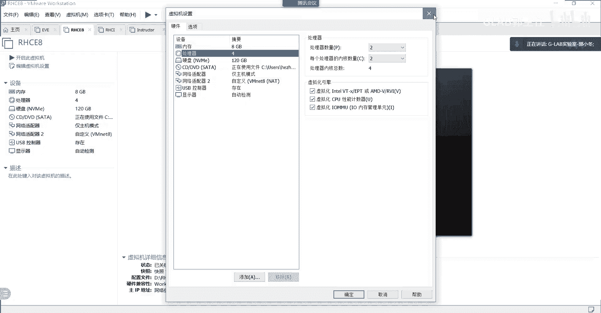

请各位把虚拟机打开，然后我这个应该是开过的，所以没有任何提示，如果你们第一次开它有两个选项，一个是国已复制，一个是我已移动，对不对，打开一个新的虚拟机的时候，他都会有两个选项。

你们现在应该都会有这个提示的出来了吗。

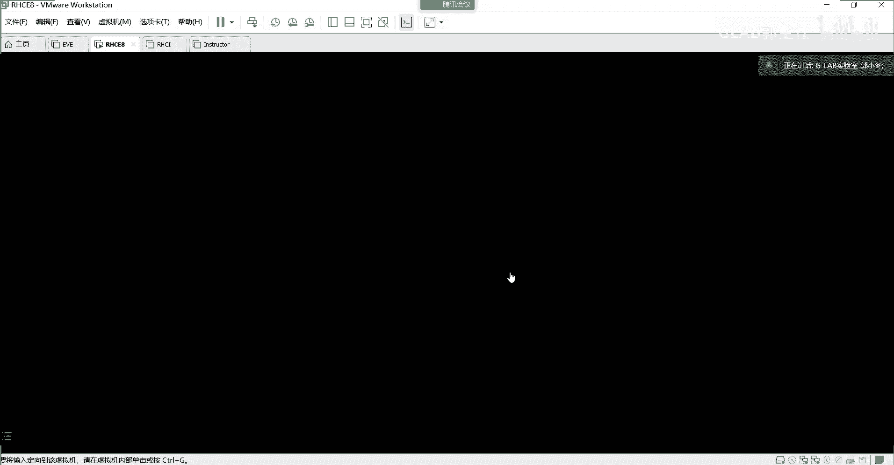

没有吧，现在开机的时候，他会问你是复制还是移动，我们选复制，我们选复制，我等一下你们啊，因为我这个是开过的，有有跳出来的跟我说一声啊，开机的时候，如果跳出来说复制和移动的那个界面，请请跟我讲一声。

出现了吗，出现了是吧，对我已复制，点复制啊，点复制OK，点复制，点复制之后是不是就开机了，开机的话都到了跟我一样界面，要编辑虚拟机点处理器，默认应该是勾的，看到了吧，好关掉，开机。

开机之后它会提示说复制还是移动，那这个时候请选复制精选复制啊，呃现场没带电脑同学没关系，我现在录屏的回头到时候不知道怎么操作，记得看一下你用什么来，就是workstation。

就这个reward workstation能看到我桌面吗。

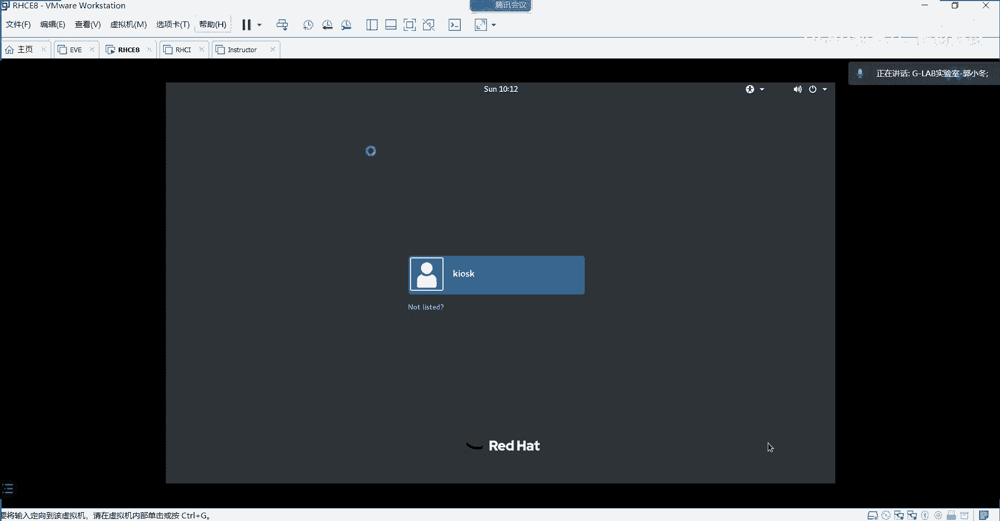

这个你这个应该没装了，没有啊，没有装吗，装没有装就装，那就有啊，那种到期没关系，到网上百度一个15的，随便百度一个都能激活。

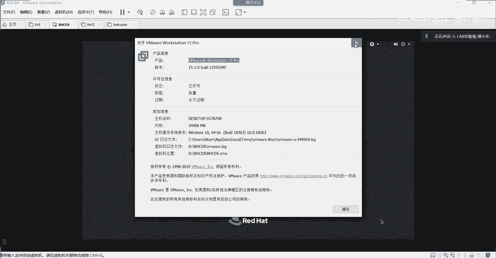

OK都开机完了以后，到了这个界面，大家看到都跟我这个界面登录用户的界面是吧，这个用户啊默认这个叫普通用户啊，这个系统你现在登的这个系统，也就最外边的这个系统，你是没有超级管理员权限的。

你都只能用普通用户登录，这个普通用户就是这个KIOSKKKKK，就这个只能用这个普通用户登录，那么这个普通用户的密码是red hat r，E d h a t reheat，好登进去。

你没有超级管理员权限啊，嗯所以呢，大家会发现我们环境其实应该是怎么实现的啊。

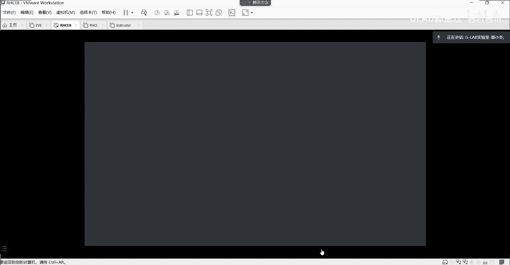

我给他画一下我们的环境啊，这个很重要。

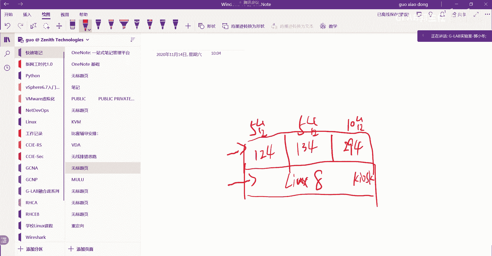

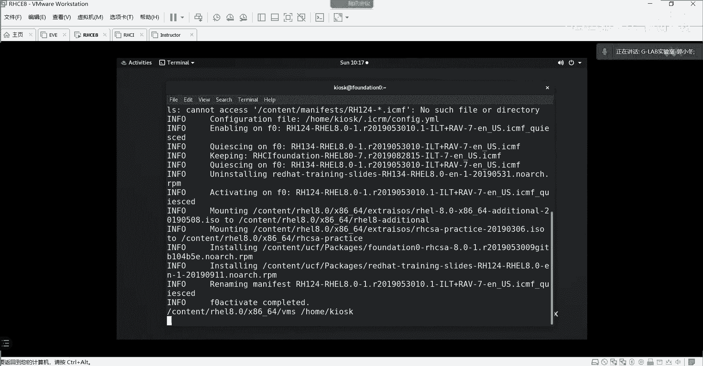

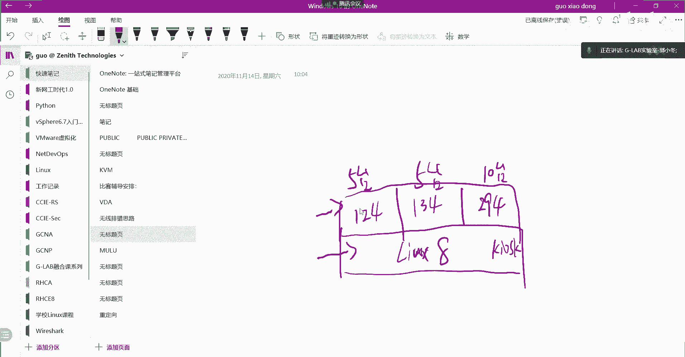

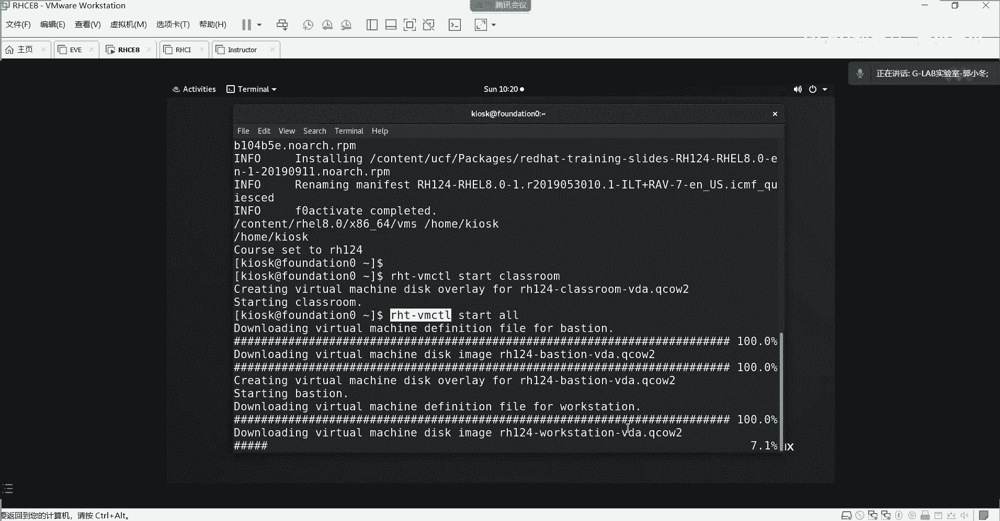

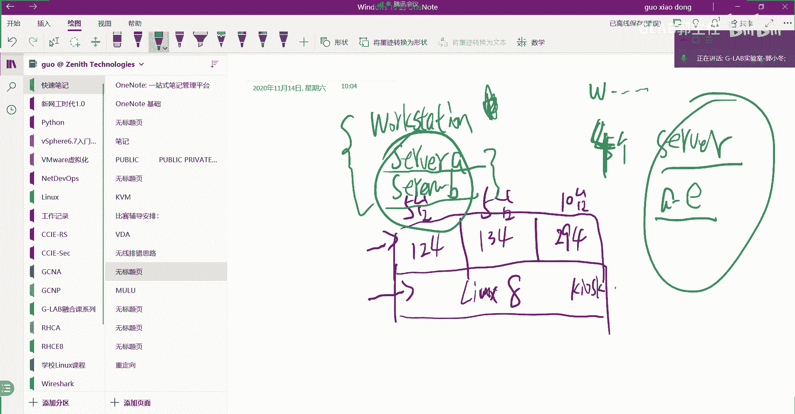

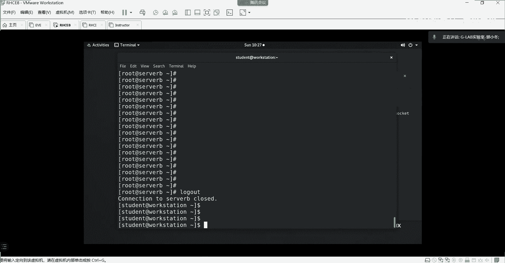