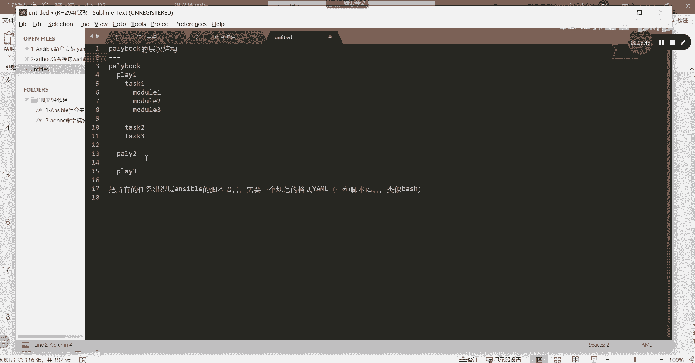
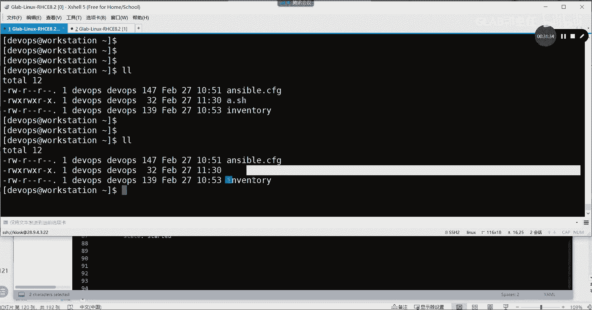
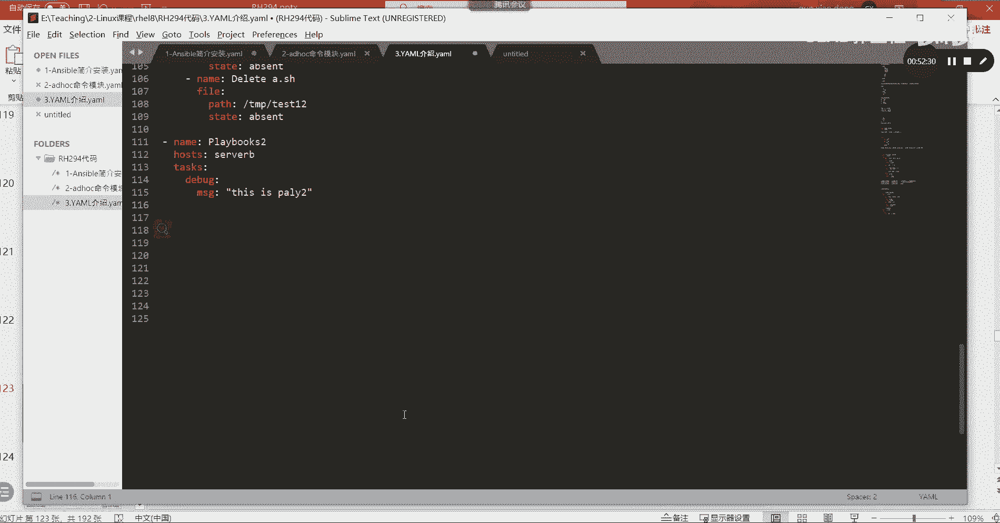

# 【Linux／RHCE／RHCSA】零基础入门Linux／红帽认证！Linux运维工程师的升职加薪宝典！／38-Ansible Playbook介绍 - P1 - GLAB郭主任 - BV1ew411W76x

好吧，那我们来下午的内容开始啊，看一下我们的计划啊，我们的SB安排了AP加PORTMAN，就是容器安排了两天，来1234天安排了四天内容，第一天我们要把这个讲完，然后讲变量，明天要讲计划，任务控制。

明天的工作也是比较重的，三块后天讲角色讲排错，没关系啊，1。1点来好吧，可以慢一点，但大家一定要能听懂，我想把每一个，其实这个细节它的这个内容的重点不多，难点在于大家对playbook的编写。

其实你要知道它有多难，他一点都不难，特别简单，没有那么复杂的逻辑，难就难在playbook的编写上，很多人写不起来，考试就要写playbook，好吧，来我们看，接下来我们给大家介绍。

叫脚本或者叫叫叫剧本，知道吗，叫剧本是吧，这里解释了playbook和临时命令的区别，临时命令时其实是不属于，不适合于复杂的环境和场景的编排，都说过的临时命令就是我们前面讲的AD hoc。

Ad hook，然后临时命令一次只能调用一个模块，有没有发现我刚才写临时命令的时候，有没有一个令调用两个模块啊。

是不是每一个命令一次，gm只能调用一个模块，对不对，但我们在复杂的环境里头，我们可能会用到很多个模块，所以啊AD hoc他就不适用了。

他就不适用了，好不好，然后playbook主要用在这个配置复杂的程序，用来控制这个复杂的应用场景的需求，灵活的解决方案就用playbook，OK这就是playbook的作用。

来看playbook当中包含哪些东西，剧本吧，剧本里面肯定包含了每一个桥段是吧，这个桥段叫play，每一个playbook包含很多个play，OK然后每个play包含很多个task。

task就是他的任务，然后每一个task又包含很多个model，model就是你要做的事情，说明play里面它的层次关系。

我觉得应该说清楚了啊，给他写一下吧，第三个我们来看啊，我先来介绍一下我们的playbook的层次结构，playbook的层次结构，他说啊，他说每一个playbook。

每一个playbook它里面有很多个啊，有很多个play对吧，play1play2play三，然后每一个play里面又包含task1，task2是包含很多task，task3下面我就不写了，能听懂吗。

然后每一个task里面又包含了很多个model，model音m o d u l e model，Mod3，这就是它的一个层次结构，看得清楚吗，所以啊我们一个复杂的playbook。

你可以把下面的player play3都按上面的方式去展开，它的task不一定是三个，有可能有好几个，所以你会看到一个很复杂的剧本，playbook的剧本听明白了吗，OK这是它的层次结构。

就是我们PPT给大家所说的内容，好继续，task是按照顺序执行的，playbook是以任务为导向的，只要运行就不会再重复运行，我们这个叫me，什么叫me密集性吧对吧，它的一个特性就是只要运行一次。

他不会再重复运行这个就行，然后我所有的play3照顺序，task model按照顺序去执行的，所以大家在编排剧本的时候，一定要想清楚，哪些任务是要放在最上面被执行的，各位能听懂我意思吗，这是规则。

规则好继续，接下来我们要重点来讲我的所有task所得，我这个playbook所对应的格式叫YAO格式，这个是它的层次结构。

这个是它的层次结构，然后怎么把这些层次结构组织成，ESPORT的脚本语言呢，就是我们可以把计划把所有的任务啊，所有的任务组织成ANSPORT，脚本语言需要一个规范的格式，规范的这个规范的格式。

这个规范的格式叫叫YMK，它规范了我们写sport脚本语言的格式，所以你也可以把它理解为它是一种语言，听明白了吗，它是一种脚本语言，可以理解为我们之前所学的bash，白希拜师类似于拜师的交换言类似啊。

可以这么理解，但是他的格式跟拜师不完全不一样好，那么接下来我们来重点来考虑yo这个格式，也就是USB把这些东西组织起来的，这种格式叫yo。

那么yo它有哪些特点，看看我自己这几个给大家一个念一下，它是一种压缩格式的文本文件，它是文本文件，扩展名通常为YML或者你写YAML都可以，明白吗，或者YAML这两个你看到的都是一样的。

代表的都是yo文件，听懂我意思吗，各位第二句话，playbook在写的时候，他有一些格式的规范对吧，他有些格式的规范，那么对缩进是严格要求的，你在写的时候，前面的缩进是几个严格要求。

但是下面的这些规则也都要遵循，来看第一个层次结构中，相同级别的必须有相同的缩进，比如说举个例子。

这个play和这个play它不属于相同级别吧，play1和play2是不是具有相同级别，能听懂吗，所以他们前面的缩进应该是一样的，没问题吧，这个task1和task2应该是相同级别。

所以前面的缩进应该是一样的，没问题吧，他说的是这个概念，相同级别的一定要有相同的缩进。

严格要求啊。

好子项必须比负向缩进的更多，是不是我这里体现的这个叫指向。

这个叫负向，能听懂吗，好第三个可以增加空行来增加可读性，所以你在play1和play2之间。

你可以加一行，这样的话看的很清楚哦，这个是play1的内容，这个是play2的内容，好play2结束之后，我再看play3的内容，也可以加一行，然后model1和model2。

test1和test2也都可以加一行空行增加可读性。

各位能听明白我意思吗，所以这个说的就这个意思，加空行没有影响啊，注意只能使用空格，不能使用tab键，很多人在写代码，敲代码，敲习惯了代码，敲完按tab键缩进ASSABLE脚本的格式里面，不识别tab键。

要用空格缩进就打空格键，这个要注意啊，OK那如果你想用tab键也可以，你要在后台的文件里头，把一个tab键对应成两个空格键，就在后台要编辑一下这个文件，在这个文件里加上一项这个加加一下这个行。

加这一行的结果就是你按tab键，它转化成两个空格键，听懂了吗，各位所以不做这句话的话，tab键就是tab键，它不是空格键，好吧好，接下来重点playbook3个破折号作为文档的开始。

三个点点点作为整个的结束。

所以如果写playbook这样写是不对的，应该怎么写，三个作为开始好，这个结束了以后，点点点作为结束，这就是一个从这个开始，从这个结束，这就是一个完整的sport脚本，playbook的脚本。

听懂我意思吗，一般三个点结束的三个点可以不写，因为是默认的，但是三个三个这个杠是必须要写的，开始的地方必须要写。

可以不去写，结束的地方，我说清楚了吗，OK好这个一定要啊，叫破折号开始啊，后面然后第二个接下来要写的时候。

每一个层次结构就是接下来要写一个空格，就是要从破折号开始后面加一个空格，这就代表我要开始写我的play了，理解我意思吗，应该这样写的啊，应该是这样写的空格，然后接下来的所有的缩进。

都是按照严格的缩进方式来缩进的，所以这个代表开始，然后里边play这里怎么写的。

这个叫主体部分，必须第一个主体部分的第一个item，一定要用破折号开始，后面要加一个空格，主体部分啊，只是主体部分要加一个破折号。

加一个空格，然后后边如果有很多，他就不需要再加破折号了，这代表是一个主体。

好一会有例子啊，然后呢playbook本身是严格的key value是字典的key和value，写过Python前面是K值，后边是value值吗，对吧，是一个key value的值啊。

然后呢key value的值之间必须要有一个空格，必须要有一个空格来，我们来说了这么多，我们来先把呃，我们来先把这个写两个。

来给大家简单的示范一下，把这个去掉了，接着写吧，我们来写两个好不好，杠杠杠代表这是playbook开始了，对不对，好主体部分要从破折号空格后面开始写read，再来一个，这也是一个主体部分。

green g r e e n对吧，好，又来了一个主体部分blue，这个能看懂吗，结束给你点，是不是一个blackboard的写法，明白好，如果说接下来read下面有一些read。

下面有这个有一个指指指向的话，你要缩进的，因为负向要比指向少说进，也就是指向要比负向多说进这个能听懂吗，缩进规则就这样缩进的，比如说他下面也有一个指向，你需要说两个，那就在上面写说两个。

这就是缩进和破折号之间的关系，听懂了吗，各位OK好，然后再来，这就是这么写的，就这么写的，这就举个例子啊，OK好。

接下来我们来讨论比较重要的问题，yo这个脚本语言，它所支持的数据格式有哪些，对吧呃脚本语言都要有数据的支撑，那么在yo的这个脚本语言里头，它能够支持哪些数据格式呢，那我先问大家。

大家知道的数据格式有哪些啊，写Python知道吧，字符串是吧，字符串算是一种数据格式吧，字符串整形浮点型，对不对啊，这个叫数据，那么数据数据的这个type类型，字符串二整型浮点型。

那么数据结构就是以什么样的结构，去组织我们的数据，它又分为字典对吧，列表对吧，原主是不是Python里面有这些数据结构吧对吧，好在ansport yo里头他就比较简单，他把数据和数据结构都归在一起。

它能支持的数据结构有字符串，单纯的字符串，有字典，有列表，他就支持这三个，听得懂吗。

再支持三个，来，我给大家演示一下这个格式，它仅仅就支持三种类型的数据结构，YAML支持的数据结构三种，第一种叫字符串，叫字符串，第二种叫字典，第三种叫列表，我们一个个来来给大家演示啊，先看字符串。

字符串的话我们可以怎么写，先用三横杠代表，这是一个playbook，开始写了，对吧好，This is a，这是不是一个字符串啊，好然后呢，我们的字符串是可以在压迫里可以加单引号，也可以加双引号写。

结束了吗，点点点，结束了好，所以这个就是第一种格式支持字符串，听懂吗，嗯直接在压迫里头写字符串，它是支持的好，第二种开始写了，接下来我们要写列表列表，大家知道怎么写的，green这个就是典型的列表。

blue结束，这就是列表，你把它翻译一下，翻译成我们能知道的它就是什么样子，列表怎么写的，列表是不是中括号啊，Red，Green blue，这是不是列表啊，如果你在Python里的列表是这个样子的话。

那么就把它转换成就是playbook，就是这个样子，就这样听懂了吗，OK好继续字典的，还是写了字典，怎么写的好字典啊，name空格，Using，结束这就是字典，听懂了吗。

好字典是典型的key value值，所以说如果用Python的字典来给它体现，我刚刚写的playbook应该怎样写，字典是用花括号的吧对吧，好name冒号，Using，ASPA逗号。

然后code等于D1234，这个能听懂我意思吗，各位前面要加引号啊，这是一个字符串，所以如果用字典就是这样显示的，如果用playbook就这样写的，听明白了吗，OK好，所以可以这样写，是列表的形式。

然后呢可以这样写字典的形式，前面先不加杠啊，有人会混淆，他说你前面又加杠，这到底是列表还是字典好，前面加杠加冒号这种格式写，我们把它称之为第四种的方式，叫混合混合使用。

平时我们在playbook写的最多的就是混合，没有说单纯的用列表，用单纯的用字典，听懂了吧，来我给他写一个混合的，在playbook里头就是混合的，这个混合字怎么写，刚刚刚开始了吧，对不对啊，开始了。

开始之后，我们要先先写class好，请问我写这个class还没写完啊，我先写，然后这样写name，number我写完大家能看得明白啊，记住啊，破折号后面有一个空格，然后name冒号后面也有一个空格。

写完了，请你帮我把上面这几个翻译一下，这里用了什么，用了什么，首先肯定是用了列表，对不对啊，这个这个这个都是列表列表呈现出来的，对不对，然后我还用了字典，每一个列表里面对应的名字是什么，学号是什么。

这个是用字典KV6的方式给呈现的吧，听懂我意思吗，key value的名字所对应的对应的字符串，听懂了吗对吧，所以字符串列表字典，那么请你帮我把这个翻译一下，翻译成Python应该怎么写，啊。

大括号大括号为什么是大括号啊，奇怪了，最外边这是不是一个字典啊，对不对，所以应该是大括号，大括号就开始写了克拉斯呗，既然是一个字典，就是冒号呗，好冒号后边应该写什么，中括号后面是一个列表。

class后面这些是不是都对应的是列表啊，对不对，但是列表里又有什么，又有字典，所以说又是一个大括号，听得懂吗啊又是一个大括号，那这里面写了name，冒号STU1对好逗号，name i没没没完。

name冒号STUV1对的逗号啊，逗号NUM冒号001，这是一个支点，还有吗，列表的分开，再来一个花括号name冒号STUR逗号NO002，再来一个花括号name冒号三逗号name number003。

这个看的明白，是不是混合的，给他改成我们的Python的写法，就是这个样子，听得懂吗，各位最外围是字典，里边是一个列表，列表里面又有一个字典的对应关系，名字和，所以我们一般写的就是这种火。

当然在编写playbook的时候，不需要大家对我们的playbook进行像我这样的转化，因为这种转化的过程就是由asp引擎来做的，他帮你把所有的东西我给你写出来，就告诉你playbook的脚本语言。

它是可以转换成Python的语言，然后最终送到受控节点主机去执行的，你这样写他就帮你转换成这个样子，最终送过去执行，听懂了吗，OK所以每一个playbook的脚本语言。

它都是转换成Python再去执行的，我这边写的是Python的语法，所以第一个内容我说完了，介绍playbook的语法，play boy就这么简单。

没什么难的规范，注意一下就好了，听得明白啊。

这个都做好了，好这些都做完了以后，接下来我们来给大家写一个，可能对这个没有什么完全的认识。

我们来给大家写一个完整的一个完整的playbook，脚本，好吧嗯，我们最好写的时候，大家像我一样用用用这个用这个SUBLINE，或者用其他的编辑的工具再写，写好了之后再送到这个系统里面去执行。

还有很多人也是怎么怎么写的呢，他是直接在里面写，比如说我的playbook在这，我是直接在这里去编写playbook，然后去执行，因为你写的脚本最终要送到这来吧，你可以直接在直接在这里。

通过vim编辑的方式去写。

你也可以在这里通过SUBLINE编写好了以后，然后再送到workstation上。

再送到workstation上去运行，听明白为什么我在整个演示过程当中，因为我觉得这个vim编辑里面太麻烦了，它的缩进各方面都很难控，听懂吧。

我一般都是在这里编辑好，然后送过去好吧，来我们来简单的写一个写一个完整的playbook，大家看看会不会能不能能不能识别，能不能认识到嗯，这个是笔记是吧，这个是笔记，那我就保存一下，重新开一个。

嗯三这应该是，介绍再开一个，这个是完全是一个脚本好吧，我们来写写这个脚本好，这个脚本我们怎么写啊，嗯就在这写吧，省的烦，在这写来写一个杠杠杠好，首先开始写了吧，写一个完整的playbook好。

然后接下来它以name name就代表我这个play，我这个play的不是play啊，是我这个整个PLAYBOX的名字对吧，这个plasma叫first，The first，playbook好吧。

叫做first playbook，好，Name，下面写完了之后，我们还要指定一下我应该去哪个list上叫inventory，我要去找哪个inventory去执行，理解我意思吗，好。

我想针对server a，请问我这边写的server a是一台机器还是一个组，我的image里面是不是有写server这个组听懂了吗，所以这应该是一个组，听懂了吗，好如果我这样写server lab。

点EMPLE点com，这个指的是一台机器还是一个组，这是一台机器，明白吗，如果我在不停的变换写二呢，or就是inventory里面所有的机器听得懂吧，好不去指定组直接写二就代表所有好，如果写1。1。1。

1呢，是不是inventory里面这台主机啊，可以是域名，可以是IP地址，可以是某个组，可以是所有听明白了，好在这里我就只想去影响server a，所以我这里只写一个server a就可以了。

能理解我意思吧，各位好好继续，接下来要写我的task了，上面啊就指定我这个play叫什么，这个playbook叫什么名字，然后对哪台机器去操作，接下来才是我真正的task，这才是我的task，听得懂吗。

OK这个task我要写一些什么东西呢，一定要指定一下名字，名字叫什么，in all HTTP d server service好，然后我先写，大家先看能不能能不能认出来缩进啊，Y，好啊。

要么要么下面name呃，斜杠name，然后呢我们写HTTPD好，然后呢还有叫STATE冒号，用什么PRESENT，我写到这儿能看懂是什么意思吗，看得懂吗，看得懂吗，很简单。

说明我的第一个task task，第一个task写完了，我调用的是这个只是名字，也就是后边你写的这一段，只是你想怎么写都可以，就给他那个task，第一个task起了一个名字，第二个我就规范一下吧。

名字大家都用大写，第一个字母大写就代表这是自定义的名字，它不是关键字，然后这个也是这也只是一个名字，好不好，接下来用的是这个模块，模块里头name代表是要对哪个软件进行安装。

state讲过proceed就是去检查有没有安装，如果有更新，他更不更新啊，不更新吗，不更新，所以这就是在安装HTTPD听得懂吗，好再来一个，又写了一个name。

请问这个name我给它起个名字叫copy a，C r copy a to b，好这时候我用copy模块，冒号在哪呢，这个这个模块，这个模块在这个假设啊，test在哪里，SRC在嗯。

home下面的test，home下面的DEVOPS下面的test1，mouse送到哪去啊，送到送到哪里去看啊，送到etc下的的就算到etc下好了，起一个名字叫test12好，然后继续就这么多了啊。

就这么多，这写到这个第二个，请问这个和这个他们是什么关系，并列是吧，是属于一个test下面的两个不同的任务吧，理解了，或者叫刚才写的是一个test，下面两个不同的module吧，听懂了吗，明白了吗。

OK那继续再来一个，Name，这个时候我们要用s t RT start HTTP t，stopped好，要开启这个服务，我们用的是service模块，service模块，这个模块前面没讲对吧。

好service模块我们要指定service模块的名字是什么呀，HTTPD哦，然后呢ENLBD冒号这个true，再来一个STATESTRTED好，这是第三个，第三个能看懂什么意思啊。

是不是要开启HTTP服务，并且要设置它的开机自动启动吧，对不对，状态是star并且开机自动启动，对哪个服务对HTT变D这个我说明白了吗啊，好所以到现在为止，我给大家写了一个非常简单的。

非常简单的一个只有一个play，它里头是不是只有一个play啊，是不是只有一个play，1play里面有一个task，里面有几个model，听不懂吗，所以只有一个play的一个task。

里面有三个model的一个形式，我说明白了明白了啊，好，那接下来我们把这个脚本来找个机器执行一下，来找个机器执行一下，copy d z u p下面有吗，送到哪里送到，不要送到etc了。

送到tap下面对吧，送到tab下面，然后呃有没有test1啊。

我要确认一下好，我们就不用test，用A点SH好了好不好。

刚好有一个这个文件，给你这样就对了，好装这个，然后copy文件，然后启动服务就搞定了，来吧，我们来运行一下，这条我怎么送进去啊，我们。

送进去，我是这样子的，通过SFTP，连到这个主机是28。9。4。3，然后呢，我用DEVOPS吗，是DEVOPS吗，送到DEVOPS，不不不不不不是这个叫KISKKSKSK。

是不是。

kl sk密码是red hat，通过这个工具大家可以自己去下一个，就VSCPVSP，下完了以后找到我们这个文件所在的地方，我写在八里面有一个294的代码，应该是这个介绍吧，说到哪去呢。

我来看看KLOSK送到这儿也行啊，哎呀好烦。

这里建一个吧，MAD建一个cod吧，建一个cod的code，然后我们把他送到CODE的code里面去。

说到这这样不会乱好就进来了。

进来之后我们可以把它缩小，然后到这里来CD code，看一下是不是有了3arm介绍是吧，然后这个在foundation里面，我们怎么把它送到这个workstation上呢。

把当前目录下的三个送到哪里去呢，送到DEVOPSS，CPWORKSTATION送到这里去，这里下面的home下面的目录下面了，就送到江路上面好吧，加目录下面没有任何东西吧，就这样是不是过去了。

然后我们在这个workstation上加目录，看是不是过来了，过来了吧，好过来了之后，这个不是我想要的，我们把它切一下MV，三切成我们叫写成标准的，不要有中文啊，Play book，1。5ml。

然后看一下变成playbook1了吧，好我们编辑一下playbook1对吧，好前面上面的这几个都不要，我们把它删掉，10DD删掉，10DD删掉，10TD删掉，快了还有吗，还有10dd删掉，还有啊。

靠那就是dd删掉，还有嗯快了，好我们这把前面没有必要的都删掉了，我们把这个脚本运行过来了，看到了吗，各位看到了哈，好保存一下好，这样的话我们的playbook脚本就已经写好了。

第一个非常简单的playbook，就是这样子的，下面有空格，没关系啊，不用管，我们只需要关心我们上面这些东西好，写完了以后，play book写完了以后，我们要做的第一件事是，检查我们的语法有没有问题。

怎么检查bgm playbook，这是用来执行playbook的命令，然后playbook，然后执行playbook，一杠杠，SYNTAXCHECK这个关键字，tab键补不全，需要大家自己手打。

他不执行这个black box简单仅仅去执行语法检查，如果没有任何报错，说明语法写的是对的，听明白了吗，各位OK好，那么接下来我们要去执行playbook，我们可以直接把后边这个去掉。

当然你也可以用大C加一个杠，大C大C叫模拟执行，叫模拟执行，什么叫模拟执行，对就是在内存当中虚拟执行，其本质上是没有到server a去执行任何操作的，他只是把你这个脚本在内存里头自己跑一遍。

然后帮你检测有没有问题，如果没有问题，你就把杠去掉，真实真实的去执行，听明白了吗，好我们用大C去试一下，这个叫干运行看啊，是不是执行了the first playbook，没有问题吧。

但是这个执行完了以后，你在server上是没有东西的，server a上是不是没有东西啊，我们来看看ANSPORT，我们去server a看一下嗯，杠不用加command啊，不用加杠I也不用加。

and我们直接去加一个杠A，去看一下LSGL在哪里呀，在tap下面，是不是去看tab下面有没有那个文件啊，A点SHSH有没有A点SH没有吧，说明杠大C没有真正执行，不加杠大C开始去执行，好执行完了以后。

我们再去运行AD hook去看一下有没有A点SH，哎我这个A点SH没过去啊，还是一样哦，your test12对，送过去叫test12，有了吧，明白意思吧，好有了。

OK并且我们要看一下这个A上有没有运行HTTPD，怎么看我用AD ho前面都不变，是不是在这看样就是把那个命令输进去，怎么看有没有装HTTT，Yin installed list，加管道可以吗。

刚才上次说希尔是可以加管道的是吧，是不加不可以加管道的，是不是EREPHTTPD，所以还得再加模块杠MSHELL快捷，哪里写错了，这个叫ylist install，我要我要先确认一下啊。

应该叫y list install，写反了吧，这个命令就是我们在LINUX单机维护的时候，所用的命令，要list install，有没有啊，装了吧，看到吗，各位来。

我们把这个简单的playbook运行的命令，给大家总结一下嗯，编写我就不说了，一个检查，一个干运行，然后一个运行一个检查，就这三个。

在这里吧，这个叫什么，检查这个这个命令非常常用啊，检查语法的正确，只是检查语法，他他这个语法检查的语法，就是完全按照我们刚才说缩进啊，刚刚说这个呃它的层次结构啊，听懂了吗，破折号啊。

这些有问题都能通过它检查出来，但是如果你这里头这个写错了，就是目录上这个写错了，他能检查出来吗，这个检查不出来，这个不属于语法错误的范畴，听得懂吗，各位所以有可能你检查没有任何语法错误。

但是去执行playbook的时候，它会报错，他这个只是检查语法，不能帮你判断你里面的内容写的对不对啊，好这个叫干运行，这个就可以，这个就可以帮你检测里面有没有错误对吧，可以检查这个这个这个什么拼写错误。

对吧，可以检查拼写错误的这些问题，听明白了吗，各位这叫干运行，然后这个是这个命令，这叫AD hoc，我就不写了，然后第三个就是我们的直接运行，运行play BO，我说明白了吗。

好那么我们来演示一下他是什么样的密集性。

我运行过之后再运行一遍，再运行一遍，他还会再去装HTTPT吗，不会吧，不会了，你就会发现有没有切记啊，没有吧，运行的结果能告诉我们，帮助我们很清晰的判别，到底有没有对目标主机进行改动，切记的就是改动了。

OK绿色的就是没有做任何改动，只是看了一下而已，所以说明你在运行，不管运行多少遍，他做了一次修改，它就不会再修改，听得懂吗，OK简单啊，这个到现在目前为止没有任何问题。

写了一个简单的playbook，就这么简单，好吧好，那么接下来我们把这个playbook再丰富一下。

这个丰富一下，我就直接在里面改vi，我直接在这里写playbook啊。

这个层次性没有那么明显，看的不清楚，我还是用这个sb line来写吧，好吧，还是用SB来写好，那么我们来简单的给大家写一个多play的方式，多play，多play我直接复制过来了，大家可以还是写一下吧。

因为刚开始后面我可能就给大家复制了，多playbook的形式，好来吧，先看啊，开始三个斜杠，开始第一个空格name冒号空格写啊，叫，MULTI叫multi poi。

y play box就是多play box，好前面的标准格式都是一样的，你要对哪个主机进行改动，我们假设这次就给server b改动吧，server就server也好了，server a吧，好不好。

这还是主名对吧，接下来tasks是不是要写tasks啊，好杠name，好第一个我们把它叫叫叫什么，Remove，Remove install httpd，我们把刚才装的HTTP删掉，可以吧，这个怎么写。

请问用什么模块啊，是不是用arm模块对什么服务HTTPD对吗，OK然后删除怎么做，state应该用是不是要absent，是删除percent是安装，听懂了吗，OK给它删掉删掉，你能明白我意思啊。

好不好继续，这是第一个第二个name再写再写一个，这个是刚才装的删掉，然后把copy过去的A点SH也删掉，啊把那个目标文件删掉，用什么模块，用什么来回忆一下上午讲的copy可以吗，fire可以吗。

很多处理文件的方法，fire可不可以，可不可以可以啊，完全可以啊，是不是三就用file是最简单的，用pass指定路径，用state直接删掉吧，可以吧，OK所以我们用file模块来删除。

我们刚才创建的那个文件，所以我们叫d e l e t e delete a点SH好，我用的是file，我们用的是file这个模块，OK好，file这个模块我们要怎么去写，先写什么，是不是pass啊。

对不对，pass在哪里啊，目标主机的在在tap上面吧，test12吧，好是不是要给他干嘛删掉，是不是是不是就删掉了，各位啊，能听明白吗，各位好继续，这是我们刚才做的，删掉了服务也就不用删掉了。

不用就这样好了好，我们再做一个play，这是我们刚才讲的play，再做一个play，那就要再写杠name，这是第二个play play box啊，这第二上面是第一个play，接下来是第二个play。

第二个play，第二个play跟商品一样，host这个时候我们对server b来进行操作了，就不是A了吧，T i s k s tasks，好吧，他是我们这个时候要处理一个什么任务呢。

我们用用什么用什么操作，这样子我们用debug debug，不是说是这个里面的print语法吗，DEBUG我们用debug模块，debug模块里头我们不需要去赋值变量MSG，在MSG里面。

我们给它输出输出一个叫this is playbook two，This is playbook two，好听明白了，好吧这个就是一个典型的两个play，第一个play里面有自己独立的host。

有自己独立的task，第二个play也有自己独立的host和自己的task，这个看得懂吗，所以说这个playbook像用这样的方式可以写成多，playbook的方式，可以写成很多个，可以写的很多个啊。

我这里给你演示的就是一个单play book，和多play book的一个格式，现在大家一定要把你的这个重点放在，playbook的格式上，格式很重要，其实大部分的难点都在格式上，很多人写啊。

写了playbook一直报错，并不是说他对这些模块不掌握模块，其实你只要用esport dog自己去复制就好了，理解吧，对不对啊。

比如说这里我怎么去写这个debug，不会写啊，d u c dog d e b u g我去debug一下，然后去看MPLE，是不是就看到应该就是这样写的，听得懂吗，你可以直接把它复制过来，贴进去改一改。

对不对，所以真正难点不在于模块怎么写。

而是格式，这就是两个black book，这个我说清楚了吗，好没问题啊，好这个我就不去给你运行了，一会应该会有运行的好吧，这个我就不往里倒了，告诉你black box的格式啊。

好接下来这个叫playbook和多playbook的一个格式，我看PPT上有没有啊。

这个说过了，这个好，这里补充一下关于play的属性，刚才没讲是吧，很多人一脸迷迷惑说name host，这都是什么鬼啊，这个是play里面的属性，play里面。

下面的模块下面的都叫都叫模块的参数，除了模块以外的都叫属性，name属性就是每个play的名字啊，hosts代表的就是要被管理受控节点的主机，是是哪些，tasks就是我的列表的任务。

就是任务组成的列表啊对吧，任务组成的列表，然后还有一些属性叫become属性，就是如果需要提前，你要在这里写，我们在这里为什么没有写这个become属性，告诉我为什么be com主义要写写在哪。

写在这儿啊，我可以在这个地方写become，我这里为什么没有写become属性可以写在这，请告诉我为什么。

你们应该回答的上来的呀，为什么，因为，是不是在sport主配置文件里已经写好了，这三句不就写好了吗，主配置文件在刚开始执行就要读它这个文件，读这个文件已经很明确的告诉你，是不是要提前提成，谁root吧。

所以这里都写好了，你为什么还要在playbook里面去写呢。

这里写好了，这里就没有必要再写了，听明白吗好但是如果主配置文件写了，这里也写了哪个优先，哪个优先是组的优先，还是playbook里面优先，对不对，book里面优先听懂，没什么好说的。

继续，然后还有become user，什么become remote user这些东西啊，OK就不用再说了，这些属性一般可以在主配置里面写好，这是一个完整的playbook。

然后呢task里面可以有很多种啊，叫task里面的属性的写法，在这里我只给你演示一种写法。

但是大家遇到一些老的写法，不要觉得奇怪，我把老的写法来给你看一眼，老的写法很早以前是这样写的，包括我在在这个前面一段时间，给大家讲这个题目的时候，我也是这样写的，但现在都全部换成新写法。

对比一下这个写法和上面写法有什么不一样，哪里不一样，就这不一样啊，啊这样看起来城市化是不是更清晰一些，这是老的写法，新的写法都必须按照这种缩进的方式来写，这个对要求就要更加严格了。

你看原来样貌后面的东西全部写在样貌后面，用空格隔开的，然后现在呢把它们做成以列表的方式呃，字典的方式在下面有层次的体现，听得懂吗，我们现在一致统一的让大家用新写法，用新的写法。

但是如果老的写法有看到这种脚本，不要觉得不认识啊，他也有这种老的写法，我说清楚了，现在我就基本上不讲老写法了，但是大家要认识啊，基本上认识其他的没有了好。

然后呢检查它的语法，这个演示过了吧，然后用杠大C去干运行，这个叫干运行啊，就是在内存当中模拟运行，它并没有实际去改变我的目标服务器，没有改变目标服务器好，然后直接运行在这里。

然后在这里要看到黄色代表是嵌指的，绿色代表的是没有切忌的，就没有改变的，好吧好，为什么让大家写这个name的时候，一定要严格按照大小写来写，因为它在执行的时候，你能够清楚的看到他在执行哪个task。

看到了吗，所以如果遇到问题的时候，你可以根据执行task有问题的故障现象，去找到对应的task的脚本去改，所以这个名字希望大家规范一下，不要随便写啊，你在干什么事就怎么描述，而且第一个字母用大写好吧好。

这个可以一步一步的去检查，后面就是执行的时候加杠杠，step按一下回车，就跟大家debug代码一样的，执行代码的时候，你按有个像虫子一样的debug，它会一个一个帮你去执行是吧。

这样是在排错的时候逐逐跳去执行好多个play，就是我刚刚给大家演示的多个play。

就这这个就属于多个play，两个play吧，每一个play有自己对应的相应的name host task属性，每一个play task都可以包含很多个model，好好好。

那请问model是可以按照从上到下顺序执行多个play，它的执行顺序也是从上到下的，对不对，对不对，那肯定的呀，哪个play在上面就是先知先谁嘛。

没问题吧，这个也是的啊，好这个就是多剧本的方式，这个补充没什么问题，好在这里呢，我们来给大家看一下作业第几个作业，作业五吧，作业五是我这边的作业，我嗯作业我希望大家我就不敲了，我会给你敲一个。

因为我们先开始从刚开始就要开始练，好不好，呃，我我我只是给你做一个86页的playbook，请大家把66页的教材翻到66页，这是我们第一个要敲的playbook，这个这个实验一定要做好不好，一定要做。

我给大家20分钟时间办好，休息一下，20分钟应该够了，把环境打开，自己啊，实际的去操作一下playboy，我觉得你们会发现很多问题，就这么几行代码，请你们实际的去操作一下，好不好，有问题现场问我好。

等大家做完了以后呢，我去给大家去。

