# 【RHCE 8版本】红帽认证管理员考前辅导视频（刘遄）（Linux就该这么学） - P1 - 老刘努力不废话 - BV1HC4y1M7JK

学那我们开始我们的HCE的考前辅导阶段。那今天的话呢我们这个课程下午给大家讲一下我们的HCE的考试内容以及我们的考试方法及技巧。我们传统意义上我们讲的C认证吧。实际上它是由两部分组成的。

一部分的话呢是上午的H考两个半小时一部分的话呢就是现在这个下午的HCE考三个半小时。你需要这两个认证都要获取了，那么才能够拿到最终的这个HC认证。它的话呢不同于就比如说我们像是这个网络课程思科一样。

它不能够直接跳级考到CCIE它也不能够直接跳级考到HC它需要一级一级考试，它需要先去上午去考H下午去考HC两门都通过了，拿到HC认证。如果上午这门要是没有通过的话呢。

也需要先补考上一门拿到那么才能够拿到最后的HCE如果下午这门没有通过的话呢，我们可以获取到但是也需要进行补考。总而之一句话就是。😊，他像我们现在这个教育体系一样，你上了高中了。

那么就证明着那么就已经证明着您肯定有这个初中的毕业证了。因此当你已经有了HC认证的话呢，就一定意味着你已经通过HC的这个认证了。因此来讲，我个人来呃，我个人认为是更加有含金量的这么一个呃基础吧。

那么我们今天的话呢就要给大家围绕我们这个红包HCE8，然后给大家进行一个知识的一个串讲，会把我们这个所有的题目会给大家都去呃时间去操作一下。大家知道我们考试怎么回事，顺便的话呢继续续去找找考试的感觉。

先去做一下总结吧。就是我们今天的话呢。😊，不会说完全照搬我们这个红帽给我们这个标准答案，我们会给大家一些考试的技巧。因为我们希望能够配得上我们这个考前辅导，而不是说仅仅是刷一下题。

那太那这个水平太太低了啊，所以我们希望呃在我们考试的过程当中，我们能够帮助大家以最低成本的。然后的话呢，以最轻松的方式去通过这个认证。呃，如果您要是愿意把这些叫做擦边的话呢，也可以。

那么如果要是把认为叫做突机取巧的话呢，也可以这么去说。但是我们希望就是大家在通在能够通过考试的前提之下，我们怎么轻松，我们有一些小技巧，我们就可以大家去时间去操作一下。但是这个见仁见智。

但如果要是大家不太希望我们，但如果大家要是不太喜欢我们的这个操作方法的话呢，也可以根据自己的这个需求来去调整。因为红帽只看结果不看过程，它我们没有一个标准答案呢，它只有一个参考答案，以及像我们这个。😊。

标准答案无限在靠近的一个最优解。但他并并没有一个最终的一个唯一的一个答案。好，说这么多，我们来继续我们今天这个课程。现在去总结一下啊，就这个红猫热巴同比说红包567它有什么区别吗？H基本来说没有变。

同学们刚也听过这个HCI课程了。家也都听明白了，基本上是没有变化的。H它依然是对于系统的一关能力的一种考核，它考核的是你系统的一个开机关机啊，我们的硬盘的一个分区格式化挂载。

对于我们的服务的一个开启和关闭，对于我们用户的一个建立修改和删除，总之它还是对于我们系统管理能的一种考核。而我们按照一般印象来讲的话呢，HC它应该是对于服务的一种考核能力。比如说我们的红猫567。

尤其是红包7版本来讲，它是考核到了很多个服务的。比如说我们的网站服务。比如说我们的文件传输服务的HP服务还有我们的FTP服务。我们会讲到我们的桑马服务跟NFS服务，我们还我们还大考过。😊。

CP跟我们DS服总之我们按照传统上来讲，567版本里面的HAC它是对于系统的一种服务的管理能力。它也就是说考的是一个面，你每一个服务的话常用的服务都要有所设立都要会配我红8这版这认证就不太相似了。

它主要就考核的一点就是它只考一个服务就是说一个不恰当的一个例子，它就是用ible再把我们刚才上午做那些事情怎么样呢？重新再都去做一遍。虽然我这个可能很不严谨啊，但您听完了我们待会讲的这个课程之后会发现。

虽然说有一部分的课程的内容不太相似，但是它实际上它就是用我们ible再去把这个内容再重新再去做一遍。那么这有什么样的一个优缺点吗？实际上这个课程如果要是刷过题的话，会知道其实这个不是一个新的课程。

它原先是出在了红帽的HC。😊。

A里面这个课程我们叫做RO呃这个我们叫做DO407这个我们课程我们叫做DO407的课程。也就是说它实际上是把HC的内容拿到了HC去考了。两个事情第一来说含量肯定是提高了啊。

现在红猫8的这个考试的难度是要完全碾压了567完全没有问题。它是C的难度，坏消息就是大家需要对于这个认证付出更多的时间跟精力进行备考才可以。嗯，好，第二方面之前的话呢C它考的是个面。

你需要每个服务都要有所设立。而我们C的话呢现在只考一个服它考的是个点，它考的是这个点的这个深度。因此我们现在需要把这个内容进行一个深入的一个串讲啊，进行个深入的串讲。那老师那到底你给一个准话。

到底是难了还是简单的呢？毋庸置疑啊肯定是难了。但是。😊。

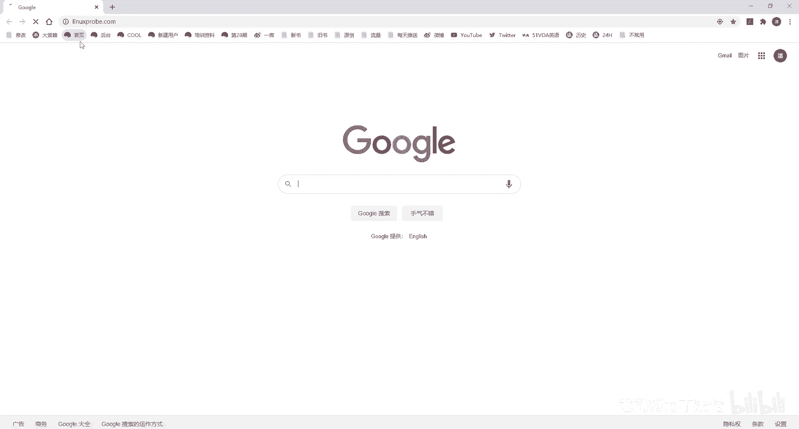

之前567我个人的感觉上来讲，它是需要你集中去理解的，以及要有以及要有一定的排错能力。好，这个是我做培训将近十年时间我总结来的就是之前的H认证需要你有一定的排错能力。

以及你要有理解你每一步骤你该怎么去做而红包话呢，很适合于我们中国人刷题你可以什么都不会待给大家答案照去敲敲之后通过就是这样需要你去背的东西的话呢，反而更多了。

要你去背的东西反而更多全都是配置文件照去就照去敲也可以。但是我们待这个讲课啊，会给大家去串讲的。我只是说最低的底线就是同学们背下来好吧，同学但我这么说不太好啊，被人断章取义这个视频出去的话呢。

会说我们这个课程low吧？那我们废话不多说开始我们今天这个课程。实际上这个课都已经录过一遍了。😊。

但是我刚录完之后发现没有开声音，所以这是第二遍。因此的话呢，我对这个考题的话呢，有一个更加深入的一个理解了。大家听完这一遍讲课更直啊，这个我们会更加熟练。好，先在我们第一个环节好。

第一个环节就是翻译叫做这个翻译人话啊，你看这个考题啊，依然也就是新加坡翻译的对吧？新加坡人翻译的，所以会有一点有点歧异性。好，我先给大家翻译一下。首先来说在考试期间的话呢，除了您就做的台式机外。😊。

还将使用多个虚拟机，您不具备台式机系统的访问权，而您具有对虚拟系统的完全入测访问权。这个意思就是说，进了考场里面，左边右边是你的同学，正对着是你的电脑，你只有一台电脑，而这个电脑里面有6台虚拟机。

听一下一台物理机里边装了6台虚拟机，你没有物理机这台电脑的ro的密码。而你可以有6台虚拟机的root的密码这么一回事啊，这个不像HC啊，HC的话呢，它是有两个机器，比如说我们的H401后面卫星网络。

你有两个电脑，你左边应该右边有一个那都是你的啊，然后的话这个里边你去做实验。而HCE的话呢，它是一个电脑里面装6个虚拟机，因此你到考场里面不要再去找机器了。

你只有一台这里有一个虚拟机使用的是KBM我们待会给大家去操作。就是我们现在这个控制终端总共是有6台那么我们没有这台物理机的root权限。而我们有里边6个虚拟机的root的权限。好。

下面给大家慢慢给大家去聊。看一下我们下面这个主机类列表，主机列表的话呢。😊，说第一个我们叫这个的话呢，实际上就是你的这个conl，就是你这个contrl node你的控制端什么意思？

你做题在这个里面做同学记一下你做题这个去做同学听一下你做题一定要在这个里面去做，不是在你的物理同学千不记千万不要记第二我们有5个虚拟机我们下面有5个管的这个节点其实我们发现啊第一个我们叫做 station下话底下我叫serv家这是不是有点不一样啊？

但是的话实际这个个眼法啊，这个底下这个5个机器全都是授管节点，它们没有任何差异，你可以把它比作就是serv同学记住这是红你一个展眼法，是名称不同而已。这个5台机器没有任何差别是我们来的话。

它没有任何的差异。同学记住了吗？不要做这。😊，时候再给大家强调最后三遍啊，不要在这个上面去做，不要在这个上面啊不要在这个上面去做不要在这个上面去做，一定要在这个bus上面去做。因为同学们习惯了。

因为我们这个虚拟机使用的叫做waretation，以为做实验就是在这个workt上面去做，同学们做过就就变零分了啊，考试之后没有成绩，记住了吗？考试的时候一定要在这个上面去做冲摸6遍。

这个应该没有问题了啊，万无一失。下面我们来看一下这个选项。😊，大家可以听得出来，我们是不是讲下午课的时候更加的沉稳了，而且的话呢更加严肃了。因为CI这种东西吧，上午这个考试你随便一敲能考289很正常。

你下午的C你要是我考的话，我觉得你考26的，有点2267，我认为是一个可能是一个正常的一个水平，或者说也是一个很很难的一个水平了。经过复习的话呢，你考到28到29之间，我认为是没有问题的。

今天的话呢因为这个实验环境的一个限制。我们待会那个成绩应该是介于大概289就是29上下吧。们，因为待会有两道题，它有两个小问做不出来，所以我们待会这个成绩的话呢，我刚才做了一遍，我是289呃。

289分差了11分，因为我两个小问，待会的话呢我们做这个实验也应该是290上下啊，290上下啊，然后接下我们来看一下啊，就是说的话呢我们这个虚拟主机里边地址已经配置好了啊。然后话呢。

我们DNS已经配置好了，主机名也配好了，你别动他的他他的意思就是说我们的地址已经配好。😊，DNS已经配好了，主机名也配好了，你不要动，请勿更改这些设置。因为呢话呢我们在而是CIC阶段的话。

我们已经考过对于系统的这个用户的呃主机名的修改呀，对于IP的这个修改呀，我们该考的都考了。包括说我们仓库这个设置。因此的话呢待会他就不会再去考相同的内容了。因此这个他不会再去考了啊，直接就给你告诉你了。

给你设置好了，考试的时候考过把，你去做好了，你不要去动啊，为什么要去给大家多啰嗦两遍，大家会发现了我上面这个给大家啰嗦了好几遍，就是因为同学们老是习惯性的去上去去改地址，然后去检查什么的，这个不要动。

这不要动。好，下面我们再来。😊，是吧我们这个所有的虚拟机，他因为该告诉你了，说你6个虚拟机，你都有它的完全的root访问权。那么哪里体现呢？就是体现呢你有它的密码嘛，对吧？

那没看到所有的系统的root密码就是flag rack。会啊，我稍等我看一下这个录屏。😊，哎呀，在录我刚才有有点阴影了，刚录半天结果我没有录上，所以哎呀有点有点是有点阴影了啊。OK没有问题。好。

那我们来看一下啊，这个密码的话呢，是flag rag啊，这个记住就好了，他说请勿更改ro册密码。然后的话呢，如果要是进行验证的话，也要去使用到这个密码，以及用来去创建后续的这个服务。什么意思啊？

翻译成我们常见的这个语言的话，就是说。😊，以后他只要让你去输密码，你就输这个就能够验证通过。他让你去设置密码的时候，也把密码的话呢设置成这个。这个就是你在考试阶段的话呢，只要看到密码两个字。

就用它准没错。好，再来说那个方便起见的话呢，所有系统都是上已经预设了SSH的密月。😊，我们能够在不输密码的前提之下就去做SSH的远程的控制啊，并且的话呢请不要对他这个SS这个蜜月做任何的修改。呃。

意思就是说我们已经给你提供的密码了。但是的话SSH用个你不用用因为他已经在各个节点之做好了做无密码登录的叫做密月验证了因此这是更加方便的一个这个操作。

他也帮你做好了我们再看到啊说所有的授稳节点上面还有一个人叫这个人就是出题那个老师他说啊我已经在每个节点上面我建出来一个叫做的一个用户了，并且的话已经预设了SSH是蜜月了，都做好了。

你可以去使用到这个账户来进行验证。好，做个节点上面都有这个用户了，并且这个用户还可以作为一个验证的一个身份。而我们在模拟环境里的话呢记住同学是没有这个用户的。

待会我们需要自己去建立它下面重要信息同学这个C的时候。😊，老师啊这个怎么讲呢？粗心你看这么大的这个字写的这个重要信息就不去看一下。同学们做HCE考试的时候，老有人考试时候零分，为什么？😊。

因为你没有看清他这个题目要求它有一个小坑啊，他给你留代里边去了。他虽然你有root用户的访问权限，密码还给了你了。但是做这个HC考试的时候。

不是使用root用户去做一定要去使用到怎么样的所有的相关命令都要用户ible控制节点上面的这个目录里面去执行。换句话说，root用户只用来去安装那些软件时候使了。

你再去配置你的ible跟编写playbook的时候，全都统一的去使用到这个用户，并且将你所配置的所有的选项和里面的所有的工具的话呢，还有所有的这个压文件都给我放到这个目录里面。

千万不要放错目录放错目录没有分值。我曾经在2014年的年底12月24号的时候，在上海考过一门的401红包卫星网络其中的话要求你去配置一个RP软件包啊，去用那M。😊，都做的挺好啊，说这个一路也很顺畅。

结果的话呢最后出了成绩，发现那道题没有分啊，好在过了。那什么原因呢？就是因为我没有按照他的要求放到ho目录里面，我放到自己的这个加目录里面了。😊，来一秀小问题，对不对？就是大家我们看见好像没有什么问题。

因为我们的程序已经写出来了，但是没有分值。因为它判分的时候是一个脚本判卷子。你这个目录呃路径你没有写对，即便说你做出来了，但是他找不到它依然没有分值。这一点同学们记住来再给大家重复呃。

再再再给大重复一遍吧，就是待会所有的操作全都要去使用到gra用户进行操作。并且。😊，放到这个目录里面，同学们要记不住的话，想那你想想折想啊想想办法，一定要还给记住啊，不要去使用的入体用户啊。

上一去就就一顿操作啊。别好，我们看一下啊，他说系统当中的话呢，已经有了一个叫做的主机清单了啊。然后的话呢我们需要确保以前的清单内容能被留下来啊，然后我们与现在已有的进行共存。如果想要进行修改的话呢。

也请不要删除掉以前的内容，什么意思？就是这个系统的话呢，我包括说我们这个控制节点叫做这个bston。😊，它上面啊已经有了一些配置文件了，包括说我们的ensible的这个主呃主机清单里面的内容了。

你的话呢不要把它给删掉，你可以往里面去增加和修改。但是你不要都给它删掉，好吧，他一有东西你不要删它要他一个意思。他说啊但是实但是实际上我们去操作的时候啊，发现其实也没什么啊。

然后看一下说考试系统上面的防火墙不启用属于强制模式，什么意思呢？就是防火墙啊，不考了的话呢，他说它属他他他说属于强制模式，实际上也是不考了。因为我们的able配置我们这个服务的时候。

用它基本上是用不上Slin。😊，而在这个角度上来讲的话呢，在这两个服务的层次上来讲啊，全都不考了。哎呃我们的HCE不考防火墙了，也不考SE在这两个服务的层次上面来讲。

我们认为是比之前的那个HCE考试要更加怎么样呢简单了。好，我们继续一如既往。那不用你自己去配置仓库了，他给你了，你只需要去指向好这个路径即可他给你另外一个没有用的东西，这个你这个你没有用。

那你不用看它这个你也不用看它为什么这个东西你实际上你看一眼就知道大家看一眼啊。😊，大大大家就都知道了，这个里边的话实际上就是一些帮助信息了。比如说我想知道某模块的作用。

比如那我就可以点一下这个啊我们这个目录。好比说我想要了解当然你就随便了。比说想了解这个ACL我点他一下，他会告诉你说些这个信息等等还这个事例什的但是我给大家去说啊，你考试的时你还在看这个的话。

你考试就是只能说的怎么样你这个准备充分，你这个准备不是很充分了，你考试时候如果你再去看这个的话，说明你考试不是那就不是很充分了，没有到位帮助信息一定要在课下看好了，考试的时候就一顿操作就完了。

不用看它了，看他看如果说如果我真的记不住的话呢，你也不用看他我不有一个命令，我们叫么杠do杠也一样的。我待会给大家去演示不用着急不用着急看一下注意信息他说他又告诉你一遍啊他怕你看不清楚他告诉。😊。

一遍告诉你两遍啊，给你写他给你写两遍，就是在评分之前，我们的收款节点会被重置，只有在baton上面去做才是有效的。您编写的ible playbook必须要使用什么呢？

greg这个用户来进行操作啊进行创建，并且对应的目录一定要是home目录里面的greg里边的anible，别写错，同学们千万别写错。来，最后一遍再强调一下啊，操作的时候一定要去使用到greg进行操作。

别使用root，然后保存的目录放到这个目录里边，保证万无一失。哎，拿分走人。😊，好。这是一个考试题目，看完之后怎么样呢？其实其实其实挺开心的啊，其实挺开心的。我们讲了啊567版本里面。😊。

但是这个怎么讲呢？这个大家可能不太认同，因为我从接触红包到现在十多年时间了，我十多年时间了，跟红打交道，我考一下C真已经十年了，对？我认为的话跟我十年之没法比之前有一个理解过程。括可四科考过的话。

还有一个排错的一个环节红之前要求你去理解的很多东西需要你去理解而C话8版本这回我认为他我一直强调我个人的观点来说就是这是十年来出题出的最差的一次为什么他不他不用你太多去理解了。

其实你可以有考试技巧像我这个这样的一个培训一，你不用太多去理解。你只要按照这样去做把每个文件放不同的位置。后文件内容只要保证正确的话，你就可以考试通过了。

你没有基本上啊你要背下来的情况下就像几篇作文背下来的这前提。😊，下你不用去理解，你不用去排错，直接过。当然了，我这个说特别的片面，大家不要把这句话呃理解的太多啊，我只是说从表面上来看是这个意思的。

并且这也是我这几个月来我去呃给大家准备出来答案，我的一个心得。然后呢，网页上面这些题目已经是我一个字一个字的给大家过了。那包括说格式，每个空格对齐，我全都给大家过了。

每一个字一个字的对呃这个给大家校对过，没有任何的问题。大家放心。好，除了待会我们做这个实验的话呢，理论上来讲只会有两个题目做不出来，有两个小问做不出来，其他都没有问题。好，废话不多说，继续。😊。

第一个问题开始第一个问题是吧，安装跟配置ensible在考试的时候的话呢，呃是否被你安装好了？😊，我们都不重要了，你直接进行访问，看一下我们的控制阶段的IP地址。你看记住了吗？172025。250。

254，走你172025。😊，点25，不好意思啊。这个键盘旁边有一个话筒，所以老挡着172。25。250。254。我们做考腔辅导的时候不是讲课，所以我们就快速给大家过啊看。😊，考试时。

完了出师不利啊这个不属于操作问题，这属于智商问题。来我们来去连接一下，连接成功了。那没有问题。考试时候，不论安ible有没有去装，你去装它一下子，好不好？你去装一下，保证万无一失啊。

在我们考试的时候的话呢，应该是已经装好的你要是不确定你装它一下子好吧，这也不累好，我们安好了之后啊，然后我们开始做我们这个题目了。第一道题啊。

说在下方所述在控制节点上面的这个安装跟配置ible做完没做完了，安装所需的软件包做完没有做完了，说创建一个这个文件满足以下要求，我哎记行不好，怎么办呢？你说一步，我给你做一步好吧？

另外的话呢你们要怕敲错的话啊，就去复制它啊，不要去手敲的多累呀，对吧？😊。

来。😊，呃，先不能，因为你现在这个还没有创建出来grara用户呢啊，在考试的时候，你不用去在考试的时候，你不用创建出来grara用户。但是我们模拟环境里边，因为它没有。

所以你需要自己去创建这个grara用户，并且的话呢给这个用户设置一个密码为 hat按下回车搞定没有问题。好，现在的话呢我们退出，它既然说了，一切都要去使用到我们的gra用户进行配置。

因此链接的时候强调它使用gra用户进行连接。哎呀，我就给大家说这么多遍了，大家总是忘不了，对吧？啊，没有问题。😊，听老豆讲课吧，所然呢不能够保证说大家听我们这个课的时候。

感觉说的是呃那么的怎么这个怎么讲那么的开心吧。但是到你考试的时候，你就开心了。因为我们有一些操作，可能你看着有点low。哎呀，怎么这怎这个这个怎么这么做呀，但它简单呀。

我们有一个原则就是只要在能够保证通过的这个前提之下怎么简单怎么来，好吧，同学们，所以你听我这个课的时候，有一些技术，可能你觉得在工作时候不会这么去用啊，对，考试时候他又怎么用好，我们现在去连接一下。

下面进行操作了啊，进入到里面之后的话呢，你现在我们这个加目录里面先去创建出来一个叫unable的一个目录，你要不用这个目录的话，你写的再好再对，依然没有分。

为什么这个目录你必须同学们哎呀再给大家说一遍啊，不要嫌我烦啊。😊。

啊，老老哎老哥太哎呀，这个太能说了。来，记住了吗？你必须给我这个目录，同学们求哎，这个这个真的求求大家了啊，千万别写错了。😊。

考试表挺贵的，一定要有这个目录。好，他说在里面新建出来一个文件。我们看到叫什么呢？叫做inventoryok啊，一个叫做清单文件嘛，你要管谁吗？往里面一粘看要求，他说呀他说你看他说有这么几个主机。

172。25。250。9是DV目录的。我呀先不看其他的，我先把一个一个去做。先把这几个题目，我给他做了，到这儿哎，我们一点点的去做，不要着急，考试的时候3个半小时，你们不用着急，172。25。250。

9分组嘛啊，分成我们的授管的组172。25。250。10。😊。

听我们讲课，张宇电书，我们就是HC的印证书的机器。我们的机构里面已经6000多位考生了。我们就是1个HHC证书的一个印刷厂。好，所以的话呢就是一定要听话，我们说怎么简单，你就上课时考试时候就怎么去做。

不要说那种哎这个感觉很low啊。这个技术考试时候没有人还没有人看你的，同学们看你那就是作弊了啊，怎么简单怎么来，来分四个组对吧？1234没问题吧，看第五个。

他说呃PROD组是web server组的主机组的成员什么意思啊？children组叫子组怎么做呢？web server。😊，这几个词记住吧，这就是基数就号children。叫PROD下好没保存名退出。

看要求说创建一个。我们的配置文件并满足以下要求。哎，不对呀，配置文件不它不在ETC目录下吗？对，怎么办它给它复制下来。一般情况下啊，我们的ensible。😊。

的生效的配置文件就是我们ETC目录里面的里的ible点fi主配置文件。要么就是我们当前目录的以我们当前目录那个为最优呃为最高优先级。因此当我们把这个配置文件复制到我们加目录的一瞬间。

你再去看我们的这个生效的配置文件，就变成了我们当前目录的这个文件了。好的，接下来我编辑它，记住一定要是这个文件啊，并且我们以后大家记住啊，以后我们再去执行我们play脚本的时候。

你必须要在这个目录下去执行，否则你这个配置文件还是之前ETC的不成功，记住这一点吗？第二点，判分脚本也是在这个目录下进行执行的。你不用担心说它判不到成绩，记住这个目录太重要了。好，不给大家再去啰嗦了。

我啰嗦就很多遍了，再啰嗦的话，大家嫌烦了。好，我们现给大家。😊，找到我们的主配置文件，修改四行，第一行是什么呢？inventory呗，那主机列表已经不是默认的了，是什么呀？哎，我也记不住怎么办呢？

复制一下就好了，对吧？来考试的时候啊，别就别敲啊，累就全都复制啊，全都复制啊，所以你们考完试之后，你们再一看这个。😊，设备啊鼠标键盘全坏了，然后再这个键盘哪坏，一看，就是ctrl C全坏了啊。😊。

来继续。看一下行数，行数的话呢，第68行看到没？他说playbook中使用的角色位置是在home录里面的greg里面的enssible rose啊。😊。

不用管他，就往你站。所以你们考完试之后啊。😊，你一看哎鼠标键盘哎cl cl全坏了，就是一路复制，他告诉你是什么，你就往里一粘粘对地拿分走人啊，不是说我说到刘，你这个你这个人太狂了，说12C说这么简单。

的这个本质就是怎么回事。你知道每个参数的含义是什么拿分走人最后的话呢我们来71啊我们这个主机的key检查。因为我们每一次去连接的时候，他是不是要要求我们进行那个指纹的一个接收啊，我们觉得麻烦。

我们干脆可以写一个省费啊，以后我们每次再进行一个验证，以及这样话也能够拿分啊，那么这样的话呢再去远程SSH的不再进行那个指纹验证啊，对于我们的话也免了一次这个验证过程，这个一定要去做啊。

这个一定要去做个一定要去做再还一个行的话107行下一点点远程连接的时候使用哪个用户哎都是想到一件事同学们那也就是说以后我们每次去连接的时候，是不是要。😊，输入那个账号和密码啊，就是输入一下root。

然后输入一下密码或者输入一个杠K那是不是很麻烦呀？好，我们改他一下子，我们要写一个叫然后冒号什么意思呢？对于所有的主机我们都生效的一个变量加一个是什么呢？

一个是我们登录时候验证的这个主机名称一个是我们密码在考试的时，记住同学们是ag我们当前系统里面所有的root密码全是ro都要不然我们怎么叫做模拟环境呢，它就是有差异，对不对？

这样做好保存名退出以后再去执行playbook的时候，不用再去敲账号密码了，是不是省事了？哎，给大家省事了啊。

来去执行一下ible对于所有的主机杠随便拼它一下子看看能不能拼通拼通证明你的配置文件生效主机清单生效都好，它都生效，没有问题。😊。

第一道题拿分走人。第二道题。说使用我们的ensible的临时命令，然后的话呢创建出来两个我们的ym仓库。你看啊，第一句话说创建和运行安ible的临时命令啊一句废话。😊，作为系统管理员。

你需要在收款节点上面安装软件。第二句废话说请按照上述请啊请按照正文描述创建一个名称为这个的脚本，做什么功能。我先不管，我先把它给怎么样呢建立出来。同学们有这个好习惯啊。

因为你知道你这个题目好它有很多个小问12345，你先去做那个345去了，那个一和2以后来你忘了，到时候麻烦先把它给文件给它创建出来，然后看要求说该脚本啊，将使用ible的临时命令。

在各个是啊节点上面创建出来我们的存储库记住两个关键词，第一个关键词是各个节点什么意思呢？所有的节点啊，在所有的节点上面创建出来这个y仓库。第二个仓库的话呢。😊。

有它有几个，它有俩，也就是说我们要去使用到ible的命令，创建出来两个y仓库就可以了。对应的命令是什么呢？我们不知道我们查好不好，但这个你考试的时候，我那我不给大家装了啊。

这个我们现在大家记住啊呃这个培训的话呢，这个视频不是培训视频，这是考前辅导视频，我的潜意识里边大家都已经该学的都学完了。我们现在是在给大家串讲，把知识去运用的一个过程，所以我我就不给大家装了啊，装的好。

但啊大家帮我回答一下问题。😊。

说这个啊该用什么模块什么的？那我呃就不给大家装了啊，直接用这个话呢我们叫做ym啊下划线呃report呃reory呃reputtory啊，repostitory啊，这个叫做ym的仓库的模块，摁下回收。

你可以看到啊，我们往下一度啊往下会看到一个叫example的一个示例项。😊，待会儿我们用到这些参数，不要问老刘，你哪里去找啊，这里找就好了。看到了吗？如果这些词你记不住的话，ym啊。

还有这些记还有一些这个参数啊，ditribution，然后这个baseL check等等的这个参数到时候记不住，这样过来查好，那我给大家装了啊，因为我自己我其实我自己记得住。好，就来直接了啊。

对于所有的节点，因看到了没？说各个节点上面因此就是or那么模块名称，那么就是ym呃ory。😊，哎呀，这个怎么这么多repoitory。😊，OK下个呃下我们下课周后给大家查一下啊。😊。

repoitory啊repostitory应该是这么发言啊。好，我们这样去写上我们这个参数。首先来讲啊，我们使用到这个单引号给它引起来吧。然后我们的每个小项使用到双引号给它括起来。第一个选项啊。

第一个是说我们这个库的名称啊，那不就是你吗？考试的时候直接这样来去复制啊，直接来去复制。第二个说啊distribution我们的描述信息DESCRIPTION啊等号。😊。

往里面一粘描述信息，记不住回去之后看我刚才给大家那个DOC啊docu那个命令里面全有啊，说基础的URUURL就是生效仓库地址嘛，说他们的呃说他们那什么啊，说他们的文绉绉的啊。

来base uRL往里面一粘说GPGK的检查状态为启用简单呀，什么呀？GPG check等于yes对不对？来。😊。

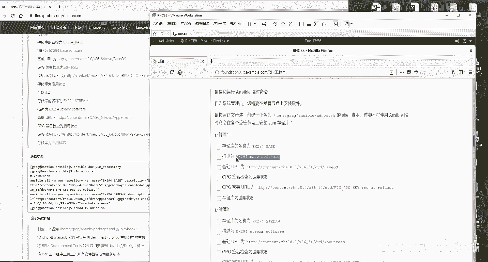

呃，GBG check等于yes再来GBG的K的路径是哪里啊？是这个好，这个就是我们的GBGK。😊，怎么样？培训的时候啊，是要给大家讲细致考前辅导这个视频啊，因为大家要反复去看。

所以的话呢我又不给大家说特别多的话，你听一遍还行，听掉第二遍，第三遍的时候你就要烦了，所以的话呢我们给大家讲这考前辅导的时候就快速啊呃一以贯之的啊，一定就是一定到底的全都给他做完或者之后自己去列就好了。

然后是enable等于是yes代表是启用这个仓库，在敲回车之前，同学们在敲回车之前啊，那老师那我怎么不太相信你呢？你到底真的是做成功还是假做成功呢？好，大家是这样啊，刚才没有给大家忘了说了。

你看这个上面这道题目没有，大他给你分组了，记得吧？他给你分组了。😊。

这个组。🤧拿张纸写下来，考试的时候，你们的面前都有一张纸。那个是考官给你们的，你们的桌上要没有的话呢，跟考官要。你们是消费者，你们是考生，你们交到那大家是交到钱了。考官的话呢。

有义务给大家提供纸跟笔的是有的。因此的话呢，开线的桌上有没有白纸，有的话去写，没有的话，跟考官要看到没？跟我们刚刚写这个文件一样，把这个每个组对应的地址给他都写清楚。为什么你看啊红帽这个考题啊。

若巴这个考题，它是一个网页它是直接到底的，它不像是之前红包5呃，不像红包肉7一样，它是可以翻一页的。也就是说你看这道题看半天啊，比如做到这儿了，他会提到说你在DV主机上面进行的操作。

DV是它是什么地址啊，的你叫往回在找的对应上面那个地址看看完之后再往回一找思绪全乱，同学们全乱了。因此找一张纸像我一样。😊，抄下来你的组名，你的这个对应的地址。另外的话我再给大家最后再强调一下啊。

最后再给大家强调一下，我们只有ston这个是我们叫做控制节点，其他的workt它真的没有任何的意义，跟其他的当做是一样的去处理就好了，不要给它特殊的权限。

它没有任何的这个特殊同学抄下来我们这个地址好有两点特别重要。所以我大家分别去强调了很多遍啊，大家应该能听得出来哪个是最为重要的好这这个非常重要啊，以后需要用的时候低头就能看到了。

我再说第V的时候能快速反应出来就是点9这个主机好，现在的话我们在这个执行命令之前啊，我们先去远程一台主机用户去访问。比如说谁呢？172。2525010吧t这个主机低头看你的啊。

按下回收进入到ETC目录里面的ra点目录中看到里面只有两个默认的。😊。

亚么仓库来摁下回车。做好了没？做好了，翻回去看怎么样呢？多出来一个叫做它这个名称一还是一样的吧。来看一下这个主机里这个文件里面的内容，唯一标识符bL启用校验地址名称一点问题没有，哎，有问题。😊。

这个名字是这个名字吗？

有问题对不对？这是它的描述信息。啊啊，这个O这个是我理解错了，这是他的描述信息。我还说他应该是叫E4的啊。O这个我是理啊，这个是没有问题的。这个这个描述信息的话呢是一样的。

因为我记得后面没有一个of它是对的啊，好，没有问题好做完之后的话呢，说明它是生效了。那么话我们现在的话就把这给大家复制一下啊，大家说那我们现在不就成功了吗？为什么我们还需要写到他要求那个文件里面啊。

对你是成功了，但是你不把它保存到个文件里面，你从你之后他走了，那我怎么知道你有没有做过呀，对吧？虽然我们这个红帽码是讲求诚信的对吧？但是你也要给他一个证据啊。

我做过这个命令我成功了于是他就是把你执行成功的一个命令往里面一粘就完事，脚本的声明本的命令声明不要忘记好粘几遍呢粘两遍，为什么？因为你两道题目嘛，对吧？第二个同样的命令你叭叭往里一粘粘完之后。😊。

修改即可两道题呃，一个命令做完它。

往里面粘两边，分别做修改。首先来说我们的EM仓库的名称。

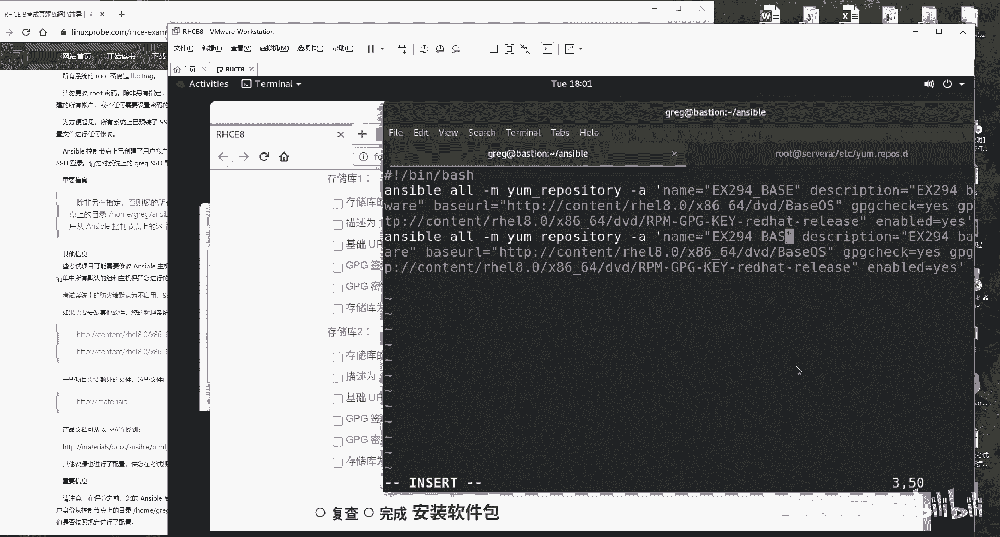

接下来我们的描述信息。

怎么样？讲这个衡像辅导说话，就一定要虽然说没有大家这个互动了啊，但是你一定要。😊。

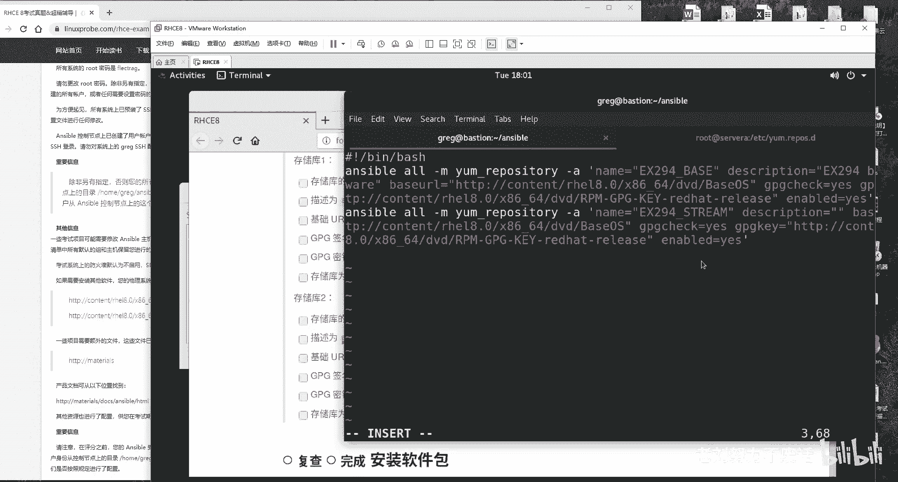

把我们这个气氛要搞得不错一点。因为你讲的这个视频我有预感，这个视频应该是在两个小时以上。如果要是大家听见很痛苦的话，我听着就要要睡着了。所以的话呢我自愿给大家就是举一些我们的红包一些小技巧啊什么的。

给大家去争取的能够。😊。

更顺利把我们这个课程给它听完。好，我们依次去复制一下。好，点一下保持并退出，那也怕不成功，那没有关系，先把这个权限给它加上，让我们的脚本能够去判到分儿，它能够去执行，然后咱们去执行一下它执行好之后。😊。

执行好了之后，我们再进入到随便的一台节点里面。我刚才是随便找的吧。你们如果要不愿意用这台主机，你们再随便再找一台，看到没？第二个也出来了啊，看一下第二个。😊，看一下第二个主机，我这看一下第二个文件。

比对一下，没有任何的问题。

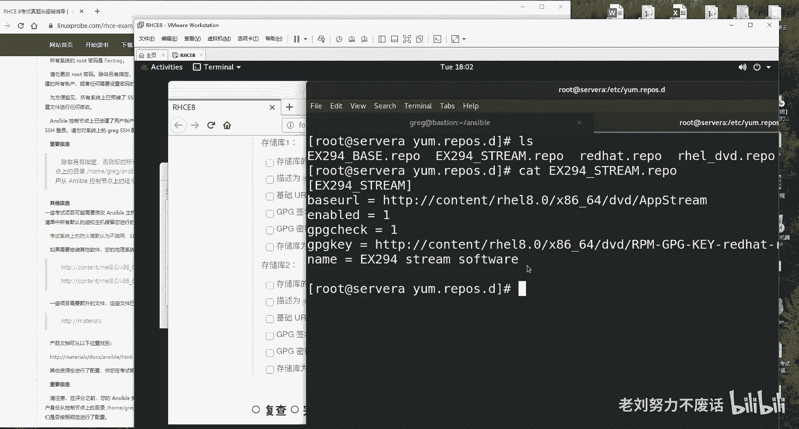

第二道题嗯，拿分走人。第三道题安装软件包哎，太棒了，这也非常简单了啊，他说签取新建出来一个名称为这个的东东。那好了，不管他啊，做什么，我不管你，我呀记住两点。😊。

第一点在这个目录里面，第二点我去新建它，这是这个是最后一次再给大家去强调了啊，不会给大家再说了，说了自己都觉得有点太啰嗦了。来先把我们这个格式啊和我们这个文件给它新建出来。这个名称的话呢。

我建议就以我们每个题目的标题为例。这样的话以后我们也好找那好排错。然后的话呢我们先把这个格式啊给它写上干什么事的话呢，不知道我们先给它写上不行吗？看题目说将DV啊，不将PHP跟mar哎。

这两个好给它安装到DV跟t跟POD组上面。😊。

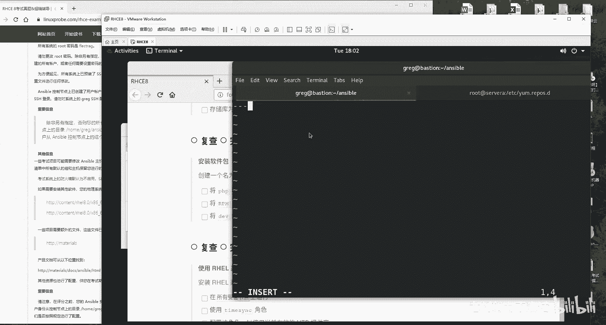

也就是说给这三个主机组安装这两个软件怎么样呢？是不是感觉还是比较自信的这就这对于这道题来讲，DVtestPOD3个组干什么事呢？安装软件包，安装软件包来，首先让我们第一个。😊，安装第我们的第一个软件包。

等一下啊，安装我们的第一个软件包。呃，安装的话呢，我们使用的是叫做ym，对吧？啊，名称的话呢，第一个使用的是。PHP大家会问问那老师，你为什么不用一个look循环呀，对吧？

你两个你为什么不用一个loop循环呀？同学们记住，完全没有必要用的lo循环。你就两个，你要是20个的话呢，我可能还会考虑考虑用不用一个这个。😊，呃，循环。但是你这个是两个的话呢就没有必要了。好。

另外的话呢我先把它对齐一下啊，我刚才没有把它对齐。😊，你要记住啊，这个格式要不要写对啊，nameok没有问题，你两个我就不用去写那个。呃，录不循环了，再写什么ite什么的麻烦。

下面我们有我们有我们还有个试机会给大家用啊，你两个你就直接老老实实的写两个就好了。好吧，这个名称的话呢，我们就随便给大家起一个叫做one吧。啊，第一就是一二就是2三就是 three4就是4好吧。

这样比较简单来4YY哎，走往下粘，往下一路往下粘来第二个软件包，我们安装上mar两个嘛，同学们不要着急，哎。😊，在我要写啥呀？状态late哎，最新安装软件包的名称marryDB。因为太自信了啊。

所以就没看那个最近没看答案，还是不行啊，还是得照着词儿说，是不是啊，安装成最新的版本。第道这题呃做完看第二个问题，说将RPMdevelop tools软件包最说明这个词组同学们丢分就丢它就丢在这儿了。

软件包组安装到DV主机上面，什么意思啊？就软件包组啊，就是安装的是一系列的软件包啊，因此开启第二个play。😊。

我们还是哎，我看一下啊，这把复制过来吧。但是这个两个name的话呢，不能够重名，就一个叫做A，一个叫做B吧。好了。😊，专门给这个DV组专门给这个DV组。安装上我们的RPM软件包组这么去做。

还是tasks哎。Name。一好ym等于软件包组怎么表示呢？先不要管软件包组怎么去表示，你仔细看这个里边是不是有空格啊，RPM空格哎，development空格两个两个空格。

因此使用到双引号把它引起来作为一个整体。😊，严谨的来前面加上一个at符号，软件包组就是前面加个at符号，代表就是一个组这么去做，拿分走人。第三小问，将DV主机上面的所有软件包更新为最新版本。

so easy来继续RYY往下一复制P。😊，名称to干嘛呢？没有写完啊，刚才没有刚呃刚才没有写完。不行啊，咱们还得咱们还得看咱们还是得看着这个咱们还得看点词儿啊。😊，心急啊心急。

咱们就都不按咱们都不按词说的，可不行。哎，来，刚才也没有写了啊，刚才这个写刚才有点写串了，刚才就心急了。来，首先来说的话呢，就是我们这个ym写上我们的软件包的一个组作名称。接下来的话呢就是state。

😊，lateatest最新版本没有问题吧，那再来4YY。往下一粘。咱们快是快啊，你们的火老师说过，对不对？天下武功唯快不破，你快是快，你得对呀啊，刚才我就是不严谨了。来将所有软电包更新为最新。

就是使用一个星号作为通配服务，更新的是所有主机。第三章节书籍。😊，只用到星号作为通配符，通配的是所有的软件包的名称，因此将所有软件包更新为最新第三小问做完。好，点一下保存名退出。大家听出来了。

咱们下午讲课是不是要比这个上午更加这个。是不是感觉更加沉稳了，更加这个严肃了。因为而这个下午考试可是比较难度的。来看一下这个手底下啊，你这个下面一张纸，我们随便找一台主机，比如说还是吧来。172。25。

250。10test组啊，来进行连接。哎，连接成功，我们要这样，你去使用到yintstore去安装一下我们的PHP。来安装一下PHP。看到没？它是需要你去安装的，证明因为你之前你没有。

所以你才需要去安装。来，我们现在的话呢去ible去执行一下我们这个playbook。你这个几个主机啊，你随便去找一个，你不用一个一个都去试。同学们不要那不要就不要那么实在啊。

你随便抽查一个一个行的全都行了，不要那么的实在啊，耽误时间那。😊，嗯。开始帮你自动去安装。这个实验我之前我做过一次，然后大概的分值的话呢，有两道题咱们做不了。有两个小问，咱们做不了。

上午那门咱们一个脚本问题嘛，考1个246是吧，上回。这次的话能考1个289，差个11分。那11分啊是有两个小问。判分问题啊，涉及环境问题。我待会给大家讲一下。所以待会这个分值的话呢。

应该是在290分左右啊，290分左右还可以吧。啊，扣了1分。好，我给大家看一下啊，再用这个节点去执行一下安装PHP看到了他就会要他就告诉你说PHP已经安装过了啊，不用你去安装了。这道题怎么样呢？

拿分走人。好，下面一道说使用我们的HEL系统角色什么意思？不就是说我们自己去安装上我们那个呃入系统自带那个吗？这个时候就不要去使用到我们的这个用户了，你就必须要去使用的录取用户了。

否则你没有权去安装来远程连接。那我们考试的时候你可以去使用速度啊。但是我们现在的话呢，你没有权限。😊。

我们需要去安装一下。连接到254。Ym int。real点sstem点ros。

一个Y走你安装，安装好了之后退出啊，不用你了啊，用完即丢看然后看接下我们看题目。所以啊啊安装re这个系统角色软件包，并创建以下啊符合以下条件的playbook还是啊同样的，这个的话呢。

我们先把它给创建出来。虽然说这个题目我们现在不应该把它创建出来啊。但是我希望大家能够养成这个习惯。我们还是要把它给创建出来。但是这个这其实这个题目不用啊。😊。

呃剪成习惯吧。好吧，其实创建出来这个文件，大家听我这个嗓有点哑，因为刚才确实已经刚才都讲过一遍了。😊。

哎呀，痛苦啊，没有录上。😊，所以的话你们听这遍的时候会比上一遍更加顺畅了。这些该哪出错啊，该怎么配什么比之前熟练的太多。嗯，O我们来继续是吧。

在所有的控制节点上面来去运行这个time SYNC这个角色这个角色我们有没有啊，我们没有啊ansible galaxyax。😊。

🤧类似的，因为那你可以看到了，你里边什么都没有，那你连配置文件你都没有，那你那那你肯定做不了，对不对？怎么办呢？修改一下我们这个。😊，我们的安西ible的。配置文件啊，修改成什么呢？

我们修改一行这一行行数的话呢，大概是在等一下哦，我你找大概是在68行，我们后边应该加入我们需要导入的这个re的角色的这个路径，但是是什么呢？我们还不知道啊，我们不知道，其实我知道，但是我为了给大家讲嘛。

怎么办呢？我给大家捋啊，他其实它是在user目录里面的sha呃user目里面的share里面的里面的rose这么一个目录，你看到这里面就会有几个10个用户，对不对？他看啊他们一部分是linux通用的。

一部分是re系统专用的，你是不是需要的是这个用户啊。好好的，我们把这个路径给它复制下来，再去重新去编辑我们的主配置文件。你只要你把这个路径，你给它哎。😊，一加上。你再一保存。

你再去执行一下你这个galaxy list。就会发现有它就都出来了，对不对？它就都有了。好，那我们现在的话就需要用这个啊，那我们这个压末文件怎么去写呢？你要问我，我也不知道，因为它太太太麻烦了。

标准答案的话呢，虽然已经给了你了，但是你会写吗？我也不会写，但记不住啊。我们考试的话呢，就是要给大家一个。😊，简单的方法能怎么简单，我就告诉大家小技巧啊，用或不用看大家怎么办呢？

在user目录里面的share目录里面。😊。

点DOC目录里面有一个叫做real点杠sstem杠roose的目录，这个里边还有一个叫做time SNC的一个子文件夹，在这个文件夹里面就有东西了，这个叫做example减。example呃。

这个叫做examp减time SNC杠playbook，我们需要用这个这俩有什么区别呢？这个就是我们的压模文件，这个是叫做池的文件。我们需要的是上面的一个。

所以因此直接就是这个复制到我们这个当前目录下做完，这就是我们的模板文件了。好，我们现在把我们刚才新建那给它删了啊。然后我们不帮把这个模板文件的话呢，我们能改成我们跟我们刚才保持一样的这个名字。

然后摁下回车。😊。

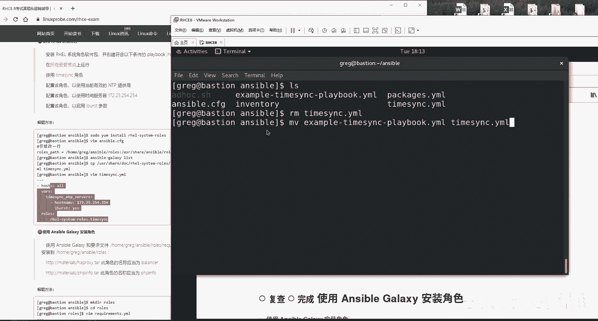

编辑看题目，就是我们的角色也有了，我们的模板文件也有了，你说你这不比自己写的要更加爽吗？对吧？你自己写的话多那多麻烦呀，他有这模板啊，我们拿来就用就可以了。

啊我们拿来就用说在这个所有的授管节点上面去运行。说的不就是授管主机嘛？在谁上面去执行，那就是个O啊，他说使用是time SYNC角色有了，那不就是它吗？对吧？继续配置该角色。

使用当前有效的NTP废话一句继续配置该角色使用时间服务器，这个好。😊。

修改一下吧，house the name给它修改成我们所说的这个。

说使用i burstrs这个参数使没使用啊使用了。好，我们来显示一下行数。他说呀让你配置这一个，他说明说它只能配置这一个。你看题目，他说明说只能配置这一个，他没说，因此的话下面有一个拔高体啊，可以选。

可以不选。后面这些是不是没有用啊，因为他说了，让你去配置这个主机的这个地址，他没说只让你配置这一个地址。因此的话呢，下面这个你留和不留都行。好了，我认为不用留碍眼。

来第七行到第十2行冒号呢七逗号12D删掉它干干净净的保存明确书做完。😊。

安ず道。执行之前哎前慢哎执行哎，算了，就先去执行了吧。先去执行一下它。执行过程当中的话，大家老这种心态就是有点小错，特别的担心啊，看好了，待会会出现红颜色的报错，很正常。大家再去工作的时候以后啊。

老会遇到暗C胞在执情过程当中那种红颜色提示，是有报错，但是不影响就不要管。好，我们等它先去执行，不着急。😊，哎，不要管他。为什么不要管？是我故意看不见吗？不是，因为你看到这个结果。因为你要看它的结果。

17个OKOK大家理解啊，change修改了4个，成功了7呃17个，修改了4个零个未到达零个失败。所以的话呢，刚才那个还颜色的一个报错，我们不用管它。好，那么这个怎么能够去验证成功呢？

做到这其实就成功了。但是我们要去进行一个验证啊，考试让大家怎么去验证呢，低头啊低头随便找一下主机。因为你刚是对于所有的old主机进行了操作嘛。😊，嗯，balances吧。

就是这个balance啊平衡负载均衡主机172。25。250。13摁下回车这么着，它有一个文件。😊，点fig摁下回车，看一下它的NDP选项，是不是就是我们所设置的254。

254areburs ok速的主机就都已经搞定了。它使用的是由你提供的NTP的这个选项，拿分走人，下面再来说使用拿galaxy安装角色，什么意思呢？就是从外部引来两个角色呗，一个叫做hel啊。😊。

呃，px一个叫做PHP info两个文件。看着啊这后面一个小坑啊，特别的阴险。你看啊，原先它都在这个目录下进行，对不对？😊。

这个时候。他原先突然在这个文件里面。新新建这个压模文件，它又来一个这个啊，在里边新建出来一个rose的一个目录，里边叫做re叫做这个requirement，是不是它是不是很阴险啊，对吧？

来复制一下它不要写错啊，因此是要进入需要编辑。😊。

进入到这个rose目录当中，然后再去创建。那老师你为什么要直接粘这个路径呢？为那为什么不写一个相对路径呢？因为我呀就想一定要确保它这个路径一定要写对，所以的话呢我干脆就写一个去。

那我就写一个完整的一个路径，保证我们保证它是万无一失，好吧。😊。

好，接下来看他就他要干嘛啊，他说下载软件包并安装到这里，我们不管他啊，还往下面去看，因为他默认他就在这个目录像了嘛，对吧？他说有这么一个角色安装成这个名字。好，两个好，这两个用户安装成分别是这两个名字。

安装用户大家都会啊，镶个斜杠S2RC。😊。

冒号。路径name名称别敲啊，同学们别敲，哎，怎么样呢？复制它你下课之后看始鼠标左右键全坏了啊，因为复制的太多了。😊。

考试时候啊。就是你把正确的东西放到正确的地儿。

不要傻敲，傻敲，都是没参加过考前辅导的，不知道有什么事什么的。好，我们来继续做完之后，报随并退出做两遍做两遍，同学们看好了ible。😊。

Galaxy。install杠R加载一下这个文件做两遍，这儿在rose目录下做一遍，告诉你是successful退退到我们这个刚才这个目录下再去做一遍，为什么？😊，情报是有的。据考官讲，他让你做两遍。

否则判分脚本可能不成功。大家理解这意思啊，不说太透。

这是题目里面没有的这是有我们参加考前辅导的时候才能够知道的一个小坑，就这么音响啊，做两遍。在这个roose目录里面做一遍。在我们的sible目录下，这个目录下再去做一遍，做两遍。这样之后的话呢。

你再去看。😊。

就会发现里边是不是多了两个角色？好，拿分走人，就是这个才是正道，一定要去执行两遍。这个我没有给大家。😊。

啊，这个我没有在考勤复导里面好像没有忘了写是吧？行，就以我们这个视频为准啊，以我们这个视频为准，记住我这个没有错。😊，好，我们再来说创建跟使用角色。好，这就是来了嘛，对吧？欠的总要还嘛，前面是什么呀？

前面是使用的是real的角色，系统角色又让你去使用一个外部角色，终于啊欠的该还了，去新建出来一个属于自己的角色。在这个目录里面。😊。

新建一个叫appache的角色，别逗我先不看啊，同学们记住了，题目有12345，你先去做那个345的，一和2，你后来你就忘了，不行，一步一步来，你一步一步去做。来，新建注册怎么去新建呢？

ansible galaxy怎么样呢in it加回车先新建好，然后再看你要求，他说啊，这个角色能够干这些事儿，第一件事儿，安装HTPD并且在启动时启动并启动。你听他说这个是啥话，你再再拼面。😊。

在启动时启动，那也就是指的是你重启之后呗。😊，并启动并现在就能够生效了。好，理解什么意思了吧？就是你安装上你的网站服务，当前生效，从启之后还生效，就这么个事儿。来进入到这个角色当中。

进入到我们的这个tsask目录当中编辑man。😊。

直接来直接来啊。看第一件事儿。第一件事是什么呀？安装等一下啊，第一件事儿安装上我们的apppoach服务name一啊，那是one吧。第一个就是one，第二个就是to，好吧，我们就省个再取名了。😊。

name等于nameHTTBD我们软件包的名称state。大家说老那老师这会考试的时候，我记不住怎么办呢？看啊，考试的时候记不住，就这样去做使用。😊，Anible。DOC什么呀？document文档啊。

不要去记啊，不不啊，需要记，但是就记不住的话，有有咱们有个办法。😊，记不住的话，看example，看他这个实例有没有啊，有没有啊？上面那个第一个就是一模一样，直接你粘贴过来粘贴就完事儿。好吧。

因为我们是在讲课，所以的话呢我们就虽让它正式一点，就不给大家复制了啊，复制下太就显得特别懒，你知道吧？所以的话呢你考试的时候我反正我是不管你的。安装好第一步安装，第二步怎么样呢？当前启用。

并且从启之后还是启用service模块啊，这个你说那我也记不住这模块怎么办呢？记不住，没关系，同学们很正常啊，我也记不住service查最后example来还来没来。

这个这个包括说底下还有一个enable。😊，就是代表是永久生效，就是我们从就是我们从启之后还能够依然生效，这个有没有全有好。😊，Okay， name。你就照着就照着粘就行了啊，你就照着粘啊，我就5。

所以的话呢我就不加粘了啊，started代表就是已经启用了，被启动enabled开机之后从启之后还生效做完没做完了，看下面题目，防火墙已经运行放行HTEP我们的web网站服务什么呢？

放行我们的web服务，放行HTEP端口号好，这样去做来C啊，one two three第三个防火墙firewall这个我不给大家查了吧，还查一下吧。ok查一下吧。😊。

其实没有必要给大家装的啊，上课都都讲过了，所以这个时再给大家装一下，说怎么去找什么的，就大耽误时间了啊，就去给他装一下子。好，所以说我们就是。😊，看吧，一行一行的参数全有。

下面还有一个叫immediate today，也在下面全有。然后的话就记住啊。😊，好了。在这儿呢常友。嗯，好，我们来开始了啊。faair world。😊，service技术啊它写的是什么呀？

fwall它是一个数据电路层的一个防火墙，对吧？嗯，它不是应用级别的，它的话是基于我们的来源的地址，目标地址、端口号协议名来去这个拦截的来进行我们的权限的控制，进行我们这个。😊，策略的编写的。

因此的话呢，它写的不是服务名称，这样写零分。记住同学们是协议的名称，是协议名称，然后是preminent，代表是永久生效，当然生效了，要不然的话，你走了，谁扣分啊，state enabled其用它啊。

并且immediate代表就是当前怎么样的也生效。这一步的话呢，其实你写不写无所谓。因为它是从你之后判卷子嘛，但是你要不写的话，你现在你看不到这个结果，你心里也打鼓，对不对？我们干脆你当前你也生效。

你的话呢，从去之后你还生效啊，ok我们没有问题。😊。

说配置一个这个金价的文件，它的话呢内容是这个给它拷到这儿了啊。好了，我们先不管它输入内容是什么啊，这个我们先假装看不见，我们的话呢先看一下这个文件。

也就是说把这个文件金价的这个文件给它拷到对应的目录里面。第四步，这个是用什么呢？金价文件当然是template模板了啊，tlate模板。😊。

template吧啊，没有St，这我我被大家装了啊，自己要是记不住的话，回去之后查一下这个词就好了。就是那个document去自己去查就好了。好，这就写一个三维路径就可以了，不用写那个完整路径。

因为它就会在这个tlate目录当中去找到你的啊。😊。

然后我话这个是我们把这个文件复制到哪里的为的意思来粘贴一下它。

R是CE吧，他要求的不是一个理他要求不是理解的。其实他要求的是一个记忆能力了。大家能够感觉到吗？如果你要是感觉不到的话，说明你没有考过红包肉期。😊。

和六和他没有时间的步骤了，它没有时间的步骤了，全都是这样的配置文件了。大家做完之后啊，大概两个小时你会就回忆一下我这句话版本里面全都是配置文件了，它不需要你再去时去排错呀修改挂载这些操作没有了。

也就是说其实你可以完全不会你就背这个东西就把以背过可以背过了。要不然我就说为什么它这个水平出的有点低呢？就为这个水平吧？

来写完了之后的呢我们来进入到我们叫做tlate这个文目录当中新建出一个叫做index点点的文件他说呀在从这个文件里面复制内容，然后到对应的目录当中，那不就复制了这个吧？

后看这个介绍说其的话呢 name是授节点的完全限定域名百度上一查。😊。

什么叫做完全限定域名啊？大家帮我想大家大家帮我想一想这个叫做FQ叫这个叫做FDQN啊，百度上搜一下怎么办呢？😊，哦。档案set up。考试之前，同学们，我现在实际上还是在给大家装的啊。

考试之前提前做好功课，该查都查完了，到时候考试之后直接往里填就行了。不用像我现在这样去查。我只是说同学们，你们如果真的不想记的情况下，你们才这样去查，好吧，同学们来。😊，呃啊，他说这个主机没有配过啊。

这还不是我们的收，它不是我们的控制端，我们进入到我们的这个控制端里面。好，走。好，走，你查一下你所有跟FQDN相关的不得了吗？查一下跟所有跟FDQN相关的变量是不是它啊，你猜你看是不是不太啊，对吧？

来复制一下它，那我们该怎么去调取变量呢？调取变量的方法是。😊，我先把它给写到里面啊，插到第一个。是不是这样啊，两个中括号啊，这是两个这是两个大括号是吧？

来后面IP address看介绍IP address则是授管节点的IP地址。好了，IP先借完IP两个字儿啊。😊。

一个一个来，甭管哎，先一定要就要一定要返回到你这个这个对应的目录当中再去执行。😊，否则他ible是找不到配置文件的。搜所有跟IPV4相关的，可不可以啊？IPV4。😊，或者说你搜IP也行啊，搜IP也行。

看到没？ible小划线default下划线IPV4，你要的是这个吗？你要的不是这个，你要的是这个里边的address小项目，因此就是DNad到一起。这个将他们这样子去写。

就能够把这个的信息给它完全的提取出来了。好。😊，听完我讲课，基本上你就当做是1个HC证书的一个印刷厂就好了。只要但是你要知道了。只有你知道。这样的这个小技巧来boss并退出。安西ible。

我对于这种考试吧，我就一个概念，不是我就一个这个观念吧，就是怎么稳妥怎么来，不是给大家故弄玄虚。大家看好这道题目应该怎么做啊，怎么就完了，我们会告诉大家最简便的方法是什么啊。

至于说大家呃其他学员羡慕说哎，那你这个怎么考试那么容易就通过了什么呢？那就不要抱怨别人了啊，抱怨自己没有总结出来吧。好，我们要找这个考试技巧，做完之后干嘛呢？就做完了，可以了，就就会大家就能会拿分了。

但是你放心吧？我不太放心怎么办呢？你到到其实你到这一步的话就已经结束了，做完了，都做完了，这个角色已经出来了，你不信。😊。

啊，等一下这叫麦的啊galaxy完了，这个脑子已经不太好使啊，list你没看到这个用户已经出来了，已经配完了，已经拿分了。但是你是不是感觉不太靠谱啊，老感觉想去测试一下啊。对啊，那我们去测试一下吧。

随便啊这步可以选做啊，随便新建出来一个文件，随便新建出来一个文件，这样去做来。😊。

调就是调用一下你这个角色，看你这个角色能不能成功吧。因为你刚才新建出来一个。

你看看你能不能调用它成功，对所有的主机下面我们都走一遍。但是大家需要注意就是这一步操作完了之后吧，会让你后边有一些实验吧，做不成功。😊，怎么理解呢？大家是这样的啊，这道题跟我们这道题啊有冲突。

你这个角色你如果你要是调用的话呢，下面这道题目就会有一个点13那个主机报错。好吧，但是的话呢我为了给大家去测试这个实验啊，我还是去调用一下它好吧，待会如果要是下一道题出错了，大家千万不要笑话。

我给大家讲怎么回事就好了。做好之后anible playbook。😊。

A。好，走你。测试一下我们这个角色能不能成功。那老师成功之后有什么样的效果呢？你想apppa有4个功能。第一个创建我们的网站服务安装它。第二步，让我们这个服务能够被方火墙放行。第三步啊，不第二步。

让我们这个服务当前生效，从启之后还生效。第三步，防火墙放行。第四步拷贝什么金价文件效果就是你去访问谁的主机192不是17低头啊低头172。25。250。9。

你访问谁的主机就能够访问谁的FQDN的信息以及对应的什么呀。😊。

以及他所对应的IP地址，再来172。点25。250点随便吧，1234呃，12吧，点12走你。打错172点25点。点25点250。11吧，按下回收。

可以看到是不是它能够看到这个主机的完全限定主机名FQDN以及对应的IP地址没有任何问题，没有任何问题成功成功。好，但是话呢因为它跟下面这个实验码有冲突。因为它原本这些题目里边。

它是不要求你去安装这个服务的。所以的话呢我之前做这个实验的时候，下一个实验它会产生冲突。因此我去执行一下这个命令。但是我不保证它能够成功。我现在只是这样去做一下，就是把我们的HTP服务先给它卸载掉。

避免跟我们下面这个实验产生冲突。但是它是否能够真正如我所愿，我不一定我但是话我愿意去尝试一下reve杠HTP在所有主在所有主机上面我们去移除掉我们的网站服务。😊。

因为刚刚我们去安装了嘛，现在我们把它给移除。

做完之后再去刷新网站就没有了啊，没有了。看下面一道题目。下面一道题目的话呢，大家看完之后就哭了，说老师这个题目也太长了，还什么题目呀是你看看这个页啊，同学们看完这之后就疯了。😊，在考试的时候。

你看这道题目，我们从老师的角度上来说啊，你你要不看个5分钟，你看不懂。你但说实话，你5分钟之内你看不懂。实际上的话呢，这道题是我们C考试里面最简单的题目之一怎么回事呢？

看题这些他都是不用你去做的第一来说第一句话 galaxy使用角色，你刚创建出来两个角色，记得吗？上面一个实验一个叫做一个叫做有两个文有两个角色，现在让你去调用这两个角色，之前是创建现在调用。

就是那么简单的事情吗？好，不要说不要说那我们老师怎么老天天就说简单的你找个角度的方法啊，其实真是不难。你要是故意把说特别难那不就骗钱了吗？对吧？就是为了把说的很难推自己的这个课程好。

我给大家先复制一下啊，至是说怎么配不知道先给它创建出来再说，你看啊看题等啊先让我们这个格式给大家写上。😊。

省的一会儿我忘了啊。来粘贴一下。什么主机不知道，哎，先给它写一下。好，开始说啊在下列要求中创建一个playbook，说啊这里边有一个play。好，这个play的话呢，它是在这个组当中。😊。

去使用这个角色，就这么简单的事情。好了，来在这个主机当中。😊。

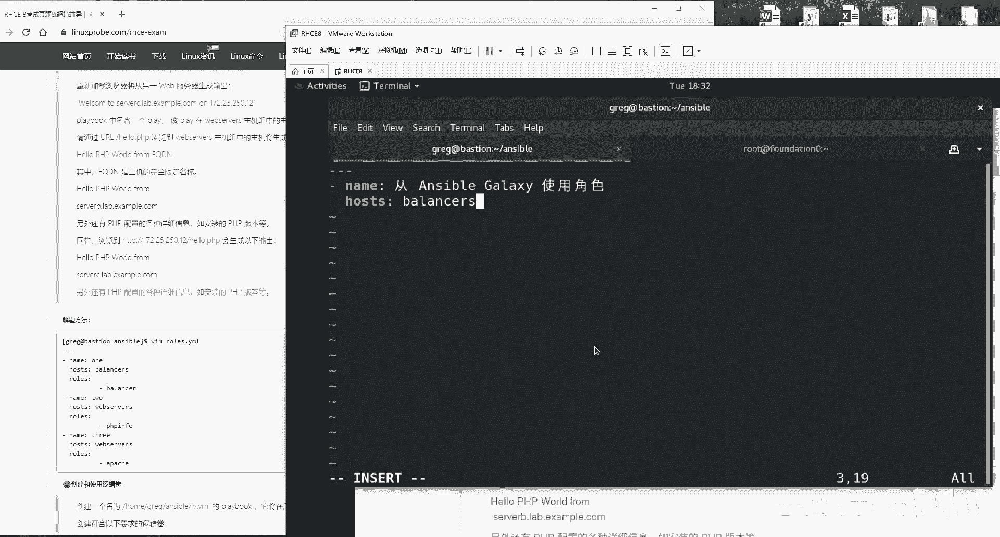

调用一个角色。不要手敲啊，直接复制省我们的手好不好？好，做完这道题做完了，说的那我们这个下面不用做吗？下面你不用去做，下面是用来验证的。做完下面一道题。那老师你这样做对吗？因为我自己都有点怀疑自己了。

哎，太因为太简单了啊。😊，对，这样做是对的啊，而且没有任何的呃呃我们而且没有任何的问题。让我们来继续啊，因为大家可能之前吧对于这道题非高估，你知道吧？

所以我能够理解大家现在这个心情就是一点惊恐的看着我老师，你这个做对吗？好，对啊，但我们看一下这个验证啊，我每一道题都给大家去验证一下。来第二个实验了啊，第二个play是吧？在这个组里面好，等一下啊。

你说什么就是什么？猜配3啊，你让我配30，我都给你配出来。😊。

哎为有些时候你把这个东西一说明白了吧，就很简单了。但是的话你要不说明白的话呢，看起来好像挺高级的。而作为一个考前辅导来讲，他就是要把这个事情说的简单了，就他他就是这样。好呃，就是这个角色往里面一粘好。

做好没？no没有做好。后面有一个坑，什么坑。😊。

他是要求你是不是必须得。显就这个负载均衡，以及显示出来这个PHP信息啊。待会儿这个效果就是它会做一个负载均衡，它会显示出来PHP信息。但是你要是没有网站服务的话，你能做出来吗？你做不出来。

因此同学们看啊，红冒这一个坑就来了。😊，他没有要求你，但是你必须要去做，就是调用你刚刚创建出来这个ipad的这个角色，才能够让你这个服务起来多阴险。你看这个。题目之外的话，所以的话呢我也给大家排出来了。

就是如果你要不安装上你这ipad服务，你前面两个服务的效果，你出不来，必须要有这个网站服务才才才能能够生效。这样做完之后，然后呢然后就O了。就这么简单，这道题目的答案还没有这道题目场呢？你读一读是吧？

好，那么待会先给大家声明一下啊，这道题目的话呢，因为我们的实验机器的原因，我们待会会有报错。这个的话大家不要笑话啊，大家不要笑话，在考试的时候就这样去做，没有任何问题。好。

待会的话呢这个报错会报错在172。25点250。13上面，就那个balance这机器。我们再按一下回车。有一定几率会出来啊，不出来更好啊，没有报错更好。有报错，我给大家提前给大家说一下，然后怎么去解决。

😊，不用着急，我们一步一步来。う。有报错我们不怕没报错更好哎呀，没有报错，那好不好啊，更好是吧？它是有一定几率出来的啊，也不是说一定要出来的。因为什么呢？因为我刚才把那个服务不也卸载掉了吗？

卸掉之后它就不会有报错了就的就这么的严谨啊。好听我讲课时候感觉特别的爽啊，就是属于一一一看全会一做全废好看下面这个啊开始了是吧这个角色的话呢配置一项服务，它能够在这个服务之间负载均衡。

什么样的效果呢就是你去访问这个主机的时候每次一刷新它都会够看到一个新的IP地址它能够从这个serv b跳到C从C跳B还能从它还能从这11跳12还从12跳11我不信你试一试摁回车看到没F5F555每摁一次F5怎么样呢？

每摁一次F5跳一下这变B和C这边变一和2行。😊。

啊，太香了啊再来。😊，说啊我们后面加上一个叫hello的一个PHP它能够实现出来PHP功能啊，他已经帮你配置好的PHP了，他说能够显示出来PHP信息，我不信哎，我看一下还真行。

并且还有一句话说下这句话的话呢，必须还能够显示出来hello啊PHP word好，没有问题吧。还是且这还必须是个完全限定主机名FQDN哎，还必须是个serverB，你看一下是不是哎。

是这都不用你去做拿分。😊，再来是吧你去访问这个的时候啊，它还能显示出来一个s C啊，真的那么神奇吗？我们访那我们访问一下。😊，按下回车sorer C没有任何问题。好，这道题完美解决太完美了。

再来下一道题，创建跟使用逻辑卷啊，创建创建跟使用逻辑卷。下面的话就是说先新建出来这个playbook同样的老道理啊，大家都知道了啊，就是说老刘什么什么不好，哎，先把它给创建出来。

省得忘先写出这么个文件来嘛，怕忘哈这啊也没问题，在所有的授管节点上面去执行下面的角色，什么意思呢？哦啊house的冒号等于哦，太好了。哎。😊。

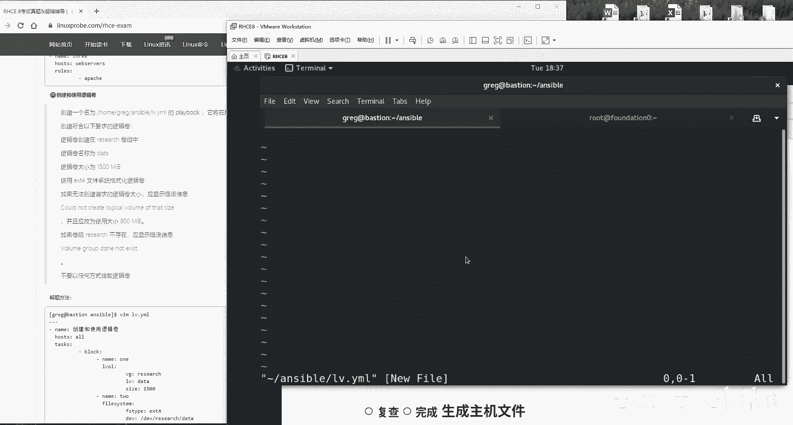

先把我这个格式啊给它写出来，我省得忘。😊，考试时候就是这样的，你哪怕大你哪怕我写错，大不了我给删了，对吧？但是我不能给忘了呀。来，就怕做着做着把前面的题目做完了，后边的题呃就怕后边题目做完了。

把前面给忘了，那尴尬了。😊。

来看题目是吧。😊，啊，先写一个一啊，OK先写个吧是吧？在我们这个系统当中的话呢，有一个叫做research的一个卷组，太好了。这名啊，说逻这逻辑卷的话呢名称叫做data啊。

大小的话呢创建成1个1500兆的。好，我这个脑子不好啊，我先做这第一步。😊。

这个充电LVM充电是什么？它使用什么模块呢？它使用的是叫做我给大家查啊，这个使用的叫做。😊，这个使用的叫LVOL好往下走走走走走，然后使用到example，看到没？这不就是这个吗？一呃，等一下啊。

那不就是这个吗？对吧？一模一样啊，一模一样。VG什么名，对吧？我先给他写他要告诉你LVOL答VG什么名，VG名，我不要去手写，我复制它。😊。

第二是什么呀？I为什么名儿。😊。

考试的时候啊不要慌。V啊elelevation名站他啊。逻辑转多大大小加加上这个单位吗？不加看到没？为呃为呃为它它为什么不加呢？😊。

他这个示例里面它创建出来1个512兆的一个逻辑卷，他加没加呀，他没加兆。所以的话呢这个不用加，这个不要加啊，直接写成1500size等于1500，就这么写啊，1500兆的一个逻辑卷创建出来。第二步好。

开始了。😊，使用EXT4哎文件系统格式格式化逻辑卷，还不就一个它不就一个格式化吗？其实啊我给大家说，你可以使用到 shell。😊，你可以使用y这个 shell。因为我已经跟红帽那边去确认过。

直接这样去做即可呃，research就是我们现在所讲的这一切啊。😊，你全都可以用到shall模块去做。包括说这些全都可以。只不过我们为了讲课的时候，我们不能这么去讲。

大家会觉得我们这个课吧呃太投太投机取巧了，已经很投机取巧了。我们在投再取巧的话，大家会有意见。所以的话呢我就还是用该用哪个模块就用哪个模块。比如说这个模块跟这个模块，我那我还是一个一个模块这样去做的。

而真正考试的时候的话呢，你要是真的忘了情况下啊，你甭管什么模块了。一论全都是sha模块，全都直接写命令，好吧。😊，接下我们来写一下这个呃fill system type文件的系统格式以为EX4。

然后的话呢我们的格式化的设备名称是什么呢？D一V目录里面以逻辑卷卷组的名称命名的一个文件夹，里面叫做以逻辑卷的名称命名的一个文件，是不是它书籍里边第七章内容忘了去看一眼。好，这就这啊这个活做完。

我猜它后面还有啊，先给大家写个s干嘛我不知道啊，看说啊，如果要是无法创建逻辑卷的大小什么意思呢？磁盘不够了呗啊，就会显示出来这个信息，哎呀，写了那我这个还是理解错了啊，😊。

他说如果要是你这个文件1500兆，你要是不够的话，那么就生建出来一个为800兆的一个文件啊，推而求其推而求就是推而求其次嘛，对吧？1500不行啊，推而求其4到800也行啊。

那我们这个时候就要做第一bug了，做这个救援了，因为是你在上面不成功的前提之下，你才去做这个操作的，怎么办呢？这样。😊。

前面就要把下面这两项作为一个整体加一个block，是不是啊？因为你要把它作为一个整体，这两个哪一个不成功，我们都要给你。😊，救援control v哎control V。

然后control大爱table啊。啊，table tableO没问题，会呃摁一下ESZ键。把它往后搓一搓啊，把这两个作为一个整体。接下来的话呢我们写上rescue救援。😊。

RRRESCUE冒号这个时候的话呢，一定要跟我们这个上面那个block对齐。你要是考试的时候啊，拿一张A4纸，你底下卡着那个显示器，你对着这个你卡它一下，你就看它是不是一它是不是它这是不是对齐的。

你要是不对齐的话啊，你摁一下ctrlV，你对齐一下它看到没？它没齐，是不是没齐就会报错啊，一定要一点不差，对齐它。😊，对齐它看到了吗？跟它对齐啊，跟它对齐，字儿跟字儿对齐啊，没有问题。来，怎么救援呢？

输出一个先来做第一步，是不是要去输出一个嘿，怎么等会啊，我又把它删了，对不对齐啊啊，对，这个要对齐，这个很重要啊，这个很重要。来，首先来说第一bug。😊。

输出一个信息。信息怎么输出啊，这么着去做，对不对？哎，输出一个信息。

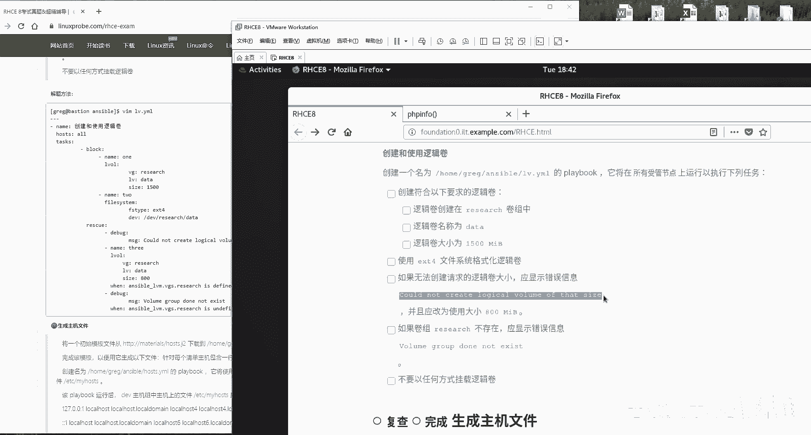

等一下啊。这个B该是跟Dbug是同一个级别。写到这个后面。来往往下往里面一粘，还没有完。并且的话呢，他说1500兆，他要没有的话，它会创建出来一个为800兆的一个逻一个逻辑卷。好，我现在再做一个第三步。

😊，不用做第三步，我往向上粘呗。😊，123455YY。能偷懒就偷懒儿，对不对？考试时候这样的话提高你的效率。😊，晚上下午这门考完了之后去吃饭的时候都能比别人早到啊。提前抢个位置去啊，做好啊。

如果要是这个磁盘没有空间的话，那我们就新建为一个V800兆的一个磁盘。

再往下面去看说，如果要是这个reseer这个组还不在，怎么那么多种情况呢？它就会显示出来这个信息。好，也就是说如果要连这个组都没有的话，不光是磁盘容量不够，连这个组都没有的话，就会显示出来一个报错信息。

再把第bug再bug一个，对吧？再去输出这个信息，对吧？然后我们往里面一粘粘了之后啊，还有一个小问题，什么时候去输出呢？就是说这个组不存在这个情况之下，好了，那我就不给大家装了，这都大家都知道了。😊。

上课之前一定要做好功课，这个变量我们叫做ible它也是个fax啊变量啊ible点VGS查看我们的逻辑卷组，相当于就是VG dis嘛。这边有没有一个叫做research的一个组。

它要是已经啊他要是没有被定义的话，anite他要是没有被定义的话，那我们就会去输出这个信息，输出说逻辑卷组不存在的一个字样。好，那么同样的那那就同理嘛，YY一下往下面呃往上面扒一粘，如果要是存在的话。

那我们就新建出来一个为800兆的一个空间。要是不存在的话，就是去输出这个信息啊，非常公平报名退出做完。😊，好，给大家解释一下，在HCE考试的时候的话呢，它这这我们真正考试的时候啊。

它是有三台机器可以重建两个机器的话呢不能重建。而我们这个模拟环境的话呢，它是5个机器里边都没有这个research这个卷，因此都做不成功。好吧，同学们这个的话呢呃知道就好知道就好。

这对大家这个考试没有任何影响，只是说考试的时候，你这样去做，没有问题啊，而我们模拟环境的时候，它一个都不成功啊，但是它不有报错。来跑一下我们这个逻辑卷还是啊虽然没有，但是我们跑它一下。

看有没有语法让它报错，这还是有必要，对不对？😊，呀包了个错错啊，包了个绰错，我看看啊。😊，这个报错的话呢，他是说啊这个没问题。他说我们这个逻辑卷没有被找到嘛，这个逻辑卷没有没有被找到。

这是一个很正常的啊，它不属于报错。所以的话他会底下会去输出说我们这个逻辑卷它并不存在的一个报错。因此的话呢，上面这个信息属于正常，这没关系啊，因为它上面失败了，它才会去执行下面这个语句嘛。

这个是在我们预料之中的。因为我们当前我们的舞台它都没有这个逻辑卷，因此它就没有成功。好吧，但是就为这个结果是正常的好，正常没有问题。😊。

好，往下面去走，生成主机的名文的文件。这个的话呢是哎呀这个怎么讲呢？这是我跟你们。😊，大快人心的一件好事。嗯，这道题目是这么去做。来看题。这道题，我们的学生能替你们多挣出来20分，就这一道题啊。

只有我们的学生自己知道看题目，生成主机文件，当然如果要是你认为我们这是一个取巧的方案的话呢，大家可以不用这样去做啊，我不希望说给我们学生们找一个更好的一个方案了。

结果还要还会被这个某些人说说你们这不这个不是同于取巧嘛，对吧？这不是走歪路嘛，我们这种批评是不接受的啊，因为你要看你在干嘛，你在学习的时候，你这样去做不对，但是你的话呢，你现在是在考试。

这个是两种不同的状态，不同的情形啊，好吧，你在考试的时候，那三个半小时你就不是去学习去了，你就是为了去拿你那个钱换一张纸去换一张证书去了，这就是一个很公平的交易，你如果你呢把这个钱给不了。

如果你把这个钱换不成一张证书，你反而你这是一个更让人笑话的事情。所以我们就呃摒期所以我们就接受一切的骂名嘛，但是我们校目学员能够提高这个通过率。😊。

这么回事儿。这个这个这个的话，在大家考试之前，尽量不要外传啊。😊，有这么一个模板文件。😊。

把下载到你的这个对应的目录当中，他告诉你了，把这个文件下载到这个目录里面，摁一下回车。😊。

完成这个模板，这个模板的话呢，样式跟这个文件差不多。我们看一下这个文件它什么样子啊，就是给你个参考啊，他就给你个参考好哦，大概这么个格式好，这么他O这么它这么个格式，他说啊再创建一个名称叫做这个东西。

这个时它它这是什么？它它就是一个均价文件，对不对？一个模板文件，说呀创建一个这么一个playbook。好，还是啊同样创建出来一个这么样的一个playbook干嘛呢？😊。

它能够在DV组当中生成这个文件哦，明白什么意思了，啥它它是啥意思啊？它就是说我们使用的这个均价文件，它里边有一些信息，它会在我们这个DV组里面自动买意信息给它复制进去。好，像给它写上这个格式，这么去做。

首先来说简减简啊，刚 name。😊。

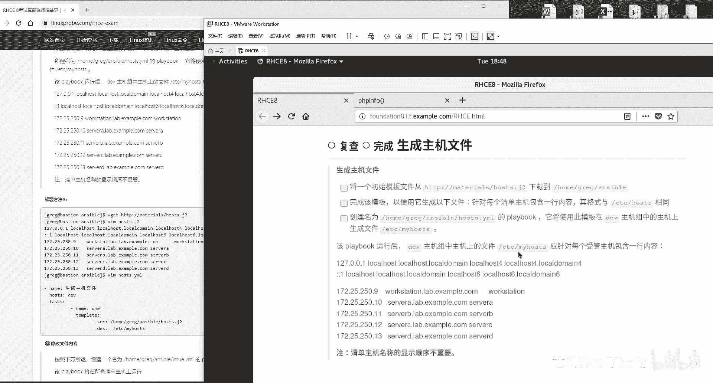

同学们啊。

这个方法我给我给大家了，还定一会儿有人说说老刘，你这个退是脱去去想啊，你这怎么能给学生这么去教呢啊，这不就是为了考试一个应试教育吗？😊，啊，我的话呢就自愿接受这个骂名。啊。

不过的话呢我就希望大家考试之后能够更加顺利，我没有任何问题。好，看一下啊，这么去写，它不就是说让我们去复制那个文件吗？还使用是tlate，对不对？好，看好了。

同学们关键点来了SRC路径给我写对home目录里面的greg里面的ensible里面的ho点。😊，G啊点G two，你要呃这个我不太放心啊，我去我去复制一下，因为我怕写错。😊，好。

我在我我查看一下okK啊，是在的。然后的话呢把这个给它粘贴到。😊。

目标上面。

这个均价文件的话呢，大家应该知道啊这个难点是什么呢？难点你要是在这个这个难点啊，是这个文件。你如果你要是光这么着的话，他就把一比1给它复制进去了，对吧？那么就把这个给它一比1直接复制到对方主机上面了。

但是的话这是不对的，为什么？因为它需要在里面再去增加上这些信息，这些信息的话呢，分别是什么呢？分别是这个主机的这个IP地址。这个主机的话呢，完全限定主机名。

这个话就是主机的一个呃ventory house name就是叫做这个收款节点主机名也是它也是一个别名。你要把这些变量的话呢，一个一个的写到里面去，一个一个往里面去写，写好之后往里面一拷。比如说像这样。

😊。

对吧啊，我们定一个复循环，然后呢我们一个一个从这个groups里边我们去获取，就这样去做。😊，那我们一个一个去做提取，提取之后往里面一粘，最后我们结束掉我们这个循环。等等会我看下这个它应该是一个啊。

然后我们一个一个往里面粘上去粘。😊，正确加法应该是这样的，就是标准答案啊是这样的，他想让他想他想怎么卡我们。然后的话呢我们。调取一个一个的变量。最后我们最后变量考过去的结果就是这个大家但是的话呢。

大家有没有参加过高考啊？高考的话呢，江苏卷啊一直很有名儿，为什么呢？😊。

做数学题的时候，可以拿尺子量什么意思？他要给你一个直边以及斜角边的一个尺寸。然后的话呢，让你去算什么圆周什么的。有他有些学生吧，他们不会做那道题，不会去用那个方式啊。

他他们他们就是他们不会去做那个公式怎么办呢？😊，江苏卷的一大特点就是那个三角形啊特别的规整。按比例出的题特别的严谨，他拿尺子去量一下，去量一下这个直边，比如说2厘米，这个斜边1厘米2除以等于是啊2对吧？

或者你八一再一除，哎，是个根号三，大概一个范围，直接写上这根号三或者写一个二或者写一个就是出完那个结果，直接拿尺就拿尺一量，量出这个结果，往上一填拿分走人一样的，你中考你都可以这样。

为什么我们这个考试不能呢？于是我就帮你们去想了一下，同学们，我看你们太累了，怎么办呢？这个信息他让我们去通过变量去提取出来这个信息，但是我仔细我一看，这不就是现在考试的这个信息吗？而且我跟考官去求证了。

我说考试是不是就是这样，他说是这样的，于是你们不用变量了，同学们直接复制。😊。

因为你们没有看过那个原始答案，特别长啊，直接考试的时候直接这样。既然他已经给我们这个信息了，我们就没有必要再去变量去复制了。既然你红包你也提出来了，你只看结果不看过程，就这样去做报存名退出。

直接把这个文件给他拷过去，你你爱怎么着，用这个这个变量去提取，我们不用，好吧。😊。

最后的效果跟它用变量提取出来的时候是一模一样的，没有任何问题。好，我们来测试一下。

这道题原本应该是20多分，做至少得20分钟起以呃20分钟以上才能够做完呢。咱们5分钟做完。好，ible playbookhouse点听完这个要是听完这个之后啊。😊。

要是再考再再再考不过，我说这道题再丢分，哎，说不过去啊，说不过去啊。来他是不是说把这个拷贝到DV目录组啊，你看呢这个主机组上DV目录嘛？走啊，DV目录低头呃，172。25。250。9走你。😊。

拷贝到哪儿呢？忘了看一眼啊。拷贝到哪个文件夹目录，ETC目录里面的house name是这个目录吗？啊，是这个目录。好。

去执行一下。Ansible。Playbook。走。做完。DV随便就我们去DV这个主机上面。去看。拿分。跟你用变量来给它复制出来的一模一样。一模一样没有问题。到时候我们拿这个待会儿啊拿这个判文胶本。

我们给大家过一遍好，给大家过一遍，不用担心。

那接下来啊居然ok非常开心啊。😊，下面再来说啊修改文件内容好了。😊。

来，修改文件内容。😊，粘贴。哎，不是这个主机啊，差点做错了，干呃想啥呢？😊，啊，已经洋洋得意了啊，为啥呀？你看这道第几道题了，这已经是修改主修修改文件内容，已经到了修改文件内容了。

到了大概这么一个题目了啊，就该想着这个晚饭吃什么了啊，该想着晚饭吃什么了。来修改先先写上这么一个格式啊，先不管他做什么，先把格式给它写上，然后咱么别再说。😊。

先有格式再说。哎，先有格式再说。

能够体会到考腔辅导跟讲课的区别了吧。在所有清单主机上面去运行，这不都告诉你格式吗？这都是告诉你格式呢。喂task具体干什么事儿，不知道先写上。😊。

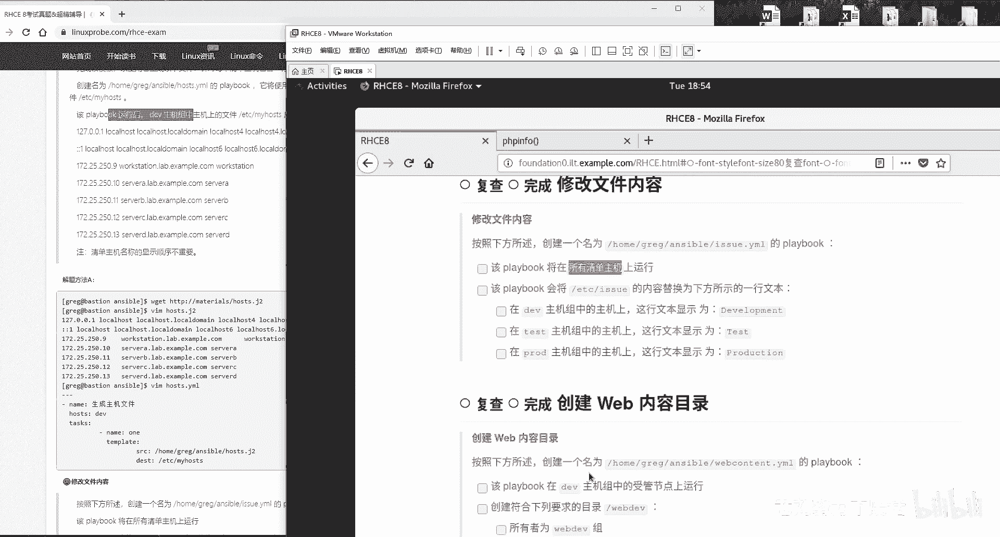

啊，先写再说。来说啊在DV啊说他会将这个文件上面内容替换一下，说啊在DV组啊会去变成这个texest组变成这个啊POD组变成这个这不就是说在不同组上面替换不同的这个内容嘛。行啊满那我就那我那我就满足你。

😊。

其中的话呢，我们就要去使用的这个inventory house name呗，对吧？因为它是不同的组名啊，它不同的组名来第一个copy。

copy content是什么？我不知道抄哎抄了哎，粘贴哎develop。😊。

到哪儿了？到这儿ETC目录里面的。的，ISSUE叫做艺术是吧？来粘一下它什么no这个时候把它一定要对齐啊，跟这个copy对齐，因为它不是copy的参数，它就要跟这对齐了，吗看看着有点歪啊。😊，等一下啊。

有点歪呢，看着啊是歪了，对吧？😊，好，inventory啊，然后是我们的问当什么的时候呢？当 inventoryventory house name我不加装了啊，这就是一个factor的一个变量值。

我给我给我我我给他搜一下吧。其实没有必要给大家搜了，搜一下吧。

等一下啊。这个怎么去看的啊？因为我都给大家找找好了，大家万然一记不住的话，我到我刚才怎么找吧。😊。

set up对吧？然后是。这个。Filter。跟所有的。house name相。

因为你看到它这个主它它它这个主机嘛，所以我们能够猜到的是主机名，所以你可以看到了，哎，叫叫anzeible呃house name。其实这个也行啊，但它看不到我们这个组。好，那我们这个组的话呢。

我们还是使用到这个inventory house name，它就是一个我们这个facts，不我被大家查了啊，这是一样的。好，我们现在的话呢把它给往里面一粘。😊。

当我们这个组啊。在groups。哦，我们刚才搜错了啊，不应该搜house name，应该搜是group啊。就是说当我们这个用户组的话呢，它是DV组的时候。

那我们就会把这个内容的话呢变成development啊这么简单来12345五行，对不对？来5YY那往下一粘zo你哎，怎么相当是5YY吗？等一下啊，5YY。😊，走走哎，再再走好走好，再来。第二个。

如果要是对方是test组的话，就会把它修改成test啊，大小写啊一定要区分大小写严格区分。😊，TEST。TST好的，继续啊，第3个three修改三个文件吗？

第三个文件POD目录组的修改成production。好，大小写严格区分PLODOCT好的，太棒了。😊，Production。哦。这是POD组，做完保存并退出。好，随便呢先给大家在执行之前啊。

先随便找一台主机。😊，找谁呢？随便吧，我看看我们没找过谁呀，没找过他，对吧？这低头哎，172。25。250。13balance组不行啊，这边没他事啊，这边没有他事儿，这回换一它换成DV吧，好吧啊。

DV点9没有他事儿也不行啊，看一下DV目录组待会会变成development。现在这个内容没有变，还没有变。来。😊，Anible playbook。然后是is点y某执行。真好啊真好。走完再去看变没变。

变了development，拿分走人。

来看下面这道题，说下在这个web界面的话呢，新建出来这么一个文件这个文件干嘛使了，我还是不管考我们考虑时候养成这个习惯啊，甭管他做什么事情。😊。

我们先把这个给大家创建出来。但是有一个问题，同学们，你们看啊，这道题就是我刚才说的看题。同学们看题这道题将万目录里边的3W里面的HTML的bDV连接到这个目录有问题了，我们没有这个我们没有这个目录。

而我自己新建出来的一个目录吧。里边没有他考试里边的一个内容。所以的话呢有问题了，待会判分的时候，这道题都有分，只有这道题我们没有分。因为这个文件我可以把它创建出来。但是我创建出来这个目录里边。

我不知道他考试里边是什么样的一个首页的内容，它判断出来不它判断不出来成绩。这道题它会扣我们3到5分啊，它会扣我们一个他会扣我们一个小分，先给提先给大家提前声明一下啊，提前声明一下。😊。

好，我们继续。提前声明好，哎，就丢人就不怕了，是吧？来啊不是这个目录。😊，我现在就怕没有录上，最后我就一个劲的看，我就刚就怕没有录上。我刚才录了一个视频了，录了两录了两个小时。😊，哎呀。

所以你大家永远不知道这个背后还有多少又录过多少次。

没有读上声音真气人啊，来开始了。他说啊啊现在这么着，我先把格格给他写上，先把我们这格给他写上。😊。

别着急哎，先写格式。

来，他说啊在DV主机上面去执行下面这个命令。DV对你好。😊，是吧在这个下面的话呢，创建出来一个目录。啊，这不是瞬间目录吗？😊，所有者为web dV组，说这个叫人话吗？这个叫所有者为webDV组。

听见来好像也通顺，实际上它应该叫做修改为webDV组，那，你听了一个用户者很有歧义，你也有同学比较可能比较心急啊，他一看这个哎所有者，这就是一个所有者权限的，对吧？错，他修改实际上是修改的组，好吧。

他修改的不是所有者是修改的所有组，然后看一下这个权限。好，这个权限第五章节呃，但这个这这个呃大家不是问题，我先往后面就给大家去往后面去想第一件事新建出来一个目录，对吧？啊，至于说它是什么权限什么的。

咱们先不管，咱们先不管它。😊。

pass边呃pas的这个路径是谁来的？web DEV好的，哎，state它是什么样的一个文件呢？它是什么文件，它是一个目录型文件。group组是谁看一下怎么样呢？web DEV点题点题啊，点题拿分再来。

😊。

常规权限，开始了权限吗？mod等于什么呢？权限用到单引号数字，用到单引号把它引起来。所有者这不就是7呃4加上2加上一嘛？7好的，7再来这个是4，这个是二，这个是一7好再来这个是4，这个是一啊。

4加一等于是55没有问题，没完，具有特殊权限，设置组IDSUID是吗？不是SGID是吗？是SBIT是吗？不是SGID421里边的几啊，2放到最前面，然显也放放最前面2775这么来好。

往后走双将链接文件连接到这个目录当中，并且它这有一个首页文件什么的，这个我们没有特别尴尬。😊。

怎么办呢？我呀先偷偷的。😊，这么着，我要先偷偷的，我试一下啊，因为我上一次做这个时候不成功，它现在是不是已经是在这个DV组上面了，我看一下啊，点9低头哎，点9没问题，已经是在DV主机上了。

我呀现在先给大家去新。😊。

他有没有安装上HTEP啊？还没有旋转，你看这都是麻烦事儿。这都是麻烦。好，安装上。然后的话呢我们帮他去新建一个考试的时候不用你管啊，他就已经要求你了，他说将连呃链接文件直接链接。

所以他都已经给你弄好了web DEV。但是我删我去让去做过。即便我这样做它也不成功。所以很尴尬。好，我们先这么着来一下子吧。好好了，之后啊，开始做下面一个。他说将文件进行链接，将这个链接链接到这儿。

好了，我们来进行链接链接的话呢就是是file。😊。

跟上面这个name对齐。怕对不起的话，比如说像我一样，可能有点有点累了。所以我看这个字有点歪的话呢，你ctrlV，你对他一下，或者拿张纸吧，你拿拿拿一张这个拿拿一张A字纸，或者实在不行。

你考试就拿你带一把尺子，对吧？你比他一下。😊，我唉我我我们的考生非常的严谨啊，拿尺子跟你这比。那没问题啊，来这个的话呢就是说哎不对啊，反了，他说将这个文件连接到。😊。

这个目录上面。在安思堡里边呢链接不分软硬链接。

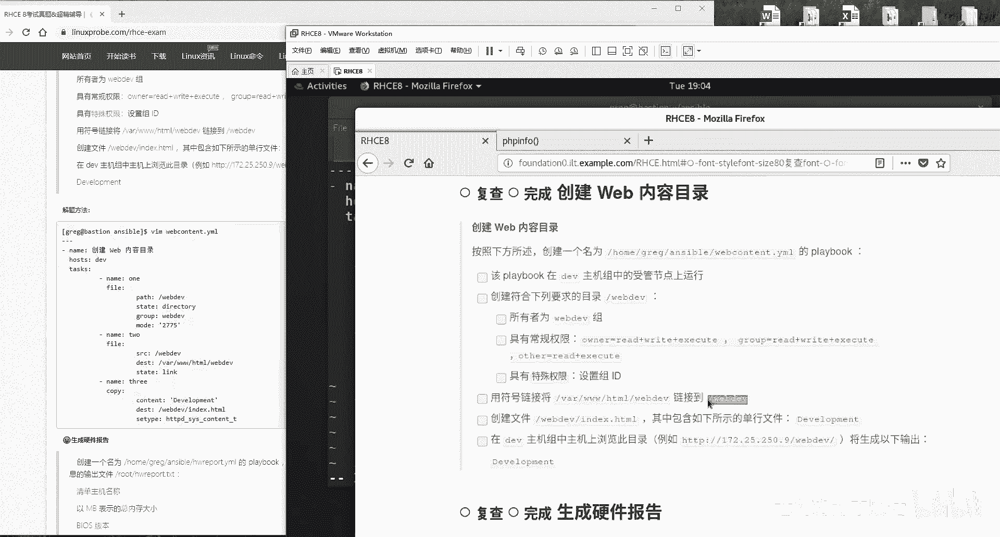

直接写link就可以了。state等于link。好，第三步继续。

他说啊创建一个这个文件啊，然后的话呢这里面包含一行内容啊，行，给你了啊。文件的创建文件使用copy。😊。

Content。内容是啥？Development。

目标保存路径。

这个时候需要设置一下Slin，因为你这个它不是这个这这个这个这个怎么讲呢？所以大家学习第十章的话应该没有问题。因为你看啊一般情况下的话呢，我们的网站目录的Slin这个上下文啊，它是这个对不对？

所以说你可以直接不用去照抄我的，直接这样一查就能够把它粘过来了，但是你知道它这是一个根目录的，它跟那Slin这个值不一样啊，所以话呢我们需要去设置一下它这个值怎么查的，那我就那啊那我就告诉大家了。

如果还是不清楚的话呢，不说看第十章节我们的appach服务做好之后干嘛跑它一下吧。不过这个可能不成功啊，先给大家说一下。😊，哎呀，有点小问题，因为这个文件它这个目录吧是我自己建立的。

我而我自己建立的这个的话呢，它有可能不符合提意，它会扣你一个小分的项啊，它会扣你一个小分。来，我们再按一下回车。😊。

按下回车，他说要是成功的话呢，会去访问他出错了啊，不成功。你看到没？他不他这个不成功。因为他说这个做link链接文件的时候，IClin的话呢并没有通过，而正常的话呢是没有问题的，这个怎么去解决呢？

我尝试了一下啊，但是我去只仅仅是尝试了一下啊，我把这个两个路径改了一下，我把它改反问。😊。

反过来写。这个考试的时候到底是怎么去写呢？以我现在说的这个为准，就是。😊，按我们呃按我们刚刚那个为准，而我们书上为为什么这样去写呢？是因为让大家在实验环境里边做的是有效的。而考试的时候。

他怎么说是把它链接到它他怎么说，你就要怎么去做啊。我们现在是故是故意写反了，因为这两个文件都是我们自己建立的，我们试一下而已啊，还那么还那么还是不行。😊。

还是不行，你们看到他说这个SAlin的这个问题。行，这我们先跳过啊，没关系。😊。

嗯，我想一个问题。这个文件是我们自己建立的，它为什么不行呢？它是不是因为在考试之前，考官已经帮你们去修改过Slin这个上下文件的这个值了。那所以我也帮你们去修改一下，看看呢。😊，当然了。

我们现在这么修改了，你做判分的时候，你还是没成绩。因为你这个。😊，等一下啊。需节点你要被重启的，从就呃你这个节点你需要被这个还原的，你被还原了之后，你还是没成绩。😊，那这我们找一下解决方案吧。

起码我们去执行的时候，我们能看着痛快点，不要出现这种红字嘛。虽然说最后没成绩，但是我们能看着痛快点。😊，好，再来跑一遍，看有没有成功。好，这道题我们挑过啊。这道题我们挑过。先我们拍一下。

待会我们拍一下这个成绩，看看这个成绩是多少，应该只扣一个小象的分。继续啊，说一下重建出来这么一个playbook。😊。

创建出来这么一个playbook的东西啊，来写上一个格式，别业先不管。上下咱们先一顿写这个先写格式。😊，你因为你什么题目你都要格式啊。

说啊这么一个playbook，它将所有节点上面的上面生成以下信息。所有节点。生成信啊生成信息啊，我看一看啊，他是意思是这样的，他呀说在所有的节点上面都会去生成出来这个信息。

然后的话呢呃你的playbook这一个模板。你呢从这个模板上面，不先从从这个先从这里啊下载一个模板。接着的话呢保把它保存到每个系统的这个路径下。😊，将正确的值改成啊，明白这个意思。

然后他说如果硬件不存在使用，那它什么意思呢？你看啊，大家看这个意思。😊。

实际上的话呢，还是。😊，用变量去实现的来，我们来get一下，获取了之后吧来。😊，查看一下这个文件，你看这个文件啊就是有好多这种格式。比如说主机名称是什么啊，对吧？然后的话呢，这个内存值是什么？

然后话这个呃bi是什么？就是它有一些选项，你的话呢根据不同的主机，就是把它对方那个主机上面那个值。😊，提取出来填到里边去，并且保存到每一台主机它对应的这个目录上面。好比如说我是游传好了，姓名哎。

流传哎年龄巴拉巴拉。然后的话呢呃居住地啊，北京呃这个工作啊，这个HHCE讲师啊，有什么成就啊，这个我们的书籍啊，对吧？就是你每个人有不同的这个信息，比如说那你这个就是比如说这个王武同学对吧？

然后这就是你这个啊姓名啊，这个籍惯对吧？就这样照这个信息好，那我们就给大家进去捋吧，我们先在这样他这个信息啊不要用到金价去做了，那你不累啊，对吧？我们自己就给自己累，我们直接通过我们这个变量去实现。😊。

不要给自己添麻烦啊。也就是说我们现在的话呢有这么一个模板，你需要把里面这个字给它填给它填齐就行，怎么去做呢？😊，还是要用变量还是要用到变量，并且你看到有一句话啊。

这样这样这样那我先给他慢慢往我们往后捋啊。第一件事情，你是不是要先去下载这个文件啊，你现在都没有呢？你先要在每台电脑上面，对方的每台节点的电脑上面是不是都要有这个文件啊，让对方去下载啊。

让每台电脑自己去下载一下来让每台电脑都自己去自行下载一下，然后保存到哪儿啊，这儿是吧？让每个电脑都自行下载保存到这个位置。好，第一件事干完啊，拿一拿一部分的分儿嘿。😊。

红按小点子给分，最后没写出来，按点走分。第二步修改，修改使用的是line file啊，这个模块修改什么呢？修改的首先来说，我们是不是修改的是这个文件啊，这个我们知道吧，我们知道我们就写什么。😊。

替换怎么替换呢？替换使用的是REGEXP替换替换一个什么什么什么，对吧？然后成为什么。😊，啊，然后XXX。你看啊，我们现在是要替换，将我们这个前面的这个替换成这么一大段，也就是说保留前面的。😊。

等于YYYYY好吧，就是把我们前面这一部分给它替换成后面这一大部分。好，我们来做这个过滤。😊，这个顾虑的话呢，我们现在想一下啊，首先来说这个前面这个XXX肯定就是前面这个名称了，对不对？哎。

就是这个名称了。你要是一个一个写的话，你很累啊，123455个呢，那我们就用一个变量呗，然后去使用一个lo循环啊，这就是我当时我就写这个教本的一个思路，这么去做哈，不要着急。😊。

Vs定义一个变量组叫做HTO它就是就呃它就是叫这个啊，它叫做这个hardware啊，所有的这个变量。其中的话呢所有的名字我们就把它叫做HW name这个名称可以跟我们不一样啊。然后你一个一个往里面去写。

12345，你一个一个往里面去写。😊，我给大它先给它剪切出来吧，一会我忘了啊，123455DD好往上一走。5DD往上一粘。好，第一个的话呢，我们的变量就叫做house。那么这个值是什么呢？

这个值啊这么去写，变量名称叫做HW count啊，这么去做。😊，这个值怎么去提取啊？这个值叫做ventory house name这个非常好记啊。

这就是说我们刚才那个fax里边那个值可以去选用到第bu去查看到我会大家去追述啊。如果你真的是记不住的话，记住考试的时候就把中间加个这个下划线，就是它的变量名称，看这道题没有做完，你这样做不对。

考试时候虽然是满分吧，但是呃不符合要求，它虽然做它就都有啊，你看说如果硬件项不存在，则值应该是no，你先这么去写的话呢，就是呃默认就是它肯定是有了，这个变量值肯定是有，但是的话它有可能没有这个值啊。

这么去做。😊。

一个书干啊叫做货。如果要是default。

Yeah。哎，今天大家看我这个视频很累是吧？😊，今天我又给给自己考两遍，如果要是这个值没有的话，默默认值等于是n这个的意思如果要是有就填写这个的变量的值。如要是没有，则是默认值。好，非常简单。

再来12345哎，两行Y2YY往下复制，往下粘几个呢？五行啊，往下粘5个列嘛，因为它是不同的信息，再来第二个我们叫做。😊。

Memory。呃，memory这个我不给大家去也O大我给大家查一下吧。但是其实你不要去查了，你要考试的时候，你再一个一个去查，太耽误时间了。考试之前提前插好了，把那变量名就5个变量名。

而且第一个还告诉你了，没什么难的，辛辛苦一下，背背吧。好吧，你到考试的时候去查更麻烦啊，更麻烦。哎dis。😊，size这是VDB好，怎么去查呢？如果说你考试的时候，你真的是忘了不呃嗯该怎么去查呢？

怎么去做。😊，安ible有随便查一个bis吧。好吧，就比如说第二个bis怎么去查呢？哦，刚s up。😊，今天我考了两遍哈，来faelter。😊，我们外面是用单引号给它扩起来，跟它里边有点。嗯。

所有包含bes的这个关键词的信息项。出来没出来了，是不是就是这个你看一下。好往呃往前一复制。😊，往里面一粘，当然了，同学们，我不太建议你们就是像我似的一个一个去查了，你就辛苦一下。

考试之前背它一下子也不累，对不对啊，这样的话也不累。好，我们继续还有一个叫做ible，然后是memorytoal下划线MB啊，这个需要给大家去查一下。因为我要自证一下清版，这道题我去做过一遍。

后来他给我们说这道题做错了啊，那给大家去看一下啊，MEMTOTAL看一下啊，跟所有这内存相关的。如果你要是记不住这个的话，你就搜一MEM这个这个能记得住吧。来，我们搜一下MEM。😊，你看啊。

这不就是什吗？unible，然后MEMtoto下划线MB这就是在unsible里面，它可以查到说内存toal总大小以兆为单位的。好，我们来去复制一下它。😊，确认一下，我没有找错。

这也是官方标准答案里面给呃给大家给出的来，我们往里面一粘。下面来我就不给大家装了啊，大家自己搜就行了。搜VDA和搜和VDB这两个关键词都能够搜到。来一个是主机名称，一个是内存的，一个总大小以兆为单位。

一个是bis的这个版本号。😊，行，我我等会先把它复制一下，它都一样的，就干脆复制一下吧。只不过把那个VDA改成VDB。来保存并退出做好之后怎么办呢？不要着急啊，他既然说是在所有的主机上面都去运行。

找一台呃，看看谁一直没出现呀。那你那172。25。250。13低头看呃balance这个组，它是不是要保存在ETC目录里边的HW report点test文件啊？好，我们那我们先准备好啊。

这个文件现在是不是还没有好，继续编辑这个文件还没有写完。哎，还没写完呢？😊，怎么替换呢？你看啊首先来说你要进行一个lo循环，你是不是要进行一个lo循环啊？我们的lo循环什么呢？

循环上面那个变量一定要跟这个line对齐啊，它因为它不是line的那个，因为它不是linein file里面的这个参数，它是。😊，我们的单独的一个循环，循环的是HWO指的就是上面的一个变量啊。

循环的是它，因此不要跟它对齐，一定要跟它对齐。好，循环替换什么呢？我们知道循环里面的这个关键词，我们叫做item，循环什么呢？找到item，找到一个叫做HW name的东西，就是一个一个的我们这个前缀。

找到一个一个的前缀，然后。😊，书上面前面还加了一个。就是这样的一个符号，代表就是所以这个开头了啊，这样更加严谨吧。其实加不价无所谓，因为它不可能出现在结尾嘛，来我们替换一下，将所有。😊，开头哎。

替换成他跟。替换成他跟我们搜到那个结果。的一个整体更长了啊，就是把原先比如说ABC现在的话呢就是还那么现在还是ABC但只不过等号，加上我们搜到的那个值。

搜到的值等于HW下压线countent ok做完了我也不知道能不能行，那凭感觉吧，先走他一遍，对不对啊，不行再说啊，考试我们考试的时候可以无限的去测试嘛？😊，走你。出错了，第一行哎，太好了，他说。

第十七行出错了啊，第十七行出错，第十七行出错。啊，为什么？因为我们这个tax写太太靠上了。他需要接到我们这个任务的下边。好，报持屏退出，再来启动。考试的时候，你也要一种基本的排作能力，这要有的。

基本上就有就种基本的配友能力是要有的。好，出错了。他说啊有一个东西没有获取到。啊，他说这个文件没有存在。对啊，他是没有存在，他不存在，我才让你去新建的。来我们先去看一下这个文件有没有在了啊啊。

没有在什么意思呢？这个文件他去写入的时候啊，它没有存在，出在哪儿了呢？出在那个第一个play上面了啊，为什么他肯定那个名称没有写对，我看一下啊。😊，是不是写错了？叫做root。啊，写错了，这边一个T。

我说这个文件怎么不告诉我不存在呢？文件不存在。改他个名字，再来一遍不行，来两遍。全有啊，没问题。查看。哎。H的啊错了，入什么录下是吧？🤧是点累啊，root看一遍。这个格式一点问题没有。主机名称哎。

主机名称怎么没有啊？内存大小没问题，主机名称它怎么没有呢？我看一下啊。😊，是他是真没有，还是我们没有写对呀？还是说他故意就给我们有几个主题名他就是没给我们定义啊。inventory啊，写错了。

是inventory house name。来再执行一遍。一定要耐心，朋友们一定要耐心。我们中国的孩子没有怕过这种需要这种背类的东西啊，来看一下。看一下。主机名称，就是我们的地址，这个没有错。

这大家放心。因为这个inventory house name的理解不是主机名称，是叫授管节点的名称。授管节点的话是以你的inventory这个文件里面那个为准啊。

你以你的你的这个inventory里边写的也不是主机名称嘛？不也写的是这个地址嘛？对吧？这个这个叫做这个话就叫做一个inventory house name这是以照为单位的内存的总大小free杠M你看看是不是821没毛病。

bi版本号呃，这个大小没问题。好，下一道题。😊。

下一道题创建密码库啊，说创建一个名称为这个的库，他说用来去保存账号和密码。这道题的话呢。

先把它新建出来，这个里面很简单，他就让你去保存两个变量的意思，他就让你去保存两个变量的意思。来，我们这么着啊复制一下。他说你新建出来这个文件里面包含有两个变量，就这么一个简单的事情吗？😊。

边让怎么去定义，哎，等一下啊，哎别哎。我这个键盘可能今天被一个外星人用过了，所以一直很别扭。上手的手感也不太对。好，两个变量就是这个文件里边啊，别的不干，就干两个事儿，完他就干一个事儿，往里面放点变量。

好吧，这两个变量干嘛用呢？下一道题用好，先有两个变量是吧？然后的话呢对它进行加密w加密密码的话呢，这个文件保存在这个里面。好，保存密码被保存到这个文件里面。😊。

要创建出来这个文件。这个文件的这个值是这个你都不用手敲，你全都一就一都以一路复制，新建一个文件，往里面翻个这个内容，查看有了。好，进行加密。😊。

加密怎么办呢？你这样做没有分，为什么你这个文件就是你这个文件就是你这个文件跟你这个文件现在毫无关系。同学们你需要给它关联上，怎么办呢？就是照你这个程序调用这个文件，然后的话呢他调用的这个文件了。

就自然会用到这个密码了。然后用这密码去加密这个文件，这样的一个流程思路。好，这么去做编辑我们的这个加密录里面的enscible的配置文件，找到多少行，我也不知道搜vo。😊。

VULT保不叫叫它叫这个保险柜的意思。好，vote password。😊，File。找到了吗？你加密时候所使用的那个文件路径。好，把这一行往里面一粘。往里面一粘保存名退出，做完进行加密操作。现在看啊。

加密之前你的叫什么来着呃。😊，locker啊来。拉cker啊，我们将这个加密的这把锁文件进行加密anible。Vote， encrypt。进行加密拉cker啊，点y某加密，加密完了之后。

你再一看就看不了了。因为它影致经过加密了，加密成功，ner走人。😊。

好，最后两道题两道题，最后你们做不做无所谓了。好吧，这是一个这基本上如果你要前面都做已经做完的话，你210，你280都没问题了。是你260都没问题了。让我给大家说一下啊，呃，原则上来讲的话呢。

我们希望大家每道题都能做。原则上希望当我们当然是这样了。但是的话呢这道题我们认为是一个可选项吧。我们认为是一个可选项。你们可以放弃了。这道题的话呢，我们属于加分项。虽然作为一个老师来讲不应该说一种化。

但是我们经力了，我们没有给大家找到这个简化的方案，这个只能很麻烦的去背，很麻烦。这道题的话呢，我建议就是如果是精力不足同学的话呢，当做是一个拔高题。每年高考最后一道数学题一样，可以放弃了。

那都这道题是给准备考300分的满分的同学去准备的。你如果你的目标就是1个280分。好了，280分的同学，你们不用去做了，或者260分同学，你们不用去做了。😊，这什么意思？这道题看一下啊。😊。

创建一个用户账户说从这个啊，当然了，我们不可能追道题全都放弃啊步骤分我们还是要要的啊。那我们这个步骤那我们还是要给的。说从这个呃链接里边去下载一个文件，保存到这个目录里边。

你看那你这一个步骤又转一个步骤分，又转一个步骤分，那开心吧。好看一下啊，说现在有两个文件，说啊一个叫user list文件。还有一个我们刚才加密那个拉cker点压的文件。这两个文件里面那你会发现啊。

这个文件里保存的就是用户跟工作对吧？这个用户名跟名字，这个呃名字跟工作。😊。

然后另外一个文件里我看到保存的是大家记得吗？就两个变量嘛，保存的是你每个组，比如说这个组或者这个组它所对应的那个密码，大家再理解一下，就是这个文件里面保存的用户名跟工作组。另外一个文件里面。

刚进那个文件里面保存的是这个用两个用户的密码。好，再继续说在考试的过程当中，需要在这个文件里面。😊。

啊，需要使用在其他地方创建的密码库，就是我们刚才加密出来那个文件，创建名字为这个的playbook。好了，我们给它创建出来。😊。

再给大家强调一下，这道题的话呢，当做是拔高题。拔高题是给准备考300分满分同学准备的。如果您的时间允许做，如果您时间不允许放弃，把时间和精力放到您有把握的题目上面。别这道题没拿下来，其他题目都没拿下来。

好吧，拿您有把握的题啊，把时间用到其他题目上面来。😊，playbook的名字。因为这道题我尽力了，就像其他题目，比如说像上面一道题目，我们能够给大家简化，对吧？直接告诉大家的这个考试技巧。

直接往里面一粘，拿本走人多好多美。但这道题很遗憾，尽力了，真尽力了，我们没有找到简没有占到简化方案。原本我给大家写出的一个少小脚本。啊，原本我给大家写了一个脚本。后来后来我我后来我仔细一看。

有一句话不对，特别阴险，知道哪句话吗？这两句话。😊。

这两句话太阴险了，他说这个密码必须是从这个PW。developer变量中去提取这个变量是哪了呀？这个变量是刚刚加密出来那个文件里边的。

也就是说你必须要利用刚才那个加密出来那个文件才能够去飞呃来来去创建出来密码。而你那个密码的话呢，你又是经过加密了，你要经过解密，而且你要通过它去加它去提取密码的话，它下面一行必须要使用哈奇值。😊。

SHA512进行加密，也就是说你必须要使用到它的这个加密方式了。所以的话我就之前给大家写了一个少教本。相对来说简化一点了，就是也泡汤了。因为我原先的方案是这样的，他不是他他不就三个用户吗？

我就就直接把这个用户名我给看，然后我给大家提取出来，直接给他去这个用shall教本去做创建，然后进行一个循环。后来一看不行，还真不行，很这个题出的非常的严谨啊，非常严谨。😊。

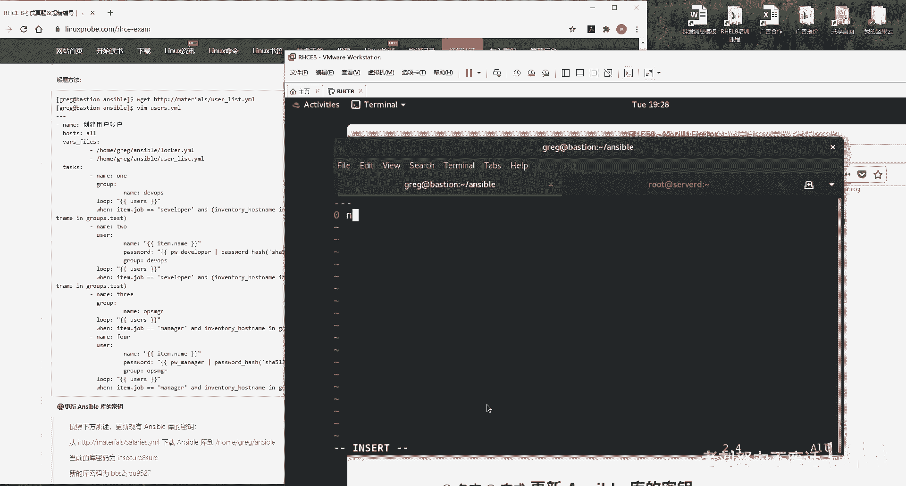

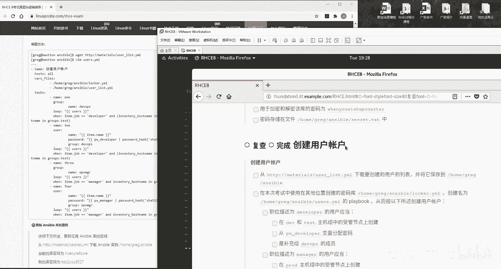

好，继续了啊，我们来继续了，那没办法，咱这也没办法了，这算是一个就算是要不给放最后呢。来，现在定义两个变量，是这样的，现在啊我们现在需要把这两个文件给它加载进来，两个文件哪呢？

第一个文件home目录里面的greg忘了话去抄忘了之后啊，这么去做。😊。

这是我们加密这是我们刚刚加密出来的一个文件。😊。

调用这两个调用一下这两个文件。第一个文件。

第二个文件先把这两个文件啊给它加载进来。待会我们对这两两个文件进行循环，它就会循环去加载这两个文件里面的这个内容，好吧唉。😊。

等一下啊，还按按错了，还按没了。

一般来说，大家考一天跟我现在中状态差不多了。一到下午，现在应该你们要考试的话，应该到到下午4点了。😊。

也挺皮倦的哦。

来第一个文件。啊，这是第二个文件下载完了之后的名称字己补全。

好，来。干什么事情？第一件事情。你这个用户你是不是要用户组啊，你这个用户要做三要做三个事情。第一个用户名，用户创建出来。第二个用户组得有。😊，第三个的话呢，你就是这个密码你的人给他设置上。好。

第一件事情。Group。先去新建出来我们这个组，用户组的话呢，我们叫做。

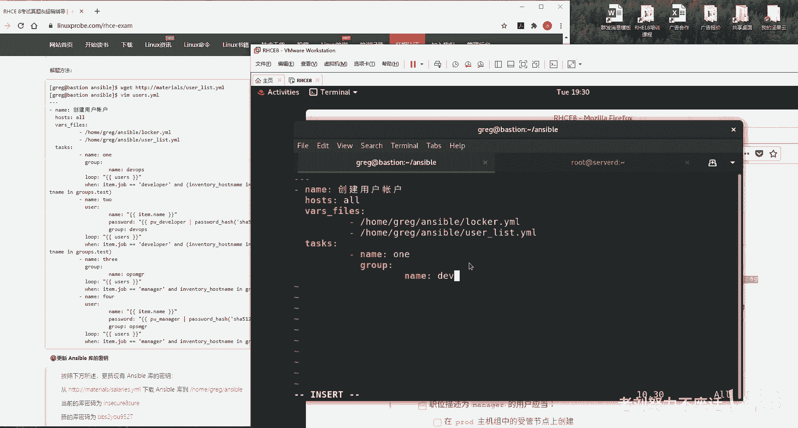

Develops。DVOPS你看啊他的要求这么说的。他说啊职位如果是developer的话，那么这个用户那你看下是谁吗？你看一下这个谁，那么谁那么谁是developer。😊。

这个叫做us list是吧？来看一下。有俩一个叫做fry啊，一个叫bob啊。如果如果要是这个组是developer的话，好，那么在DV和ts的主机上面来对他们两个进行创建。😊。

哦，而且还限定了说B，而且说限定了在DV跟ts这个组上面进行创建。

还要再去守一个问。系。lo循环。循环谁？循环我们的user name。名称在文件里面该然是有的。Users。好，接下我们来判断，只有说是在哪儿DV跟test组上面，我们才去创建item。为什么？

因为我们是循环嘛？循环的话它就是item了atm等job这是这个文件里面的啊，看到了吗？刚才文件里面是有那个job的，就是name跟job嘛，就刚那个文件我那我不给大家看了啊。😊，如果这个job的话呢。

工作如果是。

如果这个工作是developer的话，嗯，研发人员、开发人员，并且。

inventory house name，并且。

工作组的话是什么组？是他是呃是DV组的话。或者是test组的话，要这样这二长啊，或者。

Eventuallyventory， how's the name。是。啥啊tss组的话。那我们就把这个用户组给它创建出来。这个因为这个条件比较长，所以我们要把这个组的判断，用一个小括号给它括起来啊。

这边是一个整体好，做完第二步。😊，用户足有的用户名，你要被用户批量和创建吧，批量创建用户，批量创建用户。没有这个不好意思，同学们没有给大家找出简化方案了。哎呀。尽历了尽力了，先使用一个shall啊。

先先先先去使用个share，没没就没成功，只能是这是只能这个只能是暂时的最优解了。😊，Atom。点name啊，还是刚刚因为那这个文件我我我给大家看一眼吧。这个文件里面的话呢，有一个name的一个标识。

就是我们一个一个的创建出来，看到没？一个是name，一个是job，它这它这个格式都已经是按照这个变量的这个格式给我们去写了。所以的话呢你就直接调用我们的一个一个的这个用户名。好吧。

这就是调用了一个一个的用户名，下面肯定还有一个loop的一个循环啊，还有一个lo的一个循环。那我们这样。😊，他死了。对他进行加密。加密的话呢，他看他他告诉你了。

说这个用户他必须是从这个变量中所提取多阴险。这道题要没有这个问题的话，我能给大家一个。

在5在15行以内能够解决的一个方案，而且是shall的一个方案。但这道题不行不行，实在不行。

来password哈奇值哈奇值，我们加密的方式是啥？是。这SHSHA512。这个时候啊这个题目就看大家吧，好吧，反正我们该讲的话，我们也会讲呃，如果自己不想，如果是自己是不想做的话，没有关系。

别人不要看人家只要一看人家做那些着急，每个人的情况不一样，你就把自己有把握的题目拿准了。这道题，他们让他们去练就好了。😊，那半天结果其他题目也没拿准，那不就更不好嘛，对吧？毕竟一道题来我们给大家写上。

它使用是哈希值512进行加密，没问题。这样做好之后的话，你还得进行一次循环啊，你们还要再去写group，把它加入到。😊，DVOPS因为你现在这个都属于。我们这个组里面的成员嘛，上面是创建出来这个组了。

下面创建出来这个用户了，用户的话加入到这个组里面，对吧？这这个是必须的。因为你看到他是说扩展组必须是这个DVOPS是个扩展组给它加到里面去，好吧，继续。😊，lo循环循环不要写在这个user这个下面啊。

一定要是它是单独的，因为它不是user这个这个这个这个这个这个参数好atm。😊，这样吧，我就来复制一下了。😊，如果他是来自于。DV和ts组的，我们就这样去做。好，没问题。上面两行可以复制啊。

这两行可以偷个懒儿。😊，因为它都是在这个DV组里面这个用户进行新建。好，接下来第3个。第三个play。第三个play。这样说如果这个职位是manger的话，就在POD主机中的收尾节点上面去创建出来。好。

我们重它创建出来。先把这个组顺展出来，因为你看啊，他要他因他要求你必须要是这个组的这个扩展组。那你想啊，如果说你连这个扩展组你都没有的话，你就把这个用户给它新建出来了。

到时候你再去改普通用再改把这个改成这个扩展组是不是更麻烦啊？所以你第一步你要先把它给加入到这个，那么你就要先把这个扩展组给它加到里面去，先去新建出来一个组来，哎凭啊先给它凭空新建出来一个组来。

并且我们要进行一个路循环。为什么因为你要是不lo循环的话呢，那么你创建几个呀，到底对吧？你要每一个主机上面，都要有一个其实这个可以省略。因为我们的。😊，其实这句可以省略。

因为我们的PROD啊这个哦不行不行，这个不能省略。😊，我看错了我看错了POD它是属于低我们低头啊。b server组它有两个主机，它还不能省略，还需要循环两次。好，现在新在出来这个。用户组。同样的。

loop循环，它就指的是我们总共去执行了几次，有几个用户就去执行几次。如果只有一个用户就去执行一次，这是loop的这个意思，循环几次的意思。来接下来问。当什么的时候呢？我们这么去写。

当atm它的这个工作。是man。呃，复制一下它。好的，并且inventory house name主机名称来自于哪儿，必须是来自于哪个组？哪来的啊，这儿呢啊PROD。大哭大会听见这哭了，是不是？

大家不要扩啊，然后我们继续。第4个。有的这个用户有了这个扩展组了，是不是还没有这个用户呢？好了，将我们这个用户建立，并且加入到这个扩展组里面。😊，新建用户。Name。用户名称是什么呢？循环嘛？

item点name这个名称哪来的呀？是不是从我们那个us list文件里边提取出来的？因为它的第一列嘛就是它每一字段在前面，这个是名字，这是工作。所以item点 name就只能说是用户名称了。来走你。

😊，加密唉，这个可以拖懒，因为加密的方式都是一样的。😊，拜拜。😔，粘贴他说密码必须是从这个变量里边所提取，最讨厌了，因为sha做不了这个。下个月能做这个的话，十5行都给你们搞定了。做完。

再来加入到一个扩展组里面，扩展组名称。

最后loop循环循环几次，以及判断它这个这个值位跟来源杠Y粘贴。然后这是刚坯粘贴做完。好，现在的话呢我们给大家去。😊，演示一下吧。好吧，大家可以看一下这个效果。Unible。playbook。

然后是users点y某来走你。三个用户。在我们的不同主机上面去P量创建。OK哦，有个报错是吧？😊，来第二十行第二十行不着急不着急。我看一下啊，他这个报错具体说是什么呢？它已经不是二十行出错。

那能是二十行的上下出错了。哦，他说这儿了。他说这个职位的匹配啊，他说这个问语句出错了。哎，我看一眼啊。第二行上下那个问语句，二行哦，这好ITEM呃，atm点job等于developer。没错啊，没问题。

继续啊and。Inventory还一选 host the name in。grouproups连。DV没问题啊，这个组里面有没有这个DV这个选项？如果他是在这个组里面的人，就会怎么怎么样，没问题。

接下来。Inventory。Hose name in groups。点t，哎呀，我看着没问题啊。这个格式我看一下啊。我把它稍微缩小了一点，因为它换行了，我可能怕我看不清。😊，来学同学作业。陆根问哎。

没有放错地方的。好，我们这样啊再跑他一下。他说这个inventory house name这个变量，它没有被定义。好，我刚才可能是不是写错啊，我啊果然写错了。你现在不看那个答案，现在大家不看那个脚本。

你能看明白什么意思吗？哪儿他哪儿错了？😊，他说他说了一个事儿，这就是我刚才又我刚才犯的第二次的这个错误，我已经犯了两次这个错误了。😊，是inventory house name，刚才记得吗？

刚才发我我因为我刚才犯过这个错误，在这个生成主机配置信息的时候犯过这个错误，叫做inventory house name，我写成inventory name了。😊，脑子。来保存名退出。好诶。好哎。

跑一个。还有两个问题，哎，加密的时候说这个哈希值出错了啊，没问题。他，他说这个不支持这种加密的方式好，不支持加密方式，好吧啊。我看一下啊，他说我们加，而且我们都是复制的一样的。Password。

Developer。pass没问题，我看一看啊。哦，如果我没有猜错的话呢。我写错了，我这边多写了一个A，而且我第二次复制的时候，直接就Y直接就YY了啊，这个是我写错了。😊，来去掉这个A。salt是盐啊。

这个意思啊就是my secret salt，就是我的se有盐，就是加盐嘛，就是我们让它嗯。😊，好。是非对称是加密的的意思来保存一下，没问题。在跑。另外的话跑成功之后我给大家说一下啊。嗯，啊，还是不行。

他说这个哈希值这个加密出错了，他说这个格式不支持，格式不支持的话呢，我还有一个假说就是我们这个大写了，把它给小写一下试一试。😊，但他这个题目里面就给的是大写啊，如果他是这个，因为这点它出错的话。

这道题它也是个坑啊。

稍等一下，同学们，因为我们直接从这儿复制的嘛，它那它是个大写的。如果我们赶上小写通过的话，这也就是个坑。😊，希望红帽不要这么阴险吧。嗯。还真行了。好了，给大家说一下啊，红帽很阴险。

他给你这个题给他给错了。这个加密格式SHA千万不要大写，要小写大写报错，好吧，改成小写。好，这个所以说这个这真的是道拔真的是一道拔高题，同学们不要看人家练你就练了。根据情况吧，最后啊更新对。

跟大家说一个很讽刺的一个事情啊。这道题我们费了这么大劲，而且我们确确实实你也看到了，是从大大家确确实看到了啊，是从我们这个变量当中去提取的变量，对吧？我们是从这个变量里面给它的赋予的密码，那老师。

那你是不是写错了呀？好，我给大家验证一下，好，我给大家验证一下。😊。

怎么验证呢？我们先看一下user list，他是不是说有一个叫bob的一个人，bob他是D一V组，对吧？好，我们先看一下DV组，他是哪个主机，他是低头啊，172。25。250。9来。😊。

是是是是不是就这个。不吃这个。来访问一下点9这个主机。来就会多出一个人叫bob。那老师，那你这个首先来讲，用户已经新建出来了，并且已经加入到这个扩展组里面，一切正常没有问题。那老师。

那你这个密码是不是你给错了呀？好，我先给大家验证一下，我先切换到一个普通用户。好比如说。😊，我看看里边有哪些普通用户，因为这道题吧很讽刺，就是我们费了这么大劲，就他没有分儿啊，就他还是没有分儿。

所以我就给大家验证一下，就是说我的这个操作确实没有错。密码的话呢，大家也看到了。😊，确实是从里边去，哎，叫什么名啊？确实是这从变量里面去提取出来的。大家先耐心等待一下，马上那马上马上马上。

来切换到这个用户，我再切换到bob的时候，这个密码的话呢就是从这个里边去做提取的。我呀我一定要给大家讲清楚，就是待会儿是有出错了，但这个出错跟我们这个操作没有任何关系。😊，这儿你看啊，我来粘贴一下访问。

切换成功，没有任何问题。也就是说我们现在的话呢，不光把这个bb给它新建出来了，而且密码肯定是从这个变量里面做提取的。而且我们提取之后，我们验证了，还真的是这个密码，我们还没有写错啊，还登录还可以成功。

这道题待会判分的时候，这道这个小项可能没有给我们分，但是他很明确告诉我们，说我们没有从这个变量当中去做提取。所以我话呢我有理由相信这是判这是当前判分脚本的一个问题。跟刚才一共是有两道题。

他要给我们判分小点的出错。好吧，今天跟大家说一下啊，别一会儿出错了之后，大家那么的慌啊，特别紧张啊，因为听完天课之后都学错了。😊。

哎，多时间了都。😊，两个多小时还可以啊，你考试的时候你三个半小时呢，因为我连说带讲，还跟大家聊会天，对吧？我实际上两个小时做完没问题，当你考试的时候，你就练嘛，你只要想练到3个小时以里，你三个半小时。

你把题练到3个小时以里差不多了啊，好继续啊更新ible的这个库密钥啊，蜜月啊，蜜月来从这里边去下载一个文件啊，太好了，就特别写欢这样的题目，给小分他这这个都是给小点的啊，你不知道题你不会做。

你这个小点你只要做出来了，也是给你分，说当前的这个密码是这个改成这个并且保持更改后的加密的这个密码是什么，很简单，ible。😊。

vote，然后我们改个密码嘛，叫做rekey，对不对啊，然后的话呢是X啊，问我们的当前的密码，你要是不写这个词的话，他会告诉你说。😊，失败这个什么意思呢？就是。

等一下同学们，哎，这个意思就是说给他改个密码，这个文件啊，他给你的时候就已经加密了。回大家看一下啊，这意思就是这样的。这个文件的话，它已经加密了。密码的话呢是这个让你把这个密码的话改成个这个就行了。好。

怎么简单问那怎么来呢？anible vote。😊。

rekey，然后是ask。votepas就是问我们之前的密码，否则他不会给我们去更改的文件名称按下回车，说密码是什么呢？原先密码是这一个按一下回车，新密码是什么呢？是这个我们摁下回车。😊。

再输入一遍新的密码，摁一下回车，没有问题。rekey successful成功。

都做完之后，嗯，大家可以你们就去重启啊，怎么怎么样去做验证吧。好，我就不去重启了啊。😊。

我们去判一下分，来进入到我们这个服务器终端里面。进入到我们的物理机，使用examine grade。因为啊他这个会特别的慢。因为HHCE它是6个虚拟机，对吧？将你这个控制端。总是6个虚拟机，特别的慢。

判分的话呢，大概是5分钟的时间。而为了保证我们这个视频的一个完整性，不让大家觉得好像我们中途又修改过什么，是不是你这个暂停了一下，然后给我们改了个什么值啊，偷偷的124给我们你偷偷189。

给我们改成289了，是不是？所以的话呢我就把这个视频一直开着，大家可以看完。😊，我们的判分是不是289分或者280分以上吧。如果要是的话呢，就大家可以回去再好好放心练。要是不是的话呢。

我们就把那老梯我们去修改一下。如果你要是看录播的话呢，当然是录播，那么你就可以把这个时间先往后调一调，加快进度，用两倍速先放一放。这个时间大概可能要2分钟。所以我现在在跨越时空跟对大家对话啊。

同学们把这个时间快进一下，节省一下自己生命中的2分钟。那我给大家讲讲吧，我闲着没事儿，我看啊这个是worktation正在重启。OKworkt看看。😊，到哪儿？我很好奇呀。😊。

重呃重启着呢啊重启着呢等等的。😊。

干等了不是事儿啊，我看着你重启。😊，哎，行了，走起了啊，开心了。😊。

网络已经通了就完事。他说正在对他进行冲启。

OK我们这边录屏还在继续啊，然后大家有没有感觉到声命在流逝啊？是的话，我们点点头。感觉到生命在流逝。好歹这是一赌博。但是我觉得好像是哪里卡住了，但是不太确定，我们等一等吧。

我们这量不中断呢。

你看呢这个安装软件包B吗？那这个gathering effect不应该怎么慢啊？

安装的应该现在是。

这一台主机。

来，我们登它进去看一眼。

OK是的，他是在忙活着呢。负载值挺负载值挺高的。这台主机就是说是在忙活着呢。

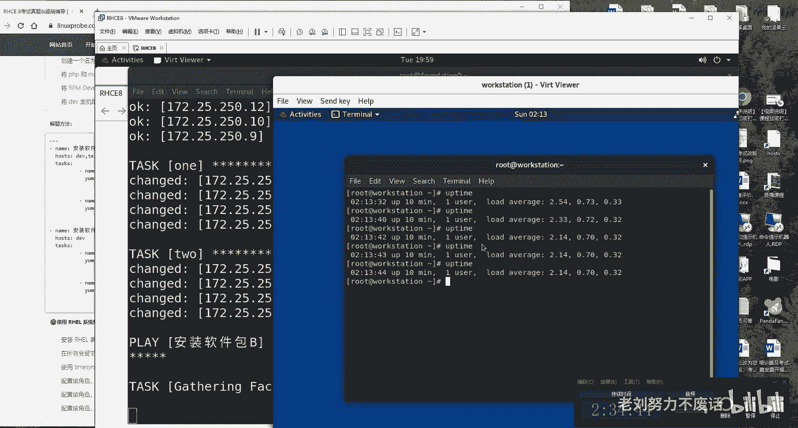

在做什么事情啊，在安装所有的RPM软件包。以及将哦这个确实比较慢，它是将所有的软件包都更新到最新。

是得再等一等。

okK同学，这个实在太慢了啊。然后如果要是有问题的话，我跟大家去说，我先暂停一下，避免咱们等待时间太长。我会担心咱们这个视频吧，时间太长。所以大家我先关一下，一秒之后回来。😊，OK我刚才等了两分钟吧。

我看他继续又开始动画了，所以我就继续把那个视频给大家开起来吧。又等了2分多钟。本身人家也都快行了，我这用手欠又给他停了一下。看来还是要对自己有信心，对不对？哎，时光的不断的流逝啊。对于这个考试吧。

大家不要太大的这个心理负担。你考过了之后，你就知道他也就是这么回事。比如说呃老刘啊刘老师，我是学习教育学的对吧？我是学习教育学的。你知道这种人证它是分为这种选拔性考试跟这种测试性考试。举个大举个例子。

我们读研究生的时候就是一个萝卜一个坑儿，我们一个系一年就招6个人，你上了别人就上不了，这属于叫选拔型的高考一样啊。测试性的话呢就是考驾照，对吧？你考过了，他考过了都可以。那这个是不限制人数的。

你一个班里面30个人考驾照都考过了，那都可以过。而红包认证也是它就属于叫做测试型的。你只要符合要求了，你就可以过，而不是一个落比一个科啊，一个班里面就顶多够5个过10个过15个。好吧。

所以话呢这个你也最先能理解吗？就是这个选拔性考试跟测试型考试的这个难度是不一样的。😊，大家理解一下，这个难度也是不一样的。肯定要是选拔，现在要更难，而且难的不是一星半点。哎呀，来了。

关键是关键要出来了啊，关键要出来了，会有几道题出错。😊，如果是两道题，两个小问，那我遇到之中的话，那我们就结束呃我那我们就结束。要是不是我预调之中那两个的话呢，我们就把这几个问题我们再给大家捋一遍。

还是那句话啊，大家考这个人证的话呢。210分及格啊300分满分。看你的目标是多少，你的目标是及格还是考那个300分去。哎，来一个哎来两个。哎呀，我都想到是什么问题了。

这个问题其实不应该，这肯定是咱们的名儿写错了，我肯定我已经写成S了，多很多加了个S。所以我就说嘛，能复制的时候就复制，能手敲能不手敲，咱就不手敲。😊，啊，问题还不少啊，不着急。啊，274这样不行。

我对自己不满意啊，我对自己不满意。你这这老刘叫了半天对吧？说了半天才274不行啊，对这有也是有要求的人啊。那我们看一下啊。😊，说可呃创建跟使用角色。好，然后呢他说这个文件已经存在了，用于输出，哎。

这个我都能错吗？天哪。完了。嗯嗯。

丢人了啊，我看一下啊。把这个先放在这儿，我我给大家排一下错而IC那个吧，虽然考了246，但是每道题给大家讲的明白，是因为谁的问题是盘文脚本的问题。而这次它不是盘文脚本的问题，是我写错了。

我们就要勇于承认，而不能说什么都往判这个盘文脚本上面推，那是不对的。我们要实事求是来。😊。

greg172。25。250。254。但是RCI那个说是谁错就是谁错，那就是盘文脚本的问题。来第一个是什么啊，金价文件index哎，不对。这个实际上是apparach角色里边的金价文件。呃。

另外的话大家听到这了之后吧。会担心，那老师那我就招着你敲了半天，我敲错了怎么办呀？你们放心，我会这个视频录完了。我如果要是有错误的话，我会把网站上面的信息及时更正。好吧，我会把网站上面这个信息及时更正。

😊，会变成最新的。所以你们这个视频一旦发布的话，你再去看那个。网页就是最新的了，ibleFQDN都是我们复制的，不能出错呀，难道是因为这个没给它写空格吗？不能够啊，结果都已经出来了。

你红包不是说只看结果的吗？好，就假定是这么回事。😊，再来我进入大班里面，我看看是不是我复制的这个路径有问题啊。你说是复制到了万目录里边的。多少？哎，我复制一下。你看看有什么单要看有什么区别。

Y3WHTML indexHO我没看出来。好，这道题的话呢，我的猜想是不是因为中间少了两个空格，好吧，非常牵强于这个理由啊。当然我们可以跑一遍再试试嘛。一遍不行，我们跑两遍，再再读一遍啊。

模板文件已存在，用于创建具有以下输出。不能错呀，因为咱们的这个结果都已经看到了。嗯，好，我坚持我这个是正确的。第二个说我们的anible哦，在这个里面运行这个角色，这是哪道题啊？

balancecer是吧。嗯，这个效果我们已经看到了这个效果我们是看到了，就是刷新我们这个页面，然后呃。😊，当你去等稍等啊。刷新的时候，你刷一下那个网页上面B变CC变B，然后11变1212变11。

那个我们已经看到结果了。来我看一下，他说。我们为什么错？他说这个play在balance这个主机组当中。好，我先校认先校对一下啊，在这个组主机组组中。着急的我都说话了，我都说错了。

BALANCERS没错啊，中运行并使用balance组。BALANCERS呀，我看着的没错呢。他们难难道没使用吗？

行，这个问题的话呢我先。我先我看一下啊。

我认为这个不是我的问题，我让他再跑一遍吧。可能是因为上一道题是有依赖关系，我把上一道题我们改他一下，所以这个我再试它一下，应该没什么问题。好。第三道创建啊，这个是我刚才说过的，因为这个目录我们没有嘛。

所以你再还原一下机器，那就没有了。这两道题肯定是我的问题啊肯定是我的问题。😊，所以这就属于完全粗心的问题，这是那我看一下。他说什么生成硬件报告啊，磁盘VDA的大小VDA大小没有被获取。

稍等我看一下。呃，据我来看的话呢，应该是是没问题啊。好，我再看一下，如果硬件值不存在，相关的值应该为n。对呀，不然呢。急得我都已经开始跟答案对照了啊。好，没关系，我们这样子。这个呀我给大家强调一下啊。

就是我待会再跑一遍。😊，这个。脚本它的话呢，这个肯定跟那个现在是判分之后，可能是有点小差异啊，你们不用担心。啊，他说这个值没有被定义，因为他没有那个gather facts啊。

所以你们这个手动查是查不到，其实也是情有可原。不过我们为了。这样子这样子。过滤跟so有设备相关吧。他说是要获取VDA的那那个大小。就满足一下它。OK来了啊，VDA的大小。

它是叫做ensibleANSIPLE啊O的ensible deviceok然后先放到底下啊，AVDA的大小点VDA没毛病吧。VDA好，继续它的大小。😊，D size。其实我们最后做这个实验的时候。

我们都已经做出来了，像我跟这一模一样啊。😊，这个怎么可能错？好，我们来复制一下。往里面一粘。哦，我知道为什么了，这道题错，不是出在VDA了，它是出在VDB上面了，它应该是VDB啊，我们上面那个忘了改了。

😊，直接就复制了1个YY了。好。他说的是VDB的这个大小，如果不存在，使用的神闹。我们也刚才啊因为这个是我的问题啊，我还怪了半天，我们直接拜拜了。然后我还跟大家说，我是说我今天给偷个哪了啊，结果错了。

应该是VDA改成VDB结果我忘了改了，我以为直接就把它粘过来了啊，一个小问题。😊，OK这俩家解决，那这俩家解决。😊，嗯，给大家解决这个问题okK没问题。这个问题的话呢，我不知道是哪里的问题。

我明明已经把它加载进去了，而且的话呢这个我自认为也没有问题。好。😊，最后一道题反而没出错啊。好，没关系，我们再跑一遍。😊，就是辛苦大家啊，把这个。辛苦大家把这个视频的话呢再重新的。快进一下。

这个只有改了吧，确认一下，okK改了。来，我们等他一下。我要不要把这个视频关一下，要不然的话我们这个视频我怕特别大。关的话，有我怕有同学说，哎呀，那老师你都给关了，我怎么知道你中间改没改呀？

还是不管了吧，稍微大大一点，反正咱们这个版本。三年了才变一次，三年了，咱们多费点时间就多费点了。😊，大家现在去做这个判卷的时候吧，其实有可能是存在什么呢？是存在说你第一遍你判可能是多少多少分。

第二遍的话，你再去判哎，分可能稍微高一点或低一点的，每回不太一样。这个我情况我已经注意到了啊，不用担心啊。因为的话呢这个是因为我们这个是一个模拟环境，它也是一个初代的，就是第一代这个判文教本。

它是有问题的，这个我们是承认的。所以的话呢呃考试那个版本肯定是稳定的，所以你不用担心，那肯定是依次成功。

我们这是一个模拟版吧。

好，现在这个 stationation正在启动啊，还没起来呢。哎，那network起来了。

嗯。

OK啊，一个问题，这个问题我给大家说过webDEV。这个问题我是认的，没问题。他没有啊。第一个问题出来。好，出来了294，好吧，呃，这个问题我是认的，好吧，这个问题的话呢，是因为它服务器上没有。

然后的话呢，咱们已经把它做一个链接了。但是那些里边没有他考试的那个内容，没有那个内容。所以的话呢他即便咱们做链接了，它也会提示说内容不存在啊，这一个小问题。好，然后就300分吧。好吧。

当到就当到300分。好，您就想就想象一下300分。这的话就是HHCE呃的考试所有的内容了。😊，就这样吧，然后的话呢，如果大家要是。有兴趣的话呢，可以去多关注一下咱们的书籍，还有咱们的微信公众号。

然后我们的培训的话呢，一直在去做的。老刘的话呢也只会去，因为我们是在教做做广告嘛，对吧？就是因为我是在全职才去做这个红包认证。而且的话呢我们的机构是只做linins，不做其他的。

我们认为可比别人的话呢更加用心。而且的话呢经历一根时间都。😊。

呃，做的这个学识呢都投入到了这个lin里边，而其尤其对于红帽尔认证是有一个比较深刻的一个理解的。嗯，对，所以的话呢如果要是大家要是后续有学习的话呢，或者说有朋友去想去考试的话呢。

也可以参加一下我们的培训，啊还是不还啊还是比较便宜的，而且也是因为是网络培训嘛。那成本我们也来说可以更加好的把控。😊，好，那就是这样，了解待会问题的话，可以在QQ上，然后或者在微信上面。

或者在这个我们的网站上面都可以去进行一些沟通。好，那么就这样，然后大家就也多辛苦了，回去之后先休会儿啊，先去休息会儿，然后去揉会眼睛。😊。

回者最后照着我这个取消这个问题的话呢我就不改了，好吧，这也不是我的问题了。然后我会把我们。😊。

一点小问题我都会在咱们这个网站上面去更新一遍。我更新好了之后，只要你们看到这个视频的时候，我们这个网站上面都已经是最新版本了。如果要是网页跟视频有出入的话呢，以网页为准。但是我相信也没有什么变化了。

就这样啊，希望我们的同学们的话呢。😊。

呃，加油学习啊，好，就这样。好，再见。😊。

