# RHCE红帽认证工程师培训课程：第13章：DNS域名解析服务

在本节课中，我们将要学习DNS域名解析服务。DNS是互联网的基础设施，负责将我们熟悉的域名（如 `www.linuxprobe.com`）转换为计算机能够识别的IP地址。我们将从DNS的基本概念入手，逐步学习如何搭建主服务器、从服务器、缓存服务器，并了解正向解析、反向解析、TSIG加密以及分离解析等核心技术。通过本章的学习，您将对网络架构有更深入的理解。

## DNS概述与工作原理

DNS，即域名系统，是互联网的核心服务之一。它的主要作用是在域名和IP地址之间进行相互转换，使我们无需记忆复杂的数字地址即可访问网站。

DNS有两种主要的工作模式：
*   **正向解析**：将域名转换为IP地址，这是我们最常使用的模式。例如，输入 `www.linuxprobe.com` 得到 `192.168.10.10`。
*   **反向解析**：将IP地址转换为域名，这种模式使用较少。

全球的DNS查询请求量极其庞大，不可能由单一服务器处理。因此，DNS采用了层级式架构，主要分为三种服务器类型：
*   **主服务器**：管理特定区域内域名与IP地址的对应关系，是数据的权威来源。
*   **从服务器**：从主服务器同步数据，为用户提供查询服务，起到备份和负载均衡的作用。
*   **缓存服务器**：不管理具体区域数据，而是转发用户查询请求或缓存查询结果，以加快响应速度并降低上级服务器压力。

这种架构有两个核心优势：**降低主服务器的压力**和**加快用户的响应速度**。

## 搭建主DNS服务器

上一节我们介绍了DNS的基本架构，本节中我们来看看如何动手搭建一台主DNS服务器。

### 安装BIND服务程序

BIND是互联网上使用最广泛的DNS服务软件，全球13台根服务器均由其搭建。我们首先安装它。

```bash
yum install -y bind-chroot
```
参数 `-y` 表示自动确认安装。`bind-chroot` 插件为BIND服务提供了一个隔离的运行环境，增强了安全性。

### 配置主配置文件

DNS服务的配置由多个文件组成。首先，我们需要编辑主配置文件 `/etc/named.conf`。

```bash
vim /etc/named.conf
```
在该文件中，我们需要关注并修改两个关键参数：
*   **listen-on port 53**：指定监听请求的网卡。修改为 `any` 表示监听服务器上所有网卡。
*   **allow-query**：指定允许查询的客户端。修改为 `any` 表示允许所有客户端查询。

修改后的关键行示例如下：
```
listen-on port 53 { any; };
allow-query     { any; };
```

### 配置区域信息文件

主配置文件会调用区域信息文件 `/etc/named.rfc1912.zones`，我们需要在此文件中定义具体的解析区域。

```bash
vim /etc/named.rfc1912.zones
```
建议清空文件内容，从头开始配置。以下是一个正向解析区域和一个反向解析区域的配置示例：

```
zone "linuxprobe.com" IN {
        type master;
        file "linuxprobe.com.zone";
        allow-update { none; };
};

zone "10.168.192.in-addr.arpa" IN {
        type master;
        file "192.168.10.arpa";
        allow-update { none; };
};
```
*   **zone**：定义解析区域名称。
*   **type**：服务器类型，`master` 表示主服务器。
*   **file**：指定该区域对应的数据文件名称，该文件需要随后创建。
*   **allow-update**：定义允许同步的从服务器地址，`none` 表示暂时不允许任何同步。

**注意**：每个配置行末尾都必须以分号 `;` 结束。

### 配置正向与反向解析数据文件

接下来，我们需要根据区域信息文件的定义，创建对应的数据文件。这些文件通常位于 `/var/named/` 目录下。

首先，复制模板文件并创建正向解析数据文件：
```bash
cd /var/named/
cp -a named.localhost linuxprobe.com.zone
cp -a named.loopback 192.168.10.arpa
```

然后，编辑正向解析数据文件 `linuxprobe.com.zone`：
```bash
vim linuxprobe.com.zone
```
文件内容如下：
```
$TTL 1D
@       IN SOA  linuxprobe.com.  root.linuxprobe.com. (
                                        0       ; serial
                                        1D      ; refresh
                                        1H      ; retry
                                        1W      ; expire
                                        3H )    ; minimum
        NS      ns.linuxprobe.com.
ns      IN A    192.168.10.10
www     IN A    192.168.10.10
```
*   **SOA**：起始授权记录，定义了域的基本信息和管理员邮箱（`@` 符号用 `.` 代替）。
*   **NS**：域名服务器记录，指向该域的权威DNS服务器。
*   **A**：地址记录，将主机名映射到IPv4地址。这里将 `www.linuxprobe.com` 解析到 `192.168.10.10`。

接着，编辑反向解析数据文件 `192.168.10.arpa`：
```bash
vim 192.168.10.arpa
```
文件内容如下：
```
$TTL 1D
@       IN SOA  linuxprobe.com.  root.linuxprobe.com. (
                                        0       ; serial
                                        1D      ; refresh
                                        1H      ; retry
                                        1W      ; expire
                                        3H )    ; minimum
        NS      ns.linuxprobe.com.
ns      IN A    192.168.10.10
10      IN PTR  www.linuxprobe.com.
```
*   **PTR**：指针记录，用于反向解析，将IP地址映射到域名。这里将 `192.168.10.10` 反向解析为 `www.linuxprobe.com`。

### 启动服务并测试

配置完成后，启动BIND服务并设置为开机自启：
```bash
systemctl start named
systemctl enable named
```

最后，修改本机网卡配置，将DNS服务器地址指向自己（`192.168.10.10`），然后使用 `nslookup` 命令进行测试：
```bash
nslookup www.linuxprobe.com
nslookup 192.168.10.10
```
如果正向和反向解析都能返回正确结果，说明主DNS服务器配置成功。

## 搭建从DNS服务器

主服务器配置好后，我们可以搭建一台从服务器来同步数据，以提高服务的可靠性和分担查询压力。

### 在主服务器上授权

首先，需要在主服务器上授权从服务器同步数据。编辑主服务器的区域信息文件 `/etc/named.rfc1912.zones`，在对应的区域块中添加 `allow-transfer` 指令。

例如，在 `linuxprobe.com` 区域块中添加：
```
allow-transfer { 192.168.10.20; };
```
这表示允许IP为 `192.168.10.20` 的从服务器同步该区域数据。修改后重启主服务器的 `named` 服务。

### 配置从服务器

在从服务器上，同样安装 `bind-chroot` 软件包。然后编辑其区域信息文件 `/etc/named.rfc1912.zones`，配置如下：

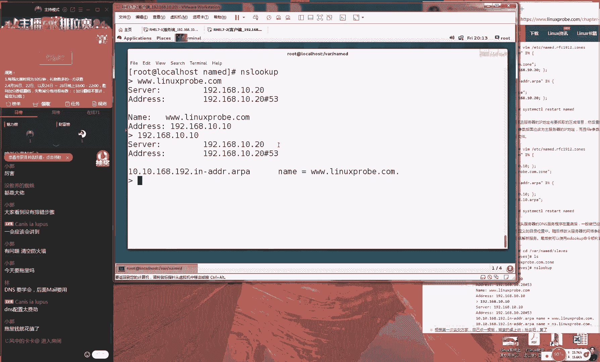

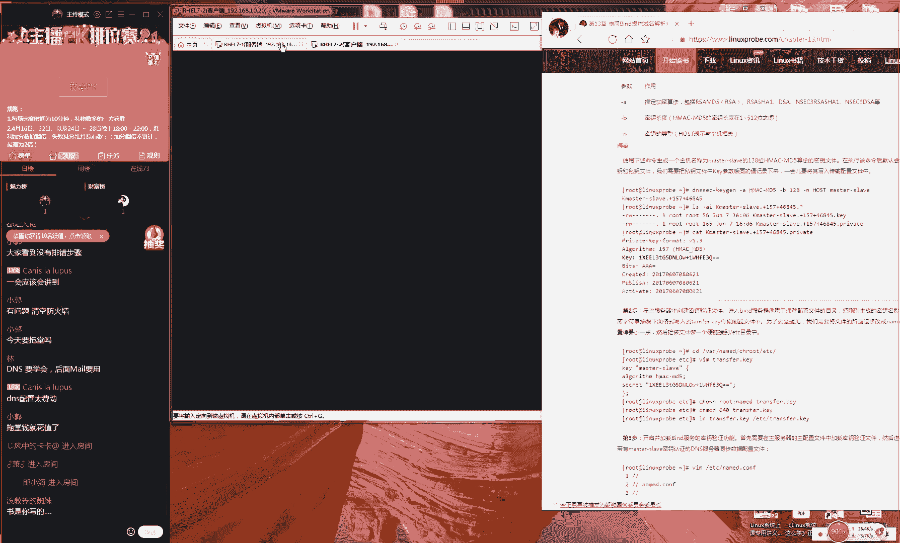

```
zone "linuxprobe.com" IN {
        type slave;
        masters { 192.168.10.10; };
        file "slaves/linuxprobe.com.zone";
};
```
*   **type slave**：声明此服务器为从服务器。
*   **masters**：指定主服务器的IP地址。
*   **file**：指定同步后数据文件的存放路径，通常放在 `/var/named/slaves/` 目录下。

配置完成后，启动从服务器的 `named` 服务。服务启动后，会自动连接到主服务器并同步区域数据文件到 `slaves` 目录下。

### 测试从服务器

将从服务器的DNS地址设置为自身（`192.168.10.20`），然后使用 `nslookup` 命令查询域名。如果能够正确解析，并且查询结果显示是由从服务器（`192.168.10.20`）应答的，则表明从服务器搭建成功。

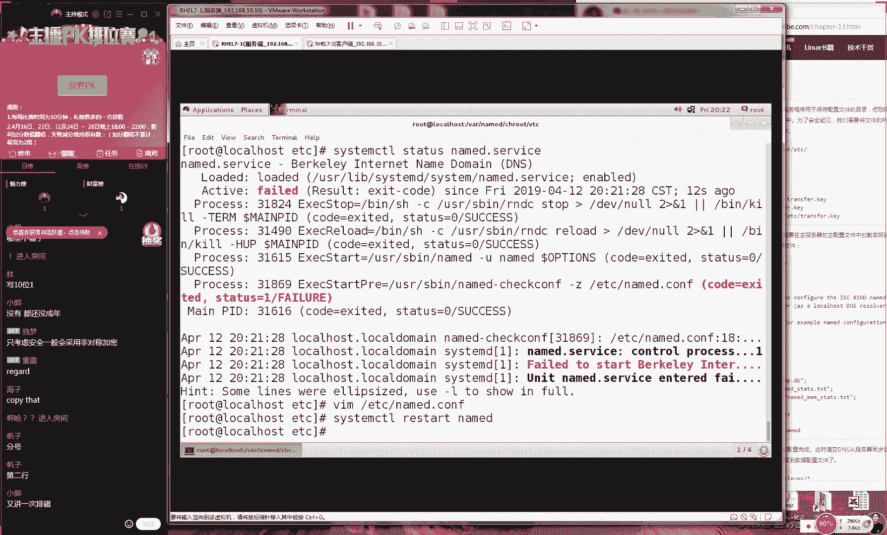

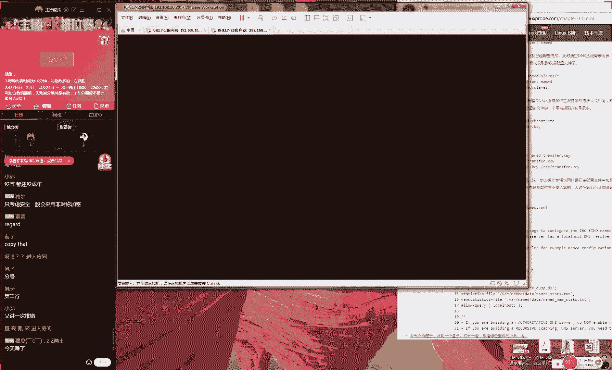

## 安全的区域数据传输（TSIG加密）

在数据同步过程中，为了确保传输的安全性，防止数据被篡改，可以使用TSIG（事务签名）技术对主从服务器之间的区域数据传输进行加密和验证。

### 生成密钥对

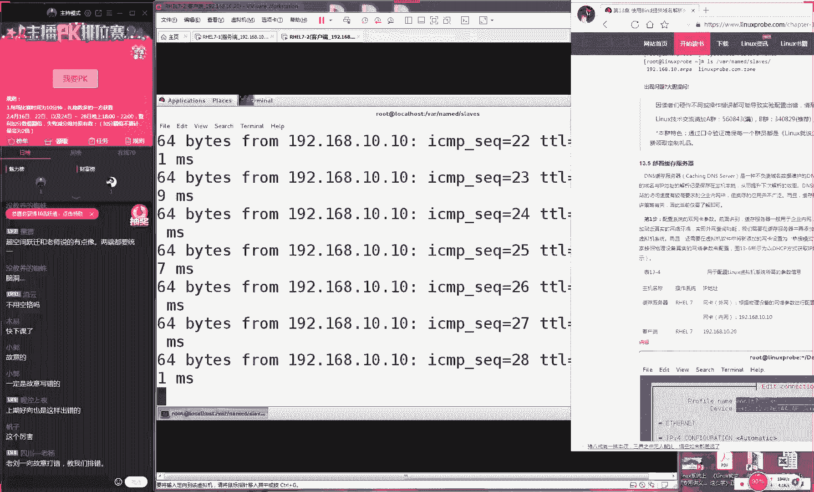

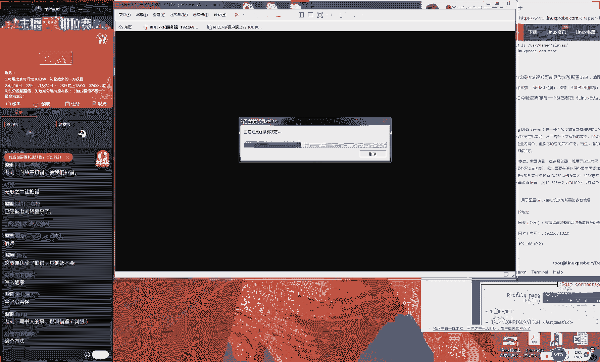

首先，在主服务器上使用 `dnssec-keygen` 命令生成一对密钥：
```bash
dnssec-keygen -a HMAC-MD5 -b 128 -n HOST master-slave
```
此命令会生成两个文件：`Kmaster-slave.+157+12345.key`（公钥）和 `Kmaster-slave.+157+12345.private`（私钥）。我们需要的是私钥文件中的 `Key` 字段值。

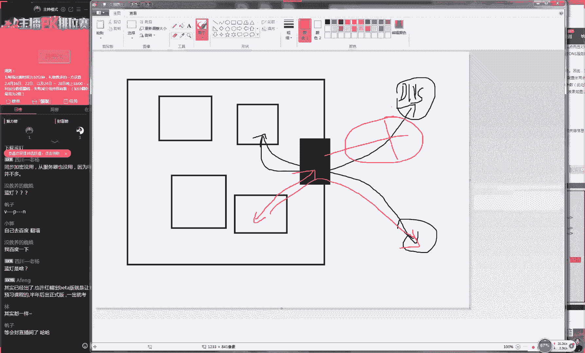

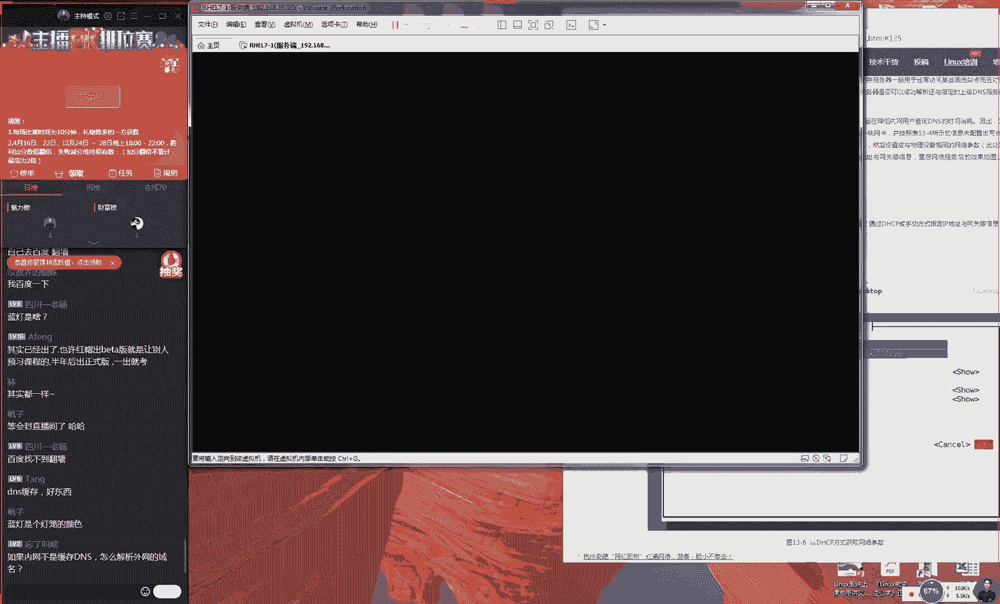

### 配置密钥文件

在主服务器和从服务器上，分别创建相同的密钥配置文件，例如 `/var/named/chroot/etc/transfer.key`：
```
key "master-slave" {
    algorithm hmac-md5;
    secret "生成的Key字符串";
};
```
然后修改文件权限，并创建符号链接到 `/etc/` 目录以便调用：
```bash
chown root:named /var/named/chroot/etc/transfer.key
chmod 640 /var/named/chroot/etc/transfer.key
ln -s /var/named/chroot/etc/transfer.key /etc/transfer.key
```

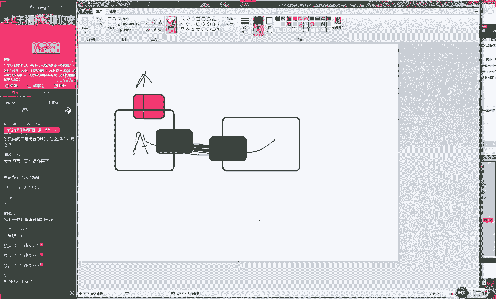

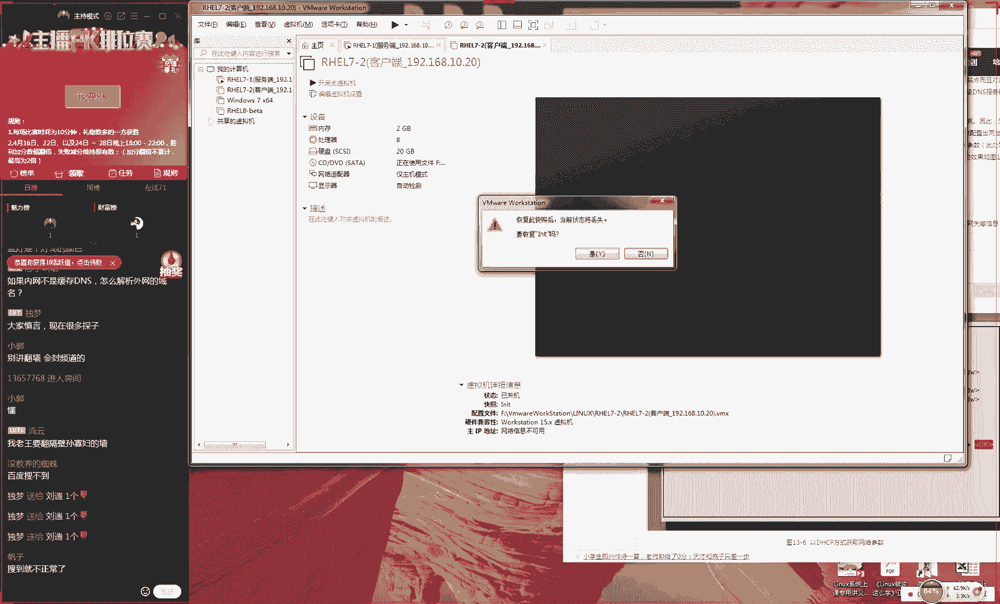

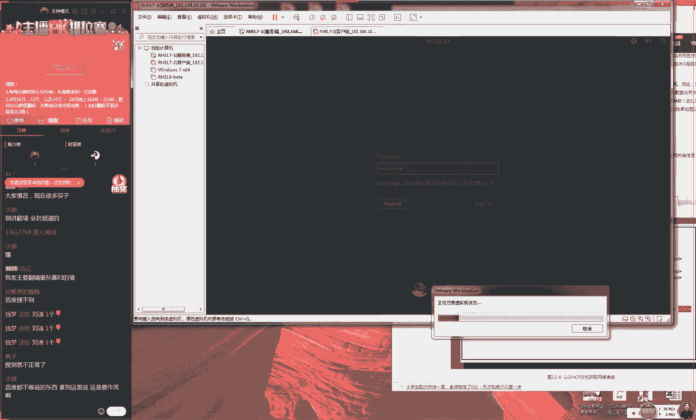

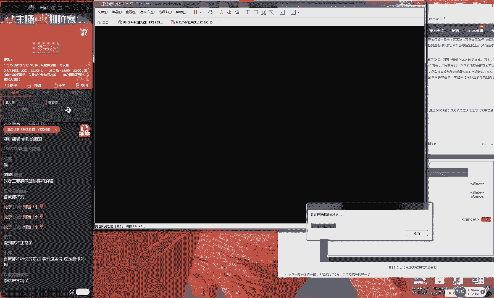

### 应用密钥配置

在主服务器的区域信息文件中，使用 `include` 指令加载密钥文件，并在区域块中通过 `allow-transfer` 指令指定使用该密钥的从服务器：
```
include "/etc/transfer.key";
zone "linuxprobe.com" IN {
    ...
    allow-transfer { key master-slave; };
};
```

在从服务器的区域信息文件中，同样加载密钥文件，并在区域块中通过 `masters` 指令指定使用密钥连接的主服务器：
```
include "/etc/transfer.key";
zone "linuxprobe.com" IN {
    type slave;
    masters { 192.168.10.10 key master-slave; };
    ...
};
```

配置完成后重启两边的 `named` 服务。此时，从服务器必须使用正确的密钥才能从主服务器同步数据，从而保证了传输安全。

## 配置DNS分离解析

分离解析技术可以根据客户端的来源IP地址，为其提供不同的解析结果。例如，让国内用户访问国内的服务器，让国外用户访问国外的服务器，以优化访问速度。

### 定义访问控制列表

首先，在主服务器的 `/etc/named.conf` 配置文件中，定义两个访问控制列表（ACL），分别代表中国用户和美国用户的IP地址段（示例地址）：
```
acl "china" { 122.71.115.0/24; };
acl "america" { 106.185.25.0/24; };
```

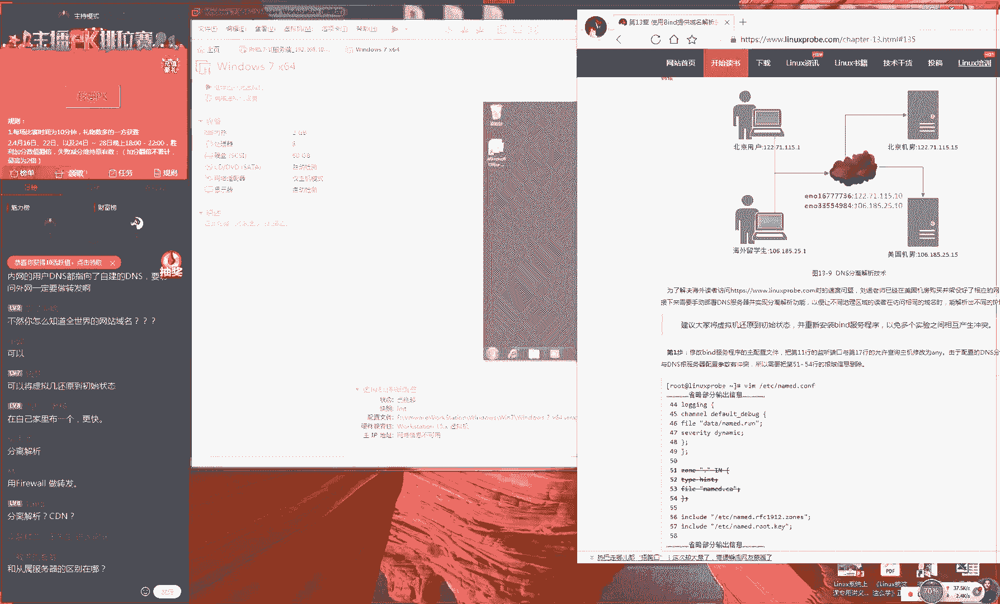

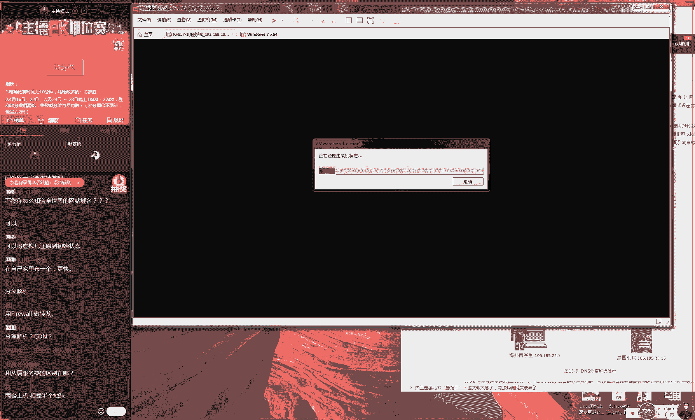

### 配置视图

接着，在区域信息文件 `/etc/named.rfc1912.zones` 中，不再直接定义区域，而是改为定义两个视图（View）：
```
view "china" {
    match-clients { "china"; };
    zone "linuxprobe.com" IN {
        type master;
        file "linuxprobe.com.china.zone";
    };
};

view "america" {
    match-clients { "america"; };
    zone "linuxprobe.com" IN {
        type master;
        file "linuxprobe.com.america.zone";
    };
};
```
*   **view**：定义一个视图。
*   **match-clients**：匹配客户端的来源IP，使用之前定义的ACL。
*   在每个视图内部，定义相同的区域，但指向不同的数据文件。

### 创建不同的区域数据文件

在 `/var/named/` 目录下，创建两个内容相似但A记录指向不同IP的数据文件：
*   `linuxprobe.com.china.zone`：将 `www.linuxprobe.com` 解析到 `122.71.115.1`（国内IP）。
*   `linuxprobe.com.america.zone`：将 `www.linuxprobe.com` 解析到 `106.185.25.1`（国外IP）。

### 测试分离解析

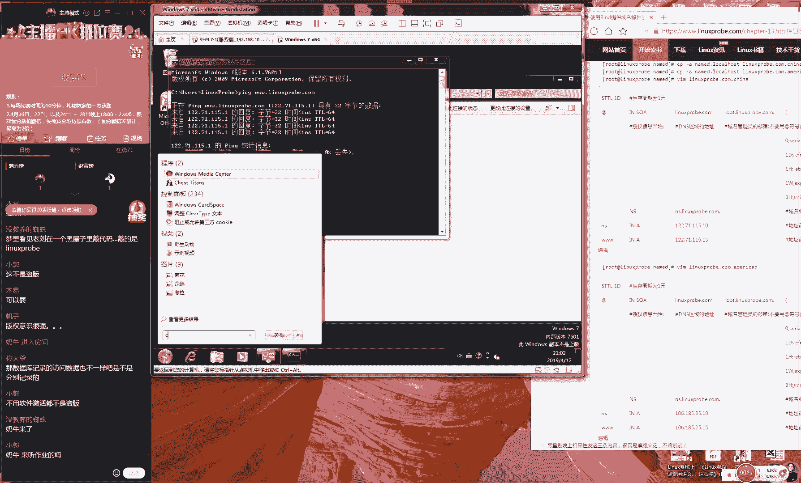

配置完成后重启服务。当来自 `122.71.115.0/24` 网段的客户端查询 `www.linuxprobe.com` 时，将得到 `122.71.115.1`；而当来自 `106.185.25.0/24` 网段的客户端进行同样查询时，将得到 `106.185.25.1`。这样就实现了基于来源IP的智能解析。

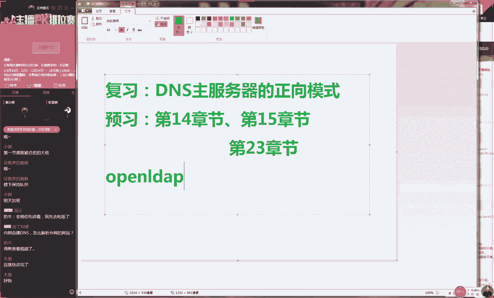

## 总结

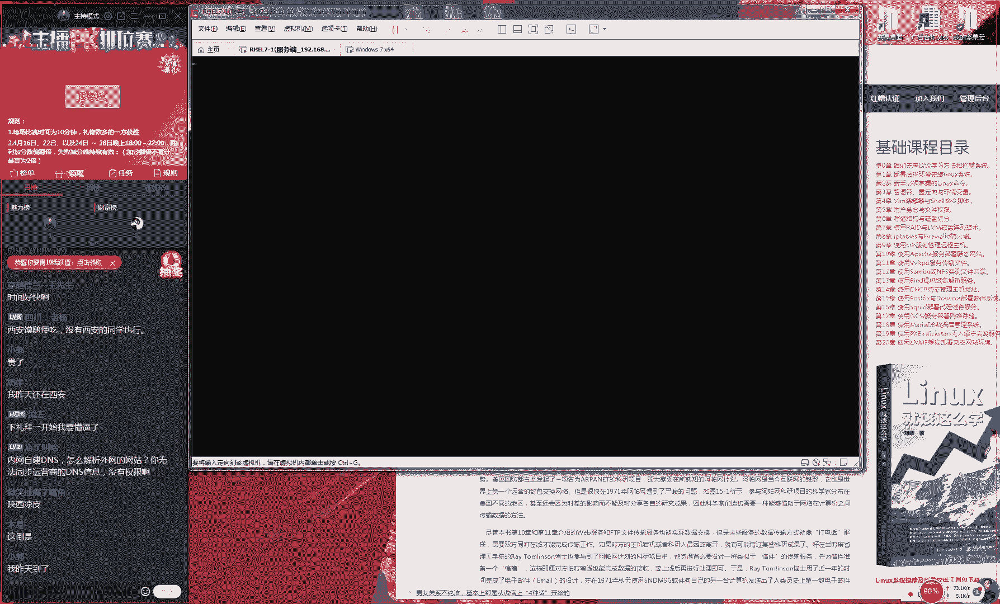

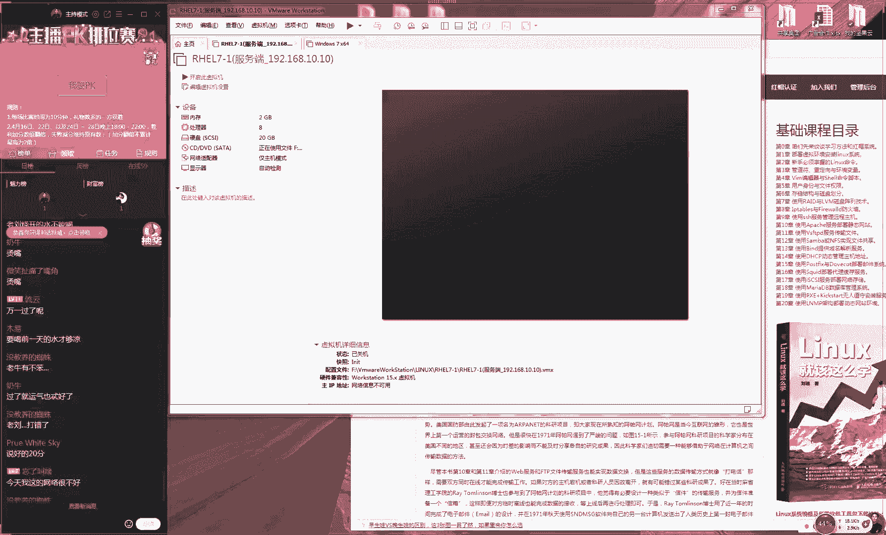


本节课中我们一起学习了DNS域名解析服务的核心知识与实践。我们从DNS的层级架构和工作原理讲起，详细演练了如何搭建主DNS服务器、从DNS服务器，并配置了正向与反向解析。为了保障数据同步安全，我们引入了TSIG加密技术。最后，我们还学习了高级的分离解析技术，它能够根据用户的地理位置提供不同的解析结果，从而优化网络访问体验。DNS作为互联网的基石，理解其运作机制对于任何系统管理员都至关重要。虽然配置参数较多，但只要掌握了其核心逻辑和配置文件的结构，就能够灵活地部署和管理DNS服务。