# RHCE红帽认证工程师培训课程：P17：第十六节课下半节课

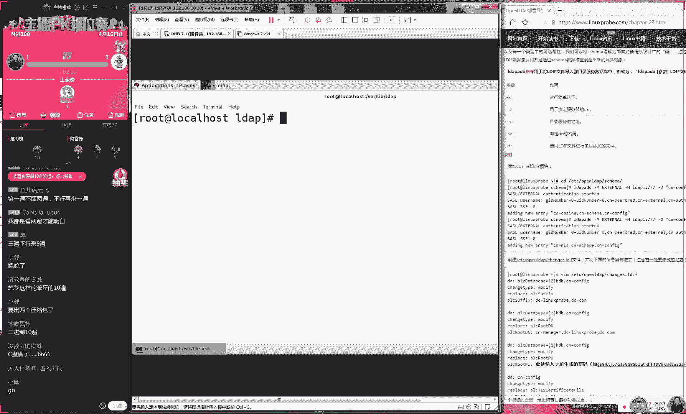

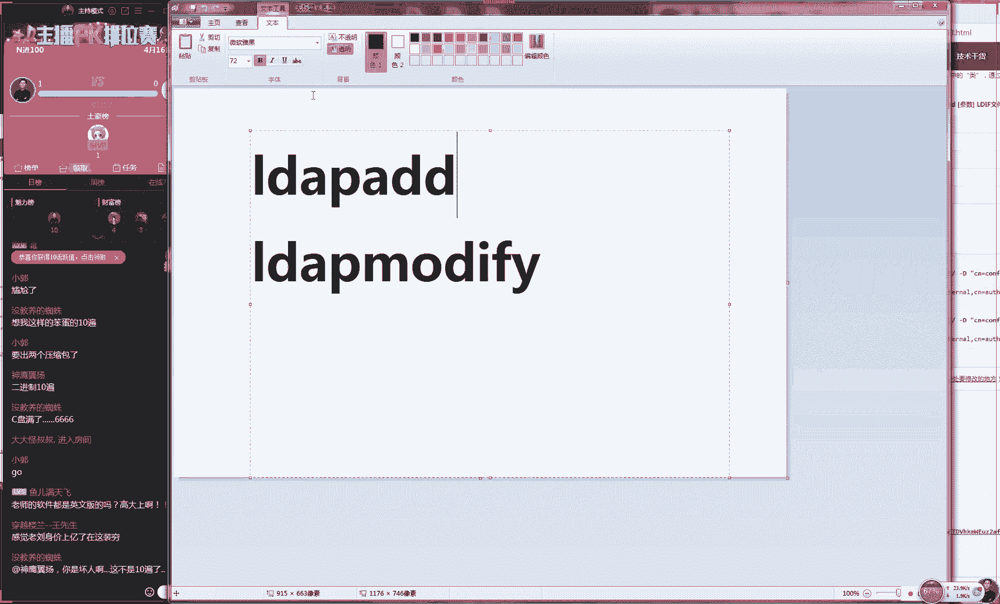

在本节课中，我们将学习如何配置OpenLDAP目录服务。主要内容包括导入和修改LDAP模板、使用迁移工具处理用户数据、配置客户端认证以及实现用户主目录的自动挂载。这是一个将多个服务（如OpenLDAP、NFS、Apache）结合使用的综合性实验。

## 概述

OpenLDAP是一个开源的轻量级目录访问协议实现，用于集中存储和管理用户账户信息。本节课将演示如何从零开始搭建一个OpenLDAP服务端，并配置客户端通过图形化界面进行远程认证和登录，同时实现用户主目录的自动挂载。

## 服务端配置：导入与修改模板

上一节我们介绍了OpenLDAP的基本概念，本节中我们来看看具体的配置步骤。配置OpenLDAP服务端的第一步是导入基础模板，然后根据实际需求进行修改。

### 第一步：导入模板

OpenLDAP的模板文件位于`/etc/openldap/`目录下，其文件后缀均为`.ldif`。我们需要导入两个基础架构文件。

以下是导入命令：
```bash
ldapadd -x -W -D “cn=Manager,dc=my-domain,dc=com” -f /etc/openldap/schema/cosine.ldif
ldapadd -x -W -D “cn=Manager,dc=my-domain,dc=com” -f /etc/openldap/schema/nis.ldif
```

### 第二步：修改顶级域

导入基础模板后，我们需要修改其顶级域以符合我们的命名规范。例如，将默认的域修改为`dc=linuxprobe,dc=com`。

为此，我们需要创建一个修改文件，例如`modify.ldif`，内容如下：
```
dn: dc=my-domain,dc=com
changetype: modify
replace: dc
dc: linuxprobe
```
然后使用`ldapmodify`命令应用此修改：
```bash
ldapmodify -x -W -D “cn=Manager,dc=my-domain,dc=com” -f modify.ldif
```

## 创建组织架构与用户

在修改了顶级域之后，我们需要在目录中创建具体的组织单元（OU）和用户。

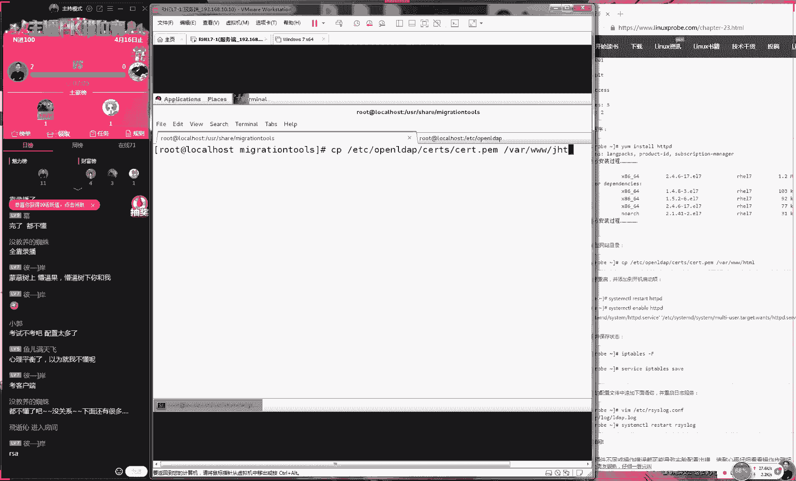

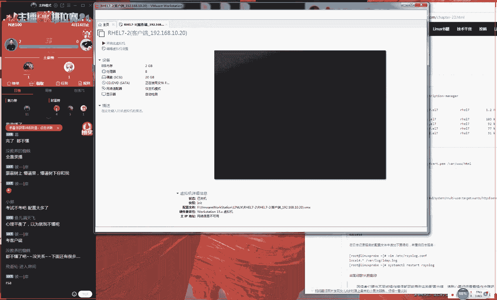

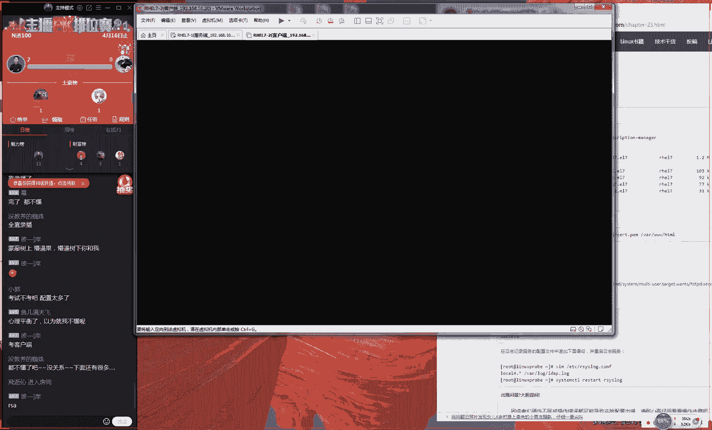

### 创建部门

首先，我们创建两个部门：`People`和`Group`。创建一个名为`ou.ldif`的文件，内容如下：
```
dn: ou=People,dc=linuxprobe,dc=com
objectClass: organizationalUnit
ou: People

dn: ou=Group,dc=linuxprobe,dc=com
objectClass: organizationalUnit
ou: Group
```
使用`ldapadd`命令导入此文件，以创建这两个组织单元。

### 创建并导入用户

接下来，我们创建一个名为“小梦”的用户，并将其信息导入到OpenLDAP数据库中。

以下是操作步骤：
1.  从本地系统文件`/etc/passwd`和`/etc/group`中提取用户“小梦”的信息。
2.  使用OpenLDAP提供的迁移工具（位于`/usr/share/migrationtools/`）将系统用户格式转换为LDAP可识别的`.ldif`格式。迁移工具会自动为数据添加我们之前定义的域名。
3.  使用`ldapadd`命令将生成的`.ldif`文件导入到OpenLDAP数据库中，并指定用户所属的部门（如`ou=People`）。

## 配置客户端认证

服务端配置完成后，我们需要在客户端进行配置，以实现通过OpenLDAP进行远程用户认证。

### 服务端准备工作

在客户端连接之前，服务端需要提供公钥文件以供验证。
1.  将之前使用`openssl`命令生成的公钥文件（如`ca.crt`）复制到Web服务器的目录（如`/var/www/html/`）下。
2.  确保防火墙规则允许HTTP访问，并重启Web服务。

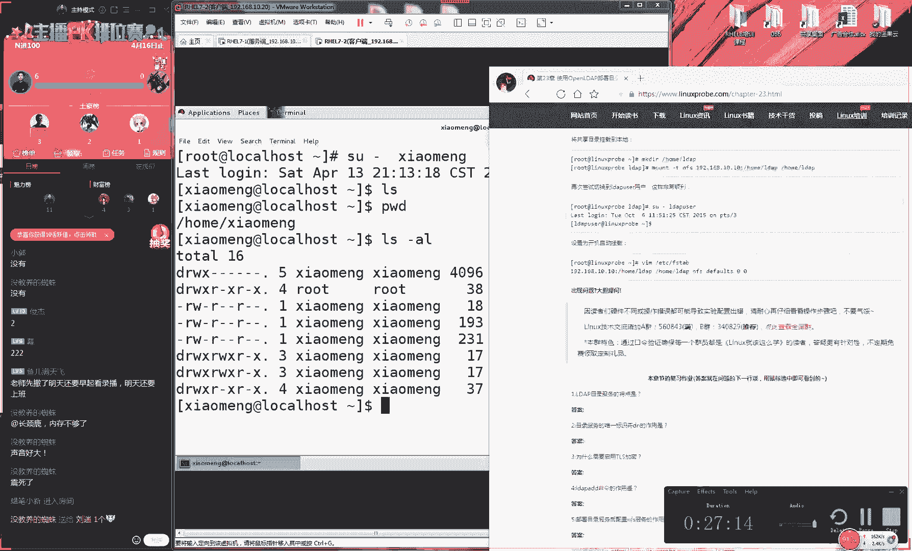

### 共享用户主目录

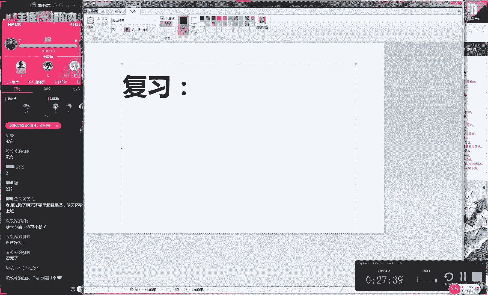

为了实现用户在任何客户端登录都能访问自己的文件，我们需要使用NFS服务共享用户的主目录。
1.  在服务端编辑`/etc/exports`文件，添加共享规则，例如将`/home/xiaomeng`目录共享给客户端IP。
    ```
    /home/xiaomeng 192.168.10.20(rw,sync,root_squash)
    ```
2.  启动并启用NFS服务。

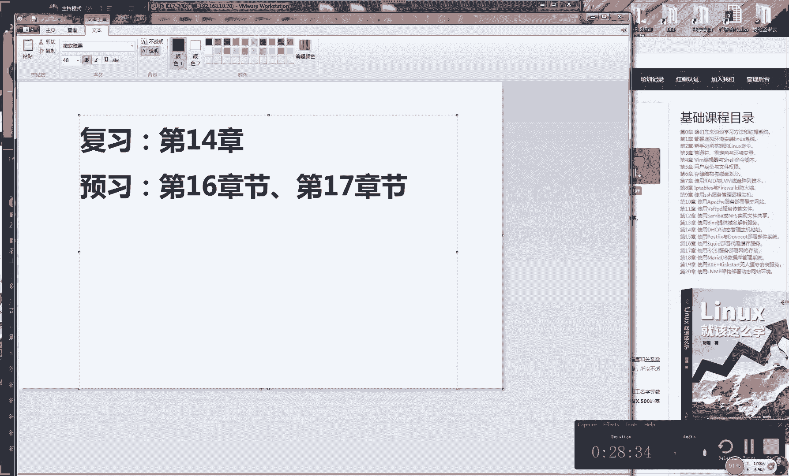

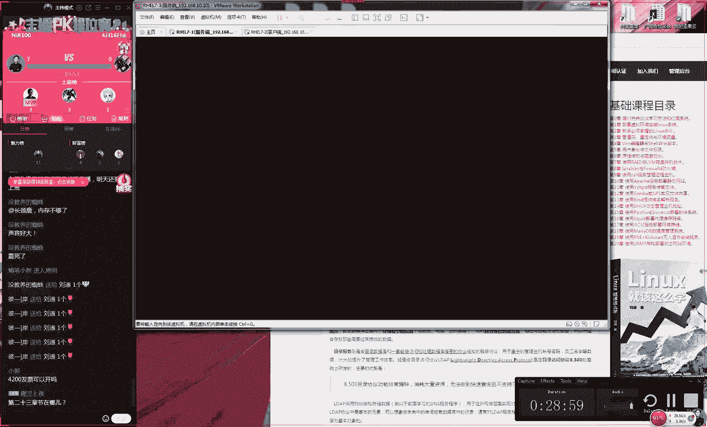

### 客户端图形化配置

客户端配置非常简单，主要通过图形化界面完成。这也是RHCE考试的重点。
1.  在客户端系统上安装必要的OpenLDAP客户端软件包。
2.  打开系统认证配置的图形化界面。
3.  选择LDAP认证，并填写服务端提供的准确信息，包括服务器地址、基准DN（Base DN）以及CA证书的下载URL。
4.  应用配置后，系统便会通过OpenLDAP服务器进行用户认证。

### 客户端挂载主目录

认证成功后，我们还需要在客户端自动挂载远程的用户主目录。
1.  编辑客户端的`/etc/fstab`文件，添加NFS挂载项。
    ```
    192.168.10.10:/home/xiaomeng /home/xiaomeng nfs defaults 0 0
    ```
2.  创建本地挂载点目录，然后使用`mount -a`命令挂载。


完成以上步骤后，用户“小梦”在客户端登录时，不仅身份由远程OpenLDAP服务器验证，其主目录也会自动从NFS服务器挂载，实现完整的目录服务体验。

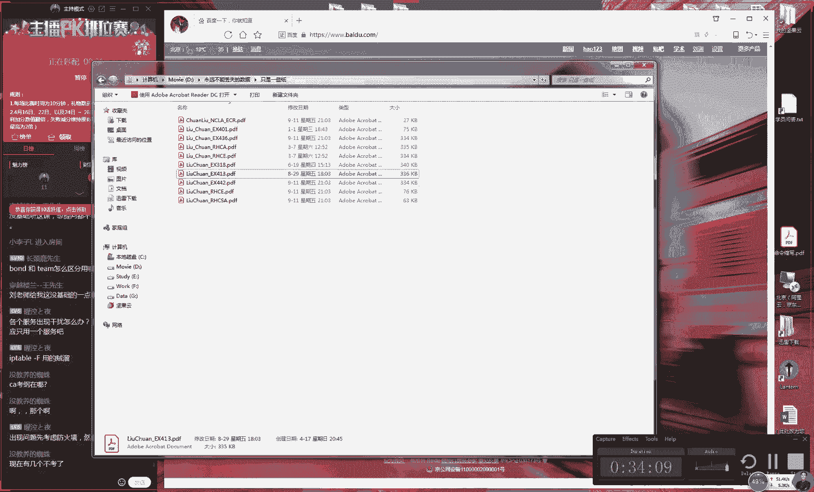

## 课程总结

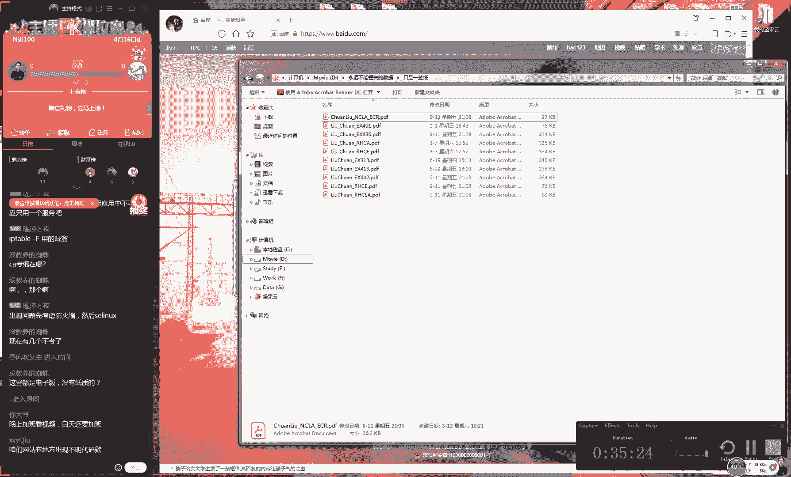

本节课中我们一起学习了OpenLDAP目录服务的完整配置流程。我们从服务端模板导入与修改开始，逐步创建了组织结构和用户账户，并利用迁移工具处理了用户数据。随后，我们配置了基于Web的公钥分发和基于NFS的主目录共享。最后，在客户端通过图形化界面轻松完成了认证配置，并实现了用户主目录的自动挂载。虽然服务端配置涉及步骤较多，但RHCE考试更侧重于客户端的图形化配置，大家应熟练掌握该部分内容。

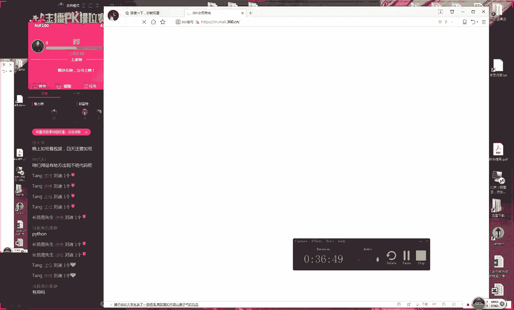

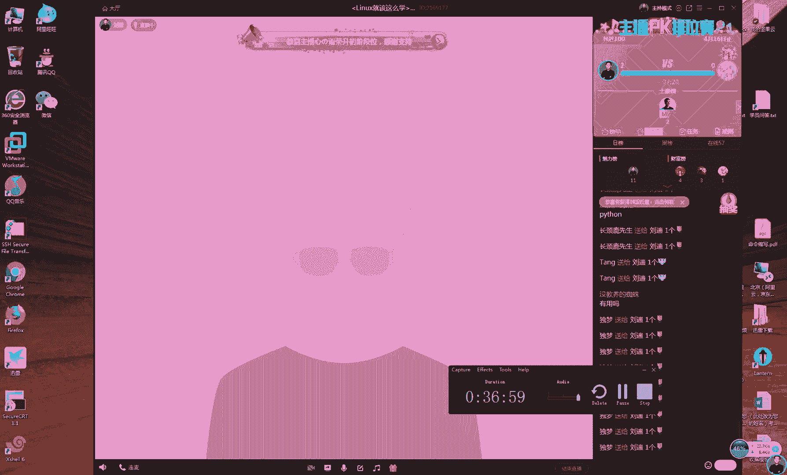

---
**复习建议**：重点练习第14章（DNS）和第15章（Apache）的内容。第16章（OpenLDAP）的客户端配置是考试重点，务必掌握图形化配置方法。
**预习内容**：明天将学习第17章的内容。