# RHCE红帽认证工程师培训课程：P1：第一节课 - 开班仪式与课程介绍

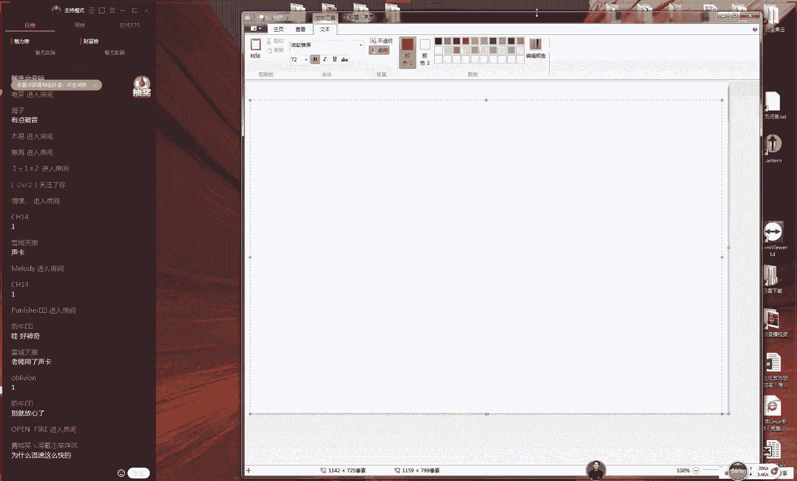

## 概述

在本节课中，我们将一起了解本次红帽认证工程师（RHCE）培训课程的整体框架、学习目标以及相关的重要信息。本节课是开班仪式，旨在帮助大家明确学习方向、了解课程安排，并为后续的学习做好准备。

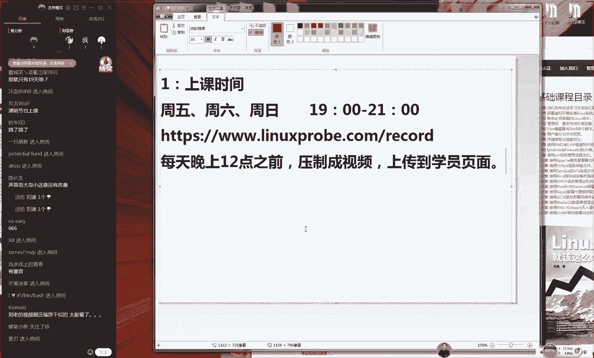

## 课程内容

### 1. 上课时间与环境测试

首先，我们来确认一下上课时间与环境。我们的课程安排在每周五、周六和周日的晚上19:00开始，每次课程时长约为2到2.5小时。这个时间安排是我们经过多年培训经验总结出的最合理方案，既能保证学习效果，又能让大家有充足的复习时间。

为了确保大家能顺利听课，请检查您的设备是否能正常接收视频和音频。如果您能看到画面并听到声音，请在聊天区回复“1”。

### 2. 课程教材与笔记

每位学员都有一本配套教材。请大家现在翻开教材的前言部分。在教材的空白处，我们鼓励大家积极手写笔记。俗话说“好记性不如烂笔头”，手写笔记能加深记忆，对学习大有裨益。

此外，我们有一个学习激励活动：在培训期间，坚持每天在技术博客上分享学习心得并上传手写笔记照片，连续20天，培训结束后即可获赠一本作者的签名书籍作为奖励。这不仅是对学习的督促，也是一份心意。

### 3. 红帽认证与考试介绍

接下来，我们了解一下红帽认证。红帽认证主要分为三个级别：
*   **RHCSA（红帽认证系统管理员）**：基础级别，考核系统管理能力。
*   **RHCE（红帽认证工程师）**：中级级别，考核服务搭建与管理能力，也是本课程的核心目标。
*   **RHCA（红帽认证架构师）**：高级级别，考核高级架构与服务能力。

本课程的培训费用为2400元。红帽认证的考试费用为4200元，这是红帽官方的统一报价。我们作为合作机构，为学员提供报考服务，不额外加价。

关于考试地点，我们在全国共有12个合作考点，主要分布在北京、上海、广州、深圳等城市。由于考场位置有限，建议有考试计划的学员提前2-3周预约。我们会在每月25日左右预约下个月的考位。

**请注意**：当前课程基于红帽企业版Linux 7（RHEL 7）进行教学。根据我们与红帽官方的沟通，在可预见的未来一段时间内，RHCE考试仍将基于RHEL 7，因此大家有充足的时间学习和备考。我们会密切关注官方动态，并及时通知大家任何更新。

### 4. 视频回放与学习资料

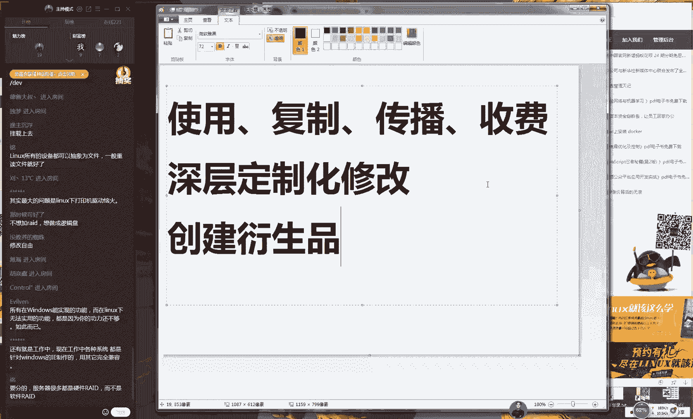

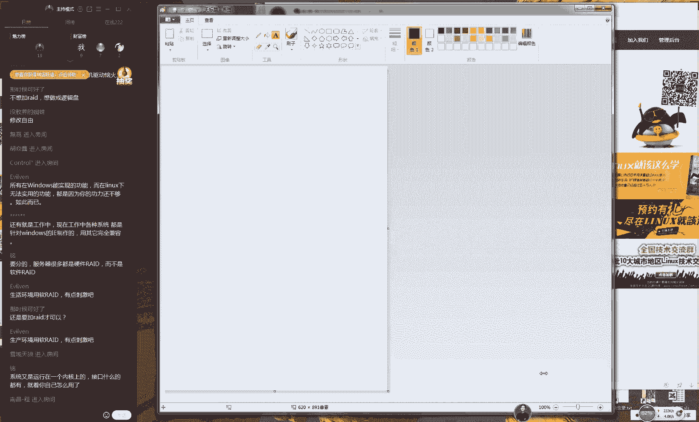

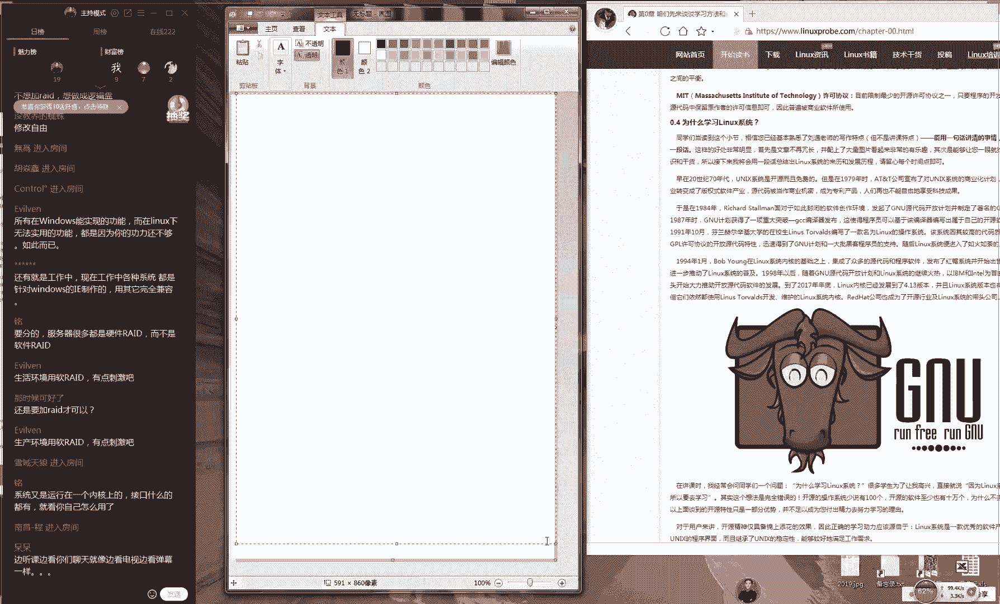

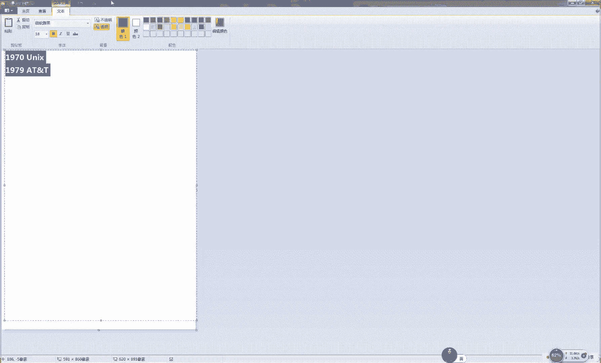

考虑到可能有学员无法准时参加直播，我们每次课程都会进行录屏。录制的高清视频会在课程结束后的当晚（最迟次日凌晨）上传至学员专属页面，供大家复习观看。

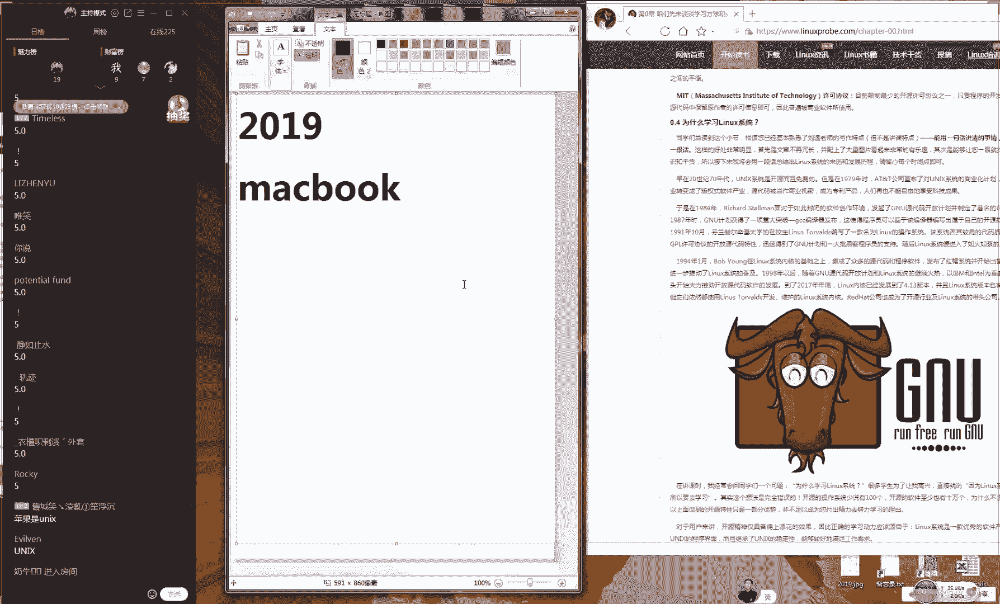

学员页面的访问地址和密码已在报名时通过QQ群公告或聊天记录提供，请妥善保管，切勿外泄。

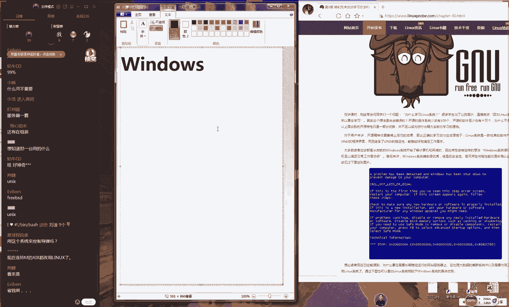

### 5. Linux系统与开源文化

现在，让我们进入技术概念的初步了解。我们为什么要学习Linux？这离不开其核心特性——**开源**。

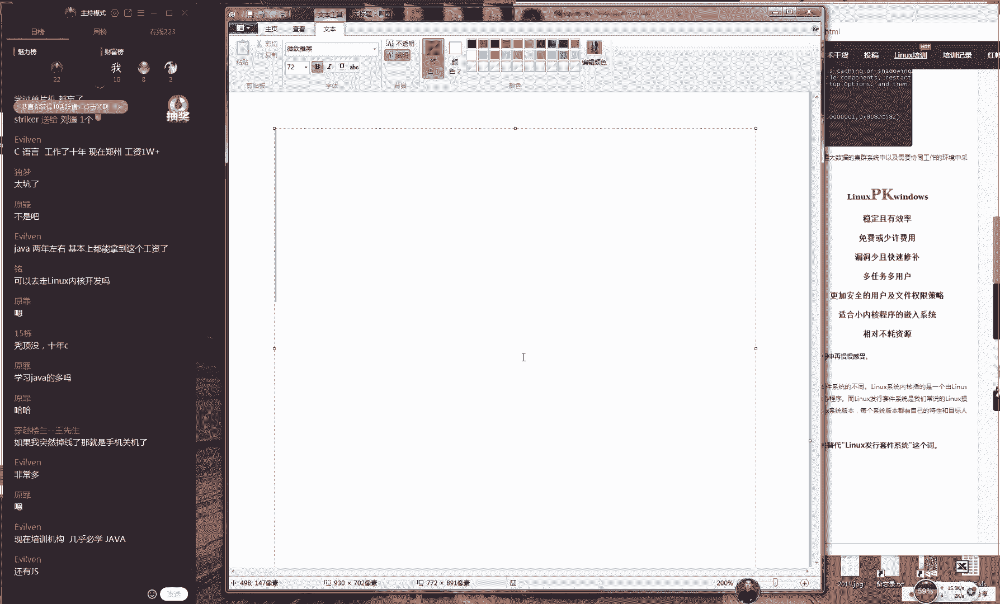

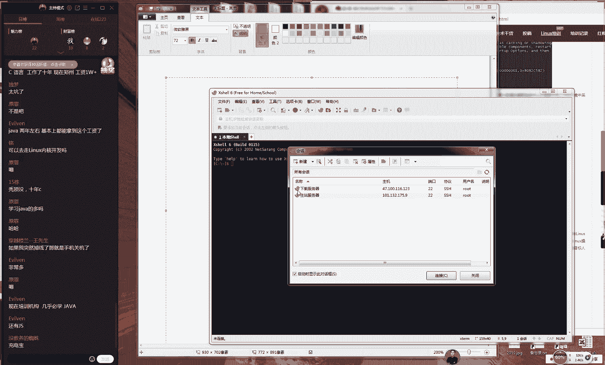

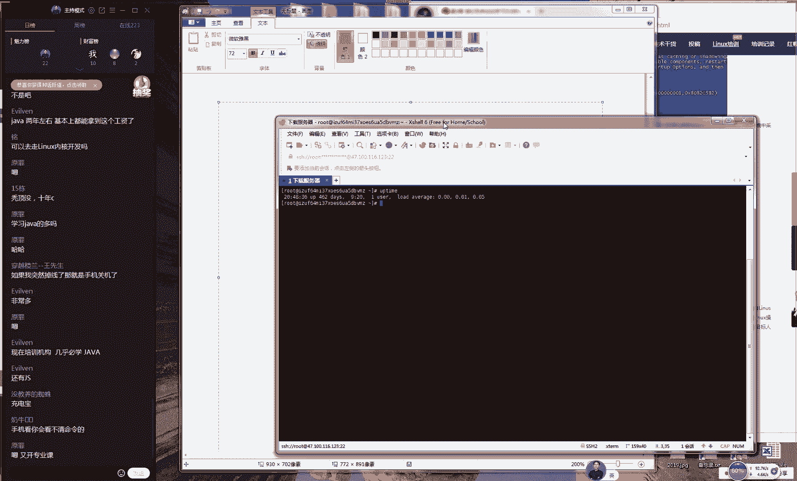

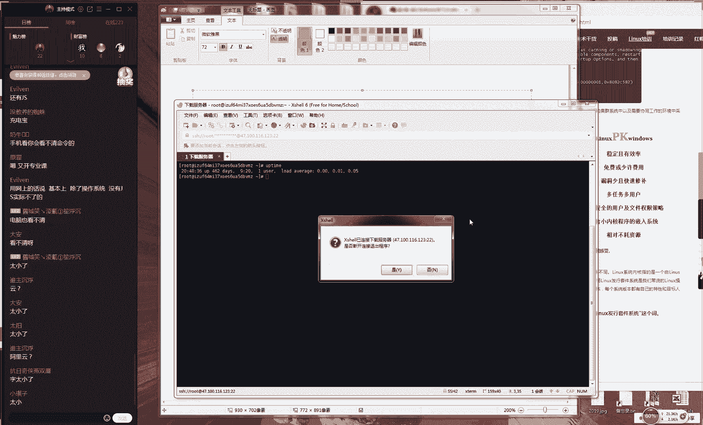

**开源**（Open Source）即开放源代码，是指将程序的源代码一并提供给用户的行为。与之相对的是**闭源**。开源软件拥有四大优势：
1.  **低风险**：代码公开，由社区共同维护，即使原公司倒闭，软件也能持续发展。
2.  **高品质**：代码公开接受监督，促使开发者写出更高质量的代码。
3.  **低成本**：通常可以免费使用，厂商主要通过提供技术支持等服务盈利。
4.  **更透明**：代码公开，难以隐藏恶意程序或后门，安全性更有保障。

开源协议赋予了用户六大自由：
1.  使用自由
2.  复制自由
3.  传播自由
4.  收费自由（指基于服务收费）
5.  **修改自由**：允许用户根据自身需求深度定制软件。
6.  **创建衍生品自由**：允许基于原软件修改并发布新的作品（需注明原作者）。

Linux系统正是开源文化的杰出代表。它起源于1991年，由林纳斯·托瓦兹（Linus Torvalds）开发。红帽公司（Red Hat）在1994年基于Linux内核，集成了大量常用软件，发布了红帽企业版Linux（RHEL），成为企业级市场的领导者。

与Windows系统相比，Linux在服务器领域优势明显：
*   **稳定且高效**：可深度定制，剔除不必要的组件，将资源利用到极致。
*   **免费或低成本**：开源特性决定了其使用成本低廉。
*   **漏洞少且修复快**：全球开发者社区共同维护，能快速发现和修复问题。
*   **多用户、多任务**：天生为多用户同时操作设计，安全性和稳定性高。
*   **适用于嵌入式系统**：内核可裁剪，能运行在资源有限的设备上。

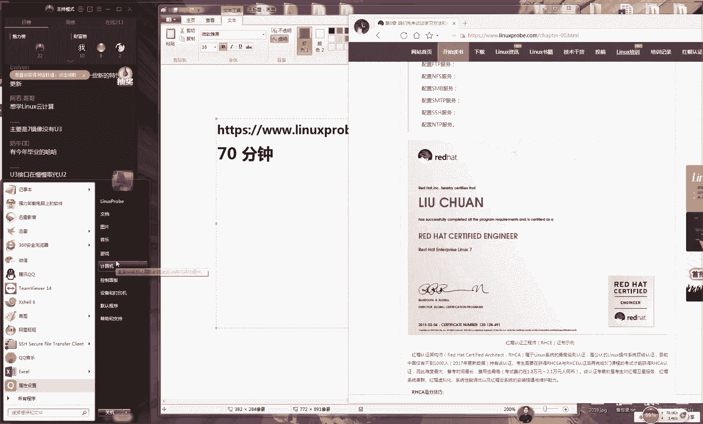

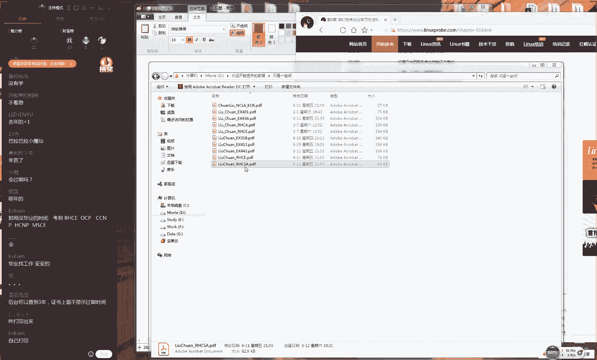

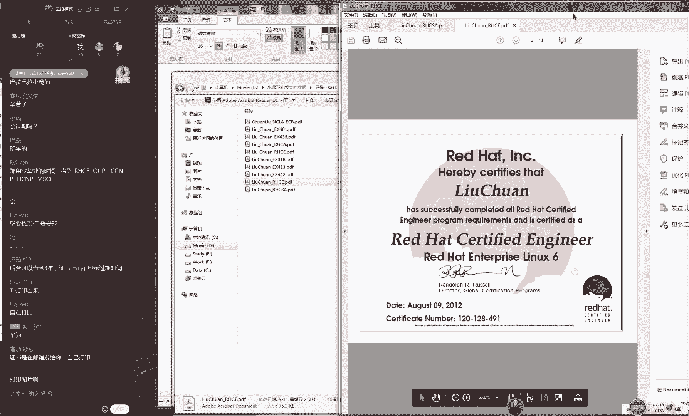

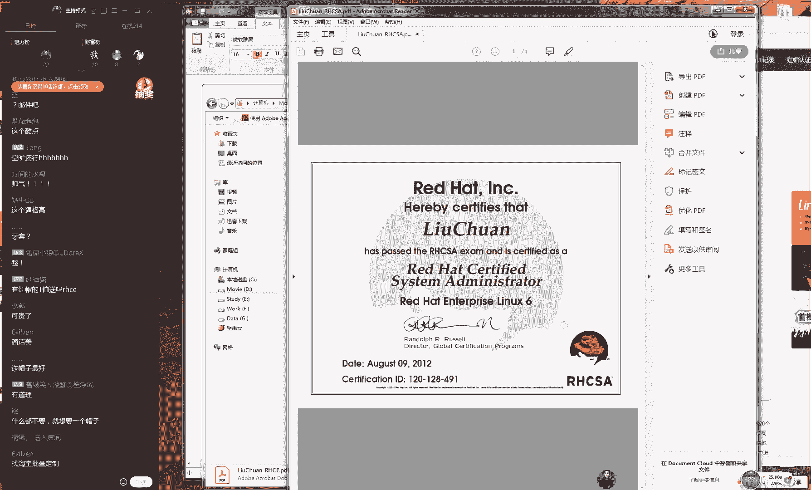

常见的Linux发行版主要有：
*   **RHEL（Red Hat Enterprise Linux）**：红帽企业版，稳定可靠，需订阅。
*   **CentOS**：基于RHEL源代码重新编译的免费版本，与RHEL高度兼容，常用于企业生产环境。
*   **Fedora**：红帽赞助的社区版，侧重新技术的尝鲜，适合桌面用户。
*   **Ubuntu**：基于Debian，用户友好的桌面发行版。
*   **Debian**：以稳定著称的社区发行版。

### 6. 学习建议与课后任务

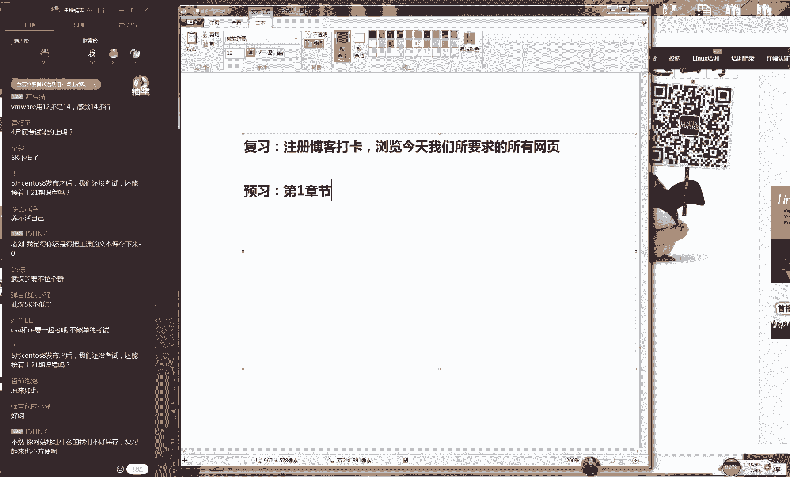

为了达到最佳学习效果，请大家做好预习和复习。今天的课程结束后，请完成以下任务：
1.  **复习**：整理今天的笔记，回顾课程介绍的所有要点。
2.  **预习**：准备好学习环境，我们下节课将开始第一章的学习。
3.  **拓展学习**：访问课程提供的链接，观看关于红帽认证的70分钟详细介绍视频，并查看全国12个考点的具体位置。
4.  **开始打卡**：注册一个技术博客（如博客园、51CTO、CSDN、开源中国），开始第一天的学习打卡。

## 总结

本节课中，我们一起学习了本次RHCE培训课程的整体安排、红帽认证的基本情况、开源文化的核心思想以及Linux系统的优势。我们从上课时间、学习工具聊到了技术理念，为接下来的深入学习奠定了坚实的基础。记住，成功在于坚持，从今天起，请拿起笔，开始记录你的学习之旅吧。

---
**注意**：本教程根据原始直播内容整理，删除了语气词，对部分口语化表达进行了书面化处理，并按照要求的结构进行重组，力求保留原意并提升阅读流畅度。核心概念已用**粗体**标出。