# Linux系统管理：第4课：文件操作与重定向

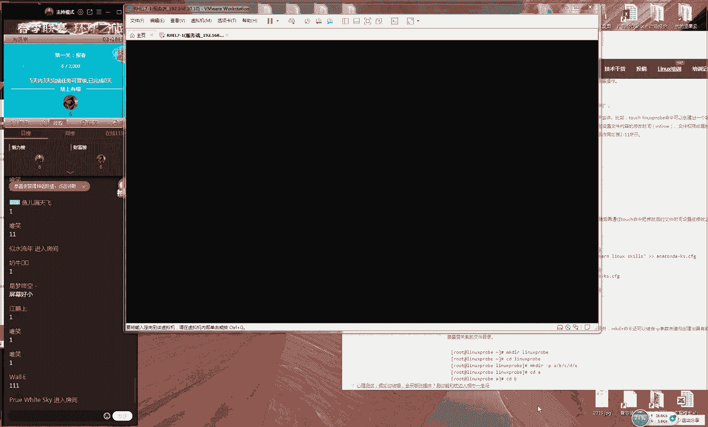

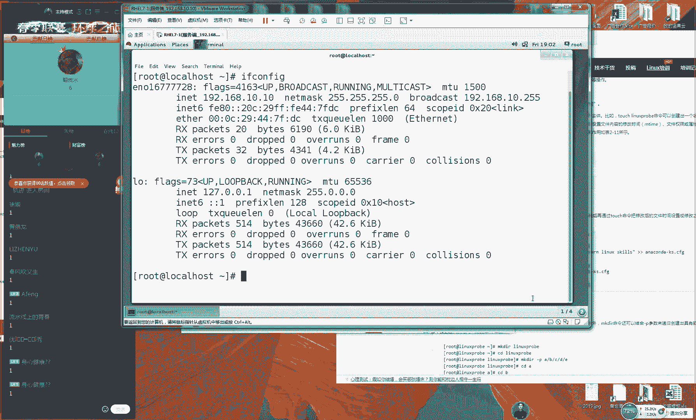

## 概述
在本节课中，我们将学习Linux系统中关于文件时间、文件操作（创建、复制、移动、删除）、文件查找、压缩解压以及非常重要的重定向和管道操作符。这些是日常系统管理中最基础且核心的技能。

---

## 文件时间与touch命令

上一节我们介绍了文件的基本概念，本节中我们来看看如何查看和修改文件的属性时间。

Linux系统中的文件记录有三个主要时间戳：
*   **atime (Access Time)**: 文件最后一次被**访问**（读取内容）的时间。
*   **ctime (Change Time)**: 文件**属性**（如权限、所有者）最后一次被改变的时间。
*   **mtime (Modification Time)**: 文件**内容**最后一次被**修改**的时间。

使用 `stat` 命令可以查看文件的详细时间信息：
```bash
stat 文件名
```

`touch` 命令主要有两个功能：
1.  **创建新的空文件**（文本文件）。
    ```bash
    touch 新文件名
    ```
2.  **修改文件的时间戳**。
    *   修改访问和修改时间为指定时间：`touch -d "时间" 文件名`
    *   仅修改访问时间：`touch -a 文件名`
    *   仅修改修改时间：`touch -m 文件名`

> **注意**：`ctime` 是系统保护的元数据，无法直接通过 `touch` 命令修改。

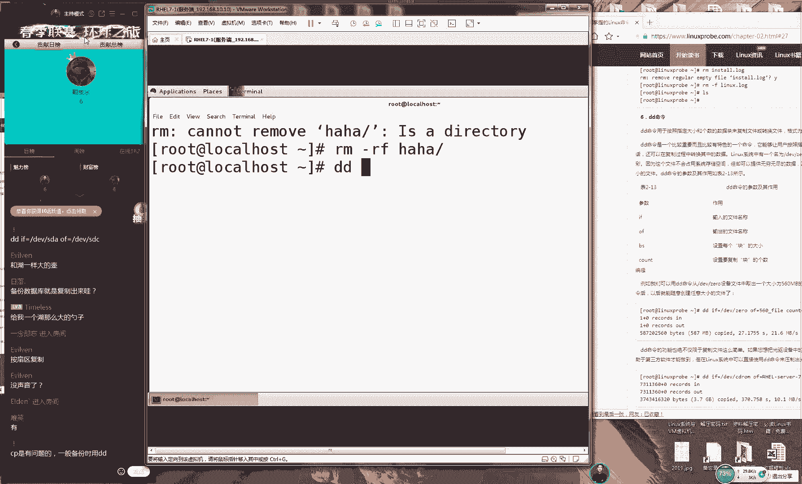

---

## 目录与文件操作命令

掌握了文件时间后，我们开始学习对文件和目录本身进行操作的一系列命令。

### mkdir：创建目录
用于创建新的目录。
*   创建单个目录：`mkdir 目录名`
*   创建嵌套的多级目录（递归创建）：`mkdir -p 目录A/目录B/目录C`

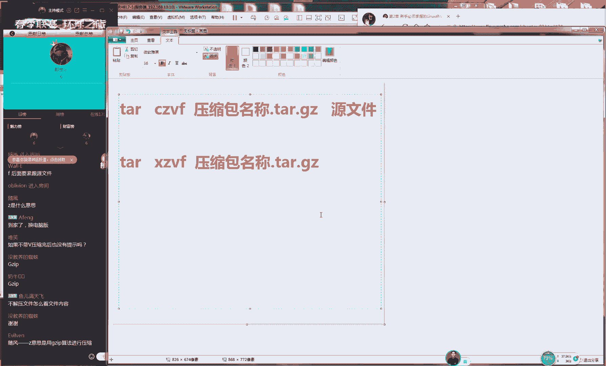

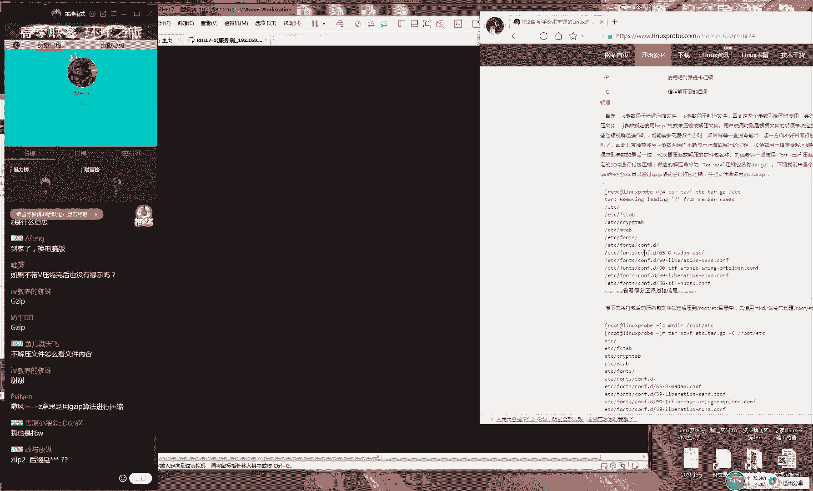

### cp：复制文件或目录
用于复制文件或目录。
*   复制文件：`cp 源文件 目标文件`
*   复制目录（需要递归操作）：`cp -r 源目录 目标目录`

### mv：移动或重命名
用于移动文件/目录，或在同一目录内进行重命名。
*   移动文件：`mv 源文件 目标路径/`
*   重命名文件：`mv 旧文件名 新文件名`

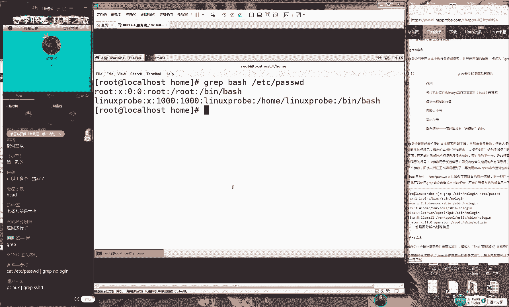

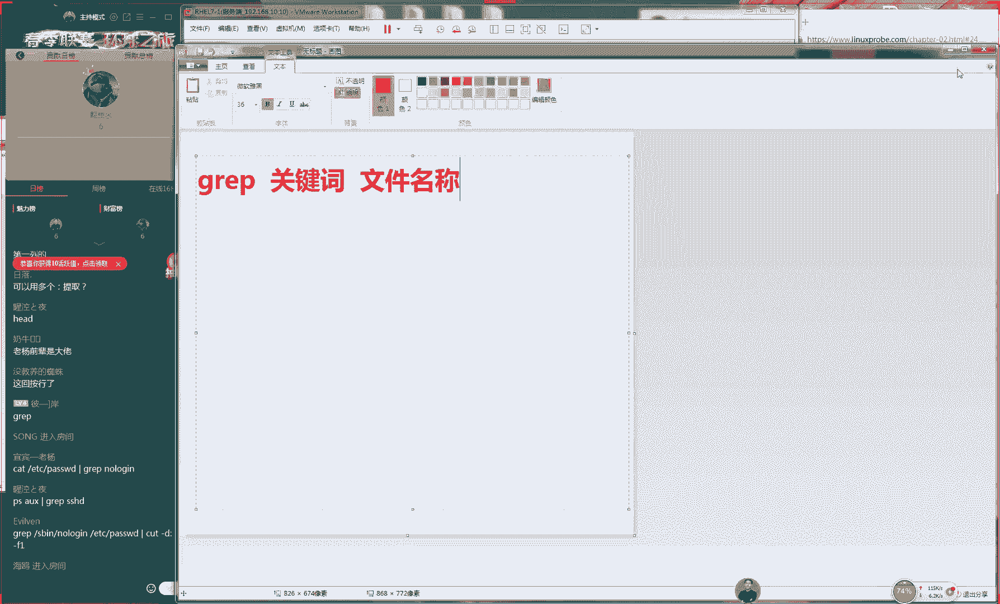

### rm：删除文件或目录
用于删除文件或目录，**请谨慎使用**。
*   删除文件（会询问确认）：`rm 文件名`
*   强制删除文件（不询问）：`rm -f 文件名`
*   删除目录（递归删除）：`rm -r 目录名`
*   强制删除目录：`rm -rf 目录名`

### dd：按块复制与转换
`dd` 命令可以按照指定大小和块数复制文件的一部分，常用于磁盘备份、转换等高级操作。
其基本格式为：
```bash
dd if=输入文件 of=输出文件 bs=块大小 count=块数量
```
*   `if`: 输入文件 (Input File)
*   `of`: 输出文件 (Output File)
*   `bs`: 每次读取/写入的块大小 (Block Size)
*   `count`: 要复制的块数量

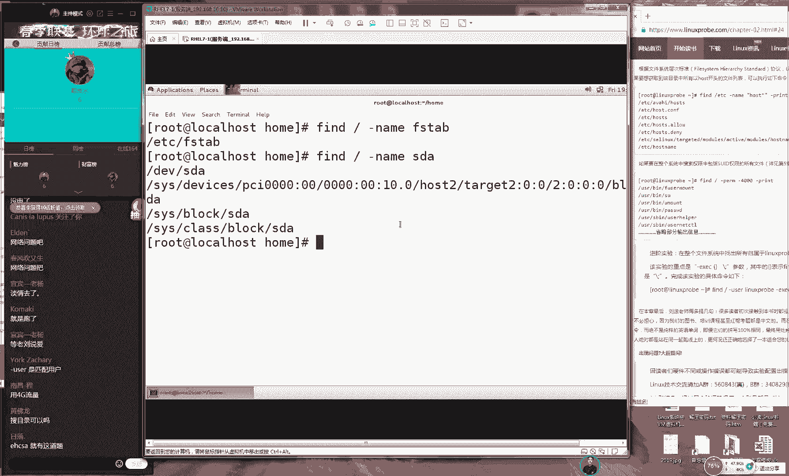

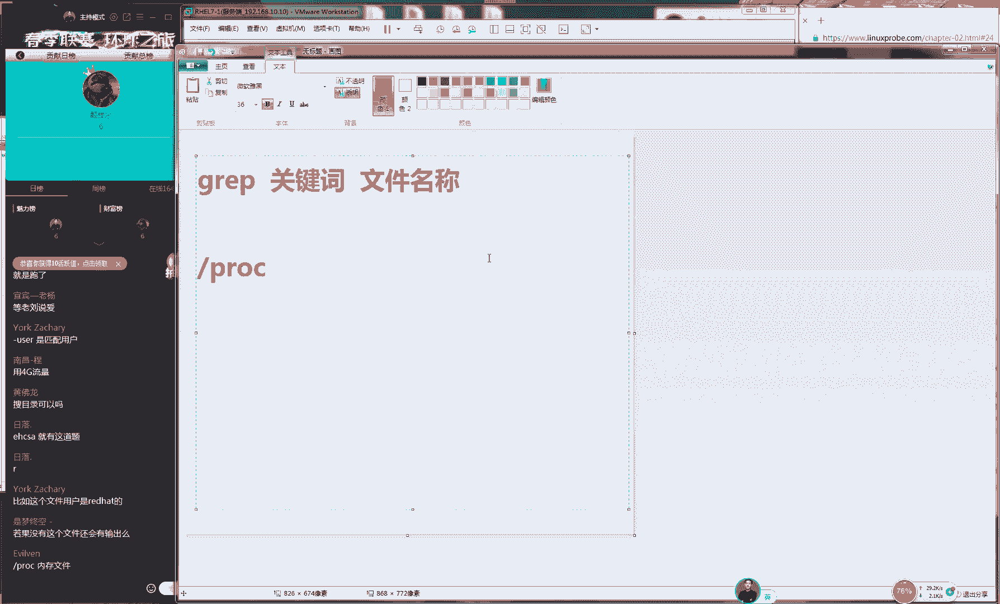

例如，复制文件前512字节：`dd if=源文件 of=新文件 bs=512 count=1`

### file：查看文件类型
用于判断文件的类型，而不是依赖颜色或后缀名。
```bash
file 文件名
```

---

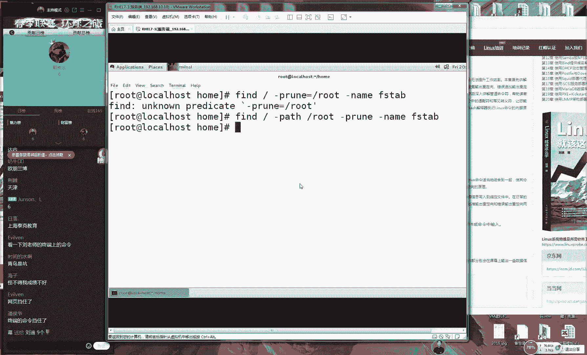

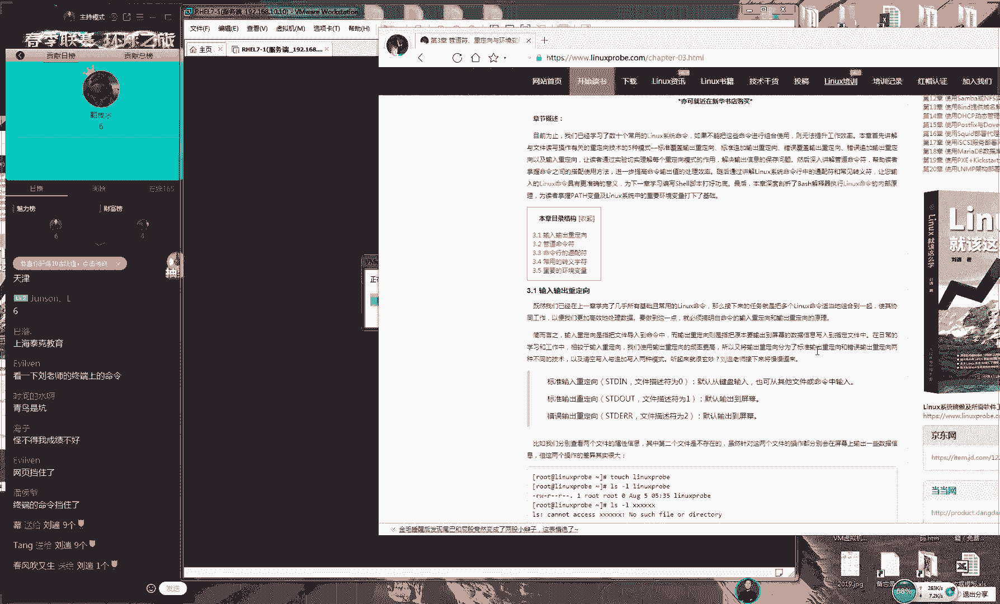

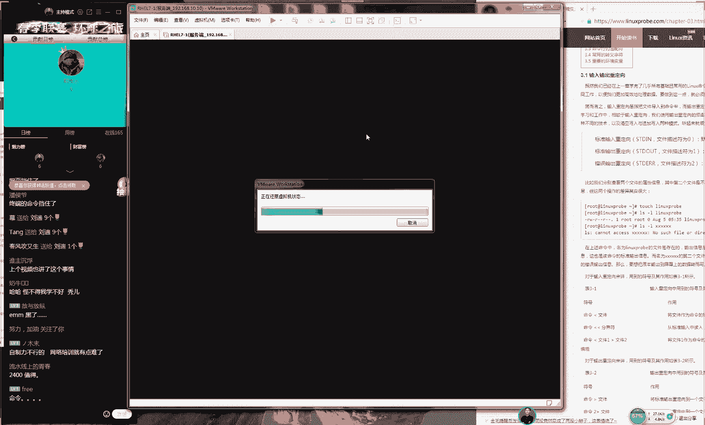

## 文件打包、压缩与查找

处理完单个文件，我们常常需要将多个文件打包、压缩以方便传输或归档，也需要在系统中快速定位文件。

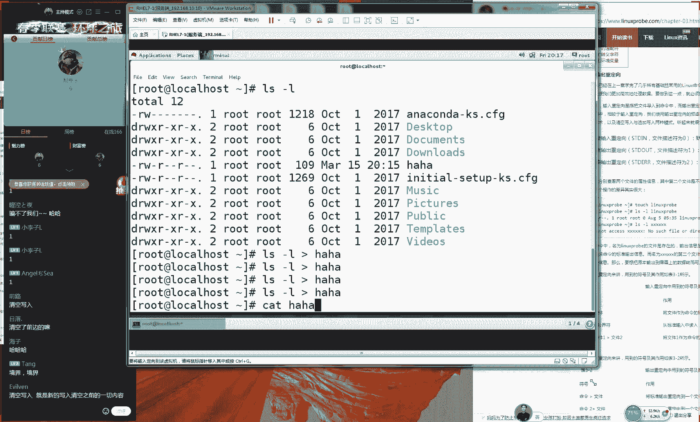

### tar：打包与压缩
`tar` 是Linux中最常用的打包压缩命令。
以下是其核心参数：
*   `-c`: 创建打包文件 (Create)
*   `-x`: 解打包文件 (eXtract)
*   `-z`: 使用gzip压缩/解压 (文件后缀通常为 `.tar.gz`)
*   `-j`: 使用bzip2压缩/解压 (文件后缀通常为 `.tar.bz2`)
*   `-v`: 显示详细过程 (Verbose)
*   `-f`: 指定打包后的文件名 (File)

**常用组合：**
*   **打包并压缩**：`tar -czvf 打包后文件名.tar.gz 要打包的目录或文件`
*   **解压并解包**：`tar -xzvf 要解压的文件名.tar.gz`

### grep：文本搜索过滤
用于在文件中搜索包含指定字符串的行。
*   基本搜索：`grep "关键词" 文件名`
*   显示行号：`grep -n "关键词" 文件名`
*   忽略大小写：`grep -i "关键词" 文件名`

### find：文件查找
用于在指定目录树下查找文件，功能强大。
*   按名称查找（全盘搜索）：`find / -name "文件名"`
*   按名称查找（当前目录）：`find . -name "文件名"`
*   按类型查找（如普通文件）：`find / -type f`
*   排除特定目录查找：`find / -path “要排除的目录路径” -prune -o -name “文件名” -print`

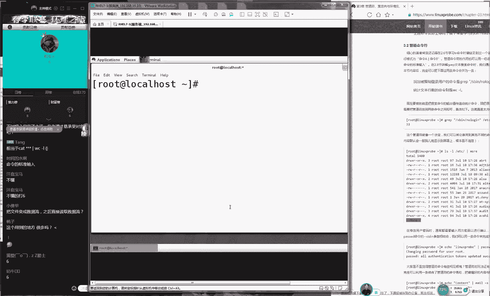

---

## 重定向与管道符


前面我们学习的命令输出都显示在屏幕上。接下来，我们将学习如何控制这些输入输出流，这是实现命令协作和自动化的关键。

### 输出重定向
将命令原本输出到屏幕（标准输出）的内容，转而写入到文件中。
*   **`>`**: 清空写入。覆盖目标文件原有内容。
    ```bash
    ls > filelist.txt
    ```
*   **`>>`**: 追加写入。在目标文件末尾添加新内容。
    ```bash
    date >> log.txt
    ```
*   **`2>`**: 错误重定向。将命令的错误信息（标准错误）写入文件。
    ```bash
    错误命令 2> error.log
    ```
*   **`&>`**: 全部重定向。将标准输出和标准错误都写入文件。
    ```bash
    命令 &> output.log
    ```

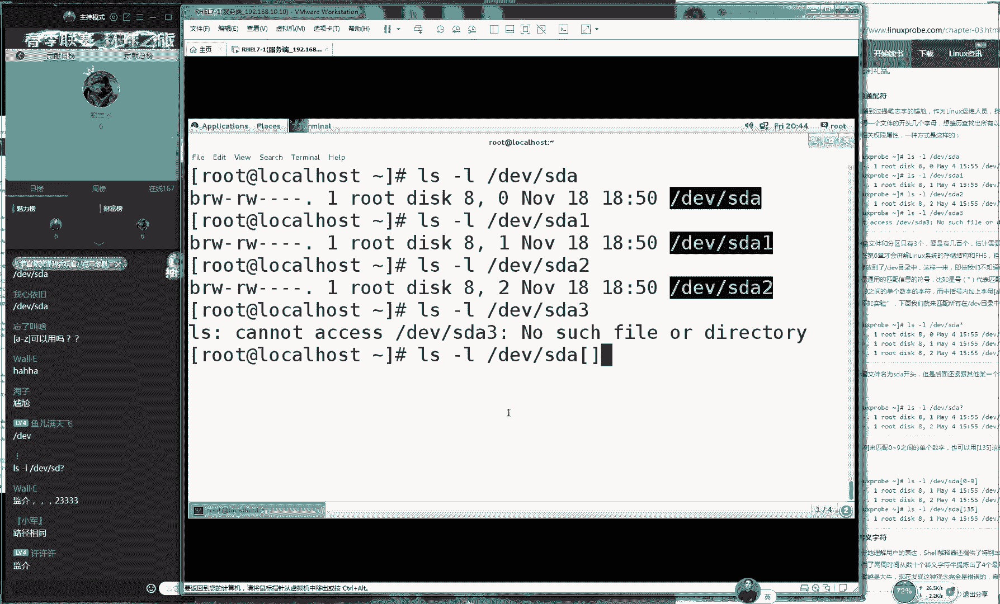

### 输入重定向
将文件的内容作为命令的输入。
*   **`<`**: 从文件读取输入。
    ```bash
    wc -l < filename.txt
    ```

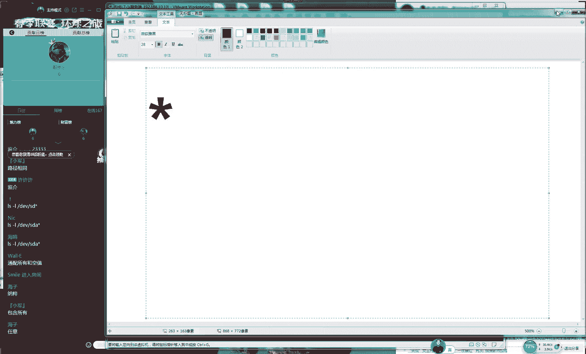

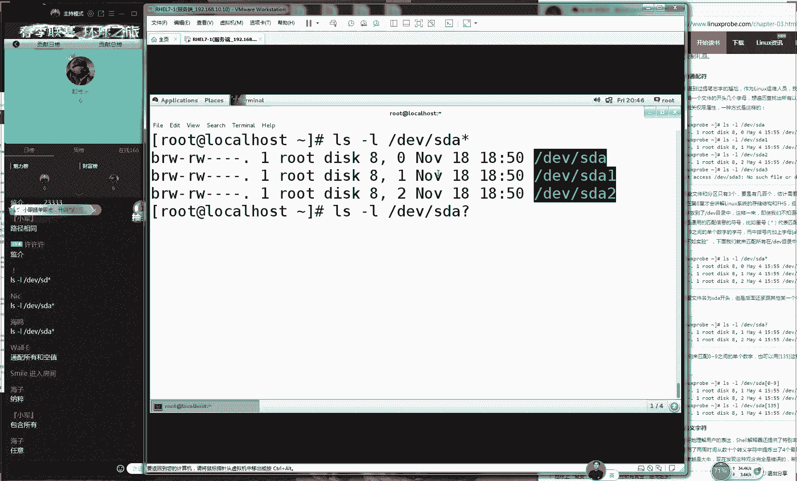

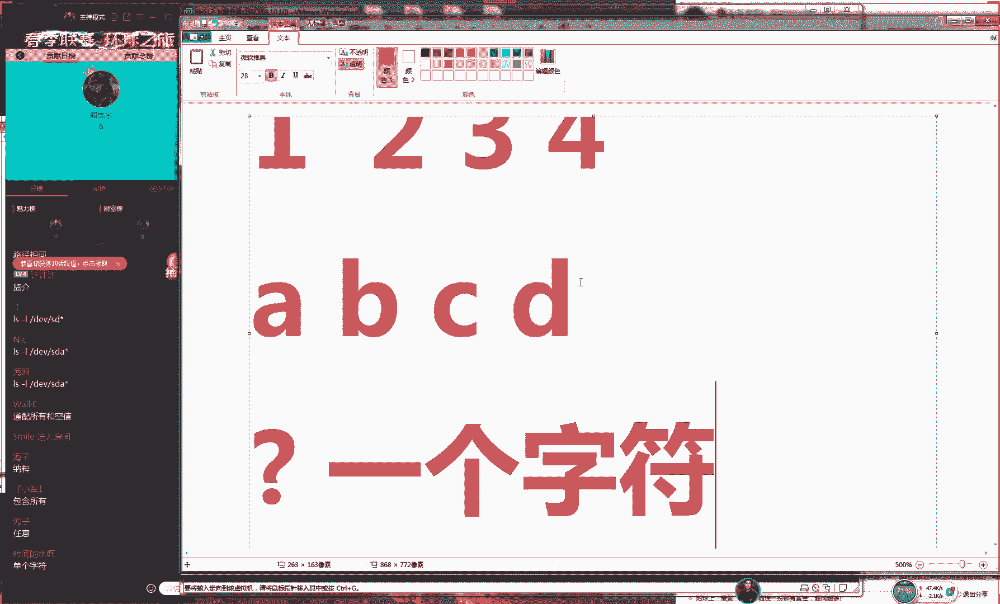

### 管道符 `|`
管道符是Linux命令协作的灵魂。它将前一个命令的**标准输出**，作为后一个命令的**标准输入**。
```bash
命令A | 命令B
```
**实例：**
*   列出文件并统计数量：`ls | wc -l`
*   查看进程并过滤出SSH相关进程：`ps aux | grep ssh`

---

## 通配符与转义符

为了更高效地匹配和操作多个文件，我们需要学习通配符和转义符。

### 通配符
用于模糊匹配文件名。
*   **`*`**: 匹配任意长度（包括零个）的任意字符。例如 `ls *.txt` 列出所有txt文件。
*   **`?`**: 匹配任意单个字符。例如 `ls file?.txt` 匹配 `file1.txt`, `fileA.txt`。
*   **`[ ]`**: 匹配括号内的任意一个字符。例如 `ls file[123].txt` 匹配 `file1.txt`, `file2.txt`, `file3.txt`。
*   **`[ - ]`**: 匹配一个范围内的字符。例如 `ls file[1-5].txt` 匹配 `file1.txt` 到 `file5.txt`。

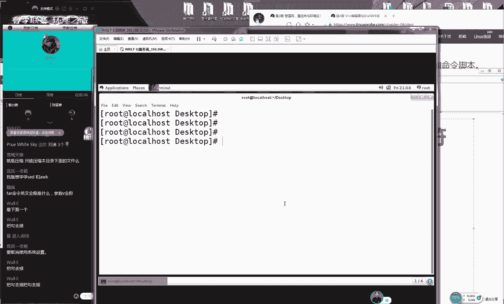


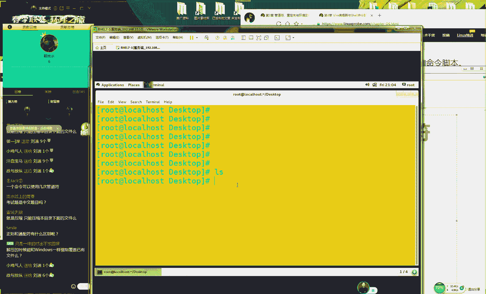

### 转义符
用于使Shell解释器忽略某些字符的特殊含义，将其当作普通字符。
*   **`\` (反斜杠)**: 转义紧随其后的单个字符。例如，要输出美元符号 `$`，需写为 `echo \$`。
*   **`' '` (单引号)**: 强引用。引号内所有字符都视为普通字符，变量和命令替换都不会发生。
    ```bash
    echo '$USER' # 输出 $USER，而不是用户名
    ```
*   **`" "` (双引号)**: 弱引用。引号内大部分字符视为普通字符，但变量替换 (`$VAR`) 和命令替换 (`` `command` `` 或 `$(command)`) 会生效。
    ```bash
    echo "User is $USER" # 输出 User is [你的用户名]
    ```
*   **`` ` ` `` (反引号) 或 `$()`**: 命令替换。执行括号或反引号内的命令，并将其输出结果替换到当前位置。
    ```bash
    echo "Now is `date`"
    # 或
    echo "Now is $(date)"
    ```

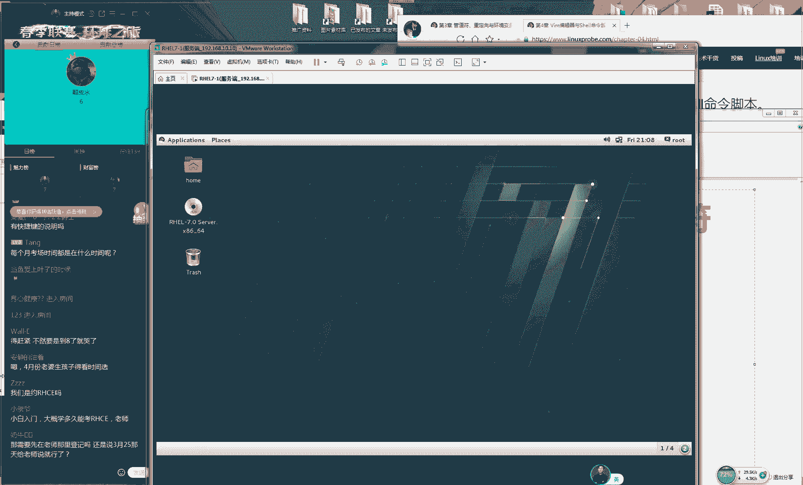

---

## 总结
本节课我们一起学习了Linux系统管理中的核心基础操作：
1.  使用 `touch` 管理文件时间戳和创建文件。
2.  使用 `mkdir`, `cp`, `mv`, `rm`, `dd`, `file` 对文件和目录进行创建、复制、移动、删除和类型判断。
3.  使用 `tar` 进行文件的打包压缩与解压。
4.  使用 `grep` 在文件中搜索文本，使用 `find` 在磁盘上查找文件。
5.  掌握了强大的**重定向** (`>`, `>>`, `<`, `|`)，能够控制命令的输入输出流，实现命令间的协作。
6.  学会了使用**通配符** (`*`, `?`, `[]`) 批量操作文件，以及使用**转义符** (`\`, `' '`, `" "`, `` ` ` ``) 来处理特殊字符。

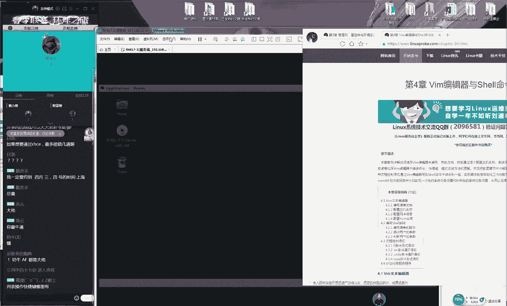


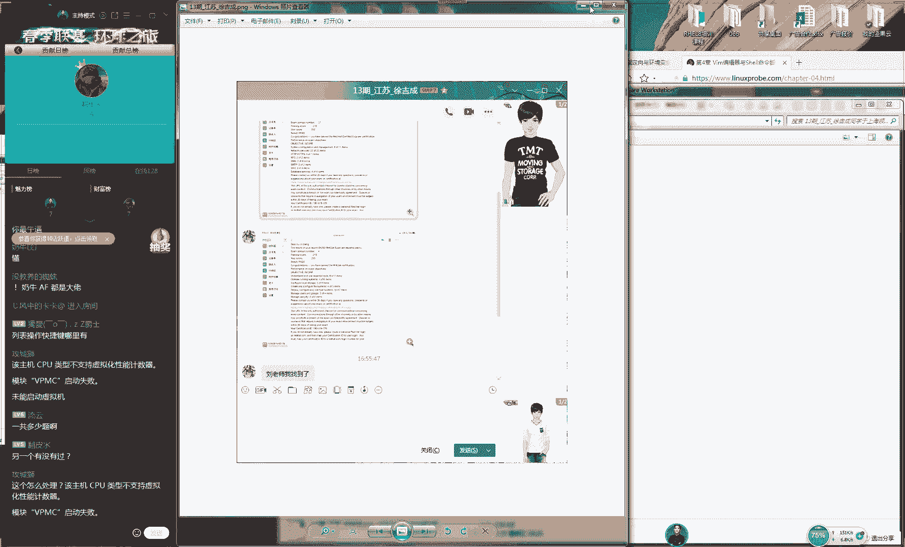

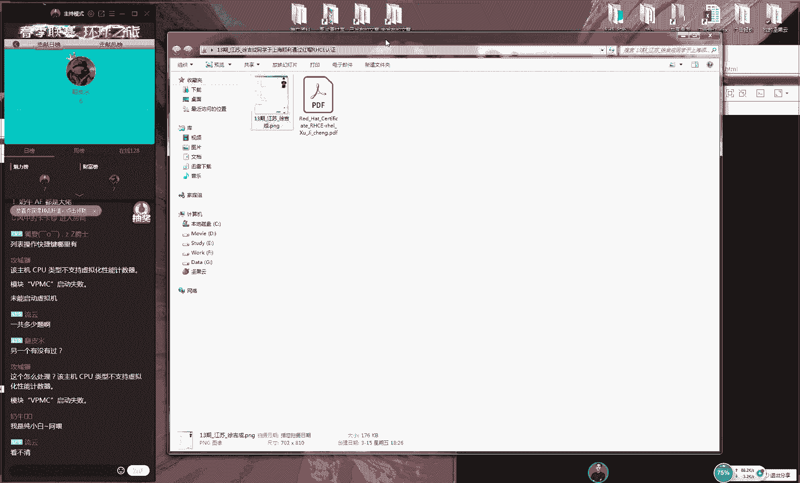

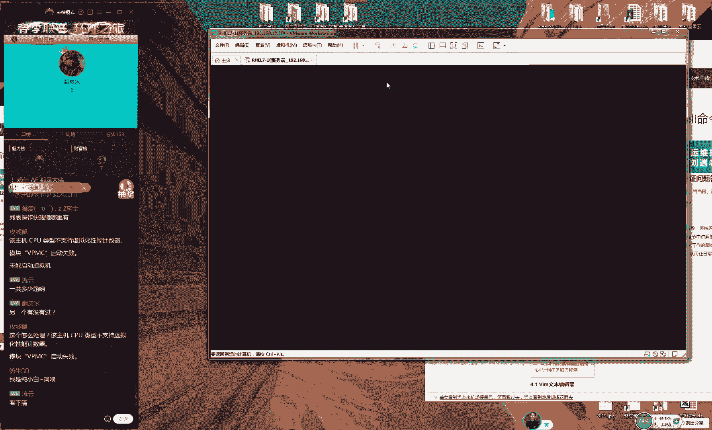


这些命令和概念是后续学习Shell脚本、系统服务和自动化运维的基石，请务必通过练习熟练掌握。