# RHCE红帽认证工程师培训课程：P5：第五节课

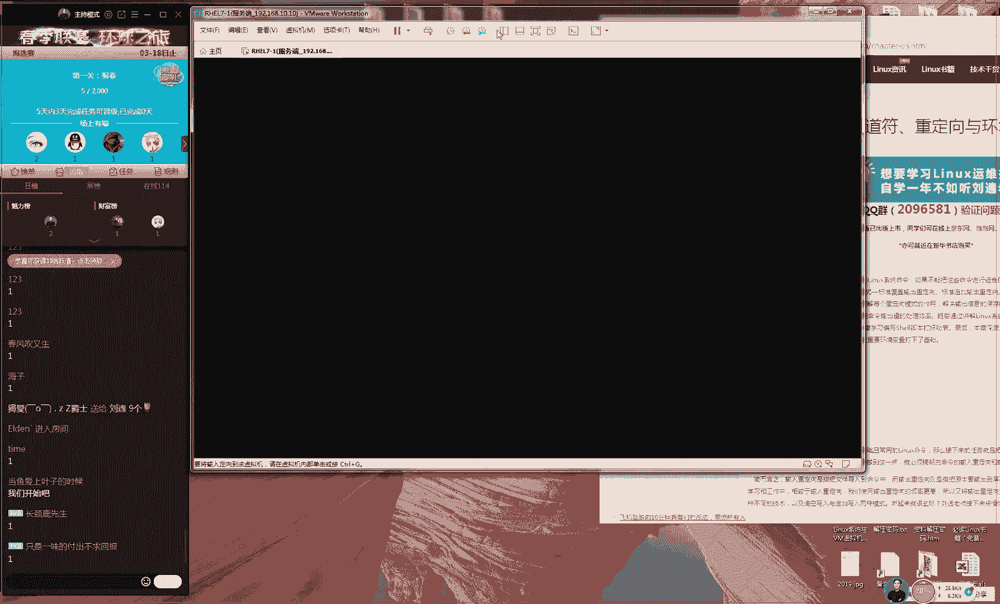

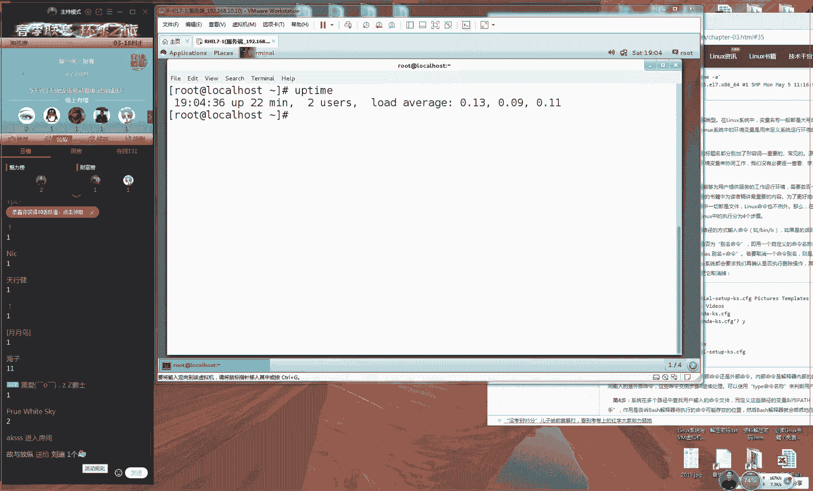


## 概述
在本节课中，我们将学习Linux系统中命令执行的底层机制、环境变量的概念与使用，并重点掌握VIM文本编辑器的三种模式及其基本操作。这些知识是理解系统工作原理和进行高效系统管理的基础。

## 命令执行的底层机制
当我们在Linux系统中输入并执行一条命令时，系统后台会遵循一系列步骤来处理这个请求。理解这个过程有助于我们更深入地掌握系统的工作原理。

### 命令执行的四种情况
以下是系统处理用户输入命令的四种主要方式：

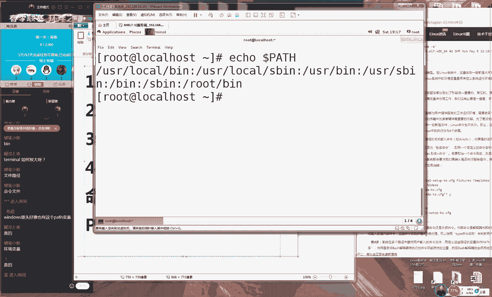

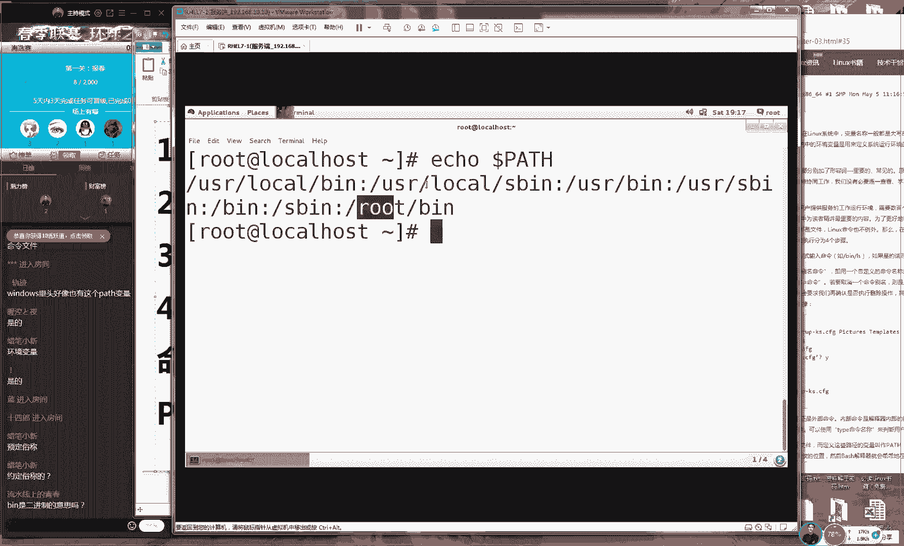

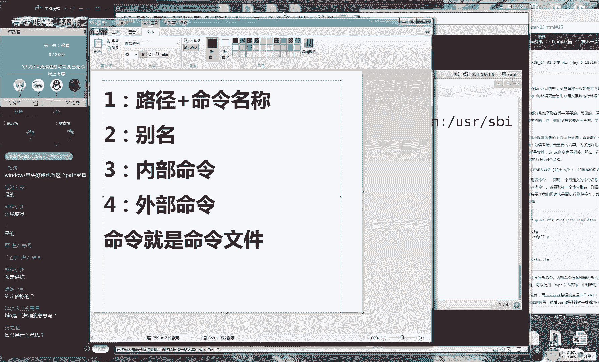

1.  **直接路径执行**：当我们输入完整的文件路径加上命令名称时，系统会直接执行该路径下的程序文件，而不会进行额外的搜索。
    ```bash
    /usr/bin/top
    ```

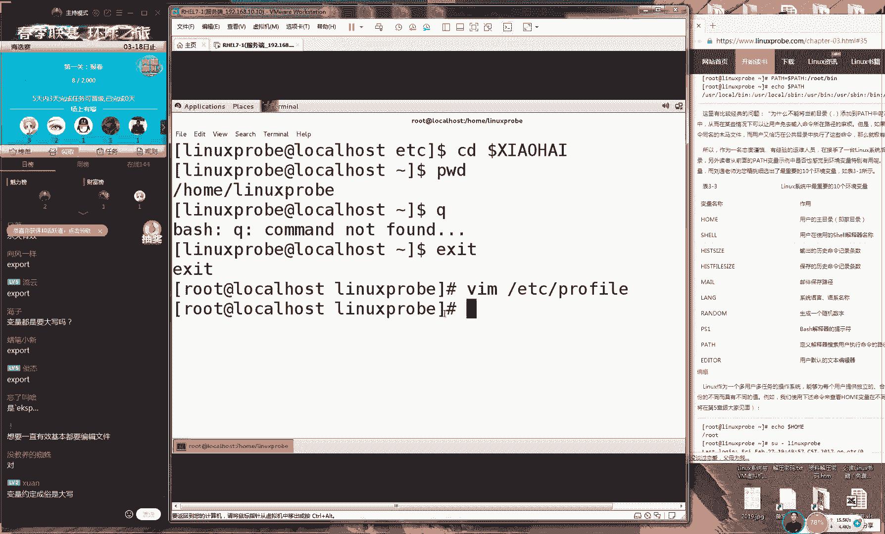

2.  **别名执行**：系统会检查用户输入的命令是否是一个已定义的别名。如果是，则执行该别名所代表的实际命令。别名可以简化复杂或常用的命令。
    ```bash
    # 定义别名
    alias pp='systemctl restart network'
    # 使用别名
    pp
    ```

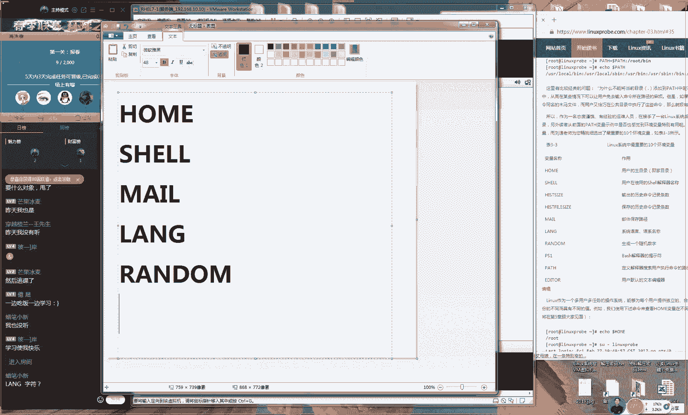

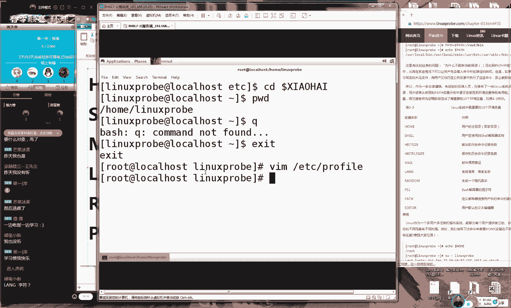

3.  **内部命令执行**：系统会判断该命令是否为Shell解释器内置的命令。这些命令数量很少，由Shell自身提供功能，执行效率高。

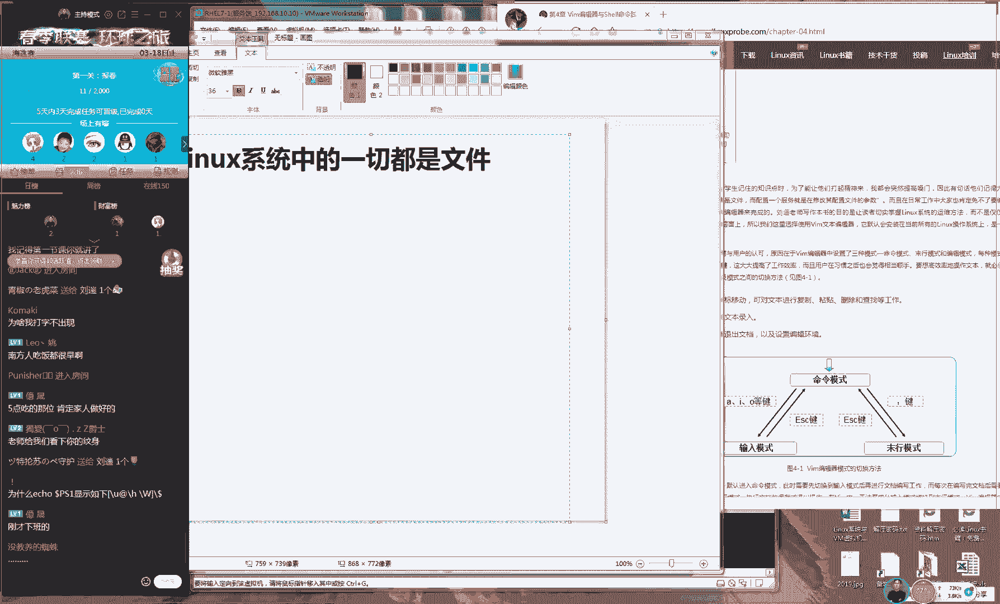

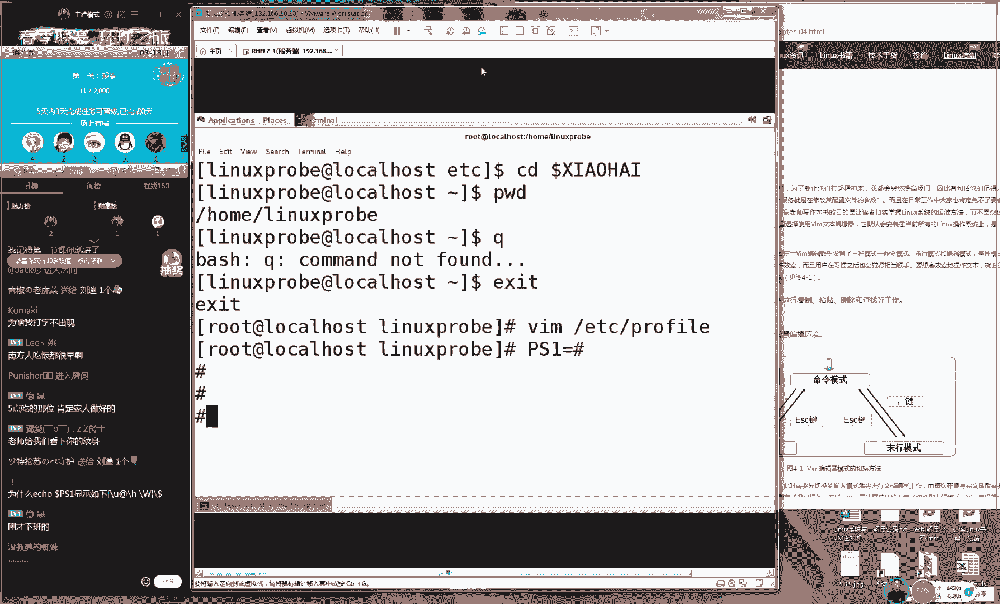

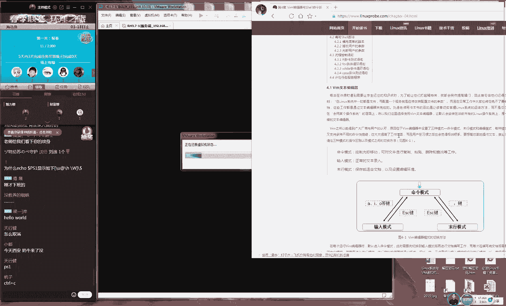

4.  **外部命令执行**：绝大多数命令都属于外部命令。Linux系统中“一切皆文件”，命令本身也是以文件的形式存储在特定的目录中。当用户输入一个外部命令时，系统需要在预设的路径中搜索对应的可执行文件。

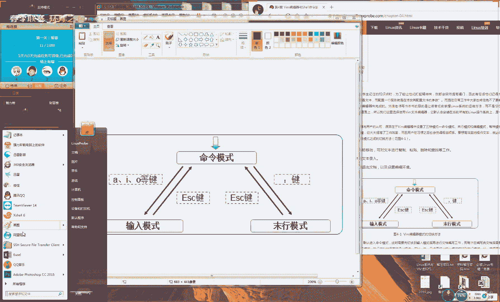


### PATH环境变量
为了提高搜索外部命令文件的效率，系统不会进行全盘扫描，而是通过一个名为`PATH`的环境变量来定义搜索范围。

*   `PATH`变量包含了一系列由冒号分隔的目录路径。
*   当输入一个外部命令时，系统会按照`PATH`中目录的顺序依次在这些路径中查找对应的可执行文件。
*   我们可以查看和修改`PATH`变量的值。
    ```bash
    # 查看当前PATH变量的值
    echo $PATH
    # 临时添加一个目录到PATH中
    PATH=$PATH:/new/directory
    ```

## 环境变量
环境变量是操作系统或Shell中用于存储配置信息和系统参数的一种机制。它们就像系统的小助手，为每个用户或进程提供独立的工作环境。

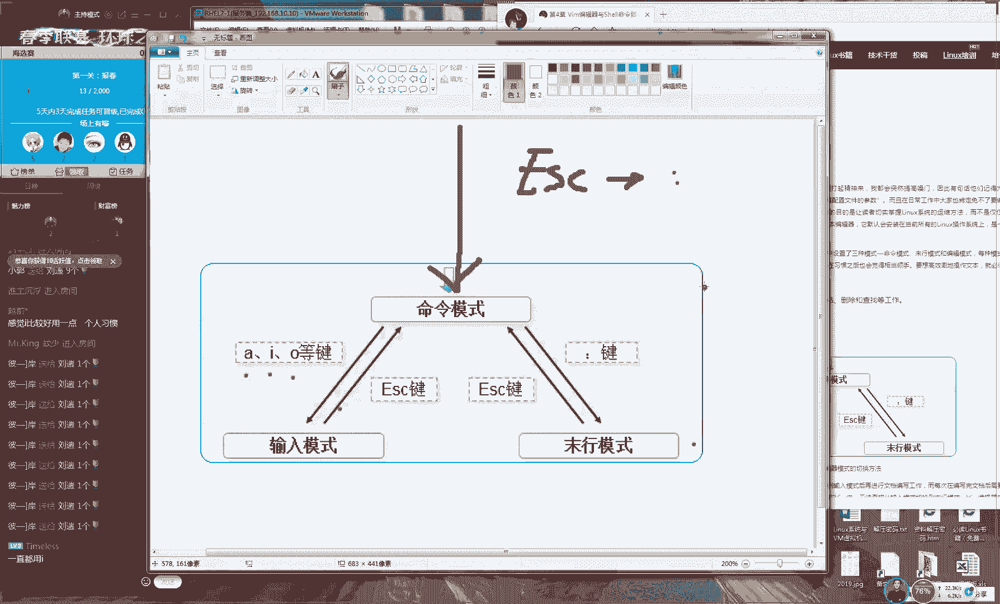

### 变量的定义与使用
变量可以存储各种信息，例如路径、用户名等。
```bash
# 定义一个变量
xiaohai=/home/lin/some/deep/directory
# 输出变量的值
echo $xiaohai
# 使用变量的值（如切换目录）
cd $xiaohai
```

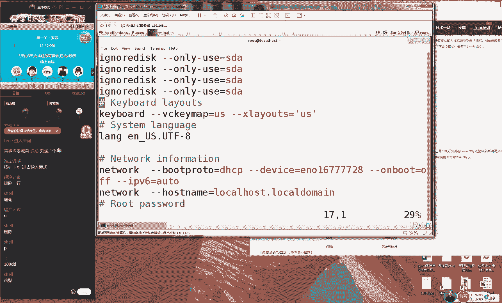

### 变量的作用域
变量有作用域之分，分为仅当前Shell可用的局部变量和所有子进程都可用的全局变量。
```bash
# 定义局部变量
my_var="Hello"
# 将局部变量提升为全局变量
export my_var
# 此时，新启动的Shell或子进程也能访问到my_var
```

### 常用系统环境变量
系统预定义了许多有用的环境变量：
*   `HOME`：当前用户的家目录路径。
*   `SHELL`：当前用户使用的Shell解释器路径。
*   `USER`：当前登录的用户名。
*   `LANG`：系统当前的语言和字符集设置。当出现乱码时，常需要检查此变量。
*   `RANDOM`：每次引用都会生成一个随机整数。
*   `PS1`：定义命令行提示符的格式。

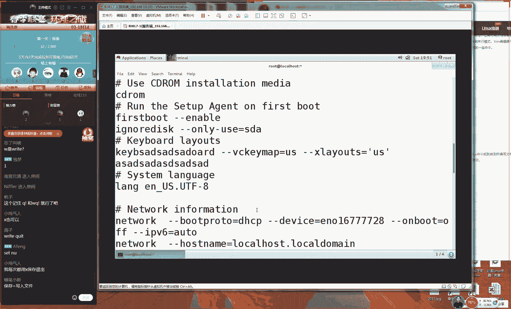

## VIM文本编辑器
在Linux中配置服务，本质上就是修改其对应的配置文件。VIM是一款功能强大、使用极其广泛的文本编辑器，是系统管理员的必备工具。

### 为什么选择VIM？
1.  **通用性强**：绝大多数Linux发行版都默认安装VIM或VI，学习后可以通用于各种服务器环境。
2.  **高效好用**：VIM提供了丰富的快捷键和模式，熟练后可以极大提升文本编辑效率。相较于VI，VIM增加了语法高亮（着色）功能，能帮助识别和预防拼写错误。

### VIM的三种工作模式
VIM的核心在于其三种工作模式，它们构成了一个高效的编辑循环。

1.  **命令模式**：启动VIM后默认进入的模式。在此模式下，可以执行复制、粘贴、删除、搜索等操作，更重要的是，它是进入其他模式的“中转站”。不能直接输入文本。
2.  **输入模式**：在此模式下，可以向文件中输入和编辑文本。可以通过按 `a`（光标后插入）、`i`（光标前插入）、`o`（下一行插入）等键从命令模式进入。
3.  **末行模式**：在此模式下，可以执行保存文件、退出编辑器、查找替换、显示行号等操作。在命令模式下按 `:` 键即可进入。

模式转换关系：**命令模式**是核心，可以切换到**输入模式**和**末行模式**；**输入模式**按 `Esc` 键返回**命令模式**；**末行模式**执行完命令后自动返回**命令模式**。

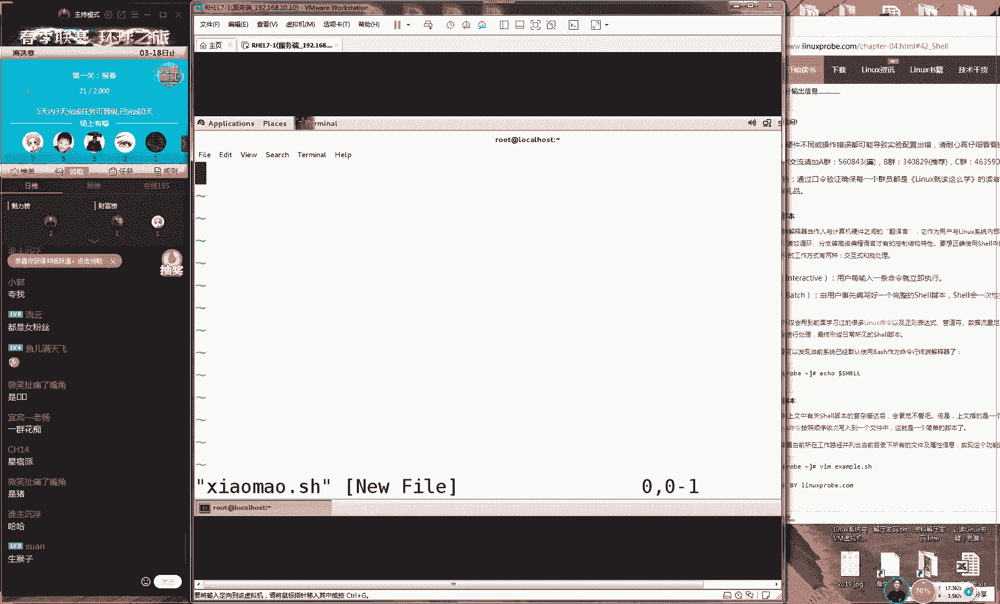

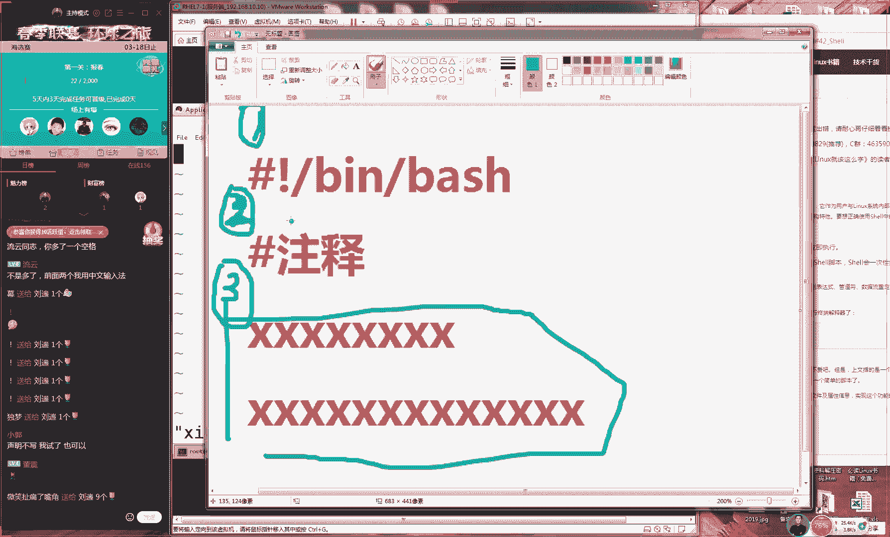

### VIM基本操作实战
上一节我们介绍了VIM的三种模式，本节中我们通过实际操作来熟悉它们。

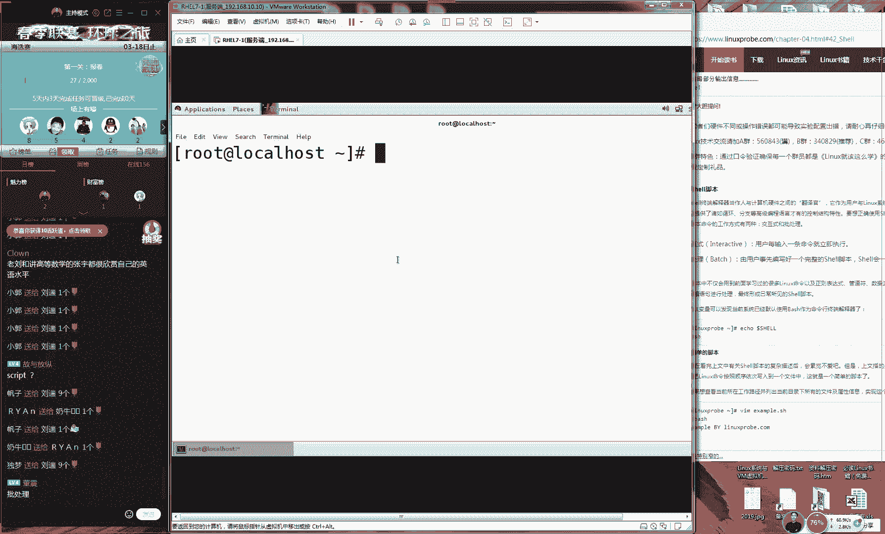

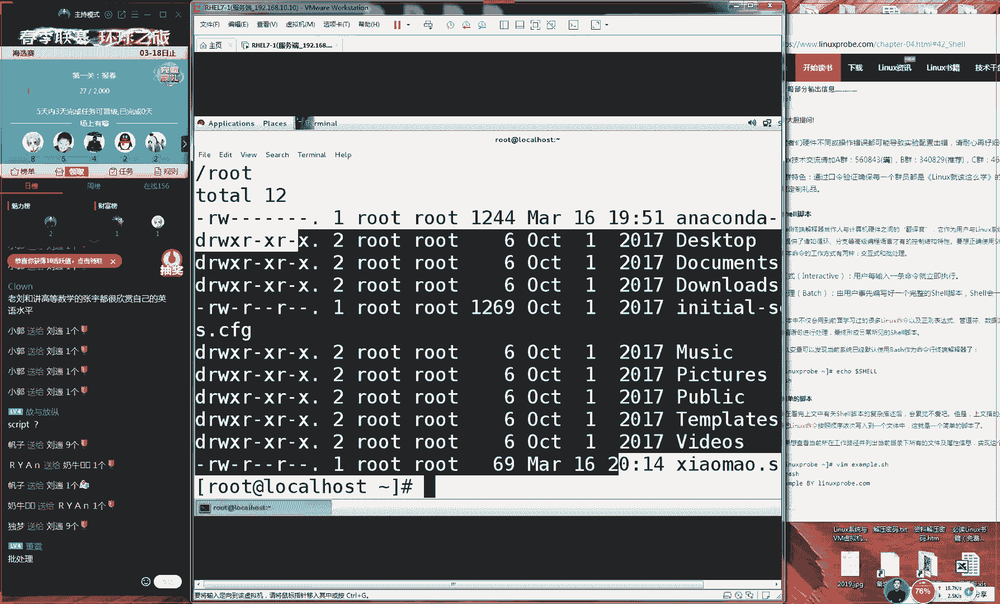

以下是一个简单的编辑流程示例：
1.  使用 `vim filename` 打开文件，进入**命令模式**。
2.  按 `dd` 可以删除光标所在行。
3.  按 `a` 或 `i` 进入**输入模式**，开始编辑文本。
4.  编辑完成后，按 `Esc` 键返回**命令模式**。
5.  按 `:` 进入**末行模式**，输入 `wq` 并回车，保存文件并退出VIM。

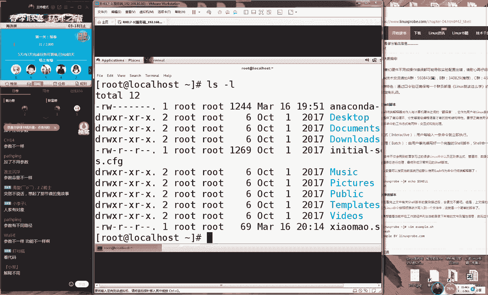

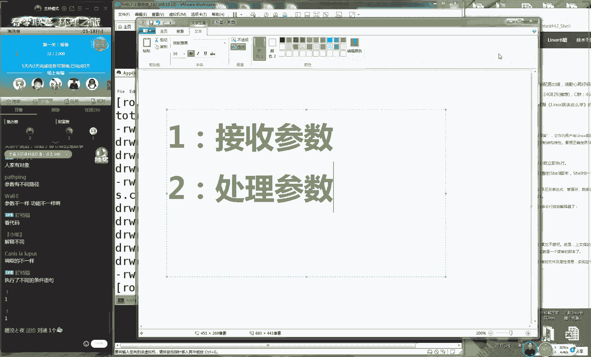

常用命令模式操作：
*   `yy`：复制当前行。
*   `p`：粘贴已复制的内容。
*   `u`：撤销上一次操作。
*   `/keyword`：在文件中搜索“keyword”。

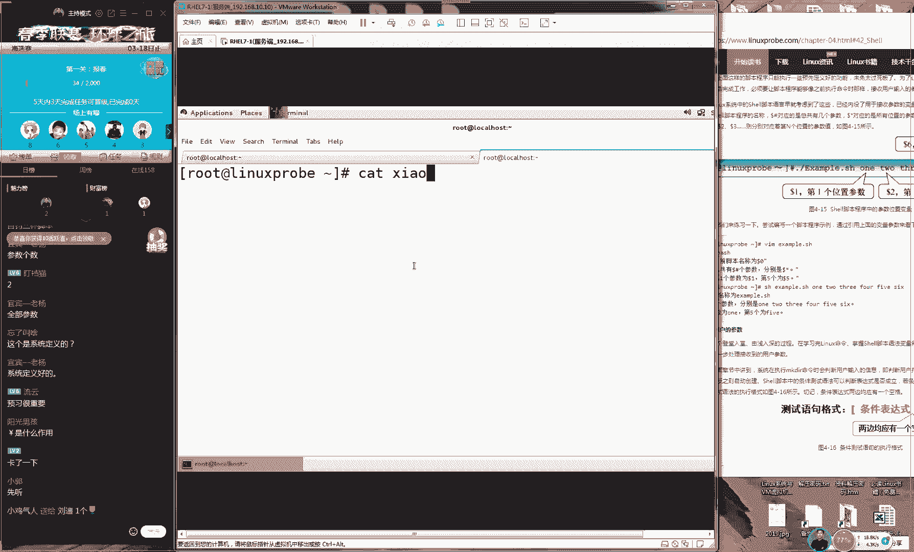

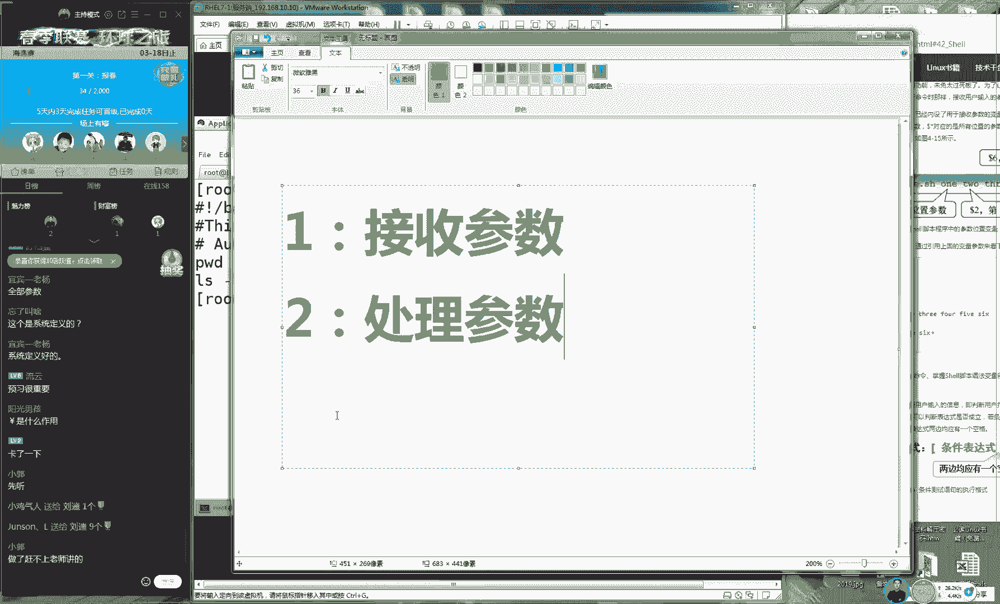

常用末行模式操作：
*   `:w`：保存文件。
*   `:q`：退出编辑器（如果文件有修改未保存，会提示）。
*   `:q!`：强制退出，不保存修改。
*   `:wq` 或 `:x`：保存并退出。
*   `:set nu`：显示行号。

## Shell脚本基础入门
Shell脚本是将一系列命令、控制语句和注释组织在一个文件中，由Shell解释器批量执行的程序。它是实现自动化任务的重要工具。

### 一个简单的Shell脚本
一个完整的Shell脚本通常包含三部分：
1.  **脚本声明**：指定用哪个解释器来执行脚本。**必须写在第一行**。
    ```bash
    #!/bin/bash
    ```
2.  **注释信息**：以 `#` 开头，是对脚本或代码行的说明，不会被执。
    ```bash
    # This is a test script.
    # Author: Liu
    ```
3.  **可执行语句**：即具体的命令或逻辑代码。
    ```bash
    pwd
    ls -l
    ```

将以上内容保存为 `test.sh` 后，需要先赋予执行权限，然后才能运行：
```bash
chmod +x test.sh
./test.sh
# 或者使用bash解释器直接执行
bash test.sh
```

### 接收用户参数
Shell脚本可以接收运行脚本时附加的参数，使其更加灵活。

Shell内置了一些特殊的变量来处理参数：
*   `$0`：当前Shell脚本的程序名称。
*   `$#`：总共的参数个数。
*   `$*`：所有参数的值（作为一个整体）。
*   `$1`, `$2`, `$3`...：分别对应第1、2、3...个参数的值。

示例脚本 `test_args.sh`：
```bash
#!/bin/bash
echo "脚本名: $0"
echo "参数个数: $#"
echo "所有参数: $*"
echo "第一个参数: $1"
echo "第三个参数: $3"
```
运行：
```bash
bash test_args.sh A B C D E F G
```

### 条件测试语句
要让脚本具有“判断”能力，需要使用条件测试。测试的结果可以用 `$?` 来获取（0表示成功/真，非0表示失败/假）。

测试语句的基本格式是 `[ 条件表达式 ]`。注意表达式两边必须有空格。

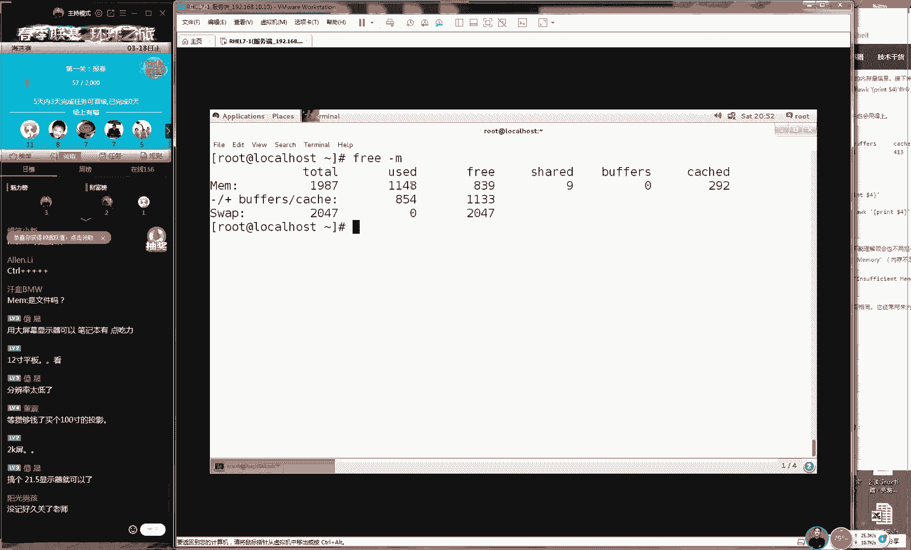

#### 1. 文件测试
用于判断文件的属性，如类型、权限等。
```bash
[ -d /etc ]        # 判断/etc是否是一个目录
echo $?            # 查看上一条测试的结果
[ -f /etc/passwd ] # 判断/etc/passwd是否是一个普通文件
```

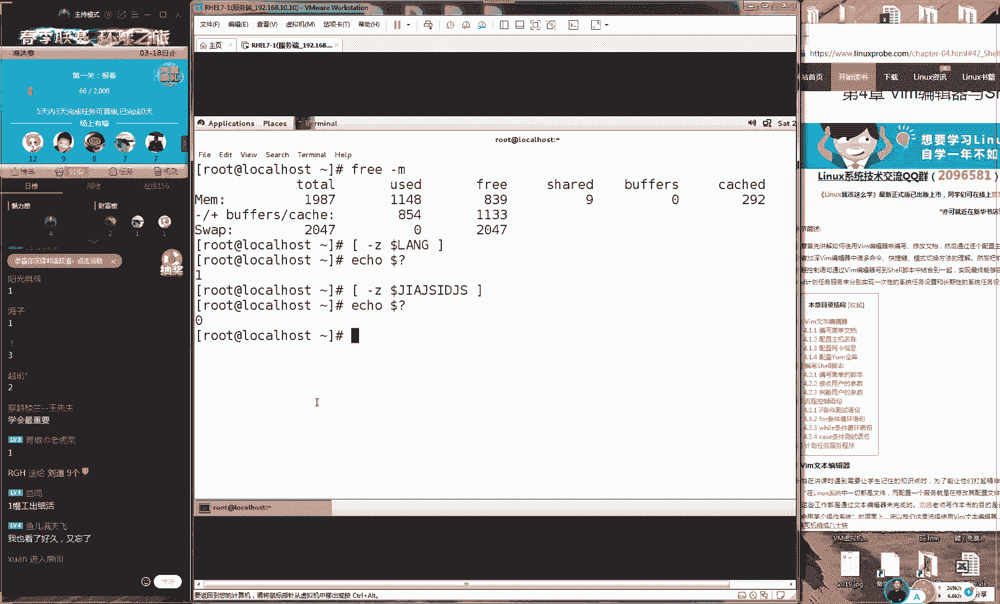

#### 2. 逻辑测试
用于连接多个测试条件。
*   `&&`：逻辑“与”，前面的命令执行**成功**，才执行后面的命令。
    ```bash
    [ -d /etc ] && echo "/etc is a directory."
    ```
*   `||`：逻辑“或”，前面的命令执行**失败**，才执行后面的命令。
    ```bash
    [ ! -d /fake ] || echo "Directory does not exist."
    ```

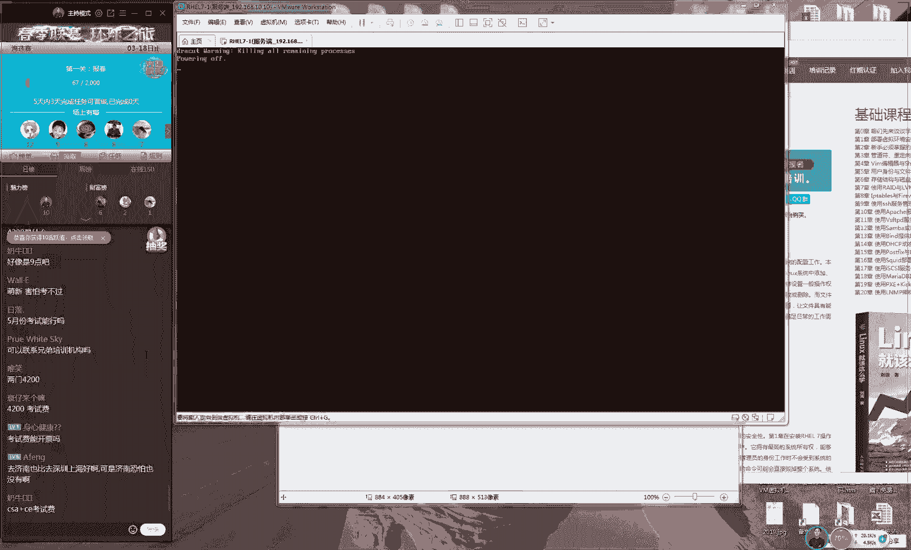

#### 3. 字符串比较
用于比较两个字符串是否相等、是否为空等。
```bash
[ $USER = "root" ] && echo "You are admin." || echo "You are user."
[ -z $MY_VAR ]     # 判断变量MY_VAR是否为空（未定义）
```

#### 4. 整数比较
用于比较两个整数值。**切记不要使用数学符号（>，<，=），而要使用专用的整数比较运算符**。
```bash
[ 5 -eq 5 ]   # 判断5是否等于5 (equal)
[ 10 -gt 5 ]  # 判断10是否大于5 (greater than)
[ 3 -le 10 ]  # 判断3是否小于等于10 (less than or equal)
```

### 实战：监控内存使用量
我们可以结合命令、变量和条件测试，编写一个简单的内存监控脚本。
```bash
#!/bin/bash
# 获取当前空闲内存量（KB），这里取free命令输出中Mem行的第四列
free_mem=$(free | grep Mem | awk '{print $4}')
# 判断空闲内存是否小于1024KB (1MB)
if [ $free_mem -lt 1024 ]; then
    echo "Warning: Free memory is low! Only ${free_mem}KB left."
else
    echo "Memory is OK. Free: ${free_mem}KB."
fi
```
这个脚本演示了如何提取命令输出中的特定数据，并根据该数据进行判断和告警。

## 总结
本节课我们一起学习了Linux命令执行的底层原理，理解了PATH环境变量在其中的关键作用。我们深入探讨了环境变量的概念、使用方法和常见系统变量。随后，我们重点掌握了VIM文本编辑器的三种模式及其切换，以及基本的编辑、保存操作。最后，我们开启了Shell脚本编程的大门，学习了脚本的基本结构、如何接收参数以及使用条件测试语句让脚本具备简单的逻辑判断能力。这些内容是成为高效Linux系统管理员的重要基石，请务必多加练习。