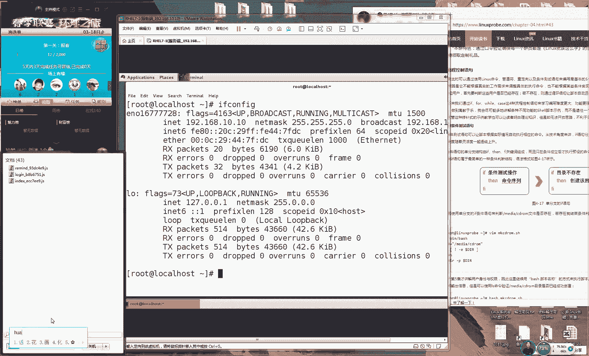
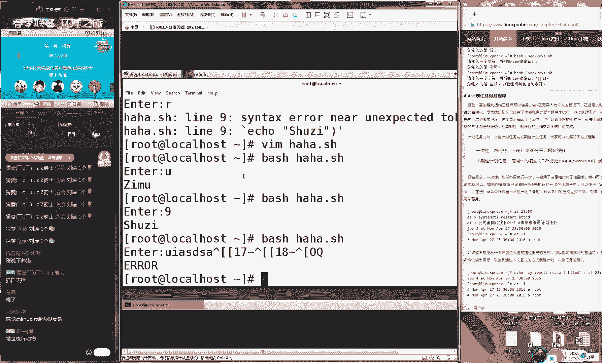
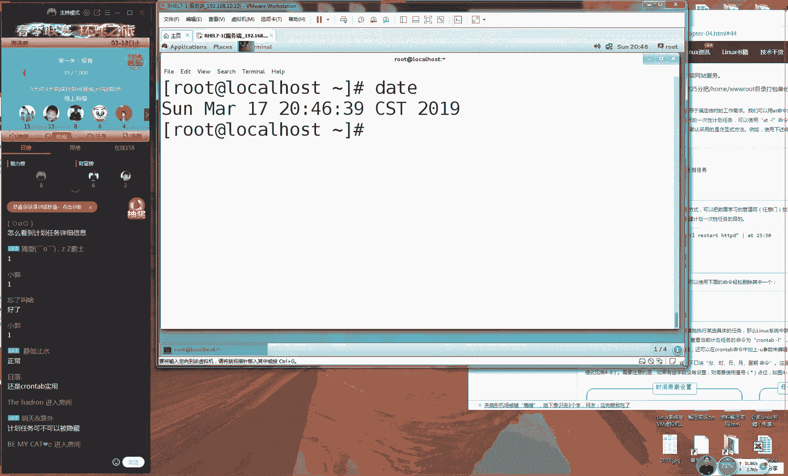
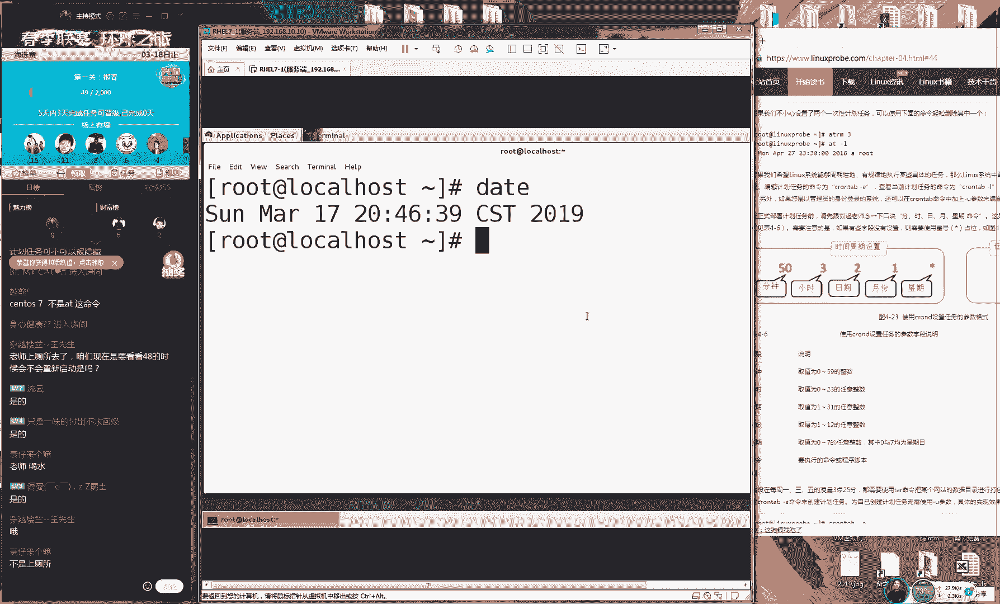
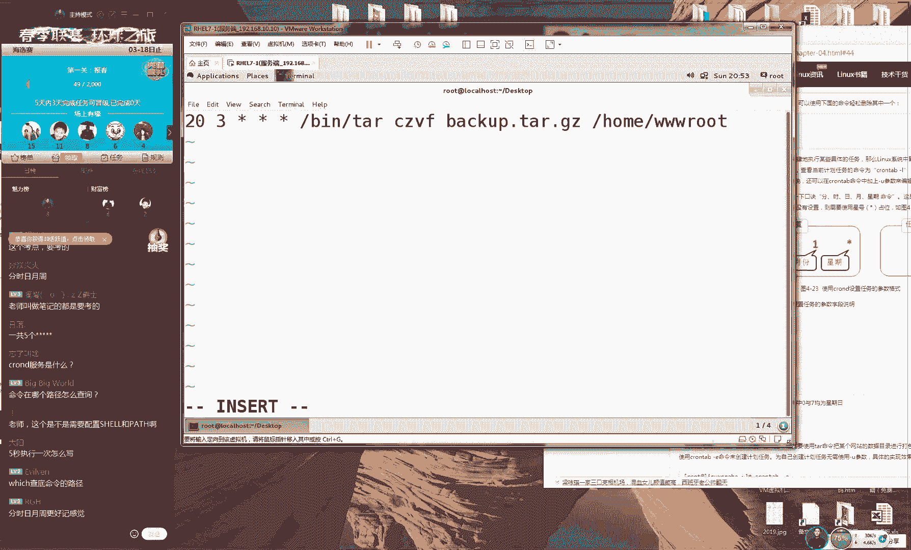
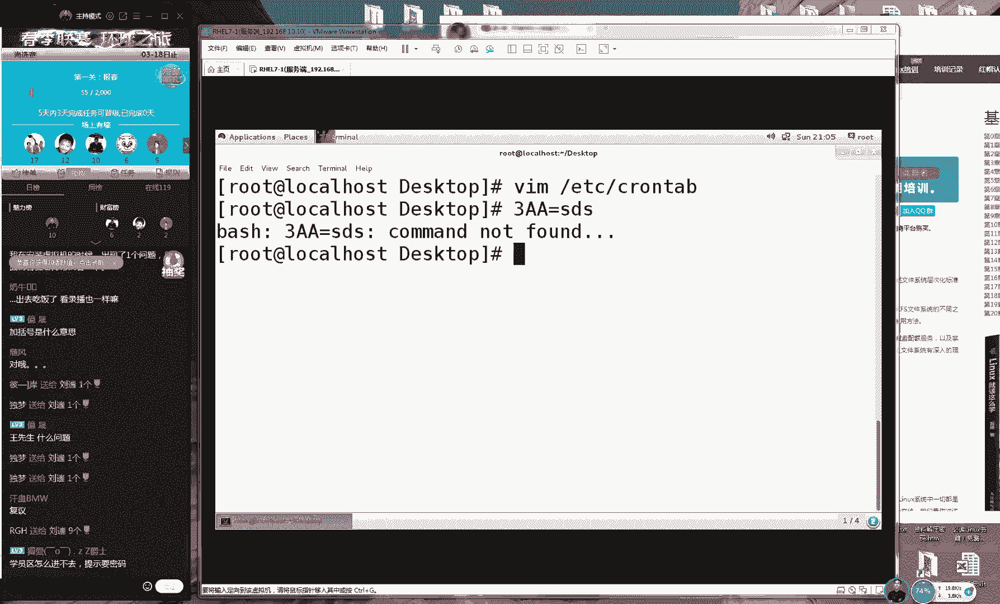

# RHCE培训课程：P6：脚本编写进阶与计划任务




在本节课中，我们将深入学习Shell脚本编写的高级技巧，包括条件测试语句、循环语句以及如何配置计划任务来自动化脚本执行。这些知识是成为一名高效Linux系统管理员的关键。

## 逻辑非操作符补充

上一节课我们介绍了条件测试语句，但遗漏了一个重要的操作符——逻辑非。本节中我们来补充讲解。

逻辑非使用叹号 `!` 表示，其作用是对测试结果取反。

**示例**：判断当前登录用户是否**不是**root。
```bash
[ ! $USER = root ]
```
如果当前用户是root，上述测试结果为假；如果当前用户不是root，则测试结果为真。

## 条件测试语句

上一节我们介绍了脚本的基本结构，本节中我们来看看如何让脚本根据条件执行不同的命令。

条件测试语句 `if` 允许脚本根据测试结果的真假来决定执行路径。它主要分为三种结构：单分支、双分支和多分支。

### 单分支 if 语句

单分支语句仅在条件成立时执行特定操作。

**示例**：检查目录是否存在，若不存在则创建它。
```bash
#!/bin/bash
if [ ! -e /media/haha ]
then
    mkdir -p /media/haha
fi
```
以下是脚本执行流程：
1.  使用 `-e` 测试 `/media/haha` 是否存在。
2.  使用 `!` 对结果取反，即测试“目录不存在”是否为真。
3.  如果条件为真（目录确实不存在），则执行 `mkdir -p` 命令创建目录。
4.  `fi` 用于结束 `if` 语句块。

### 双分支 if 语句

双分支语句在条件成立时执行一个操作，不成立时执行另一个操作。

**示例**：测试一个主机是否在线。
```bash
#!/bin/bash
ping -c 3 -i 0.2 -W 3 $1 &> /dev/null
if [ $? -eq 0 ]
then
    echo "$1 is online."
else
    echo "$1 is offline."
fi
```
以下是脚本执行流程：
1.  使用 `ping` 命令测试脚本接收的第一个参数（`$1`）代表的IP地址。
2.  `$?` 用于获取上一条命令（`ping`）的返回值。返回值为0表示成功（主机在线）。
3.  如果返回值为0，则输出主机在线信息。
4.  否则（返回值非0），输出主机离线信息。

### 多分支 if 语句

多分支语句允许对多个条件进行连续判断。

**示例**：根据输入的成绩分数输出评级。
```bash
#!/bin/bash
read -p "Enter your score (0-100): " GRADE
if [ $GRADE -ge 85 ] && [ $GRADE -le 100 ]
then
    echo "Excellent"
elif [ $GRADE -ge 70 ] && [ $GRADE -le 84 ]
then
    echo "Pass"
else
    echo "Fail"
fi
```
以下是脚本执行流程：
1.  使用 `read` 命令读取用户输入的成绩，并赋值给变量 `GRADE`。
2.  第一个 `if` 判断成绩是否在85到100之间，若是则输出“Excellent”。
3.  `elif` 进行第二次判断，检查成绩是否在70到84之间，若是则输出“Pass”。
4.  如果以上条件都不满足，则执行 `else` 分支，输出“Fail”。

## 循环语句

上一节我们学习了如何让脚本做选择，本节中我们来看看如何让脚本重复执行任务。

循环语句用于重复执行一系列命令，直到满足特定条件为止。

### for 循环语句

`for` 循环用于遍历一个列表中的每个项目。

**示例1**：从用户列表文件中批量创建用户并设置密码。
```bash
#!/bin/bash
read -p "Enter the default password for users: " PASSWD
for UNAME in `cat users.txt`
do
    id $UNAME &> /dev/null
    if [ $? -eq 0 ]
    then
        echo "$UNAME already exists."
    else
        useradd $UNAME &> /dev/null
        echo $PASSWD | passwd --stdin $UNAME &> /dev/null
        echo "$UNAME created successfully."
    fi
done
```
以下是脚本执行流程：
1.  读取一个默认密码。
2.  从 `users.txt` 文件中逐行读取用户名，赋值给变量 `UNAME`。
3.  检查用户是否已存在。
4.  如果用户不存在，则创建用户并设置密码。

**示例2**：循环测试一个IP地址列表中的主机是否在线。
```bash
#!/bin/bash
HLIST=$(cat ipadds.txt)
for IP in $HLIST
do
    ping -c 3 -i 0.2 -W 3 $IP &> /dev/null
    if [ $? -eq 0 ]
    then
        echo "$IP is online."
    else
        echo "$IP is offline."
    fi
done
```
以下是脚本执行流程：
1.  将文件 `ipadds.txt` 的内容（IP地址列表）赋值给变量 `HLIST`。
2.  遍历 `HLIST` 中的每个IP地址。
3.  对每个IP地址执行 `ping` 测试，并根据结果输出在线或离线状态。

### while 循环语句

`while` 循环会一直执行，直到测试条件不再成立。

**示例**：一个简单的猜数字游戏。
```bash
#!/bin/bash
PRICE=$(expr $RANDOM % 1000)
TIMES=0
while true
do
    read -p "Guess the price (0-999): " INT
    let TIMES++
    if [ $INT -eq $PRICE ]
    then
        echo "Correct! The price is $PRICE."
        echo "You guessed $TIMES times."
        exit 0
    elif [ $INT -gt $PRICE ]
    then
        echo "Too high!"
    else
        echo "Too low!"
    fi
done
```
以下是脚本执行流程：
1.  使用 `$RANDOM` 变量生成一个0-999的随机数作为目标价格。
2.  进入无限循环（`while true`）。
3.  读取用户猜测的数字。
4.  猜测次数 `TIMES` 增加1。
5.  判断猜测数字与目标价格的关系，并给出提示。
6.  猜中后，输出结果并使用 `exit 0` 退出脚本和循环。

### case 条件语句

`case` 语句用于对变量的值进行多重匹配，比多个 `if-elif` 语句更清晰。

**示例**：判断用户输入的是字母、数字还是其他字符。
```bash
#!/bin/bash
read -p "Enter a character: " KEY
case "$KEY" in
[a-z]|[A-Z])
    echo "You entered a letter."
    ;;
[0-9])
    echo "You entered a number."
    ;;
*)
    echo "You entered a special character or more than one character."
    ;;
esac
```
以下是脚本执行流程：
1.  读取用户输入的一个字符。
2.  使用 `case` 进行匹配：
    *   `[a-z]|[A-Z]`：匹配单个大小写字母。
    *   `[0-9]`：匹配单个数字。
    *   `*`：匹配其他所有情况（通配符）。
3.  根据匹配结果输出相应信息。
4.  `esac` 是 `case` 的反写，用于结束语句块。

## 计划任务

脚本编写完成后，我们通常需要定期自动执行它们。本节中我们来看看如何配置计划任务。

计划任务允许我们在指定的时间自动运行命令或脚本，实现自动化运维。

### 一次性计划任务 (at)

`at` 命令用于安排一个在指定时间点运行一次的任务。

**使用方法**：
1.  **创建任务**：`at 20:48`，然后输入要执行的命令（如 `reboot`），按 `Ctrl+D` 保存。
2.  **查看任务列表**：`at -l`
3.  **查看任务详情**：`at -c 任务编号`
4.  **删除任务**：`atrm 任务编号`

### 周期性计划任务 (cron)




`cron` 服务用于安排周期性执行的任务。其配置格式口诀为：**分 时 日 月 星期 命令**






**格式详解**：
*   **分**：0-59
*   **时**：0-23
*   **日**：1-31
*   **月**：1-12
*   **星期**：0-7 (0和7都代表周日)
*   **命令**：要执行的命令或脚本的**绝对路径**


**特殊符号**：
*   `*`：代表任意值（如：`* * * * *` 表示每分钟执行一次）。
*   `,`：代表多个不连续的时间点（如：`0 3 * * 1,3,5` 表示每周一、三、五的3点0分执行）。
*   `-`：代表一个连续的时间范围（如：`0 5 * * 1-5` 表示每周一到周五的5点0分执行）。
*   `/`：代表间隔频率（如：`*/10 * * * *` 表示每10分钟执行一次）。



**配置方法**：
使用 `crontab -e` 命令编辑当前用户的计划任务列表。编辑完成后保存退出即可生效。

**常用示例**：
*   `30 3 * * * /backup.sh`：每天凌晨3点30分执行备份脚本。
*   `0 */2 * * * /usr/bin/logger “Hello”`：每两小时整点记录一条日志。
*   `0 0 1 * * /monthly-report.sh`：每月1日0点0分执行月度报告脚本。

**管理命令**：
*   `crontab -l`：列出当前用户的计划任务。
*   `crontab -r`：删除当前用户的所有计划任务（慎用！）。

## 总结



本节课中我们一起学习了Shell脚本编写的核心进阶知识。我们掌握了如何使用 `if` 条件语句让脚本具备判断能力，使用 `for` 和 `while` 循环语句让脚本能够重复执行任务，以及使用 `case` 语句进行清晰的多重匹配。最后，我们学习了如何通过 `at` 和 `cron` 配置计划任务，实现脚本的自动化定时执行。这些技能将极大地提升你在Linux系统管理中的工作效率和自动化水平。请务必通过实践练习来巩固这些概念。