# RHCE红帽认证工程师培训课程：P7：用户身份与文件权限

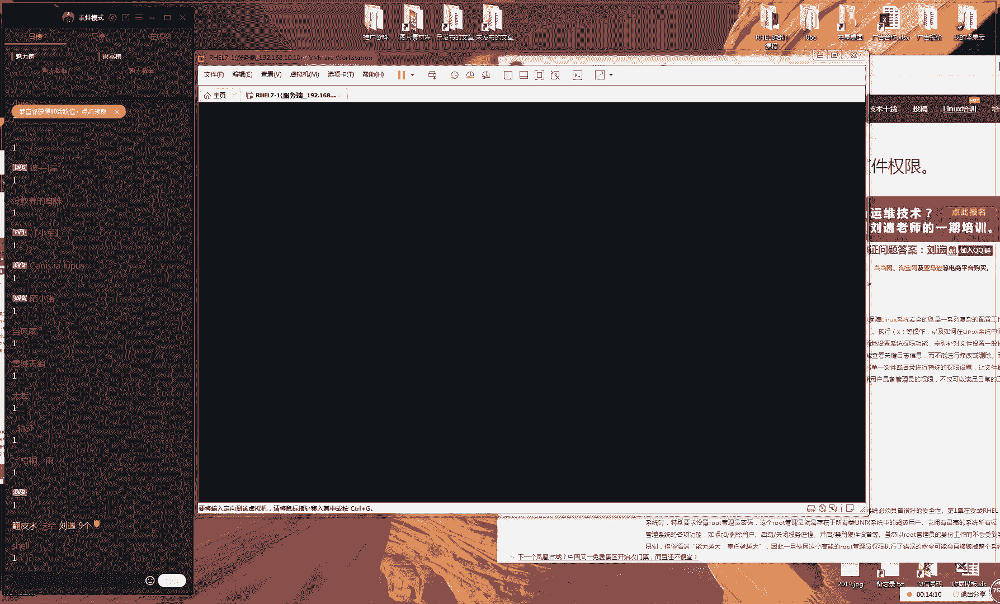

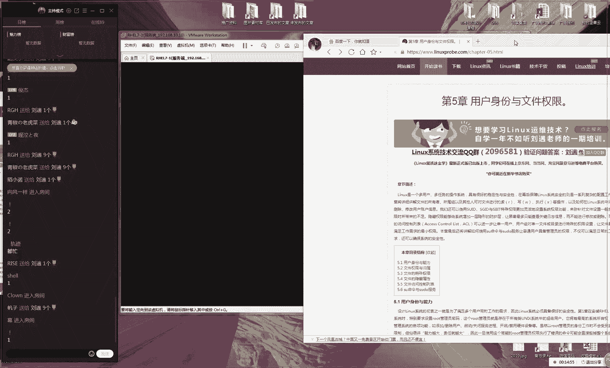

## 概述

在本节课中，我们将学习Linux系统中用户身份的分类、文件权限的构成与计算，以及如何通过命令管理用户、用户组和文件权限。这些知识是系统管理的基础，对于后续的学习至关重要。

## 用户身份分类

Linux系统中有三类用户身份，它们共同协作以运行和管理系统。

### 管理员用户

管理员用户是系统中权限最高的用户，默认名称为 `root`。其用户身份标识符（UID）为 `0`。管理员对系统拥有完全的控制权，限制最小。

**核心概念：**
- **UID (User IDentifier)**：用户的唯一身份标识符，类似于身份证号。
- **管理员UID**：`0`

### 系统用户

系统用户主要用于运行系统服务。将服务绑定到特定用户，可以提升系统安全性。即使某个服务被入侵，攻击者的权限也仅限于该服务对应的系统用户，无法对整个系统造成更大破坏。

在RHEL 7中，系统用户的UID范围是 `1` 到 `999`。

### 普通用户

普通用户是日常工作使用的账户。在RHEL 7中，普通用户的UID从 `1000` 开始，理论上可以创建数百万个用户，足以满足所有工作需求。

**总结：**
- **管理员**：UID为 `0`，权限最大。
- **系统用户**：UID为 `1-999`，用于运行服务。
- **普通用户**：UID从 `1000` 开始，用于日常工作。

## 用户与用户组管理

上一节我们介绍了用户的分类，本节中我们来看看如何创建和管理用户及用户组。

### 管理用户

以下是管理用户的核心命令。

**添加用户**
使用 `useradd` 命令创建新用户。
```bash
useradd username
```
创建用户时可以指定参数，如UID、家目录等。
```bash
useradd -u 88888 boss          # 创建用户boss，并指定UID为88888
useradd -d /home/custom user1  # 创建用户user1，并指定家目录
```

**修改用户信息**
使用 `usermod` 命令修改现有用户的属性。
```bash
usermod -u 666666 username     # 修改用户的UID
usermod -G groupname username  # 将用户添加到扩展组
```

**删除用户**
使用 `userdel` 命令删除用户。`-r` 参数会同时删除用户的家目录和邮件池。
```bash
userdel username      # 删除用户，保留家目录
userdel -r username   # 删除用户及其家目录
```

**设置用户密码**
使用 `passwd` 命令为用户设置密码。
```bash
passwd username       # 为指定用户设置密码
```
可以使用管道符和 `echo` 命令非交互式地设置密码。
```bash
echo "newpassword" | passwd --stdin username
```

### 管理用户组

用户组用于对用户进行批量管理，可以理解为公司的“部门”。

**添加用户组**
使用 `groupadd` 命令创建新用户组。
```bash
groupadd groupname
```
用户组信息保存在 `/etc/group` 文件中。

**基本组与扩展组**
- **基本组**：创建用户时自动生成的、与用户同名的组。每个用户有且仅有一个基本组。
- **扩展组**：用户后续加入的其他组。一个用户可以属于多个扩展组。

使用 `usermod` 命令修改用户的组关系。
```bash
usermod -G groupname username  # 将用户添加到扩展组（会覆盖原有扩展组列表）
usermod -aG groupname username # 将用户追加到扩展组（推荐）
```

## 文件权限详解

理解了用户和组之后，我们来看看如何控制他们对文件的访问权限。

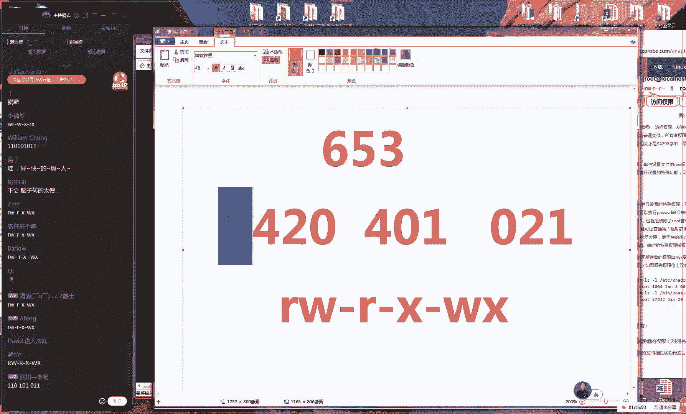

### 文件类型与权限视图

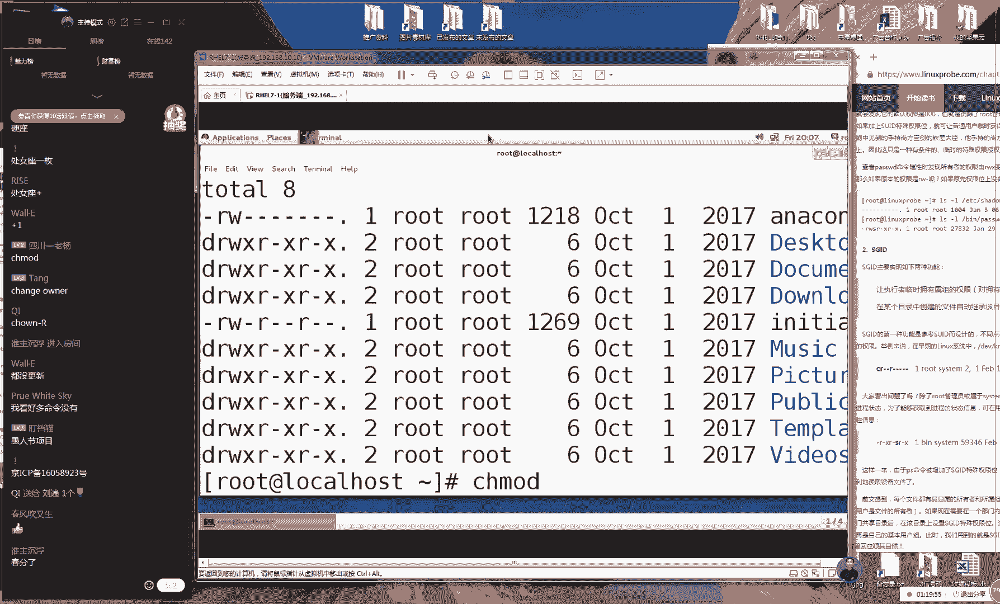

使用 `ls -l` 命令查看文件详细信息时，第一列的第一个字符表示文件类型。
- `-`：普通文件（文本文件、配置文件等）
- `d`：目录文件
- `l`：链接文件
- `b`：块设备文件（如硬盘）
- `c`：字符设备文件（如键盘）

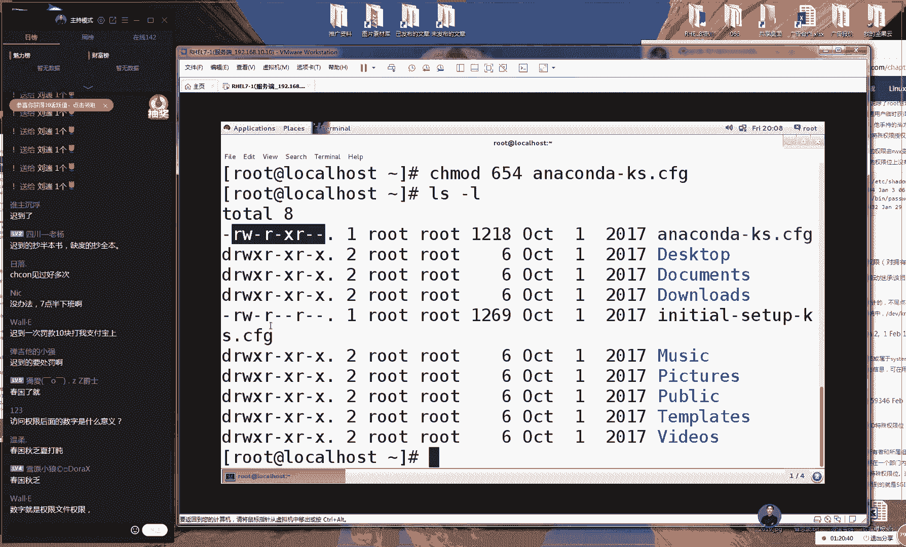

随后的9个字符代表文件的权限，分为三段，每段三位：
- **前三位**：文件所有者的权限
- **中三位**：文件所属组的权限
- **后三位**：其他用户的权限

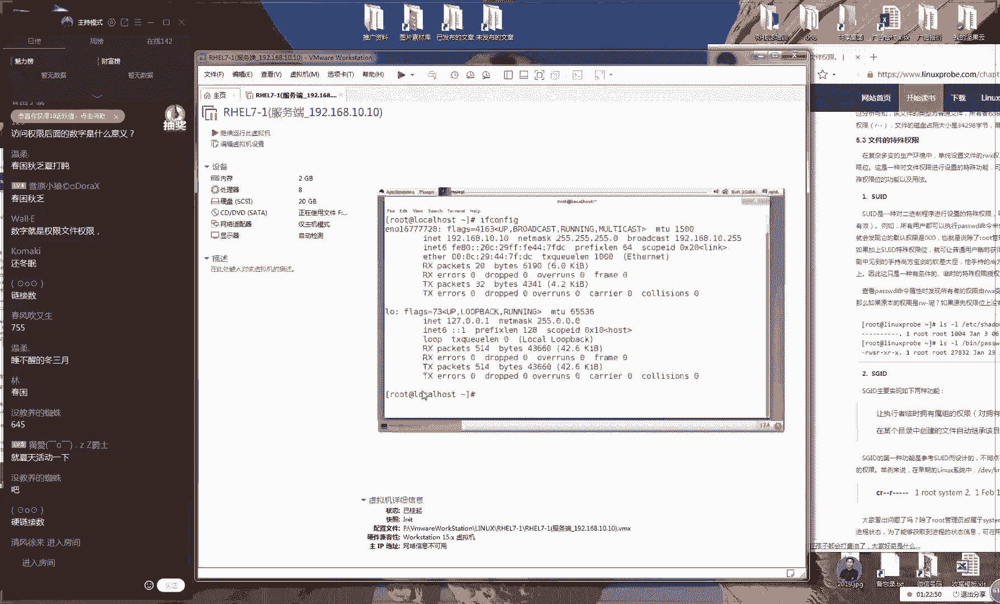

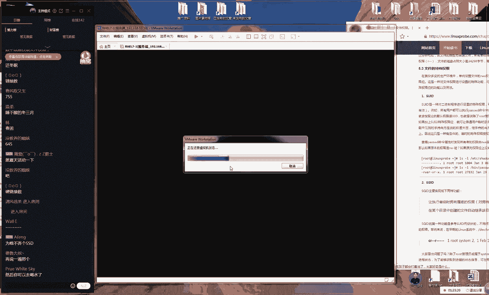

### 权限字符与数字表示

权限字符有三种：
- `r` (Read)：读取权限，数字表示为 `4`
- `w` (Write)：写入权限，数字表示为 `2`
- `x` (Execute)：执行权限，数字表示为 `1`
- `-`：无对应权限，数字表示为 `0`

**权限转换示例：**
权限 `rwxr-xr--` 转换为数字：
- 所有者：`rwx` = 4+2+1 = `7`
- 所属组：`r-x` = 4+0+1 = `5`
- 其他人：`r--` = 4+0+0 = `4`
因此，数字表示为 `754`。

反之，数字 `642` 转换为权限：
- `6` = 4+2+0 -> `rw-`
- `4` = 4+0+0 -> `r--`
- `2` = 0+2+0 -> `-w-`
因此，权限字符为 `rw-r---w-`。

### 权限对文件和目录的作用

权限 `rwx` 对文件和目录的作用不同：

**对文件的作用：**
- `r`：读取文件内容
- `w`：修改文件内容
- `x`：执行该文件（如果它是脚本或程序）

**对目录的作用：**
- `r`：读取目录内的文件列表
- `w`：在目录内创建、删除、重命名文件
- `x`：进入该目录

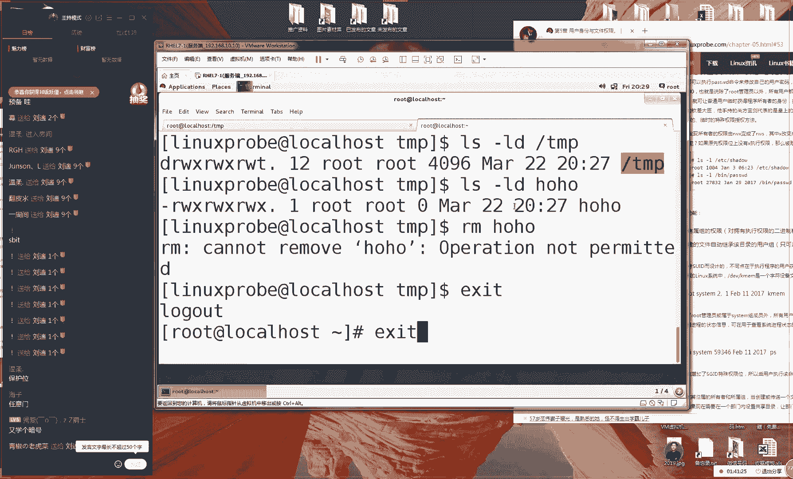

### 修改文件权限与归属

**修改文件权限**
使用 `chmod` 命令，可以使用数字法或符号法。
```bash
chmod 754 filename      # 数字法
chmod u=rwx,g=rx,o=r filename  # 符号法
```

**修改文件所有者和所属组**
使用 `chown` 命令。
```bash
chown owner:group filename  # 同时修改所有者和所属组
chown owner filename        # 仅修改所有者
chown :group filename       # 仅修改所属组
```

## 特殊权限

除了基本读写执行权限，Linux还有三种特殊权限，用于扩展功能。

### SUID (Set User ID)

**作用**：当用户执行带有SUID权限的文件时，会临时获取文件所有者的权限。
**典型例子**：`/usr/bin/passwd` 命令。普通用户执行它修改密码时，会临时获得root权限，从而能写入 `/etc/shadow` 文件。
**设置方法**：在所有者执行位显示为 `s`。
```bash
chmod u+s filename
# 数字法：在三位数字前加上4，如4755
chmod 4755 filename
```

### SGID (Set Group ID)

**作用**：
1.  对文件：执行时临时获取文件所属组的权限。
2.  对目录：在该目录内创建的新文件，其所属组会自动继承目录的所属组。
**设置方法**：在所属组执行位显示为 `s`。
```bash
chmod g+s directoryname
# 数字法：在三位数字前加上2，如2755
chmod 2755 directoryname
```

### SBIT (Sticky Bit)

**作用**：仅对目录有效。设置了SBIT的目录，用户只能删除自己创建的文件，不能删除其他用户的文件。
**典型例子**：系统的 `/tmp` 临时目录。
**设置方法**：在其他用户执行位显示为 `t`。
```bash
chmod o+t directoryname
# 数字法：在三位数字前加上1，如1755
chmod 1755 directoryname
```

**特殊权限数字表示总结**：
- SUID: `4`
- SGID: `2`
- SBIT: `1`
设置时加在普通权限数字前，如 `chmod 4755 file`。

## 隐藏权限

隐藏权限用于进一步控制文件，提供基本和特殊权限之外的保护。

### 管理隐藏权限

使用 `chattr` 命令设置，使用 `lsattr` 命令查看。
```bash
chattr +i filename  # 添加i属性（不可修改、删除、重命名）
chattr -i filename  # 移除i属性
lsattr filename     # 查看文件的隐藏属性
```

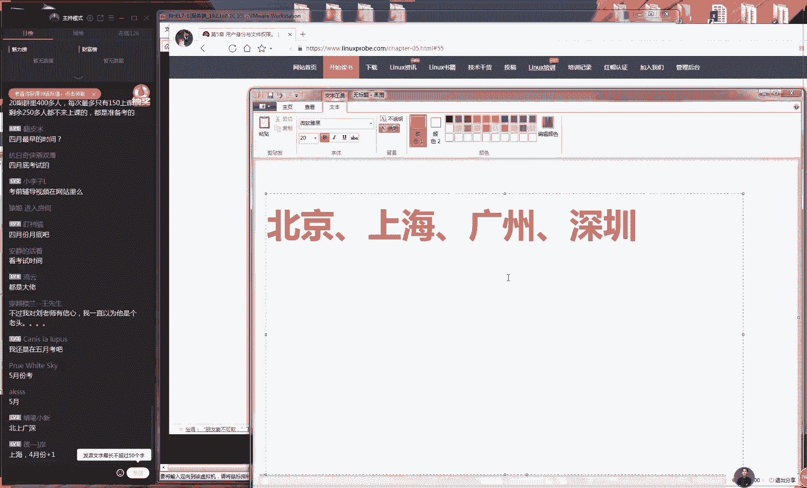

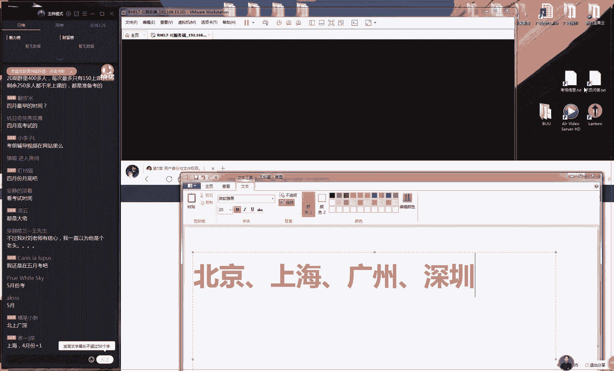

**常用属性：**
- `i` (Immutable)：文件不可被修改、删除、重命名、设置链接。
- `a` (Append only)：文件内容只能追加，不能删除或修改已有内容。

## 访问控制列表 (ACL)

ACL可以对单个用户或用户组设置精细的文件访问权限，实现“精准扶贫”。

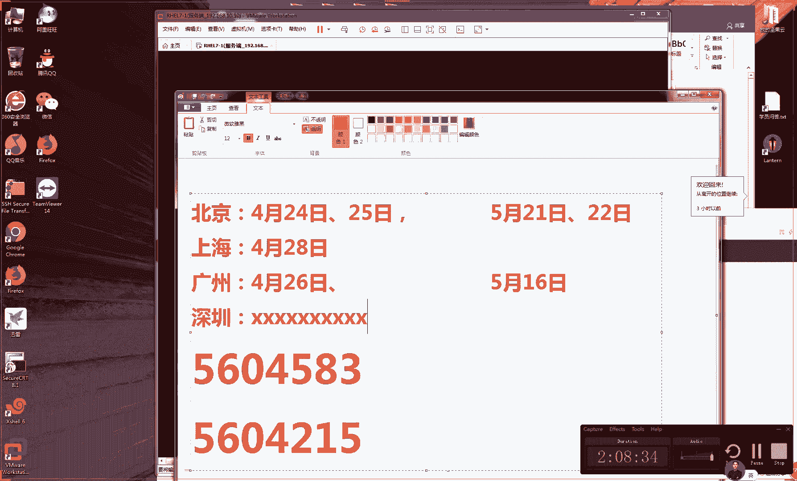

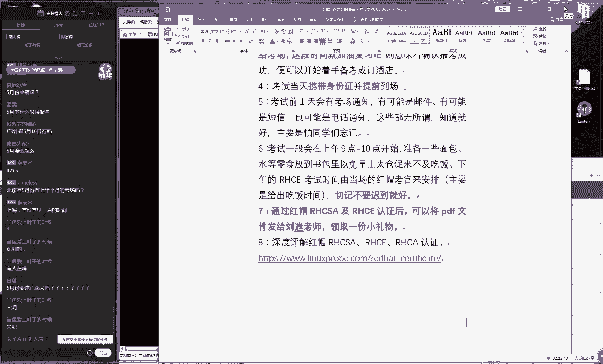

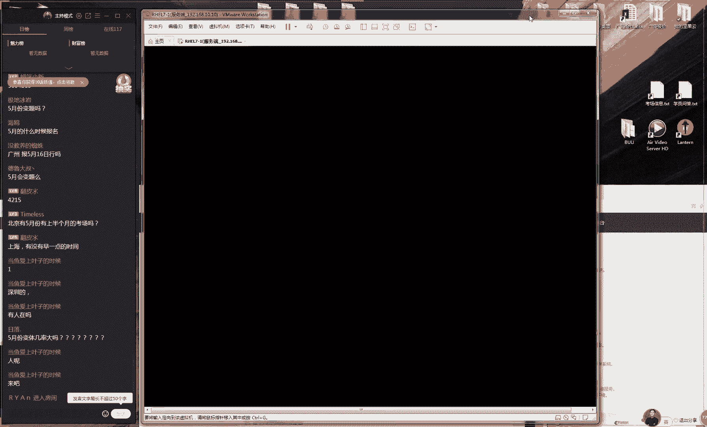

### 设置与查看ACL

**设置ACL**
```bash
setfacl -Rm u:username:rwx /path/to/directory  # 对目录递归设置用户权限
setfacl -m g:groupname:rx filename             # 对文件设置组权限
```

**查看ACL**
```bash
getfacl filename
```
设置了ACL的文件，在 `ls -l` 显示的权限位末尾会有一个 `+` 号。

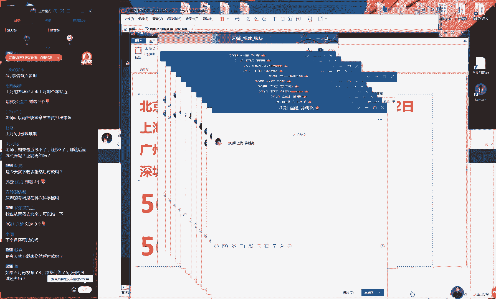

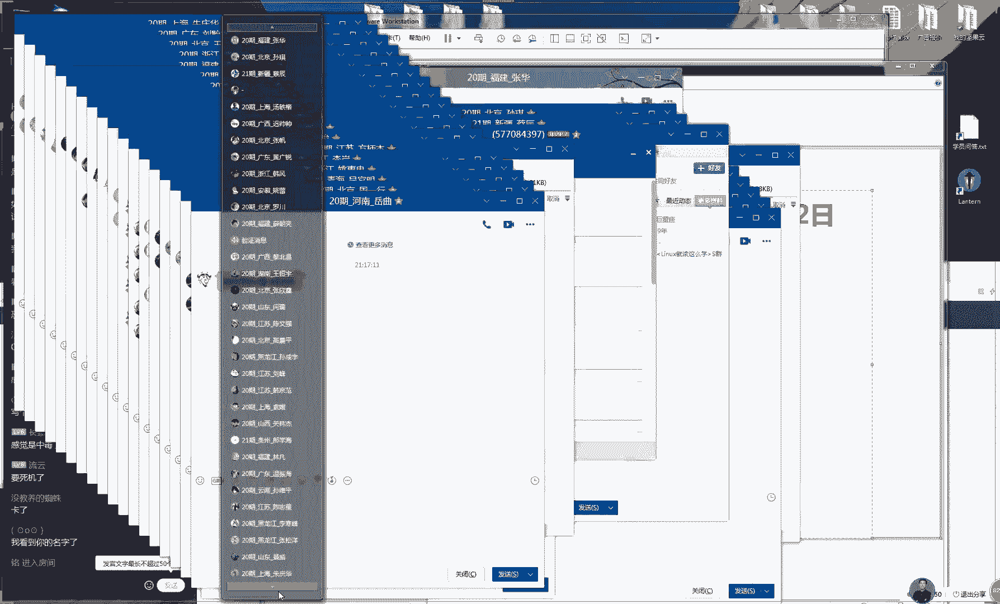

**示例**：
1.  创建一个目录并清空其基本权限：`chmod 000 /home/shared`
2.  为特定用户张三赋予所有权限：`setfacl -m u:zhangsan:rwx /home/shared`
3.  此时，只有用户张三可以访问该目录，其他用户（如李四）无法进入。

## 总结

本节课中我们一起学习了Linux系统管理的核心基础：
1.  **用户身份**：分为管理员(UID 0)、系统用户(UID 1-999)和普通用户(UID >=1000)。
2.  **用户与组管理**：使用 `useradd`, `usermod`, `userdel`, `groupadd`, `passwd` 等命令。
3.  **文件权限**：理解 `rwx` 对文件和目录的不同含义，掌握数字法（如754）与字符法的转换。
4.  **权限管理命令**：使用 `chmod` 修改权限，使用 `chown` 修改归属。
5.  **特殊权限**：SUID(4)、SGID(2)、SBIT(1)的作用与设置。
6.  **隐藏权限**：使用 `chattr` 和 `lsattr` 管理文件的 `i`、`a` 等属性。
7.  **访问控制列表(ACL)**：使用 `setfacl` 和 `getfacl` 进行更精细的权限控制。

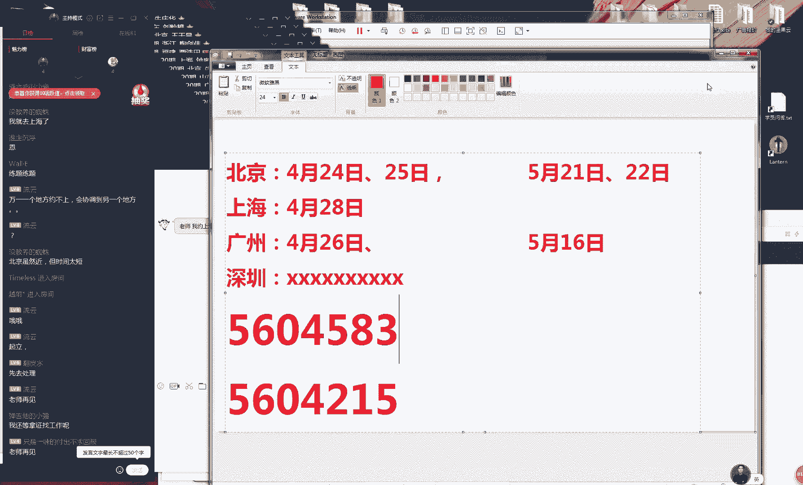

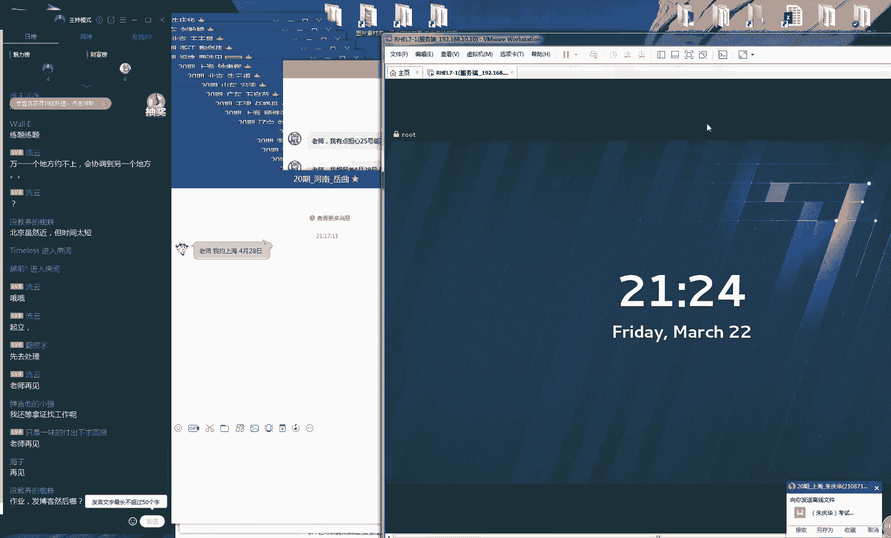

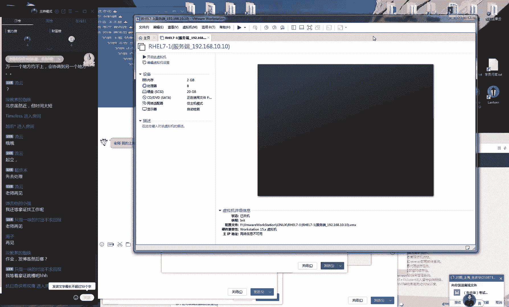

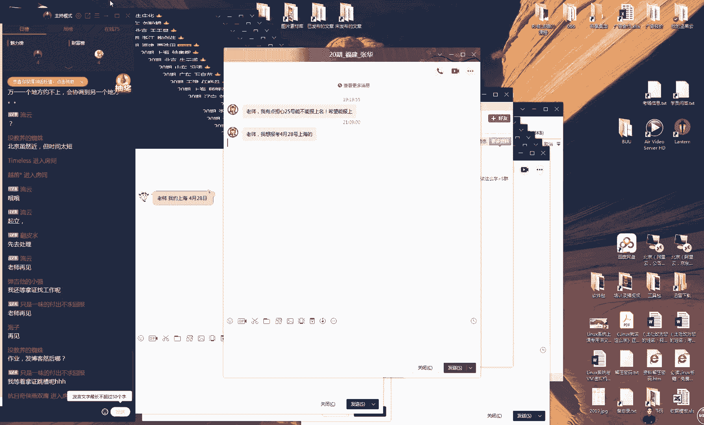

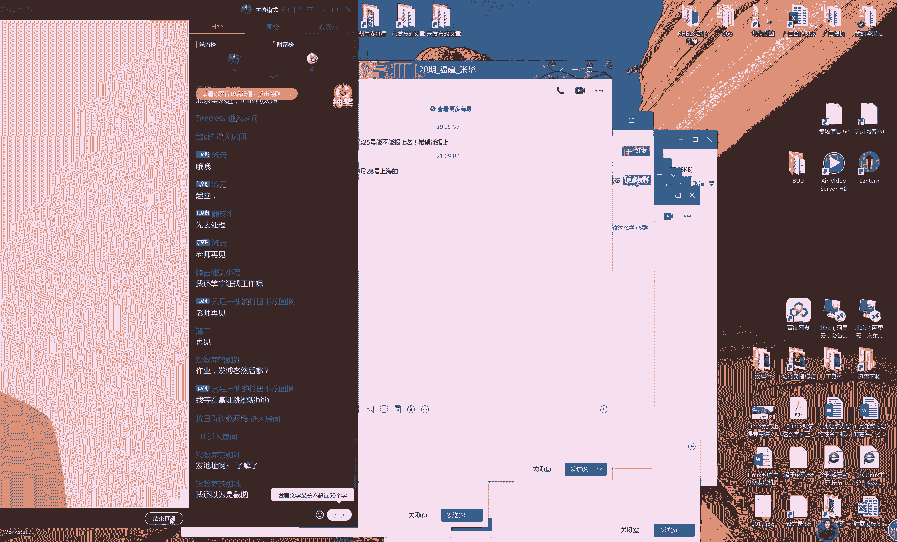

这些知识是后续学习各种系统服务和管理任务的基础，请务必通过练习熟练掌握。