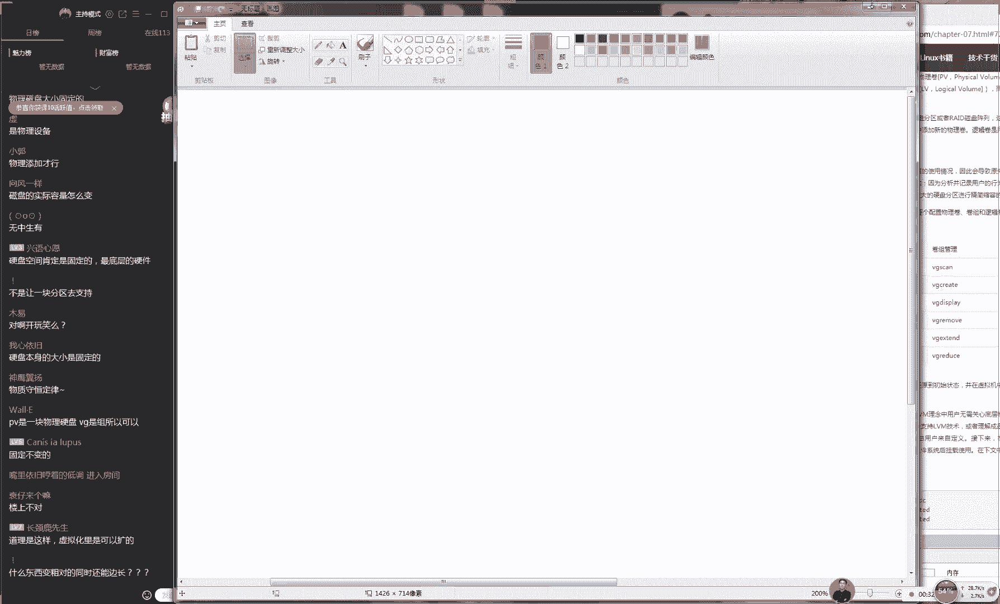
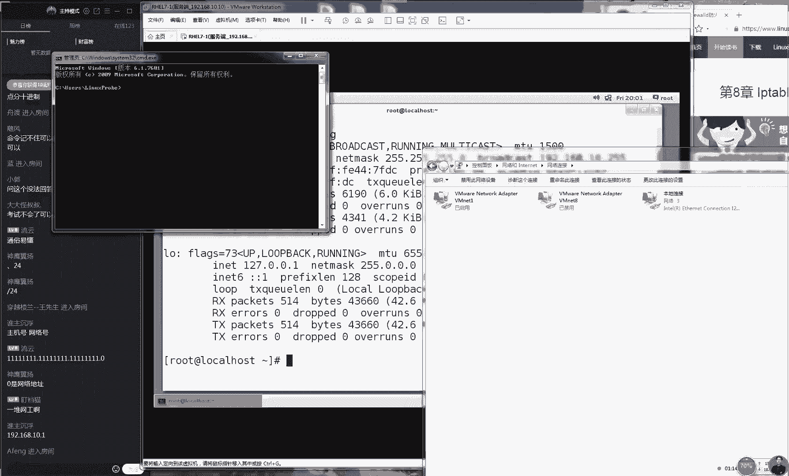
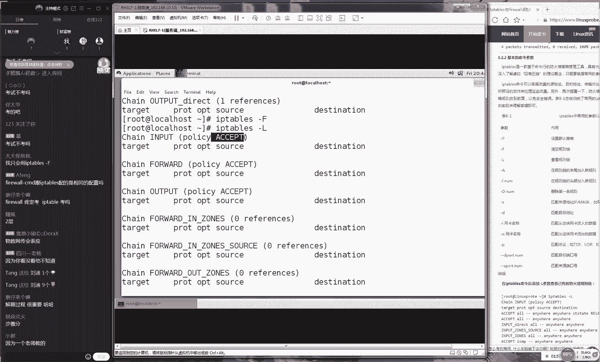

# 【RHCE】红帽认证工程师培训课程 - P10：第十节课 - 天木轮回 - BV14E411678v

OK正好7点钟我们准备开始上课，同学们今天人数有点呃有点少啊，我估计今天迟到人数比较多啊，因为因为今天礼拜5嘛，可能大家都忘了今天要上课了啊。那我们可以先微再等一会吧。好吧。

现在有80个人我们慢慢先给大家回忆一下我们上节课所讲的内容，然后等一下他们那我们先一下同学如果大家听话请打一下一好吧，开始我们今天的课程我们先用5分钟时吧，我先给大家回忆一下我们上节课所讲的东西。

后主要的目的就是让我们去等一下我们其他迟到同学今天人数确实迟到比较严重。因为我们这一节的课的课内容的话呢，也是红尔考试必考的内容之一，所以这个东西很重要。好。

那我们先给大家说一下我们上节课给大家讲的就是有一个呃美国加利福加亚大学伯利分校所研发出来的技术叫做RA这么一个技术，他可以将我们这个硬盘进行。😊。

呃，搭配将啊它这样进行一次呃进行一次组合。这样的话，我们可以让多块硬盘来去提高我们这个存储的这个效率跟我们这个数据安全性啊，然后我们在这个高可用跟高性能之间，我们与成本的这个三者之间我们来进行一种平衡。

所以说我们比较常见有有这个以下这种模式，包括re0re15和re10啊，re10这我们四种比较常见的这种模式。它就是说我们将硬盘这种高可用这种需求，还有这个高性能这种需求。因为我们这个成本之间。

我们来去相互这种呃进行一次平衡。那我们觉得最好的话呢应该就选择的这个呃re10这样的一个级别。并且我们还可以在这个之上加上我们这个热贝盘让我们这个安全性它可以提升到更高。😊，好了呃，然后特别喜欢我是吧？

特别显我磕感定特别带感，知道咱们这个视频肯定不是提前录出来的。好，那我们来继续啊，我们来给大家讲一下我们这个7。2小节，现在人数还是84人，我们稍等一下。那我稍讲的慢一点好吧，第七小节的话呢，7。

2小节主要去讲大家先回忆一下好吧，是我们第六章节还有我第七章节的前面部分，我们去讲了这么一个磁盘管理的一个基本知识。大家会发现一个问题没有就是当我们去呃分区好了之后，再讲去修改的时候就会很麻烦了。

大家讲一个问题，我们到达了一个硬盘之后，我们对那我们第一步就是进行一次裁剪，进行一次分区分区格式化跟我们这个挂载三个步骤可以让我们这个去使用硬盘的空间了。但是当我们分区好之后再想去修改。

其实很麻烦一件事情。而且在windows里也是把这个设置好了之后，再讲去修改的时，其实就是很麻烦。有些时比如说扩大还可以。但是缩讲的话就是慢。😊。

使不得的。因为我们我们之前去试过，在这个windows里面，如果想要去扩展的话，如果说你还有相邻的扇区，它还是可以让你局域去去扩展的。但是缩小起来特别的麻烦，甚至说是不可以的。

所以说那我们为了解决这个分区大小的问题。实际上就是为了去解决我们的分区大小的一个动态调整的问题。当我们今后咱比如说啊我们今后我们呃我们给大家举个例子吧。咱们好咱们好比说我们2015年的时候。

我们开始去创业，我们开始去做咱们这个培训机构。当时我也想嗯我们这么一个小网站，一个小博客，100兆的空间就差不多就是够了，对不对？😊，那啊呃说2块跟RAID说跟瑞dE有什么区别啊。

咱们这个LVM跟这个瑞还是有很大区别的。呃，2块的意思是不是就是。😊，呃，两块硬盘的意思。好，然后就是这样的啊，就是我们开呃咱比如说我们一开始去创业的时候，我们觉得硬盘空间100兆差不多就足够了吧。

对吧？但是我我们哪成想我们这个培训做完了之后，人气很高。那我们就要去那我们就要来去提升我们这个存储的这么一个大小了。那我们就要进行一个动态的一个调整。

还有第二种情况就是我们假设说我们预计我们这个培训项目会做的很火热。结果我们发现没有人来，所以我们要去动态来去减少我们这个磁盘的这个空间来去节升我们这个成本。

所以这都是我们要去调整我们硬盘磁盘大小这么一个需求。好，同学们今天迟到人数比较多啊，所以我今天再给大家总结一下，就是我们先给大家去讲这个技术叫做LVM这个的话我们叫做逻辑算管理器技术。

它的这个核心的目的啊，就是让我们能够去动态的。大家记下笔记啊去动态来去调整我们这个分区大小，动态的，就是可以灵活吧，对吧？就是动态的跟我们这个灵活的来去调。😊。

整我们这个分区的大小OK那我们这个技术的话呢，它其实来说它是有三个流程去组成出来的，分别为啊PVVG和LV。你看这个三个步骤，其实它就是我们进行一种数据组呃，这种整合的时候的一个流程。

先给大家举个例子好了，因为可能这个图上面图7。7-7，可能看起来可能比较抽象，也看不懂，那我给大家画个图好不好？再比如说那我们就是说我们现在可以进行磁盘空间的一个动态的一个调整。这是我们第一个需求。

第二个需求就是如果说我们现在有很多块比较小存储空间的硬盘。那我们怎么样进行一次整合，让它能够达到一个很大的一个空间呢？就是我们。😊。

呃，我们再给大家举一个生活上一个例子啊，比如说有一天你你的在学校的老师告诉你说，我们学校里面有一部分有几个U盘不用了。好吧，咱比如说每个U盘是两个GB有点小是吧们比如说我们每个U盘是2个GB好。

然后我们有大概10个U盘。但我们这个U盘可能是做BM做不了。但大概这么个意思。那好，那我们就可以将我们这个多块非常小的这个硬盘，我们来给他这样，我们来给它依次放到我们这个呃我们的这个电脑上面啊。

包括说它可能是这个大小不一样的，可能有两个GB或者说它有3个GB那好，那我们就可以将很多块这种比较零碎的这种设备的话，我们给大统一插到我们这个计算机上面这个每个的空间大小肯定也是不一样，对不？

像融资啊像融资也可以这么去理解其实真真的是像啊，吧？然后我们可以去融资到我们这个项目里面，然后我们再花的时候，就是在我们这个资源池里面去取出来这个资源，这个非常像啊。😊，这个融资很厉害。同学们好。

然后的话呢我们来看一下这个第一个动作。其实大来说就叫做PV操作。PV操作实际上就是呃如果上这去解释的话呢，我估计会被很多人技术高手们会去吐槽，说你这个解释好俗啊。但是我们给大家提一个呃。😊，小概念吗。

大家又懂什么意思了啊，PV操作实际上就是让我们的这个硬盘的设备能够去支持我们的LVM的这个技术。但是这个步骤的话呢，实际上叫做创建物理卷。好，大家可以记一下这个步骤我们叫做创建物理卷。

它的目的是让我们这个硬盘的设备，能够去支持我们的LVM的技术，这是我们第一个步骤，我们叫做PV操作。当然来讲当然来讲我们不用去具体的命令的。我们待会给大家去提到第一个动作，我们叫PV操作。

让我们这个呃硬盘它能够去支持我们的LVM的技术。第二步我们叫叫做VG就是将我们已经支持了LVM的这个技术的这个设备的话呢，我们来进行一次整合，整合成一个整体。好了，我们就相当就是把我们这些比较零碎的。

我们把它这个硬盘的空间的资源。我们给它整合到一起变成一个整体。那我们就把它叫做这个逻辑算组。它的这个目的就是将我们已经支持了LVM的技术的硬盘给它进行一次整合，成为一个整体O这是我们第二步骤。

我们叫做VG。😊，第三步骤我们叫做LV这个牌子大家可能之前见过，是不是啊可能会在可能会在一些商场里面见到我，这是一个很奢侈的一个牌子，对吧？其实这个在我们这个计算机里面，在我们这个LVM里面的话呢。

这个的目的这个的话呢叫做逻辑券。那这个步骤叫做逻辑券，就是我们可以将我们已经呃融资到的钱，或者说我们已经合并到的这个空间的话呢，再来进行切割，并且切割的时候。

我们不用去按照之前比如说你原先投了2万或者投那你之前投了3万。但是我们现在去切割的时候，你可以根据自己的这个需要来进行这个切割，而不用去管底层，它这个大小是由哪些去组成出来的。

我们再来进行切割的这个步骤，我们叫做LV。😊，好，所以的话呢呃我们可能这样听完之后，这是一个技术的一个的一个小例子啊，大家可能听完之后还是不理解。所以我再给大家举一个我们吃饭的一个例子。好吧。

再给大家举一个生活上的一个例子。那比如说我想吃馒头，但是我们家穷我们家吃不起怎么办呢？是只能去面那只去面粉，对不对？那我们家也没有面粉了，那我们就去隔壁的老张家跟老王家，然我们去借面粉。

那比如说老张家借我们借了我们家半斤，然后老李家老王家跟我们关系好借我们家一斤好加上我们家自己有了这个半斤，那我们就凑出来了两斤，对不对？

那我们就以用这两斤去蒸馒头完之后我们人需要多少时可以再去里去取出来多少。现在就是进行一个资源的一个合并合并之后可以再进行一次划分这样的一个技术，所以我们总结一下。

就是我M其实来说它是有两个技术的一个目的的第一个目的就是可以将多块硬盘进行一次合并，而且用户不用再去关心底层是由多少组。😊，出来的我们吃的时候我我们啊那我们呃那我们不用关心说呃老李家给给了我们半斤。

老王家给了我们一斤，所以我们吃的时候也要啊先咬半口再咬啊，然后再啊然后再呃然后啊呃然后再去咬一口。就是我们这个吃的时候，我们去使用的时候，可以忽略掉底层的这个硬件的这个底层的特点。不，我们叫做。😊。

底层的一些呃，我们不能叫不能叫做特点，我应该叫做底层的一些嗯，我我们这个怎么交易这个术语呢？😊，不就我们不用关再过去关心底层，我们不关我们不用再关心我们这个硬件的这个底层。好。

然后第二的话就是我们可以进行一个分区。分区好了之后，我们可以来进行一次动态的一个调整。对于我们这个磁盘空间它是一个很好的一个这是一这个是一个很好的维护起来的这么一个技术。屏蔽到底层这个逻辑逻辑不太对。

就是我们不用再关心它的这个底层是由什么去组成出来的。好了，那我们这个例子给大家说很透了。然后给大家去讲一下这个命令。这个命令其实来说非常简单。虽然我们看起来多，我们的表格7-2看起来比较多。

其实它并不难。因为看到我们刚才讲三个步骤分别为PVVV三个步骤。所以说我们围绕这个三个步骤依次给大家讲一下命令。第一个命令的话，我们叫做PV其实来说它有三个步骤的，第一来说叫做PV步骤。第二叫VG步。

第三我叫LV步骤。所以我们先看一下来说就是我们这个PV的这个阶段的话呢，它有一个PV。😊。

还就是我们进行扫描建立跟这个显示，就查看一下当天的这个情况，跟最后删除这4个命令。但是我们不用担心，也可以看一下这个每个命令的话呢，实际上它都是由我们前面的步骤。😊。

们加上我们这个固定的单词组把它给组成出来的，就是我们在不同的这个阶段下，我们也可以去执行不同的命令，然后就可以有不同的这样的一个效果。那么我们找要这么几个命令。

第一个命令的话就是叫让物理设备能够支持我的技术。第二的话就是让我们这个硬盘的设备他不要再去支持我们的技术了。

还有下面就是这个就是将我们的多块硬盘或者我们多个分区的这个资源给合并到一起变成一个大的一个卷组。还有一个叫做remove这代表就是我们把某一块硬盘从我们这个钻组里面给再给大家回再给大家剔出出去。

在就是我们蒸馒，老他们家给机后来后来他后悔了，他也可以这个资源给取出去。从我们这个卷组里面从我们这个资源给取出去的一个命令。还有一个我叫做的一个扩展，就是可以将新的硬。😊。

啊这个自然加入到我们这个大的卷组里面来进行扩展。还有这个减少啊，这个的话它也是交啊，我我们刚家我们刚好给大家说错了，就是我我们上面这个呃呃V呃的话呢。

这个实际上就是彻底去删除掉我们这个整个的这个VG的卷组。而这个呃V reduce这个才是将我们某一块这个特定的盘给它剔除出去的意思。相当于来说这就是一个整体的一个取消，取消到我们整个的一个卷组。

而这个的话就是移除掉我们卷组里面的某个盘而已。好了，这有几个命令啊，所以可能会掉的这个。😊，啊会比较难记啊，而且它比较相近。好，下面就是就是我从我们资源池里面来去获取我们这个资源。

重新来去建立出来分区信息。还有这个V也是将我们这个已经创立好M的这个设备全部给它去给它移出出去给回归到我们这个逻辑资源的卷组里面接下来是我们V扩展，就是我可以对于我们这个已经划分出来的分区信行扩展。

还有这个减小其实来说这两个名非常重要啊因为这个是我们的红帽考题了。因为我们红帽考题的考的时间它就是考了我们这个扩大跟缩小。它考题里面考纲是这么去写的。它写的是M它会考一个扩大或者缩小，其中二选一。

但是我们从2014年的年底开始去关注到了2015年3月份更新了红器的考题。但我们现在红没有考过缩小。所以说我们红帽的考题其实来说他只考到的一个扩大这么一个动作。

它只是对于我们这个已经划分出去的这个VM的设备。😊，的字文来进行一次扩展。好了，现在我们还有一个呃。😊，给大家一个呃一个小一个小提醒吧，就是我们再去做这个呃当我们再去做VM这个实验的时候的话呢。

请大家一定要按照我们这个顺序去做，先去做PV，然后去做VG然后最后再去划分这个然后我们当我们这个磁盘空间不足的话呢，那我们就可以去扩展我们这个VG将新的硬盘的字源加入到我们这个卷组里面。

所以当我们每一次去创建V的时候，请切记检查一下你的这个VG卷组里面有没有足够的这个空间。然后还有一个问题就是说我看啊说我们考试的这个扩大跟缩小范围是几个G之内啊。这个问题我不知道会怎么回答啊。

我没有太没有太好理解是这样的考题里它会明确告诉你需要扩大成多少个G按照它这个数值去填写就可以了。填写进去它需要那个数值就可以了。比如他是8个G或者说两个G，但你给他两个或8个G就可以了。

然后使用F的时候分完大小，😊，呃，文件系统的ID可以改不改。其实来说你说就是那个F之后使用那个参数T对不对？T可以去修改。比如说我们常见的有这个82，还有这个8亿，还有这种文件系统类型不改。

我们回忆一下我上礼拜日的时，是讲过我们对于磁盘的种磁盘的种分区格式跟载这个操作。实际上我们当时我们去做一个实验是那个SW我们这个分区如果按照我们这个标签来讲的话。

们应该刚修改成8它成一个分区的一个格式的一个一个标识，但是我没有去修改其实也是没有问题的这个标识只是一个标识是给人看我系统里面没何影响。

所我们今天去做的候也不用去修改的这个没有关系好但心这个能想出来的话，是真的是细心看到这一点好接下的话我们说说网上说都要改不知道为什么因为你要去修改话，😊。

标准，但是但是这个只是给人去看，不修改的话，没有关系。嗯，所以我们待会儿我们会呃去践行一下，说老刘是不是吹牛了，对吧？那我们会去做这个实验的时候，我们都不会去修改。你看一下会不会有报错，好吧。好。

今天的话呢我们来看一下我们今天这个实验。😊，大家会发现说哎，为什么我们这边空了两个命令，这个问啊这个问题如果大家能够提出来的话，说明是没有理解我们这个实验啊。所以我大家提一个问题，就是请问大家。

为什么我们的这个物理卷它没有这个扩大跟缩小的这个命令？😊，大家想一下，如果这个你能够听明白的话，如果这个你能回答出来的话，说明你对于我们这个刚才讲的一些命令的话呢，大概来说我们是记可能记不住的啊。

但是你大概就能够明白了。大概啊我们这个在做什么事情，大家告诉我说我们的这个物理为什么我们不能够通过命令来进行一扩容或者这个缩小，然后大家家想老刘开对吧？因为我给大家去说一下啊。

下面的话呢就是这个PV的这个操作，他对应的就是物理的硬盘，们假们假设来说你去京东上面啊，我给京东做个广告。比如说你去京东上面你去买一块硬盘，比如说大小是一个TB你不可能用一个命令去修改了这个大小。

然后就变成你的这个硬盘变成两个B了，对吧？是因为他是受到了物理设备的这个容量的限制。你的这个物理设备是多大。那么你的这个PV设备是多大，不能够通过命令来去动态来去修改来去篡改你在这个硬盘的这个容量。😊。

我们好啊我们啊不能说京东上买一个大小为500个GB，然后888你能变个魔术变成1个TB了，这个做不到，对不对啊？目这个目前来说应该还是做不到的。除非说一些假一些硬盘啊。

或者说呃啊或者说淘宝上面啊拼多多上面一些买啊去买一些在这个U盘什么的，可能会有这种情况啊。😊。

好，然后我们现在给大家讲了很多理论。其实来说刚这个命令啊，我们表格7-7，我们根本呃表表格7-2，我们只给大家去大概看了一下我们里面的这些命令，并没让大家去记，也没有让大家去背的原因。

就是我们认为这个命令是比较的这个比较简单的，大家去看就好了。另外的话我们通过这个实验，我们会去敲命的时候会大家去再去讲一遍好吧。

就是我们会在我们待会这个实验过程当中会再给大家去讲一下我们每个命令的这个作用，大家自己要看好接我们现在在我们这个虚拟机里面我们关机，然后我们充建出来两个新的硬盘，我们来点击添加，我们选择硬盘。

我们选择下一步下一步这个两个硬盘大小是无所谓的。所以说大家默认是20个GB就足够了。我们给他2个GB的这个大我们给它20个GB的大小添加继续两个硬盘。😊。

既然我们开机。那么我们根据之前所学习过的一个服务叫做UDV服务。所以说我们待会那个设备的名称，应该我们猜一下，嗯，大概是应该叫做DV目录里面的SDB跟DV目录里面的SE这两个设备的名称。

所以说这就这就是我们为什么要去学先要去学习一些比较理论的这个知识。对于我们后续学习大家看到是有很大这个帮助的。好，我们先去开机。但我们就两个新硬盘设备。嗯。

然后刚有一个问题说LVM一定要建立在VG机上吗？普通硬盘或者瑞可不可以去做LVM对，这个这个是必须要加到这个VG资源池里面的。因为你要是。😊。

因为你要是没有VG的话，他就没有这个资持，那么你就不能够去划分出LVM这样的一个技术。我们好比说我们举个例子，呃，我们这个我们这个融资好吧，我们开个公司，我们去融资，那我们最最后去商市。

然后做融资了融到比500万块钱，那你花这里的钱的话，那你就自然要先去融资。如果说你充建公资，后你也去融资，但是你最后掏那个钱是你自己的钱，那跟个M就没有关系了。因为是你自己另外的这个资源。

就是你另外一个硬盘里的这个数据了，这跟M没有关系了。好了，然后我们既然这样啊，给大家带一下我们这个实验，大家看一下大概这个步骤，我们今天给大家讲M的一个机会来说就是它里面所有的功能了。

包括说我们这个快照券，我们今天给大家去玩到大家可以。😊。

今天可以算是真的是我们这个课程里面的一个干货。会者大家看到我们这个LVM的一个完整的一个功能。好，随着我们上线人数数来越多啊。大现在可以去记下笔记，我们先给大家讲讲干货。

现在的话我们第一步骤我们要去做这个PV操作，要让我们这个物理的设备，能够去支持我们的M的技术让变成我们的粉丝成我们的这个可用的资源。好，我做第一步叫做这个然后我们接下来我们设备的名称。

一个叫做DV目录里面的SDB还有一个叫做DV目录里面S好大家问我怎么知道的，因为我之前我学习过UDV对不对？那我们知道我们硬件的这个命名的规则。

我们好了常这样的话我们是非常自信的接下来我们可新建出来一个组。这个组的话，我们给个单独的一个名称。因为这个设备的话我们不能够说咱比说那我们不能说我们两个设备叫DV目录里面的S和S组成出来的设备。

那我就做V目录。😊。

的SEBCDE那我我们这样去写的话呢，会很虽然说我们也能够看出来它是由哪个盘序组成出来的，但是会很乱，对不对？现在我们是有2块盘去把它组成出来的。那么如果说我们使用的是4块盘的，或者说6块盘呢。

那么你的这个设备的名称就会变成这样的一个情况。所以说我们要给他一个。😊，呃。呃，创建之后的一个名称，就有点非常相向于我们今后还会给大家去讲一个这个其实就像我们那个瑞一样。我们最后那个设备的名称。

我们需要给他单独的一个呃叫做MD0这样的一个名称。还有的话呢就是我们创建非常我们这个班级大家想一下，我们班级里比如说我们有40个人。那好。

那如果说公平我们如果说为了能够一眼通过我们这个名称知道我们里面这个成员的话呢，就可能要叫做流传。然后张三56那我们这个班级的名称要很长。

所以我们要给他班级一个名字叫如说级2班这样的一个名称来来呃来去代指我们这个40个人的这么一个成员。好了，所以我们现在现在出来一个卷组这个组的名称无所谓，我们来去取名称可以随意去取吗？是可以的。

比如说同学名称叫做世梦中空啊，所以我给创小空吧，大家正问这个问题啊小同学我们这。😊。

小空账号呃小空这个转组可以随去起名字吗？是吧是可以的。好了，那我们先在这样，我们出建出来一个转组，名称叫做小空。好了。

我们给它叫做把它加里面去一个叫做DV目录里面的SDB还有一个叫做DV目录里SD我们两个设备给它添加到小空的这个逻辑钻的这个转组里面。好，这个时候我们就有一个叫小空的一个转组。再往后面去走。

我们就要去使用到出来属于自己的一个逻辑钻了。因为我们现在这个底它是由。😊，两个硬盘来去组成出来的。接下来我们加大一个卷组之后，就要进行一次自动的啊来进行一次自己的这个切割。而且这个切割的话。

也不用再去给它切割成1个20个GB的。你可以根据自己的这个需求来去调整。比如说我我那我那我不太需要这么大的这个空间，我那我只需要5个GB可不可以啊，可以啊。

那我们就这样去做先杠N先杠这个杠N指的就是我们要创建出来的自己的那个逻辑做的名称是什么？比如说呃。😊，同学们还有没有同学要提问啊，我看看。😊，我们这个名称叫什么呢？比如说我们的这个卷组叫做叫做小空。

好吧，然后我们叫我们这个卷组的话呢，我们叫做空空吧。好吧，这个无所谓啊，我们给他随便取个名字。好了，接下来的话呢还有就是这个。😊，我们的逻辑卷的这么一个大小，它有两个参数分别为杠小L跟杠大L啊。

所以大家一定要去预习，这个不预习肯定是跟不上的。好吧，我们来杠L这个是指的我们这个P的个数，我们有一个大小啊，这个是我们的PE的个数，然后话还有一个大小这个是我们的这个容量大小。

我们可以用两种方法来去指定我们这个M这个大小，而我们这个PE的话呢默认为为8兆。我想想它为它是为4兆这个什么意思啊，就是我们这个硬盘跟我们这个内存的话呢，它是有一个最小的一个单元值的，大这边没有关注过。

我们可以来看一下，就是你可以点一下你的这个虚拟机，然后点一下这个设置。你看点一下虚拟机设置。然后你可以调整一下你这个内存的值，你看这边有一个这边会有个内存值，对不对？

你可以这样调整一下它不论你怎么去调可以看到你不论怎么去调这个数它这个数值的话呢，它永远会是四的倍数，你可以看到这边。😊。

他呃他呃他呃他会告诉你说啊内存大小必须是为四的这个倍数。所以说你看你你的这个内存，它也都是4的倍数。因为这个说是我们的物理的这种硬盘跟内存的个最小单值好。

所以说我们比如说我们比如说我们需要400兆的一个空间。那好，那这样去做说我们就给定100个那么就是100个乘以4兆这样话们就有一个400兆的一个空间，它是一个呃乘法，就我们算出来它是400兆。

我可以直接指定杠10变成个00兆空间还有一个大写那我就指给40兆的空间就说我们两个方都可以的那我们只不过我们的第二种方法的话更加简单只需要大小你自动判断出来去分析出来，你所需要这个P的个数。好。

待会我去两种这方式好吧，先给大家一个小写指定一下我们这个个数。😊。

那我们觉得呃其实来说就就取个纸吧，好吧，我给他100兆空间呃，那我们取100个P，所以说我们待会儿那个呃我们这个设备的这个大小。😊，就应该是400兆。好，接下来我们要定义一下，我们最后我们要去写的。

就是我们要从哪里去取出来我们这个空间。所以说。😊，我们的这个转组的名称叫做小空啊，对吧？好，我们就敲一下回车。那我们就有了一个叫做空空的一个转组是这样的那我们这个设备的话呢。

就会在DV目录里面叫做小空的一个逻辑卷里面有一个叫做空空的一个设备了。这大家记一下有一个寻找设备的一个方法好吧，是在DV目录里面，它有一个叫做转组的名称，然后里面叫做逻辑卷的名称，就是当你去做VM之后。

它在DV目录里面转组的名称命名一个文件夹，后在里面放入我们这个转组的名称。好了，我们看一下这个我们实例当中就是变成DV目录里呢，我们的转组是小空，所以我们就是小空。

然后我们的逻辑卷的话就是叫做空空这么一个逻辑卷，你看到这就是我们的一个设备的名称，我们就以对这个设备来进行一次格式化跟挂载了。当来说分区也可以，但是我们大现在总共才400兆就是没有必要再去分区了。

所以们以直接去那以直接进行一个这个格式化操作。😊。

但是我们需要注意的就是我们的这个格式化操作，我们只能够去使用EXT4这样的格式或者EXT3或者EXT2都可以。但是你不可以去使用L，那么你呃是不可以去使用这个叉FS的。因为叉FS这个系统的话。

它不支持我们的LVM技术。你可以看到它有自己的这么一个命令。😊。

叫做叉 fast groups，这个就是我们的。叉的这个系统，它有自己的这么一个扩大的这么一个命令，它默认也不能够进行缩小。我们的这个叉F系统，它是不能够缩小的。因此我们去格式化的时候。

我们要去使用的叫做。😊。

EXT4这样的一个格式就可以了。好，然后后面我们指定了我们的设备的名称，小空的一个逻辑卷的转组，然后后面加上我们的。😊，呃，逻辑卷的名称叫做空空。这样我们给它格式化好之后，下一步创建出来一个挂载点。

我们就来一步到位吧。比如说我们这个挂载点的名称，那我们叫做哈哈，这个就无所谓啊，然后我们就可以去修改一下我们的ETC目录里面的FIAB的文件，将我们刚才所创建出来的一个信息，按照我们的格式填写进去。

就是呃首先来说是我们的设备的名称。DV目录里边卷组的名称，后面加上逻辑卷的名称。😊，后面是我们的挂载目录，中间空格去做间隔，我们的文系统的格式EX4权限00不要进行备份，以及不要进行校验。好了。

把它点保存名退出叉FS的扩展命令是什么，我给大家打到屏幕上叉FSWF它有一个专有的自己的这个扩展命令，并且叉系统不能够进行缩小的。好好。

然后呢我们接来我们给大创建好之后可以去使用杠A它还自动挂它自动去载一下。于是你可以看到DF杠H你能够看到一个大小为380兆的一个空间。然后名称的话呢就是叫做小空啊。

空空什么的挂载到了这个哈哈的一个目录上这是有两个问题，同学们。😊。

这个是这个就是有一个问题啊。呃，来说我们这个实验是成功的。但是的话呢我们看到我们的这个存储空间，我们刚他明明我们给他是一个小写L100应该是100乘以4对不对？结果变成380兆。

那也就说到我们每个的这个大小实际上是3。8兆呢其实并不是的因为我们这个硬件的话，去造的时候，包括说我们机它行模拟的话，它按照1比1000这去模拟出来的，但是我们真正去计算的话呢。

我们是按照1比1这样去算的所以我们会有一定的这个硬盘的一些开销出去，就它会有一些损耗，我们不能叫损耗吧，就是它这个容量会有一这个缩水，但这个属于行业的一个惯例。我们举个例子。

你看说你买一个手机买一个苹果手机苹果手机已经是目前来说公益最好的手机，对不也是这家是公认的那我们买一个苹果手机，比如说买一个2256兆的256G的手机。但到手之后。😊。

这个大小就呃这个可用空间可能还不到240个G，对吧？它会有就会有一定的这个开销出去。这但是这个是它是呃但是这个它是属于一个正常的一个缩水啊，它是一个公益的一个问题，这也是一个行业的一个标准的问题。

所以说那我们先看到我们指定的这个大小是400兆，最后我们看到的时候是380兆。但是这个是完全符合这个题目要求的。如果说你们考题的时候。😊，他要求你是400兆好，那我们就填写这个数值的时候。

请切记一定要给我填写成400兆。就是我们考题他所要求的，而不是说你给我去算一下然后你这样去说那你看要求40兆那00兆话成380兆。那我干脆给420兆吧。那么你如果说你填写这个大小是420兆的话。

那么就会导致你这个题目是做错的。因为这个红帽考题在判断的时候，他也是根据这个数值来去做判断的经给你做完这个缩水之后个数值了。所以我们我们去做这个实验时候，请切记一下，他这个春时候那个数值。

就是我们考题里面要求那个数值，它这个缩水的这个情况是正常的好吧，千万不要去修改好了，话呢我看一下说什么厂商用一笔照一个计算会有一个缩水。我们计算的时候是每1个GB会少24个兆会这一个缩水。

这个是个标研究过。😊，这两个标准他们都是国际上所认可的，只不过硬盘商去造的话，它肯定是按照那个更小一点去造嘛。但这个也属于两个标准，它不属于偷工减量啊，这推可以去这我们去研究。好，然后给大家去讲一下。

我们今天做这个LVM个这么一个目的啊。因为大家看到其实来想感觉没有什么兴趣，对不对？因为感觉VM也就是这样，跟我们刚才所讲的一个分区各化跟我们的挂载跟我们上礼拜5礼拜6其实内容差不多，对吧？

所以我给大家玩一下，就是我们真正LVM这个实力是什么，他可以去做们这个扩大跟缩小以及我们这个快招卷，这个在我们今后是特别特别灵活的，特别特别的方便的。当你的这个硬盘空间不够的时候。

可以来随时来去动态来去调整。咱比如说我现在这个大小是380兆，就是说。😊，现在是400兆。那么我们红帽考题要求，我们说我们这个大小需要能够变成变成多少呢变成800兆。好了，那我们就可以进行一次调整。

进行它进行一次扩大。好了，我们先进入到这个哈哈目录里面啊，大家可以先来去复制一些文件过来，先来去复制一些其他的文件过来，这样来去呃待会来去验证一下，就是说这个目录里面的这个数据。

不会随着我们这个扩大跟缩小的这个操作而丢失。好吧，我们可以先看到，然后说但是大家问题比较多啊，所以我先不给大家去都回答了。好吧，大家现在可以去大家可以先来去交流一下。那我们下课之后。

我们去统一给大家回答。但我先给大家去说一下嗯。😊，我现我给大家去说一下表。比较听的比较多的吧。比如说但是阿VM已经划分了OK然后空间足够，感觉再这么计算不太合适啊。呃，这个不是我们计算不太合理。

这个是一个行业的惯例。我不大家可能现在提到就是说我们。😊，我们这个为什么会有一定的这个缩水啊，这个是一个这是一个国际标准，这个不属于说不合理。就好比说大家去买一个手机。

你也知道买了这个到手之后肯定跟他标注的那个容量是不一样？但是这个是属于它属于两个标准个是减量这个也是合理的其实毕竟国际上面都这么去做。比如说我们国内的华为小米什么的，你买一个手机。

不用说手机你去买个硬盘，那你这个硬盘到手之后定也会有一定的这个缩水。你看啊，比如说我既然有一个计算机，我这个C盘，我这个硬盘大小应该是128G，但是我到手之后就只有11G，它会缩水。

这属正常的这个没有关系。好，接样话我们来继续大家做一下扩展，大家交流一下如问题话以继续去说看到之后比较常见的问题的话我大家解答一下。那我扩展一个方法是这样的你到你的另外一个目录里面。😊。

然后你先要把它给卸载掉，就是你当你去扩展，或者说去缩小，或者说你要去变更一个设备的话呢，请将把它给卸载掉，让它不要被正台呃，就是我们去对它进行操作的时候的话呢，它这个设备的呃当前的这个状态。

不能是正在被使用过程当中，我们应该要把它给卸在卸载掉。啊，现在就是我们这个U盘一样，你需要把U盘给它拔呃我们需要把U盘给它拔出去，然后我们才可以对这个呃。😊，设备来进行来进行一次修改这个例子举。好。

我们继续来给大家一个操作我来进行一次扩容。那比如说我们现在提目要求我们要把它变成800兆空间那我们首先来确认我们里的容量够不够那我是个20的硬盘组成出来。所以说我们肯定是够40的空。

那我来进行一个扩进一个扩展它有两个参数一个小写写以我们就直接给一个写80兆我们需要80兆的一个空间具体需要多少个P我不知道那他帮我去算好接下我们对哪个硬盘进行一次扩容。

第第微录里的组的名称加上逻辑的名称这个设备来进行一扩容这个时我们这个设备成了800兆了实其实已经了就是我们现在这个设备800兆。但是我们的系统跟我这个分信息不知道那怎么办呢？我们现需要通知。😊。

我我们这个系统，我们这个呃设备的这个信息已经发生了变更，所以我们需要去使用叫做ewoK现在去使用杠呃杠F来去强制来去检查一下我们文件系统，它有没有损坏，因为我们经扩容的话呢，它肯定会有一定的这个损坏嘛。

那我们可以看到我们现它没有包错情况下证明它没有这些被损坏好吧，这是为我们以后做这个铺垫的，它没有被损坏。如果它要被损坏的话，那你就可以去赶紧去修复你的数据了。但一般来讲的话M是不会损坏你的数据的。

既然还有一个叫做re这个来说就是一它就是。😊，他用一个句话给你他给你去缩写出来，把给删掉啊，他给你缩写出来了，叫做re这个命令。

它其实来说就是叫做re system就是通知你的文件系统这个设备的信息包说容量的话已经发生了变化。我在通知一下我们这个系说那个老我这个设备的话，信息已经发生了变化，大小也变成80兆了。

那请帮我同步到我们系统的这么一个内核当中。好，我们来通知一下我们这个系统。他告诉你说哎我们的系统的话是知道了，你的这个变更信息已经变成了800兆。

好这个时候我再可以去使用杠操作然后去挂载我们这个设备可看到大小成了80兆但是说我0兆，会定个缩属正常情况。好，所以说我们考试的时你这样去做就可以了。这就是们红帽考试的一个难度。

我刚那个创建什么的包最几个扩展。刚我们做这一这么一套啊，就是我红。😊，做要求的，基本上来说它就是原题。最后这个大小按照我们考题的要求去扩容就可以了。好，但是这个缩小的话呢，我看到说呃这个可以卸载吗？

这个是可以的。呃，我我不知道大家是不是是这个问题是不是说我们LVM可不可以卸载啊，是可以卸载。但会我们会给大家去演示一下，说当我们不再去使用LVM的时候。

我们该如何去删除掉整体的这么一个创建的过程给大家去呃呃然后再给大家返回成两个硬盘这么一个独立的一个状态。好，接下来还有一个缩小这么一个实验。缩小实验的话，就是说当我们这个容量已经超过我们这个预期了。

那我们就。😊，那我们就那我们就不需要那么多了，那我们可以进行一次缩小。但是我们这个扩大跟缩小，它是有呃完全不一样的这么一个概念的。上来说我们举一个生活上一个例子啊，大家有没有就是这种经历。

就是如果水很烫的话，你需要在两个杯子之间来去互相去倒一下水，反正这个可能上可能上年纪的人知道啊，因为比较因为比较喜欢喝热水嘛。如果水很烫的话，那么就要准备一个空杯子，然后两个水之间。

然后这样来这样的话来去倒一倒，是这样的啊，那么你准备出来那个杯子，就是来进行一扩容嘛，就是你切记切记，你可千万不能说小于你之前那个杯子，再比如说你之前那个杯子是400兆。

那比如说你刚才那个杯子是400兆，然后400400毫升，然后你的这个新杯子是200毫升，那么你这样去把水倒到里面这个锅当中就会导致我们这个水是洒出去的那么它就是导致了我们这个数据它也是丢失的。

那我们怎么去操作呢？就是你可以进行扩容，扩容的话呢，请切记。😊。

就是你的这个容量一定要是大于了我们之前那个容量。所以说你这样去扩容是没有问题的。但是缩小的话呢，就是你缩小是可以的。但是请确保你杯子里面的水，就是你硬盘里面的这个空间，你没有使用到比这个更多。

再比如说你的硬盘的空间已经使用了300兆，好吧，已经使用了300兆。然后你现在这个总大小是600兆。那么你就可以把它缩小成400兆。因为你现在这个空间，你总共才使用了300兆。

你可以把它换到这个杯子里面。如果大家不太理解，可以去呃，大家可以取两个杯子。😊，然后一个杯子是400兆的水呃，然后另外一个杯子的容量只有300兆，这样你把它倒进去，同时就会导致这个水洒出来，对吧？

就是我们去呃缩小的时候，请切近你的这个容量也要是能够满足当前的这个需要。但是如果说你现在有一个杯子容量是400兆。但是里边的话只有一个，但是只有一点水了，比如说只有不到100兆的水。好。

那我们就可以把这个杯子里边的水给它缩小到另外一个杯子里面。因为你的这个容量是足够的。就说我们缩小的时候，请切近您的这个空间是肯定是足够的。那我们看到现在这个大小已经被使用了31兆。

所以说我们这个缩小的这个空间只要比31兆大，那就可以好，我们给大家缩小成300兆吧。好吧。我们那我们这个缩小操作，同样我们需要把它给卸载掉，卸载掉我们门系统，不要让它再去挂载当中。

它会导致我们系统正在繁光，它会失败的。😊。

好，说室内设计好搞吗？我想转行，这是其他同学过来呃，是过来搭场的那吗？哦就吓我啊，刚才吓我一跳啊，我因为我之天买了一个小买了一个设买买了买了一个设备啊，就那个小爱同学，我刚才说小同学。😊，没听说过。

65。这个怎么突然间。说话了，所以说说话这个好吓人啊，突然间开始说话了。这种设备真的是很吓人。好了，我们来可以先去检查一下。那我们这个缩小步骤的话呢，是跟我们刚刚那个步骤是相反的。

我们需要先去检查一下我们文件系统的这么一个信息，先检查一下它有没有被损坏。因为它这个缩小的话呢你需要先让你的系统去判断它有没有条件来去损坏有它进行缩小好，然后的话给大家去举一个例子好了。

你看那我们先去先去检查一下我们这个系统这个数据它有没有损坏。没有他没有报错就没有损坏。接下来我们再re to我们需要先去通知一下我们文件系统说它这个大小是变更了的。我去文件系统的这么一个大小。😊。

他告诉我们说呃，我们这边大小，比如说我们缩小成300兆给他缩小。他告诉我我们说我们有条件去缩小。O他同意了再往后面去走，我们就是 reduce我们来进行一次缩小大写来了，我们300兆好。

给大家说一下这个先给大家看一下这个例子啊，然后给大家去说一下我们这个然后他告诉你说他说这个操作缩小操作可能会导致你的这个数据丢失。请你确保你的这个容呃磁的这个容量能够去存储掉你之前的一些数据。

然后说你确认是否进行呢？那我们选择这个Y我们确认接下我们再来杠A挂载上可以看到你这个容量变成了283兆缩小到00兆的一个容量大小。好给大家举个例子啊，为什么我们现在我们现在给大家。😊。

去做缩小操作的时候是给他反着来的。好，我给大家举一个生活上的一个例子啊。因为老师呃因为我是学习教育学的，因为我当时学教育学的时候，我们是先从青少年这么一个心理过程当中去学习的。

我当时学习的这个心理教育学里边，就是啊有一种有有比较常见这个案例嘛，就是到了这个初中阶段会有一个叛逆期。这大家应该知道的。如果大家有孩子的话，应该也知道，就是初中阶段的话呢。

正好孩子到了15到了156岁，比较比较叛逆，对吧？所以的话他还会有一些自己一些比较个性的一些想法。😊，其中有一个案例就是讲的这个就讲的这个纹身啊，说有一个小孩想要去纹身，后来家里肯定不同意，对不对？

后来他就是跟他父母说了好长说说了好说长说了好久，那父母也不让他想他想了一个办法，他就是这么着，他先他先没有去纹身，然后的话他就跟他父母去说说我已经纹身了，说啊，我已经纹身了，如果说父母要是同意了。

反正说既然纹就纹了嘛，那怎么办呀，对吧？那孩子那也那那也那也不用说呃，就不要了，对吧？那好，就是第一个情况就是当你说了，我呃，我已经纹身了。好了，父母第一个反应，就是那好吧，那就这样了，对吧？

第二个反应就是把他打一顿。如果说父母采用第二种方法的话。😊，他马上就可以说啊哈跟你开玩笑的。其实我啊啊其实我没有纹身，对吧？所以说他就是一个试探性的这么一个测试。

先去测试一下你家长或者说你系统这么一个反应。如果说你要是允许我，那我就赶紧去闻一个姐，对不对？如果你要是没有允许我，那我就。😊，可以呃不要再去把它给缩小了，这也没有关系。

因为我实际上我我刚才我也没有去做，对不对？这所以说当以后大家如果要是有孩子啊，当你的孩子问说我能不能去纹身啊，能不能去呃打耳钉什么的，请一定要去请一定要切记啊，初中阶段的话，一定要以学习为主，对吧？

要他要是给你问的话，就是在试探你，请你一定要去啊。😊，有效的咱去回应了一下，你可千万不要说同意了，对不对？好，现在也就是这种试态了。好了，我们先看到他这个缩小就是成功的狡猾如导流，权限不够。

他就去进行一次测验，他就去进行一次测试嘛，因为我觉得这个例子其实举的是很好的。就是我们刚刚我们就是通知我们这个系统，我们先去啊先那我们先进行一次试探，你要是同意我们去缩小，那我们再进行缩小。

如果你要是不同意的话，反正我也没有缩小，对不对？那所以说我们这个数据跟我们这个呃跟我们这个设备它都没有任何大变化的，他就是进行一次测试。好这个叫做快照卷这个快照卷的话，其实还说我们我们按照现在网络上面。

😊，的一句比较流行的话啊，就是没有什么卵用，对吧？呃，这个快照卷的话呢，确实有些可能会去使用到。但是坦白讲啊，这快照卷的这个使用的几率是很小的。就是我们对于这个硬盘的设备的话呢，进行一次快照啊。

但是就是大家不用这个跟我们去纠结啊。因为有同因为有呃比如要是有公司啊呃喜欢用这快照卷的话也可以。但是我认为呃以及我从我建当当中来看的话呢，快照卷的实际的案例使用起来，其实来说是不多的。

但是这个也属于我们LVM的一个技术的一个的一个内容吧，那我给大家去提一下，这个我们叫做快照卷，就是你可以对于你这个硬盘设备进行一次备份。😊，你看这个比较呃呃，所以说我们这个比较呃呃这个比较清晰了啊。

就是我们可以对于我们这个设备进行一次备份。我们可以在我们这个设备上面做一个夸照。这样的话呢，当你以后去做修改的时候，可以进行一次还原。再比如说我们要那我们要去考试了，对不对？我们有张卷子。😊。

好了，然后我们先给他去复印一下。😊，复印之后，这个复印操作就是一个备份嘛，对吧？然后我开始去做题，然后我自己啪啦啪拉写，写完之后我感觉自己做的好烂呀，对不对？而且最后错了好多题。

那么但是没有啊但是没有关系，因为我这边有一个备份文件，我就可以快速将我这个已经呃先前备份好的文件给它覆盖过来。最后我们这个数据还是我们之前的一个数据，它就相当于就是备份嘛。但是这个快照卷的话呢。

比我们一般的备份要快啊，而且的话呢比较简单。所以我们企业里面还是有些时候要用的，是要呃是要用的。好了，然后接下来的话呢说呃。😊。

说那我们不要听了，直接进入下一章说因为这个公司里面不是很常用，对不对？但是我们要学呀，对吧？万一以后你们公司要用到对不对？但这都说不好，他这个技术既然已经存在，可能是还这需求的可能是老刘这边经验比少。

以我们而已好，那我们这啊，现在给大家去去查看一下我们当前这一个逻辑卷的一个信息这个是一个组的一个信息啊。在我们看到它总共的用的空间用空间是19。51个就说你现在还有很大这个空间可以去使用。

好接下给大家玩一下了啊。我们先进入到哈哈这个目录里面，这里面有很多的文件，就是我们刚从目然后给大家复制过来的一些文件。们来出来一个快照卷。现在备份吧了，我们来去出来一个快照卷。😊。

然后我们一个杠L是这样的话呢，我们去备份的时候，这个大小请切记一定要以你在这个逻辑卷这个大小为准，就是一定要跟你这个逻辑卷你小肯定不能够。那么你至少是跟你这个逻辑要是一比1的因为我们这个例子非常的清。

就是你不能够去使用20兆的一个容量的一个容器去装400兆一个就是你要想去备份多少的数据，你要去准出来多大硬盘出来。所以说我们这个大小必须要300兆起步了。所以说我们要它保持一致。

这边有一个杠S这个全称的话应该叫做是那个快照的意思它是一个英文个缩写杠它指的是我们快的一个名称那所以我们快照的名称叫做无所谓然后我们后面写的是我们要给去拍照。

们要给这个目录里的小空里面的空空这么一个逻辑卷给去拍照做一个备份。好，我们现在敲回收之后，马上告诉你说我们这个快照做好了所说我们这个的。😊。

省它的这个我们舍要的它主要的一个理由就是它比一般的备份要更快一点。这就是我们快照卷的这么一个作用。好，那我们现对于我们这个设备进行一次拍照，拍照好了之后，你可以再进入到这个哈哈目录里面。😊。

这里面的数据都是没有变化，对吧？好了，这样的话呢我们就可以进行下一步骤。为了让大家可以很明显的去很清晰的看到我们这个实验的一个效果。好吧，你看我先给大家交一个命令。

叫做RM杠RF就是我们来去清空掉所有文件的意思写一个星号啊，这个快照卷放到哪里呢？放到了这个DV目录里面叫做小空第一个目录里面叫做S这个这个话它还是啊它是在DV目录里面以我们这个卷组名称命名一个文件夹。

然后里边以给大家写出来吧。这个是有一个规律的，就是在DV目录里面以卷组的名称命一个文件夹，然后里边叫做逻辑卷的名称，这个就是我们去找到我们具体设备的这么一个路径跟方法好说我们经上完半节课了，好快是吧？

好这个这个实验比较有意思的啊。好接下我们来看一下我们最后有一个逻辑它又出现一个这叫做这个快照啊，也就是我们这个备份卷了。们给大家。😊，做一个这个操作啊。

就是我们要去RM杠RF就是我们来去清除掉我们啊清空掉我们所有的数据的意思。最后这个星号代表就是一切的文件。但是说就它是仅限于我们这个呃当前这个目录啊，好，我们要去清空一下我们当前目录内的所有的文件。好。

我们现在可以看到我们当前的话呢确实是在哈哈目录内，并且的话呢我们当前里面的这个数据都已经被清空掉了。这个我啊我也呃这个的话呢我也是没有啊没有去作弊的。好，接下来我们就可以来进行一次恢复了。

但是我们不用担心呢，我们之前我们给大家做过这个快照了。😊，所以我们可以退回到另外一个目录里面。接下来我们来去卸载掉我们的文件系统，我们不要再去呃让他去繁忙了，我们来它卸载掉卸载了它同时啊。

这边我把它关关闭掉啊。😊，我把呃谢谢到辩系总，然后我们给大家做这个还这个快调卷的话呢，其实他来说它就是一个。😊，它它就是一个备份的这么一个作用。你看我们刚刚这个哈哈目录里面，它有很多信息。

而我们错误的不小心删掉里面的这个数据之后，我们就可以来进行数据的还原。使了命令我们叫做啊VV然后我们合并这个合并的意思就是进行一次覆盖了。好吧。

我们把它进行一次合并我们来DV目录里面的逻辑卷的卷组名称叫小空里面的SNAP是这样的。我们现在我们需要去还原我们这个快照卷的话，你不需要去指定你的这个逻辑卷的名称的。因为你这个快照卷。

你就是对于小空这个设备去做的。它会自动去找到小空里面的空空的这个设备，它来进行一次恢复。而不用你再去指定这个名称了。给大家举一个生活上一个例子啊。😊，那我给大家举生过这样一个例子。

大家有没有去经大家有没有去过一些经典，然后有一些呃穿了一些比较奇文比较奇装异服这样的这这种呃工作人员，然后让你去拍照。你当那当你拍完照之后，他你去收钱。那好了，其实大来说这个他就是对你进行一次备份嘛。

对吧？然后对你进行拍照，然后把你这个数据给他保留下来。但是这个呃你的这个照片是不能够给别人的，因为别人大家也没有用。当你去还原这个数据的时候，当你去找别人需要钱的时候，你也会去找到你拍那么你拍的是谁。

那么你也会去找去那么去还原你的这个数据，然后去要你这个钱也是这样的。好，所以我们现在可以直接去调回搜，我们不需要去指定一下我们之前设备的名称，他会自动去找到我们之前的个人以及我们之前的一个设备。😊。

他会进行一次还原，还原这个过程会比较慢啊。😊，他这个拍合照比较快，但是还原快是比较慢的。然后说一个逻辑卷的，我看下逻一个转组当中有多高的LV创建出来快照就会有多个SNAP吗嗯。大家是问题是这么问的吧。

是说一个卷组里面如果要是有多个LV，那么创建出来的快照会有多个。快照吗？是这样的，你对几个设备去做就会有几个快照卷。这个完全取取决于你。如果说你这个逻辑卷里面有100个快照。

不有100个专呃有呃有100个逻辑卷，但是你只是其中的一个去做。那么你也只有一个快照卷，就是看你去对哪个设备去做了才会有它不是自动去生成出来的。好。

然后我们现在可以去使用杠A来去挂载一下来DF杠H我们可以看到他要把恢复回来了，我们可以就到哈这个目录里面看到里面这个数据它都是都回来的。其实来说这就是比较简单的一个实例了。给大家玩了一下。

就是这种数据的快照以及备份。😊，好，我给大家提两个这个声。😊，呃，给大家提两个比较小的这个注意事项啊，是这样的。第一的话呢就是我们这个逻辑卷。😊。

但这个快照但这个容量大小必须要是大于等于我们的这呃想要去备份的那么一个容量大小的。我们比如说我们想备份的这个数据是300兆，那我们就必须要给他准备300兆以上的这个空间。

第二的话就是我们这个快照卷就是这个是呃单词偶效的。当你给他做过一次快照之后，这个逻呃逻辑卷就是我们做完那个快照卷啊，快照卷就会自动去删除掉。这个快照卷是单词偶效了。

大家看到我们在这个小空目当中就已经没有了SNAP了。你看到他已就没有了。😊，它这个是单词有效的快照卷，这个大家可以记它是一个特点。它的这个目的也是为了去节省我们这个磁盘空间。这样的话，我们还原之后。

它可以去释放到它这个使用的这个呃它对那里面这个容量。好，如果要是同时有两个以上的快照呢，那么就会有两个快照了。咱对那么只要你对几个这个设备去做快照，那么你就会有几个快照的这么一个文件。😊，好。

然后的话呢我看一下说书里面写的是必须要等同于逻辑转啊，是这样的，我们写的是等同于实际上你要稍微大一点没有关系，因为但是不它它不能够小于就可以了。那它呃它呃它不能够小于。好，接下来给大家试说一下。

就是正好有一小时把它讲完啊，就是说我们会有一个删除的逻辑卷的这么一个操作。当我们说今后啊我们不太需要说我们再就LVM了。因为我们刚才讲了一个LVM的一个创建PVVLV对吧？

然后我们去讲一下我们这个逻辑卷的一个增大缩小更快。那我们接下来我们就要给大家玩一下这个删除了。当我们不再需要这个逻辑卷的时候，我们该怎么样给大去删除掉，怎么能把它删的更加干净一点呢？

就这样的大家看一下我现在这个操作。来说首先来说进到另外一个目录里面。😊，然后来去卸载掉我们当前的这个文件系统。卸载掉。好，卸载好之后的话呢，我们要先去使用的L拉V remove。现在取移除掉。

我们创现出来这么一个逻辑钻啊，我们把它给移除掉。移除掉我们所创越出来这个逻辑转来，我们选择Y，代表就把它可以移出成功。接下来是呃VG removeveH移除掉我们这个转组。

我们叫做小空的一个转组把它移除掉。😊，no不喂是吧。啊，找V removemo啊，我们来去除掉我们这个小框的这么一个转组。好他他又告诉你说把移植成功了，最后是PV来去让我们这个物理的设备。

不再去支持我们这LBM技术。好把给删非常干净目录跟目录个设备最后一步不要忘记就是目录里文件修改过去删除掉我们填写这一个扩展信息把保存退出这就是一个非常完整的这一个流程大家讲完了去使用以非常干净操作然后扩展分区的话可以有多少个逻辑分区这个是没有限制的至少来说能够满足我们所这需按照理至少允许出6个这个分信息是能够满足你这个一般来讲所有的工作需求。

其实来说后大家说想休息一会吧天天天先休。为这个东西课程会很时紧张。我给大家讲第章节上课两个小时一个拜。😊，就这么三天的课。这个啊对，这个礼拜才有两天课，所以我们就上课时候就那就啊那我先给大家去讲干货了。

好吧，不给大家去休息了啊，毕竟一个礼拜就这么两三天的时间。好，我们给大家去说一下第八章节啊，我们讲一下我们的防火墙。讲防火墙之前，大家先听我讲一下我们该如何配置我们的网卡。

第一天的时候我们给大家就讲到了我们在这个虚机里面它有三个模式。第一调节。第二，我们这个nott。第三就是我们的这个。😊。

然后我们今天会给大家去呃去大家去学习一下，说该如何让我们这个虚拟机跟我们的这个呃真实机器来进行一次数据的一个互通。该怎么来去进行数据的一个通信。好了，然后我们这个方法它会有4个方法。

大家可来去任选其一就可以了。就是我们待会来去学习我们的配置网卡的话呢，大家在教四个方法，大家去选择其中一个就可以了，可以去选一个星复最简单的一个方法，也可以去选择一个自己最喜欢的一个方法。好了。

然后说抓紧吧，要考试了，怎么会要要要考试，你们不是说得4月底的考试吗？这个还在慌什么。好，不要慌不要慌。好，然后我们给大家去说，那还说没有一个月时间了，还有一个月时间呢，你们不要么着急好不好。

然后的话呢我给大家去说一下，我们该如何去配置一下我们这个网卡这个网卡的话呢，请大家切记啊，先以我这个为准好吧？然后我们会在第第1六章的时候。😊。

怎么过怎么过不去啊，我们会在第十6章的时候给大家哎，我看是不是第十6章不能不能瞎说啊O啊第十6章我们讲的那个quare这个服务的时候会给大家去讲到我们这个桥接跟模式。好吧。

所以说我们先在今天这个实验里面，就先暂且先跟我保持一致，编辑一下我们这个讯拟机的选项。那么我们首先先来编辑一下我们这个网络识别器，先去把我们这个网络模式给大修改成叫金主机模式。

就是我们可以让我们讯拟机的内部之间来进行互通一种模式。我们来选择OK好，这个时候我们可以点击一下我们这个物理电脑里面的这个网络设网络设备。当我们去安装好这个。😊。

呃，熏机的这么一个系统之后啊，它就会多出来两个网卡，是两个虚拟网卡，一个叫做VM1，一个叫做VM8。虽然来说的话呢，我们刚才所选择那个金主机模式对应的就是VM一这个网卡。

所以说我们现要去编辑一下这个网卡。如果说您不知道这个网络相关这个概念的话呢，可以去学习一下CCNA的课程。那我们这个课程先去暂且先以我这个为准，可以跟我这个完全一样去配置。好了。

接下我们来点击一下我们的配置选项当中的属性。😊，好，接下我们选择下IPV4是这样的啊，我们现在配置一下我我们这边的这个IP地址。呃，我们的呃这个地址的话呢，我们给大家选择成1928。1。1。

然后我们的码是325。0我们所说是如果说我们要讲他能够去通信的话呢，我们的这个必须是同一个网段。但是同学们说什么是同一个网段呢，就是我们要如果说我们码是325的话呢。

我们需要保证我们的IP地址前三位是相同就可以了。我这样解话可能会比俗啊，可能会得不专业，但是就是啊当我们这个源码是325。0的话，那么就是我们的IP地址就是前三位只要保持相同。

然后我们就是同一个网段然后最后这个数字的话是从1到254大家不要说跟600多这个600多的显示出它只能是从0到255，但是零是我们的广播地址对？零是我们的网段，后后这个255是我们。😊，播地址。

所以我们要选择一个从1到254就可以了。并且我们这个最后这个主机位是不能够冲突的。好吧，好，这样的话，我们就把我们这个物理机的地址把它设成192668。10。1。😊，把它给设置好。好。

这个时候我们可以打开我们这个命令行终端，在我们呃在这个系统里面打开叫做CMD的一个命令提示符的一个文件。然后说记不住命令的话，可以去搜索哈哈帽子还真可以啊，搜索记命令。你们这个有意思啊。

然后我们来去拼一下这些东西太多了。所以我们先给大家去讲课。好，先在这样，们那我们就可以在我们这个物理机上面来去拼一下我们这个虚拟机。但比如说我们先去拼一下虚拟机的点呃点10。20这个主机地址。嗯，好了。

然后我用的是十呃我用的是十网段。对我用是时网段。😊。

因为我现在我我有自己的路由器嘛，然后我我的路由器好像分配在就是点1。1，所以我怕我跟我的路由器冲突。然后所以我现用的是1点10这个网段。

如果大家这个路由器不是用1大家如果这个路由器不是用的这个跟我一样用1。1的话，那么可以用这个网因为我现在冲突嘛。好，那我们现在这样啊，我把我这个终端提示符给放到这个屏幕的这个左上角大家能够看到对吧？

放我们屏幕的这个左上角，大家可以看到我们现在拼的就是一个10。20的一个主机的一个地址，但是告诉你说网络请求超时该主机不存在。好，接下来话我们就要给大家呃然后说不需要设置网关嘛，网关是我们需要上网。

要我们有下一跳地址的时候，我们才需要的这个当前情况下，我们是不需要去设置网关地址，也不需要去设置DNS地址。我们第一步保证我这个物理机能够跟进行一数据的一个联通我们现在给大家讲四个方法，好吧。😊。

这个四个方法我们坦白来说啊，坦言我们来说，我们不需要大家都去会这个四个方法从难到易呃四个方法，大家去选择一个自己最喜欢的好吧，或者说最熟练的，你只要把其中的一个方法给它练熟。

那就可以通知我们这个系统他都可以做到的好吧，既我们来学习我们第一个方法。来有一句俗话就是里一切都是文件。那么你既然来说一切都是文件了。所以说我们要去修改，那我们要去配置这个网卡服。

也就是在修改我们这个网卡的配置文件了。这个文件它是在ETC目录里面叫做啊叫做里。😊，的一个叫做nettwork square的。的一个目录里面，以我们的网卡名称命名的一个文件呃的呃的呃的一个文件。

这就是我们的网卡的配置文件。😊，大家看到这个就是我们这个网卡的配置文件。呃，大家可以用到这个tableable键，它我们进去之后啊，也可以看到我们可以用到这个table键123啊123。😊。

然后可以看到我们这个完整的一个命令，它会自动去补齐。如果大家找不到的话呢，请一定要以你这个实际为准，忘记的话可以去使用去看一下啊。我们讲的是从南到E先讲的是难的。

然后再给大家讲讲去讲这个简单的然的这也是我一个套路吧。先给大家讲这个较难一点的来看一下就是我们这个设备的名称所以我们在这个文件的名称就叫做它是我们在红包里的一个特有的一个名称啊。

就是叫做interface我们在我们的红猫和里面的话，我们将网卡称为网卡。但是我们在红里面我们将网卡叫做网络接口，大家这一个语的一个变化好了接下说掉图界面吧。我们在远程的时是没有界面。

所以我要学习我们的配置命令吧？再回车这就是我们的配置文件，就是我配置文件看见会很多，但不要慌啊，但是这个我们先大家去讲啊我们会后面。😊，我会大家去提到。啊，我们具体哎，我我应该后面会有吧。😊。

后面应该是会有呃，后面会大会有我们会在明天的时候会给大家讲第九章的时候，第九章里面会讲一个网卡绑定。到时候我们会对于这个里面的每个参数给大家去介绍的。好吧，我们大家去讲一个team技术。

去讲一个绑定技术帮。好，那我们现去编辑一下啊。接下来说我们要去修改一下它那个地址，那我们就可以把这个点时，我们把它修改成点20把修改一下它所处的这么一个IP地址点下保存名退出。

然后但是我们先看到我们把保存名退出了之后，我们这个拼的这个数据包，它还在请求超时。那我们该怎么去操作呢。😊，大家看到我现在我已经把这个配置文件修改过了，即便我修改过了我的配置文件。

但是为什么我现在还拼不通我这个地址，但呃，是我配置文件写错了吗？是，但是我确实修改是点10。20嘛，对吧？为什么我们还没有大家说要重启啊，你们不会是上一期的同学吧。

因为上一同学就是我教过最懒的一批同学啊，大家打全好不好？来告诉我说重启什么是重启我的服务器吗？不用吧，那我们配置每一个服务。😊，都需要重启一下服务器吗？我们重启的是对应的服务，对吧？

我们要去重启的是对应的服务就可以了。但是我们这个实验里面，我们就代指的就是我们的网络服务来叫做sstem。对啊，叫做sstemTL重启一下我们的网络服务，大家跟我一起去敲一下也可以啊。

来123啊敲一敲要匙劲啊，证明了我们这个非常有自信。好，当我们敲完回收之后，可以看到我们这个左上角拼的这个数据包，马上就告诉你说数据已经拼通了。

因为你的网络就能够啊让你的这个物理机能够跟这个虚拟机进行一次后联通。这就是我们配置第一个方法，大家可以记到你这个书上面配置网卡的第一个方法，通过我的配置文件来去修改你的网卡信息。😊，好。

接下来我们第二个方法。第二个方法的话呢，是个命令，我们叫做NMTOY啊，这个我们叫做NMTOY这个命令呃，在我大家记一下啊，这个命令在我们红包5和6里面也有在我们红帽五和红帽六里边的话呢。

这个命令的名称叫做set up。😊。

在我们红包日期里边的话呢，这个命令我们叫做NMTOI。虽然说呃它有点差异，但是基本来说是一样的。好吧，大家记一下，如果说大家配置的是5和6的话呢，请记住我们是命令但我们红包期的时候叫NMTOI是这样的。

因为国内也有一个系统嘛，叫做红旗lin大家应该听说过对吧？叫做红叫做红旗lin。然后那个毛老师啊，因为我们之前住的比较近嘛。毛老师他们家住丰台就是就是那个红旗那个他们那个呃创始人嘛。

就也包括他们现在这个呃董事会这些这个成员，因为他这个毛老师，因为他这个呃经理吧，这么个级别，他住的比较近，之前我们有一个机会嘛，正好就是。😊，见次面啊，后来就也后来交流了很多次。

这个红旗lin原来是有中科院背景的，大家应该知道的。所以说呃中科院背景下，红旗一直在呃不断去研发啊什么的。后来的话呢红旗lin做的确实我们坦白讲不是很好，所以中科院现在已经不给他们背书了，对吧？

现在已经是把他踢出去了，现在红旗lin只是一家私营的一些企业的一个一个私营企业，现在中科院已经不给他们任何的名誉了，然后也不让他们去说中科院的这个项目了，然后也不然后现在由中科院也不给他们钱了。

然后中科院也不给他们技术了，所以现在红旗比较尴尬啊，后来红旗lin这个然然后因为我们关系还算比较好吧。后来那个然后来个后来那个毛老师啊。😊，他给了我一个这个系统。

就是他们这个红呃red flag就么红旗那个企业的一个系统啊，后来我就试了一下我觉得真的是很很不是很好。因为我测试过后之后，我就发现他就是直接就是抄了一下这个红帽了。

然后就之前可能还行我们坦白说你之前可能还行就是你抄一下红帽，然把那个logo从红帽变成一个红旗变成一个小logo，花20块钱做一个logo，然后就可以了后就可以跟这个中院去申请经费了。

但是后来现在变成一个私营的一个企业之后吧，我感觉真的去做的很不好。就以这个命令来说，在红的时候啊，红的时候这上面会写一个版权信息是红帽成11993年对不？

后红发布时间大概是2005年是20152014年所以这边会有一个信息写的是0写的是19932015然后红旗。😊。

版呃，然后是呃红帽版权所有。结果我去试过那个红旗那个系统之后啊，然后我就发现啊它这个上面它只改了一个单词，就是1993-2015。然后呃红然后是红旗版寸所有，但我想笑啊，我然后我想你红旗。

你又不是成立于1993年，你怎么能够直接就改一个名字呢，对吧？这个其实比较水啊，给大家提一个小大家呃给大家提一个小笑话吧。😊，啊，是这样的，因为确实因为你说你改就改吧，你把你那个呃时间。

你这个创你把你那个创始时间你修改好了也行。你你啊怎么能直接使用红帽那个一使用红帽1993年的好了，我们既稍微修掉好了，给大家提一下，就是说其实很多系统也不要可能很花哨。

但是它这个本质里的它都是使用的是红帽系统。所以说我们修完了之后是可以通知了我们现在比较主流的这个系统的。它都是可以试用的。包括说现在红旗还有中标70，还有实来说深度现在也可以去试一下。好了。

我们现在可以切一下我们今天这个10。30这个地址，但是深度现系统是做的很不错的啊。现在目前来说，我们认为是做的最不错的这个国产系统。好了，然后我们现在把我们这个地址把它修改成点10。30。

但是怎么去保存呢？保存不用着急，按住你这个鼠标按住你这个键盘线下箭头，它还在最下面。😊，我们调一下回车。好，就是可以通过这么一个方文键啊，就可以呃配置好你的这个网卡，然后我们去重新启动一下你的这个。😊。

网络服务这个时候你就能够看到网络已经拼通了。好吧啊，原因为原先嘛我们我们坦白讲，你确实中这个这个这个这个红旗啊被这个中科院灌的不像的不像样子了，你知道吧？因为他也他原先嗯他也会有认证。

叫做红旗人证他是200块钱，你们可以去网上搜到啊红红旗人证叫叫RA200块钱就可以考都都没人去考。因为那个东西200块钱买张纸了，没有没有没有任何意义，对吧？所以说红旗现在原来被中科院灌的不像样子。嗯。

然后钱呀，然后名然后这个呃名生啊，然后包括说这个技术上来讲真的是无限给他支持，但是他就是起不来，这也是。😊。

反正也是他们也比较的纠结吧，对吧？为什么说发展不起来呀？现在变成一个私营企业了？呃，原本以为他们能更有动力，结果发现他们就再也起不来了。现在这个技术研发什么的，基本上已经被停滞了。

因为我们这边跟他们有一定交流啊。他现在问我说我们能不能做一个红我们做一个红旗lin的一个认证，我们这边帮他去推广一下，大家知道，因为咱们现在这边做红包认证比较多嘛，而且考生也很多，价格也不便宜。

现在4200块钱，对吧？说我们能不能把钱给人家外国人，咱们给中国人好不好？说我们说我们这个红旗认证，我们200块钱一张就可以买张纸，对不对？大家说我们能不能。😊，家上点这种呃优惠什么的。

比如说我们给学员100块钱一张纸，说后来我想了一想，我说这个真的不行，这东西给人家不就害人嘛？这都是为这种含金量的东西以后工作的时候用的几率很小就是说这个东西还是跟含金量是有关系的啊。

虽然说红旗跟红帽差一个字，大家知道这个是有很大区别的。好，然后我们这第二种方法给大家讲完了，他就是通过我们的这个命令来去修改。大家看到我们第一个命令啊，那我们第一个方法通过我们的配置文件嗯。

来去修改我们这个网卡信息。第二的话就是通过我们的NMTY的一个基于图形基于一个终端的一个通话界面来去修改我们的网卡。反正我比较喜欢反正我我比较喜欢用MTY这个命令。我觉得这个很简单，而且。😊，呃。

挺好使，你们觉得呢？反正我比较喜欢对吧？好了，接下我们再来，我们再第我们第三个命令，我们叫做NM connection。就是我们可以呃如果说你认为第一个命令太难了，你记不住哎老师好长啊，我脑袋好疼啊。

我觉得我不我觉得太难了好，那么你如果说你觉得第一个难。但是你觉得第二个这个界面吧，太简陋了，觉得不好看好吧如果说你是个么处女座的一个比较追求完美的一个学生好了，那你觉得这个不好看。

太这个显得太简太简陋了。好了，接下我们就第接下我们就呃第三个命令，我们叫做NM connection，他就是可以基于我们通鸦界面来进行这么一个数据的一个配置敲悄回车你看到他会弹出他又弹出一个小框来。😊。

我们它修改成点40吧，弹出一个小框来。这边啊他会告诉你说还是正在拼不通的啊，弹一个小框之后的话呢，你可以点一下这个网卡信息，双你把它给双啊点上这个双击。接下来我们选择一下IPV4。

我们用这个网络这个地址把它修改成点30别点40。点上保存，点一下极束。OK接下来我们再重启一下我们这个网络。😊，你可以看到这边马上就可以拼通了，这就是我们给大家讲第三个方向来去配置你的玩卡。

现在我们也是一个从难到易的一个过程。大家概大家会感觉到嗯我觉得第三个实验我我觉得第三个这个命令比较好用，对吧？而且呃基本也也好看了，然后需要枪命也比较少一点了。但是如果说。😊，哎呀，老师，我就是记不住。

你算现在你你的第三个命令，你又简单了，但是你毕竟你还需要我去记两个命令，我需要去第一个。那啊那我需要去呃去记一下这个命令，然后以及去重启一下我然后去重启一下我的这个网络服务。

如果说我就是不想去记这个两个命我都不想去记，我懒，或者说我真的是记不住，或者说我怕我考试的时候慌了，我还是不会怎么办呢？也没有关系，我们考试的时候是有界面的啊，你可以选择点击一下你屏幕上的这个右上角。

😊，选择一下我们这个网络识配器，我们选择一下网络网络设置。好了，我们选择一下这个按钮。这个期间你不用点任何的这个键盘去输入任何的命令，你就可以找到这么一个界面，这个界面就是你配置你的网卡的一个界面。

然后我一直很纠结啊，我不知这个到底叫什么东西，这叫螺丝还是叫螺母应该叫螺母，对不对？啊，者像一个小太阳的一个图标，这应该叫螺母好了，我们现在点一下这个小螺母小齿轮所以说这个是个齿轮还是个还是个小太阳。

应该是个应该是个齿轮，是不是代还是一个配置的一个选项啊，啊，你们不要这么奇迹好不要都告诉我说齿轮这不么这不很打脸吗？说这个老刘连齿轮都不认识好了，我们现在可以修改一下我们这个IP地址。

我们把修改成点40变成点50，我们现在拼一下点50。😊，所以说这个过程当中你不用取消任何的命令。所以我们点开应用。接下大家想一个问题说哎，那你既来讲你配置的你的这个服务，那你配置好了之后。

你不还得再去执行一下我们这个从启网络的这个命令吗？这并不需要了。因为这个工具它还它太好使了，我们只需要点一下这个按钮关闭开启OK这边通了，你看到这边我的网络已经能够连通。所以说这个命令的话。

现在就是如果说你考试的时候，你真的是慌了，你真的是记不住了，什么都忘了。你这个时候已经抖，收开始抖起来了。好了，最后就是给你一个。😊，最后的一个命令吧，就是的一个方法啊，你的网卡一定要给我配起来。

因为你的网络没有配起来的话，你考试的时候是没有分的。好了，我给大家举一个例子好了，我那我啊那我给大家举一个例子啊，说看通鸦界面是吧？大家概大家就赶紧截图，说到哎。

然后说这个老刘啊说只会讲这种界面的这种工具。好，我给大家说一个我们这个考试的一个要注意事项吧。好，是这样的啊。😊，我们这个考试，不论说你在不在场，他都会在最后考完之后会去重启你的电脑。

然后才会去收卷的那那意味什么事情呢？就是你配着的这个服务。如果说你没有加到启动项的话，那么他重启之后是收不到你的成绩的。好，那再给大家去说一下啊，现在就是我们这个上小学的时候。

我上小我上初中的时候是很辛苦的。我上是一个区重点，对吧？后来我非常辛苦的上了三年学，最后我们报考然然后我最后报这个呃中考志愿的时候，报了8个，结果都没有考上，最后只能去，然后最后就只能去职高。

但这个我们都不说啊，就是说呃我我当有一天当然是很辛苦的啊，我上我上初中的时候。😊，后来他有一天呃留了好多好多作业，我从晚上开始做，从晚上11点开始做，呃不是从晚上9点钟开始做，呃9点做到夜里12点了。

做3个多小时才做完。后来12点开始做预习，预习到了夜里2点多才刚刚预习完，然后才睡觉，早上起来起点就又起床了，但是很辛苦的。结果我那天吧，我就不知道我自己怎么想的，我起床的时候太着急了。

可能也是那会儿脑袋不好使啊。😊，就忘带就忘就忘带书包了，真的是这样啊，我上了车之后，我才发现怎么少点东西啊，我说我我的书包也没有，我就我然后我我然后我这个然后我这个呃铅笔啊，什么书什么都没有。

结果我但是我只能是去学校。因为毕竟有因为毕竟有呃因为当时已经是上车了嘛。😊，然后到学校了。那请问如果说我要跟老师说我的作业帮他带了，老那老那老师会相信吗？他肯定会认为我没有写，对吧？

这个我们考试的时候也是的，你不能够跟考官或者说跟后包去解释说我这个服务配了。但是你但我最后没有成绩怎么办呢？你这个房卡你没有起来的话，他判不到你的这个成绩。但你就默认你就是没有写那那最后你就默认没有做。

因为你进了班之后，你会发现会有10个同学，他们都说他们自己帮带了，他们都说他写了。那老师怎么办？他他就只能默认你没有去写好，这就是我们给大家提的一个醒啊，所以说我们当我们去配置这个网卡的时候。😊。

也是的，一定要让我们这个网卡给它配置好了。如果你的网卡没有配置好的话，你最后损失4200块钱，对吧？因为你的考试时候就没有成绩了，请切近你的网络一定要起来，然后再去配置你的其他服。你其他服都是小分啊。

比如说我们可以我们之前算过我们的红HCE22道题，对吧？22道题你平均一下一道题大概15分都说多了对吧？都说多了，是一道题是13到14分，你可你可以完整的啊，就是这道题完全没有分。

连你们的小分都不给你错5道题，错5道大题没有关系，你最后你也能过，但是你的网卡你没有起来，这个就比较尴尬了。最后就成零分了，再给大家说一下啊，零分只有两个情况。第一就是说你的这个零分有三个情况。

第一个情况就是你这个网卡没有起来。你的网卡没有配置好，那这个这个没有办法了，对吧？😊，第二就是你的这个网线掉了。如果说你走了之后，或者说你自己把网线给他踢掉了。好了最后你这个考试也是那么也会是零分。

第三个情况就是考试的时候，他会收成绩的时候，我给你说是呃说错了。如果说考试的时候，他收到这个成绩是零分好了，这个时候你还可以去申诉一下。😊，是这样的啊，我大家去说一下，如果大家收到成绩之后。

你的这个成绩，比如说啊是零分，那么你可以去跟红帽去申诉一下，可以让他去重新去说下卷子，再去尝大家去尝试去去重新去判卷那么只有是只有是只有是零分的情况下，大家可以去跟红去申诉一下。

说我觉得这个成绩不太真实或者说我认为这个成绩没有说上来是这个是这个这个这个是一个考场问题。但是如果说你的这个成绩只要是从一到209之间就是只要没有及格这个都是红帽他不他应该来说他是不受理的。

起码我们做培训，我们经做了我们从我们开始讲课。到我们现在我跟红交流大概有1年时间了。从2009年开始到2019年，我们跟红经交流90年时间了。而且我们现在做培训，我们自己做培训就做了3年了。

我们没有见过说一分到209分，这期间申诉成功的。因为我们之前有同学有这种情况，比如说。😊，这个成绩就真的这就真的是啊20就是啊啊最啊然然后啊最后就是209分，就是他要是他要是真的是这样。

结果他就跟方上去说说红帽那个我觉得我这个成绩不太不太真实，我觉得我自己其实都做其实其实呃其实是其实是做对的。😊，我能那我能不能重新去考试，或者说我重新去判一下卷子，这种情况他都是不可以的。

因为红帽就是他总会给你一个答复，就是告诉你说这是科，这个这个是一个个人原因。然后考场已经重新去检查了，没有问题什么的。所以说我们呃去考试的时候，请切记一定要保证我们这个网卡一定要起来。

如果要是零分的情况下，可以来去跟红帽去来去申诉一下，这个可以来去尝试一下。😊，好，这是中场休息了吗？对我们中场休息了一下啊，然后说一分怎么去考？😊，一分怎么去考，一分考不了。

那你要其实你要是想考一分的话，也其实也难。😊，因为你要考零因为你要考零分的话呢，还是有可能。但是你要考一分，这你你想考你也考不了。因为红马尔的一个小分值最少也是15分，他最少也会给你15分的。好了。

然后我们现在给大家去说一下我们这个防火墙啊，给大家我讲了一下我们配置网卡的这么一个方法，讲了有1234。对我们有四种方法来去配置一下我们这个网卡。好，然后说嗯。😊，考试的时候能用物理机续拼测试吗？

可以啊啊，这是没有问题的对，然后说考试的时候千万不要抖腿，说考场这么水吗？考场怎么会水，考场很很严格的来，然后说我们考试的时候一定要抖腿啊，抖腿的题大家这期在怎么讲过的吧，就是。😊，千万一定要叫记住。

真的不要抖腿。呃，再给大家最后再强调一下啊，就是呃有些傻子，他们拔网线的时候总会拨按那个水龙头那那那个卡头已经。😊，我们不能说叫年久失修吧。

但是这个我们见到50%或者80%这种主机上面那个网线都是在复歌着的。我们去过各个的考场。包括说北京的那个总部，东大桥八层对吧？我们他那个总部看过都已经是这样了，对吧？

所以大家去抖腿的时候一定要注意千万不要把这个网线抖抖掉之后你抖掉自己的还行，正4000多块钱你4000多块钱抖一次就抖一对吧？你就怕你抖到别人的这个主机，如果说你把别人的这个网线给他踢掉的话。

光你自己考不成，你还要把对方那个钱对？要你还要跟对方去赔偿什么的那那特别麻烦所以我们抖的时候可以抖自己但不要抖别人的好，那我们接来说一下我们第八章节个防火墙防火墙其实来说非常简单的。

我们小节先给大家讲一下我们防火墙。😊，在这么一个拓扑图吧，大家看一下我们方火箱的这么一个作用。😊。

我们这个第八章节会给大家讲四个方法。呃，四种呃防火墙的就这个配置命令好吧，我们今天这个第八章节会给大家讲四个方法来去配置我们的防火墙，但是也是您只要会了其中一个就可以了。

我们第我呃我们这个第八章节只需要一种方法来去配置就好了。可以去从四种当中去选择一个您最喜欢的方法来去配置。好吧。好，接下来我们来继续。😊，说老刘教我们抖腿，老老刘抖腿已经是生生被绑过来了。

因为那会儿就是吃过这种亏嘛，实际我也是看别人吃过这种亏。好，那我给大家说一下啊，第八章节，我们会去讲四个方法来去配置我们的防火墙的工具啊，四个工具您只要会了其中一款就可以了。好吧。

四选一大家去选择一个你最喜欢的。我们讲第一个工具叫做IP table这个是在红猫re5个啊跟红帽re6里面去使用到的。然后在红帽的re7里面的7。07。17。2里面有。然后我们现看到最新版本是7。37。

47。57。6里。😊，这四个版本里边已经是没有I table，已经是没有这个啊现在已经是没有个现在已经没有这个工具了。所以说我们看这个趋势呢，就是在红8里面就是肯定就是没 table。因为它已经是从7。

3版本以后，974567都没有这个版本了。所以说我们现在给大家讲的这个8。1小节啊82小节我们这个82小节我们 table这个服务的话呢，如果说您确定以后拨用到5六版本的话。

这种老系统的话其实可以放一放先不学。但是我们这个原理都是相通的啊，所以我们还是给大家去讲。😊，因为我觉得这个不讲的话，有点可惜。这个东西学完了之后，还是对于我们今后的这个工作是有很大帮助的。好。

那我们先来看一下我们这个防火墙，这图布图非常简单，对不对。因为咱们书上面不会给大家去转一些非常枯燥一些知识。你看啊，接下来说这个防火墙，它像一堵墙一样，这边我有一个两个这个呃网络区域，这个是我们的内网。

这个是我们的外网，那我给大家提个问题好了，请问你认为是外网安全还是内网安全。😊，嗯，大家不要带U盘，好吧，大家我因为我那会儿去拿题的时候，是他会不会去检测你这U盘。他万一现在检测呢，到时候就不会麻烦的。

对吧？而且你没有考过还可以去不考。你要是作弊，那就麻烦了。啊，这个就真的是麻烦了啊好，然后我给大家去说一下，说内网安全还是外网安全啊，大家说外网安全，他说啊说肉务什么东西是一个内，同学们你不要看错了。

这是一个内好，这个啊这啊大家大家告诉我说是我们这个内网安全还是我们这个外网安全。大家可能知道说是我们这个局域网的内网安全。我那么举个例子，那我们这个生活上面。😊。

那你说那是你的这个家里面安全还是外面的这个社会安全。那我们能知道就是家里面安全。所以说我们需要在家里面怎么样去装一到门啊，这个我们防火墙就是门一样。

你家里装防盗门大家想一下你家里面你装防盗门为了是什么为了是防止外面的坏人进来，没有说安我的防盗门是为了止说为了止我跑去这种情况是比较少见，对不？

我们在家里面我们内网一个边界是我们去安装一个防盗门安装一个保护设施的话呢，目的是为了防止外面坏人进来，而不是为了防止正常的流量从内出去不是了止家人出去对？好，那我现给大家说一下我们防火的一个作用。

是实现这个主要功能就是防止我们的外的黑客去入侵我们这个内网但这样讲的话比较水，对不？然你能够听？这个防火墙的一个核心作用大讲明白了，但是这比水其实我大家讲一个理论性的个知识。😊。

我们的防火墙它是分为了有5个这个。续写我们的规则的这么一个位置。他就是说它有它是呃是有5个功能的。第一个功能的话呢，就是我们刚才所讲到的从外部到内部的流量。这个对于我们来说叫做input的流量。

就是我们的一个从外到内的一个流量，咱比如说我们今天是3月29号，我们有开工资，对不对？大家工资一般是月底开还是月初开，反正一般来说都是月底开，对不对？那你看我们这个月底我们要去发工资了。

对于老板给你工资，对于我们来讲，那我就是一个输入的一个过程。你看你的这个钱啊，那你这个钱你进了我的兜了啊，对于我这个钱包来讲，那我就是一个输入的一个过程啊，同学们啊8-115-17啊。

你的意思是说连续发3天吗啊那好爽啊啊大家应该是说5月到15号到到17号之间是吧？我之前反正我之我知道一个企业特别的坑人。😊，他是他是这个月发前一个月的工资，反正因为我见到的这个工作啊，都是你月中。

然后你去发上个月的工资，对吧？然后但是他是在下个月发前一个月工资，他总会别人都是扣别人都是压半个月工资，他会压一个月工资特别的狠后来那种工资后那个公司好像死特别惨。

因为后来就没人去了那个老板好像也是后纠结当倒闭了。不道后为什么没人来了。他想也迟道压了人家一个压了一个半月工资，怎么会有人来，对吧？好狠。但我们再来看一下。

就是我们第一个操作put老板他是一个花钱的一个动作。但是对于我们来讲对于我们自己我们对于钱包来讲他是一个put的一个流量是从外部到内部的一个输入的一个过程叫做个input流量。

而我们还有一个叫做output流量，这个指的就是我们把自己这个数据给穿输出去。但比如说我们今天3月29我们发工资了。😊。

对吧，然后非常开心。结果晚上啊，然后女朋友说想去吃饭，然后然啊然后想要去吃好吃的，然后大家去一个西餐厅里面去吃饭，结果一顿饭花了2000。😊，好了，对于你来讲，那你又是一个输入的一个过程。

对于你来说是一个输出的一个过程，把你的这个钱包里面的钱又有它输出出去了，把你的这个内网的这个资料，把你的这个呃内网的数据又有它传送到外网当中。那我们这个过程叫做这个 outputput。

我们叫做输出的一个过程。还有一个的话呢我们叫做for这个for的话就是说当我们防火墙接到一个数据之后，我们该怎么去处理呢？那我们自己处理不了。好了，我们去使用到for把它做转发转发给我们的第三方的设备。

或者我们第三方的防火墙由它的进行处理。我们叫做转发流量。好，还有我们下面还有两个叫做呃叫做路由前跟路由后。但这个主要两个技术，一个叫做SNAT一个叫做DNAT这个我们先不用担心我们会在第1六章的时候。

😊，我们会在第十6章的时候，会给大家去讲到这两个技术，这两个技术分别叫做原地转让协议。原地转让协议以及目标地转让协议。这两个技术它是为了呃满足我们这个IPV4数据地址不够而产生出来这么一个技术。好了。

这个我们先不给大家去说啊，我们它会有这么几个技术，而我们主要关心的就是这个input。大家主要记一下，我们主要关心就是这个input从外部到内部的一个留言。我们该如何去保护我们的内网。

不被外部的这个黑客所入侵。所以我们现在需要有几个动作，第一就是呃有4个有4个动作。第一个动作就是呃就是这个允许，第二就是拒绝。😊，第三就是拒绝啊，第四就是这个记录成日志。好。

我们为什么要去写上这个四个动作啊，是是这样的。😊，但是我我们为什么要去写两个句句，它是有两个区别的。好，先给大家去说一下啊。那我也就是说我们待会儿去做这个实验的时候，它是一个从外部到内部的一个控制。

防止外部的黑客来去入侵于我们这个内网。但是怎么样啊？咱比如说我们举一个生活上一个例子。😊，比如说老刘最后交培训交不下去了，怎么那怎么办呢？那去开门，对不对？那我们就找一个公司去开门去开门。然后怎么样啊？

当有一个坏人进来的时候，我们是该怎么去处理，是让坏人进来，给他做放行，给他做这个允许操作，还是去报警，还是跟他去永斗呃这个歹徒还是去找经理，那我们该怎么去处理这个问题，对吧？那我们就要有一套规则。

当这个数据包真的是来了这这个时候，我们该怎么去处理。再比如说我那那我去开门，突然间来了一个美突然间来了一个美女，那我们该怎么去处理，是是那那那咱是放行还是去那还是那还是进行拒绝，还是进行一次报警。😊。

那我们要给他这的这个动作，这个动作我们有四种的这么一个呃情况。第一个情况我们叫做允许就做ACCEPT啊叫做叫做呃叫做允许放行的意思。就是我们可以让我们这个流量进入到我们这个内网里面。

咱比如说给大家举个例子啊，我们这个灵魂画者要上线了，我们我们发一个我吧，说大家不合适啊。你看我那我画个我今天礼拜几今天礼拜5好，那礼拜五的话，我那我今天非常开心，所我会家里面看电视啊。

我在家里面我在我在坐在椅子上面，我在看电视。😊，啊，我坐在椅子上面，我在看电视嗯，好像是在站在椅子上看电视，对不对？好，我现在坐在椅子上面，我就我正在看电视电视，哎，怀一个非常的这个小的一个电视啊台。

😊，哦放到这边，这个是我的这个家里面。接下来的话呢还我还有一个墙，这个墙就是我的防盗门。你看一下这这个特别的厚啊，特别大一个防盗门。这个防盗门的这个作用的话呢。

我们刚才提到过它是为了保护我们这个内网的数据对吧？为了防止外面的黑客进入。好，这个时候如果外面有人敲门。谁呢是个美女，或者说是我的家人好了，那如果说是我的家人的话，那么他就可以进入到我们这个内网里面。

那于是我们这个会给去允许放行这个动作，后他就啊进入到我们这个内网里面了。这个动作我们把它叫做允许流量放行这么一个动作。好，接下的话还有我们第二个这个情况啊，如果说第二个这个情况，这个是个人他说什么呢？

说他是推销洗头水的，大家有没有见有见过啊，因为在美国电里面较常见就是他会有他会他会上门推销这种服务。我看一些电里面会有小孩推销饼干，对吧？然后会有什么推销保险，对吧？反正我之前被推销过洗头水。😊，啊。

还有这个牙啊还有这个药牙膏什么的。后来想一想，估计定是骗子。好了，他说什么扫二维码，可以免费领牙膏啊，后来我觉得他可能是骗子。😊，啊，毕竟在我这边。网络意识这么强的这个。呃，IT宅男嘛不可能删一这种当。

好，那这个动作我们叫做reject。就是呃如果说对方是一个卖洗手水的，或者说是一个我们不需要，就是我们不能够允许他进入我们这个内网的一个人的话呢，那我们就会re他是一个直接拒绝。

对方会得到明确的这个响应，把他给拒绝掉。那么我们他去说什么呢？哎，我们就给他去当当敲门咚咚敲门说我洗手水了，这个时候我们就可以去说我不要对吧？

我们就给大去说一个我我呃我不要这个时候我们对他进行一次明确的一个拒绝，对方就会知道我们拒绝他他会得到一个明确的一个响应，知道我们第一他在家。第二就我们把拒绝掉。😊，好，这个时候的话呢。

比如说还有第二个情况，其实这个人他不是一个卖小水的，他也不是一个推销员，他是一个黑帮老大啊，他是来讨债来的。他是先假装看看你在不在家，手里边有把剑，就宝剑一样宝剑把宝剑130多米。他把宝剑。

并且的话他不是自己来的他带了100个小弟说他带0个过来滑不下比如说带了很多小弟过来这个时候如果说他再想跟你去进入到他的这个家里的时候，请问你是否能让他进入到你们家里面那么就很明显啊。

你不能够把他放行到你们家里面的。因为进来之后，那你就死了，对吧？那就是说你一定要把他给拒绝掉啊，你一定要你一定要拒绝他这个访问的这个请求把给拒绝掉。但是我们一定要默不出声，你不要出声，你不要说滚什么的。

对不对？那不是在那就是那不那那那就是在这个找死，对不对？所以我我们这。😊，拒绝我们叫做dmp丢包。就是当对方来了这个请求的，问你说在不在家的时候，当你说呃他他在问你说呃，说你是否在家的时候。

你不要给他任何的这个回复，假装不在家呃，默不出声，所以的话呢对方没有一个得到一个明确的一个响应说你是否在家，他会误以为你没有在线，他是一种我们保护自己的一种方法。好，还有记录成这个记录成这个日志。

人比如说有人敲门说我找你妈妈来了。但是你妈妈不在家，那么你就可以把他这个信息登记下来。然后啊记录成这个日志保存到你的这个服务器里面，这是我们这个第四种。那我们主要我们给家讲就是我们这个允许跟拒绝。

我们给他删掉了啊。😊，第一来说就是我们这个允许放行。我大家记到大家这个书上面啊允允许放行流量，那我们叫做啊，叫做叫做叫做叫做ac对吧？然后还有这个拒绝。

第一个的话拒绝我们叫做直接丢包对方会得到明确这个响用我们拒绝掉了还有个叫做丢包对方会他最后也是进不来我们这个服务器，但是他会提示说想超时，他不知道我们是这个网络掉线，还是我们拒绝掉了。

那么现在就一个问题了，说那我们考试的时候，我们该怎么去做呢那我们那我们考试的时候，如果说他要求你去禁止掉一个流量的话，那么你去使用到reject跟b他都可以去实验这样的效果，他都进不你的这个内网。

但是我们应该去使用哪一种呢？该去使用哪一种动作呢？😊，虽然从效果上来讲，它都是一样的。但是我们在工作的时候不不不不，在我们考试的时候，我们到底应该去使用到哪一种？😊，使用另外一种就没有分。大家想一想。

为什么我们效果是一样，但是最后可能会有一个没有分。就是我们要去考试的时候，一定要去啊rereject更礼貌啊，在计算机里面其实没有太好的这种礼貌这种概念的啊。好。

那我们就要去使用到这个reject为什么啊？因为你想一个问题，当你把你的这个拒绝流量给它写成db丢包的话，那么我们判分的这个脚本，它对他怎么会知道你是防火墙策略配置对了，还是你的网线掉了呢？

当你的网线掉的情况下，他去访问你的这个服务，它也是db丢包的一个状态。大家记住啊，就是当你的网线掉的情况下的话呢，你去访问一个服务，它也是db丢包，它也是被拒绝掉这么一个状态。但是。😊。

他怎么知道你是网线掉了，还是你把它拒绝成功了。当我们去做这个实验的时候，尤尤其我们考试的时候，请切记大家记大家可以记在你这个书上面啊，然后我们今天记得我们回去之后要发笔记，发到咱们的博客上面。

一定要去签到啊，已经坚持了一半了，一定要坚持到最后啊，然后就是代表就是一个丢包的一个状态来进行一次拒绝来去明确告诉他，我是呃配置这个成功了，对吧？来去告诉我们这个排名脚本。我这个策略是把它配置成功了。

这道题请给我分好，那我们需要我们一定要去考试的时候。😊，去使用到这个red一个原因哈这个理由好，接下我们给大家去讲一下我们这个服务了，我们叫做ip tables是这样的。我们坦白讲。

如果大家要说呃ip table的不嗯呃，如果要是说我们的这个呃我们的这个ip tables并不是很重要的话。😊。

也可以说通。但是你现在说到的话呢，就是有些服务器啊，包括说一些机房里面，包括一些公司里面其实还是在去使用到红跟红或者说跟者甚至说系它还是有样一个防火墙的如果你要是红的话呢，这个只是在7。0和7。

里还有它之后已经是没有了，包括说我们往后面的预见去看们后去去看到了红我为都是没有了。我自己的预测，但是打脸就我们在预测这个火墙工具之是会有但是进行一次交替嘛。

所以这个工具可能未来可能是没有了所以说我们现在的话呢我们建议学习的方是这样的。接下来的这个实验里请看我的这个操作，我我待会去把这个实验都会给大家去做一遍。但是请去看请去理解不要去的参数我表格里有8。😊。

请不要去背啊，再给大家去说一下，请不要去背里面的这个参数了。如果万一以后今后去使用到的时候，可以过来查，但是不要去背里面的这个参数。好吧，一定要就是只要去理解就可以了。

理解这个流程对于我们今后去学习是有帮助的，就足够足够的了。好，给大家去说一下我们这个利弊关系，以及我们去分析一下今后可能的一个。😊。

呃，情况啊，然后给大家去说一下我们这个呃给大家去说一下我们这边的这个IP table这个工具的话呢来说它是一个它这个网络是分层。它网络它它根据ISO啊这么一个网络模型。

它是分为了网络7层这个防火墙的话呢，它是基于了网络它是基于了网络数据它是基于了叫做呃网络数据链路层的叫做数据链路层这么一个防火墙数据链路层一个防火墙。所以它会有一个很好的一个匹配资源的一个能力。

它可以基于我们这个地址基于我们这个端口号，基于我们这个来源的一个协议，它进行一次匹配。所以这个功能是比较丰富的啊。好，那我现在给大家去说一下，我们该如何去配置一下我们这个。😊。

呃，ipP tables的防火墙首先来说ip table第一个参数是杠L，它会显示出来我们当前ipP tables里边已有的所有的这个策略。好了，我们调一调回车考试的时候是不考的。

考试的时候它已没有ip tables，而且考试的时候是。😊，他呃，红帽是这样的啊，红帽他只看效果，他不看你的过程，你的过程你随便去赔没有关系。😊，但是这个结果只要是相，他只要这个结果正确就可以了。

所因为这个红马尔公司嘛，它是一个美国，他它是一个纯美国公司。所以他这个考试的这个理念跟中国这种应试教育是不一样的。中国小学从开始啊就们到去学数学吧，比如说。😊。

嗯嗯。都会有一个固定的一个样式。比如说解什么三角题啊，比就再比如说解什方程什么的，它都会有一种公式。但只有你按照这个公式这样去做，才最后能拿到分。大家知道就是这个呃大家知道就。😊。

会有一种呃学就就一种学生嘛，上过一种他上过一种呃我之前好像就学习过一种奥数班嘛。后来我自己按照这种上课的时候教的这个方法去做一道题。结果老师判我错了。因为老师的理由是说。

因为你这个题这个做法跟我所讲的不一样，他要给判错了。所以说这个也是中国教这个呃中国的一个考试的一个弊端，他会让你做的这个答案都是一样的。而这个红帽就不一样的。他是一个非他是一个非应试教育的这么一种考核。

他只要你这个最后这个结果正确就可以了。他不看你这个过程。如果说你有能力的话，咱比如说他要求你去配置下你的防火墙。如果说你的这个能力足够好的话，你可以用到。😊，你自己的方法。

你可以自己去写出一个防火墙就可以。它最后只这个效果是一样的就可以了。咱比如说你写一个脚本，当有一个判这个脚本进行判断的时候话呢，那一瞬间突然间断开的网络。然再下一秒给恢复起来。但这样话其实也可以的。

但是就是看你怎么去组合啊，所以我们给大家讲就是比稳妥的一个方法。好，那我们在可以去敲一下我ip检查一下我们当前们个防火墙里面所有的这个策略大会看到特别的多这是我们当前有的这个策略。

好这个都是我们默认的我们需要我叫ip table去清空一下我们当前的这个防火墙个策略。所以我我们再去看一下ip可以看到这个里只有这一个略里面没有里面是没有这么一个策略了。大家看到我们这边第一个策略的话。

我们叫做put就是我从外到内的流量们叫做。😊，呃，呃， inputput的流量，它这个规则的话呢，默认为允许方程，就是说它默认允许所有人都可以进入到我们这个内网里面。它有两个写这个策略的一个方法啊。

是这样的。当我们去写这个防火墙策略的话呢，它是一个这样来去逐条去匹配的。它会是从上往下去匹配。当我们。

呃，当我们去匹配这个呃呃数据包的时候的话呢，当某一条匹配成功的话，当某一条把它匹配成功的话呢，它就会停止匹配，然后去。呃，他他就会终止，然后去来去运行某一个策略的。大家记一下啊。

第一条它是从上往下去匹配的。第二条匹配成功就会结他就会去结束匹配，然后开始去执行具体的这么一个动作啊，从上往下去匹配。但比如说我以后我去当保安了。那我这个保安里面有两个规则，第一个规则。😊，呃。

第一个规则是说。居民可以进入到小到呃，可以进入到这个社区里面。第二个，小商贩不能够进入到。😊，呃，我想想啊呃，第一个策略说居民可以进入到我的这个社区里面。第二个。呃，美女可以进入到我我们这个社区里面。

接来第三个说小商贩不能够进入到我我们这个社区里面。好了。😊，咱比如说有一个美女的小肠贩他，比如说有一个美女小肠发，那好了，他就会先去匹配第一个啊美女小啊小贩啊。😊，小小摊贩吧。好小摊贩。好了。

那么比如说他去匹配第一条策略，说他是否是一个居民，他是一他啊他是我们这个小区的成员吗？O当他第一个他不是的话，他会进行第二次匹配，他匹配说他是否是一个美女O他是一个美女的话，可以放行到我们这个小区里面。

但是下面一条即便他是个小商贩，但是他不会去匹配他了。因为他已经被匹配但他他已经匹配第二条了。当匹配到成功之后，他就会进行一次停止匹配这么一个动作。好了，车车可不可以进。这个我没有想到啊。

就是说给大家举个例子嘛，匹配的规则一定要他是从上往下去匹配的匹配成功之后，就会去停止匹配这么一个匹配的一个方法。然后话那就是说我们的默认规则是什么？当我们这个规则没有匹配上的话。

如果说12345都没有包括我的话，比如说我自己是一个男人，然后我进入到小区里面，而我也不是。😊，呃。咱怎么说呢？就是如果这个条目都非常精准的话，我们没有被匹配上的话呢。

最后我们是允许就是如果说你要没有被匹配上的话，默认是被允许还是就放行。所以说如果说你要是默认被允许的话呢。😊，那么你的这个条目里面就要去写上拒绝的规则。如果说你默认去拒绝的话。

那么你就要去写上这个呃放行的这个规则。我们举个例子啊，比如说有个公园公园的话就是默认是开放的对吧？有人都可以去进入到公园里面去去来去玩。那好了，但是我们这个公园里面会有黑名单。

他会他会来去聚集的一部分人，那也就是说全体开放的情况下，全部开放的情况下，他就要去写上拒绝的规则。因为如果说你这个公园它是一个开放型公园，那你再去写上去允许来去谁来去访问这个公园的话，就没有意义的。

对不对？就是说当你去当你是全部允许的情况下，那么你就要去写上拒绝的这个条目。但是如果有一种这个情况，大家知道这个长安基站会有几间会所比较高级，就就就是在这个天安门的附近。😊，那个长安街上面会有几个会所。

我之前看过一些这个呃网上一些介绍吧，当时好像看到过那个会所非常高级，好像说年费要达到10万美元吧，才可以进入他这个进入到他这个俱乐部里面，然后里面会有消费的一些项目。

好像据说王思聪好像是有他们这个会员像说是有那就是说像这种比较高级的会所的话，就是来去拒绝拒绝到全部人拒绝全体他默认情况下就是拒绝全部人，拒绝全拒绝全体。

但是的话呢他是来去单独来去允许掉某个人或者某个级别的人可以去访问。那就是说当你全部拒绝情况下，那么你就要去写这允许这么一个规则。当你全部允许的时候，会去写拒绝的这个规则。这样的一个配置的一个思路，对不？

当当你全部拒绝的情况下的话，那再去写这样拒绝规则没有意义了。我给大家去玩一下，那我要去修改下我们这个策略的话呢，就是这样去做现在默认把。😊，行，那么就说大家去写IP tables。

刚刚指的就是去修改一下我们这个规则链，它默认的这个规则。而我们的默认规则，我们去修改一下叫这个input规则链。好吧。

他默认的规则只能是丢包不能去使用个们回车话表我们默认去拒绝到人去访问到我们这个服务器我拼一我们拼拼通192811大家说开放型公园没有人开门，怎么还会有拒绝规则，是不是时比较紧张，一下有没有工作的？

们北公园做龙潭湖公园是在丰台那边就会有一些黑名单上榜。因为年春的候大家就是3份吧？就会有人去钓鱼说这个公园里的好？所有人都高兴，但是会有人去钓有会有人去钓鱼，然后。😊，把一些老大爷们。

然后贴上照片放到那个公园门口去呃然后来去然后来去禁止到这些人去进入到公园里面，就是来进行单独一种权限的一种拒绝这个也也会有地不会拒绝任何人行这个我们不知道了啊。

继续往去你看我现来去尝试去拼一服务器他会给我们示出一个拒绝的一个信息。就是我们现在是拒绝我们所有的从外到内部的一个流量了。

接下该去写一个允许的一个目就是我们这个里面插入我们的规则插入到这个是插入到这个最面最下面我们他先去匹配的话以我们去写一个杠好了，这个时我们还有一个工具，们叫做。😊。

呃，这个工具我们会在明天给大家讲到，明天明天讲不到，会在后天的时候呃，明天讲得到会到我明天的时候给大家讲到这个工具就是进行影程连接的一个工具。我我我比较喜欢的工具叫做叉sha啊。

这个工具大家可以网上去下载到，它可以呃让你从远程去控制你的linux的服务器。😊。

嘿，我的画面呢啊这边我给大家调出来，这个可以让你选程去控制你的服务器。大家不用管这个工具怎么去使啊，你先来看一下效果，就是我想先就是我啊当前啊，我来去远程连接一下我的这个服务器。当前我去连接。

他就会给我显示出来报错。他会告诉我们说连接失败。因为我现在拒绝掉所有的这个流量了，再看一下效果就好了。不用管我在在做什么事情。😊。

看一下我们具体提出来那个提出来这样一个信息。然后是具体是用这个party，还是用使用那个插项，还是使用那个sCT，这个都是无所谓的啊，这都这呃啊这都是无所谓的对，然后我们的周日是没有课的。

3月3再给大家说一下，我们3月31号啊，我给大家写上吧。😊，我提醒大家家哈，我待会给大家提醒一下，就是我们3月31号，我们会有一个中间活动，所以我们当天是没有课的。

这是我们整套培训里面唯一一天不上课的一个。😊，时间啊就是我们的星期日不上课，我待会再给大家去说一遍。好吧，我我我我怕忘记。然后大家可以进入到咱们这个网站里面，可以看到咱们会给大家标注出来停课的一个字样。

好，我们先看到说我们链接是失败了。那好，咱比如说那我们先默认是拒绝的所有人去访问我们这个服务器。那我们该怎么来去放行呢？那我们就这样去做。首先来说杠IS代表就是一个来源地址的意思，我们该去如何。😊。

去来去单独来去放行到某个流量呢。那我们这样去做，然后24就是指的是我们单独去放行到来自于192的。点168。10。1这个主机啊，然后杠P代表是proco代表是协议的意思。啊当他这个主机的来自于。

那对于我们是22端口号的一个访问的话呢，那杠啊杠这指的就是一个动作。那我们就得他那我么对他进行一个放行。这个时候我们再去访问的时候，你可以看一下效果。

他又告诉你说可以去访问了。他告诉你说呃，请输入账号了。看啊这样给大家去讲一下，我们这个有一个参数。首先来说呢，我们讲一个杠S杠S指是一个来源地址，我们给大家指定就是当你这个主机是来自于192。

18点10。1这个主机的时候，我们就给大去放行，对吧？当你去访问我们本机的是TCP协议登口号是22的时候，就是指的是我们的这个。

呃，SSH服务的时候，那我们就给你去放行。那也就是说我们是默认去禁止了所有人，但是只去允许了你的这个信息。如果符合的话，那我们就刚G。给你做方行，给他去做这个动作。好了，然后说呃搞个网络直播也可以啊。

是不是好好，接下来的话我们来继续给大家去说呃我们敲完之后我们去进行一次连接了。那这个比较简单了。然后比如说我有一次不小心敲错了。

在一下子敲了很多条那如果说想删除怎么做呢删除的话我们可以不用去觉像说完了说我们觉好像完像我考试也不以工作也用的几率比较少。然后这句话说完了之后，大家好现在比较活跃啊，大家不聊这个技术方面西开始聊直播。

什么主管网了思路跑偏了，这个东西我们还是要去学。虽然考试不考跟以后工作使用起来比较少，但是多学点东西的话呢，对于自己这个思路开还是有帮助的。好，那我们先看一下，我们现在当前有这个策略。

虽然那我现不小心敲错了，那我一下多敲。😊，1234敲4条，那我们该怎么去删除呢？如果说我每次都去使用到IP table4杠F啊，去清污掉所有的这个策略，感觉比较很该感觉吧也不太对劲。因为的话呢嗯。😊。

你都把它给清空的话呢，那你把呃呃那你万一还有这个策略想要保留的话，就很麻烦了。如果说你想就删除某一条的话，那我们可以这样去做好，这个也算是红毛肉漆的一个小bug啊。就是说当他这个填目比较多的情况下。

它会特别的慢啊，这个算是红毛六漆的一个小bug。😊，啊，所以说红包肉器在。2版本之后嘛就没有I table，这个bug也最后也没有被修复好，就会死掉了。好了，那我们现在看一下我们这个策略里边。

依然有1234有4条。如果说你不想去删除掉所有的你指向去删除掉第二条怎么去做呢？这样去做首首啊呃那么呃呃首先还是我们这个I table刚D啊代是这个呃delete对吧？删除第意思。

然后删除掉我们的这个I table里边的第二条。😊，然后我们可以再去删除掉我们这个第二条，再去删除掉我们这个第二条。你看就相当于就是我们删除掉第我们这个234这样的这个三条了。

然后我们再看一下我们这个策略，你可以看到。😊，里面就会只保留一条了。这是我们按照我们这个需要K来进行指定的删除，只去删除掉某一条。我们现在去删除的是第二条啊。

那么以及是我们的这个2呃那么以及是我们这个234这样的3条。当我们工作的时候，你可以按照你这个需要来去删除掉。比如说第17行或者第十八行这样来去删除。好，刚刚我们那个例子比较简单啊。

就是我们给大家去设置一下我们这个防火墙的默认的策略为禁止，然后以及进行一次呃特殊的一种呃。😊。

匹配，然后就是来去放行到某某个用户，对吧？其实来讲这个比较难的那我再给大家举一个比较简单一点的例子。好吧，这个例子我们算一个，我们先给记下来再给大家讲一个比较简单的一个例子。我们先在把这个设置回来。

我们现在我们的I table把我们这个input链，我们能不规则给它设置成允许。这样的话呢我们就都可以来去访问到我们这个服务器了，马上我们的网络通信了。😊。

然后说我们的ip table的数字可以随便去写，当然可以随便去写了。这是根据我们这个需要来去调整的啊，所以说我们就怕说我们讲课的时候，我们的名称啊。

包括说我们这个数字固定下来误以为我们这个数字是不是必须是者我们个名称这个必须是某一个个数字这家不用担心这个都去写根要删除我不道大家以后工作是否删除第二条还是第第17条至工作去调清所有的大家一个例。

这是考试啊，但这个考试原让放一个流量绝掉个流量但是这个题目用去做。但是我跟大家说我们也能去做怎么去做样的你看现在我是放行到所有流量。以说现在还是可以去进行一次访问访问到我们这个远程服务2。😊。

端口号好了，如果说我现在就想让他去禁止掉我们某流量怎么去禁止呢？我们首来说 table杠I input我们对于我们的输入流量进行一个控制杠我们的协议号码呃，我们的这个协议名称时，它是一个TCP协议。

我们当我们的用户，只要你去访问的这个端口号是22的话。😊。

只要你从远程去访问我的我的22多个号的话，那我们就杠G。把你给拒绝掉啊，小他是个小姐姐把你给拒绝掉。reject。好，这个时候我们去看一下这个效果，马上就会把你给限制掉了。你之前能够访问。

现在就不能够去访问了。这个来说是非常简单的。😊。

进行呃呃来进行一次我们这个流量的拒绝。你看这个非常简单，对吧？然后的话还有一个就是说我们如果要是呃针对于某个用户来进行这种匹配的话呢，其实我们刚才那条好像是讲过，对吧？😊。

其他我们刚好像是讲过了，这好像是冲突了。哦，我怎么写了两条一一模一样的？啊，虽然说我们这个数也不是按照是字数去算稿费吧，但是我怎么写了两条一模一样的这样的例子？啊，好像真的是一模一样啊。

好像就只是把这个。😊，呃，端口号从22变成了80，好像就只只是这样换了一端口号，想出版的时候居然没有发现。而且我们这个书居然就是这样出版了，这个两个例子是一模一样的啊，就是我们这个只修改端口号。

再比如说我们要是想要去禁止掉啊，现在禁止掉22端口号。如果说想要这80端口号就修改一下80端口号。这样的话，我们会禁止掉我们这个端口号呃，进行一次修改，再禁止掉我们这个不同端口号。再比如说的话呢。

我比如说我想要来去禁止掉我们的。😊，等个号的一个范围。比如说我想要来禁止掉从1000多个号到1024多个号。那么这个时候不用那么呃使用的呃并不是减号，而是使用的是冒号，这样就写来写1000冒号1024。

这样的话就是指的是呃从1000多个号到呃到1024万个号全部给他去拒绝了这么一个。😊，效果啊，这样给他去做这个效果，这个是允许那个是拒绝啊，其实来说是一样的啊，这个两个例子是一样的。好了好。

但是还是有区别啊，当然啊呃当然还是有区别的。好了，那我们先看到，但我们对于我们这个端口号的话呢，可以进行单独的这种匹配。比如说我们可以直接去写上我们这个。😊，我们要想去禁止的这个端口号。

比如说大家总结一下啊，我们这个端口号是多少，对吧？那当然也可以用到逗号去做，这个是禁止掉两个端口号啊，然后的话呢我们也可以禁止掉单个端口号。大家记到书上来，这个这个很重要的。好。

我们可以禁止掉单个端口号，也可以禁止掉端口号的一个。😊，呃，两个端口号我们也可以这样去做端口号禁止到一个范围。比如说从22到80。这样的话呢定一个范围全部给他做禁止，这样他会更多。好了。

然后的话我们现在还有一个实验呢，就是说我们能不能去做端口的转发我们还有这个呃。😊，我们的IP table哦，怎么又没有了？😊，哦，我们这IP tables好像就没有讲到这个转发。

我们转发是选的是fawell去做。嗯，我看一下这个其实还是比较简单的。啊，这个太太简单了，这个因为我们这个防问前，它主要的这个功能就是进行一次允许跟拒绝。加上你这个允许跟拒绝。😊，给他做好就可以了。

我就感觉这个好像是什么东西似的。😊，但是都应该是讲到了。好，然后的话呢我说要不要改版呢？啊，这个不用改版，因为这个ip table再改的话就没有了。因为在红猫肉8里面肯定是没有它的。好了。

然后这就是我们给大家讲一个ip tables吧。然后就是我们讲到几个命令给大家总结一下。第一的话呢就是我们的ip呃，就第一就是我们的ip table。😊，杠F就是代表着清空的意思。

还有就是我们的I杠L这是查看我们所有的意思。还有我们的这个IP tables杠P它指的就是我们测设置我们的默认的规则链的意思。还有呢我们的IP tables呃。😊，这个。我看一下啊。

呃对刚I这个指的是我们去插入一个我们这个规则的意思。还有的话呢我们的ip tables刚地指能是删除掉一个我们的策略的意思。还有一个的话呢，我们的ip tables我看一下好。

还有一个还有一个是什么来着？😊，而现脑子真的不好使啊。还有一个是。杠A对啊，我们这个杠A和杠I应该写到一起是这样的。我们的话呢杠I是写到我们这个规则的最前面，而杠A指的是写在我们最后面。

所以我们知道我们匹配的话，它是从上往下去匹配的。所以我们后续写的规则的话呢，越精准还能需要放到越上面的。最后我们要这个杠A来去兜底。这样话几个参数给大家去讲一下，这我们最好去做一下这个实验。好吧。好。

这个就是我们讲讲了我们这个第一种配置我们这个防火墙的一个方法。😊，但是我们坦白说，我估计大家也不想去学这大家呃我大家可能也不会去想去去加这个呃这个I table防火墙，因为它比较的麻烦它是基于命令的。

并且的话呢在以后的工程作当中可能是使用几率比较小。但这个学完之后，还是对于我们配置防火墙这个思路还是有帮助的。好，然后给大家去说一下，有两点就是我们这个复就是我们这个预期跟复习。好。

现在我要去说一下我们这个复习了。今天这个复习的话呢，所以我们就不要求大家去过去复习I好吧。因为我们只要听下来的同学118个同学，只要你们能够听下来这个培训。😊，你就是对于这个防火墙今天有一定这个理解了。

就有一定的这个了解都已经是足够了。我们呃我们明天会给大家去讲到这个这个防火墙以及会去讲的这个个防火墙会讲三个方去配置我们的防火墙的这个工具。所的话我们今天这个复习的话呢。

只要去讲只要去复习一个就是这个LVM对吧？你一定要去做一个实验，就是LM的这个增大实验。因为你只要去做M这个增大了，么就意味着你已经能够去建出来VVV。😊，因为你要是没有呃这个呃PVVLV的话。

你们也就不能去做这个呃增大的这个实验。所以说我们今天这个核心呢就是请去回去之后去做一下VM的这个增大实验，这就是我们的一个复习的一个要点。好的，然后来说一下我们这个预习的课程的话呢。

那么就是明天啊我会给大家讲一下我们方的配置。我们会讲到经会讲到这个8。4小节，但是我们讲完之后估计时间会很充裕。所以我们明天会带给大家讲到第九章节好吧，明天的话呢请回去之后预习一下第九章节。

第九章我们为了说我们讲课的这么一个。😊，质量的话呢，我们绝对不会给大家去赶课时。所以我们按照规划来讲，我们明天应该是讲不完第九章节的，会给大家讲到9。2小节左右。大家的话呢回去之后可以来去预习一下。好。

还有一个事情就是我们的3月31号啊，3月31号再给大家去说一下，咱们咱们是一个中间活动嘛。所以我们当天是停课一啊停课一次。大家可以提前安排好大家这个作息跟学习的时间。好吧。😊。

接下我给大家去说一下问题吧，大家可以来跟我去说说IPT是不考的对，现在它不是考不考的，是红帽考试里面，它根本就没有这个工具了。现在考试的版本现在给大家去说啊，考试的版本现在是7。2版本不是7。

3版本还是或者7。4版本里面，现在考试的里面根本就没有这个工具了，已经是所以这个东西只能是说以后万一工作的时候碰到了呢，对不对？嗯，好了，然后我看一下说如果今天视频没有听到的话啊。

我们可以进入到我们学员区页面里面，然后就是后面加上VIP三个字就可以下载到我们当天的这个视频了。我们会在今天晚上上点之前。😊，那我们啊还啊呃我们还是给大家传到我们学区的这个页面上面。接下来我看一下。

说停课我们有奖励吗？嗯，怎么会有奖励？停课的话，要不然你们帮我去。😊，呃，我看一下新疆的同学可以组成一个互帮互助团体嘛，这个可以啊IP可以防黑客嘛，任何都可以防黑客。

我们我们我们等明天的时候讲的这个两个工具的时候，都可以去防黑客。只要你把这个策略给他写好了都可以。就咱比如说我们现在举例来说，就是四道门，我们现在有四道门，你既要有呃任何一个门关闭了，你的这个黑客。

你的这个外部的成员，他们都不能进入到你这个家里面。所以你只要四个工具里面，你配置好了一个就可以了。好了。😊，哦，新疆目前还是没有群的，而且我们这边会有10个城市群，对吧？

然后这个10个城序群现在来说其实已经已经不加人了，都已经被这个。😊，呃，导入到新群里面，因为这个广告比较多，所以我们现在目前也没有这个新疆群嗯。周年庆没有礼物吗？没有没有礼物，没有惊喜。

没有这个福利的同学们不要想太多了。然后。😊，说执行re toFS总是被包错哦，是这个问题啊，这个问题大家记一下，是这样的，大家换现这个问题记一下。因为同学们是呃有遇到同学啊。

就是当你去做LVM的时候去扩容或者缩小的时候，为什么他总会提提示你多次去reite呃呃FCK，然后杠F去检查，是这样的？😊，我们上一期时候也遇到了怎么去解决呢？

就是重启这个是虚拟机在去模拟你这个网呃去模拟你这个硬盘的时候的一个小bug。所以这个解决方案就是重启。😊，重启服务器只能是重启服务器。如果还不行的话，删除硬盘之后删除硬盘，重新添加，然后重新添加。

这个我们上回也遇到了，而且这个几率其实比较小的，我们上回好像是重启了两次服务器就好了。呃，所以这个东西肯定还是跟运气啊人品我们叫有关系，这个虚拟它在模拟的时候，它会有一定这个bug毕竟不要钱嘛。

毕竟它是模拟出来这个硬盘肯定是跟物理硬盘这种稳定性是不能够有比的。说老流的性感照要不要我哎这个我也不知道，来说一下说嗯。😊，有什么问题我也来看一下。其实你们不觉得QQ群很好用吗？

你们老说要加什么电报群啊，新群什么的。因为我们原先我们坦白讲，我们之前我们考虑过给大家建一个论坛，这样的话我们有学员顾问，大家不用大有问题话然后就不用然总问我了。

可以进入到我们这个论坛或者网站里面给大家去交流。后来我们还真是见过一段时间，大家可以看一下我们之前那个视频里面第15期或第16期那个时间吧。

大概是去年的年终去年的67月份当真见过后来我们建完之后没人去用。因为论坛你发帖毕竟麻烦，不如QQ和我们QQ群来方便QQ群里面毕竟能看到谁在建嘛，所以后来我们给关了。😊。

大家觉得我我反正我觉得啊QQ就挺方便的了。好，然后说刘老师要不要再进行一次考生确认，我会有的，这个会在你的考试的前一个礼拜。大家记一下啊，大家如果你已经报完考试了，会在你的考试的前一个礼拜7天。😊，呃。

不一定是7天，有可能是两天2呃2至7天会有考试，会有考场。😊，给你发邮件。啊，考场发的邮件大家可以关注一下。比如说我是比如咱就咱比如说我是4月28号考试。我最迟最迟我会在4月26号会收到这个邮件。

如果说你4月24号的时候没有收到，可以再等一等。一般来说是2到7天会有一个考场发邮件，会把你的这个信息，然后你的考试的时间、考试地点、考试888啊，什么好不说什么注意事项啊，什么考试的一些信息什么的。

都会再告诉你们。😊，好，他会再告诉你们，会有考场发这个邮件，这个大家不用担心。然后是这样的，咱们4月份的考试已经就约满了。大家想约的话，现在4月份也约不也应该是约不了了。好像现在就剩下。😊，北京人哎。

这就剩下。上海跟广州吧，我记得还是上海跟北京好像还有一两个位置，四份都约约满了。所以我们现在正在跟考场正在沟通吧，看看能不能在4月中旬的时候，赶紧去开一下5月份的考场，也也正在开始联系。😊，好。

然后有问题还可以来跟我去说，同学们来跟我去说就可以了。考试的时候需要注意什么？等到咱们以后课程里面会给大家去讲到，也可以看一下我们课前辅导培训，或有非常详细的讲解。呃，是这样的啊。😊。

考试的时候是不会有那种训机的模拟问题的。因为毕竟嘛红帽他这个考场的这个系统是比较稳定，他不会有这种情况。如果要是有情况的话，如果要有这样的情况的话，这种的情况的话，马上跟考官说，这个属于考场问题。

可以跟他去考官去解释呃，可以来去解决。如果考官解决不了的话，他会帮你去解决。好吧，这个是考场的问题了。😊，然后说做锐的磁盘阵列的话，几百硬盘呃，磁盘阵列的话，他们对于硬盘没有要求，它只要是同一个规格。

同一个型号是最好啊都可以去做。如果不是同一个规格，不同不是同一个型号的话呢，其实也可以去做，但是稳定性会差一点。我们建议是同一个型号，同一个规格，几百块的硬盘也都是可以的，是可以的。😊。

然后说24号的北京考场，本来就三个人最后被抽走了一个24号的考场怎么会有3个人？24号考场有15个人啊。😊，嗯，然后咱们24号考场都是咱们自己人。嗯，然后考试的时候没有信心怎么办？考试没有信心。😊，呃。

就加油多练嘛，对吧？对，加油多练就好，每个人都会有这么一个过程，这个很正常。然后我看一下说对，多学多听。22呃北京的24号、25号这两个考场都是咱们的考生啊。北京的话约30个人不过分。

所以你可以去问到考试的时候，你可以问一下，或者拿着咱们的书去一趟，对吧？24号、25都是咱们的学生，上海的4月28号，广州的。😊，你知你这让我背时间，我也背不出来，广州是4月26号吧。

我记得是还是4月28号，这几个时间都是咱们的学生的考，都是呃这咱们的考生。就只要你报上的考试，基本上来说你那场考试都是咱们的学生。大家只要你不要不好意思，只要你跟别人去打个招呼，80%吧，不99%吧。

都是咱们的学生。😊，28改29了，不知道考环境稳定不就没有任何影响的。这个只是时间的问题。是这样的。因为上因为我们上一节吧，我们是礼拜几给大家预约的，礼拜日给大家预约的啊，礼拜日约完之后。

后来考长跟我说不行啊，这样违反规则了。因为红贸考场里面每个考场15个人给大家讲过15个位置但是有会被留出来几个机器作为备用嘛，毕竟万一哪个机器突然间出问题的，对不对？那我们就要有一个备用的机器。

因为我人可能就是比较实在，我就直接把给约满了，我把那个备用机器都给约满了，就没有考虑到这个备用机器需要备需要需要留出来这么一个情况嘛，后来考长跟我说不行啊，都约满的话，一学生出问题了。

怎么给大家去备用机器，吧？后来我们就去调整了一部分同学就把那些厚报同学我们又去调整一下。还有就是上海那个考场，上海考场什么长盛大厦那个吧正正他正在装修，所以又调整到另外一个地方，调整到静安区了。

除了这个两点之外。😊，就没有什么问题了。嗯。广州是广州不是25号吗？啊，那呃那是我记错了啊，就是一定要以你自己那个实际为准啊，不要听我现在给大家瞎说，因为我也记不住是425还2还还是26号嗯。😊。

对他在装修啊，真的是。耽误事儿，你说是不是？行，然后大家可以来跟我去说，我等后给他做答疑。好吧，有问题的话可以来跟我去说。然后我看一下，就差不多就这样吧。😊。

因为可以来跟我去说，我先渲认一下咱们这个视频吧，视频渲染特别麻烦。咱们9点多下课。😊。

