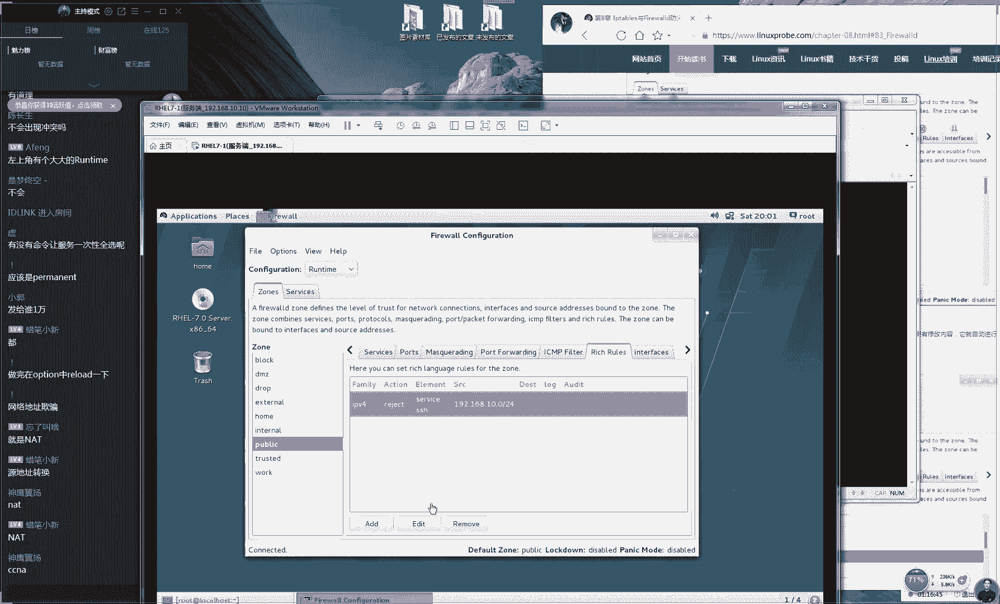
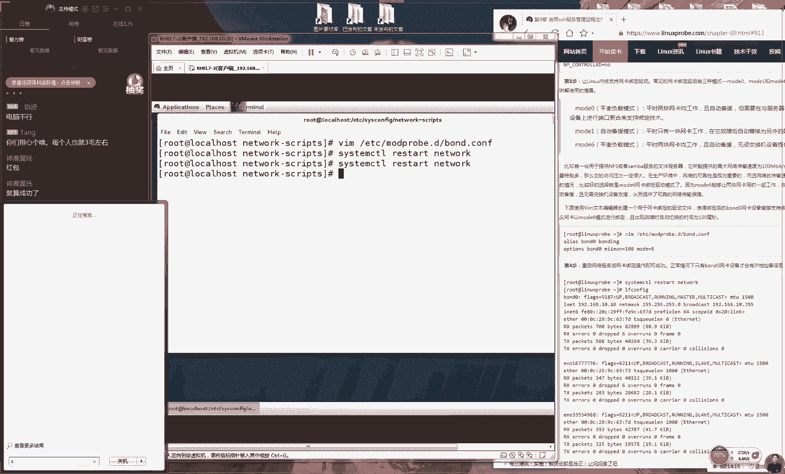
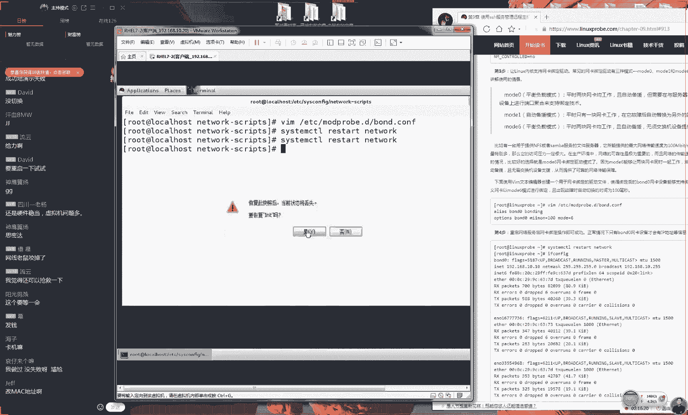
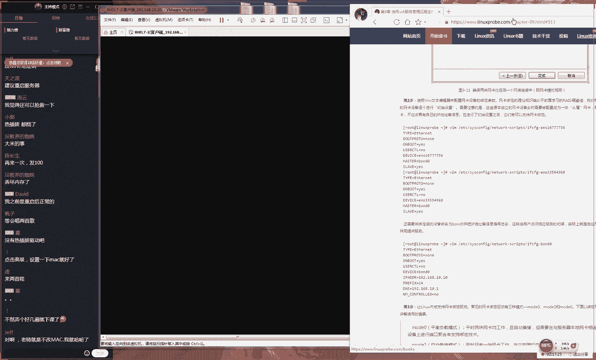

# 【RHCE】红帽认证工程师培训课程 - P11：第十一节课 - 天木轮回 - BV14E411678v

🎼个자。🎼さちは。

好了，那我们准备开始上课，同学们，现在我们先来测试一下我们这边上课环境。好吧，先打一下一同学们好，大家能听说话话大家能说话声打一下一好吧，我开始我们今天这个课程。

大家说这个歌单都什么歌单感觉歌好难听是吧？这个太让我为难了啊，我只给大家去西选一首歌而已。这就是那个什么美国什么音乐榜上那个就那个歌单，我们没有改过然后我觉得这个歌除了乱就是乱。

其他就是乱七八糟听不懂确实可能会比较嘈杂，而且我这个小喇叭质是很好那就我们开始上课同学对于我们这个歌吐槽完了啊，我们开给大家讲课了。因为开始上课之前大家好像对这个歌有很大意见啊，好很多人都说这个歌不行。

但我下礼拜换一首歌好听点。行那我们来去说一下我们的第八得重头戏不？我们讲一下个其实上一节课我我后悔的吧？就是我说完之后我我们讲第一个叫做。😊，我们第一个叫做这个I table这个防火墙的这个工具呃。

在工作当中可能不会被使用到，对吧？然后他可能在红猫热耀8里面也不会去有了。所以我说完这句话之后，挺后悔的，因为大家好像就不太好像都没怎么积这个命令啊，对吧？好。

虽然这个我们就过去了然就那那就啊呃那就过去了，好吧，因为这个呃。😊，我们呃它里面具体这个参数的话呢，我们今后如果需要的时候过来查就可以了。啊，不用说我们昨天非得要把它背下来。好了。

然后说啊会睡着那种歌要给大家一种do大的那种感觉。行，我因为我找不到啊，对吧？因为你们也都是。😊，因为你们可能经常听一些比较欢快的歌曲，我平时很少的，因为我比较喜欢集中注意力嘛。

我其实你看咱网站之前还有一个栏目嘛，就是放一种比较快节奏的这种音乐，其实我是不喜欢喜欢比安静点的环境才可以去做好，那我们继续往后去说因为我不太重要。

以我大家没有去也没有关系好为但但是我说但但是我说不重要，但是大家这个整体这个流程你大概能够明白吧，就是我防火墙的作用，对吧？

防火墙是作为我们这个内外网之间这一个保护的屏障是主要是了防止我们的外部的黑客来入侵们这个公司内网以的话我们这个叫做指的是从外部内部个流量的一个限制。我们这个动作它有三种？

这个允许拒绝记录日志信息这个我们这个防火墙比通用这个知识，这我还是有概念的。包括说。😊，这个方火强和策略，他是从上往下去匹配，匹配成功之后，他就会觉呃他就会来去执呃他就会来去呃那个直接执行啊。

然后他就不会去匹配后面这个呃这个规则，这样较通用的这个概念还有印象，这样话对于我们后面这个学习是有帮助的然后我们测试一下work修改也会同步啊，就说我们四个方法嘛，我们昨天其实是讲一个对吧？

然后我们今天会再去讲三个的，其实还是我们讲四个方法，只要会其中一个就可以了。如果说您之前觉得这个我们昨天所讲那个哎昨天所讲会比麻参数比复杂那我们今天可去尝试一下这个命令大家应该能够觉出其实在废话废话说很主要是等人数嘛。

才大概9个人现有了104人我们等来的15位同学好，那我们来去正式去开始上课啊，其实讲的话呢我红。😊。

里面我们的这个防火墙的工具呃是呃默认叫做fire world，就是我们这个8。三小节里面所提到的叫做fire world防火墙。😊，这个防火墙的话，首先它有一个概念就叫区域啊。

其实这个区域翻译起来很臭了，对吧？呃，这个叫做ZONE同学们看到之后说ZONE我知道叫叫做zoom对吧？叫做zo是动物园的意思错了，因为我们动画园是Z吧？然后这个zo的话是ZNE代表是区域的意思。

所以会有一些会有一些人把它直接翻译成区域虽然你翻译成区域也对吧？且英语上这个是没有问题的。但是我说完区域之后，你不理解什么意思对吧？那么我们给大家再来一个通俗一个讲法好吧。

就我这个管道服就是我们这个任意门一样，它就是我们的模板的意思，它就是我们的模板的意思大家现在可能理解什么意思吗？就是我们的模板，但我们举个例子啊，当你有一个笔记本或者说有一个电脑那么你需要你早起来。

起来需要公司，然你下午去喝咖啡，然后你回家。那就是说你的一个笔记本电脑你需要在三个情况下，你的家庭，你的公司，你的咖啡厅三个地方去使用你这个设备。那么你到不同。😊，地方肯定要有不同的这个防火墙和策略了。

到了到了呃到了公司，那么你要去开放一种比较基本的文件的传输的一种呃策略，对不对？那么你要去允许你的同事来去下单你的文件。到了咖啡厅，这是最危危啊，那么啊到了这个咖啡厅里面是最为危险的这么一个网络环境。

所以说你要去限制呃用户的这么一个请求，只需允许比较基本的上网的这种服务。到了我们的这个家里面是最为安全的一个环境，所以我们就可以去开放更多的服务。那好，那我们现在有一个问题了，咱比如说你现在。😊，呃。

那么你现在明呃。你每天你都要去这么三个地方去工作。那么你每天你到一个地方之后，再比如说你从家里到了公司之后，你每一次你都要去重新去配置你的防火墙。这个我们想一想就觉得很痛苦，对不对？那一种呃有规律性的。

而且我们对这个防火墙有这种固定格式这种参数的设置的话呢，其实我们就可以把套用到模板里面。当我们到了不同的这样的一个场所或者叫这个场景里面的话呢，我们那我们就可以直接来去启用某个模板。

就是这个zoom就是这个区域就可以来实现一个快速去切换呃大量的防火墙策略的这么一个效果。所以说我们就出在一个技术点了，大到你的书上面zo的话呢这个技术的区域的概念。

它实际上呢目的它的核心就是让你能够去大它就可以让你去快速的去切换大量的防火墙里面的呃策略的模板，那它是让你快速去变更防火墙里面的策略。😊，好，大家先记一下。😊，呃，我我我们这个区的概念。

然后我们可以看一下我们的表格是82呃，是呃是表格8-2，这就提到了就是我们这个区域里边的一些比较常用的一些区域，这就是我们这个系统里面默认去使用的一些区域。就是说我们系统安装好之后。

它里面就会有默认的一些区域的名称了。但是这个名称我们坦白讲你不用去看因为这个东西它只是跟你一先默认的一些模式，真正你要去使的话，你肯定要自己要去修改，然后自己要去定制。因为不可能有一个模板。

正好能适合你对吧？所以的话呢我们现在主要去关心就是有3条第一条的话呢叫做叫做public。所以我们看一下表格8-2里面应该是第五条这个public的话呢就是这个默认的区域就是我们当前正在使用的模板。

所以说当你想要去配置你的防火墙的话呢，那么你你也需要去来去修改我们这个public就是我们当前正在使用的这么一个模板文件大家记下，这是我们第一个非常重要的。

第二的话呢就是这个最后有一个叫做这个drum丢丢包状态。😊，这个指的就是禁止所有的流量，那叫做GROP啊禁止掉所有的流量。其实后面这个三个差不多都是一样的意思啊。那么只不过这个d丢包状态。

它是禁止到所有流量相当就是一个切断网络这个快速切就是快速切断网络这么一个区域这个效果。还有一个叫做是我们这边8表格里的第一条是允许放行所有流量所以就有个常重要区要关心一是ub就是我当前默认去使用一个区域防火就修改public的区域里的这个策略。

还有一个就是它两个非常极端的个策略当你需要开关闭防火墙就可以去尝试切换到这两个区域下面后面这个个这个block跟是一样的他们基本上是一的节可忽略不计。因为你真正去使用的时候，你会发现。😊。

他们两个效果是一样的。好，然后我们这个能稍微大一点吗？是这样的。大家如果看这个字呃，会很小的话呢，大家可以点开咱们的网站上面。咱们这个呃网咱们这个书籍一直在网站上面是有的。

大家可以点开我们的这个8-3表格，然后你可以在你的电脑上面也能够看到我们这个书籍。然后如果要是不方便的话呢，你也可以打开你的书好吧，然后书上面这是跟咱们书上面是一模一样的。

我只是把它放到旁边的意思是提醒我，我们知道大概这个章姐讲到什么章姐了。好吧，所以我会把它挪到一边去。大家不用看我这页这就他就是一个他就是一个小提醒，他是给我看的。好，大家可以看一下你的书。

然后我们得在书上去写笔记。之后记得我们拍照传到我们这个的这个博客上面，我们到4月份的时候，4下旬结课之后会给大家去发小礼物。好，然后说这个屏幕能稍微放大一点，对吧？

我们稍微到屏幕稍微放大一点O那我们来继续给大家玩一下，我们看一下表格8-3。😊，这个表格8-3里面就是对应的我们叫做fwork杠MD这个命令。它的一些对照的一些参数。如果我们这样去讲的话呢。

其实呃想骗钱，对不对？这个东西我照本宣科给大家讲完之后用用用不了10分钟吧。但是我我估计大家根本就是记不住。所以的话呢我们还是啊这些东西我。😊，这个是绝对不能过上课去讲的。大因为大家知道啊。

就是在一些好的学校里面，这个老师上课的时候，他不会去按照书本上去讲课的。因为你书本上的东西你一定要是先已经是作预习了。然后然后呢上课是一种互动呃，是一种互动跟交流的一个过程。所以说如果上课去念书。

觉得这样很low，对不对？很原始很低效很没有档次这种培训。所以的话我们这个表格8-3，我们就默认大家下课之后都已经是看过了，好吧，因为我昨天这个预习内容里面也包括了8呃88。3小节的内容。

所以的话呢我们就给大家继续来到我们这个实战，先给大家通过我们这个实战来去记我们这个命令。如果说您只是看过没有基数的话呢，那我们就给大家再来去实战来去操作一下。所以说我们还那我们还是提到啊，今天还好。

我们说的话的意思，就是说今天还好才第八章。如果说您之前没有预习，或者说没有这个预习的这么一个概念的话呢，没有这么没有这么个意识的话呢，请从今天开始还不晚，而且咱们明天没有课，对吧？我们明天3月30。😊。

一号是没有课的，我从啊之前给大家去说过，正好我们可以提前去做预习啊，还有复习工作。好了，对它都是参它它都是长参数。大家提到一个问题说它都是长参啊，它都是这个长参数。那么。😊，嗯，那我说我记不住怎么办？

它太长了，每一个参数，其实我我们坦白讲，我也其实我其实我也记不住。但是我们不用去记住它的。再我们红包器里面，我们最酷的就是它不光可以去让我们的这个命令跟文件去补全。

其这个命令支持了我们这个参数补这个特别的使用到这个table键所以说坦白讲我我我实我也没有记住话但是我没有关系啊，你只需要去打上我们这个命令的前面一部分，你就可以按两下table键。当你敲完之后。

他就告诉你说你可以去使用的参数是什么。然后比如说我我们想要去get那于是我们就可以使用到一个table键也可以看到自动帮你123看好12你看自动帮你去补全敲下回车他告诉你说当前的这个区域叫做public。

看这就是我们做参数补全的一个好处。这大家有没有回忆起来是我们3月10号的时，310号是我们讲到我们的第三节课是我们第二章节里面我们21小节给大家提到的一个就是。😊，显示器它是一个。

非常好用的一个解释终端。它是一个人与计算机的一个翻译官，对吧？但是我们说为什么要去使用到bu它有4个好处。第一，我们这个变量。第二，我们上下去翻我们的制定的命令啊。

第三就是我们这个脚本有丰富的这一个变量的一个知持。但是我说你不要去你不要去这里的这个4条为这个条里面是我总结出来的这个节的好处，我们一定要根据自己的这么一个体验，自己来去判断说它真的是好不好，对吧？

那我们现在可以来去尝试一下，你自己来动手去操作一下，我们可以打完一部分之后，直接点一下table键，你会以直接做我们命令的补全真的是方便，真的是好用的？很酷？

所以说我们这个新的所以我们这个新的网站就叫做3Wlin所以我们做广告回车告诉你说我们这个默认的区域叫做public我们才所讲的是一样的。

所以说我们待会要去配置了你的这个防火墙策略要针对这个public去做。😊，如果说你配置的是其他的这个区域的话呢，那我我们这个流量它不会经过你，所以你也没有效果。好，这就是说到我们。😊，啊。

这就是我们说到我们需要给我们这个系统先去检查一下我们当前的这个区域是什么。然后我们再去配。之前我就范围一个特别特别特别傻的一个问题啊，就是我记得么来当我在讲课的时候，我把我这个区域。我把我这个默认区域。

我给修改成另外一个。但是我就去配置我防火强策略结果怎么配吧配置配成功，但是没有效果，就是我们一定要确认你当前使用的是什么区域好吧，这个我们需要去注意好。

那我们清屏使用的是对l加你们厉害比如说凡同学你怎么知道我l加大家是之预习过？还是之查到过一些快捷键，这我好像没有讲过呢？很厉害啊。

真的是有同学们在预习的很细心啊老鸟吧其他培训机构派加来的那我给大家去玩一下了啊，就是说我们不光可以去查看我们这个默认区域我们还可以去查看我们一个网卡上面的这个区就是我们服务器上大家。😊。

就是说我们在服务器上面，它可能会有很多个网卡，对吧？这个这个这个这个很正常，对吧？就是我那我们在一个服务器上面，它可能会有很多块网卡。那我们就可以把我们的不同的网卡绑定在不同的区域上面。

这样我们对外的网卡就可以稍微严格一点。对于我我们这个内网的网卡就可以稍微的就是呃稍微的策略上可以稍微的放松一点，对吧？那我们现在这我们举个例子啊，举个生活上的例子，你们家按防盗门是不是只按一个防盗门。

你们的卧室不按防盗门吧，反正我反正我们家的卧室不按防盗门，为什么？因为你当你进入到这个家庭了之后，在我们的这个公司内网之间，我那我们这个防火墙和策略就可以稍微的呃宽松一点了，对吧？好。

那我们就可以那当你需要的情况下，你也可以来去查看某一个网卡上面，它绑定的这么一个。😊，特定的网卡的区域的呃呃，去帮去他去查询一下特定的防火墙的这么一个区域。他告诉你说他也是public。好。

所以大家看到了啊，就是我们现在查到的的这个结果，我们那么啊还是他也不重要，对吧？因为我们去按照我这样的这个操作做出来的通样的效果，这没有意义。那我们还是要去一个理解的一个过程。

现在我们先来去分析一个事情，就是我们要想来去执行这这个命令那我们就要去使用到一个长格式这个长格式的话呢，我们可以用到这个table键补齐，所以我们下个之后大家可以动手操作一下。你看看还有其他的命令。

他能他的这个参数能不能去使用到table键做补齐。以我现在来讲，我发现了很多的命令他们都还是不支持的。哎就是我们他还是有一个完善的一个过程。所以或许可能没准大概在个发布之后。

我们会发现所有的参数所有的命令他们都已经支持table键做补齐。但是但是在这个现阶段来讲的话呢，work是我发现的第一个他可以用参数补齐命令特别的方便然后说当老婆打的时候赶紧。😊。

防盗门啊能能呃能多活一时算一试好，大家是有大家都是有大家都是有故事的人啊。好，然后的话呢我们继续来讲，就是我们这个防火墙的策略。其实大家想其实来说它是有两个保存的这么一个位置关系的。

第一个的话就是叫做当前生效模式叫做run time就是我们当我们配置好一个防火墙策略它默认就是在一个当前生效模式下还有一个叫做永久生效模式，它有两个么那么他两个有什么区别呢就是大家记下这个很重要。

大家这个记不住的话，我们配置出来的防火墙策略最后就会发现总是配置出来不生效。好吧，大家听一下这两个区别。好，第一个我们这个run time是当前生效的意思了让大家强迫你们去记笔记，所以我就打字好吧。

不是因为我懒因为我想大家去记笔记，第一个我们当前生效模式，大家记一下当前生效模式。😊，我那我们在这个模式下面，我们配置出来的命令是当前生效，而从启后失效。当前生效从启后立即失效。好，大家记一下。

这是代表的是当前摄像模式。呃，的那这个是我们的当前的声降模式。好，还有我们下面叫做这个呃永久生效模式。它的话呢大家就大家现能跟得呃，大家现在能跟得上吧，大家记标简点就好了，不用记得这么复杂。啊。

第二个我们叫做永久生效模式。这个指的是当前我们执行的命令的话呢，它是不生效的。只有当我们重启了服务器，或者哎去执行一下叫做firewall哦，不用大这个不要大写啊，firewall。😊。

刚CMD刚刚reload命令的时候，你要不然去重启一下服务器，要不然你就去执行一下这个命令的时候，这个你配置出来的策略，它才能够去生效。好，大家记一下，这有两个模式。第一个模式当前生效。

那我给大家打出来吧。好，我怕大家会都。😊，呃，当前生效。好，第二话呢，我们叫做永久生效。好，这是我们这个当前生效跟。呃，永久长期生效两个模式的区别。第一再给大家说一遍啊，当前生效指的是大家听好啊。

当前不生，不呸呸呸那呃当前生效而重启之后失效。第二个是当前不生效，而重启之后或执行这个命令之后，它就会立即去生效这么两个模式。好，所以说我们待会儿的话呢，配置一个防火墙的策略。如果说我们没有加上。😊。

永久成像这个参数的话，默认情况下都是在当前生效模式下进行的。好了，那我们先给大家玩一下。咱比如说我想要去设置一下我们当前的这么一个区域。

那然后我们就按照我们现在书上面去讲书上面直接切换一个网卡这么一个信息。但是我们后面会给大家讲这个防火墙策略的时候给大家去说。所以我们第二个实例就不给大家去讲。

我会大家讲们如配置的防火墙这个实例的当中会大家来反复去使用到这个参数。那我先给大家玩一个，就是我切换一下我们默认的这个区域。那既来说我们当前这个区域，我们叫做public。

那我不喜欢它我想给它换那我想给它换成什么呢？我们把它修改成地方，我给修改成如说我们想修改成DMZ这一个模式。

才会再回车这个这这个它在英语里面怎么验证三个区域它怎么样验证三个区域好这个没有太理解好吧然后有什么问题话可以来继续说。😊，然后这两个命它有什么它效果是一样的，反正我们建议去使用刚刚reload的。好吧。

尽量以我们这个比较标准的方式来去执行。但是如果重启防火墙的话，应该是可以。但是这个我没确实没有试过，但是既然有更好的方法。再其他的可能会出问题的方法？

好那我切换成DM这模式接下去查下当前所处的这一个模式信息大家可以看到就是我们从这个lic这一个区域下，我们就给切换成了叫做这个把它给切换成了叫做DMZ这么一个区域了。

它要是切换我们当前所在区域这么一个方法。当然我们把它给修改回来，因为避免我待会配置这防火墙和测忘记了置来结果总是不正确再把切换回来这常简单这这个没有这技术含量，主要就是操作一下我们这个参数嘛。

然后知道我们这个区域之间该怎么去切换就好了。好接下我们还有一个叫紧急模式。当我。😊，呃，比如说突然间发现我们的防，那我们这个防火墙出来漏洞，或者说有单位黑那当有这个黑客来去入侵我们这个服务器的时候。

那我们就可以开启这个紧急模式。我们叫做pack on啊，我们就可以来去开启我们这个紧急模式。这个紧急模式的话呢，效果就是切断一切的网络连接。包括说你从外部去拼我这个服务器，它都会显示出呃。😊。

连接失败这么一个请求。那我们可以来看一下啊，我现在去拼一下19268点10点10的个IP地址。大家可以看到我我们现在这个效果是能够拼通。然后说明我我们这个真机可以跟我们这个物理机保持一个网络的一个互通。

好了，那我们现在的话可以开启我们这个紧急模式。当紧急模式它只要开启的一瞬间来看好了准备好没有？那啊但说把网线更快，但是你想你把网线，那你必须要在这么一个机房里面。

那你要跟你这个服务器保持在同一个物理的环境下，但是如果说你在北京你的服务器在上海怎么办？那我们就不用把网线对吧？那然后断电的话，那也不行，那我们就可以开启这个紧急模式快就去切断一切的网络连接。

连你拼看到了这边你连拼都拼不通了，我们敲回车了看到它要成功了。好，其实我们坦白讲，这也没有什么这也没有什么可讲的，它就是有两个模式嘛。第一就是我们这个紧急模式，当你开紧急模式之后。

它就会去切断一切网络连接来保证我们这个服务器的一个物理。😊，安全啊，然后你如果说排除了危险了，然后我们就可以把这个啊紧急模式给它关闭。好，其实这个我觉得啊。😊，讲起来好好好好水呀，对不对？

这个没有这个没有什么难度啊，也没有一种参数组合的一种复杂性。大家听完之后感觉哦有这样吧，对吧？所以我后面给大家去玩一下。

就是说那我们该去如何像我们这个来对于我们的具体的服务来进放跟拒绝那这防火的配置上面，那我们该怎么去操作呢？这个大家就要去关注一下我这参数，面就要提问了大家看一下我去使用到这这个命令啊。

我也是吸取了我上一节课的这个这么一个教训啊，所以我们今天我没有给大家去说后还有一个叫work这么一个命令，因为我怕说完了之后，大家不好记这个命令了，吧？大家大家又不好记这个参数。

所以在没有说所大家要是之前或者说昨天已经是预习过这个八章的课程的话，听我说这段话应该是能够理解应该能够我们来继续往后去说但如果没有预同学没有关系。😊，继续往后面给大家去讲，现在我们来啊。

我现在不敢给大家多说话嘛，我怕大家后头又觉得它不好玩了。好，那我们现在来去设置一下我们当前的这个区域，它指的是你要给谁去设置区啊要鸦界面我们没有这个工具的大家不要影响我其他同学不？完鸦界面么？

继给大家去现我来针个区们来设置一下我的这个方规则第一条的话不是要去设置它要查询一下记不住记不住那怎么？齐告诉我能我查询一下服务我查一个服务名称叫做这个不重要大家只要关心我这个过程。

不要关心我具体的这一个参数。因为我因为我们下面一个服务。😊，呃，SSH就是我们待会儿我们今天啊会给大家讲到的这么一个服务。然后还有一个A呃还有一个叫做网站服务HTPSS这个是在我们的第九章的时候。

大家不第十章的时候呃会大家讲到的。😊，好，我们敲回车了啊，他告诉我们说他他是yes，是说呃他现在允许从外部到内部的一个访问去访问我们本机的SSH这个服务。O我们再换一个。

再比如说那我想要去查询一下你是否允许这一个服务123敲回车，告诉我说是no那也就是说我们当前的服务器，它是允许SSH而没有被允而没有允许从外部到内部的一个访问防火墙访问网站服务的这么一个策略。

那么怎么去操作呢？那我们就要把我们当前的这个网站服务也要加入到我们的防火墙允许菜单当中，那么这个添加的这个命令的话呢我们把叫做A命令表是添加你只要将一个服务家记住个的术语是当你只要把一个服务加入到了防火墙表里。

后那一瞬间就会发现这个变成了就说请一个女生吃饭？没同意。但是后来你跟他说我。😊，吃呃西餐，然后非的呃然后啊说非常的奢侈，就他就去了一样，对吧？就是我们啊这个开玩笑啊，我们马上到马上到这个清明节。

我们不能说这么啊不能说么开心的这种这种玩笑。好，那我们来继续给大家去说，就是当你想要去查询一个服务，它是no的话，证明我们这个服务器它不允许从外部到内部的一个访问。

那么于是我们就可以把这个服务加入到我们这个允许的列当中。那么于是我们再去查询的时就成好，这个其实来讲，我们也我反正我反正我自己感觉啊，也没有什么难度，然后难点就要来了。真正我我们这个难点就要来了。

既然来讲，我们已经将这个服务加入到启动项里面了。好，那我们可以再换一个。比如说HTTP。😊，这个也是个网站服务。好了，既然我也把它学会了，请问大家看好我这个操作啊，马上就要出坑了。

然后我后面给他加一个参数，我加了一个永久生效的这么一个参数。😊，好，我现在敲回车，他告呃，不对不对呃，我我先给大家玩一下啊。你看啊我现在先去查询一下，说我们当前是否允许我们这个网站服务。

他告诉我们说是no。好了，这个时候我们就可以将我们这个服务加入到我们的允许列表当中，并且我们给大加是一个永久生效的一个模式。这样当我们再给大家去敲回车，那一瞬间他告诉我们说执行是成功了。

O他是执行是成功了。那么请问啊，那么请问当我再来去执行同一个命令的时候，再来去执行这个命令，我们查询当前我们的网站服务是否能够访问我们这个服务器的结果应该是yes还是no啊，大家不告诉我y还是no啊。

你直接打一和2就行了。如果是一就是y二就是no可以吧？我们的一23，告大家告诉我说都是R啊，大家告诉我都是二的话，那你们都会，那我们还讲什么呀，吧？大家配合一下我，你们不要这么齐心啊。

你们你不要打一你打一的话。😊，就证明我们没有这个课没有讲就没有就也呃呃就也没有讲对嘛。大家可以打一下三，对不对啊，证明说你这个题也太简单了，我们都不太不屑于回答这种问题。你这个题好low啊哈。

这个是一个解题的一个最高境界嘛。好了，我们现在调脚回车，果然他就是个no。然，我给大家提呃我给大家提一个小故事啊。😊，就是我当时我去专升本的时候，我老师是一个很厉害的一个教授，他教我数学。

后来他说你这个做题吧，他有三种这种他有三个这种层次。第一个层次是能够及格啊，及格就证明你是呃中上等吧，对吧？起码来说60分能及格，这是第一个层次，你要能够及格，好吧，这是你第一个要求。

第二个及格就是你要拿到一个高分。再比如说你拿到一个200分不不不呸呸呸呃，你拿到1个300分，你拿你要能够达到这个红帽，或者说拿拿去拿到一个考试的一个满分，证明你的这个能力已经是呃。😊。

等于或者超过他这个试卷上面所要求的这是第二个层次。第三个层次是什么呢？第三个层次是你还能够找出来这个题目出来的错误，或者说他答案里面是这么去写，但是你用另外一种更加高级的方法来去满足他这种他种需求。

这个我觉得认为他是一个更加高级的一种玩法。所以的话呢大家可以去发掘一下待会题目当中的一些漏洞啊，家可以去互动一下。好，所以说我们现在不能够停留在第一个阶段，就是能够及格及格是算什么这个算什么难点。

你要去的考场当中去调下这个考官你调考那你既然能够调那既然能够去调戏考官，能够去去找出来这个题目当中的一些问题，或者说你有一个更加高个方法来操作这个实验的时候，那你才是到另外一个境界。好。

那我们现在敲完命令之后，我们发现当前是no为什么呢？同学可看之后我还不太懂啊，为什么他最后是no呢？我们明明我们执行了这个命令了，并且我们将加入到动项了。但是还是。😊，no我们明明刚才成功了啊。

为什么明明成功了，而我却没有成功。这就是因为我们刚才操作的是什么呢？永久生效模式。哎，所以的话呢这个模式有一个特点，我们讲到它是从启或执行fi杠CMD杠杠reload的啊。

这么一个呃参数之后才会去生效的一个模式。我们需要。😊，执行这个命令，或者你给我去重启一下服务器。马上你再去查询，就变成了是yes。好了，下面就给大家提一个很重要的一个点，写到你这个呃书上面。好吧。

如果你要是有条件的话，你可以去纹身啊，纹到你的胳膊上这缓写上就是我们的啊第一句话。😊，我我们这个有一个配置的一个口诀，就是linux。系统中的一切都是文件，大家可以区分到你的身上啊，这个才是真理啊。

第二的话呢就是呃配置一个我们说配置部署一个你说不署的话比比较高端，对不对？部署一个服务，就是在修改配置文件，你看这第二句话，第三句话修改过后记得啊当我这个话比较俗啊，记得重启一下，你看我们记得重启一下。

第四句话顺手加入到最后我们第四句话了啊，开机启动项中，为什么？因为我们的红帽考试，它是一个重启之后判卷子的一个考试，对不对？所以说如果你配置的这个服务没有开启动项面把给啊加入的话呢。

现在就是你最后你的那个作业忘带了，最后你最后老师想给你份他都给不了。因为你没有这个具体的一个作业嘛。那们最后没有一个具体的成绩，请将你配置的所有的服务都加入到启动墙当中，那以我们这个实验为例。

就是你再去配置这个方火墙策略的情况下，请你一定万分小心，一定要。😊，我加这个参数，大家记到你这个书上面啊。然是呃永久上下的意思。啊，这个单词怎么念啊？per是吗？啊，proO来请记一下啊。

就是我们去做考试的时候，请万分小心，就是一定要加入这个参数。让他保证下一次重启之后还依然能够为我们提供服务这个很重要的一个参数。好，那我们既然说完这个之后吧，那我们再给大家玩一个好吧，因为这个太重要了。

所以我们必须要给大家多举几个例子来去反复反复的来去这个这个这个来来去练习，下面我们讲完之后，我给大家玩一个端口号。那么既然端口号我们也能玩啊。比如说我们现在开是允许的一个服务。

我们现在想要去查询一个想要去查询一个我们的。😊，哦，对我们刚还有呃还有一个实验就是来去移除掉一个服务。再比如说我现在想要去查询说我们当前我们的这个public这个区域下。

我们是否允许的我们的这个网站服才告诉我们说是yes好了，那我们该怎么样来去禁止掉这个服务呢这么其实也其实来说这个也很简单把这个不是A吧添加reve是移除，所以我们就要去敲一下re这样就好了。

我们敲回马上再去看请问我当前去敲我们我我去敲我们这个命令，我们最后那个结果是yes还是no大家不要告诉我是三你直接告诉我是三他不要这样啊，他就是你们啊可以。😊，呃，有一部分人，然后说呀三呀四啊什么的。

你总要给我一个正确答案嘛，你太你太不配合我也不行，对不对？好，大家要稍微配合着我就就可以了。你可以先说一下一或者2，然后再说三嘛？你都说三那我怎么知道大家听没听懂啊好，我们来去说一下啊。

这就是一个更加高级的一个层次。就是说我们现在已经不是上课一个互动了，不是我在提问，大家回答你们是在调戏我，你们再说我这个题目出的好几单，对不对？你们达到另外一个层次，这个才是我们教学的一个高度。

这是我们区别于其他培训机构的一个一个追求嘛，对吧？要去调戏老师好，那我们先来看一下说同学告诉我们说啊，你这个这同学叫这个叮当猫同学给我发了个一23是我让我自己选一个是吗？行好，那我们现在来敲微车了啊。

我们先公布一下结果，最后他这个结果是no为什么我们刚才我那我们刚才明明同样的操作，最后那个结果就没有变化。为什么我们现在还就有变化呢？这就是因为我们当前所有的这个操。😊。

都是在当前生效叫run time模式下进行的。再啊O啊，再给大家去说一下啊，我们当才做的这个操作都是在run time当前生效模式下进行的。所以说我们当前生效的这个模式是当前就会去立即去生效的。

能够看到这样的效果，所以说这个操作是没有问题的，但是我们去配置这个服务跟我们考试的时候的话呢，请切记加入到永久生效参数当中，这个我们要去注意一点。好，下面我们再给大家去玩一下。

比如说我们想去允许一个号可不可以啊？可以啊好了，我们现在这样去做来说老刘太难伺候我们继续这就是咱们讲课的一个高度，对不对？不要再局限啊就是像其他机构一样，就是大家听懂了吗？听懂了，对吧？这没有意义对吧？

大大家是提到另外一个高度上面啊，或者你们可以后给我出题，对不对？😊，好，那我们现在来去允许一些端口号。再比如说我想把这个端口号，我们去来去放行一定的这个端口号怎么去操作呢？比如说我想去放08啊。

那么想要去放行8080端口号，那我们就协议。但是说你以直接880我们这个指的是一个范围啊，8280说比说那我们就是来去放行8080到882801个200个端口号我们可以去开启一个端口号那我我们现在可以去放行某一个指定端口号也可以去放行某一个端口号的一个都可以我们一回车那我们该怎么去查询呢那么很简单。

就是也是reload没有用直接我们来查看一下当前允许号有些他就告诉我已把生效成功了。然后说zo public这个参数我没有过这个意思啊家打错了，不是这个。😊。

public我们写的是杠杠作等于public。这指的就是我们定义一下我们当前配置的这个防火墙和策略，它是针对于哪个区域生效的。好。

再给大家去说一遍这个参数的意思指的它指的是我们配的我们当前配置的这个防火墙和策略，它是针对于哪个区域。😊，当前就是指的这个public这个区域啊，它是生效的。好。

所以说我们配置过的这个策略才能够去当前能够去生效，才能够看到这样的效果。好，然后大家现然大家可能现在想看一下效果，对不对？但是我们感觉反正先拍完，然后我们先开呃，然呃那我们先拍了半天，但是。😊。

他是否成功，我们也不知道对吧？反正就看我一顿子敲命令，但是最后是否成功也不知道。所以我给大家去玩一下，好吧，就是我们一个端口号的一个转发。

我们这有一个服务的话我们叫做SSH服务这个我们计算机里面这个号22号比如说我不想让他去使用那我们如果说想要去做一个端号的一个转发。

当我们一个用户当我们从外部的一个用户访问的是录当我们一个外部的一个用户访问的是888口号的话，他也能够自动去转发到我们本机的SSH服务括弧22号上面那我们该怎么去做这个端口号的转发呢那么也很简单。

我们这样去做另外我们看下效果我不能光说对不？大家会说我作弊没没有生效，然己说过去。我说的也听不懂？给大家去操作一下先访问一下我们这个服务器告诉我们说成功的，然我们这样加一个号8号告诉。😊。

我们说连接3个8端口号，它是一个请求超时的一个结果。你看到它正在连接3个8端口号，但是他会提醒你说连接是失败的，好了。😊，啊，看不见啊，这个没有关系啊，就是大家要相信我，我现在真的是正在连接。

然后一会儿就会失败了啊。😊，不用看那具体的细节啊，细节我的话，我们明天不我们呃我们会在今天待会儿啊就会给大家去讲到这个SS这个服务。如果今天讲不到的话，也会在下礼拜5的时候会给大家去讲到的。好。

具体细节大家不用看啊，就先看到我们这边告诉你说链接我们这个1928101这个主机的3个8端口号的请求是连接失败的。好吧，好，接下来我们就可以来去做一个端口号转发了。

那我们要想让用我那想让我啊我们这个用户能够通过访问3个8端口号也能够访问到我们的。😊。

这个服务器的SSH服务那该怎么去操作呢？那么那么就很简单，也是这样去做，但是命令会很长啊，而且我也这个我也记不住啊，我们先需要提醒一下，而且我每次敲的奇，把它敲错别的奇，因为太长了，大家不要笑。

这个正常的。因为这个命太了，而且参数复杂，所以待会给大家讲一个更加简练的方法。好了，那我们现在给大家去说第一个叫做大家看好了，我敲一个参很关键待我们就会针对这个参数来给大家提问好了。

我们对应这个public区域来进行操作。我们再给大家去说一遍啊，你要想去配置你的防火墙的这个策略，请一定要切记你就要给我去使用ub这个区域给去操作。为什么呢？

因为当前的这个流量是经过于public这个区域的。如果你这不那么如果说你没有针对于这个区域去操作。那么最后你配置出来个效果也会是没有效果的。那么配这命令也没有效果的。😊。

嗯，好了，窗口太小看不清啊，我把稍微调大一点好吧，现在好一点吗？如果看不话，再给调大一点。好，接下来我们再给大家添加一下这个参数这个参数我也记不住我怎么去操作？

只要我们前面的一部分就可以按到我们这个table键帮你补齐看到没大家敲一遍这个参数for那我装没有记住好我敲一回收敲下这个table键看了23看到没把自动补齐所以说我不要让大家去记我们这个到底怎么怎么好大家去感受它接下我还有一个是我号这需要去写两们号然后写三个8指的就是当有一个人从我们的远程访问到我们的个8号的时。

但这个三个8可以去修改可以修改成4个8868都68不以因为端口号的范围是从0到535？这大家随便去选一正我们选38你可以选4个8或者选5个8。😊，诶，5个8个10百千万65535啊，不对。

你不能选择5个8，你可以选择其他的数字，只要65535以内都可以。好，接下来我们来去讲一个呃它是一个它它是一个它是一个简写啊，它指的是一个协议的一个意思。它指的是啊388端口号，它是什么协议呢？

我们选择它是1个TCP协议。接下来我们还是to point，它指的是你要给它转发到哪里呢？转发到22端口号上面。接下来 address，它指的是转发到哪个主机。那因此我们就写上我们自己的这个主机192。

168。😊，啊，大家使用3个6也可以啊，大家可以敲666。好了，我们去转发到我们的本机的22端口号上面。在家看我现在这个操作啊，当我敲下回车那一瞬间，他告诉我们说呃，他告诉我们说他的是成功的意思。

那么请问当我现在敲完了我们的命令，让我们远程的用户访问3个8端口号的时候，能够自动的转发。😊，到我们的本机的22端口号上面。那么请问此时用户从远程去访问，能否访问成太单？

大家听我说完题好不好？给点面子啊，但你这样太不给面子了，我还没说完题目，我就开始就开啊大就开答案啊，你们不要这样啊，要给我点面子，等提前说咱们等提前说完呢。

请问用户现在访问我们的这个服务器的3个8端口号的时候，转发能否生效。那也就是说我们去访问这个服务器的时候，能否成功呢？大家告诉我是一和二就可以了啊。😊，啊现在有点乱了，现在有点乱了。

就是你们现在心里都在偷笑，但是我不知道你们知道到底是谁会谁不会了。你们打一和二我就忍了你打九意思讲行打4，们现在啊已经有乱了。们这个回答这个气氛啊好。

那我们就默认大家那默认大家还是不会吧好吧我们继续给大家讲一遍呢。如果会会了。如果是不会话，大家讲一遍啊，当我回车后连接这个38号的，他这个转发是没有生效的。你看到他是连接失败的。那为什么呢？

我这个问是为什么呢？我们明明去之的这个命令，你看到他是将38号TCP流量转发到我们的本机的22没有做错，为什么他最后没有生效呢？就是因为我们当前使用的一个参数叫做永久生效。永久生效的这么一个模式。

他要怎么样从启是当前不怎么样。😊。

当前不生效，重启之后生效，或者我们需要去执行一下叫f这么一个命令，让它能够去立即去生效。哎这样的一个作用。好，大家说这个转发命令好长啊。对命特别的长，但不用着急，甚至来说你不用去背它。

我待会给大家去说怎么去简化我们同样的这个操作。好吧，这个不用着急，然后说呃可以去写成or吗？这个是不可以的，你可以不写这个参数可以然后你把它可以写成把可以写成loc house也可以们待会大家讲一下。

我们该如何去简化我们这个端口转发这么一个实验。好，那我们该怎么去操作呢，那我们就可以去重启一下我们这个服务器或者。😊。

执行一下我们的firewall杠3MB杠刚reload来让它去立即去生效我们下后回车。😊，好，这个时候他告诉我们说执行成功了，马上再来我们进入到我们这个服务器当中去敲一下回收。看到了没？

就开去连他就可以去呃，他就可以进行一次连接了。😊。

好的，大家可以看到，现在我们就可以进行连接，然后最后连接肯定那么也呃他也肯定也是就是成功的。好，那我们现在就给大家去说一下啊，就是我们切记请记请记住我们在考试的时候要去加上这个永久生效这么一个策略。

再给大家去玩一下。那我们比如说我们想来去单独去禁止一个用户，或者说某一个网段去访问我们的具体的某个服务怎么去做呢？就是来进行一种精准的流量的匹配。这个我们就要去使用叫做这个复规则。

这个赋它有两个翻译的方法。一般来讲就是比较比较常见的一些教材上面的话呢，这个赋写的是这个复就是这个赋予的叫做复规则。但是我认为的话呢这个应该不是么去写，叫做复杂的规则我们叫做这个复规则。

或者说叫做种复合规则，叫做复合或者叫复杂一个规则。它指的就是你要对于某一个流量，它这个进行更加精准的一个匹配的时候，那么你自然来说你就要去描述更多的这么一个信息。但比如说我们现在你是一个工那你。😊。

一个公司的一个门卫，你想去防止坏人进来。那么你有两个那么你有两个可能的种标准。第一个标准就是他呃。呃，那咱咱比如说啊今天会有一个坏人过来你们公司里边来闹事了，那么你有两个可能的这个选择。

第一个选择就是他只要戴了墨镜，那我们就去呃禁止掉这个人来进入到我们这个公司的一面，这是我们第一种选项。这个虽然也很简单，但是他会去禁止掉一部分原本不是坏人的流量，他会去啊。

他会去禁止掉一些正常的一些流量。第二个的话呢就是我们进行一种非常精准的一种匹配。比如说有一个男的啊大概30多岁啊，脸上有两颗痦子，然后其中一个物子上面还长了根毛啊，然后这个然后的话这个毛上面的话呢。

这个最顶多还是个然后还是个然后还是个红色的一个分叉，然后他带着一个墨镜，这个墨镜上面还竖着一个小竖着一个小天线。你看啊。😊，当你这么对他进行了呃。

那么啊当你进行一个非常复杂非常准确这样的一个描述之后的话呢，就会去来去精准的去找到具体的这么一个人，而不会去错误的去来去禁止掉正常的一个流量。但是这个规则非常的复杂，我们把它叫做这个负规则。

但是它也更加的这个精准。好了，所以说我们现在有一个第三个名字我们叫做精准规则。好，这个三个名字其实指的都是一回事。大家你们可以去选择一个自己的。然后他还说富婆规则，这个富婆规则就不是我讲的了啊。

那这个都是你们自己瞎想的了。好，好，那我们再给大家去反一下说，那我们该进去如何针对于某一个。😊，用户或者说某一个主机去访问我们的本机的某一个服务，我们给它进行拒绝呢。其实可以的。我们先来去访问一下。

你看啊你先从你的远程去访问一下你的这个服务器。那那我先那我先乔薇说了123了啊，123，他告诉我们说链接是成功的那我们现在就有问题了啊。

那我们该如何去呃来去禁止掉我们来自于我们的物理机的用户去访问我们本机SSH服务呢来去做一个复杂的规则吧。好了，我们来去叫做firewall。😊。

wallMD好，我们叫永久生效表。所以我们待会儿啊我就不给大家再去提这个问题了。因为我觉得这个问题反复提三遍就没有意思了。大家会感觉我好像没有什么水平，对不对？就只会提这个参数的问题而已。

但是我主要让大家能够记住这个参数就可以了。但我会去这个参的这一个问题了。好，大家放心我们继我是底线ub这个区域来去做一个复杂的规则，或者说我们叫做准的流量一个匹配。我添加一个规则叫做记住。

以添加一个代表就是一个规则。所以你看英语它翻译过来一个的但是我们认为它应该是复杂的复或者说叫做精准流量匹配。😊，好，接下来我们继续往后面去走。它我们现在下这样写这个参数入代表就是规则规则的意思。

然后ly它代表就是我们的协议组，我们后面需要去写就一个I4就是我们当前这个流量它是基于我们去做这个流量的限制，而而不是我们的个6还有叫做这个实际来讲就是我们一个来源地址的意思。我们待会我会给大家讲一下。

如果说是 table下面我们该怎么去写这个参数。然后就会知道原来这么简单其实我们去使用自己给自己找麻烦。我们去这去写这是我们的一个网段。😊，或者你也可以去写一个单独的一个主机都可以。我们选一个网段了。

好，s name它指的就是我们要想去呃呃serv name它指的就是我们要想去禁止的这么一个流量的名称，我们等于。SSH最后rereject我们最后结束掉它。当我们敲下回车之后啊，这个命令特别的神奇。

就是我每次去敲，每一次都会出错，我总会操作点什么东西。好，我现在我们这边少了一个N，我把它补全之后再给大家敲调回车，你看一下效果。好，果然来讲我还是写错了啊，我看一下 name。😊。

这个命令特别的神奇啊，我我我每次去敲，每一次都会错，因为它太长了啊，再去敲一下回收。OK没有问题了。好，大家看一下啊，大家看完这个肉感要吐血，对不对？大家大家要吐血是很正常的，因为这个命令太太太长了啊。

它太复杂了，大家看到它太复杂了这么一个命令。😊。

但是的话这个命令的一个核心的一个点的话呢，你看到啊它命特别的长，但是这个它并不复杂。它是一个核它一个核心的一个功能的话呢。

实际上它就是要禁止掉1928101这个网用户去访问我们的本机的S这个号这个服务仅此而已。所以看到了这个的关键点它就是有3个。第一来说来源地址对吧？是它是来自于我们某一个网段了。第二我们具体的本机的服务。

第三个我们该怎么办是给他鞠个工还是给他拒绝了，那我们就要有一个动作，好，所以说你看到这个命令它很长，但动作其实来说非常简单，这个功能个单一其实来说我们先看下效果。

马上我们再去敲一下叫做看一下马上再去访问到这个服务器的时候，我们的口号不能够访问了。你到效果很明显，虽然你效果明显，但是太麻烦了。我觉得以后工作的时去会把我。😊。

不对？所以说我们这个命令啊，如果你要是在这个ip pay的下面。😊，去敲的话，我给大家去打出来。一模一样的效果，大家看好一模一样的效果。对于我们这个input点进行的操作。OK当IS来源地址。

一个消息IS代替了字为大长串的这么一个两个单词，来自于192。8。10。0这个网段。😊，什么服务？啊，杠P protocolTCP协议de point22段口号。接下来杠J rejectject。

所以看到了，如果你要是在这个呃IP table下面来去敲这个方火墙的策略的话呢，只需要这么一行。但是你要在这个firewall下面去做，你需要敲两行。😊，这个时候大家就有点不高大家有点不太高兴，对不对？

你明明你刚跟我说完，你说红猫这个到了红猫热扒了，就一定要有这个呃这个服务了。那你先要告诉我们说这个那么复杂。那你到底要我们该怎么去做这样的比较复杂的这样的命令呢我那我是记不住如果说你是为了考试。

或者说以后工作时候有图鸦界面的话呢，我再给大家讲一个工具。这是我们讲第二个就是它虽然很好用，功能很丰富，但是它太复杂了。好了。

那我们就给大家讲我们这个第三个工具就是他有它其实来讲是有一个基于化界面的一个配置工具的。我们叫做work我们所讲的一切一切一切的些事情都可以在我们这个。😊，图化界面下来进行。

所以说我们第一啊我们就是为什么要先去讲这个敲命令，主要让大家先去打基础。当你命令你敲熟了之后，你再去看这个界面，你自然而然就会发现太特他的话他它特别的简单。第二的话就是我们工作的时候。

万一你没有突鸦界面呢，那你的命令的话，还是你一个保底嘛。虽然你记不住，但是你能够大概有个印象，至少那里去查也好嗯，好然后说一下说丰富的意思，对吧？好那我们来继续啊。

那我们继续要给大家去说就是这个图化界面图话界面如果我们直接上来就去讲的话，感觉low，对不对？这个没有什么可讲的太简单了。so easy。好，那我现在给大家去提一下，就是我们可以进行的一些操作。

比如说点一下这个选项菜单里面的这个ops我们选择你比如说这面就有一个紧急模式，你可以跟像种紧急模式一样，你可以去开启呃他去开启我我们这个紧急模式。然后我们可以去来去关闭掉这个紧急模式。好。

这没有什么可讲的。😊，好，接下来的话呢，我们还有这个服务。你看你能够看出区别来，对大大家都看出这个区别来，对吧？是那么我呃我们这个首先这个public这个区域上面。😊。

但这个颜色是一个黑体字被加粗，所以很明显它是跟其他的这个区域是不一样的。它代表着是当前正在被使用的。那他代表就是当前正在被使用这么一个区。哦，这个画面的话不能够扩大，这没哎哦，可以是吧？

如果这个再看不清的话，就只能看一下书上面了。啊，大家看一下呃，这个的话呢，就是我们当前正在去使用的一个区域叫做public。然后我们现在可以来敲一下我们具体的命令了。但是这个命令的话呢。

其实来讲就是跟我们刚才这个。😊，呃，这个操作键啊跟我们刚才是挂钩的。你看啊，咱比如说那我们既然提到一个问题，说我们实际上我们敲命令跟我们的敲命令啊去点呃去跟我们点鼠标效果是一样的。但是我不信怎么办呢？

那我不太相信说我我们这个通话界面，跟我们的命令是挂钩的。好，那我们先在给大家举几个例子大家看好。嗯，看不清没有关系，大家可以翻一下我们的书籍上面呃，图片是8-2啊，有8-2这么一个图片。好，然后的话呢。

我现在给大家就说，就是我们这个命令实际上是跟我们这个。😊，呃，图鸦界面是挂钩的，你去选择哪一个都可以。当我们工作时候跟考试的时候，你可以去使用到这个图鸦界面。了，我们现在给大家玩一下。

比如说我们现在用你看现在有两个选第一当前生效模式。话就是一个永久生效模式。我们选择当前生效模式。好然我们现在来添填写一个命令你看我样去写首先说一个区域叫ub须要去做这个区个区域来进操作接下来的们再来添加一个服务这个命令的话大家最好把记下来记住话键补齐大家看我在这个操作大家看好。

我在边个做N服这证明我默认没有允许放行这个流这个流量默认没有被放行被禁止掉的了，于是我们现在上DN加入到我们这个允许。😊，当中看大家看到啊啊，添加到我们这个语曲测绘当中，敲微车看到了吗？

我们马上左边就会出现一个勾，把它给勾选上。我们再来。比如说我们再给大家打1个FTP。😊，大家应该现在会发出哦这样的声音，对不对？因为感觉我们刚才都是白雪了。我们刚才所瞧你这个命令，它非常的复杂的命令。

实际呃实际上它都是可以通过我们这个点数标把它点出来的。你可以看到。😊，大家现在太合我了，我们现在可以看到我这边我去敲什么命令，我们只要把具体的这个服务加入到这个命令里面。你看到他马上就会把大家看得到吧。

如果看不到的话，我给大家去说啊，他马上就会把我们这个个选项勾看到我同样的移除掉当我移除掉一个服务的，他也就是把某一个服务给移除掉把这个服务你们看到这边这个勾马上就取消掉给大家提到是我不用担心说我们这个突鸦界面跟我们这个命令它有什么样的一个太大的一个区别。

它没有的就是在我们突鸦界面下调取我们命令而已。所以说可选择一个自己喜欢的单纯是了考试的话，我们建议大家还是基于我们这个拉界面进行操作我们反而建议大家使用这不要使用到这个因为当你考试的时候，难免。😊。

慌呃难免会紧张。那命令的话呢可能会敲错。但是我们通常界面这个鼠标你想点错都很难。好了，现在给大家说一个注意事项好了。😊，就是我们的红帽考试的话呢，他以为要求如果说要求你去放行所有的流量啊。

或者说他要求你去放行某一个流量的话，咱比如说请你去放行端口号为4325。到这个6。呃，服务的这么一个流量。我们那我们该怎么去做。说先来说你要知道4325对应的呃是什么服务。如果说你要是不知道的话。

或者说我们考题里面有，其实但是你慌了，你忘记的话呢，是这样去做，你可以把都都给勾选上对全选。但是一定要看清题目，题目里面如要有拒绝某一个服务的话，把对应的这个服务给取消掉，就是把它给全选。

那老师你这样做可不可以，可以的。如果说这样做把它全选之后不是这样的，如果题目里面要求去放行一个流量，你把它给勾选上了，他最后这道题错，可以算我的，因为是这样的，但是把题给他看清啊，因为是这样的。

因为话这个红包考试他只看结果不看这个过程，他只要求你他所提到那个服务开启了就可以了，给他放行流量。但是他没有提到其他服务不要被允许的情况下，你就可以去开启所有的。因为他没有提到嘛。

所以这个题目啊是允许你去开启所有的。所以当你看到一个服务。😊，去放行一个这么一个的一个要的一个方性这么一个要求的话呢，就可以把都给他勾转上，这是完全没有问题的。😊，啊，甚至说当你考试的时候啊，忘记的话。

可以马上把这勾选上，放行所有流量，保证自己的这个分值。这就是我们的红榜考试的一个小技巧。大家。😊，可以供参考啊，这个不算擦这个算擦边球。那而且我们之前有有监守同学做过，这个是没有问题的。

因为红马尔他考他这个考试只要求你最后那个效果，你最后那个效果达到就可以了。就我们好啊咱比如好比如说我们要求我们的学生平均成绩，呃，比如咱比咱咱比如说我们要求给某某一个学生发1万块钱。

那我们给他发1万万块钱了之后，我们再发。😊，再发100万块钱也没有关系的。因为你只要满足了我们我们这个题目的要求，就可以呃拿分走人。这个没有关系的。好，下面还有这个端口号。那咱比如说题目要求里面。

他提到是4325端口号，但是我们不知道定应的是什么服务怎么办呢？没有啊也没有关系，我们可以选择添加端口号。4325，把我们对应的服务添加到里面的话，那么也是对于我们这个防火墙进行了一次这个策略的添加。

你看到这个非常简单，对不对？而且我觉得这个没有什么难度，下面一个我们叫做这个伪装区。这个伪装的话呢，其实来说起来感觉很高级，对不对？第像日本那种忍者啊，对吧？其实并不是这个的话呢，伪装的意思指的是。😊。

啊，这个伪装的意思指的就是SNAT技术。这个SAT技术我们在计算机里面的话呢叫做啊SN技术，我们叫做原地址转换协议。对原地址呃欺骗协议啊，这个没有记住啊，原地址转换协议。

我们一般把把把它叫做原地转换转换协议。😊。

好了，大家可以记一下，它指的就是我们这个协议把它给开启。但是这个协议的话呢，咱们目前还是讲不到。那我们会在第十6章的时候会大家讲到。那我们会给大去呃来去操作一下我们具体的这个协议的。好。

这个我们先给大家挑过去，我们叫做这个伪装区。再有一个端口号的一个转发。因为你看看这个命令之后，觉得特别的麻烦，特别的长，对不对？让我们将3个8端口号，这个流量转发到22端口上面了。其实你还可以这样去做。

如果说你需要的话呢，那么你就可以把你这个端口号，比如说我们刚才做一个3个8端口号，对不对？你看我们再做一个3个9端口号，我们做一个转发转发到我们本机的22端口上然后转发成功就可以了。所以说当你看到了。

😊。

我们刚刚这一个很长顺的一个命令之后，大家再去看我现在去点鼠标点出来这个是不是感觉很生气啊，这么好用，你们不先讲啊，让我们来去看呃啊，那我们再来去连接一下我们这边服务器的三个角洞口号的时候。😊。

啊，因为我们后边有一个这个策略，就禁止了我们访问的这么一个副规则啊。我们待会把它取消掉就可以去访问了。这是一个副规则，把它给点击移除。好，然后我们这边再去连接。😊。

3个9端口号，那你可以看到就可以去连接成功了。好，那也就是说实际上我们刚才所敲到所有的命令的话呢，包括说这个副规则，然后这个我们就把它挑过了。因为这个主要是跟我们这个网络相关的。好。

然后我们现在比如说我们想去做一个副规则。那我们就可以通过这个来去选择啊，那我们选择一下首先来说C组我们的IPV4。嗯，然后我们这个元素，你可以选择是我们这个某一个服务，你也可以选择是某一个协议。

或者说某一个端口号都可以了。那比如说我们去选择一下我们这个具体的服务，说有呃在苹果电脑上面有没有类似于叉这样的工具。😊。

呃，苹果电脑我认为好像是自带有了SSH这个服务吧，好像你自带有了，你可以去尝试去敲一下，就是直接去敲一下这个SSH加我们的这个IP地址就可以了。我之前有一个麦克呃有之前有一个macbook。

好像这个b里边好像就有。😊，你们可以去试一下。好了，然后我们现在可以去，比如说我们想要禁止到某个服务啊，然后我们就随便去选择这个服务。即便你忘记你也没有关系，你可以从里面去选择到你想要去禁止的这个服务。

还有这个动作，那你是想去允许还是拒绝还是拒绝对吧？我们刚才提到了第一个是放行流量，代表是允许的意思。第二的话呢我们代表是拒绝啊，很明确告诉对方，我把你拒绝这么一个信息，下面第三个的话呢就是一个默不出声。

那我们不要给用户我们不要给他反馈啊，来去隐藏自己的这个拆迁状态。那我们选择这个拒绝。好了，然后这就是我们一个来源地址，当是想要对有人都生效呢，还是对于某一个主机段生效呢。

那我们就可以选一个地址段比如说192。16810。1，那我们就是只针对于这个主机来去生效这么一个策略。这个代表是反选这个反选意思就是除了他以外的所有人再比如说我们。😊。

呃，比如说我们有一天跟小美去表白自己的这个呃对于他这种仰慕之情嘛，对吧？然后我们就有一天把他憋到这个把他给憋到了食堂了。然后突然拿一朵花跟他说你能不能做我女朋友啊，他就说一句话，他说你可以他说好啊。

但是他说除了你都可以你就说首先来说我们先来分析下这个话他说是好啊对吧？后在对于你这个问题进行一次肯定，他说可以，但是说除了你都可以，就进行一次否定，他就是说除了你以外的素有人都可以啊，对吧？

就是说那也就是说世界上有64亿人，但是除了你以外就是3亿人，他们都可以好了，所以的话呢我们这个反选的意思就是除了这个主籍以外的所有主义他们都可以去访问，只有你啊被禁止掉了，我们代表就是一个反选的意思嗯。

好了这个我们反选一般来说我们不用去选啊，就直接选我们地址就可以了。代表就是单独来去禁止掉这个主机的意思就说我们是个。😊，选的话，大家可以呃根据自自己的这个情况去来去选。好，大家说好扎心啊。

那这个也挺狠的是吧？好了，我们来继续往后面继续说啊，就是呃是否记录常之歌日志以及是否进行审计，这个没有关系，我们选择OK就行了。让我们马上就来去连接的时候，你可以看到就会告诉你说连接失败了。

因为你已经被禁止掉了。😊。

啊，因为你刚才说的那段话之后，你已经马上被记止掉了。这就是我们来去设置这个副规则的一个方法。大家看到了这个副规则，其实我们敲命呢是比较长的。但是实际上我们去敲呃图鸦界面是非常简单的，并不难啊，并不难。

好，它是可以写网段的。那网段的话呢就就是直接我们选择IPV4这样去做192118。10。呃点10。0，然后后面加上24。😊。

这样去做代表就是进入一个网段的意思。服务的名称，我们同样可以去选做SSH动作reject拒绝O它禁止到一个网段下面的话呢就是一个terface是这样的啊，红帽到了红7里面的话呢。

红猫五和6里面把网卡叫网卡。红猫7里面，我们把网卡叫做网络接口，所以这边叫做interface它指的就是我们的网卡的意思。好，那我们就可以将比如说我们先有很多块网卡。

那我们就可以将我们的某一个网卡去切换到另外一个区呃区域上面，那怎么去做呢？就这样去做，点击一下这个编辑这个网卡，把你这个网卡给它切换到切换到另外一个区域下面。我们点击O这个时候你会发现。😊。

你的网卡没有了，就丢掉了。于是你进入到另外一个区域后，发现在这里，这就是我们去快速去变更网卡所绑定区域的这么一个方法。虽然说我们坦白讲，这个没有太多可以去讲的东西。这个突然界面非常简单。

那么我们如果刚才这个操作是在永久上下模式下进行的话呢，当你去敲完这个命之后，你切记去重启一下你的服务器，或者。😊，去点一下这个选项，选择一下，重新加载。你看到所当当你去学完这个命令的之后啊。

你再去看这个界面的时候，会感觉哦，你不要这么高端，对不对？你实际上你的本质，你就是将我们这个命令，然后给它变成这种按钮的这样形式了。所以说我们为什么要先去学我们的命令。学完命令之后。

再去学我们这种界面的工具，就知道它这个底层上面，它具体是怎么样的它啊就它啊它去实现出来的，它就是我们调用了这个fireM这么一个命令好了，然后老师说呃。

那么也这也就是第一条优先高于第二条没有这个在我们对应的服务里面的话，它只有允许跟拒绝。但是这个复规则的话呢，它是从上往下去做匹配的，它也是从上往下去做匹配。😊，好，然后我看一下说呃。😊，类似于精准扶贫。

对，我们就是非常的精准的来对这个流量进行一次控制啊，然后说什么是负规则啊，同样是刚来是吧？就是负规则的话呢，就是呃复杂的规则，他是进行一种精准的流量的匹配，他可以匹配到具体的这个流量。

就像你想去匹配一个流量。那么就对他进行一个非常非常复杂的非常精准的一种描述，这样的话我们可以去精准的去找到具体的那个人。比如说我们有一个人呃只比如述他是男是女可能比较的宽泛。

会禁止掉一些错误的一些正常的流量，那我们就可以针对于比如说这个人的一些特点，对吧？呃，比如说这个人戴一个帽子，然后他这个呃然后他这个帽子上面他带三个然后还带三个，然后还带三个小穗，对吧？

这种非常精准这种流量的这种匹配，然后就叫做叫做这种负规则，他可以去实现出更加精准的一种策略的呃执行的这种效果，好，然后流量转发再讲一下吧。流量转发又这样去做的直接我们选。😊，择添加啊。

然后我们比如说想要去本访问我们本机的，比如说我们访问本机的5000多个号吧，然后就可以直接转发转发到我们转发的22端口号上面。这样的话下午就是当有用户再去访问我们本机的5000个号的时候。

它就会自动去访问我们的22端口号的具体的服务。它就是呃我们去做流量转发这么一个效果。好啊，大家怎么啊，大家说休啊休休息会儿喝口水。顺便再敷个面膜，两分钟打个光容量，这这有点过分了，是吧？

你两分钟估计时间不够。好，是这样啊呃最后啊这个我们突然见面，我们讲完了之后，大家不要着急啊，也先不要休息。😊，咱们这个上课一个礼拜就3天的课，而且就两个多小时。你们坚持坚持这个东西。😊。

学东西东西是好事啊，大家再再稍微再坚持一下好吧，我再讲完8。4小节讲。4小节后讲完9。一小节然我们就可以休息了。而且我们都休息一个我们我们能休息一个礼拜好来继续往后面去说我们8。4结下面有一个工具。

我们叫做是样的大家总结一下我们之前所讲这三个服务第一个服务我们叫做第二服务的话我们叫做讲三个命还有叫坦白讲这三个服务你只要会其中一个就可以了。你不用说全会的选一个拿手就可以了。😊。

我们第三个服我们叫做TC weapons这么一个工具的话呢。它也可以局现出来我们这个服务的一个控制。但是我们前三个工具，它是基于网络7层里面的，叫做数据链路层的数据链路层的一个防火墙的设备。

所以说啊链路层。所以我们可以针对于我所以我们可以使用这三个工具啊，这三个呃防火墙的命令来去基于我们的端口号，基于我们的主机的来一个地址，基于我们这个协议的这个名称来去做我们的流量的匹配。

但是我们最后一个它是基于了我们的网络7层里面的应用层。虽它是属于最上层的一个。呃，服务的一个防火墙，所以它只能是基于我们这个服务的名称来去做控制。所以大家知道这个区别啊，最后有一个它非常的简单。

但是它只能是基于我们这个具体的服务来去做这个限制。好，我们先给大家去看一下这个效果。这个它有两个服务，它有两个配置文件啊，我们现在还原一下虚拟机，它马上又可以去访问了。

你可以看到我们可以从远程去访问到我们这个服务器没有问题了啊。大家看到现在是访问成功。好，那我们先给大家大演示一下，就是它要怎么去配置它，它配置它要它有两个服务的文件。😊。

第一个文件的话呢，我们叫做天使文件。第二我们叫做恶魔文件啊，它分别是在ETC目录里面叫做houset点。hello好，叫做house点dy啊，有S吧，我看一下。OK他哦他是有这个S，大家看到。

第一个文件的话呢，我们叫这个天使文件，它指的是来去放行掉一个流量。下面一个文件我们叫做恶魔文件，它是来去拒绝掉一个流量。如果说有一个服务，它既没有在这个天使文件里面。

也没有在这个它也没有在这个恶魔文件里面。那么也则是默认去放行掉这个流量。好了，那也就是说我们要想它去禁止一个服务的话呢，实际上就是去修改这个恶魔文件。

把我们具体的这个服务名称跟我们禁止的这个信息填写到里面就即可。好了，这个非常的简单大家现然看我这个操作非常的非常的好玩啊，而且这个效果非常的直观，并且它非常的打脸。

我们之前所讲到的你去配置好一个服务之后，要想它能够去生效的话呢，你需要去重新去启定对应的服务，对不对？但是那个只是大多数的情况下，我们的这个防火墙的这个服务。你配置好之后是一个立即生效的一个。😊，呃。

服务他不需要你再去重启任何的服务。这个来说是非常简单的对他呃没有禁止的话，则是默认去拒绝嗯。乱乱啊，如果说没有被禁止的话，那么呃则是默认被允许。那他是默认被放行。他他就是手里面他有一个拒绝的一个名单。

如果你里面没有被呃，你没有出现的话呢，默认也是把你给放行的啊，他叫这个天使跟天使跟恶魔的文件好了，我们先给大家去修改一下了。比如说我们现再去检查一下，大家不要啊大家不要说说这个老刘再给我们作弊啊。

是吧刚才不小心把网线给踢掉了，然后告诉我们说网络连接失败的。好，我们先看到说我们现在这个网络链接，它是一个成功，并且能够告诉我们是访问成功的。好，大家看到我们现在可以从远程去访问我们这个服务器没有问题。

好了，马上我们进入到我们的这个服务器当中去修改一下我们叫做ETC目录里面的迪的这个文件。😊。

这个格式大家先看一下里边这个要求你喝口水。好，我们来看下我们这边第一条。😊，先写的是我们这个服务的名称，我们叫做SSH。然后说老师除了SSH还能看其他的这个协议吗？可以啊嗯呃。😊，你他会有很多的协议。

我在我们这个计算机里边，我觉得可能不下于1000个这种协议会很多。如果想要去看的话呢，有一个文件是在这里。😊，在这里啊，如果大家想看的话啊，在在这里ETC目录里面叫service这么一个文件。

这个里面包括了我们计算机里面的所有的协议对应的顿号。来，悄悄回车123你看到了没？所以说你要想看的话，你就可以去看这些里面就是对应的呃我输1000个，好像说少了，得有反正得有个几千个。

没有我我这这哎咱可以这样啊，我们先先用吧。大呃来WC杠L。😊，来去统计一下。所以说呃，协议我刚才说少了，不是1000个，是1万个，11176个协议。你可以通过这个文件去找到啊，11176个文件。好。

大家说啊呃不才1万多个嘛，对吧？这个其实也能够记得住，然后说考试的时候VSFTPD会考吗？😊，呃，会考。对。HC里面会有FTP的这个考试的内容会有，但是它并不难。他考的我记得印象当中是考的本地用户模式。

非常简单，这个属于最简单的一个模式。😊，我的印象里面应该是啊啊，他考的并不难。好，我们现在这样去写。首先来说写的是我们的服务的名称。因为这个防火墙它是基于了叫应用层啊。

所以的话呢我我们先写是我们的服务名称，冒号。后面我们是填填写1个IP地址也好，也可以也可以填写一个网段。那么你填一个网段的话，这样去写。😊，325。0代表就是来去禁止掉一个呃不后面一个小24啊。

来去禁止掉一个网段的意思。你也可以这样去写192。68点10点就可了。扫到这里代表就是所有在这个地址是开头是192点点啊所有地址呃这个前面是192点168。10这个开头的话地址的话呢。

则全部把它给禁止掉。但是我们不用去写禁止。因为你的这个文件默认就叫做ETC目录里面的house点这个文件，你默认就是去禁止掉一个人的这个信息。我们大家有没有看过一个笔记呃。

有有没有看过一个电影叫死亡笔记。😊，对，需要空格，的需要空格。但家我们看过一个电影叫死亡笔记，可以打一下。一可以写主题地址的，也可以写一个网段呃，因为我们现在所写就是一个网段啊。

我就是他后面可以把省略掉，就是以这个开头的话，所有都他都给大去禁止掉。好，大家告诉我们说啊，这个你们可以配合一下我好吧，掩码的话不用去写，以我这个为准就可以了。好，然后是这样的啊，书上没有空格。

书上得有空格吧呃，书上没有空格好了，这个空格其实无所谓啊。呃，我只为了好看一点，其实啊这个空格是无所谓的。好了，大家有没有看过一个叫死亡笔记的一个电影，没有吗？嗯。😊，没有没有你们去看吧。

老呃这呃这老这老师给你们讲不出来那个电那个电影太长了，好像演了三好像演了三集的，就是啊他有一个他有一个笔记本。后来那个主人公吧只要把这个把某一个人的名字写到那个本上面的人就死好，大概就这么个剧情。

你们都理解了吧。好，所以说就是这一个文件的意思也就是这样的。当你把这个服务的名称跟某一个地址段的话呢，写到这个文件里面的一瞬间，那个人就不能够去访问到这个服务了，他也就被禁止掉了。

就这么一个呃叫做呃禁止的一个列表文件。好了，那我们马上我们来去访问一下我们这个服务器，他就会告诉我们说猎解是失败了。因为我们已经被给他禁止掉了。嗯。😊。

好，接下来的话呢我可以再给大家反而一下的，我给大家去捋一下思路好不好？因为我们这个实验其实做的是比较高级的一个实验啊，这个是很高级的一个实验。是这样的，我们先有两个文件。第一个文件的话呢。

我们叫做这个恶魔文件，我们往里面去写了一个信息那么啊它是禁止掉一个来自于1928。10。0这个网络主机的所有的主机去访问我们这个SSH这个服务。于是我们就要写这个天使文件当中。😊。

去写上192。68。10点。一。这个具体的这么一个地址。这样的话呢，意思是什么？就是我们的整个网段都被禁止掉了，但是唯独去允许你可以去访问。我们再举一个很不好的一个例子，比如说。😊，呃。

我记得有一段时间好像是说美国嘛，然后那边不是有一个什么法反华人法案，对吧？然后就是呃在上个世纪的时候，他颁附这么一个法案，就是他呃禁止中国移民去美国工作，什么对吧？但是他会开启一些绿色通道对吧？

比如说什么什么什么这种签证，我记得还是有的。就是如果说你对于这个国家或者说你都一些比较国际上一些大奖的话呢，那么你还是可以去移民到美国，就说他就是来去默认去禁止到所有的同类的这个人这么一个族群。

但是的话呢他会针对于某个人去开放这么一个允许一个列表啊，这个例子我觉得不太好，反正大概这么个意思就是来去禁止到所有之后，我们来进行一个单独的一个允许。这个在我们工作的时候也非常的实用的。好了。

我们现在去编辑一下这个文件，我们光说不行啊，你要把你这个字给签到这个文件里给他写进去。他才能够去成效。好了，我们敲一下这个命令。😊，命令的话呢，我们首先来说这么去敲。首先来说呢我们还是啊SSH这个服务。

😊，好，然后我们的地址就是19218。点10。1这么一个地址。我们保保存名退出。好，我们做好之后啊，马上你就可以去连接这个服务是立即去生效的。于是可以看到又能够连接成功了。好，这个服务的话它非常简单。

然后说拒绝一个网段，然后词网段的一个地址然后放行网段一个地址能生效吗？可以所以我们给大家演示了一下，大家这个提问是在配合我们么我们讲什么大家提升问题太配合我们这个讲课像我们这个托一样了。好。

然我们先来看一下，我们现在给大家说这么一个服务这个服务我们坦白讲我们文章到最后的话呢，后就是说如果说大家只出了一些轻量级的一些工作需要我就是想禁止某一个服务没有这么复杂的功能。

我就我就那我就是只需要对于某个服务进行一种简单的控制。好最后这个那我们最后这个C这么一个工具就能够满足您的这个需要个我们选一个就可以了。好，所以我们再总结一下我第八章节里的这个课程。😊。

第八章节里面的这个课程的话呢就是讲了四个工具。第一个我们叫I table加我们叫做M第三个叫这个三个是基于我们的网络数接路层来去控制我们这个防火墙的策略的。然后我们最后一个工的话呢。

我们叫做这一个基于应用层的一个防火墙的工具。它只能够基于我们的的名称来控制我们的流量。它有两个文件。第一个我们叫它第一个文件我们叫做目录里面的点还有一个叫做house两个文件分别为我们的恶魔跟天使文件任何信息写到这个拒信息里之后。

😊，他就会来去禁止掉我们这个用户访问的这个请求。同时我们的允许菜单啊，我们这个允许文件这个优先级要高于我们的恶魔文件。所以说你可以对于某一个人进行一种单独的一种允许放行的一种策略的配置。

其实我们可以通过这两个文件的搭配，可以实现出来一些比较基本的一些功能。可以这个服务进行一个简单的一个控制。好了，然后这就是我们讲的第八章节里面的防火墙。我们刚才说这么一大啊。

就说我们现在给大家有四个选项，跟我们这个配置配置网卡一样，配置网卡给大家讲了四个方法来去配置我们的网卡，大家讲了四个方法配置我们的防火墙不用大家全会而且按照发展过程来中来说的话呢。

我们的这个I可能会在今后包括说红耀8可能会找不到的。所以说大家可以去选择一个自己喜欢的或者。😊，擅长的去用就可以了，好吧。😊，这个我们就是四呃，我我们分别就讲了四种，对吧？四个配置防火墙，四个配置网卡。

😊，去选择其中一个自己最喜欢就好了。好，接下来话呢，因为我们今天这个内容比较多啊，所以我们就先给大家赶紧去说。然后我们待会答疑。好吧，我们这个因为我们这个上课嘛，就先给大家先去猛讲。这样的话呢。

我们保大家这个钱也花值了。因为我们上课如果聊天的话呢，或者怎么休息的话，我有点感觉休息也好什么的，就有点耽耽误太耽误时间了，对吧？毕竟咱们一天的课才两个小时，所以我们就先给大家讲课。

然后大家先可以来去呼吁大家去交流一下，等我们下课之后，我们再给大家做答疑。我觉得上课时间做做再去做答疑，比如有两个小时有点太呃太耽误时间了。好，我们先给大家去讲一下，我们第九章节第九章的话呢。

按照我们现在这个进度来讲肯定是讲不完的。我们今天大概的话呢会给大家讲到9。1小节讲完嗯，回大家讲完9。1小节。😊。

或者。9点2小节，我们看下具体时间吧。好吧，如果大家觉得这个有压力的话，我们可以大家多点时间做答做答疑。因为这个章节只要开了之后就必须要把它讲完。呃，所以我们先待会9。1小节之后。

我们看下时间大概会在9点50左右，然后我们就差不多就可以结束了，我们看下时间吧。好吧，我们这个我们不用着急。先给大家说一下我们的9。1小节里面讲的第一个就是我们通过配置网卡来去修改我们的网卡配置文件。

然后来去达到我们配置网卡这么一个效果。好，这个我没把它挑过了。好吧。因为第一我们给大家之前讲过我们配置通过修改我们配置文件来去修改我们的网卡的这么一个方法。

第二的话呢就是这个我们今后还会再去给大家讲一遍，大家放心啊，就是我们之前给大家讲个四个方法。😊，呃，大家可以想你这个书上面啊，就是呃老刘承诺我们之前讲过四个方法来去配置我们的网卡。

我们今后会在按照这个顺序。😊，再给大家1234，再给大家重新按照我们这个四个方法穿插在不同的这个实验里面，把我们这个网卡信息再给大家配置一遍。到时候你再去看。因为我觉得单讲这个实验大家看不到效果。

不太好去理解，不好昨不好记忆，对吧？再比如说你想去吃饭，你跟你那你自己去，再比如说啊你昨晚上吃什么了，那你可能想不起来。比如说你今天中午吃什么了，反正我中午吃什么，我都忘了。😊，我是真忘了。

但是如果说你是一个一个美女去吃了饭，那么或许你能够记得住他今天昨天晚上那一瞬间知道你吃了什么。然后比如说你这样能够能够想起来。😊，你昨天吃生蚝的时候，或者说你昨天吃拉面的时候，正好那个美女对你笑了一下。

你这对他进行一种非常深刻的一种记忆。这个东西我们叫这个坚构主义嘛，对吧？啊，然后所以我们会在我们今后的这个实验里面会把我们再给大家讲这个四个方法重复再去练习的。所以大家放心。

这个我们今后课里面会大家不断去带入的。好，然后我们看到这个网页上面先有一个乱码啊，所以我赶紧拿细一杆笔来。哎呀，这个东西可是个问题呀，我们赶紧把它记下来。第九章节。😊，9。1。2小2啊就在1。

2小节里边。出现一些个小一个小乱码，就这个小乱码，回头我会下课之后我会把它给处理一下。下面给大家讲一个什么服务呢？叫做9。1。2小节，我们叫做网络的规划。这个的话呢，其实还还是说来的话呢。

就是我们针对于我们这个。😊，不同的工作环境，我们来去实现出来快速的模板切换。咱比如说我现在有一个笔记本啊，这个这个会非常常见啊，我白天我需要去公司，晚上我就要回家。那好了。

然后在公司里面咱比如说啊我公我到公司里面，我需要自己来去设置我们的这个IP地址才能够去上网。到我这个家里面我家里有那我家里有路由器，那我就可以直接在家里面可以去上网了。

那我就要把我的这个网卡不断的在这么1个IP呃指令跟我们这个SCP之间快速去切换，特别的麻烦。那好了，那我们既然也能都知道我们的防火墙它都有一个模板可以让我们去快速去切换了。

那我们的这个网卡它能不能实现出来一个快速去切换这么一个效果呢，其实来讲也是可以的。这个网卡的模板，我们把它就叫做。😊，啊，大家大家大家要配合一下我啊叫什么啊，我们的这个网卡的模板我们叫做网卡的绘画。

朋友怎么不太配合我了是吧？好，大家可能是比较懒，懒打那个懒都都都都懒打字了。好，我给大家玩一下这个效果，这个效果非常的好玩了。😊，是这样的，我们现在去新建出来两个绘画，分别为这个公司跟家庭。这样的话呢。

当我们在公司的时候，他就会自动帮我们来去设置这个呃IP地址。然后到我们家庭里边的话呢，它是由DICP去分配的。但是我现在我的路由器它是你们这个你们这个输入法同学们要你你们要这你们要换一换啊。

绘画绘画绘画，你们这个书入法好了，现在给大家说一下，这个我们叫网卡的绘画啊，叫绘画，你们这个输入法，你们都是同一家装的吗？来，叫做网卡的绘画。如果说你这个不太理解的话，就把记住啊。

就是网卡的配置模板这样去记是不是这样话是不是好一点嗯。😊。

好，你们这个输入法是同一个人帮你们去装的吗？怎么都坏了。好了，我们赶紧往后面继续说这个课啊压力特别大。为什么呢？不是我们这个课课时少，是我想给大家多带东西。个西要给大家这时就会其实这东西少讲吧也行。

但是我觉得万一以后工作用得上。所以还是尽可能的这两个小时我们都用这个时间去给大家讲好我给大家说一下我们对应命令的话。

们叫做NM呸呸做NMLNMM命令我们去新建出来我们这个绘画那我们先可以去使用这另外这个命令它可以去实出来这个table补齐说123table键看到没我们这个命令它也可以去实出来我们这个参数的一个补齐O我们添加一个绘画。

😊。

我们现在是查看一下我们当前已有的绘话。他告诉你说，你当前这个服务器的话呢。嗯。只有这么呃一个网卡信息，因为一个网卡信息它也属于一个模板嘛，它也属于这么一个网卡绘画。那么当前他告诉你说你当前没有绘画。

你么你只有一个网卡本身的这个信息。好了，接下来我们再来我们再来我们去新建出来一个绘画，我们叫做NM这个绘画的话呢connection就是我们的绘画嘛。

添加一个con它指的就是我们绘画的名称叫做company的公司好了，然后对，当然如我们现在所做的这个事情，实际上也可以通过有的图鸦界面去做，我们可以点击我们这个网卡设置。😊，里面也可以去完成。

另外的话呢这个内容是红帽考试所没有的。好吧，大家所以说这个参数您可以不用去记啊网卡啊，网卡绘画是在这边可以点出来啊，也可以去新建出来这个网卡绘画好然后的话呢我不能说我们红不我们就不讲对吧？

我们还是要去扩展一下我们这个知识面我接下来我去定义一个参数叫做叫做叫做 name这个指的就是叫做interface name就是指的我们的网卡的名称，这个千万切记不要照着我这个书上去敲。

一定要以你这个实际为准。如果你说你要忘记的话呢，可以去使一下叫做这个fi来去查询一下接下来上面这个参数叫做是否进行。😊，自动连接的意思，他说是否进行自动连接，你选择不要进行自动连接啊呃。

然后我们就是他默认不要第他呃默认不要去生效，只有我们把它给唤醒，把我们去启用它的时候，它才能能够去生效。然后我们定义一下网卡类型为以太网，然后是IPV。😊，地址是多少啊，1921168点10点无所谓。

我们选择10点88好了，然后我24GW指的就是getway它指的是网关的意思。4代表的是一个IV4的一个网关地址然后是19268。10。1。好，所以的话呢我们现在给大家去说，它有两个绘画啊，太长了是吧？

呃，太长了，它确实很长，那所以说他也可以通通这边也可以去做的。好，是这样的啊，所以我们现在就有一个绘话，我们叫做company。😊。

它代表就是一个手动去设置的一个地址，为192。68。10点。点10点88。的这么一个地址，待会儿我们找把它切换之后，它就自动变成这么一个手动设置的一个地址。

还有一个我们叫做house的一个家庭的一个网络绘话。待会儿的话，它是由我们DICP去分配的。它是由我们它由什么呢？它是由我们虚拟机去提供的这个DICP去分配的。

所以我们需要先点一下我们这个虚拟机上面的这个虚拟机呃，不选择一下虚拟机上面的这个编辑里面的叫做虚拟网络编辑器。😊。

对，我们坦白说啊，这个红包的考试不考，大家大家不用去记，而不是说我们为了这个考试而去讲这个课。我说的意思是因为这个红包既然考试不考的话，你到工作的时候，你干嘛你要B卷去工作呀？就是你工作时候。

你为什么不可以去百度，或者说你在工作的时候，你为什么不能够去来咱们这个书上面去查呀？大家懂这个意思。不是说我们这个考试不考我们就不要去学了，因为你在工作的时候跟你在复习的时候，可以拿出你的手机来。

你可以去请教你的朋友，你可以去大家过来翻咱们的书，所以去背的这个意义并不大。但如果大家不不要说如果大家记好的话啊，啊，不要说把背来，如果很轻松的话，你最好也把它背下来。这样的话呢背下来也是肯定是有好处。

对吧？好，那我们现在去选择一下我们这个网络编辑器里面有个叫做做这个金主记模式。你看啊，因为我们现在还没有去学习到这个是我们这个第十。😊，常的时候会讲到好。

所以的话呢我们现在先暂且借用一下我们由虚拟机去提供的这个DICP服务。我们需要给它勾选上。所以看到它这个地址的段的话呢，如果是由虚拟机去帮我们去分配的一个呃的一个地址的话呢。

这个地址的段应该是来自于192。68。10。100的一个网段。😊，第2CP应该是来自于1928点10点100这么一个网段里面的其中的一个会是从1到2504之的其中的一个啊，他都是有可能是以补齐的。

这个是可以的嗯好，另外的话呢我们在工作的时候会有种按头的数就是他会给你去他会给你一个提醒嘛，对吧？比如说你需要查一个命令的时候，对吧？他会给你一些提醒大家要是需要的话呢。

我们就可以关注一下一个网站叫做3W这个网站特别好那他正在不断去更新相关的命令，而且他就会非常的全，并且会有一个呃叫老刘的一个人帮你去配音会把每一个命令会讲的很很细致。

所以大家可以看我们把这个广告穿插那么的顺滑，对不？要去介绍一下我们这个新的网站其实有打算万一以后要是火呢，不？还是。😊，要感谢我们第一批的这个支持我们这个用户们，来敲一下回车。但这个网站完了说这么尴尬。

对不对？结果我们这命字敲错了typeapETHETHERNET。😊，啊，我我想说我们这个广告防呃说防呃说防不胜防，实际上没有什么命令啊，是现在还基本上不要说没呃，基本上没有什么命令吧，现在就是没有命令。

因为还没有给大家去往里面去填写。之前给大家去说过，我们会在4月初开始去做，我们会在4月初时候去做，现在还没有开始去做。😊，我看一下啊，具体等哪里以后写错。哦，这边我们不要加这个IONON是一个名字形式。

对吧？我们就直接给大家写上自动连接的意思就可以了。好，我们敲一下回车，我们添加好了一个公司的一个绘画，大家好细心啊同学这个来曼同学们好细心啊。

面我们再添加一个绘话叫做house叫做家庭回话它我们这个自动帮我们分配地址的们conction，添加一个绘话绘话名称为house实说这无所谓。大家不想这个家庭的话，你可以记己的名称名命名好。

我们定义一下我们这个网卡类型为以太网。如果大家觉得这个很难的话，其实以通过图鸦界面去操作。我但是我们讲课的时候，们都抢这个命令一来说有效率。

第来说就是我们工作时候以通知大多数的这个服务器万一没有图鸦界面的话，我们也可以正常去工作所以这个还是有必要去记一下接下来是我们这个网卡名称不要照抄我这个书上面的一定要以你这个实际为准。如果忘记的话。😊。

还是那句话过来查一下了，不要去照抄我这个命令。所以大家会发现了我们从最开始去讲课，到我们最后一天的这个课程的结束，我们都会给大家去敲命令。我们从来不会给大家再去复制命令。大家发现这一点了吗？

就是因为我我们一边去敲过程当中。😊，第一来说老呃老刘也是在复习。第二来说，我是让大家去熟悉我们这个命令。第三就是我们一边去敲的时候，我们也一边会去讲。就是说大家去下课之后啊，你们也不要偷懒好不好？

就是你们也要去敲一下这个命令好了，接下我们来看一下我们这个绘画他原先是有一个对？看就出个多出来一个叫做house个话。那么你要要开的话非常的简单，你只要去写我们的这个名称就可以了。

来说我们先去开启一下我们叫做公司的一个绘画。那我们待会我们的地址就会变变成了19281088的一个地址好了，我们去尝试一下做尝试一下。

看看是否我们一马上去查看一下我们这边I地址就会发地址成了9281088的一个地址没有问题。接下话我再来我们待会这个地址的话呢，如果变成。😊。

house家庭的话会变成点100的这个网段。然，那我们现着点十0的这个网段。我们同样我们去快速去切换到这个house家庭的绘画当中。😊。

查看一下我们的网卡信息，就变成了192的。18。10。128不点啊点呃点100点128，它会给你100里边的一个随机的一个数字啊。然后说为什么不用NMTUI使用NMTUY也可以。

但是我感觉这不就是没有什么难度吗？对吧？就是你看刚才我们刚才所创建出来那两个。😊，这个这这个绘画的名称，他虽然说他都会在里面会有的啊，但是你看包括说我看下这个他会不会有啊。😊，呃，这个是呃。

包括说这个也是你看就是他其实他说他都会有的。都你就我们刚才所做这个所有的操作啊，你都可以通过这个呃呃图化界面。包括说我们这个NMTY命令，你都可以把它创出来。但是我就感觉就没有什么难度了嘛。

所以说我们给大家去拔个高给大家讲一个新的一个命令。所以大刚才提到一个问件说太复杂太难了。这个命令很难记是不是很长。在以后工作的时候也可以去使用到NMTY命令去做也可以的，使用性不大。

这个技术使用性是很大的。但是你要说这个命令的话呢，记这么多的参数确实不太划算啊。但是给大家多。😊，这种这种解决的方案吧，万一以后工作时候需要呢，多看这种这个没有坏处。对呃，如果万一考试的时候。

不如果万一工作的时候我没有通话界面的话呢，呃可以去使用的NMT命令也可以去做啊，这个不需要通话界面也可以去做啊。好，然后因为今天时间比较紧张啊，时间比较紧张，我就先给大家赶紧去讲。好吧。

我讲完之后再给大家同一做答疑。下面一个时间就很酷了。这个时间特别的好，叫做绑定网卡。大家翻一下我们这个书，然后翻一下我们这个考试教材。我们考试的时候的话呢。

我们讲了一个技术叫做team技术叫做TEAM叫端口聚合技术。而我们现在所讲的叫做帮定技术。我们呀原先我们这个书上面也写的是叫做team技术。后来我想了一下，呃，这个绑定技术的话呢。

是在红包五和6里面就一直在有的一个技术。红包日期里面它也有然后我们这个红包考试的话呢，新引进的一个叫做team技术叫做端口。😊。

聚合技术。所以的话我当时就想了一个问题，就是说那我们这个书上面到底去写上这个5和67里面默认有的这么一个帮顶叫绑定技术呢，还是去写上我们这个考试里面的一个team技术。😊。

那肯定是如果我们去写那个team技术的话呢，肯定会更加的简单。因为我们这样的话，考题跟我们这个考试就那跟我们这个上课就是完全一样了。那我们写书的时候也会简单很多，但是我又转一想，那这不是很坑人嘛？对吧？

万一以后大家需要的时候用到这个绑定技术该怎么办呢？所以我们想了很长时间大家就用了两个小时吧。然后我们就决定啊给大家去都去讲一遍，这样的话呢好处就是所以大家会纠结说那我们为什么都去讲呢的目的啊。

是说大家上课的时候就可以去学习这个网卡绑定了。然后的话呢我们在考试的时候你可以去学习网卡的聚合技术。这样的话你可以两个都去学，大家等我们这个一个一个的一个初中了吧，就这么一个意思啊，而不会给大家都去讲。

就是我们上课也去讲team去讲这个端口聚合，考试的时候还是讲这个端口聚合，虽然说你考试过，但是你不动但但但是你没有见过端口这个绑定技术，也是一个遗憾。😊。

那对，多学点东西没有坏处。好了，然后先来去说一下我们这个技术的一个。😊，目的目的的话呢就是有两个网卡，它现在就是两个车道。你现在在你的这个服务器里面看好，我给关机，你模拟两个网卡出来，一个问叫网卡A。

一个叫网卡B，它好，大家听好啊，它好的时候，两个网卡同时工作，提高你的带宽，坏的时候的话呢，马上顶替上去啊，马上我换一个这个虚拟机啊，因为这个虚拟器克隆出来的，它老出它老出问题，它坏的时候的话呢。😊。

啊，会自动去顶替上去，保证我们这个服务器还正常具备呃正常做呃正常运转的。然后是这样的啊，这个技术的话呢，我之前做过很多遍，啊基本上来说做十遍，有五遍失败，嗯，有八遍失败吧。我们说五遍有太。😊。

太太乐观了啊，我我呃我们这个实验我们做十遍，有8有8遍失败。但原因的话呢，就是因为当前这个虚拟机在去模拟网卡的时候，的麦克地址它总会冲突，它总会导致这个实验失败。但是这跟我们这个操作是没有关系的。

在你考试跟工作的时候是不会有这种情况。这是由你的虚拟机的模拟问题所导致的。所以的话呢我们有10次有8次失败的。😊。

所以我们待会会做做这个实验的时候，也不能够保证我们一次能够成功。如果要是成功的话，那是万幸。如果要是没有成功的话，我会按照我们现在所讲的这个流程再给大家去做一遍，而且是一个字都不改那种的呃。

我会给大家去多做几遍，直到成功为止。我们最多一次我们做4次做，然后才做成功。并且我们每一次都是同样的步骤。它就是因为把这个虚拟再去模拟的时候，一个问题嘛。好了。😊，呃，然后再给大家去说一下啊。

就是说我们到底我们先要去实现的什么样的一个效果。首先来说就是我们好的时候去同时去工作。大家如果一个专业的术语，我们叫做冗余备份嘛，对吧？我们给大家去做一个冗余。这样的话呢。

我那我们好的时候可以不不不这个叫做呃负载均衡，对吧？但我们好的时候两个你可以来去负载均衡，同时为用户去提供服务，加快加大我们的这个带宽。😊，而我们这个坏的时候的话呢，马上去做冗余备份。

马上帮我们顶击上去，保证我我们这个网络它不会中断。

那这么一个非常好的一个技术。这个来说真的非常的实用啊，这个绑定技术很实用。然后team技术同话叫端口聚合技术意思效果是跟它一模一样的。只不过我们配置起来的话呢，方法略有差异啊，好。

我们现在添加出来2块网卡，现在我们关机之后添加2块网卡进去，并且我们2块网卡的模式，请切记一定要保存是同一个模式，我们选择到金主机模式就好。哎，不对，呃，添加多，添加多添加多了。

我们现在已经有了一块网卡了，我们现在只需要添加一块网卡就可以了。嗯。😊。

呃，说啊如果要是一次成功了，我们发个红包吧啊，投彩。行，大家给我发一个是吧？啊，来预祝我们这个实验能够成功。我们现在添加出来一个网卡，我们选择OK行，这样吧。如果我们这个实验二成功了。

如果要是能够一次成功的话啊，这也算是我们开个投利呃，不是我们上一期的时候也成功了。😊。

我们上一期的时候好像也是一次成功。😊，所以他就那就说就是不是投财了。这样吧。如果这一次如果这一次我们做这个实验能够一次成功的话，我们给大家发红包，发就发个50吧。好吧，因为我们上一场发了100。

我们先第二次我们给大家发150，就看我们这次实验啊，看能不能一次成功，好吧。😊，然后说能不能去做nott呃，nott也是可以的啊。我但是我们建议第一点还是使用到跟我们一样的环境吧，然后等。😊。

我们第二次的时候可以去修改。大家说呃一个人发50，不要这样啊，同学们给我条活路好不好？呃？结果我们这个上完课之后，反而算算还赔钱了，那可不行，大家给我有条活路好不好啊，你不要对我这么狠啊。

你说你们到底是听课还是来要命来的你你们这125人送过来索命来的嘛。来我们来就说啊，就如果要是能够做成功的话，给大家群里发个红包就算个一个纪念吧，以后想起这个日子来都是个好日子，对不对？

我们一下把做成功了。反正啊这个红包我估计你们是赚不到的。因为呢我们做这个实验，我们做实测。😊。

8点呃。呃，9次吧都是失败的，而且最多的一次连续做了4次才成功。所以你们想想你们有可能拿到这个钱吗？啊，你们啊还说不一定，是不是你看啊这次啊咱就不多说了啊，咱们就来去实战吧。

我估计啊还还他还他他还是不行嗯。😊，好，我们先这样啊，那我们现在就两个网卡了。第一个网卡我们叫做。😊，16777728。第二个网卡我们叫做3355468。好，这是我们两个网卡的一个名称嗯。😊，好。

然后我们现在来去设置一下我们这个。你要说做成功吧，这个也也挺也也挺难的，你要说做失败吧，这个简单对吧？我们随便敲个参数错把就把它做失败了。好了，我们现在去配置一下我们这个网卡。第一个网卡。

把这个参数删除光，把给删光这个参数，然后往里面去写是这样的啊，因为我们之前我给大家去说过，要去讲一下这个具体的参数。但是我没有去讲我现在给大家去讲一下里面这个每个参数的这个作用。好吧。

第一个的话呢就是我们这个以就是我们这个网卡类型啊，为一太网，然后就是我们这个网卡启动类型，我们选择默认它有一个静态有一个动态，还有一个默认，我们选择默认on boot大家如果你要是有过预期的同学。

你们应该知道这个 boot的话呢，它之前它值多少钱。😊，他值多少钱？同学们这个按部下啊，如果你要是没有预习过的话，我估计你们听不懂我在说什么。说哎一个参数怎么还能够去值得钱了啊。

但是大家如果要是预习过啊，应该会知道他值道4200块钱，为什么呀？就是因为我们这个红帽考试的话呢，他是从起之后盘卷子的。如果说你的这个服务你配置的再好，再对再完美。结果网卡你没起来，判不到成绩。

最后几分零分。😊，所以的话请切记啊，我们这个。网卡上面的这个安put，请切记一定要去选择这个yes，我们它给开启。好了，下面叫做usCTL就是呃呃user cTL它。啊。

又CTL它指的是是否能够让我们这个用户使用命令行来去控制。我们选择no啊，然后就是我们的设备的名称，千万不要去照抄我这个不要照抄我这个书上面这个不对啊，这是我当时做的时候，那个寻机的这个网卡的名称。

一定要以你这个实际为准，复制你当前的这个以你这个实际为准。😊，嗯。呃，大家说我为了少花这50块钱，我肯定会故意敲到了什么东西是吧？所以大家赶紧就监督我，看我有没有敲错东西。

接然我们还有一个叫做这个master等于零是这样的这个也非常相于我们组我们去做那个一样。那我们这个比如说我们使用一款那我们使用使用100块盘去做一个那我们的名称叫什么我们叫做DV目录里面的S然后后是那肯定不行。

不？那我们要给他一个名称叫MD这个也是的那我使用100块网卡，你去做一个网卡绑定那你网卡名叫什名字那给一个独立的一个名称，我们叫这个是我们最后我们做完了之后我们的网卡的一个主网卡的一个名称好。

所以我们用户看到就是一个好，说我们是否是一个奴隶网卡，就它是否是一个从属网卡，我们选择是y好，那也就是说它是一个从属网卡，它里面不用有太多这个信息，我们待会把我们这个地。😊，只跟我们这个网关什么的信息。

只要添加到我们这个主网卡里边就可以了。好，我们第二行网卡它是没有的，我们需要自己来去创建一下这个信息跟我们刚刚是一模一样的。所有的图。所以的话呢我就我呃我也可以拖个栏。😊，我就来复制一下啊。

因为我们这个网卡名称也是一样的啊，这是我们这套培训里面唯一一次透个啊，把这个参数给大复制进来，定义一下我们这个呃网卡的类型启动方式。然后是代表是启用。然后我们这个网卡名称，以及我们这个主网卡名称。

本来写成同样的都是写成就可以了。再来我们再去写上一个叫做的一个子网卡啊，呃名称需要改一下啊，名称我们已经把它改过那这个是没有问题的。刚才之外给复制过来的好，我们现就写上一个网卡，我们叫是这样的啊。😊。

啊，我我是第二次了吗？啊，那我看一下啊。😊，呃，不用去改网卡的名称。因为我这边我为什么去复制一下啊。第一来说就是跟我们刚才那个参跟我刚那个网卡参数是里面是一模一样的啊。然后主要就是我看中的就是这个呃。

我的第二块网卡里面的这个设备的名称，这是不这不正好一样吗，对吧？也是335418所有就直接用了啊，3355418，这个没有错。😊，啊，因为我看中是一模样的，所以我才所以呃所呃所以我才直接去敲的。

然后呃然后说考试的时候不不需要去写这个吧，考试的时候不用去写这个考试的时候哎呀，还是给大家去说一下吧，我们会给大家讲图形化界面。😊，会在红H3S的时候，会有一个突鸦界面给大家去讲突鸦界面会很方便的。

你只要去敲能点去点你的鼠标就能够点出来。好了，但是我们讲课时候咱不能这么讲吧，讲课的时候你这么去讲好水啊，这你要被人传出去，刘这个名声还要不要，对吧？啊，就像说你们这种砸场的同学啊。

本身都在收集这种老刘这种负面新闻啊，对吧？这老刘啊又要欠我们的红包不发，对不对？然后在啊都都在故意答错了。好了，我们先来讲啊，编辑一下一个文件叫零啊，看一下我有没有故意答错啊。

不出这50块钱我看这边的网卡的话呢，名称叫做，我们先盯一下我们的网卡类型。😊，呃，考试的时候也不是都是突卡界面的，你不要这么也不要这么简单化这种红包这种考试。红包考试它还有很简它还是很有含金量的。

这个难度也是很高的。呃如果你要是没有看过题的话，估计还是有点难。你要看过题的话就没有问题。因为你即便你错错五六道题，全错情况下，你也能过，主要是你预习的一个程度嘛。好了，然后我们这个启动方式。

我们这个启动方式的话呢，定义成默认就好了。😊，导游写不用区分。大家看到我们这个大写是不用区分的。好，on boot等于是yes。我们开机时候还为我们用户去提供服务。

禁止让我们用户从用行来去控制我们这个设备。好，我们设备的名称叫0I address啊，游写真的是不重要啊，所以所以你们不用担心我这个是作弊啊，打游写真的是不重要的。

所以我才导游写不用这个没有这个没有关系啊，不设备了这50块钱不给你们发。哎呀，同学们有点信任好不好啊啊。😊，他们有点基本的信任好不好？做好几年了。这个在啊在这个配置文件里面，打游写真的是不重要的。

真的是可以不用去区分的啊说不要骗我们都给我大写。😊，哎呀，你们这个这个我就算了啊，这不这不啊这就这不跟大家去较真了。因为这个东西真的是不重要的。这个这个呃这个啊这大小写问题，好吧。😊。

然后还有这个信息这个信息其实我们可以不去写啊。但是的话呢呃只是告诉大家有这么个参数，你可以去写上。下面我们给它去写上1928。

101还有一个叫这是有一个服务们叫做这个我们红里在红的话会有叫做network大家看到这么一个服务它是为了管理我们这个网卡能够去正常去服务的。在我们考红帽C的时候，一般来讲会把它给关闭上。

但是在我们红6这个版本的。但是在我们红这个阶段的话呢，我们是不需要去管这个服务的，不需要把这个服务给关闭。但是我们需要把这个服务给用上，不要被它所控制。好，大家跟我非说不重要吧？😊，这样啊。

我们也没有拖懒，对不对？我们都给他打出来了啊。打完了之后，你非得要说大小写重要。我们为了说让他家这个呃输的啊。😊，呃，心服口服，我把它给删了，我从这复制一下，好吧，这个信息反正都是一样的。

这个没有大家没有什么意见了吧，就跟我们书上一模一样了，数量也不能够错嘛。好，我们选择保存名退出，但我刚才没有拖懒啊。那然后的话呢我们来继续现在我们做完之后的话呢，我们的下一步，因为绑定的话呢。

帮定它是一个它是它是OK啊，大家说啊有等说有下划线了。😊，哪里有小限同学，你不要这样好不好？你这他这太他这样太啊太呃太会吓我了，是这样的啊，同学们现在的话只是让我们这个网卡它支持的绑定技术。

就相当于我们之前做那个硬盘一样，你要让你的硬盘能够去支持你的分区格式化跟你的挂载的话呢，你需要让你的硬盘的内核通知到位，就是你的你的硬盘的分区大小变化了没有用。你需要通知一下你的系统内核。

说哎我们这个设备它变化才可以。所以我们现要去通知一下我们这个系统内核啊，它是在ETC目录里面。😊，啊，所以说我都我那我都呃很纠结啊，你们到底是过来听课来的，还是过来调戏老师啊，这2400块钱里面。

我感觉你们过来学习的也就400块钱。其他这个啊其他都出来在线去调戏下老刘，是不是看这个老刘这个啊。😊，被你们调戏了一下子，感觉很觉感觉很爽。来，我们赶紧继续啊。对于太多的同学们都已经9点了，赶紧赶紧啊。

而且我刚才看了一个新闻，刚才我手机里边谈了一个新闻，说今天是。😊，全球什么。地球1小时日好像要让关灯，你们不知道有没有关灯的。同学们，我今天没有想他这个活动，说从8点半关到9点半哈，咱们正好要讲课啊。

就好有这么个活动，我刚才首先谈一个新闻。好，然后继续啊，我们说这话的意思是什么呢？不是让大家去关灯，我的意思是什么？你们其实你们知道吗？嗯。😊，我其实我的意思是说啊不是道你再关闭关灯。

我的我其实我的意思是证明我们这个视频不是之前录好的。😊，行，我们来继续啊，给大家开玩笑好不好？咱们上课的时候不要那么这种死板啊啊，证明我们这个培训不是之前录制好的视频。

如果说这个还不能够证明我们这个视频不是录制好的，我给大家唱个歌好不好？大家可以大家可以点歌，对不对？然后我们点歌之后给大家唱，这个总不能作弊吧。好了，我们先定一个名称，我们叫做零就定一个网卡嘛？

一个网卡叫做b，然后我们这个写上一个绑定技术。它的意思就是说我们有我我们有一个叫做b零的一个网卡，它使用的绑定技术，下面我们来去设置一下它里面的这个模式，这个首先来说op，它指的就是我们这个参数。

第一来说b零，我们的网卡名称切换时间，😊，它指的是当我们2块网卡切换失败的呃，就呃当我们有一个网卡，它是呃出现故障的话呢，第二块网卡顶替上去的时候，马上会去切换的时间。这个时间为100毫秒，大概就是0。

1秒。那就是说当大家大家听一下啊，当我们有一个网卡出现故障的话呢，它会马上去顶替上去。这个间隔最多是0。1秒，最多就是我们拼那个数据包，顶多顶多数据包，丢失一个数据包，顶多是这样。大家听好了。

就是我们丢这个数据包顶多是丢一个数据包，最多就是如此了。在它要再多它就会去影响到我们这个服务器的这么一个运转了，顶多是一秒，它是呃它有这么一个。😊，切换的一个时间，下面就是我们的模式为6。

这个六的模式的话，它指的就是好的时候会是同时工作，它好的时候同时工作，坏的时候的话呢，马上顶击上去。它又既有了这个负载均衡，又有了我们这个。😊，呃，又有了我我们这边一个冗余备份。

并且的话呢它不像我们之前给大家贴了一个模式，我们叫做零，它不需要交换机帮我们去做切换，而是由我们系用它啊使有我们系用内核帮我们去做这个切换的，所以我们这样去写就可以了，能零流能零丢失吗？这个我没有试过。

但是我认为写的太小的话呢，可能会认可能会导致我们这个系统负载会更高。因为它总会去检测对方有没有下线嘛。嗯，这个我们在这个座座机群里面，我们叫做心跳测试嘛，就是我们测再去测一下。

我们对方的这个服务器是否还在线嘛。😊，反正我认为100毫秒就是足够足够了，你不用说太太小了，100毫秒就是已经不会影响到我们这个正常的一个运转。而且怎么那么巧，100毫秒就正好赶上这个坏了这个网卡了。

对吧？😊，好，然后我们先这样啊，我们先把保存屏退出，我把它做好之后，我们现在去重新启动一下我们的网卡。😊，好，你会所以看到啊我们底下看到了吗？同学们，你们看到啊你们大家开始这个心跳了，你看到这个底下。

当我重启网卡那一瞬间，虚拟机提醒了一个，你看啊。😊，第一个网卡不呃第二个网卡，因为它是叫ETH0嘛，麦克地址在保留范围内说与系统上的另一个虚拟识别器，就是另外一个网卡冲突了。所以大家看到了。😊。

这个虚拟机它还是还它还是提示了麦克地址的冲突这个问题。但是再给大家就是说，就是因为虚拟机在这模拟的时候，地址冲突的一个问题。在我们考试跟工作的时候不会有这个情况，它是两个网卡，它毕竟是模拟出来的嘛？

它总会是一样的麦克地址，这我也很纠结，我说你模拟你模拟吧，你那那就不一样不都好了吗？但是他这个问题还没有解决。😊，所以所以哎你们这个50块钱的红包悬了，是不是？但是也不用担心，他即便冲突了。

但是迅击他有些时候他也可以。😊，我们再重启一下啊。好，你怎么重启，他都会提示这个信息，但是也不用担心他即便冲突了，他有些时候他也能够去。😊，实现这个功能。好吧，这个我们先不着急。

我们先给大家去敲一下我们这个实验。这个实验的效果是这样的。😊。

这个实实效果是这样的，所以说这个我呃55是要黄了。那我们先听一下啊，这个192。68。10。10，这个是由我们虚拟机的半的零去提供出来的网卡。好了，然后我们先要是有两块网卡去为你服务的。😊。

大家来选一块吧，不要说我作弊好不好？这个呃这个呃这50我让你们说的心服口服。来，我想两个网卡，一和2，你告诉我去把它给移输到哪一块。😊，这个随便了啊来移除掉。同学们大多数人说第一块好吧。

说第3块我没有啊，那我们就第一块好了。好，但我们先点击一下移除。当我们点击大家看好啊，当我们点击确认点的一瞬间，马上第2块硬盘呃第2块网卡会顶进上去。😊，他顶多顶多丢一个包。然后我给大家50块钱。

如果要是他丢两个以上，或者说他持续响应失败啊，他如果是就是服务器就掉线了的话，证明我们这个实验就失败了。我会再给大家去做一遍，直到做成功为止好，直到做成功为止好了。😊，呃，大家准备好了吗？我们准备好了。

现面下奇迹了啊，他最多最多只能够丢一个包。大家准备好了，我现在开始了，点下确认了。😊，切切开网卡网卡丢失。节奏超市。金到超市OK大家看到。这个就是我们虚拟机的一个问题。他在去这个模拟的时候，他会出问题。

所以大家看到了吗？嗯。呃，他这个讯息他他去模拟这个网卡的时候啊，确实会有这个问题。嗯，要重启一下试试这个重启也也它也不好使。不是它不是第一和第二个的问题啊，因为他这个去做数据机模拟的时候的话呢。

确实会有这个问题。他两个地址它是冲突的。他这个模拟的时候，它会有问题。好了，这个我们先给大家再去做一遍这个实验啊，我再给大家去做一遍这个实验。你可以来看我这个做的操作，包括说做的参数。

跟我们刚才是一模一样的。我不会去改任何的参数。但是最后这个效果。😊。

不一定成功啊，万一就能够成功呢，对不对？好了，我们先给它关机。😊。

万他万一能够成功的。

大家说还能够抢救一下，他不能够强救了。我们刚才是直接把它给拔掉这块网卡了，他没有保留的。好了，我们先这样啊，我们再给大家做一遍。😊。

我们选择开启此虚拟机。

我们再给大家去做一遍啊，正好我们加深一下印象吧，对吧？我们多学几遍的话，我们加深一下我们这个印象。😊。

等会儿唱两首歌啊，大家到底是来我我再次怀疑你们这个听课的这个目的啊，报我们培训的这个目的是什么？😊，来，我们来这一次的话，我觉得拖过哪了。好吧，名称相同的话，我直接就复制我们这个配置文件了。

因为这个配置文件都是一样的，也都是。😊。

证明我们这个操作没有变化啊。大家看好，我先有两个网卡。第一个网卡的话呢，名称我们叫做黑色就脱懒了啊。16777728OK然后第二个网卡叫做1633334968。好。

我们现在进入到我们的网卡的配置文件目录当中。好，然后我们现在去修改我们第一个配置文件。777728这个文件。来。复制一下我们这个文件，16777728没呃，没有问题。好，接下的话呢。

我们来配置第二个文件。这个第二个文件它没有，一定要以你这个实际产品的网卡名称为准。来，以你这个实际的网卡名称为准，来调回车配置文件一样，我们就直接再去复制了啊，一样的。

接下来我们第三个就是我们这个组网卡bu的0。其实我觉得出错是好事。出错的话，大家可以再多看几遍嘛。因为大家这个复器也是有帮助的。半的零指的是有2块网卡组成呃组呃把它进行组合好之后的一块网卡是这样的。

大家问的说我们这个麦克地址可以去修改吗？可以修改的。其实啊，说老刘其实就不想去改啊，其实可以改的，是这样的，他刚不是冲突了吗？对吧？其实冲突可以改，其实啊，就是你可以点一下这个虚拟机网络识别器点高级。

这不是有吗？哎，不能够改啊。😊，啊，是先关机之后，先关了机之后就他好可以去改了。你在开机的时候，你开那你开啊，你开着机是不能够改的。😊，好，我们再试一下，好吧，如果这边还不行，然后我们再改。

我就非得不信了啊。因为我之前。😊，一般啊你两遍你还不行，我们再试一遍，应该没问题。如果这边还如呃如果这边还啊还是不行。我们再给大家关机之后，按照我们这个修改方法再去修改一下。好，我们现做好之后。

还是重新启动一下。😊，经过了刚才一段时间，我们重新配置啊，我们又啊啊我们这个网卡有问题。呃，我们这个网卡配置文件出问题了。我们刚他手敲没问题，反而我们现在粘我们这配置文件，反而有问题，怎么可能是这样呢？

我们看一眼啊。哦，我们这的时候少了一个A，我看一下。果然啊第一个前面敲一下A。好了，保存名退出。保我声名退出，再来重新去启动一下我们这个服务。好，他还是提示我们这个网卡冲突了，他原提示网卡冲突了。

但是我一般情况下啊，即便冲突了，他也能够成功，他其实也应该是可以的，好吧。😊，那我们就试一下吧，好吧。大家觉得能这个大家觉得能不能行？要是觉得能行的话，我们可以再那我们可以再赌一把。这样行要说能行。

反正我说不行，要说能大家要说能行的话，大家就唱首歌，可以呃待会就时接发到咱们的群里面。好吧，就说你可以如果你要实现说行，打个一，你就待会唱首歌，用那个语音发到咱们的群里面，发到咱们学员群的二级群里面。

然后我说不行，如果我要是还如果我要是还呃要还他要是还他要是还是不行的话，不说错了。😊，我再给大家发再给大家发一个红包，乱了乱了。就是说如果要是不行的话，大家唱首歌。如果要是行了的话，我给大家发。

那我给大家发个红包，好吧。来，我们现在给大家去说一除到第几块。😊，大家说还是行是吧？然后我们来去移述到哪一块，随便来吧，一和2随便，随便同学，你们随便来。😊，一和2随便了。😊。

同学们一和2又要时时呃要时均力敌呀。啊，二的比较多，行，咱们二的比较多啊，我们来一和二都可以。后来又一又比较多。还有9大家你们随便了。好吧，那我们就来一个一吧。好吧。

然后我们就来那我们就还移出到我们的这个第一块，避免大家误以为我们这个只有第2块才有问题呢。好，我们现在去拼192。68。10。10，我再来去做一遍，你看看能不能行，再来说一下。

因为它有一个自动切换的一个功能，它最多顶多只能够有一丢包。😊。

大家看好了，100毫秒吧，走点击确认。我们这边开始去拼数据包。

OK看到了吗？😊，哦，行，我先我那我先去发红包了啊，大家先慢慢聊着。我发到咱们的群里面，好吧。😊，哎，所以咱们这个讲课到底是赚钱还是在赔钱啊？来，我这个红包现在有多少人，有100多人是吧？

我就不发那么多了啊，就比这个手速好不好？估计有估计也没有多少，也就一人几文吧，对吧？或者1块钱。😊，估计运气好的话，能减到2块钱。好OK我们来继续了啊，我发到咱们的这个群里面了。😊。

那我呃那我呃那我就不讲了，好吧。好，那然后我们来看一下我们这个实验的话呢，就是说我们现在能够去实现出来。当我们去有一个网卡出现故障的话，马上自动去顶替上去。

所以我们这个网卡这个时间看他个因为他每一次拼是小于一毫，它是小于呃它是拼完之后最大是200多毫秒嘛。所以说他最多只能够有一次丢包，这个实验就是属于正常情况，然后马上我们这个网卡就已经顶。

他就已经是顶替上去了。大家现在是这样啊，虽然说你们没有虽然说你们没有提到这个问题，但是我也想到你们会猜到了，就是说。😊。

这老刘到底可不可信啊？他万一啊，他那咱比如说我万一其实我拼的，我根本就不是在拼我这个虚拟机，我就是在拼我自己的另另外一个电脑。大家们这样的想法特别的恐怖，对不对？好，那我给大家去证明一下。

说我真的是在拼我这个虚拟机，而没有再给大家作弊，在拼我的另外一个电脑，或者在拼我那个其他的设备。那么于是我把我另外一个网卡，也把还要点击移除那一瞬间你可以来看到，马上就会显示出下连接失败。😊。

确实是我们这个实验日做成功了啊，大家不用那么多心O没有问题，这就是我们的一个小筛验结果。好了，然后的话呢我给大家去说一下啊，就是我们今天这个东西比较多，给大家讲两个多小时，也确实辛苦了。

然后我先给大家去说一下我们这个作业啊，大家先别跑人就就走了，所以我现在赶给大家去说一下作业，然后我们再给大家做答疑，好吧，先不用着急，先说一下我们这个作业，先说下这个考场，后面考场都约满了。

大家想4月份如果想约约不了了。大家先给大家去说一下啊，想约也没有位置了。然后我们会在4月中下旬会给大家去公布5月份的考场如果不没有变题的话，会给大家去约5月份的考场好吧，4月考场不用问了，已经没有了。

然后大家去说一下我们今天这个复习，我先给大家去说啊，呃，复习的话呢，我们就是建议方火强去选择一个就可以了。我们建议选择workMD好吧，然后今天这个文卡绘画跟网卡绑定。有时间要去做，没有时间。😊。

ま。因为这个我们会在红帽HC的考前辅导里面会再给大家去来聊一遍的。好吧，会再给大家去聊。好，接下来就是我们明天3月31日。😊，停课一次。哎，我们这是停课一次。这是从。咱们从第一节课开始。

3月8号的时候就给大家去说过，这是我们的一个四周宴的一个活动。所以我们要去停课一次。那大家可以。😊，呃自己安排时间嘛，然后我们再下来说4月5号，4月5号大家问到说情明节我们也要上课呀，对，我们也要上课。

我们主要就利用这种休息时间去上课嘛。所以我们的4月5号。😊，啊，能退课时费啊，这个怎么解释怎么会推课这个推课这个退课时费呢？不是给大家去稍讲一个章节是把我们这个课往后顺延一次。好吧，我给大家去打吧。

就顺延一次吧。大家是误以为我们第九章以后不讲了吗？我们叫顺延一次吧，或者说我们叫做。😊，暂停一次。呃呃，如果你们愿意的话，我们可以退课时费。然后第九章不讲了。因为我第九章特别的麻烦，特别的乱啊。

第九章不要退，你能不能给我推一下第十3章啊，第第第十3章特别的特别的特别的麻烦。呃，这个很呃很有这个啊是很有难度的。好了啊，然后4月6号的话呢，开玩笑啊，然后我们第4月6号是第十章节。😊。

差不多没有问题。嗯，第九章其实我们4月5号能够讲完，然后讲完10。1小节。然后第4月6号我们讲个第十小节。好，然后的话呢，我们是4月4月7号4月7号。😊，第十一小节。好，是这样的。

我们这个有可能的一个安排。但如果你要是有时间的话，我向大家多学东西嘛，多去复习一下。第十2章你也够去复习了吧。好吧，如果要有时间的话，第十一第十2章你都给我去复习了吧。😊，都付一反而没有反而没有坏处。

好吧。啊，清明放假了，清明放假了，你们也不能够休息啊，对吧？你们就是利用了别人的休息的时间在学习。我之前我那个老师就跟我说，你们都是在都在都在还债嘛，对吧？之前没有好好学习，现在要给大家把这个债还上。

所以我们就要通过一种大剂量的对吧？像治疗一种重疾病一样，那种大剂量的那种补课这种呃知识嘛，给大家去快速去填补上去，嗯好，然后有问题的话可以来跟我去说，我来给大家做回答问题，好吧，嗯。😊，好。

大家有问题的话可以来跟我去说，我来给大家回答问题。现在我们会待会在QQ上再回答问题。😊。

我看一下说啊欠了一屁股债，说老刘想要个杯子，祝培训越办越好。杯子现在没有了，因为现在他每一次最少要做100个，然后我们现在不做了。😊，然后使用fire杠3MD的话。

需要加上杠杠zoom publicub是需要去加的这是我们一个区域，是我们一个模板。网站的初始化的参数呃，网卡初始化的参数需要自己去相关的参数吗？呃，是不需要的，它默认会有一些嗯它默认会有一些嗯。

IP tables是不考了啊，啥它是过时还是不考了。它是目前在我们红包有7和8里面是没有了。我们认为它可能在今后也会使用几率比较小，比还会比较少。嗯。好，然后大家还有问题话可以来跟我去说，然后我给大家。

😊，回答一下问题，好吧，因为这个东西特别的多。今天我虽今天东西讲防火墙嘛，讲我们这个网卡绑定。😊，大家先想想有有什么问题吗？先不用着急，我先去喝口水，一会儿回来之后，我们给大家统一来去续说。对。

网卡的话，他会。扩大它会扩大。对它会扩大。就是你有几个网卡，现在就是几个车道，那么你这个传输的效率也会提升。😊，那我看一下。呃，大家没有卡，是我刚刚去喝水，我看一下。

绑定后的虚拟网卡绑的0是麦克是虚拟的，还是跟某个物理网卡一样，它是虚拟出来的。行，然后大家可以先说啊，我我然后我先去。处理一下咱们QQ上的这个信息，然后有问题的话可以来继续跟我去说。

因为这个渲染视频嘛，时间特别的久。

