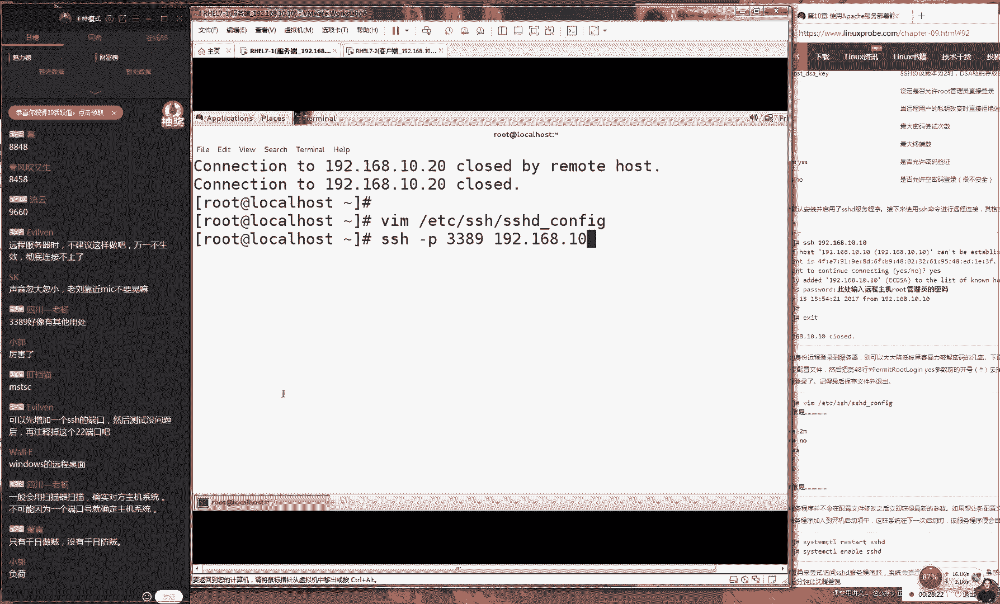
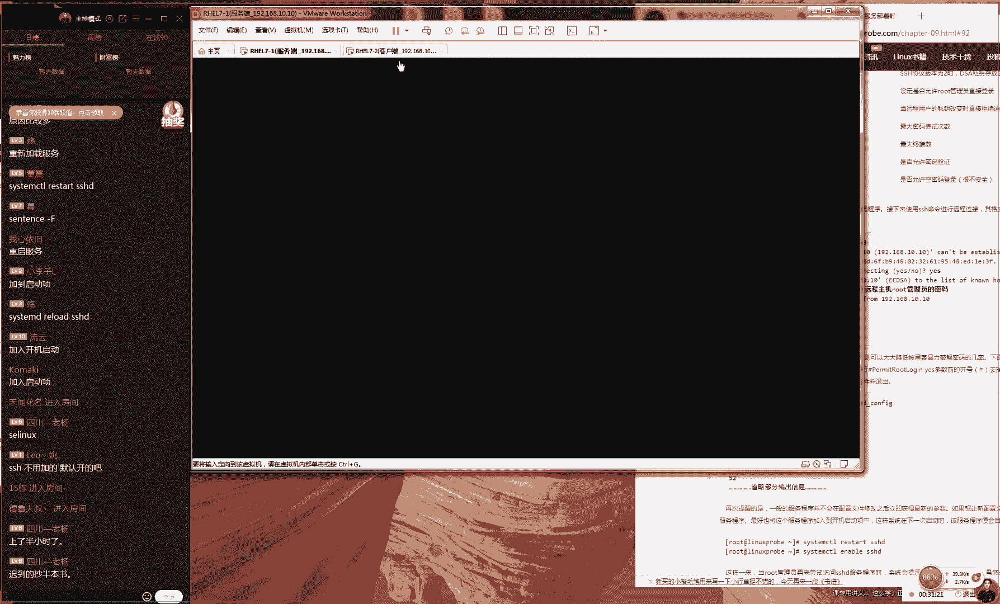

# 【RHCE】红帽认证工程师培训课程 - P12：第十二节课 - 天木轮回 - BV14E411678v

IEvery I go that winter pack coming in on the back screen。OK那我们今天准备开始上课的同学们，好吧，先打一下。因因为今天人是比较少啊。

所以我们呃又等了一下呃，现在72人大家说人好呃人好少啊，感觉少了一些是吧？其实感觉72人其实坦白来说啊，超过我的预期了。😊，因为现在已经4月5号了，大家同学们大部分89十0同学都已经约了4月底的考试。

你们现在居然还有闲心跟我们这个跟我们这个在线培训在听课啊，你们现在应该已经是在开始在预习，然后预期到至少在第125这样章节感觉才是一个正常的一个进度啊，所以我感觉今天这个72人有点超过我的这个预期了。

有点是真的因为遇到后边的话，我们应该去通过我们这个视频快速去加快我们这个学习进度的。好，所以所以大家可能跟我的想法是不一样的啊。你们现在居然还有闲心听我们这个在线培训这么慢的这种讲课进度。

那大家这个心也是比较大的。感觉自己要凉了啊，我们不要这么说好吧，因为咱们毕竟会有考试模拟嘛，这个没有多大问题啊，然后我看下什问题16章已经预期完了考题还没有看需要提前看嘛？如果你看完到第16章了。

那就没有什么问题了，对吧？那你就踏踏实实的等到4月15号以后。😊，然后然后我们再去看核店辅导就行了。现在不要看，现在看了你也记不住我，就是因为这个东西你练时间太长了话，你反而会有点很懈怠。

这个我们先不着急。好吧，如果说已经预期到第156章了，那就没有什么那倒没有什么问题了。那我们这个在线培训的话，主要就是跟老刘去来进行一个互动吧，对吧？那我们这么一个性质。好。

那我们现在给大家说一下我们这节课程的一个规划好了。今天课程规划里边的话呢，我们主要还是第九章节，那我们把第九章节给大家做个收尾。第九章节收尾大概用的时是一个小时，然后我们大概会讲到10。4小节，好。

这是我们的课程的一个安排时间大概是两个小时，大家的话呢提前怎么样们就做好准备了。好大家说以后就不能够在线去听相声了。对咱们这个培训就是一个呃德云社开了一个分设，一边去讲技术，一边去给大家讲讲段子嘛。好。

那我们不给大家就多说了啊，今天这个虽然说72人对吧？有点像我们先给大家去开始我们。😊。

这个课程了，今天72人真的是超过我的预期了啊，因为我的预期应该是20多人，就没有报考的一些同学他们过来听课了。

然后不然后不慌不忙的再后还再然后还要再去调侃一下就是我们4底这个考试啊怎怎么样的现在72人现在73人，所以我现在也不敢给大家多讲太多段子。因为大家故都去红认证的，以说我们就直接上干货吧。好吧。

我们继续给大家上干货好了，我们接下来给大家去说一下第九章节第九章节话开始，就是从我们下就是从我下一句话开始啊啊，不论大家有没有做好准备你们现在都已经进入到了C这个阶段了。好，大家再听我说一下。

就是我们前我们的这个课程是讲的红S从我们现在的这个921小节开始啊，不大家有没有做好准备，我们现在都经步到了红的一个阶段了。红S的话呢是我们对于一种系统的管理能力。

那比如我们系统开机关对系统开机关机对吧？们去查看。😊。

系统状态去添加账户啊，包括说去呃查看我们这个进程信息。呃，再比如说我们去呃修改一些比较简单的配置文件。好，这就是我们呃还有我们对于磁盘的一种呃的一种管理能力。比如说我们的分区个式化跟我们的挂载。

这样的这个操作，它属于你对系统的管理能力。这个是红码HCS的考核的这个范围。而我们红HCE的话呢，这个考核的是我们对于服务的管理能力。所以说我们今天这个课程的一个。😊，主要的一个任务的话呢。

就是让大家去学习会该如何去配置你的SSH服务。然后包括说我们会给大家讲的那个app服务。另外的话呢还大家这个打字特别的快。然后我现在可能是根大家这个思路啊，毕竟一个人要对75个人这个压力还是有的。

所以说大家去互去交流一下。如果说下课之前没有被解答好的话呢，们大家可以再去发一下大家的这个问题我们再给大家统一回答好吧，我们每节下课之后都会有统一的回答问题这么一个环节。

另外的话呢我们就开始真的开始我们这个课程了。我们说太多了。好，我们开始讲一下我们就在二小节叫做远程控制服务就是说我们可以通过一个服务叫做SSH来进行一个远程的一个连接，可以连接到一个远程的服务器。

其实来说这个服务超级简单。所以我们才把它放到第九章节呃我们我们这个最开始时去给大家讲这个目的就是给大家去说一下，其实服务配置起并不难的。大家不要心里恐慌。好，那我们在给大家去。😊，时间去操作一下了。

在我们这个服务器里面，我们需要开两个服务器。啊，那我们开一台服务器是linux。那我们再开一台服务器，还是linux啊，这个是鲁这有点像鲁这有点像鲁迅的风格，对不对？好。

那我们准备出来两台lin的服务器。然后我们上一节课给大家讲过该如何去配置你的网卡。当时我们讲了四个方法来去配置你的网卡。第一个方法去修改你配置文件。第二个方法叫做NMT对？

有第三个方法我们叫做NMcon啊，就是我们来去通过我们图拉界面来去配置我们的网卡。第四个方法是点击我们这个右上角点击一下这个两个电脑，我们来配置一下我们的网卡。好，那我们讲四种方法来去配置我们的网卡。

今天我们就先不给大家去讲了。因为我们虚拟机的这个网络联通，这是一个基本功必须要这个是必须要会的。然后我们今后的这个课程里边的话呢。😊。

会把我们呃之前给大家讲的这个四种方法，再来逐次的给大家再来去都去演示一下的。好吧。如果大家哪一个忘记的话呢，那我们待会儿去做这个实验的时候，呃，或许不是今天都给大家做完啊。

但是我们会在我们这个实验里面给大家去穿插，再给大家都去做一遍。好了，然后我看到说呃没有声音了。同学们现在有这样的情况吗？嗯。😊，同学现在有这个情况吗？我现在说话声音，大家能听得到吗？啊。

这个非常的这个这个非常尴尬的一个悖论，对不对？大家如果听不到我说话声音的话，那怎么能够跟我互动呢？但如果大家不互动的话，那我怎么知道大家听不到我的声音呢？好，那大家都听得到对吧？好。

那音正常我们就开始我们这个这个实验了。在我们做每个实验之前的话请大家一定要切记就是保证你这个网络能够去互通的。然后至于说方法的话呢，我们今天先跳一下。

然后我们会在后面这个实验里面会大家去讲到配置你的网卡的方法。那我们先保证一下我们这个网络连通性。那我们先给大家去介绍一下我们这个服务器，那我们先有两个服务器记我我们的服务端跟我们这个客户端。

大家记一下我这边的所有的服务器的地址都是192。168。10。10我所有的客户端地址都是192。18。10。20大家再听一遍。😊，服务端是点10。10，客户端是点10。20。这样的话呢。

大家以后去配置这个服务的时候，就可以把你的心思完全的放在你的配置服务上面了。而不用老去纠结说，哎说这个老刘到底我们这个服务器地址该怎么去配呀，对吧？所以说我们在就可以把我们地址给它固定下来。大家记一下。

好了，那我们现在就可以在我们这个服务端上面去拼一下我们的客户端，保证我们这个网络首先来说他要是能够通信的。这时我们今给大家已经是呃做好的嗯。😊，好，接下的话呢说呃。呃。

然后看一下说没有来听课的同学们请举下手是吧？O那我们接下来给大家去看一下那我们这个网络它是能够去通信的。接然我们就要来可以进行一个远程的一个连接了。这个来说其实非常的简单，它就是在你这个客户端上？

在个服务端上面去执行后加上你的IP地址198就是你通过SS命令加上你对方的IP地址，这样我回车就可以进行一个远程的一个控制了。比说你在北京可以远程到一台上海的服务器。

你在上海就可以连接到一台美国的服务器。那么只要说我们这个对方的服务器是一台lin系统，我们都可以直接来去连接好那我来说你是否来进行一个确认连接我们选是们来确认连接会接受我们这个指纹信息然后说请输入对方的账的密码们去输入不能告诉你们好这个时我就连接到了远程对方的服务器。

那我怎么能够证明说我真的是在连接到远程的服务器呢。😊，可不太相信说这个没有太大的变化，对吧？那好了，那我们就可以去reboot一下。当我们参与reboot那一瞬间，大家看到是我们的客户端。😊。

它会去重启了O它会去重启了。所以说我们确认啊我们这个到它确实是连接到了一台远程的服务器了。好，其实这个讲完之后，感觉跟没讲一样，对不对？因为这个只是一个SSH命令而已。然后大家简去介绍一下这个功能。

今天的话我们就要去学习一下说该如何去配置你的服务。第一个服务我们就先SS个服务下手好了。因为个不是说呃第一来说它是非常的重要对吧？在我们工作当中乎来说都要去使用到的一个服务这个非常非常重要的一个服务。

第二个的话呢就是因为这个服务它虽然说重要，但并不难，所以我们会给大家先去讲他去练手并且是一个很重要的一个服务。好，那我们给大家回忆一下我给大家讲一个溜第一句话呢就是我们的lin里的一切都是什么东西。

同学大家记得我给大家去说过很多很多遍了，我们在我们的系统当中一切都是一切都是免费的，一切都是老刘的，一切都是乱七八糟看不懂一切都是文。😊。

件啊，它的一切都是文件。那好了，那我们接下来说一切都是文件，那我们再去配置一个服务的话，或者说我们再去部署一个服务的话，实际上就是在修改这个服务的什么东西。😊，它的一切都是文件，一切都是文件。

那我们再去配置这个服务的时候。那么也就是在修改这个服务的叫做对的，叫做配置文件。同学你不要这么拦好不好？大家都说了，这肯定是个文件。那么是什么文件，它是个图片呀，还是个它呃呃它还是个呃它还是个目录啊。

它一定是叫做配置文件。那我再给大家去说一下，我们下面呢还有一个叫做呃配置文件，它有两个区分。第一个区分的话呢，我们叫做主配置文件。第一个我们叫做主配置文件。第二个的话呢，我们叫呃第二种类型。

我们叫做普通配置文件。😊，好，那么它有两个的区别，就是我们这个主配置文件里面，它保存的是我们这个服务最重要的配置参数。这个它它到我们这个系当中，它保存着我们的服务最重要的配置参数。

那么它有一个路径是这样去寻找。它一般来讲啊，它一般来讲它是TC目录里面以服务名称命名的一个文件夹里面以服务名称命名的一个文件服务名称点CONF这个就是我们这个主配置文件寻找的一个方法。

再给大家去说一下啊，呃我们这个主配置文件里边的话呢，包含的是我们当前的这个服务最重要的配置参数，它会保存到我们这个它会保存到这个文件里面。

那么它呃并且它会去调取我们这个普通的配置文件里边包含了我们这个服务的其他的剩余的所有的这个配置参数。好了，那么那我再给大家提个问题好了。

那么请问请问啊请请问主配置文件当中是否包含了我们服务的所有的配置参数。😊，再给大家去说一下，请问我们的主配置文件中是否包含了我们服务所有的配置参数，所有的。当然了，我们假设说。呃，我们肯能说。

你们肯定要是知道老刘这个套路，对不对？肯定不是这么简单的，大家再好好想一想。那么我们请问。😊，他是否会包含了我们这个服务？所有的配置参数。应该来说，这个答案应该是叫做不确定的。

因为有的服务非常的这个简单，它只有一个配置文件的情的但这个情况下的话呢，它这里面就包括了它里面的所有的配置文件的这个参数。但是999999，它里面的这个参数都会有普通文件来去调取。

所以说我们这个主配置件呃啊呃所以说我们这个主配置文件当中，这个呃只是保存了我们这个只是。😊，保存了最重要的参呃最重要的这个参数。大家需要记一下啊，我们主配文件当中只是保存了我们最重要的这个参数。

所以说我我们这个大多数情况下的话呢，大还会有一种普通文件里面，他也会去保存着我们这个服务的配置文件。好，既然我们知道这么一个口诀了，知道该怎么去寻找我们这个主配置文件的话呢。

那我们就现在去找这个主配置文件，大家有没有看过啊说啊老刘也不知道，这个我是知道的，然后的话呢，就是大家有没有看过一个叫呃水浒传的一个电视剧，或者说你没有翻过三国志，大家可以打一下一，就是当时有一个情节。

就是说呃。😊。

诸葛亮痴心孟获，这集大家有没有记得这一集？呃，诸葛亮七金孟获的时候，你大家有没有看过，就是这个孟获这个吧，确实这个智商也有问有点问题啊，然后被妻子抓到了，后来他最后服了，最后啊。😊，他跟刘备。

还有这个张飞，他们这个然后他然后他们这个哥然后他们这个哥仨去那个要取经去了，对吧？就说你看啊当时我们这个注作站他为什么去孟获而没有杀干所有人就是因为这个孟户他一个人他就是一个主要的一个核心只把控制那这个的这个都是我们这个掌控之。

以说我要这个主配置文件这个非常不吧？一下这个文件的一个重要在我去编辑一下我们这个服务的配置文件这个服务配文件很特殊他目录里面他叫做呃以我们的C名称命名的一个文件夹里面的SSH这个文件这个文件是我们S主配置文件大家要个我们大统来说我一般情况下个主配置文件但是每个服务可能略能略有差异。

那我们现在来看一下我们这个。😊，组配置文件里面有哪些有哪些参数？大家看到这个参数之后，大家给人感觉有没有一种很慌的感觉？大家觉得现看完这个配置文件之后慌不慌啊，这个只有我们学生能听得懂这个梗吧？

大家看到这个我们配置文件之后得慌不慌，慌打一直慌打2大家看到这个文件之后，大家觉慌不慌啊大家告诉我说啊特别假装很慌，其实不用慌是这么回。那我们说的慌不慌。

就是说你有没有看到这个配文件之后你就不知道该怎么去下手了，然后觉得不知道怎么去配置这个这种感觉这就那种很无助的感觉，其实千万不要有这种感觉。因为你看到这个文件的话呢。

然他这个字很多这个密密麻麻写很多多字。但是你看到这个字的话呢，大体主要来讲它都是蓝颜色的这个蓝颜色有一个特点的话呢，就是这个字的前面会有一个井号那我们之第四章节学习编程。

那我们当时讲过我们一个这个配置文件里的话，它分为三种，对不对。😊，分为了我们这个教本的声命，教本的注式跟脚本的命令。而在我们这个配置文件里边的话，它也有它有啊它是有呃它是有两种。😊，参数这个类型。

第一种我们叫做注释信息。第二我们叫做配置参数。所以说所有以井号开头的行啊，包括说所有以分号开头的行，他们都是以蓝色字来去显示出来的这个我们叫做主这个我们叫做这个呃注释信息。

这个主要是对于我们这个服务的功能，以及我们某一行的参数的种解释或者说明的信息，这个我们主要是给人去看的，而我们这个机器是不会去读的。再给大家去说一下，我们所以井号开头的行，我们叫做注释信息。

这个主要是给人去看的那它是对于我们这个服务的功能或者某一行参数这种解释或者说明信息的这么一种信息，而我们这个程序是不读的，所以的话呢我们主要去关心我们这个具体的参数就可以了。

那我们接来讲的说我们配置一个服务就是在修改这个的配置参数。所以我给大家去玩一个非常非常简单的一个例子我给大家举一个很简单的一个例子。第一个例子就是说我们去我们去修改一下我们登录这个用户。刚才我们看到了。

对吧？😊，呃，当前我们是允许到超级用户去绝去远程登录服务器的那好了，那我们现在就可以看到大概的话呢，行数是在D。😊，好，那我们看一下我们这个大的行的这个行数的话呢，是在第78行，它有一个参数。

他告诉你说密码验证，他说是否是为E就是说它是否是允许我们的这个使用密码来进行一个验证。好，我们再往上走一走，他说在第48行，他说是否来去允许掉我们这个超用户入来去进行登录好这么个选项好。

那我们面再给大家找一找，其实上面还有一个选项，就是修改我们这个端口号了。我们这个的话端口号默认为22。我们可以去修改的。那我们只需要去进入到我们这个编辑模式下敲一下A或者I或者O这个键。

让我们进入到我们编辑模式下去修改一下你这个端口号。比如说我们端口号我们不愿意叫22了。大家觉得我们应该修改成什么呢？其实我之前我就是你要是从一个黑客角度上来去思考嘛，因为你为了防范这安全问题。

反正我之前不知道说刘很阴，反正我之前10086。反正我之前三个6嗯不是。😊，反正我之前的话呢，我会把它修改成3389。咱好好说的。然后这样的话呢呃如果有黑客来去尝试破解的时候。

他们会扫到我这个端口号开放了3389，他会误以为我是一台windows的服务器。然后当然说这个只是骗一些当然这个只是骗一些非常低级的一些黑客，但是也算是够用了。然后当是他去连接的时候。

他会提示说这个连接是失败的，他会以为我们这个windows开了什么服务什么的，他就会以呃去破解windows这样的这么一个方式来去入侵我们这个服务器。

但是说肯定会给我们这个呃提高呃我们这个服务器安全会更有保障，对吧？但然说这个只能骗一些非常低级的一些黑客了。当然他可以通过一些比如说网站的报错呀，或者说我们这个服务器的一些版本信息，对？

那我们可以通过这些信息也知道我们这个服务器具体的这个类型。但是这个还是比较好玩的啊。所以我们给大家去修改成3389好了，然后我们来保存并退出。大家不要笑，这个东西真的是我之前是玩过之前我一台服务器，呃。

😊，咱中国有句老话叫做不怕贼偷，就怕贼惦记。你们知道这句话的啊，当时我有台服务器，那会儿不知道怎么回事，老被人小这种比较低端的黑客们去去扫我这个服务器开放这个端口号后尝试暴力破解我密码。所以说进不来。

但是特别的烦，给我这个系统造成比大的这种这怎么说这种尝试啊这种破解密码其实也是很烦的事情吧？你总担心把破解出来了。以当把个切换3389，然后就再也没有这个去尝试进行装库这这个请求。

这真的是有意思的这一个的一个实验。好，那接下来我们把保存退出我们来WQ但我做好之后话，你可以再去尝试一下啊。们来刚代表就是我们连接的时指一下端口号，3389然我们本地连接我们自己的服务器啊。

因为我现在我都是在连接我自己的服务器并没有去使用到这个客户端敲一下回收。他告诉我们说。😊。

来去链接我们的本机的3389端口号，它提示出来失败了。他说3389端口号不可达这个啊我们的这个端口号没有正式开启。那么请问这个是什么原因呢？我们刚刚明明已经把这个端口号开启了，并且我们修改成3389了。

为什么我们的服务还是不能够让我们去访问大家想一下，这是这个是什么问题？😊，大家看到说我们的SO这个同学们这个相法很好啊，说明你大家已经预习到第十章了。然后还有人说fa沃防火墙OK这个也很好。

说明是记住了我们上一节课呃，第七章呃我们呃记住了我们上一节课第八章节所讲的这个防火墙的内容。好，大家再想一想，其实没有想没有大家没有想那么复杂了。就是因为一般情况下。

你要想让你的这个配置过的服务能够去生效的话呢，你还需要去重启什么？你还要再去重启一下相应的这个服务。😊，对你要去重重启一下相应的服务。大家记一下，我们以下就有几句话了。

第一句话就是我们的linux里面的话一切都是文件，一切都是文件。第二句话部署一个服务，就是在修改这个服务的配置文件。第三句话，要想让我们这个服务的参数能够立即生效的话呢，我们需要重启对应的服务。

还有第四句话，重启好了之后，请顺手将我们的这个服务加入到启动当中，保证我们下一次重启的时候，它还依然能够生效。好，做完之后，你再来进行链接386口号的这个请求，它还会给你报错。但是这个词包错。

就是由Slin。😊，去来去禁止我们了。但是我们把它这个去来去呃不呃，我们先把它给关闭上。我们再去连接的时候。😊，嗯。😊，那就个非常尴尬，对不对？好，我们再重启一下，我们再去。😊。

连接他就告诉你说能够去连接了。但是说第二次的话呢，是它是由Slin给我们包错了。这个我们不用去管。我们会在今天呃下半节课的时候，如果时间的话，那么会大家讲到我们这个我们会讲到这个服务。好。

那也就是说我们现在修改端口号这个实验能把它做成功作可以了。就是去简单去修改一下们这个配置文件好了，然后SS不用加的默认就开启，对？

对它这个服务的话呢我们不用去管它它默认就已经在我们这个服务器里边已经是在运行了。所以说这个是非常基础的一个服务，而且是非常的实用的。这个这个非常常用的。好了，那我们先把端口号给修改回来。

修改成22端口号啊，让大家去玩一下。如果说您上一个实验没有看懂的话那么没有关系那我们面再给大家去玩一个这一个实验。比如说我们现在的话想要我先把它保存好了。😊，然后我们现在进入到我们这边这个客户端啊。

我们先把它进入到我们这边的这个客户端。

进入到我们这个客户端。因为我们现在是允许任何人来通过远程的方式来去连接我们这个服务器。我多多少少感觉不太安全，对吧？那好了，那我想来去禁止掉有人从远程登录，直接登录我的超用户ro身份，那么怎么去操作呢？

那我们就可以进入到我们这个服务器里面。大家看到我先进入到我这个服务器里面打开我这个命令行的终端去找到擒贼先怎么样擒王，我们去找到我们这个梦户的然后我们去编辑我们的配置文件。

需要将你的这个参数给他去设置好就可以了。那比如说我们看一下大概的行大概的行数的话呢，是在第48行，大家看到这个是在第48行，那他指的就是是否来去允许超户ro来进行登录。好了，我们先把这个井号给大去掉。

那我们先把这个井号给他去掉这个的这个参数的意思是说你是否来去允许你的管理员去登录你的服务器的意思。好，这个时候我。😊。

认是为yes，所以说我们需要把它给修改成no，这样的话就禁止到我们呃的这个用户从远程来去访问我们的服务器的超级用户这么一个请求。好，这个时候我们再来去保存名退出。

对他就是来去限制我们呃呃超级用户管理员root来去。😊，远程连接这么一个操作。这个时候我们来去重新去启动一下我们的SSH服务。好马这边我们马上进入到我们的服务端要92。18点10。20我们来进行链接。

你看当你有超ro的密码的时候，他也会给你提示说你连接失败的另外我给大家去另外我们可以给大家保证，是我现在真的是在输入我们正确的一个关理员的密码，我们有给大家故意去输错。

但是你看我再怎么去输入的正确他都会告诉我们说我们的这个请求是被禁止掉了。因为现在此时此刻他已经不再允许我们使用到超root身份下来去登录我们这个服务器了。好了，就以我们这个提为说大家看一下。

以我们这个为说来去禁止我们就是我们去修改一个参数，然后禁止一个远程用户去登录我们的远程的一个呃关联员的身份这样的一个小的一个参数的修改。大家如果能够掌握的话，那么请打一下一。😊，好。

我们看下来这个呃学习的大概的这个情况，好吧。😊，同看下这个实验其实简单，对吧？就是通过我们这个修改一个参数，然后去重启我们的服务，就可以达到限制用户去访问的这么一个请求。好。

大家看到说禁止其他用户禁止其他用户是做不到的它只能是不告对但可以不告诉对方密码就好了啊但因为对方不知道密码的话，他也不能够登录好，是这样的啊。

这道题的话呢其实我们看起来非常的简单并且的话呢就是我们红的考试原题，其实红C这个考试大家没有想象中那么难，它就是很简单的你看到这就是他其中的一个题目，它限制了我们这个超级用户入一个远程访问。好。

这个我们能够把它掌握好之后，我们下面再给大家去玩一个我们叫做密钥认那我们叫做密钥验证是这样的因为的话呢我们现在去输入的是密码来去访问我们这个服务器。但是密码的话呢，你顶多顶多你有个20位。

或者你有个50位就了不起了对吧？因为你的这个密码总会要记么那你总要记得你的这个脑。😊。

总要记到你这个本，或者说你的这个脑子里面，它不能够太长啊，并且我们每次输的时候也会有一些限制。那好，那我们就可以选择第二种方式来进行验证。我们叫做密钥验证方式。但是说密钥的话呢应该叫做密啊。

但是说我们中国的这个习惯的话呢，还是可能叫做密钥。大家就知道了，我们现在说那我们现在就说的是这么一回事好吧不论说是密钥还是密那我们都说是一回事，是这样，因为我之间我去说蜜月吧。

大家会告诉我说老师不不是叫密钥，然后说叫密钥，家跟我说不是叫密吧？好，个那那我们正统来说应该叫做密月吧？但是为了大家听起来习惯的话我叫做这个密钥好好。

那我们现在来去进行一个密钥验证的话呢式就是我们可以在客户端上面来去生成出密钥。然我们传送给我们的服务端，因为我们的服务端进行一个保存我们的公钥的操作，这样话我们就可以让我们的服务端。😊，呃。

被没有密码的去访问。再给大家去说一遍，就是在我们这个客户端上面生成出来公钥跟私料，然后将公钥传给我们的服务器。这样的话，当我们这个客户再来去远程连接服务端的时候，他就不需要密码了。

这个是非常方便的一个连接的方式。并且我们密钥的方式的话呢，更加的安全。下面给大家来去演示一下。好呃，喵喵认证，不是呃叫做密钥认呃，那算我还给大家去说叫做密钥认证吧。是这样的啊。😊。

这个词应该到蜜语啊，因为从密码学上来讲的话呢。啊，大家看到这个就是蜜月呃一个验证。并且的话呢，这个维他是追了我们这个公月跟私月的对吧？我们叫公钥跟私药。好，这个我们需要去记一下。

好，那我们现在先去操作一下啊，这个很简单，它就是在你的这个服务它是在你的这个客户端上面呃，去生成出来你的这个公钥跟，然后将你的这个公钥信息传送给服务端进行保存样话再去访问的时候就没有问题了。

我们举个例子，比如说你想去小美家去交朋友？这个时候你的丈母娘那你第一次去的时，那么你就可以把你的信交给丈母娘这样当你再去的时候，你就不用再去拿钥匙了。那你也不用再去他的这个同意了对？

那你就可以直接进入到这个对方的这个家里面就相就这么一个过程了。那我们需要在我们这个客户端上面去生成出来我们自己的这个信息使用的命令话我们叫做S这个命令我生成出来我们这个公钥跟然的话。😊。

哎，啊，不对，我们应该叫做SS是。SSH杠没有问题，这个是个减号不是个下划线啊来我们去敲回车123。然后说啊定型信交给丈母娘去丈母娘说小妹不同意家这个思维跳跃的太快了这个这个都不是我们的重点好不好敲回车举个例子。

他说他让你进行一个交互式的一个设置，然后设置好之后才可以远程访问的服务器把你这个公钥给传到服务器面他说你第一件事什么呢？说请设置一下待会这个文件的一个保存路径。这个我们没有必要去修改。

所以说我可以直接去敲回车选默认就可以了。这我们去敲回车。他说请你是否要给你的密钥再设置一下密码呢？我们为这个没有太大必要以说我可以再去敲回车。他说你是否确认呢这个时如果确认的话。

可以再去敲一下回车就没有问题了。这个东西不是我们这个密钥这个只是一个模拟出来的这一个图形而已。好，那我们密钥文件保存到哪里呢？😊。

让它保存在我们这个客户端，它自己的会在加目录里边这样的一个路径。它一点上开头叫做什么呢？叫做隐藏文件，对不对？它有会有一个文件。😊，名称叫做啊。ID下划线RSSC的一个文件。这个文件大家看一下。

这个文件是由2048位的这个随机字符产生出来的。这就是我们这个c文件了。这个c文件里边的话呢，可以看到它里边是有数字，它有小写字母，它有这个大写字母，还有这种加减符号，加减乘除的这样的符号。

还有星号还这样去把呃填充了随机的字符填充了2048位。好了，所以说我们就不用调查了。好吧，当然你们的QQ密码，我敢保证你们的QQ密码一定没有这么复杂。😊。

因为我们不可能说我们一个人去记这么多的这样的字符。所以说我们呃认为我呃所以说我呃我们认为我们的密钥的文件这样的这个呃登录的方式要比我们输入密码的话呢，更加的安全。这总比你们密码啊要更加安全，对不对？好。

如果大家有点啊不太信，对不对？那就想一下你自己的密码肯定不如这么的复杂。好，接样的话呢我们来再给大家去传到我们这个服务端上面。我们的命令的话呢。

我们叫做SSHpy就是说你呃现在你需要将你自己的这个信息啊，我们现在在。😊，好，大家怎么听到我说完这个给丈母娘之后，现在大家这个思维跳跃这么快，对吧？然后说丈母娘不给钥匙怎么办？好。

我们刚才说那个呃定型信物啊，这个感觉不太对。因为定型信物的话，毕竟还不是我们属于身体上的一部分。咱举一个咱举一个很恶心的一个例子啊，但是我们可以通过这个例子让大家能理解我们这个密钥到底什么东西。

密钥就是我们自身我们这个服务器上面生成出来一个只属于我们的一个信息块，然后我们再去登录的时候，他会我们进行一个匹配。但比如说我们现在去丈母娘他们家对吧？然后今天要去求婚了。

这个时候我就把我的袜子给穿这个时候我到他们家门口了，然后的话呢他们家有只狗特别的凶。那好了，这个时候我就把我的袜子，然后脱了，然后给这只狗让他去闻了闻这个时候的话他们这个狗就获得了一个信息。

就是我们这个人也是我们的主人，然后他这个人的这个气味，他这个他这个信息块的话呢，因为你要去输一个人的这个信息肯定是能够去描述，但是你说你袜子有多臭，或者说你袜子是有什么。😊，这个是什么味儿，对不对？

这个来说是相对于是比较安全的，可能这个来说是不能够模仿的，只能是被每个人去理解。好，那么当第一次狗闻到这个袜子的味之后，那他就记住你的这个信息了。当你再次来去访问他们家的时候，你只要把你的脚往上一凑。

它就可以自动进行一个匹配的一个信息的一个确认。那当这个信息块跟上一次去保持一致的话呢，就可以放行到他这个家里面对吧？就是这么一个咪的一个一个验证方式，比密码什么要更加安全一点，对吧？因为毕竟这个脚抽味。

每个人都是不一样的。好说好恶心，对吧？好了，我们来去传送到我们这个服务端上面，192啊192。18。10。10。😊，我们进行一个传输啊，把我们这个抽味给他把我们这个公钥文件啊给他传给大家传过去。

刚才我们看到是私钥文件啊，我们现在传的是公钥公钥非常的简他是非常的简单的，大概只有四五行。好了，然后的话呢我们给大传送过去。这个时候去输入服务端的超级用 root词的密码悄件回收。

这个在密码学里边有一个有一个口诀叫什么呢？叫做公钥加叫做C要加密公钥解密，对吧？大家知道就是一个非常伟大的一个科学家的叫图灵，他就是研究密码学的这个大师，后来他还研究出了图钉机。后来他还提出人工智能。

但是他非常的呃的悲惨。但时他在英国的时候被二战做这么大的贡献，结果却因为最后被呃因为同性恋后被折磨被注然后被注入激素，最后阴年早逝了。他的话就是对于这个密码学非常的这个痴迷。

所以说呃如果大家要想去研究密码学的话呢，可以从那会儿的这个材料开始去学习，非常这个这个。😊，非常有意思的一个这个非常有这个是非常有意思的一个呃的的就这么呃呃的这么一个学科吧。因为我上高职的时候嘛。

因为这个东西我们不要去深学，深学之后是很也是很痛苦的啊。我之前因为我上高职的时候，我导师是一个我上高职的时候，我那个导师就是一个博就是一个博士后，他很厉害，他研究密码学的，我这样跟大家聊过。

那个密码学的老师啊，就是。😊，他从本科开始就是研究密码学，结果研究研究到博士毕业了，结果就放弃了。因为这东西真的太深了，而且要求你对于这种数学这种观念什么的，特别的严格。好。

所以说大家要有呃大家要大家要是有兴趣的话，可以去呃可以来去感受一下密码学的这么一个。😊，非常有意思的这么一个。呃，学科好了，然后的话呢我们现在来进行一个连接。

现在我们已经将我们这个公钥文件传送到我们这个服务端了。那么当大家看好了，那我现在再来进行连接的时候，当我下一次再来进行连接的时候，我们只需要去输入我们的服务端的这个地址。

您就可以看到敲费车的123敲费车可以看到，就可以直接登录成功了，不用再我们去输入密码了。因为的话呢我们把密钥文件已经优先级比我们密码更加高了。这个是我们它呃它也是我们这个默认的一个机制。😊，好了。

接下的话呢我们再给大家去说一下。那么接着啊那我们接来说来去远程登录到我们这个服务器，它有两个方式，一个是我们的密码，一个是我们的密钥。而你刚又讲了，那你说密钥文件这个方式要比我们的密码更加安全。

那我们何必还要密码呢？那我们能不能禁用我们这个服务器上面的密码登录，而只去允许我们的密钥登录呢，其实是可以的。好，那这个时候我们就进入到我们这个服务端。

在我们这个服务端上面去配置一下我们这个SS的主配置文件。你看我这个说特别快啊，结果我们这个手跟不上。好了，这个非常尴尬啊。好，接下来我们来去SS我们这个远程的服务器的。😊，你看我这个说的挺快。

但我这个手跟不上。好，那我们先来打开我们这个组配置文件。大家看到这个文件之后，大家不要慌，这个里面都是注织信息，我们不用去管它。好了，那我们现在去找到大概的配置参数的话呢，那这个行数大概是在第。😊。

其实大大概是在第七8行，他说是否来去允许你的密码来进行验证。那我们呃默认为yes。好，这个时候我们可以把它前面加上一个井号。

或者说我们直接把这个yes改成no代表就是我们不再允许你通过密码来去登录我们的服务器。接下来我们把它保存并退出。好，接下来我们来去重新去启动一下我们的SSH的这个服务。那我们重新好了之后的话呢。

你还可以继续从你的这个服务端上面啊，接下可以继续从你的这个客端上面来进行连接来直接在SSH连接没有问题。你不光能够连接成功，并且你不去输入任何的对方的这个密码信息。

因为你现在通过是一个非常高级的密的一个验证方式来去完成的。但是当有一个另外一个人他从远程去登录的话，它没有将密钥同步。这个时候你看一下我当我从远程进登登录同时。😊。

即便我有我呃呃我即便知道我们对方的。那密码的信息。但是你看到他都没有让你去输入的这样的一个选项了。当你去知道了对方的服务器的密码的信息也没有用。因为你此时你不能够登录这个服务器。

除非你要有这样的这个呃呃呃公钥文件，这就是一个非常安全这种链接的一个方式嘛。好，接下来的话呢我还有一个命令我们叫做SCP命令。下我们刚才讲到了就是有一个协议叫SS可以实现出来一个远程的一个控制。

那我们就想一个问题了。那么我们远程控制的话呢，实际就是将我们这个指令，通过我们的这个协议传送到服务端上面，然后再将我们这个服务端处理过的结果，再发回给我们这个用户。

既下来说我们可以对于命令来进行一个远程的一个传输的话呢，那我们能不能来去传输一些文件呢，其实也是可以的。就有一个命令我们叫做SCP命令，他就可以通过我们的SSH这个服务将我们的大家听好了。

它是我们基于了SSH协议的这么一个命令。他就可以将我们这个文件去传来进行一个传送。并且。😊。

它可以不光可以来去传送过去，它可以把远程的这个文件还可以进行一个下载过来这么一个操作。然后那么因为这个呃我们因为这个。呃，我们这个实验环境的话呢，我那我们这边有两个虚拟机，一个是属于服务端。

一个是属于可呃，还有一个是我们这边的这个客户端。那我们进行操作的时候的话呢，我们会给大家去说一下，我们是在哪个服务器上面进行操作的，请千万不要混掉。好吧。因为这两个服务器长得非常的像。好。

那我们现在在我们这边的这个客户端上面。好，在我们这边的这个客户端上面，我们出建出来一个文件，我们好比说叫什么呢？啊，密钥文件在哪里？密钥文件是在这里啊。😊，在这个文件。

这个就是我们的密钥的一个文件的名称哎。在这个文件大家可以看到嗯。嗯。😊，哦，不是哎，我这个有点乱了啊。我们这边写错了，因为我们现在已经远程到服务端了，我们现在需要先退出退给他退出到我们觉得这个客户端。

所以我刚才发了个啥啊。如果大家没有看出来的话就算了。其实刚才真是发了个。为我们刚连成功了。们刚才的这个操作是在服务端上面去看的啊，这个不对好，希大家没有看出来好吧，发了个好。

这个就是我们这个cel文件的一个呃文件名称，这是我们这个cel文件然还有一个我们的公要文件公要文件的名称是这个点P这是我们这个公要文件好，那我以进行一个远程的一个连接好了。比说我们现在新建出来一个文件。

我好比说我们这我们往里面去写入一些信息好了，我们去写入一些我们这个信息，把保存名退出好，那我们现来说就是在我们这个客户端上面进行一个文件写入。那我们服务端上面是没有对吧？因为我们刚才这这个操作。

它都是在我们这个客户端进行一个操作。😊，好了，现在我们就可以来进行一个文件传输，使用我们的SAP命令，将我们客户端上的这个文件传送到我们的服务端1928。

10点10上面它这个格式是写一个冒号写上传送给对方哪个文件夹里面再比如说我想传送给对方的入这么一个目录里面的话呢，你看到对方这个当前是没有哈这个文件的我们敲一下命令把它传送过去了。好。

这个时候我们再来去刷新一下我们这个目录就会发现此时就多了一个叫哈哈的一个文件。其实来说这个非常简单的一个命令，就可以将们这个文件通过我们SSH服务进行一个远程的一个传送这个非常简单？好。

那我们还可以将远程的这个文件给下载过。比如说我可以在我们这个服务端上面创建出来一个文件叫做当然说我们这个内容的话呢，我们可以随便去写如大家有兴趣的话，下之可以去比对一下我们这个内容肯定也是没有问题的。

好，我们再把保存退出那么如果说你想去远程下载一个服。😊。

服务器上面的文件的话呢，那我们现在就可以这样我们ICP然后说如何使用服务端来去生成密钥呢？那就是再去做一遍，这是一模一样的命令啊，就是我们刚才所讲的这个命令。

它不会去区分这是服务端还是客户端服务端跟客户端都是我们人为去定义的。就是我告诉你们，这是服务端，这个是客户端。而你去操作的时候，如果说你想把另外一台定义成服务端的话，那么也可以的。

那么你只需要去执行我们刚才所讲的同样的命令都可以了。😊，那就是你呃呃呃大家呃就是呃只需要去执行一下我们刚才所执行的一个命令啊，是同样的是一模一样的就可以了。好了，那我们先来进行一个远程的一个文件下载。

那么首先你需要来知道远程服务器的这个文件地的一个地址，它是在1928101这个服务器面的目录里面叫的这个文件我们给大家下载到我们的目录里面们回收要告诉你下载完成了。当你进入到目录里面之后。

就会发现一个叫的一个文件。你看这常简单的这么一个实验，就是我们可以通过CP命令来进行这种文件的一个文件的这么一种传输。好了好，然后下面再给大家去说一个服务的话呢。

这个服务我们叫做绘话服务我们叫做做吧这个服务的话它可以让我们这个链接它不中断当我们再去远程去操作时，总会因为一些网络波动的情况。比如说。😊。

突然间断掉了，或者说我们这边这个客户端突然间它是断电的话呢，就导致啊那么呃啊它就会保呃他就会让我们这个远程连接是失效了。那么这样的话，当我们在远程的服务器上面一个很复的一个工作。

这个时候那我们就要重新去做特别的麻烦。比如说我们在远程打包一个文件经打包了99打包3个小时了，结果突然间我们这个网络中断了。那么这个时候在服务器上面的这个规划也会被中断。那我们这个服务也要重新来去做。

那我们这个做的所有的事都要重新去做特别的麻烦。那我们为了说避免网络的波动以及我们这个客户端这边的一些异常的这个情况。那我们就可以去使用到这个这个服务。

但是的话呢我们这个服务它默认没有我们这个服务器里所安装好，们要先来去配置大家的这个仓库，才能够进行我们下面的这个实验配置我们这个仓库的话，那我们会给大家去讲很多遍。今天我们先给大家去讲我们这个。😊。

呃，先给大家去讲第一遍好了。😊，好，先给大家讲我们这边第一遍，我们去该如何去做我们的yM仓库。yM仓库两呃两件事情。第一件事情需要先挂在你的这个光盘，我挂在你的这个对挂在你的光盘啊。刚才我是说对了。

第一步呃去挂在你的光盘。第二步。😊，去啊编写你的这个配置文件。第三步那就可以来进行正式的使用了。EM仓库我们今天原理给大家讲过，它就是将大量的RPM软件包放到一起。然后我们用户只需要去说出你的这个需求。

以及软件包的名称，它就可以自动帮你去找到你所需的这个软件，并且按照依赖关系，自动按照顺序来进行安装。那这么一个服务。好了，那我们现在说这么多废话。主要这个原因就是我想去重启一下这个。😊。

我们这边的这个服务器，避免我们刚才有什么操作嘛？避免我们这个做的实验会有冲突，因为现在脑子不好使嘛。我哎呃所以我我怕刚才我做过什么操作，我给忘记了，将会导致这个会有服务的冲突。

然后说一大堆乱七八糟字就好。然后比之前是。😊，我看一下。哦，对，然后大家说有一个可以是使用NOHUP命的，就是那。呃，叫这个命令也是可以的。它是把你这个命令给它放到后台去。但是它一般来讲。

它只能够是对于一个呃命令啊，或者说它是一对于一个脚本，那我们可以把它放到后台可以去使用到这个命令。如果说你是想要对一个行一个交互式的一个工作场景的话呢，那么我们还是给它一个单独的一个窗口的一个绘画。

可能会更加的这个方便一点。好了，大家可以看一下那我们这个效果了。那我们现在可去安装。那我们去载一下我们这个光盘光盘它是在我们的它是在我们这个DV目录里面叫做的一个文件。

这个是我们的光盘的设备文件给它挂载。那我们给它叫做目录里面但是如果说这个目录不存在的话，大家很聪明，对不？请自己去创建出来这个目录。它的命令就是MDR那我们载一下我们这个光盘的镜像挂好之后。

们第二步我们就可以去查看一下我们挂载这个信息。大家可以看到我们载。😊。

信息就已经出来了，它是在我们的这个VM录里面的CD room它产生出来一个外信息呃，文件名称为S20，这个属于正常情况，这没有关系。好，那那呃呃那好那呃那我我们这边的这个第一步骤就挂在我们的这个光盘。

其实这个只是做完了一部分啊，我们还可以去编写一下我们这个文件。这个文件是在ETC目录里面，我们叫做FITB的这个文件。😊，好啊，大家不要送小花啊，因为我平时我大概跟大家说过，因为我平时比较丑嘛。

然后也除了除了我们讲课，也没有其他才艺去直播，所以平时真的不会开直播。大家现在送花就纯属瞎花钱就是大家不要去浪费钱了了，然话我给大家去说一下我们这个格式怎么去编写。

而且你们知老刘嘛肯定不会说那种口口比口是心非，对不对？其实就心里想要但给大家去说啊要不要不要不要大家送花之后真的是没有用。因为大家现在充完钱之后都给这个中国首富马化腾了啊，好。

那我们现在去编写一下我们这个配置文件DV目录里面的CD roomDV目录里面的CD room。😊，这是我们这个设备的一个文件名称啊，这哎呦怎么打呃，这个是我们的这个设备文称。

下面的话呢就是我们这个挂载的目录。😊，目录里面的 room我们的挂载点，我们的载目录。接来我们这个文件系统的这个格式，我们的光盘的话呢是ISO9660。好了。

接下来我们权限备份不要优先级好大家真不要礼物了为不。为这记录刷话们现在就给大家挂镜第二步就要编写库的配置文件库配件话。

它是在我们这个E目录里面叫做点这一个目录里是以你的名称你愿意意我们愿意我们愿意叮当猫同个猫也就是说这个名无所谓但是必须是结尾就这个我们编写我们自。😊，这个ym仓库的配置文件，大家不要慌。

这个配置文件非常的简单。那我现在我给大家去啊慢慢倒来。第一个格式的话呢，先记到你这个书上面，这个格式是这样去写。😊，好，我先把这个格式给大家写到这个屏幕上面，这是一个最为经简的EM仓库的配置文件的格式。

请在大家记到你这个书上面。当以后啊它会使呃大家会是使用到的。好，现在记一下，这个是我们最为经典的这么一个EM仓库的配置文件。大家以后肯定会用到我们这个格式。好。

下面我给大家解释一下我那我们这个几个参数的这个作用。然后我给大家来去依次去配置一下。第一的话就是我们这个中括号，对吧？这个我们叫做这个中括号，这个里边写的是我们我们这边写的是我这个库的名称。

它是一个唯一标识服这个不能够冲突的比说我们叫个小猫好了。然后说name它指的是这个仓库的一个名称，它就是也是这种介绍信息嘛。那可以叫这个小猫这点都是无所谓的。

它主要是给写个主要是写两个名称来标识我们多个不同仓库的一个这么一个功能而已。好下面就是我们重点一个信息，就是我们的挂载信息它是有什么去提供我们这个仓库的文件。

那如果是我们这个本地的话我们叫做然冒还有网站提供H还有种。😊，这个呃提供方式。好，那我们现在是由本地上面去提供这个yM仓库。它有它它呃它是由本地的光盘来去提供这个yM仓库的话呢。

把它挂载到的是mediaM录里面的CD room这个目录。所以我们来合并了一下，就是变成了呃f冒号三斜杠。😊，大家看到，所以说当我们看到这个之后，大家就知道了，我们这边呃fa尔冒号后面这个三个斜杠。

第三个斜杠。是那我们这边实际上指的是我们程序的我们这个服务器的一个根目录。这个指的实际上是我们这个服务的一个根目录。好，大家记一下。因为这个我们这个路径啊很它很重要。大家如果跟着我这个去操作的话。

大家待会儿也要去输入的。Yeah。我们一般来说配置这个EM仓库呃，粗糙的蔬材在这他呃他就会出现在呃，他就会出现在这里。😊，因为大家这个路径是写错的，他就导呃他就呃导致找不到这个对应的文件。

导致我们这个服务器安装失败。导致我们具体服务它会安装失败。下面就是一个要en我们选择为一他表它代表示呃启用我们这个M仓库。下面最后选择为零代表就是我们不要进行校验。因为我们是一本地的光盘来提供这库。

他不会出被黑客篡改的情况，所为不要进行校验就可以了。所以说同学我这个书上是的话老写出不严谨。说明明冒号因为我们常见这样写是比说我们的网站就是我们的网站服务我们的H还我们说有我这个文件传输还们这个号杠应该都是有两个斜杠。

但是我们最后写三个斜杠，最后大家把个给去掉。但是导致这服务也就是最给大家配错了，大家知道我们这个第三个斜杠际上的就是我们系统的目录。😊，意思，因为我们现在写的是一个目录吧，这个三个斜杠千啊。

那么呃可千万不能少。好，那我们接来我们做好我们第二步骤，配置好我们这个样仓库之后的话呢，我们就可以来去安装我们对应的服务了。这个服务我们叫做呃。😊，呃，加们呃screen对吧？好。

们去安装一下它是这样的，大家现在配置这个仓库可能还不太熟悉。今天只是我们的第一次。然后这个不用担心，我们会在我们接下的这个课程里面，我们待会儿会再给大家去配置一下。

然后我们今天讲完之后还会在明天或者后再给大家去配置几遍这库家加深一下这个印象。接下来我们看一下说多个配置文件的话呢，会经常失败，是这样的如果大家配置了多个仓库的话呢，其实来说不会有冲突的。

如果是有网络上去提供的话，他会根据网络这个速度来来设置一个安装的一个优先级，然后帮你去安装这个服务。如果它是以本地的方式的话。

那么它是以这个中国号里面的个名称的这么一个字母的顺序来进行一个优先级的一个划分。所以说我们一般来我们库是不会置很多话呢，它不会有冲突的这个其实问题不是这个问题其实说是不大的，那我们安装好这个服务之。😊。

就可以来去操作一下我们这个绘画了。当你比如说的话呢，我们现在再去做一个什么去做一个什么操作。比如说我们再去敲一下这个top命令，那我们再去查看一下我们这个系统这个负载信息。

它就相当于就是我们再去远程进行操作了。这个时候我们把这个网络给它中断。相在就是我们去关闭这个窗口。那我们自然而然肯定就是我们去敲这个命令，也在远程的这个服务器上面有那有啊它也呃啊它也呃它也就被中断掉了。

😊。

所以说我们为了保证我们这个工作在服务器上面是不要被中断的话呢，那我们就可以去使用到这个不间段绘画了。那那我们先去使用这样的命令。

叫做SSREEN命令去新建出来一个绘画这个参数是一个大写S当你去新建出一个绘画。比如说我们这个绘画的名称比如说我们叫这个小新了当你新建出来一个叫小新的之后。

它就会在你的这个它就会在你这个后台去开启一篇这个呃内存的空间帮你来去保存这个绘画的这个内容。大家看好，当我回收之后，那我这个屏幕它会闪一下完之后，它就已经切换到了我们这个绘画里面了。操作。

大家看一下它会我这个屏幕它会去闪动一下123那我们完之后，那我们此时我们就已经进入到我们这个绘画里面。那我们那我们该怎么来进行一个验证呢，那我就可以进行一个操作。比如说想要去操作一下，查看一下。😊。

我们当前目录内的文件，查看一下我们当前的这个文件夹，我们可以去查看一下我们目录的一些这样的一个信息。好，当我现在查看好了之后，突然间它要断电了。比如那咱比如说我那我这边这个客户端网络中断了。

或者说服务器突然间。😊，停电了好呃啊呃呃，那好，那我们要给关闭掉。😊。

服务器管呃，它呃因为我们这边只是说网络中断跟我们这个客户端去端点啊。如果要是服务端端啊，它的这个网络或者说呃。电被断掉的话是不可以的。因为它只能够保证在我们这个服务器的这个后台能够去运行。好。

那我们这样的话，我们再进行一个连接。再比如说那我们现在网络恢复，再去连接到我的这个服务器上面。这个时候我们不用去再重新去做我们刚才那些操作了。你可以直接再去敲一下SREN的这个命令。😊。

然后选一个参数叫做杠L去查看一下当前它已有哪些的这个绘画。它其中有一个绘画的话呢，叫做小新，然后编号为2968。它这个呃当前的这个状态为就是一个等待被连接这么一个状态。

我去尝试杠恢复这个我可以去输小新的名称回收这个时候可以看到就是我们退出那个界面给回来了，这个就是我们退出使用那个界面了，给恢复回来。好，那我们给退出。那我们现在想一个问题。

就是说那我们现在每一次去操作的时候那我们都要去新建那我们都要要先新建出来一个，然后一个写操作，但是吧我觉这样比较麻烦，或者说我只想做一个比较简单的一个事情，这样话很麻烦怎么办呢？

其实我们可以直接使用到命令后面去做事就可以了。比如说我想要去写一本小说，那我开始去。😊，那那我们开始写我们这个小说里面的内容。好，那我们开始去敲。大家看到那我现在去开始去编写我们这个yM仓库的。不。

那我现编写我们这个呃VM的这个编辑里面的内容了。😊，这个时候我一直是处在了我们的这个编辑模式下，那我现在没有动，对吧？并且我们现在也没有进行保存和退出。我们也没有进行保存跟退出，也没有去保存这个文件。

这个时候我们现在假如来说网络突然间它要是中断的。好了，这个时候那我们啊啊那我们也是可以去恢复的，我们可以直接进入到我们这个终端里面查看到有一个话编号为3072。所以说当你只要新建好之后。

那么就不用担心这个绘话的内容还会被丢失掉这样的情况。杠R给恢复一下编码3072回看到就是我就是我刚这个文件要被保存，那么也没有关系为不光是帮你去保存这个文件而是去保存你当前的这个状态。

他把你的这个状态一直放到后台上面进行一个操作。所以说不说你前是否断或者是否开这个数据也都不会丢失掉，那我现再给大家看一下说其实的话我们这个话，不光间断。😊。

啊，它是比较简单的这么一个功能，它还可以实现出来我我们这个多台服务器之间的一个屏幕的一个共享。这个技术来讲是非常的有意思的。好了，大家看到，因为我现在这个画面是有限的，所以我现在开启两个终端。

那我们就把这个两个这个终端就模拟成呃，把它想象成就是两个优户好了啊，就是我我那我们这边两个屏幕，两个客户来，我们这边两台的服务器。既然我们现在两台服务器都去连接一下我这边的服务端。😊，好了。

那我们现在这有两台服务器。都去连接一下我们这个服务端。比如说你这个同事啊跟你张三和李四，我们来去连接我们这个服务端。OK连接成功了。好了，那我们现在把它放到一边。

那我们现在如果实出我们这个张三跟李四屏幕的共享的话呢那我们就可以去使用到这个这个服务了。这样去做先来使用SE我们现去新建出来一个绘画。现在我们其中的一边的话呢，我们来去新建出来一个绘画名称无所谓好了。

我们给比如说叫做看一下比如说我们把它叫做什么呢？好这没有关为这里这个内容我们到都都是些不重要的内容说同叫做小海吧我们现在来一个话。

叫小海敲回收这个时候那我们这边的这个服务器A这边就已经进入到我们这个绘画里了。那我们这边服务器B这边我们就可使用SN杠X。😊，去进行一个同步好，敲维车大家看到这样的话呢。

那我们这个服务器A和B实际上就在进行了一个屏幕的一个共享了。那并且我们这个数据。还可以进行一个同步。大家看到我现在去操作了，那我们现模拟的是两个这个服务器。好，大家可看我现在这个操作。😊。

你看我现在所做所有的一切的事情，他都会没有延时的，他会去实时的去同步到我们对方的这个服务器上面。所以说这当所以说当你再去远程到一台服务器的时候，如果说你需要跟同事去协同去工作。

那你们两个人都要去一起去操作的话，这个我觉那我认为这个大家可以参考一这个常有意思这么一个实验，它去实现出来了屏幕的这个共享。那我们可以去但比如说我们敲一下什么命令什么的。

它都是实时去刷新两个屏幕内容它都是完全相同的啊，我们不需要指定序号吗？它不用去指定序号。因为我们当前只有一个绘画如果说只有一个绘画情这个那这个情况下它就是不用去输入序号了。如果它是有两个以上的话。

那我们就要这个序号的这个名称，对两边它都可以进行操作，它不光可以实现出来屏幕的共享它也可以去现出来两边都可以进行控制。这个是非常有意思一个实验。我们叫做屏幕的共享。好，然后这就是我们给大家讲一下。😊。

九章节。我们的这个我们这个远程连接的这个服务，我们叫做SSH其实来说这个我们这个服务啊是非常的简单的。我们因我们放第九章节给大家讲第一个服务就是讲一下我们这个服务的一个目的啊。

就给大家先去看一个比较简单的一个服知道我们实配置服务并没有很难后就给大家上一个重头讲一下我们这个网站服务今天我们这个网站服务的话定为了保证我们这个学质量肯定是不会给大家讲完今天把讲完之后就是不好吸收。

这个粗浅。所以说我们今天这个课的规划的话呢大概会讲到14小节好吧，大家做好准备还大概小时的课程。那我们这个网站服给大家做一个前期一个铺垫好。

给大家去说一下我们为要去学习网站服务或者说我们为什要去学习网站服务里面的先给大家看一下1。1小节那我们今我们这个一个由来的话呢其实。😊。

其实是AAC大家如果是军迷的话呢，看过这个招上中有那我们叫做这叫做局座，对不对？他还讲这种军事节目的话，你们你们知道的啊，在美国有一个直升机，叫做战斗直升机。这个你没有听说过就叫做这个帕奇战斗直升机。

其实这个在美军的话呢，也是一个战斗武器嘛，对吧？其实但是在我们这个服务器里面的这个功能，其实它这是一个网它是用来搭建网站的一个服务。那我们先给大家去说一下什么是网站这个网站的话呢，这个定义非常的尴尬。

就是我们在互联网上面我们找不到什么是网站，就相于说你样那呃大家跟我去介绍一下什么是苹果，那好了，大家告诉我说苹果就是苹果啊，对吧？那我们都都知道什么是苹果，但是那呃呃但是你跟一个外星人或者说你跟一个外。

😊，没有见过苹果的人去解释苹果，那怎么去解释呢？那你告诉他是一个圆的，然后是一个红是一个红颜色的吗？😊，但是苹果也不一定是红颜色呀？那你怎么去区分这个苹果。那其实我们很多时候对于一种术语这种解释。

你明明知道，但是你说不出来，其实对于我我们这个网站这个词也是我们每个人都会去访问网站。但是我不知道该对于这个网站这个词怎么进行一个很精准的一个介绍，对吧？

以说我们翻了很多很多这个材料都没有很满意的一个答案。所以说我我们这个书上面就给大家一个解释，这也是老刘给大家去讲出来，并且我们认为是很准确的。大家以后看到的跟我这个描述是一模一样的这样的这个介绍的话呢。

请知道就是么巧和纯属不是雷同去抄我们的好吧，那给大家介绍一下我们什么是网站。那么这个网站的话呢就是让我们这个用户可以通过浏览器去访问到的文本这样的这个资源。

我们把它叫做这个网站服务他这个核心就是可以让你的用户通过浏览器来去访问到我们这个。😊，文档这样的这个资源。那我们这个网站服务的话，它去搭建起来，它会有很多种软件可以来去实现出来。

比如说我们今天所讲的这个app patch，对吧？还有一个我们叫做啊。😊，我们这边还有一个服务叫做NGINX这个发音的话呢，应该叫做呃应该叫做N这样的一个服务。

它是一个它是由一个俄罗斯厂商为他们本国的一个门户站点研发出来这么一款网站服务程序。还有我们这个window里大家比较常见比较听说过的吧？

就是叫做叫做互联网信息系统这个服务我们叫做它也可以做出来我们整种网站服务。那我们为什么要去学习到这呢？现在给大家说一个历史的一个原因了。那我们给大家去说一下这个词的一个来友了。

其实的话这个词应该叫应该叫做应该是叫它是这么一个发音这个词的话它是来自于一个美国印第安语它是来自于一个印第安语的意思。这个印第安语的的意思是量与无穷的意思。它代表就是比说他来祝福一个人力量无穷。😊。

他就可以去说这个词好了，他是一个很他是一个很正能量的一个褒义词。它是呃。😊，就是大家知道这种部落这种形式嘛，他可以他可能会呃去祝愿一个他们的呃某一个成员，他呃他这个力量无穷。

或者说他有无穷的这样的这个精神这样的一种呃非常高准他是非常有这呃非常有高级寓义的这么一个词。后来的话呢。😊，有的时候美军也会选择这个词作为他们这个啊战斗武器的这个直升机的这个名称。

后来的话呢我我们这个服务器他也选择使用这个这个词作为网站的这么一个服务程序，它的意思就是说我们可以去使用这个服务可以可以去实现出来无穷的这个能量或怎么样这样的一个寓意啊，这就是我们这个的一个来由。

那后说一下我们为什么去学习这个服务呢？就是因为我们在这个我们这个服务器里面从我们红re从最开始从我们从我们这个开始就一直在去使用作为我们的网站的默认的程序了。所以说这个历史是最久的就是我们目前来看。

这个网站服务程序服务是它是一个历史悠久的那么就导致它有很好的这个历史的一个继承性且的话它有很好的这个稳定性也是得到了市场的这个认可的它有很好的这个安全性。那也就是说它既稳定有它还有安全，并且在。😊。

很多数的这个大多数的服务器里面，它都是默认的这个网站服务程序。学完它之后可以有很好的这么一个通呃呃通吃的感觉。还有一个比较关键的一个点的话，呢就是红帽考试，他它是考试他会考到它的。

因为的红猫H的考试它会变题。然后从红猫L5开始就很奇怪，就是一直在考。那就是我们所有的这个考这个考试题目啊，他们可能都会变。但是我们就是唯独这个网站服没有变过。并且它是逐年再去加大这个考试难度。

当我们2014年的年底我们知道更新了红的考试这个更新了红这个系统。后来2015年初更新了7的这个考题。当时我们这个这个考题的这个内容达到了6道题。大家想一下这个比例啊。

我们当时我们的总共的题目大概是23道或者22道题有6道题都是考到这个网站，也就是说4分之1就是考到这个网站服。大家想大家可以想象一下就是你的里有4分1的题目有4分之1的分值大概占80分。

都是考到这个网站服。后来的话因为它比较难。😊，这个网站服务它确实比较难啊，所以的话呢当时2015年的时候会有很多人考不过啊，所以说当时又紧急又去修改一些题目。

现在这个题目的话呢应该已经呃大家以这个大家现在以这个网页上面要参考我们这个我们这边网页上的这个数量啊，应该来说现在是有四道或者5的应该来说在是有四道，还是比之前少了很多的。

但是大家能够知道就是我们对于网站服务，我们这个红帽它有很高的这么一个期许吧。或者说他要求这个网站服务必须要搭建的很好，他有这么一个要求。所以我们说这么多啊，它就有核心有3点。第一点的话呢。

就是我们这个呃服务我们叫做这个服务我们叫做这个这个服务的话呢，它具有一个很好的一个稳定性它具有很好的这个稳定性跟安全性。😊，它是一个很好的一个服务。我们。呃，我们也我们呃我们需要去学习。

第二的话就是说我们这个服务它在很多系统当中它都是默认有的。我们呃具有一个很好的一个通吃啊，我们学好了之后可以在很多服务器上面他会都可以去直接去使用。第三就是我们后面考试里面他会去涉及到它的。好了。

所以说这个服务我们必须要把它给学好。但是我们会在第二章的时候第20章的时候，会大家讲到另外一个服务，我们叫做G好，这个我们先不给大家去说啊，就是我们希望给大家去在我们里面给大家去多介绍几种这样的服务嘛。

所以说我们不会就仅限于去讲这个好吧，就谁给我发一个广告，把它给拉黑掉。😊。

我还以为咱们上课的时候谁有提问了呢？好，那我们先在给大家讲一下该如何去配置这个我们的网站服务了。这个不要大家不要觉得很慌啊，因为这个服务它其实并不难。好吧，我们先给慢慢来给大家讲。

并且我们会大家讲的一个服务，我们叫做lin。好，那我们先给大家去玩一下，从今开始给大家去玩一下，这个不用担心。嗯，然后看一下说呃大家看到说还有一个叫做om，这个不对吧。大家应该打是叫ca。😊。

大家打应该是叫这个呃大家呃打应该叫这个这么一个服务，他也可以作为我们的这个网站的一个基础性的一个服务。其实来说嗯我们坦白来说，我们其实我们现在自己的这个网站我们没有去使用但原因的话呢。

就是因为因为这个对于系统要求比较高。一般比较小内存的话呢，服务其实用不了的。而我们一开始的话呢，我们在这个网站搭建起来使用的是一个LN的一个架构。我呃我那所以说我们当时没有去使用现在我们也没有去使用。

但是没有关系啊，就是我们可能。😊，呃，其实我们这边没有去使用，但是我们很多这个场合他们还会去使用到这个服务的。好，那我们现再给大家讲一下该如何去配置你的这个M仓库。好了。第一步的话呢。

现在去呃挂在你的这个光盘，将你的你的这个光盘DV目录里面的CDro的你的光盘挂载到你的这个。😊，呃，对应的目录里面我们叫做目录里面的。那么过来一下我们这个光盘挂好了之后。

我们可以去使用一下DF杠H查啊来去查看一下我们光盘的这个信息。好了，接我们再去编辑一下我们这个仓库的配置文件，请确保的配置文件这个信息以及路径是写对的那么就没有问题。最后我们要去使用到仓库来去安装好。

库配置文件，待会会再给大家说今讲完可能不会再给大家讲了。但是我我们这个后续啊会再给大家去说一下我们这个库的配置方法的。好，那我们现在来去安装一下一个服务们这个服务叫做H大家需要注意的话呢。

我们这个网站的协议叫做H这个是我们网站的协议。还有一个话这个是我们的服务名称，也就是我们的软件包的名称。😊。

啊，还有就是我们的软件包名称，大家需要记一下这两个的区别。我们的协议名称跟我们的服务名称呢它是不一样的。所以说我们当我去操作的时候，我们需要操作的是我们这个服务名称。好，那我们现在再给大家去操作一下。

既然我们把它安装好，那我们就知道一个历给我们叫不？们要去找到我们这个服务的主配置文件找到我们这个服务的主配置文件这个文件它是ETC目录里面以服务的名称来命名的一个文件夹，对吧？

一个口诀去找到我们叫HTD里边以服务名称来命名的一个文件点CON这个就是我们这个网站服务的主配置文件来我们给大家敲一下说口很大一下把P给代表了。这个确实这个来说是一一个方面啊。

我我们这个服务应该是叫做H。😊。

confi里面的HTP这个是我们这个网站服务的主配置文件，他肯定还会跟我们刚才讲的是有点小差异的啊。是这样的。呃，我们虽然名称上来讲，好像看起来它有一个至高无上的这么一个优先权。

但是实际上我们才去使用起来。我们坦白讲啊，因为我们讲课时候，我们不希望给大家只讲这个服务的好，或者说只讲这个服的不好，我们来希望给大家去。😊，比较客观的来去讲一下的话呢，我们坦白讲呃。

现在越来越多的网站其实没有我们坦白说，我们其实看到的这个情况来讲，其实现在没有太就是。😊，现在新的这个网站的话呢，其实并没有完全都去使用这个，反而有一些像我们一样去使用了叫做N这样的服务。

但这个服务怎么好？我们待会我们最后一节会给大家讲到它就有一个很好的一个特点，就是它吃的少，但是它的多是吃的少，但是它这个干的活多它可以把你这个服务器这个资源去压榨到很好的一个极限。

这样的话呢是很少这个内存就可以实现出来很高的这个并发性，它会很好用啊，而且的话呢这个安全性也是很好的。这个功能上来说比较丰富的。不它是这个吃的少，不它它是吃的少，但是它的工作量大啊。

不是它这个拉的多啊它是这个吃的少，但是它工作量大同样一个服务器。咱比如说同样的配置你去安装一个。我们坦白说啊，然后你再安装一个然后你再去安装一个再去安装一你去然后你去做压力测试。😊。

我们最后的结果一般来讲，我认为啊我们能够预测的都是N这的这个性能会更好一点。它就是确实他这个确实确实你想想一个后他一个后起之秀，他肯定他他肯定会有自己一些比较特殊的一些的一些的一些优势，对不对？好。

所以的话呢那我们这个网站其实来说就是在去选择这个呃。呃，NG服务再去搭建出来。大家一看到那我们这个服务器还是比较稳定的。除了我们年初的时候，因为老刘比较的这个粗心啊，所后导致我们这个服务器有点间接性的。

有点叫什么间呃间接性的有点抽风啊，然后之后来说现在还是比较稳定的。好，那我们现在看到我们这个配置文件里面的话呢，大家也不要慌。因为你看到配置文件之后，我们大部分都是什么颜色，都是蓝颜色。

蓝颜色信息指的是我们对于服务的一种。😊，叫做解释或者说明的信息。它是对于这种参数的一种介绍，对吧？它是对于它它是叫做这个呃注释信息，它是对于我我们这个服务的功能。

那再比如说他介绍的这个网站服务他怎么回事，对吧？那么以及我们具体的某一个参数种解释或者说明的信息，这个参数我们都不用去看的，好吧，我们不用去看这个蓝颜色这个这个注释信息。好。

这个文件其实我们不用去编辑它，因为我们现在。😊，我们默认就它就可以去实现出来这个网站服务了。因为网站服务它是用来去为人去服务的，而不是要去遛别人的对吧？

所以他默呃呃所以说他默认就可以去实现一些比较简单的一些功能。那比如说的话呢，我们就可以呃去重新去启动一下你的这个网站服务。😊，好了，我们现在去重新去启动一下你的这个网站服务，大家看一下效果。

因为我们可能说呃说了很多，但是大家不理解他它到底什么样的一个效果。他能去做什么样的事情。好了，我们先去重启一下我们这个服务，并且我们将服务加到想象当中去开启我们的浏览器。

保证我们这个网络肯定来说第一步要能够连通。好了，然后我们来去访问一下我们自己的IP地址192。68。10。10，我走你好好敲一下回车。这个时候大家看到有这么一个界面。这个界面的意思的话呢。

就是说你的这个网站服务第一来讲肯定是能够去运行了。但是的话呢你的这个服务。😊，他有两个情况啊，大家记一下，就是当我们看到这个界面的话呢，证明有两个情况。第一个情况就是我们的这个网站服务的数据内。

他没有那他没有一个。呃，他们呃他当呃他当前是没有内容的，大家记一下。对他第一是没有数据啊，大家记一下。当我们看到这个当我们看到这个界面的话呢，这边有两个情况。第一来说就是我们的网站的话呢，没有数据。

那我们会看到这个界面。第二的话呢就是我们这个权限不足。所以说这也是一种排错一种思路，对不对啊？当你。😊。

看到这个报错的时候，但你看到这个页面的时候，就大概能够联想到，就是要不然就是没有数据，要不然的话就是你这个权限是不足的。大家最好记得你这个书上面只有两个可能性。

等你以后去排错的时候会很有啊会有这个呃会有帮助。好，那我们现在给大家去先在讲我们的第一个，我们这个没有数据的话，那么他肯定是就是要去填写一下我们这个数据了。大家知道我那我我们这个网站的这个数据的话呢。

它是经常发生变化了。所以说它是在万目录里面，它是在这个万目录里面的3W里面的HTML目录里面。啊，它还保存了我们这个网站数据，然后我们来把走来把它走进去啊，目录里面的3W里面的H目录。好吧。

我们走进去之后看一下里面它果然是没有数据的。所以的话呢这个时候我们就可以去新建传我们这个网站的一个首页文件了。大家知道网站的首页文件一般叫什么名字吗？😊。

大家告诉我知道你们知道网站的首页文件应该叫什么名字吗？大家如果之前学习过，比如说学习过学习过ca对吧？刚大呃大家呃大家刚是已经是提到了。但比如说或者你之前学习过 river的话呢。

你应该知道的那那我们首网站的首页文件一般是来说是叫做点H对吧？但是你们现在打完之后被被这个腾讯给他屏蔽掉了。😊，因为同讯以为你们在做广告好了，我们现在去编写一个文件，叫做index HL。😊。

这个是我们这个网站的首页文件。还有这个时候我们去敲一下回车，然后我们就可以往里面去写入一些乱七八糟的内容了，来去证明这个网站确实是我们所写的。好，那我们来把它保存并退出。😊，大家看一下。

我们此呃我们那我们此时来力气去刷新一下这个网站，那么你就能够看到了。但是说这个换行是没有的。因为这个是一个网页语言嘛，这个时候你可以看到了，那我们这个网站它确实是已经起来了这样的一个效果。

这就给大家家去玩了一下，说该去如何去设置你的这个网站。好了，接下来说其实我们坦白讲，但你工作的时候，你这样去做就那就可以了，对吧？因为你的网站已经去运行起来了，那你这个老板就可以把你这个网站的数据给你。

然后你可以去去跑析这个网站了，但是我们这个学习的话，千万不能这样去学我们学习一定要去不断去作死，对不对？我们说这个作死就是不断要去这个尝试去挑战自己的这个极限。

我到底我看看我能到底能这个服务能够能够多深的一个理解，所以说我们待会这个操作的话呢，在工作当中实际上意义并不大。但我们主要是对于这个服务的这个参数，通过不断这个这个实验给大家来去加深一下我们这个配置的。

😊，这个。记好了，那我们来去。主要通过我们这个实验嘛多家去锻炼一下配置服务的能力。好，那我们先来编辑一下我们这个网站的主配置文件，找到我们网站的主配置文件。

那我们现在想要做第一件事情就是那既然来说我们的网站的服务程序是目录里面的3W里好那我觉得那我觉得我觉得我觉得我觉得我觉得这个词不太好看？说我出于各种的。

我就不希望我就是不想去使用这个目录作为我的网站目录那么怎么办呢？我就想把它可以换成后目录里面的3W可不可可以就是我们那那那我们再给大家去说，就是我们现在所作为这个操作工作当中其实意义并不大。

但是我们通过这样的这个实例多去练几个让大家对于我们这个配置文件的话呢，这个熟练程度会一个很好的一个提高那给大家去说一下我这个实验一个初衷啊一个目的。包括说这个它根本就不是后的考题啊，大。😊。

就是不要去背里面的这个参数。好了，那我们先进入到我们这个配置文件里面，还是我们不要慌。你看这个蓝颜色信息之后会觉得呵呵一笑啊，你不就是注释嘛，对吧？你还不如啊，参数重要呢，这个我们不用去看。好。

我们现在往下去走，大概的话呢行数是在第我看一下，大概的话呢，行数是在第120，你看到120呃，120呃呃，119行。😊。

这个的话有一个参数，但这个参数的意思就是代表就是它是一个网站的一个目录。好了，那我怎么知道呢？就是我看上面的这个注释，大家可以啊呃大家可以呃其实也来说呃，可以不用去看这个。😊，呃。

注释信息的那我们就可以看一下，它确实就是用来定义我们的网站的这么一个数据的。好了，因为我刚才想了一个问题啊，所以我刚才脑子刚有跑偏了，我刚才想了一个问题。因为我在有一个网站叫做给大家打广告。

就是我们一个有一个网站叫做3W我在收集整理目前常用的的命令，对？后因为从4月1号开始今天4月5号了，其实这5天我们一直在整理我们的这个命令，这两天我也一直在大概经整理出来3多条我们直不过没有发布而已。

我刚才脑子突然想了一下，我说为什么我刚说为什么我们只能收集一些命令我们能不能去收集一些配置文件的一些参数，比如说我们可以把这个网站服务的这个配置文件给拿给大家拿出来把它都给它翻译一遍。

然后把里面的这个参数给它挑出来，给大家做一个解释，我觉得这个也这个也挺有意思，且这个很有用处回头我下课之后，我想一下。😊，我等会儿我先拿我先拿张纸给他写下来，因为现在冷现在冷的不太好使。

我我我怕我不写的话，一会给忘记了。好，我先给他写下来。😊，lininux库啊，等一下啊，linux库我们这个配置文件的一种解释。哎，这个我觉得这个相味不错啊。回头我看看下课之后。

去看一下能不能把它把它给实现出来。好了，那这样来我们现在去修改一下这个参数了。好，他应该也是比较需要这种服务，对不对？当你以后想去知道一个配置文件的时候，可以过来找到。

也可以过来直接去我们这个新的网站上一查就可以查到了。而且我们现在给大家提供是非常详细这种解释。好，那我们广告说完了好吧，那我们现在进入到我们这个后me目录里面的3W root一个目录，就是来去修改一下。

我们我们的网站的默认的所在的路径。那我们修改成后me目录里面的3W root修改好之后，这个没有完我们还要再去修改一下124行，你需要对于你的这个定义，就是你需要对于你的这个。😊。

你定义好的这个目录再进行一种说明，就是说你对于这个权限，还要进行一种说明。这样的话呢，对方才跟到他啊才能够进行一种访问这样的这个请求。

所以说我们需要修改一下第119行跟第124行这两行都需要把它给改成我们的目录里这一个目录一个名称好，这个时候把它保存退出做好之后我们没有完？因为我们已经知道了它是需要我们怎么样去重启之后才能够去生效。

那么我们重启什么呢？去重启我们的服务器吗？去重启我们的手机去重启我们的电脑去重启我们的对应的服务程序来我们需要去重启一下我们这个对应的服务程序大家光说说这个好我也这个好。

但是你要知道这个是做的话每一个我们收集这个目录还不存在啊，所我们要去新建一下这个目录但是我们要去做的话，估计光命令，我们就要做两年我们的预期就是两年。因为有4000多有4000多个命令我们的。😊。

00多个命令，我们每天我我我们每个月顶多弄200个。所以这样我们算下来的话，大概需要我们就是按照满负载这样来去做啊，大概也会有两三年的时间。但是。😊，我们会把一些比较常用的一些命令的话。

那我们现在给大家发布。这样的话呃达到80%以上的时候，大家就基本上来说就就啊就可以认为我们这个网站已经是内容比较丰富了。但是这个也是一个很漫长的一个过程。所以说我刚才那个想法或许如果要是实现的话。

也至少至少会在2020年以后啊等我小康之后我们再去开始去做的但这个想法我们先把它保留下来，万一以后机会呢，对吧？好了，那我们接下来话呢我们来去重启一下我们这个网站服务再去刷新一下我们这个网站的页面。

那就可以看到了出现了这么一个页面。嗯，那好了，那我们翻看一下我们这个笔记记写笔记，然后记得发到你这个博客上面一定要去坚持好吧，然后发到你这个博客上面，我最后给大家去送书。

如大到现在突然间不想要不想要送书了，那么也可以不用去写，对吧？可以每一本书可以省大概65块钱那我们来去看一下啊，但你看到这个包。😊，的话呢，或者说看到这个页面的话呢，这面有两个情况，对吧？第一个情况啊。

但然是我们希望大家能够去领到我们这个书籍，对自己的这个呃付出的时间，金钱也要对自己负责任嘛。来看一下这个界面的话呢，就是有两个情况。第一来说就是我们的网站的目录内，它没有内容，对吧？它没有内容情况下。

它就会出现这样的一个界面。第二个是什么呢？第二就是说当我们这个权限不足的情况下，它就会出现这样的一个界面。好了。😊，这个时候如果说你是一个新手，那好了，这个时候你会一拍脑门说哦，我知道了。

这老刘刚刚讲过对不对？我们刚才看过书上面书上面怎么讲呢书上面说第一来说他没有内容就会出现这样的一个报错。所以说我知道了怎么办呢？

进入到目录里面的3W这么一个目录里面然后我们来去to一个然后我们去新建出来一个网站的一个首页文件。同样去写信息它保存退出，然后兴高采烈然后敲一下回车马上去刷新一下页面到没没有变化。

并且看到它这个底下它底下弹出来一个提示一个安全信息叫做newnew？提示出来一个新的安全性问题。这个报错的话呢，实际上它就是一个由美国安全局与社区开发出来一个安全子系叫lin给你一个报错。好了。

这个就是我们下面给大家衍生出来叫做10。3的。😊。

的小结给大家讲一下我们的安全子系统。这个给大家讲完之后，然后我们会再给大家去做这个实验的。这个系统的话呢就是由美国安全局。😊，与我们的这个开源社区共同去研发出来的一叫做开源的子系统。

大家仔细的仔大家来就仔细仔细去回忆一下啊，我们之前我们讲到的这些术语上面来讲，我们一般叫做命令，一般叫参数，一般叫工具，一般叫服务，我们没有叫做子系统这样的一个级别。大家有没有大家有没有这种呃感受。

就是大大家突然之间讲到之后啊，会很。😊，会对他会有一个啊不同的一个理解。你想一下，我们之前所讲的都是一些命令服务工具参数服务仅此而已。而这个我们十0点三小节，我们讲的是一个安全子系统，什么叫系统呢？

大家看一下我们这本书上面，因为我昨天我也是啊看到很晚啊，我昨天翻了一本书叫呃精英日课，对吧？因为我我因为我也之前看了很长时间那个。😊，呃，呃，得到的这些推荐嘛，对吧？然后我昨天翻了一本书叫做经日课啊。

然后他里面就提到了说你一个人的话呢，你有一个目标，这个不重要，对吧？你要有一个系统，那你这个系统里面，即便说遇到一些小问题。那么你也可以不改变你的方向。所以说的话呢。

你也知道这个系统跟你一个单个的一个功能，来说是不能够比的。系统指的是一个很大的一个全局上面的一种把控，或者说一种更加高级的一种层次的一种服务，对吧？所以说这个就安全子系统的话呢。

它的这个目的就是让我们的S社区更加的安全。😊，这个时候我们能不能吐个槽啊，因为我现在看一下咱们这个培训，反正也是个小班培训，而且咱们现在也没有多少人给大家去来吐就来去吐个槽啊。

因为我我们也希望说我们国家是越来是越来越好，但是你想一想，我们确实有些时候会不得不服确实有一些这种这种这种这他种意识吧，确实他需要从国家层面上面来去自下而上去落实。

你看说美国安全局美国安全局他不光去维稳，对吧？他还你看人家还去帮助开源社区去研发出来一个开源子系统。我觉得这个东西咱们中国为什么没有去做呀，吧？是这个东西我认为大家如有机会的话，可以往多发展发展。

或者说可以根自己的这个努力嘛，来来去在自己的这个工作岗位上来去实现一下其实来说这都是有可能的。因为我们从来没有想过说安全局居然会跟技术相关，然后一起去开发出来一个系统。

但但是你看一下人家不也就做出来了嘛，这个东西只要你想去做。😊，肯定还是有办法的。好了，那我们现在我们就不说这么多了。待会我们这个平道该被封号了，对吧？咱们还还呃咱们还赶紧去讲课才行。

还就是说这个系统的话呢，这个目的啊。😊，就是说我们这个系统的话呢，我们叫做Slin这么一个系统的话呢，这个目的实际上它就是让我们的用户得到一个更加安全的一个使用的一个界面。大家再听一遍。

就是它可以让我们的用户在它可以让我们这个用户更加安全的是去使用我们的。😊，服务器啊更加安全的去使用我们的lininux的服务器。它这么一个。这么一个效果。那我们之前我们第五章节的时候学习过。

我们在我们的这个用户以及我们的文件上面的话呢，他有很多种权限。再比如说它会有一般权限、特殊权限隐藏权限FSL啊，包括说我们还会在这个应啊还会在我们这个文件上面去做这种限制。但是你做这种限制的话呢。

你终归只是一些。呃，单个的一些功能上的一些限制。那么它就有一个更加高级的我们叫做SClin这么一个服务了。它可以让我们这个服务的一个核心的一个宗旨，就是你只去获取你所需要的这个资源。大家再听一遍啊。

就是我们先给大家总结总结成一句话，就是我们I呃总结一下我们的Slin的一个功能的话呢，就是让我们这个服务只去获取自己所需的这个服的这个资源。😊，这就是我们的S Den的一个核心的一个功能。啊。

觉得这个的话说完之后，这个才能体现出来我们这个培训班的一个质量，对吧？而不啊啊而没有给大家去找一些网上这些PPT啊，给大家去念。这是老刘给你们总结出来一段话就是。😊，呃。

我们的的一个核心的目的就是用来去管理我们的程序，它只能够获取自己所需的文件。我们那我们来举个例子好了。呃，比如说什么叫做程序，只能够获取自己所需的文件。那么你先有一个手机。

那你这个手机上面下载了一个软件。我们好比说叫做美图秀秀。大家没有用打一下一大家如果没有用过的话，你们可以呃去问一下你你的女朋友，他们应该用过美图秀秀啊，大家打二同学，估计你们是长得比较帅。

可能你们从来没有过啊从来没有被修过图，反正我之前是我们不能说之前啊，反正我长比较丑嘛，所以我拍照片，放到书上之前我们都要先去修一下子的。因为你们长得比较帅，可能没有听说过叫做美图秀秀。

那你那你们总我听说过叫photoshop吧，就是那种秀图软件啊。😊，我那我那我不太相信你们能大家没有用过吗？真的没有听说过吗？叫美图秀秀没有用过photoshop吧那你比较是这样的就是下了一个软件。

它是一个做图软件，可以去修改图片的一个软件。好大家大家听明白了？我们修改一个软件那我们修改图片的一个软件。比如说那你修改个图片的这个软件，下一个美图秀秀当美图秀秀去访问你的图片的了。

这个请求一般来说我们是允许的因为本身就是个修图软件，那么你不给人家图片人家修什？所以说我们一般来说去允许这个软件来去访问我们这个图片的这个资源。但是你想象一下。

如果说这个服务突然间去访问的是你的这个支付宝的信息，大家想一下美图秀秀去访问你的支付宝的信息，或者说他去访问的叫做apple pay？家这个苹果现有一个叫做app。😊。

什么apple pay就是这么一个服务吧，它绑定的是你那个银行卡的这个信息。如果说美图秀秀去访问的那个信息，是不是就感觉不太正常了，对吧？因为它是跨界了。😊，他是不应该去访问我们这个呃呃银行卡信息的。

你哪怕说你你的这个支付宝去访问，其实来说都是有情可原。但是你这个租出软件去去访问的时候，他会给你提示出来报错信息了。就是说所以说就是让你的这个服务可以只去获取自己所需的这个功能。

那就是说他这个目的上来说，就是啊只去获取自己所需的这个功能。但是细节上他的他怎么去实现的话呢，它是有两个去做它去这个实现的。第一我们叫做第它第一个我们叫做S的域。第二我们叫做Slin安全上下文叫做安全。

😊。

上下文它是由两部分来去呃它去组成的，来去一起去实现说我们刚才所说那个功能。就相于说呃我想减肥，但是你怎么去减你减肥是一个太笼统的一个说法。果说我只说我想去减肥这个话跟没说一样，对吧？好了。

那这个怎么去怎怎么去实现呢？第一来说你要先去运动对吧？你要先去管注你的嘴，然后去顺开你的腿。好了，第一个你就要去先去运动。第二来说你要去少的进食。所以说你需要先去运动，大家去少吃饭。

这两个一起去做才能够去实现出来减肥这么一个核心的一个一个追求吧，我们叫做这么一个诉求。所以说我们要有两个这么一个管理的方法，一个叫做这个话主要是管理我们的服务的功能。给大家解释一下。

比说比如说美图秀秀那我就可以对于我们那么它就会对于美图秀秀的这个软件去做限制限制我们的美图秀秀，你就只能够去。😊，读取我们的图片的这个字源。仅此而已。好了，这就是我们对于玉对于服务的功能来进行一个限制。

但是我们知道会有一些黑客，他们去尝试一些破机软件，对吧？那么苹果。😊，公司有一个服务叫做appleapple store对吧？就是我们卸载一些软件什么的，他会去被收费。那么于是就会一些很聪明的黑客。

他们去破解这个苹果商店，然后就可以去免费卸载一些软件？叫做这个ro。然后那你想一下，如果说确实有一些情况下被黑客所入侵了。那么你怎么去防范么去提你这个服务器安全性呢。

那么就不光要去限制你的这个服务的这个功能，你还要再去限制这个文件。在这个文件上面去打标签，你只能够被谁谁所获取。这样的话呢我们上面我们管服务的功能。

我们叫做下面我们去管我们这边啊下面我们去管我们的这个文件上面的这个权限，我做安全生下文来去一起去实现出来的。大家再记一下我们的域是对于我们的服务这个程序来进行这种管理。

而我们这个上文则是写到我们这个文件上面给大家举了很多次美多秀友的这个例子再给大家举一个比如说。😊，嗯。比如咱比如说我们以后有一个孩子，然后孩子是一个很漂亮的一个女生，然后班里面很多男生去追他。那好了。

那么作为家长你会跟他就是说说啊，你18岁之前不能够交男朋友。咱咱比如说啊啊当你对你的这个。😊，当你对你的闺女说你18岁以前不能够交男朋友好了，就给他打一个标签了。任何男生打过来之后。

即便说这个男生主动的对吧？跟他去有一个交流吧。咱比如说那么这个女生都不会去响应这个男生的这个请求，对吧？因为他在这个文件上面已经去做了一个第二次验证了继续限制了这个服务的功能。

继续限制了这个男生不能够来那么他要去限制这个女生不能够去来去一起去做的话呢，上管天下管双管齐下一起来去保证我们这个服务的安全。好了这个然话这个老刘说话都都是都是都是成套了。

然后下面给大家去时间去操作一下，你看看这个服务该怎么去配，是这样的啊，红S的考试和红的考试都必须要是在要求你去开启这个服务的前提之下来进行操作的。大家再听一下跟严格要求你需要开启。😊。

自己行的操作。所以说我们现在需要先编辑，现在去查看一个文件。这个文件是在ETC目录里面。😊，叫做Slin。里面的confi这个文件去检查一下这个文件，它有一个模式，是否为呃for代表就是强制开启的模式。

这样的话呢，你考试的时候才要分值。到了红C的时候，红C它是不会去管理S。所以说当你到C的级别上，你才可以去关闭到这个服务。好吧，因为红考试它是一个阶梯性的，我认为是更加的科学的。因为比如说像思科。

你可以不考N和NP直接考IE那这不太科学。因为你。😊，即便考过IE，你不证明那他呃。但是你证明你不一定能够掌握到N和NP的这个知识呃，更呃更有可能就是说。你的这个因为你要去考IE嘛。

所以说你的这个内容会集中式的去考一个呃比较重点的这个内容。但是我们红帽需要去考三次考S考然后再去考5门考核内容是更加丰富的。所以说帽人证现在目前来说我认为是行业里面最含量的这个认证之一？

而且这个肯定是前他是排在前两位啊肯定是排在跟四科并列第一的。好，那我们需要保证我们这个模式是一个强制开启模式第二个模式话这个警告模式就是当你去一些出格一些事情的情况下的话呢。

他会给你打印出来他会告诉你说他会打印出来一些提的信息而不会去真正来限制你咱比如说大家有没有看过一个电视剧叫马大姐大家看过可以打一下就是叫什？个马大姐这个演员叫现在还比火叫什么叫冯巩是。😊，叫呃叫什么啊。

对叫呃叫这个蔡明，对不对？蔡琴是谁？叫蔡明儿啊？大家比如说你们看过一个电视剧叫仙人马大姐。仙人马大姐，其实我那会儿有点印象啊，就是有一个人特别的没有工作心。😊，然后在他们那个社区里面抽烟。

不知道你有没有大家有没有记得这一集啊，然后这个马大姐啊，她就是你们的感觉她不是一个浑身很有力气肌肉的一个女生，对吧？一个老太太然后他的话主要这个攻击的方式，就是他非常的这个能说对不对？

然然把人说特别的这个烦，然后最后他就取得了胜利。当时我记得一期就是说有一个人抽烟，然抽烟的话呢，他把一个烟头扔到他们小区的花坛里面，然后好好每天都去扔后来那个马大姐就一直在对他进行一个警告。

最后也把她给制止了。将来就是一个思想教育，吧？这也是就是说当你做了一个出国的事情。如说你做为一个非法的一个事情了之后我不会去阻止你，但是我会说你我会给你不断去提示出来警告的信息。

直到你认识到自己的错误为止这种警告的信息，而不会说强制你去停止掉你当前这个非法的一一些事情。😊，还有一些这个工作。最后的话还有一个叫做这个禁用模式。禁用模式大家记住啊。

禁用模式并不是禁用的这个非法的这个的功能，而是禁用了我们的lin。所以说请切记在我们的红考试的时候，不要把它给禁用。我们需要把它给开启下来。好，下面我们还有两个命令。第一个命令的话呢。

我们叫做S叫做s这个话代表就是去设置我们的状态。我们来lin有一都说什么呢那来去记一下啊，这个是我们的临时关闭。😊。

哎呀。临时关闭我们的Sla大家记道你这个输入这个非常重要啊，是临时开启。那我们可以去使用一下这个s命令，来去临时关闭一下我们的lin。好了，那我们现在我们就以我们今天这个实践上面来说啊。

而且我们先看一下我们这个课程的进度，我们认为今天是来不及讲到10。4小节了。好吧，为了保证我们这个课程的一个质量，我们不会给大家去赶课时。所以说我们今天这个课程直播讲到10。三小节，大概是讲到9点钟整。

大家提前做好准备开吃饭吃饭啊。我先喝口水，稍等。😊，反正我之前看过一个马大姐，觉得这个人很有角色的这种特点嘛，对吧？而且我们家小区的现在这个下面呃，没有给大家开玩笑啊。

现在我想现在我这个小区的这个下面就贴一张马大姐的这个海报，写的是呃写写呃写的是电动车，不让随便停到楼道里面，小心起火依燃。😊，先啊，先稍等啊，我先喝口水。😊，其实我也是每天看到这样的海报。

才会想到今天这个例子啊，给大家做个广告好不好？嗯，好，那我们现在就以我们现在回过来，我们看一下我们当前遇到这个问题。我们今天就是啊我们现在在做这个事情，也许在工作的时候其实是没有什么用处。

但是我们就可以通过这样的这种演示告诉你，他确实还是有一些。😊。

呃，他是让你不断的去提高自己配置服务的这个能力。好了，那我们现在去查看一下你当前的这个服务的状态。你看一下，你刷新之后，还是提示出来这样的暴信息，看不到内容。

那么首先第一个你能够保证说该目录内肯定是有内容，对吧？那么第一个把它排除掉。第二的话就是说你现在考虑到这个权限不足。那也就是说受到了的权限的限制了。了，这个时候怎么去做呢来不用担心不要着急，我们来去。

然后大声的去说一声走你敲车好来临时去关闭一下你的这个时候去刷新一下网站，于是你看到了网站的内容我们这样做的目的不是说不让大家闭眼，然后说不要看后然后我们去给他作弊不是说我们去临时关闭掉之后没有了。

我们主要让大家就是知道它。😊，因为我们关闭了Slin，它显示出来的内容，当我们在开启Slin的时候，它又啊变成了这么一个包错一个界面了，证明它确实是由我们的Slinux在给我们捣乱，对不对？

让我们知道我们这个核心的一个问题出在哪里了。接下来我们就要来去排除这个问题。上管天下管地上管我们的呃的服务的功能。我们叫做Slinux域。😊。

下边呃下面我去管我我们这个文件上面的权限，我们叫做安全上架文。那么当前我们到底这个出在什么问题上面呢？好。😊，他有一个善管天下管地，上面管我们的服务的功能，下面管我们这个文件。大家不要告诉我说，哎。

我我我觉得好像是管服务的功能，或者说我觉得好像是管文件，不要去觉得一定要去思考这个过程，这个结果跟我做出的效果是没有意义的，一定要去思考这个过程是这个这个提高是很有意思的。好了，好，大家去说一下。

就是那你想一下，你的这个网站的服务的功能是什么呀？你就是要给人去提供什么你要那你就是要给人去提供网站的服务，对不对？这是你的核心的功能啊，你就是要给人去提供网站服务。

结果你现在给你提示出来这么一个报错信息，所以说肯定不是功能上的问题。那也就是说功能上它肯定就是要给人去提供网站服务的功能上没有问题。这个是吧可以把给挑过那下面就是我们的文件上面你的这个文件。😊。

他不呃他没有被啊他没有被允许去访问。那我们想一下，我们之前这个网站目录的话呢，就是我们网站自己的目录。而我们现在的话呢，这个目录它是在home目录里面的3W入程目录。请大家回答一个问题好了。

你告诉我home目录。根据我们之前学习过的一个协议叫做FHS的一个协议。😊。

根据我们之前所学习过的一个叫做FHS的一个协议。ho目录是用来保存什么样的数据的？当你回答出来这个问题之后，我估计大家自己就会有心里有数，对不对？因为ho目录是用来去保存我们个人说出来好不好？

不要拦哎呀，大家不要这么拦，好不好？哎呀，普通用户老啊，老百姓咱们这个太这个太这个这个太俗了，你们这个词用的啊，他分的准确，对不对啊，就说他用来去保存的是我们的个人用户的自己的加目录的数据。好了。

那你想象一个问题，你个那那你作为一个网站服，你现在去访问的是个人用户的加目录里面的数据，这个很明显是一个出格的一个事情。就相当于说你们的居委会，咱比如说啊。😊，你们的居委会突然进来。

你们家也说查查你们家有有多少大说查查你们家有多少有多少大大米，这个东西很明显就是一个出格的一个事情，对不对？

因为我们家有多少大米跟你跟你没有关系所以说我们这个当前它是访问到的一个个人用户的个目录这个访问是被禁止掉的。那么怎么去操作呢？是这样的那么你可以去先去啊这个其这个我也记不住的那么怎么办呢？

你就这样使用的这个后我们杠L显示出来长格式的这样一个详细信息D代表着查看目录大写Z大写代表是查看我们一个文件上面的上下文的值，我们来去查看一下。

那你看啊我们原先我们这个网站的这么一个安下文的这个值的话呢是这么一长串所以我也记不住别的长但没有关系我可以过来查这个意思的话就很明显就是说网站服务你看这就是网站服务的sst就是系统。😊。

的内容啊，contact就是说它指的就是这个目录里面存的是网站的数据。好了，那我们先来看一下，我们换过来，我们看一下这个home目录里面的3W rootot这么一个目录。

你看一下它的这个上文的这个只是说home目录里面的root。😊。

我们给大家举一个很不好的一个例子，好不好？哎，我们举一个很不好的例子。😊，有一个社会上的一个小青年，对吧？然后这个小青年的话呢，想要找你女朋友，但是说好女生就不用跟他一块走，对吧？好，他就去找一种呃。

可能可呃可能不是很好的这种女生或者说比较喜欢玩的女生。好，那么他就会去当他去寻找一个淑女的时候，他么可能会对他进行一个拒绝的这样的一个操作。但如果他找到一个跟他物以类聚的这么一个女生的话呢。

可能就他他就会去同意这个男生的这个请求。所以说你要去找到具体的这个文件上面所出的这个问题去找到你所需要的这个文件才可以。如果说你这个文件，你两个没没有匹配成功的话呢。

他们他也不会这个被同呃他也不会被你所提取这个资源的。好，然后我们现在去修改他怎么去修改呢，修改的命令我们叫做S manager，代表就是修改我们的。😊，呃，上文的这个值的意思，然后我们叫做。

FC代表就是我们修改上海文的意思啊，这个是我们的命令。然后的话这个代表就是我们去修改上海文的意思。杠A杠A的话呢，我们书上面以及网人的翻译的话呢，代表就是追加的意思。

但是实际上我们去操作起来发现杠A实际上是修改的意思好了，杠T代表是我们修改成具体什么值呢这个我也记不住，我直接来去复制就好了啊，代表就是我那我们要想把我们这个目录啊，那我们现在需要做操作。

就是把这个目录里面的3W root这个目录我们需要去设置一下新的这个上海文的值修改成网站的数据。好了，然后我们对于里面的这个所有的内容的话呢，我们还需要再进行操作一下。代表就是不光这个目录。

还要对于这个。😊。

我看一下啊，还要对于我们这个里面的这个所有数据，这么啊呃，他们啊都要进行一次操作。另外是这样的啊，我们在进行操作的时候，请切记。如果对于这个目录操作的话呢，千万后面不能有这个斜杠。😊。

因为有这个斜杠的话，它就会有一个小bug，他就啊他要啊他又呃他要是不会去生效的。大家需要注意一下啊，I manager当前有一个小bug。

当你对于目录进行操作的时候，目录后面不能有这个斜杠，就是我们写的时候，我们一定要写成后目录里面的3W root，你不要给我去写后目录里面的3W root这样一个斜杠啊。

以后新建的文件是不需要重新去操作的。因为它会有递归操作，就是你后面的这个文件都会去继承这个目录这个值啊。因为我们已经有过一个。所以我们家单独家去设置一下意思就说大家记住啊。

就是我们这个斜杠在我们这这个的时候，它需要一个小bug就是我们不能有这个斜杠我们当前是有这个小bug我们以后今后可能就会呃解决的这个问题了好了。😊。

好了，那我们现在再给大家去访问一下我们这个网站。大家看到我刷新之后还是没有生效的那我们为什么呢？是要去重启我们具体的这个服务吗？其实啊也并不是对不对？它还有一个操作，叫做生效的一个命令。

当你去修改了一个文件上面的Slin的这个值之后的话呢，还不要着急，你现在只是做完了一部分。你第二部分需要做的话呢，是要怎么样。😊，去让他去生效一下。但是这个命令我们叫做re。

就他的这个呃所以的话呢我们从呃我们从英语上面去翻译这个词的意思应该叫做恢复的意思。但是我一直在吐槽说我不认可这个翻译的这个词，包括说一些国内把刀的一些读者嘛一些作者上对吧？他们都会把这个翻译成叫做恢复。

这个其实是错误的，这个词虽然是恢复的，但是他这个目的它这个效果实际上是这个生效。因为你想一下什么叫恢复，我之前我180斤，我现在减肥到了130斤。我突然间我吃的多了，我又恢复到180斤了。好吧。

那我恢复到了是我之前的这个呃状态，对吧？那比如说我之前我有00万块钱，然后我现在因为炒股我现变成30万块钱了，但是我又努力但是我我又在努力去赚钱我又恢复到了我之前的这个经济的这个水平。

恢复是恢复到了之前的一个状态。所以的话呢我们认为这个词并叫恢复该。😊，生效的意思。所以说我们以后看到书上面。呃，欢迎看到一些其他的这个书上面啊，会把它叫做这个恢复，请去吐槽一下这个词不叫恢复。

应该叫做立即生效的意思。让我们配置好的的这个值能够立即生效，这是它的一个核心的一个功能。好了，的话呢所以说我们这个培训啊老是在吐槽他们一些之些不太完善的一些点。但是也因为我们确实发现了这些点。

我们才有自己的这个市场。要不然凭什么我们自的反而后面出能卖的好，对不？些自己的这个我们会去思考一些事情。好了，然后我们来去对它进行操作杠R代表就是递归操作。大家记记住就是如果对于目录的话。

请加这个杠R这么一个参数杠V代表是显示我们这个过程，会告诉你它是否成功，它会显示出来这么一个信息对于哪个目录呢？对于这个目录里面的3W目录来进行立即去生效的这么一个操作。当你回到那一瞬它特别的可爱。😊。

他就告诉你说，你之前的这个上海文的这个值是什么。然后这一个小箭头，他告诉你说你的这个新的这个值是什么，他就告诉你出来这么一个信息，马上你再去刷新这个网站就可以看到。😊，内容就已经出来了。好了。

然后是这样的，同学们，我给大家今天玩了一下，就是呃我们的部署我们这个网站跟我们的SSH这个服务。然后其实我们刚给大家讲到了我们这个有一个服务，我们叫做的话呢，它有两个管理我们的这个系统的方式。

第一就是我们lin的域。第二就是我们这个上下文。但是因为我们今天时间有这个时间关系啊，我们今天只给大家讲到了如何去修改我们文件上面的这个上下文没有去讲到该如何去放行我们的具体的服务的功能。

在所以的话呢我们明天哎明天我们还要两天我们明天会给大家讲完我们第十小节会给大家讲而且这个第十小节后面是很难的，大家需要提前做好准备。大家先别跑我们先暂时先不答疑。

我先给大家说一下我们今天这个作业正好两个小时，我给大家说完了之后，我们再给大家答疑好吧，因为这个东西我们预期给大家总结好之后，回去之后复习有个抓手。😊。

该怎么去复习？第一来啊，然后他是这样的啊。😊，再给大家说个再给大家说一个好消息，就是我们这个学习也是一个苦尽甘来的一个过程。我们之前学习了很多很多很枯燥的一些理论，对不对？

所以说我们之前的话呢是以偏理论偏基础为主。到了的话，它是偏实用，它是偏实战。但是说并不是说没有术并不是说没有理论了，它是偏实战偏这种实操为主的。所以说我们今后我看大家这个反馈还是比较好的。

就是我们今后的这个课程里边的话呢，会有更多种实操的课程，会让大家看到不同的这样的服的效果，兴趣上面来讲，肯定会比之前会更好一点的。所以说如果之前没有呃预习复习好同学们请抓紧了。好吧。

好那我们来说一下我们今天是个复习的内容。今天的话复习的内容SSH你不用去做你做也是在糊弄我。因为这个东西你不可能不会因为我们的SSH它是我们系统当中最简单的一个服务了，这个你不用去。😊。

做了你只需要去做一个就是去修改网站。目录啊，就是你去修改我们网站的目录，你给我去修改成目录里面的3W root跟我们刚才那个效果一样，也可以去修改一下。好吧，就动手去操作一下。

因为当你会这个之后证明你仓库，你也会配了，你也会挂我们的光盘镜像了，你也会去安装我们的站服务，你也会去修改我们的配件，你也会修改我们这个我们文的这个值了。

并且你知道去配置完之后要重新启动我们的服务的这个程序了。好，所以说这个我们这个实验给做出来，证明我们今天没有白学好吧，好，来去说一下我们今天这个预习我们预习的话呢，明天我们会给大家讲第十章节。

并且我们按照进度来讲的话呢，明天讲到第十章节讲到完讲完的话呢大概时间会在一个小时50分钟左右。嗯，大概是一个半小时。所以的话呢们明天的话会给大家讲到第十一小节会给大家开个头。

但是我估计可能讲不完如果明天讲不完的话呢。😊，我们就给大家留下来，好吧，然后我们明天会给大家讲呃，最多就是大家要是预习的话呢，请起码你给我预习到我们预计啊会讲到11。2。2小节好吧。

这是我们的一个一个规划。大家回去之后还以好好去预习一下。112。2小节这是我们课的一个规划。好吧，明天会明明天不会讲N我们会聚载第20天的时候就是不第19天或第二天的时候讲到最后一个章节第20章的时候。

第20章的候给大家讲NG好吧，咱们这个课不能乱。因为一讲再去讲N就很乱了，我们还要把一个东西。😊，给大家讲到就是讲的很透彻了，然后会大家再讲后面的这个东西，这个不用着急，好吧。好。

然后的话我看一下有什么问题，大家可以来跟我去说了。答那么就答一好吧。😊，进阶的课程的话呢，应该是会讲一个open LDP。但是我们会先跟大家这个进度去做一个调整吧，看看大家现在这个反馈怎么样。

如果大家现在反馈觉得很吃力的话，那我们这个。openL第一批可能就博语讲了。但如果要大家反馈还比较不错的话呢，我们会给大家讲一下第二三章节。但是这个先我们不做调查。好吧。

因为这个因为这个礼拜肯定是讲不了的。我们看看下个礼拜如果要有时间的话，会给大家去说好吧，这个先不用着急，我们看一下下面我们后面的这个时间，我们看下时间会给大家去说。😊，来。

然后说红帽的考试的环境跟考题大家去下载是在咱们的学员页面里面的。咱们学员页面内容其实并不多，就是在咱们的网站的这个后面加上VIP3个字。然后密码的话，大家可以看一下我们的报名时候那个信息会给大家去发过。

那个这个网页里面其实信息并不多，但是很重要。呃，如果大家有时间的话呢，请呃建议吧。今天下课之后，你就呃主就是逐行吧，你去把这个网页里面内容去都看一遍。😊，好，大家现在可以来继续说。然后我这边。

给大家做答野，好吧。我先去喝口水啊，我先我我先稍微稍微先稍微这个等一下。😔，不知道这两个小时有点。哎，我现现在身体也不太好，我看一下。😊，哎，需要我看一下我看一下说。

SSC式服务器能呃可以同时储存多个客户端的这个公钥吗？是完全没有问题的。呃呃而且我目前没有遇到上限，几十个几百个都是可以的。这个没有上限，没有限制。好，那我看一下说RHCE好像真的需要背啊。

不不是说好像需要去背我们HCE的这个东西确实需要去背。因为我们学我们上课时候都要去学，但是你真要去考试的时候，你需要把考题里面的这个东西，你确实还是需要去背一下。这样的话，你避免说你考试的时候忘记。

因为咱们学的话，上考时候都要去学习到。但是你不去多去练几遍的话，你到考试时候就会忘记了，就是你明明知道自己学习过，但是就想不起来，这非常尴尬一种情况。说啊呃问一个问题。

说C里面自定义环境那个为什么写到ETC目录里面的fi文件它不生效？是这样的，它有可能跟你这个信息有关系。如果说写到ETC目录里面fi文件它不生效的话呢。

可以去尝试写入到自己用户的这个加目录里面或一个隐藏文件一点开头叫做RC的一个文件，可以同时写到那个文件里面，它就会去生效。就是我们建议来说就是两个文件它都去写。这样的话我们能够保证它肯定是万无一失的。

😊，来呃，第九章节这个密钥认证的逻辑跟现有的国密证书逻辑是一样的嘛。呃，这个具体来说我还真的是不知道，因为加密学这种密码学东西呃，不敢乱说。但是我认为密钥跟公钥这种。这种形式应该是都是通用的。

因为在第13章的时候会讲到一个加密的形式叫做TSIG呃，TSIG当时我了当我是特意去翻过一些数据了解过叫做非对称式加密算法。而这个公钥跟私钥这种形式的话呢，好能叫做对称式加密算法。

应该来说是应该来说是相同的嗯。😊，然后看一下说网站的安全，网站的安全，咱们会去讲哎咱们会去讲Slin。但是咱们的网站的前端咱们不会去讲，因为那个就不属于。怎么的运维了，那个属于就是编写这种网站程序嘛。

这还是不一样的。好，看一下呃，考前辅导咱们不会有直播，咱们会给大家提供那个视频。对，咱们已经在提给大家提供视频，可以一起去做。因为红帽考试嘛，咱们同学们不是。统一组织去考，可能会每个人这个呃是不一样的。

比如说我可能需要这个月去考，也会学得觉得下个月去考，这便会给大家提供这种视频，毕竟我们会会有同学会去月初、月中月末去考。所以我们直接给大家提供视频，可据自己根据自己的这个情况，然后去选择这个附件的时间。

这样会更好。😊，然后去下载好之后去怎么去打开是吧？打开的话，这个呃不用，你都给大家下载好之后，你点击虚拟机，你点击打开，然后就找到这个目录。虚拟机他他他会告诉你需要去点击什么的。😊。

然后到时候就会只有一个文件了。讯机它不会给你显示出来这么多的文件。到时候你能够选择到那个文件，它就是虚拟机这个模拟环境那个文件。好，然后看一下说不是用呃，不用解压吗？呃，是需要解压。我先啊我先这样。

我先把我们这个屏幕给大家渲染一下。

算一下我们这个视频是这样。