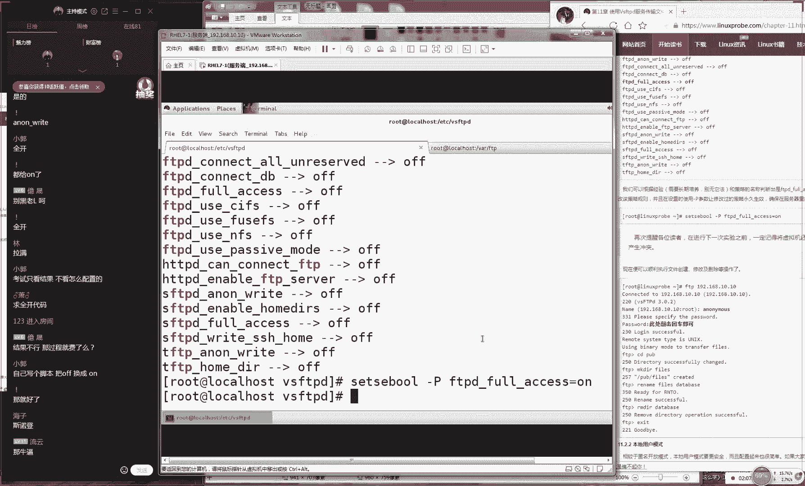

# 【RHCE】红帽认证工程师培训课程 - P13：第十三节课 - 天木轮回 - BV14E411678v

🎼妈妈将。🎼我是这边随。🎼自走。🎼溜。🎼是错你可我。🎼，🎼This。🎼明天里。🎼你太。🎼我。🎼难过。🎼G the money。 Don't fix。🎼给。🎼老兵。🎼Money can fix。

🎼here。🎼Yeah。OK好同学们，那我们准备开始我们今天的课程了。好吧，大家先打一下一，我们开始我们这个今天的课程。我们先来测试一下我们这边这个商课环境。好。

大家先打一下一的话这个课安排话实是今这个课程量的话来说是比丰富的。我还是继去学习第十章节学习部网站且大家去说第十章学习容。以说这个课程节奏上的话会比我之放慢一。

我们这个课程话更实验大家学习更兴趣且了实战课程说常尴尬为什么点拟机打不开我点了三次拟没打开打开我为今拟工我给大家去说一下我们这第十章节打几个给关上几个然看一下说是。😊。

里面最难的啊，大家说第十章节里面这个这个服务是最难的。其实真的不是大家如果觉得很难的话，大家因为没有看到第十三章第十三章才是我整本书里较难这个章节之一。所以说大家如果第十章节有压有点压力的话。

那可能到第十三章的觉得会想念我们这个第十章节就像我们上初中的时，记得我父母跟我说说我上初中的时候说好好考。当你考到高中之后以轻松轻松了。然上高中之后我记得我父母跟我说去上大学之后就轻松了。

后来上了本科之后，有人跟我说读研究生之后就轻松了。反正就是说大家如觉得有压力的话是很正常的。为我不断增加我这个的难度大家去增加我们这个知识嘛。但是我们这个真正难的这个章节还没有出现。

大家也要做好心理准备我不能被这个吓跑。😊。

我先在给大家继续来去说一下第10。4小节，就是我们上一节课已经给大家讲了一个比较基本的，就是我们来去如何去配置你的yM仓库，对吧？然后如何去安装你的这个呃我们的这个呃我们的这个呃ip我们的网站服务程序。

那么以及我们去简单去修改我们这个网站服务程序，它可以来去修改一个目录。😊，其实来说这就是我们昨天给大家去做这么几个实验。但是这个还说比较简单的。下面我给大家玩几个比较有难度的。

就是我们来去充建出来个人用户的主页功能。这个是什么意思呢？这个就是说啊说老师不是技校的嘛？怎么高中都出来了我说我是高中的，这个吹个牛应该也不过分吧。因为我上是职高职高属于职业高中可以简称叫高中吧。

其实是可以的。我上的不是技校因为他这个中职跟高职，还有这个这种蓝翔绩校还是有区别的。大家可以搜索一下这个中职跟技校的区别那而且还有这种北京呃还有种五年叫五年一贯制学校嘛。啊。

所以说我们说高中是没有问题的啊。而且我说我是高中的，我上高中的时候，真有什么可吹牛的，就像说相声的，我都说我的高中毕业了，这还有什么可吹牛的，这你还不行。好，那我们现在给大家去说一下。

我们这边试代校来为我们的每个用户来创建出来一个属于自己的网站。其实的话呢这个技术我们坦白讲，我们坦白讲这个技术只能是叫做技术。😊，真正去使用起来的几率非常的少。我们之间见过就是清华大学、北大。

还有复旦大学，他们三个学校，他们为自己的博士生导师。😊，好，他们的博士生，他们做的这个技术，然后让他们去呃可以更方便来去分享自己的一些学术的一些成果。但是我们现在看到没有一个做成功了。

现实现在都已经是关了啊，大家先在去搜索一下，北大现在应该还有这个网站，但是已经没有人用了。😊，所以说的话呢我我们现在呃所以说我们接下来讲那个10。4小节的话。

这个技术可能确实在应用的这个场景里面是比较少的。但是我们还是通过这个技术进一步去学习来去配置我们这个服务的一个方式，然后加上我们要去学习我们安全上下文的一个配置的方法。

因为我们昨天给大家讲的是一个个叫的策略，它是用来去设置我们限制服务的功能的。大家为什么一点很蒙的在看着我大家说老说些什么？这个反应感觉不是很对啊，就是我们天讲大家得对不？我们昨天给大家讲什么呢？

我我们给大家讲的就是一个由美国安全局跟我们的开源社区一起去研发出来的一个开源的子系统，对吧？然后他可以来去限制我们的服务，大家去获取自己所需的这样的资源或者我叫做文件好然他有两个管理的方式。

第一我们叫第二个我们叫安全怎么样。😊，上下文。好，呃呃呃然后的话我们昨天给大家讲了一下如何去修改我们这个上下文，对吧？去修改我们文件上面的这个标签。接下来我们就给大家讲一下如何去修改我们这个服务的策略。

然后就是说我们今天给大家都去讲一遍，好吧，就通过我们这个实验，大家都能去看一下。好，我说这么多废话啊，大家可啊，大家也能够呃大家应该能够猜到，对吧？其实我是在等我们这个在线的学生呢，刚才有60个人。

现在好了，现在74个人了啊，OK那我们来继续。😊，那我们现来去安装一下我们这个我们的网站服务这个服务的名称，我们叫HTPD我们现在去安装一下我们这个服务程序。现在说没有反应是很正常的反应啊。

都因为已经是预习过了对吧？后看到这么一个技术吹了半天牛感觉这老师好贫啊好了，那我们来安装一下我们这个程序。实我们讲每一个服务之前老刘都会去吹一通就是他那我们都要给他进行一个介绍。

都要把吹特别的厉害好那我们去安装一下我们这个服务程序。那我今天讲到了就是我我们这个系统里的话一切都是文件。那我们再去部署一个服务的话，就是在修改这个服务的啊，因为大家因为大因为大家在吃饭，对吧？

所以直接大家去说了啊，所以我们就是在修改我们这个服务的配置文件好了那我们这个配置文件里它分了两种类型。第一种我们叫做主配置类型叫叫做主配文件。二的话我们叫做普通配置文件。😊，我给大家提个问题好了。

那么请问主配置文件当中是否包含了我们这个服务所有的配置参数。大家告诉我一和二就可以了。请问我们的这个主配置文件当中是否包含了我们的服务所有的配置参数对还是错啊。

大家告诉我说啊不一定啊因为你们现在其实我只因为我其实我只想让大家告诉我是一和2就行了。我都没有想到说三这个不一定的情况啊，就是只有少数情况就是某一个服务它只有一个配置文件的这个情况下。

它才是主配置文件里面包含了所有的参数。大多数情况下，9999。😊，他们都是怎么样的？啊，你是包含了我们这个服务最重要的配置参数。好，那么所以的话呢我们同学打同学我们说打二同学啊。

是是大家对于这个技术还是比较呃，对于我们这句话还是比较了解了。打三同学的话呢，又更好的知道老这个老刘的这个人性是不是啊，我们这个题目里面可能会有个坑。好。

那我们现在来看一下我们这个主配置文件调一下回收看到这个文件之后的话我们首先第一感觉不要慌，对不对？因为这个信息叫做注释信息。它是对于我们这个服务的功能或者某一行的参数种解释或者说明的信息。

这个我们其实来说我们不用去看的。好，这个是我们的这个主配置文件。所以的话呢我们现在不要去编辑这个文件了。我们现在跳到另外一个目录里面这个目录的话呢，它是在ETC目录里面叫做HTPD里面的fi啊。

没有完点这个目录里面。😊，它这个是我们做的这个子配置文件，它所调的一个关系。其中我们去编辑一个叫做userL点fig。这个文件的话呢定义的就是我们是否去开启我们个人用户的这个主页功能的意思。好。

那我们看一下这个呃配置文件，我们现在看完之后，大家千万不要慌，就是你仔细看完了之后，你发现这个文件，它总共总共才它呃才只有36行，它是被我我们这个主配置文件，它所调的一个关系。那我们需要去修改的话。

就是第17行。😊，呃，我我们那啊那呃那我们这边第十7行代表就是禁用了我们当前的个用户的这个功能。那我们需要做就是把它给取消掉，把它给注释掉。然后这样的话代表就是开启这个功能。并且我们占略下一个模板啊。

去开启来第二4行代表就是我们定义一下我们待会每个用户它自己保存网站数据的这么一个目录。好了，那我们接下来我们就复制一下这个文件。好了，大家记住啊。😊，那我呃我们待会我们的每个用户，他用来保存网站的目录。

就是这个名称。

好，我现在把它给复制过去。

这个是在我们每个用户的自己自己的加目录里面。好，这是每个用户自己的网站数据目录啊，我这边叫做网站数据目，我们要打标啊打非常的严谨啊。好，那我们现在修改好就可以了。其实这个功能非常简单。

就们把保存并退出大家看一下我们这个效果把它保存并退出。接下话我们去重新去启动一下我们的H我们的网站服务程序，并且我们将我们这个网站服务程序加入到我们请当中保证我们下一次的时候还能够去运行。

这个时候我们就要需要切换到一个普通用户的一个身份了。比如说我们叫做lin大家知道为什么我们要去选择lin这个用户去做我们这个。

而不会去使用到入而没有去使用到我们这个管理员或者我们其他的普通用户大家知道我们为什么要去使用叫做这个用户。😊，为什么单独是他，而不是我们这个超级用户住管理员？大家想一想啊。

是我我们这个系统当中的一些保护机制吗？还是因为我们的还是因为我们的防火墙还是因为我们的或者因为我们的管理员的这个权限非常的大，他需要受到一些限制吗？其实都不是对不对啊，其实就是想给大家做广告而已。

好了那我们接下来继续往后面去说切换到我们这个普通用户之后，我们现在去新建出来我们这个目录一定要跟我们这个配置文件里面要去保持一致的好，其实就单纯给大家做个广告啊啊，大家不用想那多。

大家所以大家去做这个实验的时候，可以那么我可以那我们可以根自己的这个需要去修改的，这没有关系。好，然后这个时候我们让这个用户去出建出来一个自己的一个网页文件吧。比如说我们叫做然后我们名称的话呢。

我们叫做index。😊，好，接下我们做好之后，我们退到自己的家目录里面，为我们这个网站目录设置一个更加高级的一个权限。75。好，这样的话呢，我们让其他人可以去访问我们这个网站。

以及我们个人用户的这个目录才可以。这样的话，那我们才有权限嘛。好，先做好之后，我们点退出。那这样效果大家可以来看一下，这个来说是非常的明显的那看一下，我们现在去访问一下我们的网站。

大家只需要在我们这个网站的浏览器的后面。你看那我们先去访问一下192068。😊，19万的呃112168点10点10可以访问到我们这个网站。接下来我们加一个斜杠，加一个波浪线。

波浪线后面加上我们用户的名称。只要你这样去写了我们用户的名称，那么你就应该能够看到我们个用户，你自己的这个目呃，你啊你自己的这些呃。😊，的一些网站的数据了。但是我们先看到提示出来一个小的报警信息。

他说我们的lin安全警报。这个时候我们点开看一下，他会告诉你说因为我们的这个个用户主功能，这个技术是比较危险的所以的话呢我们需要去开启一下我们需要去开启一下我们这个的域才可以去放行这个请求。

那也就是说它限制的是我们的服务的功能这个功能它不太安全，它默认被禁止掉了。那我们该怎么去设置呢？我们应该使用两个命令，我们一个叫做get值这个是以杠A这个代表就是我们去查看所有的策略这是我们的查看策略。

大跟我们昨天那个笔记到一块啊，因为我们昨天也给大家去讲了一下这两个命令我们昨天讲的是这个我们昨给大家讲的是t有这个下我给大家做查看我们这个策略以及我们的设置策略的意思。这两个命令大家需要去注意一下。😊。

就是大家就是我们去做这个实验的时候，不要一边去抄的时候，跟我们写的一模一样，一定要有这个思考过程说哎，为什么老师会用linux这个用户大家去照抄这样我去写，对吧？其实我们只是一个出于广告吧。

出于有这么一个小的一个呃给大家一个小的一个笑话吧，让大家去记住啊，其实这个东西可以去修改。但我们考试跟工作时跟自己的这个需要去修改这个名称，这个名称不用跟我们完全一样。好，那我们现在去下。

那我们来去呃呃t我们来去。😊。

我来去杠A我们呃我们呃之所以使用杠A的话呢，就是因为你没有写杠A的话，他就告诉你说你需要去使用杠A然后才可以去查看这个策略。所以我觉得这个参数显得特别无助别别无奈。那你干脆好。

但不去写这个才是这个真的是，需要你这个参数查一下我们所有的这个策略。那那我们到底应该开启哪一条呢那我们就可以去使用到第三章节得管道叫做这个任意加我第二章节里面的这个这个命令来进行搜索搜索出来所有跟所有跟网站HP相关的条目。

大家可以看到它里边有这么多条好了，那我们大概去猜一下。好。为我们看到它这个里面的每个信息但是有一些单词组成出来的。所以我概去猜我大家保证没有我这边右边我没有看右边我们的书籍所以我也猜一下。😊。

我猜是这一条。那就是说它这一条的话呢，意思就是我们的网站开启。你看这是home去加的意思。然后的话DR是我们的目录的意思，代表就是我们开启个用户主页功能。好，那我可能现在那我这样翻译起来感觉特别的牵强。

对吧？那我大家来去实战去操作一下值我们杠杠大的意思代表就是一个永久生效的意思。大家记在你这个书上面当我们以后去考试的时我们工作话呢，请切记去使用叫做s值的时候，请切记一定要加上这个杠P参数。

代表就是永久生效。包括你重启之后你考试收卷都能拿到成绩好既然我们把它给。😊，等于2，我们去把它开启。因为它默认的刚看到它都是所有都是off，我们再把它给开启一下。好，那我们现在开启好了之后。

它因为我们去使用了刚P参数啊，所以说。😊，啊，他会比较慢，我们等他一下。有点太慢了啊。但是我们叫技术，就是如果说大家去做这个实验的时候，他速度很快，他没有这么一个想他没有这么一个等待的一个过程。

大家就要小大家考大家去考试的时候就要小心了去回忆一下自己是不是没有加这个刚参数。好了，接下来我们来去刷新一下我们这个网页就会显示出来我们这个用户这些信息了。

所以看到话其实这个一点都不难他就是立马就显示出来了我们这个用户他自己加目录内的这个网站数据，好了，其实我实到这里就已经是讲完了我们这个配置一个基本的方法，对吧？我们去知道去修改一个文件。

然我们去重启这个服务这个去重启我们这个服务程序，然后去修改去知道如何去修改我们以及下文里的这个值让我们这个服务可获取到我们这个文件上面的这个资源。

并且的话我给大家去讲一下我们如何去修改我们的网站所在目录以及去。😊。

开启我们这个个用户主页功能这么一个方法。好，其实这来说都是比较简单的这个实验。好，现在我们继续往后面去讲。好吧，现在我们给大家去说到。

就是说那我们如果这个用户的这个信息是想要被那么想要是保那那么想要被保护起来。那我们需要进行一个密码的一个加密。那那我们该怎么去做呢？这个时候我们就可以去使用到我们它自己的一个密码的一个加密功能。

这个叫做HWD他又可以来我们去生成出来一个密码文件，用来去验证我们这个登录请求的。好，其实来说这个我们在工作当中使用起来还是有一些市场的。所以大家要记一下那我现在这个步骤。😊。

呃，下面的话呢我的这个步骤的操作就是来去生成出来一个密码的一个文件，它里面会有账号和密码。他们两个这个信息。

账号和密码信息是用来去登录我们这个服务器的那他用来去登录我们这个服务器的登录我们这个网站会看一下效果。所以说我们非常推荐大家去我们下课之后来预习的话呢，请务必现要去看一遍的。因为如果说没有做预习的话。

我猜到大家看我这个实验会一直大家会一点，者说会一直不知道我们这个实验的一个效果是怎么样的。当我们提前如果看过这个视频的话，那我们即便都没有记住。但是我们知道这个实验的效果。

对我们面这个学习对我们这个在线学习也是有帮助的。好，那我们继续后面去C代表就表去生成一个密码文件的一思。后面我给他一个密码文件的一个一个地址，这个文件的话，路径跟名称。😊，所谓啊，那我们只是为了方便。

我们就按照我们数上去做了。希然我们给他一个账户叫做lad。好了，这一次再给他呃打广告也不太好，对吧？所以我们换一个名字证明一下我们现在所验证的这个账户跟我们待会我们去登录我们这个服务器的账号是没有关系的。

所以说那我先换一下，好吧那我现换一下。嗯，那我把这个名称给他换成叫做这个张三好，就是我就是我来去证明一下，他确实是跟我们这个服务器上面是没有关系，只是来去登录我们的网站的一个账户。好，然我的密码的话呢。

那啊我们自己来去输入一下，输入两次敲下回车啊，密码那我啊那我啊那我可不能说对不对？密码就是。😊，啊，我们尽量写的比较简单一点待会我们去敲错，那比较尴尬了，把它叫做这个广告太硬了。

所以我刚才没所以我刚才没有好意思。实其实我刚才想叫但我觉好意思课支付广告这么严重好然话我们来去继续去编辑我们这个配置文件但应该说我们都习惯了是是我课老打广告那我们在来去来编写一下这个配置文件好那我在把我们这个文件里的所有信息都给删除掉是这里面该有信息的我把它删除掉那我们自己来去编写我会对们接下来编写内容话。

我大家讲解一下一就是说是这个是否允许伪京术一是否允许京泰技术其实以禁止掉这个没有关系。因为的话这个京泰技术实际上就是我去访问一个站的这个后缀会自动生成成一个。😊，静态的一个形式。

他用来帮助我们这个用户去访问啊，以及我们去被呃被百度上的这个引擎去搜他呃他来进行一个收录这么一个作用。好，那我们这个只是一个格式，我们找找就可以了。叫做伪静态。好。

然后的话呢我们下面还有一个叫做这个认证文件的一个参数。它定义的就是我们待会我们去哪里去找到这个文件，所以的话呢我们要定义成我们跟我们跟刚才生成出来的一个路径是要保持一致的。如果说您刚才已经忘记的话啊。

对吧？像我一样如果已经忘记的话呢，请一定要去找一下这个文件，确定我们这个路径已经是存在的。大家看到就是我们刚才生成密码出来那个文件，一定要跟这个路径也把它写对，不要写错。如果呃呃要是忘记的话呢。

请过来再去生成一次，好吧，千万不要写错，再往后面去走，代表就是认证名称的意思。这个的话呢，实际上就是一个提示信息的意思，它并不是说像我们这个参数里面所写叫做这个认证名称的一个本意。大家看到。😊。

这个的话它这个名称的英语的翻译过来叫做这个认证名称，我们可以理解成是一个登录用户嘛，其实不可以，这只是一个提示信息。那么你就对它进行一个描述。再比如说这个是一个私人网站啊，非请勿进。

请不要呃随便进入到我们这个网站里面。当你输入输呃当你输入一次错误密码之后，我呃我呃我们会引发核弹头攻击。好吧，好，那我么给他一串提示出来的这个信息。😊，来去方便我们这个用户知道我们这个网站大概的这个呃。

内容或者说他呃让他知道我们这个网站的密码的一个提示信息。再往后面去走的话呢，就是我们认证的一个类型类型我们选择基础代表就是我们的账号和密码的一个方式。我们选为啊。😊，呃，basic就是代表的是一个。

基本的一个方式。我们使用账号和密码的方式来进行验证。既然我们最后要去写这个参数的意思就是我们登录用户的名称了。所以说我们刚才这个账户名称，我们叫做张三。所以说大家看到这个张三的时候。

非常的直观就会知道这个是跟我才个文件里面给给对应上的这样做好之后，们就可以把保存，并且重新去启动一下我这个网站服务程序做好那我果特别的明显。当你再去访问这个网站的时候，他就会提示出来一串信息。

他说这个是一个私人网站，请不要随便去进入到我们这个服务器里面，当你输入一错密码之后，那我们会引起核弹头攻击。好，他这一串这个提示出来的这个信息，告诉你说请你去输入一个账户和密码的一个内容。

那我现可以来去尝试去登录一下。比如说我先去输入一个错误的一个账户。然后再去输入一个错误的密码。我们点一下这告诉你说请你继续来进行输入但是如果说你当你去尝试多次输入失败的话呢，它会提示出来。😊。

来说你的这个请求被禁止掉了。直到你去登录这个网站的时候，输入的确实是张三，然后啊不确实是张三，密码是readd hat的时候，他会对你进行放行。😊，大家可以看到。

这就是我们给大家去做了一个非常简易的网站验证的一个小窗口的一个界面。所以说我们再去所以说我们再去使用的这个ip做服务的时候话呢，其实并不难不？常的简然后说他不会有木马吗？

这个不会有木马的以后上课都会这样吗？以后咱们上课会都会去做实验。我们以后上课老都会我给大家去做完这个实验之，其实我们同学自然会感觉到很轻松，对吧？

如果大家没有做预习的话会感觉一脸懵这个这个这个这个参数这么快感觉没有跟上对吧？所以说我们今天还今天还来得及我们今天刚讲第十章节，我们后面还有11个章节有给大家讲因为我们计会给大家再讲一下第二三章。

所以的话现在还来得及同学如果要是有点来吃力的话请务必去提前去预习一下，因为我不信了你下课之前先去看5遍视频，再上课时你跟不上。😊。

可能的这个一分付出一分收获，自己也没有过预期，不要说哎老师我感觉我自己好笨呀，对吧？这个东西他不是这么他不是这么聊的，因为你不知道你的同学们呃呃，因为你不知道你的同学们，其他人他们虽然看起来好像在聊天。

其实他们已经呃在课下已经预习了三五遍了，所以说我们一定要对自己这个付出也要负责任嘛。我记得我上我上初中的时候又赶了这么一个同学，是我同桌，还每天都跟我玩啊玩玩。然后。😊。

呃，玩玩玩，然后每天下课之后跟我们在一块去坐公交，然后就回家。结果每天早上起来了，他就跟我去抱怨，说哎呀，昨天晚上他爸又带他去看球了，或者他爸又带他去吃好吃的的，结果这个呃也没好好复习。

结果我结果我就是真信了。然后我就跟他一直玩玩玩。最后的话呢我们呃最后我中考的时候，我记得他好像上了一个试重点去了。所以的话呢我非常的不幸，就只能够是去的职高了，那当时我们报了8个志愿，对不对？

我们8个志愿，我当时想了一下，我怎么着我那我也能考上个。😊，区重点考不上的话，我考上个普通高中总行吧。结果我们第八个志愿我们也没有考上，非常的尴尬啊。所以说你们不要看其他同学他们玩儿玩儿玩。

那你那因为你不知道他们在学外学外学，那，所以说我们一定要自己规划好自己的这个预习的一个计划。那好，我们啊我们也要去学外学外学，对不对？好，那我们接下来给大家去说一下，我们下面这个第十联五小节。

十联五小节的话呢嗯。😊。

呃，现在他在我现在他在哪里，我也不知道了，反正我应该是没有我应该是没有我们混的好，对不对？好，那我们现在给大家说一下我们这边的这个十联五小姐给大家讲一个我们虚拟机的这个网站功能，我们之所以讲这个技术。

大家就知道这个技术真的是很实用的。他不像我们之前讲那两个实验感觉就是一个为了练习而练习的一个练习的一个实验，对吧？而我们这五小节是真的是有用的一个实验。

他可以让你这个虚拟机上面他可以让你这个服务器上面来去同时去部署出来多个网站那我们讲一个场景好了，有两个场景。第一来说就是马云对吧？他有一个网站做淘宝网。那好了，咱比如说马云有一个淘宝网。

他买它服务器放他的网站没有问题好，但是他因为他的网站比较大嘛，对？那我们可以用到单独的一个服务器来去存储他这个网站资源，且他现在做越来越大他现在不光有一个服务器，他现在有一个机群，他现在有一个机房。

他现在可能会有多个中心。好，那比如说那这是马云的一个情况。那我什么情况呢？那我就是一个。😊，啊。那我啊那我就是一个初中毕业，然后没有上高中的一个职高生。那我自己也想去创建出来一个自己的网站。

那我们自己就要去买一台服务器嘛，那这个成本会很高的。当时我去了解了一下，好像最便宜的一个服务器，就是我那会儿啊最便宜的一个服务器大概也要15000，而且是那时候的钱，对吧？大概也要15000。

而且你要每年的这个托晚费用怎么样怎么样，每那我们每年算下来大概也要有两三万块钱吧，投入到这个服务器里面，那你知道我自己去写一个博客，那我肯定是很不现实的。那所以说。😊，对于我们这叫做这个草根站长嘛。

或者说我们叫做这个呃呃呃中小企业的话呢，那我们就可以去啊包一台服务器。这样的话呢，我们那我们把这个服务器进行切割。切割之后我们来去分配出去资源，你来去使用多少，你来为你这个使用的这个资源来谈呃呃。

然后来去付务费。那我们来举一个生活上的一个例子好了。😊，就是现在有一个租房的一个形式叫合叫做合租，对吧？但是可能说现在北京是不让了。但是之前是这样的，其实就是说我们有一个大三居，那这个房子很大。

那我们单个人住或者说一个家庭居住的话呢，可能会很大对吧？那么这个时候我们就可以把这个房子给他切割一下。

那么你就可以去去去租其只去租其中的某一个房间这样的话那么那么你那么你们有人来去分担这个整个房租的这么一个租金。这样话那么对于你自己来讲那么你也只去掏出比如说每个月三五百块钱就可以了。

这个非常非常经济划算这么一个租房的一个方式。所以话我们接下要给大家讲一下说那我们该如何去分配我们这个服务器上面的这个资源。其实来说面临两个问题。第一来说就是他如何来去限定我们每个人再比如说我们去租房。

那么有一个大餐居里面住了有有四五个人好了。那么当有一个快递过来的时候，如果说。😊，快递上面没有写你的这个姓名跟电话，他们怎么知道这5人里边这个快递是谁的？所以说我们要通过人的名字啊，然后你去收那个快递。

虽然说我们的这个呃邮寄的地址跟房间号码都是一模一样的。但是你因为通过这个名称，你知道具体要给谁，对吧？那好，那我们在服务器里边也是当我们自己去访问这个网站的时候，当对方去访问淘宝的时候。

虽然说我那呃那我们跟淘宝放在是同一个服务器里面，但是当用户去访问淘宝网的时候，他会不会去获取到了错误的，就是获取到我的网站里面的这个字源呢？

那我们要该去如何去现定每一个服务器每每一个网站的这么一个呃叫做这个标识信息呢，那我们给大家讲第一个我们叫做基于我们的IP地址来去。😊，划分我们的每一个网站。这样的话呢。

当我呃我们这个用户去访不同IP地址的时候，他也可以去想象出来不同的网站。所以说呃但是我们待会去做这个实验的时候，我们都会给大家一个非常简单非常非常简陋的一个网站，然后给大家去做这个实验。

所以说可能待会我们看起来那个变化，可能没有非常华丽的一些变化。但是我们知道它这个底层的一个原理是很厉害的好吧，如果大家有兴趣的话，我待会那个网页，你可以不用按我们这个书上面只写几个字符。

你可以用几个图片或者说用一端视频，这个时候你就可以感受到这个确实变化很大，这个很厉害的一个技术。好，那我说这么多，把夸把给夸了一通之后，我们来去编辑一下我们第一个文件，我们叫做网站我们叫做网卡文件。

是这样的啊我们之前给大家讲四个方法来去配置我们的网站对吧？来去配置我们这个网卡。所以说我们现在再给大家来去重复去操作一下。第一个方法就是来去编写我们这个配置文件编辑我们。😊，配置文件。

因为我现在脑子里面都想的是这个合啊啊啊都想着合租。好，那那好啊OK那我们现在来去编辑一下我我们这个网卡的配置文件，再来给大家去重复一下我我们四种配置方法好了。第一种配置方法。

通过我们的编辑配置文件的方式来去编辑我们的网卡。那我们现在进来说，我们现在需要多个IP地址。那我们也就是说需要在同一个网卡上面绑定多块IP地址。那我们这样去做先来YY然后我们来去粘贴粘贴粘贴。

你看我现在来去复制以及去粘贴几行，大家看一下我现在这个操作。😊，嗯。好，那我们现在继续粘贴几哈。第一个呃呃IP地址为0，第二个为一，第三个为2。因为它是一个下标的问题啊，它这个下标是从零开始的。

然后把这个三个地址的话呢，分别为点10。20。30这个三个地址其实我之前我还去考虑过一个问题，就是说为什么我们的下标是从零开始的。大家如果有大家有没有去学习过C语言，因为你知道C语言里面的数组。

大家知道C语言里面的数组的下标是从多少开始的吗？大家想一下，或者说大家有没有觉过现在变成语言，C语言里面的数组啊是从零开始的。那也就是说呃第一个内容就是说第一个我们叫内容不对不太对啊，就第一个值吧。

是从。😊，是他是从零开始的，第二个是一，第三个是2，大家知道为什么是从零开始的吗？那如果说这样的话会很乱，对不对？那我们干嘛不是第一个就是第一个二个他就是第二个呢他为什么因为他是个二进制？不是二进制。

那为什么三就是2四就是然就是5就是5就是就是4其实我去了解过这个问题啊，但是这个没有一个很准确的一个说法，因为每个人都会有一个自己的一个观点嘛，可能会有人认为是他是从二进制开始的。

他要从零开始虽然有点牵强，但是可能也对啊二的话就是从因为印度的话他占一个语言的一个优势，他之前英国之民嘛，所以说你们应该了解过现在很多这美国的一些软件的一些业务嘛。

会给他外包到印度这样话这样的话呢美国那边他们他们去白去上班，后他们睡觉之后晚上由印度那边帮他们去写代码所以说现在这个印度帮这个。😊，呃，美国做了很多很多这样的一个软件开发的一个工作。

所以说印度现在很呃呃之前很瞧不起咱们中国嘛，他们认为中国人只能造点什么袜子啊，什么背心什么的，做一些比较低端的这些产业。但是他们做的都是一些比较高级的。比如说代码这样的服务。呃。

后来才知道咱们中国这个才是一个正确的一个道路嘛。好，这个啊我们呃。😊，呃，这个话呢我们都不说啊，但是我们知道这个印度的话呢，好像他就是从零开始的。所以说呃我们现在很多的这个程序的下标是从零开始的。

因为我们之前看过一个电影，然后我之前有我有一个同学他也去。😊，跟我们去确认了一下，就是在这个印度，他们的零就是。呃，一楼，咱比如说你想要去。咱们就咱比如说你去住酒店去。那好了，在这个酒店这个大厅的话呢。

是为呃呃它是为零层。然后的话呢它越往上第二层是一，第三层是2，它会有这么一个编排。而这个零代表就是一个大厅代表是第一层的意思。好了，那我不知道这个到底是不是这个我们从零的一个原因了。

给大家说这么多乱七八糟的的意思就是说请大家记住啊，虽然这个可能例子很尴尬。但是我们要记住一下，就是这个下标是从零开始的，这是由我们程序所定义的。第一个是0，第二个是一第三个是2好。

那我们现在有了三个IP地址了之后，我们来去保存退出进来们去但是我没要去过印度，所以不太确认我刚才所说这些到是不对到底是不是对的啊，所以大家有机会的话以去印度玩可以帮我去求证一下。好。

那我们现在去重新启动一下我们的网卡。后我非常的自信啊，以说我们可以去使用的IP呃去拼一下192668点1去拼一下我们这个网卡。😊，对吧然后也可以去拼通我们这个三个网卡，看看它是否是真的是能够把它配通了。

但是说我这么自信的人，那我怎么可能去拼呢？那所以说我们在默认就已经是把它配置好了。现在我们来去创建出来三个目录。第一个目录叫做后目录里面的3W root里面的1好，现给大家去说一下啊。

就是我们现在实际上如大家能看得懂的话，证明我其实我也是在叫做作死给那我们是在给自己找事，我们原先我们的网站目录是在目录里面的3W里面的H目录，对不对。😊，好呃。

而我们现在做的是一个划分服务器算的一个实验。其实我们完全我们毫无必要连1%的可能。在这个呃我们没有任何的这个理由去修改我们这个网站默认的目录。

但是我们现在还是执意去修改网站目录把它修改成目录里面的3W root这个在我们做实验里面包括说我们在以后工作的时候对我们没有任何好处。但是的话呢我们还是通过这个实验都给大家讲一下。

既给大家讲一下我们这个新技术，又给大家回忆一下我们该如何去设置我们的lin这个上下文我们呃该去呃怎么样对于我们这个文件上面的这个值来进行修改。好，所以的话呢大家以后工作的时候。

不用像我一样去修改这个目录的。好吧，我们之所以修改这个目录的原因只是在给大家回忆一下我们该去如何去设置我们lin而已。好了，我们接下来我们去设置一下有三个目录。第一个为。😊，呃。

home目录里面的3W rootot里边呢1213是有3个目录啊OK那我么取三个名字，待会我们来去放三个不同的网站的数据来分别去进入到我们这个三个目录里面，然后往里面去写内容。再比如说192068。

10。10的这个网站，那我们就给它叫做111，好吧，我们给大家写很多的一。😊，好，我们给大写入到这个网站里面。那我们待会去做这个实验的话，大家可能初步去第一眼看的时候的话，可能感觉并不是很直观了。

因为我们这个内容只是一些比较简单的一些文字的一些变化。但是你们一定要知道就是我们的底层，它是有很复杂的，它是由我们一个架构去来去支撑的啊，所以我们的同学如果你之前学习过啊这些网站的一些程序的话。

那么你可以去为你的网站为这个三个页面去设计出来很漂亮的页面。这样的话你会有更清晰的这么一个呃体验。但是我们认为意义并不大啊。好，那我们现在去写入我们这个三个地址。😊，这样做好之后的话呢，还没有完。

我们需要去编辑一下我们我们这个主配置文件呃，我现在去安装一下我们这个服务程序啊。因为我刚才就还疑一下我我这个机器。呃，我这个复制怎么去做的？我刚才我我呃我刚才呃没有去敲复制。

我刚才敲的是我们这个呃向上的一个箭头，是在我们这个键盘上面的这个向上的这个箭头。只要你点一次之后，它就会呃。😊，又出现你上一次敲过那个命令的，特这个特别的方便。这个是咱们第二章节第一小节。

我们的pa事解释器三好处之一啊，它可以来去记录我们这个执行过记录嘛。好，接下的话呢我们再来去编辑一下我们的主配置文件，我们叫做梦获文件好不好啊。

就是我们这个网站服务的这个主配置文件里边保存着我们这个服务程序最重要的配置参数。好，这个配置文件的参数特别的多。那我们也懒得看，我们大概的话呢我们跳转一下，好吧，我们大概的话大概是在第十行左右。😊。

我们来去写上我们这个虚拟机的这些参数，不要太靠前，因为太靠前的话，它没有加载完这个服务程序。我们大概的话呢100多行还是比较近。我们大概是在129行吧，们后面去走129行这边去写我们这个配置参数。

第一行配置参数的话呢另外我们给大家去敲代码的候我们直接给大家去敲了好吧我们给大家去复制了。大家去做这个实验也不要去复制。好吧，我们有一个印象的一个效果。好，那我们现在去写上一个虚拟机的一个信息。

就是定个IP地址为1981010的一个服务器。这是一个我们的网站的一个名称。好，下面的话定义下我们这个网站我们待会当有用户就是说当有用户去访问到了这个IP地址的时候。

那么他就会从这个地址里面给他来去获取网站的这个字。后面我再给大家去设置一下这个网站的名称。这个网站名称我们那我们现来去设置话其实来说是毫无意义的。我们。😊，去做原因，只是为了让我们这个程序不要报错而已。

好吧，所以说大家可以随便去写，我们可以去写这叫做linux probe，也可以去写成百度都可以。因为我们现在这个参数在我们当前它没有生效。好，接下来我们还要对我们这个目录再来进行一次设置。

在这个权限的这个设置，然后才可以去访问。那么否则它会给你提示出来权限不足的这样的一个报错。😊，呃，DIRECTORY啊，我们呃需要对于我们这个目录再来进行一个权限的一个设置。

第一行参数的话呢是说是否允许伪静态技术。好，这个因为我们这个也不需要，对吧？而且我们现在真的是不用，所以说我们现在把它给关闭，我们不需要这个伪静态技术。好，然后的话呢，是我们来去允许说这个法问请求。

结束掉我们对于目录的权限的设置。好，然后我们结束掉我们对于虚拟机的这个设置。都做好之后，我们来去数一下。那么也就是说大概是有1234567有7行对吧？有8行那好了，那我们现在可以大去复制一下了。

来80万。因为我后面内容是一样的，我们8万后面去粘贴。因为我们现在有三个虚拟机。话我们现在对于我们这个三个虚拟机的这个设置我们去修改下好了。

我们将第一个个点修改成20这边修改成20这改20这样话就代表就是我们第二个虚拟机的这个信息。因为我们这个三个虚拟机这个信息的话呢，它变化只有我们IP地址后面那个变化。那么以及我们目录的这个变化。

所以说我们可以偷个直接我们就给大家去复制就可以了。大小写这个不用区分的这样的大家观常仔细是我们的每个服务程序其实来说它都有自己的这个特点。而而我们这个网站服务程序的话呢，这个特点就是它不会区分大小写的。

😊，他呃大家可以记一下我们的网站服务程序，它是不区分打小写的啊，它是没有区分打小写的。好了，我们那我们现在去重新去启动一下我们这个服务程序。其实来说这个非常的简单的，并且我们报了一件事情，对不对？

就是我们原先的网站，它是在万目录里面的3W root里面的HL而我们现在的话呢它是在我们的目录里面了。所以说我们应该能够想到它会有一个报错报错的是什么报错的是我们安上下文的这个值的一个。😊。

呃全天不足的一个报错。好的，我们现在去尝试去访问一下了，就先去假装我们不知道好不好。那我们现那我们先去假装我们不知道192。68。10。10去访问一下这个网站。于是他给你提示出来了这样的一个信息。

同时他还又赠送了你一个安全的警报。他告诉你说lin的一个安全警报了。当你去配他后期的时候，或者说以后你去考试的时候啊，你会特别的烦这Slin，你可真够烦的，是不是你。😊，经常会给我们捣乱。

所以说在工作时候会有很多同学上来第一件事情，官方我将第二件事情关啊去把它给关闭掉了。但是呃如果不关的话呢，确实会对于你这个今后的学习以及你的提高，包括说对服务器的安全都是很有帮助的啊。

所以说我们他虽然呃所以说他就是比较麻烦的话呢，但是我们也建议把它给开启啊，虽然说他比较麻烦，但是我们也建议把它给开启。好了，那我们接下来继续。😊，那我们来去设置一下我们这个lin这个值了。

那我们这个值大家去找呢，它就在我们原先的目录里边大写Z就可以查看了。其实我也记不住，所以我每回也过来查一下了。好接下我到这个值之后，对我们当前的所有目录我都要去设置一下命令我们叫做？

我们去修改一下我们的个上下文的值修改刚具体的值是多少呢是把过来对应的目录我们现在对于我们的货目录里的3目录来进行一次操作，并且请切记我们对于目录操作的话，目录的后面不能有一个信号有信号就错了。

好了还有这个十还有这个十不是19我打错了，应该是1还有这个十目录以及十目录里所有的文件待就是dex了。我们然后我们之后出现出来的这个文件就不需要再都这去操作一遍了。😊，Ilo要大写吗？

Ilo也不用去大写我们所讲的所有的这个网站服务程序。我们刚才编写那个文件里面，它是不用去打有写的，这个服务是比较特殊的，它不区分打有写。比如说我们的这个桑马文件，它要求你会有一个。😊，呃。

空格的一个要求它是要求比较严格的。但是我们这个网站服务程序的代码要求的并不是很严格。好，那我们先这样做好之后的话呢，对于我们所有的文件都进行操作了。既然我们还没有去做完。

我们还要去怎么样立即去生效一下就是我们之前给大家讲这个恢复的一个命令，所以说吐槽说恢复这个词很不准吧。但是他既然这么降嘛，我们给大家去恢复一下。这样我们做好之后，马上他这个啊这非常可爱的啊。

他告诉你说我们原先是这个值现在的话修改成了这个值它已经满足了我们的这个安全的一个策略一个要求。所以说当我们再去刷新这个网站的时候，就会看到当我们访问点10。10跟我们访问我把放大一点按这个l键。

然后动我们这个滚轴，这样话当你去访问这个1010的时候，去访问这个点10。20的时候包括说最后就是1030的时候那么大家以看到。😊，它会有不同的这个页面的一个效果。所以说我们这个变化可能并不是很大啊。

但是。给大家演了一个那就给大家演示一下我那我们这个底层的一个变化。嗯，然后说21期进不来吧。21期我们好像有几位同学大概四五位吧。他们想提前来听课，所以会有。但是如果说您现在开始去听的话呢。

其实有听个热闹了。我们坦白讲，现在听课就是听热闹。因为现已经讲到了第十几节我们讲第13天的课程了，已经是接近了一半以上了。现在听就听热。我们建议大家如果是第21期同学啊，就是等到我们正式开课之后。

大概是在4月底我们会开课之后给大家发通知了。好吧，然后的话呢我们Z代表是代表是什么？Z代表的话呢代表就是我们去查看我们在文件上的安上下文的这个值给大家去说一下查看我们文件上面这个上下文的这个值是这样去写的这个文件名称这样去做就可以啊。

Z代表就是我们查看安下文的这个值好接下来话呢我们再来其实如果。😊。

听得懂也不用也没有必要去跟嘛，就是因为这样的话压力会比较大。比如说注一下追了好几节课，对吧？等我们正式开课之后，我们每一期都会是从零开始去讲的好吧，这个不用担心。好了，既我们这个实验听懂了实说比简单。

其实来说都不难面给大家去做一个实验。那不能通过访问域名因为我去访问网站的，都是通过访问域名嘛。说访3W宝点访3W点它都是通过访问域名的不同。然后还有这个3W百度点因为你说的网站是不同后网站的名称不同。

后去访问到不同的网站的数据。我二个实验给大家讲一下如何基于我们的域名来去划分我们的不同的网站。但是因为我们现在还没有去学习我们的DN所以怎么办呢？所以我先喝口水，稍等一下。😊。

好呃，然后的话喝完水之后给大家想个办法，好吧，就是我们会在第十3章节学那个最难的那个DNS学习办的那我们现在怎么办呢？现在这个事情也不能不做呀，所以我们想半天。

所以说我们干去啊所以说我们干脆去修改一个文件吧。这个文件是在ETC目录里面的house。😊，这个文件啊，所以说大家以后遇到问题了，咱们赶紧去喝口水。这个呃这个文件的话呢。

目的就是可以在我们的本地上面来去强制解析。它这个修改文件的话就是这样的一个效果啊，你看一下，其实这来说是在windows里面也是有的。我之前我自己就报一下加愁好不好？

之前我去访问那个之前我去上facebook的时候，和上谷歌的时候啊，因为咱们中国呃，因为一些。😊，不可描述的一些问题嘛。然后现在目前呃是不让访问这些外的不让访问一些谷歌站的网站的。

那么我当时就是百度上去搜索了一下，就是谷歌他们那个服务器的那个地址嘛。然后我就修改一下我自己windows那个文件，然后给大家去做直接解析。因为咱这个叫做这个JFW嘛。

就是他这个防止国内人去上国外网站的一个方法，主要就是靠DNS的污染技术，对吧？他主要靠DNS的污染所以说我当时就直接去修改了这个文件，然后就可以去翻墙嘛。那我们就叫做去上到这个外网了。

当然来说这个技术大家不要问我这个技术我们现在是非法的我不让用就说他其实有这么一个直接解析的一个方法去绕过了我们这个政府给我们提供的这个受到污染DNS个翻墙的一个方式嘛。😊，好，那我们这样去做。

那么你只需要去写这个特别简单。那么啊你只需要去写IP地址，然后加上这个域名。😊，那么你只需要去写上你的IP地址以及你的域名，你只需要去写上你的域名，三个域名我们都给大家写好。对。

就是我们之前哎还想给大家去讲一个叫做t点点个网站们想要去做一个在线的一个视频站点。后来我们都想好想想去做了。后来以我到我们出书的时，其实是到书里面的。后来的因为一些版权的问题。

我们得不应该把我们这个课程以这个课程放到我们的网站上。所以我们把终止掉这个项目。好我们都不管就是你可以自己去想三个域名。如大家不想去写的话。

可以给自己去写一个域名比如说叫做3W点比如说叫小木木点不自己给自己取个域名都可以了这个三个域名是给大家便取着玩的这个不用说完全跟我一样。当你把它写好之后，就可以去。😊，拼一下d这个域名了。

这个来说这个不属于我们现在所讲的这个课范围内之内啊，因为这个太过于简单了。好，这样做好之后的话呢，我们就可以来去编辑一下我们这个配置文件啊。因为我刚才去还原的虚拟息。

我们来再去重新去安装一下我们这个网站服务程序。大家会啊大家可会说为什么我们总是再去重新去还原我们这个虚拟息是有两个理由。第一个理由，我们希望大家能够去。😊，多看几遍完整的配置实验。

因为我们如果不把它还原的话，大家看这个实验总是从中间开始的。我们因为我们之前配过那个服务，或者说配置过一些lin这些命令的话呢，那我们就没有必要再去重复去执行。所以说我们都是从零开给大家去做。

第二的话就是我们希望我们去还原虚拟的目的是为了保证我们实验之间它不会产生冲突。我们之前配置过这个参数结果没有把个参数给删除全就导致我这个服务它也会失败的会会导致一些我们没有想到一些问题。好。

那我们现在去安装好我们这个服务程序之后，下面就是要去新建出来三个目录分别为目录里边的3W root里面的3W再给大家去说一下，我现在这样把它换到这个me目录的话呢，纯粹是一个个人爱好。

纯粹就是我们了讲课的一个需要。在我们工作跟考试的时候，你没有必要去修改网站所在目录给己添麻烦这个毫无必要好现在我们进入到这个。😊，目录里面的3W呃然后经呃呃3呃3W呃3W注册目录里面分别去写入三个文件。

第一个文件为3WWWWW啊，这已经不是呃呃，这已经呃这已经不是3个W了，这已经是很多个W了。好，我们现在写到我们这个目录里面。还有一个的话呢，我们叫做BBS啊，其实我每一次这样去写BBS的话呢。😊。

就是我们现在解决的是每个网站的内容啊。其实我每一次写这个BBS的时候，老感觉在骂人，我我我不知道你们怎啊。😊，呃，能不能看出这个梗来？好，那我们来继续还有一个叫做t。好了。

那我们现在写入我们三个网站的这个数据。虽然说我们待会可能变化也不是很明显啊，但是你要知道它这个底层的一个变化，它是由调取不同文件所导致这么一个效果。

其实话我们不是很关心说网站上面到底是显示出来一朵红花还是一朵绿花还是一朵蓝花还是一个视频，其实我们都不关心，因为这个网站内容也不是我们去为我们因为我们是在做运维的。

我们不是做这个网站的这个开发跟前端的所以的话呢我们只关心我们的后期的服务器，我们能不能正常高效的给提供这个资源就可以了。好了，既然的话我们再来我们做好之后啊，其实我们已经知道了他一定会受到的这个限制。

但是我们就但是我们就先假装不知道好不好？我们待会给我们包错之后然后我们再去配置一下我们那我们就先去假装不知道好了，那接我们去编辑一下我们这。😊，网站服务程序的主配置文件。所以说很痛苦啊。虽然我们知道。

但是我们先不去把它配一下。我们要等它包错之后再给大家去修改。这个在红猫瑞舞的时候，当时我去讲红猫瑞舞这个课程的时候，有一个服务就是第十3章嘛叫DNS在红猫瑞舞的时候配置DNS是一件很痛苦的一个事情。

我不知道你有没有配过啊，你们你们你们应该是没有配过在红猫瑞舞里面，你想去配一下DNS这样的这个服务，他会至少给你报5个以上的错误，特别的麻烦。而且各种的这种权限的包错，要么就是权限。

要么就是一些文件的一些。😊。

参数的一些小细节特别的麻烦。到了红毛re6的时候就好。但其实来说就好一点了，就是不用这么严格了。到了红毛ri7的时候，到了我们现在大家不呃大家连就是说大家更不用去担心说我们这个参数一些报错问题了。

因为当你去编写这个文件的时候，他会有一个着色。而且的话呢他还可以给你进行一个提醒。如果说你要是写错的话，他会有一个着色的一个变化，告诉你写错了。还有就是他已经是不分大小写了，大家看到他不大小写了。

并且有一些简单的空格这样的问题，他也不会找你麻烦了。说红里面已经是降低了我们入门的这个门槛了。就像我们就说比较坦白，就像于说很多同学现在这个水平，你要想去做运维。你之前要像在十年之前去做运维，不可能的。

谁会给你这个机会。现在做这个这个学习这个层次太浅显了。但是我们现在然我们就可以通过我们两节课的时间，那我们就可以去学习。😊，会配置我我们这个网站，这个也是一个降低门槛的一个过程。

不是说这个行业呃它是呃它呃它变呃变得越水啊，是因为它是一个大的一个趋势。光我们这个服务器。他这个个程各业它都是在降低门槛这么一个过程。我之前我那个手机，我当时用的是个LG的一个手机。

我父母根本就看不懂这个手机里就是很乱七八糟的而且我们之前有一个手机叫这个黑莓，对吧？之前我很酷，我也买一个黑莓的一个手机里边的这个参数特别的复杂，我根本就记不住，而且这个画面特别的小，对吧？

后来现在这个苹果你现在如果你要是有苹果手机的话，者说你ipad的话，你可以做一个实验，你给你家的小孩买买然后。😊，呃，给他去买一个呃，然后给呃给他去买一个呃买一个苹果手机，或者说买一个ipad吧。😊。

你把这ipad交给那个小孩的手里面，你让小孩去玩，你不用给他去就是呃太多这种街上啊，你可以去那么你可以去下载几个软件的话，比如说下载几个软件下载几个游戏，然后给他去玩。后过两个小时之后再去看他的时候。

他已经会玩游戏了，而且他已经会点一些具体会点一些图标，这就是一个在降低门槛这么一个过程，包括说苹果包括说微软，包括说红帽他们都会这样去做另外的话我来编写这个文件。

这个文件的话我就要去写我们具体的域名了其实这个实我之前做我的是一个很无意之间做的一个实验。是我ip后来当时我是因为我不太喜欢热闹，所以你们知道这个书起笔的时候是在春节大家想一下很痛苦的一个经历。

会在春节写书但是我真的越过春节觉得很烦很烦躁这种感觉，所以的话呢我当时就是家里有ipad，家里来一小，我不太。😊，就是很热闹嘛。我当时把ipad给了他了。过了两个小时吧，我才去看的时候。

自己都会从app store里面去下载这种游戏嘛。然后自然后他呃然后他自己下游戏，自己在玩了，已经是所说我这个苹果对于用户的体验，反正我反正我我是很服气的啊。好了，那我们现在去编写我们这个配置文件。

第一个网站我们叫做me目录里面的3W root里面的WWW好了，然后我们对于这个域名这个时候的域名我们就要写上我们刚刚那三个名称了，可不要乱写了啊，可不要乱写了。第一个我们叫做。😊，点com好。

我们对于这个目录还要进行一个权限的一个设置，否则我们用户去访问的时候，它会提示我们的权限是不足的。我们这个时候要去修改一下。😊，呃，扔给女儿了，没有没有扔给一个我们家的这个亲戚。毕竟老刘现在18岁嘛。

怎么会有女儿啊，对不对？你们不要套我这个话了。好，那我们来继续啊。😊，你们就想知道我现在在哪高中，对不对？你们所以你们先套话来，我们现在继续。😊，呃，先写上一个模板，这样的话呢。

证明着我们第一个就给他写好了。其实我们这个跟刚才是一模一样的。你说你看，因为你现在看完之后会觉得笑了，对不对？他不就是跟我们刚才是一模一样吗？这个唯一的变化呢就是我们需要去注意一下，就这个域名的话呢。

一个一定要跟我们刚才那个把它给对应上就行了就可以了。好，把它给对应上就可以了。好了，我们来继续800万嗯。😊，我们来去往下去复制八行。再往后面去粘贴。啊，黑莓手机很好玩。

就是比较小众黑莓手机我之前就买过一个也也不算是买吧，因为也算是后来就给朋友了，因为真的是不因为真的是不会用，所以就卖给朋友了。所以的话呢我对黑莓的是很害怕不敢乱用。好了。

我们来继续这个IP地址不要去修改。因为这个就是绑定的是同一个IP地址。而我们BBS就是我们这个论坛嘛，之我们也想去做一个论坛，后来后来在2016年2014年的时候有有一个人写了一篇文章，说论坛已死。

我不知道这个跟有一个电影叫做这个上帝已死是不是一样啊，反正我之前看了一个电影叫这个上帝已死，就是说世界上有没有种上帝这东西。然后我看一个文章写的是论写的是论坛已死。

而且20122012年的时候开始淘宝双十一越来越火。而且现当时淘宝已经在开始。😊，推他那个手机软件了，但是我很不理解说2012年的时候，为什么一定要推手机软件啊？后来我才知道了。

用手机躺在床上去玩淘宝真舒服。所以的话呢这也就是一个发展的一个趋势嘛。现在论坛我们的辈儿都喜欢关论坛，坐在电脑旁边，我们去发帖，然后一个帖子可能写一个小时，这个时间已经过去了。现在论坛虽然说也有。

不要跟不要说老师我其实还知道你还记得比较大这个论坛，但是确实是有，但是你要去真正去了解一下，你就知道了。现在这个论坛，虽然说他还是很大，但是你去跟他之前比较一下，已经是呃。😊，下滑了很多很多了。

所以说我们当然有一个论坛的一个项目，后来也干脆就不做了，因为干嘛忘一大时间嘛，而且是已经是论坛已死，已经死了，还帮你去进去干嘛。所以说我们没有去写这个论坛，而是直接去写了一本书。

后来发现我们这个方向还是压对了啊。所以说我们平时逛过一些新闻什么的也是有帮助的。我们来继所说那我就把我自己这个偷懒说这么有说这么有高大上啊。好了，我们来继续我们去修改一下我们三个网站的信息。

所以这个东西必须是创业时候去做自己自己要去自己负责任。因为我去网上去搜索一些文章的时候看一些新闻，你看似好像是在玩，但实际上你是在累计你这个经验。但如果说你是在公司那可就不行了。那老板觉得你在偷懒。

所以说这是一个。😊，呃，是一个很有缘分的事情。好，我们现来去访问到我们这个网站。现在我们只做就是访问三个域名，这个域名所对应的这个内容是不一样的。所以说可能变化不会很明显啊。

但是他这个底层逻辑大家知道了。好，那我们先去访问下我们这个网站这个网站访问之后，他告诉你说权限不足，并且他送了一个后他去赠送一个小提示，他说我们的有情提示你你这个操作很危险啊。

少年你这个思想很呃呃很呃很危险啊，他说有一下这个报错。他这个原因的话呢主要就是说我这个这个全下文的这个值没有跟他匹配上，那么怎么办呢？不要跟他较劲，也不要跟他打架啊。

我们一定要过来去查你去查一下你之前这个是什么就行了。我们这个给大家举个例子，为什么我们去修改一个文件，我们去修改一个文件之后。😊，他就会让我们去访问了。大家有没有看过一个成龙的一个电影。呃。

成龙演过一个特工那个电影，但我忘记叫什么名字了。当时成龙跟一个黑人一起去演了一个电影看过家叫叫什么名字，我忘记了，反正是一个跟一个黑人去演了一个电影。那个黑人好像就是在美国好莱坞里面的一个搞笑明星嘛。

然后成龙跟那个黑人一起去巅峰时刻，我忘记是什么，我真的是忘记他这个名字好像叫什么名字了啊，当时有一个小一个当然有一个小的一个情节，但是我忘记是不是成龙这个电影了，或许就是憨豆那个电影。

我忘记是里面是哪一个了，就是有一个晚会，然后的话呢这个晚会里面有一个，反正你们会看一下个巅峰时刻跟憨豆特工里面正有这么一个场景，我忘我忘记是哪一个了，就是有一个晚会，然后这个晚会里面有一幅画。

然后说他们好像是为了去偷那幅画，还是说有人想还是说有人想去偷那幅画，他们要去保护。但是的话呢因为他们没有在这个。😊，收呃，但是他们没有在这个受邀请的一个呃名单里面。

所以他们就去通过一个黑他们就通过一个黑客技术嘛，把自己的这个名字加入到了一个就是他们那会是一个ipad一个软件，然后他们有一个门卫，然后看你这个信息有没有去有没有来进行一个匹配的这么一个信息。

但其实来说这个就是一样的。那我们想要去访问到这个网站，说那我们就要把自己变成后来怎么变的后来成龙啊，还是谁？他们就去把自己就是弄了1个CD打印了一个就是一个脸一样的，反正就是说把贴到自己的脸上。

然后假装自己是是被邀请个人后他就进入到这个宴会里面了。其实来说这就是一样的你不用去修改他这个规则，你要自己变成我们受邀请的那个人，或者说我们把自己变成我们的网站，他所需的这个字源就可以了。

好这个例子可能听起来比较牵强啊。但是其实是这么回事，就是你需要。😊，修改你自己的内容才可以。好了，这个内容的话呢，我这个例子举的是比较的这个。😊，比较这个牵强的啊。好吧。

我们来继续去修改一下我们Slin这个上下文杠A杠T。😊，好，然后哎我们杠A钢T，然后我们对应的这个目录来进行操作。第一个目录的话呢，我们叫做货目录里面的3W入目录。请切记我们对于目录操作的话呢。

目录的后面不要有这个斜杠碟中叠，我忘记是什么了。啊，同学们你要这样问我的话，我真的想不起来。然后我们对于这个目录来进行操作，请接记对于目录的后面不要有这个斜杠啊，目录的后面不要有斜杠BBS。😊，好。

这个tck啊已经不知不觉已经一个小时了啊。好吧，今天我们这个进度还是比较慢的。其实来讲。😊，好，那我们现在对于我们这个目录进行操作过之后，我们让它去生效一下。好，生造好之后。

我们再去访问一下我们这个网站的这个内容，我们来去刷新一下。嗯。😊，这个他没有报错，但是我估计可能是因为我们的网站的数据没有写对。我们这个底层肯定是成功的。好了，我们先访问一下。

叫做3W点laspro点com。然后果然。我们这个数据没有给它写到里面去啊，为什么呢？我来写入到里面index点HM。好，那我们现在再去刷新下我们这个网站。OK有没有问题了。那我先在把它放大一下。😊。

好，待家方面就看到我那我们先去访问这个网站所看到的这个信息。这个是我们这个呃3W点linuxp点com，还有一个叫做BBS的一个网站。😊，当我们看访问到不同的网站的时候。

们看到我们我们这个好像信息都写错了。因为我刚才好像把这个重庆相服给他删掉了，所以我再重新去写一下，好吧。😊，🤧嗯。好，那呃接下来的话呢，那我们再刷新一下我们这个网站，你可以看到就会出现了这个。呃。

BBS对不对？这就是我们的这个。访问第二个网站，他要加我们这个第三个网站叫做t。OK我们来去看一下。所以说我们可能这个变化并不是很直观啊，因为我们只是一些字符的一些变化。但是你要知道。

就是当用户去访问不同的网站的时候，那我们这个底层的效果来去底层去来去抓取文件的话呢，那么它也是不一样的。好了呃，然后说呃呃叫做透什么偷吃啊。我看一下。😊，啊，这个应该是叫做to是吧？OK大啊。

大家帮我去纠正了一下错误啊，应该叫to是吧？OK那我们就是说我们可以通过我们用户访问的这个域名，啊，它可以去。😊。

呃，实现出来我们用户去反不同内容的这么一个效果。好，然后的话呢我们接下来我们下面还有一个基于我们这个端口号去做这个实验。好，按照我们现在这个进度，我好像吹了一个牛。

我们今天好像我我我们今天好像讲不到第好像讲不到第十一章节的这个十一点几小节了。😊。

好像是讲不到了，因为现在这个进度我们看了一下，讲了两个实验就已经讲到了一个小时零10分钟了。所以的话呢我们今天这个课程，我们好像预计就只能去讲到第十章节了。好吧，这个时间太快了我感觉不够用啊。

怎么要把我们这个课程加到3个小时了。这感觉刚开始就结束的感觉这个节奏不行，对吧？然我们继说一下我们这个无线三小节基于我们这个端口号来去做我们这个网站务我做这像才做个实验且简单的这个进度的是不行。好。

给大大家会说因为我平时讲的。是为老废话太多所以说我们比一般人讲这个率不够慢一点，好，那我们赶紧去还一下我们这个虚拟机来去做我们最后一个实验。最后一个实验的话呢。

是基于我们这个端号来去做这个虚拟主题功能的这所以话我们之所以把它放到最后一个的原因是因为我们不想。😊。

来去不光给大家演示一下，我们去修改我们的服务配置文件，还想给大家同时去讲解一下我们的Slin这个上面关与下面关我们这个文件两个演示同时来去操作一下。所以说我们1验5。3小级的这个实验。

是我们本呃是我们本个章节当中最难的一个实验。那这个呃实验是我们整本是我们第十章节里面最难的一个实验。😊。

并且这个难度是连红尔他都不敢考的。红帽尔这个难度完全没有达到这个级别。好吧，还是同时考到了我们Slin的域跟我们Slin上下文的两个同时去考的。好了，我们现在去安装一下我们这个网站服务，但是不用着急啊。

先看一下我们这个操作就好了。大家从啊现在就安装一下我们这个网站服务程序。😊，好，接下来的话呢我们再来新建一下我我们这个网站的目录。好了，这个网站目录的话呢，其实来说两个、3个、5个、7个都可以。

那所以说我现在就给它新建出来两个，之所以选择两个的原因是当选偷个懒了。😊，因为我当时写第三个实验的时候，我突然发现好像写三个没有没有什么必要，而且浪费了。😊，很多很多的纸张嘛。

所以说我们就直接给大家去写两个。大家如果觉得两个太少的话。😊，那我们课后去做这个实验的时候。来你呃大呃呃大家你们可以去创建出来三个或者5个都可以。我们只给大家演示一下这个效果。它它的这个底层都是一样的。

所以说我们这个书嘛真的是很环保。大家看到很多这个输出的信息，我们都我啊我我们都给他省略掉，对不对？好了，我们来去输出一下。当时我就觉得哎呀。😊，我觉得我们这个如果把输入信息都给写到我们这个书里面的话。

虽然很占字数。但是可惜出版社他不按照这个字数给我算钱啊，所以我就干脆直接把它给省略掉了啊，开玩笑了，然我们来继继去编辑一下我们这个配置文件，毕竟我我们做这行，我们做技术这一行。

他不然他啊他不是按照这个字数去算钱的。我们这个稿酬嘛。好了，我们现在去修改一下我们这个配置文件配置文件的话呢，大概行数是在是大概是在第43行。另外大家说到说呃，我们这节课感觉没有跟上了，对吧？

大家刚刚来来有点晚是这样的，如果今天没有跟上，或者说您干脆今天没有来的话，如果大家今天没有来。😊，也呃也没有关系。因为我们每个因为我们后面去做，后面是CE的时候啊。

我们的每个服务之间几乎是没有太大关联的。所以的话呢即便说今天我们没有来，我那我们明天可以来。如果说今天我们都没有来，后天可以来。后天来之后保证你也能够听得懂，对吧？因为我们每去配置这个服务的话呢。

是一个思路的一个问题，它实际上呃相互关联性并不大好了，我们现在去修改一下第43行，就说我们要去添加出来两个口号，分别加入631跟632当用户去访问63个1跟63个2的时候。

也能够去访问到我们这个网站的这个怎么样哎，服务好了，现在的话呢我们来这样。😊，我们往后面去走，大概的话呢，行数是在107行左右吧。哎，不107行，有点靠前，我们往后面去走130行左右。

继续来去写着我们这个参数，这个参数根就刚刚才有变化了。我们需要在我们这个IP地址的后面写上我们的端口号，192168。10。10写上我们这个端口号。😊，我们的网站的路径。这个双引号可以不用去写的。

因为它中间没有空格，我们书上这样去写，纯属是为了这个比较严谨，或者说为了出书的一个效果。那所以说我们再去编写文件的时候，我们可以不用去做。这边要去写一个serv name指的是我们的域名。

这个域名毫就是呃没有一个硬性规定。因为我们现在它并不起效果啊，它只是为了让我们这个程序一个格式要求，不要报错而已啊。所以说我们呃大家如果。呃，可以去修改成自己的，比如说修改成自己的网站。

或者说修改成百度谷歌无所谓，它只是个格式的一个要求而已。好了，接下来我们over read，你看他就会给你提示出来，你没有写。对，这就是一个颜色着色的一个好处。😊，好，然后我们接下来去结束掉这个虚拟机。

这样做好说老刘写的这几个参数，配置文件里面有吗？配置文件里面应该是有，他会有这样的模板，但是我好像没有找到啊，大家可以去找一下。所以说呃。这个其实也不用去背的，因为这个在考试的时候会专门让你去背的东西。

这个不是让大家去背的，可以过来找出长去敲一下。好，然后我们来去复制一下8YY。我记得好像配置文件里面好像是有好像是有的。他会有这样的模板，因为太多了嘛。

他不可能让你去记我之间我记得有一个文件叫做呃之前记什么来？就是桑文件啊之后怎么会学到这个服务。桑文件里面连你该去如何去配置你的他都会告诉你所以说这个不用大家不用担心名退出做之后的话们重新去启动一下们这个服务程序刚我说过了。

就是这个服务它是最难的一个服务。所以说我们现在看起来你好像感觉老你是在逗我们嘛，其实一点都不难啊。实际上这样大家看一下啊，所以说我们现在刚配置那个服务好像没有太大难的。

但是我们现在再去重再重启我们这个服务，你连你的重启服务他都会给你报错了。因为你想一下你原先你的这个网站端号的话呢是80，而你现在的话呢是63个16那现在这个号是611跟6222好了。

原先你只能去访80号，你现在访问的是63跟632号，所以的话他会给你直接去限制掉。😊，那么此时它不光去限制了你Slinux文件所获取的这个资源，而且它又限制了你这个网呃网站去访问这个端口号的这个资源。

那么怎么办呢？先去解决我们的这个第一个问题。现在去解决一个我们比较呃熟悉的一个问题，就是我们的网站的Slinux的上下文的这个信息的这个问题。好了，我们先来这样。2目录里面的3W里面的入。

因为这个我们敲起来比较习呃，比较比比较熟悉了，敲了很多次了。所以说我们先去解决这个问题。我们上管天下管地，下面我们先去解决我们的Slin的问题。来杠A杠T。我们对于我们的目录的名称。

大家切切记我们对于目录后面不要有这个星号呃，不不要有这个斜杠，不要有这个斜杠来，然后这个目录的话呢是。😊，目录的话呢是6111。目录后面不要有斜杠。然后说配置文件里面的域名写错了，这个域名写错。

完全没有关系。因为这个域名在我们当前是不生效的。我现在我只是给大家讲课的时候，我会写的比较规范。其实呃大家去做这个实验的时候，你完全可以写成A点com，然后或者说写成B点com。

因为它现在此时它它是没有生效的，而且点com都没有必要。比如说我刚才所写的是呃。😊，OCM是吧，这个也没有关系，他只要这个格式对就行了。嗯，因为他此时这个域名它并没有生效嘛。好了，我们来继续。😊。

所以说我们就知道知道我们到底去配置这个服务，它到底怎么回事啊，而当以后再有人问你的时候，你看比如说大家会问我说你这个写错会不会很担心啊，那么就不会，因为他并没有生效。因为我们知道他这个底层的一个逻辑。

它是怎么回事了。所以说我们我呃所以说我们今后去配置这个服务的时候，大家也要做这种。😊，呃，知道每一步操作的这么一个意思的一个。层次对不对？好了，我们再继续下面有一个叫做SE manager对吧？

然后point杠这个的话呢它指的就是我们列举出来所有我们的Slin允许端口号以及我们具体的这个协议。好，它有很多好了。

那我们通过我们第三章里面学习的这个任意门去使用的第二章节里面的这个这个命令去搜索出来所有跟网站相关的那我们看一下前两个是跟我们的网站这个缓存是相关的。好了。

然后的话呢其中这一条这条指的就是我们的网站它所使用的这个端口号是多少。😊，那我们需要去做，就是给它添加进去就好了呃SE manager point。杠A代表就是添加了呃呃呃代表是修改的意思。

杠T呃我们呃来去复制一下我们具体的这个值。杠Pport就是我们这个协议杠P，然后是。TCP我们写上6111，那我们敲一下回收。并且的话呢，这个我们的命令执行过之后，它是一个永久生效的。

我们不用担心说重启之后它会去失效。好，那我们现在就是将我们这个63和1跟63个端口号，我们给它加入到我们这个策略当中。他让他能够去访问，放行我们用户的请求操作。好了，我们来去添加一下端口号。😊，啊，对。

第一个。我看一下get IE broad值跟IE manager有什么区别。呃，的区别是啥子啊，还有IU啊，是这个是是这样的，gesSE部只是查看我们所有Slinux的域的这个策略信息。

而我们的SE manager它是用来去设置我们的。呃，安全上下文以及我们这个策略的一个具体的工具。如果可以理解的话呢，就是一个是查看，一个是设置。另外还有一个问题啊，就是我们在红猫re5的时候。

大家如果学习的比较早的话，大家会知道在红猫re5的时候，还有一个命令我们叫做CHCON这么一个命令。然后的话在红猫re7里面才变成了IC manager是这样的。如果说大家学习的比较早。

知道这个命令的话呢，大家知道就是我们在。😊。

之前我们去设置我们这个文件上面的这个上下值，它就是使用这个CHCON。后来的话呢我们才有这个IC manager。那么该如果去来理解这两个命令的话呢，大家可记到就是书上面啊，我们来去理解的话呢。

就是我们这个呃。😊，S manager就是一个增强版，它的这个功能更加丰富。它不光可以去设置我们这个文件上面这个上下文的这个值。

它还可以像我们现在一样去设置一下我们这个允许通口号这样的这个策略这样的话我们做好之后再家去查看一下我们当前我们的网站所放行的这个端口号。这个时候大家看到了那么呃此时就多出来了两个，一个是有3个1。

一个是有3个2我们这个端口号这个效果是非常的明显的好了，这个时候我们来去访问一下我们的网站也这个时候需要去重启一下我们这个网站服务程序。因为我们刚才没有把它启动成功嘛。

我们现在去重新去启动一下我们的这个网站然后去访问一下我们的。😊。

IP地址192。68。10点1，后面加上63个1。端口号大家就可以看到了。我们此时我们调取出来了我们所要的这个网站数据，再来63个2端口号，大家可以看到。这个效果是特别的明显的。好。

然后下面的话就给大家去演示了一下，说我们该去呃怎么样来去基于我们这个端个号来去做我们这么一个策略限制。然后说S然后说再去重启网卡时老提示出来这样的错误为涵这个需要大另给大家去说一下。

就是我们去提问的时候，大家请切记一定要提供大家这个配置的过程，还有我们配置出来这么一个参数我们请一定要截图，然后者说来简单去描述一下，这样一个同学特别的可爱啊，这给我发我一个报错，然后也不算报错吧。

就是一个黑屏，然后问说这个这个什么问题，但是但是就是一个黑屏嘛。如果上面没有字的话，我还为一张就是黑天拍照片呢？但是这个东西就是我一定要提问之前发一下自己配置的一些过程。

者说最好是能够把自己配置出来那个参数截图之后发给我这样话们能够更好给大家去解决问题，好吧。😊，因为之前我就确实遇到过这样的问题，因为我当时以为他给我发了张照片了，就是纯他就是一个纯黑色的一个背景。好。

大家最好是能够发一下自己配置的一个过程，然后再说一下自所遇到的这个问题，因为老刘也不是说看一下，毕竟说你去医院看病，你也要先去脉，你也要先去体检一下，然后问问你你今天吃的是什么呀？

你昨天吃了什么不好的了嘛，吧？然后今天然后你今天身体上你今天上午是不是吃什么东西了，对吧？就说我们要有一个大概一个了解，然后才能给大家回答问题，也单独一个小信息确实不好判断，然后具体出现什么问题了。好。

然后那我们先给大家去呃。😊。

然后我先给大家去说一下我们这个然后说我们说光说听不懂啊，是这样的，其实非常的尴尬。就是我也想给大家去解答问题。但是有他有些时候吧，还确实是不知道到底什么情况。而且的话还有时候吧。

你老说你不会或者说你看不出来，想让大家去提供更多这个材料，老刘好像技术有问题的你这那你这都看不出来吗？但是我们想说就是我有些时候还是真的是看不出来的。好，大家就这个问题我们就去先先挑过好吧。

然后我们下课之后具体的可以来来发给我看一下，因为这个网站服我们先暂时还没有讲嘛，对吧？就是我们暂就暂时还没有给大家去说好，然后说好尴尬。然后说怎么样把这个提示服给他弄出来。如果说这个提示服你看啊。

比如说像我一样你想说是这个问题吧，就是说就是说这个问题。😊，比如说有这样的一个报错了，你想说是这个问题吧。比如说你这个提示服mail了，那么怎么去解决呢啊，那么我们还是我们就可以直接这样。😊。

去关闭之后再重新去开启就有了那就是这么一个小提就这么一个小一个提示符的一个变化。好，下面给大家再去说最后一个实验啊，就是我们可以呃去做一个我们的的防控制。我们坦白说这个技术它又回归到了一个技术上面。

就是说我们这个技术的话呢只是为了让大家去演示一下们我们的这个它可以这样去做。但是实际上来讲它这个作用可能话可能并不是很大的好，下面我给大家去说一下。

那我们该去如何去基于我们这个来去做防控制限制一部分这个访问。但比如说我只允许你通过防火箱就是通过浏览器去访问我们这个网站该怎么去做呢。但是我们但是我们还给大家去说一下我我们这个技术的话呢。😊。

在工作当中使用起来会比较少的。因为我们的访问控制会使用一些专门的一些防火墙。比如说叫做WAF这样的这个设备，对吧？这个它会专门这个设备来去做一种访问控制。

再比如说它会去使用到我们第16章节会去学习一下这个s服务，他就是用来去专门去做访问控制以及做代理的那我们这个第十6章节第1。6小节只是告诉大家我们这个呃网站服务它自带有这么一个功能而已啊。

并不是说这个实验会很呃很重要。所以说这个我我们这个实验之就可以了。好，我们来继续我们来去编辑一下来去创建出来，来来去安装一下我们这个网站服务，然后去编辑一下主配置文件。😊，就是我我我给大家去说了一下。

就是说什么实验比较重要，什么实验不太重要，对吧？这样的话我们再去呃工作跟考试去自己来去决定一下我们这个复习的一个强弱关系嘛。好，接下来的话呢我们来去直接进入到目录里的3W里。

因为我们现在已经从我们昨天到现从昨天到现我们已经讲了5遍，我们去配置我们个上下文的这个值去修改我们文件上面的这个属性信息已经讲了5遍了啊，所以说我们现在就觉得没有必要再给大家再去重复了。

那我们就直接进入到我们的网站目录内去新建出来一个叫做的一个目录。😊，好了，那那那我们去新建出来一个叫做server的一个目录。然后我们往这个server的目录里面写入一行信息。再比如说哈哈哈哈哈啊。

这样写的目的是告诉大家这个参数是无所谓的然后我们去写入这个里面有一个叫L的一个文件。这样做好之后的话呢，我们现在想要去限制下什么行为。编辑这个主配置文件，现想限什么行为呢？

就是当用户去访问到当我们这个用户选用虎狐去访问的时候，他会给我们提示出来成功。而它使用是360或者其他浏览器去访问的时候，那我们就给它提示出来失败了我们就这么偏心眼。好。

那我们先进入到我们这个配置文件里面。大概的话呢，行数是在100多行左右就可以129行吧。我们来去写入我们这个配置文件。配置文件的话呢，我们直接对于我们这个目录的权限来进行一个设置。

因为我们刚才所讲就是对于目录的权限嘛，显然我们这个目录的名称，写我们目录的这个全程。😊，叫做s if是这样的，这个的话呢它是由三个单词去组成出来的。第一个单词叫做s是设置的意思。

第二个的话呢叫做N这个单词叫做环境的意思。我为什记得住？因为我记得好像是在奥巴马卸任的时候，他发表一篇文章就是说这就是演说者演说嘛就是说呼吁对全球化全球气候化的一个重视吧？就是提到这么一个环境信息。

还有一个if就是说当用户访问的环境是什么的时候，这个话实际上就是说当用户访问的这个浏览器是什么的意思好我们想这个user就是们用户的浏览器的标识。

当我们用户浏览器的标识是么这个要区分当用户访问这个浏览器名称为火狐的候那我们这个时就取个。😊，小名我们叫做FF。好了，那我们接来去定一个允许呃oldderal逗号 deny，然后alo from。

环呃环境FF就是说当我们这个用户他访问的浏览器是f的时候，那我们就会去执行允许的这么一个策略。当他没有去使用到火狐去访问的时候，则全部去使用到这个怎么样订单书上没有写这个书上有这个了，在10。

6是在10。6小节。本书的本章节的最后一个小节，就叫做ip访问控制。是有的。好，然后的话呢我们现在给大家去重新去回重启一下我们这个网站服务。下面还有一个实验是基于我们这个地址去做，但是这个意义并不大啊。

因为这个呃第一来说，跟我们现在这个实验是一样道理。第二就是说太简单了。好吧，我们就给大家演示一个就好了。现在我们去重启之后去使用我们的浏览器去访问。

现在我们是限制了我们的用户只能够通过混狐去访问到我们的网站的数据来，我们先去访问一下。😊，然后去访问一下叫做serv这个目录。因为我们现在对于这个serv目录来进行的这么一个权限设置嘛。好。

那我们现在可以正常去访问到网站的数据，并且没有一点点的问题。这个时候我们来去复制，从我们的这个外部19268点试验时，从我们的外部去访问。如果说我们现在去访问。大家现在来去想一下，我们排错的一个思路啊。

现在我们去访问这个网站，或者说访问我们现在做做这个实验，他给我们提示出来了这样的一个问题。😊，他没有拨错，而是这个圈一直在转转转转。请问。这个是什么问题？我们该怎么去解决？给大家几个选项。第一个问呃。

第一个选项就是我们这个配置文件，他写错了。第二个配置呃，这个选项是我们的哎这个。😊，第二个选项是我们的Slin啊没有把它配好。第三个选项，我我们这个虚拟机的这个内网跟外呃跟外网没有连通。第四个选项。

我们的防火墙，那没有它进放行。大家想一下会是哪个原因你看我先在排除一下第三个原因。我从外部先在去从我的这个虚拟机的外部。我们我们的这个真机去尝试去拼一下我们这个虚拟机证明它能够拼通好了。

那我们现在此时此刻是什么问题呢？啊，大家说三那我们首先来去排除了一下这个三不对，还有还有什么问题，现在是一个报错的一个界面。😊，好，哟啊，怎么还有我们这个书的这个广告啊，这是哪个厂商在做？😊。

这种广告估计还要付费的，所以我自己点了一下，是不是要扣一毛钱。好，那我们先看一下的话呢，所以这个问题啊，其实它是出现在了IP table上面。因为我当前这个系统它是7。0版本。

它还是有IP tables的。而我们这个默认测略里面是不允许从外部去访问内部的网站服务。好，当我们现在把它清空好了之后再去刷新一下这个服务。你就可以看到。😊。

嗯，很尴尬，对不对？OK啊，他现在给你提示出来了还是一个包错。但这个包错的话呢，其实并不是我们想看到的一个包错啊，这就很这样会就会很尴尬啊。呃，好，我们的话呢尴尬归呃，我们这边我们尴尬归尴呃归尴尬啊。

我们这个再给大家看一下是不是我们这个IP地址写错了。我看一下，因为我这个虚拟记啊，不知道为什么，他总会出现1个点10点88的一个地址，特别的奇葩，我也不知道为什么。😊，呃，说一个点1点100号这这。

我再重新去配置一下我这边的这个网卡再去刷新一下。好，还是不行。好，我那我知道原因了，原因就是我们没有去重启一下我这个本机的网卡一定是这样的。192018嗯。嗯，你们看有没有看到。

我们明明白要改把它改成点10点。点10。1了。好，大家看好了，大家帮我作证啊。我们现在我们班里面有82位同学，现大家看好了。😊，哦，吓我一跳哦，我因为我这边有一个小一个小音箱啊。

所以我这边一说同学他就突然间。😊，答应了一下。好，大家看好，帮我作证了啊。192点168。10。1没有问题啊，我点下确认，然后点这确认，我点下确认，然后马上过来再完呃。

然后我马上过来再去看一眼马然后我马我马上去看。😊，就变成了点100。1了，大家有没有看到？我这个好恐怖啊，这个在我们技术行业里面就是闹了鬼了。大家看好啊，我现在真没有动，而且这个是一个虚拟网卡。

它不会由外部的DNS帮他去分配地址的。其实这个是不会有的。好，但是大家啊OK大家看好啊，我再给大家操作一遍，大家可以不是给大家再开玩笑的，这个这个实验这个效果还真的没有遇到过。😊，看好。

我现去配置下我这边的IP地址。而且你大家看好，即便你要跟我说，这是DNS的问题，但是DNSDNS它有DICP你即便是DICP我没有去设置成自动啊，我一直是手动的那DNSCP也不会对有有影响的。好了。

我再来给大家操作一下。电视电时O看好了啊，确认确认关闭马上继去看。😊，好。所以说我你那你让我这个实验我怎么做？所以说它为什么一直会变成点100。1，所以说会导致我们这个网络是联通失败的。好了。

我就先去假设啊，就是我们虚拟机它这个DICP给我们去捣乱的。好了，我先去把这个虚拟机DICP给它关上。因为也确确实有可能啊，所以说从理论上来讲，它是讲不通的。😊，但他毕竟是点100开头了嘛。

我们就先去假设来去怀疑你，我们再来把它修改成点10。1，好吧。😊，点10。1，我们来确认确认确认。好，我们马上我再来去看一眼。你不要变了不要变，因为我现在是一个还它还是变了。

但是它是一个手动的一个模式啊。😊，他还是一个手动嘛，它不是D2CP啊，他不可能受到第2CP的这个影响啊。😊，呃，是这样，我把它禁用之后再去修改，好吧，我先把它禁用。😊。

那我给大家说一下我这个问题出在哪里吧。这个问题的话呢，核心大家能够看得出来它一定是虚拟机的一个模拟问题。你毕竟没有花钱，你毕竟是一个模拟出来的一个软件。你的这个呃硬盘，你的这个虚拟机都是模拟出来的。

那么肯定就会跟真实的是有不一样，对吧？就像我们之前做那个实验，你的这个网卡就会给你提示一些意想不到的一些错误。因为你毕竟是一个模拟出来的一个设备嘛。而我们现在的话呢，是怎么回事呢。😊。

🎼是我这个虚拟机是在2016年的时候装的。后来的话你知道老刘比较懒，我我比较懒得折腾。所以的话呢我是从VMnet9，我去升级到了10，又升级到了11，又升级到了12，又升级到了15。

我一直采用的是一个升级的一个方式，没有重新去安装。我认为可能就是重新去升级的过程当中，所以我认为就是升级的时候，他给我。😊，呃，程序过崩溃了，他会给我出现这么一个问题。好，我们现换一个。

比如说我欢迎25。就说我大家以后去安装软件的时候，尽量要去重新去安装，别去升级。升级的话，我万一有什么问题呢？比如说像我们现在似的。😊，哎呀，这怎么会出现1个点100。1呢？好了。

我们先去刷新一下我们这个网站。😔，但是点100。1吧，会给我们一个点10点1，它不是一个同一个网段，就会导致我们这个实验失败。而我们又需要大家能够看到这个实验效果。但是我们这个讯机里面的话。

它有没有连外网，它有没有其他的浏览器。😊，嗯，也不要也不要下课啊，他也没有连外网，他也没有其他浏览器。😊，他只能他只有火狐，但是火狐的话，他一定能够成功。呃。

有办法啊，大家不要我先下下课，我这边有一个办法，我这边还有一台windows呢。😊。

所以说早做好准备了，这两个设备他们都是虚拟机的设备，就不会有问题，对不对？😊。

呃，我这边还有一个我这边还有一个以前安装好的一个盗版的windows。当时哎呀说到版就有点尴尬，对不对？那会儿下来我一个镜像，然后就安装了一下，没有想到还会用得上啊。

我先去开启一下我这个win7的一个镜像，它都是虚拟机里边就应该没有问题了。😊，对我们这个是一个测试版，对不对？我们这个是一个破解版，我们可不是说叫这个盗版了。我们是在进行测试使用嘛，这个感觉越抹越黑啊。

好了，我们先去还一下我们这个虚拟机，其实还好啊，所以说你要是没有安装的过的话，就比较麻烦。😊，流浪地球使用都是windows，都是盗版windows哦。😊，这个我还真的没有看过啊。

啊，大家有没有感受到我这个内存特别的无助啊，他在跟你们在咆，他还在跟你们咆哮啊，救救我救救我啊，现在内存已经飙到99%了。好，那么我们好在我们这个还没有崩溃啊。😊。

我现在已经有点要崩溃了。行，那我们好在我们现在这个信机还是正常开启了，还没有太大问题啊。所后我们赶紧就给大家去操作。😊，现在受线已经比较卡了，我们来去设置一下我们这个windows的网卡。

来地址的话是192A。192。等168点10，我们随便啊，比如说点10。1OK我们点确认确认。这个是虚拟机里面的这个虚拟机，它就应该不会有问题了。好了，我们现去查看一下OK点1点一成功了。

这个呃呃这个有没有呃，这个没有呃，这个没有问题啊。好，那我们现在去打开我们这个网站。😊。

因为他现在只允许火狐去访问，所以我们现在使用到1个IE去访问一下，看一下效果。服务器地址192。68。10。10，好，我们ser。大家可以看一下效果，他说网站要求我们去登录403错误。

我看一下OK没有问题。好，这个错误的话呢，就是说因为我们这个浏览器嘛，这个IE它有一个友好提示啊，我们把它给取消掉。待会就能够看到我们这个报错内容了。这个就是我们这个实验成功了，他现在只允许火狐去访问。

而非。火狐浏览器的这个访问，你可以看一下，它就会给你提示出来这么一个报错。嗯，大家可以看到，现在就已经把我们给禁止掉了，这就是我们一个访问出错这么一个界面。好了。

然后的话呢我们来就给大家讲完了我们这边第十章节，其实来说并不难，对吧？因为我们这个第十章节主要就给大家讲了一下，我们来去配置一个网站，它能够起来就已经是成功的。但是我们为了说不满足。

我们还给大家讲了很多很多这样的这个实例来不断的其实来说大家能够感觉到就是说我们这个实验的话呢，是在不断的的去加大我们这个难度。包括说我们最后一个实验。😊。

来是基于我们这个端口号啊，来去做一个新拟主机出来。其实来说我们是在不断加大我们这个课程难度这么一个过程。好了，然后的话呢我们现在这个时间是8点40分。如果现在下课的话呢，感觉有点太奢侈，对吧？

所以说我们现在还给大家基现在我们给大家讲一下第2第十一章节我们这个文件传输服务我们叫做VSFD但是今天我们肯定是讲不完我们今天的话这个课程的规划大概会给大家讲完基于我们这个匿名模式来去开启我们这个新主机功能这么一个实验好了。

聊聊人生其实来说这个比较尴尬了。其实现在是8点4020分钟，如果我们讲到11点2点1小节好像其实意义并不大，但是我们也不能下课。现在我时间还是比较宝贵的好。

那我们先给大家去讲一下第11点讲一下第十一小节第十一小节的话呢，我们去学习一个更就是很实用的一个技术嘛，我们叫做FP技术，大家就以前可能是使用过。😊。

比如说我们上学的时候，我我们会去使用到这个协议去传一些文件，对吧？呃，然后我们在工作的时候也会通过这个服务，让后我们去传一些电影啊，对吧？那好了，这个服务的话呢，我们叫做文件传输服务。

我们叫做文件传输协议，这个名称叫做FTP啊叫做文件传输协议。大家看一下我们这边有一个图片11点啊11-1啊这样的一个图片。它就是说它可以作为我们这个用户跟我们服务器的一个传输的一个协议嘛。

他就说用来去传输服务，他用来去传输文件的这么一个服务。那我们之前所学习的话呢，我们的FDP当时我去学习的时候。😊。

我老师教给我说我们的FDP的协议，他占用端口号是21啊，他之前他让我去背过，但是其实这个并不准确，因为它占用的是是两个端口号。

其中一个为201个为2121端口号是用来去远程控制我们的FDP的这么一个端口号。而我们去真正去传输文件的话呢，则是去怎么样的是使用的是20端口号，去来去使他来去实际传输我们这个文件的。好。

那么这个时候我们现在先给大家讲一下我们这个FDP该去如何去安装。好，先给大家讲下如何去安装啊，名称的话呢叫做VSFTBD这个软件包的一个名称。然后来把它给安装一下。😊，大要记在几个书上面好吧。

21端口号是用来去远程控制我们FDP的，而20端口号它是用来去文件传输的啊，这个两个大家需要能够去分一下，它两个端口号它都要开启啊，它两个端口号它都呃它都需要去开启。我们以后去配置防火墙的时候。

这个两个断号要把都给开启。😊，好，那么装好之后的话呢，我们去找到我们这个服务的这个主配置文件ETC目录里面，我们叫做VSFPD。因为我们知道它是以服务的名称来命名的一个文件夹，对吧？

然后里面叫做V大家定要记住啊，大家不要说老特别的别的这个大家乱七八糟老去说啊。那这点我们需要记住，就是我们的这个文件的这个主配置文件，请切记有一个小的一个寻找的一个方法的一个小技巧。

就是它都是在TC目录里面以我们的服务名称来命名一个文件夹里面以服务名称命名的一个文件点CON一般它都是这么一个名称，大家可以记一下这个小的一个小技巧。好了，接下的话呢我们来。😊，去编辑一下这个文件。

大家看到这个文件之后，觉得很大家有没有觉得很慌啊，其实不用很慌，对不对？它都是蓝色这个信息。那我们来给大家去说一下，就是蓝色信息代表就是一个注释信息。这个我们不用去看的好吧，那我们怎么去做呢？

这样我们先退出进入到我们这个程序所在目录内。大家看我现在这个操作去将我们这个文件给大家改个名字，给它改成叫什么呢？叫叫做VSFD就是代表就是那个backup代表是一个备份的意思。😊。

然后我们给它改个名字吧，把它给剪切走，然后我们去使用到这个gra呃，过滤出来所有包括井号行的行。我们来去过呃过滤出来所有井号行，把我们这个原始文件里面的井号行的内容给它过滤出来。😊，好。

可以看到有这么多这个注示出来的这个信息。好了，这个时候的话呢，我们还可以去使用一个杠V操作，代表是反选，过滤出来所有没有包括井号行的内容。那么于是我们把它过滤出来了，它有大概有这么多行。

然后我们再将我们这个内容再给它重新的写回到我们这个文件里面。好，这个时候大家可以看一下，我们原先的话呢，这个文件，它有多少行，它有它有127行。而我们当前的这个文件的话呢。

你可以看一下它里面只有14行啊，而且它有里面包括有了空行。好，大家可以看到的话，就是说我们这个服务其实来说它并不难，它只是它它的话它只不过会因为。😊，有很多这个注释去填充了很多这个页面而已。

其实其实来说并不难。就以我们可以对于这个配置文件进行一个精简。精简过后它就只有14行。好，大家觉得这个操作很，对不？好，其实其实来说这个服务还好，我们最后好歹上有14行。

等我们明天给大家讲个服务的时就会知道。其实我们这个可再为精简，原先可能两30百行的这个配置文件，只要就是我们之前我们讲什么，我们只是没有动，为我懒给大家去再去导一下这个文件了。

但是因为他这个服务它特别的这个文特别的嗦，所以我们可以直接将我们这个参数给大家去提取一下，就发现只有就只有13行对？而我们明天会给大家去做这个实验。

大概以后两3百行的这个参数提取出来之后也许就不到1堂了。就这个大家就是这个方法大家可以来记一下。好，然后给大家去快速去说一下。😊，我们这个服务的一些。的这些参数的一些作用啊，就是我们这个服务的话呢。

我们叫做VSFPD它这个作用中来去传输我们这个呃文件内容的。那么它有三个登录的模式。第一我们叫做第一来说我们叫做匿名模式。第二我们叫做本地模式。第三我们叫做虚拟用户模式。

下面我们给大家讲一个叫做匿名公开模式，就是说我们要去允许任何人来去访问我们的这个服务器。那么我们现在给大家看一下这个参数了。第一个参数的话呢就是说是否来去允许呃来自于一个匿名用户的一个访问。

就是说你的这个服务器是否支持公开访问呢，那我们选择是y代就是我们来去开放访问。但因为时间来不及的。今所以的话呢我们今天只会给大家讲第一个模式叫做匿名公开访问模式。

然后我们呢明天会给大家去讲我们这个本地模式跟我们这个虚拟用户模式。好，那我们先来看一下第一行是说是否来去允许我们这个公开访问，我们选择是yes。好，下面就是说是否来。😊。

呃呃然后定义一下我们这个公开模式，写入文件的一个文件反言码。这个的话呢我们叫做U mask啊，这个的话我们叫做U mask，然后字稍微大一点是吧？好，吧稍微大一点。😊，这话呢我们叫做文件的反言码。

是说当你创建出来一个文件的时候，因为这件事间比较紧张，我给就家去说，当你创建出来一个文件的话呢，你可以通过这个数值来去调整你创建出来那个大小，我们对于我们的目录来讲的话呢。

就是777减去然后就等于我们这个实际的文件码就是等于我们这个文件的这个实际的这个权限。而我我们的目录是呃是3个6减去这个的话也是代表的我们实际的一个文件的权限。

所以大家可以去看一下我们这个系统当中的一些文件，你可以看到它如果是一个文件的话呢，我们这个文件的默认权限，一般是644啊，这个比较尴尬，这个文件较特殊。我换一下你可以看一下一般我们在这个目录里面的话呢。

我们的文件的权限一般来说是644。而我们的目录权限一般为75就是因为我们这个系统的默认为022。😊，就是说呃这个U max版页板就是一个调控我们实际文件大小这么一个数值。我们要给大家举个例子啊。

012反过来是75呃。说反了吧。啊，我能有可能是说反了，但是我们这个意思是对的，就是说我们实际上它是由1个77减去UM。我们来给大家举个例子好了。再比如说我们政府要收税，那好了。

咱比如说你一个月的工资是1万块钱，那政府收两收2000块钱的税。😊，那我们这个文件不那我们这个呃人均可呃可支配的这个钱就是8000对吧？当我们想要去给老百姓提高生活了。好了，那我们就收1000块钱的税。

那我们这个人均提的这收入成00块钱。就说我们可以政府也通过这个调整税率来去调老百姓到手之后多少钱而这个这个这个效果也是一样的。

这个是我们系统的一个满权限就是你这个公资的一个的一个最高值然后减去当这个值越小的话，最后我们这个实际到手的文件大。而我们可去增加个值来起到我们最后实际小这一个变化。而我们现在的话是0意默认好了。

是他跟我们这系统里保持是一致的没大变化。就是说是否来允许我们这个本地。😊，模式来去登录，然后以及我们本地模式是否可以去写入呢？我们选择是yes，以及我们本地模式写入文件之后的文件反应码是多少？

我们选择是022嗯。😊，我看一下说呃。啊，说税真重啊，这个我没有啊，这个我们可不敢说啊。然后下面的话呢就是说是否去显示出来一个提示信息。当你去访问到一个目录的时候，因为它毕竟里面都保存都是文件嘛。

可能感觉不太安全。那么当你进入一些比较关键的一些目录的的时候的话呢，他可以给你一些提示出来的信息，然后他去提醒你说这个目录里面内容不要去先去修改的意思，下面就是说是否来去记录成日志。

然后下面这一条是说是否以标准的格式来去写入这个日志，我们建议是开启这个日志的。这样的话呢，可以让你的这个。😊，呃，访问记录是可以被追询到的。下面就是说文件传输的时候是否使用20端口号来去传输。

那我们当然去选择是yes。下面就是说是否开启一个独立的一个监听服务。我们选择是no这个是我们不需要的。还有说是否来去允许我们的6去访问我们选择是yes。那么这个随便大家如果说我们不需要6的话。

也可以呃不用去开启。还有下面就是这个模块，是否要去允许我们这个模块的一个验证。这个我们会在我们明天的课里面大概会在呃明天的我们来去规划一下，大概会在明天的7点半左右会大家讲到我们这个实验。

就是说这个是一个验证模块，我们会通过这个验证模块来去虚拟出来我们这个一个用户身份。好了，下面就是一个us list这个我们会给大家讲到明天会给大家讲到这是我们来去限制一个用户的意思。😊。

那我们可以通过调整这个文件里面的这个内容来去起到一个限制本地用户登录的一个意思。好，最后的话呢就是这个呃呃最后就是这个TCP，就是说它是否受到我们这个防火墙的这个限制，我们选择是yes。😊，好。

这个还没有完。下面的话呢，我们为了说我们这个公开的模式，它不光可以去访问，它还要能够去上传文件。大家记一下我们这个几个参数比较重要的。第一来说就是说是否来去允许我们这个匿名用户，他可以来去上传文件。

那么以及他能不能去写入文件。😊，以及去创建出来我们的文件。这个几个参呃这呃这几个权限我们要给大家去赋予一下。下面的话呢还有一个叫做呃other right，它指的是我们来去是否来去允许其他的写入权限。

那么我们这个其他的写入权限就主要指的就是们能呃我们能不能去删除文件，以及对文件进行说明的这样的操作。😊，好了，那也就是说我们现在是允许一个公开的一个呃。呃，模式来去访问。

并且我们可以允许我们这个公开的模式，它可以来去上传，以及能去新建，以及能够去删除和出命名这样的这个文件的这个权限。但我们可以想一下就知道了。那么你既然是一个公开的一个模式。那么然来讲就不太安全。

那么既然来说你已经是不太安全的一个模式了。那么那你肯定站这个操作也是个限制，因为不安全了，就像于说我们比如说举一个不好一个例子。大家知道中国人进枪的。但是美国可有种水厂可以随便去玩？可以去打枪。

但比如说那你一个射击场，那么你自然来说你要去考一些这样的这个证明，或者说你要去买票，然证明一下你这个精神没有问题，然后你才可以进入到这个游戏场里面去玩。我看一个小一个视频啊。

就是说像一个日本不知道是不是亚洲人，应该应该是亚洲人去美国那边打枪的候，就像那种日本人去打枪样，就是一直在。😊，就一直在玩一样，然后最后被人家把枪给没收了。就说你进一个呃场所之后。

那你也要去呃提前做一些你的检查，看看你有没有符合人家的这个要求。这个也是这样的，而你现在没有个公开的检查，就当就是你这任何人都可以进入到这个靶场里面然后去拿枪，然后去出去干事情，就很危险了。

么以说一定会受到我个限制。继给大家所以说我们待会就看这个实验就会把我们给限制掉。因为你现在这个操作太危险了。好，那我们现在去把它保存退出们来重新去启动一下们这个S服务程序重新启动之后没有完。

一定要去启用一下保证我们现次重启之后，还然能够生效，这之没有完还要再去安装一个小工具。这个话呢我们再做FP这就是一个非常简单的个一个连接工具。我们这个windows里的话。😊，有一个工具很好用啊。

是叫做呃叫做I呃叫做FXPflash。我给大家做个广告，好吧，这个是一个远程文件传输很好用的一个工具。啊大家的话呢。😊，可以去下到。好，那是这样的啊，就是我们待会它一定会受到我们lin的这个限制。

但是的话呢我们先假装我们不知道。因为我们想要去看一下这个报错，好吧，所以说我们假装先我们先还都是不知道的我去连接一下我们这个服务器981010我去连接这个户的话。

我们写成这个匿名这个单词的话它不是一个账户的意思，它是一个匿名的意思啊，好了我们就登录成功了密码是空N这是一个匿名的意思。

但是有一个黑客组织叫做匿名者黑客就是使用的这个词叫做这个匿名当你使用一些其他的工具比如说你再去使用做的，就不用让去输入这个户，它会直接进行连接，但是为我们这个工具它过于简单了，它没有这个自动验证的功能。

所以我们才需要去输入一下。然后我们这个匿名户所在登录之后个路径的话呢是录里。😊，Yeah。的FDP里边的啊这个目录啊，然后我们可以先进入到这个目录里面去看一下啊。

我们换下我们这个终端去看一下这个里边的话呢，还有一个目录叫做POB啊。好了，那我们现在可以对这个POB目录。😊，给他1个717权限，让我我们这个用户可以去写入内容。好吧，我们来去测试下我们这个写入操作。

然后我们这边看一下，它果然里边有一个目录叫做P叫做public公开一个目录我们来进入到目录之后新建一个文件好了，我们说新建目录我们叫做小海同学我们叫小海敲车好了，他告诉你说你被禁止掉了。

其实我们还不知道它是禁止掉的。但它底下已经赠送了你一条提示服告诉你说安全提示请查请请请请点击接收他告诉你说因为你的这个写入操作收到了我们的限制，请你去解决之后才好了。那所以说它可以给你提示出来一些方式。

你可以这样按它的方式去做好了，其实来说我们很简单我们还是啊这样get值然后我们杠A。😊，我们来去搜索一下所有跟呃所有跟FTP相关的条目。好，这个时候大家看一下，你们认为是哪一个。反正的话呢我去猜一下。

我那我猜出来两个。第一个的话呢就是这个第一个就是这个。😊，呃，纯民的行没有提示怎么办？没有提示没有关系。咱们现在根本就没有看那个提示。好，然后的话我们先看一下，实际上来说我们认为有两个可能性。

第一个来说就是这个可能性。这就是说是否来去允许我们的匿名户可以进行一个写入啊，这个我们认为好像是差不多吧？有第二什么？第二就是这一条，反正我认为是这一条因为我之前我因为我知道是哪一条啊。

但是如果你要是不知道的时候，如说你考试的时候怎么办呢？因为说刘那不是废话嘛，这个书都是你写的，你讲课讲好几年了，你当然知道是哪一条了。好，如果说大家考试的时候或者说工作时你不知道是哪一条的话呢，你全开。

如果说这样的红试他要求你不能够关闭，大家知道的这个是红红的一个考试要求，但他没有说你不能够全开大家懂吗？啊，所以说你考试的时候，如果说你忘记哪一条了，你给我全开。你这道题错，你就可以算我的。😊，啊啊。

大家可以下啊，大家然可以到这个书上面好吧，红帽CS跟红CE的Slin如果说他要求你去开启这个条目，但是你不知道哪一条的话，把它给全开，全开了之后这个错放到流的这个没有呃O啊啊，这个是完全没有问题的。

这个的话这个呃就单这个条目的话呢，这个意思嗯。😊，啊，但意思就是说开放一切的这个权限的意思，就包括了我们这个有权限。但是这个如果你觉得不过瘾的话，你还可以继续再多开几条啊。

但是这个其实来说劲儿就很劲儿已经很大了啊，就是我们去开启我们全部的看去开启我们全部的访问权限。这个已经是很大了。对他这个红帽考试的话呢，是只看结果，他不看过程。如果我给大家开个玩笑啊啊这个没有批量开。

我们必须要一个一个去开。我这给大家开个玩笑，说如果你是个黑客，对吧？然后的话呢，你考试的时候，你可以不去做，他听好啊，你可以不去做红帽给你的题目，你去写一个破解的一个脚本，这样的话呢。

当考试的这个结束之后啊，考官去拍你的卷子，然后或者说。😊，他拿着这个脚本来去呃，他去收卷的时候，你自动给他把这个脚本给他劫持了。然后你自动去返回你的结果。如果说你能够做到这样的这个呃技术的话。

其实也是可以的，完全可以的。因为红帽考试，他是从来不会去手动判卷的。所以说即便你的网线松了，就考零分了。即便你收出来的这个成绩是零分，考官都不会去管理，他就会把这个成绩直接报给美国。

然后由美国那边直接帮你去发邮件了啊，大家可能之前没有关注过一种。😊，呃，但呃但可能这边没有呃，但是不知道啊。嗯，好了，我们来继续。😊。

万目录里面的FDPOK我们来开启这一条，开启好了之后的话呢。😊，啊，说已经这么牛了，还用去考红帽了。OK啊这就是说我们红帽考试只是看这个结果，他不会去看这个过程。好了，我们先这样。

我们再去重新去登录一下1928。10。10，但是四科可就不行，四科他不有一个呃什么就是播书嘛，他还会给你去故意制造一些问题。但然红帽他是不会的啊。好，大家先看一下，就是我现在即便我没有买票。

我这是一个公开的一个方式来去访问的服务器。但是你也还得但呃呃但呃但呃但是你也要伺候我，你也要去响应我的这个。😊，需求就是我的这个指令。大家先看一下，我可以进入到POB目录里面。那我们去写文件的时候。

我们必须要去使用到这个POB。那么他告诉我们说250啊，其实这250他不是在骂我们，是因为他这个编号是2呃，他这个编号是250。因为的话呢。😊，呃，他每一个操作之后，他会都给会有一个编号。

那么他用它去排错嘛，也包呃他也方便你说你给这个用呃你方便说你给这个呃作者去提供这种反馈啊，当然可能说在外国的话，肯定不是他们肯定也不知道说250的意思，在中国还会其他的这一个解释，对吧？

所以说这个我们不用去关心，他会告诉你说目录切换成功了。好了，我们现在可以去操作一下。比如说我们可以操作第一条新建出来一个目录，目录的话呢，我们来叫什么呢？比如说我们叫叫小郭好了，我们叫小郭好。

我们就把告诉你说新建成功了，这个信息的话呢，不是老刘给你们瞎说出来的他不光提示出来说你的这个操作是成功的，你可以在这个目录内，你可以再去查看一下。😊，在POB目录里面就会真的出现一个叫做小郭的一个目录。

好了，我们可以除了说我们去新建出来文件，我们还可以对于这个文件进行一个除命名以及删除的操作。我们第二个操务叫做rename。我们把小郭这个文件我们给它叫什么呢？叫做小海好了，我们给它叫做这个小海。

但是我很想。😊，我们换一个同学，比如说这个呃等级为6这位同学，但是我不太认识这个同学的这个后面这个字啊，我真的不太认识啊，应该叫做E同学，对不对？好，我们叫叫这个小海好了。😊，好了。

然后的话呢这个时候他要告诉你说这个说明是成功的。这个时候你可以看一下这个小海的这个文件就这个小过这个文件就变变成了这个小海的这个名称了。好了，那我们可以再来最后还有一个删除操作。其实这个无所谓了。

大家不用说就我们这个不太重要的啊，就我来演示一下我们这几个操作。他又告诉我们说啊他又告诉我们说250，这个很让人生气啊，好，所以我们可以看一下这个文件它又是消失掉了。好了。

所以说通过这个实验吧比较简单但但是我们给大家演示，就是说确实我们可以通过我们的文件的控制，我们就可以实现出来远程去操作我们这个服务器的这么一个效果。大家能够看得出来这个是非常非常有意思的这么一个实验。

大家可以看出来这非常这来说是非常有意思的一个实验。😊，好，因为的话呢我们今天这个时间是有限的，所以我们今天讲不完了。我们今天讲到了11。2。1小节给大家讲了一个匿名用户去访问我们FDP的一个方式。

大家如果说你现在这个实验你没有做成功，或者说还不太理解的话，没有关系。这个这个服务我们刚刚开始，我们明天的时候会给大家去讲好了。

然后话呢明天我还会给大家去讲到这个桑跟NFS或以及所以我们所以我们明天会给大家讲到很多个服务，这个提前要做好准备。那我先在给大家去说一下作业好了。那呃我们这个作业的话呢。

今天的作业复习就是我们的第十章节，大家需要做一个一个实验就好了。😊，基于呃我们想一下给大家一个比较拔高的题目，基于端口号吧的一个虚拟主机的一个实验。因为当你会做这个实验，那么你就自然会去配置你的仓库。

那么自然来说你就会去配置你的这个呃网站服务。那么以及你会去配置lin的预以及我们文件上面这个上业文了。好吧，所以说我们这个实验把它做成功之后，就证明你把它已经学会了。这是我们的一个预系的一个内容。

然后O啊这个就是我们的一个复习的一个内容。那么我们的预习就是明天了，明天我们就是第十一章节跟第十二章节，明天我们讲的第十一章节，加上第十二章节O啊，大家提前做好准备。

就是我们的第十一跟第十二小节的一个规划。😊。

OK这是我们第十一小节跟第十二小节的一个规划。OK没有问题。嗯，第十三角节大家不用看，第十三小节我们肯定讲不完，我们最快也会在下礼拜5的时候才会讲到。而且第十三角节很难。我们会去讲到DNS很多东西。

比如说主服务器从服务器缓存服务器对吧？然后我们会去讲到这个呃正策解解析跟反解析会讲到我们这个主服务器跟从属服务器的这个TSH加密，而且会讲到我们该去如何去做分析解析即我们CDN的一个技术。

但是我们后面考试的时候是没有第十3章内容的，只是给大家纯粹是一个拔高的一个题目的一个章第十三章嗯。😊，好，然后大家有问题的话可以来跟我就说上传操作呢。

上传操作的话使用的是那个P呃使用的是PPODPOT可以它进行上传。但这个意义并不大，就是因为我们这样给大家做一个演示嘛，但我们工作时候，大家可以直接去做就可以了。

嗯明天讲的都会考明天讲的明天讲的还真的是明天讲的都很重要，明天我们讲的这个三个服务四个服务，包括说我们的FDP都会考。所以明天可就会很爽了。来明天一节课学两章，但是两张的话它并不难。

所以我们才有信心给大家讲两张嘛，是不是很快要讲完课还有三周，差不多吧，这个先不用担心好吧也不用着急，下载的时候是get如果大家想要知道的话呢，是这样啊，是这样你可以远程的登录到你这个服务器里面。😊。

你先登录啊，如果你想知道你可以进行什么样的操作的话呢，你可以打一个问号。你看你打完一个问号之后，他他就会告诉你说你能够进行一些所有操作，他都会告诉你了。比如说下载就是get上传就是put啊，它会有进行。

它会给你一些提示嗯。😊，然后说考试的时候，30跟NFS都要去做。呃，这两个你都要会的，因为它是有考试题目嘛。OK呃，大家可以今天有问题话可以来去说一下。😊，我先去喝口水，好吧。

然后大家可以来继续的就是说我们大给大家做答疑，好吧。😊，先稍等1分钟。OK好，大家有问题可以来跟我去说。我看一下呃，咋没有什么准确问题呢？我看一下，说下礼拜五就要考了，约的比较早吗？

凹出FS里面那个NFS的版本号是不是就是RRTC里面那个版本号是个东西？对啊呃NFS的版本号它只有一个的，只要提到NF它这个版本号，那定就指的是同一个东西。然后说我看一下啊。

编辑的时候100多行是根据什么确定的，这个没有具体的这个。规定最主要看自己的这个评审积累嘛，因为往太往前的话，就会有一些程序没有交代完。太往后的话有又以后又不太找又呃又不太好找。😊。

所以就大概就是找了一个中间位置吧。对，看感觉，主要找一个中间位置，不要太靠前，不不要太靠后。如果说一如呃如果说一定要就是有一个说法的话呢，大概就是比如说配置文件除去2嘛。比如说配置文件300行。

你出然后你除个2，大概就是150行左右，就是随便就不用那么严格啊，实际上100行的200行之间都可以，甚至说250行到50行之间都可以，这没有说特别的这个严格。第11章开始配置全靠背呃。

不用去背11章以后不用背，不用这个不用担心。因为具体需要让大家去背的东西，会给大家去专门列出来这个呃会有考题的。😊，行，大家的话有问题的话可以来跟我提前去说，我先去压制一下我们这个视频，背背书下。

赶紧去把这背下来。其实真的是不用的。我们会到时候会给大家去准备出来，需要考需要准备的，而且不用那么压力。毛HHCE300分考210分就能及格，所以就不要有压力啊。但是说能考300分。

那可能去考300分了呃，越高越好。但是就是完全不要那么大压力，就怕有压力。😊。

就是你考试的时候，他不怕你错，也不怕你不会，他就怕你慌了。你慌的时候，你这个整体大局分都没有了，那就麻烦了。

偶尔你错三五道题，都错五道题都没有问题。行冲着300分去的这一看就是咱们的好学生。好，我先去渲染一下我们这个视频，好吧，可来去说。😊。

