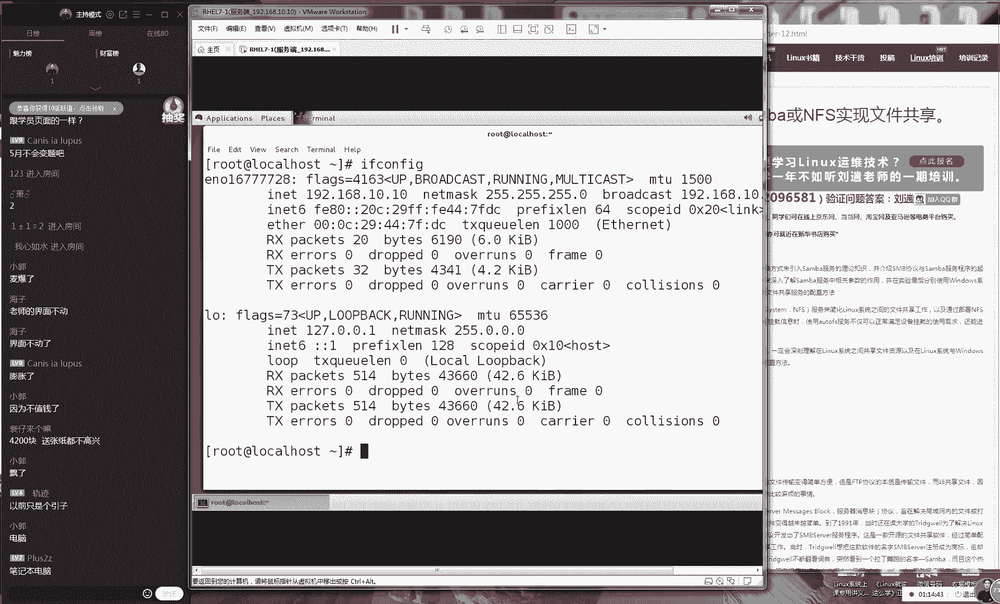

# 【RHCE】红帽认证工程师培训课程 - P14：第十四节课 - 天木轮回 - BV14E411678v

呃，好，同学们，那我们准备先开始上课。同学们，那先打一下一吧。好吧，我们开始准备我们今天这个课程。这首歌听的真的是有点要要犯困啊，所以我们赶紧准备开始上课了。呃，我们刚才等了一下。

刚才有50多个同学是吧？现在要有将近60个人了还好估计今天指导人数会比较多，但是已经临近尾声了嘛，我们现已经临近一半多了嘛，所以的话呢现在呃同学们现在备考应该已经从下周开始吧。

从我们下礼拜开始结课之后就开始去做啊，那么我们就开始要去做准备了。好，那我们继续来我们先回下我们这个虚拟记啊，然后给大家去说一下我们今天这个课程的规划。今天的话呢我们会讲两个章节会讲一下11点2。

2小节。然后以及我们这个第十二小节啊，我们会讲两个章节时间的话呢，我们虽然说讲两个章节，但是这个内容量并不多，因为这两个服务都非常简单。😊。

所以我们今天这个课程的规划的话呢，我们预计会在一个小时零40分钟到2个小时之间。好吧，大家提前做好准备啊，都已经背一个月了。大家不要呃大家不要背这么长时间。因为时间长的话，你反而会到时候就忘记了嘛。

对吧？而且没有必要这么长时间提前两周就就已经是足够足够的了。好，那我们现继续来给网后面给大家去说我们这个VSF我们的这个服务程序。昨天的话呢那我们讲了一个比较基本的一个文件传输的一个对一个介绍吧。

然后加上我们去做了一个呃，我们去做一个呃匿名公开用户模式的一个访问的一个实验。那好，那我们有三种验证方式。第一种方式的话呢，我们叫做匿名用户，我们叫公开访问吧。好吧，这是我们昨天给大家演。😊，吃的那种。

登录我们这个服务器的方法啊，接下来我们今天去学习一下我们这个本地用户方法。那我们这个呃说起来呢，我们这个本地验证方法的话。

那么顾名思义也就是指的是使用我们本地的这个管理员的账号者这个是指的是我们本地的这个账户来去登录。这个也是限于我们这个管理员身份的。好吧，这是我们的本地本地账户模式去登录我们的服务器这个特别的简单。

因为它使用的就是我们这个服务器本地的账户。那我们所以说直接们安装好我们的服务其实就可以去使用我们的这个本地验证模式。好。

那给大家演示一下配置我们参库好了之后我们来去安装一下我们这个V我们的这个服务端程序这个特特别简单特别简单好，在单位拿了一个虚拟机去做个P服务器这个我们去为我们去这个服务器真的是非非常简单。

同学们下课之后，其实下课之后就马上可以去做出来这个常的容易。包括说可以去买一个阿里云这样的这种简简易的这种云服务。😊，气然后就马上就可以做的出来了。😊，好，那我们现在去来去安装一下我们这个VSFPD啊。

然后我们今量让我们每个实验都是一个独立的这样的话呢，我们呃呃让大家可以重新多去看一下我们这个配置服务的一个完整的一个流程。好，然后我们再去安装一个工具叫做FDP这是一个链接的一个工具啊。

它是一个命令行安装好之后，其实我们我们还是我们就去配置一下我们这个服务的主配置文件去找到我们这个VS我们的服务的这个配置目录。接下来的话呢我们来那我们还是将我们这个原始文件给它改个名字。

比如说我们叫做哈哈无所谓啊，这个无所谓，然后我们过滤掉所有的这个井号。那也就是说我们只保留其中的这个有用的这个参数信息。那我们看到有大概有13行，这个时候我们将信息输出到我们的文件里面。

这就是我们去过滤我们的文件的一个方法了。所以说这个方法以后也是会通用的啊，大家就记住这个方法也以后也会是通用的。好，那我们现来去编辑一下这个文件。😊，那你看一下，其实已经很呃，其实已经很太呃。

其实已经很少了，对吧？😊，并且的话呢其实我们在定睛一看啊，其实我们这个里边已经默认去允许了我们本地验呃呃已经是呃允许了我们本地账户的这个登录。以及去允许了我们本地账户的一个写入权限。

并且已经是允许了我们啊它可以去进行写它进行一个写入操作，也可以来定义我们写文件之后那个权限。其实说我们安装好我们的V之后，它就已经是默认能够去支持我们的这个本地验证模式了。好。

这个时候其实我们操作其实感觉这个没有讲，对吧？好，所以说我们现在可以直接去重新去启动一下我们这个VISFP我们的服务程序，然后把它加入到服务器当中。这样的话我们就开机时候。😊。

还依然能为我们用户去提供服务了啊。如果说我们配置的所有的服务，都像我们这个服务一样简单的话，那咱们这个课讲起就那那感觉呃呃特别的轻松了，对吧？好，现在的话呢我们现在去远程去连接一下我这个服务器192。

810敲，然后去输入一下我们本地的一个验证模式，我们去输入的。比如说比如说我们去输一下root这个时候我们还没有去输入密码，给我们提示出来一个报错的一个信息，这就是我们上一节课的时候给大家去提了一下。

说有一个叫做黑名单的一个文件。但是我们可能当时没有去讲就一下子把它挑过了。那你看到就是我们当输入一个用户的一个名称了之后，他马上就给我们做这个禁止了。这个时候我们再翻回去看一下我们的配置文件。

你看到这个配置文件里面，其中有一个叫做user list，这个的话就是说一个叫做黑名单文件，但我们又看过一个电视剧叫死亡笔记，是一个日本拍的一个电视剧，大家看的话可以打一下一。😊，然后这个呃不是电视剧。

是个电影，然后也然后的话也是个漫画。大家有没有看过叫死亡笔记。其中有一个鬼吧，叫lo，然后他有一个主人公啊，叫什么夜神韵，对吧？大家大家都大家可能是看过对吧？都没有看过吗？有两个同学看过行吧。

是这样的大家没有看过的话看一下他这个剧情就主要发展的一个脉络啊，就是说有一天有一个有这么一个主人公吧，他下了半还是下了雪，然后他就是那天下雨他要去一个那个商店门口去避雨去。

结果发现一个黑色笔记本上面写着 note就是死亡笔记的意思后来来他把笔后来他把笔他要捡走了捡走之后的话，他就往上面去写这个人的名字他只要去写谁的名字。个人第二天就？

就是这么个剧情这个话就是说一个死亡笔记就是个黑名单只要把你的名字写到上面了，那么就禁止掉这个用户的登录为我觉得这个例子还是举的比较好的。😊，不太理解的话呢。

下课之后可以以学习的名义去看一下我我们这个电影。好吧，这到这个死亡笔记。我印象当中我上初中的时候，我特别喜欢看，后来我看了三集，好像就拍到了死亡笔记的123，然后第好他最后第三集怎么着了。

反正最后又好像就没有再往后面再去拍了。😊，好好，那我们继续要我们来去讲一下，就是在这个目录里面。它其实来说它是有两个文件的。啊后这边有一个这是呃这个是第一个文件，这个是第二个文件。这两个文件的话呢。

我们都把它叫做黑名单文件。那那我们需要做就是呃如果说你想去禁止到一个人去登录的话，那我们就需要把我们这个用户的名称写到这个文件里面就可以了。那我们同理反过来说。

就是如果说你不想去禁止到一个用户去登录的话呢，那么你就要把这个用户的名称，从死亡笔记里边给它移出去，让他可以活过，让他可以登录到我们这个服务器。好，然后说我看一下啊。

就完全就是科幻片了亡笔记它本身就是有科幻片。它讲的就是呃如果你要是不喜欢谁，你可以把谁的名字写到那个本上。而且最酷的就是你可以写上这个比如说写上。😊，具可以想具体的思法，比如说啊张三啊心脏病突发。

那你这样还可以啊呃就是你可以指定他这个死亡的一个方式啊。后来后后来好像又出现了第二个就是这个死神他们两个之间还互相打斗。体记不太清楚了但我课之后可以学习的名义去看一下两还是挺好玩的好。

那我们现在去编辑一下我们这个文件，这个文件里面看到没都是我们这个名单只要你的这个用户的名字出现在了这个文件里面，那就证明你不能够再登录我们的服务器了。这个时我们怎么去做们就去把给删除掉。

当你只要敲一下滴就删了之，那么你就不用再去，那么就不用再去禁止到登录我们的服务器了。这个时候其实不其实不再做去解释了，保并退出大家去编辑一下另外一个文件。这两个文件里的话。

我们都要把我们的名称给删除掉把给删除掉说里边有死神大家还是有童年对吧？😊，看了我死亡之眼，这什么动画片啊？你们这个童年咱俩是一个频道上面了吗？好，那我们现在编辑好配置文件之后。

我们怎么样呢去重启一下服务器。大家要是有条件的话啊。😊，大家可以啊大家可以呃大家可以去纹身，对吧？那么也可以写上啊第一句话，我们的linux里面的一切都是文件。

那么所以在配那我们所以说在部署于一个服务的时候，那么也就是在修改我们这个服务的配置文件，第三句话，要想让我们这个服务能够去去生效的话呢，那我们需要怎么样再来去重启我们的服务程序。

最后顺手加入到我们启动箱当中，这四句话我们顺口记下来好吧，那我们第三句话就是讲的你要需要去重启了你的这个服务程序。一般情况下啊，那么你就可以让你的这个配置的文件能够去生效啊，闻到胸口上面。

那你以后怎么看啊？闻到胸口上那那是给别人看的对吧？行，你最好可以闻比如说你闻到手上不太好，闻到胳膊上以后再比如说你可以再去红帽考试的时候，他就会把你当作作弊给抓跑了，对吧？啊，把你就把你当作弊给抓走了。

😊，其实我觉得还是比较有这个。来我们去输一下我们这个管理员的这个账户ro，后去输一下我的密码，后是登录成功了。好了，是这样的啊呃那我们这个本地验证这一个模式登录之后的话呢登录默认是自己加目录里。

所以我以尝试再来去再尝试创建一下个账户建一个文件。我个文件告诉你550个是编号为这个编码为550。他说我们创建文件的这个操作被禁止掉了并且之关注我下面提示出来一个小窗口说您到了我们禁止其实就我们默认的话允许用户去文件的。

为不太安全们还是要按们上一个步杠滤出相关的策略。我们需要去开启。😊，我们的FDP在我们Slinux当中，那我们这个完全的访问权限啊。好，get S一布值。😊，刚批我们来去开启一下，等于啊。另外的话呢。

我们现在已经讲到第十4节呃讲到第十4天的课程了。同学们呃今天我们一定要还要继续啊，就是你把你的这个笔记写好，对吧？然后去总结一下你今天这个学习的心得，然我们拍照拍完照之后传到你的这个博客上面。

我们马上我们会在4月下去的时候，我们就要给大家发那个礼物给大家发书了，吧？大家不要忘记好吧？就我们一定要去签到签到也大家学习的这个过程的一个总结嘛，以后过了5年过了1年如果那个博客还在开着的话。

那你回去可以看一眼，对吧？当咱们这个快乐的这个学习经历好，那我们继续来往后面去说我们来去创建出来一个目录叫做哈哈还告诉你说25725还多了个的这个编码这个编码对我们来说是毫无意义的。

但是就显示出来说我们这个文件创建是成功的那么同样你可以翻过来去看一下入册目录下就会出现了一个叫做这么一个非常无聊。😊，这么一个名字，虚拟用户模式会考吗？虚拟用户模式呃，不会考啊。

我我我我我印象里面是不会考的，因为虚拟模式也会比较难，但我印象里面是不会考啊，但是我好久没有去看考题了，应该是不会考的。😊，好，呃接下来的话呢，我们来去创建出来一个文件成功啊，这些都是同理的。

然后我们去尝试去呃去改修改一下名字。啊，那我们去修改成吼吼啊，没有FDP吗？嗯，我怎么记得好像还是有的呀，同学们能帮我去求证一下吗？我们有没有我我们考试的话，这个里面有没有有没有FDP的这个题目。

没有吗？😊，一道都没有吗？那我们这个红帽考试也太水了吧啊，就然FTP都没有考行吗？那没有考没有考吧，对吧？那我们该学还是得学的啊啊，你们是啊行吧，那是真的没有红水了。然后我们再把给删除掉。

那大家看一下我们现在这个操作。就是说那我们现在就可以使用到我们这个本地的一个账户来去登录到我们这F的这个服务器里面，然后并且们能够去新建还去改名以及去删除掉文件了。其实来说这都是非常基本的这这个操作。

没有什么可聊的对吧？这都是非常简单的。因为这个模式是默认已经已经开启了。好，下面我给大家去说一个最难的一个实验了，就是我们基于虚拟用户去。😊，去登录我们这个服务器，然后进行一系列这个操作。

大家刚才问到的说我们虚拟用户会不会考，对吧？大家可能是比较怕这个章，因为它特别的难。比我们之前讲的两个这个呃我们我之前讲那两个模式，他们都要难，而且是难的不行半点它是用来去专门去虚拟出来用户。

然后去登录我们这个服务器的，这个什么意思？就是我们去虚拟出来用户的话呢，这个用户是在我们这个服务器的本地它是没有的。他是专门用来去登录我们这个服务器的这样的话当黑客去破解了这个用户的密码也没有用。

因为的话呢你只能够去登录我们这个文件传输服务录不了我们的这个整台服务器，所以他有一个更好的一个安全的一个性能。好，但但来说这个难度也会比相对于说会比较高一点的。好了，那我们现在去充建出来一个文件。

这个文件我们给放到ETC目录里面的这目录里面他这个目的就是用来去保存我们这个账户和密码。😊，啊，那我们接下来说去虚拟出用户，那我们就要自然给他一个账户和密码了。然后这个文件名称是无所谓啊。

大家可以随便去写。😊，然后我他呃他这个里面的内容的话呢，就是单数行是张三啊，然后还这个偶数行是密码，不我都说呃我。呃说错说错啊这个啊呃在呃在这个呃在这个文件里面的话呢，单数行是我们这个账户啊。

然后偶数行是密码。所以的话呢那我们现在就是有两个用户嘛，一个叫做这密码分别都做没没问题来说这个文件的话名称也是无所谓的。家根据要去修改。

但是总之不要忘记怎么样呢保存并退出接下来我们来继续啊我们都东西不能说红罩们不讲接下我们来去使用做的一个命令它是用来去做加密的。

它就是可以将我们一个文的一个信息加密成一个密码文件然后杠大T代表就是我们要进行加密杠小指的就是我们具体的加密一个格式我们叫做哈希值这我做哈西加密做杠指的是我们要去加密的文件的名称是什么后面我要给大去写。

😊，加密之后的一个文件名称是什么？好了，这个话大家没有必要跟我们完全保持一致的。好吧好，大呃呃这个不用跟我们书上面是完全一样的。但是我们最后那个名称请记住请这个文件名给记住。

因为这个文件可以看到它就是加密过后那个文件了。我们待会会给大家进行这个操作以进行绑定这要去新建出来一个本地用户跟我们虚拟用户进行一个映射这样登录这个虚拟用户的。

际来个文件就会归属到我们地的用户那我本地用户个杠参是用户目录保存录杠S的是我们的登录终端我们给取个名字叫做是让我们用户不能登录们个服务器上只是一个用来去本地映射的一个身份而已。映用户。😊，的一个名称。

这样做好之后敲回车，再往后面去走，我们就要去编写我们的pa模块了。现在给大家看一张图，说我们什么是pa模块呢？pa模块那pa模块的话呢，实际上它指的就是一个叫做可插拔式认证模块的一个缩写。

大家可以去记一下这个pa模块，我们叫做可插拔式认证模块。大家想一下这什么叫做可插拔呢？😊，就是说当你需要的时候，他就可以去帮你去做验证。当你呃呃呃当你呃已经不需要的时候，他就可以去呃直接把它给拔掉。

就是把这个功能上从你这个服务上给取消掉。我给大家写出来叫做怕模块嘛，叫怕模块可插可插拔式认证模块。那那那咱比如说我们举个例子，就是我们之前我们去写个程序，我们给大换个图好吧，这可能说不是很清楚。

就是我们之前我们去写一个程序的话呢，可能是有两部分去组成出来的。其中一部分的话呢就是我们这个功能对吧？首先来说我们的服务要有功能。第二个的话就是我们要有一个认证的一个方式，就是我们要去进行一个验证。

或者说我们登录的一个页面。比如说我们的QQQQ是用来聊天是用来去发送文件的，是用来发送这个聊天记录的那好了，那么你登那么你去使用QQ这个软件的时候。

那么你自然你也要去登录一下你的QQ因为只有你登录之后才知道你这个。😊，用户的这个身份，然后只有你登录了之后，他才能够去为你去提供服务。那么但是我们现在很多这个网站其实。😊，不知道大家有没有关注过。

就是他有些时候已经不是呃这个呃他已经不是在在由这个网站去提供这么一个验证的服务了。咱比如说大家有没有发现，就是嗯比如说京东网，大家有没有逛过，就是说这个京东网其实是可以使用QQ号去登录的。

咱比如说你可以去淘宝网去买东西的时候，淘宝网是可以用支付宝去登录的对吧？咱比如说还有一些论坛论坛就可以去使用QQ号去登录，大家手机短信验证，这个我不知道算不算啊，但是就是你们逛京东啊逛当当网什么的。

其实可以用QQ号去登录，这个大家可能没有去试过，对吧？下格之后可以去试一下，就是你进入到京东，然后你可以去使用的QQ号去登录到这个网站上面，然后可以去购物当当网还有这个亚马逊现在还都可以用到微信去登录。

就说那我们现在这个一个软件的话呢，你可以把你的这个呃呃验证的这个功能，给他抛给你的抛给第三方来去完成，他就是抛给了QQ或者抛给了微信。😊，而他去做它这个功能，而这个验证是由我们这个第三方去做的。

而这个pa模块也差不多是这个意思啊。就是说当我们去写一个服务程序。然后那你想一个问题，我凭什么我就能够去使用我们这个服务器本地的这个账户来去登录呢？大家想这个问题啊。😊。

就大家可能现在感觉因为怕模块就是我们这个服务器的一个本身的一个程序嘛，所以我自然而然就要能够去使用你这个验证的功能。但这样显是不对的。是你要去想凭什么你就可以去使用我们这么一个账户和密码的一个身份。

如果说我自己写的一个程序，我能不能直接去调取这个账户和密码的信息。这样话那我如是黑客的话，我就可以去尝试破解这个服务器了吗？所以说这个模块的话我们就是系统当中提供出来的一个接口。

专门用来让你去做一些比较简单这种认证的，我们叫做可插拔设置的模块是这样的比如说你在你现在有个服务在这个服务叫做A那么你就可以通过我们这个调取一下。你看到这个我们叫做API接口。

就是由系统去提供出来一个接口你去调用。那那我们就可以去调取我们系统本地的一个模块来去做这么一个账户的验证了。那也就是说他不能够直接去读取到我们这个账户和密码。但是你可以通过我们这个模块来。😊，一个验证。

再再比如说啊咱再比如说我们以后开了一个。😊，非常高级的一个商店。好了，我们说商店也不太好。们比如说我们开了一个非常高级的一个呃酒店。好了。那么比那咱比如说那我是个保洁。好了。

那我们所有的这个呃进入到酒店里面的人。那么自然住在房间里面的人，他们自然就是客人了。但是我怎么知道住到酒店里面人都是客人的，就是因为前台已经帮我作为因为前台已经帮我做这个认证了。

他们所有人都已经他们呃所有人都已经是呃付费，然后已经取得了这个前台的一个登记了，然后才会觉得呃呃他才会进入到这个酒店里面。而我作为一个保洁，我就不用再去关心说去登记这个客人信息这样的这个工作了。

这个我们叫做可拆拔认证模块是将我们这个服务的功能与我们这个认证的一个呃功能给他分离开所以说那我们现在的话呢，原先是调取的就是我们其中本地的一个模块来去调取的我们本地的一个验证的一个方式。

下面我们就要来去指向到我们刚刚去生成出来那个文。😊，来进行一个挂钩。这样的话我们今后就可以去使用到我们自己。😊，去提供的这个pa模块以及我们的文件。他来进行这么一个用户的一个认证了。好。

然后的话因为我们这个模块它涉及的会比较高。那我说什么哈会所天上人间。大家这个思维点太跳跃了啊。好，那我因为的话我们这个模块是比较高级的一个技术。我们会在的会给大家去讲但红目前还没开的一个计划。

就说这个课程的话个模块只会给大家讲一下概个流程具体里的参数不去记不去背为这个东西即便是红它一时半会也得去想一下好吧，这个就是难度比较高，我们只给大家看一下它实有这么个东西给大家个。

所以说我们敢说我们这个课程，它实际上是介于在红之间的就像于说我们这个第十章节实我红里面什么都没。但是我给大家讲这个个证模式有好那我们现在就来编编辑一个文件这个文件我们叫做U为什么是U呢？

就是因为我们之前那个文件是叫做待会大家去。😊，啊呃，我们啊待会儿给大家去看啊啊，那所以说我们后面加上一个后缀用来去标示出来，这个是我们自己的。接下来嗯。😊，后面添加用户的话。

后面每一次添加用户我们都要重新来去生成出来那个账户的这个文件才可以。如果觉得很麻烦的话呢然后接下去调取一个文件。如果觉得很麻烦的话，以后我们可以去使用到进行一个验证的一个登录。但是人少的话。

可以直接使用我们这个文件就可以去做好，然后现在是这样的我指一下个验证的文件这个前面加一个D后面写成一个路径，这个路径我们好像没有见过对吧？实这个路径后面就是我们大家看一下就是我们刚生成出来个文件。

只不过我们的文件的名称面少了一个点而已。但是这个写到前面好吧，就是我们去写这个文件的时候，们不要去写个后缀，我们去写文件时候不要去写个后缀现在我们来进行一个验证登录具体这参数大家不用去记。

就是我调取一下这个文件就可以了我们待会验证的时候就是使用我们自这个文件来进行登录并且我们文件名称一定要把指对如才修改过名称的话。😊，那请现在记得也要去呃同步去修改一下。好了。然后接下来的话呢。

我看一下大家有什么问题呃，好生没有什么正经问题，对吧？好了，我那我们来继续往后面去说啊啊，你们这样的话，我们迟早我们这个频道也会被封掉的啊。大家这聊天要要稍要要要稍微注意一点啊。好了。

我们来这样来编辑一下我们这个文件。😊，是这样的啊，因为的话呢我们之前我们上一个就是我们刚给大家讲的一个本地一个验证模式嘛，我们啊就用了将近有20分钟去讲一个本地验证模式，太奢侈了啊。

但是这个模式非常的简单，我们几我们几乎来说都没有什么配置，对吧？好，我们接下来就来去正式去配置一下我们这个配置文件了。第一步的话呢就是来去禁止掉我们这个虚拟用户的一个呃。

第一步我们现在去禁止掉我们这个匿名用户的一个登录。这个做不做都可以啊，想做就做，不想做就不做。它这个目的就是因为。😊，呃，匿名用户的话呢不太安全。所以的话呢我们建议把它给禁止掉。

避免说有黑客去公开去直接去访问到我们这个服务器嘛，对吧？所以把它给关闭掉。但如果大家说想去同时去开启的话，那么也可以的，这个没有关系。然后的话大家需要注意一下。

就是我们这个虚拟用户模式必须要跟我们这个本地模式，需要去同时都要开启才可以。那我们也要去下面加上一条这个命令。就是说呃这个的话呢代表就是我们的一个匿名用户呃，这个代表这个代表就是我们的这个匿名用户。

这个的话代表就是一个本地模式，这个代表就是我们这个虚拟用户，现在就是说我们去开启了我们这个本地模式跟我们的虚拟模式两个登录方式。再往后面去走。我们来写上一个本地的一个验证的一个用户的名称。

就是我们刚才出现出来的一个用户了，一定要跟我们刚才所对应上。😊，再往后面去走，就是说是否来去允许呃是否来去允许我们这个写入操作的，我们叫做劳动机制。这个什么意思呢？

这个意思的话就是说呃我们如果说登录到我们这个服务器那我们默认是在目录里面。那我们是个用户，那我们这个客户他们能他能不能直接跳转ETC目录里面，或者他跳DV目录里面，他去修改我们其他的文件呢。

所以说我们为了避免说有人去跳目录去操作，就是他来的时候说大家有没有看过一个电影，因为我们通过电影的话，好给大家去介绍啊，我有没有看过一个电影叫间谍是一个是一个韩国片是在去年的时候上映的。

大家有没有看过啊，大家看过对吧？嗯，是这样的，大家有没有看过电影就是一个正我觉得是近几年韩国拍的比较好的，因为我觉得上一个比较好的韩国电影就是那个釜山行嘛。

就是就是那个杀僵师那个后第二个好我就认为就是最近拍那个间底还。😊，拍的很不错的，大家都没有看过吗？那你们平时到底在干什么呀啊，嗯那呃都没有看过电影是吗？都没有看过那个间谍。好了，是这样的。

大家可以待会去网上去搜一下啊。就说去年有一个韩国电影叫间谍，然后是一个韩国片，对吧？😊，呃，你没有看过。没呃爱国啊不看韩剧剧情啊，那我们就是给大家去介绍一下这个剧情吧。大家话我们下课之后。

你可以以着我们学习的这个名义再去看一下我们这个电影，就说有一个间谍，后来的话他潜到朝鲜那边去做间谍去大家懂这个剧情了，对不对？接下来的话呢大家都很忙只看没有剧情的电影，大家怎么会很忙那有我忙嘛，对吧？

家你们这个时间用到哪里自己心里没了数嘛，我记得当时我就是哎呀我当时了我当时看当时那会培训，那会做写书，那会儿还要做很多科研项目。那会真的是很忙，最不也下来了吗？你们这个平时工作不可能这么忙嘛，对吧？

我继续往后去说有个有一个间谍，后来他去朝鲜了，他还去做间谍对吧？后来他获得了朝鲜领导人这个信任，但时有这么一个剧情啊，给大家讲一个剧情，就是他去找那个朝鲜的国防部的部长，后想说说给大家送材料，道。😊。

呃，大家对这个有没有印象啊，后来的话呢抄见什么国防部的那个人吧，他没在，他就去那个呃他就然后他就进去了，他就在那个房间里面去等他。等半天的话呢，那人也没来。

但是是那呃但呃但是这个呃实际上呃韩国那个间谍已经他并不是在那个屋里等着呢。大家看完那个剧情，他是进入到了那个人的那个办公室里面，他把那个锁给他撬开了，然后进入到那个办公室里面。

然后给他安了一个窃听器啊之后他又出来了之后，假装没有发生过什么事情。其实这个例子来说是一模一样的，就是。😊，我们原先那我们原先。只是让你能够去进入到某一个区域内。

就是说咱比如说我之前我只允许你进入到客厅，但是你进入到客厅之后，你又进入到了卧室。哎，这个操作那我们就要把你给限制掉这个操作我们叫做我们叫做劳笼机制。

把你这个权限把这个操作范围给牢笼给他卡死在一定的范围内他进一步去保护我们这个服务器的安全。当有黑客来入侵我们这个服务器你就即便说把我给入侵了。但是你也仅限于这个在客厅而已。那你这个破坏的范围。

比如说你想搞破坏，那也只能在这个客厅之内来进行破坏，它不能够跳转到其他的房间再来进行这种破坏操作。好，我说很清楚。大不大理解的话，看一下那个电影实还实还是挺有意思的。好了，我们来继续嗯。😊。

下面的话就是我们这个模块了。我们现在这个模块的名称叫做V其实来说这个名称之前是什么已经无所谓了。因为我们自己的新文件的名称的话呢叫做VU是我个人自己写的我们只要把设置好他直接指向我们自编写好验证文件。

去使用张三跟李户去登录，那我们做好之后啊，大家先相信我就是我们刚才我们这个系统本地的话是真的没有三李四这两个用户家要其实我的知怎么做就是上课之前给创建一个用户叫张三李你假装好像是有了个文件骗我说这是一个虚拟用户对不以我给大家来去验证一下。

就是我没有聊。我系统本地的话是真的是确实是没有一三跟李四个用户撇我这个确实是出于一个技术的一个个实践方法好了。好，接下我。😊，去编写我们这个配置文件，我先啊撇大家去撇清我们这个呃大家的这个顾虑啊。好。

接下来我们后面再添加一个这个参数，这个参数我们叫做user confi，然后我们写上呃后下外线DIR，然后我们写上一个路径。这个什么意思呢？就是我们刚有两个用户，一个叫张三跟一个叫李4。😊。

即便说这两个用户都是我们刚刚给他创建出来的，但是我们也想要去提高一下我们这个配置礼服的这个能力嘛。我们那呃呃我们希望我们配置出来的这个账户，我们不是呃同样的这个权限，就是说我们即便说张三跟李四同时出生。

但是我们希望他这个权限也不太好。那再比如说我再给大家举个例子啊，我们再给大家举个例子，比如说比如说你们知道在英国的话呢在这欧美国家，他这个继承不像咱中国的，咱中国是平分对吧？比如说个有5个人。

然后家里的这个财产就分给了5个人，其实在欧美那边尤其在英国嘛他是他不是这样的，他叫做这个长子继承制，就像于说中国的皇上一样。那比如说中国皇上一下生比说一下生了15个孩子，但是只有其中的大儿子。

一般来讲啊，就只有其中的大儿子，他可以当皇上，对吧？那也就是说同时出生了15个人，但是你只有你第一个人，他有这个特殊权限，但是凭什么呢？因为我们是同时出生的那但但是我们却有一个人的这个。😊。

权限它更为特殊。所以那也就是呃给大家讲到呃，即便说我们同时创建出来了多个虚拟用户，但是你也可以针对于每个用户来去分配独立的权限。你的这个第一个孩子当皇上，第二个皇上当什么？😊，好。

我没有看过这种电视剧啊，就是这种穿越剧啊。你咱比如说你呃你第二个儿子，你当大g，对吧？然后你第三个儿子你当呃太后，对不对？反正你是你给他呃每个人都可以安排一个不同的一个职位。

就说你同呃呃我们可以对于我们这个虚拟用户，每一个人都可以有一个独立的一个权限。好了，我们说这么多吧。呃那我们来去时间去操作一下来新建出来一个目录叫做VSL。😊，FVSFPD里面的us下划线R好。

一定要这个我们一定要跟我们刚才那个文件里面所对用上。如果说我们刚才那个文件里面大家呃是跟我现在不太一样的话呢，自己去修改过，请切记我那我们这个目录的话，这个名称也要把它保持一致。好。

然后我们去新建出来两个文件。我们一个叫张三啊，我们在一个叫李4张三跟李4两个好呃两个好兄弟。好，然后的话呢我们来去登录到，然后来去编辑一下张三的这个文件是这样的话呢，因为我们的这个。😊，呃。

因为我们这个作者的话呢是比较懒的。我们坦白的来说，这个作者真的是很懒，真的是太懒了。他都没有为我们这个虚拟用户的这个权限单独去写个参数。大家不要给他找借口，就是因为真的是很懒，他就是没有去写。

所以的话呢我们这个虚拟用户的这个权限的指令就是使用的是我们的一个匿名用户的这个权限的指令。所以你去写的时候，你会感觉到特别的呃会感觉到很不习惯，那是没有办法，他就这个作者就是这样去定义的。

就说我们他那所以说我那我们这个参数，如果想来去允许我们这个虚拟用户来去上传文件，那我们就给他改成是yes好，如果要是允许我们这个虚拟用户，他可以来去写入我们的文件的话呢，我们也给他给他改成是yes好。

然后他说是否允许我们这个虚拟用户，他有其他的操作。比如说新建删除。😊，还有我们这个改名操作的话呢，我们同样我们把它改成的是yes。好，那我们现在把它做好之后，我们就可以来把把把保存名退出。

并且我们去重新去启动一下我们这个服务程序了。因为我们加启动项了，所以说没有必要再去重新的来给添加到启动项了。这样做好之，其实一点都不难对吧？那我现在时去操作一下老大是太子，其他都是网页啊。

这个知识是比我要更加扎实一点的啊。好，那我们现在来去远程登录到我们这个服务器上面，然后敲一下回车本来赚钱一个人的话，后来人变成了后来变成一堆话啊。好，那我们来继续这是第几步。

我们刚才所做为这个步骤是在第我们没有我们刚才我们这个操作没有完按照我们书上的这个流程去做的，刚才我们正好敲完第五步，就是我们刚才做这个实验时没有按照我们这个书上面去做。因为书上面我觉得有一点太啰嗦了。

所以我们直接就按照我们这个方式。😊，就来就直接进行操作的。好了，那我们再来登录一下我们这个服务器。第一个我们这个账户的话呢，我们叫做这个张三桥小会车。然后密码的话呢不告诉你们啊。

不能告诉你们是小会车他告诉你说登录成功了。当然你无所谓啦，可以创建出来一个文件，比如说我们叫什么呢？我们叫小凡吧，叫个小凡会车告诉小凡操作个成功的我老刘操作简单但是我们这个步骤没有少。

只是把这个步骤给合并了一下因为他那个是先创建出来那个用户目录，后权限再编辑个文件那不是太麻烦了吧我以说我们是直接修改一下我们这个配置文件我们修改好之后再创建出来这个用户的配置文件这个流程但是这个意思是一样的我们现创建出来一个小凡的一个文件。

不光可以来去新建也以来进行改名我们将小凡给修改成我们叫做。😊，小郭吧，好吧，我们可以他叫小郭。好了，呃他告诉我们说250啊，说我们这个修改成功了。好了，这个呃250的话呢，在这个操作当中。

在我们这个FTB里边的话呢，的意思就应该是操作成功了。如果说以后大家工作的时候，想来祝愿一个人说你呃祝你操作能够顺利的话，因为我们做计算机的话，呃的人我们都是心里有点迷信的。

我们都希望我们我我我我们的这个操作。😊，可以很顺利，没有一些突发情况嘛。所以以后你就可以跟他说啊，我希望你呃，我希望你是个250，或者说我希望你能够遇到个我希望你能够遇到个250吧。

就是你可最呃这个是一个呃呃呃这个的话是一个非常至高无上的一种。😊，呃，这种祝福的语言。好了，然后啊然后大啊先看我现在这个操作继器，我们来去删除掉我们这个小郭的文件。他又告诉我们说250啊。

说我们这个移除文件是操作成功了啊，这个其实是开玩笑的，但是当你再去看到这个250的时候，其实心里是很亲切的啊啊，终于我们看到这个250了。边代表，我们这个权限跟我们这个用户都是成功的那好。

那也就是说那我们现在这个操作都已经是成功的那我们现在该怎么去做呢？接下来这个操作我们就要给大家来去说一下。😊，使用到李四这个用户了。因为我们刚才虽然说他都有两个用户可以来去登录到我们这个服务器。

但是李四用户没有一个更高级的权限，他只是一个李四而已，就相当于有一个皇上很不公呃，很偏心眼，生了个大儿子，先当了皇上了，对吧？先当先当了这这个这个太子了，对吧？结果二儿子直接就给他。😊。

扔到民然后就把就是呃直接过寄给了民间了，当是一个私生子一样，对吧？所以说李四这个呃这个账户，他也能够去登录到我们这个服务器，但是他却没有上传下载呃，他他有这个下载权限。但他却没有这个上传。

然后去创建重名删除这样的文件的权限。再比如说我想去尝试同样我们创建出来一个文件，我们叫小杨，比如说我叫小杨，我们去创建出来这个文件，他会告诉我们说我们这个操作是失败的。好。

那就是说给大家讲给大家去讲解了一下我们可以用来去模拟出来一个用户专门用来去管理我们这个FDP的服务。这个在我我们这个实验里边也是做到的那这个来说在我们这个实验里他也是可以做到的。😊，好。

然后现在想的一个问题啊，就是说老师我听你这个课吧，从昨天开始听听到现在了，大概听了有呃有一个多小时，对吧？那我们现在想一个问题，那你现在说到FP它有三个的方式。

分别为我们的这个虚拟用户本地模式以及以及是这个匿名用户。那你现在嗯你即便说是一个匿名公开的一个模式的一个这么一个模式，但是你都需要让你的用户来进行一个登录，然后才可以去进入。并且你现在说起来。

我先看你去操作巴拉巴拉还挺顺的。呃，也很简单对吧？但是大家但我为什么我觉得自己还是但是自己还是觉得很难呢。就是我们有没有更加简单的一个方法来去传输我们这个文件。如果大家觉得这个还是太难的话。

那那我们再给大家讲一个更为简单的一个服务。我们这个服务我们叫做TFP我们叫做简单文件传输协议。它就是叫做简单的文件传输协议。所以说如果大家今后觉得VS第一个情况啊。😊。

他太难了，不太想去配好了，他就得太难。那我们就不要去配它。第二的话就是说我们只需要一个非常简单的一个文件传输协议，即可我们不需要这么多的复杂的文呃非常复杂的功能。

或者说我们只是用来去下载一些简单的文件的话呢，那我们就可以去使用叫做TFP，那我们叫做简单文件传输协议。这个的话呢，我们端口号这样呢是69协议的话呢，叫做U呃呃协议为UDP协议。

这个是一个非常简单的文件传输协议。简单到我还没有去配置它。其实大家现在已经能够呃。😊，一眼能够看完它了，它非常的简单。好，那我给大家来去实战去操作一下。我们那我们还是说啊我们书上面都是一些偏理论。

然后都是一些文字嘛，然后我们通过我们这个实验给大家带到我们这个实战里面去操作一下现在安装我们第一个软件。

我们叫做这是我们的服务端的工具安装一下我们这个的工具叫做FP我们去安装一下P是这样的TF我们叫做简单文件传输协议，它有多简单呢，它特别特别的简单。

它非常简单简单到它都没有自己的这叫做开它没有自己这么一个主配置文件，所以话它是由我们这个星贷的服务所管理的。大家有没有见过一种插板这种插线板上面每一个这这个上面每一个插槽上面前面都会有一个开关啊。

所以说当就是一个主控面板一样。那我们要想去开启这个TFTP的话，那我们就要去在我们这个星贷里。😊，来去开启好了，见过对吧？嗯，大家见过的话，打一下一。😊，啊，同们这个应该是的啊，大家应该这个是见过。

就是我们没有必要我们就是在为每一个就是大家去买一个插线板的时候，你你不可能有就是出了这种工程用的吧。但是你不可能说每每一个插线板上面只有一个插槽，那这个意义就不大了，只是个那就只是一个延长的一个作用了。

对吧？啊，大家见过这个，大家没有见过的话，我给大家去搜一下啊。😊，啊，这个你们肯定是见过的，那么可能就就呃大家就是只是呃。我给大家去搜一下，这大家肯定是见过的，就是把这个插件板上面。

它会有我觉得这张图真的很贴切啊。等我们下课之后可以放到我们这个书里面，不知道有没有侵权啊，就是呃也不是这种，就是他非常简单，但是的话他会每给每一个开关上面都会有一个独立的一个按键，我给大家找一下。😊。

啊，就是反正是这种，你看到了吧，我等会我怎么找一下呢？😊，哦，大家看一下，就是类似于这样的，它会在呃它会给每一个这样的这个么这个这个这个插孔上面的这的这个前面都会有一个独立的一个开关，对吧？

然后用他用来去管理我们具体的这么一个插座它是否能够通电。但是我们不可能说我们给每一个就是我们每一个插排上面它不可能只有这么一个插槽。所以说们就进行一个集中式的一个管理嘛。

就是把一些非常细小的非常琐碎的一些服务来进行一种统一的管理。大家懂这意思吧，就是将一些非常细小的琐碎的这个服务来进行一个统一的一个管理，这个服务就是叫做星奈的服务。所以说我们要想去开启TFDP的话。

那我们需要去找我们这个插排我们去开启我们这个服务各管各的好，那我们来继续我们来看一下这个文件里面这个文件里面非常简单，它总共总共它才有。😊。

才有18行，并且我们大部分我们的前面都是这个注释，我们的注释不用去看，这个主要就定义了我们这个服务的配置文件，然后以及程序哪里去找。然后以及我们这个呃加目录在哪里，对吧？他待会这个加目录。

它就是在这个万目录里面的lab里面的这个呃TFTP步目录下啊，大家记住啊，这个呃这个目录就是我们。😊，TFTP的这个加目录，我们待会儿就会在这个目录里面来去这个下载文件。对。

或者说我们可以进行上传文件这样的这个操作。好，那我们需要操作就是第十四行，第十四行有一个叫做diable的一个参数，我们需要把它改成是no。因为他这个diable的话呢，就是一个禁用的一个意思。

那我们写上一个no就是不要去禁用它的意思。因为我们中国人说话是比较直白的。我们很少会说一种否定句，就是那种多重否定句。😊，但是可能外国人来说是比较呃常说的，因为咱中文比较直白嘛，咱中国人就是行或不行。

对吧？没有说呃，我认为这个应该是不可以，但是又认为又是可以的这样的话比较乱，对吧？那我们在我们外国里就是有种双重否定句。你这样的说法让我不得不让我不得不去不去来去关注你对吧？或者说我你这样的这个请求。

我真的是不得不不去拒绝你像这样这种多次的种否定，好，他的话不说去否定了多少次，你看一下这个单词的意思叫做diable就是这个禁止的意思，对吧？那么就是写成一个no，们就不要去禁止他的意思。

咱比如说一个女生，然后那个女生说我我我不喜欢你，然后你就说你不要不喜欢我，就是说你要喜欢我的意思吗？所以说我们现在这个操作实就是去开启一个服务的意思。好，同样我们来去重新去启动一下我们这个服务。😊。

这样我们重建好之后，我们自然来呃呃，那我们就自然我们这个TFDP它已经是很能啊可以来去运行了。所以说这个服务是非常简单的。如果大家在工作当中只需要一个非常简单的一个文件传输协议。

那么我们就可以使用到这个T呃呃那我们就可以去使用到这个TFDP了，它非常简单的一个文件传输的一个协议。😊，好，接下来的话我给大家来演示一下，就是我们进入到我们这个服务端这边，但是功能非常的少。

它少到了都没有一个列举我们的这个列表的功能。所以说你下载这个文件的时候，必须要知道这个文件的名称我们好比说我们新建在这个目录我们新建出来一个文件我们叫做什么呢？们叫做小峰。

我们叫小风后里面的这个内容的话我们拉拉我们去写很多证明我们这个文件啊，确实使有内容的。好，我们来把它保存名退出。这样做好之后，我们就可以去那我那我们就可以来去模拟一个用户去登录了。

当模拟一个用户来去登录到们这个服务器它使用的叫做TF后后面加上我们这个IP地址19我们来进行一次连接这时候连接成功了，大家会发现说我们根本有一个验证的一个过程。因为你要的就是这么一个效果，对？

因为它是非常非常它是非常简单的一个文件传输协议没有一个验证的一个过程。😊。

好了，那我们现在想去下载一个文件的话呢，就是get，然后加然然后去写上我们这个文件的名称呃，文件名称我们叫小峰，叫小峰。大家看好了。因为我现在是在我这个呃桌面的上面去来去操作。

所以说我们待会儿这个文件会默认去下载到我这个桌面上面，所以说这边会有正好有一个图标出现啊。😊，对，这边会有一个图标，对他没有任何的提示，因为它不需要验他因为他不需要进行验证的啊。

这就是非常简单一个文件传输嘛。呃，大家在工作时候去平衡一下。如果你需要验证的话，那我们还是要去使用叫做VS因为VS话呢，这个VS代表就是一个非常安全的意思。非常安全的一个文件传输协议。

所以这个验证模式是非有特色，还有三个验证的模式呃，对我们敲一下回车大大家要准备好一23走你太不严谨了，所以说我们可以让去黑站去选择一下？来我们去下载一下这个小风的文件，这时大家可以看到就下载成功了。

这就是我们下载一个文件的一个方法，不能说太不严谨。不能说太不严谨。给大家举个例子，这还是一种这还是一种这怎么说呢嗯。😊，这是一种你使用场合的时候，有不同场合的这种这种使用的需求。

但比如说我现在有一个手机，对吧？然后我现在一个电脑，我坦白说我的手机一直没有密码，对吧？因为我自己的手机我觉得自己每一次开机要去输密码太麻烦了。那好，那我去没有加密码，就是很不安全的一个行为。

但是我这手机是我自己用的。所以说这个也不会说太大问题的，但是我的电脑经常会在一些办公场合去放在那里边。比如说我我会之前会放我的这个办公室者放到我这个店里面，那我就要上一个密码了。

为避免说其他人会台里的这个信息，这还是一种使用场合的一些。😊，这也是一种使用场合的一种呃不同吧。大家要根据自己的这个实际情况来去定。但比如说你就是在自己家里面，你就想给自己传一些小文件。

那你没有一个密码的一个呃验证，也问题不大而且以直接去下载这个文件特别的爽，肯定很舒服不用再去来回来去输入密码了。但这个也需要大家去平衡了。

是大家看看你的这个工作场景到底适合于使用验证模式使用哪一种或者干脆就不要去使用验证模式。所以我们这个四个方大家去任选。第一个我们就是一个匿名公开。第二个是一个本地模式。第三就是一个虚拟用户模式。

第四就是干脆放开，没有一个验证模式。好吧，就是我们这个四个方法，大家的话呢任选其还是我们工作当中灵活来去搭配去使用。至于说我们这个我们这边至于说我们这个P跟我们这个S的话呢。

大家也先不用担心我们会在后面第19章的时候会再给大家来去做一下这个试验好吧，我们这个服务的话。😊。

那我们会在今后会再给大家来去操作一下。到底我们看看这个服务。我们那因为我们现在还其实我们现在还是在搬砖啊，就是我们看看到底我们今后能够怎么样来去组合我们多个服务来去一起搭建出来一个完整的一个架构。好。

然后说在TFTP下是否可以去设置文件的权限是不可以的。因为它特别的简单嗯。😊。

直接呃直接从网站上面去下载，更简单暴力。其实我还是比较推荐使用网站去下载的。因为网站下载的话，一般情况下，它是支持断点去传，我我认为还是比较好的。因为你下载一个大文件的时候，突然间中断了。

比如说360啊，比如说谷歌浏览器，对吧？它会给你进行一个断点去传，你也可以去使用迅雷帮你去下载，对吧？就我觉得这个还是比较方便的。好，然后说到这个浏览器啊，我想做个调查，对吧？

同学们现在你们在用什么浏览器。😊，因为咱们现在这个网站也要去做一些呃优想要想因为想要去做一些优化嘛，大家现在在去什什么浏览器啊，大家都是在使用谷歌是吧？然后是在使用。😊，呃，火狐的也有。没有人使用呃。

有没有同学像我一样，在是在是呃就再去使用360浏览器的啊，还是有一个是吧？啊，可能是为了呃那呃可能是为了配合我我我这个呃课文，然后来说一下，同学们大部分都用的是310大大部分都是用谷歌吗？😊，啊。

360我有服了你，因为我之前我也用的谷歌啊，不是跟大家瞎聊啊，是不我之前用的是火狐。后来的话呢，因为火狐不支持那个呃不支持工商银行就那个输入验证码。因为你们那会儿啊大概得有得有个78年了。

那会儿我使用的是工商银行，那会儿还没有那么方便的支付宝呢，所以我每次转账，我都要登录的我的光商银行，但是工银行里面那个密码槽，需要去下要加载一个呃空加去加载一个控件嘛。

但是我使用那个谷歌还是使用火狐的时候。😊，他老出来一个验证码，后来没有办法使用的是360。但是我后来我觉得360还挺好使的吧。啊，所以说我现在也大所以我现在也差不多都已经习惯了啊。行。

同学们现在大部分看起来还是谷歌是吧？行，那看来我也要换一下谷歌了。哎，我们说换就换，我们把我们这浏览器给它换成谷歌。😊，因为我们接下来我们后因为我们后续啊我们会对于我们这个网站再去做一些优化的。

然后我就想知道我们到底呃应该那我们可能更偏向于做什么浏览器的这么一个。😊。

的一个优化这么一个需求嘛。好了，那我们来继续我们来去说一下我们这边第十二章节，我们讲一下桑NFS好吧，这个是我们第十二章的这个课程。大家先看一下我们这个时间拉我们这个时间还有一个小时10分钟。

好吧大家不用担心就是我们这个第十2章老刘不会去赶进度，但是这个东西太简单了。就是我想去压着我们这个进度，但是都压不住这个东西太过于简单了。这叫做第十2章我们叫做桑和NFS的文件共享。大家听一下。

就是说我们刚才我们讲的这个叫做FP我们叫做文件的传输协议，大是用来去做文件传输的，就是把一个文件从A啊，这个服务器传送到B现在就是你得一个快递，大家能理解这个意思吧。就你要把这个文件给它传送过去。

在然后传送过去，然当对方还可以去修改怎么样都可以，对吧？😊，这个我们叫做文件传输，从服务器A传到服务器B。好，那我们现在有一个新的一个需求了，就是我们现在不是进行一个文件的一个传输。

我们先进行的是一个文件的共享。我们要把我们我我们这个文件呃直接从我们这个。😊，呃，我们我们有一个服务器A，然后我们可以直接让我们这个用户在服务器B上来进行修改。这个什么意思呢？

就是我们不用再把这个文件给它传送到服务器B上面了，而是直接就可以在我们这个服务器A来进行一个直接的一个修改。咱比如说我们现在想要去写一本书，那我们就可以去在这个网站上面去写一个小扑克。

那我们就没有必要在我们这个本地上面写好，再给它传送到我们这个网站上面，而是直接可以在我们这个网站上面来进行编辑了。这个就是一个就是文件的传输。一个就是我们的文件的共享。你共享的话，效果会更好。

因为你可以让你的用户直接在你的这个服务器本地上面进行操作，特别的方便啊，特别的方便。然后说考试要考的对桑的话，桑我记得应该是要考了，对吧？😊，如果你要说桑还不考的话，那我这就知道你们在骗我了。

因为我因为我这个印象里面桑马是要考是这样的，给大家聊一聊。因为我们之前嘛呃同学们从3月8号开始上课，今天已经47号了，已经是整整31天了吧？整整了30天的时间了。

我们其实除了我们讲课到现在大家发现老刘这没有闲着，但是实际上我们对课程的这个介绍啊。还有说这个红帽这个我们去聊一聊吧，还是比较少的对吧？

今天的话我们正好有时间给大家去聊一下红包认证怎么回这个红包认证的话呢，它是由红帽公司所发布的这么一个认证体系。这大都大家都是知道？且句废话那这个红包认证的话呢。

它分三个等级分别为红和红红这大家也都知道对吧？我们这个课程它实际上是覆盖了红加上红并且给大家再去扩展了50%扩展50%就是去扩展了红C这个这内容。😊，Oh。然后的话呢。

我们这个红HC它是分了13个方向啊，大分了13个方向，其中包括有了云计算大数据，还有这个系统调优系统安全，还有这个红还有红包呃卫星网络等等等等分了13个方向。

其中也包括了这个数也包括了数据库以硬盘的这么一个加固它分它分有了13个方向大家的话如果说以后想去考红C的话呢，你需要在这个13方那你需要在这个13个方向里面去挑选出来其中的5个方向。然后你去考认证。

这个13个方向你不要认为好像挺多，但是好就是你不要认为它很多觉得它很难对吧？大对于是有误解的就是的这个题目不是很难是非常的难，是难到不是C能够理解这个难度啊，它是非常难的这么一个认证。

但是因为现在国内这个机构的话呢，普遍把红就作为一个考前辅导这么一个性质了。因为你们。😊，讲一下HC他自然来讲要比红马HC要难。但是我们HC我们讲一个半月。而且老刘这个嘴就一直没闲着走那咱们讲一个半月。

如果说这个课程你去报一个线下的一个课程，给你讲两个礼拜，让去考一个这个马HC明显就是一个假的，就是一个考前辅导一个性质，他只给你去讲了这个13个方向里边固定出来的5个，然后又给你去。😊。

做了一个大致叫考前辅导这么一个性质的一个培训吧。所以说呃我们认为红HC现在在国内没有一个太好的一个推荐啊，因为老刘不是因为我没有做啊，是因为现在确实我们了解过发现还是没有一个太好的一个推荐。好。

那所以说这就是一个现状了，我们现在红HC红CE和红S它有三个等级。那既然来说红HCE和红SC它是作为一个初中级的这么一个认证的话呢，其实我想问大家，就是你们认为红它这个公司它想让他想不想让你们去考过。

😊，大家想一下，说红帽他想不想让你们去考过这个红帽这个认证，他他他想不想嗯大家说他啊说红帽他想让你们去考过，他想让你们考过那你们的依据是什么呢？是这样的，因为老刘之前呢是学习教育学的，你们也知道啊。

你们如果需要的话呢，你们可以请我吃顿饭，然后我拿着我的毕业证去呃，老刘是正统的全日制的硕士研究生毕业的。我当时学习的是教育学里边的信息技术分支，所以说也就是作为计算机老师嘛，当时是呃读完硕士毕业的。

当时已经是学习过教育学里边的一些体系嘛。但我就知道这种教育学的话呢，他分了两种认证体系。第一个的话叫做这个选拔制对吧？第二的话呢，我们叫做测叫做测试型，咱比如说你去考一个驾照。😊。

那你这个驾照你考过的话，你考过就考过了。因为你考过这个呃呃因为你考过这个驾照，对于其他人是没有影响的。大家懂吗？就同一个考场里面考100个人，100个人全过了，那那那要全过了吧，对吧？

所以的话呢这个叫做测试性的考试。对这个红帽它也是一个测试性的一个考试，对吧？然后比如说还有一个叫做选拔性的一个考试，比如说中考高考，他整他这个总共中国的这个学校啊，你这个大学你就这么点好学校，对吧？

那你想要去做在这个好学校里，比如说清华北大，他就这么多个位置，只要你上了就会少一个人上。所以说这叫做这个选拔制。那我们知道肯定自然来说是选拔制更加残酷的，更加严格。那所以说红帽认证的话呢。

他作为一个测试性的一个考试，它不会说非常的严格去卡你就是让你考不过，对他有什么好处呢？我们坦白说我们说更实在一点。你考过了红帽认证之前还给你发个证书。😊，还给你发个小礼物，现在红包认证他什么都没有了。

他连纸质证书都没有了，他只给你发一个电子版，而且现在也没有礼物了。现在礼物都是由老刘这边会给大家去发一个小礼物啊，之前是一个定制的一个笔记本，后来又是签名的书籍。然后大家现在不是约了4月底的考试吗？

不一定是什么？好吧，看看我到时候。😊，我们这边定制出来什么小礼物吧，反正不要问我杯子了，反正杯子肯定是没有的。所以的话呢，对于我们红帽公司来讲的话呢，呃，我跟红帽公司打交道。

差不多得有非正从从非正式开始吧，从我们开始去来去学习跟交呃，以及去有沟通到现在大概会有10年时间了。因为我是从2008年的时候开始跟他们去打交道的。然后我们认为的话呢，红帽公司他这个考试。

他有一个原则性，就是说他还是希望大家能够考过的。😊，他还是希望大家能够考过的，但是又要保证我们这个认证的一个含金量，所以它会不断来去提升这个题目的一个难度，取到一个平衡点，对吧？取到一个平衡点。

而这个题目一旦稳定了之后，大家都考过红包认证是很高兴的。😊，我们再给大家举一个比较极端的一个例子。2014年的年底，我们知道发布了红猫热由器的一个版本的一个系统。2015年的3月份，大家去搜一下啊。

我们更新了红猫HC的考题，那会儿的通过率不到10%，也就10%吧，对吧？我们一个考场里面坐进去10个人，做进去15个人，顶多考出来一个或者两个对吧？因为你们去搜一下老刘这个考试记录。我那会儿就是。😊。

对，呃所以说我那会儿就是2015年考下来的那个是最辛苦的一年，因为他没有题库，也没有相关的这个材料，结果就导致什么就导致什么情况呢？就导致了最后没有人去考了，就没有人去考试了。因为你去了之后。

你也就是挂科嘛，所知道考题稳定了才有会有人去考。所以的话就现在就是。😊，因为我们看到大家这个复习嘛，现在有同学比较紧张，也开始去复习，给大家去呃可以说去放宽心。就是第一红帽认证的话呢。

红帽公司他是想让你去考过的，这个大家不用担心，好吧，不过这个呃红帽公司他不会去卡你太严的。第一来说，红帽他是呃希望你能够考过的。第二的话呢就是红帽的这个考题一旦稳定了之后。😊。

大家去考试是完全没有问题的。并且我们现在给大家提供的是红帽考试的这个原题。所以说这个你还有什么可担心的呢？对吧？第三点的话呢，就是我们现在红帽马上就要发布红猫热8了，这我们都都知道到，对吧？

我们都已经是知道的这么个情况。所以这段时间里边的话呢，我们认为是红帽考试最佳的一个时间段，因为从从现在到红帽热8发布这段时间里面，红帽他是不可能去变题的。因为他现在变题的这个动机都没有了。

他一旦变题之后他要发布红猫热8，这个工作就是白做了。所以说现在这个时间去考试是是很推荐的。所以的话呢就是说同学们，你们要如果想要去备考的话呢，也不用那么着也不用那么担心了。

就等到我们呃下礼拜我们下完课大概的话呢是在4月20你不你不用那么着急。如果大家约的是月底考试的话呢，我们建议大家是在下次上下下次上课的时候，在4月20号开始去复习，都来得及，好吧，😊。

4月20号开始都可以呃呃都可以给大家来得及。然后看一下说。😊，对，红帽公司现在已经没有了一个纸质认证了，也没有一个纸质证书了。之前还有之前还给你们从美国寄过来，大概得寄一个半月。

后来红帽公司想了一想算了吧。所以说他现在给你提供的一个高清的1个PDF版本，你可以去那么你可以下载好之后找一个打印店啊，去花一毛钱去打印一下去。呃，其实你打印出来那个证书。

跟你去红帽寄给你那个是一模一样的，真的是一模一样的。因为中国人的这个A4纸跟美国的A4纸是质量也都是一样的。😊，然后说呃，因为现在为什么他不给他不他什么都不送了，因为。因为他因为他考人多嘛。

因为他不可能说。就是我们之前啊考人少，他还给你送点小礼物什么他还让你比较开心一点，但是现在考人太多了，所以说他觉得生源这种问题不大了，就是你给不给反正都有人去考。

所以说他就比较小气然后说老刘送那个笔记本是什么？老刘送那个笔记本之前是我们定制的一个笔记本，是那种大家理解笔记本好吧，笔记本这种写字的笔记本，我们当时定一个笔记本大概是成本是我记得好像是30块钱。

然后有时候送有时候送两个就一种小礼物吧，给大家算是一份心意。好，我给大家说么多乱七八糟的，就是我们见面插针主要给大家就是算是我们课程当中第一次的这个课一个课间吧。好吧。

给大家说了9分钟时间给大家介绍一下红包公司怎么回事。然后介绍一下红包认证但是时间还是有限的。先给大家聊这么多然后这也算是咱们第一次的课间休息了。我们来继续来往后面去说第十二章节我们讲一下桑和。😊。

那我们再来看一下我们这个桑马那个图在这个呃图片的话，大家看到了之后会觉得这个好像哪里比较眼熟，对不对？这个是在巴西的一个舞蹈，也也叫做桑玛。他听我说完这个发音之后会感觉也很熟悉啊。

大家就是你们有没有看过呃成龙呃成龙的一个电影。当时成龙吧就是。😊，好像就是去年的一个电影。好像他当他这个叫么勇闯泰国啊，桑巴对吧？就他当时最后跳了一个舞蹈嘛，叫这个桑巴舞。这个是在一个巴西那边。

是在一个非洲那边吧，比较比较热情洋溢的一个舞蹈。呃，有点像er他有还有点像们光舞大妈，就是跳那种舞蹈嘛？就是他非常非常有这个非常热情的一种舞蹈。然后的话呢就是一个来自于什么样的一个理由选择这个词的话呢。

给大家介绍一下我们这个历史的一个呃过程啊，是这样的，那么我们这个他实际上他是在我们这个服务器的居网内来进行文件共享的这么一个服务。它基于的话呢叫做SMB协。😊，啊，说有一个小孩。

他是他这个名字叫做这个名字，大家记一下啊，这个是我们这个软件的作者。这个软件作者很厉害啊，他不光去写出来这个s这个软件。后来他一直在跟linux就是我们这个lin的这个创始人。

我们叫lin这个大神这个人啊他一直在跟他在去编辑我们这个lin的内核，到现在他也一直是我们的这个系统内核的一个维护人员，他上大学的时候就写出来这个这个s这个软件了，这个也是一个集合大神嘛。

或者说你们愿意把他叫做一个呃呃叫做一个黑客也可以就这个人的技术很厉害。他的话呢，他他上大学的时候就写出来这个软件了。他后来又去追随了我们这个linux的大神，然后去编写去呃编写我们这个系统内核。

结果他发生一个小插曲啊就是。😊，就是他去呃开他去开发我们这个系统内核的时候的话呢，去尝试去破解了一个人的这个版本控制系统，结果把那个公司给搞毛了，之后就不再提供给我们系统内核去使用了。

后来个大才跟他一起去编写出来的一个软件叫做后来的话呢有一个网站叫大家知道就是现在比火这一个同性交友的一个网站对吧？现在上面有很多这种呃开源的一些项目。所以说如果要是没有这个大神。

后后来跟lin去开发内核，然后也没有后面去破解这些件这么一个故事的话呢，我们现在所看到的这个所有的这些叫做这个开基于开源的分布式版本控制系统那来说是没有的。

因为现在这个版本控制系统除以就是跟但是我们真正从理论上来讲，一个基于开源个分布式版本控制系统话且是讲分布式版本控制系统就。😊，是由这个大神去挑起来的。好，就不说这么多啊，就这个我们他当时还是个孩子啊。

但是他当时可能还是个大学生。他的话就是基于这一个局域网的一个共享协议，叫做SMB。😊，去开发出来的一款软件叫做SMB server啊，是这么一个名字。它就是一个目的的话。

就是首次实现出来了windows与呃他首次去实现出来了windows与linux之间的这个文件共享。你有文件就可以在这个两个平台之间。

你不论是windows还是lin都可以进行一个文件共享个特别的方便这么一个服务我们叫做SM server结果的话呢大家说就这个是这个人很厉害？那我们想一下他上大学的时候想一下啊。

这个作者他上大学的时候就写出这个的这个软件了。他上大学时候写出来的。然后我们有一个作者叫做lin就是们编写lin这个大，他也是上大学的时候出来这款系统的大家可以去搜一下。

我搜到的这个资料是他他上大三的时候去写出来这个操作系统的。还有比如说比尔盖茨对吧？比如说。😊，很多这个啊呃呃还有这个呃这样的这个大神，他们都上上他他们都上大学的时候，最后他们去创业也算好啊。

他们去写程序也好。那我们去回忆一下。😊，我们上大学的时候，我们都在干嘛，反正我们上大学的时候呃，估计搞科研的人会比较少吧。好，可能玩游戏会比较多。那接下续说啊，我们这个话题一旦扯开之后就很难收回来了。

所以我们赶紧去收收心。好了，我们来继续往来往回去收心。然后据说的话就是说有这么一款程序。然后他想因为在美国嘛，在那边这是版权意识是比较的是比较的高的，因为老刘写完这本书，对吧？老刘写完这本书之后。

我第一次下了一个软件叫拼多多，我之所以下是有这么读者跟我说哎老刘你你这个书怎么才卖十几块钱，怎么才卖20块钱，我说不可能我说出版社给我们都不可能这么便宜，对吧？然后我就下了一个软件叫这个拼多多。

结果下拼多多之后，我才发现上面卖了这个就是卖了我们的这个盗版书啊，比淘宝上卖了这个正版书还要更多。😊，他刚开始去呃发那个拼多多那个盗版书的时候，好像月销量达到了六七百本，然后就一个月啊。

当时我们的淘宝店还才才四五百本。后来再往后来到现在啊你们如果要有拼多多这个软件的话，现在还来卖你们可以去搜一下，我看了一下销量好像我前两天看好像销量一个月还一二百本都没问题。在这个网上卖盗版软件。

所以的话呢中国对于这种盗版的这种版权意识保护，其实是很低的。其实我都己能够看得开了啊，毕竟现在可能各方面的这个法律还没有到位。所以的话呢这个话这个孩子他就去工商局，也不知道为什么。

他们是工商局去帮他们这个注册产权商去注册这个产权商标的啊，他要去美国这个工商局去注册这个商标。他希望把这个版权给他注册大，然后保证自己的这个一个权益，对吧？这也是一个很好的一个意识。

这个意识真的以后这种专利的意识啊。😊，我们一定要也要去养成自己，要去保护自己的这个知识产权。好了，那我们呃后来他去注册这个商标的时候呢，正好赶成一个不太不太懂计算机的一个办事员。

他说你跟我一串这个信息有什么用，就是他可能连这个词他都不认识，他能不认识这个serv这个词甚至来说，因为这个意思是服务器嘛，就说他看到这个一串信息，他说这是什么意思。

他说这个他然后说这个词我们看起来这个词的话呢，他当时给的时候没有下划线，他直接给了一串名称，他说我想把这个注册这个商标后来别人一看说你这个什么东西啊，这么串这个你这么一串这么一个单词。

然后这个原因音也分不太也不是很清楚。后来就把给驳回了。说你这个软件这个软件倒没问题，但是你这个名字好好想想吧，这个词太乱了，我们登记商标的时就是很难去登记的。后来的他就去想了另外一个词就是。😊，桑了。

他选的这个原因是这样的。第一个原因的话呢，就是这个词里面它分为了SMB这个词里面它包括有了这个I呃啊呃这个词里面它包括有了SMB呃3个字母，对吧？然后既然你是一个单词，那你就要有元音跟辅音。

所以它缺个A嘛，就是这个AIOU啊，所以他又选择了这呃呃正好这个桑这个词，并且这个桑这个词。😊，的寓意挺好的，因为桑巴这个词给大家冷在这个也算是一个印象吧，就是一个很很热情洋溢的一个舞蹈的一个印象。

所以他就选择了这个桑巴这个词啊，作为了他这个软件的一个名称。所以当大家以后再看到说桑巴的时候，你就可以跟别人去聊一下了。哎，说这个桑巴这个词，为什么你会去选择一个舞蹈的一个名字啊，然后呃去。😊。

作为你的这个软件的名称，大家可以跟他去聊一聊了啊而并不是因为这个作者特别喜欢跳广场舞，或者说受他妈的这个影响啊，说他妈给取一个名字叫个s？我们就知道这个他的一个历史的一个来由了。好。

那我对于这个s这个软件的呢配置起来是非常简单的完全不用着急，就是这个软件配之后你会感到这恍然种感觉好，那我们现在去安装一下我们这个软件。

待会给大家实现出来两台windows和两台之的这个文件共享这个是一个特别有意思的一个实验。好，我先给大家去展示是windows的共享没有问题我这边但是我但是我的虚拟机这边总会被分配到一但是我这边真总会被分配到19810的个地址。

不知道为什么。所以我待会只能是再开启一台windows来去做这个操作了。我也奇怪，不道为什么一直会分配到。😊。

0点11个地址。好了。😊，那我们现在来去开启我们这个windows啊，我们待会先去呃给它准备好，然后来去安装一下我们这个sma这个软件。啊，这个毛病还没有好。对，哎呀，不这也不都这都不知道为什么了。

我这个软件我这个系统吧，总会被莫名其妙分配一些他。😊，很乱的那种地址，不知道为什么，可能就是因为我这个系比较老了。这这都没事，这都是这都是小问题。咱们这边还有一个盗版的windows，对吧？

我们可以使用那个盗版windows是吗？其实我们上课的话，如果这个进程顺利的话啊，我们就可以每一个服务都给大家去聊一聊这种历史的八卦呀什么的。其实当你聊完这种八卦之后，你会对于这种软件啊。

或者说这个软件的作者的话呢，会有一个更加深层次的一个理解的，或者说你再去想了这个桑巴的时候，而不是仅仅干啪巴的就是一坨字，就是一个软件的名字而已，你会对他有一个更加深刻的一个理解。

当有人再给你去聊桑巴的时候，你会跟大去说哎这个对吧这个软件的一个来历，怎么着的，包括说我们之间讲一个软件叫做叫做，对吧？😊。

大家可以讲这个其实来自于一个印第安语，它是叫做叫力量无穷的意思，对吧？它取了一个很好的一个寓意。它也是美国战斗直升机的一个名称，它主要是用来去做网站的这个服务的。你看这样你去聊的话，会显得更加专业一点。

好了，我们先进入到我们的T目录里有一个叫做桑的一个目录们去找到我们这个主配置文件。你们去猜一下我们这两个文件，哪个是这个主配置文件。我们让我们去猜一下也知道那肯定就是SMB点fi对吧？好了。

我们再看一下我们这个SMB点fi这个文件。对你看一下这个文件你们看完之后你们慌不慌大家看完之后你们觉得不慌。😊。

还个代价，一不还个代价。2。😊，啊，不慌，对不对啊，还怎么还有人打怎么还会有人打一呀啊，所大家看完之后说啊，我们呃一点都不慌。你说你这个东西你看到没？全都是我们都不慌，对不对？我们这个全都是注释。

你这个注释有什么可看的呀，我们都把它都都看，那我们都看一下，全都是注释。好了，我们看一下我们这个字。😊，哦，那我们看一下我们这个代码。它总共总共它有了320行，大家看到我们这个啊代码。

它总共有了320行给大家介证一下奇迹了啊。320行的代码其中都是注释，我们就不看它。那以后我们去怎么去操作呢？这样去做320行我给大家精简精简到你们都都都不敢相信为止来，我们先来把这个给它改个名字。

我们把它叫做哈哈好了，然后我们先在去过滤掉所有以井号开呃所有包含井号的这个行过滤掉所有以井号开始的这个行，然后我们看到有这么多信息，我们再来过滤车，所有以分号开始的行。

这个也是注释再过滤掉所有以分号开始的行敲回车就出现这么多的这个参数。好了，我们再来我们再来过滤掉所有的空行空行怎么去过滤呢？空行的话呢就是等一下我这个屏幕卡掉了等一下我这边卡了。😊，好，空行的话呢。

对我们就是按住你的这个shift键，点一下你这个键盘上的6，再去点一下这个doller符务，这代表就是我们的空行敲价回车。😊，好，我们杠V就过滤掉所有的这个空行。这样做好之后的话。

你可以看到就是将我们这个可用的参数给它进行一次过滤。再把我们这个信息写回到我们的原始的配置文呃呃配置文件的这个名称里面好了，我们现在去编辑一下我们这个配置文件，我们刚刚的配置文件有多少行。

我们刚才配置文件有320行。所以你这个时候你再看你却发现只有了多少行20行啊，这就是我们去精简一个配置文件的一个方法，是不是感觉很爽，对不对？好，然后的话我再给大家去说一下啊，第十四行到第二十行。

这个是我们的打印机。其实我们现在不需要，我把它给删掉，好，我把它给删掉。嗯。😊，然后第十行到第十三行共享的是我们每个用户的这个加目录，其实也不需要把它给删掉。好，再往后面去走。

八行九行代表是我们打印机以及我们这个类型，我们也不需要其实的话就差不多了，还有这个日志也也没有用。其实但是我们就给留面子吧。就我就要么干净了。这就是我们配置文件们过之其实还没有太狠心。

大概就还有了大概就只有了7行这就是我比精简的一个的配置文件。但是虽然说麻雀，是功能个影响的。好，那我接下来我们去编写我们自己的这一个配置文件。这个我们写一个中国号中国号里写的是名称这个是我们共享的名称。

我待会用户看到的时候也会看到这个名称老刘用几年的话换了我这个电脑是这说起来的话，😊，应该是已经用了。因为已经是。哎呀，你要这么说的话，我感觉已经用了7年了。😊，这是我的我的我我等我我也想一想啊。😊。

我我我想一想，两年、三年、4年。5年啊，好像至少得有6年时间了啊，但是我虽然用了6年嘛，但是我这个电脑当时配置的时候是用的是最好的配置嘛。当时667年之前，我我用的就是I7处理器。虽以说那会儿的I7。

😊，看到现在可能也不是很好啊，但是那会儿用配的是很好的。所以说现在也将都够用也将也也也是这个呃将将够用吧。好了，然后的话呢我们现在写上我们一个共享的一个名称，共享名称的话呢。

我们就比如说这个这个并不是很重要，吧？后出来一个共享名称，我们叫小风我们叫小峰的一个目录。然后我们呃写上一个描述的一个信息，这个只是一个描述信息了，我们可以给拉拉去打。比如说这个目录那很重要。

这个信息都是包括了有了国家机密的，请你不要随意去修改，就可以对于它进行一个描述的一个介绍吧。当有一个人去呃来进到这个目录里面操作的时候给他一个提示的一个信息的一个内容也好。

然后pas我们要去共享的一个目录。比如说我们想要去共享我们跟目录里面的小风这个子目录就这样去做就好了，叫做这个小风的一个目录。然后public等于是no，就是说你需要设置一下你。😊，是，是否进行共享。

那我们当然来说我们不希望说共享了。因为我们希望待会是被一个账户和密码进行一个验证的一个效果。大家听一下，就是我们待会的话呢虽然说是一个文件共享。

但是我们也需要进行一个验证才可以进行一个共享我们需要进行验证之后才进行共享这样话更加安全，以说我们选择公开为不要进行公开的意思。好。

然后的我们再来就是我来去编写一下们这个是否去能够去写入我说它可以进行一个写入操作。大家会发现啊，就是我们在配置文件里的话呢，我们有一个格式要求，就是我们的参数与我们这个值之间这个等号两边是要空格的。

这个红re红re的话大家说中国号不需要空格吗？中号不需要的大家会发现我们这个参数跟我们这个值之间是有空格的，这个是来自于一个红re红re个格式要求当。😊，就是你在5六里边，如果没有空格的话。

他才会给你报错的。但是你们现在感是一个好的啊啊但是你们现在感成一个好时候了啊，就是我们现在红包若7，它可以不要你去输入这个空格了。那也就是说等号两边空格可以被省略掉，那么也可以好了。

接我们把把保存名退出。下面的话呢我们就有一个本地的一个用户，我们叫做lin，还是要跟他去做这个映射关系。但是我们要为这个用户单独去设置一个我们的访问的密码。

这样的话单独来去设置一下我们我们这个访问的密码。让让我们这个用户能够去登录到我们的s的服务器。我们之前在5和6里边的话呢，我们这个命令我们叫做SMB呃呃user。😊，呃。

然后的话呢我们在红猫re7里边的话呢，我们叫做PDIT是因为我们在红re7里面的smer服务软件，它引进了一个新的数这个服务的一个类型。好。

那我们现在去修改一下杠代表就是一个添加这个参数只有第一次去使用的需要去做它的意思就是将我们这个用户添加到我们服务的一个专属的一个数据库里来进行一个验证的意思。好，然后是杠优指的是我们要加上用户名称。

对我们叫做我给大家打出来吧。吧大大家以后工作要用到的我们在红猫re的和红猫re六版本不是5么打一下红re红的话我们当时使的命令做这是我们之前去使用的后来话一下到了我们红了。

且我们可以预测红的话呢我们都是叫做。😊，好吧，这么一个名称的一个变化。但这个效果应该来说是一样的。但是在红包热由器里面。

我们需要第一步先把我们这个用户添加到我们这个桑麦专属的认证的这个呃信息库里面才好来，我们来去呃。😊。

像这个red hat，我们写上我们这个密码，大家记住了啊。那我们现在所写的这个密码就是专门用于呃用来让我们这个用户验证登录似的。它是跟我们系统里面的这个密码是不是通用的啊，说现在书上面还一个字没粘。

都不知道该写啥了。再比如说啊就这句话就可以写上，就是我们现在所设置的的这个密码。大家听啊我们那我们现在所设置来的这个密码，就是用来就专门验证我们的桑马服务登录时候的。

他跟我们系统里面的这个密码不是一回事。😊，一定要把它给区分对待啊一定要把它给它区分对待。好了，然后的话呢我们现在做好之后再创建出来一个目录，我们叫什么呢？叫小风跟我们这个配置文件里面。😊，要对应上。

那这样的话，我们其实就已经是呃做好了。然后对于说我们的Slinux的这个设置，其实我们可以跳过去不做。因为。😊，因为他如果不包错的话，就可以不做。我们只是给大家去留出来这个第二步跟第三步。

就是说大家工作的时候有可能会用得上啊。但是如果他没有包错的话，那我们就可以不去做。但是待会儿就会给你答呃呃，但是待会儿就会有报错的。但是我们简装不知道，好吧。就是我们看一下这边的步骤。第三步骤。

我们待会儿会有第三步骤会呃会给大家报错啊，会报我他会报我的Slin的这个错误。但是说我们今假装不知道好吧，当我们报错之后，我们再来回来给大家去检查。这个我们种白醋的感觉，对吧？

如果一切显都已经是提前都知道的话，做这个实验就毫无乐趣了。好了，那我们现在把我们这个服务重启，并且加入到系统项之后，马上进入到我们的windows那边啊。

对我们我我们确实我们再去使用的是台windows的这个盗版的一个软件。但啊没有关系，我们只是用来去测试吧，咱们也不做太多这个。😊。

呃，我也呃我我们也不做坏事儿，对吧？来，我们来连接一下我们这个网络，把我们这个盗版的windows啊，我们跟虚拟机做到同一个网络里面，192。A。😊，192018。点10点，比如说他无所谓了。

比如说点10。20吧。好，我们调假回车啊，我们确认好，这个时候的话呢，那我们这个windows就可以来在我们这个呃任务栏里面去输入两个反斜杠，然后去输入192。68。10。

10来去访问我我们这个桑马服务。这个时候它就访问这个桑马服务应该它会显示出来链接超时，为什么呢？啊，因为我们这个IP tables防火墙它没有放行，对方不能够访问到我们的。

扫马服务。好，那我们再来来19208。10点1这个来说非常简单的。好，我们再去访问一下，好像还是不行，非常难打脸，对吧？好，那我们现在再测试一下我们这个网络连通性。大家要一要大家就是要以我为鉴啊。

我们去配置这个服务的时候，请切记一定要保证我们这个网络要先能够连通，然后再去做后面这个实验，你这个网络如果不通的话，那你这个服务可定配起来也就是不行的。好，他告诉我们说我们这个链接是失败的。好。

他告诉我们说连接失败。😊，嗯。好，那我再想一个想什么问题呢？我想的就是19218。10。10，我再去访问一下。😊。

哦，OK啊，就可以了。😊，那也就是说我们刚去访问时候那个报错啊，是因为我们那个它会有一个缓存嘛。那我们不用管它这个好。

我们现在去登录一下账户为后密码的话呢叫做是刚刚使用设置一密码回车就能够一个做小峰的一目录是简单的个验但是我访问起出出错个出错这个出错就是们我们给禁止掉那么怎么办呢？

同样t滤出的为什么把我限制了话是我们没有开启我们个人用户这么一个访问权限是这一条吗？我怎么认为不是这一条我怎为一条所以说假设不按照们这个书上去做因为我认为是这一条这代表就是是让我们用户能够读写操作我现在所做是一个读写操作嘛。

该是这一条。😊。

啊，我因为我们今天这个跟书上是不一样的。然后我们先把这条给它开启，看看我这个判断啊，对不对啊，全开全开虽然也行，但是的话呢显得不是很low，没有水平嘛，对不对？😊，啊。

就像于说呃有一个土豪想要去追一个美女，然后就把这个女生喜欢的包去多给他买了一遍啊，比如说就就直接去爱马仕的一个店里面全包了，然后让女生去挑说你自己挑一个你喜欢的吧虽然说你土豪，但是显得很low，很土。

对吧？怎么样能很精准的知道到底对方想要的是什么这样话显出来我们这个水平很高嘛。好，这个时候我们再去双击一下我们这个目录就会以发现这已经是切换成功了。

所以说确实刚才就是应该开启那一条我们的需要开启那一条的这个策略。好了，那我们现在可以来去尝试去新建出来一个目录了。比如说我现在新建出来一个文件。😊。

这个文诶，他告诉我们说啊，我们还需要权限来进行操作。这个权限实际上就是我们的。没有给他717权限，我们要给他一个有权限代号。但是说给717，月他过了啊，你给他75其实就行啊，我们给他稍微大一点吧啊。

717好，我们来去写入一个文件。这个文件的话呢，我们好比说我们叫做哈哈啊，我们来敲一下回车。然后说爱马仕是LV吧，呃，你这个。😊，把我给难倒了啊，你要说讲技术还好。

你要说问我包是什么事我还这个我还是真是不知道的啊，我不太清楚LV是不是爱马仕好像不是的，好像真的是不是的。好了，然后的话呢我们来去编辑一下这个文件。你可以看到现在我先做这个操作。

就是在windows里面去尝试去编辑这个文件了。就是我们编辑一个小的一个实验了。好，大家看到我在编辑这个文件。好吧接下来保存马上我们就可以回到我们这个服务器上面可以看一下我们现在这个修改的话呢是生效的。

其实你可以看一下。那我们现在这个修改它是生效的嗯。😊，啊，这个就是我们的一个修改的一个。呃，生效的一个实验。那我们现在可以把我们这个windows给它关上了啊，这个没有用了。然后给大家演示一下。

其实我们现在这个共享，它也可以被我们这个linux服务器来获呃来把它给获取就是说我们这个桑服务的话呢，它不光可以去实现出来两台lin这个共享，它也可以现出来两台window共享。

我们需要做事情第一步事情就是要先去在我们这个客户端上面就安装上我们这个客户端的这个工具，这样我们才可以进行我们的桑的共享。我们现在安装一下我们这个工具能连接windows的远程共享吗是可以的啊。

这个步骤跟我们现在所做这个操作，可以说是完全一样。因为我们这个共享文件，它不管是还是它基于都是SM协议，所以说这个操作都是一样的。好了。😊。

所以说啊爱马仕他到底是不是LV啊，我印象里面应该不是吧。😊，好了，我我我我去搜了一下啊，爱马仕真的不是LV。好吧，呃，所以说咱们一帮咱们班里面现有82个人，虽然说你们的lin玩的这么溜，对不对？

虽然爱马仕是不是LV你们都搞不明白，这个太打脸了啊。😊，来，但我们继续啊，但是这个不但是这个呃不重要。好，我们来继续。😊，好，我们现在的话呢去呃安装一下我们这个客户端的这个工具。然后接下来的话呢。

我们去编写一个文件。这个文件的目的啊就是我们去登录的时候的话呢，刚刚windows啊去让我们去输入的这个账户和密码，然后我们才可以去登录，我觉得太麻烦了。

那我能那我能不能把我们这个账户和密码直接就给他写这个配置文件里面，然后去直接去调取呢，就是你们有没有看过一些土豪，比如说香港拍的一些香港拍的一些黑社会的一些电影，反正我之前看过就种大佬嘛。

就是那种特别有钱的那种呃就那种呃就那种非有非非常有钱的那种人，他们去吃饭的时候啊，一般都刷卡。反正我那会儿看第一次电影好像是看的什么呀？😊，那会儿上初中就看他们去刷卡，就特别的酷。

他们就把自己的密码写到卡上面，然后让服务员随便去刷。说你去刷卡就好了，特别的酷，对不对？就是说因为你要不把密码给人家服务员的话呢，你自己还要然后你自己还要起身，你自己还要去前台，然后你还要去输密码。

然后当然可能说这种黑帮大佬吧会觉得很丢面子，对吧？或者说觉得太麻烦了，那就就把你这个账户和密码的话呢，都就呃呃直接写到这个卡上面，这样的话可以让人直接去进行一个操作呃，去节省你自己的这个操作量了。

好了好，那我们别人吃饭，那我们自己就配这个lin吧。😊，好了，那我们现在去编写一个文件，我们叫做呃认证文件。是这样的，我们现在要去写上我们这个用户名称啊，用户名称叫做对？

刚刚跟我们对应上的密码的话呢我们就是个不能告诉你们要以自己实际为准。还有一个我们这个工作这个工作你要忘记的话，你可千万别瞎写过来查好吧。

跟我们过来看一下我们这个配置文件配置文件里边有可千万别瞎写在这看到了吗？啊，一定要不要瞎写跟大家所对上好，这样的话都做好之后我们现在把它保存推出去编辑我们目录里面的个文件。其实现在一个问题啊。

大家说到我这个电脑很很很这个很不好的这个后一个问题。😊。

现在我有有一种这种比较急客的一种高手嘛，他们就是买一个爱琳尔那种笔记本，然后去外接一个显示器，然后也能当这种电脑用。因为我平时我可能我我也会出去。大家有没有大家有没有这样去试的同学啊。

就是你平时就买一个笔记本，然后你到家之后接一个显示器，等你要出门的时候，你就直接就可以走，不知道有没有这样去试过啊，要是有的话，其实我也可以去试一试，我觉得这样挺方便的啊。好了，那我们现在的话呢。😊。

啊，买让你让我买一个让我买一个树莓派啊，这个太坑了了。好，那我们先写上一个挂载信息是这样的，大概因为我给大家有了这个干扰啊，大家可能没有看。我现在在那我那我在给大家去敲一遍，好吧。

是这样的那我们现在的话先写两个斜杠，后面去写的是我们这个服务端的IP地址，后面一个斜杠写的是我们这个共享的目录，我们叫小峰好吧啊，叫小峰。然后我们就载到我们的本地的话呢，我们也把它叫这个小峰的一个目录。

好了，我们的格式叫做CIFS这就是我们的这个桑共享的一个协议。然后是我们的一个认证文件，认证文件请切记一定要跟我们刚才那个所对应上啊，一定要跟我们刚才那个文件所对应上。😊，然后00我们代表就是不要备份。

以及没有优先级，可以加快我们这个开机速度。做好之后，两那我们需要做两步事情。第一步事情先来去新建出来一个目录，叫做小风，用于去挂载我们这个共呃呃共享的设备。第二步事件的话呢，我们需要去举杠A。

挂载我们刚才填写的一个信息，马上我们就可以看到在我们共享信息当中，有一个叫做小风的一个文。😊，的一个文件就已经被过载过来了。我们去编辑一下小风里面的文件。

你会看到就会发现我们刚刚windows编写过那个文件，又出现在了我们的linux里边。那呃我那我们同样也可以进行编辑。大可以看到。

那也就是说我们现在已经能够去实现出来两台lin跟两台lin和windows之间的这个文件共享。这这啊啊这个都是可以的啊，不挂载，当然是不能够看的。因为你不挂载。

说明你这个硬件因为你这个资源就不能够去使嘛。😊，好，然后的话呢我来给大家去说一下，这样可以挂载吗？这个也可以挂这样也可以挂载吗？这样可以这样可以挂载。这个意思就是让他可以去永久去生效的。😊。

因为我们有一个文件叫做ETC目录里面的FITAB嘛，他就让你这个编写进去的文件呃，可以永久去生效了。即便你重启之后，它还可以去生效。因为我们之前讲那个mount命令就是当次有效？

重启之后怎么他怎么去理解，就是mount命令就是你灌载过之后当时生效，但是重启之后它就失效了啊对，如何避免网络不通的时候无法开机，那么你就可以编写这个文件的时候，编写ETC目录里面IT的文件的时候。

这样去做在这个权限的后面，比如说文件系统的格式后面啊，这个我们后面好像少写了一个dse好，这个不用去写这样去做写一个逗号。😊，然后写一个下划线叫纳地V。这样去写就可以避免说我们网络不通的时候不能够启动。

但是这个情况呃，我不知道这个是不他是他是不是适用啊，一般我们是直接加在这个deforse后面。我们一般来说这么去写。所以说这个CFS它是否支持我不太一定我不太确认啊，因为它现在没有一个变颜色的一个过程。

重启之后它它呃它也会有的嗯，它也会有的。好了，然后呃我带给大家去试吧，好吧，是这样的，那我先给大家后面再去说一个叫做NFS的一个文件系统。是这样的，大家看才听完我们这个讲s之后啊。

但我觉得这个s这个服务会不会很难啊，大家觉得难的话，打一下二吧。如果觉得还好的话，打一下一吧，就是说如果还觉得还行的话，就打一下一能够跟得上嘛。如果觉得很呃如果觉得很觉得很快有点跟不上的话。

大可那大家可以打一下2好吧。😊，啊，大家啊反馈还是比较好的，但是说还是还是非常好非常好。那你啊非常好的话，那你可以过来帮我讲了吧。好吧啊，然后我给大家开工资，是这样的，我们好咱那咱好好说啊。

就说同学们现在你们看起来好像是打一的同学比较多。但是的话呢我认为你们可能有些同学就是没有学扎实，但是的话呢为了配合我演出，对吧？所以故意说自己学好了，因为老刘这个水平也是很一般的。

那么如果说就假设说大家其实桑万没有学会。😊，但是我们又想去进行一个文件的一个共享，对吧？那么怎么办呢？那也就是说桑马他太难了，我学不会。那你那你能不能给我一个更加简单的一个呃方式来。

让我也能够去进行文件共享呢，就相当于就是那你我家里这个条件不是很好。那我们天天去下馆了，可能吃不起，那我吃方便面，你那你然那你要那那你要呃能够维持我这么一个平时的一个生活嘛，对吧？

那我们要有一个呃高手使用的一个服务。那我们有一个简单的一个服务，那当我们。😊。

啊，也可以来进行一个比较基础的一个服务嘛，对吧？我们来给大家去玩一下。这个的话呢，我们叫做NFS。NFS的话呢，大家应该之前好像是听说过，但是的话呢又记不清楚哪里听说过对不对？

叫做NFS style印象的话可以打一下一。其实的话NFS是来自于一个游戏，叫做速度与速度与激情，叫做ne ofneful space啊，就是呃不有一个游戏叫做极品飞车。对，叫为这个极品飞车。😊。

这盘就是一个它也叫做NFS大家之前买过光盘的话啊，他那个封面上面他就会去解释叫他呃他这个封面上面他就会去写上叫做NFS的这么一个字样。其实的话呢我们NFS在我们这个服务器里面。如果你要去理解的话呢。

其实就是我们的里面的速度与激情，它特别的简单。只要你想要来去实现出来这个文件共享，你就可以去使用叫做NFS的这个服务好了，我现在说这么这么多废话的原因，我主要等我这个虚拟机它在还原。

只要我虚拟机只要一把还原好，我们马上就可以去做这么一个实验了。好了，但是这个虚拟机很不争气啊，所以大家就想一个问题。说老说这个老刘啊收这么多学生赚这么多钱么这个这个钱都花哪去了，对吧？

我我我们这个电脑怎么性能这么差呀。😊。

好，那也就是说我们如果要像去实现出来呃两台的这么一个共享，并且我们只需要一些简单的一个共享服务的话呢，我们就可以去使用叫做NFS的一个服务。它功能并不简单，它功能跟我们这个桑其实来说是一样的对吧？

我们进行一个文的共享，但是我们配置起来比我们这个桑比我们刚才那个虽然说看起来已经不是很难的桑马服务还要更简单一点。大大家可以想一下，现在是非常简单的一个服务。先来说这个服务的话呢。

这个服务默认就已经是安装好了，并且已经是默认在我们红包器里边已经是启用了，大家不用去安装，也不用去对大家不用去安装了。那我们需要做事情就是第一步清空的防火墙，对吧？

避免说我们待会配置的这个服务会有冲突个不用去保存。因为红7后它有没有这个服务了。😊，那我们需要做第一步骤清空我们这个防火墙。第二步的话呢，我们现在呃NFS在原则上来说是不能够被这个windows访问。

但是你可以加上协议之后，也可以让windows去访问。但是我们认为就没有太大意义了。因为你如果要是。😊，去改去修改的这个NFS很麻烦，你还不如就去就是去使用这个桑对吧？就像于说我们买一个媒派。

我之前看过一些小极客，他们发一些教程你去派非给改造，给安装一台wind还不如去淘宝上买块钱笔记本实也好就说这个也可以，但是的话会比较麻烦。

那我们这个平性价话你想实享不使用个桑就去假定我们只是为了两台共享的话们去去一前期铺垫淘宝上笔记本七块钱是有为我个朋他再个资产清算前克强理2012出来个万众创新众创新万众创业之后北京这边中关村多这个。😊。

孩子毕业之后呃大呃大四开始就开准备去创业嘛，那会儿用了好多写字楼，结果经济不好了之后，或者说自己运营不当了之后做资产清算。那个笔记本买的时候也许会是四五千块钱，卖的时候就变成2两三千块钱，对吧？😊。

我一个朋友正好做这个还发了一笔小材，这种比如说什么桌子板凳椅子什么的，包括说电脑打什么打印机什么的，就是他确实有一种很便宜的。大家可以网上去搜一下。但是也这个水也很深。

果是你买到一个黑心的一个商家百块钱，也许就买到一那这个配置也不是很好靠机会吧我们新建出来一个目录，们这回我就不要把叫小峰跟小郭了，我们必须要加一次我们的广告了好？

同学因为今天我们给大家讲课还没有加广告呢我们新建出来一个目录，我们叫做我们来去新建出来一个我们必须要加一广告了啊，然后们这个目录里面我去写入一行的信息，写出一个文件，们必须要加一广告。

广告加的非常的理直气壮来叫做点写一个文件用来测他用来去测试的。然后我给这个目录稍大的权限，也可以进行一个读写操作。😊，啊，我们来进行一个读写操作，它是可以做到的。来这样做好之后的话呢。

我们现在还呃就已经是可以了。那我们再去编写一下我们的NFS的配置文件，大家记一下，这个文件就是我们的NFS的配置文件啊，这个文件就是我们的NFS的配置文件，这个广告商给钱了，这个广告商他给什么钱。

这个广告商不就是我自己嘛，对不对啊，这个钱从我兜里就啊，然后就进了我钱包里了。来看一下啊同学们。😊，啊，而且我们现在专门给这个网站买的服务器，现在心在滴血啊，因为我们的预期这个网站会很会很火很火的。

所以我给他买的那个服务器很好很好的。我我现在心在滴血。好了，那我们现在来去编辑一下这个配置文件。大家看到之后，看到这个配置文件，大家慌不慌？😊，呃，先给大家声明啊，我这个呃文件没有打错。

这个就是我们的NFS的配置文件。大家看这这个配置文件之后，大家慌不慌，还慌，你们不要这样好不好？同学们呀来告大家来告诉我说慌不慌，那不慌，对不对？为什么不慌，还真的慌。😊，慌那你过来讲了，这都没有字。

你说你慌什么慌，那你慌什么啊。好，老后说不知道该怎么不知道该怎么写。好，大家不要慌啊。那我啊我们先啊大口的深呼吸一下，我们不要慌。好吧，NFS配置起来特别的简单，给大家去操作一下，特别的简单。

是这么回事。第一行就是你要共享出去的目录名称是什么？我们要共享出去的目录打上来句一起大家去说啊，我们叫做哎，这广告说起来特别的顺嘴。好，第二的话呢就是我们要去共享给谁。

共享给所有人就是一个星号共享给所有人，然后请记住啊，我们后面加这个小括号，中间是没有空格的，我也是奇了怪了，就是我你看我现在我这个书上面。😊，他是没有空格，对不对？但总会有一同学们去敲的时候。

会敲一个空格，千万不要去敲空格，一个星号加一个小括号，这就是。😊，我呃我们的一个格式了来这个信号我们也可以把它改一下。比如说我不是共享给所有人，我就想共享给19268点10点。

比如说点10点2的这个主机，那我们就这样去写，表就是共享给某一个主机，这个代表就是共享给某一个网段，这个代表就是共享给所有人好了，我们就根据自己的这个需要吧。咱们比如说我就想给19216810。

20这个主机好了，那我那我就那我就这样去写后我后面这个小括号里面写的是权限。第一个权限为RW代表就是这个读写的这个权限还有叫做SNC代表数据同步的意思。当我这个服务器异常断电的情况下的话呢。

可以尽可能的保证我们这个数据不要丢失，言码可以不写啊，而且是不要写掩码了啊，就是这样去写就可以了。下面还有一个叫做ro下线SQS这样给大家讲一下了，是这样的大家想一个问题，我们现在要去实现。😊。

是两台linux的这个共享，大家听一下啊。两台linux的这个服务器的共享。那对方的超级用乎root来到我的这个呃环境下，他还能不能去行使超级用户root的这个权限。再比如说我们一个用户叫做root。

他从远程过来链接我们的这个文件共享服务，他能不能去重启我的服务器，或者说他能不能不光去操作我这个文件共享服务，他还去。😊，动物的鼠标，动物的键盘对我的这个磁盘进行分区格式化挂载。

它能不能将行这样的这个操作。这是从技术上来去说一个例子啊，他说不能，但那我们再做那我们再举一个生活上一个例子，大家知道啊呃。😊，前签约时间。这个北京啊他老开会，这段时间的话呢呃。😊。

这个金正恩吧呃金正恩来来咱们北京了，对吧？然后说当时要先跟北京这边谈一谈，然后再去跟美国那边谈这个两岸关系啊，不是谈这个呃朝核问题，对不对？好了，当时啊这个金正恩那你想金正恩在朝鲜什么身份。

那是叫什么大什么什么总委员长，对吧？呃，不不是核桃问题，不是叫什么朝核问题，就是朝鲜核武器问题。当时就一个呃金正恩，他在朝鲜什么身份，他在朝鲜的话呢，是一个什么最高委员长吧，反正这么一个身份。

反正他自己反正他他自己自己起的嘛？😊，那好了，那他既然来说他是在朝鲜的一个最高领导人。那他来到中国的时候，他来到中国的话，请问他能不能在中国还去行使他的这个最高的这个权利。

就是说他能不能去在中国调用中国的军队，他能不能去指挥中国的军队，他能不能去发射中国的导弹，他能不能去调取中国的这个核武器，他能不能他不可以，但是为什么不可以他也是这个最高领导人啊。

他也是国家这个呃主席啊，为什么呢？这是因为你是你们家的主席，我我们这边的话呢，你是客人，对吧？咱不是那那咱这个虽然说你也是主席。

但是咱这个权限也是不是共享的这就是避免了那我们加上这个参数的意思就是避免了说当对方的超级军会如此来了之后，他可以去对于我们这个系统整体的来进行一个操作，包括说对于我们这个磁盘挂载分区什么的。

这是一个很好的一个安全的一个参数，我们建议大家去要加上去，好吧。😊，所以啊所以说呃我我们建议大家去加上这个参数的。好，这样就配好了。其实它很简啊其实它呃其实其实来说这个非常简单的好。

配好之后去重新去启动一个叫做RPC的一个服务。这个服务主要用我NF这个服务能够去发下对方的共享。但是这个在红7里其实已经开启的好，我们不用去动它好吧，这给大家去说到。

如果大家以后在红里面去配置的话呢才需要去重启这RPC的好，我们器里面是不需要的。接下来我们去重新去启动一下我们的NFS服务。并且我们将NFS服务加入到我们这个开机启动当中就好了，大家可能还意犹未尽。

对不对？还在回忆我们这个这个服务。但是我们此时此刻就已经把我们的NFS给配置好了。这个时候我们进入到我们的客户端。😊。

我们去使用一下叫做smount命令杠E这个话呢这个杠E的这个参数的意思就是查看对方共享上面有哪些可用的共享。就是查看对方服务器上面有哪些可用的共享对就完了大家说这个只有一行对吧？它只有一行。

所以说你们有什么可的NF？就一行参数，而且这个难度还不如我们之前编写ET目录里呢好歹你这个里还有123456还有6个字段呢那个只有三个字段。所以说NFS没有什么难的啊。

然后的话我们再来我们去编写一下我们这个文件我们先去使用下这个杠E198查看一下我们这个服务器上面它有哪些这个可用的共享有一个叫做个特别好。我们说这个词的时总要去多说几遍这有一个非常好的一个目录对吧？

我们叫。😊。

linux库的一个目录，它就共享给了192068。10。20这个主机。而恰巧我就是那个10。20的这个主机啊，对吧？好，那我们就可以进行共享。共享我们可以直接去写那个名称。😊。

我们就可以直接去写名称ETC目录里面编写一下FITB的这个文件，直接去写这个名称，192。68点10电1冒号共享的名是什么呢？共享的名称叫做linux库。哎，说起来特别的顺嘴。

然后我们后面去显然是挂载到我们本地的叫什么呢？我们本地也把叫做linux库。大家告诉我说，我们为什么要去先两遍linux库。😊，啊，为什么我们对方挂载过来的叫做linux库的这么一个目录。

在我们本地上面也要叫做linux库。是不是说我们这个服务端客户端共享额的这个名称必须要保持一致呢？😊，是不是啊我说我们这个服务端跟我们这个客户端共享的目录名称必须要保持一致呢？啊。

不是其实的话是出于什么呢？对，是出于一个广告的一个作用。大家多大家多看几遍天下课之现在9点多大家1点半的时洗完准备都是做梦家脑我们多听几遍这样话们就可以将远程这个目录挂我们本地的ux的目录接下来出来一个目录叫做用来载今天可远程共享文载个时可以进入到目录特顺大家今天做都我们就可以查看一下这个共享的文。

😊，文件了就可以发那啊那我们就发现那我们就可以将我们这个远程文件给它挂载过来了。它就是出它它就是一个非常简单的一个方式来去共享过来了一个linux的共享到了一台linux的服务器上面。

NFS的服务它就这么简单。如果你认为NFS这个服务这个参数只有一行，它还很难的话。😊，那就真的是没有办法了。因为我们这个参数它总共才有了一行，而且这一行里面只有三个字段，这大家一定能够记得住的。

这个你不可能记不住，好吧。好，然后说能起这个网站名称的人一定很有啊，一定很有才华啊，这个小郭我们这呃。😊，呃，小呃呃，小吴同学等啊，等我们下课之后记过来，我们这边领工资啊。😊。

我们应该给点水军，是不是？然后平时给我们夸一夸啊，然后平时给我们做点广告什么的。

呃，我们呃我们水军5毛钱一条好不好？好，那我们现在继续啊。因为今天这个呃那个浓容量比较多啊，所以我们就先不跟我们的这个水军再去互动了。我们先给大家讲一下第十二呃点三小节先给大家讲完讲完之后啊。

我们再给大家做答疑，好吧，我们这个聊天吧，你一旦聊起来之后就没完没了的，你知道吧？就就反正我也比较喜欢聊天嘛，一旦聊起来之后就没完没了了。我们赶紧给大家去说一下我们这个1代2点三小节。

我们讲一下叫做凹FS。你看啊，就是我们做我们昨天。😊，给大家讲了这个VSFPPD然后今天又给大家讲了桑马，还有这个NFS你看啊它都是一些网络的一些共享的服务。但是平时你不去使用的时候。

他去或多或少他也会去消耗这个系统资源。所以说我们能不能有一个服务叫做自动挂载叫做叫做自动挂载服务。只有你当你需要他的时候，他才帮你去提供服务。咱比如说我们举个很不好例子，举我自己我自己工作比较忙。

那我就希望我的女朋友他不要天天烦我的对吧但是说我希望他不要把我这个视频不要把我这个视频录下来，被人知那个挨骂了对吧？就说那你看我女朋友他平时就比较理解我？因为我实会比较忙，那怎么办呢？

那我就希望说平我需要放松的时候，他以过来找我。但是平时我工作或者写的时，他就可以自己干己的事情。那好了，这这就是一个自动挂载的这么一个关系，当我需要你的时候，😊，来为我去提供服务，但我不需要你的时候。

对吧？那么你就可以也不用去呃跟我保持联系，呃，不用去对我进行一个自愿的一个消耗。即便你坐在我的旁边，但是你也对我自然是一种消耗。因为我时刻去关注你的这个呃反应啊，或会去关注你的这个态度，对吧？😊。

那我为了去进一步去降低我我们这个呃软件的一些开销的话呢，实际上我们可以对于一些不太常用的一些服务，或者说不太常用的一些呃设备的话呢，我们来进行一种自动挂载。只有当我需要你的时候，你再来我们呃。😊，呃。

平时的话呢，我们没有需要你的时候，那么就把你给下掉啊，你不会去消耗我们这个系统的这个资源。好了好，老刘18岁吧，咱们中国法庭结婚的这个时间是男生是男人是22岁，对吧？啊，现在还差4年嘛。

毕竟我现在还高中没有毕业的，但我高中毕业之后，我看看啊，再过几年再说了。然，那我们现安装一下叫做outS的这个服务。😊，好，那我们现来去安装一下我们叫autoFS这个服务。这个也非常简单啊。

我们就给大家举一个例子，就是我们的光盘。你看啊我们现在这个光盘的话呢，它是24小时才在挂载着。但是我们这个整个的这个课程里边的话呢，真正去使用这个光盘的时候，也就是去使用亚仓库的时候。😊。

那我们两个小时的课程，顶多你才去使用有30秒吗，对吧？在我们工作的时候，他可能也会对我们这个资源进行快速的消耗。那好了，这个时候我们就可以去使用叫auto FS。当我不需要你的时候。

你就不要去我这个系用资源。呃当我需要你的时候，自动帮我去挂载，不要影响我这个后续的这个操作，这个特别的好用。呃，桑麦也可以自动挂载。那它也是可以的。😊，好，那我们现在给它做好之后的话呢，我们先来这样啊。

现在我们先去擒先擒文，我们先去找到我们这个au这个主配置文件，先去找到我们这个服务的这个主配置文件，一定要找到它之后，我们敲回车好这个文件里边的话，大家看完之后大家就慌不慌啊，不要慌，不？

因为你慌什么慌主要就是我们这个注释信息开个注释总共才有27行，而且都是注释总共这个参数不到7行总共这个参数才有4行，你有什么可慌的？好，这个其实我们这个四行都不用去看这是我们之前系统里面自带的。

我们要写自己的比如说我想要对什么目录进行操作。那我想要对目录进行操作啊，那我想对这个目录进行操作。然后那我就要对这个目录进行一个单独的一个配置文件的一个编写好，就是说你要对哪个目录进行操作。

那么你要自己就要再去新建出来一个子配置文件来进行一个调用。以说这个文件的这个主配置文件，就相当于。😊，一个电话本的一个目录，对吧？他让你呃对于每呃某一个目录进行一个单独权限指派的时候。

你需要写入到这个单独的这个呃主配置文件里边。要写入到这个单独的这个文件里面。好了，接下来的话呢再给大家去说一下，说那我们这个文件怎么去编写呢？这个非常的简单。

首先来说我们要去写上我们这个子我们这个子目录的名称。如说我们叫做录里面的文件好了如说这个目录来进行操作的话呢那么你就可以写大做简写这没有问题。

好还有一个叫做就是我们这个文件系就是文统的这个类型指的是你设备的这一个格式化的一个类型嘛。因为它是光盘光盘的话就是60我们工作的判断下它是一个它是一个什么文件系统。

然后就可以去写后面还有一个就是是个光盘嘛还有个就是光盘里出现有设备的话，出现这。😊，权限的话呢，把它当做一般这个文件来进行处理，保证我们这个设备的安全。但这个在我们这个工作当中是么呃。

在我们这考试的时候也是不需要的，叫做read only考书上说必须是呃，考试题目的不是。呃，你现在打出来这个字的话呢，这边看到是星号，大家可以发到这个群里面，我待会看一下，好吧啊。

然后这是一个只读的一个意思。但是这个其实写不写无所谓啊。因为你这个光盘默认就是只读的。因为光盘叫做读存储器嘛，光盘是不能够进行内容修改的。虽然说我们是个镜像，但是你也要去尊重人家嘛，对吧？毕竟是张光盘。

它它它不是个U盘好，后面讲就是我们的设备名称那我们要去挂载就是DV目录里面的D room好，其实就可以了。大家能觉得这个服务还没有吓我一跳。😊，我跟他说是。好好休息吧。好，你不要吓我好不好？哦。

自从我买了一个相爱机器人之后。😊，我现在吃话，我都有点就是。我现在都有点我现在都都有点不敢不太敢说话，你知道吧？😊，就是你也想大家能我想象一下啊，现在只有我一个人在这个房间里面。

突然间我说完话之后就哎了一声。😊，我去这鸟非这鸟这鸟赔我钱的啊，这样这个得亏现在我这个比较年轻啊，我现在18岁，我现在这个心脏好，这这这样这要这要等我48了时候，那还了得啊，这真的是很哎呀。

这个人工智能。😊，而且我刚才没说小爱同学，他怎么就一下就答应了。现在刚吓我一跳啊。好了，我们来继续啊讲哪了对吧？我们就是这个呃呃就是这个话这个服务叫他其实来说非常简单。

一只要把你想要去挂载这个目录名称格式跟你这个设备名称写清楚就可以了。了我给大家来去演示一下啊我们先这样去做啊，现在为了让大家避免说啊现在说避免说我作弊，对吧？因为你们老说老刘这个说这个人品也不好对？

然后天天说你老作弊说你上课之前都已经做好了，对吧？因为你记住好，我们是呃呃当话就是我们这个新来的学生，那你骗我们肯定没有问题，对不对？好了，那我我们为了避免说大家觉得我们在骗大家。😊。

我先给大家去解释清楚，好吧，你看一下，我现在设备上面有一个挂载信息，我们的光盘确实挂载到了这个mediaM里面的CDro的这个目录上面了。好了，我们现在把我们这个设备。😊，卸载掉，我们再来去查看一下。

也可以看到我们现在这个光盘它确确实实没有被挂载啊。大家如果不信的话，你们仔细来看啊。现在我们这个光盘它确实没有被挂载。那好了，那我们接下来我们就可以进用到M录里面了。你看一下这个目录内什么删掉它好吧。

我我把它删掉啊O大家看一下，现在的话呢我们这个呃目录内什么都没有，并且我们的光盘也没有被挂载。大大家啊啊O啊大家可以看一下啊，这个没有被它没有被挂载。

它里面什么信息都没有这个时候我只要我去重启一下我这个au我这个服务。😊，并且啊我们顺手将我们这个服务加入到使用箱当中。只要我现在这样做了，你看啊该没有的还是没有，你看一下，该没有他还是没有。

但是我们现在尝试去走进到一个目录里面，这个文件我们叫做ISO。😊，哎，那我骑外车了啊，123调外车。出现奇迹了，这个目录它根本就是不存在的。我们切换到一个不存在的一个目录的话，应该给我们提示出来报错的。

但它没有报错，而是提示出来了切换成功。并且我们在这个里面看到了全都是我们的光盘的内容，并且。😊，我们的光盘的设备已经自动帮我们把它给挂载上了。好了，大家如果呃就老刘是在呃其实有两个电脑。

然后再用另外一个电脑就帮我去挂载一下我这个设备的话呢，我也真的是没有办法。啊但呃但但是我们下课之后，大家可以自己去操作一下，好吧，大家自己操作的时候，那老刘就不要啊那呃那就呃没有办法去挂载这个设备了。

好了，这就是我们给大家讲了一个叫，就是当你需要的时候，他就帮你去把给啊节行挂载。当你要是没有需要的时候，他就不会去挂载这个设备。对啊他就是这样的一个效果特别的好玩。嗯，好。

大家说哎说老刘你的这个技术好啊，说我这个。😊。

即便我在家里面，你也在远程控制我这个电脑，对吧？然后在怀疑我在给大家作弊，大家也可以找一个朋友加赶紧去做一个实验去一下au个实验简单大家会最后可以去尝试一下。好，大家先不用着急啊。

先给大家说一下我们今天这个复习和预习的内容。后给大家来去答一好吧，不用着急。今天时正好合适，只不过老刘今天讲了分钟这个段子啊好，先给大家去说一下我们今天这个课程的话呢。

我们建议大家不用去复习S我们希望大家能够去复习一下桑好吧，今天我们这个复习内容是桑这个桑O这个目录不存在它不存在没有关系，我们会自动我们会自动帮去挂载的。为我刚定义的这个名称了。

所以说这个目录我不需要我们不需要自己去创建。😊，他会帮我们去创建的，就是他说他是个自动，就指的是这个自动的意思。他会他他也可以帮我们自动去挂载。好，然后给大家去说一下，就是我们下一季下一次课的话呢。

我会讲一下第12天，我们会讲一下第十三章节。这是我们的一个下礼拜的一个课程的规划啊。然后给大家去说，然后的话呢第十三章讲完了之后，我们下面的章节就是比较快的了。😊，呃，第十四章就是白。

他基本上来说就是个白，他就是个白送的啊。第14天不第14章大概要半个多小时。很简单，这是我们整本书里边最简单的一个章节啊，最为简单的一个章节。好了，所以的话呢我们第4月13号，它就是第十四跟第十5章节。

😊，嗯，好，然后第4月14号好，大家稍等啊。你呃，你去使用yM的时候，他也会帮你自动wi载上的。他他也会的。然后我们第4月14号我们会讲第16章节。😊，第十七章节。好，然后的话呢还有一个问题啊。

就是说嗯大家知道我们。大家知道我们在这个呃之前出书的时候的话呢，出书之前我们从2016年的时候开始做培训，对吧？然后给大家去说一下这个历史的一个问题啊，就是。😊，呃，我们从2016年的时候开始做培训啊。

但是我们这个书是2017年年底，2018年的年初出的。所以的话呢，那一年半的呃，两年的时间里面的话呢，我们一直在给大家是打印教材，就是我们会给大家打印，然后打印出来去邮寄。那会儿的话呢呃。😊。

我们的二第23章节，就是我们在这个下面其实还有一个进阶课程啊，这边有一个第23章节叫做open LDP呃，这个章节的话呢，我们原先也归属在了我我们这个进阶片里面了。但是的话呢。😊，因为这个难度比较高。

并且已经超纲了，我们就后来就没有把它归到进阶片里面。然后我们就书籍就出版了。但是出版的话呢，因为我们就是也比较好也比较好说话嘛，因为老刘这个人你们也知道的对吧？喜欢给大家多加点东西。

所以的话呢我们就一直给大家去算是一个赠送的一个课程吧。我们因为我们之前我们打印的教材从第一期开始，我们就给大家赠送这个章节了。后来的话呢虽然说我们出版的书籍到现在我们呃也一直在虽然书里没有吧。

但也也会给大家去讲，但这个难度很高。呃，所以我们放在这个进阶片里面了，就想给大家做个调查吧。如果说大家想不想听吧，大家如果想听的话打一下一不想听的话打一下2，但是实际上来讲。

你听完了之后可能也不太好去理解，只能是去感受一下我们这个进阶片的一个难度。😊，而已其实还是很难的这个章节。所以我们才给大放到这个进阶片里面吧。好，就这样啊。那如果大家想听的话呢。

呃我们就给大家算是加量不加价。好吧，给大家去赠送我们第二三章节。但是具体哪一天去讲，这个不一定好吧，我先给大家写了第二三章我们抽空，如果要是我我我们写错了。哎，第二三章应该是会给大家去讲。😊。

应该也就是下周，但是具体是礼拜几。这个不一定，好吧。我看一下第十六第17。呃。OK没有问题。好，这就是我们下礼拜的一个课程规划。第二3章，我们抽空看看。如果要是时间允许的话，我们给大家讲两个半小时也好。

讲3个小时也好，我们给它第二三章，我们给它插入到其中的一天里面，好吧。😊，我们看看具体哪一天时间允许就好。然后我们下面还剩了三个天的，还剩下3天时间。😊，呃，问题就不大，这个没有关系，好吧。嗯，行。

大家话大家大家问题的话现在可以来跟我去说吧，我要给大家做答疑。好吧，大O大家辛苦了。21跟22就真的是没有了。因为咱们这个从报名的时候，就是这个课本就已经定下来了，21跟22咱们以前一直不讲的啊。

为什么这么难，我们是CIC还会去考啊，具体原因等我们下边给大家去讲吧。他考的是扣户端，扣户端非常简单，非常非常的简单啊。😊，哦，非常的简单。进阶片什么时候会开？进阶片的话，我们目前还没有规划。

我估计最快的话也要在今年年底吧，最快的是嗯181九20肯定是要讲的这是种契约精神吧。大家报名的时候都已经是呃会有课表，呃大家也许没有看，但是我们是在培训页面里面是有的，这个课程里面是规划了。

所以说其实所以说这是必须要给大家讲的，要不然它就是一个解学事务了。所以说2三章的话，现在就是一个扩展课程吧。大家可以去感受一下我们这个进阶片老刘的一个规划以及一个难度，就是这样了。😊，好。

而是CE的时候，两个需IP地址都是配好的，我们不需要自己去配置啊，密码也是直接去给的。最后三张用几天讲，最后三张预计是两天，最最少是两天。应该是两天，所以的话呢时间应该就是。1920这两天嗯。

不出大大意外的话，就这两天。好，然后的话呢，还有就是这个。啊，就可以了嗯。怎么学习红HC给个建议吧，还有美门HC的考试费是多少？呃，因为我现在不做红HC咱么坦白说，所以我对于这个价格。

还有这个课程不是很敏感了，就忘的也差不多了。我最后一次问的考场好像是18000到22000之间，好像是考试费。但是我是去年时候问的了。😊，呃，我不知道这个价格还有没有变动，但是大但是大概就是2万块钱。

hoHC的这个考试费是五门，而且好像五门里边好像还送几次这个补考。那咱们HC不还补考吗？而且好像还送补考，我忘记是我忘我忘记是。😊，是多少，具体。但是如果大家感兴趣的话，可以。呃，明天吧。

明天在工作时间可以来问我一下。因为现在不是说老刘下班了啊，是因为考长下班了，然后等到明天礼拜一正好上班，我可以帮你去问一下唐姐。😊，呃，我忘记是不是有补考了，反正咱们2CE是没有补考的。好像我问过。

好像是有还是没有忘记了。😊，呃，5月份的预约HCE什么时候开始？呃？坦白说，其实5月份的考场我已经有了一点了，就是因为这次考场比较多嘛，其实我已经自己又去申请了几波。😊，现在。

现在深圳的5月1555月10号，然后。我忘记了好像还有一个城市我忘记了，也出现了，也已经有了5月份的考场了。😊，呃，大家想约的话，可以先问一下我，没有的话，就等到4月25号也可以嗯。

北京北京北京我忘记了北京好像没有，还是有啊。呃，我帮大家查一下吧，好好吧，然后看一下说指目录还是有权，这个指啊这个指的是我们能够去写入文件的意思，它是能够去写入文件。

然后说呃auto files里面HCS的名称，大家打的这个星星星。我猜的意思就是说后呃这个后缀后缀能不能去修改的意思呃，后缀是可以去修改的。😊，啊，后面可以去修改的。济南、天津、青岛目前还是没有考场。

因为考场太少了。好，他可以先说啊，我先去喝口水，马上回来。啊，来，我看一下。呃，我当时怎么考，我当时怎么自学在CA，我当时啊当时真的没有办法嘛，毕竟是。现在国内一些机构很水嘛，需报什么东西。

所以当时呃红帽它是有教材的，其实很大后本是是红颜色封皮的，而且它是有中文版，还还是还是比较好的。那会就把都给看了一遍，那会儿看了13本。这个没有问题，当然要翻嘛，红HCSA跟红巴HC也有。

但只不过现在他不提供了。😊，他提供的这个原本教材的，其实。之前是有，现在已经是红包热期，好像没有了。呃，去北京的话，400块钱路费加上住宿费都是钱呀啊，这个大家平衡一下呗。根据这个当地的这个情况。

RC里边重启桑的时候，为什么要加1个NMB呃，NMB是用来去让我们这个桑他可以去知道对方哪些共享信息的，它是帮助传输的。但是这个东西在其实在RC里边做不做都可以？因为你不做的话，它也可以。

只不过为了保证它这个呃呃是万无一失。😊，然后说这个hold缀的话呢，这后缀是没有问题的。嗯，对，这个我知道这个hold缀不一定是MSA都可以。

好，大家的话先可以来就说我来先渲认一下我们这个视频。😊。

