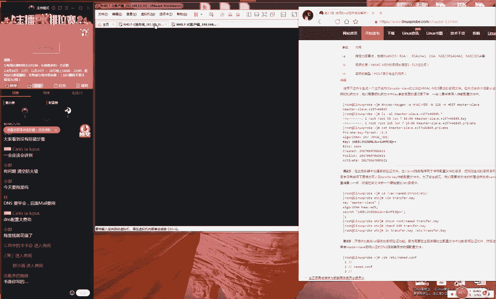

# 【RHCE】红帽认证工程师培训课程 - P15：第十五节课 - 天木轮回 - BV14E411678v

🎼。If I'm stuck on you， you're stuck on me and。🎼每 say让我是疯。🎼带走一。🎼The算 say。🎼I can tang。

🎼N see no ways to。哦O那我们准备开始上课的同学们啊说老刘是泡妹子还是泡面去了，说开始讲课了是吧？老刘既没有泡面也没有泡妹子是吧？咱们今天这个人数比较少嘛？刚才50多个人现在65个人。

老刘是在等一下咱们迟到的同学就是咱们7点钟会准因为咱们每天就是们这个上课时间嘛，是从晚上7点钟开始准时上课的，所以大家如果要是迟到的话呢，可能会前面听不到的话，后面就听不懂了，所以我们一定不要迟到。

好吧然后我希望大家能够理解一下，就是咱们也上课之前会会等一下同学因为的话呢如果他们之前没有听到后面再跟的话就会比较吃力了。因为毕竟咱们一个礼拜才上三天的课对吧？那咱们不希望同学们迟到了。

因为迟到了5分钟10分钟，后导致这整天的课最就都跟不上了，对吧？以也就算是今天礼拜给他们一定的这个缓冲时间。好，那我们先给大家说一下我们今天这个课程的安排吧。们讲第1三章节讲一下。😊，DNS的话呢。

我们今天这个课容量会很多呃，我们会讲两个小时。呃，大家提前做好准备，我们会讲到9点钟。但是第十3章里面东西它虽然很多，但是它也很难难。但是他在考试里面它是没有的。所以说呃所以说我们先给大家去说一下。

那如果说您是为了去考或者同学的话呢，可以把这个第十3章先稍微放一放啊，这没有关系的。然后等到我们以后再去学习也可以另外的话呢我们第十3章里这个课程会去详细的去讲解整个的DNS的一套流程。

包括它运行的一个模式。大家学完之后的话，会对于这个网络基础的一个架构会更加深层次的一个理解。所以说不论说是否去考试以以及我们工作当中是否去来去搭建这个DNS那我们学完之后都会对于这个网络是有一定的这个更加深入理解的。

😊，好的，然后同学们现在我说话还现在有声音吗？啊啊，那我现在有我现在有说话声音吗？😊，呃，有问题是吧？好，现在呢我现在重启了一下我这个麦克风啊，非常呃非常高级，对吧？咱们这个麦克风都能重启一下。好。

我现在把重新去断了一下电，现在好，同学们？😊，啊，呃，大家好的话，打一下一号吧。😊，因为因为逛网同学们说他们听不到声音，没有，但是你们听到声音的同学，你们不说话。

我觉那我就只能是重启我这边的这个网络跟麦克风，对吧？咱们这样互动一下。如果听不到的话，那就说一下如果听得到的话同学们好也能我去告诉我们一下吧？这样的话呢咱们快速知道这个问题出在哪里好可以听到？

们来继续给大家去说刚才我刚才我说大家都听到了吧，就是我给大家来了一段个白说了一下我们这个第13章的一个重要性，对吧？我们就知道学习好他之后对于我们整个的这个网络会有一个更加深层次的一个理解啊。

然后的话他是在我们红乃至说我们红C里就是没有的2014年的大家知道我们更新的红包由吧？实在往前2012的2012的话一门的课程叫考的是红C里的红包卫星网络当他考当然它里边考到过一段时间的这个。😊。

后来他就把它给删减掉了。所以说到现在2019年了，已经7年了，红帽的整套体系里面，包括红CS红C红C都已经没有呃。那么现在都已经是没有DS这个内容了。但是我们我们认为如果不讲的话，确实比较可惜。好吧。

这是我们给大家去来一个开唱牌。然后我们主要是等一下我们这个迟到的同学，结果等来等去6我变成60个人了。好了啊，所以可能是因为我这边声音有问题，大家再重新退，再重新再进就好了。😊，好了呃。

然后的话呢我们现在给大家来就说一下我们第十三章我们的DNS它怎么回事。其实DNS我们说太多没有用，因为我们每天都会去使用到，对吧？大家比我还了解，就是你去访问一个网站的时候。

那你去输入这个3W点淘宝点com。那啊怎么样？我看一下说你今天的录播就会有这样的无声啊，又没有声音了。嗯。😊，现在呃现在还没有声音吗？同学们，现在有怎么说话，有声音吗？😊，啊，有对吧？OK一直正常的。

行呃，大家如果听不到的话，可以重启一下您的这个QQ或者呃对吧？我们可以去重启一下咱们这边的网络就可以了。好了，接下的话呢，然后有同学今天问我啊，说今天有课嘛好，这个问题那我就先不回答了，好吧。

因为咱毕竟已经上课了嘛，同学们一定要在上课之前就一定要进入到咱们这个频道里面，并且咱们已经是临近尾声了。其实来说啊，如果到现在还不知道哪哪天该上课的话，其实这个有点说有点说不过去，对吧？好。

这个所以说这个问题我们上课之后，我们就先不回答了，好吧，因为我们上课之后，比如说呃。😊，就是大家在提问的时候啊，7点钟以后的提的问题。一般来说，我们上课时候就不会解答了。好吧，这大家应该能够理解。好了。

然后的话呢我们来去说一下我们这个DNS的一个呃工作的一个模式。就是当我们这个用户可以去输入一个域名。说我去输入一个3W淘宝点或者我去输入一个3W百度点的话那我们可以访问到一个网站我们可以访问到一个网站其实这个是我们比较常见的一种工作模式。

浏览器里去输入一个网址把它转成一个我们的IP地址为我们互联网上它是基于我们这个C写的它是叫将我们这个域名转换成我们的IP地址这样的话呢也是我们比较常用的一个一个模式，我们把它叫做正向工作模式。

我们叫做正向解析模式。第二话我还有一个叫反向解析模式。这个话其实来讲是比较少用的这我叫反向解析模式。其当我一个用户输一I地址的话，也会给我去反向转换成一个域名啊。

我们为什么要用到淘宝这个例子我们自己的子？😊，我们叫lin再给大家去植入一下我们的广告。好，那我们来去植入广告之后，那我们就知道了。我们在DNS里面它其实都说呃它呃其实来说它是有两个工作模式的。

但是我们99%情况下，我们都是是这个正向解析模式，即输入一个域名，然后把它转成一个IP地址。这样呢为我们去服务的一种方式。那么我们今天这个课程里边的话呢，我们会不仅给大家讲到这个正向工作模式。

将我们的一个域名解析成我们的IP地址，还会给大家去讲到反向解析，将我们一个呃地址给大家反向解析成呃一个或者多个域名。这样我们来去做一个正反的一个解析。😊。

然后我们可以看一下我们这边有一个图片是1-1对吧？呃图片13-1这个的话呢它指的就是我们的域呃在这个域名，它其实来说它是有hold缀的那我们可以看一下我们这个后缀它分很多。

比如说它分点就是我们现在用的比较多的，就是这个公司，或者说美国公司或者说它是一个网站，他们都可以去使用这个点域名，还有这个点net它指的是一个网络组织。

还有这个点叫做这个 organizationization它指的它也是一个组织的一个域名，还有点ED这个都是一个教育的一个后缀吧？大家可以看一下这张图片上面它其实来说它就有很多的后缀了。

这个大家应该是比较的这个常见的我们还会遇到一些比如说中国就是点CN对吧？咱们知道这个中国就是点CN还有比如说呃大家还知道哪些国家的对吧？他们每个国家还有自己的这样的后缀比如说日本对吧？

这你们知道的是点GP，然后还有点GP还有比如说。😊，什么香港对吧？还有这个hk就是这个HK啊，他还有这个比如说啊咱们中国的这个台湾对吧？也就点TW它有什么英国的是什么？英国的是英国的是UK啊。

不是US对吧？啊，这个都是我们比较常见的hold缀其实来说这就是我们每个国家他们还都会有自己的一个域名的一个后缀，韩国的是什么？哎，这个大家把啊，这个大家我还真的是没有关注过韩国的后缀是什么？

韩国的域名后缀。😊，呃，他们这个还真的把我给问住了啊。呃，是点BZ对吗？不应该是点KR对吧？对吧？O他应该是点 KR我觉得这个比较可信啊，应该是这个对吧？好了。

那我们就是说我们的每个域名后面他其实都有一个hold缀的但我们想要去注册一个域名之前，那么我们首先要确认你想要的注册的hold缀是多少，那么对吧？

那我们要去先去选择一个hold缀按照这个理论上来讲的话呢，国家的缀，其实你不在这个国家内你也可以去注册，这个没有关系，对吧？就是说咱中国人即便我们没有在美国。

但是我们也可以去说那其实我们也可以去注册这个点com的这个域名，那但是有一些hold缀是被保护起来的。比如说点GV就是这个ment就是这个政府，还有这个education教育，这些的话呢。

在国内是不能够随便去注册的那你不能去边去注册一个政府的一个网站。但是我们现在我们普遍来说，我们会选择点com。因为这个也是一个习惯问题了，对吧？因为我们现在使用点com人特别多。😊。

你的父母没有去做过这个网站服务，对吧？他们没有去学习，但是他们可能会顺手都会去说出来叫做3W点百度点com这个非常的顺嘴。

所以话点现在已经是呃使用率最高的这么一个hold缀们因为我们因为我们按说比严谨来讲的话应该再加之一。但是我们从调查上来看就是在这个互联网里面使用率最高的这么一个域名，所以这个价值是比较高的。

因为这个户习惯上来说也已经是呃比较高的那么我们现在再给大家去说一，就是当我们来去确定一个缀之后想来去注册一个域名的话呢那我们就可以找一些厂商，对吧？如说国内的有阿里云说腾讯云们可注册成域名。

有中国的万网。那么那我们就去选择一个我们的域名。而我们选择就是叫做点。😊，这个这个hold的话呢其实这个hold我们选择点com这个没什么可说的了。其实咱们的这个域名大家可能都没有太关注过，对吧？

不知道我们这个什么意思，再给大家去注一波广告好了。第一来说的话呢就是个lin都知道这是我们的操作系统这个意思是一个探针探索的意思。在就是我们的网站对个技术的一个探索的意思。

所以我们同学们今天应该是对我们这个网站更有一个更加深入的一个理解咱们的网站叫做lin是对lin技术的一种探索的一个意思。好了，那我们当我们去注册好了一个域名之后。

那我们就可以来再去里面来去注册成二级域名其实的话呢我们去访问的这个3W的话呢，很多的站长因为我们之前做网站吧？大家应大家该知道的。就是很多站长的话，他们会把这个叫一级域名。其实这个说法是错误的。

因为一级域名或者我们叫做顶级域名的话呢，只是你注册点之后，这一段叫。😊，这个顶级域之后你往里面去写的这个3W的话等等等等，他们都叫做二级域名。而我们去注册这个费用的话呢，我们只去注册我们这个顶级域。

一般来讲啊，我们一般来讲在国内注册一个域名一年我们说一年的费用大概是在60块钱左右，大概60钱上下然的话如果说你是在国外去注60钱说多了域名大家可以去可以去阿里云上去搜一下60块钱对可以包一年。

话在国外的话呢我印象当中啊说网站好像应该是10美元或者说优惠的候日常应该9。9美元。如果是赶优惠的话，可能我见过的啊瞎说我见过的时，正我最低的时候见过7美元就可以注册一个点域名。

不知道大家有没有见过更便宜的。😊，好，那么这就是我们来去注册一个域名的一个大概的一个方式吧。还有一个就是我们这个费用。其实来说域名的费用是很便宜的。我们相比来说其实我们的服务器费用是比较高的。

因为们网站。们站这配置是比较高的了，已经是12个核心32P内核32个这个内存，咱们这一个月的这个服务器费用按照我们一年算大概的话也得23万块钱。大家得这个域名这么便宜对？

因为这个是一个很小的一个开出我们这个费用主要是体现在主要体现在这个服务器但是服务器话可以去买阿里基本云计算服务？基本种款式应一个月下来10多钱买一台云服务器甚至运气的话改改一些说。😊，这种活动啊。

比如说双十一什么的，它其实费用来说是非常便宜的。好了，然后话那我们想啊那我们呃那呃那我们先去想一个问题啊，接下来说我那我们要想去访问一个网站，那我们就要去经过这个DNS那么否则用户去输入一个域名额之后。

那么他就找不到对方的这个服务器啊，所以说DNS我们记一下，它是我们的互联网里面的叫做基础设施，大家想象一下这么一个问题，就是呃当你想去呃呃当你去想访问，比如说3W点淘步点com的时候。

那么马云已经把他这个网站已经。😊，给他搭建的很好的。然后我们的服务器也已经一直在我啊等待为我们用户去提供服务了。就但是你没有DNS那你是找不到他所在那个I地址，那么怎么办呢？

所以说我们这个DNS它算我们这互联网里的一个基础设施。那我讲一个问题了，全球现有多少人全球现在我们就好比好比说我们现在是7那我们现在是70亿人好吧，那么我们70亿名，大家可以去搜一下咱中国的网民有多少。

咱们中国的网民我保守来说大概有6亿对不？中国有14亿人。那有6亿网民不多7多亿好，那咱比如说中国有6亿网民，那么这个全球在全球加在一起我网民么着怎么着也有一半35亿，而且认为这个数字远远不止35亿好吧。

那我们想一个问题，假设说我们全球有3有35亿的网民，那么我们每天那么我们每天每个人只去访问一个网站，并且每天就只去访问。😊，一次的话，那么也会造成350啊那啊啊那么也会造成35亿次的一个请求。

那么我们假设来说，我们每一个人每天去访问10个网站的话，那么我们就要造成350亿次的这个请求。但这个肯定是呃但是这个肯定是非常保守来去说的。比如说因为当你去呃因为当你每次去打开你的微信的时候。

其实它底下这个调用的这些程序，它已经是访问了数十个这样的网站。因为他会调用他自己的这些程序嘛。好，那也就是说我们作为保守来说，我们每天要想用350亿次的请求。这个大家知道就是我们淘宝双十一的时候。

还仅是在我们这个中国这个范围内去抢购那些商品，其实都会导致我们这个服务器崩溃，对吧？然后比如说你们知道有一个特别痛苦的一个事情。就是每年春节的时候，你们要去12315。大家要去12315上面去抢票。

就是你们去抢票什么时候能够很顺利的去抢到的，其实很其实是很痛苦一件事情。它有非常严格中呃这种验证码什么的，他去限制你。😊，所以说会有一些抢票的一些软件帮你去抢票，特别的麻烦，对吧？那好了。

但是那个的请求你们可以去网上去找一下，其实也就不到10个亿的很小的一个流量。因为只是国内的的一个需求嘛。因为咱因为现在美国跟比如说现在德国的人，他们不会去想中国的火车票的那好了。

那么我们如果说我们全球每天会产生至少350亿或者3500亿的这样的一个请求，它就不可能是由同一台，它就不呃它就不可能是由一台服务器来进行一个处理的。所以说我们这个DS它有一个层级式的一个架构。啊。

给大家引出来，我们叫做呃主服务器从服务器及缓存服务器。那我们现在去说一下，们互联网里面，它的这个主服务器，它总共有13台这个13台主服务器，我们可以看一下我们的表格是13-1。

大家可以看到呃大部分主要是在美国对吧？然后的话呢在咱们亚洲唯一一台是部署在了这个日本。😊，目前非常可惜，咱们在国内还是没有的。其实在201我我的印象里面应该是在2013年的时候。

在奥巴马他有一个演说当中，他去提呃他好像是退好像是就职演说2013年已经是奥巴马即将退让了，对吧？他当时发表过一个演说，他说过要把互联网的这个管理权限。大家记得吗？说要说要还给这个国际社会。

大家可以搜一下他那个文章，其实其实来说他就是提到这个DNS他说要把这个DNS管理权嘛，然后再还给这个社会不能说你看十三台跟服务器全都在美国对吧？

但是实际上我们看到现在好像其实也没有也没有太多的这个呃进展。所以说我们现在国内的话呢非常可惜，就是咱们中国现在还没有DNS这个跟服务器。

这个话呢我们叫十三代跟服务器这个跟服务器类型就是这个主服务器的一个类型。那这个十三代跟服务器。这个才是真正来去管理我们这个每个域名及他所对应地址的。所以说你即便淘宝比如说淘宝啊，百度什么的。😊。

我是再大再大，那你再牛，但是你最后那个域名的信息也要被保存在国外的这个服务器里面的意思是一样的。好，当然了，那我们想一下，那我们最近的一台服务器，那么也是在日本。😊，那么我们中国人就不能去上网了吗？

或者说那我们中国人每一次去上网的时候，我们都要去问一下这个日本人，说我那我们要去找一下淘宝网站在哪里，对吧？这个特别的麻烦，而且很不现实。所以说我们会在中国会有叫做缓存服务器。

它会部署在我们的每个省每个市里面，他会直接向我们这个他会来去直接像我们这个三代这个根服务器来去下载我们这个数据，然后进行一种缓存的一种操作。那比如说那我们的中国人就会去缓存。

比如说缓存美国或者日本的这个这个服务器的这个数据。比如说就是韩国他们也会去缓存日本的这个服务器。这样的话，那我们就是每个国家他会去同步这个13个服务器上面的这个数据。这个我们这个顶级域了。

然那我们在中国我们还会有不同的省比如说有这个北京上海，我们还有这个广西，比如说四川。那好那我们就会在我们不同的省里面，然后再来部署我们自己的这个缓存服务器。😊。

相当于就是说你想象呃大家去大家想象这么一个场景，就是在一个村在就是在一个村口。然后的话呢每一天都会一个老大爷是你们的村长，他特别的有学问，他要在这个村口去讲故事。他讲了那个故事之后。

你听完了那然后你听完之后，你就会回到家里，跟你的呃家人去讲，当你的家人听完了之后，他就会给别人去再去讲，对吧？就是这么一种呃缓存这种机制，他会往下来不断去延续。这样的话呢。

当一步一步一步一步这样去传传到了你媳妇的耳朵里边。然后你的媳妇又传给了你的儿子。然后你的儿子。😊，再去给他的同学去讲的时候，大家会发现，其实这个故事已经能够直接从这个村长。

然后直接就是一直传到那个同学的耳朵里面，对吧？这就是一个快速进行缓存的这么一个效果。好了，那我们之所以为了去缓存的话，其实来说它有两个好处，这个我们就是做缓存服务器的一个核心的一个目的。

这个大家可以记到这个书上面好吧，然后说一传传百媳耳朵里的候就变了好了，这个问题啊叫做四川老杨同学提到这个问题其实说是特别好的一个问题。就是如果说我们现在我们传一个故事，最后我们传到别人的耳朵里面的时候。

结果这个故事变味了。他不是这个原先那个故事。或者说我们在我们互联网里面那我们叫做这个被篡改了，对不对？就是我们的数据被篡改了被黑客给修改了话呢。

这个其实我们可以去避免但我们会讲到叫做T这个我们叫做TSI加密啊，就是说当这个村长说的这个话传到我这边传。😊，媳妇这边的时候的话呢，我们每一次都进行一次MD5。

或者说我们叫做这个TI叫做这个TICIG加密，叫做非对称式加密算法。我们来进行一次加密。你每一次传完了之后都要进行一次校对，证明一下，我确实跟村长的这个是呃呃没有进行修改。但是说呃。😊。

这个算法是特别的麻烦。但是我们可以去避免这样的这个呃传错这样的这个问题。那那我们要是有这个缓存服务器的话呢，它有两个好处。好，那我先给大家去说一下我们服务器类型啊，大家可以到你这个书上面。

第一种我们的服务器类型，我们叫做主服务器。第二种我们叫做叫做从服务器。这个我们叫做从服务器，它有就我们叫做缓存服务器。好，那我现在说一下它有什么区别。那么我们这个主服务器的话呢。

它用是用来去管理我们这个域名及地址的对应关系的那也就是说它可以去修改我们的域名及我们地址的对应关系，它就是你们村的村长它是最有权威性的这么一个存在，叫做我们的主服务器，还有一个的话呢我们叫做从服务器。

它是用来去同步的，就是啊咱比如说村长那边它有一个新想法，对吧？那我把它这个数据给它同步，或者说我们叫做下载下来，用户来去直接向我们这个从服务器，它也能够进行一次同步，最后就是缓存服务器。

缓存服务器其实来说它叫做转发服务。😊，它就是作为一种转发。但是这个使用起来是非常的少的啊。那我们先给大家去说一下，就是我们这个模式来说是比较的少的。

所以说我们主要给大家讲一下这个主服务器从服务器里面这个正向机反向解析。但是我我们也会答呃呃最后会给大家去讲一下我们这个缓存服务器的一个实验。那我们先啊那我们先去想一个问题，就是说全球的网名特别的多。

那但是我们都需要去上网了。那我们就要去享用全球人的这个查询的请求。光有一个主服务器，你别那你啊那你不要说有13台服务器了。那么你就有130台，你有1300台1300台服务器，它都不能够享受。😊。

那么他都不能够去享用这个呃来自全球的人的这个所有的这个请求。所以我们就有这个缓存服务器来去怎么样呢？第一就是去呃叫做这个分解，或者说我们叫做负载均衡，或者说我们叫做降低主服务器的压力。

你咱咱比如说嗯那么给大家举个例子啊，咱比如说一个村长这个村长什么那他知道很多很多事情，他知道谁家的媳妇最好看，他知道谁家的饭最好最好吃，但是你不知道啊，那么你就要去问村长，那比如说你来到村里边。

然后你想知道谁家做饭最好吃，那么你就要问村长说村长，我哪里家这个饭最好吃。那么如果每个人都向村长去提问的话，村长就会被累死，对不对？他不能去享应这么多人同时的这个请求。所以我们叫这个缓存服务器的存在。

他就是在他就是站在你的这个身边，或者说他站在这个村长的身边，你不要问这样的话，那么你就不是再去问村长，那么你去问村长的秘书，或者说问他这个。😊，一个同的一个同步者。

他已经预先知道了孙长想回答的这个问题是什么了。然后他来告诉你，这样的话呢，那我们可以去降低主服务器的这个压力。好，第二的话呢我们就是去加快我们的加快用户的响应速度。😊，叫加快我们用户的获取速度。

大家再想一个问题啊，我们还是以这个吃为说，对吧？因为咱们说吃的话，大家最有这种投入感，对吧？那你看啊，比如说村长知道他们家啊知道他们村谁做饭最好吃啊，谁做这个呃咱们中国八大菜系，对不对？

那我们这个村里面谁做饭最好吃。那么他知道的，然后的话呢，他又告诉你当你回到家之后，再有人向你去来去提问的时候的话呢，那么你可以快速告诉他啊，他想获得这个数据是什么。

就是说他可以知道我们要想查询这个数据是什么，而他没有必要再去跑到这个村口去找村长去问那个呃内容。这样的话呢，也可以去就近去加快我们的响应速度，就是这个加快用户的获取速度。中国的话呢。

我们我其实很不理解啊。因为我也没有去过韩国，就是呃按照排名来说的话呢，在中国呃咱们中国好像排全球的网速排到多少。我之前我看到一个很老很老的一个数据，大概是在。😊，全球的30多名对吧？然后说韩国是第一名。

但是其实我们这边在城市里面生活的话呢，我们感觉速度已经是很快了。而而且近几年就是这个李克强总理，他提出来这个提速降费嘛，这也是我们互联网改革里的一部分，确实价格反正我们坦白说我们没见它多便宜啊。

但是这个速度好像确实还往上涨。我们之前我是在2012年的时候，我办的这个联通网是1480，然后到了2019年我又续了一下费。我昨天我前天刚续完费，价格虽然来说没有呃没有往下走，还是1480。

但是我们我7年之前我办的这个网的时候是。😊，我记得好像是20兆，但是我我去年的时候再1480就是100兆，今年再办的时候，那么还是1480，就是呃变成了200兆。

而且我这个小区最低呃带宽就是好像就是200兆啊，现在已经是最低200兆起步了。所以说我们觉得中国的这个网速还是加快的很大的对吧？啊，这个变化也是很快的。其实我们的这个政府嘛。

虽然咱们不是在吹这个或呃呃这个。😊，咱们中国政府有多好啊，但是就是说他其实在这个互联网上面很下本，他在这个每个社区里面，他有供应商。

他都他一般来说他都会为你去提供一个本地的一个N大家家不没有注意这个我实发现就是我现在所在的这个小区，因为我这小区人比较多所以联通的话特意在我们这个小区里面设置了一个联通的一个办理点就以交电话费。

后你可以去宽带就这么一个点。然后我就发现其实我们小区里面自己有这个机房。他也可以提供转发。那么这话你想象一下你原先你要先去去访一个网站之前，就要先去到日本下个数据再回来。

那么这样比你直接这个小区就近的个街道个请求数据快多就是我们第一个好就是降低我们主服务器的压力。加用户个应速度。那看一下我这张图片表格是13-2。😊，这个图片的话呢其实来说是画的比较的清晰的对吧？

就是当我们一个用户想要去访问一个网站的时候，它这个流程啊，它的这个流程是怎么样的？咱们中国人就是咱们中国啊现在当前去做这个基础设施真的是很下边很下。我之前我去过一个很荒的一个小村子。

我不能一个很荒小村子，就是偏远的一个山区吧。我们这个偏远山区其实什么都没有，什么都没有，就是很穷很很穷，但是路修的是真好。那那个那个水泥路修的真是特别棒而且你即便说比如说我们不说城里边好吧。

就往山上去走，很多的这个山上铺那个水泥路，咱现在真的是这个基础设施真的是这方面就没就真的是很不错，在全球都是比较领先的。好了，然后呢那我们来看一下这个用户去访问一个网站的话。

首先第一步会检查一下在这个本地检查一下自己有没有去修改这个house文件，如果自己啊已经定义好。😊，话那么他就会去直接选择这个文件里面的这个内容。这个我们之前有是玩过，对吧？

第二的话就是检查一下你的这个缓存。这个缓存主要就讲这个浏览器的缓存。呃，呃浏览器的缓存的话呢，我们上一节课给大家说完之后啊，大家很鄙视我说说我们现在都使用谷歌浏览器，对不对？

现在也没有人用到这个360浏览器了。其实这个360浏览器吧，我虽然说呃之前我说要换嘛，但是最后也没换。因为我觉得它还是比较好用的，因为用比较习惯了，这个360浏览器，它有一个缓存的一个功能。

就是你呃大家可以去来去尝试一下，就是当你去访一个网站的话，😊，当你之前已经访过呃，就是当你已经去访问过这个网站之后，你第二次大家去访问的时候，它速度就会比第一次更快一点。就是它因为有这个缓存。

已经缓存到这个浏览器里面被缓存到被缓存到你的这个电脑里面。还有的话第三步就是来去就近去访问来向你这个指定的DNS来去查询这个域名一般来讲的话，他如果要不知道的话，他会像这个根域来去发送这个请求。

然后根域告诉他点域名所在的域，然后再给大返回来。最后他会向这个我们自己所注册这个供应商来去发送这个请求，获取到我们的这个域名所对应的地址，最后我们去访问到我们的域名就会有这么一个流程的。

但我们这个流程会比这个复杂我们也看不懂。但是我们会想一个问题就是我们刚就是我们刚给大家去讲这个故事一样。如果我现在向但家有没有看过一个就是一个综艺节目嘛，就是每个人就带一个耳机的话呢由第一个人。😊。

他向第二个人他先去呃，然后他去说句话，然后由第二个人去传呃，然后呢去传给第二个人，然后第三个人再去传给第四个人，最后传到那个人的耳朵里面，传到呃，然后把它可以传到最后一个人的耳个耳朵里面的时候。😊。

结果发现呃已经不是那个最开始那个话了，对吧？那我们现又想一个问题，既然来说你要在这个服务器之间啊，那我们要进行多次这样的一个文件传输我们叫做这个数据传输的一个过程。那我们怎么能够保证数据不被篡改呢？

那我们不说啊，因为我们传输过程中会出现一些比如说网络波动啊，会导致我们这个丢包的情况啊，那我们就是说如果被黑客所篡改的话，那比如说黑客去修改的这个软件包啊。

这个里面的这个数据转而向另外一台服务器去发送这个请求。而另外一台服务器正而正是黑客他自己的这个服务器，就会导致我们接下来去查送到的所有的数据都是黑客给我们去我们叫做提前给他做好的一些假的一些网站。

其实的话呢我们其其实来讲我们的这个中国政府他也在做这件事情。中国一个叫做叫做这个GFW的一个互联网长城。这个是一方面他会去禁止掉一些网站的访问。😊，然后的话他还会去使用的叫做DNS的污染技术。其实来说。

DN呃DNS的污染就是使用的是这个技术了。那他就会让你去查询到错误的这样的一个服务器的一个地址，最后找不到。😊，你想的去访问到这个的这个网站。好了，接下的话呢我们就要给大家去说一下了。

就是说那我们接下来说它有三个的这个工作模式，主服务器从服务器缓存服务器，然后主服务器它是用来去管理我们这个域名基地的对应关系的然后的话呢这个从从主服务器来进行一个同步的。最后这个缓存服务器。

它实际上来说就是进行一次转发的。好了这个具体是什综艺节目，这个我还真记得啊，因为我最近我看综节目几乎是没看近十年吧，我就没看过。所以反正我看过一种短视频嘛，就是会有一个小的一个调查嘛，对吧？

一个小的一个游戏嘛。好，那我给大家去时间去操作一下。大家听我已经唠了35分钟了啊，我们这个理论来讲的话呢，听太多没有太大用处。我们主要来去实间去操作一下。

大家就会很明显知道我们到底有这个实验到底有什么样的一个效果了。😊，好，那我们现在去安装一下我们这个DN。那我们现在软件包，我们叫做ban然后那我们建议安装的时候。

后面加上一个减号叫做就是因为我们这个互联网里面的话作为一个基础设施我们希望给作一个劳动机制这个插件是只有这个软件包它才会去提供的然后我们为什么要去讲这个为我说到这个就像一个服务一样它有很多软件他们都可以去实现出来D的服务。

比如说我们红包器里面还有个软件包我们叫做B它也可以去实现出来DN这么一个请求。为什么我们要去讲ban不去讲这个这个软件包呢？因为老收钱了？

为老收钱了为这个话真的是好说就很好用目前来说我们在这个互联网里99以这个99夸张95以上的这个话都是使用这个去搭建的。且的。😊，13台根语的这个服务器也都是使用这个ban去搭建的。

所以你所以你就知道这个软件包它的这个非常重要性，对吧？它分的高，而且它会被广泛去使用的，并且它有很高这个稳定性，然后以它确实很好用。那这就是我们要去学习这个的一个理由。当你把它学好之后。

哪怕你以后去做维护1根服务器这一个工作，它都可以帮你去完成这就是一个很好的软件包，然后我再给大家去吹一个叫什么我看了一个新词叫做这个彩虹我不知道这个你们有没有听说过，就是意思就是刷好评嘛？

后就是说那再给大家刷一好评大家刷好评。就是这个ban的话呢第一个B其实这个第呃第一个B的话呢就是这个伯克利的意思博克利美国呃加利美国加加利芬亚大学博利分校吧？叫博克利。😊，所以的话呢这个不出意外。

它也是伯克利大学的一个产品。所以你会知道啊，这个伯克利大学对于互联网的这个影响它有多大。如果没有这个伯克利大学发布的这个这个软件的话呢，我们现在所上网，我们在去使用这个我们不敢说会像现在会有多大差异啊。

起码肯定不如现在上网这么便捷。所以说当以说现在4份到明年2月份的时候，比说要过春节了，再有大家一起去聊天的时候，不要光知道什么哈佛耶鲁跟大家去聊天的时候，也可以多为我们这个呃伯克利去吹吹牛，对吧？

因为这个博克利它不光可以去很好的教学。而且它里比如说我们之前学习过的。如说我们去讲的这个这个它都是伯克利大学的这么一个一个成就的一个产品。

确实在美国高校里面做这种都他做种研究是很有一种氛围的那来说们国内这个范围也会越来越好吧。但是目前可能还是有很。😊，大差距的。好，那我们先来安装一下我们这个办的这个软件。

接下来我的这个流程既繁琐又麻烦又痛苦啊。但是我们希望大家能够去看一下我们这个整体的一个流程，具体的参数不用去背，不用去记。等到需要的时候，你哪呃，你哪怕你给来查都可以。但是的话呢。😊。

我们要知道我们这个DNS他怎么去呃搭建的一个大概的一个流程就可以了啊，大概的一个流程。说王力宏是那个学校的吧啊，这个你们是说错了。博克利呃，也是一个美国的一个音乐学校的一个名字。

是世界上最顶尖的音乐学校的名字，恰巧也叫做博克利。然后比如说你们知道叫什么呃天那个TFboy里边有叫王源的，对不对？那个王源就是那个博克利大学毕业的，但是他那个博荷利的是这个博荷利音乐学院啊，对呃。

博荷利音乐学院，这个是他们上那个博克利。我们说那个博克利是搞计算机那帮极克们，他们去那个博克利叫做美国加利福利亚大学呃，博克利分校那你们可以去搜一下。😊，好了。

接下的话呢我们再给大家去说一下我们这个DNS的一个配置方法。接下来说我们去配置一个服务，就是在修改我们这个服务的配置文件。那我们要去再去讲一个例子，就是这个呃诸葛亮七0货嘛，对吧？

我们要去找这个主配置文件。其实我们现在已经接近尾声了，我们还有两周时间，大家现在对于这个服务你会还是不会，但是你这个意识一定要有，就是要去找他这个主配置文件。好好，就是这个学校是个连锁的是吧？

那我们来去编辑一下ETC目录里面的name。😊，这个大家记一下啊。哎，等一下等一下，这个文件就是我们这个DNS的一个主配置文件。大家记到你这个书上面以后我们就来去找的时候方便点。哎呀，这个怎么说呢？😊。

这个小时候可能都会梦想过自己会出国，对吧？然后就会梦想自己以后去上一些特别好的学校。我记得我上初中的时候呃还特别自我的。

我还想是以后能不能去T去上学结果看一下IT在不是也不是那会吧也就是最近看一下哈佛和耶鲁还有中国这个招生人数一下就绝望了哈佛现在每年在中国大陆的招生人数不到10个人。

不可能进去的在现在是已经是化到了一定程度的，所以说有些事情还是说一说就好了。我们这一辈没有希望的话，我们下一其实也有希望了？

好那我们先来继续编辑下我们这个主配置文件然后看一下N都是小文件一个一个对大家问说我们个DN服务器都是小文件一个域名是一个文件。对，所以说他特别。😊，他读取这个次数会比较多。

所以我们待会这个文件会被它啊会啊会把它放到这个万目录里面啊，所以答家这个问题非常的好啊。😊，好，然后啊我们来看一下说啊不要给孩子这么大压力嘛。好，那我们来继续嗯。好。

那我来继续呃看一下我们这个配置文件里面。其实这个配置文件的话呢来说其实它并不复杂，它主要都是这个初入信息。这个主服务器的配置文件的话呢，我们只需要去看两行。

就是第11行跟第17行接下来他这个所有的信息啊，他都是调取到我们其他的这个文件。他他要像一个领导一样，他会去让你去问其他的这个这个下这个下级文件。好。

那我们修改一下第1行这个代表就是我们能够呃有哪块网卡为我们用户去提供服务。我们它修改成安就是说因为我我们在一个服务器上面，这个服务器上面它可能会有多块网卡。好。

那我们就要去指定一下它是有哪块网卡来为用户去提供这个DNS查询服务。如果说你想让我们这个服务器上面的所有的网卡都可以为我们用户去提供DNS查询服务的话呢。

那我们就可以把这个修改把改成安这话表就是由服务器上面所有网卡都可以为用户去提供DNS查询请求。好第十7行这话指的就是谁可以来去使用我们这个。😊，DNS的一个服务修改成安妮。

他指的就是任何人都可以来去使用，由我们去提供这个DNS的这个请求。那么呃这个是不是解完卡的名称，这个是写的IP地址嗯。😊，好了，那我们就修改成安他指的就是所有人都可以来就使用由我们去提供DNS服务。

如果说你只是想要在你公司内部去使用的话呢，那么你可以去呃在这里去写上你公司内网的个IP地址的一个以了。另外我们要去写就是都是写的是I地址啊。

不是写那个网卡名称家千不忘记接继续把保存推出这个只是一个文件而已编辑第二个文件这个文件是目录里面的叫做name们坦白今天这一节大家完之后会觉得痛苦。

为这个参数的话复杂所我把每个参数都给大家讲一但是完肯其实这来说肯定是记不住的。但是我们对这个流程整要一定理解好吧。今你哪怕最后没有记住参数不去没有关系。

但是大概这个流程以及我这主服务器从服务器缓存服务器主服务器上面的这个正向机反解析的个。😊，效果然后以及我们这个主服务器跟我们的缓存服务器之间去做1个TI呃去做1个TI呃去做1个TSIG加密技术。

以及我们这个主服务器，跟我们这个呃缓存服务器做一个转发啊，然后去代理去上网站样的一个效果。就说我们今天所做这些实验的效果，我们一定要心里是有数了。就是我刚才给大家说到这些啊，我们一定要去做一下啊。

就是我们心里要知道它有什么样的一个效果。😊，好了，接下来的话我们来看一下这个文件。这个文件就是由我们这个主配置文件，它所调用的一个子配置文件了。大家看完这个文件之后，大家觉得慌不慌。那大家这个文件之后。

你们看看慌不慌？😊，大家看一下，这个是我们需要配置的一个自配置文件。大家看完之后觉得怎么样？好，大家看完之后跟我说啊。😊，啊，刘位同学说了一个很慌啊，是吧？行，大家这呃大家然后呃大家要是觉得慌的话呢。

那么没有关系。好吧，大家觉得慌没有关系，我把它给都给它删掉。我那我输入1个100点滴滴。😊，把它给星空。因为这个文件里边的话呢。但这个数据其实只是一些模板了，我们都不需要，所以我们得给呃都给它删干净。

这样呢就不会慌，对吧？然后我们重新给大家去配置，并且我们会把每一个参数会给大家讲一下它的这个作用，这样我们就不会慌了，对吧？他们数据都没有了，把就给它删干净。好，我们现在定一个区域是这样的。

我们建议大家的话呢，我们去做实验的时候都是跟我们保持一致的对吧？因为我们上课的话，第一遍跟我们保持一致。第二遍再家去修改。那所以呢呃如果说您现在不想去输入我们这个广告的话呢。😊。

不我们的这个域名叫做linux probe的话呢。那么如果说您去修改，接下来我们这个所有出现这个域名的时候，您都要去修改一下。所以说我们建议大家第一遍还是尽量跟我们保持一致吧。好。

那我们先定一下我们叫做这个正向解析文件，我们来定义一下样个定一下我们这个服务类型叫做主服务器他有三个类型给大家强调一来说第一步的话就是要全删我们配置服务就就这豪？第一步全删。

后我自己去写记郭德纲说我一个段子，他就说找一个徒弟，先找一张白纸，对吧？然后他在上面去随意去这个修改这去培养这个也适用于我们今天这个实验你这个配置文件里面都是模板都是你自己的东西删干净我们自己来去写里的数据我们这个服务器类型有3个来说主服务器。

第二个从属服务器。第个缓存服务器你心里如你要是有条件的话，你可以去。😊，然后去呃去闻到你这个书上面，好吧，好了去呃闻到你你的这个手上好吧啊，我呃我们这个书咱不能毁了。好了。

然后的话我们定义一下这个文件所在这么一个路径，就是我们待会就针对于我们这个lin点com这个域再来进行一个单独的一个权限的一个设置，就是说我们要把具体的里边的这个信息，要去写到这个文件里面。

所以这个文件名称，我们需要把它基数啊，待会我们要去创建出来这个文件的这个我们先没有先把它给嵌下来嗯。😊，好呃，然后的话呢我们还有一个叫做 low update。这个指的就是你允许谁来进行一个缓存。

这个就它指的是我们这个缓存服务器。不它指的是啊这个呃这个我们说错了，它是一个指的是我们这个从属服务器的一个地址。如果说呃我们这有一个特别可爱的一个女生啊，是第九期的，她之前跟我们提过一个问题。

他说哎这个刘老师我想一个问题。嗯，然后他说你看啊全球现有多少人，全球现全球现有多少台服务器，是有多少台根服务器。大家想一下。😊，第九期的一个学姐提的一个问题，就是说全球现在有13台跟服务器，对不对？

OK对大家听一下啊，全球现在有13台跟服务器。OK对了，那好了，那么我们这个从服务器就是在去缓存这个主服务器的这个内容，然后去分发给下面，对不对？OK对那好了，那我能不能我也开个虚拟机。

大家听下他这个提问啊，说我能不能开个虚拟机，对准这13台跟服务器去下载去同步全球的所有的域名及地址的对应关系。现载到我的虚拟机里边，大家听一下这个计划很宏大啊。

就是我能不能把全球的所有的域名及地址对应关系，我开一个虚拟机，然后都同然后我把自己作为一个从属服务器同步到我的这个电脑里面，我能不能大家想一下说为什么。😊，说行或不行的话，大家想一下为什么不行。

或者说为为什么行。😊，大家说呃理论上是可以的，但是没有给权限。还有其他的这个想其他同学这个想法吗？是这样的啊。😊，呃，那答案肯定是不行的。这个原理是什么呢？原理就是虽然说你是个从属服务器。

但是对方没有给你授权呀，大家再想一个问题啊，咱比如说你去。😊，大家知道我前段时间呃，我去年吧，我考那个教师资格证，因为毕竟要咱们上课的时候要有证书嘛，对吧？因为现在这个中国管的比较严。

所以我现在呃有教师资格证了，你们不要以为老刘在网上讲课嘛。我当研究生毕业之后，我又去考一个教师资格证，你想想一个问题，那我现在有教师资格证了吧？你也可以去上去查到我这个信息。

其实我还在教育局里面是有注册的我是在这段时间我去做认定的好吧，你们可以去去以找到我这个信息好，那我来说我现在已经是中国在北京市注册的一个正式的一个一个教师的那好了，那我作为一个教师。

我能不能去教育局具体工资那肯定不可以对吧？因为因为你现在只是有这个身份，你只是自己认为自己是一个从属服务器，但是没有这个主服务器给你去授权。

他没有去允许你这个实验其实他说他也是这样的就是你然说你现在是你自己认为你是一台从属服务器。那你准13年跟服务器。但这个13年跟夫器，他们是不认你的。因为他们不知道你是谁。😊。

对吧所以说这个地址呃呃不能够随便同步给任何人的。所以说这就是我们这个参与数他所决定的这个里边要去写上我们这个从属服务器的这个地址。

然后对方才能够去同步到里面的数据然后我们来继续说我们乡村代课教师说研究生毕业打了两个问号，你们不知道吗？你们那你们没有看过我那个录那个培训的个视频吗？们不是提到过吗？这个咱们讲不了啊。

然后我们来去写上第二个配置文件，们叫做反向叫做反叫做个反向解析文件，他是将我们的个I地址的一个段给反向解析成一个域名的来咱比如说我们想解析一个地址段是192810。0比说讲解这个网段的话呢。

那我们就要把反写成10。168192这样一同学特别的可爱啊。😊，这个同学特别的可爱，这个已经是应该是在我们的第很早很早的那个同学里面就会有这么一个非常可爱的一个同学啊。我说把地址给他做反写。

结果他给我写成了010181291这给把地址给我写多气人？我们的话我们IP地址的话，这个是不能够就是每一个字都去反写就像我们去算一个权限你最后三个算出个21这个没有用了？

就是我们每个字段之它是有一个有一个固定的一个格式的所以的话我记一下，就是当你想去做一个反向解析的话呢，那么你的IP地址就是只是每个段给他去反就可了。里的这个数字不要去修改因为你不可能有一个网段。

比说最高就是252525你不能给600给861这说说不过去，对如果说你要是勾我成861IP地址的话，千不要说。😊，教的啊，这个太丢人了，对吧？然后我们来继续还有一个hold缀啊，这是一个格式要求。

我们这样去写就可以了。它只就是我们将一个IP地址给它做一个反解析的一个实验。😊，这个那样的意思的话，就是说我们暂时没有允许任何人可以来去同步我们这个数据。好了，这个反的非常彻底，对不对？好。

我们把每个字呢给它反过来了。他那我们再来。😊，定义层它是一个主服器。然后我们这个文件的话呢，你就没有必要再给我返了。因为这个文件是你自己去看的，然后你自己去加载的，所以我们就直接就给它调呃写上就可以了。

然后以及我们不允许任何人。😊，当前来去同步我们这个数据。好。呃，大家先看完这个实验之后的话呢嗯。我们今天再开一台，我们就不开了啊，开完之后可能会电脑会比较慢啊。

我因呃呃因为我现在这个呃内存已经飙到89%了。好，大家先看一下啊呃，我们这个DNS的这个服务，大家看完之后会去发会发现跟我们之前所配置的那些服务有什么区别吗？😊。

我们学习我们就是在我们不同的这个服务之上啊，我们就要有就是要去分析嘛，对吧？要去积攒我们这个经验。因为老刘毕竟跟你们在一起只能是两个月时间，不能说带大家20年时间。当以后你去配置一个服务手，对吧？

那么如果你要不会派怎么办呢？那我们要去学习大概这个统这个统一的一个思路，就相当于就是我们去呃去这个餐厅去学习做饭，对吧？当你会洗胡萝卜之后，那么你自自然会去写，那么你就自然会去洗黄瓜。

就是他他他他是一个同样一个道理啊。大家看到说那我们这个配置文件，跟我们之前所配置过的些服务，他有什么样的一个区别呢？嗯。😊，啊，说今天失恋了，心里很难受，在流着泪听我的讲课。

大家大家是觉得我们这个讲课是这个段子还不够多？大家为什么听这么问题啊，这个我帮不了你的啊。好了啊，其实我里还是比较这个着急的。因为咱们这个课内容是比较多的。大家大家底是着不着急好了。

那我们来继续啊啊那就是发现说这个全都是小写，全都是小写，这这个是一方面啊，就是我们每个参数到后面的话呢，大家没有发现吗？最后每个参数到后面都有一个分号把它把它给结束的，大家看到了吗？

每行的参数后面都有一个分号把它结束掉。所以这就是我们DNS的一个标准性的一一个很有特点的这么一个。😊，呃，这么一个配置文件的一个格式了啊，大家记一下，就是每个参数的后面需要一个分号把它结束掉。好。

接下我们进入到外目录里面的name里面的啊，进入到这个目录里面。刚我们记得我们签了两个文件签第一个文件我们叫做点？

我们来去复制一下CP杠保留我们这个文件原始的所有者所有组在红帽五6里面需要加杠A在红里面可加可不加。但是我们加上的话呢代表就是保留我们这个文件所有组的这么一个名称，同样保持成name好了。

我们给它复制成叫做点大家记一下啊点com点大家记一下的话呢，这个文件这个文件我们叫做正向解析模板。而这个文件的话呢我们叫做反向解析模板。我们再去复制一下我们这个反向解析模板。😊，好。

我们再来复制一下我们这个反向简模板。大家在聊什么，我感觉都有点跟不上你们了啊。我们这个反向模板的话呢叫做192810一定要跟我们那个文件里面要把它对应上的。好吧接我再来去编辑下我们这个文件叫做点了。

我们有一个格式是这样去写的第一个格式的话先去写的是们个根根我不去多说就是叫做点大家记住的话，就是我们那个每个域名的后面都要加上一个点。因为我们这个点就是根域的意思。我们之前因为它所有里面它都包括这个点。

所以我们就默认它给省略掉了。但是我们先作为一个N一个维护人员我们的时要加严格一点以说我们一定要加最后那个点好了，我还有一个邮箱叫做ro大家可以向我这个邮件这个邮箱去发送邮件，后能去说到的。

但是因为我们这个符号跟我们下面一个叫做范解机术们冲突的。所以说。😊，是个邮箱，但是我们这个也需要把它修改成一个句号点。好了，我们这样去写。好下面就是这个NS啊。

大家听一下这个NS的作用叫做name server叫做域名服务器。当你当你花当你花60块钱在国内或者国外去注册一个域名的话呢，这个NS地址就是由你注册那个供应商，比说是阿里云或者说是腾讯云。

他帮你去提供的。所以说这个域名大家注册完之后就会有啊这个我们叫做name server它指的就是这个name server的一个地址928点试是他让你这个用户去访问这个域名的时候。

可以去访问二G域名的一个。😊，一个固定格式这个我们来说我们不用动的，好吧，当你去注册好域名之后，它就呃就是默认已经有了。

然后我们要想将我们这个3W点点com这个域名给它解析到比如说我们给它解析到一个地址上面的话呢，那我们需要使用到ENA这个记录，然后我们写上一个IP地址。

但是由于我们前面已经定义好了我们这个根域的一个名称叫做点。所以说我们不用去写后面这一段了。我们直接去写成3W可以把它省略这样去写可以的那正向啊反向解析不写不缩写可以吗？不缩写是可以的那呃最好是缩写啊。

最好是缩写，我们这样把它缩写成这个3W这样的一个格式。😊，之保存名退出再家去编辑一下我们这个反向解析文件。这个话格式也是一样的。我们前面要有一个根语的一个名称。

当然他们会说啊说那我先定那我先定义的是一个网段，那我这个网里可能会有多个域名，那我该去写哪个呢？大家去任意去写一个就可以了。

就是这话只是一个出错之后一通知不会影响到你个日常工作的好百度什么都可以的它只是一个格式要求好接下我定义一下们这个N个所在个地址在工作当中这个会有你的供应商去提供这个个不需要去动接下现在要想将比如说想要将19281010的这个地址也要给向解析文件里不需要加个说我想要将我们的。

😊，1个IP地址，我们想要将192。68点10点10。当有用户去输入这个IP地址的时候，把它给反向解析能够去查到一个域名的话呢，那我们也叫做PTR叫做反向解叫做这个反向解析的意思。

反向解析成3W点点解析到这个域名上。好，最后把这个点不要忘记。因为我们前面已经定义了这个文件，它就是192。68点10这个网段了。所以说我们前面也可以把它给省略掉，我们只去写这个1就行了。好了。

然后说的话呃，企业里面的缓存服务器会比较多。企业里面用的缓存服务器坦白来说，DNS在我们这个过程当中自己配置的这个。😊，几率还是比较小的。他可能会让因为我们在工当中可能会你的老板会让你去配置一台网站。

这个很叫呃这个很常见，对吧？呃，这个是非常常见的，或者说你的老板会让你去配置一台呃文件呃，配置一台FDP吧。呃他就呃传送这个文件，但是企业直接就去直接去配置自己的DNS这个需求来说是相对比较少的。

其实来讲嗯。😊，所以说缓存服务器相对来说就会更少了。因为这个缓存服务器的使用范围也呃是比较少的啊，DRCP也会比较多。嗯，好了，那我们但是DCP一般来说是由管路由器，他们做网络人帮他们去配。

也不会唠到我们做也不会唠到我们做系统的，就大家知道做运维的话，他有这个系统，他有这个网络嘛。一般来说一般来说DCP也会有这个做网络那帮人，就他们会在这个路由器上面就直接去做了。

这个一般来说也落不到我们头上。呃，但是我们也会给大家去讲啊，第十4章节我们明天会给大家去讲到。😊，好，接下我们来去重新去启动一下我们这个DNS的服务，名称叫做named。

大家记一下我们的这个服务名称叫做named。然后我们将这个name我们加入到启当中保证我们下一次还能够去启用，那我这做好之后去编辑下我们的网卡我给大家讲过4个网卡的配置方法。

然后我给大家重新再演示一配置一个流程一节课我里的第二个商节，我们讲到基于我们的多个IP地址配出个新主机功能去回一下第一次就又去回一下第一种我们通过配置文件来去修改我们这个网卡参数的一个方法。

接我给大家讲第二种方法，们做那我们现在要做的事的话是去编辑这个网卡把这个N的地址修改成我们自8这个意思就是说现在使用由我们自己去提供大家听一下嗯。😊，啊，这呃这句话就是说呃现在由我们自己去呃。

这个呃现在使用由我们自己去提供的DNS这个服务。😊，好，大家现在可以来句保存，然后退出。好，保存。然后再去冲启一下大家自己的这个网卡。这样做好了之后，你可以看一下这个有一个小的一个奇迹了哈。

大家看好去拼一下，比如说拼一下3W不不不百度不行，我们没有去汽车日这个域名3W点linuxpro点com。大家看一下我们这个域。😊，大家可以看到就把它拼通了。

而且拼出来的地址就是正好是192018点1点视。好了，那我们使用这个拼的话呢，虽然那够成功，但是显得好low，对不对？这个技术好好简陋。其实的话呢我们可以去这样NS do cap。

这个是一个专业去做DNS查询的一个工具了。好，那我们先在这样，我们再去输入一个域名。你看啊当你去输入一个域名的话，它有很多信息可以去提供给你。第一来说它会把你的这个域名给它转化成1个IP地址。

这是并且他是告诉你它是由谁去帮你去做这个解析。那么我们可以看出来它确实是由我们自己的DNS它去做出来的这个解析。第二的话呢我们可以去输入1个IP地址192。8点试点1。当你去输入1个IP地址的话。

等一下我去开一台另外一台虚拟机。😊，🤧那我们来看一下第二台虚拟机。大家作为这个从属服务器。好吧。那么当你去输1个IP地址的话呢，它会把你的这个域呃地址给它也反反向解析成一个这样的一个域名。

这话呢我们叫做正向解析。这个我们叫做这个正向解析啊，这一部分下边的话这一部分我们叫做这个反向解析。它是将我们的的这个地址也以给它反向解析成了一个我们的域名。啊这样的话。😊。

是一个我们在主服务器上的一个完整的一个实验。下面的话呢我们就给大家去先喝口水，然后给大家讲一下我们这个从属服务器。那我们接来说从属服务器就是在主服务器上面去同步数据，同步好了之后。

他也可以去为用户提供查询，在就是他是一个里面的26的好吧，不是就是一个平时没没有什么没有没有什么事的一个人。然的话他有一天他们的这个村长述了一个消息，比如说他们要拆迁了。好吧，听这个消息之后。

他就回了自己家里的，然后他的家人去说现在就是对于这个信息的一个转述啊，就是一个缓存服务器。这样的话呢再有人去问他的时候，他就会直接转达村长告诉他的这个内容。那咱们这个例子长出现出现了很多次。好。

那我们现在进入到我们这个另外一台服务器里面。在我们做任何服务之前，我们都需要怎么样的，我们都需要去拼一下这个网络。必须要能够保证我们这个网络是能够拼通的。好吧，大家记一下就。😊。

是我们就在去做每一个服务之前，我们都要去拼一下，保证我我们这个网络首先来说是要能够去拼通的。好了，接下来的话呢我们再来。😊，来去安装一下我们这个软件包，我们叫做半参root。嗯嗯。

这来说是比较有意思的对吧？呃，等一下。😊，啊，其实来说这个这个是很有意思的，只不过电脑太电脑太慢了。😊，看来真的是要换一台电脑了。这个换电脑这个事情迫在眉睫。

那我们先安装在我们这个从服务器上面去安装一下DNS的服务啊。现在很纠结吗？我现在在纠结啊，其实没有没有其没有没有其没有什么可纠结的啊。😊，好，我们同样我们来编辑一下这个DNS配置文件。

我现在比较纠结的就是。还是自己再传一个电脑嘛，就是买这个硬件去传一个或者买一个品牌机。我想买的是艾林威尔嘛呃也算是解读。像我知道艾林威的性价比不高嘛，就台它这个台式机性价比很低，但是也算是解读嘛。好了。

我们现在去编辑一下配置文件。😊，还在纠结，我估计最后我们考虑考虑来考虑去，应该是自己再会再去。传一个电脑吧，毕竟。毕竟搞技术的这些东西都是基本功。好，那我们现在在我们这个从呃，现下的话呢。

我们在这个从鼠。呃，等一下有点卡。好，果然是卡掉了。好了，刚才我们卡了一下啊，同学们现在能听得到吗？现在打一下一好吧，现在好了吗？😊，好，OK好了，我们来继续往后面去说。😊。

那么我们今然作为一台从属服务器的话呢，那我们首先啊我们先不要去配这我们这些从属服务器。你先进入到这个主服务器这边哦，但我们现在切换一下啊，然我们切换之后会给大家去说一下我们所在的一个位置。

我们先进入到主服务器里面，编辑一下我们这个域名信息文件。我们需要把我们这个允许的列表当中，添加上你的这个从属服务器的地址。这样的话呢，对方才能够去同步到你的数据，现在就是开个白名单。

那让对方能够有获取你的这个权限。192668点时点室啊，快下课了嗯这个呃啊这是这太着急了啊，我们还还有还有还有一半时间。他们还有。😊，一个小时呢，你刚才吓我一跳，我还以为已经讲完一个半小时了呢。好了。

我们来继续，我们重启一下我们的DNS今边这边一个进度太慢了。好了，我们来继续。😊，然后的话我们再进入到这台从鼠服务器里面，定义一下我们要想去同步的这个数据。

第一来说就是我们叫做lin点这个我们这个广告非常到位。好，然后这个区别就是我要定义我们自己是一台从属服务器。

而不是一台主服务器我们定义一下我们这个主服务器的地址1981个号把忘记最后的话就是我们同步之那个文件保存的一个路径大家听一下是我们文件同步之后的一个保存的一个路径给大家写好好。

我们来把分号结束是这样的为不是说故意大家，但是我们有有恒心去做一件事情同学真的是以后工作当中也会很受益的，大家能够坚持下来，我们现有70个人坚持能够完咱们这个课程。虽然说你去看视频对？

虽然说你直接去考导也可以，但是你在线听课的话，毕是不一样的。因为在线听课的话呢可以。😊，这种互动有投入的感觉肯定也跟看视频是不一样的啊，对吧？就比如说你去看一个电影，跟你去实间去操作，去玩一个游戏。

肯定也是不一样的啊。毕竟你在线听课的时候，还可以调几下老刘，对不对？可以互动一下。比如说呃说老刘必须要这么去写吗？是哪呃是哪个参数必须要这么去写。然后我们定一下我们这个主服务器的地址。

192668点试点室。😊，好，现在就是说我们先定一台我们自己是一台从储服务器，然后我们要向这个指定的主服务器来请求这个数据来进行同步。然后同步好之后。

我们会把它保存到固定的一个目录里面这个目录我们给写上198这样做好之后话我们就可以把它保存并退出，重新去启动一下我们的先不用然我讲一下第三种配置网卡的方法。第三种配置网卡的方法，们使用Mcon啊。

来去配置一下我们这个网卡来现在将我们这个从储服务器的这个S的话呢，大家看一下我现在这个地址是192810。20。好了，我们现在这样19216810。

20可以看到然后我们现在就是使用我们待会自己去提供这个个服务保存退出然后再去重新去启动一下我们的网卡服务这样话就是说大家想一个问题啊，我们先做什么事情，就是说我们现在的话呢是是一台从储服务器。😊。

我们先回去向我们这个主服务器，先回向主服务器去这个请求同步数据。同步好了之后。我们自己向自己查送这个呃来去呃查询请求。如果能够查询到数据的话呢，证明我们这个服务业已经是成功的。好了，我现在去重启一下。

我这个name的服务好像是出错了。好吧，那我先进入到万录里面的name的。这边会有一个同步目录，我可以看一下，这个里面还没有任何的文件。那我们先在看一下我们的配置文件。

说明我们刚才那个文件里面有错误的信息，我们是写错了，我看一下哪里写错。😊，哦，我看一下反向解析文件，对吧？192168。4。4，我看一下哪里有写错。所以咱们讲课的时候就怕这种三心二意，对不对？

一边跟大家聊天，一边。去打的话确实容易出错。我没有呃，大家说我故意在写错，然后再给大家讲拍错啊。虽然我想把自己说那么高呃说那么高呃，只是很高爽的。然后。😊，提前给大家想到的，其实真的没有想到。

我看一下为什么会出错哦，这边我这边少了一个分号。😊，哎呀，多么希望我其实是已经准备好的，其实我没有准备好，你可以看到这边少的一个分号啊，所以这个格式要求它比较严格的好，把它保存名退出。

再来去重新去启动一下我这个。😊，name的服务，要把它加入到系统当中，保证我们下一次的时候还能够去启用。好呃，然后的话呢，我们现在做好之后，你可以再来去看一下我们这个同步目录当中。

当你把这个服务重启好之后，马上就可以看到非常打脸，对不对？他告诉你说这个服务里面他其实来说是没有内容的，他没有被同步到数据。好，那我们现在再可以来去多去重启几次。因为他确实因虚拟机的这个模拟问题嘛。

他可能不是实时能够同步过来的那我们再去多去重启几次这个DNS服务。但是我们工作的时候这是不需要的。好吧？因为这个情况只有在虚拟机里面有些时候会碰到好，那然后我们再来去查看一下我们这个目录内。😊，好。

还是非常尴尬啊，还是没有呃，还是没有同步到数据的话呢，我们就要检查一下我们这个主服务器。呃，主服务器的这个内容哦，我知道为什么了，我知道为什么了。因为我们的这个I tables没有清空，它同步不到数据。

我们需要先清空一下我们的ip tables。OK我们再来。再去重启两次，我们这个DNS马上再来去看。然后你会发现你在你通过目录当中就已经出现了你的这个DNS的这个数据。这个给大家演示了一下。

该去如何从我们这个主服务器上面来去同步我们这个DNS的一个内容的一个方法。好，接下来我们就可以在我们这个从储服务器上面来去查呃来进行一个查询呢。我们叫做NS do命令。我们来进行一次查询。好。

大家看一下，我现在有我有呃我有没有作弊。就是说我们现在去输一个域名的话呢，我们我们解析的这个结果出来了，这个是一方面。第二方面的话呢，你可以看一下，它确实是由我们这个从属服务器去提供的这个查询服务。

而不是还是向我们这个主服务器去发送这个请求。证明有两件事情。第一来说，我我们这个从属服务器上面的这个服务也已经配置好了。第二就是已经能够从我们这个主服务器上面来去下载过来内容。

并且为我们用户去提供服务了。好了，我们再来。😊，什么叫做分离解析？分析解析，我们待会给大家讲到今天我估计讲我估计今天可能会讲不到，因为这些东西太多了。我我我们这个课程讲完了之后。

大概要两个半小时到3个小时。所以我们今天可能估计等明天了然后话我们来继续19281010不希我去赶课程之后家完之差不好像也都听懂了。但是我们最后结果发现吸收消化不到位，这样也不不要去赶课程今今要拖堂？

今天不会拖堂。今天我讲两个小时嘛。讲完话，大家去加课，那我接下去给大家演示一下我们这个反应解析文，我们去输一个IP地址，他也可以把它反解析成一个我们的域名这样话我们都并且都是由我们198。

20我们这个从属服务器帮我去完成这个实验是非常完美的。😊，好的，那我我们继续来去说一下我们这个下一个实验我们叫做T叫做TSI加密技术。就是当你听当你听到村长说了一段这个非常好玩的笑话。

然后你给你的这个家人去说的，家人给他的孩子去说的，他同学去说的，那我该如何避免我们这个在多次传输当中，我们的数据被篡改，或者说丢包数据导我们导致我们这个数据不完整使用个技术我们叫做做这个TS技术。

我们叫做非对称式加密技术，它就是专门用来我这个加密就是为了避我们多次传输当中们数据不会丢失。这我们加密中我怎么去说呢比说我们去传输一段这个内容。然后话我们传输完了之后。

我们告诉我们这个对方这个内容大概个内容是什么以及我们这个加密算法是什么？以及我们这个字数是什么避我。😊。

多次传输当中会导致我们这个数据被篡改这么一个情况。那么我们这个DNS的话呢，其实我们这个实验，我们书上面写的这个步骤的话呢，是很呃是很复杂的，而且复杂到没有必要。其实这个问其实这个很没有必要。😊。

但是我们。呃，还是给大家讲一下我们这个书上的一个方法吧。那如果大家如果不想按照我们这个书上的方法去做的话呢，其实你可以直接照抄我这段文字。

或者你可以去网上去找一下叫做DNS的随机密钥他只是需要自媒创随机的是一个数字而已。那我们先进入到我们这边主服务器上面来说我们这个加密方式我们叫做SI加秘方式嘛。

所以说我们这个主服务器跟我们的这个从属服务器上面，他们都要去做这个去做这个TSIG的一个支持。好了，那就相当于就是大家有听过一个故事啊，就说就是有一次比较伟大的一次创业嘛。

就是在美国那边直接挖一个海底光缆？然直接挖到澳洲。我印象当中我听到过这个故事是一个美国的一个富二代吧？一个小孩小孩是一个是一个很有钱的一个人。他想直接从美国，然后直他想直接从英国或者美国。

我忘记是哪里了，直接挖一条海底光缆直接挖到。😊。

这个澳洲好像是这么一个故事。那么你挖的时候，你就要两边同时去吧，你要从美国这边，你也要开始去开凿，然后你也要是这个船拉着这个光纤，然后开始上路。从那个澳洲，他们也要去同时去坐。

然后他们两个去对接对接好之后，这样的话就是这个光缆给连通了。所配置这个服务也也是那你不能说你光在主服务器上面去配置，结果你到地之后发现哎对方还是个村落呢，他们没有这个技术，我们再给大家举个例子。

咱中国人比想去支持想要去支持非洲这个建设吧，咱比说修一个高铁，咱们咱们直接从北京修到高铁修到比如说从北京直接发车发到南非。咱比如说结果你这个高铁咱中国的高铁技术是全球领先，对不对？你从中国发车了。

特别快就走。结果你走到走南非了，结果发现他们连铁路都没有。那么这个时候就导致你这个数据传输也是不平衡的对吧？后也后也就会脱轨了。那么我们这个先要去配置我们这个主服务。😊，再去配置我们这个从鼠服务器。

因对两边你都要配置好了之后，这个才能够去生效啊，好了。😊，呃，然后我们现在去作为第一件事情，我们叫做DNSIECK杠，就是来去生成出来一串我们这个字符串的一个信息。其实来说我们这个命令里面的话呢。

我们这个主我们这个书上面写的这个真的是特别的。😊，多余啊，但是我们还是这样去写一下吧。现在的话呢我们现在是使用一个叫做MD5的一个方式去生成出来一串这个随机的字符串杠币啊，我们叫128位。

但是我们实际上我们需要的不是128位啊，我们需要的只是一个加密算法。让我们服务器类型为house我们的名称的话呢，我们叫做master就是指的是一个从主服务器传输文件到从主服务器的这么一个密钥文件。

好了，现在我们来去看一下，它会出现在你目录里面，它会出现两个文件，一个叫公钥，一个叫私要好了我们现在去获取一下这个随机的一个字符串，是这样的啊。其实如果大家不想去敲这个币呢也是可以的。

我们需要的只是这么一串的这么一串的这个信息。如果大家。😊，不想就是这么麻烦去记这个命令的话呢，你们可以去百度上去搜索一下，或者说你们可以呃随便你们可以自己去写这么一串随机的一个字符。

但是一定要保保证它个格式相同就可以了啊。我们只需要这么一串这个随机的一个字符。这样的话我们两边去匹配了之后，我们来去传输一下这个信息。保证我们这个数据它是一个对接成功的。好吧。好。

这样的话呢我看一下对保证它这个数据是完全相同的，就咱比如说我们去传输一个数据，最后我们传完之后，最我们来就是我们大家有没有当兵的同学当兵应该知道，就是我们每一次对讲完了之后都要来去说就是这个over。

对吧？就是我们要把我们这个传输给它结束掉，大家这个看电影应该反正我是看电影里面看到过的啊，大家应该是知道这么个场景。😊，就是你每一次得兑讲之后。你都要吧。

你然后然后你都要去说一次over或者说怎么一次呃，re对吧？然后最后呃告诉对方，你说完了。好了，然后的话我们进入到我们这个主服务器里面的万录里面的name。😊，有一个叫ETC的一个目录。

那么就到TC目录里面去写上这么一个传输的一个文件。在我们这个主服务器及松储服务器里面，我们都要去做这个事情，好，我们先去写义下我们密钥的名称这个密钥名称的话，一定要跟我们刚才加密要保持一致。

如果说修改过啊，此时请修改一下然后是这个加密的方式，我们加密的方式为MT5大家看到一个问题就是我们刚才加密的时候明明是一个大写的一个MD5对吧？

我们刚才写的是一个HMAC大写M5那你现在是一个小写的没有问题吗？它是没有问题的这我是做过这个实验这个大小写是不会区分的我们不区分大小写好，然后是我们加密的这么一个密钥文件。😊。

不要不要去照抄我的也好了啊，就把我们这个呃加密出的那个字符串填写到里面，然后把分号截束掉。这样做好之后的话呢，我们对这个文件进行一次权限的修改。

让我们这个所有者跟所有组变成roname这样话避然我们这个权限啊也小一改成640，避免说其他人看到我们这个密文件，保证我们这个文件的安全。然后我们将这个文件再给做一个链接文件，做ET目录里面。

方便于我们待会就是我们此时去调用它啊，然后我们去修改一下我们这个主配置文件啊，方便于说我们待会去调用它。我们这边去写我们去调取我们的加密文件，用来去传输的ETC目录里。因为我们做链接文件了吧？

们来去调用这个文件。😊，这个还没有完，我们下面还要去说允许传输的话。我们的密钥名称啊，我们需要写上我们这个me钥的名称。好，这样做好之后的话呢，把它保持名退出。但是这个只是一方面。

这是它就是只是我们在主服务器上面，我们才去做这个事情。我们现在还要在我们这个从储服务器上面哦，我现在重启了一下我们name的，结果它出错了。我看一下是哪里有出问题了。哦，是刚刚我们那个文件里面的。

我们少了一个分号，对吧？所以有有些时候我们说做运维嘛，我们做尤其做lininux运维嘛，很苦，对不对？明明我们都写对了，结果我们的参数都写对了，只是少了一些空格，或者少了一些你看少了一个分号。

对它就会导致我们这个出错啊，真的是很很不公平啊。那凭什我们做运维就这么苦呢。好，它还是出错。好了，我们来这样啊，如果出错的话呢，我们可以局之增加这个命令。😊，然后我们来看一下他具体包错的这个行数是哪里。

我们可以找到它。然后我给大家去声明了一下，我们这个确实是我敲错了，不呃，并不是给大家故意去写的。好，他说我们这个主配置文件里面的第十八行啊，主配置文件里面的第十八行才有错误。来，我们找一下他。😊。

第十八行哦，果然我们这边怎么多了一个减号啊，也没有人提交过呀，这边应该是我多了一个空格。好，我们这样去写，保存名退出。好，这样我们做好之后的话呢，我们现在这个组服务器上面就已经去支持了TI呃。

那么我们就已经去支持了TSIG的这个加密。好，那我们接下来我们就要配置一下我们这个存储服务器了。为了说我们通过哪啊，好吧，我们就直接呃我们就直接我们去查看一下我们的这个l文件，把我们这个文件内容的话呢。

我们复制一下。同样我们需要在这个客户端上面也要去新建出来这个文件。😊。

对我们这个排错，我们会在我们不断的。讲课当中会给大家不断来去朋友里面去带入的啊。然后对这个文件啊，这个目录里面原先有两个文件，对吧？为了避免说大家说我作弊啊，我把它给删掉。😊。

删掉之后的话呢现在没有这个文件对吧？那我们现在再来去重新去启动为了避免大家说我作弊啊，我现在重启很多很多次不论说你重启了多少次，现在都到这个步的文件。

为对方已经支持加密对方已经是进入到一个现代国家但是只是一个村庄有体家到去一本对已经空间超是超音或超光速，已经能够通过空间进种技术结果你一个个水平？

所说那现我们自己要实实现出来这个加密能够跟它保持一致这样才可以来同样进入到我们的目录里的目录里面。😊，好了，然后我们进入到了。就在这边就可以了。然后我们去编编辑出我们自己的这个文件。

跟我们刚才那个名称是保持一致就可以了啊。来复制一下我们里面的内容。同样的方法，我们给它权限的话呢，稍微小一点。那避免说其他人虽然说你自己做这个实验的时候，你不可能让别人去碰你的虚拟机。

但是我们这样讲完之后，大家对这个安全上的话呢，肯定会有一定的这个注意，对不对？那以后我们工作的时候这样去做没有坏处。好，我们再给大家做一个链接。

做到ETC目录里面做完之后做完之后去找到你的这个主配置文件去找到你的这个主配置文件。我看一下啊。😊，好，我们现在的话找到我们这个主配置文件里面，这样去做。

同样第一行那inc我们先去加载一下我们这个调来的文件。ETC啊transfer。点K。好，下面的话呢，因为我们我们现在在去做这个实验的时候，呃，要是最后面也要去指定一下我们这个主服务器的一个地址。

Ser。好我们ser，然后19218。10。10。我们的密钥的名称。那这个我们要对对应上的，就是我们跟那个跟那文件里面必须要是对应上的。否则的话他会提示出来报错。好了，我们把它结束掉。

结束后面那个大括号也要有一个分号把它给结束掉。好了，我们现在来把它保存退出这样做好之后啊，我为了大家说我作弊对不？我们先进入到目录里面的name进入到我们同步目录当中。

你可以看一下这个里边真的是没有文件的。好了，我现在去再来去重新去启动我们的服务，你可以看到啊，他要报错了，非常尴尬，对不对？好，尴尬的原因的话呢，我们可以再来去查看一下我们的配置文件。😊。

是不是哪里有写错了地方？好，再给大家去声明一下，确实是我这个确实是我呃这呃这个单纯是我手残，我可能打的打的比较快，没有打对啊。来这边说我们的第十行少了一个分号说这就是个排方法。

他会告诉你具体的这个行数以及我们哪里写错了。你看一下第十行第十行他说少了一个分号那没错？行一个分号所说在我这排错话是比较友好的是比较友好的真的是好。

我们再来去重启一下我们这个服务马上可以看到同步过了怎同步一个文件好，它是这个机的问题，我们再去多重启几遍，你就可以看到同步过来了两个文件我也可以去拼一下说拼198101都没有问题的。

这就是我给大家讲到了我们做主服务器从服务器以及主服务器及从属服务器面去做分离解去做一下这个去去做TS加密技术以我们这个主服务器从属服务器。😊，我们可以去做叫做正相机反向解析的一个实验。好。

今天的话呢我们。😊，还没有完，对吧？我们还有还还有很长时间。下面我给大家去说一下这个缓存服务器的一个实验。这个缓呃这个缓存服务器的话呢，其实我之前我是知道的，因为在DNS里面它分了三个技术嘛。

第一来说就是主服务器。第二就是这个从服务器然后第三就是这个缓存服务器。之我知道的。但是我去写书的时，我去翻了很多很多这个书对吧？咱不能说是算抄，咱这种参考嘛？因为当时红猫热器的这个材料几乎是没有的。

但是我翻了很多材料，包括说我们翻墙嘛，我们去做这个谷歌上面去找结果都没有找到这个缓存服务器的这么一个配置方法，后来我有点想放弃了啊，后来是在我们这个配置文件里面，我们找到了，因为的话呢我后来我才知道。

因为这个缓存服务器它配置起来太简单了，根本就没有必要去写一本书，它甚至来说它根本就没有必要去写一篇文章去介绍这种配置方法。它太简单，它只需要一行参数。😊。

没有嗯。啊，但没有这个这个这个这个。呃，必要去写一篇文章去介绍这个配置方法。这个的话呢，缓存服务器说啊我们写的书怎么能叫做抄呢，对吧？那叫借鉴。那会儿哎呀怎么说呢？😊，你们不知道2012014年的时候。

我们开始去写书的时候，国内根本就没有红毛7的这个教材啊，国外也没有。但因为大家知道我们从2015年的时候年初开始起笔嘛。

那会不要说红7的材料无所谓什么其他都没有这个材料都是咱们一开始去写所以要是有抄的话，如果要是有相同的话呢，也一定是他们抄咱们的这本书我们非常自信的好但但是马上就要发布红吧吧？

所以我们在也很纠结说要不要再抢那个先去发布一本红教材，其实写书是很痛苦一件事情，所以也在考虑过程当中，如果要是能再拖一拖吧？我们找各种理由去拖一拖等到红猫8发布半年之后。

我们再开始动手去写这样的话呢其实会轻松很多的，所以我现在的不是怎么去赶紧去写书，我在想怎么想理由我开玩开玩，我来继续说一下我们这个缓存服。😊，器的一个。效果好吧。

我们先给大家去说一下我们这个效果效果的话就是我们要去找去想象啊，就是一个居网。但这个技术我们坦白说使用的才说是并不多的，就是有一个居域网对吧？然后的话呢我们这个里面会有几个工位，我们的员工。

然后这里会有一个网关。那么我们原先的话呢，我们员工想要去上网的话呢，我们员工啊我我们我们员工想去上网的话，比如说先去个N这画比这是个服务器这边就是一个网站的服务器好，当一个用户去访问这个网站的时候。

你先要去查询这个D然后回来对吧？把我们数据给查询回来，知道对方啊知道我们这个对方的这个地址服务器地址是哪里。好既然我们再去发送出据一个信息，去访问我们这个网站。好了。

现在我们在这个缓存服务器上面的一个项目就是在我们这个网关上面去同步我们这个D数据。然这样话当有再有一个人去访问同一个网站的话呢，他可以直接在我们这个从属服务器的这个网关上面获取到网站的地址。

然后再去向我们这个网站去发送这个请求。他实际上的话呢，这跟VP没有关系啊。😊，呃，然后的话呢啊大家说怎么翻墙是吧？这个咱可不能瞎说。那所以的话呢这个技术实际上就是为了去节省这么一部分的这个开销这个资源。

😊，但是我们知道DNS这个查询的速度是按照毫秒的级别去算的。我们坦白说，这个技术只能是叫做一个技术，使用起来的话呢，场景并不多，几乎是使用不到的。好吧，就是作为一种转发的一个效果。那好了。

现面我大下来去实战去操作一下，看看我们这个怎么去实现好了。现在我们先准备出台一台服务器。现在关机啊。因为我们再去数拟机再去模拟这个网卡的时候，它总会出错。大家之前见识过，对吧嗯。😊。

好，那我们现在编辑一下我们这个虚拟机，把我们这个虚拟机的话呢，再添加一说再添加一个我们这个网卡。再然呃让他成这个调接模式。啊，让他能够去上网。这样的话呢，我们现在想一个问题，就是我们能不能有两台服务器。

我先在给大家做一个实验，就是我们现在能不能是有两台服务器，有一个服务器，A有一个服务器B在我们这个服务器上面A它有2块网卡，一块对外一块对内好了，那我们现在以这个红颜色的话呢。

我们叫做对叫做这个对外的网卡我们这个绿颜色的话，唯这个对内的网卡对内网卡为金主机模式叫做。而我们这个红颜色，我们叫桥基模式，大家可以上去搜一下。这个呃金主机模式除非说高级的定制方法叫做这个转发方式啊。

那他们都是只能是在我们续机的内部来进行这个数据交换的。所以说。😊，我们现在想做一个什么事情呢？就是两个服务器。然后的话我们在服务器上A上面，我们来去部署我们这个DNS的服务。

让我们这个DNS的B它能够去查询外部的这么一个域名，但他肯定上不去的啊，就说我们要通过我们这个服务器A去做这个查询请求。大家想想啊就是有一个人我们举一个很好个例子，就是我们某个人的家里面。

他有一个瘫痪床的一个亲人，他肯定是出不了门，对不对？他只能在他这个他只能是在这个房间里面，获取这个房间里面的这个信息。但他有突然有一天知道哎咱中国发射的火箭了。好了。

那么这个消息就一定是来自于一个外部的一个媒介告诉他的这个消息，大家懂这个意思吧。就是当我们把一个这个服务器困在一个机房里的时候，他只要能够去获取外部的这个数据就一定是有服务器给他做的这个转发。

们再给大家举一个例子，再给大家举很不好的一个例子啊。😊，呃，就是比如说某个人他在监狱里面对吧？他被关住了，突然有一天他兜里出现一根烟。好，那这个烟就一定是由外部人给他传送过来的。

这个烟不可能是由他不可能是自己造出来。大家懂这意思吧？就是你在监狱里面怎么能够去自己去造出来烟，然后自己还能去然后你自己还能再去种出这种烟叶子，自己还能再去造出来纸还能给变成打火机来，这个是不可能对吧？

好，所以我们今天这个实验的话，就是准备出来两台虚拟机一台对外一台对内我们对外的这个网卡，它有两块网卡，它还可以对内进行一个数据的一个交换。在我们做这个实验之前的话，我们先要再配置一下我们这个网卡。

第四个方法就是通过我们的编辑配置文件也可以起到我们配置这个服务的一个效果哎。😊。

我我们哎就通过我们的通像呃通鸦界面也可以去。期待这样的一个效果。哦，大家说说别要讲的翻墙会风平道的对，咱们现在是不让翻墙的。

对吧咱们的这个政府嘛说只是为了咱们好，咱们都是一帮。😊，没有判断能力的小孩，怕咱们看了一些外边的反动的这些言论，对不对？就是为了咱们好，咱们可不能呃，咱们一定要定情哦，对不对？好了。

我们现在就是在我们这个服务器里面去配置一下我们的网卡。😊，选择网络配置。好，然后的话呢我们来找到我们这块新的网卡，应该是这块网卡。我们选择一下这个启用，选择一下编辑。把它修改成DRCP就可以了。

因为我现这个电脑就是由DRCP嘛，就是。呃，是因为我现在这个因为我现在有我有因为我现在有这个路由器啊，接好网线之后就能去上网了。这是我的这个呃情况，大家要以自己的这个实际情况为准嘛。

只要大家如果也是有路由器直接去上网的话，不是在学校啊，因为学校的话需要一进行验证嘛，对吧？只只要不是在学校，它都是可以的。好了，那我们现在可以去尝试去拼一下我们的外部网络啊，百度能够拼通。

然后的话我们再拼一下我们这个客户端192668点10点1。😊，P2。20吧，偏上我们客户端OK那也就是说我们现在既能够向外进行通信，也可以向内进行通信了。

现在我们要做的事情就是来去安装一下我们这个ban root。那安装一下我们DNS的这个服务。😊，好，那我们将样做好之后。来编辑一下我们这个配置文件。大家说哎，老师。

你这个配置文件你怎么都没有跟我们就是讲了那么多呀，对吧？其实他不说呃，其实来说这个不用讲那么多，因为我们这个缓存服务器配置起来巨简单。大家看啊大家看一下，我们说这个巨简单，它要多简单，好吧。

那巨简它非常简单，就是配置下第11行，它是由谁可以去提供这个DNS查询服务。第17行谁可以去使用我们这个DNS查询服务。OK。😊，然后给大家讲一下我们这个DNS缓存服务器怎么去配置，直接使用一个。

然后的话呢我们后面写成一个IP地址，我们就以谷歌来为例4个8就是由谷歌提供的这个免费DN把保存到此为止我们缓存服务器就已经配置好了配就这么简单所以说我们缓存服务器之之以没找到这个配置文件话配置方法的话。

就太简单了，它没有必要去写一篇文章去介绍这种方法。了，我们加到当中没应过来呢配置了就是将我们个外部的一个域名一个信息同步过来我们本地的一个效果嘛。就是这一个I地址就可以搞定的事情了。

我们现在去清空下防火进入到我们的客户端这客户端肯定是拼拼不通。但是我去查询去查询一下百度点一下3W百度点但这个实验们来保证能够成功。因为。😊，这个谷歌嘛，还有比如说外部的一些服务器。

可能会受到一些网络的一些限制嗯。可能会有一些网络的一些一些限制。所以说我们会给大家去多换几个地址。大家看一下哪个能够成，那就看到没？他说告诉你说链接是超时的。好了，我们再换一下。

因为谷歌这个可能它也会有一些限制。因为咱中国人上谷歌呃目前来说是比较麻烦的。好，大家就说了1个114对吧？我们换成我们中国的这个4个114也是一个免费的DNS好了，我们来把它保存退出。😊。

我们来去重新启动一下我们的网络，重新网络好之后去客户端，你去再试一下。那比如说我们再来。呃，NSO cap。百度点comM。好，4个114，我们看看能不能行啊，说上一期也没成啊，他这这也非常尴尬。

对不对？好，我们今天必须得成一次了。好，大家呃黑板上去搜一下啊，你们搜一下现在有哪些免费的DNS，我们可以。😊，呃，你们找一找看看有没有哪些能用的DNS这个210。73。64。1，这个是我这边接到的。

应该是或者说北京市这边的1个DNS大大呃呃大家去使的话，我估计会有问题。但是。我再试一下吧，因为这个我当时写书的时候，它是能用。好吧，这个DNS5就是你一定要找一个你能用的DNS73。64。1。好了。

我们把它保存退出。😊，啊，并且他还能够允许去进行一次同步。这样做好之后，我们再来。比如说我们去。3W点百度。好了，我们这样我们扣段啊，你也自己去重启一下网络，避免说它会缓存这样的情况。好。

我们再来就进行差询。你看他还把你给限制了，现在这个运营商呢会管的比较严，你这个缓存，你这个转发操作会受到一些的这个限制。好，他还不行还他还不行，我们再给他换一个好不好？

我们今天这个事验一定把它做重功一次啊，来呃证明我我们这个配置文件也是没有问题的。来，我们再来大家要说202。106。0。20OK这个是哪里的？😊，大家是这个是大家附近的吗？那我们这样再来。

我们换一个我们换个淘宝点com。我们看能不能同步成功。也不一定是北京的，哪里都可以，就是我们看能不能成功吗。嗯，我要想一个问题。对，我的网卡DNS改了吗？😊。

我的客户端的我好像我我好犯了一个非常严重的一个错误啊，我们好像都没有配置客户端的这个IP地址呢。我我我们的DNS都没有去修改呢，我们怎么可能能够联通嘛，对吧？来192点点168点10点1。😊，好了。

刚刚是我错怪这个谷歌了啊，其实我们刚才配置那些我估计也没错。只不过我刚才忘了把我这个客户端的DNS修改了，对吧？但是居然没有发现哈，还是我们第位同学啊，陈永路同学发现的啊。好了。

我们再来去查询一下N look。😊，淘宝的。我们刚居然忘记修改了，这个问题很严重啊，我觉得这个已经不是属于技术的一个问题了。这个属于一个智商问题了啊，这老刘智商也比较堪忧。

现在来我看一下198点OK没有问题，但是他还是说连接失败了。他说服务器为和答。好了，我们再换一个。比如说我现在还是我对于谷歌是比较有自信的。好吧，我们换一下，你看我猜准不准啊。

我觉得谷歌那个其实是能用的，我我我们再来一个。😊，4个点8好了，我们来保存并退出，重新启动一下我们的DNS。好，我们再来进行一次查询。好了，非常尴尬，对不对？我们看起来好像还是不行。😊。

主机上面肯定是没有问题的。因为我们主机直接就对外网了嘛，对外网的话，你怎么可能会出问题呢？你怎么可能会不通呢？你看。😊，是有服务器肯定是没有问题的。好，非常的意外，非常的惊喜，对不对？我们再来看一下。

😊，呃，现在也都修改了，地址也没问题。我们看那个智商问题已经解决了。好了，我们再换一下谷歌这个估计又不行了。那谷歌这个不行，我们再换成一个北京的吧。😊，好吧，我们还是以我们这个书上那个为例。

还有1个4个114，对不对？大家刚告诉我是4个114那个我再试一下我我先这样我这样这样这样我先试一下我这边本地的，我这个接到的，好吧。因为我接到的话，应该对我没有什么限制了。但是如果大家去试的话。

我估计会会比较麻烦。😊，但我的街道不应该会限制我。那我们再来。这样我再去重启一下我的网络。呃，回家课是吧，还有18分钟，但这个我必须要把X做长一次啊，我们来易学千尺，我们来看看。😊。

大家可以网上去搜一下，就是说免费的DNS。有有哪些嘛？我们一定要能做成功一次啊。因为这个好尴尬，好没有好没有面子，对吧？来我们来拼一下我们这边的服务器。OK服务器是能够拼通的。

证明我们这个操作是没有问题。😊，嗯。我们再我们换成4个14啊，大家刚提到了这个试一下。因为他毕竟受到因为我们这个技术是没有问题，但是它受到这个上级网络的这个限制。😊。

上面网络它如果限制我们不能去做转发的话，我们这个实验也做不成功这么一个问题。好，我们这么一个情况，我们来再来。好呃，这么着，咱们再最后咱们再去最后再试三个，好吧，咱们这个三个如果还不行就算了。

咱们不能说在这个实验上面耗太太长时间了，因为毕竟是受到这个上面网络的这个限制。😊，呃，来，咱们就后再试三个啊，就在最后三个最后三个。来，再接下来接下来，大家这三个一定要告诉我，真的是可用的啊。

不能说瞎打一个，对吧？哈，1119。29。点29。29，这是哪的？这是上海的吗？客户端的这个防火箱，他是肯定是不用去清空的。客户端不用去清空这个IP tables。好，OK能够平通OK可以的啊，来继续。

😊，我们来最后再试3个啊，这倒数第三个。我们在你去做实验的时候，你也要去找。😊，你也要去找一个。你当地可以去使用的DNS。好，第一个可能是不可以的。好，我们再给大家去去试两再去试两个，不行。

都真的是算了。因为这个东西。😊，非技术的问题，我们后来太长时间的话吧不太划算呃，218。108。248。200。哎。好，我们再来。好，是这样的啊。😊，呃，看起来还是不行。

但是这个问问题不是咱们能够搞定的。因为它是上级DNS不允许咱们去做转发，这是一个非技术性的一个问题。所以说我们现在。呃，不用在这上面耗太长时间吧。我们这样我们再称呼一下我们的防火墙，再来试一下。啊。

有可能是网站啊，对，那如果是网站有限制的话，这样我们再试一下，咱们以自己的网站为例。4个14个一，我认为他这个适合免费DNS吗？行，明天试一下。我上一期没有做成功的话，就是在。

我们这样我们再换成谷歌那个还有一个。88。44，这个你们应该也知道吧，这个也是谷歌的，只不过用的人比较少，用的人少，我估计是不是能好一点啊？限制能少一点，我看一下OK这没问题。好。

我对这次还比较还是比较有自信的啊。来。哦，看来还是不可以。嗯，那这个技术就只能是先放一放。因为这个的话呢，它受到了这个外部网络的这个限制，它总是提示说网络超时。呃，所以说我们下课之后。

同学们你们可以去操作一下。正常来讲的话呢，他们都可以去直接转发到我们这个服务器上面。但是这个。呃，目前我们是做不了。嗯，这个我们先回去周试一试吧，好吧。😊，但这个我们之前是做成功过。

而这个技术不可能配错吗。因为这个技术它只有一行参数，它一行参数的话，怎么写怎么不可能错。😊，行，那我们就先这样吧，我们先把这个技术放一放。最后给大家讲一个我们分析解析技术。

这个的话呢这个技术非常有的有意思啊，这就是我们可以让我们用户请求的数据是不同的。咱比如说的话呢，我们现在嗯。😊，这个话我们比如说我们先给大家举个例子，我们这边有一个用户是北京用户，好吧。

或者说三是一个国内的一个用户。他是一个咱们的读者。那好，他想去访问咱们的网站叫做3W点点去访问咱们的书。好，那么他就可以去直接去访问到咱们的网站的服务器。这是咱们在北京的咱们现在的服务器是部署在上海的。

大家应该知道的对吧？所以现在们访问起来速度其实来说是比较快的。好，那我们现把服务器部署在上海。那我们全国的用户去访问起来，速度还说还都是比较快的。但是我们如果说。😊，现在我们的这个读者也也越来越多。

对吧？咱们的学生里面也会有台湾，也会有我们S亚，也会有呃英国。现在有不同的这个国家的现在有不同地区跟国家的这个这个这个学生对吧？那好了，那我们现在如果说还把这个服务器部署在上海的话。

那么可能比如说有一个美国的一个用户去访问起来，那就速度比较慢了，但如果说我们把我们的服务器部署在美国，那好了，那可能中国用户去访问起来，干脆就访问不了了。那，那我们把服务器部署在哪里呢？

后来我们想了一下说反正说这个说我们反正也是很有钱，对不对？正老刘他也是不是不差钱，那我们能不能买两个服务器，一台部署在美国一台部署在国内，这样的话呢，美国用户去访问起来的时候。

那么他就会访问到这个美国的服务器。而中国的用户访问起来，就会访问到上海的这个服务器。这个技术我们叫做分离解析技术。就是根据我们用户的来源的不同。

他是美国人还是中国人去访问到我们不同的这个服务器这样的一个效果。😊，就是说大家想一这么一个问题，就是说同样一个网址3W点linux点com当中国人去访问起来的时候，那么它就会访问到上海的这个机房。

而外国人去访问这个域名的时候，就会访问到美国的一个机房。这个是特别酷的一个技术啊，做分离解析技术，它可以去就近去获取到这个网站的数据，加快用户的访问速度，以及去做一个负载均衡。

让我们这个负载不用去集中到某一台服务器上面啊这个和从从服务器的区别是什么？我们这个技术它只能是在主服务器上面去做。😊，它不它不是我们这个从服务器。好，我那我们现在准备出来两台服务器。

一台是我们的windows，一台是我们的linux。因为我们的客户端一般来讲它都是windows的，所以我们就准备一台windows出来给大家实战去操作一下。

另外的话呢为我们刚才出了一点小插曲耽误点时间，以我们预计的时间会比较久一点。呃，今天我们这个课程结束，大概会在9点20分左右。那包括说我们这个答疑啊会后续进行。好吧，大家不用着急好。

那我们现在的话呢现在去安装一下我们这个我们。😊。

安装一下我们这个办人餐的褥子。其实这个windows或者linux都效果都一样的，我们只需要配置一下它的IP地址。然后检查一下效果，然后是这样的，今天。东西比较多，大家会去之后估计要看的也比较多。

但是这个东西一天到晚一天两晚借来的话，也是比较比比较困难的。我们等他一下。非常尴尬，对不对？怎么怎么电脑这么慢？这有点太慢了，来。大开心里想的就是而且这呃这个老刘赚了这么多钱，钱都去哪儿了。

怎么电脑都不换一个好点的电脑。😊，来，回头我们真的得换个好电脑来，这是咱们的上课的吃饭的家伙啊。来，现在的话呢我们来嗯。😊，啊，说我们看群里面咱们四五百人，那个群里不是那个群里面不光是咱们当期学员。

有从听的跟新学员，然后已经有21期学员了。好，然后呃然后我们来继续啊，我们来配置一下我们这个哎，对，我们先清空一下我们的IP tables，避免我们方火线给我们捣乱。好吧，然后的话呢。

我们先配置一下我们这个。😊，主呃主配置文件。首先来说第十一行第十七行那指的就是我们当对了。然后我们今天这个实验把它做完之后啊，大家对于DNS不用那么担心，我们会在今后的课里面。

大概是今天礼拜日会给大家讲一个叫做基于部署出来一个邮局系统。我会在礼拜日的时候会再给大家去做一下这个DNS实验的。好吧，就是我们今天所讲的这些我会在礼拜日的时候会再给大家来去复习一下了。好。

然后还有因为我们这个分析解析技术与我们这个根是有这个。😊，冲突的。所以说我们需要把这个50行到53行的信息把它给删除掉，然后把保持退出。这样做好之后。

我们同样啊去编辑一下ETC录里面的name1912的文件，把它给清空，这些都是我们不需要的把给清空，这是我们不需要的是这样的，就是我们刚才听的很神，就是为什么北京的用户去访问起来会访问到中国的服务器。

而外国的这个用户去访问起来会访问到美国的服务器。为什么凭什么呢？就是他这个原理就出现在了这个文件里。如果我把这个文件打完的那一瞬间。大家能够发出来这样的这个声音，说明你能够听懂了。好吧，对了。

我们配我们配之前啊，我们先我们配我我我们配之前我们先来去配一下我们自己的这个网卡信息。😊，我们先给大家配一个我们这个房卡，因为我们现在这个服务器，它要去模拟成两个地方。因为我们现在这个资源条件比较紧张。

我们一个服务器我们要当呃，我们要当两个服务器去试，所以说我们要假装自己又又又是美国的。我们这边又是美国又是中国的好，我天出来两个IP地址分别为122。71115。0另外一个是10618525。1。

点这个网段所以说为什么我们要这个两个网段呢，是因为当便去写了一个啊，我也不知道这个到底12是不是北京的或者106是不是美国的，但这无所谓。好吧。好，我们现天出两个IP地址，然后我们去重新去启动。😊。

我的网络这样做好之后再回来。好，我们进入到我们的配置文件里面，是这样的啊，先定一个别名，这个别名叫做china。😊，然后它具体里面的这个值的话呢，为12。71。115。

024位啊这样的一个网段再定义一个叫做america的一个别名。就是说当我们遇到了这个美国或者中国这么两个名称的话呢，就意味着我们。遇到这两个网段，这怎么这个怎么理解？就是我们就是个别名一样的。

当你在见到这个china跟这个呃跟这个america的时候，就相当于就是见到这两个网段了，就是一个别名嘛，对吧？以话我们接下来我们去写的时候就不用再去写这么多次这个IP地址了，就会直接去写上这个别名。

比如说写china就等同于就这么一串这么一个地址好了，然后我们现在就定义这个china当我们匹配到一个这个客户我们叫做match就说我们当匹配到一个客户它是来自于12。71115。0这个网段的话呢。

那么我们怎么样，我们就大家看好了，就这个关键了，然后我们就定义一下我们这个域名。😊，啊，关键还没有出来啊。来，我们要定义一下我们这个域名。当一个中国用户去访问我们linuxpro点com的时候。

我们的类型就是一台主服务器。关键就要来了，关键就是我们调取一个文件，这个文件。😊，我们叫做linux pro点com点china。好，然后把它结束掉，分号结把它结束掉。同样的内容都是一样的。

所以我就把它往下去复制了。来，我们往下去复制一下。哎，不是啊，这样。往下复制9行站一下，我们把这个china。修改成america就可以了。好，这有什么这个是什么样的一个原理呢？其实还能够看得出来了啊。

它就是当你来源的这个用户是不同的。那么我们调取的文件就是不同的。给大家举一个生物上的一个例子啊，就是因为有一回我也去这个日本出去玩了一趟啊，结我就发现就是他因为现在中国这个中国游客嘛。

现在去全球人都很多了。那么其实现在很多饭店他们都会准备中他们都会准备出来中文的这个菜单，我们不说他们是就说他们是诚心的啊，就是说确实当时这个中国的这个汇率是比较低的。然后现在汇率是比较高的了，对吧？

所以说我们就看那一个菜单上就会发现日本的一个菜单，比如说一个寿司，咱比如说啊就说一把面条一碗面条在日本的菜单上，比如说合人币是30块钱，但是结果一看这个菜单上面，中国的人币就变成50块钱了。好。

那就是通那也就是说通一碗面。😊，你要是日本人的话，你去点就是30块钱。那中国人去点的话，看中文的这个菜单就是50块钱。因为你看到这个文件是不同的。我记得去年的时候我还看过一个我还看过一个一个一个节目啊。

就说韩国他们也会有宰客的，因为我印象里面就是这个老说国外的素质怎么怎么好，结果发现好像外国人也同样坑人啊，就是说在韩国一个这个餐厅里面他有两个菜单，一个是中文的，一个是韩文的对吧？

结果结果你这个韩文的这个价格吧，你换成中国的这个好像得少了一半，就是比如说点一份炸鸡，因为我因为因为我也没去过韩国以我不知道韩国什么好吃。但比如说点一份炸鸡，去韩国当地人吃30块钱。

如说然后结果你中国人去为你不认识韩国字嘛？然后作为一个中国人去了，你看到那个价格就成了50块钱。但你给钱的时候，就是很高兴收下来了，对吧？这。😊，が。就是因为你来源的不同。

你所看到这个文件的也那么也是不同的。最后导致你最后的这个结果是不同的。就这样的一个效果。好了，那我们来把保名退出。

所以我们的关键啊我们这个猫就是出现在这两个文件里面要把这两个文件内容对接好里这个它里面这个内容是保持一致的话，就不会出现这的这个情况了。

我现给大家来复制两个文件第一个文件的话呢我们叫做name这是一个我们叫做正向析文件我们叫做再给大家复制一个啊这个文件的话呢我们叫做name这个是一个文件也是一个解文件。所以说鲁以说鲁鲁迅复了？

我们有两颗枣数其中一是另外一还是数我现在编辑两个文件一个叫china同这个格式不要忘记前面顶级就是我们的顶级域。然后我们一个管理员的邮箱邮箱符号号做代替鲁鲁迅上这个。😊，点号啊，它是一个根域的意思。

我们不要忘记，因为我们先自己就是一个。域名的一个维护人员，我们就要写首的严谨name啊叫name serverNS地址，我们写成NS点lin点com点。最后NS inA好，122。

当然说这个我们不用跟我完全一样了，以你自己配置那个为例呃呃呃去为准就好了。然后3WN12271115。1好，这就是我们的副端的一个地址了。再来我们编辑一下叫做lin点com点americaO。😊。

我们再来。Ladiesd thispro点 com。点root点点再来其实都是一样的，它只不过后面那个IP地址会有区别而已啊。点你看我为什边去打一边去说，对吧？

给大家加深这个印象植入我们的广告大家上觉都是大家觉时候呢是点点日有所思夜有所觉的时你们的梦就就被我承包了好吧好，这样我们完之后的话就是我们现在有两个文件了。

当匹配到一个来自于中国的用户去访问的时候就会调取这个文件当有一个匹到一个国用户去访问的时候，他就会调取这个文件他就是准备出来两个菜单的一个。😊，还他准备出来两个菜单的一个原理。

所以说不要认为这个技术它很高大上，他把它解释清楚了之后来说原理是非常简单的对吧？好了，这样我们做好之后，你现在就一个普通的一个用户，对吧？他使用的是一个说库呢对吧？我们这广告好，那这样啊。

大家看到现在一个用户，他使用的是一个盗版的一个windows，但但是不重要。那因为的话呢他也不用这个windows日常生活，他只用来测试，所以他就很厚脸皮啊，他就很厚脸皮。

就再继续去使用这个windows，而且还很有道理的样子。好，那我们现在使用这个盗版windows7的这个用户啊，他先模拟自己是一个中国的一个用户，他把他的地址修改成12啊修改成。😊，122。71呃。

115点比如咱比如说人使，我们就来一个呃一使来个38吧，咱们就咱随便来写38者说写个20都以一个地址8寓不写个88吧样们发发我们的N地址就是1就11就是们服务端地址好了这样话我这个盗版7户就拟个北京用户。

那我打开我们的命令行中端去尝试去拼一下域名的我拼出来个是我国内的地址1地址这样话我们这个盗版win用户拟成个国用户。我们这个7还是个盗版7没有。但是随着我们修改地址不一样。

我把自己模拟成了另外一个用户了结果就发我们请求到的这个数据也会发生变。😊，あ。好了，我给大家去写一下，这是我们的服务端地址，就是点一嘛。好，它现在模拟成呢它是一个。😊，啊。

他们把他不是把自己模拟成一个正版用户啊，他把自己模拟成了是一个美国用户。同样再去拼一下我们这个域名。你可以看到请求的域名明明是一模一样的。但是我们最后解析出来的那个结果是不一样的这样的一个效果。

大家看到个话我们把叫这个DN分离解析技术。今天话刚刚好给大家讲第三章节给大家总结一下我们今天学习内容。今给大家讲的这个主服务器从服务器缓存服务器，我们缓存服务器后实验的话是影响没有做成功。

然后讲一下我们在主服务器及从属服务器面分别去分离解析技术的一个方式。然后去讲一下我们这个主服务器及我们这个从属服务器的一个同步的一个方式。

后讲一下我们这个主服务器我们缓存服务器之间去做这个加密的一个方式。做完之后避免说有黑客或者我们丢包情况，导致我们数据丢失了。然我们讲一下我们这N分离解析技术。我们有不同用户去个。😊。

呃来源的一个用户去访问同一个域名的时候，就我们解析出来那个结果也可以是不一样的。好了，这我们今天讲的这么多的话呢。😊，大家听完之后。

起码来说会对于我们这个互联网的这个网络服务会有一个更加深层次的一个了解。并且它是我们互联网里面的一个基术性的一个服务。好了，是这样的我们我们按照我们这个进度来讲的话呢，我们说错了。

我不是我们礼拜日会给大家再去讲DNS的。我们明天我们趁热打铁，趁就把这个给打了。我们明天我们就会给大家去讲这个DNS好吧今天我们讲完一遍，之后复习加觉什的无所谓。

然后明天我们再给大家去讲这个主服务器家就加深一下印象好吧，这样的话呢连讲两天，大家对这个服务更加熟悉。好，我们明天的话呢我们的课程会讲第14章和第15章。而且第15章会比较的简单啊它并不难。

所以的话呢如果明天有时间的话。😊，不要看第十四跟第十五两个章节很难，他并不难很简单。所以明天如果有时间的话，我们会给大家去讲一下哦，再给大家写作业吧嗯。😊，啊，我给大家说一下我们这个复习啊。

所以的话呢我们今天这个复习。如果说一定要去复习的话呢，就去复习一下DNS主服务器的正向模式，就足够足够了，不要去复习什么正向和反向啊，不要复习什么缓存服务器TSID分析解析什么的。

不要去做就做这样那么我们就去做主服务器下面这个正向解析模式就足够足够的了。好吧，然后来去说一下我们这个预习，你要不要嫌多啊，因为它很简单的，它很简单，它这个章节才多呢。明天我们会去讲第十四跟第十5小节。

然后如果时间允许的话，我们会给大家带一下第二三章节openD啊，会带一下我们这个高级课程里面的。😊。

这个目录服啊，然后的话呢，我们后天。李白日我们会给大家去讲一下第十六章节跟第十七章节两个章节。OK没有问题。然后下礼拜五的时候会讲第十八第19，下礼拜六的时候讲第二章正好收尾。我们结束。

其实我们还是按照我们现在这个进度来去讲的话呢，就是我们这一周我们最迟是4月14号，我但但是这个数据库讲不完。😊，嗯，那回头我们去调一下这个课程顺序吧。我们实在不行，我们先讲一下第十8章。

就是我们这个周我们就会把。😊，我们的R是CE的所有内容等我才讲完。好吧，大家就可以提前去备考了嗯。😊，好了，然后的话呢啊这个听不懂很正常。但是我们一会之后就是。😊，有大的流程，就是心里有数就可以了。嗯。

好了，大家现在可以来跟我去说问题，好吧，我先去喝口水，然后马上回来，大家有问题还可以来跟我去说，待们来做答疑。😊。

好，然后我看一下有什么问题嗯。啊，说烧开了水不能喝，这个我知道自建的DNSOK如果解析外部的网站无法同步DNS的没有权限，那这样的话就只能是找一些允许咱们去做同步的。因为咱们比如说这个缓存服务器。

当时咱们写数的时候，那个201那个地址，他要允许咱们去同步的，但是他现在不允许，所以说这个还要是根据当地的这一个情况去定。😊。

要去找一些，允许怎么去同步就要可以嗯。有几个章节出码是C的。呃，可以看一下我们的考题，考题里面有明确的考题。因为咱们章节里面也会穿插着红C的内容，就是完全不考的话，可以给大家去列举一下。好。

动态域名解析呃，这个在木尘木这个课程里面还是没有的。动端异名解析的话就是DDNS嘛，这个咱们目前还是没有的。

