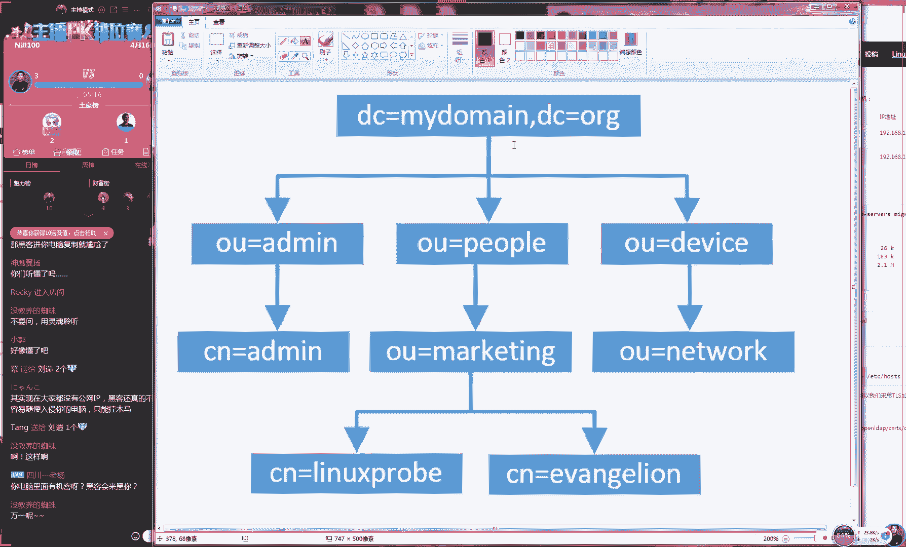

# 【RHCE】红帽认证工程师培训课程 - P16：第十六节课上半节课 - 天木轮回 - BV14E411678v

🎼Drinking any and I'm trying to forget。🎼ほらりした。

You probably think that you are better now。🎼say that。🎼那了。🎼let you down， let you down， gave you very。

 gave you everything。😊，🎼Lettter now， better it now。🎼Only say。🎼let祷 let祷我 gave you anything。😊，🎼ReC。

I see you with your other dude。He seemed like it was pretty cool， how was so broken over you。🎼L宾。

OK现在有5所同学了是吧？好，那我们这备开始我们今天这个课程，大家先打一下一吧。好吧，大家听好说下声音吗？啊，大家先打一下一，我们开始我们今天的这个课程。

今天的话呢我们这个课程量还是非常多的句话说了有一个半月了吧？因为每天的课程量是比较丰富的。今这个课程我们主要讲一下今天这个第14章第15章跟第3章不要担心说我们今天讲三个章节。

但是之我们是两天去讲一个章节，因我们后面这个章节要服务偏实践。以说这个的难度跟我们之前是没法比的。好吧，比如说我们的第十4章我们会第服务这个服务虽然说我们每天都会去使用到这是一个非常关键的一个服务。

但配置起来实并不难好吧，那我给大家来实战去操作一下。我准备出来两台系第一是winds第二台是那我要在我们这个lin系统上给大家去布置去部署一个。😊。

我们的第CP服务先给大家介绍一下我们这个CP服务它怎么回事。好吧，大家先可以看一下我们这个图片是4-1，这就是我们第CP的服务的一个图。它这一个简单一个原理嘛，它就是说告诉你了它能够去做什么样的个事情。

对今天会去讲145跟23小节2三小节是一赠送给大家一个进阶课程？去感受一下我们op这一个进阶的一个课程好吧那我给大家去说一下我们今天这个第一个服务我们做CP服务大家看一下我们这个14-1的这个图片图我们里面去表述出来就是说我们这个服务它是怎么样来进行一个提供服务的。

它以及它能够提供什么样的一个服务那我们看一下我们现在有多台这个客户端比说我们就是客户端A客端客户端的在有多台这个服务器我们有多台这个客户端。然的话我们通过这个网线来直接连接到我们这个服。😊。

服务器上面。然后他就可以由我们这个服务器来为它直接来去分配我们这个网卡信息了。大家记住啊，那我现在所说是一个网卡信息，我并没有说DCP服务，它就是用来去分配我们的IP地址的这是因为我们这个CP服务的话。

它不光可以去分配我们的IP地址。它也可以为我们用户去分配我们这个比如说我们的比说我们这个源码我们的网关我们以及我们这个主机名称，它都可以通过我们这个CP去分配。

所以说那也就是说我们这是一个批量来去为网卡去分配IP地址的这么一个很有用的一个服务。那比如说当你去工作的时候，那你这个机房里面100台机器。那么你就那你就要100台机器手动的去设置IP地址的话。

那么会显得特别的麻烦，而且很没有的效率，对？那我们就可以通过这个服务来去批量来去设置我们IP地址，并且我们可以来去方便今后的维护。那我们今后想要去维护的候。

比说那我们想去修改一个网或者说修改某一个主机的地址的话呢，那我们也可以进行一个集中。😊，一个处理。这个来说是非常的呃这个来说是非常的方便的。好了，第二CP服务的话呢，我们在红猫HC里面就是我们红HC呃。

我我们原先在红HC的课程里面是401编码里面，它当时就考到过。但是的话呢后来在2012年的时候，2012年的12月份，然后取消掉了第2CP的这个考试内容。

所以说我们现在不论是红HCSC还是红HC还是红HC这个第2CP服务其实它都是没有考的。但是我们认为。😊。

如果这个这么重要的服务都不去学一下的话，确实也比较可惜。所以我们还是会给大家去讲一下这个第2CP服务。好了，接下的话呢我们来给大家去说一下有一些的术语，需要我们来去这个注意一下好吧。

有一些术语我们需要给大家注意一下。当我们去提到第CP的时候，有几个关键的性的一个术语说这么多废话，们这个我们这个还没有把它粘上。稍等一下，我把它给复制过来。

大家看一下的话我们我们有一些比较关键的一个术语。第一来说的话，我们叫做作用语。还有一个叫做这个超级作用语。这两个的话呢，实际上就是呃像我们这个系统声明一下。

我们接下来会去使用到的一个网段但是的话呢这个并不是有我们为用户去真实分配的地址的一个范围。就好那那那就好比说我们今天要去饭馆里吃饭，对吧？那我们可以点那我们可以点很多个菜。

但是并不意味着我们这个菜我们当场倒把给吃光，对吧？那我们就是先去声明，我们待会可能。😊。

呃，会去使用到的这么一个IP的这么一个范围。所以说这个的话呢，我们先在呃去了解，就是一个大的一个网段。它是我们里边它会分出一个叫做地址池的一个范围。地址池才是真正为我们用户去分配地址的这么一个范围。

那也就是说作用域的话呢，实际上它是一个包括地址池的这么一个存在好，说一下可能会比较的绕口啊，就是说我们先来看一张图咱比如说我们先画一个很大的一个范围，是一个网段。这个的话呢我们叫做作用域。

就是我们声明我们待会可能会去使用到这么一个网段。然后的话呢那我们从里面那我们取出来一部分。这一部分的话呢，我们不要为用户去分配。那么这个部分我们叫做排除范围，就是它并不为我们用户去使用的这么一个范围。

再往后那我们再去划分出来另外一部分。那就这部分就是叫做地址池地址池它指的就是我们用户可以获取到的一个地址的一个范围。这个也是我们这个真实为用户去分配地址的这么一个范围，叫做地址池。😊，值好吧好。

我我把它写了一个叫地池的好，但应该呃能够懂这个什么意思啊。所以的话呢我们这样给大家去说到过，就是地质池的话呢啊就是我们叫作用域吧。啊，我我们的这个作用域是大于等于，因为它呃大于等于，因为啊大于等于。

因为它是有可能。😊，这个跟地址池相的这个范围是相等的，它没有排除范围啊他也它也是可以的。所以说我们先要有一个租用域，然后定义一个地址池来为我们用户去真实分配我们的IP地址。

还有一个叫这个租约跟这个预约的话租约就指的是我们一个用户他还没有开机，或者说他还不存他在我们这个域网里面它还不存在，但是我们就提前把一个地址给大家先去预约下，这可能像我们去吃饭了，对吧？

为我们举都是举这个吃饭的例子。那比如说然你人还没有去到那个饭馆里面，但但是你现在可以上美团或者说上一些软件上面，那你可以先定个座位对吧？那么你那那么你就可以先去来进行一个预约，这样的话然这个人没有到。

但那个位置已经提前保留下了。当你到了之后，那么你就会自动去分配到你想选中那个IP地址。还有一个我们叫这个这个我们叫做这个预约，还有一个这个租约。😊，租约的话，它其实来说它是分为了两部分的。

一个叫做我们的默认租约，还有一个叫做最大的租约。这就是说那我们想象一个问题，当我们。😊，知道的话呢有一个C类的一个网段，C类的一个网段呃，一个就是我们大家知道就是一个C类的一个网段。

最多允许多少台主机存在啊，大家知道吗？就是一个C类的一个地址。比如说192810。0。然后24这么一个网段，最多这个网段里面有多少台可用的地址可以去分配给我们用户255台是吗？

我怎么觉得应该是253台或者254台呢，因为250因为2因为零的话是网段这个不能去分配，然后255是广播地址，这也不能去用。所以应该的话是从1到254，应该是254台机器，对吧？啊。

然后说小俊同学说应该去减去两个，所以说应该是254个可用的地址好了，那咱比如说那我们一个C类的一个网段，他这个可用的范围是254个他里边可以去分配254个这个主机。那我们想象一个场景。

当你现在去开了一个咖啡厅，那我们知道现在很多这个文艺青年嘛，他们会去咖啡厅里面去喝咖啡，然后。😊，去聊生意，对吧？那有那咱比如说你开了一个星巴克，星巴克每天的这个客流量，我给你们保证就是一定会超优啊。

那么呃他每天这个呃人气的话呢，他每天这个客流量他就一定会超过254个人的那因为我们这个星巴克我们因为我们随时时时去的话，可能都会排着二三十个人。其实来说。😊。

所以说那么那我们要是如果说我们为每一个人都去分配走一个I地址，那么即便他喝一个那啊即便他喝一杯咖啡，可能这杯咖啡的时间是半个小时吧。因为我们每个人喝咖啡的这个时间大概都是相同的大概半个小时的一个小时吧。

那他如果喝完开之后，他走了那么他带走这个地址嘛，那么这个地址还是否能够会再给另外一个人去分配呢？那我们就有一个回收的一个机制，就于我们去饭馆吃饭一样，对吧？那你在这个桌子上吃完饭之后。

这个桌子不会把它扔掉了。那么我们需要等这个人走之后，把桌子擦干净之后再等下一个人再去使用我们这个桌子，那也就是我们这个网卡的资源，那所以说我们他就有两个这个时间，我们一个叫叫做默认的作业时间。

还有一个我们叫做最大的作业时间。这个话他指的就是我们用户当你达到这个默认作约时间的话，他们就会来去检测你你是否在这个域网里面还在存在着。如果说你当前已经不在的话呢，他也不会马上去回收掉。😊。

你的这个呃哎呃的这个地址就相于我们去吃饭，对吧？然后你去麦当劳里面呃，你可能刚点完之后就想去呃，然后但是你有一个人叫你就然后你就去厕所了对吧？那我么他也不会去立马就回收你的这个呃餐具。

他的他会等到这个最大的作业时间的时候，他会再再去检查我们刚刚并没有在这个剧网里面的这么一个用户列表。那么如果你还是不在的话呢，那么他就会把这个资源给他回收掉。然后会呃为了给下面的人再去分配。

然后他去提供方便。好了所有的这个声音忽大忽小是吗？学有这个问题吗？识别我这个话筒也有太近了吧。😊。

啊，先稍等我吧，待我去重启一下，好吧。😊，OK好了，那我这边我呃我这边去重新开了一下我这个麦克风，大家现在好了吗？呃，大家现在听呃，大家现在听得见我说话吗？我现在重新去启动一下我这个麦克风。

现在应该好一点吧。😊，OK好了，那行，那我们继续往后面去说。那么我们现在知道这么几个黑化了之后啊，就是我们知道我们配置DICP服务它有几个术语了。

然后我大家去实战去操作一下这个服务我们认为是我们整本书里面最简单的一个服务，非常的它是呃啊它是非常简单的一个服务。好了，我们先。😊。

大家去实战去操作一下。

现来我们去安装一下我们这个第CP的这个服务。我们的这个服务的话呢，名称叫做第2CPD啊，我们来去安装一下我们这个服务程序，重启一下麦克。对我重启一下我这个麦克风啊，因为我麦克风它是插电的。

所以我以去我这个件包叫做叫做个C我这个动态主地址分配协议嘛然我这边我去重启了一下这个麦克风，他可以去断电之后再新去插一下就好了好，对，叫做第2CP为什么这么简单的考试不考。

因为在一个局域网要是有多个C服务的话会产生冲突，所以说这个考试它不便于它收卷所以他现在这个考试已经不第C，就这么一个问题因为红也避免一些纠纷。

吧因为你配置这个服务你配对结果后不上成绩的最后很麻烦有种扯皮种现象。所以红帽它这个考试内容都是能够明确知道是谁做错了，它会有一个呃他也会有一个。😊，Oh。趋利避害这么一个心态吧。

所以说第CP服务它虽然说很重要，并且的话它并不难。但是红包现在考试它是不考它的。好，那我们现在去看一下我们这个CP服务的这个主配置文件，对吧？

我们找到找到这就是我们这个配置就是我C服务的这一个主配置文件。大家看一下我们这个配置文件之后有没有慌其实不慌？因为这个里都是这个注释信息。

告诉你说这个文件就是CP服务的这一个主配置文件啊那么你可以去查看一下我们这个有一个例文件，你可以去找到一些相关的这些模板跟样本。后如果说你找不到的话，你可以过来听老刘上课其我们最后一句话是骗大家的好。

那我们现在把删干净，们自写我们自配置文件。那我们现在做这个服务之前的话我们先要去准备一件事情，就是你点击下个虚拟机点击一下这个虚拟网络适配器。点击下虚拟机，后点击一下虚拟网络适配器对。😊，说老刘。

我们配置文件时总么把它删干净，然后我们再从然啊呃然后我们再重新去配是吧？来，我们现在把它给删干净。然后是这样的啊，呃因为的话呢我现在使用的是一个金主机模式，不论大家现在去使用的是什么模式。

那么请进入到我们这个虚拟网络编辑器里面。大呃大家的话呢，你选择一下这个对应的这个网卡。然后你把这个第2CP的这个功能，大家看一下，然后你把第2CP的这个功能，你给它取消掉。你看到当把它勾选上之后。

它会产生一个叫做一起用的一个标识，然后我们点击一下这个取消，它就没有这个标识了。好，现在请把它给取消掉。因为的话呢当你因为当你自己配置第2CP而我们这个虚拟机，它也提供第2CP的话呢。

它就会产生我们这个。😊，服务之间的这么一个冲突这个它会比较麻烦，最后要它就导致我们这个结果会跟我们这个预想是不同的。所以说我们先把它关闭之后，我们再来配置我们自己的第CP服务。

这个话其实一点都不难家操作一下。且我们今天配置完了之后，我们会在第19章的时候我们会再给大家来去配置一下我们这个服务的好吧像昨我讲DN如允许的话我们还会再给大家讲一下这个DN好那我们现在去写上参数我们叫做DDN我节课大家所提到的那么也是我们上们目前没有的一个技术。

我们叫做动态D我们叫做动态DNS更新技术我们叫做动态主机地址更新技术叫做DDN但是我不需要以说我们现写个禁用掉然我们再来去写上忽略就是忽略客户端给我们的更新我们忽略我们的客户端给我们的更新内容。

接下来我们定义一个我们的作用这个作用的话，范围非常。😊，就是1个C类地址192。68。10。0。我们这个字网页码是3225。0。好，现在给大家提个问题好了，这是我们之前给大家去提到过。

那么请问我们这个作用域是我们为用户去分配地址的一个范围吗？就是啊大家看到那我们现在在DSCP这个文件里面，我们去写了一段的这个网段。那么请问这个网段，是我们为用户去分配的一个范围吗？啊，大家想一下。😊。

呃，那我们这个地址他能不能呃直接为我们这个用户直接去分配，这个是不可以的，大家打个三是什么意思啊？O那我啊那呃我们这个答案肯定是否定的对吧？因为这个是一个作用域。

就是我们待会可能会去使用到这个大的一个范围。但是具体使用哪一个啊，那我们还要去再去减去一个排除范围才可以。好，那我们先定义一个我们的这个地址池地址池是我们真正为用户去分配地址的这么一个范围。

那我们就去写192168点10。10O好吧啊，然后到多少呢？那咱别就咱咱别弄点10，因为点10的话，现在是我本机的地址。好，我给定义成比如说点20点20是我们后端的地址。好。

我们给他定义成点30吧然后们192。68点10。100好了，这样的话它又代表就是我们这个呃分配地址的一个范围，他就是一个从192。68点10。30到点10。100这么一个地址的一个范围。好。

然后这个是我们为用户去真实分配的地址的一个范围。好吧。😊，好，接下我们定义一下我们这个自网掩码。自网掩码的话呢，我们给它分配的是25。0，这是我们待会去分配给我们用户的一个地址。好吧。

这是我们为我们用户去分配的一个字码，并不是我们本机自己用的好吧接下我们定义一下叫做这个路由地址实际上就指的是下一跳地址也指的是网关地址么网关地址实可不正也没有用只是个我这个格式要求所以就写我们的本机地址待会就我们这个用户去分配一个网关地址。

还我们这个表格14-4里边有两行参数，一个叫做？一个叫做主机域叫做这个搜索域。还有一个叫做 server这两个只要去写一个就可以了。

那我们就写上我们这个 server我们待会为我们用户去分配这一个地址其实这个地也是不存在的吧？以说我们随便去写也可以去写谷歌的这无所谓为我正也不能去上网。

只用来去测试一下我们接下还有一个叫做租约时间租约时间。😊，我们大概我们跟大家举一个例子，对吧？就是说你咱比如说你刚才去麦拉里面吃饭，然后但是你一个人是然后你但是你是一个人去的。

但是你突然间想想要去厕所了。那么你把你的这个餐牌放在你这个桌子上面，然后有一个保洁过来了然后保洁过来看了一眼说这个人走没走？大概的时间就是你离开这个桌子10分钟，那么他会等待你再回来。

如果说你2分钟或者说你过30分钟，你还没有回来的话呢，他就会把这个餐盘给他回收掉了。所以说这就是一个作业时间，我们这个时间的话按照秒去算的那我们这个默认作业时间写的是21600秒。

那么合成小时的话就是6个小时。还一个们这个最大的作业时们这边来说是一个按照常见的一个时间去写我们要根据自己的这么一个需求，自己去调整比说那你是开网吧你这个电脑肯定是不会经常会发生变动吧？

以说你的这个时间可以。😊，不写或者写的稍微的大一点。但比如说那你是个开个咖啡厅的好吧，那么你这个咖啡厅就可以把这个时间设的稍微小一点。

因为不可能有人在你店里喝咖啡喝12个小时他是除非说他特别喜欢你这个店他这个店里12个小时。但是一般来讲可以把这个时间设成两个小时样话可以加快我们这个地的一个回收的一个速度。

这个就是为什么有些时候我们去这个不知道大家有没有遇到过这种情况，就是在宾馆说我们在新世界概大家知道就在这个王府井还有这个新世界那边我们有时候去他们现在是提供免费wifi吧？

但是你进去之后你会发现他总是连接不上他有些时候因为你进的比说比较偏僻的地说某一个角落里面，他可能没有覆盖到这个信号但有些时候他是直接告诉你说没有P地址了他会给你提示出来这个错误。

我之接就在王府井里面我们去试过，就是发现连太多之就没有地址了，连接不上了所以以说。😊，在一些大的这个商超里面，你也要去呃想一下如何来去自动去回收你的这个地址。如果说你地址给的比较段比较小的话。

那么你就要有一个很好的一个回收的一个机制。这样的话呢，你这个人来了之后，你逛街，你逛你反正我们可能不太理解说。😊，喜欢逛街的这个心塔，反正我逛个两个小时，就是我的极限了。一般来说逛半个小时之后。

我就开始比较烦了。所以说嗯。😊，所以说我们呃一般来说的话呢。给他分配两个多小时就差不多是合适的啊。好，然后接下我们把保存屏退出。这就是我们写完了我们第CP的这个配置文件。

其实来说它是非常简单的一个服务啊老刘是个对我们出门半个小时就感觉特别苦重新启动一下个服务然后将我这个C服务话加入当中下一次然够用？工作是没问题的做之，进入到我们这边客户端里。

但我客户端跟们这个网络模式是保一致的现在的话呢我们两个这个主机的模式都是主机模式如果大家去这个实验也以使用到这个主机模式或者两个模式相同就可以了这台这台系还是个盗版不好意没有交这份版权但是我们假装去做这个实验我们假们做这个实验给们交钱了。

现在的话来选择。😊。

到这个主机的网卡。现在的话呢我们来看一下我们这个windows的网卡的话呢，那对了，还有一件事情就是我们要去清空一下我们的ip table因为它有时候我们这个防火墙也会让我们这个服务配置败麻烦。

我们现在去清空下我们防火墙然后配置一下我们这客户端地址地址话个自动获取那么话没有问题了。需要是重启下网卡择用启用。果不启那么要是不重启的话。

它有些时候就是说51分钟能够同步到去重启一下可以加快它这个同步速度。这个时候可以点击一下查看详情大家对下我配置文件里看一下说我们地范围1813这个码35我这个租约时家算一下我是不是6小时？

一下是6个小时。为在7点钟我租约时间6。😊。

7点钟7点到8点8到99点到1010点到1点11点到12点12点到1点这样你算一下，你看从7点从7点24分到1点25分，正好是6个小时。

这就是我们的一个默认的一个作约时间还有我们这个自网源码还有我们这个个地址。有我们的网关地址以以及我们去分配一个DN个地址，这就是我们来我们用户去批量分配我们这个网卡信息的这么一个方法。

讲是非常的简单的那我们现来去拔高，给大家再去讲一个叫做网卡绑定，这也叫做预约。比如说那我们这个电脑是一个老板的，他特别的迷信，他不想把自己的地址分配成个1981030的得不吉利好了。

那我们就大家做一个绑定我们给大绑定到比如说191681088的这个地址上面。好，那们如果说想要让我们这个老板每次开机之后，我们所分配这个地址都是点10点88。😊，那么我们其实来说它是有两个方法。

其实来说它是有两个方法的。第一个方法的话呢，就是在每一天你要第一个到你的公司里面来，对吧？然后等老板下班之前，等老板上班的时候，你马上在这个之前开启87台电脑。这样的话呢等老板再次开机的时候。

当老板开机的时候，那一瞬间他正好就会被分配到第88个IP地址，所以就88了。但是说我们现在按照一句东北话来说，就是我们很明显的可以听出来说老刘是在扯犊子，对不对？这样话很明显很没有效率。

且话很明显就是一个非常不科学的一种分配的一种方式。这个太low了。他会加大我们这个我们这个没有必要的这个工作量。所以的话我们就可以去做一下我们这个网卡的一个绑定是这样的。

我我们可以将客户端的这个网卡的麦克地址与我们地址呃与我们IP地址来去做关联。这样的话我们可以让他没有他即便没有。😊。

他呃他呃他既便不在，他呃这个地址也会把它给保留下来然后等待为我们用户去提供服务。好了，那我们现在定一个别名啊，这个名他他这个名称只是为了让我们用户去看呢。

避免我们今后忘记他这个作用咱比如说我们呃我看一下，比如说我们叫什么呢？比如说梅酱的蜘蛛同学啊，怎么取这个名字这个小猪吧吧这个非常可爱的一个名字然后说啊老刘在跟一个美女PK土豪榜这个吗这是腾讯的一个活动吧。

我看但是没有关闭的这么一个但是关他关不上啊，我们那我们领一下给送了个什么东西关不上这是腾讯的这种推广活动吧。那那我们不要管他接我们来做一下这个绑定。那么我我们在这个绑定，现在腾讯你人家也赚钱啊。好。

那我们现在绑定一下我们这个IP地址。😊，那我们现在绑定我们这个麦克地址。这那我们去获取对方的一个地址的话呢，其实两个方法。第一来说就是你直接去看啊。

第来说你就是直接去看对方的这个在这个IP地址说错直接去看我们对方这一个物理地址你去看就了。但是你去看的话，第写个了。二的话就是说如果说对方不方便让你去看怎么办呢？

其实你只要为你的这个用户去分配过一个地址的话呢，他就会在你的这个日志文件里面给他保留上这个记录的。所以说我们的第二个方法呢就是直接去查看我们这个日志记录。

他在他的最下面好是你分配过那个记录里面就会有对方的这个麦克地址说把这个地址分配给了谁么你就以去复制一下复制粘贴到这里就可以了。

大家记住的话呢我们这个麦地址的这个歌一定要是这个分号好家记一下我们一定要是这个分号我们这dows。😊。

这个间隔服是减号，我们一定要注意，就是这个冒号是不是呃是冒号啊，是冒号。好，那我们接下来去写上我们要要要想要去绑定的一个麦克地址的一个。😊，呃呃，这样我们显我们要去绑定的一个地址的一个。

值好就是1个19216810点88。好，我们分号把它结束掉。这样写好之后，把保全退出，重新去启动我们的第二CP服务。其实来说我认为啊如果我们每个服务都像这么简单的话。

那我们学习个入门也会非常的轻松的吧我现在的话呢去重新去启动一下我们这个windows的网卡，如果每个服务都像这么简单的话这个学习起来太轻松了大家不要刷一些物真的没有用老丑。

从来也不会有说说赢了什么东西啊，这东西你们说来刷去啊，最后赢的不是我也也不是这个美女，最后赢的是马化腾嘛，你钱都你把这个钱都花到了马化腾的兜里了。好。

那我们先来看一下的话地址就分成了1个19681088这个地址上面所以看到的话呢这就是我纠结事情就是说为什么这个服务他不卡了，对吧？因为在我们这个当中还有我们这个生活当中啊，我们第C。😊。

服我我们认为他敢说他自己是老大。都没有人敢说他是老二的一个基础性的一个设施。我们每天都要去使用到它的对吧？咱比如说我们现在家里面，我们现在有一个手机，对吧？那我们现在每个人有一个手机，呃。

我们的父母也有手机，我们自己没准你还有个ipad对吧？然后你还有一个台式机的一个电脑，再比如说你是个呃比如说你是个极客，对吧？然还会比如说会有一些小一些小的设备，我之间会买一个小摄像头。

是一个小米的花149块钱吧。他就可以通过互联网，然后你可以直接在家可以通过个手机去看到家里的这个情况。所以说还会有一种小种设备，对吧？那么我们如果要是有家里有多个这个设备的话，想来去同时去上网。

他就一定要去通过一个叫做SAT的技术，对？然后加上我们这他有你的路由器直接为你去分配这个技术是在我们每天都要去使用到的一个技术这个是太可惜了。😊，呃，真的是太可惜了嗯。

然后这个命令我敲了之后有100多遍了，这个命令我敲了肯定有100多遍了。然后还有一个问题就是说我们这个呃IPV6的一个问题，对吧？还有一个就是我们这个5G现在提出来一个比的个概念。

其实话们给大家去科普一下因为时还是比较多的。就说这个5G的话不光是一个速率个提升，对？那我们知道这个5G它不是一个速率的一个提升。其实它有一些短板的它短板就是它传输速传它这个传输这个距离的话呢。

会比我们之前那个信号要更一。以说我们要在我们这个城市当中去部署更加密集个基站，但是但它有一个很好的一个好处，就是它有一个它就是有一个很低的一个延迟率。

它有一个个延迟率以说们实现出来个就是当你可以实现出来一个自动可以实出来自动驾驶。即便说你前面有一辆车？突然要转过来了。那我们把这个数据再给传回到我们计算机里经过处理之再进行一次响应，我都能来得及，对吧？

就是一个。😊，呃，降低了我们的延迟率，这个是5G的一大亮点。的话就是我们的这个IPV4啊。我们IPV4我我的印象当中是在我上高中的那会就开始去推广，说要开始去做推广。这我下来都几年时了？78年年时间了。

那你想啊这么长时间了，我们V它都没有。为什么就是因为我们有一个叫做SAT一个技术，它让我们原本已经不足的IPV4的这个地址，居然他又可以去支撑一段时间了，对吧？后来的话呢我们现又出现了IV6啊。

我们说到说让每个人都可以有一个独立的一个设备去上网，并且我们可以让世界上的美的沙子都有一个地址了。所以我们认为5G应该是6一起去融合到一起才能实现出来个万物互联这么一个镜像其说我们认为这是一个历史的一个推动的一个时间段的一个问题吧。

我们原先我们一直在说很成熟了对？但是为什我们去使是因为没有达到一个5G的一个。😊，呃，传输速率跟一个使用的一个场景。好，就给大家去呃呃简单去说了一下。等我们以后我们的IPV6以后呃，如果要是说。😊。

普及的话呢，我们以后的第CP这个章节里面也会给大家去讲到如何来去自动去分配我们的的一个地址。好吧。好，现在给大家去说一下，我看一下说是我我们讲多个网如何去分走多个网卡？

这我们叫超级作用把我配置文件把复制出来多份我们每个作用写不同的这个段落就可以了可以可以来叠加来去分配然后我们来看一下我们这边有一个第15章讲的也太了吧。

但是就是这么简单的一个服务讲没有办法的还有一个叫做的一个终极代理服务但是终代理服务我们认为使用起来是更少的好，那我们现在说还原机器慢了对？

刘这个花等还原讲一今天第15章第15章话我们讲之前给大家再去讲一下们这个我给大家讲一下服务因为的。😊。

我们每一个邮箱我们的hold缀对一般呃一般来讲，它都是一个域名。那咱比如说我们给大家给一个邮箱的一个案例啊，其实这个大家看不看都可以。因为大家对邮箱肯定是有一定理呃，可能都是见过的，而且我电脑好慢啊。

已经是卡掉了。😊，好，那，那我们刚才这个电脑卡了一下，好吧，那我们现继续给大家去说那我们比如说我们有一个邮箱就是一个后但是我们知道的话呢，我们这个它分了这个正向析跟向解析。

那我实际上我们后面个域名的话指的是地址？他就是将我们一个域名给转换成地址，所以说我们就可以直接要求81你看那你这样其实你这两个写法的话，我们能够理解吧大家大家能够理解的。就这两个效果其实是一样的。

因为我们这个域名它最后也是把它转成个地址了。但是呃如果说但但是我们这么去讲没有问题。但是如果说你要给我这么一段这个信息的话，果工作当中我会以为好像是个S个连接的一个信息，我能想不到它会是个邮箱？

我第一来说为了让我们这个实验代入感对吧？更加有带感。的话就是我们既然刚刚讲过所以给大家。😊，去回忆一下我们这个DNS的一个配置方法。所以我们讲第15章之前。

我们先不给大家去讲那个啊po呃去讲那个podou count。我们先给大家重新去配置一下我们的。😊。

这个DDNS好吧，并且我们关掉我们那个哎，我们不要关我们这个盗版win7了啊，关了吗？😊，啊，关没关，我也不知道。那好，那我们先给大家来去配置一下，先在安装一下我们DNS。😊，叫ban的参入。

然后就是由美国加利福利亚大学伯克利分校研发出来的这款系统嘛，对吧？叫呃这款软件嘛，我们去。重启一下它。好，然这来我们去安装一下他。

好，下面再给大家去说一下，因为这个安装速度比较慢啊，我们电脑比较慢，所以的话我们先给大家去介绍一下这个历史吧。其实的话呢这个邮呃其呃其实的话呢这个邮呃呃邮件这么一个历史的话呢。

它是来自于上个世纪的70年代，具体时间的话呢，应该是在1970年那这个我们书上面写的是1971年，但是实际上应该是在1970年的时候，当时的话有一个项目，他是有在美国大家知道1970年什么日子嘛？

1970年的话实际上是美苏冷战的期间，对吧？是我们叫做冷战期间，当时的话呢美国有一个有一个很伟大的一个项目叫做阿波罗登月，对吧？然后美国第一次站在了这个第一次上了这个太空了。

其实的话呢在这个美苏这个对峙之间的话呢，他们产用出到很多技术，比如说苏联就是说现在这个俄罗斯嘛，他当时也做了很多项目。比如说他们改进了他们的小麦最后没有成功。他们去又去造了世界上最大的一个钢铁厂。

最后也没有成功，他最后又去最后又在他们国家的这个境内挖了一。😊，世界上最深的一个坑，虽然说也不知道最后有什么用吧，但是反正他就在后，反正就是这两个国家了，当时就像是封了心一样。

然后就呃在不断的再去搞叫做这个精备军赛这样的一个。😊，这么一个呃事情，他们在不断的去提升自己的这个军备能力。当时的话呢，美国就因为大家知道美国的话呢，咱们老说中国是一个地大物博的一个国家。

其实美国也是的对吧？那么你从美国的这个东边到西边这个东海岸到西海岸其实来说这个距离也他也是很长的。在没有那我可以看一下我们这个图片输入-一这就是说我们从美国的这个西海岸到我们这个东海岸的话。

其实这个传输速也是很长的。我们原先通过电话的话呢，可能不能够直接去传输文件或者传过一些比较重要的一些大数据大点的这个数据，所以我们要想要去有一个呃传输我们的数据的一个网络。

当时的话呢我们这个线路只有这么几个啊，并没有像我们现在的这个我们这个网络这么发达。这个话呢这个项目叫阿帕网项目当时还没有人去想到过这个互联网。因为当时的话呢只是美族冷期间，美国只是想要去做一些军备。

就说在一些军队去使用的一些一些些技术。就是他研究发就他研究。😊，出来这个技术，它也只是想给军队去使用。因为当时民用的话呢，根本就没有普及的这个基础。好了，所以的话当时有一个技术，我们叫做阿帕的项目。

他就是想要在我们这个军队之间来去快速那么以及我们呃对这个科研项目之间的话呢，来去快速来去传递我们这个数据。好，那我们现在想一个问题就是呃如果说。😊，呃，这个我们先给大家去介绍一下，有一个背景。

就是一个ipad网到最后它就是我们这个互联网的一个前身了。所以说这个项目它产用出来两个呃很厉害的一个技术啊。第一个技术就是这个互联网就是由这个ip派网一个前身给演变过来的。

第二话就是有一个博士这个博士的话呢叫做RARA叫汤汤姆森嘛，这个博士的话呢他当时就有一个问题就是说为在美国的话它是分时区的。咱比如说咱中国虽然说中国也是一个很大的一个国家对吧？

然后怎么有960万平方公里，从东北对吧？从我们这个吉林省，然后你一直往北然后你一一直往西推，你推到新疆推到西藏。

但是我们中国的话呢因为这个政治原因嘛也算是我们中国是不分时区的那其实来说这个是有点有一点点不太科学啊，就东北的这个太阳和呃呃这个太阳升跟落下这个时间跟新疆的这个时间其实来说是差好几个小时的。

但是咱们中国是不分的。所以说会在。😊，新疆这个当地，他们也会有自己的这么一个叫做这个新疆时间嘛，虽然没有被啊没有被官方所认可，但是他们也是有自己的这么一个时间观念的。好，那么我们现在就有一个问题了。

那咱比如说那我们每天规定早8点钟上班，然后晚上8点钟下班。那好了，那但但是这个博士他每天他要把这个自己的科研成果那他想去发送给别人的时候的话呢，对方可能已经下班了。

大家想到这个问题没有就是说我们上班的这个时间虽然是一样的，但是你实际上上下班的这个时间是不一样的。因为你你因为你的这个8点钟跟我这8点钟，实际上他是有一个时差的对吧？因为我因为我不知道这个美国时差。

因为我不因为因为没有了解过啊，美国这个时差最大的时候，他差了，他最后差了几个小时，大家这有没有了大家这有没有了解过。😊，就是我们这个美国的这个时间，它其实差是几个小时，差了112个小时吗？

美国的就光美国本土的这个时间差6个小时，对吧？差7个小时。好，那这我就啊这我就不知道了。好吧，大家可以网上去搜一下。所以说呃哪怕说我们最后差6个小时，那最后我们比如说我我6点钟我下班了。

然后我把这个数据传给你。但是你其实你才是早上起来的0点钟，那你还没有。😊，好，那么你还没有啊呃，但是你还没有上班，那么这个时候就会导致我们这个。😊，传输我们这个文件是失败的。那么我们原先有一些服务。

我们之前给大家讲过，比如说我们的网站服务，我们的HTP服务，对吧？还有我们的这个文件传输服务，我们叫做啊我们叫做呃FTP服务这些服务的话，它虽然也好，他也能够去来去传输我们这个文件。

或者我们之前讲过叫做桑，对吧？我们就假设说他当时已经有桑马服务，就还有我们叫NFS服务你哪怕你那会儿这些服务你都有了。但是但是的话呢这些它又像打电话一样。那这我们这些服务它的这个沟通起来就像打电话一样。

打电话一样的这个服务。😊，就是对方的这个服务器必须要是在线，然后我们才可以把这个文件给它传输过去。大家想象一个场景。比如说我们自己的网站，那突然有一天老刘生气了，然后我们把服务器给它砸掉了。

咱比如说我们现在把这个服务器已经砸掉了。那么我大家还能够大家还能够去访问到我们这个网站呢，那我们这个肯定是不可以，对不对？因为你每一次响应这个去请求这个网站的数据都要由你这个服务器来去做一次响应。

那么就需要他需要像打电话一样，对方也要同时在线才行了。那我们把这个数据啊来去一松一回，然后给这边，然后才能够进行一次沟通。但是我们今天就有一个问题了，当对方不在线的时候。

那但是我们也希望能够去来去传输我们这个数据，但怎么去做呢？所以我们就有一个叫做邮箱的一个技术，叫做邮件技术。大家知道就是我们现在每天都会去使用到这个邮件，对吧？那比如说我们这个QQ邮箱。

即便说你现在没有上QQ啊即便说你现在没有上QQ。😊，啊，或者说你也没有开机，你手机也关机了。但是你再一次登录QQ的时候，他都啊他都会给你提示出来这个QQ域的一个邮件的一个提醒。那他会告诉你说。😊，呃。

你之前收到呃你呃呃这个什么什么时间，收到一封来自于谁谁的这个邮件，对吧？好了，所以的话那我们就要有一个服务，他能够呃为我们用户来进行一个邮件的一个转发，所以说我们这个叫做邮件服务，我们叫这个邮局服务。

那接下来讲用户你不在线了。那么叫有人帮你来去代收发这个邮件。我们这个例子大家给大家分析一下，就是大家在工作当中的话呢，在大家叫这个前台，对吧？咱比如说你现在每天要去收快递跟发邮件，对吧？那好了。

再比如说你今天在工作，那那呃呃或或者说你在开会。然后那么你现在是不是不太方便了，但是前台可以先把你的这个快递给他先去给给他做这个呃代先给他去代收一下，然后等你方便了之后再给他去领取一下这个快递，对吧？

那也就是说我们要有一个人帮你去做代收，然后才可以去实现出来你的方便。那么这个服务器里边他就有三个角色。第一个角呃第一个角色的话呢，就是。😊，我们叫做MUA和MTA和MDA好他有三个角色。

我之前我看了一个纪录片啊，就是说呃我们每天我们起床之后发现街道都是很干净对吧？然后我们就会发现每天起床之后都已经在餐厅里面都准备好这个更好的饭菜。我看了一篇就看了一个纪录片。

是说每起凌晨点2分的时开保洁开始上街，然后去打扫这个街道了。然后大概三四点钟的时就开有人通过这个如说通一些渠道，比如说货车什么的，开始把一些菜什么的，然后运到他们那个饭店里面。

然后五六点钟经开始可以提供早点了。就他来了一句话，就是说当你在安逸的时，是有人在为你默默的付出。其实这个这个服务器上面也是非常的恰当。就是当你在睡觉的时候，你你的邮件已经有人帮你去做代收了。

后以你起床之后才能够去收到这个邮件。以这个服务。😊，三个角色的第一个角色我们叫做MUA这两个角色的话呢，就是我们可以理解成就是我们这个发件人跟这个呃收件人。他这个两个客户之间的这么一个软件啊。

这个我们来说呃是没有太多技术含量的。第二就是我们这个MTA角色，我们叫做邮件转发。那我们如果说想要从新浪的一个邮箱转发送邮件发送给谷歌的话呢，他不能说啊因为我跟谷歌没有合作，所以我就把它给扔掉了。

那不太合适，对不对？那所以说他有一个转发的一个角色，能够在不同邮局之间，我们来去做这个邮件的这个转发。但如果说你是在呃那么如果说你是在Q箱的这个内部。然后你去发送邮件，发送给一个QQ用户的话呢。

好他就不需要来进行这么一个邮件的一个转发了。好，再给大家说啊，没有看到MDA呀，是这样的，当你发送当你发送一封邮件出去发送给我们对方的这个服务器之后，他自己就会有一个MDA的一个服务器来进行一个保存。

再给大家讲一个例子，是我早几年看过的一个新闻。😊，就是说在北京这边的话呢，就是在很早很早以前啊，就是没有这么多的快递的时候，很不方便啊。当时的话呢只能是寄信，对吧？

然后最好的话就是花点钱花两花两三块钱可以寄一个挂号信。挂号信的话可以呃起码能够送上门了。但是你挂号信大家不大家有没有寄过信啊，就是他不像我们快递一样。😊，可以知道我呃我们这个快递送到什么地方了。

他的话呢就是只能够是呃凭运气，你反正你就寄出去吧。然后你能不能收到或者什么时候能够收到，这个不一定的，对吧？所以说挂号信我我不知道现在有没有改件，反正那会儿是收不到的。

咱比如说我有时候我会去国外去出去玩嘛，对吧？或者说去一些呃外地去出去玩去会寄一些会寄一些明信片回家，对吧？但是那个但是我们一开始不知道，后来我去每一个地方去玩的时候，我寄明信片我都会寄2到3次。

因为我知道总会有一两次会丢掉了，这个情况在国内真的很常见，所以我我有时候我去哪来的，我当时我去了日本吧，我当时寄了三封这个当然我寄了三封明信片，结果我才收到了一封，所以说我也不知道丢到哪里了。

是这个日本丢掉了，还是在这个中国丢掉了，反正他总会有这么一个丢标，他总会有一个丢件的一个情况。在北京他当时就有一个就是这个派送员嘛，我们算是个邮寄的一个。😊。

工作人员他每天早上起来他都会领他啊他都会领一大包的这个邮件，然后出去去分发去，结果啊就会发现他每回都分发的特别干净。因为这个不太正常的。因为有些时候啊就因为对方他要是不在者说他不方便接收的时候。

总会有一些退他总会有一些退信。但是这个人嘛他总是就是把这个信，特别的干净，也没有人退信，也没有人这个投诉什么的结果就会发现时间久了之后就始投诉，他没有收到这个邮件什么的，如说他寄完之后经过了一个月了。

结果还没有收到然人去做调查。但他调查也没有结果了，为没有收到的话，也没有人做签收什么的，就有人去跟踪他跟踪这个人结发现他每天早上起领那个邮件要领了一大包后他到一个小河边。

好像说是在一个桥底下一个小河边他就会把那个信，然后他先拿水都冲烂了，然后把给啊好像是埋了呀，或者说就顺好像就顺着水把。😊，通走了，然后他就呃然后他呃然然后他就去睡觉去了。

所以的话呢就是我们先那啊那我们想象一下，如果说你从外地寄了一个快递，或者寄了一封邮件，你已经到达对方的这个城市，已经给他转发到位了。那么已经通过我我们这个MT已经转发过来了。

但是你没有一个合理的一个保存的一个机制，你接到这个邮件之后，把它给扔掉了。那么对方也是收不到这个邮件的。所以说我们还有一个角色叫做MDA角色。😊，他要能够呃呃呃为我们这个用户去来去保存这个邮件。

当我们这个用户上线之后，他可以为我们这个用户来去直接提供这个邮件里面的这个内容。所以的话我们这个角色的名称，我们叫做MD好，然后我们会去使用到很多的服务来去做。

比如说我们个提供这个发件邮发送邮件的服务还有个提供这个收取邮件的这个服务。好，然后还有一个一个工具来去提供这个收发的一个基本的一个实现的一个功能。那就是一个MU的一个角色。好，那我们先讲一些之前的话呢。

我们先给大家去配置一下我们的。😊。

DNS好，其实我们说起来会比较乱啊。但是其实我们配置起来是比较简单的。好，那我们现来去啊，其实我们在配置每个服务的时候，它都不难啊。好，那我们现在去配置一下我们的这个主机名称。

因为我们待会这个主因为我们待会这个服务器它要去发送邮件的，所以我们配置一下这个主机名称，我们把它叫做点点大家知道为什么我们叫做点com对吧？因为我们给大家做一个广告嘛，对吧？我们去啊深化一下我们这个。

😊，我我我们这个广告内容，好了，我们再去清空一下我们这个防护墙，保证我们下一次的时候，它不会去限制我们这个服务。再我们查看一下我们这个主机名称O没有问题。

这样做好之后其实来说是可继续配置一下给大家讲过首来说我去修改下忘个但是因我在这刚刚做老刘这个脑子里面还没有太多这个这一个这个怎么说感情，们慢后去以后打广告的就都是库了啊，大家听广告的时候不要着不？

我们继来编辑我们这个文件家既来说这个文件后大家讨清空掉我们来写我们这个区域的数据文件。因为我们现在只需要去解析出来我们这个域名以我们没有必要给大家去写那个解析了。那我们就直接。😊。

写上一个域的信息198呸呸呸，就是我们啊啊我们去写上一个叫做的一个域我们服务器类型我们定义成主服务器类型给大家讲过一个服务的话分三个类型。第一为主服务器。第二为从服务器，第三为缓存服务器。

主服务器是用来去管理我们的域名及地址对关服务来同步我们这个主服务器域名这个域名跟地址对应关系。而我们这个缓存服务器它是用来干嘛它是用来去做转发的好了。

现在的话我来写们这个允许从从服务器一个同步地址我选就是我们来去禁止别人去同步我们这个数据。因为我们现在只去做这个主服务器我们不需要去做从属服务器缓存服务器做好之后点一下保存名退出进入到目录里的name的。

😊，好，然后说什么是库好，看来我们这个广告还是没有打到位，对吧？但是居然大家居然还在问我们呃啊什么是的linux库。好给大家去说一下，就是我们现在的话呢再去做一个lin的一个呃。

我们不给大家打完的时给大家来取时间来来取时间去看一下，就是我们在做一个网站这个网站很啊会很棒啊，它会收录我们现在目前常用的所有的lin的一个命令啊，然后会给大家，并且呃会整理好，然后会有配音啊。

然后还会给大家去以后会有一种短视频，会给大家去。😊。

全面去讲一个命令。咱比如说我给大家去看一个，比如说这个命令啊，我们叫做DF，我们叫做de呃叫做的de free。大家可以看一下，我们每个命令的话都会经过非常精细的一个挑选。然后这个参数的这个解释的话呢。

会尽可能的更全一点，并且更酷的就是我们会为每一个命令去配音大家这个这个呃单词这个发音。然后我们。😊，等以后啊等我们这个命令补充全了之后，我们会对于这个参数再进行一次完整的一个改版。然后就去增加更多的。

就说呃那已经以后会有一种短视频的形式给大家去讲每一个命令。最后就是说如果说以后大家过作当中，现在不太成熟，我们在做4月1号才刚开始去做嘛啊，所以我们4月1号开始去做的时候。

大家总因为我们在开玩笑因为我们正好过愚人节嘛。所以我们刚刚做半个月还不太很成熟。等我们大家过两个月之后，大家就可以来到我们这个站点上面去查询到大家所需要的几乎是所有的可用的命令了。好。

我们广告说完了之后啊很痛快，对不对？好了，我们赶紧去写上我们这个域名的配置文件，一定要跟我们这个文件里面对应上这个名称啊，跟我们这个文件里面的名称一定要给大家对应上我们说完广告之后里非常的痛快。

我赶紧往后面去讲所以说我们这个广告就要去穿插穿插在无情穿插无情之处，对不对？好了，我们现在来。😊。

去写上我们这个信息。第一个信息我们叫做NS对我们这个广告就要做给自己人嘛，对吧？呃，我们要坑的就是我们坑自己人，我们要给他先从我们这个学员当中去扩散开。好。

那我们先去写上做叫做域名服务器这是由你的供应商去提供的工工作不要去改这个地址你是能改，你也不要去改这个信息你能改，你也不要去改因为你改之后服务器供应商不能找到你定的这个地址。好，然后老刘讲的太快了。

下一章你还没有复习呢那我今天不能光讲第十4章吧。我光讲第十4章，那我们是省事，大大家也大家也不乐意？好了，我们现在去写上一个叫做这样的一个域名是这样的先给大家解释一下。如说去转发这个邮件的话。

我们面就要加一号然我们这个叫做这个代表就是一个邮件的个这个应该是叫做box或者说做是我们一个。😊，邮件的一个意思。后面这个是代表是一个优先级。其实我们自己只有一个这个标识的话呢。

是不这个只是可以随便去写，没有关系的。好，我们再去写成一个地址，就是1个192168点1点1。这个是我们的服务端的一个地址。第二三章说实话没有听进去啊，很正常。第二三章你看啊。

其实我们在配这这些服务的时候，其实老刘我根本就虽然我们现在在开着这边右边这边一个提示一个窗口啊，但是其实来说我没有太多去看的。😊，因为这个比较熟，但是我们坦白来说，第二三章我都要去看里面的命令的。

但大家会看到我非常尴尬的，我会去查每个命令。就是因为这个第二3章它确实这个难度会比较高的。即便我们讲了好几年时间讲3000多了，但是这个服务我每一次我我我我还都要去查一下里面具体的这个命令，是比较难的。

这个点是可以写成点一嘛，不是有优先级嘛，是这样的，这个优先级是可以写成一的是这个是没有问题的。因为我们现在只有一个你可以随便去写，你可以写一可以写100可以写1000都可以啊。

但但是我我我我不知道1000根能不能写，反正就是说这个数字，我们现在只有一个的话不用那么严格，非得按照我们书上上面去写十。😊，好了，现在的话呢我们再来去重启一下我的网卡干嘛，重启我的网卡干嘛？

应该是重启一下我们我们的DICP啊，不重启一下我们的这个DNS服务。哎，他告诉我们说DNS服务有一个出错的地方。好了，我们来看一下我们具体出测的这个。😊，所在的一个位置，这就是我们。的一个好处啊。

我们可以看一下。他说我们这个文件他没有找到。好了，这个问题应该是出在了我们的name1912点注s这个里面，我们的文件名称对我们文件名称，我们后面没有加上这个点阻OK我们就把它写好，保存名退出。

那再来我们去重新去启动一下我们DNSOK没有问题。将我们DNS加到形象当中啊，所以说我们就来去挽回我们的面子。当啊啊就啊就啊就啊就当做没有发生过。好，现在的话呢我们现在去进入到我们的客户端里面。

还是这我们这台盗版的win7，对吧？好，我们现在去再打开我们的控制面板，去找到我们的网络适配器，一步一步找到我们的网卡，然后我们去配置一下它呃，其实我们刚才不删掉我们DICP也可以的。

但是我们为了保证我们这个课程当中的这个独立性嘛。所以我们现在还是。😊。

啊，1920点呃，所以我们还是给大家重新去做了一遍192018点的时0点，这个随便了啊，我们就保证它同一个网道就可以。比如说我们点30吧，它只要同一个网段就可以了。那我们这个网关地址可以不用去写的。

我们这个DNS地址就是1个192。😊，1681010我们自己的这个IP地址。好了，我们现在把保存屏退出。我们现在可以打开我们这边的这个客户端。那我们现在拼肯定拼不通的。

但是我们现在可以拼一下叫做有一个好处就是当我们把给拼通之一证明我们这个网络是。明生效步置体服务个服务1服务这个服务其实来个下这个大家不要给我刷礼物好吧。

大家一下我说一下的它有一个服务叫服务叫是发送邮件的默认服务到了话，这个服务了大家记一下家记一下这是我们一个版本的一。😊。

电话以后要啊以后你要是工作时候需要用到，就那需要记一下啊。在7里边的话呢，我那我们这个默认的这个工具叫做po fix，它既然是它是默认的，就是因为它已经默认已经是呃安装好了。

并且它已经根据你的这个系统已经是配置好了。啊，其实你不用去做做太多的这个修改了。我那我们需要做的事情的话呢，就唯一要去做事情，就是。😊。

找到他这个的这个主配置文件，然后把它这个发送那个域的这个信息啊。其实我们不改，我们坦其实我们坦言讲啊，我们不改也可以。我们之所以讲一下的话呢，是给大家呃去丰富一下就是我们个配置务能力。

其实不改我们接下去这个验也是有影响的那我们看到这个文件里面大部分都是注释不管我们大概的话我们会找到第78行第76行会找到你这一个参数叫做 name我们把修改一下这个指的是你个主机的一个名称我们叫做点好了。

我们继续往后面去走一个叫再再往后面去走8多行再一个叫做指的是你发送出去那个邮件的地址指的是你发送出去的邮件地址这个我们就不要去写是这样的当你是想发出去邮件变成叫做点候。😊。

好了，那么就修改成这样就好了。但是如果说你只是想要去呃，这样的话很啰嗦，对不对？那我们如果说我们发现域想想这样的一个呃想想这想要这样的这么一个格式的话呢。

那我们此处我们就需要把linux点com的这个根语的信息写到上面。所以说我们去修改一下。😊。

邮件服务是要被拷到的对，需要去考。那我们叫做lin点我们需要写上我们发送端。好，另外我们看一下啊，实际上我们刚才修改的地就是我们这两行的话呢，它定义的是两个变量了。所以我们接下来我们这个参数。

你可以去写上我们这个那么大家可以去写上我们这个常量。比如说我们叫做点你也可以就是去调取我们前面的一个变量，这效果是一样的。那么我们更加推荐的话呢，是调取这个变量。今后我们维护起来更加方便的。

那么这样话你去修改一个地方就可以了。我们调取变量更加的方便。好，下面的话呢我们还有就是我们这个能够为我们用户去提供能够为我们用户去提供这个邮件域名信息的这么一个地址。

好修改成就是我们这个服务器上面不论什么网卡，也不论是什么样的一个主机的一个呃地址，它都可以为我们用户去提供。😊，DNS的这个服务。哎，对，稍等稍等一下啊。好，我们选择这个or好完保持并退出。好。

那我们现在做好之后的话呢，我看一下还有164行，对，还有164行也没有去做。😊，再往下它这个文件里面大部分都是直个注释了。然后我们可以看一下，其实这个值我们可以不改的。

就是说我们这个发送出去的一个域可以有哪些我们可以把它写成一个明文的一个形式，就是我们发送出去那个邮件可以是叫做点 co点对吧？然后也可以是叫做点点好，其实可以这样去写。但是我们觉得这样写的话呢。

不便于以后的这个维护啊，我们也可以参考它这面一个变量调取两个一个叫做my name server吧？还有一个叫做my name。😊，我们按照这个书上面这个顺据去写也好。好，我们调取这个两个变量。

方便于我们今后去维护的时候，使用去修改上面的这就可以了。然后说真正的lin的服务器用的就是这个服务。因为这个服务是在我们后由器里面也也是默认去存在这个非常好用的一个服务这样做好之。

我去新建出来一个我们新建出来一个用户。说我们做小猪同学叫做小猪，然后我们修改这个小猪的密码这个密码的话呢就是我们待会去登录我们这个服务器的一个地址一个密码了。

比如我们小猪密码叫叫去写一叫大家现在想一个问题，就是说虽然我们书上没有去提，但是我们要去发散一下我们这个思路。为什么我们现在创建出来的这个普通用户的这一个信息。

能够被用于登录到我们的face待会能够去发送邮件呢。😊，大家可能听完之后还是不太理解，对吧？但是我们回忆一下，我们之前给大家讲的一个章节叫做VSFPPD然后里边有3个呃。

然后话这个里面有三个一个登录的一个模式。第一为我们的公开匿名。第二的话呢，为我们的本地呃呃呃第二为我们这个本地用户。第三个为什么？第三个是我们的虚拟用户。

那我们之所以能够用我们的本地账户去登录到我们这个。😊，呃，当时讲的是FDP服务他就是因为我们调取了本地的叫做怕模块，叫做可插拔式认证模块，对吧？

所以说我们虽然说我们没有去抛没有把这个服务给抛开去看但是我们能够猜到它就是去使用的叫做模块了。所以说这就是你去学习的一个思路因为老刘毕竟能跟大家一辈子等以后你配这个服务时。

这种思路要去发散出去去发散开就于说我们之前给大家讲NS今天会去讲一个邮件服务一样。那大家总会问说我们这个服务在工作当中会去有什么使用场景吗？如我们的网站服务还好啊。

但是我们加的服务大家要去发散去思考一下好，那我们现在来去做好之们去重新启动一下我们的服务程序，并且将我们这个的服务程序象当中来保证我们下一次启动还能够去生效做好之。😊，就是我们下一个服务了。

我们叫做double count。我老觉得这个double count读起来特别像德芙巧克力啊。所以我们现在把它安装上，这个是用来去呃，这个它是用来去收取邮件的。我们刚才给大家讲的。😊。

那么我们这个邮件他要有收，他也要发的对吧？他不能说光发出去之后就没有收了，他要能他要能够去收取邮件。好了，我们就要有一个叫double cost的服务叫做。

德芙巧克力我们这个收取邮件的服务这个配起来的话呢，这个难度是相对来说是比较大的。我们现在去编辑一下啊，会它会在ETC目录里边以服务名称命名一个文件夹。

然后里边有一个服务名称命名一个文件夹一个文件点N这就是一个这就是我之讲过的一个非常标准的一个主配置文件的一个路径的一个地址。所以说只要你能够安装好这个文件就能够去找到好了。

我们现在这样我们找到大概是2多行它下面先开启一条做它指的就是我们的这个收取邮件能够去支持了这个协议好，这个不用去动它只要把开启就可以了。好。

我们下面添加一行参数叫做禁止强制明文认证服做禁止强制的明文认证服这个什么意思就说我们因为这个登录的时默认是允许这个的话默认是只去允许加密连接。但是个加密。😊，连接我们叫做open SSL。

我们待会儿的话呢去做openDP的时候会给大家去操作一下。但是我们不会去深讲。所以说我们因为现在让他去支持一个明文的一个验证服务，所以我们先要它去禁止掉我们这个强制认证啊这么一个参数。

下面我们再往下面去走一走，就是说如果说你配置的这个服务，你只是想在你们这个公司内部去使用的话呢，那么你就可以把这个参数给它写上了。就是说你只去允许谁能够去访问你这个主机。再比如说我就只去允许192。

68。10。😊，点这个主点零这个网段他可以来去访问我我们这个服务这样就就可以了。这样做好之后，我们其实只是做完一部分。大家想一个问题，就是我们呃给大家讲一个例子啊，如果说有一个快递员，他收到这个邮件了。

对吧？他已经从比如说从北京寄一个邮件寄到上海了，他已经到上海本地了，结果已经到具体的这个派件所了。结果那个人把邮件也收到了，结果把它扔掉，这个不太好对吧？其我们要去定义下我们待会我们收到邮件之后。

那上面指的是你要能够去收取邮件，下面我们要去指一下，我们收到邮件之后，我们该如何进行一次保存，我们保存到哪里好，我现在找到我们这个文件这个文件里面大家看之后千不要慌为这个文件里面全都是注释。

你想找一下有用的信息找不到的我们需要做就是在第25行左右，那我们找到第25行左右，你只需要把这个参数给大开启表就是我们待会这个邮件的话呢，会放到这个自己加目录里面的一个叫做的个。😊。

目录里面里面的一个叫做这个inbo的一个目录里面，他他也把啊他也把这个邮件保存在这呃保把保存在这个位置。其实的话呢这个是有一个bug的，并且我已经是。😊，给大家去多次来去重来去重来去重申过啊。

就他这个参数里面虽然是这么写，但它实际上保存邮件的话呢，它是在自己的这这个加目录里面叫做目录不假隐藏目录叫做叫邮件目录。所看一下这两个参数。

你可以看到它这个参数里面明明写的是这个但是我们实际上去创建的时候，我们要加这一个隐藏目录叫做不讲理？是就是你没有去提到这个目录我一定要去创建出来。虽然说它是一个隐藏目录，但是你也不能不写呀。

就以说这个我我我们认为啊我认为这就是配置文件里没有明所以说我没有听过讲课同学去配这个服总会出错的一个原因就是他们总忘记建出来隐藏目录说在那个亚马逊有一个差评差评就是说。😊。

啊，说老啊说你这本书上好多这个服务都是配置都呃都是出错了，配置起来啊，这个显得不可能。你说要是出错的话，也那不可能出错书了。而且就算出错书了，咱们讲课已经用了3年了，不可能有一种重大的这种问题。

所以这种细节上的这个配置啊，一定要是。😊，一定要是小心再小心的。好吧。好，我们现在切换到这个小猪的目录上面。但是说老刘现在也是比较的呃心态比较好了。我们原先我还会跟那种差评嘛，去回来呃来去回忆两条。

近这个近几年就再也不想回了这个自己。😊，啊，自己配置出来有问题，就自己有问题吧。好吧，已经是没有这种理论的心态了。😊，啊，也没有一种心气了。好了，我们来继续我们来去创建出来自己的这个目录啊。

就是我们自己创建的时候，请切记一定要后面加上这个隐藏目录叫做inbox。虽然说这个是一个我们的doouble一个小bug吧。我认为他就是一个bug他没有写明白。但是最后这个锅是我背的。

反正我们这个书上面马逊一个差评，反正是给了我了，对不对啊，所以说这个所以非常尴尬一件事情。好了，我先做好之后来去重新去。😊，重新去重启一下这个double服务。

告诉我们说命令执行失败啊来我们这边重启一下dou服务，并且我们将dou服加入到启动当中保证我然用做之另外清下防火做好之后，给大实演示为很方没有找已。

在我们这个盗版文实安装个盗版其实我们要安装一个盗版look之所以07的就因为找到7版激活码所说我盗版个盗版重去使用这个工具去下这个实验我们之所以去使用使用任何软件这个书里面都有人去。😊。

呃，说你你是不是收了，因为你是不是收人好多费了，对吧？之前我们写了一个章节，说想给大家讲一下如何在这个系统当中去杀毒，对吧？因为虽然说我们的这个系统比安全，不安杀不用安不用安装这个杀毒软件。

但是有一个毒嘛，我叫就是在专门是后的一些程序嘛。当时我们写过一篇程写一篇文章就说讲如何去杀我们这个这当是我上高职的毕业论文。我记得还是当时我还发到一些还当当时我发到我一个网站上面，我忘记叫什么名了。

好像还给了500块钱稿酬就们这个文章好像作为了高职的一个毕业论文投了一个网站500个稿酬。当500钱一个高职毕业的学生还是比较高兴的。好，就是说我们之前写了一篇文章。但是我最后提了一句话。

就是说当时的话呢有一个程有一个系有一个程序叫做安全稿。😊，啊，有有啊有有有一个公司叫安全狗，他们就是提供一些比较基本的一些杀毒软件什么的。还有一些服务什么的。我最后提了一句。

然后我说呃说这个呃安全狗服务，他们公司做的还是比较不错的。如果说我这个文章里面讲的是些免费的一些服务。如果大家以后需要收费的一些服务的话呢，可以去找一下这个就是说找一下这个安全狗。结果就有人投诉我了。

说这个老刘是因为收了安全狗的这个钱写了一篇软文啊，所以这个很所以就说这个很冤啊。😊，呃啊，所以说这个很冤的事情。好，我们这个。😊，其实这个其实这个章节也是的我们在2015年我们开始去写的时候。

我们并没有去使用到这outlook我们使用的一个工具，我们叫做foxmail，大家可以去网上去搜一下，这个是由腾讯的一个人小龙？

后开发微信去写出来这一个邮件的理程序后来腾讯给收购走搜这个工具看起来好且使用起来估计人可能多。后来人说腾讯的？腾讯不给我，所以说我们就干脆要把给删掉了。

我们就给选择成outlook之所以选择outlook的原因。第一就是说他还是比好。第二是是微软windows自带的一个软件包？来说window是正版都这个工具。

以说没多的广告嫌疑所是一个无奈的选择是那么回当你朋以你创业了，知道。😊，也呃也是不太好做的。因为总会有人跟你们去说三道四的。然后但是你实际上会分析一下。

就会发现他们还是有些人分析的还是不还是很牵强没有道理的。好，那我们现在写上我们这个姓名就是小猪，然们邮件地址就是小猪号点我们的密码告诉大家告诉大家我上了啊们选择下一步他第一次连接的话。

他会用这个加密的方式进行连接，待会会提示出来报错啊。然后我们第二次再选择链接的时候，他会显示请使用的式来进行接，然后就会成功了。所以说第一次就第一次他会提示出来报错是很正常的我我是不是收到微软的广告费。

尔盖茨给我广告的话，那我也不会去收对不？就会免费帮他做广告了。😊，而且人家也看不上我们，腾讯其实都不会看得上我们的，对不对？毕竟是一个一个很小的一个技术的一个分支。😊，呃，微软不会自带。

需要单独买office吗？那我就真的不知道了，好吧。如果要是如果要是以花钱去买的话，你们千万不要以为我收了微软的钱了。微软不会给我呃，他不会给我的广告费的。好了，我们先看一下，就是说第一次是连接失败了。

好了好，那我承认我收到他们了不好？我们来看一下这个链接啊他说第一次连接失败了。后请点击下下一步他会使用这个非加密的方式来进行链接选择下一步第二次使用非加密的方式来进行连接就应该是能够成功的。

告诉你说连接是成功了。就成功了好了，说怎么去发送邮件我认为大家不用我去交了这个windows你不可能不会的好吧，就是我学好了这个好点注册了只能注册了我们这个盗版winds用户有什么连这个注册。

结果提示出来说们可能是windows的受害者一个提示服不道我待会这个操作会不会受到影响了。所以说老刘个盗版用户。😊，干嘛选择这个呃激活，这不给自己找事儿嘛？好了啊，所以我们同学们你们去做这个实验的时候。

你们可以去网上面去找一下激去啊去找一下这个激活码也可以啊。好，那我们现在这样子啊，现去尝试一下，发送邮件了。比如说我们现在去呃发送邮件过来好，我们选择我们的。😊，我现在去发送一份邮件叫小猪。

然后的话点好，我们这个标题是什么呢？我们叫小猪小猪小猪。你看我现在给大家写上很多小猪然后我们写上我们这个邮件内容。当你编写好内容之后，当你确认没有问题了。然后你就可以点一下单个一个点号。

大家可以点一下这个单个点号啊，单个一个句号，就是去发送邮件的意思。好，这边你马上可以翻回来回来之后呃翻回来之后，你点击一下这，你把它扩大了之后，面有一个选项叫做收取和发送邮件。

收取跟发送邮件我们来选择一下这个收取。然后可以看到这封我们下面去发送过来这个邮件就已经发送到我们这个windows端上。看到这就是一个很有意思的一个例，不？给大家去玩一下。

那我也可以去编写封邮件发送给我们的这个录取用户很对不对这个很神奇的一件呃实验。好，我们现在还有一个更加神奇的一个实验。😊，我那我去发送给一个ro用户的一个邮件，我们叫做roro。

后我们这个里面的这个内容的话呢也都是一些乱七八糟好吧，我们这个不重要，我们填写一些我们这个乱七八糟的这些数据，我们选择发送马上可以在你这个端上只要敲任何的这个字符啊。

很尴尬一般来它就会提示出来有一封邮件的如果没有的话呢就去敲一下命令这个时就会提示出来有一封编号为一的一封新邮件啊。

这个它是来自于小猪的这个用户它的这个标题是ro它发送这个时间是2019年413号点17分了，那我就输入一下我们邮件的这个编号为一去查看一下我们这个邮件里这个内容可以看到是没有问题的那就是我们这个d它之间是以来去互送它互去发送邮件的其实还有一个例子就是说当我们想来去定一个编名的话我们可以去编辑一个文件。

这个文件是目录里。😊，S啊，这个文件。呃呃呃然后的话呢我们这个左侧他写的是我们想要定义的这个边名的这个用户名称，而我们这个右侧在则是实际去接收的用户名称。咱比如说大家去一些网站上面。

我之前我上我上初中的时候就比暴露这个比暴露年龄了啊，我上初中的那会儿其实就想有一些去做网站的一些冲动嘛。但是有一个因为当时也没有什么钱，大家懂的初中生你吃顿饭，下馆都没有钱的，反正我那会比较啊。

就说你那会儿没有钱买服务器，怎么办呢？会有一些免费的这个虚拟主机供应商。但是他们会通过一些其他的这个渠道，比如说广告费什么的，他们来去收费的。好当时就有一个供应商叫做我不知道你们有没有听说过啊。

嗯现在应该也是没有了，叫做439949小游戏叫4799399是小游戏啊，你们应该都听说过，就有一个供应商，他是什么4377。😊，4399什么虚拟什么免费虚拟机，你们有没有听过这个厂，就是听过这个厂商。

😊，这是很早很早以前，大概5年10年之前有一个免费的一个厂商，当时做的特别大。现在我看我看一下啊。😊，现在估计已经是跑路了啊呃。等好我我我给你们搜一下免费虚拟机。你们真的没有听说过吗？

4377不是4377。不不不不是4377，就是反正是4什么什么，你们真的没有吗？399是小游戏啊。😊，444477，反正好像是一个数4个数好像就是4个数字组成的一个域名。

当时就是这个行业里面做的是最大的4096，不能409也不对。虽然读起比较顺嘴吧，但是496的话也行也不对，就是吧那会反正就给你们讲吧，就是那会儿有一个网站嘛，就是他提供免费的这个虚拟机的。呃。

99669嗯不对，好像是4什么什么什么什么当当时那个网站吧就是他提供这个免费的这个虚拟机嘛，但是他也不用去收费了，可能收费也收不上来钱。他当时就有一个客户的一个列表。

就是说他有一个很长的一个客他会有一个很长的一个客服的一个列表，然后列大概啊我那会儿看大概就得有呃我们看起来得有2030个这个客服的QQ号，而且都是6尾号特别的多。

后来的话呢我们就是发现啊就这帮Q就是就是呃就就这20个QQ号吧。😊，者说就呃就这30个客服号吧，他们这个上线跟下线的这个频率啊特别的统一，就是8点钟他们就同一上线。然后他们下线的这个时间都是完全一样的。

后来我们才知道这20多个QQ号，全都是一个人在使他就是假装自己这个团队人气特别的丰富的其实他这个底层都是由一个人去做的说到20个这个客服号，正好我们现在就有20个客服号。而且我们的这个客服号。

这个20个也都是7位的。大家可以在我们这个列表里面找到群里面现在应该是有15个然我们有新的5个QQ号，我们会在近段时间去加到我们这个QQ群里面。但是我们这个20个QQ真的是有人在管理的啊。

这其不是老刘一个人去做的虽老刘现帮他们去挂一下QQ号。但是我们大一的时候都是有我们这个学员顾问的家大家不信的话，你们可以现在去在我们群里面找一个学员顾问去提一下问题。

他们应该现在就会给你们回来啊他们会给你们回复。好，那我们就不说多。😊。

啊，然后我们继续往后面去走，就定一个别名。比如说我们定一个别名，我们叫做叉叉O吧，这个无所谓啊。比如说我们叫小，比如说我们叫小郭，好不好？我们第一个先呃别名，我们叫小郭，然后我们叫做root。😊，啊。

因为老刘不有这么闲心啊，平时这么啊平时已经很忙了，不有这么闲心了。这样的话呢就是说我们看一下小郭用户是在我们本地上面是没有的。当我们再发一封邮箱过来的时候，虽然说小郭用户他没有存在。

但是他也会转发给我们这个入取用户。就是当你以后这个技术的一个啊深层次的一个意思，就是说然后我们就从几下付啊的一个深层次的意思就是说当你以后再看到了。😊，一个客的一个网站上面有了好几十个这种客服邮箱啊。

就QQ号什么的。你不要误，就是你不要轻易的相信他就是真的有这么一个庞大呃呃比较庞大的一个团队后面去做支撑，或许就是后面就只有一个人啊，他要登录所有的号。好了，现在我们我们来去测试一下，新建一封邮件。

我们叫做小郭啊，然后呢小郭啊S符号linpro。😊。

点com好了，我们主题我们叫做什么呢？我们叫小郭小郭小郭。好吧，我们给大家叫小郭小郭小郭。好，我们这边同样去写上很多很多的这样的代码的这个内容，我们选择发送这个时候我们想要去切换到小郭这个用户的时候。

就很明显会给你提他会给你提示出来说小郭用户他是不存在的。但是这封原本要发送给小郭的这个邮件却发送给了我们这个入用户，编号为R我可以去查看一下这个内容就确实是发送给小郭的这个内容。

所以说给大家就说了一下啊。如果说以后大家在网站上面看到一个网站上面好像有很多很多的客服一定要小心就是你去观察一下这帮QQ号或者说这帮这个客服号啊，他们是不是同一时间，就是上下线。

甚至可能说连一分钟都不查，实就是一个人在使对吧？这样话比较假。好了，今天的话我们今下给大家讲第14根第15章节后，我们今天还有点时间，我们建议我们预计的话呢。😊。

我呃我们想要给大家讲的这个章节会给大家讲一下。其实明天讲第十六跟第十七小节是比较的。是比较的，怎么说呢？比较紧张的啊。好，那没有关系啊，我们现在给大家去说一下第二三章节，然后给大家去说一下。

就第二三章节，这个是归属在我们这个进阶片里面了。之所以是进阶片，就是因为它比基础片更难一点。我们之前已经给大家讲过很多次了，就是呃我们之前我们的往期啊给大家讲过很多次。

但是我们每一次听了这个效果可能并不是很好。因为这个难度实在是太大了。以至于我们去每一次去讲的时候，我都会再去看一下，都很难记住里面的命令，但是的话呢，既然大家啊都想要嗯。😊，呃，都想要去听一下的话呢。

所以我们就暂且把第二三章节算作是一个扩展课程给大家去讲一下。所以的话呢我们接下来去讲的这个课程。第一后面考试的话呢，他只考到这个open它这个客户端，它不会考的这个服务端。

也就是说这个难度只占我们今天本节课的10%。第二的话就是这个难度确实很高。大家不用我们心理压力，听完之后不会很正常啊，然后呃我们所以我们接下来的这个课程的话呢，大家可以闭眼睛去听，或者说呃不用那么走心。

可以边吃饭一边去听都可以。然后等到大家然后我们等到培客户端的时候，我我会再把然后我会再把大家给叫醒，然后大家再来听好吧，大家就是我们一开始的时候不用那么聚精会神的去听我们这个。😊。

我们的一个原理是这样的，那我们先给大家去讲一下，对我们书上已经是没有，大家可以把这个书上给他呃可以把这个书给它合上啊。这是一个进阶篇给大家去增量不加价。

后大家去扩展去讲解一下第三章节大概知道我们对于红的一个难度大家知道一个难度先给大家去说一下这个技术的一个原理。这个图我们不用去看我先给大家看一个我们技术的一个原理。这个技术的话呢。

它最开始它不叫做open啊它叫op但它有一个前身这个前身叫做X500这个的话都是一个叫做目录服务。后来它有一个服务叫做open个我们为什么要去学习到这个呢就是因为这个5这个服务的话这个协议吧它一个很致的一个问题就是它不支持C协议哎啊它就它它不支持TC协议。

这相就这就是相当于就是你现在啊大家想一个。😊，场景就是你现在你去。买一个电脑或者说你去买一台服务器，或者说你去买一个手机，结果这个手机它这个手机它不支持上网。大家想一下，你去买一个手机，你去买一个电脑。

不能够上网，或者说你去买一台服务器，它没有网卡接口就说这么一个很致命的一个缺陷，就是说这个500它是不支持C协议的所以的话呢这个很快就被取代掉了它下又产生出来一个新的一个技术。

我们叫做open它就的这个目录服务。那么这个服务它有什么用处呢？我们想它有什么用处呢？这个用处的话呢，就是我们有原先啊我们想象这么一个场景，就是有这么几个需要有这么几个需求。

第一来说就是它其实说它就是一个用来去存储数据的一个数据库。但是它存储的这个数据的话有几大特点。第一大特点的话，就是这个数据比较的短小比较短小的这个数据，因为我们知道数据库。比如说买s这样这个数据库。它。

😊，保存图片它可以保存数据，它可以保存很多很多这样的这个文章什么的，啊，它都可以进行保存。但是我们这个openTP它保存的这个数据是只是用来一些比较小的一些这个文件，不小的一些数据啊。

比较比较短小的这个字符串。第二个特点呢就是说它里面的这个数据是读取比较多的读取多。😊，好。数啊数据小，而这个读取多。所以的话我们想象一下，在在生活当中有什么跟他比较相像的这么一个需求呢？

其实就是我们的一个电话本。电话本里面，我们这个朋友的这个姓名，跟我们朋友的这个电话号码都是比较短小，大概只有2到3位，对不对？然后我们电话号码只有了11位是比较小的这个数据。第二就是我们这个读取比较多。

当我们创建好电话本之后，你以后你更多的是去看电话本去拨号。但是你去编辑跟他去这个修改的这个次数就一定要比这个读取更少一点。它非常像这个电话本这个功能。那我们在所以说我们在这个实验里边的话呢。

我们也可以再给大家举个例子，我们叫做客户端。比如说我们这边有几个客户端客户端1234，那我们原先我们的这个登录它都是在我们这个服务器本地上面去做的。

而我们现在可以准备出来一台客户端准备出来一台服务端这个服务端上面去配置好了我们这个open。😊，LDP然这样的话呢，只要通过网线来去相连。

就可以把你的这个服务器上面的这个账户和密码呃呃账户和呃和密码的这个信息也给它传送到我们这个服务器上面来进行一个集中式的一个管理跟认证。那因为我们想一下你的这个账户和密码，你的账户肯定是小于10位的。

或者说是比较小的数据。而你的密码好像也是不单，那么密码也不会说太多的，所以说账号和密码是符合这个比较小的数据的这么一个特点。第二的话呢。😊，就是呃我们这个呃创建之后，我们这个读取的这个频次是比较高的。

大家说密码有512位，但是这种情况是比较少见的，对不对？然毕竟有512位的这个密码的同学是比较少的。反正我的Q密码，我给大家就说我的QQ密码都没有超过10位。我算一下啊，对Q码没有超过10位。

然后咱们的网站的密码比较复杂，我大概有20多位吧不是20多位不到也大概才有十几位。所话这个对于密码来讲的话，也算是比较短小的这个数据，那我们进行一种中心式的一个存储的话，它有一个好处，它有两个好处。

第一的话就是我们来去集中式的一个管理，比如说我现在是一个老板，那我想去视察底下这个服务器。那我就可以使用我的这个账户随时去登录到任何一个服务器上面都可以那登录在任何一个服务器上面来因他都可以进行一个认证。

相当就是你有一个账号对吧？你不论你到了哪那你不论到哪个网。😊，吧里面就是我们去大家也应该是玩过游戏，对不对？比如说你登录我QQ号，你去玩过一些游戏。

大家知道现在网吧里面主要的这个工作呃的主要这个目主要主要的一个服务对象就是玩游戏的这个呃小孩嘛，对吧？😊，那你有一个游戏的一个账号了，对吧？那你到了任何一个网吧里面，你都可以去玩。为什么？

那么你为什么没有把你这个账户去绑定到固定的一个网吧呢？就是因为你的这个账号和密码保存的是对方比腾讯的这个服务器里面。只要你登录的网络，就可以在任何一个网吧的任何一个电脑上面的任何一个时段。

那么就可以去进行一个账户的一个认证录之后，可以访问到这游戏里这个内容了。这是我们第一个好处。第二话是你修改起来特别的方便。如果说你没有绑定到同一个服务器上面。

那我们就需要在每个电脑上面都创建出来自己的这个账户和密码。那我们以后去修改下怎么？说我们在每个账户在每个服务器上面都创建出来用户。我们之前的密码比如说都是123456咱比如说这个密码被人泄露了。

那我们想要去修改的话呢，那我们就要在每个机器上面都要去修改下，这个也是一个很大的一个工作量。所以说我们要了能够让我们这个服务器能够实现出来一个远程的一。😊，验证以及集中式的一个存储的话。

那我们就可以去使用一下这个openLDP的这个服务。我那这个我们叫做这个目录服务，这个也非常相向于我们这个windows的域叫做AD服务，对吧？好，那我们现在再给大家去说一下就是。😊。

但这以后有一个问题，就是当我们这个网线中断之后，它就会导致我们原先可以在我们这个服务器本地上面去做验呃来去做登录的这个操作，就会导致失败了。因为你这个网线没有连通的话。

那最后这个服务器找不到就会导致你本地上也不用登录了。所以我们待会去做这个实验的话呢，我们不会去只去采用一种集中式个一个方式来进行它进行一种验证方式了。那么我们会给大家既能够支持我们的本地的验证方式。

也能够支持我们的远程open这样的话好处就是大家不用担心我们今后网络中断之后会导致我们的这个验证失败。这样的个问题好说这么多。然后看一下我们这边表格151这边图片151这话它就指的是一个树状图了。

我们这个图比较复杂。大家去抽象去讲解一下是这样的我们把抽象去讲解一下。😊，当你想要去，比如说限定一个人的这个信息，我们知道我我们每个人都要去交社保。我们那啊我们每个人都会有一个身份证的一个号码。

像比如说我们想来去限定一个人的这个交税的这个纳税记录。但我们知道我们现在这个书我们是要纳税，对不对啊？我们现在这个税费是17%的，很高的呃，我哎不对，我记得是13%，我们现在税费是比较高的。

一般就是因为我们虽我们还好像还在好像还好好像还在吐槽啊。😊，因为现在这个中国现在把这个制造业税对吧？从17%降到13%了。然后现在这个餐饮这个税费好像是现在只有3%很低。但是我们现在这个出书。

我们现在是税率13%其实还是比高的，应该算是税率最高的一个行业了。跟这个跟这个奢侈品跟汽车名。但是但是是这个这个消费品里面是比较高的这个书的这个费率。那我们想一个问题，咱比如说但然我们纳税的。

那我们有这个纳税证明那我税务局里去去打印一下我们这个税交税的这个证明，那我光说我但是我光说我这个流传，但是不管用的。因为全国来说肯定会有出名的这样的这个情况。那我们怎么办呢？

那如果说你只知道你的这个姓名，不知道你的这身份证号码的话，那么你就要加一些限定的这个词。比如说我是我是来自于中国的北京市的朝阳区的潘街道的流传。😊，是交做我是在网上教课的。

然后我这个书的名称叫做lins就该这么取得这个作者。然后当你加了一堆这个限定词的之后，那么那啊那么他就能会去找到具体的的的这个人了，对吧？因为你没有限定词的话，会导致你这个呃。😊。

查询会是一个冲突的一个情况。再给大家举一个例子。比如说在你这个公司里面，我们知道这个按照中国的这个姓氏排名的话呢，现在姓王的人姓张的人姓刘的人还对吧？现在这个三个姓是大姓。

现在是名这个这个情况是比较多的，还有这个姓李的人会比较多的。大家知道就是我们很多朋友们就咱比如说啊大家的这个身边也一定会有人叫刘畅，对不对？那大家要大大家要是有的话，可以打一下一啊。

就你们身边有没有人叫刘畅啊，或者说呃或者说叫一些比较常见的这个姓名，比如说张或者说张什么什么会有一些比较常见的一些姓氏，对吧？大家还真的身边是有对吧？那你看咱比如说那我现在新建出来一个账户，那我叫张三。

那我这个公司是一个跨国公司，那做特别的大那我好，那我现在比如说我在公司的这个技术部里边有一个人叫张三，还有一个在还有一个后厨炒菜的人，他也叫张三，那好，那我这个张三两个人的这个名称，他就是。😊。

那我去登录这个服务器的时候，他输入的是张三啊然啊然啊那他登录的这个账号，到底是这个炒菜的这个张三还是这个我们负责技术的这个张三，那就是说不好，那我们怎么办呢？那我们要加一些限定的这个词，我们叫做OU。

😊，我们把来叫做OU大家可以找去找到我们具体的这个解释，我们叫做 organizationization unit name做这个部门名称后我们这个顶级域还有我们这个公司名称。

我们公司名叫做是域开去我们站叫做是叫等等划部门我们公司里的等号等于技术部里出一个叫这个张创建出来一个叫做这个财务部有一个叫还个叫做后勤不同部门限定果说同一个部门里还有名情么？

那我给不同的职位我们职位那我们现在说这么多。😊，应该是听糊涂呃，大家应该是能够大概的意思是懂的，但是该怎么去做很麻烦。这个树状图会很啊会很麻烦。所以的话呢这个我们其实我们不用自己去做，这个已在考场里面。

😊。

是不考的。然后在我们工作当中，他是提供的这个模板的，他是提供的这个模板的。我们只需要把我们这个所需要的这个信息给大家做导入，然后去修改就可以了。好。

那我们现在给大家安装一下我们这个open务端的这个工具。现在安装个软件包个软件包叫做open这个是我们的主程序二的话我们叫做open是我们客端的工具。还一个我们叫做open这是我们的服务端的工具。

还有工具最为重要个工我们叫做迁移工具大以办过移民的话虽然说我们现在以移民的希望不大啊但是以后你要去移民的话，其实来说这就是一个衍生词它就是移民这个衍生过做迁移工具。因为我们现在能够读懂这个配置文件。

但是open它是读不那么怎么办？我要把我们能够读懂的这个数据迁移成我们open它能够读的这个数据我做一个数据包。😊。

配置文件的这个转换。所以说我们需要这个迁移工具嗯。好，那我们现在的话呢继续我们安装好了之后，先不用着急，现在去呃上标出来一个加密的一个文呃的一个字符串。这个字呃呃我们这个字符串的话呢。

我们强我们强烈大家，我们呃建议啊不要去修改。因为修改过后。😊，可能我们下面去做验证的时候，他们你就会总是找不到它了。这个加密的话呢是一个非对称式的一个加密。😊，他每一次加密出来的这个字符串。

虽然说值是一样的，但是最后那个结果是不一样的。大家看到我们加密的这个值都是叫做。但是我们最后那个结果是不一样的。

所以说如果说您现在不想使用到们这个广告去这不算广告了是这个名称去做的话请这修改们下面的地所有地都要修改。如果拿不准的话。

就先暂且使用我们这个个去第二遍以再己去修改也好来进行一次输出将我们加密出来的这个字符输出到录op目录里面查看一下们这个文件里这个值没问题。我将这个值记不住的话。

以找这个文件路径过来看如果怕如果怕不到的话呢，们就。😊。

给他记下来。

啊，我们接下来我们给它保存到我们这个记事本里面。好吧，待会我们要需要去使用的。好，接下我们来去编辑一下我们的house文件。我们需要自己来定义一下我们的。😊，验证的豫192。168点10点10。

然后我们的这个服务器的地址。这个意思啊NSLCTOR的意思是这个。哦，编辑一下我这个主机名称。这个的意思的话呢是教师的意思啊，就是我们定一个主机名称，然后并且我们能够让这个主机名称能够拼得通。

待会我们需要做这个。密钥文件的时候，我们需要去使用到的。好了，我们叫做什么来着？INSLOCTO这个大家可以跟我不一样啊。好了，我们先做好。😊，因为当时我们这个境界片，它属于我们的。呃。

因为他是属于我们的一个怎么算呢？比较呃基础的一个课程。所以的话呢，而且当时为了是要出书的，所以我们就写的比较正式。大家实际上去做这个实验的时候，我们这个名称不用跟我们这个完全一样的。

你可以去使用3W啊这样去做比较简单一点的。但是我们为了出书，所以比较正式一点。好了，下面的话呢我们来下面去写一个叫做open SSL。好，那我们就是来去生成出来我们这个密钥文件的。而啊。😊。

RQ代表是注册new代表是一个新的一个密钥文件。那编号为509，它指的就是我们的这个加密的协议，它成为一个节点进行输出，输出到一个叫做公呃，先来去输出的是一个公钥文件。我们同学会呃。

大家会啊大家会嘲笑我了，说这叫做公略文件，对吧？好了，我们现在声成出来一个公钥的一个文件。😊，做CT点PM好，这个文件路径大家先不用去记，我们待会会去再去编辑这两个文件。

我们现在生成出来一个公钥跟se的话它是用来去加密的公钥它是用来去做解密的。也是它也是去做验证的。所以我们待会生成好之后，会在我们的本地上面通过我们的来进行一次加密。

然后加我们的公钥文件传送给我们这个传送给我们这个客户端他来在的这个客户端本地上面去做这个验证，然后才可以去实现出来远程的这个验证跟登录。大家再记一下我们的这个se加密公钥解密。对了。

今天我们课之后不要忘记把你的这个笔记照拍照之后传到我这个页面上面我们加上一个代表就是我们这个证书有效期。我们选择365天车现在听不懂的话，没有没有问题的。因为这个服务确实很难给大家做过预告。😊，好。

那我们再敲一下嗯。呃，敲一下回车，他说那呃那你今去生成出来一个style文件。那么请填写一下你相关的这个信息。因为我们现在是在我们的本地上面去做这个信息，所以说大家呃可以选择是否填写很详细。

比如说国家名称也可以填写CN。😊，但是我们因为我们不需要，所以我们就直接敲去敲费车了。好吧，他说停呃填写一下你所在的省份，我们去敲费车就好了。他说请填写一下你所在的这个城市名称，我们撬费车就好了。

他说请填写一下你的这个公司名称。好，敲费车。他说请填写一下你公司的部门名称，敲费车啊，他说请填写一下你的这个服务器的名称，这个不要撬费车了，你的服务器名称必须要跟你刚才对应上。那否则他会生成出来。

消会是出错的。好吧，我们一定要跟我们刚那个文件里面所对应上，这个就不要撬费车了啊呃来敲费小费车。😊，好，然后的话呢说呃怎么样说呃。没呃，说没有书啊签名的是吧？好了，咱们第二三章节不用那个呃CBG的。

因为我们书到现在是没有的。还有一个是邮件地址，这个也没有必要，所以我们可以直接去调为车这样我们就生成好的一个公钥跟一个seel。那我们先进入到我们这个目录里面，可以看到就是刚才我们怎么写的名称。

他就会怎么就出现了两个名他他就会怎么出现两个这个文件啊，然后我们将这个文件的所有者跟所有组都给他修改成LDP这样的话呢，避免我们其他人。😊，来去读取到里面的这个内容，然后修改一下里面的这个权限。

就让我们这个权限它会更小一点。这样的话呢避免说其他人去获取里面的这个数据。好，那我们先做好之后我们就有一个复制一个文件这个文件是在user目录里的op个文件叫划下划个话就是说我们的数据这个是我们这个数据库的配置文件我现复制到目录里的b里的且我给它去重新改个名字我改去后个进入录b里以看到就已经出现了有一个配置文件就是因为我们讲过op质还是数据库我们这个数据库有一个为基本的一个配置文件。

我以启用它。😊，好，我们先在进行一次测试来去尝试去启动我们这个数据库。但是由于我们现在还没有去配置我们的数据库，所以它会提示出来我们这个顶级域它不正确。😊，但是这个没有关系。

因为我们只需要让他这个服务器让呃让我们这个数据库它能够起来就行了。我们待会来去呃来去正式去配置我们这个服务。那那我们现在怎么能去呃来去验证一下我们这个服务已经起来呢。

就是你这个目录里面它会多出来几个数据库的这个文件。这个文件就是这个d的意思，代表就数据库的文件，然后我们将这些的这个文件全部给它改成LDP我们给大家去做一下这个修改。好了，这样做好之后的话呢嗯。😊，呃。

没有听懂讲什么是吧？行，等我们这等我们今天这个课程做完了之后啊。😊，呃，那我们今天这个课程做完了之后，我们会把这个镜像给它做成一个快照吧。然后等以后我们哎我好哎我好像。哦，没有做过。

等我们这个课结束之后，我们给大家做成一个快照。等我们下一期的时候，咱们就不要去讲这个服务端的这个配置了。因为它确实是比较的麻烦的啊，会比较的这个枯燥的。好好，那我们现在就启用我一下我们这个数据库。

并且我们将这个数据库加入到我们启目箱当中。这样因为是这样的，其实我们其实我们之前可以把它做成一个快照。然后直接我们上课的时候给大家还原一下快照就直接去讲了。但是我们认为还是最好。

虽然说我们看看的不是很呃可能记不住吧。但是我们最好能看一遍这个流程，对大家的话呢还是有帮助的。其实来讲，虽然说我们第一次能看不懂嘛，但是还是有帮助的。好，那我们现来看一下这个架构的话呢，😊，其实来讲。

它这个架构它是呃已经是有的那我们需要做两个事情。第一个事情的话呢，我们就要做导入。它有一个模板文件。我们第一个做的事情，我们就要先去做一个叫做导入操作，将它这个模板文件给大家做导入。

导入到我们这个系统当中啊，这是我们第一步叫导入导啊，然后导入之后，我们来做第二步，我们来做修改啊，大家记一下，就是说因为我们刚才讲的一个非常复杂的一。😊。

