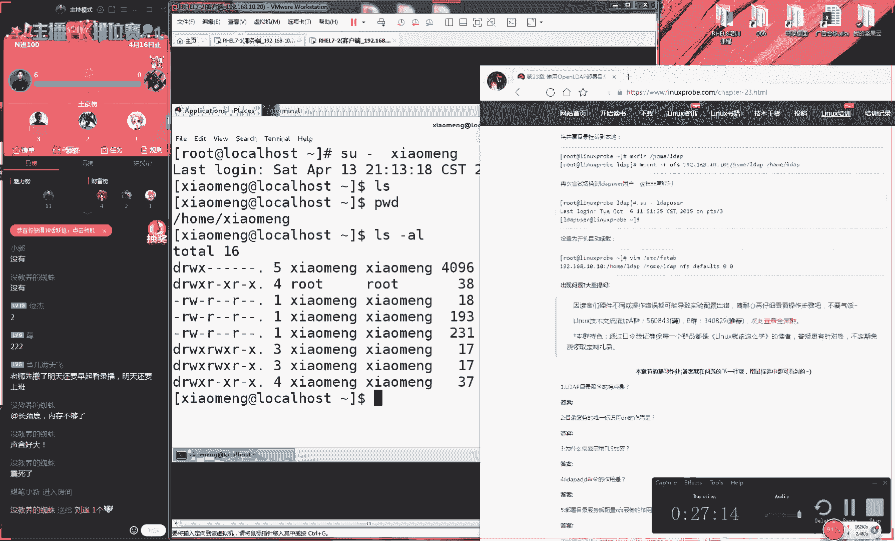
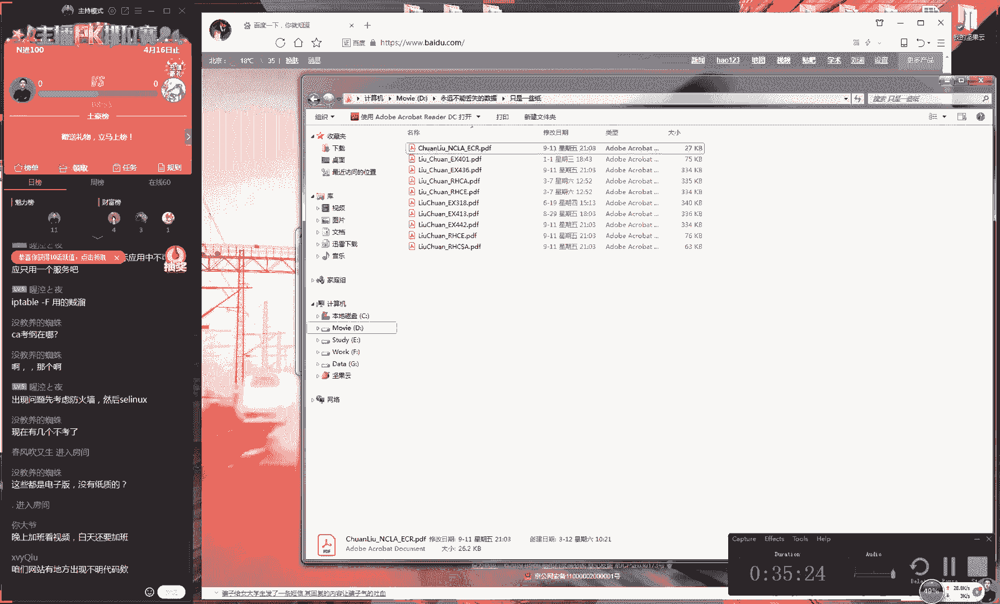

# 【RHCE】红帽认证工程师培训课程 - P17：第十六节课下半节课 - 天木轮回 - BV14E411678v

哦，OK好，那我们继续往后面去讲了。因为我刚才这个C盘它满了，所以他刚才这个录屏的时候终止了一下，好吧，然后咱们之间也没有讲，所以我们就来继续往后面去说好，那我们现在就是有两个步骤。

就第一步我们先要做这个导入对吧？然后我们将模板给导入。但是模板的话呢肯定是跟我们这个需要是有一些出入的，就像我们去买一件衣服一，对吧？你买完这个衣服肯定是跟你这个身材还是有点小小的这个不一样。

比如说老刘比较腿短对吧？那个老刘买完衣服之后，买完裤子之后啊，总让我这个家人帮我去裁一下，因为腿比较短嘛，他总要把这个裤头给他免一下。那我们就要说完之后觉得老刘好矮，其实也不矮了，后所以的话我们就是。

😊。

第二步我们叫做这个修改，把我们这个导入的模板，根据我们这个需要给它修改成我们完全适合于我们的一种呃架构的名称。包括说我们这个顶级我们修改那我们需要把它修改成叫做好。

那我们现在进入到一个ETC目录里面叫做所老软件都是英文版高大上啊，是因为这个录屏软件没有中文版。因为我找不到中文的这个版本啊，而且我真的是为了这个软件是付呃真的是付过费了。

咱们这个软件是正版软件所以我才一直更新到最新版本。因为这个毕竟是咱们录屏这个咱们录屏的这个软件，咱们可不能说出现问题。所以这个东西我真的是付了费的。好了，然后呢我们来继续啊。😊，那么进入到这个目录之后。

大家看一下这个里边的话呢，就是我们这个openDP它这个服务的模板文件了。虽然我们看不懂吧。好吧，但是你大概看看，当然你大概看一下这个目录里边所在这个文件有一个特点。

就是它这个后缀它这个后缀的话呢都是LDF的。大家看一下，这就是我们的openDP的这个模板文件。所以的话呢我们要待会就导入的时候，导入的第一个文件，它的所的文件它都是以及LDF结束的。

所以我们自己的文件的话呢，我们待会呃我们也要把它变成LDF结尾的，我们需要使用到这个迁移工具。😊，他这个协议LDEP。好，三个斜杠。CN啊等于con，它指的是它是一个配置文件的意思杠F。

我们导入的文件我们主要导入两个文件，一个叫做cosine，应该叫做呃NIS好，这个两个就是我们一个它会让你这个系统有一个整体的一个架构。那然后我们来第二个。好，我们给大家去导入成功之后的话呢。

我们来自己去写入一个配置文件。这个文件我们叫做chan。好，这个其实呃没有必要跟我们这个完全名称是一样的啊。它就是因为我们刚导入了一个树状图嘛，就我们刚才有了一个呃这么一个架构。

那但是我们先要去修改一下这个顶级域那我给大家准备好了这个文件大家可以来去直接去复制它这个目的啊，它很简单，就是把我们这个顶级域，它原先叫做DC等于然后是DC等于呃呃然后那我们现在把它修改一下。

把我们这个顶级域把它变成呃们去修改一下，并且我们去定义一下我们这个加密的这个的这个密码文件。😊，这个的话大家不要照着我这样去写。大家因为我们刚加密之后都会有这么一串加密的这个信息。如果忘记的话呢。

大家可以回去之看一下那个文件，把你加密之外那个密码的话，来去复制到这边啊来去复呃来去复制到这里来。好，接下来们来保持并退出。我们下面做就是来去做修改了。

所以的话呢修改也是去导入这个文件来岗外它是一个外部的一个文件。那我们做这个导入。😊，让我们这个协议不要写错。对，老刘现在18岁嘛，高中没有毕业，所以我现在发愁高中毕业之后是。是考高中啊，还是。

继续创业嘛，开玩笑，等等一下，这个脑子有点乱，因为这个东西太多了啊。😊，现在脑袋不好使，来，我们先把这个文件给它做导入。导入完了之后，你可以看到它这个呃总的这个功能的话呢。

就是把我们这个顶级域变成叫做DC等于然后是逗号DC等于点com做好之后，我们继续往后面去走。再新建出来一个文件，我们叫做b点LDF。😊，这个的话这个动作就是去新建出来有两个部门。

一个的话呢我们叫我给大家打出来啊，现在出来两个部门来去方便我们导入文件，一个叫做peop，一个叫做group。

大家看到我们现在现在出来两个OU这个是我们这个顶级域然后等于号等于新在出来两个OU一个叫一个group待会我们就可以基于这两个部门，然后去导入这个文件了。好，那么我们这个同样的我们来去导入导入的话呢嗯。

😊，直接就修改这个命令就可以了。因为这个命令是一样的。啊，我们把它叫做bash了，哦，我们就没有关系。因为这个文件名称是无所谓的。好了，我们就把它导入成功了。导入成功之后。

那我们一个整体的一个架构就已经出现了。然后我们接下来去创建出来一个用户，我们叫做什么呢？我们叫做小什么呢？呃，比如同学们说呃叫小梦吧。OK那我们现在创建出来一个呃用户叫小梦。

然后我们给这个小梦用户重置一下我们这个密码。😊，我们叫做好，那我们现在想把这个小梦的这个用户给它导入到我们这个数据库里面怎么去做。好，那我们现在去先来这样啊。

先去编辑先去查找一下ETC目录里面pas这个文件去找到小梦他对应的这个信息。好了，这是我们找到小梦的这个信息。将它去编辑一下，把它编辑成叫什么呢？我们叫做pa吧。

就是我们书上面写的这个方法的话呢是使用的一个使用到一个过滤服过滤出来，但没有必要。其实我们这就复制就可以了。好，这是我们用户的一个信息。

还有一个信息就是在ETC目录里叫做group叫做这个用户组的一个信息。我们将小梦的这个用户组的这个信息也给复制过来。好了，我们再新建出来一个文件叫做group这就是让我们把用户的这个信息啊。

把我们这个系统里面这个信息给复制出来。好，这样的话我们这个导入就有这个。😊，呃，依据了。然后的话我们进入到user目录里面的shall里面的这个迁移工具目录当中。然后我们去编辑一个文件。这个文件的话呢。

我们叫做通用配置文件。大家就是一些比较高级的一些小学，为我这个家人嘛有人在因为我这个什么堂妹嘛，他最近就是上了这个小学嘛后他们那个小学就是北京市的一个重点小学定是跟咱们那会学是不一样的。

他们他们确实有一些比较先进的一些管理经验，包括一些教学一些经验，他们这个设施也比咱们那会要好。反正我们那会儿哪有这么高科技的一种这种设施啊，他们每个人他都分了一个ipad笔记本。

说那个ipad只能去就是那种就是你们懂的就是一些承包商跟他们学校合作的一些软件嘛，但是起码人设备比咱们那好他们还有一羡慕的，就是他们那个他们会发作业本，咱们那会儿的作业本都是外边去买的。

正我记得会我去买买一个笔记本大概是五毛钱？后就是街边。😊，什么啊什么小呃什么小推车什么的，或者小apple里面会买啊，然后然后然后然后会买这种作业纸。然后另外呃那你每次去写作业的时候。

你都要把你的这个姓命。😊，还有你的这个学号，那你先写到这个呃呃作业纸这个上面，然后你才开始去写作业。而那个小学就不一样。我那个小我那个塘边小学好像是叫做呃忘了反正就是在沙子口那边一个小学叫什么忘记了。

就他那个作业纸吧，就是他们需要每个班统一发的那个作业纸上面就已经默认就带有了你的这个班级的这个名称，然后后带有你的这个每个人的这个姓名带有了每个人的这个学号。

但是说这个费用肯定要比咱们外面买五毛钱要更贵啊，但人家确实就已经是让小孩不用再去自己再去写这样的姓名啊这个信息了。虽然说不管什么事吧，但是确实也收了不少钱。好，那也就是说那我们去迁移的时候的话呢。

有一些内容啊，就像我们这个姓名啊，还有我们这个工还有还有我们这个工作域的话呢，他是不会发生变动的数据，所以说我们就可以把定义到一个模板里面。我们每次去写作业，那我们每次去导入这个数据，他都是直接去完成。

😊，他不用再向我们再去发送这个请求来进行确认了。所以我们要编辑一下这个模板文件。好了，这个文件呃，他说怎么配置这么多啊，确实它很难，对吧？它很难。好，那我们找一下大概的行数。呃，大概的话呢是在第71行。

我们找到第71行。😊，这就是说我们定义一下我们自己的这个域码，就是你这个姓名，它以后每次导出的时候就不用再那么麻烦了。我们叫做lin我们广告一定要到位然后点com好。

我们这个DC等于这样话可以看一下这个好处，就是你每次去生成出来的这个文件上面他都会用他都他都给你写清楚做等于等特别的方便。好。

然后我们来去做这个迁移工具迁移工我们使用第一个叫做pas它是做我们这个用户信息迁移的。我用户那个文件给重us给大家做迁移给转成它能够读懂这种格式像一个律师一你想说的话。

后给大家迁移迁移成我们这个律师能够符合要求这种格式。好大家看一下，就是说我们使用迁移工具有这个必要吗？大家看一下等一下说我们有没有这个必要使用这个迁移工具。你看一下这个文件。😊，是我们原先自己的等呃。

是哎，等一下啊。嗯。😊，啊，我们刚才那个文件。呃，我们刚刚那个文件是保存到另外一个路径下了，我们没有把它保存过来。好，我们再去查看一下吧，这个都是小事啊，我们来。好，这个是叫做小梦的一个用户。好。

我们再来新建出来一个叫group咱梦的用户组。好，做好之后，我们再去迁移一下。大家看一下，就是说我们这个迁移的这个必要性嘛，就是说我们为什么要去做这个迁移。如果不做的话，可不可以自己去写。你看一下啊。

这个文件的话呢，就是我们原先我们系统里面自己的，你看一下，它只有一行，对吧？你看一下迁移之后什么样子。迁移之后的格式是这样的。所以你就知道这个是很麻烦的，这是它的格这是它的格式，你可以看一下，它很麻烦。

对吧？然后你看一下我们这个用户组的文件，这是我们迁移之前的这个文件是这样的，它就它只有这么十几个字符，但是我们迁移过后。😊，是这个样子的，所以说这就是我们必须要自己去呃签的这么一个。呃，原因嘛。

并且他会前面会给你写上我们这个所在的这个域名。大家可以看到这就特别的方便。好了，希在我们做导入就好了。我们来做导入LDFADD。😊，呃，不LDAP我们ADD添加杠X杠W。

刚刚W指的是我们后面要加这个密码。如果前面我们去修改过的话呢，请切记我们此处也要修改成您刚才修改那个密钥的那个名文的信息。好了，我们DC等于manager，我们导入到哪个工作组里面。

DC等于linux probe逗号。DC等于com。我看一下，因为这个名字太长了，所以我可能记不住哦，OK只写对了。然后我们写上我文件的名称，一个叫做。users点LDFOK导入。

他告诉我们说导入是失败的，因为没有这个对象。哦，他怎么知道我没有他怎么知道我们没有对象呢？我看一下啊原因。呃，我看一下啊，这导入最后没有成功吗？来，这样啊，因为老刘现在这个眼神不太很好。

我现在直接去复制一下这个命令，我们去敲一下，看能不能成功。啊，他说也他说也不能够成功。哦，因为我们刚那个。我们那个。people跟group这个组我们好像刚刚是不是没有去建立呀？等一下，我试一下。

等一下，我刚才是不是这个people跟group没有去建立，所以他这个导入的时候，它提示说我们这个组信息不存在。我看一下啊，最后我再重新去导入一下。OK然后再来去导入一下这个用户的信息。啊。

大家想的有点郁闷，大家现在想的就是呃。OK那现在要成功了。因为我们刚刚这个导入了之后，好像没有成功啊，所以我们现在就成功了。OK没有问题。嗯，然后我们在导入成功这个用户的这个信息了之后。

我们导入一下用户组信息。大家现在应该想是啊。😊，这个老刘现在在在讲什么呀，对吧？啊，算了，他只啊他只要自己高兴就好了啊，所以他所以就所以在就是在看我自己在玩，对不对？好。

我们先添加一下我们这个用户组这个信息。😊，用户组的这个信息建成功了之后，我们就可大家去搜索一下了，搜索一下说那我们刚才这个操作导入有没有成功呢？我们来open去搜索一下，大家先看好玩高兴？

其实这个先配置这个服务端这边的话呢确实是比较难然我的话的是要去搜索用户的名，我们叫做小梦好看一下，我去搜索一下这个DC等于逗号个如果能够搜索到的这个信息的话那么是这一个效果。

证明我们这个数据库里已经有这个小梦这个用户的信息了。如果是我们输入一个没有存在个用户信说搜索这个用户信息的，要是不存在的话，就会提示出来说用户不存在这么一个错。好。

然后的话呢说说感觉糟糕了觉没有听懂是吧？没有关系，下面没有的话还很多下面给大家说一下，是我要要去使用到这个网站服务因为我们刚才刚开课的时候，大概是88。😊，十0呃零十几分的时候。

当时咱们使用一个叫做open SSL的一个命令，生成出来两个文件，一个叫公钥，一个叫私钥，对吧？当时我给大家去说到过，私钥用来去加密公钥用来去做验证跟解密。那它还做一个呃它是来去做验证的。

所以的话呢我们现在需要做一件事情就是。😊，呃，所以的话呢我们现在需要做事情就是呃把我们这个干的公钥文件CP啊去复制到我们的这个网站目录当中，要提供给我们这个用户。

他要在这个客户的这个本地来去做这个验证使用的哎目录里面的3W里面的HL。

好，我们这边把windows给它关闭啊，我们这边使用一台linux上线。

好，那我们给复制过来之后的话呢，我们不要忘记再去清空一下我们这个IP tables，保证我们这个网站它要是能够去访问的。然后我们去。重新重启一下我们这个网站服务程序。

然后将我们这个网站服务程序启动加入到选象当中，并且我们去保存一下我们这个防火墙当前的这个策略状态。好，这样做好之后还没有完，就是我们现在已经能够让我们的这一个对方去下载到我们这个公要文件了。

但是我们想一个问题，就是对方不光能够去登录，这还是一方面，我们现在还需要让我们这个用户能够去。挂在他自己的这个加目录数据，就相当于就是你去网吧里面去玩游戏。那不论你是去的哪呃。

那么你呃不论是去你呃你去哪个网吧，或者说你去在网吧里面的某个位置，当你做下来之后，你登录游戏那你登录出去那游戏这个账户里面那个装备肯定是要在？

我之前看到一个文章里面写的就是什么传奇游戏现这个成龙现给做代言对吧？说成龙他广告里面说报了一把什么什么刀，后说回收价2000多块钱，说他也报了一把刀结果他登录之没有人说说没有人给他收购啊。

正这么一个事情，就是说当你登录这个账户之后那你所在这个用户信息，包括说你这个游戏的这个装备，那么你也要是能够自动去同步过来的个就是一个完整的一个目录服务嘛。

那我们现在就要去给他共享一个目录服务我们之前给大家讲过有桑过P有讲过网站服务其实我们两个之何。😊，我们何必去为难自己呢？我们就直接去使用叫NFS吧。所以说我们之前学习过那些服务。

我们现在就来去检查一下我们这个学习的效果了。现在我们这个目呃共享的目录，我们叫做小梦的一个目录，共享给谁呢？共享给192。8点10。20这个客户端的这个机器权限RW可图科技SNC自动去同步数据。

保证突然宕机，导致数据丢失。😊，然后是root呃去进行映射，保证对方的这个呃呃超呃超级用户过来之后，不会影响到我方的这个服务器的运行。就相于就金正恩来了北京之后。

他不能调取中国军队一样啊对吧我们啊即便说你是对方来了这个服务器的这个呃管理员，你在我们本地上面，你也是一个普通用户。好，然后我们启用一下NFS的这个服务。这样都做好之后的话呢，就可以了。好了。

大家如果刚才呃都没有听懂的话，没有关系。好吧。因为我们之前所讲的这个所有的一切都是不考的嗯。😊，都是你在你呃进入考场之前，考官已经给你去做好的事情。就是我们刚才那些所有的事情。

大家只要大概的这个流程能够有个印象，就足够足够的了。然后我们接下来给大家去说一下。😊，我们需要让大家关心的一些。配置的一些方法。好，首先来说，当你考试的时候，你登录到了一个客户端上面。

你啊然后的话呢这个步骤大家也考试时候也不用去做，就是来去验证一下说呃老刘之前没有给大家作弊。这个小梦的这个用户确实是在我们本地上没有的啊。

不要说了不要说老刘作弊啊我们上课之前已经都给大家啊新建好一个小这个小梦的一个用户。然后我们假装然后我们假装好像是新建的一样。好，然后这步操作的话呢，是作为一个我们个映射。

在我们考试的时候也这个也是不需要的。好吧。因为你的考试时候以及你这个openP的服务端都已经是由考官办去提供的。😊，🤧。好，那我们当我们啊啊那好，那我们当我们到考场之后的话呢。

考场要求你去啊可以使用到这个小梦用户来进行一个远程的一个登录。那么你需要做的事情就是来去安装一下我们这个openLDP它这个客户端的这个工具，然后我们去安装一下它这个几个软件包的话就没有办法了。

这是你必须要去备一下它了。这个不能够再简化了。好吧，我们需要来去。😊，背一下我们这个下面咱们这个命令。我们这个几个软件边的名字，我们需要把它背下来。好，我们再安装一下。嗯。好，然后的话呢。

我们现在启动我们这个登录的这个命令了，就是我们刚安装好之后。我们现在去敲一下我们这个命令。然后大家就会沃一下，就是我们刚才讲的非常的复杂。这个服务端其实我们都是不考的。

我们真正我们在我们考试的时候就要配置的是一个图形化界面，就是这个界面。😊，这就呃这个就是我们这个同化界面了，我们需要做就是点N的鼠标这道题可以拿到分。我们目前呢我们的学生，我们可以这么夸张的来说。

我们的红C没有因为这道题扣分的。因为这题太简单了。大家看一下，就是你选择一下这个LT然后我们这边LTP这个名称，还有这个地址，你按照你的这个信息直接去复制就可以了。这个信息都是由考官明确提供给你的。

你不用像我现在是这样去写这个信息，而是直接在考试的时候去复制就可以了。只要把你这个信息复制这个地方，别复制错，不要复制一些逗号句号什么的就没有问题。好。

然后的话我们下载一下我们这个公要文件公要文件有服务端去提供叫做。😊，所以说考试的时候非常简单的，你只要复制的时候，你别给我出错了没有实没有问题。要考试的时候，你复制都出错了，那就帮不了大家对吧？好。

我们现在来去下载一下这个公要文件。公要文什么公要文件叫T我先去下载一下。那么当你去点击确认之后，他没有包错证明这个文件是写对了。那因为你因为你这个文件只要你把写错的话，会提示出来这个出错的一个提示框。

所以以说我们现在只需要把这个信息给写对就没有问题。把它填写对。那我们以上的所有信息都是由考官为你去提供的，会明确写到这个网址里面。只要你去复制的时候。

你不要复制上什么空格逗号什么的就这个这个提示不会出现问题的。好了，那我接我们点击下确认大家看一下我们这个效果我们再新建出来一个窗口，不要作弊啊我们现在想要去查看一个用户叫小梦那么此时它是不存在的。

我们点一下应用。那我们点击应用之后，我们就可以再去验。😊，等一下我们这个呃公钥跟C料的一个比对信息。当我们匹配成功了之后，现在就是做为一个呃验呃相当就是做为一个验证嘛。

然后我们这个服务器本地上面我们就可以使用到远程服务器。咱们上面这个open LDP大家刚才问到说openLDP它有什么样的一个作用。😊，它就可以让我们这个进行账号的一个集中式的一个存储。

然后以便于我们可以进行一个集中式的一个管理。这个是一个很厉害的一个。这个是一个很厉害的一个很有趣的这么一个实验。好了，他在这个在工作当中也是非常实用的。好，这个速度比较慢。

因为我在使用虚拟机在工作当中不会出现这么慢的情况。因为我现在你看我这个CPU已经飙到了89%了啊，标飙到90%了啊。😊，啊，这个越输他越高啊，来，我们现在。太慢了吧，不会死机了吧。好们啊。

那我们等他一下。这是内存吗？啊，我们这个内存已经标到90%了哎呀。好，我刚点错了，吓我一跳，我还以为刚才把它关机了呢。哎我但是我CPU我估计已经标的很高了。我看看我CPU现在多少。😊，啊。

也其实啊所以说这个还所以说我这个CPU还不如还啊还呃还不如我的这个内存啊，我内存好歹需现在是91%，我的CPU已98%了。行，那我现电脑就差不多了。

但是已经是就我这个配置都能够满足咱们这个日常实验的这个需要。好，那我们先来这样啊，再来去查看一下这个小梦的这个用户。你可以看到就会很神奇，已经出现了小梦的这个用户信息。

并且我给大家保证这个小梦的这个用户，它是在我们本地上面你可以看一下这个文件里面它是他是啊他啊他啊他啊他是不会有的啊，是卡掉了，同学们？😊，刚才刚才卡了吗？同学们要卡的话告诉我一声，好吧。好。

那我们乔悄回车可以查看一下我们这个信息里面，它是确实是没有小梦这个用户的，而且它也是确实是通过一个远程来进行登录的。好，那我们现在可以来去使用到这个宿命来进行一个切换。

切换到这个小梦的这个账户身份下我敲悄回车。他告诉我们说说你CP太卡了。说你这个切换是成功的。但是的话呢因为这个小梦的加目录不存在，所以他会提示出来这一个错好，那我们以把我们这个小梦的加目录给复制过来。

那不给大家挂载过来。这样的话呢我们不是实现了一个挂载。那我们现在我们现在并不是实现了一个复制，而是我们实现了一个共享，这就更加高级的一个使用方法。好那我们现进入到我们的ETC目录里面的的目录当中。😊。

添加以下信息。首先来说第一列我们填写的是我们这个服务端的这个信息，填写的是我们服务端信息192168点试电室记得我们的服务端一定要清空我的I table然后我们的共享目录是小梦挂载到我们的本地的叫做目录里面的小梦的这个加目录里面文件系统的格式为NFS。

然后我们的权限为以及00标备份以及有这个呃进行自动校验，我们选择回车，然后我们使用特杠去挂载呃然后我们新建对我们去新建一下我们在本地上面的这个小梦的加目录。😊，好，我们做好之杠A好了。

这样做好之后的话呢，你可以再去切换一下这个小梦的这个用户，它不光可以去切换成功，并且它可以自动获取它在服务器上面的这个加录的数据，这就是一个很酷的一个技术。

大家看到就是但讲了这么多的话呢其实我们的这个主要难点都集中在了服务端上面，我们大概配置的有40多分钟。但是我们的客户端都是通过我突发界面配置的。其实难度并不高大家不用对我们这太多这个担心好吧好。

今天的话我们就给大家去说了是45还是3小节，我们给大家去说了这么三个章节。然后明天是我们的礼拜日，我们会给大家预计加两个章节好吧，我们去说一下我们今天这个。😊。

好，那我们现在会呃声音太大了是吧？然后那我们现在给大家。😊，去说一下我们今天这个课程内容，然后给大家做答疑一下啊，先不用担心然先不先先不用着急。我们先说一下复习内容。复习的话呢，我们今天就是去复习一下。

我建议的话呢不要去复习第23章节这个太难了，而且实用性性价比嘛并不高，而我们第十5章的话呢，我们会在我们的红C的时候，你们肯定会再去练的。所以说第十5章你们肯定会去练，那就复习第十4章。好吧。

第十4章节我们的第2C只要把这个第C给做一遍之后就没有问题。至于说第十5章我们会在红的时候，会让大家再去做一遍的。好，然后我们呢明天的话呢就是第十5章。嗯，对，就是我们不那就第十6章。😊。

第第十七章节，好吧，这是我们的明天的一个预习内容了。大家回去之后要按照我们这个要求，提前做好预期。明天是第十六跟第十七小节时间算来也得两个小时，最少两个小时，这个不会少的。嗯，好，那就这样吧。

大家问还可以来跟我去说，我们这一期节课之后，大家又可以去备考了。啊，但是第十八章也会有。但是第十八章很简单。😊。

呃，我们会在下礼拜5的时候和大家去说嗯。OK大家辛苦了。然后现面还可以来跟我去说吧，我们就呃然后我们要就答疑好吧。😊，好，待会还可以来跟我去说4200发票可以开吗？现在是不能够开，我需要跟科长沟通一下。

应该是可以的吧。我需要跟他沟通一下才可以。第二三章件在哪里？第二三章件在咱们的网站的这个右下角在这个在在在这里，你可以看到在这个进阶课程目录在这里。😊。

有1个第二三讲解书上目前纸质版是没有的。考试的时候，他考的是这个客户端的这个配置，配置起来是比较简单的。第二三章节，它是用来进行集中式任用呃，它是用来做做这个服务器之间集中式这个账户存储的。

他还可以他进行一个集中式的一个认证。就像我们刚才做这个实验的效果一样。好，大家可以来就说为什么每次都要清空防火墙，因为我每一次都会全呃还原一下我们这个机器，保证每个实件之间它都是独立的。

所以它默认端它这个I呃它都会受到这个IP tables默认策略的限制。😊，嗯。对，这个第23章它确实比较难。所以我们现在把它划分到划分到我们这个进阶课程里边了。😊，他就是比较难的一个章节。

之前我们讲过很多次，确实呃很太他太难了，所以我们才会把放在这个境界片里面。😊，他这个其实。红马呃因为这个大家已经是超过了鸿马HC的这个内容了。红马HC现在都不会考到。😊，openLDP这么难的这个章节。

现在连呼马智C都是没有的。bandd跟team怎么区分这两个ban就是网卡嘛，对吧？就是这个网卡绑定team就是端口，就是这个网卡聚合。我们把它叫这个端口聚合。它这个效果都是一样的。

它都好的时候可以体现它它都可以实现出来负载均衡。坏的时候实现自动被圆。它只不过两个实间的这个不同的效果。😊，呃，给大家举个例子，就是我们先比如说想要去热烙饼，对吧？我们可以使用微波炉。

也可以去使用电磁炉，对吧？也可以使用电饼铛。它最后这个效果都是一样的。那只不过这个技术的话，一个叫端口绑定一个叫端口聚合在我们在我们培训的时候，这个给大家讲的是绑定技术。

在我们考试的时候使用team技术理由给大家讲过，就是我们希望大家我们这个培训跟考试我们尽量分开大家既可以见到我们这个绑定技术又可以见到我们这个聚合技术多学点的可以多学点这个知识多个服务之间产生冲突怎么办？

事当中不可能只按用一个服务吧，是这样的，咱们还原机器的这个原因就是因为咱们上课时间是有限的，咱们只有两个小时，我们尽可能的避免说这种呃不必要的问题，当我们工作当中肯定就是不会用说每次都去还原一下机器了。

对吧？然后没有基础给我这没有基础的一点建议呃，是这样的。😊，其实大家现在已经学到第多二章，已经学到第二，已经学到第十6章了。你们现在不你你因为你们现在不能够去说自己没有技术了。

如果说您从第一天的课程38号到现在每天都在坚持着听课，听到现在听到4月13号了。您不能再说自己没有基础了。您可以看一下我们群里面相同学啊，然后你也可以看一下我们网上的一些很水的一些文章。

或者说我们考试的时候去感受一下，不能再说自己没有技术，现在那么只能是说我们往后去怎么走，咱们往后的话呢，我们建议说先考认证，对吧？我们往后如果没有方向的话啊，可以去。😊，呃，看一下鸿马HC的考纲。

然后按照红马HC的这个考纲去做啊，它也是很好的一个方向。😊，对，然后说app tables的。这个刚F用的贼6考纲在哪里？考纲在咱们的这个书上面是有的。在书上这个第0这个第0章序言里面。

我给大家列举的是呃这这个红C的13个方向里面有比如说open呃有opent里边有系统调优是这个442对吧？442，还有一个333系统安全系统安全跟调优，它就两个方向嘛，还有这个41红卫星网络对吧？

这就是4个方向了，还有比如说333336还是366就是这个呃玩这个硬盘的对吧？我们做这个硬件这个存做这个存储的。😊。

啊，不这个4呃是436啊，是这样的。其实我之前有过这些认证的，只不过我我认为没有必要炫一下，就就没有去秀一下了。其实是有的。嗯，我给大家看一下啊。就是比如说你看401436318啊，当时我考的318。

我我都自己都忘了，就这样的这个认证。你如果要是没有飞A方向的话，你可以你看我现在有多卡一点的啊，你可以。😊。

去考一下这几个认证。嗯，这个认证大家可以看到这个认证是318，它指的是红帽虚拟化，就是红帽至C里面的一个分支嘛。虚拟化认证。但现在你们考的话，估计318好像没有了，但是413是有的。😊。

这是红帽虚拟化认证，这个是红帽这个系统呃系统监控及调优认证，他就是说的就比较噱头比较大一点吧。然后这是436，这是存储的这个还有还有这个机群呃，管理员认证，对吧？然后这是。系统硬件加固对吧？这是413。

还有一个就是318，318是。啊，这个认证不想啊，他可能比较害羞啊，他他呃他呃啊他不想打开，因为他因为我现在电脑太卡了。好，他就会有这么几个认证，这个几个方案大家可以去啊，可以去考一下。

然后还有几个认证，比如说LPI之前我也考过，但是这个认证其实不推大家去考那个东西就白费钱，没有用。还有这个呃。😊。

呃，NCL呃，还有这个NCLA这个其实也没有太大用处。也这是考过来PI人之后，他就送了一个认证。就是因为老刘是要考试狂魔嘛，对吧？然后之前考过很多认证，红包认证是最有含量的这个认证，这是毋庸置疑的。

其他认证其实考不考问题不大。嗯，这个是。这个呃都是之前的一些认证了。但是你看我网站上我我根本就没有去写连我先我连我连那个P认证我都没有去写。然后这个是要这个认证是open的，但是我也没有去写。

因为这个认证我认为你这个open你在国内你个你没有含金量，就是你写了之后反而觉得很low，就于说我们招一个比说我们招一个讲师，我们招一个技术人员，他给我写一个熟练使用office，我绝对不会要他的。

因为你连office你都认为你自己这是一个亮点，我写到简历里面，说你这个人水平还还是不够好的。😊，所以说我们就是会把比较好的这个亮点拿出来嘛，这个open so我就一直没有拿出来，但其实也是有的。好了。

然后就是这个几个方向，大家就定完之后可以往这边去学嗯。😊，好，大家可以先在去说，然后我先回答一下问题，好吧。嗯，OK啊，然后我先渲染一下我们这个视频。😊，好，大家不要刷有我那那个礼物真的没有用，呃。

真不呃真不跟大家客气的啊。😊。

因为你赢了他也没有用的，赢了他之后不是都啊都给老马这个送钱了嘛，对吧？

