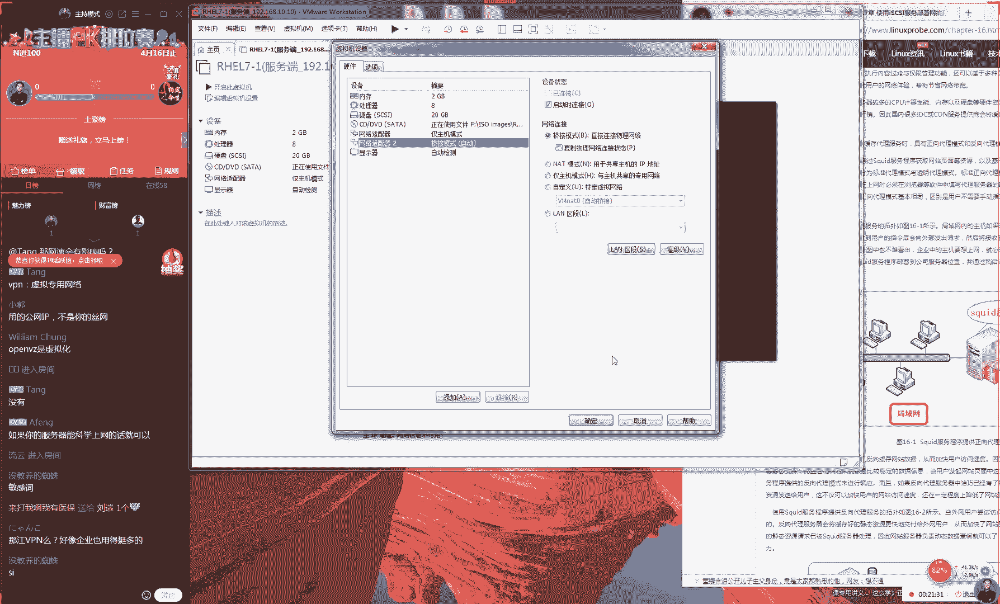
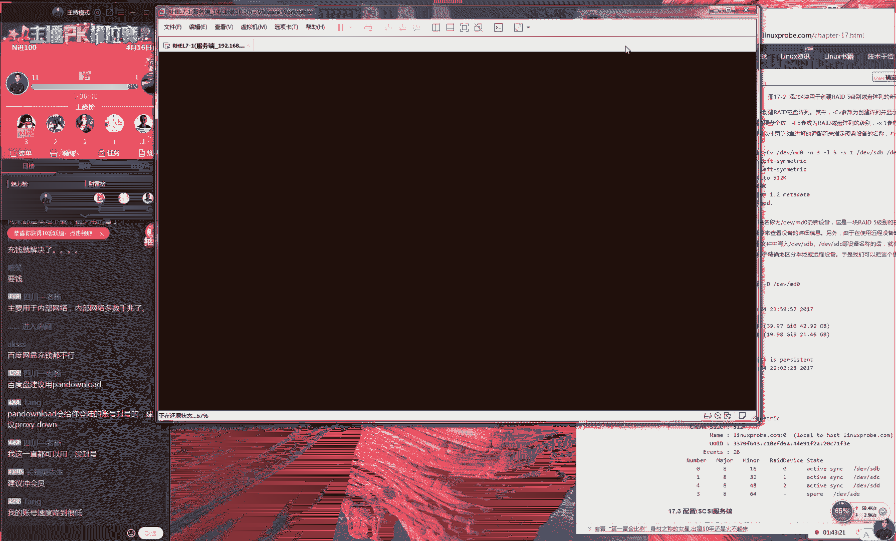
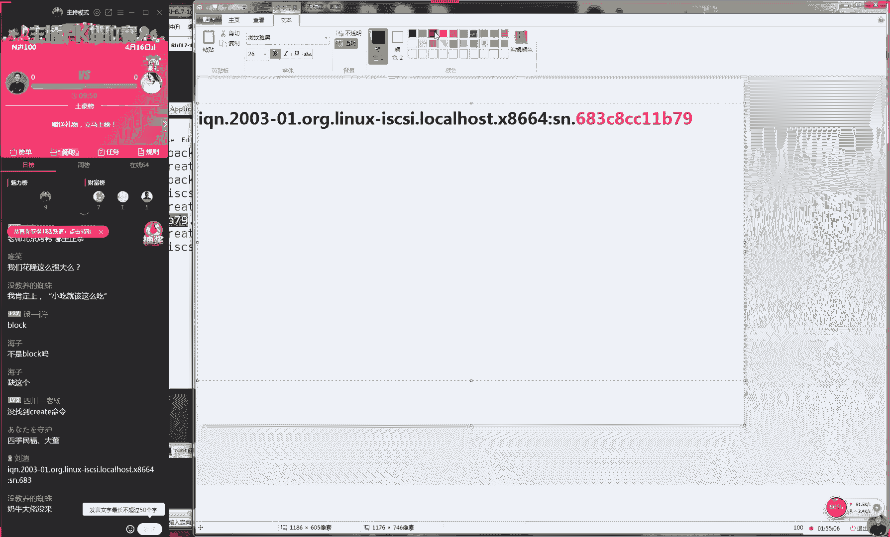

# 【RHCE】红帽认证工程师培训课程 - P18：第十七节课 - 天木轮回 - BV14E411678v

🎼So。呃，好，那么准备开始上课同学们，大家说没有声音是吧？这个不是没有声音是哎呀每次都要吐槽一下这个歌这个因为这个歌实在是太太太太太文艺了个语调很，所我没听到声音啊。

其实我一直在放声音的先一下一同学们开始我们今天这个课程先问个问一个硬盘可以同时不可以同给多个操作同时去使用的冲突情况那我先给大家说一下我今天我今天这个课程安排今天我们这个课程会先讲一下第章第1章们讲一服加上服这两个章节你别放到最后。

但是实用？的话我们这两个章节的时大概是在一个小时4分钟今天下午大概规划一下们这个课程大概一小4分钟个小时之所以我们今天最多讲两个章节家不担心。😊，所呃大家不用担心说我们今天一下会呃会讲很多。

然后我们下礼拜的时候会给大家讲180减20的三个章节。好，先给大家讲一下我们这个square服务。这个服务的话呢，我们叫做代理服务。呃，这个的话呢实际上是在我们的红CS红CE和HC里面它都是没有的。

好吧，就这个章节在我们红帽考试里面，它是没有的。第1六讲square服务。这个是作为我们这个代理服务的，它有三个代理模式，先给大家去讲一下。😊，好，大家现在有现在有声音是吧？

因为咱们这边我我因为我就不敢换咱们这个商课环境嘛，就怕说我们换了之后会出现问题。好，那我们先来看一下同学们，它有三个代理模式。

我们先记到的这个书上面另的以搜索一下百度搜索一服它个意思代表个八爪鱼其实我一直明白说这个八爪鱼章鱼墨鱼鱿鱼这几种鱼到底有什么区别，真不知道。所以说家是问我说服务的中文名字叫名字呢？

应该是叫做八爪鱼服务或者说叫做代理服务它就是一个非常可爱的一个小墨斗鱼这一个图案大家可以看一下我们这边我这边书没有这个logo。

为个版权问题家上去搜索一下所要是起来话就是叫做代理服务就可以了这个服务的话它是作为我们这个代理服务而去设计出来的它有三个代理模式。第一个模式的叫做正在代理模。第二种模式我叫做正。😊。

模式第三种模式我们叫做反向代理模式。好，所以我说到两个正向代理模式。其实正向代理模式的话呢，它就分为了两种代理模式的。呃正向代理模。哎啊真相代理模式正向。😊，代理模式。好有第三个我们叫做反向代理模式。

前面的两个代理模式，它其实来说它是有区别的。第一的话呢我们叫做标准的代理模式啊，我们叫标准的正代理模式。第二种我们叫做透明的正代理模式。这个什么意思啊？这个什么意思呢？嗯这个先给大家举个例子。

大家有没有就是去访问去访问一些境外的一些网站，比如说facebook或者说youtube这样的网站，然后被屏蔽掉的这种呃这种经验呢，或者说这种类似的经历呢，如果没有的话，你现在可以去谷歌对吧？

你先打开谷歌你去试一下，肯定是它会提示说因为政策不允许，然后禁止你去访问境外的网站。好，那也就是说我们今天会讲会再给大家讲一个叫做ACL的一个限制来去做这个访问控制列表。

先给大家去说一下我们这个技术的一个梗它干嘛使就是那我们在一个局域网的内部，可能会有多台的机器。再比如说我们公司里面有100台机器。但是我们去买这个带宽的时候，肯定是要只会买。😊。

一两个IP地址就像我们在家庭一样。那你看我现在家里面，我现在有哦，那我现在有呃我那我现在有两个手机，对吧？然后我们现有1个ipad。😊，然后加一个电脑。那我本人呢我就有了4个手机了。那好了。

那我们呃实际上你去办一个宽带的话呢，它只会给你分配1个IP地址。这个我不知道大家有没有关注过，就是呃不论你般的是联通电信还是什么移动网啊，但你分配给你的这个呃路由器的这个地址。

它总会啊它只有一个外部地址的。但是你又需要让你的这个局域网里面的多个这个终端，比如说手机或ipad都能够去同时去上网。那么这个时候我们就要在我们这个公司的网关的呃在我们这个网关上面。

那我们要去做一个代理服务。这样的话呢那我们可以把我们居域网里面的这个流量，通过我们这个网关去做这个转发，然后通过单一的IP地址来去上网。听一下。

所以话呢那我们这个技术就是让我们这个用户可以通过单一的地址，然后实现出来多个终端来，他他去他去上网这么一个效果。😊，然后呃再给大家去重复一下，因为我们刚才有40多同学，是吧现在有50个人了。

就是说那我们现在先给大家讲一个服务，我们叫quare服务。它有一个两啊啊它是有两个代理模式的。第一，我们叫做正向代理模式。第二的话呢，我们叫做反代理模式。

这个呃我们先给大家讲的叫做这个正啊我们呃先给大家讲的叫做这个正向呃正向代理模式，这个指的就是那我们在一个局域网里面，比如说是一个公司或者是个家庭里边的话呢，让我们的多个终端。😊。

它可以通过单一的地址来去上网。其实这个也需要借助于我们的SAT技术来去实现出来。

好，那我呃那我们现在去准备一下我们这个实验环境。实验环境的话呢，我们先这样，我们现在准备出来的两台机器。第一台的话呢是window不呃，第一台是呃，我们这边第一台是linux。

第二台的话呢还呃它还是linux。但是我们把第一台这个服务端的这个网卡给它修改一下。现在的话呢我们是这样去做，先给大家去呃说一下我们这个。😊。

大概的一个架构是这样的啊，因为话我们可能光说比较抽象，到底怎么样去做代理呢？那我们准备出来两台服务器。第一台服务器，它有两个网卡，第二个服务器它只有一个网卡，对吧？那我们第一个这个服务器。

它有对外的网卡，它有一块，然后它也它还有一块对内的网卡。那么我们现在是这样的啊，那我们这个绿颜色的，我们叫做类，我们叫做这个金主机模式，它只能是在我们这个居网内部进行联通的一个呃网络模式。

那么我我们现在在我们这个服务器上面A，我们去做一个代理服务。在我们这个服务器B上面，它就使用我。😊，我们这个转发服务。这样的话呢，如果说我待会我们的这个服务器B，它能够去上网的话呢。

就证明它一定是经过了我们这个服务器A的这个转发了。所以说这个是这个说这个能实现科学上网大家说P是不是想去翻墙这个是不能去翻墙的为这个服只是做代理我们到是做加密代理说说op者说对吧？

他总会把我们这个数据包进行加密可按照理论上来讲可以绕过我们这个互联网长城，然后以去上外网但是我们这个服它只有这个转发的这个功只有个代理功能没有这个加密功能，所以我们才敢讲？

因为他要是这个代理服务加密的话我不敢讲不能到里看本书最近本书是一个关于美国移的一本这里提到了多。😊，通过政治这上的一些事情，这个我很纠结，因为我觉得在中国出版的书籍不应该出现这种。😊。

比较按照我们这个官方来说比较反动的这个文字嘛。因为我们当时去出书的时候，你们不知道有一个小的一个呃有一个有有一个小插曲，就是我们当时有一个嗯就是一个前辈嘛，或者说一个同行。

他当时也去写了一本学习lin的书啊，但但是我现在所说的这个人不是鸟哥啊，他也是台湾的。然后的话呢他在他的那个博客上面啊，然后加了一段话，就是呃可能就是跟咱们中国这个政府这个证件不同。

结果那个出版社都被受到影响了。因为出版社出了他的书，但是他的书里面有一个博客的一个地址，但是这个博客上面有了这个反动言论。

所以说我们认为出书应该是呃目前审目前审查非常严格的这么一个行业这么一个这么一个出版物吧。好吧，所以的话呢咱们这个书大家就不要再去想了说那我学完之后能不能去翻墙是肯定不可以的。

因为这个他即便有翻墙的这个功能，那我们也不。😊。

颁讲对吧？就是说我们呃他只能是实现出来这个代理去上网，只能是满足你公司的这个需要，就仅此而已了。你不要想着去翻墙啊，对吧？好了，那我们现在去安装一下我们这个square啊。好。

那我们啊不我们先来去关机啊。😊，现在我们添加出来这块网卡，我们现在有一块对外的这个网卡了，现来添加一块我们这个对外的网卡啊，大家啊啊大家敢听我们这边也不敢讲这种代理服务嘛。现在管太严了啊。

大家没有做网站，你们不知道好，然后我们现在的话呢我们选择这个网络识别器。我们将网卡的模式改成改改成桥接模式，们选择后点击这个开启虚拟机但是我们现在去配置下我们这个虚机的网卡。

然后我们给大家面往后面去讲嗯然后说那讲VPN吧，好像企业里用的会比较多，企业企业里面用的比较多，那就去企业里面去学习吧。咱们这个课是不能够讲VPN的啊。

就不信你们你们敢在咱们的网站上面就比如说你在QQ群里面吧，你可以多发几个VPN的这个比如说什么代理这种关键词。😊。

一般来说就会被封群啊，这个我们是呃这个是不敢碰的一个地方吧。这这也是一个技术的一个目前是一个什么这么比较灰色这么一个地带。因为你们知道的就是腾讯嘛，他虽然说这我我可以大家证明了一下。

就是他腾讯他虽然说微信他不会去收集用户的这么一个聊天记录吧。但是我我跟他还保证腾讯是一定会去收集这个用户的这个聊天的这个记录的。因为我之前我给朋友发过一个这个图片啊，然后的话呢。

图片里面出现了咱们领导人的这个照片。但是我们但是我发之前我没有看到啊，他只是在一个角落里面，结果我发送出去那个图片，结果我发然后大概发了两张吧。结果他都没有结果这个对方都没有收到这个图片。

所以说这个腾讯他现在已经能够不光能够去识别你的这个在微信里面的这个文字了，他还可以去识别你图片里面的这个内容。所以说这个监管肯定是非常到位的。😊。

，大家不要有这个心存侥幸心理。在这个微信，你们今然用了微信了，就应该有一种呃。😊。

我我我们叫做叫开源不太好，我们应该叫做就是没有隐私的这种。是这种呃心就种呃这种心理准备了。好，那我们啊不用再不用啊不用不用再多说了啊。因为咱们现在毕竟还在使用QQ的这个软件呃，咱们啊咱们在讲课。好。

那我们现来使用我们这个配置命令，我们来去配置一下我们这个网卡。因为我们直接给大家讲的四个方法来去配置我们这个网卡。然后我们又按照我们这个1234的这个4个顺序。

又给大家都去玩一遍所的话呢我们现在给大家玩一遍好吧，就是我们选择一个如果再给大家讲头像界面的话呢老师好像很没有水平。所以我们现在使用NMTY吧，那我们现在使用NMTY命令。

我们来去配置一下我们这个新的网卡。新的网卡的话呢，它实际上来讲。😊，好，这个需要我们自己填这个网卡信息啊，这个特别的麻烦。算了，我们换另外一种。😊，好。

我们换做NM connectionnection吧。这话还比较简单一点，省得让我们再去输入它的这个呃网卡名称了。我们选择添加，然后我们选择这可以去选择。😊，好，那我们现在添加一下我们这个新的网卡。

因为我现在这个网卡就是1个DSCP嘛，直接就调接了。那么我们把保把它保存成功，然后再去重启一下，就可以去上网了。😊，好，我声音很小，我的我呃我的麦没有力气了是吗？我现在说话声音很小吗？

那我稍微大点声好吧。好，我把声音稍稍微调大一点。😊，好了，那我们现在重启号网络之后，我们现在就可以来去尝试去拼一下我们这个外网。OK没有问题可以拼通。然后我们可以再拼一下我们这个公司的内网192。18。

那我们之前说过，我那我们我们的这个服务端，它永远会是点10。10而我们这个客户端，第一台它永远会是点10。20。好了，我们敲一下点10。20去敲一下回声。好，那么它都可以通信了之后。

我们接下来我们要做事情就是要去安装一下我们这个square服，那我们老说一句这个呃。😊，非常呃非常经典的一句话嘛，就是百闻不如一见嘛，我们看书不如看实验。可能我说了很多次代理服务。

大家可能还是不理解到底什么是代理服务，对不对？代理服务的一个功能它是怎么样的，它的效果是怎么样的。但是我们如果要是大家有呃之前有过预系的话，还好啊，如果没有预习的过的话呢，估计听完之后还是不懂。好了。

那我们现在去安装一下我呃我们这个sre服大家来看一下效果嗯。😊，好，那我们现在要把安装好之后的话呢，我们就可以去重新去启动我们这个square服务。其实这样的，大家先去重启好我们这个服务程序。

然后把我们这个服务程序顺手加入到我们启求箱当中，保证我们下一次的时候，他还依然可以为我们提供服务。hel了，我们给大加入到我们启目箱当中。其实大家呃搭建1个VPN真的是并不麻烦的啊。

然后啊然后我们去清空一下我们的这个I tables的防火墙。那这样的话呢，保证我们这个外部可以去使用我们这个代理服务。这样做好之后，其实就可以了。因为我们第一种模式我们叫做标准的正当代理模式的话呢。

我们默认就已经是支持了那我们现在可以直接打开我们这个客户端另外是这样的，大家可以来去尝试看一下，就是我们这个机器它是这它这个网卡模式是斯类这个主机的网卡模式是斯类大家可以去网上去搜啊。

不用说老刘作弊这个模式的话呢就是默认不啊它就不会去允许让我们这个虚机才能去上网的。所以说这个模式是只能够是在我们虚机内部进行沟通的一个模式。它是不能够去上网的那所以说如果要是能去上网的话呢。

那么也一定就是由其他的网络或者说是虚拟机他去做这个转发了。😊。

好，那我们现在去比如说我们去尝试去访问一个叫做3W点lin点点com的网站啊，这是我们做技术人比较喜欢的一个网站，对不对？好，那我们现在看它提示说我们找不到这个网络，因为我没有网络吧？

那我们现在去点击一下你这个虚拟机。因为我们现在使用的是火狐，这个无所谓大家使用谷歌或者使用什么IE么都可以的好吧就是我们点击一下我们这个呃编辑的属性。

然后我们选择高级那么我们所说这个标准的这个是我们叫做标准的正向代理模式的话，就是我们需要让用户在它的相关这个软件上面来去配置一下，然后就可以去上网了。

那你看们这个狐里面们就可以选择这个网络适配器们选择网络设置，接下来我们就可以去写上我们这个服务端的信息192811们选择全部使用这个代理服务号328口号这个代这个端口号就是。😊，8端口号这样做好之后。

我们选择OO这样完成啊接下来马上去刷新这个网页。你可以看到就能够去访问到这个网站了。好，那我现在给大家去来去看一下，就说我们这个网卡的话确确实确确实实它是这个金主机模式我们没有做。

所以说我们现在能够去上网，就是纯粹是我们了这个服务这个服务这个服务器不？我上网一下这个效果没有问题。另家点几个页面家看一下我们这边并不是缓存，不是给大家备个画好那我们现在的话关我不放别的这个广告，好。

那我们现在的话再给大家想一个问题。来讲话我们这个连接起需要配置一下这个网络这个服务器的地址，然后这个号那有人去网么？以说可以把我们这个端口号去修改。😊，修改成1万个号。好其实这个实验的话呢，我我想半天。

我觉得其实做不做无所谓了。因为这个你哪怕你学完了第八章节，对吧？我们讲过SSH只要你会去做那么你只要之前你做过那个SSH那么其实你这个实验就会配置。那所以我想了半天。

我觉得我当时写这本书我加这个实验的原因，故计就为了凑字数可能就是因为呃可能以为出版社我们这个呃算呃呃我们出版社算稿潮的时候，呃，以为他们是按照字数去算的。所以我可能就是加了一个比较简单的一个实验。好了。

那我们先看下怎么去修改这个非常简单，就是我们找到尔夫的这个配置文件，我们找到这个主配置文件，这个感觉好简单，对吧？😊。

就感觉一下就回到了3月8号了。好，那我们去修改一下。比如说我们端口号呃默认为3128端口号，那我们就可以把它修改成1万端口号了。好，这叫什么这个so这个是so easy啊，没有什么难度。好。

那我们现在可以再去重启一下我们这个服务。然后我们再那我们接下回来我们再去访问这个网站的时候的话呢，还是有可能成功的。为什么呢？因为是有缓存好了，我们说完之后他就马就马上显示出来我们这个失败了。

说明我们这个缓存更新之间已经到期了。好，告诉你说看这个缓存服务器啊，是拒绝了你的这个连接请求。那我们那我们怎么办呢？我们去选择一下我们这个网络设置。我们将我们这个端口号从3128端口号。

我们修改成1万端口号再点击确认点击关闭，然后我们再去刷新一下我们这个网站。然后就可以看到我们这个访问成功的这个页面了。好，这个实验做起来好没有水平啊，感觉就是在线玩一样的一个实验啊。

好大家看到就是这样的话，我们这个就是这个实验把它做成功了。所以说这。😊。

这个我们安装好 squarere服务之后呢，我们叫做标准正带电模式的话呢。真的是没有什么技术含量的，太水了。所以我们现在再给大家讲一个模式。我们叫做这个透明代理模式。透明它指的就是对于用户是透明的。

就像于我们现在在上网一样，你没有人是自愿去使用那个GFW防火墙。所以我们不用说太透啊，我们不能所以我们不能跟大家去说JFW防火墙就是那个互联网长城，就是在限制大家这个去上网这么一个服务。

但是的话呢嗯我们可以给大家讲，就是没有人会去自愿去使用那个GFW就像于我们前几年我上初中那会儿当时呃国家好像投了几千万块钱，好像是当时像投了几百万或者1000多万。他开发出来的一个软件，叫做绿伞。

还是叫绿霸，你们可以呃去网上去搜一下不知道家还有没有印象，叫绿霸，就是什么什么帮助家长去管理小孩什么上网什么游戏时间什么的。后来被证实这个项目其实它就是一个贪污政务行为的一个软件。😊。

最后就是不了了之了，就后这个钱也就被人贪走了。所以说呃以我们这个政府来讲的话呢，他肯定就是希望素人都要去使用这个JFW。并且的话呢他要去强制你去使用。

他不会让你去征得你的这个同意的就相当于了算了算咱们这个例子就不要举了好吧，这个例子都大家都应该是懂就是他既要让你人都要去使用这个服务，并且我们是一个强制的，他不能让你去选择可以去使或者不要去使。

那么怎么办呢？他就要去默认已经在你这个网络上面已经配啊去指向到了这个JFW防火墙，让用户没有去感知。好这是我们第一种这个使用需求啊。第二种使用需求的话呢，就是。😊。

我们现在配置这个方呃我们我们现在配置这个网络的话呢，他毕竟还需要让你在浏览器里面去选择，然后去配置一下我们这个服务器的这个地址。好了，但是的话呢那我如果说你大家所在这个行业的话呢。

如果说从业者的这个水平参差不齐，他可能就是他不会去配怎么办呢？那我把看一下不能去访问这个网站了。就说我们现在配起来的话呢，虽然说步骤非常的简单，但是万一你的这个同事他们就是不会去配。大家不要笑。

因为我们之前的话呢有一个客户，他就是做服装的现在还在不在北京第一来有限公司啊，当时在08年那会儿是他是很火的一个这个服装一个公司啊，后来我们当给他做了一个项目。

就是做一个代理服务他只需要在他这个对应的这个软件上面去配置一下就好了。但是他们那个从业人员的话呢，主要是做一些服装贸易的。包括说做一些服装剪裁。就是我们相当于就是自己的这种创客集团嘛。😊，呃。

自己做点什么小呃，做点什么小呃小衣服啊，做点什么旗袍这种呃服这种服装相关的这种产业，他们就是不会去配，特别的麻烦。后来的话呢。😊，我们就选择第二种，我们呃我我们叫做这个透明代理模式。

就是对于我们这个用户是透明的，他不用去配置这些呃选项。那我们就默认把他去生效了。好，然后我们这边有一个小节是16。3。2小节我们叫做我们叫做我们这边叫做ACL房控制。这个我们先给大家跳一下好吧。

我们讲完这个13。3小之后再给大家讲16。3。2小节，因为我给大家去说一下，就是他有一个相互的一个关系的好了接来我们继续给大家去说叫绿霸嘛我忘记叫什么了，就是你们可以去网上去搜一下。当时还有这个新闻。

所以说中国嘛他这种呃集权是这种政府集团嘛，就是会有这种就是政府这种高官嘛，他自己一人就是决定一个这个这个这个项目这种情况，对吧？他如果要是决定对的话，那肯定是对对于咱们老百姓是有好处。

但是他如果决定错的话呢，那这个后果也要让咱们所有的。😊，这个纳税人一起去承担，那他可能自己只是吃饭的时候自罚两倍就这样子，对吧？所以说这个也是一个好或者不好的一个。😊，呃，两的一个两面性吧。好吧。

这个我们都不说啊，因为我们毕竟不是搞政式，这个我啊这我们也都不懂。而且所以说多了之后，我们万一下一期就啊咱们这个开课就开不了，对吧？好，那我们现在给大家去说一下，我们这个透灵呃，我们说这个。😊。

啊，我们这个透明模式它怎么去配置啊？呃投音模式的话那呃那我们首先去先去检查一下，就就是我们刚刚配置的这个网络已经是失效了，对吧？因为我们现在访问之后，它是都是提示说访问是失败的。

并且我们在我这个客户端去拼一下我们这个外部网络他也告诉你是失败的那我需要做第一步是不要先讲什代理服务。们这个网给拼通。那我们怎么去做第一步骤我们要我们个请给传过去它分为两部分一要能去做N的解析。

然第二步骤它要能够去拼通对吧那我们做第一步骤现要去使用我们 table去做我们之所以使用 table去做的原因的话呢就是为这个工具它太简单了。

我个嚏监控了那么现在的话呢我看一下就是我们要让我这个服务器能我们这个客户端去做代理的话，其实可去使用到去做但是这个我不会去讲的因为这个。😊。

太简单了，我给大家看一下效果。好吧。那呃那呃那呃那我给大家看一下效果。😊，我们之所以不讲原因，不是因为我们不会它，因为它太简单了。你看那我们先进入到这个通话界面里面，我们选择这个伪装。

你只要把这个勾给它勾选上，大家看到了吗？把这个勾给它勾选上，然后我们这边啊我们去拼一下。😊。

呃，等一下，我们再拼一下。好，那我们再拼一下。好，一开始有这个网络延迟，对不对？好，我们等他一下。哦，我们这样他可能说网络延迟，我们这样我们这样我把它关闭一下。嗯，等一下，我把它再重新再看一遍啊。

是不是我们刚才看的时候，他们有效果。😊，嗯。不应该啊应该重启过后就马上就可以了啊，我知道为什么，因为我们这个网卡没有去设置啊，OK那啊呃这个是我们的一个疏忽。😊，就是我们这个透明模式的话呢。

你虽然说用户不用去配置，但是你需要把它这个网卡给他配置好，这个是由你的D这个是可以由你的DCP给去做的。那你需要把你的这个网卡给它指向到110的这个地址上面。

然后再把你的这个给配置成4个8吧把配成这个谷歌的后就行。那我们在给大家去做一下这个试验啊就把当我才没有发生过把那好那我把它取消掉。现在我们现在没有让用户去实现这个代理服务。

那我们现在去拼一个域名大家看到因为我们现在没有让用户去代理去杀网。所以我们现在拼一个域名，他会显他会提示出来说解析失败，然他会告诉我们连接超时这样的一个报错嗯。😊。

好，那我们先等他一下。好，那我们接下来话我们那我们就点一下这个选项，我们选择开启一下这个伪装技术。好了，我们这边再去拼一下。😊，好，大家看到这边我就可以把它拼通了。

所以的话呢我们去使用这个work实际来说是很简单的，这个没有这没有这没有什么技术含量，有点像骗钱，对不对？这个我们如果讲课的时候这样去讲就没有太大意思。因为这个东西它直接成功了。

所以们在工作当中可以去使用到去也可以用到我们待会大家也可以去使用到我们这个去。们去检查一下啊，它又是连接失败了。

那我们现在给大家讲所以说我们待会给大家去讲一下我们叫做 table这种方法的话呢原因就是它更难一点，并且的话呢它更有一个定制化的一种配置的方法。

它不会像我们之前是只是一个选项但是我们工作的时大家可以去选择性。如果你想去选择简单那也可以如果想选择使用 table也是可以的好这个并没有说强制让大家去选择一种好那我给大家去敲一下我们这个命令将 table。

😊。

因为的话呢我们现在需要使一个技术，我们叫做SNAT技术。好，那我们先给大家去说一下，有一个技术叫做SNAT技术。这个的话呢叫做原地址转换协议。好，原地址转换协议。

它就是让你这个局域网里面的这个主机或者说这个终端可以通过单一的地址来去上网。它会在你这个网它会在这个网关的这个终端上面，不它会在这个网关的这个出口上面对这个数据包进行一个解包。

然后将这个返回的地址修改成你这个路由器所分配到的个外网地址。后有一个数据包回来之后，他会根据这个返回的地址，然后找到内网所对这个终端。好，就是说我们去理解一下，因为我刚才说这个技术方面。

就是说大家想象一下，就是在你公司的门口有一个前台？那么你有一个快递收到前台之后的话呢，前台会根据你收到的这个快递的这个上面的名字去找到你在公司里面具体的这个岗位。

它就是一个让我们公司的内部的这个成员他们都可以来去上网这么一个方式叫做技术。好了，下面的话呢我们来给大家去设置成它是一个路由，它它是一个路由后的一个设置方法。因为的话呢我们SAT技术，它是在路由后去做。

😊，好，然后我我们这个协议是刚P我们的协议是UDP协议好，然后D point呃端口号是为5353端口号，大家可以去网上去搜去搜一下啊。大家可以现上去网上去搜一下53端口号的UTP协议是什么服务。😊。

大家现在可以去网哦，大家反应这么快。呃，大家告诉我说呃，我们的53端口号的UTP协议是对应的是什么服务？😊，所以的话呢，那么也就是。我们的DNS服务对吧？

那么那也就是说可以让我们这个公司内部的网络的成员，他们可以去转发我们这个DNS的服务了。然后O代表就是output就表就是一个输出的一个地址的意思。好，我们现在查看一下我们本机的这个主机的网卡信息。

那也就是说这个他这个意思就是说当有一个我们域网里面内部的成员的一个主机，他想要通过我们这个呃服务器做转发，然后去上网的话呢，他的所有的DNS的这个请求，就他想去解析一个域名的这样的请求的话呢。

都会通过我们的这个网卡，然后转发出去。然后我们刚G他这个呃他这个刚G后面应该是加的是一个IP地址。但是我们他以我为例，因为我现在使用的是一个联通的一个网络。那我每一次重启我的路由器最后分配到这个地址。

它都是不一样的那么怎么办呢？那我每一次都要去从设置一下这个地址吗？所以说我们就可以把它改成一个叫伪装的一个词，大家想那就是说你的这个宽带的话。😊，那你每一次去重启的时候。

它都会是分配到一个全新的1个IP地址。那么你每一次都要重新它去配置这个命，特别的麻烦。那么我们就可以把它设置成这个伪装。它会啊它每一次它它都会自动来去找到它呃呃你所对应的这么1个IP地址。

所以这只是一个非常灵活的一种方案。好，那我们调一下回车。这样做完之后，它还没有完。那我们接下来还要去编辑一个文件是在ETC目录里边叫做SYCTL一个的一个文件。😊。

因为我们先要让他在我们这个服务器的内部来进行一次转发。好了，那我们现在。😊，那我们就要来去配置一下我们这个具体的参数，我们叫做nettIPV4啊，它指的是我们。IPV4的一个转发forward。

也就是说在我们公司内网里面，如果有一台这个客户端。

给我们去发送这个数据的话呢，那我们会在服务器的内部帮他去做转发，就像我们这个图片一样，对吧？当我们这个数据包来了之后，我们会在我们这个局网的内部好，在这里有我们帮他去做这个转发，去开启我们这个转发功能。

然后扩大的话呢是呃去点住ctl，然后点住shift，然后点一下加号就可以了。缩小是按住ctrol，然后点一下减号，就是缩小。好，那我们现在点一下保存并退出好，WQ叹号。

然后我们来让它去生效一下杠P让我们配置这个选项，它能够去生效。这个时候。😊。

哎，我们。所以我刚才配置的时候，大家都没有人提醒我吗？我刚才一直在我们这边客户端去配置的。

哎，这个我们这个犯的这个错误感觉太低端了啊。好，这样这样我把它给清空啊，这个配置起来真的是太低端了。这个错误。我们刚才居然是在我们这边客户端去配置的，那怎么可能生效，对吧？

因为我我们现在一定要在我们这个服务端上面去做的好，这个错误真的是太尴尬了。好，那我们把这个网卡信息也要去修改一下。因为我们的网卡需要是那块对外的网卡。好，那么就是这一块网卡的名称。好那我们把它粘贴。

然后我们去敲回车把它做好。然后我们同样去编辑一下这个文件啊，当然大家居然没有发现吗？啊，我们现在是在刚才是在我们这个客户端上面去做的，还是大家看了之后感觉啊，一为老刘开心就好，对不对啊。

但是没有看到我们具体。😊，这个敲内容。好那我们现在去还是大家现在只关心我这个PK的这个呃土呃土呃这个土豪榜了啊。好，那我们现在的话呢我们来。😊，再让它去生效一下，这样做好之后。

你可以进入到你的这个客户端里边，然后你在你客户端这边去拼一下3W点百度点com。但是你现在网肯定是拼不通的对吧？因为你现在网都没有办没有把它拼通。

但是你先看一下你现在能够把你这个域名解析成一个IP地址了。你看虽然你现虽然现在拼不通的啊，但是你现在却可以去使用这个DN这个服务了。你可以把你的这个具体的域名解析成了个IP地址。

那也就是说所有来自于客户端的这个访问本机53端号这个TP协议的DNS的这个请求都可以被处理掉了。好了，这样的话呢我们就要给大家来去演示一下。那我们该如何让我们这个解析成了那个域名解成这个地址。

它也能够去互通呢，来编辑一下我们的这个re服务的这个配置文件。😊，现在只是做好第一步，并且我们没有去使用到这个sre服务。那我们现在这个配置文件配置起来也非常的简单。首先第一步把我们这个端口号修改一下。

成默认的328端口号，这把它改回来。然后我们后面加上一个叫转发的一个单词。因为我们这个代理服务嘛，这个本质上他来说它就是一个转发。然后的话我们就开启一下大概第六多行第62行这个参数。

这个代表就是一个缓存目录的意思。这样的话呢当有第一个人去访问过的一个目录，但有第一个人去访问的一个目录。然后呸呸第一个人去访问的一个网站。那么在同一个机网里面的第二个人他再去访问的话呢。

他就可以去直接从我们这个网关上面从这个目录里面来去找到我们这个缓存的这个信息，他会有16个缓存的目录用来保存我们这个网页信息。这个现在就是一个加快二次访问速度的。但比如说我们举个例子啊。

那我们家里有很多成员，然后然后有一天小区里面突然间没水了。然后这个时候我先出门，然后我去。😊，物业也说然后的话呢，然后我去问说呃咱们小区怎么没有水了，然后那个小区的物业说哎我也不知道啊。

然后他就去问这个水利局就然他就去问水利局去了。他中午给我回信息。他说啊因为咱们小区里边的水果正在维护，大概下午就能够呃水就然后这个水跟电那就那要可以恢复了。好了，那当这个物业给我回复了这个信息了之后。

当我再有另外一个人，他再去问物业说哎，咱们小区怎没有水的时候，他就不用每一次都向那个水利局他去发信息，然后进行一个数据的一个同步了。他就知道了。哎我们因为之间已经被人去呃有过这种请求，对吧？

他就可以把这个查询过后那个结果就会直接返还给后面就是我们叫做加快二次响应速度嘛。所以说第二个人他再去问的时候。😊，就没有必要再向这个水理局或者说再向这个网站的服务器的这个原服务器再来去发送一次请求。

加快了我们这个第二次以后的这个访问的速度。好了，然后的话我叫做保存退做转发透明代理模式。这个之还是有一个小有个小g，们要去关闭我们的re服个re服不能够开启啊，因为我们书上面可能没有清。

但是我不故给我们要去关闭你的这个re服务后能生成出来这个用来缓存的这个目录第一步检查一下拼错查拼错误是没有报错的话错报错没有报错的话使用代表就生成出来16个的缓存目录到缓存目录是034。😊，5678。

然后是ABCDFG好，大家可以数一下，它肯定是有16个，这是我们的缓存目录。这样做好之后的话呢呃，因为还有包括00啊，大家可以数一下，这边有16个，这样做好之后。

我们再可以再来去从啊然后我们再来去重新启动re服务。所以这是一个小bug的，就是你必须要去关闭你这个re服务，然后再去新建出来这个缓存目录，千万不要开启的时候去创建。

那么否则它会提示出来这个创建时候是失败的。好，那么我们先在给大家想一个问题。😊，那我我们现在square服务他已经去支持到我们这个代理服务了。那但但是我们这个用户他没有经过这个服务。

他也是没有用的啊16个页面它不是用来去保存16个页面的16个目录，该每一个目录里他会保存100个页面，后满了之后会再去保存另外一个目录然总共保存1000多个页面应该是这样去理解好。

然后的话呢哎不是应该是100多兆的一个容量的一个限制，它是保存满了之后，他会再去保存另外一个目录他最多是有16个的意思好那我们现在给大家去说一下，就是我们这个sre服务已经是能够运行起来了。

但是我们用户没有经过他也没有用对吧？所以我们要再去配置一下叫把我们用户的所有对外网的这个请求的服务都交给这个sre服务去做，就相当于就是我们在中国嘛这个高速路会收费？后中这个人做过调查说中国这个收费站。

高速的这个收费站就回本了。然后。😊，中国的这个收费站是呃全球最多的对吧？大家有没有跑过高速的人都应该知道，反正我有一个呃，我之前我春节的时候嘛，我就看了一个呃朋友圈里面有一个同步。

就是他们呃就是骑那个骑摩托吧，然后他们就回家这么一个短视频。😊，反正他们好像是从哪儿啊，好像是反正他最后那个终点是在是在海南，应该是他是从北方开回去的，大概收1000多块钱的这个高速费啊。

然后后来他没有办法嘛，因为1000多块钱也比那个买车票便宜。那好，那也就是说如果说我们就以那个例子来说，如果说这个人他很聪明，他每到一个高速路的时候，他都下去。然后让我那个收费站他就是再往前开。

其实那他也没有太大办法，对吧？那好，那也就是说我们如何让我们这个流量他是必须要去经过我们这个服务呢，那我们就要去设置一个设置一个策略了。

将我们这个客户端所有收到的这个流量都给他转发到我们这个328端口号面相当就是我们这个服务好，那我把复制一下。因为这个命特别长，我先给他复制后再给大家去解释。这个命的意思的话。

就是说我们将我们所有收到的80端口号的这个请求全部给他转发到328端口号上面。现在就是我们将收到这个用户的这个。😊，说呃的这个数据的话呢，都给他转发到我们这个re服务上面。

强制他必须要去使用我们这个代理服务。好，下面的话就是说我们当收到这个数据包这个流量之后，我们要给他转发出去，我们要给他一个对外的一个地址。这样话呢对方收到这个数据不会被扔掉，而是被转发出去。

当我们这个地址的话，大家不要照我呃，不要照我这个去敲，一定要去写上你呃，实际上你被这个路由所分配到的一个地址。好吧，这个是我我的路由给我分配的一个地址。好了，我们来去复制一下。

大家也要以自己的这个实际为准。好，那我们去敲一下回车。😊，这个大家给大家举个例子好了，大家有没有看过一个小说叫水浒嘛？中国的这个四大名著水浒，大家这个能都看过，对吧？大家可以打一下一但是有一集嘛。

就是这个宋江，然后他们刚刚去梁山上起义的时候，当时不就第一桩案子是什么？第一桩案子，但他当时刚升起一面大旗义叫做替天行道啊，没有大家没有看过水浒吗？

这个不可能告完然后就是刚升起一面大旗叫做替天行道四个大字，对吧？然后突然间就有人上来去告状告是什么呢？告说这个告李逵说他这个呃强这个强暴良家妇女，然后山然后去山上收保护费，对吧？

然后后来那个宋江就把李逵找过来了，然后李逵说没有这回事啊，然后他就去了那个山上去看了一下，结发现了另外一个人叫李鬼，其实只跟李逵长得很像的一个人叫李鬼好吧，就说这么一个小故事，大家想一个问题啊。

其实这当时我就想一个很现实的一个问题。你看啊那个是一座山山是。😊，大的一个体积的一个的一个存在的一个自然现象。那么李逵他只是一个人而已。然后那个李鬼啊，他只是一个人而已。

他占这个山的这个比例或许只有10万分之1。他在这个山上的某一个地方去劫道，这这个很不成立的事情啊，因为这个山可他他可能会有1000种走法，他都可以把这个山给他翻过去。

但是为什么李呃但是呃为呃呃呃但是为呃但是为什么李鬼他却能够在这个山上去劫道，就是。😊，呃，因为山很大对吧？但是为什么李鬼还能到他能他还能交到钱呢？就因为那个山他只有他只有他只有这么一条路啊。

大家看一下那个剧情好了。如果要是呃不想去将那个过道的话，他们需要从那个山的侧面去绕过去。但我那个剧情我看了好几遍，就说他需要从山的这个侧道面去把它给绕过去，大概要多走一天半的时间，所以很多人愿意去交钱。

也要从那个小路上去走。但也就是说那么你在这个路上面你去设置一个收费站的话呢，那么你就必须要保证你的这个用户去经过它才可以呃生效。如果说你修好路，然后你也设置好这个收费站了。

但是这个流量他没有经过你那也没有用的。所以说那我们就要把我们用户所有的这个流量都给集中到我们这个服务上面，而没有给他来去直接去转发走好了，那我们现来看一下这个实际的效果。

然后我们证明一下说我刚所讲的这些到底有没有真的去生效。那我们现在去拼一下百度点看大家看到可以拼通了。😊，然后我们现在可以打开你的浏览器，我们去输入我们最喜欢的这个网站叫做lin点可以看到就能够成功了。

大家现在大家现在就想一个问题说老师，那你刚才讲的这么热闹，然后你给我们讲了说我们什么理亏李鬼什么的。但是你看啊我现在就是直接就可以去上网了。然后我我们这边客户端，他也不需要配置任何的这个选项。

那我怎么知道你刚才讲的一些就是对的呢？就是他我怎么能够证明就是呃我怎么能够知道你能够去证明。😊，我们这个客户端他确实是经过这个square服务。因为你现在这个章杰讲的就是re服务嘛。

但是他就直接去上网了，他也没有说在网页上面出现说什么呃该网页的转发去使用re服务的标那我怎么知道你这个课就是已经实现这的效果呢？所以我要给大家去讲一下我们这有个章做6。32小节去做一下这个限制。

所话我们待会就要在我们这个re服务上面去做这个限制。如果说我们去做这个re限制，他能够成功的话，那么就证明我们这个实验是做成功的他确实是经过我服务再大家举一个家没家举个子说我们我们过节的时我们走高速是不要钱？

这突然有天我的高速要开涨价好那你原先过高速的时不要钱，或者说只收1。但是你现在要收15块钱了好了。😊，那么如果说你现在掏的这个钱，你每一次掏了15块钱了。

那么也就证明你一定是经过了我这个已经改过价的这个呃这个这这个高速度这个收费站了，对吧？大家懂这个意思啊。所以说我们现在就在这个re服务上面去做这个限制。如果说我能够把你给限制住了。

说明你就是确实使用我的这个服务了。如果我在我这个re上面去做这个限制。而你没有任何的这个变化的话呢，说明你原先就没有去使用我们这个服务，而是直接给他做呃，而是直接去做这个转发。

或者说使用其他的这个服务去实现这个转发，那么就证明我们这个实验就是失败的好了，我可能说的比较绕嘴啊。😊，呃，所以我们现在给大家来看一下这个实战。通过我们这个服务该怎么去来去限制我们用户。另外的话呢。

这个在我们公司里面特别的使用。如果说你是个老板，但再比如说你以后你开到公司，那你肯定不希望说呃你的员工对吧？然后天天去逛淘宝啊，什么天天去或者说上班的时候去看什么智联招聘这的网站想要跳槽对吧？

那么这个时候那么你作为一个老板，你就可以去限制你的用户访问的这个网站的这个类别呀，或者说呃访问网站的一些具体信息。所以说那么我们这个也算是致敬一下那么所以说这个也算是我们致敬一下JFW吧。

就是我们这个互联网长城。像我们这个政府层面去看齐看到你这个政府层面，该是怎么去限制我们用户的这个这么一个使用需求的好了，就我们待会就以facebook或者说我们以其他的这个网站为例啊。

你也可以做一把这个呃作一把这个管理者。好了，那我们现在对一个别名我们叫做就是我们作为客户端。😊。

然后我们的这个资源的话呢叫做ss，就是来源地址的话呢，我们把它叫做192的168点1点10。其实大家说这个还是一个别名的意思。就是说当你再看到了192的168点1点20的话呢。

就相当于就是跟这个cl这个词作为一个。😊，作为一个匹对吧，比如说嗯哎今天是什么日子，大家知道吧？今天4月14号，4月14号，我的印象里面应该是一个美剧。

就做叫做什么冰与火之歌更新第八季第一集的这个日子我是是这个植树节是吗？啊，是明天发工资的日子好我不知道大家有没有我不知道这个我打错了，我不知道大家有没有关注我。

就是好像今天就是呃美剧冰与火之歌的那个更新的时间，你们可以网上去搜一下，应该是大家知道就是冰与火之歌里边看过吧，没看过话，那就真的没法讲了，大家就就是在这个冰与火之歌里面吧。

我们电视剧我们叫做权力的游戏，这个里面有一个叫龙母的一个存在，特别的厉害。从第一集他要然后然后他就在他就是烧庙三个龙嘛，对吧？然后他还不被火烧，就这么一个存在。那你想啊就是每一次去他那个什么什么戴丽莎。

就他那个仆人。😊，介绍他的这个主人的时候，都要描述很长的一串，对吧？就比如说什么呃什么龙母，对吧？然后什么呃龙的母亲，然后什么部分者，什么粉碎呃，什么加链破碎者什么的，要给他很多这个定冠词。

给大家作为这个描述。那你想这样的话呢描述起来真的是很麻烦的一件事情。那所以说我们就给他取一个别名，我们叫这个龙母当我们在说龙母的时候，就等于就是说了这么一大长串的这么一个限定词呃。

这样的这个描述的这个语言了。所以说效果就是一样的。那我们现在就是也是啊我们编义一个变量。这样的话呢当我们在看到这个c的时候，就相当就是见到了我们这个IP地址了。😊，方便于我们待会来去这个修改跟维护。

好了，那么现在的话呢，我们后面再去写呃，我们这个限制这个策略，我们叫做网站访问呃，网呃网站访问第一条的这个策略叫做允许客户端，就是我我们现在去允许我们来自于这个地址的用户，他可以去上网。好了。

他可以去上呃，他可以去上网。然后我们下面再写一条，就是我们拒绝所有其他人。😊，那么这个效果就是说我们来去允许我们这个来自于192。168点10点，我们点30好吧啊，这个主机才能够去上网。

但是我们去默认去禁止所有人。😊，当你没有在这个允许列表当中的话，就会直接把你给限制住。好了，我们现在把它保存并退出好，另外大家可以去帮我确认一下啊。

今天是不是那个冰与火之歌更新的第8季第1集的这个时间啊，杨文化。😊。

No，我记得好像是啊我正好看过这个新闻。好，那我们现在这样，我们现在重新启动我们这个服务。但是的话呢你可以看一下，那么你可以看一下我们这边网站，我们光看打开我们这个网站可能不是很直观啊。

我们再换一个网站打开比如说中国的这个网站，你看一下他就会告诉你说访问是失败的了。因为你现在没有在他这个允许列表当中，你不是来自于192。6810。30的这个主机。那么怎么办呢？那么那么很简单。

你来去编辑你的这个网卡的配置文件，找到我们具体的网卡的IP地址，将你所对应的这个地址给它修改成192。68。10。30啊，把修改好之后重新去启动。你看这就是我们为什么要让他先去打好基础。😊。

我老说一开始就像咱们的搬砖一样，你不知道我们以后是要盖个小房子，还是盖个别墅，还是盖一栋还呃还是盖呃还是去盖一个桥，对吧？但是你这个基础打好了之后。

你现在你可以把你的这个重心完全放在我配置的这个服务上面，而不用再来去想老师干嘛呢？好像在编辑一个配置文件好像这是一个网卡配置文件，这是我们可以把你的这个重心完全投入到我们这个服务上面。

就这个我们就是一直在强调的一个原因嘛。好，然后我们去刷新一下这个网页啊，另外我刚才去其实我我其实我刚才是有意啊，然后把它去啰嗦一下的原因就是。😊，呃，他这个缓存它是有这个呃更新时间呢，大概有10多秒。

所以我刚才去啰嗦了一下。好，然后我们现在可以点开几个网页，可以看到这个不是缓存，这个可不是老刘给你们找了几个动片你去放确实是点开这些网页什么的都是正常的就是我现能这个客户端进行限制证明我成功的明我们客户确确实是经过我我现在基于我们地址限制一个用户的请觉得没有必要得当中使用不到这个给大家举一个给大家举一个子别名。

但家不跟完全这个词换成你自己喜欢的。比说叫哈你的名命别名这个是不重要的跟完全现在限制一下表限。😊。

键词啊，不要加纲爱，代表就是。呃，限制一个防止。好，那我现在是这样啊，我现在去限制一下我们所有我们这个域名里面包括有了linux这个词的，我们都把它叫做d这么一个呃叫做拒绝的一个名称。

然后我们呃然后我们下面我们禁止掉d这个词。😊，啊，dy deny keyword。这样的话就是说如果你的域名里面你出现了啊你出现了这么一个linux的这个词的话呢，那么就会直接限制你的这个登录请求。

好吧，我们再给大家去玩一下，同样去重新启动一下我们这个square服务。但是这个的话呢，它呃不能够对SSH的这个服这个去生效的。😊。

不能够对SSC是这个请求去生效的。所以我们要换一个，就比如说淘宝你开我们去访问一下淘宝O它能够成功。然后在lin里边的话呢，大部分网站都已经是支持了哎它已经都支持HTPS那么怎么办呢？

那我们就叫做点点IDC吧。好吧，这个网站据我了解，好像它没有去开去开去开这个HPS所以可以看到了，那么你去访问淘宝，然后你打开什么淘宝的搜索页面呀，或者说你去打开什么什么京东对不对？我们京做广告啊。

咱比如说们打开京东，或者说我们再打开打开打开什么呢？打开一个呃小游戏吧，比如说4399小游戏。😊，这个时候你可以看一下，只要我们浏览器里面这个它没有包括括有我们这个呃呃违禁词，它都可以直接去打开的。

而都是没有问题。大家可以去点开之后看到这个游戏包说我们这个登录的页面，但是说你浏览器里出现有lin这个词的话，把你直接把给禁止掉。但是我现在想个问题就说这个科学。

我这个当中会使用到上高职的时上亚马逊是吗？再给大家打个亚马逊证明一下我们这边不是给大家准备一个准备了一个flash一个小动画啊。

确实是我们直接把这个网站给大做限制了并且我们这边刷新了之后可以去刷新几遍这个网站叫公社也是我们合作伙伴肯定是刷新10万不能够给好现在给大家去说一下。

就是实这个技术的话以会使用到的这上高职那我学校就没有到。😊，他就是限制我们这个访问的网址。当时他。有一个网站叫做game bus啊，就是什么游什么游戏巴士啊这么一个网站。

所以我们当时那个校领导嘛不知道他怎么想的，他要是直接去限制那个关键词，所有的这个域名里面，他只要带有ga，就是这个游戏的这个词就会去直接去限制。大家听一下，就是说当你的这个域名里面只要带有这个game。

它就会去限制你的这个网站。好了，就是说虽然就是就是我们叫做一揽的工程嘛，我们叫做呃一把抓或者说一个如干捅到底，这个很不科学的，就相于我们现在啊我们我们这边有一个叫做扶贫减政工程，对不对？

就是说那我们要做扶贫的话，我们要根据每个人的这个情况来去定制我们这个扶贫的这个计划，这个也是这样的那你现在就是说只要你包括有game就把你给限制掉。但是如果有一个科研的一个网站。

它里边就是研究这个科研项目的，他也恰巧有了这个game，那怎么办呢？那么就会导致他也会被错误的给被拦截。😊。

这个时候我们就可以去限定某一个网址，只去限制某个确定的网址。这样的话呢它更有这个针对性。好了，那我们说别人不合适对不对？你说别人不合适，所以我们就说我们自己吧，我们就以这个我们的为例。

但是我们这个不能够去支持HPS应该是那我们试一下然后我们这个叫这个词其实改不改无所谓的。在改一下是纯粹为了让们这个课程得更正式一点。好。

我们现在去限制一个叫做点我们限制叫做我们要植入一下我们新的这个网站的广告。😊，好，然后我们把这个linux给它限制。你看这啊这就是我们去植入了一下我们这个广告嘛，就是只去限制我们某一个限定的网站。

这个时候那我们马上过来刷新你的这个公社就恢复了解禁。因为你现在不在我们这个允许，因为你现在并不在我们这个限制这个列表当中，以你就可以直接来去访问了。这个是谁的广告，看起来这呃非常高级啊。

所以我们点击一下好啊，这个网站就是咱们的网站啊，这个也正好是咱们的这个合作站点。好，那我现在给大家去访问一下叫做3W点点我去刷我们去访问一下。😊。

呃，但是好像不可好像不可以，因为这个服务它不可以服务它不可以这个这个限制我们的这个哎它不能去限制我们的这个HDP的网站，不它不他不能够去限制我们的这个HTPS的网站。

因为我们的HTPS它默认加了TL就是这个加密了，所以他不能够通过这个去拦截，那么怎么办呢？我们这样我们找一个没有。😊，开HTPS的网站。比如说有一个网站啊，好能在洪湖论坛。

不知道你有没有大家有没有逛过逛过，他可以打一下E啊，就是这个洪鹄点com这个网站也是咱们的合作站点，而且它好像又开了HTPS了，什么时候开的，我怎么之间我感觉他好像没开似的，那行那我们再换一个。😊。

但是吧我们做技术的，我们肯定都会开了。因为。😊，因为我们做技术的嘛，我那我们自然肯定对于这种技术比较的这就比较敏感。好，那我们看一下这个网站叫做编程点com。好了，这个网站好像没有开，对不对？好的。

我看一下啊。好，这个网站好像是没有开。好了，那我们现在去单独我就去限制这个网站。的啊那我们怎么去做呢？找到我们这个域名限制列表当中，我们去找一下。😊，我们叫做叫什么来着？C点编程点只去限制这个网站。

好了，那我如果看到不顺眼的话，那我把它给限制掉。好了，我们来把它保存名退出。现在库每天更新几条命令，这个还不一定还不太稳定。但是我们一般能够保证每周更新2条以上。现在我们保证能够每周更新2条以上。

这个没有问题。好，那我们现在再去刷新一下这个网站，不再去重启一下我们这个服务，然后去刷新一下我们这个网站，他可以看到。😊，很啊很尴尬啊，我们这边还是没有把它给限制，为什么呢？

是因为我我们这个网址是不是写错了？HDP。哦，它是HTP点对吧？我们这边应该是HTTP他没有开TPSO啊，我们再去刷新一下我们这个页面嗯，大家可以看到就会马上把它给限制住了。

我们最喜欢的这个网站我叫做3W这个网站再下广告好一下我们这个3W站跟们3W站可以看一下就正常去访问这个没有问题。因为话我们现在就是针对于某个关键词来进行这个限制我针对是某个网址来进行的这个限制。

更加有这个针对性更加准确。好，那我们现在一个问题，现在还有一个很深的一个问题在我们当中的话光是访问网站还有一些特别讨厌的一些人那就相当于就是我正我们当我有一些同学去红考试的时候，其实我收到过一些投诉。

但是从没大家说过是红帽说果你是在北京的话4底要去考试红帽那个。😊，呃呃，如果说啊大家去了红帽去考试了，如果是你是在北京在东大桥那个考场，如果要是的话啊呃大家呃大家大家有没有是东大桥考场给打一下，一。

就是在4月底要呃要就想要去考试，或已经报名的。在4月底的东大桥的考场是在应该是有吧，就是北京的这个同学。😊，就是你在去了红帽之后啊，你可以早点去，然后你们可以去连那个红帽的一个wifi。

因为它那个wifi就是直接它在中国，然后直接包了一个这个这个专线嘛，直接到了印度，所以你在红帽的考场里面，你的那个网是可以翻墙的。你们可以去试一下这个没有想到啊，就是红帽，因为他这个办公方便嘛。

是直接包了一个从中国一直到印度的一个光纤。然后的一个那个专线，所以当你在考场那个网络下的时候，其实你是可以翻墙上外网的。

你可以直接上facebook上谷歌什么的那个网很贵很贵的当时一年可能也要十几万真的很贵很贵的一个网，而且速度也一般般。后来的话我受到一些投诉，就是说老有咱们这个考生嘛，去人家那个考场里面你待待着呗。

刷微信什么也就无所谓了。老看电影对吧？后就是导致比如说有这么两三个人看电影，而且。😊，看就是那种呃比较高清的电影吗？就会导致人家红记己的员工都上都这个上网速度很慢了。然后当时我也收到过几次投诉。

但我觉得呃咱们反正咱们的学生也不会去补考了。所以说咱们去考场也去那么一次没有必要去提一下。就是说你们可以去试一下，正如果去考试的时候，那个网络是可以直接上网，可以直接翻墙。那好了。

就咱比如说那我们这个公司的网络也那也是有限的那我们如果想来去限制一个人去使用这个网络资源怎么办呢？那我们就可以限制一下，说这个用户他是不能够去访问这个某一个后缀。

咱比如说我们不允许你去下载文件那么怎么去做就限制这个文件的后缀。如果说你访问的这个域名，后面带有了RR这样的一个后缀的话，就把你给限制住。因为我们的网络不允许下载这个文件。但是我给大家说一下。

但是这个方法的话呢他只能是限制你直接去下载。如果说你使用的是迅雷这个软件去下载的话呢，目前也是没有办法的。因为。😊。

呃，迅雷使用的是这个P to P的方式，直接啊就是这个。😊，呃，叫什么呃，点对点这样来去传输是不能够直接。这个他是不受的这个限制的。所以说我在这这个工作的时候，这是一直让我们这个管理员是比较头疼的。好。

那我们现在去限制两个词，一个叫做M呃，第一个我们叫做MP3，然后我们一个doller符号。这就是说我们所以MP3结尾的这样的一个域名以及RER结尾的这样的一个域名。好了，说哪有时间看呀考说考试要紧。

但如果说你要是去的太早的话呢，其实你可以去连一下那个wifiwifi密码的话，叫做叫做如果你要是不好意思问的话，那我先告诉你啊，这个wifi密码就叫做这个然后wifi的名字叫做，但是仅限于北京考场啊。

因为我只知道东大桥他们这个总部的这个wifi叫做，然后叫做gas，你们可以去连这个啊，然后那个。😊。

密码是叫叫做cor，就是那个合作的意思。你们可以去网上去搜一下。好，然后的话呢我们继续往后面去说啊，限制一个我们的这个关键词。如果说我们用户去访问一个网址。而这个网址后面带有个R个压缩包的话呢。

就会去限制它，然后告诉他你不能够去下载这的文件保证我们这个网络的一个畅通，不能够说因为你自己去下载很多很多的文件。好，这个时候我们再去刷新这个网站时候，你可以看一下，不你访问的是什么网站。

他都可以去访问了。因为它后面没有下下这个呃下载的这个软件包，但是一旦说你下载一个软件。即便说这个文件它不存在，但是没有关系，只要你的这个后缀里面出现R的时候，就会马上把你给限制住啊，很尴尬，对不对啊。

这个非常的尴尬嗯。😊。

还没有把它给限制住，我看一下原因。呃，我们限制的话呢叫做batterfi，没有错。好，大家不要说大家不要说我我看一下什么原因啊哦，因为它不能够去限制HTPS的这个站点。

因为它是通过因为它是经过加密的这个网站的这个数据，它已经是经过加密了。好，那我们换成这个网站好了。如果说我们后面加上一个域名，后面加上点RER的话，即便这个他不啊，它没有这个文件。😊。

他也会被直接给限制住。因为你访问的这个RR这个文件是不呃是没有被允许的。你可以看到。那我们现可以去访问一下。哎，其实这个域名如果不存在的话。

咱比如说啊比如说呃比如咱比如说巴拉巴拉巴拉一个不存在的一个网站，我这个还真没有去试过。然后面加个R话也会会出来这个网络是连件失败的。他们并没有直接去限制它好。

那就给大家去演示一下说那我们当用户确认去使用我们该如何去限制我们用户下载的这个文件的话，我这样去做那我给大家讲一下我做个反向代模式。第二个方式叫做反向代理模式是这样的那我给大家画一个很不像的一个地图。

比说比说这是一个中国的地图好吧，是个中国地图好，那一个关键的一个问题但不给大家一个但比如说这是我们这个中国地图一个公击好的话我们现在这个因为听过一句话，就是说世界上。😊，的距离不是天南海北。

而是呃南北对接。就是我们这个呃我们的这个呃南方的网络主要由电呃，他们主要是由电信垄断的。然后在北方的话呢，主要是在主要是被联通垄断的那好了，那如果说我们想要去实现出来这个南北互联其实是很困难的。

虽然说我们现在啊我们现在好多了。然后我们现在这个速度也已经是提高了。但是。😊，那毕竟我们访问起来还是比较慢的。那么怎么办呢？如果说我那我们有一个网站的话。

这个网站里面的这个字源肯定是分为了这个静态跟动态的这个大家应该知道对吧？就是我我们的网站的话呢，它肯定是分为了我们这个动态资源加上我们这个静态资源一起这个提供服务的而我们所说这个动态资源的要就是指的是我们这个数据库对不？

比如说你的一这些代码这个我们叫做这个静态资源个我们做这个动态资源我们这个静态资源的话主要就是指的图片？

说我们的文字说我们这个个静态网站这个我们叫做这个静态资大家有没有做过网站们应该获以后会知道就是在一个网站里的话静态资源是占有了大部分就是80%以上就是以我们这个网站为我们的80以上都是使用的是静态资源我们这个数据库可能会占到我们这个容量的20%甚至。

😊，不到不到的，因为我每回都去打包我们这个数据啊，这我心里也是有数了，可能比例大概就是呃数据数据库获取啊占就占了1个GB。然后我们这个网站占了有10个GB就这么一个比例。好了。

那啊啊那也就是说那我们这个网站它还分到这个动态资源跟静态资源。那我们能不能这样去做，就是在我们的这个全国啊，比如说我们某个城市。😊，设置一个呃中来设设置一个中心的一个服务器。我们叫做一个动态资源管理池。

或者说我们叫做动态资源管理中心。这样的话呢那我们把我们这个数据库，或者说我们把我们一些动态的一些经常发生改变的这样的数据的话呢，来进行一个集中式的一个存储。

存储在我们这个某一个中心的一个机房里面再往后面去。然后我们去在我们这个全国的各地在我们全国各地。比说在这里在这里在这里我们在全国的各地来去部署这样的节点。

这个节点的话呢是同步到我们这个静态的资源这样话他有个好处啊，就是说因为动态资源它主要是用来去做用户验证的那好，但比如说有一个用户它在这里好了。

他就可以直接就近的来去获取我们这个网站的这个静态资源来因为它这个话肯定是更快一点。因为它是离它最近嘛，所以他可以去就近来去获取到我们这个网站的这个字源。

然后他登录的时候才会去直接像我们这个机房查询一下它这个。😊，用户的这个信息就可以了。所以说我我那我们这样做的话呢，速度是会有一个很大的一个提升的啊，这个梗好呃呃呃这个梗好硬。然后那我给大家举个例子啊。

其实咱们的网站。😊，就是才去使用的这个技术，这个技术就非常相向于CDN技术的。好，大家可以这样啊，你打开你的命令提示服，大家都会打，对吧？我们打开我们的命令提示符家去操作一下。然后你去搜一下这个拼命令。

然后你去拼一下3W回车这样我可以把你拼出来个I这个结果，你可以发到咱们的这个聊天记录里面，那么你可以看一下，虽然说我们拼的是同一个域名，但是我们同学们你们拼出来的这个结果肯定是不一样的。

你看我们北京拼出来的是202。108吧？们可以去搜一下，这个就应该是北京的这个或者周边或者说是河北的一个机房的一个IP地址，你们可以去你们可以去确认一下。然后大家拼出来的话，肯定是跟我不一样的。

你看我现在我去搜索一下他会告诉你说是一个北京联通的一个机房的。比如说124你我们拼出来之后是哪里的。😊，是海呃呃，那么是呃呃那么是海南的，说明海呃，说明海同学可能是在海南附近的同学，还有陈永路同学。

对吧？陈永路同学肯定是在四川，对不对？啊，我看一下啊。😊，同学，我看一下是在哪里，那你肯定是在河南附近，你看就是说我们会根据用户来源的这个不同。我那我们会让你去就近去访问到我们这个服务器这个节点。

所以啊我们有点有点吹牛吧就我们去访问这个网站的话速度上还是比较的快的？大家去访问这个网站，看点几个网页速度上来说还是比较快的，就是为我们这个静态资源都是给大家放到了我们全国的不同的这个节点上面的。

但这个。我们每个这个话概也会有150块钱左右。我们现在使用的是阿里云的个VIP个这个个非流量的一个服务但我们速度上来说是比的快的。而且可以去有两个好处，第我们加快了用户的请求速度。

第二的话就是说我们原先所有的这个请求包括这个动态跟静态都需要由一个服务器来去处理。而我们现在是由静态资源是由我们这个。😊，节点来去处理的话呢，这样的话也就是说呃呃去分担了我们这个服务器的一个压力。

所以说它有两个好处。第一个好处就是呃加快了我我们的用呃，它去加快了加速了我们用户的请求速度。它可以更快的就获取到这个网页的内容。第二的话呢就是去降低了我们呃单一的服务器的这个负载压力了。这样的话呢。

我们可以把我们这个负载进行一个均衡这样的一个操作。好，那么是这样的，因为这个技术的话呢。😊，我们现在想一个问题，就是你看我现在这个节点，那我这个绿颜色的是我自己的这个节点。那我告诉大家。

这是我自己的这个节点是我告诉你的。但是如果说有一个黑客，你看比如说占有一个黑客，有一个黑客，他也自己做了一个节点。但是这个是一个假的一个节点。然后这个里面的这个数据。

都是他自己的他骗对方比说我们访问一个域名们不打错。比说3W淘宝点突然间你把那个淘宝那两个啊，打这个零你看看像不像淘宝点看起来特别像，对不对？像淘宝，其实他已经不是淘宝，他已经是那个呃另外一个钓鱼网站了。

那好了，如果有一个黑客，他也就是做一个钓鱼网站不像比说大家家有一个黑客，比如说他做一个钓鱼网站跟你这个域名差不多，让你去获取的这么一个钓鱼网站的一个数据，可能访问起来这个内容的话呢。

跟这个原始网站差不多。😊，所以他也是就直接把这个网站内容给他复制过来，但是他却让你这个用户可能会呃密码什么的，被这个呃呃被呃，然后就被这个盗用了。那么怎么呃，那么呃这样的话呢，我们叫做这个反带技术。

就是一个很。😊，很反面的一个使用的一个案例了。所以说为了避免这种情况的话呢，大部分的这个网站，包括说我们的网站现在。都已经去禁止了这种这种这样叫做这个反贷技术。

因为我呃因为我们也怕说有人去盗取了我们的网站，然后骗取了别人的这个呃信任嘛。所以说现大部的网站他们都已经就禁止了这个技术。那我们怎么办呢？那么我们就要去找一些没有去禁止这个技术的这个网站。

然后给大家去做这个实验。那么一般来说的话呢，如果这个网站开启CDN的话，也不可以。我们需要说这个网站它本身就没有被这个没有这种我们先来说就是没有安全意识嘛。我们去找一下这样的网站给大家去做一个介绍。好。

然后是这样的，因为老刘这个这个印象不是很好啊。然后这个技性不是很好。然我就是我们上一期我们做那个网站的一个一个网址，大家要是有的话可以发给我好吧，因为我们每期都去找一下比较浪费时间。然后是这样的。

那我们先去找一下，就是说我们去百度上面你可以去。😊。

可以去搜索一下，然后我们可以搜索一下。比如说我们搜索一个词叫什么呢？我们叫呃刘呃，我可以让大家给我一个网址，我要去找一下。我给大家演示一下，就是说我们该怎么去找一些比较薄弱的网站。

这种安全意识比较薄弱的网站，然后我们给大家去做一下这个反弹不可以啊，这个这个地址不对呀，我们再来一个。😊，我先验证一下能够成功啊，然后我大家去说好，这个也不可以啊，同学们啊不要发一个域名。

大家有没有知道那个IP地址的？😊，啊，因为每一次都去找的话，比较浪费时间嘛。来对，搞是搞金融的对吧？来我们看一下。呃，是这个OK是这个啊，那我们来看一下这儿一个叫做深圳排放权交易所。好了。

那么是这样的啊。另外的话呢，如果说您是第二如果说您是第2一期的学员。好了，那么请您帮请那么请您在预习的时候，您帮我把这个地址给他记下来。好吧，然后我们上课的时候请发给我一下。因为每期去找这网站的话呢。

是比较浪费时间的，所以我们就回头再提醒我一下好了啊，这是我我们一个跨时间的一个留言。好，那我们先看一下，就是有这么一个网站，叫做深圳排放权交易所，这不知道干嘛使的啊，这是干嘛使的，这个是呃这个碳交易吧。

就是你盖房什么的，是不是你需要向政府交税呀，好像这么一个事情，对吧？好了，那那比如说的话那我们去搜索一下，叫深圳。😊，呃，碳排放。这样的网站啊，我们呃我们说起来的话呢，其实。呃，就是呃怎么能是这个网站。

对吧？叫做3W点CERX点CN我们说起来的话呢，确实在中国的一些网站安全意识很不到位。呃，其实来说是很不到位。😊，呃，有的时候这个政府网站吗？呃，招标的时候建好之后就没人管了。这种情况下，大家遇到很多。

因为原先有些黑客嘛，他们去入侵去练他们啊他们来啊他们啊他们来去练手的时候都是找的一些政府网站。因为政府网站就是花一份钱，然后有人去建网站，然后就赚一份钱。然后后期的这个维护几乎为0。

而且这个网站上面根本就没有人更去更新内容。所以你会看到一些政府的网站其实就是一个摆设，没有人去更新里面的内容。但是说现在还好了，现在会有这个政策说政府网站不能够说没有人去更新了，现在还好了。

但是以这个网站为例，他还是不行，他还他还是出现漏洞。那么这什么漏洞呢？你可以看一下，就是我们这有一个3W点CEX点CN的一个网站，他就一个他就是一个很没有一个最基本的一个安全性的一个观念的啊，好。

来给大家演示一下，当你去拼一下这个域名拼一下这个3W点CEX的这个网站拼CEX后点CN这个域名。😊，拼出来这个IP地址，然后你去直接去访问这个IP地址的时候，如果能够访问成功，就证明。

他没有开启CDN对吧？第一点，第二就是说他有这个被反带的这个基础。好了，那我们接下来就要去做这个实验了。我们能不能去做反代，就是在我们的本地上面去模仿他去做出来一个一模一样的一个网站。

大家看一下这个效果。好，这样的话呢我们就可以去模仿他去做出来一个一模一样的一个效果。但是我们不让大家去做黑客啊，是让大家知道就是呃不要轻易去相信互联网上的一些钓鱼网站，可能会。😊。

对大家这个钱财受到一定的这个影响。好了，我们现在这样。😊，安装一下我们这个squire服务，然后来去配置一下我们这个反代理模式。然后对找到我们的。哦，我刚才去还原一下我们这个虚拟机啊。

所以我这个网卡又变成了house，只有金主机模式一块了。我们需要让它这个网络先能够拼通，好吧，我们先设置成这个调接模式。好，然后我们再去配置一下我们的。网卡。我们将它给它删掉，变成D2CP模式。

我们选择保存，然后然后再去重新去启动一下我们这个。网络好，重启一下网络。能够去拼通百度OK没有问题。好，接下的话我给大家去时间去操作一下了，编辑一下我我们这个square服务的一个配置文件。

配置文件的话呢其实很简单，对吧？我们配置每个服务的时候，我们都会说很简单。其实它并不难。好，我们先找到大概第59行吧，就是我们找到这个端口号这边因为我我们这个正反两个模式。

它不能是同它它是不能够同时再去使用的。所以我们先要把这个口号给删掉，粘上什么呢？粘上我们自己的这个IP地址，我们的IP地址不要照抄我的，要以你实际分配到的这个地址为准。

这个是我这这个是我的路由器分配给我的好了，我把它给粘过来，然后冒号80这是我的端口号它是一个虚拟主机下边的话呢我们就要去写上我们要去代理的这个服务器的这个地址了。

我们现在代理我们的节点的这个信息地址我们照抄又找不到了。😊。

大家刚还记得我们刚才那个网址的那个地址是多少吗？就是那个深圳太排坊呃，深圳碳排呃碳排坊网站那个地址，我记得好像是18级几级。呃，还有吗？同学们？然后看我找我我我要我找一下183对吧？行我我然我来试一下。

OK啊183啊，现在台湾网交易所。好了，我们先把它给复制过来。当然了我我们做这个实验对他这个网站的本地是没有任何影响的啊，只不过会可能会呃就是会让一些人去访问到我们自己的这个钓鱼网站。好了。

我们定义它的这个端口号为80端口号，它是一台原始的服务器。就是说它啊它是原服务器的意思。😊，好，那我们先做好之后，保持并退出，重新来去。启动一下我们这个sre服，然后就可以见证一下我们这个奇迹了啊。

大家看到我们现在这个网站的话呢，已经是。就是我们现在在我们的本地上面没有安装app，也没有安装任何的这个服务，可以提供网站的啊呃，并且我们现在没有网站的这个数据。你看我现在网站上面都没。

我我现在本地上面是没有这个网站的数据的。但是当我打开我的浏览器，我输入的一个网址，而我现在不是输入的是对方的网址，输入的是我自己的IP地址，大家看到192681。25，这个是我自己的IP地址。

大家看一下啊，我现在输入我自己的IP地址，让我敲一下回车。😊，啊，然后他提示出来了一个信息，他说五00错误，因为你这个地址的话呢，并不是被允许的，说明这个网站那很尴尬啊，说明这个网站它还是有限制的。

它禁止了这个反贷技术，他是有一些安全的这些他还是有安全意识的。不行，大家啊大家要推大家需要退票是吧？好，那我们再那我们那我们再换一个好吧，再给大再给我们一次机会，来我记得上一次那个是什么来的。

这个这个不用试的，因为肯定是这个政府的这个网站已经限那肯定是限制的这个反贷技术了，这个我们不用看了，确实把我们给限制了。好，大家我们上一就是我们上一期的时候是什么来的。

我好像记得是个交易所什么金融的交易所的一个网站，他都没有做限制，或者说大家现在可以去百度上去搜索一下，或者你有博客的话，就是你去搜索一下。😊，就比如你搜个词，搜完你词呃，然后搜完词之后。

你去拼一下这个网拼拼一下这个网址。比咱比如说拼一下3W点点。如果说你拼出来那个IP地址，你直接去访问，然后也能够访问到这个网站的内容。哎，大家就把那个网站你就发给我，你看怎么就不可以了。好。

我看一下说61160啊，希望这个可以用好吧啊，可以用的话，们咱们就不退票了。我看一下另外160无锡汽车客运站，这你们都能找得出来啊。那我们就以这个为例好了，我们就以这个无锡汽车客运站为例啊。

无反正我们这也是一个测试的一个。😊，实验吧，我们对它有没有什么太大影响。好了，我们现在就编辑一下我们这个配置文件，把我们这个这个地址啊修改成无锡长沙呃，无锡呃汽车客运站的一个地址。

然后我们点一下保存名退出，重新去启动我下我们这个s服务。好，大家先在看一下我们这个浏览器里面好吧，我们现在浏览器输入的是我们自己的IP地址192呃，点168。1。2。25的这个地址。

然后我们现在桥油下会车。😊，好，很啊，它只有缓存啊，因为这个网站它不可能还是使用ipad去做的，它只只有缓存而已。我们现在去重启一下我们缓存。啊啊啊啊，我看一下。所以说这就很尴尬了，对不对？啊。

这个好这个网站好像也把这个反贷给他限制了，他不允许我们去同步它里边的这个数据。我再看一下，同学们，我看一下父没有起来。😊，嗯，我刚我跟我我跟才起了。😮，点1点25没错啊。我刚没有起吗？哦，我刚才打错了。

我刚才打的是啊加入启动项了，我应该是重启。哎呀，我相信这个脑子好，所以说我赌10块钱。😊，我这一次我有这个信心，因为我认为一个长沙的一个汽运站，他不可能呃呃一个无锡的一个汽车客运站。

他们不可能有一种安全意识。好吧，我那咱赌是吗？OK啊，这有一个不知名的同学，他打了1个20，他说啊，他说赌20块钱如果能够成的话啊，大家给我发20好不好啊，要这要不成的话，那我给大发10块钱啊。

我给他发50好不好？因为我觉得这个站点还是有信心的。因为我觉得无锡这个汽车站他不可能做到这个反弹好吧，咱那咱都那咱咱们就都50块钱OK啊，123了啊，123。😊，OK你看到就成功了。

所以说这种安全的这种意识吧。其实在中国它并不是每一个站点它都是有的。比如说这个站点，如果你要是有负责人在里边的话，也可以跟他去提个，说你这不太安全了。因为这就是可能会被坏人钻到空子。

你看啊可能在看不清啊，但现在我们可以放大去看一下，就是我点开所有的链接，看到没？我点开所有链接，他都是出现在了198125这个地址上面可以看到吗？这些所有的因为都是在我们的本地上面去做的。

所以说如果你是个黑客的话，但我们不能去说己当黑客啊，如果你设个黑客的话，你就可以去盗取别的这个信息了。因为他所有这个息都是经过你去做的。哪怕你是使用的是抓包。😊，这样的这个软件。

你都可以截取到对方的这个登录的这个账户和密码了。大家懂大家懂这个意思就好了。就你可以通过一些招标这个软件去截取用户数的这个信息。因为我我我认为将这样的网站传输的这个密码也都是明文的对吧？好。

下面的话我就给大家去说了我们这边第16章节们这个服务面给大家去说一下我们这边第第17章节是这样的。今天这个课程的话内容量很多内容量很多的。所以我们先给大家去讲好吧。

先不给大家回答问题了我们讲完之后给大家一回答问题。我们这个课程就是这样的我们上课两个小时就会很有压力的给大家去不断去爬升来去攀我们这个高度。然后我给大家去统一去做答疑。

现在讲一下我们第11第17章节我们叫做这个话实际上来说这个响应了2012年2014年的由李克强理提出来的一个战略的一个构想。我们叫做internet加就是这个。😊。

互联网加战略叫互联网啊互联网加战略，这是由2014年的时候，李克强他提出来这么一个战略。他就是说想把我们的这个各行各业嘛，然后通过互联网进行一次整合。虽然说我们这个技术叫做跟我们的这个克没有太大关系吧。

就这个技术它虽然不是有李克强给他提出来的吧。但是这个技术它正好印证了这个互联网加的这个战略，就是你看我们互联网加加互联网加教育，对吧？

我们现在互联网加教育把我们这个原先线下的这个课程提升到我们这个在线课程里面，然后我们互联网加医疗，我们可以在我们这个线上面，我们可以去提供一些比较基本的医疗的服务，我们互联网加餐饮，对吧？

我们可以把我们这个那们可以做那然我可以叫外卖。😊，那我们就通过我们这个互联网去整合各行各业的这个资源。然后这个技术的话呢，虽然说真的是跟我们这个李克强没有太大的关系吧。

但是他正好也就响应了我们互联网加的这个战略，就是把我们这个存主的资源能不能也放到互联网上面来去提供服务。相当于就是我们能不能把我们这个服务器的这个计算性能变成这个虚拟机的这个云服务器。

然后通过阿里云什么的来去售卖，这样的意思是一样的。但你想你原先你的硬盘。大家想一下，我们原先的这个硬盘。😊，呃，怎么去使用呢？就是要买一块主板，对吧？然后把你这个硬盘咣咣给装到你你的这个主板上面，对吧？

然后把你这个主板上面插电，然后啊然后就然后去插鼠标，然后再去插啊，然后再去插显示器。然后这个时候你的这个电脑，主机就出来了。然后你通过这个主机来去使用这个硬盘里面的资源。那么我们现在想一个问题。

就是它受到了一个物理性的一个限制。就是这个硬盘你必须是在这个服务器的这个主板上面来去传输数据的。但是我们能不能作为一个中心的一个机房，对吧？我们通过一个中心的一个机房。😊，呃，集中是来去存储。

比如说存储100万万万万个呃PB的这样的一个数据，对吧？然后呃全国的这个人民你都可以直接从互联，那么也可以通过互联网来去获取我们这个存储的资源。那我们给大家去说一个更具体的点一个例子啊。

就是我现在手里边有有一块硬盘，对吧？然后我现在可以把我这个硬盘的这个资源出租给你。好，那我就可以把我这个硬盘放到我的家里面。通过我的互联网，把我这个硬盘给它共享出去，给后给出租。你在全国的各地。

你都可以去调取我这个存储的资源。它实现呢并不是一个简单的一个文件存储。它是是给你共享出去的一个硬盘，你可以远程对于我这个硬盘来进行一个分区格式化挂载，然后对它进行一个完整的一个控制。

这是一个存储资源的一个共享的一个实验。那我认为这是非常好的一个技术。但是的我也不能光说它好，对不对？那我们作为一个短板就是这个原先我们的这个硬盘插到主板上面。

是通过我们这个主板上的这个总线来进行数据的这个传输的这个速度是比较快，对吧？包括说我们现在硬盘SSD硬盘很轻松就能够达到一二百兆的这个传输速度。但是我们现互联网还是达不到的。

就相当于就是大家现在去网上去下电影？说我们。😊，今天下课了之后，如果要是有HBO就是那个呃美呃美剧迷的话啊，今天听我说完了之后，大家就会赶紧去网上去下那个呃冰呃去下冰火之歌那个电影了，对吧？

那么如果说大家想一个大家想去下一个游戏的时候，或者下一个电影的时候，你们的下载的速度是受什么的影响呢？😊，就是你们想要去下载这个电影的时候，那下那么这个下载的速度是受什么的？这个限制呢？

我们来说应该受到你这个网络的这个限制，它受到你的这个网络的限制。没有人说我这个网速特别快，我下载的这个速度是因为我们家这个电源不够了，对吧？所以说我们这个服务这个电压不够，这个我们没有出现过这样的情况。

或者说我这个网速极快极快的。我们下载的这个速度的瓶颈是我的硬盘的转速不够了。我目前来说我没有遇到过这种情况。反正我下载的这个文件大部分的这个瓶颈啊突出现在这个网速因为网速慢，对吧？

所以会导致我们这个下载的速度也会很慢，但所以我们会解决这个问题的话呢，不是由我们去解决的。因为现在受到这个各方面的这个限制，就是我们现在这个时代嘛，我们现在虽然网速很快，但是即便你是韩国速度最快的国家。

但是它这个传输速度也不如这个总线快，包括说现。😊，出现了5G，它存输速度也不到了，它它也不能够像我们这个硬盘插到主板上面一样快，所以它是一种平衡的一种选择。如果说你想选择方便。

那你就要去付出更多的钱去买带宽，然后付更多的钱。😊，去配这种专线的网络。那另外的话呢我们就要去推荐买一种东西，叫做SHB卡。就这样的这个图片1317-1上面这样的一个设备。

大家话就可以去买这么一个当于是一个网线接口这样个网络接口这样一个设备。这样话因为我们原先的这个网这个网卡它是用来去传输我们这个网络请求的跟我们这个网络数据包对？包说我们这个游戏啊视频这样的这个资料的。

但是如果说我们想来去存储我们这个数据的话呢，我们的硬盘的数据需要一个很稳定的，包括说有低延迟的，包括说它有一个更好的一个负载的话呢，它可以去省CPU这个资源的话呢，那我们就要去买这么一个设备了。

这个设备你买不买都可以。如果你要买的话，定说效果会更好。但如果说你使用自己的这个网卡的话呢也行，但是的话呢稳定性丢包率，包括说这个稳定性还个速度上的话呢CPU的这个开销上面可能都会有。😊，定这个影响。

好，然后的话我们现在给大家去说一下我们这个章节怎么去安排的啊。其实这个章节它很简单，那它这个I呃它这个S它可以去分配给windows去使，也可以分配给linux去使。那我们不论分配给谁去使。

你自己你去提供这个S。你首先你要保证你提供的这个。😊。

是一个很呃是呃，这个是一个很稳定很呃很健康的一个存储资源。相当于就是你在你的这个老家，你去卖点什么农产品什么的，也没有太大关系啊。如果说你现在想要卖给美国一个烤白薯好了，那么你就要保证你发货的时候。

你的这个烤白薯的这个质量就很不错。因为。😊。

他跟你的本地上是不一样的。如果说你在你的本地上面去买一个可贝薯，然后别人吃了觉得觉得很不好，他想去退货，或者说他想骂你一句那可以就是一个很很的一个沟通的一个环境。

但是如果说你把这个贝鼠邮寄到了美国到了美国之后，他觉得这个数质量有问题了。那么根扯皮的话，包括说后期的这个维护起来都会很麻烦。那所以话呢我们既然要给别人去提供一个存储资源的话。

我们自己首先要保证我们的本地上面这个资源是可靠的。所以说我们会给大家去作为一个前章给大家讲的那个read而我们讲的这个原因就是我们为了保证我们提供这个存储是很可靠的，跟我们这跟我们这个也没有太大关系。

我们现在添加出来4个硬盘分别大小的话呢，唯一10个好了。为我20个GB的话呢，速度是比较慢的。因为我现在电脑比是比较卡嘛。😊。

所以的话呢我那我们就把它修改一下，我们现在添加10块啊，我们现在添加4块大小为10个GB的硬盘，我们选择完成，我们选择确认我们选择开机。然后我们出现出来一个10提供给我们用户。其实瑞d10的话呢。

就算是一个标配的，哪怕你是做一个云服务器，现在都给你一个瑞10是很正常的。反正我那会我去买一个美国的一个主机，对吧？他就说会提供一个最为基本的一个瑞d10的一个阵列。后来我发现他根本就没有他是骗人的。

后来我第一次对于这种外国那种信誉的话，我也受到一个很大的一个呃心理上的一个呃的一个呃的一个震动嘛。因为我原先以为他们可能会比较有诚信。结果发现他们都是一样的啊，就是说我们提因为我们经要提供给别人嘛。

那我保证我们的本地上品是越就越好好，那外国人这面老刘，这个不应该因为这个他毕竟也不知道我是谁啊但是我是。😊。

，但是我通过测试完，然后把测试出来的。因为我们知道read的话10它是有一个带宽的一个提升的对吧？就它传输这个吞吐量，它也会有一个提升的。

结果我通过那个一个命令叫做 state然后通过这个命令我去测试了一下。然后发现他这个硬盘的这个吞吐量速度特别的慢。所以我就知道他他这个肯定是没有0的。

甚至说他可能这个硬盘上面可能会比较老旧会很明显这样的问题，所以我才知道他没有去使用10如果我没有做这种测试的话，我也不知道他到底有没有去做这种低层这种架构。😊。

这个也是以这个后来怎么去处理的？后来我给大家发了一个那个t，我给发了一个那个呃后来我给大家发了一个工单。

后然后我说你这个我怀疑你没有去这0后做的能后释半也知道后来新配主机分配个主机确实有了因为你明显能够测出来主完。

不使用怕使用复个文件去复输速明个两个差特别不得传输速度每秒兆4兆明显能够感受到这两个服务器性。😊，阿里云这个我也去说这个我也去试过，反正阿里云是没有问题的，反正我速度上来说也是比较满意的。

唯一不满意的就是阿里云的价钱有点贵。我们现在这个服务器一天费用两三万块钱就有点贵，除了贵以外就没有什么其他问题了。好，然后我现在新建出来一个瑞10啊，它正在进行一个重建。我们等他一下。

因为我们每个硬盘只有了10个GB，所以说速度是比较快的啊好所以话呢随着我们说这么多的废话。😊，他就已经是成功了啊并且我们做的不是read10对吧？我们做了一个是read5，然后使用了一个备份盘，对吧？

我们使用了一个read5加上一个备份盘，这样的话呢好处就是它可以自动帮你去做恢复。好，那我们现在添加一块现在我们来进行安装，现在安装一个我们的这个主程序，我们叫做叫做我们这个的这个服务端。

这个主程序还有一个叫做这个工具，它是用来去配置的一个工具。是这样的，在我们红re5跟红re6的话呢，在我们红re跟红re6考试的时候大家听一下，它是考到了它是考到了这个呃它它是考到了这个S的这个客户端。

在我们红re跟红re的红的候话呢，无六版本它是考到了这个客户端。而我们这个红re里的话呢，它是既考到了这个服务端。😊。

又考到了这个客户端。所以说你们这一帮同学们，你们算是赶上了啊，所以你们算是抄上了。现在红猫由7对于红现在是对于这个现在是对个既考的这个服务端又考的这个客户端但并不难啊是这样的。

因为的我们原先去配置这个是修改配置文件特别的麻烦难度很高。以的话他不敢去考它不敢考的。而我们现在的话有一个工具，我们叫做做个工具了。它才敢开去考的个原因啊。

所以说现在你不用担心说他考到这个服务端跟客户端了。但是这个难度我们是有下的其实还而是有下这么一个趋势并且的话我并且我们待会会分别给大家演示一下如何去使用一个个服务器一台以及一台windows这个服务器来去使用我个这个存储。

好了，现在。😊。

我们先来去安装好之后，去重新去启动我们这个ge我们这个SKS的这个主程序，我们的服务端，然后顺手将我们这个服务加入到选象当中。当我们考试的时候，你也要这么去做这一步骤，我们不要忘记嗯。好。

接下的话呢我们说AWS的一年免费还有还有还有这种好事吗？所以说这个亚马逊土豪啊，一下子免费一年。反正我最开始上这个阿里云的这个贼的，得是在2012年记得是他当时搞了一个活动9。

9可以体验一个后来一体验下之发还好用，上个贼现在每年在阿里云这个话费大概得有四五万块钱，括说那个N包括说我们的服务器，但人家起码说没有大问题。所以说我继续往后去使所以说我们还是一直去使了。

那我在配置下个存储。我们命令我们叫做是这样的，是一个交互式的一个配置的方法，可以看一下他把每个参数给映射成了一个目录。所以说我们现在这个难点的话，就是你要知道每个目录的这个作用，后就可以把配置好了。

那我给大家举一个子，我大家举个子。大家。😊。

呃，大家有没有去吃过比较正宗的这个拉面？呃，说完这个之后，有点要呃，就感觉呃呃就感觉呃都有点那个饿了啊。大家有没有吃过比较正宗那种拉面，应该是有，对不对？你看啊，比较正宗的这个拉面的话呢。

在呃北京这边前门还有这个。😊，呃，南锣古巷，然后往后海那边去走一走，那边有一个特别有一个特别正宗的一个老店。那当当时好像就有已经开了好几十年了。那个店嘛就是一种很复古的一种装修风格。

我也不知道他们是很复古，还是那会就一直到现在就没有装修啊，他们就是一个很传统的一个收费的一个模式，你需要先进门之后啊，你不是先去点菜，然后你也不是你是先去点菜，你不是先去做下来之后去点菜。

你需要进门之后先去买张票，那个票就是你的饭票，对吧？可能是那会儿的一个呃购物的一个习惯吧，你需要先告诉你那个柜员，你想要什么东西，他要给你一张饭票，然后给他钱，他那个饭票上面就写着你的东西。

比如说比如说一个红颜色的一上面写着拉面，还有一个绿颜色票上写的是黄瓜条，比如说啊然后你就要拿着你的这个饭票去不同的这个窗口里面去取你的这个食物去。比如说你要拿着这个红颜色的这个饭票。

你要去第二个窗口把那个票给人家师傅，然后说我的这个拉面。😊，要要要一个比如咱们比如说要一个要一个比较细一点的一个呃粗度的一个面。比如说我们要一个二细的一个粗度，然后我们这个面不要啊。

然后也然后也不要辣交好，那你把你的这个需求跟你的饭票给了第二个窗口之后，你就要走到第三个窗口里面，然后去取你的小菜，然后再去你的第然后你要去绕过去第去第四个窗口里面去取你的面跟你这个其他这个凉菜什么的。

就是说你看啊这么一个他有一个流程把它给走下来之后，然后你就可以拿到你所有想吃的这个东西了。那所以说这个难点是什么呢？这个难点他不是说你没有钱啊，这个难点就是你要知道每个窗口的这个作用是什么？

如果说你去第一个窗口说是他先第一是先要去收票，对吧？如果说你去第一个窗口里面，你那个你跟他需要凉菜，他也没有对吧？但是如果说你跟第三个窗口里面，你要跟他去付钱，他也他也不会收你的这个钱。😊。

所以说我们现在这个难点就是你要把这个每个目录的这个作用给它搞明白，把你啊把他所需要的这个材料填写进去。然后那么你这个服务就是能够起来了嗯。😊，好，另外说到这个拉面的话呢，这个我还是有研究的对吧？

我对于拉面的这个研究也真的是不亚于我们学习这个。因为我当时喜吃嘛，这个拉面讲究什么讲究是一清二白三红四绿，不对？最好吃就是这个兰是这个兰州拉面，但是兰州拉面不叫做兰州牛肉拉面，他们就叫做兰州拉面。

且现大街们常吃这个拉面在大多数不是兰州人去做是宣化的化龙人去做的，我不知道是不是宣化，但正是叫这个化龙这么一个地人去做的。他们现在那个镇子里有一半青年都已经出来做兰州拉面了。

所以说兰州拉面实际上是由化龙人去做的比较多的就说现这个北京小吃，北京烤鸭的现在也多是由浙江人他们去做的还有这个南方他们去做的好，这不说了，说们都开一门，们叫做小吃就这么吃那我现在先给大家去做第一件事情。

😊，就是呃先看一下，我们先做第一步事情好了。我们知道第一个目录的作用的话呢，我们叫做back storm。这个是我们的这个存储目录。我们进入到里边之后，新建出来一个名称叫做desk零的一个别名。

这个别名的话呢，我们对应的就是MD0。那也就是说待会儿我们的这个用户。😊，哎，很尴尬啊啊，他说DV目录里面没有MD0CREAT。啊，好，我们再我们进错了。

我们还要再去进一个叫做block这么一个目录里面。对啊。好，我们进入之后的话，我们再来去新建出来一个叫做desk0的一个文件。那也就是说我们待会这个用户的话呢。

客户端他看不到你底层你有没有去做这个read。他看到的的这个名称就叫做des0。他不呃所以说我们也是对于自己底层的一个文件系统的一种保护吧。好，我们新建好了之后的话呢，我们返回到我们这个根目录里面。

进入到这个I呃进入到这。😊，呃，进入到第二个，我们叫做这个S的这个目录里面，在里面使用一个叫做crar一个命令来进行创建。这个的命令的意思的话就是创建出来一个随机的一个。😊，的的一个名称。这样的话呢。

我们可以让用户直接来去调取它的。这个大家不用去记啊，这个大家不用去记，就是说你可以看一下啊，这个它一定是一个随机的一个数，它一个字符串。

它会保证每一个存储资源都是一个都是唯一的这么一串大家可以去家可以操作一下啊，肯定是跟我这个不一样的。样话呢好处就是当对方说出一个它的这个需求来的话，那么它就能够找到对应的这么一个存储的一个资源。

它就是用来去标识每一个存储资源所对应的一个信息的。好，然后我们来进入到这个创建出来的随机字符的这么一个名称当中。然后我们来去创建一个进入之后。

我们可以看一下它里面会有三个目录分别为它分别为第一个为ACL第二为N第三个为好现在给大家去说一下我们这个第一个我们叫做这个就是我们当我们这个用户访问的这个共享的之后，他所能够获取的这个。😊。

Oh。存呃呃存储资源是什么？好了，那我们就把我们刚刚出建出来那个des给它放进去。所以说当我们这个用户不对，他那他不是填写那个U他啊不是填写那个呃UID它填写的是这么一个U他他填写是一个文件名称啊。

所以的话呢就是说当我们用户去访问的这么一个标识的话呢，访问这个名称了之后，他就会默认去访问到这个的这个存储的资源，这是他第一个啊第二个的话呢我们来进入到第二个目录里面，叫做ACL。

这个的话就是说谁能够来进行一次访问。那我们来出建出来一个叫做。😊，他就是说我们要给他一个名称嘛，就是说谁可以去访问呢？我们就以我们刚刚说建出来这段词符串为例，我们把它复制过来。但是我们切记大家看一下。

后面它有一个句号，不要把这个句号给它复制上。我们点击复制我们点击粘贴。然后把最后我们加上一个叫做col这么一个标识。但是这个呃可以跟我不一样啊。

所以的话就是说待会我们这个用户只有我们用户的名称叫做这么一大长串的话啊，后面加上冒号col的时候，它才可以去使用我们这个呃存储的字本，就相当于啊就是它这个密码，它的密码如果是这么一大长串的话。

它才可以去使用我们这个存储的字源。好，给大家打上。😊，啊，这个是我们的一个密码，我们叫AL啊，但是这个有写不下啊，但是我是个强迫症，所以我把它换到一行里面，这是我们的第二个谁可以去使用我们这个存储资源。

还有第三个就是由谁去提供我们这个存储资源，那么就是1928101由我们这个服务器为我们用户提供我们这个存储资源这样去给返到我们进入到个目录里面使用充建一下叫做19281服务这个地址他就会告诉你说待会会由我们这个服务器的口号为3号来去提供这个个存储这样话这个三项凑齐们就只需要做三次就以了我们需要做第一件事情就是当我们用户去访问这个共享的时提供给存储资源么就是我们做好这个这个资源二就是说当我们用户的这个。

😊，信息是什么的时候，他才能够去访问。这是我们第二个我们做验证的这个方式。这是我们来去做这个验证的。还有我们这个第三个由谁去提供？这个是我们的服务器的地址，以及我们这个呃I的这个存储的端口号。好。

这样的话呢我们做完之后我们还没有做完，好吧，我们需要去呃不要点这个crl C啊，我们一定要去输入ea啊，我们来去。😊。

呃。把它给退出啊，我们然后去重新去启动一下target我们这个服务端程序啊，我们去输ex对我们来去重新启动一下我们这个target服务程序。并且的话呢我们要去清空一下我们防火墙这样做好之后就没有问题了。

但是我们现在的话呢我为了给大家去充分去演示一下我们这个实验的一个效果。我们会先给大家去先演示一下我们该如何在该如何去使用我们的lin来去共享来去使用我们这个存储资源。大家先来看一下。

我们现在在我们这个系统的本地里面是只有一块叫做DV目录里面的IA的设备。并且我们来去验证一下这个在客户端里面，它只有了一块硬盘，它只有一块硬盘，它没有两个大家看一下。

它现在只有一块硬盘，它并没有一个叫做DV目录里面SDB的一个设备。好了，接下我们就要做这个使用了。那我们该怎么样呢？就是使用我们服务器上面提供的这个存储资源呢？那我们现在去它有两个步骤。它有两个步骤。

第一个步骤它有三个步骤，第一个步骤的话就是来去编辑一下我们这个这个客户端的这个文件写上我们的密码好吧，这是我们用户名称，但是实际上也叫密码文件。

我们必须要跟我们刚刚那个文件个L要给匹配上必须要跟我们个L匹配上保要把它保持一致的。好，然后的话第二步骤我们就要做发现就是你如果要是想要去使用我们对方提供这个S存储的话呢。

那么你就必须要先去发现发现之后去登录才可以。好，那我们先做第一步骤，我们叫做发现M大家看一个电视剧，就是叫做探索发现。😊。

对吧？然后当时他还发呃他呃当呃当时比较火，然后还拍过动物世界，是咱们中央电视台的一个呃的一个节目。所以的话呢这个单词我们叫做呃迪呃叫做迪呃叫做discovery，就对吧？就是这个探索发现的意思。😊。

先来呃第一步我们来去发现一下呃，然后刚TST这个我们可以去搜索过这个话呢，刚T呃这个呃呃刚T呃呃这边是刚T刚TST的意思就是说他是一个探测的一个类型，并且我们去看过那个配置文件，发现它只有这么一个类型。

就是一个固定格式啊，然后我们刚P写上我们的服务端的一个地址，192。68。10。10我们才会再回车。他就告诉我们说在来自于192。168。10点10的这个主机上面。

它就提供了有你看到它就提供有了这么一个存储的一个资源。所以我们刚才说到大家不用去背这么一答长串，我们给用户提供的那个名称的。你只要你发现的同时他就会给你提供了，并且的话呢更好的就是在考试的时候。

你如果说你忘记这个发现的这个命令的话，那也不用担心呃，它会。😊。

呃，在我们这个考题里面，他会明确告诉你这个名称的。所以说我们考试的话难度是很是比较低的。好，然后第二步骤我们就要做这个登录了，设置好你的这个登录名称。

然后我们去使用杠大T代表就是我们要去登录的这个存储的名称是什么刚我们的服务端地址是什么服务端地址就是192811还有下面一步杠代表就是一个登录的意思。

你也可以把它写成一个长格式叫做lock代表就是登录的意思。好我们敲一键回车去尝试登录到我们这个存储资源池里面，于是你马上你就可以看到了。我们在服务器里面就会出现了一个叫做DV目录里面的SB的一个设备。

而我们原先是没有的，所以就是我们又破了一个就是在很多前面的这个书里面写到过说我们的根据UDV服务这个不假吧？根据UDV服务我们的。😊，呃。

硬盘的名称DV目录里面的ABCD就是在硬盘插槽上的1234所对应的这个设备，就是破解了它这个谣言，对吧？它很没它是错误的。因为在我们这个客端上面根本就没有这么一个硬件的设备，它是从远程去挂载过来的。

但是它这个名称它也是叫做DV目录里面的SCB因此设备的名称，根据UDV服务，是一个叫识别顺序而导致的，而不是呃也跟我们。😊，这个插槽是没有任何关系的。呃。

之前只是因为插槽的顺序就恰巧是我们这个呃识别的顺序而最后得到这么一个结果。但是它这个因果关系他给搞他给搞乱了。好，然后是这样的，因为我们现在我们就那我们就不呃呃就先不给大家去做这个分区格式化跟挂载了。

因为我们先做完之后，我们待会就呃待会去使用这个呃待会去使用这个windows去来去操作的时候，会产生冲突。所以的话呢我们先给大家去撤销掉。好吧，我们先把它给取消掉。😊。

呃，先把它给卸载掉，然后我们使用一台windows来进行操作。那么你就可以看到我们在这个windows里面跟在这个呃我们的呃我们的windows跟呃跟我们的这个lin它都可以进行远程的控制。

这个效果是一样的啊，考试的时候也是SDB嘛。考试的时候不是考试的时候是VDB因为呃KM的虚拟化，应该叫做VDA啊，或者第二个叫做VDB开始的。好，然后的话我们再来。😊。

然后说该如何在windows下面该如何去访问。对这个问题就是我们马上就要去讲到的啊。好，然后我们来去卸载到我们这个文件系统。我们要粘贴上我们的这个共享名称优代表就是就是卸载的意我们卸载好之后。

再去看一下们这个存储表里面就没有一个叫做目录目录里S的一个设备了。所以说这就是我们在我们这个服务器里面该如何去使用载我远程共享的一方法。至于说后面这个分区格式化载的话，我为意义不大。

因为大家肯定是大肯定是会的啊为我给大家去操作过。下面给大家去操作一下，就是说该如何在这个windows里去使用这个存储。之所以我们去讲就是因为我们的工作的时候的话呢。

很多的工作场景我们的客户端它都是windows那我们这个不会也不行。好，所以我先给大家去操作一下。第一步骤要能够保证你这个虚拟机能够跟我们这个物理机够。😊。

这样能够保证两个讯息这之间能够保证网络的这个联通性，那么否则也会导致你最后连接是失败的。好，那我们的这个配置好IP地址之后，第一步骤我们先来去拼一下，拼通我们这个网络。😊，拼一下我们这个服务端。

它能够拼通。好，这是我们作为第一步骤。第二步的话我们就要去开启我们这个windows的这个存储怎么去做呢？其实大家这个我们不用去讲太细了。因为这个window大家都会去使我们点一下我们这个控制面板。

我们选择这个类我们选择小图标然后我们选择到这个管理工具。大家现在已经能够把接下来大家能够把我们这个很了。所以我们认为啊这个应该难不了大家的这个比较简单，我们现在这我们来去双击一下这个发起程序。

我们选择他说第一次它进行一个初始化的一个工作。好，我们再去双击就能够打开我们这个这个管理工具。其实大家这个没有什么难度的。因为window它里都是只是去点一鼠标啊操作简单它并不难没有什么难度。好。

当我们开启了这么一个界面之后，我们怎么去操作呢？其实大家也能够给我讲了。😊。

这个大家都比我更熟悉了。因为这个windows大家都玩比我还溜是这样的啊。第一步骤，我们点击一下这个配置，对吧？我们选择更改去修改一下你的这个名称，就是修改一下我们对应的这个密码了。

我们选择OK这就可以了。然后怎么办呢？我们要去点击到目标。其实大家这个我觉得大家听我讲的话，会觉得很枯燥的啊。😊，然后是这样的，然后我们再点击一下我们这个计算机点一下管理，你可以看一下，我也没有作弊啊。

大家不要说说我们这个老师在作弊在跟我们之前上课之前就已经准备好了一个硬盘了。其实只是上课的时候，然后给我们看一说反正也在骗我们看不懂看一下啊，现在的话呢我现在这个服务器上面只有一个6G的个硬盘。

还有一个光盘，它没有任何的其他的这个存储资源好吧，家到大家可以看到，并且我现在这个windows上面也只有一个硬盘，它没有第二个硬盘的。我给大家去页面一下这个正啊，没有问题。好。

现在的话呢我来选择这个目标目标服务器地址就是192。18电我们为什么我们说windows那个系统就是一个傻瓜系统呢，就是因为就是因为你就是你不用去做太多这个操作。你只需要填写上我们这个服务器的这个地址。

然后选择一下快速连接然后它有多快速呢？就是当你点快速连接之后。😊，快速到已经成功了啊，然后我们现在点一下完成就可以了。然后大家不相信，对不对？我们再来打开我们这个计算机里面那个管理器。😊。

我们选择呃然后我们看一下我们这个磁盘管理，你就可以看到了，此时多出来一块硬盘，我们叫做磁盘一啊大小为10呃为20个GB啊，让我们选择OK你看就会有这么一个分区了。既然你需要做的事情。

我们就不用再去多说了，对不对？你就是直接点击新建券，下一步下一步下一步下一步下一步下一步完成。😊，等待他进行初始化工作，初始化工作大概10秒钟。大家等他一下，10秒钟格式化完了之后。

就会在你的这个windows界面当中出现了一个叫做新加钻呃叫做驿卷。然后你可以看一下，你们你可以在里面随意去来去使用。包括说分区格式化挂载。所以的话呢这就给大家讲了一下我们这个S存储的一个方法。

大家看到我们那我们原先比如说我们这个桑，还有这个NFS啊，比如说还有我们的文件传输协议。我们的这个好它可以实现出来我们这个文件的传输跟我们这个文件共享相关的这个服务。它只能是仅限于我们这个文件层面的。

而我们今天所学习的这个课程是能够将我们的这个整块硬盘的资源毫无保留的，完全提供给我们这个用户，他可以来去直接进行一个分区格式化挂载，就像使用我们系统本地的硬盘一样。😊，啊。

他要就像在使用我们系统本地的硬盘一样来去使用我们一个远程的一个资源。好了，这就是给大家讲了一个。😊，一个技术，我感觉这个还是比较实用的，而且很有意思，对不对？能够看到我们这个实验的效果。

这个大家千不要哇觉得好神奇啊。因为我们下一礼拜的时候给大家讲的一个课程是对于我们这个整套课程的一个总结。我们下礼拜做一个课程才是真正有意思的一个课程。我们会把我们之前所学习过的一些服务。

比如说之前学习过的网站服务，还比如说我们的这个FDP还有我们的还我们这个P服务，还有我们的嗯这是我们之前所学习过的很多服务，我们都会来进行一次串讲。这就是我们下一节课会给大家来去玩的。

是更有意思的一个实验。好吧，所以我们下礼拜的时会给大家去讲好，现在我们再给大家去说一下我们这个课程的一个安排。好吧，大家不要给大家去说一下我们这个复习跟预习的作业。第16章节我们坦白讲放一放有关系。

因为考试里面没有并且的话们工作当中使用起来可能并不是很多。但是我们第17章节太重要了。我们第17章节一定要。😊，复习这个考试它即考，并且我们工作当中经常会被使用到特别的实用的一个技术，一定要去做。好吧。

第十七章节。然后来去说一下我们这边的一个课程的一个安排。我们的话呢按照我们现在这个进度上来去讲。所以来讲我们这个本套课程的总的课程量应该是19天，对吧？然后加上两两天的这个考前辅导，一共是21天。

但是我们的考前辅导是以视频形式来去提供的。所以我们的这个课程的话呢，预计是在4月19号啊，4月19号，4月19号会大家去讲第18章节跟第19章节。这两个章节我们预计的时间的话呢，大概也会在两个小时左右。

大家提前做好准备。大概是两个小时左右，不会时间太短的。还有4月19号我们会讲一下第二0章节。第二章节的话呢，时间也会很长，大概的话也会在两个小时到两个半小时之间，呃，不对，两个小时吧。😊。

因为他需要编译的时间会比较久，大概是两个小时。嗯，好，这就是我们下一次上课的这么一个时间安排了。18跟19。然后后面的话呢，大家又去准备一下这个大家又可以去准备一下考前辅导了，然后去准备一下考试的内容。

这是我们下礼拜的一个课程安排。然后说周四上课，周周么周四不上课呀。😊，哦，这个书呃呃，这生呃呃，这个书打错了啊，不呃，不是4月18号，4月19号。😊，OK大家不担心啊，礼拜四的话，咱们是不上课的。

咱们是4月19号，还有。😊，4月20号。好，大家现在可以来，问题话可以来就续说，我先去喝口水，好吧。😊，好，大家可以先来继续说，我先走后水。呃，我看一下，现在不可以约5月份的HHC考试。

因为现在5月份的还没有出来，需要等到本月底，在4月25号的时候，会有5月份的考场安排。好，大家说一下，然后我看一下，说交房额地的话，是在哪个座上呃。是我具体我也不知道是几座，应该是A座或者C座。

就是进门之后的左手边。因为它是分到办公区跟这个商业区嘛，你进门之后，你问一下保安，进门之后是左手边啊，进门之后往左手走就行了。如果要找不到的话，呃，可以问一下这个保安去找一下红马公司嘛。

红他是在八九十层，他报到三层楼所以保安都知道的，然后说一下红码HC的个人信息怎么弄？像HCSC一样考嘛对HC的时候呃，会他这个是这样的啊，大家考试的时候会有考官的，这个不用担心。

考官会他会给你去介绍每一个选项，该签什么信息，他会告诉你，后他会带你去填就他会呃让你去填。比如说他说大家好大家现在把你的这个姓名填到第一个选项框里面，然后把你的这个考试的这个身份证信息填到第二个框里面。

然后把你这个邮箱填到第然后填到第三个框里面，他会带你去填的这个大家不用担这大家不用担心。😊，好，然后还不知道是哪个考场，这个不能够不知道哪个考场。大家只要付费，然后去约到考场之后。

我都会给大家去发过那个考试的那个地址了。大家如果要是不知道的话，请一定要现在跟我来联系一下，或者来看一下我们那个聊天记录，我都给大家去发过，然后说送过签名的汽车吧啊，这个送不了。现在啊。

然后说考试的时候说有ABC座呃，有ABC座，应该是A座服务器可以自己访问自己的这个SKS的这个存储。嗯。😊，上午坐的位置跟下午坐的位置是一样吗？呃，不一样。这个考场的位置没有固定。

就是呃比如说15个位置吧，就15个人，谁先到，谁就先去坐。这个不是呃这个不是提前安排好的。比如说谁做第一，谁做第二，就是看谁抢的快。如果说你练的时候，你一直咱们就比如说啊你一直按照第15号这样去练的。

你就赶紧先进门，你就赶紧先去抢个座就是看谁先抢到那个座，就开始去做题这么一个呃，他他他不是提前安排好的一个座位。所以说你可能你上午坐的是第一个座位，但是下午可能就坐第二个座位。

但是至于对于题什么都没有什么影响的。嗯，然后考试信息什么时候能够收到考试信息大也能够确认了。大家只要跟我提交过信息的话，都已经确认能够报考上了。具体的话呢，会在考试的前两天。

比如说您是4月24号考试好了，会在4月22号收到我们这个考前辅导通知或者邮件发然后发给大家。但是这个邮件上面也就无非就是考试。😊，时间地点就是给大家一个提醒嘛。因为我们原先有同学忘了去就忘了去考试了。

所以我们现在有一个就是一个考试的一个通知嘛，提前两天给大家发这么一个提醒而已呃，但是。😊，已经可这个报考是成功的啊，这个大家不用说，因为没有收到这个邮件，就开始不复习什么的，大家可以开始复习了。😊。

然后说咱们结课的时候，怎么能够去约5月份的考试啊？结完结课之后，您要在4月底，就是大概啊我们建议是在4月25号。你看4月25号正好是礼拜日，所以说怎么能叫呃，所以说怎么能叫呃是正好呢？

大概是在4月25号可以来跟我去约5月份的考场。因为现在5月份的考场说说但说实话还没有出来呢。具体具体的时间几号，我也不知道，所以我们会在4月25号的时候会给大家去我然后我然后我这边会有时间。

然后大家跟我来联系就可以了。不要联系微信，因为微信上面我们回复起来很不方便，而且我们不知道谁就大家谁是谁，请一定要联系我们的QQ好吧，一定要而且不要联系我们学员顾问过来联系我了。

然后大家报名的QQ大部分同学你们都是5604215好吧，请一定要联系我的QQ不要联系我们学员顾问，他们也不知道他们也都没有时间表好，然后的话呢之前报名的QQ对之前就这个QQ去约考，不通知也能考吧。呃。

不通知可以考，但是都会有通知的。嗯，考前辅导什么时候考前辅导的话是以视频形。😊。

去提供的。大家现在已经能够从我们这个学员页面上面去下载了。就在我们这个学员的页面里面可以去下载。因为大家这个考试间是不一样嘛，所以我给大家提供这个考前辅导视频，就可以直接来去下载。

后续学习考场究竟有没有住处，有考场的话，以北京来为例啊。😊。

他在东大桥，东大桥在那个北京算是一个很繁华的一个地点，所以说你不用担心说没有住处，担心的就是比较贵啊，但是那个地铁很很方便。你坐地铁12线就能够直达，地铁12线直达不了。

你要需要走一段时间然后公交也很方便，那个是一个很方便的一个地点，但是千万不要打车，你打车的话，那边堵车是8九不离十的，所以就是提前到就好了。那边住宿交通都特别的方便，那是一个很繁的一个商业一个一个地方。

也当就当你去了之后，你就知道红帽有多有有多土豪了，桥福在北京算是一个你们可以为大众点评的一个点评里面，那个好像在北京排到这个购物这个排名里排到全北京第五。然后红帽在这个排名第五的商场里面包了三层楼。

你去了之后就会知道那个很很很奢侈的一个办公场所。😊，好。因为他因为他毕竟嘛毕竟靠着我们这帮考生赚了多少钱呀，你要去网吧里面，你报个点儿，一个小时才2个多块钱，对吧？你这个考试一下子4200块钱。

他们也高兴着呢。因为咱说实话嘛，对吧？他们没有什么太多的成本，只能说他们这个品牌好，而且现在这个市场的占有率高。然后包括说找工作的时候对我们是有帮助。因为这个做大了之后，做大了之后就一切都很顺。😊。

他这个有了他有了明气之后，一切都变得很顺。这个钱他不想赚到呃，多人往他手里去送钱。哼说4200就是一辈子的网吧钱。好，大家先这样啊，大家先来提继续来说好了，然后我先去喝口水好吧，大家可来继续来说。😊。

来呃，然后有朋友可以来跟我就是说。😊，那我先去渲染一下我们这个视频。今天的话呢，这个视频。啊，我们还会尽量吧，我们会在。😊，今晚的12点之前给大家传到我们这个学员区页面上面。

我们之所以我们选择晚上12点之前啊，就是因为我们怕有同学没有来及及上课。😊，你第二天你能够起床之后就能够看得到他了。所以说明天礼拜一大家起床之后就能够看到我们今天的这个视频了。啊，没有在吃东。

没没有在吃东西，我在那个拆东西。我这边收到了一个收到一个包裹嘛，收到一个快递，我把它拆开。好。这个怎么听说是我在吃东西，我嘴有那么碎嘛？咔咔咔在拆。好，大家可以来跟我去说了。

同学们大家可以来我来来跟我去说。😊，现在的话就可以开始准备考试了。好吧，因为大家约的是4月20多号的一种考试了，现在可以开始准备。啊，现在肯定是回家了，因为9点多了嘛，对吧？😊，肯定是要回来了。

要不然的话，这几点因为这个咱们讲课是方是方呃现在是方便大家了，大家在家里就能听课了。现在也得方便我呀，我也能在家里讲课了，要不然的话怎么能体现出来咱们这个互联网教育的方便呢？😊。

所以这个老刘把自己在家里啊说这么高大上，对不对？还接触了互联网的优势。😊，啊，在家啊在家就能上啊在家就能上课。那你们不在这就能听课了吗？你们啊对吧？大家不是大家不也是在家里就能听课了吗？

咱咱们都是一样的。😊。

