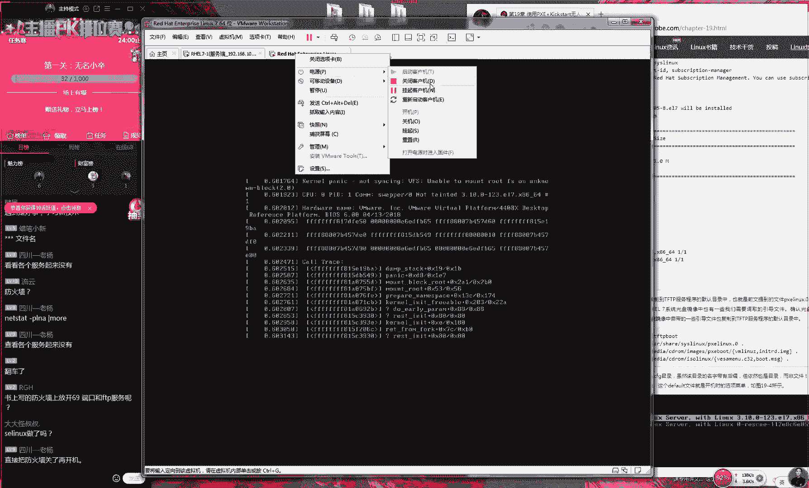
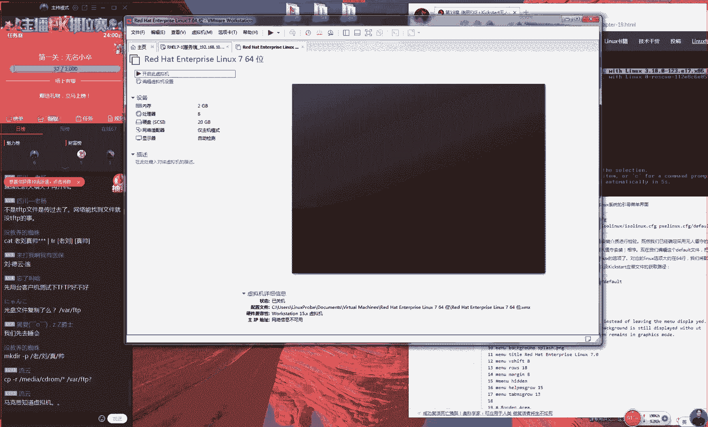
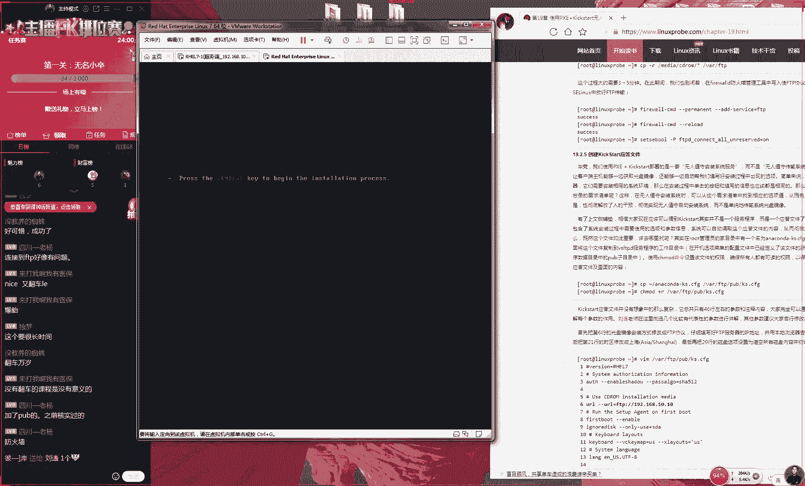

# 【RHCE】红帽认证工程师培训课程 - P19：第十八节课 - 天木轮回 - BV14E411678v

呃，好呃，我们刚好像出了一个我们刚才好像出了一个教学事故，好吧，因为我们刚才给大家发那个音乐的时候，我看到大家就大家在说怎么没有声音是吧？后来我仔细看了一眼，好像忘了开那个电源了。

大家先打一下一吧那我们准备开说我们今天这个课程。大家先打一下一听说话声音对吧？一下同学们才出一个教学试故。我们刚才还没有去讲我们只是放一些音乐要开始去讲麻烦，对不对？好。

那我们先给大家去说一下我们今天的一个课程安排。因为大家都知道了，咱们这一周就节课了，而且我们本课程的话呢，我们按照进度来讲，总共是总共是十9节课，因为我们预计的是十8节课。

后我们加上两节的这个红S跟我们红的一个考辅导，然后咱们总共是二天的课程。然后的话呢咱们这个在线培训的话，我这看了一下咱们平时都是十8节。然后咱们这一期的话呢，总共是十九节，所以大家去下载教程的时候。

如果下载的是十9节这个十9节。😊。

啊，是呃，那就是正好就是咱们这个课程的一个安排。好吧，就是我们这个19节。那也就是说我们今天会给大家讲我们的18跟19两个小节。

然后等到我们明天的时候会给大家讲第二十小节今天的话我们这个课程的安排大概的时间是在一个半小时左右。然后明天的话呢大概是在两个小时左右。好了，录屏的软件的话呢是这个软件大家可以能看得到。

就这个软件这个软件的名称的话呢叫CMTSI这个网可以搜到最新版本的话呢应该是9版本这个是一个很好用的一个录屏的一个软件对大家正好提醒我了，我赶紧看一下我这个电脑的容量啊别一会又提示这个容量不足了。好。

然后说咱们只剩下48人啊，还是那句话，我认为48人已经是很多了啊。而且的话呢我也那而且我有点高于我的预期了。大家现在不应该已经是都已经看完了吗？大家这个第18小节还有第19第20这个三个章节。

大家现在应该。😊，已经都是看完了的。然后现在就是在线去听一个呃在线一个答疑之这样了对吧？因为我们的呃马上4月底就要约考试了，而且我们下个礼拜就有同学要去考试了。所以说呃你们现在来这么多人，让我很惊讶呀。

好了，那我们接下来给大家去说啊，然后因为现在你们必须已经都看完了，我们这个常规的这个课程了，已经学完了第二章节了。因为你下礼拜就要开始考试了，对吧？好了，然后我看一下，说下个月会换题吗？下个月不会换呃。

下个月不会换题，因为我们得到的消息是5月份也不会换题，那对，但是5月份的这个考场安排，现在还木有啊，还呃而且是一点都没有。那我现在是呃4月19号嘛，然后我们会在4月25号左右。

那大概也就是下个礼拜的时候，呃，我后我们会出5月份的考场安排，所以这个礼拜说大家问了好多说哎老师我想约考试，对吧？然后说我们这个怎么去约呀。其实我想给大家去约约不了啊。

因为大家的这个考试的时间还没有出来，所以我们要等他一段时间。我们等到下个礼拜的4月25号。😊，到时候就可以来跟我去约5月份的考场了。好，没有信心啊，要等到6月份啊，那你这个没有信心。

这个还是挺没有信心的啊，一下要等这么多个啊，一定要等啊一定要等一个半月嘛。那这个有点太等的时间有点太长了啊，其实我们还是看每个人的这个具体的情况嘛。如果认为自己真的是没有准备好的话。

那么也不要听我的人说，好吧，那我们也可以。😊，多去准备一点，好吧，另外的话呢，我们还要给大家去说一下，因为我马上就要临近我们这个课程的结束了，对不对？

所以我们就会给大家去再去介绍一下我们这个课程结束之后，大家需要做的一些事情。然后我们会给大家去穿插在我们今天这个课程里面，会给大家去讲。所以的话呢那我们先给大家去讲我们这个第呃第十八章的这个课程吧。

讲完之后我给大家去说一下，我们呃包括说我们去领礼品，对吧？就是我们从第一节课的时候，3月8号给大家承诺。😊，虽然说呃老刘这个心在滴血吧，就是我们会大家去送一本我们这个签名的书籍啊。

然后我这边已经已经打包好了。因为我们看了一下上一期在线的同学大概有70个人，然后最后我打包到70本书，我觉得应该是够了，对吧？所以的话呢，如果70人不够的话呢，我再给大家打包一点。

那所以说我们呃今天下课之后，我待会会给大家去说啊，该怎么去来去呃按照这个格式来去发给我。然后今天晚上就可以来去呃统计好。😊，我先写到一张纸上啊，我我放到我桌面上。我放到我的桌面上。

然后等到一会儿我们讲完课之后，我好待会待会好提醒我自己给大家去说一下这个事情。然后是5月底的考场嘛。是这样的，因为我们之所以没有办法给大家去约考试的原因就是因为在考场时间没有出，要是出的话。

我们可以给大家去约，所以说是是5月底的考场这个不一定要以自己约到这个实际的为准，几点钟会公布考场时间啊，几点钟会公布考场时间，几点钟也不会今天我们公布了。

我们会在4月25号左右会给大家公布那今天就不用等我们这个5月份的课程安排今天是真的是没有好大家不要送礼物好吧。因为礼物真的是没有用。刘平时在这个上课以外真的是不上这个直播的。好吧。

大家说完之后真的一点用都没有好所以的话我们给大家去说一下我们这个第十8章们开讲第18章的课程了啊，就是我讲一下我们有个数据库叫做是这样的那么我们之所以去学习。😊。

一个数据库的话呢，其实也是以大家可能认为我们这个课程里边安排的话就是很合理的。其实这个不合理。大家想一下问题啊，就是你们之前你们报班的时候花2400块钱，你们学的是什么？

你们学的是linux系统结果一跳我给去讲数据库这个不合理吧？因为我们这个数据库它是归为了另外一个厂商叫做公司加公司他们在去做的一个认证的一个体系有他们有这么一套流程的一个体系。他们是讲数据库的。

我们是呃讲系统的，就相当于就是我们是做川菜的，是做披萨的吧？这两个搭他们两个虽然说都是运维吧，但是两个不但是并不是很搭。那我们之所以去讲的话呢，原因就是我们给大家去提到啊就是我们不去光去学一个技术。

还要去发掘一下底的一些道理或者说我们说的比的通一点就是一些八卦问题。红为什么要去考这个以来的一个发展的一个趋势，是这样的我知道我们在数据库行业里面的。😊，的老大是谁？那的老大是谁？

的应该是叫做呃数据库的老大应该是谁呀？大家都听说过，即便你没有用过，你听说过叫做myscle，对吧？在今年春节的时候，有人发了一个梗，因为myso就是MYSQL了，对吧？

然后还有人发了一个梗说啊我没钱了，对吧？买scle啊，我没钱了，所以说这个买scle的话呢，是一个数据库里边的一个呃的一个霸主吧。

我们现在就是现在我们的大量的这个服务都是基于这个myscle去做的那我们知道mys这个软件最开始是有哪个公司呃在去做呢？大家知道。😊。

那我们这个买sco这个软件，它最开始是哪个公司的，它不是，它不是加国文，它最开始一个叫做散公司的这个是一个散公司的一个产品，它是一个开源的一个软件。

后来的话201几年我忘了咱不瞎说不不用瞎说我们啊这个时间应该是在2011年或者2012年的或者013年的你们去搜一下个新闻，但是有一个公司叫叫公司它收购了这个公司。

你们仔细去搜一下那个新闻收购这个散公司。那么自然来讲那我们这个买的这个产品也就归为了这个加国公司叫公司。

那么其实这个商业之间的这个合并的这种并购案的话其实很常见的但是公司他这个把这个买s收购后把它还是一个开源的一个软件。但是他开始去收费，他把很多这个核心的技术的话呢去申请的这个专利。

然后开始去做一些商业的一些策划其实这个也能够理解，因为你毕花，对不对。😊，因为欧瑞公司他花了钱，他就去收购这个买scle。😊，但是的话呢呃他把大量的这个技术都申请了这个专利。

就会造成很多这个黑客和极客嘛。因为我们这个开源社区大家一起的这个智慧结晶，你有钱那就那你就把它给收购走了，这个很不合理，对吧？或者说引起了很多的这个反对。第二的话呢就是这个吃相的话呢。

我们有一个词用的比较多吃叫做吃相很丑。就像我们最近有一个新闻说视觉中国对吧？他用一些他用一些图片然后去索赔？会让人很很有这个怨气，其实的话呢这个ac也是他原先你但你收购就是一个开源的一个免费的一个产品。

结果你把它收购走之后，你卖卖了无所谓对吧？那因为你也要去赚钱，但是你吃了下太丑了。然后他把很多这个技术都变成一个核心的一个专利了，那他他他就经不再把这个技术给它公开出去了。

所以话他也引起了我们这个开源社区一些反感，这是第一点就是我们买sco产品的一个下滑的一个趋势我先给大家讲出来，他会有这。😊，一个下滑的一个趋势。但你不能说哎，老师。

我们公司现在我还在去使用的是mysql，但并没有像你想的已经呃被取代掉了。是因为它现在是一个下滑的一个趋势，它并不会立即被取代掉。因为他因为我们在做运维的时候，他会有一个追求稳定性这么一个特点。

第二点的话呢就是个ac公司的话呢，他跟一些大的厂家，比如说比咱们比如说我们这个谷歌还有比如说我们的IBM比如说维基百科，比如说红他们这些厂商的话呢，他会有一些技术的一些壁垒。这个我们之前我们听过一句话。

对吧？咱们中国有一个叫小米的一个厂家，他他是卖手机的，但是大家知道小米那手机的那个底层使用的叫做米U吧？这是个他自己研发的一个操作系统，其实并不是对吧？其实这个米U的话呢是基于了安卓系统给研发出来的。

后来就有一些人话后来在去年的时候，因为中美贸易大战嘛，后就有一些人说说那你小米使用的是安卓系统对吧？那你万一有一天安卓开始收费了，那者说安卓不再像什么。😊，提供服务了。那你这个小米公司不就垮掉了吗？

就是说你这个核心技术不还是人家的吗？其实大的这个厂家的话，他们都有这种顾虑的，他们都怕说呃终止掉这种呃合作。咱比如说那我现在是谷歌，那我把我的这个呃网站的这个服务器，我们架构在这个mysql上面。

突然一天买呃买sq跟他跟我来去打官司。然后说我现在是使用一个盗版软件，或者说他找任何一个理由，他不再让我允许我去使用这个mysqcle，就会导致我们这个所有的业务就要怎么样都要崩溃掉。

所以说这是我们第二点就是一个商业性的一个技术的一个壁垒。那么每个商业公司啊，他都会有一些。😊，我们做这个留一点心眼吧，就相于我们先看一个新闻，说5G芯片，然后现在呃大应为关注过一种新闻，对不对？

就是我们上个礼拜的时候不是就就是我们这个礼拜的时候，苹果公司跟谁然后达成了一种就是又恢复了这种正常的采购协议来的，是跟苹果他原先是想采购三星还是想去采购英特尔。后来的话这个采购这个5G芯片对吧？

后来那他跟高通啊他又他们两个又和好了，然后高通又向这个苹果去买芯片，然后高通的这个市值，然后也听说啊据说来讲也网上涨了好几番对吧？那你看那么我们既来说那你每个公司之间他们都会有这种心眼了。

那你高通如果不卖我这个芯片了，那我这个苹果手机就没有一个后续的一个研发那我就没后续的一个提供产品的这么一个渠道了，所以说现在苹果公司其实他现在也已经开始去研发自己的这个芯片了。这都是我们的后话。

就是说第一点就是一个下滑趋势。第二点的话呢就是我们现在大厂之间他们都会有一种技术的一些。😊，他们就担心说，万一我们以后我们关呃给呃呃给他闹掰了，那我们以后怎么去？😊，还继续去使用它这个服务啊。

所以的话呢以谷歌为例。我当时写这本书的时候是201当我写这个章节的时候，应该是在2015年的年底。但是我看到新闻说谷歌已经将它40%还是50%的这个服务器的数据库已经这一直给迁移到。

所以说现在很多大的这个厂商，还基百科们都是他们都是在全力去支持新的数据库的一个发展这是我们进一步下滑这一个趋势的一个理由二我们第一个第三个理由的话就是这个买的话呢跟这个我们说公司个打过很多场官司。

大家可以去网上去搜一下。因为的话我们知道基于我们的开源的许可，就是我们根我们的许可根据我们这个开源许可。那我们任何人都以去免费去使用我们这个免费去使用我们这个系统？们有个自由我们有5个自由。

第一我们使用自由。第二我们叫做传播自由修。😊，自由第四是叫做串上呃呃创建衍生品自由。第五叫做收费自由。那我们都可以去使用这个软件。那么于是我们有一个系统叫做re系统，它又改了个名字。

我们去掉它个收费的这个相的服务的话叫公司？大家都应该是听说过对？或者我们之前也会去使用过的那你看系统一个主要的噱头是？靠什么去赢得这个口碑为要选统应该没有人会去说为更新更快完全不？

是说s它是更稳定这个也完全不会第三点的话是为是免费不要钱？所以我们才去使用就光这个不要钱红公司就跟打了很多很多场官司你以搜新就他抢了红生意，只是说我们这个不要钱，就跟红了多场官司。😊。

然后他们才停止了这种呃商业之间的这个竞争。但是orac口公司加国公司，它的吃线就更丑了。它有一款操作系统叫做oraclelinux，大家可以网上去搜到这oraclelinux，它就是完全的就是。😊，呃。

oracle。lin你们可以去网上去找到它就是完全的就是呃基于了我我们这个reo系统去呃研发出来这么一个操作系统，者说我们只是用它去基于re系统去改了改才把它叫做它的话呢那你想一下。

那你既然作为一个数据库的一个厂商。那你的那你宣传的这个噱头，你就完全可以说是我们这个操作系统它是更加适合于我们这个数据库不？这样去说就可以了。

结果他不是这么去说的他当时发布的第一版应该是2014年的时候，然后说现在要收费吗？现在我们刚说过了这个买主要是把一些核心的一些技术申请的这个专利它不再对外去公开了。

然后的话我们说到第后我们需要这个第三点，就是在201几年的时候2014年的时候吧。然后他刚刚是214该是2012的候它的话就是发布的这款，的这个噱头的话。

这个宣传的一个口号的话呢就是修复了红系统的这个600多项漏洞。因为你知道红公。😊，现主要就是靠这个re去赚钱的啊因为红宝公司现在大部分这个呃呃在这个产品的话呢，比如说还有这个中间件，还有云计算什么的。

它都是基于我们这个re系统平台，他就去做的，所以话他上来就是说我们修复了红re系统的600多项漏洞，这是红帽很不能去接受的，就像就说你去你姥姥家去吃饭去吃完饭，然后你把碗一扒一摔。

然后说你这饭里太难吃了，对吧？或者说啊你那你吃完饭后你把碗吧一摔，然后你说这个饭里有毒，这样的话呢很不道德，吃下很难看。因为你。😊，但因为他是基于了我们这个re系统去做。

那么你既然已经基于我们这个re系统去做了，你还说我们这个系统有很大的缺陷，这个有点呃拆调过河，或者说那你要认为这个系统不好的话，那你干脆就去使用其他系统好了，者自己去做一个操就好了。

那你干嘛要去使用我们这个系统，就说他最导致这个吃相很难看。当时的话呢我们这个红帽就跟他就翻脸了。因为红帽公司跟这个公司，你们可以去搜一下这两个公司他们然他们虽然离得很近，他们都在东大桥他们最早的话。

他们是在那个呃2012年的时候，他们都应该是在北京这边的话叫做呃财富中心大厦，就是他们都在同一栋楼里面。后来的话呢因为我印象里面是这样的啊，后来红帽就搬到了后来红帽搬到东大桥里面了。

就说他们当时就是已经是闹得很不闹得很不愉快了。因为他们就是打压了红帽这个口碑嘛。其实的话这个也没有后来也没有被解决。所以现在红帽公这个公司这个。😊，关系也不是很好。然后我们接下来去引一下我们这个正题了。

我们这个marryB它怎么来的呢？这个的话就是欧瑞公司把我们这个myscle给它收购走之后，AAMIIADB啊，他收购走了我们这个呃，他收购了这个mycicle之后。😊。

然后他这个mycle里面的这个原门人马的话呢，因为他们也有呃他们也有呃他们也有一些人，他们不太喜欢这个公司的这么一些做法吧。

那么于是包括说这个cle的这个创始人那然他就他们就是全新的去投入到一个新的一个项目里面这个又是一个开源的一个软件，我们叫做其的话呢大不用去去搜给大家解释一下这个词没有没有没有特出的含义。

这个主要就是我们的的这个创始人，他的这个规女的名字。所以你也知道了这个新的这个呃数据库的话呢，就是我们这个my一个原门人马，然后包括说这个原始这个创始人。

他们一起来去研发出来的我们认为的话呢我们认为或者说老刘认为的话呢公司购个数据库真的是很得不偿失的。第一输的口碑。第二就是。😊，他第一他输的口碑。第二就是他他他只是收走一个名声或者叫壳子吧。

或者说一些他原先有的一些存量的一些技术。但是后续的话呢确实研发起来会比会比慢一点。所话我们现在看到我们现在有一个新的数据库。

我们叫做那我之所以要去学习这个数据库其实说它有三个理由的好吧大家听下第一个理由第一个理由的话就是我们这个数据库它是兼容于我们个的就当你去学习这或者你去学习这个mer你都不用担心，到了我们学习的时候。

学完了好之后，我们的所有的命令我们都是可以去通用的。我们的命令它都是基本是通用的。它都是执行了这语句。所以说我们今即上课学习的是但是你在工作的时候，你去使用这也是完全没有问题的。

第二的话呢是它真的很好用。因为这个虽然说不能够已经说啊说超过了这个。但是我们从性能上来去测试和稳定去看的话呢。😊，进步很快的，我们认为已经能够跟这个买occle去呃打个平手，这个是完全没有问题的。

并且我们现在也在考虑把它变成这个mrayTB。因为我们现在到了6月份的时候。😊，我们正好面临着我们服务器的一个升级啊。所以我我们已经决定了我们会去使用这个基本上是决定了的。好吧。

然后还有这个还有这个第三点啊，就是这个红帽公司现在它破天荒的红里面考到这个数据库好那我给大家说完了之后，大家去回忆一件事情就是我们为什么要去学习这个或者说我们为什么要去学习这个数据库啊。

其实红帽公司它这个考试内容的话呢，它不是让你大家想一下这个理由啊，就是说我们抛一下它这个底层或者说我们抛完底层之后，那你会觉得红帽很不堪。其实它这个底层的这个道理。

就是说红帽它并不是真的让你通过这个考试去学会这个数据库它没有这个意思。因为他毕竟是做lin它跟数据库没有关系。红帽不是让你学会我们这个数据库他是让你干嘛呢？第一他让你去知道我们这个二它表明对这个态度。

我连考试我连我的数因为我连我的这个我连我的这个系统里面。😊，都是全力去支持这个mar的这个态度是红帽表现给你的。他跟加国公司的这个态度。好吧，但是的话呢我们今天这个课程不能讲的这么水，对不对？

讲的太水的话，我们出版社也不让我们去出书。所以我们会在我们这个考试的这个基础之上，我们会给大家去增加很多很多这个知识，包括说一些基本的管理能力。我们在数据库里面去新建账户去新建账户干嘛了？然后还我们去。

😊，从事我们用户密码，包括说我们去啊对于我们数据库这个内容进行一个增删改查，那么以及我们这个删除和备份啊备份跟恢复这样的这个操作。我们今天都给大家去讲到，但是我们讲到了我们这个课程的话呢。

这个总线我们还是叫做lin的操作系统，这个是我们的总线lin操作系统。我们今天只不过在我们这个总线上面我给大家出一个小我们会给大家去讲一下我们这个数据库而已。所以话我们今天不可能用两个小时的时间。

而且不到一个小时的时间一个半小的时间吧，给大家去讲到我们这个或者说我们去学会这个学经数据库的。我们只是给大家去扩展，然后会一个基本的管理能力那么如果说您真的是是很感兴趣的话呢。

可以去了解一下公司这个加固人认证那就是叫做ac。😊，这么一个认证的一个体系，他们有一个三个人证有OCAOP和，还有这个OCM它会有一个考数据库的一个体系。那个才是真正去学习数据库吧。

给学经的这么一条路线。好了，那我们接下来的话我来给大家去说一下我们这个数据库。那我们讲一下他这个前世今生啊，就是说我们为什么要去学习这么一款新的是数据库。以及他跟买s的一个关系，他跟红帽关系。

他跟红帽跟克公司的这个关系，以及我们未来的一个老牛的预测老刘预测这个未来我们认为啊如果没有太大的这个意外的话我们认为会跟。😊。

呃，他会追上买，这个是我认为是没有问题的。然后他可能会进一步回答自己的这个市场占有率。我们目前来说是这么认为的，但是这个需要时间5年时间这个不可能。

但是1年以后这个说不准好吧好那我现在给大家讲一下我们这个数据库你现在说话非常的严谨，对不对？所以说我们现在说话非常严谨。好那我们现在去给大家去操作一下来去安装一下我们然后我们现在已经是临近尾声了。

以我们不会大家再去讲该如何去配置你这个仓库了。这个如果还不会再去配置仓库的话，就说不过去了好，那我们现在去安装一下我们这个和这个是我们这个主程序跟我们的这个服务的这个程序。😊。

好了，我们再等他安装一下。点下万来进来安装。为我我们为什么要去学？因为红帽这么一个报，这是一方面啊，这是红帽公司的这个考虑。但是我们既然已经去学习了，那我们把它给学好，对？我们不要管他们怎么一个心态。

但是我们自己把它给学好啊最近我看了本书说那会2年前嘛，然后中国会有一些贪官嘛，逃到海外。那你看那你不论说你怎么来的钱，逃到海外了，但是他们的这个子女有些还是比较上进的，还会很好好去学习。

就说你不要管你的父母怎么来的钱，但是你既然来到这个国家来到美国了。那么你也要去努力去学习，其实这个也是红帽提供这么一个平台，对吧？他既然说考试也提到这个这个数据库，他不管他什么原因嘛。

但是我们要好好去学那那我们要对得自己付出这个时间跟金钱。好那所以说我们不能说因为红帽只是为了怄气。但这个太片面了这老刘一个一厢情愿啊，这是个太片面的一个说法。但是我们要好好去学习到他，对吧。😊，好。

那我们现在去重新去启动一下我们这个merryDB。好，我们去重启一下。重启一下我们我们这个数据库的这个程序，然后顺手将我们这个程序加入到。启动项当中当我们看事情不能这么片面了，也许说红帽这个高层。

他肯定会跟这个会一些谈判对吧？包括说一些磋商最后看到他没有成功？包括现在红公司跟他这个公司这个还是还是关系很僵硬那我好后进行一初化工作进行个初工作你说是来说请你输入当前用户个密码们的敲回车。

然后说是否去设置一下个用户的密码一下他说请输入一下你这个新的密码这个是我专门用们这个超管理们个数据库的个密码输大是这样我对于这种虚拟机里的密码的话，认为我己这认为就是没有必要太复杂。

为第说是虚拟机里面第二的话你你有联网。的话。😊，复杂，你自己敲一下也费劲。就是我们工作跟考试里面的话呢是要分开的。会有一些我们不能说很我们不能说呃这种很平庸嘛，就是说有一些很不负责的一些作者的话呢。

他们总会告诉你说任何地方的密码都要很复杂。这句话太太太真理了，这个没有问这个没有任何问题。但是你要从实际上角度上来去说的话呢，其实没有必要。就像一说老刘的这个手机啊，老刘的手机从来没有密码。

但是我也从来没有被盗过钱，对吧？就是这么一个因为我因为我因为我总会因为我手机什么的，都会去随身去携带的，所以说这个密码的话呢，并不是说越复杂越好，你何必啊就是说我们要根据自己这个使用情况来去定。当然了。

如果说你要是在考试的时候，或者说你是在在工作当中嘛，当然肯定是当然肯定是越复杂越好，对不对，这个我们要根据自己的这个情况来去定。

那我们来去说试否来去移除掉我们这个匿名用户我们来点一下这样话代表说更加安全。😊，当然说你太简单了也不太好吧，说我的密码就是一这个太简单了，也不太好，对不对？好。

那然后说是否来去禁止掉我们这个超级户入来从转上去登录啊，这是为了我们安全性来讲们就输一下他说是否来去移除掉我们这个测试数据库以访问权限。们一下这样话更加安全。

他说是否去生效们择一下这样话我们做好这个数化的一个工作。大家翻开你的书，翻开你的书翻到第20张翻翻到第20张然后第二章的这个开头啊。

放在这个标题旁边的话呢请你写这句话在第二章的这个开头写这句话好把这句话到这个书上面叫做thank you欢迎你去使用这个玛利亚数据库我们叫做记一下这句话我们在明天的时候我会给大家讲这my们老说我们。😊。

还有我们这个这个的话呢的相呢，到时候明天你会看到这个两个数据库简直就是一个数据库了。好了，那我们给大家去记一下这句话明的几乎是模一句话做数工给大家讲登录数据库里面应命做使使用超登杠的有密码我密码的话体去敲一下我们密码的这个值下面去那就登录到这个数据库里了。

下面给大家去说一下们命叫做数据库的命每个命令都要以分号做结尾家看有数据库的命我们的结尾都要一分号这是一个格。😊。

要求好了，我们来去呃展示一下，我说我们当前有哪些的这个数据库，我们敲一下回收，再给大家去说一下。虽然说我们今天会讲的很深。😊，虽然说我们今天会讲的很深，但是的话呢大家不用说太担心说学不会。

因为我们今天这个主线还是去学习linux。今天我们这个mycle还有我们这个数据库的学习主要的话呢就是给大家去扩展一下思路知道原来我们做运维的话，我们的lin是以跟我们这个数据库是以搭配去使用的好吧好。

那我们先来看一下我们里边有三个数据库，但是我们想一下一个问题就是那我们该去如何去修改密码呢，那非常简单就我们 password，我们来去修改一下我们的密码sword等于多少呢？修改一下密码是这样的。

因为我们书上面大家看到了因为我们书上面的话呢是为了格式好看，是为了出版，所以的话呢它会有一个大小写的一个区分。比如说这个有个pasword它会有一个大小的一个区分。但是实际上是它是不需要的。

就是说我们这个出版只是为了好看。因为我们在这一大坨的话觉？这个老连拍版的不会所我们这个书上面但是为了出版而。😊，来做一些这个调整啊，但是我们真正去敲命的时候，大家写是不用区分的。好了。

咱比如说我想把我的密码，大家觉得我好low啊，觉得密码好简单。那我们去修改一下我们的密码把它修改成做2回收那么我们就可以把我们这个密码给改成2了。那么于是我们再去退出再去切换的时候。

登录的时候再去输入家大大家就相信我我在我没有故意输入错误啊。我们现在确实输入的是之前那个。但是现此时提示我们说登录败了我们当我们再去输入新的密码是2的就可以去登录到我们这个数据库里面。

好给修改成了那我我把修改成吧？😊，好，那我们那我们现在把我们的密码修改修改成叫做linux的原因的话呢，就是我们去打一下广告，对不对？因为我马上就要临近我们这个客人的尾声了。

我们要把我们这个广告给大家制作更加到位一点。好，那我们现在去修改一下我们密码叫做lin接下我想一下们大家说叫吧是这样那我们想我们工作不能说一个超级用户，这不太安全。因为万一以后你老输入密码。

后来你去续往里一些小黑客给抓包了，这个也挺麻烦对？那么工作时要有一些普通用户去完成一些比较日常的一些工作。好，那我们就要去学习一下说该如何去创建出来我们数据库里的用户简单 easy？

3创建一下叫创建用户的意思我们的用户名称叫什么呢们用户名称里面叫小猪？小猪小猪蛛用户那我们叫做小猪的一个用户后指的是一个我们的本地用户的一个意思好了。😊，这样的话呢，我们再给大家指定一下我们的密码。

密码的话其实也无所谓的，还是我们的个理由。因为你毕竟是在讯机里面去做的话，没有人会盗用你的这个账户。所以说我们就把密码叫做好了。我们敲悄回车。这个时候我们就有一个叫做小猪的一个用户。

但是这个小猪用户的话呢，他登录之后是没有任何权限的。因为我们的这个数据库。如果你没有权限的话，它是不能够给你这些呃相应权限的啊，就是啊它不能够啊我看一下这边第十八章节有一个乱码。好吧，接下来。😊。

回头我去修正一下第十八章节有一个乱码，这个乱码主要是因为我们的。我们的这个数我们的这个插件有一个被删掉了，因为那个插件比较浪费我们这个服务器的资源。而且我们现在这个网站这个访问量比较高嘛。

现在已经到了15000左右每天已经是国内在里最。说鸟一些其他这数据，以说我尽可能去降我们这个服务器压力没去升级服务器个服务器开很。主要一下该如何去进一步降低一点了。好了然我们现在去进行一个授权。

那我大家演示一下了当你去使用到这个小猪去登录们这个数据库里的候看到他没有权限去看的这个数据库就会默认把它给隐藏起。刚才看有三个数据库。而我们这个小猪去看的话。

只有一个的也就说他没有权限管理我个数据库那么怎么办？样去我们使用使用到超互助来去登录我们来给大家进行一次授权，当我们输入。😊，好，你看到他说我们这个登录是输呃是错误的，密码错误。好。

那么我们就要去输入我们最喜欢的一个网站叫做linux，这是我们啊目前最大的一个linux的一个站点，对不对？啊？好了，那我们接下来的话呢，我们登录之后，我们给他进行一个授权。授权的话呢，我们这个叫做。

😊，GN啊这个我们叫做这个授权的意思叫做是吧？这个的话呢就是在英国女王就是在这个英语里边的话呢，这个含义也是授权的意思。好了，那我们来去授权一下，比如说查询对吧？然后我们来去更新，就是我们叫做去查找。

然后去更新更新的意思就是去修改的意思啊，我们来去删除，然后以及插入我们的这个内容的权限，我们对于买里的所有的表单我们都去生效，这样的话呢我们还有一个to那么我们给谁呢？我们给小猪这个用户。

它是一个本地的一个身份，虽然命令很长，但是我给大家讲完之后，大概知道里面的含义就可以了。好，那我们再回车就是说你看啊就就是你一个英文那就是你是英国的女王吧好吧女王吧人。

就是说我们知道英国的话呢他是有一个皇室就是贵族一种这种社会一种认同感吧，吧？咱中国的话呢以前也有就是地主嘛。后来因为。😊，一些历史的一些呃变动吧，或者说历史的一些。对一些怎么说啊。

一些我们不我们不好说什么样的一个运动嘛？就是说确实我们中国现在已经没有贵族了。现在中国的话，只有有钱人跟没有呃，现在中国只有这个有钱人跟没有钱人，现在中国人也不太认有没有学问了，对吧？

因为现在任何一个网红都可能活起来，现在不认同这个身份问题了。你只要你有钱就行，对吧？现在中国人是一个很浮躁的一个社会，并没有一种认同感，并不说哎那你是贵族，所以你要承担更多这个责任，而我是平民。

那我做好本职工作，现在中国是一个谁都不服谁的一个社会，就是说我自己。😊，我也可以去做很多事情，就是说中国有句老话嘛，叫做呃王侯将相牛总乎啊天子这个位置，那我我们也可以去试一试，对吧？

那但啊但是在英国的话，你看英国女王他有更高的这个权限，他可以凌驾于这个宪马之上，她就是一个我们不能我们不敢说他像一个日本的一个天皇嘛，但是他是由但他很多明星的这么一个女王，她有很高的这个权限。

以的话比如说有人去捐款，或者说他为英国的做很大的这个贡献。我记得话好像是成龙成龙她好像我记得印象当中啊成龙是给英国捐了多少钱，好像捐了一个亿或者捐了多少钱，我忘记了啊。

当时国内很多人在骂他我不知道是不是成龙啊，但是的话英国女王很高兴啊，因为毕竟给自己的国家捐了一个亿，这是一个很好个这个是一个很好的一个榜样嘛。但时英国女王就给成龙。

结果的话怎么样就给了他授予的一个爵世的一个一个爵位，那么于是成龙他就变成了一个从平民提升成了一个爵士爵位，他就有一个身份问题，对不对？好，因为在英国的话。😊，他是很认同一种身问题的对。

当有一个平民去说一句话，没有人去相信他。但是一个爵世他说了一个话再荒他，但是也会有人去相信他。😊，好，那我们进行授权好了之后，我们来去登录到我们这个小猪的这个账户身份下。你可以看到啊小猪这个身份下。

你可以看到我们就能够看到这个my的这个数据库了。我们以进去这所有的表单这就是对你进行一次授权的这样操作。

退出建用用户进行授权的面去学如何移除掉们这个授权我们还要使用到超登录登录个管理员身份我们的密码的话我还我们做这一个题英国王然发英国王一个英国女王的话他一高兴他也给你授予的一个什么位。

突然有一女王查个发没有。然后。😊，说那个钱呢？然后你跟他说是啊什么钱啊啊，我说这个一亿是呃，我说我说那个一亿是个欢乐豆，对吧？咱比如说因为大家如果玩呃大家如果玩QQ的话。

应该知道一个个积分叫欢乐豆欢乐豆并不值钱，对吧？比如说我们捐了一个亿欢乐豆那你捐欢乐豆捐10个亿的话，你也不能够有一个英国的一个爵士学位的？那好那么我们的女王他有办法取消授权。

就你身份下这个权限给取消掉那我便给你授权了，但是你骗了我了那你欢乐豆要把你这个爵士学位取消掉说用户个数据库查个修删除以插入的这个权限我还以把取消掉，不要欢乐你不要欢乐豆骗者你捐的是Q币也不行。

那那难道你女王上淘宝上这个Q币变现？那么他还可以把这个权限给他取消掉们取消掉。😊，这个小猪身这这这个用户身份对于我们这个mysl数据库里面的查呃查呃查呃查找，然后去修改以及删除插入这个四个权限。

叫做这个增删改查这四个权限之后。😊，我们再登录到这个小猪的这个身份下，你可以看到它又不能够看到我们的mysqcle这个数据库了。刚是像梦一场一样，它这个权限它又被取消掉了。好，那我们接下来给大家去说啊。

今天我们人数还是真不少啊，我们现在6有6现在66个人，但是迟到的人也不也真是不少。好，那我们接下来给大家去继续往后们去说，那我们既然你建出来我们用户的这个身份以及进行一些授权的话呢。

其实我们还可以就是来去真正去学习一下该如何对于我们这个数据库的一个管理能力，但是我们再给大家去说一下这个工作他不由你去做的。在考他的他的这个过程当中的话呢，工作当中，你的这个数据库它是不由你去做的。

即便你想去做。一般来说，正规的企业啊，他们都不会让你去做的。因为这个数据库它是专门教给管数据库的人去做了。这个也拍一给碰坏了。那我们今天去学习的话呢，主要是在一些非正式的一些场合。

比如说你自己开了个网站，对吧？你就可以去做一些比较基本的一些管理能力。好，第二就是说我们学习这个课程的话呢，主要就是对于数据库有一个基本的一个了解就足够了，大家不用去升背里面的命令。

大家不用去记这个里面的命令。好，那我们。😊，先去登录一下我们这个myscle的这个数据库登录。好，我们来去输一下我们的linux对吧？我们老说广告我有我有点不好意思了啊，咱们这个广告太硬了。

我有点不好意思了。好，另外我想给大家嗯做个调查了，大家现在有67个人在听课，坦白说超过了我的预期了。你们为什么都还听课了。你们你们现在应该已经是在因为已经是在备考了才对。

你们怎么会在听第十在听第十8章节，你们应该已经是已经学习过了才对的。好了啊，因为已经花钱了，花钱了也还好，但是进度太慢了。如果说你刚刚去学习到第十8章节，这个进度有点慢了啊。

回头下礼拜的时候要开始好好去复习我们这个红考试了啊，进度有点慢，稍微有点慢了啊。好，我们接下来给大家去说就是 database我们来去查看一下我们当前已有几个数据库。现在有三个数据库。好。

那我们就下来去学习一下该如何新建出来我们几个数据库了。为了让我们的这个保证我们这个广告有一个持续性的话，对不对？我们建出来一个数据库。😊，我们叫做什么？我们叫做lin哎，我们这个广告一定要到位。

我们最后一节课了我们最后到第二节课了。我们这个新建出来一个数据库，我们叫做lin啊大家不要问啊大家不要任性。

好那就有一个新的数数据做切数据库们做切换到数据库里那我们这个表怎么去创建叫cra代就创建出来一个表为现在这个数据库是一个空白要里容保存数据这个名称们叫做my做书个表它三个字一叫做name是我书名型大家之学习过C语言的话家该知道们型的意思是什么。

😊，都叫做字符类型，对吧？因为大家都应该是知道的。因为我们学习过C语言里面的话呢，这是我们的这个字符类型。还有一个的话呢，就是我们叫做价格，价格是一个I叫做INTINT是什么样的一个类型。😊。

INT是什么样的一个类型？是一个字母还是一个数字，还是一个整数，还是一个浮点数，还是一个什么乱码，它是一个整数类型。那啊它是一个整形，对不对？那整形好了，我看一下没问题，大家都说对不带符号了。

我们看一下代表是正确的好还有一个叫做页数页数我们也把它叫做这个整数。好了，那我们做那把它做好之后下回收你现在可以去这样 tables查看到里边就会多出来一个叫做买book的一个表单。

然后你还可以去查询一下我们这个表单里面的这个内容，来进行一次描述，看一下表单里面的这个结构是怎么样的呢？你可以看到它里面有三个字段，第一个字段就是说我们这个数的名称，它必须是在15个字以内的。

然后一个中文的话，它是占用两个字符对吧？还有我们这个价格跟页数两个字段好了，这样的话我们做好之后，就是说我们现在有一个有这么一个表格了。大家看到我一个表格，然后我们以往里。😊，来去填写我我们这个内容了。

那么怎么去填写的话呢，选择命令，我们叫做insert来进行插入，插入插入到哪里呢？插入到买啊买book表单里面。😊，分别插入它里面这个三个字段。第一个字段我们叫做name，我们代表就是呃书名。

第二就是我们这个价格。第三就是我们这个页数。好了，然后我们这个value代表就是我们这个具体里面的值插入的是什么呢？插入里三个值分别第一个值。

我们叫做大家看到每个字段之间我们要用到这个分号把给给括起来好吧，好，然后我们这个价格的话，们便来去写了。说我们写60还有我们这个页数我们写518。好。

那我们现在写518这个几个字段分别把就是代表就是我们这个书的呃的这个呃名称叫做我们这个价格是60。然后我们这个书的这个页数的话呢是518页。这样我们敲一下回车，就把它给插入到我们这个表单里面了。

于是我们可以再去查询SL就是这个不能够这个是不能够。😊，table键不齐的。好，那么我们就去查询一下我们买book表单里面的所有的内容。大家可以看到，这里面就把它给插入成功了。对，就把它插入成功了。

然后说有没有图鸦界面呢，它是有的，我们可以去使用我们叫做P这个软件就可以有一个图形化的一个界面了。但是我们讲课的时候不能够给大家先去讲这个图鸦界面呢？现在话缓我们很low，对不对？而且当你学好命令之后。

你再去学习一下这个图像鸦界面的话，你会感觉很爽。但是如果说你只会图鸦界面的话呢，以后工作的时候就会很尴尬，有些事情就会做不了，对吧？以我们还是去学习一下我们这个命令好了，好。

那我们现在看到就是将我们这个数据给它插入到我们这个表单里面了。第一次去学习肯定是记不住，这可能是很正常的，好吧，为什么数据库不支持自动补全。那这个为什么呢？那大家回答一下这个问题。

为什么我们的这个数据库它不支持一个自动补全呢？然后我们比如说我们去修改一下我们某个字段里面的内容。如说我们将。😊，我们这个书的这个价格。那我们现卖但我们现卖现在我们这个价格是卖呃价格是卖60块钱。

那那咱比如说我们因为现在书卖它不好吧，那我们要给降价，我给降么？ book就是我们去把我们这个价格给降到55块钱修改好之你可再去查询表里这个内容么于是可以看到它里就变成了55块钱。

就是对于我们内容内种修改一种方法。实大说这个是很简单的那我给大家去讲就是我们去查询的时，我们不用去使用星号号的是我们查询所有里的这个信息查询所有信息毕竟是很麻烦的？

且很嗦那咱比如说我只想去查询一下我这个价格跟名称那么怎么去做呢？就是name逗号然后我们这个价格这样我们敲回可看到它就会去查询出我们这个name和我们这个pri两个字段里面的这个值。

然后图界面考试的时候是没有。😊，通话界面的那而且咱们也不会去叫通案界面，因为通话界面他不需要去交。好吧，所以我们这个我们考试的时候他也不需要考试的时候，他只要求你去查询就可以了。我们现在所学习的这一条。

大家看到我们现在所学习的这一条，实际上你在考试的时候就是足够了。就是这么一条就就足够了。因为再给大家去说一下，我们的红帽考试红是C里面现在考到了数据库，他不是要我们说的比较点，就是帽不是了真正要去卡人。

他是为去表达一种他态度嗯。😊，好大家就理解我这个的一个深层次的一个理解吧。就算是老刘对红帽公司的一个了解。它不是让你真正去卡你说你这个让多少多少人考数据库的时候不过说的可笑嘛？

我是去学习lin我是去个认证结果我去挂科挂到数据库大家懂这个意思？当就是我我去考一个lin一个认证。结果我丢分我丢到这个数据库上结果我没有过这个说这说不过去的。

所以红公司他不是拿这个数据库这个考核来去卡人的好吧，所以的话我们来继续说就如果我们为了红帽考试的话呢，单只一条去进行查询这一条就足够了。但是我们认为我们讲还是加加充分一。

以我大家去扩展后面东西那去删除一下删除ele来删除掉表里所有内容来删除掉删掉好之后。😊，我们再来去查询一下我们表单里面这个内容，就会发现已经是被空白了。好，那我们刚刚就给大家去讲了一下。

说该如何对于我们这个表单。😊，进行一个增删改查，对吧？我们该进行这么四个操作。接下来我们就要给大家玩还更加深入一点的，就是我们该如何按照我们这个条件来进行我们这个增删改查。现在我们看一下我们书里边的话。

它有4条命令。这个四个命令，它主要是把我们这个表单里面去插入4个书籍信息，这个是没有这个因为这个没有呃太多这个新鲜的内容啊，所以我们直接把它给插入进去了。插入完了之后，我告诉大家。

我们所做什么样的一个事情。我们现在插入这要书集的信息。😊，就说我们这个输的这个信呃，输的这个四个信息的话呢，分别名称啊叫做linux probe1234，对对？看下广告多么硬。好。

我们插入这个四个收集的这个信息。哎，等一下，我们插入这个四个书籍的。😊，信息你可以看到叫做linuxpro1234，价格从30到100。那么你看到，那我们该取如按照我们这个条件来进行查询。

这个时候我们想要给大家来去玩一下的，是这样啊。😊，slight我们来进行查询。我们现在去查询所有的这个信息。然后我们这个买book表单里面。但是我们如果按照我们这个条件来去查询怎么去做呢。

咱比如说大家去淘宝上面去购物去会有一个选项框。咱比如说我们想要去买一个价格区间是在30到50的这么一个商品。大家去淘宝上面去使用过这种功能，对不对？

就是在淘宝上你可以去指定一下你想要去购买的这个商品的价格，然后比如说我们设置一个区间，价格是30到50元，或者说我想买一个价格升序或者叫价格降序价格从低到高对吧？那我们就可以对它进行一个排序。

那我们比如说我们想要去干嘛呢？我们想要去搜索一下，说价格如果它大于了75块钱的时候给大家去搜索出来搜索所有价格啊，那我们怎么去这样去做，就是说查询所有对不对？这就是我们上面给大家讲这个命令。

但后面不要去敲车敲车同之前，我们先去写上一个就是哪里呢哪里就是说价格它大于了75块钱。比如说那我是个土豪那好了。😊。

那我去搜索所有说价格等于呃所有价格大于75块钱的这个书籍可以敲一小回车看到他就会只去列出来说呃大他会有两本一本是8一本是100。如果我们的书能卖到80块钱的话呢，其实老其实也算是发财了，对吧？好。

那我们再看的就是说我们去匹味一下，说大于等于是大于是75块钱。那我可以再去修改一下。比如说那我没有钱，那我想买一些比较便宜的书。那好，那我就去搜索一下，说价格小于60块钱的书，于6小于60元。

那么回车就会去搜索出来叫做一和2。😊，うんうん。好，那我们接下来的话呢，我们再来比如说我们现在可以去呃搜索一下飞。再比如说。那我们搜索一下，说价格不是等于80块呃呃。

价格不是等于80块呃呃80块钱的书物。那后我们这样去嗯呃就写一个逻辑的一个非，这是我们的第四章节的时候给大家讲过叫做呃取返嘛，就是叫做非好一回车，他就会搜索出来价格不是80元的这个收集。

就是我们可以按照一定的这个条件来进行一次查询。好，因为我们现在可能是空气比较干嘛，而且最近确实确实是比较累啊，现在事情太多了，而且现在在去做这个li库。😊，哎呀，现在确实这两天比较忙。

我也希望5月份的时候能稍微好一点。好，然后的话呢我们现在看到就是我们按照我们一定的这个条件来进行查询。如果说你想来去多个条件的话怎么去做多个条件话我发了一下多个条件的话呢就是这样去写成一个就可以了。

这多个条件去做这个符号中是有空格两边可没有空格所以我们没有调是可以的啊然后说理解为不等于对这就是一个理解为不等于的意思。我们去搜索一个不等于80块钱数据的一个信息。我按照定这个条件来进行查询。

然后家说下考试怎考试的常简单就给你一个名字。叫他说给你一个人的叫的这个话号码是多少家听说他会给你一个名字叫电话号码是多少码多少你去好了着他会给你一个表单的名称，他会明确告诉你表单的这个名称明确告。😊。

表达的这个信息，你只需要是这样去做啊。如果说你只为了考试的话，你这样去做。😊，去搜索里面表单里面所有的信息，这个信息项大概也就顶多20个，顶多顶多是一二百个，或者说不到100个。

他是他他会给你一个列表里面定义了100多个人的这个信息，包人的姓名年龄住址。然后如果说你不想记太多命令的话，你就可以逐一去找那个y用不了5分钟的时顶多5分钟可以找到人信息。

他那个电话号码手动去复制出来就可以了。因为因为这个红包考试，他只看结果他不会去看这个过程。所以很多这个国内的厂商，他不会去讲这个数据库的。你们可以去问一下现在的这个课程，很多他们都不会讲这个数据库的。

他们会直接给你提他会给你一个考试答案比如说当你到这个y这个名字的时候，请输入1688话号码当你当你当你到另一个用户的时去输另外一段这个字。所以说我们这个课程给大家讲进行查询。那比如我们。😊，说变题了。

当然是呃当然这个不可能的啊。再比如说我们考试的时候，万一里面的信息象太多，你都看花眼了。比如说超过四五百项怎么办呢？

那我们可以按照一定的这个条件来进行查询条件这样去做使用一个where后面写上你想去查询这个字段。比如说我们想去查询说name等于123那我们就这样去做。

就是我们单独去查找某一个名称特定为谁谁谁的这个信息。那我们回车它就会这个我们需要用到这个分号把它给呃我们需要单号把给引起来。😊，叫我们会说，他就会只去列举出来叫做3的这个信息。

所以说大家记下来就是我们现在所说的这个语句，一外记下来之后，我们考试的时候就没有问题了。这是我们考试时一个呃大杀气就是我们只要把你这个字段的信息填好。

我们就可以使用这个命去查询到我们所要的这个具体的信息，这个是没有这个是呃这个是没有问题的。好，那我们接下来给大家讲一下我们这个备份以及做恢复了。其实我们今天讲的比较基础的，主要讲的一些。😊，呃。

我们说我们数据库的管理的方法好了，因为我们毕竟我们这个主线还是lin嘛，我们不能跑偏。好，我们现在这样我们使用一个命令。

我们叫做来进行一次备份更优指的是要去使用备份们使用的是ro是管理员因为他有个更这个权限。好，我们来去刚指的是他有密码它有密码而密码写的是下一行我们要去备份的这个数据库叫做lin我给大家备份成什么呢？

我们备份成小新我们做小新的一个同学我们来小新份成一个文件密码告诉你们我回车好，那就把一个我我就把们这个数据库给备份成一个小新的一个文件这个文件它是一个数据库的一个格式。

所以我们直接去读取的会有这一种码现象出来这个正常因为毕一个数据库的一个文件我们也可以去这样去做。😊，我们去使用fi file啊呃呃去使用到这个fi，然后我们加上小新。

你可以看到他会告诉你说它是一个文本文件，它就是来说它就是一个数据库的一个文件。好，接下我们去进入到我们这个mysocle的数据库里面，再去进入到我们so的这个数据库里面叫做。😊，密码老忘记啊。

这个广告还是不到位，自己都没有给自己吸的啊。我们进到这个数据库里面之后，我们去删除掉，叫做linux这个数据库。好吧，删掉之后的话呢，嗯没有把它删掉是吗？

我们现在进入到数据库里面删掉叫做linux的一个数据库。我们并没有去删除掉一个表单的原因呢，就是说我们怕有同学会认为啊我们在作弊，对吧？😊，我这边好像网络在波动了一下，我这边好像在重连。呃。

好刚好像是卡了一下，所以我们这边网络刚刚波动了一下。OK那我们现在好，同学们啊，大波单现在我们刚才没有讲，因为你们这边卡了之后，我这边马上就提示说网络正在波动。所以我们刚才没有给大家讲。哎呀。

现在这个空气比较干，可能嗓子也不太舒服啊。所以我们今天尽量给大家多多讲点东西吧。而且今天我们这个课时看起来，我们今天至少要两个小时的。我们今天我们原先给大家准备的这个时间是一个半小时。

因为我们总会说我们这一期我们是在在放松放松。结果我们发现每一期不放松。所以我们今天看这个课程大概是一个半小时的课程，但是我们今天讲的还是比较细，所以给大家讲了两个小时。😊，啊，但是我们还没有下课啊。

大家不要看错时间。我们现在是8点钟，不是9点钟。好，那我们现在把它给删掉之后，这个呃这个理由是什么呢？理由就是我们希望大家也去做这个实验的时候，把它给删掉。这样的话避免说老呃说老刘作弊，对不对？

因为你说把它给删掉了，但是。😊，毕竟在咱们这个70个人里里面69人里面，老刘现在是技术最好的一个啊未来你们可能会比我技术更好。但是目前来说，我们还是说哎那老刘现在说他把给删掉了。

但是我不相信所以说我们干脆就把我们这个数据库整体的把给删删这个整个的数据库避大家误我有误为我没有给删干净删之我们再来重新创建出来一个叫个数据库这个进入到数据库里看一下他不光没有这个里面的这个数据了。

它里面来买book这个表带他都没有的可以看到里面是完全是是一个空白的。好了，我接下来我们来退出掉再了那该如何去做这个数据库的恢复呢cle我恢复是买cle恢复个小时趴下了啊。

其实每次讲两个小时的时候都很累的而且有些时候还。😊，到了夏天的时候，每回讲完之后，那个后边就全都是汗因为老刘讲课的时候都是站着去讲的嘛啊，当然我们呃括弧啊并不是也买不起椅子啊。

然后的话呢我们来去恢复一下我们这个数据库里面这个内容。数据库的名称备份叫做小新嘛，做导入导入导入名称叫什么呢？密码是什么呢？密码叫做这个输入的是我们超root在我们这个数据库里面的密码我们才会再回车。

😊，好，然后我们还去再一次进入到我们这个数据库里面啊，怎么理解表单，表单就相当于就是我们用来呃我们这样去理解吧。数那么我们这个数据库就是一个目录。而我们这个表单就是里面的一个呃一个文件。

而我们这个真正的数据的话呢，是要保存到这个文件里面呢？你可以把表单理解成是一个excel的一个表格，这样理解会非常的好。为什么还要去输入密码，因为我们现在需要往我们这个数据库里面去导入我们这个数据。

如果你不需要密码的话，是不是很不安全。你想一下，好，然后的话呢，我们现在去重新去登录到我们这个数据库里面，你看一下。😊，我们在买book表单它又回来了，我们去搜tables。

能够看到一个叫做linux prime的一个数据库，对吧？我们切换到这个数据库里面，然后我们去收 tables，可以看到又多出来一个叫买book的一个表单。同时我们去查询买book表单里面的所有的内容。

你可以看到数据它又都回来了，数据全都回来了。😊，这就是我们该如何去做我们数据库的一种备份，以及我们去恢复的一种方法。其实我们认为还是比较简单的，对不对？那其实我们认为还是比较简单的。好。

下面我们给大家去说完了之后啊，我们后面还有一个章节第十九章节，这个章节它也很多，那刚P没有用呃，有用刚P，它指的就是我们要去恢复的数据库的名称是什么啊，不是有刚P吗？刚P呃，大家误解了啊。

我们我们刚P后面加那个是我们的数据库的名称，而不是我们的密码，大家理解一下这句话，如果我们没有写我们的这个。😊，呃，如呃，如果说我们刚P后门是我们密码的话，那我们。怎么知道我们要去恢复到哪个数据库里面。

我们后面加的是我们这个数据库的名称，而我们的密码是在后面自己来去写的。好吧，这呃这个是我们数据库的这个名称。好了，那我们接下来话我们再给大家去说一下我们这边第十九章节。

因为今天我们这个课程的话呢会比较多。所以我们先不给大家去答疑，好吧，我们先给大家讲课，讲完了之后给大家统一去做答疑。第十九章节这也是个应惑。这个东西第十9章节没隔一个小时也讲不完。呃。

就是我们讲这个课程大概需要30分钟吧，但是我们直接要做完这个实验，大概也得讲大概大概一个多小时。我们的第十九章节跟第二章节，我们今天和明天我们待会所说的所有的话，就是我们刚刚。😊。

那一瞬间啊我们就已经讲完了我们的S跟我们C里面的所有的内容了。因为我们第十8章节，我们的数据库是最后一个考核点。而我们从现在开始到我们最后节课的话呢。

第19跟第二章节我们所说的所有的这个内容都是在我们考试里面是没有的。但是我们用。所以我们还是有义务给大家去讲那这个是第19个第二章节级的这个内容。好，下面我给大家去说一下。

我们叫做第19章节叫做加 star无人安装系统。这个标题说起来很很啰嗦，很是绕口，对不对？当时我去做研究生毕业的时候。😊，不对当时我本科毕业的时候，我那个题目叫什么呢？我的题目叫基于开源呃。

我当时我的本科这个毕业论文的这个论文的标题啊叫做呃基于开源系统呃基于开源的分布式容系统的研究与实战啊。当时我讲的那个该如何做那个分布式这么一个研究。

但是说我们并不是只是讲了一个怎么说很基本的一个管理方法吧。我给大家当时我上本科时候是讲了一个方案。我觉得认为我本科来说是毕业是很有难度的这么一个课题。然后我研究生毕业的时候。

我讲的是基于网络新媒体环境景对吧？然后基于网络新媒体环境背景忘标题，忘记了基于网络新媒体环境么加强改进什么中什么教学环境的利用率什么的，就是我们这个标题的话呢其实很长，但是你不要被吓到。

其实我写内容都是比较的简单的。😊，那咱比如说我们第十9章节的这个标题就很长，并且里面转了两个单词我们都不认识，对吧？一个叫PE一个叫做star们都担啊但是我们都不认识，但是也不用担心，就是标题很他很唬。

但是我们这个核心的话就安装系统。我们原先安装系统的时候，需要插U盘你需要去拿光盘，需要拿网络去安装无所谓很没有效率那就要提我们这个效率我们之所以给大家讲这个章节的原因大家能理解什么意思呢？

就是我们坦白说我们坦白说习近平总书记？在现在当了主席他之前什么他之前也是从基层一点点去干起？我们习这个操系也是要去学习到了工作当中的话呢你们充其量也就是个红也不虽然希我们吹吹牛起薪过但是坦白说一起薪概六七千块那一开始去做一些。

😊。

的事情。你也可能会一些比较基层的一些事情。比如说你会有一两次的机会去去呃安装机架呀，或者说你去机房里面去呃看个一两个月，对吧？那么你就可能面临着批量去安装系统这样一个需求，不要看不起他。

但是万一你要是真的遇到这样的这个工作的话，你要是不会这个技术，那就麻烦了。那么你一天的时间者说两天的时间或者一个礼拜的时间，你都要泡到这个机房里面去做。当时我有一个朋友现在也是在做运维啊。

他当时就有一个这么一个工作，就是去安装系统，那个系统都是一个批量安装的一个任务。结果他不会这个他就买了100个U盘啊，然后批量的去拿这个U盘插到这个主机上面去做，特别的麻烦。当时我当时他还是在广州出差。

他从北京飞到广州，然后去做这个项目做一天才安装好系统，但是我没有好意思问啊，我说你具体多少台机器，我好意思问，但是特别的笨特别的傻。而且更傻就是他的那个老板居然也不懂技术，也居然同意了这个方案，我觉得。

😊，很傻很傻的那我们今天就有一个呃批量安装系统的这么一个服务，我们叫做P叉E加Kstar。它就可以去避免我们刚才所讲一种很笨的一种方法。那好，那我们讲这个实验之前的话呢。😊，我们先哎怎么样。

我们先喝喝水。呃，老板批了100个U盘，是否批了100个，我不知道，反正他用U盘去安装的，特别的笨，也许是10个20个，然后批量，然后然后这样去轮番去操这个服务器上面去装吧，反正很笨很笨的方法。😊，好。

那我们在做这个实验之前的话呢，我们先来去。😊，关闭由我们虚拟机去提供这个。DICP的这个功能原因的话呢，就是我们希要再给大家去拽一下子。我们之前自己去学习过这个DICP服务。

我们毕竟我们算作是一个总结的一个课程啊，我不让大家觉得这个钱花值了，对不对？我们要给大家去回忆一下我们之前所学习的很多个服务，把你之前所学习的服务。今天我们给它调用起来。😊。

看看我们之前所学习过的接F能够去做一些很酷的一件事情。这就是我们今天的一个核心的一个目的。好吧，知道我们之前学习的那个DICP在过程当中，我们该如何去使用一个完整的一个架构。好。

它不可以去我们目呃就我目前来说，它不可以去批量安装windows，因为。😊，呃，我们目前没有成功的案例，但是你可以使用到这个呃co普，你来可以去安装，它是可以的。好了。第9第十九章节这边。

也出现了一个小乱码。回头我去把它给修整一下，这个是个小问题啊。因为我们现在这个插件把它给删掉了，尽可能去节省我们这个服务器的这个资本。好了，那我们先去配置一下我们这个第2CP服务。第2CP服务。

因为咱们之间已经是讲过的啊，所以我们就稍微的快一点点第2CP服务。然后我给大家去说一下，他需要很多个服务来去协同去工作的那我们就要讲我们的第一个工作。

就是我们为什么要去学习这个那我们为什么要去使用到这个D2CP呢，大家想到我们现在所配置的第一个服务我们叫做DHCP这个书上面给大家总结一下第2CP的目的主要就是来去提供我们的网卡信息。我们说的网卡信息。

😊。

很很非常的笼统，非常的官方，非常的在书上面写一种语言。呃呃，我们实际上就是指的是我们的IP地址。还有我们这个自掩码，对吧？这只是我们这个网卡里面的这个信息，它要由DCP所去提供。

这就是我们安装我们DCP的一个理由。我们要先为我们用户有有这么一个IP地址，后可以传输我们这个数据。因你想一下，即便是在域网里面。如果两个机器他没有IP地址的话，他们两个也不能够传输数据，对不对？

这是一个基础，我们要CP服务好，那我就这样给大家讲，我们就给大家去讲明白我们每个服的这个作用。好话们现在去去写成一个参数叫做允许不这个不可以去搜索一下。有这个BOP啊，这个是两个启动协议。

这个是两个启动协议，可以让我们去安装系统的时候，一开机就开始帮我们去安装。就是我们开机安装这么一个开开机就开始去分配这么一个协议。好然话我这个N们为内部。其实这个我们不用去写成内部的。

我可以把写成叫做那我们这个禁用。但是我们只是给大家介绍一下另外一种参数了，😊，那么过程当中的话呢，我们建议把它给写成呃禁用的啊，我们这样去写原因就是给大家多看一种参数，叫做内部，叫做内呃内部模式。好。

然后我们接下来。叫做忽略我们客户端给我们的这个更新。这个我们之前已经见过了。好，我给大家提个问题了。请问我们这个作用域是真正为用户去分配的地址范围吗？大家告诉我一和二就行了。

这是我们当时学习第C14章节的一个黑话，请问我们的作用域是我们为用户去分配地址的一个真实的范围就是说再给个再一个说法，就是我们的作用的地址，就是我们待会会分配给我们用户的地址吗？

大家告诉我说你打个二我就忍了，打个是怎么个情况。同打了个三说不一定好是这样的呃，作用域的话呢，它指的是一个声明，就是说指的是一个很大的一个范围段我待会可能去使用的这个地址一个范围。

再比如说我觉得好饿好饿好饿，然后家里现炖炖肉了。😊，然后也做着呃，然后的话也蒸包子了，也做面条了。好了，我先指着这些东西啊，我说我待会儿我就可能去吃这些，我都要把它给吃了。但是实际上你去分配的时候。

真正你去使用的时候，真正你去吃的时候，你要去根具己的这个实际情况，你把它去定。到底你去使用哪个具体的一个资源。但是我们要先有一个作用欲，先把它给声明了，就是我待会我可能会去都使了，对不对啊，说都吃完啊。

都吃完我们我要这没这个本事好，19208点试点时。😊，好点10点10。0生成一个网段是一个C类的一个地址。然后我们字验码是3225。0。然后我们来去设置一下叫做给用户分配的这个网卡信息。第一。

我们给用户分配的这个网卡的字码的话325地址非常的标准对？们没有太介绍下面的我们叫做什么呢？DNS就我们取下这个首字母就是我们叫做互联网域名解析服务器的一个地址但是我们现在第一我们不需要DNS我们也没有我们之所以这样去写的原因就是给你一个写现在没有这个N说N地址你可以随便去写没有关系可以写谷歌可以写百度的无所谓也不会生效它只是一个格式要求后我们去写一个动态地址一个更新就是当对方系统它都没有一个系统的情况下。

它不要向你的它并不向服务器发送这个请求去发要去获取这个地址的一个请求。😊，那我们就直接为我们用户去分配的意思。因为我们之前我们这个如果大家之前学习过D2CP的话，或者说之前学习过CCA的话。

应该知道啊第CP的这个分配它是经过几个步骤的。第一个步骤就是要进行广播，对吧？就是我需要我那我需要有人给分配CP地址了，需要给分配网卡信息了。我先在我这个机网进行播。然后当我们这个服务器到之后。

后进行一个响应，然进后进行三次握手然后握手好了之后再给它分配地址，这是一个流程吧？而我们现在因为对方现在只是一些硬件，它只是一些铁块好我们直接为我们用户去分配这个网卡信息。的意思好。

然后的话我们来呃去设置一下我们这个作业时间作业时间我们讲过就个就像一个咖啡厅一。就像个咖啡厅一。如果说你希望我们安装速度跟快一点的话，者说我们叫做加快加快我们的地址的一个回收效率的话呢。

那我们就可以把我们这个默认的作业时间跟我们最大的作业时间稍调整一下好了，继。😊，叫做ex server就是我们指的下一跳的地址吓一跳什意思？一跳就是大家打一下叫做什么吓一跳。

因为我这样可能说完之后大家以为我我大家可能以为吓跳吓一跳就是下面的下一跳是我这个网关地址？下一次我们数据包所跳的那个位置，就是我一跳地址不是不并不是被吓一跳。

我是一跳比同学打那个吓一跳就是指的是我这个网关地址其实网关地址也不重要。但是个格式要求们就我们这个服务器本机了啊，就是我这个服务器本尊了要叫做 name就是我指的是一个文件这个文件什么文件我不知道啊。

但我下来这个文件此时第一没有不知道第二我们不知道它是什么文件，但是我们先把它写下来好吧，先把按着。😊，那也就是说当我们用户被分配大清夹，当我们用户被分配的1个IP地址之后。他就会去调用这个文件。

其实他它指的就是当我们用户去被分配到一个地址之后，它的下一步就是被分配有了这个地址了。好了，这个就是我们先嵌着啊这个文件此时还没有我们先把嵌下来嵌到底下去既是个嵌着的往下挪一挪这是我们第一个嵌着的这个文件着第二话我们来去安装一个服务。

我先来好不要着急，我们先来去重新去启动一下对把完了，这就已是完成了，去重新去启动一下我们这个C然后把它交到项当中，保证我们下一次的时候还能够启用。然后我们再去查询一下我们这个第CP的这个状态。

我们看一下是否已经起来了。告诉我们说打错了，我们来看一下我们状态是否已经起来了，没有问题做好之后话我们下面一步就是安装一个叫做P的一个服务。我们之前已经讲过T给大家举一个拆的一个子，对不？

这个我们叫做简单文件传输协议。家一个问题。😊，我们的VSFPPD这个服务程序，它有三个验证模式分别为我们的匿名用户模式，我们虚拟用户模式，以及我们的本地验呃，还有我们这个本地账户模式。他不管是哪个模式。

他总是要去进行验证的对吧？那但是我们现对方的这个服务器，他连系统他都没有呢？他怎么进行验证的，就相当于就是你跟一个植物人，你说你的QQ密码多少啊，那你跟他100万啊。

那你跟他那那你跟他问多少遍那跟他跟他所要这个呃密码，或者说你给他去询问一件事情，你问100万遍，他都不会有任何响应的。因为对方他没有一个系统，他那么一个他没有一个基本的一个应答的一个。😊。

就是一个没有一个应答的一个系统。所以的话呢我们现在不能够让我们这个对方的服务器进行一次验证。所以说我们要直接把我们这个文件直接通过T那我们就要去直接通过我们这个TFP直接就把我们这个文件，我先给你好吧。

就是我先给你一些比较基本的就现在就是举一个很不好的一个例子啊，大家举一个很个例子。比如说有一个人在路上突然晕了了之后怎么办呢？第一件事情不是问他哥你怎么了？他有些时候低血糖什么的，他是说不了话的。

怎么办呢？你先给他去做一下检查，你自己就要给他动手去做一些事情，吧？比如说你先把什么输氧机什么的，你先给他上上，这样的话来保证他一个身体的一个基本的一个维持一个的一个体征的一个存在吗？

所以的话我们现在也是对方连一个基本的一个系统都没有那么我们就去使一个服务，我们叫做T下一个服使用到TFP把我们的一些最为基本的一些驱动跟引导文件，我们先给对方我们把一些驱动跟我们这。😊。

引导文件我们先给对方。好了，就是我们第二步骤。那我们现在去编辑一下我们这个星贷的服务程序，找到TFTP好了，我们去把我们这个diable给它改成no。就是我们不要去进用我们的DIS。

那我啊我们不要去进用我们这个星贷的服务。好了，以及我们这个TFTP服务，以及我们去重新去启动星贷的服务，保证我们的TFTP服务也能够起来。😊，大家可千万不要把我我们这个视频传到网上去啊，传到网上去了。

我们不是怕什么。我我们主要是怕有人说在吐槽。哎，你说这个老刘收这么多钱啊，结果讲课的时候讲的这么水，讲那么快这个这个这个怎么可能听得懂呢，对吧？因为咱们之前他们不知道咱们以前已经是讲过TF服务对不对？

以及我们讲过VSFD以及我们服务程序了。好，所以我们稍微快一点。下面的话我们还有一个就是干嘛呢？还有一个就是我们叫做。😊，我们去清空一下我们这个防火墙，避免说我们待会去传送文件的时候。

它会提示说呃我们这个网络想超时的一个问题。下面一个服务我们叫做其实说这个我们与其把它叫做的服务。我们不如把它叫做一个软件包的一个集合。那也就是说下一个服务，我们叫做它不像是一个服务，它也不是个服务。

它就是一个软件包的一个集合。但你把它给安装上了之后，你的这个系统里面就已经有了默认这个驱动跟引导文件了，你就可以为你的用户去提供了。它就相当于就是一个相当于就是一个参谋叫做参谋不？叫做。😊。

呃，知库或者说叫做知识大全。当你把它给请过来之后，然后你就可以在你的这个服务器里面找到基本的这个驱动跟引导文件了。然后你就可以给你用户去提供了。它就是一个软件包的一个呃集合体。

所以把它叫做是一个服务的话呢，不太科学。但是我们把它叫做呃帮助文件，或者说叫做驱动文件的集合。我们可以这样子来去理解。当把它给安装好之后啊，然后你就可以进入到。😊。

目录里的b里面的里这个目录的话就是我们这个TFTP的这个主程序目录了。这个里面待会就会为我们用户去提供这个驱呃驱动引导文件。然后我们来看一下啊，看安装好之后。

我就以这种服务是必须过安装也不一定我们可以等明天的时候，大家讲该去如何去编译文件的方式来去安装我们这个的这个软件。好。

然后我现在拷过来一个文件看个就是来我们目录里面这个文件可以看下很眼熟对不这个文件它就是我们刚刚我们CP分配好地址之后。

他为我们用户去提供的一个文件可以看到就是这个文件撬过来这就是我一个为基本的一个引导文件，待会需要给我们用户提供那么以及我们要去复制一下我们光盘里面的个一引导文件这是在我们光盘里供的复制没太多这个问题。

😊，我们光盘已经挂载到这个里的room里边。那我们现在复制过来，这就是几个基本的驱动引导文件。我们待会通过我们P文这个服务给大给大家传过去就可以了。

这个是我们光盘里面的一些文件的话们新建出来一个目录这个文件看到这个目录它是缀但是一个目录要大家一定要仔细看好很多人都看错了啊。这个目录它是缀的以说即有一个叫点个缀但是的话它也是一个目录了。好了。

如果没有光盘，它有其他方式来去安装服务可通过我们的网络安装我们有个方式可以去安第光盘可以出仓库的好我之话继续去复制我这个光盘镜像当中有这一个开机引菜单的这一个文件我以看一下我们的表格1到这一个这一。😊。

图片这个图片的话，它指的就是我们开机的时候会一个选项菜单，让我们想要去。😊，我我我我先把它给复制到我们这个本地过来，这个文件放到P叉lin刚才创建出来这么一个目录里面，把它改名字叫做default。好。

就是说我们开机时会有一个菜单选项，对吧？然后我们现在让我们用户去选择。我们现在编辑一下这个选项菜单，我们看一下，首先来说第呃。😊，首先来说我们修改一下我们第一行，先不用管第一行是什么。好吧。

先这样去修改，叫做defa，就是我们的默认值的话呢，把它修改成叫做linux。好，先不用管它具体修改的意思是什么？修改好了之后，我们往下去拉一直拉拉拉拉拉我们拉到大概多少行拉大概是在第661行可以看到。

果然这边有一个标签叫做lin，那也就是说我们原先我如我们的图片19-4所示他开机时需要你去选择你是安装系统呢还是进行校验系统，对吧？它会有两个选项，而我们先对方系统。

我们如果说为了能够去批量去安装的话呢我们就希望说完全让人手去离开我们这个系统不要去干预。所以说我们就默认直接就去安装了，不用再去人去选择了。好。

就是这他说我们不要让用户再去选择而且是直接去安装我们这个系统的意思。好，那我们修改成叫做lin，那么就会默认去执行第61行到64行所标识这个信息。好，那么我。😊，现在看一下这个标志的这个信息的话呢。

它还是默认是我们的呃光盘去安装的，这个不对了。因为我们现在是通过是网络去安装，这个怎么去做呢？很简单。

这个文件会很长，我们去修改一下，我们最要将这个本地安装模式给它修改成网络安装模式。它会需要有两个文件给大家做对应。第一个文件就是我们的系统镜像所在这个路径。

我们可以去使用我们的这个网站也可以去使用我们的VSFPPD呃，其实这个无所谓的。因为我们上一期第19期，我使用的是网站。所以说我们这一期我们就给大家还有网站吧。因为这个因为这个是无所谓的啊。

因为他只要把文件给传过去就可以了。而我们书上面写的是我们的FTP。😊，呃，好其那就给大家讲一下，那就给大家讲一下我们这个VSFPD吧。好吧。因为我们上一节课第19期的时候给大家讲的是我们的网站服务。

所以我们这一期给大家讲一下我们的文件传输协议。这样大家只要你之前预习过再看一下我们今天这个视频，你就可以把两个服务都去学习了。好。

那我们现在就给大家讲的就是我们待会我们这个公关的镜像就会有我们的为我们用户去提供这个是我们提供公关镜像的这么一个路径。

还有一个叫的话呢就是美国有一个电视剧有一个电影叫叫海侠你们应该看过是一个很少儿不宜的一个搞笑片，对不对？就是也不说少就是说很搞笑一种英雄的一种不太不太类似于或者漫威它就是很搞笑的种类型的这么一个电影。

但是我们现在所讲的这个不是那个我们讲的叫做 star star话就是一个叫做叫做。😊，呃，响应的问答文件叫做响应问答文件。就是我们现在要去做这个事情。我们现要做的是什么事情呢？

我们现在做的不是叫做无人之手传输系统镜像的一个服务。大家听一下，这个很low，就是我们现在所做的事情不是要让让他只是能够去呃传输我们系统的这个镜像，而是完全让人手离开我们这个系统。

我我们人不用去干预他了，直接。😊。

从零开始去安装我们这个驱动和引导文件，然后包括说我们去传输我们系统的镜像，然后以及去安装我们这个系统，全都一条龙帮我们去服务了。所以我们就要有一个应答文件，像一个便方露一样。

我们把我可能遇到的一些事情全部给去写到这张纸上面，然后让我们系统如果需要人去干预的时候，自己过来查就行了。相当于就是因为我真的是不会做饭，然后但是我又怕自己饿死，所以说我们我们有人要出门的时候啊。

他们会各留一张纸条，他会准备好食材。比如说我妈比如说或者说我这个女朋友他怕我饿死怎么办呢？先去买好菜，对吧？先买一堆西红柿再买一堆鸡蛋，然后再留一张纸条说第一步，你先把西红柿洗干净了。

然第二步把西红柿包个皮，第三步把西红柿跟鸡蛋啊，到锅里，然后炒炒完之后啊，去成品饭吃。好，但我就有这个12344个步骤了。😊，然后我们如果需要吃饭的时候，或者说我们去安装系统的时候。

那我们就可以按照这个流程1234这样去做而不用说担心我们不知道该怎么去做。所以说这就是我们个应答文件叫做star文应答文件但是我把下来下来了老男朋友预知到未来应该不会有的预见未里应该不会有的好那我们在去说一下我们下面一个文件就这个文件还是没有这个文件还是没有个应答文件这个文件是没有文件是？

个文件做光盘镜像光盘镜像它应该被放到了FTP目录里边它也没有好了，这两目录都是没有的我光盘镜像这两个文件它都是欠着的。

那我们给大家一个一个去还债这个一个一个就要另一个服务叫做这个是否使用网站服务是无所谓的所以说我所说我现。😊。

很这个这个很呃很好奇啊，大家到底你们是过来学技术的，还是过来调戏老师的。我怎么感觉我在提问的时候，大家不是那么热情呢？但是一旦到一种乱七八糟种话题的时候，大家好活跃啊，你们到底是干嘛来的？同学们好。

然后的话我们来去安装一个服务我们叫做S他理由是什么呢？理由就是去安装他用来去提供光盘镜像以及他用来去提供我们光盘镜像以及我们这个应答文件去使用的好了安装好之后重新去启动一下我们这个S们这个文件传输协议。

然后把我们这个服务加入到启动当中保证我们下一次的还依然能够怎么为我提供服务说听老刘这个课程现在可以夸自己对不？就是我们一个是我们一个技术课程与我们断种的一个享受。所以下课之后大家给我补一下我们这边。😊。

啊，段子的钱呀，我们22400，我们呃我们讲了这么长时间，有没有同学要补一下票的呀？啊，我们不用做啊，像德云社的一1分之1就好了。德云社10分之1是多少钱，我还真没有去听过。好，开玩笑开玩笑了啊。

而且我们今天不光要不要收钱，我们其还要给大家发书呢，我都写到我这边纸上面了。😊，我发到我就放到我电脑旁边了啊，显示器旁边，我待会儿我给大家去说好吧，我待会给大家说一下，我们该如何去领书。当然了。

如果说您之前没有去发那个博客的话，今天啊不要一下子发20篇了，没有用了。好吧，我会看那个发布时间的。嗯，好，因为我们经想让大家能够去提高积极性嘛。好吧，我现在去复制一下这个文件。

就是将我们所有光盘里面的这个文件给大家复制到我们这个FTP里面。😊，好，然后的话呢我们来要去开启这么一条Slin的这个策略。这个意思就是说我们来去允许我们来呃FDP来进行传输啊，这是一样的。

我们来去把它开启一下，并且大刚P啊永久生效。😊，先上收后补票。那好，今天我们这个课讲完了，对不对啊，以后我们开了德云社分社。啊，我反正我们这个课好像真的是比德云社的要辛苦。反正德云社的一张门票。

你们两个小时不跟要不收你们1000块钱，是不是？都属于少的呀，咱们这个课讲一个半月，你想想2400块钱。当然了，我们现在都已经交完钱了，再说也啊没有这个没有用了，这些话也应该放到我们这个售前去说。

对不对？你看我们这课多值多多么值啊，多么划算呀，现在说不有点太晚了，对不对啊，大家不大家也不可能就再听一遍了啊，这个也是跟德云社是有区别的。德云社那个相声他可以说很多遍，他而且听完之后。

你还可能哈哈你一笑，然后你带着父母再去听一遍去，对吧？😊，但是你听这个课，你不可能说这个你已经学会了，就考一下红包HC了，你再过来听红包HC的这个内容就不可能了。这个只是一个。😊。

这个不可能说你呃来回来去也听，这个也不会。啊刘云传，哎呀，那要说刘云传的话，就是云刺刻的，我那我这个辈份也不小，对吧？好了啊，暗示涨价，我真的是想过涨价，真的是坦白讲啊，因为我觉得。😊，哎呀。

有时候哎确实感觉现在比较累嘛，想要去通过这个价格去刷下去一些不是那么喜欢的这个同学的这个。呃，想其真的想去讲一下价的。当然说现在没有考虑好嘛，可能会被可能会呃这个未来会有。好，那我们现在说这么多废话。

我们就把我们这个光盘镜像给大家复制过去了，大小大概是4。7个G，就是我们光盘镜像里面的所有的这个文件，下面就是我们这个应答文件了。这个文件我们好一些还没有见过，但是不用担心另外我们看一下。

我们现在是讲了4个服务了。12344个服务的作用以及顺序给大家讲明白。下面的话呢我们来给大家去说就是我们来条应答文件，哪里有呢？啊，要问应答文件哪里找，我们还是得找我们的加目录加目录里边你仔细一看。

你定睛一看啊，按照我们现在这个呃郭德纲说的叫做这个呃定眼一看，对不对？我们。😊。

呃，按照我师傅郭德纲说的啊，就是我们这个呃电影一看，一看在我们这个加目录里面是不是就有一个叫做KS的一个小的一个标识。就是也许我们之前你没有关注过，或者你们根本就没有往这边留意。但是你现在你电影一看。

哎，好像这个文件里面包括有一个叫做KS就相当于就是我们之前我们看过一篇什么小说来的，还是什么电影里面的，好像叫做消失的客人是。😊，是半年之前的一个电影，就是。呃，叫做消失了客人嘛。后来他还拍了好多电影。

比较烧脑的。现在还有一个现在好像刚出的一个电影，也是那个原本不是好像也是那个导演拍的，就是那个穿越嘛，他可以通过那个电视然后穿越回去，是一个德国的一个片。

你有没有看过没有看过那我们不讲了就这么一个电影吧，吧？就说当你再去看到一个某个场景的时候，突然间你再去看，然后你才可以恍然大悟。

你看比如说这个文件是的就这个文件我们之前讲第二章节讲命的时进行过滤过滤出来这个文件里面的具体某一行里面的某个这个关键词的时候，当时我们是讲过这个文件的，但是我们可能没有去关注过它。

其实这个就是我们系统里面叫做应答文件这个模板你可以直接把这个文件给它复制过去，这就是你的应答文件的这个模板，很简单 easy好了。😊，你们现在不看电影吗？啊，奇怪了啊。好，然后我们给他一个科写权限。

让他可以去写入呃他呃不啊，让他可以去读他去读取里面这个内容。好了，我们现在。😊，去编辑一下这个文件，Y目录里面的，你们怎么可能不看电影这么忙，你能忙起来有我忙吗？这个我还真不相信了啊。好。

我们叫做KS点CFG。😊，呃，不是KS等FG，它应该叫做p叫POB。因为我们必须要跟我们刚刚。那个文件里面的名称要对应上，对吧？那个。我们刚那个文件里面。他就是把它叫做呃。

他就是把这个KSFG放到这个POB目录里面。如果你要是忘记的话，你去看一眼去他呢就是把它放到这个POB目录里面。我给大家看一下啊。这个咱我这个咱可不能瞎说，你看一下在在在在这里在这里。

好，那我把它删掉了啊。😊，来家看一下我们刚才这个参数。你可以看到我们刚刚这个KS文件，它是把它放到这个POB这个目录里面了，所以一定要把它给对应上。这个不要忘记。好。

然后我们来去编辑一下我们这个KS的这个文件，可以看到这个文件里的话就是我们安装那些选项，你可以去根据的这个需要去安装，并且它并不难。比如说我需要修改一下第六们代表就是我安装模式安装的来源。

们原先是指的是我们光盘安全安装。而我们现在需要使是网络去安装我们第一步要把我们这个光盘镜像先给传送到我这个服务器上面。所以说我们做第一步骤我们的FP的这个地址1928101这是我们的服务器的一个地址。

用来去传输我们公镜像的第二步的话我们继续往去。说你修改一下你这个光盘修改一下硬盘安装这个位置啊还有你系统的这个语系我们先安装是一个英文的一个系统。包括说你这个网卡名称以及你的网卡的这个模式。

的主机名称以及你这个系统的时区大家有些时候你安装好。😊。

个系统嘛，那个时间老跟你对不上，就是因为你这个时区没有修改成咱们中国这个上海，或者说某一个城市。因为咱中国不分市区嘛，对吧？所以说呃你去选择一下具体那个市区，下面就是你用用户的这么一个信息。

你可以创建出来你自己的这个用户啊，然后你的密码密码可以直接从我们的文件里面来去复制的，就是我们的MD5加密过。好，往下走走走走。大概的话呢，行数是在第29行。😊，我们就可以找到这么一行参数。

这个意思就是代表我们对于我们的硬盘是否进行全局的格式化。然后我们格式化之后，我们重让我们来去重置它的标签，就是指的就是我们去将对方的这个虚拟机里面的所有对这个虚拟机里的所有的硬盘的数据都有清空。

然后去安装我们这个操作系统下面是我们安装简件的名称，这软件包面符号这个作用啊指的是安装简件包这个组所以说这些就已经是足够了，我们不用去动它网卡的名称，每个机器都是可以是一样的。

因为它指的它这个网卡名称它指的不是每个机器的个mac地址，它指的是网卡的名称，它这个网卡名称非麦ac名称，所以这个可以是冲突的好，然后的我们置好了，具体我也没有去检查，对不？

因为我们希望因为这个服务它很多因为它至少用了4个服务，我们去合到一起来去做的。所以话呢我们刚去配置这个实验时候，不是说刘粗心，然们可能打的很。😊，因为老刘想去吃饭了，并没有是因为我们没有去检查的原因呢。

就是我们待会儿他的报错很有意思。如果他要是待会报错的话呢，我们可以通过他这个报错信息，他每一种报错信息它都是不一样的。通过他不同的这个报错的信息就可以去判断到。哎，我们具体我们具体的这个原因出在哪里了。

这个是很有意思的一个排错的一个经历。好吧，所以的话呢我们现在。😊，就来来去实战去操作一下了。我现在的话呢手边已经拿了一杯啊，今天上午沏好的茶了，我已经准备好进行一个无人之手去完成系统这么一个实验了。

大家看呃另外的话呢，我担心大家会觉得我在作弊。因为毕竟现在咱们60哎怎么怎么变成了66个人了啊因为毕竟的话呢在这个66人里面，老刘这个技术暂时还是最好的。我怕你们认为我作弊上课之前做一些什么手脚啊什么。

对不对？让大家看起来好像这个实验是成功的，就有些坏人啊就这么讲课，所以的话呢我们为了说啊我们自己很清白吧，这个技术它确实是成功的，所以我们现在没有给大家准备虚拟机啊，现在当着面啊，我们来给大家创建一下。

好，我们来点一下这个虚拟机。😊，现在啊这现在是呃比较流行这种，对不对？我们当面去是把它给创建出来，充建出来一个虚拟机，大家看好了，我先虚拟机选择稍后安装系统，然后我们选择下一步OK吧，选择下一步。

我当着大家面去创出来这个虚拟机就这就没有问题了。然后我们这个安装路径，安装路径，我们选择到你们说我们选择到我们选一个大点的盘吧。别一会儿我们没有地儿了，我们选择E盘吧。😊，啊，E盘不行，你还我点下E盘。

呃，我选择E盘它比较卡，我们选择F盘啊，我选择F盘吧啊算了，我们我们在这边我们的F盘里面创建出来一个目录，叫哈哈哈，我们待会把啊就给大家做一个实验叫哈一个目录。好，我们选择一下下一步。

我们选择下一步好选择下一步这个时候我们就把给安装好那么就有一个机的一个架子。但是这个还不用但是这个的话还没有完，就是那老刘那你说你通过网络去安装，你通过拉怎么怎么样我认为不是我认为你有两个电脑。

其实你这边给我们讲着课，另外那边你还在开着一个小号，你给我们刷好评比如说我们有同学啊，我们上课候特别配合？他老给我刷好他老给我刷礼物比如说这个比爱同学。

就像他就像我小号一样给我刷了两个就刷刷了两个苍蝇还刷两个是刷了两个什么呀。😊。

这是两个蝴蝶吗？还是酸还是酸辣粉啊？好，所以说比岸同学给我刷两个酸辣粉啊，那那我怎么能够证明我确实是我这个实验成功了，而不是我另外一个机器，它俩一同步去操作呢？所以我们就可以来去编辑一下这个虚拟机。

你看一下我怎么给大家去操作啊。😊，那然后那我来去编辑一下，首先来说我们这个内存它不会有手脚，对不对？然后我们这个网呃这个处理器我们选择8核心。因为我现在就是8个核心的嘛，所以这速度更快一点。好。

下面再来我是老刘你来讲课吧。这个还是我们的光盘大家看现在这个操作，你把你这个光盘点击一下这个移除把它给移除掉。然后说网络识别器，我们金主机模式跟同一个模式就好了。

然后USB那刘我在怀疑你其实你不是在使用这个网络去安装，怀疑你在使用光盘去安装，者说怀疑你你其实你电脑上面插了其实你电脑上插插了一个U盘，但是我们但是我们又看不到？以说我们再把这个U盘给移除掉。

把来移到U盘然后说这个声卡也没有用打印机也没有用，于是给删掉。所以可以看到我现在把我这个硬件是节省。😊，最低了，我们现在只有一个王凯了，没现在我已经没有U盘，我已经没有光驱了。🤧嗯。

所以说我们待会儿如果要是能够去安装的话，也一定是我们虚拟机的这个内部进行的一个安装。然后说显示器也没有把删掉，显示器还是有用的，显示器要没有用的话。

万一我们安装好那个系统之后看不到画面呢显示这个显示器还是应该要留一丢的啊啊包括说这个处理器跟内存你也必须要有你们个CPU你们个内存也不太好啊同学们还有这个硬盘啊。

这个必须要有的这个就是真的是这个真的是少不了了。同学们这经是最经简的了啊。我们点一下这个O好，现在的话呢我给大家保证啊，我现在手里边没有像刘谦一样准备出来准备出来道具。

然后我现在手里边我坐手拿着一个一杯茶上游器的。然后我的右手拿着我的鼠标，我点一下开机键之后，我的手就会完全的离开我的鼠标跟键盘。😊，好吧，然后我开始去解说我们这个安装的过程，大家做好准备。

看到当我点燃了之后，的一切一切我都不用去人与呃，都不用去人为去干预。我把窗口稍微放大一点啊。😊。

大家看到我现在不用有任何的人为在干预的，叫做无人之手去完成系统。大家可以看到我们刚刚去自动去分配到了对方的DICP的这么一个地址了。然后我们现在去传输我们的叫做看到这个是我们一个最为经典的一个驱动文件。

我们已经开始去进行一次传输azing对吧？非有意思。我现在手势完全离开我的鼠标键盘的。嗯，即便我想干预，现在我也这个手速也跟不上我这个电脑的速度了，现在开始去开始去加载我们这个驱动跟电脑文件。

时间大概是30秒钟左右吧。然后张同学来了有点晚吧，我们这个课正好讲完好好好神奇好尴尬了，咱们不动画了。😊，呃，大家稍等一下啊，好像有点尴尬。😊，啊，这个老刘真帅，一看就是我小号发的。嗯，好。

我现有点尴尬啊，这个这个呃但是这样啊，这个包错我见过这个报错的原因就是我们的虚拟机的模拟问题。同学们，之前你们也遇到过了。好，这个怎么去做呢？重启。😊。

重启就好了，去重启一遍。因为他毕竟是进机，他再去模拟的嘛，他会有他他可有可能会有这样的问题。嗯，好的，非常的尴尬啊。😊，非常尴尬，他又出现了这样的一个报错。呃，好，非常尴尬，老刘怎么帅。

这个尴尬的局面好像已经不能够挽回了。😊，那么当呃难们大家当我没有发生过，好不好？我们给大家去排一下错啊，现在的话应该是虚机的一个模拟问题。那怎么办呢？我把它关上。😊，他应该是我虚拟机啊。

我电脑开的太多了，你看我现在没有开这个虚拟机，我这个CPU都已经标到80%了。说明我现在这个CPU这个资源不够了，我现在不要开8个核心，开我开一个核心啊，我这样去再开机一下啊。好。

那我现在手再离开我的键盘。我现在可能电脑性能比较差啊，导导致出来这个问题，我们来去安装选择一个核心虚拟机的这个。😊。

虚拟画，这个可以不安装，这个没有关系，可以不选重。好，然后现在出现了这么一个画面嗯。好，出现这个画面的原因的话呢，很尴尬。这个其实我也我也没有见过。😊，好，但是当老师的这个好处啊，就是因为我们进的多了。

你既然没有见过这个报错，但是你也见过其他的报错。好，所以说这个报错坦白讲我也我也没有见过，但是不用啊大家不用担心，我们等他我们再等10秒钟。如果10秒之后他还不行，所真的是卡了。

我们就给大家往后面去排错。这个报错的话呢原因我认为是这么可能啊，可能性就是这样，我把给关上。就是我们跟才没有去勾选这个虚拟化，或许是这个原因啊，所以说我们现在点开我们这个CPO对吧？

我们该这个选这几个选项，我们刚没有勾，我把给勾上，我们得点一下开机。😊，那我们就开机啊，我们就开再来去分配一下我们这个地址。我现在手再次离开哦，我现在手第三次离开我的这个键盘，他在等待家去安装。😊，嗯。

我的手第三次离开了键盘之后，他正在等待去安装，但是好像也不能够挽回我这个尴尬的局面嗯。😊，看到他现在解示的是我们这个CPU的这个信息，不能够去挂载跟目录的系统。好了，我们先这样啊，我给大家排个错吧。

好像是出问题了。刚才是我这个操作时候好像是有问题了不用担心啊我们要装作很淡定的样子，对不？因为刘毕回下面子，以我装好像淡定好像是故好像是故意准备出来这一个排错的一个实验大家去提高一下能力。好吧。

其实我自己可能是有些敲错的地方。好，那我们先看一下我们去先去分配我们个地址，然后我们去加载一个文件叫这个我就能够写错的话，这个不可能错吧？做 server。😊。

呃，next server也没错呀，你看用户的这个文件名称也没有错。好，没有问题，我就很淡定的就去把它保存名退出，我再去重新去启动一下我的第ICP服务。然后查看一下我们这个第二CP服务的这个状态。

确认它已经起来了。好了，我们现在确认它已经起来了，没有问题。然后的话呢，我们TFDP服务可定已经是安装好了，我们再重新去安装一下，确保我们TFTP服务是启动，是已经安装过。😊，好。

他告诉我们说已经安装过，然后我们确认一下我们TFTP服也已经是起来的。diable等于是no，我们不要去进用它的意思做好了。还有就是我们的IP table已经清空过，对不对？对，大家说放这个防火墙。

我们也把它清空过。好，那我们下面再来进入到万目录里面的lab里面的TFDP我们看一下我们这个几个驱动和引导文件。😊，嗯，一个不少都在这儿。好了，我们进入到叫做。我们这个菜单选量当中叫做default。

我们看一下192668。10点是我们的服务器地址，然后我们这个应答文件地址。好了，也都没有错没有问题。既然说都没有错的话，那么是哪里错了呢？是老刘长得太丑了，所以说今天到了第二节课啊。

老这个老天爷就看不下去了，非得要惩罚一下我，是不是哎呀，这个惩罚。😊，来的也太快了，我看一下。好，说这个惩罚好像来比较快啊，我这个老刘还没有做好准备呢，就已经。😊，出现了一个不可预期的一个报错。好吧。

是这样的啊，那我们再来我就厚了点皮啊，我认为可能还是这个虚拟机的一个模拟问题。我先再点一下我们这个开机，先看一下我们这个报错，现在他去分配我们这个DCP地址，然后去加载这个文件，看起来好像是成功的。

而现在出现了这么一个画面。😊。

我认为这个问题是出现在了TFTP上面ISElinux做了吗？TFT的Slinux我是做了的。好了，我现在这个问题我认为是出现在了TFTP上面。因为现在啊。😊。

是么是什么问题？现在是没有去加载我们这个驱动跟引导的文件这个。

驱动引导文件他没有去加的这个原因。好，我先这样，我来去复制一下。😊。

我现在把我们这个几个驱动和引导文件啊，我们再给大家复制。哎呀，其实这个复制多少遍没有用，他肯定不他肯定他这个TFTP还是有问题。应该是好，我们先这啊，我们进入到TFTP的这个加目录里面。😊。

把我们这几个文件，我们再都给他复制过来。你说我们这个课讲的不容易吧，这个德云社。怎么可能出现这样的这种技术上的一种报错呀，对不对？这个很唉，所以说。😊。

我们这个技术水平还是比德云社要高一点的啊。好，我们接下来复制一下这个几个驱动和引导文件。但是我认为这个问题不是出在这里的。因为这个问题要是出在这里的话，他他他没有理由的，他不可能出现错误。😊，P叉有。

 config。哎呀，大家不要着急啊，虽然虽然虽然很尴尬，对不对啊，虽然很尴尬啊。这老刘说这么多非常非常牛的话，结果报错了。好，但不担心啊，这个实验我还是没有做错过的。😊。

那那什么标签。好了，我认为啊这个不是我的操作问题，是我们这个虚拟机的问题。那怎么办呢？😊，我证明这个虚拟的问题，我再把它编辑一下我们这个虚拟机。8个核金。编辑一下我们这个虚拟机，开启我们这个虚拟化。

再给它开机。😊。

我们已经复制过我们这个光盘的镜像了，已经是有的。万它不就是在这个万目录里面的FTP嘛，对吧？这个里边已经是有了光盘的镜像的是有的，我们再给他这个目录。😊，啊，不是我不用给他传项，就这样就可以了。😊，好。

是这样的，同学们。😊，如果这个呃有问题的话呢。

我把它关上，我们再重新生展出来一个虚拟机好了。😊，因为伟大的思想家马克思说我对不对？当一个寻机死机了之后啊，但那那么你就再打开狙机就可以了。好，我们点击再步再一步再一步，我们再创建出来一个寻拟机。😊。

好，我们再点击一下我们这个编辑讯集选项。好，我们选择8个核心，然后我们选择虚拟化的把它勾上我们的光盘走你呃，然后的网卡金主机模式US呃USB走尼声卡走你打印呃打印机走你好了，我们现在做好之啊。

显示器就算掉了。我们显示器不能把它移除。我们点击开启次虚拟机，我们再看一下能不能挽回我这个面子啊，现来去分配第2CP地址顺利。然后去加载我们这个文件启动菜单好了，报错非常的顺利。好了。

这样我们就非常的顺利就已经到了这个报错的这个界面了，非常的顺利啊，没有任何的这个犹豫，就直接把它报错了。😊。

呃，既然这么干既然这么干脆果断的话呢。啊，不如我们就这下，那我们不如就这样啊，就这样，我们就那那我们就啊那我们就下课吧。好吧，今天好尴尬啊。好，我们开一下，我们看一下。😊，能出现的这个原因。

可能是在哪里呢？啊，开玩笑开玩笑啊，我们只给大家排个错啊，不大不会已经大家不会真以为下课了吧。所以我们这个人数一下从67个人跌到了。😊，然，看一下啊。等一下啊，不用着急不用着急，我看一下。

这个文件没应答文件。这个同不他不会有错的。因为刚才我们做的时候很很严谨啊。还真是卡住了，还他真的是卡住了。69有TP呃，DNS吗？DNS它不会的，因为DNS它本身它也没有存在，它也根本就不在。😊，地址。

所以说咱们写的无所谓。

啊，说就看喜欢看老刘这个爆错啊。所以我早发现大家这个啊真实的身份了啊，你们不就是其他培训机构过来的这个拍的托，对不对啊，就来收集我们这个老刘素的报错信息。然后看哎这个老师是假的，是不是呃天天报错。

然后看一下，但是我们报错已经很少了。我们这一期的课程。😊。

出现这样的问题，很尴尬的问题也就仅此一次嘛。来点视点视PUB。但是好像真的是没有错呀。这个信息他是不用去改的，这个信息不用去改。因为这个是校验的，它是有两个嘛，一个是安装，一个是校验，是真的不需要进行。

这个修改的。好，我们这样啊，同学们我们就假设说我从头去做一遍，然后我们每做一个服务，我们都去重启一下，直到找到我们这个问题所在好不好啊，我们只那我们就直到找到我们这个问题所在。

第一来说去安装我们这个D2CP服务，我们一步一步的去做啊，它提示说我们第2CP已经去安装，对吧？我们第CP已经去安装，我们就要从头去捋一遍，我到底要看看我这个可能是错到哪里了。

然后我现在重新再去配置一下我这个D2CP。😊。

第二C笔肯定是没有错误的。因为我刚刚已经是配置过，而且我特意去检查过，他已经启动了，大家也看到了。好，我们先把它给清空，我们再来去重新去写入我们DICP的这个配置文件。好，粘贴一下啊，再这个格式好看。

没有用。好了，我们现在重新去启动一下我们这个DICP的配置文件。

启动一下我们这个服务，然后去重启一下我们这个虚拟机，你看看它能不能过去。好，他还是开到这么一个界面上面，说明不是我们这个DICP的这个问题。好，然后的话呢，就是我们这个星贷的启动TFDP是这样的。😊。

哦，你说69UDP会不会是我们的这个防火墙禁止了我们TFDP这个应该是不会的。但是我也这样去做一下吧，万一出现了这样的问题呢，对吧？我们要使用我们这个防火墙去放行我们的TFTP服务。

那但啊但是啊我赌10块钱的，应该不是这个问题。因为我们的firewall防火墙，我们这样的做法其实是没有必要的。他应该来说他是不会。禁止我们TFTP服务的应该是不会禁止的。至少我们之前我们都没有去做。

好，所以看到还还是不行。所以说这个问题还不是出在这里。😊。

下面我们就是来去复制一下我们这个驱动更新到文件，它也没有保错。驱动更新到文件，你看到没？它都是没有问题。

呃，然后我们来去复制一下这个文件。嗯。😊，呃，不是不是，没有这个没有问题，这没有问题。是我刚才进这我刚才进错目录了。如果说我从头都去做了一遍的话，那还是不行。说明就是我们这个虚拟机的问题了。

虽然非常可惜，但是。好像目前暂时是误解的。好，我们现在去继续去编辑一下我们这个开机选项菜单。不用去人为去干预，待会我们可以直接去PDM去安装。哎，我我我们这个实验。配置的时候用的一个小时。

排错的时候用了半个小时。有一句话嘛叫做什么啊。一顿操作猛如虎，然后低头一看什么来着啊，有这么一句说法嘛？刚才我配置的时候刷刷刷一就好要配置，结果配置完了之后哎呀有一点小错误嘛来。😊，啊。

我们这样复制一下保存名退出这个文件它就不用去重启了。其实我们直接再去重启一下我们这个虚拟机，看它能不能起来了。

把FDP换成HDEP呃，可以，待我们试一下，我们再重新再去做一遍啊。如果还是不行的话，我们再给大家再去时间去操作一下。😊，啊，等说这样就对了。讲就对了吗？啊，我看着好像不太像啊。😔，OK哦。

可以了可以了。😊。

好，大家看到我们现在开始去加载这个文件了。所以说同学们问题出在哪里了？问题出在了这一行代码上面。😊，好，所以我们刚才配置的时候，这个方法很很low吧。然后我说一下问题出现在哪里。好吧。

我也经想到这个问题出现在哪里了。大家先看一下我我们这边安装的这个进度，这他告诉你几个文件，它不存在，但没有关系。因为我去翻过的这个文件，我帮我说这个官方的文档，这几个文件，在红包日器里面。

它就是本人它就是没有的。所以说它会显示出来几个文件它不存在，是正常的，没有问题。好，然后我来去说一下。😊，呃，他就加载一下啊，大概会有二三十秒钟的时间。我们等它加载好了之后，我们再给他往后去讲。

省得一会儿我们刚讲完叫，他要报错了，非常的尴尬，对不对？好，让我来说一下，我们待会儿报错一个原因。😊，不不不，他还没有成功，他现在不卡住了吗？对他连接着FTP好像有问题。好，我们这样我们这样我这样。

我先把它再重启一下。是这样的，我说一下我刚才那个错误，刚刚那个错误的话呢，就是我们刚刚这个网址后面我们没有加POP如果大家。

有兴趣的话，你发大家可以去看一下我们这边录播的视频。我刚才去写的这个文件的时候，我们少了就OPOB这个目录了。我刚才没有去写这个POB这个目录。😊，是我刚才写错了嗯。好，他说FDP好像有问题。

我们看一下我们的FDP的这个服务怎么样呢？已经应该是起来了。看FDP服务是没有问题的。但是现在去下载这个文件的时候，它提示出来报错，并且它一直出现这么一个报错的情况。

呃，所以说我们先这样，我们再去重新去启动一下我们这个VSFPPT这个虽然比较麻烦，但我们一定要把它配置好之后以后就可以去反复去使用。这个都完在这个都是完全没有问题的。

好，再将我们这个光盘里面的这个数据。不可能出错了，这都是。好，然后我们现在去允许一下我们的FDP的服务。刚刚我们好像没有去允许FTP的这个服务吧。好，我们先把它给操作一下。

因为我认为我们的防火他不会去止我们FP。所以我刚才偷了个。所以说如果要是我们现操作完了这一行语句，他要是能够成功的话呢，就证明什么，就证明我们刚刚其实服务是没有太大问题的。

只不过我们没有放心我们的防火墙。对防火墙。好，我们看一下好吧，我们以这个实践来说。😊。

如果现在成了的话，说明我们的防火墙刚刚设配置有问题。

好，他会去加载我们这个驱动和引导文件，开始来去下载我们的文件。哦。开始去下载，目前很很是很顺利，啊，没有太大问题。其实这个我是不慌的啊，因为现在我这个电脑是比较慢。好了，看到没他就成功了。好。

所以说嗯原因是什么呢？我来去说一下原因了，因为现在是成功了，而且后面就也不会报错了。我来说一下原因是什么。这个原因的话呢，就是老刘太粗心了啊，我们没有放行为我们的FDP的防火墙。😊。

所以说我们的对方的服务器不能够正常的去接收到我们的FTP防火墙。呃，穿过来这个文件，所以它它它导致我们后面几个实验失败了。好吧，所以说我们以后去自己去做这个实验的时候，请切记一定要开启你的防火墙。

让你的防火墙放行这个我们的呃FTP服务，这个我们一定要去做嗯。😊，好，然后的话那大家看到我现在手势离开我的这个鼠标跟键盘的，我们安装选当中的所有的选项你都不用自己去做，你看到没？你都不用自己去做。

它会自动帮你去安装啊，这是我们一套我们完整的安装的一个流程。😊。

然后的话这个就是我们这个课程给大家讲的这个无人者完成系统这么一个完整的一个课程了。大家可以现在可以把它看完。在这个就是我们一个安装系统一个流程了会跟大家第一节课，3月9号听到的是一样的。

就是我们就安装系统的这么一个流程。到现在它就不会有任何的问题了。好，现在我给大家去说，因为现在正好两个小时，然后大家去说一下我们这个课的安排，然后说一下我们的复习跟预习的作业。

然后我会一直开着我们这个画面，大家有兴趣的话可以看完好吧，但是会跟我们之是一样的。好，然后另外今天另外的话，今天因为时间关系嘛，们就不给大家去说那个领数的问题了。因为今天讲完，今天是给大家讲第19章的。

明天我们还有第二章的课程。所以我们今天就先不给大家去说领数的这么一个一个活动了，大家回去之后还继续发到这个博客上等我们明天的统个统计因为我今天本身以为今天时间会会短一点。

然我们用半个小时的时给大家做一个统计。但是好像在来不及了。大家今天不用发给我等明天的时吧我会给大家去说一下具体的要求，然后大家按照我们这个格式来发给我好，然后去说一下我们今天这个复习的内容。今。😊。

那我们这个复习的内容就不用再去看第1九章节了。因为这个实验我们刚做完，它是比较还比较比较比较有印象的。所以我们今天这个复习的话呢，就是如果说大家想去考鸿帽HC的话呢。

就可以开始去做我们鸿帽HC季的这个课项辅导了。然后来去说一下我们这个预习。😊，我们那预习的话呢就是第二章节，明天我们做一个收官。我们明天讲完第二章节，这个课程的时间大概也要在两个小时左右。好吧。

大家的话提前做好准备，大概是两个小时左右的一个时间。好，接下的话呢我们啊大家不用去刷礼物啊。今天也今天啊今天不是最后一节课了。好，大家先攒一攒，对不对？等到我们最后一节课的时候再给大家刷礼物也好。好。

那我们先看就是我们这套呃win安装系统这么一个流程。大家会之后可以来看一下嗯。😊。

好，但现在可以来跟我去说了，然后感谢彼岸同学又送了一个是什么呀？就送了我我个蝴蝶还是个酸辣粉，对不对？5月份的时间还没有，我们需要等到4月25号，另外再给大家去说一下，因为今然时间问题啊，时间来不及了。

所以我们今天没有给大家去说领书籍那个活动，不不大家不用担心，明天的话请尽量来，我们下课之后会给大家去送书。好吧，大家请一定要及时去续上线，我们明天的内容很很重要啊。

而且是我们明天是最后一天的课程会给大家去交导我们很多。😊，跟我们考试跟我们课程相关的一些知识的一些东西，我们会给大家去说。好，要说有没有赠送的课程，赠送的课程目前是没有的啊，还有有有有有有。

目前我们现在是跟老男孩机构是有合作，然后我们会。😊，送一些老男孩机构的这个课程，因为他们现在是做主要做高级课程嘛，而我们现在是没有的，所以我们就借花献佛嘛，就直接就献了他们的那个佛了。

所以说如果大家想去学习一些比较高级的这个技术啊。但是你直接去要不合适，对不对？你就说你想去咨询课程，然后说老刘这边介绍过来的。我们这边是有合作，他们会给你提供一些老男孩的一些培训的视频，他们会给你。

而且不是那种呃很这种水货，他们会给你那个那个那个他们会给你一些他们的一些培训的这个视频和课件，这个还是比较好的。但是我找一下怎么领取，对不对？我找一下。😊。

具体的课程的话，这个介绍你们可以问一下那个张老师。我看一下啊，稍等。嗯，稍等稍等，我看一下。现在这个课讲了之后就要命了啊。所以我们就结婚现福，对不对？我们就记了这个张老师，借了男孩这个名义。

大家张老师说有没有送东西，但是你们这么多人加张老师的话，张老师会不会以为我把他号给盗了？😊，哎呀，他以为我我那我把他号给盗了怎么办？他会不会哎呀。好吧，反正他好在今天礼拜五，估计他已经下班了。

他我估计回你们信息也得等到礼拜一了。他不像咱们这么拼命，对不对？😊，咱们礼拜六礼拜日还要上课，考前辅导的话，咱们是以识别形这个形式来去提供的，不是在线形式。嗯。

然后现在已经可以在我们学员区界面什么的去下载了。好，我先给大家说一下，就是一个张老师，然后这两男孩机构的一个合作的一个呃老师，现在我们是有合作嘛？咱们的学员去报他们的那个课程会有5%的那个学员补助。

然后如果大家想了解的话，你们也可以去要一些是看那些视频，但是不用说太直白，好吧，就是说都有点面子，不要说老刘什么介绍过来的，要点什么也视频什么的，不要这么说，你就说了解一下。

你说了解一下那个那个那个你们的课程，对吧？看看你们的实力，对吧？然后老刘介绍过来了，说你们实实力很强，我倒要看看你们这个视频怎么样，对吧？有没有很水什么的，对吧？就是你就这么说吧，好吧。

就是这个张老师的话呢。😊，QQ是不要急不要急，我还没找到呢，找找找了QQ是345。275063好吧，但是他们估计不会像咱们这么拼命，周末还要讲课，他们可能会在礼拜一的时候才能够。回大家的信息。

大家可以先加一下那个张老师的那个QQ。😊，所以我们就记得花现的这个符了，对不对？好，可用复导的话，在我们的网站后台已经是有了，就在学员区页面里面，最后我们加上VIP就可以了。😊，嗯。

但你们这么多人去加的话，我估计张老师会惊这老刘是不是把我这个号贴贴到厕所里面了啊，贴到什么那个公共厕所里面了，怎么加这么怎么加这么这么多？😊，老男孩现在应该是没有HHC的课程，他们有那个就业班挺好的。

我记得之前跟他们聊过，就是就业班嘛，然后上完了之后保证你们的月薪1万块钱起，还是12000起，而且会给你们签协议。如果达不到的话，就什么全额退款什么的。具体的话，你们可以问一下他们这个。😊。

还是比较好的，因为是这样的，我不是给他们去吹一下，因为他们毕竟跟我们有合作嘛，但我们就微吹一吹吧。就是因为现在在这个互联网上面，我们去做，我们认为用心点的就是老男孩还有马哥做的比较好。

但是马哥可能更多心思也会用。当他也好啊，他们可能会做营销会做的更好一点。但是老男孩的话你们去搜一下淘宝上个书老男孩或者说男孩那个书是很好的。你们可以买一先去看一下的很厚每一本都要过两本书这么他基础很好。

而且确实是很用心的一家很值得尊敬的一家机构我们这是认为的。而且所以我一直在跟他们有合作嘛。当然了就我们这么说并不意味着我们跟老男孩。😊，呃，有太多这个。就是这个私下一种交易啊，是因为我们跟马哥呀。

还有阿明啊，其实我们都有合作，但是嗯。可能我们比较喜欢就是一种独立去写书，或者说喜欢做事一种性格嘛。可能我会跟老男孩走的更近一点。而这种营销什么的话呢，可能会。呃，跟马额那边的这个。

这个宣传的这个思路是有一些。不同，所以可能到最后合作起来不是很深的原因，可能就是这样的。然后我们现在跟上官，还有东方瑞通塔塔达内现在目前也是有合作，但跟达内现在合作比较少，现在主要跟上官合作。

还有东方瑞通啊，还有深圳的塔塔，还有深圳的青兰，还有江苏的叫做都忘记。因为那个机构我们合作也比较少，叫什么lib啊，你们可以去网上去搜一下这些机构他们都是有合作。如果大家以后想要去学习他们的一个课程啊。

可以来问一下我。如果要是有合作的话，我会给大家要一下这个优惠码或者说一些比较低的折扣。但是会建力好吧，一般来讲。😊，差不多吧。嗯，然后说C呢就是C我们目前是没有的，要最快的话也要在年底。

然后说兄弟联盟兄弟联盟不要说有合作了，我们坦白说我们我我没有听说过。好，厦门的思博坦白讲我们没有合作，而且第一次听说这老刘现在这个圈的很小嘛。现在这个也不怎么交朋友，现在圈的比较小。

坦白交我们没有听说过嗯。😊，然后C哪个好？我们坦白讲，国内我们不是说因为我没有去做红C啊，就不说人家好。我们坦白讲，现在国内的C都挺不好的，都不怎么样。因为现在这样啊，大家呢我看一下我们这个安装界面。

现在正在安装啊正在安装呢没有报错。国内的话呢C我们坦白讲主要都是以考前辅导为准。大家懂我的意思，不说太透，就是你想一想也知道C是三个方向，每一个方向都像C一样，至少你要满打满算两个月吧，这个不过分。

所以说现在C主要都是以考前辅导形式，就是让学完了学完了吧，考试能考过就可以了。我认为这个没有太大意义的。其实但是。😊。

那怎么办呢？那你说这个。都学完了红马C，那你没个3万块钱，那你学一年吧，那你怎么着也得搞得得给老师。😊，一个班里面评均下来这个费用得有3万块钱，但是你3万块钱，你在国内你怎么招生啊，招不上。

那招那也就招不上来了。所以这个是一个。😊。

我们这个按照叫什么叫悖论吧，就是很尴尬的一个情况。好，那我们先这样啊，但是老刘没有就没问问，那那那没有问题了，万一以后等到年底或者明年的时候。😊，我们这边课程准备好了，反正老刘也讲课也不要命，对吧？

自己给自己讲嘛，到时候可能会把这个费用给他压下来。但是这个还都说不好啊，大家也不要催，因为从去年的开始，我就跟大家去说过了，说老刘现在真的很忙，大家催也没有用。

催也不我也不会给大家开的这个东西太准备起来太复杂了。我们现在目前来看的话呢，或许今年年底或许有可能啊，或许明年年初，反正明年的话，我们认为应该是。😊，有可能去搏一搏啊，没准会有。

你看我们说这个话多么严谨，多么的水啊，说完感觉都没跟没说一样。😊，年底今天年底能开吗？啊，不行，年底开不了，年底我们认为是开不了的。😊，因为很多机构嘛就是那种先收钱，钱先进的都再说，对不对？

那咱不能这么着，我们这口碑还要不要了。因为我们现在在做网络培训，又没有说又不是个老牌，我们坦白讲又不是个老牌。所以我们现在人数很多，我们一下子在互联网上也算个小网红，但是我们没有口碑啊。

我们不像人家积累了1年了，对吧？所以说我们很注重我们自己的口碑的，就像于是说我们坦白讲，我们去报红榜考试的时候。😊，你们可以去网上去搜到有一种红帽考试HC的报名3500块钱。还有时候是3800块钱。

正常来讲300块钱就可以报1个3800块钱的一个C的考试。那个考试就用的是人家考场里面弃考的名额，就相当于就是就是飞机上面会有超会有一种超售，你知道吧？这种情况，就会有一两个人不去，然后就冒一种险。

他冒着风险给大家多报一两个，这样的话呢万一有人没去，然后这样话不就是抄上了吗，对吧？但这种很有风险的，我们不会以砸我们自己牌子的这个。😊，风的这个风险去做一种事情的。所以说我们就是4200块钱。

这是红化厂这个厂商报给我们的最正规的这个渠道。我们从开始做培训到现在，我们做了三年了，我们总共报考的考生大概有1000多到2000个考生。😊，差不多1000多个考生，我们没有出过任何的问题。

毕竟嘛你说这个网络上面大家那么就就有点说多有点想哭了啊，大家那么。大家这么这个信任我们就往里开打钱，你们也真的你们你们也真的是心大啊，你们也不怕我是骗子。你这个而且还是个个人的支付宝。

你们也个啊大家啊大家该往里打钱，大家真的是心大啊。😊，然后下半年可以看热8的几个视频吗？下耀8呃热8如果发布的话，我们更新就可以去看的。达达那就不要了，达达那哈达达那现在这个达内现在口碑不是很好吗？嗯。

😊，然后说呃下一期是可以看视频的，可以的。然后说投诉一波达内亚。对，达内现在我们合作也是比较少的。我们先给他平定关系好不好啊？老刘现在跟达内关系不是很好，但是我们有人跟他关系很好啊，我们有一个合伙人。

😊，呃，他跟他丹俩关系很好，还是有的。达内的话，我们透露一下，他达内在湖北的一个机房嘛，就是采用了我们合伙人的这个设备，好像最后钱都讨最后钱都掏不出来了。都然最后连这个订购那个钱都没有出来。

好像现在遇到了一些小小的问题，据说啊这个不保证那一种八卦的信息，老刘一般是不说的，对不对？😊，好，这是信任好吧，行，你们这是新大，你们这个你们去以后在工作当中啊，或者说以后在生活当中万一要吃了亏呢。

对不对？😊，然后说老刘学完了之后，还要去学他们有有什么区别？咱们是红CSA跟CE当当然我们会扩展我们这个课程到红HC的一个阶段嘛。所以说我们节个课程虽然说是一个中级偏上这样的一个层次。

还会有一个高级层次。嗯，如果想要去学习高级层次的话，还还是有必要的，才是有区别。嗯。😊，啊，我们就是湖北湖北好啊，对吧？有吃过的就找老刘，别叫你们吃过找老刘了，这个做这个咱做不了主好不好？

我们只能是说保证老男孩几构这个是没有问题的。如果他们要是把你们给坑了，我们可以去找他们，毕竟我们关系太好了，而且我们合作得有一年半了啊，我们关系很好，而且我们对他这个课程很信任，不信任的话，我们不敢推。

毕竟我们也不赚钱嘛，对吧？他因为我们做过广告这个张老师他也不在，他也他也他也他也不给我们广告费，所以我们对他这个比较信任的，他们要是出问题了，你们可以过来找我了。好吧，我给大家保证。嗯。

然后其他的比如说什么达那什么的，你要是被骗被什么赚点钱什么的，这个不要找我了。这个咱这个咱做不了主嗯。😊，然后说25号对，要在4月25号去约下个月的考场，现在还没有呢，同学们现在不要着急。

我比你们还着急。我4月25号，你想想4月25号那会儿你们正好上一波人考完试了，正是忙的时候，我这那我也想提前几天有考场的安排啊，把这个几天的工作给大家匀匀，但是不行啊，同学们现在没有呢。😊。

网线考考场的时候掉了会多给时间考吗？考试的时候一半网线掉了，会多给时间考吗？呃。大家好大家好，大家大家好乐观啊。网线掉的是算你作弊的，为什么会会给你加时间呢？还。😊，啊，大家不要那么乐观，好吧。

就是说如果你要是往线调的话，考官会约谈你的，他会走到你的这个面前，然后问你怎么回事的。😊，如果你要是答不出来的话，他会向你作弊的。所以说呃呃这可以免费听这个第二一期的视频，但是现在目前还没有开。

再等稍微等一等。呃，网线调呢网线调的话，就当场跟考官去解释也可以。行，然后我就先去。喝水好吧，有问题话可以来跟我去说。然后这个视频的话呢，我就先不关。但是的话我会先开始去压制我们这个视频了。

大家如果想看的话，就可以把这个安装过程给大家看完，好吧，可以把它看完。但是这个过程就跟我们安装系统是一样的，只不过比较慢。因为我毕竟电脑现在有点卡嘛，大家能理解一下。好，我先选一下我们这个视频。😊。

