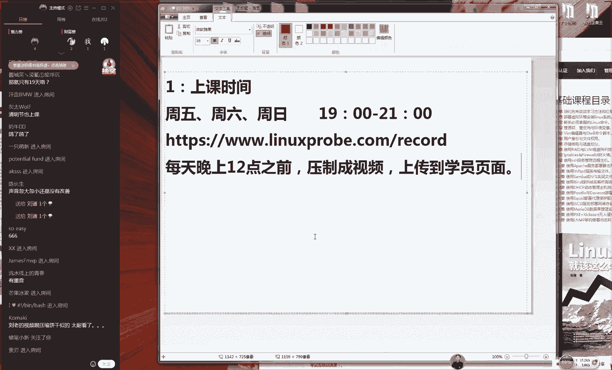
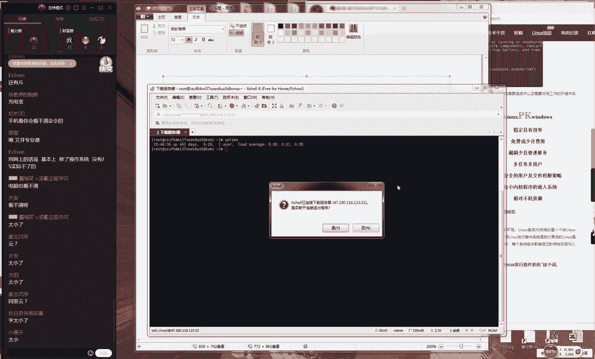

# 【RHCE】红帽认证工程师培训课程 - P1：第一节课 - 天木轮回 - BV14E411678v

。🎼Yeah。🎼，OK呃OK那现在我们准备上开始上课。同学们现在7点钟。好，那我们先来测试一下我们这边上课环境。好吧，先打一下一同学们，如果你能看呃，如果你能看到我的画面能够听到我说话声音的话。

那么请打一下一。那我们开始呃，那么开始我们今天这个课程。呃，今天人数很多164人。我让我想起什么呢？让我想起了。😊，呃，姜文在前两年他拍过一个电影，你们有印象，叫一步之遥，你们有印象，我会打一下一阳。

我记得里边有一个里边有一个片段，就是有拿着那个麦克风，然后对着台底很多很多人上千的观众，然后说我们开始直播了，对吧？谢不牙证，不是那个谢不证是那个一步之遥，当时在那个上海办办那个花国总统那个选举那场。

大家有没有印象，所以说我今天种感觉也是这样的，10171人啊，所以说咱们今天人数也是很多的。我预计今天可能在线听课的人就会突破200人吧。你说我们这一场培训做的，感觉跟个公众中呃感觉跟个公开课室的啊。

好，那我们今天开始我们今天这个课程因为是这样的。因为呃确实红帽今年的这个发布的频率啊打乱了我们这个培训的一个时间周期，因为是这样的，我先给大家聊一下啊，因为今天同学们还在陆续进场，所。😊。

我先给大家聊一下，是这样的。我红包的话呢，现在我们最新讲解的是红猫re7系统。这个红包企业版系统是每三天发布一次。而我们属于在上一次发布是2014年的12月月底，所以我们掐指一算。

大概就是2017年的年底会发布。结果我们看到2018年它都没有发布。那么我们下一次版本应该就红包re八系统。当我们发布红包re8系统之后，我们的所有的培训啊，考试啊课件，包括我们的书。

我们都要重新去去给大家去编辑。但是我们最终我们看到了，即便到了2019年我们年初但现在还是没有更新，所以我们也是一直在等待他那个红包里面的消息，所以我们也是耽误了一点呃耽误一段时间。但是我们现在看到。

😊，红包热8现在他还是没有发布，并且我们这边跟红帽厂商那边确认了一下。OK那我们呃具体时间我们不方便透露。但是我们这一期我们讲红包日期是完全没有问题的。

包时大家以后去考试去考红包日期这个时间也是来得及的。好了然后是这样的，因为大家今天因为我们今天第一天嘛然大家都非常的这个兴奋激动，然后我也是非常的开心啊，这么多人来一起听课了。

所大家这个问题可能会比较多，所以的话呢我会逐一给大家来去解答一下，不用着急。那么我先按照我上课之前我已经列了一下12345有这么5点。那么我先按照我这边准备出来的5点，先给大家来做一个介绍。

然后大家先去听一下。如果说我这个问题没有大家心目中的一些问题的话呢，那我们待会可以来去补充一下好吧，那我们先来说第一点就是我们这个上课时间问题。这个我们必须要每一期都要先给大家提一下。

因为上课之因为我们上课时间大家如果要是不清楚的话，然后是我们当时没有来去上课的话，那么。😊。

办那我们课讲的再好也没有用了，因为您没有来。好了，那声音忽大忽小啊，是怎么回事。因为我怕大家听不清啊，所以我现在把那个麦克风离得嘴比较近啊，所以我现在离得可能稍微远一点就好了。但是我怕大家声音又小了。

对吧？所以我现在呃给它稍微的往远推一点点，好吧，现在应该没有问题了。好，那我先来说第一呃，那我先在说第一点就是我们这个上课时间，大家每个人那我们都有一本书，即便说您报名的时候。

说呃老师我我已经自己买书了，对吧？然后我呃。😊，呃，就我们能不能就呃那我们能不能就不要教材或怎么样的。那么呃不论怎么样，您手里都有一本书，对不对？好，那我们现在翻开书啊，是这样的。

待会儿我会给大家去说到，其实我们这个课程之后啊，我们会给大家送一份礼物的啊，我们还是比较有这个还是比较有原则这样的机构。所以就是说我们我们培训完了之后啊，我们会给大家送一份礼物。

但是我会告诉大家我们这个活动的规则。所以您现在手里这本书可以敞开去写笔记，随意啊可以来去随意去用，这个没有关系啊，不怕把它写乱了那好，那我们现然跟我一起翻开说好，大家手里面都应该有书，对不对？

要室友书室友书，但是送书我们会有一个。😊，呃，会有一个小活动，待会我会大家去说的啊，是这样的，大家先跟我一起来翻开书，好吧？现在的话都大家都有书，对吧？然后那我们先来那我们先来翻开书，我们的第一页。

然后我们看到有一个会看到我这个照片呢，但是照片跟我们本人不太像啊。然后的话呢大家呃底下那个微信估计已经加满了。那或者说你已经加过的话，也不用再去加了。因为这个是我之前那个微信了，估计呃已经是加不了人了。

好，然后呢我们现在翻开书再往前翻一页。然后的话您会看到就是说我们前面有一个编辑呃手记哈，这个我们不用看啊，这就是我们出版社给了一些好评。还有一个前沿是这样的。今天的话我们这个课程不是讲第一章节。

我们今天讲就是这个前沿。因为我们今天第一天的课程，我们需要给大家先去讲解一下我们这个课程大概是怎么回事。我们学完了之后，我们能做什么事情，以及我到底要不要去考这个红包认证，或者说我以后工作了。

我有那我对那我那那我以后会。😊，这个工作有什么帮助，对不对？好，所以我们今天所讲的就是这个前沿里边的部分。我们换句话说，今天主要就是进行一个框架的一个呃阐述。好，所以的话大家可以翻开你的书籍。

找到这个前沿这一页啊，然后他这个左边这一页，大家看到是一个空白页，对吧？好，这个时候你就可以拿出你的笔来了。然后在这个空白页，就是这个付道坤啊，本书责任编辑的底下，我们要去建定笔记啊。我们是这样的。

再给大家去说一下。第一，我们的书我们不会回收，对吧？第二就是我们培训完了之后，我们会给大家去赠送一本签名的书籍的括弧我们会有一定的这个活动规则啊，所以的话现在您手里这本书您随便去用，千万不要不舍得。

千万不要舍呃不舍得不去用，对不对？那我们一定要去写好你的笔记。好，那我们就大家就同意好了。😊，就以我我大家就现在就以我们这边前沿的左边这一页这个空白地方，我们去写笔记，是这样的。

我们这个活动先给大家去说一下，就是您上传您的笔记的图这个图片，然后我们会给大家去送书。所以您一定要用您的笔去写到这个纸上面，不能用电子版。因为电子版的话，我们不知道您是从网上哪里去下载点什么东西不对？

所以说我们要为自己的学习也负责，就是我们一定要用你的手写好吧，拿出你的笔来，然后现在在我们的白纸上面去写第一我们的上课时间好了，因为我刚才也是等一下，今天第一天有同学都迟到了。

我上课之前我还看到有三个同学去打那个QQ电话了。为我不知道他们什么情况。所以如果说因为我现在开始上课了啊。如果说我们现在群里面有其他同学他们问到说我们该怎么去进入到我们这个QQ视频。

怎么进入到我们这个QQ课堂的时候那麻烦大家可以去跟他们去介绍一下，怎么点怎么点怎么点就能看到我了。好，那我们先来说一下。😊，的第一个话题就是我们这个上课时间，大家千万不要着急。今天第一天我也很高兴。

我们这么多人都来了。那么嗯不要着急，今天我们连系统我们都不会去安装。我们今天主要就是我们叫吹牛嘛，或者说我们叫做课程的一个介绍啊，或者说我们叫做这个开班仪式不要着急。好。

那我们在说第一个就是我们这个上课时间上课时间大家应该知道的就是每周五每周六每周日我们每周上三天课，大家可能这周就问题那我们大家可能会想老师为什么每周上三天课呀，每个礼拜7天，那你4天都跑哪里去了。

是这样的，我们曾经在第十三期的时候，我们尝试过每周上4天课，我告诉大家的结果就是根本就跟不上啊，大家不要说老师我一周我上三天复习四天太多了吧。这个时间但是但大家真去学习的时候就会发现真的是不够的。

因为我们后面这个课程难度也很高的。所以的话呢我们这个课程的规划是很合理，大家一定要相信我们这个规划不是偷懒。因为我们因为我们一个礼拜上。😊，7天的话呃，三个礼拜就把上那我们就把课上完了。

那我们也那我们也省事了。但是这个不是这么回事。我们不能够说因为我们去赶课程去赶课时，而耽误我们这个培训的效果。所以说每周上三天的课程是我们培训三年来的总结出来的这个经验，这个也是最合理的。

并且我们现在是包含了周六跟周日这是一个周末时间，大家可以上午去复习，然后下午去来去听课。这个时间那大家先暂且相先，首先相信我认为是一个比较合理的一个时间。然后的话那我们这个上课时间是雷打不动的。

绝对是晚上的19点，就是晚上的7点钟开始。大到11点，但是有些时候呃可能会略长一点，可能会到10点钟或到9点半左右，就是我们这个课程的时间，大概会是在两个小时到2个半小时之间。好吧。

是两个小时到两个半小时之间大家的话呢提前做好准备。这个期间您可以去吃饭啊，您可以去泡脚。您也可以躺在床上去看手机。😊，都可以，这是这个就是我们网络培训的一个优势。因为啊嗯。😊，我当时去学习的时候的话呢。

我当时向的是一个呃实力培训机构啊，大家知道，因为北京这边的话呢，坐公交还是比较方便的。而且那那那个时候地铁还是嗯感觉还是没有呃还没有很通顺啊，所以我当时从我这边去培训机构，我大概的路程要达到3个小时。

所以说我的来回就要到6个小时。所以说这个我每天浪费到这个呃去培训机构的路上的时间叫6个多小时。这比我上课时间，现在就是1比1了。所以说我们现在通过一个网络培训的话呢。

我们可以去减可以去呃降低我们在这个上课不必要期间，我们去花费这个时间。好，那我们就可以每天晚上呃我们是周五周六周日这三天的晚上7点钟我那我们就打开我们的这个QQ就可以看到我们这个视频节目了。

说到节目好了，叫做上课吧。好吧，我们不用说我们太娱乐化了。那么老师那我如果说我忘记怎么办呢？好，不用着急，我们会在每天的晚上，那我给大家去说一下啊，那么。😊，大家可以现在可以拿起你的手机来。

大家可以拿起你的手机来。嗯好，拿起你的手机来，然后打开你的微信啊。因为我们现在这个呃因为我们现在这个培训可能跟大家。😊，上大学的时候是不一样的啊。我们这个呃我们这个上课的时候是可以玩手机的。好。

现在大家会这样啊，拿起你的手机来打开你的微信。O打开你的微信了吗？我们会快点快点我们打开我们的微信然后我们点开那个扫扫一扫。

就是你平时给人们去呃付款那个扫一扫去扫别人的二维码的那个O好然不我不知让大家付款啊然后我们现可以看到我这边弹出了一个二维码的一个框好，大家先去扫一下大家可以放心扫这个不让大家付款是这样，大家先去扫一下。

扫完之后可以给我可以来去互动一下好吧，可以打一下一会告诉我说扫好了在我们去扫一下，这个时候就会在的微信里面会弹出来一个网页对不对？他会弹出一个网页这个时间表大家看到这就是我们上课所使用的这个时间表。

您看到啊这个时间只要我们这个日期的后面有一个小星号啊，非常可爱，这个只要有一个小星号，就代表是我们当天有课。所以我们看到今天3月8号。😊，妇女节，所以我们看到八的后面我们点了一个星号。

所以说8号的晚上就有课。那我们看一下9号、10号都有课。所以说如果说您不确定今天有没有课的话。😊，那么您就可以。啊，打开这个网页，然后去看到我们这个上课时间表。好了，这个时候不要关。

现在您的话呢点开您的这个呃微信，对不对？然后去扫一下这个二维码。然后您现在把您的这个屏幕的这个网页啊，挪到我们的这个第二期培训课程的课表上面，我们去截张图。好，然后把这张图片您保存到您的图片夹里边。

这样的话你可以去随时去看到了。因为我我们这个呃课表的话呢，没有说特殊情况是绝对不会改变的。大家可以放心。说老师我明明今天有看到是9号还有课，结果你9号你突然出去玩了。那这啊这样的情况，我们三年时间里面。

我们从来没有出现过，这也是一种契约精神，我们会准时准点了，我们会给大家去上课。所以这张课表大家就收好。那我们会在每周五六日这三天晚上7点钟开始给大家讲课。好，我这个比较啰嗦啊，我已经说了三遍了。

因为主要原因就是刚才有说到的同学现在有200个同学上线了。刚才刚开因为我刚去上课的时候，只有175个啊。😊，啊，那我们唯一的一个例外的话呢，是呃3月31号，因为那个是我们培训机构的4周年。

所以我们会有一个活动。然后也算是我们的一个放松吧。然后我们看到我们的唯一例的一个例外时间就是3月31号大家记一下就好了。那我们其他时间都是每周五六日。

然后我们的课程大概是从18大概是18到20节课是一个在线培训机构在线培训的一个课程。好，这个就是我们的一个上课时间了。如果说您刚才来晚了，或者说没有来及套入手机的话呢，不用着急。

我们可以打开您的网可以进入到我们的这个网站里面去输入recor这样一个单词，进入这个网址里面也能够看到我们这个课表。好，大家先可以记一下。如果说您来不及记的话，没有关系，您可以先截图。

然后再腾到您的书上面。好吧。好，另外是这样的，因为我们现在培训书比较多。如果说我们课后想要去传一些资料的话呢，我们待会会输到一些我们学员内部的一些资料。那个信息，大家不要拍照，也不要。😊，到其他群里面。

好吧，我呃我们的交流群只有我我们的这个学员群跟第二期的培训群，不要传到ABCDFG这样的这个公开群里面。好，这是我们的第一个呃问题。上课时间。好，第二个问题就是老师，那我如果说我今天我就是没有时间来。

或者说我忘记来了怎么办呢？这个没有关系，我们会啊这个算作为一个小话题吧。那我们会有一个压制的一个视频。大家看到的话，就是我们每天上课的时候，我们都会。😊，给大家录制成视频，并且这是一个超清的一个模式。

特别特别的清楚。好了，大家看到呃，我们这边正在录屏啊，把它给关掉了。所以的话呢我们会在每天晚上12点之前啊，大家下课之后去复习。然后我这边就会开始去同步去压制我们这个视频了。

但是这个视频压制的会非常的久，所以说我们会在每天晚上12点之前，最晚也会在晚上12点之前啊，也有可能吧。我们呃如果说课程时间比较长的话，可能会延迟到呃但可能不会到早上起来啊，最迟最迟就是凌晨的两点钟。

那那么我我们会给大家上传到我们去虽然区页面上面啊压制成。😊，视频。上传到学员页面。好，大家可以来去记一下，就是我们呃会在每天上课的时候进行一个视频的一个录制，并且会在每天的晚上12点左右，哎。

我们给大家压制成视频的一个形式，上传到学员页面里面。这个然然后我们这会问老师那我们什么是学员页面呢，学员页面，大家就记一下好了，不要截屏啊，是这样的，我们在我们的网站后面只要加了VIP这个三个字就好了。

然后密码不要问我了，密码也不要发到屏幕上，千万不要发，千万不要发，千万不要发，因为我们这个视频万一被泄露出去呢。密码请看聊天记录。啊就是在大家在报名的时候，我们会给大家发一个信息，对不对？好。

请去看一下我们这个信息，里面会有我们的密码那密码看聊天呃，这个字写不下啊密码。😊。

请看聊天记录。或者QQ群公告。好，这个大家去记一下。好，然后我看到大家然后我们为了避免说大家以为我在给大家放视频啊，因为今天是这样的。今天第一天你不要看感觉今天就是在吹吹牛啊，在做个开班仪式啊。

其实内容量很多的。我们刚刚第一小点我们就经说了20分钟了，这个东西我必须要给大家去说清楚，要不然的话你讲的再好咱们不能夸讲课好，对不对？你讲课用心吧，那你同学没有来，那也白费。

所以说我们今天会把这些小点会给大家去啰嗦一下。如果说你已经归心似箭，你已经想去赶紧去执行命的话呢，您可以先去看我们这个压制的视频，我们在学员的页面的里面的话呢一定给大家提供好了预习的课程。

就是如果你说您技术比较好的话，可以提前开始去学习了。好，那我们为了避免大家可能会认为我们这是一个放在一个视频啊。好了，所以我们给大家简单去回答几个问题吧，大家可以来一起来问啊，这个没有关系。

我们之所以选择是一个在线的一个形式，就是因为我们希望能够跟大家互动。根据我们当期学员的。😊，这个情况我们来去调整我们的这个课程，这才是我们的一个培训的一个的一个核心嘛。要不然的话我们跟放完视频有什么关。

那那他那啊那有什么区别呢？好了，然后这就是我们的第一点给大家讲清楚。然后说今晚没啥事儿吧，去吃饭了。哎呀，这个奶牛同学很狂啊，所以我这就是技术比较好同学，有这个底子，所以比较自信。行，我们记下来奶牛。

我把它抄到一张纸上面，那从第二节课开始，我们就开始给大家提问了啊。😊，呃，那我们接着好同学啊，比较自信的同学，我们就要多提几个问题。好。

那我们接下来我们来给大家再说说我们呃但是我们现在同学们问题比较多啊，可能我就先。😊，呃，挑着说好不好啊，因为如果您的问题在我们的后面会给大家去聊到的话，那我就先不说，待会儿我给大家去是说。

因为我先呃给大家列出来5点呢，这个才这个才是第一点。好了，然后我看到说呃。😊，好了，没有什么问题了，对不对？没有什么太关键的问题了。好，有同学叫做张同学啊，说这期学完了不会发布新系统吗，还来得及吗？

是这样的呃，我们的话也是有一个原则的这个机构啊，那我们不是那我们不是坑人了，不对？那我们刚学完红毛日7，一下考试变成红猫热8了，那不跟坑人了嘛，当就是我们上初中或上高中我们高考的时候，们明明是出以外。

结果考试的时候，你考的是牛顿的第三定理，对不对？所以说这个我们肯定会给大家安排好这个您不用担心，而且这个归属于到我们会给大家聊到第二点。那第二点就是说到我们红帽考试。好了，既然说到我们红包认证的话呢。

我们先给大家来去做小调查。好吧，这个只是个小调查，并不是实名，也不是记录在案也不会说让大家赶紧去报名，是这样的。如果说您有意想要去考红帽认证，或者说您规划好了，再或者说我未来的两三年吧。

无所谓今年我想去红包认证的话呢，那么请打一下这个无所谓这无所。😊，就是说。呃，您就大概想要去考的话，就大概我们打个一。因为我们根据我们当期学员的情况，我们会做一下小的调整。但是如果说您不想去考红帽认证。

好，也不用着急，不要呃，不要担心我们这个培训会以红帽认证。😊，这个内容为我们讲课的一个核心，然后只是为了一个刷题班，那就没有意义了。因为要讲刷题班的话，用不了20天，我们用10天就差不多OK了。

所以说这个我们先不给大家解释啊，因为我很觉得解释很很空洞。您坚持听完了我们这套培训自然会知道我们这个课程的一个含金量。好了，然后我们那我们看到同学们呃有一半吧。

或者说有3分之2同学都是准备啊去想去考一下红帽认证的，所以我给大家简单去聊一下好了。因为我从09年开始我们开始去学习，然后12年去考红HCE认证，15年就考下了CA和CA和HCE7版本。好了。

这几个认证的话，当时我也是在全国唯一拥有了红6红7红C的这个认证讲师。好，这个不给大家去瞎吹，或者说我说我有那怎么能证明呢？我们待会会给大家去聊到，以及会展示一下我这个证书。

以及会有一个网站来去做这个验证，你可以去红帽官网。😊，去查到我的信息。好了，然后我给大家去说一下，就是我跟红帽打交道，从09年到19年，我已经接触了10年时间了。所以说这10年时间里面。

尤其是我也是在做红CE的这个培训。大家大家可以看到我现在是在专注去做红多少我也不做。所以我现在是我认为是在这个行业内还是有一定心得的会有一些自的一些过往一些经验。

以我会大家去讲一下我认为的红认证是怎么回事红帽认证的话呢，它分为三个级别。第一啊这个字的话家大家放大一下是这样的您可能看这个字会比较费劲，觉得比较小没有关系。那我给大家稍调大一。

只要您这个字能够看清的话就行好吧，只要您这个字大小能够看清就。我们以后上课都会把我们这个文字调到这么大它分三个人种级别分为红红跟红C我们待会会大家去细聊一下。那我们今天这个课程的话。

大家报名没学习我这个课程。😊，是在学习的是红马HCSC跟红马HCE这两个认证。那也就是说我们这个课程的一个定位就是一个中级别。但是我们实际的这个难度会到这个中高级别，因为会涉及到很多红马士C里面的内容。

所以说我们这个。课程的一个难度的话是一个中高级别，是从零基础啊，是从零基础到一个中高零基础到中高级别这么一个认证的课程。然后呢我们今天这个课程的一个培训费用的话呢，我给大家去说一下，就是大家都知道了啊。

我们的培训费用啊，这个实续费话，是2400块钱。说这个原因的话呢，就是说因为我们这个培训机构，我们不会给大家去心啊，这个是一个行业的一个惯例，也许您之前没有关注过，但是我给大家去提个信。

那们就会发现还真是怎么回事。大家可以先去任何的培训机构，你们去看一下大多数培训机构上面是不会去写价格的。这个很奇怪一件事情，我们有发现就是很多的培训机构的官网上面是不会去写价格的。

他们会给你留一个客服的一个电话，或者让你留电话之后，他们给你做回访，这就是因为里面会有水分呢，每个人的价格实际上你去问他都是不一样的。而我们不会这样的。那2400块钱。如果你不报不就不报了。

所以说我们现在给大家的这个同一的费用都是2400块钱。所以说我们没有同学们花2300报名的，对不对？好。😊，就是说我们现在这个费用都是同呃统一公开的。

并且我们这是一个呃心里很有底儿的这么一个很有性价比的这么一个费用。然后的话说一下我们这个考试费用的话呢，考试费用是4200块钱。这个价格我们也之所以敢公开啊。

就是因为红帽给我们的报给的价格就是4200块钱。所以说呃别人的价格只会比这个高，不会比这个低，大家可以放心去问。😊，因为这个价格的话呢，就是红帽厂商的报价，他们会报给我们的厂商。

然后让我们去加价格去加上我们的这个服务价格，然后再报给我们的学生。这个差价我们是没有的。这4200块钱就是红帽厂商这个报价。

所以很多其他培训机构学习好同们都会过来我们这边我们会给大家去报考所以说如果是外面的学员过来报考的话那我们会在这个价格之上。

我们会给大家加100块钱以说我们跟那玩所以说我们会加100钱的这个服务费后给大家去报考红帽认证。而我们自己的学生都是4200块钱。好，我们之所以敢说啊，他就是因为红帽厂商的报价嘛，大家可以随便去问。

只会比这个高不会比这个低。如果比这个低的话，一定是有问题，你去问吧，一定是有问题的。而且我们这个已经做了3年时间。我们报考学生少说少有1000位。

以说我们不可能说因为这点然后就加到我们的招牌好这就不说了。然后说我们上课之前同学说就说到了其他培训机构。😊，说考试费是5000多，怎么怎么样，说老师他们培那其他培训机构的考试费是5000块钱。

为什么你是400块钱，是不是因为他们的考试比你的好啊？那好，这个问题就那我就先不回答了。好吧，这个考试都是一样的然这么回事好接下给大家去说一下。

就是我们的考试的一个地点问题是这样的我我们的话现在是在全国因为我们现在是在专注去做红这个东西他就怕精对不对？当你去做精的时候，自然你就会获得这个行业的一个认可。

包括说我们现在也是红帽厂商的一个我们认为是一个考试大户了。所以说我们现在在全国是有12家的这个合作的考点，大家可以找到这个12家的考点是在全国最多的。后我说是最多的。我然知道在2015年的之的广告法。

但是我们就可以说是我们是最多的合作厂商之一没有之一没有之一。现在我我们是中国合作红考试最多的。😊，客弧包括了线上培训机构，包括说包括了线下培训机构全都包括了。

大家刚才提到说上官呀、东方瑞通啊、塔塔、达那呀，还有深圳的青兰，这些我们都包括我们在内，他们都没有我们的多。我那我们在全国有12家的合作考点，主要集中在了北京、上海、广州、深圳、天津、济南、青岛。

但是济南跟青岛考场，山东考场目前呃因为呃人数比较少，所以说。😊，可能周期会比较长。大家可以看到这个网址就是我们合作12家的考点的地址，大家可以来找到。呃，那么也许说我们这里面的考场里面有上关机构的。

那么他们可能对外的报价，考试费是5000块钱，那没有关系，只要是我们合作的考试从我这边报名的话，都是4200块钱，这是我们学员的一个福利啊，但是你不要去跟其他人去说这4200块钱怎么怎么样。

因为我们对外的学生都要加服务费的。好吧，然后然后给大家去瞎聊一下，去瞎聊一下了。是这样的，因为的话大家知道我们现在是一个网络培训机构，然后我们不想给大家去说太多鸡汤啊什么的在忽悠大家，毕竟都交完钱了。

对不对？在忽悠没有用了。好，因为我说话比较实在说自己实在感觉好打脸，然后是这样的啊，因为我们的话希望嗯我们这个培训机构也能获得更多的人气。我们坦白说我们现在每个人交交2400块钱，我们的培训费用。

那我们一起做下来，我们除了我们的人员除了我们的广告，我们已经能够保持我们这个团队很稳定的在运行了。包括。😊，说我们在下个月我们会公布一款我们我们这个新的产品，我们现在有旗下的产品了。

就是说我们现在运营的很好很好了，我们现在没有必要啊去给我们的这个考试费用去加价，所以说大家可以放心这一点的。好吧，这也是我们给大家一个承诺，就是我们的学员只是通过我们的培训费，我们来去运营我们这个团队。

考试费用，这是一个呃公开性质的。但但是因为我们的价格确实还是比较有优势的，而在全国内不可能他们不给你加服务费，然后对吧？所以我们现在还是比较有优势的，不论不光是我们投的同学会去考会去报这个培训啊。

不不会会会去来约这个考场的位置，还会有外面的机构同学他们也会来去约考场的位置。所以的话呢我们的考场位置是有限的。😊，虽然说我们每个月都会尽可能和我们的学生去约更多的考场。

但是我们看到了我们这一期在线听课人就有200个人左右。所以说但是我们算一下一个考场里边，你那大家跟记笔来去算一下一个考场里面最多最多最多做多少人，做15人顶天了。因为我们的位置只有12个位置。

还有3个机器，那是备用机器，怕出问题之后，他们要去换一下位置了。所以说我们假设我们的每个考场能做15个人。那我们每个城市大概会安排3到4场。所以你算一下，还有而且我们现在还只是第二期的培训的学生。

你们是第二期的培训的学生。我们往前还有19期的，没有考试的学生，他们也会去挤这个位置。所以是这样的。所以的话呢我们原先我们会给大家去说随到随考。但是我们现在的话呢，如果说你想要去考试的话。

请提前2到3周来跟我去预约啊，并且的话呢我们现在有一个周期就是我们会在当月的25号来去预约下个月的考场。好，这就给大家去说到了啊。😊，啊，然后给大家就是说到就啊因为我们今天第一天被要给大家就聊到了啊。

😊，呃，然后我给大家去说，就是我们会在每个月的25号来去预约下个月的考场。那也就是说我们会在3月25号然后去来去预约啊，去预约4月份的考场。那那然后我们就来呃考呃4月份考试。

然后我给大家去来去以此类推了啊，然后就是4月25号去预约。😊，5月份的考试。好，然后说我的这个爆破声音比较大，然后可能是休息时间太长了啊，自己太放纵自己了。

这有点太这个这个这个这个没有太好保护自己的嗓子。因为从去年你想想从12月份我开始休息虽然说休息吧，但是也是一直在只没有讲课，其实该干的事都在干，现到3月份了，真的是没有很长时间再去说话。

而且我人不太平时可能不太喜欢说话，但是我们讲课跟打鸡血似的。最后我所以我今天这个嗓子可能会讲完课之后就有点声音有来小啊，如果声音小的话，大家提醒我一下。好吧，然后我们就先说就先说这么多吧。

因为我们同学们呃有不想去考试了。所以我们以后慢慢再给大家去聊吧。今天第一天给大家说大概好吧，然后来去说第二将会来去说我们这个第三点，如果说我哪一天如果说我哪一条。😊，没有说太清楚的话。

那么你大家可以来去提问啊，然后我来继续来去补充，好吧。然后说那这个月的想考的话就没有戏了嘛，是肯定没戏了。因为这个月的考试早在2月25号就已经约满了。而且今呃因为2月份嘛红榜考场他们那边过春节休息了。

置本身就少，以说我们3月份的考场已经全部都约满了，没有了然后不给大家去瞎说啊，说老对然给大家去说一下，就是说我们之前我们再去做这个培训的候，尤其第19期我都感觉有点不好意思。

为我们先第19期那这个也是不可避免。因为当时他正好发布了红猫8那个测试版本那么于是我们所有人都在去预测他有可能会在明在今年的一二月份去去这个发布红包8的正式，然后去更新我们的考试。

但是我们看到非常的打脸？我们看到3月份他还没有变更成红8这个考题也没有变更。而且我们这边的消息，在今年5月份之前他都不会去变更的。所以的话呢我们有点不好意思了，好像我们。😊，红帽的托一样，让大家去考试。

所以的话大家就是我们具体的呃变更时间，我们先说不好。那我们先放下来先不讲那我们先去讲课讲呃，那我们先给大家再去上课，然后我们这个课程是从3月8号到4月中旬，对不对？然后我们到4月中旬的时候。

那我们再来看一下当时的实际情况，然后我们再去约考场就好了。这个先不用着急，另外是这样的，然后大家刚才提到一个问题就啊就是说我们这个考场位置问题，说啊老票生孩能不能去约一个考场位置，然后给大家去说一下啊。

说老老师为什么别人的考场他们都能随便去约到啊，也不能，对吧？那那么我们为什么我们的考场位置这么有限的？第一就是说因为我们没有任何的差价，对吧？所以我们的报考学生的量会比别人大。

第二的话呢就是说我们会有呃外边的学生他们也会来去报考，所以我们发档位置是有限的，但是我给大家一个保障啊，就是我们现在在全国有12届的考场，那主要包括就是北京，啊，上海天津啊济南深圳。😊，广州还有青岛。

呃，当前的话呢，尤其是在北上广深这四个城市，其其他城市我们不敢保证就是在北京呃，还有上海。还有深圳还有广州，如果说您是在这个四个城市的话，那是一件啊那是一件很好的事情了。因为我们有这个四个城市。

当前我们有这个四个城市的这个优先报考权。那也就是说我们这边报考不到的这个城市。那么这个所有的培训机构，他们都不会有位置的。大家能够理解这个意思了。

这也不是吹牛大家可以去问就是说比如说我们将报一下北京好了，那我说报一下上海或深圳好了，如果说我们这边没有看到位置的话，那么全国的这个机构，包括说线上或线下，他们都是没有位置的。

所以说我们这个还是跟我们学员争取到了一个很好的一个权益。好，接下来说一下我们这边的这个第三点好了，因为就是在红毛认证这边。😊，说起来也是没完没了的啊。我们尽可能我们有因为我们给大家罗列出来的5点吧。

然后我们继续给大家去说，我们尽量每个点会给大家去说15分钟好了，那我们继续下1个15分钟。下1个15分钟的话呢下1个15分钟，这个有点这个有点这个有点这点不下了啊，大家先来一起来去记下笔记。

然后截张图吧。好先截图啊，然后我们继续往下去讲先截图了先截张图好，那我们接那截好图之后，我们继续给大家就说然后的话是这样的，如果说你想要去搞红门认证的话呢，毕竟我们的考试费是4那我们这个4200块钱。

我们没有任差价服务费情况下还是4200块钱。但是我们谁的钱也不风刮来的。那如果说你想去考红认证的话呢，请先判断自己有没有必要去考。

或者说您的这个条件是否说能够去支持您或者说你想者说您为什么想要去考如果说这个没有搞清楚的话，这个没有关系，大家先。😊，可以这样子啊，你可以打开这个网址，再给大家一个网页，然后再给大家一个网页这个网页。

😊，这个的话有1个70分钟的一个视频讲解，会给大家去讲到红毛认证，这也就是我们今天的作业了。大家来呃，现在先不用着急说约考场，因为你现在约我也约不了啊这个东西呃因为你想约，大家都想约好。

现在都现在都是呃位置比较有限。然后呃然后我们来继续呃来呃来叙说啊，这个其实也不算是。😊，饥饿营销了。因为当时因为只要你去报了考场，你做到那个考场里面的时候，你就知道有多火爆了。好了。

然后呢我我们今天这个预习的作业就是这个视频了。大家的话今天我们下课之后请进入到这个网址里面。那么请进入到这个网址里面，然后去看一下这70分钟的这个视频。我们今天这个课程大概是会在9点钟之后会结束。

或者最晚的话9点半吧，我们会一个答疑的一个时间，那我们下课之后大家先不要着急睡觉，好不？毕竟我们明天可能会呃我们明天反正也可以休息，所以说我们今天下课之后去看一下我们这个视频70分钟，那好了。

今天再给大家去说一下啊，我们要给大家去介绍东西太多太多，大家千万不要着急说时间好啰嗦呀，我也觉得我很啰嗦，可能每一句话都要重复两三遍，但是没有办法，这也太重要了。如果说我们进一遍没有给大家去说明白的话。

大家总会是去纠结这些问题，那影响到我们上课以后的这个呃节奏啊。好，第三点来我们来继续第三遍大家比较关心的啊，就是我们。😊，这个发福利。哎，老师，你跟考像师说到什么东西？好像是要送书，对不对？好。

对我们现有一个福利送书环节。好，其实这个就是一个小小的一个心意了。我们因为我们每个人报名的时候，花了2000多块钱呢，你不是来过来买一本书的，你也不是来去送一本书，当做是一个呃。

这也不是一个单纯的一个购物的一个行为。好，但这也就是我们一个心意了。因为我们的书，我们坦白给大家讲，就是我们给大家去送部本书，都是我们这边给大家去买的出版社不会他不会免费送我们的书。包括说我们去买书。

然后给大家去寄出快递，都是我们自己的钱。所以的话那我们就希望啊不是说在哭穷啊，这个我们一点都不穷。然后就是说呃我们的意思就是说呃我们既然有这么一个活动，并且是一个双方受益的。

那么请您也一定要认真去完成对自己的这个学习也要负责任。😊，呃，我们对自己也是学习的一个负责任。好，那我们现给大家去说一下这个福利送书是这样的。因为的话呢我们之前从第18期以前啊，我们同学们有一个问题。

就是你们拿到这本书啊，我也不知道你们到底是懒啊，还是还是怎么怎么样啊，就懒得去写笔记。然后的话呢然后跟我说老师你这本书他好我不舍得去用，然后给我找一堆乱七八糟的一些鬼理由。

所以的话呢那我们干脆从第19期开始啊，所以说我们干所以说我们从上一期开始，那你干脆了。那你既然说不舍得去用书，那我就送你本书好了。所以说当前的话您手里这本书想敞开去用，随意去记笔记，这个没有关系。

只要您完成了这个任务之后。😊，我们都会给大家去免费赠送一本，并且是签名的书籍，免费送一本。签名的书籍，虽然说我的签名也不管用，对不对？除非把我的签啊，呃除非我这个字签到一个欠条上面。

要不然的话也反正也也也不能说也不能说一点不值钱吧，对吧？但是也确实不能跟名人比，但是这是一个我们的心意啊，东西不贵，但是一份我们的心意。就是说您现在可以把您的书拿出来随去随意去写笔记好，没有关系。

然后可以写越乱越好越详细越好。然后我们这个培训结束之后，我们会给大家赠送你们签名的书籍。如果说您想要的话就可以过来领然后可以作为一个收藏，这是一份心意。但是不知每个人都会送的是这样的。

那么我们会有一个活动，就是我们进入到我们的学员页面里面。然后我们后面加上福利三个字福利两个字，你看我这个智商啊，然后我们可以进入到我们这个网站里面加上福利这两个字就可看到我们一个送书的一个小活动了。

就是您先去注册一个技术性的一个博客，然后把每天。😊，当然说您不用为我们打广告啊，这个帖子里面没有可以没有任何我们的广告信息，也不用去提我们这个培训怎么怎怎么样，好吧，就是说呃。😊。

我们去注册一个技术的一个博客，然后把每天自己所学习到的这个知识，然后去分享出去。然后加上您拍照呃，然后把您的书拍照之后呃，那也不用拍我们书的封面啊，因为这样话比较广告比较重。

就是说您只要把您的笔记的这个图片给大家拍照，同时去上传到我们的这个博客上面坚持20天的话，那我们最后就会给大家去赠送一本我们的书籍。那我们让大家去拍照我们的这个书籍的原因。

第一点就是因为我们需让大家去记笔记，强迫大家去拿出你的笔来。因为有中国一句中国有一句老话嘛，叫好脑子不如烂笔头。这句这个基于这句话我也是吃了很我当时我也吃了很大的亏了啊，因为你去写电子版的这个课程。

电子版的这个笔记，就终归他不如你去手写一遍，记忆的深刻嘛，对吧？所以说第一就是说我们强迫大家去记一下你的这个纸质的笔记。第二就是说我们必须让大家去拍照之后上传。因为呃我们怎么知道大家去从网上找一段话。

😊，然后就当做自己的笔记，对不对？所以说您必须要证明自己的这个博客是自己写的。所以说我们一定要把这个博客拍照啊，不我拍照您的这个笔记的内容，然后传到我们这个呃博客上面，然后去坚持20天就可以了。

并且的话呢今天就开始了。今天开始就要开始去更新了。然后我们这个课程总共是18到20天的时间里面。这样您坚持发完的这个呃签到，那我们就会给大家去送一本书，这也是前部你自己去。😊。

这也这那么啊这也是强迫您自己取得给自己定的这个动力啊。这样的话每天有一个这么一个小任务。好，再给大家去说一下，就是我们推荐的这个技术博客的话会有很多，大家可以去选择一个，或者说你已经有的话，那就更好了。

好了嗯这个说了，这不打广告借考试会考，这个考试是不考的，是这样的，因为我就希望大家能够去有一个签到嘛因为我之前我看过女朋友因为他比较胖啊啊，然后他以前呢就下了一个软件叫薄荷网，不叫薄荷，你们有没有用过。

可以打一下。一里边就有一个功能叫签到。然后你每天你就写上你自己的体重啊，没有用过吗？😊，他怎没怎么没没有没没有人跟我互动？啊，我我我我我会被打了，没有我这边声音很小的，他听不到的。是这样的。

就是以前啊我哎这么说以前嘛就是说比较胖嘛，然后就有一个软件叫薄荷，今天妇女节，然后的话就是说你每天要去打一下卡，然后写上今天吃了什么然后他当时特别的特别好笑啊，比如说他吃了半个面包，就写上半个面包。

他会换算成打卡，然后每天去算自己设的那个卡路里。然后就是说这个我觉得这是一个很好的一个激励的一个机制啊。所以说我们把它搬过来我们看看我们的梦也这样去用。这样的话您今天也许今天要翻懒。

但是没有关系但但是会强迫自己去更新一下博客这个也不事。再给大家退一步说就是只要您去每天去打卡去上传了您的博客照片就可以了。如果说您实在是在我懒得去写，或者说老师我就不说懒好不好？

那我们就说老师我觉得你写的书就特别的好了。我让。😊，认为我没有虽然这有点太夸自己了。就是说呃如果说您不想去写笔记了，或者说您认为我我们这个书里边的某一段话，您认为就是今天所学习的一个收获的话呢。

那么就可以从网上去复制也可以啊。但是就是您复制一段我们书上一段话。然后您把它发到您的博客上面，并且配上您一张呃笔记的一张照片就可以了。然后去坚持发完，我们会在最后一天的时候做统计。

然后会答去送那个签名的书籍的。好吧，从今天开始。😊，啊，这也是一份我们这个心意。但是如果说您不想要的话也没有关系。然后我们那这样的话那我们也省钱。但是我们希望大家能够去坚持下来。

然后对自己也是学习一种激励吧。给大家推荐几个比好的技术博客。如果您要有的话就可以了。如果没有的话家推荐几个第就是开源中国好，这是一个比老牌的一个的一个站点了，可通过每天更新博客。

你也可以去逛一逛相关的这个资讯啊干货什么的多去学习学习好第二个话是51CT看我们广告做多硬不硬气了。我广告CTO这个现在是目前来说做视频做的比较好的一个网站。我们推荐他好不好？

他有博客以网上去发还有就是CSD这是一个老牌了，对？后我记得我上高中的时，就上面去下那个软件，结他老是要用什么积分，然后就发动我小伙伴们我同学们他们帮我去注册然后下面还有就是。😊，个什么那博客园啊。

OK博客园这hub的话，这个主要是共享一些软件吧，开源的这些程序，他们好像没有博客。😊，新浪博客的话不可以，因为我们是希望给大家去呃我希望大家能够去一些技术性性的一些博客。😊，但当你去更新这个博客的话。

实际上你自己也会潜移默化的。比如说偶尔看一看这个资讯呀啊，或者说去看一看这个呃新闻啊什么的，其实也是一种学习。所以说我们推荐大家还是去技术性的一个博客好了。好了，大家还有什么呃推荐吗？

那么给大家补充一下。没有的话，那就是这4个，我们确定了好了，还有没有其他的。😊，好，就没有什么其他的对吧？然后说在哪个博客上面签到。这个我们不用签到的啊，就是说我们以我们发笔记的形式。

然后去在上面去每天下课之后啊，去来去发一下自己的这个学习的总结帖就好了。然后这四个的话呢我们是去任选题就好了，来去任选其，大家不用去都去注册了。你可以去选择一个您比较喜欢的。然后我说那我说下流程啊。

就是这个4个，然后您选择一个您比较喜欢的，之前去过的，然后您就去注册一个他的账号，然后在我们每天下课之后，您可以自己去写一段话，您也可以从我们的书上面去来去复制一段您喜欢的话。

或者说您复制一个章节的一个实验的一个步骤，认为您今天的一个学习的一个呃收获，然后加上一定要加上您在您的书上面去手写的这个笔记。我说很清楚了。然后您拍照之后一同上传到这个博客上面每天都要有这么一个签到。

这样我们每这样的话我们培训结束过后就会给大家在。😊，再去免费再去赠送一本我我们这个签名的书籍，对于您自己是一种激励。好了，那我们每个章那啊接来我们每个小节会给大家去说15分钟吧，这个大概说的很明白。

对不对？好了，那我们继续。😊，来给大家去说一下我们这边的这个第四小节。下1个15分钟给大家来去聊一下第四点。然后说笔记必须要写到书上面，啊，必须要写到书上面。因为我们会大家去赠送书嘛。

大家不用担心说写回来之后怎么怎么办，好吧，这就是给大家提到就是说呃会有一个这么一个小活动。好，现在我给大家说三点了，第一点，我们的上课时间问题。第二就是我们红包认证的问题。

第三个就是我们会有一个小福利送书的一个环节。好，第五个环啊，第四个问题。😊，大家有没有想问的，没有想问的吗？嗯，比如说老刘帅不帅啊，这个问题就算了啊，我们给大家来留一个吧。😊。

能不能等3个月送一本红包若8的呃，这个不可以，因为红包若8我们还没有去写。您要是等的话，估计可能要我们坦白说2020年会比较那可能202要到2020年了。然后有还有什么问题吗？大家可以来就说一下。

可以补充啊。然后说基术呃英语不好，然后说学习linux的影响。😊，大嘛啊，这个其实不用担心的啊，我给大家做个调查好了啊，答家的话我们就说的比较通俗一点，好吧，那我们不要装逼啊。

我不是我们说的比较俗一点啊。请问呃，如果说您上大学的时候，您已经考过了六级的话，英语六级的话，请打一下呃，我们呃如果说您上大学的时候，已经考过英语四级的话吧，我们那我们就不说六级了啊，请打一下一。😊。

因为同学们老是担心说老师我这个基础不大好，那我怕不怕我听不懂啊，对不对？那好，大家可以打一下，说呃如果说你已经考过了英语四级的话，那么请打一下12的话，同学们你们哎呀，你们怎么比我还不好意思啊。

你们们比我还好意思，你你都没有考过，你就不要说话了不较好。你非来打一下二啊，证明小姐是真没有打过啊，是这个证没有考过啊，行，没有考过就不要说话，让我们来说一下，可以看到就是我们调查了一下。

说我们考过英语四级的同学大概有这么多位。好吧，然后再问一下，如果说你已经考过英语六级的话，因为我认为四级他就是一个。然他们都能够过六他们都能过四过四级的。然后那我们来问一下。

如果说你已经考过英语六级的话，那我认为这个才是英语好的一个标准，请打一下一。😊，同学们，你们没有考过就不要说话了，好不好啊？你们这很尴尬，我都我都不慌，那我怎么帮你们去圆回来啊。好了，然后没有考过的话。

也不要装啊。好，那我们看到就是说接答一下同学这个问题啊，我们现在这个直播间里面有2114个同学。但是你看到考过英语六届的同学，他们不到零头，他们不到14个同学。就是说这个问题您不用担心英语不好的同学。

我们国人的基础都是差不多的，这个真的不用担心，我们上课的时候会大家来去呃来去给大家来去聊到的。好吧。😊，然后是这样的，因为的话呢我们刚刚红包认证，它有一个考试时间。

然后还有一个考试月考的一个这么一个介绍，这个应该是分为了两点的。然后我因为比较压缩嘛，对吧？然后我就直接给大家归为第二点了。那我们这边第四点，大家还有没有想去聊的。如果没有想聊的话。

那我们就进行我们的第五点，就是来去看一下我们这边的这个前沿，会大家来去深入去来去介绍一下我们这个培训机构，我我去介绍培训机构也没意思了，介绍一下我们红包认证。

那跟我们这个相关的lin系统给大家作为一个开班仪式。😊，好，那我先去喝口水，大家说没有什么问题吧，考试流程啊这个先不用着急，等我们以后讲课的时候会给大家潜移默化去说，到时候你不想听我都跟你讲好。

这个先不用着急。今天啊咱们不当是第一节的课程嘛，对吧？刚第一天的课程，大家不用着急，不用说我们今天第一天给搞明白了。我们以后上课会给大家去穿插去讲。而且大家可以感觉出来我也很爱聊天。

只不过今天这个嗓大家可以看到我今天这个嗓说声越小，还是在一个恢复。等到我下个礼拜的时候不对？一下感觉就上来了，好了，我们来继续说开班是要跳支舞吗？那那你们跳吧，然后老师满意老师卖老师讲课不卖意啊。

后也也不卖身，所以这就算了，你们要求太过分了啊，所以说我很纠结啊，就是我很纳闷一件事情，就是每期都有这样的这个问题，所以你们到底是过来花2400块钱家去上课呀，学习技术的还是过来挑起老师来的。

你们到底回答一下这个问题嘛。😊，啊，但是我心里想就是嗯2400块钱，2000块钱是国来调剂老师的，400块钱是国来学习来的，对不对？哎，两不误好了，没有什么问题，我们我们就继续来我大家去说了。

第四点就是我们来给大家讲一下我们红包认证，还有一个我们培训的一个大概的一个情况了。好了，那我们先来翻开书第零章节，今天的话，我们也要去记笔记。如果说我们坦白讲啊。

如果说你真的是没有什么可写的或者说老师我就觉得你这本书写的太好了，虽然说我自己夸自己了，那我觉得你这个书很好了，那我们没有什么可以去写笔记的地方。好了，那你拿起你的笔来，你在书上面。

比如说哪句话你觉得好，你画一条横线。😊，好吧，这个也算是你自己的一个心得了。好，那我们来给大家介绍一下了。来翻开你的书的前沿，我们来继续开始我们今天的课程。我们来是开始我们今天的课程。

说到刘瑞交个朋友啊，给大家说一个笑话好了啊，给大家给大家这不算笑话，给大家说一个真人真事啊，大家想大家想听吗？是这样的，因为我们这个课程，我们不希望给大家就是特别的枯燥。因为你想一想，我说很多遍了。

就是我们现在这个培训，他是一个网络形式的一个培训。那我们大家知道我这个是教育学毕业的所以的话呢我是经过了一个正统的一个教育的一个学的一个培训。那我知道在这个实力上课跟网络培训的一个区别。在网络培训上面。

你你是没有一个他律性的啊就说咱那咱就不说太细节了啊，你现在穿没穿席，我敢保证现在有50%以上同学都没有穿席，有30%同学，他们在躺他们在躺在床上再去看咱们这个培训，还有30%同学，他们在吃着饭。😊。

在看咱们这个培训。所以我们现在是少了一个他律性的。所以说我们现在可能每个人的感觉会比较的放松。第二的话就是一个我们的晚班。但我们知道人类他这一个有一个周期性，对不对啊，日出呃初？然后日落而息，对不对？

日出而工，然后日落而息，到了晚上我们就该睡觉了，对不对？狗熊的话，还要冬眠的，所以说我们到了晚上可能会自然而然就会犯困，尤其是周五我们上了一天班现有点要犯困了。

所以说我们就有一个生理性的一个呃可能会有一点犯困的感觉。最后的话就是我们这个培训讲的是一个lin，我们之所以说lin这个工资要比一般的这个搞运维要高一点，就是因他这个门槛也要高一点。

因为我们现在学习的这个东西，别人不会，别人不会，我们才能比别人要备这个工资要更高一点。所以说我们现在既讲的是一个晚班又讲的是一个网络课程，而且他又是讲了一个相对于说比较枯燥的一个lin系统。

就是说我们再不活跃。😊，那那我们再给大家讲几个段子的话呢，我估计大家到我们后面的话就会啊有团那我们就会越来越懈怠，打不起精神来了。好，我给大家去说啊，就是说我们今天这个课程的话呢。

我们会给大家九分去讲课。心中的一分的话呢，就是给大家去讲讲段子。如果说我看大家有点犯困的感觉，就赶紧给大家去讲几个段子。好，那我们聊一个多小时了啊，给大家去说一个小段子吧。这个段子真真事。

不啊不给大家瞎编的啊。😊，是这样的，大家现在应该加过我的微信，对不对？大大家有没有加过我的微信，大家知道我这个微信的这个朋友圈，就是上面不是跟合影嘛，对吧？那我们看过我可以打一下一当时我在传的时候。

我在纠结老师，当时比较纠结老师我我要不要传这个啊照片啊，感觉传完之后好像微商啊，这很俗那种微商，但是我觉得这个是我心目中大神嘛，所以说我就传了嘛，就不管他们怎么想了。好，大家看过对吧？嗯好。😊，呃。

没有加微信是吧？没有加微信，可以呃。进入到我我们的这个网站上面可以去扫一下二维码。咱们的网站上面有那个二维码，已经加过就不要去加了啊。好，那我们继续给大家就是说。

真的呃我跟那个大神的话呢见面是在2018年的6月份，当时还是夏天啊，穿的是一个啊当时也是天很热啊，当时我们是在北京的1个LC呃LC3大会。😊，就是呃在我们这个lin行园里面的规模最大的一个会议。

那当时的话呢，我是作为一个呃也不算是一个呃当时我是出版社请我去的一个嘉宾嘛。然后我们那会儿去做，正好做签售啊，正好去做签售，然后我们当时就给我弄了一个小桌子，大家有没有去过他有没有去逛过庙会，对不对？

就是每个人一个小展台似的，然后我就在里面去做签售的。然后我们录了很多的书嘛。然后这个时候有一个同学离了好远好远然后就跑过来了，然后然后说。😊，刘瑞老师，您的书特别好，我特别喜欢嗯，刘瑞老师。

我当然看了看周围哎，刘瑞是这么的巧吗？还有一个叫刘瑞同学啊，对对一个老师他也再去讲啊好好巧啊，坐坐旁边吗？然后我看了看嗯没人啊，好像在对我说话啊，这个是很尴尬，然后我就说嗯你是在做流传吧。对对对。

所以说这个非常的尴尬啊，那我们就说到我们的第一点就是既然我们就报我们的培训啊，这个不是个段子，可能我现在讲起来可能觉得啊什么意思，对吧？但是你如果说你当时见到这个非常尴尬的场景的话。

我估计你们会也会笑一下啊。好，那所以说我现在给大家说一下啊，我叫做流传，不是叫刘瑞。所以说你可以翻开我们的书籍。😊，大家现在可以来翻看你的书，打开我们叫这个飘逸，就那我们也叫斐页。

大家可以看到就是我们这边书的第一页啊。书第一页就是这个彩色那个页面。好，你可以看到我这个照片在下面是什么流传对不对？然后你看到我这边加了一个拼音，但时我去出书的时候啊，然后出版社。

然后问我说是有必要在你的名字上面加了一个拼音嘛，因为说我们出版的这个惯例啊，我们的作者名字旁边是不加拼音的啊，顶多加一个就是你们知道了，就是近年出生近年死故去，对不对？比如说某某个作者是一个老作者了。

然后已经去世啊，对不对？我们给大姓名括弧，然后写成个写上一个呃写上一个年份，说加拼音这个我们没有这个惯例啊，啊，所以说然后我给他纠结了很长时间，然后我说你不光给我写上拼音。

你还必须在那个A上面给我标注上是二生你看所以你可以看到我这边的书上面是不是你会发现真的是一个拼音，但是这个还。😊，行，还真有人管我叫做刘瑞啊，所以说这个嗯反正我也是尽力了啊。好，大家可以记一下。

既然是我的学生都记记一下，我叫做刘传。然后的话呢我是从09年开始再去学习到目前为止应该也是有十年了，我是在2012年取得了红60本认证。那会儿是在中国最早一批了。然后2015年分别考下了红架构师。

实际上我第一次去考试2013年，因为需要考5门，我接下大家去来去聊到，然后我在2017年的年初正好考完最后一门考到第考到第五门，然后我们拿到了红C认证，正好要发布了红的一个认证。然后我也去考了。

但是这个没有必要你以后也要去考这种双认证。因为我我是要去做培训的。因为我自己都没有去考一个认证。那我凭什么教你们吧？以说我当时要去考一个红70本认证。那也就是说。😊。

我就当呃当时就获得了红HCA和红HCI啊和红马HC6和7版本的一个双人证的这么一个奖。😊，的这么一个讲师啊。呃，对于这个红贸公司这个了解是比较深刻。然后对于说红包人呃虹贸公司的这个尿性嘛。

然后我们确实接触时间也比较长。我们呃之前写这本书这个原因的话呢，就是也是看过了市场上面很多很多的呃教材，我们坦白来说，可能并不是呃不符合我心目中的一个标准。所以说动手我也会去自己去写一本书籍。

然后我们这本书的话就是以实用为主。如果说这个东西不实用，那我们就把它放一放，那么就把它放到后面后重放在这个境阶片里面为大家去大家去聊的呃。😊，然后说啊什么问题啊，刘端啊，还有什么忽大忽小的声音。好。

是这样的，因为我现在这个嗓子可能不太好，大家可能会听到我一边在说话可能，一边会再去。再去喝口水，然后因为可能时间好好久没有讲课了啊，可能嗓子这边。哎呀，有点力不从心啊。😊，哎，老老，等我先喝口水。😊。

🎼哎，当时啊大家不要算那个花，我对我没有用啊。然后也为平论时我抽过讲课，我也不会上这个直播的。我最开始的时候是上去看一本书，叫嗯胡适写什么呀，好像是介绍胡适的一本书。然后说因为胡师也讲课嘛。

他也是个老师，他就说啊他每次上课之前都要拿那个香参，然后泡什么大枣什么的。然后泡一杯茶。当时我上本科的时候，我在想嗯，有必要吗？是吧？你说讲个课而已，你看我们讲台上那个老师好轻松啊，对吧？一个月。😊。

赚这么多钱，然后每天就上那么几节课之后，徐佳能再发点油，发点盐什么的，还发点什么呃米面什么的。后来你真正去讲课的时候。😊，你就知道这个真的是很费体力的。而且我们讲课的时候，我都会给大家。😊，啊。

虽然说我们现在是一个网络培训嘛，但是我们讲课所有的课程我们都是站着给大家去讲的。因为你站着讲课跟你坐着讲课是完全感觉是不一样的。呃，所以说呃大家现看不到我啊。如果有呃如果有机会的话。

你会知道就是我习惯说我们讲课的时候都会去站着的。所以说。😊，嗯，这个感觉也是不一样的。好吧，我们来继续给大家就说，哎，现在可能因为好长时间没有讲课了啊。😊，现在这个嗓子比较焦嫩。

而且今天尤其是第一天啊想给大家聊东西比较多。好，那我们继续给大家去说啊，就是我们这边去从2015年的年初开始去来去编写我们这本书籍，叫做就该怎么学。就是希望能够呃把我们这个知识进行一个提炼。

那我们中间从一句话好了，就是说我们认为的话呢一个好的一个技术的一个导师啊，或者说我们叫技术的一个老师，他不应该仅仅是我们的一个技术的一个搬运工，而应该是优质知识的一个提炼者。我们再给大家举个例子。

现在百度上面有那么多的这个文章有那么多的书籍，或者说我们现在去讲的每一个知识点。那我再去说的每一句话，实际上你只要去图书馆里面去找，或许百度上去搜，你都能找得到的。

为什么你还会过来花钱去上我们这个培训机构的这个课程。再换句话说，图书馆里面的书这么多那比如说我们各种的这个呃工科啊理科啊，对吧？我们这么多的书，包括说我们这个古典的名著，你要过来考我。

我是不知道的那好了，图书馆他既然知识这么丰富，为什么。😊，还要过来找我呢，就是因为我们原先那些知识跟大家是没有关系的。我们花钱2啊2400块钱，没有任何的书，只差会值2000多块钱。我们呃花完钱之后。

不是过来买一本书来的，我们一定要是。😊，来学习。那我们这个呃转换的一个过程就是这样的。我通过我的这个学习的一个经验的话呢，把我们这个书里面的知识给大家讲出来，然后再输入到您的脑子里面。

然后您再做一个消化吸收，而这个过程是有价值的。他值得22400块钱，而不是您说您花2400块钱去买一本书，仅此而已吧？好，那我们在说的比的客气点是这样的，我们这个跟在菜市场是不一样的。

您给钱之后把它拿走，这是在学习当中是做不到的，您花完钱之后也是要受罪啊，我这边去讲您那边也要同步去吸收，千万不能够偷懒好，所以的话那我们就认为一个好的一个技术导师，他不应该只是把百度上那个文章。

然后复制粘贴复制粘贴，然后给大家学生啊，其实很多大都这么去做那个PPT不？你们都知道的他们很多人这样去做，其实这样没有意义。那你应该那你看这个水平怎么样的对吧？那你就要通过你这个学习，你自己的一个学习。

😊，一个过程。包括说你工作的一个经验，你把这个文章或者说这个知识里边并不重要的东西，你给它去除掉。然后你要添加进去你自己认为重要的东西。然后这个时候就这个精华我我们认为。😊，呃。

是一个比较让人呃比较让人欣喜，比较满意的这么一个作品。好，这也就是我们写出的一个初衷了。好了，那么呃下面给大家去说一下。

就是说我在2015年的时候2015年201大概就是2014年的年底或2015年的年初，当时我正好看到这本书，是由稻盛和夫先生他所写的一本叫活法。他那边有一段话，然后也一直在激也是呃是在我写书过程当中嘛。

然后也也直在是在激励着我的，因为写书这个过程特别的枯燥。我想一下，我从2015年的年初开始去写。2018年的年初出版。所以说经过了三年时间的时间。这三年时间里面能够让我坚持下来的原因。

包括说我们写书第一年我们没有做任何的培训。当时我也已经是辞职了。那所以说那一年整整12个月，我们没有一分钱的收入啊，然后我们一直在去写书，也没有广告，也没有什么培训。也是在激励着我的一段话吧。

现在给大家去分享一下，或许就能够激励两年，那或者说给自己更多一点。😊，动力。这个呃这个花的话是由稻盛和夫先生写在活法里面的。如果说您认为有呃不错的话呢，也可以去买一本他的书，也不过是应该有十几块钱吧。

淘宝就要卖的啊，他是这样说的，在工作的时马马虎虎之间在兴趣和忧箱中去寻觅快乐那么充其量所获取的也是一直的快感。绝不能够从心理里面踊跃出来的惊喜跟快乐。但是从工作当中的喜悦，他并不能够像糖果一样。

刚放进里时就甜味十足，而是需要从劳苦和艰辛当中慢慢去渗透出来。因此当我们聚精会神，资孜不倦，克不艰辛后的成就感，世界上也没有那种喜悦能与之类比。更何况我们的生活当中工作是占了较大的比重。

如果不能够从工作当中去获得充实感。那么我们从其他地方获得的快乐，最终也会让我们感觉到空虚跟缺憾，是这么一回事啊，因为这是一个因为这个是一个日本人写的一本书。然后的话他这个。😊，翻译的那个人。

我估计可能是个新加坡的，或者说是个台湾人啊，可能我们大陆人理解起来还是嗯很蹩脚的一段话啊。这个核心的意思就是说，既然说我们人要人活在世，那我们大部分的时间，你想一下也知道我们不能否认吧。

你大部分的时间都是在去工作，或者说正在为工作再去做准备。按照马克思主义说的就是你在工作的时候，你是在工作，当你睡觉的时候，你也是在为了工作而在做准备，对不对？那好。

既然我们的工作占据了我们生活当中最大的这个比重。如果说你不能够在工作当中有所成或者有所兴趣的话，那么你总会感觉到空虚跟缺憾。呃，不我不知道大家有没有这种感觉，就是。😊，我我不知道你们有没有去过酒吧。

或者说去过夜店啊，反正我我没有去过，就说你可能去完了之后，你可能当时会很嗨。但是你第二天醒来之后，酒劲一醒会感觉到懊悔啊，会感觉到空虚，对不对？但是。😊，没有人说他做数学题。

他解出一道方程来之后会感觉到空虚跟缺憾。这种喜悦是从心理里边去踊跃出来的。我那我希望大家也能够品尝到，就是我当时写书之后那种成就感。或许你以后也能够在这个行业里面有所建树。好了，我们经常就不说这么多了。

因为讲金堂不是我的这个强项。因为交给我们这个学员顾问举组啊，然后我们来继续给大家去说一下我们这个开源。今天讲巴拉巴拉讲了这么多啊，所以说我们今天重要来点干货了，然后给大家做一下我们这个课程的一个讲解。

是这样的。那我们讲到第一个就是我们的开源。那么什么是开源开源的话呢啊是这样的。😊，嗯，然后是这样的，我希望大家的话呢，反正当时我是这么做的，不知道呃是不是适合您此时此刻这个呃的这个情况啊。

您现在翻开书啊，翻开第一页，这边会有一个小企鹅是一个黑白色，对不对？企鹅上面会有一段啊，它会有一个空白处，好吧，呃，如果说您以后做完我们这个活动签到，然后会给大家做一本签名的书籍的时候。

这个地方就会出现一个签名。而此时它没有了，好吧，然后您现在就会拿起您的笔，然后在这个空白处面，然后您就写下来，您此时此刻的这个想法，然后过一个半月之后，您再过来看一下这段话，然后给大家一定的这个激励。

比如说我以前写就是。😊，我要把它学好，然后我一个月我要挣到2万块钱。好了，我就把它写上面了，对吧？然，或者说我把呃那我就去写我学习好lin之后，我要在女生面前炫耀一下我黑客的技术。好了，我就把它写下来。

再或者说我觉得学习lin很帅啊，或者说我就想去学习lin，我一定要把它学好，然后写成3月8号啊，非常有意义的一个日子，对不对？3月8号。😊，然后我们去呃一旦系载之后，我们会去激励一下自己。好吧。

他说你再去写我想去考红C认证，考不下来事5为人。好吧，你这样去写一段话，给自己定这个激励。好了，那我继续给大家去说一下这个开源开源的话就是我们说叫开放源代码的意思它的反义词就是闭源这其是废话了啊。

开源的反义词就是闭源开源的意思就是开放源代码大家记书上有我们这边是前3小节开源的意思就是开放源代码的意思。它这个本质就是说将程序以我们的这个程序的源代码一起去提供给我们这个用户。而我们的最大的一个亮点。

它就是稳定高效和我们的开源我们老说开源开源开源。今天你下课之后你就知道什么叫开源了好吧不停留在这个口头上面。😊，啊，然后说一个月2万是不是都可以算年薪了？嗯，同学们，你们这个目标好低呀，一呃年薪2万。

😊，年薪2万的话，一个月和1800。那。这是这你们这都是什么日子？好，我们来去记一下同学们啊，0呃0。3小节开源呃，再给大家去说一下啊，我们说比较快。开源的话呢，本质上就是说开放源代码的意思啊。

开放源代码，它是说将我们的这个程序与我们的这个程序的代码一起去提供给我们用户的一种行为。那我们可以叫做开源。😊，啊啊啊年啊年薪24万啊，我这样理解错了啊，我还以为啊现在你说的是美元呢。😊。

好歹见人的笔记。那我们的这个linux系统的话，它就是一个开源的一个系统。那我们就要聊一下，说开源它怎么好，对不对？要夸一夸的。😊，好。那我们来说一下我们开源的第一个好处，就是第一风险了。呃。

大家有没有看新闻。是这样的啊，我总会给大家去说一些我们当前最新的一些新闻。第一点就是因为我们是一个在线培训的一个课程。我们不是给大家放视频，所以我们就可以与时俱进，给大家去聊最新的一个呃相关行业的资讯。

第二就是说我们希望给大家去聊。同时你们也能去多关注关于我们这个开源行业的一些。😊，呃，新鲜的一些变化。这样的话呢，不论说以后你找工作，还是跟别人去聊天，你都有的可那你都知道这个行业的一个呃动态，对不对？

就说我们现在呃最新的一个新闻啊，是说微软它开放了那个计算器的那个啊代码。😊，大家有没有关注过这个新闻？是上个礼拜的吧，还是昨天的，反正就这两反正就这两天吧，对吧？

然后就是说微软它开放的那个计算器的源代码在那个Ghab上面。😊，好，是有，对不对？那这个一定要看的这个呃不论说以后我们找工作怎么样，起码你以后跟我们聊天的时候，你有的聊啊，对吧？就是我们叫谈资。

你看啊他之所以把这个啊计这个计算器代码给它公布出去。这我们就说它这个政策上的一个考虑了，实际上它也是一种发布出一个信号嘛，他想去贴近这个开源他刚把这个代码给它公布出去。

大家就提到了说有一个不能够出零的一个bug就开始有然后开始有这个bug产生了我们的话这个计算器它之前因为它是一个闭源的，我们不知道它这个底层怎么样来去运行的，所以我们都不知道这些bug。

他一旦开源了出去之后，才会发现哦连一个计算器就是那个计算器啊，我们所说的计算器就是这个东西微软上周把它给开源了。😊，刚刚开源出去之后就发现它里面有bug，而且是很严重的一个g好计算出去之后。

那个数值是不对的。所以说你可看到啊微软它也不可避免，就是说它这个程序一旦开源出去之后就会有多漏洞被人发现之以之没有被人发现不是开源那我们看到就是不知道解释清是之不道机制，以我们不能够去触发它某个g。

但它是一直存在的，只不过没有表现出来而已。就当就是举一个不好的一个例子，没有去做体检，不知道你上面某一个位置可能会有一个？而你X光，会发一个变化。呸说到开源的话。

一好是风险开放出去说微软它公司它要倒闭了，但是没有关系，我们还是有我们个社开源爱好者。😊，一起去来去维护。第二就是高品质。这个特别好大家去理解啊，那我们以后讲课的时候会大家多举几个例子的。

我们以后会给大家讲课的时候，每个实验我们会给大家举两个例子。第一个举一个生活上的一个例子。然后第二个我们给大家举一个技术上的一个例子。所以我们算下来我们会给大家举这我们一套培训下来之后。

至少会举一二百个例子啊，那我们来先给大家举一个例子，就是这个高品质。大家上大学的时候，如果说您是计算机专业的。你以前学习过，比如说C语言呀或VB只要您学习过编程的话，那么请打一下一。😊，啊。

如果说您之前学习过编程的话啊，我们上大学啊像中职啊，无所谓啊。您之前有学习过的话，可以打一下一有是不是好，那我知道你们怎么当时去去糊弄你们老师的啊，当时我们记得就是我反正我们上课的时候。

老师会他会开他会开叫做FTP的一个服务器。然后我们每节下课之后，那我们每个人需要按照我们今天上课所讲的给他把我们今天这个代码给他上传到服务器里面。然后老师通过这个程序给我们判成绩啊，戴萌这样一个经历。

就是我们每个人下课之后啊，要把我们今天所做的这个作品传到我们这个服务器上面然后老师通过那个执行这个程序他给我们判成绩，有这样的这个情况，对不对？而且我觉得因为这个是一个大多数一个收录业的一个方式。

是这样的啊，我记得当时我上中职的时候，其实我是一个学习很不好的，对不对？因为你们知道的，我因为没有考上高中说的很丢人啊。😊，呃，因为我大家应该都知道的，因为我们在这个培训的一个介绍里面给大家讲过。😊。

因为我在初中的时候呃学习也不是很好，也不是爱学习啊。😊，后来我上的是一个中职，我我们上中职的时候，老师让做作业，其实我也不爱呃，其实我也不爱学了，对吧？那我怎么办呢？

但老师让做一个当时我们好像是在学习一个叫循环语句。我们来定一个for循环，这个看不懂没有关系啊，我们定一个复循环呃，这个呃从0到比如说从0到100，然后这样去循环，然后去算出来0加1加2加3。

然后一直加到100。那这样的一个循环。好了，那我们就老师的作业是这样的，让我们去做一个循环的一个语句，最后算出来之后应该是等于多少，应该是等于是5050。😊，好，说话不要低头是吧？

因为我声音因为我现在嗓子可能不太舒服，所以我现在。😊，啊，尽可能的把这个话筒给离得稍微近一点了。然后最后那个结果就是5050，大家可以去算一下啊，是5050，对不对？你们不信可以去算一下。好。

所以的话呢我们就很多同学们他在偷懒啊，他在偷懒，就是直接就是我们使用一个或者怎么样的，输出1个5050。反正最后你去执行一下这个程序，在这个结果它就是5050。所以说会有这样的这个偷懒同学啊。

但是我也就是其中的一份子了，那我们就再去直接去输出这个结果。而我们这个程序，如果他不是开源的老师看不到你的这个程序源代码，他只能看到这个程序的话，那好了，这个效果就是一模一样的，对不对？

那也就是说我们程序一旦开放源代码之后，就会让他就会迫使我们这个作者的这个程序编写的这个程序，它会更加高质量的好，我们再给大家换一个例子啊。第一来说就你不能拿这个程序，大家去骗人了。第二就是说。😊。

你既然你要把你的小这个啊我们说比较俗一点啊，既然你要把你的小小呃把你的小裤衩都给它脱下来给别人看一下的话呢，但你自然你就要给人家更好的印象了。那么你一定不会把你的一个残次品的一个作品。

或者说写的很乱七八糟的一个小程序给公布出去了，我们都要脸呀，对不对？我们都要面子，那我们既然想要去赚到别人的这个声誉，我们既然要把我们非常得意的作品我们再去共享给别人。

所以说高品质是我们开源程序的一大亮点。我们也是一种虚荣心吧，我们会怎么样的。但是我们总体来说就是开源的程序就是比我们毕的这个程序品质要好，那就是好。那这我们话这我们也敢说。第三的话就是我们这个低成本。

你想一下啊，因为我都已经将程序的源代码都给了你了。那好了。😊，所以说我还靠那我还靠什么收钱啊，是靠注册码吗？我疯了吧，对吧？我也能把我们这个程序原代码都给你了，然后我还需要注册码去激活。

那那你就完全可以修改这个源代码，这个收费这个功能再给一破解，然不就免费了吗？对吧？这个我们中国这个我们不是说黑我们中国人啊，因为我现是一个很有名气的个小培训？就说我们之前大家不要装。

你们之前有没有用过盗版的windows，你们打一下要是有的话打一下承认的话也没有关系啊，大家反正我当时用过好吧吧我正我上高中那会买过这种盗版光盘嘛？你想去买正版卖没有正版的地方卖。

当只有中关村没有这么发达的个互联网我们当时上网都插电话线哪知道个微软官网，哪知道快递会快递我都怎么见过就说我们当时要去买盗版光盘或什么电脑城什么的，好像。😊，5块钱一张，然后去买一张光盘。

然后去呃可以安装windows那个光盘要么就是告要不就是破解版本微他这个微软公司这个windows系统，它是一个必的一个程序。中国人聪明都把解出来一个免费版本了。

所以说你这个程序都已经开放出去原代码还想能通过注册码的去收费这个根本不这个根本不可行的一件事情，所以说我们的一般程序开源的程序他们都是免费让用户去使用的。但是但是但是程序员也要吃饭。

程序员吃饭我们同学我培训的，这同学没有他们当学生，因为这样同学我不知道他们怎么想的是这样的，总会有一些学生老我买了一本书买O那谢谢你。😊，那所以呢你把你的培训的这个视频，还有你们培训的这个上课的方式。

你发给我吧。嗯，我在想嗯，为什么啊，因为我买因为我买了你本书啊，对吧？所以说你这个付出跟你的这个呃投入不成正比的话，这个也是进行不下去的对吧？那我如果我这个作者，那我。😊，的培训。

然后所有人都买一本书就可以参加我们的培训。那我们做那那我们就做不下去了。而且我们这个团队就不能够呃运营下去了。说的通俗一点，那我们就要喝那我们就要喝西北分了。

所以说我们要也要保证我我们这个作者一个基本的一个运营的一个生存的一个收入，对不对？那么我们来说开源的这个程序的作者一般来讲，他是通过提供服务啊，来去赚取费用的。好，再给大家说的比较具体一点是这样的。

当我开发出去的一个程序，大多数人都认为嗯好用好用好用。然后有某几个人他们也觉得很好用，但是他们不会用的前提之下，或者有一个公司，他们想要基于我这个程序去做一个更加高级的一个架构的时候。

就需要来来为他们去做指导了。好了，这个时候我通过这个提供后续的服务来去收取费用。这个就是我们开源的一个程序的一个特点。就给大家去提到了。同不要在听我讲课就完了，我们不是在听德云社啊同学们。😊。

一定要拿起你的笔来，然后记你的笔记。以后再有人问你的话。😊，说开源程序是免费的，对不对？OK是免费的。但是开源作者通过什么来去盈利呢？括弧他就要通过我们的提供后续的服务来去收费。这个你要记下来啊。

虽然说我们以后呃可能跟去考试的时候可能不会有。但是你边那你跟别人去谈的时候，去来去聊的时候，这就是你的一个谈资啊，当别人去来去问的时候，那你就要知道了，对吧？好了，我们来继续说嗯。😊，呃，更透明。好。

这就是一句废话了。那么你之所以是一个开源的一个程序的一个代码了。那么你肯定自然来讲就要更透明。我们呃我们知道啊在这个古代一个叫木马这么一个战役。就是说的话呢，我记得好像是希腊，对不对？他们把他们的士兵。

然后装到那个呃大个那个木马里面，然后送到其他的国家里面，到了晚上突然间出来，然后从内到外然后把这个国家给他歼灭了，叫兔勒伊之战，对叫兔特伊之战，那个木马的话，就是说你要把那个士兵啊给他藏在那个木头里边。

让别人看不着，对不对？那你要说大大摆这个就然后那就进去了，自然会引起到别人的这个怀疑，那也不可能，对不对？那把你这个木马给他隐藏起来，把你这个病毒啊给他隐藏起来。😊。

但是一旦将你的这个程序给它开放出去源代码的话，那么这个时候你会发现不可能有人把你这个漏洞和这个病毒一起来就上传到我们这个开放这个源代码里面那你这你这个罪行公布于众了嘛，不？

在就是你因为我们这边早年在北京站总会有人去抢包，总有人去偷东西不个北京这边老丢自行知道这边好像还有几个作者几个写歌的人啊，然后黑北京这边丢自行么的，你们有没有听过这种歌那那么如果说你想偷自行车的话。

那你不可能说我的这个去写我是贼？这是行不通的我们这个开放这个源代码让我们这个程序里面更加透明加有保障这是我个更透明那我们开这个程序它要有12344个好风险高品质低成本更透明。😊。

所以说以后再有人问你的时候，说开源说我们为什么要去学习lin的时候，不要再跟人说哎呀lin好用啊，因为你就知因为啊呃因为你就只知道lin好用怎么好用，你也不知道好了，这个时候你可以跟别人去说。

因为它是开源的这个程序开源程序它有四大好处。第一低风险第二高品质第三低成本第更透明O12344个好处。好，那我们接下来给大家去说到几个协议啊，一个叫GPL一个叫BSD。😊，这个三个的话呢。

是我们当前主流常用的一些开放许可的一些的的一些许可。这个主要用来保护我们作者的权益。这个会有很多款，他他会有上百款，根据你自己的这个选择，然后来去跟你这个实际情况来去选择合适的这个许可。

他正来去保证我们作者的权益的。他去规范了我们的这个作者与我们用户之间的这些权益。大家去聊一下用户他会获取了五大自由来记在你的书上面这个我们书上没有书上有，但可能不太来记一下啊四大自由大家记到你的书上面。

好吧。好，第一大自由就是我们这个使用自由就是你可以去使用这个软件的自由。当你下载了一个开放的一个源代码了之后。😊，那么啊当你下载了一个开放的一个源代码了之后。或者说一个开完程序的之后啊，一定要记笔记啊。

我就不再去重复了，重复太多了之后就会觉得比较烦。但是今天我们第一第一天一定要就是一定要有第一天那，一定要你的笔记。好，第一就是我们这个使用自由，可以让你的用户去使用你的这个软件。第二去复制你这个软件。

你可以将你这个程序来去复制成两份啊，来复制到你这个可以从你的硬盘复制到你的U盘，可以从你的U盘复制到你的邮箱，从你的邮箱复制到别人的邮箱好吧这个叫传播了。

那就是说我们可以将这个程序进行一个复制的一个自由。好，这个我们是有的。第三个第三就是传播自由这个软件如果你觉得很好的话，那我们就可以将这个程序给传播给其他人。

可以将我们这个程序通过QQ通过微信通过邮箱传送给其他人，我们这个传播自由。好这个时候大家肯惧老。😊，还有啊我们这个呃第四点我们叫收费自由，就是我们这个作者可以向我们这个用户去收取一定的这个服务的费用。

它就是我们这个四个自由。那这个时候这个时候这个四个好像这个使用自由复制自由传播自由及收费自由QQ也在做对吧？你看QQ他可以去下载，它可以来去复制，它可以去传播给其他人。

他也可以去通过QQ会员来去收费QQ它不是一个开源程序，这4点大家记下来以可以一个小括弧啊，这个4点是开源程序跟闭源程序共有的4点啊，这个四点是开源程序跟我们闭源程序。

他们都有的4点后面两点是没有的第五点就是我们的修改自由，你可以根据你的这个实际情况去修改这个程序来举个例子，我呀特别喜欢就是说那咱比如说我这边有一个windows的一个系统啊，我就希望说我们这边。😊。

这有一个小窗口显示我们用户头像，对不对？我不希望它显示在这儿，我希望它显示在这儿，这个能不能做做不了。因为他几他这个修改，他不允许你去修改，他也没有告诉你说底层这个代码怎么样的。再再比如说。😊，呃。

我们希望。我们这个底下呃，就是我们这个底下的话，它会有一个任务栏，对不对？大家每人都有啊，但我们这个呃呃任务栏它是一个水平垂，它它是一个水平的一个呃。😊，它是它它是一个水平的这么一个长方形。那好了。

那我希望它变成一个三角形，可不可以？大家想一下，就是我那我我们能呃我们能不能把我们这个菜单变成一个三角形。那么它要是做不了的。因为它这个底层代码，它不允许你去修改。但是我们这个开放的这个程序。

它就可以去做。因为它可以去做底层代码的修改，你可以去任意的来去修改这个程序那我们换句话说，我们叫做这个定制化的一个修改，它可以让你的这个程序更加去贴合于你的这个系统，他给大家举个生活上的一个例子。

大家有没有去淘宝上去买过衣服，你去淘宝上面去买一件T去。那你只能去选择170151175180这样的一个身高，它总是可以去选择一个。😊，跟你一个身材就近的这么一个尺码。

但是如果说我们今后去买一套西服的话，那么西服叫叫呃量体裁衣，它需要跟它是需要根据你的这个身材来去定制出来一套衣服。所以说你就知道了哪呃哪个他他会啊他啊他会来更呃呃是更适合于你的这个身材。

但是说根据你的这个身材定制出来的这个衣服，他会更好，对不对？所以说我们呃这个用户去修改出来的这个程序，它会更加适合于你的这个系统。这就是我们开源的一个好处，它可以进行一个定制化的一个修改啊。

是比较啰嗦了啊。还有第六点，第六点就是叫做创建衍生品自由。就是说当有一个程序。😊，啊，但有一个程序，你觉得它很好用好了，然后你开始去使用，然后你会发现。😊，这个程序可能不太适合于你的这个系统。

或者说你认为它有一个更好的一个提升的一个空间。这个时候你就可以对这个程序进行一个修改。修改这个程序之后，然后你会啊然后你就可以将这个程序再来重新去发布出去。以你的这个名义再来去发布出去。

但是你一定要注明说你这个程序来源的作者是谁。这个时候如果说有第三个人，他认为你修改过后的这个程序，比之前那个原始作品，他啊是更好的话呢，那么你就是这个提升版本的一个的呃的一个原创的一个作者了。

他会呃叫做这个创建衍生品自由。😊，哎呀，今天可能好久没有讲课了，所以说讲时间长了之后，嗓子还是有点还是有点不好。然后给大家去总结一下。😊，好，我们来说一下我们这边第一个就是我们这个食用籽由。好。

实用自由，然后我们的复质自由，还有我们这个传播自由以及我们这个收费自由。这四点是我们这个开源机，我们这个闭源程他们都有的这么一个特点。哎，这个讲完他就怕停了，讲停了几个月之后再讲的话。

就真的是要一定这个恢复时间。😊，哎，这也就是一个用则进不作则退这么一个这么一个机制吧。然后我们来继续啊，然后这就是我们这个修改自由，我们也可以对它进行一个修改。而且我们是一个深层修改吧。

我们叫做这个深层修改。😊，深层定制化修改吧。这是完全啊，不是我们这个QQ啊，比如说我们去修改1个QQ的一个名称啊，去修改1个QQ头像这样的这种修改。好，他们还有一个就是创建。衍生品的自由。

就说你可以基于你自己的，那么也可以基于上一个程序进行一个修改，然后就可以发布出去自己的这个程序。好，但我们下面会给大家去举几个例子的，然后来去说一下我们这几个自由，它是怎么样来去实现出来的。好。

那我们接下再来给大家去说一下说老师那我们为什么要去学习lin。那么很多人就会说了哎因为它好用啊，或者说它因为它是开源的。但是我们说到它是开源它只是一个特性而已。

它并不是我们去学习它的这个根本性的一个原因。所以我现在就给大家去来去聊一下，说我们为什么要去学习lininux。那我们这个之前啊要先给大家去捋一下我们之前的一个历史，用这么呃现在是8点28分。

我们用10分钟时间吧。😊。

用8分钟时间给大家去捋一下我们过去100年的一个历史。从上个世纪呃从上个世纪1972年开始给大家去捋，捋这么半个世纪的这么一个发展的一个过程。啊，大家可以来去记一下啊，然后说瑞是吗？啊。

这个我先不给大家去说，因为瑞会将我们第七章介绍给大家去讲到啊，我们先不打断我们这个课程进度了啊。大家可以来继续往下面去聊啊，那我们继续往下后给大家去讲了。先给大家去说一下的话，这个系统最早的话。

大家是来自于上个世纪的70年代。😊。

应该来说是1970年。但是具体时间应该是1972年，当时他发布了一款系统，我们叫做un系统啊，我们就假说它是1个1970年了。这个系统的话它是一个开源且免费的这么一个系统啊，它也是一个我们的一个前身。

后来的话他到到了他到了1979年的时候，他被一家公司这个ATT公司。这个公司当前也是在的那这是一个美国的一个电信公司，相当于就是我们的相当于就是我们中国的联通，好吧，相当于就是我们这个中国的联通和移动。

它是一个美国一个电信公司，当它也是存在的啊，它现在也是很火的一个公司。好像也是世界500家公司之一，对吧？好，然后1979年的时候。😊，呃，AP公司收购走了，那他的话收购了我们的U呃这个un系统。

然后把它变为了一个必缘的一个程序。从此啊这个unix系统就变成了一个必缘的一个程序。

啊，闭远的一个系统。然后大家知道就是黑客给你们的感觉是什么？黑客给我的感觉就是一帮很酷的一个人，他们总会去想去突破一些限制。但你想一想，我们之前是一个由社区啊。

非常开心的去来去运营的这么一个开源的一个产品。你有钱，那么你就花钱把我们这个呃呃大家这个智慧的一个结晶给他买走的话，自然从心理里面是很故意不呃，是很呃是很生气的，对不对？所以说他们就在19。😊，啊。

84年的时候啊，1984年的时候有一个大胡子啊，他就发布起了一块啊，他就是发布了一个计划。1984年发布了一个计划是一个大胡子啊，大家可以去网上找到他的那个照片，他叫做re啊。😊。

他可以网上去找他的这个照片，他是一个大胡子，然后他就发起了这么一个项目，这个项目叫做GNU项目啊，叫做GNU项目。这个全称叫做开放原代码计划。

那大家可以看到这个就是我们的一个它发起的一个项目叫做开放原代码计划。他希望能够让所有人的话呢继续啊去开放这个程序来去促进程序的这个交流，从而产生出来更多更好的这个软件作品。后来但是它只是一个想法。

它只是一个ide，并没有去落实并没有说太好这么一个他并没有说太好的一个作品出来，到了1987年的时候过了三年的话呢，它突然出现了一款产品叫GCC编译器。这个话它是一款程序的编译器。

它可以编译我们的C语言的程序那也就是说我们之前84年的时候，它只是一个想法。87年的时候，把这个想法变成了一个产品，并且这个产品是一个很关键的一个呃。😊。

产品它可以让我们的用户基于我们这个GC编译器写出来自己的这个开源的这个想法。再给大家举个例子，就是说我们之前我也想支持你的这个啊，那我啊那我之前我呃呃那我呃。😊。

大家呃可能都想去支持一下这个开放呃这么呃叫做这个开放开放源代码计划这么一个呃计划。但是我们不知道该怎么来去支持你。这个时候我们就可以基于我们这个程序来去编辑出来自己的这么一个开放源代码的一个程序了。

所以说这个也就是一个很有历史性的一个时刻吧。那我们就有更多这个程序员加入到了我们这个计划当中。啊，然后1987年的时候。😊，不，然后1991年的时候，就有一个泛兰的一个小孩儿啊，当时他是个小孩。

是个学生，估计可能还没有当时还没有我大呢。叫做lin托那就是我们照片里面那个合影那个人，他的话呢就是。😊，基于了我们这个GCC编译器。

那然后的话它是遵循了我们G呃这个GNU开放源代码计划这这个倡意去编写出来的一款操作系统。这个就是我们的linux系统的一个诞生啊，它以自己的名称来命名了这么一款系统，叫做叫做linux啊。好。

然后的话呢到了19啊到了19。😊，94年的时候，有一个叫做鲍比的一个人。那这个实际上就是红帽尔公司的一个老总啊，他是这个红帽公司的一个创始人，他就觉得他他就很看重了这款系统。他觉得这款系统的话呢很好。

并且他就会基于我们的的内核。它就是基于了我们的的内核的内核加上音忽大忽小是吗？因为我这边离得比较近吧，稍微推远一点。然后还有基于我们的的内核加上了很多常用的这个软件就发布了一款他们自己公司的这个产品。

那么于是红帽公司成立1994年的时候，红帽尔公司成立叫做第一款产品它就是基于我们内核加上了很多常用的这个软件就给大发布出去了。这就是红帽尔公司的一个创始到了1998年的时候。

让大家看到说我们这个系统发展其实很好，并且那会大叫做这个大型机一开始不如我。😊，我们这个。呃，历史舞台了嘛，这也算是。然后当时就有很多这个厂上来去支持我们。当时最早的一批的话，既然来讲就是红帽，对不对？

他以红帽为首开始在去支持，然后还有IBM还有英特尔这两个大厂开始去支持啊，还有英特尔去支持。除英特尔的话呢，其实还有惠普的，其实还有惠普支持很多还有惠普也在去支持。

当时是我们很多厂家他们都开始在去维护我们这个呃系统内核，这也算也是他是一个发家史的一个比较关键性的一个时刻吧，就是很多大佬们开始在去支持我们这个系统的发展了。下边的话呢就是在一直到了201。😊。

2019年了好了，所以说这个我们上一周的新闻大家没有看到，就是说我们新的内核已经发布多少版本了。大家没有看过我现在发的一个新闻，就是在上周的时候，我们的linux的内核，我们最新已经到了5。0系统了。

对吧？这个也是一个新的一个变化。大家也应该知道它每一个系统的一个变化的话，它会影响到我们多这个产品。比如说我们这个安卓系统。

它就是基于我们的lin内核产生出来的大家去买个小米手机去买一个说oppo啊去买个vivo哪怕它是一个苹果它它哪怕是苹果它叫做这个苹果IOS系统，它们都是基于了我们的这个lin内核产生出来的。

只不过苹果那个它叫做ix这个我给大家去聊一下啊，但它底这这个机制上面来讲它都是差不多的。所以说当你学习好我们这个系统之后就会发现很多的我们的命令都可以在我们的系统上面来去执行的比说比如说你有一个macbook这样的一个笔记本的话。

就可以尝试来去执行几lin命令了。他们都是通用的。好，这就是我们个发展的一个历史。😊，啊，从1972年开始到我们19到我们2019年的一个发展的一个历程，这个其实没有太多好说的了。因为这个系统的发展。

大家都能看到眼里，这个发展也非常的快。我那我们认为这个未来会越来越好这个不给大家去瞎说，因为我们当时去学习lin的，2009年的时候，我也像是一个鸭宝一样。我当时再去想想去学习是学习思科呀。

当时还没有华为对吧？当时华为还没有认证，然后那我当时去想去学习思科呀，还是去学习还是再去学习加骨ac啊，还是再去学习红帽。但是我也是看准了就是我们这个服务器方向的这个发展。

那所以的话当时去学习lin这个我最终我们看到我们的选择是正确的。并且我们的lin的这个发展是非常非常迅猛的咱比如说这不是吹牛了，大家可以去搜索一下，就是一个新闻。

每年年他们都会每年的话就是一个评比世界五百强超级计算机的一个比赛啊。😊。

对我们要说这个广告啊。就是说呃每年的话呢，世界上会举行一个五百强的计算机的一个比赛。让我们知道中国有一叫银河的一个系统，对不对？那他们呃耗资了几千个亿啊，不不几百个亿还是几十个亿啊，然后。😊。

有这么一套超级的计算机，有1个5百强超级计算机的一个比赛。大家知道，每年每年以我们2018年为例啊，几10个亿是吧，很多很多了。然后呃2018年的时候，就是我们去年的时候，今天还没有比啊。

这个我们就不说了。2018年的时候，大家猜一下我们的la系统，就是你这个超级计算机使用了我们的lading系统的服务器有多少台。😊，我们的超级计算机。使用了我们的linux系统能有多少台？

天河啊哦应该叫天河计算机啊，8%是99%。你把啊你99%的话，那你还有5台不是啊，对吧？所以说呢我们这个应该来讲的话呢，是99。99%了。因为我们2018年大家可以搜一下定个新闻。

当时是有499台系统去使用的linux系统，这个不是吹牛，大家可以去网上去搜一下。所以说这个系统好不好什么的，其实我不用去说太多了。然后的话我们有499台系统，他们都是在去使用的是linux系统。

还有一台是什么，大家知道还有一台是什么。😊，那还有还有一台不是windows不是windows7，不是windows10还有一台是unix系统。所以说在服务器方面呃，我们就没有太多可以去夸他的。

或者说我们再去比较windows没有意义了。好吧，就是说在这个我们的辈面前，也许他们只知道一个windows不？他们只知道win7。因为那是面向桌面版的。但是在服务器里我们就说以淘宝啊。

然后百度然后腾讯这三家哪个不用他们的后台全都是系统啊，我们昨天吧我看到说微博他们在更新服务器新微博他们底层都是系统。所以这个我们不再去多说了。

那我们来去系统去比较一下说我们这个系统与我们的windows有什么样的一个好处啊，为了说以后跟大家去聊天的时候，知道我们一个比比较关键这么几个特点跟大家去聊一下。第一的话呢就是我们的。😊。

呃，稳定且有效率是这样的。因为的话呢我们刚刚聊到我们的lininux系统，它是一个可以进行定制化这么一个系统。所以说我们可以让我们的这个系统更加于贴合于我们这个系统。所以说它更加稳定。

那么呃以及它更加有效率。因为比如说我们的windows，那比如那咱比如说我那我们的windows它。😊，可能会有一些功能我们不需要啊，就比如说我们这边分win7啊，它里面会有一个游戏的一个功能。

我就把它卸载不掉。因为红制面板里面没有卸载那个游戏里面那个选项，它总是卸载这面就是我们这个游戏资源管理器，这个它总是卸载不掉的。那么怎么办呢？它没有办法了。但是我们的它是可以进行一个完全的一个定制化的。

再比如说我们的windows它能不能不安装涂鸦界面呢说比较快啊，就是我们的windows它是必须要有涂鸦界面的，或者说它默认是有的那我们去卸载时特别的麻烦。而我们的它它这个涂鸦界面。

它只是其中的一个软件包而已，我们可以完全不用去安装它。所以说它可以去更好的去节省我们这个系统资源。😊，从而使我们这个系统的这个呃资源使用到极致，它可以进行一个定制化那还可以进行一个定制化。好。

接下来的话呢我们来说一下免费减少取费用。我给大家去聊过了，对吧？因为我们这是一个开源的一个系统，它不可能通过我们这个什么什么注册嘛或者怎么样去收费的。它只通过我们这个服务去收费。

所以说你要不然就可以去免费去使用。要不然你就可以去购买它的这个服务来去收取一定的这个费用，免费减少取费用。有第三点就是我们这个漏洞上且快速修补，是这样的，因为我们这个程序它是一个公开出去的。

所以说呃哪怕说哪怕说这个系统它有一个漏洞了，它还没有爆发之前就已经有人去关注到他，并且把它给修补上了，这就是我们的一个开源程序的一个特点。

而不像微软一样微软就是那当我们不是说为了黑微软就说呃微软也不可避免就是说。😊，只有当这个漏洞它爆发了，他们呃微软才会去知道它，然后再去修补它，对不对？这也就是我们开完的一个好处。

你还没有爆那么你还没有爆发，但是我们已经提前就知道它，并且把它给修补上了。还有这个多用户跟多任务，这个需要给大家去说一下的啊，是老刘吗？😊，啊，是的是的是的，你们要不信的话给唱首歌好不好？

然后来去说一下，叫这个多任务跟多用户。嗯，这要说起来说我们这个系统的一个前身是叫做叫做unix系统，当时的年份是在1970年那会儿的计算机可没有我们像现在这么普遍啊。

比如说我们现在出门之后会有很多很多叫网吧，对不对？然后以前叫网吧，现在叫网咖啊，现在这个环境也是越来越好。不光有然后我们现在不光有电脑了，还有什么薯条啊，还有什么泡面啊啊，还有什么薯片啊。

还有什么啊非常舒适的椅子呀，现在以这些为它这个竞争的手段。但是当时连电脑都是没有的。电脑都是一些比较稀缺的一些资源，只有一些军啊，只有一些军队，还有还有这个高校，还有一些工业的一些组织里面。

他们才会有一两台，比如说天气预报的这个服务器。😊，他们才会有的那个没有说我们每个人会有一台电脑。当时啊呃微软公司的老总就是那个比尔盖茨。他说过说呃64K的硬盘，你们可以搜一下他这个原话啊。

当时比尔盖茨说过664K的硬盘可以满足全世界所有人的这个需要啊，你们可以搜一下这句话，他当他他说64K硬盘啊，他不说内存硬盘可以满足所有人的这个需要，哎，64K还是64兆这这个也不重要了，64兆吧。

当当时是64兆，其实你可以先看一下，比如说你现在去下一个游戏，你们比较常玩叫什么王者荣耀，对不对？王者荣耀你现在下一个嗯也得几个GB对不对？现在已经是完全不能够满足我们这个我们当时这个需要了。

但是当他们都这么认为的。还有这个BM的这个创始人。😊，他当时说过说，全球只要有三台计算机就能够满足全人类的这个计算的这个需要了。所以你先看一下，其实也很搞笑，对不对？但是当时的工业跟这个时代发展。

它卡在这么一个环节上面了。当时的话呢，我们这个服务器既来讲，只有这些高校啊，就有一些军业，还有这个还有一些呃军队可以去使用。所以说不可能给每个人都去准备一台服务器出来。这个时候我们就要每个人拿一个终端。

然后有一台服务器给大家画个图是这样的啊，给大家画个图。😊，那我们就会有一台服务器，然后我们把这个服务器我们放到中间啊。咱们就呃咱就比如说是这么一个呃这么一个拓扑。然后来我们每个人啊我们欢迎小人。

每个人会通过一个终端来去共同来去使用这个服务器这这个资源。所以你会发现了呃，我们就必须让我们这个服务器，他能够去同时去响应多个用户的这个请求，并且要让我们这个用户能够去多任务同时来去运行。

那不能说我们四个人来去使用这个服务器。只有他的这个任务。他呃那那那我们就要去平均来去分配我们这个计算性能，然后给我们的所有人，这就是让我们这个系统，他迫使他必须要有一个多任务及多用户这么一个机制。同时。

😊，啊，当然我们这个四个是一个虚数的，他可能是40和400个。同时你啊咱比如说这边有一个黑客，那我们这个黑客去入侵了我不呃我们这个服务器就会让我们的其他人不能够去使用到我们这个服务器的字源了。

所以说也在迫使我们这个服务器，它要必须要有更好的这个安全的一个保证我们要有一个更加安全的一个用户及策略的一个权限的一个保障，否则就会因为少数人的这个破坏的行为。

导致我们大多数人不能够去使用我们这个服务器。那么于是我们就有一个很好的一个安全性能，对不对？还有就是说适合于小内核的程序的嵌入式的这个系统，这个其实是句废话了，对不对？因为当时在你上大学的时候。

只要你学习过嵌入式，或者说大家有没有见过叫开发版，大家可以打一下一，有没有有没有有没有叫开发版。或者说你们听过一个东西叫数媒派有有对不对？啊叫这个单片机啊，打一下一是有对不对？上大学的时候，我们当时去。

😊，过叫带片机。好什么啊，叮当猫啊，然后我们看到就是说呃所有这些开发版，还有这个单片机，实际上他们都要去使用ice系统的。因为它可以呃将很将它它可以将很小的这个内核的程序来嵌入到我们这个开发版里面。

或我们叫这个单片机里面。它最小的这个内核可能只有几十兆啊，但是你知道window它这个镜录像可能会有几个G，的所以的话呢。😊，我们更加适合于小内核的这个程序及嵌入式的这个系统。OK啊先稍等一下。

我先喝口水。😊，啊，所以说这个好时间不讲课吧，真的是要命了。举个很呃举个很不恰当的例子啊，就是说这个例子可能如果要是专业的人员可能会去吐槽我。

但是这个呃来去大家可以来去了可以来去来呃来去帮助来来去呃分析一下这个情况吧。来去了解一下，就是这个开发的这个事情。比如说我们买了一个买了一个买了一个佣器吧。比如说。😊。

咱比如说我们买一个电视的一个遥控器，这个时候就不可能说去使用windows。因为你的遥控器里边没有必要再去执行一个突发界面，对不对？也没有必要去安装什么游戏啊，什么安装SS这个程序啊什么的。😊。

所以说我们像遥控器这样的这个设备，那我们就要去使用一些比较简单的这样的这个程序内核，它只需要宣成比较简单的这个工作就可以了。那我们就可以去使用linux来去做。好有最后就是相对于不耗费资源。

这个其实也也是相对的啊。😊，但比如说那我们就可以将我们不必要的这个功能给它给删除掉。包括说我们的同乡见面。还有一些我们不需要的这个功能给它去叙除掉，然后来去调优。

这样的话可以让我们这些系统它有更高的这个性能。然后它有更好的这么一个呃稳定性。好，所以说的话我们给他写一句话，就是说我们不用去背这些好处的啊。然后那我现在说好，只是我给大家去总结出来这些好处。

但是您以后工作的时候后续有自己的这个心得，不要去背我的自己以后再去感受它怎么好就可以了。好，那么呃如果说要给大家总结一下的话，就是说我们的lin系统，它有了一个几大好处。第一来说我们叫免费啊。

第二的话呢就这个免费的好硬的广告词。第一就是免费。第二的话就是高性能，它可以有更好的这个性能啊，然后第三就是。😊，高可用，就是说它有这个稳定性，这就是我们lininux的好处给大家总结出来的。

大家可以来以后来去感受啊，这个不要着急。然后其实我这边还有一个服务器，这边我还是有一个服务器的。这个有这个因为我这个服务器就是大家去访问我们网站的一个服务器啊。😊。

呃，网站我们这个这就是我们网站服务器下载我们工具那个服务器。好，待然我们今天下课之后会让大家去下载我们这个系统什么的啊，就是这个服务器是我们在上海那边的一个你可以看到这边的话呢已经运行了462天。

不是为大家准备出来这么一个服务器啊，是因为我们真的是没有管它。然后我们看到它已经是在运行了462天一年半时间它没有过任何的死机，没有任何的重启，就是这么稳定性的这么一个存在吧。

就说我们反正我们用了lin之后真的是很爽的。我们所有的服务器，包括说我们现在下个月会公布一个新产品都是在去使用lin为平台，后台特别的稳定。会会会很省心。😊。

好，然后来去说一下我们比较常见的linux系统吧。那我们比较常见系统的话呢，第一就是我们红帽企业版系统，我们叫做rechat enterpriseprilin。那我们看一下这个单词很长。

所以的话呢我们给大家简要的去写一下啊，那我们取它这个首字母RHEL叫做红帽企业版enterprise企业版lin红帽企业版系统来记一下这个的意思代表就是红帽。😊，企业版的系统。那我们取下的这个首字母。

我们叫做re。那好，大家一起大家去发下音好不好？来来呃来来呃来那我么一起去说啊1二3re那说我们为什么说我们为什么会会崩溃这个说来很尴尬啊然后大家如果感兴趣的话。

你们下课之后可以来问我一下给大家去聊一下我个月怎么回事好吧，这也是一个段子啊啊我怕忘大家去体我一下。好后这个我们叫做re大家一起来去读一下re我们叫re吧好吧，无所谓啊，因为它是一个字造的一个词嘛。

它就是取得这个首字母，那我们就大概音就是re所以说我当我们以后再来去提到re的时候，你就要知道我们所说的就是这个 红包企业系统。😊，现在的话呢红帽尔企业版的系统。

它就是我们目前市场上面比较通用的这么一个系统了。但是你可会说老师不对呀，我怎么我们公司里面用的是三除S系统啊，怎么用的是这个系统啊。这个系统的话，它实际上就是我们刚提到了我们开源程序的几大特点。第一。

我们的使用自由。第二复制自由。第三传播自由。第四收费自由。第五是什么修改自由。第六是什么充建衍衍生品自由。所以说它就是基于了我们的reo系统去掉了它里面的收费的功能，然后变成了一个免费版本。

这就是我们三除S的一个。😊，来历。所以说当以后工作的时候，你的老板或者说你的这个呃你同事问你说你会不会去使用re的时候，请一定要去说说我会我会我会为什么？因为它跟re它跟re型是我们把它换成一个等号。

这个等号虽然说可能会有人来吐槽啊，但是没有关系，它就是1比1过来不它就是大致是一样的。因为它只是功能去减少了一部分而已，而且减少只是收费的功能，它是基本上来说是一样的啊，所以这个等号的话呢。

我们把它叫做这个呃通用性吧。好吧，它的话就是我们这个re系统的一个免费版本。后来在2014年的之前啊，因为我们。😊，也知道红帽这个公司很小气啊，红公司很小气，他跟这个组织打了很多场很多场官司啊。

然后到了2015年的年初开始到现在，你没有听说过红帽公司跟这个公司打官司吧，没有吧，对吧？大家可以搜一下2014年2014年之前打了很多场官司。当然红公司他总输了，因为他基于我们这个开源的这个特性。

他有理由可以去免费去使用你的系统，他可以去免费去修改你这个程序再去发布系统他没有任何做错的事情。所以说红公司他虽然打官司，他没有赢过。但是2014年2015年之后就再也没有打过官司，但没有关注过。😊。

大家有没有关注过，就这样的情况，2015年之后就没有打过官司呃。😊，说为什么要会去使用删除，因为re行统里面它还会有一些设备的功能。比如说R呃比如说RHN，比如说。

这是红帽里面内嵌进去的一些收费的功能啊，所以说如果您不需要的话，就可以有一个比较经简的一个版本叫为什么呢？对收编了们这个收购不合。因为是一个非盈利组收购合收编就红公司给你钱。

把你给包养起所有员工成为我们红一个成员，但是还保留你这个组织一个名称不变这就是红帽公司在014年做一件事。你发12019年他们没有打过任何一场官司封了了的部门部门一公司的事情。

所以说这个事情就算平下来了。但是也映一个问啊这个公司也他已经是我们系统的已经是红公司一个战略性的一个免费一一个步骤而已。并不像我书籍里面包括你可翻一下当前国内。😊，的一些书籍。

他们总会跟你们去讲s系统它是免费的re系统它是一个收费的系统啊，我们会我们说比较说的比较呃过激一点。呃呃这么一个系统，它是一个免费的，它是一个正义的，它是一个开源的。而我们这个re系统。

它是一个呃收费的一个系统，它是一个商业的一个程序。所以说我们为了正义，我们为了开源，我们要去使用现在就很站不住脚这样的这个话，那我们就不多说了，好吧。😊。

大家一定要知道我们这个s系统跟我们re系统的一个关系，以及要知道我们s公司跟我们红帽公司的一个关系。你知道了你就明白它是什么样一个关系了。好。

这个话就是说我们个统很多人叫做读下语统就是公司桌面版向我windowsow向桌面版系统但这个号，我估计会被很多人吐槽并不但本完全通用就我们验新鲜能放系统里。😊，让我们的用户去来去尝鲜。

然后可以让它当成一个桌面版本来去使用。它追求的不是稳定性，而是一种新鲜感。而我我们这个reo系统跟我们的s它追求的是一个稳定性。所以说笔记就来了，咱们记下笔记啊，记下笔记那。😊，啊，什么多了啊。

不这个不叫多了应该叫应该叫啊这个发音可能会有一些可能会有一些差异啊，每人念起来。比如说我们的这个lin或者叫做或者都可以。

但是可能我们发音不会说别人会说是错误的尽量以我这为准系统过分O那我们说一下就是说我们这面向就是一个桌面版本的一个系统，它会尝试说新鲜感好同学记住啊统跟我们的这个re系统的话呢。

他追求的是啊他追求的是他追求的。😊，那怎么打不出来这个什么，他追求的是一个稳定性，它是一个我们的稳定。企业用的好了，这个话它是一个新鲜，我们是一个家庭，我们在一个呃桌面系统去使用的这么一个系统。

他们这个三个系统现在都是归红帽公司所有但红公司它还会有一些其他的这个产品了，它还会有一些其他这个产品了。咱比说咱比如说我们叫做提到的叫做红卫星网络这个主要是做们M这个分发的。我们到时候给大家聊到吧。

今天时间比较紧张，还有叫看一下，然后说多待我们下课之后来讨论一下啊，还有一个我们叫做红这个面向于就是有点有有一点类似于opent这有点类似于op。但是这个产品很失败。

就是红公司它这个战略也是有一定这个它还是有一些错误的一些地方。如说这个产品其实就很错误。我们当时去使用过不是很好用。当正g很多这个系统它是由去写的，后来变成了。😊，他原先在2014年的时候。

他是使用java去编写的，后来他改成了python。当时我们使用的是一个老版本的一个HEVbug很多，它的它是一个虚拟化的这么一个程序。后来他开始玩opent了，这个产品它也是有的，但是它很失败啊。

不不我们我们不能说失败吧，不如HEV火吧。😊，我不如啊呃他不如其他这R，他不如这个他这个其他产品火吧。或者我们之前我们聊天嘛，我因为我们宏跟宏宝公司的关系还是比较好的。

我们私下来跟我们员工关系还是比较好的。我们之前我们。😊，我们我们当时聊过啊，比如说我们会聊哎这个礼拜我们卖出去了几个几个HV的服务啊，他们就比如说聊啊，我们今天呃我们这个礼拜我们卖出去了13个V的服务。

OK啊，不呃，我们这里边我们我们卖了13个L这个服务OK啊好，说我们今天呃说我们这个礼拜又骗中去一个V的这个订阅啊。所以说宏公司对于这个产品，我们那会认为可能也是一个不太成熟的这么一个方案。好。

就先给大家聊一下啊。下面的话呢还有一个叫做乌班橱啊，叫做乌班图。😊，呃，HV类似于opent只能说是类似只能说类似，但是它底层是完全不一样的。好。

然后的话呢当然说红帽公司它也是对open它也贡献了很多的，他也是opent的这个主要厂商之一。这个红帽公司它它它很有那什么吧，就是它既有自己的产品，它又去呃往别人那边插一脚，所以他都有他这个身影。好。

下面的话我们来继续啊我们这个欧班橱这个在百度贴吧里面，你们知道叫什么？它会有一个别名的欧班橱啊，要知道的话，😊，然后一般会叫阿班图，嗯，叫轻微叫乌班图来来说一下这叫什么。😊，啊，我叫无斑图不对了。

你再想一想，有有斑图，不，我说的是在百度贴吧里面的那个叫法。😊，你我有贴吧里面都是小孩嘛，然后都会。比较搞笑一点那再好想一想。好，我要先说一下啊，这个单词应该叫乌斑图，它也是一个桌面版的一个系统。

它就相当于就是系统。它只不过是另外一个这个厂商去研发出来的。你们有没有逛过百度贴吧，你们有没有童年啊，你怎么回事，同学们，你们在你们好好想一想。😊，无门屠宰表个贴吧里面叫什么？哎呀，你们这样的话。

技术不过关，你们这以后谈字都没有了。😊，没有那我等着啊，同学有没有人能说出来？很搞笑的一个门的一个名字吧，提醒一下两个字好不好？真不知道吗？😊，嗯呃。你说童年只会玩泥巴，其实泥巴已经是很贴近了。

再好好想一想。😊，你们真的没有去百度贴吧逛过吗？这是一个梗啊，叫大便系统吗？你们不知道吗？叫叫大便吗？哎呀，你们真的不知道怎么回事啊啊，这个一定要去多了解一下，这叫做大辩啊，就是一个。😊。

我我因为因为我也不知道为什么马叫答辩，但是但是有这么一种叫法，乌班图叫做答辩嘛。然后只要有人在跟你说叫答辩系统。如果要是有人跟你去说到的话呃，叫做。😊，哦，完了我好像说错了，应该叫debd的系统。

完了完了这个我们说错了啊，有点错怪大家的意思了，是下一个系统，我们叫debd的系统。完了完了完了。😊，啊，所以我说大家怎么没有人跟我互动呢？叫迪b的系统。😊，好，来说一下啊。

这个话就是一个我们类似于的一个桌面版本的一个版调过去啊，我们继续还叫这个deb系统。这个就是一个基于我们reo它是一个非常类似于re系统跟系统的一个企业版的一个稳定性的这么一个版本。

这个我们叫b的叫大辩系统非常尴尬，对不对？常打脸啊，哎呀这个脑子不太好使啊，叫b的这俩这俩很贴近嘛，对吧？所以我就有点有点那个糊涂了啊，这是一个b的这个叫做大便系统嗯。😊，好这过去拆掉了啊。

叫哎其实这两个差不多嘛，叫b它也就是一个企业版用的一个稳定性的一个版本。就是说当你以后想要去使用服务版本的话。

可以去使用到也可以去使用以使用到个都可以也以使用其喜欢都可以这三个推荐的然后的话如果说你去追求新鲜版本。

后你也可以去使用到这个也可以去使用到那使都是可以的这个叫deb这个叫乌班啊这叫叫大系统你看我这个一下就说错了再给大家去重申一遍。如果说再有国内的一些书籍括国的些提我我们这个书使用的是系以。

但是如提到因为它是一个开源的是一个免费的。以说我们开源就是免费。😊，那你看这个单词free。😊，叫做开源的意思，它叫当它叫免费的意思。再比如说你去美国的一个酒吧里面。

然后说呃free beer就说免费啤酒嘛，可以去免费喝啤酒。好了，free也是免费的意思。好了，那我们要去支持我们要去支持开源，就是在支持免费。所以说我们就去使用到这个s好了，过来买我的书好了。

再遇见这样的话，请不要去买它这样的书了。就是说这样的书，我们不管他这个作者什么样的一个初衷啊。😊，就是他有两个情况。第一就是他知道这个呃3系统是红帽公司的一个子产品了，他是一个战略性的一个免费。

他知道他不说他给你去忽悠你这样的人品有问题。第二就是他他不知道这样的这这个产品跟红公司的一个关系，要么于是他的这个水平有问题，要么他就个人品有问题要么就是个他这个技术有问题，要么就是个人品有问题。

这样的数据就忽略掉了。那你就一定要知道我们这个跟红公司的这么一个关系问题以后你就知道了啊。好，这就是给大家去科普一下他怎么回事。然后我呃然后给大家去说到就是说还有叫这个open那这个也好啊。😊。

这个的话是在欧洲那边比较常用的。当时我是在去年的时候去了一趟德国，然后我也去呃深入的去来去了解了一下，就是这个这个双制交易嘛。

就是那个德国的这个制度然后我也去来了解一下他们是使用那个系统觉得欧洲那边使用其实也是有但是可能也不是还不是太多。但是我喜欢他们那个logo是小溪也是绿色的一只戏他们每年都会去看一些这样的这个发布会的。

常有意思，有点像漫展一样那种感觉。你们可以去关注一下他好，但是在国内我们认为是不是很多。我们认为啊好，然后我们来说一下我们这本书是在2015年初开始去编写的。

然后我们2016年的候差不多有一个架1年的开始往里面填写填这总会有人去说我觉得系统好像一点都不好系统尤差劲后。😊，我才发现一个问题就是。因为嗯怎么说呢？这样的这个话都是一般由培训机构去说出来的。

你们可以去翻一下以前的文章啊，因为你们可能没有关注过，就是以前的培训机构，他们或多或少他们都去说过说re7是一款很不好的一个产品。所以我们去培训，我们还是再去教红猫re6的系统。哎，那么为什么呢？

就是因为他们的培训课程，他们没有准备好，于是他们就先说这个东西它不好，先给家压住，但是我们此时此刻你再来去看我们国内的所有培训机构，你现在就在你就去看了。比如说呃线上还有线下。

你们都去看现在所有的培训机构，只要你再去交，一定是红猫re7是百分百了，为什么先他们一定是红猫re7系统了，但是你们去他们的网上去搜索。他们都去说过红猫re红7的一些比如说坏话。

或者说什么不更新的一些理由什么的。其实你们要知道。😊，他的一个他不能说的一些小秘密的啊，所以说今年马上就要发布红包re8了。

所以说我们现在也很纠结说我们要不要有没有必要再去冲到第一个去抢一个红re8这一个首发的书籍。正你发了之后肯定你知道这个套路对不对？毕竟你要赚钱就是你一定会有很多人告诉你说啊红re8不好。

现在没有发但我都可以告诉你说一定会有人告诉你说红8不好等不不你说出2多条，但是你再过两年之后你会发现这个系统它还依然会很好。那人都会去普及去使用。

比如说我们现在所知道的中国银行中国建设银行中国工商银行三个银行国内的厂商他们都会再去使用系统。包括我己的这个服务器。我们也去使用的是这个版本的这个服务器没有问题。是很稳定的是一个很优秀的一个系统。

再给大家举两个例子。一来说我们现在我当前这个系统。😊，我再去使用的是win7系统，你们可以去看到我现在系统是win7。那么我已经在这个，因为我这个系统已经使用了大概得有56年了。那么好了。

请问因为我没有变更成红包日呃啊，那我们现在没有升级到windows10，就证明windows10不好吗？windows10不如win7好吗？好了，这就是一个我们。😊，不能说因为用户换不换而去决定他是。

他是否好不好。第二个就是说在企业里面我们追求的是一个稳定性，而不是说我们去追求的一个新鲜感。咱比如说我们再给大家提个问题了，你们有有没有知道说银行的ATM机用的是什么系统，有没有关注过的？😊，呃。

银行的ATM机OK用的是windows XP哦，真的吗？你们确定了。好了，你们应该还有你们这个还是比较了解的啊。好，我们的银行里面的ATM机用的是不是用的用的是windows X啊，没有用的98的。

对不对？O那那你就是说银行里面用的是windows xM机国内啊用的都是windows x好了，那我们不要去说不去红8不好了那我就可以给红包那那我是不是可以就认为啊那我可以去写一篇文章？

那我就写一篇文章说windows x银行家认为你看我这个标题党啊呃，中国中国的银行家认为不能说的秘密，但是他们在他们在偷偷执行的秘密是什么呢？

windowwindows x比windows7比windows10。😊，都要好，这个是这个是呃这这个是银行，他们不会告诉你的秘密。你看我这个标题档案起的特别的好，对不对？我这个标题要放在微信里面。

估计要被咱们的父母的朋友圈给刷爆了啊就我们说这是一个行业的秘密怎么怎么样的，其他不是么回事了。你也知道windows很好用windows1也很好用。但是银行它不会去快速去变更个M机设备的原因。

就是一个也是责任问题嘛，也是一个业务的一个问题。我们就不说太多细节啊，就咱就不说说我们升级到我们的windows1之后，我们的一些软件就不能够兼容对不？

也后说我们这个升级的时候一些版权类的一些问题咱也不去说说我们升级全国的这个M机需要消耗多少钱，需要消耗。😊，多少的这个人力好。

这我们都不去说我们就是说如果说把这个windows X你提议升级成windows x升级到了windows10了。如果说程序不兼容多钱不能你卖房把钱给补上就我们我行来说如我们升级这个软件他多出来钱。

他每一次多0块多50%这个个责任担？所以在企业里面他追求的不是这个新鲜感，是个稳定性，不得已他是不会去变系统的这个我们要知道的。大家去说这么三个这样一个小案例意思就是说不要别人跟你怎么去说。

也不我怎么去忽好一定要自去感受他自己有一个主心知道他怎么好，怎么不好通过我这个学习工作积累自己的这些想法一要有。😊，不能听人家的忽悠你了。好了，接下我们来去说一下我们下面这个红包认证了，对不对？

那我说我有红CS那我说有红6版本跟红7版本的一个双认证那我也说我有红一个架构师认证。你们那你们信我不？

所以你以那可以找到这的这个书上面会有这么一个链接在我们这边下面有个链接可以点开链接之后就可以查阅到我这边的所有的考试的记录了。那你可以从最开始2012年开始去找到我的6版本认证，后版本认证。

后以我考了5门C的认证后又去考了一个7版本认证。我总共考试应该是考了9次啊就是说我通过了9次认证，我才拿到了我们当前的这一个证书。这是一个考试记录大家可以去查到等你们以后去考过认证之后。

你不要PS个认证那个东西那个东西一定会给你去查出来的。那么你也可以去官网上面。😊，来去进行一个绑定之后，就可以查看到我们以下的信息了。这些这个就是你不能够造假的一个考试的一个。😊，考这个考试的一个证据。

好，然后给大家去说一下我们红包认证吧。简单来去说一下啊。更多信息的话呢，请呃今天下课之后一定要去看一下这个帖子，我们毕竟要去考试的，我们必竟要花钱，对不对？我们这个钱方刮来的。请一定要去看一下。

请一定要去看一下我们这个帖子用了70分钟的时间，70分钟的时间给大家来去讲一下好了，我们来去讲解一下红公司它怎么来的，它怎么回事。那么以及我们考试的一小技巧。我们大家可以去访问一下我们这个帖子啊。

请一定要去看下面给大家去简单去说一下的话红公司的这么一个认证，它分三个等级。第一红CSC它是最基础的，可以看到它是最基础的第二它是红是它是最实用的。红C它是最高级的。

简单来说红S它考核的是你对于系统的管理能力。红C它考核的是你对于系统付务的管理能力。就是在你这个系统之去搭建的的这个能力。第红C考核的。😊，些比较高级的一些服务。比如说R442系统的调优深层的调优技术。

红码H333进行系统的加固，能不能保证黑客不会去住新你的服务器。红码H44呃401。我们的红马自己的产品HN搭建一个卫星网络，还有比如说红码的呃。😊，我还我才我看下还有什么，我都忘记了，还有一个。😊。

呃，C13，比如说我们这个系统的这个加固，那我们还有436系统的调优，对不对？还有我们呃318318我还考过，对忘记了，就是我们考到这个虚拟化。当我们使用的就说较高级的一些考核。

当然说我们越往上费用越贵。然后需要我们考核次越高我们的只要去考一次们要去考一次我们的红要考5次而且是5次不同的方向总共3个方向要选择5个方向都通过才会有一个认证然后每一个方向的难度都当就是一个难度现在就是红的这个难度。

你需要再去学5次，然后才能拿到一个认证。所以说这个认证的被考一般来们要达到一年左右才能会有一个的一个周期性啊好，然后大家去说一下，就是大家考过之后会有这么一个认证这个是一个老版本的这个是一个。😊。

一个认证，这是红木儿是CIC的一个认证。大家考完之后会拿到跟这个一模一样的一个认证。😊，也不对啊，除了这个名字跟这个编码不一样啊，还有这个时间是不一样的。这个就是我们一个新版的一个认证。

第二的话呢就是我们啊我看一下，说有证就好，对不对？好毕业好，待会大家去聊吧。好。今天今天我们东西比较多，已经拖堂了是吧？两点呃，不是两个多小时了，时间过很时间过得好快，对不对？听我啪啪啪一说啊。

然后你看一下这个这个是你们。😊，会同学们会现想要去考的啊，这也是大多数同学们，你们想要去获得的就是红马HCE。😊，这就从HC你们考完之后是跟这个是一样的，包括说这个模板都是一样的。要大家有兴趣的话。

可以给大家看一下。😊。

呃呃这个我会因为我考比较早嘛，然后这是一个新版本的一个认证的一个样子。然后还有一个红这个嗯大家有如果要以后机会的话呢，我们会给大家去讲，然后这是红的一个认证就是这个红帽公司的一个等级认证。

然后目前也是这个行业里面的唯一的让你去学习思科，你也许会那你比说你想要去学习交换机路由，你想去学习网络，你也许会去纠结一下说我是学习思科呀，我还是学习华为呀，那会会比较纠结。但是如果说你想要去做服务器。

你想要去做的话没有什么很纠结的，就是红他就一家独大了。比如说欧洲那边他会个认证那个认证我也考过那个认证就是一张纸不要去考啊。然后我们给大家看一下这个是红帽的看一下啊。

这个是红帽的老版本的一个红大家可以看一下，这个是红帽的。😊。

而是CE的一个老班的一个认证。就是说如果说您考的比较早的话呢，会有这样的一个认证这样的一个证书。反正我是比较喜欢这个证证呃，就这个证书的。我认为这个更加就是正式一点，对不对？

而你看这个就是这个这个这个这个个就是我们这个网页生这个新版，有点有点太空旷，反正我不太喜欢，对吧？反正我我反正我比较看这个比较舒服，而且更酷对不大红帽子都帅气，反正我呃前两个月吧。

我陪我女朋友去整牙去就那个呃就是。😊。

北京有一个叫斯迈尔口腔，然后我就看他们那个。😊，呃，医生嘛，然后他们挂了很他他他们挂了一面墙的证书，而且都是外国的证书，特别特别的多，挂了一面墙的证书啊，就是很呃很帅嘛，把这个证书当做是一个摆设样。

就是因他他他那一面墙特别特别的漂亮。但那个证书就是相当就是这样的这个美国人这样就像就像他就这样的这个证书嘛，很漂亮啊，反正很很显得很高端。后来我因为他是长牙嘛，然后我觉得我因为我自己很无聊嘛，而且我。

😊，比较闲慌对吧？然后然然后我就去搜网去搜那张这个证书。后来我搜了好几个啊，那个证书它根本就不是一个很有名的大学去发了。现在就是北京就是咱中国人说野大学了花说花个2百美元就可以去参加一次什么讲座。

讲过后就给一张证书这么一个性质的证书，也会有种来竽充数但是看的还很舒服的啊，好了，但是你们没有机会啊，这个证书已经是绝版了吧？我也是留一个收藏品了。大家以后你们考完之后就是这样一个证书。

这是希大家以后有机会也能够考到它具体他怎么去通过说他这个分值是300分210分通过他需要考什么么技巧的话呢请今天下课之后不要偷懒。

请一定要去看一下我们这个帖子请请家去看一下这个帖子里给大家讲到充分的去讲到说为什么要去。😊。

考它以及有什么样的一个技巧。好，接下来的话呢，我说为什么要叫黄啊，为什么要叫红帽？嗯，然后以及要说送衣服嘛。行，今天的话呢，我我们这个课程大差不多就讲完了，然后大家。😊，或者之后一定要做好预习跟复习。

那我先来说一下，我们今天这个复习跟预习的结构作业。好了。今天的复习就是我们第钉章节，你不用你什么都不用去做，你就给我去准备一下我们上课的环境就好了。请你现在准备出来你的笔和本啊，然后去写好你的笔记。

去你注去注册一个博客，然后去打卡给自己一个激励的一个给啊给自己一个激励的一个动力，好不好？既然我们都花了钱了，我们对得起自己花出去的这个钱，对吧？我们对得起自己付出这个时间啊，打卡。😊。

然后我们今天这个作业就是你会最后注册一个博客去打卡。然后浏览今天我们所要求的所有网页。比如说我们的这个上课的时间表，我们的这个学员的页面，我们的红包认证的讲解在这个链接。

我们的红认证考场所在地12个位置所在的位置。那么以及我们今天的这个前沿里面所讲到的东西。就是我们所要求的预习。好，下面的话呢我们还有一个预习预习就是第一章节，明天我们会给大家讲第一章，你不用去安装系统。

明天我们上课时候给大家去讲到的，这个不用着急，然后然后然后就是我们今天的时间会比较两个小时20分钟还好吧，就是我们常一个水平。我们现在同学们会有很多很多的问题，以及我会有很多很多没有讲到的东西不用着急。

我们会在今后的课里面会大家因为我们也是也算是来日方长嘛，还有一个半月时间里你们要要受很长时间我这个折磨的我们都会给大家来去不断的去聊啊聊。😊，会把我们一些工作经验呀，我们一些考试的一些技巧啊，啪拉啪拉。

我们这样我们能够想得到的都会给大家讲到，没有任何保留。那好吧，我们会给大家大家去讲到，然后就以今天来说，如果说大家有什么问题的话，现在就可以来去答疑了。大家可以来跟我去互动一下。

然后我们来给大家去回答一下问题。但如果说以后可能会讲到的这个问题，我们会啊以后怎么去讲，那不用着急。好了，现在就给大家先去先来去聊一聊啊，如果你要有的话，可以来去。😊，互动一下那可以来去互动一下。

可以来去说起来。然后说博客园需要审核呀啊，需要审核。但是我们建议还是去审核一下吧。因为博客园是我们当前基础行业里面质量很高的这么一个博客，所以他需要审核一下。

但是我认为他审核通过之后很值得啊开中国它是很棒的这个博客。嗯，好，然后说会用re7的话，然你再去使用红的话奶牛同学啊，我对你有印象啊，你上课的时7点01分的时候说啊说的一句很狂的话。

就是说今天我们上课很简单好，然后说啊开玩笑，然后说当你会用了红猫日7的再去使用红猫re的时候感觉就一个词嘛叫so easy这个不是会悠大家你学完红日7后再去使用红re的时候。

只会感觉到很简单通用性相当于就是你你的女朋友今天3月8号对不对？他要求你送一个小礼物嗯，送什么呢？送一个手机。😊，然后比如说他现在才去使用的是iphone7或者iphone8。

然后他问你说能不能送我一个新手机啊，然后你说送什么呀？他说送我一个windows呸呸呸啊，送为一个iphone X，对不对啊？送我们啊送我们一个iphone ten。

然后你说iphone ten你会用吗？你有没用过，这个时候他就会跟你说iphone系统都是一样的。但只要你用过iphone5iphone6iphone7iphone8，然后你就一定会用iphone。

它这个虽然是有这么一个变化，但是它不是一个质的一个变化，它是一个版本的一个变化，基本来说它是一样的嗯。😊，好，来讲讲网站的事儿是吧？哎呀，网站的事儿留到最后吧，好吧，然后嗯我们再给大家起聊，很丢人啊。

就是我们上个就是我们上个月的时候，确实正好赶上春节网站不太稳定。😊，先给大家聊聊吧，大家可以来继续去说啊。如果说您的这个问题没有被我解答好的话呢，可以再去多发几遍。然后我们也可以来去呼助再去交流一下。

就是说如果您的问题我没有看到的话，或者说没有解答的话，那大家可以下课之后来继续发给我是这样的，因为我们上个月正好是赶上春节嘛，我也有点犯懒，真的有点犯懒啊，说实话啊，然后我们的网站就是有点不太稳定。

而且负载特别的高，我当时想嗯是不是被攻击了呀，对吧？因为我们毕竟要往最坏的方面去想嘛，结果我就观察一段时间，怎么总是会在早上起来的时候，跟下午的时候会被攻击啊。我说那这个黑客也好耐心啊。

那非得每天憋着9点多钟起床，然后每天不是9点钟8点多钟就后就起床，而且是从8点钟就开始去攻击，估计到大概11点左右就就停止。我说这个好规律啊。这个黑客的这个作息规律也这个一号准时啊。😊。

后来啊我就是发现了好像不是这个被攻击了，是因为我们现在这个网站的人气比较高，不是吹牛啊。我们现在每天的访问人数大概是12000多人。然后因为春节那会我我我估计你们也是无聊的话。

然后老去网上面去刷帖的什么的。所以说那个PV值有点高，然负载就高了。后来我就升级了一下服务器好了。所以你看到这段时间里再也没有发生过这种负载比高的这种情况。因为我比对于网站这个来说不太敏感的啊。

我一开始真的是坏方去说被攻击怎怎么着去找人去问结果我就发现实这个是件好事了啊。好了，所以说我们现在是网站比较稳定的，没有这样的问题另外啊是这样的因为的话我们现在。😊。

会给大家一些就是我们先沟通的一些渠道嘛，然后希望大家能够去更多去获取一些资讯。我们感紧大家聊到了，就是我们希望大家能够多去了解这个系统，对吧？然后多去了解这个行业，就最起码最起码最起码你以后有聊啊。

跟别人，对不对？别人说什么，你能够聊到什呃，那你能聊的能够会聊，所以的话呢我们现在也可以有这个微博，大家可以来去关注一下。我们到时候会给大家去说哎，我但是我不知道。😊，这个链接能不能去发的出去啊？

如果大家玩微博的话，等一下啊。啊，另外上呃另外上课之后就不要发信息了，我就看不到了。然后我现在发到咱们的群里面。如果大家啊也玩微博的话，可以关注一下。然后我们现在也是会给大家去更新一些帖子呀，对吧？

我们会更新一些资讯什么的，大家可以去关注一下啊。好，接下来我们再给大家去聊一下，有什么问题可以大家去说。😊，嗯。好，文俊可以来句说到了呃5月份会不会更新红猫热耀8系统，我们目前来看是不会的。

而而且我们坦白来说，我们敢开这期课啊，我们说的比较直接一点啊，就是说我们敢现在3月份开这期课。然后比如说我们3月份开始讲红猫肉7，4月份更新了红猫热耀8考试了，大家都不能去考试了都废掉了。

那我们等于说也是一个白费力气。所以说我们赶现在我们3月份敢开这期培训。😊，就是因为我们时间规划上来讲，只要大家配合的情况下，我们都能够去考红吗，尤其的认证，并且是非常推荐的。

考题现在也是最稳定的一段时间。好，然后说呃70分钟那个视频发一下是吧？是这样的。呃，大家现在进入到我们的这个网站首页上面，然后你移动的鼠标到这边有一个红毛认证。

它底下第一个就是我们12个考场所分布的地址啊，然后第二个就是我们70分钟的这个视频了，大家这两个大家可以去看一下这两个好吧，这两个好，建议是考七还是考8，我建议咱们说实在的，我建议你们去考7。

因为红毛日期的通过率现在是非常高的，我们达到98%以上我们说的那1%是他没去，他他呃缺勤了，第二个的话就是说他真的是慌了。考试的时候真的是不知道该怎么做，就慌掉了，你懂吗？因为我们坦白来说。

同学们现在这个年龄段啊，集中在了30岁上下，你们都已经毕业了很长时间了，做学生可能是过去一段的经历了。你们很久没有当学生也没有去考试了。你们或许就是已经是项目经理，或者说已经是公司的高管了。

当你们再去做到考场里面的时候。😊，谁都不能保证说自己真的不慌，对吧？怎么那以什么这个呃，那以什么样的这个姿态来去面对这个考官什么的，可能会有一些心理性的一些波动。

就会导致最后自己这个成绩出现一些意想不到的这样的这个。😊，问题。但是大部分情况下都是没有问题的。好吧，因为我们现在大家相信我，你们现在都已经还钱，就已经加入到咱们的培训了，对吧？

我们没有必要再呼悠大家了。就是说我们现在说的非常的真诚。就是我们只要好好学通过率就是8%就是98%以上，这是没有任何水分的那可以去了解一下我们之前的这些学生。好，再来往后去说就是我们红包7。

现在考题稳定培训稳定资料稳定，连我们这个考场都稳定非常好。但是我们红包8发布之后，我们会有一定的这个时间更新我们的教材更新我们的考场以及我们的考题也要去重新去来去维护这个时间可能会有半年时间就就耽误了。

而且的话大家知道我们红包7发布之后，我们那段时间的通过率大概是10%左右，大概是10%左右，你们没有听错，就是你们一个考场进去了进去15个人，最后能考出来一个或两个嗯，这这是这这是真事。

你们可以去问一下你们的学科学长每一个系统新发布了之后。😊，他们都会有一定的这个维护时间的。就是不我们说比较通俗一点嘛，就他这个考题嘛，对吧？我们要这个刷题也可以。😊，他会有一定的这个时间。

你这个那考那考生你们的老师也要去学啊。那么这个时间呃，现就是你现在去考百分之百通过嘛，我们这样这样就比较夸大一点。就是说但是一旦发布红包若8，你再去考，我都不会给你去报名了。

就是到时候你红包8如果刚开始去发布的时候，那几个月啊，你想跟我去报，我都不会给你去报，那就是去送死啊。那个去一次挂S次去次挂S没有任何意义了。好吧，然后说红包7学完之后能够去考红包日8了。😊，啊啊，不。

你是说考过了，你看我的也是对不对啊？但就是说汉语保管会学说到这个问题，就是说我考的是红马H。😊，呃，我的红马HCSA跟我们的红马H一呃，不呸呸呸啊，我的红HCS跟我的HCE考的是7版本。

那我以后能不能去考8版本的红马HCA是这样吗啊？😊，就是说我们的红HCE跟我们的红木HCE是跨版本。哎，可以的，这个没有关系。因为我当时我的HL。😊。

6版本呃呃都考了红C我里边因为我当时备考的时间很长嘛，当时我的这个7版本里面就包括了一门红C就是红C里面，他不要考5次吗？那5次里面都可以有跨版本，它就有跨版本。比如说我考三门六版本的。

我待会再去考三门，然后我再去考两门七版本都是允许的，只要你把它考过就可以可以的，这个没有问题，天天考上不好。因为我们天天考到人数少嘛？而且是红CS必须要跟红C一起去约说下为什么。😊，呃，是这样的。

因为红CSA跟红CE必须要一起约原因是这样的。因为国际管理、中国管理国际管理，你去美国去日本考。因为我们这边有美国同学，有日本同学，有台湾同学，有泰国同学，你们去当地去考试。

全都是上午红CSA下午红CE2009年开始，红马尔在中国去做培训。😊，的时候已经十年之前了，就一直是上下午去考，为什么？因为上午是红C呃。

上午是红下午是如果说你只报了红那么下午那个考场就要被空下来是不允许这种资源浪费的。所以说你要所以说你要报必须是所以说大家知道就是红上下午去考不能够分开报。第二就是不允许跨本去去考试。

如果说你没有I认证的话，那么就必须要一起去报考，不能够只去跨版本去考为什么这跟四科是不一样的四科认证，我也知道大家知道分为了笔试跟b它分为一个商机跟一个笔试。

你可以没有那你可以没有和和NP就可以直接去考IE对不对？对啊对啊，那么为什么呢？就是因为。😊，它之间的一个知识没有一个串联性。而红不是红是这样的红CS它考的是一个计算机的一个基础的一个管理能力。第二。

红C他考的是一个负的一个能力，他就不会去考系统的能力了，懂这意思吗？是他就已经是在默认你已经有了系统的这个管理能力再往后走红他就不会再去考红S跟红他考过内容。

他就默认你已经会了这两个他已经是默认你会了这个呃系统跟服务的管理能力了，他会直接去考更加高级的一个架构式再就是一个像大学生的一个试卷，他不会去考你什么加减乘除了。

因为他已经默认你已经通过了小学生初中初中升高中这样的一个过程已经有这个能力了。我认为这种阶性的这样认，他更有含金量。我是这样认为的。因为他因为咱中人聪明，说中人不么说人脉啊，就说少部分的的一些。😊。

偷机取巧的人，世界上哪个国家他们都有啊，他们会请人代考，或者说他们会。刷题直接去考试。你们知道CCIE就是那个四科认证，有一个叫即便他是VUE考场，那他们去监考啊，但是会有人叫做刷白板，叫或者叫敲白板。

你们有没有知道他们给你一个题库，你这样去背啊背啊背啊背啊背啊。😊，你就什么都不用去做，只要你去背，然后就能够考过，这就是中国人也不怕说什么填空题呀，去填取什么笔试笔试你考中国人疯掉了，对吧？

中国人考从小考到大的，所以这个东西它就会有一定的水分。而我们这个红帽我认为阶梯性的话他肯定还会有水分，但是会小很多。好了说的比较招人骂来继续往后去说我们目前没有PPT的课件没有PPT的课件嗯。

微博能不能来个二维码可以啊啊你们打开你们的微博啊，要涨到15个粉丝啊，这15个就是我们的忠实粉丝来你们打开你们的微博扫一扫吧。微信可不行啊，微信现在跟微博合不来，微信人家现在是。😊。

腾讯的人家现在微博现是腾是马云的，你们打开你的微博扫一扫吧，就这个二维码啊，你们好懒啊，你们搜索一下流程不就好了吗？好了，然后说一下，已经做过了两次实验考题，还是离不开老师的步骤，具体性能学考完吗？

已经做过了两次完整的实验还是离不开老师的步骤，是这样的啊，我们坦白来讲，你看我做实验的时候，我都会把我的。😊，这个屏幕的右侧以后啊会放一个小提示板，因为我也记不住，说但说实在的，而且你看我也一一直在讲。

一直在一而且一直在讲这本书都是我在写，但是我。😊，都记不住，但是必须必须把它背下来。当你考试的时候，你是必须要把它给背下来的。这个也是不太人性的一部分。但这个我们先不说啊，一些考试的小技巧呃。

我们会以后会大家讲到的，等到我们以后嘛，我们会给大家讲到这个不用着急，真的不用着急啊。😊，真的是好懒啊。嗯。你们应该是我交过最懒的。哎，不是你们这你们这一期还没有看出来啊。

反正上一期同学是我交过最懒的一批了啊，就是真的是。😊，好懒呀，你们真的是我我所以看看你们这些同学能不能跟我好好配合一下吧。行，ipad手写笔记算不算啊ipad嗯可以吧，也可以吧，还只要对自己负责任嘛。

我们也不会说就是一定要强迫，你必须要怎么怎么样，对自己负责任，毕竟我们花了钱了，对自己负责任哈，因为我的学习经历是比较漫长的。你为知道我是从职高过来的。我当时中考也没考过，说中考失利嘛，然后包括说我。

😊，我也是个考试狂模，我刚才提到了LPI认证呃，我考过LPI认证，我考过红帽认证。红包认证我考过9次，你也知道的就是HEL7版本、6版本，还有红帽HCE。那也就是说我跟红帽接触了1年，我考了9次版本啊。

然后我又去考过LPI认证就是那个。😊，林呃lin斯基金会的那个认证，然后我也去考过很多很多认证，那比如说红旗认证对吧？呃，还有这个叫做红旗RRAP认证啊，大家可以去网上去搜到。我是考试狂魔。

然后我也去考过斯科的斯4NP啊，所以说这个东西我大概我也都有一定了解的。😊，对自己也是要负责任。然后来说一下说啊，说到济南的同学，然后还有这个天津跟青岛的，是这样的，为什么我们考场周期比较长。

是因为约的人比较少。那你想一下，比如说北京北京现在不用红包去说，只要你来了，只要你有考场就秒就就秒爆满嘛，对吗？然后就是呃比如说我们3月25号会去约4月份的考场，当天当就当天就能给爆满。

就是我们大概会全国会约10个考场吧，然后每个城市能均个两到两三个吧，当天就把它给爆满了。但是天津跟青岛，济南就会比较少，可能会周期会比较久，所以红包位这个利润利润率才会。😊，给我们的场次比较少。嗯。

天津的话，我们建议是来北京嘛，而且我们坦白来说啊，你来北京的话会更正规，只能说到这了，对吧？是比较更正规，因为考试人数比较多，而且北京市是啊北呃北京市在红帽的总部去考试。你也可以去看一下哦。

这个红帽他们那边的个环境嘛，更正规一点，不会有一些乱七八糟，而且有问题的话，直接就可以找到红帽的员工去解决会更好。嗯。😊，好，然后看一下啊，然后说。我是怎么去学的，我当时也是报一个培训机构嘛。

所以说这是我写书的一个痛点。但是我那个机构叫open叫openopen lab开放实验室，后来倒闭了嘛，对吧？后就是因为实力成本的余营太高了，我们吐我们吐槽一下好不好？那我们就既然我们就自卖自夸嘛，对？

然后你看一下你知道北京那个房租多贵嘛？北京现在你随便去租一个100平米的一个门脸，大概房租一个月到3万块钱，且是一个很偏的一个地方。你要去租一个比如说海淀那边的一个办公楼里好吧，按平米算100平米的。

大概也要3万多最便宜了，我们不可能3万多，就是你要租为一个能够去运营的一个场地，大概500平米吧，大概一个月的房租要10万块钱左右差不多3万块钱太少了，这个我们都是瞎说的啊。😊，要那么就七八万块钱。

然要投入到你的这个房租里面。然后你们进门之后，会有小姐姐非常的呃非常的笑容很甜美。然后给你们倒水啊，然后问你们说想要去报什么。😊，课程啊，然后给你推荐巴拉巴拉巴拉跟你一同时说，而我们什么都没有。

那所以说啊也不什么都没有吧，也有我这老刘嘛，这样厚厚脸皮。所以说我们现在可以把我们这个成本给他降下来，降了很多啊，所以这也是我们培训的一个优势。😊，但是除了你就是说你不能看到老刘张帅气的脸嘛。

除了这个之外，其实都是一样的。你们想啊你们想杨博说杨身上，因你们呀这个我们就不说我们我那我们不能老说黑我们IT机构，对不对？凭什么老黑我们IT啊？你这样你去网上去搜一下，现在啊你们去网百度去搜。

你搜一下英孚的那个课程助教，就是那个前台，他们那个学员顾问嘛，我们叫就是忽悠你们包课程那个。😊，岗位，你看看他们一个月准多少，北京这边。的一个英孚的学员顾问，就是给你们进来之后，问你学英语啊。

报班推荐这种人一个月3万起步就是这样的。好了，不说这么多了啊，不能黑人家，对不对？本身我们机构就小，人家一一下子生气怎么办？好，我们继续继续继续说道有没有正经点的问题啊，我先等你们正经的问题呢，没有。

我才说一些乱七八糟的，快继续继续比较正经点的问题。😊，啊，不爱上课跑后山之后，如何努力学习的这个话题说来话长，等到我们以后再说吧。这留要比较压箱底的功呃，较比较压箱底的一些话题。要不都说完了之后。

你们第二节课不来了。😊，来课堂笔记能不能用winnot就是微软那个是吧？我建议你们还是写笔记吧。同学们不要这么懒了，就拿起就拿起你的笔来，然后抄到你这个书上面。如果说哎老师我不是因为懒。

我就是习惯用到not可不可以，可以啊，那好了，那你先用笔勾我写到书上面，然后你再给我用到winnot去写一遍，对吧？你就两个都用了不更好吗？记忆更深刻。😊，来来，4月份虽完5月份去考呃。

目前来看是可以的。目前在看是可以的而CE生的时候能更新到红猫肉8。坦白来说，我不敢说了啊，因为我从去年开始就忽悠大家说，因为他确实情况就是这样了，因为去年已经发布了红猫热8，每个人都很紧张。

然后我当时也在说，呀，快了快了快了，结果到现在还是没发布，我都不好意思再给大家去做预测了。😊，所以这个这个先不要问，等到我们4月份的时候，等这边我们的消息确定了，我们自然会给大家去说的。啊。

自然回答就说忽悠两年了，没有去从去年的时候。发布了红包肉吧系统之后，我也开始去晃，因为我也慌了，因为我也得准备新的这个书籍嘛，对吧？考试报名会有通知嘛，不会有通知是这样的，我们不是说我们很高冷。

就是我们从来不会给大家去做统一的通知。嗯，有也像我们那个。招生也样。你们招生的时候，你们也许问过学员顾问，那个学员顾问可能会给你们做回访，对吧？可能会问你们说，哎，你们想怎么样怎么怎么样的。

但是我们的学生就是联系我的学生，我一个没有去做回访，不？是你没有报名之后，我没有去问你们比如说过了两天过一个礼拜我去问你们说你们想去报名怎么，我从来没有问过。

因为我心里面还是有小小的骄傲就是我们这个课他很好，而且我们很用心就在这放着，你不报有别人去报无所谓啊？

就说我们对这个课很信心的我个考场也是本身我们的考场位置就有限不报自然会有人去报一个都不一个所以说我们自己的情去上新一点。但是这个但也是我修的一个责任啊，我们肯定还会去说但是我们一旦说。

如果你想要去考人证的话呢，自己一定要去上新自己的事，不能说老师逼报一下不？要过钱，过一下好不好？对不对？一定要。😊，主动一点了，也要主意也要主动一点了。好，我们来继续去说。

然后学完之后是否能够独立去排错，这个是我们必有能力之一，这个完全没有问题。然后说每个工作日都有考场吗？不是大概每个城市每个月会有2到3呃场。但是如果说我们4月份人考试人多的话呢，我们可能会约到4场左右。

但是就顶天了，差不多了啊。😊，然后来是说一下呃，顺便来叙说了啊，因为大家这个问题比较笼统的。比如说比如说讲一讲lininux的技术进阶路程吧，对吧？这个我们就先不说，因为以后我们可以给大家去聊。

因为毕竟今天已经快都快都十年了啊，我们来简单来去说一下比较关键的性的一个问题。目前来说，四川没有我们的合得考点啊，青岛4月45月会呃应该会有，但是具体要问啊，四川目前是没有的。😊。

四川或许你们当地有一些培训机构会自己会有考场，但是我们不知道，第一我们不知道是不是红包授权的，我们目前没有了解到。第二就是那个价格一定会是5000起步或者4800。其实这个给大家举个小例子。

给大家说个小段子吧。我们一个同学是内蒙的，内蒙的同学啊，听完之后要哭了啊，内蒙的红马是CE的考试在内蒙只有一家。然后他们当地的报价，你们可以去搜是6200块钱。之前他当时去考的时候是6000块钱。

他怎么办呢？😊，6000是吧？OK好，他坐着火车从内蒙到了北京，花了200块钱，来北京玩了两天，顺便考了试再回去了，花了5800块钱。也就是说你来北京玩一圈，最后再回去，都比你当地6000块钱考试要值。

这个大家去平衡一下。如果说您住好远好远好远，那没有必要了。就是说也平衡一下自己当地的这个费用跟。😊，呃，具体上的一个问题，好吧嗯。好，这个我们先不说啊，比如排错什么，这个我们先不多说，因为。

我们到时候会大家讲课的时候会给大家去穿插去说嘛，我们一个半月时间的，我没有必要今一天把话都给他说太多，你们更笑频了，讨厌我，对不对？然后说还有做SDN做云计算互公司该怎么学这个也比较笼统。

我们等到我们以后吧，我们会再给大家去说C去考一次可以了。我们刚才说红CA，学完之后会说适合什么样的岗位嗯，也比较笼统啊，但是比较适合于lin运维岗位，你看这个话说完之后感觉没说一样，好好好水老师对不？

在骗钱是这个太笼统了，没有办法一句话说清楚，还是要通过我们这个培训一边讲一边给大家去说自然而然你就知道自己能够去做什么了。

就是我我们也不知道以前我们能够去做什么学完之后啊当就是我们在我们个生活上的一个小例子啊，你现在在一海滩上面，你现在呢在。😊，再哈着腰，你再去捡石子儿，剪剪剪剪剪剪剪剪，然后你捡了两个月之后。

你再一看你的手里面就堆满了小石子了，你就自然就会知道你这个石那你这个石子是多到能够大那你呃去呃有多多，然后能够去盖房还是怎么样的。现在就是一个搬砖的一个过程。当你学完了之后。

你自然而然就知道自己的水平到哪里了。😊，好，这也算是一个鸡汤，对不对？你看我这个咱鸡汤的这个。😊，水平啊穿插于无形之处。好，然后我们今天就先说这么多吧，因为是这样的啊，因为我们今天这个时间会讲的比较久。

讲久没有关系。但是我们这边在录屏，因为我们在讲课3个小时，我们在录屏估计又要3个小时。那我们今天可能就不能够把视频传到我们学区页面上，会比较晚了。所以啊我就先把这个视频先去压制一下。

大家我看大家没还可以来继续跟我去说，我们来给大家去做答疑，好不好嗯。😊，哎呀，你们不要这样啊，我现在就想大家听一些比较。😊，就比较有含量的这样的问题。什么老刘多大呀，什么老刘帅不帅呀，这样的问题不用问。

当然帅了啊。好，那我们来继续啊，没有什么问题，我先把它给大家关上。然后我先渲一下我们这个视频，好吧，待会还可以来跟我去说呃，来稍等一下。😊，好，我先在把它算一下。

