# 【RHCE】红帽认证工程师培训课程 - P2：第二节课 - 天木轮回 - BV14E411678v

🎼What been a blessing。🎼I realize how it wasn't fair to compare all the things I knew that I through。

As if you didn't have anything that you went through。I treated you like medicine。OK那我们开准备上课。

同学们现在正好7点，大家不用着急啊，因为现在人数才137嘛，咱们上应该是200多人，所以我刚才稍微等一下吧。现在也刚7点01分好，那我们先打一下同学开始我们今天的课程。

今天的话呢我们需要学习一下第一章节。因为我们昨天算就是一个我们说好听点是是一个开班仪式嘛。说的通一点就是一个吹牛，对不？我们大概了解一下我们上课的一些一些些注意事项。好。

那以的话我们今天就先来给大家继续往后面去讲第一章节我们今天开始去动手去安装你的lin系统了。好了，今天我们的目标就是你要去知道我们该如何去来安装这个系统以及你要动手来去安装一下。

并且你要去学习一些比较基本的一的命令。另外的话呢我们因为之前讲课同学们说学习lin命令是一个很枯燥的一个过程，并且有些时候就希望能够去知道正常的发音那么就我们这个命令的一些发音。😊。

然后以及我们对于命令。我们的一些呃制行的一些小技巧，或者说我们的一些比较常用的参数啊。所以我们现在也是在给大家准备一个新的一个我们新的一个项目，正在准备当中。

可能会在月底会给大家公布大家来去背我们的命令。因为我们刚才我们放视频的时候，之前实际上我还看了一下我们那个网站的。

所以同学们刚才也大概有这么一个可能可能刚才同学们你们也刚看到了一眼来的早可能可能是来的比较早同学好，那我们现在继续给大家去说我说点废话，因为135个人150个人说点废话。

那我们现在来给大家先去说一下我们安装系统的一些注意事项。现在说一个我我的一个很痛苦的一个经历吧。其实我在去接触linux是一个很早的事情了。当时我上终职的时候，就是像我上职高的时候。

实际上我就有机会去学习这个lin系统的。并且我们当时已经是开课了。但是我们为什么没有说屏幕的姿态讲。😊，放大嘛，咱们这个字的放是放大不了，但是没有关系，您可以也呃打开这个网页，就是您一边听我去讲嘛。

您也可以打开这个网页。这个网站是公开的啊，就是咱们的网站的第一章节，然后后大家都有书，对不对？然后你也可以翻开书，这个上面的字是跟咱们书上面是完全一样的，你也可以对照咱们的书上面正好大家去写一下笔记。

然后咱们以后的这个所有的命令啊，所有我们然后我们做的这个操作服，然后我们都会给大家把它放大好吧，这个不用担心，就是我们现在给大家所讲的这些像小故事一样的东西，大家就可以一听就好了。如果要是想看一下的话。

可以看一下我们这个书本上的内容。好了，接下来我们来嗯什么QQ语音腿了，是这样的，就是同学们你们要记住了，咱们上课的时候使用的是叫做QQ群视频。这个现在有一个新名字叫做QQ直播，哎，它叫QQ直播。

他以前叫做QQ课堂，吧？然后我们现在一直在去使用的，就是这个QQ视频功能或者叫直播功能。😊，呃，我们并没有去使用那个QQ电话，所以我不知道为什么，每次上课之前。大家总会有人去打开那个QQ电话。

然后看到好几个人在使用QQ电话。所以大家一定要去知道一下。那我们再同学去说一下啊，咱们一定不要进入那个QQ电话，QQ电话是不对的，那是他那那就是只是个电话呃，你也看不到屏幕，而且那个不是我们。😊。

上课的一个环境。好了，有4个人在打QQ电话，行让他们先聊去吧。然后因为我们说了很多很多遍了。如果大家方便的话，可以在群里面去再帮我去说一下啊，就说咱们上课不是使用QQ电话啊，电话里面讲不了课，对吧？

后我们来继续给大家就说我那个小故事啊，想当年嗯我应该是十十七八岁吧。然后当时我上中职的时候，其实很早就可以去接触lin的，因为那会有这个课嘛，但是没有这么发达的互联网，你们现在赶好时候，对不对？

现在有这个微信还支付宝啊，然后我们现在理克强总理有现在刚开两会，你们对吧？现在这两会里面提出来又中国有第六次的提速降费，就是说我们现在这个网速越来越快，但是费用越来越便宜。

但是我那会儿可没有我那会儿上网只能用插电话线，你们有没有这种经力可以打一下一。😊，呃，声音忽大忽小是吧，稍等一下。😊，好了，我重启了一下我我这个我的麦克风啊，现在好点吗？如果还不好的话。

我推推的远一点啊，还是有这种啊还是有种这种经历，对不对？就是我们那会你需要把你的那个电话线，你把你的电话线，后你再插上面，然后就可以去上网。

我记得好像是3块钱众筹买个麦克买个麦麦克风不至于然后那会儿的话，我记得好像是上网一个小时是3块钱还是5块钱，我忘记了那会儿上网是很是很慢的，而且是很麻烦的。那会儿叫做拨号上网嘛，所以那个网速很慢。

你要想安装系统的话，就是我说这么多啊，但核心就是那会你要想去安装系统，那你就只能去买光盘，吧？然后我们一个当时我记很深刻。当时我们的一个linux系统大概是4个GB那你算下来那当时只有CD光盘。

那大概就用到六七张光盘，然后你来一张一张一张一张一张这样来去装好了。😊，呃。这个我们声音没有问题的话，我们就先继续了，然后说买个蓝牙耳机，我这个电脑它不适配，它用不了，而且我怕用蓝牙耳机的话。

咱们那个录屏它录不到声音，那不就麻烦了嘛。所以咱们也像企业一样尽可能不动要动的话会太麻烦。因为我这边换了麦克风之后，万一这个声音没有录上，那就事情就大了，对吧？那我先继续去说了啊。

但大家这个提议还是很好的。那我们来接着给大家说，就是我们那会儿安装系统的话，需要很多张光盘，结果我那会买完之后怎么样都装不上，结果我试了很长时间就然后就呃不了了之了。后来我到2015年的年初啊。

大家知道我们中国有一个习俗，到春节的时候，我们需要把这个屋子收拾一下，对不对？那我们清理就是我们打扫房间嘛，然后这个时候光盘找出来了，结果我发现是光盘上面有几个这个划痕非常的深。

然后导致我我们这个系统的镜像不完整了，最后没有安装成功，它是一个非技术性的一个问题。好，😊，这个意思啊就是我们虽然现在不会遇到说光盘被划这的情况。但是您在从网络需要上去来去下载这个工具的时候的话呢。

我们建议第一来讲，请用一些比较正规的一些呃工具去下载。比如说迅雷呀，比如说百度云云网盘，对吧？百度呃网盘就是一些比较正规的一些软件，这样的话呢，我们能保证我们的镜像是一个完整的。

这个其实我们不用去多说了啊。第二的话呢就是我们因为软件很大，那我们下载的时候尽量不要中断。因为你在中断的话呢，可能会造成我们这个镜像它不完整。好，那给大家提两点。然后接下来的话呢。

如果说您的网速很好的话呢，听我们这个课程没有压力的话呢，那么您可以一边去下载，一边来听课。好，那我现在给大家发一下咱们的网址，我现在发到咱们的聊天框里面是这样的，那我现在发完一个链接，大家能不能看到。

因为我之前发过会变会变成一些星号啊然后我现在发一个网址，大家能不能看到还还都是星号。😊，是不是你看所以说这也算然是腾讯给我们一个很深的一个打击啊。

因为他们可能也没有想到说我们QQ直播都是给一些网红都是给一些美女准备的。谁想到有这么一个呃老不正经，对不？大估他们也没有想到啊，他们可能也没有想到会发网址。

像这样吧大家跟我一起去操作啊能说老不正经我算是小不正经，中做这个中不正经吧我们来继续我一起去操作，大家现在一起来打开我们的网站好吧，我们来一起去操作，然后我会告诉大家怎么去下载的。

来进入到我们的网站里面，然后的话呢将您的这个鼠标移动移动移动移动到这个下载框看到没点击接下来我们选随处配套工具就可以进入到我们这个下载页面里面了。好吧进入我们下载页面里之后，我们需要下载两个工具。

第一个叫做叫做12版本下载一下我们这个虚拟机那么这样话就可以让我们这个系统里面可以。😊，呃来去同时来去运行多个系统的，这样来去满足你们今后过呃做实验跟工作一些需求。好好好，然后还有第二个。

我那我们就是这个reo系统，我们版本是7。0。大家不用想这个二维码啊，大家扫完之后会加重复。我告诉大家这个验证码的码是多少，是585141。好，大家先看一下，我现在发到咱们的这个呃聊量框里面。好吧。

大家现在把你这个框里面，你就是去输入585141。好，然后你就可以去呃，😊，好，大家先去扫一下大家先去输一下，然后就可以找到这么一个下载一个界面了，不用扫那个二维码。扫完之后都是广告，对不对？好的。

那我们现在先快速去下载一下。好吧，我先等待一下进入到咱们的页面里面来去输入一下密码，就是58514我我现输完了之后，现在的话我们去点击这个下载，就是下载两个工具。第一个就是虚拟机。

第二个就是我们的系统镜像，这个我就不说了啊，说送我花了。好，这个不要送花，因为我是真的除了我们讲课以外，不会再上咱们直播的。好，那我们现在去下载一下。那我们这个虚拟机跟镜像大家如果要是网速允许的话。

那我们就可以先去下载一下好吧，先下载们这个两个工具。刚才我们有160个人现有171个同学，那么我们那17位有11位同学迟到了，下次的一定要注意了，然后再给大家重复一下。

就是我们现在需要让大家去下载一下我们系统的镜像跟我跟我们这个系统。如果说你已经下载过，那很好，如果没有下载过，请进入到我们这个网页里面再来去输入一下验证码是58。😊，5141，然后接下来就可以去下载了。

好了，接下来我们继续往后面去讲啊。然后大家会去说阿老师你好啊你那你这个话说的好频啊，是不是你一个注意事项也说了两遍呢，但是没有办法，因为你这个软件没有下载好的话，后面做不了。

我们要体谅一下我们其他同学啊好，那我们来继续往后面去走就大家去安装一下我们这个虚拟机当下载，就像一个QQ软件包一，就像一个普软件一样，它是在在这个windows里面来进行安装安装安装。

然后这个我就不给大家去说，真不给大家去说了。第一就是我们这个里写的非常非常清楚，它这个图片。第二的话呢就是我们的都放到百度网盘里面下载很慢，是这样的，因为我们现在已经把我们的所有的镜像。

我们都已经给它同步到迅雷了。就是如果你要用迅雷下载的话，就会很快。因为我们同步到迅雷的，我们也同步到迅雷，大家可以用迅雷去下载就会很快然后我们已经也是放在了百度网盘里面。😊，应该会有好。

然后我们这边来一直一直然后这样来去下载。好，然后是这样的啊，因为咱们现在的上课人数比较多，那么我们可以来去互助来去交流一下。但是呃。😊，呃，如果说您的这个提问啊，学员你正好也知道的话呢。

那我们就可以来去呼出来去交流一下。比如说有人问说我想下那我需要安装系统的时候，那我们需要有一个激活码怎么办呢？而如果您恰巧知道的话，那么请帮我们去回答一下，这样对自己也是一种呃复习跟提高。

那么如果说您提的是一个技术性的一个问题，并我们做人都不会的话呢，那我一般来说我看到那我就会回复。如果说我没有回复的话，请不要着急，我们每一天的下课之后都会给大家有答疑的时间呢，到时候您先保存好了，好吧。

可以先来保存下来。😊，然后我们下课之后来统一跟我来去说就可以了。好，那我们来继续往后面去走。呃，然后我们一步一步一步我们往后面去走。下面会有一个需要输入激活码跟我们的说要不然你就去输入一个激活码。

要不然你就去输入一个邮箱好了，这个我们就先嗯选择输入邮箱就好了。那么如果说您比较聪明的话，您可以去百度上去搜索一下，给大家一个车钥匙，好吧，我不知道车钥匙叫车牌啊，我看网上有人去说，对不对？

就是说给你一个小给你一个小线索，只要去百度一下就能搜到。是这样的呃，我们当时是不能说嗯支持盗版了。但是如果说您想要去获取到激活码的话呢，其实您可以去百度上面去搜一下12。😊，呃。

密钥就搜这么就就搜这么几个词，然好吧，你就可以搜到百度上会有的那这百度上会有的。然后您可以把您搜到那个值，就是那个激活码嘛，然后您填到里面之后就可以激活了。这个它不会去强制你去购买的。好了。

然后接下来的话呢，我们就安装好我们这个虚拟机的，打开之后，是这个样子的。😊，因为这个太过于简单了，只样我相信大家，你只要你会装QQ，你这个不可能不会的。好了。

那接下来我们就进入到了我们这个讯阶的界面里面了。这个时候贷款会问你一个问题了。啊这个贷款会问你一个问题啊，说老师为什么据我所知，我记得已经出到了15版本问但为什么你还在去使用12版本？😊。

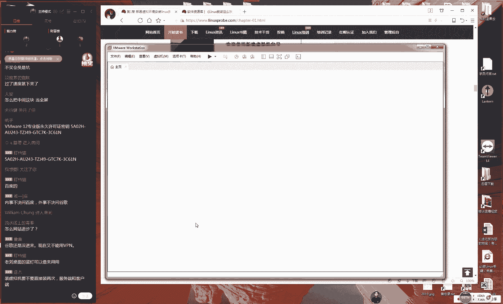

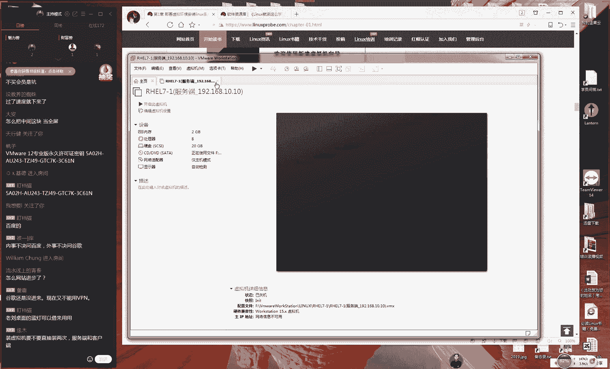

的原因啊，并不是因为我们出书的时候，它是12版本，是因为咱们我们同学们，你们大部分同学是不是都以后想要去考红因为红的最后一次的考试环境，我们匹配的就是12版本的环境。如果说您安装的是1315的话呢。

我们做实验是一点问题都没有的。但是您是打不开我们的的考试环境再大家说一下啊，就是我们之所以让大家去下载有我们网站上面去提供的这个软件。

原因就是这个跟我们的考试环境是考试模拟环境是完全配套的这样话如您安装的是15版本16版本它是最新版本的话呢，就会导致我们的后面的模拟是打不开的最后我们这个实验它也是做不了的。好。

所以我们建议大家先去安装一下12版本。并且我们系统镜像大家刚才有同学提到一个问题同学我们安装系统7。2可不可以我们建议不要的第一是这样的给大家举。😊，个例子先举一个生活上的一个例子。

平那咱比如说那我们去学一个做日本料理，对吧？我不知道大家有没有喜欢人做日本料理，做过可以打一下一。😊，就是那个切寿司，对不对？然后切点三文鱼，然后给你切个汤，对吧？有没有人做过日本料理做过的。

咱不是说吃过啊，好吧，非常尴尬，对吧？只有一个尼同西他做过好，那我们再来呃，有那有大家大家没做过吃过，对不对？吃过我们打一下一，那你没吃，看明吃过，你打一下一好不好啊，那我们可以互动一下啊。

那你看明吃过你打一下一好，那咱就是知道这么个呃有这么个料理吧，有这么一种形式做的饭好吧？然后的话呢你看啊你会发现去切寿司的时候，他那个刀怎么样，是不是跟我们一般的刀是不一样的。第一来说比较窄。

第二来说它上面有孔。第三来说它是一个他需要蘸水，然后去切它的意思啊就是说我们尽量。😊，不要让我我们这个寿司粘到一起。但当比如说你去跟一个大师傅，你要那那你去学做菜去了，结果你去的时候拿一把砍刀去了。

那你自然你去切出来那个寿司肯定是呃到处都是把给切烂了。所以我那我们的意思就是说大家在我们去学习的时候，你尽量跟我这个跟我这个老师傅啊，呃使用的工具什么都是尽量保持一致的。这样的话呢我们一旦出错之后。

那我们可以更好的给大家去排错，快速的去定位我们这个问题，而不会说因为你的这个工具跟我这个老师傅的不一样。然后我们先要给大家去排除到工具的问题，然后再排除我们这个操作的问题。所以说第一来讲。

就是我们的这个实验尽量尽量尽量要以我们这个书本上面为准。然后以后工作跟学习的时候，你到时候你再换没有问题了。好吧，就是我们第一遍去学的时候吧，我们尽量是保持一致。第二个我们给大家举个例子，就是7。

2版本它可不可以呢？是这样的我们7。0版本里面有一个工具叫做。😊，tables它在这个呃7。0版本里面是有的，7。1版本里面也是有的。但是它在7。2版本里面它就没有IP tables这个工具了。

转而变成了firework这么一个工具了。所以说如果说你使用的7。17。2版本的话呢，基本上是一样的。但是会有比如说IP table这样的这个工具。😊，这样的这个实验，那么您就做不了了。

所以说我们尽量让大家以我们这个书上这个为准啊，跟我们呃保持一致的原因就是这个那尽量我们在第一遍去学习的时候，跟我们保持一致，到我们工作的时候，自然可以融会贯通了，到时候再去修改，没有问题。

哪怕说我们第二遍的时候啊，那我们再来啊去做就可以了。😊，好的，那我们来往后面去装。那我们来进入到了我们的这个训拟机的镜像里面了。那么那我们进入到我们这个虚拟机里面了。然后呢那我们来一起去操作了。

如果说您没有现载好，没有安装好，不用着急，我们这个会大家提供录屏课程的。并且我们希望大家上课的时候，不要一边去操作。这样的话呢可能会跟不上。因为我的手速也很快，然后打字也很快，点也很快。

那么可能您在操作这个实验的时候，再一抬头发现我已经换到下一个实验了，大家有没有这种经历，反正我上我上学的时候就有啊，那会上数学题的时候，刚解释下方程。

结果一开然后然后这个然后在这个黑板上面已经讲到第三道题了，就是我们今量我们上课就是上课，然后我们下课之后我们再去操作我们点一下我们这个操作新的虚拟机啊，点击一下操作新的虚拟机。大家的话应该是12版本。

这个没有关系。我们选择典型，我们选择下一步。这个时候的话呢我们切记切记切记啊，请请切记啊如果说我们上课的。😊。

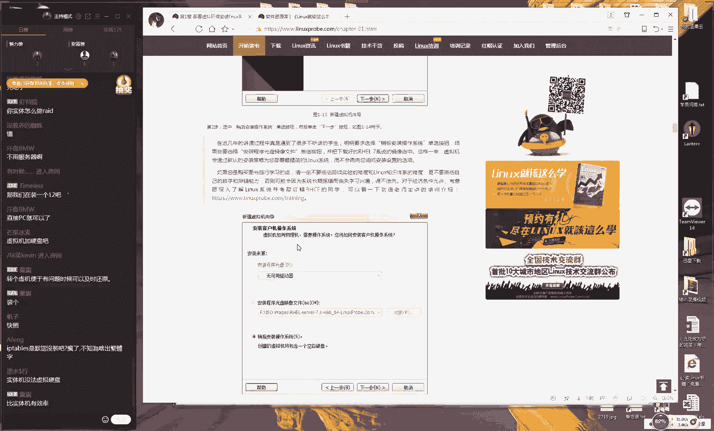

视频当中会跟书上不一样的话呢，我们建议大家是都做一下。那因为就是我们讲课的时候可能不会完全按照书上面去做的啊，所以说我们会给大家会有一定的这个更多的一些讲解。那么我们呃你按照我们视频上面去做。

也可以按照我们书上面去做，也可以，这个都可以。其实因为我们的这个原则是是不会变的。好，这个时候我们需要去选择一下我们安装的这么一个选项。这个时候就请大家切记先听我说一下啊，是这样的嗯。😊，啊。

说讲说太快了，嗯，快吗？我感觉还好吧，真的是还好真的是还好。😊，嗯。我我我觉得还好好，然后呢我们来继续是这样的。现在的话请大家先先听我说一下，这个很重要。

就是我们现在请不要请千万不要去选择我们这个系统镜像。因为当您去选择到了您下载好的这个系统镜像的话呢，会导致我们这个虚拟机使用默认的那使用默认的这么一个简易安装形式来去安装我们这个系统。

就会导致我们这个系统跟我们这个书本上是不一样的，请这里选择稍后安装系统。这样的话，它会跟你的呃他待会会使用高级的方式。它需要你来进行一个定制化的方式来去安装我们这个系统，所以请注意，请注意，请注意。

请选择这个稍后安装系统。好了，虽然我说了三遍，虽然我说了5遍了。但是我们同学们你还是会有人忘记去选。然后忘然后去选择这个系统镜像直接就去，然后就去选择了。所以我再给大家去说一下。

此处请切记一定是选择稍后安装系统。😊，如果说您待会儿安装出来的系统是黑屏的，让您输入文字形式的话呢，请记得再翻回来这个小节来重新来去安装一下，选择我们这个稍后安装。如果说您待会安装出来的系统是黑屏的。

那么请记得就是这一步操作错了。好了，因为是这样的，因为我不会呃就是很无聊，然后给大家说一些乱七八糟有的没的，对不对？咱们上课时间这么紧张。所以说这个我是从我也是奇了怪了。

我从15年开始咱们讲这个在线培训。我之前是op里面我们去讲过实力培训的大家应该知道啊，我总会说了很多很多遍，但是这个选项我就不知道为什么总会选错啊，大家总会去选择这个系统镜像好再给大家最后再说一遍啊。

请一定要务必选择稍后安装操作系统好了，那么否则这个它的安装就会使用一个简易化去安装，它不是一个高级方式，它就会导致我们系统实验是不一样的。😊，好了，我们来继续啊，大家非常的聪明。好。

那我们接下来我们去转择我们的这个linux的这个。😊，呃，形式，然后我们选择re enterpriselin，我们选择64位。那好，那我们选择一下64位的系统。

好那么呃如果说您选那呃呃您如果说之前是9或1版本的这个虚拟机的话，那我们建议您现在就升级到12版本。如果您以前是使用的15是那么如果您使用的15版本的话呢，那么或者说您使用的12版本的话呢。

那么都可以去选择这个re enterprise764位就可以了。但是我们需要注意一下，就是我们从后7开始，只能够是使用64位系统的。如果说您的这个物理的真机是32位系统的话呢。

您需要对您这个系统也要重新去做一下的。好，我们选择下下一步。😊，接下来是我们系统的一个安装的镜像位置。这个我们其实没有太好的这么一个嗯没有太好的这么一个就是。😊，规定了说必须安装到哪个盘。

反正我的建议就是你给他规划一下。比如说我的C盘是放我系统的，D盘是放我的电影的E盘是放我学习资料的D盘。然后我这个F盘是放我的这个工作的好了。

那我就在我的F盘里我去创建出来一个虚拟机的一个目录这个随以了，或者说您可以去选择一个顺的或者您磁盘空间比较大的这么一个分区好了，那我就选择这个F盘吧。好吧，我们选择F盘里面，我们的lin的一个子目录。

就是我们要去新建出来一个小目录一个子目录用于去待会安装出来系统的一个存放的一个位置。好，然后接下来是我们虚拟机的一个名称。这个我们不要这个默认的，因为到时候你不知道他干嘛使。我们去选择一下这个名称。

那比如说我们叫做跟老刘跟老刘学习的第一节课或者说lin系统就我的第一台我的第一台系统的。😊，第一台linux系统再或者说哎我的第一台了啊，我的第一台linux系统再或呃咱再或者说啊我的linux系统啊。

之旅从此开始，这个你随便了啊，你给他去取个名字好不好？那这样的话。😊，来呃，你以后看到的时候，你也知道它是干嘛用的。好，我们选择一下稍后安装然后然后我们选择下一步。接下来是我们的硬盘的大小。

我们给它分配20个GB大小，我们选择完成。现在啊现在我们其实并没有去安装我们这个系统，而是给我们这个虚拟机准备出来了一个框架，现在就是你去电脑城你去买了一台硬件的电脑回来，这个里面他没有任何的系统。

现在只是给他定义一下它的硬件里面的一些指标。接下来的话呢，我们现在那我们再去选择一下我们这个编辑虚拟机，就先不要开启，而要去先去选择一下我们的编辑虚拟机。

而我我啊第一现在去选择第一个就是我们的啊第一个的话就是我们的内存啊叶子女神啊，是我刚个目录里面是有是吧？是这样的叶子女神是咱们的第三期的学姐啊，虽然他年龄可能不大，但是也是你们的学姐嘛。

她是在第三期的时候学完的学完之后自己觉得要去复习一下，在一边去复习。😊。

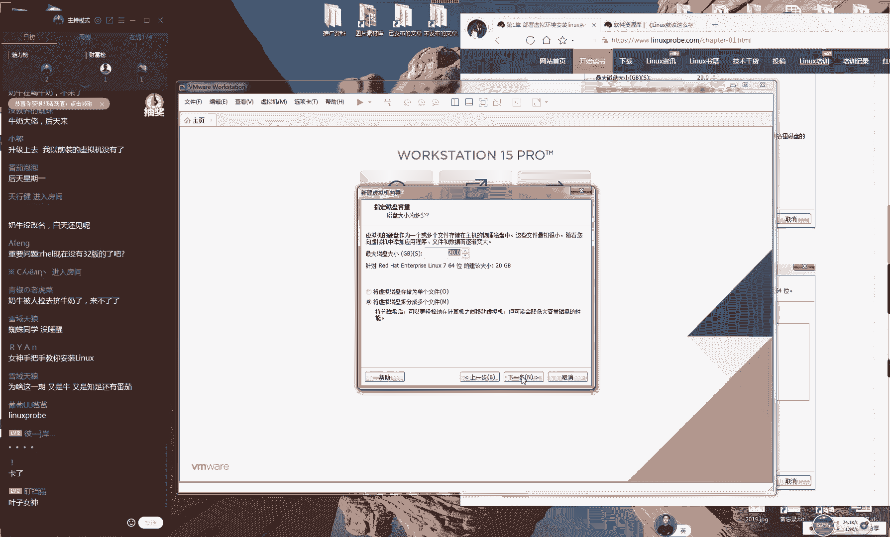

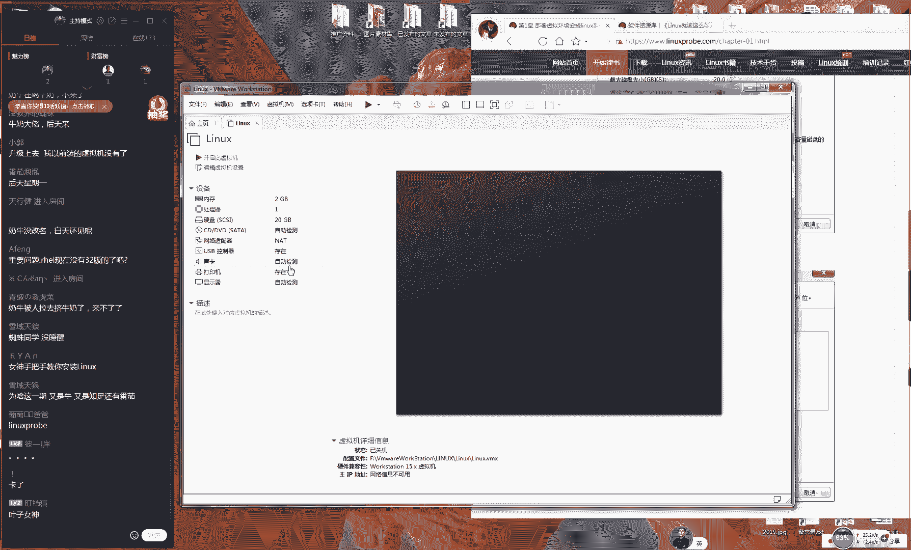

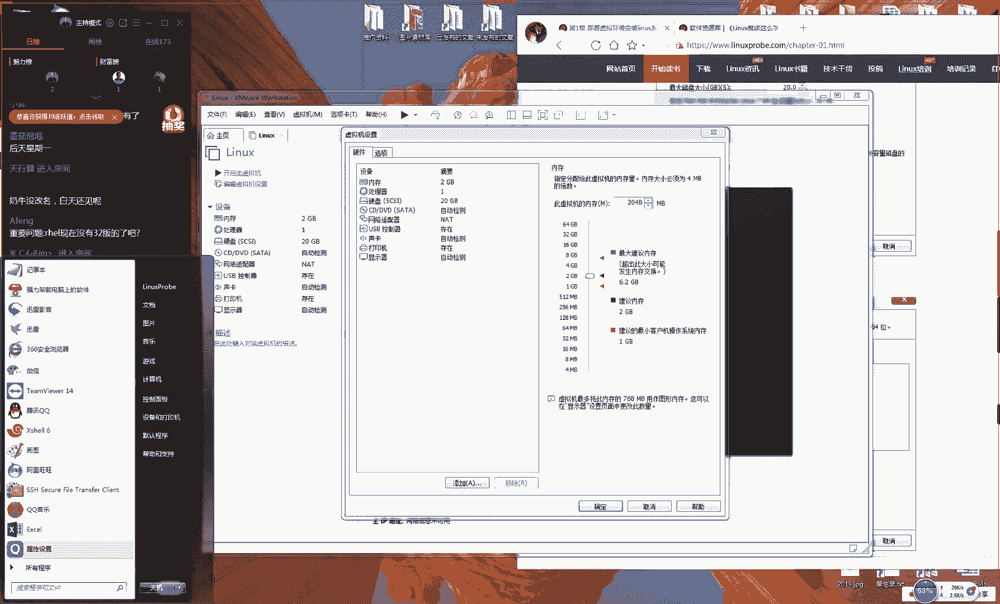

然后他还一边自己还要录个一边视频。我觉得这样的话，这个形式是非常非常好的。因为我我们做开源的，我们绝对不会说哎呀，你学完了我东西怎么能够去分享出去呢，对不对？我们是希望大家能够去分享出去的。

并且现在现在叶子的这个教程，在网上很多很多人都在看啊，包括说你们可以去淘宝上去搜一下。我们现在这个很多的书籍，不光是我的书籍啊，不光说是出版社还还有一些其他的书籍在配套的视频都是叶子。

都是咱们的学姐做的，所以说以后再要看到这个叶子的时候，记得是你们的第三期的学姐，咱是自己家人好，那我们现在给大家说一下我们这个内存啊，第二期啊你看我都忘记了第二期是吧？第二期行，那我们来继续啊。

大家如果要是没有的话，学姐现在不在啊，学姐已经毕业了，咱们经是第二已经是第二期了。然我给大家说一下我们这边内存的话，有一个小小的一个小技巧，是这样的。那么呃如果说您的这个物理的机器的内存。😊。

那以我为例，那咱比如说我的内存现在我的物理内存，这个大家都应该知道吧。如果您要不知道的话，您可以看一下您的内存的大小是多少。但比如说我电脑内存是小于2个GB的。好了。

当您的系统的内存小于了2个GB的话呢，请在这里请那啊那么请给您的虚拟机设置1个GB好了，那么如果说您的这个电脑内存是小于等于2个GB的话，那么请给您的虚拟机分呃哎请分有1个GB的空间。好了。

第二就是说当您的系统内存大于2个GB或者说啊大于2个GB但是的话呢小于4个GB的话呢，那么请给你的内存分多少？应该是。😊，应该是应该是多少，应该是2个GB，对不对？好了。

当您的这个系统内存如果是大于了4个GB的话，只要您的系统内存大于了4个GB的话，那我们应该给多少？😊，嗯，好。那我们应该也给他多少啊，我们按照来去猜一下，应该给他4个还是8个GB。当我们系统内存。

不论说是4个GB还是6个还是8个还是16个无所谓，还是320个无所谓。那么我们这个内存我们都建议他给他2个G给他2个G因为给多了之后是没有用的，是浪费的。所以说我们就建议说当您内存比较小的话。

请给他一个GB当内存比较多的话呢没有那也您钱多您就留下来，那您可以己再用其他的地方去这个内那我我那我我们这个内存不要太多两个GB就足够足够那就足够了。好了，然后做小调查了，大家的内存有多少。😊。

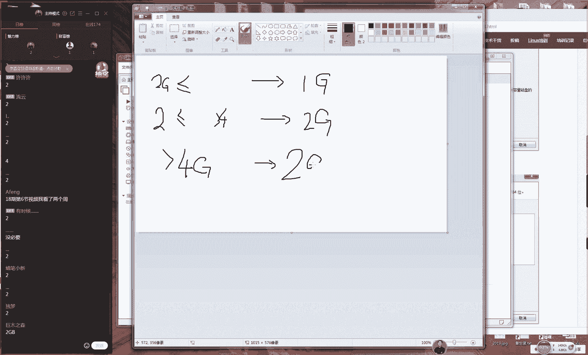

大家先快速的去查看一下自己的这个内存，大概是4个GB，对不对啊，有6个GB的，那有啊哦有8个GB的，还有了128个GB的OK啊，同学们差不多。😊，啊，同学们感觉就在炫负啊。

我好像这这好像是不是在做调查啊，在炫负啊。刚才是谁说16个GB还有一同学啊身体健康同学发了一发了一个T。那我估你再拿你公司的服务器然过来听课。

然后我们这个处理器话是这样的后我们就可以选择一下这边有三个虚拟化可以把勾转128个G实对于服务器来讲是毛毛雨很小了是这个是有的这种情况的而且是在大机房里面个内存好像是很正常的吧。

这是也算是一个很标准的一个配置好接下话我们再来那我们现在去选择一下我们这个CPU的这个虚拟化。选择一下我这个CPU虚拟化。然后是这样的这个时候我们要选择一下我们现的核心的数就是我们的这个内核数。

那么一般来说他们都是我们虽然也许知道。😊，我们这个内存的大小，但是我们或但是我们未必知道我们这个CPU的核心数量。这个时候怎么去看呢？就在你的电脑里面，我们点击任务管理器。

这个时候我们就可以看到这边它有几个框，代表就是它有几个核心。如果说您不知道的话，您可以去下一个工具叫做鲁大师。然后这个时候你也可以看。那么你啊。😊，呃，大家也可以看到我们这个核心的数量。

那么如果说您还是不知道的话，那么也没有关系。您可以去选。那比如说我是8个这个核心，那我就全都啊那我把它给以缩用到8。但我如果说我那呃的这个核心数量，比如说是8个这个呃核心。

但是我去选择一个12个核心的时候，他会给我们提示出来报错，说你不要再装D，对不对啊，他说你呃你只有8个GB那不啊，他呃他说你只有8个核心，所以我们选择8个就好了。😊。

那么呃如果说您真的是不知道自己有几个核心的话呢，那我们就请把它给它还原成一个核心。这个没有关系啊，就是说我们调整成跟我们这个物理机保持一致的话呢。

可以让我们这个系统的性能会更好一点我接下来的话就选择硬盘，这个不用动，这个硬盘不用动接是我们这个下载好的D光盘这就是我们下载好个光盘的镜像这个就是我们这个光盘的镜像。

我们选择一下我们的IOS镜像是这样的，因为我这个电脑虽然说我是一个很老的，但是我那会儿是买了一个很新的，所以说我这个CPU是I7的，那我I7的处理器就是8个核心，我有的型号是74770。

如果您不知道的话，可以去下一个鲁大师去查询一下。还有一个叫什么驱用精灵也可以去看到的核心数量。好接我们去选择一下我们这个系统的镜像选择一下我们下载好的系统镜像选择一下载好的系统的镜像课之前给大家下载。

😊，好的，好了，我们选择一下嗯，然去选择一下。既然我们这个网络的模式。因为是这样的，我们现在还没有去学习过我们的网络。这个时候去讲，我觉得意义不大啊，所以说我们现在先把它放下来。

统一先相信我我那我们先去选择一下叫这个金主机模式。我们会在第八章第九章的时候，会大家去讲到我们这个各个模式的一些呃关联跟作用。再往后面去走USB好了，这个没有用。😊，然后把这USB给它移除掉。

还有这个声卡，我是强烈大家听一下啊，我是强烈建议大家把这个声卡给它移除掉的。因为当你去敲命令的时候，那当你去敲错的时候。😊，🎼他会给你一些包助，声音特别呃特别的呃特就呃特别的这个呃扰乱我们这个思绪。

大家听一下啊，是这样的。当你去敲命的时候，比如说你当你敲错的时候，他会这样的声音，大大家有没有听到在大家啊大家再听一下。😊。

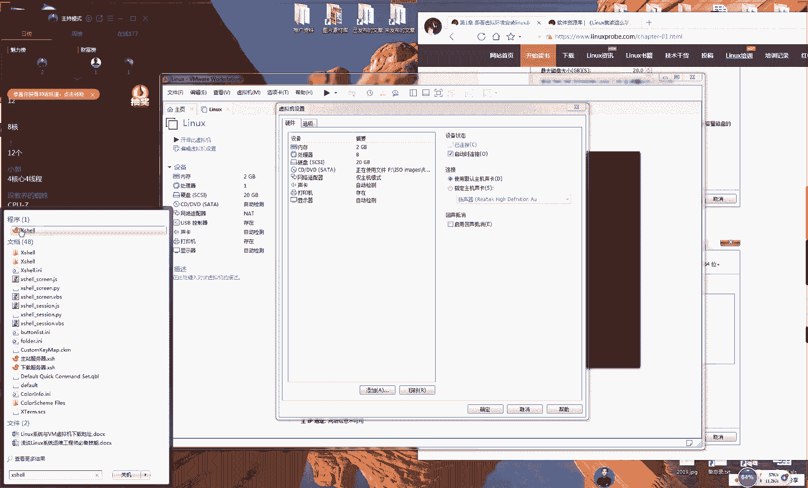

嗯，大家再听一下。大家有听到就是这样的这个声音啊，所以的话呢就是说。😊，我们把它给移除掉这个声卡，避免说我们以后去敲命的时候，敲错，它会跟我们一种包错的声音会扰乱我们这个思绪的。我们选择一下这个移除。

这个其实是很烦人的。大家在听到感觉还好以后去做老这样想想想会很难受。所我把这个声卡给移出去还有这个打印机打印机我没有说把移除掉。那就是说我们将没有用的设备给它移除掉。

这样话保证我们这个系统的性能也会更好一点，尽可能去少消耗我们这个系统的资源。我们选择一下这个确认这个我们就对我们的硬键已经处始话完毕了。接下来我们就可以选择开启此虚拟机来进行一个安装这个安装的话。

现在开始我们要去选按下你这个方向键，就是你玩游戏那个键大家看到这个键的话就是你我玩过一个游戏叫做进物团，就是这个这他这个上下左右键，然大家可以通过这个上下键来去控制你这个光标第一个代表就。😊。

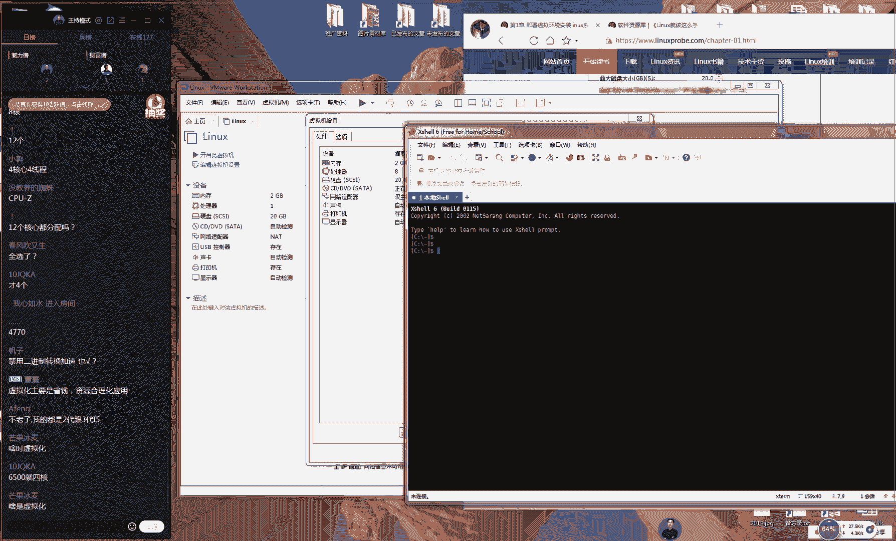

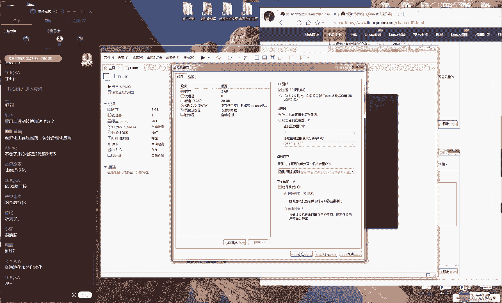

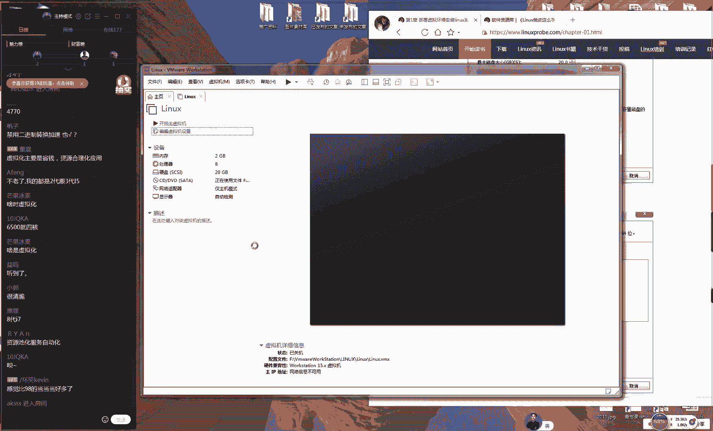

安装你的系统镜像。第二就是来进行测试，就是它这个完整性。第三是一个排错模式。我们选择第一个我们选择安装我们这个系统镜像，我们来敲一下回车。这个时候啊没有玩过是吗？那你们有童年了，我们那会儿玩过啊。

那会我们都玩精舞团啊，是不是玩什么呃热血江湖，我记得是啊那会儿游戏，我估计你们都没有听说过。好，那我们现在。😊，比较暴露年龄了，然后我们开始去安装。这个时候大家可能心里会想哇，这个好帅，对不对？

你看这个里面收藏了好多好多的字母啊，好说了好多好多字符，这个我好难好难也见过，对不对？这不就是黑客帝国里面这种场景啊。对，其实我们刚才那个就是一个初始化的一个过程，它并没有太多重要的信息。

它主要要进行一个初始化的一个工作，是这样的，大家请注意啊，现在要开始来重点了，大家最要来注意啊，现在开要重点了啊，说完进舞台同学们就收一收了啊，是这样的，我来说一下重点是这样的，大家听一下啊，是这样的。

😊。

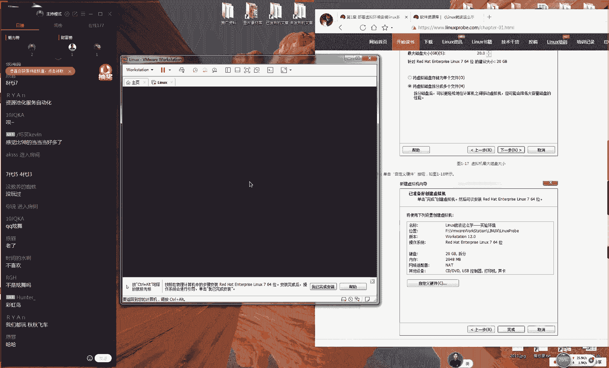

我们刚才的话呢进行了一个系统这个数始化的工作，我们没有任何的报错。但是但是实际上很多同学你们的这个电脑里面bi没有开启虚拟化，就是虚拟化的作用。

我刚看到的就是说它是在我们这个电脑里面再去模拟出来一个电脑的意思，再模拟出来这么一个系统的意思。但是是这样的，我们所有人的电脑几乎来说，只要您是那么只要您是近近5年之前买的。

就是您大概时间是2014年之前买的。2014年到2019年期间买的话呢，那么您的电脑就肯定百分百会有这个虚拟化的功能。第二的话就是说那那那么就是您这个电脑如果说您购买的时候，大于了3000块钱。

只要您不论是笔记本还是电脑啊，还是这个台式机，只要大于了3000块钱就肯定会有虚拟化的除非您说被坑了，比如说我们000块钱买的一个就是配很低这么一个电脑。只要。😊，没有被坑的情况下。

您就一定会有虚拟化的这个功能。是这样的。但是如果说您去安啊呃去来进安装的时候啊，刚才弹出了一个小框，说bis里面说什么什么虚拟化没有开启啊，这么一个报错，只要是有，那么好了。

就是一定是您的这个没有开启这个功能，就是说您没有开启这个功能。那呃呃，那么怎么办呢？这个时候啊，他每个人的方式是不一样的。那么你就可以打开您的百度去来去搜索一下您的这个电脑的型号啊，大家看一下啊。😊。

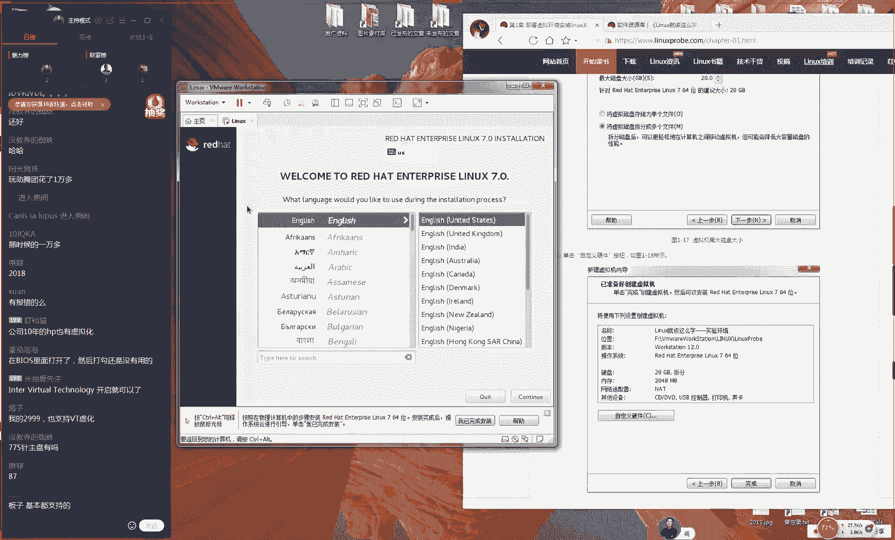

因为现在只要你连最低端那个I3处理器，他们肯定都会是有的那他们肯定是有的说你的笔记本是2999也会去支持虚拟化这很正常了。

我之前我买过一个笔记本150钱二手的那PU的以说现在这个虚拟是一个标配是任何几乎来不差都可以好了那我们来给大家说一下就是搜索一下这个电脑的型号。

说我一笔记本着急小新是联想小新就是联想小新潮70这个是我在去年的时候买了一个笔记本好了咱比如说那你看我这个笔记本5000块钱的那我肯定是支持虚拟化且要都可以都可以但是如果说错怎么呢？

这个时就可以搜索一下这个电脑型号然后去搜索后面一个叫做OS。😊，是被关闭的那我们去搜索bels开启虚拟化。好，这个时候您就可以去搜索到我们该去如何去开启。这个的话呢我们叫做虚拟化技术。

我们简称叫做VT啊叫做VT它有时候他会给你写成叫做英就叫做tel啊，就是这样的一个法英杠就是他这个虚拟化的意思。但是说呃我每个人的方是不一样的。然我们可以看到这个这这个不是很好啊，是需要你关机。

然后来去。😊。

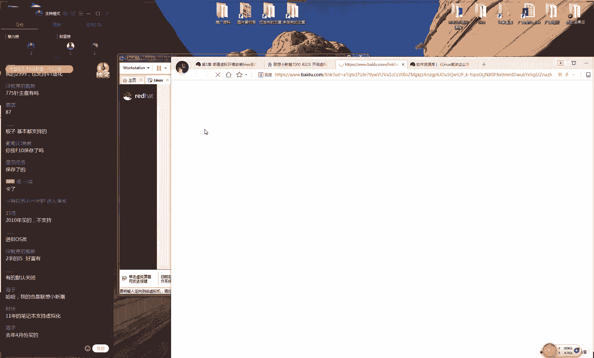

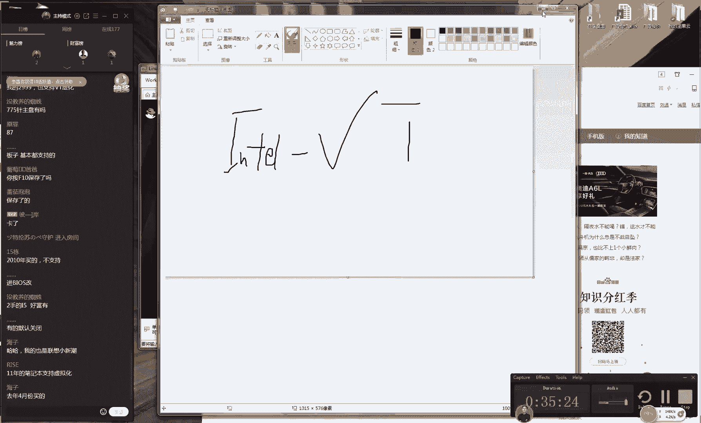

在你的bis里边去开启的，我给大家找一个啊，大概的一个样子，可能每人是不一样的。但是大概的步骤是一样。大家看一下，这个非常的详细，就是我们在重启了之后进入到bels。

然后我们去选择一下这个呃虚拟化这么一个开启，然后把它给启用。但这个子他讲的不是虚拟化。他讲的是你的这个安全模式。我我我我找一找啊，肯定还会有OK这个就非常的详细啊。😊，就这样的一个形式。

大家看到就是我们进入Bss里面来进行一个设置。哎，这很尴尬啊。我今我怎么记得上次的时候，一下就搜出来了很多条啊。😊，嗯。那我们去搜索一下叫bis开启VT虚拟化吧。好吧，我们开启VT虚拟化。

就是反正这样一个关键词，大家这样一搜应该就会有的。😊，嗯嗯。

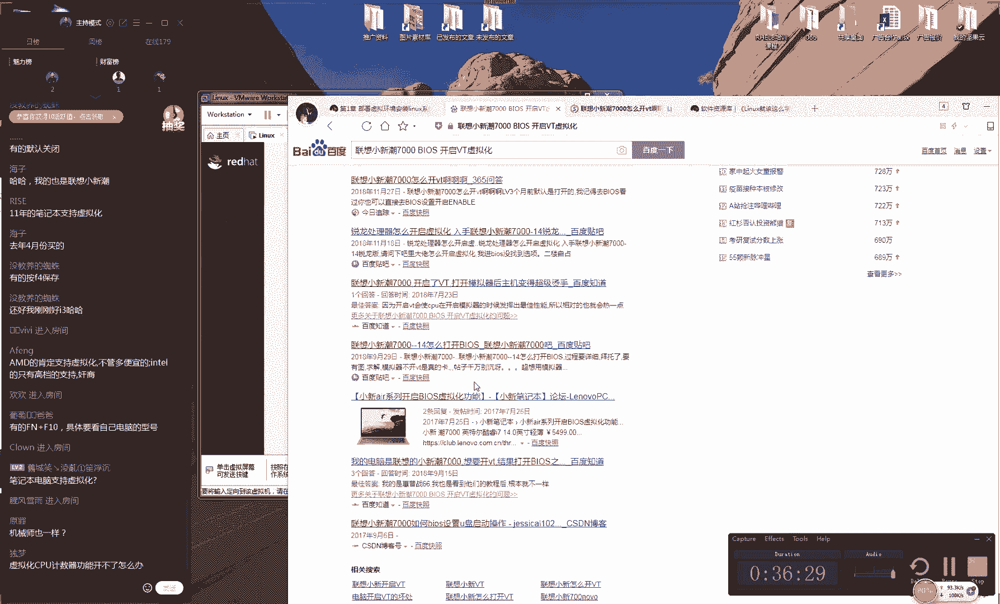

我去啊，吓我一跳，这怎么还弹出了一个小视频呢？哦，去这真的是一下子把我给吓给吓到了啊。好，那我们来继续啊，真的没有不没有听到啊，吓我一跳，谭诚广这这这真这真的是没脾气啊。好，我们看一下。😊。

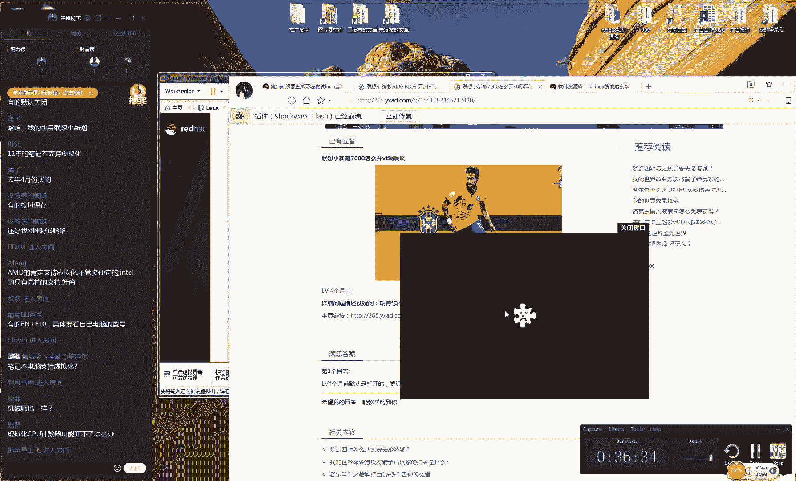

好，那我们来看一下，就是我们这边会有一个设置的一些哦，这个比较详细，就是在我们bios那边你看到它那边还会呃给你一步一步去开启，然后开启这个虚拟化。就这样吧，大家去搜索一下电脑的这个型号。

如果要他如要设包错的话，那么你就可以去搜索一下您电脑的这个型号。接下来我们来去开启一下我们这个虚拟化，这是一个非常详细的一个步骤。好，这个的话它也是一个非常详细的一个步骤。好了。

然后那么呃咱比如说那您呃我们这个并不是一个笔记本，而是自己的一个台式机，而且台式机并不是买了一个呃品牌的。比如说我们自己传的一个电脑。那么怎么办呢？这个时候你就去搜索您电脑的这个主板的型号。😊，呃。

来去搜索您呃电脑呃电脑主板的这个型号。因为呃我们可能每个人不是买了一个就是一个台的一个品牌机，对不对？那我们可能自己存的电脑，那么就去搜索一下您电脑的这个主板型号。那么如果要是不知道电脑这个呃型号的话。

您可以去搜索一下叫这个鲁大师，然后搜索这个鲁大师，然后可以去找到。然后里面会显示出来您这个主板的型号。那咱比如说我有一个叫做华硕的一个主板，那我们就去搜索华硕，然后某某某个牌子，然后主板。😊。

os开启VT虚拟化，它会有很多很多这种介绍，就是呃会告诉你说我们该如何来一步一步去开启。那并且中大品牌的这个知识会很多。大家可以看到这边我们开启虚拟化。😊。

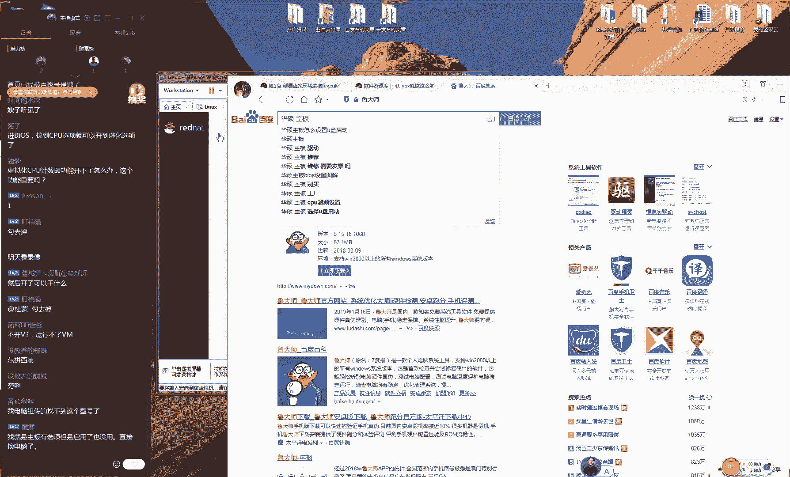

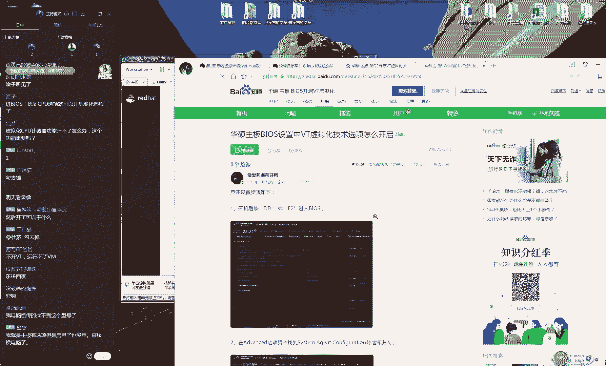

然后我们选择下一步，然后把它给重启之后就可以了。这就是我们开启虚拟化的一个方式啊。这那不给大家去多说了。因为这个其实每个人是不一样的。而且我们可能有的同学你们电脑虽然说以前没有用过虚拟化。

但是它默认也已经开启了。那我们可以回先去试一下。如果是不行的话呢，请按照我这个方法，可以这百度上去搜索一下。这个非常简单可以把它给开启了。好，接下来我们选择一下我们这个系统的安装了。

这个时候大家去选择一下我们这个下一步就好了，我们选择一下我们系统语言为英语，我们选择下一步，选择下一步之后，我们该怎么去操作那。😊。

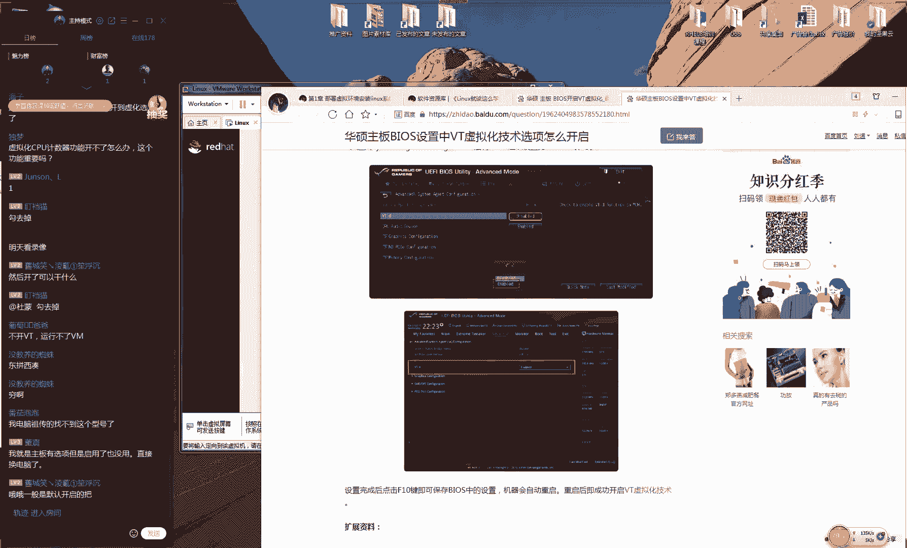

啊好，我说有一边有一个小报错啊。好，这个不用着急。我们说我们系统有一个小报错，我们这样啊，我们把我的电脑重启一下啊，已经重启了。😊，哦，不是选择成这个中文，因为选成中文的话呢。

反正我我反正我不太喜欢选择成中文啊。但然如果大家选择成中文的话，也是可以的，没有问题啊。好，我们先看一下。哦，我知道为什么了，因为我刚才选择镜像的时候，我好像选错了，我选择到1个6。

4版本的一个以前的一个老镜像了，是他给你提示出来的一个包错啊。刚才我没有看清，应该是。然后我现在去启用一下我们这个虚拟机。嗯，我应该没算错吧，刚才不也刚才不也提示这个了吗？来后我们来再安装一下。😊，好。

这个不用担心啊，因为我们再去敲的就是linux的命令了。他即便学过了，比如说他考过了4级6级8级的英语很厉害的这种大神，他见到的这个命令，他也是要从零开始去学习，他也不认识。

因为我们再去敲的都是lins的命令。好，那我们现在再重启一下，我不知道刚刚为什么是不是时间太长了，他怎么怎么样啊，这个不用管他。我们重新来去进入到我们这个安装界面里面，这个非常的人性化啊，然后我们去。

😊，嗯。不要这样啊，今天咱们咱们这个见面。好尴尬啊，是不是咱们这个界面怎么今天一度的出问题了好，这个大家都都没有发生过好不好？那们再重启一下，因为他呀毕竟是虚拟机在模他在去模拟出来的。而这个虚拟机啊。

我们之所以推荐件使用这个这个厂商的，就是他已经是市场上面我们认为来说是比较好的虚拟这个软件了。但是毕竟是模拟出来的吧，可能还会有一些小bug啊，但是可能当然也不会很常见，大家放心，我们来继续啊。

这也不会说很常见的这种情况很呃重启下就好了。😊，对对对对对，这个不会很常见的。但是诶啊啊并且这已经是市场上面非常好用的一个虚拟机了。我们要选择下下一步。😊，好，这个时候你看到他就不会有报错了。

所以说如果要是有小报错的话，大家不用就是总会去纠结说自己是不是操作的问题，对吧？因为我们虚拟因为它毕竟是虚拟机，他可能会有一些呃小bug会出现啊好样我们先去配置一下我们这个系统了。

第一个我们选择一下我们这个系统的时间那我就选择一下我们这个中国，我们选择一下上海是这样的，他没有北京，它只有上海、重庆，还有新疆还有东北，还有重庆哈尔滨。后是这样的啊，因为咱们中国是不分市区的。

所以说这个没有关系，您可以直接去选择上海就行了。好了，我们选择一下这个因为咱中国嘛，虽然说地大物博。但是咱中国它是不分市区的，您选择哪一个都可以只要选择上海，对于中国时间都是一样的。

但是好像据说新疆是不是有有这个当地的时间。但是我们就以这个官方时间为准吧。其实这个无所谓，只是一个参考。好，这个是我们键盘的输入法为英语。然后这是我们统语言为英语。😊，好。

接下我们选择一下我们系统安装镜像的位置。好，这个不用去管，我们选择完成。这边还有一个我们的软件的选择，请一定要这样去选择一下。请注意同学们啊，这步我们一定要去操作一下。如果您这步没有去操作的话。

如果您们这步没有去操作的话，会导致您待会儿安装出来的这个系统是一个黑屏的。😊，好，请那么请大家去啊去操作一下，需要在我我们这个选项里面。我们对我们选择最后一个啊。小郭同学说去选择最后一个。

我们选择service这就是一个我们非常完整的一个系统的意思。好，那我们先去选择一下带有图形化界面的这么一个操作系。我选择到它再给大家去说一下啊，请在这一步务必去选择service这个选项。

如果说您待会没有那么如果说您没有去选择它的话呢，待会安装出来的这个系统，它是一个黑屏的这么一个界面的话，请反过来需要去选择一下这个serv这个选项。好，接下来话我们来去选择一下这个完成。

我们的右边不用去选它右边只是一些扩展一些软件包，它是一些推荐软件包这个我们不用去安装。因为我们以后会给大家讲一下该如何去手动去安装。如果第一次去安装好的话，面就感觉没有什么难度so easy不？

我们人生就在于作，我们就在于不不断来去尝试包错当中我们来去进步的。😊，所以说我们就选择一个有一个基本功能的一个框架就好了。以后的事那我们以后再去说，我们以后再给大家去讲该如何来去手动来去定制。好。

接下我们去选择一下我们这个系统的硬盘。好了，这边有1个20。48个GB的硬盘我们选择一下完成好了，就代表你就是确认你去安装到这个硬盘里面好再往后面去做的话我们去选择一下我们的网络这个网络您可以开点一下这个就把给开启了。

但是我认为这没有用，因为我们现在也毕竟没有去学习网卡呢，但是我们会在第九章的时候会给大家学习如何来去配置你的网卡，大家记这个书上面，我们会在第九张的时候来去学习如何去配置你的网络。

我们会学习四种方法配置你的网络这个四个方法那配置我配置我们的网络，我们关闭。我们不需要我们选择完成们选择安装再往后面去说就是来配置一下我们这个超级用户的这么一个密码。好了，这个密码的话。

你们随意我就给稍微简单一点了。😊，因为它毕竟只是一个虚拟机，呃，并不有人来去入侵你的这个服务器。所以说我们给它设的简单一点，然后自己记得住就好了。这边还有一个普通用户的一个创建，我们来继续我们来去。😊。

设置一下我们这个用户的名称，我们统一把它叫做我们之所以把它叫它就是一个广告了，对不对？但是我们建议大家跟我们保持一致。因为我们待会第二章的时候，还有第五章的时候会去学习对个用户修改的方法。

所以我们建议大家以我们这个名称为准。这样的话呢你们以后再去这个实验不不会为用户的名称出错而导致的一些报错。如果说您真的是不喜欢我们个广告的话，那么你也可以去修改。但是请记自修改过请记得修改过。

当我们第二章的时候还有第五章的时候，您就也要去执行一下修改过后个名称。如果说您拿不准怕忘记以忘记己没修改过的话呢，请现在跟我保持一致就好了。

然后我们这个密码的话便我一个非常复常简单就是非常简单的这一个密码我。😊，当代表就是一个确认的意思。好，再给大家去说一下。因为我们刚才说的比较快，再给大家家去啰嗦一下。现在说第一点啊。

现在说第一点就是哎老师我觉得这个讲课有问题啊，我觉得你讲课有问题，说我之前虽然说我没有去系统性的去学习过，但是我起码我看过书，对不对？那我翻看过一些国内的一些教材，哎，我看人家书里面啊。

包括说我以前也是翻看人家书里面我第一章节去安装系统的时候，人家不都要教一下分区吗？人家都要教你分区的，人家都要教你一下配置网凯了，为什么你这个讲课一下子就过去，偷懒对不对？所以说我把你指出来。

是这样的啊，因为的话呢我们现在认为。😊，啊，同学们现在是卡了吗？呃，同学们现在要是卡的话，可以跟我说一下，要是没有卡的话，也请那么也请跟我说一下。因为嗯有同学说卡的话呢，我们就要去调整一下啊，没有是吧？

那么这样啊，因为咱们现在这个互动的这个节奏稍微快一点，就是以后肯定的话就是一比如说卡了，或者说有问题卡了呀，比如说代表一个肯定的一个意思，就代表那打一下一如果要是没有卡，或者说是一个否定的意思。

就代表那打一下2好吧。哎，行，那我们来继续是这样的啊，那么我们为什么我们这个书上面或者说我们这个课程里面一下把跳过去了。啊也没有去讲分区，也没有去讲网卡是这样的。

因为我们认为啊因为我以前也是在不断的去滴代我们这个书记啊，因为我我们认为今天才是我们的第一节课。因为我们昨天就相当就是一个吹牛了，现在就是一个开班仪式没有学东西。今天的话是我们学习的第一节课。

第一节课我们给大家去讲如何来去。😊，配置你的这个呃系统的这个硬盘，该如何来去配置你的这个网络，其实是完全没有效果的。那么大家只能够跟我一步一步这样去点击鼠标，然后点出来同样的效果。但是您不理解。

所以我们认为大家跟我们一起去点鼠标，然后点出图样的效果这件事情是没有意义的。所以说我们就不要去做。但是这个知识我们不是不去讲我们分别我们光去讲硬盘。

我们光去讲我们这个磁盘分据一个协议叫做FHS一个协议其书里面他们都是没有的。而我们单独去讲，并且会去讲专门给大家准备两个章节六七两个章节，我们要总共要去讲两天半的时间。

就是我们有需要讲两次半的课程会给大家去讲这个网络会大家讲这个硬盘的这个配置方法，然后以及它这些原理，然后我们也会给大家去讲我们该如何去配置我们这个网络会大家讲四个方法，个命令来去分别来去配置我。😊。

我们这个网络和网卡修的话现在就是大家可以放心的去学就好了。因为我们可能会跟其他的书籍会一些相的一些出入。但是我们有自己的这个安排，并且我我们认为我们的安排是更加科学的。好了。

我们来继续嗯因为我们不希望说我们现在再去炫一下，你看我会很多，对不对？然后看我叭点然后点出来一个很漂亮一个界面，或者说我点出来一个格式化出来成功之后非常规整的一个分区的一个信息，但是我认为这没有意义。

今天第一天即便大家能够点出突样的效果，那点出来又怎么样对吧？点出来这个不是我们学习一个目的去理解好，那我们现在说这么多的这么多这么多的废话，结果他还是在安装啊这个安装的过程随系统的这个配置改呃。😊。

而快慢吧，我们这个词汇要频繁了，我们会有一个时间等待一下他。😊，我们一般来说15分钟吧，我们等他一下。好，还有的话呢，就是我们这边收集的1。4小节。

我们这边要去教大家该去如何去重置你的这个入职用户的密码。但是因为我们当前还没有去学习我们的命令。这个时候讲大家根本就是听不懂的，而也是我给大家去操作一下。大家看一下我们现在的这个效果。

所以说这个是按照我们这个知识块来去分层的，而并不是按照我们这个难易程度来去划分的那所以说我们这个书给大家去写清楚。就是如果说您是第一次再去读书啊，或者说第一次来去上这个课程的话。

请把这个小节给大家跳过去。😊，我们今后会给大家去说到，大家可以去在你的这个书上面1。4小节的旁边用一个颜色比较鲜艳的一杆笔。那我们啊去写笔记的时候，不要用到黑颜色笔了。

因为黑颜色笔跟我们这个字是一样呃这么一个颜色了。大家可以去买一杆红颜色笔或者一个蓝颜色的一杆笔，这样非常的这个清晰，大家可以记到这个书上面大家先呃大家一起去记啊。呃，一。4小节的旁边写上。😊。

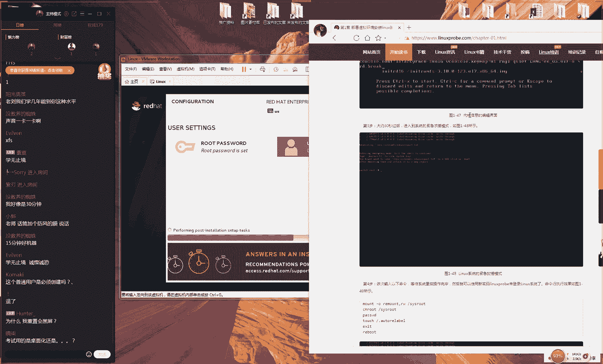

这个课程我们不是不讲，是放到了红码，而是CSC的考前辅导视频里面。好的。😊，记一下。红帽的HHCIC考前辅导视频里面。讲到了1。4小节。呃，如果大家基础比较好的话。

大家可以来去看一下我们红帽的HCI考腔辅导视频里面，会给大家讲到这个我们第一节课先把它调过啊，这个我们先不说记一下大家先记一下，这是我们的红CI考腔辅导视频里面是等我们学完了我们这个常规课以后。

然后会大家去讲到的。好了，再往后面去走的话呢，嗯说包括湿纸巾宝宝声音会好一点是吗？我啊那我试一下啊，这个课。😊。

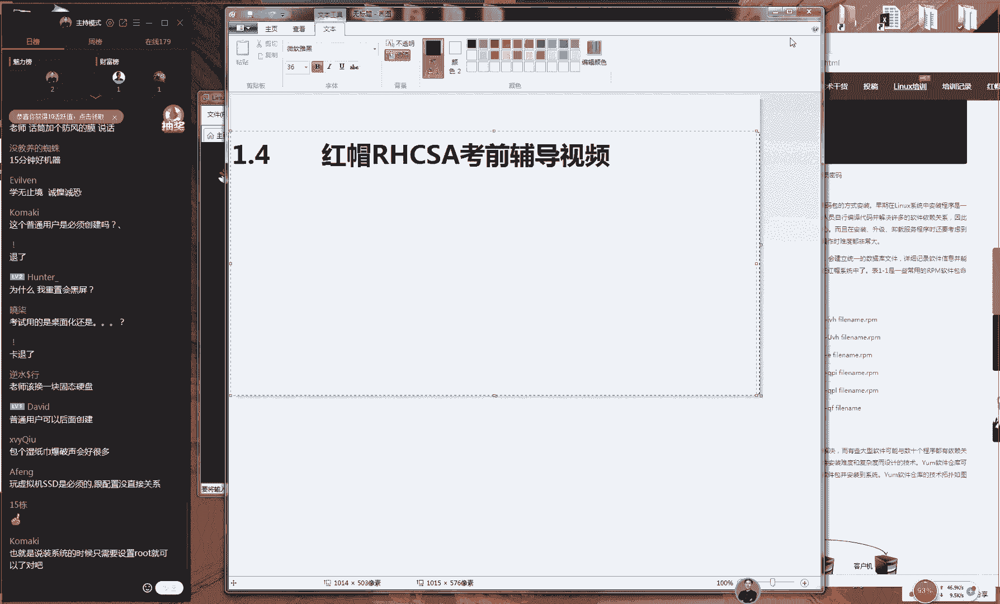

好，那我现在包了一个纸巾，大家现在听我说话声音好一点吗？那我们来继续了。啊，声音什么啊，稍微好一点是吧，很乱，那算了吧，也拔掉吧。那好，我们来继续说我们这个用户对他是用来以后去测试用的。好。

那我们来继续往后面去讲。呃，因为它这个安装过程的话呢，可能会很久，可能大概要15分钟，那么可能要15分钟。所以我现在给大家先讲一些比较理论性的些知识，大家先不要去着啊，是这样的这个东西的话呢。

我们其实不讲也好。但是我们讲完之后会让您对于系统的一个深层的一定的理解。首先就是我们之前使用一个那我们只是一个使用者。而我们现在想要给大家讲一个比较深层的一个理论性的一个知识。这个东西您学会了之后。

或许对于您今后的操作是没有太大直观的上的一个影响的。就是说您学完了之后，或许操作起来没有太大这种进步的感觉。但是当您把它学会了之后，会对于系统的一个底层的一个运行原理，会有一定的这个很深的一个理解哈。

那我们来继续给大家就是说这个东西我们叫做源代码安装。我们叫做源码安装。😊。

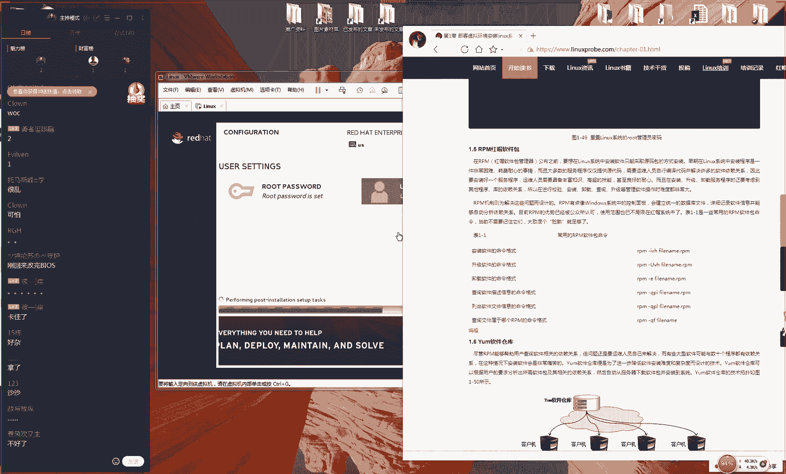

因为我们昨天给大家讲过的，我们开源是什么呢？开源代表就是我们的开放源代码的意思是将我们这个程序以我们这个源代码一起来去提供给我们用户来去啊啊来去呃来呃他来他来去提供给我们这个用户。

这代表就是一个开源的一个行为。所以的话呢我们最早期去安装我我们这个软件，他们都是来去编译我们这个源代码来去安装系，我们这个系统跟我们这软件的。大家有没有听过别人去说过啊。

大家有没有听别人去说过说呃我们的linux系统非常的难学啊，大家打一下一，大家有没有听你的老师啊，或者听你的同学同事们说过，说linux系统有点难学啊，或者有点难学吧。

我们啊或者说我们说非常的呃婉转一点，是吧？有没有听说过，它还是有，对不对？其实这种观念的话呢，或者说大家没有看过一个电影叫做黑客帝国啊，大家可以打一下一叫黑科帝国啊，没有看过吗？啊好吧，大家是。😊。

没有童年了啊，当时我看黑客帝国的时候会感觉很帅。哇，你看这个黑客这个屏幕啪下这个，然后他屏幕上会下那个呃字符啊什么的就很帅这种感觉，其实啊那会儿的linux的话也非常相向于就是那种黑底，然后白颜色的字。

那就是一种文字字符的一种界面了。当时我们要去安装我们这个系统，他们都是要去通过我们的编译源代码去安装，你不要看啊，就是你不要去看黑客感觉很帅很帅很帅，其实你要去问一下他的话，你会觉得他会跟你说哦。

我们的黑客的很苦逼呀。我们很辛苦的对吧？因为你想一下，那你每天要看这么多的字，我们就不说难不难了，起码会继续演，对不对？那所以的话来讲。😊，那会儿的话我们去安装我们这个系统。

我们要去使用这个源代码去安装的话，大家需要记一下你的笔记，大家需要记己的笔记哦。虽然说外人看很帅，但是你自己心里就会感觉很吐槽，我好苦啊，我每天要看这么乱七八糟的东西。好，那我们来记一下笔记啊。

这个源代码安装是我们书上没有讲一种安装的方式。它有两个弊端，它有两个弊端，而好处它也很明显，但是我们先不说它的好处先去黑一把它我们会在最后一天的课程里面。第20章的时候。

最后一天的课程里面会给大家去讲到它有什么好处啊，第二章的时大家讲它有什么好处。先在说它有两个这个弊端，第一来说就是我们的安装的复杂程度很高，或者我们来说叫做。😊，安装困难或者说我们叫难度高。

就你们随便了。如果大家懒呃大家呃要大家要是懒得写的话，可以去简要去写。就是它有两个弊端。第一来说就是难度高，安装起来的很困难啊，这里大家都记记啊难度高很困难。第二个的话呢。

这个弊端就是你需要自己去解决它的这个依赖关系。😊，好，这个依赖关系是什么是什呃？他是什么意思啊？这我们先不说，我们先给大家往后面去讲。那好了，接下来说我们之前的黑客。

或者说我们这个这个程序员想来去安装我们这这这个系统。那好，那么他就要去来去编译我们这个程序员代码。这是一件很苦的很累的，并且我们需要很高难度的事情。这个时候那我们就有了一个新的一个技术。

我们叫做RPM这个呃这个RPM实际上他就是将我们这个程序的源代码啊，现在没有声音了。同学们。😊，最后有声音同学们可以呃可以反馈一下，是这样的，大家是这样的啊，大家不光说是卡或没有卡，就是呃哪怕您没有卡。

您跟我说一下，这样的话呢，我们避免说有比如说某同学他们自己卡了啊，然后影响到我们这边我也会去重启一下，我这边的QQ啊什么，也到时候也麻烦，对吧？但啊就说我们既量能互动一下啊好，那我们来继续。😊。

那我们就是将我们这个程序的源码与我们一套安装的规则。像打包到一起。那么我们呃因为安装起来很难，但原因就是我们需要自己来去编译这个程序的源码。那好了。

那我就将程序的这个源代码与一套安装规则打包到一起这个东西我们叫做大家翻译一下我们的书籍1。5小节这这个叫做做红帽软件包管理器M会教你们安装M跟驱动怎们会以后会去讲到的会去讲仓库的安装跟我们编译程序源代码的话大概是在第9章以后嗯。

第九章以后好，接下来我们来去说一下这种安装的方式的好处的这个目的啊大家记一下笔记M样去笔记量少一点你M冒号降低。😊，软件的安装难度，这个就是这个技术产生的一个。动因，这就是我们技术产生的一个历史原因。

它的目的它就是为了去降低软件的安装难度。大家记一下啊，呃RPM的本质就是为了去降低我们软件的安装的难度。括弧，你要去写它通过什么呢？通过啊将。😊，程序员代码与安装规则相打包啊，打包到一起。无需哎啊无需。

用户。手动呃配置吧，我们这样去写。大家记一下我们这个RPM的安装方式的一个好处，或者说我们技术产生的一个原因目的，对不对？然后以及它它的一个实现原理，它就是将我们这个程序源代码。

与你之前你要去手动去操作这么一个安装的一个规则，打包到一起，我帮你去做了。这个叫做RPM现在已经不光是在红帽公司内部去使用。很多的主流的系统，他们都是在去使用的是RPM。

当然说除了我们上节课提到那个答辩系统de的系统以外，很多都是在去使用RPM的。😊，好，那我们先来给大家去记一下，笔记，就是这个RPM。他将我们这个程序源代码与我们将安装规则打包到一起。

再去降低我们这个软件的安装难度。但是这个还没有完。那我们要想受安装软件的话呢，它有一个依赖的关系。咱比如说我们现再去使用的是一个叫做QQ群视频的功能QQ群视频，那就给大家提个问题。

假设说啊我们要是没有QQ的这个主程序，我们能不能使用这个QQ群视频功能还是能打一下不打一下大家互动一下咱比如说我没有QQ的这个主程序，我没有下载QQ，我能不能下载。

那我能不能去使用这个QQ群视频不能吧如果大家打一同学也许你们会说通过网页或怎么怎么样咱从常规情况下来讲的话，如果你没有安装QQ的话，那么你就不能够进入到QQ群，那么你也就不能够进入到这个QQ群视频功能。

对不对？好，那也就是说它是有一个依赖关系的，而且你也不能够先去安装这个QQ视频再去安装QQ这也是不可以的。要有一个先有先有的一个过程是这样大家捋一下思路啊。第一来讲。😊。

你需要现在去安装一下你的这个QQ主程序，对吧？好，第二就是说你需要去安装你的这个QQ群的这个功能。OK这是第二个。第三，你需要去能够去开通你的这个QQ会员。因为我们这个直播嘛，它需要你QQ会员才行。呃。

好像具体的要求是非QQ会员每天只能直播3个小时，还有直播两个小时。所以我们现在开通QQ会员了嘛，所以说它有三个功能，第一就是我们的QQ的这个主程序。😊，那我们安装这个呃，那我们要想去上课的话。

它至少需要三个软件包。第一个软件包就是我们的这个QQ的这个主程序。第二个软件包就是我们的这个QQ群。😊，视频的这个功能啊，就是我们这个QQ群视频的这个功能。第三个的话呢就是我们这个会员的这么一个插件。

你要是能够开通会员，然后才能去使用这个QQ群视频。好，那我们现在要这个依赖关系该如何去解决呢？那我们有一个安装的一个规则，它应该是先安装我们这个主程序，再安装我们这个QQ群再安装我们这个会员。

但是我怎么会知道呢？并且我们需要去安装这个程序的时候，需要分三步去下载软件包，特别的麻烦，对吧？比如说我们现在还好给大家捋一个思路去安装这么三个软件。咱比如说我现在安装一个非常复杂的一个架构。

这个架构它依赖有了100个软件包，但100个软件包的这个顺序无那我怎么会知道呢？而且我怎么去找呢？这个时候我们就将我们大量的大家记一下是大量的常用的软件包RPM软件包。

它是将我们大量的常用的软件包给它打包到一起。但我们大量的常用的软件包，给它打包到一起。😊，我们给它合并成了一个大的一个架构。这个架构我们叫做ym仓库。这个的话呢m我们现在是中国人读起来叫做ym。

然后的话呢在外国因为我看过他们这些外语的这些视频啊，他们这个教程他们叫做好，那我们就以中国这个发音为准。如果大家知道。你外国人说的话，叫好，那m仓库。好，大家记一下这叫ym仓库。

它的话呢就是将我们捋下思路，就是将我们大量的的软件包打包到一起放到一个目录内当你说你需要某一个功能的候，他就会快速给你去叠刀到一起。好了，咱比如说我们再给大家举一个生物上的一个例子。你去吃汉堡。

那么你去吃汉堡汉堡里面分几层？像吴亦凡那像那个，不？那你起码你要那你要有两片这个面包，对不对？然后里边还会有生菜边还要放块肉，那你光吃菜话成合了？要放块肉除了。😊，那么除了肉以外，那你为了去呃提味。

你还要放点沙拉酱，除了沙拉酱以外，还要放什么还要放大碗面，不是还要放什么酸黄瓜，对不对？他要给你解油腻，这个吃这个吃这个方面啊，大家应该是不如我好，那你看你还放几个那你还放几个酸黄瓜。

那你要去去吃3百味的话，里面还会给你放点黑橄榄，对不对？他是给你解油腻的。那好了，那你看一个汉堡，他都会有这么复杂的一个事情。你想如果说我们要是没有告诉你这个汉堡怎么去做，而你想去吃汉堡。

而你没有就是大家想一下，如果说大家是从山区里边出来的一个孩子，他没有之前没有听说过汉堡，也没有见过汉堡，也没有看别去吃过，然后你现在跟他形容说好汉堡就是有两片这个面包，然后加上生菜。

然后加上肉给他倒一起，这样就好了。他也许会把这两片生菜先给他放在这个两边，然后拿去然后拿去然后去拿生菜加面包，再拿面包去加那个肉，对吧？他是一个反过来的。😊，一个顺序。那也就是说材料其实一方面。

第二就是要解决它这个依赖的顺序关系也要有大家听明白这个意思了吗？就是你的这个材料都是这样的材料，材料没有变。但是你的这个搭配的这个顺序也很重要，这些他们都是通过我们的仓库去完成的啊。说到吃。

我我我那我觉得大家都能够听明白了，对不对？说到吃比这个题技术要更好理解。好，也很感谢大家，我们刚才说这么多很无聊的这些事情，大家能够没有睡着，好，那我给大家去大家去记一下笔记好了。

如果大家先去记一下笔记啊。😊。

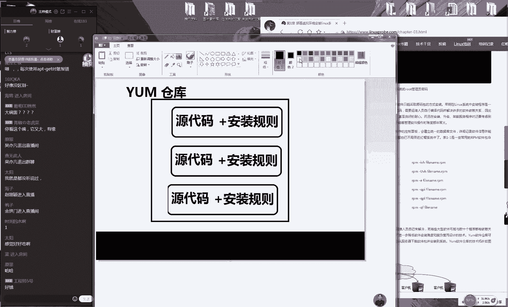

我来记下笔记。

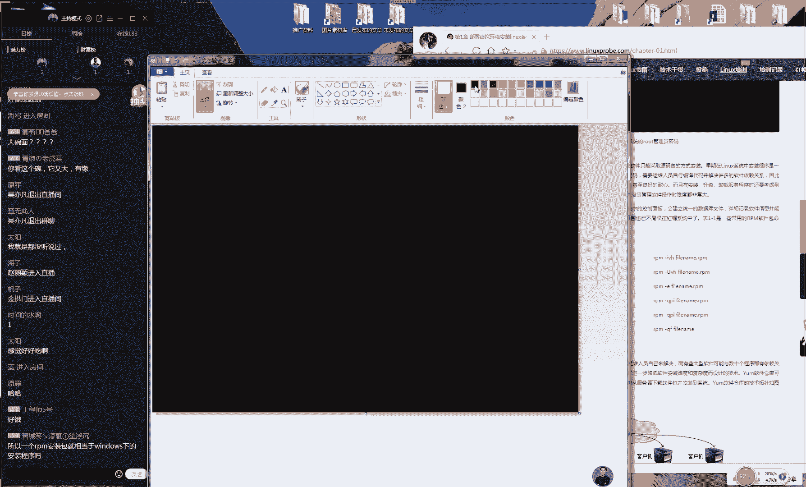

呃，记一下笔记，像我们y米一样，不像我们RPM一样，y么仓库记在你书上面y么仓库。在这个本质。进啊进一步降低软件的安装难度。好了，第二笔同学们y仓库的目的技术的一个产生的一个归因。

但是为了能够进一步去降低软件的安装难度。好了，快快快快快嗯。😊，同学们说到这个吃啊，你们可是行家了，对吧？啊，所以说我们上一期同学教起来应该是最懒的一批。你们这一期应该是最能吃的了啊。好，来去说一下。

同学们开玩笑了啊，我赶紧记笔记了啊，记下笔记。然后对今天记得签到啊，今天记得对了，然后给大家去说一下，因为现在大家再再写字啊，我给大先聊一聊。就说大家啊不用你们每节下课之后都把你的笔记发给我的。

要对自己负责做人就好了，你就自己确认自己已经呃今天这个课过外上课了，学好了。然后笔记写好了，然后发到博客上面证明一下，给自己一个纪念，对吧？然后就可以了，不用给我，然后等到最后一节课的时候。

咱们再统一检查就好了，不用说每一天都发给我的好好，接下来我们来给大家去说一下我们这个M仓库啊M仓库。😊，的这一个实现原理。通过这个实验原理的话呢，通过大写来去写到笔记上啊啊，写到你的这个书上面。

通过将大量的啊通过将大量的常用的ARPM软件包。😊，存放到。一起。😔，根据用户的。需求而进行。😔，自动安装。好，这个就是我们仓库的一个原理。你可以将我们这个大量的这个软件打包到一起。

像就是我们在后厨备菜一样，一般你的这个菜码都已经准备好了。然后下一步你就可以来进行一个自动化安装，先制作什么，后续做什么吧？好，就是我们仓库的一个原理。好。

接下来我们就要给大家去呃以后啊这个大家不用去背里面的命令这个你不用去背的，就是我们这边一个表格表格1-1表格1-2，你不要去背，也不要去看它，就不要就连看都不要去看的。因为我们看一眼还是可以看的啊。

就是我们去看一眼就好了，不用去背它。因为我们今后一个半月时间里面每天都会去使用到仓库会去玩一个半月的时间，你们不可能记不住，到时候会吐掉的。所以的话呢你现在先不用去备它也不用去呃太深刻去来去理解它。😊。

我们往后的一个半月里面每天都要去玩，到时候你啊要吐掉了啊。好，那我们来继续我们记下笔记写好了之后，大家打一下一号了，这个很重要啊，因为书上面没有，这是给大家的干货啊花。

只有这个只有我们花钱的同学才能够看到的。我们不会给大家去说乱你八糟的一大段话，所以我很能说吧，但是我不会给大家打一段段话到我们的屏幕上面，大家找不到重点。😊，嗯，有在人问你的时候说什么是RPM。

什么是原代码，什么是EM仓库，你就给大家说这几句话，非常的精简简练考究啊，要有人说错，过来找我来。好了啊，那我啊那我帮你一块打他。好，那接下个再给大家去说啊，说这么多啊，这个的话呢。😊。

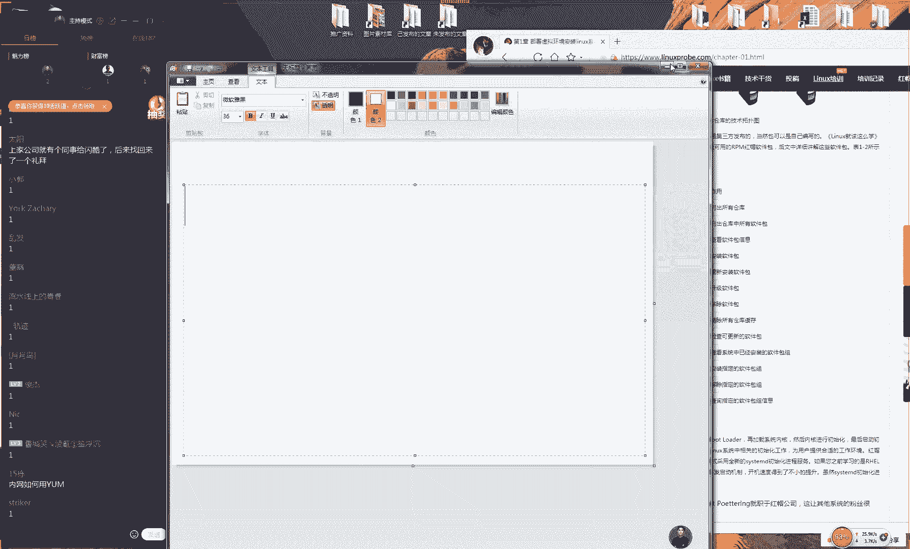

我那那我们就翻回来，看到这边呢，我们的linux就已经安装好了，这边有一个重启按钮，我们点击一下它就可以来去安装了。呃，该如何去使用EM仓库。这个我们先不说，我们以后会给大家讲到的啊。

会给大家讲到这个不用担心啊，我们到时候会给大家讲到我们该如何去搭建EM仓库该如何去使用啊，包括说我们怎么去安装我们这个程序，巴拉巴拉。今天第一天啊，但是我也能够理解大家。😊。

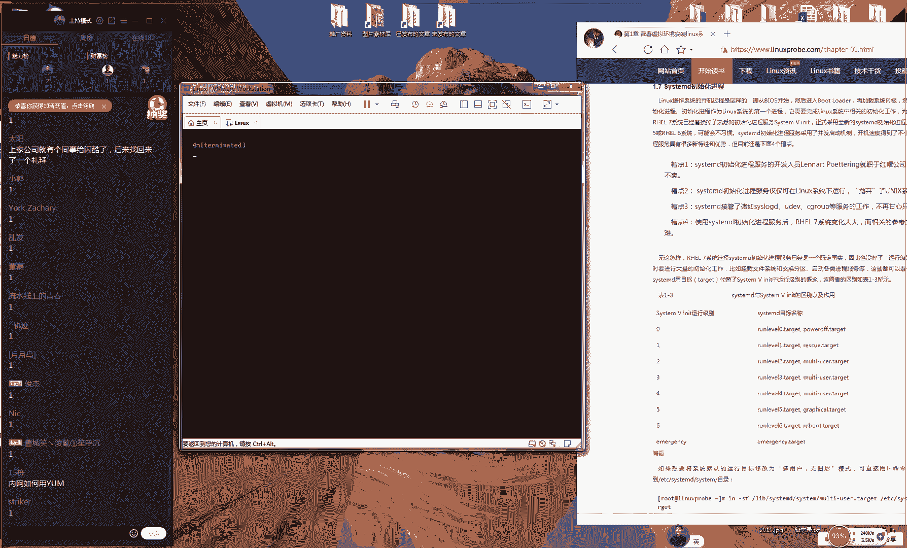

今天第一天感觉一下子哦开启了一个新的世界了，但是千万不要就是太太这个啊太太就太高兴了，然后这样去东一下西一下，我们一定要有几条主线跟着我这个跟老刘的后面一步一步走好就好了。好了。

我们来初始化一下我们这个系统。其实到这里大家都已经是会了，没有什么难度直接将RPM存放到原路径，然后去安装嘛。不是那这会大家讲到的好再往后面去走的话，就是有一个许可了。

就是说红帽公司给你一个赛马威说你要想去使用我们这本系统，你就必须要去支持我们那你就要去同意我我们这个许可，你要去遵守你们当地的法律，你也要遵守美国的法律，你遵守开源的这个精神。

你要支持我们么红帽的一些规定啊什么的巴拉巴拉好了，那你还能说什么？那你要想去使的话，当然就是选一下我同意了。其实这个没都是会有的。后说啊。😊。

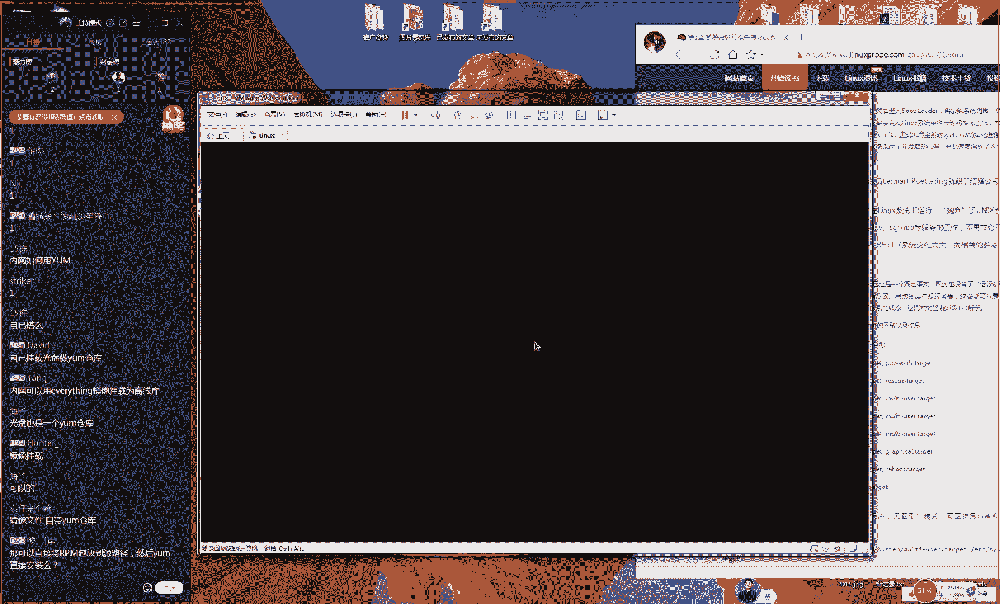

不光要去看他里面讲的就是说啊你不光你需要去遵守美国的法律，你还要去遵守你当地的法律，这不废话嘛，对吧？然后说你不能拿这个红帽尔公司的这个软件去做坏事。

如果说你安装了第三方的软件而做了一些破坏话红公司不承担这个相关的风险。然后你要去自行去承担什么责任问题什么的你要不去购买红帽付费服务红公司也没有义务为你维护服务器是这样的一个许可的声明好了。

并且他说你可以去进行一个自己去安装你的话也可以行一个复制，也以进行一个修改，你也可以去迁移，你可以根据你的这个系统的需求，然后来修改你系统的这些配置好了同同意吧好吧，就同意了。😊。

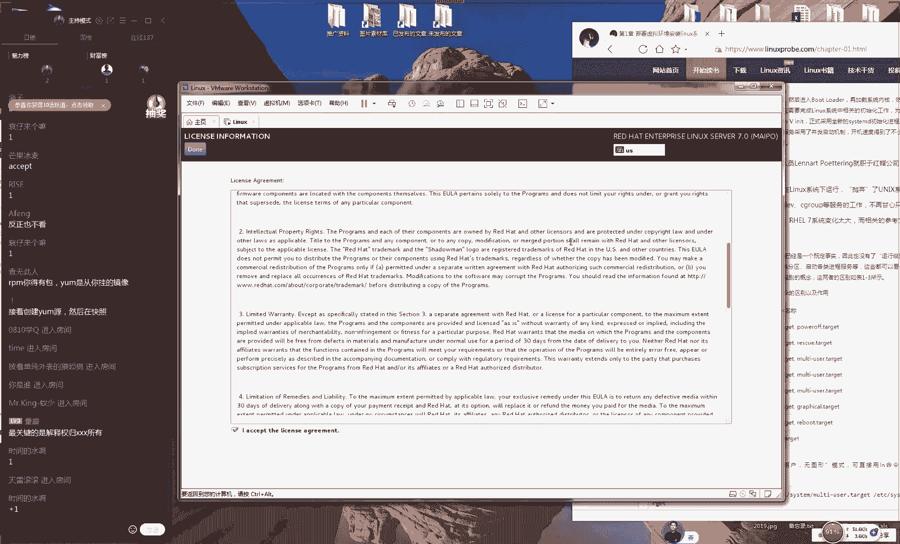

我们选择一下完啊这个技术安装，这就是进行了一个说出来的一个工作。所以说这个其实很简单了，到目前到现在就没有任何人能阻止你去学习linux了。到现在然后这个时候有一个选项叫。

就是说他会去收集你系统里面内核的一些包错。如果说您是当前没有再去做内核的调优，或者说您现在只是一个初觉者的话，我们建议大家先把它给关闭掉，它是用来去收集我们系统里面一些报错信息的，你把它给关闭掉的话。

他会去节省您的128兆的内存，我们认为这个呃没有必要把它开启，我们选择下一步，即便说以后我们需要的话，我们可以去把它继续去开启。好，他说现在已经没有什么其他的事情可以阻止您去学习。😊。

我们的lain系统了，然后您现在已经准备好了吗？如果是准备好的话，请带请点击一下yes。当然了，这后面这句话是我自己下翻译的啊，就是说我们需要去点击yes，来让它去生效。😊，再往后面去走的话。

就说哎就有的时候就要去到几个注册环节了。然后大家信就在吐槽老你果然是在骗我们，我怎么我啊我那我们这么信任你。然后昨天听你们啪拉啪啦说这么多，你说这个开源的话呢，它有六大自由，大家记得吗？它有了六大自由。

第一大自由使用自由，第二自由复制自由，第三传播自由，第四修改自由。第五，出现衍生品自由。第六收费自由。那好了，既然你已经跟我说了，我们的开源软件他有六大自由，为什么他现在还要去收费嗯。😊，很尴尬。

对不对？是这样的，大话因为你可能之在安装过windows7或者安装过windows10安装的时候，需要输入激活码才能够进行安装。所以你以为其实这个就是让你去出册的意思。

花钱实并不是请看一下它里面唯一加粗的一个字。他说是强烈表强强烈的推荐一个广告就是你想不想去使用我们红包供的服务。要是想的话请现就去注册一下，然花钱去购买红订阅服务收费的服务。

但是它只是一个强烈的一个推荐在就是插播一条广告。如果说你很自信啊，我不会的，我自己去那我再去学习我这个系统，并且我有能力维护我这个系统总之我不会给你那么就去选择说no我不要我稍后会来购买的这么一个广告。

我我稍后再去考虑一下意思我们选择一下这个。😊。

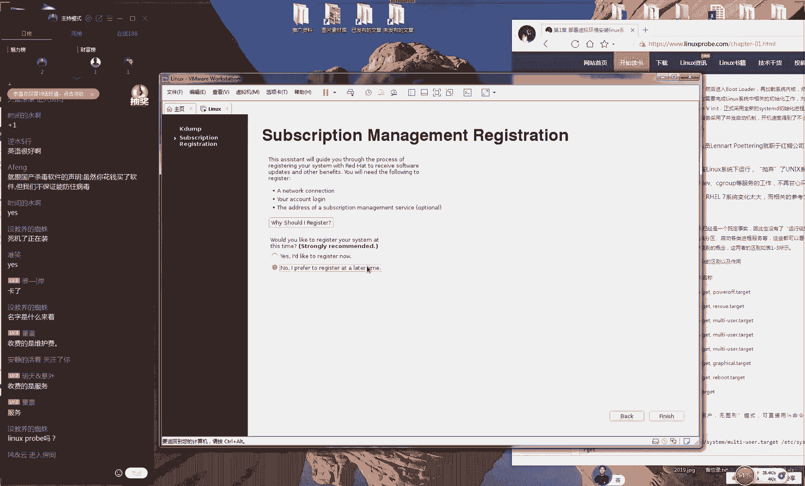

结束好，这个时候我们点击一下OK他现在就是给你一个广告，你可以去选择要不要去使用红帽提供的这个服务，反正我是不需要的。😊，就哪怕说以后我需要的时候，我可以再去买嘛，对吧？😊，最后一次我们再来去重启。好。

这个时候的话呢。大家请看我现在操作一下，请收一下新啊。这部操作非常非常的重要，很多同学在操作错都是因为这里操作错。我们去登录的时候，请不要登录这个普通用户，请不登请不要登录这个普通用户。

请切记请切记请切记啊，说呃一下重要使请说三遍啊，点击这个没有被列出。😊，然后我们这边一定一定一定要去输入入程。就是输ROOT这几个字，这个不用担心我们第5章的时候会去讲到我们用户的身份及相关的权限属性。

root是我们的管理员的意思。我们选择下一步密码不要看我，看我干嘛，对不对？我们每个人都自己设置好的，我反正是你们自己心里清楚就好了。我们来对我们考试的时候也是root是这样的啊。

我们之所以使用到root去操作，第一原因就是我们再去使用的是虚拟机，没有任何人来去入侵你的这个服务器。第二就是如果说你使用的是一个普通用户来去操作的话，当你包错的话，我不知道是您的操作问题。

还是因为权限问题。😊。

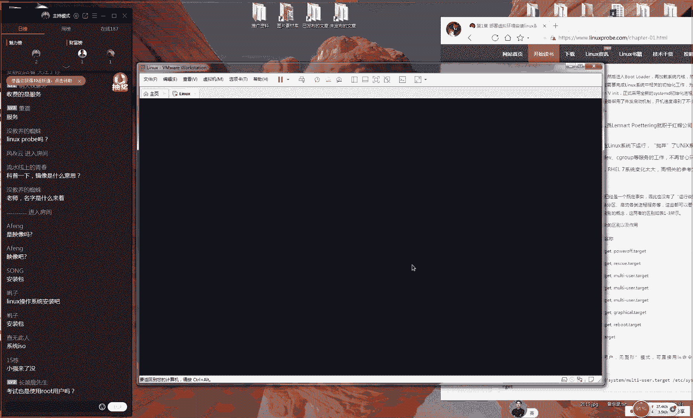

所以我们需要统一去使用到主体用户，这样的话就避免这些呃其他的一些问题吧。更好的去做排错。好，接下来的话呢我们再来看一下说啊小强来了没？小强是谁？是大家的好朋友是吧？小强退出了直播间，不是root操作呃。

怎么操作大量的硬件配对。在我们去学习的时候，我们需要去我们叫这个有一句话叫作死嘛，就是各种的再去。😊，再去破坏我我们的这个系统。因为我们要在尝试破坏当中来去进步。所以说我们需要大量的的这个权限。

而且我们要去破坏之后再去尝试去修复。所以我们需要更高的这个权限使用管理员哎，我们来去操作。好，然后我们选择一下我们这个系统的语言。那我们来敲一下下一步。然后下面这个语言，我们选择下一步。

选择开始去学习我们的linux系统。好，这样的话呢我们就没有问题了。😊，好，那我们现在就可以来进入到我们这个系统里面，他会给你一个提示框，他告诉你说系统的一些操作的一些方式。好。

其实这个你看不看无所谓了。因为你要能把这个看，因为这个你要通过这个去学会lininux的话。😊。

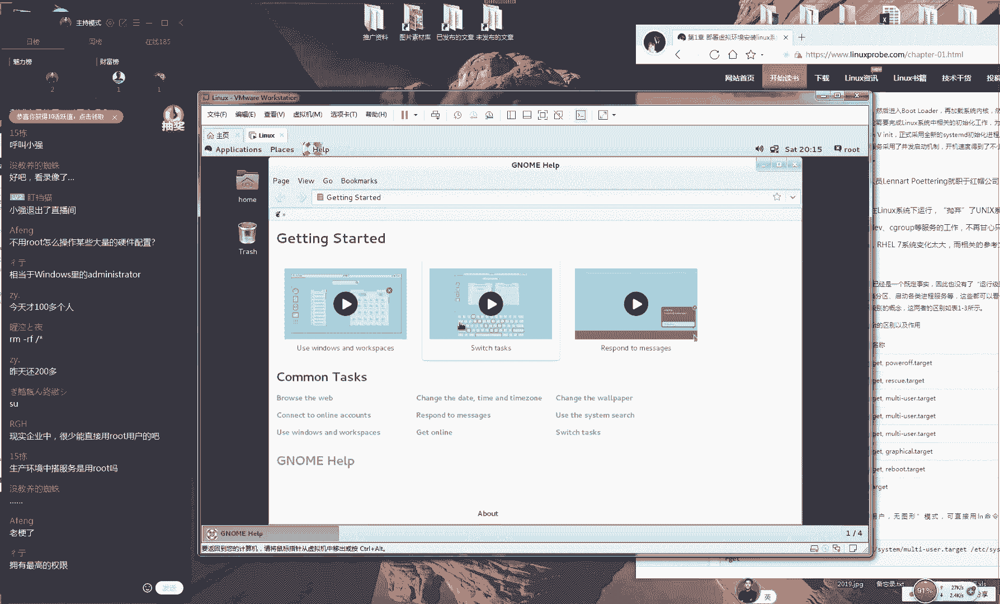

嗯就不用我们讲课了，你看他就给你讲一下非常基础的。比如说你可以那你可以去使用鼠标，然后拖动，哎，就跟那不那就不跟那玩的吗？你可以拖然后你可以拖动你的这个窗口，你可以再点一下这个窗口把给拖回来。

你还可以去点击最小化按钮，然后你还可以把它给关闭掉。好了，这个我们就不看了啊，这个非常简单的一些操作，跟windows是一模一样的。好吧，就是一些选项，比如最小化呀，最大化呀什么的。好。

这个只要你看到这个界面了。那代表就是我们这个红马系统就已经安装好了。现在到目前为止，就没有任何人能够去阻止您去学习linux了，并且有一个小的一个彩蛋有没有看到啊，有没有看到一个彩蛋。😊。

现在先不用纠结说是使用root还是普通用户啊，比如说我们工作的时候，哎，老师嗯不对啊，我那我们工作的时候，那我们那我们公司为什么没有用到root？那你现在讲的是root，我们工作的时候使用的是普通用户。

那我们操作起来会有什么问题吗？这个先不用担心，咱们第五章的时候会去讲到我们用户的身份及权限，那我们再退一步。那我们也会给大家去讲到这个速度跟束服，这个我们先不用着急，我们会大家去说到好。

大家看到一个小彩蛋了吗？嗯没有吗？没有联网也能够看到啊，你看这边。😊，我鼠标这边在晃动的，这边是不是又显示出来一个7啊？这个我啊我从我从2014年开始就是在玩红猫任务器。然后我玩了2018年。

我玩了4年的时间，突然有一天我离得远了一一这个屏幕上面隐隐约约出现了一个，才出来你到了吗？这个背景啊，然后拼出来的一个看出来打一下有没有还是有，对不对？好了，就是说当我们看到这个画面的时候。

就证明系统已经安装好了。好了，我我能够理解下，因为我之前也是在这样去学习过来的，我能够体会您当前的这种激动的心情好棒啊，对不？但是请现在一起来去深呼吸一下去去控制下自己的这个情绪。

我们还是要给大家讲一些技术性的一些知识，打好我们这个基础啊，我能理解想学习更直接去命这种心态啊，但是一步一步的来个才到哪so easy，那我们继续往我。😊。

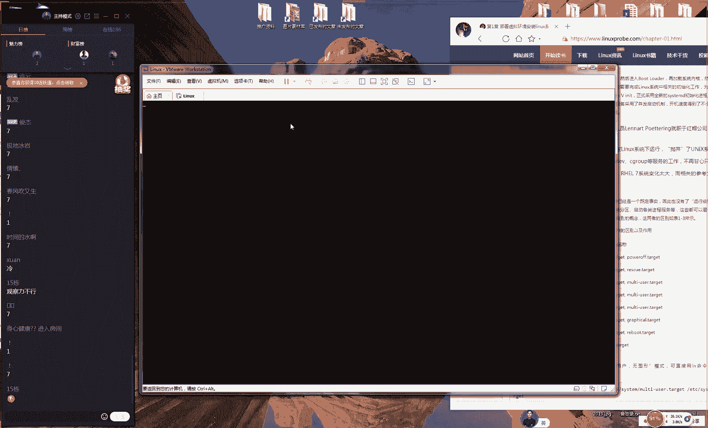

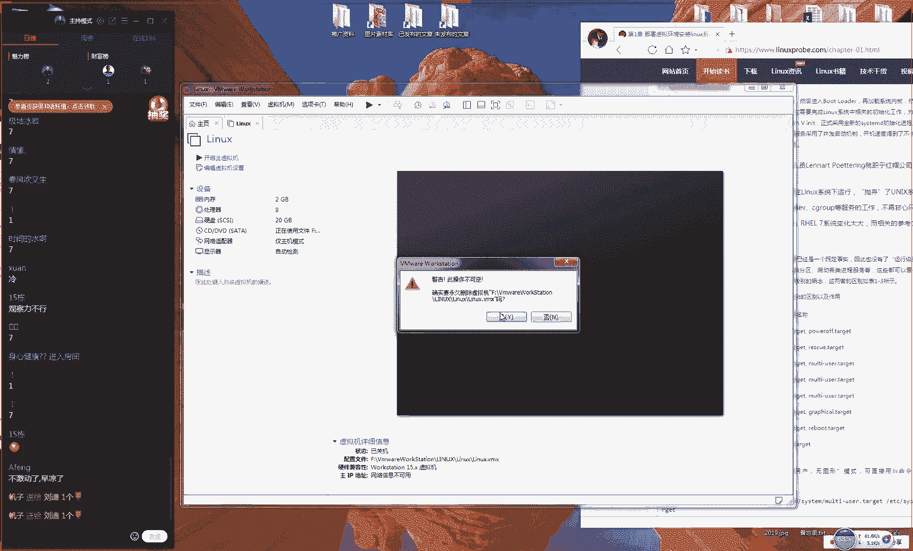

说就是呃，我们到了。是这样大家千万不要啊怎么样，我死了，没有情绪了。嗯，怎么怎么天怎么怎这这是什么梗啊另外大家不要给我刷那个小红花是这样的大家客气不是那种主播大家不要不要不要不要不要不要听是这样的。

因为我们真的是除了我们讲课不会去直播讲么丑？说话也不好，也没有什么才艺，不会唱歌跳舞这么难看，所以说我除了讲课我也不会这个直播的你们刷这个就纯属费钱，这没有用的你们都给马化腾了，马腾已是全国老二个首富。

必要给刷钱了，就是这个礼物大家不要去刷真的没有用啊好了，我们来继续往后面去说不给大家客气吧？我们毕竟我们都收了培训费了啊好，那我们继续往后去说啊，然后我就是一。7小我做初始化的一个进程。😊。

小红花免费了才啊呃说不可能免费吗？马化腾怎么会给你免费的东西，你想一想也知道的腾讯的抽奖，你们什么时候抽中过啊，腾讯的抽奖那不就是跟玩似的吗？从来没有中过的这个抽奖。然后说番茄泡泡说，因为你帅。

所以才刷小花花。嗯，这个话是真话，我就喜欢这样比较真诚的同学，这样的同学非常的真诚，我很喜欢。😊，好，然后我们来继续往后面去说，所以说是这样的啊，给大家聊一聊。

就是因为我之前在op我们那边是在线下去讲课的，我总会看一下，我们现在因为我们这个人的这个生理嘛，一天24小时对吧？日出则日出则功日则息，然后我们一天之积在于晨，人的这个身体一个变化过程是一个有周期性的。

每天的夜里啊不是每天夜里我不知道啊，每天的下午我的学生们都有点犯困，有尤其吃完饭之后，胃里面添满了一些吃的啊，然后血液都供到胃里面，然后大脑有缺氧。

所以我每回我们下午去上课的时候都会看他们翻白眼有点日出而作。😊，然后我每回一看他们就翻白眼了，就是有点犯困了，还有同学特别的可爱，自己掐自己掐就好心疼啊。所以说我们就喜欢给大家聊聊梗是聊开玩笑嘛？

给大家举几个小例子说几个好玩的笑话，然我们回下气氛，大家好把这个精神给拉回来所的话还是那句话啊，为我们是在网络上面网络课程且还开的是晚班还讲的是这个东西你要给别人讲。

估计无聊死了所是这样但是因为我现在通过网络讲课，我不知道大家现在有没有翻白眼怎么办呢？就通过大家这个互动的一个情况？

大家如果互动快速在聊天者快速在这个打字证明大家还还是很兴奋大家一声了感觉回复速度慢的话呢。😊，那我就给大家转两条，就是小笑话无所谓啊，是什么啊？大家都知道我们这个课程一定要活跃一点嗯。😊，好。呃。

我们来继续。如果大家如果要实在犯困的话，你们可以一边吃点东西啊，一边泡着脚啊，一边躺在床上。反正我们是建议大家你不要坐在你的桌子面前，我不知道大家现在什么情况啊，反正我我不希望大家也像我站着。

反正也最最最起码你找个桌子上面你坐下来对吧？然后你可以泡泡脚，可以吃点外卖。如果在家里的话，你可以把你的笔记本拿到你的床上面，你再趴着看我这个在操作，把你笔记本放旁边，然后可以吃薯片好了，说太多了。

犯困，对不？赶紧回去收一收一。7小我来说一下叫做这个这有4个吐槽点啊。其实这个我们不用去看了，因为这是在2015年的时候刚刚发布的红包肉红肉的变化，因为很大然后一些培训机构照我们这个CCTV啊这种。😊。

呃，中央电视台那种。嗯。这种这什么这么叫说话一种方式啊，就是呃外部的扰乱我方的这个势力呃，心思不死。就是他老他们就是呃什么呃呃境外视力。乱我中华呃至心不死。

然后会有一些培训机构也会再去故意去抹黑红猫日由漆系统，然后就想出来很多很多红漆不好怎么样怎么样的这样的理由。但是我们现在放到那我们在2019年再去看，其实也没有什么太多必要去反驳了。

因为任何一家培训机构，包括说企业现在已经在陆续都在变成红漆了。然后这个不用再多说，但但是我们必须要去说就是我要去吐槽一下当时红猫漆刚刚发布的时候，资料非常非常的少。

2014年年底去发布那会没有红由这个书我们这本书是中国第一本红这个是红日漆的书，并且也是中国第一本个7版本的就是说只要是7版本的书，们是中国第一本是写出来的，并且我们是中国第一本出版的这个7版本的书籍。

以说你也知道我那会我去写出的时候是很痛苦的？那你老二你可以看看我的参考一下。那我刚刚。😊，去写的时候我很痛苦的。所以这个是资料不全问题哈，这是当时也是在一个很大一个吐槽点。第二的话就是这个CMD啊。

我是他它的话是一个初始化的一个进程，原先叫做INIT它不光现在这个红7这个初始化进程，它不光。😊，呃，呃，他的话呢不光他去做数字化的一个工作了，他还接替了很多很多的服务。这个我们其实啊我坦白讲。

我说的这些。对大家没有用，因为你不知道什么叫做CMD它有什么变化什么的。我给大家讲的这个原因就是说红re7相对于说红re6的变化很大。嗯，大家记住这句话就好了。请记住啊。

这个四个吐槽点的核心就是变化很大。好，还有第二个还吐槽点2就是说他抛弃了系统他只能够是在他只能是在lin下面去运行这个我们说出来对大家好像没有什么用，对我都没有什么用。

抛弃抛弃了我们是linux的用户抛弃了用户跟我们没有关系，对？相当于就是比如说我们买了一个iphone手机，然后以后微信突然间有一个公告说以后微信只支持IOS系统只支持苹果手机了，跟我们没有关系，吧？

因为我们本也不是安卓系统。好，这个我们就不多说了，下面一个吐槽点4啊，就是这个作者他是呃呃当前的话呢，它是就职于红工作，然后会让其他的粉丝很不爽。😊，大家理解一下，就是说你喜欢一个男神。

结果这个男神比如说他是韩国国籍的，然后就会让很多中国的粉丝不爽。其实这个有什么关系呢？对吧？好了，就是说我们这个初始化进程的这个作者，这个大牛这个大他这个大神很厉害啊。他当然是他目前就是一红帽工作。

可能会让其他的这个系统的这个爱好者觉得很不爽。那为什么不来我们这儿哈，这也算个吐槽点啊，所以我们现在就给以他写叫槽点，其实不用太去多关心这个你们不用去多关心这个好吧嗯。😊，好了呃。

说现在确实在书店也找不到reo相关的数据，现在还好了吧，现在其实还好了，还呃但是比较少嗯比较少。因为使用三系统的话比较转人气可以明正因为他们会忽悠嘛或者说系统是免费但开源是正义的不？

开源到了这个免费再到正义这个级别，这爱国主义精神，对不对？只要以宣传出去，肯定是比较有优势的。但是你要说re的话，你要跟别人去解释也麻烦。好，这个我们咱就不多说了，就是说大家记住两点。第一点啊。

就是说我们在红猫里面我们的初始化进程，它不光可以做初始化的工作。笔记他还去负责管理我们这个服务，这是第一点它的功能更加丰富。第二它比于说红猫的变很大。如果说您之前学习过红的话。

此时可能需要多去了解一些新鲜的这些知识。好接下来我们再来。😊，是这样的，因为的话呢我我呃我们这个课程，而且我本人我非常的讨厌就是让大家去背东西的。我很讨厌大家去背东西。呃，也会不让大家去记太多东西的。

但是这个东西需要先给大家去背一下，就是我们从来不会就除了我们今天以外吧，家可相信我啊，除了我们今天以后的一个半月时间里面我不会让大家再去背任何东西了。但是这今天的这个我们的命令，我们必须要把它背下来。

因为你既然因为你这个你没有背下来的话，你以后去配置服务就无从下手了，你也不会去配置服务了。好，那也就是说当前也许您不理解我们每个命令的作用没有关系，请把它先背下来，或者你哪怕先给大家抄到书上面吧。

我们去抄一遍。好了，我们先在敲第一个命令，叫做CL，我知大家现在不会去执行，你也不懂它什么意思，没有关系。😊，就先去记啊。好，star，然后我们叫服务名称，这个命的作用代表就是启动。

服务代表就是我们去启动一个服务。对它是对于我们的服务的管理能力。对，他是对于我们服务的一种管理。好好，我们来去记啊，我们我们开始往后去记，往后去记，这是重启。😊，重启我们的服务。

我知道大家现在还是要来说一下，我知道大家现在不理解每个命令的作用没有关系，先把我们的命令给他记背下来，这是必须要背的啊。好，这些是停止服务。它主要是对于我们的服务的管理的能力。

然后我们每往后的一个搬月时间里面，我们需要给大家去。😊，来去执行一下。呃，能不能说一下CTL的这个缩写的全称啊呃，CTL的缩写的全称应该是control的。呃。

应对他应该是conttrol的CONTROL就是这个CTL这么一个叫做系统管理的意思。好，然后我们继续往后面去说sstem enable。服务名称，这个是将我们的这个服务。加入到启动项。好。

还有这个sstem，还有说查看服务状态的意思。小才先记一下啊，啊查看服务状态。启动关闭停止，查看状态，还有什么，还有没有什么disable不用讲了，启用就好了啊。对，因为我们就已经足够了。😊，嗯。好。

就基本上就够了。大家先记一下这5条，一定要记到书上不要偷懒嗯。😊，一定要记到来到树上restar有restar有。好，大家先快速打一下。知道大家书上面。另外我们说一下，我们记笔记的时候。

尽量用一个颜色比较鲜艳一点的笔。这样的话呢嗯。比较好看啊，是这样的，我们这边就是这呃这呃就啊就是这5行就总结了1。4呃1-4小节跟1-5小节，大家不用看1-4跟1-5，就只是看这5条。

这是给大家筛选出来最对突出下重点这5条一定要背下来以后我们去学习的时候就好了。嗯，书上是reloadreload跟re是一样的。这两个的区别就是呃reload是重新去加载配置文件的意思。

它不会去变更我们程序的PID的值但这个效果是一样的re更加彻底。嗯，好，我们来继续。😊，re呃reload它只是去重新去加载我们的配置文件。好，那我们现在来去记一下这5条。英语好还是有优势呃，也还好吧。

嗯，只能是有优势。你看那比如说你找一个同学把它揪过来说，比如他考过6级8级了，说你给我讲一下这个词什么意思，他去查他牛津字典里面啊，去查吧，大也查不到这笔一个词，因为这个词只是在我们里面有的。

即便你考过6级8级了，你考过100级了，你最后这个词也是一个很新鲜的。嗯，好，那我们来去记好没有，记好之后打一下一同学们嗯，记好了之后打一下一。😊，然后给大家举个例子啊，说英语好的同学们好，是这样的啊。

比如说我们英语里面给大家提一个老梗叫free，对吧？但你看这个单词的意思是什么？即便我们没有考过8级，我也知道这个代表就是自由，对不对？因为美国人老说嘛，就是说啊他们是一个自由的一个国度，还有什么呀？

还有免费的意思，对吧？你去一个酒吧里面，然后说free beer来个免费啤酒，对吧？这是一个自由免费的意思，你让他想破脑子也想不出来，他是他在我们系统里面的意思代表就是查看。😊。

查看内存使用情况哎呦啊呦呦呦呦呦怎么变成这样了？

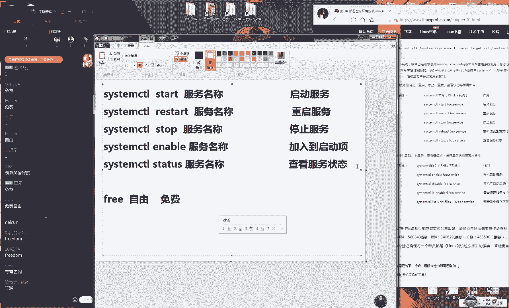

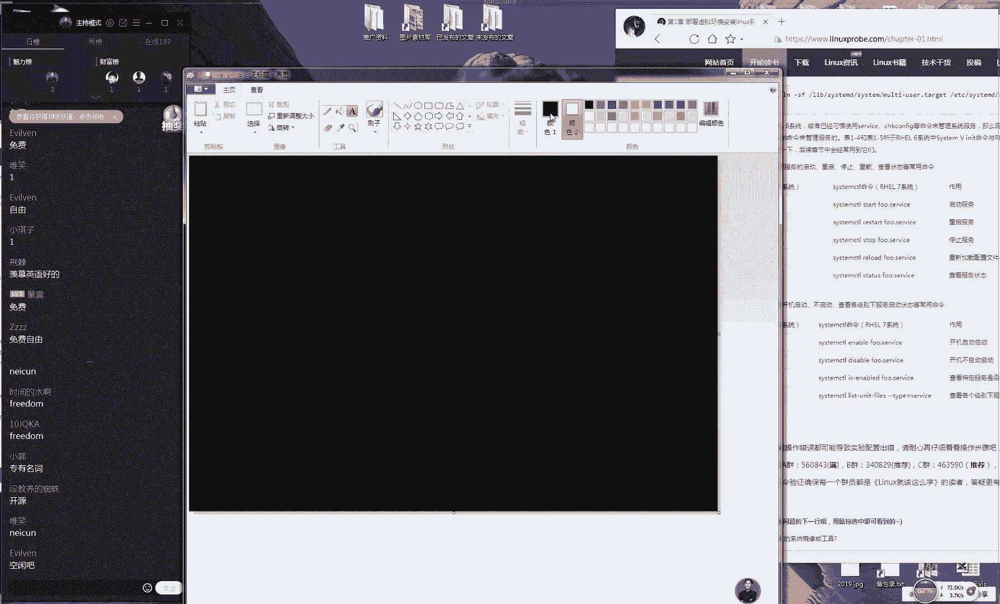

啊，这个的意思代表就是查看内存使用情况frreee的意思查看内存。使用情况。所以说这个东西嘛你要英语好的话，你要实际上说的话也是有帮助。但是呃这个帮助也不会很大。他也要是从零开始去学习的。

不他不是说查看空闲的这个资源，它不是看空闲，它是查看整体的情况，包括里面的总体情况，然后还有空闲，还有跟我们硬盘的一个交互情况。这个bri他都可以去看他他不光可以去看空闲。好。

接下来话我先给大家记下这5条之后来往后面去说第二章节第二章节的话呢，我们今天讲不完，我们今天只给大家起个头，该知道如何来去执行我们linux的命令就已经是足够了。

那就会知道我们该如何去去执前我们lin的命令命令的话呢我们先给大家啊就要开始给大家画那个。😊，这个要给大家去画一下这个拓扑图，是这样的啊。我现在很纠结，要不给大家讲这个小梗。😊。

因为这个梗嘛就虽然是个鬼故事，但是每一次讲之后效果都非常非常的不好，就是总会感觉很搞会很搞笑，而且很尴尬。你懂这很尴尬的这种感觉啊，就很在很纠结，但是吧我想不到更好的这个例子，很麻烦啊，行。

给大家说一个小例子好了，第二章就开始之前先给大家讲一个小例子，嗯，好吧，那你不要笑我好不好？因为这个子我说过很多遍了。但是每一次说完之后都感觉效果很差很差，很尴尬啊。好给大家说了一下。

这这个是一个鬼故事，大家要去尊重一下我好不好？这个是一个鬼故事，你要配合一下，不要刷屏，不要说哈哈哈这个芒果小兵同学啊，这个冰麦同学们要配合一下，不要哈哈哈呀，你要你们要配合一下好不好？准备开始了。

是这样的。😊，哎，你们配合一下好不好？你看配合下这是一个恐怖的一个故事，这是跟我们上课相关的，不是给大家现在讲着玩的。你要是听不懂这个鬼故事，你那那那你第二章节就学不懂的好。

准备好没有准备好就来就打一下E呀收就是收敛一下自己这个已经笑崩了这种情绪啊，来就再假装配合一下哈，准备开始了。😊，嗯，好嗯。好，准备开始了啊准备开始了嗯。😊，说啊有一天嗯3月9号。等等会我想一下。

你们都配合一下，还放还放音乐啊，说啊有一天已经很晚了，已经到了11点啊，已经11点了。但是呢我还是在完成老板交的工作因为马上就315了嘛，对吧？然后我们的工作很多，我们现在要准备很多的文案。

公司里面的其他人都已经回家了，只有我还一个人在办公室里面加班，这个该的老板为什么会这么对待我们他不给加班费，然后我骂两句老板看一下时间已经到了11点了，时间滴答滴答一点点的过去了。

11点11点半12点知到12点的时候，我终于了一下懒腰看一下我电脑的屏幕上的文案，当我们修改过第三遍了之后，终于觉得这篇文好像已经是已经是蛮不错的了，已经是能够符合老板的要求，12点了，终于做了一天。

终于搞定了。这个时候开始保存我的文档啊，当然。😊，啊，然后我就开始去关我的电脑，我保存好我电脑，保啊，然后保存好我的文档，关好我电脑，伸了一下懒腰，看了看这个公司里面啊，黑，然后黑漆漆的一片。

对今天又骂了一句老板说这老板真不是人，然后开始去收拾自己的东西，然后开始去锁门。到了前台。😊，准备开始去锁门的时候，突然听到里屋，冰响了一下，嗯，这里面怎么会响了一下。

抱着对社会的这种责任感和我对公司这种忠诚度，我又重新开，然后我又重新走回来我的办公台，这个时候突然看见我的隔壁的那个屋的门，突然间有了一个起来一个小缝儿。

并且从那个小缝里面偷偷的露出一点小小的灯光很昏暗的这种小细的灯光这个时候我就走过去吧。但是没有办法，毕竟公司里面只有我一个人了。那那我要去公司看一看，因为我要不去看的话，万一是那万一是着火呢。

我就那所以我就往门门边就去走，就这样一步两步啊一步两步，我就这样地下11点点的走，走到门口，那我偷着门缝。😊，看到是谁呀？是隔壁的老王，是我的隔壁的这个同事老王，他正在蹲在我们仓库的小角落里面。

说里捧着个东西在说话，嗯，是什么东西？我再近去一看哦，是老王在捧着我啊，在捧着他新买的一个硬盘在说话。嗯，好哼。😊，啊，所以说我每回讲这个故事的时候都很都会很尴尬，对不对？好，大家可能没有听懂啊。

已经讲完了。其实虽然是一个恐怖故事，但是你们去脑补一下，还是很还还还是很恐怖的啊，很尴尬啊，然尴尬比恐怖还要多，大家有没有做到我这个重点，重点是什么呢？重点不是那个老王呀，然后也不是说我加班了。

重点是那个老王，他居然捧着一个硬盘在说话，他想通过他的语言把他的这个内容写入到这个硬盘里面，这但这个事情很恐怖，好了，你看很尴尬，对不对？我就说不讲不讲吧。然后你们看你哎呀很尴尬了。😊，哎呀。

你看很尴很这个很尴尬很尴尬啊。好，我那我要画那我给大家画个图好了，给大家画个图啊，是这样的。比如说这是谁这个我们这么算，肯定是老王啊，对不对？那比如说有一个老王嗯。😊。

然后这块然后这块这个呃这个呃这个老王吧，然后就是他买了一个硬盘。这个硬盘的话呢是一个硬件。好了，我们给他画出来一个圈啊，我们画出来一个圈。比如说这是我们的硬件。😊，好，这个是我们的一个硬件。

那么请问以我们这个常理来说的话，人能不能直接跟我们的这个硬件直接沟通？😊，大家先告诉我是一还是不可以，一还是2。如果你要是说打一的同学啊，那你就可以尝试。哎，还还还正人打一是吗？啊？冯云同学打了一下一。

好了，那么现在这样，那你现在就是这样，一般你的手完全离开你的键盘鼠标和你的屏幕，然后你现在就开始对着你的屏幕说话啊，然后说关机呃要不然你就说呃开启窗口，如果要是可以的话。

那你就一定是买了一个老楼的PNT哎，这个广告这个哎这个插入的多么硬，对不对？多么的顺滑，你那我们现在给大家开个玩笑，就是说正常情况下来讲啊。😊，肯定肯定是人是不能够跟我们的硬件直接去沟通的。

比如说你跟光盘去说话，你跟内存条去说话，对吧？那好了，人为了能够去控制我们的这个硬件。说我们这个广告插入的多顺滑。好，那我们接下来说啊。

那我们就要有一个东西叫做内核内核实际上它就是一个最底层用来去管理我们硬件的这么一个程序了。它用来去管理我们内核呃，他用来管理我们这个硬件，相当于就是我们的windows里面的一个注册表一样。

他用来去调整我们这个硬件，比如说他可以让我们硬盘去想一声，他可以让我们这个主板灭一下，对不对？他用来去管它是一个底层的一个基本的一个系统来去管理我们这个硬件的，但是人也不能够直接去控制我们这个硬件。😊。

跟我们这个内核，因为内核它过于复杂了，并且的话呢我们调用起来难度也很高。这个时候我们就要由内核给我们去提供出来一种东西叫做。😊，呃，apinface这边代表就是我们的程序的接口，我们简称叫做什么？

我们简称叫做API好了，这大家应该如果你之前大家学习过编程的话，或许会耳熟，它就是一个程序的一个接口，我们可以通过调取程序的接口来实现一些功能。啊比如说我们调取一些文件啊。

大家知道我们上我们上学的时候是不是学习过C语言啊，我们学习过C语言来inc。😊，我们学习C语言的时候，是不是么要写之前，我们需要来去加载一下我们某个程序，我忘记是不是这个文件了。

先去加载一些我们相关的这个文件。然后我们的C语言的程序具有一些呃没没有什么就是我会有一些基本的一些功能了。这叫做这个AP那我们的所有的程序。

它其实都是通过我们这个AP编写出来的那我们就咱比如说想发一条QQ的信息。而我们知道它网络是分7层的，它最上面一层是我们的应用层最底下一层是物理层中还有应用层数叫做这个数据叫做这个数据数据链路层。

它会分为网络7层，如果们有一个相应的程序的话，那我们需要自己来调用的接口调取14次先去将我们这个程序，后话将我们这个话给打包，通过网络7层给它传输过去，再给它进行一个解包。

这是个非常复杂的一个过程调用AP不现实。那么怎么办呢？它的这个上面还会有一层叫做程序。😊，而我们我们这个程序则要是通过调取了这个API的这个接口来去编写出来的给人真正来去使用的这么一个终端。这样的话呢。

那我们这个人就可以来去使用。我们这个硬件了。现在就是我们这个操作系统，或者说是一个我们控制的一个程序。好，那我们要给他一个专有的一个名词。在我们这个系统里面哪个最好用呢？

我们把它叫做这个shallshall的话意思就是嗯。大家知道，我觉得啊现在有一个世界500强的一个公司，叫做壳牌，对吧？他卖这个润滑油，他卖石油的叫做hell。啊，大家看一下，叫做这个hell。😊，对。

叫壳的意思。因为大家看一下，其实我们这样把它抽象成一层一层一层，大家有没有觉得这个很像一层壳，有没有很像一层壳。如果有这有很这个很像一个蜗牛，有没有？😊，啊，有没有这个很像一个蜗牛的壳？😊，啊。

大大家可以大家在互动一下啊啊，大家不互动。其实我是很不想画这个蜗牛，因为你们总笑话我，所以我就所以我就没有画，我想跟大家配合一下，我算算给大家画一下啊。你看啊，比如咱比如说你看我现在画了一个蜗牛。

你看这个是不是就很像那个想换一笑脸，你看这个是不是很像一个蜗牛那个壳。😊，这个就是一个蜗牛的壳。好，人就通过这个壳 shellll，你这样来去记一下会很好。它控制我们系统的硬件，再给大家总结一下。好了。

推翻之后再去总结一下。第一第一句话，人不能够直接控制我们的这个硬件。第二句话，人一层一层一层控制到我们硬件的这个程序，叫做 shellll shellll的一中的意思叫做壳，记住它它做的这个壳。好。

下面给大家说一个。😊，判断的一个问题啊。那么请问你看那实在这个实际上来讲，这个shall就是一个人与我们硬件的一个翻译官。它将我们的人话转化成我们的硬件能够听得懂的这样的指令。

他又将我们硬件处理完了这个结果又给它转化成人化了。好了，它就是我们一个人与硬件的一个翻译官。同们要记笔记啊，shall的一个作用，就是人与我们硬件的一个翻译官。好了啊，说到开心的时候。

我也会非常的兴奋啊，下面就来重点了。那么请问。😊，那么请问翻译官在我们生会当中，在我们这个日常生活当中，翻译官是不是个人？他们请问大家快告诉我是不是个人是就是一，不是爱就是2啊，我们稍微快一点。😊，啊。

翻译过他是不是个人啊，或者说我们。😊，翻译官啊，他是不是个人，他不是个人啊，这个咱不是说有人何侮辱的性质啊，因为翻译官他是个职业。你看啊我们去在操作我们计算机的时候，他也会有操作系统。

他也会有QQ他也会有微信，他也会有阿里旺了，对吧？他也会有淘宝，他会有腾讯，他会他会有很多不同不同的这样的程序来去一起去满足我们的工作，你不可能说你从支付宝直接提现到微信账户里面做不到对吧？那好了。

他只有很多很多这个程序来去构成的。其中最好用的一个程序来去操作了起来命令的话呢，这个叫做啊，我们不是说他不是人啊，我就是说他是一个职业，这个职业里面，他会有很多人在做。比如说呃他是个律师，对不对？

那你律师有各种的事务所，对吧？你那那你北京市里他他就有上百家这个事务所，然后事务所里面他会有上千家他他会有上千个律师。好，具体的那个律师，他是人，但是律师这个职业，他不是人，他是一指的一个很大的一个呃。

😊，的一个职业。现在就是你说。厨师，他是不是个人？厨师他不是个人，因为厨师他分为了中国他分为了八大菜系。这个八大菜系里面他会有不同的这样一个分支，它会有具体的这样的厨子。那比如说我就写完这川菜好了。😊。

那我就去选择一个更加适合于我的这个b。好了，我给大家说一下b是我们目前来说系统里面默认的这个sll终端。我们之所以去使用到它啊，我们之所以去使用到这个b解示器。我们有两个理由，大先因为是这样啊。

因为我们今天第一天去学习到它。大家根本就没有去操作过命令，只能是先暂且下去相信我，现在就是。😊，有人跟你去说啊，说这个川菜太辣了，即便你没有去吃过，但是你大概你有个印象好了。好，我先给大家说一下。

说我们为什么要去学习到bsh。然后的话呢，大家如果有兴趣的话，你们可以去看一下我们这边会有12344个好处。但是你不要去背它。因为那个四个好处是我给想出来的，我认为这四个是很是。😊。

他的一个优势而已并不是真正你以后就感觉出来了，他到底怎么怎么样好，对吧？所以我们希望大家不要去背我们的东西，一定要自己去感受它。好，那我给大家总结出来两句，说你为什么要去学习拜事的理由。第一条理由。😊。

目前主流的大部分的。啊，当前主流的。当前主流的。我们的系统我们的呃当前主流的liningux系统。默认的终端都是b事。当前主流的linux系统的终端大部分都是bash。因此我们学习过后具有通用性。

通吃叫做通吃。当你学完了之后，大部分的系统你都可以通吃。好，这是我们的第一点。我们就不要去说他具体的好处了啊，我们现在就给大家给大家说，我们学习他的理由是什么？😊，具体的这个细节怎么好。

大家去感受就好了。第一，通吃具有广泛适用性。好，第二好用，它是真的是好用。哎，所以大家先去学教它。第一就是它好它是广泛啊使用。第二就是它好用。这两点大家记下来就好了就可以了。好，然后给大家来去说一下。

说我们歌曲如何来去操作我们的这个命令服务是这样的。命令的话呢，我们再去操作的时候哦，今天讲的真的是很细啊，所以说我们。

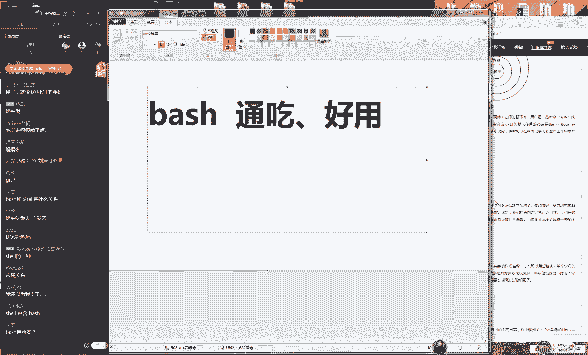

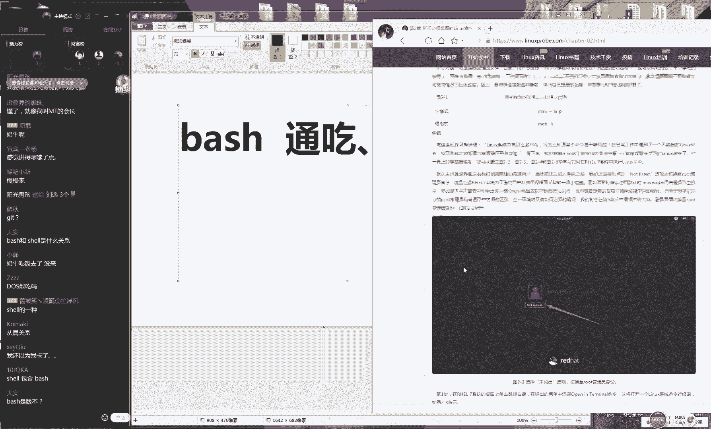

今天不会讲的太多，我看一下啊，课程的一个规划。是这样的，因为的话呢我很不希望我们这个课程赶的太快，赶的太快。所以我们希望能够因为这期尤其人数很多，我希望把这期我们讲好，对吧？

而且对于以后我们的口碑养成也是很好的。所以说我们不会去赶我们的课程，大家不要着急。呃，然后的话呢我们原先我们的第二节课一般我们都会讲到2。4小节。上一期我们也讲到2。3小节了。

但是我们希望我们这一期节奏能够慢下来。😊，因为毕竟我们的学员的人数多，所以我们就因为他这个基数大了，就会导致我们同学们这个基础嘛参差不齐。有同那有同学可能就基础不太好。那好了。

所以我们今天要讲的稍微再少一点，好吧，如果说您的基础。😊，并不是很并不是很好的话，那么呃请尽可能的去多去预习跟复习。如果说你的技础很好的话，如果觉得我讲的很慢的话。现在也不要着急。

因为我们以后的课程里面会大家不断去增加难度的。最开始我们先等一等那些后起之秀啊。好，那我们来继续给大家去说一下该去如何去执行我们的命令。我们的命令它是分了三部去组成出来的。第一步。😊，部分是我们的命令。

第二的话是我们的参数。还有第三部分就是我们的对象。好，它是这个命令参数对象。嗯，蔬菜里边有黄瓜胡萝卜西红柿。好了，我来继续给大家去说，大家不用着急啊。因为我知道大家会有同学们会心情很激动啊。

我今天第一天我都安装好lin系统了。结果你不让我去敲两条爽一爽这根对不对？这感觉很这个感觉可能非常的这个失落啊，但是不用着急，咱们来日方长。我们明天就开始去学习linux命令，先打好基础。好。

那我们来说一下我们的命令参数对象，它三个之间的关系，命令现在就是我们要去做这个事情，参数是对于我们的命令一种修饰对象。😊，他指的就是我们的命令的一个承受者。好了，咱比如说我现在说一下造M来造个句好了啊。

大家卡的话可以来叙说啊，没有卡卡的话，也这样去互动一下。😊，啊，好，那我们来继续啊，没有卡，对吧？好，那我们来去说。咱比如说我给大家造个句好不好？我然后我就是我们的面令的发起者，就相当就是主语。

对象是谁？对对对象就是比如说小强哎。😊，啊，就小就叫小叫小叫小红嘛。但比如说我是我的这个命令的一个发起者，小红。😊，就是我们命令的一个执行的对象。好了，那我跟小红什么关系？

那那我跟小红就是比如说我这个动作就是轻了啊，比如说我轻了小红这个轻就是我们的这个命令，我要去做什么事情。小红就是我命令的执行的对象。而我们的参数是对于我们这个动作的一种解释或说明。比如说我清了。好了。

那我就对他进行一个呃修饰。那比如说我狠狠的。😊，好，不我来句呃，温柔的。你看我啊我温柔的亲啊，小红，你看这个动作啊，他就是一个完整的一个命令的一个执行的一个方式。再给大家去说一下亲就是我们的这个命令。

那亲就是我我们的这个命令，而我们的温柔的，是对于我们的这个动作的一种解释说明。他是为了让我们更加有这个贴贴合于我们这个工作需要。好小红就是我们命令的一个承受者。好再比如说我们来这个打打打打小强。

那你看这个小强他就是我们一个动作的一个承受者，拳头打在他的身上了，他就是一个命令的一个承受的一个对象啊。而这个打打是我们的命令的这个动作，我们要怎么样小强啊，要怎么样小强就要忘打他。好了。

那我们对他进行一个参数的一个补充说明，比如说我们来狠狠的打了小强，这就是一个我们非常完整的一个命令了。好，大可能现在还听不懂说什么叫对象，什么叫叫做参数，我还是不懂。😊，好了，我现再给大家去说一下。

如果这个没有懂没有关系，把它抛开扔掉它。然后我们来继续给大家举例子。待呃刚我们刚才给大家说过了啊，说有一个叫寿司，对不对？叫日本料理。你看啊，我给大家画一把刀啊，能看得出来吧，这是这个刀柄。

这个是这个这个这个这个呃刀身能看得出来吧。嗯，好，那这个就是我们。😊，这个就是一把刀。好，大家刚才说到啊，说我们呃可能同学不太喜欢做饭，但是起码我们吃过，对不对？或者我们看没人吃过吧，对吧？

那你看这个切日本寿司的时候啊，这个刀切的时候它是有讲究的。你看你拿砍刀去切，你切寿司一定会切到哪里都是。然后这个米饭粘在哪里都是特别的脏。好了，这个日本的这个刀跟别的刀也不一样的。

这个刀这个刀大家记一下，刀就是我们的命令，我们要去做什么事情，这就是我们的命令，刀就是我们的命令。好了，但是日本刀啊，它这个切寿司的时候，上面有讲究，它就不是说这种原呃这种。😊，这种普通的这种。

它上面会有圆孔，其实我也没有做过，就是说呃但是我看别人做过，对吧？对吧？而且我当时为了写书，特意去了解过这种日本的切寿司的刀，它分了很多种。比如说什么什么刃呀，什么什么柳刀啊，对不对？

他切一种非常细小的那种肉的时候，他需要使用什么柳叶刀什么的，它分它分的很细，其中啊在淘宝上面你们可以去搜一下啊。如果大家现在觉得我这个话很抽象的话，大家现在此时此刻你可以打开你的淘宝啊。

我们现在可以打开你的淘宝，你去搜索叫做寿司刀，哎，你去搜一下，我也搜一下。😊，啊，很这个很便宜啊。呃，寿司刀你们可以看到一个非常直观的一个。这个刀啊好，怎么现在这个刀没有上没有孔了啊，反正就有孔了。

大家看到有这样的这么一种刀，它是边有一种透气性的。这样的话，当你去切的时候，啊要加一些水，它会让你这个米饭不要粘在这个刀上面。好，但这个目的啊，就是你拿刀去切米饭团肯定是没有问题的。

但是可能会切在也都是会不会的脏。而你这样的话呢，它可以让你这个切起来更加的这个呃。😊，呃，更加的贴合于你工作的这个需要，更加适合于你当前的这个场景。大家懂这个意思啊，就是你拿刀去切的时候没有问题。

但是他可能会拿里都是会不太适合于你刚当前工作的需要。而我们家这个参数参数是让你的这个命令更加于贴合于你工作的这个需要。好了，再往后面去说，可多要说乱了。所以我们继续往我们去说。

那也就是说我们的一个命令完成起来，它应该是有命令。😊，参数跟我们这个对象的，但是他有可能也没有参数，也有可能没有对象。这个要以你的实际为准。那我们这个参数的话呢呃但是对象一般来说是有的。

所以有一个梗所以有一个梗啊特别的扎心。就是说连我们的命令都有对象了，大家现在有对象了吗？对吧？连我们命令都有对象了啊，大家也要抓紧了啊。好。

那我们来去说一下我们这个参数参数既然来说它是对于我命令的那种解释或说明信息。那么好了，那我们就要。😊，呃，那我们就要给他加上这么一个格式。这个格式有一个减号，减号的话呢，就是后面加上一个字母。

然后还有一个两个减号，加上是一个单词，这两个的方式是一模一样的。比如说你可以叫我老刘，你也可以叫我刘川老师，一个是简写，一个是全写啊，他一个是全拼，这个叫做短格式，是用一个减号加上一个字母的形式。

我们叫做短格式，呃两呃这个呃两个减号，然后的话呢加上一个单词的形式，我们叫做长格式，长短格式的参数都是允许的。咱比如说举个例子吧啊，来举个例子吧。咱比如说呃。😊，这样叫做短格式，这叫做是长格式。

他们的意思代表都是一样的，代表是全部的意思。咱比如说我现在的话呢。啊，其实已经很明他已经很明白了，但是它只是一个通用的惯例，并不是说每个参数它都是一样的。咱比如说的话呢。

我现在给大家去执行一个命令叫做LOSOS。😊，这个就是用来去查看我们当前我们目录下它有哪些文件的对吧？那好了，我们可以加上参数，你这样去写，跟你这样去写，是效果是一模一样的，长短格式可以替换去使用。

这个没有关系。但有一个顺口溜俩也记一下，这个参数啊跟参数之间是可以合并的，但是有一定的这个需要。比如说它有两个参数。😊，LS杠L你看这个也可以啊，这样的写法是一模一样的，一个是长格式，一个短格式。

我们建议大家写短格式。这样的话呢，省键盘对不对？少打几个字，你看啊，代表是短格式，这个短格式跟短格式啊，它是可以合并的。大家看一下短格式跟短格式可以合并，可以合并成杠AL代表就是一个短格式的一个合并。

短格式的合并。但是大家需要注意的话，就是长格式跟短格式，短格式跟长格式是不能够合并的。这两个不能够合并。😊，以及长葛式跟长额式之间不能够合并。好，就有一个顺口溜了啊。😊，好。

另外呢呃还有就是我我们这个每个参数和我我们这个对象之间要有空格去做间隔，包括说我们这个参数之间也要有空格去做间割。好了，那我现给大家再去说一下有一个顺是这样的。我们的一个完整的一个命令。

因为我现在说的很快的目的就是让大跟不上，以这样你有动力，你会回去之后再去下载咱们当天的这个视频再去多看几遍的。所以我现在说的会很快。

但是请一定要回去之后去下载咱们当天这个视频把我们现在所说这段话记到你的这个书上面，这段话值得金子，重要第一句话啊我们的命令参数对象是我们一个完整的一个执行起来的一个格式参数跟对象可有可无以实际为准。

第一句话好，第二句话，我们的命令，我们的参数与我们的对象之间都要有空格去做间割至少一个空格它可以有一个2个3个5个，但是至少要一个空格好，第三个话。😊，啊，我们的命令。有条件的合并。

可以根据一定的条件去合并括弧长格式跟长格是不能够合并，长格式跟短格式之间不能合并，短格式跟短格是之间可以合并。但是合并之后大家看一下合并之后。😊，只保留其中的一个减号，并且参数之间贴合到一起。

没有是这样去写的，没有说这样去写的。合并之后只保留一个减号，短和值之间字母合并，这个就是我们的一个参数的一个执行方法。好，然后的话今天是这样的啊，今天我非常想给大家去讲。😊。

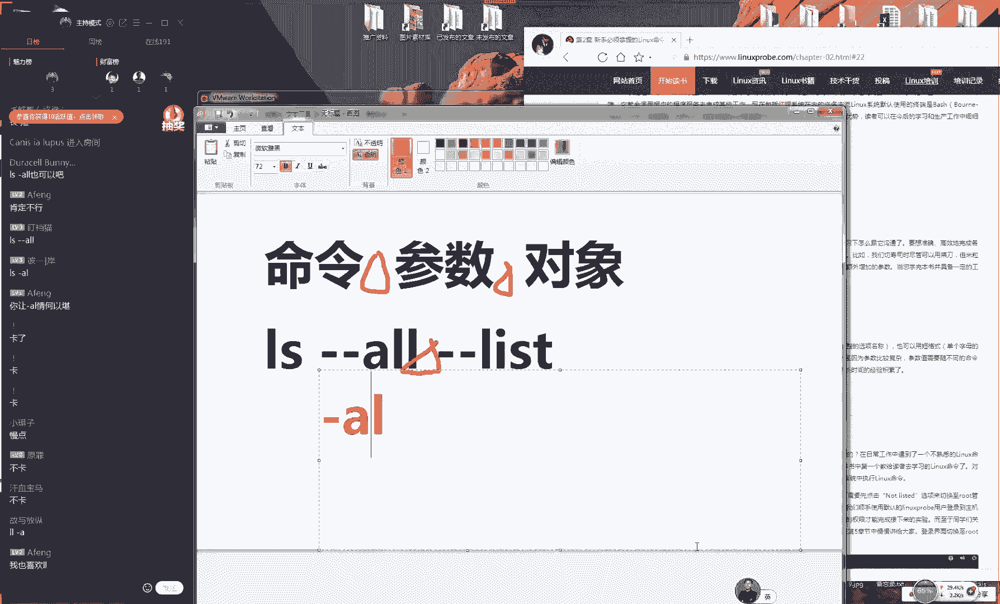

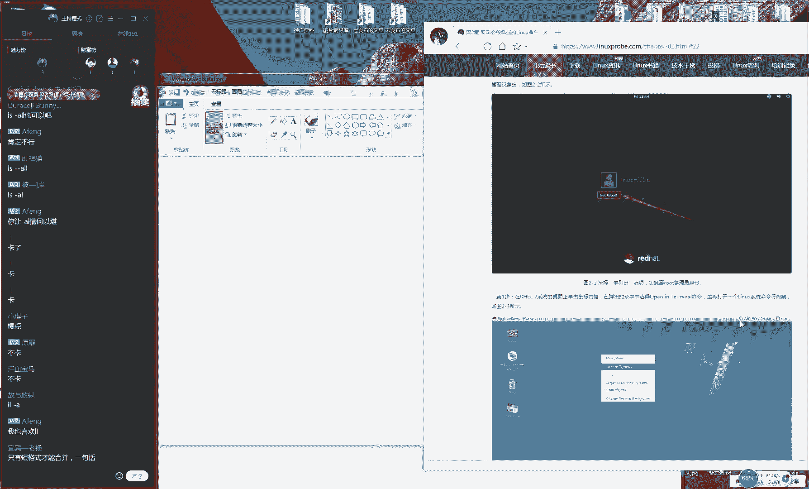

这个m咪就没有什么可讲的，太太简单了。😊，呃，我想给大家讲一下我们后面的这个命令。但是我怕讲完了之后，大家不好太好的吸收。所以的话呢我问大家的这个。啊，就不给大家去说了吧。因为今天要去说的话。

我估计可能会有点赶课时，我我不希咱们的课太赶了，对吧？我们先把我们这个课有尤其一开始有点消化的时间。好，演示一下就好了啊，演示一下吧，大家看我一样去操作，不不理解也没有用嘛。行，那我们先在这样吧。

我们把它就像样讲这么多了。然后坚持两个小时。😊，我们的2。3小节，我们明天放到我们放到明天去讲啊，这个不用着急，就在我们明天吧。今天的话呢我们这个作业就是会议之后。

你只要能够把linux系统给它安装好就可以了。然后明天我们才开始动手去来安装我们这个系统好了，现在再给大家去说啊，时间很快，对不对？然后所以今天东西还是很多，看我没就往后面去讲东西太多的东西。

而且今天是我们从从我们开办培训到现在应该是讲的最细的一节了。你们可以去翻看我们往前的19期的视频，从来没有一期我们第二。3小节没有讲完，这个也确实我们这一期讲的很细啊，希望大家也能够嗯好好去吸收啊。

尤其技术比较薄弱的同学，你们要知道老师为了你们真的是得罪很多人了。因为可能会赶紧去学习啊或怎么样，对吧？一定要抓紧去来预习了。好，那我先去说一下啊，既然大家同意我就往后面去说一下，就是我们这个复习。

今天的话呢。😊，复习的作业很简单，你只要过我去不要跟我去扯太多了，就是给我安装成功Lux系统就可以了。请安装成功L系统，并且哦还有就是这个把笔记拍照之后签到就可以了。好吧，这是我们第一个复习的一个内容。

不要理啊，同学们还没有答疑呢，哈，你们不要这样好不好？然后的话呃。😊，然后还有这个预习预习没有跑第二章节，我们明天会给大家讲第二章节。但是我们为了保证我们教学的这个质量。

我们的明天第二章节应该是讲不完的那好吧，但是我们绝对不会去赶课程讲完之后就完事了。我们一定会去给大家每一个都给大细抠一下。所以说我们明天会大家讲第二章节。如果说您时间不允许的话，请至少也要预习到2。

6小节，这是最低的一个要求。好吧，2。6小节是一个最低的一个要求，好，这是我们一个复习和预习的一个内容。好，大家有句话现在可以来跟我去说了，感觉才刚开始对我们前两天现在就是一个了解嘛。

然后们明天开始就要开上正经的东西了。不要说说你这个进度好慢啊，我就有种感觉，同学们会有这种想法。但是打好基础之后大家说太多鸡汤了啊，但你打好基础之后，然后你会发现你后面学会很轻松。

如果你这个基础没有打好的话，后面我们再去配置这个一个一个的服务的时候，你总是会再去纠结说哎这个命令干嘛。😊，使的呀，对吧？这个命令我好像哪你见过，但是我忘他这个参数怎么来去搭配去使用了。

到时候你的这个心思就不能够完全集中到了配置这个服务上面，而是总会再把你这个思绪给他迁回来到具体的那个命令上面。就是说你这个专班的要很扎实啊。😊，好，当天的这个视频在我们学员区页面里面可以去下载。

就是在我们这个网站后面啊，在我们的网站后面加上VIP就可以了。密码的话，请看一下我们学员区的公告，也可以看一下我们聊天的这个记录里面会有的。嗯。

然后我们会在每天的晚上12点之前给大家传到我们学员区页面上面。视频放大呃，是这样的。如果大家先看我这个字，去看我这个字啊。如果说您能够看清的话，就没有问题。我们以后我们打所有的命令。

我们都会调到这么大的这个字。好吧，我们都给大家把字体调大，调到这么大，这个没有问题，那不用担心。😊，啊，能够看清就可以了，能够看清就行了。就这么大的字能够看清。然后以后我们都会给大家调大的。好。

然后我们现在就给大家做答疑就好了，待会话现在可以来跟我去说，我们来给大家做答疑，大家辛苦了，明天不要忘记，明天我们还继续给大家去上课。如果说您今天没有来的话呢。

请可以将就入到我们学员区页面里面来去下载啊。但是他今在没有来的话，他怎么会听到我现在说这段话呢？😊。

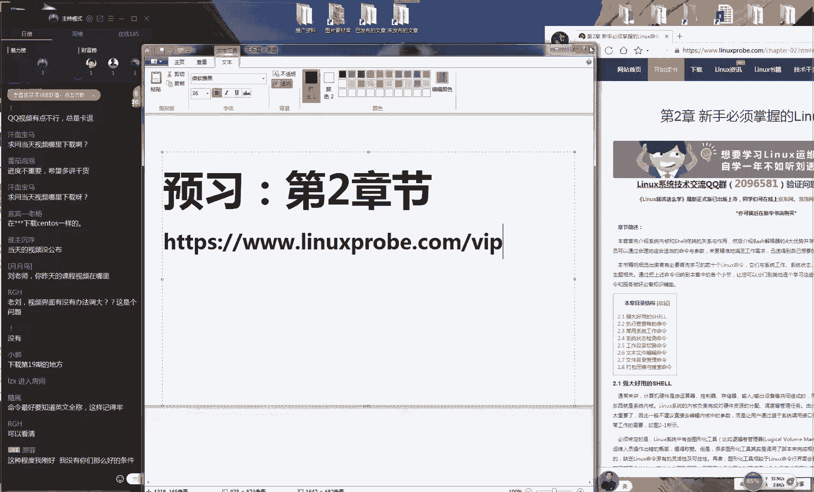

大家如去下载的话，可以在我们今天晚上上点之前到我们学页面里面，我们也不会去赶课时。我们希望给大家把这期课程人家人很多嘛，我们希望能够把我们这个课给讲的更加的细致一点。大家话学习起来会扎实好吧。

然后我来说一下有什么问题大家移是吧？然后说命令参数对象可以互换嘛一般来讲是不可以的嗯，这用程度刚刚好对吧？没有想那么好条件，一定要做好复习跟预习。然后说破解密码时候他会卡住一黑屏的一个界面。

这个跟你操作没有问题，这是虚拟机的一个bug这个我朋学都遇到过了在工作跟考试的时候是不会有这种问题的博客是什么博客是就是上一节课我们会说到可第一节课没有来可以下课之后去下载一下我们昨天那个视频。

咱们知道系统里面有哪些可以去查看一个文件，但是因为我们现在没有去学习到一个ca命令，所以没有给大家去说，如果您今天看。😊，ca命令的话呢，可以去看一个叫做ETC目录里面的slls。

在这么一个文件里面会告诉你系统里面它有哪些sll啊。然后说预习的话，具体要看一下我们每个命令了，要看要看。😊，学习页面里面肯定是肯定会有昨天的这个视频的。我们我是昨天晚上11点50分的时候传到里面的。

会有的。😊，好，现在大会还可以来跟我去说，有问题的话可以来就说了啊。考试的话它是有图鸦界面的，是跟我们当前的这个实验环境是不能说是一模一样嘛，但是是可以说是一样的。😊，而呃而且也是reo系统。

没有联网的话，没有购买real啊，没大家是说没有购买reo服务，没有购买R啊，没有购买RHN的话，都可以去使用到我们亚仓库。大家不用担心。这个咱们今后会讲到破解密码的话。

也可以破解普通用户密码这是可以的。😊，好，单话现可以来跟我去说啊，考试的话它也是有图鸦界面的，是一定会有的。命令的话，咱们现在不会有SCDA跟AWK。但是我们现在目前在准备一个新的一个产品。😊。

先保密那然后行就不算就不给大家保密了。而且今天我们所讲的这个其实就有。😊，是这样的，我们现在有了一个新的一个项目，但是目前是在储备当中，这叫linux命令大全，对吧？啊，对。

然后我们今天所讲的就是我们正好嘛明天开始就讲到命令了。如果说您觉得您觉得啊大家啊刚刚我看到有有有有180多同同学啊，现在只有176个同学了。行啊，有4个同学他们错过了一最关键的一个最关键的一个东西啊。

就是我命令大全，这个叫做3W点linux库点com所以正好取了一个谐音命令库嘛，对吧？我们就是COCOOL了酷他又酷他又是资源库的意思，这也算个双关，我们买这个域名花了不少钱啊。

就是这个啊我给大家打出来吧。😊。

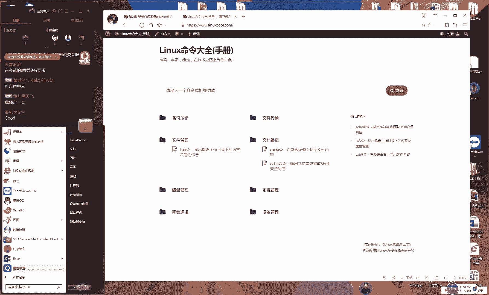

这多好记啊，对？lin库它又酷它是资源库意思或者说这个就是说一下啊，3W点lin点这是咱们的书籍是咱们的主站。还有一个是3W点点这是咱们的一个命令大全。然后正好啊如果说您现在想要去了解的命令了。

然后尤其是第二章节如果觉得我们的书上面写的不是很详细的话呢，好，可以去看一下我们这个网站，我们正在陆续更新。这个我们在陆续更新。而且我们给大家保证两件事情。

第一件事情就是我们的这个文章一定是在全网当中介绍命令最准确的，而且是最丰富的。大家可以去任何的网上去找我们有这个资信，我们内容是最好的我们内容是最全的。但是说全我们现在还在做啊。

但是针对于每个命令只要我们发布了话，这个的品质就是一定是最好的，大家可以上去搜，而且最准确的，不有错误，包括每个参数。我们都进行了一个校准，且更酷的就是我。😊，对每一个命令我都配音了。

因为我们同学们看书，你不知道该怎么读，哎呀，怎么读啊，这个我用了几天的时间，我把每个命令我都我都重新录音了。老刘的声音可以进入到这个网站里面这有一个小麦克风，你们知道这天我在忙什么了吧。

你点一下它OK你可以听到。然后比如说我们随便再点一个。😊，LSL所以说呃如果大家但我们在陆续更新呢，我们现在保证每天都会更新两三条。大家唱的命令我们都会给大家更新进去的。现在可以去收藏起来。

我给大家保证这个网站我们这个项目我们一定会做，而且我们一定会做成。😊，呃，而且我们一天会出书，我们会。专门会去做一个名名打选，这个是一定会做成的。不要现在看两三条，我怕老老刘突然间不做了，不会的。

我现在召集了40人个团队，一个团队有40个人，我们再去做，我们会再去。😊，呃，完善它，然后一定会把它做成。而且基于我们现在用户的这个基础，这个项目一定会成。所以大家就可以关注一下啊。如果想要去查询的话。

就可以进入到这个网站里面看它里面的内容，相当就是对我们书的一个补充吧。然后如果需要想读音的话，可以点一下这个小按钮听到我给你们去读一下它这个也不会错好了，说这么多广告，对不对？广告说太多。

我也不好意思了。大家而且现在是一个我们算是个内测吧。其实没有想说的，现也可以来去答疑了，可以来可以来可以来答疑了啊。😊，学完之后可以加个团队吗？嗯，我们目前团队不招人了，现在已经是固定下来40个人。😊。

嗯，现在以后再招人的话，我们再说吧。好吧，现在目前来说是现在是对，没有现在去招人了，钱都已经给他们了。😊，行，4月份想考。对，是在3月25号一定请当天报名。我到时候当天会给大家去发通知的。

请切记当天报名。因为大家可能刚刚报名，不知道我们现在这个报名的情况。您如果报名的早的话，可以翻看一下我们咱家的这个记录。我们群的记录一般都是我们每个月的25号，当天我们就能够把下个月的考场。😊。

八九不及十了吧，就给包满了，人太多了嘛。报名考试的话，您可以看一下我们昨天那个视频说的很详细了。嗯，然后我看一下，我看一下任意门对重庆项是不是有影响，这两个不冲突，他可以搭配去使用。

后续的进阶片里面或许会有docker，但是目前还是没有这个规划嗯。😊，可以加一个调试环境，我也在考虑，我我也在考虑这个建议很好，但是技术上我们不太好实现。因为我们目前还没有找到。

就是说可以在上在网站上面去他去执行下面的一种模板这种系统。我们还没还没有找到。在Ghab上面我们也没有看到。😊，呃，我们正在寻找吧。如果要大家有的话，可以来发给我们看一下。

然后说红帽尔公司的好记没有什么要求，是这样的，有这么几点。第一来说，如果说您是在北京，因为我们现在的关系是只要是在北京红猫嘛，红帽目前来说我们了解到，也只是在北京有总部。😊，呃，他有两个总部，一个是在。

一个是在知春里做开发，一个是在东大桥做考试。如果您当前是在北京，而且第二点，如果您现在的学历是本科以上，并且您以后考过了红帽C认证的话呢，可以把简历发给我，我们给您做内推。我们现在跟红帽可以做内推。

我们推荐我们的学生去红帽工作，也会有的这样的福利。但是其他城市的同学们要再等一等。目前红帽在其他城市也没有呃办公点嗯。😊，呃，然后其可以来跟我去说，然后可以我看一下啊，有问题的话可以来跟我去说。

实验楼实验楼他们系统很好，但是他那那个是人家的嘛，人家不会给我们用。😊，呃，我们目前没有自己的亚么的话，他不是必须要去注册，这个不用担心，咱们也会讲到4月份没考，5月份会变会变题吗？目前来说是不会的。

我们目前在预测是不会的。但是具体的话可以等4月份再问一下我，对在至春里地铁10号线瞎聊瞎聊。为现在这个问题没有没有太正经的问题啊，所以瞎聊了好吧，红帽在北京他有两个这个营业点就是这个办公点嘛。

第一是在春里，那是做开发的，那主要做这个业务方面，比如说售前售后啊，比如说做研发啊，然后他是在知春里地铁10号线能到。

还是在东大桥东大桥那个是在一个侨夫芳草地的一个一个大厦里面叫做樵夫芳草地的一个大厦里面，那是一个购物加办公的一个场所。红帽很有钱嘛，他把八九十层，包他包括三层楼，你们懂了就一个大厦里面，他包括三层楼。

而且那是一个很高档的一个商场，他在蓝岛的旁边。😊，You说。红帽那个八九十层楼主要是做培训，还有做考试的。但是红帽的培训很贵，他们每一天的培训是两是两0是2000块钱。你要想通过红帽的培训去考认证。

大概是。R是CE级别啊，大概是8000块钱。😊，咱们是2400块钱，他们的培训是8000块钱，而且培训的周期是6天。😊，就是一个刷题班嘛，红帽的培培这个培训费是很贵的，他们也会有。

咱们的学员的考试的话呢呃，咱们的呃我看一下。😊，如果出了8的话，七就不能考了嘛？可能会有过渡的时间。过渡的时间以我们的往常经验来说是1到2个月。但是我们坦白来说，一旦发布了红包就要8了。你知道发布了。

都知道发布了，你到时候再想就这用这个过渡去继续报名，我们坦白说不太好约，一般来说是约不上的。因为大家都急了，都急了眼了，都学的红猫惹由器。你们还好，你们刚学，你们还想着学个红猫惹由吧。

有些人都学了一年两年了，他们就急了眼了。只说这个，而且不光是我们机构啊。😊，全国的机构都在抢，这个大家先不用着急，先关注一下，好吧，嗯，不用那么着急。😊，先不那么着急，好不好啊。

就大家刚刚学了想什么辩不变题啊什么，对不对？等我们等我们在过段时间再给大家聊。😊，嗯，6月份会不会变题，结我说不好，现在才3月份嘛，只能是说你让我说4月份，我能那我能给大家确定不会变。

但是你要再说5月份6月份，你要等到以后了，现在真说不好嗯。😊，这个IOS镜像的话，大家问到小齐同学问到说IOS镜像下载地址是在这个来进入到这个网址里面就可以下载到了。这是下载我们网站工具的地址。

这个是我们学员区页面地址，请一定要回去之后下载一下我们昨天的那个视频，去看一下我们昨天讲的很详细呃，不是说不是说在就是说在批评大家啊，就是因为我们昨天讲的非常的详细，有很多小细节，包括说红包认证啊。

包括说上课时间什么的，请一定要去看一下我们昨天那个视频很重要。对大家以后工作对以后学习是有帮助的。好，请看一下嗯。😊，好，一问他现他可以来过我去说呃。学费是交给考试机构，不是学呃，学考试费是吧。

是交给我，我这边同意去收，我这边有收考试费这么一个账户。但是你要先约啊约约到考场之后才行。我们没有约到考场的话，是不收的啊。但是有一个同学，他我收了他的了，因为他需要公司报销嘛，就一下子就先给我了。

省得在就是我们这一期只有一个同学已经天天给了。其他同学想给也不收的啊，真的是不收。好，继续来说。😊，日期的好像是自己定吗？嗯，HC的，我们目前考试还没有安排。😊，如果想考的话，可以来提前问一下我。

我要跟考长确认一下。今天不行啊，今天礼拜六礼拜日也不行，礼拜一礼拜一他们上班之后可以来问一下。😊，4月20号上完课，4月底考试时间足够足够的，我们建议大家准备1到2周，你就两周时间就足够足够了。

一周时间就其实就足够了。你要时间太长，反而会让你很懈怠。我们虽然说啊会违背我们的常识。邱老师你这个说话我觉得不太认同，怎么可能复习时间越长，效果反而越差呢。

但是你知道人是一个从高起到就是一个就这样的一个波浪型的就是一个到一个到优型的一种心理种变化嘛。当时我们学习教育学的时候是有的，在杜唯理论里面就讲过，说当你去复习的时候，一开始是亢奋。

然后是平稳区叫平台期嘛，后最后你可能开去懈怠。比如说你最后你去复习，我们三年的经验我们讲下来两周时间是足够的，正好你去考试的时候就正好是你去复习最到位的时候，然后你复习最扎实的时候，你去考试非常的好。

对不对？结果你预习的时间当我这个理论可能大家不信但可能不不会都认同啊，但是我的这个经验。😊，结果你复习的时间，比如说是4个礼拜，正好到了这个懈怠期，正好最后敲的吐了，不想这样了，好难受。

不想再看不想再看一眼题了，我觉得特别的恶心，觉得。😊，呃，很反感了。这个时候您正好去考试去了，那能考个好成绩吗？对吧？所以说我们建议大家安排好自己的复习的复习时间，以自己的这个实际情况来去调整。

我们建议是1到2周，不要太长，千万不要太长，太长，你都忘了差不多了，又懈怠了，就是考试不不划算。😊，好，大家话可以来跟我去说，然后我们来给大家去约具体几号。

我们我们之所以我们说要在25号报名的原因就是时间没有定，所以我们说不好是几号，有可能是月初月中月末都有可能要以我们25号当天公布的那个为准。哎，要以我们为准会有C培训跟书嘛。嗯。

我们坦白来说要有的话也要等到年底了，饶了我吧，我现在真的是做不了了，事情太多了。我们先把我们最新的这个给大家搞一搞，对不对？我们现在有这个团队我们先开始去做，但是现在不用着急啊，现在就有3条，对吧？

今天第一天嘛。😊，今天真的是第一天，我们从4月份开始，我们招了40个人的团队，我们的安排的工资也是从4月1号开始算。所以从4月1号开始，大家就会发现我们这个网站的内容开始去狂增。

但是我们一定会仔细去卡每一条这个。😊，Ming令。因为我们会给每条命的配音嘛，所以我会仔细去看，差一点我都不会。😊，让他们通过的，因为这个是以出书的这种品质，然后去要求这个网站内容。假要做精品嘛。

要考就业点，那我看一下3月25号报名考试当然来得及啊，完全没有问题。考呃，红帽考试只有工作日，没有周六周日。因为周六周日的话，红帽考官也要休息。他们没有红帽。

因为我们监考的话都是红帽那边派人来红帽的考官，他们在职人员去监考，所以。他们休息的话，咱们也不能考试。RC的书看咱们就可以了。来。哦，我看一下啊。嗯，不用着急不用着急。命令的全称都写出来。行。

这个建议很好啊，回头我考虑一下，不回头我这个这个这个很简单，我想怎么去实现，回头我把它写出来。嗯，再给大家是说一下，咱们这个网站叫linux库啊，很好记就是linux库嘛，又酷又酷，对不对？

COOL cool对吧？😊，嗯，好，然后看一下man是一个帮助命令。这个我们明天我我们去过一大一讲就明白了。可以4月初报4月份的考试吗？要以实际为准了，要。尽尽量提前去约，但是有可能4月初就爆满了。

比如说我们3月9号不给大家去瞎说。不给大家去瞎说哦，因为现在。嗯，我们这边会有一些宣传资料啊，所以我们先不能打开这个考试的这个信息，又怕被截图进去。是这样的，咱们现在3月份的所有的考场，北上广深。

所有的考场都已经被约满了，没有了。3月9号，现在已经没有了。其实从上个礼拜四开始就已经没有了。这个不是说我们很无能约不到，是因为现在北上广深，你现在去任何机构去问都没有了。现在都已经被约满了。

这个周期还是比较长。😊，好，1一问下先购呃，没有什么问题，我先把它退出了，先压制一下我们这个视频。😊，安装不上啊，winIN7无所谓，那您可以去百度上去搜索一下倾向就可以了。这个没有关系。好呃。

lins们配windows的证书，嗯，这个没有太好的推荐。其实要考的话，如果要有条件的话，可以。windows其实卡不卡无所谓吧。好，那我先算一下我们这个视频啊，大家可以来跟我。

就是说我先渲一下我们这个视频。😊。

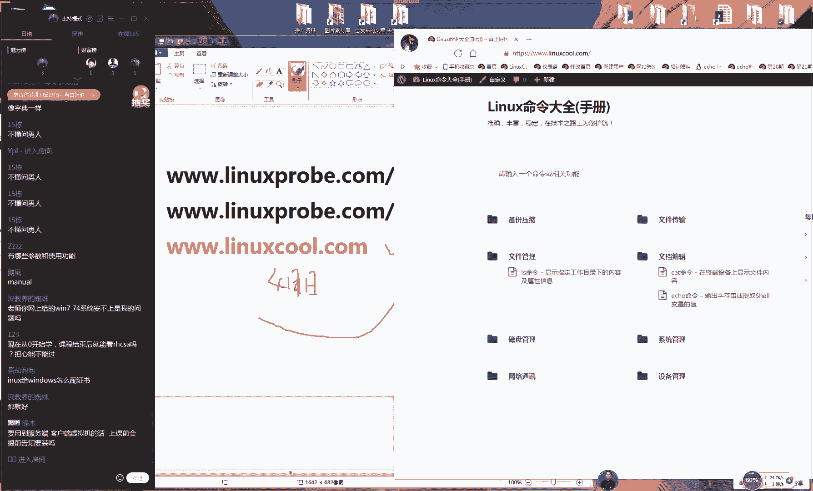