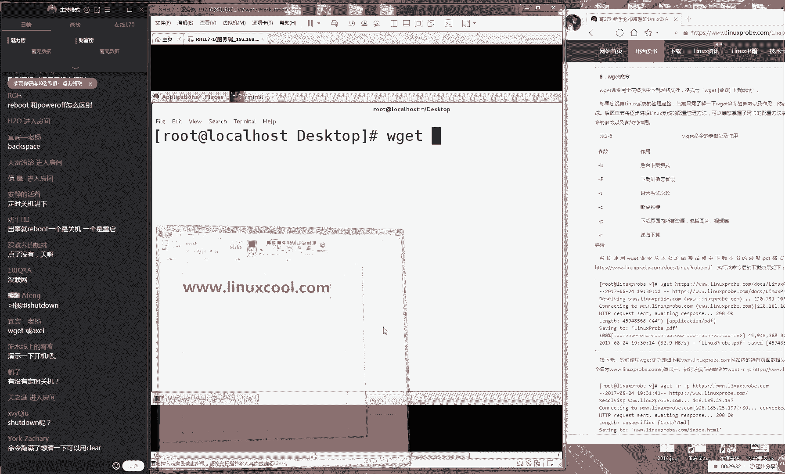
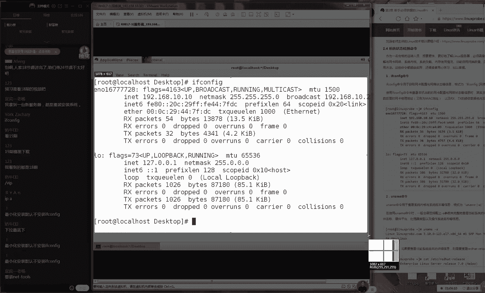

# 【RHCE】红帽认证工程师培训课程 - P3：第三节课 - 天木轮回 - BV14E411678v

🎼OK好了啊，我们时间刚刚好啊，7点钟我们开始准备上课。同学们先打一下一吧。同学们，如果大家能听到说话声音的话，那么请打一下一，好吧。😊，好，那我们先在打一下一同学们来测试一下我们这边这个上课环境。

大家如果听到我说话声音的话，那么请打一下一啊。然后咱们上课的时候尽得能够互动一下。因为毕竟有因为毕竟有的时候可能因为呃网络波动的原因，会呃可能会有人卡顿的情况。所以我们这样互动一下啊。

知道大家这个是在线的。好，先稍等一下，我看一下啊。😊。

好嘞，那我们今天开始我们今天的这个第二章节的学习。其实的话呢我们第一天主要是对于我们这个课程进行了一个介绍，也算是一个开班仪式。

然后我们昨天主要是学习了我们该如何去安装lin系统以及我们的一些RPM软件包和和这个M参库的一些关系。然后我们知道了我们再去操作命令的时候，它成为了命令参数跟我们的对象。然后最后我们结尾的时候。

给大家说了一个小的网说了一个我们现在新的一个项目就叫做lin，然后我们可以上面去查到我们的相当命令。然后今天的话呢，其实我也一直在想啊，我今天上午的时候，我就一直在想啊，屏幕太小了是吗？嗯，屏幕太小了。

是比之前一直。😊。

是比昨天还要小吗？还是说呃，肖学有这个问题吗？啊，我们尽量互动一下。同学们如果要大家有这个问题的话，尽量一起说一下。如果跟昨天一样的话，呃，比如说同学们再用手机去看，没有问题的话，就还好是吧？那行呃。

一直这么小行，那是这样吧。如果跟昨天没有区别的话，那我们就继续。然后我会尽量把我这个字给它调大了。然后不论是说待会我们比如说我们卡或没卡或者说屏幕小或小声音有没有这个忽大忽小这样的情况希望大家都能够都能够给我互动一下好吧。

一直都这么小行，那能看清就好吧。大家能看清就行。好，接下的话我们一直都这么小。那我们就先这样吧。然后我们会把字调大一点。然后那我们既来我们给大家就我今天上午一直在思考，就是说我们到底是需要的是什么？

那我们需要给大家提供的是什么。所以我们待会上课的时候，大家可以来呼出来去交流一下，比如说我们现能够想到大家可能会需要的三个东西。第一个东西就是肯定要对于命令有一个非常详细的一个介绍，对吧？第二的话。😊。

是我们呢我们想要知道每个命令的一个全称是什么。第三个的话就是这个命令的该如何发音。所以我们。😊，找到了这么三个哦啊，那我们算是我们同学们想要去了解这么三个痛点了。所以我们现在有了一个新的网站。

大家可以来呃，我筛。😊。

给大家说过，对不对？然后但是我们的广告怎么说都不嫌多，那我们给大家去说一下。如果您昨天没有记住的话，我再给大家去说一下。

我们叫做lin点com大家可以呃用你的浏览器打开一下它这就是我们在做的一个新的一个项目，我们会收集整理。

然后我上千条应该会有300多条目前能够找到的所有这相当命令跟我们给总结之后我们会放到我们这个网站上面。那我们今天的话也需要大家跟我们一起来去互动一下。就是说我们再讲课这个那我们再去讲命令的过程当中。

如果大家有什么不了解的，或者说想要进行来去学习的话呢，请一定要告诉。然后对于我们也是一种不断再去家去完善的一个依据了。好，那我现在给大家讲一下我们今天这个第一个出书今天刚是一个想法了。

我们明天能够出书就算是早的估计明年都好，这个到时候我们看吧这个咱不着急，总会给大家一个精品的。😊。

好，那我们先说这么多广告了大家还那已经来的差不多了是吧？刚110个同学，现在140个同学有30位同学呃是迟到了。下节课一定要注意了。然后现在140个估计一会要到167178，所以说我们一定伤课不要迟到。

好随着我们说很多废话。后看到140个人上线。继续往开始去学习我们命令现在登录到我们这个系统里面大家说请登录的时候一定要去输入的是ro用户就是这个ROT然后我们后面加上我们自己设置的那个密码。

如果大家忘记的话，请回去之后看一下我们昨天那个视频给大家讲到了该如何去使用到超级用户来去登录到我们这个服务器。好再给大家说一下，请务必使用超级用户来去登录我们的服务器。

避免说因为权限问题导致命令执行失败。好，这是在我们学习的时候里面是必备的。接下来我们再来说。😊。

啊，然后跟我们课程就是当前课程不太相关的。比如说近阶呃片什么时候出这样的问题，那我们就先暂时先不回答，好吧，然后我们下课之后。😊。

给大家做统一的这个答疑。那么如果要大家这个问题，您恰家也知道的话呢啊比如说是一个小呃那比咱比如说是一个小的一个技术性的一个问题。或者说我们之前讲过的问题呢，那么大家可以来去互交流一下。

然后大家可以来去互动一下，然后如果说您的这个问题没有被解答好的话，那么可以把它先保留下来。然后我们每节课下课之后都会有这个答疑的时间再给大家再去统一的回答。好吧，但是我们提问是很好的。因为您提问了之后。

可们也想去问这个问题。好了，那我们继续我们开始那正式开始了。那我们先进入到我们一个系统之后，我们需要在我们的屏幕上面，我们来去点击一下右键这样的话我们就可以选择开启一个终端大家看一下我在这个操作啊。

现在我在我的屏幕上面点击一下右键，点击一下这个开启终端。接下来的话呢话筒离得稍微远一点。好，离得远一点。因为我怕大家听不清了，所以我跟大家离的是比比较近一点了。

好接下来的话呢我们现在就可以来进行一个操作了。😊，操作的第一条我们叫做ic啊，大家一起来去读ic。我记得好像这个好像呃呃如果说你喜欢动漫的话呢，好像icical好像也是一个动画的一个人物啊。

大家一起来去读叫ic叫回音的意思那好他的这个作用的话呢，他是将我们一串的这个字符串可以输出到我们的屏幕上面。下午是这样的另外给大家说一个顺口溜就是我们的命令我们的参数我们的对象之间它都要有空格去做间歌。

至少要有一个空格去做间歌。这个是我们节课给大家做一个顺口溜，还记得对吧？不知道大家有有会去到这个书上面记得签到记得打开发到你的博客上面。那我们去输入一个，然后后面我们加上一个对象。

就是我们来去输出一个字符串，然后我们敲一下回车这个时候我们就可以看到我们后面的这个对象的这个内容又输要是重新输出到了我们的这个屏幕上面。这个时候大家突然间。😊，我然后我现在虽然看到大家现在这个表情。

但是我可以猜到到现在我可以通过我我们这个屏幕，看到大家现在什么表情就是一脸懵逼，对不对？哎老师你是在逗我们玩，对不对？啊，那你说你把这个命令的这个内容。

然后从这边的参数再输出到了下面一行然后呢然后有什么用吗？然后这个是什么鬼东西，是这样的，其实再给大家去说一下，因为这个是我们学习的第一个命令嘛，它就是主要就是我们现在是在搬砖，对吧？那我们在搬砖。

因为我们现在是在搬砖，是在打基础，您可能不能够通过这一2块砖头，知道我们到底是要盖一座桥还是要盖一个别墅，但是我们当我们不断再去学习的时候，我们就可以将我们的多个命令来进行一个结合性的一个使用了。

但是如果说你一开始没有打好基础的话，那么不论说以后盖什么，总会是很虚化，对不对？好了，那我们就一定要知道就是我们每个命令的话，它都有这个很丰富的功能，而我们现在只是给大家演示每个命令的一个基本的一个功。

😊，当我们后面的时候，就是我们的下礼拜五的时候，就会给大家通过第三章节里面的这个管道符给它结合到一起来去使用了。好，现在记一下我们的这个第一课，我们叫做ic命令。呃。

然后大家如果想去多然后是这样的大家为我们这个上课时间有限话如果说大家想去多想要去多练几个例子的话呢，大家可以这样之后如果说特别想要去进一步去学习这个的话。

就进入到咱们的这个里面当然没有的话那就那就还没有我就等段时间然后我们就可以进入到这个对应了这个章节里面会有一个，然后我们就可以来去多做几个时验。

这都是我下午给大家去写出来的那就是我昨天下午给大家出来的那么以及如果说你想要去反复去这个声音的话，对也可以去点一下这个发音好样话我们来继续来去说那我们去使用不光可以去将我们一个一个字符串或者说它的几个字符输出到我们的屏幕上面。

它还可以用。😊，来去输出我们提取过后的变量的值。那我们变量是什么呢？它就是用来保存一相应值的一个呃名称。然后我们可以通过doll符来进行一个提取。但比如说有一个变量，我们叫做pa。但是这个不用担心啊。

因为我们会在下礼拜我的第三章节会给大家讲到什么是变量。大家看到那我们现在话有一个变量，我叫做pa我们使用一个符，那我们就可以将这个pas变量里面的值给它提取出来。

接下来我们再去敲回车的一瞬间就可以将我们提取出来那个值输出到了我们的屏幕上面，但是不用着急，现在大家这个重心啊，我知大家现会有一种心情就是非常的激动。我好想现在开始多去做几个实验。

至说我想配一台服务器可不可以？其实不可以的。所以说大家不要看到我们很呃很。😊，很新鲜的，比如说变量啊什么的，然后就是分辨量了，千万不要这样，就是你现在这个重心还是在去学习单个的这个命令。

就是学习这个ic。所以说不要管咱么变量的名称，不要管变量是什么东西，就记住了我们这个它就是用来将我们的字符串或者我们变量提取之那个值输出到我们屏幕的意思了。

那我们就样去大家提到一个问题说要同学提到一个非常好的一个问题说呀输入双引号的内容。那他说是否需要输入双引号。这个是咱们下礼拜五时候会大家去提到的。

如果说我们变量里面那我们如果说我们的这个参数或者我们的对象个名称里面有空格的话，那我们就要使用到双引号把它引起来。如果要是没有的话，那我们就不需要然后这个大家先听一下就好了。

等我们下礼拜五的时候会给大家系统性讲解一下再往后面去走的话，这大小写需要区分那这大小写需要区分。😊，而且您试一下啊，其实听完之前我们可以去试一下大写的话，它是一定会出错的。

因为我们在这个sha执行的时候，它是区分大小写的这个一定要注意。好，下那我们再来去输一下date了。然后是这样的现在有160个同学在线了，又是又上线了20位同学但是我们之前给大家讲过。

就不再去重复一遍了。如果说您之前没有听到的话呢，可以反复再去看一下我们当天的这个培训视频。我们会在每天晚上12点之前将我们当天就是我们此时此刻再去说这个课程的话呢。

压制成视频的形式上传到我们学员区页面里面，到时候您可以去下载一下。下面这个命令我们叫做date那下面我们是这个d它正来去显示系统时间的，它不用去加参数，它也不用去加对象的时候，它就可以直接去敲车。

它显示出来就是一个系统的时间2019年然后是3月10号礼拜日现在时间是19点，也就是晚上7点11分54秒。好了。😊，但是我们看到这个时间的话呢，我感觉很啰嗦。我我当那我当然知道今天是2019年了。

对不对？那我也知道我今天是3月份，我那我如果说我就想知道今天的那我就是想知道我此时此刻我的这个时间跟我的这个日期的话，那么我的这个时钟跟我的这个分钟的话呢，那我们就要加上这个参数。

因为参数是对于我们的命令容补充或说明它让我们的命令怎么样更加的贴合于我们这个工作的需要了。好，然后嗯我觉得这个已经写的很清楚了，就是我们的参数的作用就是让我们的命令，它会更加的去适合于我们工作的需要。

好，那我们这个参数大家需要注意一下，就是因为我们的这个开源系统嘛，它是来自于全球的技术的精英的这个智慧的结晶。所以可能我们上一节课给大家讲那个短格式跟长格是那个用到减号来进行间隔的话呢。

并不适用于所有所有的命令的。所以我们第一个命令就有一个呃。😊，特就它它有一个特殊的一个参数的一个格式，但是只有它是这么着，非常特殊的啊，它是先加一个双引号，它不是写上减号。哎，它并不是写上那个减号啊。

然后我们先应该是写上这么一个加号然它写的是一个加号，这是它的参数的一个特殊点，然后我们可以看一下我们的表格的2-4。哎，我们看一下表格的2-4，它里边就有我们呃一些比较常用的参数。

比如说我只想知道我现在是几几年好了，我们乔一下呃这个Y，我们乔会再回说，我记得好像刚刚我前段时间好像去看了一个电影嘛？嗯。😊，是什么来着啊，死侍对不对？我不知道大家有没有看过。

现段时间拍那个电影叫死侍死侍2。嗯，然后记得吗它里面有一个就是拿一个就是拿一个小可爱这个布偶玩具的一个我们不能叫反派人物吧，就是他从他从未来穿越回来。

然后想要去杀那个小胖子那个他来了地球之后第一句话就是这是几几年对不对啊，你们这个你们应该看过好了，然后就是说你看啊如果说我就是想知道今年近几年的话，我不想知道其他乱七八糟的什么当前美国总统是谁谁。

我不想知道好了，那我就给大输入一个这样一个加Y这样的话就会他会去只显示出来我们当前的这个年份，所以我们需要来注意两个事情同记在你的书上面我们需要记两个事情。

第一个事情我们上节课给大家所讲的我们的参数的短格式长格式，这样的这个格式只用于大多数的命令，但是少一部分他会有自己的这个格式。😊，第二个就是我们的命令，它一般来讲是由命令参数和对象去组成出来的。

但是参数跟对象可有可无。根据实际来去调整。好了，这个两个小提示，大家先记到这个书上面。好了，我们继续往后面去走。那老师光看年份我也不知道有什么用啊，对不？我想看年月日可不可以可以啊。

那我们年月日之间我们用到减号去做间歌吧。好了，那我们就看一下我们的表格2-4月份是什么呢？月份我们应该来看一下是呃表格里面没有那没有啊那也没有关系。

月份是小写I大小写一定要区分大家记下来第二章的前面那我们记下来是大小写区分另外的话呢我们希望大家我们上课的时候，尤其今天啊可以来去多去互动一下，这个没有关系，其实我也一直在看我们这边左边聊天记录。

我也一直在看的。比如说阳光男孩同学他说在一点外卖一边在听课，就是我也一直在看，只不过我说我会回答一些大家可能都会问到的。然后我也没有想到的。😊，问题。如果说您的这个问题并不重要的话。

或者说不我这样说不太好啊。如果那问题呃，我们今后我我我们下面可能会遇到的话呢，那我们就可能先放一放再然然后再给大家去说。但是我希望大家能够去互动起来啊。因为万一哪句话我们就觉得大家都可能会遇到，对不对？

好，好，那我们才会再回说这样会显示出来我们系统的时间，年月日，这个就是按照我们的这样一个需求想法，我们要求的一个格式来去输出的这么一个信息，这个啊字稍微大一点是吧？这个就是。😊。

我们的这个d命令的一个操作方法。好，那老师我不太想看年月日了，我觉得这个东西呃没有什么意义。好，我想看分钟呃，小时分钟秒可不可以啊？可以啊，好，我们还是啊我们看一下我们的表格，小时是多少。

小时我们看到是一个呃大写HO然后我们间隔服用的冒号吧。然后还有这个分钟小时分钟还有秒，这样的话我们再敲一下回收小时分钟秒，这样的话它就显示出来了。啊年月日和我们小时分钟秒。

我按照我们的这个要求来进行一个输出啊，再比如说那我只想去输出我们当前所在这个小时跟分钟好了，那这样去做就好了。是你可以通过参数来来去影响你命令的一个输出的一个结果，大家记一下啊。

你的话呢通过你的这个参数的不同，而导致最后结果的这个不同。这就是我们。😊，呃，使用d命令的一个作用大嘛。那我们还是啊先不要去关心，就是他这个专到底以后能够去做什么事情。我们之所以因为我们知道了。

我们在这个lin里面的话，我们的命令我们安装在红包re7里面的命令总共是有多少条，大家知道吗？😊，我们的命令。我们的在红包ri期里面的默认的命令大概是有多少条啊。

这个其实你们可以去这个其实你们可以去了解一下了。😊，我看一下啊，这个现在查不到，应该来说是有4000多条，不到5000条，应该是有4000多条的这个外部命令。而我而我们这个4000多条的外部命令。

每一个命令大概最少最少我们说的比较保守一点啊，会有50条这样的这个参数。而我们说的这50条参数都是最少最少了。而我们看一下我们第二章节其实打满算给大家讲了50条这已经是给大家筛选过后最重要的这个参数了。

这个是最重要的这个命令了。这个是我们一定要会的，千万不要再去选择性的学习了。这个里列出来，大家就请一定要去复习，一定要去看下面我们第三个我们叫做reboot，它不用参数，它也不用对象。

如果说你想要去重启你的服务器的话，非常简单，直接去rebo敲一下回车，它就可以去重启了。下面我们还有一个叫做power但不给大家演示了啊，重启比较费时间。还有一个power off他也不需要任何的参数。

它也不需要任何的对象，直接敲回车它就可以去关机这是我们一个重启跟关机。大家问说那我开机是哪一个。😊，开机那开机就是你点一下你主机上面那个按钮了啊，因为开机没有命令，因为你没有开机，你也不能进系统。好了。

错误怎么删除？错误的话这样。😊，呃哎哦有有有有有完了，你看啊错的话，你就点击你的这个键盘上那个退格键。😊，这样就可以把它给删掉了啊，就可以把它给删掉了。好了呃。

接下来我们再给大家去说一下我们叫做Wge命令，这用来去下载我们的网络文件的。但是请记住啊，同学们，当前我们没有网络。当前我我呃当呃当前我们的虚拟机没有网络，如果说您现在是用一台外部的一台服务器。

比如说是不是在阿里云买一台虚拟机或者怎么样呢？只要那虚拟登过联网的话，那么就可以去做这个实验。如果说您现在跟我一样，是在用虚拟机去做的话呢，现在是没有网络的。😊，虽然说我们以后会大家去教怎么去配的。

但是我们此时此刻是没有的。那么请那么啊那么现在请就是记一下这个命令，但是不用去真正去执行。因为当您去执行的时候，它也会提示出来错因为我们没有网络是这样的这个使用W非常简单。

就是只要加上后面这个广告删掉了，只要去加上我们的后面的一个网址就可以了。比如说3W点点广告说了很多遍了。比如说有一个文件，我们叫哈哈好。

那么我们直接这样去做使用这个W加上网址回车之后就可以自动下载我这个软件包。其实这我们的这个迅雷，或者说我们的浏览器下载是一样一个效果。

那它叫做W命令然后我们可以用这个杠C参数下载个杠参数这样当我们这个下载突然间中断的话呢，它可以实现这个断点去传，这个是比较常用的一个命令下载到。😊。

他啊这个非常好就呃大家呃呃就答家这个问题，他说会下载到我哪里去，他会下载到我们当前的所在目录。但是什么是当前所在目录呢？是在我们第六章节会给大家去讲到的啊，也会给大家去讲呃。😊，所在目录啊。

其实第六章会讲，今天我们也会给大家去讲，到时候命令应该做到CD命令的时候，会给大家去讲到我们所在的目录是在哪里。那，它会写到我们当前所在的这个目录。好，接下来的话呢我们再来。😊。

60秒呃，60秒内可反悔啊，这个没有吧，只要你恰回到那一瞬间，他就开始去下载了，没有这个反悔时间，他不像打电话一样。因因为我比较笨嘛，所以我打电话之可能总会拨错号。

然后可能电话会有一个几秒的一个呃这个呃可以取消的时间嘛，然后其实没有拨出去。但是这个W get没有只要你恰下去那一瞬间就开始去下载，他没有等待时间啊哦，你说那个杀档是吧？😊。

定呃定时关机可以使用杀档去做。它有几个参数。他应该是沙弹杠S杠T呃，然后加上你那个时间，加上你的秒，加上你的这个小呃加上你的秒就可以来去定时去关机。但是这个我们先不说啊。

因为有点超纲那我们还是按照我们这个书记上的这个进度去说。所以待会如大家提到，比如说呃有些补充的这些材料或怎么样呢，那我们就先给大跳过去。因为可能会影响到我们这个整体的上课效果。

等我们下课之后给大家同一去说。而刚才这个题我们既然说就说了，就是您可以去使用到沙弹的杠S杠T参数，他用来去延呃他还去读秒，然后按照秒为参数，然后他会去重启。好，这样的话呢那我们再给大家去说一下。

在我们这个lin里面。😊。

它是通用的，它应该是通用的。好了，然后的话呢我们现在来看一下它呃在我们这个linux里边，它这个呃进程它是有5种的这样的这个状态的。大家记得书大家记得你这个书上笔记啊，在我们的linux用当中啊。

它是有5种的这个状态的那大家先协商啊，进程的状态。😊，好，我们的第一个状态叫做R状态。他代表就是我们啊直接给大家去说了啊，大家一定要记在这个书上面。如果我说的比较快的话，那么您可以就简要的去写一下。

比如那比如说杠啊他比如说R状态代表就是当前正在为用户去提供服务的进程。就是说他当前正在为我们的用户去提供这个服务。当前正在为用户提供服务的进程，叫做R状态。还有一个叫做S状态。

代表就是这个的话可以分成他可以翻译成stop，它也可以翻译成sleeping，就是它可以分他呃sleeping啊，我看一下啊，啊，好尴尬，对不对？我看看这个sleeping呃sleep吧，好吧。

就是说他可以分把它翻译成就是一个停止，也可以把它翻译成正在睡觉，它正在一个休眠的一个状态，就是说他当前没有为我们用户提供服务，它是等待为用户提供服务的一个状态。大家记一下我们的S啊啊我们这个S代表就是。

😊，等待为用户提供服务。他有这个D啊sleeping不用是双写P吗？我怎么记得在英语语法里不较什么双写P吗？我记得不太很深刻了啊。然后的话呢我们的D代表就是不可中断。

那他就是说他虽然说现在正在为我们用户提供服务。但是他程序出现一点问题。他现在不能够去想用我们这个中断请求就是说我们就我们不能把给结束掉了，就是说想超市或怎么样的，我们不能够把它给关闭上了。

就程序出现一些小小的问题，靠这代表就是脏币。好，大家知道脏币吧就是僵尸进程了，它有两个翻译起来，我们正经翻译的话应该叫做僵尸进程，然后有呃好像是一篇台湾那边翻译成叫做僵死进程。好，其实这两个都是可以的。

就是叫做这个脏币啊脏币呃大家从去年的时候比较火，就是那种丧尸片了。然后我也看过，比如说行尸走肉，后生害危机，大家没有看过。😊，呃，大家有没有看过这种丧尸片，要看过话，咱们好。

但是就比较好就比较好讲一点啊。对，因为没有看过丧尸片的话，会对于我们学习的那个是有一定影响的。好了，我就说一下，就是说其实呃张毕给你们的感觉是什么？林正英啊林正英那时都是太老了，你们说这种现代的好不好？

来，大家想一下，我们僵尸给你们的感觉是什么？我们帮大家家去理解啊，就是说我们每个状态，僵尸啊，你看瞅丑的对不对？生化危机啊，比较丑比较血腥。😊，当僵尸给你们的感觉是什么？没有人想跟僵尸谈恋爱，对不对？

为什么？因为僵尸的话呢，他已经没有了没有了什么没有了人为的控制能力，对不对啊？我记得生化危机里边的第四步，他里面去分析过这个生化危机里面这个僵尸说僵尸他并不是为了去吃那个人肉。

然后也不会去然后也不用去为了去摄取那个能量。因为你看没有他他没有吃东西，其实也能活得很久，对不对？他只是对于这种血腥的这种渴望，他只是想去尝那个味其实他并不是真正想去吃。就像我们很多的胖的这个朋友啊。

其实其实并不是饿了，并不是想吃想要去吃那口饭，就是馋了想去是不是就想去就想去尝一尝。所以的话僵尸我们来理解的话，就是一个已经脱离了人的这种理性的管理的一种进程。

那也就是说他当前没有被他当前没有为我们用户去提供这服务，并且他还会一直去消耗我们系统的资源。这种进程一旦出现的话，请特别要注意，因为他会一直去吃你的系统资源。😊，而不会为你去提供服务，叫做T啊。

呃叫做Z脏比。还有一个叫做TT代表就是它已经被停止了进程，它已经被停止了这个进程。好，他已经被停止了。所以的话那我们就说到他有5个进程。如果想要去查看的话呢，那我们就可以使用到PS名去看PS再回车。

但是只能够看到一个简要的总信息，于是我们有一个固定的一个搭配句式，就像于说啊to do，然后doing，对不对？就是他要也像一他也像一个英语一样有一个有一个呃他有会有一个固定的一个搭配。

但是我们讲课的时候绝对不会给大家就是说。😊。

呃，刚拿一个固定搭配，然后大家去备就好了，我们不那我们那我们绝对不会这样的。我们会给大家去呃细抠一下我们每个参数的这么一个作用。来杠A杠A代表就是我们查看所有的进程信息。

杠U代表就是显示出来详细信息里边。包括当你查到进程之后它会显示出来这个进程所有的相关信息，包括说用户的人的这个名称啊，还有我们进程的一个状态。还有最后的X呃，当我们这个进程是由系统发起的话。

那么我们同样也可以显示出来。那也就是说总结成就是AUX啊AUX这个三个参数的意思代表就是显示出来系统当中所有的进程信息，并且显示出来进程的详细的信息。好了。

我们来敲一下回收X大家看一下表格的2-6显示出来呃没有被终端。😊，嗯，没有控制终端的进程，就是由系统去启用的，或者说我们要叫到后台的这个进程。好，这个必须要稍微小一点的这个屏幕，要不然话就就错行了啊。

好，可以看一下，这样的话它就显示出来我们当前系统当中的所有所有的这个进程了，你可以去数一下有多少。然后我用到第三章节先拽一下好不好？然后我们呃用到第三章节里面学习的一个命令叫做管道符，我们统计出来。

总共有522条。大家不信你可以去数好，那我们敲完之后会有522行。但是每个人系统可能是略有差异了啊。那我们现在看到它有522个。😊。

我在录屏吧，我我怎么今天我今天我看看我录屏了吗？啊，要O再录啊，要录屏的话，那出大事了。好，那我们来看一下，就是我们现在的话呢我们系统里面总共有522个这个进程，但是大部分其实它都是这个已经被停止了。

但是你看它有两个问题。第一来说它就不便于去查看你看这么乱522条，你我怎么去看啊，对吧？第二的话呢就是我们现在看起来它是一个静态的。那我们现在能够去动态来去刷新里面的内容，那好。

那我们就要去使用一个命令，我们叫做top。那也就是说PS它是查看一次的意思。而我们叫top是一个动态更新的意思。好，那我们现在来去。😊，记一下我们这个top命令。

所以的话呢我们上一节课我们没有给大家去开这个头的，也是很正确的。因为光这个2。2。3小节我们要讲完估计要50分钟啊，所以说我们幸亏昨天我们没有开这个小章节，要然话就赶课时了。好。

那我们来敲一下我们这个top命令。这个的话呢其实我们看起来你会觉得很眼熟这个非常非常类似于啊就说我们我们有一个比喻吧，就是它是一个加它就是就它它它就就是加强版的windows的任务管理器。

它就是加强版的任务管理器。好了，那这个里边的参数的话，它非常的重要它非常的重要。那么我就先给大家先就来去介绍一下。好吧。然后因为这里边的这个参数都非常非常的重要。

那么我会给大家来去逐一去介呃来去介绍一下了。那么请大家先拿出你的笔来，拿出你的笔来，现在我要对每一个参数进行一个介绍，请您也同样去做。😊，带笔记这个很重要啊，以后我们做到调优的时候。

以后我们做调友的时候，这个是很重要的一个参考依据。好了，包括说我们他来啊我我们来去理解我们这个来了解我们系统的这个配置。好，大家准备好笔之后，开始给大家去说了啊，叫top命令。

第一个我们这个top就代表就是我们命令的名称，这个没有什么可说的，这是我们的命令的名称。下面的话呢这个这个简号没有意义，是一个间隔服务。然后这个的话呢是我们的这个当前系统的时间。

当前系统的时间来看一下啊，当前的系统时间好，这代表就是已经开机了43分钟，这个是我们系统的开机时间啊，开机时间下面这个代表就是我们当前的终端的数量。

因为我们每个这个终端大家可以看到我这边可以点一下右键开启几个终端，所以可以看到我那我们这边的这个数字就会发生等一下它会有一定这个延时。😊，所以我们可以看到因为屏幕换的比较小啊。

所以的话呢那我们看到这个数字就会变成了4。那好了，其实这个它并不是指的就是我们的用户数量啊。大家记一下，这个是我们的这个终端数量，每一个这样的这个窗口都代表一个终端数量。

然后我们的图然后我们的这个图形化界面也是一个终端，所以说我们现在是有两个接下来我们会有一个负载值。这个负载值它很有讲究这代表就是最近的一分钟5分钟及15分钟的这个负载情况。

然后大家把单独给大家拿出来去说一下啊，这个非常重要，这个代表就是我们的这个最近的一分钟5分钟及15分钟的这个负载情况，它这个值最小是零最大可能是上百上千这没有什么限制。

但是呃如果说这个值达到了一的话代表就是我们的CPU它指的是我们CPU的这个负载能力啊。那么它这个值如果达到了一的话就代表就是我们CPU的当前是为一个满对列的这么一个状态，证明我们的CPU的这个资源。

现在是比的这个。😊。

匮乏了。好，再给大家去说一下。但啊但是说一只是一个满对列啊，但是不会有任何的问题。就像就是说你去食堂里面去答饭，对吧？然后就是你正好你到那之后，你的这个前面那个人刚走，然后你正好去答饭。

对于这个系统是一个满负载的一个这么一个状态来，它去运行。但是对于我们的业务是没有什么影响的。但是一旦超过一之后就会可能会造成想这个缓慢，对不对？就像你去食堂答饭一样。那你需要排队了。好。

那我们先来看一下这个出近一分钟5分钟及15分钟的这个负载情况，最小为0啊，一般不要超过一，然后最大可能会有几十几百。这个我们不用这个啊这个我们不用去关心，但是我们需要关心一个数字就是5这个5的话呢。

在我们的这个。😊，呃，这个呃他需要关注这个核心数，但是我们今天调优不会讲特别深，只是大大只是给大家讲一下大致我们看的一个方法。因为具体要讲调优的话，涉及到了HHC里面的1个442的课程。

那个具体要求调优，还需要去分析具体数值。我们主要看一个大概。好，那我们来说一下有一个数值是5。这个五的话呢，在我们这个呃在我们这个行在我们这个运维行业里面的话呢，有一个专用的一个。😊，也算是一个。呃。

小小的一个笑话吧，或者说我们管他有一个专有有有有一个比较呃。😊，特殊的一个叫法，大家知道吗？哎，这不是叫特殊啊，就是比较有意思的一个梗嘛。就是我们就反正我们说起来的话。

我们都知道这个就是叫睡叫做睡不着觉，是为什么呀？就是说你比如说你是个老板，那好了，那你去买一台服务器。虽然说我那我们做运维，我们去想一想，虽然说我们在做运维，但肯定说我们系统的负载怎么样越低越好。

那即便说你们上大学的那个老师也是这么去教你们对不对？说我们系统的负载，当然越低越好了，其实这不是扯的嘛？对吧？那你比如说你那那你现在是老板，那然后你想要去跑一个业，我去买一台服务器。

结果这个服务器常年的这个呃。😊，性能只发挥了1%，或者说只发挥到2%。那你觉得你这个钱花值了嘛，对不对？所以说你肯定会想要去把你的这个资源也可以得到一个充分的一个使用。那好了。

所以说我们认为从0到1都是被允许的，不用说非得要是强迫，非得要越低越好。但是我们达到一以后的话呢，可能就会造成我们系统的一些响应过慢呀或这样的这个情况。但是这个不用太过于担心。因为我们坦白来说。

我们现在的这个这个网站啊，对吧？然后我们现在的这个负载值，就是其实就一直在在一的这个商家在徘徊的啊，也许可能一呃可能会一会儿到1。5，能一会又到0。85无所谓啊，它会这样的一个变动。

但是我们最多不要超过5，我们建议来说最多不要超过5，一旦超过5之后就极大的有可能会导致我们这个系统运行缓慢或者业务崩溃，但是我也见过就是在这个负载值达到了10也能跑的好好的这个服务器。但是。😊。

那主要看你是什么业务了。如果你只是一个动态，不咱比如说那你只是一个静态的一个网站的话，那么你达到十0，也许只是想要时间过长。但是用户也能够拿到他那个网页。但是如果你说你在保一些齐全或保一些预计算的时候。

这个数值就可能会是呃比较关键了。我们就是就那我们就说呃一般情况下来讲，我们不要超过5。好了，下面大家去说一下我们这个数值怎么去看的啊，这个数值分别代表就是最近的一分钟5分钟及15分钟的这个负载情况。😊。

好了，咱比如说我现在有这么三个数值，0。0。1、0。20。3。那我们先来从这个数字上来看，那我们看到呃数字的话可能都没有超过我们这个零界值，对不对？那我们这个服务器肯定没有问题。

但是我我们现在这个问题是这样的，请问我当前的这个服务器的负载值是在往高了走还是在往低了走？😊，好，那么请问我我们现在这个负载的值是往高了走还是往低了走？好，大家有说往高了走，还有人说往低了走。😊，好。

大家先想一想，不用着急，不用啊不用不用那个那么快的去做回答，来告诉我是往高了往低了走。那么如果大家看现还是不很犹豫啊，说老师我我也不知道到底是高还往低了走。反正我看0。010。00。010。

0还还有这个3好像0。01一毛钱往前三毛钱好像都不多似的其实都挺少的，对不对？好没有什么太关心的事情。其实这样的啊，这样你去想一下，这个数值的话呢。

分别代表就是最近的一分钟5分钟接15分钟的这个负载情况。那我大家举个例子，先不用回答，我说高了还是低，是这样的，比如说咱举个例子，我大家吹个牛好不好？我我我呀那我给你去聊天，然后我说我往前倒15年啊。

我往前倒15年，我们家有三那我那我然后我们要有三套房啊，我往前倒15年，我我然后家里有三套房。然后的话呢。😊，开始做生意。再往前倒5年，我们家有两套房。好，然后再接着做生意。过去的一年。

我们家只有一套房。那么大家觉得我现在这个资产是往多了走，还是往还是得往少走。如果觉得这个房。😊，比较笼统的话呢，那比如说我们现在啊我过去的15年有300万块钱。然后后来最近的5年我有200万块钱。

然后最近的一年我只有了100万块钱。这个这个很明显，其实我们这个数字啊，以我们知道了一定要是从右往左去看的，从右往左去看我们就说什么炒房炒股，这个我们就不多说啊。好说没法说清楚，因为房子只是固定资产啊。

同学你们现在这个思维太跳跃了。我们只是说只说这个例子，你们其你们都明白了，就是说他应该是在这个低少，这边再去走了。好了，那再给大家去说一下，这个不要嫌我烦。因为的话呢当你去拿了一台服务器之后。

然后你上去之后发现这个服务器特别的卡。好了，这个时候你就要看一下这个负载。那么你看这个负载的时候，那么肯定就要去看一个数字了。但比如说你再看一个数字0。35啊，0。210。01好了。

请问这个时候我们的这个负载值。😊，在往高了走还是往低了走，是在往高了，他还往低了走，这个不要想要烦啊，这个很重要。这意识你一看就知道那你就要知道。这样的话，比如说你再去做调优。那你看一开始啊。

咱比如说一开始有某某某个某个服务，突然间让你这个系统的负载值特别的高，然后你开始去修改这个某某某个服务的这个参数修改完了之后看一下这个负载值。他在往低了走了。

然后你就知道你这个修改是那那是一个有是一个有用是生效，对不对？然后让你这个负载值降低了，做调优是有帮助的。好，所以我们看到的话呢没有这养的蜘蛛啊，没降蜘蛛同学给我发来嘎嘎嘎所以说嘎嘎同学说对啊。

就是我们现在肯定是在往高了走的。😊，因为这是最近的一分钟5分钟及15分钟的这个负载情况。好了啊，咱们这一章讲的太细了啊，已经讲到40分钟了。好，那我们继续往后面去走呃，往后面去走，这就是我们的负载值。

😊。

这是呃数分的这个负呃的一个平均值，它也包括最近的一分钟5和5分钟。它是一个平均值。好了，对它是一个平它是一个平均的，而不是最高值。好，下面去说啊，就这个就是我们的这个进程的总数量，代表就是我们当前系统。

它总共是有521个进程，其中有3个正在为用户提供这服务。其中有3个，大家记一下笔记。哎，不能光看我。来，其中有3个正在为我们的用户去提供这服务。好了。😊，下面啊有520个正在睡觉。

他等那我们叫这个休眠好了啊，他等待为我们用户提供服务。后面有零个被停止，有零个僵尸进程。OK没有问题，说明我们这个呃系统还是比较健康的。下面是我们的CPO这个是我们CPU的这个负载情况。

但是我们只需要去看两项。第一项我们叫做US。😊，这代表就是我们当前已经使用的CPU的这个。呃，百百分比的这个呃负载值啊，然后的话呢那这个是我们当前CPU的这个空闲值。所以我们可以看到。

现在我们的CPU只使用了1%和2%这个字文有98空闲下来的。所以说我这个CPU的压力其实并不是很大好后面去它只两个这个数值这个两个数值的第一个我们叫做真实的物理内存的值面我们叫做交换分区的值这个给大家讲具体节该应该是在第六章节第六章节大家讲如何去来去新建你的这个分区。

它是用来在我们系统硬盘里面充当临时内存这一个功能。而我们现在不用去关心它，那我们现在只去关心这两个数值。这个数值的话呢，第一个数值代表就是我们当前的物理内存总共大小是多少。它是以KB为单位的。

所以你这样算下来的话，那么你的物理内存概就有了个物理内存。这个跟我一开始去设置这个虚拟。😊，一是保持一致的。所以说当你以后再去呃。啊，就是说啊当你以后拿到一台服务器的时候的话呢。

那么你就可以先通过这些命令简单的去了解一下我们这个系统的这个呃CPU啊、内存啊硬盘这样的一个基本的一个情况。好了，然后下面的话呢这个是我们当前内存已经使用的量，当前内存已经使用了1。

1个G吧不多这么一个大小然后当前空闲了800多兆是我们的一个内存的一个使用量情况，这个是我们内存使用情况那我看一下说0。350。10。55高低走这个没有说绝对的高或低，它是一个波动的。

所以你提到这个它其实就是一个到U型，就是一个它就是一个U型的它是先高后低，它然后又变高这么一个过程。大家同学提到这么一个啊，因为我们的CP因为我们的这个系统的负载它是一个随时变动。

它没有一个绝对的一个上下。我们只给大家举一个比。😊，好理解的例子。好了，接下来欢啊同学们今天迟到比较严重啊，一下又来了十多位同学下一节课千万不要迟到了。因为我们讲了40分钟了，之前讲过不少命令了。

所以的话呃。😊，今天下课之后，同学们一定要回去之后看一下我们这个视频，因为前景病呢非常的重要啊，非常的重要。好，下面我们再给大家去说。

就是叫PID这代表就是进程的唯一标识符务现在就是我们进程的身份证号码，每一个进程他们都是独一无二的，他们都是有自己的一个编码，然后这个user代表就是是谁发起的，就是谁来去运行的这个进程。

我们叫做root，那我们叫做root进程表2-27。我看一下是什么啊。😊。

2-27我们。27就是这个信息，我们我们现在正在讲啊啊这个2-7不就是咱们现在正在看的这个吗。然后的话有这个PR跟NI这代表就是我们这个进程的这个优先级这个数字越小这个优先级是高其实我们这个window任务管理器里面它其实也是有的那它的其实也是有的到我们开右键它也这个优先级优先级越它可以更优先的来去获取一下我们这个服务器的这个不样？

它会有一定这个优先级。那好，我看这个数字是小它是负数的话，证明它这个优先级它是越高的。好，然后我们后面这个三个不用去看它是跟我们这个内存硬盘进行一个交互值。

这个要我们做调的分析它还有这个代表就是它正在等待为用户提供这服务，它是一个eping的一个状态，它是等待为我们用户去提供服务。下面是我们这个进程它所占用的CPU跟我们的这。😊，内存的百分比啊。

它是我们这个CPU跟内存的一个百分比。下面的话呢就是我们这个时间，这个时间可能不太准确。它有小bug，就是说我们当前的这个进程。已经运行了这么一个时间啊，声音忽大忽小是吗？啊。

等一下把这个稍微离得远一点，因为要讲课可能时间比较长啊，所以我。😊。

怕我一会儿讲课的时候声音小，所以我老拿比较近。我我这个话筒啊。好，那我就把吹的离远一点吧。如果大家声音小的话，大家一定要告诉我好吧。如果大家听到我这个声音比较小的话，就来告诉我就好了。好了。

那我们接下来看一下我们这个进程的信息，大概就能够明白了，就是我们大概的一个系统的一个状况了。再比如说那我想要对于某一个进程。😊，进行一个管理的话，那我们怎么去做呢？其实我们上一节课给大家背过了一些命令。

对吧？我们叫做这个sstemCTL。那其实我们可以这样去做。那我想来去查看具体某一个进程的这么一个。😊，PID的号码，那么怎么去做？那我们知道有一个进程的话呢。

我们叫做SSH咱比如说啊因为我们现在刚才讲一个PS讲的一个top，但是它都是呃动态的去来去查看所有的这个进程非常的很多啊，非常的不非常的不便于我们查具体的这么一个进程的这个信息。

这样话呢咱比如说我想来去查看某一个具体的进程，它所对应的这个ID号码的话呢，那我们就可以去使用到叫什么命令对，叫做PID命令后面加上你的这个服务的名称叫做SSHD好，这个服务的名称。

你不要去管它干什么使然后也不用去记它具体有什么含义不用去管你只用去管就是PID这个命令它是用来去。😊，查啊他是用来去查看我们某个这个服务所对应的进程号码的。所以我们看到他这个进程号码是1829。

但是每个人是不一样的啊，因为它是一个呃随机的一个数字，它是一个随机的一个呃PID的一个值。好然后咱比如说我想要去把这个服务给他查看一下状态吧。

那我们就可以来去使用到stemL然后我们要去查看一下我们这个服务的一个状态才会再回收，他告诉你说我们当前服务它是一个呃running，他他它当前是一个呃正在为我们用户去提供服务的这么一个状态。😊。

OK active这么一个运行的一个状态。那我们现在可以去使用到PID命令去查看一下它这个进程号码啊，1829肯定是跟我们这个号码是保持一致的。接下来我们就可以把它给关闭掉了。我们可以去使用到Q命令。

它去结束掉某个进程，我们记得是1829，对不对？然后我们才会再回车。然后我们敲完回车之后，你再去看一下这个服务的进程，就会发现这个服务的PID号码已经消失掉了。因为这个服务的状态也已经变成了。😊。

带的就是他没有为我们用户提供服务，他已经被关闭了这么一个状态。那你看其实我们的PID off，它就是用来去查看我们服务，以及它对应的那个PID号码的一个命令。而我们的Q命令，它是用来去。😊，呃。

结束我们某个进程所对应的这个服务的那他所自己写的程序，他也可以去使用到他也可以去使用到ID去看它也可以的。后大会大家会有一个问题了啊。然后说那我咱比如说我想去关闭一个服务。但是你现在举的这个例子。

我们叫SS我在把这个服务给大重新再去启用起来，那你现在的这个给我举一个例子，我们这个SSD是它是一个比较简单的一个服务。所以说他现在只有了一个进程号码，就是说他不论怎么变吧。但是这个进争的号码。

它只有一个但如果我现在是执行的是一个大型的，然后是一个高并发的同时想用多个服务请求的这么一个服务程序，它就有可能会有多个进程号码，那也就是说他会有多个的PID的进程号码。

那么这个时候我们要把逐去关闭就特别的麻烦了。那我们就可以去使用到Q命令去加上我们的服务。😊，名称代表就是来去批量的来去关闭我们这个服务它所对应的所有的进程。

相当于就是再去执行了一下sstem cL stop我把那我结束掉一个进程的意思。好了，那我们现在可说的比较快，我再给大家总结一下，就是我们的PID命令。如果大家觉得比较快的话，那么请现在去记一下笔记了。

PID命令。😊。

PI呃OKPIDF命令加上我们的服务名称，它是用来去看我们的服务所对应的这个进程号码了，查看进程号码。他是用来去查看我们这个服务所对应的这个进程号码了。啊，我看一下。哦。

把这个字出来的小查看我们这个进程号码，还有我们这个QQ后面加的是进程号码，加上我们这个进程号码来去关闭掉我们某个服务。Q它是用来代表就是呃加个进程号码，代表就是关闭我们的某个服务。😊。

Q命令后面加上我们进程号码，代表就是我们去关闭某个服务啊，关闭某个进程，然后以及它对应的这个服务名称。下面的话呢还有一个叫做Q命令。来这个的话呢，我们叫做。

服务名称代表就是我们关闭一个服务以及其所对应的所有的行程号码。那服务的名称怎么知道，这个是你必须要知道的。如果你要是不知道的话，那么你就可以去使用到查这也是一个基本功。因为你不知道一服务名称的话。

对服务进任何管理太办法网站服务。但说我们这个网站服务的名称是什么个的话，看到你也不道使用查520个进程的这个服务名称。但是即便说你看到它，但是你也不确定他到底是不是啊。

所还积累一要道这个我们这个个是要有慢点讲笔不回去之一要习要指们课一起一边去打字。😊。

记笔记。我们是这样的，我们今天也说给大家来去看三遍我们这个课程。所以说我们把这个课程会给大家为什么那么着急啊？为什么不是说我们今天讲完了之后啊，不给大家提供视频，或者说我们一个礼拜之后提供视频。

而是在当天的晚上12点之前，我们可以给大家传到我们学员区页面上面。昨天我传视频的时候，已经到了夜里的，夜里是一点钟，我记得是呃，然后我们才上传好，然后传到我们学员区页面上面去更新。为什么我们那么着急。

每天晚上传到我们学员区页面上面，就是因为我们希望大家能把这个视频看三遍。第一遍的话，你主要能够看一下我们。😊，这个课程大概是有什么样的一个呃内容。然后你知道一下我们每个命令的一个大致的功能。

包括说以后我们服务对应的这个效果是什么。然后第二遍的时候，你在线去听课的时候就不会有这么大压力了不用说我这个命令都没有见过，然后他这个具体服务会有什么样的一个效果，我也不知道对吧？就像我们做蛋糕一样。

如果你先看人家已经做过一遍了，你再去看第二遍的时候就知道蛋糕原来最后会发起来成一个圆形的这么一个东西，对不对？然后我们再去学习到它，然后第三遍的时候就是回去之后，我们回在每天晚上1点之前。

既然我们这个学员的这个视频啊，传到我们传到我们这个学员页面上面，大家就可以来去下载了。第三遍的时候，大家可以再来去一边去操作，因为我打字比较快，大家如果上课一边去听一边去打字的话，可能就跟不上了，对吧？

所以我们建议大家去听三遍，而且反正也不要钱了，对吧？而且反正也不要钱。然后说晚一点传也行。啊，得第二天下午才起床，那是你比较这个特殊了，但是。😊，我们给大家的承诺，就是一定会给大家晚上会传好的啊。

即便再晚一点也没有关系，我们会给大家传好。大家只要明天早上起一起床。😊，就能够看到了，这也是我的工作吗。好，说这么多啊，不用不不，我们不用说呃，大家可能就是说大家都可以来去呃表达一下自己的这个建议啊。

因为我们可能也是人比较多嘛，我们可以去平衡一下。如果大家觉得讲老那咱比如说那我大家觉得我这个讲课讲真的是有点太快了。好了，那我们就给大家慢一点，对吧？我们就把这个节奏给他放慢。

但是如果大家觉得哎我觉得这个进度还好吧，甚至有点so easy有点啊，就像那个奶牛同学说的有点狂了，对不对？感觉好简单呀？呃，而且你老说一些段子什么的，我感觉干货不是很多了。好。

这个时候我们就可以加快我们这个节奏，然后会给大家。😊，去更多提高的知识。因为大家这个基础好了，我那我就自然而然会给大家讲更多的东西。大家基础本身就不是很扎实。可能基础这一期比如说第一次去接触他。

或者说以前没有听说过他都那我们就不敢给大家讲太多，可能会讲一些比较基础的把这个基础给它夯实好了之后，然后我们再根据情况来去调整。好，这也其实也是这个互动了。好了。

我我那我说这么多的废话的原因就是大家如果基础好，就当当听个段子了。如果大家记础不好，那我刚才在说废话的时候，请赶紧去记笔记了，请赶紧去打字了哒哒哒对不对？好，那我们来继续。😊，啊，好了，我们来继续。嗯。

看视频都是1。5倍起步。好了，但是我不会念你的这个字啊。同学这个什么啊，星空的夜同学是不是啊，说看视频都是1。5倍起步的？😊，我觉我很奇我这个我很奇葩，我觉得这个很不好理解。那你说我因为我老看网上吧。

什么哔哩哔哩什么一些吐槽的视频，说什么鬼畜啊，还是什么呀，说人家看视频都能1。5倍速，两倍速。那你说你都两倍速了，那还能那视频还能看吗？我我反正我反正我还真真不习惯啊，反正真不习惯啊，行。😊。

后来呃我你们是经过训练的吧。😊，啊，好了，那我们来继续往我们往后去走。这个课我们坦白来说讲的已经是真的是很细很细的了啊，但是没有任何的这个呃其他的意思啊，就是大家可以翻看我们的往前的十9期的视频。

我们讲过十9期讲个三我那我们讲过三年了。今这一期第二0期，是我们讲的是最慢的一期，我们二。3小节，2。4小节一般来说都是归属到第二节课的。而我们现在这个进度看下来，大概今天也就就讲那么两节了。

也就是说比别的课程整整的慢了。😊，慢了30%啊，我们就三节课来说是这么一个感觉。好了，不说这么多废话了啊。那我们来继续给大家就是说2呃2。4小节就是来去检查我们系统的一些状态了。

当你在你的这个服务器的机房里面。😊，好，那么现在的话我们来说啊，就是说在当你在你这个服务器机房里面刚拿到一台新的一台服务器。那么你对于这个服务器的这个呃状态啊，还有这个硬件的这个设施啊。

当你都不知道的情况下，怎么去来去初步来去了解呢。好了，那我们就可以这样，我们去使用一个第一个命令，我们叫做IF config。它是用来去查看我们系统的网卡跟网络的信息的来123回收。嗯。😊，好。

我们来看一下呃这个信息啊。如果说你觉得这个字有点小的话呢，因为他就点换行啊，要要错他要错版了。那您就可以翻开书啊。我然后你在这个书上面可以标记一下，是这样的啊，您去执行的时候，肯定是没有这个IP地址的。

因为这个是我之间配置的。我们以后会给大家去讲到我们配置IP地址的方法，是在第八章节的时候，会大家讲到配置网卡的这个方法会讲四个方法的。第八章节给大家讲到好，那我们先看一下我们这个大概信息。

这个信息就是我们的这个网卡跟网络的信息吧。那好，那我们怎么去看呢，好乱啊，对吧？如果只是给大家这样去看的话，其实这老师是很很很不负责任的，你让我去看我能看懂的话，我还报你班干嘛，对吧？好。

所以的话那我们就是还是发扬我们这个写书的精神啊，给大家提炼出来真正他有用的东西。😊，我先我先给他截张图，我先给他截张图，然后我给大家去说一下他有什么样的。😊。

然后我给大家去说一下它有他有什么样的一个重要的内容。好，大家先来这样啊，先来打开你的书打疑起来，然后拿起你的一个呃红颜色的笔吧，就是我们先颜色鲜一点的笔啊，让来记一下。

下面这个我们不用去管下面那个就是我们本地的回还地址。它呃这个叫做本地的测试网卡吧，或者说我们叫做本地的还回地址，它主要是用来测试我们的网卡的。我们主要看这个这个才是我们真实的网卡，我们需要看几眼。

同学们，你们知道的，它我那我们需要看四眼，我们需要看四处地方，其他地地方你们不用看，那我给大家去说一下我们第一处的地方，第一处的地方就是我们的网卡名称，同学们以要记笔记吧。😊。

啊，我比较懒，所以我就没有在我的这边我去写上网卡名称，呃呃所以我只是画一条线那对吧？所以大家去写笔记的时候，请切记你就一别犯滥了啊，不能跟老师学这个，你赶紧去写给它写上，画一条横线，这写上网卡名称。哎。

这就是一个网卡名称。😊，来啊，网卡名称。好了，这是第一眼。第一处我们看完了。第二处看什么？第二处我们看的是我们这个网卡的IP地址，这个是我们看的网卡的IP地址。当然说你肯定是没有了，因为你还没有去配置。

这个是我们的这个网卡的IP地址。😊，OK这个是我们的网卡的IP地址。啊，王凯的这个IP地址。还有我们这个字网眼码，这个是归属到第二样啊，归属到第二页。好。大家记一下，这是我们的第二眼。第三眼。

我们的网卡的m克地址，我们的物理地址，这是我们第三眼。还有我们这边的这个第四点看的是这个。这个代表是呃RX代表就是接收到的数据包的这个总大小，还有TX代表就是发送出去的数据包的总大小。😊。

一个代表就是收取到的数据包大小。一个是我们发送出去的数据包大小。好了，所以我们这个网卡信息，我们主要看这么四处。第一处再给大家去说一遍。第一处就是我们这个网卡的名称。啊第一处就是我们的网卡名称。

以我们实际为例，这是网卡名称。第二处我们这个网卡的IP地址跟我们这个字网掩码，就是我们看下第二页。下面第三眼啊就是我们这个网卡的麦克地址，我们的这个物理地址。😊。

好，还有一个就是我们这个第四点，就是看一下我我们这边的这个收到跟我们发送出去的这个数据包的这个大小，这个我们需要。来看一下我我们这边四眼。好，再往后面去走的话呢，就是叫做U name命令。

它是用来去查看我们这个系统内核信息的。但是当我们敲下回车之后，它默认的信息基本来说没有什么用。我们需要加一个固定搭配，就是一个杠A参数，代表就是显示出来我们的这个所有的信息。

其中也包括了我们的这个呃内核信息的。然后我们敲下回车。来记一下。😊，U name命令它是用来去查看我们系统的内核信息的U name命令，它需要加一个参数杠A显示我们所有的信息。好了。

下面给大家再去说一下啊，我们先说我们先把这个新词给它回来。我们看一下我们的课程。现在给大家说一下的话呢，我们这个杠A参数。第一，我们的平台的名称叫做linux。好了，下面第二段是我们的主机的名称。

第二段是我们的主机名称。好，下面是我们的系统的内核版本号，这个是内核的版本号。😊，好，下面这个是我们系统打包的一个时间，就是啊去制作这个系统的时间，去来去制作这个系统镜像的这么一个时间。下面去走啊。

我们看到这个是我们的架构。我们的架构是1个64位的1个叉86的一个架构，就是我们现在非常通用的这么一个架构。好了，下面的话就是我们这个协议叫做，这就是我们的系统的一个名称。

那么我们主要就是使用的这么一个U name的一个命令来去查看我们系统的这么一个内核的信息。这个是我们。😊，需要看的一个比较核心的一个东西。大家记一下内命令用来去查看的是我们内核的信息。

下面我们叫做up time命令这个的话它是用来去查看我们系统的这个负载情况。好这个常眼熟不？就是我刚才个第一句它显示的是我们CP的负载情况体来讲就是一分钟5分钟15分钟的载情况。

我们现在为例载是高了就是一个但它是在一个允许范围之内到一都是可以的好，那我们看到命令它就是显示出来了我们当前的这个负载的值的情况。

再往后面去走fr命令那我们建议来说后加上一个H命令这一个参数它用来显示出来我们这个内存的使用量情况敲下回车当了我们这边它会有一个分区表交换分区这个我们先不用去管因为它是一个虚拟内存它用来去充当我们这个临时资源存放这一个功能个。

😊，我们先不用去管，我们会在第六章节的时候会再给大家去说的那我们主要看这一条，这一条代代表就是我们这个当前我们的这个物理内存，它的这个总额大小是多少？是这样的那我们虽然设置的时候是2个GB。

但是它现在此时显示的是1。9个GB。😊，但是也是符合我们这个要求的。因为我们这个硬件的话呢，它再去模拟跟买的时候，它是按照1比1000这样去造的。

但是我们实际上它是按照1比呃1比1比124这样去算的大家有没有这样的经验，就是说你去买一个手机，比如说我们去买一个苹果或买一个小米手机对吧？那我们到手之后，那你这种经历啊。

你买那你明明买了1个128个GB的，结果到手之后一看这个可用空间，就是我们那个磁盘的大小，最后才生了120个GB对吧？它就会有这么一定的这么一个损耗，其实不算损耗，这就是我们两种的协议。

它这个硬件是按照1比11比1000这样去造，然后每一个GB就会少24个兆，对吧？所以我们先看到它我们设置的是两个GB但是最我们看到是1。9个GB这个是一个它是一个允许的一个范围，好吧。

下面就是已经使用的是1。1个GB然后现在是空闲了847个兆。😊，OK这就是我们来去查看了一下比较基本的一个内存的一个信息。还有这个它啊还有这个c它主要是对于我们这个CPU跟内存的一个交互值。

这个不用去看这个主要以我们调优的时给大家去讲那我看的就是我们一个比较基本内存的一个使用量情况。下面我们还有叫做命令。我们现在所学习的全都是啊全都是来对于我们系统进行一个初步的一个了解啊。

我们啊我们就是说。😊，当我们拿到一台新的服务器之后，我们该怎呃该来去如何去来了解这家服务器的一些情况啊。那我们这样去看这个户的话呢，就是在英文里面谁的意思啊，这个是英文里面这个谁的意思。😊。

说虚拟机又不是真的干嘛学硬件商那个坏习惯，这个他他表现出来那个真实，因为他表因为他为了表现出来真实，就像于说我们这个虚拟机他那我们需要自己来去点一下开机才行，对吧？他他就为了表现出来非常的真实啊。

完全模拟成了那种感觉，对吧？啊连这种偷工减料都给大家模拟出来。那你说他他啊啊他有这个多真实，你看啊这个户的话就是呃显示出来我们当前。😊。

他有哪些登录的用户？我记得啊，因为我是姜文的粉丝迷，对不对？因为我比较喜欢姜文的电影。姜文有呃在早年间有一部电影叫做呃。😊，叫鬼子来了，你们不知道有没有看过，可以打一下一，叫鬼子来了。😊。

然后鬼来了第一个镜头你们还记得吗？啊，你们可能没有看过这个？这属于我们老年人的一部电影。好啊啊，大哥大啊大哥大嫂过年好。好，你们潘长江啊，没有潘长江啊，来，跟你说一下啊，就是剧情是这样的。

当时啊啊当是这个当然这个不是给大家瞎讲啊，这是跟我们定是有相关的啊，大家先听一下，就是说这个所以说因为我比较喜欢姜文嘛。所以我们总会把他那个作品往咱们这个课上就扯，然后扯的，其实很硬啊。来这样啊嗯。😊。

好，觉得啊怎么样说啊老啊说老师你段子太多了啊，没有办法嘛，毕竟要活跃一下气氛，要不然的话咔咔讲完之后，大家都不好吸收嘛啊，大家都晕了。好了啊但然如果大家觉得我想到的太多的话，可以跟我去说啊。

少讲点段子也可以啊，啊，毕竟对不对？我呃这个目的上的还好去理解。好，你看姜文那个电影这个我们就说了啊。然后说这个让子弹不是什么让这个这什么来着？😊，啊，你看啊让呃鬼让这个呃让让鬼来了，是不是啊。

鬼子来了，鬼子进村啊，鬼子来了。你看啊那个电影里面的第一个场景是什么？姜文啊跟一个女的是不是在一个屋里面待着呢。然后呢，突然间有人当当敲门，姜文去开门，然后这个时候突然间开门了之后。

也把枪顶他的脑袋上面，然后说有两个东西放在你这儿，对吧？然后说谁呀？我啊，对吧？你们还记得吗？然后他们那个开始去审那俩人的时候，也一其实也一直在说谁呀，对不对？是谁呀啊。

那你看如果你是你不表明你的这个身份的话，没有人知道你是谁，所以说如果说你只像我们刚才一样。😊，去使用到t，你只知道有两个登录的这么一个用呃这样的一个终端是谁呀，你不知道是谁。

那你看你还是不能够对于你这个系统有一个太好的一个管理。所以说你要想去看那个具体是谁啊，是这个谁是谁。好了，那么你就可以看一下这个户把这个具体的终端给你具体的给你显示出来他到底是什么样的一个身份。

以及他这个登录的时间，都给你很明白弯了，给你都都给大家写出来。好，这的好硬啊，我觉得还还好吧。嗯。😊，啊，你看啊他就显示出来你到底你是谁，对吧？所以那个电影里面，他最后他也没说明他到底是谁。

所以我们使用到ho我们就可以看出来他到底是谁了。好，这个刚好冷，对不对？好了，我常我就是这个非常尴尬的这么一个存在。好，下面我就是叫做last，它主要就是说啊那我们该登录这么多次，对不对？

他就是说使用到last，我们就可以显示出来我们系统的一个登录的一个记录。哎，你看这就是我们系统的一个登录的一个记录了。你看我们登录用户是root，然后他登录的这个终端。

如果他是来自于一个一个远程用户的话，比如说它来自于一个网络上的一个用户，这么此处就会显示出来是一个IP地址，对吧？下面就是他登录的一个时间。

从什么什么什么时候到什么什么什么呃这个时候后面它总共登录的这个时间，这就是有一个我们登录的一个时间，但是请切记啊请切记。😊，千万不要以这个啊时间还有这个登录信息判断你的系统有没有被入侵。

因为黑客它是可以去删除掉这个登录记录的。好吧，他通过一些手段它是可以去删除来这个记录的，我们仅能拿这个命令来做参考，千万不千万不要认理好吧接下来我们再来我们叫做命令这个其实那你要是说起来的话啊。

如果你要是学习过4级6级8级拿英语特别好同学这个命令还真是占优势。哎，因为这个因为这个的意思代表就是查看我们的历史的命令执行啊历史的执行记录。

我们才会再回车来走你这个猫号代表就是一个图鸦界面而PTS代表就是我们这个文字界面啊，为什么你的记录里面有明天的应该来讲啊，应该来讲是你的系统的时间设置的有问题，你的时区没有设置好好，另外啊。😊，呃。

张同学也是千万不要给我刷礼物，因为老师长得比较丑，然后除了我们讲课以外，我们从来不会开直播的，开直播也没人看，只会对不对？给给人增加负担，所以我看到你送一个什么送一个棒棒糖是吧？

千万不要送我不是跟大家客气，因为我平时真的不用送完之后就给马化腾了啊，大家有功夫可以请我吃饭啊，不要刷一些礼物，有钱的话就攒下来吧。然后然后我们看一下这个命令的一个执行记录，现在总共是执行了50。

你们不要这样好不好？还能免费送啊，棒棒糖还免费送吗？啊，然后的话老师先笨一点，你不要这样骗我好，侮辱智商啊，什么都是免费的，就跟我给家里人买东西的然然后一问直接买个手机，然后一问多少钱305670。

是不是不要这么骗我，我还是有智商的好了，那我们来继续。😊，呃，我们使用的这个istory，我们就可以看到我们从开课到现在，我们去执行的所有的命令的一个记录了。

你看这就是我们刚才所敲过的这个所有的这么一个记录了。然后接下来的话呢我们来比如说我们想来去看某一条，那我们就看一下前面有会有一个编号，这个编号它不光是用来去告诉你他执行过多少条，实际上这个编码的话呢。

他也可以来去重复来去执行某条命令什么意思。你看我这样说完之大家不懂什么意思，吧？所以说我所以说我有一句名言啊，自己也不是名人，但是我有一句名言是这么说的百闻不如一见怎么样呢？看书不如看实验。

你都带入到我们这个实践里面，你要去看一下你看啊比如说我想来去重复来去执行一下第45条就是用来去查看我们这个系统内核信息。

这个时候我们就可以加一个叹号数字叹号45就可以来去重复来去执行一下第45条的这个命令，这样的话好处就是如果命令特别的长的话，那么你就可以使用这个方法。😊，来去重复去执行。哎，什么意思？你看你就明白了吧。

好，再给大家举再给大家举一个生活上的一个例子。嗯，好比说。😊，好比说啊我就说我自己吧，说他还不合适啊，我咱比如说我是个吃货啊，然后你们知道现在就是连锁店比较多嘛，然后有我我们这边有一个叫呃严工夫麻辣烫。

不知道大家有没有要有的话打一下一啊，就做麻辣烫。然后如果你但但我只说过一回啊，就是说比如咱比如说你是个看我广告很硬啊，但比如说你是个吃货，然后你每一次去，你到吃好多好多的菜好了，这个时候的话呢。

如果说你以后你跟老板熟了，但你就可以跟那你可以跟老板说啊，那一个还跟昨天一样的吧就好了，因为那个老板他就知道你昨天吃的是什么，然后他就会把你之前吃那些东西再给重新再去挑出来。

虽然说可能挑那个菜特别的麻烦，可能会有一二十种三四十种的这个菜，但是你只你说按照昨天的一样就可以了。所以这也是如果面得特别特别的尝的话。😊，那我们就可以去选一个叹号加上数字。

代表就是重复来去执行某一条啊，它就是呃节省了一下我们这个输入的一个呃工作量。好了，再往后面去走的话呢，就是我们可以去执行一下子啊叫做SYS report。你看啊，其实这个命字特别的好记，这个特别的好记。

😊，OK呃SOS这代表就是求救的意思代表就是求救的意思啊，救援吧。我们上小学的时候我就学习过啊，我当上小学的时候，我印象当中啊，我那个老师。😊，还教过我说呀，嗯你如果要是啊季老师也真是坏啊。

说啊你要是突然间啊自己流落到一个荒岛上面的话呢，而你手里有一个呃呃有一个呃火把或这个手电筒的话，你就可以发送球球信号，怎么发送呢？这样做你呀就。😊，什么三长一短，然后就是什么求救啊。

两短一长就是呃呼叫的意思。然后你可以去做求救，给我举这种破例子。那我们来记一下啊，我们的这个SYS啊，就代表就是求救信号的意思。呃，report代表就是报告的意思。我们敲下回车这个命令一个含义啊。

就是收集你系统的一些信息，收集你系统里面的这个信息。然后。😊，可以向别人发送这个呃。请求救援，这个还是明白什么意思啊？咱比如说你购买了红帽的服务，或者说你购买了一个第三方的服务。

那然后你这个服务器突然间出问题了，怎么办？那人家红帽也要过来排错了，对吧？然后那人家比如说是在北京，然后你是在。😊，你是在云南，好吧，然后这个时候你要报销人家机票钱，然后人家坐着飞机过来。

然后报销人家吃饭呀、酒店什么的。结果到了你机房之后，发现哎，你其实这个服务没有什么问题，只是你忘了插网线了，或者说你只是呃你服务忘了启用了这么简单的一个小的一个参数。

但是你需要因为他耽误很长的时间和跟环啊，然后也要花很多的钱。这个时候啊。😊，其实我们就可以先来去执行一下这个命令，收集一下我们系统弟们的这个大致的信息。

你先给你的第呃这个呃红帽厂商或者第三方的这个服务的厂商。现在他大概去分析一下你的这个情况，然后他才决定是否有必要，对吧？就相当于于就是啊，我们先就是说举一个生活上的一个例子。

大家知道现在网上有一些网站啊，虽然我们非常不建议大家去百度上去搜，对吧？就是比如说你是要生病了，然后你去百度上你一搜。😊，搜那个搜那个那个那个呃感冒怎么办？然后比如说身上写个小包怎么办？

然后这个时候啊会有一些网站，比如什么好好大夫网站啊啊好医生网站啊啊，然后他就会给你一些解释。比如说你只是一个很标准的一个感冒的一个症状啊，他就会告诉你啊，你吃点什么，吃点药啊，喝热水就好了。

如果说你告诉人人家大夫，你身上长了一个大球好了。这个时候你就要赶紧去医院啊，他会给你进行一个初步的判断，判断你有没有必要你赶紧去医院，然后进行进一步的这个诊断，或者说提高到一个啊更高的一个级别。

当然啊我们非常不建议大家去啊这个梗你听过，反正就你们千万不要去百度上去搜那个病。😊，你们你们有没有搜过，反正我我反反反正因为反正我们今天跟人家好像是谁聊出来聊的时候，他好像就是这样起哦，不是我想想啊。

当时是我当时给大家做一个实验，我给大家先聊一下啊。😊，呃，然后然下下去他聊一下。哦，这样我那我们先敲去敲一下我们命令吧，待会他命令会有一个收集的时间啊，收集的时候，我们再给大家去聊。

现在去输一下我们这个主机的名称，这个不用去敲啊，我们会收就好了。他说输一下我们主机的编码，这个不用去敲销会收就好了。他开始去收集。我还记得我去年夏天的时候啊，然后我上我就起了几个包啊，这也不是起的包啊。

就是被蚊子叮了几个包，然后我明知道是被蚊子盯的包，然后我就去百度上去查，然后我去网去查，说啊去百度上去查说呀上起了几个包红的痒啊，然后有人说什么。😊，湿疹呀，有人说什么什么巴拉巴拉。

其实我心里知道他就是个蚊字脚的包，有他有病的话，千万别去百度上去查，这个很吓人的啊，幸亏我还是自己知道的。夏天你说夏天起包了，那首先怀疑的是什么，对吧？这个都是很明白的对吧？好，我们说这么多废话。

我们来继续看他收集好了。这个文件就是我们一个压缩过后的一个文件，他收集了你统里面这个很多信息，当你购买了红包了或者第三方的这个服务的话呢，那么就可以将这个文件给他发送给对方。

对方就可以通过这个文件里面啊，去了解你系统的一些信息，然后你可以为他还为你提供这个服务。😊，好，大家可以记一下我们这个命令，他用来去啊想要去收集一下我们这个信息，然后可以为我们这个用户去提供服务的。

好了，老师果然没有被没有没让你们失望好了，我们继续往去说2。5小节按照我们先今天的这个进度去讲的话呢，我们坦白说有点慢，但是没有关系，慢一点也好，后我们现在继续给大家去说下面的一个叫做PWD的一个命令。

它代表就是显示出来我们当前所在的工作目录好了，我们现在去敲一下PWD你看到但是但是但是我们现在不用去管目录的含义。

因为在第六章节有一个协议叫做FH协议到时候会给大家去深入去来去讲解我们每个目录它所定的这个含义跟我们每个目录的作用好。

那我们现在看到PWD他就用来去显示出来我们当前所在的这个目录的名称叫它巴拉巴拉不用去管，大家记一下PWD代表就是。😊，显示一下我们当前所在的目录，然后使用到CDCD代表就是去切换目录的意思。

代表是切换我们目录的意思。哎，使用到CD。😊，咱比如说我想要去切换，但是你不用去管每个目录的含义啊，你只要按照我这样去敲就好了，不要去管它什么含义。家大家先就先相信我不用去管它这个含义。

你现在学习的知道现在再去学的是这个CD的命令，具体是什样目录，这个不重要。只要能够切换成功就可以了。但比如说我切换到另外一个目录里面好了，我这个不管会提示这个应该说是没有的好。

那我现在切换到另外一个目录里面我们再来看一下PW看到那我们切换到另外一个目录就成功了。那我们除了这个之外的话，那可以再去切换再切换到ETC目录好了。

我们再去查看一下目录所在的这个位置就会发现它在TC目录了。你看这就是我进行一个切换一个方法非常简单那好了，我们可以这去做个号这个代表就是我们返回到我们的上一次的目录。

你看我第一次我是在后目录下所我管管是什意。😊，是吧。第二次我是在呃第二次我是在我的话呢呃是在这个配置目录里面叫做EDC目录里面。好，接下来我们来使用1个CD1个减号，就返回到我的上一次。

所以我的上一次肯定是在后目录里面，我们才会再回车啊，我们这个时候就可以看到又返回到了我们的ho目录里面。你看一下切换目录的含义是用来待会可以去你看一下，是这样给大家举个例子。😊。

你看我先进入到我的这个C盘，大家看我现在操作，然后我先这边进入到一个呃一个目录里面。😊，然后我先再随便去进行一个目录里面，我再随便进行一个目录里面。好，这个目录好东西比较少。举一个例子。😊。

你看我现在进到一个目录里面，然后再进到一个目录里面，我再进到一个目录里面。好，再进一个目录里面。请问为什么我？😊，随着我的切换到不同的目录，我看到的文件的内容也是不一样的。为什么我切换了目录。

我里边所看到的文件的内容也会发生了变化啊，这个问题问的好傻，对不对？😊，然后就就感觉大家一下子不知道该怎么回答了，因为你切换了目录啊，所以东西内容不一样了。但是你要去想下这个底层是怎么样的一个原因。

没有为什么这个问题好傻呀，感觉因为不同的目录嘛，对吧？当你到了不同的地方，定要不同的目录了。好给大家去说一下啊，就是因为你所在的位置是不同的。当你到了这个位置的时候。

你就能够看到这个目录所对应的这个内容。当你到了另外一个目录的时候，你就能够看到另外一个目录里面的内容。所以说我们切换目录的这么一个原因啊，也是为了能够去看到不同的文件和管理文件的这么一个用处。好。

CD点点跟CD一个简号是不一样的。然后你看一下啊，我现在是在这个后目录里面。然后我现在我那我刚才说是返回到上一次所在的目录。而如果我说我想要返回到上一级呢。

那我们就是一个CD点点代表就是返回到上一集这个系统里面最上一集叫做跟目录就是一个斜杠好，这个不用去管这个不用去管。😊，第六章节我们来细聊啊第六章节我们来去细聊这个我们暂且先不用去管好。

这个我们叫做CD点点。还有一个叫做CD波浪线，这个代表就是用户的加目录，这个也不用去管什么意思。但是只要看到我们执行过后执行成功就可以了。这个是我们用户的加目录。

大家现在去记一下CD加目录去切换CD一个减号，返回到上一次啊，返回到上一次所在目录CD点点进入到上一级目录CD一个波浪线返回到呃来呃呃进入到我们这个加目录来记一下我们这个几个快捷键。

我们以后的一个半月里面老回去来去执行了。这个大家放心，你不可能记不住啊，但是你要大概先去知道它这个含义是什么，现在去笔记上面先去写一下。😊，好，我给大家一分钟时间先去写一下啊，记好了，很快啊，来。

大家先去记一下，没有记好的我们就赶紧记。😊，这个很重要。好，大家现在快速狙击啊，这个是很重要的。好，那我们来继续往后面去说，就是我们这个LOS它代表就是查看我们当前目录像。

或者说他用来去查看我们的目录里面它有哪些文件呢。所以我们可以看到说我们的试间LOSOS之后，我们能够看到的这个文件内容会随着我们切换目录而改变。你看我需要另外一个目录里面。

就能够看到另外一个目录里面的东西。而我切换到另外一个目录里面又能看到另外一个目录里面的东西。大家记一下我们的LOS它用来去查看我们目录内，它有哪些文件的。😊，根目录是对，是一个斜杠，它不是后目录啊。

它不是后目录。这些东西比较多，所以我们就不先不休息了吧。😊，是这样的，因为今天礼拜日嘛，然后。礼拜一到礼拜五，你们又没事，礼拜一到礼拜四，你们又没事干了。在家里呆着也待着，所以我就给大家多加点东西吧。

等到我们下礼拜了，就等到明天的时候，大家有点有点事儿干，不能闲着你们，对吧？😊，你们可不能闲着。我来看一下，今天但是今天不会讲太多，今天会讲到2。6小节，会讲完吧，讲完2。6小节把它讲完做个收尾。2。

7小节跟2。8小节，我们以后再去讲我们明天我们礼拜五再去讲，上班你们上班跟你们学习不冲突，不要不要找借口好不好？就于说啊一个同学我记得上本科的时候吧，跟我说上了班之后开始减肥。

说上班之后每天生活也规律了，对吧？然后每天上下班时间也都规律了，到时候吃饭也就规律了，然后跟同事在一拍比就瘦了，结果前两天我见了他之后发现胖都快不行了就不要找找借口啊，你上班上班吧，你对吧？

你回家之后的路上对吧比如说坐地铁的时候也可以学好了，我们来继续我们的L就可以查看我们这个目录的内容。😊，9966来啊来去了解一下。好，就送快递。好，行啊，大家辛苦啊。好，那我们来继续啊。

后面就说就是CD呃不然后我们就是这个LOS就来去查看我们这个目录的但是这样的，给大家看一下。😊，LS里面有一个参数是杠A，它代表就是查看我们的所有的文件的。大家一定要相信我，就是我让你们去看的。

你们你们就去看，我不让你们去看的，你们不要去不要去死就是死白咧的，非得要去看。来你看啊，现在可以看一眼，就是我们这个呃我们呃先去执行了一下我们命令的本身，我们的这个I命令。

然后我们又去执行了一下我们的这个杠A参数，与那么呃加了参数杠A代表就是显示出来所有的内容之后，我们内容明显变多了。那么请问你不用去管理们的文件的作用是什么。我就问你。😊。

多出来的这些文件跟原先那些文件有什么样的一个区别？😊，你不用去管他那的这个呃含他他这个含义是什么，就大概你的印象里面是什么？多出来的文件跟原先的文件。😊，刚A参数的作用是什么？哎，对。

那个文件都多出来一个点，你再仔细看那个点点到哪里了，点到是中间还是结尾，对，所有的点都点到了文件的开头，于是就有一个新的一个知识点。这个书上没有啊。😊，刚A参数显示的是所有文件。什么叫所有文件？

就是一般文件加上隐藏文件。而隐藏文件呢在在我们一个系统里面来记下笔记。😊，我们的系统里边的linux系统里面的隐藏文件，linux里面的隐藏文件就是以点号开头命名的文件。来再给大家去说一下。

我们系统里面所有一点号开头了，我们把它叫做隐藏文件。这就引出来一个我们的这个知识点。所以说这这个就是为什么我们要去听我们的培训，你要看书，哎呀，看半天也不知道这个点到底有什么样的一个作用，对吧？

这个也是。给大家就点出来就好了，就是看到一个杠A显出来缩有文件。啊，然后衍生出来了，隐藏文件就是加了一个点的文件。来记下笔器同学们来快记下啊。好，然后我们再来给大家玩一个叫做con。😊。

这代表就是查看一下我们文件的长格式，这个长格式是一个很蹩脚的一个翻译。你要因为我第一次去听到说长格式什么叫长格式是那是那啊那什么是长，什么是短，多长是长多短是短，反正我第一次听完之后，我是不解的。

什么叫长格式翻译的好蹩脚。所以说这个长格式这个呃杠啊，实际上它指的是什么呢？它指的是我把它放大一点。😊，他指的对是详细信息是详细信息。对，只要是文件的名称里面开头是点号啊，是点号就会是默认是隐藏文件。

它也会显示出来目录，它是可以显示出来目录的。这边所有以蓝色名称命名的文件都是目录文件。好，大家看到呃代表就是显示出来我们目录以及它里面的这个详细信息。这个信息不用去管啊。

我们呃第六章节的时候会给大家再去讲连每一个字符，然后每一个点这个点号叫叫叫做这个我们单独给大家讲一个章节给大家去讲这个点号，包括说第五章节会给大家讲的这个权限，所有者所有组啊还有其他人读写执行421。

还有我们第六章节最前面我们文件呃我们这个呃文件类型，然后这个我们每一个字符包括说我们后面的这个时间分为 time time和 time都会给大家去讲到这个先不用担心，现在看一下我们这个的这个参数就好了。

因为我道大可能这个激动啊，去多学一，但是也要注意这个。😊，结构嘛要有这个规划。好，那我们现在给大家去结合一下。既下来说我们有一个顺口溜，我们的参数是可以合并的。其中怎么说呢？

短啊短格是跟短格式是可以合并的，短个是跟长歌是不能够合并，长歌是跟长歌是也不能够合并。哎，好了，短格是跟短格是可以合并。helLS杠AI了。对我们可下去合并。

这样代表就是显示出来我们当前目录下的所有的目录呃所有的文件并且显示出来其详细的信息。😊，好，大家先记一下。这个很重要，因为这个是我们对于参数的一种结合。我们玩的是第一次然后我们玩的是第一次。

玩了这么高级哦，结合了两个参数，而且还结合并了啊，这很厉害。来，同学们记一下。😊，好，大家不要刷里，我真的是不用。因为长得因为长得丑嘛，所以你说我要是长得帅帅一点也好，也不用说。😊，不用就不敢开直播嘛。

对吧？好，我们来继续呃，LS讲完之后，我们2。6小姐今天播讲太多，大家放心啊，我们不会去赶课的时候，讲完之后然后老刘去然后就去玩去了，是吧？所以说你们放心，我们不会去啊。

大家这这个怎么样说啊不要不要不要停是吧大家。😊，啊，刷酒哥嘛？我看一下啊呃我们不会给大家去赶课时，赶完课时之后就完了，对吧？没有意义。所以说我们会给大家安排好我们这个时间。

大家既然提到说我们这个课有点快的话呢，我们就给大家，当然我们不能说太拖了啊，但是我们不会给大家尽量去调整一下我们这个课程的一个。😊，安排吧。好，所以的话呢我们现在就给大家去讲到2。6小节。

今天会把这个章节给大家讲完。时间的话呢，大概是在9点钟整。好吧，提前做好准备。好，那我们现在给大家去说一下我们这个cat catt的话呢，在英语里面是什么意思？同学们cat啊在我们的英语里面是什么意思？

😊，大家来说一下我们的cat在我们英语里面是什么意思。大家都知道是吧？啊，说是这个ca啊，什么呀啊，想看老牛的真面目有多丑，养过男孩是吧？我把它记下来了好啊，这位同学我把记下来了，画个圈圈诅咒你了啊。

开玩笑，不能诅咒我们学生来我们来cat一下ca就是这个猫的意思那么请问猫给你们的感觉是什么？大家不要在乎在觉得我在跟你们瞎聊啊，这对于我们命是有帮助的好，cat你看猫对不？那你说猫给你们的感觉是什么？

但养过猫啊，说什么猫很屌，你们家猫你们家猫很厉害哈，说猫是主子然后说小巧啊可爱啊，对？然后比较卖萌啊，拆家恐怖高冷啊，你们这个猫可能跟他们不是一个品种好来说一下。

就是说猫一般给我们的感觉是比较小巧比较可爱的好了，所以我们的ca命令大家去记一下他就是用来去查看一些内容比较小的比较短。😊，分享了文件的。啊，文件分长短，那我们ca命呢，它主要看一些比较短小的文件。

那么多短是短的，那我们就是以一个屏幕20多行为例。那咱比如说我现在去看一下啊，我当前目录下，你看我现在以这个白底黑字命名的都是这个普通文件啊。那于是我现在想要去看一下这个文件。😊，我们去敲一下回车。

这个时候你可以看到这个文件里面的内容了。大家记到没书上啊，大家记到你的书上面ca命令就是用来啊查看我们的文件的，并且它适合于看文啊内容比较少的文件，当你去看一个比较多的文件的时候。

你看啊比如说我们看一下这个文件。大家准备好了吗？啊，这个会给你们一种黑客帝国的感觉，我敲回车了啊，123看一下好，大家看到了没再给家敲一下回车。这就是在查看一个非常大的一个文件。

虽然说看起来可能外行看是很酷的啊，其实你要自己去说的话，你什么都没有看清楚，太快了，你自己根本没有反过来的一个时间。所以说ca命令它主要是用来去看比较短小的文件比较合适。而如果你想要去看大文件的话呢。

我们建议去使用到默命令啊，去去使用到默命令，它是用来去看大文件的来敲一下回车。😊，这个时候这个默文件它会给你显示出来你当前已经阅读的这么一个进度。你可以看到当前是有这么一个进度，并且你每去敲一下回车。

都会往下去每去走一行。每啊然后每去敲一下这个空格都会往下去走一页，像像去看小说一样，你可以一点点去翻页，然后大家一点点去往下去看。😊，而不会。这样哎就这样哎就这样一股脑儿，对吧？

都给它输出到你的屏幕上面，让你都呃很呃很眼花缭乱，对不对？所以说我们非常推荐说大文件我们就要去使用到莫命令。好，这有一个问题就出现了。那老师你看啊有一个悖论啊，我们现在比较嗯。😊。

比较很多这个美剧都开始烧脑啊，有说有一个悖论是先有鸡还是先有蛋是这样的。那你看我说我如果我都没有看一个文件，那我怎么知道是用到cat还是使用mo啊？但是如但是如果我要去看一个文件的话。

那我就要去决定它到底是要去使用到cat还是使用到mo。那么好了，就一个问题就出现了。请问当一个文件你还没有看过，不知道这个文件的大小的情况下，那么请问你是该去使用到cat还是使用mo。😊，啊，比较绕啊。

对不对？虽然说我们这个例子比较简单，但是我把这个话说的很绕了。😊，来，当你不知道一个文件这个大还是小情况下，那么你是该去使用到ca还是使用到mo，你随便去选一个吧。同学们反正能50%正确。好了。

你去使用啊，你去使用VM还有同学说卡了。好呃，我推荐是这样的，当你不确定啊一个文件的这个大小的话呢，请都去使用到是这样的，默命令他可以去看大文件，它也可以去看小文件它都可以的。好。

那我们可以去尝试使用mo去来去查看一个文件。这个文件它虽然很小，但是没有关系，你也可以去看。😊，好，大家记一下cant命令只能去看一些小文件。😊，末命令可以去看大文件，也可以去看小文件。哎。

都可以去看了。等下记下笔记啊。我们稍微我们稍微的等一下，因为这个笔记记好之后以后是有帮助的。因为在我们这个lis里面呢，一切都是文件。嗯，最后会给大家反复去提到的。所以你把这个给他记好了之后。

以后是有帮助啊配置这个服务啊什么的。那因为当你想要去配置这个服务的话，就再修改这个服务的配置文件。如果说你连查看文件都不会查看，那就后就麻烦了。来同然记一下ca看小文件，mo文件。

然后more命令可以看大文件，也可以看小文件。😊，好，下面再来。那老师我呀不想看大文件，我也不看，那我呃那我也不想看小文件，我怎么着呢？我想我就我那我就想看一个文件的前十行怎么看呢？

如果说我就想看文件的前面的几行的话呢，那我们就可以去使我的cat来那我们就可以去使用的然后杠N代表就是我们要想要去看几行的，咱比如说我想要去看五行加上我们的文件的名称。

这个时候我们可以到那我们这个时候我们可以到这个table键做补齐啊，它可以自动去补齐这个文件的名称，但是必须要你是在这个目录内。如果你不是在这个目录内的话也不行。好了，这个我们慢慢去感受啊，下会说。😊。

这个时候你看到它就会只去显示出来这个文件的前五行。那大家看到这就是说我们只去看我们这个文件的前五行。好再来那呃那呃呃那我呃那呃那咱比如说那我想要去看文那我们这个文件的后五行怎么去看呢？叫做tell啊。

tell面呢是看后面几行的，ha的是看头telll是看尾tell杠N5，我们只看我们某个文件的后五行来才回撤二进制看不懂，没有意义啊，这个我们先不聊，然后我们才会再回撤。😊，啊。

看到我们这边就输出了五行信息，因为它空行它也算一行，这个时候大家就知道了，我们的ha是看头tll是看尾，但t的话我们功能比较丰富，它不光可以去看尾，它还可以去持续去刷新。但比如说t杠。

然后我们加上一个文件的名称，它会它就会去持续去来去刷新这个文件里面的内容，当这个文件的内容变更了之后的话呢，它会马上在屏幕上面给我们起到反应。好，我们看我们这样啊。

因为这个文件它是一个呃它是一个日志文件，所以我现在包括啊不用管我在做什么，不管我在怎么做。我现在去重启一下我的网卡，于是就会将这个信息写入到我们的这个日志里面，从而我们的屏幕上面也会有反应。

大家看到这边。😊，嗯。好，比较快啊，我再把它再再执行一下，大家看一下效果看到了吗？😊，就是我们再去使用到t杠F的时候。啊，来去持续刷新某个文件。Tll杠F我们来去持续刷新某个文件里面的内容。嗯。

然后对我们可以去使用到对我们可以去使用到hat跟。然后我们加上这个管道符，就可以看到我们某个文件的这个中间的信息。

但是我们我们要到下礼拜5的时候才能给大家讲到这个管道符到时候你们可以看到它里面这个中间的这么一部分信息。你可以看这个文件的大文件小文件长文件短文件，然后看这个文件的头看文件的尾来去刷新这个文件。

还可以去看文件的中间内容。这就是我们呃非常好玩的一点。好，下面还有就是我们叫TR命令，这用来去做转换的。咱比如那咱比如说我们先看这个文件里面的内容，但是TR命比较特殊，它有两点比较特殊点。

第一点就是这个TR命令，它不能够去读取文件，它需要由第三方。😊，好，要给大家传送过去。第二点的话呢，就是我们需要使用的管道服务。但是我们现在不会去深入去讲解我们礼拜五的时候。

下礼拜五的时候会给大家来去讲到。你看啊，既然我们看一下这个文件，这个文件的话呢，这个里边有小写字母。这个里边的话呢还有这样的这个大写字母，还会有数字，对吧？好。

那咱比如说我想要对它进行一个批量的一个转换。那我想要将这个小写字母给它转换大写字母怎么去做。😊，对它叫这个转换的意思。那好，那我现在又想把我这个文件里面这个所有的这个小写转换成大写啊，被坑了很久。

那我来看一下，那我们该怎么去操作呢？那么首先你可以要去使用到cat来去读取这个文件。接下来我们摁一下管道符，不用管我再怎么去做啊。因为我们到下礼拜五的时候为给大家去讲到它的啊。

现在做的话不就没有新鲜感了嘛。来这个管道符的作用的话呢，叫做呃转换的意思来看一下，我们现在写上一个命令A命令A。😊。

然后一个管道符命令B当你来去执行一个命令的时候的话呢，实那么呃实际上这个管道服作用是将前面的命令的输出当做后面命令的一个输入。我先给大家举两个例子啊，让大家来去理解。当家有没有看过哆啦A梦。😊。

打开打一下一。那大家有没有看过哆啦A梦，可以打一下一。嗯，看过是吧？叫这个机器猫啊，没有看过吗？就是这个大熊啊，然后胖虎荆香啊，有没有应该有看过，对吧？啊，没有童年，然后是这样的啊，我给大家举两个例子。

先举一个生活上的一个例子，再给大家举一个技术上的一个例子啊，大家能够听懂。但是如果听不懂，没有关系。我们会在下礼拜五的时候会大家来去专门去讲解它，并且会给大家去深入去讲解一个，会讲一个章节，好吧，好呃。

卡了是吗？强同学有这个问题吗？然后要是没有看的话，最好也说一下，好吧。😊，啊，请大家说一下，因为比如大家有人说卡了，然后大家又不说话，我以为我是掉线了呢，对吧？大家尽量说一下，如果大家卡的话呢。

那您可以去重启一下网络，然后也可以重启下QQ再重新就进就行了。啊。另外以后咱们上课之前啊呃，大家不要点那个QQ电话。因为咱们上课不是在那个电话里面去讲课。

我希望大家就是大大家都大家都就可以来呃大家都去注意一下啊，以后咱们上课之前不要进那个QQ电话，也不要点。因为有些同学可能第一次去来过来听课了。😊，他们不知道对吧？然后一下子然后从然后就进QQ电话。

一下从7点钟等到9点钟，怎么也不见人说话，等俩小时。就说我们一定要在这个QQ群视频里面听课啊。好了，然后我们来说一下我们第一个例子。

我们讲这个比大雄的就是这这个哆啦A梦的哆啦A梦有一个小法宝啊这个任意门，就是那个呃歌词里面还有每天郭德都一经呃飞来飞去，我忘了怎么唱了，他有个任意门这么一个道具，就说当你把这个门掏出来之后。

可能你的前一秒还在这个大熊的屋里面，当你踏进去之后，就到了比如说到了一个珊瑚啊，到了一个外太空啊，到了这个雪山里面了，在就是对于人或者说一个物品的一个传送。好。

这就到这个任意门到时候我们下5大家去细讲再讲第二个这个技术上的一个例子，他是这样来说就是这个管道服作用啊，他就是先把我们的命令A给他执行了。然后把这个输出的这个。😊，值我们叫做这个结果嘛。

将这个输出的这个结果给这个命令B啊交给命令B让它再来进行处理，而并不是输入到屏幕。大家给大家记一下啊。管道符这个作用就是将原先要输出到屏幕内容。管道符的作用。

是将原先要输出到屏幕内容给它转交给后面的命令再来进行二次处理。哎，这样的话呢叫做管道符的传送作用。好再给大家去说一下管道符的作用是将前面原先要输出到屏幕的内容就是我们刚那个文件内容啊。

原先要输入到屏幕内容通过管道符交给我们的后面的命令再来进行二次处理。下面命令我们叫做TR命令TR命令我们要给他这样去写。

这个实际上啊这个管道符我们礼拜5去讲这个我们叫通配符这个也是我们下礼拜去讲的我们的管道符重听项输出啊我们这个管呃管道符重听项，还有这个通配符都是我们下礼拜5的东西。但是我们这个重心还是这个。😊。

命令它可以转换，它可以将所有的这个小写字母A到Z转换成大写字母A到Z。😊，大家看一下，它可以将我我们这个小写字母AWZ啊，转换成我们这个大写字母AWZ来敲脚回收。

于是你可以看到你的这个屏幕上面原先的文件内容就会变成了全都是大写字母了。哎，都变成了我我们这个大写字母，就是进行一个文件的一个转换，叫TR命令。当然这个我们使用到了我们的嗯。😊。

但是这个我们使用到了我们这个管道服跟通配服。这个我们先不用去深究它。但因为我们下礼拜5的时候给大家讲到我们来进行一个转换呃，原先文件没有改变，因为我们没有使用重听项写回去，我们只是在屏幕上面改变而已。

如果想输出回去的话，我们可以去使用到重听项一于传送回去的好吧，这个这个不会有这个变化，其实好，再往后面去走就是这个WCWC你们是什么对吧？大家告诉WC的英语是么英语的中文是什么。

其实大会想到可能不好意思打就是那个英语的话所应该？但是中国人有些时们会通这个WC其实能外国人不么？好，就是这个厕所的意思好既然来说这是一个共识。

以我们往拽劲拽我们就使劲把这个把这个把这个命令跟我们这个厕所结合到一起助大家理解。😊，我们这个命令的作用，看WCWWC干嘛使的呀，对吧？我们就上厕所使的。😊，你那就假设你自己有一天突然间便啊有点便秘啊。

咱就说我吧，说啊家不合适。然后有一天上厕所啊比较时间比较长，并且的话呢没有没有没有啊没有带手机。然后就然后你手里只有一张报纸，这样的话呢，你特别的无聊，就开始去看报纸，你看完了报纸之后，不仅看完了。

你还把这个报纸里面有几行有几个字都数出来了，特别的无聊，因为时间很长嘛。这个话其实WC也是就是一个特别的无聊的人，他帮你去数啊，他帮你去数我们这个文件里面，他有几行，他有几个字，他就是统计行数列数的。

起码比作就是一个特别无聊的人吧。好，那我们来去WC。😊，呃，杠L代表就是我们统计行数，后面给大家加上一个文件的名称，乔威说，他就会告诉你说这个文件总共有47行啊，这个人很无聊啊，而且他很有效率，对吧？

来记一下同学们大呃呃WC杠L他用来去统计行数的来，后面我来问个问题啊。😊，这个大这个呃这个呃呃这两个字符W呃WC在我们的这个命令里面，在我们这个命令行里面，它充当了什么样的一个角色？😊。

他是干什么使的WC。不用告诉我功能，告诉他这个角色，就像于英语样那个主谓宾一样，告诉我他这个角色是什么。对他是一个命令，对他是一个命令啊，他是在我们命令里面是命令。好。

杠亚楼杠亚楼在我们的命令行里面的角色是什么？😊，他是充当了什么样的一个角色，不用管他那个参数作用啊，我只是给他家快速来提个问题。你要知道哎，我们这个到底什么样的一个意思来。😊，跟al代表就是我们的参数。

它称当是一个参数的一个作用。而我们的这个呃文件名称呢，它是我们的一个命令的一个承受者。所以他就是我们的命令的对他是我们命令的这个对象。他了，所以说。😊，我们的命令都有对象了，他要有对象了吧。

都已经结婚了，对不对？啊？好，然后我我们来给大家去说一下，就是来统计我们这个行数的，再来WC杠C。😊，他用来统计我们这个字结数它有多少个字啊啊，我们来去讲我们这个啊对象的名称啊。

大家有对象的话就写自己对象的名称啊，我们才下回收。那我们看一下它里面有1000不要这么齐啊，刷了整整一屏，没有对象啊，整整刷了一整就整整刷了一瓶来我们看一下啊他总共统结出来它有1218个字节。

你看这就是一个统计行数和字结束的这么一个方式啊，非常简单好再往后面去走的话呢，就是叫做state它主要是用来去查看我们时间的其实啊你看加上这个文件的名称，因为显示出来有三个时间啊，上面信息不用看。

主要是大小几个块这个两个一个一个叫IOD文件，一个叫块，这个是在我们第六章节给大家讲到这个不用着急啊。我们先来看一下这个时间你看它有三个时间。😊，这个是我们一般没有想到的。

因为我们认为一个文件上面就各有一个时间就行了嘛，对吧？就就那那就一个时间来标注这个呃文件的修改时间。其实并不是在我们这个系统里面，我们有一个非常严格的这么一个时间规划啊。

我们有一个非常严格的一个时间规划。😊，来我给大家去说一下，它有三个时间。第一个时间我们叫做A time。😊，它代表就是最后一次访问这个文件的时间，大家需要大家需要去记一下笔记，这个很重要，这个非常重要。

大家去记一下笔记。第一个我们叫A time。😊，代表就是我们最后一次去访问这个文件的时间。对最近一次的访问时间，查看文件内容的时间。啊，查看我们文件内容的时间。😊，叫做at time。

第二个M time代表就是修改时间。还有一个叫C time叫更改时间。其实我要这么说完之后，大家根本就不知道这个到底是什么意思啊。因为我们中国人理解起来说修改跟更改。你觉得不是一个意思吗？

我反正我觉得是一个意思修改更改对吧？那你肯定就是一个意思的，其实并不是这是个翻译问题。首先呃首先呃首先来说我们这个第二个叫做这个修改时间叫做这个M time代表就是我们文件内容的最后一次的修改时间。

大家记下笔记我们文件内容的最后一次的修改时间。😊，充电时间就是修改时间，因为你充电的时候，他就是最爱修改这个文件内容嘛。😊，好，第一个就是我们的文件的最后一次的修改时间。哦，没有这个充电时间。

修改M的话，A time会修改吗？不会的，你是这样的呃，你修改M time的话。你的这个呃I time跟C time都会变。但是如果你修改C time的话，你的这个M time不会变。然后再去说第三个。

我们叫做这个M time叫更改时间。这个指的是你文件的属性所有者等身份信息的变化或等属性身份的变化。😊，再给大家继说一下。第一个我们叫做查看时间A time。它指的是我们最后一次查看文件内容的时间。

第二个我们叫做M time，代表就是最后一次修改文件内容的时间。还有最后一个叫C time。我们最后一次变更文件属性的时间，括弧我们的文件所有者，还有我们这个呃。😊，权限的信息我们叫属性信息。

叫A timeM time和C time。OK这是三个时间。好，这个我们先不用去管。然后我会在下礼拜五的时候会讲到说我们该如呃修改文件名称也属于修改属性，它也会变更。是这样的。

然后我们会会在下礼拜五的时候会大家讲到该说如何去修改这个时间啊，好吧，这个先不用着急。因为今天我们时间有限嘛，所以我们不会讲讲太多了。我们下礼拜五的时候会讲到开说如何去修改我们这个时间。

那么以及会再给大家演示一下说如何去查看它的，下面就是我们的cat命令，cat命令是用来去提取的，它可以按照列来去提取出来信息。那咱比如说有这么一个文件，这个文件内容是这样的，大家看一下。😊。

不用管里面内容是什么意思啊，不用管什么意思。来看一下这个文件，请问你这个文件里面第一个进入到你的眼里面最多的字符是什么？😊，这个文件里面的内容最多的是什么？什么看起来特别的乱啊啊，觉得乱七八糟。

然后什么都有。😊，我们看起来应该就是冒号特别的多。然后OK然后冒号特别的多，然后你再往仔细去看，冒号多是吧，你仔细再看。😊，冒号中间是什么？是字符。那也就是说其实这个文件它是以冒号为间隔符。

间隔了一个一个的数据的字段。哎，你看到没？好，我们不用管里们这个具体内容是什么，它是它里面是什么这啊都啊都并不重要。就是说你看它是以我们的冒号为间隔符来去间隔了一个一个的字段啊，不用管内容是什么啊。

间隔的这个字段。那好了，那我们就可以按照这个间隔符来去提取出来某一列的信息，这样去做使用到cat。😊，杠D刚D代表就是我们要定义一下我们这个间歌符以什么为间割。然后我们来写上一个冒号。

然后接下来是这个杠F代表就第几列，我们来写成一个一。好了，这样的话我们最后写上我们的文件的名称，它代表就是。😊，使用的catch命令，大家记一下啊。

那我们再去使用到这个catch命令来去提取我们某个文件中一哦说比较快啊，以冒号为间歌符的第一列的信息。好，这句话我给大家说完了，再给大家说一遍。😊。

这个命令的意思代表就是我们去使用的cat命令来去提取某个文件中。以冒号为间隔符的第一列的信息，我们敲下回车。这个时候他就会以冒号为间隔符提取出来我们的第一列的信息。哎，你看挺有意思，对不对？

这是一叫做catch命令。它按照我们这个列来去提取出来信息。等到我们下礼拜五的时候，会大家讲的这个great命令。😊，他是按照行，他来去提取出来的信息。呃。

AWK它也可以按照我们的这个列来去提取出来信息，这是可以的啊。好了，然后这就是按照我们这个列来去提取出来信息的一个方法。接下来大家闭眼不要看我在操作啊，因为是这样的，因为我们现在没有去学习到VM。

所以这个操作对于大家没有意义。😊，我现在现顺现出来两个文件。大家不用管我要怎么出现出来的啊，这个不重要。大家主要看我们下面那个实力就好了。我现在出来出来两个文件，大家不管怎么大家不管我再怎么做啊。好。

现在我有两个文件了，一个文件我们叫做A点t。另外一个文件我们叫B点test。就单看这两个文件的内容。大家先看一下啊，单看一下我们这个两个文件的这个啊cat是吧？然后单看一下我们这个两个文件的内容。

请问一下文件A跟我们的文件，B的内容是否是相同的。😊，呃，ca命令OK大家看一下说我们的这个文件A点task跟我们这个文件B点ts内容是否是相同的。好，大家告诉我说不是不同的。嗯，好，不OK是不同的。

再仔细看看呢啊，然后大家看完之后，说的是你让我再怎么看，我也能看我看着一好像也是不一样，对不对？但是你再仔细看。😊，其实这个里边这两个文件啊，它有相同的，它也有不同的。你看第一行。

你看第一肯定是它它它可定不一样，对不对？你看这个to它里面多了两个O。😊，第二行人那啊他是空行，但啊但呃呃但是第一个文件里面的第二行跟第二个文件里面的第三行是一样的。然后第三行是不一样的。

第四行他们有第五行一模一样，第六行一模一样。那也就是说这个文件里面它有不同的行，它也有多出来的行，它有别人没有的行，但是有一样的地方，也有不一样的地方。这个时候我们就可以使用到一个命令。

我们叫做DIFF。如果说我想比较一下说两个文件它是否是相同的话呢，那我们就可以使用到这个DFF让我们加样一个bri。这个的话呢等于我我们这个。呃，单词里面的意思代表就是短促的呼吸，或者说很短暂。

就是比如说呃take brief，就是单去休息一下的意思去呃去这个喘口气的意思这个brief就是简单短暂的意思。就是说我只想去关心一下说这个两个文件它是否是相同的话。

那我们就可以去使用到这个长娥式A点点t就会去比较出来到底我们这个A和B两个文件它是否是相同的。我只关它两个是否是相同的。那么于是他告诉你说A和B它不同，他会告诉你说这个它两个文件是不一样的。

而如果你关心它具体哪里是不呃是不同的这个细节的话呢，那我们就可以使用到一个小写的C去显示出来我们具体哪里不同，他会不它会在不同的这个行的前面加上一个叹号来去做这个标识好，这有什么用处啊。

大家来说那呃那老师那我觉得。😊，这个命有没有这个呃，就这个命没有用吗。这个怎么没有用呢？你看啊。呃，这个文件它总共有5行，这个文件它总共有7行，你不用这个命令，我一看就知道了，对吧？

你看这个命令它总共还不到十行呢，那我一眼不那把看过去了嘛？就没有，他就他他肯定是不一样的呀。但是你想啊这个文件举的比较简单，只有5行十行7行的。但是如果说以后你去看一个数据库里边可能有上百万行的数据。

但是你感觉黑客去修改了某一个值，那怎么办呀？你要去对比这上百万个值嘛，对吧？所以说你就可以去使用到这个DFF杠C去对比一下你原始那个数据库跟他当前这个数据库，你就知道马上知道它两个东西，它是否是相同的。

就果它是不同的话呢，具体使用杠C定位到它具体修改的的那个值，这是非常有效率的。😊，好，再给大家去说一下啊，像你看一篇文章一样，就是你可以快速去比较几百万行的这个数据，找出它里边有不同的这个点。

这就是我们这个DFF它这个呃全程就是这个different的这么一个缩写的一个命令，这是非常有用的这个是很有用啊。像这个以后我们工作的时候也很有用。比如说咱比如说举一个特别呃没有用的一个例子啊。😊。

反正现在也快下课了，所以我们现在就加举一个。咱比如说以后你以呃咱以后你开了公司了，然后那你想提拔一个人，但是看他这个人品怎么怎么好啊，对吧？不一定好这个人品。结果的话呢。😊，你就把他叫到办公室里面了。

说我这个电脑需要杀毒，你帮杀毒吧。其实你把你那个公司的账目，你放到桌面上的，你只想考验一下这个人到底这个人品怎么样，他会不会去修改他的工资什么的，然后他就去帮你杀毒吧，假装出去。然后玩。

比说过生之后你回来了，后来之他就走了你看一下那个工资表，你一看他里边这个他的这个工资没有变化，那你就信任他吗？不要这样，你就可以去使用到这个DF你比较一下你原先那个文件跟这个文件。

结果你会发现他要不然就给你新建出来一个账户对吧？后他他新建出来一个不存在一个账户，然后去工资，要不然就是他给他的朋友加了多少多少钱，就这就是一个快速比较的一个方法。

不用再去而不用再通过这通过这个肉眼来去判断了。好，然后的话因为我们这个课程嘛规划起来，不说太赶了。😊，束很多，我们希望能够把这个课给大家讲好。所以我们今天就到这里了，2个小时啊，时间刚刚好。

然后给大家去说一下我们今天这个复习跟预习的一个内容，然后我们再给大家做答疑哈，先不用着急。好，那我们先来说一下。😊。

哎，我们然我给大家做答疑哈，不用着急。😊，啊，赶紧给大家说作业，有人就啪又都跑了。来，我们说一下今天这个复习的作业。这个作业的话，不用发到那个博客上面，也不用发到来自己去呃对自己负责任就做就好了。好吧。

首先来说第二章节，我们已经讲过的内容，那么就请一定要去复习啊，一定要复习到位，记得不要偷懒啊。然后的话呢我们下一次上课的时候，哎呦好巧啊，315好了啊，所以说下次耽误大家看晚会了啊。

那也就是说我们下一次上课的话呢，是3月15号。😊，3月15号，我们会给大家去讲完第二章节。然后以及会开始去讲第三章节。第二章和第三章节，这是我们3月15号的工作。然后3月15号第三章肯定讲不完呃。

3月16号肯定讲不完。然后我们是讲我们的第三章节跟第四章节。😊，但是第四人肯定讲不完。好了，然后3月17号。😊，我们讲完第四章节就仅就是仅此而已了。第五章节肯定是讲不了的，因为东西太多了。好了。

接下来大家就可以来去提问了。OK大家辛苦了，今天确实很辛苦，我们东西很多讲了这么多的命令，而且呢我我感觉很细了。其实因为这个原先的进度肯定是要给他做收尾的。但是我们今天还没有去做收尾嗯。😊。

但是我们的这个预习在会之后一定要去做啊，然后我们的这个复习就是今天我们去打卡，对吧？然后我们把自己的这个学习的这个成果一定要写完之后笔记拍照之后发到博客上面。

要不然我们怎么知道他是从网上去复制一篇文字吗？对吧？要要对自己也要负责任，一定要去手写笔记这样会更好好了，大家可以来跟我去说SED是SED跟AWK咱们课程里面是没有的。315是那个那个那个晚会嘛。

打假嘛。消费者全日好了，然后大快也可以来跟我去说。😊，ICD跟AWK咱们目前是没有的啊，last里面的安no它是一个未知来源，有可能它一般来讲它都是指的是系统本地登录的意思。😊，呃。

docker目前也是没有了，可能要归到进阶片里面，但是目前还在准备。如果大文件有上百万行，哪怕有不同的点，该怎么定位。😊，那就使用杠C，它会给你定位，哪怕是一个空格，它都会帮你显示出来的。

Iy tables会有详细的讲解非常的详细。第八章节呃，第九章节非常的详细。那个155分钟。😊，越来越低，这个不是他不是说越来越低啊，就是要以这个实际去分析。DFL命令如果每一行内容是一样的。

但顺序不一样，那么也会给你提示出来它是不一样的。s什么不讲的那个命有没有什么可讲的，不就是呃进行一个排序嘛，然后还可以进。他主要是跟这个UNIQ并的区。结合到一起可以进行排序。

跟这个山公教重复也比较比较多。这个其实可以考虑加到我们这个shall站略里面，这个可以考虑一下。好，待会还可以来过我去说嗯好。这个单位呃11分钟5分钟计数5分钟，这个单位它没有单位，这个数字没有单位。

它最小是0，最大是上十上百。然后他这个不要超过一，不要超过5，他没有单位。它只是一个屏幕的一个值。这个Q2跟stop我们认为效果上是没有区别的。但是我们认为呃习惯上我们更喜欢使用到sstem cTL。

更啊更喜欢慢没有讲。因为那个太简单了，就直接一个man，然后后面加名名称就可以了。😊，然后我看一下，说一代表就是CPU的百分百了，这个不是这个代表就是CPU的叫做排队的队列的长度。

但是它跟CPU的这个负载百分百还是有区别的。但是我们可以把它当做是一个参考值，可以这样去理解。😊，对他是跟CPU相关的这个平均负载。然后这个我看一下PS命令里面的S，然后小于号L不这个是一吧。

然后是什么意思？他这等来都都是休眠的意思。只是休眠的这个里面可能有一些不同，但这个不用关心，它都是休眠的意思。他uch杠M会修改M time跟C time。对他会修改M time跟c time。

这个怎么理解，这个不用理解，它就是去修改了这个文件的修改时间跟更改时间，它效果就是这样的。😊，这对这个不好，这个没有更他已经很明白了，就是在修改文件的修改时间。来，他大家现在可以直接去说啊。

那我就喝口水好吧，大家可以来跟我继续再说。😊，OK我来看一下，然后说t命令可以跟哦就跳说了啊，可以跟管道符跟gra一起用吗？嗯，可以的，呃，想我我我我也想我想一想啊。不可以，因为杠F的话是持续刷新。

它不是一次性的。应该是不可以，我认为。对，R的话代表是正在运行。就我没有试过，大家可以去试一下。但从理论上来讲，我觉得可万一可能会是有冲突的。好，我看一下呃，TR命令。

我们来看一下列TR命令里边是原始字符加目标的字符。如果要把一个文件里面的某个字符替换，这个文件名称应该放在你刚才发这个原始字符里面，只要你把它写上就可以。因为我们刚才写的是一个通配服务，写了一个中括号。

然后写上一个A到Z。如果你想要替换的是一个具体字符的话，那么就可以直接这样去写。比如替换A替换X就这样去写。😊，具体就行就可以了。然后RX呃。

我们使用F config查看的RX跟TS的统计时间是多长时间。它是从你系统开启到此时此刻，所有的是一个数据包，并且它是截止到上一秒。咱们的3月31号是中天活动，咱们当天不讲课，大家可以关注一下。

咱们网站上面有一个record，就是那个日历表。😊，啊，这个是当天是没有课，就是当天没有课，礼拜日暂停一天。他可以呃他可以比较。XML可以这样比较。它可以比较两个XML这个文件的不同，直接改后缀就可以。

直接写文件名称就可以了。😊，周年周年不会有福利。😊，哦，是这样的，说这个课程里边少一个这个说少一节课嘛？咱们这个在课表上面点出来只是一个哦是这样的，先给大家说一下啊。

咱们课表上面那个十九节课只是一个虚的。然后的话呢，以咱们实际上为准。比如咱们讲完比如18天就讲完了，然后是18次，19次就是19次。如果要是二次的话，我最后把它再点一个点就行了。以咱们实际上那个为准。

所以咱们是一个在线讲课。然后就是说呃19期19节课讲不完，这个也不一定，到时候我们看一下。好吧，到时候我们会根据实际去调整。😊。

行，然后先大家可以来去说啊，我先渲染一下咱们这个视频，有问题的话可以来接着说。我先渲染视频。

