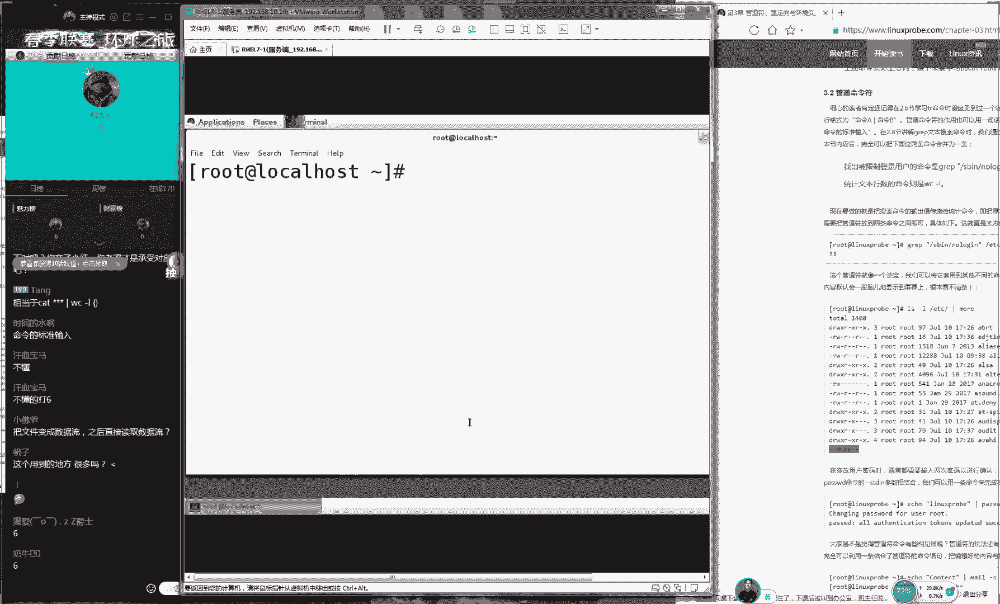

# 【RHCE】红帽认证工程师培训课程 - P4：第四节课 - 天木轮回 - BV14E411678v

🎼With my。お。OK那我们准备开始上课，同学们，我们今天正好7说什么呃，说老师怎么还不来上课是吧？因为因为刚才人数比较少，刚才只有110个人。

所以我们刚才等了一下事那我打一下一同学在测试一下我们这边上课环境打一下同学开们今天的课程广告怎么去除说这个广告告不知道怎去除像是腾讯搞一个活动。

这个我还真不知道他怎么去除这个可能去除了一个活动是说一个熊猫直播。闭。现在各大平台也正在招人，也会有活动这个我们都不管不管开幕给大家讲下章节为我们上个礼拜是一个拜是个开仪式给大家讲下系统礼拜日才是正式的去学习的一些基命令就指是。

😊。

第二章节的2。6以前一些命令。所以的话呢我们今天继续往后面去学习2。7、2。8跟第三小节，但是今天时间肯定是不够的。所以我们今天预计会讲到3。2小节左右。好，就会我我们会讲完我们这个重庆项跟管道服。

如果时间足够的话，我们会给大家去做一次第三章节的收尾。这样的话，我们明天就可以去写上要命令了。好，这就是我们的课程的一个安排。😊，今天的课程时间还是两个小时，大家提前做好准备。好吧。

那我们准备开始我们今天的课程了。啊后再给大家说一下，我们今天这个课程安排的话呢，大概就是两个小时所以大家啊大家提前做好准备。今天的话呢是我们先从2。7小节开始去讲一下这个touch命令，先回忆一下啊。

其实我们上一节课给大家讲过我们的文件上面有三个时间呢，分别为 time time跟M time，其我其想提个问的，但是把大给说出来了。行。

那就是说我们这个文件上面它有三个时间的 time time跟 time好，大家先分别去回忆一下他有三他这个三个时间的这个作用。所以大家说啊那我说的稍微快点啊，因为我上因为我上礼拜日的时候特意给大家讲过。

并且让大家做过笔记，所以我就简单去回忆一下。但家如果说对这个没有印象，或者没有写清笔记的话，可以下课之后进入到咱们的学员页面里面去下载咱们上礼拜日的那个视频会有一个细的一个讲解。

然后我们今天会去学习该如何去修改里面的。😊，这个值好了，那我们现在先给大家说一下A time啊，先给大家说一下A time啊，前两节没有听啊，不用着急，可以进入到我们学员区页面里面来去下载。

这是我们给大家提供这么一个呃录播的一个视频的一个形式。那大呃大家不用着急。第二个是说网站怎么进不去啊，非常尴尬，对吧？说网站进不去，我来试一下啊，我能够进去。所以说呃如果您进不去的话。

您可以多刷新几次就应该是可以了。那说刚下火车用手机看啊，也是可以的。好了，那我们来继续。😊，好，大家可以互动一下，这个没有关系，好吧。因为我们今天东西我们坦白来说有点小小的枯燥啊。

所以的话呢我们尽量呃我们可以互动一下这样来。😊，增加我们课程的一个乐趣啊啊，就像我们刚才我们上课之前给大家放的几首歌，真的好难听，对不对啊，我也觉得很难听。好了。

那我们来继续给大家说一下我们三个时间的这个作用。第一来说是a time。😊，呃，attime是我们这个文件的最后一次的访问时间。那也就是说最后一次去查看文件内容的时间叫做attime。好。

然后的话呢还有一个叫做 time，这个主要是指的修改我们文件的属性或者相关的权限属性信息的这么一个时间。那就是说修改文件属性的时间。还有一个叫做 time这个指的是叫做修改时间。

他指的是我们文件的内容的最后的一个修改时间。所以我们为什么说啊就是我们其实我们做IT的它是有一个笔视链的。虽然说我们视链说起来感觉呃很不好听，不？而且觉得呃这样有点拉仇恨。

但是其实我们真的是有笔视链的我我们学习lin的工程师我们就是瞧不那我们就不是认为windows这工程师跟我们是一个水平的。因为在这个windows里面，我们主要就是只知道一个时间。

就是那个文件的最后的修改时间。而我们在这个。😊，我呃而我们在这个开源系统里面的话呢，那我们就指的是这个re系统或这个for或者是这个错系统里面的话呢。

它是分为了三个时间的A time time跟M time好，它有三个不同的这个记录的这个时间和作用。好，那我们现在给大家看一下啊，我们给大家讲过说修改我们的呃查看我们系统里面文件时间的一个命令。

我们叫做对吧？然后我们加上我们的文件名称，这个我们就随便去写一个了啊。好，然后大家只要看下午就好了，不用看我这个文件作用啊，然后这个位置什么的，只要看我们的这个效果，那你可以看到我们这个三个时间的一个。

😊，啊，大家看一下我们这个三个时间，它会有一个标识。好了，那我们现在如果说啊那么比如说我是个黑客。那好，那比如说我是个黑客，那我现在看一个文件，那我们去看这个文件。

比如说那你看这个文件它最后他他这个时间显示的是这个文件的最后呃最后的修改时间。好了。那这样我我们呃我我们换一个文件吧，因为这个文件的话呢，是我们系统里面默认就有的。但是呃大家估计找不着。

那我们先在进入到home目录里面，我们自己去新建传一个文件啊，这样的话呢，呃。😊，大家都可以跟你一起来去做。好，大家现在不用管我在去做什么啊，现在只要看一下，不大家不用管我现在怎么去操作出来的。

只要看一下效果。好，那我现在系统里面有一个文件叫做A点t这个没有问题。这个文件里面的话内容常简单，只有一串A只有一串A好，然后说网站的VIP进不去具体有什么报错，以发一下截图。

如果是需要输入密码的话可以看一下我们这个聊天记录以及我们这个群里面的公告。另外是这样的同学们因为咱们这个上课时间呃比较短。然后我们上课人数比较多，可能问题也比较的呃多一点。

所以的话呢如果学的问题您恰巧知道的话呢，那我们可以去互助来去交流一下。这样也可以去加快我们这个互动的一个节奏。样我们可以给大家更多时间来去做去讲这个扩展的知识。好吧。然后因为我们老回答的话。

可能会影响到我们上课这一个这个怎么说我们的一个节奏的。其实好，那我们来看一下有一个文件叫做A点。好，但是如果。😊，问题没有被解答好，或者相觉不知道的话，那么也没有关系。啊，大家可以来继续去发。

然后我们来然然后我们给大家去选择性再去回答一些比较啊常见的一些问题。那然后如果说您的问题没有被解答好的话呢，那我们可以下课之后，每节下课之后都会有答疑的这个时间啊，这个大家不用担心。好。

那你先看一下的话呢，我们现在有一个文件叫做A点t里边是一串A的内容。而我们这个文件的最后的这个时间是19点07分。好了，咱比如说我是个黑客，那好了，我是个黑客。😊，啊，那么好了，我是个黑客。

那我现在来去尝试去修改这个文件里面的内容。但不用管我现在怎么去操作，只要看效果好了。好，那我现在是黑客，我现在去尝试去修改了我们这个文件里面的内容。

到后面又追加了一串BWQ这个不用管这个我们明天会大家讲到啊，对我们明会给大家讲到好，那我们现在修改了我们文件内容再来看一下我们这个文件内容就成了现在是后面又追加了一行信息。

因此这个文件的时间就一定会发生了改变。大家看到了吗？就是我们这个文件的这个时间原先是7点07分，而我们现在变成了7点09分。那也就是说随着我们的黑客，或者说随着我的这个操作，让我的文件内容发生了变化。

同时我们的文件的修改时间也发生了变化，大家可以照过来吧啊，大家可以绕过打一下一号吧，就是随着我们修改文件内容了。后那我们这个文件的修改时间也会发生了变化。就于说我们举个例子。

你拿着你的银行卡去刷了一次卡。好了，那你们。😊，你的这个随之而来，你的最后一次的刷卡时间也会发生了变化，对吧？好，那我们现在呃那比如说我是个黑客好了，那我不希望说别人知道我去修改了这个文件的这个内容。

但是我又想去修改文件的内容，那么怎么办呢？好了，这个时候那我们就可以使用一个命令叫做touch命令。😊，然后后面加上我呃我们可以去修改文件的时间。比如说我去使用一个杠小D。

它就可以去同时去修改我们文件的A time跟M time指的是我们文件的访问时间跟修改时间，把它再给它恢复成。😊，19点我把屏幕稍微给稍微放大一点啊啊，19点07分，这样我们写的A点t这样做好之后。

您可以来看一下我们这个文件的时间，又会变成了19点07分。这个是我们文件修改之前那个时间。但是我们的文件的内容的话呢，其实也已经非常的改变了。好了，这就是说不知道大家去我并没有说让大家去做黑客的意思啊。

就是说一定要知起呃知己知彼。你要那你要知道黑客是有办法，通过这个相关的命令来去修改我们文件的时间的，千万不要通过文件的时间来判断我们内容有没有被修改。这个是呃给大家提一个。😊。

比较高级的一个呃一个使用方法吧。呃，那好那我们接下来给大家说一个比较简单的一个方法，就是我们这个touch面的比较基本的一个功能吧。它用来去创建出来一般文件呢？那么什么叫一般文件呢？它指的就是文本文件。

什么叫文本文件呢？它指的是我们的人能够看得懂的一般的这个配置文件。那比如说我们新建出来一个文件叫做哈哈好，那我们现在最后有出现了一个叫哈哈的一个文件。然后我们就可以往里面去写入我们的文本信息了。

比如说我们可以写一部小说，我们可以写一个配置文件，我们可以写很多很多的巴拉巴拉我们可以去很多自己的东西，这就是我们指的叫一般文件，我们或者叫文本文件。

相当于就是windows里面那个什么记事本访问时间是可以修改的访问时间就是杠A，就是我们去修改 time访问时间就是 time是可以的。但是不能够去修改 time time是系统的一个最终的一个保护。

它是不能够被修改的。好了。😊，对我看一下嗯，没有什么问题，同学们迟到问题比较严重啊，大还迟到比较严重。刚才我看110个人，这10分钟上了40个人了，所以说千万不要迟到。你看因为你迟到了。

所以我们已经是讲完一个命令了。但这个命令很重要，我们一定要下次不要迟到了。好那我们再给大家回忆一下，因为迟到比多是这样的我们先一个touch命令。

来去新建出来一般文件的就是文本文件就是我们创建出来一个小说或者配置文件的这么一个文件类型同时的话呢我们这个touch命令。

也可以去修改我们文件的时间它可以去修改我们文件的访问时间跟修改时间这样的话让我们这个文件内容修改的同时而不变而不会去改变我们文件的上面的这个相关时间以起到一个定的这个迷惑作用。好了。

下面我们再来给大家说一个叫MKD这么一个命令。它用来去新建出来目录的这个我们叫做目录文件。再比如说我新建出来一个目录，我们名称我叫什么我们叫是这样的啊，我们为什么要给大家去起名叫。😊，哈哈呀。

呵呵显的好不正经，对不对？那我们这个原因是这样的，我们希望给大家去做这个实验的时候，大家不要照着我们这样去呃。😊，一比1的这样或者说啊完全按照我这样的这个教法来充现出来这样的文件什么，这没有意义。

大家一定要理解，就是我们的目录名称是可以随意去起的。所以说以后的这个参数里面，如果有随意的，比如说哈哈呀，呵呵啊，什么嘻嘻呵呵什么的，就指的是这个参数是可以随便去起的，不用跟我一样，好吧。

同学们可以以自己的名称那么呃可以自己的名字，或者说自己喜欢的这样的字符来去替代。😊，好，那我们再来。😊，那我们来创建出来一个我们叫做的这么一个文件。

那我们现在再来看一下我们当前目录里面就会出现了一个目录，叫做。好了，现在给大家讲到啊，我们第六章节的第一小节会给大家讲的一个协议叫做FHS到时候给大家讲到我们文件上有6种有六七种类型比较常用。

但是因为我们现在没有去学啊，我们就那我们那那我们就先去简单的去了解一下。就是当我们这个文件的名称是一个白点黑字的话呢，就是指的是一般文件白点蓝字的话呢，它指的是一个目录。

大家大家可能是知道我们这个文件跟目录的区别啊，就是文件是用来查看的而目录是用来切换跟保存文件这么一个作用。好，大家可以看到我们现在有一个文件跟一个目录那就那就把把给创建出来了。那好。

那我们既然说创建出来目录这么简单。那好了，我们现在出现出来一个有一个有一个叠加关系的这么一个目录。那那那比如说那我想出建出来一个目录A可不可以啊，可以啊，那我们。😊。

出来一个目录A里面的BB里面的CC里面的DEFG好，那也就是说我想要创建出来一个有嵌套关系的这么一个目录。呃，咱比如说啊大家有没有看过网上一个搞笑图片，是那个古天乐的签名啊，你们要看过，可以打一下一啊。

就是说有人戏称叫什么土土豆卷是不是什么土什么土豆旋风啊，你们没有看过是吧？没有看过没有关系，你们可以网上去搜一下，说这个呃说这个呃古天乐那个签名啊，就像一个土豆旋风一样，是一个竖条，然后呃就像很多。😊。

像我说点饿了，就像很多小薯片卷在一起似的。你你们没有看过，我给你们可以去网上找一下啊。那好了，咱比如说那我也想创建出来一个像他这样有签套关系的这么一层目录的话呢，这个时候他就会给我们显示出来报错了。

是因为因为你没有上一季目录的话，那我们的这个下一季目录，那么也就自然仍然不能够出建出来了。这种情况下给大家提一下，就是你要想创建出来一个有迭代关系的这么一个目录的话呢，就像我们古天乐地签名一样的话呢。

那我们就要去使用一个参数叫做杠P，它指的叫做递归操作，它就指的是创建出来一个有迭代关系的这么一层目录。好了，那我们现在再来敲一下回车。你看我们这个例子一说土豆烤串，大家就懂了，是不是好。

那我们现在创建出来一个有迭代关系的这么一层目录。接下来我们就可以去使用什么命令，我们就可以去切换到这个目录呢？好大家给大家提个问题，请问我们切换目录使用的是什么命令。😊，好，快速来给大家回答一下。😊。

嗯。好的，那我们就可以去使用到C啊使用到DVD同同学这个思维比较发散啊啊CD的话说可以使用可以去使用DVD也行。好啊，开玩笑啊，那我们去使用到D那我切换一下。

然后大家可以用到table键去补齐我上礼拜日的时候给大家去提到过说你们不要看我书上面，或者你们不要去背我书上的些我认为咱么怎么好怎么怎么好，不要去看啊啊看还是看还是需要看的啊，不要去背它。

因为那个是我觉得它怎么怎么好，大家一定要以你自己的这个实际情况出发。好吧，然后啊那比如说我们现在给大家敲一下这个table键，你去感受一下我们这系统，我们去自动补全的这个功能，你觉得好不好用。

我们按下回车样我们就进入到了一个有嵌套关系的这么一个目录的一个层次里面了。好了。😊，再往后面去走的话呢，就是我们叫做CP命令CP的话呢，它叫做copy，对吧？就是我们叫做复制的意思。

再比如说我想要去复制一个文件。那我们在这个lin里边的话，我们就要这样去做啊，我们先返回到我们自己的家目录复制一个文件。再比如说我复制这个文件。那我们就可以ANA1个table键把它补齐。

然后后面的目录的目标名复制成的名称，比如说我把它复制成我看一下叫小机器人，是不是那我们就叫小那我们就叫小小机同学叫做小机点CFG好，那我们现在就看一下这两个文件内容，这样把它复制好就。😊。

现在看一下我们这边的这个原始文件。再看一下我们这边小鸡的新文件。那你可以看到这个两个文件内容就会是一模一样的。这个其实很简单很简单，就是1个CP然后一个原始文件的名称空格目标文件的名称，那就可以了。

好了，那我们现在再来给大家去说一下，这个里面就会有两个文件，一个叫呃一个叫原始文件，一个叫做小鸡这一个新文件。那好，那我们可以想去那那我们比如说我们想要去复制一个目录的话呢。

那我们就这样去做CCP1个目录的名称，然后加上一个新的一个名称。比如说我们叫哈哈，这个时候它会显示出来报错了。因为我们对于目录去操作的话，我们都需要去加上一个杠P指的是一个叫递归操作的这么一个参数啊。

这样才可以好了，我们加上杠P。😊，啊，不对呃，不不错了错，我们需要加上杠R。对我们需要杠R。它代表低归操作，它指的是对于我们的目录进行操作。对杠F它指的是强制，这个我们没有必要才会再回车。

你可以看到就完那我们就复制的一个目录。并并且把它把命名成叫做哈哈的这么一个名称。好了，还有一个叫D看一下复制都是在同一个目录内吗。对它都是在我们当前的工作目录内来进行复制的。好。

那我们再来再比如说我想要去。😊，呃，剪切一个文件，那我们就这样去做使用它MV就是move的一个缩写。好了，那我们现在可以去剪切一下，将我们的这个文件的名称。那然后我们给它剪切成什么呢？

我们给它剪切成叫叮当猫是不是好，那就把它叫小猫同学点CFG这个时候你看一下啊，大家一定呃大家是一定是知道我们这个复制跟剪切的区别，对不对？好，那我们先看一下我们的目录的信息，就会发现呃。

我们呃复制的话呢，是我们的这个原始文件它是不受影响的。而我们现在又多出来了新文件，而剪切的话是什么。😊，剪啊剪切的话呢剪切的话，它指的是我们的原始文件就会。消失，然后它重新变成了一个新文件。

所以说我们看到这个目录里面，我们的原始文件，的这个文件究已经是消失掉了，而变成了一个新文件。我们叫做小猫。好了，那我们现在去捋一下思路啊。

既然来说我们是在同一个目录内将我们这个文件做了一次剪切和粘贴的这样的一个操作的话呢，效果就是我们的文件的名称是变更了。那所以说我们这个在同一个目录内进行文件的剪切跟粘贴的这个操作的本质是什么？😊，然。

大家想一下。啊，大家讲一下，当我们在同一个目录内，当我们在同一个目录内，那我们来对这个文件进行了一次剪切跟粘贴的话，那我们的本质应该是什么？好了，我看一下。😊，呃，我们复制的话是可以加上这个路径的。

这是没有问题。但是我们第六章节会给大家去讲。这个不用着急。好吧，这个咱会讲到，而且到时候我们会每呃会多次再去使用到会使用一个月时间这个不可能不会这个没有关系。好了。

所以说你看到就是说那我们在同一个目录内的剪切跟粘贴的这个操作实际上它这个本质就是进行重命名的这个效果。好，大家可以记到你这个书上面了。我们的MV的这个功能是什么呢？是剪切跟重命名。好。

大家记到书上面它不仅仅是剪切这么一个单一的功能。我们的重重命名的这个操作就是使用的是就是再去使用的是这个MV好了，那我们当然说我们这MV特别的方便，它剪切目录的话，不需要加任何参数的这个非常简单。

下面一个叫RM就是这个删除的意思mo？那咱比如说想删除掉一个文件。这个就要大家特意来去关注一下这个里面一些参数啊，我们会把这个里面的。😊，参数逐一给大家去讲解，大家一定要听好。第一个来讲的话呢。

我们来看呃，删除一个文件，我们就直接去删除。它会啊进行询问，说我们是否要把它给删除掉，是否进行确认。这个时候我们需要敲一下Y。😊，把它给删除掉。这样的话这个文件就会被消失掉，这是我们删除的一个操作。

那我们如果说我们不希望说他给我们去再来去二再来呃再来进行确认，说要把给删除掉，那我们就可以使用到M杠好这样的话我们就把它给删除掉我们文件名称这样话就没有一个二次确认的一个询问。

直接帮我把这个文件给大家删除掉。好了，是这样的啊，我感觉我现在讲的其实是一点都不快的。而且我们这几个命令给大家讲了很多遍。那么如果说我们就那我们就是如果说您听起来有点吃力的话呢。

请就回去之后一定要预习了。是这样的，因为我们打基础。这个其实没有什么天赋啊，也没有什么太多这个经验也没有太多这个经验而说的所以说大家回去之后一定要好好做预习，一定要好好做预习好吧。

如果您现在起来有吃力的话呢今天也还好是第二天就是我们讲第二章节真正讲基础二天那还来得及请今天回去之后借助明天礼拜六跟礼拜日回去之。😊，一定要好好预习。我们每节下课之后。

我会给大家去说我们的复习跟预习的内容，这个不是白说的，大家一定要认真去做。因为我们到第六章以后，我们就要开始甩人了，会有很多东西会开始跟不上了。第六章节我们一定要注意。

但是我们这一期肯定会啊会拉慢我们的这个进度啊，但是我们一定要去预习到位啊，我们换句话说啊，其实我有点我我看说大家跟不上啊，我我是我其实有点心理上有点呃怎么说有点呃。😊，也是点不能接受的，因为是这样的。

因为我们现在是在打基础，这个东西它没有什么天赋。只要您去看，他就一定能记得住。比如说哎老师我真看了，我向你发誓，我真的是之间我看了一遍了。那么如果说您看完一遍还是有压力的话，您相信我您去看三遍。

您看完三遍之后再过来看我们这个在线就一定会觉得很无聊了。因为得都是讲过的这东西还是跟付出是有关系的，因为这个东西我们很着急，我们基础必须要打好。那这样话我以后去做这个实验的时候。

您才可以把这个经历完全放入到配置服务上面不纠结说什么是M什么什么什么什么这个参数？基础一定要打好好，下面再来下面再来M我们去删除掉一个目录好不好？

我们现在删除一个目录目录名称叫这个时候他告诉我们说哈是一个目录，我们不能够去删除那我知道我需要加上一个参数叫杠F代表就是一个强制代表就是不要进行确认的意思。那我回车的时候，😊，啊，他还会告诉我们说。

我们的这个操作还是失败的。因为我们对于目录的话呢，我们需要加上一个杠R操作。所以我给大家总结一下啊，RM它有两个参数非常的常用啊，它主要就是两个参数比较常用。第一个是杠F。

它指的是不要进行二次确认的意思，代表是强制删除。还有一个杠R操作，它指的是对于目录操作啊，代表就是递归操作，它指的是删除一个目录时候，我们需要加上这么一个杠R操作。😊，对，咱们一定要回去之后。

要去看这个视频来去预习的。好，这叫做RM命令。这个非常简单，我们先打基础。下面还有一个叫做这个DD啊。DD的话呢，它其实来说也是进行了一个复制操作啊，OK啊，大家特别好啊，大家可以来去互动一下。😊，好。

我在我要我OK啊我在录屏，或者我忘记这什么。呃，是这样的，大家话我们上课之后啊，我估计这位同学就问的是你看有两个同学问说这个怎么上课呀什么的，其实现在就不能够回了，对吧？因为咱们现在已经开始上课了。

所以还是说大家上课之前一定要把文都给问好，好吧，然包括说怎么上课。因为我们每天上课之前会提前1分钟会给大家开那个视频吧？

放放歌会放放音乐的大家就提前进入到这个频道里面准备上课所以说我一旦上课之后就不会给大家再回信息了，因为在上课了嘛，对吧？好了，那我们现来说一下我们这个滴滴的复制的一个命令啊，那我们就要对比一下。

我们刚才讲过一叫CP的一个命令CP的命令的话，他复制是一个一比1的我们原先那个文件是什么样子的对吧？那我们就在复制出来一个新文件会跟我们原始文件是一模一样的其这个非好理解对？那就进行复制操作。

我们的这个复制出来的那个文件一定跟我们这个原始文件肯定是一比1的那好了，那么我们如果说想去复制某个。😊，文件中的一部分的话呢，那我们就可以去使用到这个DD，那么就可以去使用到这个DD命令了。好。

滴的话它有几个参数特别的这个重要，而且它很难去操作。我们要给大家讲一下。第一就叫DD叫做F是这样的啊。大家记住它有几个参数非常的重要。第一个叫我给大家去逐一去讲解一下啊这4个参数特别的重要。

给大家逐一去讲解一下这个命令我估计会会绕大家比较烧脑好第一个我叫个叫第个叫给大家讲一下第一个我们之所以把它叫那我们之所以把它叫，它是由单词去书写出来的，叫做put它特别好大家说明英语比较好啊。

它叫这个 inputput的一个缩写，表它代表就是一个输入的一个来源，它指就是我们来去复制一个文件而这个文件的来源是哪里个我们取它那个首字母叫做好了，那所以说当有人再把它读称叫if的时候。

就是说明是一个新手它不懂这个它是怎么来的。好了，大家不要是我们记住啊。😊，不要千万不要独测。那我们在这个呃滴D命令里面，我们的这个叫做IF，而不叫做E，它指的是我们文件的来源。

还有一个叫OF是什么的缩写啊，大家知道呃，大家知道我们这个OF的缩写是什么？OF的缩写一定是叫做什么？😊，啊，大OK大家知道了啊啊，虽然我不会念这位同学的名字吧啊，这两个同学我都不认识怎么啊怎么怎么念。

所以我说我看第三个同学叫BB啊叫 big big word他打错了啊，他打对了啊，没有但没有打全叫做个。那所以说我们第一个首字母的缩写就是叫做OF千万切记不要给我。

它读成不要把它称叫做of虽然说你认识这个单词，但是你不要把它读成of叫做OF或者说把给或者说把它给念作叫做out叫输出的文件的意思。😊，好了，这叫做这个没有什么可讲的，就是我们的块的课。

就是我们取几块的意思啊。然后我们叫BS它指的就是我们的大小。好，我们先不那那我们先不给大家讲这种非常技术比较枯燥的东西。我们先给大家举一个小的一个故事好吧，先给大家讲一个小故事，帮大家去了解它。

既然来说我们的这个弟弟的命令，他是用来去按照大小或者说取出来一个文件的某一块大小来去复制的话呢，那你想一个问题，那我们该取多大呢？我那我是取这个文件的一半呢，我还是取这个文件的多少呢？

那我们就要给他一个大小，我们那大家有没有看过就是在应该大家应该是知道啊，就是在之前在很久很久以前我大家讲一个小故事啊，说下是在很久很久以前在欧洲的一个小国家里面，然后有一个国王。

当然说这个童话好像是格林童话，或者说什么么个寓言里面写出来一个小。😊，一个小的一个小故事啊，说外在欧洲的一个小国家里面有一个领主，对吧？然后她有一个闺女，她有一个不他有一个女儿，想要到呃。

比如说到18岁了，然后开呃然后需要呃需要出嫁了。咱中国的话呢，一般来说就是嫁给一个贵族，对吧？或者说咱中国就是呃咱们比武招亲，你们都看过一种电视剧啊。然后的话呢，咱中国是比武力，在国外的话，在欧洲啊。

他们是比智力那然后然后这个呃然后这个国他要出一道题。😊，啊，这个故事比较比较狗血啊，然后这个国王出一道题说这个题是谁能够答得出来，然后这个故主就会嫁给谁，对吧？就是个比智力的。说这个题是这么说的。

说啊在这个国王的这个宫殿的周围的话呢，有一个壶啊，这个我们叫护生河对吧？这个城堡给它围起来对吧？这个我们在很多电影里面都看到过是吧我给你一个桶，那你去把这个壶里面的水给他揣出去啊。

把这个壶里面的水给它拐出去，这样的话呢，你需要揣几次，你能够把这个壶里面的水正好给它甩干。哎，你看这个问题一出，反正我我是不知道的对吧？那我怎么知道这个壶里有多少水，这个需要拿桶拐多少次。

大家知道用勺子款啊，你这个比我这个还狠啊，好，大家想一下说那我们到底该动多那我们该用几桶水啊，该用该就该揣几桶，然后还是该快干啊，其实那个其实这个情景很机智啊，因为这道题本身就非常的抽象，没有因为他。

😊，因为他没有给你桶，他也其实也没有让你真正去款里面的水。然后那个有一清年特别的呃特别的机智啊，然后就问国王说好，我可以告诉你，我快几次。但是您要您一定要告诉我我这个桶的大小是多大。

如果说我的这个桶的大小恰巧是跟这个胡成和是1比1的话，那我就只需要去一次。如果说我这个桶的大小是是这个这个是这个壶的一半的话呢，那我就需要两次。如果说我这个桶是糊的10万分之1，那我就要去10万次。好。

那你只要告诉我壶大小就可以了。其实这就是举了一个例子，什么例子呢？就是你要想去复制一个文件，要那你要想去达成一个事情的话。

那么你就必须要告诉他他每一次去取出来的这个大小叫做这个B只能是你每一次去取出来这个大小，然后以及你去取出来的这个个数，然后他们两个相乘，就是我们最终的那个体积。但比如说我们的这个大小大小为5，就是。😊。

V5K吧，就是V5呃呃V呃他每一次去会取出呃取出来呃5个KB的这样的一个信息。然后我们取的次数。那我们比如说我们取两次，那么我们总共的那个取出来大小就变成了10K好了。😊，这个大家能够理解的吧。

但如果说还是不能够理解的话，啊说冷笑话嘛啊是比较冷。再给大家举一个例子啊，我们可能说这个例子比较的抽象，我再给举一个比较呃比较好理解的一个吃货一个。😊，呃，吃货的一个例子。大家知道啊。

我们吃饭都要吃米饭，对不对？那好了，这个比较这个比较冷啊，但是这个病比较难，我需要给大家多举几个例子来去理解。那比如那咱比如说我们吃饭要取取吃米饭。那好了，那我每天我就需要吃一碗饭，我就能吃得饱。好了。

那我每天的饭量就是吃一碗饭。那我去吃这一碗饭的时候，你是给我什么吃。如果说你给我一个大勺子去吃，那我就只需要去款一次，那我就可以把这个饭吃完。如果说你给我一个小勺子，那我就要取100次，能把这个饭吃完。

那好了，最终的结果结果就是我需要大小，我需要的饭量，我需要的这个体积是它是一个固定值，它主要是你的这个每次取出来的这个次数跟你的这个取的频次相乘就会乘你最后那个总大小好了，我们说两个生活上的一个例子。

再给大家说一个劲上的一个例子了。如果不理解没有关系，我们看这个实验，俗话说嘛对吧？我们百闻不如一见，看书不如看实验，这是一个欧洲的一个老者说的那好了，我们现在去取。😊，一个文件。这个文件的内容的话呢。

我们先随便的去想一个啊，比如说。😊，有一个文件我们叫做小猫同学，我们看一下叫小猫。啊，这么一个文件。那好，我们来去先去使用到滴D，然后我们去使1个IFOK我们写上文件的名称。

这个呃我们不能够用到table键去补齐的啊，它就有一个限制。所以我们要去找到这个文件的名啊，叫小叫小猫。😊，after小猫。点CFG这是我们文件的来源，代表就是我们从哪里去来去获取文件内容。

还有一个叫做OF代表就是我们输出文件。当我们取出来之后，我们去输入到什么地方呢？我们给他去输出来。比如说有同学叫做呃烫同学，这边唐同学，我们就叫做烫点CFG。😊，接下来我们是BS。

他指的是我们每呃我呃我呃我们每次去取出来那个字节数。那我们这个体积的话呢，那我们这个大小就变成比如说20个字节好了。然后我们取的这个次数就是countt。等于一好了，那我们这样去呃，小猫同学。

那我们应该叫小猫点CFG好了。嗯。啊，小猫。好，那我们现在对这个小猫文件进行复制。好了，这个时候你看到就会多出来一个文件叫做唱点CFG啊长点CFG这个文件的话呢就会去取出来上一个文件。

就是我们这个小猫这个文件里面的前20个字节可以看到变成20字节。所如你想要取的更多一点的话，说我们想要去取出来40个字节的东西，者我们取出6字节的东西的话呢。

我们只需要把我们取的这个次数变成三这样话我们就可以取出来6字节的东西。好，我看这个文件里面的内容那变成它就去取出来6字节的东西。好，大家不信可以去数一下啊，它会它里面的这个信息会是60个字节。

包括说空格然后说我们这个单位默认是字节。如果说您需要的话，可以加上单位，说可加上K以加但是我们文件比较小它这个文件总共也没有一以说以字节单位来去取了是从头开始的大家可能会想老师那你说这个效果都是一样的话。

😊，我们为什么不直接把它写成60呢？其实也是可以的呀那好比我说我们现在这样去做。那我们现在哎我们现在去复制一个文件，我们将这个大小变成80啊，然后但是我们只需要去取一次，这样的话效果就是一模一样的。

那你可以把这个。😊，呃，大小跟频次自己来去自定义。好，那我们现在看到这个大小就会取出来前面的这个80个字节。好了，因为我们现在是这样的啊，因为我们现在是在搬砖，所以说我们不在这个命令上面花费太多时。

我以给大家讲到我们会在第在第六章节的讲大家再来重复使用这个命令的，因为我们打金属不去管它体有作用。我今后去实验会把它结合到一起来去使用的。好吧，我们先知道这么一个命令的一个作用。

就是按照我们这个体积块来去复制文件它不1是根据我们指定大小复制的一个意思。好了，我们再来我们叫命令的话是用来去看我们文件类型的。

为我给大家一个特别俗的个方法就是我们去看一个文件类型就是看我们这个颜色白点黑后这边的话黑字就是我们这个文本文件白蓝话就是我们这个目录文件那好俗啊，对不对？😊，所以说我们这样的话，第一看起来不准确。

第二起来显得很low，我们没有水平。这个时候那我们就可以去使用到fi命令。我们来去看我们文件类型了，而不用您去猜好而啊而呃而不用呃通过我们这个颜色来去呃来去猜。好。

那我们先来看一下我们这个town点CFG的这个文件。他就会告诉我们说它是一个这个X码的一个文本文件。好，那我们再来看一个我们的目录文件。😊，啊，这个是我们的一个目录文件。

所以说大家可以去使用到f面呢就可以看到我们这个文件类型了。哎，如果说你想要去看一下我们某个文件类型，那我们就可以去使用到放面非常简单给大家来去使用到。然后说滴命令的这个缩写，这一半会我也想不起来。

不过不用着急，等我下课之后给大家去放到咱们的群里面的。如果说对，然后我想一想啊，其实这个建议很好，回头我们会把这个书上面的命令旁边会给大家备注上我们的这个全称是什么的，这样会更方便一点。另外是这样的啊。

然后呃我们给大家做广告吧。是这样的。因为我从上个礼拜礼拜日我们讲完课之后，其实我也在也是在反思啊，说我们这个课程能不能再提高一下。后来想半天我觉得嗯还是有空间的。比如说我们的一个发音问题啊。

然后其实我们上一节课给大家读那个。😊，啊，读乌斑图，还有这个法呃读那个佛呃什么。呃，就是给大家读到一个单词的时候，我记好像是读错了，对吧？然后大家可也大家正好也提出来了。

所以说我们没有像其他培训机构一样假，然后就假惺惺就去啊过去了。所以说我们可大家去搭建出来一个网站嘛，对吧？然后我正好用一个礼拜的时间。😊，就把我上一节课给他读错的东西。呃，然后给大家总结成了一个网页。

大家应该知道吧，就是我因为我们在群里面给大家今天跟大家发了一下。那么如果说您今天没有看到的话，没有关系啊是这样的。

我们今后我们会把我们里400多个命令会给大家结家以监督我我也会给大家总结出来我们非常常用的一些干货。比说我们这个我们有常见的正我我为比常见的一I的一些词汇用了一个礼拜时给大家总结给大家翻译翻译后我一个单词配音。

配音的啊，但是我们保证是发音是正确的去就是我们给大家做一个广告的植入？大家可以关注一下需要的话这个还是很好玩的？包更命令家关下但但是我一直去更新好，我们广告做完继续后去讲。8小节。

8小节的话大家可以看一下。😊，这个章节啊，第二章节2。8小节，我们知道最后出场的一定是叫做主角了，肯定是压场的。为什么我们的你看啊我们其他的这个章节，比如说我们看一下2。4小节。😊，你看2。4小节，2。

4小节里面的命令总共有几条，有8条好，2。5小节的命令里边有几条，2。5小节的命令有。😊，有有9有1呃有9条，然后我们的2。7小节，你可以看到我们刚才讲的2。7小节里面也有了6条呃，也有了7条命令。

就是说我们每个章节里面的命令大概都有了6到10条。但是我们的2。8小节，你看到比较特殊，它只有3条。😊，啊，是这样的，大家如果说手机看不清的话，看着比较小。如果说您看我们这个网。

那么如果说您看的是书籍内容的话呢，那么您就可以您翻开书，然后我们会有给大家发那个纸质的书籍。那个上面的字是跟我们现这个网页上面是一样的，那么如果说您没有带书的话，也不用着急。

您可以进入到我们这个网站里面。然后您也可以点开那个网去点开那个网页啊，这个效果也是跟咱们一样的。如果说您是这个字看不清如果说您是这个字看不清楚的话呢，那我把稍微放大一点。好吧，给大家给大家稍微放大一点。

然后我会把我们刚才去敲诉的命令的话呢，也都会给大家一直去口来去口述一下，会去说出来，我们打了什么好了，接下来的话呢我们来是说这个网站的命令还是少。对我们上个礼拜刚做出来，对吧？然后正在。😊。

我们只能用一年的时间给大家去补充完善。那并且我们一定会就是把控我们这个质量的，肯定不会从网上面随便去复制一些啊这些破玩意儿，对吧？好，我们来去说一下我们的2。8小题，之所以放到最后去出场。

因为它非常重要，对吧？然后这个是红的考试原题，大家看到这个是我们的红的考试原题。大家看一下，这个三个命令分别对应的是红的三道题，大家知道红帽公司比较小记，它的每一次它它的每一道题都很难。

然后都会卡你的这个分值。但是红它有三道送分题啊，它有三道送分题，分别就是我们讲到这个三个命令。所以说我们所以说我们把它放到最后面的原因。第一它很重要。第二就是红帽考试的必考。

如这个送分题没有拿到分的话呢，就变成考试送命题，对吧？好，那我们现在给大家说一下我们这个命令说这么多的原因啊，就是说一定要对这个三个命令大起重视。同学一定要好好学的意思。😊，好了。

我们先在给大家就说一下我们这个第一命令，我们叫t命令。t命令的话呢，它主要是用来去。它的话主要是用来去这个解压跟压缩文件的，它主要是用进行一个解压跟压缩这么解压跟压缩文件的这么一个作用。

但是的话呢我们一定会给大家去讲这种组合的这种参数我们会给大家讲到每一个参数的作用。大家可以记到你这个书上面啊，的话它可以进行一个压缩跟解压。如果他想要去压缩的话呢。

需要使用个固定搭配的这个参数我来给大家去分别讲一下每个参数作用可以记到这个书上面第一个参数叫做C代表就是打包的意思可以将我们的多个文件给大打包到一起这个操作叫做C操作。

做这个Z操作代表就是一个压缩的一个格式。如果说您使用的是的话呢，那我们这个压缩格式使用的是叫做那么如果说您使用的是J的话呢那么您对应的这个格式就是啊叫做这个B那好大家可以记一下这个这个两个是比较常见的这一个格式。

但是说大家可。😊，还会说，我怎么之前我们公司或者说我在网站面去下载的这个文件，还有叫做7Z跟叫做RAAR啊，对吧？然后比如说我们windows比较常见的RR跟ZIP这个我们会在第二章节的时候给大家讲到。

会给大家讲到如何去解压J呃呃这个ZIP的这么一个压缩包的文件。大家一定要记住，就是我我们这个GZIP。😊，可不是这啊可并呃可啊并不是我们常见那个ZIP。啊，我们叫做。啊，他不可不是叫做这个ZIP好了。

这样的话呢大家提到一个问题说我们这个参数可不可以啊不加这个减号是这样的，我们的这个命令它允许我们这个参数不用去加上减号效果是一样的那就是说我们的参数可加可不加这个减号，这是完全可以的。

没有问题的没有影响。下面还有一个参数，我们叫做微参数，这个指的是我们去显示出来我们的这个解压跟压缩的一个过程，是这样的。咱们比如说我想压缩一个文件，那好了，那我这个时间也许是一个小时。

那这一个小时里面如果没有任何的输入信息的话呢，那么我怎么知道你是一个压那么我怎么知道你压缩的一个过程，或者说你有没有压缩完呀。

那么这个时候我们就要去使一个杠V参数来去持续来去输出我们这个压缩的一个过程告诉我们的用户我没有死机，我没有偷懒，我正在一直为去。😊，这个压缩文件，或者说大家去解压文件的意思。最后一个是F最后一个是F。

它指的是我们压缩过后我们的文这个文件的名称。所以说我们的文件名称的话呢，一般来讲我们是以自己的名称比说我们叫做同学问题较多，我们先讲我待会下课之后，者说待会给大家统一答好吧，不用担心。

说我现在给大家叫做日落吧，我们取个名字但这个后缀啊我们有一个通用的一个习惯这个习惯就是叫做啊，就是我们因为我们去使用的是Z去压缩了嘛，所以说我们就是果说您是使用的是的话呢，那我们压缩之后的文件的名称。

我们建议来叫做原就是你要让对你让你的同到这个文件之后，他知道该用什么方式来解压出来这是一个我们俗成的一个习惯我们叫的意思好。😊，我们最后是我们的文件名称啊，我那我们要去打包的这个文件名称。

比如说我想要去打包的是这个ho目录里面的东西，那我们就这样去写，这就是一个我们的这个打包的一个命令了。😊，好了，那把它写的稍微正式一点，好吧，原呃原文件。压缩。包名称。好。

大家可以把这个写到你这个书上面，就给大家总结一下我们这个压缩文件的一个命令啊，这个是我们压缩文件的一个命令。好了，那我们再来。😊，下面我们叫做t XCVF。它个变化的话呢。

主要就是变了这个C变成了这个X。它指呃因呃因为我们的C指的是一个归拢，它把很多这样的一个文件归拢到一起的意思。这个叫做这个打包。而我们要去解包的话呢，经行解压的话呢。

那我们这个参数就变成了一个消息的一个X，它指的就是一个解压缩的意思。😊，而我们直接后面写上压缩包的名称，就可以进行一个解压操作。同学们现在来有点有点有点有有点太晚了啊。

回去之后一定要好好去看一下我们之前那个视频了。来有点多。好，那我们来看一下我们今天这两个命令命令下面那个是我们这个打包的命令。下面这个是我们简压的命令，所以我们就给大家讲到了每一个餐桌作用的好处啊。

就是大家以后去使用的时候啊，大家以后去使用的时候就可以。😊，来去呃来去灵活去搭配，而不是只知道一个固定的一个。呃，搭配的一个组合，如果不带微压缩后也会有提醒啊。

但是过程当中它是没有任何信息的这它指的是压缩的一个格式。那这叫叫做这个GZIP啊啊，知蛛同学比较是比较学的比较扎实的。才刚才回答问题的时候回答了很多问题，说明复习是比较好的，还是下培训机构过来的托啊。

过来给我们捧场来的，感觉这个水平很高啊啊，还有这个奶牛同学啊，从第一节课指导他这个技术比较好的好，下一个题啊O那我们下一个问题啊，就有奶牛同学来回答一下好吧这个是我们比较我们给大家去操作一下。

给大家操作一下啊。😊。

我们百闻不如一见嘛，我们要看书不如看谁我们去操作一下，光说不管用，对吧？好，那比如说我想要去打包一个文件，打包CCZVF啊好了，我先快给大家去说了。因为我们这个参数我大家都去讲过。

比如说我现在这个文件叫什么呢？我们比如说叫做顾语方纵同学叫做小然我们要去打包的这个文件的目录，比如说比如说是叫做me目录。但是说这个目录的名称啊，什么作用什么呢都不要管它。你现在学习的就是这个命令来。

因为我们去加了这个微操作。因为我们加的这个微操作，所以我们就会有输入信息输出到我们的屏幕上面。好了，这个时候我们就会在我们的目录里面发现一个叫小固一个压缩包的一个文件了。

这是我一个压缩的一个过程非常简单。😊，啊，这个非常简单还有一个我们叫做VF啊叫做这个小顾那我们去进行一个解压。我们按一下回车了啊，他看到因为我们去加了呃，因为我们同样加了这个杠V操作。

所以说我们会显示出来一个压缩的一个过程。大家看到我们就会把我们这个压缩包默认会压缩到会解压到我们当前目录下大看到我们可以进入到里面。那就是说我们去解压一个文件的话。

它默认是解压到我们当前所在的这个银额目录里面压缩之后我们的这个原文件也是在的啊，我们这个原文件也是在的对我们这个hold缀它只是用来去区分，它只是让我们知道的。

比如说我一看他就知道是呃省是Z去解压它所以他如果说是B的话，那我们就是只用是去解压它对，好，同学拒绝回答那我们就找一个比较难一点的。我们做group这么一个命令。😊。

你看我们这个发音是不是我们就比较就比较准确一点了。其实我也是在也其实也是在学习啊，因为我们这个。😊，这一礼拜我们去做了很多很多的命令的这么一个整理吧。真的是我感觉我读错好多。😊，好。

那我们先给大家说一下这个gra命令啊。我们上一节课我能说因为我们现在说起来上一节课其实已能过一个礼拜了，可能比较这个呃比较比较远了。是这样的，我们上礼拜日的时候给大家讲过一个命令叫做ca还记得吗？

CT啊COUT啊，大家回答一下说CT命令它的作用是什么？我们来快速回忆一下，好吧，大家应该如果还记得的话，我们回答一下，说CT它是什么意思。好，如果说您回答的是简短啊。比如说裁剪的意思。

说明您的英语比较好。但是我们这个在里面的作用是什么呢啊。😊，作用是什么？哎，他是选择一行中的一个段嗯，不准确，什么段对不对？啊，还有同学们这个输入法有问题啊，不用着急。好，同学们想一下。

对他提的这个同学说的非常好，但是他只有一个叹号，是是说是他是提取的是一个列的信息，对吧？当时我们举的当时我们举一个例子啊，有一个文件叫做ETC目录里面的pasW好了。

这个文件里面什么多什么多什么多什么多冒号多，所以我们再仔细一看对了。你看我们再仔细一看，实际上它是将很多个字段里面的内容，通过冒号去做间隔一个一个的字段。

于是我们去使用的叫什么ca命令刚D我们使用到以冒号为间隔符取出来第一列的信息，然后我们原始文件的名称，于是我们就获取了这个文件里面的所有的第一个字段的内容，还有大家有点印象吗？啊，有点印象，对吧？

好了啊，然后的话呢我们来那既然说我们可以按照列来去提取出来我们这个文件里面的内容。那我们也可以按照我们的行来去提取出来我们的文件内容，对不对？大家知道什么是行什么是列，对吧？列就是竖着的。😊。

行就是呃横着的那好，那我们按照我们这个横着的行也可以去提取出来文件内容。我们就以那我们还是以这个文件为例。😊，你看啊我们这个文件的话呢呃，大家可能看是呃，大家看一下啊。

这个文件里面的话呢呃有的文件的后面有的这个信息的后面，它是写的这个SB里面的no log。还有的话呢，我们这个后面写的是B里面的bsh啊，你看他有他这个文件里面它有两种的这个。😊，我们不管它什么内容啊。

就是说我们看这个字符，它有两种这样的信息。所以说我们要想去获取所有行中包括有了b是这么一个名称的行。那我们怎么去做？那我们就是写然一个group，然后我们bsh。😊，写上文件的名称。那我们就过滤出来了。

所有包含有了bsh。行的信息。好，这个时候我们呃再给大家总结一下好不好？实际上我们这个命令非常的简单，它就是使用的group加上关键词加上我们的文件名称就可以来进行过滤了啊。

它就会过滤出来我们这个文件里面所有包含有该关键词的行。那么如果说是我这个文件100万行。那我现在既然知道了这个文件里面的某一行中带有了这个关键词的信息，我怎么知道它这个行数呢，那好了。

那我们现在就要需要去使用杠N参数，它指的是显示行号，它它啊它就会啊不光告诉我们说它找出来这个关键词，并且它还会告诉我们说它从哪第几行找出来了我们这个关键词是个非常的简单啊。

这个命令既然就是一个送ty大家看到了没？就是一个送，它还它还不如我们那个ca难的，对吧？这个参数非常的简单啊，我们最后我们最后一个命令，我们一个比较压轴啊，我们叫做放的命令，它是用来去。😊。

查照我们的这个文件的上一节课。😊，我把它讲完之后啊，正好一个小时给大家放松一下。好，我们再最后再坚持坚持呃，是这样的啊，我们最后一个命令我们叫做放命令，它代表是查找的意思。

因为我们上礼拜日的时候给大家讲过，我们去使用的去看小文件去使用到这个去看大文件去使用到去看某文件的这个前十行去使用到去看文件后十行或者我们持续去刷新这个文件去使用TR来进行文件的这个转换。

那我们学习了这么多去查看大文件小文件查文件短文件这样的跟我们这个文件前后的这么一个操作的命令之后的话呢，我们对于文件的内容来讲已经触的很透彻了。但是我们该如何去找到文件呢。

这个时候我们就可以去使用到放了。它代表就是去查找一个文件的意思。现在就是我们知道文件的名称。但是我们不知道它流落到我们。😊，系统里面的某个位置了，说起来这个啊说起来这个我有点想起来一个动画片叫七龙珠。

你们有没有看过同学们可以打一下一，你看咱们这个上课非常的欢乐啊啊，待会说完七龙珠，我们待会还有说哆啦A梦的。好，七龙珠你们都看过啊，七龙珠你们看过我们上节课说什么来着？你们没看过来的。😊，啊。

七龙珠你们看过，然后机器猫你们都没看过啊，你们好奇怪啊，我怎么觉得看机器猫的同学应该比较多呀。好了，那我们来去说有个七龙珠，七龙珠里边就是有一个怎么去召唤出神龙啊，他有7个龙珠，有7个小圆球，对吧？

你把这7个菠萝珠哎，不是不错错啊，啊，你把这个7个玻璃珠啊，你给他凑到一块，然后他就会出现一个呃这个神龙，然后去实现你的这个三个愿望，这个也就是啊他默认会流落在世界的这个各个的地方。

然后当时有一个叫归仙人，这么一个角色。大家记得吧？然后还有一个叫。😊，小丽吧，就是一个女生，她有一个探测器，然后带个，然后那个探测器可以探测到这个龙住在世界上的流落到哪个地方。😊，是叫小丽吗？不对。

小丽是名侦柯南里边，毛利小五郎的女儿，叫什么啊？卡卡罗特，你们都都知识都学你们知识都学杂了。同学们你们都看书都看都看乱了啊啊，波尔玛行无忌真无忌算了，你们都把把这个把它给调过了啊，这个问题再说下来。

我我我我都估计你们该说什么。😊，啊，什么武则天什么的，好像就把把把它给调过。就是说我们如果说我们想要去找一个文件，但是他可能是在系统里面的某个位置，我们不知道这个时候我们就可以去使用到放着来去查找。好。

然后我们放到后面加上一个斜杠，这个斜杠就是个斜杠就代表是万物的起始。在我们系统里面的话呢，这个在我们系统里面就代表就是全盘搜索的意思。大家记得你书上面，这个一个斜杠。

它指的是根目录根就是呃根茎的根树呃树木的根茎的意思，就是这个根最底层它指的是进行一个全盘搜索的意思。😊，啊，它指的是这个全文搜索的意思。这个我们会在第六章节的时候会给大家讲到我们这个根目录。

先不用去深究，只需要去记一下，就是一个斜杠代表就是一个根目录。第六章节告诉你们为什么它是根目录啊，以及我们该怎么去去这个操作。好了，知识就应该一点点去学嘛。然后接下来的话呢，我们去介上我们一个条件。

比如那咱比如说我想要去搜索的一个文件名称。😊，因为这个比较特殊啊，因为我们之前提到过参数，它有这个长短格式之分，短格式一个减号，加上一个加上一个字母，长格式两个减号，加一个单词。但是我们这个放的命令。

它虽然它是一个长格式，但是它也需要去使用的是一个单个的一个减号，以我们这个表格2-16啊，上面为准。好了，比如说我想去搜索一个文件，这个文件的名称叫做比如说啊无所谓FSAB点。😊，啊。

就就啊那我们去做这么一个文件的意思就是说我们去使用到这个放命令，进行一个全盘搜索，搜索出来所有全部系统当中叫做F的文件。好，大家刚好像走神了，对不对？好，又走了两个同学。

这个我刚才这个人数是170个人怎么跑两个同学，所再给大家重复一遍啊。这个命令意思就是我们去使用到这个放命令。怎么又跑一个同学怎么又跑一个咱们说这话一下，人就就往下讲就往下降了4个啊来啊大家不用担心啊。

这令很简单啊，大家不要跑好，那我们来去说一下我们这个放。😊，的意思就是说我们使用它放的命令来对于全盘来进行搜索。搜索系统当中所有名称为FITB的文件去敲回收。好了，大家可以看到。

我们就搜索出来了我们所有系统当中包含有了FITB的文件。他告诉我们说这个文件它所在的这么一个位置啊，它它所在这么一个位置。😊，好了，那我们再来比如说我想去搜索另外一个文件，这个文件我们叫做无所谓啊。

其实我也想到这么多。比如说我们叫做SDA吧，无所谓啊，去去搜索一下。这个时候我们就可以搜索到所有名称里面，包括SDA的一个文件是这样的。现在的话呢我们没有包错。但是有些同学啊。

大家有些同学你们去搜索的时候会出现出来什么POC报错啊什么的，是这样的，大家现在我们没有报错。但是如果大家去搜索的时候，会搜索出来呃，很多叫做。😊。

PC什么文件错误啊什么的，这样的报错不用着急。呃，现在给大家去说啊PC目录它属于里面的一个虚拟目录，用来保存我们系统的一些服务运行状态的，它并不是一个真实的目录里面的文件也是映射到内存的一本的资源。

所以说我们去搜索这个文件的时候，或者复制这个文件的，会显示出来报错信息，这属正常情况的。好吧，就是说我们去搜索这个文件的时候，默认是不会报错。但是如果要是有报错的话，报错是C目录这样的信息的话。

那我们就证明是我们这个系统的一个虚拟目录的意思。好了，然后如果是没有这个文件的话，你看啊如果要是没有那么你搜索一个文件而这个文件它并不存在的话，你看到就不会有任何的信息输出来啊。

它就会去结束掉这个搜索的一个过程搜索的时怎加排除像，应该是有。但是我们这边像没有给大家去写头我需要给大家有有有有有有有有这个参数叫做。😊。

PRU啊，但是这个单词的缩这个全称我不知道是什么啊。叫做P。RUNE啊，比如说我们想去。呃，想要去忽忽忽略掉某个文件呃目录我们就这上去操作就可以啊P。RUNER是不是两个减号？忽略某个目录，诶。

怎么会报错啊，就可以了。但是为什么我们后面没有加上。目录的名称。好尴尬。啊，这个明呢我我这个虽这个参数我需要给大家会去之后研究一下。呼动宝个文件。嗯。这个应该不对吧，这个他肯定是有一个格式。

比如说他忽略掉。想要等号吗？也不是等号。嗯。忽略掉后目录，你看也不对，目录在前面好奇怪，不对目录不应该在前面吧。😮，你看也不对。哦，我看一下，他上面写错了，应该是两个减号。😊，来，我那我来试一下，好吧。

嗯，不对不对不对，你看它还是一个减号，因为这个放的命的比较特殊。它这个即便是长额数，它也应该它也它也是一个减号。好，这个先不用着急，等我下课之后，我给大家去找一下，好吧。

然后我们会给大家去发到咱们的群里面，然后也会更新到咱们网站上面，忽略一个文件这个还是应该是呃忽略一个文件没有意义，肯定是忽略一个目录。但是这个参数怎么去使，他为什么会报错呢？

你看我们这上去加上一个目录的名称，不应该。😊，你看不应该会报错。啊，我看一下啊，路径必须要。排除掉。嗯，比如说我们加加上一个。这肯定是路径有问题，但是具体该怎么去操作，我回头给大家去找一下。

肯定是路径的问题嗯。Oh。大家哦大家打出来说这个需要放前面是吧？我哎。要把它放在前面，就是说大家想要忽略掉一个目录不搜索的意思。那我们就加加到前面再去。😊，小他。同学们这要去坑我一下啊，不对啊。😊。

这个不对，写到前面也不对。他默认不是在。他不他默认不是在货目录里面，他是在ETC目录里面。😊，忽略掉入程目录，他也能够搜得到。好了，这个先不用着急啊，这个因为这个字特别的多啊，这个很这个很正常。

我们在lin里命令大概有4500多条是在我们默认集成出来的。每个命令它至少有100多条的这个参数，这个不要说我了世界上任何人都这都是备不住的。但是我们这么一个比较常用的一个参数，忘记其实也很尴尬对吧？

等我之后大家去查一下，具体我们该怎么去使用。正这个参数肯定是没有错，但是这肯定是有一个格式，比如说我认为啊就是是不是要写一个等号啊，或者说你写上一个双引号，把它给引起来呀，这么一个。😊，格式就对了。好。

同学又发了一个说我们应该是写着一个pas，然后加上路径。好了，我现在我现我这样我这样这样。😊，就是我们要先在去写上定义到这个路径，然后我们再给它。哦，我们去试一下我们去试一下，我们先忽略掉这个目录。哦。

果然是这样的，大家看明白没有？就是说我们的这个参数的前面，你需要先去使用的pass去。呃，忽略掉这个目录，然后你再来去搜索就可以了。对那这个两个参数是必须要一起去使用的那这两个参数必须要去使用的然。

再大概记一下，回头我也必须要更新到这们书上面啊，这个两个的参数需要一起来去使用啊，一需要来去一起去使用。😊，好，那我们接下来给大家去说一下，就是我们第二章节，给大家学完了我们基本的一些命令吧。

但是大家一定知道这个肯定不是我们所有的。我们之所以第二章节大家掐一下啊，大家去掐一下。😊，就是我们这个第二章节的这个厚度其实并不是很多，它一定不能够代表我们所有常用的linux命令的。

这个只是一些比较呃这个pas指的是定义一个目录的意思，它只的是目录路径的意思。所以的话呢我们现在只是给大家举的一些我们比较比较常见的一些。😊，命令。然后我们接下的命令的话呢。

会给大家去穿插在我们以后的这个实验里面。我们比如说第五章、第六章、第七章、第九章，我们都会给大家讲到非常新鲜的命令。就是我们把一些比较基础的命令，我们先给大家讲完了之后，更多比较关键的命令。

我们都会给大家在今后的这个实验里面不断给大家来去渗透一下，好吧。😊，好，接下来的话呢我们来呃再给大家说一下我们这边第三章节说要休息一下。行呃，但是这些东西比较多，我们休息稍微快一点，好吧。

我们休息一分钟。好吧，大家如果想去厕所的话。😊，就赶紧去一下。现在是1。03，我们等到1。04的时候回来，好吧，我们休息一分钟，大家快点回来。好，老刘真帅，这会知道同学们啊，你们太诚你啊你们太诚实了。

😊，好，大家。去上厕所吧。好吧，我们休息一分钟。老刘好大方，一下说息一分钟啊。😊，这些东西比较多嘛，然后我们先赶紧给大家上课，等到我们后面的时候就轻松了。我们到时候再给大家多休息一会儿。😊，好。

不用着急。我看一下，说今天第三张能讲完讲不完，第三章怎么会讲完？如果第三章讲完了，把话撂点了。如果第三章讲完了，说明讲的有点快了。😊，啊，第三章讲不完，我估计应该会讲到3。3小节不不3。4小节差不多。

😊，3。5彩这调点悬，因为咱们这一期的这个人数多嘛，所以说我们。着实的我们去拉了一下进度，不要讲那么快了，回答大家跟不上那麻烦了，对吧？第三章还没有预习完呃，没有预期完，没有关系。我们课后嘛。

明天礼拜六礼拜日对吧？大家不会告诉我还要上班吧。那我们就可以去复习和预习。好了，我们一分钟到了，同学们先打一下一。大家如果回来之后请打一下一，然后我们开始我们后面的这个课程。

大家有问题的话可以来继续去呃说啊，然后可以保留下来，我们每天下课之后都会有大家时间来去做答疑的。然后我们这两个小时的时间希望能够去充分的去利用起来。其实我上我其实我当因为我当时上培训的时候。😊。

当时我上那个培训机构的时候，其实可以吐槽一下啊，我们8点钟到那个教室里面，然后老师开始去配置环境什么的。上课时间一般来说就是9点钟呃呃9点吧，然后学生后差不多就到齐了，9点钟开始上课。

一般来讲讲不到什么东西，因为需要跟线下去互动嘛。然后比如说你坐这个实验可能还给你出个错，可能这一上午实际上有效的时间也就那么一个小时，然后就中午12不到11点半大家饿了是吧？大家就准备去吃饭了。

然后吃完饭休息一个小时到了下午开始上课对？后老师也是犯困，这个时候其实上课的效率是非常的低的。你实际上你上课学到的这个干货都对不住你去这个上培训班这个来回的路上反正我当时坐车去坐地铁回每天要消耗6个6个多小时。

还不包括我中午去吃饭的时间，所以说我们就希望能够把我们这个网络培训压缩到非常的这个。😊，高点浓度啊，不是说大家去跟不上，不是让大家去拼了命的死学。而是因为我们希望每天24个小时，一个礼拜上三天课。

我们希望能够把我们这个课程浓去来去浓缩一点。这样的话呢，大家平时的时间里周一到周五你们来去消化它就好了。而不是说我们上课像白水一样很平淡这样骗钱了，不？没有什实一个东西，大家这个钱也花的不值。

所以说我们这两个小时的时间里面要充分利用起了。大家要打起精神来有点压力是很正常的好了，我们来说一下网页被挡住大家可以点开我们的网站上以去看得到啊。因为这个主要是给我提个醒，就是我知道大概讲什么地方了。

而我不会去看里面的东西的。所以说大家如果想要去看的话，您点开网页就可以去看到了。好，那我们现在说一下我们3。1小节，我们讲一下这个重钉项。

因为我们刚才的话呢主要是将我们这个文件的命令去来去敲一下比较基本的一些方一些功能。那我们如果想要将我们这个文件的这个。😊。

输出的信息跟我们的这个不，那么我们如果要想将我们的命令与我们的这个文件的输出的信息给他。😊，融合到一起的话，我们该怎么去操作什么意思啊？咱比如说你看我现在操作。

我现在来去怎么样去查看一下我们当前目录内的这些文件。大家看到这个是我们当前目录内的一些文件。我们查看到这个信息，它是给我们输入到了屏幕上面的。好，这样就有问题了。如果说我们不希望将我们这个文件的内容。

呃，我们如果说我们要想将我们屏幕上的内容给它输入到一个文件的话呢，那我们就可以去使用到这个重定项了。它有几种的这个操作服务啊，待会说。😊，第一次听吧，如果说你们有过预习，可能会比较比较这个乱啊。

什么意思？好，再给大家去说一下，它就是将我们的命令的命令的输出信息。😊，或者说我们的屏幕信息吧。好吧，我们的屏幕内容。屏幕好。输出到或者我们叫写入到。

文件中这个操作我们叫做这个输出重定项操作符是一个大于号啊，这个是一个大于号。好，我们这个是一大句号，我们给大家写上笔记写到书上面书出重定向。是这样的同学们，我来给大家提个呃给大家提一个这个这个小建议啊。

大家去写笔记的时候不要写的特别的多。这样的话呢头你去写笔这样的话大家去找笔记的时候也会很乱，不好去找。另外的话呢大家去写笔记的时候字迹清楚一点啊，要稍微要清楚一点。这样的话呢。

你们下课之后去拍照片放到咱们的博客上面去签到，最后再领礼物有也比较有面子，对不对？你写的这个乱七八糟呃，合放到博客上面，肯定也是有是不是一看这个字也不也不太好啊，学习也不太这个态度问题。好。

所以说我们这个笔记也要写的这个。😊，呃。呃，稍微的这个工整一点。然后的话呢还有就是我们去签到发博客的时候，我看了几个同学们发的那个博客。其实我是看到了有几个问题我提一下啊，这个也是有点小问题。

第一就是说你们不要一直在给我们打广告好不好？虽然说大家都喜欢我们这个机构也花了钱了。虽然说我们最后给大家送一本书。但是大家不要去打广告，不要打那么生的广告。比如说老刘的书真好啊。

然后每条都去写上这样的话你的帖子一定会被删除的这样的话呢到最后想去领礼物的时候发现自己的博客的内容被封掉了，或者说子被删掉了，也领不了。所以就是说我们这个因为我看一同学发这个笔记啊。

每一条到前面都给他写一大段的广告，大家不要这样，就是我们的笔记不是让大家去帮我们去做广告，这个初衷根本就不是这样的是我们希望大家能够对对自己负责任，你每天不用去提我们的书，你只要把你学习这个心得。

还有你的这个笔记的截图发到你的这个博客上就可以了。你不去提我们的书，正你提的太多，可能会被删掉，好吧。😊，然后我那我们这个操作服叫做这个输出影像，它是将我们这个屏幕上的信息输出到我们的文件的意思。

它有几个操作符。第一，我们叫做一个大于号，这代表就是叫做清空写入，它会去清空写入。它代表是会去清空我们这个文件。它原始已有的文件。😊，它会去清空写入我们这个文件已有的文件。好了。

下面的话呢我们来啊叫做追加写入。这个的话它会保留我们这个文件，它会保留我们这个文件原有内容，然后把这个新的文件内容回家追加到我们这个文件的最后面啊，追加到我们这个文件的后面啊，追加我们文件的这个后面。

😊，好了，我们再来说老刘不差钱啊，这个怎么说呢？也是吧。好了，那我们来继续。还有一个我们叫做不不错了啊，追加写入是两个大句号。还有一个我们叫做错误写入。就是说呃将我们在这个报错内容。

报错内容的写入报错写入。那我们就是一个二一个大句号。这样的话呢，它会将我们这个程序的一个报错信息会写入到我们这个文件里面。😊，啊，你看所以你看了一眼，真的被删除掉了，对不对呃？😊。

就是大家不要给我们写那么大段的广告，虽然说对吧？大家很喜欢我们，但是这样的话一定会被删除。那你说你做了就像于说我上初中的时候学习不好，对吧？我其实其实我心目中的个形象也不是很好的。

就说你看比如说有一天师让写作业，我明明写到晚上12点结果我带了。然后我跟老师说老我真的是写了，而且写到12点。老师也不到他也不信，对不对？其实我们一定要就是关注一下自己这个发帖的这个质量。

下面的话我们还有一个叫做这个输入重名他指的是我们将文件的内容给他导入到一个命令里面但是将我们的一个文件啊，他将文件导入到我们的一个命令里面，他指的是一个他这个操作服是一个他是一个他是一个小于号好了。

就大家总结一下有这么几条，大家会记到这个书上面。还有一个我们叫做。😊，全部输出全部输出。因为我们这个输出形像的话呢，它是分为的叫做这个标准跟错误，我们默认都是标准啊。还有一个叫做这个包错输出。

我们还有一个叫做全部输出，它是不论说你是这呃，你是标准还是错误信息，全部给它家输出到一个文件的意思。好，现给大家去记一下我们这个操作符啊，给大家操作符。我们继续给大家去说。😊，呃，我们来继续给大家去说。

一下我们这个实验可能观大家可能观看啊，可能看起来会比较抽象。我们来举举几个例子。第一来说LOSS他查看我们当前目录内它有哪些文件的，然后我们就可以将我们输出的信息，将我们原本要输出在屏幕的信息。

大家看一下，将我们原本要输出到屏幕的信息啊，二两个大于号，二两个大于号代表就是。😊，是啊，二两个大句号代表的是报错的追加写入操作，它会保留其原始文件的内容，报错的清空写入，它会清空原有文件内容啊。

然后大家看一下啊，我们现在将我们原本要输出到屏幕内容，我们使用到一个大于号，然后我们写到一个文件里面。比如说我们叫做哈哈这个文件。这个时候我们去看一下屏幕上面就不会有任何的信息了。

而是到了这个哈哈的文件里面。但是说这个格式可能会有变化，它会把每一个目录当做是一个独立的一个存在。好，那我们可以看到它就是将我们的这个信息给它写入到一个文件里面。将我们原先要输出到屏幕内容。

大家记到笔记啊。😊，将我们原先要输出到屏幕的内容，我们去写入到一个文件里面。这个操作服我们叫做重定向符务。这个操作我们叫做输出重定向操作。好了。这个时候的话呢我们再给大家操作一下。

比如说我想要去查看一下我们当前目录内在文件的信息。那我们这样去看，没有问题。于是我们就可以将这个文件的信息给它写入到这个叫做哈哈的这个文件的当中。好了，于是我1234，我又去写了四遍。

那么请问在我们的这个哈哈的文件当中，有几次的写入内容。😊，哎，怎么可能是一次同学再好好想一想啊，再好再好好想一想，回答一次同学啊，要好好听课，对不对？你看人家就说5次，你们怎么就来好好想一想啊。

四次你看四次也也也呃也啊那也是有可能呃再好好想一想，不用看他们说。😊，啊，大家说呃说老哎然后呃其实大家都知道是不是？然后说老师哎然后就是说老师因为我看见讲，然后我就我因为我看你讲课比较的尴尬。

所以我只配合你出错而已。你看这就是一种这个境界了啊，别的培训机构里面都是把学员给讲会。😊，为他的这个。呃，培训的一个目的，瞧咱们的这个学生还会给老师面子。你看啊是这样的，我给大家看一下结果吧。

先介绍一下这个答案啊，可能会给大家想象是有区别的啊，会有差会有差别。你看到这个文件里面只有了一次的内容，是为什么这就是什么？那这这什么原因呢？原因啊，就是说我们的这个文件。😊。

每一次去被输出的时候，因为只有一个大于号，所以它会大家记一下啊，是对不对它是清空9，它是每一次都会清空这个文件原有内容。大家再来听一下，它会每一次都会去清空这个文件原有的内容。

所以我们每一次都会是进行一次全新的写入最后一次就变成了一个只有一个内容的这么一个行。好，再来给大家玩一下。比如说up time吧，就是查看我们这个负载的，这个是同样的道理啊，同样的道理。😊。

Out time。输出到这个文件，哈哈，我再去写四遍。请问我的这个哈哈里面有几行内容来告诉我有几行。😊，好，大家同学们非常反应非常快啊，就立马告诉我有5行啊，有还有四行，还有两行嗯。😊。

你说五行有四行就行，这两行怎么来的呢？😊，哦，是不是我们先写了一行，然后的话呢又加上了一行，又加了一行，又减了一行，又然后又减了一行就变成两行了。这样我说不就也说不过去啊。好，是这样的啊。

大家不用大家就是大家看就呃就是我们不要担心这个这个最后的结果是什么，也不用去关心那个到底是1234，这个没有意义。好吧，我们关注的是你思考的这个过程，为什么你得到了这个数字。好好了。

我们看一下结果结果就是只有一行。哎，结只为了配合我一下。好，那我就是说我们这个结果啊，只有了一行。😊，大家不要这么配合我，你们这么配合我的话，万一有配那万一有其他同学，然后截读之后发到这个网上面。

然后你就说哎，你看这老师培训这个效果好插进来。老这个然后你交了半天，学生我们都没听懂，对不对？别人不好理解啊，你们这样的话太配合我了。他看一下啊，这样的话呢，我我那我们这个文件里面只只有了一行信息。

因为他每一次都进行的是一次清空写入，都是进行一次全新的一个写入，都不会保留其原始内容。好，我们再来一看啊，这个文件里面只有一行信息。那么于是我再往里面追加写入四行1234，请问我们现在有几行了。😊。

我们今天进行的一个是一个4啊，两个大于号，他告诉我啊，大家这个分歧就有了啊，有人说是一次，有人说是5次啊，你们刚才还说一次，怎么5次啦，好有人说是4次，嗯，说明是少啊，说明是。😊，呃。好。

再仔细想一想嗯。😊，好，那同学们说到八了啊，大家跟大家现在跟拍卖似的，是不是啊？有现在有啊然后最开始有人说一，现在有人说二，现在有人说4，然后还有人说8，所以你们这在拍卖吗？啊，现在能到5了。好了。

那我们现在的话给大家揭晓一下答案啊，那我们那我们来揭晓一下这个答案，其实答案是有5次的，为什么？因为答不要想那么复杂。他因为我们现在使用的是两个大于号，他现进行的是一次追加的一次操作。对。

一加上4一原本的一加上4次。我们来举个例子，你你那你银行卡里面有10块钱。😊，在这个底钱，你又往里面去充了10块，充了10块，充了10块，充了10块，最后你有多少钱，你有了50块钱呀。

因为这个底儿钱也是你的呀，对吧？这个底儿这个它也是呃一直在的呀，对吧？这个底钱也是要有好，这个我们叫做重庆相服。但是啊我们现在给大家说一下，虽然说虽然说我们先看一个文件这个文件它是存在，对不对？

看到这个相关的信息了，那好，那么我们现在对我先正好给大家讲到说这个二大于号什么意思啊，但是如果说我们先看一个文件，这个内容它不存在。😊，那好，大家看到我现在看了两个文件，第一个文件是存在的。

第一个文件它是存在的，第二个文件它是不存在的。😊，来看一下第一个文件，它是存在。第二个文件它啊它啊它是不存在的。虽然说我们最后输出的这个信息都是白底黑字，但是。啊，虽然说我们最后的这个信息都是白点黑字。

但是实际上他两个的性质是不一样的。第一个这个性质是。😊，我们的程序的标准的输出信息，就是我们用户想要去看到它的。我们用户正确的查询出来的这个信息。比如说我想要去查询一下我的这个卡里面有多少钱。

最后出来的一个数字，哎，这个数字是我想要去预期的。我正常的一个查询的一个结果。这个值还有意思就是我把银行卡插进去了。给我吞了。好了，这个结果就是一个报错信息，这个是一个用户非预期。

或者说这是一个程序报错出来的这个结果。那么于是这两个呢这个白，它都是这个白底黑字啊，但是这个性质是不一样的。所以的话呢当我们去查看这个不存在了这个用户信这个呃文件信息的话呢。

再给他写到这个文件的时候就不行了。因为我们默认的这个代遇号只是将我们的标准输出信息，写到这个文件里面。😊，而我们现在是一个报错信息，它在这个终端里面，它是区分它的，我们需要。在这个大于号前面加上一个2。

这样的话呢，代表就是我要去输出的是一个报错信息。我们写入到这个文件里面，它是区分我们这个标准跟错误啊，它标准跟错误。好，这个哈哈里面就不会有内容了。虽然说大家这个问题特别的好啊，同这个问题特别的好。

就是说虽然说他没有写入成功，但是这个文件里面内容它是否是存在呢是这样的，大家记一下，虽然说它没有向这个文件里面写成功，但是内容它也已经清空了啊，虽然说它没有往里面去写成功。

但是但是这个文件里面内容已经被原有的清空了好，这就是我们来进行一个错误写的一个操作，同理啊这有稍微快点了，就是我们同样你往里面去写入多少次，那没有关系。因为你写入多少次，你写多少次。

这代表都是进行一个清空写入，最后里面都只有了一行这是跟我们标准重项是一模一样的啊，我可以也可以去使用到两个大于号代表就是这个追加写入这样的话。😊，加出来那个结果才能够被这个用户所查看到。

这是我们的标准跟错误输出形像里面的叫做清空与追加操作。这个两个各组成了4种搭配的方式，大家可以记一下，另外的话呢我们要是呃那老师我不想就是这个你太烦了啊，什么标准，你什么错误啊，我脑都疼了。

你不要给我说什么标准什么错误啊什么怎么着的，你就给我把我们要把屏那呃呃你就把要呃原先要输入在屏幕的内容，那把原先要输出在屏幕的内容，你就给我重新向一个文件里，不管什么错什么的啊。对啊。

我就想要一个记录好不可以啊，那O可以啊，那我们就这样去做，直接将我们这个二大于号啊给它改成一个。😊，和的一个符号。这样的话，它代表就是将我们的这个信息，不论是正常还是错误，全部给它输入到一个文件的意思。

哎，输入到一个文件的意思。那好，我们现在在敲费者要稍微想一想，123走你你看这样的话就会给它输入到这个文件里面了。这就是说不论是什么正常啊，错误，这我都不管，只要是屏幕上有信息，你就给我到这个文件里面。

啊，要绕要要绕晕了，是不是好了。😊，这个我们就稍微跳一下啊，这个大家记一下就可以了。然后我们今后也会去重复去使用的。好吧，这个不用担心。再往后走。那老师你刚才好像还提到了，虽然说我们已经快晕了啊。

但是老但是老师我刚才好像还记得你提到过一个叫输入重定项，对不对啊？输入重定项，就是说我们可以将一个文件的内容给它输入到一个meing里面，这个什么意思？好，那我们先不给大家去讲。😊，我们先不给大家去讲。

😊，我们先给大家举个例子，好吧，现在大家快晕了，对不对？给大家举个例子。😊，因为啊现在大家是刚开始学嘛，还是有动力的。而且现在这个课程压力比较大，我们就不先给大家讲段子了啊。段子以后我们等运了之后再说。

我们先那我我们先留着点，先给大家讲这个例子。你看啊，我现在统计一个文件，统计一下这个文件的行数。你看统计出来这个文件的行数，这个是我们上礼拜日的给大家讲过的东西了。这是我们上礼拜日给大家讲过的东西。😊。

好，那我们现在再来。那我们去读取这个文件，读取文件的内容。然后我们使用到一个。啊，不不我们这样W呃WC杠L写入。使用到这个输入重性项，我们再敲回时候，你看啊。这个来讲是叫见功夫了。按照郭德纲说。

就是这个这可是看你这个功夫了啊，很多考红HC的这些水货们，他们根本就不懂什么意思。他们哪知道这个呀？你看啊这个文件的输出的内容是很有学问的。好，先给大家讲一下啊，这个你要是明白的话，那你就明白了。

先给大家说一个呃铺垫。就是一个小于号代表叫做输入重项它的目的效果作用是将我们的一个文件内容给他导入到一个命令里面。好了，所以说这就是我们的一个操索的一个作用。好，先给大家来玩一下啊。😊，啊。

什么王太太跟玉太太嗯，行啊，这两个太太先稍微等一下，我们来看一下这个实验。这个呃这样的话，这个WC杠L统计一下文件上的这个行数的这个命令。大家看一下，请问提个问题，请问这个WC在我们这个呃，整体当中。

😊，他充当的是什么样的一个角色？他充当的是什么样的一个角色？嗯。大家告诉我，不要看他们打啊，他们。他们打是他们的啊，怎么也花了培训费了，怎么也得打。他们学会了，那那是他们的。啊。

同学们现在不要看他们的啊，你们就自己继续想。如果你不赞同，你就直接说出来，好吧。😊，比如说哎老师，我舅舅得他不是WC，我觉得他不是这个命令，他就就是厕所，对吧？你也可以说出来。😊，啊，好。

就是说我们可以呃发表自己的这个想法啊。好，下在给大家去说一下，就是这个大啊WC是小红嗯。😊，啊，好，那好，那我们来说一下公布答案。W呃WC是命令，是在我们这整体里当中，他做了命令这么一个元素。

这么一个成成员。好了。😊，杠L告诉我是什么。咱不要说什么小红啊什么亲啊什么的，这样的话好这样的话很害羞啊，对不对？来，强学不知道啊，这以前说的这个梗来告诉我这个杠他在我们这个命令行里面它充当了什么角色。

你看当你这么去分析的时候，就跟大家说啊，没有机构敢这么讲课，因为你给大家讲课时候就固定搭配，怎么着那你该这么去使。但是咱们给大家讲的说你为什么该这么去使以及每个元素回家讲充当什么样的一个角色。

你看杠它充当是一个参数的一个角色。最后请问这个文件名称它充当的是什么样的一个角色，就是为什么我给大家之要去区分一下我们每个角色的这个作用。😊，之前大家觉得特别的无聊，哎呀，好烦呀。

我不想听这么理论性的东西。但是你听完它之后，会对于你对这个命令行的操作会更加深入的一个了解。你看一下就会有更加深入的一个了解。😊，好啦。😊，那我们再来就是说我们这个命令，我们的参数，我们的对象。

这是我们一个整体，再往后面去走。请问这个是充当了什么样的一个角色？第二行的WC充当的是什么样的一个角色？😊，OK他是我们的命令这个是呃他是我们对象，总明这个回答太快了啊，或者说他是太慢了。

正好回答下一个问题啊。好，这个Llo充当是一个参数，它充当是一个参数。请问这一部分。😊，出的是什么样的一个角色？他是什么样的一个角色？他还是对象吗？他不是对象，因为他不是命令的一个承。

不他听好对象的这个呃含义是什么？是命令的承，他是动作的承受者。大家懂吗？我打了小刚，小刚是对象，是我命令的一个承受者。我听到小红，小红是我们命令的一个承受者。他是我们的对象。命令的一个操作者。

不它是一个操作对象。而我们现在他不是命令的一个承受者，他是将我们的这个信息给他输出到我们我们的一个文件里面，输入到一个文件里面。因此叫做输入重定向的操作符，这个属于一种参数或者叫操作符。

因此我们最后输出来的这个内容里面是没有对象名称的。😊，大家看到这个命令呢它里面它啊会呃它会去输出来我们这个文件的名称。但是我们此时他就不会去输出到文件的名称，而只是会去输出来我们内容的行数。说明第一点。

他读取到了我们的文件的内容，对不对？否则他不能够统计出来这个行数。第二点就是它不是以对象的形式来去读取到的，而是直接给他导入到了我们命令里面叫做信息流的导入，叫做我们的标准的输入处定象。好。

然后说不对吧？我你清了小红老婆才是成熟对象。好，大家想到比较这个跳跃啊，这个我还真这个我还真是真是这个我还真是没有想到过啊。好了，好，这个我们就给大家去讲明白了。😊，可能比较绕啊可能比较绕。

这个不用担心，等到我们回去之后会大家去做实验的啊，这么会大家做实验的。这个大家先不用担心啊，也不用着急。因为我们今后的时候会大家家去使用的。现在可能刚讲完了之后觉哎吐了，好难受啊。

但是我们以后去使用起来的时候，你就会知道啊这个真的是很有用，然后他怎么去使，你就明白了，一下就点通了。好吧，现是比较痛苦啊，对？大家先继续痛苦着啊，还在痛苦一会呢。

下面我们一个叫做管道服这个管道服这个大家记号没记号没记号没把它删掉了啊。好，这个记号没把它删掉了。是这样的，我们现在给大家说一下管道服叫管道服。

这个管道服的啊管道服它就是一个呃我们按照现在这个比较通用比较通用的一个说法啊，它就是一个呃脱离了就是虚望跟。😊。

低滴趣味的这么一个书的这么一个书的这么一个书柜啊，你看它没有这个一上面的这个揪，它也没有这个L底下那个小呃小呃小尾巴。你看它就是一个树盖，他没有了任何的上面跟下面，但怎么打出来的话呢。

大家可以一起来跟我去操作啊，按住你键盘上的那个shift键啊。然后的话呢点一下你回车上面那个键，就打出来了这么一个小书柜啊，大家先打一下这个打一下这个小书柜啊，不要骗我。

看比如说徐风同学就打了一个一来骗我啊来，同学们先去打一下这个呃打一下这个小书柜啊，现在会打啊，看同学其他同学比如说哪个同学拿着一个一来骗我啊。😊，好，还有同学在打一个小打打了一个小L啊。好。

还有同学打了一个I啊，我都我媳妇都看见了啊。好，还有一个同学打了一个小小小小企鹅。好了，大家看一下啊，这叫我们叫做管道符，管道符的作用啊，它是将我们的命令的输出结果。

因为我们刚才是将我们的这个屏幕的信息写不到的文件，对不对？好了，如果我们是要想将我们明令的啊，那我如果说我们要想将我们命令的信息。😊，传递给下面的后面的命令。那我们就这样去做管道符的作用。大家记一下。

管道符的作用，它是将我们前一个命令的输出的信息，它是将我们前一个命令的一个输出信息，原本要输入到屏幕的内容。大家记一下啊，将我们前一个命令，原本要输出到屏幕的内容，交给我们的后面一个命令。😊。

你再来进行处理，来进行一个二次处理。这个我们叫做这个管道服。管道服我们有一个通用的一个黑化啊，包括说我们书上面一直那么去叫，所以我的学生。😊，都都现在是都知道。

而且现在在这个呃圈子里面的一个小的一个小一个小圈子啊。因为我们现在数基本能卖10万册。而这个lin的这个圈子每年的这个增长量大概也就10万多人，差不多这么一个感觉。所以说我们现在的同学们都是知道啊。

一个小有这么一个呃有这么有有这么一个爱称嘛，叫这个什么借力棒啊，有一叫这个任意门。所以啊我当时给大家开过一个玩笑，说以后比如说你让你去招聘，或者你的这个同事啊，或者说你的这个学生，他知道这个任意门的话。

请啊高抬贵手多照顾一下，那就一定是大家的这个学哥学弟嘛，他定是咱们的同学，他肯定也看过这么的书。所以因为这个。😊，其实很多人也都知道这个呃这个管道服，还有这个任意门的一个名字。好，先因为大家可能不知道。

所以我给大家讲一下。那那我给大家讲一下。因为我上因为我上个礼拜吧给大家发过一篇干货，在我们这个微信朋友圈里面。然后我就说呃我说我说那个。😊，说这个呃group的这么一个呃效果。

然后跟那个und的这个EXEC效果差不多。然后我那个朋友圈底下开始给我评论了，说任意门任意门任意门，大家给我刷了30多个任意门啊，所以大家都对这个还是比较了解的。好，这个大家举个例子啊好去理解啊。

就是说大家有没有看过一个动画片叫哆啦A梦。😊，哎，大家有没有说考试的时候跟考官书任一门就包过啊，这个千万别说了，回头给大家提一下这个梗啊，就说我们现在因为。😊，哎，我头等我等考试的时候，给大家去说吧。

然后大家有没有看过叫哆啦A梦？😊，说仿佛听到有人在说我帅。同学这个希望啊。😔，啊，幻觉来他们答一下E样，没有真的没有看过吗？那你没有看过的话，这个例子就不太好说了。😊，啊，同学们真的。

因为你们没有看过动画片的话，反而对学习linux是有一定的这个限制作用的。你就不好讲这个例子啊，看过是吧？好啊，哆啦A梦你们没有看过，我给你讲啊哆啦A梦啊里边有几个这个角色，主人这个主人公。

第一个是大熊啊，叫这个音比大雄第二个人的话呢叫哆啦A梦啊，什么第他是一只猫啊，还有叫这个胖虎还叫小叫小夫还有一个叫叫这个静香啊。那你看啊。😊，呃。

这个几个角色的一个互相牵制的一个呃循环的的这么一个什么生态链吧，或者说我们叫这个呃小的一个小圈子嘛，他们一些小朋友们呃，就是这样的。😊，呃，什么呃，胖虎跟小夫是一起的。然后的话呢。

胖虎和小夫老去欺负大熊，但是静香又跟。这个大熊的关系特别好，反正就是有这么一个小的一个循环吧。是这样的啊，胖虎他老欺负大熊。然后的话哆啦A梦的这个作用啊，就是每回都会从他那个口袋里面啊，然后。😊。

这也特别的奇怪，对不对？明明是一只猫，它怎么会像袋鼠一样，他会有一个口袋啊，然后他从他他他就会从口袋里面去掏出更多这这个的这个道具来，然后帮助这个大熊去欺负，然后去欺负胖虎去他有一个道具特别的有用。

就是这个任意门，这个任意门的话就是一堵门嘛，对吧？然后只要你拉开那个门，你想好你想去呢，然后你拉开那个门，就可以下一步就穿越到另外一个地方啊，我记得有一集是这么讲的，有一家因为小富他们家特别有钱，对吧？

然后有人去分析过，有一个特别的无聊的人啊，后他特别去分析过说那个动画片里面那个小富的家庭，里边已经有了什么自动呃什么自动洗碗机啊，特特别的然后还有什么截图什么去分析。

还有一个扫地扫还有这个扫扫还有一个扫地机器人啊，还有这个。😊，好像啊好像还说什么呃什么自动火炉什么的，反正就是他这个小夫的这个家庭的水平已经相当于就是202018年那种这个水平了，特别的有钱。

然后就是小付也回他们家人带他去滑雪去了，但是大熊也想去啊，但是大熊家可能这个条件也不是很好？后就去不了他就回来哭了了之后怎么办呢？这样话个哆啦A梦想了一个办法。

他拿一个任意门出来他这个前一秒还是在他们这个家里的卧室，下一秒八一迈过去就成了这个冰天雪地的一个北极，让他们去滑雪好了，就这么一个小故事意思就是说实际上这个任意门来说从形状上来看。

看像不像他没有这个门把手，他也没有这个门框，看他就像一个门一样，不对？大家想一个小人他前一秒是在这他下一秒穿越过去到另外一个地方了。

所以说任意门跟管道佛这个作用是一模一样他都是作为我们这个息的一个穿越他是我们命令的一个。😊，输出的一个信息，当做我们命令的一个输入信息，作为一个处理，穿越了一下我们这个信息的这么一个作用。好了呃。😊。

大家应该现在来讲，我是证为大家能够理解了啊。如果大家不理解没有关系，我给大来玩一下，你就明白了，这个一定好一这个一定好啊比较好明白。这个叫做管道服也行，这个任意门也行，它就是一个书柜。好了。

我看一下这个项目，先举一个比较简单的一个例子。L呃使用的这个LS统计一下我们当前目录内有多少个文件。😊。

它是有这些文件。好了，这个时候我们就可以使用到管道符，将我们原先要输出到屏幕的信息交给home的名。😊，的命令再来进行处理。曹辉说，于是你看到是11。什么意思？他是将我们的命令的这个。😊。

原本要输出到屏幕的信息，通过管道符交给了后面的命令，再来进行二次处理。于是统计出来了我我们的行数，再给大家玩一下。比如那咱比如说我想要去。😊，进入到另外一个目录里面，这个目录里面内容特别的多。

你看里边有很多很多信息，这个时候我们就来同样交给我们的后面面令再来进行处理。于是我们就变成了1个259。你看就是统计一下我们当前目录内它有多少个文件，将我们屏幕上的这个信息，不要输入到屏幕了。

而是交给我们的后面命令再来进行处理。好了，这个算一个例子，再给大家举另外一个例子。好吧，这个算一个例子，第二个例子是这样的，咱比如说我想要去查看一个文呃，想要去我们就不去查看文件了啊。我们去干什么呢？

😊，我们还呃。我们想一想啊。我们使用这个吧，我们叫做之前学习过叫做PXAOX显示出来我们所有的这这个进程信息的，大家还记得对吧？它里面信息特别的多。好，我想要去过滤出来所有。😊。

相呃所有跟我们的这个SSH相关的。好，我就这样去做。这样的话呢，我们就是说将原本要输入屏幕的这个内容交给我们的后面的命令，再来进行过滤搜索，搜索出来所有跟SSH相关的这样的一个进程信息。

这样大家可以看到我们把它给搜索出来了，可以搜索出来这特别的方便。好了，然后如果说大家愿意的话，你们也可以把它理解成叫接盘侠它是接盘了嘛，接了别人不要这个信息，我们给大再来进行一个二次处理。好。

这是我们进行一个过滤的一个作用。好了，这个也不用去。😊，太担心，因为我们今后会多次去使用到这个管道服务。记一下它这个作用就是将我们前面命令的一个输出的信息交给我们的后面的命令再来进行处理。

如果说你愿意的话，如果你们一定要愿意就是记一下有一个信息，别人不需要了，那么就由我们后面命令再来进行处理，不能呃输出到屏幕的呃不能输出到屏幕的命令呢，比如说CD或者RM他们本身就不能够进行二次处理。

因为他们没有二次处理的必要也是因为他没有这个输入信息嘛，而且你CD切换目录。😊，不需要不他不他他不需要二他不需要进行二次处理，他没有这个二次处理这么一个。你因为你想一下这个需求。他也没有什么。

他就没有什么这个操作方式，对吧？他没有这个操作必要，也是好了，然后我们现面给大家说一下这个通配服务。因为我们今天这个时间啊，我还是不像望说我们这个课程太赶赶课时，然后。😊。

大家就慌慌张张把它学完就过去了。所以我们还是希望能够大家。呃，充分的这个预习跟消化的时间。所以我们今天不会讲太多，我们只会讲两个小时，讲到3。3小节，按照我们这个预期来进行。好吧。

先来说一下我先不用着急啊，我们待会就答一好吧，然后来说一下我们3。3小节讲的这个通配符通配符指的就是我们只知道我们某一个信息段的一部分，我们可以去匹配出来另外一部分什么意思。

比如说嗯啊说后面讲慢点没有问题。前面比较简单好了，前面其实也不简单好了，我们来继续给大家去说叫这个通配符。比如说我想要去查看一个文件的信息，这个文件内容无所谓啊。

你不要管它这个信息什么意思什么不用管查看一个文件叫做DV目录里面的SDA。😊，查看这个文件的信息，再来查看一下我们第二个文件的信息。OKI啊TV目录里面的SDB。😊，嗯，没有啊，是这样。

我现在去查看一个文件信息叫做DV目录里面的SDA然后再去查看1个SDA1再来去查看1个SDA2。好，OK都有啊。再来查看一下SDA3好了，这个时候他告诉我没有了。那也就是说我们在DV目录下。

它有三个文件。第一个文件DV目录里面的SDA1，第二个是SA2，第三个是S呃呃，第三个是呃是呃SDA2。😊，OK那好，我们那我们现在有三个文件了。呃，那么我们如果想要去通配的话。

那比如说我只那我呃那我不知道我们这个啊在第一目录内它有多少个SA开头的文件。那我们该怎么去匹配啊，或者说我们现在去不管它这个作用是什么，你就去看一下我们这个三个文件，它有什么共同点吗？大家看一下。

请问这三个文件它有什么共同点。大家可以放到语言去呃，可以随便去说你看起来有什么样的一个共同点，随便来说随便来说。😊，好了，大家看到说同学们这个一下就到位了吗？啊，大家再想一想还有他有什么共同点。

第一个共同点啊，它是在DV目录里面的。你看啊，不就我们不用看后面，同学，你这一步都到位了啊，这然后很尴尬，我们该怎么讲啊，对不对？你你得给我点提示啊，你看啊第一个它里面的这个共同点，就是这个信息。

它是在同一个目录里，它是在呃他啊它是在这个啊同一个这个目录里面，叫DV目录里面的。大家看到他是在DV目录里面的。😊，好了，那好了，那我们第二个。它都是以SA开头的，不管它是叫SDA本身。

还是叫做SDA1还是SA2它都是以SDA开头的。好了，那我们继续给大家去说，那么我如果要想去进行一个匹配匹配。只要你里面包括有SA的那我们怎么去做呢？这样去做把它写成一个星号星号代表就是通配所有的意思。

我这段时间我也听了很多，就是关于道家的这个东西啊，因为之前我们也是算是没有什么理解，就是只是去听说过，然后这段时间也是正好听了一下相关的这个广播嘛。

就是我们当然呃这个星号很像于道家里面就是那种无为而至这种思想，对吧？空无一物，但是有包罗万象啊，呃这个星号指的就是通配空字节，就是可以通配，没有那种就是没有内容，也可以通配所有内容可以通配出来多个内容。

但比如说这个星号可以去通配一个空的内容。😊。

空指也可以。呃，空值也可以去匹配出来一个A，也可以匹配出来一个B，也可以匹配出来一个A呃呃一也可以匹配出来一个2，也可以匹配出来一1个ABC也可以匹配出来一大堆，对吧？就是说它可以匹配出来任何任何东西。

可以是空制，可以是单个字母，可以是一个字符，一个是字母啊或者一个单词或者是很长串的一串呃话都可以，它都是由星号去做匹配。所以可以看到我们敲调回车之后，只要他这个前面里面包括有了SA的话。

不论说你后面有没有东西，我们都会给你去匹配出来的包罗万向啊，它是一个呃。😊。

非常通用的这么一种操这种操作服叫做这个星号，它只是通配所有的意思。那么还有另外一种操作服务叫做一个问号。问号通配的就是我必须要通配出来一个字符。那好了，那我们就敲一下回车。他就告诉我们说还有A一和A2。

就说我必须要通配出来一个字符，它不能够配出来空值。要不然就是个一要不然就是个你也得有12345或者ABCDE但你必须要有才可以我们啊问号通配的出来的是一个字符，不论是什么啊，你哪怕你是个这个字母也行。

你必须要要需要有这么一个字母，它匹配不了空值，这是我们的星号跟问号。好，下面的话呢我们还有就是匹配出来数字。那老师那我既然已经知道了，我们知道一个文件的开头，那我们想要去匹配出来它具体有什么。😊。

那我知道怎么去操作了。那我们如果说我现在里面有呃那里面有SA1和A2。那但是我不想知道SA2的信息，我只想知道单数的信息什么那什么意思啊，就是呃它里面如果有SA1A3A5的话。

那我想要去看这个文件的信息。如果要是没有A3跟A5的话，那我就不去看了。好，那就这样去做一逗号3逗号5，这样的话代表就是去匹配SA1和SA3和A5这三个信息呃，就是这个呃三个文件的信息。

如果要是有就显示如果没有就不显示。😊，好，大家看一下。呃，他进行匹配。如果要是有，比如说他有SAE就显示。如他要没有的话，就不显示，这是我们进行通配的一个方法。好了。

那呃然后我们来去说那老师我觉得这个你很麻烦啊，那难那因为我比如说我我不想去匹配SAA这样的这样的这个字母，我想匹配的是从1到9，那我就要这样去写我们121逗号2逗号3逗号4逗号5，这个好麻烦呀，对吧？

通配符再一个使用方法，1-9它指的就是从一匹配到9我们悄下回收那么就会匹配出来1234789，只要有就会显示出来啊，匹配出来这样的这个数字，大家记一下我们通配符这是4种啊，正好总结到一个页面里面了啊。

如果您来不及记的话，可以快速去记张图也可以。😊，呃，星号问号，然后用到这个单个匹配，以及我们按照一定的范围来进行匹配，不加逗号呃，最好是加逗号，比较标准的写法，不加逗号，有时候也能行啊。

有啊他他呃他有时候也能行。好，是这样的啊呃。😊，东西太少了，大家会后没有动力，所以我们继续给大家讲啊，不用着急啊，咱们再再去坚持一会儿。我们讲一下我们的3。4小节。因为东西太少的话。

大会之后没有什么可以复习的了。好了，书上没有逗号，书上最好是有逗号，我们书上写的不标准，最好加逗号比较标准一点。好，我们加一个叫转译符，这个转译符啊，先给大家讲两个。

比如说我们先要去输出一个ic啊我们写一个信息，比如说hello好了，我们就这样去写，你看它两边加上这个双引号，双引号的意思代表就是一个整体，你加或不加，其实都是可以的。你看它其实都是可以的。

但是请问我们输入hello出。😊，word就是我们对于世界说你好，请问。我们这个命令里面它有几个参数。呃，我们这个命令里面它有几个参数，他告诉我是几个，快点快点快点，同学们啊，他有一个参数。

他有三个参数，他告诉我他到底有几个参数。😊，他有一个或者三个啊，大家就其实这个说不明白了啊，是这样的，我可以告诉你他没有参数。嗯，等于这个嗯我不太好接受啊。好，那我们来介绍这后，这个很出乎我的一辆啊。

你是其他培训机构过来砸厂来的吗？😊，啊，这个我估计是啊就其他培训机构过来啊过来啊，我们这边捣乱来了OK好开玩笑给大家说一下就是其实啊你理解成一个或者三个都可以了。其实这个效果反正是一样的嘛，对吧？

我们可以把它理解成是一个整体，可以把它理解成是三个单独的那好了，那我们现在就可以把它给括起来啊，张焕我们把它作为一个整体，作为一个整体。😊，给它输出来。就是说呃如果说我们的某个参数里面。

它里面包含有了空格的话，为了避免程序会有误解的话啊，可以用双引号把它给引起来，把它作为一个整体啊，把它作为一个整体啊呃日落同学说，你是泰课的啊会去之后跟你的这个呃会呃黑会之后跟老师说一下。

我们跟泰课机构是有合作的，不要来我们这边打厂啊。因为我们这边跟泰课，还有相关呀东方联通塔谈，我们都是有合作的啊。😊，好了，我们来继续。我我为我我估计你们也不可能是这个泰克派过来的。

拍因为他因为要泰克派过来的话，肯定就是跟我会说了，肯定是其他小机构过来。对啊，肯定是其他小个机构过来的。好，开玩笑啊，我们来继续。嗯，我们来这儿给大家说一下，就是这个是双引号，还有一个就是单引号。

单引号虽然说这个效果是一样的，但是它作为一个是一个整体的一个转译，它是一个转译。那好了。😊，我们给大家举个例子啊，我来去定义一个变量，变量的名称，我们叫priice就是我们的价格嘛，这无所谓啊。

如果你不愿意的话，你可以用它哈哈吼吼什么的无所谓啊，我们定义一个变量，这个变量的值是5，于是我们就可以使用到第二章节第一小节里面。第二小节里面学到一个ic命命令，提取出来我们的变量的值。

然后输出到我们的屏幕上面，还记得吧？好，我们悄悄回收，那么就提取出来了一个说我们价格为5元的这么一个信息，于那么就会去输出来说价格为5。😊，可以看一下，这就是我们提取一个变量的值啊。

什么的叫道要符来进行一个提取。好了，我们再来。😊，我问他比如说那我想要去输出来说价格是5美元，怎么去操作呢？那这样去做。价格。是5美元那OK价格是5再来价格是5美元。你看一下效果后看到了。

123走你看到没？他会出现一个我们错误的一个信息。他告诉我们说2727什么什么什么什么。😊，为什么会这样啊？就是因为两个这个dollar符号碰到一起，它输出的是当前进程的这么一个号码。

它并不是我们的一个dollar符号。那也就是说我们美元的这个符号，大家记一下这个本质啊，本质就是美元的这个符号与我们提取变量的这个操作符产生了冲突。哎，大家看到没？😊，啊。它是我们的美元的这个呃符号。

金钱的这个符号跟我们的这个操作符产生了冲突。但是我们自己心里知道啊，我不我呃我并不是想要去显示出来我我们这个进程的信息，而是想要把它输出了一下，就是这个do符号，它本身呢。

所以我们就要去使用到一个反斜杠，它指的就是将我们后面的这个字符转换成一个纯粹的一个字符而已。没有更多的功能。于是我们敲费车就要输输出来一个无美元的意思。😊，范啊，大家记一下反斜杠。

我们叫做转翼服务的作用。专业符合作用。是将我们的这个。呃，操作服。转化成一个纯粹的一个字符。呃，而没有特更多的功能。按照我们古代的这个讲法，就是将某个大臣变为树人，对不对？把它变成一个一般人。

他没有这个更多这个操作权限了。好，然后我们就可以把它再把它给上双引号，把它给引起来，这样话把它作为一个整体，它会更加的这个准确。虽然说这个我们加不加双引号，它都是能够去输入到屏幕的吧。

但是因为它里面有到这个空格，我们最好来讲。我们使用到这个双引号把它给引起来。好，下面再来那么。😊，我比如说我想要去输入的这个信息是doll dollar dollar dollar5怎么办呢？

那我们就可以这样去做，那我们就可以去输doll dollar dollar那我们就要每一次在这个操作服的前面都要加上这么一个反斜杠加我们输出的信息就是每一次都进行一次转移，但是这样很麻烦。

那我们就可以进行一个全局的一个转译了。那我们就可以将这个单啊那我可以将这个双引号给它换成单引号。大家看一下啊，我们现在将双引号给换成单引号。这样话表就是进行一个全局的一个转译。

包括说将我们这个变量也都是这样的，全部给大转换成我们一个字符串一个常量。大家以看到我们现在效果就是这样的。好这给大家总结一下啊。😊，那降维打击。好，我们先给大家总结一下。首先来说是一个反斜杠。

反啊反斜杠它是进行一个单个字符，单个字母单个变量就是这么一个操作符的这么一个转移，它是进行单个转移，大家记输上面单个转移的意思。还有叫做双引号，作为整体的意思。一般来讲呃参大家记一下啊。

参数里面如果有空格的情况下，我们需要去加上它啊，作为整体的这么一个作用。再往后面走的话呢，输出反斜杠。反斜杠它本身也可以去输出啊。可以没有，这个没有问题啊，可以去直接去输出反斜杠。

这是哎啊反斜杠它本身就这样去输出，你给你的反斜杠这个转移再去反然后还啊再来进行一次转移，就是这样的一个就可以去输出来了。这是可以的。还有这个单引号叫做全体转移叫或叫做全局转移都可以好吧。

叫做这个全体转移。😊，啊，全体的转移。这就是我们几种这种转移符这么一个操作方法。还有的话就是我们叫做这个反引号。反引号的话，它指的就是我们执行里面的命令。但比如说呃我想要去执行某个命令的时候。

那么就使用到这个反引号，大家可以打一下啊，把你这个输入法先给调成这个英文的。然后你大家点一下啊，点一下你那个键盘左边左手边tableable键上面那个键啊，大家先打一下啊。😊，啊，谁谁有什么呃。

陈福同学打错了啊，陈福学打错了，你打的是一个单引号，我们说的不是单引号，是一个叫反引号，我给大家放大一点啊，是这么一个符号。😊，啊。是这样的一个符号，你看到没？是这样的一个符号啊，波浪线就不对了。

可l同学，我看到你了啊，你打错了。😊，啊，这个是一个反引号，还我面打的是两个小圆圈。如果说您打出来的时候是这样的呃，如果是这样的，不对，说明这个输入法你看我都看到了吧。哈。

就因为这个输入法没有调成这个英文好，来看一下。😊，啊，从引起到了从引起的注意，我们看一下啊好韩有都打出来这啊怎们打两个欧元符号来看一下这两个叫这个啊反斜杠反引号好那我们这样去做使用到两个反引号里面加上命令的名称就可以来去执行里面的命令了。

虽然说你看啊虽然说你看我们可以去使用的来去输出一下我们某个命令里面的这个计算结果，就是说我们双引号里面就是再去执行某个命令，然后将我们命令的这个结果再它输入到屏幕的意思。虽然说你先看起来是毫无用处的。

你看那老师你是不是脱了裤子那个啥，对不？你看我直接这样就可以把它输入到我们的屏幕上面了。那你这还得什么双引号再去使用什么的，多此一举啊。

但原因就是因为有些时候我们是要写到脚本里面的那我们就可是要使用到这个双引号计算出来结果之后去直接复值。😊，咱比如说啊这个我们具体要会大家讲到这个frameing的时候去过滤啊，但是我们目前还没有讲到。

先不用着急啊，应该是在我们的。😊，后天最迟最迟是后天会给大家讲到这个例子。比如那咱比如说我想要去定一个变量，变量的名称，我们叫哈哈好，然后我们去使用到这么一个。😊，啊，翻引号之后，我们比如说。

我们去执行一下里面的这个语句。比如说我们去执行一下叫做date吧。好吧，当我这样敲完了之后，你看这个收引号就会去执行这个命令。那它会去执行它中间里面的这个命令的这个啊命令，对吧？

然后他会去最后算出来结果，直接复制给我们这个变量，于是我们可以去输出来变量，哈哈的内容就变成了我们的时间。你看这个收引号的作用就是去执行里面的命令的这个效果。那，然后去去取出来这个结果进行复制。

进行输出它都是可以的。😊，好，今天的话呢我们时间还是比较合适的，只好2个小时，我们不多不少，主要我们不希望给大家太多这个压力。大家一开始去听课。😊，然后会很有压力。我们觉得这样的话。

对于大家这个今后去学习啊跟复习都是有一定的这个难度。会大家会打消大家的这个积极性。主要是主要是这一期的人数有很多，我们希望能够把这一期给他教好啊，对大家也是一种呃很好的一种保障嘛。好。

所以的话呢我们今天就讲两个小时好了，不会太多。然后我们的话先给大家去说一下我们今天这个复习跟预习的内容，大家先不用着急啊，然后啊然后我会给大家去说我们这个答疑的问题。先来说一下我们的复习复呃复习的话呢。

今天没有跑，必须要给复习两个。第一就是我们的这个重钉项啊。当然还有第二章节啊，第二章我们就不说了。因为第二章节都需要去复习，没有没有不重要的东西。第二章节全部啊，没有不重要的东西全都重要。

第二章节全部啊，然后的话呢还有这个重钉项。😊，而且我们特指啊如果说您在这个时间有限的话，或者说实在来不及的话呢，只需复习一个叫做输出重定向。因为我们99%夸张啊以后该打脸了80%吧。

我们都会去使用到这个输重定向啊，这是我们占的大比重的这么一个操作服务还有一个就是我们这个管道服回去之后把这两给搞定没有问题了。吧，这是我们今天的一个复习的一个内容好了ES那个不是下面会讲嘛？

这个命令是我们下面会大家讲到的。但是今天我们就不给大家去讲节了。这个不是不讲我就先把挑过了，这个不是不讲，是因为今天我们时间比较紧张了。然后我们不希望讲太多，大家听完之后就跟不上就晕了。

以我们会放到明天去讲啊这个不是不讲的意思好吧好然后的话呢会怎会有这种想法啊。然的话呢我们来说一下我们这个预习。😊，就是我们这个第三章节给大家最收尾好吧，第三章节收尾我们的3。

5小节或者之后一定要去看一眼。然后就是第四章节。如果说您的这个时间不多的话呢，我我或者说实在不好理解的话呢，最少最少最少也要复习到4。2小节，这是我们的一个最低一个预期的一个要求啊。

这个是最低一个预期要求。这个意这个单词的意思是空的意思，空白的意思好了。😊，好，那我们接下来呃就给大家给大家做大疑了。好吧，如果没有听懂的话，回去之后请多去看几遍视频。我还是那个意思啊。

就是我不相信同学们就是会有太大的这个差距。您先去看三遍视频，先去上课之前先去看三遍视频，然后再过来听课不可能就不会的。所以说还是要多去预习，不能说一遍没有看过视频，或者说只看过大概去吃着饭呀，泡着脚啊。

然后听着相声啊，然后过了一遍视频之后就觉得哎呀教师已经很已经已经因为讲的已经是很很慢很慢，其实其实大家回去之后看一下我们往前的19期，我没有讲过这么慢的。但是这期人多吧，对吧？我们还是要。😊。

给大家去放慢节奏。但是后面这个节奏，我们即便说我们放的再慢再慢，但是大家如果没有过预习，也很难去消化的。所以说但是我现在我们坦白说，我们现在没有给大家重复重申太多次，你什么你要复习啊，你要预习什么的。

因为我现在说了大家也不信，对吧？大家觉得现好轻松啊，对吧？尤尤其是第一节课这个开班仪式so easy，对吧？所以我现在没有给大家去说原因，就是也提不起这个的这个注意来，我们现在给大家留着。

等到第六章的时候，能够就是大概是大概啊是。😊，这礼拜日或者下礼拜五的时候，我会再给大家去说复习跟预习的这个重要性的时候，大家就能够重视我说的这个话了。因为我现在说大家不信。好了。

然后我来去说一下有什么问题可以来跟我去说，这一期的话，我们不能够讲S一跟AWK了。因为我们这个课程已经是准备好了啊，而这两个我们现在没有最快的话也要等书记在改版之后了啊。

因为这也是我们上课之前给大家定好的。目前我们需要给准备好之后才能够开课。就像我们这个进阶篇进阶课程，大家想学，但是我们现在不能够给大家开课，就原因就是没有准备好。

然后我来去说一下说终端如何改变白底黑字啊这个问题有意思啊，这个问题就是你点一下这个属性框，你点一下这个属性。😊，然后你可以在里面去选择配色。你看这边有一个配色，你可以去选择你喜欢的，比如说这样。嗯。好。

然后重启一下。就非常尴尬，对不对？他没有变化。好，就这样大家可以去选择一下这个配色。😊，这个其实是个小问题嗯。他说好像没有变化，非常尴尬，对不对？好，我看一下啊。😊，嗯。😊。

这个没有什么，他这个没有变化。好，这我就不管了，这个这个是不知道为什么，他是怎么不会有颜色变化呀？😊。

哦，这个是哦哦，明白，就这样就可以去变化了。好，这比较刺眼啊。好了，我再看一下。😊，就是我看一下有什么问题可以大家可以来继续说啊。另外大家不要刷礼物，因为老师长得比较丑，除了我们讲课不会有上这个直播的。

大家刷礼物就之后就纯属给马化腾了啊，真的不是大家客气啊，真的真的是不需要，大家好好学教好了。😊，呃，反引号类似于输入重定项理解的对吗？嗯，我认为不对，这两个是不一样的。

输入呃反斜杠指的是不这个反引号啊指的是执行里面的命令，但是跟输出是否输出或者是否是否输入没有任何的关系。😊，只是没有任何关系的。好，然后我看到说黄配绿什么这个还有还有啊还有还有还有后一句话。

然后说一个命令可以使用几次管道服务，这个没有限制，你可以使用多次，可以使用一次、两次、5次、10次、100次都可以。

就是千万不要仅限于只用一次。考试题目是中文的哎，考考呃考官也是中文的那他也会说中，他都是中国人。压缩的话，他也会呃对他只会他会压缩这个目录内的所有的文件。他解压的时候他会覆盖所有的文件。

但是他会给你进行确认，只有当你去输入外的时候，他才会进行一个覆盖写入。怎么清空列表，你说的是我跟清空是吧，应该是使用的是l加同时就有了就清空了任意门是一种重项操作服可以这样去理解。

但是我们按照术语上来讲的话，这个叫做管道符它是有一个专业的一个名词，但是您这样去理解就是一点问题没有的好。

这个理解是完全没有问题的R跟IP解压的方式我们会以后给大家去说到具体第二章节如果说您现在需要去执行的话。

命令叫做IP叫NIP对就是这个命令可以去解后说考试的时间不是月末是这个月的3月25号就可以去约4月份的考场了。但是我这边已经登记了将近有30个同学的信息了。

就是上礼拜5到现在上礼拜日到现在但是我现在都没有。😊，现在我们都没有安排啊，现在也安排不了，只是大概知道哪位同学要考。但是我这边记录下来之后也没有用，请在3月25号当天自己的事情自己要就是主动一点。

好吧，一定要在3月25号当天过来联系我来，好吧，因为那边人太多了，我实在是可能也是会。😊，呃，记银行也会记不住，说考官会不会有你的学哥学姐，这个不太可能啊，这个不太可能。因为他们呃做考官距历比较小嘛。

中国的话考官好像不到不到10个人。😊，啊，所以说这个是红帽笔的一个宝贝嘛。啊，我看一下考试的模拟环境是有的，是在咱们学员圈页面里面是有的，估计可赶不上RH7的考试了。嗯，这个不会吧。

我们目前得到的消息啊，给大家透个底，5月份之前会包括5月份都会是红帽热由器，而且是最就是最保守的估计嗯。😊，好，套的这个全称，这我帮他去查一下。其实大家百度上也能够去搜到，这应该是压缩的意思。😊。

对对对，不不大家理解错了。刘同学说的这个就理解有点理解错了。就是说我们说啊3月25号去约一下考场的位置，不并不是说让大家去3月25号去考试，就是我们会在3月20大家听一下，是在3月25号当天啊。

我们会去约4月份的考场。然后4月份的考场时间，我们现在还不知道，所以我们现在不能约。大家懂这意思吗？就是3月25号会出4月份的考场时间了，然后就可以去根据您的时间，您看一下合不合适。要咱会约合适。

您再约不合适，大家不约之所以现不能够约的原因，就是还没有出时间啊，并不是说大家去3月25当天就去考试了好，大家懂这意思吧。好了。😊，好，然后说。啊，4月份的时间这还不定不定不定不定啊。

另外说我们每个月都有考试的这个时间的那会有的考试的时间每个月不一定，他有时候是月初、月中、月末都是有的。但是我们会因为这一期的这个我们节课是4月中旬嘛，我们会给大家尽可能的去约到4月底。好吧。

4月底我们会给大家去约，甚至约到4月30号都有可能。这个我们到时候给大家去说。😊，呃，对，是约不你们是约红帽HCIC跟红马CE稍上下两场去考。这到时候我给大家去说吧。回头我们这个还有一个半月时间里面。

我会给大家讲一下红帽这个。😊，相关的规定，考试的相关的这个技巧，他要规定他们对这个是有要求的呃，这个不需要跟我去登呃，不需要跟我去登记。因为是这样的，他们只是跟我去说大概有30多个人。

但是我现在一个都没有去登记。原因为原先啊其实我们是登记的，你们知道的，原先我们是登记的。但是咱们这一期人为太多了，我就不想去登记了。因为人因为人太多了，我就写的挺麻烦的。啊，说的有点有点懒了。

但是我们就懒得去登记了。就是说。😊。

呃，等3月25号吧，当天就跟我联系就行了啊。如果要是3月25号没有报上的同学，然后我们再给大家去约考场，或者说去调剂的时候，如果人数少一点，我们再登记，现在登太麻烦了。😊，啊，说的好懒，我不能怎么说。

啊我我们只能说嗯好，我们接下要给大家去说。😊，怎么都怎么怎么怎么都想着说的比较的。我看一下啊，HCSC学完之后就可以考吗？不是他是跟红包HC一起去考上下5嘛啊。

HCSC和HCE它就是我们红帽他就他他它就是我们这个网页里面提供的题，考试的时候是一字不差的，是原题，但是考场里面给大家去拿出来的，连空格标点都是一样的，格式都是一样的。😊，嗯。

呃压缩怎么中断cl C中断题是2016年到现在没有变过。2015年3月份是这样的，2014年的年底12月份应该具体来说是在10月份，他发布了红包期系统。

然后12月份在红猫官网提供下载12是2015年3月份更新了红日考题，然后一直到了2016年稳定原先的里的的章节大概考试会考到六七道题，现在到2016年的时候筛减到了两三道题，然后考题就稳定了。

从2016年的年中旬到现在就没有发生变化。所以我们现在这是套题是最新的，虽然说就说我们可能看时间是016，但是我们前是最新的他不是每年都有原题，现在这个考题是最稳定的。因为红包它没有必要去更新考题了。

大家懂这意思，因为他马上就要发布红包热8，他马上就可能可能会去变题就是说他发布之后就一定会变题，但是这个时间可能会也就这么两三个月五个月了，以他没有必要再去换题，因为在换题之后他要出。😊。

他要去重他再重新去出判断脚本，他要去同步全球的考题考场。但这个考场的考题他就没有必要。在这段时间里面。是红帽考试最稳定那段时间，他没有他没有动机再去更新题目了。就相当于就是呃。

就这产这没有这这个没有什么可可以相当的啊，已经很简单，就是你。😊，嗯，哎就大家懂懂这意思了，没有什么讨例子也是。😊，哦，我看一下HC就是页面里面的，说明定外国人的思维不一样，思维不一样。

那是人家也没这么闲的，好吧？最后剩这么两个月了，你刚更你刚更新一套题目，你出一道题，然后你出个判断脚本，然后你好不容易同，然后你同步了全球的考场，然后你也教会了全球的考官使用这套这个系统了。

结果你刚弄完换题了，我觉得红宝不会干这种傻事，以以这个。😊，我会对红包了解，他红包他他红包不会这么傻。😊，好，RCE多少道题？我记得好像是22道题吧，现在不是红包肉7了吗？嗯，哪里听到的消息。

然后先看呃，然后先考的红CSA，然后再考。对他是上午红CSA下午考红茅CE。😊，呃，如果要是红猫是CSA视频跟网页有区别的话，请以网页为准。因为网页上肯定是我们后更新的，是最新的哎。好。

大家先可以来就说，我先去喝口水啊，好吧，我先去喝口水。是这样，你您因为你们了解的，你你们就咱这么着啊，你们做一个小实验，你们公司里面你发一封邮件，你通知他们。比如说通知其他员工。

比如说今天晚上5点在公司某某某什么发一条消息，或者说去集合什么的，你通知你们的单位里面的人就很困难的。你现在红帽是要同步全球的考场，你知道中国就有多少北京上海广东深至12家，加上我们其他的考场。

将近有20家，对吧？然后还有新加坡，还有日本，还有英语，那你出题，你是不是要出英语、日语中文，还有中文繁体，对吧？你要出各种语言，还有说泰国的对吧？那你这个工作量太大了，你何必啊，对吧？好。

这个我们就不说了啊。😊，反正是这样吧，我我跟大家保证，就是红帽他不可能现在他换题，他除非他疯了，他除非他钱烧的，我说他实在也没得可干了。😊，啊，大家懂这个意思啊。😊，呃，然后红帽二考试他是300道。

他是300分他啊他我们差点说错了啊，他我他是他他是300分，然后210分及格呃，他总共是22道题。所以说我们建议来讲，你能够错五六道题是最高的上限了，五六道题没问题。😊，再多的有点悬了。啊。

所以说奶牛肯定那就是300分去的对吧？而且我们300分推很多。我们刚刚我们今天下午的时候，我们考三个同学两个考了满分了啊，是指的红花市CSA啊。😊。

我看一下我看一下，不跟大家吹牛。我们今天下午刚收到的，回到我们整理之后，会发到咱们学员区页面上面。😊，然后这边是你看这边是周克运同学，他上午是满分，下午是271，没有问题吧。然后我还没有发啊。

还有这个这个同学。

啊，这个同学不是满分，他是22280多分也还好的。其实280的话也算是一个很高分值。反正咱们的RCIC通过率是基本上来说是百分百。😊。

我们我我我们的追求。不是他因为现在大家都报名了，但都有交强险，我没有必要给他吹牛了。就是我们的红CS你通过的话，其实不是追求。你现在应该是玩的，就是CS的满分，能考红S满分，对于我这边才是及格的。😊。

好，先不家吹牛了。我那我先这边去渲一下我们这个视频，因为今天时间比较久，我先选一下我们这个视频。😊，然后等到明天的时候，大家不要忘记再上课就好了。啊，回头看不清看不清看不清吧。

回头我们发到我们的网站上面。😊，好，大家可以来给我继续就说，我先渲一下我们这个视频了。好，OK大家辛苦了啊。😊，哎，太也辛苦了，今天两个多小时啊，OK撤了撤了，就好好休息一下吧。啊，然后我这边渲视频去。

我会那我还会在今天晚上12点之前，然后上传到咱们学员区页面里面，大家会准时去下载啊，好。😊。

