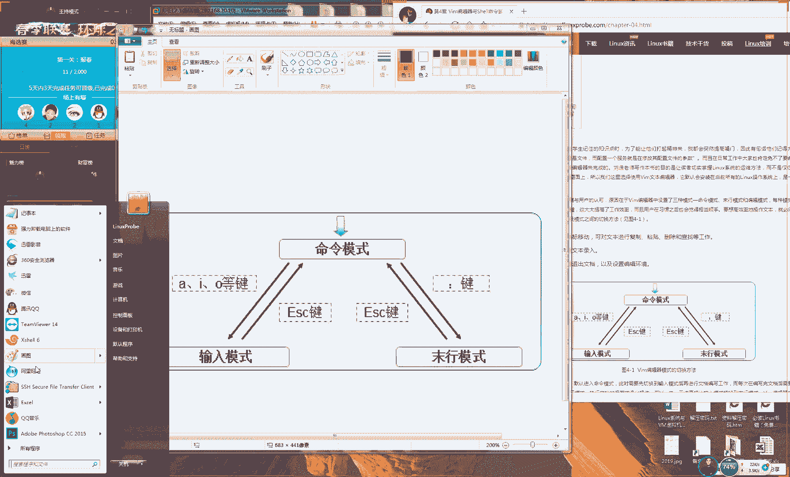

# 【RHCE】红帽认证工程师培训课程 - P5：第五节课 - 天木轮回 - BV14E411678v

🎼最よ。🎼I leave tonight I。

What this is， but the joy feels right reading new it so far。🎼该 my question现的。啊，好，那我们现在准备开始上课。

同学们现在是7点02分，但是现在只有114位同学。呃，这跟我们预期比较这个差了很多啊，所以我们再等一分钟好不好？好，大家先等一下，好吧，先等一分钟，等我们人数上到150左右的时候，然后我们开始讲。😊。

我们呃我们最多等一分钟，好吧，然后我去群里面去叫一下他们。😊，🎼掉呀飞。🎼我的酒。🎼未在。🎼自己。🎼The body做出法。

Think you can roll my world in just your hands。 He's only the edge of a burning in Rome and a slow day。

🎼这救。🎼，🎼です。🎼I just feel try be a new answer。🎼发现。OK那我们等一分钟，现在人数上的差不多了吧，现在130位同学，那我准备开始上课了。那我们打一下一吧啊。

大家如果听到我说话声音的话，大家先打一下一，我们准备开始我们的这个课程了。是这样，大家因为我们这个课程是比较浓缩的，所以大家我们上课之前请务必不要迟到。因为我上课之后可能会影响到您的这个学习的进度。好。

那我们说一下我们的第三小的35，我们来讲一下我变量。那我们讲这个之前我们要先给大家聊一下，就是我们在这个系统当中去敲了一条命令，它这个后台它发生了什么样的事项。

那咱比如说当我我在我的这个系统里面去敲命令。比说敲一下命令这个时候会显示出来我们系统的一些相关的信息。那么这个底层是怎么样去实现的呢？其实他说有4个步骤来去实现出来的送了我一个送一个凉皮是吗？好。

然后的话那我们现在。😊。

好相比相比之下，我比较喜欢吃手抓饼啊，这送了我个凉皮吗？好了，大家不要刷礼物啊，刷礼物没有用，真的没有用。好了，因为我平时长因为长得丑嘛，平时没有什可直播的这个才艺好那我们来真的没什么才艺啊。

大家不要费钱回头请我吃一个凉皮不好了吗？那我们先来说一下我们敲完命令之后，们在系统的后台它发生什么的事情？这个机制这个机理，我们想把它搞明白但我们虽然说学习这个可能对于我们的具体敲某一个命令啊。

没有太大的这个帮助啊，那我可能还不如去那么我们可能还不如背几个命令的但你把它给学完了之后啊，对于你对这个系统的一个整体的一个运行的一个底层的一些机制会一定了解。

那你就知道我们敲会说之后那我们这个系统它是怎么样处理我们用户输的这个请求的这个是比较高级的一种种的方式，者说这是这是好方式了解我们这个系统的底层的章节好，那我。😊。

说一下我们第一种情况，就是当你去去敲命令的时候，那你呃那么你是直接去敲到我们的这个路径，加上命令的名称。咱比如说你直接就去给他敲了一个病里面的的一个的一个呃病里面的呃up top吧，这么一个命令。

再比如说啊这个命令是无所谓的，就是当你去敲这个命令的时候啊，那么你是加上这个路径的形式，直接去敲的。那么好了，最后。😊，啊，那么最后那么你就呃。可以直接来去运行我们这个程序。

而不会进行太多这个系统的索引。那好，大家记一下。第一个方式就是我们以路径的方式加上文件的名称来去执行某个命令，们路径加上命令的名称，那么就会去直接执行某个命令了命令名称而不会再进行系统的一些搜索。

就是我们待会去去所说到的一些步骤省略掉，这是我们的路径的方式，大家可以记一下啊，然后说画面没有昨天清洗，这应该是心理作用，因为咱们的环境从来不改变啊，也都从来不改变。好，然后我们的第二点的话呢。

就是我们判断用户输入的它是否是一个别名，那它是否是一个别名，咱比如说我现在可以定一个用户的那么那咱比如说那我现在去敲一个很长串的一个命令。咱比如说什么长呢？我们叫做PX你看这个比较长，这个也不长吧？

那们再更长一点的咱比如说我们现在想要去重启我的网卡，那么好大家看一下，大家现在不用记，大家不用，就看。😊，命令怎么去敲就好了。当我敲完回之之后，大家看到这个命令它就的这个作用就是用来去重启我的网卡的。

但是你看一下是不是很长也不好记。这个时候我们就可以去做一个叫alas这么一个别名。哎啊，这个应该叫做呃。😊，应该叫as对这个单词应该没有念错。好，那我们就可以定一个别名。咱比如说那我给大家定一个别名。

我们叫什么呢？我们叫做呃有有一个同学叫做小李，是不是那我们叫做这个呃李吧。那好吧，那我们可以随便取个名，但是取消李的话可能看起来不是那可能不是很直观。那比如说我们给他叫做PP吧。好吧，那我们定一个命令。

我们叫做PP好，然后我们等于什么呢？然后我们把这个命令给他粘贴进去。这样的话下午就是当我们呃当我们再来去执行这个命令PP的时候，就相当于去执行了我们后边长串的这个命令了。大家看到啊这个的话就是我们。😊。

哦，声音有点稳定是吧？没有忽大忽小啊，行啊，我把看成了说我们声音忽大忽小了。那么那啊大家可以先看一下，我那我们先定义那个别名。这样的话这个效果的话呢，就是当我们用户再来去执行这个PP的时候。

就相当于会去重启了我们的网卡。所以说我们当我们再去敲这个PP的时候，你可以看到它就是在重启了我们的网卡，这个叫做命令的别名。那个目的啊就是说。😊。

我们给一个命令来去设置一个简单呃呃简标比较简单点的别名这样。好来去重复来去执行。但我没有看过一个电视剧是一个美剧啊，叫做呃权力的游戏。

大家看过可以打一下一叫做权利的游戏别名不是一直生效的那我们需要去修改ETC目录里面的文件。这个咱们会在红CS像辅导视频里面会大家讲到的好，大家没有看过是吧？也有人看过有会没看过好了，是这样的啊。

就是那个权力的游戏里面第一次你们记得吗？那个龙母和这个呃么就是这个男主人工叫什么我忘记了。😊，就是他们两个呃就是那个呃龙母，然后跟这个北境之王，他们见面的时候。

是不是那个龙母他有一个很长串的一个title，就是你一个咱咱比如说什么不分者么龙龙的母亲，什么锁链打碎者什么的。

他是有一个很常串这么一串这么一个一个名称的一个前缀是是说非常的绕嘴这个时候我们就给他取一个别名那那那我们这个时候给他取一个别名叫龙母这样话我们再去说龙母的时候，那我们都知道就是他在他去指某一个人，对不？

作为一个别名好了，咱比如说要说的有点，对？大家没有看这个没有过这个美剧比如说我比如说介绍我的时候会去说有一个一个老师他叫且他长好看好那很常串这么一个描述。

可能会很麻烦这个时候们就可以取一个叫老刘这么一个代称好了，所以你看到就是说我们现。😊，定一个别名，别名也可以直来去直接来去执行。那好了，就是当我们用户判断它的这个输入它是否是一个别名。如果是的话。

那么他就会从系统里面去搜索这个别名，它指代的是谁，然后去找到具体的那个命令。这是啊我呃这个是我们第二个去搜索这么一个呃步骤。第啊，接下来我们的第三个就是一个叫做内部外部的叫做内部命令。

当我们如果说命令它不属于第一条和第二条的话，那么它有可能属于第三条叫做内部命令。那我们之前讲过的话呢。😊，啊，那我们啊那我们之前讲过在我们这个系统里面的ba解释器，它现在就是一个呃翻译官。

他将我们用户的这个指令，然后我们给它转换成计算机能够听得懂的这个指令，对吧？将我们用户的这么一个需要，或者说用户的这么一个命令给他转换成计算机的一个指令。

再将计算机的这个处理之后的结果转换成人能够读得懂的这种语言。那好了，这就是一个翻译官的这么一个角色。那我们这道那你想一想，那我们在收当中，你翻译官你也是个人，对吧？他会有一些自己的一些功能。

再比如说那我们请了一个英语的一个谈判专家，我们帮我们去谈判去做一个商业的一个伙伴的一个呃谈判会。那么这个时候啊，如果说对方问了一些我们一些商业性的一些问题，当然肯定是由我来回答，对吧？

但是如果说对方问到说您吃饭了吗？这个时候这个翻译官他就不用再向我去来去征求我的这么一个翻译内容了，那么他就可以直接来去回复。这就是说这个属于叫做内部命令，或者说我们叫做内置命令，它指的是由我。😊。

解释器它就已经有的一些功能。那这个是有解释器，它已经有的功能。但这个功能非常的少，占我们总共总共也就占在1%左右，甚至不到不到的那这功能非常的少，可能也就啊非常的少。这个我们可以忽略不记。

但是它也属于我们的第三种，我们可以我们可能的情况。还有我们的第四种就是我们当我们敲命令的时候，的大部分情况下，我们来说99%啊，当我们敲命了之后，我们的99%，其实来说我们都是执行的叫做外部命令。

大家先记一句话记到你这个书上面叫做linux里面的一切都是文件，大家先记到你这个书上面。😊，我们的linux统里面的一切都是文件，包括说我们的命令，包括说我们的文件，对吧？我们的文件本身。

包括说我我们的这个设备，我们的鼠标键盘，我们的光盘，我们的这个硬盘全部会被映射成文件，保存到我们系统里面。所以大家记一句话，我们叫做linux系统中系统中的一切都是文件啊我刚才讲课。

我们有看到说定义老流程高富帅啊。好了，所以看大家看到了这个啊，大家说大家大家都写说都写说真话啊高富帅，高也不高帅也不帅啊，富也不富算了吧啊，回头大家可以再想一个其他的。那好，大家先记一下这句话啊。

我们叫做linux系统中的一切都是文件。😊，哎呀，高是没办法了，帅也没有办法了，对吧？富还要靠自己。😊，富还是有富还是有可能的啊，毕竟现在还年轻嘛，刚刚18岁啊。好，那我们现来看一下啊。

记到大家书上记大家记到大家书上啊。好，大家赶紧记笔记啊。我说这些废话的原因就是让大家去记笔记，你们怎么怎么再聊天对我们毕竟18岁嘛。等我高中毕业之后。

明年吧等我高中毕业之后我看看怎么能去怎么样能创个业嘛，或者去找个工作，毕竟刚刚18岁前途还是有的大家记了吧？那我们先给大家解释一下，说什么叫做外部命令，那我们这个话叫做外部命令。

它指的就是我们所有的命令他们都叫做命令文件，大家记一下。那么接下来那么就叫做命令，就是命令文件，他都是由一个一个的文件来去代表的一个一个的命令的那所以说当我们用户去敲一个命令的时候。

实际上就是在我们大家听一下啊，大家自己听那我们当去敲一个命令的时候，所以说也就是在我们系统里面去找到这个命令所对应的一个路径，或者说一个一。😊，个具体的一个位置，然后去执行那个文件。好，大家没有听明白。

对不对？再给大家去说一遍。😊，所以说当我们去敲一个命令的本质是什么呢？大部分的情况下，99%实际上它都是。😊，让用户去输入一个命令的名称。哎，让用户去输入一个命令的名称，然后在我们系统里面进行搜索。

搜索到这个命令所对应的文件，然后去执行对应的这么一个文件内容。这就是我们命令的一个本质。好，那我们现在想一个问题，如果说大家想一个问题啊大家这就明白了是吧？大家想一个问题啊，当我们去执行一个命令的时候。

当我们去执行任何的命令的话，如果它都是进行一个全盘搜索的话，是不是很没有效率。大家想下这个问题，当我们去敲一个命令的时候，他每一次都要进行一个全盘的一个搜索这个第来说肯定是不现实的，太low了。

这个太了这个东西。第二就会是说效率会极低的当你每次执行一条命令的时候，你都要至少等一分钟以上这样的话肯定是那么这样的话肯定就不能够满足我们整到这个工作需要。当我我们这个时候就有一个变量。

我们叫做pass好了，那我们现在可以去使用的来去输出这个pass变量，它所。😊，定里面的值。这个时候到我们菜下回车就可以看到我们半啊，那我们可以看到我们这个pas变量的一个值。

这个值的内容我们可以先不去看，但是也可以看出来，我们这个值里面还是由冒号去间隔了一个一个的内容打开啊，大家看一下。😊，啊，在我们这个派他们话在我们这个pa量里面，它是由冒号去间隔了一个一个的目录。

那这个就是我们一个一个的字段嘛。大家可以看到啊，间隔了我们一个一个的字段，这就是我们pa件来说，它就是定义了在我们系统里面哪几个目录可能会保存有我们的系统的命令文件，然后他会给我们定义几个寻找路径。

再比如说我想要出门了，那那我现在可能出门要去我们出门要穿袜子对不对？好了，那我去寻找我的袜子这个文件的时候，那我们就要去找一下。比如说打衣柜再比如说我我我的抽屉，但是我绝对不会去找厨房，对吧？

那我肯定也不会去找搜所。那么也就是说我们要现在去预先定义几个命呃寻找命令的位置。然后这个时候我们可以去提高系统去搜索它的这么一个效率，这就是我们的一个搜索命令的一个方法。后说相同的命令呢？

一般来说相同的命令，它会以这个搜索到的这个顺序为准。但是一般来讲命令冲突的话，他会给你报错。😊，啊，好，然后来继续说的话就是tminal终端怎么去放大？放大的话是点住ctrol，然后点住shift。

然后点一下加号就是放大，然后按住shift，不不，然后然后是按住ctrol一个减号代表是缩小。那可以调整你这个呃界面的这么一个大小。好，那我们现在可以看一下，就是这几个目录里面的话呢。

大部分来讲它都是由B。😊。

啊，透结尾的它里面一面来说它都会有一个辩目录。这个话实际上就是我们定义的系统当中，我们的这个。😊，呃我呃我呃我们的这个命令所存放的这么一个目录。但是具体解释来讲，它还是有两个区别的。

那比如说第一个区别就是这个B目录跟SB目录，那它会有两个这样的一个名称。第二个就是在我们系统的这个用户自己的这么一个加目录里面，它也会有一个B目录。有我们这个公用的这么一个程序目录。好。

这个我们先不用去管家大家先知道就好。因为这个我们第六章节的时候大家去讲到，到底我们什么是B目录，然后以及每一个目录它所定应的这么一个含义。好，那我们先记一下，就是pas变量。这个变量的话呢。

实际上就是定义了我们系统去查找我们命令所存放的这么一个路径，它的本质就是这样的那并且的话呢我们这个变量，它是。😊。

可以去修改的，所以说它是一个变量的值，它相当于就是我们解释器的一个小助手。大家记一下这个相当于是我们的释器的一个小助手。

或者说是一个系统的一个小助手它我命令文路径我工作效率个间歌任何何含义间制缩直文缩写一个问题的但是我第六章大家讲我看到有一个变量做实用？系效率程序命令所存放一个路径给大家下它是个变量进行一修改那我怎修改？

😊。

现在这样去做呃来定义pa呃呃呃pa变量定义它自己。然后我们来去提取出来pa变量它自己的这么一个名称，然后呃然后我们后面加上这么一个路径就可以了。咱比如说我去加上一个叫做哈哈的一个目这么一个目录。

这样就可以了。好，那我们把它给取消掉，我给大家举一个比较简单一点的例子。那我们比如说我们要去进入一个目录，叫做home目录里面再看一下。

我们进入到我们进入到ho目录里面的lin目录里面的里面的就进到这个目录吧。大家可以看一下这个目录特别的长，是不是那好了，这个时候我们就可以定义一个变量，我们变量名称，我们好比说我们叫做海子同学，对不对？

那我们叫做小海，那好，那我们先定一个目录，我们叫小海这个时候。😊，我们定义小海等于ho目录里面的lin这么一个子目录的一个名称。然后这样我们做完了之后，我们可以去使用到来去输出小海变量的信息。好。

那我们呃从来没有说过我们的变量只能够进行查看，对不？只能够使用去查看里内容其实并不是我可以去使用到然后加上我们的变量，但一定要这个号去提取，后我们来去输入这个变量的信息。

这个时我们就可以去切换到我们对应的这一个目录了。好，我我们退到另外一个目录里面好吧，那我们退到另外一个目录里面了。然后我们现再去使用到切换到我们对应这一个目录。虽然说这个目录打的并。

但是大家可以去做实验可以取一100个套目录样话果更直？这样话就是说我以一个变量，后让我用户可以随去切换这个来讲是特别的方便的。那么既来说这个东西这么好，那我们能不能给其他人。😊，也去使用呢其实是可以的。

但是我们在给家人去分享的时候，我们需要使用一个命令。我们前和大家提到的啊叫做呃叫做export这么一个命令。它是将我们的这个变量从我们自己去使用的一个私有变量给它提升到一个叫做全局变量的这么一个位置。

然后于是我们加上小海来去给大提升到一个全局变量的一个位置。我们再来去使用到速命令，它代表示切换用户的意思。这个时候不要加上减号。那然后我们具体的原因会在第五章的最后一个小节会大家去讲到说原因是什么？

那我们可以去直接去切换。再比如说我直接去切换到一个用户叫做lin。😊，这么一个用户。好，然后我现在这个用户他当前是在我们的啊，他当前已经是在这个目录内，对吧？好吧，那我们现在就换到另外一个目录里面。好。

那我们现在可以去使用到这个。😊，小海的这么一个变量来进行一个切换。这个时候你可以看到我们每个人都都可以来去使用到这个变量里面的信息，然后可以去实现一个简化我们工作这么一个效果。好了。

提升成全局变量的命令是哪个哪个同学能解释一下，能告诉他我们提升成全局变量的这个命令是什么好变量怎么样去取消变量不需要去取消我们现在没有编辑文件啊以说我们只要一重启或关闭我们终端就会取消掉了如果您编辑文件的话。

只要删除到文件里面内容就可以了。具体的文件的名称是在ETC目录里面啊，它是在ETC目录里面的文件可以去修改这个就可以了写到这个文件的最下面，但是这个咱先不说这个到最下面但这个咱不这个咱先不说。

因为咱们还没有学习编辑器马上就要去学习到它。然后咱们会在咱们以后给大家讲到的啊，变量的话我们约定俗成是要大写的啊，是要大写的啊，这个词叫export。😊，OK好，那我们现下来呃往后面去说。

那么给大家讲的一个变量，我们叫做pass。其实给大家举一反三了。就是我们在系统当中它会有很多很多的变量。然后的话呢他可以大家去呃满足我们这个呃每个用户自己一个需要。再比如说我们都有这个支付宝，对不对？

还要都有微信。那好，那啊啊大家现在可以打开你的手机，然后进入到你的这个支付宝的这么一个软件里面。然后你看一下你的余额，你发到咱们的屏幕上面，那也可以看到，其实每位同学的这个金额很都是不一样的嗯。😊。

好，大家看到了吗？呃0。01这个不可这个也不可能吧，大肯定都大家肯定都是有点存款的。来就是说你可以打开你的支付宝，然后你去看一下你的一个余额。

反正你看到那个余额肯定是跟其他人是不一样的那然后起码说你跟马云肯定是不一样，对不对？但是为什么我们所有人都是打开了这个支付宝的软件。但是我们最后看到这个结果是不一样的？这个不科学，对吧？

那我们都是同那我们都是从网络上去下载那么一个软件，凭什么你支付宝里就就有看同学打多打到一个一打到30多个零，那为什么他就有这么多钱。但是我就怎么就钱都那么少只有个位数呢。

这个原因就是它里面会有内置的变量。当我们检测到登录用户的不同的时候，那么最后出来的那个结果肯定也是不一样，对不对？咱比如说你登录账户之后之后你的这个用户名称啊什么的，那么肯定是都是不一样的。好。

这是比较浅显的一个这么一个使用的一个场景。😊，不多说了。好，就是说我们一个它非常的实用。还有一些变量比较实用的，我今给大家讲去说一下就好了。

有一个变量叫做home这个变量指的是是我们用呃它指的是每个当前登录用户它的这个加目录是什么然这个指的是我们当前登录用户这个使用的这个终端是什么默认都是还一个叫做指的是们当前登录用户的这个游戏邮件保存位置的是什么表示邮件保存的位置还有个它指的是我们当前的这个系统的一个语系的大家可以记一下这个然后大家个小圈就是我们以后工作时肯定是要进行一个远程的一个控制吧？

比如说我在北京那我想控制一下上海的服务器那我肯定就要去使用到远程控制件。那我不可能说每一次都要坐飞机去家大家去我进个远程的一个控制，这个们今后以后去讲到。😊，那么当我们去远程控制一台服务器的时候。

但是出现乱码这样的情况呢，一般来讲，它就是你的这个终端与你的这个系统的语系是不匹配的。它会有这个乱码的情况。所以说我们就要去修改这个变量，大家可以来记一下啊。

我们接下来当我们今后我们的系统出现乱码的情况，那我们就要去修改这个变量里面的值。好，下面一个又叫做RANDOM代表就是一个随机的一个数字了。这个我们如果今天来得及的话。

我们今天就会给大家去玩一下这个变量，你来看一下它具体有什么样的一个效果，它就是来去随机生成出来一个数字的一个意思。😊，还有一个叫PSE，它就是我们命令的一个提示符，它默认呃的这个提示符。

就是这么一大长串。好，这个我们可以自定义啊。这个但是呃用处不大。好了，这就是我们比较常用的几个变量了。给大家总结一下那么也那么也就是他啊也就是在告诉你在我们系统里面他会有很多变量，他会来一区啊。

他会来去为我们这个用户去提供呃，每个人独立的个性的这么一个工作的一个环境。好了，说什么样说学习所有快乐。那然后说LANG这个的单词的缩写应该叫做language你看我这个英语还可以，对不对啊。😊。

但是不知道打的对不对啊，哎，不是language LANUAGE呃，具体是在呃LANG有OOK啊。😊，对吧我因为我毕竟也是有功底的，是但我可能是很长时间不学了啊，这个是这个语言一个呃单词的一个缩写。

然后给它缩写成LANG它指的是你系统语系的一个意思嗯。😊，好，那接下来的话呢我们就要给大家来进往后去说了。这个呃主要就是给我们昨天去收个尾。然后我们这个本期的课程的话呢，确实进度拖的也比较慢了啊。

其实我们每一期要至少讲到4。1小节的。好，那我们今天呢我我我们的目标啊，我们要给大家讲到呃第四章节。然后我们这个预计的话呢会给大家讲到4。3小节，最起码最起码我们会给大家讲到4。3。1小节，好吧。

大家的话提前做好准备。那OOK啊大家提前做好准备。😊，好了，那我们来继续往后面继续说。😊，那我们刚刚给大家提到一句话，大家没有呃大家不知道有没有写呃，写到这个书上啊。就是呃我们这个系统里面的话呢。

我们的linux系统当中如果没有写下去写一下我们的linux系统中的一切都是文件。大家如果没有去写的话，大家可以去写这个书上面啊去记一下它。然后你去感受一下。在我们今后去当中你去感受一下这句话啊。

如果说家里允许的话，你可以去纹身把然后把这句话纹到你的身上面。因为马克思说过嘛，没有说的说一切真理啊都要用到实践来去验证，对不对？那这句话他其实就是一句真理了。因为在我们系统当中他的一切都是文件。

当你去感受它。当我们第六章的时候，那么这个时候你就知道连我我们的这个设备，连我们的鼠标键盘硬盘光盘，他都会被映射成光他都会被映射成文件保存在我我们这个系统里面。

所以说你可以记下来这句话比你爱比你爱女朋友可能都要是一句真理啊，好，我们来往下去说。😊，说老师给我们看一下你的纹身啊，我没有纹身。好，然后接续来说为什么我们去输入的是ic，这个是变量。

它调取的是里面的变量啊，咱比如说我们可以这样去做叫PIC比如说啊你看我给来玩一个，比如说我给它打成一个星号，OK马上就变成了一个井号，就是我们这个默认啊，它是一个变量啊，然后我们然最后我们就。😊。

呃，每个人登录的时候，用户的名称啊，还有我们这个当前所在目录的那么他那么他他们呃都是会发生变化的。好了，这个我们就放下来这个比较简单啊，就这个变量的一个使用方法。

然后就是告诉大家在我们系统里面会有很多的变量，才来为我们用户一直在去提供服务的。下面给大家去说一下我们这个4。1小节给大家讲一下我们这个文本编辑器啊，这个的话就是说当我们想要去配置一个服务的话。

那么也就是说也就是实际上就是在修改我们这个服务所对应的配置文件啊。好再给大家捋一下这个思路啊。😊。

第一句话，我们系统当中的一切都是文件，他们一切都是文件。所以说当我们要去修改一个呃，那我们当要去配置一个服务的时候，那么实际上它的这个本质上，它就是在修改这个服务所对应的怎么样。

大家说出来一起来123那配置文件。对那好，那我们要是说呃只会去看这个文件。但不去改，那么也是对于我们以后的工作会受到影响的？

这个时候我们就给大家讲一下一个编译器叫做VIM那我们为什么要去学习这个编译器啊，为什么要那我们为呃我们为什么要去呃单独去指定去学习VIM是不是老刘收到钱了，是不是给他们做广告。

是这样的给大家讲一下这个编译器的好处的话呢，它第一点就是说它这个使用很广泛，它这个使用的很广泛。我们说一个可能会被吐槽的一个呃就是我们。😊，对，就是我们现在广告法不上说的一句话，就是绝大多数绝大。😊。

多数的linux系统中。都默认使用啊，就是说这个会比解释器更加通用。我们的绝大多数的这个呃系统的服务器里面，再比如说9099吧，99999逼你去买一个呃，那可能去买呃比你去买一个金子的那个含量都要高。

999%，他们里面默认都会有这个VM它具有的这个呃。😊，通用性啊通用啊，这样的话呢，当我们学习好它之后，当您再接受一台陌生的一台服务器的时候，马上我们就可以上手。这个具有一个通用性，或者说叫通吃嘛。

当我们学完之后可以通吃一切当前的这个常见的这的这个环境。第二点的话呢，就是它真的是很好用，真的好用。啊。😊，啊，它的话它它是呃它是相对于来说真的是比较好用，所以我们才会去使用到它。

但是具体啊但是我们具体它它它是怎么样去好用。这个我们先不说大家以后去感受就好了。那大家感受一下它是怎么样的一个好处。好。

那我们现再给大家去说一下我这个编器其实来说它是有三个模式的我们这个三个模式进行一个学习来说话当我们默认进入到这个中呃，我们这个编辑器里面的话呢，我看一下，还有时候是V吧？

其实来说我们我们认为啊VIM它跟VI是就它它可以称为是同一款软件的。好给大家讲一下，因为大提到了我们这个跟M的一个区别。来说的话编辑器也是一个非常常用的这么一个软件。

其实我认他们们就是属于一个一个叫VI编辑器这个编器的话是我们之前一直在去使用的一。😊。

编器这个呃我现在我也再去使用了啊，叫做这个VR。然后的话它后来有一个叫VM的一个版本。这个IM的话呢，其实呃实际上它是一个单词的一个它一个缩写应该叫做imp。但是这个单词我估计我会打错。

不知道不知道有没有打对这个实际上是叫这么一个单词，后给它缩写到这边它也就是说我是VI编器的一个缩写，那就是说我是一个对我是VM我是V编器的一个提升版本呢？那我们来说一下说提升的版本，它有什么样的一个好。

对不？你既然是一个升级版本，就相于说你出了一个iphone，那肯定说我比iphone8哪里不？那你的优势是什么呢？其实大家提到我们不要因为我们说我们防忽悠，对不对。😊，你不要看现互联网上面这么多的忽悠。

因为你想一下你去下载任何一个软件，它都会在它那个官网上面最明显的地方去写来它这个文件，或者说这个软件哪里好哪里好，但是每个软他们都说自己是最好这个软件，那么你就要防忽悠了。

那么你他这个底层它到底怎么样的一个好处。那我们来想一下这个两个软件的这个作用的话呢，实际上他就是用来让用户去编辑文件呢？那好了，你就是个文本编辑器，但你给我提什么效率啊？

大家想这个话可能会比较扎可能比较扎心啊，大家这个观点有点区别。那你想这个你是一个文本编辑器，你怎么会有效率可言，就相当于就是我们的windows你的这个记事本，你跟我那你跟我谈效率，这个不服了。

因为我因为这个编辑器只是一个写字的一个工具，我的这个编辑器跟金庸写小说那个编辑器那其实是一样的。为什么你这个编辑器就是一个提升版本呢？比如说。😊，我们妈妈都要缝针啊，那可能都要去呃。

那么可能说都要去缝衣服，对不对？那你那你再比如说那你去买一根针，你看你跟我说这根针的效率特别高，我不信，因为这个针是但也它就是由手去动的。你这个呃缝东西的那个速度，是由你的手跟你的脑去控制的。

这个也是我们编辑器编辑器跟我弹效率，这不是由我脑速跟我的手去自觉来呃然后来呃然后来去控制，对不对？你看我手打的有多快，在我们这个屏幕上面它就会有出现多快的这个字，所以来讲我们的编辑器的。😊。

提升它一定不是提升到效率方面的那可能其他的这个软件都会什么优化性能啊，对不对？提高稳定性什么的。但编译器的这个提升它不是提升在这两个地方，而是在什么地方呢？大家想一下，而是在什么地方啊，大家不要刷底。

我真的没有啊，真真的不跟大家客气啊，因为平时这个也真的不会看它的。然后大家送过好多凉皮，是不是好，然后我们来继续给大家去说啊高效刚刚说完它不可能是高效，这个编译器这个编译器它没有效率可言。这个我你看啊。

你去写因为你去写字，你跟金庸去打字肯定是一样的速度的，可能甚至来说。😊，金庸手写，你用打字可能还不会他写的快呀，对不对？这个是由脑速跟手速去决定的。实际上我们的VM的一个最大的一个提升是什么呢？

呃是更好用。你这有点虚，这太虚了。如果我那我给大家讲课，然后我说啊啊大家可以啊啊那我们来记一下啊，我们这个新版本VM的比VI编辑的好处是好用啊，你看多多许助骗钱的嘛，是不是来大家再想一下。

到底我们这个VM比你V你好在哪里呢？啊，我看一下啊。😊，对啊，你这这你不能说好用，它这个主要的一个特点啊，好的这个提升就是着色这个没有大啊，大家没有打出来啊，等了这么长时间，就是这个着色功能。

大家看一下，对这个着色功能。当你去编辑一个文件的时候，你去使用到VI大家看一下，大家看一下啊，那我去使用到VI去打开一个文件的时候，它就是一般的文件，白点黑字，你看一下。

这就是我们的使用VI编译器去打开的一个效果。看明白没有？好了，走你啊，我们现在再来使用VM去打开一个文件。😊，大家看出来了，它有一个着色功能。它什么好处就是当你把一个代码不小心给写错的情况下。

马上他就会给你提示出来。你的这个单词你写错了，然后会给你一个呃没有呃他会呃他会没有一个颜色的一个标识，这就是一个进行一个着色。但去写一个配置文件的时候，他就可以去帮助你去修正你的这个拼写的错误。

这个就是我们一个很大一个提升，所以我给大家总结一下，如果大家说这个好处我也不需要，因为我是个高手嘛，我可能不会打错，对吧？那我接大家说一下啊，第一点就是如果说我们今后去写一个小说的话啊。

如果说我们呃什么偷偷把亚源搭建好了，这个呃对对，然后来去说一下啊，当我们呃如果说想要去写一篇小说的话，那你小说肯定是没有什么关键词，你去金庸的那你去金庸的小说里面，你去。😊，呃。

找里面这个所有的这个字啊，它不可能出现一两条的命令的。这个因为它是呃因为它是一个小说的一个题材。所以说当我们去写的是一篇小说或者是一篇纯文字的话呢，那我们就去建议使用到VI。

他们有一个着色给我们去扰乱我们这个视线。如果说我们再去使用VM的时候，它对应的就是我们的配置文件。我们要去使用到VM来去修改我们的配置文件，特别的合适。哎，好了。😊，这样的话呢我们来给大家去说一下。

当我们进入到这个VM或者VI之后啊，就这两编辑器的这个使用起来是是一模一样的。好，大家不用担心说哎老师我学完了这个之后，我VI不会用，你放心命令里这个操作服啊每个按键都是一模一样的。

它只是一个着色的一个变化。好，所以说要防忽悠就是防止别人忽悠你说什么VI怎么么怎么好好，反正我之前我上维说完会让大家笑话啊，就是我之前我上什么，正我第一个手机我第二个手机你们可以去搜一下叫LG我然。

但我居然买LG的手机。😊，LG不是出空调的，反正我之前我买过1个LD的手机，很小的，可能上初中或高中。😊，哦，我忘记了，那会儿还没有什么电商什么的，就是我那会儿买1个L呃买了1个LG的一个手机。

型号是C550。但是我记得但是我记得很深刻啊，然后有两个这个手机，当然我去苏宁买的，苏宁那会儿也是大也是个也反正也是可能不是很正规啊，也可能也是个呃这种很不正规的这种一个一个门店。😊。

然后他当时有两个版本，第一个版本是好像记得好比如说是3000块钱好吧，所说为什么是3000块钱呢？是因为他那个版本嘛是咱比如说是安卓3点1点1对吧？后他的另外一个版本是3200块钱多20钱是为什么呢？

为这个他的这个系统这版本是32比他一个版本后来当时也是傻也是居然买320块钱后来我才知道那个软件不升级的。以说这也上当啊，所以说我们一定要防忽悠我们要防忽悠当有人再跟你说这个新版本怎么怎么好的时候。

你不要信他了以后你就自己要去分析它这个底层它到底哪儿好，对吧？好了，我们来继续说也交过智商税的我接下给大家说当我们进入到这个VB器之，我第一眼所看到的实际上叫做命令模式大家记一下命令模式的作用是什么？

大家观看我拿起你的个笔。😊，找到一张图片是4-1的图片，旁边的命令模式的这边就在这边啊去写几个字啊，去写几个字。命令模式作用的话呢主要是对于我们的这个文件进行复制啊。

它这个啊它可以对于我们这个文件进行复制啊，就是叫做这个复制某一行嘛，还有这个粘贴啊，剪切删除啊，以及作为输入模式跟默行模式的一个切换的一个桥梁。大家看一下我那我们这张图。

从我们的这个命令模式可以直接切换到我们这个输入模式，然后它们两个是相通的。然后它可以去切换到我们的这个墨行模式，但是输入模式跟默行模式之间有没有一条线啊，它没有。好，所以来讲。😊。

我们是呃在这个命令模式，实际上是作为其他两呃个模式的一个切换的一个桥梁。那好，那我们都呃需要先访问到这个。😊，呃，命令模式下，然后才可以进行一个切换。大家记一下我们命令模式的一个作用。呃。

对于我们的文件内容的一种复制粘贴剪切删除以及两个呃呃输入模式跟木行模式的一个切换的一个桥梁，这就是我们命令模式的一个作用。然后当我们要想进入到这个输入模式的话呢。

那我们就要去敲一下这个A这个键或者I这个键或者O这个键啊，来记一下同学们啊，A或I或O好了，这三个键的话呢，实际上我们会有区别。但是我们先不给大家提，但是我们要去实操的时候，给大家去讲。

就是说我们这个三个键去任选其就可以，然后就可以进入到输入模式了，输入模式也好，叫做插入模式也好，叫做编辑模式也好，这三个模式的意思都是一样的。因为可能翻译起来。

台湾人翻译跟新加坡人翻译跟咱们中国大陆叫法是不一样的。但是这个的单词的呃意思就是输入模式或者插入模式或者叫做编辑模式。这个三个你喜欢哪个都可以，就是我们可以对于我们的文件内容进行一个编辑了。大家记。😊。

这个模式下，我们就是可以对于文件内容进行一个随意的一个编辑，这是我们输入模式的一个作用。好，它有我们最后这个墨行模式，墨行模式实际上它是有呃几个功能的。第一来讲就是。😊，啊，对，呃。

那我们要想进入到这个默号模式的话呢，我那我们需要先去敲一下这个呃ENC这个键，然后我们返回到我们的这个命令模式，然后敲一下这个冒号就可以进入到我们的默号模式了。大家记一下。

先敲ENC键那EIC键进入到我们的命令呃那个模式，然后我们去敲一下冒号来进入到这个冒号啊，然后来进入到这个默号模式。这个冒号模式的作用，大家记一下，它用来去保存退出啊跟。😊，啊，就可以了。

就保他就呃他就来进行这个保存退出跟设置我们编辑环境的这个作用。好，大家记一下，保存退出。然后我们设置编辑环境。好，这三个模式我给大家讲明白了哈，然后大家先去记一下这个三个模式的作用，待会儿就要实操了。

😊，好了，那我们来继续给大家去说，感觉VI会好点个人习惯呃，反正我个人喜欢去喜欢使用VM，因为我脑子比较笨嘛，所以说我老怕自己打错字，而且就比较手残。所以我反正我比使用VM，他可以去提醒我们哪里写错了。

这个不是强制的以大家去编辑文件的时候，您可以自己去选择。当我们给大家演示一下。这样的话呢可以选择一个自己最适合的。好吧，是这样的啊，因为我们今天这个实验会非常的简单啊，但是如果说你们有过预习的话呢。

可能会更起来会比较吃力了。好吧，现在我们将给大家去来去演示一下我们编辑器的一个使用方法，我会给大家完整的去做4个实验。然后我我会把我现在开始我去敲到每一个按键，我都会说出来好吧。

大家可以来去记到你这个书上面，或者我们三课之后以看我们这个视频来去一起去操作。现在开始我就要去敲我然后我就会去说出来我所敲所有的字符好，那我们现在随便去打开一个文件好了。来去打开一下我们。😊。

在目录下的某一个文件，我们去使用到VM编译器来去编辑它。我们来去呃那么啊那我来去编辑它。当我们啊进入到一个文件的时候，那么请问我们默认情况下。😊，我们这个是在什么模式下？请问当我们进入到一个文件之后。

我们默认是在什么模式下？😊，呃，我我们是在命令模式下，对不对？OK它是在这个命令模式下。当我那呃我们在这个命令模式下，它可以这样来去执行。然后我这边会有这个表格，大家可以看一下我们这边表格是4-1。

它里面会统计出来了，我们可以去使用的命令模式的命令。但是我就不给大家学去读了啊。第一第一来说读的话会比较浪费时间。第二来讲就是你读起来会比较的枯燥。大家也不是大家可能也是不太理解到底有什么样的一个效果。

所以我现在就开始给大家去讲了。然后我会去讲每一个这个我敲的这个字符，大家对照我们的表格来去找好吧。好，这样的话呢我们可以。😊，啊，来去同步去操作一下。因为你在岸上你呃是永远不可能去过游泳的。好。

那我们先来看一下的话呢，就是我们把我们的光标移动到某一行上面，然后我们移动到某一行上面。好了，说蜡笔小新同学提到说我们可以去输入一个DD啊，好，我们先去敲一下这个DD这个时候可以看到我们就怎么样？

我那我们就删掉了一行，大看到了没啊，没有没有没有仔细看，对不对？好再给大家玩一下啊，你看那我先去敲一下YY这个键代表是复制的意思。那我复制好去哪里呢？那我们去点一下P。😊，好。

大家看到因为我是在啊这个呃所在行上面，我们点一下YY。所以说当我们每去点一次P的时候，它都会往下面怎么样去复制出来一行。再比如说老师这没有效率我来依次去复制四行怎么办呢？

那我就那我们就将我们这个光标移动到某一行上面我敲一下4这样的话代表就是往下来复制的四行这样话只要一个地你每一次去粘贴都下粘贴四行同样的内容这就是我们复制跟粘贴的这一个效果再后去老师我觉得我粘错了那我怎把删除那我这样去来一个1就是往下去删十行。

者说你每次去敲这个你去敲一次敲一次敲一都会下面去删除一行这就是我们的剪切复制粘贴非常简单，对不？好咱比然后这个时候那我们看到说那我们。😊。

该如何去撤销呢？咱比如说我这个文件我们编辑错了，想要该去撤销怎么办呢？第一来讲，我那我们可以不用保存它了。第二来讲，我们就可以去点一下U，你每次去点一下U，它都是去撤销一次。

然后直到说这个文件变成了最新的那个版本，就是你最原先那个版本，它就会告诉你说这个已经是没有被编辑过的这么一个文件了。大家记一下U就是。😊，我们来去撤销一个文件的这么一个命令服务。大家看到。

所以说我们看这个实验学习起来会比我们读这个文档，是不是感觉更有意思一点？好，现样我们来继续给大家再去说啊，然后这个先不用着急。好吧，大家这个先不用着急说我们没有听明白啊，说太快了，这没有关系。

我们会给大家去说四个实验，然后会给大家去说四遍的啊。好，下面的话呢我们来进入到我们的这个编辑模式下，这个编辑模式，大家先看一下啊，我们有三个按键，它有这个A，它有这个I，它有这个O。

那我们先去选择一下这个A大家看一下这个的区别啊，大家先看一下它主要就是我们点的是这个啊，我们主要是点的是这个。😊，呃，光标所在的位置啊，大家看到我们先现在将我们的光标移动到这边，然后我先去点一下这个A。

好，大家看一下这个变化没有。然后我现在返回到我们的这个呃命令模式下，大家再看一下我们这个光标的位置的变化。123。😊，好，大家有没有看到再把它给撤销掉。

再看一下我们进入到我们的编辑模式下点一下A大家看到了没？那也就是说A的这个效果，实际上它就是将我们光标所在位置的话呢，它是在我们光标所在位置的后一位，然后来去输入我们文件内容。好再往后面去走。

我先敲一下这个I这个键同样进入到我们编辑模式下。那123走你你可以看到它是在我们光标所在位置当前来去插入我们文件内容可以给去进行一个输入。好，那我们再给大然后我们再给大退出退出之后。

我们点一下这个O的这个键，这个时候点一下O，它是在我们光标的下一处去来去输入我们这个内容。所以说的话呢A和I其实没有任何的区别。因为它只是在光标的前一位跟后一位来进行一个去输入。😊。

所以说只有极其无聊大学老师啊，在期末考试的时候，才会在呃，他们才会在这个试卷上面去问你说呃编辑模式里面的这个A和I这个区别是什么？因为在我们工作的时候，这两个是完全没有用处的。好吧。

就是说这两个你可以你可以顺手你敲两个都可以。反正我是比较喜欢敲A那么是为什么呢？因为A正好是在我的左手边的那个小拇指的位置，我敲B较的这个顺手。

大家话这个A和I大家随意去大家可以随意去选择这个都是可以的。好，这个时候我们是在编辑模式下，然后我们敲一下然后我们敲一下左上角的个呃左上角的一个ES键那我们现在返回到我们的命令模式下，再往后面去。

们就可以敲一下冒号进入到我们的默号模式下，大家敲一下冒号，这个时候就会在我们光标的这个屏，就在我们这个屏幕的这个左下角会出现一个闪烁的一个光标会出现一个闪烁的一个光标。😊，呃，然后是这样的啊。

因为现在大家现在这个呃问题会比较多，然后可能也不是问题啊，也是在聊天。那所以的话呢我那我今天就先暂时不看了啊大家可以大互助来去交流一下。如果说这个问题会的话呢，那互助一下，对己也是一种提高。

那么如果说您的这个题没没有被回答好的话，我下之后去说我们每节下课之后都会有这个答疑的不用担心好，那我们给大家去说一下，在我们这个默号模式下，同学们非常的可爱。跟我说这个叫默号模式。

因为是最后一行出一个光标让我们输入命令。其实这个也能够叫做什么叫冒号模式，对不对？因为它是出现因为他是敲完冒号之后出现这么一个模式，那所以说大家随意我以个我们可以把这个默模式个冒号模式。

这个时它里面有几个操作符大家记一下说是WW代表是写助的意思，代表就是保存这个文件的意思。还有这个Q代表就是退出这个文件的意思。所以说我们这个WQ代表就是保存并退出文件。但是有些。😊，他会给我们包错。

所以说呃这个时候你可以看到啊，这个他要呃然后我们来看一下这个文件，它是没有包错的。但是他有呃但是他有些时候他会他他会呃他会来提示我们说什么保存什么啊提示啊什么的，它会呃禁止我们的保存。

那我们就这样去做WQ探号代表就是强制保存并退出的意思。啊大家可以记一下我们的这个W是呃是保存写入的意思，Q是退出的意思啊，代表是啊不要啊啊。😊，他表他他代表是呃这个退呃呃退出的意思。

然后我们这个WQ代表就是保存并退出的意思。WQ探哈代表就是强制保存并退出的意思。来，我们调后驾回车。😊，这个时候你可以看一下这个文件里面的内容啊，就已经会发生了改变了。

大家可以来看到我们刚刚编辑过的这几行，就已经会出现在这个文件里面了。对，还有呃我们可以去设置我们这个啊，还有我们这个行数啊，对？这个我们先不说我们会给大家讲的那我给大家做几个实验。

这个算我们第一个实验然给大家再去做4个实验第一个实验就是来去编辑一个文件这忽略掉个太简单了，so easy我们来去修改一下我们文件的我们去修改一下我们这个主机的名称。然后我会把我们这个每一个操作。

那我都会给大家去说出来。如果说您觉得比较吃力或者跟不上的话呢，那我们可以下课之后，您去看我们当前的这个视频来去一步一步去做好吧，那我们说的稍慢一点。第来讲我使用到VM去编辑一个文件。

这个文件的路径不用去记，只要去照抄就好了然后做house name这个代表就是我们当前系统的主这个主机的名称来保存然我进入到这个文件里。😊。

里面这个文件啊，然后。😊，我就先啊那我就先不给大家提问了好了，因为大家都应该都知道了。当我们进入到一个文件之后，它默认所在的是命令模式下。所以我们现在要可以进行一个复制剪切删除。

然后还有作为两个命令的一个切换的一个桥梁。这个时候我们的第一步骤，我们需要敲一下这个滴D代表就是我们删除掉我们的光标所在行，然后我们去点一下这个A好，这个时候我们才可以来去写入我们文件的内容。

我们写入什么呢？我们主机名称，我们叫做linux然后我们这样啊写入这个文件写入一个广告，对不对？我们呃之所以我们。😊，啊，行，这个网址的原因就是加一个广告。

所以说这个我们随意啊您可以根据自己的这个情况来去调整。然后说什么老刘真帅啊，即便打拼我也能够看得出来。那然后我们现在的话呢点一下ES键返回到我们的命令模式下再往后面去走。

就是点一下冒号进入到我们的号模式点一下WQ叹号代表就是我们的保存保存并退出最后我们就可以去命令去查看到我们文件这个内容已经发生了变化。好，其实这个有什么可讲的so easy如果我们刚这么去讲的话呢。

骗钱了，对不对？这个太水了，这个培好了，们往后去走就来编辑一下我们这个网卡信息，其实我们不要去管什么网卡么仓库什么的。因为现在编辑肯定也是起不来的。

们之所以选择在这个环节给大家讲这个网卡跟仓库的这个配置文件的话呢，主要主要就是反正我们今后也要去学到它们而且反正我们。😊，现在也是要去编辑一些文件嘛，不如就先把我们今后要去学习的这个文件先去混个点熟啊。

有他有这么个印象就足够了。而不让他呃啊而呃并不让大家此时此刻就去呃学习怎么去配置网卡了，是啊OK是完全没有这个意思的。好了，这个网卡的路径不用去记，只要去照抄就好了。可以按到table键做不齐。

然我们来编辑一下我们这个网卡的呸诶呸置文件。😊，好，我们先进入到我们的这个吧。😊，网卡的配置文件里面。他的话这个内容特别的多好啊，OK呃他他有很多内容。那我们先这样去做。我们可以去输入。

那再比如说同学们如呃我如果想要去清空我当前这个文件里面的所有内容，那我们该怎么去操作？😊，啊，当我们要想去清空我们的这个文件内容的话，那我们该怎么去操作，然后给大家然后给大家随便去然后去讲几个问题好了。

然后说啊S跟红C的考试需要自己配网卡吗？是这样的我红它需要你自己去配网卡。而我们的红它是不需要的啊，它是不小要的。嗯，所以这就这就是为什么红帽考试它有一个阶梯性，它红考过内容。

它就红就他就啊那么他就不会去考，所以说红帽含金量是比较高的原因就是这样的，他可以每一级他就会去卡你一定的这个知识量嘛，对吧？好了，然后说那我们该怎么去来去清空呢？有一个同学叫做末位啊同学。😊。

就啊然后就说对了啊，就是你可以打很多很多的在。比如说我们打1000滴滴，代表就是往下去清除100行，但是你没有10千0行没有关系啊，反正你把它给清空掉，对不对？这是我们清空文件的这么一个。😊，呃。

这是我们清空文件这么一个方法。好，那我们现在可以去敲一下我们的A或者I进入到我们编辑模式下。我现在敲一下A。因为我敲A比较顺手嘛，我反正我因为我的手比较大？然后手比较大。

所以可以敲一下这个A然后说到说考试的时候需要设置虚印机跟物理级的网络模式嘛，这个是不需要的。然后是这样的，因为咱们上课时候可能同学问题比较多。然后跟咱们课上就当前内容无关内容的话呢。

可能有些时候就不会去解答了。好吧。然后咱们下课之后给大家去说到然后每一节下之后给大家提到然后因为咱们现在在讲V，但是没有其他意思。就是说我们在讲M的可能每一次回答其他问题的话。

可能会让其他同学他们没有预习到的话，可能会有点对不？在说什么是我在错过什么，所以这样问题我们可以放到以我们可以放到课后去说然后现在可以敲一下这个A这个键进入到我们这个编辑模式下，然后我们来去输入我们。

😊，边界内容。因为这个内容对于我们当前来讲是不重要的，所以我们来去直接去复制就好了。然后我们整本书里面以及我们整个培训来讲，我们只会去复制这么一次偷个懒。因为这个东西对于我们现在来讲是没有意义的。

等我们以后去做实验的时候，每一个参数我们都会给大家去敲出来，好吧。😊，好那O好，那我们现在不用去管这个文件的内容是什么。然后我们今天就可以返回到我们的命令模式下。

然后我们来呃保存并退出冒号WQ走你保存O如果像呃如果说你不信的话，你可以去看一下这个文件的内容就会发生那么就会发现已经发生了变化。好，但大家提问是没有问题的啊。就说如果这个问题我接下来也会讲到的话。

您预习的比较前卫的话，待会我们也会给大家去说到的，其实我互动一下好事的，我们也不希说那么死板，对不对？然后我们来看一下这是我们编辑文件的一个方法。其实大家现在可能会感觉要要吐了。

是不是因为这个太因为这个太啰嗦了，可能一个这个实验，就是这么点事，但是我们要说这么多遍，但是还是要给大家打个基数嘛，这个基术我们打好了之后，我们接下来去学习的时候也是有帮助的。好了。

如果说您听这个还是有点吃力的话呢，我再给大家去说一个这个一个小实验，然后以及我会给大家去讲一下我们所在的这个模式跟切换的方法。😊，模式的话呢，我们来同样去编辑一个文件，叫做y仓库的文件内容不要去管。

我们只要去管我们编辑的一个我们编辑的一个方式就好了。定一个名称，我们好比说叫什么呢？那我们叫叮当猫，哎，你这个当好了，我们叫这个小猫同学吧，我们叫小猫点ple好了，我们取一个名称呃名称也无所谓。

那然后我们敲一下回车。😊，然后我们来往里面去写入内容。这个时候我们呃默认进入到这个文件的话呢，它是在我们的命令模式下。那我们现在需要敲一下这个A这个键进入到我们这个编辑模式下啊，进入到我们编辑模式下。

后您才可以去写内容的对不对？好，我们先进入到我们的编辑模式下。这个内容啊我们这个也是要去复制一下这个时候我们也需要去复制一下。因为我们接下来会给大家去说到这个仓库的。大概会在第八章的时候，好。

那我们来去复制一下我们文件内容进去之后，我们就可以来点一下键返回到我们的命令模式下，然后以及我们来冒号就是保存并退出这样就可以把这个文件内容就已经进行一次修改了。家可以看一下。

其实大家说我们现在所讲它就是使用到VM编辑器去修改一个文件的这么一个很小的一个实验了。好了，那我们为了让大家能够去再来去复习一下。我现在给大家提几个问题。好吧，大家一起来跟我互动一下。

那我如果想要去编辑一个文件的话，当我们进入这。😊，文件之后，请问如果说我想编辑文件里面的内容，那我需要先进入到输入模式，对不对？那好了，我现在应该去敲什么键。😊，大家给大家提个问题。

请问当我们想要进入到一个输入模式下，我们该去敲什么键，正常的反应啊，英老师呃你们应该呃会给我这种这种声音，对不对？因为我们讲的其实有点啰嗦了，已经是因为我们这几个这个模式切换嘛，应该是比较啰嗦。

但我们要去给提个问题嘛，正好我们再复习一下，那我们去切换的话就是敲一下AIO哎是AIO吗？啊AIO吗是三个键一起吗？我这个手不够大，A和I和O是要一起嘛，不是吧，你只要去敲一个就可以了。

所以说我比较建议说你就敲个A就好了，你敲O的话感觉不太合适，因为O是在下一行了。那好，所以说我们建议你的话敲A就好了啊，或者敲I都可以，反正我手比较大，所以说我那会儿还想去因为我那会儿想去弹钢琴。

对不对？但是家里穷嘛，对吧？然后就是家里比较拮就没敲就没弹成钢琴就去弹了键盘了，所以说如果您的这个手也比较。😊，大的话呢，可以把这个键盘都给它覆盖住的话，其实点一下诶。😊，不过我觉得很顺手啊，对吧？

然后要再比如说像呃要是女生的话，可以点一下那个爱，反正呃也正好在键盘的这个中间位置点起来看起来也比较的这个顺手。好吧，A和I都可以嗯。😊，好，然后说下一个问题对吧？那我们下一个问题的话呢。

就是点一下A进入到我们这个输入模式了。接下来你就可以畅所欲言了。噼啦吧啦哔哩吧啦就可以这样去敲了，对不对？可以去像一个黑鹤一样去创作你自己的这个呃内容了。好了。

请问这个时候如果说你想给它返回到我们的命令模式，我们需要敲一下什么键？😊，我们返回到命令模式，我们需要敲一下小文键。我们需要敲一下ESC这个键zo你我们敲完之后就返回到我们的命令模式下。

然后呢比如说老师呃我敲错了，我想要去撤销怎么办？好，那我们在这个命令模式下，我们点一下这个什么键可以去撤销返就是返回到上一步，我们返回到上一步同学们出现一个出现一个这个有人说打V还还有人说冒号U啊。

需要打这个冒号吗？打一下告诉我说需要打这个冒号吗？啊，大家不用说这个需要不要打一和2就可以了。如果说需要的话就打一下一如果不需要打一下二就好，咱们加快咱们的互动的频率这个效率效率效率好。

然后我们来去打一下说我们不需要对不？因为这个U撤销是在我们的命令模式下来进行的但家互动是很好的我们出错成正常这没有关系。

好那然后我们键点一下这个U你可以看到我我我每次去点一下这个U它都会往上家去撤销到上一步的这个操作接下来。😊，再给大家提一个问题啊，请问我们的这个输入模式，输入模式能直接直接切换到我们的墨行模式吗？

可以还是不可以？😊，哎，自己听题啊，说我们这个输入模式是否能够直接一步到位，咔叽咵就到了我我们这个默号模式了，是否可以啊。那我们告诉你说是不可以的。因为我我们这个输入模式不能够直接变成默号模式。

但是我们需要先经过我们我们的命令模式，兜个圈。哎，你先进入到默号模式。不那你需要先进入到我们这个命令模式，然后你才可以去进入到我们这个默号模式。好了，那给大家提问题。如果说你想要去保存退出一个文件的话。

大家听好啊，并不是要强制保存退出是保存退出一个文件的话，我们应该怎么样去写啊。😊，该怎么样去敲？呃，不是要以我们这个此时此刻这个情况来讲，我们现在还没有进入到墨行模式。大家看一到不要偷懒不打冒号啊。

来大家看一下呃，我们此时此刻如果想要进入到我们的默行模式。😊，我们现在应该。怎么样去保存退出这个文件。好，大告诉我说是WQ那给再给大家提个问题。如果说我不想保存了，我凭什么我非得要保存，对不对？

我那我如果说我不想保存，直接退出的话，那我们应该去怎么去敲？😊，直接去跳退出的话，那我们就是这个Q。好了，我现在给大家去尝试一下Q叹号OK就把它给退出掉了。这就是我们去编辑一个文件的方法。

其实来讲这个是比较简单的，对不对？这个是非常简单的。好，下面啊波文大家有没有准备好，那是这样的。😊，那不知道大家有没有准备好，但是我们都要开始给大家。去讲那个脚本了其实脚本的话呢。

它也属于一种编程的语言。我们坦白来说，这个很有难度。所以说以至于红帽的考试，他不敢考的太深的，他都让人他啊他都是指上去写一个非常简单的一个脚本。

但是我们不希望我们的这个课程变成一个为红考试而备考这么一个这么一个培训课程嘛。所以我们会给大家去讲到if我们我们会给大家去讲到这个if，然后会讲到这个会讲到还有这个case我们几种的这个循环测试语句。

但是我们真正考试的时候可能会比较简单一点。但是我们上课我们去学习的时候，会有一定这个难度，我们再给大家换句话说，如果说您之前没有去学习过一些编程的语言。我们不论是C语还是如果说您没有。😊，编程思维的话。

就是我们之前没有去学习过的话呢，可能借来的这个课程对于您来讲是有一定难度的啊。但是第一来讲不用担心，这个考试没有这么大的这个难度。第二来讲我们就课后一定要多去复习一个预习，好吧。

这个回去之后千万不要偷懒啊，是这样的，其实我们从几期开始，我们从呃15期之前嘛，大概就是2018年那会儿的话，其实我们还是给大家有过一个小礼物的。但是的话呢那个杯子印完之后就然然后就老碎。

后来我们的没有了。但是这个杯子但是这个杯子现已经是不能买了，没有了，是这样的，大家可以看一下，这个就是我们出的那个第一版的这一个小纪念品。大家看到我们这个杯子的后面其实就是我们的一个的一个脚板了。

然后各种的这个颜色配比什么的，啊，很多学都很喜欢，反正那会儿很多同学都跟我说过，然后说老师好想要一个，但是没有办法了。因为那个杯子送完之后它老碎啊。😊，也因为。呃，同学们老说这个老碎老碎老碎。

后来我我们就没有后来就没有去再给大家去做了啊，而且现在也没有了。就是给大家去说的，就是呃如果说反正我们现在没有这么一个实体的一个杯子。但是不要紧啊，但是不要紧，就是呃您可以看一下这个图片。

当我们今天如果来得及的话啊，我们讲完了在这个课程了之后，这个图片上面，我们这个杯子上面的这个代码，您就能够都看得懂了。好吧，就能够都看得懂了。好了。😊，说什么呀做个金属就不怕菜了。

做个金属不怕菜你这个想法很奇葩啊，这个也还好这个杯子我现在我还在用，我这个手边还有一个，而且很大是2盎4。我一般来说我一天喝个四五杯差不多就够了啊，很大一个大杯子啊，相当于600多毫升。

反正那会也算是一个艺术品牌就可以摆着了好现在是真的是没有大家不惦记。就是我们有一张这样的图片我们今天学完之后，大概就能够看得懂的这个代码了，其实并不复杂，也不用给自己太多这个心理压力。

好了然后我们来给大家去说一下，说什么叫少脚本少脚本的话就是将我们我们最简单的一个少本吧最简单的一个少脚本实际上就是将我们的命令的一个堆积进行一个命令的一个堆积给大家举一个生活上一个例子。

比如说我是一个一个不？且也不会生活那比如说我有一天起床之后发现我家人都出去了那我也吃饭呀，对吧？那我就看到这个桌上有一个有一张纸然后告诉我怎么去吃饭第一步。😊，打开冰箱门，第二步取出泡便，第三步做热水。

第四步倒水，第五步吃。好，那就是说有这么一个流程。只要你按照呃只要你按照这个流程，你做完了之后，你就可以吃上饭了。这个的一个呃我们叫做提示吧。

者我们一个操作的一个手册实际上他就是一个本一个以参考的一个模型然后说老刘好调胃口，这有什么可调胃口的这东西第一我们不卖二们没有了，所以说给我也没有这个给大家去说一下，让让大家去买的意思，因为买做不了。

因为他每一次好像起定是100个，就是现在我们也不做了。好因为我们那会儿啊给大家说下原因不是说我们现在是怎么怎么着，是因为那会我们我们没有教材，因为我们这个书是2017年年底出的。

然我们最后一批是2018年年初一批然后就不送了。因为我们前面的十几期的同学他们没有教材，们他们没有书，现在大家报名之后。😊，都送一本书，对不对？而是一个很印刷精美的一本这个书籍。

那会儿同学们他们是没有书的，而且是最早一批支持我们的，所以说我们会给大家一些小礼物，这东西也不贵重啊。好了，然后我们继续给大家去说说到我们来去写一个脚本的话呢，就是使用到VEM然后我们去写上一个名称。

咱比如说那咱比如说呃还是这个小猫同学，叮当猫啊，叮当猫同学我们叫叫小猫。然后一般来讲的话呢，我们这个脚本的他们都是点ISH啊，点ISH。😊，啊，我们敲一下回说啊，你们不要什么老刘好帅老什么老刘真帅了。

因为你们这样的话，感觉让其他同学看起来像什么样子，感觉就像我的托一样，不？就像我这边在这边去讲课，我这边站再去讲课。其实我我这个手边上放四五台电脑其实大家都是我的小号不？然后自己然后自己跟自己互动。

后老刘我我写的很假，是不是好，然后我们来继续我们来进入到我们这个本里面来去写我们代码里面内容脚本的话呢，它分为三类他这个内容啊，它分为三个类型。

大家记一下一个完整的一个脚是分为有了三种的内容的类型的第一个类型我们叫做脚本的声明，它是一个井号，一个叹号开始一般来讲都是里面的，病里面的他指的就是谁能够读的懂我们。😊。

这个sha脚本大家记一下，这个叫做脚本的声明。哎，我声明我这个shall脚本可以由谁谁谁能够读得懂。我们叫做sha的一个声明。因为我们就是在去学习的是shall，我们写出来代码。

肯定是shall能够读得懂。好，告诉我们谁能够解决出来的，这个也像是一个世界一样。我们世界上有200多个国家，有多少种语言，我反正我不知道咱中国的方言就有就有好几十种，对不对？😊。

我们有呃我们有56个民族，我们有好几十种的这个方言。那你看那我们就要告诉他我们这个上教本它能由谁去读懂，这是我们叫做脚本的声明。再往后面去走的话，就是我们脚本的注释。脚本的注释它是以这个井号开始了。

然后我们就可以写上一些脚本的注释信息，大家记一下啊，脚本的注释可以写，可以不写，可以写多行，可以写一行都可以。这个主要是对于我们脚本的功能或者某一行的参数来怎么样呢。😊，进行一种解释或者说明的信息。哎。

来进行一种解释或者说明的这个信息。然后说声明的话是呃第一行对，是必须要去写这个声明的。如果要是不写的话呢，以后再去执前的时候就会产生出来报错啊，他会告诉你说这个脚本不完整，这个是必须要去写。好了。

然后说过样代码是听不懂的，讲讲什么是这样的脚本和作用。这个我给大家去说完啊，大家可能会不会觉得比较笼统啊，还这个我们还是要去看这个实验啊，这个我们还是要看实验的。这个我们还是有自己的规划啊。

这个您不用担心啊，因为我们讲课，我们会有自己的这个经验吧。我们知道我们同学们吸收的一个呃这么一个顺序关系啊。😊，好，然后的话我们接下来给大家去说一下我们这个代码。因为我们讲到了一个s脚本的话。

它肯定是要有功能才行。因为它没有因为它没有功能的话呢，那我们这个脚本执行起来其实也没有作用的那我们就要可以去写着很多这个功能。比如说我们巴拉巴拉去写很多代码。这个代码还有这个注释跟我们这个声明啊。

就是我们一个完整的一个脚本的一个三个结构了。好，大家先记一下我们有三个结构，第一就是我们脚本的声明啊，这个就是我们脚本的声明，第二的话呢就是我们的脚本的注释，这个可以写可以不写可以写那么可以写多行。

第三就是我们的脚本的这个代码，这是我们的这个功能部分，那大家记一下我们第一个第二个第三个，当你把它学完了之后那当你把它学完了之后，您自然就会知道我们这个脚本，它这个作用，它它能够现出什么功能了。

但比如说的话呢我们在。😊。

啊，说这本声明不写也可以，对不对？但是今后的呃某一些条件下，他就一定会出错啊，包括说我们以后用路到这个路径来去执行的时候，就是一定会出错的啊这个还是要去写这个也不费事。

然后感谢啊独梦同学送了小郭一个凉皮原来这个凉不是送我的一个劲说送这个很奇怪啊，你们为什么互相互相送凉皮啊。

我继续往去们写一个脚本一个一个号写一个叹号本个声明然我们写一个的大家可以来去大家可以去互相去送这种礼物啊，因为这样的话互动起我个同帮我们解一个问题的话，家以发小礼物谢一下给我没有毕竟刘。

也不会感谢大家的也不会什么像什么啊张哥不我继续看一些网红就这么说啊。😊，然后这是我们教本的声明，然后我们写了教本的注释。基本注释就是啊this is a important对吧？这个shall脚本。

你看我就这个呃单词这个储备量也很高的啊，这是一个很呃很重要的一个sha脚本。然后。😊，呃，这个作者的话呢是谁？是然后然后作者啊E老刘，你看这样你就写上一些对于脚本的功能啊。

或者你某一行参数中解除说明的信息，这就是我们一个脚本的注释了。这是我们脚本的这个注释。好，我们再往后边去走，叫做PWD你看啊PWD的意思就是显示一下我们当前的这个目录。😊，是在哪里，对不对？

显示一下我们当前所在的这个目录，再往后面去走，我们显示一下我们当前目录内它有哪些的这个文件。其实你看啊，所以说我们sha脚本的话呢，它实际上它实际上它实际上它就是将我们的很多个命令进行一种堆积。

把我们调取执行的这个命令，啊，把我们调取执行的很多的命令给它呃按照顺序来去叠加到一起，实际上它就是成为了一个我们的sha脚本了啊。好，接下我们给大家保存一下。😊，我们要去执行的话呢。

因为我们现在没有去设置它的权限，所以说我们先这样给来去执行使用到ba，后面加上我们的脚本的名称，我们叫做小猫，对不对？我们敲一下回收，这个时候你可以看到它就会啊这字比较大啊。

它就会啊先去显示出来我们当前所在的这么一个路径，加上我们这个当前目录内有它有哪些文件。所以可以知道了啊，我们这个s脚本的话呢，它可以。😊。

最简单的这么一种形式啊，他就是要将我们这个呃要去执行的这么一个命令。然后按照顺序写到里面，写到这个文件里面，他就会来去逐条啊从啊来啊他去从上往下来去执行，这就是一个最为简单的一个shall脚本了。

对它叫做批处理啊，叫批处理。

好，接下的话呢我们再给大家去说，就是我们要需要去接收用户这个输入参数的那我们先看一个实验。那我先敲一下命令叫做LSOK敲完了啊，让我们再去敲一下。😊，LOSS杠A我们加上一个杠A参数。

它指的是显示当前目录内的所有文件，包括有了隐藏文件，对不对？我们叫杠A参数。我们再来呃执行一下LOSS。你看啊，再来去执行一下LOSS杠L显示一下我们当前目录内的所有文件以及它相关的这个权限属用信息。

那么请问啊那么请问。😊，我们这个输出的内容，它为什么发生了变化？请问我们输出内容，它为什么发生了变化？为什么我们这个输说内容，刚才这几次他每一次都会发生了变化？因为这个同学可能现在会想哎老老刘是傻了吗？

啊，自己加了参数自己忘了吗？你看啊，如果说你只是想要说这因为你加参数对不对？因为你加了参数了，所以你这个肯定就是不一样，对不对？肯定要输说内容他会啊那么啊他那那么他肯定这个变化的，就现当就是你去吃饭。

对不对？那你加了辣椒自然就会变辣了。那但是你加了参数，你只看到他这个表层了，那再给大家去申来去呃，那么我们要去提一个比较深层的一个问题啊，为什么或者叫凭什么当我们加了参数之后，他就会有不同的响应。😊。

为什么我们当加入参数之后，它就会有程序的一些反应？得呃得一些不同的反应。大家不要告诉我说，因为程序它里面自定义好的功能啊怎么怎么样的。因为你现在就要去写一个sha教本，你就是这个程序的开发者。

你不是要去理解他呃那么你不是要去笼统的去概述它，而是你要知道他这个底层发生了什么事情。那我给大家总结一下啊，那我给大家总结一下他。😊。

肯定来说他至少有两个这样的一个啊高级的方法。第一呃那那他能啊他还能是有两个功能。第一个呃功能它肯定说要能够去呃叫做这个接收参数啊，叫这个接收参数。这个大家能够理解吧。如果说他不能够去接收参数的话。

那我不论说我们是LOSS杠A呀，你杠你杠什么。😊，他如果不能够去接收的话，那我们他那啊那么他肯定也是最后的这个呃结果都是一样的。第二的话呢就是来去处理参数。如果他只能去呃这个接收而不能够进行处理的话。

那我们最后那个结果呢那么也是。😊，那那肯定也是相同的。所以说我们现在要让我们的这个脚本，他要能够去接收以及处理我我们这个参数。那好，那我们就要去使用到我们这个sha脚本里边的一些内置的一些变量了。

它里面会有几个内置变量，我给大家去讲一下，比如说我有一个叫啊小机器人同学，我们就把它叫做这个小机同学。好吧啊，同学来标法。你现在啊同学就来标榜啊，小季同学，我们叫做啊小机点SH你看啊那我们现在的话呢。

😊。

现在去写上我们这个脚本的这个声明。啊，这本的这个声明。然后的话我们再来啊刚刚是来过是吧，是啊然后是掉线了，然后我们就写上我们本的注释本注释我们就给它写上哈哈哈哈啊，我们写上这么一串这么一个信息。好。

这样的话我们写好之后我们就可以来去输出信息了，我们这样啊，这个是由我们这个本里面内置的哎大家听好啊，内置的变量。也就是说你可以去直接去使用的。它默认就已经有了的。大家记一下啊，这个是由我们本内置的。

它默认已经有了的一些变量，您可以拿来即用拿拿来即用。第一个本的这个变量我们叫做do零，它指的是我们这个文件的它的这个名称啊，它的这个名称是什么？好了，然后的话呢我们还要叫这个do啊。😊。

咱们的这个名称dollar井号，这个指的是我们当前我们有啊有多少个参数，参数的个数啊，参数的个数。好了，然后还有一个dollar星号。参数分别是什么？好，大家先记一下。第一个dollar0。

它指的是我们文件的名称，少教版的名称。第二个这个指的是我们参数的个数，dollar井号dollar星号指的是我们这些参数分别是什么？哎，分别是什么啊啊。😊，小云同学刚才是来过。

只呃只就只不过是卡掉价而已啊，然后我们来继续。我先刚好我记得刚才好像也是在互动的啊，有印象。😊，好，然后的话呢我们就选哈dollar1 dollarllar3do5这个指的就是我们分别接收到了第一个第三个第五个参数。

当然也也会有那么肯定也会有123457890。就是说我们分别代表就是第一个第三个第五个接收到的这个参数。我们保名退出大家看一下这个效果。我们去执行这个小基点SH的时候，后面就可以加上这个参数了。

我们加上什么参数呢，加上我们的ABCDF好，我们加上ABF好，是这样的啊，我一直在强调就是大家不要跟着我一边去做你即便做出来的效果是一模一样的，都没有任何任何的作用的。大家懂这个意思啊。

大家我们去因为我们再去学习的时候。😊，你写呃你最后这个效果做出来是一样的，没有什么呃，没有呃没有什么用，重要的是这个理解啊，重要的是是这个理解，为什么它会有这样的一个效果。它的这个原理。

所以的话呢我们那我们先给大家看一下我们这个教本里面的内容。我来给大家去逐一去分析一下到底它怎么样一个实践的一个原理。第一来讲，你看啊，第一来讲，第一来讲，我们先来去输出的是。😊。

啊，这个教本的名称叫小G点啊SH你看啊第一来讲，它输出的是dollar0，再就是说输出的是这个文件的名称的本身。所以说第一行啊第一行我来预测啊，我也啊也不一定准，对不对？

你看我预测第一行叫小G点SHOK这是我们第一行小G点SH。😊，好，这是我们文件的名称。第二行指的是我们这个参数的个数。那我来数一下1234567OK7个。那好那第二行的这个个数肯定就是7。好。

逗号分别是什么？星号指的是ABCDEFG好了，我们有7个这样的这个参数。最后它指的是第一个第三个跟第五个打135它分别是什么。好了，那么于是就是ACFACE我们来去135第一和第三第5个这个参数。好。

那我们现在可以按一下回收你看一下我们屏幕上面显示出来这个信息跟我预测是不是很准啊，没有是没有问题，对不对？这就是说我们要知道在我们这个脚本里内置变量它有什么样的一个作用。它有什么的作用。大家是这样的。

我因为我打字比较快，大家上课的时候，你千万不要一边跟我一边去做一边去听。因为有可能你这边在刚是刚完这个脚本。😊，然后再然后然后然然后然后再看一下这个黑板就用跳到另外一个实验了，千万不要上课的时候去做。

你上课的时候你可以去吃泡面，你可以吃饭，你可以泡脚，就是唯独你不能去跟着一边去做实验。上课就是来去提问，就是来去互动，就是来去调戏一下老师，对不对？好了，这就是我们一个内置这个变量的这么一个接收啊。

就是说我们现在分两步对不对？把它给删掉，好像没有了，就是说我们现在要有两个层次，两个档次，就像说你练一个武功一样，你第一个武功的这个练法，是不是要修炼的内力，对不对？当你有了内力之后。

你才能够学什么行十八掌什么的。😊，这是你的第一步骤，你要先能够去使用变量来去接收用户数的这个参数啊，来去呃接收我们呃用户数的这个参数。没有看懂，没有看懂之后回去之后一定要去看视频来去预习啊，是这样的。

其实我们回去之后还是要去多看预习的，我就真我因为我是真的不信您上课之前先去看几遍，然后咱们上课之后还是看不懂，这个还是要去预习啊，这个很重要。嗯，这个真的很重要。嗯，好了。

然后我们来继续来就说第二步骤就是来去学习该去如何我们去处理这个参数。那我们对于处理参数的话呢，他有四种的这个测试语句，第一讲就是文件，第二是逻辑。第三是数值，第四是字符串啊，是这样的好。

就以说一定要去看但如果时间不允许的话啊，这个咱们也能理解。但是呃明天反正你们没事吧，明天上午没事吧，没有也不用上班，对不对？咱们明天上午如果今天学起比较吃力的话呢，明天上午请切记一定要把第四章节。😊。

第五章节两个章节给大看完好吧，我们不要我们千万不要拉队，你们礼拜日还还你们还上班，你们不想学就不想学好不好？你们不要找理由。😊，来啊，明天要加，明天是清明节，不是吧，4月5号是清明节。

你们这个你们你们骗老师的时候，你们能能不能稍微过个脑子呀？你们这样显得我好像也很笨是。好了，我们来继续啊，啊，在医院好了，这个我们就不多说了，好吧，就说如果要是有时间的话啊，时间总是要能抽出来他。

你们不要找这种借口好不好？时间都是能够抽出来的。好了，我们来继续给大家去说我们接天来讲啊，他有两个层次，第一层次你要能够去接收。第二要能够去处理。你现在这只是呃第一个层次能够去接收。

能够去查看用户数的这个参数，你第二个层次是什么呀？第二个层他他就是要能够去处理，对吧？好了，那我们现给大家去学习处理的方法。第一个。😊，就是我我们的文件。第二是逻辑。第三是数值。第四是我们的字符串。

先给大家讲一下我们这个文件呃文件的话呢，我们测试语句它都是用到这个中括号啊，就往里面去写上我们这个测试语句。测试文件。比如说我想要去测试一个文件，它是否是个目录的话，好了。

这个时候我们就是杠D他指的是测试一个我们的一个文件，它是否是一个目录好了，说老刘的课上去医院要也要也要来听生命也要来听是这样，我们还要以身体为主吧。千万不要为了上课耽误身体好那我们现在就要去测试一下。

说我们这个东西我们不管他是干嘛使的。因为我们马上第六章就要去学到它了。就是我们要去测试一下这个东西，假设它是个目录吧。测试一下这个东西，它是否是一个目录。好了我们再会测。😊，这样我们做好之后。

怎么能知道它是否成功呢？那我们就去使用的icical一个问号。这个代表就是do问号指的是我们上一条命令，它是否执行成功了，它指的是我们的上一条命令，它是否执行成功了。所以说它如果为零的话，数值为零。

说明我们的这个上一条语句，它是执行成功了。如果为非零的数值。比如说为一的话呢，说明上一个语句它是执行失败的。所以说只要我们去执行这个语句，它为零的话，证明这个条件它是成立的。😊。

大家先去反映一下好不好啊，不用啊不用着急。对他是看你的这个返回值。是否为00就代表说上一次是成功了。咱们举个呃生活上的一个例子啊。😊，其实这经说的很明白了。

但是我们还是这样给大家能够去说一个生活上的一个例子。😊，你比如说你在住宿舍，你们宿舍，比如说6有有有6个人好吧。然后正好有一个你们宿舍的一个哥们，或者一个姐妹或者谁谁谁去跟一个女生去表白去了。

他说我今天下午我买了花了，我也呃准备好了，对吧？然后呃准备一些礼物，我要跟一个女生去表白，如果他今天晚上回宿舍的时候，脸上呃没有什么笑容，对吧？然后然后是然后这个神情也很沮丧，那就不用问了。

他上他刚刚去呃表白肯定是失败了，但是如果他这个脸上是他是一个笑开花了，那好了，证明他下午是成功的，所说你可以通过他这一次的这个表现，通过他这个输出值的这个反馈，来知道他上一个语句，他做这个事情。

他有没有成功啊，这个例子举的好好好好好好扎心啊，对吧？当然很贴切啊。好，那我们再来说明的话呢这个东西他确实是一个目录了。好，我们再来判断他。😊，是否是一个一般文件。再比如说我们这么一个文件。

它肯定是不存在，对不对？好，才会再回车。然后我们看一下这个的数值就变成了一个一。你看到了没？这样的话呢，只要这个数值是为零的话，证明上一次语句，就说这一条吧啊，它代表是成功的。而我们如果是一个一的话。

证明是这条语句是执行失败的。好，那我们换一下，咱们就换一个真的是存在这个文件它真的是存在的这么一个文件，它是真的是存在这么一个文件才会车。😊。

然后他啊然后他会告诉你说是为0这个数这个文件它是确实是存在的。接下来我们去想一个问题啊，那那老师这个好麻烦，好low啊，我觉得你这个水平好低啊，是为那我们。😊，想要去测试一个语句。

或者说去测试一个什么事情。那我们能那我们就要去敲两个命的，这个好麻烦。那我们能不能将这两个语句给它接到一起呢？当他只要是呃成他只要是成功或者他是失败的话呢，都会直接给我们显示出来这个结果可不可以啊。

是可以的，这样去做啊，这样我们就可以把我们两个语句给它做结合。这个语句我们叫逻辑的语啊叫逻辑的语是按住你的这个shift键，然后对打两个这样的一个呃这个这个个这个这个和的这个符号。好了。

然后我们后面加上这个ic。😊，我们去输出一个这个字符。比如说我们去输出一下OK好，这代表就是这个叫逻辑的语。当你见到这个语句的时候，就是说只有前面语句执行成功的话，才会去执行后面的这个语句。大家记一下。

这个符号的意思就是若前面的语句是执行成功的话，我们则会去执行后面的语句。😊，然大家其下这是我我给大家打出来，大然后大家后头忘记了，若执行哎成功则。😊，执行后面那一句。啊，我们说要要严谨的吧。

若果前面的行吧，我们说的比较严谨一点，若果我们前面的命令执行成功的话，才会去执行我们后面的这个语句。然后还有下面一个叫逻辑的货，它指的是若我们执行前呃，若我们前面执行失败的话。😊。

才为止之前我们后面的这个语句，大家下然后大概以记一下，这是我们的逻辑与各逻辑的货。😊，中国号它指的是一种格式，它指的是我们测试语句的格式。C语言里面的语不太一样啊，它每个语言它都是不一样的吗？

对我还得要去记一下东西，因为。如果大家看到的话，嗯其实刚才上课之前嘛。这是我在录屏的时候，其实我在录到了一条信息，是我们那边的合作的考场。我等我记一下啊。给我发了一条信息。

因为我们现在要去约4月份的考场了。虽然说43月25号，你们要跟我去约考试位置，但是实际上我们从下礼拜118号，我们就要。与等一下啊。预约考场了，然后大概是在约一个礼拜嘛，下礼拜一约。

然后下下礼拜礼拜一就是3月25号当天就能够出结果。所以我们正好刚才做一个。我们跟考长去说了一下，大概这么一个意向。然后我们现在是这么约的。我们在北京，我们约了30个位置，然后在上海约了40个位置。

在广州约了10个位置，我们不知道够不够啊，反正我们这么先先给大家约上了，然后深圳约了10个位置，应该是差不多的。然后我们我写张纸条，就是等我们下课的时，我们会问一下大家一下大概的考试人数。

如果人数多或人数少的话，我们再调整一下好吧，我先讲完课之后，再给大家去问一下，然后我们礼拜一就要决定到底约多少了，但是我但是我们现在不去我们现在不具体约到某个人啊，就说大概约下数量就好了。

然后我们现在来去敲一下回车，这就说可以看到就是说若我们这个前面的这这个语句执行成功的话，那么就会去输出我们后面的这个语句。因为这是我们的逻辑语他指的是如果前面成功的话，才会去执行我们后面的这个语句。

好了，那我们可以再来那我们就可以加一个逻辑的货以加到后面的。如我们这个语句是执行失败的话呢。😊，那我们就可给大家去输出来呃，错误这么一个字样好了，无所谓啊。我们来敲一下回收。那呃呃好O大家可以看到。

现在我们这个文件因为它是真实存在的，所以说他现在要去输出了OK那么同样我们现在去修改一下它，我们把它修改成巴拉巴拉巴拉，它是一个不存在的一个文件了。

这时候大家可以看到就会去输出来说这个文件它不存在这么一个提示的一个字样啊，这么一个提示的一个字样是这样的。因为我们现在我给大家去说那个340还有10是我们一个比较保守的这么一个数字。因为我们。😊，呃。

要根据大家这个人数，然后我们来去约嘛，我们只是一个比较保守的一个数字。而且你说多了，而且红包也不给你了，对吧？我们先这么一个保守的一个数字。然后我们后期如果要是有需要的话，在后面再去约嘛。好吧。

这个先不用着急。因为他必须要是10个人以10个人为一个考场的。因为他每个考场里面他只能做10个人，所以说我们约了30个人已经约了3天了，就是已经约了三场了。然后40个人就已经约了4天了，这经是挺多了。

好了，我们来继续往后面去说到时我看情况好吧，这个我们不用去纠结太多了。我先讲课好，下面我们再给大家去说我们这个字符串的一个比较啊，咱比如说他就是比较到我们变量，比如说我们一个变量叫做user。

给大家讲过，他就是指的是我们当前登录用户的名称，这个变量指的是我们当前登录的用户名称。😊，当前登录的这个用户名称是什么？我们叫做dollar user。那大家记说下dollar user。好。

那我现在可以去判断一下了，说我当前登录的用户是不是管理员是不是root，那就这样去做使用到一个中括号作为一个结。另外是这样的啊，中括号与我们这个变量之间，大家看到啊。

大家看一下我们是必须要有这个空格去做间割的然后我们判断一下说我们当前登录用户这个变量，它是否是为root好。

我们判断一下看一下我们是否为root可到它会告诉你说是否为root他告诉你说是呃是呃呃是这个确认的但是是这样的，我们去敲这个测试句的话呢，这个中括号的里面必须要有空格去做间割如果是没有空格去做间割的话。

他会给你显出来这个比对是败这就是为什么我一直在说我们是的工程酷逼嘛，对吧？😊，这个不公平啊，凭什么你们代码敲对就好了。那我们代码明明敲对了，对吧？那因为你看这个代码根本就不会有错呀，对吧？

但是只是你少一两个空格，他会给你报错也算是我个吐槽这也是为什我们这人员需要高素质的一个要求。我们不光把代码敲空格都不能少这跟谁去说理一下吧？

所以说这个系统对于我们是高要求的回判断一下我当前登录用户是否为用户师那我能不能把你这个语句跟我们刚才与那个呃跟我们刚那个语跟户他进行一个结合呢。

其实也是可以的这么着加上一个语的符号如果说他是登录超级用户的话，就是一个的话我们就去输出来O输出这么一个词。😊，好了，我们猜一再回收，证明说若前面的这个语句，若前面的这个语句执行成功的话。

那我们就会去输出我们后面的这个语句了。来123走你。😊，他要会去输出来说我们这个当天动的用户他确实。是我们这个管理员。好了，然后我们记得我们昨天的时候给大家发了一个网站嘛。

就是一个网址里面呃有各种这种读音嘛。如果大家忘记的话，因我昨给大家去说过了，我们再给大家植一下广告好不好？我们广告植助从来不嫌多，其中就有这个词，这个词我们之前一直叫做idem啊，对吧？呃，或者叫做。

对吧？实际上这个词应该叫做ideam啊，这个我也是去查了很多次了，因为我之前也不是发音可能也不是很标准。好，所以我给大家去说一下，如果说我们这个发音，您觉得有一些呃。😊，就是不太准确的地方。

你可以看一下这个帖子里面，我们都给大家查的是比较的准确的啊，包括说同学说这个will读这个发音不太准。其实我们也是从谷歌呀，还有从百度啊，还有从这个去查询特去查询过。其实会有很多很多对会同发音。

但是我们较准确好既然我然往后去说那我们就可以加上这个逻辑的我们前面的这个语句执行失败的话，我们就会去执行我们后面的这个语句那我就给大家写上说既然不是管理员他就是一个普通用户，不？

我们就给大家去输出来你只是一个user只是一个普通用户的一个意思来我们敲威说他告诉我们说我们当登录的这个用户他是一个管理员是我们当前第一次判断这个时候我们来去复制一下这个命令来看一下我们来去复制一下这个命令同样的命令来看们同样的命令。

但是当我们切换到了一个另外一个用户的时候。😊，好，我们再去之前一在我们这个同样的命令来敲完回收之后，就会发现他却输出的是一个user，说明当前登录的用户，他不是用户，他他啊并不是超级管呃。

他并不是管理员啊，而是一个普通的一个用户。其实进行这样的一个测试。还有大家捋一下思路啊。大家在说什么，在说什么。😊，充电宝过不了安检。好了，这个不用去纠结啊。呃，我这个我们可以下课之后给大家聊是这样的。

嗯，第一点的话呢，我们现在再给大家去做的是一个脚本里面的条件测试语句。我们留一下思路啊，我们现在做的是第二个我们做的是字符串比较，而且按照我们现在这个讲课的时间来讲的话呢，我估计就讲到测试语句讲差不多。

不会改因为我们不会去给大家赶大家放心我们会对每一个课是家注时间来去消化的啊，然后的话我们现在再给大家讲的是第二个我们叫做字符串比较我们这个比较的这个字符的话呢，使用的是中括号。

中国号的里边一定要有一个空格去做间隔，然后里再去接我们的语句是这样的，我们现在调取的一个变量叫做 user指的是我们当前登录的用户名称。

接然我们用它跟我们叫做root这一个字符串比较比成功的话呢指的是们当前登录叫ro用户指的是我们系统的这个管理员。于是我们使用的一个逻辑的语符号。😊，他指的是若我们前面的这一段执行成功的话呢。

就会去执行我们后面的这个语句。所以说我们可以去输出这么一个标识，证明我们前面语句是执行成功的指的就是该用户直他是一个是个是一个我们这个ro这一个这么一个名称。然后如果说我们这个语句他没有执行成功的话呢。

他是一个失败的一个值，就会去执行我们逻辑或的语句，他就会去输出来做个user这么一个字符。所以说我们就可以通过这个命令去来去比较说到底来去判断说我们当前登录这个用户到底是不是管理员了。好。

我觉得我已经说的很清楚了。如果说你得较抽象的话不用担心我再给大家多做几个实验，大家就能够明白了好吧，下面来比较一下这个数字。你看啊我先退回到管理员身份下让我比较一下数字来比较好吧。

第三种我们叫做数字比较如说我比较一下说是否大于。😊，等于一啊，不那咱比如呃咱呃OK那咱比如说你三是否大于一，然后我们来去输出来doller问号，他告诉你说，okK三大于一，这个代表是成功，对不对？

OK太成功了，我们再来。😊，比较绕O比较让，没有关系。啊，我们来往后面去做。然后我们来去输输一下，说三是否大于等于是1OK我们三大于一。我们再来呃5大于等呃55是否大于等于的是4啊。

那我们来去判断一下啊，他告诉我们说是O是成功的再来5是否等于5那我们就是进行一个数字比较嘛，对吧？这个就是一个玩嘛，啊5是否等于5，然后我们来看一下这个比较值OO，它也是个05是否小于。😊，哎，不对啊。

五是否大于十，你那你告诉我是什么，五肯定不是那啊啊那么五肯定是不大于10，对吧？那我稍放大一点。这个时候我们再去看一下我们这个结果，哎，就出现问题了。为什么我们当前我们测试的是5是否大于1。

我们都知道啊，五肯定是小于十0的，56789十0，你五怎么你5块钱怎么可能比我10块钱更多呀，对吧？😊，啊啊，这些我们写的都说啊都知道这么一个数学的一个比较。那么为什么我那我们这边的五大于等于10呢？

😊，呃，5呃大于十就是因为我们现在这个操组符有问题。我们其实一开始就写错了。因为我们比较这个大于号，我们写的是这个重定项符，你看没？因为我们在这个计算里面，大于号小于号，这个分别代表的就是输出重定项。

这个指的是输入重定项它冲突了，这个是等号叫赋值符号。因为我们之间我们变量嘛，它还使用它来赋值。那也就是说我们的大于号小于号等号跟我们的数定项符跟我们的这个赋值符产生冲突了。哎。

这个时候有些时候它还是能够成功的。但是有些时候就会有一种突发情况跟我们意想不到的这样的一个错误。所以说再给大家总结一下，就是今后如果要是去比较数字的话，请切记不要去使用到大于号小于号等号。

一定要去使用到我们标准的数字测试语句的这么一个命令符。我们要看一下它哪些可以去使。比如说我们测试它是否相等的话，就这样去做5杠Q。😊，叫做啊这个单词的数这个全称应该叫做EQUAI了。

代表就是公平平等的意思。好了，然后我们去桥一下回车，判断它两个数字它是否是相等的。好，比如说我想判断一下它是否是大于的话呢，大于等于的话呃，大于等于的话就是应该是GE。如果是大于的话。

那么就是GT我们判断一下说它是否是大于等于55是否大于等于5桥一下回车，他告诉你说是成功的。但是如果说是大于5的话呢，他就会告诉你说是失败的。所以说我们去比较一个数字的话。

请切记一定不要忘记用到这种专业的操作符，不能够去使用个大于号小于号等于号。好吧，它会产生冲突。对它会产生冲突，你给它写旁边啊，给它写旁边。😊，好呃，怎么样？刚才差点有床睡着了是吧？啊。

大家听过这个课居然都要睡着，那估计在听别的课就有点已经是在啊，说明我们的段子讲的不够，对不对？OK大家这个意思就是说我们这个段子今天还是不太还呃还呃还今天还是不够多。😊，好，那我们再给大家讲几个段子吧。

待会儿然后我们接下来给大家去说啊，那我们再对于这个数字比较，还有其他的。比如说我们判断一下说五是否小于等于10，那小于的话呢，就是呃小于等于十就是。😊，我记得应该是LE吧。

我看一下啊是LTLE小于等于是我们判断一下它是否等于是0。OK没有问题。就是说我们现在对于它进行的是一种比较，你可以对于数字来进行比较，可以参考我们的表格4-4，它是一种比较操作符。

我们可以对它进行一个大于号小于号就是大于小于等于好还有这个小于等于来进行一种比较。好呃，然后然后然后然后然后我们继续后面去说说明大家这个意思就是我们今天这个段子还是不够多的。但是因为东西太多了。

这些东西都是干货嘛，真的很干，所以我们这边给大家去说太多的段子。好，我们现在给大家给大家去带入一下实践了。那我们到底这个事情能怎么样。😊，那我们到底该怎么去玩？好，然后我们来去使用到free gunM。

这是用来去查看我们内存使用量的这么一个命令。大家应该记得对吧？这个是有印象，而且咱们这一期讲的真的是很细很细了，咱们这个进度已经拖拉到了。😊，已经拖的很多了啊，已经拖的很多了。

大家如果看过咱们之前视频已经都知道的。但是咱们这些人多，对不对？那人多就要讲的细一点。我们毕竟这一次呃要让我们这个通过率要高一点，对吧？我们不能说砸到自己的招牌。好。

那我们先看一下fr用来查看我们内存使用量的其实我们要要看是这一行这三个数字分别代表就是什么？那我们内存的总的量，然后我们已经使用的量以及我们空闲的量。好那我们现在想要去做一个自动报警的一个系统。

如果说我们这个内存的使用量就是这个空闲空间它一旦小于了一小于了1024的话，就会给我们报警。好了，这就是一个最为简单的一种报警系统了。如果说您需要的话。

可以把待会的命令给记下来以后我们工作的时候就可以去做一个系统监控的这么一个小脚本。然我们接下来我们明天会给大家讲一个计划任务，到时候也会给大家玩到啊，好，我们现在再给大家去说。

们那怎么去提取出来这个数怎么去提取出来这个。😊，数值呢，那么呃那么很简单，使用到管道符将呃将原本要输出到屏幕内容，我们给它输出到我们的后面面呢，再来进行二呃啊再来进行二次处理。

我们使用到group取一个关键词。😊，这样就是将我们要原先输入到屏幕内容，我们来给它。呃，输出到我们这个后面的这个语句再进行二次处理。那么我可以看到就已经提取出来了。但是这个东西还很多。

如果说我们只需要想要这个呃字段的话，那你可以看一下这个字段里面它有冒号去做间割的。它还有这种table键或者空格去做间割的那么就很不规范，可能不太适合用到ca命来去做。那我们就这样去做使用到一个管道符。

我们使用的AWK这也是我们本节课程里面唯一会去使用到的一次就是我们来去使用的AWK来去提取出来第四列的信息的一个作用，大家就可以看到，我们这边就提取出来了第四列的信息啊，第四列的信息。好了。

说怎么样任的这个画纸了。😊，你们不要这么说好不好？老刘是卖艺，不卖身的。什么叫认识我之后，钱就花指了。哎呀，我我也很大家先大家既然想听段子啊，我就给大家讲一个吧。😊。

因为我原先啊我就觉得大家可能是一开始嘛想多学点东西，不太喜欢听段子。听完之后觉得着急。哎呀，我好着急，你还不给我给那你还那怎么那啊怎么啊怎么还就怎么还怎么还没有干货啊，对不对？

大家居然觉得我们讲课有点太枯燥了。行，大家是这样啊，给大家讲个段子好吧，这个不用讲，大家可点开的那个手机软件，那叫做京东，对不对？啊，大家听一下啊，大家如果要是有的话啊，你现在打开你的京东那个软件啊。

这个段子其实我也是第一次说啊，第一次说大家既然困了吗？😊，然后你进入到京东这个手机软件里面之后啊，这个广告你都不用看你进入到这个搜索栏里面啊，你搜索到这个搜索栏里面。

你去搜索一下linux就该怎么去搜索一下书名吧。大家相信我这个不受过广告啊，不让大家去买书，你就去搜索就好了。然后我告诉你一个特别这个这个这个一个小一个一个小笑话啊。然后你看到啊。

我现进入到我手机这个界面里面了。搜索书名了之后，你看到有一个人民有一个相当最高那个94489条评论那个看到没？就第一条然后正在参加满100减50这个活动75块钱那个你点进去之后，你点进去之后。

你看他这个哎我现在这个书的平台已经超过1万条了啊。然后你先就进去，你就点一下那个评论。😊，嗯，然后有一个被占了26次的一个评论，然后其中回复是21条。的这么一条评论，当时我也是看过之后，我都很惊呆了嗯。

😊，这是什么意思？上过是是这个这个是什么意思？后来啊我想了半天啊，我然后我知道了。😊，这个有文化很重要啊，是上过我的课。我就想了一下，应该是2017年12月12号，应该是咱们的第九期的学生。

不应该是第12期的学生。所以就讲到说有文化啊，跟这个写笔记这个重要性了，对吧？我们这个千万千万不要拉他，一定要把这个文字写要写准确。好了，这个你们看到就看到了，如果没有看到的话，就不要看了，对吧？

我给大家提一个小的一个梗嘛。这个其实很多人都不知道，我也不知道是谁写的啊，这特别的很很多这个很这个很多人都问我，好了，然后的话呢。😊，这个就应该是你们的学学长或者学姐写的。要知道是谁帮我去打一顿他啊。

好，我们来现在继续来过滤，过滤出来就是这1个1045，就是我们当前使用的空间是1045，好，那我现在这个数据肯定会有一定的这个变化，这个变化无变化，我们不管我们先进行一个比较。

那我们比较的方法这样去使用到一个反引号我把它给括起来翻译号的作用是来去执行里面的命令来去执行里面的这个命令。嗯，好，那我们可以去使用到也可以去输出里的值但这个没有意义，对不对？

然后我们就可以使用到这个一个变量来进行赋值，我们给大家变量名称，我们叫什么呢？我们啊这个指的是第四列的信息啊，第四列的信息。好了，我们先再来啊。😊，呃，单引号不是全局转译，为什么还要去输出来数字？

单引号？我们这里没有单引号啊不不不这个呃呃呃这个单引号的作用是这个AWK的一个格式。这个作用不是进行全局转译的意思啊，这个是AWK的一个格式。嗯，好了，这个都太硬了是吧？行，我们来继续。😊，呃。

代表就是输出的意思，代表就是输出列的信息的意思，这是它的一个操作符，也是它的一个语句。嗯，不用翻译号可不可以不用翻引号不行。因为我们需要去执行这个里面的命令，我们需要来去执行。嗯，我们需要来去执行。

然后我们先给大复值。比如说呃海的同学对不对？我给定成一个叫做小海吧，我们这么一个变量。这个时候那我们这个变量里面叫小海这个变量，它就已经有了我们对应的这个当前空闲内啊呃我们当前空闲的这个内存的值了。

然后我们就对它进行一个比较。如果说我们小海。😊，在这个呃数字它是小于了等于1024的话。那我们就会去输出来，如果这个满足条件啊小，因为它如果要是小于的话，那我们就给它去输出来一个小。

如果要是它不满足这个条件，说明它是不小于的话呢，那我们就会去输出来一个。大好就说就输出一个OK吧。这个到当我们去敲回车之后，那你就可以看到它会告诉你说它是否是小于呃LT呃，它是否是小于1024的。

它会有这么一个它会有这么一个数字的一个比较。好，我们可以把它给合并到一起了。就说我们现在可以把这两条给它合并到一起。但是可能会比较复杂，大家不用着急看好了，我现在可以把这两条给合并到一起。

现在的话呢我来复制一下这一条。而我们中间那个小呃小海同学这个的话呢，实际上就是取的是我们当前内存的一个变量，就是我们当前内存的值一个空闲量，所以说我们可以直接不复制的一个变量了，直接就把它给复制过来。

好了，我们直接把它给复制过来。这样的话我们就可以随时随时的去查看我们内存的这个情况，这就是一个非常呃简单的简要的呃简它非常轻量级的这么一种脚本来去判断一下我们内存的值了。大家可以记下来。

这大家工作的时候一定可以用得上了。这个特别的方便。😊，所以说我们可能看先看起来可能会很多。但是我们把每一个字符都给大家讲完之后啊，大家先记下来，这个理解没有关系啊，先可以把它记下来。哎。

我们以后可能会用得到，这个是很重要的。以后我们接下来可能会使用到工作时也会使用到的来判断我们这个内存使用量的指它是否是小于了1024或者小于了某个数值就会给你去报警。而我们现在只是输出的一个字符。

今后你可以去自动去发邮件，自动去发短信，或者自动给你去做一些什么样的一个响应，都可以使使用到这个语句去做这个是有工作这个这个是在我们这个工作时候也可以去使用到的。好了，接下来的话呢MEM是文件嘛？

不是这个是我们在这个。😊，呃，frreeeM这个输出信息里面，我们找的一个把定的这么一个关键词，主要是为了提取出来这一行的信息。然后我们取的一个关键词而已啊，因为你要取冒号的话，你看你取冒号的话。

这三行它面里面都有冒号，而你取空格的话，它里面也都会有，所以我们取了一个MEM，就是它只有这行里面会它它会有，对吧？😊。

好了，我们再来我们去做一个我们叫字符串的一个比较。另外我们这个课程的这个进度有点呃也有点低于我的预期了啊，但是也还好，讲的很详细。我们接下来作为一个我们字符串的一个比较。那么我们现想一个问题。

那老师我怎么知道有一个变量，它是否被这个已经被使用呢？就是我们要想来去定义一个变量的时候，那我怎么知道这个变量它有没有一定被人使用呢？再给大家去说一遍就是当我们要去当我们来来去使用一个变量的时候。

那么我在使用之前，我是否可以避免这个变量已经被人使用过呢？那我们可以这样去做为一个中括号杠如果说这个变量它已经被人使用过的话呢，它会给我们去输出来一个非零值。咱比如说我叫做L吧。

看啊这个变量它已经是有对不对？我们再去输出一个问号，这时候也可以看到。😊，它如果要是输出的这个信息是个一的话，证明这个变量它当前已经被人使用过了。好，它测试它是否是一个空白值。

而这个变量它如果是空白的话呢，没有被人使用过的话呢，它是一个新的一个变量就会去输出来一个0。所以的话那我们建议啊今后我们去写脚本的时候，我们在去定义脚本之前，我们先给它写上一个中括号杠Z。

然后写上一个我们变量的名称来进行一个测试。如果说测试的结果为0的话，大胆去使用。😊，他不会跟我们这个变量是产生冲突的。如果它这个数字为一的话，请就是去选择其他的名称，我们可以进行这样的一个比较。

避免说我们变量之间它会产生冲突这样的情况。好了，然后是这样的，我们后面就不给大家去开那个课了。因为这个正好开完了之后已天要讲不完了，我们正好讲到了4。2小节，这个也还好吧，我们我啊因为我们这期人数多嘛。

还我们也不会去赶课时把我们这个课给大家讲细一点，也还好，如果的话呢大家觉得这个课程。😊，嗯，这样我们做调查好了，因为我们现在这一期确实讲的有点慢了啊，确实讲的有点慢了。但是我们讲的快慢的话。

我们都给大家去讲完，这个没有关系啊。大家我们做个调查好了。如果说您认为啊我们正好去调整一下我们课程的进度好了。如果大家认为我们现在这个课程的进度还合适，或者说能够跟得上，那我们可以打一下一。

大家如果说我们这个课程呃快了，好吧，我们快了呃，或者说已经跟不上了，打一下2，如果大家觉得认为这个课so easy，太简单了啊，我就是可以加快点进度的话，那我们就打一下3嗯。😊，一就是呃正常吧。

然后二就是跟不上了。第，然后三就是。太慢了，大家打一下啊，同学们说到三的还是比较多啊，啊复习的很好嘛，是吧？反正打一和打三的都有，反正我最不想看的就是二。因为二的话啊，扎心了啊，但是如果出现二同学。

说明大家的这个钱也花值了，可以多学点东西嘛。对于这些都是新鲜的东西。好，大家是这样的，大家是这样的。如果说您今天认为已经很难的话呢，马上就会发现后面东西更难了，就请一定要开始去复习了。

然后咱们的废话就不多说了啊，然后赶紧给大家去说作业，然后还有两个事情我需要给大家去说一下，我还两个事情给大家去说一下，那我先给大家去说一下，我们今天这个复习跟预习的内容。第一个的话呢。

我们是复习内容没跑肯定是什么呢？肯定就是第四章节的这个要脚本，但是你都不用给我去做你就给我把VM你给我把它搞熟就可以了。VM你今天回去之后，给反复练反复练一定要会用就可以了。当然还要去给我拍照啊。

记发到咱们的博客上面，一定要。😊。

签到咱们这期很好，已经是第二个礼拜了，对吧？第二个星期了，第五节课。😊，我们这个上课率还是很高的，大家都是坚持下去上课，一定要坚持下来，千万不要掉队。因为我们毕竟每个人会给自己掏的学费的。

要对自己的钱和时间负责任。好，一定要坚持啊跟健身一样，对吧？好，就不多说了。那我们这个预习的话呢，明天明天礼拜日对吧？而且明天我们又要休息一个礼拜了，所以明天我们会给大家做第四章节的一个收尾。

第四章节收尾，但是第五章节我们最多最多我们不可能去赶课时啊，我们会给大家讲到5。1，大家一定要理解就是我们不赶课时的原因就是让大家能够有时间去复习，然后以及我们讲课会更细好，所以说我们明天最多讲到5。

1小节多5。2吧。我们明天稍微多一点，这是我们的一个预习的一个内容。好，然后我来给大家去说一下我们的一个。😊，事情好吧，我们说一下我们两个事情，这是我们三课，这也是我们在线培训的一个好处。

有事情我们可以随时及时去说呃。王先生说啊，说哪里去签到，您可以回去之后看一下我们那个视频。咱们从第一节课时候有一个小活动啊，就是我们进入到网站啊，进入到我们网站里面的学员区。😊，呃，里面会有一个小活动。

当您每天去签去注册一个博客嘛，然后把今天的这个学习心得发到这个呃自己注册的一个博客上面，给自己一种激励吧。然后我们最后给大家送一本书或者这么一个小活动，他会最后可以看一下。好。

这个啊这个不是我说的一件事情啊。那我来去说一下。😊，我们有两个事情。第一个事情的话呢，就是我们约考场，对吧？然后。😊，因为是我们下礼拜一我就要去跟洪二去约了。嗯，对，然后呃3月18号去约25号会出结果。

对吧？然后咱们3月25号大家会去来约4月份的考场，我现在跟红二约都是4月底的考试，大家可以放心这一点，好吧，因为咱们这一期结课时间大概是4月中旬，然后加上预习两个大家加上去复习两个礼拜，大概是在月底。

所以我这一期约的考场都是在月底的4月底，然后可能会在4月30号都有可能好吧，我们就约都是月底，大家如果说想4月份考试的话呢，那我们就约早考的话，肯定是拨一遍题嘛，对吧？然后会有各种的好处，是这样的。

我们简单来去做一下统计好了。因为我们现在北京我们是约了30个人，是3是30个位置。然后上海的话，我们约了是40个位置。然后我们这个广州跟上海分别是10个位置。

我们总共就会约了是90个位置但可定会但可能话会更多啊，我们这一期我们总共约了90个位置呃。😊，大家如果现在是想要去约考的话，但是不会落实到每个人啊。大家可以发一下你想考试的那个地点。😊。

大家可以发一下北京或上海或哪里哪里，我们大概看一下人数。😊，我们看看大概啊，好吧，不用特别多不用特别多啊，不不不不不不，不用那个重呃，大家不要重复发，我大家看一下。😊，好，5那那么5月份就不用去说了。

另外跟大家去说啊，就是在这个青岛，然后还有这个天呃天呃天津是有啊，天呃，不天津是4月3号，但是大家可能赶不上了。是这样的，青岛考场好像现在是没有了。因为现在考试人数比较少。然后武汉考场。

现在武汉也目前也没有考场。我刚看看到还有这个内蒙古，呃南京也没有，南京是没有红帽考场的，需要来上海，江浙沪只能是来上海，然后在广东那边是在广州跟深圳，然后北京这边北方就是北京啊，北上广深这四个城市。

现在是比较现在是四川现在是没有红榜考场，大连也没有的。😊，然后是这样的，咱们的话呢跟大家说一下，我看大概这个人数我认为应该是够了。我们先约90个位置。好吧，我们先约90个位置，先不落实到每个人。

如果您需要约4月份的考场的话，我们要去约4月底的考试的话呢，大家统一一下，好吧，我们会在3月25号，就是下礼拜下课之后，到下下礼拜一的时候，我们可以过来约是在3月25号。好吧。

大家记一下3月25号当天可以如果有需要的话，可以来跟我去约。然后另外给大家说第二件事情，就是我们呃给大家提供了我们学员的页面的啊，给大家提供我们学员的页面的。请呃呃如果说您当天您今天您没有来上课的话呢。

可以下课之后可以过来进入到我们这个学员学页面里面来去下载我们当天的这个视频，我们会在每天晚上12点之前。😊，把我我们这个视频传到我们学员区的页面里面的。另外的话呢，我们就是有一个这个签到活动嘛。

如果大家需要的话，就可以来进入到这个页面叫福利，然后找到我们送书的这个活动。好了，这就是我们给大家去说了两个事情嘛。呃，还有就就是这个复习跟预习。后面这个课程会增加难度。有问题的话，一定要提前做好准备。

考试几号开始考，几号呃，我们现在之所以没有给大家约考试时间，就是因为我们现在之所以不让约考场，就是因为时间没有出来。我们会在3月25号出来。😊。

才能够续约。然后是在北京、上海、广州、深圳这四个城市，我们拿到是最优先报考权。如果说这四个城市我们约不到的话，证明全国机构都约不到啊。这个是不是吹牛，大家可以去网去呃，可以去调查一下。

就是北京、上海、广州、深圳，我们这边会有独家的这个报考权。如果说我们这边没有考场了，就是真的是没有了。但是我会尽量去协调好吧，这个先不用担心，只要呃应该是没有问题的嗯。😊，变题怎么搞？

我们之所以让大家去约4月份的考场，就是4月份考试，他不会变题。4月份的红马考试他还是日有期的啊，没有问题。呃，5月份也可以去约。如果说想约5月份的话呢，可以在4月25号的时候可以过来跟我去约。但是。呃。

主要是5月份怕辩题嘛，对吧？主要是这个问题好，其他就没有什么问题了。😊，好，山东的话就是建议是来北京或上海了，是这样的，正好来玩一圈。因为我们这边会有调查，我记得好像是在内蒙嘛？

不有一个考不有一个机构吗？人家6000多块钱，你不如来北京玩。但是这个看大家的一个权衡了。如果说您。😊，呃，离得真的是很远的话，可以到时候出差过来也行，或者在当地报考就平衡一下嘛，对吧？

如果当地的比如说也差不太多5000块钱，对吧？也就认了也可以，但是可以去平衡一下。比如你在天津了，那就坐着火车，对吧？坐着动车来北京啊，花个三五十块钱就能考完了，这个大家去平衡一下，好吧。

这大家平衡一下。😊，看根据的这个情况来定就好了。这就给大家去说了一下我们。啊，可以给份真题看呃，是这样的，咱们这个考试的真题我们会提供什么呢？我们会提供考试的。因为咱们现在开始上培训了啊。

没有什么可以大家隐瞒的，就是我们先会给大家提供红帽考试的真题，就是考试原题就是跟红帽考场里面是一字不差的，连标准空格都是一样的。考试原题加上我们考题的精讲，就是我们考试的标准答案标准答案啊。

然后是以文字形来去提供的。然后我们会提供考试的模拟的视频，就是我们会带大家来去做几遍，加上我们的模拟环境，你不光可以去看题，看我们模拟的一个流程，你还可以自己去练，这是我们的模拟环境。

有4有提供这样四项服务，都是免费的啊，给大家经提供了是加我们学员页面里面可以去下载到啊，在这边已经是有的。大家可以回去之后看一下我们学员页面里面会提供了相当于就是你想参加中考想要去参加高考吧。

高考之前两个月就拿到考然后就拿到高考的试卷了，然后又拿到了高考试卷的标准答案了。😊，然后你又看着一个高手吧，然后带着你去做了一遍这个卷子，最后自己还要再去多做几遍。所以说没有特殊情况的话。

我们认为嗯我们满分不敢说，但是高分是没有问题的。我们通过率一直在98以上，这个没有问题，好吧。好，这个先不用去说啊，这个不用去说，大家有问题话可以来跟我去说，最好最好能说点什么干货问题有没有啊。

因为你们没有什么干货问题，我才给大瞎扯的啊。然后说274月21号才结课，4月底来得及。嗯，因为我们推荐的时间就是就是这个两个礼拜。😊，1到2周这是合适的时间再长，反而会很拖拉。而且给大家去说。

咱们这套培训给是超过了鸿毛志CE50%的内容。我们从第十呃，我们从后面的这个章节，我给大家去数一下啊，大家听好啊，就这样给大家去数一下，就是每个章节里面可能会穿插一些不考的东西。但是就是完全不会考的。

有1有呃有第十3章有第十4章有第十6呃有第十6章有第十9章，有第二0章，还有呃。其实啊比如说read什么，其实这些都是不考的。所以说我们这个书里面会有一会有半本吧，都是不考的。

我们虽然说我们官方的定的时间是4月21号去结课，实际上从4月1几号开始就已经是。😊，该学都学完了，就是对于红帽考试来讲都已经是足够的。所以说我们有这个自信嘛。

然后就推荐大家去觉这个月底的考试的原因是之这个只之一，而不是说上到最后一天4月21号还都是上红帽内容的，还没讲完呢。啊，大家懂这个意思啊，然后数据库咱们会去讲，咱们会去讲到mys会讲一点点。

但是咱们主要会去学习具体章节是第十8章，咱们会用一天时间去讲到讲数据库，还有这个语句呃，后期的学习的这个路线，咱们到时候可以到15章之后吧，最后给大家讲啊可以给大家聊一聊。😊，4月几号考试。

4月我们目前约的是4月底，具体几号没有定，所以我们等到3月25号才可以去约啊。open LDP怎么会约啊，怎么应该是会讲啊，怎怎么呃怎么呃怎么会讲吧。😊，对，openLDP的服务端货报考试也是不考的。

变量的话是不是系统自定义？呃，一般来讲的话呢。这个变量他们都是系统定义的。用户自己定义的这个变量都是在ETC目录里面，叫做profi里面会自己加上。呃。

或者是在我们用户这个加目录里面有一个叫做by12RC的一个文件里面。如果要是有，就是自己加的。如果要是没有，就是系统定义的。后面会有进阶课嘛，进阶课的话，目前还在准备。呃。

大家知道我们就是在没有准备好之前，我我们是一定不会开课的。因为我们对于课程是有要求的。呃，以目前的这个情况来讲的话，最快也要到年底，所以我们现在是合作的一个机构。我们现在是在一起在做这个进阶课程。

那个机构叫老男孩，你们应该听说过，因为在这个百度上面不你在淘宝上面去搜linux的书，除了我们就是鸟哥，对吧？然后除了鸟哥就是呃老男孩现在那个机构人家书卖的很好。

而且是写了好一大本是很是很用心在做教育的一个。😊，的一个机构，我们认为很呃是很好。所以我们一也一直在跟他们做这个晋级的课程。是这样吧，如果大家想要了解一下的话呢。😊，我给大家留一下联系方式吧。

因为我们这边会有一个对接老师进阶这个进阶课程嘛。😊，看一下啊，我找一下我找一下。嗯。是这样的，因为这个进阶课程我们你在准备。大家如果想要来去试看一下，或者有意了解的话呢，我给大家找一下啊。

但是我估计你们现在联系的话，要等礼拜一的时候，他才会联他才会回复你们。因为他已经下班了。我找一下啊。稍等一下。因为我们这边跟他们在合作这个方式就是大家如果想去报他们那个考呃，紧期的课程。

然后咱们这边会有一个学员补助是5%。呃，就是报名之后，我们会给大家一个返现，也是等于说市场最低价嘛。目前这是一个我们能够做到一个最多的一个合作，然后以及会给大家。😊，会有一个试看的一个服务，我找找啊。

在这儿呢。好，我给大家去说一下吧嗯。😊，就如果大家需要的话，紧接片啊，或者说先不加也可以。等以后如果需要的话，可以加一下QQ号是他他呃，他他姓张啊，345275063。找张磊老师。现在可以不加。

可以以后再说吧。这是他的那个QQ号。嗯，对，好大家可以去加一下。我估计他得礼拜一才能回复你们了，他要他因为他们不会像咱们这么拼命的。礼拜六礼拜日晚上还答疑，是不是还要讲课？😊，好。

这就是我们目前合作的一个。然后我们自己的课程，我们目前没有开课计划，可能最快也要到年底，是这样的。HC的话，我们坦白来讲，我们在目前国内没有看得上没有看得上的。其实现在红HHC。

国内的机构做也就是个考前辅导那个性质。因为你想啊红HC它打出去13个方向，每一个方向都像HC的一个难度。咱们红HC讲20天讲一个半月周期。那你想一下13个方向你都讲全没有两三年下不来的。

你还要去消化对吧？然后红帽考试是全是呃1三选5，然后去考试。其实现在的HC的考试，它就像是一个考前辅导这么一个性质，只是让你去学习这个5个方向，他定义好这5个方向里面的考试的内容。我觉得意义不大，其实。

😊，所以我们这个课程。就是给的多嘛，然后就是含金量就是这个性价比比较高，所以我们内容的比较丰富，这也是我们一大特色。但是我们目前要等到年底的时候可能才会开课。这个既然我们今天还不没有开课嘛。

所以就先不做广告了。好吧，大家有问题还可以来跟我去说。然后说5月份变题的几率大嘛，我们认为不大，我认为不大的。嗯，CE考哪些C大家不用去说考哪些的，其实可以去看到考试原题。

就在咱们学员在这个学员的这个页面里面是有考试原题的。嗯。😊，行，呃，然后大家问下可以来跟我去说，然后我来打一号吧，我先去喝口水。哎，然后对对对，然后然后然后我看一下啊。哦，我看一下呃，然后。

如果大家着急的话，我刚才不给大家留了一个就是那个那个。他的QQ吗？他还有一个微信，我刚才找到的。大家如果需要的话啊，可以加一下。MGN啊19903454，然后这是他的那个微信。好了，就先这么着吧。

就张磊嗯，他估计得礼拜一才能再跟你们联系了啊。90年的一个小伙子。好，然后那我们就先来给大家就是说，有问题话可以来去说呃，我再去呃交换机路由器，你是学四科方面，对吧？然，我们还真有，但是在北京的。

就是在线下的机构的。😊，时代马店，如果您不是在北京的话，也参加不了。因为我们四科课程只认识这么一家。但是在北京只能是线下的对，咱们这本书已经包括了红HCI加上红HCE。

然后会在这个基础之上会增加至少50%的东西嗯。😊，对，今年呃，几个月前呢也是原题，这个没有变化，跟我们现在考场里面是一样的。对，然后大家有问题话可以来跟我直去说吧。然后我先渲染一下我们的这个视频哦。

现在同学们问题比较多。😊，我先赶紧给他们回一下。对，已经包括红的大家报名的话，你们不知道就不知道就开始去交钱啊，你们太信任我了。

咱们这个课程已经是包括了红I包括了红并且在这个并且在这个技础之上去增加了50%的东西，然后以及包括了就是这个钱里面已经包括了红包考试的这个资料，不论您去考或不考这个无所谓。

您都可以去看到考试的这个材料嗯。😊，行，大家都这个问题问好那什么呀，大家都没有问就这报名了，也还好吧，你们这真的还真的太吸人了。考试题目在我们学员区页面里面，在家大概是在中下部的网页的位置会有嗯。😊。

这个我觉得我觉得就是再乎过不去，有点说不过去。但是大家今天报完我们的培训了，我们都没有必要让大家在怀疑我们是不是什么刷题班啊什么的。你只要你听完了，我我我我啊听完我们他培训。

你就自然就知道咱们这个课程不是为了刷题，而刷题。你要说为了红包是CE刷题过哇，用不了是20天10天的用不了，8天让你能过了。😊，8天让你过得很轻松。但是含金量不是很水嘛，对吧？

这也不是为了换一张纸过来的。那都是顺手的事儿。我们要去调戏一下那个出呃出题人，你考300分，你考高分其实不是本事，考你要考300分，你考满分。然后你再跟那个考官说，你这个题出的太水了，好简单呀。

so easy没有难度，考了一个三分不给你看看，是不是这才是咱们学生的水平。😊，好呃，然后我先渲一下我们视频，稍等先稍等一下。😊。

