# 【RHCE】红帽认证工程师培训课程 - P6：第六节课 - 天木轮回 - BV14E411678v

🎼I am guitar talk crazy on tweet They don't it because I come to defeat。啊，好嘞，现在我们7点钟整，那我们准备开始上课。同学们。

们这首歌选的哎呀，怎么都是一个调儿，听起来有点犯困啊。好，同学们先打一下一吧，我们开始我们今天的这个课程好吧。好，大家先呃打一下一，我们开始我们今天的这个课程这首歌吧，其实我因为咱们每天上课吧。😊。

是晚上上课，7点钟，其实我也有点呃，比如说到了晚上有点就是乏有点乏了吧，所以我每天我都会下午睡一下啊，然后稍微睡就稍微睡一个多小时吧，睡半个多小时，然后就可以补足点精神。

但是没有想到今天这个歌怎么感觉这么的平淡啊，然后感觉有点犯困啊，那我们刚紧讲课吧好吧？然后我估计我们讲着讲着就好了。今天这个歌选的真的是太不好，今天这个歌选的真是太不好了。好。

那我们今天给大家先来说一下我们今天的一个课程的一个规划吧。今天的话呢我看一下，说为了今天晚上上课不困上午足足睡了一上午这也是高手，那我们说一下我们今天这个课一个课程内容吧。

就是我们上一节课就是我们昨天其实出了一个教学事故的。但是大家可能都没有提出来，可能大家也不好意思，或者说也没有注意到啊，就是我没有讲一个逻辑的飞对吧？

就是讲一个叹号这我们其实出了个学出了一个小的教学事故。好，😊。

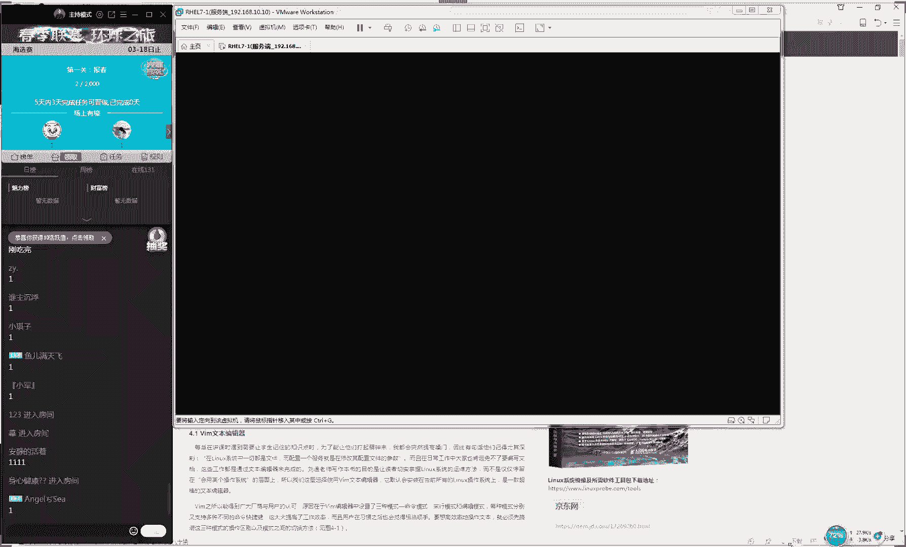

我们待会儿会给大家先去讲一下这个逻辑的飞，然后以及我们在这个实验里面怎么样来来去应用。好，然后这就是我们呃然后我们会给大家讲完4。3小节，这个时间大概是一个半小时。然后我们会讲计划任务。

这个总共时间的话呢，应该是在一个半小时左右。但是如果要是呃我是这么规划的。如果要是咱们时间正好两个小时，那就两个那就是两个小时了。呃，但是如果说我们今天讲了一个小时040分钟左右的话呢。

或者一个小时05呃，050分钟左右。😊，那我们就给他呃就算是讲完了。然后我们下礼拜的时候再去开第五章。因为我们如果今天开第五章的话，就顶多顶多就只能是讲到5。1小节。因为我今天给大家做了一个规划啊。

如果说剩时比较多的话，咱们就开第五章，如果就剩个十多分钟，那咱们就不开第五章了。之后可能过一个礼拜大家都还给我了以话我们今天这个课个规划就是不是去赶课时去讲第四章节讲多少就算多少好吧这个大家不用着急。

然后我然后我们也希望说我们这个课程稍微是慢点，然大家有时间来去吸收那好，接下来我们来讲个段子段子哎呀大家好为难我呀大家应该知道能够觉出来老讲技术的，不是讲段子大家劲讲段讲不出来。

我没有好段子大家可以提有什可以讲的可以提神感觉大家送给我两碗凉皮吧，是这样的大家千万不要送礼物真不是跟大家客气的。因为我们平时真的是。😊，是不会上这个直播的，送完之后真的是没有用，然后就白花钱。

真的是好，然后我们来呃，所以以后有机会的话。😊，大家可以帮我们卖几本书也好，对吧？好，那我们现在给大家说一下我们这个呃逻辑的飞是这样的，因为我们昨天没有给大家讲，这也其实算个特别事故。大家要是说的话呢。

这个其实是真的是个失误了啊，叫做这个逻辑的飞大家不要刷礼物不跟不是跟大要礼物啊好然后大家说一下我们叫做逻辑的飞那我来去说一下我们逻辑的飞他话他就是一个叹号了，他就是一个叹号。

当我们比如说我们要去比对一个测试语句的话，再比如说我们比对一下说你当前登录的这个用户，我们记得把昨天就忘了吧，还还不到24小时，就说我们比对一下我们昨天登录的一个用户他是否是root。

那你看这样我们做对吧？大家还有印象吧，大要印象打一下一好不？老刘的段子好硬其实还好了，我感觉自己讲完之后还是很开心的啊，正我反正就反正我反正我讲完之后是挺开心的好吧，我们来继续。😊。

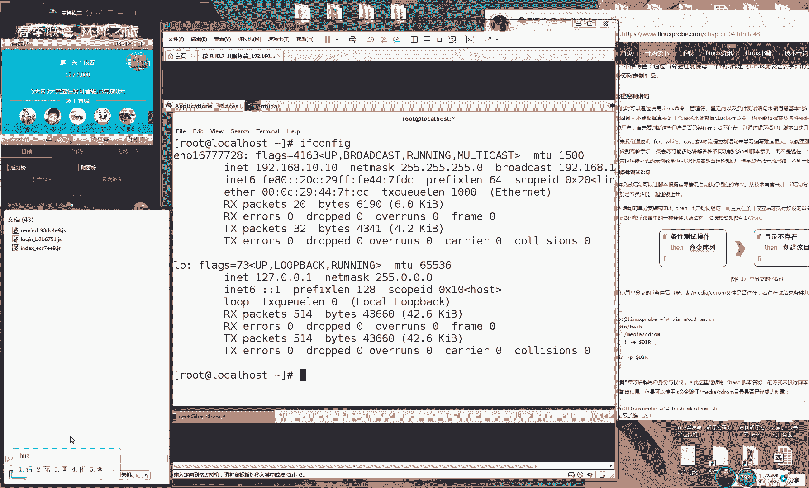

这个还是有印象，对不对啊？同学打2的同学什么情况？好，那我们来去说一下，就是我们比对一下说当前我们登录这个用户是不是root好了。😊，其实我们可以往到前面加上一个叹号，这就是一个趋反值的意思。

我们对这个呃最后我们判断出来的这个结果取相反的一个结果。再比如说我现在一个女生求婚，然后那个女生说可以啊，然后他突然来一句那就怪了，对吧？是对于我们之前的是一种否定，我之前看过一个跟他说一个段子吧。

还真想到我所以说平些积累对我们课还是有实还有用的。说2018年的时候，然后当时发过一篇帖子，说总结这一年度最荒唐的一些新闻，你们不知道有没有看过，其实每年都会有中国官方会他会有一什么十大感动人物。

对不对？然后咱们网上也会有一个什么十大或者百大什么荒唐新闻，然后我看网上有一个新闻说有一家说是夫妻两个人晚上睡觉的时候后他们都梦见自己买彩票了，然后中国讲了说总共分了500万吧。

后来那个男的说彩票是我买的，所以这钱归我后来那女的说的话呢，就是我那我。😊，那我也在管钱，所以你把钱得给我，他们俩就打起来了，还要闹着分手。后来警察来了之后说怎么回事啊，他们就是把这事说了。

后来那个警察说你们这不是做梦嘛，对不对？你梦里梦见的你也不能去取出来，对吧？就说你看实际要对你这个进行的一个取反值你之前你梦见自己中500万可以去过上土豪的生活了。但是你马上取一个反制。

你就是回到一个正常，这个其实也很尴尬，对不那我们来看一下我们这个例子啊，就是我们原先比对一下我们当前登录这个用户他是不是ro，他比如说他是ro的话，那我们马上去反制，就是变成了否啊。

就是我们他他当前判断他并不是等于ro好了，那我们就像刚才那个实验我们刚才那个例子也是我们之前中了500万，加一个叹号就是们没们并没有去中那500万。😊，好了，这就是我们一个逻辑的一个非的一个使用方法啊。

我再给大家举举一个实M，大家看好啊，就是我现在判断一下说我们当前登录的这个用户是不是为root，那么我肯定是为root。

那我们来输出一下判断结果OK它是为零的那我先判断一下说当前我登录的这个用户是否它不是root好，那么就是取一个反值嘛。那我们看到它变成了一个一这是一个简单的一个操作符。但是我们昨天啊讲太快咔咔开过去了。

这是一个一个小我给大家去补充上好了，声音再稍微大一点，稍音大一点稍等一下。😊，好，现在声音好一些吗？同学们。😊，呃，如果声音还是很小的话，大家可以调一下自己的那个音箱。

我这边已经把这个嘴都含到话筒里面了。😊，哎，这个脑子已就不会说话了啊啊，我都已经快把话筒给含在嘴里边了。😊，好，那我们现在继续给大家去说我们这个第四小节4。3啊章节里面我们会讲到我们这个真正要去写本了。

其实啊你说要你其实你昨天你要是说咱们教本的话呢，你说我也教了，但是实际上那个东西它不能它不能够叫做一个正式的一个本。所我们知道本里面有三种的这种结构。第一个结构叫本的声明。第二我。第我们本的功能。

就是我们指的是我们的命令，但是虽然说这个5脏你俱全了，但是你还是芝麻雀大家懂这个意思啊，但虽然说你都已经是有三个结构，然后内容的话功能也都可以去实现出来一个比较简单的一个功能，但是您还是麻雀你在工作时。

不能说使用这个去做，对不对？那好，这个时我们就要去学习一些比较高级的叫做叫做这个叫做这个条件测试语句跟循环语句来满足我们更加高级的这种工作需要。我们去解决一个问题了啊。

其实我们还是通过我们的这个提问来去学习，这个也是教育学里面的一个这。😊，建构主义嘛，他们提倡的就是说我们通过提问，这个其实来自于苏格拉底。

你看这一下子出来这种就是这种啊证明自己这个啊确实是受过正统教育的，对不对？你看其实这个来自于苏格拉底的一个啊教育思想，大家有没有同学知道啊，要是知道的话，有没有我们教育学同的同学。😊。

叫叫它叫这个产婆术，那就是这个产博术，就是你通过你的提问，或者说你你来去帮助学生们，你来去刺激他来去学习。所以说那我们这个课程啊不希望我们一起来去灌输这个思想，而是让大家一起来去发散去想。

那你要知道他为什么会有这门技术，然后你再去学，那不就是会有更加主动性，然后更好去吸收了，对不对？好了，那我们来继续我们来听了说这句话，然后气氛离开然后就然后就离开了这个直播间。好，那我说那么多废话了。

我们继续往后们去说你看啊咱比如说我现在画了几个横道，这个横道代表就是我们的命令好吧，就是我们之前我们将命令给大写到脚本里面的意思。那好你看啊我们之前我们执行这个脚本的时候。

他就是从上往下按照顺序来去执行。这个时候就有一个问题了。那么如果说我的第一条命令他没有执行成功的话呢，那那我们后面的命令，他们也就是全部都会去执行失败的。咱比如说我们举一个呃比较色情一点的意思，好不好？

你要是同意打一下。😊，因为咱们毕竟有呃我们的同学们。😊，可能有女生对不对？或者有年龄比较小的一个同学。好了啊，永远打二了，对不对？好，那我们就稍微的注意一点。就是说但比如说有一个有一次啊。

你让你见到一个特别喜欢的一个女生，这个这个可以吧，好吧？那那有一天比如说你去看一个特别喜欢的一个女生，你去吃饭馆啊，然后你突然看一个女生这个时候啊，你特别喜欢他想跟他手机号或者要那个微信号对吧？

现在你你在你们比较啊比较比较时尚的人都想要那个微信号这个时候那你的第一步就是去要这个微信号啊，咱比如说他没给你然后第二步那你就约他去看电影，然后第三步你跟他拉手，对不对？然后第四步你跟他去求婚好。

那你比如说你有1234，你有一个规划了，你自己都咔咔咔给他写好了。结果你进行第一步的时候，然后人家说你长得好丑，我不要给你然后第一步就被拒绝了。那你的2345，那你还用去买什么电影票嘛，不用了。

对不对那因为你第一步就没有搭成的话，😊，啊，那啊第二步第三步、第四步，那就可以回家睡觉了。所以说我们呃我那我们需要做第一件事情的话，就去进行一个条件测试语句。如果我们的条件成立的话。

然后我们才会去做呃我们。😊，到后面这个工作。若我们推这，若呃呃若我们这个测试语句，他要是失败的话呢，那我们会去想其他的办法，对吧？这是我们叫做条测啊的这个测试语句叫条件测试语句。我们讲到哪里。

我们讲到怎么去追女生对吧？追然后还追失败了。然后我们还讲第二个技术的话呢，我们叫循环语句。再比如说那我们要想对于一个脚本进行一次循环。那我们希望他能够去重复的去完成某一项工作的话呢。

那我们就要去使用到这个循环语句。好，大家记一下今天我们这个上课的一个内容的话，主要就是讲一下我们这个条件测试语句叫做循环语句。我们需要能够去循环起来。然后以及能够去测试我们这个呃条件值它是否就是成立的。

然后更加能够去贴合于我们工作的需要。好，那我们继续来去说。😊，啊，这个我就不懂了，这看这个你们比较专业，那怎么怎么追女生，对不对？好吧，我们来继续。😊，说一下我们今天要讲的第一个条节测试语句。

我们叫做if啊好，大家可以记一下啊。这个单词的话呢，它它是呃真的是叫做if的。因为我们之前给大家讲过一个叫做IF，对不对？好，所以说这个它是真的是叫做if，大家可以记到你这个书上面。

它是用来做调节测试语句的，它里面分为了三种，第一种叫单分支，第二种叫做双分支。第还有呃还有第三种叫做这个多分支。我们先来记一下单分支。😊，哎，单分支。双分支其实双分支跟多分支我认为可以规划成一个啊。

但是只不过更加呃细致一点了，对吧？然后我们这样的话呢更有这个层次感。好，大家记一下，就是我们这个条件测试语，它分为了单分支双分支多重分支。它就可以对我们这个条件进行不同样的这种测验。好了。

那我给大家举一个例子好吧，我这个子就我自己那比如说有一天想买一个手机对吧？为大家知道我比较粗心，我丢过手机，那好了，比如说我去买一个手机那当然说我们市场上面对吧？看大家也是比较公认的啊。

就是说如果我们不谈价格然后我们也不谈什么国籍啊什么那些什么么那个爱O主义什么的目前市场上面比较好的手机，我认为就是苹果对吧？那是红米我们应该目前来说是苹果大家比较公认的好比如说那我现在就是一个国粉了。

那我现在就一个件测试语句当我的这个存款啊，iphone现应该8000多块钱。去京东啊什么的。😊，能够6000钱能能拿下来。好，那我们现在有一个条件测试语句了。当我们这个呃资本啊。

如果它大于1000块钱的话，那我们就可以去买一个iphone。好吧，这个没有问题吧。当我们要就是调件啊，要是啊要是呃没有8000块钱的话呢，那我们就回家。因为。😊，呃，因为你没有钱的话。

肯人家也不卖你对不对？就是进行一个这个测试测试你的这个钱包如果满足条件就会去干一件事情。如果不满足的话，你去硬让人家去卖你肯定也是不成立的对吧？那我就没有必要进行下一步了。好，那我们是这样的。

我们今天这个课程不会给大家去讲一个例子，然后重复来去讲多多次我们绝对不会这么去讲的。我们今天会给怎么去讲呢我们今天会给大家去举很多个例子，然后去套我们刚才给大家讲这个条件测试语句这的好处。

就是我们会给大家去发散一下大家的这个思路知道哦原来我们这个脚本这个使用的空间这么广泛，对吧？然后我们今后也可以去呃虚伪之用定会去搭配。那我们单是会有一个问题就是你需要去把你的这个思绪快速去转换。

因为我们每个实验基本它都是不同的功能也是不同的。您需要快速去去适应我们这个新的这么一个场景，然后我们来给大家去说这个功能。好然后我来给大家去说说。😊，都缺手写板啊，大家众筹一下吧，不是我缺手写板啊。

对对，是我缺手写板，但是不是缺钱，是因为我觉得没有必要。因为平时打字什么都挺方便的。😊，因为你们没有看到我现在这个桌上面其实是都放满了。你看一个鼠标一个键盘，一个话筒，对吧？然后一个手机支架，一个音箱。

然后一杯水，这边还放了一摞书，这已经是你你后还一个插页板没有地方放这个书写板了。主要是这个原因。好了，我们来继续往后面去说。如果大家需要的话，我可以去买一个就看我这个字太丑了。好。

那我们接下去编辑一下我们一个脚本脚本的名称再给大家去重申一遍，就是没有必要去跟我一样的。好吧，因此我就用哈哈。但是我们的脚本的话一般是点SH我们就给敲回车了，就给敲回车了。😊，好。

他说再帮我众筹买个桌子行嘞，那我们来继续给大家去说我们脚本的这个声明啊，我们就不给大家先聊天了啊。我们老老聊天的话，影响到我们这个三课进度。虽然我也喜欢聊啊好。

那我们写上我们本的声明指的就是有哪个脚本可以来去读取我们脚本里面的内容。就是说谁能够读得懂。那咱比如说你去写一个那你去写篇文章，你这个开头你起码你要说啊这个文章是中文还是英文的，对不对？

或者说德文或者说这个是韩文的，你要告诉这个这个语言是什么，谁能够读得懂好，接下来我们是脚本的这么一个注释，我们可以巴拉巴拉去写。比如说啊这个脚本那这个去写咱比如说这个脚本这功能非常丰富。

那他是用来去管理你的计算机的。咱比如说你可以去写很多很多这个注释，然后说版权所有归老流啊，你们不能随便用啊，你要用的话需要先通知我巴拉巴拉这个脚本的注释，它主要就是对于脚本的功能。大家记住啊。

它是对于我们脚本的功能。😊，呃，或者我们某一行的这个参数一种解释或者说明的信息，大家记得你的呃大的书上面。然后记得今天不要忘记去写笔记。然后如果说我因为我看到大家昨天我们下课之后然后大家去互动啊。

有点累了，是不是我看到昨天很多人同学呃都已经说快快这个要崩溃了。所以说大家昨天可能有同学没有发笔记啊，其实我能够猜到了。所以说如果您昨天没有发，千不要气馁千万不要中断，为我们学习就是一鼓作气的事情。

就是您可以今天下课之后把笔记给您补一补去注册博客，然后去发我们那我们是允许的。如果说您不能咱那咱不能说啊，咱不能说最后4月中旬了，然后到最后两天了，后到最后一天了，然后我说送书了。

别人都有自己没有了然然后这个突然间然后某一天的晚上发了2条这样的话就不能算了。好吧，因为我们也希望大家能够去激励自己多去学习去坚持然后我们去写上我们这个命令了。命令的话呢，我们这样去写。

然后我们跟书上会有会有一些区别，因为书上比较啰嗦。然后。😊，讲课时候我们就呃随行变好了，那我们就自己去来去呃随机去来调整。这样的话我们可以多学一点东。这个那我们可以多学一点书上面有的东西。好。

那我们现在是这样去做啊。第一步的话呢，我们先来去判断一下说有一个文件它是否是存在的那我们判断一下说啊第一个我们叫做if啊好，那我们现在叫做这个单分制条件测试语句，判断一下说有一个目录它是否是存在的。

判断一个目录刚E指的是它不论是一个目录还是一个文件，它只要存在就可以了。😊，好了，那咱比如说那我现在判断一个文件，这个目这个文件叫做media目录。

那然后里面的哈哈这么一个子目录判断这个文件它是否是存在的。好了，然后我于是在它前面加上一个叹号，就是代表判断这个文件它是否不存在。好，大家如果要是这个能够理解的话，请打一下一。

如果理解的话打一下大家千万说不好意思如果不知道的话没有听明的话，就千万一定要再去说一遍好吧，因为这是咱们的第一个实验。如果要是有同学们说没有听懂的话，我们紧给再去重复一遍好吧。

还是有是吧三位同学说没有听明白位同学没听明白给大家讲一遍，是这样的现在的话我们第一步我们需要去使用一个if我们来去测试一下我们这个件测试语句，然后我们进行一个文件测试语句。

这是我们上一节课给大家讲的张应该是4。3刚E的话，它指的是判断一个文件他是否存在的意思它就是说它只要存在就可以了。它不论是一个脚本还是一个文件还是一个目录，他只要存在就可以了。😊。

杠E就是它它只要存在就可以。然后我们就是杠E减一个目录的名称。然后我们目录名称无所谓，这个无所谓，我们可以随便去写。比如说我们叫做哈哈嗯，它只要存在就可以了。

这个单词的缩写不是应该是叫做EXIST这个代表是存在的意思。哎，对了对了，你看呃，而且是我先答出来了，说明我这个音视还是比较高的，对不对？好，那我们先看就是说判断一下这个目录它是否是存在的。

然后我们来去写成一个叹号，就是判断一下这个目录它是否是不存在的。😊，好，再反应一下啊，我们先在呃我们原先是判断这个文件它是否是存在的。而我们加叹号之后，就是判断这个文件它是否是不存在的。好了。

那我们判既然往后面去走，当我们判断这个文件它是不存在的话呢，那我们就要写它那个格式叫做字这个字呢本身没有任何的这个用处，它只是一种格式告诉我们啊如果我们这个条件成立的话，那我们就会去做后面的这个事情。

那是那么是什么事情呢？那我们就给他写上MKDRR杠P创建出来这个目录。O大家可以看到，就是说当我们。😊，嗯。啊，当我们判断一个目录，它只要是不存在的话，那我们把它给串建出来。好了。

接下来我们把它F把它给结束掉，这个特别的可爱，它也像我们去写一个网页，或者说写一个C语言一样，你自己开启的这么一个循环你开启这么一个区块话最把结束掉。那我们这个编成了这么一个起始符。

那么就是这个这个的这结束是一个是这样的们坦白说没学习过C语言的话可能者说编程语言的话可能会比较吃力这个课程。

但如果之前有一点编基础的话会觉得我们这个课程是很简单的可以唤醒您之前的一些学习记忆其实也是好然后以保存并退出非常简单的一个待会会逐步加大这个难度的那那我们看一下这个文件有一个文件叫做目录里面的这个目录它此时是没有的也是不存在的好。

于是我在就可以运行一下这个脚本好后看一下这个目录就发现它已经是存在。😊，所以可以看到这个脚本的功能也确实是成功的。他先去判断这个目录它是否是存在的。如果它不存在，则会去自动去创建出来这个目录里面的内容。

好了，这个并不难，对不对？这个这个这个是简单的一个脚本了。这个这非常简单的。再往后面去走的话呢，就是我们进行一个双文制这么一个测试语句。当我们的这个呃资金的话呢，比如说我们大约000块钱。

但是没有满足的话呢，我们不希望它就直接去退出了我们这个脚本。我们不希望它去退出了我们这个脚本还能够进行二次判断。那我们大约8000块钱我们没有大家看到最近有一款新款手机叫叫做小米9，对不对？好。

这个目前也是国内比较比较火的一个品牌。😊，小米小米9现在多少钱？小米9的话大概是4000是吗？我我忘我这我不太清楚啊啊，小米那我们先给协商小米9大家要知道的话，大家可以告诉我，应该是4000块钱。

000块钱是吧？那就3000块钱。那好，那我们还有第二个选项，就是当我们大约了3000块钱的时候，那我们也可以不用回家的那我们也可以去买一个性价比非常高的一个小米9好。

这就是我们的一个第二个选择进行多啊来啊进行多次判断，并不是说当我们条件测试，只要失败之后就马上回家，对吧？那我们还有第二种选择。好，那我们这个再给大家举个例子。

那我们不希望我们每个例子都举一样的我们可以去发散一下我们这个想法了。其实以后工作时候更好去来去灵活去使用好说这么废话，我们赶紧好，那我们来继续删除掉。之前有些啊乱七八糟给大删除掉后本的注释的话呢。😊。

呃，也无所谓啊，这个基本的注释有点乱，我随便你们改一点。这个教本中是随便去写。好了，我们现在这样去写，就是写上一个拼呃拼的话呢，这个命令它是用来去测试主机，它是否是它的话呢它是否是在线的。

然后我们会有一个灰线值，这个命令我现在都已经去使用过。因为这个不论是学习linux还是学习交换机路由器，或者哪怕是一个呃新手的一个工程师，他们都会去使用到这个拼命令来去测试主机，它是否是在线的啊。

或者说测试这个网络它没有它有没有连通。那所以的话呢我们现在给大家来玩一下，就是拼杠C3就是指的是拼三次，而不是来去无线去拼下去的意思，大家拼三次，然后每一次间隔是0。2秒啊，然后杠W3啊。

代表就是我们每一拼他这个呃每一次拼出去之后，最大的响应时间啊，是3秒钟，然后就会。😊，啊，然后就会把它给终止。接下来我们使用到一个核的符号，代表就是将我们这个信息。

不论是正常还是错误的信息全部给它输出到我们一个黑洞文件里面。这个相当于就是我们这个系统当中没有回收功能的一个回一个一个垃圾箱。就是当我们把这个信息给它写入到里面之后，它就会进行一个数据的一个回收。好。

然后我们最后还有一这个指的是我们收取到的第一个我们的参数，待会我们会把它直接接到我们本的这个后面这代表就是我们一个这个代表就是它是一个没有回收功能的一个回的一个垃圾箱。那我们之所以这样去做的原因啊。

是为了保证我们这个屏幕非常的清爽。因为当你这个拼一个域名，它不论是在线还是不在线的情况下，它都会在我们的屏幕上面产生出来大量的这个信息。所以说我们为了保证屏幕的清爽。

是使用到这个重定项服将我们原先要输出到屏幕内容的话呢，给它重定向到另外一个黑洞文件里面。这个是有对象的。😊，呃，大家可能没有，但是这个是有对象的，这个一不就是对象吗？一指的是调取的第一个接收到的参数。

它是命令的一个承受者，拼的就是他去检查的就是他是否在线的。所以他就是我们的对象。好了，常非常的非常的扎心，对不对啊，马上就要到清明节了，让孩子们扎心。然后我们去测试一下语句测试什么呢？这个大家去想一下。

那我们测试的是什么呢？实际上我们测试的就是上一条语句，它是否是成功的。若我们的前面的这个语句为零的话。😊，呃，如果我们这个上一个语句就是我们的这一条啊，我那我呃那我我们的这个返位值为零的话。

那我们讲到那我们证明这个语句就是执行成功的。大家回忆一下啊，我们有一个符号叫做叫它就是说它判断的是上一条语句它有没有执行成功。所以说我们现在就来判断一下说啊啊你的这个上一条语句它是否返位置为零。

若为零的话，证明这个主机它是存在，对不对？它是当前是在线的。那么于是我们就会马上去输出来说啊再调取一下这个变量啊，is online那我们就是告诉他这个主机它是在线的。

还有一个叫做就是说啊如果他要使另外一种情况呢，那我们肯定就是说它不在线了，对吧？这种情况我们就给它去输出来说这个主机它是离线状态。😊，对，这个doll一啊，我要给大家去说一下啊。

然后因为这个咱们都已经讲过，所以我来给大家去简单回忆一下。如果说呃大家还是对这个脚本比较陌生的话啊，这个不用担心，我们都会给大家来去重复一遍，咱们要去做什么事情。然后另外是这样的，今天可能内容会比较多。

内容也很充实，所以我们可能会课程会比较的浓缩啊，但家如果要是提问的话呢，我们可去互助来去交流一下。就像我们之前似的，然后我们也会去抽一些比较典型的例子给大家去解答。如果说这个问题没有被解答好的话呢。

我我以下课之后来跟我们去做答疑，我们每节课下课之后都会有答疑的时间，这个不用担心好我们来给大家去说一个大家问的比较多的一个问题，就是说一对不对？这个ll一指的就是我这个脚本接收到第一个参数。

我们昨的给大家讲过一个叫doll井号。但这很正常。因为我们昨天讲完之后肯定会有一定去忘记的我们昨天讲的一个ll井号星号分别代表就是我们接收到参数的个数以及具体的内容。然后。😊，去讲一个ll问号。

这个指的是上一次我们执行命令的一个结果是否为0，它是一个返回值。它判断我们删个它是否执行成功的。还一个是doll1234567，这个指的是我们接收到的第一个234567个参数，对不对？好。

所以说我们在就直接去调取到我们变量里面的呃去调取我们里面的一个变量了。好，最后我们结束掉我们这个呃我们的这个F这个很像我从网上看的一个小笑话，说你自己说一个女生嘛，呃。😊，他往上发了，然后说什么啊。

你自己勾起了我心中的火焰，你就要自己把它给扑灭掉啊，对吧？然后就是说你看因为你自己去启动一个这个呃呃测试这个条件测试语句的这个if，所以说你也要把它给结束掉。好了，那我们来继续把它保存并退出。

我看一下说什么啊，说小郭说话很狂啊啊。😊，说什么要，说快来奖吧，都是钱是吧？行啊，其实用流量看的话，还是还是比较土豪的。好，那我们来继续啊。好，所以说我们这个课程也需要一定的这个平衡。😊。

因为大家有同学觉得讲的快，有时讲的慢了。所以的话呢我那我啊那我们就选择就是说少数服从多数吧。好吧，然后我们会去测试。然后我们会大家去多去调查一下。大家觉得我们这个课程进度是快还是慢。

如果是觉得比较慢的话这样的大家可以回去之后看一下咱们这个录播视频。之前咱们都会有这个录制好视频大家以去去预习甚至说可以不用去看咱们这个在线培训，可以直接去看视频课程。

这样话可以根据您自己的这个条件来不断加快这个进度实也可以的。好，那我去去行一下我们这个脚本。因为我们这个脚本的后面第一个参数我们这个对象所以说我现在是这样那我们就去写172001这个是一个本地的个回环地址了。

但是这个大家可以不用去做，只要看我效就可以了。我们会在第八章给大家去讲到如何去配置你的网卡来去一下回车对这个特别的可。他就是一个这个他就是一个这个if的一个反写，不是不是不大家这个想多了啊。😊。

大家这个唐啊呃唐同学他想多了是这样的啊，呃，虽然说你们这个虽然说你这个真的是很就是真的是很严谨啊，但是你想多了，其实这个作者他没有想那么多，就是我们这边的话呢使用的是一个FI的话呢。

我们结束的时候写那个呃我们开始的时候，我们使用的是这个if使用的是这个FI。然后我们结束的时候就是。😊，呃，我们不是不是又乱了，我们呃开启的时候是if。

然后我们结束的时候就是一个FI这个呃然后我们这个FI它并不是那个finish的一个缩写。因为我们待会会会再给大家去学习一个叫做ki，对吧？就是呃测试语句。

那个的反写就是ESAC所以说呃我我就是我们的作者他都没有想到你想了这么多，他就是一个繁写啊，并不是一个单词的一个缩写，大家不用想那么多好吧？啊，大家不用大家想大家想的太多了好了。😊，呃。

然后的话呢我们来再来去测试一下一个不存在的一个地址。比如说我们就来随便了8。8点8。8，然后我们去测试一下，告诉你这个主机它就是一个离线状态。可以看到当我们去测试一个主机，他是否是在线的话。

那我们就可以判断出来它是否是进行一个离线和在线这么一个状态。这就是为什么啊我们要去使用到多重分支的这么一个脚本。当你不成功的时候，那就有另外一种这个工作，他在等着你对？我们好比说给大家举个例子啊。

大家如果嫌的话，我们就快进一点。再比如说我想去考大学，那我最后我去考清华清华上不了可以上北大，对不？就相于说之前有一个有一个主持人什么撒贝宁对不对？说之前上清华还是北大，他他也纠结很长时间的。

就说我们有不同的这个选择啊，这个他这个他这个脚本的话，他有不同这么一个测试的一个条件。好，那我们来继续啊咱比如说我们现在是有两个选择，只有说这个成功和不成功或者说只有8000跟3000。

那我们其实还可以有很多种。😊，选择的哦，比如说比如说呃我们还有一个大于5000块钱。因为我们知道华为的定价可能会比小米的可稍微高一点，对不对？好了，我们就给大写成一个华为。

那我们就写一个华为华为的话大5000能够买到一个手机，对不对？好，我们大于5000可以买一个华为好，我们比如说大约2000块钱，你还可以买个锤子呀，对吧？就是我们那个mar对吧？

就是个罗永浩那个手机我们现在出到T几了，出到了T几大家知道出到T2的手机，对不？还是T3啊啊，现在出到见果手机了，已经没了啊，已经出到了我反正我我不太清楚了，反正就随便去写吧。我们今天是出到T3了吧嗯。

😊，是只有T一是吗？行吧，那就那就是T一吧。那我们就可以买一个另外一个手机。好还有最后一个手机。那好那那么我们如果要是没有没有000块钱的话，那么可以去买一个红米，或者说可以去回家了。

那就是说你看你有不同的这个选择，你可以有多个你可以5个6个7个1100个1万个你都可以去就是说你可以有多种的这个选择家记一下多种选择的话。

我们叫做多重分支的务条件测试语句K站这个脚本特别特别的怎么样灵活灵活那个锤不是那个骂人啊，因为东北话里是不锤就是那个骂人了。说那个是一个罗永浩的一个手机啊。

他最开始起的那个名字叫做这个就是吧我们改一下这个脚本这个脚本的话我们来进行一次循环啊我们进行一个多次的一个判断，在是使用到瑞来去读取一个变量这个命令的作用是用来读取一个变量的使用刚，代表就是。😊。

给他呃呃来去给我们一个用户一个提示信息，让我们用户知道他该输入内容了，那我们就给他随便去写了啊，就告呃来告诉他啊，请起来就是输入内容的意思。然后我们给他复制的一个变量，我们叫做great，是这样的啊。

这个再给大家解释一下，就是让我们这个用户使用到read命令，来去读取到一个值，读取到一个用户的一个值，然后我们来去复制给这个变量。哎，然后们来去复制给这个变量。😊，OK啊。

感谢阿峰同学给我帮我回答个这个呃回了一个问题啊，就是我们刚才去使用的那个DD嘛。然后我们在这个呃我们编辑器里面可以去删除掉我们的内容我们可以去写比说以去清平了。

让我们来去测试测试一下我们用户输入的这个内容。比如说这那么这就是我们变量的这个值了啊，然我们来去测试一下用户输的这个内容。如果说让用户去输的是一个值大于是大于大于等于85。因为GT是大于是大于的意思。

大家可以翻一下我们的表格，我们的书籍上面会有然后刚应该是大于等于的意思。好了，我们用户输的这个值大于等于85。大家看一下，我们此时写这个就是一个逻辑的而是叫做和就是我们必须要两边都要满足条件的话。

那么就我后面这个语句代表就是我们两边都要满足条件。你看就是说我们现在写一个脚本。我。😊，我们这个用户数的这个值是大于等于85，小于等于100的话，那我们就怎么怎么样，对吧？另外再给大家介绍一个小技巧。

就是如果说你想要把这个字呃觉得很占一行的话，看起来有点。😊，浪费呃有点呃太浪有点太浪费我们这个呃界面的空间的话呢，那我们其实可以把它放到我们这个呃呃我们这边的这个后面。

但是我们到这个前面需要加一个分号就行了。就是我们可以去使用到一个分号，将我们这个字跟我们这个if给它写到一行上面，就接省一下我们屏幕的空间。好。

然后我们接下来去输出我们用户输的这个值大于等于85小于等于100的话呢，那我们就告诉他说ex特别好给它输出这么一个表的信息。所以说我们这个脚本的目的就是去测试用户数的这个值的一个范围，对不对？

然后我们可以进行多次判断，甚至我们可以从1到100，我们设置100个条测试语句都可以的。还还有一个下面我们叫做这个 if缩写成EL就就是我们第二次就是我们进行多次的判断测试语句这个大家大家大家可以来去看一下。

这个我们不用去呃限定它只能去使用一次了。这个可以去使用很多次。😊，让我们这个脚本更加的灵活。好，我们进行第二次判断。那么如果说我们这个值是大于等于70。然后并且的话呢小于等于84的话。

因为我们85已经是被上面已经被匹配走了，对不对？它是等于的意思。好，它是大于等于的意思。所以说我们就是等于小于等于84的话呢，小于等于84的话。😊，那我们就。同样给大家来去。输出说你这个成绩的话呢。

也就是呃也算是及格吧。对那我给他这么一个标识。另外给大家提一下啊，呃，是这样的，咱们的红帽考试的话呢，不论是红马HCSA还是红马HCE还是红帽HCA它的这个满分都是300分啊，然后多少分及格。

大家知道的，它就是叫做。😊，多少分及格，210分及格，对吧？所以大家去除一下210，你除去300大概的话呢就是70%。按照百分制来讲的话，就是70分及格。那对于我们一般的同学来讲的话都是足够足够的。

而且大家去知道一个问题啊，说那我们为什么不用到百分制呢红包为什么要去选择300分，不是200，而不是选择500分甚至也没有选择100分的。其实我再讲一下他的原因啊。

他的原因就是这个300分的选择它是有道理的。因为他的这个给分点非常的细他给分点非常的细，哪怕给大家交一个底啊，就是你哪怕你一道题你没有做对你最后那个结果你没有出来比如说你配置一个什么什么服务啊。

比如说写一个脚本，你最后那个结果错了，或者你没有做出来。但是你的这个步骤分他也会给所以他会把一道题里面拆分出来不同的步骤分给你这个细节分，后所以他这个给值很很细的原因就是这样的。

所以大家有时候就会为就是说为什么我明明考的很糟糕吧？😊，我们这个服务最后结果没有出来，但是我们最后拿到成绩的时候，哎，过了，对吧？就这么一个。😊，的原因就是这样的。哎，好了，呃。

然后的话正跟ele必须要换行吗？😊，呃，不是一定要换行。啊，不不不。呃。我们的这个是必须是必须要换一行的对他们两个不能到一行，或者也可以去使用到3号把它间割也可以。好，最后我们是就给一个兜底？

当你都没有满足我们面这个条件既没有大于等于5于等于没大于等于7你既没大于等于7，没于等我们就就是取兜底们兜底下面就没有个成没有格。

我输出个没有格最后把结束掉你自起了火熄灭掉这就是我们一个比较完整的一个这一个测试语句了保退出好大家先看一下。

我来结果大家讲一具体怎出用着急回车这时我们去使用的是一个命令读取用输的值个值与我们测试比断这个的个区间。😊，再比如说我现在现在去输入一个输入1个90。😊，总你看到他告诉我们说报错了。好了。

我们告诉我说第四行或者第六行出错了。于是我们找到问题的所在的话呢，是我们这边的中工号里面少了一个空格，以说我一直吐槽我们习程怎么那么苦啊，不？明明我明明敲对了，结果因为少一两个空格空格你还跟我较劲。

于是我们就是确实有些时要小心一点但是这样的话也拉高门槛让一些小白一些菜鸟，对吧？他们不知道一些小细节的人打他们们也不知道该怎么写对？明明着我去抄出来的。

结果没有得分原因是敲再我们输一下用户的值使读取到我们变量里输入下我示出是特别结。我们再来去输输入一75家看现输出的是一个pa输出的是一个pass。😊，那么话这个pass的话呢，就是为那么是为什么？

你们就是大家不要去管说我们输出的是一exent还是一个pass，它输出的是什么都不重要。我们应要知道我们为什么会输出这个信息，思考的这个过程是有意义的。大家想一下说为什么他会去输出一个I呃。

他为什么下面会去输出一个pass呢？😊，就是因为我我们这个测试语句，它有了多重分支，它出现pass的原因就是它第一次的测这个呃呃它的这个测试的话呢，它没有成功，它流入了第二次的的这个测试语句里面。

所以第二次判断的时候，它成功了，于是输出了这个pass内容，这个是我们判断的一个过程。这个是我判断的一个过程。好再往后面去走。比如说我输入一个30分。那就不好意思，对不对？

他就会告诉我们说这个成绩是失败的。这个话原因就是它没有匹配满足第一就是我们这个呃第一次我们大于等于84呃，不大于等于84，小于等于100跟第二个说大于等于70，小于等于84这么一个两个字它都没有满足。

最后它归属的是就是一个兜底。如果说你真的是没有什么呃没有被没有没有被这个测试语句给来进行来进行这么一次匹配的话呢，那我们就是最后这给他做这个兜底了。😊，好了，所以我们最后这个结果输出的是一个fell。

成，它这个成绩是失败的。好，这个时候我给大家提个问题了，这个问题我们提了很多遍了。其实就是说那当我们去。😊，咱比如说啊我现在想往里面去输一个呃9999万分。那咱比如说我现在输出了这么一一个值。

请问他会去输出是什么样的一个内容？有这么几个选择。第一个选择就是exllt。第二就是pass，第三就是fail，第四就是程序崩溃，他程序会他会给我们报错。大家告诉我说1234。

大家啊大家不用打这么fa什么的，大家都打1234就可以了。那1234，大家认为是哪一个？😊，啊，同学们有同学说会报错，对不对？因为你的这个值已经超出了我们这个预想的范围了，那肯定会报错了，对吧？

别人让你告诉他多少分，然后你跟他告诉你，你99999对吧？这肯定是要报错的。同学们啊，还有同学说会关机。😊，会关机啊，报错还是打四。对啊，同学们来告诉我啊，是1234，大家都认为是什么。

因为我们反正没有公布这个结果也不定定到到到这到底是谁说对了，是是谁说错，对不对？好了，其实这样的啊，这个的话结果并不重要，对吧？大家知道我一直在说结果并不重要，重要的是这个思考过程以及。😊，大三的同学。

你们有可能是蒙对了，但是打四的同学你们就一定是没有做过预习。咱们其实已经反复强调了很多遍，就是咱们这个预习一定要到位啊一定要到位。因为老刘不是讲段子出身的，你们能够看得出来，咱们有一些。😊，坑啊。

其实咱们会重复很多次，都会每一节课都会去说呃，我们上一期也会提到的。所以说如果说您打的是四的话呢，证明不论是说也不光说是说错了，也不光这个思考错了，其实还是没有预习到位的，所以您没有过预习。

所以才在课上出错的原因好了，我们悄悄回车看到程序它其实并没有崩溃，而是出现了这个为什么呢？这个不科学啊那我们这个成绩判断难道能达到99999？哪有这那这是考什么科目啊。

是这样的给大家去大家去捋一下思路啊，首先来说的话，让大家画一个特别不喜欢的一个东西，就是这个数轴，对不对？大家看到这个大大家犯困啊，这是我们数学里面的一个很邪恶东西。

你看先画一个数轴让我们取一个原点我们去取一个原点是为零让我们再取一个点是为100。好了，我们第一次测试语句判断是这边有1个85判断的是这个。😊，85跟100之间。如果说他满足了85到100的话呢。

那么他就是他就会去输出一个啊他就会去输出来一个呃这个成绩是非常好的这么一个结果。它是一个啊他就会去输出来说成绩特别好啊，成绩成绩成成绩非常好。然后他第二个选择的话呢。

就是若我们这个成绩它是满足70到85的话84的话呢，那么我们就会去输出来说这个成绩也是通过的对吧？它有这么两个测试语句。最后的话我们这个难点主要集中在了这个大家比较犯愁啊。

说那我们最后那个到底是什么样的一个兜底是兜的是从0到70？还是从哪里哪里吧？先给大家去说一下啊，就是我们这个它兜的是只要没有被品牌上的所有项目全都归属于好给大家再来说一下。

就是说我们之所以说我们这个考试成绩啊进行一次测试是从0到100的。这个是由我们人为来去定义的。这个是由我们。😊，人去定义的。因为我们知道成绩的话呢，一般来讲它就是从0到100分的。

但是我们计算机它不知道我们才去做什么事情，所以所有没有满足它这个条件的这么一个数值都会归属到这个al啊，它都会归属到这个里面。所以我们最后它没有崩溃，而是归属到我们里面输出的这个成绩失败的这么一个结果。

好了，所以说这大家回去之后也是啊呃一定回去之后多去复习这个很重要的。好了，我们来继续往我们继续说，那我们继续写一个循环语句。这个for循环语句的话呢，就是我们给您一定的这个条件。

或者说我们给您一定的范围。好了，我们通过这个范围来去不断来去循环。这个我们叫做for循环语句。😊，好了，下面给大家来去玩一下，大家看一下我们这个实验。第一步，我们现在去新新建出来一个列表。

这个列表的作用主是要那么就主要是给他一个范围。比如说以后大家开开了公司了，对吧？那我们公司里面或者以后或许能够做大，做到我们公司里面有3000个人，那我们以前那我们去打工资的时候。😊，那你是财务。

比如说那你需要给3000人来去打工资的话，那你一个人。😊，那你要去呃给每个人都去打一遍，特别的麻烦，那怎么办呢？那么你就可以把你用户的那个名称，对吧？把你公示的那个名字这个卡号跟金额导入到一个系统里面。

然后他来去自动来批量打这个工资，对吧？那我们这个系统里面也是那我们就可以去建出来一个用户的一个列表然后去批量来出来我们这里的用户他不论是10个10011万个无所谓。

我们都可以使用到这个脚本来批量就创出来。另外的话给大家坦白说这个是我们红I，我忘记是或者是红里面的考试原题，这是咱们红的一个考试难度。好了，这就是我们本的一个难度。我们先去写上我们这个脚本嗯。😊，啊。

这个啊这就是啊这个是记不住的话，没有关系啊，咱们会在后面的时候会再给大家去讲到的。来我出现出来几个用户张三李四王五你看我随便创建出来，还有这个赵六好，那我现在可以去多写几个用户的名称，这大家随意了。

咱们书上面还是什么张三乔治啊什么的什么的，这个无所谓啊，大家去写几个名称就好了。只要测试一下我们这个用户他是否是否能批量创建出来。另外大家先看一下。

就是这个张三李四王五赵六这几个用户在我们系统里面他是真的是没有的那他是真的是没有的，真的是通过我们这个脚本来去实现的。而不是我们上课之前通摸的给大家做好了，对不？好了。

我们现去写去修改我们这个脚本这个脚本的话，我们第一步骤，那么你还是要去让的这个用户去输入一个密码。因为我们这个脚本特别的厉害。不光可以去批量创建出来用户他还可以批量的为我们用户去设置密码这个很厉害。

对不对？但是由于。😊，我们现在还没有去学习创建用户以及设置密码的这个命令。大家现在就是只去关心我我们这个for循环语句呃，具体的细节的命令，我们会在第五章节就是我们会在下礼拜五就会给大家去讲到。

而且会非常细致的家去讲到用户的身份与权限。我们先去读取一个用户数的一个。😊，值作为我们用户的一个密码，我们给它复制到pasWD这么一个变量上面。好了，接下来我们来去使用到一个for循环。

这个for循环的这个格式啊都跟这个C语言是一模一样的。所以之前学习过C语言的同学有是也算是有福了啊。好了，我们来呃。😊，定义一个变量，我们叫做U name啊，这是一个我们之前并没有的这么一个变量。

然后话呢我们这个呃变量的这么一个范围的话，这个里面的值就是通过读取一个叫us刚那个文件来为它复值了。所以说我们现在就取那我定义一个变量一个变量而变量里的值是通过读取这个文件而获得的。

因此这个us所以说这个 name变量，待会就代表就是一个一个的用户的名称的意思。好了，接下来我们来去代表就是我们开启这个循环而不是了啊。因为我们现在是个循环语句的格式是叫做do好了。

那我们做第一步骤先来使用的I do命令呃I命令啊，它是用来去测试这个用户它是否是存在的用户存在。😊，是这样的一个结果。若用户不存在是这样的一个结果。ID命令主要用来测试这个用户它是否是存在的。

学这个有非计算机专业的嘛啊，肯定还是有的。好好，我们现在来继续往后面就说呃，我们现在去使用它ID命令来去测试一个用户，就是U name啊，我们该调取这个变量，它是否为。😊。

已经是啊他是否已经在我们系统里面是存在的。然后我们将输入到屏幕内容，给它输出到我们的这个呃垃圾箱里面，保证我们的屏幕非常的清爽。接下来我们马上就要去判断判断一下我们这个用户最后这个值是否为0。

若为零的话，证明该用户一定存在，对不对？因为条件成立嘛，那我们就会去输出来说这个用户调取下变量啊，已经存在了，那你没有什么可以往后面去做事情了。然后如他没有存在的话呢，叫做就是他只有两个情况。

就像一个人一样，你只有男，你只有女，你有两个这么一个选择，你要不然要不然就是女所以我们这个用户也是你要不然你就是存在，要不然你那啊那你就是啊当前等待被创建这么一个状态，那你不可能说还有第三种这种可能性。

要么就是存在，要么就是不存在。这也是一个唯物使观的一个观念，对不对？好了，那我们来继续往后面去说为什么用那要大写，这是一个约定俗成的这么一个习惯，小写的话是。😊，也是可以的。

但是我们一般来讲我们一般来讲，我们行业内是将命令。小写将变量大写，这样的话更加有规范一性啊，这个我们一般来说是一个习惯，也是方便于我们今后的同事们去使用起来的话呢，他们一看哦，小写他们就知道哦。

这个可能是个命令。而大写一般来讲，他们都是个变量，也是方便其他人来去使用的一个呃很好的一个习惯吧。好，接下来我们来说，若用户要是不存在的话呢，那我们就使用一个命令叫做usD命令把它给创建出来。

这个命令我们先不管，那我们先不管先去照抄。这个我们会在下礼拜五的时候。😊，本来就是实践给大家去操作，来去创建出来用户的这个我们先不管，这代表就是创建出来一个用户。

并且将用户创建出来那个相关的信息啊导入到我们这个呃导入到我们这个垃圾箱里面，保证我们屏非常的爽。下面一个命令的作用是用来去重置我们用户密码这个作用不要管照抄。

因为我们明天的时候礼拜的时候会大家去讲到我们这它是用来去重置我们用户密码的这么一个命令。好吧，这我们先不管他这个怎么去实践的，到时候给大家去细聊这做好之就是创建出来一个用户以及创建出来用户的密码了。

其实到此为止就已经是结束了。但是的话呢我们为了增加我们这个我们格？我希给增加一个输出的一个信息，那我们就可以再去使用到去测试语句。😊。

然后呃通过我们测试的这个结果呢就输出来说用户已经把把给呃创建成功或呃没有失败的呃，或者没有创建成功这么一个提醒。但是其实这个没有必要了，我觉得我写的有点啰嗦了。因为你是否成功，你可以马上去测试出来啊。

而这个两个ep测试句有点重复啊，尤他他呃他他是有点重复。😊，然后看一下说这个不是input吗？啊，这个的话这个参数大家再提一下啊，这个参数的话呢。

我们可以去使用去使用m命令你可以去查询到它的这个解释是说它是来自于一个标准，它是用来去接收一个来自于标准输入的一个内容。其中其中它就包括了告诉你说呃，它是来自于管道服务内容。

就是说它就是用通过管道服务来去直接为我们用户来去复来呃来去呃复制命令不来去复制密码这么一个参数，它用来去接收我们前面输入的一个内容啊。好好，接下给大家玩一下了啊。这于我们简化一下我们书上面太啰嗦了。

我们会直接这样去做。这样做的话呢，大家看一下，我们之前给大家演示过，我们当前是没有张三李四往五着六这几个用户的啊，没有张三李四。好，我们先去跑一下这个脚本。😊，输入一下我们这个密码。

我们不要去关心待会那个结果是什么，那个结果一定是成功的。但是我们现在关心的应该是你的思考过程凭它它为什么能够成功？我们要去思考这个过程好。

那我们现在去思考一下第一个我们为什么会出现这么一个输入框这个输入框由什么去提示出来的呢就叫做read命令读取的命令的作用用户去输入一个值将这个值给复制一个变量而我们这个提示符它是叫做杠P参数显示出来的那么于是我们当前要去输入一个值用来去复值给每个命令作为去复制给每个用户作为他们的密码好了。

那我们给他密码什么呢？无所谓啊，去复制一个值给它当做密码来123走你啊常尴尬告我们密码我们这个代码敲错了概是第行。😊，出错很正常啊，大家不要笑，我看一下第九行啊，他说el这边出错了啊，为什么呢？

因为我我们的那个if后面要需要加一个，它的一个格式要求啊，它的一个格式要求，我们来把它保存名退出再来啊刚才没有发生过好不好，我们重新来给大家演示一下，输一下我们的密码叫做其实有些时候我们去写脚本的时候。

也是觉得自己很苦逼。是怎么说就是代码都写对了，功能上都能实现的。但是你这个格式对不对？你空格你少了个逗号啊，但是逗号有就比较严重了啊，结果你还是会出错，大家有没有之前学习过一个语言叫叫做叫做VB。😊。

啊，之前叫做这个有其实有一个语言叫做VB语言。然后后来中国还有一个叫做这个E语言，但是可能E语言现在好像没有人用了，对吧？它就是可以通过拖拽呀，通过这种非常简单的这种操作就可以实现出来一个小的一个窗口。

是玩过，对吧？你可以快速可以拉出来一个小窗口，然后可以快速去上手。你即便都没有去学习过，可写出一个弹可出一个弹窗的一个程序。好，所的话呢我们这是学习的一个但是但是因为它严谨。

所以他的这这个功能跟这个效率就会更高。但他也是一个相辅相成的。好了，那我们现在再去查看一下就会发现我们系统里面就已经出现了张三李四啊还有谁王无所谓赵这几个用户就已经都是有了。

并且我们已经为他们创建出来了密码。这个我们刚才我们这个本里面创建用户的这个命令，还有我们修改用户密码的这个命令我们都不用去管。这个我们都不用去管到时候我会给大家讲到。😊，我们会在下礼拜五时候给大家讲到。

好，然后的话我看到说小学生都学编程啊，我今天上课之前大概半个小时吧，我还在在看一篇文章，说有一个教育机构叫学习猫吧，不叫编程猫，好像拿到了什么什么融资，拿到了A轮还是B轮的融资。

就他就是服务于中小学的服务于小学吧，或者说这个中小学通过游戏去编程。其实这个事情奥巴马也提过，对吧？因为奥巴马在呃退呃在这个呃就是这个这个离开美国这个总统这个职位之前，他其实也是在提倡，就是说。😊。

把这个学习跟游戏嘛结合到一起。按照我们中国人来说，就是叫做寓教于乐嘛。好，接下的话呢我们开了这个实验，大家觉得嗯不太懂，对吧？我感觉这个命字好难呀啊，对吧？那我们比如说我们刚如果没有看懂的话，啊。

假设说你们该没有看懂的话，没有关系。我再给大家举一个例子，这两个只要会一个就可以好吧。那我们现在给大家去说一下，就是我们先去创建出来一个文件是这样的，因为我们的这个循环，他就是有给一这个范围。

你要没有范围让他去那让他去循环，他也不能够成功。所以说我们现在给他这个范围，这个范围的话呢，就是一堆的IP地址。😊，啊，我们给他一堆的IP地址。但是啊因为我自己啊偷偷摸摸的。

我自己把它也配置好了我的这个服务器。所以我的192点的啊，所以说我的这个呃192。呃点168点10。20这个主机，点呃点10这个主机它已经被配置好网卡了。所以说我待会儿在电脑里边它会是在线的一个状态啊。

然后另外两个它是它会是一个离线状态。但是我们同学们去做这个实验的时候，你们都会是一个离线状态，这个是很正常的。因为你们的网卡没有配。好了，我们接下来再来去说说呃。😊，哦，我看一下，继续往后去说。

我们这边脚本上面又写比较啰嗦啊，它是选一个dollar服务，然后选一个这个小括号。这个的效果其实它就是等于的是一个反引号。那它只是两种的这个格式要求。它只是啊两种的这个格式不一样。

我那我给大家做去说一下啊，有一个叫反引号，这个反引号里面如果要审命令的话呢，它指的就是去执行里面的命令，这个我们都知道，对不对？好，其实还有另外一种写法，就这样就行。😊。

另外一种他就是这样去写他这个效果的话呢，都是去执行里面的命令。这两个格式啊，我们去写这个脚本的时候，不是让大家一个本里面都要去使用的，而是说当别人这样去写的时候，你要知道啊吧？

就是你要知道别人这样去写的，你要知道什么效果，然后你去写的可以去选择一个自己最喜欢的一种，反正我是最喜欢什么呢？我是喜欢这样的，因为省键盘嘛，因为他只需要去敲两次，而且这个比较看起来比较简单一点。

不会说那么乱，对不对？好了，那所以的话呢我们就不按照书上这样去做书上那个太麻烦了，何必再去定义一个变量的，直接定义一个我们就直接定义一个变量啊。

不按照我们书上一样下去去定义两个来定义一个变量叫做IP它里面的值就是由IP点。我们现在那个文件里面来去读取出来的好了。😊，大家不要骗人好不好？什么没事，刚开始讲了如果你刚来的话，已经讲了一个小时了啊。

回去之后，今天晚上一定要要下载我们这个今天的视频，要去反复去看了，这个可能比较重要的我们讲一个多小时。讲两个循环语句了，好了，再来我后面去说我们这个循环语句要开始循环就要使用到这个关键词然后去拼。

直接说我们的IP等于一个范围的话等于一个值的话可不可以，那就没有意义了。这个是不可以的，那你就那你就不是一个范围了。如果给定它单个的话，它就不是一个循环语句，它也没有任何意义了。如果它是有多个的话呢。

它也不可以这个格式要求不可以好了，然后的话我们来去拼一下我们拼刚才的参数啊，再给大家说一下，是拼杠C3拼三次，每次间隔0。2秒，每次间隔0。2秒杠W3最大时为3秒钟。然我。😊，那这个变量为IP。

这个IP就是我们的对象。哎，同学们看一下。😊，所以很多时候啊嗯。其实很多时候我们那些网的文章里面，我觉得写的很水的原因就是他们只知道命令跟参数，你们可以翻很多的书籍啊。那些呃有些作者们。

他们其实也都分不清楚什么是变量什么是我变量就不说了，他们分不清楚什么是参数，什么是对象他们认为只要跟在命令后面的这个所有的东西都叫做参数，哪里不是这个太就是太笼统了，对不对？而且这个很很不严谨。

所以你当你知道每个命令一个一个语法之后，你再去说就会会更好去理解，而且理解更加深入了。好了，让我们将我们拼的这个信息啊，输出到我们这个垃圾箱里面，保证我们界面非常的清爽。所以我这个脚本不行啊，不好看呀。

啊对大家可以再去比如说使用的table键什么的，或者使用空格什么给他去排下版，对不对？我们给他去调整一下位置咱们学的是干货这种细节上的，比如说什么。😊，格式啊什么的，你们三个之后自己玩去呗。

比如说你可以这样，对吧？这样不好看点吗？啊，这个无所谓了啊。😊，啊，你大家对我要求好高啊啊，不光要讲课，还要调演的好看点。好了行，我们来继续啊，我们这个下课之后自己玩去。

然后我们来继续我们来去判断一下说我们上个命令它有没有直行成功了来当Q我们等于0我们前面命令拼的成功的话，们值就自然是零。那么如我们前面成功的话，怎么样呢？

我们输出来说该主机就是在线的你看它实际上来说它就是我们上一个实验，我们记得吧，忘记我提个，我们当我们第一个去学习的时候，大概是7点01分的时候。

我们当时学习的一个叫做单分支的条件测试句里面去拼了一个叫一的一个这么一个变量，它是直接将我们的地址然后追加到我们脚本的后面的而我们现在是定义一个我们IP的一个范围那定义的一个范围。

然后我可以自动去循环来去拼。这是对于我们之前个本的一种改进然后说有一个坏习惯就是写完度再写后就会忘记。😊，啊，然后就再写中间里面的命令了，是吧？行，这大家也是一种习惯。其实如果您怕忘记的话呢。

也可以去先去写上那个do和那个当，这样避免说怕忘记最后把它给结束掉，也可以啊，这样也可以，就相于说我们去饭馆吃饭，对吧？你先把账给结了。这样的话，你你起身的时候也没人给拦你了啊，反正是早晚的事儿嘛。啊。

好了，我们还继续。😊，好，我看我这个例子怎么都十个例子里面8个都离不开吃啊大家开始大家要去监督我啊有这种顺着就来的例子不提吃了得老师low啊。好，我们来去告诉他说们这条件没有成立。

那自然来说要不然就是在线要就在线没有说我想想这个务当状态是什么。以说我他没有成立。没有在线的话，那么就是一个离线的一个状态。把结束掉我们这个音测试语句再来个完后是什呢？我们要把结束掉。了。

这就是一完整的一个实验使用到了个循环语句使循环语句，那就名退出。😊，来去跑一下我们这个脚本，你后面不用再去加上我们的IP地址了，它会直接从我们当前目录内有一个叫IP点文件里面来去读取。

然后给大复制到一个叫做IP的一个变量上面使用到我先给大家去说的不是大家瞎说，我现给大家说的是这个思路。我们这个本它跑完之后它的一个流程是怎么样的。这个结果这个根本不重要。

大家不用看它这个东西没有没有什么意义的。我先给大家讲的是它里面的一个机制的一个流程，它怎么去实现出来的。然后的话当它读取到一个文件内容之后话。

它会复制给一个变量叫IP这个时马上就会进入到这循环语句里面使用拼命测试它是否是在线的它在线的话，会个返值为零使用到去测试一下这个返值是否为为显示出来说当前主机是在线的若它没有成立的话就会进入到第二个测试这一个测试环节里面。

😊，来去输出来说它是一个离线状态的这么一个效果。好了，呃如果说我们不写当的话，他会告诉他他会提示出来程序崩溃，他会有程序崩溃的。这个我们必须要去写，这是一个格式对，就像于说我们哎我们不能说吃的啊。

我们其实想到一个吃的一个例子。算了。我们举一个古代穿越剧了。比如说你。😊，去那你说你穿越回去之后当皇帝，对吧？那你写圣旨的时候，你就有一个格式啊，奉天成对吧？然后啊奉天成运对吧？然后皇帝赵呃约对吧？

然后那我们这么一个格式，这个我们必须要有的然后我们写这个呃，然后我们最写完之后还要写这个亲子，他有一个固定的一个格式，这个我们不能够改变。但是你要具体说来说，那你这个格式有什么用吗？

你要单发一个格式的话，他他是真的是没有用的。但是你要没有的话，他会给你报错，这再给大家举个例子啊，想到了，他要像我们像小学时候写那个数题一样，你写为应用题里面，你是不是比如说啊兔子每分钟走3米。

然后呃然后然后那个乌龟每分钟走2米，他们从相距10米的地方开始出发，什么时候能碰到一起好，当你遇到这样的题的之后的话呢，你要先去写那个解，对不对？大家要知道的话，就打一下一啊。😊。

大大家都已经大家都是那个这个有这种经验，对不对？你要先去写上那个解，然后你才开始啊，我认为哒哒哒哒哒哒哒，然后然后后然后啊那个呃开始去写，但是那个解你去来去回忆一下啊，你光去写那个解那个格式。

他不给你分，对吧？因为你光写那个解，他给你个什么分啊，但是你要是不写的话，他要扣你分，这他就特别的啊所以说这个是很不讲理，对不对？这个也是你光写那个格式没有任何功能，但是你要是不写。

他就会给你来进行报错。好，这就是我们的格式的一个重要性。大家这个一定呃要。😊，注意一点好了好，我举两个例子啊，我就够可以的了。就跟大家去说这个格式，你可千万别给我写错了。好吧，这个就是我们的格式。

千万不要给我写错了。下面的话呢我们再给大家说一个，就是说呃比如说我们还是说那个买手机那个例子啊，还是说去买手机这个例子那王王思聪大家知道王思聪是谁，对不对？可以打一下一，你们都知道的吧。

们我们去活跃一下气氛啊，王思聪知道是谁吧？啊，不知道吗？王思聪不知道那你马云总知道吧。好了，那么那马云知道打一下一啊，也都不知道像你们都假装不知道吧，你们就算是假装不知道，你们最后你们这月月底的时候。

你们也得去换花呗啊，你们你在花呗，你花完之后，你也得还啊，即便你不认马云，你得花马云钱是这样的啊，给大家说一下，就是咱比如说有一个特别有钱那个人，他去买手机啊，那我们他想去送礼物。

他不是说去买说什么去看看我钱包里面什么打一8000块钱什么打15000块钱，他没有那事他有张卡。😊，对吧，然后他去刷卡去，他就说来去持续去刷卡，直到卡没钱了为止。😊，他懂这个意思吗？好，大家打完都是2。

哎呀，我我也不知道你们是为了特特意配合我呀，还是还是说那个觉得这个例子不好，还想去提一个吃的例子啊，我再给大家举最后一个例子，好吧啊，大家不用着急，是这样的，给大家举个例子，我之前我办过一张卡。

我去饭馆吃饭的对吧？我我办过一张卡，后来的话，因为我们家有搬家，当然一个例子当然一个例子是假的啊，然后我看大概还有20大概还有200块钱吧。咱比如说啊。😊，那我当然我要今天我要把钱给花完了。

那么我就会进行一个循环来呃，然后来去点菜。直到我这个卡里没钱了，然后我才结束我这个点菜，带懂这个意思了吧。好，那我们现在去学习一个叫做will的一个循环的一个语句，他会进行一次循环。只要你还有钱。

只要你的这个条件为真。那么那么那他就会一直去循环下去的意思。好了，我们现在给大家做一个竞猜的一个游戏。好们来进入到这个脚本里面删除掉我们原有的一个内容，这个脚本的意思啊，就是这个还给大家去交代一下。

这不说还这这还真不行，大家知道啊，你们不知道马云那你们知道李勇吗？就是去年趋势那个主持人。😊，啊，然后去美国看病，然后后来去世了，利翁你们总知道吧，就那个非常6呃非常6非常6加1，对不对？😊，好了。

因因为你们知道利用他这个早年间的话，他其实主持过一些电视直播的一些节目啊，他会主持一些电视节呃，然后他会主持过一些电视这个呃直播的节目。其实就有一个我当时我上小学吧，还是上初中的时候。

我看过他是作为一个电视竞猜，就是有一个不是砸他不是砸金的，他是呃电视竞猜，让你去打电话去猜价格，比如说他拿出一个床单来，然后让你去猜床单多少钱，然后你说这个床单300。

然后然还然后还有然后还有第二个人说200，最后他公布结果的时候，他告诉你说床单150，然后就可以谁猜的比较这个价格比较靠近或者猜中，就可以把它拿走。其实说那我们也来去猜一个价格好了。

那我们就让我我我们这个系统随机去来去产生出来一个数字。然后我们来进行一次比较。若我们这个用户数的这个值跟我们的这个。😊，呃，生出来的这个值匹配成功的话呢，那我们就可以把它给呃结束在这个循环。

如果它的条件不成立的话呢，它会来去一直去循环下去。直到我们用户猜中为止，并且每一次去猜的时候，他会告诉我们说呃，我们这个是猜大还是猜小，他会给我们一个提醒。好了，我们百文不如一见嘛，看如不如看实验。

我们要给大家去操作一下。现在定一个变量。先定一个界量，我们叫做pri价格价格的话呢，实际上我们这样去解doll啊就是我们定义一个我们的变量。😊，这个变量的话呢。

EXPR的意思代表就是我们去计它啊它是一个命令啊，它代表是计算我们后面数字的意思。然后我们来取一个变量，我们叫做RNDOY然后一个百分号，这代表是取余的意思，取余数，然后1000这个意思的话呢。

就是这个是一个随机的一个变量。那这不这个变量的话，它会去输出一个随机的一个数字。好，我给大家看一下啊。😊，这个话就是我们一个随机的一个数字才会产生出来。这个话范围可能是几千几百几万都有可能，对不对？

好了，那我们于是就要通过这个取余取出来1个1000以内的一个余数，是这样的，还有一个事情就是我不知道是谁是谁呃，会有这么一个想，不知道是谁是传出来的还是怎么着的。

就是我们很多人认为计算机里面这个加减乘除啊，是这样去写的。大家看一下，这是错误的。那么呃很多人说这个是加。😊，对吧然后这个是减。这个这个是乘啊，所是我就是我们说这符号嘛？这个是除好，其实这是错误的。

我上小学的时候，我们那个学校上面就有一个加减乘除，就是这么去写的。但是这个是其实是错误的，加减乘除在我们的计算机里面的那个除号是什么呢？除号是这个啊，大家自己看一下啊，你除号其实是这个符号。😊。

这个是我们的除号。好，这个符号叫取余数，它是取出来一定的范围的意思。然后比如说我们会去一直去取出来1个100以内的这么一个范围，这样来去方便于我们竞猜嘛。要不然你怎么知道是几千几万呀，对吧？

再一个变量我们叫用来去统计我们总共猜了多少次用来统计我们猜的这个次数的接我们就可以进行这个循环循后我们直接给大家去写成一个就是我们这个循环的这个条件永远为真会他会来去始至终去来去进行一次循环。

它不会终止，但是不用担心，我们待会会给大家去进行一个强制的一个退出的，这是没有问题。好了，我们接下来我们就可以去使用到这个我们这个循环我们这个循环它是我看一下说是M。😊，嗯。没错呀。是呃错呃。

是大家打错了。哦，是对这个是我打错了啊，我我还以为我需要把小写呢，这个是我错我错了。因为我们提起变量的话。

应该是一个是刚才谁说说同学同学连名字到底学丑态使用个读取一个变量个用户复变量其实无所谓变量名称意去没关系命个变量叫。😊，这个变量的值为0。那就是说他每一次去碰到这个呃呃命令的时候的话呢。

它的这里面的这个数字就会去加一。那么第一次就是0加1，第二次就是一加一，第三次就是二加一他用来去记录我们这个次数的。这样当我们猜测出来这个具体多少这个数值之后的话呢，他还会给我们显示出来。

我们总共猜了多少次，不就这个增加这个呃趣味性嘛，对吧？他用来去增加我们这个趣味性，对我我我们的这个循问句它是可以呃替换下去，这个是没有问题的啊，因为我们现在是把它定义成处的一个原因啊。

是让我们能够去永久的去循环下去，直道我们猜中的为止。这样的话我们可以不限制猜测次数。如果说你想要说只让我们猜1次，那可以定义一下我们这个猜测次数。好了，我们先继续判断一下，就是说用户数的这个值。

既然用户已经输入了一个值那好，我们进行判断判断一下我们用户输入的这个值XPR的意思就是。😊，计算后面的这个内容的意思，它是一个计它是一个计算的一个命令。他们来去计算后面的这个数字啊。

让后我们来去判断一下，说当用户输入的这个值啊，当用户通过这个re命令呃，他还去输入的这个变量的值等于了我们刚才进啊随机产生的这么一个数字的之后的话呢，那我们马上就会去输出来说您真棒啊，你可真是太棒了。

你一下就猜出来了我们这个呃数字。😊，啊，那我们就英语不太好啊，那我们就O ok ok ok ok然后再来个逗号输出一个times就是我们总共猜测这个次数，然后以及强制退出。

我们啊来去强制退出我们这个本这里是强制把退出的意思就是给它缩写成当我们用户当然没有猜测的话，它就会流入到我们调做多重分支的调件测试语句啊，进入到我们第二个个测试里面。那我们测试一下说那我们既然说不相等。

那么就一定是大于或者小于，对不对？那你想也知道，因为它是有三种可能，第一种要么就是大于了，第二种就是小于第三种就是可能那那第三种它就是等于那么于是我们测试一下说那是不是我们这个太大了对吧？

那我们就测试一下说用户输入的这个值是否大于了我们随意产生出来的这个值我给定义好如果它是真的是成立的话呢，那我们就会去输出一个说太高了啊。😊，就是这个太 high啊，就这个太高了这么一个提示的一个字样。

如果还有最后这个L做兜的他还做这个兜呃这个兜底。😊，因为的话呢它呃要么就是相等，要么就是小于呃呃要么就是相等，要么就是大于，要么就是小于了。最我们兜就是所有没有大于跟等于的情况，那就是小于对不？

后给大去输出来说小于为什么后面加个零是加这个零的这个原因呢，就是我们如果要是有再有一个程序再来去判断我们这个返回结果的话，他就会得到我们这个零执行成功的其实我们写不写都可以。

但是你写这样的话呢更加规范好吧，就是更加规范，方便于说其他的人的这个脚本再来去调用不是不是不是强制推出的意思他是方便于其他人再来去调用你的这个脚本的结果的这样话我们写来更加规范一点啊。

就是那别人怎么知道你这个有没有执行成功啊，对我们以给再来一个返回值，对了，这脚本最终哪里去了，保存到哪个目录了，保存到了是我们当前的这个加目录，这个无所谓啊，大家可以随便去起。因为我现在就。😊。

我们加目录里边随便就写了这个脚本。因为我们这几脚本对于我们在哪个目录的话没有影响啊，它是没有影响的。好，现在我把它给结束掉这个呃调音测试语句if，然后再去结束掉我们这个循环语句啊。

will循环语句把我全名退出。😊，好，然后我们可以玩一下了啊，是这样的。呃我那我们的话呢还是说我们不要去关注我们最后那个结果是什么，那个结果不重要。好吧，我们一定要去知道我们这个思考的过程是什么。

所以我待会会给大家去说一下我们这个思考的过程以及我们程序里面它发生了什么事情。大家来可以去互动一下了。我们最好的记录应该是猜猜了6次，对不对？我们应应该是猜了6次。

我们来猜中的大家话现可以来一起去猜一下。好了，然后我们增加一点这个小小的趣味性，这个脚本不需要去记，大家也不用去背这脚本这本不要背没有任何意义就是说这个脚本是没有任何意义的。这里面的这个功能是有意义的。

好了，大家说一下大家去说一下我们底层发生什么事情了。然后大家可以去猜一下，是这样的我们首先来说脚本分为三种类型。第一种我们本的这样的这个数据结构。第一个我们本的声明，告诉我们谁能够读懂我们这个脚本对吧？

第二个脚本的注释。😊，对我们的什么。服务的功能，还有我们这个本的这个还有我们这个本的参数，一种解释或者说明的信息。还有第三个就是我们的具体的参数了。您光有个奉天成运，你们有个具体的这个内容那也没有用？

说们要这功能叫命令有三步去组成出来的。首来说我们先使用到随机变量，定义出来一个随机的一个数值给保存到一个变量里叫它是一个随机值的一个变量。然后我们让用户使用到这个命来读取使用到来读取一个变量的值。

然后跟他做比对。如果他是满足条件的话，如果他满足条件的话，我们比如说啊你们为什会选择230同学怎么会选择200多啊，不可能大家再给大家去说一下啊。

我们那个取的范围是0到1000那你10到1000我们总知道个二分法吧，正咱就第一回啊，我就给家去了写50吧因为到以前都有可能那你先写个50。😊，反正。敲反正这样的话就是一半一半嘛，对吧？来敲价回车。

他告诉你说太低了。所以说你看你敲什么465啊，你敲230，那那那那肯定是更低了，对不对？你看他告诉你说这个数字。😊，肯定是要大于500的，你打500，他都告诉你太高了。好，这个结果不重要。

那大家可以来一起互动啊，我来去说一下这个过程是什么呢？过程的话。😊，是说当我们用户输入的一个数字第一次去比对的时候。啊，我们第一次来去比对的时候，他是说它两个是否是相等的，如他两个是相等的情况啊。

那我们就会去直接去输出来说成功，并且会退出我们这个程序。第二次说判断它是否是大于，而它也没有大于的情况下，它就会说啊进入到我们这个Lse兜底了。最后我我那我给大家去输出一说太低了这样的一个情况。

于是就是说它这这个值一定是我想一想。😊，低于了我们这个。呃，我们最后那个随机产生出来的那个值。好了，同学们说这个二分法啊，对吧？你看你就来个750啊，对吧？

我们啊750我们为增加我们的这个呃实验的这个乐趣啊，我们选择750呃785吧。好吧，我们来猜一驾回车。他告诉你说太高了。于是我我们的这个范围就被规定到了500到785之间。好，大家可以来去猜一下啊。

反正我们最好有一次记录好像是猜了7次。我们同学们把它猜出来了。😊，这个其实我也不知道大家我就要给大家去说啊，这个结果不重要。我现在给大家继续往后面去说。因为大家看到了我们现在在这个循环的话呢。

使能是一个for循环句，它这个条件为真，于是它只有当我们猜中了为止，它才会停止到这个循环。他会来一直让我们用户去猜没有猜中。

他会给我们一个提醒来去继续去猜同学没有猜说什么666啊就啊就还看到了东方子气的永动啊，然后掐指一算，那肯定是比较科学的这个呃结果，我们猜个666，这个结果要猜中的话啊，没有那可惜。

它就是500和666好，大家接着猜啊，我要给大家继续来聊是这样的，我们其实定一个变量，我们叫做它最开始的初始化值为零其中我们每一次循环的后面它就会个叫做less加加就是它每一次都会进行一次计数。

第一次就是零加一第二次就是一加一第三就是二加一，它每一次都会去计数记录我们总共我们猜测这个次数方便于我们待会就输出结果的时候，他也会提取出来。😊，这个值告诉我们总共猜测的这个次数。好了。

我们同学们先看一下，我们现在这个范围大概是从500到666嗯。😊，好，同学们又送我们一个手抓饼。然后我们现在的话呃，times可以等于其他的这个数字吗？😊，可以，它会随着我们这个实验而变动的。好呃。

大从用手抓柄之后，我看了一看啊呃，有同学猜了588，这个数字很吉利，所以我们就选择这个588好了，我来敲一下回车，他告诉你说太低了。所以说我们这个实验的结果就会被划定在了588到呃666之间。

你看这俩数选的吧，是不是选的都是太。😊，来，大家随便来啊随便来随便来，我们稍微快一点。因为后面啊还有时间啊，京东618行，618，我们选一个来走你618行不行？太高了啊。同学们。

所以说这个范围被规定的很细了啊，已经很细了。你看已经到了588到618之间，而且不对，它不能包括588，它也不可能包括612了，那也就是说589到61917之间，你们随意啦，随便你们随便随便随便来。

我看一个。😊，反正我上一次啊第第第19期猜中的同学，他看了VIP了，他他他这个等级比较高，所以他一猜就给猜中了。所以我又选一个比较高级的高呃比较高等级的。比如说长颈鹿先生，那OK他等级是6级。

那肯定是没有错了。602602OK太高了。😊，好，580是8到602之间，大家猜一下吧。还有没有等级比较高的同学啊，还有一个7级的，哇，你看这个同学还有7级的叫刘渊同学，嗯，那还去了520。

怎么可能是520。刚才刚说完588楼低。好，咱么咱么就咱备好好听课啊，这已经是被猜过去的。😊，好，所以我再我再随便找一个啊，比如说15的同学又猜呃太快了，我过去没看着，我们猜个600好不好？啊。

不600不行，那肯明显就不600，这个范围太小。来596敲一下回车。他告诉我们说太低了，所以说我们这个范围就变成了596到602之间，而且还不可能，而且他不可能包括596跟602，你们觉得是多少吧。

你们随便了。😊，已经是猜了123456，已经是哎猜猜了7次了。但是只要能在8次之动，呃不在不只要能在10次之内，我们猜中的话就是。很成功的，我们之前讲过20期了对吧？这是第20期了。

我们最悬的一次是猜了15次，我忘了是第几期了，但是我们猜了15次，但是我一度的认为我程序是不是写错了，我都猜了15次了啊，后来才给猜中了来599。😊，啊，非常的尴尬。这个值就应该是599。

但是我们的这个杠EQ好像。是不是？杠EQ。好像哪里写错了，我看一下。这就尴尬了啊，反正我肯定是599的，但是。😊，呃，杠EQ是代表是比为他两个是否是相同相等的意思？哎呀，这个比较烦，这个非常尴尬啊。

我看一下。😊，重是有错的地方。啊。呃，我再先看看啊。呃，我怎么还没看得出来呢？我再自己找一找再自己找找。哎，这很尴尬啊，都这先先稍等先稍等先稍等先稍等，我我我看一下。😊。

我们看一下他要报错具体什么原因啊，具体的报错是说你看第九行或第十二行周围。哎。没错呀，你看看是不是。😊，不对，这个不是双引号的问题。因为是否双引号的话，没有关系。好，咱们来个播出事故了。其实跟你讲。

大家呃我们不是说呃故意出错啊，但是确实你这个排错是一种学习，而且很重要。如果咱们这个课程咔咔要讲过去了。😊，对于以后排出台也是。会是一个短板。真是。出错归出错，我怎么没有找出来出错的地方呢？😔。

不是不是不是大家这个双引号啊，它不是不这个双引号可以补加的。退出看看是不是数字敲错了，数字没有敲错哎，问题是呃，我看一下啊。你看我这个数字敲的是599，也没有什么字符啊什么的。变量要deer变量加引号。

不对不对，我我认为应该不是加引号的问题。所以我先四先去四不悔改啊，我我认为不是加引号的问题。再多运行一次试试，我多敲了回车。是吗？哦，还真是啊，真的是我敲的回车啊，因为我多敲一次回车。

所以才会产生这样的错误。好，那这样啊，这个是我刚才手残的问题那，这个是我手残的问题。这个跟程序没有关系，是我错怪他了，是我刚才去敲去敲一次回车？我待会会给大家讲这个程序为什么会报错。

以及怎么去解决这个问题好吧，这个是我刚一个失误，这个是我失误然后跟们这个实验本是没有关系的。我待会给大家讲怎么去解决这个问题，然后以及会为什么我们为什么这么一个问题啊，然后是这样的。

因为们这个实验耽误时间比较多了啊，我就自己玩一好不？满足一下我来500说太低了，然来个750太高了，666，他说太高了，那就是590自己玩一啊，然后550545太高了530太高了510太高了505。😊。

505504。502。500嘿，你看503好，刚才看到就我就把给猜出来了，这就是一个非常公正的这么一个脚本。你看到他最后你猜中了之后，他才会来退出掉这个脚本，并且他会提示出来这个你啊。

你啊然后啊你总共猜了这个11次，是这样我给大家说一下，说我们跟他为什么会出错，对吧？你看啊，当我去输入回车的时候，这接就消回车了，他会给我们报错了。我们再来当我们去输入一个A的时候，他也会给我们报错。

为什么呀？因为你跟我因为你告诉我A请问A大于等于503吗？😊，空格和回车大于等于500吗？这东西它算不了，对吧？因为我们的这个字母数字字符跟我们这个呃之间它是不能够进行换算的对吧？

那所以说我们的空格跟我们的这个A是不能够跟数字去比较的。当你用A去跟数字去比较的时候，他就会给你传出来报错了。大家听一下啊，因为当你用到这种字母跟数字去比较的时候，当A大于500吗？

这么一个问题来去问计算机的时候，那你计算机肯定会给你崩溃了。所以说我们该是这么一个问题。那么我们怎么能够让我们的用户不会崩溃呢？那我们就要能够去判断用户输入的这个参数是什么。当我们用户输入的是一个回车。

或者说让我们用户输入是一个字母输字的时候的话呢，根据不同的输入，我们给一定的提醒，而不是程序的崩溃。就是说当有我们这个用户去输入的是一个字母的话呢，先不要着急跟我们崩溃，而是。😊，啊。啊。

先不先不要去崩溃，而是要给我们一个用户提醒，然后再给我们一次输入的机会。这样的话我们就可以对我们叫做ki条件测试语句了。我们来去继续往后去写上一个这个脚本。

我们叫做ki我们来进行这个输入内容的这么一次判断。这个非常简单的啊，这个非常简单，它相当于就是一个范围内的比对。好，我们先这样让我们用户输入一个变量的值啊，我们给它命名为K这个无所谓啊。

大家大家输意的话，可以用的哈哈什么的然我们来去判断一下用户输入的这个K的这个内容如果你输入的这个K的内容是这我们叫通配符啊，我这给大家讲过呃。

要是小写的A到的话或者大写A到的话大家需要注意我们此时的这个就这个小数柜它可不是做它可不是做这个管道符的作用。这个我们叫做逻辑的货的意思。😊，就是说你要不然就是小写的AWZ，要不么就是大写的AWZ。😊。

这叫做啊逻辑的货的意思。大家想一个问题，那么请问如果说我们。😊，没有加上这个小书柜，我们就直接这样去写的话。一。那么他匹配出来的这个信息会是什么样子的？如果说我们没有加这个逻辑的货，没有去写那个呃。

没有去写这个哎小这个小书柜，那我们比出来的这这个信息或者什么样子的？😊，那么就会是一个对他就会同们说出来了这个抗日奇侠燕霜呃，燕双英同学说那么他就会是一个小写字母跟一个大写字母这样的一个组合。

所以说我们一定要加这么一个这一个小数代表就是一个要么就是一个小写字A到要么就是一个大写字A到这样的一个字母，当它只能匹配出来单位了。如果大家想去匹配出来多位的话。

就可以按照我刚才那个方法去匹配出来两位三位这样的这个字，这样的这个单词那么当我们用户输的是一个字母的话呢，那我们就给他最后输出来时字母这么一个英文。当然每一个匹配的结束都要用到两个分号把结束掉。

为什么是两个分号，为什么不是两个逗号，为什么不是两个句号呢？就是因为这个程序它是来自于一个全球黑客的一个结晶它是来自于全球智慧的一个结晶呃，我们这给大家开过一个玩笑啊。

就说为什么我们很多参数里面为什么我们比如说date命令里面，它的这个参数就使用是加号，而不是减号啊，或许那个开发者那个。😊，呃。呃，这个家乡啊认为减号就是死人了，对吧？比如说死一个人就画一个减号。

他认为这个不吉他他可能就认为这个不吉利，那么他就选择使用到加号，这个也不大不好效，这个是有可能的。因为印度人他不他们他们就是呃也吃牛肉，对不对？而且他们这个数字是从零开始的。

他每个地方都会有不同的地方的习惯，我们很多这个。😊，命令啊他都是来自一些小国家的一些作者来编写出来的。他就有可能或者说他们的这个习惯，他从小就喜欢这么去写。那么他就这么去编了。那么你作为一个工程师。

那么你去使用的时候就要遵守它定义的这么一个规则。好了然后的话呢我们来继续啊说两个数干是我们C语言里的货。你看咱们是一个那我们在这个里面，我们是一个小数柜好，下面我们再来匹配一下数字。

数字就是0-9你看就是我们匹配我们这个我们的这个数字阿拉伯数字是0-9啊，0123456789，如果要是是的话呢，就给大家写上叫做数字叫做数字来我们来结束掉这里不用打中文的。

因为我们需要安装一个软件叫做US但是我们现在没有安装库，所以我们现在不能够去。😊，呃，直接去来去输入中文。我们在学习好EM仓库之后，可以再去安装这个软件就可以了嗯就可以了。嗯。

然后我们最后把它结束掉的话呢，呃我们还有一叫做这个星号，星号是我们通配符里面的匹配项，对吧？它代表就是可以匹配出来空值，可以匹配出来单位，可以匹配出来多个字符，可以匹配出来无穷多的字符。好。

这个星号好像就是一个兜底了。若我们前面没有匹配成功的话，则全部。😊，给它归属到最后就是给它输出一个什么比如说输出一个错误的这么一个这么一个字样啊，这样的话就是给他一个提醒，然后把它ESAC把它结束掉。

你看这个非常的可爱啊，你看我们开始去写这个脚本的时候，你看我去写这个脚本的时候，那我们去写这个case他这个他的这个结束的话，就是反写过来SAC这同学还去查过，然后然后去跟老师。

然后说这个的意思是什么呀？然后我说这是对于我们这个字符啊，还有我们这个书内容进行判断的这个话叫做ki然后说这个什么意思啊，我说这个我也不知道什么意思。这个就是把这个单词给它翻写过来。

这是个非常可爱的这么一个呃字母。我觉得这个就是程序员之间互相开了一个玩笑，我觉得。😊，呃，当你看到这个单词的时候，你可以去拿去，比咱就咱就咱比如说。呃，当你第一次看到他的时候，我相信你也是会心一笑啊。

就是嘿嘿呀，就是觉得这是程序员之间的一种默契。然后你可以拿这个单词，对吧？你去考一下你的同学或者你的同事，他们比如说考过8级了，他们考过12级的这个英语了啊，特别特别厉害，你可以去问他一下。

这是什么意思？我觉得这是程序员之间一种小学校，一种默契啊，这也比较好记，对不对？这也好记，这也好记好，逻辑的货呃，和这个。😊，是这样的呃，逻辑的或两个数柜跟这个有什么区别？

同学们刚才提到了说两个数柜是在C语言里面去使用的，而我们在shall里面就是一个这个数柜，这个是一样的。好呃，对它代表是结束要我们这个测试语句的意思。然后说怎么匹配，怎么匹配的话就这样去做。

我们先来去跑一下这个脚本，比如说我们现在去输入一个输入一个就输入一个输入一个C好，输入一个哎好，有有他报错了啊，非常尴尬，对不对？你看我看一下这个第八行。😊，啊，我们这边小了一个小括号。

这个格式你可不能错，这个啊格式不能错，错是少了一个小括号。哎，来看看非常细心啊，来，我们现在再来我们输入一个R，它嗯。😊，第九行。哦，我们这边啊多了一个啊，这边又多了一个小括号。好了。

我们再来那我们去跑一下这个脚本，再来输入一个U。😊，好了，他告诉我们说您输入的是一个字母，我看到他就不会要包错了，他会告诉我们我啊我们这个输入的是一个字母再来我们现输入一个9，看他就会告诉你说他输入。

那你输入的是一个数字，我们再来那我输入的巴拉巴拉巴拉巴拉，然后我再给他点几个乱七八糟。你看这样很乱堆东西啊，点出什么来。好，这时敲一下回车，你看到他你即便输入的这个字符再乱，再无呃没有规律。

他就会给你显示出来说这么一个提示的信息，而不会给你包错。这个就是我们叫做ki条件测试语句。好，然后的话呢我们这个时间特别的合适。我们现在已经讲了一个小时040分钟。

我们最后20分钟最会给大家加讲的这个计划任务了。😊，今天我们这个课程就是正好，如果你想要匹配出来这个数字和字母的匹配，比如说4A的话，这样去写。😊，0-9。A到 z。这样去匹匹配就能够匹配出来。就是对。

就是我们这个数字跟字母都能把它匹配出来了。然后的话我们今天这个时间特别的合适啊，我也没有想到这么合适。所以因为我原先以为我我还怕担心，我说万一讲完了之后一个小时40分钟，那下不下课，对不对？好。

现在我们时间看起来是合适的。大概时间的话呢，9点10分左右9点左右讲完，另外是这样的同学们咱们这期的课程的话呢，确实已经是我们自开办这套培训，到现在最慢的一节了，就最慢的一期了。

而且也是讲的是最细的一节了啊，最细的一期了。我希大家的话呢，如果说学起来还是有点吃力的话呢，我们会请提前之后去预习一下，其实这套课程我们讲的已经很好了，而且讲的真的是很细了。

我们甚至我们该都想到过把这套课程作为我们的一个范例以后提供成预习视频了。所以大家会去之后一定要多去预习要多去预习好吧？然后另外就是帽考试的事情。当前我们还不能够预。😊，因为我们昨天下课之后。

给大家去说完了之后啊，都都有点着急，都想约。但是我们现在给大家再去说一下，就是现在不能约。因为红帽考试这个安排还没有出来，最快的话是下下礼拜一。😊，打听一下，是下下礼拜一是最快时间了，请先不要着急。

好吧，我们下课之后。😊，啊同学们老是特别的着急。😊，好，那接下来说我那那我们来说一下我们这个计划任务。呃，这个进度后期会加课吗？就是我们如果要是二我我们这二天要讲不完的话，我们会给大家加课的。

这个大家不用担心，咱们这个课程会加价不加价，会给大家把这个课讲完。所以大家不用去说哎老师讲的好慢啊，怎么或者怎么样讲的快了，我们就早结束了，我们就讲的慢一点，不是更好消话嘛，对吧？😊，呃。

而不是说我们就限量比如说18天或20天讲完了之后要交钱，我没有这种啊。所以我不知道大家有那么着急。好，我们来说说一下我们这还有长得太丑了，大家不想再见到我了啊，就赶紧结束吧，赶紧走好。

我们说一下我们这个计划任务啊开说们个计划任务的话，就是当我们去写一个脚本我们的经很多了？学习了这个学习学习学之后学习了很多，其实我们已经能够满足日常的工作应该是没有问题了，还学习了很多循环语句，对吧？

那好了，那我们现在。😊，比如那咱比如说我们需要每天的晚上来去跑一个脚本的话，那很那就只能是悄一悄回收到这么很呃，就是很无聊的事情了。大家讲了这么一个应用的场景啊。😊，就是说你现在写好一个脚本了。

然后需要在每天晚上12点的时候就悄一悄回车来去来呃，然后来去运行一下我们这个程序。那你觉得这个好low啊，这个是算个什么呀？那不能算个自动化，对吧？就是你把脚本写好之后。

每天就要按时去执行这个动作其实也可以通过我们的程序来去完成，其实这有两个方法给大家开个玩笑啊，就说要不然你就去那只猫，对吧？因为我不养猫，但是我知道有人养猫，这个猫啊晚上老不睡觉。

我不知道是我们家猫是这样，还是你们家猫都这样，大家的猫不知道晚上是不是猫晚上老不睡觉特别的折腾啊，正我之前我跟猫住过一晚上晚上特别闹腾，还要喝水，声音特别大。遗想那你如果说一般我们做运维都是晚上工作嘛。

那好了，一般来讲的话，你。😊，你有两个方法，第一个就是训练你们家猫，对吧？等到晚上你睡觉的时候，让你们家猫去敲一下回车，帮你去支加这个脚本。呃，这是第一种方案。第二个方法就是来学习这个计划任务。

大家可以选择一下啊。如果你们你所以说你们家猫如果要是这个。😊，呃，智力很这个这个智力很好的话，而且他愿意帮你承担这一个工作的话，你可以让那你可以让猫去训练然他啊让他去撬会车。

或者干脆让他过来我这边学过来学习，对不对？因为红因为红帽认证，他也没要求说必须要让人考啊，对不对？跟人那小动物报一下不也行吗？😊。

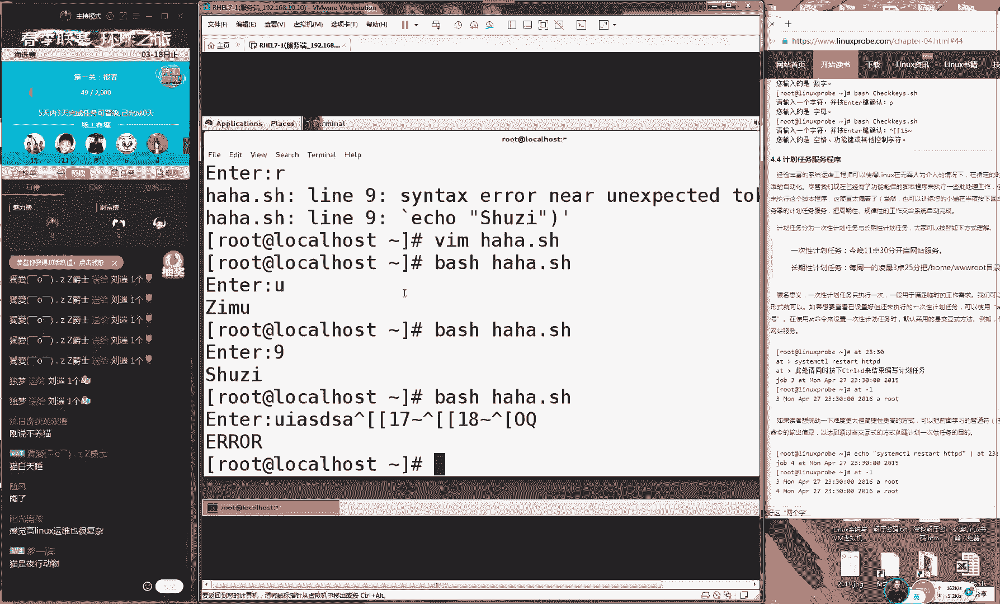

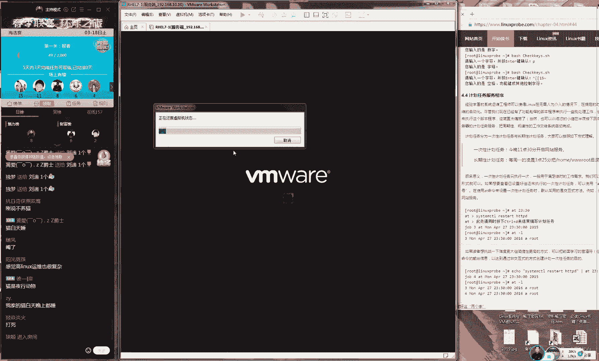

啊，好了，我们来去说一下我们这个计划任务，它有两种。第一种的话呢，我们叫做单词有效的计划任务，我们叫做at命令。大家记一下，叫做单词有效的计划任务，我们叫做at命令。它就是我们单词有效的。

它会它它就会是呃呃只会去执行一次的命令。我们叫做at命令。还有一个我们叫做CLOND这个就是一个周期它它的话就是有一个呃周期性的一个计划任务。它呃给它定义好之后，它会来去重复来去执行。

先给大家讲讲一个比较简单一点的。好吧，先给大家来一个比较简单一点的，就是使用的ar。😊。

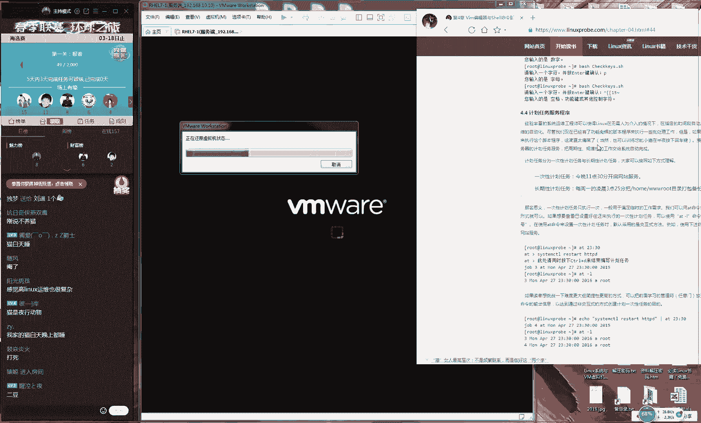

你可以直接这样去做at什么呢？你就来20点直接写时间20点，我们来558啊，不不太多了啊，等时间太时间太长了。48。你看我现在哎20点48，我们来定义说我们20点48的时候会去做什么什么事情。好了。

然后我们后面去交到我们的命令。为了让我们这个时间更加的直观啊，那我们就可以直接再去重启，然后我们来controrl D，这样的话也可以看到了，我们待会儿就会在8点48的时候会去重启我们的服务器。

这时候大家会可能会想那么我们这时候可能会想说老师。😊，那我怎么知道我们那我们待会儿我们这个程序会做什么事情呢？就是我们如果要我那我要那我要是忘记了。我们刚才定义的命令是什么的话，怎么去查询呢？

这样去做at杠L加上我们的编号，这个叫编号，我们来去查询啊，不不不这样。😊，叫做at杠L。那么你就可以看到了，当前你的这个系统里边有哪些还没有被执行的计划任务。😊，好，大家可以记一下。啊。

检查一下你系统里面有啊有几个还没有被执行的计划任务。啊，小红学是卡了吗？现在好了，同学们。😊，好，然后说怎么样来去查询详细的信息，这样去走ATC呃AT我看一下at。等一下。

详细的话应该是ADQ杠CE这哦，不对。ATQ呃呃叫ar杠C。一这样大家收入这一条，就是加上我们的计划任务的编号。😊，就可以来去查询我们具体里面的值。你可以看到他就会告诉你说这是reboot。

这是S杠C加上我们计划任务的编号。😊，好，我们可以再来呃，就是我们来去查询我们计划任务它有哪个，然后以及我们来去创建计划任务。

然后我们最大去学下怎么把它删除掉删除的话就是M加上我们计划任务的编号就可以把删掉了再去看没有了。给大家演示一下就是说我们该如何使用的命令来进计划务不可以隐藏然后就说我们该怎么样去使用这个计划任务来去管理我们这个计算机给大家演示一下说增加。

然后去查询去删除，然后以及去查看列表这么一个这个非常简单，因为它只是一个命令而已。以说它比较简单它不像我们待会去学习的那个周期计划任务它有一个格式这个它它是比较简单的这么一个计划任务。

我们再来使用188才们还让去重启然后我们保存的话是这个时候我们就可以看到了我们的计划任务。😊，已经是有了。好了，我们先看一下时间，现在是16呃18点48分40秒。😊，我们待会会在一分半之后。

我们会去重启我们的服务器。好，这个我们现在的话就把那我就把我的手离开我的鼠标和键盘，我去喝口水。大家可以看到我的这个电脑，一会儿一分钟之后它会自动去重启，而我不会有任何的操作。好吧，先看一下效果。😊。

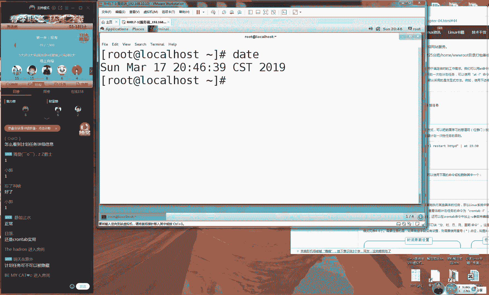

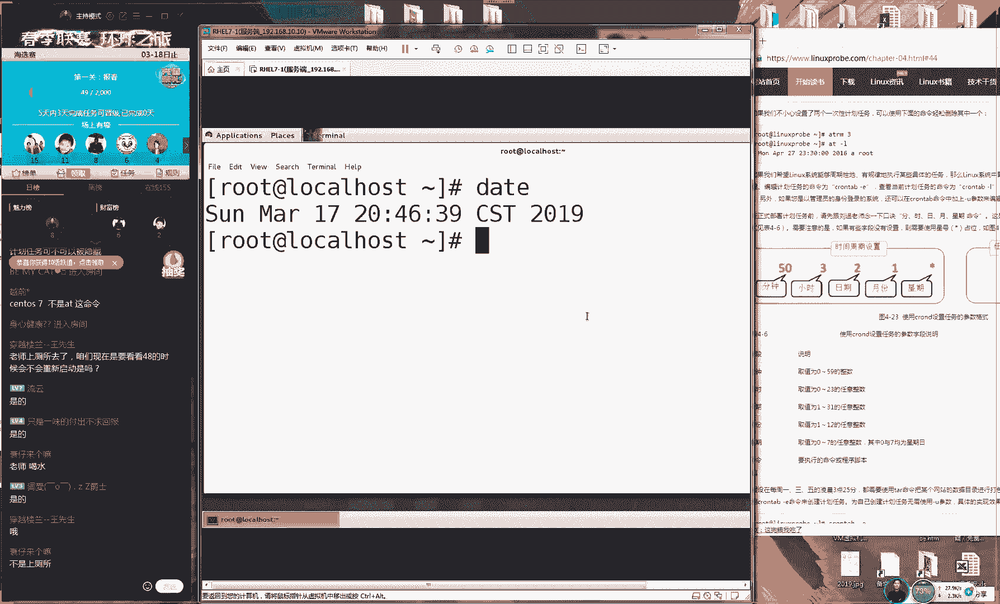

啊，好，然后看一下说啊说什么啊，说我是喝水去，其实我是用Pty。😊，啊，不说我其实用那个。到这个party啊，我们。

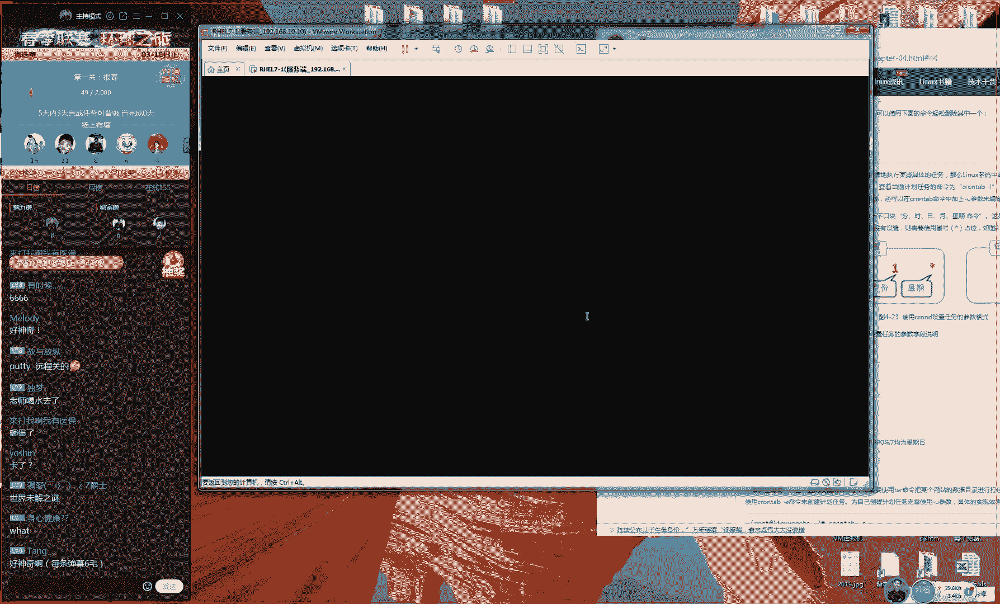

从远程去关了一下，其实真的是没有。好，就大呃其实大家其实大家要是其实大家要是觉得。😊，这可能不是很那个不是大家很觉得不很不是很真实的话呢，大家可以下课之后啊，自己去试一下。好吧，然后大家去试的时候。

我然后我就不可能说再重简程去关大家的服务器了啊。😊，其实就是一个比较简单的这么一个例子。我刚真的是。喝点水去了，然后我们来继续看一下，你们不要怀疑我这个好不好啊，这点技术还不，这还没有啊。😊，那。来。

我们来继续。

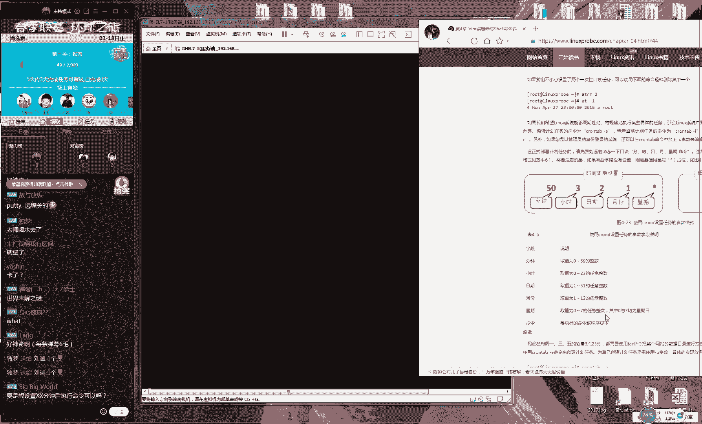

系。我看一下说什么，我刚才看一下都说什么了。还不能他不能指定个分钟后。他只能指定具体的时间。啊，但然这据呃但是这是据我所知是这样的啊，或许会有更加高级的使用方法。好，稍等一下，我看一下。好。

然后就没有什么正点的问题了，对吧？就是哦好神奇。哎呀，同学们你们。😊，我所以我我们这个课程一定要拉高大家的这个逼er啊，你这什么呀这么简单一个小事验，大家就得很神奇，有没有点什么追求啊？

同学们这个so easy呀。好了，我们接下我们继续往后面去说啊，有一个叫做这个有周期性的计划任务是这样的。那么我们这个服务名称的话呢。

我们叫做CND大家记一下CND是我们的服务名称CNTB这个是我们的配置工具。😊，这是我们的服务名称，这是我们的工具名称。我们待会配置的时候需要使用的是我们的工具名称来去配置。然后记一下有一个口诀啊。

大家记得你这个书上也可以叫做分。3。来教书上啊1。日。月星期命令好，大家记到大家的书上面。对，这个一定要是背下来的。这个一这个不光是要看啊，光光写到你的这个书上面是要背下来。好。

我先等一下分时日月新期命令。好，那么给大家去说一下的话呢，它配置这个服务程序的话。它有一个格式，就是分时日月星期命令。如果没有空啊，呃，如果要是没有的话，使用到这个星号做站位。好，给大家看一下。

先使用到CLNTEB杠E来进入到我们这个计划任务的编辑界面里面。先使用CONTV杠E进入到我们这个编译界面里面。那我开始去写，是这样的，没有的话用空，那么就要去使用到这个星号作战位呃，分时日月星期命令。

并且的话呢大家记下来，我现在说都很重要啊。我们的命令必须要以路径的形式来去写，它不可以直接去写一个命令。比如说。😊，呃。rereboot不那那啊哦那好然这样写是错误的，一定要写上路径的形式。

就是病里面的bo。😊，啊，能啊我们需要这样去做。好，那我们先这样啊，先给大家随便去写上。比如说我们并里面的t吧。比如说我们想要去使用命令去打包一个我们的文件。咱就咱比如说啊好了。

我们每天晚上我们需要打包一下我们的网站的目录。你看我现在给大家写上的命令。然后我们这个命令不重要，对吧？因为命令学习过那我们这个命令学习过很多遍了。我们现在这个关键啊就是我们的这个格式分时日月星期命令。

它什它怎么样进行一个组合。我先给大家讲一下，首先来说的话呢，分钟分钟的取值范围是从零到呃596050到59代表是分钟，咱比如说我现在取1个20。😊，那么代表就是每分啊每啊每间隔20分钟啊。

不这个啊这个OK啊，这个不行，我们需要给他一个小时。再比如说我给他一个3，这个代表是什么呢？代表是大大家先记一下啊，就是可以拿你的笔快速去记一下，我先给大家几个比较常用的方案，好吧。

然后我们工作的时候你可以去组合，你看啊，呃，这个代表就是每天的3点20分，每天的3点20分。😊。

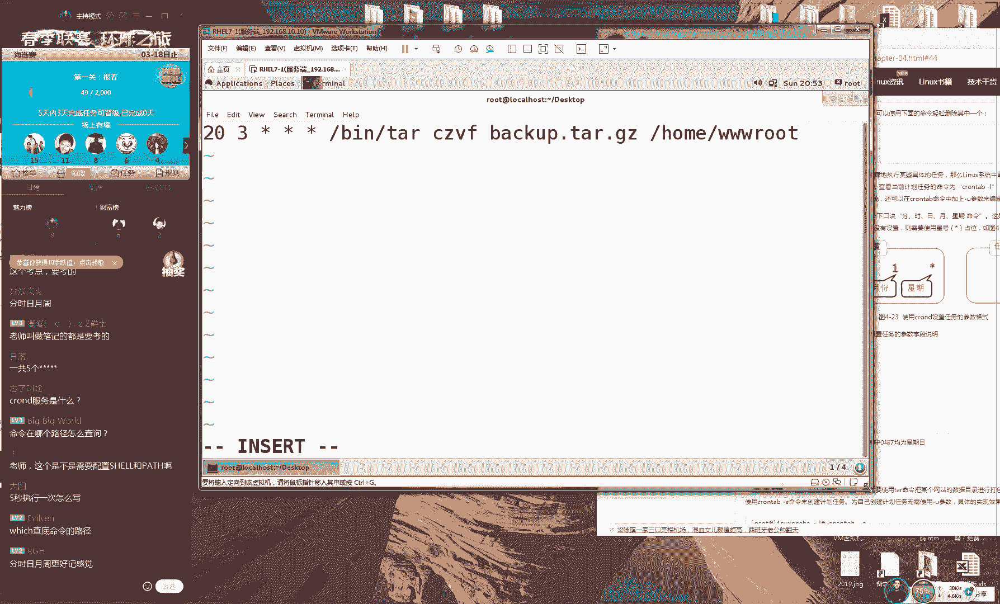

会去执行我们后面的这个命令，每天都会去做。而且他这个小时是呃早上起的3点20分啊，呃由呃他是由凌晨3点20分来去执行我们这个上脚本，再往后面去走。😊，写成一个2，这代表什么呢？或者说我们写一个失误吧。

我们为了避免说呃回给我们产生歧义，这代表就是每个但它代表是每月的15号，每月的15号到凌晨3点20分，他会去执行我们这个脚本。😊，好，我们再来。我们再写一个5，这代表就是每年的5月15号。

的凌晨3点20分，他会去执行我我们这个计划任务。我们再来我们当然这个日期不能够跟新奇去意识的呃来呃，他来去同时去使用的啊。因为你这个日期你说不好，5月25号到底是礼拜几。所以我们这个日星期这么去写。

比如写个三，他代表就是每年的我说比较快啊，因为我们待家回去之后呃，去看视频，可以来去不断去复习。他代他代表是每年的5月份，只要到了5月份，但每个星期三。😊，到早上起来3。3呃呃3点20分。

他会去执行我们这个计划任务。😊，呃，呃，他可以只有分，我待会待会我我待会呃待会大家去说道。好，我们可以这样去写。这代表就是呃每年中不论哪个月份，它会在每个星期三，这个其实比较常用啊，就是说他还循环之后。

他会在每一个星期三。😊，到早上起来3点20分，我们可以改更可以改更早一点。比如说1点20分，他会再去执行我们后面的这个命令，他是每个星期会对啊他去执行某个命令。好，我们可以再来把我们这个星期给他取消。

我们给他改成135。代表就是每个星期一，每个星期三，每个星期五，他都会去执行我们这个计划任务。好，再来我们把这个星号，我现在说比较快啊，目的上大家会去之后，你一定要去。😊，呃，我们怎么着？

我们会去之后一定要去看我们这个视频，强呃呃呃来去强迫你们去看视频。所以我现在会给大家去说十几种的组合方式。但是我待会去之后才去记来，我们这个日期，我们比如说我们可以这样去做一逗号1呃，我们一逗号5。

逗号十0逗号20代表就是每个月的。😊，啊，凡是遇到了一号、5号、10号、20号这几天啊，每个月里边的4天，我们会去执行后面的命令，还有后面玩这么玩从。😊，1到10写上一个减号。

代表就是每个月的1号到10号，我们会去执行后面的这个命令。每个月的1号到10号的1点20分，我们会去执行后面的命令。还有另外一种玩法。好，有会要要绕晕了吧。但是所以说比较复杂点的啊，然后1号到20号。

比如说我们这边还可以来一个1到3这代表就是每年的1月到3月份。😊，每个月份的1号到20号的凌晨1点20分会去执行后面的命令。好，再往后面走。我们把月都给它删掉，我们可以按照周期性可以可走啊，也可以啊。

我们来一个日期，我们日期这样去做，写上一个除以2，大概问到了啊。😊，代表是什么呢？代表是。每隔两天。每年不论哪个月哪个星期，他都会每隔两天，那就是说每年会执行一每年会执行180多次。

每隔两天会来去执行一下我们这个命令。那每呃每隔两天的1点20分回来去执行我们后面的这个命令。好，我们再来呃双双休日，他也他不管啊，他都会去执行。我们再来比如说我们的小时怎么这样去做。

代表就是每隔两个小时的20分，或者说我们可以把这个改把它改成个零啊。就是说他会啊每隔两个小时整的时候，他会来去执行我们这个计划任务。好，我们可以再来我们把这个1分钟我们也可以这样去写，比如写个2。😊。

这个我们会去可以试一下，代表就是每隔2分钟他会来去执行我们这个计划任务。好了呃，然后的话呢就是。😊，我们之所以给大家说这么快，那目的就是大家是跟不上，对不对？就这大家会去之后，把我们整个视频下载好了。

存到到手机或者电脑里面，我然后去不断的去暂停。把我刚才给大家去说那几个例子腾到大的书上面。😊，这是我能够想到的所有的这个例子。呃，我相信能够满足工作当中所有对于周期性的一种规划，是完是完全可以的。

然后这个就是我们调取编案编译器的，大家，然后我们可以保存并退出，保存名退出，这样就可以了。嗯呃，说5秒执行依次怎么写，5秒直执行依次就这样去写。😊，呃，按秒不可以。他没有按秒去执行。好，基本明白就可以。

然后我们回去之后就是各种组合方法嘛。我们去试一下。我看一下，还有说呃我们这个保存之后，它还是否会有大家看一下啊，我们先把它写好之后，整备编译器保存名退出。

我们可以去使用到CONTB杠L不我我还说着CONTP对不对？杠L就可以查看到我们当前用户下所有的这个计划任务了。它是呃把它给设置好之后是永久生效的，并且已经写入到里面了。

这个不需要写呃pas这个是不需要的。😊，但是我们要想上这个路径就可以了。好了，然后是这样的，然后今天就给大家去来聊了一下第四章节给大家做了个收尾，时间真的是比较合适。

这就是我们给大家讲的一个计划任务这么一个实验。😊，接下来的话呢我们先不用着急啊，我先给大家去说一下，我们今天这个作业。因为现在人数还比较好，我们先给大家去说一下作业。待会儿的话呢，呃服务怎么解释？

这个书上没有说这个只是个服务名称，我们这个不用管啊，我们只要去了解就是这个配置命令是什么就可以了。比如说腾腾比如说腾讯公司它是个公司的名称，但是我们真正去使用起来的时候。

你需要具体使用到QQ或者微信具体的名字，就跟大家去说一下，就是有人在跟你去说到的时候，你就知道他跟啊，这个工具是是他是他他们两个是一回事就可以了。删除的话就是直接。😊。

他调取就是VM编译器杠E可以使用到滴D清空掉它WQ保存退出可以的，服务器关了。那肯定就没有了，你把电都拔了，肯定是是不会执行了。好呃，行，大家这个呃对，就是这样的备份名称相同。

他就会每一次都会把它覆盖掉。😊，m。对他会把它给覆盖掉。因为你加了这个杠F也是。命令在哪，路径怎么去查询，这样去。ve意先稍等啊，我先给大家说一下作业。因为现在人数还在线比较多，我先说一下作业。

我万一一会儿下课之后大家都跑了，对吧？我说一下这个就是能够查询到命的所在路径了。让我给大家说一下作业好吧，数业呃作业的话呢，就是今天讲的比较多，但是我们其实不用多去掌握的。其实因为太多了嘛。

我们一定要会讲什么呢多分支。😊，多飞置的if服。就可以了，我把这个给我掌握好，这是我们今天的一个重点。还有TB的工具。这两个给大家做好了之后，我们今天就算没有白学，这就是我们的一个课程的一个规划。

下面的话呢我大家说一下啊，先不着急，我给大家做答疑。3月25号不3月22号，3月22日是我们要讲到第五章节，而且按照我们今天这个进读第五章能够讲完3月253月22号我们会讲完第五章节。好。

然后3月26号呸呸呸呸，3月23号我们会讲完第六章节。😊，然后我们的3月24号，我们会讲完。第七章节。好，这就是我们下礼拜的一个课程的规划。啊，大家提前做好准备。好吧。

这是我们提前做好要需要提前做下准备的课程。来，现在的话我们就可以来做答疑。同学们，我们每节课下课之后都会有答疑。然后今天时间还比较合适，大家完现在可以来跟我去说了。

我做答疑那计划任务可以调取脚本是可以的。你直接写脚本的名称就行。比如说我刚才那个实验里面。😊，我可以直接这样呃，比如先这样分时日月星期命令。好了，你看我先。直接去写上脚本的路径。

我刚才是在哈哈点SH这样去做就可以了。但是因为我们现在还需要给大家复制一下权限，这个咱们会在第五章的时候回家去学。如果现在需要去使的话，可以直接先要这样就可以让呃就先去执行一下这个命令。😊，啊。

现在sha里面执行这个命令，然后再去写上这个信息就可以了。多条计划任务的话很简单。直接这样去就可以了。按照顺序。这个单括号没有任何的呃呃，然后这个case语句里面的单括号没有任何的意思，只是一个格式。

这个呃代码很复杂，需要背下来吗？这个不需要。我们今天所讲的所有的一切，除了这个分时日月星期以外，没有任何需要大家去背的。包括说我们刚才说到这个考试原题都不需要去背，我们到时候会给大家再去讲的。😊，呃。

然后说上说嗯，然后我看一下计划任务打印一个命令。打印的话，它就不会显示在屏幕上了，它会打印到后台，全部是星号，星呃全部是星号，他会给你报错，这个是这个是不可以去执行，这能给大家去呃。😊，讲一下后面吧。

这道是新号是不可以的？好，然后就先这样吧，然后大家的话可以呃备份文件的时间设置。好，大家有的话，现在可以来跟我去说，然后我们就答一。好吧，然后没有什么其他问题的话，就可以先下线了。

然后我们下礼拜五的时候不要忘记Q上同学先不用着急，我等我下课之后给大家回，好吧，我待会陆续给大家来去回复。😊，我看一下说是不是声音在是泡面吧？啊，没有我这边手里有一个塑料袋。

然后说这个可以备一份每天的数据库吗？可以的，我们刚那个时验就是。😊，呃，备份我们这个数据库来，然后我们可以把那个文件名称啊，其实可以改成d命令不就可以了吗？😊，备份时间可以。对，可以的。你看这样去做。

我们要学以致用啊，是这样的。你可以如果说你要按照时间来去备一份文件的话，你把你这个文件名称啊，你这样去写。😊，这样这样这样，我们今天不是刚刚学过嘛，对吧？一定要血之用嘛，就这样对吧？不就可以了吗？😊。

这样的话，我们的这个文件名称打包之后就会是以时间来命名的。HCSC跟HC有多少道题目呃，告诉您一个更好的事情，您可以不用问多少个题目，您可以直接看到考试原题的。其实您可以进入到我们学员区页面里面。

下面咱们会有这个考试的这个原题啊，不光有题目的。😊，好，大家会现在可以来跟我去说。😊，考试的题目是可以下载和打印的。呃，脚本里面的CD为什么不能够切换目录？它是在后台去切换的。

它实际上是已经是切换成功的。那直播上我们只不过省核是没有看到。呃，答疑的话，咱们最好是在线的。这样的话，我们前锋所也能够听得到。因为我这边一般很少就是。😊，晚上吧我们会去上QQ。

然后我看一下定时就任务哪里去。呃，文件的话文件的话是在这是在ETC目录里面的CLNTAB。是在这个文件。嗯，是这个文件。所以说你可以直接编辑这个文件也可以的。是在这里。嗯。呃，可以不加括号吗？

这个是不可以的，必须要加括号，这个是一种格式要求。就是呃大家问的这个小括号是格式要求，这个没有任何意义。但是他不写的话，他会给你报错。😊，变量名是3NA呃，eical怎么去写，你定义一个变量叫3NA。

然后定义一个值，他会给你报错的。因为变量的名称不能以数字开头。所以带这个顾虑不对的嗯。好，然后大话可以来问我，我继续就是说我先。就先渲一下我们这个视频，大家可以看到嗯。哦，我先稍等一下。

这个是加括号是一个格式要求。就是我们刚才给大家讲过，它这是一个doller for，加一个小括号，就它一个格式要求。

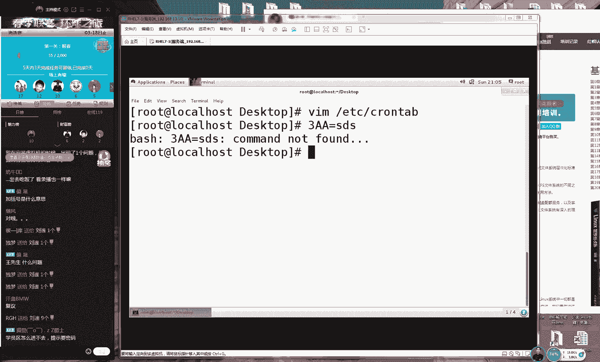