# 【RHCE】红帽认证工程师培训课程 - P7：第七节课 - 天木轮回 - BV14E411678v

OK那我们准备开始上课同学们，哎呦今天人数比较少，87个，我估计一会儿人就开始上来了。今天大家都忘记了。好，那我先打一下一吧。同学们好吧。

大家如果听到说话音那么请打一下一我们开是们今天的这个课程今天同学迟到人数会比较多我今天估计会到150人左右。但是可能大家都忘记今天礼拜五有课了。那给大家去强调一下。

就是咱们这个课程是以后每周五每周六每周日那我们都会有课的。大家以进入到咱们的网站当中，后面去加上re这么一个单词，然后就可以进入到咱们的日志那么就可以进入到咱们的上课时间表里面了。大家可以看一下。

就是说咱们这个培训是3月8号开，一直到4月21号们这个预计啊然后咱们是每周的5六日三天那我们都是有课的这大家需要注意，那么当然除了我们下礼拜的礼拜日没有课。好，那我们来看一下我们这边时间表。

今天的话是3月22号，所以我们今天。😊。

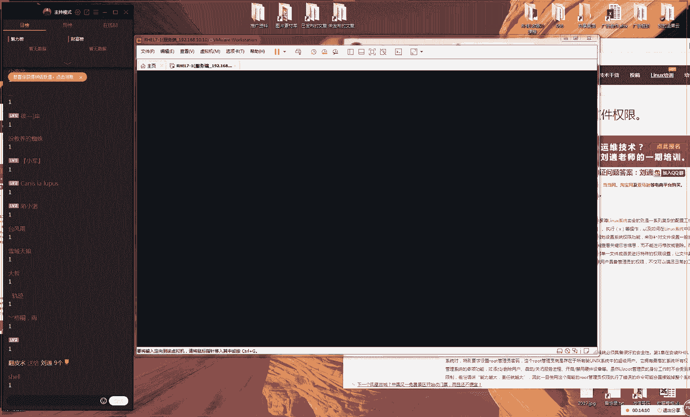

呃，周五是有课的，然后我们的明天后天他们都是有课的。而我们下个礼拜的时候是2930号有课，而31号没有课。大家记一下。好吧，我们下礼拜日的时候没有课的。好吧，我们下礼拜日没有课，我们是做一个活动。好。

那我们现来说一下，我们今天这个第五章节讲一下用户的身份与我们的文件权限是这样的啊，这个课程的话呢，其实会比较偏理论一点会是我们整本书里边呃基本上来说是最后几个讲理论知识，就是那么枯燥的课程的。

但没有办法，我们必须要通过这个课程来去打好基础的那我们先给大家讲一下，大家先尽量打起精神的。好吧，因为这个我们学好之后，对于我们后续学习是很有帮助的。好了，然后说如果看不了视频的话。

们可以看一下录像也是可以的。另外的话呢我们来给大家去说啊，咱们这个第五章节开始会有一些枯燥。因为最开始的话是讲理论。然后我们最后讲实战。而我们第六章节，明天也是会先讲理论后讲实战。

但是这个东西千万不要说忽略掉理论，然后直接去学。😊。

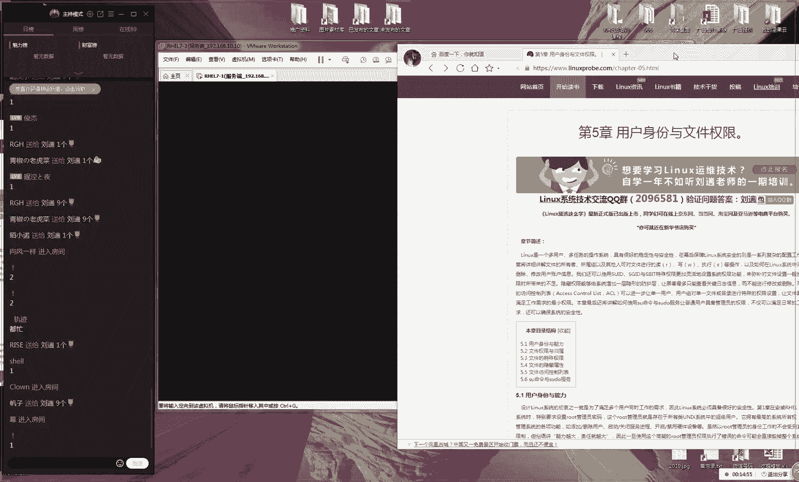

实战当呃那么到时候可能会学习的可能并不是很扎实，好吧。好，然后呃然后很多这个知识可能觉得比较这个肤浅。那好，那我们先在看一下我们的收集的5。1小节。那那我们来讲一下，说下在我们这个系统当中。

他这个用户是分为了三种类型的那我们要通过结合不同那那我们需要结合不同的文件用户类型来满足我们这个工作需要，他有第一种这个用户的身份呢，我们叫做管理员好他第一种管理员的身份，我们叫做管理员。

这个没有什么可说的，就是我们从那我们就是从我们安照我们的系统开始就有一个用户叫做入取用户，大家记得对吧？他是我们的管理员，他的这个权限是最大的，他的这个权限是最大的，但是的话呢他的这个限制是最小的。

大家记一下，他的权限是最大的限制是最小的，他是我们系统当中的管理员，他有对于我们系统的一个至高无上的管理权限。他可以对于我们这个系统进行任何的配置。包括说对于硬件的修改。那啊都是使用管理员来进行操作的。

大家记一下，这个是我们。😊，啊啊，这个是我们兄弟们的个这个呃管理员，他的话他啊他之所以是管理员，是因为他的UID号码是为0。那么我们什么时候啊，那我们来说一下，那我们什么时候呃这个UID呢？

这现在就是我们人类当中的这个身份证号码，每一个人每个用户他都会有一个这样的一个呃唯一标识符的号码拿去限定我们这个人的身份，咱比如说有一个人叫流传，对吧？好。😊，但是中国人可能出名的人会很多。

那并不是每一个叫流传的人，他们都可以比如说进入到咱们的网站里面去讲课的。那么那那怎么来去限定某一个人呢？

那我们就要通过我们这个身份证的号码来去具体来到到每一个的这个身份所以那我们这ID也是是我们系统里面这个身份证号码每一个人他都是唯一对应好的那我们这个管理员叫做用户他的这个ID就为0所以说他并不是因为他叫做ro用户。

他才成为了管理员。而是因为他这个身份证号码为零管理员。好了，那我们现在给大家说应该说是有限制是吧？应该说没有限制他是这样的他对于我们系统里面是权限他的这个权限是最大的而限制是最小的。

所以说我们当时以说们当这个管理员的话可以对于我们系统进行一定的这个破。我们我开过一个玩笑，就是一个命令大家知道叫M就是。😊，去删除掉我们系统里面的所有文件。就说当我们省管理员来去进行这个操作的时候。

确实会对我们这个系统产生不可逆的一种破坏。好，然后我们还有第二种呃还有我们第二种用户的这个身份，我们叫做系统用户。这个系统用户的话，他主要是用来管理我们一个一个的服务。那什么意思啊？

因为我们系统里面的话呢，他为了更加安全，他是将我们系统里面的一些服务的话呢，先去固定到某一个这个用户的身份上面，让我们的这个固定用户来去执行某一个绑定的这样的一个服务。这样的话好处是什么呢？

就是当有一个黑客来去入侵了你的这个服务器的话，即便他去入侵了你的某个服务。但没有关系。因为来去管理这个服务的只是一个系统用户，他没有登录到我们系统里面的这个权限。

所以说他是用来去保护我们系统的一个也是一个很好的一个机制。他这个UID号码的话呢，是从1到999。大家可以记一下的话呢，在我们红期里面，在我们红包日期里我们的系。😊，用户UID号码是从1到999。

而我们在原先的呃re5跟re6系统里面，大家可以记一下，就是在我们的比较呃比较靠比较以前这样系统里面的话呢，我们的系统用户的这个UID号码是从1到499。

所以当我们再看到这个UID号码其实我们能够大概去知道这个用户它是什么样的一个身份。大家记一下啊，系统用户的话呢默认来讲大多数情况下它是不能够登录我们系统的，它只是用来去在后台去运行某一个服务。

保证我们系统的一个整体性的一个安全好了这样话呢说管理只有管理员是零吧，是这样的咱们这个话呢叫做叫做这个UID它的这个全称啊叫做user，然后是这个INN应该是这么一个应该是这么。

但是我能这个识别这拼错了。就是说它是一个用户身份的一个唯一标识服这个是不会有冲突的好吧，这个是会有冲突。所以说。😊，他只有管理员，他这个啊呃他这个UID号码为0，其他用户他们一定是从一以后开始的。😊。

接下的话呢我们还有一个叫做普通用户。这个普通用户的话呢，在我们红猫re7里面，它这个上限是没有达到上限的。因为我们在红包re跟红re6里面，我们的这个普通用户的UID号码，我们re跟re6里面的话呢。

我们这个号码大家可以记一下他是从500开始吧？他到655365535个。那也就是说我们可以创建出来大概有6万多个用户他来为我们这个系统来去服务的那我600多个用户来为我们这个系统来去提供服务。

但是在我们红re7里的话呢，其实已经没有这个限制了。因为我们再去测试的时候发现即便到几十万几百万其实都是可以的。所以说我们红猫re7不用再去担心说具体可以创建出来几个用户了。

那就是说我们的用户的数量可以是从我我们的这个UID号码可以是从100到无穷，我们可以这样来去理解，就起码来说是可以满足我们对于创建用户这么一个所有的这种需求，我们都可以满足。😊。

那么你系统里面可以有几十万或者几百万个用户来去一起去完成工作。好，上亿，我们这个我没有去试过，反正我试到了几十万是完全没有问题的。他已经突破6万多个的这个限制了。

其实来讲6万多个用户已经是能够满足我们要他已经能够满足我们工作这个需要了，有个几百个用户已经是很了不得的事情了，对吧？我们有6万多个这个名额，现在而且现在有达到几十万几百万个。

现在已经是不用担心说他这个上限是多少了，这就是说我那我们系统里面有这个三类用户，他来一起为我我们这个系统来去提供服务。下面给大家大家去总结一下。因为我们刚才人数比较少，😊。

然后我们现在再给大家去总结一下，就是我们先呃啊我们刚才给大家所讲的就是我们系统里边他有三类用户的这个身份。这个三类用户的这个身份是不同的。他来一起来去呃运行我们这个系统，第一来说就是我们的管理员。

他就是我们这个我们叫做什么我这个最高领导人，对吧？就是我们一个最高级别的这么一个用户，他对于我们系统一个更加完整的一个控制权限。他的这个权限是最大的。而我们而对他的这个限制的话。

他是最小的这个用户的名称默认叫做入侵用户，他UID号码为0。我们再给大家去强调一下UID号码是一个唯一标识服务，只有我们管理员他这个号码为0，其他的话他一定是不会冲突的。好吧，他一定不会是冲突的。

第二类用户的话呢，我们叫做系统用户这类用户的话，他主要是用来去运行我们系统里边已有的一些服务来去一一对照的。这样的话呢，当黑客大家去想象一下啊，当黑客想要入侵你的这个系统的话，即便他攻破了某一个服。😊。

但是没有关系，他的这个权限仅限于禁锢在这个用户的身份下，他不能够进行更大的这个破坏。咱比如说我们呃咱比如说啊我我比较那比较喜欢吃。那我呃上学的时候，咱比如说啊但是这是假的了。那我比如说我上学。

那我那我上学的时候，然后我行贿了一个我们呃大学食堂的一个盛饭的一个阿姨好了。那如果说我对于他进行的一个攻破，他现在是我的一个间谍了。那好了，那么他就可以每次盛饭的时候沟啊，那他就可以多盛点饭给我了。

那也就是说我那我就攻破了具体的某一个服务了。但是我没有权限来去进入到后厨里面，然后进行更大的破坏，我也不能够说比如说我们把呃原先需要买菜买。😊，跟买肉的这些钱，然后我自己拿过去充游戏，对不对？

那就是说我的这个破的范围也仅限于这个服务而已，不能够提升到整体的这么一个系统里面。这就是我们系统用户的这么一个好处。在我们红包日期里说吃都比理解。然后我们红包日期里的话呢。

我ID号码是从1到999的那也就是说大概能有1000个用户来去管理1000个服这个也是完全足够的还有最后一个我们叫做普通用户，那我们那我们工作时也不能说是只是去私啃一个超级用户，对不？

那我们叫做这个入取用户，所以说我们要给我们的同事我们要给我们的朋友们，那我们要给我们自己创建出来很多的小号来一起去满足我们这个工作需要这个用户我们叫做普通用户这个UID号码是从1000开始的。

然后可以到几十万到几百万都是可以的这就是我们这个平时工作时去使用的这个用户身份。好大家拿起你的笔。后给大家去说一下啊，就是咱们那个活动还来继续的就是们去签到，然后。😊，笔记，然后去送书。

所以的话呢今天礼拜5大家不要忘记，好吧。如果之前忘记发的话呢，赶紧去补一下。今天我们算最后最后一天。好吧。如果说我们坦白说，就是呃呃如果说您之前没有发或者忘记发了。好了，请在今天我们3今天是3月22号。

今天是最后最后一天了。如果说您之前那还有比如说落了一两天没有补上的。请今天赶紧补上。然后我们今天发我们也算好吧，今天我们算最后一天3月22号，我们第一篇帖子必须发出来。然后大家就会大家去找一下你的笔。

还有你的这个书籍，赶紧把我们现在这个总结的内容写到你这个书上面。然后我们三个之后记得请一定要拍照好吧，因为我们不知道大家这个笔记写的怎么样嘛。大家一定要对于你这个书来拍照，拍完照之后。

我们加上一段自己学习的这个心得。比如说我们今天学习的一个笔记，然后我们一起来发到你的这个博客上面，我们算作是一个签到。等我们最后一天的时候，会给大家一个奖励这是我们所说的一件事情。好。

现在114个同学等到人数上来的时候，如果能到100。😊，呃，我们待会给大家先聊着吧，我们等啊等我们最后的时候。😊，我们给大家去说一下，我们约考试的事情。因为同学们最近已经在问我了。

说我们什么时候能约考什么的。其实我觉得也比较着急，因为我们到月底的时候要做一个活动嘛，然后可能会比较忙，所以我们尽量给大家提前安排，而且我们现在是讲的是第二期，对不对？

然后往前你们你们有19期的学哥学姐们大概人数有3000多人，我们现在没有考试的同学大概也有500多人，所以说我们这一期我们会尽量安排的。好吧，然后我们会给大家去预定位置。

所以我们现在想的就是我们提前告诉大家我们的考试时间，这样话我们第二期同学你们可以提前去约一下，等我们25号的时候，我们会公布到咱们的群里面，到时候咱们的往期学生们他们也就会来报名来了。

所以说我们来我们是现在是当红的，我们现在是当前的这一期，所以我们认为应该给大家一个优先报考的一个权利嘛，毕竟已经给他因为毕竟一些老学员们我们已经给过他们机会。但是他们可能说那会因为某些原因嘛，没有报名。

所以他们就按照25号报名。😊，好，这个我们到时候给大家安排吧，等我们到会人数多一点。然后等我们快下课的时候，大家去聊一下。下面我给大家去敲一敲命令了。好吧，既然我们刚才讲到了我们这个系统里面的用户啊。

说到这句话之后马上马上就上来了有20位同学咔咔后我说一下系统国内认证是不是有很多这个么去理解不知道拿消息啊，其实对比来说IT认证的话，是很有含金量而且的话我们认为现在这个数量并不是多。

因为一下下个科认证还是比较好的。其实现在也是不是很多但是你要说少的话肯定也多反正肯定我这个书买要好然话我们现在来去说一下我们具体有几个命令啊，第一个命令的话呢我们叫做是这样的。

然后因为我现在我只需要书帮提醒，我知道大概讲哪个章节，所我在把这个文字。😊，到最右面了，大家如果看不清的话呢，大家可以点开你的这个网页，然后点开我们这边第五章节，然后也可以翻开大家的书。

然后找到第五章节5。1小节到呃，然后这个里面会有这个具体的文字的，好吧。😊，好了，我们就先不说这么多呃，其他事情了，好吧，我们先在给大家讲课，我们下课之后然后给大家慢慢聊。

第一个命令我们叫做us它主要是用来去添加我们这个用户的那我们需要操作非常简单，那我们只需要加上我们用户名称就可以了。那我好比说我们叫做随便来随便来随便比如说阳光男孩同学叫这小光同学好吧。

那我们就以创建出来一个叫叫做这个小光的一个同学。那我们现在就可以去使用然后小光这么一个用户的名称。那然后我们就可以看到这个用户具体的这个信息了。

那也就是说我那我们现在就可以通过us命令就可以创建出来自己的一个用户。这个用户的I号码是1001我们大概可以去猜一下大概的话就是一个普用户的这么一个身份。好吧，那我们现在想一下。

就是那我们现在创建出来一个用户了。那我们以那我们可不可以指定一下个用户号码。但比如说有个老板特别的迷信。他觉得我既然是老板嘛，那我要。😊，那我要去行使一下我老板自己的这个特高的呃呃特殊的这个权限。

那帮我创建出来一个用户。😊，而我我们这个呃用户UID号码，他这个呃他的这个身份证号码。😊，咱比如说那他这个身份证号码，我们给他4个8好不好？8888，或者说我们给他5个8啊88888好了。

那我们现在加上用户的这个名称。好比说我们叫做boss好，这个时我们敲价回车，你再去看最后有出现了一个账户叫做boss他的这个UID号码为88888没有问题。

但是我们再创建出来的这个用户他会以上一个用户UID号码为开始，然后再建出来，所以说我们待会可以自己去修改了，这没有关系。那也就是说我们现在可以来去创建出来自己的用户，然后去指定一下用户的个UID号码啊。

家66666是吧？666这个夸可以，但是你要说6666UID号码我估计有点太多了。为你看一下这个个1百千万10万百万。😊，呃，我都数不过来了，千万6600多万个这个账户，这个我没有去试过啊。

这个号码应该是能达到几百万，但上千万我没有去试过。好了，那然后的话呢我们来嗯我们再来去玩一下吧。比如说我再去修改。那那那我再创载出来一个用户。这个账户的话呢，我们的修改一下他的这个GIDGID的话呢。

就是我们用户组的这么一个ID号码了，那我们来去修改成比如说66666，那我们给他666啊，5呃5个6好了，我们给他名称，我们叫做什么呢？我们叫做哈哈好了。啊，这样的话呢。

我们告诉大家这个用户名称是随便的啊，来我们来哈哈敲一下回车啊，他说。😊，啊，我们这个用户组必须要是存在才可以去修改。所以说这个我们先给大家挑过啊。

我们下一个命令是给大家去讲这个添加用户组的这个我们先不给大家去说。那我们再给大家玩一下。比如说我想要对于我们这个用户来去设置一下我们的用户的加目录。

那我们的默认的加目录是在这个Hme目录里面我们这个用户名称来命名的一个文件夹。但这个不用管是我们明天的时候这收会大家去说的但比如说我现在给那我们先给这个用户设置一个自己的一个加目录啊。

它是一个特立独行的好了，我们就可以这样去做给他一个home目录里面，我好比说我们叫做哈哈然后而他这个用户名称，我们叫做这样话我们敲回说他也是可以的。但我们现在不用去关心我们具体的这个目录的作用啊。

这个是咱们明天的时候给大家去讲到的。现在要大家关进就是说我们去创建一个用户的时候，实际上我们可以通过我们调整这个参数，可以来去初始化，们记一下叫初始化我们用户的一些身份的一个信息。

他初始化一下我们这个用户的这个身份的一个信。😊，好了，那我们再来下面我们来讲一个叫groupD命令。它用来去创建我们出来我们用户组的那我们什么叫优那我们什么叫这个用户组呢？

它主要是用来去呃划分一部呃划分一定的这个范围，然后来去统一去管理用户的那我们好比说一个公司里面有技术部，有财务部，还有后勤部，还有这个那咱比如说还有人去做饭的好了。

那我们就可以把不同的人给他划分到部分的，然后把这个不同的人划分到不同的组里面。这样来给他们来进行一个批量的一个权限的一个指派。比如说我们搞那我们做后勤的人，他们就可以进入到后厨里面好。

那比如说我们搞机房的人，只有搞机房搞运维的人，他们才可以进入到机房里面。那只有搞财务的人，他们才可以进入到财务办公室里面。那我们就可以给他一个身份的一个信息，就是我们的个工牌，对吧？

然后我们只有这个工牌里面权限指定好了，我们才可以进入到具体的范围里面。😊，这就是我们对于一类人来进行一个圈子的一个划分，叫做用户组。如果大家想要去理解的话，你们可以理解成部门。好吧。

就是你们公司那个一个一个的单位的部门。好，那我们现在添加出来一个部门好了，那我们叫做无所谓无所谓。们今量要以我们的同学名称来命名好吧，因为告诉大家的这个意思呢？就是说用户的名称。

还有用户组这些信息的话呢，是可以随便去写的，千万不要照着我这个去敲按照我这样去敲完之后最后做出来的效果都是一样的，很尴尬，对不对？好，那我现在来说一下，就是说比如说小福同学好吧。

那我们就叫做这个小爷同学吧很霸气，那我来敲一下这个小爷这个时候我们就可以看到有一个用户组吧，添加成功了，但是他可能会想说老师那我怎么知道他已经成功了呢，对吧？那我们他也没有什么显示出来的信息是这样的。

我现在只是给大家演示一下说如何去查看一下用户组信息如果说呃大家不大家如果要是理解的话没有关系啊，看一下有一个文件是C目录里面叫做group这个。😊，一个文件。好，我们敲一下回车。

这个时候你看到文件下面会有一行信息叫做小姨，对吧？后面这个信息我们现在不用看。那么我们如果说这个用户信息已经出呃，用户组信息已经出现在这个文件里面的话呢，就证明已经是成功了。好了，这个我们先不多说啊。

就证明一下，就是我们这个命令它是成功的。我们现在把这个重心啊还是放到我们具体这个命令上面好了。好，因为的话呃我们下面再给大家来去讲一下叫做us move的命令。当我们出建出来一个用户的时候，哎。

突然间怎么啊突然间发现说我们刚才创现我们这用户的时候，忘记。😊，啊，我们刚出现我们这个呃用户的时候忘记呃去设置某一个值了。咱比如说我们的用户UID号码啊，或者我们某某某个值了，那怎么办呢？

这个时候我们可以找一个用户，比如说我们做一个用户对吧？叫用户这个是在我们安装系统，就有这一个用户了那咱比如说这个用户虽然说已经有了，但是我呀不小心我忘记给他去设置I号码了。这个时候我要不要把给删除掉。

然后我们重新给建出来呢好，那这个时候我们就可以不用我以使用命令，你来去修改这个用户的信息。另外123同学提到一个问题啊，说用户组是自动分配的？

这个涉及到一个概念叫基本组跟扩展组我待会大家去这个不用我们来修改一下这个用户I号码因为我I号码是一个唯一标识符之前我们那个老板？了。以我我们现在想要把I号码给改成666666。😊，好吧。

那么我修改成5个6。好，我们修改一下我们这个用户的信呃的信息。好，我们再去查看一下我们用户的信息。然后你会发现这个UID号码已经发生了变化。就是说当你去创建一个用户的话啊，如果说你呃进行初始化的时候。

你忘记去修改用户的某一个值了。那么这个时候你就可以使用us名来进行一个修改，而不用去删除之后再去重新建立，这样太麻烦了，对吧？好，另外给大家去提一个呃提到大家呃问了一个问题。

就是说我们用户的一个基本组跟一个扩展组的一个关系。好，这个大家先截张图，好吧，这个很重要。😊，啊，如果大家没有记到笔记上的话，我们先去记一下笔记，给大家一分钟时间啊。

因为这个我们总结了我们系统里面的所有的用户的信息，就像于我们写脚本一样。我们脚本分为了三个，对吧？脚本的声明，本的注是本的命令，只要你知道我们现在的这个用户的关系了。当你再看到一个用用户的时候。

那你不用被他这个名称所吓到了，对吧？比如说我们举一个很不好的我们举一个呃没有任何奇义的一个一个例子啊，比如说有一个人叫温家宝咱比如说这个但是这个例子可能会比较这个比较尴尬。

那比如说你们班里有同学叫温家宝，那你每次见到的时候，你要不要举说总体好，对吧？那他能不能进入到中南海里面去办公啊，那么这个时候其实肯定是不可以的，为什么因为重名是有可能的，用户的名称也比较唬人对吧？

但是他的这个身份号但是他的这个身份证的号码暴露他这个真实的身份，因为你这个身份证号码是不能够重复的，而且是限定了某一个人的这个身份，具体某一个人他就会有一个身份证号码，而名称是可以冲突的。

所以我们就知道了当以后你这。😊，系统里面看到一个用户的名称很唬人，比如他叫做入取用户，但是他UID号码只要不是为零，他就一定不是这个超级用户，他就不是管理员。好了，那我们说这么多巴拉巴拉。

然后我们来继续给大家就是说我们这个用户的这个组的信息。第一个的话呢，我们叫做基本组。第二个的话呢，我们叫做这个扩展组。基本组是我们当啊是我们当创建用户的时候，你看啊大家创建一个用户的时候。

他就会呃呃默认就会出现一个与其同名的一个叫做这个用户组叫做基本组。这就是我们一个与生俱来的一个组。那我们比如说我们举个例子。😊，当你去出生的时候，那么你就呃当你出生那一刻，你就有了一个基本组。

这个基本组就是你的家庭。你的这个家庭组里面呢有三个成员就是你的爸爸，有还有你的妈妈。然后这个我们三个人是一个基本组。当然说我们这个基本组里面还有我们其他的这个亲戚啊，比如说爷奶什么的。

这个我们不就说他已经是当我们这个出生的时候就与生俱来的一个这个用户组里边就是由我们这些基本的一些关系。还有我们叫做这个扩展组，扩展组指的就是我们工作的时候，跟我们学习的时候，我们会有一种扩展组。

大家知道我们在去年的时候，然后有一些呃不法分子嘛，然后他们会去幼儿园什么的，他们会去拿刀去吓唬小孩，对吧？然后然后在然后在这个小学的门口就会有很多警察，然后去站岗。

然后然后防止说坏人然后后是然后是防止坏人去进入到这个进入到这个校园里面。但你想一想说那么你为什么能够进入到这个小学里面那么就是因为你是小学的这个工作人员。😊，而你是小。

那么也就是说那你是小学老师才那么你才可以进入到这个校园里面。这个的一个身份的一个认同，就是一个扩展组。当你到了工作的时候好了，那么他就会给你一个工作的一个执照。那就是你的这个工牌，加把你这个身份。

这是对于你的这个组的一种扩展的一个关系。当你有了这个工牌了之后，那么在这个学校里面的所有的老师就会跟你是同一个组的。大家想一下这个关系啊，就是当你成为老师的之后，在学校里面的所有老师。

他们都会成你的同事，这个我们叫做扩展组是在你的这个基本组，你的家庭，而不而并不是说你是一个工作狂人。那你一旦到了公司的之后，你就跟你的父母没有就是啊没有关系，对不对？那么你就可以保留你的这个基本组。

然后加入到一个扩展组里面。再往后走的话呢，比如说呃我们。😊，呃，我看一下说呃看一下基本组跟扩展组这个先不用着急啊，咱慢慢的这个咱们慢怎么给大家去说的。然后的话呢我们嗯比如说我们在有一个什么事情。

我们举不好的例子，我们想去医院去看病。那好，那你要去挂一个号。后那么你挂完号之后，那么你加入到另外一个扩展组里面，然后可以去更加扩展你的这个权限了。好，那也就是说大家总结一下，可能举好的例子比较乱。

就是说我我们这个基本组是一个与生俱来的一个组。好了，那我们就可以完成一些比较基本的工作。而我们随着我们的工作跟我们这个生活的一个需要，然后我们会加入到不同的用户组里面，这样的话我们叫做扩展组。

他来去满足我们这个工作需要那我们就要记一下一个理论性的一个知识，就是我们的基本组只能是有一个大家记一下基本组只能是有一个基本组可以只能是有一个而我们这个扩展组是可以有多个的这个上线我们没有去测试过。

但是肯定是完。😊，能够满足大家这个需要。大家记一下，我我们这个基本组是有一个啊，它是只能有一个。而我们这个扩展组它是有可以有很多个。那我们就可以来去添加一下我们这个用户身份了。

你看那我们现在这个用户叫做这个lin。它这个基本组就是它本身的名称。它这个扩展组啊没有，它只有他自己那好我们可以去修改一下我们使用到的命令。如果想要来去修改基本组的话呢，那我们就去使用的是一个杠小G啊。

它代表就修改我们用户的这么一个基本组。而我们现在可以使用一个叫一个杠大G。😊，他就是添加一个我们这个扩展组的意思。而我们刚已经有一个扩展组，我们名称好像是叫做。😊，M。小爷，对不对？好了。

我们叫小爷一个组，然后我们给他添加进去，后面加上我们用户名称才有假回车。这个时候我们再来看一下我们用户信息，这个用户就已经加入到了1个1004，一个叫做这个小爷的一个用户组里面了。

就是我们对于用户组的一种扩展关系，大家可以理解吧，就是我们基本组只能设有一个而我们这个扩展组可以设有多个这样的话我们可以让我们用户更好的管理他里面的这个权限信息。好。

然后我给大家讲一下该去如何去修改我们用户的这个密码对应的命令我们叫做他用来去修改我们用户密码了。我们直接签回车。然后他他代表就是修改我们当前用户的那我们也可以直接使用pasw我们去修改某一个人呢。

咱比如说我想要去修改一下有一个用户叫做哈哈对不对？修改一下哈哈没有一个用户叫什么来叫小光同学叫阳光同学叫小杨呃。😊，叫小光同学对不对？好，那我们现在去修改一下小光同学的这个密码。那我们敲一下回车。

这个时候我们的密码的话可以随意了，但是我们尽量复杂一点，我们来去敲一下确认。好，这个时候他告诉你说我们这个小光这个用户密码已经被修改好了。其实这个非常简单，没么讲。

就是我们可以去使用到pasWD的这个命令。你看PASSWD我们来去加上用户具体的那个名称就可以去修改一个用户的这么一个身份信息了。另外给大家讲一个比较难一点，我们来去扩展一下好不好？

就是我们可以去使用的他干嘛使得他用来去来去输出我们用户的他用来去输出一个字符串的一个信息，对不对？那好，比如说我们输出一个信息叫做比如说我们叫做小光真帅，我们做这个小光真帅。😊，这么一串信息。

我们来去输出到我们的这个屏幕上面。对啊，OK啊，小光真帅。那我们现在的话我们可以将我们这串信息。实际上我们可以跟我们这个命令来进行一个结合。因为你看到这有一个很麻烦的一个事情。

就是当你想来去重置一个用户身份的话呢，那么你需要来去重复来去输入一下这个用户的密码。这样的话很不适合于写入到这个脚本里面。那么我们要给他来去结合一下，来让它自动的来用一句话啊。

啊来用单个命令来去重置我们这个用户的密码。好，这个密码太长了，我们可能看起来命令的时候会换行，所以说我们现在我们就把这个改成叫叫做真帅吧。好吧啊，我们的这个密码就是叫做真帅。

然后我们去使用的ic使用到管道服。这个管道服它是将原先要输出在屏幕的内容。大家大家回忆一下啊管道服的作用是将原先要输出在屏幕的内容。😊，然后我们交给我们的后面的命令的话呢，我们再来进行二次处理。

后面的命令叫做PSSWD它用来去重置我们用户密码了。后面加上一个参数是一个常格式代表就是接收标准输入的一个参数。

大家可以来大家如果需要的话可以来看可以去使用到命令来看一下我们命令具体的这么一个含义这边会有一个参数叫做DIN可以看到这个参数的解释的话呢说这个参数它是用来去指定什么呢？它用来去指定密码了。

你看啊它是用来去指定我们用户密码的一个参数，而是从哪里去读取呢？它是从一种叫做标准输入中去读取的which就是指的是一个定语，对不？它用来去解释什么叫它指的就是啊什么是一个标准输入呢？

它指的是一个管道服。那也就是说我们可以去使用的这个参数来去专门来去接收我们前面管道服输入管这个内容然后当做是我们用户的一个密码。我们好比说我们这个用户名称，我们叫做。😊，我们来敲一下敲回收好。

这个时候大家可以看到就是我们使用了一个单个的一个命令，就来去将我们用户密码给大家去重置了。好，再给大家去解释一下。大家没给大家解释一下是这样的那我们先去使用一个。

将信息输出到我们这个屏幕上而我们现在则是使用了一个管道服将我们原先要输入在屏幕内容的话呢，我们交给我们后面命令再进行一个二次处理。后面命令用重置我用户密码了。而他可以去接收我们前面输入内容。

那么因此那我们就可以使用到单个的一个命令来去接收到我们用户输入的这个密码去接收一个信息来去充当我们用户的这个密码我在给大完个比高的个使用方法。大家能够理解的话呢。

其实第四章的讲脚本的时候给大家去玩过的好，那我已经了一个添加用户？后修改用户，重置我们用户密码新建我们用户组。😊，其实我们现在应该去学习一下该去如何去删除掉用户，对吧？那我们再来去删除用户的话。

我们使用的叫做us来去删除掉一个用户。这个用户我们随便了，我们比如说我们删除掉小光同学的这这个账户哈，小光同学把它给删掉，我们敲回车，然后我们可以来呃，但是我们这样删掉之后啊。

你再来看一下小光的这个账户就没有了。但是当你再进入到后目录里面，你会发现这个目录里面还会有一个叫做这个小光的一个文件夹，这就是我们小光的一个加目录什么意思啊？就是说我们现在的话呢。

即便把这个用户给它删掉。但是。😊，我们用户的这个信息还被保留下来了。我们举一个很不好的一个例子啊，就是呃比如说某个人啊去他是趋势了，然后我们需要去派出所里面去消掉他的这个信息，对不对？

然后从此这个人的这个身份证号码就没有了。但是他这个档案可能还会保留在某一个部门里面那他这个他的这个材料可能还会在某一个个部门里面被保存下来了。所以说我们如果想删除掉个用户非常干净的话呢。

那我们就要去使用的但是我这个子不代表就是懂，然后我们就要使用一个杠R参数来去删除掉做这个用户代表就是一个递规操作，代表就是我们去删除掉这个用户的信息加上我们用户的一个个人的资料，我们都给删除掉。

家记这个上面杠R操作作用是删除掉我们用户的这个信息加上我们的这个用户个人的这些资料信息我们叫杠R操作另外呢是我打错打错打打错。😊，打错打错我打错了，应该是delete DEL。好，我们敲一下回车。

这样的话呢我们这个用户的信息就没有了，并且我们用户的这个加目录里面的数据也就没有了。可以看到都是很干净的。是这样的，给大家去说一下，就是因为咱们现在这个上课人数比较多。那。然后的话咱们这个课程比较紧。

大家如果这个提问的话呢，我没有看到的话，请不要着急，大家可以来去先去互助去交流一下。因为这个东西难度其实还并不是很高，对吧？而且我们同学们技术比较好，如果说你有问题的话。

可以现在去发到咱们这个聊天板里面。😊，大家可以来去互助来去交流一下。如果说呃大家知道的话呢，可以先来去交流一下。如果说不知道的话呢，咱们可以等下课之后再来发给我，咱每天下课之后都会给大家做答疑的。

并且今天我们下课之后给大家去说两个比较重要的事情然后的话来给大家去说一下叫做这个用户的这个我给大家讲一下我们文件的权限跟归属这个很难我们大概我们会讲一个小时过这个章我会大概会给大家讲一个小时。

讲一下我们文件上面的这个权限，然后以及我们的数字法我们权限法的一种转换。我们说525。3小节大概会一个小时把学透给大家讲一下我们用户的这么一个文件类型是这样的。当我们想去查看一个文件的话呢。

我们比如说我们现在查一个文件信息，那我去使用一下做查看用户的这个信息查一下我们这个文件的信息的那我看一下我们这个文件信息里面的第一个字节，其实大家讲第一个字符啊，它就是我们的这个文件类型的但是我们之。

😊，可能看到了，但是我们看不懂。大家可以看一下啊。第一个信息我们就是文件类型。你可以看到来家记在你的书上面啊，就是我们这个减号，单个减号代表就是一个普通文件，它指的就是一个人能够读得懂的信息。

那比如说我要看一下啊。😊，比如那咱比如说我看一下这个信息，这个信息就是人能够读懂的信息，它是一个文本信息，它也就是一个一般文件。所以说它这个类型是一个以一个减号来开头了。那比如说那什么信息。

那我们是看不懂呢？这样的信息我们是看不懂的这个信息我们叫做设备文件信息。这个信息是我们人看所看不懂的啊，它都就崩溃了啊。好，我们再来。😊，已经让我们系统都产生崩溃了。所以说你看这个你要说系统没有bug。

怎么可能没有bug。你看是吧我们现在这个终端啊，我们的命令什么呢？你看都已成这个样子这个鬼东西好这个好有点像是你们有看过一个电视剧叫生爆爆炸生大爆炸里有一种克林公寓不？

说那种看这是是外星人那就是说我们我们如果是以号开头的话我们代表就是一个一般文件是一个普通文件指的是一个配置文件的意大家以记个书上面单个号开头做文本文件如果是开头的话我们做目录文件目录文件理是进入到一个目录的意思它可以来去里被保存文件还有个是链接文件我第六章讲。

😊，命叫做L罗N。到时候我给大家去提到，还有一个叫B块啊，还有一个叫叫B和C。B代表就是块设备。C代表就是呃代表就是字符设备。😊，其实你要干说啊，就比如说你几己看书，你给我看到说块设备跟字符设备。

其实我想我其实我想疯了，我也不知道什么叫块设备，什么叫字符设备。其实就是我们这个呃硬件的这些设备。比说我们的硬盘比我们的光盘。比如说我们这个鼠标键盘它都属于B它都是属于叫做块设备。

但我回第六章到明大家就是我硬盘设备们叫块设备有P设备这个管道设备。但这个少不提那就是说我们在可以通过我们文件前面的这个字符来去知道我们文件具体一个类型而我们啊不用再去需要通啊通过我们这个文件上面的这个颜色来去判别这个比较高级对吧？

你看这边的话呢我们会有这种叫做D还有个号号指的是一般文件D是一个目录文件是个块设备。只要我们知道这三个比较常见就可以了。那我们来看一下我们这个文件上面它会有权限这个几位这位其实来说就是我。😊。

我们的权限信息，它分别代表就是我们这个所有者所有组及其他人。我们今天晚呃从现在开始的半个小时时间里面，我们都是为了去学习这9位信息。然我给大家去讲呃比较清楚一点，好吧。😊。

所以说我们这个信息虽然它只有9位，但是我们需要给大家去讲啊来去啊来去充分的去讲解一下。第一来说就是我们我我们这个9位信息的话呢，实际上它是分为了三啊，它分为三种信息的。第一来说就是我们这个所有者信息。

第二来说就是我们所有组信息。第呃第三来讲就是我们其他人的信息。三位三位一段，但我们即便说我们这个权限是RW那减号R渐减啊，我是RWXRWX。😊，啊，把小细就不要看好咱们比如说有它有一个权限，它是这样的。

那么实际上它也是由三位三位之间一段的，分别代表就是所有者权限，所有组存在及其他人的权限。这个所有者指的就是我们这边用户的信息，它是归谁所有的，还有一个组它是归哪个组所有的。

还有一个其他人就是除了这两个人之外，我们所有人的来去共有的，咱比如说我们举个例子，举一个我们现在这个房产的信息，大家知道现在这个房产的话呢，我们产权要到位对吧？那比如说你在城市里边你买一套房。

那肯定要买私房，那你肯定要去过户对吧？那么最后你买完之后你会得到一个大红本这那么我们这个大红本的话呢，当你买到手之后，那么这个房子也就归你所有了。那么因此这个房屋的所有人等啊那么那么就是你了。

那么你就成为这个文件的一个所有者。而所有组的话呢，大家知道现在这个农村对吧？我们这个宅基地，他肯定都是集体承包制对吧？它是归某一个大队的，可能归某一个。😊，相的那好了，它是这个集体承包者。

那么它就是归于某一个组所有的。而这个其他人指的就是呃我们这个所有人减去呃文件所有者减去我们这个所有组只要两个包含的所有人他们都属于其他人这么一个类别好了。

既话我再给大家去说然后是这样的然后大家提到说个命令啊什么这个不给大家去说了吧，因为我待会大家讲到的这个先不用着急啊，大家现在这个学习热情很高啊，而且预期的很快都预期到后面了。那我们看一下我们这个权限啊。

它是分为到三位三位一段的那我们这个数字它其实来说它也可以转换。那那咱比如说对分为到三大类的他有这个RWX那我们来去说一下。

他有这个数字法的一个转换R的话是4W是X是一是这样的不理解说为什么我们需要对于这个字母还有一个数字的一个转换大家先不用去管大家先去记就好了，它主要是。😊，对它进行一个转换的一个灵活方法去使用。好。

那也就是说我们的一个权限上面，它应该有RWX的一个信息。然后它分别就是421嘛，对吧？然后他要是有的话，就是有421。如果他要没有的话，那就是0。好，那我先给大家讲一下啊，大家现在打开你的笔记本，然后。

😊，打开你的书，我要给大家去说一下，说我们这个RWX这个权限分别对在我们这个文件上面的这个作用。其实啊很多考过，即便你考过C了，但是会有很多水货这个会有很多水货嘛？

他们都到最后到最后他们都明白我们这三个权限对于我们的文件和我目录到底有什么样的一个作用。其实真的真的是很多人他们都不知道的所以说这个我们一定要把搞清楚，而我们不用这样话我们就不用说得很模糊了。

好先给大家去说一下啊RWX这个三个权限的话，我先给大家去说了啊R的话代表就是read代表就是读取的意思。R读取权限，代表能去读取一个文件的内容的信息的意思W它的是写入信息。

它只能是我们能不能来去写入一个文件的信息，我们能够对这个文件进行一个修改权限。还有后这个X它指的就是一个执行权限。那我们能不能再去执行一个文件的意思。好，大家记一下啊RWX分别代表就是读写。😊，权限。

而它在我们这个具体的文件上面的作用是不一样的啊，它在我我们这个具体文件上面的这个作用是不一样的。在我们的这个一般文件上面，大家记一下啊，在我们这个文件一般权限上面的话呢，R权限。

它指的就是来去读取这个文件内容的权限。R权限它指的是我们来去读取这个文件内容的权限来去读取的意思。W它指的是我们对于文件内容的一个修改权限，修改的是我们文件具体的内容那修改的是我们文件具体的内容。

最后的这个X，它指的是如果这个文件它是一个脚本文件的话，那我们这给大家讲过叫叫这个本文件。😊，那么我们就可以来去执行我们具体的这个脚本文件。那我们来再给大家去说一下啊，最后来说一下。

就是他们如果他是在一个一般文件上面的这个RWX的权限，分别代表就是来去读取文件的内容的权限以及修改文件内容的权限。最后是执行这个文件脚本的权限。那我们如果对于目录来去讲的话呢，其实这三个权限就比较难了。

很多水货C他们都没有去搞明白啊。第一来说这个R权限指的是我们能不能去看，因为你想一下读取一个目录，其实这个说不通的对吧？因为目录没有内容，因为目录是用来去存放文件的。

那我们这个R权限指的就是我们能不能来去读取这个目录内文件列表的权限。好，大家记一下。😊，我那代啊，他代表就是我们能不能来去读取这个文件加内列表的文件啊，读取目录内文件列表的权限叫做R权限。好了。

我说稍微哦我那我说的稍微慢一点，好吧。啊，R权限对于目录来讲，是我们能不能来去查看该目录内文件列表的权限。还有这个W，因为你想一下，说你去修改了一个目录，其实这个话它是说不通的，对不对？

那么这个W它指的是我们能不能在这个目录内来去新建删除以及重命名文件的权限。😊，W权限指的是我们在目录内，那我们能不能去啊新建删除以及除命名的这个权限。这个权限大家要记清楚，也大家不要做水货，对不对？

当有人在跟你说到这个RWX的时候，不要再跟别人说啊这是读写执行权限了，对吧？那你要知道它在目录上还有在这个文件上面它作用是不一样的。好了，还有我们最后这个X大家想一下啊，我们的X指的是一个执行权限。

执行一个目录，这个好像说不通，对不对？执行一个目录，这个话说不通的。所以说我们的这个X权限指的是你能不能进入到一个目录的权限，就是你能不能去切换目录的权限，切换到一个目录的权限。😊，啊。

切换到一个目录的权限，叫做X权限。好，大家记一下啊，这是对我们在这个目录上面的RWX权限。所以说作用上可能跟我们文件上面差不多吧。正也但有一些细微的一些差别对于我们这个目录它是不一样的好。

那我先给大家去总结一下能说百文不一看不如看实验我们大家说这么多理论东西，大家要枯燥死。我们先给大家做一下实间。你看啊先给大家提几个问题。后我们接下来需要大家跟我去互动一下。好吧，现在我还是多动。

大家多动手我来去说一下RR的话呢它是代表就是一个读取权限。它对应的数字是多少说说功能啊大家告诉我说具体这个数字法是多少来告诉我那R的话代表是读取内容的意思对数字法是多少告诉我说是为什么数是R呢？

难道说你是个中间商吗？😊，明明是个4，然后自己赚走了一半。好，那我来看一下啊，就是这个R的话，数字法是4。那还有我们这个WW代表就是我们去修改去写入一个内容的信息的意思。这个的数字法是多少啊？😊。

我们这个数字法是2好，大家先先申请我啊，因为这个东西可能你看起来先看起来好无聊，对不对？你明明就是一个字母，他把这个字母转成一个数字，这不闲的慌嘛，对不对？但是待会你去转换一下。

就让你会知道这个东西很重要的。最后就是这个X啊，就是代表就是执行一个文件的意思。如果他是个脚本的话，那么就可以来去执行它了。这个的数字法哎哇，但是告诉我是多少啊，应该是一，对不对？OK啊，421好。😊。

那也就是说我们先对于一个文件的这个权限，我们现在也有一个初步的一个认识了。RWX的作用我们第一我们知道对不对？读解执行权限，以及我们去细分了对于我们的文件。😊，跟我们这个呃目录的一个作用。好。

第二点的话就是我们对于这个权限，我们会的一个数字法的一个转换，起码知道RWX对应的这个数字是多少。第三，我们知道我们的这个权限分为9位，而其中是三位三位之间唯一段的对吧？它是三类的信息。

分别为我们这个所有者所有组及其他人的这个信息。这个三个点我们把掌握好之后，给大家去玩一下我们这个转换法。现在我们看一下这个权限分别玩现在我们现在这RWXRW减号R简简好。

那我给大家现在去转换大家看我怎么去转换啊。你看啊当我们这个是个减号的话，它指的就是这一位上它没有权限哦，同学们这个反应很快啊，第一位说是谁第一位是谁先说来。第一个是小南同学啊，就一下说出来了嗯。😊。

哎呀，你们都已经预习的这么好，你们干嘛过来听课了呀你们过来砸场来了，是不是啊？大家不要这样啊，大家配合一下我对不对？先先要去装出来，不知道这个老师我我这个我不会啊，对不对？这样我们讲课的时候。

我们才有动力，样我们才能说啊你们看你们不会对不对？那我给大家装一下对不对？你满足一下我这个虚中心好，大家先就先就先就先就先就先放一放好不好？给大家讲一下好是这样的你看啊这个权限。

他虽然说是三位三位之间一段的，但是他之间啊不你看我都说出来了他虽然是一个整体，但是他是三位三位之间是一段的看啊那我们先那我们来说就是RWX就是421好嘞，然后接下来是42他没有权限的话，那么就是一个0。

因为他没有权限嘛。R的话就是400好了，400那我们给大家去加一下。那我们就是三位三位之间互相取下相加就是74加2加1。😊，同学们你们不可能说这这个加减法不会，对不？而且现在是讲的是光是加法。

而而且我们现在算的是1以内加减法，1以内的，不是现是先算是一个7内的一个加减法，大家不可能加错啊，所以说当你去说错，就一定是自己想错了。来4加二等于多少，等于16这多少是4。

所以说我们现在把它转成这个数字法就是764。好，大家先不用管它具体有什么作用啊，先这样去记就好了，764。然后待会我们给大家去拿去十加的时候，你就知道这个特别的方便。这就是我们的一个权限法，764。

然后我们来继续我们下一步764，我们加一起7加6加加完之后等于13所好麻烦，对吧？那我们先去加这个六跟4加在一起是11加7呃17好，最后我们的这个权限法算出来是17，这个没有任何作用。

同学们这个是算错了。😊，然后因为我们这个权限法之间是毫无关系的。我们好比说我们举个例子啊，举个很不要脸的例子。好比说有一天我。😊，比如说我特别我特别有钱，我去啊，我也不是特别有钱。😊，我生活在北京。

咱比如说啊那然后的话呢，我去了一个饭馆里面，然后有一天马云跟王跟跟王呃跟王呃跟王健林。😊，他们两个人，你们都他们都知道是谁吧？说这个马云跟王健林，他们恰巧也去的那个饭馆里面去吃饭了。好。

就恰巧去呃都坐在他们都坐在同一个桌里面在就是说他们两个在吃饭，然后话我正好过去了啊，当我们三个碰在一起的时候，然后我那我就可以去说说我们三个的这个经济实力可以撼动整个亚洲的经济，你看我我这个话没有错。

对不对？因为呃我加上马云加王健林肯定说这个经济实力很厉害的。但是实际这个加之后是没有没有任何依据的对吧？因为对方的钱也不是你的钱，对方信息也不是你的信息，对方的权限也不是你的权限。

所以说我们这个三位的信息加在一起是毫无用处的，好吧，所以说当你算出来764的时候，这个是一个高手，说你给我算出来是一个17的话呢。😊，证明你的数学加减法很不错，你小学毕业的这个啊心思很快，好吧。

那我们就知道这个一定都是764啊，我们千万不要接在一起。因为你就去想这个例子啊，就是我们的马云跟王健林一块吃饭100顿饭，也不能说让你成为成为百亿富翁好了那我们现在再给大家去玩一下。

就说我们这个权限法的一个转换才有一个叫小单场同学反的很快啊，那我们再给大家提个问题，大家一起来去说好吧那所以说我们现在这个课程啊不要听人家什么老师跟你们去说什么上课什么的这个咱们现在这个文件转换法已经是很熟练了。

对吧？咱们上课一定要提高难度，咱们呢这个目标的话呢不是让大家学会而是要快，对不对？我们一定要快就是别人不一样，别人都是在会这么一个层面咱要快我给大家一个权限。

请将他快速转换成我们这个数字法RWX快RWRW。😊，OK大家快速给我转换成我们的这个数字法，一定要快。同学们好，大家先打着啊，大家知道周星驰里边有一个电影叫功夫，对不对？里面有一个叫火云先神的一个人。

他当时怎么说的？😊，他还说这个天下武功吧，怎么样，唯快不破啊，所以说当你看到这个题目了之后，你就得赶紧说啊，告诉我们说这个怎么样。😊，打出来。好，然后的话呢是这样的，如果大家已经做过预习。

而且基础很好的话呢，我希大家不要这么配合我。因为你们这么配合我的话吧，我有点心虚。我觉得呦今天这个基础到底是好还是不好啊，这个预习到不到位，而且万一有人给传出去的，说哎然后说哎你这个讲课好水。

讲半天人家都没有给想清楚，是这样的啊，我们为什么这么说呢，就是因为老刘是讲技是一个讲技术出身的一个老师，大家都能够大家能够发现，对不对？然后所以的话呢我们会有一些梗会去反复去说。

因为即便是德云做的那个郭德纲，他那个段子也都是重复性的，对不对？所以说这个梗啊是一个老梗了。我们从最开始我们做培训的时候就有这道题其实大家说是个错题，这道题他其实来说是个错题。

大家现在不论给我发什么都是错的。大家不要大家大家大家不用告诉我说是766还是什么77无所谓，你告诉我是10000都没有什么用处。因为不论你说的是什么，就一定都是。😊，错的，因为这道题它是出错的。

所以说这道题的目的啊不是要并不是说让大家呃。去去真的要去算一下。我主要是就是我自己心里有个数，就知道大家现在这个预习的这个情况是怎么样的。因为只要你看过预习的这个视频。

你就一定会知道这个这个这个题是错的。好吧我们看到这些预习情况并不是很好啊，但是你们很奇怪啊，你们预习情况不是很好，视频没有去看过，但是你们的这个学习的情况当然很快啊，这倒奇怪了，好。

那我们再给大家出道题吧，就是我们这个他怎么错呢？就是因为你没有权限的话呢，我们没有教过说使用空格去做位，对不对？你没有权限的话，一定要要那么我们要说到这个减号去做展位。同学们记一下啊。

没有权限的时候使用的是减号去做展位。好，这也很奇怪啊，你是我教过最奇怪些同学，你们怎没有预习过，但是反应还这么快呢，而且还能说错还说对呢？好，那我给大家出道题，大家快的告诉我第一个是RW减号。

然后是R减。😊，呃，R出要比较难一点的吧。好吧，你们不能这么再放纵你们了。RW呃，我们这样啊没有没有没有没有，还没有给大家打完呢啊，我怎么说比较难一点的RWX你看我就应该再差一位减减X好了。

大家把这个给我转换成我们这个数字法。同学们，你们到底是不是我请了托，我自己有点心虚了啊。你们这样。😊，你们这样话让我自己都怀疑我是不是请了托了。😊，好，大家先不用着急啊。如果说您嗯没有好啊。

还不会去算的话呢啊没有关系啊，我待会会给大家去说我们怎么样进行一个转换。好吧，先去想一下，如果说你大概会的话，就先去试一下。😊，哎，所以我都有点心虚啊，你们但是我请了托儿。😊，这打的也快。

这接打的也太快了，我戏心里都没有啊，还能没有点数呢。😊，行，咱们这个托们啊就不要那么假了，是不是你们这样太假的话，其他同学会觉得我们好啊会啊他他们他们会看出你来的。好了，那我们来给大家去说一下。

如果说您会的话，就先打着好吧，如果说要是不会的话，那我给大家讲一下RW1个减号RW减号你转成这个数字法嘛，转嘛对吧？420这个我们会对吧？然后的话呢就是401你看对吧？因为他没有权限话。

那那他就是0001你001好，我们三位三位之间一段千万别给我加在一起4加2644加15还有这个1651对不对？你看这就是我们的一个转换的一个方法。好了，如果说您现在已经觉得很无聊很无聊的话呢。

觉得这个怎么讲这么长时间好，那但是我还得再给大家去玩再最后一个最后一个例子。因为这个东西我们必须要让其他同学打好基础。因为这打好这个记录打不好的话，😊，会对于我们后续的这个学习会有很大的这个影响。好。

最后一个例子同学们，如果说您要是会的话，就赶紧打。好，但是我一定不会那么轻易的放过你们了啊，怎么复杂怎么来。😊，第一个先上来先给你个写个先给大家写个减号达呃WX啊减。😊，那我算一算，我都样是照不过来了。

呃，这是第一位W呃W减。呃，然后是我就捎不过来了。减减减好，请将这道题给我转成这个数字法。😊，好。从这就开始有出现这种啊，你们这个到底是不是是有情了托，我真的有点心虚了，不跟大家开玩笑的。😊，啊。

这个很尴尬啊。你这样的话，你们同学们，你们反应这么快啊，虽然是好事，但是你显得老师很没有水平，对不对？老师老师讲的很水啊，你这讲的这大都会的东西，对不对？你得配合一下，打稍微打几个错的好不好？好啊。

大家都是抄的是吧？啊，大家不要抄啊，就自己要对自己要写出来，对不对？好，来算一下啊，这个我们呃如果说你要是会的话，就先打着啊。要是不会的话，那我给大家讲着啊，你看啊，是这么回事。

这个权限的话呢那它是三位三位之间一段的，对不对？那我们。😊，这个你看第一位他没有，就是这个0W对应的是2X对应的是1，然后这个是020，对吧？这是000。

你加在一起320O就这个数字法就是320这样进行一次转换。好，那我们家玩那么多，其实大家技础已经很好了。那么玩经很多，给大家举几个例子了。那既下来说你们都已经很厉害，对不？那么我们就给大家再去玩一下。

就是我们这个数字法给它转回成我们这个权限法，是这样的啊，我们之所以这样做这个目的主要是让大家知道我们这个权限法跟数字法是可以相互转换的。然后我们可以让我们的用户通过输入数字就可以转换成我们这个权限法。

但比如说咱比如说这不让大家去算。比如说你需要去输入这么长城的这个信息。比起你要去输入是1个777的话呢，肯定来更加复杂，对不对？所以说当你以后可以就去输入777的时候，就代表就是我们大长串这个信息。好。

现在我们再给大家来玩一下，对于我们这个数字法的一个转换。😊，比较难一点的C。6、你们还打出来吗？啊，765好，请将我们这个765给我转化成这个权限法。😊，这个你们要每个一分钟是。

这老杨同学非常不给面子啊，一下咔打出来了，但也不一定对，我们待会看一看吧。好吧。然后呃有一同学叫木同学打就打错了啊。因为我们刚才讲过，你这个中间的话呢，一定要用到这个简号去做间隔，可不是讲啊。

可没有用到空格去做间隔这么一个理由啊，可没这种情况的。好了，我们来给大家讲一下这个765怎么样进行一个转换。如果说你要是会的话，你就先打着好吧。如果要是不会的话。

我们先给大家去讲着所以这一期同学问你们这水平这么高，你们干嘛还过来报培训了啊。你们这不是找茬吗？你们这不是砸场来的吗？说吧，是哪个机构派你们过来的，啊，他白痛宽一下。😊，肯定是过来找茬来的。

乖乖打场子来的，对不对？来啊，我们来给大家算一下啊，7，那么7的话，你算一下多少啊，是我算一下啊，反正是7嗯，我掐指一算，等于是5加上一加上一啊，5加1加1啊，不对，因为没有5，对不对？

那而且这个一不能够使用两次，那我们算一下，嗯，那就是4加上3，你看这样也不对，因为没有3，所以说这个7的话呢，就一定是等于的是4加2加1。知道你懂这意思吧，就是他一定是等于4加2加1，给大家举个例子啊。

就是咱中国不知道你们有没有见过啊，就是中国以前他出过2块钱的纸币。😊，当然以前要是用过的话，你们打一下一啊，就是咱国内以前出过2块钱的这个纸币是一个就是以前嘛有1块、2块、5块、10块呃，5100。

对不对？对吧？你看以前他出过2块钱的，后来他为什么现在2块钱不出了，现在没有了，是不是啊，因为。😊，因为这个组合的方法嘛，对吧？然后因为呃使用1块钱可以组合成那么可以组合成2块钱。然后2块钱的话。

其实就意义就不大了。其实以前啊据说以前以前还5毛，就是据说以前的话呢，还出过3块钱的，你们要你们可以去搜一下啊，如果不是中国的话呢，其实也是有一些国家，他们出过3块钱。但是为什么不出了呢？

就是因为3块钱这个组合的方法，他受局限性了。然后后来就觉得花钱很不方便，就呃就不再出了。所以说我们这个选择421的话呢，这个理由也是他肯定是有一个他每次加钻定是一样，对吧？是他肯定是有一个固定值的。

还有我们这个6的话就是4加2对吧？那就是4加2，而我们420最后那个0421最后一个没没有一就用到0。😊，还有这个5，那么5的话就是4加1，对不对？那么就是4加14加14加141，然后就是401。好。

你看这就是我们把这个数字法给我转换成了一种拆分的一种形式啊。然后我们来继续一步一步往下走。对应的权限法就是RWX。😊，然后是RW减号。R减X，你看就是我们转化常为这个权限法，叫做7哎，6对，765。嗯。

其是我们给大家总结了一下，就是我们转换的一个方法。好，那我们再给大家来玩一下，好吧，如果大家这个。😊，如果大家这个能够理解的话，我们再给大家玩一个。其实我们这个例子一定要多举啊，一定要多举。

其实我们下课之后啊，如果说有时间的话，有有兴趣的话，你自己给自己出题。比如那咱比如说321啊123456789对吧？九不可以就说你心内你自己去算啊，对吧？还比如说325什么的，你自自己给自己出去出题。

这样的话呢拿去锻炼一下自己这个反应能力。好，接下来再给大家去出一下，大家不大大家不要着急啊，来我给大家玩一下，比如说6你好，我先来个6呃，我怎么样能够把这个中间这个W给它间隔过去呢？嗯，那么就来一个5。

😊，然后我再把我们前面两位就说我把这个四再给它间隔过去，没有这个R，我们来1个653。好了，请将这个653给它转换一下。😊，待会儿啊我们去做这个实验的时候，你就知道我们对于这个数字法的一个转换。

当你灵活了之后，当你熟悉了之后转换起来特别快。好，同学们转真的是太快了，你们怎么回事？小总同学啊，第一个就发出来了，而且上来就发错了啊，非常好。那前面句还要赶紧去，如果你要是会的话，可以打一下啊。

所以说快不是终点，对不对啊？虽然说虽然说先人老爷子说过一句话说天下武功为快不，快了但不能错，对不对？哎，错的也不行。😊，天下无功吧，唯快不破。大家先算一下653。如果说您要是不会了，不用着急。

我再给大家去算一下这个方法一定要掌握数字是多少不重要，对吧？我们知道这个学习的一个过程，理解这个东西才是重要的。跟我一样，做出重要的效果是没有啊是没有必要的。😊，啊，首先啊说先蒙一个围镜好吧。😊。

咱先打一下吧，给他家一点时间，正好去做做题嘛。好，那我们先给大家去拆分一下，好吧。😊，那么再给大家去拆分一下，就是这个66的话呢，就是你看四就是4加2，对不对？就是42就是4205的话就是5加1。

那们就是4加1。😊，401你看我都开始瞎大家看我都开始瞎讲了啊啊，4013的话呢就是021，它就是加在一起嘛，对吧？然后阿拉克斯这个错这个呃位置也不能换。

然后就就是RW1个减号R减XR减WX你看正好我们就是这个权线法，把它转成这样了，是这样的啊，我之前我教过一个特别可爱的一个女生。那不是说她特别的可爱啊，是说她这个思想特别的可爱。😊。

你看啊一般来说做完这样就差不多就做完了，对吧？可能那个女生比较喜欢收拾屋子，你看啊这样我们做完了之后就已经就觉得完了，对不对？那个女生特别的可爱，她怎么给我算啊，这样WWXX减你东西吧，你要说错了。

也没错，而且的话东西还都在吧？这屋子一样收拾特别整齐，说毛病的话，你说两个R个W两个X三个号，说你少什么，你也没少人家的呀，但是你这个东西你不能这么写啊，对吧？就是说你这个东西你你要给我整理的话。

你不能整理成这样的，对吧？就来试说一下，就是我们这个位置你可能不能给我换我笑了，我说姑娘你是不是特别写收拾屋家里这些就家里有些这个啊生活当中这些活是不是都是你来干，这个倒好啊，东西还都在是这样的啊。

这样话没有任何意义。学个没有任何意义的，一定要给我，就是我们这样准的一个啊WX你这个顺序。😊。

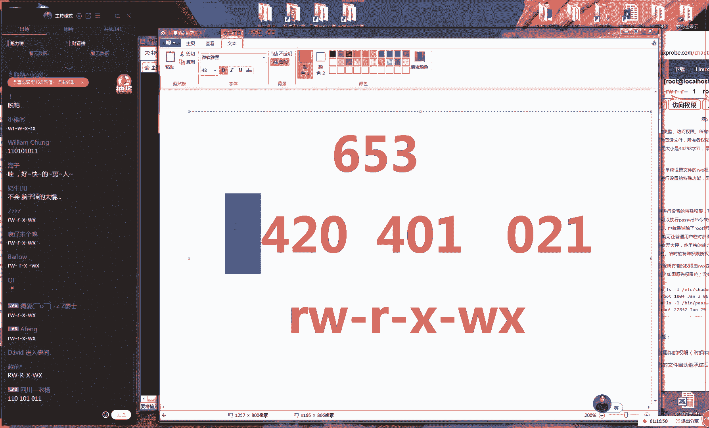

别给我换了，就这样就挺好好吧，我看看这个就很顺眼了。啊，好吧，然后我给大家去说一下我们这个转换的一个方法。大家刚问到邵老师，你是不是带我们玩的，就你这这有什么用处吗？是有用处的啊。

我们再给大家下一个命令，我们叫做CHOWN这就是用来去修改我们用户的这个用户组跟用户的这个用户所有者的，它是我们用户的所有者所有者，然后冒号所有组。😊，然后文件名称，然后我们就可以通过这个命令。

然那我们就可以通过这个命令来去修改一个文件上面的这个所有者跟所有组的这么一个名称信息了。这就用来去修改，再给大家去说一下啊。我现在我现在有点少有有点这个话痨了。就说我现在是使用一个命令叫做CHOW命令。

它是用来去呃修改我们用户他用来去修改我们文件上面的所有者跟所有组的这个名称信息的。还有一个命令的话呢，我们叫做CHOWCHMOD啊，他用来去设置我们这个权限的他可以加上这个权限，加上我们的文件名称。

就可以来去修改我们某一个文件上面的。😊，权限信息了，这就是我们这个权限属性信息。好了，对了，然后接下来就是说如果大家想要对于这个命令有一个更加深入的一个理解的话呢，请打一个广告好不好？哎。

我们可以进入到一个网站叫做3W点linux点com。然后可以关注一下，但是现在是没有的啊。因为我们现在是安排到我们的专员的工作，是在4月1号开始。😊，所以说现在还是没有的，大家可以关注一下这个网站。

等到4月1号开始，我们就开始去打批量更新了。然后之前给大家打过很多广告了，对吧？然后我们现在很不好意思，也是所以我们赶紧给他关上。好，大家可以来记一下这两个命令，这点命令非常重要，对吧？

非常令非常的重要是很多命令都没有，因为刚刚把单建出来，我们现在只是在做一个基础的一个维护。4月1号开始就会马上就要开始出现很多很多了。好，那我们现在看一下这个人数在在线人数是142人看我猜的比较准吧。

开始的时候是80人现在142人，所以的说今天迟到这个情况太严重了。有一般有一半的人都严重了。看我话会说了，太气了。所以说我们今天有有一半人都迟到了，下一次同学千万不要迟到了好吧。

因为咱们这一讲课很重要的。好，那比如说我们现在取一个文件无所谓啊，无所谓嗯。😊。

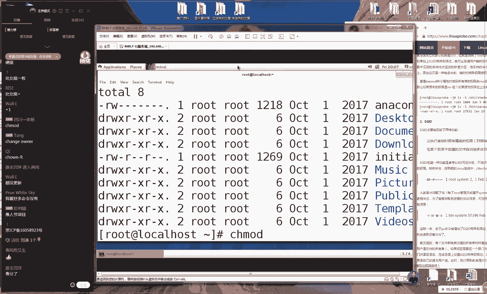

春分了，就是你们他不是那春分了，就是你们迟到的理由吗？你们这理由好牵强啊。好，那我们来看一下啊这个文件的名称，我们来CHOWN给他一个文件然后给他一个权限。比如说比如说啊654，你随便啊，对吧？

然后我们来就设置一下这个权限属性，你看你不用再去输那个很长串的那个那那那个权限了，你就直接给他一个呃这么一个数字654马上就会变成了什么呢？654没那没问题吧。

你看这就是一个快速的一个转换以后你再也不用去输入这么一长传的这个信息了。你看这样你就来去比较一下啊，你是输入这么一长长的这个信息。😊。

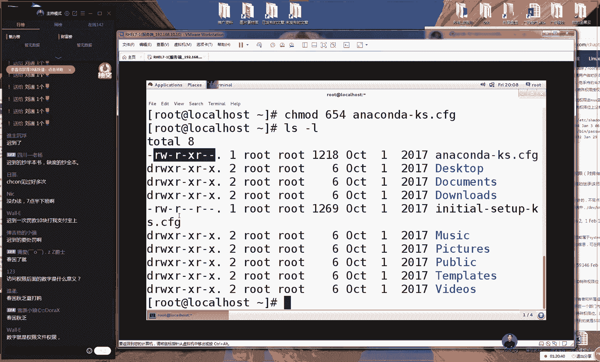

简单的还是给他输1654简单呀，对吧？这就是我们的一个权限指定的时有一个很好的一个方法。就是为什么你们要先信任老刘，对不对？告诉你们说输这个数字派有用，然后你先去学学了之后你再去用啊，双双对不对啊。

非常爽。好了，然后的话呢我们来继续给大家去说，这次我们来设置一下我们这个文件上面那个权限的，其实也无所谓了。比如说我们再来玩A吧。比如说我给设置成432或或者333，你们怎么高兴怎么来吧。

就随你们高兴了，你看一下你这个权限就变成了是333没问题。嗯，好了，接下来的话我们来给大家继续来去说一下啊。😊，那我们这个一般权限，我们在这个文件上面，它有一个RWX的一个权限，但是读写执行权限。

它还是不能够满足我们这个工作的一个日常的一个需求。就它不能够满足我们所有的这个需求。所以说我们还有一个叫做这个特殊权限。

它是将我们这个权限提升它是对于我们这个一般权限的一种提升给大家总结就是它叫做特殊权限。我们说特殊权限的话其实是一种官方的一种翻译。它实在这个本质啊本质上它就是对于我们这个一般权限的一种扩展一种功能。

就是我们之前我们WX之做不了的事情，我们来帮你去做先讲第一个我们叫做SUID权限。那我给大家画张图好不好？SUID权限给大家去说一下术语。术语的话呢是说我们这个我们这个SUI权限的这个术语的意思就是。

😊，将我们的文件的执行者临时获取我们文件所者的这个权限。啊，大家要绕手再来一遍。将我们的就是我们的这个文件的呃的这个执行者临时获取了。我们文件所有者的这个身份。好，我们举个例子。

比如说我们来去重置我们用户密码的时候，我们这边有一个普通用户，我们叫做linux probe。你看啊，然后我们来去重置一下他的这个用户的这个密啊，我把用户给他删掉了啊，然后手手不较浅。😊。

好像还原一下系统吧，是这样的，因为的话呢我们这个密码它是被保存在我们这个服务器里面的ETC目录里面的，杀到这个文件里面的。但是这个文件的这个权限大家一看就知道了，就是比较特殊，我们来看一下，好吧。😊。

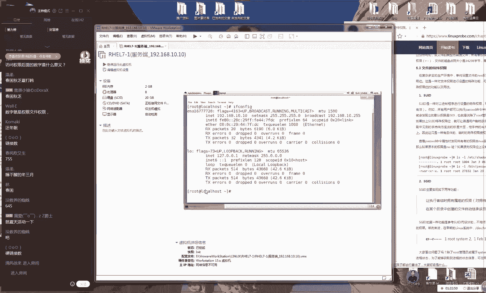

等一下我这个机器能比较慢。这样太慢了，非常尴尬的，我觉得。大概在现在想。这个老刘赚完钱之后都到哪花去了啊，你说我们收这么多学生，怎么一下子电脑性能还怎么办啊啊，这非常尴尬。好了。

我们来看一下我们我们这个ETC目录里面的杀le这个文件。好，请大家给我快速去反应一下。请问我们这个文件上面的这个权限用十字法表示是多少？😊。

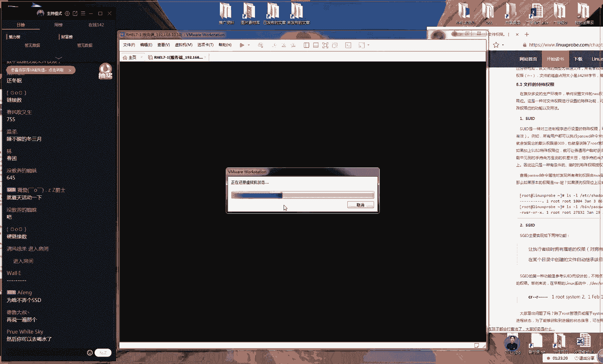

请问我们这个权限用到数字法去表示是多少，那快速一点啊，这个还有什么可反应的？它肯定是00，对不对？那也就是说呃我们这个文件上面这个没有任何人可以进行一个读取跟删除这这个操作。

但是当但是我们这个管理员是有这个权限去查看。们查一下文件内容这个是我们加密之后的用户那个密码大家看到这个是我们加密之后户密码不知有能能不能看全啊，如果看不全的话。

给大家打到我们的屏幕上这是我们当前加密之后那个密码好，不管具体里面那个值是，也不去。家千不要说我没必要然话我现在来去使用我们这个普通用户份随便找一个还用户我们来去尝试去修改一下我们的这个密码我们尝试去修改我们用户的密码。

😊，被你们看到了，密码就是。😊，啊，打一个很长串的吧，不然你们都记住了啊啊，就随便，我其实打的就是red hat嘛。啊，当前密码是red hat，新密码是巴拉巴拉啊，不告诉你们啊。

就是red hat123然后。😊，好，他告诉你说修改成功了，你再看一下这个文件里面的内容，就会发现这个文件里面的这个信息已经变更了。这个很奇怪，对不对？就是你普通用户。

你连看你都没有看这个文件的这个权限。他这个文件权限是000。但是你先却能够去修改这个文件里面的内容，这很奇怪了，这个违反了我们今在这个常识。如果说我们这样这样去讲的话，那大家要崩溃了。😊。

所以我们我们之前所讲那个RWS就讲错了，因为你连看你都看不了，你怎么去修改的这就是因为我们这个在我们之前的那个命令上面有一个，你看啊，我们刚才之行命令我们叫做passWD，对不对？

这个命令实际上它上面有学问，你去查看一下这个文件啊，这个文件上面的这个属性会发现。😊，它上面有了一个S权限，它不是X，它是一个S，并且它是一个红底白字的那你你上一次你见到红底这个字的时候。

是什么时候是种警告信息。再比如说我去哪玩的候，忘记了，反正就是看到一个施工的一个现场，他就是一个红颜色的一个背景，然后写上警告对不？然后就是说快不行了。

就是说去警告你要去的意思就是说他这种警告的个信息他指的是非常危险的一种情况。就是说我们这个他就指的就是一个叫U的权限。当你的这个用户的一个执行者，就指的是我们的普通用户叫用户当你的这个对叫SUI权限。

当你的这个普通用户来去执行这个他他去执行这个命令的时候，自动获取了我们的超级用户的这个权限。😊，再给大家说一下好不好？就是当我们的普通用户来去执行这个命令的时候，他会临时获取到管理员的这个权限。好。

大家听完之后嗯没有懂，好吧，那我们再给大家举个例子。😊，我们呃我们现在给大家举一个技术上的一个例子啊，举的一个技术上的一个例子，然后再给大家举一个生活上一个例子。以后我们也是我们讲以后讲服务的时候。

我们都给大家去讲一个技术上一个例子再给大家讲一个生活上一个例子。大家去选择一下，能够更理解哪个好了。所以说没有懂没有关系啊，给大家举个例就懂了吗？对吧？

我们举例子的意思就是大家看懂你看啊你们都喜欢看穿越剧吗，要喜欢看打一下一或者你不喜欢看你的女朋友喜欢看不看我们可以打一下一啊，穿越剧，就是乾隆啊那会儿就是清朝或者什么时候那种古代剧好。

再比如说啊呃看过吧，没没看过你们没有看过没有女朋友，那老师帮不了你啊，毕竟咱们这个培训，包括这个介绍女朋友，来看一下，再比如说啊你们没有看但没有看过吧，给大家举个例子啊，我们再画小草好。

样我们较这个代入感，你看说有一天个什么时候呢。😊，这个就是清朝吧，咱们比如说具体哪一天了啊，清朝乾隆多多少年，然后这个时候啊有一个叫这个钦差大臣，一个大臣，我们画的稍微的帅一点，对吧？画一个我这样的啊。

叫这个钦差大臣，怎么都飘下行，这样我们给他放在我们给他回到地面上揉我们到地给到地地面上呗，画太小了，这个和珅太小吧不这个人太小的话，显得没有威严，我们稍微画一大点呢，你看我们先画一个叫这个钦差大臣。

这个大臣的话画太大了，黄上就画了。呃，再稍微小一点。😊，这个我不大不大不你们纠结啊，这个大小无所谓。你看啊我先画一个清差大臣，钦差大臣的这个作用就是替代皇上去去他去巡查嘛，对吧？然后有一天他走走走。

比如走到某一个地儿啊，走到到走到某一个县城发现有一个坏人，这个坏人是一个贪官，你看贪官吧话非常的丑。哎，脑脑袋大脖子粗，不是大是祸夫，这个肚子还非常的大，因为他肯能搜刮了很多这个叫什么呃民脂民膏。

对不对？给他写个字，写个贪，你看这样的话就凿无疑啊，他肯定是个贪官，然后当地这老百姓啊，就说哎呀这个呃这个我们当地有一个这个县长啊特别的坏，咱么怎么坏怎么怎么坏嗯。😊，然后这个时候的话呢。

那你这个钦差大臣的话，你这个工作是什么呢？你这个职责所在，你就是得把这个贪官给他惩啊，然后给他这个惩处了。对，钦差大臣的这个意思其实就相当就是中国当前这个纪检委，对不对？

那你这个纪检委的这个工作职责就是去来去惩处这些贪官嘛，对吧？这个时候他就要把他给杀掉，对吧？暴力一，非常血腥。但是啊比如说我们贪官的这个级别是三品，对吧？但是的话呢你这个钦差大臣，你也是三品。

那就是你当你的这个权限跟他是相等的时候，或者说你还不如这个贪官，那你现在是那你现在是十三品，就是说你这个比他等级更低了。当你想要去做某一件事情的时候，当你想要去做某一件事情的时候。

但是你没有权限非常尴尬，对不对啊，大家想一下啊，就是说当你想去做某一件事情的时候，但是你没有权限。这个时候你突然想到了什么呢？当你出宫之前啊，皇上深情勃勃的拉着你的手呀，说那个小刘。😊。

你这为出弟不容易，帮我惩治一下贪官拉巴拉巴拉最后又出一句非常重要的一个话，就是他给了一个宝贝。什么呢？就是说这个皇上，我们怀疑皇上啊，怀一皇上的皇啊怀一个皇上的人啊，皇上画一个红色吧，我们怀疑帅点的。

然后坐在一个还一个椅子上面，这就缺凿无疑了，对不对？这是一个皇上。好，这个时候他就想起来了说哎皇上临行之前刺抖一下法宝是什么呢？是吧？是一个叫上方宝剑的一个东西，这个剑我们为了突出是皇上给的。

我们画一个。😊，黄颜色的一个一把宝剑。你看这把宝剑是一个黄颜色的一把宝剑。大家如果要是之前看过穿越剧的话，还好啊，大家没有看过吗？商宝剑，说是在大明朝才有，你不要那么纠结好不好？

但明朝的话像那我们这个皇上就是那个专章行吧，你们不要那么纠结这种事情。好，咱比如说这个商宝剑就是人商鞅宝剑的话，他有一句俗话，就是说当你看到商鞅宝剑的时候，就现在就是见到了皇帝本人。

他就是代替皇上去行使他这个职责的意思，就是说当你去来去使用这个命令的时候，当你来去使用这个文件的时候，你就临时获取了这个文件所有者的这个权限。我给大家捋一下思路啊，这把剑是谁的剑，这把剑是皇上的对吧？

这个文件的所有者这个宝剑的所有者是皇上，而命令的这个执行者宝剑的使用者是你这个大臣。而你现在是当你去来来去使用这个法宝的时候，就临时获取了谁啊，临时获取了皇上的这个权限。😊。

所以说你就可以来是啊使用这把宝剑，对不对？然后你就把这个啊宝剑就呃哎呦，咱们这边画一下。😊，啊，你就可以使用这个命令，临时获取到这个皇上这个权限，然后把给不把给杀死了。

你看所以说我这个宝啊这个宝剑就他就是突然间变成了一个500米一个大刀，就把他给砍死了，然说我们这个脑脑洞比较大吧。大家就理解这个意思啊，就是说当我们来去执行某一个当我们想要去做某一件工作的时候。

但是我们没有权限。好了，那我们就去取出一个带有SU权限的一个文件。当我们来去临当我们来去执行这个文件的时候，就相当于就是获取了一个更加高级的一个权限。但是大家记住啊，大家记住啊，并不是当你去执行过后。

你就变成了皇上。并不是同学们这并不是他是当你执行这个过程当中，你才临时获取了一个更加高级的权限，而不是说当你去执行过后，你就变成了皇上。这个没有这就是我们的SUD权限。

大家记这个书下面但目的的作用就是让我们的用户可以临时获取到一个更加高级的来说。😊，呃，权限行，大家的话我说什么啊，说老刘是一个灵呃一个灵魂画家，对不对？😊，你看你通过这个例子就更好去理解了。

所以说我们以后啊多看点什么哆啦A梦啊，多看点什么海绵宝宝，多看点什么呃这个呃电视剧啊，对不对？其实对于我们学也是有帮助的。好我们就说完了啊，然后待会我们会大家来去讲怎么去设置。

我们先给大家讲这个三个投殊权限。然后我们再给大家翻过来，我们再给大家来去说怎么去设置啊，这样避免说我们这个脑回度刚给大家讲的挺高兴的，一会就忘记了。好，第二个的话我们这个权限叫做SGID权限。

这个指的是当我们用户临时去呃当我们的用户来去执行某个命令的时候，临时获取了某个。😊，优户组的权限。当我们用户来去执行某个文件的时候，临时获取了该文件的用户组权限。其实这个是一样的。

刚才就是获取了我们所有人的这个权限。先获取的是所有组权限。这个我们忽略不提它这个呃功能的话呢，还有一个功能就是设置到一个目录上面。当我们对于一个目录来去设置好了之后。

那么在这个目录内新建出来的这个文件都会归这个目录组所有什么意思？给大家先玩一下啊，我们先去设置一下SUID权限的话呢，就是CHMD啊，我们来去加SUID权限的话呢。

来大家可以记一下啊SUID权限的话就是。😊，呃，就是优加S啊，它是S啊，它是一个super超级权限，对不对啊？特啊它是一个特殊权限。来呃，我看一下说好像数码宝贝打进化打一架要退化了。😊。

你们这个童年我没有经历过啊，我我我不太清楚这个退化啊，加加加都鲁售进化之后还会变成啊，它还会退化吗？然后我们再来我们文件的这个权限不文件的名称啊，文件名称这样就加上一个叫SUID权限SGID权限。😊。

然后我们命令是这样去敲G加S我们文件。好，还有一个叫做SBD权项应该打出来啊，这个就是CHMOD。所以他们非常的这个啊非常的生气，说哎你明明说学习，天天跟我们聊这种动画片啊，对不对啊。

说以呃说以前觉得学习好就好了。结果发现聊不了动画片都跟你聊不到一块去了。😊，所以我严重怀疑咱们这一期的学生的年龄的平均年龄段有没有到20岁啊。好，然后那我们接下来后面加上一个文件名称。

这就是我们来去分别去设置三个特殊权限的这么一个命令。大家先记到那个书上面啊，不要先聊天了，来记一下笔记。😊，哎，不要这样好不好？我刚18岁，还有人比我更小吗？啊，要啊要是有的话，你们可以去说一下啊。😊。

咱们这期同学们年龄平均年龄到15岁没有啊啊，你还有一个零子啊，你是先给你的孩子报了一个胎教班吗？啊，其实把这个手机开在我们的这个声音啊，先放肚子上面先听一听，对吧？这样的话。

这个孩子出生之后就有了linux非常高的的一种技能了。这比学习什么胎教听音乐要好好啊，就怕说。😊，这孩子出生之后没学会lininux，学会老刘这种说相声了，是不是直接就保存到德云社了。

就就直接就就保存到德云社了。好了，我们那我们就不开玩笑了啊啊，大家先记一下笔记好不好？就看你们记不记有的着急，不要聊天的，同学们同学们，你们到底是过来学习来的还是过来调戏老师来的啊。

好快来快们先解一记啊这个三个命令我们来接下来这次我们来去设置我们文件上面的这个特殊权限的这个三个命令好，现在我们来去设置一下，就是但是我们这个课程一定要活跃，你要不活跃的话，你大晚上一会就犯困了。

对不对啊，不给大家说段子的话，一会我就犯困了。好了，我们来继续。😊，呃，我们来去找一个目录吧，我们找一个目录啊。比如说我们先进入到后目录里面新建出来一个目录。那我们好比说叫做哈哈哈好。

我们现在新新建出来一个非常没有啊非常没有呃技术含量的一个目录叫哈哈哈目录。好了，我先给大家去介绍一下我们前期的一个铺垫啊。就是我们先进入到一个普通用户身份。这个用户叫做lin。那你lin用户。

你新建出来的这个文件，你肯定你看啊，比如新建出来一个文件。A，你的这个所有者跟所有组，你就啊不你那你这个所有组跟所有者。😊，都刷自己，对不对？就是你去新建出来一个文件的话。

那那么这个文件上面的这个所有者跟所有组的这个身份就一定是你自己这个是没有任何问题的啊，这就是我们这个新建文件的时候，但是啊我们现在呃使用到我们这个普通用户。

你进入到我们叫做me目录里面的哈哈哈的一个目录里面。好，这个时候我们现在给返回来对于我们这个目录先给他一个更加高级的一个权限。

我们叫做777让我们这个用户可以进行一个操作啊然后的话呢我们对于目录还需要个杠R操作啊这个呃然后这个F可以不用去写我们加一个G加S在就是给这个目录加上一个SGID权限。这样的话大家记下啊。

这样的话呢我们在这个目录内新建出来的所有文件的用户组。😊，都会继承这个目录，他默认的。而这个目录他默认的这个用户组就是入群户。好，那大再给大家总结一下，好吧，就是呃原先我的一个用户，他创建出来这个账户。

他又创建出来的这个文件跟用呃里面的这个账户的信息。所有者跟所有组肯定都他自己，对不对？但是当我们在一个目录里面使用的是SGID权限的话呢。

那么在该目录里面创建出来的这个文件就会默认归属到上一级就是我们这个目录，他继承他自己。😊，的一个原有的一个用户组。好，那我们现在可以使用到一个用户来去进入到里面来去尝试一下，在里面新建出来一个目录。

或者新建出来一个文件无所谓啊。我们好比说叫B吧，然后我们来去查看一下这个文件B的这个信息，就会发现所有者还是你所有组就变成了这个入取用户继承了上一级目录了。这样的话呢方便于说同一个工作组。

同一个部门里面的用户。😊，的同时来去共享文件。这样的话呢在我们这个某一个工作目录里面。新建出来的这个文件就会都归属到某一个人。😊，这样的话也是非常方便的啊。好。

这就是我们非常方便的一种来去共享文件的一种方法。还有一个的话呢，我们叫做SBIT权限啊，SBIT权限的话呢，它指的就是我们能不能。😊，呃，对于我们一个目录在进行一个保护。

只能够去修改我们呃来那么就只能去来去删除掉我们自己的文件。先给大家举一个生活上的一个例子。好吧，先给大家举一个生的一给大家举个技术一子。我们有一个目录。

我们叫做TMP目录你看我个TM目录这个TM目录呢它本身你看下这个权限这个权限的话默认就是你看一下就是七权限是一个满权限权限指的是不论是自己还是我们的所有组还是我其他人都对这个目录有一个读写执行权限。

它是一个更加高级最高的一个权限了。但是这个最后个不用管，指的是指的是这个权限这样话当我们去新建出来一个文件的话，比说我们新建出来一个文件。好比说我们叫做我们先使用到超级用户吧。

我们使用到超级用户新建来一个文件比说我们叫做呼这么一个文件。好，这个时候的话呢我们再给这个文件上面设置一下权限。😊，设成77权限。好，大家先看一下啊。

我们使用到普通用户进入到呃来去查看一下我们的TMP目录。这个目录的权限是77满权限。大家记得叫叫满权限，没有比这个权限更大的权限了。好了。😊，我们再来看一下这个文件，叫做ho吼这个文件。

你看一下这个权限上面是它也是7权限，它是一个满权限。那也就是说我们把权限能给的全给了。但是我们去删除掉这个文件的时候，它会告诉我们说操作是失败的。就是因为它上面有一个叫做SBIT权限。

这个中文翻译起来的话呢，叫做年制位啊，叫做年制位。😊，是呃翻译过来的一个单词，但是我一直在吐槽说这个翻译很不准确，因为年之味给我的感觉就是很黏的吧唧，对不对？这个东西我不理解他是干什么使的。

所以说老刘给他取一个呃名字啊，叫保护呗。😊，好，大家可以对叫做保护位。大家如果要是有听到说哎SBI叫保护位的，就那估计就是咱们的这个师兄弟啊。大家记一下。因为你说到这个年之位。

我并不能够通过你这个名称知道他干什么使的但这个保护我认为会更加这个准确一点，叫保护位。保护我们这个常胃，还有我们这个任意门啊。好，那我们来记一下叫做保护位。

接下来的话再给大家去说一下我们这个生活上一个例子，我上高我上高职的时候的话，其实我也在去学习计算机，对不对？我上高职的时候是学习的是网络信息安全，就是这个网络安全嘛，就是不是培养成黑客嘛。

就是培养成这种起码也会自身去保护自己的一种网络安全嘛，对吧？我上高职的时候，我学习的是网络安全专业。后来当时就学习嘛，是这样的啊。😊。

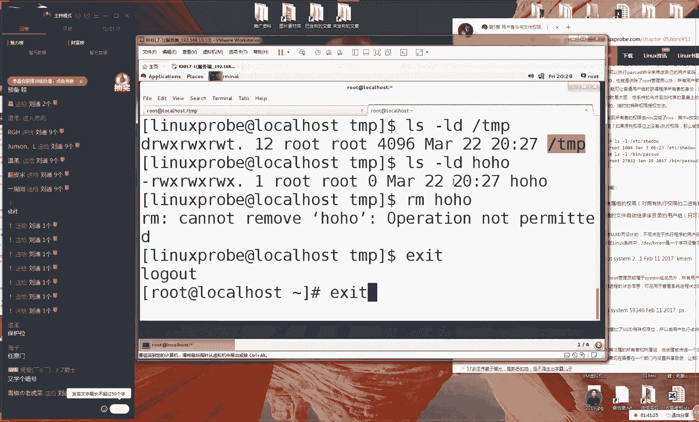

我们上学的时候话非常的这个非常的非常的欢乐。比如说我们上课的时候去学习C语言，那我们下课之后就要自己去写出来一个C语言的一个程序。然后老师开一个服务器，然后把这个作业传到服务器上面，谁没好好听课。

谁没做作业，最后就没分就这个因为你们应该也会有这种情况，对不对？就是你们上课的时候，你们你们之前你们去上计算机课的时候啊，是不是下课之后也要把你的作业提交到这个老师的服务器上面，有没有这样的对吧？

通过我们的FTP或者通过一些U盘什么的，或者说通过一些什么什么渠道。那你是不是要把你的这个作业给他传到老师的服务器上面，然后你就走人了，然后你走的，老师可以去判成绩，然后给你登记什么平时成绩分，对吧？

是不是有啊，有是吧？啊，都是复制粘贴的其实谁复试。😊，但是啊还有其实你复制粘贴别人的还好，但有有种人嘛特别的坏，就是上课的时候吧，他不听讲，不听就不听吧，对吧？你下课之后，别人都交交完作业了啊。

他特别的坏，他删除掉了其他人的作业。😊，啊，就说他删掉其他人的这个作业，这样的话大家就跟着一起没有分嘛，或者说他不他不去复制这跟粘贴，他是剪切别人的那种文件最讨厌了，对不对？这样的话他等别人下课之后。

他把别人的这个名字，然后改成自己的或者说他删掉了所有的这个信息，或者说他他去删掉了某一种某几个他不喜欢的同学的名字，特别讨厌这样的人对吧？

这样的话呢我们就要去使用这个保护位这样话就保护你自己只能去删除掉你自己的这个文件啊来记一下SBIT权限，只能够自己来去删除自己的文件，我们叫做SPI，那我们叫做SBI权限。

那我们这个权限是这样来去划分的啊，这个权限分别为RWXRWXWX我们三位三位之间一段这个一般权限。😊，当我们这个呃所有者这个三位的话呢，如果说这一位变成了是一个大写呃，它变啊它变成了一个小写S的话呢。

指的是这一位上它与它有SUID权限。大家记一下啊，这一位上如果出现了S代表就是SUID权限。中间它指的是SGID权限S。😊，不他代表是呃呃呃SGID权限，最后1个SBID权限。

他出现了的我们的第一个权限上面的IS代表就是一个他有了1个SUID的一个权限。好了，当它这边如果是一个小写S的话呢，证明我们的原先它是有X权限的。对它是有区别的。嗯，好，然后的话呢。

如果说它是一个大写S的话呢，代表它之前它没有一个S权限，它是空的。你看到它是一个空白纸。好，那也就是说原先是RW一个减号的话呢，那我们现在就是新的值就是RW大它它就是一个大写S。

那么如果它是一个RWX的话，那么它变成了RWS这样的一个啊标识，代表就是它有没有SUID的一个权限，它有呃SUID的话呢，对应的这个值。😊，是4，这个SGID的话是2SBIT的话呢是一对应的是421啊。

这个问题特别的好。好，然后的话呢我们还有见啊还有我们下面一个就是我们这个S如果这边有S话，代表就是它有SGID的权限。如果它是一个大写S的话，指的就是我们原先X位上没有X好了。

还有最后那个还有最后1SBI权限。如果最后一位上是一个小写T的话，它指的就是SBI权限，并且原先它有X权限。如果它是一个大写T的话，指的就是我们原先它没有这么一个S权限的一个SBI权限。好。

说起要绕嘴啊这个绕脖子。好，我们再给大家来去实战去操作一下。知道我们这个特殊权限，该跟我们这个文件一般权限怎么来进行一次结合。我们来这样，比如我们出道题，是这样的。

我们这个特殊权限法的数字是写到我们的前面的就是我们比如说654是我们一般权限。那么我们特殊权限法是写到前。😊，面的就是我们第一位是我们这个特殊权限法。所以说我们我们这个权限的话。

它这个满权限应该是四位的那是四位满权限。好，那我先给大家去玩一下，好吧呃，出出一道题，这个非常的难。😊，因为现在的这个一般权限法已经难已经是难不倒你们了啊，现在都已经很熟练了。

然后我给大家出比较难的一道题。这道题的话呢是这样的，我们来先写一个5，这个是我们的S呃，这个是我们的SUID跟421嘛，呃SUID跟SBIT的权限543好啊5432。好。

大家快速帮我把这个给它转换成我们这个权限法。😊，好，这个大家不用担心啊，就是说如果大家没有听明白的话，没有关系，我会给大家来去实战去操作一下了。如果要是知道的话，太快了吧。呃，5432。😊。

蜡笔小新同学打的很快，但是不一定对嘛。我我我我先算一算。😊，打错了打错了，不对。好，我看一下老老杨同学答的又快又好的，之前就答对了嗯。😊，54加1嗯4。老杨好像也打错了，不对。嗯。

然后现在我看下比较可信的是刘云同学，我看一下这个啊。我们在这边看一下，好吧，先不着急呃，W1。😊，应该这个没有问题啊。第一个答对是刘文同学。啊，我们姓刘的同学都比较厉害啊来。😊，🤧嗯嗯。🤢，好。

那我们接下来给大家去玩一下，好吧，那我们先给大家去拆分一下，是这样的啊。大家如果要是会的话，可以先打着。如果要是不会的话，可以看我给大家打一下。是这样的啊。既然来说我们现在这个难点你也发现现在很难了。

其实这个难点就是集中在了我们这个特殊权限怎么样进行一个处理上面的。但是我们不管不就好了吗？那我们不管不就好了。那好了，那么就是423，我们先把这个423呃呃432你给我转换了，4就是R减减对吧？

然后三就是2加1就是减WX。😊，呃，然后二就是减W减OK你看那我先不管我下面那个5，我先把我我们这个权限法给它转换出来，就是R减减5呃4，然后是32OK那我先把我我们这个权限法给它转换出来。

再去加上那个5，那么5就是4加一就是SUYD加上SBITSUIDOK这一位加上一个大写S呃，因为他没有嘛？4加一嘛，一就是那个TOK给他加上那个T这就是我们的一个转换的一个方法。😊，呃，没有对，是吗？

反正我这个大家可以参考一下，是这样的，我知道大家现在有点想要想要吐显了，因为这个东西很难。😊，因为这个东西可能练几次之后才能够很熟练。好，再给大家去玩一下，好吧，我再给大家出道题，大家耐心的去做一下。

好吧，这很重要。来，我们再来比如说我们来1个66。😊，都是6的化，没有什么技术含量了啊。呃，我们来一个。但是我们现在给大家举个例子都已经是非常非常难的例子啊。6642吧。好吧，666行。

大家转换这有什么用？这个就是我们来去设置我们文件权限的时候，以后只要去写数字就好了，不用再去写那么长春的这个。😊，数呃，这这个权限。对，可以写，就是我们直接减5432，可以这样去减。

所以这这就是我们学习这个的目的，就是来进行一个快速的一个转换。😊，好，再来打一下，我也在思考6642，咱们给大家讲的比较简单一点。6642。其实我们还是建议就是你不要那你不要管他了。

不要管你前面那个特殊权限位，你先把这个权限给我转换出来。好，我给大家打一下啊，先不用去管我们前面那个特殊权限位，你先这样去打，先去打642，好吧，642，我们给他转换一下。

这个我们6就是就是66就是RW对吧？OK。😊，4就是R减减。二就是零减呃，减W减OK这就是我们的。特殊权限不，这就是我们一般权限。6的话就是4加2，那就是SUID加上SGID那就是S。😊。

SOK转成就是这样的，两个大写S。好，这个其实大家一定会很会很难受了，因为这个是很难的。而且这个是在我们工作的时候是99%都不会出现这种难的。我们之所以给大家讲的很难。

就是因为希望大家工作的时候会觉得很简单，大家在工作的时候是绝对不会出现这样的这个这样的这个属性的，太难了，而且这个太复杂了，而且这个工作的时候呃，没有这么复杂了。好，那我们先给大家去玩。

就是大家可以放大家可以放心哎我算错了是吗？呃，为什么是加在中间。😊，因为它是6嘛，4加2嘛，4加2呃，2的话是SGID嘛啊，呃，是算错了是吧？行，然后这个S的位置是怎么定的？

再来这边是SUID中间是SGID然后最后是SBIT啊，好，然后再给大家说一下，如果说我现在有一个权限法，大会帮我转这个数字法。比如说RWX然后RWS呃呃RW呃S吧，这样吧。然后R。😊。

后面确实没有用了R减减OK。请将我们这个权限给他转换成我们的数字法。我们再最后来做一个，好吧。啊，其他不用去纠结说这个到底好不好什么的，是这样的，大家要相信我，因为要是没有用的话，我我那不会交。

我们从8点我们从7点50分的时候开始讲权限，对吧？我们讲到了8点50分，将近啊8现在讲8点40多分。😊，我们讲的一个多小时，这个东西要不重要的话，我们不可能去讲。而且这个你当你学呃没有学好的话。

以后再去学习权限时候会很吃力。虽然说我们现在这个讲的很难吧，但是打这打基础嘛，如果说我们特别就是不希望大家会认为这个东西很不重要，就不去学了。大家现在在打基础，您没有您现在没有能力去判断这个东西。

他就是他是否重要，所以就只能是先相先相信老刘帮你们去决定这个东西要去要要不要去学。现在我们决定要去学要把还学好，这个很重要嗯。😊，这个千万不要那个呃自暴自弃对吧？好，我给大家转换一下啊。如果不会的话。

我之后一定要去转换，一定要多练。好，然后我们来去RW你看RWS那个S还是先不去管我转我这个权限法，那当看不到好了？

看不到那我们这个权限法原先就应该是这个样子那我们这个那我们会就是764是764而我们这边有一个S有个S那就是6那么就是我们最后做出来的这个权限6764看其实还说嗯我们认为还是比较简单的。

而且这个东西以后工作时候很常用个不会那难了，但是很有用东西好，然我们再给大家去说一下是这样的。为我们今天这个课程讲的东西很枯？课给大家去说过的这很枯燥但是会很有用，所以我还给大家后面去说一个叫做5。

4小节讲一下我们这个隐藏权限。😊，然后我们今天就会只去讲到5。4小，有点少。嗯，5。4小节加上5。5小节给大家讲完，好吧，下面我们还是叫这个隐藏权限。那我们这个顾名思义，它就被隐藏起来的这个权限。

它这个目的是什么呢？我们不想要给大家去套很多的这个官话，就是说一些官网上翻译过来的东西，就是我们来给大家去说一下最具体的，他为什么要有这个隐藏权限。就是因为我们这个一般权限跟我们这个特殊权限。

它有些时候他还是不能够满足我们这个工作需要，还是还是它还是差那么一点点的，就是它它就它在这个功能上啊，所以我们需要使用到一个隐藏权限。对于我们这个权限的功能，再来进行一个再来进行一次补充。

这个话呢我们的命令我们叫做CHTR他用来去。😊，呃，我们先给大家去说啊，下课之后我们来继给大家做答疑。因为现在时间比较紧张嘛，我们先给大家多这点东西，等我们下课之后再来继续给大家去说呃，加上我们的权限。

😊，这是代表就设置我们这个权限，还有一个叫减权限，代表就是取消的一个权限。因为我们的校练我我们上课的时候能给大家多讲点东西，这样的话你回去之后有事儿可以去复习嘛，对吧？不能说那么水了吧唧的呃。

今天上课也没也没听爽，回去之后做练习也那么一般般。所以我们课上们给增加我们这个难度嘛。然后等我们下课之后回去自己有事儿干。😊，可以多去消化。好，但是我们工作跟考试是完全不会这么难的。

比如说我们刚那个特殊权限呃，考试的时候它也是没有的，但是不需有点可惜嘛。好，就在工作上是需要的。好，那我们给大家讲一下我们这个文件的这个隐藏权限的话，它是有两个命令。

第一个我们叫做CH我们叫做其我们现在是有两个文件现有两个命令设置我们这个隐藏权限。然后我们来具体来看一下我们的表格5-6它主要就是我们每个参数的作用。比如说我现在咱比如说我先进入到用户加目录里面。

并且我们这个超级用户它也受到这个限制的啊，它不受到一般权限的限也不受到特殊权限的限制，也不受到限制。但但是他被这个隐藏权限所限制。我们现在给新建出来一个文件。比说这个文件名称我们叫做无所谓，好了。😊。

好，然后我们现在给它设置上面一个权限。这个的这个文件无所谓啊。现在不其实我们不用，显的特别的随意。我们选择一个已经有的一个文件吧。比如说这个文件好，我们给它设去设置一下我们这个权限。

这个文件我们先给他一个杠A权限吧。它指的就是当你去设置了一个杠A权限之后，这个文件上面就只能够进行一个文件的一个写入行一个追加嘛，不能够再进行一个删除的一个操作。好了，当我大家去演示一下好了。

比如说我想往里面再来去写入一个信息，当我使用到这个重庆像服，使用到这个清空操作服务的时候，他就给我们包错了。但是当我们使用到这个追加的这个操作服的时候，它还会成功，就是因为我们对于这个文件内容。

它就只能够进行一个追加操作了，而不能够进行一个删除。比如说我们再来去尝试去删除掉这个文件的时候。😊，他也会出错。所以大家会问到一个问题然后待会大家会会说老师那所以说我们这个参数具体有什么用处吗？

我们具体来看的话好像写得很虚，对不对？我们不知道我们学完之后能干什么使其实给大家问给大家提一个给大家提一个小需求吧。就是比如说你在你的这个服务器上面。

你就可以去使用到这个杠A参数加到你的这个日志文件上面就那那那那不更好吗？因为呃日志文件它只会越来越多，谁会减少呢就是当黑客去入侵你的服务器的时候，他会来去尝试去删除掉这个文件或者去变更里面的信息的时候。

他会去修改。所以说我们对于呃我们这个服务器的一个加固来讲个非常简单的一个方法，就是避免你的这个日志被黑客所这个修改所破坏。所以说这就是我们工作的时候的一个。😊，呃，的一个个这么一个小的一个参数。

但是我们先不给大家提的原因，就是我们不希望大家去关注具体的这么一个作用。等到工作时候，你自然就知道了。我们一呃还是把它放到我们具体的一个整个整体命令上面去学习。好，然后的话呢我们再来给大家玩一下。

就是那我们该如何把它给取消掉呢？就是我们现在把它给删除掉这道题怎么去做呢？好，那把删掉它提示我们这个操作失败。这个时候啊我们就要去一个一个命令，我们叫做LR这是一道红帽的考试原题。

这是到红考试原题来记一下啊考试原题就是考试的时候他会给你一个文件，它就放到你的这个加目录里面了。当你一旦把它给删除掉当你他这个考试的那个题目啊，就是请你删掉这个文件就是这样的。😊，大家可以记一下。

就是我们在红包考试的时候。呃，请你去删除一下这个文件，只要你把它给删掉了，你就有分，你就可以呃，你就可以拿分走人。所以说这个你怎么做呀？那我们就要去知道上面有什么样的一个权限，要不然话你只能干着急。

之前我有同学就是特别的尴尬，就是他其实会的，因为这东西他就是这样的，你看这个权限吧，对吧？然后我们看一下这个一般权限这个特殊权限什么的，都没问题。但是他忘了这个隐藏权限被隐藏起来这个权限。

我们需要使用的LSAT去查看这个时候你看到。😊，嗯。这个时候那么你就看到上面有一个杠A参数啊，那我们就要把它给取消掉之后。

CHATTR杠A这样的话我们就可以来继续哎对我们这个文件进行一次删除或者修改就可以了。你来试一下，这就是一红帽考试原题拿分走人了，对不对？这道这个这个就是我们红的考试原题，所这个难度。

但是这个并不是说代表了我们红帽的一个一个整体的考试难度啊。但是这就是一套送分题嘛，这样你只要获得之后就可以了，非常简单好，就是我们的杠A参数，然后还有比较常用的这个参数的话呢，就是这个杠呃杠I参数吧。

就是当你对一个文件，比如说呃比如说这个文件嘛，当你对这个文件加了一个杠I参数了之后，任何人就不能够对这个文件进行任何的修改。比如说进行一次删除，进行一次修改进行一比如怎么样个追加什么的？

就是说当你想要去保护一个文件不再被修改的话，那我们就可以使用到杠I参数，不论说去修改还是去删除，它。😊，会给你提示提示出来F括错。这是用来去保护我们这个文件的一个方法，叫做杠I参数。啊。

这个话它它它是叫做杠爱参数。那我们取消的方法也这个非常简单，就是叫做LOSATTR杠I。😊，啊，然后不但我们要是想去看的话啊，就先这样去看，就能够看到这个文件上面它有哪些隐藏权限。

然后CHATTR我们可以来去减去啊某个权限，我们就可以把它给取消掉。好，这就是我们给大家演示一下这个隐藏权限。具体的这个参数有没有必要都给大家发一遍啊，这个非常简单，这个非常简单的啊。

主要参用就是这个AIS这三个比较常用。😊，好，然后我看一下这个时间的话呢，今天这个时间大概是8点50。那那我们再给大家讲我们这个5。4小节。好吧。吧5。5小节给大家讲一个F讲完之后啊。

然后给大家去说一下我们有两点就是这个笔记跟考试的一个注意事项。因为又过一个礼拜了嘛，给大家去说一下我们这个两点的注意事项。好，那我们先给大家回忆一下我们今天给大家讲的这个内容。

我们今天给大家所讲的就是讲的这个一般权限特殊权限隐藏权限。我们讲的这个三类权限对吧？然后我们要去讲到我们用户的这个身份及我们的文件属性信息。好了，那我也就是说对于我们的文件上面。

它除了一般权限特殊权限隐藏权限之外，它其实还有一种叫做F这个话它实际上。😊，它是一个单词的一个缩写FACL叫做呃fail呃fi，然后ac control list代表就是文件访问控制列表的意思。

它是对于我们文件进行一次比较精准的一种控制。大家回忆一下，大家回忆一下，我们之前学习的一般权限特殊权限跟我们的隐藏权限。它有一个共性是什么？大家回忆一下，它有一个共同点是什么？😊，呃。

对他是针对于一类人的。比如说我们这个呃一般权限，交易把它设置好了之后，他就是对于诉有人都生效的。还有我们这个特殊权限跟隐藏权限。只要你有这个权限，对于全体人或者某一种人，某一个用户组的人全体生效。

那么这个时候那我们就想了，那我们能不能想一种权限，只针对于某个人或者某个用户组进行一种精准的流量的一种呃这个权限这种呃这种安排呢。那我们就可以去使用到这个这一个权限了。

所以说这个给大家玩的比较高级一点的，这非常高级就是我们可以对于某一个人或者某一个用户组来进行这种权限的一种指派，他有两个命令精准扶贫。哎，准扶贫也可以吧。是我们来对于某一个人嘛啊。

这个这个这个确实啊精准扶贫是咱中国比较有特色的一种政策，外国人玩了这么半天，他也玩不明白。因为你看比如说非比如说非洲那边对吧？非洲被美国那边被欧洲那边援助了多少年了，但是一直也没有发展起来。

但是咱中国人去了之建厂啊，去用他们去工作什么的，给他们制造这个就业机会，你看人家现在也是在往好了走了对吧？人家现这个非洲我去了解了一下。你看现在也是新兴的发达国家当中。😊。

首屈一指的未来可能几年呃非洲就能够达到咱们的这个中国二三线城市这种水平，也也是有可能，对不对？😊，那你看这个精准扶贫的话，它跟我们这个命令也是一样的。

它需要针对于某个人的这个具体情况来进行一个权限的一个指派，而不是一种呃一杆呃怎么怎么一杆的打中对吧？我们对于素人都适用一种情况的一种扶贫。那你看我们这个他要有一个命令。

我们叫做我们一定要根据每年的这个实际情况来进行一个调整它有一个权限的话，这个参数对于目录的话需要使用杠R啊，然后对于目录是杠R然后代表就是修改的意思这大家去操作吧。😊，嗯，给大家玩一下什么呢？😊。

什么叫人口红利？同得你们这个输入法，我是服了啊，同学你们这个输入法啊，回头赶紧去换一下，叫这个叫人口福利。然后这个杠R这表是递归操作，它指的对对于目录的话，我们需要加上这个杠R指的是对于目录的意思。好。

然后我们现比如我们玩一下什么呢？你们说玩什么呢？我们想玩一下，比如说在 home目录里面我们新建出来一个文件夹，我们叫做比如说小笑同学，那比如说我们叫做这个小笑同学那不就小小小同学。

叫个小笑同学这么一个目录。好，那我现在对于这个小笑同学这个目录啊，设置一下权限000。好，你看现在我们讲完之后，你看我们再下去玩的时候就定很爽，对不对？当我想设置一个目录权限的时候，选00，你看再走你。

😊，小笑同学的一个目录就变成了00的一个权限。他指的是任何人不能够读写执行权限。OK他都没有了。好，那我们现在再来去设计一下FL的一个权限杠U杠R代表是对于目录的操作杠M他指的就是一个修改的意思。

U对于某个人好，那么是哪个人呢？我们现在新在新建出来两个用户啊，看他都说了啊非洲农业不发达日日太匮乏好，那我们来再来杠M是对于普通文件，不对刚M是修改的意思啊，因为我们现在修改的是目录文件。

它也不是一般文件好，然后的话呢我们来啊打断我思路同学你们这个太太硬了。然后我们新建出来两个用户，一个叫张三。😊，好，然后还有一个叫李四，现在出来两个用户，大家看到这两个用户。

他们都是同一时间被新建出来的相同的用户。OK没有问题啊，没有作弊，对不对？好，然后的话呢，我们现在对于张三用户来进行一个权限的一个指令。对于我们这个张三的用户给他1个RWX的一个权限。

啊大家看到就是说我们现在新建出来一个目录，我们叫做小笑啊，小笑同学，他这个目录的权限是为3个0，全都是为空的。然后的话呢，我们这个单独给我们的张三这个用户。😊，设置的1个RWX的一个使有权限。好。

设置1个RWX的一个使有权限。呃，我们敲下呃，然后再去写上我们的目目录的名称，小笑同学的一个目录敲灰车。好，这样做好了就可以了。然后如果想要去查看的话，如果你忘记的话，想去查看的话。

那我们就可以来一个getFASL写上我们的目录的名称，叫做小笑的一个目录。😊，那么你就可以看到了我们用户这个信息被添加到里边了。只有张三这个用户呃，可以对于我们节个目端进行一个读写执行权限啊，是这样的。

当我们添加好FSL之后，我们这个文件上面叫默认的所有组，他就会出现了一个叫RWX的一个这个权限值，这个我们不用去管，因为他这个目录所有者也是我们本人自己嘛。然后你看到啊这边有一个最后那个是个点号。

不知大家有没有留意啊，这个点号变加号了。😊，这就是为什么我们需要参加这个培训来去系统去学习。因为你自己去看书的时候，你一定不会去关注说我们这个文件的后面那个点是什么意思，你一定不知道对吧？

所以说我们要我们培系统去学习的好就是我们给大家讲到如果说我们这个权限的后面那个点变成了一个加号的话，指的就是我们这个文件的权限上面他有了进行了一个精准的一个流电的一个指令了。

给大家看一下我们这个效果是什么书上说是普通文件用的是是？那是我的写错了应该是修改的意思他这个缩写是MODY这么一个英语单词的一个缩写英语比较差比较差说错了，大家谅解好。

那我们现在切换到张三这个用户切换到个用户这个命令啊不用担心我们会在明天一上课的就给大家马上去讲到张三跟李四两个用户好了，我们现在使用到张三用户进入到我们的叫目录里面。😊，叫小笑的这么一个目录里面。

然后我们可以往里面来去写入文件，然后可以来去呃写入文件的内容，对吧？我们内容的一个修改，然后我们还可以来去删除掉我们的文件。你看啊啊包括说我们的新建，包括说我们的删除都是没有问题的。

因为我们对于这个张三用户进行了一个单独的一个流量的一个指令，说明他是可以去修改的，OK没有问题。好，那我们再进入到我们这个李四这个用户，凭什么都是一个麻生的，我就我不行啊，对吧？那非常的尴尬啊。

你啊你进入到这个户目录的同时。😊，你点小象这个目录，你都是进不去的，他就告诉你说，权限被拒绝了。因为你对于这个文件上面执行的就是这个00权限，你对它没有任何的这个读写执行权限，你连禁走你都进不去的。

所以说这个就是我们这个速命令的一个不呃，这个就是我们的这个FACI命令的这么一个作用。它可以让我们这个权限针对于某个用户。😊，来进行一个单独的一个指令。好呃，是这样，大家先不用担心啊。

然后我先给大家说一下，我们先天讲这么多，好吧，然后我们给大家说一下我们今天的一个。😊，呃，比较重要的一个事情啊比较重要的一个事情。首先说有两点，然后大家现在可以总结一下大家的问题。然后我们下课之后哦。

我们待会儿给大家答疑，好吧，哦，待会给大家个答疑嗯。😊，说好，张三跟李四是一个妈生了，太羞耻了。所以你们这个。😊，啊，脑洞有点大啊，是这样的，我现在两点给大家去说一下比较重要的。因为我们又过一个礼拜嘛。

第一就是说我们的笔记呃，我这边我从网上去搜了一下，咱们同学们一开始做笔记的很好，我们大概100多位同学。😊，呃，100多位同学一直在写笔记啊，就是我们之前嘛，所以我的心血在流血。

因为我们要给大家发礼物的话，估计要好几千块钱出去了。好，这个我们就不说这个我们就啊就都不说啊，就说呃我们希望大家能够坚持下来嘛，也能够对自己的这个学习也是负责任，不能说我们报完名之后。😊，就不学了。

对不对啊，或者说不坚持去写笔记，不要不要找就不要找借口。等到我们今天下课之后，请记得今天将我们的笔记写到书上面啊，然后我们拍照之后发到我们的博客上面，然后再最好去总结一段话，然后总结一下我们这个课程啊。

你不书都没有关系，你不我们这个课没有关系，你总结一下你今天这个学习的心得？不要写特别假信什么老刘特别帅对自己的这个学习进行一次总结，你哪怕说我们就退一万步说。如果说你真的是懒得写，或者你觉得你夸我好。

说我觉得你这个书写到已经很好了。我我实在没有再去补充的这个余地了。好，你找一段你觉得很好的话，或者说比如这几个命令这个命令很重要，对不对？这个命令很重要，你把这几个命令的这个代码，你给他复制一下。

你发到你的博客上面那也可以啊，对吧？就不要光传图片，不写文字，你也不要光写文字，不传图片，光写文字不传图片的后果更严重。就是我不知道您是这个文字是自己写的还是网上去复制来？😊，这个不好判断。

所以说我们必须要有图片，我们最后才能发礼物啊。同学们，这是第一点啊。😊，我们的笔记问题，这是一个呃博客你们不需要发给我。等到呃，我们这一期最后一天结课的时候，大概是4月21号，4月21号当天我们会说。

然后再发给我，不用说每天发完之后都发给我，自己要对自己负责就可以了。对，然后说考试是这样的。😊，呃，我们的考试的话呢，是在每个月的3月25号去约下个月考场的。我现在想问一下大家。嗯，然后但是这样的。

就是我们这一期刚刚开课嘛，但是每一期都是这样的。其实每一期都是我们在上课过程当中，然后大家就开始去约下个月的考场了，对吧？是这样的，我先给大家去介绍一下啊，咱们这套课程，我们红帽考试它补考的章节啊。

就它完全不考的有哪些。就是我们比如说我们刚才第五章节我们学习的那一些权限什么的。它已经就包括了我们2C他不考的内容了，就说完全不考的这个章节啊，它包括了我们之前我们之后可能会讲到第二三章节。

还有第二十章节，第十九章节第十呃第十六章节，第十四章节，第十三章节。😊，还有说这个但是我们很多权限他也不讲的呃，他也是不考的。就说我们实际上啊我们虽然说我们的日历上面写的是4月21号结课。😊。

4月21号结课，但是我们实际上我们覆盖我们的RHC的这个考试内容嘛。我们实际上我们会在4月13号。😊，或者呃最晚吧4月14号我们就结束了我们对于红HCE的一个讲解。

我们4月14号我们会结束掉红HCE的一个讲解。所以说呃大家不用担心说哎，老师我明明我我们4月21号才结课，我们报4月20多号的考场会不会很紧张啊？给大家说一下。

就是我们这个时间是4月14号会结束掉我们苏C的内容，然后大家可以去学习了。然后第二点的话就是说如果说你想要去考人证的话呢。😊，可以提前去看我们这个视频来去预习。我因为我们这个上课，每个礼拜三节课呃。

如果基础好同学会觉得很慢，对吧？那么就可以先去看我们这个视频来去预习啊，可以加快自己的这个进度。第三的话呢就是我们这个考前辅导是以视频的形式来去提供的，已经可以从网上去下载了。

您可以先去评估一下自己的这个能力。当是我们得学完到4月13号啊，然后去评估一下自己的这个能力，然后可以去是保办考。好，我现在想说这个事情是这样的。因为咱们这一些同学们人数大家都看得到，人数很多。

然后的话呢，我们现在坦白说，我们一见已经把考场的时间，今天下午我们也经拿到手了。因为今天礼拜五我们去了很长时间，我们说今天礼拜五你必须给我你们礼拜五你们不给我，你们礼拜六礼拜日休结了。

我们那我那我那我们那那我们上课的时候，怎么该跟我们学生们交代，对吧？😊，所以我们坦白说，我们礼我们今天下午已经把这个时间已经确认了，而且是确认了北京、上海、广东、深圳四个城市都已经确认了。是这样的。呃。

我们现在想分一下，如果说你现在想去考。因为现在这样人数很多大家能看得到。如果说25号当天去约的话呢，应该没有问题啊，但是说可能会时间不好挑，我们现在这样的，我们现在每个城市大概会有两场左右。

如果现在约的话能挑下时间，如果要是4月25号约的话呢，就挑保时间了，只能是上哪个就报哪个，如果要是再最后，比如说4月初的时候，就甭想再报4月份的考场就只能是到5月份了。但是我们5月份应该是不会变题。

但如果要题话会很尴尬，会很麻烦。好，就是这个利弊给大家说明白了啊。然后就是大家判断自己的这个实际情况，如果认为自己很好了对吧？或者说我已经提前预习了，或者说我就必须4月份考，我就有这个信心。

或者说我就觉得时间不多也合适吧，反正就是说。😊，根据自己的这个情况啊。😊，如果想要去约的话，现在这节课我们说完这段话之后，大家就可以来联系我去约考了。大家如果觉得自己这个条件，比如说我们想多去多练一练。

对吧？比如说或者说我不想4月份考，再或者说我觉得这个时间有点紧张或怎么样的，无所谓啊，或者说我们觉得变成红猫肉8了，我再考但是红猫肉8变题之后，我们最快也到年底了，或者得到2020年了。

因为他需要一个变题的一个周期嘛，如果想要以后再考不着急的话，也可以了，然也可以先自己去呃，就也不用约啊，就就不用约，就是如果想要去约的话，可以来跟我去说这个格式的话，大家需要注意一下。

就是因为现在已经会很多很多，我光说完这段话之后我估计你看就是会有很多人经开始约起来了，就大家不用管啊，就是说这个格式是这样给我的，就是你具体的这个城市，比如说北京。😊，然后咱们这个考试的话呢。

只有北京、上海、广州、深圳这四个城市是我们现在目前红帽呃。4月份只有的就是这4个，而且我们现拿到的是一个优先报考权，已经很优先了。😊，呃，这个报考权。如果这个四个城市我们报不上的话。

任何机构都是报不上的这大家跟大家说过，对吧？然后我们给大家约的时间都是很靠月底的。都是很靠月底的。我给大家看一下吧，这个时间。😊。

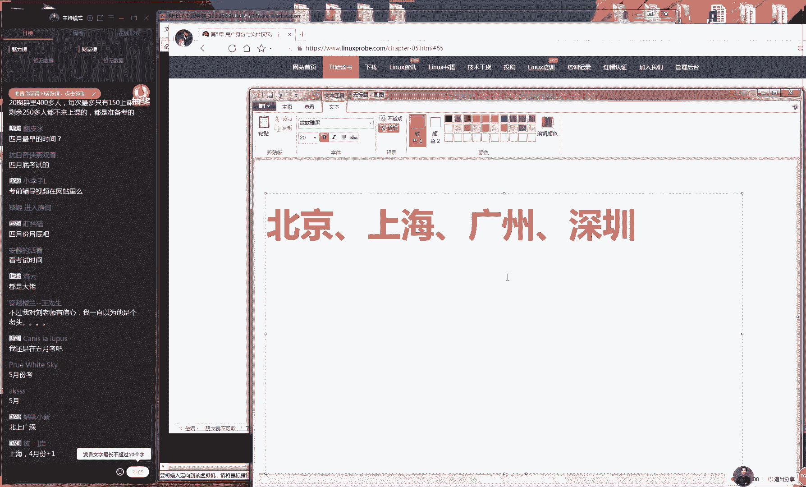

嗯。

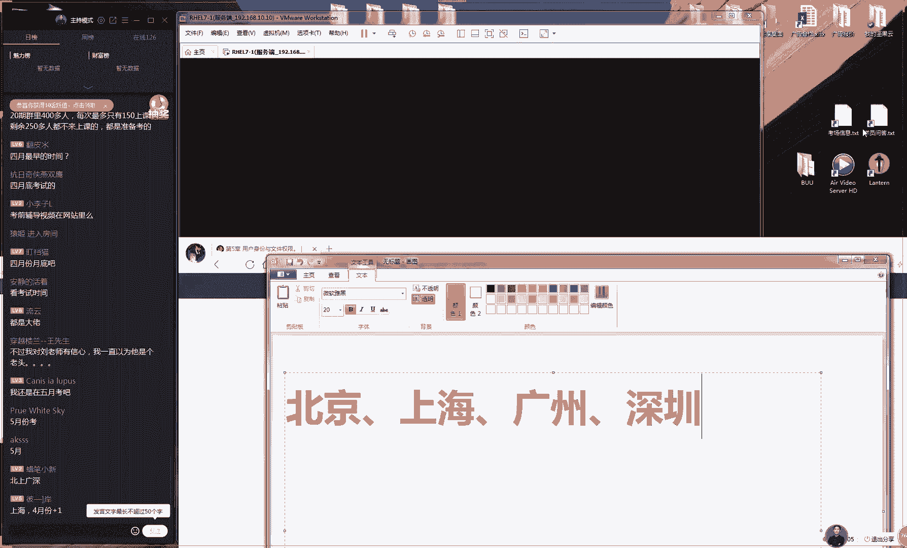

哦，是这样。这个时间是在这里，我给大家看一下吧。今天我下午刚准结出来的。有4月份还有5月份，北京的话是有有1个5月份，然后广州有一个5月份，上海跟深圳也会有5月份，但是现在还在安排，没有出来。

上海跟深圳估计要等到4月25号左右才能够去约。我之所以给大家去先说的原因呢，是这样的，我们每一期的学生，我们都会给大家，其实我们会尽量提前几天告诉大家。因为毕竟你们是我们当期的学生。

而我们之前那些比如说19期以前呢，我们会在25号当天会那我会告诉他们，因为毕竟他们也他们也是参加过在线培训，但是他们没有就是保握这个机会嘛，他们就没有报考上。所以我们就给大家去提前说。

我们也算是一个习惯吧。或每一期在线的时候给大家去说一下。还有我们需要给大家再去提一个醒儿，就是我们这个培训的话呢。我我们这个培训的学生这个基础可能是参差不齐的，再给大家去多说几句啊。

请一定要以自己的这个基础为准。如果自己觉得自己没有把握的话，不要去报考好吧后其实这个时间还好了。比如说你在北京或上海无所谓。其实已经我们是这样的先给大家说第一说我这个复习的话呢。

一定要以这个自己的这个基础为准。如果说您第一次去学习或说很吃力不要去报考第二的话就是说我们认为这个时间周期的话是很合适的。因为我们都的是月底我们会在最晚最晚4月14号我们会讲完我们覆盖课程。

但是最晚了但你可以提前去看视频来去预习包括我们给大家调整这个课程进度。然后我们这个备考的话呢，我们建议说过1到2周不要超过周过周反而会懈怠？我们大家去提考题这都不多说这是我们第二点就是这个。😊。

时间的话其实我们约的是月底，其实还好。第三的话呢就是约考的时候一定要切记，就是一定要很慎重。因为这个一旦约了之后，我会马上给我们的考场，有一个系统会报考上去。大家记住啊。

我们这个报考上去之后就不能够取消的，也不能够修改时间的，所以请一定要确认了，今天我就比如说啊4月24号我就真的是要去考了，不会变了。这样的话再过来去约。如果没有确认的话。

请一定要先呃慎重以自己的这个实际情况为准。好吧，以自己的这个实际情况为准。好，然后大家现在问题很多，然后我就先给大家先回答一下，好吧。呃，首先来说我们在嗯我们在这个这个这这个。😊，呃。

我们在济南跟青岛的考场，目前4月份是没有的。嗯，然后的话呢，深圳的话呢，4月24月12号呃，4月12号我们认为太早了。所以说深圳同学们你们就先放一放吧，要不然好吧。呃，深圳同学们。

你们先就那先不要报考了。4月12号那个考场我们就给那个。嗯，我们是有7以前同学们，因为他们时间都已经学完的对吧？我们给我们会在下礼拜一的时候发到咱们的群里面，让他们报考去吧？这个是我们深圳的一个时间。

可以等下次或者如果离得近的话，来广州也可以4月26号，然后我看一下说北京5月份呢就是这样的，就时间已经确认的话呢，现在就可以来取约了。如果时间没有确认呢。比如说上海和深圳没有确认的话，就要等一等了。

因为这个两个是我都快逼疯了，我今天下午就一直在问他，我说你什么时给我们我我我都已经追到下午3点多了，3点多的时候他们都快下班了。我说必给我们你说你要不给我的话，你礼拜六礼拜日你们又休息了。

我们礼拜一我们早起来就开始月考了。我们我们怎么忙的过来啊。好，所我们就给大家去说了一下啊。😊，以自己的这个实际情况为准啊，好吧，如果认为这个时间周期很紧张的话，或者说学近这个压力很大了，已经工作呀。

比如说家庭啊无所谓呃，各种的情况可以先放一放，要以这个实际为准。然后其他同学是这样的，同们看到啊，现在会有同学在约考。呃，我那我的话待会我会下线之后，我会以大家这个聊天这个时间为顺序，我会给大家去报考。

好吧，然后是否能够报考成功，以自己这个实际为准，我会给大家去回巴拉巴拉说这么多，大家有问题话可以来一起去说。😊，好，大家可以来，有问题的话，可以来跟我去说了，我差不多就都说明白了，对吧？

这是我们的一个时间。😊，呃，等报考，然后一个考场的话，大概能坐十几个人，大概能坐10个人。现在济南青岛考场我们也想安排，但是人数比较少。所以我们现目前4月份已经是没有的嗯。😊，好，是这样的。

我有三四个QQ，我没有这么多，我现在只有3个QQ，因为我今天加满了嘛，一个是504241，但是你们肯定都没有通过这个QQ去报名。

这个是我特别早的一个QQ是我在2015年做咱们这个网站的时候就有这么一个QQ后来一年加满了。后来还有个QQ是504583。这个是我在2017年的时候，我用的一个QQ后来也被加满了，大家可以给他看啊。

就是被加满了，已经加到一点都加不了了。后来又换了现在这个新的QQ号了。所以大家呃应该的报名的话，都是使用的是504215这个QQ号报名的这也是我当正在去使用的QQ号，是这样的啊，请以实际为准。

如果说您报名的时候，就是您把那个报名的这个付费截图，您发给了哪个QQ就是就去联系哪个QQ不然话我不知道谁是谁好吧，就是504504583这个两个反正有一个应该是。😊。

就是大家看一下你自己联系的是哪个就好了。然后说我看随便来呃，我看一下啊，大家不要随便去联系啊，就是你要联系自己报考那个QQ号。😊，那我看一下。呃，已经发过报文档了是吧，查收一下。行，这个我先看一下。

这个格式怎么写？这个格式是有一个文件，你先呃你先告诉我要报考的那个城市，还有大概那个时间。如果我这边确认还有位置的话啊。因为我会以大家这个聊天记录截图为准嘛，不是有点乱啊。

我我呃我我们会以聊天那个时间为准嘛，会给大家去发，然后会给大家发那个这个文件，这个文件里面会让大家填信息，然后会有付款的方式，然后还有会一些注意事项，先仔细看好，然后发给我就可以了。嗯，是这样的。呃。

然后5月份会变题吗？5月份的话，我们认为应该是不会变题，但是这个说不好，可能越早考越放心嘛，是这样的，因为现在红猫若8没有任何的消息。如果万一呃5月份变题会会很尴尬。😊。

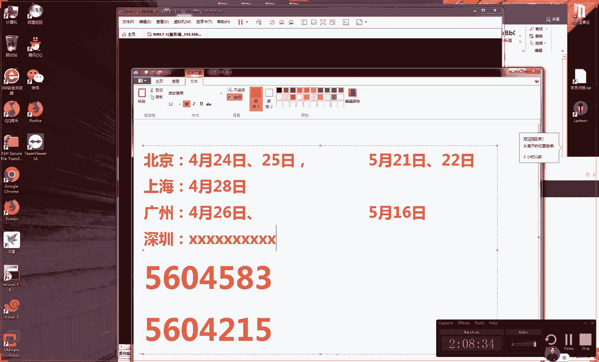

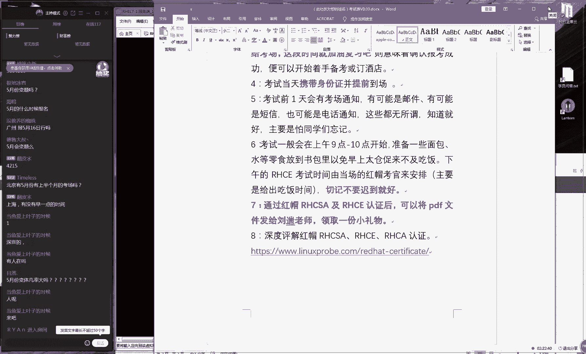

因为这个说不好，因为5月份一旦变题的话，我们这边。

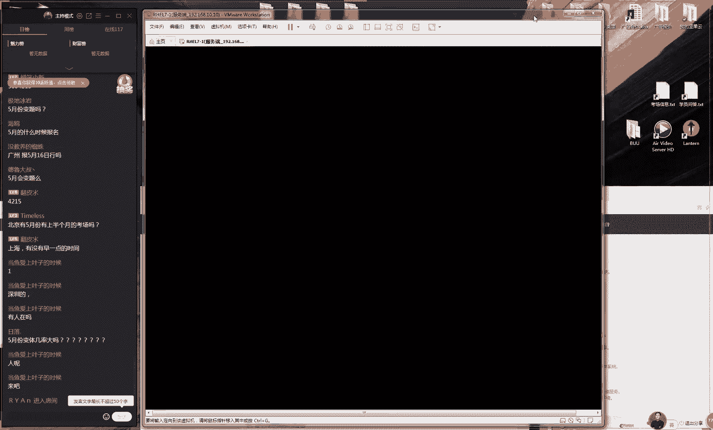

后续的更新也要很麻烦，到时候就报不上的。大家懂这意思啊，他或许5月份他不会变题，但是他5月份就就那你就报不上了。因为都知道5月份变题都去报考的，这个会很麻会很麻烦。😊，几率大不大。

我认为这个真的是说不好，往后再拖一天都很都是很危险。但是我们不要着急啊，就是一定要以自己这个实际的学习情况为准，好吧。然后自己确认了自己没有问题再去报考嗯。然后刚才讲的S和S的位置，怎么去确认？

是这样的。当我们这个权限里面RWX有这个X权限的话，那我们就是一个小写的一个S。如果他要是没有一个X权限的话，那么就是一个大写的S嗯。😊，然后说啊，反正接止到现在红猫肉八还没有发布。对。

但一旦发布红猫肉8之后，您再想约就约不上了。因为全国人民都知道红猫肉八发布了。但这个报销结啊要以这个实际为准。好，所以现在。所以你们要把我逼疯了，对不对？你们现在赢啊所以。啊，所以现在已经报了。

60个同学了。m。好吧，我这个QQ上我我慢慢处理，好吧，我慢慢处理。😊，现在有63个同学等先等一下吧，好吧，等我下课之后吧，然后我会以大家这聊天记录为准。然后就是千万不要冲动，好吧。

就以自己这个情况为准。如果认为4月14号我们结课之后，夫妻两周差不多的话，月月底的考试。如果要是觉得呃自己学习已经很吃力了，就不要再去就不要给自己太大压力了，可以等5月份，万一变题变题吧，变题之后。

我们再再去学嘛，对吧？或者说我们再到时候再去学也可以。😊，要以这个实际为准。好。如果要是发布了红包肉肉8，我们至少要在半年之后才可以约考试。比如说比如说5月份发布的红包肉肉8，咱比如说啊。

你需要至少会在今会在年底的11月或12月才能月考。11或12月。行，然后是这样吧，同学们到目前为止，我看最后一位同学叫冯涛同学，27冯涛同学，我还手机在看啊，到最后一位到冯涛同学呃，就截止了。好吧。

今天就不我们最后啊到万苗万万连苗同学最后就截止了，好吧，然后一现在已经是72位同学了，就已经是截止了。等我们今天处理完了之后，等到明天我们再报考吧。今天人数已经很多了。

我需要先把每一个人的信息处理完了之后，再同步到我们的红包的官网上面已经会很多的事情。😊，就先这样吧，好吧，嗯，大家先不要约了，就等到明天的时候可以继续来约。我们最后就截止到了这个万良苗同学了啊。

咱们就往后就不约了，我待会把它处理一下。😊，啊，你们我看一下也不用着急啊，等我们下课之后，我给大家去统一去处理的。能背板吗？就是说刷题是吗？呃，算计话也是可以的，但是。啊，其实已经无所谓了。

因为大家已经参因为参加参加过我们这个培训，大家知道啊，就是我们这个培训不是为了红帽考试而考试啊，会讲的很多，会讲的很充分，会讲的很扩展很多。所以大家提到这个话题的话，其实想刷就刷吧，其实可以的。

我们之所给大家提供红帽的考试原题的意思就是希望大家能够提高通过率嘛。😊，因为这个东西怎么说呢？你要是新手的话，你看你也看不懂。但是你要学的很扎实的话，你自然就是一种对自己也是一种提醒，会也会很好。😊。

再给大家去说一下同学们，就是现在已经报了，有后来有同学发信息，发了77位了，是这样的，这78位同学就是一定要自己考要自己考虑好啊。就是报考之后是不能够修改时间，不能够退进考场。这个时间确认之后。

这个位置就属于您了。好吧，然后时间如果认为很紧张，或者说自己因为一些个人情况。比如说家庭原因，我们不能够确定自己能够如期参加的话，请不要取约，请不要确认，好吧。😊，要以自己这个实际为准。

不要看别人也约咔咔咔，自己也约要以自己实际为准时间。我认为我个人我呃从我角度上来说，月底还好，对吧？已经是很晚了，但是要以自己这个实际为准。另外的话呢，就是我们这个时间。😊，啊，现在有点发愁啊。

下QQ之后，下了这个离线这个视频之后，估计要。所以我电脑股交炸掉了。然后还有就是说我我们这个嗯。差不多都说明白了，就说我们这个时间嘛嗯。好，我看一下还有什么问题。会输变态8。好，看一下。对。

一定要确认好。深圳怎么能只有一天时间？深圳的话就是4月22号。哎呀，三深圳那个因为我们是这样的，其实我们坦白说，我们考虑到深圳跟广州离得近嘛，所以我们就深圳我们就约了一个靠前一点的。

然后我们广州约了一个靠后一点的，我我们当时这么想就这么想的。😊，就跟北京跟天津似的，你这两个约一个同样的时间，因为你约一次考场会花很多钱的，其实。行，然后是这样吧，同学们呃。

我先赶紧去处理一下我们QQ上的事情吧。好吧，待会还可以来跟我去说，明天也可以约的。😊，但是明天呃这样吧，大家先可以约。然后明天我们下课的时候，我会告诉大家。😊，还剩下几天的考，我我会告诉大家。

还剩下哪天吧。😊，但是目前看到现在这个情况嗯。悬行，我先这样吧，我先处理一下我们QQ上的这个事情。啊，先这样吧。先让大家感受一下啊，就是先先让大家感受一下，就是平时老刘的工作是什么样子的。好吧。

因为大家可能平时对于我这个接触比较少，觉得哎哎我觉得这个可能老刘平时也没有什么正经事吧，平时也就是在家里或者说在公司里面写写书啊什么的，很简单很悠闲，对不对？😊，大家现在来去感现大家来感受一下啊。

大家准大大家大家先准备好啊，去感受一下我平时的这种给我的这种震撼啊。😊，就是我我每天打开我的这个QQ之后，但是不会不会像现在那么夸张啊，不会像现在那么夸张。但是。😊。

好吧，我会今天我会尽量的尽快去处理的嗯。好了，我们就不多说了。然后我待会会把这段给他裁掉。因为这个里边会有询问学员的信息嗯。😊，好了，我先我那我就先下线了哈，因为我去里边会有这么学的信息。

我先给大家处理一下了。😊，好，单位话现可以来跟我继续去说，我先把这些信息啊，我会挨我会按照时间吧。好吧，我们要公平一点，我们按照时间来去处理。😊。

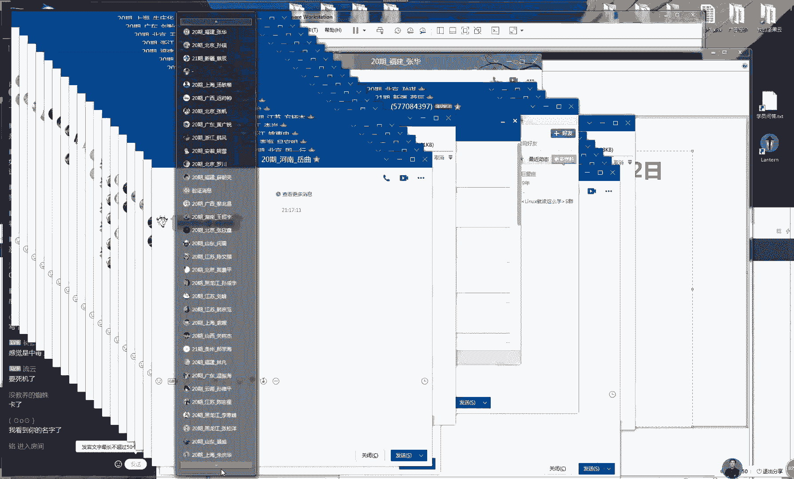

好吧，就这样吧，同学们，有现在有还可以来跟我去说。😊，嗯。这边我就先不点开了，好吧，我们以这个具体报名的这个时间为准，后报名的同学就对不住了。好吧，我们最后报名了之后，如果还有上位置的话。

我们再给大家去安排。然后再给大家去说理就理性报考嘛，以记实际为准。然后如果想要去考的话。😊，你可以来跟我去约。嗯。大家先不用着急，好吧，我现在真的给大家发不了，现在。😊。

而且我都我我又而且我都服了我们学员顾问了，我我我们学员顾问都在咱们上课了之后，才问我他怎么进到直播频道里面，是不是要我命，我我怎么给他回。行大家有的话可以来跟我去说吧，好吧。😊，嗯。我有秘书啊有秘书啊。

就是咱们这个学员顾问。我每天的我的这个。好，最后就真就真的不说了，廖勇还可以来问我去说。嗯。自告奋勇，当面说。嗯，我看一下，然后说考试有哪个章节啊，是这样的，给您一个更库的啊，就是说您不用去管哪个章节。

有这个后面考试。您这么着，您可以看到我们考试原题的。就是我刚才提过那几个考这个几个章节是完全不考的。还有几个章节是红帽考试有，但是不是那么呃，但是不是全考的。可以看一下我们考试原题的难度。

其实我认为还好。嗯，主要是有原体嘛，这个其实还好的。行，然后是这样的，我呃我我会我会很公平啊，好吧，我很公平。我会从最开始这个同学开始去说，这是同学第一个跟我说的。7。7点19分的。

我会从第一个开始去处理。就是大家这个QQ。😊，如果没有位置的话，我我会告诉大家，好吧，就这样吧。然后约卡的话，请联系QQ微信上面我们是不处理的。因为。我们微信上不知道谁，我因为我们不知道谁是谁。

因为大家看到我们这个QQ上面都会给大家备注上。这个城市啊，好有姓名，但是微信上我们我们不知道谁是谁的，所以说这个微信上面也不打疑，经常想联系QQ。然后说如果红包5在那么然后如果5月份发布了红包热8嗯。

OK然后那我们约了5月份的考试，还能考吗？😊，呃，不可以了，因为已经发布红包热8了吗。就是就是说呃我们说那个过渡时间呢，是这样的，是即将发布红魔热吧，然后大概呃会有这个公告嘛。

然后大概会有一个到一个月嘛，或者到两个月，最长两个月时间可以有一个过渡。但是我们坦白说啊。😊，那会儿你要想约就已约不上了。因为不论是我们机构还是其他的机构，还是线下一些课程。

那些机构的学生他们都是知道的，所有人因为所有人都知道，所以他们都会去约，可能到时候就根本就约不上的。就不要想那两个约去约了，只能是想着5月份不发布红包肉吧，这个可以，这个没问题，而且会很轻松。

就能么约上。行，大要看到你了。行，我先慢慢去处理。好吧，这个几个同学我先不给他们说了。😊，好，再给大家去说一下啊，就是嗯。我们是否能够报名为报名上的话，以这个实际为准，好吧，以自己这个实际为准。因。

比如说有会有12个同学，比如说啊12个同学跟我去约1月份的考呃，会约上海的考场，但是可能约到第10个的时候就没有位置了。因为我会每报一个就会提交一次。当您这个即便说我们报上了，但是。没有位置的话呢。

我们会给大家退款啊，只等是或者说是征求意见，推推到另外一个时间。最迟的话呢，我们会。报考之后，一个小时就能够确认的，然后就可以订车票什么的。如果就是大家没有报好之前不要确认时间。比如说比咱比如说啊呃。

徐月月同学，他说他要报4月28号的。然后我但是可能这个时间嘛，你是9月你是9点17分说的，我还没有处理，然后你就订了车票了，订酒店了，千万不要这样，就一定要等我这边确认了之后再去做后续的事情。😊。

这呃这一期的学生只能在5月份考的呃，不是，4月部，5月份甚至以后都可以的。咱们时间没有限制。只不过说我们第一我们越早考越放心。第二就是说红包可能会发布红猫热吧呃，会比较放心。是这样的。

因为我们现在这段时间是考题最稳定的，给大家解释过，因为在红猫热8即将发布这段时间里面，考题是最稳定的。😊，你们赶着这么一个好时间了。这个大有这个就这个话啊。大家可以去看我们这个往前的这个课程。

我们往前十5期从来没有去说过。因为那会儿我们很胆战心惊，我们怕他辩题嘛。你万一你坐考场里面知道变题了很麻烦。而现在我们可以跟大家去说，就是这个很稳定。红帽他现在不可能发布这个新题目。

所以说你现在去考考的就是原题，所以这个东西。😊，对于这段时间想考试，同学们还是比较有有比较有福利的嗯。可以约两个地方吗？嗯，不可以啊，你怎么一下约两个地方呢？上海的考场有几个？上海的考场有两个哦，对了。

这个时间啊，我们后面对应的有一个地址，就是说我们会有那个考场地址嘛，对吧？呃，我们会在报考之后会发给大家。然后如果说你想要确认一下这个时间的话呢，可以先问一下我好吧，就是说你告诉我，哎，是老师。

我这个位置我想了解一下，好吧，我也给大家发一下。😊，他后面都有位置的，但这两可能位置都是很近的。行，大家先先这样吧，今天我们说了这么多了，同学都想QQ上都快都要崩溃了吧啊。😊，我先给他们回下信息。

待会儿看刚来来跟我去说，万一有地方约不上，会其调另外一个地方了。不会的，就搭配好之后，只要我收了钱了，只要我确认了就不会再变了。😊，这个不用说去约两个位置了。好。

这个不这个这因为这个不可能说我们约这个约经刚才约好了，然后说完钱，大家又告诉大家没有约好，这个不可能。我们在往前我们报考三天当中。呃，几乎是没有出过，出过也就是两次，就是老刘的首残嘛。

明明是上海打成一个北京，然后给错误的报考上去了。但是这不可能。因为既然是我打错了，比如说北京啊，我我想报一个4月28号，我报不上去的。因为网站上面就是那个报考系统里面，他北京他选不了4月28号。好。

然后还有就是嗯。就没什么了，大家还可以来跟我去说吧。好，然后没有什么事，我可先下线了。然后我先给大家处理一下QQ上的这个信息。这边我先不处理了，然后就先处理一下，已经点开一些。OK大家辛苦了。

我先去处理吧。好吧，然后我会按照这个顺序来去处理，大家不要急。然后如果到您这边真的是没有了，请谅解一下，我会。😊，呃，到时候看看谁期考，或者说我们会有后续的考试安排，可能会会有，到时候我们再说吧，好吧。

😊。

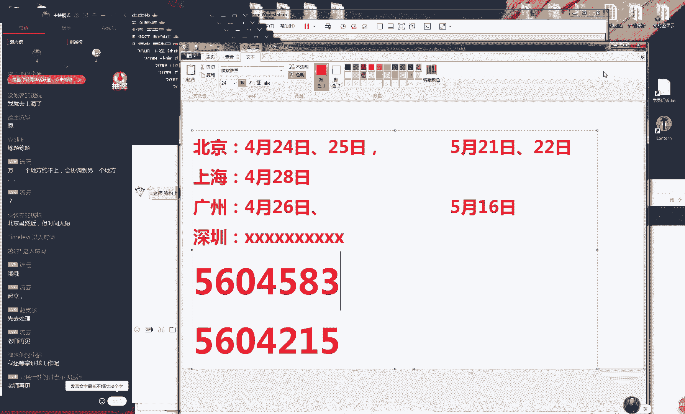

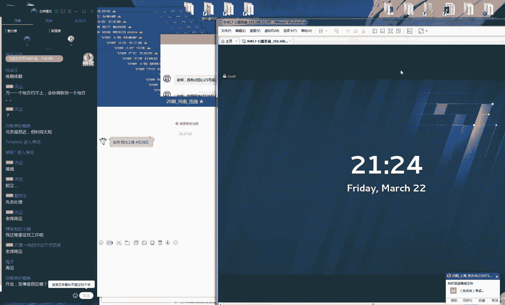

大家先不用那么着急，我待会发发表格。

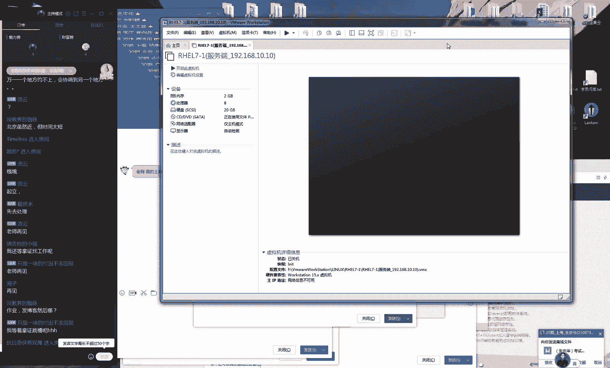

昨业发博客，然后呢，然后呃然后等到我们这最后结课那一天，然后统一把那个博客地址发给我就可以了。我先把这个先断掉，待会还可以来跟我去说，我先去回复一下他们信息了。

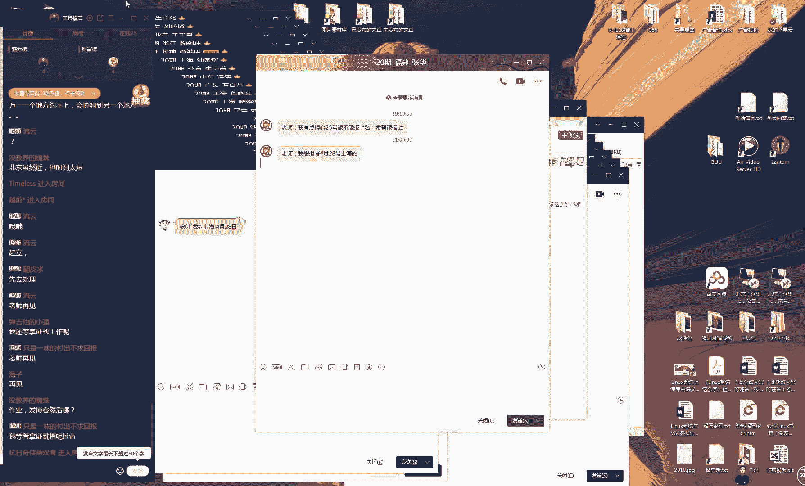

然后我会在明天的时候再去约一下咱们，然然后我会再去说一下咱们这个考场的这个情况，还有没有或怎么样的，好吧，我到时给大家去说嗯。

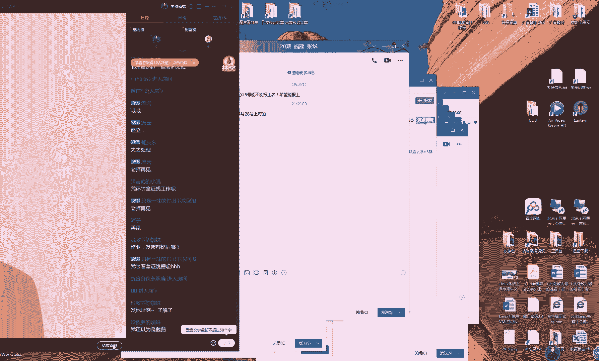