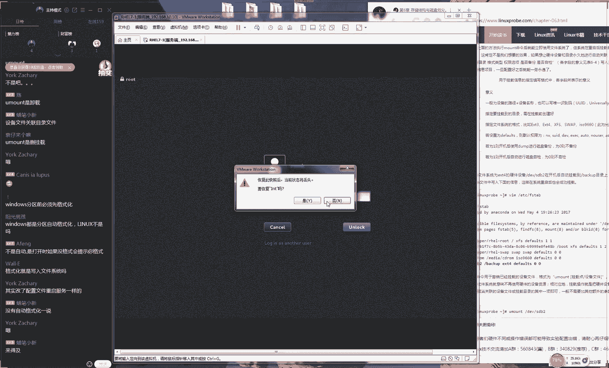
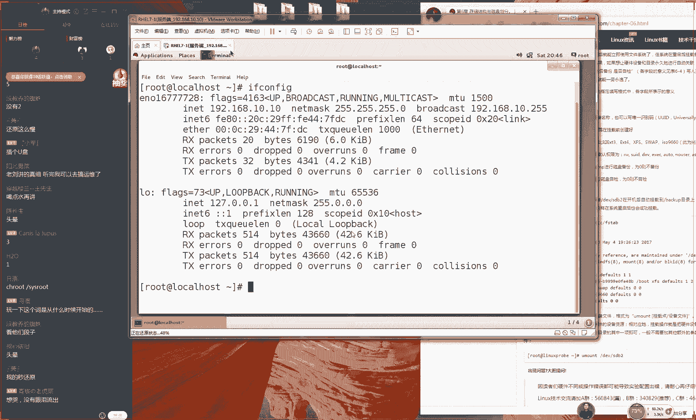

# 【RHCE】红帽认证工程师培训课程 - P8：第八节课 - 天木轮回 - BV14E411678v

🎼啊，好，那我们准备开始上课，同学们这个歌可千万不能听，这个歌听完之后就有点犯困了。因为我们这歌不知道怎么选的，这是这是什么歌单，咱们最近这个歌怎么都那么沉闷啊？那好，那我们先准备开始上课。

同学们先打一下一吧，我们开始我们今天的这个第五章节的课程。😊，呃嗯。来，同学先打一下一保，我们开始我们今天这个课程。今天内容还是比较多的。我们今天呃会给大家讲第六章节。

但是我们要给大家第五章节给大家消尾巴给家收一收啊。因为我们昨天我们差了一个小节嘛，5。6小节，其实5。6小节非常的非常的少。大概我们讲起来的话也就十来分钟。

但是呃因为我们昨天要给大家报考那个红包这么一个考场嘛，所以我们提前下课了，好吧？我们讲所以我们就没有把讲完它，那我们先给大家说一下，我们今天这个第5。6小节啊，人数今天又迟到比较严重啊，对吧？

今天估计又有50位同学迟到了，咱们这个班级人数也多，迟到人也多，对吧？呃咱们迟到人数都相当于别人的一个班级的这个人数了啊，行呃，他们。😊，那就不管他们了，好吧，咱们现在开始去上课了。咱们这个啊人数也多。

咱们迟到的也多。行，咱们这是三高啊，这个人数高，咱们的迟到人数高，咱们这个考生的这个人数也高好，那我们先来说一下5。6小节吧，我们这个不太不太不太押有点不太押韵是吧？有点尴尬。好，那我们先来说一下5。

6小节，大家先翻开书啊，然后记拿下一起你的笔来，然后我们开始准备做笔记。好吧，先准备出来大家的笔来，然后我们开始去做笔记。对对对。

说上一期反正真的咱上一期学生们是我教过最最最懒的一批真的是懒懒的都不行不行的。啊，就是我们让去笔然后因为他们去作笔记的时候吧。😊，就是那种呃真的是省笔省到极限了，让他去写笔记去记笔记的时候，那些字吧。

真的是能少写就少写一个命令吧能少打他给他简化一点。咱们这一期学生出了们这一期是迟到最多的也算是一期学生赶经开课5的才能想起来好，那我们开始5。6小我们开始正式开56小节，我们都已经开始三次了，对不？

但是你老开了现我正式56小节讲一个命令跟速度拿起你的笔来拿起你后拿起你的笔拿起你的记笔记是我们工作时的话那知道我们工作时在不同的之进行切换回忆一我51小节我们讲到我系里三类用身份我们有三类用户的身份第一修饰我们理第一是我们。

😊，第二类是我们的系统用户。第三类是我们的普通用户。那如果说我们需要在多个普通用户身份之间切换啊呃按照我们现在所说的话叫这个切换小号，对吧？那我们换一个身份。

或者说我想从管理员切换到另外一个用户身份下怎么办呢？那我们就使用到这个命令非常简单SU就来一个进行切换然后怎样你们是教我教过最差的一节，这个从来不说因为我们学生从来不差，而且咱们学生这个能力，我跟你讲。

真的你们现在没有感觉，等你们真正考试的时候，然后你们就会发现真的是已经是超人家一大截的，当别人在看当别人在看考题，当别人在在在排错的时候紧张的手都不会取消取消键盘的时候。

到时候们学生一下这个档次高起来了。这个到时你就知道了。因为我们没有看到同学这个状况嘛。那好，那我们现来去敲一下SU命令了。直接一个SU后面我就可加用户的名称。比如说我想要。😊。

去切换到一个叫做lin的一个用户的一个名字。我们来去切换敲回车就可以了。这样我们敲回车，它就可以进入到这个普通用户的这个身份下。你说这个东西它有什么可讲的，对不对？这个它有什么可讲的对吧？

这个非常的简单好，那我给大再退回到我们这个管理员身份下那我们主要还有一个参数，就是一个减号是这样的当我们切换这个用户身份的时候的话，那我们需要一个SU微大点是吧再大一点好了。

那我们再去切换这个用户身份下的候的话，那我可以中间加上一个减号大家记住这个减号就不用再加什么参数了，它本身就是一个参数，它指的就是当你去切换用户的时候，如果说你中间你加上这个减号的话。

代表就是一个大家听好了啊，123完全变更用户身份的一个作用。😊，好，再给大家讲一下，就是如果说您切换用户的时候，您没有加这个减号的话，代表就是切换到这个用户身份。

但是保留其原始用户就是我们当前用户的这个环境变量信息。但是我们加上一个简号的话，代表就是完全变更到这个新的用户身份下，包括里面的环信息全都给大变更一下。好比说我们举个例子啊，这个没有什么好举例子。

因为这个已经很明显了，就是你加上这个简号代表就是一个完整变更，就是一个完全变更啊，它是一个呃全新的一个用户。但是我们如果要是没有加这个简号的话，会保留我们切换之前那个用户的呃叫做环境变证信息。

那它还是呃并不是很完整的。所以说我们建议我们切换的时候的话呢，就是去使用一个叫做SU一个减号，这样来去切换我们用户的身份啊，就这样可以了。然后说什么考场暗号，说老刘真帅啊。

同学们你们你们不要这样啊你你们不要这么挑不要么挑战那个考官了。但跟大家去说一下啊。😊，就是因为咱们昨天下课之后，我们不知要约考试嘛，对吧？昨天一晚上你们猜约了多少人，已经是突破我就是我的这个极限了啊。

你猜明天我昨天我从9点钟下课，9点钟给你们就聊了会天，点20吧，我一直约到了12点半，就是夜里的12点半，我咱们这期约了90个人。所以说呃而且我看了一下，比如说我们给大家举几个例子。

比如说上海的上海的那个那个4月28号考场，还有大有上海的4月28号考场，广州的4月24月26号考场，还有北京的4月25号考场跟4月24号考场，这四个考场，你们进去之后就没有外人了。因为这四个考场。

我们基本上每个考场都约15个人，我我们都已经把那个备用位置给大约满了。所以说呃。😊，这个我觉得是这个是很有缘分的一件事情啊，大家在互联网上面，甚至我们与我之间，对吧？大家跟我之间。

或者说我们在学员之间我们从来没有见过面，甚至我们从来都没有想到过会有这种交际会碰到一起，然后一起去考试甚至叫做同窗这种缘分。但是我们最后我们去考试的时候，大家一问哎都学生啊好巧啊是不是这也是一种缘分。

大家分散在全国的各地，但是通过我们这个网络上的一个小机构，但是我们把家我把大家给凑在一起了。而且这个大家到考试的时候就知道这个考场里面没有外人了才说4个时间都是咱们的学生了。

所以说大家也可以放松一点我们也跟考官说因为们毕竟自己的学生嘛，要你们不太过分都没有问题的。好，所以说这个也是咱给咱们学员的一个福利了。因为这四场学员人数实在太多了这样是为难咱们的话那就是为难我。

所以说们到肯定会跟考官打招呼。这个大家放心啊，但是太过分好不好？你不要。😊。

所以说让让啊怎么让考官帮你作弊什么的这个这个不要就可以了。好，那我们现来去切换到我们这个用户身份下我们来1个SU然后一个简号用户名称，那我们就可以切换到一个用户身份下了。好。

那我们可以去使用到一个普通用户再给切换到一个管理员的话呢那我们也是可以S我们来切换到一个管理员的一个身份下。

比如说我们切换到叫做体用户我们讲过这是我们的管理员个用户我们一个号代表一个完全的一个变更我来123了啊，看好同学们你们怎考官递根烟什好上不？

那我们来敲一下回车了了123这个时候你看到当我们这个普通用户想切换到一个管理员份下的话呢，他就让我们去输入密码了。那也就是说我们的管理员切换到我们的普通用户的话呢，那我们是不需要密码了。

但是我们的普通用户想切换到理员的话，他只需要输入密码了输入的是管理员的那个密码当我们输入密码之后我们就可以切换成功了。这。😊，就有一个问题了，因为这个命额非常简单。

那么就是说那师你看啊我自己那我像是管理员，对不对？那好，我是管理员，我想让我的小弟帮我去干什么什么什么事情嗯好了，那嗯但是我又不想让他知道我的密码怎么办呢？就那就比说你想请人帮你干活，但不给工钱。

你让别人去帮你干活，但是你又不希望说把你的密码告诉人家，但是人家权限又不足怎么办呢？这个时候我们就可以使用到一个服务叫做速度服务，他就因为我们是代表一个完全的一个身份的一个变更，你原先你是做。

现在成了入用户，那你现进行的是一个完全的一个变更。那么好了，那我们现在。😊，需要做的事情的话呢，就是我们来对某一个用户，这个很像于FECL啊，它就是精准的一种权限的怎么样指令。那好了，它代表就是。😊。

一个精准的一个。权限的一个指定，他可以让我们的这个用户怎么样单独的来进行权限的指派，我就让你某某某可以去重启服务器，或者说我可以让你去做某某个事情。就是这样的这种精准的流量的匹配。

那我们就可以去使用到速度命令来去完成了，这个非常非常的简单好了，那我们现去使用到叫做VI速度命令来进行一个编辑是这样的同学们我们为什么要去学习VM你还记得我当时给大家提了两点吗？当我给大家提了两点。

我们不会给大家去说特别东西。如说I什么它是来源于某某某个机构啊，后这个机构怎么怎么好什么的，我们从来不会这么说，当然我们记得吗？我们第一四章节第一小节的时候。

我们当时聊过说我们为什么要去学习到我们为什么要去学习VM，我们当给大家贴了两个，对不对？第一个就是说因为他有一个广泛适用性，就是他通吃大家记得我说句话，就是我们学好之后我们大多数的主流的系统。

我们都是默认安装好了，我们就可以默认去通吃啊，其实我这个还是比较收敛一点。😊。

就是不光是主流的系统，他们都会去默认去安装VIM或者说叫VI吧。他很多的这个服务程序，他就会头他们还都是会去默认去调用我们的VIM或者I的如说我们之讲过一个计划任务叫它就是默认调用的怎么样它调我们个编译器然后我们这个它也是叫做I度就是我们使用编器编辑我这个配置文件它也是调用了我们的I编器。

还有我们如果说今后有一给大家讲的话，就是那个但是我们这个不包个不包括我们现在这个课程里面啊，这是属清接我们会给大家去讲那个分布式叫做这个分布式版本控制系统的时叫I的候。

它也是基于我们这个M编辑来这个编辑文件的。所以说当你学好编译之后，你就会感觉到一种很爽的感觉，这是一种通吃的很爽的感觉它非常的好用好了应该叫做。😊，gatet嘛呃，应该是叫做git呃。

不不不你不你不要就说乱了呃，gatet应该叫做get好。😊，好，那么们我呃我们接下来我们来接下来。但是我们现在这个。😊，自从我们这回现在有我们坦白说，我们做了那个呃新的网站叫做库之后。

然后我们自己在读那些发音的时候，我有点不太自信了，对吧？所以我们回去最好给大家查一下啊，大家以我们这个为准。

对不我们正好然后我们正好做一个广告那我们现打开这个编辑这么一个配置文件的话呢是这样的我们有一个老梗，就是说问大家慌不慌？大家看一下啊，这是大家看到的第一个配置文件，当我们学习这个课程。

从3月8号到3月23号，今天这个东西它是我们看到的第一个配置文件对吧？O大家看到这个之后慌不慌，得很会不会会不会觉得很紧张，然后手出汗，然后后开始冒首跟个开开都开始冒汗。

没有大家不要慌是这样的啊当你看到一个配置文件之后，你不要慌，为什么你要去分析因为一个配置文件的话呢，它也是由三类去组成它是有两类去组成出来的。它是通过我们的信息跟我们的这个命令者我们这。😊，单数吧。

它还去组成出来的。所以说你看呢啊这个里边它全都是以井号开头的。那么以井号开头的，我们叫做什么东西？😊，啊，哈啊还会尿了啊，来同学看一下啊，那我们一警号开刀是什么信息？😊，对，叫做这个注释信息。

他主要是干什么用呢？它主要是。哎，大家主要他主要是注释，哎，这个说的非常好好。所以的话呢我们这个呃所以的话我这个注释信息的话呢，主要是用来做注释的。他来去呃介绍一个服务的功能。

或者对于某一个参数这种解释或者说明的信息。这个东西程序是不读的，是给人去看的。所以说我们大部分的信息我们都可以不用去看。我们随便往下去找一找，我们不要太靠上，我们大概的话呢在行数大概是在90行左右啊。

我们大概是在99行左右，我们来去写入我们的配置文件，就是不要太靠上，对吧？因为他因为他在这个上面的话呢，他也他会有一些预读的一些程序，我们需要让他先读完才可以。好，那我们先这样啊给大家玩一下。

那我们还是要同样我们非常呃。😊，简单我们来出现出来两个用户，为了避免你们说我作弊，所以我干脆我们上课之前就没有做任何的准备。我们现在我们来当面啊待我来当大家面啊，出现出来两个用户，分别叫张三跟李四。

你看这个非常的欢乐，对不对？好，然后的话呢我们呃出出来两个用户，我们来对这个张三用我们来对这个李四这个用呃，我们来对谁呢？呃，随便吧，反正我们对这个张三吧。那好。

那我们就可以对于这个张三用户来进行一个单独的一个权限的一个指派，就是想让张三的你的那个名字，对吧？因为我们现在这个张三跟李四，大家注意啊，他这是两个新的用户，他没有任何的这个特殊的这个权限啊。

他没有特殊的这个权限。😊，好了，那我们现在就需要。😊，啊，那我我们现在又需要来编辑我们的这个配置文件，让我们这个张三用户可以来去执行某某些指定的命令。大家需要记住我现在这个词叫做某些指定的一些命令。

而并不是像我们这个SU命令一样是让他变更我们用户的身份，而是给他开放一些这个权限。比说好比说在因为我们在公司里面，我们现在都要打卡。我还有这个工牌，一般的来说啊这个工牌都是电子卡，对不对？

我们我们去进门啊，我们去签到啊，我们都要使我们这个卡，还有一些比如说厕所，对吧？然后在一些办公楼里面那个厕所是有门禁的，你需要刷你的工牌，你才以进到，然后你才可以进入到厕所里面。

咱比如说我那我以后就是个保洁。那我这个保洁的这个卡，那我不能够去进入到人家办公室里面，我也不能够进入到人家的这个保险柜里面。那好了，那我就只能刷开我那个厕所那个门就是我虽然我也有卡。

但是我对于我的这个功能，我的这个。😊，权限进行的是一个非常呃有局限性的一种限制，只能够在满足我工作前提之下来进行授权。就是我去扫厕所。好了，那我就这有厕所这个权限。

我的这个权限只限于我的这个工作代理这个意思了，而并不是给我一个身份的一个变更。后面的话第二个字节，我们代表就是来自于哪里，我们再举个例子，再比如说你现在是一个ATM一个维护人员。

那你知道ATM机里面会有很多的很多的钱，再比如说你有那你有一天礼拜三啊礼拜三呃下午2点那么这个时候你想去打开想去打开那个机器的话呢，那么肯定是合法合理的。因为你因为你在上班，且肯定是维护这个机器。

但是你比如说你是在3那比说你是在3月23号6后是星期六晚上都7点17分了，突然间你去开启了一个银行的保险柜。这样的话这个请求就一定是非法的。因为你已经离开了你的这个为你已经离开这个授权的一个。😊，呃。

时间或者说我们叫做这么一个范围了。这个也是啊就是说当你的这个用户，比如说是来自于系统本地的话，那么你就可以去做某一些工作。但是你如果说是从远程来的话，那么你就不可以去做某些工作。

对他进行了一个是一个IP地址或者一个来源地址的一个限制。好了，那我们去选一个代表就是不要对他进行任何的限制。他不论是来自于哪里的用户，我们都允许他去做某些事情的意思。

但是说这个也可以直接去写我们IP地址或者我们的一个网都是可以的。好，那我们面还有一个叫做一个小客户一个这代表就是他可以以谁的身份来去运行。你可以比如说我们可以让他以我们这个超用户来去运行某个工作。

或者的话呢嗯。😊，他可以去使用到某用户这个身份。那我们写这个代表就是他可以获取到我们这个管理员，或者说他是一个最大的一个权限。好，这个我们就把它写默认就可以了。后面的这个我们就建议说不要再去写。

为这个这个代表就是他可以去做哪些事情。如果说你再去写话，那你不就是一个也是相当于是一个完全的一个身份的一个变更了。我们现在想要对他就是某个人进行一种权限的一种限制，我就允许你去做某某某某某个事情。

那好了，你不能够让他去做所有的事情了，这个代表就是所有的事情，我们不要这样去做那么怎么办呢？那我们怎么我们就要给他去写上具体的那个命令，但这有一个小bug或者说他是一个小小的不太方便的一个地方。

那不是他用到的是这个逗号去做间割，他用是逗号去做间割。那我们要写上一个路径加上文件名称命令名称的这么一个形式来给他去写我们需要去使用命令。如说我想要来允许这个用。😊。

我可以去使用叫做cat命令来去读取文件。好了，我们就去查找到我们这个cat命令。它所在的这个位置。好，这是我们的一个catch命令，使用它逗号就做间割。😊，好，同学反应非常的快啊。

还有比如说我想再允许你我想要再允许你去reboot去重启一下服务器。好了，那我就可以把你这个rebo给加里边。但然说我们可以有多个了，这个需要我们来给他授权。但是我们千万我们切记你不要怎么样呢？

给他VM的编辑器的权限。因为我们之前给大家讲过不是，我们就我们不要给他VM编辑器的这个权限。为什么我们给大家两句话，第一句话就是lin里的一切都是文件。

那我们要去配置一个服务就是在修改这个服务的配置文件。所以的话呢我们要给他V编辑器的这个权限之后，他在就他是马云了，他就是说他就是马云了，他可以去随意去修改你的支付宝里个余额，他可以随意去修改配置文件了。

当你给他这个VM编辑，他得自己权限小的时候，他就可以过来去修改这个文件了。哪里这个是g？那么好，那他就可以去使用到VIM编辑器的一个。😊，加高级的一个权限来去修改这个文件。

然后让他的这个权限稍会坑加扩大。所以说请切记不要给这个用户编辑文件的这个权限。我们呃。😊，这是我们一个切记啊，这个是我们一个切记。好了，呃，你这样去写是可以的，我们给他1个SSH的一个权限。

这个是可以的。其实你不写也可以。因为我们的任何用户他都有SSH的这个权限来第150行摄高威，他指的是这个will组。但是这个我们一般用户它是不包括在这个will组的，所以说这个也不算是。😊。

但是这个也算是个高危，大家可以把这个初出效把删掉都可以。好，我们来把它保存名退出。现在我给大家玩一下，就是说你看我现在没有做任何的操作，对不对？做修改这个文件啊，但是我现在给大家玩一下。

就是我比如说我现在是张三，你看我现在切换到这个张三的这个用户。现在看起来好像李四这个用户没有任何用处了啊。好，那我现在使用到张三这个用户。我想要去查看一个特别神秘的一个文件。这个文件我们给大家介绍过。

它是在ETC目录里面，我们叫做沙这个文件，它是用来去保存我们的用户密码的。大家用到数字法能够我快速去表达一下这个文件上面的权限是多少吗。😊，对，我们现在这个权限的话呢，嗯是00啊，还有所以说是777。

嗯，好，那所以说77同学你给我那你给我解释一下，这个怎么能变成这个呃00啊，对不对？你看啊，这都是减号啊，我我因为我知道大家可定是啊大家可能是在跟我开玩笑啊，但是在不要跟我开玩笑，因为。😊。

你知道你是在跟我开玩笑，然后你知道你是在配合我的这个演出，对不对？然后这样的话老啊这样的话这个老师才能够有动力去讲。但是我们就怕我们这个视频嘛以后被人泄露出去，而且更可怕就是泄露出去一部分。

然后人然后人就上就说然后你说哎这这老师老刘这个讲会有问题啊，你讲了这么半天，结果人家还不会算这个权限法你三个7你还搞不明白，对不对？到时候就该查我了。好了，这话来去算一下，这个非常简单，一眼就够看出来。

肯定是000嘛，因为他没有任何的RWX这个读写执行权限。那也就是说我就你不要再去说什么去执行啊去修改啊什么的，你连看的权限都是没有的。我们来看一下。😊，那那那们来去尝试来去看一下这个文件的信息。

你可以看到。😊，就是我们不要去说我们去修改啊这个文件里面的内容了。我们连去看的权限都是没有的，这就是我们叫做呃shale文件的一个限制。可以看到了。好了。

接下的话来传中M有大家说么跟不上我现我可使用速度么我们先到们原先做的事情这个时请出来我个超级用户，我们叫做速度？然后面再加我们想去做事那么加我们想要去做的这个事情叫了。

我们说了这个时候大家可能会说老你这个讲你讲来讲去你不是还骗我们？刚才说为要去使用这个速度为你不想让你的用户知道理员的密码你才要使用这个速度别麻烦设置参数什么结果你在不还是要去输入密码吗？

但我们仔细来看一下说我上面都是信息，我不用看。😊，就，他就说呃。😊，呃请保护你的隐私对吧？然后呃然后在你去敲之前，然后请先思考什么的这个我们就不这个我就呃这个我们就就都不说了啊。

就说我们现在所输入的并不是我们的超级用户的密码。大家看到我们现在所输入的并不是我们的超级用户密码，而是我们当前用户的密码。

以说我们只需要去用户还没有密码所以说我们现在只需要去输入我们当前用户密码就可以了。我们给去设置一下密码我们默认还没有啊来给一个才会这件时候可以看到我们原先做不了的事情。

我们就可以去使用到这个速度来去快速去提升我们这个权限，并且是一个快速提升我们原先做不了的事情，我们一下就可去做了常的厉害不？

再来一个re吧我们来一下重启这个效果更加直观一点他会更加直来我们来去reot他告诉你说因为还有其他人也使用这个系统然你是一个普蝶用户你不能这。😊，霸道啊，对不对？好。

他然后他说你不能够直接去重启这个服务器，我偏要好了，于是我前面加上这个速度。😊。

一枪回收就可以了。所以给大家总结一下啊，同学们刚来晚同学比较多，我我都我有点不好意思了。今天我迟到了50个人。以同学们你们你们这个上课的话，们这个提前一点好不好？

因为我们每因为我们每天会在6点50分的时候，们会给大家开启那个呃会有那个音乐，然后给大家去提前上课做下准备。大家我们上课之前千万一定要提前来不要迟到，我们就尽量不要迟到不好，所以今天来就好啊。

今天我们今我们来就好啊，今的话我们给大家去说一下，那总结一下啊，这个我们刚讲过两个命令。第一个我们叫做SU就是去切换我们用户身份吧，它是一个完全变更的一个意思。

然还有一个叫做I第二个叫做SUDO叫做速度，他是用来去给某一个用户来进行一种专门的或者叫做指定的权限指派的。他可以让我们某个用户可以只用有某种的这个权限好，那就是说我们像一个保洁一样。

他只有刷开厕所门的那个。😊。

卡它只能是保证他的工作这个呃顺利进行下的一个权限就强化，是更加安全的一种机制。它使用更加安全的一种呃权限性一个授权的一个机制啊，这个是非常好用的这么一个服务。好了。

接下的话呢我们再来给大家去总啊说完了啊，这个课程非常简单。然后我们就先给大家讲第六章节了。因为我们今天这个课程主要给就是给大家给昨天我们收个尾嘛，就讲了两个小服务。下面我给大家讲一下第六章节。😊。

第六章节我估计大家今天要哭出来了，因为第六章节我们在前面全都理论。我们今天这个理论我估计我要给大家讲到一个多小时，一个我估计要给大家讲到哇天哪。😊，我估计我今天会给你们讲一个小时或一个半小时。

也许今天我们一整节课一个半小时，我们剩的时间。😊，或许就都是给在跟这个理论较劲了啊。今天我们顶多顶多讲到6。5小节了。嗯，大概是这么一个进度。好，那我们先给大家去提一下，我们有一个协议叫做啊。

大家大家先翻开说好了，大家先翻开数啊，我们你我们不是不要我因为我们不是不想给大家去照本书呃呃去这个照本三科，是因为我我们春年课本，你逼我你逼我要我命，觉得这个痛苦的来先大大家先翻开数啊。

我们看一下这个第六小节。😊。

第六章节我们讲一下我们这个磁盘的这个结构跟我们的划分方法是这样的，是我们在早期的这个课程的话呢，那会儿老刘还是一个。😊，很贫呃很贫呃很贫苦的一个出身啊，当时我们收前面的15期的学生的时候，我们哪里有数。

我们哪里有这么多的这个呃这么好的服务啊，对不对？根本就没有。所以话呢那会我们都是怎么样。家不知道有没有人今天不给大家讲鬼故事啊，不知道有没同学去晒过单，或者你们在网上看到过。

就是我们在2017年那会之前我们201506年2017年这么痛苦的三年我们是给我们的学员去打印出来的教材特别厚的一本大概因为打印的话，我们使用是单面纸嘛，所以说印出来大概会有500页。

我们每我们每买一包A4纸就只能够给一个用户去就只能是打出来一份。所以说我那会就是我那个打印机当时我打坏了三台不大家开玩笑，我可以发誓当时我我们为了给学员去做教材我打坏了三台打印机，而且是佳能的。

而且是而且全新的。所以你们知道当那会有多辛苦了。后还要去这个。😊，啊，还要去这个中订教材。那会儿的话呢，我们这个教材里面，其实呃第六章节是很厚的。但是我们现在可能看起来第六章节不是很厚了，对吧？

那我们呃我们原先是把我们这个第六小节跟第七小节算作1一个小节的。所以说那个厚度非常的厚，将近啊将近一厘米厚的这么一个教材非常的吓人。后来的话呢我们把这个第六小节里面的read跟LVM给大家剔出去了。

我们单独给大家放到第七小节了。所以说我们现在所看到这个第六小节跟第七小节，这个两个章节我们都会给大家去讲一下我们磁盘跟我们这个存储空间它怎么样去划分以及怎么样去管理。呃，再给大家去说一下。

就是我们在第一节课时候给大家去提到过一个问题。😊，说老刘，你为什么去安装你这个系统的时候，你不你不给我们讲一下这个分区呢？因为我看人家小朋友们，对不对？那呃人家去讲课的时候。

人家一开始都会安装系统的时候啊，讲然后去然后这个讲不讲事了，对不对？给你去啊分区一下，对不对？然后去选一个根目录再选啊再去分一个不层目录什么的，为什么你讲课你有没给我们讲啊，你你是不是在偷懒啊，对吧？

当时候我给大家去说过，就是每个课程会有一个不同的一个划分，或者说我们这么一个培训的一个理念嘛。因为我因为我们认为说让大家。😊，呃，照着我们这样的同样的步骤，你去点点点点点之后你点出来的效果跟我们一样的。

但是你点出来效果一样又它又怎么样，对不对？没有任何意义的。所以我们希望大家能够把那个学透学经。所以我们跟大家去说。

就是先去相信我们第六章节时候我们会第六章跟第七章的时候给大家去深入去讲解所以我们现在来看看所以我们现在就给大家去去还债啊。

看看我们之前我们第一节课的时候有没有有没有骗大家看看我们第六章节是不是讲的磁盘分区。然后以及我们这个讲的这个细度，我们讲的这个深度看看能不能是完全会超过你之前看过的一些书籍的。

我们会讲两天今天和明天到礼拜日我们都会讲磁盘分区看看这个这个掌握能力会会很好提升大家这个管理磁盘的这个能力的。好，那我们接下来去说一下我们这个第六小节的6。1他指的就是我们的一个协议叫做FHS啊。

叫FHS。😊。

为什么不去外面打印店那打啊？因为那会儿哎呀说起来都是眼泪，那会儿我也是。😊，呃，想对大家好一点嘛，所以那会儿的教材是彩色的，去外面打太贵了。因为打500页的话就要50块钱嘛。

后所以自己打的话大概是20块钱的成本为因为刨去纸什么的，大概就大概是20块钱，所以我们那会儿坚持50块钱可下不来，那会打彩色的话，我们一个教材就得200多块钱，因为1500多页嘛。

所以说那会儿我们自己打嘛后来我们自己算了一下，因为我们打快了，因为我们打坏了三台打印机，那些打印机一台1000块钱。其实这样为这样平均下来差多也是跟外面打是一样的了。稍微便宜点嘛。

就是说因为我们那会儿是彩色吧，所以我们没有去我们没有去外面打印店，就是说那会真的是真的是呃很努力再给大家提供更好的这种服务嘛，但是因为条件不允许后来出了输了，那就轻松多了，对吧？现在网上都能买得到了。

而且京东什么的，很方便，今天晚明就能到了。好，那我们先给大家讲一个这个服务了，我们这样说起来就没完了啊，我们得赶紧讲课了。😊，这种一股四天的事情，说多了之后就要哭出来了啊，那会儿真的是要哭出来了。好。

那我们现在给大家提到一个协议的话呢，就是叫做FHS的一个协议，叫做FHS大家记到你这个书上面，好吧，大家记到你的书上面。😊，叫做FHS哎啊叫做FHS啊。

聚G同学们怎么怎么都在怎么都在打怎么怎怎么怎么都的，聊怎么都在聊天啊哎。😊，这个我们叫做FHS它这个作用的话呢，它这个叫做呃文件系统的结构系统，它指的就是规定某个啊它用来规定每个目录。

它的这个作用是什么。因为我们在系统里面它会有很多很多的目录。那我们就要去规定我们每个目录的作用是什么。这样的话，它这个好处就是方便于我们用户，你要想去找东西的时候，可以啊很容易就能够找出来。

我举个很不好的例子啊，我那我们举个很不好的例子，就是大家。😊，呃，大家这辈子肯定也不需要住院啊，就是说你们有没有见过医院那个药箱，医院那个药呃医院那个药箱啊，它上面会贴着标签。

比如那咱比如说这个呃然后说比如咱比如说这个抽屉里面是针头，然后然呃然后另外一个抽屉里面是什么什么什么巴拉巴拉，就是他它会在每个抽屉上面去贴上这种小呃会贴种小标签，对吧？然后你可以通过这个标签。😊。

来去快速去定位你所需要那个东西的这个位置。咱比如说我需要针头了。那我就找到那个针头那个呃箱子把它给拿出来之后，那里面就是针头。那么这个也是这样的，我们这个协议叫做FHS一个协议。

它就是来定义我们每个目录它大概的这个这个作用，方便于我们用户，你知道你该把你的这个东西你放哪，你也知道你需要东西该从哪拿出来。

这个就是一个叫FS我们按照一个说我们按照这个说我们按照这个啊比较通俗的一个说法，我们来去说人话，就是你这个东西要有个定处，你放完了之后，你再去找能找得着。好。

那我们现在就要给大家讲一下说国际上面最为广泛通用的这么一种协议是什么。这样我们需要之后，我们自然就可以跟这个国际上这个大牛们去这个思想上能够接轨了，对吧？好。

那我们现在给大家说一下我们这个根这个根的话呢是一个斜杠这个大家看到这个这个斜杠就叫做根这个根就是一个斜杠这个根代表就是一个万物的一个其始所有。😊，这个子目录都是在这个根目录内的。

所有的这个目录它都是在这个根目录内的。好了，那我们现在给大家去说一下每个目录的这个作用。我我会给大家去说两遍。后大家的我一边去说的时请一去记我们还是那句话，我们会很少让大家去背东西的。

会记东西的我们会少很但是我们这一次再次需要大家去下我现在所说的这些要大家背下不就这么1个东西有这么1个目录你需要把这个功能给大家背下来好，那我现在来去说家记这个书上课后去去拍笔记对？好了。

我们现在给大家讲第一个叫做ro目录。这个的话呢是我们的管理员加目录用来存放自的文件的到另外一个目录叫做目录在这个目录里的话会以用户名命名一个文件说叫做me目录里一个目录他就是以这个目录里面他会有这种的子目录。

他会。😊，这样一个一个子目录，用来去存放我们的普通用户的这个家目录。这个什么意思啊？我们举个生物上的一个例子。大家知道在香港的话，这个首富是谁？香港的首富。😊，啊，或者说我们叫做亚洲首富是谁？

现在是马云，对吧？之前是谁？之前是李李李李嘉诚啊，是不是同学，你不要光说马，不要老老说这个马云。😊，就是说呃香港的话呢，首付应该是应该是李嘉诚，对吧？那你看呃不知大家有没有去香港玩过啊。

香港其实人很很辛苦的，人家住在那个呃很小的一个房间里面，不像咱们现在咱们这个大陆嘛那我们叫做咱们的房子，你虽然说你像虽然说很小很小，但是你可能几十平或者说你在城市里面几十平。那你在你的家里面。

比如说在农村什么的，100来平起步，这是很正常的对吧？而且身边的朋友比如说盖一个小房子，三五百平，或者说盖一个两层楼一个房子这是很正常，对吧？那么你之你只是不想离开这个城市而已，所以可能房子比较小。

但是香港的房子都很小，但是李嘉诚我看一个新闻啊，他是说他在一个什么半山腰，他在一个山上面专门盖了自己一栋别墅，这就属于土豪，对不对？他是在自己的山上面盖一栋别墅。所以说这个也是一样的。

这个就是我们的超级快递园入他有自己的一个用来存房自己加住的一个数据的一个文件夹。😊，这是他自己的他自己独享的这么一个目录。而其他的所有人，所有的目录呃，所有的用户他们都是放在这个home目录里面。

以自己名称为一个文件夹，然后在里面一个一个去保存自己的东西。你东西你再多，你也不能够存到这个超级用户入存目录里面。好吧，大家知道这个关系啊，就是这个就是我们的管理员独享的这么一个目录。而这个的话呢。

是我们的普通用户，你自己的这个加目录。😊，他会在这个ho目录里面用户名称面为一个文件夹用来保存这个里面的这个自己的数据。还有一个叫做这个B目录。

但但是我们发现啊这边有一个叫这边有一个叫做这个目录后还有一个叫做us目录里面的目录。后的话呢实际上还会有一个叫做SB里的这么一个目录是这样的这个目录的话呢，实际上来自于一个历史的一个问题。

就是因为我们那会需要插入软盘。大家知道什么叫软盘吗？大家有没有见过可以打一下一它是一个类似于正方形的，大家要知道话打一下一好吧，就是大家大家因为我上节课做过调查，对不对？

我们这一期的学生年龄段大概是在15岁左右，大家可能没有大家可能没有经历过因为我毕竟比你们年龄大一点。我已18了，所以说我还有幸见到这种东西这叫做做软盘？叫做软盘这边还有一个保护钮。

就一进行一个这么一个保护用的这叫做3。5英寸软盘，这叫35英寸软盘那会我们系统里面。😊，没有这么大的这个存储空间。当时比尔盖茨说过一句话，他说64K的应呃。

不是664兆的容量可以满足一个人的正常的一个需求。你现在想要64兆什么概念？你下1个QQ都得几都得几百兆，对不对？你们现在常玩那个游戏叫什么呃，王者荣耀，还有这个。😊，什么什么什么战地求生，对吧？

那你不是就是现在这个吃现在这个吃呃吃鸡那个游戏怎么着，你也得有一个G的这个容量，你才能够下得了啊。所以说那会儿这个呃磁盘容量的话，真的是非常非常的小。那我们一个黑客，一个极客。那么它这个工具。

它自然而然它就没有办法保存在一个U盘里边的。那你现在去京东上面你去买一个U盘那比因为我看到一个U盘啊，叫什么呃西部数码的一个移动硬盘。我今天刚看完，我今天刚看完，因为我老是关注一些电子的这些产品嘛。

有一个呃西部数码的一个移动盘。我今天刚看完，因为现在不知道做活动嘛，对吧？然后好像是4个TB的看现在有有4个TB的那个硬盘了，就是我们现就算我们这种我们这种家用的硬盘啊。

达到4个多TB我看价格好像才700多块钱，这个真的是很便宜了，700多块钱，你可以买一个4个呃4个TP的一个呃一个硬盘，但是可能不知道这个质量怎么样啊。😊。

就是说我那我我们现在这个容量真的是一个很大的一个提升。但是我们之前他没有这么多这个呃磁盘啊，U盘那么怎么办呢？他就要把它这个工具放入到不同的这个软盘里面。当我们这个黑客想要去做某一个工作的时候。

他需要把它这个软盘插入在不同的目录上面，就是说挂到不同的目录上面，挂到不同的这个系统上面，然后他一起去使用，才能够完成某个工作，所以说我们系统里面他会出现了很多很多的目录的原因。

就是因为那会儿需要查多张软盘来去同时去工作的原因。后来的话呢软盘不是等于硬盘软盘的话，它是呃很它是这个容量很小，对不对？软盘的容量是多少，不知道大家有没有童年啊，就是反正那会容量很小吧。😊，软盘3。

5英寸软盘，我我真的是忘记了啊，1。44兆吗？啊，我都忘记了，你们打的那么多星号。😊，嗯，大可能是打一个网啊，是1。44兆，是很他他是很小的。所以说你要想去存储你的这个。😊，呃，资料的话。

那么你需要存呃去存到多张这个软盘上面。好，这就是一个历史的一个问题啊。但是现在很多人是不知道。其实因为很多人现在呃不管他之前他现在这个解释的方法是如果说有一个目录叫做这个B目录。

如果说有一个目录叫它还有一个叫做这个还有一个叫做这个SB目录的话呢，它指的是是否用于存放我们开机时候所需的文件的。其实这个解释是错误的啊。大家记住啊，我现在给大家讲一个历史的一个问题。

这两个目录的名称是来自于一个历史的一个问题，就是因为那会磁盘空间不足，他需要多个盘来去满足自己的这么一个。😊，呃，工具的一个存放嘛，好吧，但是现在这个解释是这样的。

我们所有的这个B目录指的就是我们开机时候没有被使用到的一些工具。而这个的话呢，我们叫做这个I啊呃这个目录，我们叫做SB目录，它指的是我们开机时候去使用到的一个命令，它会啊他会存放到这个目录里面。

还有一个解释是说呃所有的这个呃所有的这个SB目录指的是只有管理员才可以去使用的命令。还有这个B目录，它指的是所有的普用户可以去执行的这个命令。但是如果说要是有人这么问你的话呢。😊。

你就我建议大家就就是直接比如说你去面试啊，你就直接告诉他，这是一个历史的一个问题而导致的。因为那会系统需要插入多张软盘，然后后要去协去工作。

因为觉你样出来人眼前一亮不之前那这后续解释准确下面还有一个叫这个目录但去管为我会自动搜索还有一目录存放开机系用存放我这个开机所需信息包括我个驱动文件还我们这个程序还我们DV目录这是我们个设备文件的目录会存放我们的鼠标键盘们硬盘们的光盘我们的光驱它所有个内存所有被映射成文件的这个文件会被保存这个DV目录里面今天开始待会开到明我们六七个小甚至可能到下礼拜们都会围绕这个。

😊，目录给大家去讲解。我们这个核心就是DV目录。还有一个叫做这个呃哎呃下面一个就是非常重要的。我们叫做这个ETC目录，它用来去存放的这配置文件的。这个呃里面它包括的是我们这个系统的配置文件。

以及我们每个服务程序的配置文件。再记到你的书上面，我们的E呃我们的ETC目录保存的是我们的系统的配置文件。😊，以及我们每个服务程序，它所对应的这么一个配置文件。下面还有一个叫做这个one目录。

它是用来去存放经常会发生改变的数据，它它没有一个固定的一个类型，它是只是用来去经常发生改变的数据。再比如说我们的这个日志信息。咱比如说我们这个数据库就都会把放目录里面。它来去存放经常发生改变的数据。

还有一个叫做L目录这是用来去存放我们系统一些函数的一些文件呢，这个我们其实来说我们不用太关心，因为它是由我们系统去调用的我们一般来说是不用去修改它里这个信息的。还有一个叫做这个user目录。

它指的就是我们用户第三方自己的一些程序，我们可以安放啊那那我们可以给它去安装到这一个目录里面。还有就是这个录这个主要用来去我们这个光盘镜像的以我们这个光盘镜像程序的后面还有一个叫做TMP目录。

它是一个开放性的一目录以大家去存放一些临时的一些文件。好，下面的话呢是这样的。😊，啊，下面是这样的，因为我跟大家给大家聊这个目录的时候，实际上也一直在给大家开玩笑啊，可能呃没有讲的特别的清楚。

所以我现再给大家去重新去去讲一下，而且讲的会更全一点。大家现在翻开你的书打开你表格在你的旁边去记一下好吧。

我现再给大家重新来去捋一遍我们每个目录的作用大家一定要记这个书常重要T的话这个缩写应该是配置文件的意思但是具体我拼的话，我也拼不出来，为英语不太好大家可以去网上去搜一下。

就是这个配置文件的英语怎么应该是单词的一个缩写叫T大家搜不到话，下课之后我们发到群里面没有这个单词应该是有的头TC一定要省略的一个意思。

正是一个单词的一个缩写接给大家去说一下我们每个目录的一个作用大记这个书上我下课给大家去发一下现在的话是来自于一个法语里面的是吧？😊。

OK啊，他就是一个。就是配他他在我们这个系统里面的意思是配置文件，但是他这个实际的意思啊是and so on的意思。好，那我们接下来看一下的话呢。😊，那我们讲一下第一个目录，我们叫做不目录。

这个是用来去存放我们开机所需的一些文件的。包括我们的这个驱动。我们的这个内核，还有我们这个引导程序，它是放到这个步目录内的。下面还有一个叫做DV目录，它是用来去存放我们这个设备文件的。

比如说我们这个鼠标键键盘硬盘内存光驱这些设备它会把文件保存到这个目录里面。因为我们的系统里面的一切都是文件。接下来就是我们的这个ETC目录，它用来去存放我们的配置文件的。

它用来去存放的是我们系统的配置文件，以及我们每个服务的各自的配置文件。下面是home目录me目录跟我们这个入程目录，我们来一起去看这两个目录的话呢是用于让我们的。😊，呃。

用户来去存放我们这个加目录的数据。这个加目录的话就指的是我们用户自己的一些数据。啊，那我们在这个ho目录里面是用来去保存普通用户的这个里面它会以用户名称来命名一个文件夹来保存里面的这个数据目录里面的用户名称命名的这个文件夹。

而这个超近户目录下只能够是以存放我们关联员它自己的一个数据，现在就是一个别墅，就相当就是一个别墅啊。好接下来就是这个B目录，还有这个SB目录，还有这个us目录里面的SB目录这都是巴拉拉他们都是一样的。

这些都是用来去存放我们的二进制的可执行命令的，它都都是用来去存放我们的。😊，命令文件的接下来是我们这个呃LIB目录，它是用来去存放我们系统一些函数库的一些文件的。还有这个目录。

它是用来去挂载我们这个光盘的。但具体什么是挂载这个先不用着急。我到时候给大家去说到还有这个OPT目录这个目录它是用来去存放我们第三方的一些程序。

但是我更建议说给大家安装到us目录里面我们会在第二章的时候给大家讲到它然后还有这个SSV目录这个主要用来存放我们网络服务的一个数据目的这么一个目录。这个我们人不用去看的。

它主要是我们程序它自动去来去获取还有TMP这是一个公开一个临时的一个目录上面还有我们昨天所讲的一个权限叫做SI一个权限。😊，它是一个公开的一个目录，任何人都可以往里面来去写入信息。

或者说来这林区去保存文件，有点相当于就是我们是呃我们社区里面的一个公务园员一样，任何人都可以来去访问的这么一个空间。还有这个POC目录，这个是一个虚拟目录。它这个是用来去同步我们系统的一个运行的状态的。

这个里面的文件并不是真实的文件，而是一种。😊，而是一种啊在动态刷新的一种系统的一些状态信息。比如说你当前你的这个内存的这个情况啊，比如说你当前的这个硬盘的一些情况，它是因为我们讲过。

它是把系统里面的一切都是成为文件的。所以说你的这个系统的这个运行状态。还有你的这个内存的一些状态，也都会把映射成文件保存到我们这个PC目录里面。这个文件啊这个目录千万不要去修改。

因为修改之后能会造成你系统不稳定。因为它里面也不是这个。😊，真实的文件还有这个user目录，还有user目录，它用来去存放我们用户自己的一些程序。这个我们实不用去关心，到时候我们会大家去玩了。

第二章的时候给大家去编辑我们这个去编辑我们这个程序，给大家去操作。有这个目录这指的是经常发生改变的数据。这个指的是经常发生改变的数据。接下来就是我们指的是当我们系统程序出错之后，会我尝试去恢复一些数据。

这就是给大家去讲一下我每个目录的一个作用的一个总览。好，但是这其实我们坦白来讲，我们不用都去记，我们给大家标几个重要的好吧，大家需要把我现在说比较重要的这几点把记下来。第一的话呢就是我们这个DV目录。

大家先记一下大家画几个比较重要的大家只需要记一下较重要这几个一就是我们这个目录来保存我们这个设备文件的还就是我们这个目录用来保存我们的配置文件的还有这个me目录它是用。😊。

去保存我们用户自己的加目录数据的。还有就是我们这个。呃，万目录他是来去存放经常发生改变的数据。好了，我看一下。OK就可以了。好，大家先啊大家最后一个不用记了。

其实我们这个外目录以后再去使用到大家现就是只知要三个目录就可以了。这三个目录非常重要，分别为DV目录ETC目录跟后me目录。这个是我们待会我们就要给大家去玩到的。而且这个是今后经常会去使用到的呃。

MNT目录跟这个media目录是一样的。😊，在我们这个新版的红包路由器里面，我们现在一直在去使用的就是一个media目录，用来去挂载我们这个文件。而MNT目录也是用来去挂载文件的，这个两个都可以啊。

然后的话说被视野我们这个看不是没有关系可以看一下我们书上面是跟我们这个网页上面一样容的还有这个日志信息，因为因为我我们这个日志啊我们这个数据库的信息，它是经发改变的数据。

以说统一放这个目录里面为觉目录它是非常霸道的一个这么一个目录，你看其他的目录它都是通过功能，它都是我们这个某个存放数据的一个功能，说它是一个配置文件。

比如它是个设备文件是通过我们这个功能或者做类型存放的。而这个目录它非常的霸气。是说要你经改变数据，么存放到目录里面统一去做管理。所以说我们这个日志数据库信息。😊。

这个经常发生改变的数据，比如说我们的网站数据什么的，只要你经常发生改变，好了，就把它放到这个万目录里面。好，就是我们有它这么一个。😊。

呃，管理的这么一个呃习惯。下面的话就是说我们来去切换目录的时候，它有两个方法的。第一个我们叫做绝对路径。第二个我们叫做这个相对路径，就是我们去切换它的时候，我们可以去使用到这个CD。

比如说我想要看到啊现在我们就要去关心我们之前没有去关心啊，现在我们需要去关心每我们每个目录的作用啊，但比如说我想要去切换到我们的ETC目录里面。好了，我就切换到我们的ETC目录里面了，你切换成功。好了。

那我们再来比如说我想要去切换到我们的后目录里面。好，就我刚才所讲的一些目录啊，大家都可以来去尝试来去切换一下。好，那我再来去切换到我们这个后目录里面。😊。

切换到到我们这个ho目录里面，就把它切换成功了。是这样的，当我们的话呢，你在这个。啊，当我我们已经切换到一个目录了之后，我们就可以相对于这个目录，可看到。因为我们现在已经进入到这个home目录里面了。

稍微大一点时候把这个字大看到因为我们现在已经是进入到了这个Hme目录里面了。所以说我们相对于说我们当前我们就可以直接去进入到叫lin的一个用户一个目录了啊，其实这个没有什么好说的。

因为我们书上写比较啰嗦，还给大家举一个例子，说什么相对于哪里哪里哪里，对吧？就是说当你已经切换到一个目录的时候，你就可以直接进入到我们这个目录内的这个下一集的目录了。就是说再给大家举个例子。

比如说我先进入到了home目录里面，对不对？好，当我们进入到home目呃这个目录里面之后。😊，这个里面的目录我们就没有必要啊，大家记住就没有必要再去使用这个home。

然后再去写成linux probe了。这样搭起来特别的麻烦，对不对？你就可以直接使用到CD加上目录的名称就可以。😊，这样可以去切换成功的啊，这个非常简单的。好了，接样的话呢我们再给大家呃有点卡是吧？

现在好了。😊，先给大家叙说一下我我们这个物理设备的一个命名的一个规则啊。大家知道的话呢，刚刚我给大家提到，就是说哎好，另外是这样的啊，这个绝对跟相对这个术语。大家我因为我现在没有讲啊。

就是说大家不用去记它，记完之后反而可能会更混乱。所以我今天要想半天，然后我说我们直接这么去讲的话，反而更加清晰一点，而不要去转一些术语了。就说我们当一个到一个目录之后，我们就可以直接来进行一个切换。😊。

好，接下的话呢我们再给大家去说一下，就是当我们想要去命名一个文件的时候的话呢，他其实还说它也有一个服务叫做UDV服务。大家知道大家在书上面叫做UDV服务，叫UDV。因为我们之前给大家提过一句话。

叫做linux里面的一切都是文件，对吧？我们来给大家打到屏幕上面吧啊，非常有非常有这个仪式感啊，linux系统中的一切。😊。

都是文件。你看这个话说的非常霸气。好了，那既然来讲我那我们的一切都是文件。那我们这个硬盘，我我们的鼠标，我们的键盘他们都是文件了。那我们既然来说是文件怎么来命名啊。

那我们能不能直接咱比说我把我的鼠标我的键盘123479者AB那你如果说你把你的名称随机去命名的话，会导致你的这个你的这个你的网卡跟你的硬盘跟你的鼠标跟你的光盘都混那混成一体了？

那你也不知道该怎么去编辑了，甚至说你每个服务的配置文件，那你都找不到了，对不对？那你怎么知道那么那请大家看一下我们下面这几个文件名称请你告诉我哪个是这个的配置文件哪个是3万的配置文件不出来的。

所以说我这个文件的命名它也根据一定的这个规则来进行命名这个规则我们叫做UDV叫DV它是一种自动的根一定的规。😊，意者来进行命名的一种。服务啊，它是根据一定的这个规则来进行自动命名的一种服务程序。

所以说我们现在这个难点主要就是来了解一下说你的这个规矩到底是什么样子。只要把你这个规掌握好了。那我们然我那我们也懂了。

那我来看一下它这个表格6-2的话大家可以翻开说以看到第一个设备设备这个是比较老旧的设备开头是开头这个我们目前来说几乎是应该是不到的。是碰到的话呢，它就是就是D目录里的个DV目录里面的这个H开头的文件。

还有一个就是这个还有这个或者它是一个U盘的话呢，就是在DV目录里面S开头的文件这个是我们当前主流的硬盘们所使用的一种格式。

所以说我们待会硬盘他们都会是DV目录里的S开头的文件后面的那个A到它指的就是你第几个被系统所识别到的这一个设备还有我们这个软。😊。

它是以FD开头的呃，文件，然后它还有打印机，就是以LOP开头的文件。大家需要注意的，就是我们这个光驱，光驱它统一名称叫做DV目录里面的CD room，它叫做DV目录里面的这个CD room。😊，好了。

还有这个磁带机跟鼠标，这个我们其实不用去多说。我在给大家总结一下，就是你需要关注两个设备的这个名称。第一个设备的名称就是我们的光盘。大家需要在你的这个书上面去好好学记目录里的 room它指的是你的光盘。

你的光盘设备的这个物理的设备就在你边的那个设备在我们系统里映射成的文件的名称叫做DV目录里面的c room多个光盘的话呢，是这样的第一个光盘它会叫做DV目录里面的SR0。第二个叫做DV目录里面的SR1。

但是如果说你只有一个的话呢，它就会默认叫做DV目录里面的但有可能会叫有可能会叫目录里0，但是我们更喜欢它看起来会更加服一点，这个是我们的光盘，大家可以记下来是我们的光盘。

接下的话我们再来还有一个叫做硬盘。我们目前所有的硬盘就是。😊。

sta还有或者说我们的这个U盘都是以SZ开头的文件，而后面这个数字啊，它会有一个字母。对呃，多个光盘的多多个光驱的情况下，它是第一个被识别到的这么一个设备，是这样的，我跟大家去讲一下。😊，呃。

很多书上面会有一些讲错的地方，包括说我们现在一些比比较主流的一些书。呃，如果说您之前看过一些一些教材的话呢，我可以很呃很很这个这这个很不好的告诉你，其实看完之后反而是讲错了。

因为很多这个教材上面是这么去讲的。他说DV目录里面也啊它是这么说DV目录里面的SD的这个设备啊，是我我们这个硬件设备，它是我们的这个硬盘O没有错误。DV目录里面的SDA这个是我们系统里面的第一个设备。

啊，它是指的是第一个插槽上的设备，它是我们系统里面第一个插槽上面的硬盘DV目录里面的SDB这个是我们系统里面主板上面第二个插槽上面的这个硬盘的这个设备。其实来说这个是错误的。但是你去做实验的时候吧。

你会发现还真的是这么回事，是这样的啊。大家有没有同学们拆开过这个电脑主机去看一下设这个电脑里面它是有主板的对？😊，啊，它里面是有主板的，这个主板上面是有插槽啊，我不知道大家有没有拆开过。

反正我比较喜欢固有东西嘛。呃，那会儿我是拆开过的。你看啊，我们比如说我们画一个这个主板，为什么很多人讲错呢？是因为他们没有去抛它这个本质。你看这是比如说这那啊OK那咱是一个主板啊，上面比如说我们硬盘。

比如说啊有4个插槽，有1234，有4个插槽。😊，好，接下来你在上面去分别去插入4个硬盘，分别为1234。接下来呃或者说把它做ABCD吧。当你去开机了之后。

然后你就会发现第一个插槽上面的这个设备就真的是DV目录里面的SEA第二个就真的是啊DV目录里面的SEB然后是C和D真的是跟那个书上讲的是一模一样的。它就是我们这个插槽上面的这个顺序，其实这个是错误的。

因为我们这个插槽的顺序的话呢，一般来讲就是我们系统的这个识别的顺序，是因为我们系统的识别顺序而让我们这个名称发生了改变。😊，是我们这个系统的识别顺序，就是我们这个设备的名称。

而不是呃而跟你这个插槽是没有关系的。因为你去跳一下，你去试一下。再比如说我们只在我们第一个呃我们只在我们这个第三个插槽上面去插一个硬盘的话。

它的这个名称还是会叫做DV目录里面的SA因为它是第一个被识别到的这个这个设备它占有这个识别顺序来去做的。如果说您不方便去拆你的电脑的话，没有关系啊也不用去拆电脑以后我们会去讲到一个叫做一个服务程序。

到时候你会知道了这个呃这个程序，在你的电脑上面是没有一个固定的一个设备这个插槽设备的。但是它也会被分配一个DV目录里面的SB的一个名称，就是这样的。好，这样的话我们可以再来。😊，呃。

多个可以挂载多个光驱是可以的，这个名称是叫做DV目录里面的SR0。然后第二个就是DV目录里面的SR1。好了，然后我给大家去说一下。

就是我们第一个问题就是我们设备的名称第V目录里面的SDA指的是我们第一个被系统识别到了这个硬盘的这个设备。好然DV目录里面的SDB这个指的就是我们系统里边第二个被识别到了硬盘的设备。

DV目录里面的SDDV目录里面的S呃D它指的就是系统里面第123456790这我们可以往后面来去延伸被识别到了硬盘的设备，这就是我们硬盘的名称。而我们后面这个ABCD它指的就是我们第几个。

所以大家知道我们这个QQ群，对不对？我们就是有ABCD来去命名的。我们去AG然后是这个H然后OQD不对？UV现在我们到了这个微群了。😊，就现在特别尴尬。因为大家知道我们现在超过P怎么去命名。

其实呃这个我没有去试过，因为现在20多个应该是能够满足大家这个需要了。因为你一个因为你一个系统里面挂20多个硬盘已经是很多了。如果要是再多的话呢，他应该也会有办法的啊，他应该也他也会有办法。

他说呃第一个硬盘会是DV目录里面的是D硬盘是DV目录里面的D第二个会变成SR0嘛，不是第一个光盘是DV目录里面的SR0。第二个是DV目录里面的SR1第三个就是DV目录里面的SR2这样去命名。好。

然后就一个非常尴尬的一个事情啊。因为我们这边也是在我们的QQ群上面是用ABCD来去命名的对吧。😊，然后我们现在已经用到了第23个，就是那个V了，然后就马上就是UVWXYZ就然后就要结束了。

所以有人就就是跟我们开玩笑，说，哎，是老刘，你这个QQ群你。😊，你就到了这个微群了，对不对？那你再往后面你怎么去起啊，最后你起到Z了，你Z完了之后是什么呀？你自己要去编一个吗？😊，啊。

所以说这个我也非常的呃纠结啊，我当时想的真的很这个问题，我其实之前想了很久很久的，不跟大家开玩笑啊，真的是想了很久。后来我想了一下啊，大家说啊用到这个数字编号。

比如说2A2B23啊啊2B我想了一下其实也可以啊，我们第一个群叫做1A第二个群我们叫做2A好O那那也没有问题。然后第二个群我们叫做啊一B然后第二个群我们叫做2B嗯不太好吧。2B的话不是有点其他的含义嘛。

所以说我们想了半天想了半天。后来我们叫做AABB吧，后者叫做CCDD吧，其实想半天我们觉得都不太合适。因为我们最后去排名的时候，有同学吧分不他分不清楚到底哪个是这个先进的群啊然后哪个是后进的群。

所以说的话呢。😊，啊，对，我们避免说这种RB这种情况出现嘛。所以说我们会在4月份的时候，会把我们这个所有的群我们都给他清空。不不我呸呸呸，我们都会给他改名。我们我呃我们会把这个。😊，呃。

字母群变成数变啊把啊给变成这个数啊，把它给变成这个数字群。好吧，到时候我们会给他去变更我们这个群的名字。现在比如说您您是在C群里面，那我们。下次呃下个月的时候就变成了三群。然后比如说D群就是变成了四群。

我们到时候会用这个数字来去命名。因为我们坦白说，我们原先我们没想做到这么多这么大。像我们现在做到26个，而且都是2000群之前没有想过怎么发展这么快啊。好。

所以说我们把它改成这个数字群了之后就那就好多了。反正起码们可以再加几千个都没有问题了。只要这个那我们只要这个只要我们这个阿拉伯数字啊，他没有极限，我们可以继续往后去加群好给大家去说啊。

比如说第V目录里面的SDA这是我们第一个呃，那我这个是第一个被。😊，啊，识别到了这个硬盘的这个设备。后面还有几个数字的。这个数字的话呢是这样的，从1到4，它指的是我们这个主分区或者扩展分区。

从5以后的话呢，我们叫做这个逻辑分区。好，那我现在给大家大去玩一下，就是呃给大家去博课啊，因为这个大家可能之前嗯这个应该是上上我们本科的时候，我们都要去学习过的这么一个。😊，理论性的一个知识啊。

这个课程应该叫做计算机组成原理。我们讲过这个磁盘分区。但是他可能当时没有好好去学，所以我们先给大家补一下课，但这个只是科普而已。如果大家记不住的话，或者说不太理解的话没有关系啊。

我只给大家去快速去讲一下，是这样的，当我们这个硬盘的话呢，它会有很多很多的这个扇区。那我我我们这个第一个扇区啊，这个大小是512个字节，大家记一下，就是我们系统它是由扇区组区家去组成出来的。

它大小是512个扇区啊是512个区他每一个扇区上面的大小是512个字节啊，是512个字节。那我们这个看一下我们第一个扇区上面它会保存着我们这个主引导记录跟我们这个分区信息。

而我们这个主呃主引导记录它会占用446个字节，然后它最后还会有两个结束符占用了两个字节。所以说就只剩下64个字节可以用来去保存我们这个分区的信息。😊，而我们每去写一个分区的信息。

它都会占用我们16个字节。这样我们算起来，我们就只能够创建出来4个分区了。但是很明显这个不能够符合我们这个工作需要。因为万一我们这个有一个硬盘它非常的大。那我们四个分区。

我们不能够满足我们的这个工作需要怎么办呢？这个时候我们就要创建出来五六个七八个这样的分区。那我们就要创建出来扩展分区，扩展分区它指的就是将我们原先第一个扇区上面用它去保存分区信息的一部分的指针空间。😊。

指向到一个空白的一个扇区上面。这样的话呢，那我们又有了一个新的512个字节的空间，可以来去写入信息。而每写有一个分区信息，我们是要需要16个字节。那么于是我们又可以有了64个我能算乱，我来算一下512。

你再除以16的话那你就有了三那么你又可以创建出来32个这个分区信息。所以的话呢我们就是叫做扩展分区。那我给大家总结一下，就是当你在这个呃磁盘上面直接创建出来的这个分区信息。

写入到第一个扇区上面的这个分区信息的话呢，我们把它叫做这个组分区，叫做这个组分区。而当你把一个原先要去在我们第一个扇区上面写分区信息的这么一个空间写变成一个指针指向到一个空白分区的话呢，这个分区。

我们把它叫做这个扩展分区扩展分区不能够保存数据，它只是一个指针，指向到另外一个空白的一个扇区，最后的话呢指向到一个空白的一个区。😊，上面所创建出来的所有的可用的空间。我们来叫做这个逻辑分区。

这个就是我们这个主分区扩展分区及于我们这个逻辑分区的一个相互的一个关系。好，那再给大家总结一下，就是说那我们下去来命名的话的话，那是这样去做的DV目录里面的SEA然后后面我们加上一个数字，这个数字。

如果说你是主分区的话，那么或者你是一个扩展分区的话呢，😊，那么你的这个数字就是1到4。那么如果说你是一个逻辑分区的话呢，那么你的这个数字是从无以后的那也就是说即便说我们这个前面的1到4没有被用满。

那么你这个逻辑分区也是从无以后的。再也就是说当你看到一个分区的一个名称是DV目录里面的SA5或者SDA7的话呢，它就一定是一个逻辑分区。好，这个我们说完之后大家可能会比较的乱，对不？脑子转不过来了。

那给大家多举几个例子来去分析一下我们到底该怎么去理解它是这样的啊，DV目录啊，大家有点要晕，对不对？因为这个东西它确实比较偏理论，呃，原本不应该我们上课去讲的来DV目录里面的SCA3好了。

我先给大家提个问题好了。😊，大家告诉我说是对还是错好，OK啊那我给大家去提几个问题，大家只需要回答我说是一或者二就可以了。正确就是一错误就是2。好吧啊，大啊大家有没有准备好啊好，那我们准备开始啊。

第一个问题就是因为它是在DV目录内，然后那我们就来去那我们先来去假定啊，它就是一个设备文件。好了，DV目录里面的SCA3，它指的就是我们系统里面第三个插槽不呸呸呸啊，这个指的是我们。😊，呃。

系统里面第一个插槽上面的硬盘设备，对还是错？我还提那好大家先大家先讲一下啊，就是说它是我们系统里面第一个插槽上面的硬盘设备，对还是错？😊，好，我再说一下。他是我们系统上面第一个插槽上面的设备嗯。好。

同学们啊听课效果非常的好，大家都夸夸都在打2啊，但是再仔细现去深想一层，到底是肯定是2吗？😊，我给大家说一下啊，第一点的话就是老刘出题永远不会那么简单啊。因为红帽的这个考，你们不要以红帽的考试那个难度。

对不对？来衡量老刘这个出题的这么一个套路。1125125是我出红帽的考题，你们都过不了，就是说。😊，不要用到这个正常角度来去思考我错的题。第二的话呢就是说我们刚才讲到了我们的分区的名称。

我们这个硬盘的名称，它是根据插槽的顺序来去决定的，对吗？不对？他因为它这个插槽的顺序，恰巧是我们主板的识别顺序，所以才导致了我们第一个插槽上面是A，第二个是B。好，那么接下来讲我们刚这个题是错的对吧？

我们刚才讲到了，这是我们系统里面第一个插槽上面的设备。😊，但是好像又没错，因为。第一个插槽上面的这个设备自然而然就会被识第一个被识别。所以说他叫个SDA也是没有错的。所以这道题没有一个正确答案。

它可能是第一个插槽上面的设的这个设备。😊，他也有可能是不是的，所以说。啊，所以说这个答案应该是不一定，这个答案应该是不一定啊。即便说我待会儿说的是一个DV目录里面的SCB它是第二个插槽上面的这个设备。

这个来说应该来说也是不一定，就是这个没有什么就是大打一或打二都是错。其实啊我只看他这个反应的情况啊，因为这个这个插头顺序跟识别顺序也有可能是一样的，凭评论不可以那它就是一样的对吧？

然后他有因他有这个关系嘛，对吧？好，接下我们再给大家去玩一下，这个有点太难了，对不对？而且老刘这个套路。😊，套路真的是这个这个太深了啊，有点太影啊有点影啊影响我这个形象。所以我们再给大家出另外一道题。

比较比较比较比较简单一点的DV目录里面的SDA4。😊，它是一个主分区，对还是错？好，其实的话呢，这道题我也是。跟刚才的套路是一样的，不论大家打一或打2，其实都是错的啊。因为的话呢。

这个我们的这个分分区的编号。😊，主分区跟扩展分区它占样的都是从1到4。所以说你不能够判断它是一个主分区，还是一个扩展分区。我这道题其实说的是很呃模糊的。所以这道题也没有正呃正确答案。

你要告诉我说不一定跟我们刚才那个答案是一样的才对OK那我们来继续下一道题DV目录里，因为我要是说说DV目录里面的SA4，它一定是一个主分区，但这道题就是错误的，对不对？但是我说是它是一个主分区。

但没有他没有错啊，他也因为他有可能是主分区啊。😊，所以说这个是一个呃有可能的一个情况。它不一定是什么。好，DV目录里面的SDA6呃呃DV目录里面的SCDD6好，第三道题了啊。

同学们已经错了已经错两回了啊。第那我们这个第三道题不能够再错了吧。好，大家快速告诉我啊，我们现在这个出题嘛，就是一定要快，对吧？我们现在会是一方面，你要快啊好。

就像我们这个老火爷是不是说过天下武功为快不破一样，开那后准备开始了啊。😊，DV目录里面的SCD6。这个文件。这个设备文件啊，它一定是一个逻辑分区，对还是错？好。啊，同学们非常的这个自信啊。

一下打出来的是一。嗯，好，然后再好好想一想到底到底是不是一啊。😊，好，DV目录里面的SDD6，它一定是一个逻辑分区。好，同学们打一打2，我我就忍了。杜本同学，你打一个六是什么意思？😊，啊。

同学还有一个啊同学还还啊怎么还打6，还像打3，还有打一打5啊，是这样的啊，这道题答案应该是一应该是正确的。因为的话呢。😊，分区编号为6的话，它就一定是一个逻辑分区的这道题我其实是呃套路中的套路。

套路中没有套路啊，套路之后又显得有套路的一个没有套路的一道题。其实这道题是正确的。因为你这个分区编号只要你为6的话，你就一定是一个逻辑分区。你的主分区跟扩展分区的编号从1到4，这是没有问题的。好吧。

这是一个呃没有套路的套路的题，让你们不太自信的题。好，下面我再给大家说一道题，第DV目录里面的SDA4好了，大家听题啊，这是我们再道题了，这道题难都都是很高的啊。而且刚有同刚有同学。😊。

也就是呃连呃连错三道题了啊。来最后一道题是这样的。😊，大家快啊，这个DV目录里面的SCA4是我们系统当中第一个被识别到的硬盘中的第四个分区的信息呃呃第四个分区的设备信息，对还是错？或者说我们第四个。呃。

分区的设备文件的信息的的这个文件。对还是错？好，大家先打一下，我们先不公布我们这个答案要有点悬念啊，对不对？我们不能老说啊，这毕竟我们这个课不能给我讲了，哎，我们先思考一下。😊，很选C啊。

以后大家听完我这节课了之后都没法去考试了，知道就啊说判断真误吧，结果老觉得要去选个这个C，是不是？老觉得给大家答案就呃全都是错的。来先想一下啊，我再给大出再再给大家说一下这个题目。

就是说这个是我们系统当中第一个被系统所识别的硬盘设备中第四个分区的这个设备文件。😊，对还是错？大家听完我这个课之后。觉得这个人与人之间这个信任都没有了啊，这个太坏了，这个老头子是不是嗯。

这个你这个太呃你这个题目出的太这个这个。😊，好，我们来分析一下啊，是这样的。大家的话这个需要你看一下这个书上面了，我们先不说答案啊，你自己去看我们所书上说的是DV目录里面ABCD是识别顺序。

后面那个数字我们说是什么？我们叫编码叫编号，大家仔细看我们叫编号，而没有从来没有去说过叫做具体是哪一个，我们从来没有去说过，这个编码是可以由你去指定的。所以说我们刚才所提到过，你后面那个567。

即便你有了567，你前面也不一定有1234，你有了4，也不一定有了123这个编码是由人来去指来呃，大家去指定的。那我我们比如说我们这个身份证的号码。😊，身份证号码多少位？身份证号码是是呃，16位。

对不对？16位的身份证号码算起来可能会有几百亿。但是那你告诉我。😊，咱中国有几百亿人了吗？没有吧，对吧？那就是说他即便有这个编号，但是他不一定前面已经被占用满了这个所有的人哦，是18位的身份证的号码。

你想想他实际上他并没有被占用满啊，他可以有预留下来的，他可以有空白下来的。所以这个4它只能是说他的分区的编号为4，就是仅此而已。好了，就是这样的，我给大家去说到过，就是我我我们这个讲课啊。

他是有两种方法，对吧？我先跟大家去聊到过，就是有两个方法，第一个的话呢，就是以讲座的形式来去聊，来去上课。因为我以前去讲过课嘛，对吧？因果你要是以讲座的方式来去讲的话呢，其实效果很好的。

就是我们因为一般去讲课的话，去学校里面去高校里面也有一天嘛或或者讲半天吧。😊，你那你半天的时间，你怎么可能给他们去讲一些范分区啊，讲一些理论性的知识。当当然说我们上来，如果是半天的话。

就是只去讲一下这个的一些历史啊，就仅此而了，科普下是一天的话上去讲一下这个历史，然后大概这个发展这个情况怎么怎么样。然下午的只去做一个实验安装个系统那就就是了吧？

所以说我们这个然后我们最后这个效果啊反馈起来会特别的好。因为学生们都认为他们学会了且学有所成也实验做起特别的顺利。但不知有一个底一个机理因为我讲的简单，因为我讲简单，以你才觉得学起来容易学到手了别顺畅。

但是旦你工作跟学习的时你会发又到多的问题。以说我们这个培训的话既然培训了，都完了们这个了，以说我们就会不断去加大我们这个难度。😊，会让大家上课的时候会觉得自己啊怎么那么难怎么怎么那么难受啊，对不对？

但是当我们学完了之后。😊，到你跟考试跟工作的时候，到时候你会知道自己提升到了一个很高的一个层次了。再看你的周围人就会觉得自己这个学习还是很有用处的，还是很有呃是很好的一段学习的这个经历。

反正当时我去学习这个C的时候，到现在我也认为这段经历是我进步最快的。即便说之我坦白说今我考红C我认学习红C个过程，不如学习红C个快乐。而且也不如我红段时进步的快。好，大说鸡汤好吧。

因为平时不怎么是不怎么说鸡汤的。所以我给大家聊解鸡汤。我们接来们继续给大家讲，就是我们这个磁盘的这么一个格式的一个问题。我们windows里边的的这个格式。😊。

呃，有哪些比较常见的，大家可以来告诉我。我们在windows里面比较常见的这个格式有哪些？我那大家不知道吗？我给大家举几个例子吧，比如说NTFS对不对？比如说法32，还有什么同学快点告诉我EXE同学们。

你这个很厉害了啊，来告来啊告诉我说啊我们在windows里面，我们的文常呃常见的文系统的格式是什么？😊，常见的文字的的这个格式是什么？啊，我们有这个32，还有这个呃NTFS这边比较常见的几种，对吧？好。

那我给大家去说一下啊，就在我们这个lin里边的话呢，它有这个比较常见这个文件系统的这个格式。然后但是我们今天说到了，我们今天会比较偏理论会很枯燥。但是我会用一段小故事吧。

给大家去讲出来说我们大概这个历史的一个流程，不用大家去去深究我们具体每一个文件系统的一些特性。因为它有些已经被淘汰掉了。我们只是说它一个进化的一个过程。好吧，在我们红包5的时候，我们文系统是什么？😊。

大家告诉我我们在re5的时候，我们在我们的是什么？我们在文件系统的话，默认是EXT3O没有问题。在我们更早的话呢，我们的系统里面更早更就是EXR不？好，大家去说一下啊，说我们的EX变成了EX哪里好了。

对吧？不看些网那些文章，因为它每一个新产品发布之后，肯定会有很多很多这种介绍啊，但是会有一些水分的，比如说你比如说我们么瞎聊啊，你们知道现在苹果上上新产品对吧？因为苹果官网上面更新了。

现在更新了ipad mini5，然后更新了那个ip那个耳机，后来有人说这个耳机变化不大呀，后这个改变也不大，但是你看苹果那个官网上面的个介绍特别花哨，么介都往拽，然后说。😊，呃。

这个怎么呃变化大还怎么着的？其实我们要去分析它这个底层。实际上的话呢，我们的EXTR变成E3的这个好处，最大的一个变化就是加入了叫做日志系统，就是当你的个服务器突然间断电。

突然宕机的情况下的话马上给你去做数据的恢复就是说进行数据的保存。当你再次开机的候，会给你去尝试去恢复你的数据。

所以会有一个目录叫做加尝试来去恢复你的数据做日志系统它会尽可能去减少你系统崩溃之后的这个数据的损失啊，是这样这个断之后怎么去保存是你在每次去写入文件的时候，它都会有一个日志给你去保存下来。

是随着你系统去写入文件的，它就会来去不断去做这个日志然后避突然断电的候，会会有一个数据的一个丢失。这就是我们的二版本变成我们的三版本的一个具体个变化，就是加入我们日日志系统去进步。😊，保护我们这个数据。

尽可能去减去减少我们的这个损失。下边的话呢我们叫做EXT3变成EXT4的话呢，这个就有一个效率性的一个提升，并且有一个容量性的一个提升。它用来保存我们这个呃文件的这个容量跟速度，它就一个很好的一个提升。

所以说我们现在在我们红猫re6里面。😊，我们最使用的就是这个EIT4文件系头，而且效果是很好的，效率是很好的。所以说按照我们这个以此类推，我们到了红包re7的话呢，大家告诉我我们在红包re7里面。

我的我我们的文件系统应该是什么？😊，啊，我们的文件系统应该是什么啊，我们按照这个理论上你看2234对不对？那该5了，那我们T级啊，不对，不是5叫做叫做XFS叫做叉F，后我们想一个问题。

那说我们为什么没有继续使用个这一个系统来延续下来呢是这样的你要是你再我去转4跟有什么好处。要说比效率，其实这个我们是为了讲课，我们为了去出书，我们不是照我们从来不照抄一些些文章，那些东西都是很虚的。

我们真的去去测因为这个我们真去测试过，我们去去测试之后，我们发现就是你去测试文系统的话呢，是一个很复杂的一个事情。当你去测。那比如说你去测试一个文件的这个读取的这个性能。

或者去测它这个或者说去测试我们这个文件的这个写入的一个效率。但是你这个平台的不一样，也会决定我们最后那个效率。最后们这个数据是不一样的。😊，再再比如说我们来去读取这个文件，读大文件还是小文件。

多大是大多小是小，而且小文件里面分为碎文件。当你来去读取一个文件的时候，你当你去读1000次的时候，它每一次效率的一个变化它也是不同的。😊，所以当我们去测试了这个ET4跟叉S之后，我们真的自己去测试过。

然后我们才会去说一种话啊呃，就是我们这个叉FS跟ET4性能上面，我们认为没有一个直观上的一个跳跃性的一个就是一个进步，我们认为它没有这么大的变化。甚至我们可以认为它的效率是基本上等同。

因为它这个对于不同的文件的处理，其实来说效率提升不是很大的。但是我们为什么我们红帽公司还要再去选择这个叉FS呢？哎，所以这个你要去抛弃它这个本质了，而不要看他这个官网上面，官网上会给列00条，对吧？

但我们要去分析说为什么红帽还要去变成叉FS。😊，因为他收因为他觉得叉FS洋气，对不对？然后或者说怎么说啊，鸿宝公司他收他他收了钱了啊，他他为什么？😊，啊，这这要去了解一下，就像你看鲁迅的文章一样。

这个鲁迅文章我最近我也在看，就我上我上个月的时候在看，觉得吧有点写的有点晦涩难懂。你要说白话文吧，也是白话文。但是呢你要说起来的话，读起来也不是很顺畅，对吧？呃，按照我们现在来说，就是有一些错别字。

但是当地当呃，但是当时来讲的话，就是一个正体字，他会有一个新旧交替的这么一个过程。所以说你你你现在你去看鲁迅的文章会觉得有点不太好读，对吧？😊，不太理解他当时的一些想法。

但是一定要跳到他当时的这个情境下去去替他去考虑，对吧？叫做这个换位思考。你想一下，我们红包ri7的发布时间是什么时候是014年的12就2014的1月份是4年之前想一下4年之前124年之前2014年什么最火或者说什么即将火了20144之会有个笑话啊。

说要是中关村杯咖啡说中关村windows同学们这个这个神英同学是是windows过来过过来砸场来我们再去说这个lin不要个windows你那会要去中关村你咖啡谈什么云计算什大数据思聊天？

那会云计算激素学你这个有你这个生活有点那什么就是说那会。😊，的话呢呃最火的一个话题就是云计算跟大数据好了，人工智能。那人工智能是这几年来开始聊的，虽然那会儿也有，但是现咱们这几年比较火。

那会儿主要聊就是云计算集群大数据，对吧？好了，我给大家提个问题，云计算大数据集群需要什么比较强，或者我们来说啊。😊，你听这个大数据，那接下来说你的数据都很大了，你的这个资料就会很全面啊。

虽然说大数据它指的是一个数据的一个全方位，但是你没有数据，你两三条，你怎么叫大，那怎么叫这个大数据，对吧？好，就是说我们因为要做大数据，所以说我们需要存储的这个硬盘的容量也要很大的一个提升，对不对？

就是我们需要大硬盘。😊，空间大来去存储我们这个数据，存储完了之后不用什么数据啊。我们只要先有了数据，然后你才能够做进一步的，比如说做集群做云计算，然后你再去做什么大再做这个大数据什么的。

你要先把它能够去保存下来，然后你再去消化它。所以的话红帽那会就是选择的是选择叉S好处就是他支持了18个EB的存储空间。这个才是我们红帽选择叉S一个本质所以说想到这边的时候我比较自豪啊。

因为我们就认为我们就比其他机构要强了。其他机构有些老师上班之就签到签到之后走人对吧？我们是真的去来去分析的说红帽公司他到底是怎么样的一个本质，包括红帽认证以后有机会的话。

我们会给大家去聊的红帽公司的这个认证体系它怎么去划分呢以及我们考试时具体些哪些技巧，对？到时候会大家去聊这我们先不着急，其实对他有一定的了解的。所以说红帽公司选择叉FS，我们就吹个牛嘛。

其实他是因为他对于云计算大数据4年之前比较看好，他选择叉。😊，的一个理由是这样的。好，这就给大家去来聊了一下我们具体的文件系统它有哪些。嗯，还是我们现在所以我我们认为叉FS跟ET4。

你选择哪个都可以性能上面是一样的。但如果说你需要更大的一个空间的话，请选择叉FS好，我们所说是18个EB你知道EB是什么空间？不是什么样的一个概念吗？好，EB的话呢，这个容量是这样的。😊。

等下我给你来换算一下啊，18个一笔呃换算。哎，你好我这个呃来。😔，不叫磁盘公扇。哎，我记得有一个工具啊，怎么打出来，就是那个硬盘容量换算，对吧？一笔这一笔我记就是啊百度有自己的一个工具啊。我不行。

我必须把它给找出来，特别好使啊，大家去网上去搜一下叫TB空格GB换啊换啊去换算，这就是一个百度，它自己就会有一个小工具。你可以去使用这个来去算。比如说你看啊呃我们说是18个EB。

你看最高最最高的就是这个I字节O我们选择18个EB你看18个EB等于了这么多个GBOK了，行了，你们就不用想了，肯定肯定是能够满足你们这个工作需要了。咱比如说这个看起来比较比较多啊。

你看啊TBTB很大了吧。一般同的同学你们的硬盘也就两三个TB1两个TB差不多吧。😊，这个18个亿B，它等于了个10百千万10万百万千万等于1800万个TB啊。行，这就不用再多说了。

就是已经能够满足大家这个工作需要了。而且它只是一个分区而已。如果你需要的是两倍的话，比如说你需要32个呃，比如那再比如说你需要36个EB。好了，那么你就可以两个分区就可以了。

就是说我们现在这个磁盘的这个容量问题，我们就可以来去记呃就此来去解决出来了嗯。😊，好，所有同学们说啊，你也就一两个E币吧啊，这个我就不信了啊。同学们，你这个家用电脑怎么可能会上EB啊？上EB的话。

1个E币也得多少，我看一下啊。😊，1个E币也得个10百千万10万百万，也得100万个TB这个你存多少东西啊啊，这个就是土豪了啊。好了呃，E币体积是这么大的啊，你要呃E币体积有多大，你要让我比划一下。

我也比划不出来，就是说它是一个容量嘛，然后我们换算成TB的话，1个E呃1个E币等于又又忘了个10百千万10万百万，等于100万个TB。😊。

啊，等于100万个TB等于。千万10万百万千万110亿等于1亿个GB嗯，1个亿币等于10百呃，等于等于忘又忘了，正就10个EB吧，就是啊不10个T10个GB这么一个容量。好。

这个大家可以回去之后算一下啊，就这个已经是忒足够了。我们不用再去扣一些细节了。好，那我们接下给大家去说一下，就是我们一个。😊，呃，系统的话呢，它呃我们一个文件的话呢。

它实际上来说它会有一个最小的一个保存单元的，它会有一个最小的一个保存单元。这个里面它会有一个叫做block块。这个每个block块的话呢，在我们这个系统里面它会有一个默认的一个值。一般来讲的话呢。

它会是一呃会是2个KB或者是1个KB根据你的这个系统是不一样而定的啊。但比如说当你去保存一个文件的话，它实际上来说它是有两部分来去组成出来的一个文件的话我们叫做IOD文件。

这个是我们的第一个文件这个文件里边会包括了我们这个文件的这个属性信息，我们这个大小啊，我们这个文件的所有者所有组这个修改时我们有三个它里面包括的就是我们文件的这个属性的时间。

它最后它会有一个指针这个指针指向一个叫做的一个数据这个它指的就是真实用来去保存我们文件数据的一个内容。

那也就是说我们我们实际上我们的每个文件的属性信息与我们的这个真实的数据内容是被分开去保存出来的家记下来啊这个提到一个较重要的一个概念，就是我们的文件的这个真实的数据与我们这个属性的信息。

实际上是被分开做保存的。😊。

嗯。它是被这个分开做保存的那好了，那我们每个b块大小大概啊呃应该来说默认是一个KB。然后如果要是一个文件，它没有达到1个KB的话呢，它也会占用1个KB如果一个文件占用了1。5个KB的话呢。

它会占用2个KB就是说它必须要是完整的去被一个呃文件所使用。好，所以的话呢这个有一个情况啊，不知道你们有看到过，就是啊4K对齐，是这样的啊，就是当你去保存一个文件的时候，你看啊呃我们就以这个文件为数啊。

但是我我不用点开这个文件里面是咱们同学的报名表会有咱么自己的信息。你看啊我们点一下属性，你看到这个文件大小的话呢，是37。5个KB。😊。

但是的话呢。他这个占用的空间却是40个KB。好，大家看到了吗？就是你的这个文件的大小跟你所占的空间大小是不一样的，它会啊。😊，更大一点，他会呃。

取一个完整的一个b块大小，这个是跟我们这个windows里面是一样的。你看这个也是这个大小是17。6KB，但是我们最后占空间变成了20个KB它会有一定的这个容量一些损失。

主要保存到同一个里的作用好的话我想到一个问题知道一个问题，是然我讲多的文件系统。比如说我们刚讲过的叫做4说我们讲过一个叫做讲过一个叫做讲过个还有个我们叫4还有我们叫做比说我们还有叫还有我们叫做32很多很多在我们这个系统里面。

它可能会有种几百种的这种文件系但是当我们去写文件们这个信息的时，什我们没有去指定格式为什么我们没有去指定这个格式。好，但听完这个之后感觉比较抽象个抽象。那我给大家举个例子。😊。

然后说红帽二文件系统的格式不是一定的，我们需要看清啊，这个我们看具体哪个题目吧。呃，题肯定是没有变的。但是你要看具体哪个题目。好，然后我来给大家去说一下，就是大家举个例子。

比如说我们上小学的时候是不是要写作业的时候要使用那个数学本，那你这个数学本。😊，嗯，不知道家有没有用过啊，就是你像小学时候你写作业的时候，那个单键本用来写数用来写数学题。

然后还有这个作文本是这种田是种田字格的，不是这种小这种小方块的，还有这种田字格本，还有一呃还有这种英语本，还有五线谱的本，还有很多种本，它每一种本的这个格式也是不一样的那我们就出现问题了。

那我们如何去写入我们的这个信息，但是又不改变呃，但是不举呃，但但是没有去指定这个文件系统的格式呢，就我们就当我们就我们再举个例子啊。😊，呃我我们来继续说我们刚才那个例子，就有一天我比如说我回家了，对吧？

然后我才发现我那个单件本，我的写呃已经被用完了。那我手里面只有一个作文本了。但是我也要写作业啊，因为怕老师说了，对吧？所以我就要去写作业，但是那个作文本你怎么写啊，那你肯定是特别的乱，对不？

你写数学题的话，估计老师也不爱看特别的乱这种格式，所以说我们要去指定一下我们具体的那个格式。咱我们符合自己的这个格呃符合自己需要的这个格式下来进行操作，这样才可以。嗯。😊，虽然这还是比较的这个抽象吧。

呃，就是为什么我们比如说我们有两个目录，第一个目录是在ho目录里面这个文件系统的这个格式。比如说E4，还有一个目录叫E呃，还有叫做叫做ETC目录。

这个文系统格式叫做为什么我们能够在这两个目录里面都同时去使用到命令来去写入信息。为什么我们可以在这两个目录里面去使用到touch命令来去写入信息，而没有去指定我们具体的一个格式。

我不用去告诉他我甚至是个单线本，还是个双线本，它是个什么格式系统，他都可以帮我们写入信息，就是一个东西我们叫做VF我们叫做虚拟文件系统，它是让我们这个用户。

对它是让我们这个用户它叫做这个VF他是让我们这个用户你不用再去关心它的这个底层具体是什么文件系统了。你不用去管它这个底层具体是什么文件系统。他会自动的当我们这个用户进行操作的时候。

他会自动的通过我们这个VF。😊，一个调控的一个平台，帮你去找到它底层的。相当于就是VFS事务我们哎，这话说特别的好。😊，就是说他是消除呃消除了底层的差异，你不用再去管底层它是什么东西了。就好。

咱就咱咱就比如说啊。😊，当然每年过过春节的时候，不是说老是听人就是咱天上老说嘛。比如说呃某某个主席像我们中国谁谁谁，然后发表了这个呃核电，对吧？然后说啊祝愿咱们中国怎么怎么样，对吧？然后呢。

比如说咱某某国家领导人去世了，咱也是发什么这种呃发表这个哀悼，对吧？然后我们也要去说啊，我们深切哀悼谁谁谁啊，然后我们希望能够呃友谊长存，你看啊那你说主席他可能会180门语言嘛，他不可能对吧？

他底下叫翻译官他。😊，他不需要知道底层那个语言，他怎么去说。比如说非洲有一个小干果布拉国，咱们咱的那个语言咱不用去知道，因为会有翻译官帮他们去翻译，他帮助这个上层屏蔽掉底层的这个特色。

你只要的这个特点的这个差异，你只要把你的这个需求，你说出来。好了，我就帮你去翻译成对方能够听得懂的这个语言。😊，这样我们也算是一种翻译的一种呃翻译的一种程序吧。就是当我们这个底层是什么系统。

你不用去关心，你只要把你的需要。比如说你去touch一个新建出来一个文件这个需求。你告诉我我去帮你去找。比如说我去然后我就去非洲的某个小小里面，我去看你们说什么语言。

然后我帮你给他翻译成当地的那个语言给他翻译过来。然后我还会再帮你把他那个语言那这个呃这个呃这个这个呃这个回复啊，再比如说对方啊收到之后说谢谢好吧，那我们就把那个谢谢再给大家翻回来。

翻回成你能够看得懂的这个语言，相当于就是VFS是用来去屏蔽掉底层差异的这么一个程序，他让我们这个用户不用再去关底层的文，它是什么。😊，直接就可以进行操作。好，这个东西的话呢，其实讲或不讲都可以。

但是我们讲完之后的效果就是大家知道原来是在我们与我们文件系统之间还隔着这么一层叫做VR的东西。它让我们这个操作更加顺滑的原因就是这样的。好，这个时候我们再给大家来去连聊一下啊，叫做分区格式化及挂载操作。

同学们可能之前也听同学们去说过了啊，说什么叫做分区，什么叫格式化，什么叫做挂载不理解好了，我现在给大家去聊一下。好，然后我们今天这个时间的话呢规划的很好。我们今天只能讲到6。4小节了，不会讲太多啊。

大家放心，我不会去赶课时。我们给大家举个生活这样一个例子。后来给大家去聊一下。😊，我们来给大家去聊一下我们这个操作的一些步骤啊。咱比如说我画个小折，画个我好吧，我画个我有一天我想要去买本啊。

我们说半天我们要去买个本。但是的话呢我们没有本，只能买张纸，不知道你没有去过印刷厂啊，因为我之前看过一个视频，就是讲那个印刷厂印纸，特别大的一个厂房里面，不知道你有没有看过啊。呃有朋友看过，可以打一下。

一就是呃印呃印呃造纸厂没有看过造纸厂的话，你们想象一下，就是在一个厂房里面会有很大的一个操作平台。😊，你没有看过吧？是这样的，他会把你先回收过去那些废料，比如说什么手纸啊，什么作业本啊。

然后先给它加入什么药剂，给它脱墨，对吧？然后变成那种纸浆，然后在那个平台上面给它铺满了。咱比如说我就是任性，我就不要那种裁剪好的纸，你看啊，我就直接去买了一张他厂子里面的那种原料。😊。

就是刚给他呃脱完墨，然后变成纸浆的那种一大张纸，看比我还大一张纸，他那张纸非常的大，就是我们刚买了一个硬盘，它是一个全新的一个设备。这个时候我们叫做第一步骤，什么呢？裁剪。那你不能说你在上面站着画画吧。

对吧？你不能说在上面站着你写字啊，好，第一步骤我们叫做这个裁剪裁剪的这个动作，实际上就是进行分区，我们要根据对？就听好了，不要再听我这个段子了，他呀是说根据我们这个工作需要，对吧？

或者说根据我们这个实际情况。😊，进行裁剪，裁剪出来，你所需要的大小就是我们的分区，分出一个一个的分区来。我们好啊咱我们我我们好比说。😊，你看我就分了几个区。第一个就是我们系统盘。第二就是我放电影了啊。

其实没有电影了。现在已经是然后的话呢还有一个叫做这个学习，但是现在没有什么学习东西了。然后话还有一个就是这个工作好了好，还有一个就是用来保存一些呃其他数据的这些东西。

O那你看那我就是把它通过我的这个分区让我这个资料更好去存放保存。第一个就是我们的裁剪，我们叫做分区分区的命令的话呢，我们的命令我们叫做F命令，但是我们今天讲不到了。因为今天时间有限，我们今天只讲理论。

这是我们来去做分区的一个命令，这个先不用担心啊，我们明天的时候会大家去玩啊，你们你们不要这样想啊，没有没有啊，然后的话呢。😊，现在哪还有时间看电影啊？现在好，第二个的话呢，我们叫做这个格式化。

这个格式化的话呢，它指的就是我们。😊，啊，这个格式化的话，它指的是我们要想去写字。那你人的话，你得有个格式吧。比如说我们是个单线本啊，还是个，那还是个啊，还是个是个双线本，对吧？

你要给他这个具体的这个格式，这样的话，你来去写入这个信息，叫做这个格式化操作啊，咱再比如说你要是想去读取一个信息的话，如果没个格式，比如说这是张三李四王五，你人你都看不懂。那我这个机器我更看不懂了。

所以说这个格式化是很重要的。我们使用之前要进行这个格式化。😊，这个话命令是叫做MKFS点。这个很多啊，它是以文件的名称为来命名的。比如说叉呃，比如说ET4就是这样去做，还有叉FS就是这个命令。😊。

这个我们叫做格式化的一个命令。既然我们第三步骤。第三步骤我们叫做挂载，就是我们要去使用了。我这个直言买了这个打了也裁了，我不能说扔了吧要去使用它了这个使用们挂载操作，对命令我们叫做命令。

用来去挂载的他这个挂载操作的话呢就是与一个目录去做关联。其实我了的文章，但是都没有找到就是这个具体的一个解释后来这句话是我找到是我想出来的是你看们国内发展这个科技发展这快这么快这么快但是却没有一个很好对于一些术语的一些解释认为这常的可惜。

这也表现出来了现在中国人就浮躁一个心理嘛啊，我今天一个想法，明我就写一个这个，后我就要去找什天使投资后我就要上市？但是这底层的一些研究命去做。

比如说什么是叫叫做网站给我一个介绍一下什网站自己知道网站你不知道，但是要。😊，人去用一个很专业的一个数据去介绍的话，你很难去给它描述出来。比如说叫挂载去使用，挂载就是使用啊。

就使用一个就使用一个硬盘啊就好了。还有什么可解释的吗？还是有的。😊，好，所以的话呢我给大家总结成一句话。如果大家以后今后看到的话呢，如有雷同，就是全是老刘说出来的。好吧。

这句话是我们破了这个行业的一个小先机啊，抖先抖了一个机灵。而且我我认为我这个总结是非常非常到位的。这个挂载操作的话呢，这个本质上来讲，它就是将我们的这个设备。它是将我们这个硬盘的设备。

与我们的目录与一个目录相关联的这个动作，我们叫做挂载。😊，他的这个目的是用来让人们去能够去使用硬盘内的资源。好，再给大家去说一遍。挂载操作的话呢，这个本质上就是将我们的这个设备文件。

与一个目录去做关联的这个动作，想象啊，两个呃两个这个纽扣，把两个什么呀？两个这个区别针把嗒给它碰到一块了，扣在一起了。这个动作我们叫做挂载，它是一个动词，它是一个动作。然后目的是什么呢？

目的是能够去使用这个硬盘内的这个资源。😊，はい。啊，他告诉我说啊，不啊，不是吧，这个是真的是的啊。然后windows的话呢都是分区的之后自动格式化啊，这个是没有问题的啊呃，windows我们不说啊。

这个是呃因为windows的话它是一个自动化的一种傻瓜式的。😊，不像傻瓜似的，它是这种自动化的。而我们在这个lininux里边，我们要自己去操作。这样的话它有一个更好的一个定制性嘛，对吧？

所以说我们自己。😊，需要自己进行一个分区格式化和我们的挂载的这么一个操作。好了，来记一下同学们。这块呢就是我们的这个分区格式化还有挂载的这个操作。我再给大家总结一遍。如果大家没有记住的话。

再给大家去说一遍啊，再给大家去说一遍。😊，啊，我给大家去操作一遍吧。好吧，今天时间还有今天时间还有啊，还有15分钟。大家不着急的话，我给大家去玩一下，好吧，我给大家去玩一下。😊。

嗯，我我大家玩一下。来，你看啊，我先还原一下我这个机器，避免我们这个事间之间它会产生冲突。好吧，然后因为我们老说嘛，就是百闻不如一见，看书不如看实验，对吧？让我们看看实践，而且今天讲的都是理论性的东西。

我嗓子都快不行了。😊。

我估计大家现现在这个要点崩溃啊，大家有没有再吐写，再吐写的话，可以打一下一啊。今天听完一些理论，也是又去补了一下我们那些原本应该上大学时候学习的一些磁盘的一些原理什么的，感觉我噗啊，这个太难了。

好枯燥啊，是不是啊？好来然后虽然我我我给大家讲的就是嗯尽量你的已经是简话了。但是你要是具体去抠哇，这东西要实在太多了，你要往硬件方面去走，都要跑偏了。好，先给大家玩一下啊。

你看我现在把它给还原一下虚拟机。我把这个系统给它关机。😊。

那么好处就是你学习咱们这个课，你不用去担心说没有硬件设备怎么办，你可以用模拟呀，对吧？来你看啊我们点击一下这个编辑虚拟机啊，我们点击一下这个添加，我们点击硬盘，我们一步一步点击添加硬盘。

添加出来一个新的硬盘，大小为20个GB，于是你的系统里面就出现了有1个20个GB的一个硬盘。这个时候就大家有两个问题啊，说老师。😊。

如果我有钱如果我有钱，我能不能去买一个硬盘，可以可以去使用你自己买硬盘去操作。第二个问题，那老师，我自己买硬盘跟你该电鼠标点出来那个模拟硬盘有什么区别吗？OK我那啊那我那我会以告诉大家，没有任何区别。

只有更麻烦，只有更麻烦一点，没有没有任何区别。😊，所以说呃咱们学习跟学习网络课程是不一样，跟学习思科是不一样的。思科你们知道的，他有这种硬件的设备。虽然说有一些小机构他会去使用这种，但是是使用那些软件。

但是一般企业比如说他会买一个交机，买一个由器让去配玩一吧？是这样的，但是咱们学是不一样的。说我们现在报的是一个线下还是报一个线上的培训机构，大家不要觉得老刘2400块好便宜课程那肯定不好好交？

者个材料肯定提供的不全乎肯定觉得比线下老觉得少什么东西的。如大家以后有线下的同学你们可以去问，他们只要是报了红的课程。论是即便你红猫那边培训费800块钱，但800块钱交5天了啊。😊。

8是8000块钱加50天0的课程，也没有硬件去操作的。我们所有的这个红CE这个级别的课程全部是在虚拟机上面去操作的。即便在线下全都是这样的，这个是一个行业的惯例。这跟思科是不一样的。不要心里觉得哎呀。

我老觉得我自己好像是点什么东西似的，不要有这种想法。😊，啊，因为你没有去线下去看过吧。好了啊，就是因为看不到真人嘛，看不到老刘很帅啊，其实你们能够感觉出来，今天这个东西的含金量是很高的。然后。😊。

今天这个课程含金量是很高的，反正我嗓子已经有点哑了。😊，会把这个东西给他压缩到两个小时里面。大家可能听完之后，我觉得压力很大。但是大家一定要会去多消化。这样的话，你这个我们说通说的比较坦白一点吧。

我们讲多一点，大家这个钱也花值，对不对？大家以后工作跟在学习的时候，你少你再出错，你心就不慌了。你说你讲课你轻轻松松的对吧？然后糊弄糊弄你最后考试你肯定考能过考试那没有问题。

毕竟红考试这个也不是那么那个很难的东西，最后很高兴毕业了，结果工作的时候人家工作的时候怎么用到都是我不会的，或者说人家排错怎么都会排错，我怎么不会排错，在啊咱们不能老说哎说老刘以当饭吃，对吧？好。

那我们继续来给大家去说啊，那你现在有一个新的硬盘，因为现在时间有限了，现在只有十多分钟了，所以说讲不完的话，我会大家去拖堂。但是我直接给大家去说了，不给大家提问了嗯。😊，哎。

有同学说啊说老刘的这个头像肯定是P的，哎，这个话我就我就不能忍了。你可以说我这个课讲的不好，但你不能说老刘但是你不能说老刘这个说这个头像是P的。而且我这个头像还真的是P的，当时为了出书嘛。

为了印到那个而且那个出版社跟我说了，出版社说你呀这个书是黑白的，只有那个照片是彩色的，所以你们翻一下那个书，只有第一页那个照片是彩色的，我特意去摄影棚去照张照片哎，特意去拍的哎。

这你们就说对了你们怎么照600呢？哎这张照片我花了0不是说买的拍的他这个拍完之后拍不要钱，你修你要钱，花600呢？嗯哎，所以说这也值了，对不对？你看一下子就这么帅。😊，所以就是来继续啊。

那根据我们有一个服务，我们呢叫做UDV服务。😊，啊，我们就知道我们这个第二个被系统所识别到的硬盘的名称应该叫什么呢？啊，我们第二个被识别到一系统的呃第二个硬盘，我们名称应该叫什么呢？根据我们UDV服务。

😊，啊，有地微服。所以说大家可以跟我说，哎，说你这个课教的不好，对不对？这个我可以呃这个我可以很细心的接受，不要说我长得不帅了，这个都已经设设600块钱，600钱了已经是设设的很过分了啊好。

我们来给大家说一下一个名称我们会叫做DV目录里面的S后我们明天啊我会给大家讲我们分区时如要是要是出错那个出错怎么办啊，这个先不着急好吧，这个不讲先不着急。

下给大家看第一步骤第一就是我们这个设备已经是存在了。第二步骤分区分区啊分分区使的叫做F命令后面加上我们的设备的名称DV目录里面的SDB。😊，它是一个交互式的一个配置的一个界面。如果说你需要查看帮助的话。

可以点一下M。如果说呃然后看完M之后就要吐血了，对不对？我给大家去说一下比较重要的几点。第一个点，那第一个比较常见的就是这个DD代表就是删除一个分区。😊，啊，代表是删除一个分区N代表是新建一个分区。😊。

P显示我们的分区信息。呃，W代表就是保存并退出。啊，这个不用背这个呃呃呃啊OK这个不用背，我家去操作一下啊。比如说我们想要进行一个分区。😊，那么点一下嗯。好，这个不用担心啊。

因为我们今天只是给大家去看一下流程。大家现在听一下，就是我们现在所讲的就是只是让大家看一下这个流程而已，没有让大家去学习或者去背命的意思。因为你今天背完了之后，我们我们明天讲什么呀，对吧？

啊后所以说我们明天你看6。5小节，明天才是正式去学习6。5小节那个天好吧，我们今天我们先只是给大家过一下这个流程，大概心里有个数知道这么个流程，结果效果是什么样子，足够足够的了。好。

然后的话呢我们选择一下我们分区类型，P代表是主分区，E代表是我们的扩展分区，我们选择P。😊，好，我们选择一下保存呃，不是啊，我们呃来去选择一下这个主分区。接下的话呢，我们这个分区的这个编号。

所以可以看到可以这样去选择1到4。我们来选择一下一才回再回车。然后说我们这个起始山区，这个我们不要去选，我们直接敲回车，然后直直接选一个加号，加上你需要的大小。比如说我需要我我我需要5个GB好了。

就是加5G就可以了。告诉他你需要大小，他会自动帮你去算出来你所需要的山区是多少的，就好咱比咱比如啊咱就好比如说呃。😊，我们去吃饭以后，比如说有一个未来的一个餐厅。告诉他我需要的卡路里是多少。

他就会自动帮我们我们去算出来我们需要吃多少东西啊，就是说我们需要告诉他我们需要的大小是多少。他就会帮我们去算出来他这个需要的扇区是多少个个数。好，然后我们点一下P。

这个时候就会发现多出来一个扇呃多出来一个分区叫做DV目录里面的SE呃呃呃呃呃SDBE的一个设备文件，这个时候我们点一下W保存名退出，你就会发现在你的这个DV目录里面。

就会出现了一个叫做DV目录里面的SDBE的一个设备文件。如果说如果说。😊，啊，如果说这个文件没有，就说我现在有了，但是您没有怎么办呢？这样敲part pro这个命令敲完之后就有了。这个命令的作用的话呢。

是通知系统内核，我们的分区信息发生了变化。😊，这个其实是个bug。就是它明明应该是自动去通知系统，它发生了变化。这个span大小发生了变化，但它没有通它他没有通知到位。

所以说我们需要去使用它powerpro人为的去通知一下我们这个系统，它啊的内核它发生了变化就有了。如果还是没有怎么办？😊，他告诉我，如果还是没有怎么办？就自暴自弃啊，那就可以自暴自弃了，是不是？

然后就可以再来一次。嗯，不对，然后就可以。😊，怎么样？同学们从启哎是重启。如果说你当你去敲了两遍了，palopro还没有好了，去重启。😮，老刘给您保障就一定有了，是百分百会有的。如果还没有。

说明您上一步的操作操作错了。好吧，就是只要你这个从启是个大招，只要你从启之后，我已经讲课呃，讲了5年了，对吧？然后我们学习linin学了10年了。😊，我没有我没有就是呃例外的情况啊。

就只要你这个操作是正确的。如果没有磁盘的这个文件就给我去敲敲完之后就就那啊那就是百分百会有。如果还没有那百99%吧。就啊他啊啊他就会出现了。如果99%他没有出现的话，那1%就一定是重启就一定会出现了。

好了，你看我说这么这个严谨。😊，大家应该能够理解对不对？好了，我们来去格式化一下。这个格式化的话呢，我们命令叫做MKFS。我们看一下两下table键，它就会告诉你说有这些命令可以去使用。

其实你就可以去选择一下你所需要文件系统的这个格式了。咱比如说我把它格式化成XFS叉FS那系统。好了，我们将我们的设备名称，对它进行格式化，格式化好了，很简单，非常非常的简单啊，说不行就叫网管换机啊。好。

然后的话呢我们来呃挂载挂载的话呢就使用的是mount命令，它的这个本质是什么呀？本质是。😊，啊，将我们的这个设备与我们的这个目录做关联。于是DV目录里面的SDBE挂载到，我们还没有挂载目录啊。

新建出一个目录。比如说我们叫做啊啊奶牛同学有说加一桶泡面。行，我们叫做这个小牛，你看怎么那么巧啊，每一次提问的时候啊，小牛同学就能就啊及时发言啊，给我们提供素材。好，那我们先来看一下命令啊。

使用叫mount命令，加上我们这个设备的名称，加上我们的这个目录去做关联，这个叫做挂载操作。我们举个例子。😊，就相就相就相当于就是结婚嘛，对吧？相他就是结婚啊。

他就是你这个男方跟你这个女方同时给我出现啊同时出场。这个时候这个挂载你才能够成功。你你两个人都在你不能说你光挂载一个，我怎么知道你另外一半是谁，对吧？

来你这个设备的名称跟你的这个目录的名称必须要同时出现。而我们要去卸载的话呢，使用是啊直接啊就是卸载掉嘛。就是说当你当你不用再去呃当当你不想再去使用到一个设备的时候，你就可以去使用到一个卸载操作。

而你只需要去写上我们这个设备的名称，或者我我们这个目录名称它就可以了嗯。😊，卸载操作的时候，只需要去写上我们这个设备的名称，或者我们这个呃目录名称就可以了。我们不用去写两个，就现在就是离婚啊。

但是我们有这个经验啊，如果大家有经验的话，可以去说一下，离婚的时候是不是就是不用两个人都去了，对吧？经都已经都已经是要离婚了，应该就是一个人拿着这个证件，就是什么民政局就可以办离婚了吧，对吧？啊。

这个我们有经验啊，同学们你们要是说要的话，或者说呃这个你们有经验的话，你们说对吧？所以我看看你们这个经验都怎么得来的啊，行，这个这这真的是要两个人吗？那你这个就大家都大家都是过来人啊。

那你看比如说有有这么两口子，他们闹他们闹急了，就不去怎么办呢？那就离不了婚了啊，然后说分区时候自动生成了SDB1对。😊，那个时候对他还没有去挂载，我们需要手动的去刮载嗯。这个我是没有试过。

我也不太想去试。如果你们要有机会的话，你们可以去试试。啊，但是我希望你们也不用去使。我反正我认为啊就是离婚的时候，相当就不就是你的信息已经跟另外一个人都绑定好了。这个民政局一查你身份证号码。

你就知道你自己这这呃他然绑呃绑定到另外一人是啊，然后是谁，对吧？这后这样的话，你只需要去输入一个人的信息，你就可以取消掉跟他的关联，你就跟他再也没有关系了。这个我们叫做。😊，啊，卸载操作啊。

然后不呃不挂载设备不能够对那啊呃不挂载设备的话，那么就不能够对这个设备内容进行读写操作的。好，那接下来我给大家说一下啊，就是我们再去使用到冒命令的时候的话呢，那我们这个是当前生效的。当你重启之后。

这个设备与这个目录就会脱离关联的，他们又会没有关系了。这个时候我们需要编辑一个文件。这个文件我们叫做ETC目录里面的FITAB啊，这个文件。😊，使用滴滴命令直接去写呃，这个我们不在讨论范围之内。

因为这个写入的不是呃正常的我们这个操作的信息啊。然后的话呢我们现在来去写入我们这个信息是这样去写的。它有一个格式，但这个不用担心，同学们，今天我是给大家演示一下，明天后天我们都会呃明呃明天呃。

我们都会给大家去操作的。好吧，这个不用担心啊，不用说我们今天讲的怎么怎么快啊，我们今天只是让大家看个流程，我们真实去操作，是在6。5小节是明天该给大家去讲的，好吧，是明天给大家去讲的。😊，好。

那我们就呃就一个格式是这样去写的DV目录里面的SDBE写上我们的设备的名称。然后啊同学们呃AKSSS同学是刚才掉线了，又重新进吗？还是？😊，还还还还还是刚刚来上课呀，来的有点晚啊，稍微有点晚了啊。

然后的话呢我们挂载的目录是叫做这个呃小牛同学的这么一个目录是掉线是吧？好好，然后的话我们的这个格式叉这没有问题。然后是我们这个权限叫做我们会在后面一个章节叫做Q的时候，我们叫磁盘配合的时候。

会给大家去讲到我们如果要去修改这个值后面是00，这个第一个零代表就是是否来进行备份。第二个零代表就是是否进行开机时的校验，我们选择不要这话可以加快我们这个呃启动这个速度。好，这个时候我们来保存并退出。

再来重启一下这个系统。😊。

看一下，当我们重启过后，我们这个文件系统的格式的这个设备与我们这个目录还在保持着挂载的这个关系，并且它会一直为我们提供这服务。这就是我们要去。操作的一个流程，分区格式化挂载去使用啊，再给大家去说一下。

拿啊拿到一个空白硬盘了之后，空白硬盘上面进行分区格式化挂载去使用这几个步骤，我把它做好就可以来去使用了，没有问题。好了，当我们现在去启动我们这个系统，想来去检查我们文件系统的格式的话。

想来去检查我们这挂载情况的话呢，我们可以去使用叫做DF杠H命令去查看到我们当前的挂载信息，也会那你会看到会有一个叫做DV目录里面的SDBE的设备大小为5个GB它挂载到了小牛的目录上面。

正在为我们提供这服务。😊。

哎，这就是给大家去提到的这么一个过程。好，当是这个我们千万不要着急说，哎，我们今天学的没有记住这几个命令啊什么的。好，我们明天会给大家从对待五小节开始给大家去说。好。

然后还有一个重要事情给大家去说一下啊。😊，对，我们还是给大家要去。呃，提两个事情，因为我每节下课之后都会给大家先提两个比较重要的事情，然后我们再下然然然后我们再做答疑，然后希望我们下课，好吧。😊，呃。

先不着急提问啊，同学们我先给大家去说两个，先说两个重要事呃，重要的两个事项。😊，好，第一个事情的话呢，就是我们这个。复习跟预习的作业。今天的话呢，我们这个复习你不用给我去记一些理论呀。对。

不要去记一些呃操作什么的，你就给我去记三个操作，分区格式化挂载。你只要能够做好这个三个时间的步骤，就完全没有问题，是非常好的一个学生，好吧，这个三个步骤我们一定要把它学会。然后明天预习第六章节。😊。

第七章节，但是第七章节我们估计是讲不完，我们至少会讲完7。1小节。😊，大家提前做好准备。明天我们的这个课程。7。1章节。这是我们一个课程的安排。好，然后给大家去说一下两个事情啊。好吧。

然后当然后我们做答疑，父亲节作业。行，大家记一下这个啊。第一个的话呢，我们还是啊就是这个笔记不要忘记，我们拍照之后说到这个博客上面，我们给自己做签到。然后第二个事情的话呢，就是这个抖腿问题。

我刚呃看大家聊天记录里面，因为刚才里面大家弹出来一个说抖腿嘛，对吧？然后但是因为刚才我们在上课，在讲具体的内容，在讲正经事儿，我们都没给大家去提，嗯。😊，但是我们现在下课了，对吧？我们给大家去提一下。

就是老刘这个人你们也知道的，肯定比较喜欢讲段子，对吧？大家都知道我是个段子高手，经常会讲一些乱七八糟的一些小一些小笑话。所以的话你们会认为我其实就是个段子手，对吧哈？或者说我们说这个俗一点啊。

比较喜欢开玩笑，但是我有一个很重要的一个点，就是抖腿问题。😊，大呃有一句开玩笑的话，就是说我们上辈都是缝纫机，考试的时候特别紧张，考试的时候很紧张啊，所以的话呢可能会抖腿。

抖腿的话呢会导致你把网线给他踢掉。我们之前我们坦白说啊，因为咱们都是自己的学生了，我们没有什么可以隐瞒的。大家看到了我们考试的那个我我我们网页上面那个题，就是红帽考试的原题怎么来的。

我们是直接到考场里面拿着U盘去考出来的这个题目好吧，这我们是承认的，我们是拿出来这个U盘考出来的题目，是跟考场里面是一字不查的。也就是说考场里面实际上是可以查U盘而不被发现的但是网线一旦掉之后。

马上判你作弊是要呃马上判你作弊，最后是零分走人的。这个我们是出这我们是出现过这个情况。考试的机器的话呢，因为常年。😊，被使用了？你们是红HCE红HC里面有一个科目叫做H401，还有一个科目叫做H333。

这个两个科目的话需要我们去呃，还有叫做这个44443，它是不401跟333，还有一个叫做442三个章节，三个考试科目需要你去插拔网线的，他需要你插拔网线，尤其做集群的时候，叫H436的时候，呃。

这个服务叫做EV考试科目叫H40436这个科目你们可以去网上去搜到需要你去人为的来去插拔这个网线的，这是红HC需要的，但是有一些傻子，你们知道你们插过网线，对不对？网线上面有一个卡扣。

你们需要按住卡扣之后把它给拔出来，然后推进去的时候无所谓，你们应该知道有网有这个你们有没有拔打一下同学们你们有有没有拔过网线。😊，网线上面就水啊这个水用头上面啊或一个卡扣，你们就按住卡扣之后。

把它给拔出来。有一些傻子，他们不摁那个卡扣。所以我认识的很多很多的这个考官都反映过一个问题，就是网线都已经是常年的被松掉了。😊，嗯，没有这个卡扣了，就是一个副歌的一个状态。兜腿问题。再给大家去说一下。

我这个不是为让大家呃活跃气氛啊，毕竟都已经下课了嘛。兜腿问题，我们夸张点的说，每个月都会出现这么一两例，出现这么一例吧。抖腿把自己的网线给他抖掉了的。最后考试时候没有成绩，而且算你作弊，这个很麻烦。

还有第二个情况。😊，你题目做的非常的好，题目做的非常的好，提提提前交卷了，非常的自信，奔着300分去了，提前交卷。结果呢你走的时候，你旁边那个傻子走的时候烫着你的网线了，把你的主机的网线给他烫掉了。

最后你考试的时候算你零分。这个我们是出现过的。第十九期的学生，有同学非常的好，非常的自信，非常的自信。他考试的时候，他是没有开课之前就去考试了，所以你们可以看一下第十9期的那个视频。

当时我们还去提过这个案例啊，呃1九期之前没有呃十九级之前他没有去。😊，听课之前他就去考试了，考试时非常自信，3个小时的RHCE呃呃三个半呃三个半小时的RHCE。😊，大概就掐了两个词吧，敲完了。

非常的自信，因为咱们给题了嘛，而且咱们会这个练习很充分了。😊，提前交卷了，最后走的时候发现是他隔壁那个人把他网线给他踢掉了。他最后零分啊，最后是查监他最后去查监控的时候。

最查到是他隔壁那个人走时候踢掉他的这个主机，把他给网线给踢掉了。这个情况责任自己担了，对吧？因为考官也找不到那找完那个人了，或者说那人家让那个人能怎么办呀？所以说这第一个问题就是说兜腿问题。

考试的时候正正经啊警能他这个考试不要。😊，不要过多动作，不要踢到自己的网线，更不要踢到别人的网线，好吧，更不要踢到自己别人的网线。😊，我们网站上面说那个通过率啊。

我们我们接给大家就说我们那个通过率98%。😊，只有两个情况不过。第一就是你缺考，第一就是你没有去考试，这这个帮不了你。第二个情况的话呢。😊，就是你不小心把你网线踢掉了，或者你考试，你真的是慌了。

你不会手都不会打了。你不知道该怎么做题了。出错之后，你没有一个基本的一个排错能力了，真的是哗哗出汗了。这个情况你占了分别占了1%。其他情况下我们都会呃都能通过这个没有问题。另外的话呢就是。😊，呃。

月考试的问题，咱们明因为咱们昨天我们给大家约考试，我们昨天一呃昨天一晚上约了将近100位同学，我们在线听课的大概150人，基本上我们大家都月考了。然后我们先有几个时间，就是北京的4月24号。

北京的2月4月北京的4月24号，北京的4月25号，广州的4月26号，广州的还有这个上海的4月28号，包括说深圳的4月12号，我们4月12号同学得也报了5个人，呃，然后我们这几个考场我们都给他报满了。

已经我们应该要上的话，也就是剩了某个考场里面有一两个位置了。这个15个人的考场里面就全都是咱们自己人。所以我们这一次考试，我们会提前打好招呼，对吧？会跟考官去说一下，是咱们自己的学生。呃。

只播太过分都可以。所以说如果说我们最后啊就说一下，就是因为这个我们因为昨天我还想呢。😊，昨天大家之后最呃大家最后报考的时候，你们记得吗？最后扫我那个二维码我都都都已经扫不上了。

你不知道你们有没有就发现啊，昨天晚上大概9点多的时候。😊，你再扫我那个二维码，支付宝都已经提醒说什么扫描什么达到上限了，是不都扫不了了。后来没有办法只能加好友才能去扫。

昨天我也是我我昨有点我都有点什么呢？因为大家给我扫完钱之后，我要提现，然后我要花钱的，你知道吧？因为不是道支付宝要千分之1的提那个那个提现费用嘛，然后我需要给就要给考场去发过去，我当时想一个问题。

我们应该我们应该说点这个说点手续费吧，或者说点差价吧，因为昨天实忙了好几个小时这个东西4200块钱，就是一个纯是红包考官报给我们的这个毫无差价，所以说我们很纠结啊，这个不纠结啊，因为我们给大家去聊到过。

就是说呃。😊，所以大家呃还是还是那句话，就是说大家去报不报考无所谓，但是对自己负责任吗。最后就是说如果说大家想去报考的话呃，就可以来跟我联系一下。然后我会问大家，这几个时间里面如果要是有位置的话。

你要问我的时候，还有位置的话，可以去报考一下。因为这一次确实很好。就是我首先来说约到是4月底的考试啊，时间很充裕，是4月底就一个月之后那个时间，现在都不用开始去复习，等到4月中旬再去复习都都来得及。

然后就是说第二点就是我们这个学生大部分的学生都是咱们的，或者说百分之百吧，90%除了考完以外，都是咱们的都是咱们的师兄弟，这样的话可能会考起来会更加轻松一点，比起你去一个考场不认识人可能会更好一点。

所以说我们比较推荐吧。所以说最后就说一下，就是如果说你想要去约考的话，请今天晚上就来跟我联系一下，我们给大家去约考报名。如果要是今天不约的话，可以明天去约，但是估计就要约满了。最晚的话呢，就是3。😊。

25号，我们会把我们这个考试时间公布到我们的学员群里面，虽然都去报考，但是估计那会儿就没剩多少了。好吧，因为咱们这一期正好是咱们当当期学生，我才就是给大家提前开放这么一个报考的一个。😊。

也算是一小福利吧。好了，最后就说一下啊嗯。😊，但是我们昨天真的是有点就是。但是我昨天真的是想半天我说我们是不是要刷差价，那我我们哪怕收100块钱也好，对吧？但是我们现在是对于我们非学员是收100块钱的。

好，我们就不说这些了啊。最后就是我们最后答疑吧。好吧，大家现在有问题话可以来问我。就是说然后我们今天在这个视频的话呢，也会传到我们学员区的这个页面上面，大家可以来去下载。嗯，支付宝给红包。

而家红包不收支付宝的。我们现在跟红包的沟通都是通过邮件再跟他沟通，或者通过电话去沟通。😊，好。好，然后有会还可以来我去说呃，然后看一下有什么问题。如果说这个硬盘不存在的话，会有影响吗？

会被影响到系统性能。就应该说到上一个题目吧。然后说考试的话呃，有一个问题说考试的话就是考试里面的就是网页上面的一些题目吗？感觉有点少啊，每次考试考哪些，是这样的，网页里面就是这个考试原题是一字不差的。

只会比这个少不会比这个多。大家认为说这个好少，就二十道题，上下对吧？他就是这样的，他就是这样的问题是他只会比这个少，不会比这个多。所以说嗯。😊，呃，你们可以放心这一点。

然后说我看一下说济南济南没有考场了。😊，嗯，济天没有考场。然后看一下说网线中途被人弄掉了，可以重新考试吗？马上跟考官说，或者说考官过来找你的时候，肯定就是你有麻烦了。因为考官那边会有系统去监控的。

考官过来找你的时候，你就麻烦了。你就要马上说我电脑我我也我也不知道，对吧？你就跟他去解释一下就可以了。就是最怕就是离场之后，我最后给大家去说一下，就是我们考官嘛，考官都是中国人，他们也想让你过。

但是有些情况啊就是自己的情况，比如说。😊，我们就我们就直接说啊我们往上这个案例啊，网上就往上的案例，一个学生考完的时候没有考过。我，具体原因可能就是考试的时候慌了，差2分，208分，真的是这可是真人啊。

我们没有给大家瞎聊。😊，20208分21呃210分及格，他去找考官去了。最后他给后面发邮件，说考官的态度不好，说考官吓唬他了，或者考官对他发脾气了，导导致他那个发挥失常。

说反正最后最后那个最后那个诉求吧，就是加两分后变成210分及格，但是他后面当当然不管的对吧？因为你已经离开考场了。所以说有任何的考试的这些情况。比如说网线掉了，或者说考官对你态度不好。

或者说考场这个空调吹你脑袋都直疼，最后你导导致你这个发挥失常，一定要当场跟考官去解释拒他去解决，还有同学考完之后啊，但最后考过了，跟我说这个考官考试之吃东西啊，吃的我特别馋啊。

说我当然说考官吃东西很正常啊，然后。😊，说这个最后发挥有点失常，但是这个问题必须要当场去解决的。嗯，好，我给大家说的都是一个真实的一个情况。不跟大家开玩笑啊，因为考官不可能说去监考的时候，就看着去监考。

好点的考官，他们会去摘发票，他们会去找自己报销那些。因为红帽他福利好嘛，红帽这个吃喝拉撒或者打电话，他们都要报销，他们会去摘发票，要么就是看书，要不然就是吃东西，这个很正常。

咱们的考生里面第19期的那些考生啊，你们看聊天记录里面。如果说你们之前加群比较早的话啊。😊，上一次考官一个考场3个小时吃了4个汉堡，你们可以看着聊记录去。

就是咱们上一期19期同学们考完之后给我的反馈说三个小时的这个考试吃了4个汉堡，吃了我们都没有考试心情了啊，就是这种情况下的话，一定要当场去解决一下嗯，当场去解决好，不大家说这些了啊。

有问题话就可以大家去说了说你们咱们也可以吃东西吗？你们不可以吃东西，你们是考生啊，监考处考生处理之后是重新答题吗？这要以当场为主。那这要以当场是这个实际情况为准。嗯。

假如服务器上面不知道加到第几块硬盘了，是不是可以去使用到F去查看。对，可以。😊，啊，然后说第一次没有考过，第二次需要交钱吗？需要是这样的，即便呃我们现通过率是达到98%以上嘛，除非说慌了。

或者说真的是慌了啊，或者说没有去缺或者缺考这种情况。😊，然后的话呢，如果说呃。我们的鸿马HCIC需要补考的话，鸿帽HCIC是1500元。鸿帽HCE是2500元，但是很少会需要的。😊，这个是很少的。

如果大家愿意的话，以后可以多加点钱，没有关系啊，可以。比如说你要过来，你也可以，你也可以发给我，对不对？你也可以看你就可以打给我。😊，昨天我又在想一个问题，靠我这个提现。因为昨天打过来了90多个同学嘛。

然后将近100位同学，我昨天提现花了90多块钱，不花不花不90多块钱。但是还有人当然之前人是扫码，扫码是不要这个提前手续费的。后来后来再涨那些钱，通过加支入宝那些钱要要提前要手续费，提现时花90多块钱。

我要想嗯今天晚上不吃东西。好开玩笑啊，然后大家有还给以来句说广州我需要给大家查一下，因为我们现在考生又开始人比较多，我会依次处理，好吧，然后按照还那么我们我们还是啊。😊，我会按照大家这个聊天的这个时间。

我会给大家。今天吧我们要给大家去约一下考试考场，好吧。😊，不用着急不用着急。行。啊，你们就要。行，然后我行我先我我回下信息吧，我们先把它给盖住啊。因为我们学员的信息，我们不能够携到我学员的信息嘛。😊。

有问题话，现在可以来跟我去说，我们来做答疑了。正经问题大家可以来多提几个问题，我们来做答疑。😊，嗯，大家如果需要时间跟地址的话，大家可以发到QQ上面来问我一下。因为我也记不住具体的那个地址。好吧。

我可以来帮你去查一下。OK我帮你去查一下。😊，哎，我我就看一下啊，对，都是大家的人。大家放心，我说这几个时间都是咱们的学生啊，是不这个是不是吹牛，大家啊其实你们去考试就知道了，你拿你你就拿着本书。

你就去，都是咱们的学生。你们虽然你们可以去聚个会什么，我我觉得很有缘分的事情，对吧？😊，可以夸一夸老刘多帅啊什么的。然后说呃5月份上旬或下中旬可不可以报考啊，目前还不确定呃，大概要等到4月中旬才可以。

哦。对了，另外我们5月份的考场不能够报考了。因为昨天给大家还说了两个5月份的时间。😊，但那个时间不能报考了，因为那个考场我们需要等到4月中旬才可以继续开放，现在只能够是报4月份的。嗯。

然后说我看一下说上海建个临时群如何，我们有上海的群，但是现在已经人满了，大可以在群里面加群来聊一下。😊，然后UISUID是为了执行某个命令的时候，对。

而去临时去付呃而去设置了这个SUID的权限的意思的目的是让程序的执呃，执行者临时获取这个程序所有者的这个权限嗯。😊，可以请老刘吃个饭，你们上海的，你说什么请我吃个饭，有没有点诚意？我在北京。

你这太没有诚意，这太没有诚意了啊，可以买点什么小吃的给我寄过来也可以。但是不咱但是咱不能要，对不对？😊，以后你们多买点书就好了，一人买个三五本书，我就心满意足了。啊。

我没有用到GPT的这个格式跟目录下那么多的目录怎么记啊啊，就是要多练，你可以现在你可以去说任何任何的一个目录。你只要你说出来，我我就可以告诉你具体的它有什么用处。我保证我没有做B保证我没有手头。

我没有用我都这个小鼠标去点这个百度就是多练嘛。你只要你多练，你就可以。😊，记住的。嗯。嗯，然后说来广州请吃饭啊，也没有诚意啊，你请个吃饭，还让我去广州请我吃武汉周黑鸭，行还把我调到武汉去了。

4月中旬的还可以把我4月中旬没有考场，我们哎呀同学们，你们要这个我们特意给大家说，这一期我们结合之后给大家多点预期的时间，我们特意给大家约的是4月底的考场，怎么还要怎么你们还要4月中旬的。😊，哦，对。

深圳的话是4月中旬，是4月12号。是4月12号SB不可以跟B母录合并，这个是由系统定义好的。嗯，然后是这样的啊，因为咱们的考场的位置已经很少很少了，所以说。😊，这些同学就我认为就已经。

占满了咱们这些考场了，好吧，就已经占满行这些考场了。然后咱们后来这些同学，我就是我刚才说完那句话之后又给我发信息的这些同学。😊，就。我就先不点开了，好吧，如果没有考场的话，我就跟大家去说一下。

没有就没有了。好吧，没有的话就等到以后再说了。如果要是呃以后再有的话就再说了，好吧。😊，没有报上啊，如呃如果要是已经报上的话呢，如如果已经呃呃，想想啊，怎么说，就是如果已经报上的话，就开始去复习就好了。

😊，4月12号有点太早吧，也还行吧，确实有点确如果说你是按部就班的去绝，有点早，但是你可以提前看视频来去预习。咱们4月12号已经约了6个同学了。因为我刚才看到一个微信上面又给我加，又加了一个。

所以现在已经约6个同学了。😊，有5个考生呃，然后加里一个新的考生，有6个人了，也还好吧，其实。我看大家如果觉得但是如如果真的是觉得有点有有有一点紧张的话，不那就不要去约，然后就可以约4月底的那个广州。

😊，如果要是有位置的话啊，4月4月底的考到广州。如果说4月不爱去广州，如果远的话呢，你也可以再等一等。😊，或许5月份还会有，但是要等4月底才可以去约。北京我把你劝上了吗？嗯。

我也不知道我我不知道哪个同学是啊，但是只要你已经付完钱，然后我已经说那个可以去约考那句话了，就证明已经报上了。呃，如果说您是刚刚就是这些同学刚刚跟我去说，反正这些同学我能够保证应该是没有问题。

因为我大概数一下有15个人吧，大概能把咱们这个份给他填满了。呃，然后这些同学我待会就看吧。好吧，如果要是有位置的话，我就告诉大家可不可以没有的话，就就是等下一次好吧，这个先不用着急。安装软件的话呢，对。

一般来说是安装在us目录里面。这个是我们个人的这些目录嗯。😊，考试多少章就完了。考试的话呢，我们没有具体的一个章节啊，但是大概的就是大概上来讲的话呢。😊，第十二章。选第12章。然后再加上第15章。

再加上第17章。就可以了。其实。啊，再再再再再加个第18章就可以了。😊，大概就是嗯这么个情况。其实这个章节比较笼统。你看咱们这个第七章、第六章里面包含了很多很多的这种的小实验。但是我们红包考试的时候。

你即便说我们这个章节它里面考，他也只考到一个实验，两个实验呀，对吧？我们看一下题目里边才有二十几道题，行了，就这样吧，就是说我们给大家呃。😊，我现在着急的是我这边提现我估计要受到限制了。哎呀。

行他有问话可以来跟我去说完了就答疑就好了。上海应该没有了吧。上海呃上海不一定4月28号嘛，对吧？我到时候去看一下，因为我们这边有一个系统，我只要我能把那个信息给大家输进去，然后点一下回车。

能够把它提交上去的话，证明就有，那么就证明有有它是有位置了。如果要是我提交不上去，就是说明他证明就没有位置了。😊，到我看一下，好吧，这甭这个咱甭用着急。月考的话是4200。

咱们这个候帽考官统一规定的是这样的啊，口不是420。同学们，这个是补考的这个费用。然后咱们月考是4200，我已经给大家付了一个就是那个提现的费用了。😊，不这个不是4000啊，你要转4000的话。

我还得再贴200块钱进去。好吧，咱可不能提，咱咱可咱可不用当也贴钱了。😊，好，然后我说冒德杠A不包错，是不是就代表阿发提没有问题？对他只要不包错，这本就没有问题。嗯，这个咱们后面会聊一下了。

昨天月考的话，是不是都能去考？昨天我只要跟你说好，现在可以我我已经把这个信息报给考场那句话就可以了。是这样，大家可以看一下这个文档里面给大家有解释清楚就是。😊，只要我给大家就说OK可以了，去报考了。

所以去复习了。只要你见到那句话了就可以了，就这就是这句话。😊。

呃，就就这呃就是这句话就证明这已经报告成功了。😊，证明我一直在抽烟，我没有我我我从来不抽烟。啊，这个嗓子都成这样了，是不是天天这个讲课就已经够的累的那什么那就快不行不行了。好，是这样的啊。呃。

就我们就来说啊，贾浩田同学这个聊天记录里边发的这个文档，虽然说现在发给我一个文档，但是我现在不能够保证能够报能够报上了啊。这同学我现不给他们去说信息了。然后还有就是说呃比如说一名同学，你看啊。

你联系就联系错了。因为我家说过，咱们那个QQ啊，会有好几个，你您应该报名的是5604215，一定要联系自己报名的那个QQ不是呃不是随便哪个都行的。好吧。😊，我呃，您旁也没有联系。要联系自己报名那个QQ。

要不然我们不知道谁是谁了。好，老刘真帅，这话没呃，那没毛病。OPT跟USR2个目录可以讲下区别跟联系吗？OPT的话呢，现在目前来说我们认为呃使用的很少，我们主要都是使用USR没有什么区别，主要看习惯。

主要是看习惯听到打火机的声音啊，是拿笔在戳那个桌子。😊，因为。我在一边说嘛，然后我一直在记笔记嘛。嗯。又写了一张纸，5月份的不可以报。大家听啊，5现在5月份的是不可以报的，现在5月份是不可以报，好吧。

现在所有的5月份都不可以报。😊，报名表你要跟我联系，然后我确定一下，已经有了，还我要确定还有位置，我才会给大家没有位置的话呢，就不用报了，对吧？还等到想去约的时候再报了。😊，然后也不要上那个微信上面。

因为微信上面我们也不知道谁是谁呀，对吧？因为QQ上我们报名的时候都会有这个备注。行，大家可以先给我呃，昨天登记的是4呃，昨天登记都是4月份的吧。这个以您报这个聊天记录。

就是那个报名表里面自己填那个时间为准，以自己填那个时间为准。😊，呃，以报名那个表里面自己填那个时间为准。如果您这个时间没有填的话，我都会给大家填上。然后我会发给大家，然后大家去确认一下了。

每个学员我们都会确认好。😊，好，这个先就不用纠结了，因为这个东西肯定已经是约满了的对吧？这个不用那么纠结了。大家就是如果没有约上的话，就等到下次咱们就有时间吧，咱们再约，可以再约一下。😊。

因为这个东西怎么说就这么点位置了。好，现在不用这么纠结了。我先去喝口水好吧，然后我待会把这个视频关掉，因为这边有咱们学员的这个信息嘛，反正这些同学我已经点开这些同学我大概数了一下十几位，应该没有问题。

这些信息我就先不看了。好吧呃，如果是有位置的话，然后我我再挨个点开，因为好在我大家都备注好了，比如说北京啊，什么江苏啊什么的，我都知道，比如说我上海还有个位置，我点一下上海。

比如说这这有点像种皇上翻盘一样什么的，我就点开，然后我跟我告诉大家能不能报，好吧。😊，但是不能报的话，我也会更我也会给大家去说一下了。那十九期的怎么办？十九期的话，他们已经是错过自己报考时间了。

所以说就像我们二期一样，我们二期同学们，你们这次没有报，那就好了。等到下一次人家21期的时候，我们会先让他们去报考。因为这是每一期每一期嘛，对吧？等于说。😊，这一次是大家属于大家二第二期的。

下一次如果说呃有19期想报名的话，是占用了大家的名额，所以肯定会优先给大家去报考的。😊，我们也得公平嘛，对吧？所以我们会在所以我们会先跟大家去说去约考场。然后我才会在我们这个学员群里面。

我们的A群B群里面，我们才会跟19期以前的人我们会去说。所以大家看到我现在没有在任何的渠道上面，我们去公布我们的时间，包括有19期同学去问过啊，除了说在在线去听课这几个有些的学生啊。

我们都没有去说在等着25号，我们会先给大家两三天时间先去约一下。😊，好。行，大家就甭着急了，好吧，不要着急了这个。😊，我们尽量安排吧，好吧，贵州我哪里去考，贵州的话就就就近吧就近吧。

比如说深圳啊、广州啊，比如说对吧？好，所以说这个上海，但是贵州目前真的是没有红包考场的，2期的会优先报5月份吗嗯。这个到时候看吧，好吧，但是5月份的话，我估计我们会开21期的。好。

然后我们就先把这个视频给他挂掉了，好吧，然后我先赶紧给他处理一下我们QQ上的这个信息，估计是然后会出点信息，然后。😊，我陆续给大家回吧。好吧，大家不要着急。

嗯，好，大家不用着急啊，我先。回复一下他们的这个信息。

