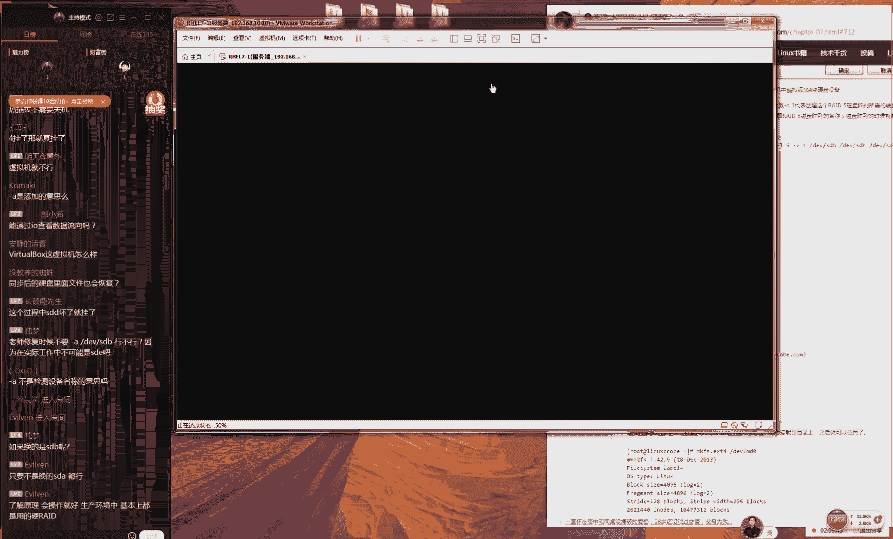

# 【RHCE】红帽认证工程师培训课程 - P9：第九节课 - 天木轮回 - BV14E411678v

🎼放了腰的。啊，好，这首歌我们正好结束啊，那我们准备开始上课，同学们先打一下一吧。大家好吧，大家先打一下一，如果听我说话声音的话。今天的话呢我们这个内容量是非常的多的，其实还是比较多的。

我们要讲完第六章节，后加我们第七小节那个read磁盘列组，然后我们大概我们上课之间规划一下时间，大概的话还是两个小时好吧，大家前做好准备。好老师迟到老师真的没有迟到。因为我在看你们聊天人数。

然后一直在100多个人嘛，以我们稍微等了一分钟。好，那我们开始我们的6。5小节是这样大家千万不要迟到，因为迟到之后可能会跟前就是这个会比较吃力了啊。好。

那我们先说一下我们第六小节讲一下我们对于磁盘的一种管理的一个基本的一个方法吧。就是我们回忆一下我们上一节课最后一节课就我们就是我们昨天最后一点的时候给大家讲了一个我们对于磁盘的一个分区格式化跟我们的挂载这么一个处理一个流程。

好吧。那我先再给大家去操作一下。因为昨我们讲的是比较的快的。😊。

呃，那我们今天会给大家再把我们这个三个步骤分别来去讲解一下。那么如果大家做的没有跟上的话呢，那我们就可以今天再来去看一下我们这个具体的细节的一个剖析。好吧好，同学们说现在是卡了是吗？啊。

既学有这个情况吗？要有的话，可以再说一下啊，最好没有的话，有那我们也说一下，好吧。😊，好，小同学有这个情况吗？啊？没有这个情况是吧？如果要是大家呃包括声音，说明我离得比较近啊。

那我现在是离得远一点就应该能够好一点了。好了，那我们现来呃现在好了是吧比较清晰，没有问题。那好，那我们现在是这样的。因为我我们现在做这个实验。

需要通过我们这个虚拟机去模拟出来这个硬盘那我们在工作时候的话呢，我们这个服务器一般他都会去支持做这个热插拔技术的。但是我们现在在使的是虚拟机，我们尽量为了保证我们这个不要出现问题啊。

以说我们现在还是把它关机这样一个操作，给大家说一下这个理由。好，那我们先给大家关机之后，大家可以按照我这个步骤1。1点来同步去做也可以啊好，那我们现在来去点一下编辑这个虚拟机。另外再给大家再去提一下。

就是昨昨天跟前天这两天同学报名的人数非常的多啊，咱们现在在线听课这115同学基本上都已经是报完名的对吧？大家都已经是报考了了。而且咱们这一期的报考人数真的是。😊。

啊，报考率也非常的高啊，是这样的，大家的话呢先听我一句算，就是你们不要去看红帽CE的，还有红那个考前辅导。就大家先不要去看那个呃考前辅导。因为大家现在因为大家现在去看的话，真的是太早了。

呃第一你没有学到这这个的东西，你到时候你也看不懂。第二的话就是你先看完了，到时候你也得忘对吧？而且你因为你约都是月底的考试，你现在看的话真的是不合适，就大家听我一句算，即便大家已经约上考试了，对吧？

但是不要去看啊先按照我们这个课程按部就班的去学习，我建议大家是提前一个礼拜。😊，到10天吧。我们来去复习就好了，千万不要太长，也不要太短，好吧。我们就尽量来说就是1到2个礼拜。

我们建议10天的7到10天是最好的。因为我我先跟大家讲过啊，我们先给大家模拟出来一个我开给大家去说一下。因为大家知道有一个他会有一个倒优形状的一个一个这么一个学习的一个图吧？

后就是那你现在开始去复习的话，到时候4月底的时候，你正好就忘记了。那么到时候你去考试会很尴尬，所以我们建议就是说不要不要也不要过早去复习，不要过早去来去这个我们就要刷题吧，对吧？

就是说我们一定要规划好时间，我们建议是7到10天，大家可以相信我们就是7到10肯定是足够足够的了。好吧，你现在你去看你也看不懂因为现在还没有学习到这个配置的这个具体的服务呢。所以这个不用着急好吧。

报名踏踏实实过就好了。你有位置了，你就等到4月中旬的时候你再去看那完全来得及好，然后就没有问题。大家这个不用那么担不用那么担心啊，😊。

今天一上来同学们就就问说我们的红C的考勤辅导怎么去配呀，对吧？这个东西你没要去学过，肯定不那你肯定不会去配的。这个我们只先约一下位置啊，不那么着急，好吧，咱们还有一个还有还有一个多元的好。

那我们现在开机啊，我们来给大家去操作一下。对于我们拿到一个硬盘之后的话，我们想象就是一张很大一张白纸。然后我们用户需要对它上面进行一种编辑，对吧？那我们第一步需要进行裁剪裁剪我们叫做分区步骤。

二我们叫做格式化，对它进行一个打格来方便我们来去写入我们的数据，第三步我们叫做挂载操作挂载操作指的就是用户要去使用这个硬盘里面的这个数据资源，它能够进行数据的一个读写挂载操作的话呢。

这个本质上就是将我们这个设备文件与一个目录相做关联的这个动作我们把叫做这个挂载的这么一个动作。好了，那我们现在那来给大家去操作一下好吧，然后我们会把每一个步骤都会给大家去细细的来去讲解的。

如果说昨天没有跟上的同学。😊。

那我们今天就可以来呃大家去听一遍好不好？那我们再多给大家去讲一遍。其实这个回去之后只要去做一遍啊，其实都会感觉呃会很会很简单的。好，那我们现在根据有一个叫做UDV的一个服务的一个协议了。

那我们知道当我们系统里面第二个被识别到的硬盘的设备的名称应该叫什么名字。😊。

再给大家去说一下，根据我我们的UDV的这个规则，我们系统当中的第二个被识别到的硬盘的设备的名称应该是什么？好，大家先告诉我是什么。😊，对，应该是叫做嗯。好的，啊，对对啊，这个是我看错了呃。

应该是DV目录里面的SDBOK那我们现在去查看一下这个文件。😊，果然他就已经是出现了。那么既然大家现在已经是复习的很好了，对不对？所以我们就让大家跟我一起来去互动好吧，对吧？

因为我们之前啊我也是拼命命的给大家去讲啊，去来灌输我们这个知识，其实这样不应该，对吧？因为我们要去互动一下好，那我们今天这个实验啊，我们就给大家去互动一下了。那么请问对于我们这个磁盘分区的命令是什么啊。

我那我们这个磁盘分区的命令是什么？😊，我啊我们要想去来进行四盘分区的话呢。那我们就要去选一下叫做FD命令来进行一个磁盘分区。它是一种交互式的一种配置的命令。DV目录里面的SDB好，那我们来去配。

那我们接下来对它进行一个分区。呃，分区的话它有三种类型，对吧？第一种就是主服器类型。不第一种就是主分区类型，第二种是扩展分区类型，第三种是叫做逻辑分区呃的一个类型。😊，好，那我们现在的话呢。

我们先点一下这个N代表去新建出来一个分区。因为我们昨天给大家讲的是一个主分区，对吧？所以我们今天还给大家讲一个主分区。那么这个原因呢就是说我们先给大家讲这一个主分区。

然后等到我们待会做这实验时候建出来这个逻辑分区跟扩展分区不用着急虽然说是S老师确认一下咱们在咱们只要能够进入到这个界面里面说明这个设备文件就已经是存在的。那因为它是因为他因为他要是没有的话。

那到时候他肯定也会给你出会给你提示错误的。好我下来我点一下代表就是新建一个主分区，他让你去输一个你的这个分区的编号，我们选择从1到4们选一个一好了非的这个非常非常的都打出来让我先打再打再打一个W就。

那我现去敲一下回车因为这个是我们这个起始的区这个起始区我们是不用。😊，动的我们现在需要动的就是后面的这个结呃结束扇区，而我们直接去写上我们需要的大小就可以了。那我们可以写上我们这个。😊，呃。

这个大小就可以了。我们这个呃硬盘的话呢，大小是20个GB，所以说我们随便给大去分一个吧。比如说我愿意给他分两个GB。好了，我们点一下回车，这个时候我们再点一下P。

你就可以看到这个就已经出现了一个大小为2个GB的一个分区的一个信息了。它这个名称的话呢是叫做DV目录里面的SDB剩下的18个GB呢现的18个个GB我们还没有去使。

它等待为我们用户去来去切割出去接样的话就是我们就是我们待会可来继续去分好然后的话呢我们现在点一下这个W代表就是保存一下我们这个分区表信息。它应该来讲啊。

我们我我我们待会儿会给大家去分那个18个G大家放心啊，这个我们到时候我们不会把它忘记的好DV目录里面的SDB还有我们的DV目录里面的SDB那我们可以看到那我们这个分区的信息就已经出来了。

如果说我们要是去查看的时候，它没有这个信息的话呢，那我们就可以去敲一下这个。😊，来进行一下我们的分区表的一个同步，同步到我们的系统内核当中。这个时候就没有问题了。那么如果说还是没有的话呢。

那么我们就可以再来去重启一下这个服务器就一定是有了如果还是没有明大家这个操作是有点小小的问题去检查一下几步操作是不是有什么问题了说敲两把我们敲没有管用的话，那我那我们就会再去敲一遍，对不对？

好那我们敲敲之大家去重启就没问题了。我来给大家去去格式一下格式的话个常的看一下它就是MFS点后大家可按两下table键它会自动补齐们有可以用的这个文件系统的格式如说我昨天讲的是什么呢？

讲的是我文件系其是随意的我格式下目录里的。😊，1二三走你，哎，你看我们走你就把这格呃就把它这呃格式化成功了。这样的话呢，那我们就有一个格式化成功的这么一个分区信息了。那我们接下来就要进行一个挂载。

挂载的话呢，这个本质上就是将我们这个设备的名称，那就将我们这个设备与我们的一个目录箱做关联的这个动作，我们叫做挂载操作。好了，所以说我们现在需要做就是。😊，呃，出来一个挂载的一个目录好了。

比如说我们叫做这个是两个呃MS跟它有什么区别？这个是两个文件系统，他们两个是具体的差异可以百度上去搜一下。因为这个系统特别的复杂。然后格式化了，它不是自动挂载的，我们需要自己动手来进行这个挂载操作。

那比如说我们现在新建出来一个目录我们叫做这个小风，然后我们就可以去使用到命令先去写上我们这个设备的名称DV目录里面的SB然后我们最加上这个小风。那我们这个需要挂载这么一个相关一个目录这个我们给大家讲过。

现在就是在结对吧？那么你这个男方跟女方要同时出场那然后才可以，那们才会再回收这个时候我们就有一个挂载信息挂载到这个目录上面。

然后这个时候我们可以去使用你可以看到我们这边就有了一个大小为两个GB的一个分区挂载到了小峰的一个子目录上面啊，挂载到这么一个挂载目录上面。这个挂载目录的话呢，我们可以把它这个挂载。😊。

那挂载点相当于就是我们啊因为大家现在这个互动比较快啊，所以可能现在看不过来。大家可以现来去互助大家去交流一下。如果说呃提问没有被看到的话呢。

那我们下课之后可以来继续跟我去说呃一个磁盘只能挂一个目录同呃同理如果一个目录上面挂了多个硬盘的话呢，它的后一个硬盘。它它后背挂上一个它后背挂上的这这个磁盘的这个信息会覆盖我们前面的那个磁盘的信息。

现在就是它每一次只能被一个硬盘所使用。好了，那这个时候我们还要需要做一件事情，就是去编辑一下ETC目录里面的FAB的这个文件。这个文件我们编辑好了之后，我们的服务器重启之后。

它还会依然为我们去提供这个挂载服务。😊，现在都是一个永久生效的。所以说这个步骤的话呢，我们一定要去做考试的时候，这个是值4200块钱的。大家知道为知道为什么它值4200块钱吗？

因为呃你的这个服务你配置的再好再对。但是如果说你没有开机那么你没有这个重启后还生效的话，那么后考试时也是零分了。给大家去说一下啊。

我们的这个红帽考试不论是红S还是红还是红C就是我们他们都是去重启之后再去判卷子，所以说你配着这个服务再好再对，但是你从启之后没有去生效，最后考试时候，那么他判不到成绩的，我们举一个生活上一个例子。

那还是说有一天特别的辛苦留了好好多作业到夜里的一点钟这个时候的话呢好不容易做完作业，然后收拾收拾书包就然后就睡着了。结果第二天走太急了，作业忘带了好，那你去跟老师去解释说你作业忘带了老师一般也不信？😊。

因为你没有证，那你没有最后这个证据，所以说我们一定要既然你已经把它配好了，就一定要保证你这个服务重启之后，它还能够依然去生效，证明你配置的是正确的才可以。好了。

接下接来我们再给大家去设来去填写一下我们这个信息。第一个信息的话第一列的信息，我们要填写的是我们这个设备的名称，我们把写对就可以了。然后是我们的挂载的目录。

我们叫做小峰的一个子目录这大家可以随意啊不用跟我这个完全一样。然后是我们文件系统的格式叫做EX4以自己刚才那个实际的那个为准。

再往后面走是我们的权限包括说对于这个磁盘的一种读写的这个权限代表就是是否进行自动备份，我们选不要再来写一个是否进行自动校验。我们选择不要好这样的话我们点一下保存名退出我们再来bo家可以看一下。

我们重启之后，我们这个磁盘信息，会依然为我们去生效的。这就是我去做分区格式化及挂载这。😊。

三个步骤的一个流程。这个其实来说非常简单的啊，这也是我们昨天给大家所讲到的。好，呃，接下的话呢还有一个命令的话叫做呃DU，我们把它叫做do吧。

然后叫啊我们可以去查看我们这个目录内的文件的这个大小是这样的，这个命令的话呢，它可以跟我们不啊，它跟跟我们这个DF命令来去结合去使用。

因为我们刚大家给大家玩过有一个命令叫做DF杠H这个这个可以用来查看我们当前挂载的这个信息有哪些，对不对？然后这个时候我们可以看一下。😊。

我们重启之后，我们这边还会有一个叫做DV目录里面的SCBE挂载到了这个小风的这么一个目录上面。好，所以说我们这个操作是没有问题的那我们再可以去使用一下，叫做do杠I。

然后显了一个星号这个命令的意思大家可以看一下就是呃。😊，呃，这个意思我看一下啊。嗯，这个不能使星号了吗？啊，因为这个里面没有文件啊。好，我可以换一个目录来试试来来去试一下这个命令的意思啊。

就是查看我们当前目录内，或者查看某一个目录内它的每一个文件所占用的这个大小。那比如那咱比如说那我们可以去查看一下我们系统里面的这个根目录它每一个文件啊，这个呃在这个根目录里面，每一个文件。

它所占有的这个大小。😊，应该再加上一个星号代表里边的每一个目录占用的大小。大家可以来看一下，然后这边有几个包错啊，说PLC目录之这个文件没有找到或怎么样的，这个没有关系啊，因为它是一个虚拟目录。

所以这样的话大家可以看到我们这个目录内的这个文件的这么一个大小了。好，然后的话呢呃对，然后我们可以如果要入空间不够的话，我们可以使使用到LVM去操作的。但是今天我们是讲不到LVM的。

等到呃应该是等到下礼拜5了。因为今天东西比较多，我估计今天要讲到LVM的话，要到晚上10点钟了。好吧，这个我们先不用担心，我们后后面会大家去讲LVM的嗯。😊，呃，然后的话呢我们先给大家讲一下。

我们叫做这个交换呃叫做这个交换分区是这样的。当我我们这个物理内存不够的情况下呢，那我们就可以呃先去取出来一部分的这么一个磁盘空间来去临时去充当我们这个内存的资源。就是减轻我们这个物理资源的这么一个负载。

比如说我们有一天去跟父母去菜市场买菜。这个时候比如说你父母拿东西已经很多了。这个时候你就可以帮他去来去分担一下，来去临时拿到你的手里面对吧？但是回家之那么还把菜当然还给这个这个菜主人了。

那也就是说我们这个的话叫做SWAP它就是我们在呃硬盘里面呃来去临时获取了一部分的空间充当内存去使用的那好了，但是说这个效率上来讲的话，那么肯定是CPU速度是最快的，然后是内存，再然后是我们的硬盘。

他只是用来去临时是实在没有办法的情况下来去充当一下我们这个内存去使用的。😊，所以的话呢那我们可以去使用一下free杠M命令。大家可以看到啊，因为先是这样啊，同学们现在问题比较多啊。

我也不知道为什么今天一上课之后呃，不是很简单的事情，为什么这么多问题。但是我们现在先不给大家看了好吧，咱们先讲完课之后我们来统一去说。如果说问题没有被没有被没有被解答的话大家下课之来继续跟我去说好吧。

然后大家如果要是会的话，如果要是知道的话，可以来去互去交流一下，这样会更好。好，那我可以去使去使用这个free杠M的话来去查看一下我们这个内存使用量情况。

当前的话呢我们这个分区在这个大小是2047大概就是两个GB的这个分区。好了，那我们接下来去学习一下说该如何进行一次扩展扩展非常简单那扩展是非常简单的。我们去使用一下叫做。😊，命令我们来进行一个分区。

那我们还是刚才大家问到说哎那我们我们这个大小明明是20个GB，那你是划走了两个GB，还有18个GB去哪里了，对吧？那我们可以继续来对它进行分区，现在我们这个分区里我们这个硬盘里面只有一个分区。

那我们接下来我们就以再点一下这个再去新建出来一个新的分区，那我们老去玩这个主分区没有什么意思对吧？我为了增加我这个难度以说我给大家增加一个叫做这个扩展分区来我们点一下这个E我们这个新建一个扩展分区。

扩展分区编号，他说是否默认为二我们敲回回车默认为二就可以了。他说这个始扇区是否为默认值一下回车。然后以及他说他说是否设置一下这个结束的区如果说我们要想把我们所有的这个资源啊。

那我把所有的空间都给我们这个扩展分区的话呢，这个时候我们就不用去写大小，直接去敲回车，就把你所有的这个空间都划给。😊，扩展分区。好，再往后走，扩展分区是不能够直接去使用的。我们需要再点一下这个N。

新建出来逻辑分区。我们点一下这个L，新建出来一个逻辑分区，逻辑分区的编号是从五开始的那我们起始山区也不用去动。这个时候我们需要去写的是我们逻辑扇区的呃逻呃逻辑分区的一个大小。

那我们呃我们好比说比如说我们来一个3个GB好了。好，因为我不知道大家聊是不是跟我们一样的啊。好，所以我现在我就来给大家加上一个3个GB。😊，好，然后我们可以再看一下我们这个分区的信息。

它就会有了一个叫做DV目录里面的SDB5的这么一个分区信息。它就是我们新建出来的叫逻辑分区，用来去充当我们这个交分区的用来扩展我们这个内存使它用来去扩展我们虚拟内存的一个容量的我们点一下这个W保存退出好。

这个时候我跟大家去一下啊，其实你可以看到它这个里面就没有了DV目录里的S5它也没有V目录里S2那也就是说实际上这个分区的信息就没有同步到我们的内核很多时候啊会有人说哎说说老师我认为这个它不它它就不是个bug。

为因为你要是的话呢，为什红包不修复但是你要说不是的话呢，确实它也没有同步到位？以说这个东西我们认为在红8的候，者说今后可能会被使用到但可能会被修复，但是目前还确实。😊。

是一个问题起码来说那我们怎么去解决呢？有两个方法。第一来说就是去敲一下这个part啊。第二的话呢我们就给大家去重启一下reput。好，我们先给大家去敲一下这个啊。大家说敲一遍不行，我们敲两遍。

好我们敲两遍part当你看好了，我们敲完两遍之后，你再去查看一下我们这个文件的时候就会发现这个里边已经多有了啊，他想多出来的DV目录里面的ICB。😊，二和I呃DV目录里面的SB5这两个分区信息了。

所以说这个命令是非常好用的。如果说这个不呃，那么如果说这个不好用的话呢，那我们就可以。😊，呃，那么呃我们就可以呃我们就可以重启一下，这样的话，那也会管用的。好吧，就是我们可以去重启一下。好。

然后我们接下来下一步就是要对它进行一个格式化了。但是我们这个格式化一个专业的一个命令叫做它拿去专门格式化。

我们的这个分区的一个格式的一个命令后面加上我们的设备的名称DV目录里面的SB1我们对它进行一个格式看一下我V目录里SB5这么一个设备来我们给大家去格式化一下格式化好了我们先做这步操作之前。

我们先来再来去看一下我们这个当前内存使用量情况大小为2047大概是两个GB的大小好了，我们去使用专业的命令叫做我们把它给开启就是我们去开启这个交换分区。

于是我们可以看到我们这个交分区大小从2047成了5119变成了5个GB这就是我给大家玩的一个扩展交换分区的一。😊，一个小实验。这个其实来说是非常简单的这个来说是非常简单的。好。

然后的话呢我们现再给大家去玩一下，就是我们可以去编辑一下ETC目录里面的FI的文件。让我们刚所做为这个操作可以永久生效下去。那我们就给大家去写上这都是同样的啊先去写上我们这个设备的名称。

然后是就是我们这个交分区它就会自动帮你去要知道我们这个交分区没有一个它是没有一个挂载目录的。好，然后我们这个格式的话呢，它也是交分区SW接下来我们的权限de然后是否备份以及是否我们选择00。好。

们保存并退出。好，这样话我们做好之后我们可以也尝试去重启一下我们这个服务器。😊。

我呢呃我们这个交验分区，它还会依然为我们去挂载上。这个就是我们给大家去做这么一个实验。也这个来说也一点都不难。另外的话呢，这个就是我们的红帽HC的一个考试的一个难度了。😊，这个是红马HCSC的考试原题。

啊，所以说大家啊刚在聊在聊天同学突然间就听到嗯考试原题啊，结果后悔刚才没有听到题，对不对？好，这道题其实就是红帽CS的考试原题了，让你去扩展一下这个分区，其实很简单的，对不对？就是这样去做就可以了。

而且你到考试的时候，你不用自己去做什么天加硬盘，你不用自己再去什么重启服务器。当你考试，你当你坐在考场之前，那个系统已经是开机的那个屏幕已经是亮着了。那那里边的虚拟机已经在运行的。

是在考你考试之前都已经考有考过帮你去做好的。包括说我们以后的这个仓库什么的，这些都是由你们考试之前还有这个CP，还有还有DNS。😊。

都是由他们帮你去配置好的。所以说我们为什么说红呃两两个红顶还顶不上一个红对吧？这个他确实很多事他帮你去做好的好，那我接下来使用到去查一下我们内存的这个情况。

以看到就是5说挂不当不为这个格式不需要个专格式叫个格式好，那我们继续往后去讲，实验实验我们下面给大家讲一个叫个叫做配额是一个场景啊。

实也就是我之有服务的话我公开的就是大家是知道我们这个网站早话有一个公开一些文件去临时去些文件的。😊，自己吧。然后我们当时买了一个很便宜的一个服务器，大概一个服务器，一个月的话也就呃二三十块钱就很便宜。

这种呃呃这种最便宜的那种服务器。后来吧我就发现这个服务器老是死机。让我再仔细看原因的话，就是有一些小破坏分子嘛，或者说呃一些呃一些就是这个很没有很没有工作心的这个人。😊，他们呃老往里面去传大文件。

比如说传个电影啊，对吧？或者说传个什么电视剧啊，或者说再往里面传个什么游戏什么的，最后就会导致我们这个磁盘空间被占满了。最后我们这个服务器就崩溃了。那么好，就是为解决一个问题啊。

非得去解决说当我们这个服务器的呃的这个磁盘空间肯定是有限的那我们这个磁盘的这个空间是有限的那我们该如何去归划来，我们这个磁盘的这个容量限制每个人只能够去使用多少啊，就是我们限制每个人。😊。

能够去使用这么一个磁盘大小的一个容量的一个限制。当你超过这个容量限制了之后，那么就不能够再进行这个写入呃这个磁盘的这个写入或者说存储文件这么一个操作了。好，那我们这么去做这个Q技它默认没有去支持的。

那也就是说我们这个系统它默认没有去支持这个技术，我们需要自己去开启开启的方法就是编辑一下ET目录里面我们这个命令的话呢，它只针对于我们的叉文件系统可以去做。如果说您是4系统的话呢，那我们待会的个命令。

只只要把前面那个叉F给去掉就可以了。好，那我们所以说我们去找一个我们这个叉F文件系统的这么一个文件系统好不好？所以说我们可以看到了这边有一个就是我们的个这边就是我们这个目录。

看它这个文系统的这个格式就是叉可以看到我们的目录的文件系统，就是叉，所以说我们现在需要做就是把这个后面给大家加上一个叫做Q。😊，这么一个参数，这样的话呢，我们做好了就可以哎我们这样把它做好之后。

它就再一次重启之后，它就可以去支持我们这个磁盘配额了。另外的话呢，我们建议啊你把那个00呃呃你把后面那个一一和12么你都把它给改成00。这样的话呢它就不要进行自动的备份。

以及不要自动的这优先级的检查以及不要进行自动的校验了，它可以加快你的这个系统的启动速度。因为这个因为我们再去使用是虚拟机它不是工作环境呃，也不会出现说硬盘损坏这样的情况的。因为它毕竟是一个虚拟机。

所以说我们可以这样来可以加快我们这个启动的速度。好，那我们现在可以再去重启一下。当你再次重启之后，你的这个步存目录里面就会去支持到我们的磁盘配合技术啊另外是这样的在我们红包re5和红包re6里边的话呢。

我们刚那个那个参数应该叫做USRQ它就叫做USRQTO但是的话呢我们在。😊。

啊，不是呃，QUR。

TA对吧？然后我们在红包7里面，我们这个参数是呃UQUOTA就是说我们现在这个参数有一个变化啊，在我们红7里面是叫做Q在我们5和6里叫Q但这个功能上来讲是一样的。好。

这样话我们来进入到我们这个系统里面那我们这个目录就已经默认去支持了我们的磁盘配合技术。但是它真的是它有它它有没有真正这个支持呢其实我们也可以来去查看一下了啊。我们可以去使用一下这个来去查看一下。

那么你就可以看到所有的分区的这么一个信息了。然后你就可以使用到我们的任意门区匹配一下说什么呢？匹配一下我们这个就是我们这个启动目录这个信息可以看到这个里面它就会包括有了叫USQ这么一个技术。

为什么使用mount，因为它可以去查看到我们这个分区的信息。然后以及它具体里的这。😊，个参数啊，他可以去查看到啊其他的命令他是查看不到的啊。然后的话呢，我们现在可以去那比如说我们可以接去尝试一下。

我们去新建出来一个用户叫做linux。这个用户已经是默认是存在的。既样的话那我们就可以来去啊操作一下了。比如说我们可以去使用叫做这个叉FSQ。😊，好，那我们接下来我们去来去设置一下我们这个命令。

它非常的长。首先来说是一个小写X，它指的是一个叫做呃专家模式。这样的话它可以有更多这个功能为我们去选择。现在就是我们的默认的模式，它功能非常简单。

那我们可以像一个小写X可以对于我们这个文件的个数跟大小都可以进行一个限制。既杠C它指的就是用通过非交互式的方法来去配置们这个命令因为的话呢我们如果要是没有杠C的话，就向那个命令的候。

需要跟我们进行一个交互式的一个配置。然我们需要跟他去互动，这个特别的麻烦。所以我们可以去选用一个杠C直接帮我们去配置它了是这样的啊然后的话呢我们还有就是我们的我们有几个这个限制的值。

大家去说一下好吧有几个限制大家去说一下就是说我们为现在上课人数比较多嘛。大家如果要是您恰巧知道这个问题的话呢那我们可以来去互。😊。

交流一下，好吧，因为咱们如果要是一边讲课，可能一边再去回答问题的话，就是这个会比较乱。好吧，就是在咱们上课的时候会比较乱一点。但是我们也可以下课之后就呃来去回答。好吧，然后呃如果你要是知道的话。

我们可以来互助来去交流一下。这样的话对自己也是一种提升。好，那我们给大家去说一下，就是说它既然来说它是有两个这种限制的方法的。第一的话呢就是叫做of还有一叫做了。

还有下面叫做of还有一个叫做 hard了，是这样的啊，呃，因为我们知道我们之前给大家讲过，它每一个文件它是有两部分去组成出来的。第一部分的话呢是。😊，呃，我看看怎么样说啊。

能不能把直播的画面给大调大一点，调大的话应该是调不了。但是我会把这个字给它放大吧。但是放大之后大家不都看过全了吗？呃，我看一下啊。我看一下稍等稍等稍等，我把借个给他。尽量放大一点吧。大家会换行啊。

大家去操作的时候不用去换行。行，我现把它给稍微放大一点。好吧。然后说呃我们在这个de后面加上US是不的。

刚刚说完红里应该叫做它不是个USR所说我们一定按我们刚才所教大家去操作吧然后的话我们这个有乱了吧其实我还是跟大家去互一下。但是要但是你要说老提问的话，9会打乱思路嘛。

但是你要不回答的话可能会觉得这个老师上课回答问纠结问题。以说我还是希望大家能够互一下是巧知道的话呢正好一来说一？样也种一起来去学习。那我给大家去一下。

就是一个号了这个话是用来去限制我们这个文件的这个个数的我们还有一个叫做。😊，of和号这个限制的是我们文件这个大小的。因为我们知道我们一个文件它是有两部分去组成出来的。第一个部分的话呢。

我们叫做啊INODE文件，对吧？它里面包括了我们这个文件的属性啊，大小，所有者所有组修改时间啊，对吧？然后还有一个叫做lockLOK它用来去保存的是我们文件的真实的这个大小。

所以说我们要去限制一下of实际上呃还有这个号，它是来说它就是限制了我们的文件的这么一个大小，它用来限制的是一个我们的文件的这么一个个数啊，然后我看一下。😊，呃，对，然后这个呃OK呃，然后的话呢。

我们现在。😊，给大家去说一下，这个叫做软限制，这个叫做软限制。还有一个的话呢，我们叫做硬限制。当我们达到这个软限制的话呢，那我们这个系统他就会给你一个定的这个提示，但是他不会拒绝你的这个操作请求。

他直到你达到这个硬限制的之后，他就会给你进行一个禁止。我之前看过一个小笑话，就是说我不知道是真的假的，估计是假的，说上小学时候看我一个小笑话集里面讲的说啊嗯在在说在某某某个国家。其实那个国家。

他说是新加坡，但是我觉得很不太信啊，说在新加坡有一个法令，就是说一个人在在同一条街上面扔两个烟头就要被抽鞭子，对吧？然后当有一个人啊被扔到第一个，然后当有人被扔第一个扔第一个扔到第一个烟头之后的话呢。

就有一个人给他举报了，说你扔说扔说你扔垃圾了。然后的话就是说第一次只是一种警告，他不会对你进行任何的这种限制。当你第二次扔这个烟头的话呢，他就会对你进行一个。😊，强制的这么一个制裁了好。

但是我觉得这个应该是个假的。因为我觉得新加坡这么法律的国家，怎么可能会扔两烟头了，对吧？好，就是说我们将会有一个软硬的一个限制。当软限制达到了之后，他只是给你一个口头的一个警告。

你可以想象说是那个呃马就是那个马大姐对吧？就是我们之前看过一个电视剧里面，他会对你进行一个唠叨，他会给你去说服教育，然后他会给你写入到这个日志文件里面，但是当你直道达到这个呃硬限制的。

然后他才会去他才会去禁止掉你的这么一个行为，如果大家愿意的话，可以去想象有一个人在贪污，对吧？贪污了5块钱，这无所谓，他对他进行一个口头的一个警告。当他贪污到了500万的时候。

就会把他给进行一个强硬的一个限制，把关键狱里面去了。还有这个也是叫做软限制，当他达到了某一定文这个大小的时候。😊，那么就会给他进行一个警告信息。而我们最后达到一个硬限制的时候的话呢。

他才会禁止到呃硬限制，它才会去正式的去禁止到某某某个用户这么一个行为。好，因为是这样的，因为这个屏幕会比较小，所以我换行了，大家去操作的时候是不要去换行的。

好吧来接下来话呢我们来去写上叫做这个limit这个其实就是一个限制的意思但是这个功能啊，就是说这个只是代表限制的一个词，它并没有真实的含义。好。

我们来去限制一下首先来说限制一下叫做of它限制一下我们文件大小的一个软限制为3兆再去限制一下我们文件大小的一个硬限制为6兆。好，那也就是说达到6兆之后才会去限制我们用户的这个行为。

大家先记这个书上面可以去操作一下，就是我们那我们限制的就是我们文件的这个大小不能够超过6兆好，然后我们接下来再来叫做of就是我们限制一下文件的个数为3个再来限制一下我们文件的这个大小为6个当我们文件大小。

😊，超过6个的时候，他就会给你对它进行一个限制。后面是你要对谁进行一个限制的。那我们对于这个叫做这个呃这个用户名称叫做ladiness的用户，我们来进行一个限制。后面是我们的目录名称，我们叫做bo。好。

那也就是说当我们这个在bo目录内，我们的呃。😊，我我们这个用户啊我们在这个目录内，我们的用户将它创建的这个文件超过6个，或者呃两个得到一个就可以了，或者他创建的这个文件达到6兆的话就对它进行一个限制。

软硬的话可以不写软，但是一要去写让我们敲一下回车这个时候把设置好之后，可以去还要给他这个目录一定的这个权限。因为默认我们的普通用户是不能够对这个目录这个内容进行写入的那我们给他一个三个权限。

这样我们设置好之后，我们把它设置好之后切换到叫做的一个用户身份下，他需要先去走到目录内大家可以来看一下我这个操作你看我现在创建出来几个文件。第一个文件ABC我们现在创建出来三个文件没有问题。

再来创建出来DEF那好了，我们现在创建出来的6个文件了。现在我们去检查的是我们的叫限制的是。😊，我们文件的这么一个呃个数。我们再来创建出来另外一个文件。比如说第七个文件的时候。

他就会告诉我们说我们的磁盘配额已经超过了。这就是我们该如何去限制我们用户去无休止的去使用我们硬盘空间的这么一个方法了。大家可以看完之后，感觉是不是很有用，对吧？当你有一台服务器的时候。

有一个小破分子去大量的去下一些游戏啊，去下一些电影的时候，那么你就可以通过这个啊磁盘配合技术。😊，这样的话呃，来去限制你这个用户去使用的这么一个资源大小。好了呃，我看一下说这个权限昨昨呃昨天加的吧呃。

我没有跟上大家在说什么。呃，我看一下只限只限部分没有问题吧。啊，对他可以只限制部分是没有问题的。行，然后说男人不能软，我怎么我现在怎么有点有点有点跟不上大家这个节奏了。好，那我们那我来继续啊好。

那我们接下来我们去删除掉这几个文件，再给大家来玩一下，就是说我们这个文件大小嘛。来ABCDEF我们来去删除掉这几个文件。再往后面我们来去使用到DD吧。因为DD的话呢。

实际上就是可以按照大小来去建立文件的一个很好用的一个命令嘛。好，那我们新建出一个文件，我们好比说我们叫做哈哈这个哈哈的话呢，我们叫做BS等于三兆好吧。

然后看等于一就是他来去新建出来一个大小为三兆的一个文件。但是我们这个M的话必须要是一个大写的一个字母啊，它一个它有一个格式要求。好，那我们现在可以来看一下。😊，好，那么我现在可以看一下。

我们就新建出来一个大小为3兆的一个文件，那么它没有问题，对吧？那我们新建出来一个大小为6兆的一个文件，大家可以看到，现在也是没有问题的那我们现在再来可以去新建出来一个大小为10兆的文件。

其实不用十0兆了，我们大小为8兆吧。你可以看到还有就会提示你说磁盘配额已经超过了。好，所以说大家可能看这个时间配置起来并不难，但是它真的很重要。因为当你有台服务器的时候你就知道了。

当你呃如果没有限制一个用户的这个使用磁盘的这个大小的话，那么会特别的麻烦。因为嗯它总会无休止去使用你磁盘里面这些空间，就会导致其他用户都不能去使用了。这个呃这个情况在呃生活当中是很正常的。😊。

这个来说是比较是是比较常见的。就相于是我们这个手机啊，比如说苹果手机它会有一个叫做I啊叫做iro这么一个服务，你需要自己去买硬盘空间，它才可以进行这个存储。如果说你不需要自己去买，它可以无休止的去保存。

那我估计所有人都往上面去传照片啊什么的，就他这个服务器有瘫痪了，就以说这个就是对于磁盘大小的一种限制方法。然大家可能现在想一个问题啊，就说除了我们现在同学们现在这个问题啊，然后我们现在还有一个问题。

就是说呃。😊，说我们如果要是给了3兆升一成8兆怎么办？就是说我们现在已经有了磁盘配额的这个大小。但是我们想要对它进行一个修改呢，对它进行扩容，或者对它进行一种减少，怎么进行操作呢？那我们就可以去这样。

我们一定要先放呃换回到我们这边超级用户ro此身份下，我们还是去使用叫做叉FSQ它。😊，啊，不对，我们应该叫做EDQ他命令ED。然后我们更优指的是我们要去编辑哪个用户的这么一个磁盘配额。

我们叫做的这么一个配额。这个时候你看到它实际上它它还是调取了我们这个VI编辑器啊，它还是调取了我们还是调取了我们编辑器来去编辑的这个的话这个代表就是你当前已被使用的这个值。

所以说我们现在需要做的就是不要去修改这个当前一经被使用过的值而是而是直接到这个限制部分。咱比如说我现在想要去将我们这个限制的值原先是6兆，对不？好了，那我们现在就可以把它提升成60兆。

后面只要加上一个零保存并退出就可以了。就非常简单。如果说不需要的时候，那么就把它给删除掉就可以了。就是调用了我个编辑器。所以说当编辑器我们走遍天下都不怕现个好尴尬但但是俗后我现在可以切换到我们。😊。

问一下，你可以再来去尝试创建出来一个8兆的一个文件，你可以看到就没有问题了。那我们可以再来再创建出来1个20兆的一个文件。OK也没有问题。创建出来1个60兆的一个文件。

你可以看到这个来说就是非常啊这个呃行行行600兆了啊。😊，来啊，现在我点错啊，现在出来1个60兆的一个文件。O这也是没有问题的。其是我给大家去玩了一下。你看对于磁盘配合。

我们其实可以很灵活去调整我们去限制我们用户出现出来那个文件大小，还有我们文件的这么一个个数的。在工作时候这个真的是非常的常用的然我才读的就成做if？

实这样读显得得就号应该是叫做我这之还给大家提居然己给忘记了这个很打脸不？然后只写了块没写个数是按照块大小来去不断去写知道磁盘写满然后说显的英语很这个读if而已这个什么好不好大家真的了不这么多是自动之给覆盖掉。

因为我们的文件名称没有变所会自动去覆盖之前那个文件的做这个是一个块文件在就是一个们文件一个来源的。😊，意思这个呃这个文件里面的话呢，它可以从中来无限去获取零块数据，就是说它可以从里面去获取无限多的数据。

主要用来去生成出来我们这个指令大小的文件。哎，指大小文件，限额是每个60兆，不它是总共60兆，它是限制的是总共的个数。比如说我们现在限制的是总共6个文件以及总共是60兆的这么一个容量大小。对。

后大家总结一说说来无穷ro，然后去无穷啊，这个是对的，就是我们这个叫做这个呃这个我们叫做零块文件。我们还有一个叫黑洞文件。如果你想要去获取文件的话，那么就可以从这个文件里面来去提取。

如果说你想要让把这个信息给它删除掉的话，那我们就可以把把传输到这个黑洞文件里面。这个其实就现当就是没有回收站的一个垃圾箱了，对吧？它是进去之后就都没有的，它就是叫做黑洞文件嗯。😊，这个真的很好啊啊。

不知道有没有版权。回头我们可以写到我们这个网站上面。好，那我们接下来的话呢我们来给大家去说一下我们这个链接文件。其实这个很其实这个很简单了，这个比我们第二章还要水大家完吐槽。

因为我们每一张到最后面大家会心里面噔一开上重头我们要去学最难的那个章节其实并不是实飞也我们今天第六章节给大家例外我第六章的最后一个小节只有一个命令叫做N命令都简单。

我们叫做LN叫做链接文件就是我们windows里面的一个快捷方式啊，这个非常简单啊，大家大家大家大家不要害怕我们比说我给大家举个例子你看啊我们现在我们现你看我这边点一下鼠标的右键点一下右键新建链接到一下winows大家缓过神window我点一下这个快捷方式。

😊，那我现在如果我去选择一个文件作为我的快捷方式。比如说比如说哎呀都是学员的这个信息啊，咱不能给学员的信息公布出去，那就不好了。我看一下什么呢？我看一下呃。😊，呃，比如说我们广告吧。

我们这个解压密码好了，我们现在点击一下这个下一步，我们点击一下完成。这样的话，当我们去双击这个文件的时候，实际上我们就能够看到我们这个呃原始文件里面的内容了。那么先给大家提个问题好了。

那么请问我们呃去查看这个链接文件的这么一个内容，跟我们这个呃原始文件的内容查呃去查看出来的这个内容是否是相同的。😊，好，大家可以来打一下一或二就可以了啊。大家如果认为是同呃相同的话。

那打一下一如果要是不同的，那就打一下。2说我们这个呃快捷方式看到这个文件跟我们呃快我们用个快捷方式看到这个文件。😊，跟我们去查看原始文件内容是否相同，我们肯定说是一，对不对？

然后老老老杨同学说肯定是不一样的。然后打7下2我我觉得可能是对于我们这个提问的方式有点问题，大家也不太相信老刘的这个人品了，对吧？觉得我说这个题定是有什么坑啊。

所以我这个题肯定还有一种这个还有一种坑的这种存在，对吧？好，其实这个没有坑了，就是因为这个快捷方式嘛，对吧？即便说我作弊，但是这个事实他也他也他也是其实他也是很明显的。

就是我们这个原始文件肯定是跟我们这个链接文件内容那么肯定是相同的。下面再给大家提个问题呃，那如果说我当我去删除掉了我的原始文件，如果说我删除掉了我的原始文件，请问我的这个新文件，我还是否能够打开。😊。

如果说我删除掉了原始文件。请问我的这个新文件。我们的这个快捷方式还能不能打开啊，同学又给我打了一个二，对不对？因为我们这个原始文件把给把给删除掉的话呢，那我们这个新文件也就不能够访问了。

其实这个呃也就是一个快捷方式比较常见的一种方的一种形式的。我们把它叫做这个软链接形式，是它需要加上一个小写IS其实来说我们说这么多叫什么链接文件，或者说什么呢？

它就是我们的windows里面的一个的一个快捷方式。我们好比说啊你看到我现在在我这个加目录里面，我把我把放大一点啊，那我们现在在我们这个加目录里面。😊，好，我们说这个链接文件就是我们这个快捷方式。

你看在我们这个加目录里面，它现在有一个文件，实际上我们就可以去使用到LN使用一个小S小S代表就是软链接，就是我们这个windows里面的一个快捷方式。

现去加上我们的原始文件的名称我到这个table键去补齐然后说老刘电脑负载为什么这么高为电脑比的差，们再开着直播再开着录屏再开着虚拟机好，所以我这个CP还是这个存高。

这是P还存这是内存这个大家提一下实我内存很大原来内我有两个内存16个G后来我不知道为什么有一天突然间就开不了然没有办法只能把这个机器给拆开拆开之后。

我检查一下为什么后来按照别人的这个教程说可以去清就清了清之后脑还打不开还是打不开怎么办呢？把内存条拿下来按照他们的介绍拿橡皮擦一下结。😊，结果拔完内存条之后，发现里面有一粒大米呃，不知道为什么。

跟大家没有开玩笑啊，就是我那个呃呃内存条里面压着也是被压进去了，一粒大米，那为大米被压都弯了，就是我内存条上面那个呃金手指也被压的都变形了，然后被烧掉了。所以说我的尴尬。

就是我这个主板上面现在内存条只有现在就只有一条了。然后我这个主板上面那个插槽也被烧了一个，所以说非常尴尬，我不知道那个大米哪去的，哪来的，我真不知道，因为你要是说。😊。

之前就有的那我之前为什么使的好好的说老鼠，你老鼠，第一我们没有老鼠。第二你要说老鼠，你你给我放里边去试试，那他是把那酸条已经压进去了，然后用了用了好用了好长时间呢。

突然间出现一他突然间出现一个大米如果说你不搬开那条的话，你怎么放进去。所以这个已经成为了我们美美期必讲的一个神秘的一个一个案件啊，我们也不知道为什么了，真的是很奇怪很奇怪的，而且没有给大家开玩笑。好了。

我们来继续给大家去说啊说黑说是黑客，说是黑客啊，给我给我放进去的。你要这么说的话，那这个黑客水平很厉害啊，这个属于这个属于物理这个属于这个物理级别的一个黑客嗯。😊，好呃，然后的话呢我们来。😊。

给大家继续来去说啊，就是我们来这一个原始文件，然后面换码一个新文件啊，他一提到是一个黑客，现在一下子就。😊，一下就开始活跃了，我我原先我们我以为今天咱们只来了28个同学啊。

我我原先只以为咱们来了48个同学，然后大家都不在然后大家都不说话，对吧？比如说这个小比如说这个小军同学我之前我好像从第一节课到现在第一次看到你好像在发文字啊，所以说这个同学们互动起来。

怎么一聊到这种开玩笑的事情怎么都那么活跃，我再给大家提个小一个小笑话吧，也之前看过的，给大家回气氛，就是我之前看了一个笑话，说一个网管，会这个网管啊开始学想学黑客技术。

因为他觉得就是今天已经做了网管了嘛，天天就泡在这个网吧里面，他想学比较高级的技术。当他网管肯定不是为了破解网吧系统了，对吧？他就去尝试去学习黑客好了，那黑客第一门是什么？黑客第一门是学习盗号，对吧？

你们这应该都知道对吧？就是呃黑客一般的起步都是学习盗号，然后然后开始起家的。好了，然后他。😊，学大号，后来有一个小孩，然后问他说哎，你不就是个网管嘛？他很然后很然后很瞧不起啊，按照我们现在这个。😊。

然后按照我们现在这个比较流行的一个话叫d，不大家不知道这个词叫做这个就瞧不起，对吧？就是你那你不就是个网管吗？你说你自己是什么黑客啊，我不信我就是就他们后来那个网管说那你不信你就试试吧，后电脑上开鼓。

然后说弄完了已经往电脑里植入了木满。现在只要你登录QQ我能自动获取掉你的密码这个时厉害了，比这个技术那个小孩然后开始他电脑上面按装杀毒软件按得有四五款五六款啊开始去各种去杀毒都弄了一遍都都弄了一遍。

然后最后真是真的没有读啊，而且这个资料都已经删的差不多了，么启动箱啊什么程序什么都弄得特别干净了。说我这肯放心了。然后登录他的QQ了。登录QQ了之后发现那个密码还真的被这个网管给他盗走了。

你们知道为什么吗？😊，不是不是键盘记录器，也不是什么抓包啊什么的。因为所有的一切都给他删的很干净了，任何的烧软件都已经上了，给他去杀毒了啊。后来是后来后后来是什么呢？来是他们俩打赌？

那个网管后站着了他密的时候网管看见了所以说这就给大家提一个小笑话，这就就属你提到个物理黑客这一个别背后看这种这这物理黑客级别的好，我们不能说这种这种小笑话，咱说完没了？

赶紧来往后去说了现在我们一个链接文件，们敲一下这个回收他就当是一个windows个快捷方式原始文件新文件内容可能都是完全一样其实这个子回头跟同事去说就好了，跟你们同事去猜他们请让你去请你吃饭好。😊。

我们来赶紧啊，同学们我们不能再说一些小笑话了。你看啊，这现在就是我们的windows里面的一个快捷方式。你看你看这个原始文件，你跟你看那个新文件内容肯定都是一样的，对吧？

你看这个原始文件跟你的这个新文件内容都是一样的。当你去删除掉这个原始文件的这个一瞬间，然后你会发现你的这个新文件，你的这个链接文件就也已经不能够打开了。它就是如果你要是愿意记的话，那么就是叫做软链接。

😊，我们把它叫做软链接。好，这是一个专业的术语。如果说你愿意那么如果说你不愿意去记的话，那就是。😊，windows里边那个快捷方式。它就相当于就是我们的windows里面的一个快捷方式了。好了。

那我们再来的话呢我们来呃我们来什么呢？我们来一个叫做这个硬链接是这样的。当我们去创建出来一个链接文件，然后我们再给它取一个新的名字。比如说我们叫做看到这个文件也是这样的。当我们去查看这个文件内容的时候。

跟你去查看这个新文件的时，内容肯定都是一模一样的对不？那么因为内容要是不一样的话，那我们那我们这个实验就做失败了。好，但是这个很神奇啊，就是当你去删除掉这个原始文件了。

那一瞬间你的这个新文件还依然可以打开。大家看好了，它还依然可以打开。这是为什么啊，这就是我们为什么要给大家去讲一下说快捷方式只能去前面三个字母啊，所以说就是为我们去做这个实验的时候。

我们总会给大家换一个名字，比如说换成或或者啊，大家总觉得我说你这个说你这好俗啊，对吧？然后你这个改成这样的一个名字感觉很搞笑，其实我们还是有必要。😊，对不对啊？

因为会有同学会觉得是不是这个命令是或者说这个名称被固定死的。所以说大家不要想太多，好吧，就是说这个名称是可以随便去取的。我们那我我呃我们只是为了省事。

所以我们才没有就是采取他前面的那个前三位或前四位前或者前5位，这都是凭我刚才那个心情的。大家大就大家去工作说那个名称真的是没有呃没有关系的，可以随便去取啊，然后的话呢硬链机的个复制的区别是什么？

它不占用空间。好再给大家去讲一下啊，是这样的。😊，我们来去抛一下它这个本质。我们还是那句话啊，大家跟我一起去做，你做完突然跟效果效果是一样的，没有任何没有任何的这个用处。因为们这大家没有什么用嘛，对吧？

像是做菜一？今天你访着我这个方案，你去做一道菜那就做完了。但是你觉得这个按照我这个方做出来你不理解那有你不理解没有办法，那你就是最后工作时候，肯定也会出现这样的短板，而不像你去做菜，对吧？

你不理解没有关系啊，只要你告诉我怎么炒吧？那我炒1年，我这个味都是一样的吧？好，那我给大家去说一下这个原理是这样的们比如说我们画一个硬盘这个硬盘不家讲个鬼故事这个比如说好比说这是我们的硬盘当我们之前去访问一个文件的时候。

我再画个这是我们硬盘这是我们画小画个我好？你我这边画一个小这边我画小人那我们之前的话我们要想去访问一个文件的话，实际上我们去访问的文件的ID的文件。😊，这样的话呢访问就是我们文件的名称。

通过访问的文件的名称，然后访问到我们硬盘里面，硬盘里面找到具体的b块，然后我们去呃访问成功。好了，现在的话呢我们现在呃我们第一个实验就是我们的windows的一个快捷方式。

它实际上新建出来的是一个指针文件啊，然后是让你的这个用户去访问这个指针文件，指针文件指向到原始文件上面的个ID的这个位置，然后最后去访问到我们这个硬盘里面的数据。如果说你的这个原始文件被删除掉的话。

所以说你访问的起来，那可能也就是失败了。大家可能会觉得我这个例子就会画的比较的这个抽象。但是如果说大家以后去。😊，深入去学习linux的或者说深入去学习计算机原理的话呢。

我相信你们会把这张图再翻出来去看的这些图真的是我认为是我学习的一个巅峰了。好啊，是我是我是我画作为一个巅峰了。好，他就是一个指针一样，他就是一个我们再给大家举个例子好不好？我们这个电话本啊。

你这个像就是你电话本上面的一个地址，如果说你电话咱们说么电话本啊，就说咱们的书嘛，对吧？因为咱们毕竟是有自己的书的我们举个例子嘛，我们我们就呃尽量要以自己的那个产品为为这个参考。

然后给大家去讲这样的话一劳永益吧？我们可以来去正好提一下我们这个广告你看啊大家可以放开书，你看我们这个书前面是什么啊，前面是老老老刘的一个账啊，然后后面的话呢是出版社给我们写了好多好多前言，对吧？

给我们写了好多这个系统的一个介绍。😊，嗯，没有吗？啊，有啊，我记得是我之前记得会忘记。是在多少页了，你看啊你翻到这边会有一个目录，大家可以翻到了吗？就是呃在一个二维码读者服务的后面，对吧？

大家看到这边有一个目录，你看啊这个目录的话就他就告诉你说，比如说每个啊每个章节，它具体的一个页数，大家可以看到吧，它会有具体的页数，请问啊，大家现在跟我一起去操作一下，就是你把这个两页这个呃目录这个纸。

它不有两页吗？你把它给撕下去。好，当你把它给撕完了之后，请问我们这个书里面对应的这些内容，它还是否在啊，它还是在的对吧？但是你找不到它了。因为。😊，你的这个目录删掉了。

这就是提到了我们对于这个呃我们对于里面的这个数据也是我们现在是删掉了我们这个目录了。而我们里面的这个数据其实说也还是存在家真撕了？实了我只是举个例子就当撕掉这个目录之个内容找麻烦。

因为一指一个位置的一个指针了，他没有告诉你对应的那个位置同学们你不要这样？撕撕撕关系按照我这个活动去参加家一免费签名而且不信你们真撕了们这听话那你们要这么听话话，怎回让你们去预习的。

主动结果习暴露了家都没预习给大家去说是那我们什么叫。😊，我们什么叫做这个要呃硬链接呢，就是我们删除小件识文件之后，它还没有那它还可以去访问里面这个文件是这样的。

我们这个硬链接实际上它是新建了一个文件的IOD的一个指针。😊，啊，我们这个硬链接它是新建我们的文件的IOD的这个指针。当用户去访问这个文件的时候，就相当于就是访问的这个block块里面的数据。

所以说你的这个原始文件好坏无所谓，丢掉没有关系。我们这个数据还依然可以访问。然后大家想然后大家想现在想一个问题说那老刘，你现在讲这些有没有有什么依据嘛？因为这都是系统底层里面的这这个。😊，啊，事情啊。

那你现在说我也不知道到底是对还是错。那我怎么知道你自己是意淫出来的，还是你真的是呃有什么依据吗？对吧？那你现在说我怎么去相信你呢？是这样的啊，那我们不能说因为老刘长得帅对吧？

帅可以当饭吃那我们帅可以当啊帅就是正义对吧？那我们给大家去证明一下这个我们确实这么回事，是这样的，现在的话呢我们现在有一个文件叫做INI点CFG就是我们该那个文件，好吧。

可以看到这个文件里面的内容是没有问题的。然后你可以看一下这个文件上面那个属性，你可以看到OK然后我们现在来创建出来这个文件一个链接文件，创建出来一个叫一点啊，创建出来一个叫一点CFG。😊。

啊，出现出来1个1点CFG创建出来1个2点CFG创建出来1个3点CFG创建出来1个4点AFG好，我们现在对于这个文件又去链接了4次。好的。

那也就是说我们现在有了5条去链接到我们这个文件的b块的这个指针了。也就是我们有5个IOD的这个块了。我们现在再去查看一下我们的文件上面的个属性。😊，这时候你会发现什么事情了吗？哪里变化了？😊，好。

哪里有没有变化？有吧，对吧，你仔细看，不是那个颜色变化，因为颜色变化没有什么用啊。我们看一下这个数字变化了，从一变成5了。😊，所以我们现在。我们从3月8号开始上课，上到了今天。

我们总共给大家讲了有几节课，讲了就九节课。😊，终于我们能够给大家完整的去讲一下我们这个RS命令，它具体里面的这个含义了。所以说为什么我们给大家讲课的时候会觉得节奏很慢，对吧？但是觉得很扎实。

你看这个两个小时老这个老呃这个呃。😊，老头这个嘴，还有这个手。从来不闲下来。但是我们讲课的话呢，可能每一天啊这这么多这个东西可能才会可能才会讲4分之3个章节，或者去讲一个章节。因为我们讲的很扎实。

如果说我们只是一旦而过，大根本就不理解。而我们现在把每个细节给大家拆分一下，再给大家去说，然后就会知道哦，这么回事。好，现在给大家来去说一下的话呢。

第一个来说第一个简号我们就知道了第一个简号指的是我们的文件类型。后面三位啊，后面9位指的就是三位三位一段分别为我们文件的所有者所有组及其他人的读写执行权限是否有这个文件的这个属性。

他家可以给它换算成我们这个呃可以把它换算成我们这个呃数字法。这个点指的就是这个文件上面是否有FAel权限。😊，他如果要是有FACL权限。那我们就是。呃，变成一个加号，它就会变成这个加号。

这个5所以我们现在就知道了这个5就是这个文件当前有多少个IOD的这个个数，它有多少个D文件的这个个数。当你想删出来这个文件的时候，请确保这个文件的这个个数一定要归零。

这样的话我们这个数据才是真正被删除掉了。这个在我们工作的时候一定要注意一下这个代表就是我们文件的这个所有者这个代表就是我们文件的这个所有组。

这代表就是我们文件占用的这个是我们文件的这个实际的大小默认文字结束这个是我们最后那个指的是我们最后一次修改文件内容的时间。这个是我们文件的这一个名称。所以说当你这么去学完了之后，你会感觉很？

因为当你去很深入的我怎么说呢？我们不知道已经不知叫深入了，是很系统的去学习过之后，再有人跟你去提这种小细节，你都可以给去很很呃很大很坦然的去去解释。你可以去比如说你去找一个你的。😊，跟大家去讲一下。

比如说我那你会我解释下这个点是什么，这个点他肯定解释不出来，因为他或许知道那个前面那个减号跟这个减号的区别，所以都是减号，但是差距很大。但这个点一般很少人会告诉你说吧？

还有我们这个5这个就指的是我们文件链接到这么一个指针了。好，接下我们就给大家去说我们这边一个命令，这个非常简单，这个不用那么着急。然后说怎么能够查看具体有哪几个链链接文件，这个我们是查不到的。

但是我们可以去搜索名称来将来家去匹配啊，接下话我们来给大家去总结一下我们第六章节第六章节的话呢其实我们的是很很呃虽然说很实用，但是非常的这个简单的，算是我们磁盘管理一些比较基本的一些能力。

我们总结来说就是我们要去了解了一下我们叫做FHS么一个协议，我们知道了我们每个目录它到底应该啊我们用它去。😊，存放什么样的数据，方便于我们今后的这个管理跟维护，对吧？这是我们第一个我们的工作。

第二的话呢我们就是学习了一个叫做UDV的一个服务。它让我们这个系统知道了呃，他让我们知道了我们系统去命名文件的这么一个规则，以便于我们今后去根据文件的名称，就可以大致猜出来这个文件的这么一个作用。

第呃第三，我们就去学习了该如何对于一个新拿到的硬盘，对它进行处理。分别为呃分区格式化及挂载的这个操作。第呃第四个我们学习到就是这个分区。我们学习了我们该如何确出来我们的交换分区。

以及我们创建出来主分区扩展分区及逻辑分区它之间的这个关系。第五，我们又去学习了我们这个磁盘配额。我们为了防止小破坏分子去破坏我们这个系统，我们给它进行一个。😊，呃，磁盘的一个容量的一个限制。

还有我们文件个数的一个限制。最后就是我们第六我们给大家讲一下我们这个快捷方式。我们讲了一个软硬之间的这么一个区别。大家刚才问到说软硬之间的这个区别。如果说用一句话去表达出来，它最本质的一个区别的话。

就是软链接创建完的文件，原始文件被删除掉之后，新文件不能够访问。如果说呃创建是一个哎呃硬链接的话呢，硬链接的一个文件，原始文件跟新文件互不关呃互无关系，新文件被删除掉了，或者说老文件被删除掉了。

新老文件之间还都可以去访问，这个是呃这个这个是互不影响的。然后说我们可不可以相当于就是重去复制，这跟复制是不一样的。因为链接文件是不需要去占用空间的，它不会去呃复制文，它它不是去复制文件。😊。

我我那我们怎么举个例子呢？我们好啊我们好我们好我们好比说啊，你看到我们这边书上面，我们现在讲的是第六章节，然后我们现在马上要讲第七章节了。😊。

好，然后大家呃可以看一下我们刚才有一个目录，对吧？你可以看一下这个目录上面，他会告诉你说我们这个书籍指向的那个文章节的话呢是134页对吧？134页指的是我们第七章节。好。

这个时候的话呢你现在可以再找一张白纸上面去写一行写的是134就是我们的134页第七章节这么几个字再去对我们这个书内容作一个指针。但是你会发现书内容实际上没有变成两倍。

它只是一个多的一个指向到它的一个指针的一个位置信息而已。好，后再给大家总结完就是说我们第六章节大家不要开小小的骄傲。第六章节还是比较简单的。所以说呃很实用，但是比较简单。

我们接下我们要去学习一下对于硬盘种比较高级的管理能力。就是我们要对它做这个它会有一个更加高级的一个管理能力。在我们红S和甚至我们红里的话呢实际上我。😊，嗯，呃，他已经是不考这个。

他已经是他个啊他是没有这个ra了，就是说我们要是。讲的话呢，第七章节实际上来说它是没有read的这么一个章节的。但是如果我们要是不讲的话呢，大家以后工作的时候真的是会很实用的这么一个技术。

因为这个你要是没有的话，真的是非常的呃会非常的可惜。所以我们还是给大家去讲一下这个read啊，即便说我们后面考试他没有，但是我们要给大家去讲，但他这个难度还是有的，他有一定的这个难度。好了。

现在大家问题比较呃，问问题我看一下，说这个指针啊，说周。😊。

杜同学说，马上就要到了很难的这个章节了。我怎么觉得第七小节。😊，我怎么觉得第七小节其实不难啊，对吧？然后说讲吧，不考也讲啊，这大家不用去说的，大家啊大家不让我讲，我都得讲。好吧。

这个咱们书里边已经是有的，这是咱们的契约精神，对吧？就是大报因为大家去报名的时候，我们都已经告诉大家了，咱们会讲书上的东西。这种契约，我们不可能说我们再去啊说完钱之后。

我们去删减内容的这个种这个东西只能够多不能够少的啊这个大家放心这个原则性问题嘛。然后的话呢我们来去呃。😊，我现在给大家去说吧，好吧，大家现在先回相他聊聊天，我估计我这样去说的话。😊。

我我看大家好像问题比较多啊，我们下课之后给大家去说吧，现在说的话不就乱了吗。好，先说一下我们这个第七章节，我们讲一下这个瑞阵列组这么一个历史的一个呃。😊，他哪也来的吧，这个技术的话呢。

实际上它是来自于美国加利福尼亚大学伯利分校，对吧？就是大家总会提到美国高校会有什么呢？会有美国马省会有哈佛对吧？还有会有耶鲁，我们比较顺口就能够说出来的。我们这个哈佛耶鲁，还有麻省理工。

还有就是那个MIT嘛，原来我也是不是天之前我也是怀揣梦想，一个职高毕业之后想去打听一下说说那个呃麻省理工的录取的那个条件，后来是放弃了，对吧？因为还有这个普林斯顿他们学习医学会比较好。

还有就是这些比较好的学校，但是可能大家会很少会听到伯克利大学，对吧？但是伯克利大学对于这个开源行业的贡献真的是很大的，他贡献了这个re，然后他还贡献了我们这个ban的。

他还贡献了我们那个弗D所以说我们我们搞技术同学们，你不用不要说只知道这些世界顶尖的这些。😊，呃，顺口就来了学校，我们也要知道一下马省理工，对吧？我们也要知道一下。😊，这个我博克利因为博克利的话。

在全球排名的话，我估计应该能够排进排前30%吧，就还能排进前30名嘛，对吧？应该是没有问题的。然后说中国工业大学呃，我们我们又听说中国工业大学然后说博克利大学真是很厉害的。后说排排进了全球的前十名。

对吧？但是你可能要问你的父母，他们也许就是印象里面还去停留在你要去哈佛你要去耶鲁对吧？因为比较喜欢因为那会他们标有名，有名的原因是哈佛耶鲁出总统对吧？他们出总统。

然后然后是MIT有名的原因是因为他们那边出几科，比如说谷歌呀，他们比较喜欢去那边去招人他们脑洞比较大，但是博克利就很厉害的。我给大家提一下，就是原先我们那个系统叫做unix系统。

后来被那个T收购之后被卖出去了。他卖6份第一份第一份卖给IBM。😊，第二份卖给了惠普，第三份呃，你看这样说起来的话，我有点要忘啊，第三份卖给了三公司，对吧？然后反正他没卖出去这了然后第四份卖给了苹果呃。

反正他没卖出去了几份。后来他卖了几份，然后他又送出去一份，这是全球他唯一送出去的一份，就是送给了这个伯利大学。所以说博克利大学自己研发出来一个系统，我们叫做frBSD那个B就是伯克利大学的意思。

还有那个ban的。😊，现在我们全球上网都要去使用DNS对吧？现在我们全球的13台跟服务器，他们都是用的是ban的服务。我们会在第十三章的时候，大家都啊这个是大家的噩梦啊。

第十三章的时候给大家讲到这个ban的服务。这个会给大家去说到这个ban的服务第一个B就是伯克利大学，就是那个博克利的意思。好，所以说我认为这个。😊，博克利亚学是很厉害的。然后说斯坦福大学就几十人。

我记没记错呃，斯坦斯坦福大学每年从中国大陆招走的人不到10个，应该是我之前我也看过这个新闻，就是每年中国大陆考过去的这个学生在10个，对吧？呃，所以说我原先也会有原先我听别人说啊。

就是说中国人哪也都是中国人对吧？后来我才知道原来在一些顶尖的学校，中国人还是不是很多的。其实你看一个学校中国大陆才去10个人，OK我们就不说这么多了。就是说这个学校是很不错的，好吧。

大家以后如果要是有机会的话，大家可以去留学，或者以后去交换生以后去呃推荐如果实在不行的话，推荐一下自己的孩子去也可以，对吧？去安排自己的孩子去这样的好学校去学习也很好的。好，然后的话呢。

我们就是说他最开始设及的这个初中的话呢，就是。😊。

因为你看这个技术的一个发展啊，它是在1988年1988年你就不要再去说呃，1988年给我们提什么苹果公司啊，给我们提什么个人电脑啊，提什么云云计算什么都没有。那会儿都是呃，他为什么他解决什么问题呢？

他主要是几个学生他然后他们需要的实验室里面。😊，会有一些硬盘对吧？会有一些老旧硬盘，他们就想将这个硬盘给它呃组合到一起，来去使用。那这个时候他就有了这么一叫做这个呃呃叫做瑞的这么一个测维这列组。

它的这个初衷啊跟新在这个实验的话呢，其实是有一些偏差。但它这个核心就是我们能不能将多块硬盘进行一种组合。我再给大家举个例子，大家知道在2017年的时候呃，英特尔公司在台湾的一个科技版呃科呃科技展会上面。

发布了一个自己的叫做I9芯片，你们知道吧？这个你们应该知道的吧？哎叫做I9芯片。😊，然后现在那个I9芯片很贵啊，I9芯片这节课我们能讲一下硬件锐的吗？咱们没有没有讲硬锐的，咱们讲的都是软锐的。

然后这个技术的话，原理是一这个是完全一模一样的啊，因为我们要讲锐要去讲硬锐的话，需要大家去买一个相应的设备。我认为这个没有太大必要。所以我们通过这个软锐是一样的啊，然后就是大家知道吧。

就是呃因为这不不给大家去讲。因为大家需要去买设备的话，我认为没有太大必要。因为我们讲的一个理论性东西是它是一样的啊，好了，然因为我们要去操作起来的话，其实是像我来说什么都它都是一样的。

包括说我这个理论它也都是一样的。好，所以说到时候看吧，如果大家需要的话，我们可以以后可能会会种比如说让大家去再去买硬件去买硬件去搭配就是。但是我认为没有太大必要吧。好，接下的话呢我们来给大家去说。

就是看2017年的时候吧，然后。😊，这个他们发布的一个艾灸芯片嘛，你看艾灸芯片，虽然说大家告诉我，他是要的这个牙膏厂，对吧？但是你不能说他牙他是牙膏厂。

但是你不得不说他现在在这个行业内还是一个霸头的一个地位，对吧？虽然说这个呃AMD的芯片现在也开始火起来，但他毕竟这个市场份额比较少，但也好了，那就有一个问题了。😊，我们这个CPU它即便是牙膏厂。

但是它这个发展速度性能提高也是很快的。然后在这个移动芯片上面，我们知这个高通芯片，就是那个骁龙啊小米公司那个雷军上来就说骁龙665骁龙885骁龙5现在是什么骁龙855对吧？

那这个芯片的速度现发展是很快的。还有这个内存内存现在已经发展到DDR5就第五代的内存了，现在内存的算展速度也是很快，但是硬盘我们现在看到即便有了SS但是这个速度在我们这个计算机里面还是算为一个短板的。

所以说我们现在还是有必要给大家去讲到硬盘的这种组合，他们要去解决两个问题。呃，他要去解决两个问题。第一个就是我们这个速度问题。既然来说我们的硬盘的速度很慢，那我们去解决这个问题。

第二就是硬盘经常会发生损坏，我们经常会听双我们经常会听说我们这个硬盘出现坏炸了。😊，出现损坏了，然后数据丢失，对不对？大家之前应该会听说过说硬盘丢失过数据，但是你们可能会很少听说过说CPU烧了。

或者说CPU出现问题了，再或者说内存出现问题了。虽然说我。😊，到内存里面出现一个呃呃出现了呃呃出现一个大米吧。但是一般来讲啊，CPU跟内存是很少坏的，即便坏了也没有关系，换就好了，对吧？

因为我有一个之前我看过一个文章啊，就是说网吧里面什么芯片什么坏比较多。第一是鼠标第二键盘，第三是显示器，说他们在网吧里面做了几年几十年或者说是十几年啊，CPU没有根本就没有烧过的啊。

就是说这个是比较稳定的，即便被烧掉了，你把它换就好了。因为这个里面不保存数据，而我们的硬盘里面保存数据，所以说我们要为了保证我们这个数据的完整性，我们要去解决这个问题好。

然后接下的话我们要给大家去说一下，我们就几种的这种组合方法，我们来去分析一下说他怎么样来去实现这种速度的和安全性的一种提升。😊，他怎么样来去实现的，你就知道。因为我们光说的话。

可能大还不理解说他怎么就实现了。对于我们树立一种安全的一种这种保护啊，对不对？好了，那我们现在给大家去玩一下。我今天我看过一个新闻啊，你看我这个新闻里面都是啊比较这个重点的。

说在谷歌机房里面硬盘坏是很正常的。它不是硬盘坏之后，他就去修起了。它等到坏的多少块或分之多后，他们才统一进去修一次。所以这个东西硬盘损坏率是比较高的这个原因就是长期使用嘛。

然后他需要存储数据吐这个数据包括说现在这个公有我认为现在没有问题，但是它需要对它进行读写数据，这还是大挑战。好了，那我们来继续给大家去说啊，看我们有一个磁列组的这个格式我们叫做这是一种模式。

它使用的是2块硬盘去写入我们这个数据。那么我们原先的话呢我们这个数据下来之后，它是要同一块盘去读写的。而我们现在2块盘，它的好处是这样的。当我们一个数据下来之后，大家先看一下我们在这个实验。😊。

当我们这边有一个数据下来了之后，数据第一个数据流下来之后，写入到了我们的叫呃盘呃盘呃写入到我们这边盘符A里面的话呢，开始去写入我们这个数据。这样的话我们第二个数据流下来之后会写入到了我们第二个盘里面。

那好了，我们假设说我们原先平颈就卡在了硬盘上面。而卡在了我们这个硬盘的吞吐量上面。好了，那也就是说我们现在这个数据的读写操作都可以被分别保存到2块盘里面了。所以说我们的速度上的话呢，最好的情况。

最好的情况，我我们会提升两倍。就是我们我们会有翻倍的应种提升。你原先你的CPU去写入数据，要等待你这个硬盘写入完成之后才会去写第二条。而你现在可以去同步去做了。

那么于是我们的速度上大家听好我们最快情况下是从理论上来说，当然一般来说可能到不到两倍。但是我们从理论上来说，最好这个情况它会提高到两倍。😊，哎，我们来看一下这个成本。这个成本的话呢。

我们要看这个存呃存储的这个率啊。那我们先看一下它这个数据是分别被保啊被保存到两个盘里边的，之间没有冗余。所以说我们的这个使用率是百分之百的，你买两个盘，你买100块盘都是你自己去使。

所以说我们我我们的这个成本没有变化，这个成本是很是比较保守的，一般来说企业也会能够接受，但是这个会有什么问题吗？大家看一下我们这个架构，因为我们不能说我们既赚了钱了，又这个成本又保住了。

然后我们这个速度也提升了，然后最后我们这个安全性又提升了，数据安全性也都得到保障了，凭什么呀，对不对？对吧？那我们来看一下这个架构，它这个结构它有什么样的一个短板。

它或者说它为了保住这个成本跟我们这个速度，它牺牲了什么。😊，好，它牺牲了什么呢？它牺牲了我们这个就是叫我们叫做安全性。其实来讲，因为你看你原先你是把这个数据写入到一个盘里面，坏掉之后就没有数据了。

而你现在是把你的这个数据同时写入到两个盘里面了。那么这个时候你的这个故障率就会提高你的任何一个盘循环之后，那么你这个数据就都丢失掉了。所以说你这个两个盘的任何一个盘丢失了之后，你这个数据就被丢失掉了。

这是对于你的安全性是一种下降的一种模式。所以说这种模式，一般来讲，我们不推荐它主要用来去存放一些并不是很重要的一些数据。好吧，并不是很重要的一些数据。下面有一个我们叫做read一的一个磁盘间列组。

我们现在给大家去说一下，然后给大家去操作。这个话我们叫做这个read一的一个磁盘间列组。大家看到那我们现是有2块盘。😊，哎，他就写入的是同样的数据。当我们一个数据留下来之后，它会分呃，它会有分叉。

它会写呃，分别去写入到两个盘里面。😊，好，第二个数据下来下来。分别去写到两个盘里面。好了，所以我们先看起来的话呢，这个感觉呃也是很好，对不对？它是这个他这个就是用来去保证我们这个数据的安全性。

那我们来看一下我们的这个数据的安全性。呃，既然来讲，同样的数据被保存成了两倍。那我那也就是说这个呃安全性来讲，它要提升了两倍。因为有了这个任何一个盘损坏了之后，😊，你的这个任何一个盘子损坏了之后。

他都会。呃，自动进行一个呃备份。那么这个时候保证你的这个数据的安全性。那我们来看一下这个呃速度上来讲，如果我们忽略掉CPU的一些开销来讲，我们其实来说速度上没有什么变化。因为它写入数据的话呢。

你写到盘里面跟你这个速度没有太大关系。所以说我们这个速度上来讲，应该是平衡的，速度上没有什么影响，没有提高，没有啊没有下降。但是说可能会对你这个CPU可能会有一些消耗啊，那这个我们忽略不计。

但我们现在看到那我们这个结构我们有什么问题吗？😊，因为我们不可能有一种非常完美的啊，哪些都好的一种架构，它肯定是有哪些不足。所以我们看到这个的话呢，它有什么问题。大家是可你分析一下啊。

因为这个比较偏理论嘛。好，所以我们看到的话，其实来说这个比较费钱，对吧？呃，会成本会提高。因为你看一下，因为它这个同样的数据，你现在需要两个盘来帮你去呃来它去存储。所以说你这个成本上的话。

它一直来说也是乘为两倍的，这个怎么去理解啊，比如说你现在需要去存一个人的电话号码，那比我们这个比较小比较比较比较简单了啊，比如说你现在需要去存一个人的手机号，然后那你现在怎么办呢？你现在又需要两个手机。

你原先你需要这个有点太夸张了。😊，就是你需要存一个人的手机号，你原先只要买一个笔记本就可以了。而你现在需要买两个笔记本去写同样的数据。所以说就是同样的数据。原呃我们这个原先只用去存储一遍的。

而你现在存储了多遍，所以说你现在这个成本也是一种提升。好，给大家说一下，就是我们这种模式的话呢，实际上是对于我们这个我们这个安全性是有一大提升的。但是对于我们这个成本也是比较高的。

大家不要看说这个只是翻了一倍而已。当你在这个在做服务器在做机房的时候，当你一旦你商家这个服务器啊，比如说你上这个存储机价上了，比如说上了50万块钱的好了，那这个50万块钱，原先50万能够搞定的事。

你现在需要花100万块钱，所以说这个在企业里面需要由你的这个领导去平衡一下对？就说我们这个他可能会有一个成本的一种开销在里面还有一个叫做这个5，这就是来对于我们这个re10呃来进行一种折中嘛。

就是当我们有一个数。😊，据下来之后的话呢，当我们一个数下来之后，是这样的啊，他把结构数据下来之后。😊，写入到一个盘里面，它会把这个盘里面写入的这个数据进行压缩。这个我们保存到其他盘里面。

这个我们叫做基偶校验盒，它就是经过压缩的一些数据，然后它可以去帮你恢复。这样的话当第二个数据下来之后的话，它同样写入到另二呃，它会写入到它它会写它会写入到另外一个盘里面。

并且把这个数据基偶校验盒保存到其他盘符里面。再来我们第三个数据留下来之后，我们呃我们写入到了第三个盘里面。它同样我们会把这个基偶校验盒写入到其他盘里面作为备份。好有最后第四个数据流我们下来的同时。😊。

呃，把它备份到其他盘里面。这样的话呢，当有一个盘故障之后，他们就可以通过其他的。因为看到其他盘里面都会有我们原先被保存走那个数据，它通过它来进行一种恢复是这样的，我大家可以直接去说了啊。

这个的话呢来说速度上是会有提升的。一般来说会提升60%左右。我我们就以这个四个盘来说啊，大概会有60%到75%左右的这个提升速度上它其实会有提升。而这个安全性的话呢，安全性我们也得到一定的保障吧。

因为我们从理论上来讲，数据的这个机偶核它指的就是压缩过的这个数据，其实来说也是比较可靠的，也是能够去恢复的，这个没有问题。数据安全性它是有提升的。😊，而我我们这个成本。

因为它并不是一比1的去来去这个备份我们的文件。所以说存储空间上面会使用的比率的一少。所以说我们这个成本上它会有提升，但是并不多，这个相当于就是对他可以它可以换一个，但是不要换两个。好。

所以说这个上面来讲的话呢。它实际上它就是作为一种数据的安全性，数据的这个读写速度，以及我们这个成本上面，我们三者之间取得一个平衡，它又取得一个平衡嗯。他就是取了一种平衡。

它就是兼顾了我们这个成本和我们这个速度安全性。它这个两它这个两者之间的一种平衡。好，下面的话呢我们还有一个叫做这个read10是这样的，这个我们会在企业当中是比较推荐一种模式。

我们待会也会给大家去敲一下我们这个模式的一种实验。当我们这个数据下来之后，这个也是我们要读的时叫做read10，而不叫做read10，它是由read一和read零去组成出来的。

它最少使用4块盘去做两两句作为做它呃分别给它做成readd一好了，我们先这样数据留下来之后，第一个数据写入到了我们第一组里面。然后同样把它给分叉写入到两个盘里面。你看它是分别去写入到两个盘里面作为备份。

但是它又进行一种数据的一个交替。第二个数留下来之后，它会写到第二个盘里面。同时分写入到两个盘里面。然来他来以此类推这样话好处就是你看它每一个数据实际上它都会被分成两个盘。😊，来去保存。

所以说我们这个安全性肯定是有一定的提升，它会变成了两倍啊，我们这个呃安全性它会提升了两倍。其中的这个任何一个盘损坏之后都完全没有问题。这个盘损坏之后也没有问题。这个盘损坏之后就有问题了。

那也就是说只要同一组里面有了一块硬盘，没有被损坏就没有问题。好，那也就是这个呃我们这块呢这个安全性是没有问题的，它是提升了两倍以上，然后来去说一下我们这个速度，速度它也是分别去写到两个盘组里面的。😊。

所以从从理论上来讲，从理论上来说，最快我们也会提升两倍的这么一个速度，速度上也有一个提升。那好，那他有什么短板吗？如果我们要是说起来的话，这个架构就这个模这个模呃这个模式。他我有什么问题。

最大的一个问题。对，最爱每天就去花钱。这个钱就花的多了，因为原先你要弄，因为你要用到4块盘去做的这么一个架构。你现在需要使用的是4块盘去做啊，你原你原先需要用4块盘去做的事情。

你现在需要8块盘去做你原先需要8块盘去做的事情，你现在需要16块盘去做啊所以的话呢这个对于企业来讲呢，这个是一个很大的一个成本。原先你需要16块盘去做的事情。但你现在需要32块盘去做。

就是你现在对于你这个。😊，成本的一个开销，你也需要去平衡。而我们的话呢，我们坦白讲，我们做技术的话，我们考虑不了这种投资啊这种成本问题。

但是我们需要给老板去说这个我们不是说呃这个也是啊给大家去讲一下这个推锅问题。😊，这个讲这个推货问题啊，因为我们呃我们学习lin嘛，我们学习这种网络课程，我们也希望大家能够教给大家做人嘛，对吧？

我们希望通过一些呃案例啊给大家讲一下，我们在工作的时候怎么做之前呢我有一个同学我这样有一个学生啊他就是学完咱们这个课了，然后学学完这么一个几个架构学完了这个read10这啊然后学完这个几个架构了，对吧？

O他当时的话呢就是学完之后很顺利啊，他在上海去了一家小公司这个公司怎么想呢，那个公司只有三个人只有他跟老板还有一个另外一个同事就这么三个人的一个小公司。

他你想也知道他已经是资金方面肯定不是很不是很充裕啊，然后他既然负责技术，他就帮那个呃然后帮他们这个机房吧，也算是他们这个网站去做这个运维帮括说做数据备份呀，然后在做数据库什么的，然帮他们去。😊。

做这种呃技术方面的一种支持。因为他觉得他们公司没有钱，因为他觉得他们公司只有3个人。他们觉得公司他们公司很小。所以说老板的话呢平时给他们的表现也是不是很大方啊，可能估计什么平时请客吃饭呀。

呃或者呃或者什么水果呀、福利什么的，平时呃放假或者什么加班什么的，也没可能也给钱比较少，他可能也没有什么他也没什么偏见啊，他就觉得老板吧可能比较的这个公司毕竟是一个初创阶段吧，也是刚刚起步。😊，呃。

觉得可能没有多少钱，他就自己做主了，那我就给他老板作一个readd零嘛，对吗？虽然说我们这个稍微有点风险，但是的话呢起码我们这个效率上一下能提升2倍的，而且我们多花钱。

于是他就自己做主加了一个他又加了一个他又加了一个上去作为他们这个网站服务器，包括他们一个数据库，我就真的是那么巧一块盘就坏掉了，就真的是坏掉了。于是那个初创公司还没有初创起来，还没有这个还没有上市。

还没有还没有正式出产品的时候，这个初创的这公司就已经完蛋了。因为这公司的数据都丢掉了，就说呃后来那个老板问他说为什么会对掉数据，他说因为我做，因为我没有做数据的备份。

然后问说你为什么你你为什么没有做这个数据这么一个备份。说因为我觉得公司好像没有钱，对吧？所以说后来老板把他开掉了。虽然说这个公司就也都解散了吧。但是这个映射出一个问题，就是。😊。

你不要去为老板去考虑他有他就是他有没有钱，这个锅你一定要推给推给老板或者推给你的上级。在呃在做我们这个在做一个解决方案的时候，我们需要要写文档嘛，你就给他去写个瑞10，他然后给大去说好了，这他有什么好。

他有什么不好不好多花钱，让他去否定他好吧，让让你的这个需要让你的这个上一级让你这个领导去否定你的这个如果他真的不需要的话啊，让他去否定这个瑞10起码他知道有这么个事，这样出了问题之后。

我们起码我们自己是没有过的。好吧，给大家举小例子啊，就是这个级别的这个选择的话呢，利害关系给大家讲清楚。

但是实际上我们去工作去选择的时候际上这个选择权不在你一定要看你的这个老板他怎么去选择利害关系你要给大家讲清楚就可以了。所以说怎么样说入职三个月赚了60万，这个钱是怎么赚。😊，啊哦。

我今天好看到一个小笑话啊，说啊。😊，入呃，入呃入呃，入职3个月赚了60万，说每个月工资是1万块钱。后来第三个月的时候被领导打啊，把这个腿打断了，后来赔了50万是吧？好，然后的话呢。😊。

就给大家去说一下我们这个几种这种架构的这种呃利弊。然后还有一个比较极然后然后的话还有一个比较极端的一种例子啊，给大家讲一下，就是我们我我们希望大家赶不上。好吧，就是你看啊我们先做一个瑞10这么一种架构。

那咱比如说特别的特特别的巧坏了一块盘好了，那比如说我们换了一块盘坏掉了O坏掉了啊，坏掉了，把这个时候的话呢，我们这个人就过来修了的时候，突然间又坏一块，他只要不在同一组里面就都没有问题。O他又坏了一块。

这个时候啊我们已经开始去赶紧去机房了，对吧？我们现在已经开始啊，打着车，我们开始经骑着骑着小自行车啊，骑着我们的滑板车已经开始往机房跑了，就在我们推门然后就在我们推开门那一瞬间。

突然间同一组里边的盘全坏了。就咱比如说啊。😊，就是我们当然当然我们是啊只是一个最极端的一个例子啊。我们学习的时候，我们就要去去学习最极端的例子嘛，对吧？😊，呃，我们要去学习一个最极端的一个例子。

比如说我们去做一个red10，这盘全坏了一个组，它这个他它它呃它的呃通讯组里面的这个盘。😊，全部都损坏了，或者说全部都同讯时间都烧掉了。这个时候怎么办呢？因为你哪怕你一个盘里边，你一个组里面。

你留一块盘，我都给你做完数据恢复，我都给你弄出来。但是你这种情况下，你出去，你全丢了，这个时候怎么办啊，说凉办了，其实还有办法的，其实还有办法，就是你刚才我刚才不提到了吗？你今天做这10，你公司不差钱。

跑吧好吧好，就是说我们其实我们如果说跑以外的话，我们还有第三个选项的啊，就是如果你的公司就不差钱，就是那种土豪级别的嘛，就像老刘一样，对不对？😊，呃，我们就不差钱，那我们就可以不光去做red10。

red10以上你还可以往上提升。后来我想了一个小，我想了一个比喻啊，原先就是我对于这种奢侈品的理解，就是什么。😊，就是什么呃什么呃比如说手表嘛，就是那个swatch对吧？然后他这个表就是1000块钱。

后来我知道了有劳力士，它对吧？还有这个地图，啊，还有就差不多就到就差不多已经是到头了啊，后来我才知道这个上面还有一级别。比如说什么百代翡丽什么的，就说这个奢侈品，还有这种架构，你只要有钱。

你就不要愁你花不出去。好吧，就你不要去瞅你花不出去的，他总会有一个更加高级的，他他在等着你这个东西它就叫做热贝盘。😊，这个我们叫热贝盘。这个我看我们叫热备盘是这样的，这个话呢热备盘它平时是不会工作的。

是你要准备出来一块盘是完全闲下来的。当你的这个系统故障之后，它会自动顶替上去，然后帮你去做数据的恢复，就为了避免啊他会啊他就会帮你顶替上去，就为了避免说同一组里面的所有盘都损坏了之后。

最后造成了这个数据丢失，这个我们知道这个热备盘，但是需要注意的就是这个呃平时我们即便说即便说你给我做个read一，对吧？啊，大家告诉我说呃呃呃read一这个成本比较高，因为你需要把你的这个成本提高两倍。

但是起码说它也在工作呀，对吧？起码说它也是在工作。但是这个热备盘。😊，你购买之后，他是闲下来的。之后，当他出现问题的情况下，他才会帮你去做。好比说我们公司里面。😊，啊，虽然说我们没有遇到这样么多。

但是我们没有遇到这么土豪的公司啊。就是准备出来两个前台啊，然后的话平时有一个前台负责前台。然后另外一个然后的话呃另外一个人负责吃喝玩乐。突然间有一天啊，比如说他就为了比如说这个前台他感冒啊。

或者今天来不了的时候，他帮他去工作，他才会去顶替上去。就说他平时的时候是一个只花钱只消耗资源，但是他不会有任何经济价值这么一个叫做热贝种土豪的存在。好，但是这个来讲的话呢不能叫土豪的存在吧。

因为有一些企业他实也是需要的。他是在我们这个瑞10瑞的基础之上再给大家加一层保护，我们叫做热背盘啊，他会一种更加安全的一个保护。即便说你的同一组里面的你全都给我坏了，只要你不是同一身坏掉的话。

我都可以把你给抢救回来。这我们叫这个热背盘。所以说如果说你的企业里面真的是不差钱不差钱，非土豪的话，那么你就可以尝试给你的这个公司做一个瑞10加上这个热背盘。而且大家刚才问了一下说呃。😊。

备盘我是不是只能够做一个，不是。热备盘可以有多个。如果说你有钱的话，你的热备盘你可以做无数个，你可以做10个热备盘，你可以做100个热备盘，这取决于你的钱包了，这而不取决于这个呃物理的限制了。

所以大家不要问我说呃，热背盘我们能做几个，它有没有技术上的一个限制。那我告诉大家。😊，呃，热备盘没有一个技术上的一个限制，取决于大家的这个的一个的一个预算的一个限制。好吧？好。

那我们说那么扎心的这个话题啊，我们来给大家去实战去操作一下。先在关机我先在关机啊，我们先使用一个先来创建出来一个10的一个级别给大家去玩一下啊，然后我们来去尝试一下我们这个数据模拟破坏。

这比较有意思的一个实验。我们先来去关机。然后我们去选择模拟破坏。好，大家比较喜欢看模拟破坏，对吧？我们现在添加出来4块盘，这个四个盘大小分别为20个G好。

我们现在添加出来20个GB123哎O然后第12344个盘。好，现有个问题了，请问我现在啊如果说你这个能够回答上来的话呢，说明你真的真这个是你真的听懂了啊。😊。

就是大家刚才很大家在跟我互动的时候，很大家都都很呃大家都很这个比较积极啊。但是如果这个问题你把馈大家上来之后，这边你就真的是听懂了，就是选C不要选C啊，这是一个填空题。来，我那我现在请问打会你的笔来。

我现在假设我现在使用4块盘。我现在使用4块盘。😊，去做了一个red10，每块盘的大小是20个G。再给大家去说一下啊，我现在使用4块盘。😊，但啊我现在使用4块。

每块大小为20个GB的硬盘去做一个re的10级别的一个磁盘粘列组。请问我最终啊同学们，你们这个太不给面子了啊，你们这样中抢答的话，这个显得很老师很水，对不对啊？这个的话呢。

请问我们最终的这个可用的空间大小是多少？😊。

你们这样的话显得老师很尴尬，对不对？你们什么都会，老师好水啊，显得老师很没有档次啊，你们不要这样好不好？你们配合一下我啊。同学们说一个哎说一个三社一个5士行。

这就是比较配合我的同学是这个同学们才是学到一个比较高级的一个层次了。我之前看过一个文章啊，就是说什么是高手高手啊，是中国有句老话嘛？叫呃吃不颠不成先翁，那不聋不傻，不成先翁，对吧？

你看破你按照咱们现在话，就是说你看破你啊你看破不说破，也这才是高手，对不对？😊，所以的话呢啊有一种人就是你看到了你就说出来了。第二种人就是你看到了你不说出来。第三种人就是你看到了，你还假装你不知道啊。

你自己装傻，这种感觉是非常的高级。所以说我再问一下，大家最后这个可用的这个大小是多少个GB啊是还那那还是40个GB吗？大家告诉我说告诉我是零你告诉我是80个GB我都忍了，你告诉我是0个GB这怎么回事啊。

这这个这个0个GB啊，说明他在公司就贪污过钱啊，是不是啊然后老板给他100万块钱去买一个架构咔咔后然后就踹跑了，然后说。😊。

100万块钱做热点0大小就变成0个GB啊，这个就是这就这就属于就咱们这属于就咱们中国来讲嘛，叫这个走资派啊，就是你这个属于啊贪污行为了。还有一个说啊做完之后啊。

4个盘大啊每块盘大小为20个GB做一个热点10最后做完之后是123个GB好了，同学们我啊NIC同学，那我就雇你啊。如果以后我。😊，啊，我以我开公司的话，那我啊那我就雇你，你帮我做这个。

我看看你怎么能给我做出123个GB了，那我这钱就花值了，对不对？你哪怕不给我做就呃，那那你哪怕你不要给我做这10，你给我做出1个123个GB的，我那我都啊干赚了四五十个GB。😊，好，同学们非常配合我啊。

我们就不多说了，我们来继续往后面去走。根据我们刚才讲过的UDV服务。所以说我们现在就有了4客盘BCDE大家就是大家嘛就是配合我的时候，你们稍微的注意一下，就是这个有一个物理的一个一个局限性嘛。

不要大大家不要么配合啊。好了，那我们先看一下，创建出来一个瑞10的一个级别，这个非常简单啊，我们会先给大家去讲一个瑞10，再给大家讲一个re5加值背盘。好吧，今天我们都给大家玩到位了。

那都给大家去玩到位了。😊，呃，OK吗？好OK那我们来继续我们命令的话呢，我们叫做MDADM使用这个的话呢，我们叫做软件瑞的。我们之所以这样做的原因就是不希望大家再去买一个就是这个硬件设备了。

因为大家去买的话，我们认为啊我认为没有意义，你只是为了做这个实验。😊，就去买一个几千块钱上万块钱的一个设备呃，意义不大。所以说我们学习的时候，我们都是使用的是一个虚拟机再去模拟出来的的一个原因啊。

说显老刘很厉害。行，OK啊，那我们来继续。最说我们的同学们已经是到了一个很高级的一个层次了。你们现在不是过来学习来的，你们现在是呃两呃2000块钱是调呃是我来调是我来调戏老刘啊。

那啊然后那呃然呃然然后那400才是过来学习来的。😊，好了，我们来继续啊。我们现在创建出来一个呃名称为DV目录里面MD0的一个设备。杠C指的是创建出来一个瑞帧列组杠V指的是一个显示过程。

我们书上面写一个杠AES指的就是是否判断这个名称是否已经被使用过。而我们先第一次去做。所以我们不需要去加这个参数省略掉。好了，我们杠N4它指的就是我们使用四块盘去来去做我们瑞10好了。

杠L level10这个一定同这个一定要这个。😊，叫10啊叫做10，它可不叫做十，你要读十的话，就跟读那个呃就跟读那个if一样，太太low了，这个说明你就是不懂对吧？一？

叫做10它是去组成出来的叫10好了后我们后面加设备的名称我们可以使用到通配符去做。接下来说是DV目录里面的那么就是B杠吧E嘛，我们四个盘去做敲一下回车。

我们就可以出现了叫磁盘列组的一个阵列了我们可以去使用MDDM杠Q简要去查看一下这个磁盘阵列组的信息，他就会告诉你说这个大小的话呢为39。97个G就是说有4个它这个大小是40个GB。

名称叫做DV目录里面的MD0阵列组级别为10设备的话呢它为4个设备那么你他说你要想查看详细信息，你可以去使用刚杠去查看这个详细信息。😊，我们就可以选为一个刚地来去查看它里面这个详细信息。

它现在正在初始化的一个过程当中，已经初始化17%了。😊，还有初始化的17%了，我们现在稍微等他一下啊，稍微等他一下。刚AES指的是是否判断这个名称已经被人使用过。而我们今天第一次去做这个实验。

它不可能冲突，所以没有关系。好，然后说呃听课讲究的是一个说学逗唱。对，你们现在是啊现在就是我们再去学习技术嘛，跟这种像这种生重的一个享受啊。😊，我们不光学技作还可以讲段子，但是坦白讲，我这个段子有点老。

毕竟不是靠这个吃饭嘛，所以有些段子我们会讲很多遍，正好通过一些段小段子测大家有没有好好做预习。书本上不是这么说的呢对吧我们书上面肯定是这么去说的，这个书我太了解了。

这个书的作者我认识你看啊杠A不是检测用户的他用来去检测设备的名称嘛。这个可以把它省略掉，这个没有关系啊，这个书的作者跟关系很好我们经常一起吃饭，后一起睡觉的好，那我们来继续看一下正在初始化的一个过程。

已经初始化了43%我们就等它初始化完成之后，我们来给大家去尝试去格式化啊，这个分区可以不用的啊。然后我们可以去尝试一下这个格式化跟这个挂载操作，以及来去使用它，以及尝试去播画跟恢复的这么一个实验嗯。😊。

好，然后的话呢先不用着急，好吧，大家先看一下我们现在初始化的一个过程，再等他一下。😊，好，然后说硬盘的话怎么做数据的恢复，还是怎么搞。好，这个不用担心啊，我们马上。😊，就要给大家来去尝试去破坏的。呃。

我我们待会马上给大家去尝试一下破坏。然后你看我怎么对它这个数据进行一个恢复。初始化之后，它不是自动格式化吗？为什么大家呃为什么大家总会认为它是初始化之后就会自动格式化啊。它不是的。

同同学们这个他没有这么他没有这么这个像windows这么方便呢？我们需要自己去格式化的，所以大家有点要学要吐写，对不对？怎么这个lin这么麻烦，还要自己格式化跟分区还要挂载啊。

这个流程不像windows啊，那么啊那么我们叫不不叫傻瓜化啊，这么的自动化，对不对。😊，这也当然他是这个乐趣嘛，这样的话他更有一种。他这种自己的乐趣来，我们百83%了已经。这就一种动手的乐趣。

你看看比如说你去买咖啡，你你干嘛要买咖啡呀，你家里边不也不也能够去做。😊，那种咖啡嘛，这种速溶的，但是你想也知道速溶咖啡这辈子也不可能取代掉星巴克，对吧？即呃，即便说速溶咖啡这个更便宜，然后更方便。

但是速溶咖啡永远也不能替代掉星巴克嘛，对吧？它会有一种更高品质的一种要求，也是你看我们把我们自己夸了，是不是好了，我们来看一下啊。😊，所以说这呃我们就是因为行业里面的斯巴克。啊，那我们现在来看一下。

就是说。初始完好了，我们可以对它进行一个格式化。😊，格式化成延T4吧，是无所谓啊，或者说吧格式化成叉FS都可以。😊，DV目录里面的S呃DV目录里面的MD0对它进行格式化，格式化好了就可以了。

然后我们新建出来一个目录，我们就随便了啊，我们叫做轨迹同学。OK那我们叫做这个呃小鬼好吧，我们叫这个小鬼，我们来进行挂载DV目录里面的MD0挂到这个小鬼的目录上面，是这样的啊。

大家刚才说其实大家说他们都是有图形化界面的。他其实是有的。你看啊，就是我们我我估计我说完之后，大家都想大家大家都想打我了啊，其实是这样的。😊，就是我们在这个lins里边。

它其实来说我们刚才所讲的磁盘的分区格式化跟我们的挂载。其实来说我们刚才所讲的这个所有的事情，我们都可以点开图形化界面，就这个工具。你看点开你的这个菜单呢。😊，点开你这个。呃硬盘工具。

你都可以通过这个界面来进行操作的。但是我们认为的话呢，linux的核心还是linux不还是我们这个命令。而且的话呢如果说我们点鼠标这样点出来，我认为我们的这个课程讲的很水。

所以说我们不会给大家去讲这种界面的。所以说我看到网上面会有很多人说说你这个为什么安装突鸦界面的这一个这个人讲的很水吧，讲教讲那你是不是就是只会讲一些点鼠标的一些事情，对吧？

所以说我们一般来说我们是不会给他们去解释的，因为这种东西跟他们解释吧，也比较费脑。所以说他是有的，其实会有很多人他们就会指会这个，但是你会发现如果你会到命令的话，你再去学习这个突鸦界面觉得非常的简单。

但如果说你只点鼠标你再去学习命令的时候就会得不知道该怎么去做了吧？这就是一个我们也算是虽然是一种笔视链吧。我我现给大家讲就是让你们站在这个笔视链最顶端去鄙视别人。😊，好吧，好。

然后我们再给大家去编辑一下我们ETC目录里面的FITB的文件啊。😊，因为是这个文件，我们这里把它养成一个习惯。你这个你有了这个习惯之后，你再来以后去配置服务的时候。😊，就不会忘了，对吧？我给大家多看啊。

多给大家看几遍。好。😊，然后说有些服务话，它那而且有些服务器对它是不会按装拖鸦界面的，我们都必须要去使用到命令，这个才是通吃的一种做法。好，先看一下，我们先进入到这个目录，叫做小鬼的一个目录里面。

你看啊，我先在从其他目录里面尝试去复制过来一些文件，尝试过啊，给他复制过来一些文件。😊，啊，就差不多就够了啊。好了，我们看一下这个目录里面就有很多很多的文件了。这个时候我们想来去尝试一下破坏。

其实很多方法啊，比如说我们可以去使用那个命令来把它给取消掉。但是我们总觉得不过瘾，大家会总会觉得老哎，是老刘，你的linux，你的这个虚拟机玩的多溜啊，我们觉得。😊，那我觉得我不太信任你，对吧？

那你自己说的把它给呃把把它给关闭掉了。那我怎么能相信你呢？所以说我们现在可以这样给大家玩一下啊，我们现在可以点击一下虚拟机，点一下设置。我们现在来去强制的去拔出一呃来去拔出这块硬盘，好吧。

大家可以来选择一下这个2345，大家来告诉我说拔出哪一块都可以。我们为了避免说大家觉得我们现在做啊是在作弊嘛。而且。😊，大家可以选择一下，把2345都给它拔掉，你这个太狠了，不行不行，他只能拔一块。

或者说你把2块边而且不要是同一个组里面的拔一块第6块我没有第6块同学拔第块块系统盘拔第块系统盘那个盘咱们又没有大家好好不C行大家问题大家打的比较多同学先拔一块好不？

拔块第块满足一下你们你们不要拔第一块第一块拔不了的第一块是我的系统盘好这个盘是没有参我们没有参到我们这个活动里把拔掉之大家看一下我这个屏幕上面。现在手是离开我键盘的，我现在什么都没有喝水。😊，好。

它是相邻的2块，它会是呃在同一个组里面。你再看一下我现在这个屏幕上面。他是在相邻的两个组里面，他会是同一个组。啊，三啊三两个盘同一组，你看我现在手是离开我的这个屏屏幕的。哎，OK你看到没？😊。

他就会告诉你说呃，这个read组损坏了，你可以点一下详情，他就告诉你说有一个盘被跑掉了。你看这就是说我们四个盘里面跑掉一个盘坏掉了，那我们来去该如何去处理的一个方法。大家问说那我如果要是数据丢失了。

我们现在有4个盘，我们现在跑了一块突然间烧掉了，像你一样对吧？后硬盘槽里面做了一块大米啊，这个别的奇怪的一问题。那么怎么去处理呢，是这样的啊，在我们工作的时候可以那我们可以直接来去来去支持这个热插盘。

但是我们做这个机做实验的时候啊，我们就尽量还是把关机之后操作你可以看到现在有一个盘叫做DV目录里面的SDE这个盘一定一定是损坏了。那怎么办呢？这样去做。😊，MD0杠F。通知系统DV目录里面SDE损坏了。

OK他要告诉你说这个盘已经设置成损坏状态。然后我们要去使用一个杠R操作，把它给移除掉。这个时候你再去看一下这个里面就是三缺一了，按照我们现在比较常说的一种叫法就是你原先需要使用4个盘去做一个10。

而你现在是三缺一了，你现在少一块盘，这个盘虽然数据还在，但是不完整了，但是我但是我们看一下里面的这个数据，这个数据是不是都在的。大家可以看到即便他跑了一块盘没有关系，这个数据还都是在的。

大家先问一个问题，说老师那那那那然后呢那这个三缺一也不是一个长久之计，那我们能不能对它进行数据的恢复，再把它给恢复成4个四个盘啊，可以啊，这我们把它关机，还是我们在工作时候可以不关机。

但是我们在做虚拟机的时候，尽量我们关机之后再去模拟，因为它模拟的时候经常出现问题，但这个一经是我们目前市场上。😊。

好用的虚拟机的软件了啊。好，我们点击下下一步下一步下一步下一步。这个时候我们又添加出来一块新的硬盘进来，并且按照我们这个识别的顺序。

待会儿它肯定还会是叫做DV目录地面的SDE我们现在需要做就是将我们原先那块DV目录里面的SDE。😊。

再给大加回去，现在就是我们现在买了一块新的硬盘了啊，现在就是我们现在买一块新的硬盘给它添回啊，给它添加回去我们的这个。😊，磁盘阵列组里面，然后你会看到它会开始自动的去同步我们这个数据。呃。

你怎么知道哪个盘做的read10，哪个做0它是相邻的2块盘，它会相邻的2块盘去做的是好待会大家指一下好吧，我给大家去指一下如果偷走同一组里面的盘是不是相当于就偷走对是偷走一部分的数据。

因为同一组里面的数据只是一部分它整体会做一嘛，对？好，大家看一下，我们现在这个阵列组还是三缺一的一个看到现在还是一个3缺一的这么一个形式常尴尬这个麻将也现在这个现在这个麻将也也是不起来的。好。

现在我们需要这样去做DV目录里的MD添加一块新的盘进去V目录里的当你完回收那一瞬间你再去看一下这个磁盘阵列组所以发现我们正在把新的盘添加回到我们的硬盘里面且正在初始化同步。😊。

我们的数据它会自动的来去同步我们的数据。你可以看到同步了13%了。这个来说是非常快的。就是说当你把一个呃，当你比如说一个盘损坏了，把它拔出去之后，又插回去一块新的盘。你只要执行我们这个命令。

他就会马上再来去进行就这个数据的同步，把你原先丢掉的这个数据，或者说只有一个的这个数据马上再同步给另外一块盘。嗯。来进行我们这个数据的这个同步。好，我们同步之后，我们可以再来去尝试一下。

这个数据肯定也不会丢失的。另外的话呢，我们今天因为时间比较紧张啊，我们就我们先不答一好吧，先给大家讲课。我们今天预计会给大家讲完起码我们要讲7。一小节吧。我们给大家做个收尾。大家回去之后复习的时候。

也好复习一点。这个就是瑞10嘛，就这个给大家讲一个re5嘛，下午就是讲一下这个呃呃热贝盘。你看啊我们现在是当一个盘损坏之后，我们关机关机之后添加盘进去，然后去尝试去恢复。

而我们而我们待会会添加一个叫做这个热贝盘的这么一个设备，它会出错之后马上帮我们去做恢复，它是一个更加土豪更加便捷的一种呃数据保护的一种方法。😊，好，现有同步的86%，我们稍微等他一下。😊，好。

现在有同步的99%OK100了。我们现在可以再进入到这个小鬼的目录里面。你可以去尝试查看一下这里面的文件。😊，好，然后可以看到这个里面的数据这定都是A啊，反正也都是存在的啊，我这啊这个这我打错了啊。

看看这里面的这个数据也都是存在，没有问题，我们可以随便去看。好了，最给大家去玩了一下，就是说我们。可以去使用这个read10的恢复。我们可以让我们这个数据不用去丢失。好了，因为今天时间有限啊。

我们就赶紧给大家去操作一下readd5加热这个热备盘去尝试一下。说那我们如果要是。😊。

之前就准备好了一个盘帮我们作为替补。这样的话呢，当我们硬盘损坏之后，他会马上帮我们去顶替上去，而不用去等待他这个呃认为给他添加回去一块盘。这样的话我们该怎么去操作。我们read5的话呢。

最少是用3块盘去做。再一个热贝盘。所以说我们待会儿还是添加4个盘啊，我们来去模拟这个实验。😊，如果坏掉的是DV目录里面SDB呢呃待会儿的话，那我们名称也会叫做SDB。因为它只要被识别过意次之后。

它会给它固定上的。

好，我那我现在把它关机，我还是使用4块盘，然后3块盘去做锐ode5，一块盘去做热备盘。

啊，我们现在添加一下硬盘，还是4个盘。如果大家觉得我这个四个盘分别为20个G的话，有点慢的话。😊，大家去做这个实验的时候，可以。呃，稍微小一点，因为我现在都是2，因为我现在都是20个G嘛。

大家可以稍微小一点，这个没有关系。😊。

好，然后最后还有一个事情啊，就是我们这个考试问题是这样的。因为的话呢我们明天会在3月25号，3月25号应该不会了。因为我们每个月的话我们会在3月25号会给大家。😊，发布那个考试时间。

但是因为咱们这回报名的人数实在太多了，所以我们就要先处理一帮啊，先去处理一波，然后再给大家去通知。所以我们预计会在3月26号或者或呃如果忙得过来的话。

我会在明天下午3月25号将我们考考试信息公布到咱们的学员群里面，然后大家一起去可以去报考。然后到时候我估计就当天就会报满满了的。所以说如果说大家想去考试的话呢，如果说想跟咱们这期。😊。

的师兄弟们一起去考试，提前预约的话呢，请务必今天晚上去来跟我去预约一下。好吧，今天也是最后一天了。如果要是今天不约的话，明天开始可能就会没有考场了。好吧，跟大家去说清楚。因为明天就是3月25号。

我们会把这个时间公布到我们这个群里面，会有往期的19期的学生们需要去报考。😊。

就给大家的复利就算结束了。好，然后我们现在给出现出来一个叫做锐磁盘阵列组列组的名称，还是叫做DV目录的我们的MD0。

然后我们需要使用的是一个杠N指的是3它使用的是3块盘去做的这个磁盘阵列组杠L5级别为5，其中杠X1它指的是有一块做热备盘后面加上我们的设备的名称SD然后是B杠一使用4块盘去做做好之后啊。

你可以看到我们就会马上开始我们这个磁盘阵列组的一种同步。这个同步也是来说也是非常快的，已经同步了3%，我们等他一下。然后看到说。😊，呃，大家可以来去提问，没有关系，现在开始进行数据同步。

我们待会就给大家去展示一下，说当我们这个数据损坏之后，我们该去如何去顶替我们这个热备盘。😊，嗯，另外跟大家就说一下。呃，我们这个操作的话呢，是这个read的是在我们考试里没有的。如果说你想备考的话。

这个可以先放一放。但我们工作的时候是非常实用。我们建议大家还是要好好去学习的。然后说一般五六级就别呃五六级就别再加钱了。嗯，然后说瑞d5做完之后再加热位盘也是可以的。他也是可以的，软瑞的可靠性是很高的。

嗯，然后我看一下说嗯。真正的read呃，硬件read会比较简单，直接插上去就可以了。其实它这个理论上是一样的，嗯它是一样的。好，这个软瑞的，因为我觉得就没有必要拿来去再花钱嘛。

所以我们就接给大家讲这个软锐的。但是不但大家不要你纠结说我们我们这个软瑞的完音学完了之后，瑞d0瑞的1瑞的10或者5或者说什么这样的级别。😊，会跟其工作什么区别？这个不用太多，这个担心。好。

然后的话呢我们现在正在进行这个同步，我们等他一下。因为到你工作的时候，你自然就会有了。其实。真的要看好有没有热备版断啊，系统崩了哈哈啊，没有啊没啊没有崩没有崩，它这个是不是自动刷新的啊。

已经同步了95%。😊，啊，说没见养的蜘蛛说啊1呃16个G呢，没有，刚才跟大家吹牛了，我现在不是有8个G了吗？还有8个还有8个G的内存条再也找不回来了。那是我市去的这个来，我给大家玩一下了啊。

我们给它格式化一下，刚才我们给它格式化成了什么来着啊。😊，我们刚才给大家格式化成了叉对吧？好了，我们现在给大家给大家格式化成ET4吧，给他换一种格式。因为老看一种格式的话，大家会问我哎。

说我们是不是只能把它给格式化成叉吧？给换一种格式，给大家再格式化一下。然后同样我们出来一个目录，为什么没有分区，因为分区可以选择可以不用分区，然后我们出一个目录。

我们叫小风熊挂载叫做MD0设备挂到小风的一个目录上面，同样我们也要去编辑一下EDC目录里面我这样做目的啊，就是大家养成习惯，你多看我你就知道了，哎，以后考试的时候有个印象，对吧？

我们就知道该怎么去写就你要知道你要记得去写把名退出。😊，好了，这样我们做好之后，就可以进入到小峰的这么一个目录里面。从其他的文件夹当中去复制过来一些文件。过来啊复制一些文件过来。好，复制好了之后的话呢。

我们可以进入到这个目录里面，可以看到数据都是在的。我们现在就可以去尝试一下破坏。那我们尝试破坏的话呢，第一块盘不可以啊，再给大家去说一下，第一块盘是真的不可以。因为第一块盘是我们这个系统盘。

最后一个盘是我们这个热备盘，大家要随便来告诉我234，你们认为该去移除到哪一块。当有一个盘只要损坏来之后，我们这个备份盘就马上会顶替上来。我先给大家演示一下，大家不要说作弊，你看一下啊。

我们现在当前的这个磁盘内组的这个是这样的，现在是BCD在工作，而E在空闲，它在等待被我们服务。好，所以说你们要想看什么。😊，说我们。呃。我们拔掉第二块无所谓了啊，我们二和三都可以。

我们把这个三给它移掉吧。好吧，对我们这个一是不参加我们这次呃促销活动的，我们来点一下这个三，我们点一下确认。好了，这个时候我们现在鼠标其实还是离开我们这个键盘的啊，你看一下。😊。

他现在向他就会提示你说我们这个硬件出现损坏，对吧？他会告诉你说有一块盘被跑丢了，而不用担心他正在做数据的恢复，已经做了66。3%了。你看他正在恢复，这是速度很快，12。5%。

你可以使用命令大家去查看一下，你会看到DV目录里面的SDC已经被损坏了。而我们的备呃这这个备份盘马上就去顶替上去，帮我们去尝试去恢啊来去恢复我们这个数据，所以这就是给大家玩了一下，说。😊，呃。

大家可以这时，我们可以看一下我们里面的数据是没有损坏的。这就是给大家玩了一下，说当我们这个硬件出现故障了之后，我们该如何去使用到这个热备盘，自动帮我们出来去做恢复。这是一种非常好呃非常非常好的一种。

这种方式。然后说瑞的如果要是有盘挂了，怎么会有警告，我们会在屏幕上会有警告，他也会写到这个日志里面。日志文件是在万目录里面的log里面的message这个文件里面它会有损坏的信息，写到这个日志里面。

我们可以加以分析，可以找到，他会告诉你说，我们现在正在同步这个数据。好，然后的话呢备份盘也换，背份盘换了没有关系，因为他本因为他本身也没有工作。嗯，然后给大家赶紧去说一下，我们今天这个作业好了。

因为今天对这个东西我比较多啊，我给大家给大家去说一下我们今天这个作业。所以的话呢我我们今天的这个复习的内容，你可以不用去太多去做read。如果手机因为要是有时间的话，可以去做啊。

我们只是说一个最低的一个要求，最低要求就是分区。😊。

格式化挂载，甚至说磁盘配额，还有这个。呃，我我们这个测配额，还有我们这个这个呃连接文件也都可以不去做。如果昨天做过分区格式化挂载的话，请今天再去做一遍，因为这个太实用了。

我们今天这个核心就是要去讲一下分区格式跟我们这个挂载的。好，然后我先后我先说下作业，然后再给大家去答疑。然后我们下次上课的话呢是在3月29？

们3月29号们预期内容的话呢那没有跑那肯定就是第七章节我们会给大家收尾我们的给大家收尾。然后开始我们第八章的课程但第八章肯定讲完第章我们顶多顶多顶多讲到8。1小节就是讲完那个我顶多讲完8。

2小节讲讲到这边的这个ip table就顶多了所以话呢我们3月23号我33号我们讲第八章节基本上来说这就是我们两天的这个课程了。

然后3月31号这个是我们这个周活动所以说我们就听课一次我要提前给大家去说好。😊，这个也是咱们从呃开课之前给大家去说过的，这个会我们会有一次停课，请注意啊。好吧，3月31号我们会有一次停课。

请提前安排好您的这个作息的时间以及出行的这么一个计划。好，31号没有礼物啊。OK呃，听课我们干什么？有好礼吗？啊，是这样，没呃，咱们没有礼物，真的没有礼物了。然后呃大家可以去看视频来去复习。嗯。

这是我们一次周间活动嘛，主要做招生。然后还有我们这个祖蓝嘛也去算是一次放松吧，31号去约会，真的没有，31号会忙到。😊，会忙到无法想象。因为这段时间我们也是在做新的项目嘛嗯。😊，好，然后的话看我们表演。

这个也没有我们表演了，就跟大家去说一下，就是我们会有一次停课啊，这也是咱们本期培训里面唯一的一次停课。好，大家就感觉有问题的话可以来跟我去说了。好吧，我们来去做这个答疑，清明节也上课的。

因为我们主要就是利用这种休息时间去学习嘛。4月呃大家说是4月5号对吧？对，4月5号有我们也要上课的。😊，啊，你们不要这样好不好？清人节怎么的？我们没我我们哪年的什么清明啊，什么端午啊，什么清人节什么的。

我们不都上课嘛，对吧？为了你们，我情人节的舞都没有什么活动了，春节那会儿我们都爱上课。其实我们在之前那几期，我们的春节都在上课，那会儿真的是很苦。我们就是啊大家可以去听一下，就是我们往前几期。😊。

大概是9第九期几千啊，我们的窗窗外边放着放着放着特别大的这种鞭炮声音，蹦吧蹦吧的这种特别吵的这种声音。然后我们还在建守第一线给大家讲课。我们那会儿春节都讲课的，你们想想还有什么过不去的坎吗嗯。😊，好。

大家问下可以来过我，就是说对，31号大家可以自己安排，可以放松，可以去看一下往期视频都可以。😊，嗯。呃，然后我看一下说4月5号是我们的恋爱纪念日。呃，行，恋爱纪念日的话，你可以叫我的女朋友一起来听课。

我们免费赠送一个人，好吧。😊，嗯，然后大家讨论说媳妇儿肯定不愿意，他是不有他有还有什么正经点的问题没有同学们，然后呃red0可以单独实现，是可以单独实现的。😊，嗯。来。哦，我看一下有什么问题。

4块盘去做red5最多能换两最多能换。其实re5的话，它是有一个计算公式，它应该是坏30%。所以说我们按照这攻略去算的话，应该是坏还那还是坏一块。新增盘怎么去做？这样去做。设备的名称。

杠A新设备使用这个名就可以了。readd5坏盘坏之后，哎，也需要操作，需要按照我现在这个步骤去操作。那只不过我没有备份盘。然后说一般公司周日的一就可以吧，这个按照我们这个需求去做。但是瑞的一的话。

我们不如去上个red5嘛，其实成本也高不了多少。新设备怎么去看？新设备我们可以去使用MDADM杠D来去查看我们这个设备的信息。对，然后我发现我看了一下我们这边QQ上面，同学们在约考的时候。

请一定要告诉我就是您需要约的这个考试的这个城市。因为。我们只是登记一下大家大概的这个信息，就是你看每个人都会会有一个那个是这个这个这个城这个这个城市嘛，对吧？但是我不知道具体大家要去约哪个城市。

如果想约考的话呢，请一定要告诉我具体的城市是这样的一个格式。比如说北京对吧？😊，具体时间我要给大家去看，比如说北京还有4月28号，但是呼叫满的。就是告诉我具体的时间。时间，然后你告诉我约考对吧？

就可以了。但一定要告诉我是约考，不是约会，对不对？因因为光告诉我一个北京，我也不知道你要干什么，就是你要告诉我具体的时间，不不你要你要你要告诉我具体的这个城市，然后给大家去约。我我应该会在明天下午。

如果们能忙得过来的话，我会在明天下午如果忙不过来的话，就是后天我会在咱们的群里面会发那个。😊，约好信息，到时候就肯定就是会约比人比较多了啊，这是最后一次给咱们去咱们这一盘去提醒一下，好吧。

如果有需要的话，就可以来取约。好，然后我看一下，说如果系统挂了，软软锐的也就不存在了。因为系统已经挂掉了，就什么都不存在了。查看同步的百分比的是这个命令。使用这个名字可以去操作。呃。

如果想知道哪个盘是新移除掉，哪个盘是新的盘，其实可以插盘之前先看一下设备的名称，哪个没有。如果想要精准去匹配的话，可以使用到BLKID命令。可以去。看到我们具体的UID号码。

那个是标示我们的这个每个设备唯一标识符的。所以我们生产环境里面的话呢，确实会比现在会更加简更加简单一点。我们有这么多的命令。虽然说是比现在要更加简单了才对。好，然后我先去渲染一下咱们这个视频吧。好吧。

大家会还可以来跟我继续就说哦，我先渲染一下咱们这个视频。

约好的话，请一定要告诉我所具体的那个城市，好吧，一定要告诉我城市的名称。

呃，然后广州的话是4月26号，我待给大家回回给他回待会给他回复一下吧，好吧。

