# 【RHCSA 8版本】红帽认证管理员考前辅导视频（刘遄）（Linux就该这么学） - P1 - 老刘努力不废话 - BV1bC4y1M7Wk

来个同学啊，那我们开始今天的我们的红马池cc，考前辅导视频，今天的视频的话呢，就是对于我们之前所学习的这些课程，然后我们进行一个串讲，把之前我们的书籍，包括我们的书籍里面所讲的知识。

然后结合我们上课需要学习的内容，再加之我们红包的这个考题，然后我们进行一个呃串讲，我们当做是考前辅导，那这样的话呢我们可以去啊，针对于我们的homework的考题进行一个专项的练习。

是不是也找找考试的感觉，那么在我们正式开始之前的话呢，先做两个广告对吧，一个是我们这个啊红帽子，一个是我们自己的，然后其实大家能够看到这个视频的话，就已经意味着你已经是我们的付费学员了。

或者你已经购买了我们这个视频了，当然也不排除您可能在网络上面，看到这个视频了，有学员看的不错诶，他传到外网去也有可能，那么我们先做一个简单的自我介绍，那么我的话呢是流传，那么我们的书籍叫做LINUX。

就该这么学啊，如果说您是我们的序员，那么请注意我们提供的是四样东西啊，如果说您是从网上找到的视频，那么也请注啊，那么也请注意，我们总共会给大家提供四样东西，入门指导的这个视频。

再努努力再去看看有没有其他的，第一的话呢就是我们这个考题，这是我们这个提供的红帽考试的原题，这个话呢是跟大家考试的时候，基本上来说是一字不差的，是跟考试一样的，这不是模拟题。

第二的话呢就是考试的标准答案，我们这个答案是由我来给大家出的，然后会争取达到百分啊，达到这个满分300分，第三的话呢就是我们这个考研辅导视频，就是您所看到的这个第四的话呢，就是我们的这个考试模拟环境。

我们这个模拟环境啊，这个可不是考试真实环境，那是有版权限制的，好我们总有这样四样东西，我们可以看到真题，看到答案，看到我们带着大家去做一遍考前辅导视频，带着大家去做一遍，最后我们一起去练习啊。

最后我们一起啊可以多去操作几遍，那么1234只要三样东西，我们缺一不可，就像龙珠一样把它凑齐就好了，那么这相当于什么呢，相当于就是你高考之前吧，你提前了两个月，你拿到高考的考题，还有标准答案。

你还看着高手带你去做了几遍，最后自己再去多练几遍，所以的话呢我们的通过率一直很高啊，但是这一方面的话呢是大家的努力啊，一方面的话也是我们的书籍，LINUX就该这么学，我们涵盖了所有的RH3。

C跟RHC的所有的考试的知识点，第三的话就是对我们有这样的这个考研辅导，视频给大家去串讲，因此我们在过去的6年时间里面，我们我我我们这个机构我们只做LINUX培训，而且我们只专注于去做红帽培训。

所以我们认为在这个行业里面，我们是很用心的，包括说现在这个业绩也很不错啊，现在大家是比较认可的，我们现在不做其他的培训，只专注于做LINUX，包括说我个人所有的精力和时间都投入在里面。

所以的话呢我们在过去的6年时间里面，我们的RRCC就这门课，我们现在还是两个视频啊，这个是两个，一个是上午2H3C，一个是下午这个上午的H3C的话呢，我们之前通过率渐至无限接近吧，我们百分之百啊。

后来的话呢我们就呃满考满分的同学，就这门课在红包六七考满分的同学，能达能达到50%以上啊，那么我们后来就在网站上面我们写下了，说我们满分率50%，结果同学们老看成说通过率50%。

然后还有还老问我说怎么通过率这么低啊，好了我的要不再给他们多去解释一下，我说这是满分率，后来解释一番才明白，所以我们干脆将我们这个网站上面不写了，但是我们虽然不写，但是我们通过率依然很高。

好这是我们的广告啊，然后再给红包里边吹一个彩虹屁，对不对，因为我们现在讲的就是红帽的这个考试，那么您如果您第一次去接触的话呢，可能也不知道红包怎么回事情，我们先给大家去解，举简单的三点。

第一点的话就是红帽它是一家开源厂商，他的话呢我没有记错的话，是在2015年他就年收这个呃，营业额超过10亿美元啊，这个也是目前开源行业里面最赚钱的机构啊，最赚钱的公司后来被IBM线所收购。

现在的话等于说前一个强强联合一个软件，一个硬件，现在一直在开拓全球市场，这是第一点，第二的话呢，就是我们在全，我们放眼说我们这个国内或者国外，对于LINUX的这个培训，我们基本上没有找到竞争对手。

因为你要去考思科认证的话，因为你要去考网络认证的话，你可能会去纠结一下，还说是思科还是这个华为对吧，你可能会去选择一下这个CCIE啊，还是H3C啊，那么还是这个华为的H3C，你回去会比较纠结。

或者说你要去考office啊，或去考windows啊，都有这种对比的，而LINUX基本上说没有对手，就是红毛，只有红包一家独大，在开放的原因，代码基金会有一个LPI对吧。

那个LPI认证基本上不要说中国了，连外国人自己都不太认啊，那么这个认证的话呢是一个纯笔试的，跟红帽这个没有办法比，第二的话呢就是中国的红旗红旗LINUX，虽然说也是一个老牌的。

具有中科院背景的这么一家公司，但是实际上啊红旗认证的话呢，我们认为呃不是很划算，我们考起来的话不是很划算，最便宜的一个认证，红旗RAP考试费才200块钱，考过之后还会给你一个很精美的一个证书啊。

实际上但是我们认为那个不是很划算，我们认为200块钱也应该是三思而后行啊，吃顿饭也很香，所以的话呢我们就看，放眼说我们现在整个这个LINUX行业里面，你要想考，你就考红帽，这是唯一的选择。

好第三点的话呢就是红包二，这家机构是很有能力和被认可的，但如果想炒股，我同学的话呢肯定会知道啊，就是有一个叫标普500的一个指数呃，里边的话呢就有500个股票，然后这里面就选了什么工业股啊。

什么运输啊对吧，然后包括什么T啊什么，反正他们选了500只股票，这500只股票的话就代表了整个美国的经济，这个500只股票往上走，那美国的经济就往上走，就是呃一个映射关系吧，我们不知道，我不是。

这个应该是叫做一个啊大概的一个趋势啊，如果这个股票大概是往上走的趋势，那么美国经济应该也不会差，如果这500只股都一齐往下跌的话，那叫做标普500嘛，然后一起往下跌的话。

那么这个美国经济可能也就是遇到一些小问题，对吧，遇到一些问题，其中的话，那这个500支股票里面的RHT，你们可以去搜一下，大家可以看一下，就是红帽，那所以的话呢，红帽现在这家公司也基本上。

我们可以说五1%的这个程度吧，影响着美国整体的这个宏观经济好吧，但是这个比较片面，而且我个人不炒股，因此的话呢我们就不给大家多去介绍太多，并且我们这个跨行出错太多的话。

我们还是说我们比较专项的这个红帽认证的，然后我个人的话，因为您看到这个视频了，肯定是证明是我们的学员了，所以我们说话的话不就不太客气了好吧，因为都是我们自己的学员，那呃所以既然这个视频不是公开出去的。

您看到的话，那说明你也是从网上找到的，我们就直接开始干货了好吧，那我们先来看一下，我们下载这个这个视频怎么去打吧，现在不先来看一下我们这个考试环境，怎么去打开，这我给大家做好了。

你们下载完了之后没有这几个东西，这几个东西是我现在正在上传的，这几个东西你不用管，总共的话你下载好了之后是十个压缩包啊，总共是有十个压缩包，那么你一解压你都把把都把下载好了，都把下载好了。

这几个你没有啊，这几个你没有，那总共是十个，然后我们点一下右键点一下这个解压，就是解压啊，解解压到当前目录里面，解压到这个对应的目录里面，然后又解压出来，就是这么一个东西好吧，然后我们点开之后。

里面会有很多的VMDK开始的文件好，我们现在把它复制一下，然后你复制到哪里去呢，复制到你自己的这个虚拟机的目录里面，我就是D盘了，我那我就是D盘，我就直接的复制到这里就可以了。

好我们现在的话我们复制好了之后，就可以使用虚拟机安装，虚拟机的话呢，我们建议的版本是15。5，再给大家啰嗦一句，如果说你解压出错了，或者说你待会儿见这个操作，跟我现在这个操作效果不一样的话。

那证明你下载的时候可能是软件包被损坏了，怎么办呢，重新去下载好，重新去下载，就只有唯一的一个解决方案，因为它太大了，我当时做完这个环境之后呃，我做完了之后，我一看啊，大概是50个GB。

又给大家做了两个快照，基本上做到了56个GB，56个GB，后来我压缩半天，压缩到了30多个GB，已经尽力了，这个太大了，这个一个是你的这个虚拟机，虚拟机里面掏六个虚拟机，然后的话呢我们的RHCIC还好。

它们靠套两个，也就是说它这个里面总共含有了八个虚拟机，虽然说我们今天用到两个吧，但是他我们下午那会儿，我们待会还会给大家去讲啊，会给大家去讲到好，我们点一下这样啊，加好了吗，我们夹好就点一下文件。

点一下打开好，我们点一下这个你的下载好这个文件的镜像吧，呸呸啊，文件的这个所在路径吧，D盘接下来的话呢就是虚拟机对吧，我自己的，你别跟我一样，那我们选择热巴，然后我们选择选择一下热八，是这样的。

因为这个特别的大，所以我有一个小经验，就是你要等他一会儿，比如说现在打开的话呢，你不要立马开始操作，你数个你数个几秒钟，因为我之前我就去用过，就出错了，他提示说硬盘不存，它提示说硬盘文件不存在什么的。

就是你每一步操作之前，你都等他一下好吧，来我们等他一下，如果要是再给大家啰嗦一下啊，如果要是说嗯你的操作特别的快，然后你现在待会你开机提示某个文件不存在，怎么办呢，再重新去下载。

或者你干脆你就下载完了之后，你解压出来两份，你一份备用，一份自己真实用，如果这份出问题了，你立马就再把它替换过来就好了，不用再去重复去下载，就说这么多话，应该没有问题了，那再来一下吧，挖个坑，埋点土。

数个12345好，没问题了，好我们今天这样啊，打开之后怎么办呢，我们点一下这个啊，我已经给大家做好快照了，点一下这个管理虚拟机的快照，看到没有，两个啊，多么贴心啊对吧，然后我们看一下RH3C的八和R。

还有RHC的八，然后对了，至于说这个红帽考试他什么时候考呃，多少钱怎么去报名，这个我不给大家啰嗦啊，您姐只要看到了这个视频，就证明您是我们的学员，我们上课的时候都已经给大家去说过了。

好我们点一下这个转到，或者说我们点一下右键点击转到快照。

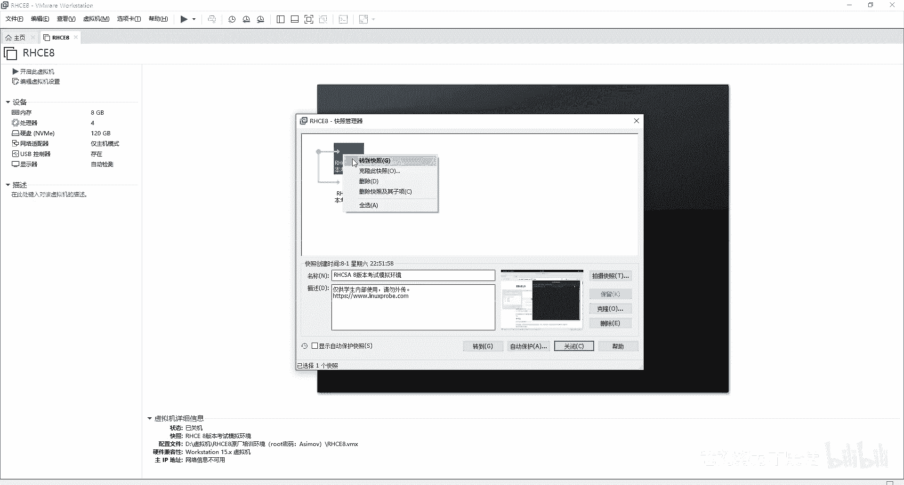

我们点一下确认，另外的话呢，如果说您听完我这个视频，会感觉诶老师你怎么讲课这么快啊啊，为什么我没有听懂啊，啊因为你要知道这是一个考前辅导视频，我的预设就是你已经都学完了。

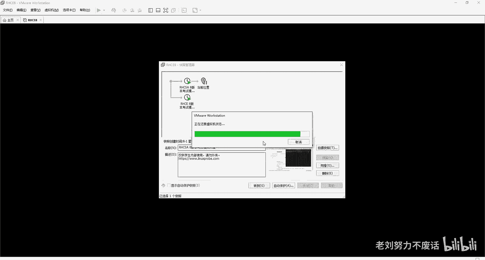

已经该学的都学过，这些都是学过的，我们现在是带给大家一个串讲，要理解这个课程的定位，这个课程今天这个视频不是在给您教技术，而是要知道我们学习过那个技术，在考试的时候怎么去应用。

那么如果说您是不是我们的学员的话呢，呃再费点心再去找一下培训视频，或者可以来我们这边报名，也很便宜啊，具体的报名方式的话，可以百度上一搜，能够找到LINUX。

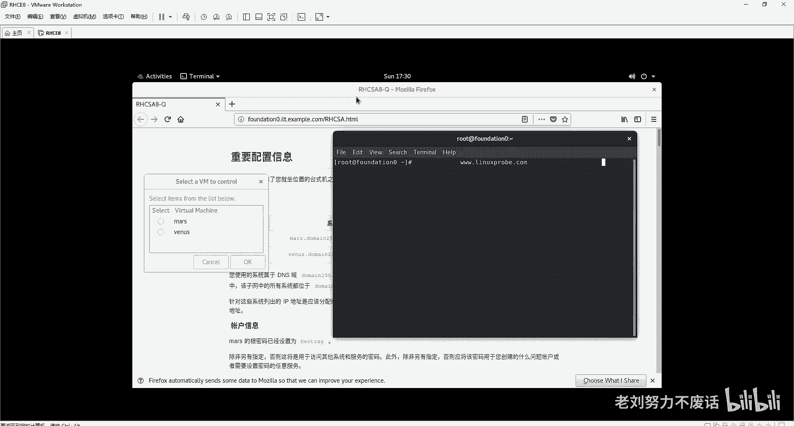

就该这么学，好好白啊，我们用我们的网站，那LINUX该怎么学，就是这个网址敲一下也可以好，我们广告部说完了啊，我们广告说完了啊，说了两遍啊，非常过瘾好。

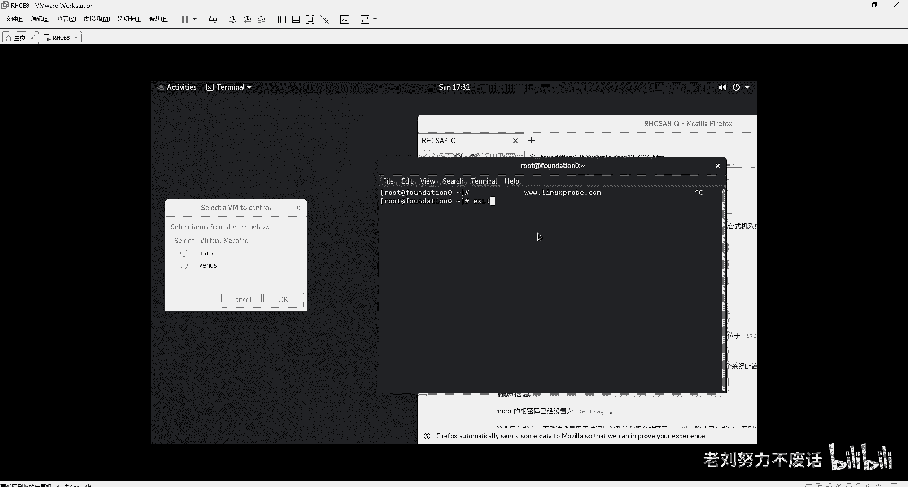

我们现在打开我们这个网页之后啊，非常贴心，你看到已经打开了这个红帽考试这个考题了，现在已经打开了我们红毛这个考题了，现在的话呢，我们还可以给大家去逐一进行操作啊。

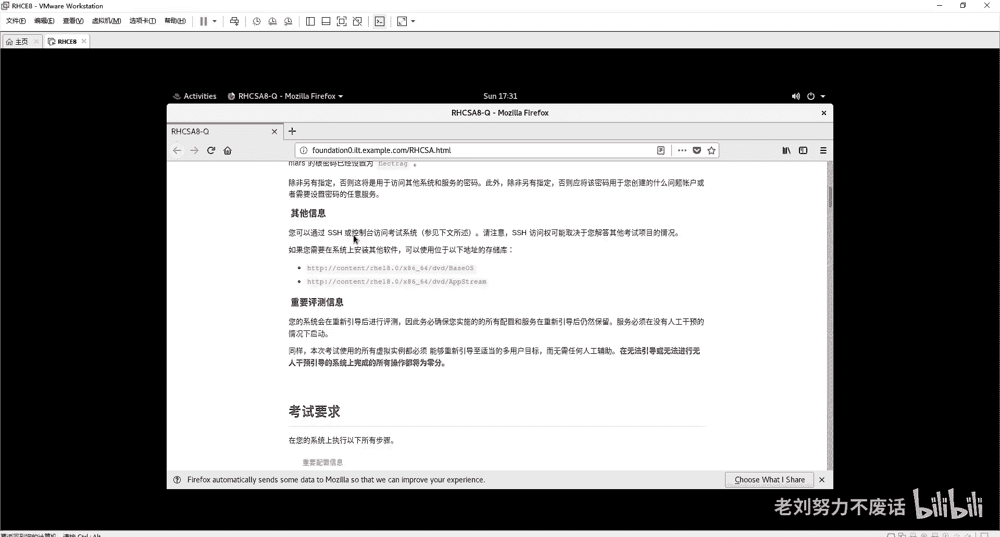

大家想想看我这个操作，然后的话呢，我这边已经给我们的学员。

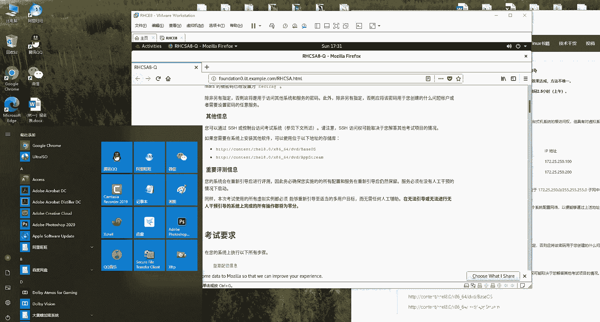

都提供了我们的考题的答案，对考题的答案，那么这个视频的话我会随着文章内容的话，我会随着红包的这个考场而变化，如果考场那边题目发生了变化，那么我这边也会发生，那么我会啊也会进行更新。

那么这里边这个答案的话，都是我一个字一个字的，已经给大家过去过了一遍了，如果说您是准备备考学员，可以背一下了啊，有有有可以有选择性的自己啊，不太熟的内容可以去记一下，可以去背一下了，里面的。

现在这个所有的内容，我都已经全部的一字一字都过一遍了，那没有问题好，现在我们要给大家说一下，这个考试环境上午两个半小时，我们的RH3C，这个的话呢它是面向于我们这个零基础学员。

主要就是对于系统的一个管理能力，红帽的三级定位嘛啊红马是cc最低级的，它主要是对于我们系统管理能力的一个考核，原本的RHCE的话呢，它是对于我们的服务这种考核，后来的话呢到了红包real8。

他现在主要考的是ENSIBLE，而你们知道ENSIBLE它实际上是RHC的内容，课程的话呢名称叫做DOO407，当时我也去考过，然后非常的痛苦经历，也就是说现在的话呢。

总体来说红帽RHCE和RH3C的含金量，八版本的呃，要超过七版本的，因为现在的考试难度根本就是个RHCR，TC的考试难度，他根本就是个RGC的题目，因此的话这含金量要更高一点。

但是也意味着大家需要多付出一点，这个难度要提升了，好我们先来看一下我们这个内容，然后看一下我们这个内容，因为我现在都呃，已经是假定大家是我们的学员了，所以我就不给大家说那么多客套的话了，因为说客套的话。

明显就是公开课就说给外人听的，所以我就直接给大家说了，是这样的，你看这道题目啊，以前的话呢，这个红帽的题目是一个就是需要翻页的红包，六七后红毛real6的时候，你看现在他是不需要翻页了，就是呃一个网页。

然后给你都给你都显示出来了，这还挺方便的是吧，然后你可以看到它里面这个内容的话呢，实际上很多都不是人话，它是英文的，你考试的时候是有英文的，日文的，德文的，韩文的，中文的都有，这个英文的话。

它是据我了解是由新加坡人翻译出来的，什么意思呢，就是有些语句不通顺啊，所以的话呢我们今天这个内容，今天我们这个考试的考前辅导啊，两个事情，第一个事情把题给大家讲透。

第二话就是把它这个里面的文字的话给它捋，成人话，哎我看一下多多多长时间了啊，只能到13分钟了啊，赶紧我们上干货给大家讲一下题目来看，第一句话说啊，我们考试的时候的话呢，我们面前坐着一台台式机啊。

就是我们面前有一个台式机，你就只有一个电脑，那你只有一个电脑好，那么这个虚拟机里面的话呢，它有两个虚拟机啊，一个物理机里面有两个虚拟机，这这大家都明白啊，那么你没有台式机的根访问权。

就是你没有台式机那个root的访问权限，但是的话呢你有虚拟机，两台虚拟机的root权限，什么意思呢，就是你还是仅仅没有管理权限，你没有root的密码，而你虚拟机你有啊，那么你有root的密码好。

这是两个虚拟机的这个名称，对应的是两个IP地址，一个是250。100，一个是250。200，那我们来看一下DNS，他给我们一个域，这都不用管，就是说啊我们的这个网段对吧，我们给了一个网段，什么意思呢。

这个其实是在201，这个是在2016年开始啊，就有些人去替考对吧，虽然说我们现在这个网络它划分微辣了，你考试的时候你是不能够连别人机器的，但是大人去试啊，试完之后结果被发现的话。

就说啊我也不小心粘到别人机器上面去了，虽然说不成功啊微辣，但是他总想办法就干脆给你写清楚了，你要是再不知道你是网站，那你再去连锁网络的话，那你就是故意作弊了，就那意思。

但是的话呢实际上在我们23ac的时候，这个只要一看就可以了，不用去背啊，这样的话他说我们需要去配置这个IP地址，我们可能需要配置一个或者两个的IP地址，实际上的话呢在我们的红包20C考试的时候。

不在我们红包20CAC考试的时候啊，我们这个是需要配置的，需要配置IP地址的，而下面这个的话它是不用去配置的，但是这个考试模拟环境的话呢，你两个都要去配置，还是有一点差异的，但是我们有一些差异的地方。

我都会告诉大家，我们都会告诉大家，我们争取我们这次课程做的非常的完美好啊，并且的话呢我们这个视频也要也尽量是，我们尽量是一镜到底啊，然后就给大家完整地呈现出来，尽量不中断好，然后我们看一下啊。

这有一个密码特别的好，叫做呃flag rag，这什么意思呢，就是说呃你登录你这个用户的时候，所有的密码都是这个flag rag，那我们来好flag rag，我们都是这个名字好吧，记一下这个密码。

但我们需要多次用到，另外就是说如果他没有特别的这个强调，那么你再去设置密码的时候，你都要去使用到这个密码，什么意思，就是说大家就听一句话，就是让你去登录的时候，让你去输入密码的时候，你就去输这个。

让你去设置密码的时候，你也把它设置成这个，就是说在待会考试的过程当中，只要有密码，就是这个嗯，好第二的话呢就是这个YM仓库，YM仓库的话呢，这里边有两个已经配置好了，我们的RHCC啊，非常贴心。

考官已经帮你们做好了em仓库，你只需要去来去指向就可以了，没有问题，然后最后这一大段话的意思的话，你读半天，你读你都读不明白，因为这是新加坡人翻译的，据我了解，读半天也不也都很云里雾里的。

他说就什么事情呢，你做完了这个虚拟机嗯，做完这个考试环境了，你走人了，那你走了之后，你的虚拟机会被重启，你一定要保证你做完的这个结果，重启之后还是有效的啊，我先给大家举个例子啊，在我们上课的时候。

就是你上学的时候，你写作业，你帮我带了，老师不会信你的，你必须要保证你写出来那个作业跟你这个派，就是这个考完试，这个内容肯定是要有这个被记录在册的，就是你做完这个实验吗，从此之后还能够判到分啊。

这么一件事情好，因为前面的话呢我们简而言之的铺垫了一下，然后我们正式开始，我们今天这个课程好，正式开始我们这个课程17分钟还好啊，这是正常发挥，然后我们来看一下啊，看一下我们这个虚拟机。

虚拟机的话里边有两台好点的，稍微快一点啊，因为咱们这是一个视频形式，所以的话呢我们可以暂停啊，也可以往回倒，我们就稍微快一点了，一些操作我们就不给大家讲的特别细来，首先来说点一下这个mars。

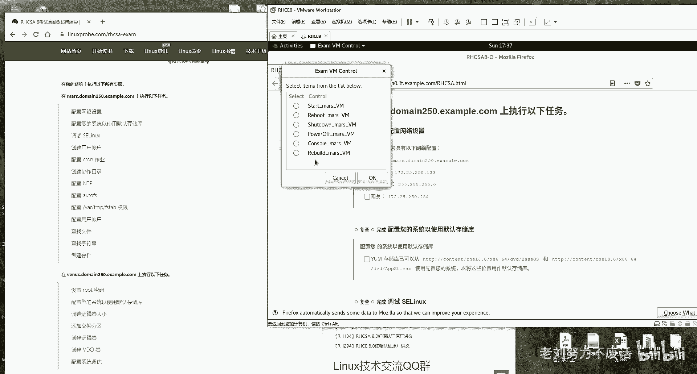

然后我们点一下这个控制console来，点进去之后，你会看到，是不是都那么到了一个登录的一个界面了。

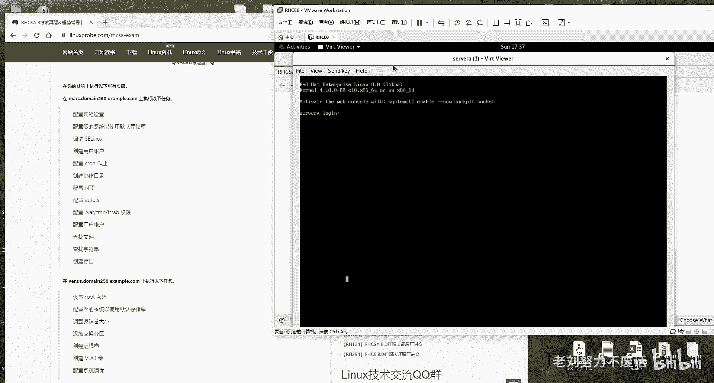

然后这个时候你可以去输入root密码是啥啊，那是不是flag rag来再回车登录了，当然我现在这边的话呢，已经给大家提供了一个呃红帽官方答案，然后以及的话我一字一字给大家都过了一遍了。

这是我给大家写出一个最优解。

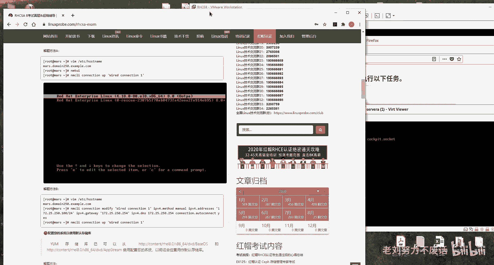

那么大家可以选择红帽的考试，没有最优解问啊，没有标准答案，但是的话呢它有无限接近于最优解的答案，你可以自己，如果你不喜欢我这个方法，我们上课的时候教的四种方法去配置IP地址，你去选择一个你喜欢的好。

那我就选择一个更简单的了啊，叫NMTOY考试的时候怎么稳妥怎么来。

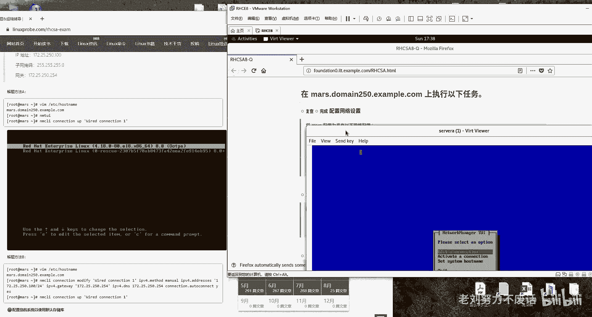

千万不要千万不要用自己都没有把握的，来NM7Y进行配置，你看啊，他说配置主机名称是这个诶，那我们来一步一步来吧，因为我怕一会儿我乱了啊，一会我怕乱了，来配置，第一个主机名称是在house。

是在etc目录里面的house name，按下回车啊，太好了，我们来编辑一下它，来编编译器什么的，我们不再给大家去赘述啊，如果要是不会用的话，回去之后看第四章节的视频，好配置好host name。

它没有生效没有关系，但是这个文件里面的话呢，我们已经把它配置出来了，但是我们重启一下就可以了，然后配置一下我们的IP地址NMT，来你越自信，你这键盘敲得越响啊，来我们点一下编辑，就编辑第一个网卡。

考试之后只有一个网卡，那么我现在有两个网卡，那就编辑第一个网卡，你看到非常阴险啊，红包这个题目，你看他这个地址是172025点，250。10，他让你改成什么呢，他让你改成是100好，改100好加个零啊。

然后的话呢我们这个自网掩码是三个25。0，就是24位，后面不用改网关，250。254哎，没有问题，点一下确认，你看非常简单的一道题，那就可以拿分走人了啊。

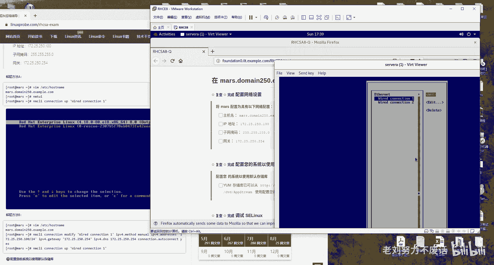

来第一道题，拿分走人，我们把它AI，我是为了让大家能够看到这个答案，这样的话你就省得一边去低头去看书了，都配好之后，你可以让他去重启一下，重启一下吧服务，或者你干脆就重启一下这个服务器。

因为考试的时候你可以重启服务器。

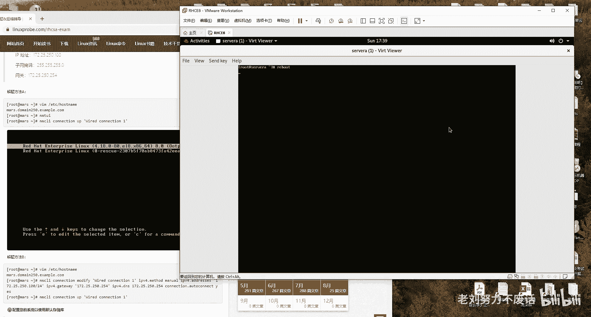

怎么简单怎么来，对吧啊，怎么简单怎么来，这样的话你这个主机名称也生效了。

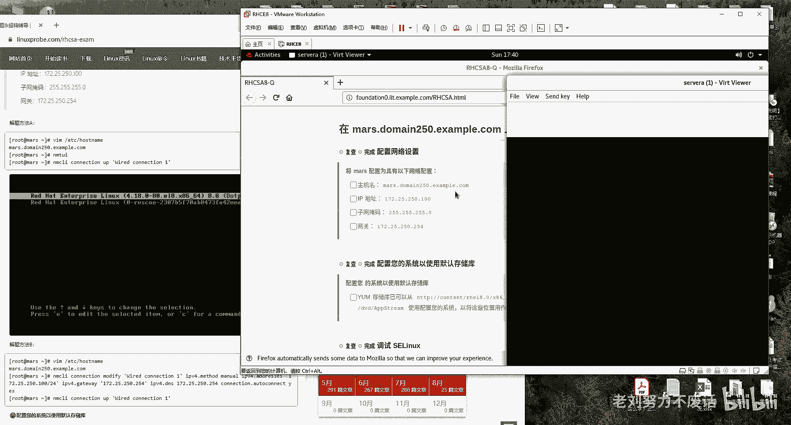

你的网卡也生效了，这个完全没有问题，来第一道题，另外给大家写一个小技巧啊，考试的时候也是这样的，这个勾啊，他考试的时候是能够选中的，就你可以点它之后，它就有一个小勾，这个点不点无所谓。

它主要是让你去记录一下你这道题，你自己有没有做过给自己提醒的，如果你认为你很自信，你可以不用点它，这个没有任何的影响，即便说你这道题你没做，你把它勾上了，他也不给你分，就是给你自己一个Mark。

就是给你自己一个标记好，第二道题，他说请你配置一下我们的YM仓库。

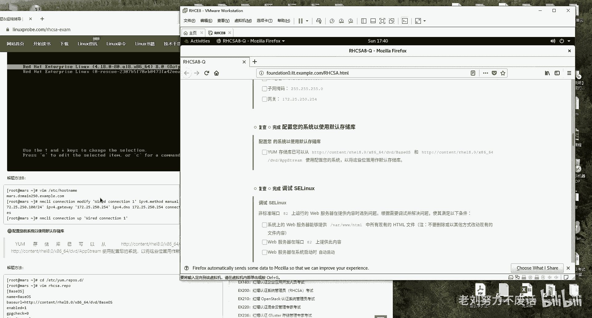

太简单了，我们来复制一下，你需要让我配啥，我就给大家复制一下。

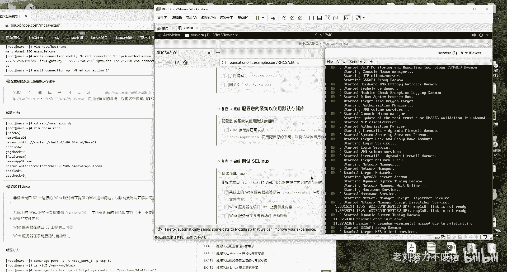

你看啊，你要老往这个console里面这个控制终端里面走，是不是特别麻烦呀。

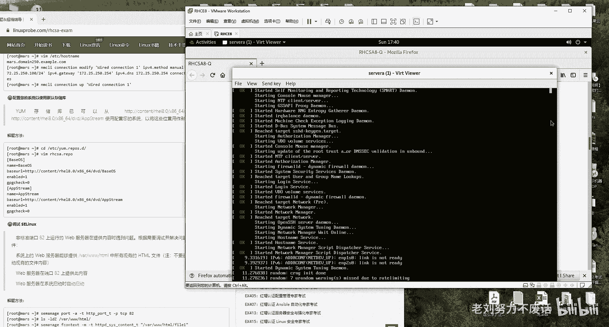

我们别这么做了，我们还这么着，台式机可以直接连到虚拟机的，我们启动一个终端来远程连接root。

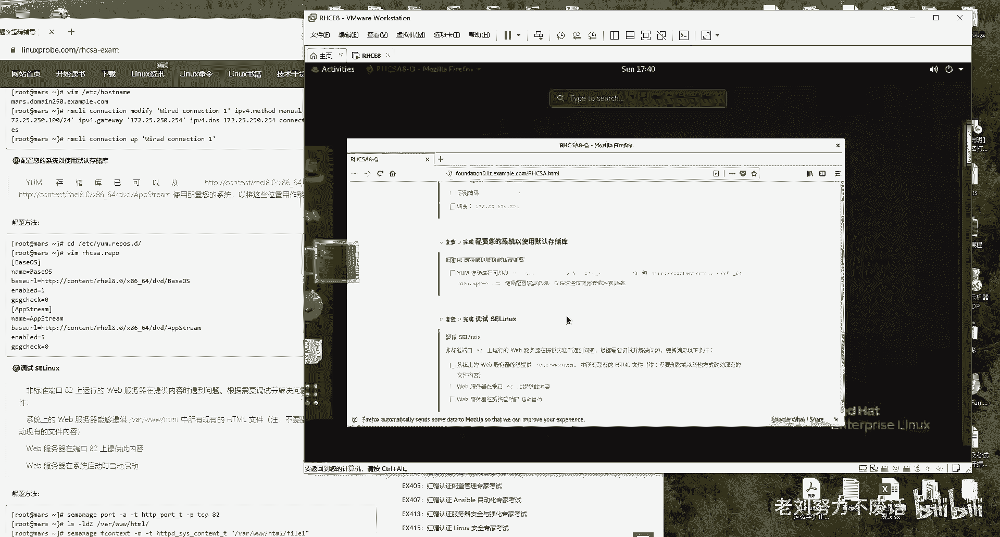

记住是root，然后at t符号172。25。250。100，因为网卡已配置成100了吗。

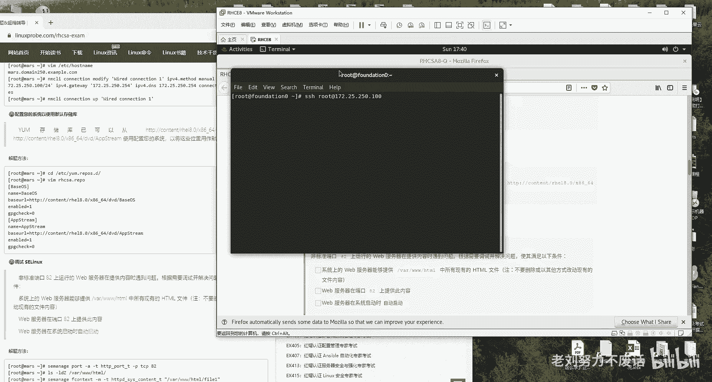

按下回车连接成功没有问题，How's the name，主机名称没有问题，拿分对吧，那配置一下我们的YM仓库，仓库的配置文件，它是在YM仓库的配置文件是在etc目录里面的，YM点RAPOSE里面。

在考试的时候里面是空白的，那特别干净啊，那么我们现在的话呢，这个你留不留无所谓，把它删掉吧，我把它删了，这里啊现在是空白的，考试的时候也是空白的，怎么做呢，首先来说编辑一个文件名称无所谓。

比如说我们叫做rh cc点RAINER啊，后缀一定要是REPO，结尾写上我们标准的YM仓库的那个格式，来一个中括号name，然后是bao l l g b t check，然后接下来是enable的。

太棒了，做完之后来把它5YY复制两份，5Y复制两份来填写，中括号里面是什么呢，唯一标识符就不给大家讲，这不给大家讲来，然后这个的话呢你随便去写，我为了美观嘛，我就把它写成一样的了，来粘贴一下。

子校验零啊，不要开启校验去启用它没问题好，稍微该讲还是要讲的，但是不会讲那么细了，来app啊，叫做app stream，那因为我们的红毛热吗，我们红魔六八嘛，他需要配两个啊，特别讨厌对吧。

所以你要配置的时候的话呢，不要配完一个就跑了，你一定要配置两个来把这条路径给它粘进去，enable check等于零，不要自检，然后一代表是启用好保存并退出，做好之后啊，怎么判断他有没有做成功呢。

em list查看一下软件。

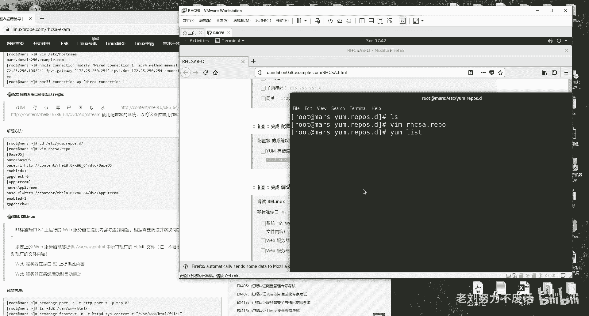

这个软件包，看能不能列举出来，俩出来了都啊都出来了，没有问题，第二道题拿分走人好，第二这个话呢这道题目有问题，为什么呢，我们提供的是一个模拟环境，对吧啊，之前不是给大家谦虚了一下，而是真实模拟环境。

这道题我们做不了啊，为什么，因为这个文件里面我们根本就没有安装，因为你看的啊，就是现在的话，这个按考试的时候，我们的HTTP它是已经启动了啊，你看到没，他已经安装好了，里面还有文件了。

你看到他它还是有文件了，而我们现在是没有的，因此的话呢这道题我们该做的我们做，但是这道题待会判分的时候没有分啊，我们需要注意一下啊，拿拿一张纸记下来调试CLINUX。

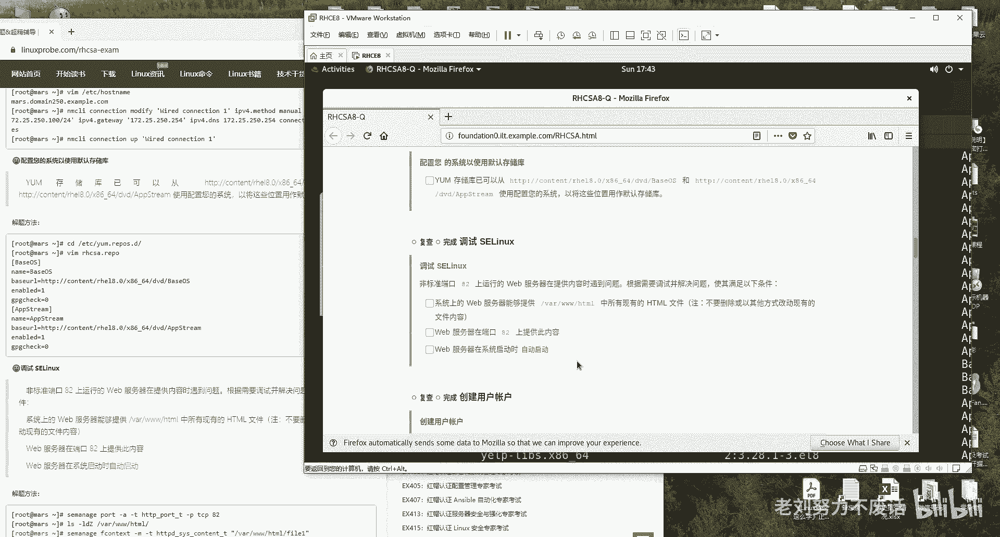

这道题我们待会没有分啊，不过考试的时候不用担心好这个什么意思呢。

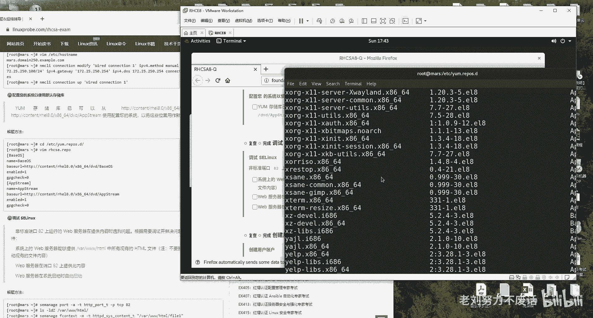

你看啊看看，那我们看题，他还说啊，在非标准端口号82上面运行web服务器啊，web服务的时候出现了问题啊，根据下面的需求进行解决，什么意思，端口号原先网站服务是八零，你现在变成82了，你多了俩。

那谁给你的对吧，你要开进SLINUX的允许的策略，我们的seed啊，我们的CLINUX的玉，我们SLINUX它分为两种，一种是一种是上下文啊，我们来改预point。

然后是GL列举出来我们所有跟服务相关的，端口号的允许的策略，然后我们过滤一下跟网站相关的，所以你可以看到啊，当前网站相关的话呢，有俩有这么多啊，呃有一个八零，有一个八一，他就是没有82啊，特别气人是吧。

好怎么做呢，来sd manager ga point啊，不然呢是point杠A添加gt具体的值添加到这里，我们就来复制这个，咱们今天这个课怎么讲呢，是不是感觉很轻松，刚P脱口协议端口号82走。

你第一道题配完，他说啊，我们在这个目录当中提供的这个网站服务，你看啊，实际上我们做的是第二个对吧，我们实际上做的是第二个，我们现在让我们这个服务呃，82端口号被允许了，下面来做第三个啊。

第三个就是说我们系统启动时，还依然能够去运行。

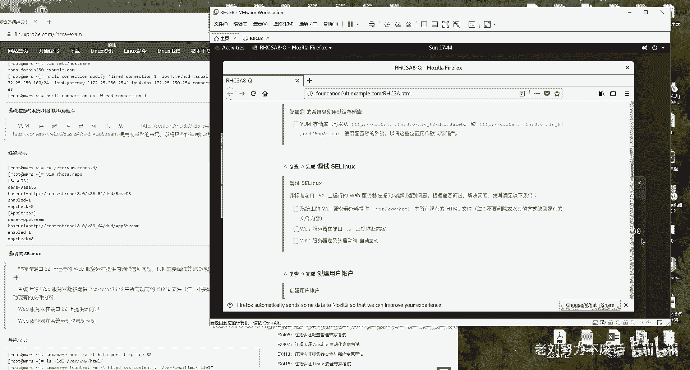

这不讲的是什么呢，这个讲的实际上就是我们的，将我们的服务加到启动项当中，保证下一次重启时还能生效嘛对吧，考试的时候不用你去装啊，这个服务已经装好了，然后的话呢这个网站目录内也有内容了。

但是我现在因为没有嘛，我就自己去装它，一下子来把稍微小一点，来来来，我们去system Ctrl restart HTTP，当然了，因为你现在这个端口号还是默还是默认的八零，肯定跟T1不符。

但我们没有成绩很正常啊，没这没关系啊，我们只要把我们这个步骤做完就行好，第二步第三步做完，第一步讲个什么事呢，第一步啊实际上是红包给你埋了个小坑啊，红包这里边的话呢在VR目录里面的3W点，等一下啊。

是这样的，在红帽考试的时候，war目录里面的3W，里面的HTML目录当中有几个文件，分别的话呢叫file12345，有这么几个文件，其中的话呢这个file1特别的阴险啊，他这个SLINUX。

安卓上下文的这个值跟其他的不一样，那我们怎么办呢，我先给大家只能给大家意会一下啊，是这么去办，首先来说使用IOS杠L杠Z大Z查看安全上下文，先查看，先去查看一下其他的。

或者你就查看一下你本机的这个目录好，我们查看一下，你看当前的话呢，我们这s max的这个值是带，那么我们是这一大串好，那我们就复制它，我们去使用c manager fc quent test，杠A啊。

呃呃我们是gm修改gt具体的值后面加上文件名，比如说我想要去修改，是叫file1，就这样去做，但是我现在没有这个文件，我会报错，但大家考试的时候等一下啊，file1当大家考试的时候。

啊他说我们没有识别到这个参数，因为我们这个文件没有被找到吗，在你考试的时候，你就把这个文件，你只要给它设置成，是跟我们其他文件保持一致的，这个安卓上下文跟我们上课的时候讲的一样好。

接下来的话呢我们就是restore，让他去立即生效一下杠V显示过程，文件名称file1拿走人，没问题好，因为现在没有这个文件啊，所以我们就不再多过过多给大家演示。

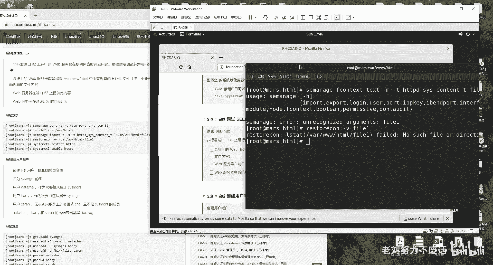

这个不可能出错，下面的话呢我们讲一下说如何去新建用户，这太简单了，我们一步一步来，第五章节内容啊，内容啊，第五章节的内容来哎，group d d用户组SYS别敲错就好了，这道题没有什么难度。

主要就看你别敲错，来新建出来这个组，等一下我看看这是不是我们这个等一下啊，这个是不是我们这个虚拟机啊，OK一定要确认是第一台虚拟机啊，这个mars可别在你这个本地敲半天，一看没成绩，对不对，那尴尬了。

来看一下主机名称呃，看吧看一下组名称SSMG啊，rs没有问题，说完再去新建一个用户，用户名称叫做我也我也我也不太会念啊，先去把它建立出来吧，来USADD他说从属于次要组，什么是次要组，就是扩展组嘛。

来把他叫到这个扩展组里面，用户名称叫做net a s h a n，等会车啊，这边少了一个S，完了啊，出了这么一个低级错误啊，千万不要影响大家这个心目中的这个形象啊，来再去新建另外一个用户。

一样的叫harry啊，接下来的话呢还有说再去新建一个用户，叫做SARAH啊，说无权，它使用的是一个无交互式的shell，那无交互式的shell实际上它还有很多个了。

我们比较常见的就是那个files跟这个NO log in，这两个的话你选择哪个都可以，看哪个比较顺手好来，我们就一个杠S啊，我们给它设置成就这个bean里面的files吧。

一样如果是NO login的话呢，这个一样的道理，我们给它用户名称啊，不要写错好，我们做完接下来的话呢，还有就是说你看说这三个用户的话呢，这个密码都要是flag reg吧，去设置一下密码。

你可以去使用这个echo，然后去输出，然后去使用到STIN参数去接收，不过的话呢我们认为不要这样了，同学们考试的时候怎么稳妥，怎么来，又没人催，你对吧，我们慢慢我们来一个一个弄来，我们不要着急啊。

但是我给大家讲一个什么事情呢，就是这道题的判分脚本有问题，我们现在对这个账户进行的密码的设置，但是待会判分的时候判不出来成绩，不过没关系，考试的时候就行，因为我给大家提供的是一个有点小瑕疵的一个。

判分脚本啊，够用够用啊，判完之后那个成绩大概是在240，240分到250分左右，大家听一下啊，就是待会我们拍完那个成绩，大概是240~250呃，一方面的话呢是有些题我们做不了，比如说上一道题对吧。

没有那个文件，要么就是这样的，我们明明做完了，但是的话他判不出成绩来，你看哎这个等一下这我写错，因为这个你不可能写错了，因为你要再写错的话，这就是一个智商问题了，就是让你去敲这个密码吗。

fl e c t r a g这个你不可能敲错，再敲错的话，你看不到成绩，就是这就是自己的问题了，好我们来讲一下计划任务，计划任务你看他可以告诉你了，说cl n不将就是cl n d macron对吧。

我们这个计划任务怎么编辑呢，CLONTB马上就动手的时候，诶，且慢看一下，他说啊是不是要以这个用户的身份来去执行好，加个参数诶，杠u net a s h a好，按下回车，我们讲课啊，就是怎么讲呢。

来来继续啊，说一下这个格式来分时日月星期命令，那我们来看看命令已经给你了吧，不用写路径了，直接他怎么给怎么敲啊，他怎么给你怎么往上粘，不用写那个路径，粘上就行，看他要求他要求说每2分钟去执行一次啊。

分时日月信息命令，那不就是第一个吗，每2分钟的写法啊，大脑里面搜索一下除以二对吧，代表每2分钟会去执行一次，老刘讲课方法，我相信我的学生是比较的适应的对吧，然后估计就是两极分化比较严重啊。

有人会觉得老李老刘讲的啊挺挺挺痛快的，有人会觉得哎呀讲的太快了，这个怎么讲呢，每个人每一种感觉吧，然后我就保持我自己的这个舒服的状态，毕竟这个视频贴也挺长的了，要是装的，要是装的话，我觉得我也挺累的。

来看一下下面这道题啊，说创建一个协同目录组，先甭管这个组他干嘛使的，我们先把它给创建出来，对不对，因为脑子不太好使，万一一会儿做着做着给忘了呢，先把一组给创建出来，你看啊。

说这个组用全是S8s m g i r r rs，你觉得他说的这是人话吗，啊这个你说的这个是人话吗，这不是这个什么叫祖用权呀，不叫这个叫这个叫所有组啊，孩子哈是吧行，大家知道就好了。

这也算是我们的一个吐槽来对应目录，大写R我们讲课呀，我们讲这个辅导嘛，一方面是给大家讲题，一方面是把它给你们翻译成人话，大家好，去理解，考试的时候，来修改一下这个文件所对应的所有组的意思，修改好。

你那你那你不放心啊，对老六没有信任，查看一下来自由组变变变变了，好看一下，说一下这个目录可以被这个组的人啊，你看这是组啊，所有者所有组其他人中间那个啊，他可以为他读写执行啥呀，RWX吗。

换我们这个数字法的话，那不就是4214+2加一等于多少，等于七啊，说其他人不具有这些权限，就是说其他人啥都干不了，然后最后括弧说root用户有访问权限啊，以及就是有权访问系统上的所有的文件及目录。

也就是说root用户他不管，那就是一个满权限吗，权限root是七，他组也是七，其他人是零，权限多少是多少，770来root，哎，等一下啊，鼠标怎么进不去了，来对应目录加大R操作。

770加上我们的文件名称，别着急，看下面一道题说啊，我们这个在模组当中，新建的所有的文件，都会自动归属于到了这个组里面，什么意思，这不就是抽出权限里面的三个权限，其中的一个吗，大家回忆一下，出个小题目。

SUID是不是啊，不是对吧，SUID是对于我们的二进制文件做的，SGID是不是还是它对于我们的文件也行，对于我们的目录也行，对于目录设置之后，就是将我们目录里面新增的文件，它存量它不管啊，已经有的文件。

他不管的，新增的文件都自动归属到我们的SJID，我们的呃上一级目录的这个组的名称里面，那不就是SGD权限吗，还有一个SPIT啊，那我们不提，也就是说我们的特殊权限，也可以用到数字法去表示421。

那中间那个SGID是多少啊，是个二，所以我们的满权限2700啊，277啊，不2770啊，这道题做完拿分走人，他说请配置一下你的这个主机的时间啊，这个服务器他就给你了。

你需要做的唯一的事情就是把它给选中了，别把它给删错了啊，别站错了，别这个就唯一需要做就是比雅站错了，找到我们crowd的配置文件，这个有两个键的方法，一个叫做chi，一个叫做crown，你们怎么叫都行。

因为它毕竟是一个制造出来的，一个这么一个文件吗，来敲他一下，找到这个文件，太快了，没有看清对吧，哎往回去之后可以倒一下，这是一个视频啊，A1下往回倒，再来看一下具体是哪个文件。

来把这个路径一旦给他替换进去，拿分走人，保存并退出，没有问题，这道题我们做不了，为什么他说啊，他是由这台服务器会给我们提供一个NFS，但实际上的话呢有没有他没有，所以我们这个实验的话呢。

我们该配的我们都配，但是我们最后拿不到成绩好吧，大家都知道这么一点，他考的不是你的NFS，他考的是你的凹凸FS，来理解一下，就是服务器那边提供的NFS了，你现在作为auto fs，你去挂载它去就行。

我们把ultra fs给他配好了，但对方还没有给我们提供过来，我们依然没分，这个话呢属于模拟环境的一个小的一个小bug，不不不，这个不属于bug，这个属于呃呃老刘，这是一个属于我的问题啊。

没有给大家提供一个完美的考试环境，好好那我们来安装一下auto fs啊，因为你YM仓库已经配置好了吗，直接按按下Y就安装好auto fs，太简单了，那编辑一下auto fs的主配置文件。

凹凸点master它都已经叫master了，你能猜到它是一个主配置文件，对不对，好走，你来我们接下来是对于哪个目录进行定义呢，你要看吗，要看是不是这个目录啊，他说的意思就是说。

远程用户提供了这么一个目录啊，这是远程用户提供的目录，这是你的目录，把这个目录挂到你的目录来，然后你还要写入权限，就这么三行的事情，好好我们给大家玩一下，那你的自己的目录就是r home。

那对应的配置文件还没有，我们自己建立etc里面的rh cs a m s，给它新建出来一个好，进入到你自己呃编的这么一个文件名里边，我们这么去写，挂的是什么呢，你是不是要去挂的是our home。

你自己看啊，我们来去复制就好了，我们复制我们复制，现在脑子也不好，我怕一会给敲错了，你是要把它挂载到这儿啊对吧，file system type就是叫做文件系统的类别，你看他希望是什么，NFS好。

那就是NFS，看到最后底下几道题说什么呀，有写入权限，那能都他他都能写了，是不是还要能读啊对吧，一个RW啊，可以读可以写权限，他还没说执行就怎么讲呢，红帽他只看结果，不看过程。

你只要他只要要求那个你给他做成了，你再多做什么，他都不管好吧，就是找他要求的做完就行，那我们这样一个来源地址，来源地址的话呢，是由这么一部分去提供的，就这么简单，你不用去敲哎，把它这个一粘走。

你那么另外我们需要注意一下啊，因为我们前面已经定义了是这个r home，因此我们这个前面的话呢，不用去再去写这个r home了，把它给省略掉啊，只解一个相对路径就可以了，大家说诶我们哪写啊。

老师我怎么不记得了，没关系，给大家看一下上一个文件，这里已经写清了，好这道题配置文件方面就做完了，system啊，会大家感觉如果要是没记住的时候，就会觉得挺痛苦的啊，哎重启一下。

我们out to fs加入到启动项当中，保证我们重启之后依然能够拿分走人，有效诶，有效有效啊，拿分走人好，所以一旦打好，我们这个基础再强调一下，听到这了，那如果您还没有退出的话，证明您还是能听得懂的。

就赶紧打好基础，打好基础，咱们这个课不是为了给大家去讲会什么，该讲咱们上课时都讲了，这是一个串讲，我们不把课讲的这么啰嗦，需要具体什么知识，比如说auto fs不熟了，回去之后看培训视频好吧，好看题。

那下面一道题目说把etc，但我这个文件复制到这来啊，我们先不，那我们先不看底下的东西啊，我就来一步一步去做，我这人记性不好啊，我觉得我就来一步一步去做啊，怎么稳妥怎么来啊。

就跟以前我听人家说有一个唱歌比赛似的啊，自己选对手是吧啊，然后有一个唱歌了，就说那肯定是对手，越越这个水平越差越好啊，自己这个晋级机会就会越高啊对吧，我们考试的时候也是这样的，怎么稳妥怎么来。

不要觉得这个好像技术很low啊，别人看了之后觉得好像挺瞧不起自己似的，你要知道考试的时候还在看你的人，不是瞧不起你的这个意思，他会被考官给赶出去的，他是他是，那他就是作弊了啊，看他看你显示器啊。

然后看一下，就是我在复制到了这个目录里面，完完完不我们来复制一下这个文件啊，按照这个提议，复制完了之后说我们需要满足以下条件，那需要满足以下条件，第一条这个用这个文件归入取用户所有，什么意思啊。

我这个我不太明白呢，你看呢，这个文件它本身就已经是入侵用户所有了，你还想怎么样啊，哎等一下啊，IOSGL文件本身它就是入侵用户所有，没有问题，第一道题啊，我就说我们一个操作，这道题也他们也做完了。

说用户组也是root用户左右诶，好用户者用户啊，所有者所有组都是root好，接下来说第三个，说我们的FITAB不能被任何人所知情，哎呀你怎么说这么对呢，后面什么都没有执行权限，也就是说我们刚一个操作。

我们做了四个小题目，对这个我没有讲错，待会这道分啊，但是这道题也是满分，就是红帽嘛，出题目很长，一看看着好像很吓人，是不是，其实这个题目还不如我敲这个命令长呢，我命令才都我才不到20多个字母对吧。

不要那么着急啊，虽然说这个红毛rob是一个新版本的考试，大家都不会对吧，现在这个考红包热巴了，但是讲课的也是老刘啊对吧，你们不用那么操心啊，来come on，继续，你看我一个人能把自己这个课讲的那么的。

像是对话一样啊，这就属于来我们继续来看一下啊，说我们这个用户有权限，这个用户什么权限都没有，而其他用户的话呢也无法读取这个文件，什么意思啊，这个其实他就考的是一个。

你看啊其他用户包括未来都无法读取这道题，不也就是已经做完了诶，回头一下啊，所有其他用户的当前或未来啊啊啊，它能够读取好，这道题也做完了，也就是说我们刚才这一步操作啊，做了五道题。

这四条加上这一条全做完了，这道题它考的就两条，这才是这个题目的，它考核点的，你看呢他就考了两条，说这个两个用户说这个用户能够读写，这个用户不能什么呀，针对于某个用户的权限设置。

不就是我们的第六把第五章节下面一边，我们翻开书，第五章节往下面一点点，F1SL嘛对吧，such as f1sl gm进行修改，U用户名称可以对用户可以对足用户，就是GU可以读，可以写他他他没有说执行。

那我们就不写执行来目录名称，warm录里面的tap f a t a b走，你做完还有说另外一个用户harry，他没有任何的权限，他好惨啊，为啥来harry用户没有任何的权限，按下回车走。

你说新建出来一个用户，配置一个用户叫什么，我也不会念啊，这是老刘唯一次这个失利啊，居然不会念啊，像MONOO是吧啊，应该是外国人，其用户id为3533，什么是用户id，不就是那个UID嘛对吧。

用户的密码应当是flag rex，OK可以啊，给你来新建出来usa ADD杠U啊，3533，用户名MANOLO18，按下回车，为这个用户去重置一下密码，这道题这道题判分脚本有问题，这道题判分脚本有问题。

我们现在这样做了完美的解决方案，但是最后判不出成绩来好，为了让大家会怀疑老刘这个是不是手一滑，敲错了密码，我现在给大家通过这样的方式对它进行重名，进行密码的重置，看到没有问题成功，但是你要看到了。

即便我们这样做，但是依然没有分值好，但没有关系啊，同学们，你考试的时候肯定是有分值了，这个因为我们提供的是一个有瑕疵的，一个系统啊，是我的问题好，接下来的话呢我们说啊查找我们这个文件，然后我们将做。

查找到的文件都放在这个目录里面，这道题我们也做不了，为什么，因为我们有这个用户啊，这什么名字，因为我们没有这个用户，这道题我们做不了，那我们怎么做呢，在考试的时候已经有这个用户了，我们不需要自己去新建。

我们自己有新建了，在最后我们在考试的时候不用的，并且它里面已经有自己的这个文件了，查找用户文件，那不就是放的吗，那从哪里找呢，根目录全盘搜索，杠user代表的是谁的文件，这个边缘写错啊，JZQUES哎。

好的，将查找到的文件剪切啊，直接复制到这个目录里面，有两个方法，其实按键回车出来了，对不对，你一个一个的，你给我用CP老老实实的啊，一个一个一个给我复制到这个目录里面来，没有任何问题，没毛病啊。

但是如果你要想秀一下的话，你这么去秀，你看啊，他说把查找到的文件复制到这个目录里面，这个目录考试的时候有，你现在没有啊，我们说所以说我们多可怜啊啊又得做考官的事，又得做我们的题，新建出来怎么办呢。

Find user j a c，为什么要给大家开玩笑啊，因为我们希望我们这个培训不是那么的死板，虽然说大家都见不到我们的人对吧，但是我们希望我们这个课程听起来，不光是学技术了，起码不会那么的痛苦。

对不对啊，起码不会那么的痛苦，你要说要是没有一点活跃气氛的这种小段子，你听俩小时对吧，一会就犯困了，来found files来给写清楚之后，一个反斜杠一个分号，这个意思就是说。

我们去搜索这个用户所存在的所有文件，就是归属到这个用户所有的文件，将所有的找到文件都，一个一个的填到这个括弧里面，这个命令的意思是什么呀，你先想象一下吗，我们每次到一个文件都使用CP杠。

AA代表就是PDR嘛，杠P杠，低杠R分别保留文件的所有者的文文文件，所有组文件的这个权限信息，就保留它这个属性信息，然后给它复制到这个目录里面，做完之后按下回车拿分走人。

只不过这啊只不过我们这一次没有分支啊，非常可惜啊，没有，因为没有这个用户嘛，好这道题目太好了，也没有这个呃，我们也没有这个文件，这道题也做不了，哎呀太惨了，来我们看一下啊，这个文件的话呢。

我们目前也是没有的，但是没有关系，我们找个地方给他替代一下，你看它它没有，最后这道题我们即便给他做完了考试的时候，我们有分，你就知道为什么我们待会我们都一顿操作，猛如虎，一看结果我一看成绩二百五。

真的是真的是二百五，因为我之前我做过一次，抛完之后，那个成绩是246，差点二百五啊，还得还是差点就二百五了，所以的话呢，我们这个待会儿这个成绩有点题目做不出来，大家能理解来他什么意思，你看啊。

说这有这么一个文件，找出里面所有带有NG的行，好那行，我们给你随便，虽然这个文件我没有，哎，我们给你复制过去一个差不多的对吧，嗯没有李逵，我给你来个李鬼，我给你放进去对吧，我们有一个实验的一个基准。

到考试的时候，这不还省得你去自己去做的，对不对，来按下回车走，你好，复制好之后干嘛呢，你看啊，他说过滤这个文件里面所有包含NG的行。

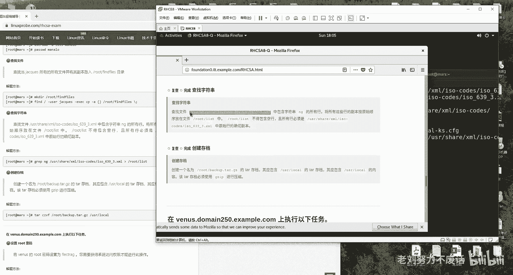

那不就是第二章节，最后一个小节讲的gram命令吗，对吧，NG按下回车搜出来，诶诶哎呀，完了忘了我们这个文件忘了改名了，user share XML i s走ANA。

然后给它改成一定要跟这个文件里面对应上，跟考题里面对应上更有代入感，对不对，好我们来过滤一下NG，所以包含有NG的行，按下回车出来有这么多好。

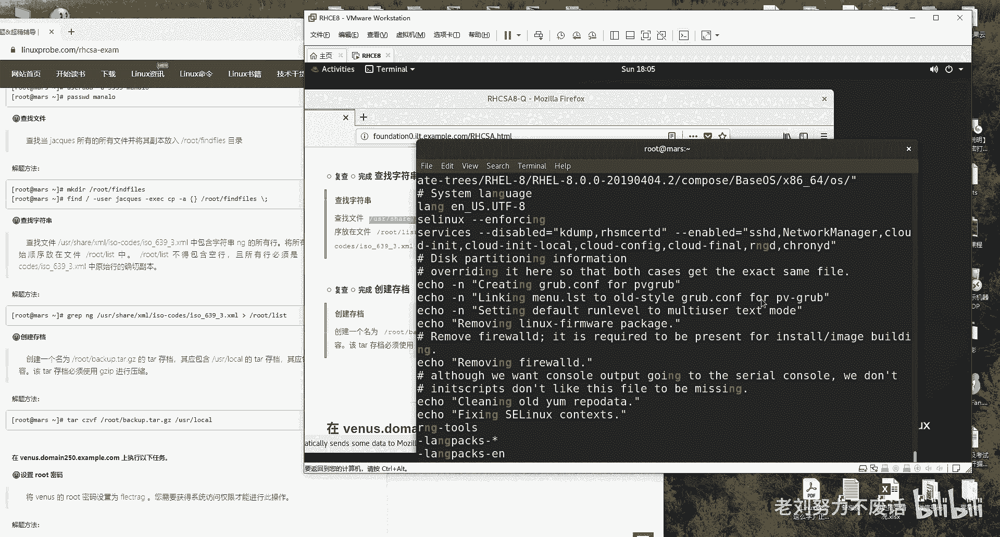

接着往下看，是啊，存放在这个文件里面啊，这个文件还没有吧，我们自己去新建，说这个里面不仅有空行，这句话就是废话，你想想这是不是他是不是一句废话，他这个行里面既然已经包含了NG，它可能是个红它。

它它可能是个空行吗，你大家自己想想好，OK这句话就过滤了啊，所以说我说这回出题的这个人，我不知道是怎么想的，很多题目都是乱七八糟的啊，可能是喝了啊，且所有的行都必须有啊。

且所有的行都必须是这个文件当中原始行的，明确这个确切副本什么意思呢，就是你别改好吧，我嗯他不让我们改，我们还没还真没这兴趣改呢，是不是我们考试，我们我们还回家呢，是不是我没有兴趣改写这个内容的。

唯一做的事情就是过滤里面的这个关键词，然后导出啊，跟大家讲了这么多，开开心心的啊，主要是出于我们对于这个培训的自信，我们讲这个培训，我们讲了67年了，我们现在对于这个红帽我打交道，我跟红毛打交道。

我们从2011年打交道，现在你自己算算多少年了，十多年时间了，所以我们对于红毛这个出题啊，包括说考官啊什么的各种方面，我们还有一个比较深刻的一个理解，不仅限于这个字面意思好，我们来导入到里面之后。

拿分走人，你要是不不太确认的话，你就看一下，当然这个考试的时候跟我们这个文件不一样啊，不过没有关系，你肯定能够确保它，每一行里边都肯定会有一个NG，就是叫NG的一个关键词，你不信你就去看去吧。

但是我就没有这么无聊，我就不给大家去看了啊，就是你们可以去看他，每一行里面肯定都会有一个NG的一个信息，来看一下，说创建一个压缩包，压缩包名称是叫这个名，我先别的不看我，我这人记性不好。

我呀先给他写下来叫什么名啊啊，root目录里面的back up，点TDGZ好，看一下这个里边啊，应该对它进行打包，好路径写下来，user share一下，我不应该写那个参数，写了参数之后。

感觉我已经都提前做好准备了啊，然后把它删掉，让我们看一下这个参数怎么组合，这是我们打包之后的文件名称，这是我们的目录的名称，来看一下这个它要求什么啊，他说这个压缩的时候必须使用的是GZIP。

GZIP对应的是Z啊，b z IP two直接对应的是J呀，那好那不就是C吗，打包ZZ代表就是JZIP压缩格式，V显示过长，F对应的是我们这个压缩包的这个这个，什么来的这个名称，按下回车做完了。

哎呀两个虚拟机你不知不觉当中，你不知不觉这都已经做完了，你说快不快吧啊，两台虚拟机你已经做完了大半了，第一台虚拟机让你去做这些事。

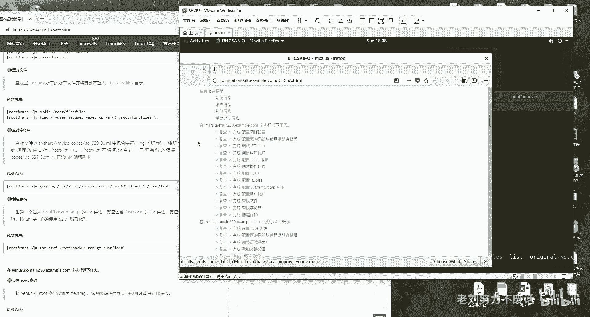

这台虚拟机让你去做这些事，已经做完了一半了，好我们把它关了，开始第二台虚拟机。

第二台虚拟机啊，你看第一个说这让你去破解密码，原先红包六七的时候啊，还有要求你去破解密码的，后来今天红魔热巴我一看，呵呵诶，他还没让破解密码，这好事啊，最后在这最后在这就把这个题目，它给挪到下面来了啊。

他这还给我们阴着呢啊，他就是说什么呢，第二台虚拟机我没告诉你密码，你自己去给我破解出来吧，那好我给他破一下子这么破啊，终端因为你没有办法连吗，因为你的密码你都不知道。

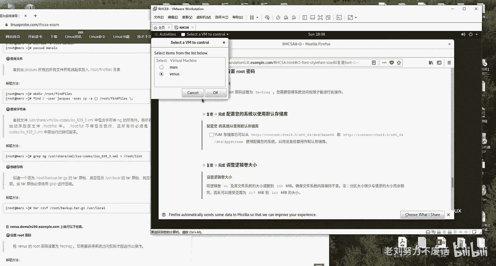

来点它一下，点console破解密码是不是要重启的时候破呀，对呀，我们点一下这个SKEY重启一下来，这个时候别着诶，采访走，嘿嘿等一下啊，再来一遍，再重启一遍，你在开机的时候。

你就需要进入到它这个内核里面进行破解，诶，别走别走别走好，到这个时候的话呢，重启之后马上我们按一下这个方向键，唉，他会听到这个开机的一个菜单当中了，如果你要不确认的话，你可以一直按你这个方向键。

就是这个上下左右吗，不按你这个上或下键啊，不能是左和右，按你这个上下它就会提到这么一个界面了，点一下E，点一下E进入到了内核编辑界面当中，做这么一件事情，看好啊，看好把这个光标一直移动到最下面一条，诶。

大家说哎老师你怎么不用VM快捷键呀，哎就不用，我们考试的时候怎么都怎么来加一个参数，叫做RD点prick，这个我们叫做real disk，叫做内存的，叫做这个中断，好代表就是我们开机之后给你中断。

进入到我们叫救援模式当中，叫emergency mode，好，写好了没有，写好了吗，就这么几个字，RD点break，按住你的CTRL键，按住这个X来去执行一下这个内核信息。

他就会帮你进入到这个救援模式里面了。

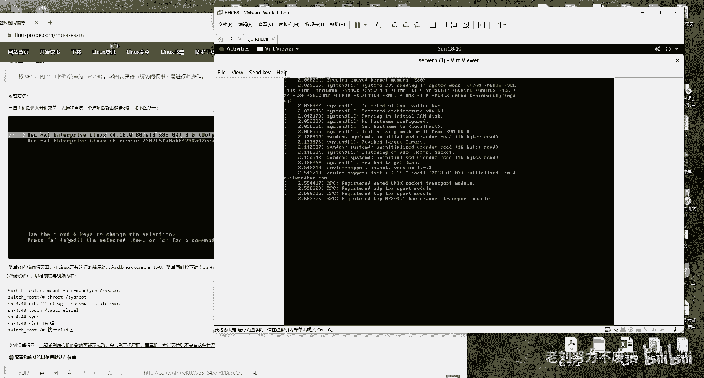

当然了，我要给大家强调一下，听到这句话一定要注意一下啊，这个是由虚拟机所模拟的，如果说大家跟我这个操作是一模一样的，但是你依然有很大概率这个实验做不成功，为什么它模拟的时候很容易失败，再给大家讲一下。

我们再去做这个实验的时候，我的电脑是可以的，你们电脑不一定，所以的话呢你只要保证你的这个OK，我们先看一下，你看它它里面写着啊，叫starting啊，就是这个emergency share。

正在启动这一个紧急模式啊，好我们不管它，也就是说在我们考试的时候的话呢，是没有问题的，但是大家去练习的时候的话呢，不一定能够成功，但你只需要你保证你记住了，我的这个操作步骤就没有问题。

因为我们从2015年吧开始，同学们去在做破解密码这个实验，到时候这个考试模拟环境就一直不太好使，那就一直不太好使，好它正在启动，我们等他一下，如果你觉得特别慢的话呢，可能是你这个机器有问题了。

因为我是一个再给大家录视频，再给大家录视频，我不知道现在有多少人在看啊，可能这个视频可能会被传到几千人或几万人，或者几10万人去看，因为我们在去年几年时间里面，我们就有了6000万的红包考生。

这还是这还是直接的学生，所以我们不耽误时间啊，我每耽误一秒钟，大家就多消耗一秒钟好吧，那我们等他一下，看来不行啊，没关系，大家考大家在自己练习的时候，你就耐心等待就可以了，如果说你不耐心的话。

你像我一样操作啊，等一下，如果你不耐心的话。

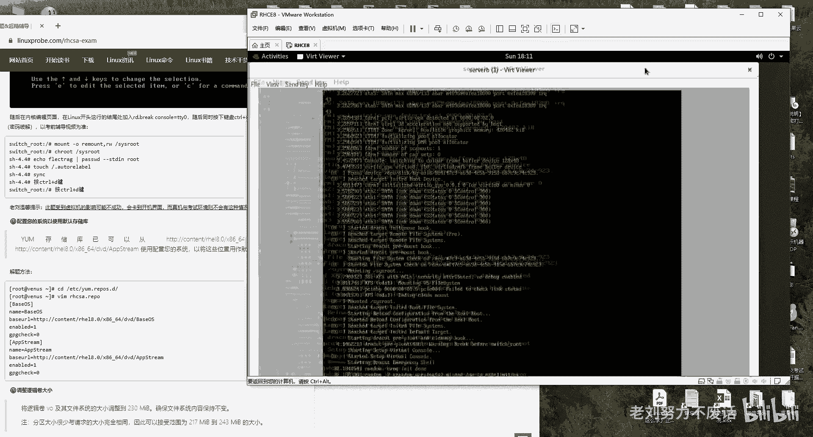

也可以这样去操作，它没有进入是吧，我们强制让他定义一下这个console，定义一下我们启动的时候，那个终端哎呀不好意思，他这个开机手法特别快，所以你的手机你得眼快，开机之后赶紧摁赶紧摁，是这样的啊。

你这个最底下的话呢，不要光加这个r d d break了，看来对他不太好使，哎看来这个劲儿不够大，你看我一个人讲课，我讲的那么开心啊，感觉我这个身后坐的做了好几10号学生似的啊。

其实就一个人讲那么多带劲啊，来我们来后面加一个console啊，等于TTY0，所以我们这个终端给它去启动，来，去强制定义一下that Ctrl x去运行。

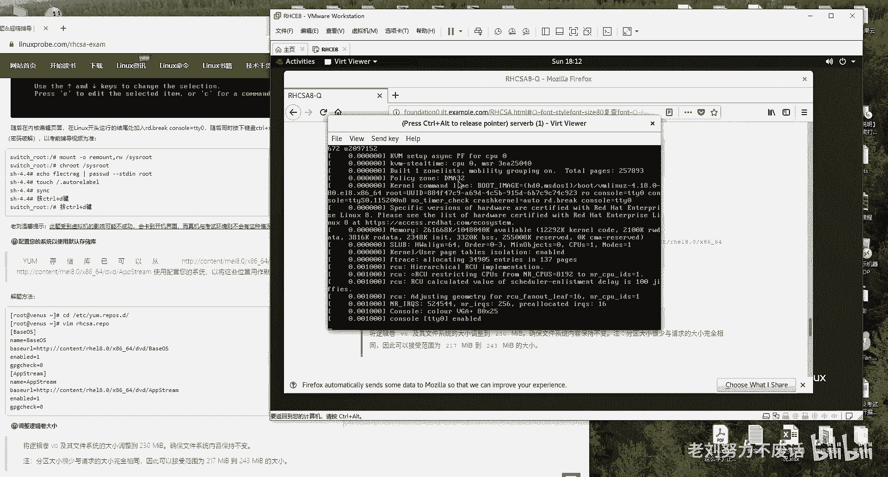

你想啊咱们耽误一分钟，我们一个人耽误一分钟，这个视频面前如果要是1万个人，那四舍五入就是一年了，是不是过去了。

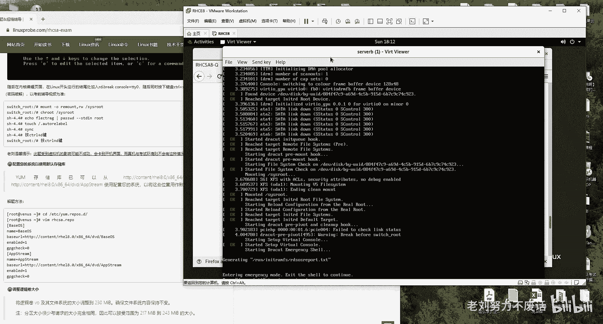

当大家看不清啊，看不清没关系啊，我也我也我也看不清，来，我们给它缩小一点，好到这么一个界面之后，在底下呢大家看看字比较小，这么做，首先来说的话呢，mt杠REMT啊，它有一个小报错啊，啊这没关系啊。

敲他一下子，他给我们一个就出来一个报错信息，我估计你们到时候练的时候也有啊，这是虚拟机的问题，要不说大家做这个实验，哎呀有那么几一大很大的几率做不成功嘛，对吧啊，RW高remt mt GMT。

然后是RW代表是什么呢，重新去挂载一下我们的系统的入侵目录，叫做S8s RT，不要瞎敲啊，看着我那个文档敲，这都给大家总结出来的，不如给大家瞎写的啊，都是我给大家一个字一个字的给你们敲出来的。

所以所以一定要珍惜好，我们先给他设置一下密码，你可以去使用icon，你也可以去使用到pass wd，你无所谓怎么去用，我就使用的echo吧，这样你们能看得清清楚楚的，知道我没有写错。

使用STDING参数进行接收，代表就是由标准输入进行接收，或者一个管道符来重置密码，成功了没有完，他这个SLINUX它会在下次重启的时候给你捣乱，你需要在根目录里面创建一个，一点号开始的隐藏文件。

叫做auto relabel，他会去重置我们的ILE，它会重置我们的SLINUX的level标签，它能够保证你能够去升降在SYNZ啊，多去敲一边，同步一下我们这个信息到我们的硬盘里面。

避免说它没有被保存上来，CTRLD退出，CTRLD退出，两次退出之后就等着吧，等待即可，唉正在开始重置，如果说这个实验你们做不成功，没关系，跳过啊，做下一道题，考试跟工作的时候不会有这个问题。

他毕竟是军机模拟出来的嘛，谁知道到大家电脑上面好不好使了呢，反正其他的服务，其他的题目还是相对来说比较好使一点，红帽的HCC是两个半小时。

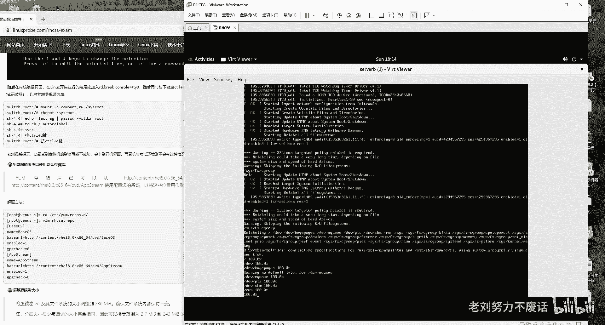

上午考，你看咱们连说连说带讲着还给大家先看看，咱一开始还聊了20分钟，17分钟还聊了20分钟，这才用了半个小时，你上午两个半小时才用了半个小时。

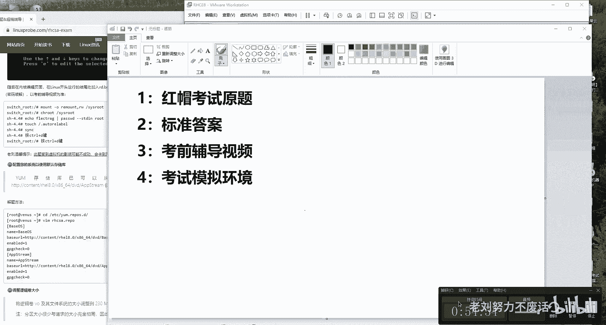

你这个所以说你这要是20cc，你上午两个半小时你还不走的话，那就不是说你这个没做完了，你就肯定是出问题了，好吧，上午的这个题目一个小时用不了，用不了，你都做完了，你就开检查一遍，把这个服务器重启。

没问题，你就可以问考官是不是可以提前走，然后休息一下啊，然后准备下午的考试，下午那个才是重头戏，你看我现在录这个视频的时候很轻松，下午的时候你再去看另外一个视频去，就感觉另外一个老刘了啊。

这不是这不是一个人的感觉了哈，来看一下，登录一下root啊，flag reg登录成功好，这没问题啊，基本功这要再出问题的话，有点打脸了，好基本功做完，但是你们不能做成功啊。

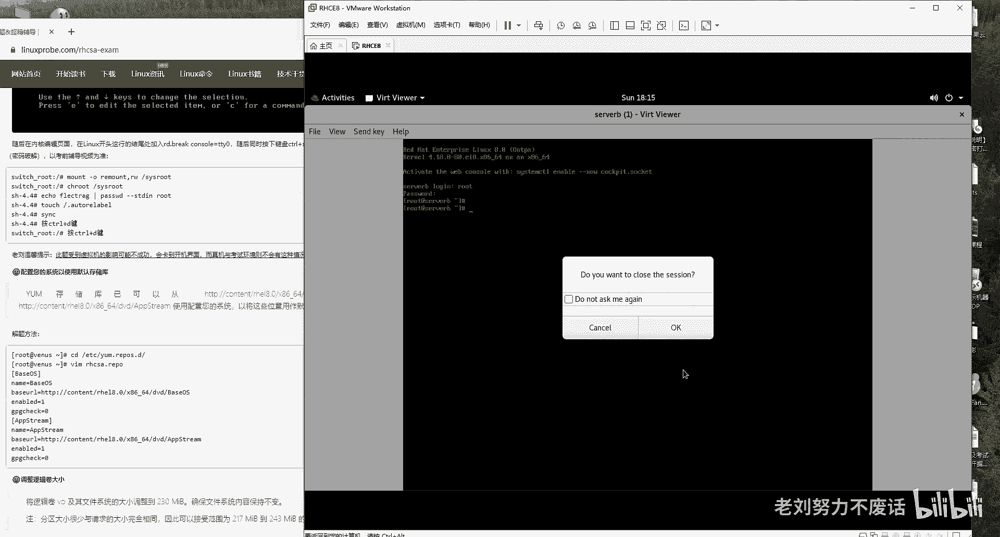

虚拟机的问题我们不给大家再去赘述了，来我们从远程登录啊，因为我这个眼睛不太好。

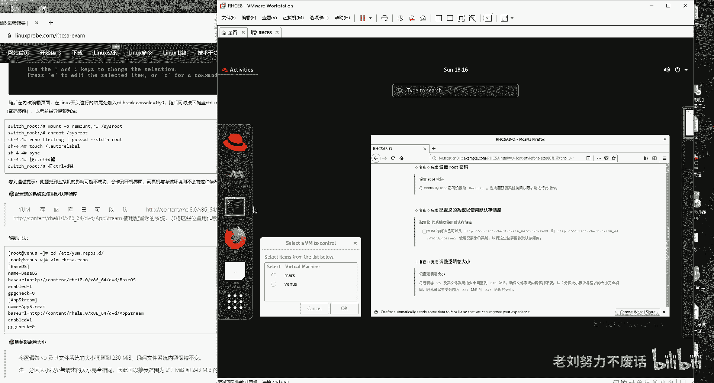

我记性也不太好，我得看一条做一条，要不就忘了他说了什么呢，他说话请配置你的系统，已默认的数据是，配置你这个第二台系统的YM仓库，这不是啰嗦嘛，对不对，你都已经配过一遍，亚马仓库又让我配一遍。

你咋不让我配30遍呢，15道题对我配完了之后，我走人了啊，15道题300分我就可以走人了，这题目啊都出点啰嗦好，你访问的时候，他出现了这么一个报错提示，说链接失败了，为什么呢。

在我们的红旗HC考试的时候啊，第二台机器它是不用你去配置的，我们有线人这么说的。

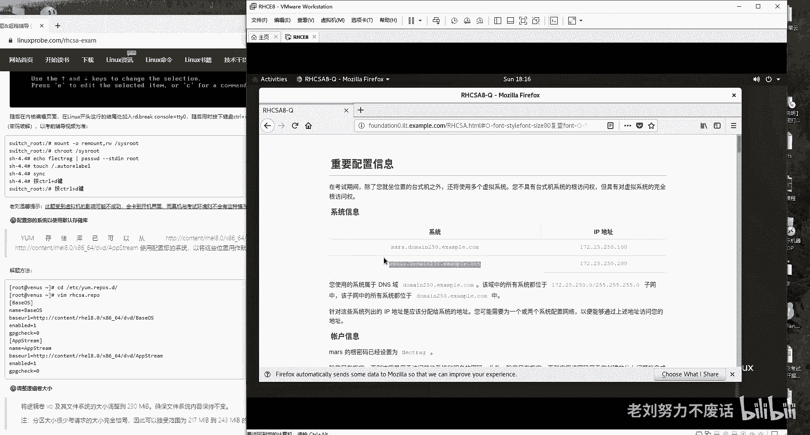

我们已经考过学员怎么去说的，但是我们这个模拟环境里边的话呢。

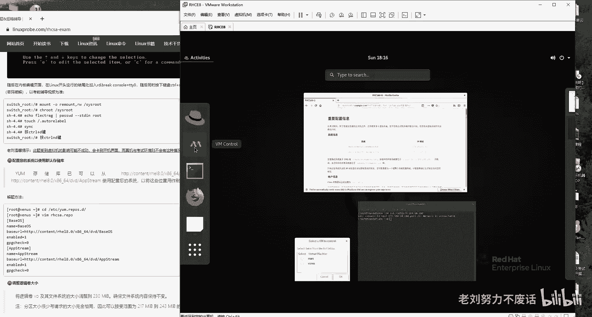

辛啊辛苦大家在自己动动手指配他一下子啊，跟刚才的步骤一样。

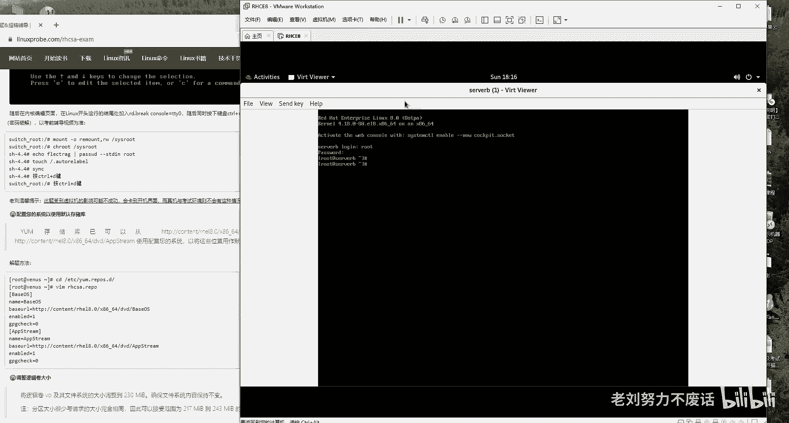

再配他一下子，主机名称，etc目录里面的house the name，来知道这叫什么啊，啊verse是吧，哎呀这个词好啊，很少见啊，DOM250点example，点com来。

主机名称做好NMTOY按下回车，地址是172。25。250。200行点200，第一个完看啊，改成200走，你，点一下确认，对这个培训太自信了太自信了，我觉得这个视频能够帮助大家，能够考过23save。

因为我很久没有看到过挂科了，我也很期待啊，来reboot一下，从此之后他主机名称也剩下了王凯。

也剩下了，我从2015年开始做红包培训，因为我啊。

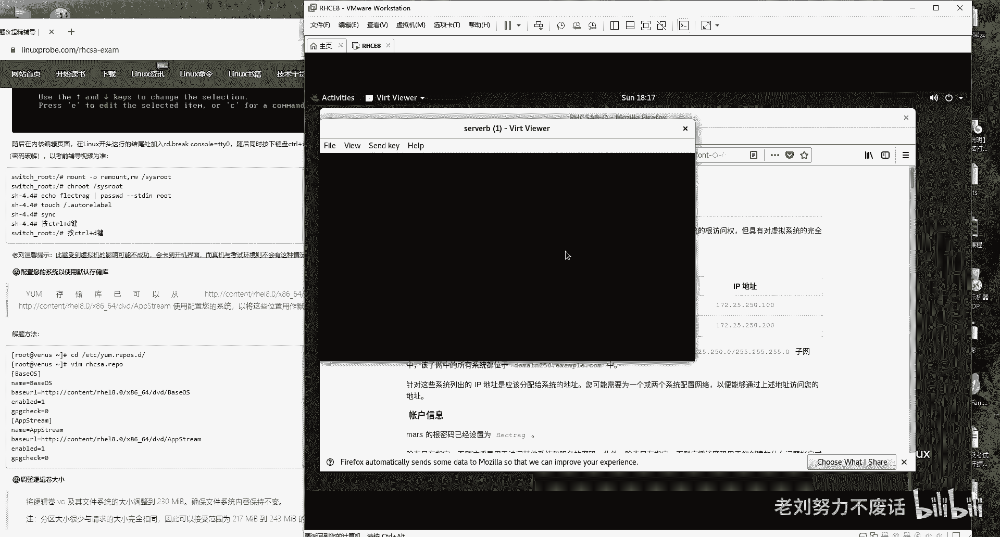

而且我们只做红包培训，我总共见到的大家都是付费学员，没有必要骗大家，我总共见到的啊是cc挂科的人，这几年了，我从15年开始做嘛，到现在不超过十个人，所以我已经很久没有看到这cc挂科了，我也我也很期待。

看看哪个同学能够挑战一下自己啊，好说这种风凉话的人啊。

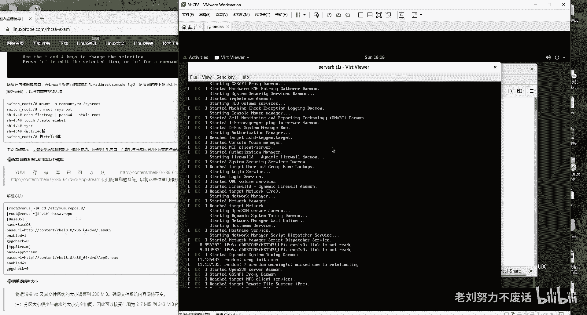

也就是说这就是敢做网络培训，只要实力培训的话，早被人打死了，是不是哎呀卡呀，这个它正在正在重启啊，我们等他一下子，因为老讲网络课，所以你就必须要养成一个跟自己聊天。

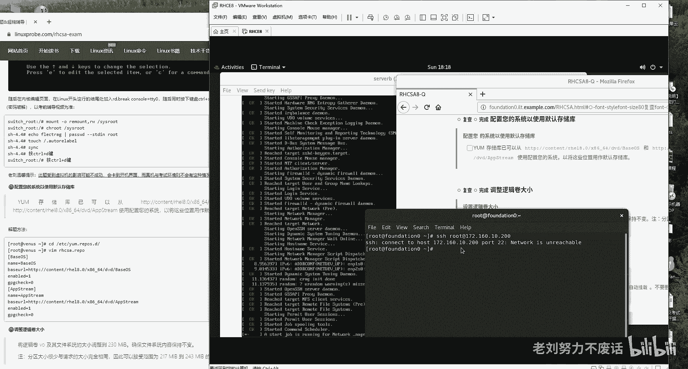

这么一个习惯，要不然的话你这个网上一人一听。

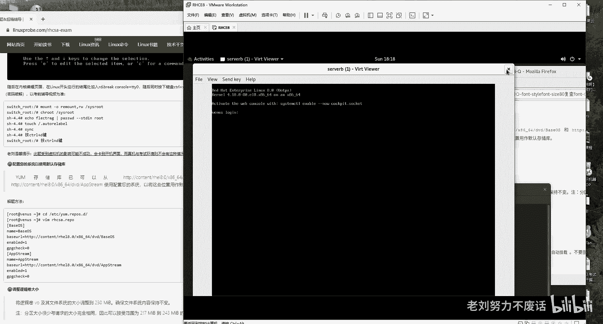

人家知道你是掉线了，还是你等待他重启呢，是不是人都都哎不理解好，所以我们得一直跟大家说说话啊，再连他一下子嗯啊嗨，172。16172。2，5。25，0。200来，我们的写好啊。

写好他说配置一下你的这个YM仓库行，再配置一遍啊，你让我配置20遍才好呢对吧，你给你让我配置20遍，你给我20遍的分的题，这个题的分啊，来这两个文件考试的时候没有把它给删掉啊，不要来。

新建出来一个叫做rh cc点rap的文件吧，配这个最开心的，对不对，这个不用脑子来写成这个格式，我也不敢讲，实力培训就这样讲课，这么说话不被人打死吗，来5YY往下复制几行，能偷懒哎，咱就偷懒，对不对。

来一样的啊，复制一下我们这个链接，Base，Ul base os，但是这个对于这个培训真的是太过于自信了，我们培训的学员这几年，截止到目前录这个视频啊，6000多位了。

所以说要是再有人说他每年考生比我们多，我们就要拿出数据来比一比了对吧，不不不服，就碰一碰了，对这个，而且我们现在只做这个红包，只做LINUX，所以这个精力都投入到上面了，其他的你要说其他的我们也讲不好。

但是这个红帽我们到底是确实就只服自己，来写一下，Enable，一关闭零好，我们不给大家讲啊，因为这都是张口就讲过的，然后看一下这一道题目啊，他说请将逻辑卷，然后的话呢大小调成230，什么意思呢。

就是你考试的时候，它会有一个逻辑卷，200，这个逻辑券是180兆，175兆，他说要把那个逻辑算做一个做一个增大，就是lov lov extend做增大到230就行了，但是因为我们现在没有这道题的话。

那我们就先放一放好吧，这道题我们先做完，他也没有分，因为我们没有那个逻辑卷，我们先给他放一放，待会要是磁盘还有空间的话呢，我就再给大家返回来做一道这道题目，要是没时间的话，那我就把答案给大家啊。

就是看有没有待会这个磁盘有没有空间啊，下面一条说添加一个交换分区诶，交交换分区的话呢，先分区呗，我们的硬盘先找找DV目录里面有，那有谁呀，它是以VD开始的虚拟机嘛，叫做虚拟硬盘吗，好看到没。

这有一个叫做DV目录里面的SDAB，那就是你呗，好从里面给我分出个区了，DV目录里面的VDB他说要有多大呀，他需要一个756张行给你啊，一个N新建分区主分区，然后是分区编号，起始起始扇区都甭管他。

756章好，另外给大家说一下啊，这道题的话呢，我们做完之后，我之前我用那个脚本啊，我去做了一下没成功，我即便我们做完了之后吧，也依然没有成绩，所以我要给大家强调的就是，我现在给大家做完的话呢。

也不一定能盘出成绩来，但是我们试一下好吧，来直接给它粘进去，我们就省得手敲了，我怕我自己敲错了，然后我们看一下，新建出来一个为IVDBE的文件，然后大小的话呢为756兆来保存并退出，不就是SLA分区吗。

MKSWAPDV目录里面的VDB1是吧，VDV我看怎么不顺眼的啊，原价回车做好之后，你看一下你现在啊，比如说老说老师，但是我们做实验不能说老师，那你就自己咔咔敲，你也不看结果呀，来看一下。

现在的话呢4万分区是零啊，啥都没有啊，干干净净，来DV目录里面的VDBE好走，你加加加进去，再一看，有了756啊，它有一个向下的浮动，很正常好，不过的话呢我们看到这样的话呢，依然考试的时候没有成绩。

因为你没有设置成重启之后生效，来编辑etc目录里面的FITEB，你要像我一样，你看我现在我也在看这边的答案，就左边这边这个答案，但是我是瞄过去的，因为这个答案我太熟了，我自己写的。

我一个字一个字抠出来的，但是我也会提醒一下自己大概做到哪道题了，我现在有个数啊，然后的话呢我们就不给大家讲这个参数，什么意思啊，什么权限是否备份，是否自检什么的，第六章节哎，第六章节，欢迎你好。

做完了看见没，他说应该自动挂载，这都不用说，我肯定给你自动挂载啊，你要没有这么一个说法的话，我也给你自动挂在上面，否则你从此之后你盘不到成绩，那算我不及格对吧，他说不要删除，以任何形式改动诶。

不要删除或以任何方式改动系统上的存在，现有交换分区啊，就是说他之前他没有嘛对吧，他说要是有的话，你也你也不要动它行OK啊，这没有问题，说创建一个LVM对吧，逻辑卷嘛说满足以下要求。

一个专组名LV是QA一个转组，VG的名字是q a group，好，记不对吧，一个QA一个q a group大小的话呢，为60个扩展块，扩展块就是PE，然后是q a group里面卷组的拓展块。

大小应该为16个兆，什么意思呢，就是说每一个P的大小是16兆，它总共需要60个，那你算一下60×16，大概是呃，我算一下啊，每个PE是16个兆，取60个P啊，960兆啊，这么一回事。

好这个的话呢目前也是没有的，我们自己去新建960兆，那我们给你一个G够不够啊，还够是吧，来f disk dv目录里面的SDB来按一下，回车再去新建出来一个嗯，说DV目录里面的VDB再次新建出来。

一个为一个GB的空间来主分区编码随便二就行，然后即使一个GB多给一点啊，那大家会问说老师，人家那人家要求你说是960，你干嘛给人一个G啊啊就是因为有钱任性嘛，哈多一点没关系，还有就是有就是有钱任性啊。

哎多给他个几十兆啊，拿去花，然后再说一下怎么去创建LVM的啊，首先来说是PV啊，PVCRKDV目录里面的SDB，这个编码是多少啊，你看啊编码是二是吧，来创建出来好DV目录里面的VDB2来走，你没有问题。

然后是vg create，一个PE是16章，他刚告诉你了，来看一下group的名称，我忘了，你看一眼qa group，所以我说记性不好吗，q a group设备名称，DV目录里面的VDB2VDB2好走。

你新建好了，你要不放心，q a group啊，不是啊，那我们要不放心，Vg displ，你可以去看一眼，是不是每个P的大小是16个兆，然后我多给他一点，那总共的话呢现在有63个P的个数啊。

已经覆盖这60没有问题好了，当然了，我就不给大家去做那么多校验了，因为我比较自信，我对于这个不可能出错，这都是基本功了，好做完了之后的话呢，划划分划分出来一个怎么样呢，为大小为60个P的一个逻辑卷。

名称的话呢，为QA怎么来啊，杠LP的个数，60杠NLVM的名称QA从哪里去取，从q a group卷组当中去取，按下回车创建成功，你再一啊，你再一看呢，就已经有了，唉来没来，960个兆。

跟我刚才算的一样啊，好往下面再看啊，etc啊，文件文件系统的格式挂载到这儿啊，这个目录的话呢，我们现在还没有先把它给新建出来，然后把它给格式化成ex t3，一定要对着他这个要求去做ET3去做。

来设备名称，DV目录里面的q a group里面的QA各种爱好了，没好了，直接挂载吗，别介直接etc目录里面的FLTB，直接一步到位啊，一步给他干到位，那永久生效，那多痛快对吧。

q a group专组名里边的逻辑站名，然后是挂载点MNT里面的QA，根据我们文件系统格式，ext3权限default是否进行备份，零自检吗，零好没问题，保存并退出，再来mt杠A挂载上马上DFH。

你一看来了没有问题来了啊，当然啦说了啊，他要求你是960，你最后是变成930，正常硬件厂商按照一比1024呃，按照一比1000这样去造的，你计算是按照一比1024这样去算的，所以你不用担心。

哎呀因为大伙还讲课呢啊，我七点钟讲课，然后现在是06：27分没啊，没有没有，但是没有关系啊，这个我很自信的，我们能够讲到吧啊待会儿讲完了，这个还得七点钟连轴转啊，七点钟到九点钟，正好还有一。

我们得讲课啊，来我们说一下video，video的话呢，他说新建一个券，然后需要选一个未分区的硬盘，这个我们做不了，为什么我们的模拟环境里面，它就没有没有被使用的了，就俩一个是A1，它有一个是AVDA。

一个是VDB，这个我们做不了这道题目，所以的话呢我只能把它这个就是你考试的时候，他会给你一个叫VDC，你直接对于这个VDC进行操作就可以了，但是因为我们现在我们没有，所以我现在只能按照我自己去。

新建出来一个分区，大众，第一节目就是他现在考试的时候。

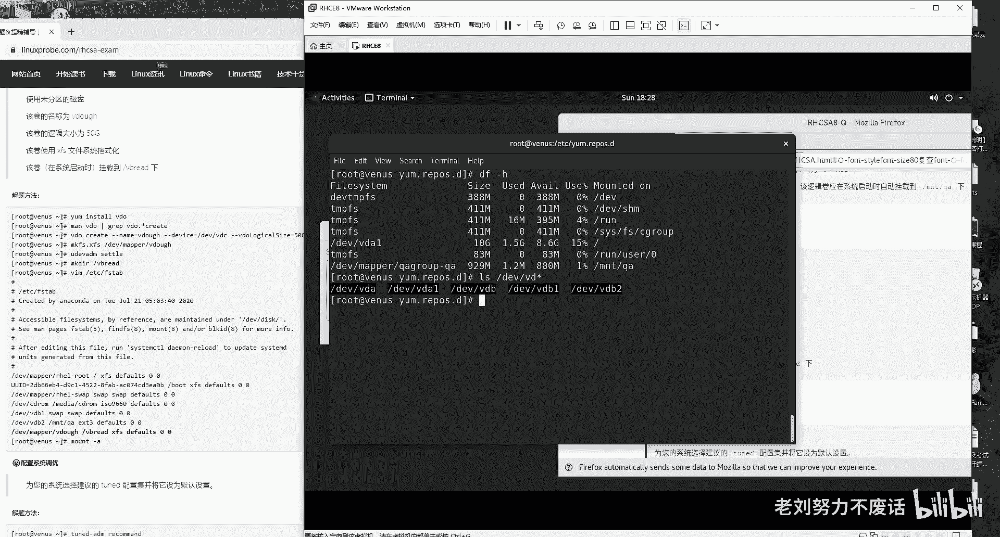

要求你对于这个DV目录里面的VDC去做，而我现在没有它，我只能去新建出来一个DV目录里面的SD，不只能去新建出来一个，比如说DV目录SDB3吧，我只能这样去做。

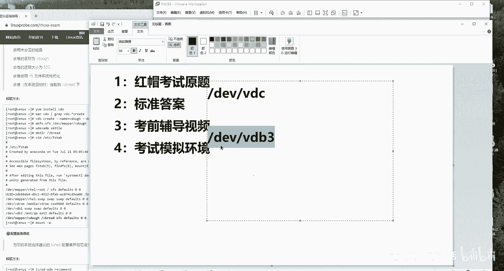

然后画底下这个操作都是符合要求的，但是第一条不满足，最后也没分好吧，但是我只能是仅此而已了，因为我没有这个没有被使用的硬盘了啊，这没关系，考试的时候你们会有的啊，考虑那考试周要没有怎么办呢，唉举手办。

老师这道题做不了对吧，你们这你们放心啊，这个都是废话了，这个肯定没有问题，来继续分区，你看那需要多大的VDB看一下啊，他说大小为50个G肯定不可能啊，这是什么呀，这是video啊，video是什么。

它是通过压缩对吧，还要通过我们这的这个这个呃比对，来去节省我们这个空间的，这是一种能够帮我们节省空间的，一个磁盘的一种格式，它并不是真正要用到50个G空间，所以的话呢我们这个给他多大。

给他这道题我们先不做吧，这道题我们先不做，因为上因为上面吧还有一道题，我们先把这道题啊，我们给他做了，做完之后的话呢，剩多少我都给你不得了吗，对吧好了，我们在这道题给做了啊，诶不对，还有一个硬盘。

还有一个app desk1呢是吧，我记得有啊，哎我看看你啊，VDA他哪能给你抠出来的空间了，这不就行吗，这大小是16个G，他已经使用了十个了，还剩六个呢行，那就来你吧，咱们因为这个模拟环境啊。

没有这么多磁盘空间，就这么多，到处找到考试的时候，你就用VDC特别痛快好，我们来看一下啊，上面一道题说，将逻辑卷VO及其的大小调成230，217~243都是允许的范围，什么意思，就是说他原先是175。

你把这175给我调到230去，LOVM的一个增大好给你满足一下，是这么去做，首先来说就是app disk dv目录里面的VDB，再去分出来一个，他总共不太需要了，他总共不就需要230吗，行我给你230。

我那我给你300啊，咱们有空间吗，给他一个大一点的，给你个，给你个，给你个500吧，啊为什么要给500呢，因为有钱任性是吧，大一点没关系吧，小了不行，大了无所谓，来保存一下子，做完之后啊。

它就有一个这个怎么讲呢，自己做的话比较麻烦，等一下啊，等我再找一下这个题目，虽然说这么不用看，你一点稿子不看的话，一会儿讲讲就乱了，在哪儿都飞了是吧，来在考试的时候啊，你直接BF杠杠杠杠H1看。

看看他看到没。

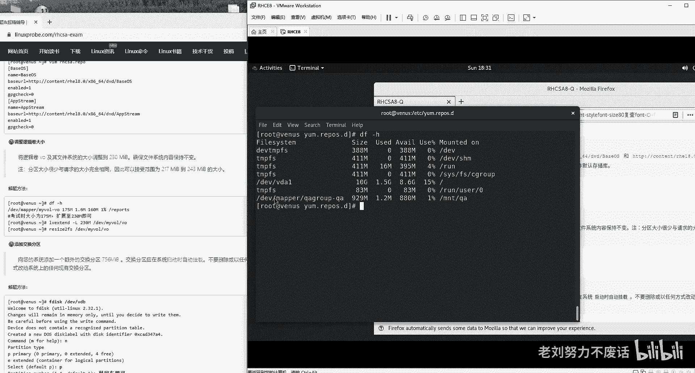

他就会有这么一个现在没有了，就会有这么一个挂载的设备了，就这么一个设备了，你直接两条命令扩展重置，就是进行校验，就是这个重置大小。

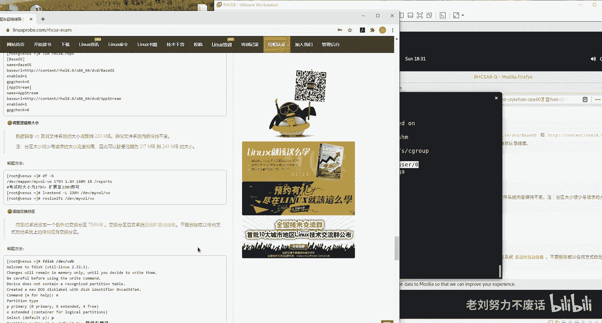

完事儿就这么两条，因为我们现在没有怎么办呢，自己新建呗啊，自己动手丰衣足食，Pv correct，DV目录里面的SDB不VDB3，现在出来那个分区，然后PV啊。

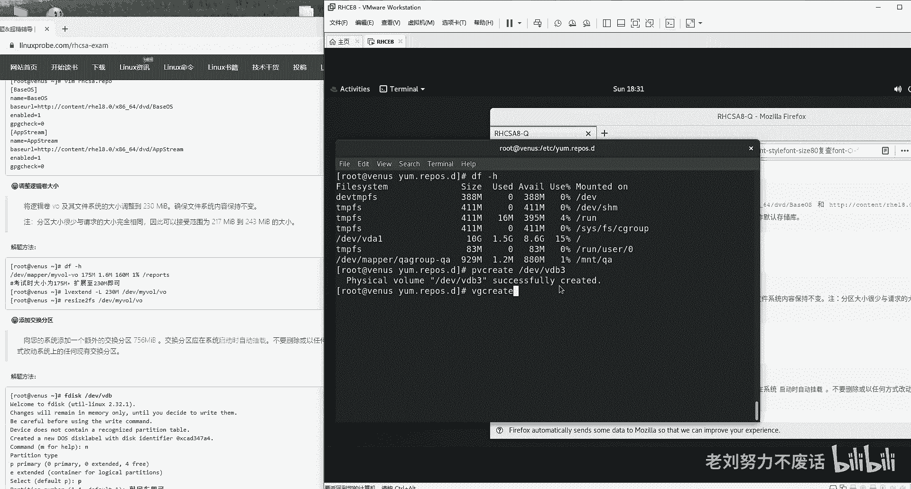

Pv create，这个五卷组名称有讲究，你看他仔细看啊，他是不是加了买VOLT杠VO。

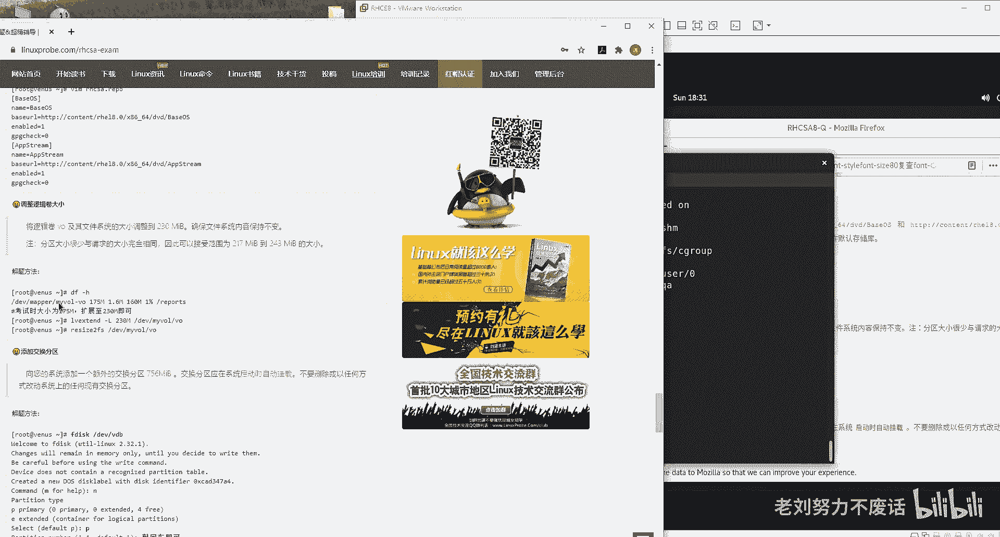

你再看看这个是那哪儿去哪儿去了买哦，这里没有，但是你们考试的时候有。

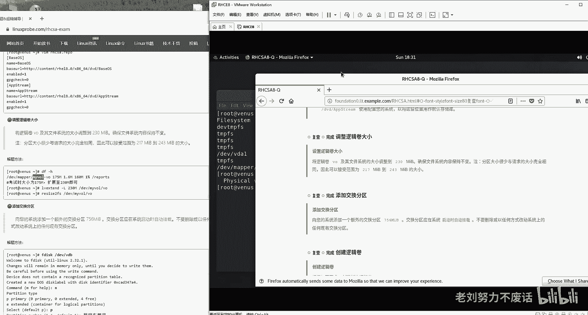

所以我告诉你们啊，这个卷组名称不要瞎写，一定要写成叫做买VOL，当然考试的时候你们也不用去做啊，就你们在做模拟环境的时候记住了，这样才符合题意，这是这是卷组名，卷组名不要瞎写。

然后是ellv correct，创建一个名称为VO的一个逻辑卷，大小的话呢，它原先是175，我就给你175好吧，满足满足题意从哪里去取呢，从这个买VIL作组当中去提取，提取成功175兆啊，没有问题。

做好之后格式化一下，他也没说什么格式，我告诉大家是ex t3好吧，DV目录里面的组名称my vol，然后的VO挂载到哪儿啊，啊叫做这个reports是吧，行挂到reports目录当中。

他说这个目录不存在，行，给你这考试的时候，你都不用去做啊，他已经都有了，等一下，Ok，幸亏我们看这个视频的同学都是我们的学生啊，要不然的话加上外面的学生一看，哎呀老师怎么敲怎么净操，怎么净，敲错命令了。

好，我们来挂载上，挂载上一看已经有了大小的话呢，这个是为嗯，我给它是多少啊，呃呃对175是吧，它会往下变成130，一变成170，160，167了，OK这个符合题意，这个没问题，那你可以看到好175。

那我们给它扩展到230怎么办呢，直接v extend，就是考试的时候就是这样的啊，你现在看到的是167，让你扩展到230怎么办，Lv extend，然后是大写L扩展到多少，扩展到230，然后设备的名称。

这照着敲，直接照着敲一路，哎呀还table不了多讨厌啊，买vol想省点，想想想省点劲儿啊，还没省了，来扩展成功，Reset to fisystem，My vol vo，重置好了，你再一看。

原先仔细看好啊，二百一一百六十七，现在你再一看221，看题目，117~243之间都符合要求，217~243之间吧，220了都可以了，拿拿分走人，这还麻烦了，你自己做的时候。

你就得你就是最后两步就这哎哪哪哪有打，你就这一步两部都可就搞定了，你不用自己去新建呀，不用自己去格式化，这些全都不用，这不就是，所以你要说这个阿智cs啊，其实也不难，是不是来video video的话。

我们就这么着吧，因为实在没得折了，考试的时候就是v DC，现在没有，怎么办呢，VDA啊，粮食不够啊，小米来凑，我们就找就到就到处找空间，他不是六个吗，现在剩了他已经死了十个了。

还剩六个G我们拿走来杠P主分区都拿走，那么就就一一路敲回车，然后全都用了，他现在上了六个G全都给我们了，保存就会多出一个文件，DV目录里面的VD以A的2VDA2好已经有了，创建出来这个video。

这个video的话就是一种文件系统的这个格式，它主要就是通过一些压缩呀，通过校验什么的，帮我们节省空间的，虽然我们现在只有六个G，但是我们可以创建出来逻辑上的50个G，他不是说的是逻辑G吗。

他并不是真正的50个G吗，就是你可以当做是50个，这个这样去用它帮你去做压缩，这样的一个效果好，现在的话那我们就给大家做一下考试的时候啊，据我了解video已经安装过了，但是的话你要不信的话。

你就去确认一下去没，那没那是没坏处，那是没有坏处啊，安装好之后命令很长啊，记不住怎么办呢，没关系诶，闷一下video，然后是看到它里面这个帮助的信息吗，我们过滤一下，你过滤一下所有跟CRT相关的。

等一下啊，你过滤出来做跟correct相关的这个信息嗯，没有吗啊我看看CRC没问题吧，来VDO就是我现在带一个方法，把那个时就把那个例子，就把那个事例给大家找出来啊，这这么就出来了。

他说啊这有一条他说让你去，他说帮助你去建立一个video设备的一个命令，我们要的就是这一条好吧，我们直接去复制改一改，首先来说名称啊，首先来说名称名称是WIDOLF啊。

WIDOLFDOUGH设备名称的话呢，那么你考试的时候就是VDC，这么去敲就没问题，而我的话呢就是VD呃，A的二对吧，我的逻辑大小是50个GB，按下回车好，一路新建啊，一路小平坡没问题，这做完了。

这做完了哎，这不这个做不了，这个没有没有被分区的这个磁盘，这做完了做完了唉，这么做，说使用超FS格式化来满足你，XFSDV目录里面的maps点doff n a，大家说那老师你怎么知道的呀。

你看这不就告诉你了吗，对吧，来去格式化一下，再往下面一条说，诶，把这个卷组把这个设备挂载到这个目录里边啊，叫v bread啊，虚拟的面包来，这不就是中国人说的画饼嘛对吧，叫VIBRID，等一下。

虽然说是模拟的一个这一个逻辑的50个G啊，但是它也需要格式化一点，大概格式化了十秒钟吧，也不长，可以等待来VIBRIDE，然后我们去直接编辑etc目录里面的，FITAB这个文件，但是需要注意一点啊。

大家听一下，因为的话呢我这个虚拟机它是没有这个硬盘的，我们现在这个考试环境里面没有，考这个考试的时候有，那所以的话呢我现在去做这个挂载的时候，我需要给它加上一个net d EV啊，因为它是一个网络设备。

就是这个DV目录里面的SDAB啊，不这个DV目录里面的VDB不是啊，这个VDA它是一个虚拟的，所以我们需要给它加上一个叫net dev好，我们先给他写上WEIBAD，然后是格式，格式是XFS吧。

我看一下啊，脑子不太好使，现在啊XFS没问题，权限default00，它是一个网络设备，因此给他一个逗号net d EV，保证万无一失，保存并退出，做好之后，mt杠A挂载好，我看一下啊。

他说这个设备已经被挂载上，我们来看一下DF杠，哎呀没没，应该没挂载吧，他怎么会被挂载上呢啊，他说是个挂载点繁忙，什么意思，来应该已经建立了吧，来我们mt杠A1下，哎呀D还是不行。

etc目录里面的FITAB，检查一下VDRWEBDXFS哦，是这个样子，因为我们刚给他格式化完了之后吧，我们没有让我们的video它生效，对我个人因为我很少用，所以我就忘了一部。

让大家能够去立去生效一下，让我们配置好的这个video立即去生效，然后我们再去挂载。

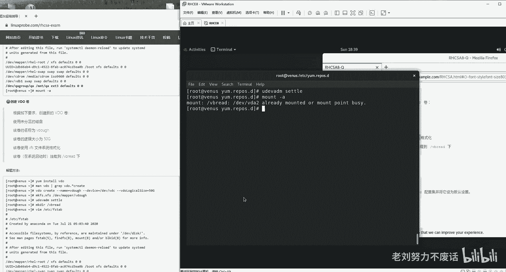

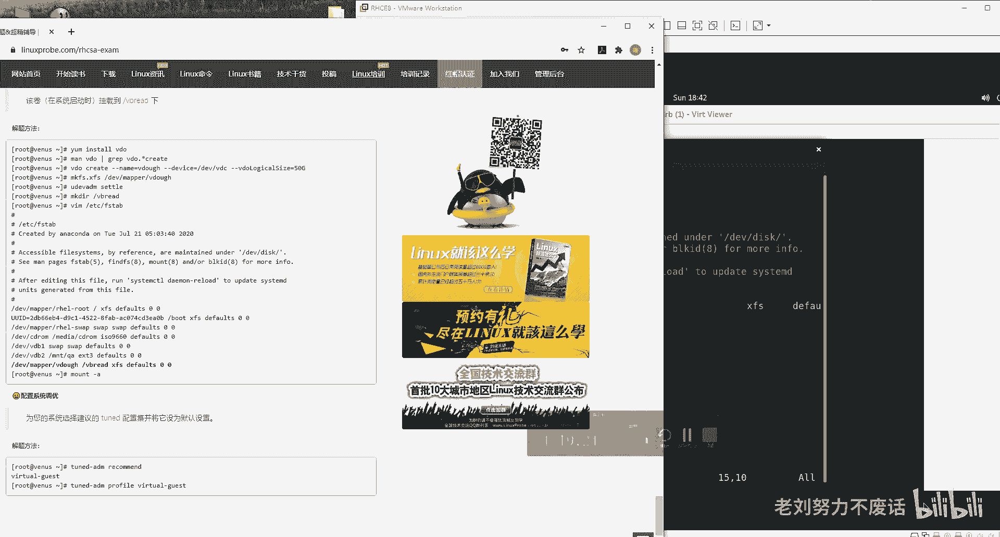

OK我觉得我刚才看了一下，大概看了有一分钟吧，然后我觉得我自己该去看看脑子了好吧，然后这个录视频应该是已经恢复在录制了，是这样的，我刚才看了一天，然后你自己在纠结啊，我说这哪错了哪错了，后来我一看。

这不是我们的分区名吗，我们不应该写我们的分区名啊，我应该写的就是创建出来的video设备的名啊，这应该是叫mappers里面的那个味道啊，刚才我还跟大家去教呢，我还我还跟大家说。

我说那个大家那个看一下啊，这个标写错了，然后他就他已经告诉你了，结果自己还犯了个错，嘿你说尴尬不尴尬，好点一下，保存在马的杠A挂载上，DF杠HK挂载上了，没有问题，大小是50个，大小是五大大。

这个大小的话是50个GB，哎你看尴尬了啊，哎呀本来想一镜到底，结果因为自己的一个小失误，哎呀断了一下，留下一个遗憾，那等着红包real9的时候再给他弥补上吧，脑子这个是一个脑子问题。

名这个名这个他这个名儿写错了好，下面一个题目啊，说请将您的系统调整为他推荐的这个，train的这么一个级别啊，就是说系统调优嘛，它系统里面预制了一些方案，然后你可以去选择一下。

那我们看一下他现在推荐的是什么呗，你看啊，我们现在可以查看一下他现在这个recommend，他推荐的是什么，他现在推荐的叫做virtual guest，他说啊，请你将它修改成他推荐的这么一个模式好了。

那就是它了，那我们就修改成叫做visual guest来adm profile，好点一下，保存没有问题，哎呀心疼一下。

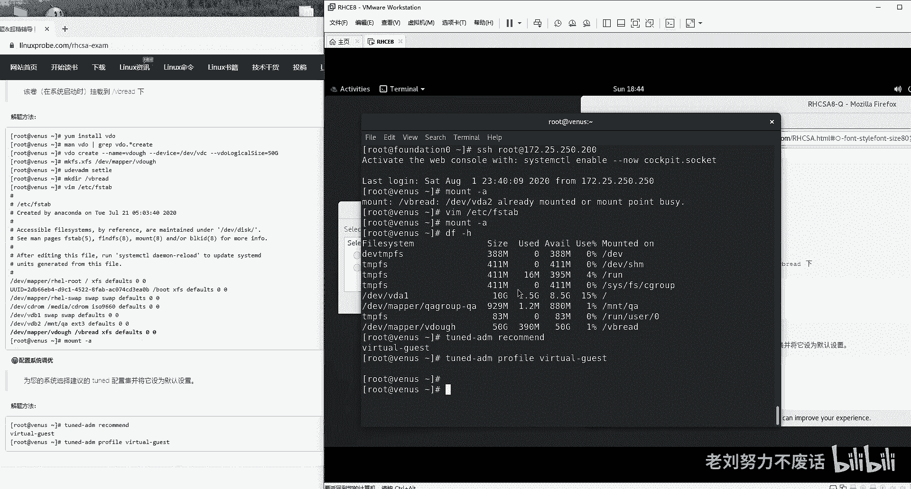

压抑了啊，竟然发生这么一个低级的错误，做完了你大家数数时间吧。

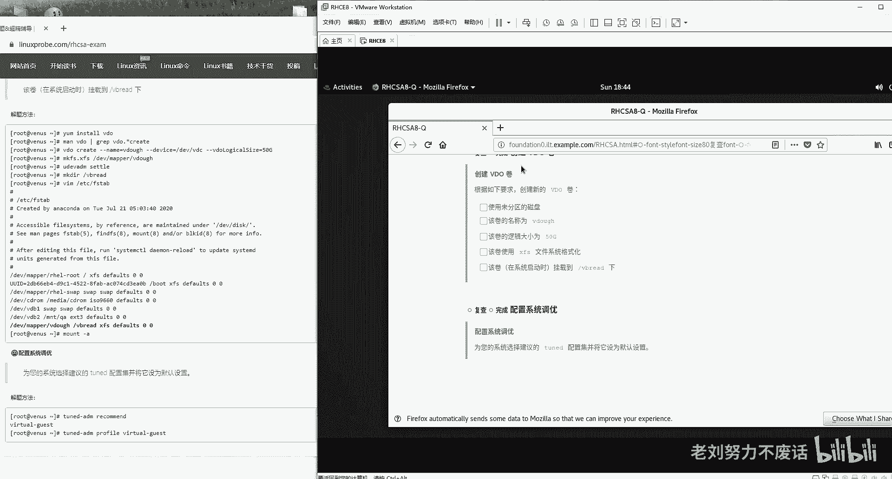

多长时间，然后我给大家判个分，很简单，对不对。

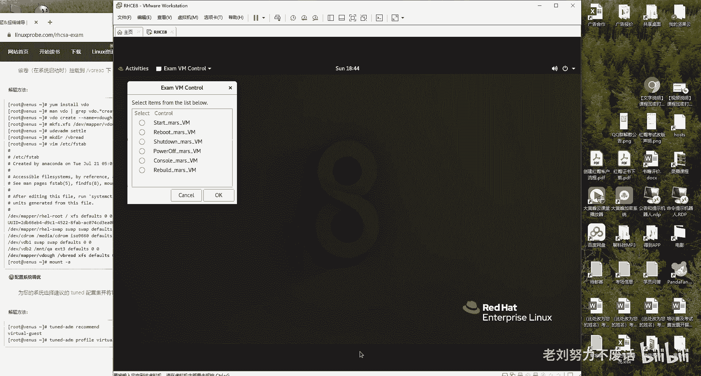

然后一做全废。

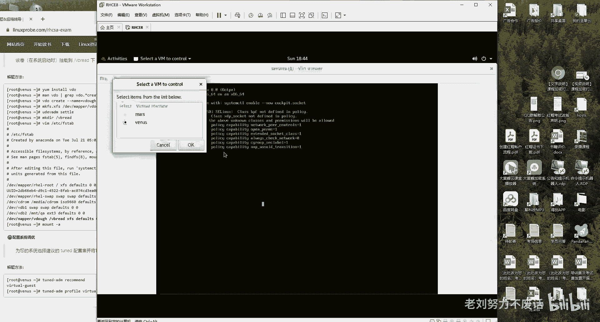

一做全废，不要着急，怎么办呢，你呀这样这样我们就重启一下吧。

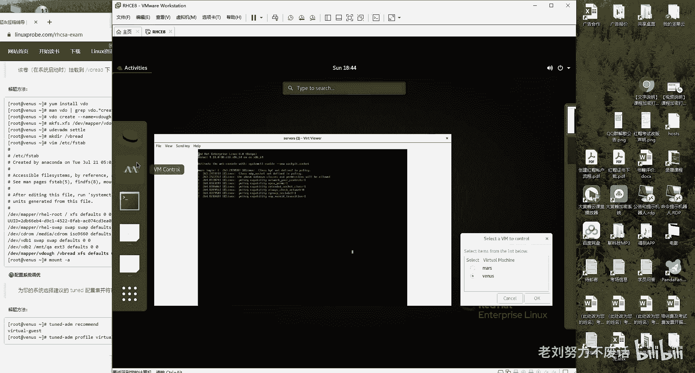

为了避免说我们考试的时候我们没有分支啊，你临走之前，你去看一下你的这个系统能不能起来，基本上基本上也就到这了，你就可以想想今天中午吃什么了，哎今天中午你看看该吃点什么，就可以先琢磨琢磨了，别到时候再到。

别到时候再做嘛，到时候就来不及了，就被人抢走了，是不是那人多就坐不下了，来看看今天晚上中午吃什么了。

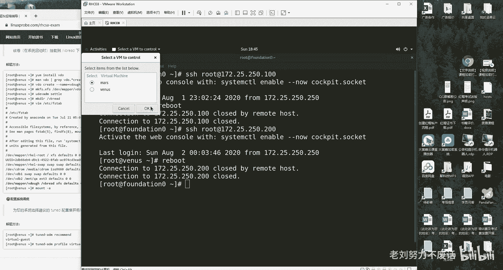

该来等一下啊，我把两台机器都给他重启一下。

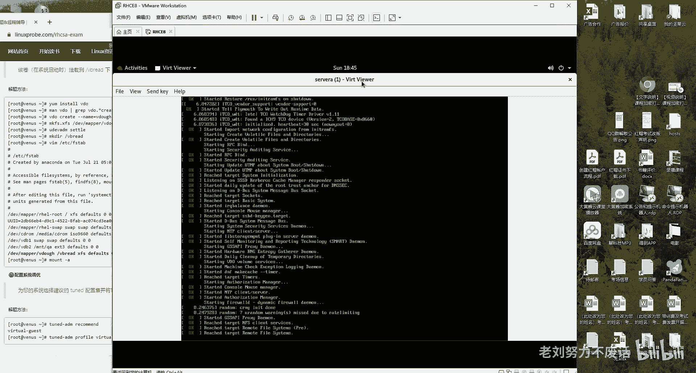

保证说这个重启之后吧，他还都能起来战化万无一失。

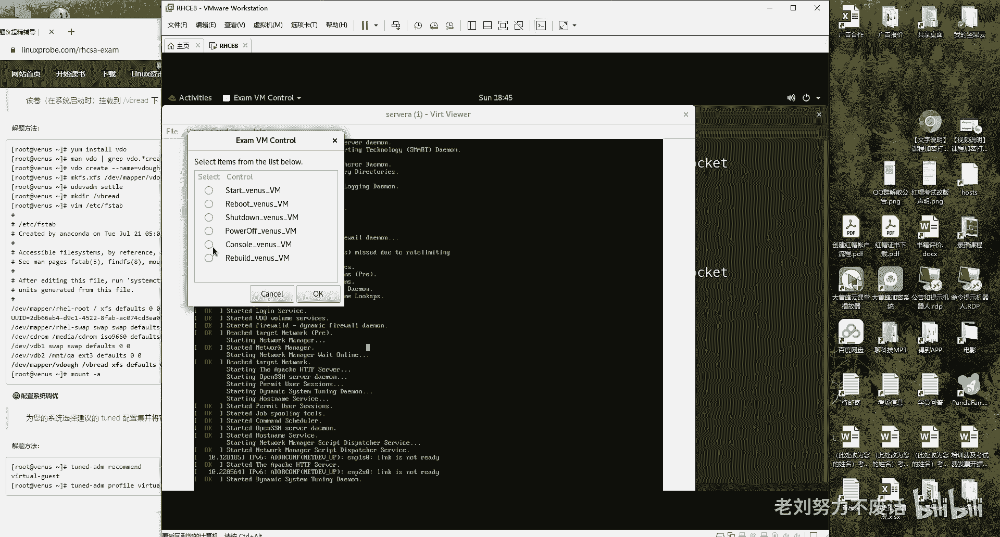

心啊心情有点压抑了啊，这么简单的题目居然犯了这么一个脑残的问题，千万不要影响到老刘在家心目中的形象吧，来等他一下子。

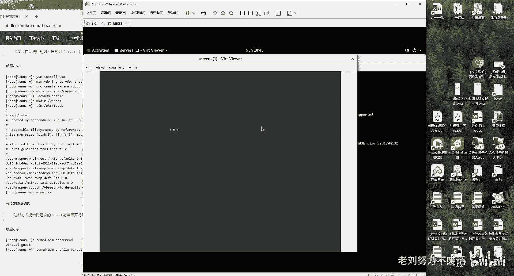

好正在开机。

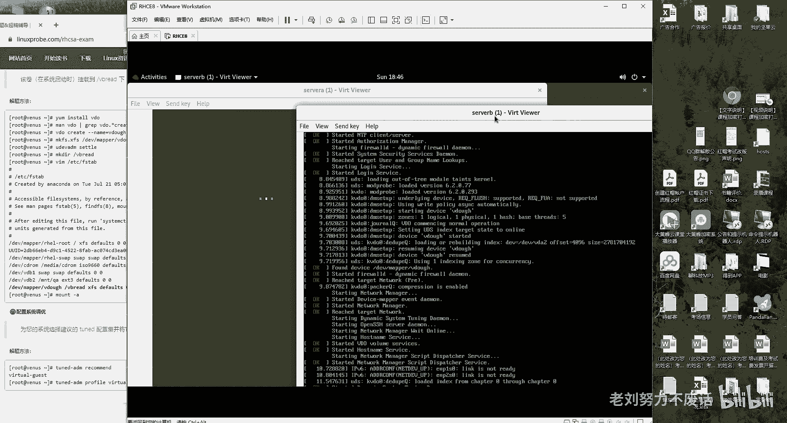

OK第一台起来没问题。

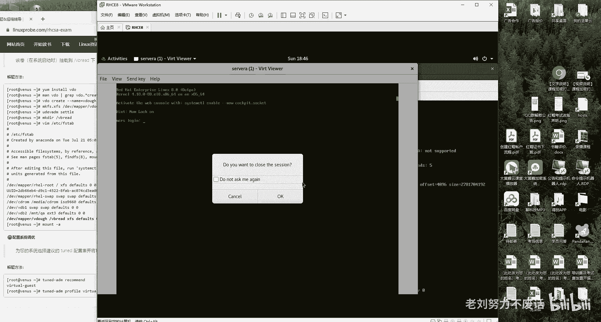

第二台等你唉，可起来没问题，中午可以吃饭去了。

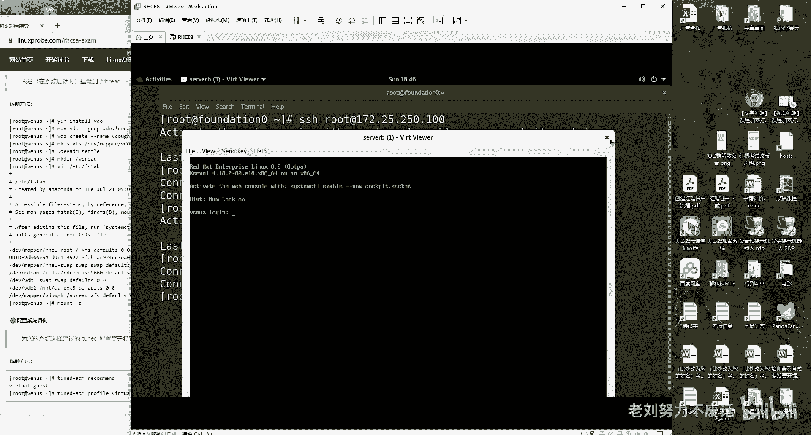

好然后这时候你就可以去吃饭去了，那么你吃饭之后考官会干嘛呢，我给大家演示一下啊，你走了之后，考官会用这个脚本，当然我们这个脚本是有瑕疵是有瑕疵的啊。

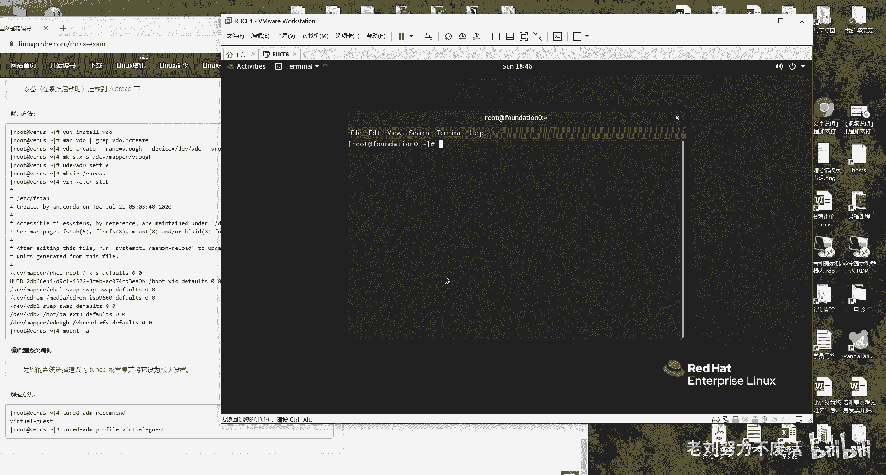

待会看出来这个成绩大概是二百五，大概是250分啊。

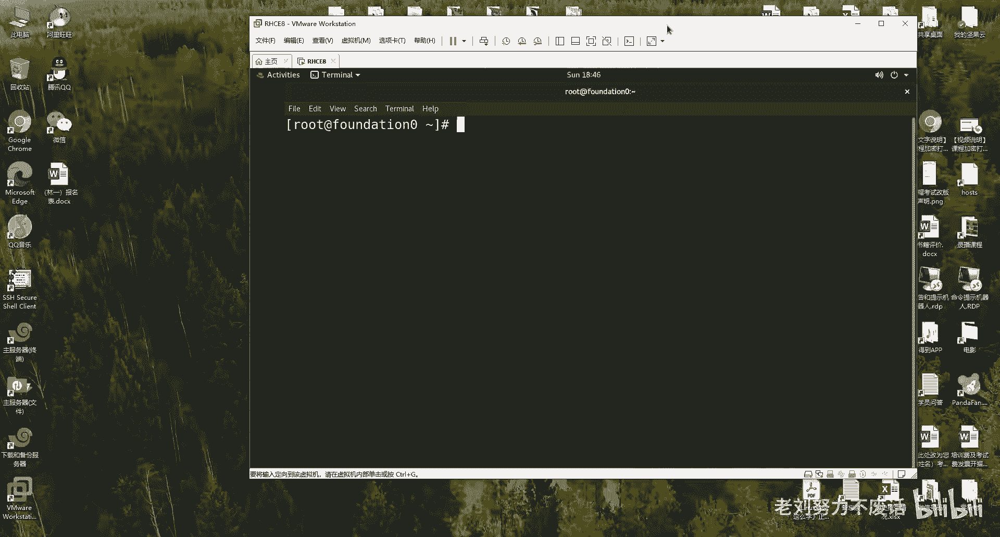

然后每一个题目我都为什么会扣分，然后哪题做不了，我给大家解释过，不给大家去赘述，你走了之后，考官会在你这个机器上面跑，这个脚本叫做exam setup，不呸呸啊，叫做exam grade，判成绩走起来。

这个时间的话呢大概是5分钟吧，比较快，我们等他一下，啊他说总共花费了1197分钟呃，这个没关系啊，你们做的时候可能还是上万分钟的，这个是因为我打包的时候，那个时间这个这个这个这个没有关系。

好好待会会有几个报错，然后我给大家解释一下，这个不用担，这个不用担心，我刚才说过这个问题，这凹凸FS对吧，出问题了，理解考试的时候没问题啊，好第一到第一个系统的程序就判出来了，总共错了五道。

下面反正最后成绩是二百五二百四十六吧，我记得是，嗯OK啊，继续继续，马上出来，246没问题好，就不管怎么说吧，过了对吧，然后他会告诉你说你这r h cc通过了，你这个成绩的话，246你就哪怕说啊。

我们刚才这些真的是讲错了，你这些都不会做，你246分也过了对吧好，我给大家解释一下这个每个题目什么意思啊，为什么错了，其实这些我们都对的，他只不过成绩没有排出来，好给大家依次解释一下。

其实你不行都没有关系了，因为你已经做对了好，第一档说这个网站目录当中，这个文件不能正确提供，为什么呀，因为你没有给我这个files1的这个文件啊，你这个网站它根本就没有存在，考试的时候他有了。

我们不用这个，我们不用操心，第二个说这三个用户的密码应当是flag reg，好了，这不给大家去赘述啊，如果这老刘连这个都做不出来的话，就不那就不讲课了，这是脚本的问题，我们不管它好。

第三的话就是这个凹凸FS对吧，这个不是我们错了，为什么你看它上面这个报错嘛对吧，这个不是我们做错了，是因为我们的凹凸FS已经做出来了，但是你的NFS你没有提供过来，你的验证是失败的。

所以他没有给我们通过，你看啊。

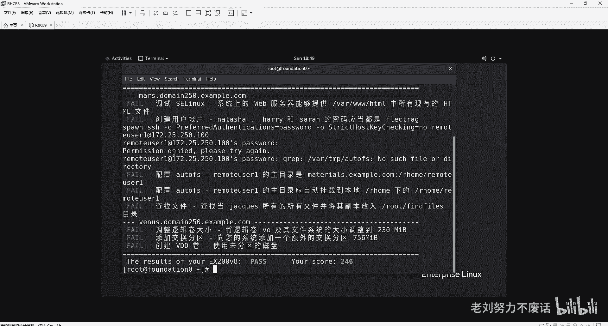

另外的话他给你提示了一个什么，这个可能大家没有细心看，我有我有我有，所以我把它带过了，那FS下面还有一条，就是说remote user1的密码是flag，REX是什么意思，就是说你可以上。

那么你可以去尝试上去。

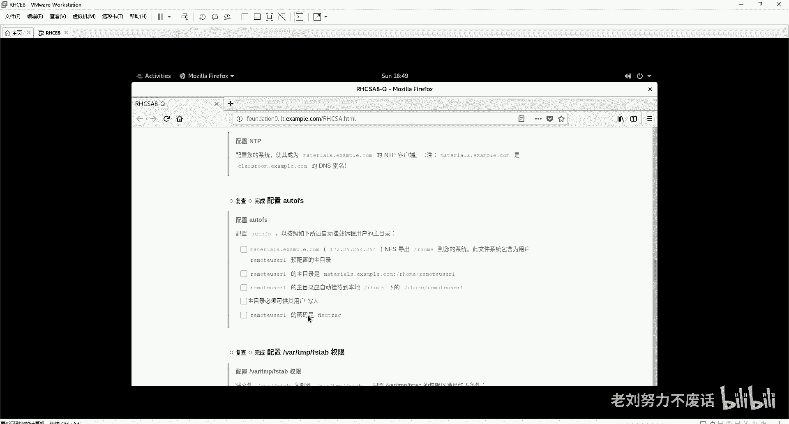

然后去进行一个测试，但是的话呢由于我们现在这个没有这个用户，因此的话呢我们现在就没有挂载成功，好这个不给大家去赘述啊，考试的时候没有问题，下面的话当然就当然了，如果你要想去测试的话。

你也可以去新建出来这个用户，新建出来这个家目录，不过你新建出来的话，对方也没有给，那也没有办法给你提供NFS，你还是做不出来啊，不过这个考试的时候，NF是是是他是这个他是个教师机。

上面给你提供的这个你不用管，然后说啊file说这个查找用户文件的时候没有对，因为这个文件因为呃因为这个用户我们没有，这个是我们自己新建出来的用户，它里面考试的时候，有的那些文件我也不知道是什么。

所以这个也没有分值好，接下来的话呢是说调整逻辑卷的这个，VO大小啊，这个的话呢，因为是我们自己新建出来这个逻辑卷，它那个文件，这个卷组名称，或者说设备的名称肯定是跟我们不一样的，但是这个没有关系。

大家看到这个变化了，175~230对吧，这个没有问题，到时候考试的时候，你就两个命令不用创建，不用像我们刚才说的创建格式化什么的，都不用去做，直接啊，230，那拿分走人啊，中午吃饭。

下面的话就是添加交换分区，将我们的交换分区添加一个756的，这个话呢我认为也是一个脚本的问题啊，这个话呢不用担心，因为我们现在出来，那个分区大小就是756，向下变成755了，符合题意，没有任何的问题。

到考试的时候你就可以放心去做，没有问题，然后他说创建video啊，说这叫说这个小说这个小问错了，这个小问说没有说使用未分区的磁盘，就是那个VDC嘛，因为我们没有，所以的话呢除了这个小问一错。

其他的我们都没错好。

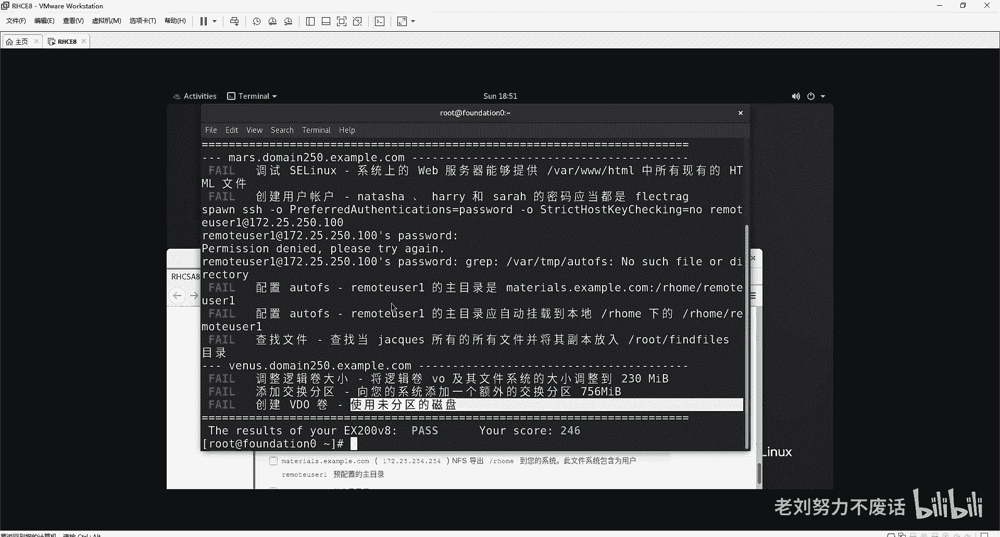

就这么几个题目给大家讲一下，红马H3C怎么考。

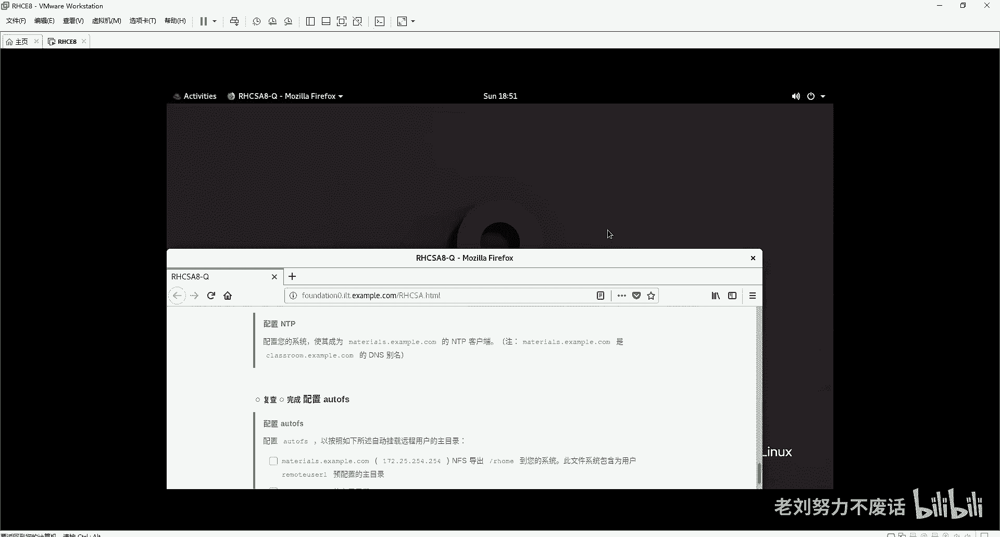

就没有问题，即便说你就是如果你要是愿意相信，说老刘那边是都做错了，那也可以了，那么也是246分，你也能考试通过，但是我相信我是300分的水平好。

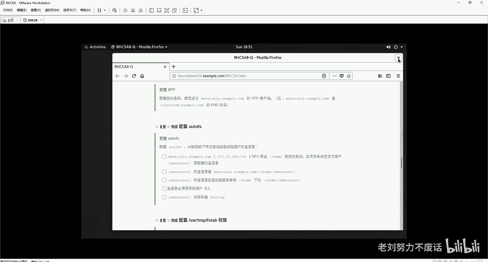

现在看来我们就讲完了，这就是大家挺过瘾的吧，啊是3C关了视频啊，休息会儿啊，徐州去喝一杯水，然后或者去找会眼睛啊，躺着先去喘口气，去，待会打开另外一个视频，我给大家讲HCE就有点难度了。

行大家先好好休息吧，七点多我也开始讲课了。

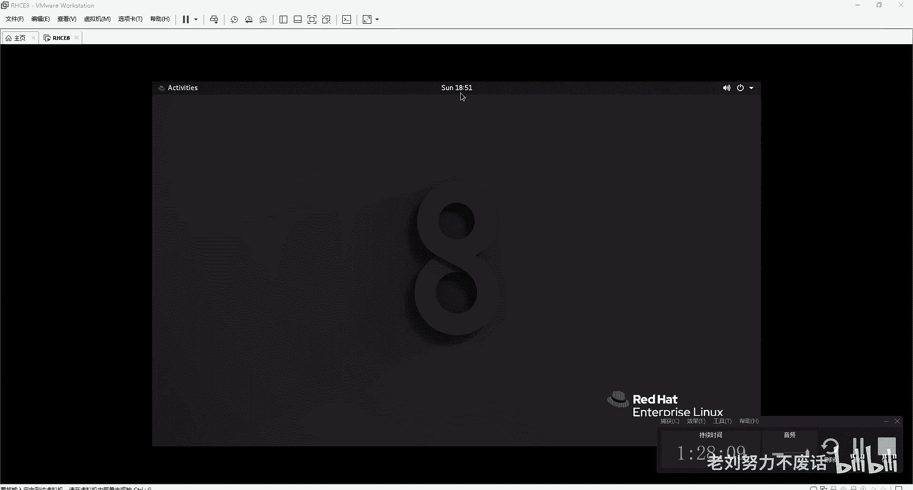