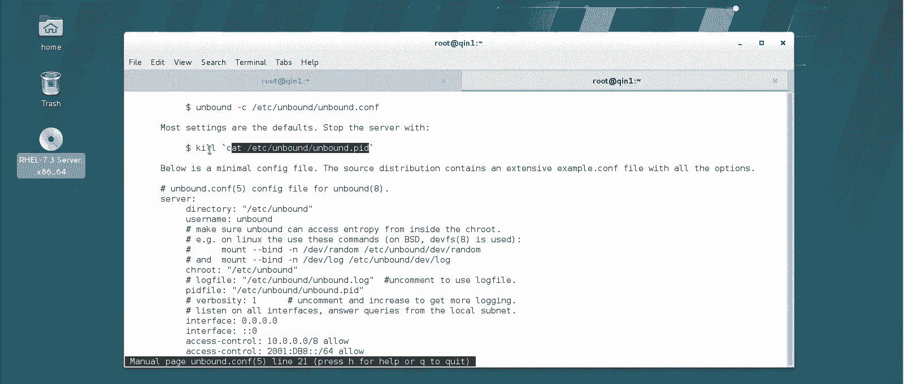
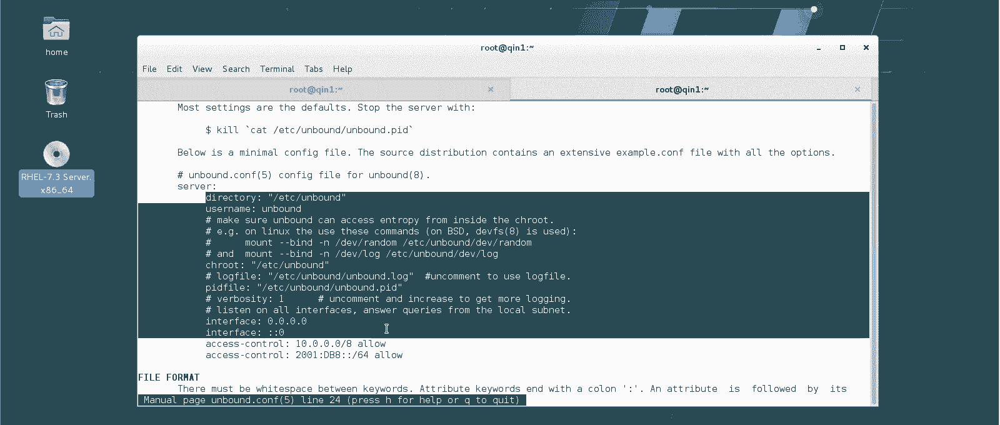
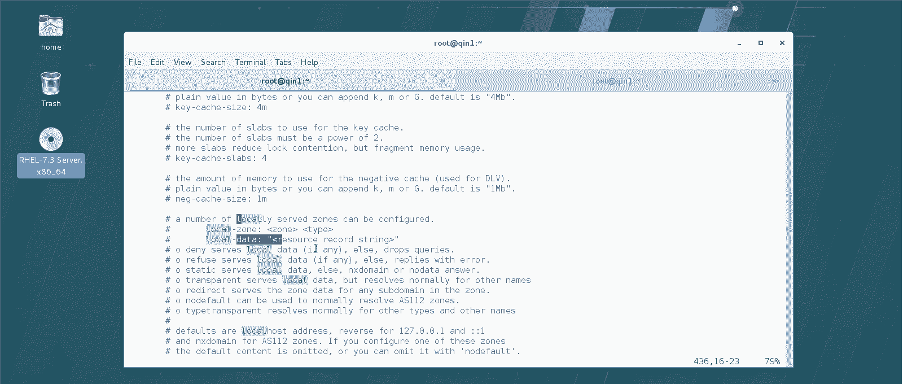
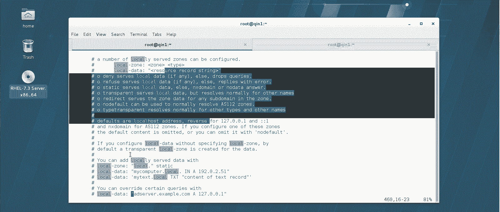
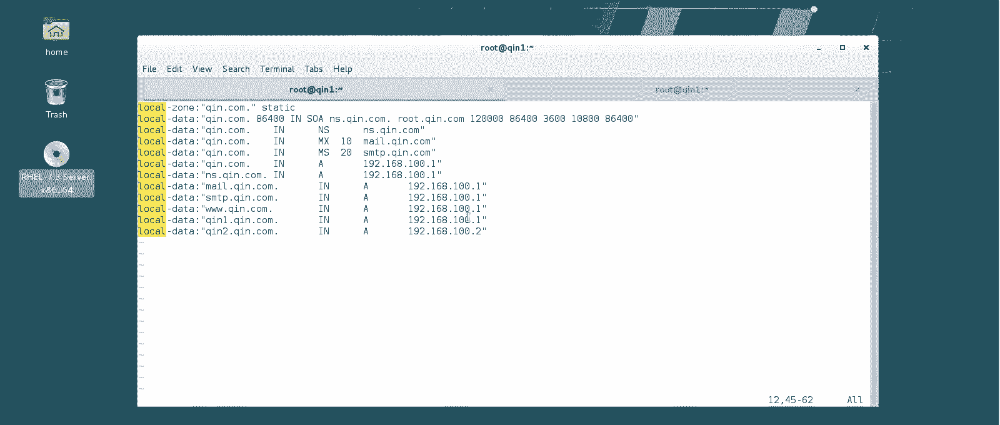

# Linux实战中级篇：10：DNS服务器(二) 🖥️


在本节课中，我们将学习如何配置一个实际的DNS服务器。上一节我们介绍了DNS的理论基础，本节中我们来看看如何安装和配置一个名为`unbound`的DNS服务器软件，并为其添加自定义的域名解析记录。

## 安装与启动服务

在生产环境中，常用的DNS服务器软件有`bind`。然而，从RHEL7/CentOS7开始，红帽官方建议使用`unbound`来替代`bind`，因为它更安全。但系统为了兼容性，仍然提供了`bind`的安装包。

以下是安装`unbound`服务的步骤：





1.  使用`yum`命令安装`unbound`软件包。
    ```bash
    yum install -y unbound
    ```
2.  安装完成后，不建议立即启动服务，因为启动时会读取配置文件。可以等所有配置完成后再启动。
3.  启动`unbound`服务，并设置为开机自启。
    ```bash
    systemctl start unbound
    systemctl enable unbound
    ```
4.  检查服务状态，确认其处于运行状态。
    ```bash
    systemctl status unbound
    ```

`unbound`服务对配置文件的书写格式要求非常严格。它自带一个语法检查工具，在修改配置文件后，可以使用以下命令进行检查：
```bash
unbound-checkconf
```

## 修改主配置文件

默认情况下，`unbound`服务只监听本机的53端口，这只能为自身提供DNS解析。为了让它能为网络中的其他计算机提供服务，我们需要修改其主配置文件 `/etc/unbound/unbound.conf`。

以下是需要修改的核心部分：

1.  **开放服务接口**：将服务监听地址改为 `0.0.0.0`，表示监听所有网络接口。
    ```bash
    interface: 0.0.0.0
    ```
2.  **允许访问控制**：修改访问控制规则，允许所有客户端查询。
    ```bash
    access-control: 0.0.0.0/0 allow
    ```
3.  **简化用户认证**：默认配置要求使用特定用户进行查询，这在实际使用中可能带来不便和安全考量。通常我们会注释掉或删除 `username` 相关的配置行，允许任何用户查询。





修改完成后，无需重启服务，配置会自动加载。`unbound`的主配置文件中大部分是注释和默认参数，我们通常只需修改上述几个关键位置。

## 配置本地解析区域

企业内部的DNS服务器需要解析自定义的域名（如 `qin1.qin.com`）。这些本地解析记录需要单独编写配置文件，并放置在 `/etc/unbound/local.d/` 目录下。

我们将创建一个名为 `qin.com.conf` 的文件来定义 `qin.com` 域的解析规则。

以下是配置文件的详细内容与解释：

```bash
server:
    # 定义本地区域“qin.com.”
    local-zone: "qin.com." static

    # 区域数据开始
    local-data: "qin.com. 86400 IN SOA ns.qin.com. admin.qin.com. 2024010101 86400 3600 10800 86400"
    local-data: "qin.com. IN NS ns.qin.com."
    local-data: "qin.com. IN MX 10 mail.qin.com."
    local-data: "qin.com. IN MX 20 smtp.qin.com."
    local-data: "qin.com. IN A 192.168.100.1"

    # 具体主机记录（A记录）
    local-data: "ns.qin.com. IN A 192.168.100.1"
    local-data: "mail.qin.com. IN A 192.168.100.1"
    local-data: "smtp.qin.com. IN A 192.168.100.1"
    local-data: "www.qin.com. IN A 192.168.100.1"
    local-data: "qin1.qin.com. IN A 192.168.100.1"
    local-data: "qin2.qin.com. IN A 192.168.100.2"
```

**核心概念解析**：

*   **SOA记录**：起始授权机构记录，定义了域的管理参数。
    *   `86400`：生存时间（TTL），表示记录可缓存86400秒（1天）。
    *   `ns.qin.com.`：该域的主DNS服务器。
    *   `admin.qin.com.`：管理员邮箱（`@`符号用点代替）。
    *   `2024010101`：序列号。从DNS服务器通过比较此号判断主DNS记录是否更新，需要同步时此号应递增。
    *   后续三个时间参数（`86400 3600 10800`）定义了从DNS服务器的重试和过期策略。
*   **NS记录**：指定该域的权威DNS服务器。
*   **MX记录**：指定邮件交换服务器，数字`10`、`20`表示优先级。
*   **A记录**：将主机名映射到IPv4地址的最基本记录。

## 总结



本节课中我们一起学习了如何搭建一个基础的DNS服务器。我们首先安装了`unbound`服务，然后通过修改主配置文件使其能够为整个网络提供DNS解析服务。最后，我们创建了自定义的区域配置文件，为`qin.com`域添加了包括SOA、NS、MX、A在内的多种解析记录，实现了内部域名的解析。掌握这些步骤是构建企业级DNS服务的基础。