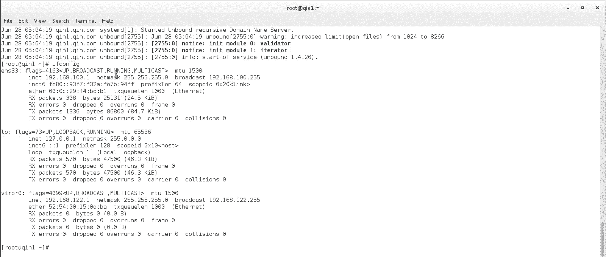
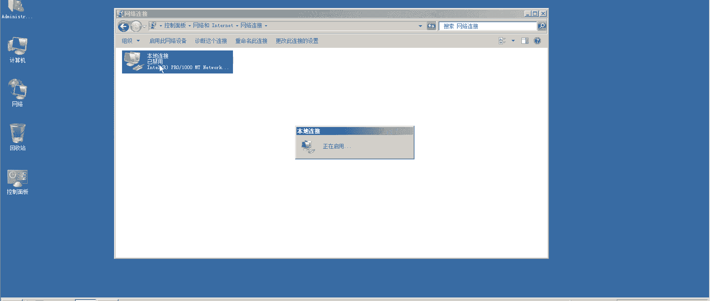
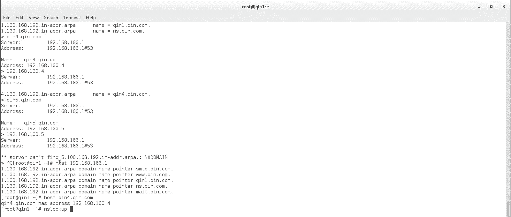
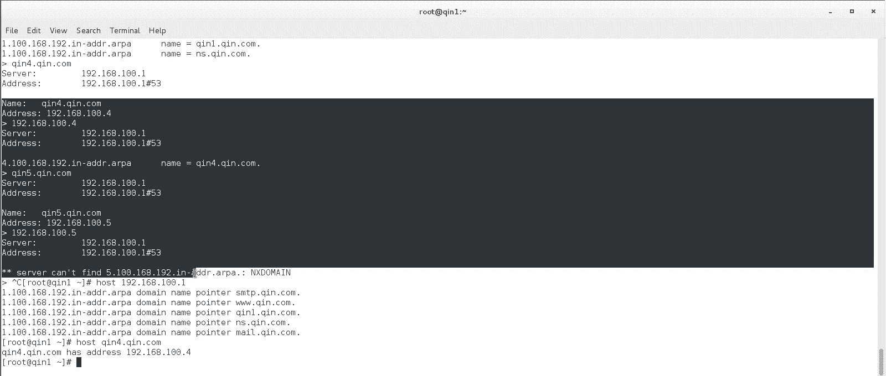
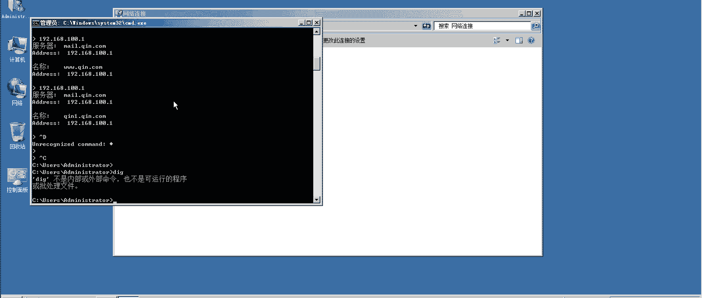
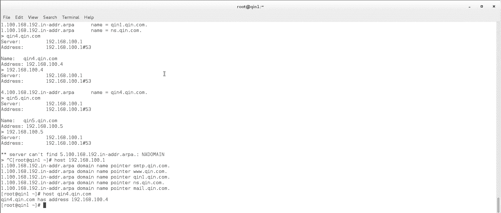

# Linux实战中级篇：11：DNS服务器配置与验证

在本节课中，我们将学习如何配置DNS服务器的正向与反向解析记录，并使用多种工具验证解析结果。我们将重点关注配置文件的语法、服务重启的注意事项以及在不同操作系统上进行测试的方法。

## 配置反向解析记录

上一节我们介绍了正向解析记录的配置，本节中我们来看看如何配置反向解析记录。

反向解析记录同样使用 `local-data` 指令添加，但记录类型为 `PTR`。配置格式如下：
```
local-data: "IP地址.in-addr.arpa. PTR 完整域名."
```
例如，对于IP地址 `192.168.100.1` 和域名 `ns.qin.com`，其反向记录应配置为：
```
local-data: "1.100.168.192.in-addr.arpa. PTR ns.qin.com."
```

**核心原则**：在理想情况下，每一个正向解析记录都应有一个对应的反向解析记录。如果只有正向记录而没有反向记录，则无法完成从IP到域名的反向解析。

以下是需要添加反向解析记录的示例：
*   `192.168.100.1` 对应 `ns.qin.com.`
*   `192.168.100.1` 对应 `mail.qin.com.`
*   `192.168.100.1` 对应 `smtp.qin.com.`
*   `192.168.100.1` 对应 `www.qin.com.`
*   `192.168.100.2` 对应 `qin2.qin.com.`
*   `192.168.100.3` 对应 `qin3.qin.com.`



**书写规范**：在生产环境中，建议使用完整的域名（以点结尾），例如 `qin.com.` 而非 `qin.com`，这符合更标准的DNS配置规则。

## 语法检查与服务重启




配置文件修改完成后，必须进行语法检查并重启服务。

使用以下命令检查配置文件语法：
```bash
named-checkconf
```
该命令能相对准确地指出配置文件的语法错误行号。

即使语法检查通过（`no error`），在首次大规模添加解析记录后重启 `named` 服务时，仍可能遇到服务启动失败（`failed`）的情况。这是 `named` 服务的一个已知问题。

**解决方法**：如果服务启动失败，执行一次系统重启（`reboot`）通常可以解决此问题。

## 解析记录验证

服务配置并成功启动后，需要在客户端验证DNS解析是否生效。我们拥有多台测试机：`qin1` (192.168.100.1， DNS服务器)、`qin2` (192.168.100.2)、一台Windows虚拟机 (192.168.100.3)，它们的DNS均指向 `192.168.100.1`。

以下是几种常用的DNS解析测试命令：

**1. ping命令**
`ping` 命令可以快速测试域名是否能解析到IP地址，但它要求目标主机必须在线才能显示“连通”状态。
```bash
ping qin1.qin.com
```

**2. nslookup命令（推荐）**
`nslookup` 是跨平台（Windows/Linux）的DNS查询工具，能清晰显示解析使用的服务器和返回的结果，且不依赖目标主机是否在线。
```bash
# 正向解析查询
nslookup qin1.qin.com
# 反向解析查询
nslookup 192.168.100.1
```





**3. host命令**
`host` 命令专门用于DNS查询，同样可以进行正向和反向解析。
```bash
# 反向解析查询
host 192.168.100.1
```

**验证示例**：
*   查询仅有正向记录（`qin5.qin.com` -> `192.168.100.5`）的域名：正向解析成功，反向解析失败（`server can't find 5.100.168.192.in-addr.arpa`）。
*   查询一个网络中不存在的域名（如 `qin4.qin.com`）：`nslookup` 能正确返回其IP地址（`192.168.100.4`），但 `ping` 命令会显示目标不可达。这证明了DNS解析与主机是否在线无关。

## 客户端DNS配置与临时修改


在Linux客户端，DNS服务器地址通常配置在网络配置文件中（如 `/etc/sysconfig/network-scripts/ifcfg-eth0`）。系统会将该配置写入 `/etc/resolv.conf` 文件。


**重要提示**：直接修改 `/etc/resolv.conf` 文件中的 `nameserver` 配置会立即生效，但系统重启或网络服务重启后，该文件可能会被重新生成，覆盖你的修改。

如果需要临时更改DNS服务器，可以编辑 `/etc/resolv.conf`。若要永久生效，应修改网卡配置文件。

Windows客户端的验证方式相同，在命令提示符（CMD）中使用 `nslookup` 命令即可。



## 实验总结


本节课中我们一起学习了DNS服务器配置的核心实践：
1.  **配置反向解析**：学习了 `PTR` 记录的配置语法，理解了正向与反向记录的对应关系。
2.  **服务管理**：掌握了使用 `named-checkconf` 检查配置，并了解了首次大规模修改配置后可能需要重启系统以使服务正常运行的注意事项。
3.  **解析验证**：熟悉了 `ping`、`nslookup` 和 `host` 命令在DNS测试中的应用场景与区别，其中 `nslookup` 因其跨平台和功能清晰被推荐为首选工具。
4.  **客户端配置**：了解了Linux客户端DNS设置的持久化位置（网卡配置文件）与临时生效位置（`/etc/resolv.conf`）。




通过本实验，你成功搭建了一个主DNS服务器，并验证了其他客户端能够通过它正确进行域名解析。