# Linux实战中级篇：12：配置辅助（缓存）DNS服务器 🖥️

在本节课中，我们将学习如何配置一台辅助（缓存）DNS服务器。在生产环境中，仅有一台主DNS服务器可能面临巨大的客户端查询压力。因此，我们需要部署辅助DNS服务器来分担负载，共同对外提供服务。

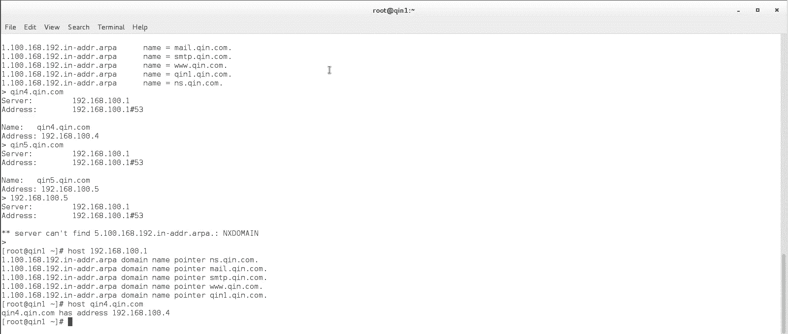

上一节我们介绍了主DNS服务器的配置，本节中我们来看看如何将另一台服务器（例如“琴2”）配置为辅助DNS服务器。

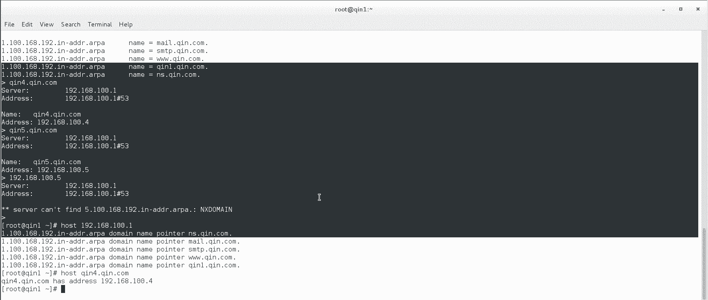


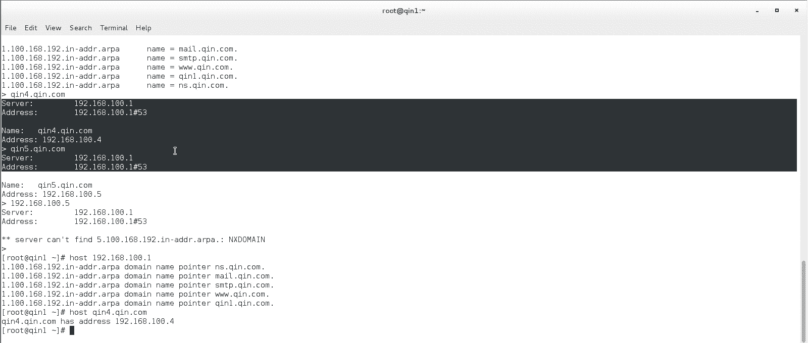

## 辅助DNS服务器的工作原理


辅助DNS服务器本身不存储原始的域名解析记录。它的工作流程如下：
1.  首先，辅助DNS服务器需要将其自身的DNS指向主DNS服务器。
2.  当客户端向辅助DNS发起查询请求时，如果辅助DNS的缓存中没有相应记录，它会将请求**转发**给主DNS服务器。
3.  主DNS服务器返回解析结果后，辅助DNS会将该结果**缓存**下来。
4.  之后，当其他客户端再次查询相同记录时，辅助DNS可以直接使用缓存的结果进行响应，从而减轻主服务器的压力并提高响应速度。

## 配置步骤

以下是配置辅助DNS服务器的具体步骤。

### 1. 安装与基础配置

首先，在辅助DNS服务器（琴2）上安装 `unbound` 服务，并进行与主DNS类似的基础配置。

```bash
# 安装 unbound
yum install -y unbound

# 启用并启动 unbound 服务
systemctl enable unbound
systemctl start unbound
```

配置 `unbound` 服务监听所有网络接口并允许所有客户端访问。

```bash
# 编辑 unbound 主配置文件
vim /etc/unbound/unbound.conf

# 找到并修改以下行，取消注释并设置为：
interface: 0.0.0.0
access-control: 0.0.0.0/0 allow
```

### 2. 允许域信息的安全传输

为了让主DNS和辅助DNS之间能够传输特定域（如 `qin.com`）的解析记录，需要在**两台服务器**的配置中都启用安全传输选项。

在主DNS服务器（琴1）和辅助DNS服务器（琴2）上，均需进行如下配置：

```bash
# 在配置文件中搜索并找到类似以下行
# domain-insecure: "example.com"

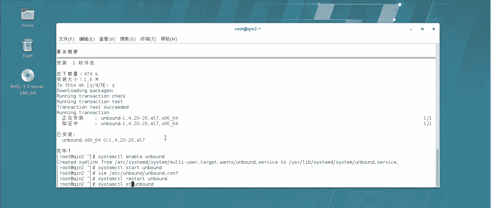

# 取消注释，并将其修改为目标域
domain-insecure: "qin.com"
```

修改后，重启两台服务器的 `unbound` 服务以使配置生效。


```bash
systemctl restart unbound
# 检查服务状态，确保运行正常
systemctl status unbound
```

**注意**：首次修改配置后重启 `unbound` 服务，有时可能会启动失败。如果遇到此情况，可以尝试重启服务器，后续通常不会再出现此问题。

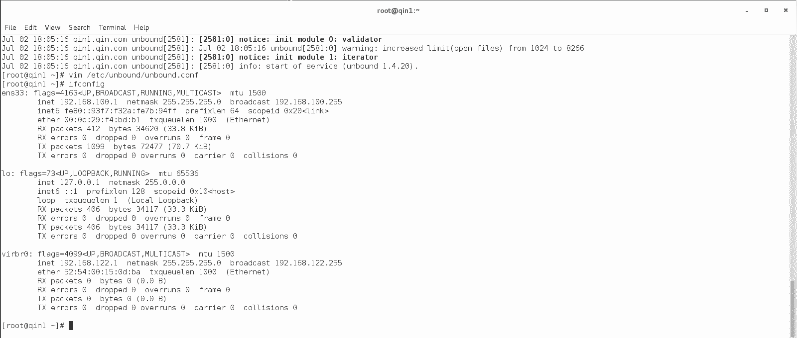

### 3. 配置转发规则

这是辅助DNS服务器的核心配置。我们需要告诉辅助DNS：当本地没有缓存记录时，应将所有查询请求转发到主DNS服务器。

在辅助DNS服务器（琴2）的配置文件中，添加或修改以下转发规则：

```bash
# 在配置文件中找到或添加以下行
forward-zone:
    name: "."               # “.” 表示转发所有域的查询
    forward-addr: 192.168.100.1  # 主DNS服务器的IP地址（例如琴1的IP）
```

这三行配置的含义是：对于任何DNS查询请求（`name: "."`），如果本地没有记录，则一律转发到IP为 `192.168.100.1` 的主DNS服务器进行处理。

### 4. 最终重启与验证

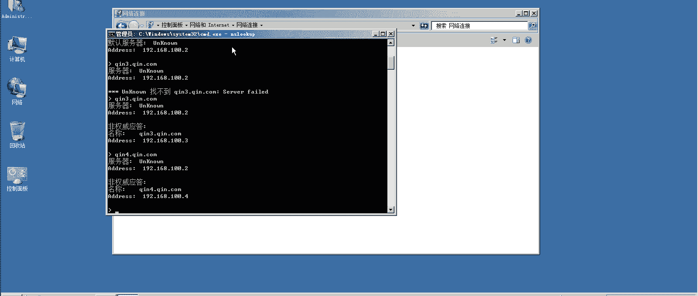

完成所有配置后，再次重启辅助DNS的 `unbound` 服务。

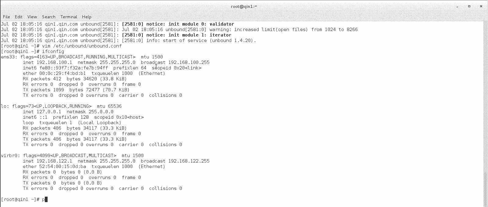

```bash
systemctl restart unbound
systemctl status unbound  # 确认服务状态为 active (running)
```

## 功能测试 🧪

现在，我们来验证辅助DNS服务器是否工作正常。

1.  **修改客户端DNS设置**：将一台测试客户端（如一台Windows机器或另一台Linux服务器）的DNS服务器地址，从主DNS（琴1）改为辅助DNS（琴2）的IP地址。
2.  **首次解析测试**：在客户端上使用 `nslookup` 命令解析一个域名，例如 `qin3.qin.com`。
    *   **现象**：辅助DNS首次收到此查询，本地无缓存，它会将请求转发给主DNS。主DNS返回正确IP，辅助DNS将其缓存并返回给客户端。此时解析成功。
3.  **缓存生效测试**：在客户端上再次解析 `qin3.qin.com` 或刚才解析过的 `qin4.qin.com`。
    *   **现象**：辅助DNS会直接从缓存中返回结果，响应速度非常快。
4.  **主DNS故障模拟测试**：此时，将主DNS服务器（琴1）关机。
    *   **再次解析已缓存域名**（如 `qin3.qin.com`）：解析**成功**，因为辅助DNS的缓存中仍有该记录。
    *   **解析未缓存的新域名**（如 `qin1.qin.com`）：解析**失败**或超时，因为主DNS已关机，辅助DNS无法获取新记录，而本地又无缓存。

这个测试清晰地展示了辅助DNS的缓存机制和故障转移能力：它能有效分担主DNS的查询压力，并在主DNS短时故障时，对已缓存的记录继续提供服务。

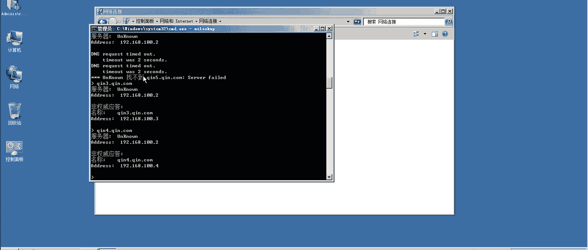

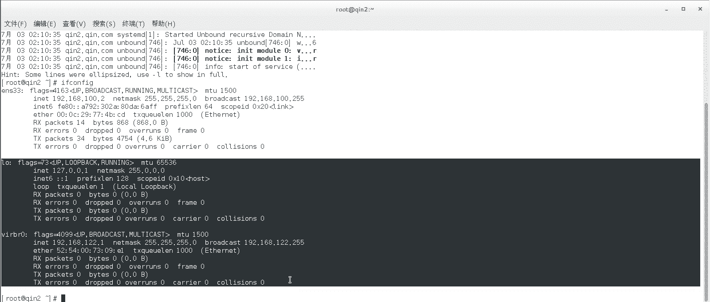

## 总结

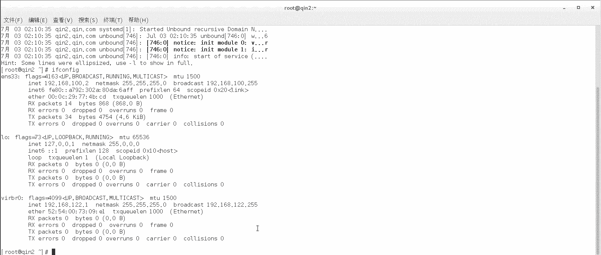

本节课中我们一起学习了辅助（缓存）DNS服务器的配置。我们了解到：
*   辅助DNS通过**转发查询**和**本地缓存**来工作。
*   配置关键点包括：**允许域安全传输**（`domain-insecure`）和**设置转发规则**（`forward-zone`）。
*   辅助DNS能提升DNS服务的**可靠性**和**响应效率**，是生产环境中常见的部署架构。

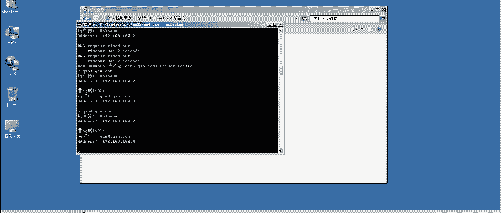

通过本实验，你已经掌握了搭建一个主辅协作的DNS服务集群的基本方法。