# Linux实战中级篇：13：DHCP服务器(一) 🖧


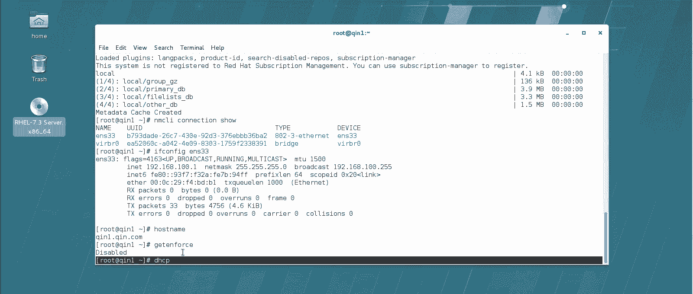

在本节课中，我们将要学习DHCP服务器的基本概念、工作原理以及如何在Linux系统上搭建一个简单的DHCP服务器。DHCP是网络管理中自动分配IP地址等网络配置信息的关键服务，掌握它对于管理企业网络至关重要。

## 概述

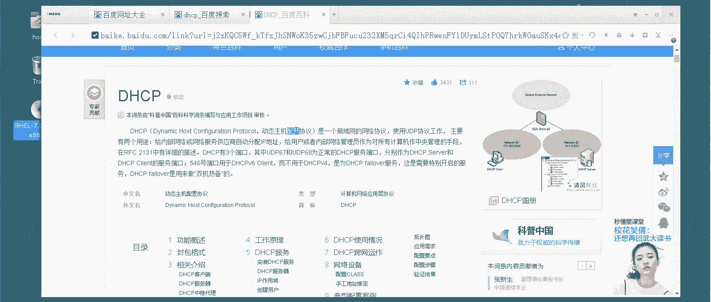

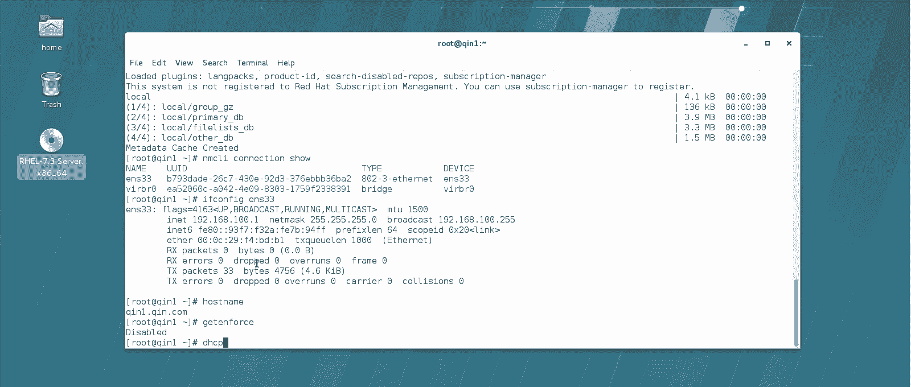

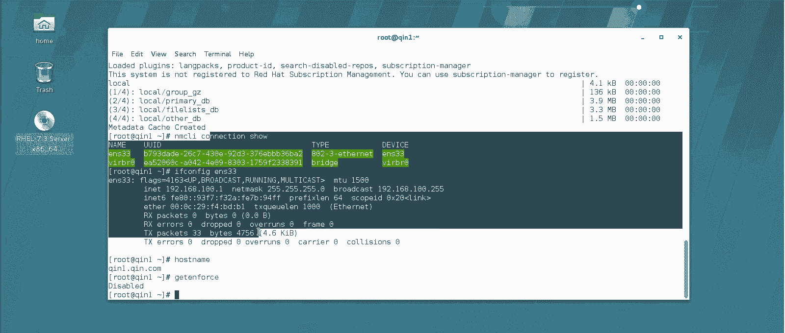

DHCP服务器在生产一线应用非常广泛。它的主要功能是自动为网络中的计算机（主机）配置IP地址、DNS服务器、网关等网络信息，从而避免手动配置带来的繁琐和潜在冲突。

## DHCP基本概念

上一节我们介绍了DHCP服务器的概述，本节中我们来看看它的具体定义和工作原理。

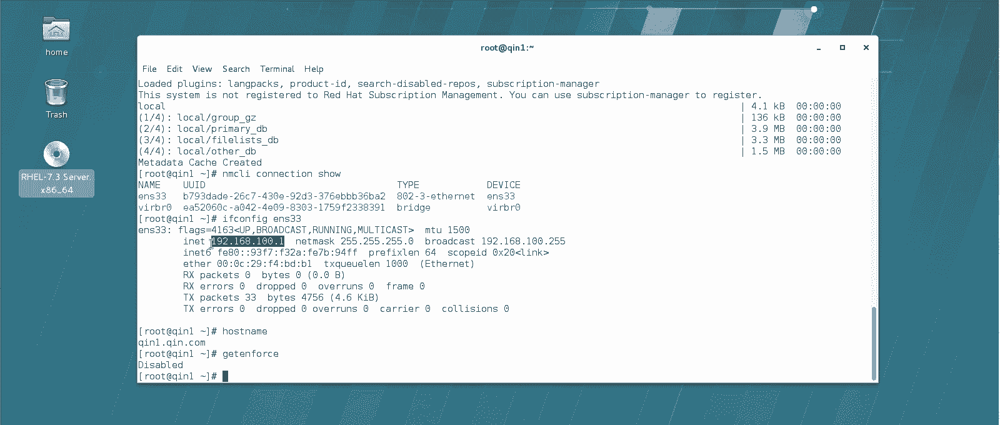

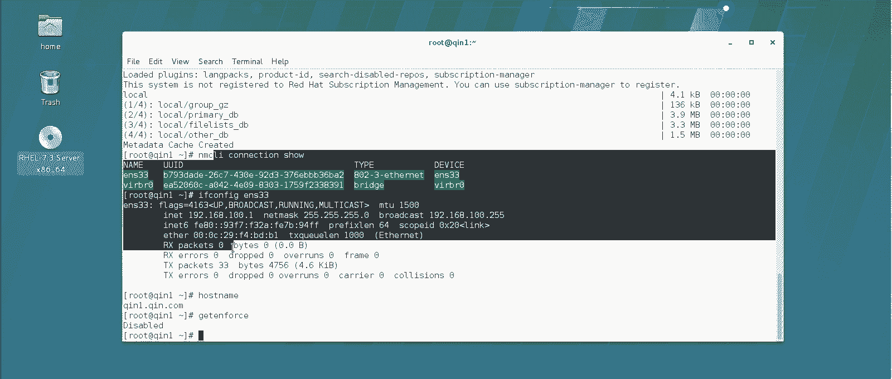

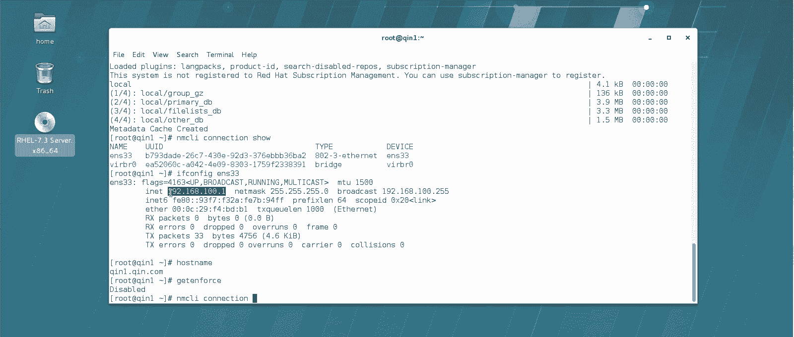

DHCP是**Dynamic Host Configuration Protocol**（动态主机配置协议）的缩写。在企业网络中，为主机配置网络信息通常有两种方式。

以下是两种配置方式的对比：

*   **手动配置**：通过命令（如`nmcli`）或图形界面手动设置每台主机的网络信息。
    *   **缺点1**：当网络中计算机数量庞大（如成千上万台）时，手动配置效率低下且容易导致IP地址冲突。
    *   **缺点2**：配置人员需要具备相应的技术能力，这对非技术人员（如财务人员）可能存在困难。
*   **自动配置（DHCP）**：通过DHCP服务器动态、自动地为网络中的所有主机分配网络配置信息。

因此，在生产环境中，我们尽可能使用DHCP来自动配置，以应对主机数量多、系统类型杂（Linux/Windows）的情况。

## DHCP工作原理

理解了DHCP的作用后，我们来看看它是如何工作的。其核心是一个“分配-租用”的过程。

首先，网络中必须有一台DHCP服务器。这台服务器上定义了一个**地址池**，例如IP地址范围 `192.168.100.30` 到 `192.168.100.129`。服务器负责从这个池中分配IP地址。分配的IP地址是有**租约时间**的，例如一天。

以下是DHCP的工作过程：

1.  **发现（Discover）**：没有IP地址的客户端启动后，会通过UDP协议向网络广播一条消息（发送到`255.255.255.255:67`），询问：“谁能提供IP地址？”
2.  **提供（Offer）**：DHCP服务器（监听`67`端口）收到广播后，会从地址池中选取一个可用的IP地址，通过UDP广播（发送到`255.255.255.255:68`）回复客户端：“我可以提供IP地址X。”
3.  **请求（Request）**：客户端收到一个或多个Offer后，会选择其中一个，并再次广播一条消息，声明：“我将使用服务器A提供的IP地址X。”
4.  **确认（Acknowledge）**：被选中的DHCP服务器最终发送一个确认报文，正式将IP地址X租给该客户端，并附上租约时间、网关、DNS等完整信息。

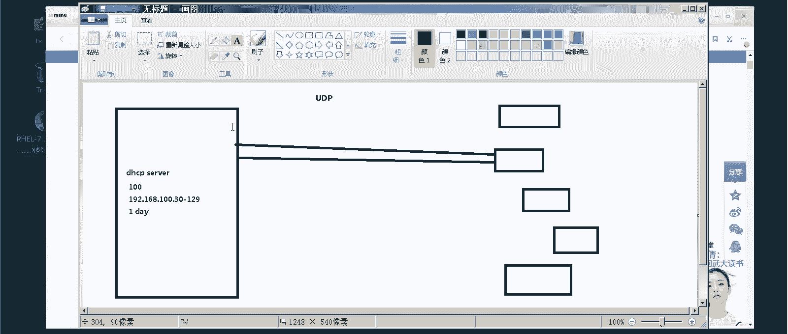

关于**租约更新**：
*   在租约时间达到50%时，客户端会主动向DHCP服务器发送请求，申请续租。
*   如果服务器同意，租约时间将重置为完整周期（如一天）。
*   如果此时联系失败（如网络故障），客户端在租约达到87.5%时会再次尝试续租。
*   如果续租始终失败，当租约到期（100%）时，客户端必须释放该IP地址，并会获得一个特殊的`169.254.x.x`（APIPA）地址。

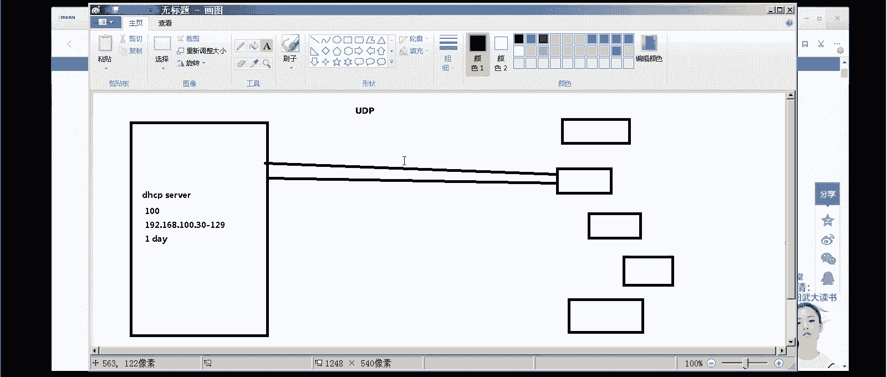

关于**地址分配**：
*   默认情况下，服务器按地址池顺序分配IP。
*   如果地址池中的所有IP都已租出，新客户端将无法获得有效IP，同样会得到`169.254.x.x`地址。
*   DHCP支持**IP与MAC地址绑定**，可以为特定主机（如老板的电脑）固定分配同一个IP（如`192.168.100.88`）。
*   服务器会记录客户端的租用历史。当客户端再次请求时，如果其之前用过的IP可用，服务器会优先分配同一个IP给该客户端。

## 搭建DHCP服务器实验

理论讲完，接下来我们进行实战。本节中我们将在CentOS 7系统上安装并配置一个基础的DHCP服务器。

### 实验环境准备

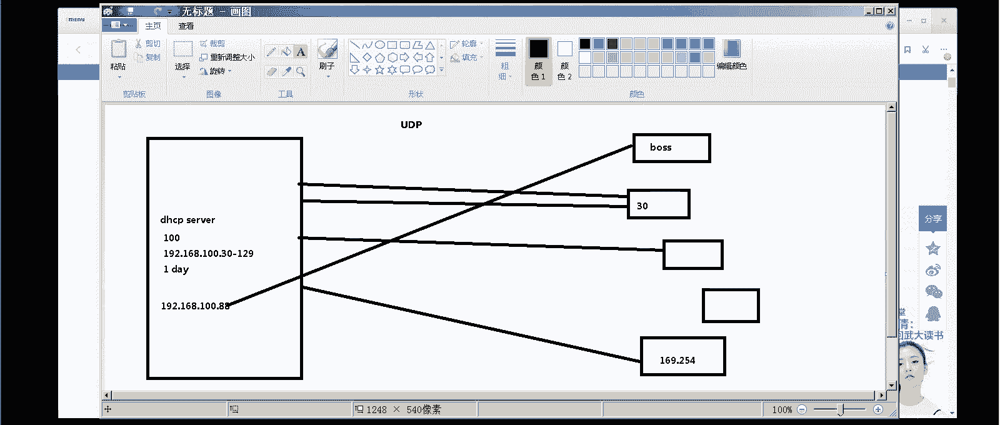

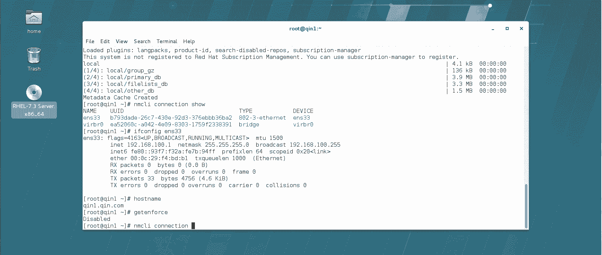

我们使用一台Linux服务器（例如主机名为`qianyi`）作为DHCP服务器。**重要**：DHCP服务器本身的IP地址应设置为静态。

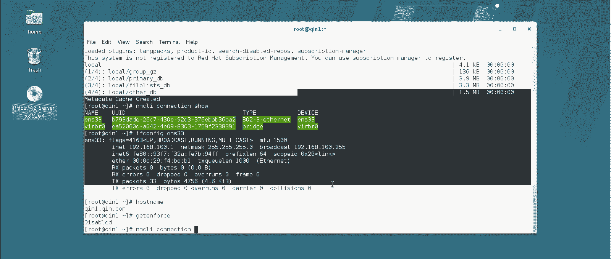

假设服务器IP已固定为 `192.168.100.1`。

### 安装与启动DHCP服务

以下是安装和启用DHCP服务的步骤：

1.  安装DHCP软件包：`yum install -y dhcp`
2.  设置服务开机自启：`systemctl enable dhcpd`
3.  尝试启动服务：`systemctl start dhcpd`（此时启动会失败，因为尚未配置）

### 配置DHCP服务

DHCP服务的配置文件是 `/etc/dhcp/dhcpd.conf`。初始文件内容多为注释。其配置语法要求极为严格，任何错误都会导致服务无法启动。

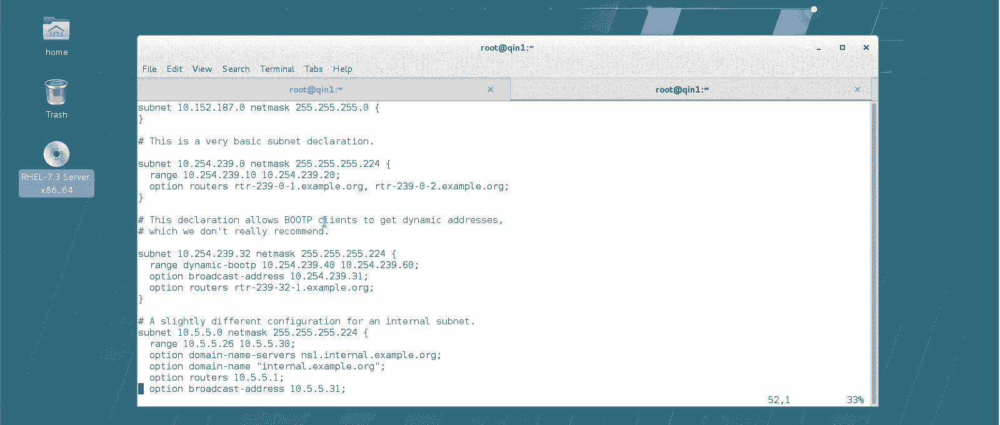

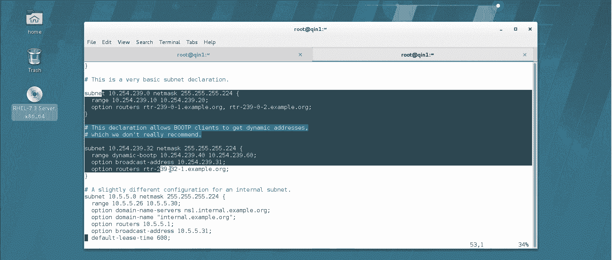

一个可靠的配置方法是使用系统提供的示例配置。我们可以查看 `/usr/share/doc/dhcp-4.2.5/dhcpd.conf.example` 文件（版本号`4.2.5`可能不同），其中包含详细的配置段落。

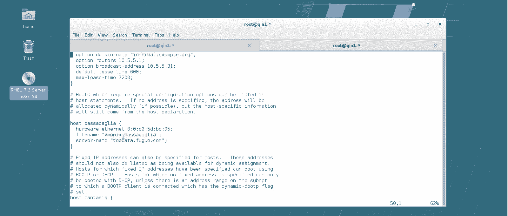

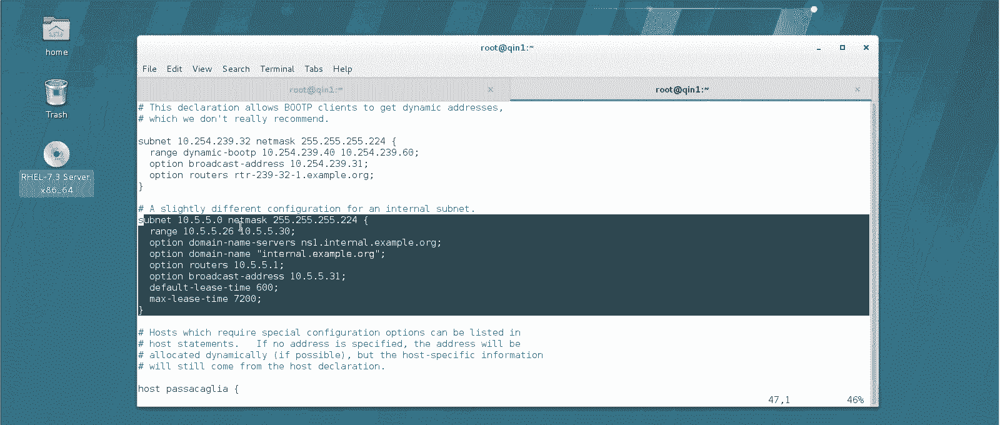

以下是创建一个基本DHCP作用域的配置步骤：

1.  编辑配置文件：`vim /etc/dhcp/dhcpd.conf`
2.  清空原有内容，粘贴以下示例配置并进行修改：
    ```bash
    subnet 192.168.100.0 netmask 255.255.255.0 {
      range 192.168.100.30 192.168.100.60;
      option domain-name-servers 192.168.100.1;
      option domain-name “qidian.com”;
      option routers 192.168.100.1;
      option broadcast-address 192.168.100.255;
      default-lease-time 3600;
      max-lease-time 7200;
    }
    ```
    *   `subnet` 和 `netmask`：定义要分配IP的网络段。
    *   `range`：定义地址池的范围（`30`到`60`）。
    *   `option domain-name-servers`：指定DNS服务器地址。
    *   `option domain-name`：指定域名。
    *   `option routers`：指定默认网关。
    *   `option broadcast-address`：指定广播地址。
    *   `default-lease-time`：默认租约时间（秒），3600秒=1小时。
    *   `max-lease-time`：最大租约时间（秒），7200秒=2小时。生产环境可设置更长（如一天`86400`秒）。

3.  保存并退出编辑器。

### 启动服务与验证

配置完成后，重新启动DHCP服务并检查状态：

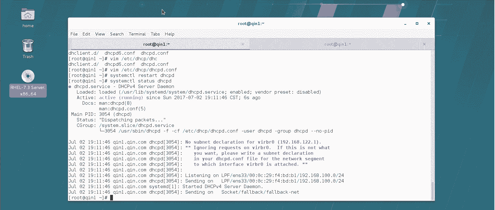

```bash
systemctl restart dhcpd
systemctl status dhcpd
```
如果配置正确，服务状态应显示为 `active (running)`。

现在，可以将网络中的其他客户端（Linux或Windows）的网络配置改为“自动获取IP地址”。

*   **Linux客户端**：修改网卡配置文件（如`/etc/sysconfig/network-scripts/ifcfg-ens33`），将`BOOTPROTO`改为`dhcp`，或使用`nmcli`命令设置。
*   **Windows客户端**：在网络适配器设置中，选择“自动获得IP地址”。

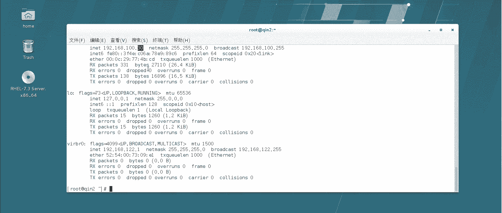

客户端重启网络后，应能自动从DHCP服务器获取到 `192.168.100.30` 至 `.60` 范围内的IP地址。

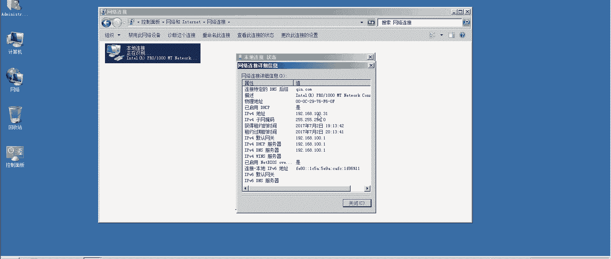

## 总结

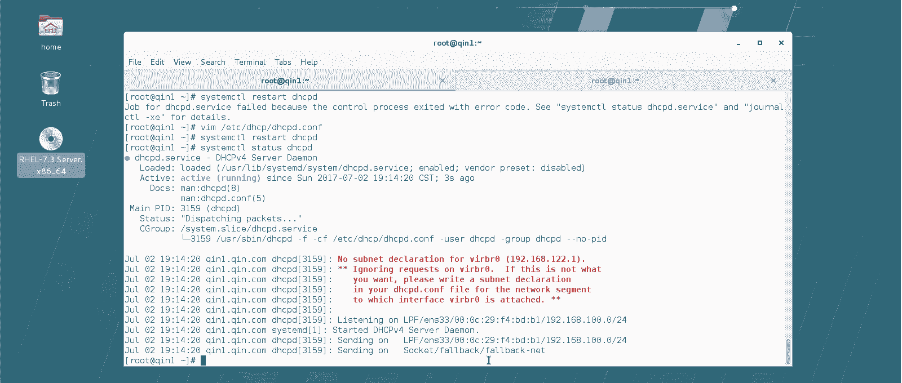

本节课中我们一起学习了DHCP服务器的核心知识。我们首先了解了DHCP协议的作用是自动分配网络配置，以解决手动配置的弊端。然后，我们深入探讨了DHCP的四个工作阶段（发现、提供、请求、确认）以及IP地址租用和续约的机制。最后，我们通过实战演练，在CentOS 7系统上成功安装、配置并启动了一个基础的DHCP服务器，并验证了其为客户端自动分配IP地址的功能。记住，DHCP配置文件的书写必须非常精确，任何错误都会导致服务启动失败。